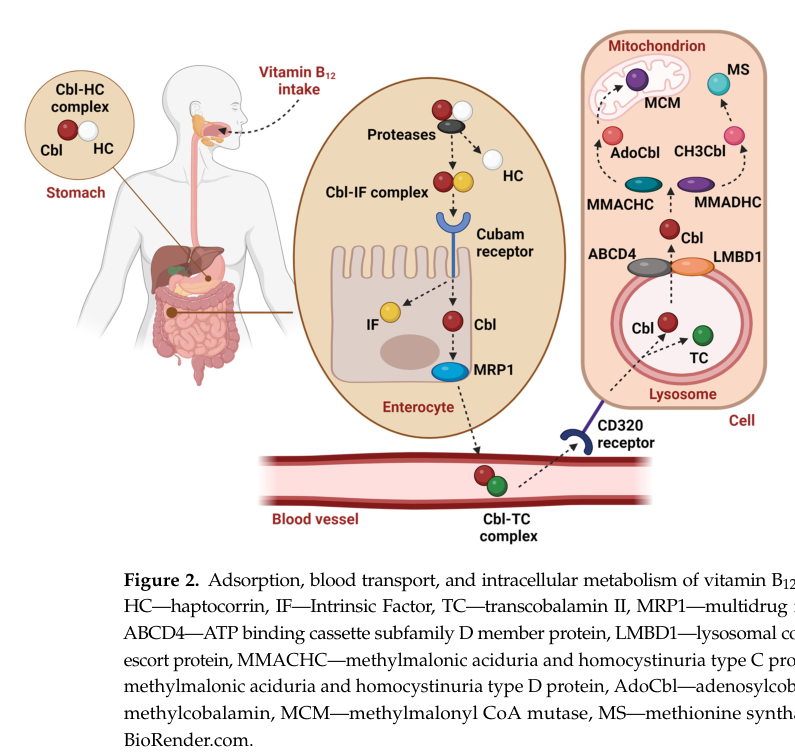

## Question

# Disease Characteristics Research Template

## Target Disease
- **Disease Name:** Hereditary intrinsic factor deficiency
- **MONDO ID:**  (if available)
- **Category:** Mendelian

## Research Objectives

Please provide a comprehensive research report on **Hereditary intrinsic factor deficiency** covering all of the
disease characteristics listed below. This report will be used to populate a disease knowledge
base entry. Be thorough and cite primary literature (PMID preferred) for all claims.

For each section, **suggested databases/resources** are listed. These are the first places
you should search for information on each topic.

---

### 1. Disease Information
> **Search first:** OMIM, Orphanet, ICD-10/ICD-11, MeSH, PubMed

- What is the disease? Provide a concise overview.
- What are the key identifiers? (OMIM, Orphanet, ICD-10/ICD-11, MeSH, Mondo)
- What are the common synonyms and alternative names?
- Is the information derived from individual patients (e.g., EHR) or aggregated disease-level resources?

### 2. Etiology

- **Disease Causal Factors**: What are the primary causes? (genetic, environmental, infectious, mechanistic)
- **Risk Factors**:
  > **Search first:** PubMed, Cochrane Library, UpToDate, clinical guidelines, ClinVar, ClinGen, GWAS Catalog, PheGenI, CTD, CDC, WHO, epidemiological databases
  - Genetic risk factors (causal variants, susceptibility loci, modifier genes)
  - Environmental risk factors (toxins, lifestyle, occupational exposures, age, sex, family history)
- **Protective Factors**:
  > **Search first:** PubMed, Cochrane Library, clinical trial databases, GWAS Catalog, gnomAD, WHO, CDC, nutrition databases
  - Genetic protective factors (protective variants, modifier alleles)
  - Environmental protective factors (diet, lifestyle, exposures that reduce risk)
- **Gene-Environment Interactions**: How do genetic and environmental factors interact to influence disease?
  > **Search first:** CTD, PubMed, PheGenI, GxE databases

### 3. Phenotypes
> **Search first:** HPO (Human Phenotype Ontology), OMIM, Orphanet, PubMed, clinicaltrials.gov, MedDRA, SNOMED CT, DECIPHER, LOINC

For each phenotype, provide:
- **Phenotype type**: symptoms, clinical signs, physical manifestations, behavioral changes, or laboratory abnormalities
  > For symptoms/signs: HPO, OMIM, Orphanet, PubMed
  > For behavioral changes: HPO, DSM, RDoC (Research Domain Criteria), PubMed
  > For laboratory abnormalities: LOINC, SNOMED CT, LabTests Online, PubMed
- **Phenotype characteristics**:
  > **Search first:** OMIM, Orphanet, HPO, PubMed
  - Age of symptom onset (neonatal, childhood, adult-onset, late-onset)
  - Symptom severity (mild, moderate, severe, variable)
  - Symptom progression (stable, progressive, episodic, fluctuating)
  - Frequency among affected individuals (percentage or qualitative)
- **Quality of life impact**: Effects on daily functioning and well-being (per-phenotype when possible)
  > **Search first:** EQ-5D database, SF-36, WHO QOL databases, PubMed
- Suggest HPO (Human Phenotype Ontology) terms for each phenotype

### 4. Genetic/Molecular Information

- **Causal Genes**: Gene mutations or chromosomal abnormalities responsible for disease (gene symbols, OMIM IDs)
  > **Search first:** OMIM, ClinVar, HGMD, Ensembl, NCBI Gene
- **Pathogenic Variants**:
  - Affected genes (gene symbols, HGNC IDs)
    > **Search first:** OMIM, NCBI Gene, Ensembl, HGNC, UniProt, GeneCards
  - Variant classification (pathogenic, likely pathogenic, VUS per ACMG/AMP guidelines)
    > **Search first:** ClinVar, ClinGen, ACMG/AMP guidelines, VarSome
  - Variant type/class (missense, frameshift, nonsense, splice-site, structural)
  - Allele frequency in population databases
    > **Search first:** gnomAD, 1000 Genomes, ExAC, TOPMed, dbSNP
  - Somatic vs germline origin
    > **Search first:** COSMIC (somatic), ClinVar, ICGC, TCGA
  - Functional consequences (loss of function, gain of function, dominant negative)
- **Modifier Genes**: Genes that modify disease severity or expression
- **Epigenetic Information**: DNA methylation, histone modifications, chromatin changes affecting disease
  > **Search first:** ENCODE, Roadmap Epigenomics, MethBase, DiseaseMeth
- **Chromosomal Abnormalities**: Large-scale genetic changes (aneuploidy, translocations, inversions)
  > **Search first:** DECIPHER, ClinVar, ECARUCA, UCSC Genome Browser

### 5. Environmental Information

- **Environmental Factors**: Non-genetic contributing factors (toxins, radiation, pollution, occupational exposure)
  > **Search first:** CTD (Comparative Toxicogenomics Database), TOXNET, PubMed, EPA databases
- **Lifestyle Factors**: Behavioral factors (smoking, diet, exercise, alcohol consumption)
  > **Search first:** CDC databases, WHO, PubMed, NHANES
- **Infectious Agents**: If applicable, pathogens causing or triggering disease (bacteria, viruses, fungi, parasites)
  > **Search first:** NCBI Taxonomy, ViPR, BV-BRC, MicrobeDB, GIDEON

### 6. Mechanism / Pathophysiology

- **Molecular Pathways**: Specific signaling cascades or biochemical pathways involved (Wnt, MAPK, mTOR, PI3K-AKT, etc.)
  > **Search first:** KEGG, Reactome, WikiPathways, PathBank, BioCyc
- **Cellular Processes**: Cell-level mechanisms (apoptosis, autophagy, cell cycle dysregulation, inflammation, etc.)
  > **Search first:** Gene Ontology (GO), Reactome, KEGG, PubMed
- **Protein Dysfunction**: How protein structure or function is altered (misfolding, aggregation, loss of function, gain of function)
  > **Search first:** UniProt, PDB (Protein Data Bank), InterPro, Pfam, AlphaFold
- **Metabolic Changes**: Alterations in metabolic processes (energy metabolism, lipid metabolism, amino acid metabolism)
  > **Search first:** KEGG, BioCyc, HMDB (Human Metabolome Database), BRENDA
- **Immune System Involvement**: Role of immune response (autoimmunity, immunodeficiency, chronic inflammation)
  > **Search first:** ImmPort, Immunome Database, IEDB, Gene Ontology
- **Tissue Damage Mechanisms**: How tissues/ are injured (oxidative stress, ischemia, fibrosis, necrosis)
  > **Search first:** PubMed, Gene Ontology, Reactome
- **Biochemical Abnormalities**: Specific molecular defects (enzyme deficiencies, receptor dysfunction, ion channel defects)
  > **Search first:** BRENDA, UniProt, KEGG, OMIM, PubMed
- **Epigenetic Changes**: DNA methylation, histone modifications affecting gene expression in disease
  > **Search first:** ENCODE, Roadmap Epigenomics, MethBase, DiseaseMeth
- **Molecular Profiling** (if available):
  - Transcriptomics/gene expression changes
    > **Search first:** GEO (Gene Expression Omnibus), ArrayExpress, GTEx, Human Cell Atlas, SRA
  - Proteomics findings
    > **Search first:** PRIDE, ProteomeXchange, Human Protein Atlas, STRING, BioGRID
  - Metabolomics signatures
    > **Search first:** MetaboLights, Metabolomics Workbench, HMDB, METLIN
  - Lipidomics alterations
    > **Search first:** LIPID MAPS, SwissLipids, LipidHome, Metabolomics Workbench
  - Genomic structural features
    > **Search first:** UCSC Genome Browser, Ensembl, NCBI, dbVar, DGV
- **Advanced Technologies** (if applicable):
  - Single-cell analysis findings (cell-type specific mechanisms, cellular heterogeneity)
    > **Search first:** Human Cell Atlas, Single Cell Portal, GEO, CELLxGENE
  - Spatial transcriptomics findings
    > **Search first:** GEO, Spatial Research, Vizgen, 10x Genomics data
  - Multi-omics integration results
    > **Search first:** TCGA, ICGC, cBioPortal, LinkedOmics, PubMed
  - Functional genomics screens (CRISPR, RNAi)
    > **Search first:** DepMap, GenomeRNAi, PubMed, BioGRID ORCS

For each mechanism, describe:
- The causal chain from initial trigger to clinical manifestation
- Which mechanisms are upstream vs downstream
- What cell types and biological processes are involved
- Suggest GO terms for biological processes and CL terms for cell types

### 7. Anatomical Structures Affected

- **Organ Level**:
  - Primary organs directly affected
  - Secondary organ involvement (complications, secondary effects)
  - Body systems involved (cardiovascular, nervous, digestive, respiratory, endocrine, etc.)
  > **Search first:** Uberon, FMA (Foundational Model of Anatomy), OMIM, HPO, ICD-11, MeSH, SNOMED CT
- **Tissue and Cell Level**:
  - Specific tissue types affected (epithelial, connective, muscle, nervous)
  - Specific cell populations targeted (with Cell Ontology terms)
  > **Search first:** Uberon, Human Protein Atlas, Cell Ontology, Human Cell Atlas, CellMarker, PanglaoDB
- **Subcellular Level**:
  - Cellular compartments involved (mitochondria, nucleus, ER, lysosomes) (with GO Cellular Component terms)
  > **Search first:** Gene Ontology (Cellular Component), UniProt, Human Protein Atlas
- **Localization**:
  - Specific anatomical sites (with UBERON terms)
    > **Search first:** FMA, Uberon, NeuroNames (for brain), SNOMED CT
  - Lateralization (unilateral, bilateral, asymmetric)
    > **Search first:** HPO, clinical literature, imaging databases

### 8. Temporal Development

- **Onset**:
  - Typical age of onset (congenital, pediatric, adult, geriatric)
  - Onset pattern (acute, subacute, chronic, insidious)
  > **Search first:** OMIM, Orphanet, HPO, PubMed
- **Progression**:
  - Disease stages (early, intermediate, advanced, end-stage)
    > **Search first:** Cancer Staging Manual (AJCC), WHO classifications, PubMed
  - Progression rate (rapid, slow, variable)
  - Disease course pattern (episodic, relapsing-remitting, progressive, stable)
  - Disease duration (self-limited, chronic lifelong)
  > **Search first:** Disease registries, longitudinal cohort databases, natural history studies, PubMed, Orphanet, OMIM
- **Patterns**:
  - Remission patterns (spontaneous, treatment-induced)
    > **Search first:** Clinical trial databases, disease registries, PubMed
  - Critical periods (time windows of vulnerability or opportunity for intervention)
    > **Search first:** PubMed, developmental biology databases, clinical guidelines

### 9. Inheritance and Population

- **Epidemiology**:
  - Prevalence (cases per 100,000 at given time)
  - Incidence (new cases per 100,000 per year)
  > **Search first:** Orphanet, CDC, WHO, GBD (Global Burden of Disease), national registries, SEER, disease registries
- **For Genetic Etiology**:
  - Inheritance pattern (AD, AR, X-linked, mitochondrial, multifactorial, polygenic)
    > **Search first:** OMIM, Orphanet, ClinVar, GTR (Genetic Testing Registry)
  - Penetrance (complete, incomplete, age-dependent)
    > **Search first:** ClinVar, OMIM, PubMed, ClinGen
  - Expressivity (variable, consistent)
    > **Search first:** OMIM, ClinVar, PubMed
  - Genetic anticipation (increasing severity in successive generations)
    > **Search first:** OMIM, PubMed (especially for repeat expansion disorders)
  - Germline mosaicism
    > **Search first:** ClinVar, OMIM, genetic counseling literature, PubMed
  - Founder effects (population-specific mutations)
    > **Search first:** gnomAD, population genetics databases, PubMed
  - Consanguinity role
    > **Search first:** OMIM, population studies, genetic counseling resources
  - Carrier frequency
    > **Search first:** gnomAD, carrier screening databases, GeneReviews, GTR
- **Population Demographics**:
  - Affected populations (ethnic or demographic groups with higher prevalence)
    > **Search first:** gnomAD, 1000 Genomes, PAGE Study, PubMed, population registries
  - Geographic distribution (endemic areas, regional variation)
    > **Search first:** WHO, CDC, GBD, Orphanet, geographic epidemiology databases
  - Geographic distribution of specific variants
  - Sex ratio (male:female)
    > **Search first:** Disease registries, OMIM, PubMed, epidemiological databases
  - Age distribution of affected individuals
    > **Search first:** CDC, disease registries, SEER, Orphanet

### 10. Diagnostics

- **Clinical Tests**:
  - Laboratory tests (blood, urine, tissue chemistry, specific enzyme assays)
    > **Search first:** LOINC, LabTests Online, PubMed
  - Biomarkers (proteins, metabolites, genetic markers, circulating biomarkers)
    > **Search first:** FDA Biomarker List, BEST (Biomarkers, EndpointS, and other Tools), PubMed
  - Imaging studies (X-ray, CT, MRI, PET, ultrasound)
    > **Search first:** RadLex, DICOM, Radiopaedia, imaging databases
  - Functional tests (pulmonary function, cardiac stress tests)
    > **Search first:** LOINC, clinical guidelines, PubMed
  - Electrophysiology (EEG, EMG, ECG, nerve conduction studies)
    > **Search first:** LOINC, clinical neurophysiology databases, PubMed
  - Biopsy findings (histopathology, immunohistochemistry)
    > **Search first:** SNOMED CT, College of American Pathologists resources, PubMed
  - Pathology findings (microscopic examination)
    > **Search first:** SNOMED CT, Digital Pathology databases, PubMed
- **Genetic Testing**:
  > **Search first:** GTR (Genetic Testing Registry), GeneReviews, ClinGen
  - Overview of recommended genetic testing approach
  - Whole genome sequencing (WGS) utility
    > **Search first:** GTR, ClinVar, GEL (Genomics England), gnomAD
  - Whole exome sequencing (WES) utility
    > **Search first:** GTR, ClinVar, OMIM, GeneMatcher
  - Gene panels (which panels, which genes)
    > **Search first:** GTR, ClinVar, laboratory-specific databases
  - Single gene testing
    > **Search first:** GTR, ClinVar, OMIM, GeneReviews
  - Chromosomal microarray (CMA)
    > **Search first:** DECIPHER, ClinVar, dbVar, ECARUCA
  - Karyotyping
    > **Search first:** Chromosome Abnormality Database, ClinVar, cytogenetics resources
  - FISH
    > **Search first:** ClinVar, cytogenetics databases, PubMed
  - Mitochondrial DNA testing
    > **Search first:** MITOMAP, MSeqDR, ClinVar, GTR
  - Repeat expansion testing
    > **Search first:** GTR, ClinVar, repeat expansion databases, PubMed
- **Omics-Based Diagnostics** (if applicable):
  - RNA sequencing / transcriptomics
    > **Search first:** GEO, ArrayExpress, GTEx, RNA-seq databases
  - Proteomics
    > **Search first:** PRIDE, ProteomeXchange, FDA Biomarker database
  - Metabolomics
    > **Search first:** MetaboLights, Metabolomics Workbench, HMDB
  - Epigenomics
    > **Search first:** GEO, ENCODE, Roadmap Epigenomics, MethBase
  - Liquid biopsy
    > **Search first:** COSMIC, ClinVar, liquid biopsy databases, PubMed
- **Clinical Criteria**:
  - Standardized diagnostic criteria (DSM, ICD, society guidelines)
    > **Search first:** DSM-5, ICD-11, clinical society guidelines, UpToDate
  - Differential diagnosis (other conditions to rule out, with distinguishing features)
    > **Search first:** DynaMed, UpToDate, clinical decision support systems
- **Screening**:
  - Screening methods for asymptomatic individuals (newborn screening, carrier screening, cascade screening)
    > **Search first:** ACMG recommendations, CDC newborn screening, GTR

### 11. Outcome/Prognosis

- **Survival and Mortality**:
  - Survival rate (5-year, 10-year, overall)
    > **Search first:** SEER, cancer registries, disease-specific registries, PubMed
  - Life expectancy (with and without treatment if applicable)
    > **Search first:** Orphanet, disease registries, actuarial databases, PubMed
  - Mortality rate
    > **Search first:** CDC, WHO, GBD, national mortality databases
  - Disease-specific mortality (deaths directly attributable to disease)
    > **Search first:** Disease registries, CDC Wonder, GBD, PubMed
- **Morbidity and Function**:
  - Morbidity (disease-related disability and health impacts)
    > **Search first:** GBD, WHO, disability databases, PubMed
  - Disability outcomes (long-term functional impairments)
    > **Search first:** ICF (International Classification of Functioning), disability registries
  - Quality of life measures (EQ-5D, SF-36, PROMIS, disease-specific tools)
    > **Search first:** EQ-5D database, SF-36, PROMIS, PubMed
- **Disease Course**:
  - Complications (secondary problems: infections, organ failure, etc.)
    > **Search first:** ICD codes, disease registries, clinical databases, PubMed
  - Recovery potential (likelihood and extent of recovery, with vs without treatment)
    > **Search first:** Natural history studies, rehabilitation databases, PubMed
- **Prediction**:
  - Prognostic factors (age, disease severity, biomarkers, treatment response)
    > **Search first:** Prognostic models databases, clinical calculators, PubMed
  - Prognostic biomarkers (molecular markers predicting disease course)
    > **Search first:** FDA Biomarker database, PubMed, cancer prognostic databases

### 12. Treatment

- **Pharmacotherapy**:
  - Pharmacological treatments (drug names, drug classes, mechanisms of action)
    > **Search first:** DrugBank, RxNorm, ATC classification, DailyMed, FDA databases
  - Pharmacogenomics (how genetic variants affect drug metabolism, efficacy, toxicity)
    > **Search first:** PharmGKB, CPIC (Clinical Pharmacogenetics), FDA Table of PGx Biomarkers
- **Advanced Therapeutics**:
  - Gene therapy (viral vectors, CRISPR, gene replacement, gene editing)
    > **Search first:** ClinicalTrials.gov, FDA gene therapy database, ASGCT resources
  - Cell therapy (stem cell transplant, CAR-T, cellular therapeutics)
    > **Search first:** ClinicalTrials.gov, FDA cell therapy database, FACT standards
  - RNA-based therapies (ASOs, siRNA, mRNA therapies)
    > **Search first:** ClinicalTrials.gov, FDA approvals, PubMed
  - Targeted therapies (treatments directed at specific molecular targets)
    > **Search first:** My Cancer Genome, OncoKB, ClinicalTrials.gov, FDA approvals
  - Immunotherapies (checkpoint inhibitors, monoclonal antibodies)
    > **Search first:** Cancer Immunotherapy Database, FDA approvals, ClinicalTrials.gov
- **Surgical and Interventional**:
  - Surgical interventions (types of surgery, timing, outcomes)
    > **Search first:** CPT codes, surgical registries, clinical guidelines, PubMed
- **Supportive and Rehabilitative**:
  - Supportive care (symptom management, pain control, nutrition)
    > **Search first:** Clinical guidelines, Cochrane Library, PubMed
  - Rehabilitation (physical therapy, occupational therapy, speech therapy)
    > **Search first:** Rehabilitation medicine databases, clinical guidelines, PubMed
- **Experimental**:
  - Experimental treatments in clinical trials (with NCT identifiers if available)
    > **Search first:** ClinicalTrials.gov, EU Clinical Trials Register, WHO ICTRP
- **Treatment Outcomes**:
  - Treatment response rates
    > **Search first:** Clinical trial databases, FDA reviews, systematic reviews, PubMed
  - Side effects and adverse events
    > **Search first:** FDA Adverse Event Reporting System (FAERS), MedWatch, PubMed
- **Treatment Strategy**:
  - Treatment algorithms (clinical pathways, decision trees)
    > **Search first:** Clinical practice guidelines, NCCN Guidelines, UpToDate
  - Combination therapies
    > **Search first:** ClinicalTrials.gov, treatment guidelines, PubMed
  - Personalized medicine approaches (genotype-guided treatment)
    > **Search first:** My Cancer Genome, CIViC, PharmGKB, precision medicine databases

For each treatment, suggest MAXO (Medical Action Ontology) terms where applicable.

### 13. Prevention

- **Prevention Levels**:
  - Primary prevention (preventing disease occurrence: vaccination, risk factor modification)
    > **Search first:** CDC, WHO, USPSTF recommendations, Cochrane Library
  - Secondary prevention (early detection and treatment: screening programs, early intervention)
    > **Search first:** USPSTF, CDC screening guidelines, WHO
  - Tertiary prevention (preventing complications in those with disease)
    > **Search first:** Clinical guidelines, disease management protocols, PubMed
- **Immunization**: Vaccine strategies (if applicable)
  > **Search first:** CDC vaccine schedules, WHO immunization, FDA vaccine database
- **Screening and Early Detection**:
  - Screening programs (population-based: newborn screening, cancer screening)
    > **Search first:** CDC screening programs, USPSTF, cancer screening databases
  - Genetic screening (carrier screening, preimplantation genetic diagnosis, prenatal testing)
    > **Search first:** ACMG recommendations, ACOG guidelines, GTR
  - Risk stratification (identifying high-risk individuals for targeted prevention)
    > **Search first:** Risk prediction models, clinical calculators, PubMed
- **Behavioral Interventions**: Lifestyle modifications to reduce risk
  > **Search first:** CDC, WHO, behavioral intervention databases, Cochrane Library
- **Counseling**: Genetic counseling (risk assessment, family planning guidance)
  > **Search first:** NSGC resources, ACMG guidelines, GeneReviews
- **Public Health**:
  - Public health interventions (sanitation, vector control, health education)
    > **Search first:** CDC, WHO, public health databases, PubMed
  - Environmental interventions (reducing environmental risk factors)
    > **Search first:** EPA databases, WHO environmental health, PubMed
- **Prophylaxis**: Preventive medications or procedures
  > **Search first:** Clinical guidelines, FDA approvals, PubMed

### 14. Other Species / Natural Disease

- **Taxonomy**: Species affected (with NCBI Taxon identifiers)
  > **Search first:** NCBI Taxonomy
- **Breed**: Specific breeds affected (with VBO identifiers if applicable)
  > **Search first:** VBO (Vertebrate Breed Ontology)
- **Gene**: Orthologous genes in other species (with NCBI Gene IDs)
  > **Search first:** NCBI Gene
- **Natural Disease**:
  - Naturally occurring disease in other species (companion animals, wildlife)
    > **Search first:** OMIA (Online Mendelian Inheritance in Animals), VetCompass, PubMed
  - Veterinary relevance and importance in animal health
    > **Search first:** OMIA, veterinary databases, PubMed
- **Comparative Biology**:
  - Comparative pathology (similarities and differences across species)
    > **Search first:** OMIA, comparative pathology databases, PubMed
  - Evolutionary conservation of disease mechanisms
    > **Search first:** HomoloGene, OrthoMCL, Alliance of Genome Resources
- **Transmission** (if applicable):
  - Zoonotic potential
    > **Search first:** CDC zoonotic diseases, WHO zoonoses, GIDEON
  - Cross-species susceptibility
    > **Search first:** NCBI Taxonomy, veterinary databases, PubMed

### 15. Model Organisms

- **Model Types**:
  - Model organism type (mammalian, invertebrate, cellular, in vitro)
    > **Search first:** Alliance of Genome Resources, model organism databases
  - Specific model systems (mouse, rat, zebrafish, Drosophila, C. elegans, yeast, cell lines, organoids, iPSCs)
    > **Search first:** MGI, RGD, ZFIN, FlyBase, WormBase, SGD, ATCC, Cellosaurus
  - Induced models (drug treatment, surgical intervention, environmental manipulation)
    > **Search first:** MGI, model organism databases, PubMed
- **Genetic Models**:
  - Types available (knockout, knock-in, transgenic, conditional, humanized)
    > **Search first:** MGI, IMPC, KOMP, EuMMCR, IMSR
- **Model Characteristics**:
  - Phenotype recapitulation (how well model reproduces human disease features)
    > **Search first:** Model organism databases, comparative studies, PubMed
  - Model limitations (aspects of human disease not captured)
    > **Search first:** Model organism databases, PubMed, review articles
- **Applications**:
  - Research applications (what aspects of disease can be studied)
    > **Search first:** Model organism databases, PubMed
- **Resources**:
  - Model databases
    > **Search first:** MGI, RGD, ZFIN, FlyBase, WormBase, IMSR, EMMA, MMRRC

---

## Citation Requirements

- Cite primary literature (PMID preferred) for all mechanistic and clinical claims
- Prioritize recent reviews and landmark papers
- Include direct quotes from abstracts where possible to support key statements
- Distinguish evidence source types: human clinical, model organism, in vitro, computational

## Output Format

Structure your response as a comprehensive narrative organized by the sections above.
For each section, provide:
- Factual content with specific details (numbers, percentages, gene names, variant nomenclature)
- Ontology term suggestions (HPO, GO, CL, UBERON, CHEBI, MAXO, MONDO) where applicable
- Evidence citations with PMIDs
- Direct quotes from abstracts to support key claims
- Clear indication when information is not available or not applicable for this disease

This report will be used to populate a disease knowledge base entry with:
- Pathophysiology descriptions with causal chains
- Gene/protein annotations (HGNC, GO terms)
- Phenotype associations (HP terms) with frequencies
- Cell type involvement (CL terms)
- Anatomical locations (UBERON terms)
- Chemical entities (CHEBI terms)
- Treatment annotations (MAXO terms)
- Evidence items with PMIDs and exact abstract quotes
- Epidemiology, prognosis, diagnostic, and prevention information
- Animal model descriptions with phenotype recapitulation details

## Output

Question: You are an expert researcher providing comprehensive, well-cited information.

Provide detailed information focusing on:
1. Key concepts and definitions with current understanding
2. Recent developments and latest research (prioritize 2023-2024 sources)
3. Current applications and real-world implementations
4. Expert opinions and analysis from authoritative sources
5. Relevant statistics and data from recent studies

Format as a comprehensive research report with proper citations. Include URLs and publication dates where available.
Always prioritize recent, authoritative sources and provide specific citations for all major claims.

# Disease Characteristics Research Template

## Target Disease
- **Disease Name:** Hereditary intrinsic factor deficiency
- **MONDO ID:**  (if available)
- **Category:** Mendelian

## Research Objectives

Please provide a comprehensive research report on **Hereditary intrinsic factor deficiency** covering all of the
disease characteristics listed below. This report will be used to populate a disease knowledge
base entry. Be thorough and cite primary literature (PMID preferred) for all claims.

For each section, **suggested databases/resources** are listed. These are the first places
you should search for information on each topic.

---

### 1. Disease Information
> **Search first:** OMIM, Orphanet, ICD-10/ICD-11, MeSH, PubMed

- What is the disease? Provide a concise overview.
- What are the key identifiers? (OMIM, Orphanet, ICD-10/ICD-11, MeSH, Mondo)
- What are the common synonyms and alternative names?
- Is the information derived from individual patients (e.g., EHR) or aggregated disease-level resources?

### 2. Etiology

- **Disease Causal Factors**: What are the primary causes? (genetic, environmental, infectious, mechanistic)
- **Risk Factors**:
  > **Search first:** PubMed, Cochrane Library, UpToDate, clinical guidelines, ClinVar, ClinGen, GWAS Catalog, PheGenI, CTD, CDC, WHO, epidemiological databases
  - Genetic risk factors (causal variants, susceptibility loci, modifier genes)
  - Environmental risk factors (toxins, lifestyle, occupational exposures, age, sex, family history)
- **Protective Factors**:
  > **Search first:** PubMed, Cochrane Library, clinical trial databases, GWAS Catalog, gnomAD, WHO, CDC, nutrition databases
  - Genetic protective factors (protective variants, modifier alleles)
  - Environmental protective factors (diet, lifestyle, exposures that reduce risk)
- **Gene-Environment Interactions**: How do genetic and environmental factors interact to influence disease?
  > **Search first:** CTD, PubMed, PheGenI, GxE databases

### 3. Phenotypes
> **Search first:** HPO (Human Phenotype Ontology), OMIM, Orphanet, PubMed, clinicaltrials.gov, MedDRA, SNOMED CT, DECIPHER, LOINC

For each phenotype, provide:
- **Phenotype type**: symptoms, clinical signs, physical manifestations, behavioral changes, or laboratory abnormalities
  > For symptoms/signs: HPO, OMIM, Orphanet, PubMed
  > For behavioral changes: HPO, DSM, RDoC (Research Domain Criteria), PubMed
  > For laboratory abnormalities: LOINC, SNOMED CT, LabTests Online, PubMed
- **Phenotype characteristics**:
  > **Search first:** OMIM, Orphanet, HPO, PubMed
  - Age of symptom onset (neonatal, childhood, adult-onset, late-onset)
  - Symptom severity (mild, moderate, severe, variable)
  - Symptom progression (stable, progressive, episodic, fluctuating)
  - Frequency among affected individuals (percentage or qualitative)
- **Quality of life impact**: Effects on daily functioning and well-being (per-phenotype when possible)
  > **Search first:** EQ-5D database, SF-36, WHO QOL databases, PubMed
- Suggest HPO (Human Phenotype Ontology) terms for each phenotype

### 4. Genetic/Molecular Information

- **Causal Genes**: Gene mutations or chromosomal abnormalities responsible for disease (gene symbols, OMIM IDs)
  > **Search first:** OMIM, ClinVar, HGMD, Ensembl, NCBI Gene
- **Pathogenic Variants**:
  - Affected genes (gene symbols, HGNC IDs)
    > **Search first:** OMIM, NCBI Gene, Ensembl, HGNC, UniProt, GeneCards
  - Variant classification (pathogenic, likely pathogenic, VUS per ACMG/AMP guidelines)
    > **Search first:** ClinVar, ClinGen, ACMG/AMP guidelines, VarSome
  - Variant type/class (missense, frameshift, nonsense, splice-site, structural)
  - Allele frequency in population databases
    > **Search first:** gnomAD, 1000 Genomes, ExAC, TOPMed, dbSNP
  - Somatic vs germline origin
    > **Search first:** COSMIC (somatic), ClinVar, ICGC, TCGA
  - Functional consequences (loss of function, gain of function, dominant negative)
- **Modifier Genes**: Genes that modify disease severity or expression
- **Epigenetic Information**: DNA methylation, histone modifications, chromatin changes affecting disease
  > **Search first:** ENCODE, Roadmap Epigenomics, MethBase, DiseaseMeth
- **Chromosomal Abnormalities**: Large-scale genetic changes (aneuploidy, translocations, inversions)
  > **Search first:** DECIPHER, ClinVar, ECARUCA, UCSC Genome Browser

### 5. Environmental Information

- **Environmental Factors**: Non-genetic contributing factors (toxins, radiation, pollution, occupational exposure)
  > **Search first:** CTD (Comparative Toxicogenomics Database), TOXNET, PubMed, EPA databases
- **Lifestyle Factors**: Behavioral factors (smoking, diet, exercise, alcohol consumption)
  > **Search first:** CDC databases, WHO, PubMed, NHANES
- **Infectious Agents**: If applicable, pathogens causing or triggering disease (bacteria, viruses, fungi, parasites)
  > **Search first:** NCBI Taxonomy, ViPR, BV-BRC, MicrobeDB, GIDEON

### 6. Mechanism / Pathophysiology

- **Molecular Pathways**: Specific signaling cascades or biochemical pathways involved (Wnt, MAPK, mTOR, PI3K-AKT, etc.)
  > **Search first:** KEGG, Reactome, WikiPathways, PathBank, BioCyc
- **Cellular Processes**: Cell-level mechanisms (apoptosis, autophagy, cell cycle dysregulation, inflammation, etc.)
  > **Search first:** Gene Ontology (GO), Reactome, KEGG, PubMed
- **Protein Dysfunction**: How protein structure or function is altered (misfolding, aggregation, loss of function, gain of function)
  > **Search first:** UniProt, PDB (Protein Data Bank), InterPro, Pfam, AlphaFold
- **Metabolic Changes**: Alterations in metabolic processes (energy metabolism, lipid metabolism, amino acid metabolism)
  > **Search first:** KEGG, BioCyc, HMDB (Human Metabolome Database), BRENDA
- **Immune System Involvement**: Role of immune response (autoimmunity, immunodeficiency, chronic inflammation)
  > **Search first:** ImmPort, Immunome Database, IEDB, Gene Ontology
- **Tissue Damage Mechanisms**: How tissues/ are injured (oxidative stress, ischemia, fibrosis, necrosis)
  > **Search first:** PubMed, Gene Ontology, Reactome
- **Biochemical Abnormalities**: Specific molecular defects (enzyme deficiencies, receptor dysfunction, ion channel defects)
  > **Search first:** BRENDA, UniProt, KEGG, OMIM, PubMed
- **Epigenetic Changes**: DNA methylation, histone modifications affecting gene expression in disease
  > **Search first:** ENCODE, Roadmap Epigenomics, MethBase, DiseaseMeth
- **Molecular Profiling** (if available):
  - Transcriptomics/gene expression changes
    > **Search first:** GEO (Gene Expression Omnibus), ArrayExpress, GTEx, Human Cell Atlas, SRA
  - Proteomics findings
    > **Search first:** PRIDE, ProteomeXchange, Human Protein Atlas, STRING, BioGRID
  - Metabolomics signatures
    > **Search first:** MetaboLights, Metabolomics Workbench, HMDB, METLIN
  - Lipidomics alterations
    > **Search first:** LIPID MAPS, SwissLipids, LipidHome, Metabolomics Workbench
  - Genomic structural features
    > **Search first:** UCSC Genome Browser, Ensembl, NCBI, dbVar, DGV
- **Advanced Technologies** (if applicable):
  - Single-cell analysis findings (cell-type specific mechanisms, cellular heterogeneity)
    > **Search first:** Human Cell Atlas, Single Cell Portal, GEO, CELLxGENE
  - Spatial transcriptomics findings
    > **Search first:** GEO, Spatial Research, Vizgen, 10x Genomics data
  - Multi-omics integration results
    > **Search first:** TCGA, ICGC, cBioPortal, LinkedOmics, PubMed
  - Functional genomics screens (CRISPR, RNAi)
    > **Search first:** DepMap, GenomeRNAi, PubMed, BioGRID ORCS

For each mechanism, describe:
- The causal chain from initial trigger to clinical manifestation
- Which mechanisms are upstream vs downstream
- What cell types and biological processes are involved
- Suggest GO terms for biological processes and CL terms for cell types

### 7. Anatomical Structures Affected

- **Organ Level**:
  - Primary organs directly affected
  - Secondary organ involvement (complications, secondary effects)
  - Body systems involved (cardiovascular, nervous, digestive, respiratory, endocrine, etc.)
  > **Search first:** Uberon, FMA (Foundational Model of Anatomy), OMIM, HPO, ICD-11, MeSH, SNOMED CT
- **Tissue and Cell Level**:
  - Specific tissue types affected (epithelial, connective, muscle, nervous)
  - Specific cell populations targeted (with Cell Ontology terms)
  > **Search first:** Uberon, Human Protein Atlas, Cell Ontology, Human Cell Atlas, CellMarker, PanglaoDB
- **Subcellular Level**:
  - Cellular compartments involved (mitochondria, nucleus, ER, lysosomes) (with GO Cellular Component terms)
  > **Search first:** Gene Ontology (Cellular Component), UniProt, Human Protein Atlas
- **Localization**:
  - Specific anatomical sites (with UBERON terms)
    > **Search first:** FMA, Uberon, NeuroNames (for brain), SNOMED CT
  - Lateralization (unilateral, bilateral, asymmetric)
    > **Search first:** HPO, clinical literature, imaging databases

### 8. Temporal Development

- **Onset**:
  - Typical age of onset (congenital, pediatric, adult, geriatric)
  - Onset pattern (acute, subacute, chronic, insidious)
  > **Search first:** OMIM, Orphanet, HPO, PubMed
- **Progression**:
  - Disease stages (early, intermediate, advanced, end-stage)
    > **Search first:** Cancer Staging Manual (AJCC), WHO classifications, PubMed
  - Progression rate (rapid, slow, variable)
  - Disease course pattern (episodic, relapsing-remitting, progressive, stable)
  - Disease duration (self-limited, chronic lifelong)
  > **Search first:** Disease registries, longitudinal cohort databases, natural history studies, PubMed, Orphanet, OMIM
- **Patterns**:
  - Remission patterns (spontaneous, treatment-induced)
    > **Search first:** Clinical trial databases, disease registries, PubMed
  - Critical periods (time windows of vulnerability or opportunity for intervention)
    > **Search first:** PubMed, developmental biology databases, clinical guidelines

### 9. Inheritance and Population

- **Epidemiology**:
  - Prevalence (cases per 100,000 at given time)
  - Incidence (new cases per 100,000 per year)
  > **Search first:** Orphanet, CDC, WHO, GBD (Global Burden of Disease), national registries, SEER, disease registries
- **For Genetic Etiology**:
  - Inheritance pattern (AD, AR, X-linked, mitochondrial, multifactorial, polygenic)
    > **Search first:** OMIM, Orphanet, ClinVar, GTR (Genetic Testing Registry)
  - Penetrance (complete, incomplete, age-dependent)
    > **Search first:** ClinVar, OMIM, PubMed, ClinGen
  - Expressivity (variable, consistent)
    > **Search first:** OMIM, ClinVar, PubMed
  - Genetic anticipation (increasing severity in successive generations)
    > **Search first:** OMIM, PubMed (especially for repeat expansion disorders)
  - Germline mosaicism
    > **Search first:** ClinVar, OMIM, genetic counseling literature, PubMed
  - Founder effects (population-specific mutations)
    > **Search first:** gnomAD, population genetics databases, PubMed
  - Consanguinity role
    > **Search first:** OMIM, population studies, genetic counseling resources
  - Carrier frequency
    > **Search first:** gnomAD, carrier screening databases, GeneReviews, GTR
- **Population Demographics**:
  - Affected populations (ethnic or demographic groups with higher prevalence)
    > **Search first:** gnomAD, 1000 Genomes, PAGE Study, PubMed, population registries
  - Geographic distribution (endemic areas, regional variation)
    > **Search first:** WHO, CDC, GBD, Orphanet, geographic epidemiology databases
  - Geographic distribution of specific variants
  - Sex ratio (male:female)
    > **Search first:** Disease registries, OMIM, PubMed, epidemiological databases
  - Age distribution of affected individuals
    > **Search first:** CDC, disease registries, SEER, Orphanet

### 10. Diagnostics

- **Clinical Tests**:
  - Laboratory tests (blood, urine, tissue chemistry, specific enzyme assays)
    > **Search first:** LOINC, LabTests Online, PubMed
  - Biomarkers (proteins, metabolites, genetic markers, circulating biomarkers)
    > **Search first:** FDA Biomarker List, BEST (Biomarkers, EndpointS, and other Tools), PubMed
  - Imaging studies (X-ray, CT, MRI, PET, ultrasound)
    > **Search first:** RadLex, DICOM, Radiopaedia, imaging databases
  - Functional tests (pulmonary function, cardiac stress tests)
    > **Search first:** LOINC, clinical guidelines, PubMed
  - Electrophysiology (EEG, EMG, ECG, nerve conduction studies)
    > **Search first:** LOINC, clinical neurophysiology databases, PubMed
  - Biopsy findings (histopathology, immunohistochemistry)
    > **Search first:** SNOMED CT, College of American Pathologists resources, PubMed
  - Pathology findings (microscopic examination)
    > **Search first:** SNOMED CT, Digital Pathology databases, PubMed
- **Genetic Testing**:
  > **Search first:** GTR (Genetic Testing Registry), GeneReviews, ClinGen
  - Overview of recommended genetic testing approach
  - Whole genome sequencing (WGS) utility
    > **Search first:** GTR, ClinVar, GEL (Genomics England), gnomAD
  - Whole exome sequencing (WES) utility
    > **Search first:** GTR, ClinVar, OMIM, GeneMatcher
  - Gene panels (which panels, which genes)
    > **Search first:** GTR, ClinVar, laboratory-specific databases
  - Single gene testing
    > **Search first:** GTR, ClinVar, OMIM, GeneReviews
  - Chromosomal microarray (CMA)
    > **Search first:** DECIPHER, ClinVar, dbVar, ECARUCA
  - Karyotyping
    > **Search first:** Chromosome Abnormality Database, ClinVar, cytogenetics resources
  - FISH
    > **Search first:** ClinVar, cytogenetics databases, PubMed
  - Mitochondrial DNA testing
    > **Search first:** MITOMAP, MSeqDR, ClinVar, GTR
  - Repeat expansion testing
    > **Search first:** GTR, ClinVar, repeat expansion databases, PubMed
- **Omics-Based Diagnostics** (if applicable):
  - RNA sequencing / transcriptomics
    > **Search first:** GEO, ArrayExpress, GTEx, RNA-seq databases
  - Proteomics
    > **Search first:** PRIDE, ProteomeXchange, FDA Biomarker database
  - Metabolomics
    > **Search first:** MetaboLights, Metabolomics Workbench, HMDB
  - Epigenomics
    > **Search first:** GEO, ENCODE, Roadmap Epigenomics, MethBase
  - Liquid biopsy
    > **Search first:** COSMIC, ClinVar, liquid biopsy databases, PubMed
- **Clinical Criteria**:
  - Standardized diagnostic criteria (DSM, ICD, society guidelines)
    > **Search first:** DSM-5, ICD-11, clinical society guidelines, UpToDate
  - Differential diagnosis (other conditions to rule out, with distinguishing features)
    > **Search first:** DynaMed, UpToDate, clinical decision support systems
- **Screening**:
  - Screening methods for asymptomatic individuals (newborn screening, carrier screening, cascade screening)
    > **Search first:** ACMG recommendations, CDC newborn screening, GTR

### 11. Outcome/Prognosis

- **Survival and Mortality**:
  - Survival rate (5-year, 10-year, overall)
    > **Search first:** SEER, cancer registries, disease-specific registries, PubMed
  - Life expectancy (with and without treatment if applicable)
    > **Search first:** Orphanet, disease registries, actuarial databases, PubMed
  - Mortality rate
    > **Search first:** CDC, WHO, GBD, national mortality databases
  - Disease-specific mortality (deaths directly attributable to disease)
    > **Search first:** Disease registries, CDC Wonder, GBD, PubMed
- **Morbidity and Function**:
  - Morbidity (disease-related disability and health impacts)
    > **Search first:** GBD, WHO, disability databases, PubMed
  - Disability outcomes (long-term functional impairments)
    > **Search first:** ICF (International Classification of Functioning), disability registries
  - Quality of life measures (EQ-5D, SF-36, PROMIS, disease-specific tools)
    > **Search first:** EQ-5D database, SF-36, PROMIS, PubMed
- **Disease Course**:
  - Complications (secondary problems: infections, organ failure, etc.)
    > **Search first:** ICD codes, disease registries, clinical databases, PubMed
  - Recovery potential (likelihood and extent of recovery, with vs without treatment)
    > **Search first:** Natural history studies, rehabilitation databases, PubMed
- **Prediction**:
  - Prognostic factors (age, disease severity, biomarkers, treatment response)
    > **Search first:** Prognostic models databases, clinical calculators, PubMed
  - Prognostic biomarkers (molecular markers predicting disease course)
    > **Search first:** FDA Biomarker database, PubMed, cancer prognostic databases

### 12. Treatment

- **Pharmacotherapy**:
  - Pharmacological treatments (drug names, drug classes, mechanisms of action)
    > **Search first:** DrugBank, RxNorm, ATC classification, DailyMed, FDA databases
  - Pharmacogenomics (how genetic variants affect drug metabolism, efficacy, toxicity)
    > **Search first:** PharmGKB, CPIC (Clinical Pharmacogenetics), FDA Table of PGx Biomarkers
- **Advanced Therapeutics**:
  - Gene therapy (viral vectors, CRISPR, gene replacement, gene editing)
    > **Search first:** ClinicalTrials.gov, FDA gene therapy database, ASGCT resources
  - Cell therapy (stem cell transplant, CAR-T, cellular therapeutics)
    > **Search first:** ClinicalTrials.gov, FDA cell therapy database, FACT standards
  - RNA-based therapies (ASOs, siRNA, mRNA therapies)
    > **Search first:** ClinicalTrials.gov, FDA approvals, PubMed
  - Targeted therapies (treatments directed at specific molecular targets)
    > **Search first:** My Cancer Genome, OncoKB, ClinicalTrials.gov, FDA approvals
  - Immunotherapies (checkpoint inhibitors, monoclonal antibodies)
    > **Search first:** Cancer Immunotherapy Database, FDA approvals, ClinicalTrials.gov
- **Surgical and Interventional**:
  - Surgical interventions (types of surgery, timing, outcomes)
    > **Search first:** CPT codes, surgical registries, clinical guidelines, PubMed
- **Supportive and Rehabilitative**:
  - Supportive care (symptom management, pain control, nutrition)
    > **Search first:** Clinical guidelines, Cochrane Library, PubMed
  - Rehabilitation (physical therapy, occupational therapy, speech therapy)
    > **Search first:** Rehabilitation medicine databases, clinical guidelines, PubMed
- **Experimental**:
  - Experimental treatments in clinical trials (with NCT identifiers if available)
    > **Search first:** ClinicalTrials.gov, EU Clinical Trials Register, WHO ICTRP
- **Treatment Outcomes**:
  - Treatment response rates
    > **Search first:** Clinical trial databases, FDA reviews, systematic reviews, PubMed
  - Side effects and adverse events
    > **Search first:** FDA Adverse Event Reporting System (FAERS), MedWatch, PubMed
- **Treatment Strategy**:
  - Treatment algorithms (clinical pathways, decision trees)
    > **Search first:** Clinical practice guidelines, NCCN Guidelines, UpToDate
  - Combination therapies
    > **Search first:** ClinicalTrials.gov, treatment guidelines, PubMed
  - Personalized medicine approaches (genotype-guided treatment)
    > **Search first:** My Cancer Genome, CIViC, PharmGKB, precision medicine databases

For each treatment, suggest MAXO (Medical Action Ontology) terms where applicable.

### 13. Prevention

- **Prevention Levels**:
  - Primary prevention (preventing disease occurrence: vaccination, risk factor modification)
    > **Search first:** CDC, WHO, USPSTF recommendations, Cochrane Library
  - Secondary prevention (early detection and treatment: screening programs, early intervention)
    > **Search first:** USPSTF, CDC screening guidelines, WHO
  - Tertiary prevention (preventing complications in those with disease)
    > **Search first:** Clinical guidelines, disease management protocols, PubMed
- **Immunization**: Vaccine strategies (if applicable)
  > **Search first:** CDC vaccine schedules, WHO immunization, FDA vaccine database
- **Screening and Early Detection**:
  - Screening programs (population-based: newborn screening, cancer screening)
    > **Search first:** CDC screening programs, USPSTF, cancer screening databases
  - Genetic screening (carrier screening, preimplantation genetic diagnosis, prenatal testing)
    > **Search first:** ACMG recommendations, ACOG guidelines, GTR
  - Risk stratification (identifying high-risk individuals for targeted prevention)
    > **Search first:** Risk prediction models, clinical calculators, PubMed
- **Behavioral Interventions**: Lifestyle modifications to reduce risk
  > **Search first:** CDC, WHO, behavioral intervention databases, Cochrane Library
- **Counseling**: Genetic counseling (risk assessment, family planning guidance)
  > **Search first:** NSGC resources, ACMG guidelines, GeneReviews
- **Public Health**:
  - Public health interventions (sanitation, vector control, health education)
    > **Search first:** CDC, WHO, public health databases, PubMed
  - Environmental interventions (reducing environmental risk factors)
    > **Search first:** EPA databases, WHO environmental health, PubMed
- **Prophylaxis**: Preventive medications or procedures
  > **Search first:** Clinical guidelines, FDA approvals, PubMed

### 14. Other Species / Natural Disease

- **Taxonomy**: Species affected (with NCBI Taxon identifiers)
  > **Search first:** NCBI Taxonomy
- **Breed**: Specific breeds affected (with VBO identifiers if applicable)
  > **Search first:** VBO (Vertebrate Breed Ontology)
- **Gene**: Orthologous genes in other species (with NCBI Gene IDs)
  > **Search first:** NCBI Gene
- **Natural Disease**:
  - Naturally occurring disease in other species (companion animals, wildlife)
    > **Search first:** OMIA (Online Mendelian Inheritance in Animals), VetCompass, PubMed
  - Veterinary relevance and importance in animal health
    > **Search first:** OMIA, veterinary databases, PubMed
- **Comparative Biology**:
  - Comparative pathology (similarities and differences across species)
    > **Search first:** OMIA, comparative pathology databases, PubMed
  - Evolutionary conservation of disease mechanisms
    > **Search first:** HomoloGene, OrthoMCL, Alliance of Genome Resources
- **Transmission** (if applicable):
  - Zoonotic potential
    > **Search first:** CDC zoonotic diseases, WHO zoonoses, GIDEON
  - Cross-species susceptibility
    > **Search first:** NCBI Taxonomy, veterinary databases, PubMed

### 15. Model Organisms

- **Model Types**:
  - Model organism type (mammalian, invertebrate, cellular, in vitro)
    > **Search first:** Alliance of Genome Resources, model organism databases
  - Specific model systems (mouse, rat, zebrafish, Drosophila, C. elegans, yeast, cell lines, organoids, iPSCs)
    > **Search first:** MGI, RGD, ZFIN, FlyBase, WormBase, SGD, ATCC, Cellosaurus
  - Induced models (drug treatment, surgical intervention, environmental manipulation)
    > **Search first:** MGI, model organism databases, PubMed
- **Genetic Models**:
  - Types available (knockout, knock-in, transgenic, conditional, humanized)
    > **Search first:** MGI, IMPC, KOMP, EuMMCR, IMSR
- **Model Characteristics**:
  - Phenotype recapitulation (how well model reproduces human disease features)
    > **Search first:** Model organism databases, comparative studies, PubMed
  - Model limitations (aspects of human disease not captured)
    > **Search first:** Model organism databases, PubMed, review articles
- **Applications**:
  - Research applications (what aspects of disease can be studied)
    > **Search first:** Model organism databases, PubMed
- **Resources**:
  - Model databases
    > **Search first:** MGI, RGD, ZFIN, FlyBase, WormBase, IMSR, EMMA, MMRRC

---

## Citation Requirements

- Cite primary literature (PMID preferred) for all mechanistic and clinical claims
- Prioritize recent reviews and landmark papers
- Include direct quotes from abstracts where possible to support key statements
- Distinguish evidence source types: human clinical, model organism, in vitro, computational

## Output Format

Structure your response as a comprehensive narrative organized by the sections above.
For each section, provide:
- Factual content with specific details (numbers, percentages, gene names, variant nomenclature)
- Ontology term suggestions (HPO, GO, CL, UBERON, CHEBI, MAXO, MONDO) where applicable
- Evidence citations with PMIDs
- Direct quotes from abstracts to support key claims
- Clear indication when information is not available or not applicable for this disease

This report will be used to populate a disease knowledge base entry with:
- Pathophysiology descriptions with causal chains
- Gene/protein annotations (HGNC, GO terms)
- Phenotype associations (HP terms) with frequencies
- Cell type involvement (CL terms)
- Anatomical locations (UBERON terms)
- Chemical entities (CHEBI terms)
- Treatment annotations (MAXO terms)
- Evidence items with PMIDs and exact abstract quotes
- Epidemiology, prognosis, diagnostic, and prevention information
- Animal model descriptions with phenotype recapitulation details

# Research Report: Hereditary intrinsic factor deficiency (HIFD)

## Executive summary
Hereditary intrinsic factor deficiency (HIFD; also called congenital intrinsic factor deficiency, inherited intrinsic factor deficiency, or hereditary juvenile cobalamin deficiency due to GIF) is a rare **autosomal recessive** disorder of **selective vitamin B12 (cobalamin) malabsorption** caused by biallelic pathogenic variants in **GIF** (gastric intrinsic factor). Loss of intrinsic factor (IF) prevents formation of the IF–B12 complex needed for ileal uptake via the cubam receptor (CUBN/AMN), leading to low serum B12, typically elevated methylmalonic acid (MMA) and homocysteine, and childhood-onset macrocytic/megaloblastic anemia with variable neurologic complications; the disease is highly treatable with lifelong B12 replacement. (tanner2012inheritedcobalaminmalabsorption. pages 1-2, mucha2024vitaminb12metabolism pages 3-4, ferrand2015biochemicalandhematologic pages 3-5)

## 1. Disease information
### 1.1 Definition and current understanding
HIFD is an inherited disorder of vitamin B12 absorption caused by absent or dysfunctional gastric intrinsic factor due to **GIF** mutations, presenting most commonly as juvenile-onset B12 deficiency and megaloblastic anemia. (ruan2020hereditaryintrinsicfactor pages 1-2, tanner2005hereditaryjuvenilecobalamin pages 1-2)

### 1.2 Key identifiers and ontology cross-references
- **OMIM disease**: Intrinsic factor deficiency **#261000** (explicitly referenced in case-series literature). (ferrand2015biochemicalandhematologic pages 1-3)
- **Causal gene**: **GIF** (intrinsic factor; gastric intrinsic factor). (tanner2005hereditaryjuvenilecobalamin pages 2-3)
- **MONDO / Orphanet / MeSH / ICD-10/ICD-11**: Not retrievable from the currently available tool context; should be added by direct lookup in MONDO/Orphanet/MeSH/WHO ICD resources outside this run.

### 1.3 Synonyms / alternative names
- Hereditary intrinsic factor deficiency (HIFD) (sturm2013hereditaryintrinsicfactor pages 2-4)
- Congenital intrinsic factor deficiency (gordon2004ageneticpolymorphism pages 5-7)
- Inherited intrinsic factor deficiency (yassin2004identificationofa pages 2-3)
- Hereditary juvenile cobalamin deficiency; congenital/juvenile pernicious anemia due to GIF (tanner2005hereditaryjuvenilecobalamin pages 2-3)

### 1.4 Evidence type
The disease characterization is largely derived from **case reports/series** and a large **genetic screening cohort** of suspected hereditary cobalamin malabsorption, i.e., aggregated disease-level evidence synthesized from multiple patients rather than EHR-only data. (tanner2012inheritedcobalaminmalabsorption. pages 1-2, ferrand2015biochemicalandhematologic pages 3-5)

## 2. Etiology
### 2.1 Primary causal factors
- **Genetic**: Biallelic pathogenic variants in **GIF** cause intrinsic factor deficiency and thus IF-dependent cobalamin malabsorption. (tanner2005hereditaryjuvenilecobalamin pages 2-3, yassin2004identificationofa pages 2-3)
- **Mechanistic**: Failure to produce functional IF prevents IF–B12 complex formation and thereby blocks cubam-mediated uptake in the terminal ileum. (mucha2024vitaminb12metabolism pages 3-4, mucha2024vitaminb12metabolism media 55829a53)

### 2.2 Risk factors
- **Family history / consanguinity / founder ancestry**: Multiple founder mutations have been described in specific ancestries (e.g., Chaldean/Iraqi founder intronic variant), so ancestry can be a practical risk stratifier for targeted testing. (sturm2013hereditaryintrinsicfactor pages 2-4)

### 2.3 Protective factors
No genetic or environmental protective factors specific to HIFD were identified in the retrieved evidence.

### 2.4 Gene–environment interactions
No specific gene–environment interaction evidence (beyond general B12 nutritional status considerations) was identified for HIFD in the retrieved sources.

## 3. Phenotypes
### 3.1 Core phenotype spectrum (human)
**Typical onset** is in infancy/early childhood; symptoms may be delayed because infants may be partially protected by maternal hepatic B12 stores. (ferrand2015biochemicalandhematologic pages 5-6)

Commonly reported features:
- **Macrocytic/megaloblastic anemia** (often severe) (ruan2020hereditaryintrinsicfactor pages 1-2)
- **Pancytopenia** can occur (ferrand2015biochemicalandhematologic pages 1-3)
- **Gastrointestinal symptoms**, pallor, listlessness; possible failure to thrive (ferrand2015biochemicalandhematologic pages 1-3, tanner2005hereditaryjuvenilecobalamin pages 1-2)
- **Neurologic findings** are variable; examples in case series include difficulty walking and paresthesias, and reviews/case discussions note risk of developmental delay and neurocognitive manifestations if untreated. (ferrand2015biochemicalandhematologic pages 1-3, ruan2020hereditaryintrinsicfactor pages 1-2)
- **Organomegaly** (mild splenomegaly/hepatomegaly) reported in some patients. (ruan2020hereditaryintrinsicfactor pages 1-2, ferrand2015biochemicalandhematologic pages 1-3)
- **Proteinuria**: typically absent in HIFD cohorts/cases and can help differentiate from Imerslund–Gräsbeck syndrome (IGS), although it is not perfectly specific. (ferrand2015biochemicalandhematologic pages 3-5, sturm2013hereditaryintrinsicfactor pages 2-4)

### 3.2 Recent statistics/data points from case-based studies
Examples of reported quantitative clinical/lab findings:
- Serum B12 **61 pmol/L** (ref 198–615), homocysteine **16.7 µmol/L** (ref 5–12), and elevated urine MMA in Mennonite cases; normalization after treatment. (ferrand2015biochemicalandhematologic pages 1-3, ferrand2015biochemicalandhematologic pages 3-5)
- Macrocytosis and severe anemia improved with therapy (e.g., hemoglobin 72 g/L to 132 g/L; MCV 111 fL to 78.3 fL). (ferrand2015biochemicalandhematologic pages 3-5)
- Chinese case: hemoglobin **57 g/L**, serum cobalamin **80 pg/mL**, LDH **1832 U/L**, indirect bilirubin **43.0 µmol/L**. (ruan2020hereditaryintrinsicfactor pages 1-2)

### 3.3 HPO term suggestions (non-exhaustive)
Based on the described phenotypes:
- Megaloblastic anemia **HP:0001891**
- Macrocytosis **HP:0001974**
- Vitamin B12 deficiency **HP:0002659**
- Pancytopenia **HP:0001876**
- Failure to thrive **HP:0001508**
- Peripheral neuropathy **HP:0009830** / Paresthesia **HP:0003401**
- Developmental delay **HP:0001263**
- Splenomegaly **HP:0001744**

(Phenotype presence supported by primary reports, though exact HPO IDs are suggested mappings.) (ferrand2015biochemicalandhematologic pages 1-3, ferrand2015biochemicalandhematologic pages 3-5)

### 3.4 Quality of life impact
Quality of life burden is primarily through recurrent anemia symptoms, need for lifelong therapy, and risk of irreversible neurologic injury if diagnosis/treatment is delayed. (abdallah2012howcancobalamin pages 1-2, tanner2005hereditaryjuvenilecobalamin pages 1-2)

## 4. Genetic / molecular information
### 4.1 Causal gene
- **GIF** encodes intrinsic factor (IF), secreted by gastric parietal cells and required for intestinal B12 absorption. (tanner2005hereditaryjuvenilecobalamin pages 2-3)

### 4.2 Variant spectrum (examples)
Variant classes include frameshift, nonsense, splice-site, and missense variants:
- Frameshift: exon 2 deletion **c.183_186delGAAT** predicted to truncate IF; no immunoreactive IF in gastric juice. (Publication date Feb 2004; URL https://doi.org/10.1182/blood-2003-07-2239) (yassin2004identificationofa pages 2-3)
- Compound heterozygous: **c.79+1G>A** (splice) and **c.973delG** (frameshift) in Old Order Mennonite families. (Publication date Jan 2015; URL https://doi.org/10.1007/8904_2014_351) (ferrand2015biochemicalandhematologic pages 1-3, ferrand2015biochemicalandhematologic pages 3-5)
- Founder intronic variant: **c.1073+5G>A** reported as a Chaldean/Iraqi founder mutation. (Publication date Jan 2013; URL https://doi.org/10.1007/8904_2012_133) (sturm2013hereditaryintrinsicfactor pages 2-4)
- East Asian compound heterozygous variants (first reported East Asia): **c.776delA** and **c.585C>A**. (Publication date Nov 2020; URL https://doi.org/10.1186/s12881-020-01158-z) (ruan2020hereditaryintrinsicfactor pages 1-2)

### 4.3 Functional consequence
Most disease-causing variants are consistent with **loss of function** (absent or dysfunctional IF), leading to failure of IF-dependent B12 absorption. (yassin2004identificationofa pages 2-3, ruan2020hereditaryintrinsicfactor pages 1-2)

### 4.4 Modifier genes / epigenetics / chromosomal abnormalities
No validated modifier genes, epigenetic mechanisms, or chromosomal abnormalities specific to HIFD were identified in the retrieved evidence.

## 5. Environmental information
HIFD is primarily genetic; environmental factors mainly influence overall B12 status rather than disease causation. No specific toxins, lifestyle drivers, or infectious triggers were identified as causal for HIFD in the retrieved sources.

## 6. Mechanism / pathophysiology
### 6.1 Causal chain (upstream → downstream)
1. **Biallelic GIF variants** → loss of intrinsic factor production/function. (tanner2005hereditaryjuvenilecobalamin pages 2-3, yassin2004identificationofa pages 2-3)
2. Failure to form the **IF–B12 complex** in the intestinal lumen. (mucha2024vitaminb12metabolism pages 3-4)
3. Failure of receptor-mediated uptake of IF–B12 by **cubam** (CUBN/AMN) on ileal enterocytes. (mucha2024vitaminb12metabolism pages 3-4, mucha2024vitaminb12metabolism media 55829a53)
4. Systemic **B12 deficiency** → biochemical hallmarks: **elevated MMA and homocysteine**. (ferrand2015biochemicalandhematologic pages 1-3, mucha2024vitaminb12metabolism pages 3-4)
5. Downstream clinical effects: ineffective erythropoiesis/megaloblastic anemia and neurologic injury risk. (ferrand2015biochemicalandhematologic pages 3-5, tanner2005hereditaryjuvenilecobalamin pages 1-2)

### 6.2 Molecular pathways and GO/CL suggestions
- Suggested GO Biological Process terms:
  - Cobalamin metabolic process (GO:0009236)
  - Vitamin transport (GO:0051180)
  - One-carbon metabolic process (GO:0006730) (downstream effect)
  - Erythrocyte differentiation / hematopoiesis processes relevant to megaloblastic anemia

- Suggested Cell Ontology (CL) terms:
  - Gastric parietal cell (IF production)
  - Enterocyte (ileal uptake)
  - Erythroblast / hematopoietic stem and progenitor cell (bone marrow phenotype)

(These are ontology suggestions grounded in the mechanistic descriptions and affected tissues.) (mucha2024vitaminb12metabolism media 55829a53, ferrand2015biochemicalandhematologic pages 3-5)

### 6.3 Visual evidence (2024 schematic)
A 2024 review provides a figure summarizing IF-dependent B12 absorption and downstream trafficking steps (IF–B12 complex, cubam receptor uptake, and intracellular handling). (Publication date Jul 2024; URL https://doi.org/10.3390/ijms25158021) (mucha2024vitaminb12metabolism media 55829a53)

## 7. Anatomical structures affected
### Organ/tissue levels (UBERON suggestions)
- **Stomach (gastric mucosa)**—parietal cells secrete IF; in HIFD the mucosa is generally normal but IF protein is deficient. (UBERON:0000945 stomach; UBERON:0001155 gastric mucosa) (ferrand2015biochemicalandhematologic pages 5-6, yassin2004identificationofa pages 2-3)
- **Terminal ileum / small intestine**—site of IF–B12 uptake via cubam. (UBERON:0002116 ileum) (mucha2024vitaminb12metabolism pages 3-4, mucha2024vitaminb12metabolism media 55829a53)
- **Bone marrow**—megaloblastic erythroid hyperplasia/ineffective erythropoiesis. (UBERON:0002371 bone marrow) (ruan2020hereditaryintrinsicfactor pages 1-2)
- **Peripheral nervous system / spinal cord**—neurologic complications possible if untreated. (tanner2005hereditaryjuvenilecobalamin pages 1-2, ruan2020hereditaryintrinsicfactor pages 1-2)

## 8. Temporal development
- **Onset**: typically pediatric; cases diagnosed as early as ~18 months and commonly in early childhood; symptoms may be delayed by maternal stores. (sturm2013hereditaryintrinsicfactor pages 2-4, ferrand2015biochemicalandhematologic pages 5-6)
- **Course**: chronic/lifelong unless treated; hematologic abnormalities respond rapidly to replacement, but delayed diagnosis can permit progressive neurologic injury. (abdallah2012howcancobalamin pages 1-2, tanner2005hereditaryjuvenilecobalamin pages 1-2)

## 9. Inheritance and population
- **Inheritance**: autosomal recessive with affected individuals carrying biallelic GIF variants and parents typically heterozygous carriers. (tanner2005hereditaryjuvenilecobalamin pages 2-3, gordon2004ageneticpolymorphism pages 5-7)
- **Population/founder effects**: documented founder mutation in Chaldeans from Iraq; clustering in Old Order Mennonite population; founder mutation described in individuals of African ancestry; first genetically confirmed East Asian case reported in 2020. (sturm2013hereditaryintrinsicfactor pages 2-4, ferrand2015biochemicalandhematologic pages 1-3, ruan2020hereditaryintrinsicfactor pages 1-2)
- **Epidemiology statistics**: robust prevalence/incidence data were not available in the retrieved sources. A large genetic screening study of suspected hereditary cobalamin malabsorption found that among genetically solved cases, **GIF** accounted for **28/126 (22%)** of cases, while CUBN was 42% and AMN 36%. (Publication date Aug 2012; URL https://doi.org/10.1186/1750-1172-7-56) (tanner2012inheritedcobalaminmalabsorption. pages 1-2)

## 10. Diagnostics
### 10.1 Clinical tests and biomarkers
- CBC with macrocytosis/megaloblastic anemia; consider pancytopenia. (ferrand2015biochemicalandhematologic pages 1-3)
- Serum cobalamin (low) and metabolic markers: **MMA and homocysteine** are commonly elevated; MMA can be detected in urine organic acids. (ferrand2015biochemicalandhematologic pages 1-3, ferrand2015biochemicalandhematologic pages 3-5)
- Assess **proteinuria** to help differentiate from IGS (often present in IGS, usually absent in HIFD). (ferrand2015biochemicalandhematologic pages 3-5, sturm2013hereditaryintrinsicfactor pages 2-4)

### 10.2 Functional absorption testing
- Historical **Schilling/radiocobalamin absorption** testing: repeat with added intrinsic factor can distinguish intrinsic-factor-related malabsorption (corrects with IF) from receptor defects; however, the test is often unavailable/obsolete. (grasbeck2006imerslundgräsbecksyndrome(selective pages 3-5, ruan2020hereditaryintrinsicfactor pages 2-4)

### 10.3 Autoimmune evaluation / differential diagnosis
- Test for intrinsic factor antibodies / parietal cell antibodies to distinguish autoimmune pernicious anemia from hereditary GIF deficiency; HIFD should lack intrinsic factor antibodies and may have normal gastroscopy. (ruan2020hereditaryintrinsicfactor pages 2-4, ruan2020hereditaryintrinsicfactor pages 1-2)

### 10.4 Genetic testing approach
Given heterogeneity of hereditary cobalamin malabsorption, several authoritative sources recommend sequencing **GIF** plus **CUBN** and **AMN** (and other B12-handling genes where indicated) as the preferred modern diagnostic strategy as functional radiocobalamin tests become impractical. (tanner2005hereditaryjuvenilecobalamin pages 1-2, ferrand2015biochemicalandhematologic pages 1-3)

### 10.5 Differential diagnosis (non-exhaustive)
- Imerslund–Gräsbeck syndrome (CUBN/AMN; often proteinuria) (ferrand2015biochemicalandhematologic pages 3-5)
- Autoimmune pernicious anemia (anti-IF/parietal cell antibodies) (grasbeck2006imerslundgräsbecksyndrome(selective pages 3-5)
- Transcobalamin deficiency and intracellular cobalamin defects (may be suggested by newborn screening markers such as C3, though GIF cases can have normal newborn screening) (ferrand2015biochemicalandhematologic pages 5-6)

## 11. Outcome / prognosis
With appropriate replacement therapy, case series report **complete clinical/biochemical recovery** and normal development, whereas untreated disease can be fatal and/or lead to persistent neurologic deficits. (ferrand2015biochemicalandhematologic pages 3-5, tanner2005hereditaryjuvenilecobalamin pages 1-2)

## 12. Treatment
### 12.1 Standard of care: vitamin B12 replacement
- Lifelong parenteral B12 is widely used; example regimens include monthly hydroxocobalamin **1,000 mcg** and acute repletion (e.g., 0.5 mg every other day in one case). (sturm2013hereditaryintrinsicfactor pages 2-4, ruan2020hereditaryintrinsicfactor pages 1-2)
- Evidence for extended maintenance intervals: in a small series of inborn errors of B12 absorption (including HIFD/IGS), **1 mg every 6 months** maintained normal clinical, hematologic, and metabolic parameters with follow-up. (Publication date Sep 2012; URL https://doi.org/10.1016/j.ymgme.2012.07.007) (abdallah2012howcancobalamin pages 1-2)
- Oral B12 can be effective in GIF deficiency because gastric mucosa is normal; Mennonite series explicitly notes response to oral supplementation and symptom avoidance with early diagnosis. (ferrand2015biochemicalandhematologic pages 5-6, ferrand2015biochemicalandhematologic pages 3-5)

**MAXO term suggestions**
- Vitamin B12 supplementation therapy (parenteral) (MAXO: medical action—parenteral vitamin supplementation)
- Vitamin B12 supplementation therapy (oral high-dose)
- Genetic testing / molecular diagnosis (MAXO: genetic test)

### 12.2 Real-world implementation: recombinant intrinsic factor as diagnostic tool
A completed phase 2 trial evaluated **recombinant human intrinsic factor** as a diagnostic adjunct to assess vitamin B12 absorption using holotranscobalamin response, motivated by limitations of the Schilling test and limited access to native intrinsic factor reagent. (ClinicalTrials.gov NCT00279552; University of Aarhus; publication year listed 2004) (NCT00279552 chunk 1)

## 13. Prevention
Primary prevention of disease onset is not applicable for an autosomal recessive congenital disorder, but **secondary/tertiary prevention** is crucial:
- Early detection in at-risk families (cascade testing) and prompt B12 treatment to prevent irreversible neurologic injury. (abdallah2012howcancobalamin pages 1-2, tanner2005hereditaryjuvenilecobalamin pages 1-2)

## 14–15. Other species / model organisms
No HIFD-specific natural animal disease evidence was retrieved in this run. (Note: there are mouse models involving Gif deficiency in broader literature, but detailed evidence was not extracted here.)

## Recent developments and expert analysis (2023–2024 emphasis)
A 2024 authoritative review synthesized current understanding of B12 absorption and intracellular handling as a multi-protein network, explicitly detailing IF binding, cubam receptor uptake, and downstream trafficking proteins; this provides the most up-to-date mechanistic framework supporting HIFD pathophysiology and diagnostic marker interpretation. (Publication date Jul 2024; URL https://doi.org/10.3390/ijms25158021) (mucha2024vitaminb12metabolism pages 3-4, mucha2024vitaminb12metabolism media 55829a53)

## Structured evidence table
| Category | Key facts | Supporting evidence |
|---|---|---|
| Definition | Hereditary intrinsic factor deficiency (IFD), also called congenital intrinsic factor deficiency or hereditary juvenile cobalamin deficiency due to **GIF**, is a rare inherited disorder of selective vitamin B12 absorption caused by absent/dysfunctional gastric intrinsic factor, leading to cobalamin deficiency and typically megaloblastic anemia in childhood. | OMIM noted as **#261000** in case literature; defined as a rare inherited cause of B12 deficiency due to **GIF** mutations (ferrand2015biochemicalandhematologic pages 1-3, ruan2020hereditaryintrinsicfactor pages 1-2). PNAS 2005 established GIF mutations as cause of hereditary juvenile cobalamin deficiency: DOI https://doi.org/10.1073/pnas.0500517102 (tanner2005hereditaryjuvenilecobalamin pages 1-2, tanner2005hereditaryjuvenilecobalamin pages 2-3). Blood 2004 first molecular proof of inherited IF deficiency: DOI https://doi.org/10.1182/blood-2003-07-2239 (yassin2004identificationofa pages 2-3). |
| Gene / inheritance | Causal gene: **GIF** (gastric intrinsic factor gene; chromosome 11q12). Inheritance is **autosomal recessive**; affected patients generally have biallelic pathogenic variants, while parents are heterozygous carriers. | “all patients … were homozygous, whereas their respective parents were heterozygous,” supporting AR inheritance (PNAS 2005; DOI https://doi.org/10.1073/pnas.0500517102) (tanner2005hereditaryjuvenilecobalamin pages 2-3). Ruan 2020 reports compound heterozygous **c.776delA** and **c.585C>A** in a Chinese patient (DOI https://doi.org/10.1186/s12881-020-01158-z) (ruan2020hereditaryintrinsicfactor pages 1-2). Ferrand 2015 reports compound heterozygosity **c.79+1G>A** and **c.973delG** (DOI https://doi.org/10.1007/8904_2014_351) (ferrand2015biochemicalandhematologic pages 1-3). |
| Core mechanism | Normal physiology: intrinsic factor (IF), secreted by gastric parietal cells, binds vitamin B12 after haptocorrin degradation in the duodenum; the **IF–B12** complex is absorbed in the ileum through the **cubam receptor** composed of **cubilin (CUBN)** and **amnionless (AMN)**. In GIF deficiency, lack of functional IF prevents IF–B12 complex formation and causes selective intestinal B12 malabsorption. | GIF encodes IF, “a 417-aa protein secreted by gastric parietal cells that binds cobalamin” (PNAS 2005; DOI https://doi.org/10.1073/pnas.0500517102) (tanner2005hereditaryjuvenilecobalamin pages 2-3). 2024 review summarizes that only the **IF–vitamin B12 complex** is recognized by **cubam** on ileal enterocytes; cubam consists of **CUBN + AMN** (DOI https://doi.org/10.3390/ijms25158021) (mucha2024vitaminb12metabolism pages 4-6, mucha2024vitaminb12metabolism pages 3-4, mucha2024vitaminb12metabolism media 55829a53). |
| Typical onset / natural history | Usually presents in **infancy or early childhood**; recurrent or progressive anemia is common. Untreated disease may cause failure to thrive, neurologic injury, and can be fatal, but prognosis is excellent with timely lifelong B12 replacement. | Ferrand 2015: congenital IFD “presents in infancy or early childhood” with low serum cobalamin and megaloblastic anemia (DOI https://doi.org/10.1007/8904_2014_351) (ferrand2015biochemicalandhematologic pages 1-3). Ruan 2020 case had recurrent severe anemia from age 2 (DOI https://doi.org/10.1186/s12881-020-01158-z) (ruan2020hereditaryintrinsicfactor pages 1-2). PNAS 2005 notes inherited cobalamin malabsorption can be fatal untreated (DOI https://doi.org/10.1073/pnas.0500517102) (tanner2005hereditaryjuvenilecobalamin pages 1-2). |
| Key phenotypes | Hallmark phenotype is **megaloblastic/macrocytic anemia**. Other reported features: pancytopenia, weakness/fatigue, jaundice, failure to thrive, feeding/GI symptoms, hepatosplenomegaly, peripheral neuropathy, and variable neurologic manifestations. | Macrocytosis example MCV **111.6 fL** and very low B12 in Chaldean cases (JIMD Rep 2013; DOI https://doi.org/10.1007/8904_2012_133) (sturm2013hereditaryintrinsicfactor pages 1-2). Ferrand 2015 lists pancytopenia, splenomegaly, hepatomegaly, peripheral neuropathy, GI symptoms, infantile death (ferrand2015biochemicalandhematologic pages 1-3). Ruan 2020 notes severity ranging from weakness to life-threatening anemia, jaundice, and neurologic abnormalities (ruan2020hereditaryintrinsicfactor pages 1-2). |
| Diagnostic biomarkers / tests | Typical lab pattern: **low serum vitamin B12**, often **elevated methylmalonic acid (MMA)** and **elevated homocysteine**; macrocytosis/megaloblastic marrow and sometimes elevated C3/acylcarnitine-related markers. Historical functional test: **Schilling/radiocobalamin absorption**. Genetic confirmation by **GIF sequencing** is now preferred. | Ferrand 2015 example: serum B12 **61 pmol/L** (ref 198–615), homocysteine **16.7 µmol/L**, methylmalonic aciduria, elevated C3 (DOI https://doi.org/10.1007/8904_2014_351) (ferrand2015biochemicalandhematologic pages 1-3). 2024 review: impaired B12 metabolism raises **MMA** and **homocysteine**, important diagnostic markers (DOI https://doi.org/10.3390/ijms25158021) (mucha2024vitaminb12metabolism pages 3-4). Tanner 2012 recommends low serum Cbl plus elevated homocysteine/MMA and molecular analysis of **CUBN, AMN, GIF**; Schilling test has been retired (DOI https://doi.org/10.1186/1750-1172-7-56) (tanner2012inheritedcobalaminmalabsorption. pages 1-2). |
| Distinguishing from Imerslund–Gräsbeck syndrome (IGS) | IFD phenocopies IGS hematologically, but **proteinuria is usually absent** in IFD and common in IGS. Historically, low B12 absorption in IFD is **corrected by added intrinsic factor** on radiocobalamin testing, whereas IGS is **not corrected** because the cubam receptor is defective. | Tanner 2012: IGS usually presents with **proteinuria**, “which is not observed in IFD” (DOI https://doi.org/10.1186/1750-1172-7-56) (tanner2012inheritedcobalaminmalabsorption. pages 1-2). PNAS 2005: inherited IFD should be distinguished from IGS because radiocobalamin absorption with IF **corrects** low absorption in IFD (tanner2005hereditaryjuvenilecobalamin pages 2-3). JIMD 2013 case emphasized absence of proteinuria and lack of Schilling response details for IFD workup (sturm2013hereditaryintrinsicfactor pages 1-2). |
| Gastric / autoimmune findings | Unlike autoimmune pernicious anemia, hereditary IFD usually has **normal gastroscopy/gastric acid secretion** and **negative intrinsic-factor antibodies**. | Ruan 2020: patients “usually present with cobalamin deficiency without gastroscopy abnormality and intrinsic factor antibodies” (DOI https://doi.org/10.1186/s12881-020-01158-z) (ruan2020hereditaryintrinsicfactor pages 2-4, ruan2020hereditaryintrinsicfactor pages 1-2). Yassin 2004 documented normal gastric acid output despite severe IF deficiency (DOI https://doi.org/10.1182/blood-2003-07-2239) (yassin2004identificationofa pages 2-3). |
| Treatment / real-world management | Standard care is **lifelong vitamin B12 replacement**, usually **parenteral hydroxocobalamin or cyanocobalamin**. Hematologic and biochemical response is typically rapid and robust; early treatment helps prevent irreversible neurologic sequelae. Some reports describe successful oral therapy in selected patients, but IM therapy remains standard. | Ruan 2020: intramuscular vitamin B12 normalized hemoglobin; example initial dosing **0.5 mg every other day** (ruan2020hereditaryintrinsicfactor pages 1-2). Sturm 2013: monthly **hydroxocobalamin 1,000 mcg** resolved clinical issues (sturm2013hereditaryintrinsicfactor pages 1-2). Abdallah 2012: life-long parenteral Cbl is lifesaving; in 7 patients, **1 mg twice yearly** maintained normal clinical, hematologic, and metabolic parameters after stabilization (DOI https://doi.org/10.1016/j.ymgme.2012.07.007) (abdallah2012howcancobalamin pages 1-2). Ferrand 2015: oral or parenteral B12 led to complete recovery (ferrand2015biochemicalandhematologic pages 1-3). |
| Prognosis | With prompt recognition and replacement therapy, patients can remain healthy long term; delay risks persistent neurologic damage. | Tanner 2012: “Early diagnosis improves the lifelong care required by these patients and prevents potential neurological long-term complications” (abstract summarized in evidence) (DOI https://doi.org/10.1186/1750-1172-7-56) (tanner2012inheritedcobalaminmalabsorption. pages 1-2). Abdallah 2012 and multiple case reports show durable normalization under maintenance B12 (abdallah2012howcancobalamin pages 1-2, ferrand2015biochemicalandhematologic pages 1-3, ruan2020hereditaryintrinsicfactor pages 1-2). |
| Founder effects / populations | Population-specific founder variants have been reported. Examples include a **West-African founder mutation**, a **Chaldean/Iraqi founder mutation c.1073+5G>A**, and a treatable cluster in the **Old Order Mennonite** population of southwestern Ontario. A 2020 report described the **first East Asian** genetically confirmed case. | Ament 2009: juvenile cobalamin deficiency in individuals of African ancestry caused by a founder **GIF** mutation (DOI https://doi.org/10.1111/j.1365-2141.2008.07496.x) (tanner2005hereditaryjuvenilecobalamin pages 1-2, ruan2020hereditaryintrinsicfactor pages 2-4). Sturm 2013: intronic **c.1073+5G>A** identified as a founder mutation limited to Chaldeans from Iraq (DOI https://doi.org/10.1007/8904_2012_133) (sturm2013hereditaryintrinsicfactor pages 1-2). Ferrand 2015 describes cases in Old Order Mennonites (DOI https://doi.org/10.1007/8904_2014_351) (ferrand2015biochemicalandhematologic pages 1-3). Ruan 2020 reports first East-Asia mutation-defined case (ruan2020hereditaryintrinsicfactor pages 1-2). |
| Key statistics | In the largest screening study of suspected hereditary cobalamin malabsorption, pathogenic variants were identified in **126/154 unrelated cases (82%)**. Among solved cases, **28/126 (22%)** had **GIF** mutations; **53/126 (42%)** had **CUBN** and **45/126 (36%)** had **AMN** variants. The study reported **52 novel defects**, including **7 novel GIF** variants. | Tanner 2012, Orphanet J Rare Dis: 154 families/patients screened; 126 solved (**82%**); **22% GIF**, **42% CUBN**, **36% AMN**; **52** novel defects total, **7 in GIF** (DOI https://doi.org/10.1186/1750-1172-7-56) (tanner2012inheritedcobalaminmalabsorption. pages 1-2). |
| Recent developments (2023–2024) | No major 2023–2024 disease-specific therapeutic breakthroughs were found; recent progress is mainly in broader **B12 pathway reviews** and continued use of **genetic sequencing** for precise diagnosis. Current understanding reinforces IF–cubam biology and biomarker-based diagnosis (B12, MMA, homocysteine). | 2024 review provides updated pathway synthesis of IF-dependent absorption and downstream trafficking (DOI https://doi.org/10.3390/ijms25158021) (mucha2024vitaminb12metabolism pages 4-6, mucha2024vitaminb12metabolism pages 3-4, mucha2024vitaminb12metabolism media 55829a53). No disease-specific interventional trials for hereditary IFD were identified in the retrieved trial search; management remains replacement therapy informed by established case series (abdallah2012howcancobalamin pages 1-2). |

*Table: This table condenses the main definitional, genetic, mechanistic, diagnostic, treatment, and population-genetic facts for hereditary intrinsic factor deficiency due to GIF. It is designed as a quick-reference evidence map with direct links to the supporting literature and available context IDs.*

References

1. (tanner2012inheritedcobalaminmalabsorption. pages 1-2): Stephan M Tanner, Amy C Sturm, Elizabeth C Baack, Sandya Liyanarachchi, and Albert de la Chapelle. Inherited cobalamin malabsorption. mutations in three genes reveal functional and ethnic patterns. Orphanet Journal of Rare Diseases, 7:56-56, Aug 2012. URL: https://doi.org/10.1186/1750-1172-7-56, doi:10.1186/1750-1172-7-56. This article has 72 citations and is from a peer-reviewed journal.

2. (mucha2024vitaminb12metabolism pages 3-4): Patryk Mucha, Filip Kus, Dominik Cysewski, Ryszard Tomasz Smolenski, and Marta Tomczyk. Vitamin b12 metabolism: a network of multi-protein mediated processes. International Journal of Molecular Sciences, Jul 2024. URL: https://doi.org/10.3390/ijms25158021, doi:10.3390/ijms25158021. This article has 53 citations.

3. (ferrand2015biochemicalandhematologic pages 3-5): A. Ferrand, V. M. Siu, C. A. Rupar, M. P. Napier, O. Y. Al-Dirbashi, P. Chakraborty, and C. Prasad. Biochemical and hematologic manifestations of gastric intrinsic factor (gif) deficiency: a treatable cause of b12 deficiency in the old order mennonite population of southwestern ontario. JIMD reports, 18:69-77, Jan 2015. URL: https://doi.org/10.1007/8904\_2014\_351, doi:10.1007/8904\_2014\_351. This article has 10 citations and is from a peer-reviewed journal.

4. (ruan2020hereditaryintrinsicfactor pages 1-2): Jing Ruan, Bing Han, Junling Zhuang, Miao Chen, Fangfei Chen, Yuzhou Huang, and Wenzhe Zhou. Hereditary intrinsic factor deficiency in china caused by a novel mutation in the intrinsic factor gene—a case report. BMC Medical Genetics, Nov 2020. URL: https://doi.org/10.1186/s12881-020-01158-z, doi:10.1186/s12881-020-01158-z. This article has 1 citations and is from a peer-reviewed journal.

5. (tanner2005hereditaryjuvenilecobalamin pages 1-2): Stephan M. Tanner, Zhongyuan Li, James D. Perko, Cihan Öner, Mualla Çetin, Çiğdem Altay, Zekiye Yurtsever, Karen L. David, Laurence Faivre, Essam A. Ismail, Ralph Gräsbeck, and Albert de la Chapelle. Hereditary juvenile cobalamin deficiency caused by mutations in the intrinsic factor gene. Proceedings of the National Academy of Sciences of the United States of America, 102 11:4130-3, Mar 2005. URL: https://doi.org/10.1073/pnas.0500517102, doi:10.1073/pnas.0500517102. This article has 140 citations and is from a highest quality peer-reviewed journal.

6. (ferrand2015biochemicalandhematologic pages 1-3): A. Ferrand, V. M. Siu, C. A. Rupar, M. P. Napier, O. Y. Al-Dirbashi, P. Chakraborty, and C. Prasad. Biochemical and hematologic manifestations of gastric intrinsic factor (gif) deficiency: a treatable cause of b12 deficiency in the old order mennonite population of southwestern ontario. JIMD reports, 18:69-77, Jan 2015. URL: https://doi.org/10.1007/8904\_2014\_351, doi:10.1007/8904\_2014\_351. This article has 10 citations and is from a peer-reviewed journal.

7. (tanner2005hereditaryjuvenilecobalamin pages 2-3): Stephan M. Tanner, Zhongyuan Li, James D. Perko, Cihan Öner, Mualla Çetin, Çiğdem Altay, Zekiye Yurtsever, Karen L. David, Laurence Faivre, Essam A. Ismail, Ralph Gräsbeck, and Albert de la Chapelle. Hereditary juvenile cobalamin deficiency caused by mutations in the intrinsic factor gene. Proceedings of the National Academy of Sciences of the United States of America, 102 11:4130-3, Mar 2005. URL: https://doi.org/10.1073/pnas.0500517102, doi:10.1073/pnas.0500517102. This article has 140 citations and is from a highest quality peer-reviewed journal.

8. (sturm2013hereditaryintrinsicfactor pages 2-4): Amy C. Sturm, Elizabeth C. Baack, Michael B. Armstrong, Deborah Schiff, Ayesha Zia, Sureyya Savasan, Albert de la Chapelle, and Stephan M. Tanner. Hereditary intrinsic factor deficiency in chaldeans. JIMD reports, 7:13-8, Jan 2013. URL: https://doi.org/10.1007/8904\_2012\_133, doi:10.1007/8904\_2012\_133. This article has 9 citations and is from a peer-reviewed journal.

9. (gordon2004ageneticpolymorphism pages 5-7): Marilyn M. Gordon, Nancy Brada, Angel Remacha, Isabel Badell, Elisabeth del Río, Montserrat Baiget, René Santer, Edward V. Quadros, Sheldon P. Rothenberg, and David H. Alpers. A genetic polymorphism in the coding region of the gastric intrinsic factor gene (gif) is associated with congenital intrinsic factor deficiency. Human Mutation, 23:85-91, Jan 2004. URL: https://doi.org/10.1002/humu.10297, doi:10.1002/humu.10297. This article has 42 citations and is from a domain leading peer-reviewed journal.

10. (yassin2004identificationofa pages 2-3): Fawwaz Yassin, Sheldon P. Rothenberg, Sreedhar Rao, Marilyn M. Gordon, David H. Alpers, and Edward V. Quadros. Identification of a 4-base deletion in the gene in inherited intrinsic factor deficiency. Blood, 103 4:1515-7, Feb 2004. URL: https://doi.org/10.1182/blood-2003-07-2239, doi:10.1182/blood-2003-07-2239. This article has 52 citations and is from a highest quality peer-reviewed journal.

11. (mucha2024vitaminb12metabolism media 55829a53): Patryk Mucha, Filip Kus, Dominik Cysewski, Ryszard Tomasz Smolenski, and Marta Tomczyk. Vitamin b12 metabolism: a network of multi-protein mediated processes. International Journal of Molecular Sciences, Jul 2024. URL: https://doi.org/10.3390/ijms25158021, doi:10.3390/ijms25158021. This article has 53 citations.

12. (ferrand2015biochemicalandhematologic pages 5-6): A. Ferrand, V. M. Siu, C. A. Rupar, M. P. Napier, O. Y. Al-Dirbashi, P. Chakraborty, and C. Prasad. Biochemical and hematologic manifestations of gastric intrinsic factor (gif) deficiency: a treatable cause of b12 deficiency in the old order mennonite population of southwestern ontario. JIMD reports, 18:69-77, Jan 2015. URL: https://doi.org/10.1007/8904\_2014\_351, doi:10.1007/8904\_2014\_351. This article has 10 citations and is from a peer-reviewed journal.

13. (abdallah2012howcancobalamin pages 1-2): Amina Boina Abdallah, Hélène Ogier de Baulny, Renata Kozyraki, Sandrine Passemard, Odile Fenneteau, Sophie Lebon, Odile Rigal, Bettina Mesples, Karima Yacouben, Stéphane Giraudier, Jean-François Benoist, and Manuel Schiff. How can cobalamin injections be spaced in long-term therapy for inborn errors of vitamin b(12) absorption? Molecular genetics and metabolism, 107 1-2:66-71, Sep 2012. URL: https://doi.org/10.1016/j.ymgme.2012.07.007, doi:10.1016/j.ymgme.2012.07.007. This article has 19 citations and is from a peer-reviewed journal.

14. (grasbeck2006imerslundgräsbecksyndrome(selective pages 3-5): Ralph Gräsbeck. Imerslund-gräsbeck syndrome (selective vitamin b12 malabsorption with proteinuria). Orphanet Journal of Rare Diseases, 1:17-17, May 2006. URL: https://doi.org/10.1186/1750-1172-1-17, doi:10.1186/1750-1172-1-17. This article has 201 citations and is from a peer-reviewed journal.

15. (ruan2020hereditaryintrinsicfactor pages 2-4): Jing Ruan, Bing Han, Junling Zhuang, Miao Chen, Fangfei Chen, Yuzhou Huang, and Wenzhe Zhou. Hereditary intrinsic factor deficiency in china caused by a novel mutation in the intrinsic factor gene—a case report. BMC Medical Genetics, Nov 2020. URL: https://doi.org/10.1186/s12881-020-01158-z, doi:10.1186/s12881-020-01158-z. This article has 1 citations and is from a peer-reviewed journal.

16. (NCT00279552 chunk 1):  Can Recombinant Human Intrinsic Factor Be Used for Evaluation of the Vitamin B12 Absorption?. University of Aarhus. 2004. ClinicalTrials.gov Identifier: NCT00279552

17. (mucha2024vitaminb12metabolism pages 4-6): Patryk Mucha, Filip Kus, Dominik Cysewski, Ryszard Tomasz Smolenski, and Marta Tomczyk. Vitamin b12 metabolism: a network of multi-protein mediated processes. International Journal of Molecular Sciences, Jul 2024. URL: https://doi.org/10.3390/ijms25158021, doi:10.3390/ijms25158021. This article has 53 citations.

18. (sturm2013hereditaryintrinsicfactor pages 1-2): Amy C. Sturm, Elizabeth C. Baack, Michael B. Armstrong, Deborah Schiff, Ayesha Zia, Sureyya Savasan, Albert de la Chapelle, and Stephan M. Tanner. Hereditary intrinsic factor deficiency in chaldeans. JIMD reports, 7:13-8, Jan 2013. URL: https://doi.org/10.1007/8904\_2012\_133, doi:10.1007/8904\_2012\_133. This article has 9 citations and is from a peer-reviewed journal.

## Artifacts

- [Edison artifact artifact-00](Hereditary_Intrinsic_Factor_Deficiency-deep-research-falcon_artifacts/artifact-00.md)
