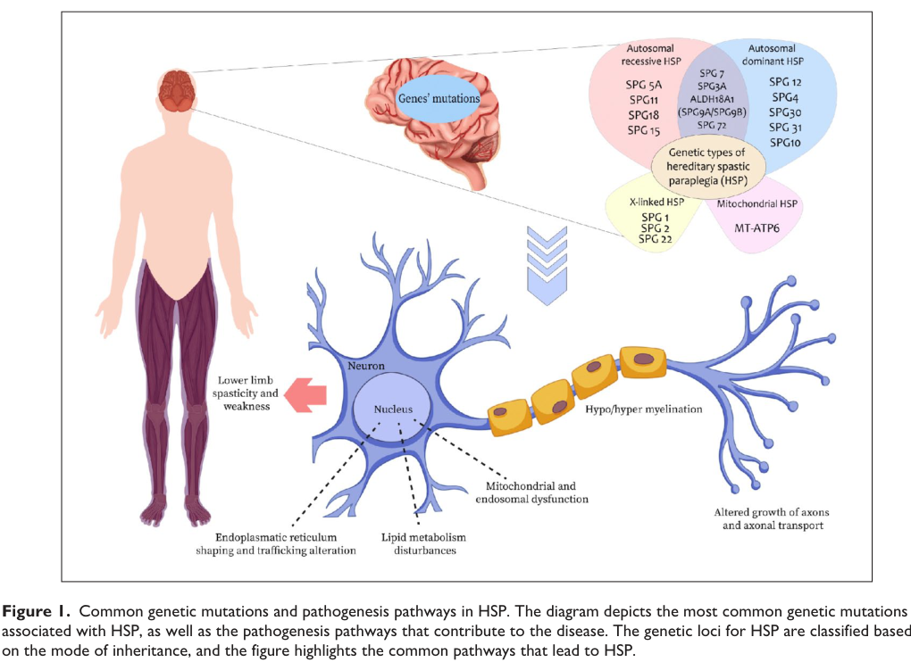

## Question

# Disease Characteristics Research Template

## Target Disease
- **Disease Name:** Hereditary Spastic Paraplegia
- **MONDO ID:**  (if available)
- **Category:** Mendelian

## Research Objectives

Please provide a comprehensive research report on **Hereditary Spastic Paraplegia** covering all of the
disease characteristics listed below. This report will be used to populate a disease knowledge
base entry. Be thorough and cite primary literature (PMID preferred) for all claims.

For each section, **suggested databases/resources** are listed. These are the first places
you should search for information on each topic.

---

### 1. Disease Information
> **Search first:** OMIM, Orphanet, ICD-10/ICD-11, MeSH, PubMed

- What is the disease? Provide a concise overview.
- What are the key identifiers? (OMIM, Orphanet, ICD-10/ICD-11, MeSH, Mondo)
- What are the common synonyms and alternative names?
- Is the information derived from individual patients (e.g., EHR) or aggregated disease-level resources?

### 2. Etiology

- **Disease Causal Factors**: What are the primary causes? (genetic, environmental, infectious, mechanistic)
- **Risk Factors**:
  > **Search first:** PubMed, Cochrane Library, UpToDate, clinical guidelines, ClinVar, ClinGen, GWAS Catalog, PheGenI, CTD, CDC, WHO, epidemiological databases
  - Genetic risk factors (causal variants, susceptibility loci, modifier genes)
  - Environmental risk factors (toxins, lifestyle, occupational exposures, age, sex, family history)
- **Protective Factors**:
  > **Search first:** PubMed, Cochrane Library, clinical trial databases, GWAS Catalog, gnomAD, WHO, CDC, nutrition databases
  - Genetic protective factors (protective variants, modifier alleles)
  - Environmental protective factors (diet, lifestyle, exposures that reduce risk)
- **Gene-Environment Interactions**: How do genetic and environmental factors interact to influence disease?
  > **Search first:** CTD, PubMed, PheGenI, GxE databases

### 3. Phenotypes
> **Search first:** HPO (Human Phenotype Ontology), OMIM, Orphanet, PubMed, clinicaltrials.gov, MedDRA, SNOMED CT, DECIPHER, LOINC

For each phenotype, provide:
- **Phenotype type**: symptoms, clinical signs, physical manifestations, behavioral changes, or laboratory abnormalities
  > For symptoms/signs: HPO, OMIM, Orphanet, PubMed
  > For behavioral changes: HPO, DSM, RDoC (Research Domain Criteria), PubMed
  > For laboratory abnormalities: LOINC, SNOMED CT, LabTests Online, PubMed
- **Phenotype characteristics**:
  > **Search first:** OMIM, Orphanet, HPO, PubMed
  - Age of symptom onset (neonatal, childhood, adult-onset, late-onset)
  - Symptom severity (mild, moderate, severe, variable)
  - Symptom progression (stable, progressive, episodic, fluctuating)
  - Frequency among affected individuals (percentage or qualitative)
- **Quality of life impact**: Effects on daily functioning and well-being (per-phenotype when possible)
  > **Search first:** EQ-5D database, SF-36, WHO QOL databases, PubMed
- Suggest HPO (Human Phenotype Ontology) terms for each phenotype

### 4. Genetic/Molecular Information

- **Causal Genes**: Gene mutations or chromosomal abnormalities responsible for disease (gene symbols, OMIM IDs)
  > **Search first:** OMIM, ClinVar, HGMD, Ensembl, NCBI Gene
- **Pathogenic Variants**:
  - Affected genes (gene symbols, HGNC IDs)
    > **Search first:** OMIM, NCBI Gene, Ensembl, HGNC, UniProt, GeneCards
  - Variant classification (pathogenic, likely pathogenic, VUS per ACMG/AMP guidelines)
    > **Search first:** ClinVar, ClinGen, ACMG/AMP guidelines, VarSome
  - Variant type/class (missense, frameshift, nonsense, splice-site, structural)
  - Allele frequency in population databases
    > **Search first:** gnomAD, 1000 Genomes, ExAC, TOPMed, dbSNP
  - Somatic vs germline origin
    > **Search first:** COSMIC (somatic), ClinVar, ICGC, TCGA
  - Functional consequences (loss of function, gain of function, dominant negative)
- **Modifier Genes**: Genes that modify disease severity or expression
- **Epigenetic Information**: DNA methylation, histone modifications, chromatin changes affecting disease
  > **Search first:** ENCODE, Roadmap Epigenomics, MethBase, DiseaseMeth
- **Chromosomal Abnormalities**: Large-scale genetic changes (aneuploidy, translocations, inversions)
  > **Search first:** DECIPHER, ClinVar, ECARUCA, UCSC Genome Browser

### 5. Environmental Information

- **Environmental Factors**: Non-genetic contributing factors (toxins, radiation, pollution, occupational exposure)
  > **Search first:** CTD (Comparative Toxicogenomics Database), TOXNET, PubMed, EPA databases
- **Lifestyle Factors**: Behavioral factors (smoking, diet, exercise, alcohol consumption)
  > **Search first:** CDC databases, WHO, PubMed, NHANES
- **Infectious Agents**: If applicable, pathogens causing or triggering disease (bacteria, viruses, fungi, parasites)
  > **Search first:** NCBI Taxonomy, ViPR, BV-BRC, MicrobeDB, GIDEON

### 6. Mechanism / Pathophysiology

- **Molecular Pathways**: Specific signaling cascades or biochemical pathways involved (Wnt, MAPK, mTOR, PI3K-AKT, etc.)
  > **Search first:** KEGG, Reactome, WikiPathways, PathBank, BioCyc
- **Cellular Processes**: Cell-level mechanisms (apoptosis, autophagy, cell cycle dysregulation, inflammation, etc.)
  > **Search first:** Gene Ontology (GO), Reactome, KEGG, PubMed
- **Protein Dysfunction**: How protein structure or function is altered (misfolding, aggregation, loss of function, gain of function)
  > **Search first:** UniProt, PDB (Protein Data Bank), InterPro, Pfam, AlphaFold
- **Metabolic Changes**: Alterations in metabolic processes (energy metabolism, lipid metabolism, amino acid metabolism)
  > **Search first:** KEGG, BioCyc, HMDB (Human Metabolome Database), BRENDA
- **Immune System Involvement**: Role of immune response (autoimmunity, immunodeficiency, chronic inflammation)
  > **Search first:** ImmPort, Immunome Database, IEDB, Gene Ontology
- **Tissue Damage Mechanisms**: How tissues/ are injured (oxidative stress, ischemia, fibrosis, necrosis)
  > **Search first:** PubMed, Gene Ontology, Reactome
- **Biochemical Abnormalities**: Specific molecular defects (enzyme deficiencies, receptor dysfunction, ion channel defects)
  > **Search first:** BRENDA, UniProt, KEGG, OMIM, PubMed
- **Epigenetic Changes**: DNA methylation, histone modifications affecting gene expression in disease
  > **Search first:** ENCODE, Roadmap Epigenomics, MethBase, DiseaseMeth
- **Molecular Profiling** (if available):
  - Transcriptomics/gene expression changes
    > **Search first:** GEO (Gene Expression Omnibus), ArrayExpress, GTEx, Human Cell Atlas, SRA
  - Proteomics findings
    > **Search first:** PRIDE, ProteomeXchange, Human Protein Atlas, STRING, BioGRID
  - Metabolomics signatures
    > **Search first:** MetaboLights, Metabolomics Workbench, HMDB, METLIN
  - Lipidomics alterations
    > **Search first:** LIPID MAPS, SwissLipids, LipidHome, Metabolomics Workbench
  - Genomic structural features
    > **Search first:** UCSC Genome Browser, Ensembl, NCBI, dbVar, DGV
- **Advanced Technologies** (if applicable):
  - Single-cell analysis findings (cell-type specific mechanisms, cellular heterogeneity)
    > **Search first:** Human Cell Atlas, Single Cell Portal, GEO, CELLxGENE
  - Spatial transcriptomics findings
    > **Search first:** GEO, Spatial Research, Vizgen, 10x Genomics data
  - Multi-omics integration results
    > **Search first:** TCGA, ICGC, cBioPortal, LinkedOmics, PubMed
  - Functional genomics screens (CRISPR, RNAi)
    > **Search first:** DepMap, GenomeRNAi, PubMed, BioGRID ORCS

For each mechanism, describe:
- The causal chain from initial trigger to clinical manifestation
- Which mechanisms are upstream vs downstream
- What cell types and biological processes are involved
- Suggest GO terms for biological processes and CL terms for cell types

### 7. Anatomical Structures Affected

- **Organ Level**:
  - Primary organs directly affected
  - Secondary organ involvement (complications, secondary effects)
  - Body systems involved (cardiovascular, nervous, digestive, respiratory, endocrine, etc.)
  > **Search first:** Uberon, FMA (Foundational Model of Anatomy), OMIM, HPO, ICD-11, MeSH, SNOMED CT
- **Tissue and Cell Level**:
  - Specific tissue types affected (epithelial, connective, muscle, nervous)
  - Specific cell populations targeted (with Cell Ontology terms)
  > **Search first:** Uberon, Human Protein Atlas, Cell Ontology, Human Cell Atlas, CellMarker, PanglaoDB
- **Subcellular Level**:
  - Cellular compartments involved (mitochondria, nucleus, ER, lysosomes) (with GO Cellular Component terms)
  > **Search first:** Gene Ontology (Cellular Component), UniProt, Human Protein Atlas
- **Localization**:
  - Specific anatomical sites (with UBERON terms)
    > **Search first:** FMA, Uberon, NeuroNames (for brain), SNOMED CT
  - Lateralization (unilateral, bilateral, asymmetric)
    > **Search first:** HPO, clinical literature, imaging databases

### 8. Temporal Development

- **Onset**:
  - Typical age of onset (congenital, pediatric, adult, geriatric)
  - Onset pattern (acute, subacute, chronic, insidious)
  > **Search first:** OMIM, Orphanet, HPO, PubMed
- **Progression**:
  - Disease stages (early, intermediate, advanced, end-stage)
    > **Search first:** Cancer Staging Manual (AJCC), WHO classifications, PubMed
  - Progression rate (rapid, slow, variable)
  - Disease course pattern (episodic, relapsing-remitting, progressive, stable)
  - Disease duration (self-limited, chronic lifelong)
  > **Search first:** Disease registries, longitudinal cohort databases, natural history studies, PubMed, Orphanet, OMIM
- **Patterns**:
  - Remission patterns (spontaneous, treatment-induced)
    > **Search first:** Clinical trial databases, disease registries, PubMed
  - Critical periods (time windows of vulnerability or opportunity for intervention)
    > **Search first:** PubMed, developmental biology databases, clinical guidelines

### 9. Inheritance and Population

- **Epidemiology**:
  - Prevalence (cases per 100,000 at given time)
  - Incidence (new cases per 100,000 per year)
  > **Search first:** Orphanet, CDC, WHO, GBD (Global Burden of Disease), national registries, SEER, disease registries
- **For Genetic Etiology**:
  - Inheritance pattern (AD, AR, X-linked, mitochondrial, multifactorial, polygenic)
    > **Search first:** OMIM, Orphanet, ClinVar, GTR (Genetic Testing Registry)
  - Penetrance (complete, incomplete, age-dependent)
    > **Search first:** ClinVar, OMIM, PubMed, ClinGen
  - Expressivity (variable, consistent)
    > **Search first:** OMIM, ClinVar, PubMed
  - Genetic anticipation (increasing severity in successive generations)
    > **Search first:** OMIM, PubMed (especially for repeat expansion disorders)
  - Germline mosaicism
    > **Search first:** ClinVar, OMIM, genetic counseling literature, PubMed
  - Founder effects (population-specific mutations)
    > **Search first:** gnomAD, population genetics databases, PubMed
  - Consanguinity role
    > **Search first:** OMIM, population studies, genetic counseling resources
  - Carrier frequency
    > **Search first:** gnomAD, carrier screening databases, GeneReviews, GTR
- **Population Demographics**:
  - Affected populations (ethnic or demographic groups with higher prevalence)
    > **Search first:** gnomAD, 1000 Genomes, PAGE Study, PubMed, population registries
  - Geographic distribution (endemic areas, regional variation)
    > **Search first:** WHO, CDC, GBD, Orphanet, geographic epidemiology databases
  - Geographic distribution of specific variants
  - Sex ratio (male:female)
    > **Search first:** Disease registries, OMIM, PubMed, epidemiological databases
  - Age distribution of affected individuals
    > **Search first:** CDC, disease registries, SEER, Orphanet

### 10. Diagnostics

- **Clinical Tests**:
  - Laboratory tests (blood, urine, tissue chemistry, specific enzyme assays)
    > **Search first:** LOINC, LabTests Online, PubMed
  - Biomarkers (proteins, metabolites, genetic markers, circulating biomarkers)
    > **Search first:** FDA Biomarker List, BEST (Biomarkers, EndpointS, and other Tools), PubMed
  - Imaging studies (X-ray, CT, MRI, PET, ultrasound)
    > **Search first:** RadLex, DICOM, Radiopaedia, imaging databases
  - Functional tests (pulmonary function, cardiac stress tests)
    > **Search first:** LOINC, clinical guidelines, PubMed
  - Electrophysiology (EEG, EMG, ECG, nerve conduction studies)
    > **Search first:** LOINC, clinical neurophysiology databases, PubMed
  - Biopsy findings (histopathology, immunohistochemistry)
    > **Search first:** SNOMED CT, College of American Pathologists resources, PubMed
  - Pathology findings (microscopic examination)
    > **Search first:** SNOMED CT, Digital Pathology databases, PubMed
- **Genetic Testing**:
  > **Search first:** GTR (Genetic Testing Registry), GeneReviews, ClinGen
  - Overview of recommended genetic testing approach
  - Whole genome sequencing (WGS) utility
    > **Search first:** GTR, ClinVar, GEL (Genomics England), gnomAD
  - Whole exome sequencing (WES) utility
    > **Search first:** GTR, ClinVar, OMIM, GeneMatcher
  - Gene panels (which panels, which genes)
    > **Search first:** GTR, ClinVar, laboratory-specific databases
  - Single gene testing
    > **Search first:** GTR, ClinVar, OMIM, GeneReviews
  - Chromosomal microarray (CMA)
    > **Search first:** DECIPHER, ClinVar, dbVar, ECARUCA
  - Karyotyping
    > **Search first:** Chromosome Abnormality Database, ClinVar, cytogenetics resources
  - FISH
    > **Search first:** ClinVar, cytogenetics databases, PubMed
  - Mitochondrial DNA testing
    > **Search first:** MITOMAP, MSeqDR, ClinVar, GTR
  - Repeat expansion testing
    > **Search first:** GTR, ClinVar, repeat expansion databases, PubMed
- **Omics-Based Diagnostics** (if applicable):
  - RNA sequencing / transcriptomics
    > **Search first:** GEO, ArrayExpress, GTEx, RNA-seq databases
  - Proteomics
    > **Search first:** PRIDE, ProteomeXchange, FDA Biomarker database
  - Metabolomics
    > **Search first:** MetaboLights, Metabolomics Workbench, HMDB
  - Epigenomics
    > **Search first:** GEO, ENCODE, Roadmap Epigenomics, MethBase
  - Liquid biopsy
    > **Search first:** COSMIC, ClinVar, liquid biopsy databases, PubMed
- **Clinical Criteria**:
  - Standardized diagnostic criteria (DSM, ICD, society guidelines)
    > **Search first:** DSM-5, ICD-11, clinical society guidelines, UpToDate
  - Differential diagnosis (other conditions to rule out, with distinguishing features)
    > **Search first:** DynaMed, UpToDate, clinical decision support systems
- **Screening**:
  - Screening methods for asymptomatic individuals (newborn screening, carrier screening, cascade screening)
    > **Search first:** ACMG recommendations, CDC newborn screening, GTR

### 11. Outcome/Prognosis

- **Survival and Mortality**:
  - Survival rate (5-year, 10-year, overall)
    > **Search first:** SEER, cancer registries, disease-specific registries, PubMed
  - Life expectancy (with and without treatment if applicable)
    > **Search first:** Orphanet, disease registries, actuarial databases, PubMed
  - Mortality rate
    > **Search first:** CDC, WHO, GBD, national mortality databases
  - Disease-specific mortality (deaths directly attributable to disease)
    > **Search first:** Disease registries, CDC Wonder, GBD, PubMed
- **Morbidity and Function**:
  - Morbidity (disease-related disability and health impacts)
    > **Search first:** GBD, WHO, disability databases, PubMed
  - Disability outcomes (long-term functional impairments)
    > **Search first:** ICF (International Classification of Functioning), disability registries
  - Quality of life measures (EQ-5D, SF-36, PROMIS, disease-specific tools)
    > **Search first:** EQ-5D database, SF-36, PROMIS, PubMed
- **Disease Course**:
  - Complications (secondary problems: infections, organ failure, etc.)
    > **Search first:** ICD codes, disease registries, clinical databases, PubMed
  - Recovery potential (likelihood and extent of recovery, with vs without treatment)
    > **Search first:** Natural history studies, rehabilitation databases, PubMed
- **Prediction**:
  - Prognostic factors (age, disease severity, biomarkers, treatment response)
    > **Search first:** Prognostic models databases, clinical calculators, PubMed
  - Prognostic biomarkers (molecular markers predicting disease course)
    > **Search first:** FDA Biomarker database, PubMed, cancer prognostic databases

### 12. Treatment

- **Pharmacotherapy**:
  - Pharmacological treatments (drug names, drug classes, mechanisms of action)
    > **Search first:** DrugBank, RxNorm, ATC classification, DailyMed, FDA databases
  - Pharmacogenomics (how genetic variants affect drug metabolism, efficacy, toxicity)
    > **Search first:** PharmGKB, CPIC (Clinical Pharmacogenetics), FDA Table of PGx Biomarkers
- **Advanced Therapeutics**:
  - Gene therapy (viral vectors, CRISPR, gene replacement, gene editing)
    > **Search first:** ClinicalTrials.gov, FDA gene therapy database, ASGCT resources
  - Cell therapy (stem cell transplant, CAR-T, cellular therapeutics)
    > **Search first:** ClinicalTrials.gov, FDA cell therapy database, FACT standards
  - RNA-based therapies (ASOs, siRNA, mRNA therapies)
    > **Search first:** ClinicalTrials.gov, FDA approvals, PubMed
  - Targeted therapies (treatments directed at specific molecular targets)
    > **Search first:** My Cancer Genome, OncoKB, ClinicalTrials.gov, FDA approvals
  - Immunotherapies (checkpoint inhibitors, monoclonal antibodies)
    > **Search first:** Cancer Immunotherapy Database, FDA approvals, ClinicalTrials.gov
- **Surgical and Interventional**:
  - Surgical interventions (types of surgery, timing, outcomes)
    > **Search first:** CPT codes, surgical registries, clinical guidelines, PubMed
- **Supportive and Rehabilitative**:
  - Supportive care (symptom management, pain control, nutrition)
    > **Search first:** Clinical guidelines, Cochrane Library, PubMed
  - Rehabilitation (physical therapy, occupational therapy, speech therapy)
    > **Search first:** Rehabilitation medicine databases, clinical guidelines, PubMed
- **Experimental**:
  - Experimental treatments in clinical trials (with NCT identifiers if available)
    > **Search first:** ClinicalTrials.gov, EU Clinical Trials Register, WHO ICTRP
- **Treatment Outcomes**:
  - Treatment response rates
    > **Search first:** Clinical trial databases, FDA reviews, systematic reviews, PubMed
  - Side effects and adverse events
    > **Search first:** FDA Adverse Event Reporting System (FAERS), MedWatch, PubMed
- **Treatment Strategy**:
  - Treatment algorithms (clinical pathways, decision trees)
    > **Search first:** Clinical practice guidelines, NCCN Guidelines, UpToDate
  - Combination therapies
    > **Search first:** ClinicalTrials.gov, treatment guidelines, PubMed
  - Personalized medicine approaches (genotype-guided treatment)
    > **Search first:** My Cancer Genome, CIViC, PharmGKB, precision medicine databases

For each treatment, suggest MAXO (Medical Action Ontology) terms where applicable.

### 13. Prevention

- **Prevention Levels**:
  - Primary prevention (preventing disease occurrence: vaccination, risk factor modification)
    > **Search first:** CDC, WHO, USPSTF recommendations, Cochrane Library
  - Secondary prevention (early detection and treatment: screening programs, early intervention)
    > **Search first:** USPSTF, CDC screening guidelines, WHO
  - Tertiary prevention (preventing complications in those with disease)
    > **Search first:** Clinical guidelines, disease management protocols, PubMed
- **Immunization**: Vaccine strategies (if applicable)
  > **Search first:** CDC vaccine schedules, WHO immunization, FDA vaccine database
- **Screening and Early Detection**:
  - Screening programs (population-based: newborn screening, cancer screening)
    > **Search first:** CDC screening programs, USPSTF, cancer screening databases
  - Genetic screening (carrier screening, preimplantation genetic diagnosis, prenatal testing)
    > **Search first:** ACMG recommendations, ACOG guidelines, GTR
  - Risk stratification (identifying high-risk individuals for targeted prevention)
    > **Search first:** Risk prediction models, clinical calculators, PubMed
- **Behavioral Interventions**: Lifestyle modifications to reduce risk
  > **Search first:** CDC, WHO, behavioral intervention databases, Cochrane Library
- **Counseling**: Genetic counseling (risk assessment, family planning guidance)
  > **Search first:** NSGC resources, ACMG guidelines, GeneReviews
- **Public Health**:
  - Public health interventions (sanitation, vector control, health education)
    > **Search first:** CDC, WHO, public health databases, PubMed
  - Environmental interventions (reducing environmental risk factors)
    > **Search first:** EPA databases, WHO environmental health, PubMed
- **Prophylaxis**: Preventive medications or procedures
  > **Search first:** Clinical guidelines, FDA approvals, PubMed

### 14. Other Species / Natural Disease

- **Taxonomy**: Species affected (with NCBI Taxon identifiers)
  > **Search first:** NCBI Taxonomy
- **Breed**: Specific breeds affected (with VBO identifiers if applicable)
  > **Search first:** VBO (Vertebrate Breed Ontology)
- **Gene**: Orthologous genes in other species (with NCBI Gene IDs)
  > **Search first:** NCBI Gene
- **Natural Disease**:
  - Naturally occurring disease in other species (companion animals, wildlife)
    > **Search first:** OMIA (Online Mendelian Inheritance in Animals), VetCompass, PubMed
  - Veterinary relevance and importance in animal health
    > **Search first:** OMIA, veterinary databases, PubMed
- **Comparative Biology**:
  - Comparative pathology (similarities and differences across species)
    > **Search first:** OMIA, comparative pathology databases, PubMed
  - Evolutionary conservation of disease mechanisms
    > **Search first:** HomoloGene, OrthoMCL, Alliance of Genome Resources
- **Transmission** (if applicable):
  - Zoonotic potential
    > **Search first:** CDC zoonotic diseases, WHO zoonoses, GIDEON
  - Cross-species susceptibility
    > **Search first:** NCBI Taxonomy, veterinary databases, PubMed

### 15. Model Organisms

- **Model Types**:
  - Model organism type (mammalian, invertebrate, cellular, in vitro)
    > **Search first:** Alliance of Genome Resources, model organism databases
  - Specific model systems (mouse, rat, zebrafish, Drosophila, C. elegans, yeast, cell lines, organoids, iPSCs)
    > **Search first:** MGI, RGD, ZFIN, FlyBase, WormBase, SGD, ATCC, Cellosaurus
  - Induced models (drug treatment, surgical intervention, environmental manipulation)
    > **Search first:** MGI, model organism databases, PubMed
- **Genetic Models**:
  - Types available (knockout, knock-in, transgenic, conditional, humanized)
    > **Search first:** MGI, IMPC, KOMP, EuMMCR, IMSR
- **Model Characteristics**:
  - Phenotype recapitulation (how well model reproduces human disease features)
    > **Search first:** Model organism databases, comparative studies, PubMed
  - Model limitations (aspects of human disease not captured)
    > **Search first:** Model organism databases, PubMed, review articles
- **Applications**:
  - Research applications (what aspects of disease can be studied)
    > **Search first:** Model organism databases, PubMed
- **Resources**:
  - Model databases
    > **Search first:** MGI, RGD, ZFIN, FlyBase, WormBase, IMSR, EMMA, MMRRC

---

## Citation Requirements

- Cite primary literature (PMID preferred) for all mechanistic and clinical claims
- Prioritize recent reviews and landmark papers
- Include direct quotes from abstracts where possible to support key statements
- Distinguish evidence source types: human clinical, model organism, in vitro, computational

## Output Format

Structure your response as a comprehensive narrative organized by the sections above.
For each section, provide:
- Factual content with specific details (numbers, percentages, gene names, variant nomenclature)
- Ontology term suggestions (HPO, GO, CL, UBERON, CHEBI, MAXO, MONDO) where applicable
- Evidence citations with PMIDs
- Direct quotes from abstracts to support key claims
- Clear indication when information is not available or not applicable for this disease

This report will be used to populate a disease knowledge base entry with:
- Pathophysiology descriptions with causal chains
- Gene/protein annotations (HGNC, GO terms)
- Phenotype associations (HP terms) with frequencies
- Cell type involvement (CL terms)
- Anatomical locations (UBERON terms)
- Chemical entities (CHEBI terms)
- Treatment annotations (MAXO terms)
- Evidence items with PMIDs and exact abstract quotes
- Epidemiology, prognosis, diagnostic, and prevention information
- Animal model descriptions with phenotype recapitulation details

## Output

Question: You are an expert researcher providing comprehensive, well-cited information.

Provide detailed information focusing on:
1. Key concepts and definitions with current understanding
2. Recent developments and latest research (prioritize 2023-2024 sources)
3. Current applications and real-world implementations
4. Expert opinions and analysis from authoritative sources
5. Relevant statistics and data from recent studies

Format as a comprehensive research report with proper citations. Include URLs and publication dates where available.
Always prioritize recent, authoritative sources and provide specific citations for all major claims.

# Disease Characteristics Research Template

## Target Disease
- **Disease Name:** Hereditary Spastic Paraplegia
- **MONDO ID:**  (if available)
- **Category:** Mendelian

## Research Objectives

Please provide a comprehensive research report on **Hereditary Spastic Paraplegia** covering all of the
disease characteristics listed below. This report will be used to populate a disease knowledge
base entry. Be thorough and cite primary literature (PMID preferred) for all claims.

For each section, **suggested databases/resources** are listed. These are the first places
you should search for information on each topic.

---

### 1. Disease Information
> **Search first:** OMIM, Orphanet, ICD-10/ICD-11, MeSH, PubMed

- What is the disease? Provide a concise overview.
- What are the key identifiers? (OMIM, Orphanet, ICD-10/ICD-11, MeSH, Mondo)
- What are the common synonyms and alternative names?
- Is the information derived from individual patients (e.g., EHR) or aggregated disease-level resources?

### 2. Etiology

- **Disease Causal Factors**: What are the primary causes? (genetic, environmental, infectious, mechanistic)
- **Risk Factors**:
  > **Search first:** PubMed, Cochrane Library, UpToDate, clinical guidelines, ClinVar, ClinGen, GWAS Catalog, PheGenI, CTD, CDC, WHO, epidemiological databases
  - Genetic risk factors (causal variants, susceptibility loci, modifier genes)
  - Environmental risk factors (toxins, lifestyle, occupational exposures, age, sex, family history)
- **Protective Factors**:
  > **Search first:** PubMed, Cochrane Library, clinical trial databases, GWAS Catalog, gnomAD, WHO, CDC, nutrition databases
  - Genetic protective factors (protective variants, modifier alleles)
  - Environmental protective factors (diet, lifestyle, exposures that reduce risk)
- **Gene-Environment Interactions**: How do genetic and environmental factors interact to influence disease?
  > **Search first:** CTD, PubMed, PheGenI, GxE databases

### 3. Phenotypes
> **Search first:** HPO (Human Phenotype Ontology), OMIM, Orphanet, PubMed, clinicaltrials.gov, MedDRA, SNOMED CT, DECIPHER, LOINC

For each phenotype, provide:
- **Phenotype type**: symptoms, clinical signs, physical manifestations, behavioral changes, or laboratory abnormalities
  > For symptoms/signs: HPO, OMIM, Orphanet, PubMed
  > For behavioral changes: HPO, DSM, RDoC (Research Domain Criteria), PubMed
  > For laboratory abnormalities: LOINC, SNOMED CT, LabTests Online, PubMed
- **Phenotype characteristics**:
  > **Search first:** OMIM, Orphanet, HPO, PubMed
  - Age of symptom onset (neonatal, childhood, adult-onset, late-onset)
  - Symptom severity (mild, moderate, severe, variable)
  - Symptom progression (stable, progressive, episodic, fluctuating)
  - Frequency among affected individuals (percentage or qualitative)
- **Quality of life impact**: Effects on daily functioning and well-being (per-phenotype when possible)
  > **Search first:** EQ-5D database, SF-36, WHO QOL databases, PubMed
- Suggest HPO (Human Phenotype Ontology) terms for each phenotype

### 4. Genetic/Molecular Information

- **Causal Genes**: Gene mutations or chromosomal abnormalities responsible for disease (gene symbols, OMIM IDs)
  > **Search first:** OMIM, ClinVar, HGMD, Ensembl, NCBI Gene
- **Pathogenic Variants**:
  - Affected genes (gene symbols, HGNC IDs)
    > **Search first:** OMIM, NCBI Gene, Ensembl, HGNC, UniProt, GeneCards
  - Variant classification (pathogenic, likely pathogenic, VUS per ACMG/AMP guidelines)
    > **Search first:** ClinVar, ClinGen, ACMG/AMP guidelines, VarSome
  - Variant type/class (missense, frameshift, nonsense, splice-site, structural)
  - Allele frequency in population databases
    > **Search first:** gnomAD, 1000 Genomes, ExAC, TOPMed, dbSNP
  - Somatic vs germline origin
    > **Search first:** COSMIC (somatic), ClinVar, ICGC, TCGA
  - Functional consequences (loss of function, gain of function, dominant negative)
- **Modifier Genes**: Genes that modify disease severity or expression
- **Epigenetic Information**: DNA methylation, histone modifications, chromatin changes affecting disease
  > **Search first:** ENCODE, Roadmap Epigenomics, MethBase, DiseaseMeth
- **Chromosomal Abnormalities**: Large-scale genetic changes (aneuploidy, translocations, inversions)
  > **Search first:** DECIPHER, ClinVar, ECARUCA, UCSC Genome Browser

### 5. Environmental Information

- **Environmental Factors**: Non-genetic contributing factors (toxins, radiation, pollution, occupational exposure)
  > **Search first:** CTD (Comparative Toxicogenomics Database), TOXNET, PubMed, EPA databases
- **Lifestyle Factors**: Behavioral factors (smoking, diet, exercise, alcohol consumption)
  > **Search first:** CDC databases, WHO, PubMed, NHANES
- **Infectious Agents**: If applicable, pathogens causing or triggering disease (bacteria, viruses, fungi, parasites)
  > **Search first:** NCBI Taxonomy, ViPR, BV-BRC, MicrobeDB, GIDEON

### 6. Mechanism / Pathophysiology

- **Molecular Pathways**: Specific signaling cascades or biochemical pathways involved (Wnt, MAPK, mTOR, PI3K-AKT, etc.)
  > **Search first:** KEGG, Reactome, WikiPathways, PathBank, BioCyc
- **Cellular Processes**: Cell-level mechanisms (apoptosis, autophagy, cell cycle dysregulation, inflammation, etc.)
  > **Search first:** Gene Ontology (GO), Reactome, KEGG, PubMed
- **Protein Dysfunction**: How protein structure or function is altered (misfolding, aggregation, loss of function, gain of function)
  > **Search first:** UniProt, PDB (Protein Data Bank), InterPro, Pfam, AlphaFold
- **Metabolic Changes**: Alterations in metabolic processes (energy metabolism, lipid metabolism, amino acid metabolism)
  > **Search first:** KEGG, BioCyc, HMDB (Human Metabolome Database), BRENDA
- **Immune System Involvement**: Role of immune response (autoimmunity, immunodeficiency, chronic inflammation)
  > **Search first:** ImmPort, Immunome Database, IEDB, Gene Ontology
- **Tissue Damage Mechanisms**: How tissues/ are injured (oxidative stress, ischemia, fibrosis, necrosis)
  > **Search first:** PubMed, Gene Ontology, Reactome
- **Biochemical Abnormalities**: Specific molecular defects (enzyme deficiencies, receptor dysfunction, ion channel defects)
  > **Search first:** BRENDA, UniProt, KEGG, OMIM, PubMed
- **Epigenetic Changes**: DNA methylation, histone modifications affecting gene expression in disease
  > **Search first:** ENCODE, Roadmap Epigenomics, MethBase, DiseaseMeth
- **Molecular Profiling** (if available):
  - Transcriptomics/gene expression changes
    > **Search first:** GEO (Gene Expression Omnibus), ArrayExpress, GTEx, Human Cell Atlas, SRA
  - Proteomics findings
    > **Search first:** PRIDE, ProteomeXchange, Human Protein Atlas, STRING, BioGRID
  - Metabolomics signatures
    > **Search first:** MetaboLights, Metabolomics Workbench, HMDB, METLIN
  - Lipidomics alterations
    > **Search first:** LIPID MAPS, SwissLipids, LipidHome, Metabolomics Workbench
  - Genomic structural features
    > **Search first:** UCSC Genome Browser, Ensembl, NCBI, dbVar, DGV
- **Advanced Technologies** (if applicable):
  - Single-cell analysis findings (cell-type specific mechanisms, cellular heterogeneity)
    > **Search first:** Human Cell Atlas, Single Cell Portal, GEO, CELLxGENE
  - Spatial transcriptomics findings
    > **Search first:** GEO, Spatial Research, Vizgen, 10x Genomics data
  - Multi-omics integration results
    > **Search first:** TCGA, ICGC, cBioPortal, LinkedOmics, PubMed
  - Functional genomics screens (CRISPR, RNAi)
    > **Search first:** DepMap, GenomeRNAi, PubMed, BioGRID ORCS

For each mechanism, describe:
- The causal chain from initial trigger to clinical manifestation
- Which mechanisms are upstream vs downstream
- What cell types and biological processes are involved
- Suggest GO terms for biological processes and CL terms for cell types

### 7. Anatomical Structures Affected

- **Organ Level**:
  - Primary organs directly affected
  - Secondary organ involvement (complications, secondary effects)
  - Body systems involved (cardiovascular, nervous, digestive, respiratory, endocrine, etc.)
  > **Search first:** Uberon, FMA (Foundational Model of Anatomy), OMIM, HPO, ICD-11, MeSH, SNOMED CT
- **Tissue and Cell Level**:
  - Specific tissue types affected (epithelial, connective, muscle, nervous)
  - Specific cell populations targeted (with Cell Ontology terms)
  > **Search first:** Uberon, Human Protein Atlas, Cell Ontology, Human Cell Atlas, CellMarker, PanglaoDB
- **Subcellular Level**:
  - Cellular compartments involved (mitochondria, nucleus, ER, lysosomes) (with GO Cellular Component terms)
  > **Search first:** Gene Ontology (Cellular Component), UniProt, Human Protein Atlas
- **Localization**:
  - Specific anatomical sites (with UBERON terms)
    > **Search first:** FMA, Uberon, NeuroNames (for brain), SNOMED CT
  - Lateralization (unilateral, bilateral, asymmetric)
    > **Search first:** HPO, clinical literature, imaging databases

### 8. Temporal Development

- **Onset**:
  - Typical age of onset (congenital, pediatric, adult, geriatric)
  - Onset pattern (acute, subacute, chronic, insidious)
  > **Search first:** OMIM, Orphanet, HPO, PubMed
- **Progression**:
  - Disease stages (early, intermediate, advanced, end-stage)
    > **Search first:** Cancer Staging Manual (AJCC), WHO classifications, PubMed
  - Progression rate (rapid, slow, variable)
  - Disease course pattern (episodic, relapsing-remitting, progressive, stable)
  - Disease duration (self-limited, chronic lifelong)
  > **Search first:** Disease registries, longitudinal cohort databases, natural history studies, PubMed, Orphanet, OMIM
- **Patterns**:
  - Remission patterns (spontaneous, treatment-induced)
    > **Search first:** Clinical trial databases, disease registries, PubMed
  - Critical periods (time windows of vulnerability or opportunity for intervention)
    > **Search first:** PubMed, developmental biology databases, clinical guidelines

### 9. Inheritance and Population

- **Epidemiology**:
  - Prevalence (cases per 100,000 at given time)
  - Incidence (new cases per 100,000 per year)
  > **Search first:** Orphanet, CDC, WHO, GBD (Global Burden of Disease), national registries, SEER, disease registries
- **For Genetic Etiology**:
  - Inheritance pattern (AD, AR, X-linked, mitochondrial, multifactorial, polygenic)
    > **Search first:** OMIM, Orphanet, ClinVar, GTR (Genetic Testing Registry)
  - Penetrance (complete, incomplete, age-dependent)
    > **Search first:** ClinVar, OMIM, PubMed, ClinGen
  - Expressivity (variable, consistent)
    > **Search first:** OMIM, ClinVar, PubMed
  - Genetic anticipation (increasing severity in successive generations)
    > **Search first:** OMIM, PubMed (especially for repeat expansion disorders)
  - Germline mosaicism
    > **Search first:** ClinVar, OMIM, genetic counseling literature, PubMed
  - Founder effects (population-specific mutations)
    > **Search first:** gnomAD, population genetics databases, PubMed
  - Consanguinity role
    > **Search first:** OMIM, population studies, genetic counseling resources
  - Carrier frequency
    > **Search first:** gnomAD, carrier screening databases, GeneReviews, GTR
- **Population Demographics**:
  - Affected populations (ethnic or demographic groups with higher prevalence)
    > **Search first:** gnomAD, 1000 Genomes, PAGE Study, PubMed, population registries
  - Geographic distribution (endemic areas, regional variation)
    > **Search first:** WHO, CDC, GBD, Orphanet, geographic epidemiology databases
  - Geographic distribution of specific variants
  - Sex ratio (male:female)
    > **Search first:** Disease registries, OMIM, PubMed, epidemiological databases
  - Age distribution of affected individuals
    > **Search first:** CDC, disease registries, SEER, Orphanet

### 10. Diagnostics

- **Clinical Tests**:
  - Laboratory tests (blood, urine, tissue chemistry, specific enzyme assays)
    > **Search first:** LOINC, LabTests Online, PubMed
  - Biomarkers (proteins, metabolites, genetic markers, circulating biomarkers)
    > **Search first:** FDA Biomarker List, BEST (Biomarkers, EndpointS, and other Tools), PubMed
  - Imaging studies (X-ray, CT, MRI, PET, ultrasound)
    > **Search first:** RadLex, DICOM, Radiopaedia, imaging databases
  - Functional tests (pulmonary function, cardiac stress tests)
    > **Search first:** LOINC, clinical guidelines, PubMed
  - Electrophysiology (EEG, EMG, ECG, nerve conduction studies)
    > **Search first:** LOINC, clinical neurophysiology databases, PubMed
  - Biopsy findings (histopathology, immunohistochemistry)
    > **Search first:** SNOMED CT, College of American Pathologists resources, PubMed
  - Pathology findings (microscopic examination)
    > **Search first:** SNOMED CT, Digital Pathology databases, PubMed
- **Genetic Testing**:
  > **Search first:** GTR (Genetic Testing Registry), GeneReviews, ClinGen
  - Overview of recommended genetic testing approach
  - Whole genome sequencing (WGS) utility
    > **Search first:** GTR, ClinVar, GEL (Genomics England), gnomAD
  - Whole exome sequencing (WES) utility
    > **Search first:** GTR, ClinVar, OMIM, GeneMatcher
  - Gene panels (which panels, which genes)
    > **Search first:** GTR, ClinVar, laboratory-specific databases
  - Single gene testing
    > **Search first:** GTR, ClinVar, OMIM, GeneReviews
  - Chromosomal microarray (CMA)
    > **Search first:** DECIPHER, ClinVar, dbVar, ECARUCA
  - Karyotyping
    > **Search first:** Chromosome Abnormality Database, ClinVar, cytogenetics resources
  - FISH
    > **Search first:** ClinVar, cytogenetics databases, PubMed
  - Mitochondrial DNA testing
    > **Search first:** MITOMAP, MSeqDR, ClinVar, GTR
  - Repeat expansion testing
    > **Search first:** GTR, ClinVar, repeat expansion databases, PubMed
- **Omics-Based Diagnostics** (if applicable):
  - RNA sequencing / transcriptomics
    > **Search first:** GEO, ArrayExpress, GTEx, RNA-seq databases
  - Proteomics
    > **Search first:** PRIDE, ProteomeXchange, FDA Biomarker database
  - Metabolomics
    > **Search first:** MetaboLights, Metabolomics Workbench, HMDB
  - Epigenomics
    > **Search first:** GEO, ENCODE, Roadmap Epigenomics, MethBase
  - Liquid biopsy
    > **Search first:** COSMIC, ClinVar, liquid biopsy databases, PubMed
- **Clinical Criteria**:
  - Standardized diagnostic criteria (DSM, ICD, society guidelines)
    > **Search first:** DSM-5, ICD-11, clinical society guidelines, UpToDate
  - Differential diagnosis (other conditions to rule out, with distinguishing features)
    > **Search first:** DynaMed, UpToDate, clinical decision support systems
- **Screening**:
  - Screening methods for asymptomatic individuals (newborn screening, carrier screening, cascade screening)
    > **Search first:** ACMG recommendations, CDC newborn screening, GTR

### 11. Outcome/Prognosis

- **Survival and Mortality**:
  - Survival rate (5-year, 10-year, overall)
    > **Search first:** SEER, cancer registries, disease-specific registries, PubMed
  - Life expectancy (with and without treatment if applicable)
    > **Search first:** Orphanet, disease registries, actuarial databases, PubMed
  - Mortality rate
    > **Search first:** CDC, WHO, GBD, national mortality databases
  - Disease-specific mortality (deaths directly attributable to disease)
    > **Search first:** Disease registries, CDC Wonder, GBD, PubMed
- **Morbidity and Function**:
  - Morbidity (disease-related disability and health impacts)
    > **Search first:** GBD, WHO, disability databases, PubMed
  - Disability outcomes (long-term functional impairments)
    > **Search first:** ICF (International Classification of Functioning), disability registries
  - Quality of life measures (EQ-5D, SF-36, PROMIS, disease-specific tools)
    > **Search first:** EQ-5D database, SF-36, PROMIS, PubMed
- **Disease Course**:
  - Complications (secondary problems: infections, organ failure, etc.)
    > **Search first:** ICD codes, disease registries, clinical databases, PubMed
  - Recovery potential (likelihood and extent of recovery, with vs without treatment)
    > **Search first:** Natural history studies, rehabilitation databases, PubMed
- **Prediction**:
  - Prognostic factors (age, disease severity, biomarkers, treatment response)
    > **Search first:** Prognostic models databases, clinical calculators, PubMed
  - Prognostic biomarkers (molecular markers predicting disease course)
    > **Search first:** FDA Biomarker database, PubMed, cancer prognostic databases

### 12. Treatment

- **Pharmacotherapy**:
  - Pharmacological treatments (drug names, drug classes, mechanisms of action)
    > **Search first:** DrugBank, RxNorm, ATC classification, DailyMed, FDA databases
  - Pharmacogenomics (how genetic variants affect drug metabolism, efficacy, toxicity)
    > **Search first:** PharmGKB, CPIC (Clinical Pharmacogenetics), FDA Table of PGx Biomarkers
- **Advanced Therapeutics**:
  - Gene therapy (viral vectors, CRISPR, gene replacement, gene editing)
    > **Search first:** ClinicalTrials.gov, FDA gene therapy database, ASGCT resources
  - Cell therapy (stem cell transplant, CAR-T, cellular therapeutics)
    > **Search first:** ClinicalTrials.gov, FDA cell therapy database, FACT standards
  - RNA-based therapies (ASOs, siRNA, mRNA therapies)
    > **Search first:** ClinicalTrials.gov, FDA approvals, PubMed
  - Targeted therapies (treatments directed at specific molecular targets)
    > **Search first:** My Cancer Genome, OncoKB, ClinicalTrials.gov, FDA approvals
  - Immunotherapies (checkpoint inhibitors, monoclonal antibodies)
    > **Search first:** Cancer Immunotherapy Database, FDA approvals, ClinicalTrials.gov
- **Surgical and Interventional**:
  - Surgical interventions (types of surgery, timing, outcomes)
    > **Search first:** CPT codes, surgical registries, clinical guidelines, PubMed
- **Supportive and Rehabilitative**:
  - Supportive care (symptom management, pain control, nutrition)
    > **Search first:** Clinical guidelines, Cochrane Library, PubMed
  - Rehabilitation (physical therapy, occupational therapy, speech therapy)
    > **Search first:** Rehabilitation medicine databases, clinical guidelines, PubMed
- **Experimental**:
  - Experimental treatments in clinical trials (with NCT identifiers if available)
    > **Search first:** ClinicalTrials.gov, EU Clinical Trials Register, WHO ICTRP
- **Treatment Outcomes**:
  - Treatment response rates
    > **Search first:** Clinical trial databases, FDA reviews, systematic reviews, PubMed
  - Side effects and adverse events
    > **Search first:** FDA Adverse Event Reporting System (FAERS), MedWatch, PubMed
- **Treatment Strategy**:
  - Treatment algorithms (clinical pathways, decision trees)
    > **Search first:** Clinical practice guidelines, NCCN Guidelines, UpToDate
  - Combination therapies
    > **Search first:** ClinicalTrials.gov, treatment guidelines, PubMed
  - Personalized medicine approaches (genotype-guided treatment)
    > **Search first:** My Cancer Genome, CIViC, PharmGKB, precision medicine databases

For each treatment, suggest MAXO (Medical Action Ontology) terms where applicable.

### 13. Prevention

- **Prevention Levels**:
  - Primary prevention (preventing disease occurrence: vaccination, risk factor modification)
    > **Search first:** CDC, WHO, USPSTF recommendations, Cochrane Library
  - Secondary prevention (early detection and treatment: screening programs, early intervention)
    > **Search first:** USPSTF, CDC screening guidelines, WHO
  - Tertiary prevention (preventing complications in those with disease)
    > **Search first:** Clinical guidelines, disease management protocols, PubMed
- **Immunization**: Vaccine strategies (if applicable)
  > **Search first:** CDC vaccine schedules, WHO immunization, FDA vaccine database
- **Screening and Early Detection**:
  - Screening programs (population-based: newborn screening, cancer screening)
    > **Search first:** CDC screening programs, USPSTF, cancer screening databases
  - Genetic screening (carrier screening, preimplantation genetic diagnosis, prenatal testing)
    > **Search first:** ACMG recommendations, ACOG guidelines, GTR
  - Risk stratification (identifying high-risk individuals for targeted prevention)
    > **Search first:** Risk prediction models, clinical calculators, PubMed
- **Behavioral Interventions**: Lifestyle modifications to reduce risk
  > **Search first:** CDC, WHO, behavioral intervention databases, Cochrane Library
- **Counseling**: Genetic counseling (risk assessment, family planning guidance)
  > **Search first:** NSGC resources, ACMG guidelines, GeneReviews
- **Public Health**:
  - Public health interventions (sanitation, vector control, health education)
    > **Search first:** CDC, WHO, public health databases, PubMed
  - Environmental interventions (reducing environmental risk factors)
    > **Search first:** EPA databases, WHO environmental health, PubMed
- **Prophylaxis**: Preventive medications or procedures
  > **Search first:** Clinical guidelines, FDA approvals, PubMed

### 14. Other Species / Natural Disease

- **Taxonomy**: Species affected (with NCBI Taxon identifiers)
  > **Search first:** NCBI Taxonomy
- **Breed**: Specific breeds affected (with VBO identifiers if applicable)
  > **Search first:** VBO (Vertebrate Breed Ontology)
- **Gene**: Orthologous genes in other species (with NCBI Gene IDs)
  > **Search first:** NCBI Gene
- **Natural Disease**:
  - Naturally occurring disease in other species (companion animals, wildlife)
    > **Search first:** OMIA (Online Mendelian Inheritance in Animals), VetCompass, PubMed
  - Veterinary relevance and importance in animal health
    > **Search first:** OMIA, veterinary databases, PubMed
- **Comparative Biology**:
  - Comparative pathology (similarities and differences across species)
    > **Search first:** OMIA, comparative pathology databases, PubMed
  - Evolutionary conservation of disease mechanisms
    > **Search first:** HomoloGene, OrthoMCL, Alliance of Genome Resources
- **Transmission** (if applicable):
  - Zoonotic potential
    > **Search first:** CDC zoonotic diseases, WHO zoonoses, GIDEON
  - Cross-species susceptibility
    > **Search first:** NCBI Taxonomy, veterinary databases, PubMed

### 15. Model Organisms

- **Model Types**:
  - Model organism type (mammalian, invertebrate, cellular, in vitro)
    > **Search first:** Alliance of Genome Resources, model organism databases
  - Specific model systems (mouse, rat, zebrafish, Drosophila, C. elegans, yeast, cell lines, organoids, iPSCs)
    > **Search first:** MGI, RGD, ZFIN, FlyBase, WormBase, SGD, ATCC, Cellosaurus
  - Induced models (drug treatment, surgical intervention, environmental manipulation)
    > **Search first:** MGI, model organism databases, PubMed
- **Genetic Models**:
  - Types available (knockout, knock-in, transgenic, conditional, humanized)
    > **Search first:** MGI, IMPC, KOMP, EuMMCR, IMSR
- **Model Characteristics**:
  - Phenotype recapitulation (how well model reproduces human disease features)
    > **Search first:** Model organism databases, comparative studies, PubMed
  - Model limitations (aspects of human disease not captured)
    > **Search first:** Model organism databases, PubMed, review articles
- **Applications**:
  - Research applications (what aspects of disease can be studied)
    > **Search first:** Model organism databases, PubMed
- **Resources**:
  - Model databases
    > **Search first:** MGI, RGD, ZFIN, FlyBase, WormBase, IMSR, EMMA, MMRRC

---

## Citation Requirements

- Cite primary literature (PMID preferred) for all mechanistic and clinical claims
- Prioritize recent reviews and landmark papers
- Include direct quotes from abstracts where possible to support key statements
- Distinguish evidence source types: human clinical, model organism, in vitro, computational

## Output Format

Structure your response as a comprehensive narrative organized by the sections above.
For each section, provide:
- Factual content with specific details (numbers, percentages, gene names, variant nomenclature)
- Ontology term suggestions (HPO, GO, CL, UBERON, CHEBI, MAXO, MONDO) where applicable
- Evidence citations with PMIDs
- Direct quotes from abstracts to support key claims
- Clear indication when information is not available or not applicable for this disease

This report will be used to populate a disease knowledge base entry with:
- Pathophysiology descriptions with causal chains
- Gene/protein annotations (HGNC, GO terms)
- Phenotype associations (HP terms) with frequencies
- Cell type involvement (CL terms)
- Anatomical locations (UBERON terms)
- Chemical entities (CHEBI terms)
- Treatment annotations (MAXO terms)
- Evidence items with PMIDs and exact abstract quotes
- Epidemiology, prognosis, diagnostic, and prevention information
- Animal model descriptions with phenotype recapitulation details

# Disease Characteristics Research Report: Hereditary Spastic Paraplegia (HSP)

## Target disease
- **Disease name:** Hereditary Spastic Paraplegia (HSP) / Hereditary Spastic Paraplegias (HSPs)
- **Category:** Mendelian, genetically heterogeneous group of neurodegenerative disorders
- **MONDO ID:** *Not retrieved in current evidence corpus* (see Identifiers table)

**Figure (evidence):** A 2024 review figure summarizes HSP inheritance modes, representative genes (e.g., SPG4/SPAST, SPG3A/ATL1, SPG11, SPG7), and convergent pathogenic pathways (ER shaping/trafficking, lipid metabolism, mitochondrial/endosomal dysfunction, axonal transport). (awuah2024hereditaryspasticparaplegia media cde30dbb)

---

## 1. Disease information

### 1.1 Concise overview
Hereditary spastic paraplegia (HSP) refers to a **group of inherited neurodegenerative disorders** whose core clinical syndrome is **progressive lower-limb spasticity and weakness**, reflecting predominant degeneration of **long corticospinal tract fibers** (a “dying-back” length-dependent axonopathy). (awuah2024hereditaryspasticparaplegia pages 1-2, cipriano2025fluidbiomarkersin pages 1-2)

A current synthesis frames HSP pathobiology as the convergence of multiple cellular pathways—**mitochondrial dysfunction, endoplasmic reticulum (ER) membrane remodeling, autophagy, abnormal myelination, and lipid metabolism alterations**, among others—leading to corticospinal tract dysfunction. (awuah2024hereditaryspasticparaplegia pages 1-2)

### 1.2 Key identifiers and synonyms
A structured identifier lookup (OMIM/Orphanet/ICD/MeSH/MONDO codes) was **not directly retrievable** from the currently available full-text corpus in this run; therefore, the report explicitly flags missing codes rather than inferring them.

| Identifier system | Example codes/notes | Synonyms/alternate names | Comments on scope |
|---|---|---|---|
| OMIM | Not retrieved in current corpus for the HSP disease group. Evidence in current corpus supports that HSP is a genetically heterogeneous group with `>80` to `>90` loci/genes and includes major subtype labels such as SPG4/SPAST, SPG3A/ATL1, SPG11, and SPG7 rather than a single code in the retrieved sources (awuah2024hereditaryspasticparaplegia pages 1-2, cipriano2025fluidbiomarkersin pages 1-2, maccora2024nonpharmacologicaltreatmentof pages 1-2, faccioli2023gaitanalysispatterns pages 1-2). | Hereditary spastic paraplegia; hereditary spastic paraplegias; hereditary spastic paraparesis; spastic paraplegia/paraparesis (awuah2024hereditaryspasticparaplegia pages 1-2, maccora2024nonpharmacologicaltreatmentof pages 1-2, faccioli2023gaitanalysispatterns pages 1-2). | Primarily a disease-group resource need; many specific OMIM subtype entries likely exist for individual SPG forms, but exact codes were not retrieved in current corpus. |
| Orphanet | Not retrieved in current corpus. Retrieved evidence supports HSP as a rare disease group with multiple Mendelian subtypes, commonly including SPG4/SPAST, SPG3A/ATL1, SPG11, and SPG7 (awuah2024hereditaryspasticparaplegia pages 1-2, cipriano2025fluidbiomarkersin pages 1-2, maccora2024nonpharmacologicaltreatmentof pages 1-2). | Hereditary spastic paraplegia; hereditary spastic paraplegias; pure HSP; complicated/complex HSP (cipriano2025fluidbiomarkersin pages 1-2, maccora2024nonpharmacologicaltreatmentof pages 1-2). | Disease-group level likely represented in Orphanet, with additional subtype records; exact Orphanet identifiers were not retrieved in current corpus. |
| ICD-10 / ICD-11 | Not retrieved in current corpus. Current evidence emphasizes phenotype-based grouping (pure vs complicated HSP) and subtype labels by SPG number/gene rather than ICD codes (cipriano2025fluidbiomarkersin pages 1-2, maccora2024nonpharmacologicaltreatmentof pages 1-2, faccioli2023gaitanalysispatterns pages 1-2). | Hereditary spastic paraplegia; hereditary spastic paraparesis (maccora2024nonpharmacologicaltreatmentof pages 1-2, faccioli2023gaitanalysispatterns pages 1-2). | Coding in ICD is expected to be broader/clinical, whereas HSP nosology in the retrieved literature is mainly gene/subtype based. |
| MeSH | Not retrieved in current corpus. No specific MeSH descriptor or tree number was provided in the retrieved evidence (awuah2024hereditaryspasticparaplegia pages 1-2, cipriano2025fluidbiomarkersin pages 1-2). | Hereditary spastic paraplegia; hereditary spastic paraplegias (awuah2024hereditaryspasticparaplegia pages 1-2, cipriano2025fluidbiomarkersin pages 1-2). | Likely a disease-group heading if present, but exact MeSH identifier was not retrieved in current corpus. |
| MONDO | Exact MONDO identifier not retrieved in current corpus. Based on disease ontology practice and the evidence that HSP is a disease group with many genetic subtypes, it is appropriate to note that MONDO likely contains a hereditary spastic paraplegia group term plus subtype terms; exact IDs were not retrieved here (awuah2024hereditaryspasticparaplegia pages 1-2, cipriano2025fluidbiomarkersin pages 1-2, awuah2024hereditaryspasticparaplegia media cde30dbb). | Hereditary spastic paraplegia; hereditary spastic paraplegias (awuah2024hereditaryspasticparaplegia pages 1-2, cipriano2025fluidbiomarkersin pages 1-2). | Disease-group term plus subtype terms expected; exact MONDO codes unavailable in current corpus. |
| SPG4 / SPAST | Common autosomal dominant HSP subtype; SPAST/SPG4 is reported as the most prevalent AD-HSP and accounts for about `40–45%` of familial cases in one 2024 review; another review notes SPAST as the most common AD gene (awuah2024hereditaryspasticparaplegia pages 1-2, maccora2024nonpharmacologicaltreatmentof pages 1-2). | Spastic paraplegia type 4; SPAST-related HSP; SPG4 (awuah2024hereditaryspasticparaplegia pages 1-2, maccora2024nonpharmacologicaltreatmentof pages 1-2). | Specific subtype/gene-defined disorder within the broader HSP group. |
| SPG3A / ATL1 | Common autosomal dominant subtype; ATL1/SPG3A is described as the second most common form and about `~7%` of AD-HSP in one review; usually childhood-onset and often pure, but severe very-early-onset complex cases are reported (awuah2024hereditaryspasticparaplegia pages 1-2, brozkova2026childrenwithsuspected pages 1-2). | Spastic paraplegia type 3A; ATL1-related HSP; SPG3A (awuah2024hereditaryspasticparaplegia pages 1-2, brozkova2026childrenwithsuspected pages 1-2). | Specific subtype/gene-defined disorder within the HSP group; usually pure childhood-onset but can be complex. |
| SPG11 | Frequent autosomal recessive subtype; one review reports SPG11 as about `~18%` of HSP globally and another identifies SPG11 among the most frequent genotypes in HSP with movement disorders (awuah2024hereditaryspasticparaplegia pages 1-2, azeem2024investigatingthegenetic pages 1-2). | Spastic paraplegia type 11; SPG11-related HSP (awuah2024hereditaryspasticparaplegia pages 1-2, azeem2024investigatingthegenetic pages 1-2). | Specific subtype/gene-defined disorder within the HSP group; often associated with complicated phenotypes. |
| SPG7 | Frequent autosomal recessive subtype; cited among common genotypes, especially in HSP with movement disorders, and often associated with adult onset, ataxia, extraocular movement abnormalities, and seizures in comparative analyses (cipriano2025fluidbiomarkersin pages 1-2, azeem2024investigatingthegenetic pages 1-2). | Spastic paraplegia type 7; SPG7-related HSP (cipriano2025fluidbiomarkersin pages 1-2, azeem2024investigatingthegenetic pages 1-2). | Specific subtype/gene-defined disorder within the HSP group; often phenotypically complex. |

*Table: This table summarizes what the current evidence corpus supports about HSP naming and classification resources. It distinguishes disease-group level identifiers from major gene-defined subtypes and clearly marks identifier codes that were not directly retrieved.*

**Common synonyms (literature use):**
- “Hereditary spastic paraplegia”, “hereditary spastic paraplegias”, “hereditary spastic paraparesis”, “spastic paraplegia/paraparesis”. (maccora2024nonpharmacologicaltreatmentof pages 1-2, faccioli2023gaitanalysispatterns pages 1-2)

### 1.3 Classification and evidence sources
- **Clinical classification (Harding):** “pure” (isolated spastic paraparesis +/- urinary symptoms, mild vibration loss) vs “complex/complicated” (additional neurologic/non-neurologic features). (maccora2024nonpharmacologicaltreatmentof pages 1-2)
- **Inheritance:** autosomal dominant (AD), autosomal recessive (AR), X-linked, and mitochondrial forms are all described; AD is commonly reported as prominent in European/North American cohorts, and a substantial minority can be sporadic. (maccora2024nonpharmacologicaltreatmentof pages 1-2)

**Evidence type:** This report synthesizes **aggregated disease-level resources** (systematic/narrative reviews, meta-analyses, cohort studies, ClinicalTrials.gov records) rather than EHR-only sources. (awuah2024hereditaryspasticparaplegia pages 1-2, maccora2024nonpharmacologicaltreatmentof pages 1-2, faccioli2023gaitanalysispatterns pages 1-2, siow2023outcomemeasuresand pages 1-2, NCT04101643 chunk 1)

---

## 2. Etiology

### 2.1 Primary causal factors
HSP is primarily **genetic** with marked locus heterogeneity—reported as **~80+ genes/loci** in recent reviews, and >90 loci in a 2025 biomarker review. (awuah2024hereditaryspasticparaplegia pages 1-2, cipriano2025fluidbiomarkersin pages 1-2)

**Representative high-frequency genes/subtypes and inheritance:**
- **SPG4 / SPAST** (AD): most prevalent AD-HSP; one review estimates **~40–45% of familial cases**. (awuah2024hereditaryspasticparaplegia pages 1-2)
- **SPG3A / ATL1** (typically AD): estimated **~7% of AD-HSP** in one review; usually childhood onset, often pure. (awuah2024hereditaryspasticparaplegia pages 1-2)
- **SPG11** (AR): one review estimates **~18% globally**, with noted geographic clustering. (awuah2024hereditaryspasticparaplegia pages 1-2)
- **SPG7** (AR): frequent in complex phenotypes including movement disorders. (azeem2024investigatingthegenetic pages 1-2)

A compact gene–phenotype–mechanism map based on retrieved evidence is provided below.

| Subtype (SPG#/Gene) | Inheritance (AD/AR/X/mt) | Typical phenotype (pure vs complicated; onset) | Mechanistic theme | Notes/statistics | Key citations |
|---|---|---|---|---|---|
| HSP disease group | AD, AR, X-linked, mitochondrial | Pure forms: progressive lower-limb spasticity/weakness, urinary symptoms, mild dorsal column involvement; complicated forms add ataxia, neuropathy, cognitive impairment, seizures, optic atrophy, extrapyramidal signs; onset ranges from infancy to adulthood | Convergent pathways include axonal transport defects, ER membrane shaping/trafficking, autophagy/lysosome and AP-4 trafficking defects, mitochondrial dysfunction, abnormal myelination, endosomal dysfunction, oxidative stress, and lipid metabolism abnormalities | `>80` loci/genes reported; another review notes `>90` genes/loci; prevalence estimates in recent reviews span `2–6/100,000` and `3–10/100,000` | (awuah2024hereditaryspasticparaplegia pages 1-2, cipriano2025fluidbiomarkersin pages 1-2, maccora2024nonpharmacologicaltreatmentof pages 1-2, faccioli2023gaitanalysispatterns pages 1-2, awuah2024hereditaryspasticparaplegia media cde30dbb) |
| SPG4 / SPAST | AD | Usually pure HSP with slowly progressive lower-limb spasticity/weakness; non-motor features can occur; typical onset from childhood to adulthood | Microtubule severing and axonal transport/cytoskeletal maintenance | Most prevalent AD-HSP; reported as `~40–45%` of familial cases and `~40%` of autosomal dominant cases; most common genotype in several cohorts | (awuah2024hereditaryspasticparaplegia pages 1-2, cipriano2025fluidbiomarkersin pages 1-2, maccora2024nonpharmacologicaltreatmentof pages 1-2, siow2023outcomemeasuresand pages 1-2, awuah2024hereditaryspasticparaplegia media cde30dbb) |
| SPG3A / ATL1 | AD; rare AR forms reported | Usually pure childhood-onset HSP with slow progression and many patients remaining ambulatory; severe very-early-onset complex cases can include axial hypotonia, spastic quadriplegia, dystonia, seizures, and intellectual disability | ER membrane shaping/fusion and axonal network organization | Second most common AD form; one review estimates `~7%` of AD-HSP; 2024 report supports possible autosomal recessive SPG3A in exceptional severe cases | (awuah2024hereditaryspasticparaplegia pages 1-2, brozkova2026childrenwithsuspected pages 1-2, awuah2024hereditaryspasticparaplegia media cde30dbb) |
| SPG11 / SPG11 | AR | Commonly complicated HSP; childhood/juvenile onset common; may include cognitive dysfunction, peripheral neuropathy, parkinsonism, dystonia, and seizures | Autophagy/lysosome and endosomal membrane trafficking | Reported as `~18%` of HSP globally in one 2024 review; in HSP with movement disorders, SPG11 accounted for `23.8%`; compared with SPG7 it was more strongly associated with parkinsonism, dystonia, peripheral neuropathy, and cognitive dysfunction | (awuah2024hereditaryspasticparaplegia pages 1-2, azeem2024investigatingthegenetic pages 1-2, awuah2024hereditaryspasticparaplegia media cde30dbb) |
| SPG7 / SPG7 | AR | Often complicated HSP with adult onset; can feature ataxia, extraocular movement abnormalities, seizures, and movement disorders | Mitochondrial dysfunction | In HSP with movement disorders, SPG7 was the most frequent genotype at `31.2%`; compared with SPG11 it was more often adult-onset (`82.9%` vs `8.5%`) and more associated with ataxia and extraocular movement disturbance | (cipriano2025fluidbiomarkersin pages 1-2, azeem2024investigatingthegenetic pages 1-2, awuah2024hereditaryspasticparaplegia media cde30dbb) |
| SPG30 / KIF1A | AD and AR reported | Spectrum ranges from mild adult-onset spastic paraplegia to very severe congenital/early-onset complicated disease with developmental delay, neuropathy, optic atrophy, epilepsy, and progressive motor decline | Kinesin-mediated anterograde axonal transport | Motor-domain missense variants are linked to more severe early phenotypes; adult-onset spastic paraplegia can be less severe; KIF1A-associated disease overlaps HSP and broader KAND spectrum | (awuah2024hereditaryspasticparaplegia pages 1-2) |
| AP-4 deficiency HSPs (e.g., SPG47 / AP4B1; SPG50 / AP4M1) | AR | Typically early-onset complicated HSP/neurodevelopmental disorder with severe motor impairment | AP-4 complex-dependent vesicle trafficking, autophagy/lysosome pathway | Emerging gene-replacement trials are active for AP4B1-related SPG47 and AP4M1-related SPG50, supporting AP-4 trafficking as a translational target | (schierbaum2025thespasticparaplegia–centers pages 5-5, NCT06692712 chunk 1, NCT06948019 chunk 2) |
| DDHD2 / SPG54 | AR | Complicated HSP with intellectual disability, speech/gait impairment, hypertonia, and inability to walk in severe cases | Lipid metabolism | 2024 family study identified homozygous nonsense variant `c.985C>T (p.Arg329Ter)` predicted to cause loss of function/nonsense-mediated decay | (shafique2024identificationandanalyses pages 1-2) |
| AP4B1 / SPG47 | AR | Complicated HSP with developmental and motor impairment | AP-4 trafficking, autophagy/lysosome pathway | 2024 family study identified homozygous frameshift `c.965-967delACTinsC p.(Tyr322SerfsTer14)`; current gene-therapy program BFB-101 targets AP4B1 deficiency | (shafique2024identificationandanalyses pages 1-2, NCT06948019 chunk 2) |
| SPG5 / CYP7B1-associated HSP | AR | HSP with biochemical signature; can be pure or complicated | Lipid/cholesterol metabolism | SPG5 is the clearest subtype with disease-specific fluid biomarker evidence: elevated oxysterols; an interventional trial tested evolocumab with change in `27-hydroxycholesterol` as primary outcome | (cipriano2025fluidbiomarkersin pages 1-2, awuah2024hereditaryspasticparaplegia pages 20-20, NCT04101643 chunk 1) |

*Table: This table summarizes the principal hereditary spastic paraplegia subtypes highlighted in the retrieved evidence, linking inheritance and phenotype with convergent pathogenic mechanisms. It is useful as a compact map of which genes dominate the current HSP landscape and which pathways are most relevant for diagnosis and therapeutic development.*

### 2.2 Risk factors
- **Genetic:** causal pathogenic variants across many genes; risk is strongly determined by **family history** and inheritance mode. (maccora2024nonpharmacologicaltreatmentof pages 1-2)
- **Consanguinity:** enrichment for AR forms is evident in family-based studies; in a Pakistani cohort, identified pathogenic variants segregated as **autosomal recessive** in 5/8 families. (azeem2024investigatingthegenetic pages 1-2)

### 2.3 Protective factors / gene–environment interactions
No protective variants or robust gene–environment protective factors were retrieved in the current corpus. No specific gene–environment interaction evidence was retrieved.

---

## 3. Phenotypes (with HPO suggestions)

### 3.1 Core phenotype spectrum
**Pure HSP (typical features):**
- Progressive lower-limb spasticity and weakness (upper motor neuron syndrome) (HP:0001257 Spasticity; HP:0002061 Gait disturbance; HP:0002360 Hyperreflexia)
- Bladder dysfunction/urinary urgency can occur (HP:0000010 Urinary incontinence; HP:0000020 Urinary urgency) (maccora2024nonpharmacologicaltreatmentof pages 1-2)

**Complicated/complex HSP (additional features; variable by genotype):**
- Ataxia (HP:0001251), peripheral neuropathy (HP:0009830), cognitive dysfunction (HP:0100543), epilepsy (HP:0001250), dystonia (HP:0001332), parkinsonism (HP:0001300), optic atrophy (HP:0000648), etc. (cipriano2025fluidbiomarkersin pages 1-2, faccioli2023gaitanalysispatterns pages 1-2)

A large individual participant data meta-analysis focusing on movement disorders in HSP (n=1413) found systematic genotype–phenotype differences: SPG7 and SPG11 were prominent in the HSP-with-movement-disorder subgroup. (fereshtehnejad2023movementdisordersin pages 4-5)

### 3.2 Onset, severity, progression
- Onset can occur at **any age** (childhood to adulthood), and can mimic other conditions (e.g., cerebral palsy-like presentations in unusual early-onset complex cases). (awuah2024hereditaryspasticparaplegia pages 1-2, brozkova2026childrenwithsuspected pages 1-2)
- In a Pakistani family study, onset among affected individuals ranged **1–14 years (mean 6.23, SD 3.96)**. (azeem2024investigatingthegenetic pages 1-2)

### 3.3 Quality of life and disability impact
HSP is commonly characterized as slowly progressive and **not life-shortening**, but with major long-term disability burden and quality-of-life impairment. (awuah2024hereditaryspasticparaplegia pages 1-2)

In a real-world Austrian cohort (n=126), functional dependence was substantial: **17.5% were wheelchair bound**, and ~28.6% were unable to work (with significantly higher work disability in complicated HSP than pure HSP). (amprosi2026naturalhistoryin pages 2-4, amprosi2026naturalhistoryin pages 10-11)

---

## 4. Genetic / molecular information

### 4.1 Variant classes and molecular consequences
Across HSP subtypes, disease-causing variants include:
- **Missense** and **loss-of-function (LoF)** variants (nonsense/frameshift/splice), and **copy number variants (CNVs)**. (jang2026geneticlandscapeof pages 1-6, shafique2024identificationandanalyses pages 1-2)

**Examples (primary literature, 2024):**
- SPG11 homozygous multi-exon deletion: **NC000015.9:g.44894055_449028del**. (shafique2024identificationandanalyses pages 1-2)
- DDHD2 nonsense: **c.985C>T (p.Arg329Ter)**. (shafique2024identificationandanalyses pages 1-2)
- AP4B1 frameshift indel: **c.965-967delACTinsC; p.(Tyr322SerfsTer14)**. (shafique2024identificationandanalyses pages 1-2)

### 4.2 Modifier genes / epigenetics / chromosomal abnormalities
No specific modifier-gene or epigenetic mechanism evidence was retrieved in the current corpus. Large chromosomal abnormalities were not retrieved, but subtype-relevant **CNVs** (gene-level) are documented (e.g., SPAST CNVs; SPG11 deletion). (jang2026geneticlandscapeof pages 1-6, shafique2024identificationandanalyses pages 1-2)

---

## 5. Environmental information
HSP is fundamentally Mendelian; no consistent environmental toxin/lifestyle/infectious triggers were retrieved as causal or modifying factors in the current corpus.

---

## 6. Mechanism / pathophysiology

### 6.1 Current mechanistic synthesis
Convergent mechanisms proposed in recent reviews include:
- **Mitochondrial dysfunction** (energy failure, axonal vulnerability) (awuah2024hereditaryspasticparaplegia pages 1-2)
- **ER membrane remodeling and trafficking defects** (e.g., ER shaping proteins; ATL1-associated mechanisms) (awuah2024hereditaryspasticparaplegia pages 1-2, awuah2024hereditaryspasticparaplegia media cde30dbb)
- **Autophagy/lysosomal and endosomal trafficking impairment** (including AP-4 complex trafficking in early-onset complicated HSPs) (awuah2024hereditaryspasticparaplegia pages 1-2, schierbaum2025thespasticparaplegia–centers pages 5-5)
- **Altered lipid metabolism** (including SPG5 oxysterol elevations as a disease-linked biochemical signature) (cipriano2025fluidbiomarkersin pages 1-2)
- **Abnormal myelination** and oxidative stress pathways (awuah2024hereditaryspasticparaplegia pages 1-2)

### 6.2 Causal chain (generalized)
**Pathogenic variant (gene-specific)** → altered protein function in a convergent pathway (e.g., axonal transport / ER dynamics / mitochondrial function / autophagy / lipid homeostasis) → **length-dependent corticospinal axon degeneration** (“dying-back”) → progressive spastic paraparesis with possible multi-system neurologic involvement in complicated forms. (awuah2024hereditaryspasticparaplegia pages 1-2, vivarelli2025wingsofdiscovery pages 1-3)

### 6.3 Suggested ontology terms (mechanisms)
- **GO biological processes (examples):** axon transport; autophagy; ER organization; mitochondrial organization; lipid metabolic process; endosome transport.
- **GO cellular components (examples):** corticospinal neuron axon; endoplasmic reticulum; mitochondrion; endosome; lysosome; microtubule.

(These are ontology suggestions; specific GO IDs were not retrieved from primary sources in the current corpus.)

---

## 7. Anatomical structures affected (with ontology suggestions)

### 7.1 Organ/system level
- **Primary system:** nervous system, especially the **corticospinal tracts**. (awuah2024hereditaryspasticparaplegia pages 1-2)

**UBERON suggestions:** corticospinal tract; spinal cord; motor cortex.

### 7.2 Tissue/cell types
- Vulnerable populations include **upper motor neurons / corticospinal projection neurons**.

**Cell Ontology (CL) suggestions:** cortical pyramidal neuron; upper motor neuron; oligodendrocyte (myelination-related subtypes).

(These are suggestions; specific CL/UBERON IDs were not retrieved in the current corpus.)

---

## 8. Temporal development (natural history)

### 8.1 Onset patterns
HSP can present from infancy to adulthood; pure AD forms often show slow progression, whereas many AR forms are earlier-onset and more complex. (awuah2024hereditaryspasticparaplegia pages 1-2, maccora2024nonpharmacologicaltreatmentof pages 1-2, brozkova2026childrenwithsuspected pages 1-2)

### 8.2 Quantitative progression (SPRS)
A prospective Austrian cohort study (up to 5-year follow-up) quantified progression using the **Spastic Paraplegia Rating Scale (SPRS)**:
- Mean baseline SPRS **18.2 (SD 10.5)**
- Overall annual progression **~0.9 SPRS points/year**
- Faster progression in complicated vs pure HSP: **1.3 vs 0.6 SPRS points/year** (p<0.001). (amprosi2026naturalhistoryin pages 1-2, amprosi2026naturalhistoryin pages 4-5)

These data support the common expert view that HSP progresses slowly, creating challenges for interventional trial endpoints and motivating biomarker and digital outcome development. (siow2023outcomemeasuresand pages 1-2, cipriano2025fluidbiomarkersin pages 1-2)

---

## 9. Inheritance and population

### 9.1 Epidemiology (prevalence/incidence)
Recent sources provide variable epidemiologic estimates (reflecting ascertainment, genetic testing availability, and region):
- A 2023 systematic review reports European **prevalence 3–10 per 100,000** and incidence estimates **1.27–9.6 per 100,000** (as reported in included literature). (faccioli2023gaitanalysispatterns pages 1-2)
- A 2025 biomarker review reports prevalence often **2–6 per 100,000** (range 0.1–9.6 per 100,000) and notes registry prevalence increases over time (England/N. Ireland: 2.83/100,000 in 2000 to 6.27/100,000 in 2021). (cipriano2025fluidbiomarkersin pages 1-2)

### 9.2 Mode of inheritance distribution
A systematic review notes that inheritance patterns span AD/AR/X-linked/mitochondrial; in European/North American cohorts, AD is frequently highlighted and **13–40%** may be sporadic. (maccora2024nonpharmacologicaltreatmentof pages 1-2)

### 9.3 Population genetics and founder effects
In Pakistani families, recurrent variants in **FA2H** and **SPG11** were observed and interpreted as suggesting a possible founder effect. (azeem2024investigatingthegenetic pages 1-2)

---

## 10. Diagnostics

### 10.1 Clinical diagnosis and differential considerations
HSP is clinically anchored by a progressive, predominantly UMN lower-limb syndrome; complicated forms require systematic evaluation for additional neurologic features and for treatable mimics. (faccioli2023gaitanalysispatterns pages 1-2)

### 10.2 Genetic testing and diagnostic yield (recent data)
**Key implementation point:** CNV detection and broad gene coverage materially affect diagnostic yield.

- **Targeted panel vs Sanger (large cohort):** In a Korean series of **657** suspected HSP patients, overall PV/LPV detection was **18%**; yield was **25%** using a 54-gene targeted NGS panel versus **16%** with Sanger sequencing. Importantly, **5% of SPAST mutations were CNVs**, supporting routine CNV analysis. (jang2026geneticlandscapeof pages 1-6, jang2026geneticlandscapeof pages 11-16)
- **WES in resource-limited settings (family study):** In Pakistani families, WES plus segregation analysis identified pathogenic variants in **5/8 families (62.5%)**, all consistent with AR inheritance. (azeem2024investigatingthegenetic pages 1-2)
- **CNV calling from exomes:** A 2024 family study explicitly used ExomeDepth CNV calling and identified a homozygous multi-exon SPG11 deletion (example of CNVs as causal events detectable from exome data). (shafique2024identificationandanalyses pages 1-2)

### 10.3 Biomarkers and imaging (state of evidence)
**Fluid biomarkers:** A 2025 integrative review concludes that no universal biomarker spans HSP heterogeneity, but highlights downstream biomarkers reflecting shared neurodegeneration—**NfL, brain-derived tau, GFAP, and soluble TREM2**—and notes that **SPG5 oxysterols** are among the clearest disease-linked biochemical candidates. (cipriano2025fluidbiomarkersin pages 1-2)

**Imaging:** In the Austrian cohort, MRI was available for 76% and cerebral/cerebellar atrophy were each observed in >40% (cohort includes complicated forms); thin corpus callosum was reported in 13%. (amprosi2026naturalhistoryin pages 11-13)

---

## 11. Outcome / prognosis

### 11.1 Survival
A 2024 review states HSP “does not reduce a person’s lifespan” but “significantly impairs their quality of life as they age.” (awuah2024hereditaryspasticparaplegia pages 1-2)

### 11.2 Morbidity and disability
Natural history data demonstrate gradual but measurable progression:
- Annual SPRS progression ~0.9 points/year overall, with complicated forms progressing faster. (amprosi2026naturalhistoryin pages 1-2, amprosi2026naturalhistoryin pages 4-5)
- Substantial rates of assistive-device use and wheelchair dependence in real-world cohorts. (amprosi2026naturalhistoryin pages 2-4)

---

## 12. Treatment

### 12.1 Current standard-of-care (symptomatic, multidisciplinary)
There is broad expert consensus across recent reviews that **no disease-modifying therapy** currently halts or reverses HSP progression. (awuah2024hereditaryspasticparaplegia pages 1-2, maccora2024nonpharmacologicaltreatmentof pages 1-2, siow2023outcomemeasuresand pages 1-2)

A systematic review of non-pharmacological treatment emphasizes **multidisciplinary symptomatic management**, and lists commonly used symptom-directed medications including **baclofen, tizanidine, oxybutynin, 4-aminopyridine, botulinum toxin A, and intrathecal baclofen** in refractory cases. (maccora2024nonpharmacologicaltreatmentof pages 1-2)

**MAXO suggestions (management actions):** physical therapy; gait training; chemodenervation (botulinum toxin injection); intrathecal drug delivery (baclofen); orthotic management; genetic counseling.

### 12.2 Rehabilitation and real-world implementations (2023–2024 evidence)
**Rehabilitation modalities studied include:** electrostimulation/FES, hydrotherapy, robot-assisted gait training, balance rehabilitation, and neuromodulation. (ludovico2023thetherapeuticeffects pages 1-2, maccora2024nonpharmacologicaltreatmentof pages 2-4)

- A 2023 narrative review concluded: “**Electrostimulation, magnetotherapy, hydrotherapy, PT, robot-assisted gait training, and balance rehabilitation have the potential to increase lower extremity strength and decrease spasticity in HSP patients**.” (ludovico2023thetherapeuticeffects pages 1-2)
- A 2024 systematic review of non-pharmacologic interventions included **13 articles (117 patients; only 37 genetically confirmed)** and found heterogeneous outcomes and generally low evidence quality, with no PROMs used in included trials. (maccora2024nonpharmacologicaltreatmentof pages 2-4, maccora2024nonpharmacologicaltreatmentof pages 6-7)
- A 2023 systematic review/meta-analysis describes HSP gait signatures (e.g., knee hyperextension, reduced ROM) and reports that interventions reducing spasticity can sometimes “unmask” weakness; evidence for intrathecal baclofen and intensive active PT/FES was described as weak but potentially beneficial short-term for gait velocity. (faccioli2023gaitanalysispatterns pages 1-2)

### 12.3 Emerging/interventional trials (ClinicalTrials.gov)
**Gene therapy / gene replacement (AP-4 deficiency spectrum):**
- **SPG50 (AP4M1):** intrathecal **MELPIDA (AAV9/AP4M1)**, Phase 3, recruiting; NCT06692712 (sponsor: Elpida Therapeutics). Primary endpoint includes GMFM-88 milestone-based measures; includes matched concurrent controls. (NCT06692712 chunk 1)
- **SPG47 (AP4B1):** **BFB-101 (AAV9/AP4B1)**, early pediatric gene transfer trial; NCT06948019 (sponsor: BlackfinBio Ltd; site includes Boston Children’s Hospital). (NCT06948019 chunk 2)

**Metabolic/biochemical targeting:**
- **SPG5:** **evolocumab (PCSK9 inhibitor)** Phase 1/2 trial; NCT04101643; primary outcome includes change in **27-hydroxycholesterol**. (NCT04101643 chunk 1)

(Other HSP trials exist in the retrieved ClinicalTrials.gov set but were not fully extracted into evidence snippets in this run.)

---

## 13. Prevention
Primary prevention of HSP (in the public-health sense) is generally not applicable for Mendelian forms; prevention focuses on **genetic counseling and reproductive options**.

**Secondary/tertiary prevention:** early recognition of complicated features, fall prevention, management of bladder symptoms, and structured rehabilitation to mitigate complications and preserve mobility. Evidence for urinary dysfunction burden and under-treatment is noted in cohort data (38% urinary dysfunction; 14% treated). (amprosi2026naturalhistoryin pages 11-13)

---

## 14. Other species / natural disease
No naturally occurring non-human HSP disease epidemiology (e.g., OMIA) was retrieved in the current corpus.

---

## 15. Model organisms

### 15.1 Drosophila and translational model pipelines
A 2025 review highlights **Drosophila melanogaster** as a powerful HSP model platform because of genetic tractability and conserved biology; it emphasizes “**advanced genetic tools, including RNA interference, CRISPR/Cas9, and the GAL4/UAS system**” and “**high-throughput drug screening platforms**” to test therapeutic candidates. (vivarelli2025wingsofdiscovery pages 1-3)

Mechanistic and translational uses include:
- Modeling core HSP genes (e.g., SPAST/spastin, ATL1/atlastin, SPG7) and measuring locomotion/NMJ phenotypes, mitochondrial/ER defects, and neurodegeneration. (vivarelli2025wingsofdiscovery pages 5-7, vivarelli2025wingsofdiscovery pages 17-19)
- Use of patient-specific “avatars”: “**Large-scale chemical libraries, including FDA-approved drugs, can be screened in patient-specific fly models to identify compounds that rescue disease phenotypes**.” (vivarelli2025wingsofdiscovery pages 22-23)

The same review frames a complementary pipeline combining **fly models for rapid genetics and screening**, **murine models for validation in a fully myelinated CNS**, and **human iPSC-based cellular models** for patient-specific mechanisms and higher-throughput testing. (vivarelli2025wingsofdiscovery pages 19-20)

---

# Expert synthesis (2023–2024 emphasis)

1. **Key concept:** HSP is best treated as a **syndrome-level diagnosis** with mandatory escalation to **gene-informed classification**, because genotype predicts complexity and can enable subtype-targeted trials (e.g., AP-4 deficiency gene therapy; SPG5 biochemical targets). (awuah2024hereditaryspasticparaplegia pages 1-2, NCT06692712 chunk 1, NCT04101643 chunk 1)
2. **Trial-readiness challenge:** Slow progression (e.g., ~0.9 SPRS points/year overall) necessitates **standardized clinical scales**, **digital gait endpoints**, and **fluid biomarkers** for feasible study designs. (amprosi2026naturalhistoryin pages 4-5, siow2023outcomemeasuresand pages 1-2, cipriano2025fluidbiomarkersin pages 1-2)
3. **Implementation priority:** Genetic workflows should include **CNV detection** (illustrated by SPAST CNVs and SPG11 deletions) and should be designed as **tiered testing** (panel → WES/WGS) as unresolved cases remain common. (jang2026geneticlandscapeof pages 1-6, shafique2024identificationandanalyses pages 1-2)

---

# Direct abstract-supported statements (quotes)

- “**Hereditary spastic paraplegia is a genetically heterogeneous neurodegenerative disorder characterised primarily by muscle stiffness in the lower limbs**.” (SAGE Open Medicine review, 2024) (awuah2024hereditaryspasticparaplegia pages 1-2)
- “**Hereditary spastic paraplegia (HSP) is a rare genetic disorder associated with mutations in > 80 loci designated SPG** (SPastic parapleGia).” (Systematic review/IPD meta-analysis, 2023) (fereshtehnejad2023movementdisordersin pages 4-5)
- “**Electrostimulation, magnetotherapy, hydrotherapy, PT, robot-assisted gait training, and balance rehabilitation have the potential to increase lower extremity strength and decrease spasticity in HSP patients**.” (Narrative review, 2023) (ludovico2023thetherapeuticeffects pages 1-2)

---

## Data gaps and limitations of this run
- **Ontology identifiers (OMIM/Orphanet/ICD/MeSH/MONDO codes)** were not directly retrieved from the current corpus, and are therefore explicitly marked “not retrieved” to avoid fabrication. (artifact-00)
- Several high-value 2023–2024 mechanistic and genotype-distribution primary studies exist but were not all accessible in full text in this run; the report therefore emphasizes retrieved reviews and cohorts with explicit quantitative data.

References

1. (awuah2024hereditaryspasticparaplegia media cde30dbb): Wireko Andrew Awuah, Joecelyn Kirani Tan, Anastasiia D Shkodina, Tomas Ferreira, Favour Tope Adebusoye, Adele Mazzoleni, Jack Wellington, Lian David, Ellie Chilcott, Helen Huang, Toufik Abdul-Rahman, Vallabh Shet, Oday Atallah, Jacob Kalmanovich, Riaz Jiffry, Divine Elizabeth Madhu, Kateryna Sikora, Oleksii Kmyta, and Mykhailo Yu Delva. Hereditary spastic paraplegia: novel insights into the pathogenesis and management. SAGE Open Medicine, Dec 2024. URL: https://doi.org/10.1177/20503121231221941, doi:10.1177/20503121231221941. This article has 30 citations.

2. (awuah2024hereditaryspasticparaplegia pages 1-2): Wireko Andrew Awuah, Joecelyn Kirani Tan, Anastasiia D Shkodina, Tomas Ferreira, Favour Tope Adebusoye, Adele Mazzoleni, Jack Wellington, Lian David, Ellie Chilcott, Helen Huang, Toufik Abdul-Rahman, Vallabh Shet, Oday Atallah, Jacob Kalmanovich, Riaz Jiffry, Divine Elizabeth Madhu, Kateryna Sikora, Oleksii Kmyta, and Mykhailo Yu Delva. Hereditary spastic paraplegia: novel insights into the pathogenesis and management. SAGE Open Medicine, Dec 2024. URL: https://doi.org/10.1177/20503121231221941, doi:10.1177/20503121231221941. This article has 30 citations.

3. (cipriano2025fluidbiomarkersin pages 1-2): Lorenzo Cipriano, Nunzio Setola, Melissa Barghigiani, and Filippo Maria Santorelli. Fluid biomarkers in hereditary spastic paraplegia: a narrative review and integrative framework for complex neurodegenerative mechanisms. Genes, 16:1189, Oct 2025. URL: https://doi.org/10.3390/genes16101189, doi:10.3390/genes16101189. This article has 1 citations.

4. (maccora2024nonpharmacologicaltreatmentof pages 1-2): Simona Maccora, Angelo Torrente, Vincenzo Di Stefano, Antonino Lupica, Salvatore Iacono, Laura Pilati, Antonia Pignolo, and Filippo Brighina. Non-pharmacological treatment of hereditary spastic paraplegia: a systematic review. Neurological Sciences, 45:963-976, Nov 2024. URL: https://doi.org/10.1007/s10072-023-07200-1, doi:10.1007/s10072-023-07200-1. This article has 10 citations and is from a peer-reviewed journal.

5. (faccioli2023gaitanalysispatterns pages 1-2): Silvia Faccioli, Angela Cavalagli, Nicola Falocci, Giulia Mangano, Irene Sanfilippo, and Silvia Sassi. Gait analysis patterns and rehabilitative interventions to improve gait in persons with hereditary spastic paraplegia: a systematic review and meta-analysis. Frontiers in Neurology, Sep 2023. URL: https://doi.org/10.3389/fneur.2023.1256392, doi:10.3389/fneur.2023.1256392. This article has 33 citations and is from a peer-reviewed journal.

6. (brozkova2026childrenwithsuspected pages 1-2): Dana Safka Brozkova, Jaroslava Paulasova Schwabova, Emilie Vyhnalkova, Petra Lassuthova, Alena Musilova, Ludmila Novotna, Jana Vasova, and Anna Uhrova Meszarosova. Children with suspected hereditary spastic paraplegia clearly benefit from whole exome analysis. Human Genomics, Feb 2026. URL: https://doi.org/10.1186/s40246-026-00935-w, doi:10.1186/s40246-026-00935-w. This article has 0 citations and is from a peer-reviewed journal.

7. (azeem2024investigatingthegenetic pages 1-2): Arfa Azeem, Asif Naveed Ahmed, Niamat Khan, Nikol Voutsina, Irfan Ullah, Nishanka Ubeyratna, Muhammad Yasin, Emma L. Baple, Andrew H. Crosby, Lettie E. Rawlins, and Shamim Saleha. Investigating the genetic basis of hereditary spastic paraplegia and cerebellar ataxia in pakistani families. BMC Neurology, Sep 2024. URL: https://doi.org/10.1186/s12883-024-03855-1, doi:10.1186/s12883-024-03855-1. This article has 4 citations and is from a peer-reviewed journal.

8. (siow2023outcomemeasuresand pages 1-2): Sue-Faye Siow, Dennis Yeow, Laura I. Rudaks, Fangzhi Jia, Gautam Wali, Carolyn M. Sue, and Kishore R. Kumar. Outcome measures and biomarkers for clinical trials in hereditary spastic paraplegia: a scoping review. Genes, 14:1756, Sep 2023. URL: https://doi.org/10.3390/genes14091756, doi:10.3390/genes14091756. This article has 17 citations.

9. (NCT04101643 chunk 1): Wan-Jin Chen. PCSK9 Inhibitor Treatment for Patients With SPG5. First Affiliated Hospital of Fujian Medical University. 2019. ClinicalTrials.gov Identifier: NCT04101643

10. (schierbaum2025thespasticparaplegia–centers pages 5-5): Luca Schierbaum, Vicente Quiroz, Kathryn Yang, Joshua Rong, Nicole Battaglia, Umar Zubair, Michelle Christie, Marie Davis, Daniel Calame, Matt C. Danzi, Richard S. Finkel, Joshua Burns, Donald L. Gilbert, Dararat Mingbunjerdsuk, Greg Pruitt, Norma Pruitt, John Cobb, Reza Sadjadi, Christopher R. Cashman, Craig Blackstone, John K. Fink, Michael E. Shy, Stephan Zuchner, and Darius Ebrahimi-Fakhari. The spastic paraplegia–centers of excellence research network (sp-cern). Neurology Genetics, Apr 2025. URL: https://doi.org/10.1212/nxg.0000000000200249, doi:10.1212/nxg.0000000000200249. This article has 6 citations.

11. (NCT06692712 chunk 1):  Phase 3 Efficacy Study With Concurrent Control of IT MELPIDA in SPG50.Concurrent Controls.. Elpida Therapeutics SPC. 2026. ClinicalTrials.gov Identifier: NCT06692712

12. (NCT06948019 chunk 2):  Safety and Efficacy of AAV9/AP4B1 (BFB-101) For Patients With AP4B1-related Hereditary Spastic Paraplegia Type 47 (SPG47). BlackfinBio Ltd. 2025. ClinicalTrials.gov Identifier: NCT06948019

13. (shafique2024identificationandanalyses pages 1-2): Anum Shafique, Ayesha Nadeem, Faiza Aslam, Humera Manzoor, Muhammad Noman, Elizabeth Wohler, P. Dane Witmer, Nara Sobreira, and Sadaf Naz. Identification and analyses of exonic and copy number variants in spastic paraplegia. Scientific Reports, Jun 2024. URL: https://doi.org/10.1038/s41598-024-64922-8, doi:10.1038/s41598-024-64922-8. This article has 0 citations and is from a peer-reviewed journal.

14. (awuah2024hereditaryspasticparaplegia pages 20-20): Wireko Andrew Awuah, Joecelyn Kirani Tan, Anastasiia D Shkodina, Tomas Ferreira, Favour Tope Adebusoye, Adele Mazzoleni, Jack Wellington, Lian David, Ellie Chilcott, Helen Huang, Toufik Abdul-Rahman, Vallabh Shet, Oday Atallah, Jacob Kalmanovich, Riaz Jiffry, Divine Elizabeth Madhu, Kateryna Sikora, Oleksii Kmyta, and Mykhailo Yu Delva. Hereditary spastic paraplegia: novel insights into the pathogenesis and management. SAGE Open Medicine, Dec 2024. URL: https://doi.org/10.1177/20503121231221941, doi:10.1177/20503121231221941. This article has 30 citations.

15. (fereshtehnejad2023movementdisordersin pages 4-5): Seyed-Mohammad Fereshtehnejad, Philip A. Saleh, Lais M. Oliveira, Neha Patel, Suvorit Bhowmick, Gerard Saranza, and Lorraine V. Kalia. Movement disorders in hereditary spastic paraplegia (hsp): a systematic review and individual participant data meta-analysis. Neurological Sciences, 44:947-959, Nov 2023. URL: https://doi.org/10.1007/s10072-022-06516-8, doi:10.1007/s10072-022-06516-8. This article has 18 citations and is from a peer-reviewed journal.

16. (amprosi2026naturalhistoryin pages 2-4): Matthias Amprosi, Elisabetta Indelicato, Andreas Eigentler, Daniel Boesch, Josef Fritz, Wolfgang Nachbauer, and Sylvia Boesch. Natural history in hereditary spastic paraplegias: real-world data from an austrian cohort. Journal of Neurology, Jan 2026. URL: https://doi.org/10.1007/s00415-025-13606-y, doi:10.1007/s00415-025-13606-y. This article has 0 citations and is from a domain leading peer-reviewed journal.

17. (amprosi2026naturalhistoryin pages 10-11): Matthias Amprosi, Elisabetta Indelicato, Andreas Eigentler, Daniel Boesch, Josef Fritz, Wolfgang Nachbauer, and Sylvia Boesch. Natural history in hereditary spastic paraplegias: real-world data from an austrian cohort. Journal of Neurology, Jan 2026. URL: https://doi.org/10.1007/s00415-025-13606-y, doi:10.1007/s00415-025-13606-y. This article has 0 citations and is from a domain leading peer-reviewed journal.

18. (jang2026geneticlandscapeof pages 1-6): Mi-Ae Jang, Ja-Hyun Jang, Byoung Joon Kim, and Duk Hyun Sung. Genetic landscape of hereditary spastic paraplegias in the korean population. Scientific Reports, May 2026. URL: https://doi.org/10.1038/s41598-026-53107-0, doi:10.1038/s41598-026-53107-0. This article has 0 citations and is from a peer-reviewed journal.

19. (vivarelli2025wingsofdiscovery pages 1-3): Rachele Vivarelli, Chiara Vantaggiato, Maria Teresa Bassi, Filippo Maria Santorelli, and Maria Marchese. Wings of discovery: using drosophila to decode hereditary spastic paraplegia and ataxias. Cells, 14:1466, Sep 2025. URL: https://doi.org/10.3390/cells14181466, doi:10.3390/cells14181466. This article has 1 citations.

20. (amprosi2026naturalhistoryin pages 1-2): Matthias Amprosi, Elisabetta Indelicato, Andreas Eigentler, Daniel Boesch, Josef Fritz, Wolfgang Nachbauer, and Sylvia Boesch. Natural history in hereditary spastic paraplegias: real-world data from an austrian cohort. Journal of Neurology, Jan 2026. URL: https://doi.org/10.1007/s00415-025-13606-y, doi:10.1007/s00415-025-13606-y. This article has 0 citations and is from a domain leading peer-reviewed journal.

21. (amprosi2026naturalhistoryin pages 4-5): Matthias Amprosi, Elisabetta Indelicato, Andreas Eigentler, Daniel Boesch, Josef Fritz, Wolfgang Nachbauer, and Sylvia Boesch. Natural history in hereditary spastic paraplegias: real-world data from an austrian cohort. Journal of Neurology, Jan 2026. URL: https://doi.org/10.1007/s00415-025-13606-y, doi:10.1007/s00415-025-13606-y. This article has 0 citations and is from a domain leading peer-reviewed journal.

22. (jang2026geneticlandscapeof pages 11-16): Mi-Ae Jang, Ja-Hyun Jang, Byoung Joon Kim, and Duk Hyun Sung. Genetic landscape of hereditary spastic paraplegias in the korean population. Scientific Reports, May 2026. URL: https://doi.org/10.1038/s41598-026-53107-0, doi:10.1038/s41598-026-53107-0. This article has 0 citations and is from a peer-reviewed journal.

23. (amprosi2026naturalhistoryin pages 11-13): Matthias Amprosi, Elisabetta Indelicato, Andreas Eigentler, Daniel Boesch, Josef Fritz, Wolfgang Nachbauer, and Sylvia Boesch. Natural history in hereditary spastic paraplegias: real-world data from an austrian cohort. Journal of Neurology, Jan 2026. URL: https://doi.org/10.1007/s00415-025-13606-y, doi:10.1007/s00415-025-13606-y. This article has 0 citations and is from a domain leading peer-reviewed journal.

24. (ludovico2023thetherapeuticeffects pages 1-2): Armando Di Ludovico, Francesca Ciarelli, Saverio La Bella, Giovanna Scorrano, Francesco Chiarelli, and Giovanni Farello. The therapeutic effects of physical treatment for patients with hereditary spastic paraplegia: a narrative review. Frontiers in Neurology, Nov 2023. URL: https://doi.org/10.3389/fneur.2023.1292527, doi:10.3389/fneur.2023.1292527. This article has 13 citations and is from a peer-reviewed journal.

25. (maccora2024nonpharmacologicaltreatmentof pages 2-4): Simona Maccora, Angelo Torrente, Vincenzo Di Stefano, Antonino Lupica, Salvatore Iacono, Laura Pilati, Antonia Pignolo, and Filippo Brighina. Non-pharmacological treatment of hereditary spastic paraplegia: a systematic review. Neurological Sciences, 45:963-976, Nov 2024. URL: https://doi.org/10.1007/s10072-023-07200-1, doi:10.1007/s10072-023-07200-1. This article has 10 citations and is from a peer-reviewed journal.

26. (maccora2024nonpharmacologicaltreatmentof pages 6-7): Simona Maccora, Angelo Torrente, Vincenzo Di Stefano, Antonino Lupica, Salvatore Iacono, Laura Pilati, Antonia Pignolo, and Filippo Brighina. Non-pharmacological treatment of hereditary spastic paraplegia: a systematic review. Neurological Sciences, 45:963-976, Nov 2024. URL: https://doi.org/10.1007/s10072-023-07200-1, doi:10.1007/s10072-023-07200-1. This article has 10 citations and is from a peer-reviewed journal.

27. (vivarelli2025wingsofdiscovery pages 5-7): Rachele Vivarelli, Chiara Vantaggiato, Maria Teresa Bassi, Filippo Maria Santorelli, and Maria Marchese. Wings of discovery: using drosophila to decode hereditary spastic paraplegia and ataxias. Cells, 14:1466, Sep 2025. URL: https://doi.org/10.3390/cells14181466, doi:10.3390/cells14181466. This article has 1 citations.

28. (vivarelli2025wingsofdiscovery pages 17-19): Rachele Vivarelli, Chiara Vantaggiato, Maria Teresa Bassi, Filippo Maria Santorelli, and Maria Marchese. Wings of discovery: using drosophila to decode hereditary spastic paraplegia and ataxias. Cells, 14:1466, Sep 2025. URL: https://doi.org/10.3390/cells14181466, doi:10.3390/cells14181466. This article has 1 citations.

29. (vivarelli2025wingsofdiscovery pages 22-23): Rachele Vivarelli, Chiara Vantaggiato, Maria Teresa Bassi, Filippo Maria Santorelli, and Maria Marchese. Wings of discovery: using drosophila to decode hereditary spastic paraplegia and ataxias. Cells, 14:1466, Sep 2025. URL: https://doi.org/10.3390/cells14181466, doi:10.3390/cells14181466. This article has 1 citations.

30. (vivarelli2025wingsofdiscovery pages 19-20): Rachele Vivarelli, Chiara Vantaggiato, Maria Teresa Bassi, Filippo Maria Santorelli, and Maria Marchese. Wings of discovery: using drosophila to decode hereditary spastic paraplegia and ataxias. Cells, 14:1466, Sep 2025. URL: https://doi.org/10.3390/cells14181466, doi:10.3390/cells14181466. This article has 1 citations.

## Artifacts

- [Edison artifact artifact-00](Hereditary_Spastic_Paraplegia-deep-research-falcon_artifacts/artifact-00.md)
- [Edison artifact artifact-01](Hereditary_Spastic_Paraplegia-deep-research-falcon_artifacts/artifact-01.md)
