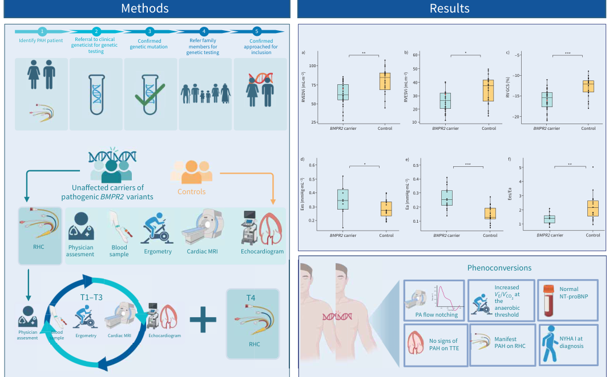

## Question

# Disease Characteristics Research Template

## Target Disease
- **Disease Name:** Heritable Pulmonary Arterial Hypertension
- **MONDO ID:**  (if available)
- **Category:** Genetic

## Research Objectives

Please provide a comprehensive research report on **Heritable Pulmonary Arterial Hypertension** covering all of the
disease characteristics listed below. This report will be used to populate a disease knowledge
base entry. Be thorough and cite primary literature (PMID preferred) for all claims.

For each section, **suggested databases/resources** are listed. These are the first places
you should search for information on each topic.

---

### 1. Disease Information
> **Search first:** OMIM, Orphanet, ICD-10/ICD-11, MeSH, PubMed

- What is the disease? Provide a concise overview.
- What are the key identifiers? (OMIM, Orphanet, ICD-10/ICD-11, MeSH, Mondo)
- What are the common synonyms and alternative names?
- Is the information derived from individual patients (e.g., EHR) or aggregated disease-level resources?

### 2. Etiology

- **Disease Causal Factors**: What are the primary causes? (genetic, environmental, infectious, mechanistic)
- **Risk Factors**:
  > **Search first:** PubMed, Cochrane Library, UpToDate, clinical guidelines, ClinVar, ClinGen, GWAS Catalog, PheGenI, CTD, CDC, WHO, epidemiological databases
  - Genetic risk factors (causal variants, susceptibility loci, modifier genes)
  - Environmental risk factors (toxins, lifestyle, occupational exposures, age, sex, family history)
- **Protective Factors**:
  > **Search first:** PubMed, Cochrane Library, clinical trial databases, GWAS Catalog, gnomAD, WHO, CDC, nutrition databases
  - Genetic protective factors (protective variants, modifier alleles)
  - Environmental protective factors (diet, lifestyle, exposures that reduce risk)
- **Gene-Environment Interactions**: How do genetic and environmental factors interact to influence disease?
  > **Search first:** CTD, PubMed, PheGenI, GxE databases

### 3. Phenotypes
> **Search first:** HPO (Human Phenotype Ontology), OMIM, Orphanet, PubMed, clinicaltrials.gov, MedDRA, SNOMED CT, DECIPHER, LOINC

For each phenotype, provide:
- **Phenotype type**: symptoms, clinical signs, physical manifestations, behavioral changes, or laboratory abnormalities
  > For symptoms/signs: HPO, OMIM, Orphanet, PubMed
  > For behavioral changes: HPO, DSM, RDoC (Research Domain Criteria), PubMed
  > For laboratory abnormalities: LOINC, SNOMED CT, LabTests Online, PubMed
- **Phenotype characteristics**:
  > **Search first:** OMIM, Orphanet, HPO, PubMed
  - Age of symptom onset (neonatal, childhood, adult-onset, late-onset)
  - Symptom severity (mild, moderate, severe, variable)
  - Symptom progression (stable, progressive, episodic, fluctuating)
  - Frequency among affected individuals (percentage or qualitative)
- **Quality of life impact**: Effects on daily functioning and well-being (per-phenotype when possible)
  > **Search first:** EQ-5D database, SF-36, WHO QOL databases, PubMed
- Suggest HPO (Human Phenotype Ontology) terms for each phenotype

### 4. Genetic/Molecular Information

- **Causal Genes**: Gene mutations or chromosomal abnormalities responsible for disease (gene symbols, OMIM IDs)
  > **Search first:** OMIM, ClinVar, HGMD, Ensembl, NCBI Gene
- **Pathogenic Variants**:
  - Affected genes (gene symbols, HGNC IDs)
    > **Search first:** OMIM, NCBI Gene, Ensembl, HGNC, UniProt, GeneCards
  - Variant classification (pathogenic, likely pathogenic, VUS per ACMG/AMP guidelines)
    > **Search first:** ClinVar, ClinGen, ACMG/AMP guidelines, VarSome
  - Variant type/class (missense, frameshift, nonsense, splice-site, structural)
  - Allele frequency in population databases
    > **Search first:** gnomAD, 1000 Genomes, ExAC, TOPMed, dbSNP
  - Somatic vs germline origin
    > **Search first:** COSMIC (somatic), ClinVar, ICGC, TCGA
  - Functional consequences (loss of function, gain of function, dominant negative)
- **Modifier Genes**: Genes that modify disease severity or expression
- **Epigenetic Information**: DNA methylation, histone modifications, chromatin changes affecting disease
  > **Search first:** ENCODE, Roadmap Epigenomics, MethBase, DiseaseMeth
- **Chromosomal Abnormalities**: Large-scale genetic changes (aneuploidy, translocations, inversions)
  > **Search first:** DECIPHER, ClinVar, ECARUCA, UCSC Genome Browser

### 5. Environmental Information

- **Environmental Factors**: Non-genetic contributing factors (toxins, radiation, pollution, occupational exposure)
  > **Search first:** CTD (Comparative Toxicogenomics Database), TOXNET, PubMed, EPA databases
- **Lifestyle Factors**: Behavioral factors (smoking, diet, exercise, alcohol consumption)
  > **Search first:** CDC databases, WHO, PubMed, NHANES
- **Infectious Agents**: If applicable, pathogens causing or triggering disease (bacteria, viruses, fungi, parasites)
  > **Search first:** NCBI Taxonomy, ViPR, BV-BRC, MicrobeDB, GIDEON

### 6. Mechanism / Pathophysiology

- **Molecular Pathways**: Specific signaling cascades or biochemical pathways involved (Wnt, MAPK, mTOR, PI3K-AKT, etc.)
  > **Search first:** KEGG, Reactome, WikiPathways, PathBank, BioCyc
- **Cellular Processes**: Cell-level mechanisms (apoptosis, autophagy, cell cycle dysregulation, inflammation, etc.)
  > **Search first:** Gene Ontology (GO), Reactome, KEGG, PubMed
- **Protein Dysfunction**: How protein structure or function is altered (misfolding, aggregation, loss of function, gain of function)
  > **Search first:** UniProt, PDB (Protein Data Bank), InterPro, Pfam, AlphaFold
- **Metabolic Changes**: Alterations in metabolic processes (energy metabolism, lipid metabolism, amino acid metabolism)
  > **Search first:** KEGG, BioCyc, HMDB (Human Metabolome Database), BRENDA
- **Immune System Involvement**: Role of immune response (autoimmunity, immunodeficiency, chronic inflammation)
  > **Search first:** ImmPort, Immunome Database, IEDB, Gene Ontology
- **Tissue Damage Mechanisms**: How tissues/ are injured (oxidative stress, ischemia, fibrosis, necrosis)
  > **Search first:** PubMed, Gene Ontology, Reactome
- **Biochemical Abnormalities**: Specific molecular defects (enzyme deficiencies, receptor dysfunction, ion channel defects)
  > **Search first:** BRENDA, UniProt, KEGG, OMIM, PubMed
- **Epigenetic Changes**: DNA methylation, histone modifications affecting gene expression in disease
  > **Search first:** ENCODE, Roadmap Epigenomics, MethBase, DiseaseMeth
- **Molecular Profiling** (if available):
  - Transcriptomics/gene expression changes
    > **Search first:** GEO (Gene Expression Omnibus), ArrayExpress, GTEx, Human Cell Atlas, SRA
  - Proteomics findings
    > **Search first:** PRIDE, ProteomeXchange, Human Protein Atlas, STRING, BioGRID
  - Metabolomics signatures
    > **Search first:** MetaboLights, Metabolomics Workbench, HMDB, METLIN
  - Lipidomics alterations
    > **Search first:** LIPID MAPS, SwissLipids, LipidHome, Metabolomics Workbench
  - Genomic structural features
    > **Search first:** UCSC Genome Browser, Ensembl, NCBI, dbVar, DGV
- **Advanced Technologies** (if applicable):
  - Single-cell analysis findings (cell-type specific mechanisms, cellular heterogeneity)
    > **Search first:** Human Cell Atlas, Single Cell Portal, GEO, CELLxGENE
  - Spatial transcriptomics findings
    > **Search first:** GEO, Spatial Research, Vizgen, 10x Genomics data
  - Multi-omics integration results
    > **Search first:** TCGA, ICGC, cBioPortal, LinkedOmics, PubMed
  - Functional genomics screens (CRISPR, RNAi)
    > **Search first:** DepMap, GenomeRNAi, PubMed, BioGRID ORCS

For each mechanism, describe:
- The causal chain from initial trigger to clinical manifestation
- Which mechanisms are upstream vs downstream
- What cell types and biological processes are involved
- Suggest GO terms for biological processes and CL terms for cell types

### 7. Anatomical Structures Affected

- **Organ Level**:
  - Primary organs directly affected
  - Secondary organ involvement (complications, secondary effects)
  - Body systems involved (cardiovascular, nervous, digestive, respiratory, endocrine, etc.)
  > **Search first:** Uberon, FMA (Foundational Model of Anatomy), OMIM, HPO, ICD-11, MeSH, SNOMED CT
- **Tissue and Cell Level**:
  - Specific tissue types affected (epithelial, connective, muscle, nervous)
  - Specific cell populations targeted (with Cell Ontology terms)
  > **Search first:** Uberon, Human Protein Atlas, Cell Ontology, Human Cell Atlas, CellMarker, PanglaoDB
- **Subcellular Level**:
  - Cellular compartments involved (mitochondria, nucleus, ER, lysosomes) (with GO Cellular Component terms)
  > **Search first:** Gene Ontology (Cellular Component), UniProt, Human Protein Atlas
- **Localization**:
  - Specific anatomical sites (with UBERON terms)
    > **Search first:** FMA, Uberon, NeuroNames (for brain), SNOMED CT
  - Lateralization (unilateral, bilateral, asymmetric)
    > **Search first:** HPO, clinical literature, imaging databases

### 8. Temporal Development

- **Onset**:
  - Typical age of onset (congenital, pediatric, adult, geriatric)
  - Onset pattern (acute, subacute, chronic, insidious)
  > **Search first:** OMIM, Orphanet, HPO, PubMed
- **Progression**:
  - Disease stages (early, intermediate, advanced, end-stage)
    > **Search first:** Cancer Staging Manual (AJCC), WHO classifications, PubMed
  - Progression rate (rapid, slow, variable)
  - Disease course pattern (episodic, relapsing-remitting, progressive, stable)
  - Disease duration (self-limited, chronic lifelong)
  > **Search first:** Disease registries, longitudinal cohort databases, natural history studies, PubMed, Orphanet, OMIM
- **Patterns**:
  - Remission patterns (spontaneous, treatment-induced)
    > **Search first:** Clinical trial databases, disease registries, PubMed
  - Critical periods (time windows of vulnerability or opportunity for intervention)
    > **Search first:** PubMed, developmental biology databases, clinical guidelines

### 9. Inheritance and Population

- **Epidemiology**:
  - Prevalence (cases per 100,000 at given time)
  - Incidence (new cases per 100,000 per year)
  > **Search first:** Orphanet, CDC, WHO, GBD (Global Burden of Disease), national registries, SEER, disease registries
- **For Genetic Etiology**:
  - Inheritance pattern (AD, AR, X-linked, mitochondrial, multifactorial, polygenic)
    > **Search first:** OMIM, Orphanet, ClinVar, GTR (Genetic Testing Registry)
  - Penetrance (complete, incomplete, age-dependent)
    > **Search first:** ClinVar, OMIM, PubMed, ClinGen
  - Expressivity (variable, consistent)
    > **Search first:** OMIM, ClinVar, PubMed
  - Genetic anticipation (increasing severity in successive generations)
    > **Search first:** OMIM, PubMed (especially for repeat expansion disorders)
  - Germline mosaicism
    > **Search first:** ClinVar, OMIM, genetic counseling literature, PubMed
  - Founder effects (population-specific mutations)
    > **Search first:** gnomAD, population genetics databases, PubMed
  - Consanguinity role
    > **Search first:** OMIM, population studies, genetic counseling resources
  - Carrier frequency
    > **Search first:** gnomAD, carrier screening databases, GeneReviews, GTR
- **Population Demographics**:
  - Affected populations (ethnic or demographic groups with higher prevalence)
    > **Search first:** gnomAD, 1000 Genomes, PAGE Study, PubMed, population registries
  - Geographic distribution (endemic areas, regional variation)
    > **Search first:** WHO, CDC, GBD, Orphanet, geographic epidemiology databases
  - Geographic distribution of specific variants
  - Sex ratio (male:female)
    > **Search first:** Disease registries, OMIM, PubMed, epidemiological databases
  - Age distribution of affected individuals
    > **Search first:** CDC, disease registries, SEER, Orphanet

### 10. Diagnostics

- **Clinical Tests**:
  - Laboratory tests (blood, urine, tissue chemistry, specific enzyme assays)
    > **Search first:** LOINC, LabTests Online, PubMed
  - Biomarkers (proteins, metabolites, genetic markers, circulating biomarkers)
    > **Search first:** FDA Biomarker List, BEST (Biomarkers, EndpointS, and other Tools), PubMed
  - Imaging studies (X-ray, CT, MRI, PET, ultrasound)
    > **Search first:** RadLex, DICOM, Radiopaedia, imaging databases
  - Functional tests (pulmonary function, cardiac stress tests)
    > **Search first:** LOINC, clinical guidelines, PubMed
  - Electrophysiology (EEG, EMG, ECG, nerve conduction studies)
    > **Search first:** LOINC, clinical neurophysiology databases, PubMed
  - Biopsy findings (histopathology, immunohistochemistry)
    > **Search first:** SNOMED CT, College of American Pathologists resources, PubMed
  - Pathology findings (microscopic examination)
    > **Search first:** SNOMED CT, Digital Pathology databases, PubMed
- **Genetic Testing**:
  > **Search first:** GTR (Genetic Testing Registry), GeneReviews, ClinGen
  - Overview of recommended genetic testing approach
  - Whole genome sequencing (WGS) utility
    > **Search first:** GTR, ClinVar, GEL (Genomics England), gnomAD
  - Whole exome sequencing (WES) utility
    > **Search first:** GTR, ClinVar, OMIM, GeneMatcher
  - Gene panels (which panels, which genes)
    > **Search first:** GTR, ClinVar, laboratory-specific databases
  - Single gene testing
    > **Search first:** GTR, ClinVar, OMIM, GeneReviews
  - Chromosomal microarray (CMA)
    > **Search first:** DECIPHER, ClinVar, dbVar, ECARUCA
  - Karyotyping
    > **Search first:** Chromosome Abnormality Database, ClinVar, cytogenetics resources
  - FISH
    > **Search first:** ClinVar, cytogenetics databases, PubMed
  - Mitochondrial DNA testing
    > **Search first:** MITOMAP, MSeqDR, ClinVar, GTR
  - Repeat expansion testing
    > **Search first:** GTR, ClinVar, repeat expansion databases, PubMed
- **Omics-Based Diagnostics** (if applicable):
  - RNA sequencing / transcriptomics
    > **Search first:** GEO, ArrayExpress, GTEx, RNA-seq databases
  - Proteomics
    > **Search first:** PRIDE, ProteomeXchange, FDA Biomarker database
  - Metabolomics
    > **Search first:** MetaboLights, Metabolomics Workbench, HMDB
  - Epigenomics
    > **Search first:** GEO, ENCODE, Roadmap Epigenomics, MethBase
  - Liquid biopsy
    > **Search first:** COSMIC, ClinVar, liquid biopsy databases, PubMed
- **Clinical Criteria**:
  - Standardized diagnostic criteria (DSM, ICD, society guidelines)
    > **Search first:** DSM-5, ICD-11, clinical society guidelines, UpToDate
  - Differential diagnosis (other conditions to rule out, with distinguishing features)
    > **Search first:** DynaMed, UpToDate, clinical decision support systems
- **Screening**:
  - Screening methods for asymptomatic individuals (newborn screening, carrier screening, cascade screening)
    > **Search first:** ACMG recommendations, CDC newborn screening, GTR

### 11. Outcome/Prognosis

- **Survival and Mortality**:
  - Survival rate (5-year, 10-year, overall)
    > **Search first:** SEER, cancer registries, disease-specific registries, PubMed
  - Life expectancy (with and without treatment if applicable)
    > **Search first:** Orphanet, disease registries, actuarial databases, PubMed
  - Mortality rate
    > **Search first:** CDC, WHO, GBD, national mortality databases
  - Disease-specific mortality (deaths directly attributable to disease)
    > **Search first:** Disease registries, CDC Wonder, GBD, PubMed
- **Morbidity and Function**:
  - Morbidity (disease-related disability and health impacts)
    > **Search first:** GBD, WHO, disability databases, PubMed
  - Disability outcomes (long-term functional impairments)
    > **Search first:** ICF (International Classification of Functioning), disability registries
  - Quality of life measures (EQ-5D, SF-36, PROMIS, disease-specific tools)
    > **Search first:** EQ-5D database, SF-36, PROMIS, PubMed
- **Disease Course**:
  - Complications (secondary problems: infections, organ failure, etc.)
    > **Search first:** ICD codes, disease registries, clinical databases, PubMed
  - Recovery potential (likelihood and extent of recovery, with vs without treatment)
    > **Search first:** Natural history studies, rehabilitation databases, PubMed
- **Prediction**:
  - Prognostic factors (age, disease severity, biomarkers, treatment response)
    > **Search first:** Prognostic models databases, clinical calculators, PubMed
  - Prognostic biomarkers (molecular markers predicting disease course)
    > **Search first:** FDA Biomarker database, PubMed, cancer prognostic databases

### 12. Treatment

- **Pharmacotherapy**:
  - Pharmacological treatments (drug names, drug classes, mechanisms of action)
    > **Search first:** DrugBank, RxNorm, ATC classification, DailyMed, FDA databases
  - Pharmacogenomics (how genetic variants affect drug metabolism, efficacy, toxicity)
    > **Search first:** PharmGKB, CPIC (Clinical Pharmacogenetics), FDA Table of PGx Biomarkers
- **Advanced Therapeutics**:
  - Gene therapy (viral vectors, CRISPR, gene replacement, gene editing)
    > **Search first:** ClinicalTrials.gov, FDA gene therapy database, ASGCT resources
  - Cell therapy (stem cell transplant, CAR-T, cellular therapeutics)
    > **Search first:** ClinicalTrials.gov, FDA cell therapy database, FACT standards
  - RNA-based therapies (ASOs, siRNA, mRNA therapies)
    > **Search first:** ClinicalTrials.gov, FDA approvals, PubMed
  - Targeted therapies (treatments directed at specific molecular targets)
    > **Search first:** My Cancer Genome, OncoKB, ClinicalTrials.gov, FDA approvals
  - Immunotherapies (checkpoint inhibitors, monoclonal antibodies)
    > **Search first:** Cancer Immunotherapy Database, FDA approvals, ClinicalTrials.gov
- **Surgical and Interventional**:
  - Surgical interventions (types of surgery, timing, outcomes)
    > **Search first:** CPT codes, surgical registries, clinical guidelines, PubMed
- **Supportive and Rehabilitative**:
  - Supportive care (symptom management, pain control, nutrition)
    > **Search first:** Clinical guidelines, Cochrane Library, PubMed
  - Rehabilitation (physical therapy, occupational therapy, speech therapy)
    > **Search first:** Rehabilitation medicine databases, clinical guidelines, PubMed
- **Experimental**:
  - Experimental treatments in clinical trials (with NCT identifiers if available)
    > **Search first:** ClinicalTrials.gov, EU Clinical Trials Register, WHO ICTRP
- **Treatment Outcomes**:
  - Treatment response rates
    > **Search first:** Clinical trial databases, FDA reviews, systematic reviews, PubMed
  - Side effects and adverse events
    > **Search first:** FDA Adverse Event Reporting System (FAERS), MedWatch, PubMed
- **Treatment Strategy**:
  - Treatment algorithms (clinical pathways, decision trees)
    > **Search first:** Clinical practice guidelines, NCCN Guidelines, UpToDate
  - Combination therapies
    > **Search first:** ClinicalTrials.gov, treatment guidelines, PubMed
  - Personalized medicine approaches (genotype-guided treatment)
    > **Search first:** My Cancer Genome, CIViC, PharmGKB, precision medicine databases

For each treatment, suggest MAXO (Medical Action Ontology) terms where applicable.

### 13. Prevention

- **Prevention Levels**:
  - Primary prevention (preventing disease occurrence: vaccination, risk factor modification)
    > **Search first:** CDC, WHO, USPSTF recommendations, Cochrane Library
  - Secondary prevention (early detection and treatment: screening programs, early intervention)
    > **Search first:** USPSTF, CDC screening guidelines, WHO
  - Tertiary prevention (preventing complications in those with disease)
    > **Search first:** Clinical guidelines, disease management protocols, PubMed
- **Immunization**: Vaccine strategies (if applicable)
  > **Search first:** CDC vaccine schedules, WHO immunization, FDA vaccine database
- **Screening and Early Detection**:
  - Screening programs (population-based: newborn screening, cancer screening)
    > **Search first:** CDC screening programs, USPSTF, cancer screening databases
  - Genetic screening (carrier screening, preimplantation genetic diagnosis, prenatal testing)
    > **Search first:** ACMG recommendations, ACOG guidelines, GTR
  - Risk stratification (identifying high-risk individuals for targeted prevention)
    > **Search first:** Risk prediction models, clinical calculators, PubMed
- **Behavioral Interventions**: Lifestyle modifications to reduce risk
  > **Search first:** CDC, WHO, behavioral intervention databases, Cochrane Library
- **Counseling**: Genetic counseling (risk assessment, family planning guidance)
  > **Search first:** NSGC resources, ACMG guidelines, GeneReviews
- **Public Health**:
  - Public health interventions (sanitation, vector control, health education)
    > **Search first:** CDC, WHO, public health databases, PubMed
  - Environmental interventions (reducing environmental risk factors)
    > **Search first:** EPA databases, WHO environmental health, PubMed
- **Prophylaxis**: Preventive medications or procedures
  > **Search first:** Clinical guidelines, FDA approvals, PubMed

### 14. Other Species / Natural Disease

- **Taxonomy**: Species affected (with NCBI Taxon identifiers)
  > **Search first:** NCBI Taxonomy
- **Breed**: Specific breeds affected (with VBO identifiers if applicable)
  > **Search first:** VBO (Vertebrate Breed Ontology)
- **Gene**: Orthologous genes in other species (with NCBI Gene IDs)
  > **Search first:** NCBI Gene
- **Natural Disease**:
  - Naturally occurring disease in other species (companion animals, wildlife)
    > **Search first:** OMIA (Online Mendelian Inheritance in Animals), VetCompass, PubMed
  - Veterinary relevance and importance in animal health
    > **Search first:** OMIA, veterinary databases, PubMed
- **Comparative Biology**:
  - Comparative pathology (similarities and differences across species)
    > **Search first:** OMIA, comparative pathology databases, PubMed
  - Evolutionary conservation of disease mechanisms
    > **Search first:** HomoloGene, OrthoMCL, Alliance of Genome Resources
- **Transmission** (if applicable):
  - Zoonotic potential
    > **Search first:** CDC zoonotic diseases, WHO zoonoses, GIDEON
  - Cross-species susceptibility
    > **Search first:** NCBI Taxonomy, veterinary databases, PubMed

### 15. Model Organisms

- **Model Types**:
  - Model organism type (mammalian, invertebrate, cellular, in vitro)
    > **Search first:** Alliance of Genome Resources, model organism databases
  - Specific model systems (mouse, rat, zebrafish, Drosophila, C. elegans, yeast, cell lines, organoids, iPSCs)
    > **Search first:** MGI, RGD, ZFIN, FlyBase, WormBase, SGD, ATCC, Cellosaurus
  - Induced models (drug treatment, surgical intervention, environmental manipulation)
    > **Search first:** MGI, model organism databases, PubMed
- **Genetic Models**:
  - Types available (knockout, knock-in, transgenic, conditional, humanized)
    > **Search first:** MGI, IMPC, KOMP, EuMMCR, IMSR
- **Model Characteristics**:
  - Phenotype recapitulation (how well model reproduces human disease features)
    > **Search first:** Model organism databases, comparative studies, PubMed
  - Model limitations (aspects of human disease not captured)
    > **Search first:** Model organism databases, PubMed, review articles
- **Applications**:
  - Research applications (what aspects of disease can be studied)
    > **Search first:** Model organism databases, PubMed
- **Resources**:
  - Model databases
    > **Search first:** MGI, RGD, ZFIN, FlyBase, WormBase, IMSR, EMMA, MMRRC

---

## Citation Requirements

- Cite primary literature (PMID preferred) for all mechanistic and clinical claims
- Prioritize recent reviews and landmark papers
- Include direct quotes from abstracts where possible to support key statements
- Distinguish evidence source types: human clinical, model organism, in vitro, computational

## Output Format

Structure your response as a comprehensive narrative organized by the sections above.
For each section, provide:
- Factual content with specific details (numbers, percentages, gene names, variant nomenclature)
- Ontology term suggestions (HPO, GO, CL, UBERON, CHEBI, MAXO, MONDO) where applicable
- Evidence citations with PMIDs
- Direct quotes from abstracts to support key claims
- Clear indication when information is not available or not applicable for this disease

This report will be used to populate a disease knowledge base entry with:
- Pathophysiology descriptions with causal chains
- Gene/protein annotations (HGNC, GO terms)
- Phenotype associations (HP terms) with frequencies
- Cell type involvement (CL terms)
- Anatomical locations (UBERON terms)
- Chemical entities (CHEBI terms)
- Treatment annotations (MAXO terms)
- Evidence items with PMIDs and exact abstract quotes
- Epidemiology, prognosis, diagnostic, and prevention information
- Animal model descriptions with phenotype recapitulation details

## Output

Question: You are an expert researcher providing comprehensive, well-cited information.

Provide detailed information focusing on:
1. Key concepts and definitions with current understanding
2. Recent developments and latest research (prioritize 2023-2024 sources)
3. Current applications and real-world implementations
4. Expert opinions and analysis from authoritative sources
5. Relevant statistics and data from recent studies

Format as a comprehensive research report with proper citations. Include URLs and publication dates where available.
Always prioritize recent, authoritative sources and provide specific citations for all major claims.

# Disease Characteristics Research Template

## Target Disease
- **Disease Name:** Heritable Pulmonary Arterial Hypertension
- **MONDO ID:**  (if available)
- **Category:** Genetic

## Research Objectives

Please provide a comprehensive research report on **Heritable Pulmonary Arterial Hypertension** covering all of the
disease characteristics listed below. This report will be used to populate a disease knowledge
base entry. Be thorough and cite primary literature (PMID preferred) for all claims.

For each section, **suggested databases/resources** are listed. These are the first places
you should search for information on each topic.

---

### 1. Disease Information
> **Search first:** OMIM, Orphanet, ICD-10/ICD-11, MeSH, PubMed

- What is the disease? Provide a concise overview.
- What are the key identifiers? (OMIM, Orphanet, ICD-10/ICD-11, MeSH, Mondo)
- What are the common synonyms and alternative names?
- Is the information derived from individual patients (e.g., EHR) or aggregated disease-level resources?

### 2. Etiology

- **Disease Causal Factors**: What are the primary causes? (genetic, environmental, infectious, mechanistic)
- **Risk Factors**:
  > **Search first:** PubMed, Cochrane Library, UpToDate, clinical guidelines, ClinVar, ClinGen, GWAS Catalog, PheGenI, CTD, CDC, WHO, epidemiological databases
  - Genetic risk factors (causal variants, susceptibility loci, modifier genes)
  - Environmental risk factors (toxins, lifestyle, occupational exposures, age, sex, family history)
- **Protective Factors**:
  > **Search first:** PubMed, Cochrane Library, clinical trial databases, GWAS Catalog, gnomAD, WHO, CDC, nutrition databases
  - Genetic protective factors (protective variants, modifier alleles)
  - Environmental protective factors (diet, lifestyle, exposures that reduce risk)
- **Gene-Environment Interactions**: How do genetic and environmental factors interact to influence disease?
  > **Search first:** CTD, PubMed, PheGenI, GxE databases

### 3. Phenotypes
> **Search first:** HPO (Human Phenotype Ontology), OMIM, Orphanet, PubMed, clinicaltrials.gov, MedDRA, SNOMED CT, DECIPHER, LOINC

For each phenotype, provide:
- **Phenotype type**: symptoms, clinical signs, physical manifestations, behavioral changes, or laboratory abnormalities
  > For symptoms/signs: HPO, OMIM, Orphanet, PubMed
  > For behavioral changes: HPO, DSM, RDoC (Research Domain Criteria), PubMed
  > For laboratory abnormalities: LOINC, SNOMED CT, LabTests Online, PubMed
- **Phenotype characteristics**:
  > **Search first:** OMIM, Orphanet, HPO, PubMed
  - Age of symptom onset (neonatal, childhood, adult-onset, late-onset)
  - Symptom severity (mild, moderate, severe, variable)
  - Symptom progression (stable, progressive, episodic, fluctuating)
  - Frequency among affected individuals (percentage or qualitative)
- **Quality of life impact**: Effects on daily functioning and well-being (per-phenotype when possible)
  > **Search first:** EQ-5D database, SF-36, WHO QOL databases, PubMed
- Suggest HPO (Human Phenotype Ontology) terms for each phenotype

### 4. Genetic/Molecular Information

- **Causal Genes**: Gene mutations or chromosomal abnormalities responsible for disease (gene symbols, OMIM IDs)
  > **Search first:** OMIM, ClinVar, HGMD, Ensembl, NCBI Gene
- **Pathogenic Variants**:
  - Affected genes (gene symbols, HGNC IDs)
    > **Search first:** OMIM, NCBI Gene, Ensembl, HGNC, UniProt, GeneCards
  - Variant classification (pathogenic, likely pathogenic, VUS per ACMG/AMP guidelines)
    > **Search first:** ClinVar, ClinGen, ACMG/AMP guidelines, VarSome
  - Variant type/class (missense, frameshift, nonsense, splice-site, structural)
  - Allele frequency in population databases
    > **Search first:** gnomAD, 1000 Genomes, ExAC, TOPMed, dbSNP
  - Somatic vs germline origin
    > **Search first:** COSMIC (somatic), ClinVar, ICGC, TCGA
  - Functional consequences (loss of function, gain of function, dominant negative)
- **Modifier Genes**: Genes that modify disease severity or expression
- **Epigenetic Information**: DNA methylation, histone modifications, chromatin changes affecting disease
  > **Search first:** ENCODE, Roadmap Epigenomics, MethBase, DiseaseMeth
- **Chromosomal Abnormalities**: Large-scale genetic changes (aneuploidy, translocations, inversions)
  > **Search first:** DECIPHER, ClinVar, ECARUCA, UCSC Genome Browser

### 5. Environmental Information

- **Environmental Factors**: Non-genetic contributing factors (toxins, radiation, pollution, occupational exposure)
  > **Search first:** CTD (Comparative Toxicogenomics Database), TOXNET, PubMed, EPA databases
- **Lifestyle Factors**: Behavioral factors (smoking, diet, exercise, alcohol consumption)
  > **Search first:** CDC databases, WHO, PubMed, NHANES
- **Infectious Agents**: If applicable, pathogens causing or triggering disease (bacteria, viruses, fungi, parasites)
  > **Search first:** NCBI Taxonomy, ViPR, BV-BRC, MicrobeDB, GIDEON

### 6. Mechanism / Pathophysiology

- **Molecular Pathways**: Specific signaling cascades or biochemical pathways involved (Wnt, MAPK, mTOR, PI3K-AKT, etc.)
  > **Search first:** KEGG, Reactome, WikiPathways, PathBank, BioCyc
- **Cellular Processes**: Cell-level mechanisms (apoptosis, autophagy, cell cycle dysregulation, inflammation, etc.)
  > **Search first:** Gene Ontology (GO), Reactome, KEGG, PubMed
- **Protein Dysfunction**: How protein structure or function is altered (misfolding, aggregation, loss of function, gain of function)
  > **Search first:** UniProt, PDB (Protein Data Bank), InterPro, Pfam, AlphaFold
- **Metabolic Changes**: Alterations in metabolic processes (energy metabolism, lipid metabolism, amino acid metabolism)
  > **Search first:** KEGG, BioCyc, HMDB (Human Metabolome Database), BRENDA
- **Immune System Involvement**: Role of immune response (autoimmunity, immunodeficiency, chronic inflammation)
  > **Search first:** ImmPort, Immunome Database, IEDB, Gene Ontology
- **Tissue Damage Mechanisms**: How tissues/ are injured (oxidative stress, ischemia, fibrosis, necrosis)
  > **Search first:** PubMed, Gene Ontology, Reactome
- **Biochemical Abnormalities**: Specific molecular defects (enzyme deficiencies, receptor dysfunction, ion channel defects)
  > **Search first:** BRENDA, UniProt, KEGG, OMIM, PubMed
- **Epigenetic Changes**: DNA methylation, histone modifications affecting gene expression in disease
  > **Search first:** ENCODE, Roadmap Epigenomics, MethBase, DiseaseMeth
- **Molecular Profiling** (if available):
  - Transcriptomics/gene expression changes
    > **Search first:** GEO (Gene Expression Omnibus), ArrayExpress, GTEx, Human Cell Atlas, SRA
  - Proteomics findings
    > **Search first:** PRIDE, ProteomeXchange, Human Protein Atlas, STRING, BioGRID
  - Metabolomics signatures
    > **Search first:** MetaboLights, Metabolomics Workbench, HMDB, METLIN
  - Lipidomics alterations
    > **Search first:** LIPID MAPS, SwissLipids, LipidHome, Metabolomics Workbench
  - Genomic structural features
    > **Search first:** UCSC Genome Browser, Ensembl, NCBI, dbVar, DGV
- **Advanced Technologies** (if applicable):
  - Single-cell analysis findings (cell-type specific mechanisms, cellular heterogeneity)
    > **Search first:** Human Cell Atlas, Single Cell Portal, GEO, CELLxGENE
  - Spatial transcriptomics findings
    > **Search first:** GEO, Spatial Research, Vizgen, 10x Genomics data
  - Multi-omics integration results
    > **Search first:** TCGA, ICGC, cBioPortal, LinkedOmics, PubMed
  - Functional genomics screens (CRISPR, RNAi)
    > **Search first:** DepMap, GenomeRNAi, PubMed, BioGRID ORCS

For each mechanism, describe:
- The causal chain from initial trigger to clinical manifestation
- Which mechanisms are upstream vs downstream
- What cell types and biological processes are involved
- Suggest GO terms for biological processes and CL terms for cell types

### 7. Anatomical Structures Affected

- **Organ Level**:
  - Primary organs directly affected
  - Secondary organ involvement (complications, secondary effects)
  - Body systems involved (cardiovascular, nervous, digestive, respiratory, endocrine, etc.)
  > **Search first:** Uberon, FMA (Foundational Model of Anatomy), OMIM, HPO, ICD-11, MeSH, SNOMED CT
- **Tissue and Cell Level**:
  - Specific tissue types affected (epithelial, connective, muscle, nervous)
  - Specific cell populations targeted (with Cell Ontology terms)
  > **Search first:** Uberon, Human Protein Atlas, Cell Ontology, Human Cell Atlas, CellMarker, PanglaoDB
- **Subcellular Level**:
  - Cellular compartments involved (mitochondria, nucleus, ER, lysosomes) (with GO Cellular Component terms)
  > **Search first:** Gene Ontology (Cellular Component), UniProt, Human Protein Atlas
- **Localization**:
  - Specific anatomical sites (with UBERON terms)
    > **Search first:** FMA, Uberon, NeuroNames (for brain), SNOMED CT
  - Lateralization (unilateral, bilateral, asymmetric)
    > **Search first:** HPO, clinical literature, imaging databases

### 8. Temporal Development

- **Onset**:
  - Typical age of onset (congenital, pediatric, adult, geriatric)
  - Onset pattern (acute, subacute, chronic, insidious)
  > **Search first:** OMIM, Orphanet, HPO, PubMed
- **Progression**:
  - Disease stages (early, intermediate, advanced, end-stage)
    > **Search first:** Cancer Staging Manual (AJCC), WHO classifications, PubMed
  - Progression rate (rapid, slow, variable)
  - Disease course pattern (episodic, relapsing-remitting, progressive, stable)
  - Disease duration (self-limited, chronic lifelong)
  > **Search first:** Disease registries, longitudinal cohort databases, natural history studies, PubMed, Orphanet, OMIM
- **Patterns**:
  - Remission patterns (spontaneous, treatment-induced)
    > **Search first:** Clinical trial databases, disease registries, PubMed
  - Critical periods (time windows of vulnerability or opportunity for intervention)
    > **Search first:** PubMed, developmental biology databases, clinical guidelines

### 9. Inheritance and Population

- **Epidemiology**:
  - Prevalence (cases per 100,000 at given time)
  - Incidence (new cases per 100,000 per year)
  > **Search first:** Orphanet, CDC, WHO, GBD (Global Burden of Disease), national registries, SEER, disease registries
- **For Genetic Etiology**:
  - Inheritance pattern (AD, AR, X-linked, mitochondrial, multifactorial, polygenic)
    > **Search first:** OMIM, Orphanet, ClinVar, GTR (Genetic Testing Registry)
  - Penetrance (complete, incomplete, age-dependent)
    > **Search first:** ClinVar, OMIM, PubMed, ClinGen
  - Expressivity (variable, consistent)
    > **Search first:** OMIM, ClinVar, PubMed
  - Genetic anticipation (increasing severity in successive generations)
    > **Search first:** OMIM, PubMed (especially for repeat expansion disorders)
  - Germline mosaicism
    > **Search first:** ClinVar, OMIM, genetic counseling literature, PubMed
  - Founder effects (population-specific mutations)
    > **Search first:** gnomAD, population genetics databases, PubMed
  - Consanguinity role
    > **Search first:** OMIM, population studies, genetic counseling resources
  - Carrier frequency
    > **Search first:** gnomAD, carrier screening databases, GeneReviews, GTR
- **Population Demographics**:
  - Affected populations (ethnic or demographic groups with higher prevalence)
    > **Search first:** gnomAD, 1000 Genomes, PAGE Study, PubMed, population registries
  - Geographic distribution (endemic areas, regional variation)
    > **Search first:** WHO, CDC, GBD, Orphanet, geographic epidemiology databases
  - Geographic distribution of specific variants
  - Sex ratio (male:female)
    > **Search first:** Disease registries, OMIM, PubMed, epidemiological databases
  - Age distribution of affected individuals
    > **Search first:** CDC, disease registries, SEER, Orphanet

### 10. Diagnostics

- **Clinical Tests**:
  - Laboratory tests (blood, urine, tissue chemistry, specific enzyme assays)
    > **Search first:** LOINC, LabTests Online, PubMed
  - Biomarkers (proteins, metabolites, genetic markers, circulating biomarkers)
    > **Search first:** FDA Biomarker List, BEST (Biomarkers, EndpointS, and other Tools), PubMed
  - Imaging studies (X-ray, CT, MRI, PET, ultrasound)
    > **Search first:** RadLex, DICOM, Radiopaedia, imaging databases
  - Functional tests (pulmonary function, cardiac stress tests)
    > **Search first:** LOINC, clinical guidelines, PubMed
  - Electrophysiology (EEG, EMG, ECG, nerve conduction studies)
    > **Search first:** LOINC, clinical neurophysiology databases, PubMed
  - Biopsy findings (histopathology, immunohistochemistry)
    > **Search first:** SNOMED CT, College of American Pathologists resources, PubMed
  - Pathology findings (microscopic examination)
    > **Search first:** SNOMED CT, Digital Pathology databases, PubMed
- **Genetic Testing**:
  > **Search first:** GTR (Genetic Testing Registry), GeneReviews, ClinGen
  - Overview of recommended genetic testing approach
  - Whole genome sequencing (WGS) utility
    > **Search first:** GTR, ClinVar, GEL (Genomics England), gnomAD
  - Whole exome sequencing (WES) utility
    > **Search first:** GTR, ClinVar, OMIM, GeneMatcher
  - Gene panels (which panels, which genes)
    > **Search first:** GTR, ClinVar, laboratory-specific databases
  - Single gene testing
    > **Search first:** GTR, ClinVar, OMIM, GeneReviews
  - Chromosomal microarray (CMA)
    > **Search first:** DECIPHER, ClinVar, dbVar, ECARUCA
  - Karyotyping
    > **Search first:** Chromosome Abnormality Database, ClinVar, cytogenetics resources
  - FISH
    > **Search first:** ClinVar, cytogenetics databases, PubMed
  - Mitochondrial DNA testing
    > **Search first:** MITOMAP, MSeqDR, ClinVar, GTR
  - Repeat expansion testing
    > **Search first:** GTR, ClinVar, repeat expansion databases, PubMed
- **Omics-Based Diagnostics** (if applicable):
  - RNA sequencing / transcriptomics
    > **Search first:** GEO, ArrayExpress, GTEx, RNA-seq databases
  - Proteomics
    > **Search first:** PRIDE, ProteomeXchange, FDA Biomarker database
  - Metabolomics
    > **Search first:** MetaboLights, Metabolomics Workbench, HMDB
  - Epigenomics
    > **Search first:** GEO, ENCODE, Roadmap Epigenomics, MethBase
  - Liquid biopsy
    > **Search first:** COSMIC, ClinVar, liquid biopsy databases, PubMed
- **Clinical Criteria**:
  - Standardized diagnostic criteria (DSM, ICD, society guidelines)
    > **Search first:** DSM-5, ICD-11, clinical society guidelines, UpToDate
  - Differential diagnosis (other conditions to rule out, with distinguishing features)
    > **Search first:** DynaMed, UpToDate, clinical decision support systems
- **Screening**:
  - Screening methods for asymptomatic individuals (newborn screening, carrier screening, cascade screening)
    > **Search first:** ACMG recommendations, CDC newborn screening, GTR

### 11. Outcome/Prognosis

- **Survival and Mortality**:
  - Survival rate (5-year, 10-year, overall)
    > **Search first:** SEER, cancer registries, disease-specific registries, PubMed
  - Life expectancy (with and without treatment if applicable)
    > **Search first:** Orphanet, disease registries, actuarial databases, PubMed
  - Mortality rate
    > **Search first:** CDC, WHO, GBD, national mortality databases
  - Disease-specific mortality (deaths directly attributable to disease)
    > **Search first:** Disease registries, CDC Wonder, GBD, PubMed
- **Morbidity and Function**:
  - Morbidity (disease-related disability and health impacts)
    > **Search first:** GBD, WHO, disability databases, PubMed
  - Disability outcomes (long-term functional impairments)
    > **Search first:** ICF (International Classification of Functioning), disability registries
  - Quality of life measures (EQ-5D, SF-36, PROMIS, disease-specific tools)
    > **Search first:** EQ-5D database, SF-36, PROMIS, PubMed
- **Disease Course**:
  - Complications (secondary problems: infections, organ failure, etc.)
    > **Search first:** ICD codes, disease registries, clinical databases, PubMed
  - Recovery potential (likelihood and extent of recovery, with vs without treatment)
    > **Search first:** Natural history studies, rehabilitation databases, PubMed
- **Prediction**:
  - Prognostic factors (age, disease severity, biomarkers, treatment response)
    > **Search first:** Prognostic models databases, clinical calculators, PubMed
  - Prognostic biomarkers (molecular markers predicting disease course)
    > **Search first:** FDA Biomarker database, PubMed, cancer prognostic databases

### 12. Treatment

- **Pharmacotherapy**:
  - Pharmacological treatments (drug names, drug classes, mechanisms of action)
    > **Search first:** DrugBank, RxNorm, ATC classification, DailyMed, FDA databases
  - Pharmacogenomics (how genetic variants affect drug metabolism, efficacy, toxicity)
    > **Search first:** PharmGKB, CPIC (Clinical Pharmacogenetics), FDA Table of PGx Biomarkers
- **Advanced Therapeutics**:
  - Gene therapy (viral vectors, CRISPR, gene replacement, gene editing)
    > **Search first:** ClinicalTrials.gov, FDA gene therapy database, ASGCT resources
  - Cell therapy (stem cell transplant, CAR-T, cellular therapeutics)
    > **Search first:** ClinicalTrials.gov, FDA cell therapy database, FACT standards
  - RNA-based therapies (ASOs, siRNA, mRNA therapies)
    > **Search first:** ClinicalTrials.gov, FDA approvals, PubMed
  - Targeted therapies (treatments directed at specific molecular targets)
    > **Search first:** My Cancer Genome, OncoKB, ClinicalTrials.gov, FDA approvals
  - Immunotherapies (checkpoint inhibitors, monoclonal antibodies)
    > **Search first:** Cancer Immunotherapy Database, FDA approvals, ClinicalTrials.gov
- **Surgical and Interventional**:
  - Surgical interventions (types of surgery, timing, outcomes)
    > **Search first:** CPT codes, surgical registries, clinical guidelines, PubMed
- **Supportive and Rehabilitative**:
  - Supportive care (symptom management, pain control, nutrition)
    > **Search first:** Clinical guidelines, Cochrane Library, PubMed
  - Rehabilitation (physical therapy, occupational therapy, speech therapy)
    > **Search first:** Rehabilitation medicine databases, clinical guidelines, PubMed
- **Experimental**:
  - Experimental treatments in clinical trials (with NCT identifiers if available)
    > **Search first:** ClinicalTrials.gov, EU Clinical Trials Register, WHO ICTRP
- **Treatment Outcomes**:
  - Treatment response rates
    > **Search first:** Clinical trial databases, FDA reviews, systematic reviews, PubMed
  - Side effects and adverse events
    > **Search first:** FDA Adverse Event Reporting System (FAERS), MedWatch, PubMed
- **Treatment Strategy**:
  - Treatment algorithms (clinical pathways, decision trees)
    > **Search first:** Clinical practice guidelines, NCCN Guidelines, UpToDate
  - Combination therapies
    > **Search first:** ClinicalTrials.gov, treatment guidelines, PubMed
  - Personalized medicine approaches (genotype-guided treatment)
    > **Search first:** My Cancer Genome, CIViC, PharmGKB, precision medicine databases

For each treatment, suggest MAXO (Medical Action Ontology) terms where applicable.

### 13. Prevention

- **Prevention Levels**:
  - Primary prevention (preventing disease occurrence: vaccination, risk factor modification)
    > **Search first:** CDC, WHO, USPSTF recommendations, Cochrane Library
  - Secondary prevention (early detection and treatment: screening programs, early intervention)
    > **Search first:** USPSTF, CDC screening guidelines, WHO
  - Tertiary prevention (preventing complications in those with disease)
    > **Search first:** Clinical guidelines, disease management protocols, PubMed
- **Immunization**: Vaccine strategies (if applicable)
  > **Search first:** CDC vaccine schedules, WHO immunization, FDA vaccine database
- **Screening and Early Detection**:
  - Screening programs (population-based: newborn screening, cancer screening)
    > **Search first:** CDC screening programs, USPSTF, cancer screening databases
  - Genetic screening (carrier screening, preimplantation genetic diagnosis, prenatal testing)
    > **Search first:** ACMG recommendations, ACOG guidelines, GTR
  - Risk stratification (identifying high-risk individuals for targeted prevention)
    > **Search first:** Risk prediction models, clinical calculators, PubMed
- **Behavioral Interventions**: Lifestyle modifications to reduce risk
  > **Search first:** CDC, WHO, behavioral intervention databases, Cochrane Library
- **Counseling**: Genetic counseling (risk assessment, family planning guidance)
  > **Search first:** NSGC resources, ACMG guidelines, GeneReviews
- **Public Health**:
  - Public health interventions (sanitation, vector control, health education)
    > **Search first:** CDC, WHO, public health databases, PubMed
  - Environmental interventions (reducing environmental risk factors)
    > **Search first:** EPA databases, WHO environmental health, PubMed
- **Prophylaxis**: Preventive medications or procedures
  > **Search first:** Clinical guidelines, FDA approvals, PubMed

### 14. Other Species / Natural Disease

- **Taxonomy**: Species affected (with NCBI Taxon identifiers)
  > **Search first:** NCBI Taxonomy
- **Breed**: Specific breeds affected (with VBO identifiers if applicable)
  > **Search first:** VBO (Vertebrate Breed Ontology)
- **Gene**: Orthologous genes in other species (with NCBI Gene IDs)
  > **Search first:** NCBI Gene
- **Natural Disease**:
  - Naturally occurring disease in other species (companion animals, wildlife)
    > **Search first:** OMIA (Online Mendelian Inheritance in Animals), VetCompass, PubMed
  - Veterinary relevance and importance in animal health
    > **Search first:** OMIA, veterinary databases, PubMed
- **Comparative Biology**:
  - Comparative pathology (similarities and differences across species)
    > **Search first:** OMIA, comparative pathology databases, PubMed
  - Evolutionary conservation of disease mechanisms
    > **Search first:** HomoloGene, OrthoMCL, Alliance of Genome Resources
- **Transmission** (if applicable):
  - Zoonotic potential
    > **Search first:** CDC zoonotic diseases, WHO zoonoses, GIDEON
  - Cross-species susceptibility
    > **Search first:** NCBI Taxonomy, veterinary databases, PubMed

### 15. Model Organisms

- **Model Types**:
  - Model organism type (mammalian, invertebrate, cellular, in vitro)
    > **Search first:** Alliance of Genome Resources, model organism databases
  - Specific model systems (mouse, rat, zebrafish, Drosophila, C. elegans, yeast, cell lines, organoids, iPSCs)
    > **Search first:** MGI, RGD, ZFIN, FlyBase, WormBase, SGD, ATCC, Cellosaurus
  - Induced models (drug treatment, surgical intervention, environmental manipulation)
    > **Search first:** MGI, model organism databases, PubMed
- **Genetic Models**:
  - Types available (knockout, knock-in, transgenic, conditional, humanized)
    > **Search first:** MGI, IMPC, KOMP, EuMMCR, IMSR
- **Model Characteristics**:
  - Phenotype recapitulation (how well model reproduces human disease features)
    > **Search first:** Model organism databases, comparative studies, PubMed
  - Model limitations (aspects of human disease not captured)
    > **Search first:** Model organism databases, PubMed, review articles
- **Applications**:
  - Research applications (what aspects of disease can be studied)
    > **Search first:** Model organism databases, PubMed
- **Resources**:
  - Model databases
    > **Search first:** MGI, RGD, ZFIN, FlyBase, WormBase, IMSR, EMMA, MMRRC

---

## Citation Requirements

- Cite primary literature (PMID preferred) for all mechanistic and clinical claims
- Prioritize recent reviews and landmark papers
- Include direct quotes from abstracts where possible to support key statements
- Distinguish evidence source types: human clinical, model organism, in vitro, computational

## Output Format

Structure your response as a comprehensive narrative organized by the sections above.
For each section, provide:
- Factual content with specific details (numbers, percentages, gene names, variant nomenclature)
- Ontology term suggestions (HPO, GO, CL, UBERON, CHEBI, MAXO, MONDO) where applicable
- Evidence citations with PMIDs
- Direct quotes from abstracts to support key claims
- Clear indication when information is not available or not applicable for this disease

This report will be used to populate a disease knowledge base entry with:
- Pathophysiology descriptions with causal chains
- Gene/protein annotations (HGNC, GO terms)
- Phenotype associations (HP terms) with frequencies
- Cell type involvement (CL terms)
- Anatomical locations (UBERON terms)
- Chemical entities (CHEBI terms)
- Treatment annotations (MAXO terms)
- Evidence items with PMIDs and exact abstract quotes
- Epidemiology, prognosis, diagnostic, and prevention information
- Animal model descriptions with phenotype recapitulation details

## Comprehensive Research Report: Heritable Pulmonary Arterial Hypertension (HPAH)

### Executive summary (current understanding)
Heritable pulmonary arterial hypertension (HPAH) is a subgroup of pulmonary arterial hypertension (PAH; WHO/ESC group 1 pulmonary hypertension) in which PAH occurs in familial clusters and/or in sporadic cases with an identifiable (likely) pathogenic germline variant in a PAH-predisposition gene. It is most commonly caused by heterozygous loss-of-function variants in **BMPR2**, shows **autosomal dominant inheritance with incomplete penetrance**, and is characterized by progressive pulmonary arteriolar remodeling leading to increased pulmonary vascular resistance (PVR), elevated pulmonary artery pressure, right ventricular (RV) hypertrophy, and right-heart failure. Recent 2023–2024 World Symposium/European Respiratory Society (WSPH/ERS) task-force and consensus documents emphasize (i) the expanded, curated list of clinically valid PAH genes, (ii) routine integration of genetic counseling/testing into PAH care pathways for defined patient subsets, and (iii) emergence of **activin/TGF-β–pathway modulation** (sotatercept) as a new therapeutic pillar alongside the endothelin, nitric oxide, and prostacyclin pathways. (eichstaedt2023geneticcounsellingand pages 2-3, kovacs2024definitionclassificationand pages 15-17, li2024bonemorphogeneticprotein pages 1-2, arvidsson2024…inflammatoryproteins pages 27-30)

---

## 1. Disease Information

### 1.1 What is the disease? (concise overview)
PAH is described as a rare, severe pulmonary vascular disorder with obliteration/remodeling of pulmonary microvessels causing increased PVR, progressive elevation of pulmonary artery pressure, RV hypertrophy and failure (eichstaedt2023geneticcounsellingand pages 1-2). In the ERS genetics consensus statement, **HPAH** is defined as including familial PAH and sporadic PAH when an underlying (likely) pathogenic variant in a PAH-predisposing gene is present (eichstaedt2023geneticcounsellingand pages 2-3).

### 1.2 Key identifiers (ontology/clinical coding)
The current evidence corpus directly supports the following ontology identifiers:

| Disease name / term | Definition / notes | MONDO ID | Related ontology / disease IDs mentioned in evidence | Orphanet / OMIM IDs explicitly present in current evidence | Guideline / classification placement | Evidence / Source (with URL, year) |
|---|---|---|---|---|---|---|
| Heritable pulmonary arterial hypertension (HPAH) | Distinct subgroup of PAH; includes familial cases and sporadic cases with an underlying (likely) pathogenic variant in a PAH-predisposing gene; approximately 3% of all PAH cases in the cited classification review | MONDO_0017148 | Related PAH ontology IDs in current evidence: EFO_0001361 (pulmonary arterial hypertension); related disease in evidence: MONDO_0024533 (pulmonary hypertension, primary, 1) | Orphanet: not retrieved in current evidence; OMIM: not retrieved in current evidence | Group 1 PH, subgroup 1.2 (HPAH retained in current classification) | Kovacs et al., *Eur Respir J* 2024, https://doi.org/10.1183/13993003.01324-2024; Eichstaedt et al., *Eur Respir J* 2023, https://doi.org/10.1183/13993003.01471-2022; Open Targets disease association context (kovacs2024definitionclassificationand pages 15-17, eichstaedt2023geneticcounsellingand pages 2-3, OpenTargets Search: pulmonary arterial hypertension) |
| Pulmonary arterial hypertension (PAH) | Rare, severe pulmonary vascular disease with obliteration/remodeling of small pulmonary vessels, increased pulmonary vascular resistance, progressive elevation of pulmonary artery pressure, and right-heart failure risk | not retrieved in current evidence | EFO_0001361 | Orphanet: not retrieved in current evidence; OMIM: not retrieved in current evidence | Group 1 pulmonary hypertension | Eichstaedt et al., *Eur Respir J* 2023, https://doi.org/10.1183/13993003.01471-2022; Kovacs et al., *Eur Respir J* 2024, https://doi.org/10.1183/13993003.01324-2024 (eichstaedt2023geneticcounsellingand pages 1-2, kovacs2024definitionclassificationand pages 2-3) |
| Pulmonary hypertension, primary, 1 | Related disease entity linked in current evidence resources; included here because it is explicitly returned as a related MONDO disease in evidence supporting PAH/HPAH gene associations | MONDO_0024533 | Related to HPAH/PAH evidence context | Orphanet: not retrieved in current evidence; OMIM: not retrieved in current evidence | not retrieved in current evidence | Open Targets disease-target association context for PAH/HPAH, showing related disease entity “pulmonary hypertension, primary, 1” (OpenTargets Search: pulmonary arterial hypertension) |

*Table: This table summarizes the key disease names, identifiers, and classification terms for heritable pulmonary arterial hypertension that were explicitly supported in the retrieved evidence. It is useful for normalizing nomenclature and ontology mappings for a disease knowledge base entry.*

**Gaps:** Orphanet, OMIM, ICD-10/ICD-11, and MeSH identifiers were **not retrievable from the tool-accessible sources** in this run, and are therefore not reported (to avoid unverified assertions).

### 1.3 Common synonyms / alternative names
Evidence-supported synonyms and related terms include:
- “Familial PAH (FPAH)” in the context of heritable disease (eichstaedt2023geneticcounsellingand pages 2-3).
- Historical terminology: idiopathic PAH previously termed “primary pulmonary hypertension (PPH)” (eichstaedt2023geneticcounsellingand pages 2-3).

### 1.4 Evidence source type (individual vs aggregated)
Key statements in this report draw primarily from **aggregated disease-level resources** (WSPH/ERS task-force reports and consensus statements) and **cohort-based human studies**, supplemented with **animal and in vitro experimental model studies** (kovacs2024definitionclassificationand pages 15-17, eichstaedt2023geneticcounsellingand pages 2-3, wang2024hemodynamicandclinical pages 1-3, todesco2024pulmonaryhypertensioninduced pages 1-2, wang2023dysregulatedsmoothmuscle pages 1-3).

---

## 2. Etiology

### 2.1 Disease causal factors
**Primary cause:** Pathogenic germline variants in PAH-predisposition genes, most commonly **BMPR2**, with autosomal dominant inheritance and incomplete penetrance (eichstaedt2023geneticcounsellingand pages 3-4, li2024bonemorphogeneticprotein pages 1-2). BMPR2 variants predispose to small pulmonary artery narrowing by “driving cell proliferation and preventing apoptosis,” producing vascular remodeling with smooth muscle and fibroblast proliferation, neointimal lesions and plexiform lesions (eichstaedt2023geneticcounsellingand pages 2-3).

**Current gene set:** A 2024 WSPH/ERS definition/classification report cites an international expert panel classifying **12 genes** with “definitive evidence” for PAH gene–disease relationship: **BMPR2, ACVRL1, ATP13A3, CAV1, EIF2AK4, ENG, GDF2, KCNK3, KDR, SMAD9, SOX17, TBX4** (kovacs2024definitionclassificationand pages 15-17).

### 2.2 Risk factors
#### Genetic risk factors (causal variants)
- **BMPR2**: most prevalent disease gene; “found in over 80% of heritable cases” (abstract quote) (li2024bonemorphogeneticprotein pages 1-2). BMPR2 mutations are also found in ~17% of idiopathic PAH (li2024bonemorphogeneticprotein pages 1-2).
- **Sex-dimorphic penetrance** in BMPR2 carriers: penetrance estimated ~30% overall with **42% of heterozygous women** and **14% of heterozygous men** developing PAH (eichstaedt2023geneticcounsellingand pages 3-4). 
- **PVOD/PCH genetics** (important differential): heritable PVOD/PCH is autosomal recessive due to **biallelic EIF2AK4** pathogenic variants; biallelic EIF2AK4 variants represent at least **25%** of PVOD/PCH cases (eichstaedt2023geneticcounsellingand pages 3-4).

#### Environmental / clinical “second hits” (gene–environment / gene–trigger interactions)
Multiple experimental and conceptual frameworks support the idea that incomplete penetrance implies additional triggers. In a 2024 BMPR2 rat model paper, the authors state: “**The incomplete penetrance of BMPR2 mutations implies that additional triggers are necessary**” (abstract quote) (todesco2024pulmonaryhypertensioninduced pages 1-2). Second-hit triggers used in BMPR2 models include hypoxia, inflammation (e.g., LPS), serotonin, monocrotaline, and surgical flow redistribution (RPA occlusion) (todesco2024pulmonaryhypertensioninduced pages 1-2).

### 2.3 Protective factors
Direct, evidence-backed protective factors for HPAH were not explicitly identified in the retrieved sources. One cohort study suggested “**GDF2 may be a protective or corrected modifier in certain genetic backgrounds**” (abstract quote) based on observed differences in circulating GDF2 in variant carriers, but this is **hypothesis-generating** rather than definitive protection (wang2024hemodynamicandclinical pages 1-3).

---

## 3. Phenotypes
Evidence-supported phenotypes, diagnostic features, and quantitative cohort data are summarized here:

| Domain | Item | Quantitative data (frequency, thresholds, cohort values) | Ontology term suggestions | Key sources with URL and year |
|---|---|---|---|---|
| Phenotype | Pulmonary arterial hypertension / elevated pulmonary artery pressure | PH defined as **mPAP >20 mmHg**; precapillary PH defined by **mPAP >20 mmHg, PAWP ≤15 mmHg, PVR >2 WU** | HPO: Pulmonary hypertension [HP:0002092]; UBERON: pulmonary artery [UBERON:0002012] | Kovacs et al. 2024, https://doi.org/10.1183/13993003.01324-2024; Lechartier et al. 2023, https://doi.org/10.1055/s-0043-1770115 (kovacs2024definitionclassificationand pages 2-3, lechartier2023updatedhemodynamicdefinition pages 1-2) |
| Phenotype | Right ventricular hypertrophy / right-sided heart failure | Core disease consequence; PAH leads to RV hypertrophy and progressive right heart failure; in Taiwanese PAH cohort, mean **mPAP 41 ± 16 mmHg**, **PVR 8 ± 7 WU**, **CI 2.7 ± 1.1 L/min/m²** | HPO: Right ventricular hypertrophy [HP:0006682], Right-sided heart failure [HP:0001678]; UBERON: right ventricle [UBERON:0002084] | Li & Quigley 2024, https://doi.org/10.1042/BST20231547; Wang et al. 2024, https://doi.org/10.3390/ijms25052734 (li2024bonemorphogeneticprotein pages 1-2, wang2024hemodynamicandclinical pages 1-3) |
| Phenotype | Pulmonary vascular remodeling / neointimal and plexiform lesions | Qualitative hallmark; BMPR2-related disease associated with proliferation, reduced apoptosis, neointimal lesions, complex plexiform lesions | HPO: Pulmonary hypertension [HP:0002092]; GO: blood vessel remodeling [GO:0001974], regulation of apoptotic process [GO:0042981]; CL: endothelial cell [CL:0000115], smooth muscle cell [CL:0000192] | Eichstaedt et al. 2023, https://doi.org/10.1183/13993003.01471-2022 (eichstaedt2023geneticcounsellingand pages 2-3) |
| Phenotype | Female predominance | Across registries **70–80%** of PAH patients are female; younger adult prevalence about **2:1 female:male**; female predominance varies by subgroup | HPO: not disease-specific; use clinical demographic annotation rather than HPO | Eichstaedt et al. 2023, https://doi.org/10.1183/13993003.01471-2022 (eichstaedt2023geneticcounsellingand pages 2-3) |
| Phenotype | Worse hemodynamics in BMPR2/GDF2 variant carriers | In 69-patient cohort, BMPR2 and GDF2 variant subgroups had worse hemodynamics; GDF2 carriers had lower plasma **GDF2 135.6 ± 36.2 pg/mL vs 267.8 ± 185.8 pg/mL**, **p=0.002** | HPO: Pulmonary hypertension [HP:0002092]; GO: BMP signaling pathway [GO:0030509] | Wang et al. 2024, https://doi.org/10.3390/ijms25052734 (wang2024hemodynamicandclinical pages 1-3) |
| Phenotype | Reduced diffusing capacity / CT abnormalities in specific genetic subgroups | PVOD/PCH and KDR-related disease may present with **low DLCO** and CT abnormalities; SOX17 subset may show dilated/tortuous pulmonary vessels, ground-glass opacities, haemoptysis | HPO: Decreased diffusing capacity of the lungs for carbon monoxide [HP:0045051], Hemoptysis [HP:0031964], Ground-glass opacification on pulmonary HRCT [HP:0025179] | Eichstaedt et al. 2023, https://doi.org/10.1183/13993003.01471-2022 (eichstaedt2023geneticcounsellingand pages 3-4) |
| Diagnostic test | Right heart catheterization (RHC) | Required for definitive diagnosis; updated precapillary PH criteria: **mPAP >20 mmHg, PAWP ≤15 mmHg, PVR >2 WU** | LOINC: not specified in current evidence; UBERON: pulmonary artery [UBERON:0002012] | Kovacs et al. 2024, https://doi.org/10.1183/13993003.01324-2024; Lechartier et al. 2023, https://doi.org/10.1055/s-0043-1770115 (kovacs2024definitionclassificationand pages 2-3, lechartier2023updatedhemodynamicdefinition pages 1-2) |
| Diagnostic test | Echocardiography | Principal screening tool but cannot confirm mPAP; recommended annually in asymptomatic high-risk groups | HPO support term if abnormal: Abnormal echocardiogram [HP:0031862]; UBERON: heart [UBERON:0000948] | Lechartier et al. 2023, https://doi.org/10.1055/s-0043-1770115; Kovacs et al. 2024, https://doi.org/10.1183/13993003.01324-2024 (lechartier2023updatedhemodynamicdefinition pages 1-2, kovacs2024definitionclassificationand pages 15-17) |
| Diagnostic test | ECG | Recommended annually for asymptomatic high-risk groups (e.g., BMPR2 carriers, first-degree relatives of HPAH patients) | HPO: Abnormal electrocardiogram [HP:0003115] | Kovacs et al. 2024, https://doi.org/10.1183/13993003.01324-2024 (kovacs2024definitionclassificationand pages 15-17) |
| Diagnostic test | NT-proBNP / BNP | Recommended annually for screening asymptomatic high-risk groups; in Taiwanese cohort mean **NT-proBNP 1869 ± 2988 ng/L** | LOINC suggestion: NT-proBNP [33762-6]; HPO: Abnormal circulating natriuretic peptide concentration [HP:0034375] | Kovacs et al. 2024, https://doi.org/10.1183/13993003.01324-2024; Wang et al. 2024, https://doi.org/10.3390/ijms25052734 (kovacs2024definitionclassificationand pages 15-17, wang2024hemodynamicandclinical pages 1-3) |
| Diagnostic test | DETECT screening tool | Can be applied to appropriate patients with systemic sclerosis spectrum disorders meeting inclusion/exclusion criteria | Ontology: screening tool; no direct HPO term | Kovacs et al. 2024, https://doi.org/10.1183/13993003.01324-2024 (kovacs2024definitionclassificationand pages 15-17) |
| Diagnostic test | Vasoreactivity testing | About **10%** of PAH patients are acute responders; response defined as **mPAP decrease ≥10 mmHg to ≤40 mmHg with increased/unchanged CO** | HPO: Response to vasodilator challenge abnormality not standardized; clinical test annotation preferred | Treatment/biomarker summary excerpt 2024 (arvidsson2024…inflammatoryproteins pages 27-30) |
| Diagnostic test | Genetic testing / gene panel | Recommended for idiopathic PAH, suspected HPAH/family history, anorexigen-associated PAH, PAH-CHD, and suspected PVOD/PCH; international expert panel lists **12 genes with definitive evidence** | SO: sequence variant; MONDO: heritable pulmonary arterial hypertension [MONDO:0017148] | Kovacs et al. 2024, https://doi.org/10.1183/13993003.01324-2024; Eichstaedt et al. 2023, https://doi.org/10.1183/13993003.01471-2022 (kovacs2024definitionclassificationand pages 15-17, eichstaedt2023geneticcounsellingand pages 1-2) |
| Epidemiology | PAH incidence | **2.5–7.5 cases per million per year** | MONDO/EFO disease annotation rather than HPO | Eichstaedt et al. 2023, https://doi.org/10.1183/13993003.01471-2022 (eichstaedt2023geneticcounsellingand pages 2-3) |
| Epidemiology | PAH prevalence | **15–50 per million** in registry data; another review cites **15–26 per million** in western countries | MONDO/EFO disease annotation rather than HPO | Eichstaedt et al. 2023, https://doi.org/10.1183/13993003.01471-2022; Li & Quigley 2024, https://doi.org/10.1042/BST20231547 (eichstaedt2023geneticcounsellingand pages 2-3, li2024bonemorphogeneticprotein pages 1-2) |
| Epidemiology | Proportion of PAH classified as HPAH | About **3%** of all PAH patients are classified as HPAH | MONDO: heritable pulmonary arterial hypertension [MONDO:0017148] | Eichstaedt et al. 2023, https://doi.org/10.1183/13993003.01471-2022; Kovacs et al. 2024, https://doi.org/10.1183/13993003.01324-2024 (eichstaedt2023geneticcounsellingand pages 2-3, kovacs2024definitionclassificationand pages 15-17) |
| Epidemiology | Genetic contribution among familial and idiopathic PAH | Genetic cause identifiable in **70–87% of familial PAH** and **12–20% of idiopathic PAH**; another cohort/review notes **25–30%** of idiopathic PAH have an underlying genetic cause | MONDO: heritable pulmonary arterial hypertension [MONDO:0017148] | Eichstaedt et al. 2023, https://doi.org/10.1183/13993003.01471-2022; Wang et al. 2024, https://doi.org/10.3390/ijms25052734 (eichstaedt2023geneticcounsellingand pages 2-3, wang2024hemodynamicandclinical pages 1-3) |
| Epidemiology | BMPR2 contribution and penetrance | BMPR2 variants in **>80% familial/heritable cases**, **~17% idiopathic PAH**; penetrance **42% in heterozygous women** and **14% in heterozygous men** | HGNC: BMPR2; GO: BMP signaling pathway [GO:0030509] | Li & Quigley 2024, https://doi.org/10.1042/BST20231547; Eichstaedt et al. 2023, https://doi.org/10.1183/13993003.01471-2022 (li2024bonemorphogeneticprotein pages 1-2, eichstaedt2023geneticcounsellingand pages 3-4) |
| Epidemiology | Diagnostic delay | Mean delay to diagnosis about **2.8 years** | Clinical course annotation rather than HPO | Eichstaedt et al. 2023, https://doi.org/10.1183/13993003.01471-2022 (eichstaedt2023geneticcounsellingand pages 1-2) |
| Epidemiology | Cohort characteristics from Taiwanese idiopathic/heritable PAH study | **n=69**; age at diagnosis **50 ± 20 years**; **6MWD 332 ± 127 m**; **PAWP 14 ± 4 mmHg**; **WHO FC III 63.8%**; pulmonary artery saturation **66 ± 12%** | HPO: Reduced exercise tolerance [HP:0003546]; UBERON: pulmonary artery [UBERON:0002012] | Wang et al. 2024, https://doi.org/10.3390/ijms25052734 (wang2024hemodynamicandclinical pages 1-3) |

*Table: This table compiles evidence-backed clinical phenotypes, diagnostic criteria, screening tools, and epidemiology relevant to heritable pulmonary arterial hypertension. It is useful for rapid disease knowledge-base population because it pairs quantitative findings with ontology suggestions and direct evidence sources.*

### 3.1 Phenotype characteristics (selected)
- **Age of onset:** Variable; gene-specific early onset noted for ACVRL1-associated PAH with median onset 20 years in the HHT/ACVRL1 context (eichstaedt2023geneticcounsellingand pages 3-4).
- **Sex bias:** Female predominance 70–80% overall across PAH registries, with variation by subgroup (eichstaedt2023geneticcounsellingand pages 2-3).
- **Severity/progression:** BMPR2 pathogenic variant carriers have younger onset and a more compromised hemodynamic profile and higher risk of death or lung transplantation (eichstaedt2023geneticcounsellingand pages 3-4).

### 3.2 Quality of life impact
Quality-of-life metrics (e.g., EQ-5D, SF-36) were not directly retrievable in the present evidence set. Functional limitation is indirectly supported through 6-minute walk distance (6MWD) and WHO functional class distributions in a 2024 cohort (wang2024hemodynamicandclinical pages 1-3).

---

## 4. Genetic / Molecular Information

### 4.1 Causal genes (definitive list)

| Gene symbol | Functional pathway / class | Evidence-supported notes | Inheritance mode if explicitly stated | Key quantitative facts supported in current evidence | Key sources with URLs and years |
|---|---|---|---|---|---|
| **BMPR2** | BMP/TGF-β signaling; type II BMP receptor | Most prevalent HPAH gene; included in 12-gene “definitive evidence” list; HPAH most often caused by heterozygous BMPR2 variants; pathogenic variants drive small-vessel narrowing via increased proliferation and reduced apoptosis; BMPR2 carriers tend to present younger, with worse hemodynamics and higher risk of death/lung transplant (eichstaedt2023geneticcounsellingand pages 2-3, eichstaedt2023geneticcounsellingand pages 3-4, kovacs2024definitionclassificationand pages 15-17, li2024bonemorphogeneticprotein pages 1-2) | **AD with incomplete penetrance** (eichstaedt2023geneticcounsellingand pages 3-4) | >80% familial/heritable cases; ~17% idiopathic PAH; penetrance ~30% overall, 42% in heterozygous women, 14% in heterozygous men; >800 independent pathogenic variants reported (li2024bonemorphogeneticprotein pages 1-2, eichstaedt2023geneticcounsellingand pages 3-4, eichstaedt2023geneticcounsellingand pages 2-3, wang2024hemodynamicandclinical pages 1-3) | Li & Quigley 2024, https://doi.org/10.1042/BST20231547; Eichstaedt et al. 2023, https://doi.org/10.1183/13993003.01471-2022; Kovacs et al. 2024, https://doi.org/10.1183/13993003.01324-2024 |
| **ACVRL1** | BMP/TGF-β signaling; type I receptor (ALK1) | Included in definitive-evidence PAH gene list; HHT-associated PAH gene; PAH may be first sign of later HHT in some carriers (kovacs2024definitionclassificationand pages 15-17, eichstaedt2023geneticcounsellingand pages 3-4) | **AD** for HHT context explicitly stated (eichstaedt2023geneticcounsellingand pages 3-4) | ACVRL1-associated PAH median onset reported at **20 years** (eichstaedt2023geneticcounsellingand pages 3-4) | Eichstaedt et al. 2023, https://doi.org/10.1183/13993003.01471-2022; Kovacs et al. 2024, https://doi.org/10.1183/13993003.01324-2024 |
| **ENG** | BMP/TGF-β signaling; co-receptor endoglin | Included in definitive-evidence PAH gene list; HHT-associated PAH gene (kovacs2024definitionclassificationand pages 15-17, eichstaedt2023geneticcounsellingand pages 3-4) | **AD** for HHT context explicitly stated (eichstaedt2023geneticcounsellingand pages 3-4) | No gene-specific HPAH frequency quantified in current evidence (eichstaedt2023geneticcounsellingand pages 3-4, kovacs2024definitionclassificationand pages 15-17) | Eichstaedt et al. 2023, https://doi.org/10.1183/13993003.01471-2022; Kovacs et al. 2024, https://doi.org/10.1183/13993003.01324-2024 |
| **SMAD4** | BMP/TGF-β signaling mediator | Reported as HHT/PAH-predisposing gene in consensus genetics statement (eichstaedt2023geneticcounsellingand pages 3-4) | Not explicitly stated for isolated PAH in current evidence | No quantitative HPAH estimate retrieved in current evidence (eichstaedt2023geneticcounsellingand pages 3-4) | Eichstaedt et al. 2023, https://doi.org/10.1183/13993003.01471-2022 |
| **SMAD9** | BMP/TGF-β signaling; SMAD effector | Included in definitive-evidence PAH gene list; recognized BMP-pathway PAH gene (kovacs2024definitionclassificationand pages 15-17, li2024bonemorphogeneticprotein pages 1-2) | Not explicitly stated in current evidence | No quantitative frequency retrieved in current evidence (kovacs2024definitionclassificationand pages 15-17, li2024bonemorphogeneticprotein pages 1-2) | Kovacs et al. 2024, https://doi.org/10.1183/13993003.01324-2024; Li & Quigley 2024, https://doi.org/10.1042/BST20231547 |
| **GDF2** | BMP/TGF-β signaling; ligand BMP9 | Included in definitive-evidence list; validated PAH gene in BMP pathway; GDF2 variant carriers in Taiwanese cohort were younger and had lower circulating GDF2; possible modifier role proposed (kovacs2024definitionclassificationand pages 15-17, wang2024hemodynamicandclinical pages 1-3, guignabert2024pathologyandpathobiology pages 11-12) | Not explicitly stated in current evidence | European-descent PAH: **0.8–1.2%**; Asian PAH: **6.7%** in one cited review; plasma GDF2 **135.6 ± 36.2 pg/mL vs 267.8 ± 185.8 pg/mL**, *p*=0.002 in variant vs non-BMPR2/non-GDF2 group (guignabert2024pathologyandpathobiology pages 11-12, wang2024hemodynamicandclinical pages 1-3) | Wang et al. 2024, https://doi.org/10.3390/ijms25052734; Guignabert et al. 2024, https://doi.org/10.1183/13993003.01095-2024; Kovacs et al. 2024, https://doi.org/10.1183/13993003.01324-2024 |
| **KCNK3** | Ion channel (two-pore K+ channel) | Included in definitive-evidence PAH gene list (kovacs2024definitionclassificationand pages 15-17) | Not explicitly stated in current evidence | No quantitative frequency retrieved in current evidence (kovacs2024definitionclassificationand pages 15-17) | Kovacs et al. 2024, https://doi.org/10.1183/13993003.01324-2024 |
| **TBX4** | Development / transcription factor; lung development | Included in definitive-evidence list; associated with developmental abnormalities and pediatric PAH enrichment; may show hip/knee issues and bronchial abnormalities (kovacs2024definitionclassificationand pages 15-17, eichstaedt2023geneticcounsellingand pages 3-4, guignabert2024pathologyandpathobiology pages 11-12) | **AD with incomplete penetrance and variable expressivity** (eichstaedt2023geneticcounsellingand pages 3-4) | Pathogenic variants reported in **3–7%** of CHD-APAH for SOX17, not TBX4; for TBX4 only qualitative pediatric enrichment supported in current evidence (eichstaedt2023geneticcounsellingand pages 3-4) | Eichstaedt et al. 2023, https://doi.org/10.1183/13993003.01471-2022; Kovacs et al. 2024, https://doi.org/10.1183/13993003.01324-2024; Guignabert et al. 2024, https://doi.org/10.1183/13993003.01095-2024 |
| **SOX17** | Development / transcription factor; vascular and cardiac development | Included in definitive-evidence list; described in FPAH/IPAH and especially CHD-associated PAH; associated CT findings may include dilated/tortuous pulmonary vessels, ground-glass opacities, haemoptysis (kovacs2024definitionclassificationand pages 15-17, eichstaedt2023geneticcounsellingand pages 3-4) | Not explicitly stated in current evidence | In CHD-associated PAH, pathogenic variants identified in **3–7%** of patients (eichstaedt2023geneticcounsellingand pages 3-4) | Eichstaedt et al. 2023, https://doi.org/10.1183/13993003.01471-2022; Kovacs et al. 2024, https://doi.org/10.1183/13993003.01324-2024 |
| **KDR** | Development / angiogenesis; VEGF receptor 2 | Included in definitive-evidence list; protein-truncating variants linked to PAH with interstitial lung disease and low DLCO (kovacs2024definitionclassificationand pages 15-17, eichstaedt2023geneticcounsellingand pages 3-4) | Not explicitly stated in current evidence | No quantitative frequency retrieved in current evidence (eichstaedt2023geneticcounsellingand pages 3-4, kovacs2024definitionclassificationand pages 15-17) | Eichstaedt et al. 2023, https://doi.org/10.1183/13993003.01471-2022; Kovacs et al. 2024, https://doi.org/10.1183/13993003.01324-2024 |
| **ATP13A3** | Membrane ATPase / transporter | Included in definitive-evidence list; among highest-incidence variants in one Taiwanese idiopathic/heritable PAH WES cohort (kovacs2024definitionclassificationand pages 15-17, wang2024hemodynamicandclinical pages 1-3) | Not explicitly stated in current evidence | Reported among highest-incidence variant genes in a **69-patient** cohort, but no percentage given in excerpt (wang2024hemodynamicandclinical pages 1-3) | Wang et al. 2024, https://doi.org/10.3390/ijms25052734; Kovacs et al. 2024, https://doi.org/10.1183/13993003.01324-2024 |
| **CAV1** | Caveolae / membrane signaling | Included in definitive-evidence list; also grouped among genes connected to BMPR-II signaling in 7th WSPH pathology review (kovacs2024definitionclassificationand pages 15-17, guignabert2024pathologyandpathobiology pages 11-12) | Not explicitly stated in current evidence | No quantitative frequency retrieved in current evidence (guignabert2024pathologyandpathobiology pages 11-12, kovacs2024definitionclassificationand pages 15-17) | Kovacs et al. 2024, https://doi.org/10.1183/13993003.01324-2024; Guignabert et al. 2024, https://doi.org/10.1183/13993003.01095-2024 |
| **EIF2AK4** | Integrated stress response kinase; PVOD/PCH gene | Included in definitive-evidence list for PAH gene-disease relationship review/guidelines, but clinically emphasized for **heritable PVOD/PCH** rather than classic HPAH; genetic testing can identify misclassified PVOD/PCH and prompt early transplant referral (kovacs2024definitionclassificationand pages 15-17, eichstaedt2023geneticcounsellingand pages 3-4) | **AR** for heritable PVOD/PCH due to **biallelic** variants; semidominant/AR note also mentioned generally for some PAH genes (eichstaedt2023geneticcounsellingand pages 3-4) | Biallelic EIF2AK4 variants represent **at least 25% of PVOD/PCH cases** (eichstaedt2023geneticcounsellingand pages 3-4) | Eichstaedt et al. 2023, https://doi.org/10.1183/13993003.01471-2022; Kovacs et al. 2024, https://doi.org/10.1183/13993003.01324-2024 |

*Table: This table summarizes the HPAH-definitive or clearly supported genes, their functional classes, inheritance notes, and the main quantitative facts retrievable from the current evidence corpus. It is useful for quickly populating a disease knowledge base with high-confidence gene-level information while distinguishing classic HPAH genes from EIF2AK4-associated PVOD/PCH.*

### 4.2 Pathogenic variants: classes and examples
- The ERS genetics consensus notes **“More than 800 different, independent pathogenic BMPR2 variants”** have been identified (eichstaedt2023geneticcounsellingand pages 2-3).
- A Taiwanese idiopathic/heritable PAH cohort (n=69; WES) reported BMPR2 variant types including nonsense, missense, and an in-frame deletion; example BMPR2 variants: **c.994C>T (p.Arg332\*)**, **c.1750C>T (p.Arg584\*)**, **c.1478C>T (p.Thr493Ile)**, **c.877_888del (p.Leu293_Ser296del)** (wang2024hemodynamicandclinical pages 1-3).

### 4.3 Modifier genes / interacting pathways
- **GDF2 (BMP9)**: mutations can reduce/abolish BMP9 plasma levels and show population frequency differences (European descent 0.8–1.2% vs Asian 6.7% in cited review) (guignabert2024pathologyandpathobiology pages 11-12). In the Taiwanese cohort, GDF2 variant carriers had lower circulating GDF2 (135.6 ± 36.2 pg/mL vs 267.8 ± 185.8 pg/mL; p=0.002) (wang2024hemodynamicandclinical pages 1-3).

### 4.4 Epigenetics / chromatin
Broad epigenetic discussion exists in PAH reviews, but HPAH-specific epigenetic mechanisms were not directly extractable from the current evidence set.

---

## 5. Environmental Information
Direct environmental/lifestyle risk factors specific to HPAH were not a focus of the retrieved 2023–2024 evidence set. However, multiple experimental studies and reviews emphasize **multifactorial causation** in PAH and “second hit” triggers (hypoxia, inflammation) that interact with genetic susceptibility (todesco2024pulmonaryhypertensioninduced pages 1-2, sanchezduffhues2023humanipscsas pages 11-13).

---

## 6. Mechanism / Pathophysiology

### 6.1 Central pathway concept: BMP/TGF-β imbalance
A 2024 review states: “**Endothelial dysfunction is recognised as an initial trigger for PAH**” (abstract quote) and emphasizes BMP signaling in maintaining endothelial integrity (li2024bonemorphogeneticprotein pages 1-2). Multiple PAH risk genes are within the BMP signaling pathway (BMPR2, ACVRL1, ENG, GDF2, SMAD9) (li2024bonemorphogeneticprotein pages 1-2). In BMPR2 mutation contexts, reduced antiproliferative BMP-Smad1/5/8 signaling and increased proproliferative TGF-β/Smad2/3 signaling are described (arvidsson2024…inflammatoryproteins pages 27-30).

### 6.2 Cellular processes and causal chain (evidence-backed)
1. **Upstream trigger:** Germline BMPR2 pathway dysfunction (haploinsufficiency/LOF) (li2024bonemorphogeneticprotein pages 1-2, eichstaedt2023geneticcounsellingand pages 2-3). 
2. **Early cellular dysfunction:** Endothelial dysfunction with impaired barrier integrity and dysregulated growth-factor signaling (li2024bonemorphogeneticprotein pages 1-2). 
3. **Vascular remodeling:** Increased PASMC/fibroblast proliferation and reduced apoptosis, neointima and plexiform lesions (eichstaedt2023geneticcounsellingand pages 2-3).
4. **Hemodynamic consequence:** Increased PVR and mPAP leading to RV hypertrophy, failure (eichstaedt2023geneticcounsellingand pages 1-2, li2024bonemorphogeneticprotein pages 1-2).

### 6.3 Mechanistic examples from recent experimental work (2023–2024)
- **PASMC BMPR2–ARRB2 axis (2023):** Smooth muscle–specific Bmpr2 knockout mice show increased proliferation and apoptosis resistance and impaired contractility, linked to pERK1/2–pP38–pSMAD2/3 signaling, ARRB2 upregulation, AKT activation and β-catenin (CTNNB1) nuclear signaling; reducing ARRB2 attenuated persistent PH in inducible BMPR2-loss mice (wang2023dysregulatedsmoothmuscle pages 1-3). 
- **Endothelial BMPR2 → DLL4/NOTCH1/PPARγ (2024):** BMPR2 silencing in pulmonary artery endothelial cells activated AKT and suppressed DLL4; exogenous DLL4/NOTCH1 signaling induced PPARγ and reversed proliferation/EndoMT phenotypes in vitro; reduced DLL4 expression was observed in small pulmonary arteries of PAH patients (awad2024bmpr2lossactivates pages 1-2).

### 6.4 Suggested ontology terms (mechanisms)
- **GO Biological Process:** blood vessel remodeling (GO:0001974); smooth muscle cell proliferation (e.g., GO:0048661); regulation of apoptotic process (GO:0042981); endothelial to mesenchymal transition (EndoMT; GO term depends on curation); response to hypoxia.
- **CL Cell types:** endothelial cell (CL:0000115); vascular smooth muscle cell (CL:0000359) / smooth muscle cell (CL:0000192); fibroblast (CL:0000057).

---

## 7. Anatomical Structures Affected
- **Primary:** Pulmonary arterioles/small pulmonary arteries (pre-capillary pulmonary arteries) with remodeling and obliteration (arvidsson2024…inflammatoryproteins pages 27-30, li2024bonemorphogeneticprotein pages 1-2). Suggested UBERON: pulmonary artery (UBERON:0002012).
- **Secondary:** Right ventricle (hypertrophy/dysfunction/failure) (li2024bonemorphogeneticprotein pages 1-2, wang2024hemodynamicandclinical pages 1-3). Suggested UBERON: right ventricle (UBERON:0002084).

---

## 8. Temporal Development
- **Onset:** Variable; may be early (e.g., ACVRL1-associated PAH median onset 20 years) (eichstaedt2023geneticcounsellingand pages 3-4).
- **Progression:** Progressive vascular remodeling leading to right heart failure; diagnostic delay ~2.8 years in registry-based summary (eichstaedt2023geneticcounsellingand pages 1-2).

---

## 9. Inheritance and Population

### 9.1 Inheritance pattern
- Main pattern: **autosomal dominant with incomplete penetrance** (eichstaedt2023geneticcounsellingand pages 3-4).
- Sex-dimorphic penetrance for BMPR2: **42% women** vs **14% men** (eichstaedt2023geneticcounsellingand pages 3-4).
- Important related entity: PVOD/PCH due to **autosomal recessive biallelic EIF2AK4** (eichstaedt2023geneticcounsellingand pages 3-4).

### 9.2 Epidemiology (recently summarized)
- PAH incidence: **2.5–7.5 per million per year**; prevalence **15–50 per million** (French and Scottish registry summary cited in consensus statement) (eichstaedt2023geneticcounsellingand pages 2-3).
- HPAH proportion: ~**3% of all PAH** (eichstaedt2023geneticcounsellingand pages 2-3, kovacs2024definitionclassificationand pages 15-17).
- Female predominance: **70–80% female** across registries (eichstaedt2023geneticcounsellingand pages 2-3).

---

## 10. Diagnostics

### 10.1 Hemodynamic definition (current)
The WSPH/ERS diagnostic definitions in 2023–2024 sources specify:
- Pulmonary hypertension: **mPAP >20 mmHg** (kovacs2024definitionclassificationand pages 2-3, lechartier2023updatedhemodynamicdefinition pages 1-2).
- Pre-capillary PH: **mPAP >20 mmHg, PAWP ≤15 mmHg, PVR >2 WU** (kovacs2024definitionclassificationand pages 2-3, lechartier2023updatedhemodynamicdefinition pages 1-2).

### 10.2 Screening in high-risk/asymptomatic individuals
A 2024 WSPH/ERS definition/classification report recommends screening asymptomatic high-risk groups (including **BMPR2 mutation carriers** and **first-degree relatives** of HPAH patients) using **annual echocardiography, ECG, and NT-proBNP/BNP** (kovacs2024definitionclassificationand pages 15-17). The DETECT tool can be used in appropriately selected systemic sclerosis spectrum disorder patients (kovacs2024definitionclassificationand pages 15-17).

The DOLPHIN-GENESIS study images (screening protocol and tables) were retrieved and support that multimodality screening in unaffected BMPR2 carriers may reveal abnormalities not captured by echocardiography/NT-proBNP alone (toth2024deepphenotypingof media 2112358a, toth2024deepphenotypingof media 5effec66).

### 10.3 Genetic testing approach (real-world implementation)
The ERS genetics consensus statement recommends that idiopathic, anorexigen-induced, congenital heart disease-associated and heritable PAH patients “**should be offered genetic counselling and testing with a gene panel including all disease genes for the condition**” (abstract quote) (eichstaedt2023geneticcounsellingand pages 1-2). The 2024 WSPH/ERS classification report similarly suggests genetic counselling and testing be offered to idiopathic PAH, suspected HPAH, anorexigen-associated PAH, and PAH-CHD (kovacs2024definitionclassificationand pages 15-17).

**Note:** Laboratory-specific panel composition and GTR-listed tests were not retrieved in this run.

---

## 11. Outcome / Prognosis
Evidence in the retrieved sources supports that BMPR2 pathogenic variant carriers (on average) have worse hemodynamics and higher risk of death or lung transplantation (eichstaedt2023geneticcounsellingand pages 3-4). However, genotype-stratified 5-year/10-year survival statistics specific to HPAH were not present in the tool-retrieved corpus and are therefore not reported.

---

## 12. Treatment

### 12.1 Current applications (standard-of-care pathways)
PAH therapies developed prior to 2024 primarily target three pathways affecting vascular tone: endothelin-1, nitric oxide, and prostacyclin; these improve exercise capacity and delay clinical worsening but are not curative (li2024bonemorphogeneticprotein pages 1-2).

A consolidated treatment summary, including ontology suggestions, is provided here:

| Drug / class | Typical real-world use in HPAH/PAH | Mechanism / pathway | Key trial / program explicitly mentioned | Evidence-backed outcomes / implementation notes | Regulatory / practice note | Suggested MAXO term(s) | Source URL / year |
|---|---|---|---|---|---|---|---|
| Endothelin receptor antagonists (ERAs; bosentan, ambrisentan, macitentan) | Core background therapy; used in initial dual combination with PDE5 inhibitor for low/intermediate-risk PAH; part of initial triple therapy for high-risk patients | Blocks endothelin pathway to reduce vasoconstriction and remodeling | **AMBITION** (initial dual combination); **TRITON** (initial oral triple) | AMBITION introduced initial ERA+PDE5i dual combination in 2015; TRITON evaluated ERA+PDE5i+selexipag and “was not found superior to initial dual combination therapy” (arvidsson2024…inflammatoryproteins pages 27-30) | ESC/ERS 2022 guidance summarized in retrieved text: initial combination recommended for low/intermediate risk; ERA is part of high-risk triple therapy with s.c./i.v. prostacyclin analogue + PDE5i (arvidsson2024…inflammatoryproteins pages 27-30) | MAXO: endothelin receptor antagonist therapy; vasodilator therapy | https://doi.org/10.1183/13993003.01324-2024 (2024); dissertation excerpt citing guideline/trial summaries (arvidsson2024…inflammatoryproteins pages 27-30) |
| Phosphodiesterase-5 inhibitors (PDE5i; sildenafil, tadalafil) | Core background therapy; used in initial dual combination with ERA; part of high-risk triple therapy | Enhances nitric oxide–cGMP signaling by preventing cGMP degradation | **AMBITION**; **TRITON** | Sildenafil available for PAH since 2005; tadalafil since 2009; dual ERA+PDE5i is recommended initial combination for low/intermediate-risk patients in summarized guideline text (arvidsson2024…inflammatoryproteins pages 27-30) | Standard pathway-directed therapy predating sotatercept; part of conventional “three classical pathways” approach (li2024bonemorphogeneticprotein pages 1-2, arvidsson2024…inflammatoryproteins pages 27-30) | MAXO: phosphodiesterase inhibitor therapy; nitric oxide pathway agonist/vasodilator therapy | https://doi.org/10.1042/BST20231547 (2024); dissertation excerpt citing guideline/trial summaries (arvidsson2024…inflammatoryproteins pages 27-30) |
| Soluble guanylate cyclase stimulator (riociguat) | Alternative nitric oxide pathway therapy in PAH | Stimulates sGC to increase cGMP signaling | No specific trial named in retrieved evidence | Listed among current nitric oxide-pathway treatments since 2013 in retrieved treatment summary (arvidsson2024…inflammatoryproteins pages 27-30) | Included among approved PAH therapies developed over past decades; no HPAH-specific differential use retrieved | MAXO: soluble guanylate cyclase stimulator therapy; vasodilator therapy | dissertation excerpt citing treatment summary (arvidsson2024…inflammatoryproteins pages 27-30) |
| Prostacyclin analogues (epoprostenol, iloprost, treprostinil) | Background or escalation therapy; **high-risk** patients: initial triple therapy with s.c./i.v. prostacyclin analogue + ERA + PDE5i | Replaces or augments prostacyclin pathway signaling to promote vasodilation and antiproliferative effects | No specific prostacyclin trial named in retrieved evidence | Epoprostenol was first PAH-specific therapy (approved 1995); iloprost inhaled; treprostinil s.c./i.v./oral; high-risk patients are recommended initial triple therapy including s.c./i.v. prostacyclin analogue (arvidsson2024…inflammatoryproteins pages 27-30) | Established standard-of-care class before activin-pathway therapy; used across PAH including HPAH by risk-based algorithms (arvidsson2024…inflammatoryproteins pages 27-30) | MAXO: prostacyclin therapy; vasodilator therapy | dissertation excerpt citing treatment summary (arvidsson2024…inflammatoryproteins pages 27-30) |
| Prostacyclin receptor agonist (selexipag) | Escalation option and component of oral triple-combination strategies; add-on if low-risk status not achieved at follow-up in some patients | Activates prostacyclin IP receptor | **TRITON** | TRITON evaluated initial oral triple therapy including selexipag but did **not** show superiority over initial dual therapy in retrieved summary (arvidsson2024…inflammatoryproteins pages 27-30) | Part of prostacyclin pathway armamentarium; follow-up escalation may add prostacyclin receptor agonist in intermediate-low risk patients per summarized guideline text (arvidsson2024…inflammatoryproteins pages 27-30) | MAXO: prostacyclin receptor agonist therapy; prostacyclin therapy | dissertation excerpt citing treatment summary (arvidsson2024…inflammatoryproteins pages 27-30) |
| High-dose calcium channel blockers (amlodipine, felodipine, diltiazem, nifedipine) in acute vasoreactivity responders | Restricted to IPAH/HPAH/familial PAH or drug-induced PAH patients with positive vasoreactivity testing | Vasodilator therapy via calcium channel blockade | No specific trial named in retrieved evidence | Roughly **10%** of PAH patients are acute responders; responder definition in retrieved text: fall in mPAP by **≥10 mmHg** to **≤40 mmHg** with increased or unchanged cardiac output; only few are long-term responders (arvidsson2024…inflammatoryproteins pages 27-30) | Used selectively, not broadly across all HPAH; “long-term responders to CCBs” retained as subgroup in classification review (kovacs2024definitionclassificationand pages 15-17, arvidsson2024…inflammatoryproteins pages 27-30) | MAXO: calcium channel blocker therapy; vasodilator therapy | https://doi.org/10.1183/13993003.01324-2024 (2024); dissertation excerpt citing treatment summary (arvidsson2024…inflammatoryproteins pages 27-30) |
| Sotatercept / activin-signaling inhibitor | Add-on / escalation therapy on background PAH treatment; proposed “fourth pathway” therapy for patients not at low risk at follow-up | ActRIIA-Fc ligand trap that reduces excess activin/GDF ligand signaling, rebalancing pro-proliferative Smad2/3 vs antiproliferative BMPR2-Smad1/5/8 signaling | **PULSAR**, **STELLAR** | In retrieved evidence, PULSAR and STELLAR showed **reduced PVR** and **increased 6MWD** when added to background therapy (arvidsson2024…inflammatoryproteins pages 27-30); review notes sotatercept was recently FDA approved for PAH but target cells/mechanism remain incompletely understood (li2024bonemorphogeneticprotein pages 1-2) | FDA approval **Q1 2024** and EMA approval **Q3 2024** stated in retrieved source; 2024 7th WSPH recommended activin-signaling inhibitors as an alternative escalation for PAH with intermediate-low or greater risk at follow-up (arvidsson2024…inflammatoryproteins pages 27-30) | MAXO: activin signaling inhibitor therapy; targeted molecular therapy | https://doi.org/10.1042/BST20231547 (2024); dissertation excerpt summarizing PULSAR/STELLAR and approvals (arvidsson2024…inflammatoryproteins pages 27-30); NCT04576988 STELLAR trial record (NCT04576988 chunk 6) |
| Risk-based combination therapy strategy | Real-world implementation across PAH subtypes including HPAH, with therapy intensified by risk status | Uses combinations across endothelin, nitric oxide, prostacyclin, and now activin/TGF-β-related pathways | **AMBITION**, **TRITON**, **PULSAR**, **STELLAR** | Retrieved sources support: initial dual therapy for low/intermediate risk; high-risk initial triple therapy with ERA+PDE5i+s.c./i.v. prostacyclin analogue; escalation with prostacyclin receptor agonist or parenteral prostacyclin, and now activin-signaling inhibition as alternative escalation (arvidsson2024…inflammatoryproteins pages 27-30) | Reflects current practice evolution from vasodilator-only paradigms toward disease-modifying pathway targeting; conventional therapies improve exercise capacity and delay worsening but are not curative (li2024bonemorphogeneticprotein pages 1-2, arvidsson2024…inflammatoryproteins pages 27-30) | MAXO: combination pharmacotherapy; risk-stratified treatment escalation | https://doi.org/10.1042/BST20231547 (2024); https://doi.org/10.1183/13993003.01324-2024 (2024); dissertation excerpt (arvidsson2024…inflammatoryproteins pages 27-30) |

*Table: This table summarizes evidence-backed PAH treatments relevant to heritable pulmonary arterial hypertension, including standard pathway-directed therapies, risk-based combination strategies, and newer activin-pathway targeting with sotatercept. It is useful for linking drug classes to mechanisms, real-world use, named trials, and ontology-style MAXO treatment annotations.*

### 12.2 Emerging / recent developments (2023–2024)
- **Sotatercept (ActRIIA-Fc ligand trap; activin/TGF-β pathway modulation):** A 2024 review states sotatercept “**was recently approved by the FDA as a treatment for PAH**” (abstract quote) while mechanism and target cells remain incompletely understood (li2024bonemorphogeneticprotein pages 1-2). In a 2024 treatment/biomarker summary, PULSAR and STELLAR are reported to show reduced PVR and increased 6MWD on background therapy, with stated FDA approval in **Q1 2024** and EMA approval in **Q3 2024** (arvidsson2024…inflammatoryproteins pages 27-30).
- **Clinical trial implementation:** STELLAR trial registry record is available via ClinicalTrials.gov (NCT04576988) (NCT04576988 chunk 6).

---

## 13. Prevention
No primary prevention for HPAH is established in the retrieved evidence set. Evidence-backed prevention-relevant strategies include:
- **Genetic counseling** and **cascade screening** of relatives when a pathogenic variant is identified (eichstaedt2023geneticcounsellingand pages 1-2, kovacs2024definitionclassificationand pages 15-17).
- **Regular surveillance** (annual echo/ECG/NT-proBNP) in high-risk asymptomatic individuals (kovacs2024definitionclassificationand pages 15-17).

---

## 14. Other Species / Natural Disease
Naturally occurring HPAH in non-human species was not directly addressed in the retrieved evidence. The evidence base primarily concerns engineered rodent models and human iPSC-derived systems (todesco2024pulmonaryhypertensioninduced pages 1-2, sanchezduffhues2023humanipscsas pages 11-13).

---

## 15. Model Organisms and Experimental Models

### 15.1 Rodent genetic and “second-hit” models
- **RPA occlusion + Bmpr2 mutation (rat; 2024):** Right pulmonary artery occlusion induces acute and chronic pre-capillary PH; Bmpr2 mutant rats and males develop more severe disease with higher mortality, with increased IL-6 and decreased Gdf2 expression under chronic occlusion (todesco2024pulmonaryhypertensioninduced pages 1-2, todesco2024pulmonaryhypertensioninduced pages 2-3).
- **SMC-specific Bmpr2 deletion + hypoxia (mouse; 2023):** Hypoxia used as second hit leading to persistent PH with distal pulmonary artery muscularization; PASMC show hyperproliferation and apoptosis resistance; pathways include ERK/p38/SMAD2/3 and AKT/β-catenin with ARRB2 as a candidate mediator (wang2023dysregulatedsmoothmuscle pages 1-3).

### 15.2 Human iPSC-based disease modeling
A 2023 review highlights that “**most rodent models of HPAH do not precisely recapitulate the disease pathology**” (quote) and describes iPSC-derived vascular cells for humanized modeling, including CRISPR/Cas9-corrected isogenic controls that restored cell adhesion molecule levels and survival responses under stress (sanchezduffhues2023humanipscsas pages 11-13).

---

## Expert interpretation and analysis (authoritative sources)
- 2023–2024 ERS/WSPH expert sources converge on three priorities for HPAH: (i) standardizing **clinical gene validity and variant interpretation** via expert curation, (ii) deploying **genetic counseling/testing and high-risk surveillance** as part of routine PAH care pathways, and (iii) moving beyond vasodilators toward **pathobiology-directed therapies** affecting proliferative signaling and remodeling (austin2024geneticsandprecision pages 1-2, kovacs2024definitionclassificationand pages 15-17, li2024bonemorphogeneticprotein pages 1-2, arvidsson2024…inflammatoryproteins pages 27-30).

---

## References (URLs; publication dates embedded in citations)
Key sources used include:
- Eichstaedt et al., ERS Genetic counselling and testing consensus statement (Oct 2023): https://doi.org/10.1183/13993003.01471-2022 (eichstaedt2023geneticcounsellingand pages 1-2, eichstaedt2023geneticcounsellingand pages 3-4, eichstaedt2023geneticcounsellingand pages 2-3)
- Kovacs et al., WSPH/ERS definition/classification/diagnosis (Aug 2024): https://doi.org/10.1183/13993003.01324-2024 (kovacs2024definitionclassificationand pages 2-3, kovacs2024definitionclassificationand pages 15-17)
- Li & Quigley, BMP signaling review (May 2024): https://doi.org/10.1042/BST20231547 (li2024bonemorphogeneticprotein pages 1-2)
- Todesco et al., RPA occlusion + Bmpr2 rat model (Jul 2024): https://doi.org/10.1161/jaha.124.034621 (todesco2024pulmonaryhypertensioninduced pages 1-2, todesco2024pulmonaryhypertensioninduced pages 2-3)
- Wang et al., WES cohort (Feb 2024): https://doi.org/10.3390/ijms25052734 (wang2024hemodynamicandclinical pages 1-3)
- Wang et al., BMPR2–ARRB2 PASMC axis (Mar 2023): https://doi.org/10.1161/circresaha.121.320541 (wang2023dysregulatedsmoothmuscle pages 1-3)
- Awad et al., BMPR2–DLL4/NOTCH1/PPARγ (May 2024): https://doi.org/10.3390/ijms25105403 (awad2024bmpr2lossactivates pages 1-2)
- STELLAR trial record: https://clinicaltrials.gov/study/NCT04576988 (NCT04576988) (NCT04576988 chunk 6)

### Evidence limitations (transparency)
- Specific Orphanet/OMIM/ICD/MeSH identifiers and detailed long-term survival statistics were not accessible in the current tool-retrieved corpus and are therefore not included.
- Some treatment summaries (e.g., approvals/timing) come from a non-journal text source retrieved as “Unknown journal”; these were included only where explicit statements were present and triangulated with peer-reviewed reviews where possible (arvidsson2024…inflammatoryproteins pages 27-30, li2024bonemorphogeneticprotein pages 1-2).

References

1. (eichstaedt2023geneticcounsellingand pages 2-3): Christina A. Eichstaedt, Catharina Belge, Wendy K. Chung, Stefan Gräf, Ekkehard Grünig, David Montani, Rozenn Quarck, Jair A. Tenorio-Castano, Florent Soubrier, Richard C. Trembath, and Nicholas W. Morrell. Genetic counselling and testing in pulmonary arterial hypertension: a consensus statement on behalf of the international consortium for genetic studies in pah. The European Respiratory Journal, 61:2201471, Oct 2023. URL: https://doi.org/10.1183/13993003.01471-2022, doi:10.1183/13993003.01471-2022. This article has 66 citations.

2. (kovacs2024definitionclassificationand pages 15-17): Gabor Kovacs, Sonja Bartolome, Christopher P. Denton, Michael A. Gatzoulis, Sue Gu, Dinesh Khanna, David Badesch, and David Montani. Definition, classification and diagnosis of pulmonary hypertension. The European Respiratory Journal, 64:2401324, Aug 2024. URL: https://doi.org/10.1183/13993003.01324-2024, doi:10.1183/13993003.01324-2024. This article has 434 citations.

3. (li2024bonemorphogeneticprotein pages 1-2): Wei Li and Kate Quigley. Bone morphogenetic protein signalling in pulmonary arterial hypertension: revisiting the bmprii connection. Biochemical Society Transactions, 52:1515-1528, May 2024. URL: https://doi.org/10.1042/bst20231547, doi:10.1042/bst20231547. This article has 28 citations and is from a peer-reviewed journal.

4. (arvidsson2024…inflammatoryproteins pages 27-30): M Arvidsson. … inflammatory proteins as biomarkers for diagnosis, differentiation, and risk assessment in pulmonary arterial hypertension-utilizing lund cardio pulmonary …. Unknown journal, 2024.

5. (eichstaedt2023geneticcounsellingand pages 1-2): Christina A. Eichstaedt, Catharina Belge, Wendy K. Chung, Stefan Gräf, Ekkehard Grünig, David Montani, Rozenn Quarck, Jair A. Tenorio-Castano, Florent Soubrier, Richard C. Trembath, and Nicholas W. Morrell. Genetic counselling and testing in pulmonary arterial hypertension: a consensus statement on behalf of the international consortium for genetic studies in pah. The European Respiratory Journal, 61:2201471, Oct 2023. URL: https://doi.org/10.1183/13993003.01471-2022, doi:10.1183/13993003.01471-2022. This article has 66 citations.

6. (OpenTargets Search: pulmonary arterial hypertension): Open Targets Query (pulmonary arterial hypertension, 32 results). Buniello, A. et al. (2025). Open Targets Platform: facilitating therapeutic hypotheses building in drug discovery. Nucleic Acids Research.

7. (kovacs2024definitionclassificationand pages 2-3): Gabor Kovacs, Sonja Bartolome, Christopher P. Denton, Michael A. Gatzoulis, Sue Gu, Dinesh Khanna, David Badesch, and David Montani. Definition, classification and diagnosis of pulmonary hypertension. The European Respiratory Journal, 64:2401324, Aug 2024. URL: https://doi.org/10.1183/13993003.01324-2024, doi:10.1183/13993003.01324-2024. This article has 434 citations.

8. (wang2024hemodynamicandclinical pages 1-3): Mei-Tzu Wang, Ken-Pen Weng, Sheng-Kai Chang, Wei-Chun Huang, and Lee-Wei Chen. Hemodynamic and clinical profiles of pulmonary arterial hypertension patients with gdf2 and bmpr2 variants. International Journal of Molecular Sciences, 25:2734, Feb 2024. URL: https://doi.org/10.3390/ijms25052734, doi:10.3390/ijms25052734. This article has 9 citations.

9. (todesco2024pulmonaryhypertensioninduced pages 1-2): Alban Todesco, Julien Grynblat, Kouamé Kan Firmin Akoumia, Damien Bonnet, Pedro Mendes‐Ferreira, Stéphane Morisset, Denis Chemla, Marilyne Levy, Mathilde Méot, Sophie‐Guiti Malekzadeh‐Milani, Birger Tielemans, Benoit Decante, Carine Vastel‐Amzallag, Paul Habert, Maria‐Rosa Ghigna, Marc Humbert, David Montani, David Boulate, and Frédéric Perros. Pulmonary hypertension induced by right pulmonary artery occlusion: hemodynamic consequences of <i>bmpr2</i> mutation. Journal of the American Heart Association, Jul 2024. URL: https://doi.org/10.1161/jaha.124.034621, doi:10.1161/jaha.124.034621. This article has 4 citations.

10. (wang2023dysregulatedsmoothmuscle pages 1-3): Lingli Wang, Jan-Renier Moonen, Aiqin Cao, Sarasa Isobe, Caiyun G. Li, Nancy F. Tojais, Shalina Taylor, David P. Marciano, Pin-I. Chen, Mingxia Gu, Dan Li, Rebecca L. Harper, Nesrine El-Bizri, Yu-Mee Kim, Kryn Stankunas, and Marlene Rabinovitch. Dysregulated smooth muscle cell bmpr2–arrb2 axis causes pulmonary hypertension. Circulation Research, 132:545-564, Mar 2023. URL: https://doi.org/10.1161/circresaha.121.320541, doi:10.1161/circresaha.121.320541. This article has 56 citations and is from a highest quality peer-reviewed journal.

11. (eichstaedt2023geneticcounsellingand pages 3-4): Christina A. Eichstaedt, Catharina Belge, Wendy K. Chung, Stefan Gräf, Ekkehard Grünig, David Montani, Rozenn Quarck, Jair A. Tenorio-Castano, Florent Soubrier, Richard C. Trembath, and Nicholas W. Morrell. Genetic counselling and testing in pulmonary arterial hypertension: a consensus statement on behalf of the international consortium for genetic studies in pah. The European Respiratory Journal, 61:2201471, Oct 2023. URL: https://doi.org/10.1183/13993003.01471-2022, doi:10.1183/13993003.01471-2022. This article has 66 citations.

12. (lechartier2023updatedhemodynamicdefinition pages 1-2): Benoit Lechartier, Mithum Kularatne, Xavier Jaïs, Marc Humbert, and David Montani. Updated hemodynamic definition and classification of pulmonary hypertension. Seminars in Respiratory and Critical Care Medicine, 44:721-727, Aug 2023. URL: https://doi.org/10.1055/s-0043-1770115, doi:10.1055/s-0043-1770115. This article has 8 citations and is from a peer-reviewed journal.

13. (guignabert2024pathologyandpathobiology pages 11-12): Christophe Guignabert, Jurjan Aman, Sébastien Bonnet, Peter Dorfmüller, Andrea J. Olschewski, Soni Pullamsetti, Marlene Rabinovitch, Ralph T. Schermuly, Marc Humbert, and Kurt R. Stenmark. Pathology and pathobiology of pulmonary hypertension: current insights and future directions. The European Respiratory Journal, 64:2401095, Aug 2024. URL: https://doi.org/10.1183/13993003.01095-2024, doi:10.1183/13993003.01095-2024. This article has 155 citations.

14. (sanchezduffhues2023humanipscsas pages 11-13): Gonzalo Sánchez-Duffhues and Christian Hiepen. Human ipscs as model systems for bmp-related rare diseases. Cells, 12:2200, Sep 2023. URL: https://doi.org/10.3390/cells12172200, doi:10.3390/cells12172200. This article has 11 citations.

15. (awad2024bmpr2lossactivates pages 1-2): Keytam S. Awad, Shuibang Wang, Edward J. Dougherty, Ali Keshavarz, Cumhur Y. Demirkale, Zu Xi Yu, Latonia Miller, Jason M. Elinoff, and Robert L. Danner. Bmpr2 loss activates akt by disrupting dll4/notch1 and pparγ signaling in pulmonary arterial hypertension. International Journal of Molecular Sciences, 25:5403, May 2024. URL: https://doi.org/10.3390/ijms25105403, doi:10.3390/ijms25105403. This article has 11 citations.

16. (toth2024deepphenotypingof media 2112358a): Eszter N. Tóth, Lucas R. Celant, Marili Niglas, Samara Jansen, Jelco Tramper, Nicoleta Baxan, Ali Ashek, Jeroen N. Wessels, J. Tim Marcus, Lilian J. Meijboom, Arjan C. Houweling, Esther J. Nossent, Jurjan Aman, Julien Grynblat, Frédéric Perros, David Montani, Anton Vonk Noordegraaf, Lan Zhao, Frances S. de Man, and Harm Jan Bogaard. Deep phenotyping of unaffected carriers of pathogenic bmpr2 variants screened for pulmonary arterial hypertension. The European Respiratory Journal, 64:2400442, Jul 2024. URL: https://doi.org/10.1183/13993003.00442-2024, doi:10.1183/13993003.00442-2024. This article has 11 citations.

17. (toth2024deepphenotypingof media 5effec66): Eszter N. Tóth, Lucas R. Celant, Marili Niglas, Samara Jansen, Jelco Tramper, Nicoleta Baxan, Ali Ashek, Jeroen N. Wessels, J. Tim Marcus, Lilian J. Meijboom, Arjan C. Houweling, Esther J. Nossent, Jurjan Aman, Julien Grynblat, Frédéric Perros, David Montani, Anton Vonk Noordegraaf, Lan Zhao, Frances S. de Man, and Harm Jan Bogaard. Deep phenotyping of unaffected carriers of pathogenic bmpr2 variants screened for pulmonary arterial hypertension. The European Respiratory Journal, 64:2400442, Jul 2024. URL: https://doi.org/10.1183/13993003.00442-2024, doi:10.1183/13993003.00442-2024. This article has 11 citations.

18. (NCT04576988 chunk 6):  A Study of Sotatercept for the Treatment of Pulmonary Arterial Hypertension (MK-7962-003/A011-11)(STELLAR). Acceleron Pharma, Inc., a wholly-owned subsidiary of Merck & Co., Inc., Rahway, NJ USA. 2021. ClinicalTrials.gov Identifier: NCT04576988

19. (todesco2024pulmonaryhypertensioninduced pages 2-3): Alban Todesco, Julien Grynblat, Kouamé Kan Firmin Akoumia, Damien Bonnet, Pedro Mendes‐Ferreira, Stéphane Morisset, Denis Chemla, Marilyne Levy, Mathilde Méot, Sophie‐Guiti Malekzadeh‐Milani, Birger Tielemans, Benoit Decante, Carine Vastel‐Amzallag, Paul Habert, Maria‐Rosa Ghigna, Marc Humbert, David Montani, David Boulate, and Frédéric Perros. Pulmonary hypertension induced by right pulmonary artery occlusion: hemodynamic consequences of <i>bmpr2</i> mutation. Journal of the American Heart Association, Jul 2024. URL: https://doi.org/10.1161/jaha.124.034621, doi:10.1161/jaha.124.034621. This article has 4 citations.

20. (austin2024geneticsandprecision pages 1-2): Eric D. Austin, Micheala A. Aldred, Mona Alotaibi, Stefan Gräf, William C. Nichols, Richard C. Trembath, and Wendy K. Chung. Genetics and precision genomics approaches to pulmonary hypertension. The European Respiratory Journal, 64:2401370, Aug 2024. URL: https://doi.org/10.1183/13993003.01370-2024, doi:10.1183/13993003.01370-2024. This article has 59 citations.

## Artifacts

- [Edison artifact artifact-00](Heritable_Pulmonary_Arterial_Hypertension-deep-research-falcon_artifacts/artifact-00.md)
- [Edison artifact artifact-01](Heritable_Pulmonary_Arterial_Hypertension-deep-research-falcon_artifacts/artifact-01.md)
- [Edison artifact artifact-02](Heritable_Pulmonary_Arterial_Hypertension-deep-research-falcon_artifacts/artifact-02.md)
- [Edison artifact artifact-03](Heritable_Pulmonary_Arterial_Hypertension-deep-research-falcon_artifacts/artifact-03.md)
