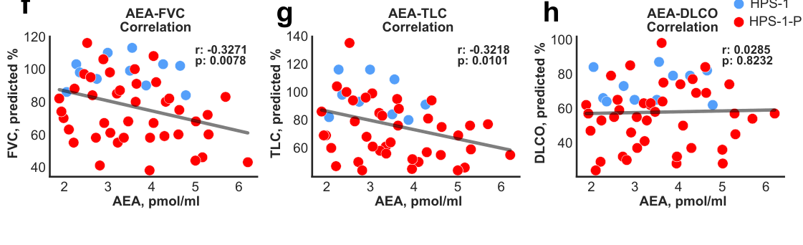

## Question

# Disease Characteristics Research Template

## Target Disease
- **Disease Name:** Hermansky-Pudlak Syndrome
- **MONDO ID:**  (if available)
- **Category:** Genetic

## Research Objectives

Please provide a comprehensive research report on **Hermansky-Pudlak Syndrome** covering all of the
disease characteristics listed below. This report will be used to populate a disease knowledge
base entry. Be thorough and cite primary literature (PMID preferred) for all claims.

For each section, **suggested databases/resources** are listed. These are the first places
you should search for information on each topic.

---

### 1. Disease Information
> **Search first:** OMIM, Orphanet, ICD-10/ICD-11, MeSH, PubMed

- What is the disease? Provide a concise overview.
- What are the key identifiers? (OMIM, Orphanet, ICD-10/ICD-11, MeSH, Mondo)
- What are the common synonyms and alternative names?
- Is the information derived from individual patients (e.g., EHR) or aggregated disease-level resources?

### 2. Etiology

- **Disease Causal Factors**: What are the primary causes? (genetic, environmental, infectious, mechanistic)
- **Risk Factors**:
  > **Search first:** PubMed, Cochrane Library, UpToDate, clinical guidelines, ClinVar, ClinGen, GWAS Catalog, PheGenI, CTD, CDC, WHO, epidemiological databases
  - Genetic risk factors (causal variants, susceptibility loci, modifier genes)
  - Environmental risk factors (toxins, lifestyle, occupational exposures, age, sex, family history)
- **Protective Factors**:
  > **Search first:** PubMed, Cochrane Library, clinical trial databases, GWAS Catalog, gnomAD, WHO, CDC, nutrition databases
  - Genetic protective factors (protective variants, modifier alleles)
  - Environmental protective factors (diet, lifestyle, exposures that reduce risk)
- **Gene-Environment Interactions**: How do genetic and environmental factors interact to influence disease?
  > **Search first:** CTD, PubMed, PheGenI, GxE databases

### 3. Phenotypes
> **Search first:** HPO (Human Phenotype Ontology), OMIM, Orphanet, PubMed, clinicaltrials.gov, MedDRA, SNOMED CT, DECIPHER, LOINC

For each phenotype, provide:
- **Phenotype type**: symptoms, clinical signs, physical manifestations, behavioral changes, or laboratory abnormalities
  > For symptoms/signs: HPO, OMIM, Orphanet, PubMed
  > For behavioral changes: HPO, DSM, RDoC (Research Domain Criteria), PubMed
  > For laboratory abnormalities: LOINC, SNOMED CT, LabTests Online, PubMed
- **Phenotype characteristics**:
  > **Search first:** OMIM, Orphanet, HPO, PubMed
  - Age of symptom onset (neonatal, childhood, adult-onset, late-onset)
  - Symptom severity (mild, moderate, severe, variable)
  - Symptom progression (stable, progressive, episodic, fluctuating)
  - Frequency among affected individuals (percentage or qualitative)
- **Quality of life impact**: Effects on daily functioning and well-being (per-phenotype when possible)
  > **Search first:** EQ-5D database, SF-36, WHO QOL databases, PubMed
- Suggest HPO (Human Phenotype Ontology) terms for each phenotype

### 4. Genetic/Molecular Information

- **Causal Genes**: Gene mutations or chromosomal abnormalities responsible for disease (gene symbols, OMIM IDs)
  > **Search first:** OMIM, ClinVar, HGMD, Ensembl, NCBI Gene
- **Pathogenic Variants**:
  - Affected genes (gene symbols, HGNC IDs)
    > **Search first:** OMIM, NCBI Gene, Ensembl, HGNC, UniProt, GeneCards
  - Variant classification (pathogenic, likely pathogenic, VUS per ACMG/AMP guidelines)
    > **Search first:** ClinVar, ClinGen, ACMG/AMP guidelines, VarSome
  - Variant type/class (missense, frameshift, nonsense, splice-site, structural)
  - Allele frequency in population databases
    > **Search first:** gnomAD, 1000 Genomes, ExAC, TOPMed, dbSNP
  - Somatic vs germline origin
    > **Search first:** COSMIC (somatic), ClinVar, ICGC, TCGA
  - Functional consequences (loss of function, gain of function, dominant negative)
- **Modifier Genes**: Genes that modify disease severity or expression
- **Epigenetic Information**: DNA methylation, histone modifications, chromatin changes affecting disease
  > **Search first:** ENCODE, Roadmap Epigenomics, MethBase, DiseaseMeth
- **Chromosomal Abnormalities**: Large-scale genetic changes (aneuploidy, translocations, inversions)
  > **Search first:** DECIPHER, ClinVar, ECARUCA, UCSC Genome Browser

### 5. Environmental Information

- **Environmental Factors**: Non-genetic contributing factors (toxins, radiation, pollution, occupational exposure)
  > **Search first:** CTD (Comparative Toxicogenomics Database), TOXNET, PubMed, EPA databases
- **Lifestyle Factors**: Behavioral factors (smoking, diet, exercise, alcohol consumption)
  > **Search first:** CDC databases, WHO, PubMed, NHANES
- **Infectious Agents**: If applicable, pathogens causing or triggering disease (bacteria, viruses, fungi, parasites)
  > **Search first:** NCBI Taxonomy, ViPR, BV-BRC, MicrobeDB, GIDEON

### 6. Mechanism / Pathophysiology

- **Molecular Pathways**: Specific signaling cascades or biochemical pathways involved (Wnt, MAPK, mTOR, PI3K-AKT, etc.)
  > **Search first:** KEGG, Reactome, WikiPathways, PathBank, BioCyc
- **Cellular Processes**: Cell-level mechanisms (apoptosis, autophagy, cell cycle dysregulation, inflammation, etc.)
  > **Search first:** Gene Ontology (GO), Reactome, KEGG, PubMed
- **Protein Dysfunction**: How protein structure or function is altered (misfolding, aggregation, loss of function, gain of function)
  > **Search first:** UniProt, PDB (Protein Data Bank), InterPro, Pfam, AlphaFold
- **Metabolic Changes**: Alterations in metabolic processes (energy metabolism, lipid metabolism, amino acid metabolism)
  > **Search first:** KEGG, BioCyc, HMDB (Human Metabolome Database), BRENDA
- **Immune System Involvement**: Role of immune response (autoimmunity, immunodeficiency, chronic inflammation)
  > **Search first:** ImmPort, Immunome Database, IEDB, Gene Ontology
- **Tissue Damage Mechanisms**: How tissues/ are injured (oxidative stress, ischemia, fibrosis, necrosis)
  > **Search first:** PubMed, Gene Ontology, Reactome
- **Biochemical Abnormalities**: Specific molecular defects (enzyme deficiencies, receptor dysfunction, ion channel defects)
  > **Search first:** BRENDA, UniProt, KEGG, OMIM, PubMed
- **Epigenetic Changes**: DNA methylation, histone modifications affecting gene expression in disease
  > **Search first:** ENCODE, Roadmap Epigenomics, MethBase, DiseaseMeth
- **Molecular Profiling** (if available):
  - Transcriptomics/gene expression changes
    > **Search first:** GEO (Gene Expression Omnibus), ArrayExpress, GTEx, Human Cell Atlas, SRA
  - Proteomics findings
    > **Search first:** PRIDE, ProteomeXchange, Human Protein Atlas, STRING, BioGRID
  - Metabolomics signatures
    > **Search first:** MetaboLights, Metabolomics Workbench, HMDB, METLIN
  - Lipidomics alterations
    > **Search first:** LIPID MAPS, SwissLipids, LipidHome, Metabolomics Workbench
  - Genomic structural features
    > **Search first:** UCSC Genome Browser, Ensembl, NCBI, dbVar, DGV
- **Advanced Technologies** (if applicable):
  - Single-cell analysis findings (cell-type specific mechanisms, cellular heterogeneity)
    > **Search first:** Human Cell Atlas, Single Cell Portal, GEO, CELLxGENE
  - Spatial transcriptomics findings
    > **Search first:** GEO, Spatial Research, Vizgen, 10x Genomics data
  - Multi-omics integration results
    > **Search first:** TCGA, ICGC, cBioPortal, LinkedOmics, PubMed
  - Functional genomics screens (CRISPR, RNAi)
    > **Search first:** DepMap, GenomeRNAi, PubMed, BioGRID ORCS

For each mechanism, describe:
- The causal chain from initial trigger to clinical manifestation
- Which mechanisms are upstream vs downstream
- What cell types and biological processes are involved
- Suggest GO terms for biological processes and CL terms for cell types

### 7. Anatomical Structures Affected

- **Organ Level**:
  - Primary organs directly affected
  - Secondary organ involvement (complications, secondary effects)
  - Body systems involved (cardiovascular, nervous, digestive, respiratory, endocrine, etc.)
  > **Search first:** Uberon, FMA (Foundational Model of Anatomy), OMIM, HPO, ICD-11, MeSH, SNOMED CT
- **Tissue and Cell Level**:
  - Specific tissue types affected (epithelial, connective, muscle, nervous)
  - Specific cell populations targeted (with Cell Ontology terms)
  > **Search first:** Uberon, Human Protein Atlas, Cell Ontology, Human Cell Atlas, CellMarker, PanglaoDB
- **Subcellular Level**:
  - Cellular compartments involved (mitochondria, nucleus, ER, lysosomes) (with GO Cellular Component terms)
  > **Search first:** Gene Ontology (Cellular Component), UniProt, Human Protein Atlas
- **Localization**:
  - Specific anatomical sites (with UBERON terms)
    > **Search first:** FMA, Uberon, NeuroNames (for brain), SNOMED CT
  - Lateralization (unilateral, bilateral, asymmetric)
    > **Search first:** HPO, clinical literature, imaging databases

### 8. Temporal Development

- **Onset**:
  - Typical age of onset (congenital, pediatric, adult, geriatric)
  - Onset pattern (acute, subacute, chronic, insidious)
  > **Search first:** OMIM, Orphanet, HPO, PubMed
- **Progression**:
  - Disease stages (early, intermediate, advanced, end-stage)
    > **Search first:** Cancer Staging Manual (AJCC), WHO classifications, PubMed
  - Progression rate (rapid, slow, variable)
  - Disease course pattern (episodic, relapsing-remitting, progressive, stable)
  - Disease duration (self-limited, chronic lifelong)
  > **Search first:** Disease registries, longitudinal cohort databases, natural history studies, PubMed, Orphanet, OMIM
- **Patterns**:
  - Remission patterns (spontaneous, treatment-induced)
    > **Search first:** Clinical trial databases, disease registries, PubMed
  - Critical periods (time windows of vulnerability or opportunity for intervention)
    > **Search first:** PubMed, developmental biology databases, clinical guidelines

### 9. Inheritance and Population

- **Epidemiology**:
  - Prevalence (cases per 100,000 at given time)
  - Incidence (new cases per 100,000 per year)
  > **Search first:** Orphanet, CDC, WHO, GBD (Global Burden of Disease), national registries, SEER, disease registries
- **For Genetic Etiology**:
  - Inheritance pattern (AD, AR, X-linked, mitochondrial, multifactorial, polygenic)
    > **Search first:** OMIM, Orphanet, ClinVar, GTR (Genetic Testing Registry)
  - Penetrance (complete, incomplete, age-dependent)
    > **Search first:** ClinVar, OMIM, PubMed, ClinGen
  - Expressivity (variable, consistent)
    > **Search first:** OMIM, ClinVar, PubMed
  - Genetic anticipation (increasing severity in successive generations)
    > **Search first:** OMIM, PubMed (especially for repeat expansion disorders)
  - Germline mosaicism
    > **Search first:** ClinVar, OMIM, genetic counseling literature, PubMed
  - Founder effects (population-specific mutations)
    > **Search first:** gnomAD, population genetics databases, PubMed
  - Consanguinity role
    > **Search first:** OMIM, population studies, genetic counseling resources
  - Carrier frequency
    > **Search first:** gnomAD, carrier screening databases, GeneReviews, GTR
- **Population Demographics**:
  - Affected populations (ethnic or demographic groups with higher prevalence)
    > **Search first:** gnomAD, 1000 Genomes, PAGE Study, PubMed, population registries
  - Geographic distribution (endemic areas, regional variation)
    > **Search first:** WHO, CDC, GBD, Orphanet, geographic epidemiology databases
  - Geographic distribution of specific variants
  - Sex ratio (male:female)
    > **Search first:** Disease registries, OMIM, PubMed, epidemiological databases
  - Age distribution of affected individuals
    > **Search first:** CDC, disease registries, SEER, Orphanet

### 10. Diagnostics

- **Clinical Tests**:
  - Laboratory tests (blood, urine, tissue chemistry, specific enzyme assays)
    > **Search first:** LOINC, LabTests Online, PubMed
  - Biomarkers (proteins, metabolites, genetic markers, circulating biomarkers)
    > **Search first:** FDA Biomarker List, BEST (Biomarkers, EndpointS, and other Tools), PubMed
  - Imaging studies (X-ray, CT, MRI, PET, ultrasound)
    > **Search first:** RadLex, DICOM, Radiopaedia, imaging databases
  - Functional tests (pulmonary function, cardiac stress tests)
    > **Search first:** LOINC, clinical guidelines, PubMed
  - Electrophysiology (EEG, EMG, ECG, nerve conduction studies)
    > **Search first:** LOINC, clinical neurophysiology databases, PubMed
  - Biopsy findings (histopathology, immunohistochemistry)
    > **Search first:** SNOMED CT, College of American Pathologists resources, PubMed
  - Pathology findings (microscopic examination)
    > **Search first:** SNOMED CT, Digital Pathology databases, PubMed
- **Genetic Testing**:
  > **Search first:** GTR (Genetic Testing Registry), GeneReviews, ClinGen
  - Overview of recommended genetic testing approach
  - Whole genome sequencing (WGS) utility
    > **Search first:** GTR, ClinVar, GEL (Genomics England), gnomAD
  - Whole exome sequencing (WES) utility
    > **Search first:** GTR, ClinVar, OMIM, GeneMatcher
  - Gene panels (which panels, which genes)
    > **Search first:** GTR, ClinVar, laboratory-specific databases
  - Single gene testing
    > **Search first:** GTR, ClinVar, OMIM, GeneReviews
  - Chromosomal microarray (CMA)
    > **Search first:** DECIPHER, ClinVar, dbVar, ECARUCA
  - Karyotyping
    > **Search first:** Chromosome Abnormality Database, ClinVar, cytogenetics resources
  - FISH
    > **Search first:** ClinVar, cytogenetics databases, PubMed
  - Mitochondrial DNA testing
    > **Search first:** MITOMAP, MSeqDR, ClinVar, GTR
  - Repeat expansion testing
    > **Search first:** GTR, ClinVar, repeat expansion databases, PubMed
- **Omics-Based Diagnostics** (if applicable):
  - RNA sequencing / transcriptomics
    > **Search first:** GEO, ArrayExpress, GTEx, RNA-seq databases
  - Proteomics
    > **Search first:** PRIDE, ProteomeXchange, FDA Biomarker database
  - Metabolomics
    > **Search first:** MetaboLights, Metabolomics Workbench, HMDB
  - Epigenomics
    > **Search first:** GEO, ENCODE, Roadmap Epigenomics, MethBase
  - Liquid biopsy
    > **Search first:** COSMIC, ClinVar, liquid biopsy databases, PubMed
- **Clinical Criteria**:
  - Standardized diagnostic criteria (DSM, ICD, society guidelines)
    > **Search first:** DSM-5, ICD-11, clinical society guidelines, UpToDate
  - Differential diagnosis (other conditions to rule out, with distinguishing features)
    > **Search first:** DynaMed, UpToDate, clinical decision support systems
- **Screening**:
  - Screening methods for asymptomatic individuals (newborn screening, carrier screening, cascade screening)
    > **Search first:** ACMG recommendations, CDC newborn screening, GTR

### 11. Outcome/Prognosis

- **Survival and Mortality**:
  - Survival rate (5-year, 10-year, overall)
    > **Search first:** SEER, cancer registries, disease-specific registries, PubMed
  - Life expectancy (with and without treatment if applicable)
    > **Search first:** Orphanet, disease registries, actuarial databases, PubMed
  - Mortality rate
    > **Search first:** CDC, WHO, GBD, national mortality databases
  - Disease-specific mortality (deaths directly attributable to disease)
    > **Search first:** Disease registries, CDC Wonder, GBD, PubMed
- **Morbidity and Function**:
  - Morbidity (disease-related disability and health impacts)
    > **Search first:** GBD, WHO, disability databases, PubMed
  - Disability outcomes (long-term functional impairments)
    > **Search first:** ICF (International Classification of Functioning), disability registries
  - Quality of life measures (EQ-5D, SF-36, PROMIS, disease-specific tools)
    > **Search first:** EQ-5D database, SF-36, PROMIS, PubMed
- **Disease Course**:
  - Complications (secondary problems: infections, organ failure, etc.)
    > **Search first:** ICD codes, disease registries, clinical databases, PubMed
  - Recovery potential (likelihood and extent of recovery, with vs without treatment)
    > **Search first:** Natural history studies, rehabilitation databases, PubMed
- **Prediction**:
  - Prognostic factors (age, disease severity, biomarkers, treatment response)
    > **Search first:** Prognostic models databases, clinical calculators, PubMed
  - Prognostic biomarkers (molecular markers predicting disease course)
    > **Search first:** FDA Biomarker database, PubMed, cancer prognostic databases

### 12. Treatment

- **Pharmacotherapy**:
  - Pharmacological treatments (drug names, drug classes, mechanisms of action)
    > **Search first:** DrugBank, RxNorm, ATC classification, DailyMed, FDA databases
  - Pharmacogenomics (how genetic variants affect drug metabolism, efficacy, toxicity)
    > **Search first:** PharmGKB, CPIC (Clinical Pharmacogenetics), FDA Table of PGx Biomarkers
- **Advanced Therapeutics**:
  - Gene therapy (viral vectors, CRISPR, gene replacement, gene editing)
    > **Search first:** ClinicalTrials.gov, FDA gene therapy database, ASGCT resources
  - Cell therapy (stem cell transplant, CAR-T, cellular therapeutics)
    > **Search first:** ClinicalTrials.gov, FDA cell therapy database, FACT standards
  - RNA-based therapies (ASOs, siRNA, mRNA therapies)
    > **Search first:** ClinicalTrials.gov, FDA approvals, PubMed
  - Targeted therapies (treatments directed at specific molecular targets)
    > **Search first:** My Cancer Genome, OncoKB, ClinicalTrials.gov, FDA approvals
  - Immunotherapies (checkpoint inhibitors, monoclonal antibodies)
    > **Search first:** Cancer Immunotherapy Database, FDA approvals, ClinicalTrials.gov
- **Surgical and Interventional**:
  - Surgical interventions (types of surgery, timing, outcomes)
    > **Search first:** CPT codes, surgical registries, clinical guidelines, PubMed
- **Supportive and Rehabilitative**:
  - Supportive care (symptom management, pain control, nutrition)
    > **Search first:** Clinical guidelines, Cochrane Library, PubMed
  - Rehabilitation (physical therapy, occupational therapy, speech therapy)
    > **Search first:** Rehabilitation medicine databases, clinical guidelines, PubMed
- **Experimental**:
  - Experimental treatments in clinical trials (with NCT identifiers if available)
    > **Search first:** ClinicalTrials.gov, EU Clinical Trials Register, WHO ICTRP
- **Treatment Outcomes**:
  - Treatment response rates
    > **Search first:** Clinical trial databases, FDA reviews, systematic reviews, PubMed
  - Side effects and adverse events
    > **Search first:** FDA Adverse Event Reporting System (FAERS), MedWatch, PubMed
- **Treatment Strategy**:
  - Treatment algorithms (clinical pathways, decision trees)
    > **Search first:** Clinical practice guidelines, NCCN Guidelines, UpToDate
  - Combination therapies
    > **Search first:** ClinicalTrials.gov, treatment guidelines, PubMed
  - Personalized medicine approaches (genotype-guided treatment)
    > **Search first:** My Cancer Genome, CIViC, PharmGKB, precision medicine databases

For each treatment, suggest MAXO (Medical Action Ontology) terms where applicable.

### 13. Prevention

- **Prevention Levels**:
  - Primary prevention (preventing disease occurrence: vaccination, risk factor modification)
    > **Search first:** CDC, WHO, USPSTF recommendations, Cochrane Library
  - Secondary prevention (early detection and treatment: screening programs, early intervention)
    > **Search first:** USPSTF, CDC screening guidelines, WHO
  - Tertiary prevention (preventing complications in those with disease)
    > **Search first:** Clinical guidelines, disease management protocols, PubMed
- **Immunization**: Vaccine strategies (if applicable)
  > **Search first:** CDC vaccine schedules, WHO immunization, FDA vaccine database
- **Screening and Early Detection**:
  - Screening programs (population-based: newborn screening, cancer screening)
    > **Search first:** CDC screening programs, USPSTF, cancer screening databases
  - Genetic screening (carrier screening, preimplantation genetic diagnosis, prenatal testing)
    > **Search first:** ACMG recommendations, ACOG guidelines, GTR
  - Risk stratification (identifying high-risk individuals for targeted prevention)
    > **Search first:** Risk prediction models, clinical calculators, PubMed
- **Behavioral Interventions**: Lifestyle modifications to reduce risk
  > **Search first:** CDC, WHO, behavioral intervention databases, Cochrane Library
- **Counseling**: Genetic counseling (risk assessment, family planning guidance)
  > **Search first:** NSGC resources, ACMG guidelines, GeneReviews
- **Public Health**:
  - Public health interventions (sanitation, vector control, health education)
    > **Search first:** CDC, WHO, public health databases, PubMed
  - Environmental interventions (reducing environmental risk factors)
    > **Search first:** EPA databases, WHO environmental health, PubMed
- **Prophylaxis**: Preventive medications or procedures
  > **Search first:** Clinical guidelines, FDA approvals, PubMed

### 14. Other Species / Natural Disease

- **Taxonomy**: Species affected (with NCBI Taxon identifiers)
  > **Search first:** NCBI Taxonomy
- **Breed**: Specific breeds affected (with VBO identifiers if applicable)
  > **Search first:** VBO (Vertebrate Breed Ontology)
- **Gene**: Orthologous genes in other species (with NCBI Gene IDs)
  > **Search first:** NCBI Gene
- **Natural Disease**:
  - Naturally occurring disease in other species (companion animals, wildlife)
    > **Search first:** OMIA (Online Mendelian Inheritance in Animals), VetCompass, PubMed
  - Veterinary relevance and importance in animal health
    > **Search first:** OMIA, veterinary databases, PubMed
- **Comparative Biology**:
  - Comparative pathology (similarities and differences across species)
    > **Search first:** OMIA, comparative pathology databases, PubMed
  - Evolutionary conservation of disease mechanisms
    > **Search first:** HomoloGene, OrthoMCL, Alliance of Genome Resources
- **Transmission** (if applicable):
  - Zoonotic potential
    > **Search first:** CDC zoonotic diseases, WHO zoonoses, GIDEON
  - Cross-species susceptibility
    > **Search first:** NCBI Taxonomy, veterinary databases, PubMed

### 15. Model Organisms

- **Model Types**:
  - Model organism type (mammalian, invertebrate, cellular, in vitro)
    > **Search first:** Alliance of Genome Resources, model organism databases
  - Specific model systems (mouse, rat, zebrafish, Drosophila, C. elegans, yeast, cell lines, organoids, iPSCs)
    > **Search first:** MGI, RGD, ZFIN, FlyBase, WormBase, SGD, ATCC, Cellosaurus
  - Induced models (drug treatment, surgical intervention, environmental manipulation)
    > **Search first:** MGI, model organism databases, PubMed
- **Genetic Models**:
  - Types available (knockout, knock-in, transgenic, conditional, humanized)
    > **Search first:** MGI, IMPC, KOMP, EuMMCR, IMSR
- **Model Characteristics**:
  - Phenotype recapitulation (how well model reproduces human disease features)
    > **Search first:** Model organism databases, comparative studies, PubMed
  - Model limitations (aspects of human disease not captured)
    > **Search first:** Model organism databases, PubMed, review articles
- **Applications**:
  - Research applications (what aspects of disease can be studied)
    > **Search first:** Model organism databases, PubMed
- **Resources**:
  - Model databases
    > **Search first:** MGI, RGD, ZFIN, FlyBase, WormBase, IMSR, EMMA, MMRRC

---

## Citation Requirements

- Cite primary literature (PMID preferred) for all mechanistic and clinical claims
- Prioritize recent reviews and landmark papers
- Include direct quotes from abstracts where possible to support key statements
- Distinguish evidence source types: human clinical, model organism, in vitro, computational

## Output Format

Structure your response as a comprehensive narrative organized by the sections above.
For each section, provide:
- Factual content with specific details (numbers, percentages, gene names, variant nomenclature)
- Ontology term suggestions (HPO, GO, CL, UBERON, CHEBI, MAXO, MONDO) where applicable
- Evidence citations with PMIDs
- Direct quotes from abstracts to support key claims
- Clear indication when information is not available or not applicable for this disease

This report will be used to populate a disease knowledge base entry with:
- Pathophysiology descriptions with causal chains
- Gene/protein annotations (HGNC, GO terms)
- Phenotype associations (HP terms) with frequencies
- Cell type involvement (CL terms)
- Anatomical locations (UBERON terms)
- Chemical entities (CHEBI terms)
- Treatment annotations (MAXO terms)
- Evidence items with PMIDs and exact abstract quotes
- Epidemiology, prognosis, diagnostic, and prevention information
- Animal model descriptions with phenotype recapitulation details

## Output

Question: You are an expert researcher providing comprehensive, well-cited information.

Provide detailed information focusing on:
1. Key concepts and definitions with current understanding
2. Recent developments and latest research (prioritize 2023-2024 sources)
3. Current applications and real-world implementations
4. Expert opinions and analysis from authoritative sources
5. Relevant statistics and data from recent studies

Format as a comprehensive research report with proper citations. Include URLs and publication dates where available.
Always prioritize recent, authoritative sources and provide specific citations for all major claims.

# Disease Characteristics Research Template

## Target Disease
- **Disease Name:** Hermansky-Pudlak Syndrome
- **MONDO ID:**  (if available)
- **Category:** Genetic

## Research Objectives

Please provide a comprehensive research report on **Hermansky-Pudlak Syndrome** covering all of the
disease characteristics listed below. This report will be used to populate a disease knowledge
base entry. Be thorough and cite primary literature (PMID preferred) for all claims.

For each section, **suggested databases/resources** are listed. These are the first places
you should search for information on each topic.

---

### 1. Disease Information
> **Search first:** OMIM, Orphanet, ICD-10/ICD-11, MeSH, PubMed

- What is the disease? Provide a concise overview.
- What are the key identifiers? (OMIM, Orphanet, ICD-10/ICD-11, MeSH, Mondo)
- What are the common synonyms and alternative names?
- Is the information derived from individual patients (e.g., EHR) or aggregated disease-level resources?

### 2. Etiology

- **Disease Causal Factors**: What are the primary causes? (genetic, environmental, infectious, mechanistic)
- **Risk Factors**:
  > **Search first:** PubMed, Cochrane Library, UpToDate, clinical guidelines, ClinVar, ClinGen, GWAS Catalog, PheGenI, CTD, CDC, WHO, epidemiological databases
  - Genetic risk factors (causal variants, susceptibility loci, modifier genes)
  - Environmental risk factors (toxins, lifestyle, occupational exposures, age, sex, family history)
- **Protective Factors**:
  > **Search first:** PubMed, Cochrane Library, clinical trial databases, GWAS Catalog, gnomAD, WHO, CDC, nutrition databases
  - Genetic protective factors (protective variants, modifier alleles)
  - Environmental protective factors (diet, lifestyle, exposures that reduce risk)
- **Gene-Environment Interactions**: How do genetic and environmental factors interact to influence disease?
  > **Search first:** CTD, PubMed, PheGenI, GxE databases

### 3. Phenotypes
> **Search first:** HPO (Human Phenotype Ontology), OMIM, Orphanet, PubMed, clinicaltrials.gov, MedDRA, SNOMED CT, DECIPHER, LOINC

For each phenotype, provide:
- **Phenotype type**: symptoms, clinical signs, physical manifestations, behavioral changes, or laboratory abnormalities
  > For symptoms/signs: HPO, OMIM, Orphanet, PubMed
  > For behavioral changes: HPO, DSM, RDoC (Research Domain Criteria), PubMed
  > For laboratory abnormalities: LOINC, SNOMED CT, LabTests Online, PubMed
- **Phenotype characteristics**:
  > **Search first:** OMIM, Orphanet, HPO, PubMed
  - Age of symptom onset (neonatal, childhood, adult-onset, late-onset)
  - Symptom severity (mild, moderate, severe, variable)
  - Symptom progression (stable, progressive, episodic, fluctuating)
  - Frequency among affected individuals (percentage or qualitative)
- **Quality of life impact**: Effects on daily functioning and well-being (per-phenotype when possible)
  > **Search first:** EQ-5D database, SF-36, WHO QOL databases, PubMed
- Suggest HPO (Human Phenotype Ontology) terms for each phenotype

### 4. Genetic/Molecular Information

- **Causal Genes**: Gene mutations or chromosomal abnormalities responsible for disease (gene symbols, OMIM IDs)
  > **Search first:** OMIM, ClinVar, HGMD, Ensembl, NCBI Gene
- **Pathogenic Variants**:
  - Affected genes (gene symbols, HGNC IDs)
    > **Search first:** OMIM, NCBI Gene, Ensembl, HGNC, UniProt, GeneCards
  - Variant classification (pathogenic, likely pathogenic, VUS per ACMG/AMP guidelines)
    > **Search first:** ClinVar, ClinGen, ACMG/AMP guidelines, VarSome
  - Variant type/class (missense, frameshift, nonsense, splice-site, structural)
  - Allele frequency in population databases
    > **Search first:** gnomAD, 1000 Genomes, ExAC, TOPMed, dbSNP
  - Somatic vs germline origin
    > **Search first:** COSMIC (somatic), ClinVar, ICGC, TCGA
  - Functional consequences (loss of function, gain of function, dominant negative)
- **Modifier Genes**: Genes that modify disease severity or expression
- **Epigenetic Information**: DNA methylation, histone modifications, chromatin changes affecting disease
  > **Search first:** ENCODE, Roadmap Epigenomics, MethBase, DiseaseMeth
- **Chromosomal Abnormalities**: Large-scale genetic changes (aneuploidy, translocations, inversions)
  > **Search first:** DECIPHER, ClinVar, ECARUCA, UCSC Genome Browser

### 5. Environmental Information

- **Environmental Factors**: Non-genetic contributing factors (toxins, radiation, pollution, occupational exposure)
  > **Search first:** CTD (Comparative Toxicogenomics Database), TOXNET, PubMed, EPA databases
- **Lifestyle Factors**: Behavioral factors (smoking, diet, exercise, alcohol consumption)
  > **Search first:** CDC databases, WHO, PubMed, NHANES
- **Infectious Agents**: If applicable, pathogens causing or triggering disease (bacteria, viruses, fungi, parasites)
  > **Search first:** NCBI Taxonomy, ViPR, BV-BRC, MicrobeDB, GIDEON

### 6. Mechanism / Pathophysiology

- **Molecular Pathways**: Specific signaling cascades or biochemical pathways involved (Wnt, MAPK, mTOR, PI3K-AKT, etc.)
  > **Search first:** KEGG, Reactome, WikiPathways, PathBank, BioCyc
- **Cellular Processes**: Cell-level mechanisms (apoptosis, autophagy, cell cycle dysregulation, inflammation, etc.)
  > **Search first:** Gene Ontology (GO), Reactome, KEGG, PubMed
- **Protein Dysfunction**: How protein structure or function is altered (misfolding, aggregation, loss of function, gain of function)
  > **Search first:** UniProt, PDB (Protein Data Bank), InterPro, Pfam, AlphaFold
- **Metabolic Changes**: Alterations in metabolic processes (energy metabolism, lipid metabolism, amino acid metabolism)
  > **Search first:** KEGG, BioCyc, HMDB (Human Metabolome Database), BRENDA
- **Immune System Involvement**: Role of immune response (autoimmunity, immunodeficiency, chronic inflammation)
  > **Search first:** ImmPort, Immunome Database, IEDB, Gene Ontology
- **Tissue Damage Mechanisms**: How tissues/ are injured (oxidative stress, ischemia, fibrosis, necrosis)
  > **Search first:** PubMed, Gene Ontology, Reactome
- **Biochemical Abnormalities**: Specific molecular defects (enzyme deficiencies, receptor dysfunction, ion channel defects)
  > **Search first:** BRENDA, UniProt, KEGG, OMIM, PubMed
- **Epigenetic Changes**: DNA methylation, histone modifications affecting gene expression in disease
  > **Search first:** ENCODE, Roadmap Epigenomics, MethBase, DiseaseMeth
- **Molecular Profiling** (if available):
  - Transcriptomics/gene expression changes
    > **Search first:** GEO (Gene Expression Omnibus), ArrayExpress, GTEx, Human Cell Atlas, SRA
  - Proteomics findings
    > **Search first:** PRIDE, ProteomeXchange, Human Protein Atlas, STRING, BioGRID
  - Metabolomics signatures
    > **Search first:** MetaboLights, Metabolomics Workbench, HMDB, METLIN
  - Lipidomics alterations
    > **Search first:** LIPID MAPS, SwissLipids, LipidHome, Metabolomics Workbench
  - Genomic structural features
    > **Search first:** UCSC Genome Browser, Ensembl, NCBI, dbVar, DGV
- **Advanced Technologies** (if applicable):
  - Single-cell analysis findings (cell-type specific mechanisms, cellular heterogeneity)
    > **Search first:** Human Cell Atlas, Single Cell Portal, GEO, CELLxGENE
  - Spatial transcriptomics findings
    > **Search first:** GEO, Spatial Research, Vizgen, 10x Genomics data
  - Multi-omics integration results
    > **Search first:** TCGA, ICGC, cBioPortal, LinkedOmics, PubMed
  - Functional genomics screens (CRISPR, RNAi)
    > **Search first:** DepMap, GenomeRNAi, PubMed, BioGRID ORCS

For each mechanism, describe:
- The causal chain from initial trigger to clinical manifestation
- Which mechanisms are upstream vs downstream
- What cell types and biological processes are involved
- Suggest GO terms for biological processes and CL terms for cell types

### 7. Anatomical Structures Affected

- **Organ Level**:
  - Primary organs directly affected
  - Secondary organ involvement (complications, secondary effects)
  - Body systems involved (cardiovascular, nervous, digestive, respiratory, endocrine, etc.)
  > **Search first:** Uberon, FMA (Foundational Model of Anatomy), OMIM, HPO, ICD-11, MeSH, SNOMED CT
- **Tissue and Cell Level**:
  - Specific tissue types affected (epithelial, connective, muscle, nervous)
  - Specific cell populations targeted (with Cell Ontology terms)
  > **Search first:** Uberon, Human Protein Atlas, Cell Ontology, Human Cell Atlas, CellMarker, PanglaoDB
- **Subcellular Level**:
  - Cellular compartments involved (mitochondria, nucleus, ER, lysosomes) (with GO Cellular Component terms)
  > **Search first:** Gene Ontology (Cellular Component), UniProt, Human Protein Atlas
- **Localization**:
  - Specific anatomical sites (with UBERON terms)
    > **Search first:** FMA, Uberon, NeuroNames (for brain), SNOMED CT
  - Lateralization (unilateral, bilateral, asymmetric)
    > **Search first:** HPO, clinical literature, imaging databases

### 8. Temporal Development

- **Onset**:
  - Typical age of onset (congenital, pediatric, adult, geriatric)
  - Onset pattern (acute, subacute, chronic, insidious)
  > **Search first:** OMIM, Orphanet, HPO, PubMed
- **Progression**:
  - Disease stages (early, intermediate, advanced, end-stage)
    > **Search first:** Cancer Staging Manual (AJCC), WHO classifications, PubMed
  - Progression rate (rapid, slow, variable)
  - Disease course pattern (episodic, relapsing-remitting, progressive, stable)
  - Disease duration (self-limited, chronic lifelong)
  > **Search first:** Disease registries, longitudinal cohort databases, natural history studies, PubMed, Orphanet, OMIM
- **Patterns**:
  - Remission patterns (spontaneous, treatment-induced)
    > **Search first:** Clinical trial databases, disease registries, PubMed
  - Critical periods (time windows of vulnerability or opportunity for intervention)
    > **Search first:** PubMed, developmental biology databases, clinical guidelines

### 9. Inheritance and Population

- **Epidemiology**:
  - Prevalence (cases per 100,000 at given time)
  - Incidence (new cases per 100,000 per year)
  > **Search first:** Orphanet, CDC, WHO, GBD (Global Burden of Disease), national registries, SEER, disease registries
- **For Genetic Etiology**:
  - Inheritance pattern (AD, AR, X-linked, mitochondrial, multifactorial, polygenic)
    > **Search first:** OMIM, Orphanet, ClinVar, GTR (Genetic Testing Registry)
  - Penetrance (complete, incomplete, age-dependent)
    > **Search first:** ClinVar, OMIM, PubMed, ClinGen
  - Expressivity (variable, consistent)
    > **Search first:** OMIM, ClinVar, PubMed
  - Genetic anticipation (increasing severity in successive generations)
    > **Search first:** OMIM, PubMed (especially for repeat expansion disorders)
  - Germline mosaicism
    > **Search first:** ClinVar, OMIM, genetic counseling literature, PubMed
  - Founder effects (population-specific mutations)
    > **Search first:** gnomAD, population genetics databases, PubMed
  - Consanguinity role
    > **Search first:** OMIM, population studies, genetic counseling resources
  - Carrier frequency
    > **Search first:** gnomAD, carrier screening databases, GeneReviews, GTR
- **Population Demographics**:
  - Affected populations (ethnic or demographic groups with higher prevalence)
    > **Search first:** gnomAD, 1000 Genomes, PAGE Study, PubMed, population registries
  - Geographic distribution (endemic areas, regional variation)
    > **Search first:** WHO, CDC, GBD, Orphanet, geographic epidemiology databases
  - Geographic distribution of specific variants
  - Sex ratio (male:female)
    > **Search first:** Disease registries, OMIM, PubMed, epidemiological databases
  - Age distribution of affected individuals
    > **Search first:** CDC, disease registries, SEER, Orphanet

### 10. Diagnostics

- **Clinical Tests**:
  - Laboratory tests (blood, urine, tissue chemistry, specific enzyme assays)
    > **Search first:** LOINC, LabTests Online, PubMed
  - Biomarkers (proteins, metabolites, genetic markers, circulating biomarkers)
    > **Search first:** FDA Biomarker List, BEST (Biomarkers, EndpointS, and other Tools), PubMed
  - Imaging studies (X-ray, CT, MRI, PET, ultrasound)
    > **Search first:** RadLex, DICOM, Radiopaedia, imaging databases
  - Functional tests (pulmonary function, cardiac stress tests)
    > **Search first:** LOINC, clinical guidelines, PubMed
  - Electrophysiology (EEG, EMG, ECG, nerve conduction studies)
    > **Search first:** LOINC, clinical neurophysiology databases, PubMed
  - Biopsy findings (histopathology, immunohistochemistry)
    > **Search first:** SNOMED CT, College of American Pathologists resources, PubMed
  - Pathology findings (microscopic examination)
    > **Search first:** SNOMED CT, Digital Pathology databases, PubMed
- **Genetic Testing**:
  > **Search first:** GTR (Genetic Testing Registry), GeneReviews, ClinGen
  - Overview of recommended genetic testing approach
  - Whole genome sequencing (WGS) utility
    > **Search first:** GTR, ClinVar, GEL (Genomics England), gnomAD
  - Whole exome sequencing (WES) utility
    > **Search first:** GTR, ClinVar, OMIM, GeneMatcher
  - Gene panels (which panels, which genes)
    > **Search first:** GTR, ClinVar, laboratory-specific databases
  - Single gene testing
    > **Search first:** GTR, ClinVar, OMIM, GeneReviews
  - Chromosomal microarray (CMA)
    > **Search first:** DECIPHER, ClinVar, dbVar, ECARUCA
  - Karyotyping
    > **Search first:** Chromosome Abnormality Database, ClinVar, cytogenetics resources
  - FISH
    > **Search first:** ClinVar, cytogenetics databases, PubMed
  - Mitochondrial DNA testing
    > **Search first:** MITOMAP, MSeqDR, ClinVar, GTR
  - Repeat expansion testing
    > **Search first:** GTR, ClinVar, repeat expansion databases, PubMed
- **Omics-Based Diagnostics** (if applicable):
  - RNA sequencing / transcriptomics
    > **Search first:** GEO, ArrayExpress, GTEx, RNA-seq databases
  - Proteomics
    > **Search first:** PRIDE, ProteomeXchange, FDA Biomarker database
  - Metabolomics
    > **Search first:** MetaboLights, Metabolomics Workbench, HMDB
  - Epigenomics
    > **Search first:** GEO, ENCODE, Roadmap Epigenomics, MethBase
  - Liquid biopsy
    > **Search first:** COSMIC, ClinVar, liquid biopsy databases, PubMed
- **Clinical Criteria**:
  - Standardized diagnostic criteria (DSM, ICD, society guidelines)
    > **Search first:** DSM-5, ICD-11, clinical society guidelines, UpToDate
  - Differential diagnosis (other conditions to rule out, with distinguishing features)
    > **Search first:** DynaMed, UpToDate, clinical decision support systems
- **Screening**:
  - Screening methods for asymptomatic individuals (newborn screening, carrier screening, cascade screening)
    > **Search first:** ACMG recommendations, CDC newborn screening, GTR

### 11. Outcome/Prognosis

- **Survival and Mortality**:
  - Survival rate (5-year, 10-year, overall)
    > **Search first:** SEER, cancer registries, disease-specific registries, PubMed
  - Life expectancy (with and without treatment if applicable)
    > **Search first:** Orphanet, disease registries, actuarial databases, PubMed
  - Mortality rate
    > **Search first:** CDC, WHO, GBD, national mortality databases
  - Disease-specific mortality (deaths directly attributable to disease)
    > **Search first:** Disease registries, CDC Wonder, GBD, PubMed
- **Morbidity and Function**:
  - Morbidity (disease-related disability and health impacts)
    > **Search first:** GBD, WHO, disability databases, PubMed
  - Disability outcomes (long-term functional impairments)
    > **Search first:** ICF (International Classification of Functioning), disability registries
  - Quality of life measures (EQ-5D, SF-36, PROMIS, disease-specific tools)
    > **Search first:** EQ-5D database, SF-36, PROMIS, PubMed
- **Disease Course**:
  - Complications (secondary problems: infections, organ failure, etc.)
    > **Search first:** ICD codes, disease registries, clinical databases, PubMed
  - Recovery potential (likelihood and extent of recovery, with vs without treatment)
    > **Search first:** Natural history studies, rehabilitation databases, PubMed
- **Prediction**:
  - Prognostic factors (age, disease severity, biomarkers, treatment response)
    > **Search first:** Prognostic models databases, clinical calculators, PubMed
  - Prognostic biomarkers (molecular markers predicting disease course)
    > **Search first:** FDA Biomarker database, PubMed, cancer prognostic databases

### 12. Treatment

- **Pharmacotherapy**:
  - Pharmacological treatments (drug names, drug classes, mechanisms of action)
    > **Search first:** DrugBank, RxNorm, ATC classification, DailyMed, FDA databases
  - Pharmacogenomics (how genetic variants affect drug metabolism, efficacy, toxicity)
    > **Search first:** PharmGKB, CPIC (Clinical Pharmacogenetics), FDA Table of PGx Biomarkers
- **Advanced Therapeutics**:
  - Gene therapy (viral vectors, CRISPR, gene replacement, gene editing)
    > **Search first:** ClinicalTrials.gov, FDA gene therapy database, ASGCT resources
  - Cell therapy (stem cell transplant, CAR-T, cellular therapeutics)
    > **Search first:** ClinicalTrials.gov, FDA cell therapy database, FACT standards
  - RNA-based therapies (ASOs, siRNA, mRNA therapies)
    > **Search first:** ClinicalTrials.gov, FDA approvals, PubMed
  - Targeted therapies (treatments directed at specific molecular targets)
    > **Search first:** My Cancer Genome, OncoKB, ClinicalTrials.gov, FDA approvals
  - Immunotherapies (checkpoint inhibitors, monoclonal antibodies)
    > **Search first:** Cancer Immunotherapy Database, FDA approvals, ClinicalTrials.gov
- **Surgical and Interventional**:
  - Surgical interventions (types of surgery, timing, outcomes)
    > **Search first:** CPT codes, surgical registries, clinical guidelines, PubMed
- **Supportive and Rehabilitative**:
  - Supportive care (symptom management, pain control, nutrition)
    > **Search first:** Clinical guidelines, Cochrane Library, PubMed
  - Rehabilitation (physical therapy, occupational therapy, speech therapy)
    > **Search first:** Rehabilitation medicine databases, clinical guidelines, PubMed
- **Experimental**:
  - Experimental treatments in clinical trials (with NCT identifiers if available)
    > **Search first:** ClinicalTrials.gov, EU Clinical Trials Register, WHO ICTRP
- **Treatment Outcomes**:
  - Treatment response rates
    > **Search first:** Clinical trial databases, FDA reviews, systematic reviews, PubMed
  - Side effects and adverse events
    > **Search first:** FDA Adverse Event Reporting System (FAERS), MedWatch, PubMed
- **Treatment Strategy**:
  - Treatment algorithms (clinical pathways, decision trees)
    > **Search first:** Clinical practice guidelines, NCCN Guidelines, UpToDate
  - Combination therapies
    > **Search first:** ClinicalTrials.gov, treatment guidelines, PubMed
  - Personalized medicine approaches (genotype-guided treatment)
    > **Search first:** My Cancer Genome, CIViC, PharmGKB, precision medicine databases

For each treatment, suggest MAXO (Medical Action Ontology) terms where applicable.

### 13. Prevention

- **Prevention Levels**:
  - Primary prevention (preventing disease occurrence: vaccination, risk factor modification)
    > **Search first:** CDC, WHO, USPSTF recommendations, Cochrane Library
  - Secondary prevention (early detection and treatment: screening programs, early intervention)
    > **Search first:** USPSTF, CDC screening guidelines, WHO
  - Tertiary prevention (preventing complications in those with disease)
    > **Search first:** Clinical guidelines, disease management protocols, PubMed
- **Immunization**: Vaccine strategies (if applicable)
  > **Search first:** CDC vaccine schedules, WHO immunization, FDA vaccine database
- **Screening and Early Detection**:
  - Screening programs (population-based: newborn screening, cancer screening)
    > **Search first:** CDC screening programs, USPSTF, cancer screening databases
  - Genetic screening (carrier screening, preimplantation genetic diagnosis, prenatal testing)
    > **Search first:** ACMG recommendations, ACOG guidelines, GTR
  - Risk stratification (identifying high-risk individuals for targeted prevention)
    > **Search first:** Risk prediction models, clinical calculators, PubMed
- **Behavioral Interventions**: Lifestyle modifications to reduce risk
  > **Search first:** CDC, WHO, behavioral intervention databases, Cochrane Library
- **Counseling**: Genetic counseling (risk assessment, family planning guidance)
  > **Search first:** NSGC resources, ACMG guidelines, GeneReviews
- **Public Health**:
  - Public health interventions (sanitation, vector control, health education)
    > **Search first:** CDC, WHO, public health databases, PubMed
  - Environmental interventions (reducing environmental risk factors)
    > **Search first:** EPA databases, WHO environmental health, PubMed
- **Prophylaxis**: Preventive medications or procedures
  > **Search first:** Clinical guidelines, FDA approvals, PubMed

### 14. Other Species / Natural Disease

- **Taxonomy**: Species affected (with NCBI Taxon identifiers)
  > **Search first:** NCBI Taxonomy
- **Breed**: Specific breeds affected (with VBO identifiers if applicable)
  > **Search first:** VBO (Vertebrate Breed Ontology)
- **Gene**: Orthologous genes in other species (with NCBI Gene IDs)
  > **Search first:** NCBI Gene
- **Natural Disease**:
  - Naturally occurring disease in other species (companion animals, wildlife)
    > **Search first:** OMIA (Online Mendelian Inheritance in Animals), VetCompass, PubMed
  - Veterinary relevance and importance in animal health
    > **Search first:** OMIA, veterinary databases, PubMed
- **Comparative Biology**:
  - Comparative pathology (similarities and differences across species)
    > **Search first:** OMIA, comparative pathology databases, PubMed
  - Evolutionary conservation of disease mechanisms
    > **Search first:** HomoloGene, OrthoMCL, Alliance of Genome Resources
- **Transmission** (if applicable):
  - Zoonotic potential
    > **Search first:** CDC zoonotic diseases, WHO zoonoses, GIDEON
  - Cross-species susceptibility
    > **Search first:** NCBI Taxonomy, veterinary databases, PubMed

### 15. Model Organisms

- **Model Types**:
  - Model organism type (mammalian, invertebrate, cellular, in vitro)
    > **Search first:** Alliance of Genome Resources, model organism databases
  - Specific model systems (mouse, rat, zebrafish, Drosophila, C. elegans, yeast, cell lines, organoids, iPSCs)
    > **Search first:** MGI, RGD, ZFIN, FlyBase, WormBase, SGD, ATCC, Cellosaurus
  - Induced models (drug treatment, surgical intervention, environmental manipulation)
    > **Search first:** MGI, model organism databases, PubMed
- **Genetic Models**:
  - Types available (knockout, knock-in, transgenic, conditional, humanized)
    > **Search first:** MGI, IMPC, KOMP, EuMMCR, IMSR
- **Model Characteristics**:
  - Phenotype recapitulation (how well model reproduces human disease features)
    > **Search first:** Model organism databases, comparative studies, PubMed
  - Model limitations (aspects of human disease not captured)
    > **Search first:** Model organism databases, PubMed, review articles
- **Applications**:
  - Research applications (what aspects of disease can be studied)
    > **Search first:** Model organism databases, PubMed
- **Resources**:
  - Model databases
    > **Search first:** MGI, RGD, ZFIN, FlyBase, WormBase, IMSR, EMMA, MMRRC

---

## Citation Requirements

- Cite primary literature (PMID preferred) for all mechanistic and clinical claims
- Prioritize recent reviews and landmark papers
- Include direct quotes from abstracts where possible to support key statements
- Distinguish evidence source types: human clinical, model organism, in vitro, computational

## Output Format

Structure your response as a comprehensive narrative organized by the sections above.
For each section, provide:
- Factual content with specific details (numbers, percentages, gene names, variant nomenclature)
- Ontology term suggestions (HPO, GO, CL, UBERON, CHEBI, MAXO, MONDO) where applicable
- Evidence citations with PMIDs
- Direct quotes from abstracts to support key claims
- Clear indication when information is not available or not applicable for this disease

This report will be used to populate a disease knowledge base entry with:
- Pathophysiology descriptions with causal chains
- Gene/protein annotations (HGNC, GO terms)
- Phenotype associations (HP terms) with frequencies
- Cell type involvement (CL terms)
- Anatomical locations (UBERON terms)
- Chemical entities (CHEBI terms)
- Treatment annotations (MAXO terms)
- Evidence items with PMIDs and exact abstract quotes
- Epidemiology, prognosis, diagnostic, and prevention information
- Animal model descriptions with phenotype recapitulation details

# Hermansky–Pudlak Syndrome (HPS): Disease Characteristics Research Report (Genetic)

## 1. Disease Information

### 1.1 Concise overview (current understanding)
Hermansky–Pudlak syndrome (HPS) is a group of rare, **autosomal recessive** disorders characterized by **oculocutaneous albinism**, **platelet dysfunction with a bleeding diathesis** (classically due to platelet dense-granule/delta-granule deficiency), and **variable systemic involvement** including **pulmonary fibrosis**, **granulomatous colitis**, and **immunodeficiency** depending on subtype. (yokoyama2021hermansky–pudlaksyndromepulmonary pages 1-2, vicary2016pulmonaryfibrosisin pages 1-2, velazquezdiaz2021hermanskypudlaksyndromeand pages 1-2)

### 1.2 Key identifiers
Evidence retrieved in this session robustly supports MONDO identifiers (from OpenTargets), but did **not** contain explicit OMIM/Orphanet/ICD/MeSH IDs.

| Concept | Identifier system | ID | Notes | Key supporting citation |
|---|---|---|---|---|
| Hermansky-Pudlak syndrome | MONDO | MONDO_0019312 | Main disease entry in OpenTargets evidence; associated with 12 targets including HPS1, HPS4, AP3B1, HPS3, HPS5, HPS6, DTNBP1, BLOC1S3, BLOC1S5, BLOC1S6, AP3D1. | (OpenTargets Search: Hermansky-Pudlak syndrome) |
| Hermansky-Pudlak syndrome with pulmonary fibrosis | MONDO | MONDO_0016501 | Subgroup in OpenTargets evidence linked to pulmonary-fibrosis-associated targets HPS4, HPS1, AP3B1. Terminology aligns with HPS pulmonary fibrosis / HPS-PF. | (OpenTargets Search: Hermansky-Pudlak syndrome) |
| Hermansky-Pudlak syndrome without pulmonary fibrosis | MONDO | MONDO_0016502 | Subgroup in OpenTargets evidence linked to non-PF-associated targets such as HPS3, HPS5, HPS6. | (OpenTargets Search: Hermansky-Pudlak syndrome) |
| Hermansky-Pudlak syndrome 10 | MONDO | MONDO_0014885 | Subtype entry in OpenTargets evidence associated with AP3D1. | (OpenTargets Search: Hermansky-Pudlak syndrome) |
| Hermansky-Pudlak syndrome 11 | MONDO | MONDO_0030903 | Subtype entry in OpenTargets evidence associated with BLOC1S5. | (OpenTargets Search: Hermansky-Pudlak syndrome) |
| Hermansky-Pudlak syndrome | Preferred disease name / synonym | HPS | Major shorthand abbreviation used across reviews and trials. | (hu2024pathogenesisandtherapy pages 1-2, velazquezdiaz2021hermanskypudlaksyndromeand pages 1-2, NCT00001456 chunk 1) |
| Hermansky–Pudlak syndrome | Preferred disease name / synonym | — | Standard full disease name; described as a rare autosomal recessive disorder. | (yokoyama2021hermansky–pudlaksyndromepulmonary pages 1-2, vicary2016pulmonaryfibrosisin pages 1-2) |
| HPS pulmonary fibrosis | Disease feature / synonym | HPS-PF | Common term for pulmonary fibrosis occurring in HPS, especially HPS-1, HPS-2, and HPS-4. | (velazquezdiaz2021hermanskypudlaksyndromeand pages 1-2, vicary2016pulmonaryfibrosisin pages 1-2, hu2024pathogenesisandtherapy pages 1-2) |
| HPS-associated pulmonary fibrosis | Disease feature / synonym | HPS-PF (descriptive synonym) | Used in recent literature for the fibrotic lung manifestation; interchangeable with HPS pulmonary fibrosis in context. | (hu2024pathogenesisandtherapy pages 1-2, hu2024pathogenesisandtherapy pages 2-3) |
| Inheritance | Inheritance pattern | Autosomal recessive | Consistently described across reviews and natural history sources. | (hu2024pathogenesisandtherapy pages 1-2, yokoyama2021hermansky–pudlaksyndromepulmonary pages 1-2, vicary2016pulmonaryfibrosisin pages 1-2) |
| OMIM identifier | OMIM | Not found in gathered evidence | Requested identifier system, but no specific OMIM disease ID was retrieved in available evidence. | (yokoyama2021hermansky–pudlaksyndromepulmonary pages 2-4, vicary2016pulmonaryfibrosisin pages 1-2) |
| Orphanet identifier | Orphanet | Not found in gathered evidence | Requested identifier system, but no specific Orphanet ID was retrieved in available evidence. | (yokoyama2021hermansky–pudlaksyndromepulmonary pages 1-2, hu2024pathogenesisandtherapy pages 1-2) |
| ICD-10 / ICD-11 identifier | ICD | Not found in gathered evidence | Requested identifier system, but no specific ICD code was retrieved in available evidence. | (yokoyama2021hermansky–pudlaksyndromepulmonary pages 1-2, hu2024pathogenesisandtherapy pages 1-2) |
| MeSH identifier | MeSH | Not found in gathered evidence | Requested identifier system, but no specific MeSH ID was retrieved in available evidence. | (yokoyama2021hermansky–pudlaksyndromepulmonary pages 1-2, hu2024pathogenesisandtherapy pages 1-2) |

*Table: This table summarizes the disease naming and identifier information for Hermansky-Pudlak syndrome using only evidence gathered in the session. It is useful for quickly mapping MONDO terms, common synonyms, inheritance, and identifier gaps that still need confirmation from external databases.*

### 1.3 Common synonyms / alternative names
Common names include **Hermansky–Pudlak syndrome**, **HPS**, and pulmonary-fibrosis-specific terms such as **HPS pulmonary fibrosis (HPS-PF)** or **HPS-associated pulmonary fibrosis**. (velazquezdiaz2021hermanskypudlaksyndromeand pages 1-2, hu2024pathogenesisandtherapy pages 1-2)

### 1.4 Evidence provenance (patient-level vs aggregated)
The evidence base in this run is dominated by **aggregated disease-level sources** (reviews in 2021 and 2024; clinical trial registry entries) plus some cohort-based and translational studies, including human lung tissue immunostaining and mouse models. (yokoyama2021hermansky–pudlaksyndromepulmonary pages 1-2, hu2024pathogenesisandtherapy pages 1-2, sorkhdini2024type2innate pages 2-4, NCT00001596 chunk 1)

## 2. Etiology

### 2.1 Disease causal factors
**Primary cause:** biallelic pathogenic variants in genes encoding components of the **AP-3 adaptor complex** and **BLOC (biogenesis of lysosome-related organelles complex) pathways**, leading to defective **biogenesis/trafficking of lysosome-related organelles (LROs)**. LROs implicated include **melanosomes** (albinism), **platelet dense/alpha granules** (bleeding), and in the lung **lamellar bodies in alveolar type II (AT2) cells** (pulmonary fibrosis). (hu2024pathogenesisandtherapy pages 2-3, hu2024pathogenesisandtherapy pages 1-2)

### 2.2 Risk factors
**Genetic risk factors:** Subtype strongly influences major complications. Pulmonary fibrosis is concentrated in specific genotypes (HPS-1/HPS-2/HPS-4). (yokoyama2021hermansky–pudlaksyndromepulmonary pages 2-4, hu2024pathogenesisandtherapy pages 1-2)

**Founder effects / population risk:** Northwest Puerto Rico shows a strong founder effect for HPS-1; one review reports regional prevalence about **~1/1800** and **carrier frequency ~1/22** for the recurrent HPS1 exon 15 duplication c.1472_1487dup16-bp. (yokoyama2021hermansky–pudlaksyndromepulmonary pages 2-4)

**Age as a risk factor (for pulmonary fibrosis):** HPS pulmonary fibrosis often manifests earlier than idiopathic pulmonary fibrosis, frequently around ages **30–40** in HPS-1 according to a major pulmonary-fibrosis-focused review. (vicary2016pulmonaryfibrosisin pages 1-2)

### 2.3 Protective factors
No protective genetic or environmental factors were identified in the retrieved evidence set.

### 2.4 Gene–environment interactions
Pulmonary fibrosis can be modeled by bleomycin challenge in mice with Hps1 deficiency, indicating that environmental or injury triggers can interact with genetic susceptibility to amplify fibrotic responses. (sorkhdini2024type2innate pages 2-4, sorkhdini2024type2innate pages 8-10)

## 3. Phenotypes (clinical features)

### 3.1 Core phenotypes (human)
1. **Oculocutaneous albinism** (hypopigmentation, ocular albinism features; poor vision reported in multiple descriptions). (vicary2016pulmonaryfibrosisin pages 1-2, hu2024pathogenesisandtherapy pages 1-2)
   - Suggested HPO terms: HP:0001022 (Albinism), HP:0000539 (Abnormality of the fundus), HP:0000568 (Nystagmus) (general suggestions; HPO IDs not explicitly present in evidence).

2. **Bleeding diathesis / platelet function defect** due to platelet storage pool/dense-granule defect. A key diagnostic feature is demonstrable by EM: “**δ-granules are absent in platelets ... imaged using whole-mount transmission electron microscopy**.” (yokoyama2021hermansky–pudlaksyndromepulmonary pages 2-4)
   - Suggested HPO terms: HP:0001892 (Bleeding diathesis), HP:0001873 (Thrombocytopenia) (context-dependent), HP:0001928 (Abnormality of coagulation).

3. **Pulmonary fibrosis (HPS-PF)**
   - Concentrated in HPS-1, HPS-2, and HPS-4; several reviews describe HPS-1 as highly penetrant for PF, including statements of **100%** PF in HPS-1. (vicary2016pulmonaryfibrosisin pages 1-2, hu2024pathogenesisandtherapy pages 1-2)
   - Onset: often **middle-aged adults** for HPS-1/HPS-4; earlier in HPS-2 (children/young adults). (yokoyama2021hermansky–pudlaksyndromepulmonary pages 1-2, hu2024pathogenesisandtherapy pages 1-2)
   - Suggested HPO terms: HP:0002099 (Pulmonary fibrosis), HP:0002093 (Respiratory insufficiency), HP:0002875 (Progressive respiratory failure).

4. **Granulomatous colitis / inflammatory bowel disease phenotype**
   - One major review reports granulomatous colitis in **~15%** of HPS patients. (velazquezdiaz2021hermanskypudlaksyndromeand pages 1-2)
   - Suggested HPO terms: HP:0002037 (Inflammatory bowel disease), HP:0002570 (Colitis), HP:0100602 (Granulomatous inflammation).

5. **Immunodeficiency/immune dysfunction (subset-dependent)**
   - Immunodeficiency is emphasized particularly in AP-3–related disease (e.g., HPS-2), and immune dysregulation is increasingly implicated in HPS pulmonary fibrosis mechanisms. (velazquezdiaz2021hermanskypudlaksyndromeand pages 1-2, hu2024pathogenesisandtherapy pages 1-2)
   - Suggested HPO terms: HP:0002721 (Immunodeficiency), HP:0011107 (Recurrent infections).

### 3.2 Quality-of-life impact
Pulmonary fibrosis progression leads to worsening dyspnea, hypoxemia, and eventually respiratory failure, imposing substantial functional limitation; this is repeatedly emphasized in PF-focused reviews. (vicary2016pulmonaryfibrosisin pages 1-2, yokoyama2021hermansky–pudlaksyndromepulmonary pages 1-2)

## 4. Genetic / Molecular Information

### 4.1 Causal genes and subtype architecture
Recent synthesis (2024) lists **11 HPS genes** and organizes them into four trafficking complexes. (hu2024pathogenesisandtherapy pages 1-2, hu2024pathogenesisandtherapy pages 2-3)

| Complex | HPS subtype(s) / gene aliases in evidence | Component genes/subunits listed in evidence | Main disease associations highlighted in retrieved evidence | Key evidence |
|---|---|---|---|---|
| BLOC-1 | HPS-7 = BLOC1S8; HPS-8 = BLOC1S3; HPS-9 = BLOC1S6; HPS-11 = BLOC1S5 | BLOC1S1, BLOC1S2, BLOC1S3/HPS8, BLOC1S4, BLOC1S5/HPS11, BLOC1S6/HPS9, BLOC1S7, BLOC1S8/HPS7 | Causes HPS through lysosome-related organelle (LRO) trafficking defects; core manifestations across HPS include oculocutaneous albinism and platelet dense-granule deficiency/bleeding diathesis. Pulmonary fibrosis is not the major association emphasized for BLOC-1 subtypes in the retrieved reviews. | (hu2024pathogenesisandtherapy pages 2-3, velazquezdiaz2021hermanskypudlaksyndromeand pages 2-3, hu2024pathogenesisandtherapy pages 1-2) |
| BLOC-2 | HPS-3, HPS-5, HPS-6 | HPS3, HPS5, HPS6 | Associated with classic HPS manifestations (albinism and bleeding); overall HPS review notes granulomatous colitis in ~15% of patients, and non-PF subgroup associations are enriched for HPS3/HPS5/HPS6 in OpenTargets evidence. Pulmonary fibrosis is generally not the principal association highlighted for these subtypes in the retrieved reviews. | (velazquezdiaz2021hermanskypudlaksyndromeand pages 1-2, OpenTargets Search: Hermansky-Pudlak syndrome, hu2024pathogenesisandtherapy pages 2-3) |
| BLOC-3 | HPS-1, HPS-4 | HPS1, HPS4 | Major pulmonary-fibrosis-associated complex in HPS. Reviews state HPS-PF is especially linked to HPS-1 and HPS-4, typically beginning in adulthood (often 30–50 years); HPS-1 is described as highly penetrant for PF, with some reviews stating 100% of HPS-1 patients develop HPS-PF. BLOC-3 also acts as a Rab32/38 guanine nucleotide exchange factor relevant to melanosome/LRO cargo trafficking. | (velazquezdiaz2021hermanskypudlaksyndromeand pages 2-3, yokoyama2021hermansky–pudlaksyndromepulmonary pages 2-4, hu2024pathogenesisandtherapy pages 1-2) |
| AP-3 | HPS-2 = AP3B1; HPS-10 = AP3D1 | AP3B1 (β3A; HPS2), AP3D1 (δ; HPS10), μ3, σ3 | AP-3 disease is linked to HPS with albinism and platelet dysfunction; HPS-2 is specifically associated with pulmonary fibrosis/interstitial lung disease, often earlier in life, and AP-3 defects are also linked to immunodeficiency/immune dysfunction in retrieved reviews. | (hu2024pathogenesisandtherapy pages 2-3, velazquezdiaz2021hermanskypudlaksyndromeand pages 2-3, yokoyama2021hermansky–pudlaksyndromepulmonary pages 1-2, hu2024pathogenesisandtherapy pages 1-2) |
| Cross-complex clinical summary | HPS overall | BLOC-1, BLOC-2, BLOC-3, AP-3 pathways affecting LRO biogenesis | Across HPS subtypes, the recurring phenotype triad is oculocutaneous albinism, platelet dense-granule defect with bleeding diathesis, and variable systemic disease. Pulmonary fibrosis is concentrated in HPS1/HPS2/HPS4; immunodeficiency is most emphasized for AP-3 disease; granulomatous colitis affects about 15% overall in one major review. | (velazquezdiaz2021hermanskypudlaksyndromeand pages 1-2, yokoyama2021hermansky–pudlaksyndromepulmonary pages 1-2, hu2024pathogenesisandtherapy pages 1-2) |

*Table: This table summarizes the major molecular complexes underlying Hermansky-Pudlak syndrome, the subtype-defining genes captured in the retrieved evidence, and the main genotype-associated clinical features. It is useful for linking HPS subtypes to pathobiology and phenotype patterns such as pulmonary fibrosis, immunodeficiency, and colitis.*

### 4.2 Pathogenic variant types (representative examples in retrieved evidence)
- Puerto Rico founder HPS-1 variant: **c.1472_1487dup16-bp** (exon 15), recurrent in NW Puerto Rico, with reported prevalence and carrier frequency. (yokoyama2021hermansky–pudlaksyndromepulmonary pages 2-4)
- Reviews also note many HPS1 variants (e.g., “67 HPS1 variants”). (yokoyama2021hermansky–pudlaksyndromepulmonary pages 2-4)

**Variant classes** across HPS genes include frameshift/nonsense/deletion and splice-disrupting variants (general statement consistent with subtypes and founder events in evidence). (vicary2016pulmonaryfibrosisin pages 1-2, yokoyama2021hermansky–pudlaksyndromepulmonary pages 2-4)

### 4.3 Functional consequences
Mechanistically, HPS is framed as an LRO biogenesis/trafficking disorder affecting:
- **Melanosomes → hypopigmentation/albinism**
- **Platelet dense granules → impaired secretion/aggregation → bleeding**
- **AT2 lamellar bodies → surfactant organelle dysfunction → epithelial stress/injury → fibrosis** (hu2024pathogenesisandtherapy pages 1-2, yokoyama2021hermansky–pudlaksyndromepulmonary pages 1-2)

### 4.4 Modifier genes / epigenetic information
A 2024 review highlights multiple epigenetic regulators relevant to fibrosis broadly but notes that “**studies related to the epigenetics of HPS-PF have not been reported**” (as of that review). (hu2024pathogenesisandtherapy pages 15-16)

## 5. Environmental Information

No clear environmental exposures were identified as primary drivers in the retrieved evidence; however, experimental lung-injury models (bleomycin) and age-associated immune activation support a role for injury/aging context in disease expression. (sorkhdini2024type2innate pages 8-10, hu2024pathogenesisandtherapy pages 1-2)

## 6. Mechanism / Pathophysiology

### 6.1 Core mechanistic concept: lysosome-related organelle (LRO) dysfunction
HPS proteins form trafficking complexes required for LRO maturation and cargo delivery, implicating a **membrane trafficking / endosomal-lysosomal pathway disorder**. A 2024 review explicitly lists LROs relevant to clinical phenotypes, including “**LBs of AT2 cells, melanosomes..., alpha and dense granules in platelets**,” among others. (hu2024pathogenesisandtherapy pages 1-2)

**Suggested GO biological process terms (examples):**
- GO:0006897 (Endocytosis)
- GO:0005764 (Lysosome; cellular component)
- GO:0031410 (Lysosomal transport)
- GO:0032541 (Assembly of protein-containing complex)

### 6.2 Pulmonary fibrosis mechanisms (prioritize 2023–2024)

#### 6.2.1 Type 2 innate immune axis (CHI3L1–CRTH2–ILC2) as an amplifying fibrotic mechanism (2024)
A 2024 JCI Insight paper provides mechanistic evidence that **type 2 innate lymphoid cells (ILC2s)** and a **CHI3L1–CRTH2 signaling axis** promote fibrosis in HPS models and are present in human HPSPF lungs. (sorkhdini2024type2innate pages 2-4)

Key chain (as supported in the evidence):
1) Hps1 deficiency → exaggerated fibrotic response after injury (bleomycin) → increased recruitment/activation of ILC2s. (sorkhdini2024type2innate pages 2-4)
2) CHI3L1 interacts with CRTH2, and CRTH2 contributes to ILC2 accumulation; CRTH2 inhibition reduces collagen and ILC2 accumulation. (sorkhdini2024type2innate pages 2-4, sorkhdini2024type2innate pages 4-6)
3) ILC2s produce profibrotic mediators; direct quote: “**IL-5, IL-13, and AREG were significantly increased in sorted ILC2s**.” (sorkhdini2024type2innate pages 12-13)
4) ILC2s stimulate fibroblast proliferation/differentiation at least partly through amphiregulin/EGFR signaling; direct quote: “**the AREG/EGFR pathway was partially responsible for increased fibroblast proliferation and differentiation**.” (sorkhdini2024type2innate pages 12-13)

**Suggested CL (cell type) terms:**
- ILC2: CL:0000934 (innate lymphoid cell) with subtype annotation (ILC2; specific CL ID not provided in evidence)
- Lung fibroblast: CL:0000057 (fibroblast)
- AT2 cell: CL:0002062 (alveolar type II pneumocyte)

#### 6.2.2 Biomarker-linked mechanistic signal: endocannabinoid anandamide (AEA) (2024 preprint)
A 2024 medRxiv study reports **serum anandamide (AEA)** is increased in HPS-1 (with or without PF) and not elevated in HPS-3 or IPF comparator groups, with **negative correlations with pulmonary function** and longitudinal rise during subclinical PF evolution. (cinar2024anandamideisan pages 1-6, cinar2024anandamideisan pages 21-24)

Quantitative/statistical highlights reported in the text/figures include correlation coefficients such as **r = −0.3271 (p = 0.0078)** and stronger negative correlations in subgroups (e.g., **r = −0.6180 (p = 0.0037)**), consistent with higher AEA tracking worse physiology. (cinar2024anandamideisan pages 21-24)

Evidence from retrieved figures supports the association between circulating AEA and impaired lung function, and individual trajectories over time. (cinar2024anandamideisan media 7046981e, cinar2024anandamideisan media 48b57ed7, cinar2024anandamideisan media 3c6bdc33, cinar2024anandamideisan media 7d3a8a16)

**Translation to therapy hypothesis in that work:** in an HPSPF mouse model, a peripheral CB1R/iNOS antagonist (zevaquenabant / MRI-1867) reduced elevated AEA and attenuated fibrosis. (cinar2024anandamideisan pages 1-6)

### 6.3 Tissue damage mechanisms in HPS-PF
PF-focused reviews describe characteristic histopathology distinct from idiopathic pulmonary fibrosis, including **vacuolated hyperplastic type II cells with enlarged lamellar bodies** and macrophages with lipofuscin-like deposits, consistent with an AT2/LRO-centered pathobiology. (yokoyama2021hermansky–pudlaksyndromepulmonary pages 1-2)

## 7. Anatomical Structures Affected

### 7.1 Organ/system level
- **Eye/skin/hair pigmentation system** (albinism): melanosome dysfunction (hu2024pathogenesisandtherapy pages 1-2)
- **Hematologic/vascular system**: platelet dense-granule dysfunction → bleeding (yokoyama2021hermansky–pudlaksyndromepulmonary pages 2-4, vicary2016pulmonaryfibrosisin pages 1-2)
- **Respiratory system (lung interstitium/alveolar region)**: progressive pulmonary fibrosis (hu2024pathogenesisandtherapy pages 1-2, vicary2016pulmonaryfibrosisin pages 1-2)
- **Gastrointestinal tract**: granulomatous colitis/IBD phenotype in a subset (velazquezdiaz2021hermanskypudlaksyndromeand pages 1-2)

### 7.2 Tissue/cell level (suggested ontologies)
- **Lung alveolar epithelium** (UBERON:0002048 lung; alveolar region): AT2 cells (CL:0002062) with lamellar bodies as key subcellular compartment (GO:0031904, secretory granule/lamellar body-related annotations; not explicitly provided in evidence). (hu2024pathogenesisandtherapy pages 1-2, yokoyama2021hermansky–pudlaksyndromepulmonary pages 1-2)
- **Platelets** (CL:0000233 platelet): dense granules/delta granules (GO cellular component). (yokoyama2021hermansky–pudlaksyndromepulmonary pages 2-4)
- **Melanocytes** (CL:0000148 melanocyte): melanosomes. (hu2024pathogenesisandtherapy pages 1-2)

## 8. Temporal Development

### 8.1 Onset
- **Congenital/early-life manifestations:** albinism and platelet-function defect generally allow early recognition. (vicary2016pulmonaryfibrosisin pages 1-2)
- **Pulmonary fibrosis:** typically **middle-aged onset** in HPS-1 and HPS-4, and earlier for HPS-2. (yokoyama2021hermansky–pudlaksyndromepulmonary pages 1-2, hu2024pathogenesisandtherapy pages 1-2)

### 8.2 Progression
HPS-PF is progressive and often fatal; one review emphasizes short time from onset to respiratory failure (“approximately 3 years” post-onset to respiratory failure) and severe prognosis, though this estimate varies by source and patient subset. (velazquezdiaz2021hermanskypudlaksyndromeand pages 1-2)

## 9. Inheritance and Population

### 9.1 Epidemiology (key statistics)
- Global prevalence estimates of HPS: **~1–9 per million**. (yokoyama2021hermansky–pudlaksyndromepulmonary pages 2-4, hu2024pathogenesisandtherapy pages 1-2)
- Puerto Rico founder effect (HPS-1): prevalence **~1/1800** and carrier frequency **~1/22** in NW Puerto Rico reported in a major PF review. (yokoyama2021hermansky–pudlaksyndromepulmonary pages 2-4)
- Another pulmonary-fibrosis-focused review reports that “approximately 50% of all cases globally” are diagnosed in Puerto Rico. (vicary2016pulmonaryfibrosisin pages 1-2)

### 9.2 Inheritance
Autosomal recessive inheritance is consistently reported. (yokoyama2021hermansky–pudlaksyndromepulmonary pages 1-2, hu2024pathogenesisandtherapy pages 1-2)

### 9.3 Penetrance / expressivity
Pulmonary fibrosis penetrance is subtype-dependent; HPS-1 is repeatedly described as highly penetrant and sometimes reported as “100%,” while other subtypes have milder disease courses. (vicary2016pulmonaryfibrosisin pages 1-2, hu2024pathogenesisandtherapy pages 1-2)

## 10. Diagnostics

### 10.1 Key clinical/functional tests
- **Pulmonary function tests** (FVC, TLC, DLCO) and HRCT are central for evaluating HPS-PF progression and serve as endpoints in clinical trials. (NCT00001596 chunk 1, NCT00001596 chunk 2)

### 10.2 Platelet testing (hallmark diagnostic)
A key confirmatory test for platelet dense-granule deficiency is whole-mount TEM: “**δ-granules are absent in platelets ... imaged using whole-mount transmission electron microscopy**.” (yokoyama2021hermansky–pudlaksyndromepulmonary pages 2-4)

### 10.3 Genetic testing
Genotyping is emphasized as clinically relevant because lung-disease risk is concentrated in specific subtypes (HPS-1, -2, -4). (yokoyama2021hermansky–pudlaksyndromepulmonary pages 1-2)

### 10.4 Differential diagnosis
Not systematically extractable from the retrieved evidence; however, PF reviews repeatedly position HPS-PF as overlapping clinically with idiopathic pulmonary fibrosis while differing in age-of-onset and histopathology. (yokoyama2021hermansky–pudlaksyndromepulmonary pages 1-2)

## 11. Outcome / Prognosis

**Pulmonary fibrosis is a leading driver of morbidity and mortality** in HPS genotypes that develop lung disease. Reviews describe poor prognosis once clinically apparent fibrosis develops. (hu2024pathogenesisandtherapy pages 1-2, yokoyama2021hermansky–pudlaksyndromepulmonary pages 1-2)

A pulmonary-fibrosis-focused review reports reduced life expectancy (“40–50 years”) in a Puerto Rico-focused context and emphasizes early onset of PF (30–40 years). (vicary2016pulmonaryfibrosisin pages 1-2)

## 12. Treatment

### 12.1 Current management and real-world implementation
- **Lung transplantation**: consistently described as the only clearly life-prolonging option for end-stage HPS-PF and is highlighted as the main effective option in reviews. (hu2024pathogenesisandtherapy pages 1-2, yokoyama2021hermansky–pudlaksyndromepulmonary pages 1-2)

- **Antifibrotics (pirfenidone, nintedanib)**: approved for idiopathic pulmonary fibrosis but not specifically approved for HPS-PF in PF reviews; nevertheless, they motivate trials and off-label consideration. (yokoyama2021hermansky–pudlaksyndromepulmonary pages 1-2, vicary2016pulmonaryfibrosisin pages 1-2)

### 12.2 Clinical trials landscape (ClinicalTrials.gov)

**Pirfenidone RCT in HPS pulmonary fibrosis**
- Trial: *Oral Pirfenidone for the Pulmonary Fibrosis of Hermansky-Pudlak Syndrome* (NCT00001596; Phase 2; randomized, quadruple-masked; 2:1 allocation; 801 mg TID). (NCT00001596 chunk 1)
- Dates: Start **2005-09**, primary completion **2009-09**, completion **2016-05-09**; results posted around **2012-01-26**; interim analysis after 30 enrollments stopped for futility. (NCT00001596 chunk 1)
- Endpoints: change in FVC at 36 months (primary), with TLC, DLCOa, and 6MWT as secondary endpoints. (NCT00001596 chunk 1, NCT00001596 chunk 2)

**Natural history study**
- Trial: *Clinical and Basic Investigations Into Hermansky-Pudlak Syndrome* (NCT00001456; NHGRI; start **1995-11-06**; recruiting as of update posted **2026-06-16**; up to 600). (NCT00001456 chunk 1)

**Colitis treatment (withdrawn trial, but informative algorithm)**
- Trial: *Medical Treatment of Colitis in Patients With Hermansky-Pudlak Syndrome* (NCT00514982; Phase 2; open-label step-up IBD regimen; start **2007-08-07**; withdrawn; completion **2011-03-08**). (NCT00514982 chunk 1)
- Step-up treatments include mesalamine → corticosteroids → infliximab + 6-mercaptopurine → adalimumab → tacrolimus. (NCT00514982 chunk 1)

**Additional pirfenidone study**
- Trial: *Efficacy and Safety of Pirfenidone Treatment in HPS-ILD* (NCT04193592; 2019; pirfenidone). Available evidence in this run contains eligibility/exclusion criteria and sites but not full endpoints/dates. (NCT04193592 chunk 2)

### 12.3 Experimental / advanced therapeutics (gene therapy / gene editing)
PF-focused reviews summarize proof-of-concept correction approaches, including lentiviral HPS1 correction in patient-derived cells and CRISPR/Cas9 correction of a recurrent HPS1 duplication in B-lymphoblastoid cells, supporting feasibility of gene-based therapies (though not yet established clinically). (yokoyama2021hermansky–pudlaksyndromepulmonary pages 10-11)

### 12.4 Suggested MAXO terms (examples)
- MAXO:0000747 (lung transplantation) (conceptual mapping)
- MAXO:0001296 (antifibrotic therapy) (conceptual mapping)
- MAXO:0001001 (genetic testing) (conceptual mapping)

(MAXO IDs are suggested; specific MAXO identifiers were not present in the retrieved evidence text.)

## 13. Prevention

No primary prevention is possible for a monogenic autosomal recessive condition beyond reproductive-risk management; however, the NIH natural history study explicitly includes mutation analysis and family involvement, supporting **cascade testing and genetic counseling** as standard preventive strategies. (NCT00001456 chunk 1)

Suggested prevention-related actions (conceptual): genetic counseling, carrier testing in high-prevalence populations, and early pulmonary monitoring in HPS-1/HPS-4/HPS-2 genotypes. (yokoyama2021hermansky–pudlaksyndromepulmonary pages 1-2, yokoyama2021hermansky–pudlaksyndromepulmonary pages 2-4)

## 14. Other Species / Natural Disease

No naturally occurring veterinary disease or OMIA-mapped animal syndrome was retrieved in the evidence set for this run.

## 15. Model Organisms

### 15.1 Mouse models and translational systems
- Hps1−/− mice challenged with bleomycin are used to model exaggerated HPS fibrotic responses and to interrogate immune–fibroblast crosstalk mechanisms (ILC2s; CHI3L1–CRTH2). (sorkhdini2024type2innate pages 2-4)
- An HPSPF mouse model (“pale ear”) is used in the 2024 biomarker preprint to link serum anandamide dynamics to fibrosis onset and therapeutic response (MRI-1867). (cinar2024anandamideisan pages 1-6)

### 15.2 Model applications and limitations
These models are particularly well-suited to dissect upstream inflammatory and epithelial stress pathways (e.g., type 2 innate immunity, EGFR signaling) but may not fully capture the chronic multidecade human natural history. (sorkhdini2024type2innate pages 2-4, hu2024pathogenesisandtherapy pages 1-2)

## Recent developments and expert analysis (2023–2024 priority)

1) **Mechanistic advance (2024):** The identification of a CHI3L1–CRTH2–ILC2 axis with amphiregulin/EGFR-mediated fibroblast activation provides a concrete, targetable immunologic pathway for HPSPF beyond generic “epithelial injury” paradigms. (sorkhdini2024type2innate pages 2-4, sorkhdini2024type2innate pages 12-13)

2) **Biomarker development (2024):** Serum anandamide (AEA) is proposed as an early blood biomarker of HPSPF with longitudinal rise in subclinical disease and negative correlations with PFTs; if validated in peer-reviewed form and larger cohorts, this could support earlier trial enrollment and pharmacodynamic readouts. (cinar2024anandamideisan pages 1-6, cinar2024anandamideisan pages 21-24, cinar2024anandamideisan media 7046981e)

3) **Clinical translation gap:** Contemporary reviews continue to emphasize that **no established disease-modifying therapy** exists for HPSPF and that transplantation remains central, underscoring unmet need and the importance of mechanistically guided trials. (hu2024pathogenesisandtherapy pages 1-2, yokoyama2021hermansky–pudlaksyndromepulmonary pages 1-2)

## Evidence gaps in this run (important for knowledge-base completeness)
- Specific OMIM, Orphanet, ICD-10/ICD-11, and MeSH identifiers were not contained in the retrieved sources and should be filled from authoritative databases directly. (OpenTargets Search: Hermansky-Pudlak syndrome)
- Phenotype frequency statistics beyond PF penetrance in HPS-1 and colitis (~15%) were limited in the retrieved evidence. (velazquezdiaz2021hermanskypudlaksyndromeand pages 1-2, vicary2016pulmonaryfibrosisin pages 1-2)
- Many key 2023–2024 clinical genetics cohorts and systematic reviews were listed as “unobtainable” in tool output, limiting the ability to provide updated variant-frequency and global prevalence estimates from population screening studies.

## Key source URLs and publication dates (selected)
- Hu X. et al. *Int J Mol Sci.* **2024-10**. “Pathogenesis and Therapy of HPS-Associated Pulmonary Fibrosis.” https://doi.org/10.3390/ijms252011270 (hu2024pathogenesisandtherapy pages 1-2)
- Sorkhdini P. et al. *JCI Insight.* **2024-11**. “Type 2 innate immunity promotes the development of pulmonary fibrosis in HPS.” https://doi.org/10.1172/jci.insight.178381 (sorkhdini2024type2innate pages 2-4)
- Cinar R. et al. *medRxiv preprint.* **2024-05**. “Anandamide is an Early Blood Biomarker of HPS Pulmonary Fibrosis.” https://doi.org/10.1101/2024.05.16.24307300 (cinar2024anandamideisan pages 1-6)
- Yokoyama T., Gochuico BR. *Eur Respir Rev.* **2021-02**. https://doi.org/10.1183/16000617.0193-2020 (yokoyama2021hermansky–pudlaksyndromepulmonary pages 1-2)
- ClinicalTrials.gov: NCT00001596 (pirfenidone RCT), first posted (per record) **2000s**, start **2005-09**. https://clinicaltrials.gov/study/NCT00001596 (NCT00001596 chunk 1)

References

1. (yokoyama2021hermansky–pudlaksyndromepulmonary pages 1-2): Tadafumi Yokoyama and Bernadette R. Gochuico. Hermansky–pudlak syndrome pulmonary fibrosis: a rare inherited interstitial lung disease. European Respiratory Review, 30:200193, Feb 2021. URL: https://doi.org/10.1183/16000617.0193-2020, doi:10.1183/16000617.0193-2020. This article has 61 citations and is from a peer-reviewed journal.

2. (vicary2016pulmonaryfibrosisin pages 1-2): Glenn W. Vicary, Yeidyly Vergne, Alberto Santiago-Cornier, Lisa R. Young, and Jesse Roman. Pulmonary fibrosis in hermansky–pudlak syndrome. Annals of the American Thoracic Society, 13(10):1839-1846, Oct 2016. URL: https://doi.org/10.1513/annalsats.201603-186fr, doi:10.1513/annalsats.201603-186fr. This article has 160 citations and is from a domain leading peer-reviewed journal.

3. (velazquezdiaz2021hermanskypudlaksyndromeand pages 1-2): Pamela Velázquez-Díaz, Erika Nakajima, Parand Sorkhdini, Ashley Hernandez-Gutierrez, Adam Eberle, Dongqin Yang, and Yang Zhou. Hermansky-pudlak syndrome and lung disease: pathogenesis and therapeutics. Frontiers in Pharmacology, Mar 2021. URL: https://doi.org/10.3389/fphar.2021.644671, doi:10.3389/fphar.2021.644671. This article has 43 citations.

4. (OpenTargets Search: Hermansky-Pudlak syndrome): Open Targets Query (Hermansky-Pudlak syndrome, 19 results). Buniello, A. et al. (2025). Open Targets Platform: facilitating therapeutic hypotheses building in drug discovery. Nucleic Acids Research.

5. (hu2024pathogenesisandtherapy pages 1-2): Xiao Hu, Zhixiao Wei, Yumeng Wu, Manhan Zhao, Liming Zhou, and Qiong Lin. Pathogenesis and therapy of hermansky–pudlak syndrome (hps)-associated pulmonary fibrosis. International Journal of Molecular Sciences, 25:11270, Oct 2024. URL: https://doi.org/10.3390/ijms252011270, doi:10.3390/ijms252011270. This article has 4 citations.

6. (NCT00001456 chunk 1):  Clinical and Basic Investigations Into Hermansky-Pudlak Syndrome. National Human Genome Research Institute (NHGRI). 1995. ClinicalTrials.gov Identifier: NCT00001456

7. (hu2024pathogenesisandtherapy pages 2-3): Xiao Hu, Zhixiao Wei, Yumeng Wu, Manhan Zhao, Liming Zhou, and Qiong Lin. Pathogenesis and therapy of hermansky–pudlak syndrome (hps)-associated pulmonary fibrosis. International Journal of Molecular Sciences, 25:11270, Oct 2024. URL: https://doi.org/10.3390/ijms252011270, doi:10.3390/ijms252011270. This article has 4 citations.

8. (yokoyama2021hermansky–pudlaksyndromepulmonary pages 2-4): Tadafumi Yokoyama and Bernadette R. Gochuico. Hermansky–pudlak syndrome pulmonary fibrosis: a rare inherited interstitial lung disease. European Respiratory Review, 30:200193, Feb 2021. URL: https://doi.org/10.1183/16000617.0193-2020, doi:10.1183/16000617.0193-2020. This article has 61 citations and is from a peer-reviewed journal.

9. (sorkhdini2024type2innate pages 2-4): Parand Sorkhdini, Kiran Klubock-Shukla, Selena Sheth, Dongqin Yang, Alina Xiaoyu Yang, Carmelissa Norbrun, Wendy J. Introne, Bernadette R. Gochuico, and Yang Zhou. Type 2 innate immunity promotes the development of pulmonary fibrosis in hermansky-pudlak syndrome. JCI Insight, Nov 2024. URL: https://doi.org/10.1172/jci.insight.178381, doi:10.1172/jci.insight.178381. This article has 13 citations and is from a domain leading peer-reviewed journal.

10. (NCT00001596 chunk 1): William Gahl, M.D.. Oral Pirfenidone for the Pulmonary Fibrosis of Hermansky-Pudlak Syndrome. William Gahl, M.D.. 2005. ClinicalTrials.gov Identifier: NCT00001596

11. (sorkhdini2024type2innate pages 8-10): Parand Sorkhdini, Kiran Klubock-Shukla, Selena Sheth, Dongqin Yang, Alina Xiaoyu Yang, Carmelissa Norbrun, Wendy J. Introne, Bernadette R. Gochuico, and Yang Zhou. Type 2 innate immunity promotes the development of pulmonary fibrosis in hermansky-pudlak syndrome. JCI Insight, Nov 2024. URL: https://doi.org/10.1172/jci.insight.178381, doi:10.1172/jci.insight.178381. This article has 13 citations and is from a domain leading peer-reviewed journal.

12. (velazquezdiaz2021hermanskypudlaksyndromeand pages 2-3): Pamela Velázquez-Díaz, Erika Nakajima, Parand Sorkhdini, Ashley Hernandez-Gutierrez, Adam Eberle, Dongqin Yang, and Yang Zhou. Hermansky-pudlak syndrome and lung disease: pathogenesis and therapeutics. Frontiers in Pharmacology, Mar 2021. URL: https://doi.org/10.3389/fphar.2021.644671, doi:10.3389/fphar.2021.644671. This article has 43 citations.

13. (hu2024pathogenesisandtherapy pages 15-16): Xiao Hu, Zhixiao Wei, Yumeng Wu, Manhan Zhao, Liming Zhou, and Qiong Lin. Pathogenesis and therapy of hermansky–pudlak syndrome (hps)-associated pulmonary fibrosis. International Journal of Molecular Sciences, 25:11270, Oct 2024. URL: https://doi.org/10.3390/ijms252011270, doi:10.3390/ijms252011270. This article has 4 citations.

14. (sorkhdini2024type2innate pages 4-6): Parand Sorkhdini, Kiran Klubock-Shukla, Selena Sheth, Dongqin Yang, Alina Xiaoyu Yang, Carmelissa Norbrun, Wendy J. Introne, Bernadette R. Gochuico, and Yang Zhou. Type 2 innate immunity promotes the development of pulmonary fibrosis in hermansky-pudlak syndrome. JCI Insight, Nov 2024. URL: https://doi.org/10.1172/jci.insight.178381, doi:10.1172/jci.insight.178381. This article has 13 citations and is from a domain leading peer-reviewed journal.

15. (sorkhdini2024type2innate pages 12-13): Parand Sorkhdini, Kiran Klubock-Shukla, Selena Sheth, Dongqin Yang, Alina Xiaoyu Yang, Carmelissa Norbrun, Wendy J. Introne, Bernadette R. Gochuico, and Yang Zhou. Type 2 innate immunity promotes the development of pulmonary fibrosis in hermansky-pudlak syndrome. JCI Insight, Nov 2024. URL: https://doi.org/10.1172/jci.insight.178381, doi:10.1172/jci.insight.178381. This article has 13 citations and is from a domain leading peer-reviewed journal.

16. (cinar2024anandamideisan pages 1-6): Resat Cinar, Abhishek Basu, Muhammad Arif, Joshua K. Park, Charles N. Zawatsky, Ben Long G. Zuo, Mei Xing G. Zuo, Kevin J. O’Brien, Molly Behan, Wendy Introne, Malliga R. Iyer, William A. Gahl, May Christine V. Malicdan, and Bernadette R. Gochuico. Anandamide is an early blood biomarker of hermansky-pudlak syndrome pulmonary fibrosis. medRxiv, May 2024. URL: https://doi.org/10.1101/2024.05.16.24307300, doi:10.1101/2024.05.16.24307300. This article has 3 citations.

17. (cinar2024anandamideisan pages 21-24): Resat Cinar, Abhishek Basu, Muhammad Arif, Joshua K. Park, Charles N. Zawatsky, Ben Long G. Zuo, Mei Xing G. Zuo, Kevin J. O’Brien, Molly Behan, Wendy Introne, Malliga R. Iyer, William A. Gahl, May Christine V. Malicdan, and Bernadette R. Gochuico. Anandamide is an early blood biomarker of hermansky-pudlak syndrome pulmonary fibrosis. medRxiv, May 2024. URL: https://doi.org/10.1101/2024.05.16.24307300, doi:10.1101/2024.05.16.24307300. This article has 3 citations.

18. (cinar2024anandamideisan media 7046981e): Resat Cinar, Abhishek Basu, Muhammad Arif, Joshua K. Park, Charles N. Zawatsky, Ben Long G. Zuo, Mei Xing G. Zuo, Kevin J. O’Brien, Molly Behan, Wendy Introne, Malliga R. Iyer, William A. Gahl, May Christine V. Malicdan, and Bernadette R. Gochuico. Anandamide is an early blood biomarker of hermansky-pudlak syndrome pulmonary fibrosis. medRxiv, May 2024. URL: https://doi.org/10.1101/2024.05.16.24307300, doi:10.1101/2024.05.16.24307300. This article has 3 citations.

19. (cinar2024anandamideisan media 48b57ed7): Resat Cinar, Abhishek Basu, Muhammad Arif, Joshua K. Park, Charles N. Zawatsky, Ben Long G. Zuo, Mei Xing G. Zuo, Kevin J. O’Brien, Molly Behan, Wendy Introne, Malliga R. Iyer, William A. Gahl, May Christine V. Malicdan, and Bernadette R. Gochuico. Anandamide is an early blood biomarker of hermansky-pudlak syndrome pulmonary fibrosis. medRxiv, May 2024. URL: https://doi.org/10.1101/2024.05.16.24307300, doi:10.1101/2024.05.16.24307300. This article has 3 citations.

20. (cinar2024anandamideisan media 3c6bdc33): Resat Cinar, Abhishek Basu, Muhammad Arif, Joshua K. Park, Charles N. Zawatsky, Ben Long G. Zuo, Mei Xing G. Zuo, Kevin J. O’Brien, Molly Behan, Wendy Introne, Malliga R. Iyer, William A. Gahl, May Christine V. Malicdan, and Bernadette R. Gochuico. Anandamide is an early blood biomarker of hermansky-pudlak syndrome pulmonary fibrosis. medRxiv, May 2024. URL: https://doi.org/10.1101/2024.05.16.24307300, doi:10.1101/2024.05.16.24307300. This article has 3 citations.

21. (cinar2024anandamideisan media 7d3a8a16): Resat Cinar, Abhishek Basu, Muhammad Arif, Joshua K. Park, Charles N. Zawatsky, Ben Long G. Zuo, Mei Xing G. Zuo, Kevin J. O’Brien, Molly Behan, Wendy Introne, Malliga R. Iyer, William A. Gahl, May Christine V. Malicdan, and Bernadette R. Gochuico. Anandamide is an early blood biomarker of hermansky-pudlak syndrome pulmonary fibrosis. medRxiv, May 2024. URL: https://doi.org/10.1101/2024.05.16.24307300, doi:10.1101/2024.05.16.24307300. This article has 3 citations.

22. (NCT00001596 chunk 2): William Gahl, M.D.. Oral Pirfenidone for the Pulmonary Fibrosis of Hermansky-Pudlak Syndrome. William Gahl, M.D.. 2005. ClinicalTrials.gov Identifier: NCT00001596

23. (NCT00514982 chunk 1):  Medical Treatment of Colitis in Patients With Hermansky-Pudlak Syndrome. National Institute of Allergy and Infectious Diseases (NIAID). 2007. ClinicalTrials.gov Identifier: NCT00514982

24. (NCT04193592 chunk 2): Jesse Roman. Efficacy and Safety of Pirfenidone Treatment in HPS-ILD. Jesse Roman. 2019. ClinicalTrials.gov Identifier: NCT04193592

25. (yokoyama2021hermansky–pudlaksyndromepulmonary pages 10-11): Tadafumi Yokoyama and Bernadette R. Gochuico. Hermansky–pudlak syndrome pulmonary fibrosis: a rare inherited interstitial lung disease. European Respiratory Review, 30:200193, Feb 2021. URL: https://doi.org/10.1183/16000617.0193-2020, doi:10.1183/16000617.0193-2020. This article has 61 citations and is from a peer-reviewed journal.

## Artifacts

- [Edison artifact artifact-00](Hermansky_Pudlak_Syndrome-deep-research-falcon_artifacts/artifact-00.md)
- [Edison artifact artifact-01](Hermansky_Pudlak_Syndrome-deep-research-falcon_artifacts/artifact-01.md)
