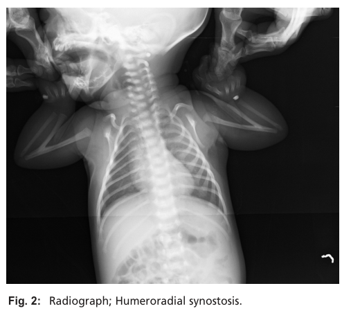

## Question

# Disease Characteristics Research Template

## Target Disease
- **Disease Name:** Humeroradial Synostosis
- **MONDO ID:**  (if available)
- **Category:** Mendelian

## Research Objectives

Please provide a comprehensive research report on **Humeroradial Synostosis** covering all of the
disease characteristics listed below. This report will be used to populate a disease knowledge
base entry. Be thorough and cite primary literature (PMID preferred) for all claims.

For each section, **suggested databases/resources** are listed. These are the first places
you should search for information on each topic.

---

### 1. Disease Information
> **Search first:** OMIM, Orphanet, ICD-10/ICD-11, MeSH, PubMed

- What is the disease? Provide a concise overview.
- What are the key identifiers? (OMIM, Orphanet, ICD-10/ICD-11, MeSH, Mondo)
- What are the common synonyms and alternative names?
- Is the information derived from individual patients (e.g., EHR) or aggregated disease-level resources?

### 2. Etiology

- **Disease Causal Factors**: What are the primary causes? (genetic, environmental, infectious, mechanistic)
- **Risk Factors**:
  > **Search first:** PubMed, Cochrane Library, UpToDate, clinical guidelines, ClinVar, ClinGen, GWAS Catalog, PheGenI, CTD, CDC, WHO, epidemiological databases
  - Genetic risk factors (causal variants, susceptibility loci, modifier genes)
  - Environmental risk factors (toxins, lifestyle, occupational exposures, age, sex, family history)
- **Protective Factors**:
  > **Search first:** PubMed, Cochrane Library, clinical trial databases, GWAS Catalog, gnomAD, WHO, CDC, nutrition databases
  - Genetic protective factors (protective variants, modifier alleles)
  - Environmental protective factors (diet, lifestyle, exposures that reduce risk)
- **Gene-Environment Interactions**: How do genetic and environmental factors interact to influence disease?
  > **Search first:** CTD, PubMed, PheGenI, GxE databases

### 3. Phenotypes
> **Search first:** HPO (Human Phenotype Ontology), OMIM, Orphanet, PubMed, clinicaltrials.gov, MedDRA, SNOMED CT, DECIPHER, LOINC

For each phenotype, provide:
- **Phenotype type**: symptoms, clinical signs, physical manifestations, behavioral changes, or laboratory abnormalities
  > For symptoms/signs: HPO, OMIM, Orphanet, PubMed
  > For behavioral changes: HPO, DSM, RDoC (Research Domain Criteria), PubMed
  > For laboratory abnormalities: LOINC, SNOMED CT, LabTests Online, PubMed
- **Phenotype characteristics**:
  > **Search first:** OMIM, Orphanet, HPO, PubMed
  - Age of symptom onset (neonatal, childhood, adult-onset, late-onset)
  - Symptom severity (mild, moderate, severe, variable)
  - Symptom progression (stable, progressive, episodic, fluctuating)
  - Frequency among affected individuals (percentage or qualitative)
- **Quality of life impact**: Effects on daily functioning and well-being (per-phenotype when possible)
  > **Search first:** EQ-5D database, SF-36, WHO QOL databases, PubMed
- Suggest HPO (Human Phenotype Ontology) terms for each phenotype

### 4. Genetic/Molecular Information

- **Causal Genes**: Gene mutations or chromosomal abnormalities responsible for disease (gene symbols, OMIM IDs)
  > **Search first:** OMIM, ClinVar, HGMD, Ensembl, NCBI Gene
- **Pathogenic Variants**:
  - Affected genes (gene symbols, HGNC IDs)
    > **Search first:** OMIM, NCBI Gene, Ensembl, HGNC, UniProt, GeneCards
  - Variant classification (pathogenic, likely pathogenic, VUS per ACMG/AMP guidelines)
    > **Search first:** ClinVar, ClinGen, ACMG/AMP guidelines, VarSome
  - Variant type/class (missense, frameshift, nonsense, splice-site, structural)
  - Allele frequency in population databases
    > **Search first:** gnomAD, 1000 Genomes, ExAC, TOPMed, dbSNP
  - Somatic vs germline origin
    > **Search first:** COSMIC (somatic), ClinVar, ICGC, TCGA
  - Functional consequences (loss of function, gain of function, dominant negative)
- **Modifier Genes**: Genes that modify disease severity or expression
- **Epigenetic Information**: DNA methylation, histone modifications, chromatin changes affecting disease
  > **Search first:** ENCODE, Roadmap Epigenomics, MethBase, DiseaseMeth
- **Chromosomal Abnormalities**: Large-scale genetic changes (aneuploidy, translocations, inversions)
  > **Search first:** DECIPHER, ClinVar, ECARUCA, UCSC Genome Browser

### 5. Environmental Information

- **Environmental Factors**: Non-genetic contributing factors (toxins, radiation, pollution, occupational exposure)
  > **Search first:** CTD (Comparative Toxicogenomics Database), TOXNET, PubMed, EPA databases
- **Lifestyle Factors**: Behavioral factors (smoking, diet, exercise, alcohol consumption)
  > **Search first:** CDC databases, WHO, PubMed, NHANES
- **Infectious Agents**: If applicable, pathogens causing or triggering disease (bacteria, viruses, fungi, parasites)
  > **Search first:** NCBI Taxonomy, ViPR, BV-BRC, MicrobeDB, GIDEON

### 6. Mechanism / Pathophysiology

- **Molecular Pathways**: Specific signaling cascades or biochemical pathways involved (Wnt, MAPK, mTOR, PI3K-AKT, etc.)
  > **Search first:** KEGG, Reactome, WikiPathways, PathBank, BioCyc
- **Cellular Processes**: Cell-level mechanisms (apoptosis, autophagy, cell cycle dysregulation, inflammation, etc.)
  > **Search first:** Gene Ontology (GO), Reactome, KEGG, PubMed
- **Protein Dysfunction**: How protein structure or function is altered (misfolding, aggregation, loss of function, gain of function)
  > **Search first:** UniProt, PDB (Protein Data Bank), InterPro, Pfam, AlphaFold
- **Metabolic Changes**: Alterations in metabolic processes (energy metabolism, lipid metabolism, amino acid metabolism)
  > **Search first:** KEGG, BioCyc, HMDB (Human Metabolome Database), BRENDA
- **Immune System Involvement**: Role of immune response (autoimmunity, immunodeficiency, chronic inflammation)
  > **Search first:** ImmPort, Immunome Database, IEDB, Gene Ontology
- **Tissue Damage Mechanisms**: How tissues/ are injured (oxidative stress, ischemia, fibrosis, necrosis)
  > **Search first:** PubMed, Gene Ontology, Reactome
- **Biochemical Abnormalities**: Specific molecular defects (enzyme deficiencies, receptor dysfunction, ion channel defects)
  > **Search first:** BRENDA, UniProt, KEGG, OMIM, PubMed
- **Epigenetic Changes**: DNA methylation, histone modifications affecting gene expression in disease
  > **Search first:** ENCODE, Roadmap Epigenomics, MethBase, DiseaseMeth
- **Molecular Profiling** (if available):
  - Transcriptomics/gene expression changes
    > **Search first:** GEO (Gene Expression Omnibus), ArrayExpress, GTEx, Human Cell Atlas, SRA
  - Proteomics findings
    > **Search first:** PRIDE, ProteomeXchange, Human Protein Atlas, STRING, BioGRID
  - Metabolomics signatures
    > **Search first:** MetaboLights, Metabolomics Workbench, HMDB, METLIN
  - Lipidomics alterations
    > **Search first:** LIPID MAPS, SwissLipids, LipidHome, Metabolomics Workbench
  - Genomic structural features
    > **Search first:** UCSC Genome Browser, Ensembl, NCBI, dbVar, DGV
- **Advanced Technologies** (if applicable):
  - Single-cell analysis findings (cell-type specific mechanisms, cellular heterogeneity)
    > **Search first:** Human Cell Atlas, Single Cell Portal, GEO, CELLxGENE
  - Spatial transcriptomics findings
    > **Search first:** GEO, Spatial Research, Vizgen, 10x Genomics data
  - Multi-omics integration results
    > **Search first:** TCGA, ICGC, cBioPortal, LinkedOmics, PubMed
  - Functional genomics screens (CRISPR, RNAi)
    > **Search first:** DepMap, GenomeRNAi, PubMed, BioGRID ORCS

For each mechanism, describe:
- The causal chain from initial trigger to clinical manifestation
- Which mechanisms are upstream vs downstream
- What cell types and biological processes are involved
- Suggest GO terms for biological processes and CL terms for cell types

### 7. Anatomical Structures Affected

- **Organ Level**:
  - Primary organs directly affected
  - Secondary organ involvement (complications, secondary effects)
  - Body systems involved (cardiovascular, nervous, digestive, respiratory, endocrine, etc.)
  > **Search first:** Uberon, FMA (Foundational Model of Anatomy), OMIM, HPO, ICD-11, MeSH, SNOMED CT
- **Tissue and Cell Level**:
  - Specific tissue types affected (epithelial, connective, muscle, nervous)
  - Specific cell populations targeted (with Cell Ontology terms)
  > **Search first:** Uberon, Human Protein Atlas, Cell Ontology, Human Cell Atlas, CellMarker, PanglaoDB
- **Subcellular Level**:
  - Cellular compartments involved (mitochondria, nucleus, ER, lysosomes) (with GO Cellular Component terms)
  > **Search first:** Gene Ontology (Cellular Component), UniProt, Human Protein Atlas
- **Localization**:
  - Specific anatomical sites (with UBERON terms)
    > **Search first:** FMA, Uberon, NeuroNames (for brain), SNOMED CT
  - Lateralization (unilateral, bilateral, asymmetric)
    > **Search first:** HPO, clinical literature, imaging databases

### 8. Temporal Development

- **Onset**:
  - Typical age of onset (congenital, pediatric, adult, geriatric)
  - Onset pattern (acute, subacute, chronic, insidious)
  > **Search first:** OMIM, Orphanet, HPO, PubMed
- **Progression**:
  - Disease stages (early, intermediate, advanced, end-stage)
    > **Search first:** Cancer Staging Manual (AJCC), WHO classifications, PubMed
  - Progression rate (rapid, slow, variable)
  - Disease course pattern (episodic, relapsing-remitting, progressive, stable)
  - Disease duration (self-limited, chronic lifelong)
  > **Search first:** Disease registries, longitudinal cohort databases, natural history studies, PubMed, Orphanet, OMIM
- **Patterns**:
  - Remission patterns (spontaneous, treatment-induced)
    > **Search first:** Clinical trial databases, disease registries, PubMed
  - Critical periods (time windows of vulnerability or opportunity for intervention)
    > **Search first:** PubMed, developmental biology databases, clinical guidelines

### 9. Inheritance and Population

- **Epidemiology**:
  - Prevalence (cases per 100,000 at given time)
  - Incidence (new cases per 100,000 per year)
  > **Search first:** Orphanet, CDC, WHO, GBD (Global Burden of Disease), national registries, SEER, disease registries
- **For Genetic Etiology**:
  - Inheritance pattern (AD, AR, X-linked, mitochondrial, multifactorial, polygenic)
    > **Search first:** OMIM, Orphanet, ClinVar, GTR (Genetic Testing Registry)
  - Penetrance (complete, incomplete, age-dependent)
    > **Search first:** ClinVar, OMIM, PubMed, ClinGen
  - Expressivity (variable, consistent)
    > **Search first:** OMIM, ClinVar, PubMed
  - Genetic anticipation (increasing severity in successive generations)
    > **Search first:** OMIM, PubMed (especially for repeat expansion disorders)
  - Germline mosaicism
    > **Search first:** ClinVar, OMIM, genetic counseling literature, PubMed
  - Founder effects (population-specific mutations)
    > **Search first:** gnomAD, population genetics databases, PubMed
  - Consanguinity role
    > **Search first:** OMIM, population studies, genetic counseling resources
  - Carrier frequency
    > **Search first:** gnomAD, carrier screening databases, GeneReviews, GTR
- **Population Demographics**:
  - Affected populations (ethnic or demographic groups with higher prevalence)
    > **Search first:** gnomAD, 1000 Genomes, PAGE Study, PubMed, population registries
  - Geographic distribution (endemic areas, regional variation)
    > **Search first:** WHO, CDC, GBD, Orphanet, geographic epidemiology databases
  - Geographic distribution of specific variants
  - Sex ratio (male:female)
    > **Search first:** Disease registries, OMIM, PubMed, epidemiological databases
  - Age distribution of affected individuals
    > **Search first:** CDC, disease registries, SEER, Orphanet

### 10. Diagnostics

- **Clinical Tests**:
  - Laboratory tests (blood, urine, tissue chemistry, specific enzyme assays)
    > **Search first:** LOINC, LabTests Online, PubMed
  - Biomarkers (proteins, metabolites, genetic markers, circulating biomarkers)
    > **Search first:** FDA Biomarker List, BEST (Biomarkers, EndpointS, and other Tools), PubMed
  - Imaging studies (X-ray, CT, MRI, PET, ultrasound)
    > **Search first:** RadLex, DICOM, Radiopaedia, imaging databases
  - Functional tests (pulmonary function, cardiac stress tests)
    > **Search first:** LOINC, clinical guidelines, PubMed
  - Electrophysiology (EEG, EMG, ECG, nerve conduction studies)
    > **Search first:** LOINC, clinical neurophysiology databases, PubMed
  - Biopsy findings (histopathology, immunohistochemistry)
    > **Search first:** SNOMED CT, College of American Pathologists resources, PubMed
  - Pathology findings (microscopic examination)
    > **Search first:** SNOMED CT, Digital Pathology databases, PubMed
- **Genetic Testing**:
  > **Search first:** GTR (Genetic Testing Registry), GeneReviews, ClinGen
  - Overview of recommended genetic testing approach
  - Whole genome sequencing (WGS) utility
    > **Search first:** GTR, ClinVar, GEL (Genomics England), gnomAD
  - Whole exome sequencing (WES) utility
    > **Search first:** GTR, ClinVar, OMIM, GeneMatcher
  - Gene panels (which panels, which genes)
    > **Search first:** GTR, ClinVar, laboratory-specific databases
  - Single gene testing
    > **Search first:** GTR, ClinVar, OMIM, GeneReviews
  - Chromosomal microarray (CMA)
    > **Search first:** DECIPHER, ClinVar, dbVar, ECARUCA
  - Karyotyping
    > **Search first:** Chromosome Abnormality Database, ClinVar, cytogenetics resources
  - FISH
    > **Search first:** ClinVar, cytogenetics databases, PubMed
  - Mitochondrial DNA testing
    > **Search first:** MITOMAP, MSeqDR, ClinVar, GTR
  - Repeat expansion testing
    > **Search first:** GTR, ClinVar, repeat expansion databases, PubMed
- **Omics-Based Diagnostics** (if applicable):
  - RNA sequencing / transcriptomics
    > **Search first:** GEO, ArrayExpress, GTEx, RNA-seq databases
  - Proteomics
    > **Search first:** PRIDE, ProteomeXchange, FDA Biomarker database
  - Metabolomics
    > **Search first:** MetaboLights, Metabolomics Workbench, HMDB
  - Epigenomics
    > **Search first:** GEO, ENCODE, Roadmap Epigenomics, MethBase
  - Liquid biopsy
    > **Search first:** COSMIC, ClinVar, liquid biopsy databases, PubMed
- **Clinical Criteria**:
  - Standardized diagnostic criteria (DSM, ICD, society guidelines)
    > **Search first:** DSM-5, ICD-11, clinical society guidelines, UpToDate
  - Differential diagnosis (other conditions to rule out, with distinguishing features)
    > **Search first:** DynaMed, UpToDate, clinical decision support systems
- **Screening**:
  - Screening methods for asymptomatic individuals (newborn screening, carrier screening, cascade screening)
    > **Search first:** ACMG recommendations, CDC newborn screening, GTR

### 11. Outcome/Prognosis

- **Survival and Mortality**:
  - Survival rate (5-year, 10-year, overall)
    > **Search first:** SEER, cancer registries, disease-specific registries, PubMed
  - Life expectancy (with and without treatment if applicable)
    > **Search first:** Orphanet, disease registries, actuarial databases, PubMed
  - Mortality rate
    > **Search first:** CDC, WHO, GBD, national mortality databases
  - Disease-specific mortality (deaths directly attributable to disease)
    > **Search first:** Disease registries, CDC Wonder, GBD, PubMed
- **Morbidity and Function**:
  - Morbidity (disease-related disability and health impacts)
    > **Search first:** GBD, WHO, disability databases, PubMed
  - Disability outcomes (long-term functional impairments)
    > **Search first:** ICF (International Classification of Functioning), disability registries
  - Quality of life measures (EQ-5D, SF-36, PROMIS, disease-specific tools)
    > **Search first:** EQ-5D database, SF-36, PROMIS, PubMed
- **Disease Course**:
  - Complications (secondary problems: infections, organ failure, etc.)
    > **Search first:** ICD codes, disease registries, clinical databases, PubMed
  - Recovery potential (likelihood and extent of recovery, with vs without treatment)
    > **Search first:** Natural history studies, rehabilitation databases, PubMed
- **Prediction**:
  - Prognostic factors (age, disease severity, biomarkers, treatment response)
    > **Search first:** Prognostic models databases, clinical calculators, PubMed
  - Prognostic biomarkers (molecular markers predicting disease course)
    > **Search first:** FDA Biomarker database, PubMed, cancer prognostic databases

### 12. Treatment

- **Pharmacotherapy**:
  - Pharmacological treatments (drug names, drug classes, mechanisms of action)
    > **Search first:** DrugBank, RxNorm, ATC classification, DailyMed, FDA databases
  - Pharmacogenomics (how genetic variants affect drug metabolism, efficacy, toxicity)
    > **Search first:** PharmGKB, CPIC (Clinical Pharmacogenetics), FDA Table of PGx Biomarkers
- **Advanced Therapeutics**:
  - Gene therapy (viral vectors, CRISPR, gene replacement, gene editing)
    > **Search first:** ClinicalTrials.gov, FDA gene therapy database, ASGCT resources
  - Cell therapy (stem cell transplant, CAR-T, cellular therapeutics)
    > **Search first:** ClinicalTrials.gov, FDA cell therapy database, FACT standards
  - RNA-based therapies (ASOs, siRNA, mRNA therapies)
    > **Search first:** ClinicalTrials.gov, FDA approvals, PubMed
  - Targeted therapies (treatments directed at specific molecular targets)
    > **Search first:** My Cancer Genome, OncoKB, ClinicalTrials.gov, FDA approvals
  - Immunotherapies (checkpoint inhibitors, monoclonal antibodies)
    > **Search first:** Cancer Immunotherapy Database, FDA approvals, ClinicalTrials.gov
- **Surgical and Interventional**:
  - Surgical interventions (types of surgery, timing, outcomes)
    > **Search first:** CPT codes, surgical registries, clinical guidelines, PubMed
- **Supportive and Rehabilitative**:
  - Supportive care (symptom management, pain control, nutrition)
    > **Search first:** Clinical guidelines, Cochrane Library, PubMed
  - Rehabilitation (physical therapy, occupational therapy, speech therapy)
    > **Search first:** Rehabilitation medicine databases, clinical guidelines, PubMed
- **Experimental**:
  - Experimental treatments in clinical trials (with NCT identifiers if available)
    > **Search first:** ClinicalTrials.gov, EU Clinical Trials Register, WHO ICTRP
- **Treatment Outcomes**:
  - Treatment response rates
    > **Search first:** Clinical trial databases, FDA reviews, systematic reviews, PubMed
  - Side effects and adverse events
    > **Search first:** FDA Adverse Event Reporting System (FAERS), MedWatch, PubMed
- **Treatment Strategy**:
  - Treatment algorithms (clinical pathways, decision trees)
    > **Search first:** Clinical practice guidelines, NCCN Guidelines, UpToDate
  - Combination therapies
    > **Search first:** ClinicalTrials.gov, treatment guidelines, PubMed
  - Personalized medicine approaches (genotype-guided treatment)
    > **Search first:** My Cancer Genome, CIViC, PharmGKB, precision medicine databases

For each treatment, suggest MAXO (Medical Action Ontology) terms where applicable.

### 13. Prevention

- **Prevention Levels**:
  - Primary prevention (preventing disease occurrence: vaccination, risk factor modification)
    > **Search first:** CDC, WHO, USPSTF recommendations, Cochrane Library
  - Secondary prevention (early detection and treatment: screening programs, early intervention)
    > **Search first:** USPSTF, CDC screening guidelines, WHO
  - Tertiary prevention (preventing complications in those with disease)
    > **Search first:** Clinical guidelines, disease management protocols, PubMed
- **Immunization**: Vaccine strategies (if applicable)
  > **Search first:** CDC vaccine schedules, WHO immunization, FDA vaccine database
- **Screening and Early Detection**:
  - Screening programs (population-based: newborn screening, cancer screening)
    > **Search first:** CDC screening programs, USPSTF, cancer screening databases
  - Genetic screening (carrier screening, preimplantation genetic diagnosis, prenatal testing)
    > **Search first:** ACMG recommendations, ACOG guidelines, GTR
  - Risk stratification (identifying high-risk individuals for targeted prevention)
    > **Search first:** Risk prediction models, clinical calculators, PubMed
- **Behavioral Interventions**: Lifestyle modifications to reduce risk
  > **Search first:** CDC, WHO, behavioral intervention databases, Cochrane Library
- **Counseling**: Genetic counseling (risk assessment, family planning guidance)
  > **Search first:** NSGC resources, ACMG guidelines, GeneReviews
- **Public Health**:
  - Public health interventions (sanitation, vector control, health education)
    > **Search first:** CDC, WHO, public health databases, PubMed
  - Environmental interventions (reducing environmental risk factors)
    > **Search first:** EPA databases, WHO environmental health, PubMed
- **Prophylaxis**: Preventive medications or procedures
  > **Search first:** Clinical guidelines, FDA approvals, PubMed

### 14. Other Species / Natural Disease

- **Taxonomy**: Species affected (with NCBI Taxon identifiers)
  > **Search first:** NCBI Taxonomy
- **Breed**: Specific breeds affected (with VBO identifiers if applicable)
  > **Search first:** VBO (Vertebrate Breed Ontology)
- **Gene**: Orthologous genes in other species (with NCBI Gene IDs)
  > **Search first:** NCBI Gene
- **Natural Disease**:
  - Naturally occurring disease in other species (companion animals, wildlife)
    > **Search first:** OMIA (Online Mendelian Inheritance in Animals), VetCompass, PubMed
  - Veterinary relevance and importance in animal health
    > **Search first:** OMIA, veterinary databases, PubMed
- **Comparative Biology**:
  - Comparative pathology (similarities and differences across species)
    > **Search first:** OMIA, comparative pathology databases, PubMed
  - Evolutionary conservation of disease mechanisms
    > **Search first:** HomoloGene, OrthoMCL, Alliance of Genome Resources
- **Transmission** (if applicable):
  - Zoonotic potential
    > **Search first:** CDC zoonotic diseases, WHO zoonoses, GIDEON
  - Cross-species susceptibility
    > **Search first:** NCBI Taxonomy, veterinary databases, PubMed

### 15. Model Organisms

- **Model Types**:
  - Model organism type (mammalian, invertebrate, cellular, in vitro)
    > **Search first:** Alliance of Genome Resources, model organism databases
  - Specific model systems (mouse, rat, zebrafish, Drosophila, C. elegans, yeast, cell lines, organoids, iPSCs)
    > **Search first:** MGI, RGD, ZFIN, FlyBase, WormBase, SGD, ATCC, Cellosaurus
  - Induced models (drug treatment, surgical intervention, environmental manipulation)
    > **Search first:** MGI, model organism databases, PubMed
- **Genetic Models**:
  - Types available (knockout, knock-in, transgenic, conditional, humanized)
    > **Search first:** MGI, IMPC, KOMP, EuMMCR, IMSR
- **Model Characteristics**:
  - Phenotype recapitulation (how well model reproduces human disease features)
    > **Search first:** Model organism databases, comparative studies, PubMed
  - Model limitations (aspects of human disease not captured)
    > **Search first:** Model organism databases, PubMed, review articles
- **Applications**:
  - Research applications (what aspects of disease can be studied)
    > **Search first:** Model organism databases, PubMed
- **Resources**:
  - Model databases
    > **Search first:** MGI, RGD, ZFIN, FlyBase, WormBase, IMSR, EMMA, MMRRC

---

## Citation Requirements

- Cite primary literature (PMID preferred) for all mechanistic and clinical claims
- Prioritize recent reviews and landmark papers
- Include direct quotes from abstracts where possible to support key statements
- Distinguish evidence source types: human clinical, model organism, in vitro, computational

## Output Format

Structure your response as a comprehensive narrative organized by the sections above.
For each section, provide:
- Factual content with specific details (numbers, percentages, gene names, variant nomenclature)
- Ontology term suggestions (HPO, GO, CL, UBERON, CHEBI, MAXO, MONDO) where applicable
- Evidence citations with PMIDs
- Direct quotes from abstracts to support key claims
- Clear indication when information is not available or not applicable for this disease

This report will be used to populate a disease knowledge base entry with:
- Pathophysiology descriptions with causal chains
- Gene/protein annotations (HGNC, GO terms)
- Phenotype associations (HP terms) with frequencies
- Cell type involvement (CL terms)
- Anatomical locations (UBERON terms)
- Chemical entities (CHEBI terms)
- Treatment annotations (MAXO terms)
- Evidence items with PMIDs and exact abstract quotes
- Epidemiology, prognosis, diagnostic, and prevention information
- Animal model descriptions with phenotype recapitulation details

## Output

Question: You are an expert researcher providing comprehensive, well-cited information.

Provide detailed information focusing on:
1. Key concepts and definitions with current understanding
2. Recent developments and latest research (prioritize 2023-2024 sources)
3. Current applications and real-world implementations
4. Expert opinions and analysis from authoritative sources
5. Relevant statistics and data from recent studies

Format as a comprehensive research report with proper citations. Include URLs and publication dates where available.
Always prioritize recent, authoritative sources and provide specific citations for all major claims.

# Disease Characteristics Research Template

## Target Disease
- **Disease Name:** Humeroradial Synostosis
- **MONDO ID:**  (if available)
- **Category:** Mendelian

## Research Objectives

Please provide a comprehensive research report on **Humeroradial Synostosis** covering all of the
disease characteristics listed below. This report will be used to populate a disease knowledge
base entry. Be thorough and cite primary literature (PMID preferred) for all claims.

For each section, **suggested databases/resources** are listed. These are the first places
you should search for information on each topic.

---

### 1. Disease Information
> **Search first:** OMIM, Orphanet, ICD-10/ICD-11, MeSH, PubMed

- What is the disease? Provide a concise overview.
- What are the key identifiers? (OMIM, Orphanet, ICD-10/ICD-11, MeSH, Mondo)
- What are the common synonyms and alternative names?
- Is the information derived from individual patients (e.g., EHR) or aggregated disease-level resources?

### 2. Etiology

- **Disease Causal Factors**: What are the primary causes? (genetic, environmental, infectious, mechanistic)
- **Risk Factors**:
  > **Search first:** PubMed, Cochrane Library, UpToDate, clinical guidelines, ClinVar, ClinGen, GWAS Catalog, PheGenI, CTD, CDC, WHO, epidemiological databases
  - Genetic risk factors (causal variants, susceptibility loci, modifier genes)
  - Environmental risk factors (toxins, lifestyle, occupational exposures, age, sex, family history)
- **Protective Factors**:
  > **Search first:** PubMed, Cochrane Library, clinical trial databases, GWAS Catalog, gnomAD, WHO, CDC, nutrition databases
  - Genetic protective factors (protective variants, modifier alleles)
  - Environmental protective factors (diet, lifestyle, exposures that reduce risk)
- **Gene-Environment Interactions**: How do genetic and environmental factors interact to influence disease?
  > **Search first:** CTD, PubMed, PheGenI, GxE databases

### 3. Phenotypes
> **Search first:** HPO (Human Phenotype Ontology), OMIM, Orphanet, PubMed, clinicaltrials.gov, MedDRA, SNOMED CT, DECIPHER, LOINC

For each phenotype, provide:
- **Phenotype type**: symptoms, clinical signs, physical manifestations, behavioral changes, or laboratory abnormalities
  > For symptoms/signs: HPO, OMIM, Orphanet, PubMed
  > For behavioral changes: HPO, DSM, RDoC (Research Domain Criteria), PubMed
  > For laboratory abnormalities: LOINC, SNOMED CT, LabTests Online, PubMed
- **Phenotype characteristics**:
  > **Search first:** OMIM, Orphanet, HPO, PubMed
  - Age of symptom onset (neonatal, childhood, adult-onset, late-onset)
  - Symptom severity (mild, moderate, severe, variable)
  - Symptom progression (stable, progressive, episodic, fluctuating)
  - Frequency among affected individuals (percentage or qualitative)
- **Quality of life impact**: Effects on daily functioning and well-being (per-phenotype when possible)
  > **Search first:** EQ-5D database, SF-36, WHO QOL databases, PubMed
- Suggest HPO (Human Phenotype Ontology) terms for each phenotype

### 4. Genetic/Molecular Information

- **Causal Genes**: Gene mutations or chromosomal abnormalities responsible for disease (gene symbols, OMIM IDs)
  > **Search first:** OMIM, ClinVar, HGMD, Ensembl, NCBI Gene
- **Pathogenic Variants**:
  - Affected genes (gene symbols, HGNC IDs)
    > **Search first:** OMIM, NCBI Gene, Ensembl, HGNC, UniProt, GeneCards
  - Variant classification (pathogenic, likely pathogenic, VUS per ACMG/AMP guidelines)
    > **Search first:** ClinVar, ClinGen, ACMG/AMP guidelines, VarSome
  - Variant type/class (missense, frameshift, nonsense, splice-site, structural)
  - Allele frequency in population databases
    > **Search first:** gnomAD, 1000 Genomes, ExAC, TOPMed, dbSNP
  - Somatic vs germline origin
    > **Search first:** COSMIC (somatic), ClinVar, ICGC, TCGA
  - Functional consequences (loss of function, gain of function, dominant negative)
- **Modifier Genes**: Genes that modify disease severity or expression
- **Epigenetic Information**: DNA methylation, histone modifications, chromatin changes affecting disease
  > **Search first:** ENCODE, Roadmap Epigenomics, MethBase, DiseaseMeth
- **Chromosomal Abnormalities**: Large-scale genetic changes (aneuploidy, translocations, inversions)
  > **Search first:** DECIPHER, ClinVar, ECARUCA, UCSC Genome Browser

### 5. Environmental Information

- **Environmental Factors**: Non-genetic contributing factors (toxins, radiation, pollution, occupational exposure)
  > **Search first:** CTD (Comparative Toxicogenomics Database), TOXNET, PubMed, EPA databases
- **Lifestyle Factors**: Behavioral factors (smoking, diet, exercise, alcohol consumption)
  > **Search first:** CDC databases, WHO, PubMed, NHANES
- **Infectious Agents**: If applicable, pathogens causing or triggering disease (bacteria, viruses, fungi, parasites)
  > **Search first:** NCBI Taxonomy, ViPR, BV-BRC, MicrobeDB, GIDEON

### 6. Mechanism / Pathophysiology

- **Molecular Pathways**: Specific signaling cascades or biochemical pathways involved (Wnt, MAPK, mTOR, PI3K-AKT, etc.)
  > **Search first:** KEGG, Reactome, WikiPathways, PathBank, BioCyc
- **Cellular Processes**: Cell-level mechanisms (apoptosis, autophagy, cell cycle dysregulation, inflammation, etc.)
  > **Search first:** Gene Ontology (GO), Reactome, KEGG, PubMed
- **Protein Dysfunction**: How protein structure or function is altered (misfolding, aggregation, loss of function, gain of function)
  > **Search first:** UniProt, PDB (Protein Data Bank), InterPro, Pfam, AlphaFold
- **Metabolic Changes**: Alterations in metabolic processes (energy metabolism, lipid metabolism, amino acid metabolism)
  > **Search first:** KEGG, BioCyc, HMDB (Human Metabolome Database), BRENDA
- **Immune System Involvement**: Role of immune response (autoimmunity, immunodeficiency, chronic inflammation)
  > **Search first:** ImmPort, Immunome Database, IEDB, Gene Ontology
- **Tissue Damage Mechanisms**: How tissues/ are injured (oxidative stress, ischemia, fibrosis, necrosis)
  > **Search first:** PubMed, Gene Ontology, Reactome
- **Biochemical Abnormalities**: Specific molecular defects (enzyme deficiencies, receptor dysfunction, ion channel defects)
  > **Search first:** BRENDA, UniProt, KEGG, OMIM, PubMed
- **Epigenetic Changes**: DNA methylation, histone modifications affecting gene expression in disease
  > **Search first:** ENCODE, Roadmap Epigenomics, MethBase, DiseaseMeth
- **Molecular Profiling** (if available):
  - Transcriptomics/gene expression changes
    > **Search first:** GEO (Gene Expression Omnibus), ArrayExpress, GTEx, Human Cell Atlas, SRA
  - Proteomics findings
    > **Search first:** PRIDE, ProteomeXchange, Human Protein Atlas, STRING, BioGRID
  - Metabolomics signatures
    > **Search first:** MetaboLights, Metabolomics Workbench, HMDB, METLIN
  - Lipidomics alterations
    > **Search first:** LIPID MAPS, SwissLipids, LipidHome, Metabolomics Workbench
  - Genomic structural features
    > **Search first:** UCSC Genome Browser, Ensembl, NCBI, dbVar, DGV
- **Advanced Technologies** (if applicable):
  - Single-cell analysis findings (cell-type specific mechanisms, cellular heterogeneity)
    > **Search first:** Human Cell Atlas, Single Cell Portal, GEO, CELLxGENE
  - Spatial transcriptomics findings
    > **Search first:** GEO, Spatial Research, Vizgen, 10x Genomics data
  - Multi-omics integration results
    > **Search first:** TCGA, ICGC, cBioPortal, LinkedOmics, PubMed
  - Functional genomics screens (CRISPR, RNAi)
    > **Search first:** DepMap, GenomeRNAi, PubMed, BioGRID ORCS

For each mechanism, describe:
- The causal chain from initial trigger to clinical manifestation
- Which mechanisms are upstream vs downstream
- What cell types and biological processes are involved
- Suggest GO terms for biological processes and CL terms for cell types

### 7. Anatomical Structures Affected

- **Organ Level**:
  - Primary organs directly affected
  - Secondary organ involvement (complications, secondary effects)
  - Body systems involved (cardiovascular, nervous, digestive, respiratory, endocrine, etc.)
  > **Search first:** Uberon, FMA (Foundational Model of Anatomy), OMIM, HPO, ICD-11, MeSH, SNOMED CT
- **Tissue and Cell Level**:
  - Specific tissue types affected (epithelial, connective, muscle, nervous)
  - Specific cell populations targeted (with Cell Ontology terms)
  > **Search first:** Uberon, Human Protein Atlas, Cell Ontology, Human Cell Atlas, CellMarker, PanglaoDB
- **Subcellular Level**:
  - Cellular compartments involved (mitochondria, nucleus, ER, lysosomes) (with GO Cellular Component terms)
  > **Search first:** Gene Ontology (Cellular Component), UniProt, Human Protein Atlas
- **Localization**:
  - Specific anatomical sites (with UBERON terms)
    > **Search first:** FMA, Uberon, NeuroNames (for brain), SNOMED CT
  - Lateralization (unilateral, bilateral, asymmetric)
    > **Search first:** HPO, clinical literature, imaging databases

### 8. Temporal Development

- **Onset**:
  - Typical age of onset (congenital, pediatric, adult, geriatric)
  - Onset pattern (acute, subacute, chronic, insidious)
  > **Search first:** OMIM, Orphanet, HPO, PubMed
- **Progression**:
  - Disease stages (early, intermediate, advanced, end-stage)
    > **Search first:** Cancer Staging Manual (AJCC), WHO classifications, PubMed
  - Progression rate (rapid, slow, variable)
  - Disease course pattern (episodic, relapsing-remitting, progressive, stable)
  - Disease duration (self-limited, chronic lifelong)
  > **Search first:** Disease registries, longitudinal cohort databases, natural history studies, PubMed, Orphanet, OMIM
- **Patterns**:
  - Remission patterns (spontaneous, treatment-induced)
    > **Search first:** Clinical trial databases, disease registries, PubMed
  - Critical periods (time windows of vulnerability or opportunity for intervention)
    > **Search first:** PubMed, developmental biology databases, clinical guidelines

### 9. Inheritance and Population

- **Epidemiology**:
  - Prevalence (cases per 100,000 at given time)
  - Incidence (new cases per 100,000 per year)
  > **Search first:** Orphanet, CDC, WHO, GBD (Global Burden of Disease), national registries, SEER, disease registries
- **For Genetic Etiology**:
  - Inheritance pattern (AD, AR, X-linked, mitochondrial, multifactorial, polygenic)
    > **Search first:** OMIM, Orphanet, ClinVar, GTR (Genetic Testing Registry)
  - Penetrance (complete, incomplete, age-dependent)
    > **Search first:** ClinVar, OMIM, PubMed, ClinGen
  - Expressivity (variable, consistent)
    > **Search first:** OMIM, ClinVar, PubMed
  - Genetic anticipation (increasing severity in successive generations)
    > **Search first:** OMIM, PubMed (especially for repeat expansion disorders)
  - Germline mosaicism
    > **Search first:** ClinVar, OMIM, genetic counseling literature, PubMed
  - Founder effects (population-specific mutations)
    > **Search first:** gnomAD, population genetics databases, PubMed
  - Consanguinity role
    > **Search first:** OMIM, population studies, genetic counseling resources
  - Carrier frequency
    > **Search first:** gnomAD, carrier screening databases, GeneReviews, GTR
- **Population Demographics**:
  - Affected populations (ethnic or demographic groups with higher prevalence)
    > **Search first:** gnomAD, 1000 Genomes, PAGE Study, PubMed, population registries
  - Geographic distribution (endemic areas, regional variation)
    > **Search first:** WHO, CDC, GBD, Orphanet, geographic epidemiology databases
  - Geographic distribution of specific variants
  - Sex ratio (male:female)
    > **Search first:** Disease registries, OMIM, PubMed, epidemiological databases
  - Age distribution of affected individuals
    > **Search first:** CDC, disease registries, SEER, Orphanet

### 10. Diagnostics

- **Clinical Tests**:
  - Laboratory tests (blood, urine, tissue chemistry, specific enzyme assays)
    > **Search first:** LOINC, LabTests Online, PubMed
  - Biomarkers (proteins, metabolites, genetic markers, circulating biomarkers)
    > **Search first:** FDA Biomarker List, BEST (Biomarkers, EndpointS, and other Tools), PubMed
  - Imaging studies (X-ray, CT, MRI, PET, ultrasound)
    > **Search first:** RadLex, DICOM, Radiopaedia, imaging databases
  - Functional tests (pulmonary function, cardiac stress tests)
    > **Search first:** LOINC, clinical guidelines, PubMed
  - Electrophysiology (EEG, EMG, ECG, nerve conduction studies)
    > **Search first:** LOINC, clinical neurophysiology databases, PubMed
  - Biopsy findings (histopathology, immunohistochemistry)
    > **Search first:** SNOMED CT, College of American Pathologists resources, PubMed
  - Pathology findings (microscopic examination)
    > **Search first:** SNOMED CT, Digital Pathology databases, PubMed
- **Genetic Testing**:
  > **Search first:** GTR (Genetic Testing Registry), GeneReviews, ClinGen
  - Overview of recommended genetic testing approach
  - Whole genome sequencing (WGS) utility
    > **Search first:** GTR, ClinVar, GEL (Genomics England), gnomAD
  - Whole exome sequencing (WES) utility
    > **Search first:** GTR, ClinVar, OMIM, GeneMatcher
  - Gene panels (which panels, which genes)
    > **Search first:** GTR, ClinVar, laboratory-specific databases
  - Single gene testing
    > **Search first:** GTR, ClinVar, OMIM, GeneReviews
  - Chromosomal microarray (CMA)
    > **Search first:** DECIPHER, ClinVar, dbVar, ECARUCA
  - Karyotyping
    > **Search first:** Chromosome Abnormality Database, ClinVar, cytogenetics resources
  - FISH
    > **Search first:** ClinVar, cytogenetics databases, PubMed
  - Mitochondrial DNA testing
    > **Search first:** MITOMAP, MSeqDR, ClinVar, GTR
  - Repeat expansion testing
    > **Search first:** GTR, ClinVar, repeat expansion databases, PubMed
- **Omics-Based Diagnostics** (if applicable):
  - RNA sequencing / transcriptomics
    > **Search first:** GEO, ArrayExpress, GTEx, RNA-seq databases
  - Proteomics
    > **Search first:** PRIDE, ProteomeXchange, FDA Biomarker database
  - Metabolomics
    > **Search first:** MetaboLights, Metabolomics Workbench, HMDB
  - Epigenomics
    > **Search first:** GEO, ENCODE, Roadmap Epigenomics, MethBase
  - Liquid biopsy
    > **Search first:** COSMIC, ClinVar, liquid biopsy databases, PubMed
- **Clinical Criteria**:
  - Standardized diagnostic criteria (DSM, ICD, society guidelines)
    > **Search first:** DSM-5, ICD-11, clinical society guidelines, UpToDate
  - Differential diagnosis (other conditions to rule out, with distinguishing features)
    > **Search first:** DynaMed, UpToDate, clinical decision support systems
- **Screening**:
  - Screening methods for asymptomatic individuals (newborn screening, carrier screening, cascade screening)
    > **Search first:** ACMG recommendations, CDC newborn screening, GTR

### 11. Outcome/Prognosis

- **Survival and Mortality**:
  - Survival rate (5-year, 10-year, overall)
    > **Search first:** SEER, cancer registries, disease-specific registries, PubMed
  - Life expectancy (with and without treatment if applicable)
    > **Search first:** Orphanet, disease registries, actuarial databases, PubMed
  - Mortality rate
    > **Search first:** CDC, WHO, GBD, national mortality databases
  - Disease-specific mortality (deaths directly attributable to disease)
    > **Search first:** Disease registries, CDC Wonder, GBD, PubMed
- **Morbidity and Function**:
  - Morbidity (disease-related disability and health impacts)
    > **Search first:** GBD, WHO, disability databases, PubMed
  - Disability outcomes (long-term functional impairments)
    > **Search first:** ICF (International Classification of Functioning), disability registries
  - Quality of life measures (EQ-5D, SF-36, PROMIS, disease-specific tools)
    > **Search first:** EQ-5D database, SF-36, PROMIS, PubMed
- **Disease Course**:
  - Complications (secondary problems: infections, organ failure, etc.)
    > **Search first:** ICD codes, disease registries, clinical databases, PubMed
  - Recovery potential (likelihood and extent of recovery, with vs without treatment)
    > **Search first:** Natural history studies, rehabilitation databases, PubMed
- **Prediction**:
  - Prognostic factors (age, disease severity, biomarkers, treatment response)
    > **Search first:** Prognostic models databases, clinical calculators, PubMed
  - Prognostic biomarkers (molecular markers predicting disease course)
    > **Search first:** FDA Biomarker database, PubMed, cancer prognostic databases

### 12. Treatment

- **Pharmacotherapy**:
  - Pharmacological treatments (drug names, drug classes, mechanisms of action)
    > **Search first:** DrugBank, RxNorm, ATC classification, DailyMed, FDA databases
  - Pharmacogenomics (how genetic variants affect drug metabolism, efficacy, toxicity)
    > **Search first:** PharmGKB, CPIC (Clinical Pharmacogenetics), FDA Table of PGx Biomarkers
- **Advanced Therapeutics**:
  - Gene therapy (viral vectors, CRISPR, gene replacement, gene editing)
    > **Search first:** ClinicalTrials.gov, FDA gene therapy database, ASGCT resources
  - Cell therapy (stem cell transplant, CAR-T, cellular therapeutics)
    > **Search first:** ClinicalTrials.gov, FDA cell therapy database, FACT standards
  - RNA-based therapies (ASOs, siRNA, mRNA therapies)
    > **Search first:** ClinicalTrials.gov, FDA approvals, PubMed
  - Targeted therapies (treatments directed at specific molecular targets)
    > **Search first:** My Cancer Genome, OncoKB, ClinicalTrials.gov, FDA approvals
  - Immunotherapies (checkpoint inhibitors, monoclonal antibodies)
    > **Search first:** Cancer Immunotherapy Database, FDA approvals, ClinicalTrials.gov
- **Surgical and Interventional**:
  - Surgical interventions (types of surgery, timing, outcomes)
    > **Search first:** CPT codes, surgical registries, clinical guidelines, PubMed
- **Supportive and Rehabilitative**:
  - Supportive care (symptom management, pain control, nutrition)
    > **Search first:** Clinical guidelines, Cochrane Library, PubMed
  - Rehabilitation (physical therapy, occupational therapy, speech therapy)
    > **Search first:** Rehabilitation medicine databases, clinical guidelines, PubMed
- **Experimental**:
  - Experimental treatments in clinical trials (with NCT identifiers if available)
    > **Search first:** ClinicalTrials.gov, EU Clinical Trials Register, WHO ICTRP
- **Treatment Outcomes**:
  - Treatment response rates
    > **Search first:** Clinical trial databases, FDA reviews, systematic reviews, PubMed
  - Side effects and adverse events
    > **Search first:** FDA Adverse Event Reporting System (FAERS), MedWatch, PubMed
- **Treatment Strategy**:
  - Treatment algorithms (clinical pathways, decision trees)
    > **Search first:** Clinical practice guidelines, NCCN Guidelines, UpToDate
  - Combination therapies
    > **Search first:** ClinicalTrials.gov, treatment guidelines, PubMed
  - Personalized medicine approaches (genotype-guided treatment)
    > **Search first:** My Cancer Genome, CIViC, PharmGKB, precision medicine databases

For each treatment, suggest MAXO (Medical Action Ontology) terms where applicable.

### 13. Prevention

- **Prevention Levels**:
  - Primary prevention (preventing disease occurrence: vaccination, risk factor modification)
    > **Search first:** CDC, WHO, USPSTF recommendations, Cochrane Library
  - Secondary prevention (early detection and treatment: screening programs, early intervention)
    > **Search first:** USPSTF, CDC screening guidelines, WHO
  - Tertiary prevention (preventing complications in those with disease)
    > **Search first:** Clinical guidelines, disease management protocols, PubMed
- **Immunization**: Vaccine strategies (if applicable)
  > **Search first:** CDC vaccine schedules, WHO immunization, FDA vaccine database
- **Screening and Early Detection**:
  - Screening programs (population-based: newborn screening, cancer screening)
    > **Search first:** CDC screening programs, USPSTF, cancer screening databases
  - Genetic screening (carrier screening, preimplantation genetic diagnosis, prenatal testing)
    > **Search first:** ACMG recommendations, ACOG guidelines, GTR
  - Risk stratification (identifying high-risk individuals for targeted prevention)
    > **Search first:** Risk prediction models, clinical calculators, PubMed
- **Behavioral Interventions**: Lifestyle modifications to reduce risk
  > **Search first:** CDC, WHO, behavioral intervention databases, Cochrane Library
- **Counseling**: Genetic counseling (risk assessment, family planning guidance)
  > **Search first:** NSGC resources, ACMG guidelines, GeneReviews
- **Public Health**:
  - Public health interventions (sanitation, vector control, health education)
    > **Search first:** CDC, WHO, public health databases, PubMed
  - Environmental interventions (reducing environmental risk factors)
    > **Search first:** EPA databases, WHO environmental health, PubMed
- **Prophylaxis**: Preventive medications or procedures
  > **Search first:** Clinical guidelines, FDA approvals, PubMed

### 14. Other Species / Natural Disease

- **Taxonomy**: Species affected (with NCBI Taxon identifiers)
  > **Search first:** NCBI Taxonomy
- **Breed**: Specific breeds affected (with VBO identifiers if applicable)
  > **Search first:** VBO (Vertebrate Breed Ontology)
- **Gene**: Orthologous genes in other species (with NCBI Gene IDs)
  > **Search first:** NCBI Gene
- **Natural Disease**:
  - Naturally occurring disease in other species (companion animals, wildlife)
    > **Search first:** OMIA (Online Mendelian Inheritance in Animals), VetCompass, PubMed
  - Veterinary relevance and importance in animal health
    > **Search first:** OMIA, veterinary databases, PubMed
- **Comparative Biology**:
  - Comparative pathology (similarities and differences across species)
    > **Search first:** OMIA, comparative pathology databases, PubMed
  - Evolutionary conservation of disease mechanisms
    > **Search first:** HomoloGene, OrthoMCL, Alliance of Genome Resources
- **Transmission** (if applicable):
  - Zoonotic potential
    > **Search first:** CDC zoonotic diseases, WHO zoonoses, GIDEON
  - Cross-species susceptibility
    > **Search first:** NCBI Taxonomy, veterinary databases, PubMed

### 15. Model Organisms

- **Model Types**:
  - Model organism type (mammalian, invertebrate, cellular, in vitro)
    > **Search first:** Alliance of Genome Resources, model organism databases
  - Specific model systems (mouse, rat, zebrafish, Drosophila, C. elegans, yeast, cell lines, organoids, iPSCs)
    > **Search first:** MGI, RGD, ZFIN, FlyBase, WormBase, SGD, ATCC, Cellosaurus
  - Induced models (drug treatment, surgical intervention, environmental manipulation)
    > **Search first:** MGI, model organism databases, PubMed
- **Genetic Models**:
  - Types available (knockout, knock-in, transgenic, conditional, humanized)
    > **Search first:** MGI, IMPC, KOMP, EuMMCR, IMSR
- **Model Characteristics**:
  - Phenotype recapitulation (how well model reproduces human disease features)
    > **Search first:** Model organism databases, comparative studies, PubMed
  - Model limitations (aspects of human disease not captured)
    > **Search first:** Model organism databases, PubMed, review articles
- **Applications**:
  - Research applications (what aspects of disease can be studied)
    > **Search first:** Model organism databases, PubMed
- **Resources**:
  - Model databases
    > **Search first:** MGI, RGD, ZFIN, FlyBase, WormBase, IMSR, EMMA, MMRRC

---

## Citation Requirements

- Cite primary literature (PMID preferred) for all mechanistic and clinical claims
- Prioritize recent reviews and landmark papers
- Include direct quotes from abstracts where possible to support key statements
- Distinguish evidence source types: human clinical, model organism, in vitro, computational

## Output Format

Structure your response as a comprehensive narrative organized by the sections above.
For each section, provide:
- Factual content with specific details (numbers, percentages, gene names, variant nomenclature)
- Ontology term suggestions (HPO, GO, CL, UBERON, CHEBI, MAXO, MONDO) where applicable
- Evidence citations with PMIDs
- Direct quotes from abstracts to support key claims
- Clear indication when information is not available or not applicable for this disease

This report will be used to populate a disease knowledge base entry with:
- Pathophysiology descriptions with causal chains
- Gene/protein annotations (HGNC, GO terms)
- Phenotype associations (HP terms) with frequencies
- Cell type involvement (CL terms)
- Anatomical locations (UBERON terms)
- Chemical entities (CHEBI terms)
- Treatment annotations (MAXO terms)
- Evidence items with PMIDs and exact abstract quotes
- Epidemiology, prognosis, diagnostic, and prevention information
- Animal model descriptions with phenotype recapitulation details

# Comprehensive Disease Characteristics Report: Humeroradial Synostosis (Mendelian)

## Executive summary
Humeroradial synostosis (also described as radiohumeral or longitudinal elbow synostosis) is a rare congenital malformation in which the humerus is fused to the radius, eliminating the elbow joint and producing a stiff “single bone” segment; it is commonly associated with ulnar longitudinal deficiency/ulnar hemimelia and can also occur as part of genetically defined “multiple synostoses syndromes” or retinoic-acid–metabolism disorders. Across orthopedic literature, authors repeatedly estimate that ~150 (or “a little more than 150”) patients have been reported. (nema2012congenitalhumeroradialsynostosis pages 1-2, oliveira2023fraturaemsinostose pages 1-3)

| Topic | Findings (concise) | Evidence/citation |
|---|---|---|
| Key facts: Humeroradial synostosis — definition/overview | Rare congenital elbow synostosis/radiohumeral fusion caused by failure of longitudinal differentiation; often produces a functionally absent elbow joint and a longer single osseous segment from humerus-radius fusion. | Nema et al., 2012, *Malaysian Orthopaedic Journal* 6:41-42, DOI: https://doi.org/10.5704/moj.1211.010 (year 2012); Oliveira et al., 2023, *Rev Bras Ortop* 58:532-537, DOI: https://doi.org/10.1055/s-0040-1716757 (year 2023) (nema2012congenitalhumeroradialsynostosis pages 1-2, oliveira2023fraturaemsinostose pages 1-3) |
| Estimated number of reported cases | Literature estimates are approximately or slightly more than 150 described patients worldwide. | Nema et al., 2012, DOI: https://doi.org/10.5704/moj.1211.010 (year 2012); Oliveira et al., 2023, DOI: https://doi.org/10.1055/s-0040-1716757 (year 2023) (nema2012congenitalhumeroradialsynostosis pages 1-2, oliveira2023fraturaemsinostose pages 1-3) |
| Common associations | Frequently associated with ulnar longitudinal deficiency/ulnar hemimelia, especially Bayne type IV; also occurs within multiple synostoses syndromes and syndromic craniosynostosis spectra such as Antley-Bixler-like/CYP26B1-related disease. | Aggarwal et al., 2020, review/case summary of Bayne type IV association (year 2020); Oliveira et al., 2023, DOI: https://doi.org/10.1055/s-0040-1716757 (year 2023); Grand et al., 2021, *Am J Med Genet A* 185:2766-2775, DOI: https://doi.org/10.1002/ajmg.a.62387 (year 2021) (aggarwal2020ulnarhemimeliawith pages 2-3, oliveira2023fraturaemsinostose pages 1-3, grand2021nonlethalpresentationsof pages 1-2) |
| Key genes | Syndromic/related genes include **FGF9** (multiple synostoses syndrome type 3), **GDF6** (SYNS4), **NOG** (SYNS1 / joint fusion syndromes), **GDF5** (SYNS2), and **CYP26B1** (AR craniosynostosis/multiple synostoses with radiohumeral involvement). | Schmetz et al., 2023, *Genes* 14:724, DOI: https://doi.org/10.3390/genes14030724 (year 2023); Terhal et al., 2018, *Am J Med Genet A* 176:225-229, DOI: https://doi.org/10.1002/ajmg.a.38503 (year 2018); Sentchordi-Montané et al., 2021, *Clinical Genetics* 99:309-312, DOI: https://doi.org/10.1111/cge.13876 (year 2021); Grand et al., 2021, DOI: https://doi.org/10.1002/ajmg.a.62387 (year 2021); Morton et al., 2016, *Am J Med Genet A* 170:2706-2710, DOI: https://doi.org/10.1002/ajmg.a.37804 (year 2016) (terhal2018furtherdelineationof pages 1-2, schmetz2023fgf9associatedmultiplesynostoses pages 1-2, sentchordi‐montane2021identificationofthe pages 1-7, grand2021nonlethalpresentationsof pages 1-2, morton2016biallelicmutationsin pages 1-3) |
| Inheritance patterns | Isolated/ulnar-deficiency cases can be sporadic; familial forms exist. Reported patterns include autosomal dominant multiple synostoses syndromes (FGF9/GDF6/NOG/GDF5-related) and autosomal recessive CYP26B1-related disease; older classification also recognizes AD, AR, and non-germinal forms. | Aggarwal et al., 2020 (classification summary, year 2020); Schmetz et al., 2023, DOI: https://doi.org/10.3390/genes14030724 (year 2023); Morton et al., 2016, DOI: https://doi.org/10.1002/ajmg.a.37804 (year 2016) (aggarwal2020ulnarhemimeliawith pages 2-3, schmetz2023fgf9associatedmultiplesynostoses pages 1-2, morton2016biallelicmutationsin pages 3-4) |
| Key phenotypes | Core features: fixed elbow in flexion or extension, absent elbow motion, single forearm/arm bone due to humerus-radius fusion, forearm shortening/micromelia, radial bowing, oligodactyly/tridactyly/quadridactyly. Syndromic forms may add carpal/tarsal fusions, vertebral synostoses, craniosynostosis, conductive hearing loss, contractures, and developmental issues. | Nema et al., 2012, DOI: https://doi.org/10.5704/moj.1211.010 (year 2012); Aggarwal et al., 2020 (year 2020); Schmetz et al., 2023, DOI: https://doi.org/10.3390/genes14030724 (year 2023); Grand et al., 2021, DOI: https://doi.org/10.1002/ajmg.a.62387 (year 2021); Terhal et al., 2018, DOI: https://doi.org/10.1002/ajmg.a.38503 (year 2018) (nema2012congenitalhumeroradialsynostosis pages 1-2, aggarwal2020ulnarhemimeliawith pages 2-3, schmetz2023fgf9associatedmultiplesynostoses pages 7-10, grand2021nonlethalpresentationsof pages 1-2, terhal2018furtherdelineationof pages 1-2) |
| Management pearls | If function is acceptable, conservative management is often preferred. Synostosis resection has high recurrence/complete recidiva; positional osteotomy may improve function; early physiotherapy and selective soft-tissue procedures are used in deficiency cases. Fractures through the synostotic single bone require anatomic fixation that preserves pre-injury function. | Nema et al., 2012, DOI: https://doi.org/10.5704/moj.1211.010 (year 2012); Oliveira et al., 2023, DOI: https://doi.org/10.1055/s-0040-1716757 (year 2023); Aggarwal et al., 2020 (year 2020) (nema2012congenitalhumeroradialsynostosis pages 1-2, oliveira2023fraturaemsinostose pages 5-6, oliveira2023fraturaemsinostose pages 3-5, aggarwal2020ulnarhemimeliawith pages 2-3) |

*Table: This table summarizes the core clinical, genetic, and management facts for humeroradial synostosis using only the cited evidence contexts. It is useful as a compact reference for disease definition, associations, genes, phenotypes, and practical care points.*

---

## 1. Disease Information
### 1.1 Definition / current understanding
* **Definition:** Congenital osseous (and sometimes initially cartilaginous) fusion between humerus and radius at the elbow (humeroradial/radiohumeral synostosis), producing absent elbow motion and severe stiffness. Nema et al. describe the developmental basis directly: **“These anomalies are due to longitudinal failure of differentiation.”** (Malaysian Orthopaedic Journal; 2012-11; https://doi.org/10.5704/moj.1211.010) (nema2012congenitalhumeroradialsynostosis pages 1-2)
* **Functional impact:** Disability varies with hand function and the fixed elbow position; Oliveira et al. state in their abstract: **“At the elbow, humeroradial or longitudinal synostosis causes significant disability, which varies depending on hand function, elbow positioning, adjacent joints mobility and contralateral limb function.”** (Revista Brasileira de Ortopedia; 2023-12; https://doi.org/10.1055/s-0040-1716757) (oliveira2023fraturaemsinostose pages 1-3)

### 1.2 Key identifiers (from retrieved evidence)
* **MONDO:** **MONDO:0007737** (“humeroradial synostosis”) (Open Targets) (OpenTargets Search: Humeroradial synostosis)
* **MONDO (related):** **MONDO:0009356** (“autosomal recessive humeroradial synostosis”) (Open Targets) (OpenTargets Search: Humeroradial synostosis)
* **Orphanet:** **Orphanet:3265** (“Humero-radial synostosis”) (Open Targets) (OpenTargets Search: Humeroradial synostosis)

**Not located in the retrieved corpus:** OMIM number(s), ICD-10/ICD-11 codes, MeSH terms. These may exist in external databases, but were not accessible in the current tool-retrieved documents. (OpenTargets Search: Humeroradial synostosis)

### 1.3 Synonyms / alternative names (supported by usage in retrieved sources)
* Humeroradial synostosis / humero-radial synostosis (nema2012congenitalhumeroradialsynostosis pages 1-2, aggarwal2020ulnarhemimeliawith pages 2-3)
* Radiohumeral synostosis (Portuguese: sinostose rádio-umeral) (oliveira2023fraturaemsinostose pages 1-3)
* Longitudinal synostosis (elbow) (oliveira2023fraturaemsinostose pages 1-3)

### 1.4 Evidence sources (patient-level vs aggregated)
* Most clinical information in the retrieved corpus comes from **individual case reports/series** and orthopedic reviews (patient-level evidence). (nema2012congenitalhumeroradialsynostosis pages 1-2, oliveira2023fraturaemsinostose pages 1-3, aggarwal2020ulnarhemimeliawith pages 2-3, laique2024unilateralcompleteulnar pages 1-3)
* Disease identifiers (MONDO/Orphanet cross-references) are from an **aggregated database (Open Targets)**. (OpenTargets Search: Humeroradial synostosis)

---

## 2. Etiology
### 2.1 Disease causal factors
**Primary causal factor category:** congenital developmental malformation of joint segmentation and longitudinal differentiation.
* Nema et al.: **“These anomalies are due to longitudinal failure of differentiation.”** (2012-11; https://doi.org/10.5704/moj.1211.010) (nema2012congenitalhumeroradialsynostosis pages 1-2)

**Genetic (Mendelian) etiologies** are best established for syndromic presentations with multiple synostoses and/or craniosynostosis (see Section 4).

### 2.2 Risk factors
#### Genetic risk factors / causal genes (syndromic forms)
* **FGF9** (autosomal dominant multiple synostoses syndrome type 3, SYNS3). (schmetz2023fgf9associatedmultiplesynostoses pages 1-2, sentchordi‐montane2021identificationofthe pages 1-7, schmetz2023fgf9associatedmultiplesynostoses pages 7-10)
* **GDF6** (multiple synostoses syndrome, SYNS4; gain-of-function). (terhal2018furtherdelineationof pages 1-2)
* **NOG** and **GDF5** (SYNS1 and SYNS2; congenital joint fusion syndromes). (terhal2018furtherdelineationof pages 1-2, sentchordi‐montane2021identificationofthe pages 1-7)
* **CYP26B1** (autosomal recessive; craniosynostosis and synostoses including radiohumeral/humeroradial-region involvement). (morton2016biallelicmutationsin pages 1-3, grand2021nonlethalpresentationsof pages 1-2)

#### Environmental risk factors
* In the context of ulnar hemimelia with humeroradial synostosis, Aggarwal et al. mention possible teratogens: **“environmental teratogens (smoking, cocaine, teratogenic drugs)”** as possible contributors during early embryogenesis (critical period days 24–36). This is suggestive rather than definitive causal evidence. (aggarwal2020ulnarhemimeliawith pages 1-2)
* Retinoic acid exposure is explicitly framed as teratogenic alongside genetic defects in RA degradation: **“Retinoic acid exposures as well as defects in the retinoic acid-degrading enzyme CYP26B1 have teratogenic effects on both limb and craniofacial skeleton.”** (Grand et al., 2021-06; https://doi.org/10.1002/ajmg.a.62387) (grand2021nonlethalpresentationsof pages 1-2)

### 2.3 Protective factors
No protective genetic or environmental factors were identified in the retrieved evidence.

### 2.4 Gene–environment interactions
The retrieved evidence supports a conceptual interaction for **RA pathway perturbation**: exogenous RA exposure and impaired endogenous RA catabolism (CYP26B1) both converge on skeletal teratogenesis. However, explicit gene–environment interaction studies were not identified in the retrieved corpus. (grand2021nonlethalpresentationsof pages 1-2, morton2016biallelicmutationsin pages 1-3)

---

## 3. Phenotypes (clinical features)
### 3.1 Core phenotypes (isolated/non-syndromic presentations)
* **Congenital fixed elbow posture and absent elbow motion:** e.g., Nema et al. case: **“the forearms were fixed at 110° of flexion”** and **“No movement was possible at the elbow and radio-ulnar joints.”** (nema2012congenitalhumeroradialsynostosis pages 1-2)
* **Radiographic confirmation of fusion:** “Synostosis of humeroradial joint was found on radiographic examination.” (nema2012congenitalhumeroradialsynostosis pages 1-2)
* **Functional limitations in activities of daily living (ADLs):** Nema et al. note children may struggle with toileting, cleaning, feeding, and dependence for personal needs. (nema2012congenitalhumeroradialsynostosis pages 1-2)

**Illustrative imaging evidence:** Radiograph of bilateral humeroradial synostosis (Figure 2) in Nema et al. (2012). (nema2012congenitalhumeroradialsynostosis media 40ab23af)

### 3.2 Common phenotypes in ulnar longitudinal deficiency / ulnar hemimelia–associated cases
These descriptions are frequently reported in Bayne type IV ulnar hemimelia, where humeroradial synostosis is a defining feature.
* **Absent/hypoplastic ulna** (UBERON:0001424, ulna) and “single forearm bone” appearance. (aggarwal2020ulnarhemimeliawith pages 1-2, laique2024unilateralcompleteulnar pages 1-3)
* **Oligodactyly/tridactyly and carpal abnormalities:** Laique reports Swanson et al. summary statistics (see §9) and describes three-digit hands and reduced carpals. (laique2024unilateralcompleteulnar pages 1-3)
* **Wrist deviation and forearm shortening/micromelia:** ulnar deviation/drift and shortened forearm are repeatedly described. (aggarwal2020ulnarhemimeliawith pages 1-2, laique2024unilateralcompleteulnar pages 1-3)

### 3.3 Syndromic phenotype expansions (multiple synostoses and CYP26B1-related)
* **Multiple synostoses syndrome (general):** abnormal bone unions/fusions involving hands/feet, elbows, vertebrae; often progressive. (terhal2018furtherdelineationof pages 1-2, schmetz2023fgf9associatedmultiplesynostoses pages 1-2)
* **FGF9 (SYNS3):** high frequency of elbow anomalies, plus variable vertebral and hand/foot involvement; new report suggests cleft palate and conductive hearing loss may be part of SYNS3. (schmetz2023fgf9associatedmultiplesynostoses pages 7-10, schmetz2023fgf9associatedmultiplesynostoses pages 1-2)
* **CYP26B1-related disease:** multisuture craniosynostosis, radioulnar synostosis, carpal/tarsal fusions, contractures, and neurodevelopmental involvement in some cases. (grand2021nonlethalpresentationsof pages 1-2, morton2016biallelicmutationsin pages 3-4)

### 3.4 Phenotype ontology suggestions (HPO)
(These are suggested mappings based on described features; formal HPO curation would require confirmation against HPO definitions.)
* Humeroradial synostosis / radiohumeral synostosis → **HP:0003048** (Synostosis) + limb-specific synostosis term if available (e.g., elbow synostosis/radioulnar synostosis terms). (nema2012congenitalhumeroradialsynostosis pages 1-2)
* Fixed elbow flexion/extension contracture → **HP:0002986** (Elbow flexion contracture) or **HP:0002996** (Elbow joint contracture). (nema2012congenitalhumeroradialsynostosis pages 1-2)
* Oligodactyly → **HP:0001180** (Oligodactyly). (aggarwal2020ulnarhemimeliawith pages 1-2, laique2024unilateralcompleteulnar pages 1-3)
* Ulnar aplasia/hypoplasia → **HP:0003021** (Ulnar hypoplasia/aplasia). (aggarwal2020ulnarhemimeliawith pages 1-2, laique2024unilateralcompleteulnar pages 1-3)
* Craniosynostosis (syndromic forms) → **HP:0001363** (Craniosynostosis). (morton2016biallelicmutationsin pages 1-3, grand2021nonlethalpresentationsof pages 1-2)
* Conductive hearing loss (some synostosis syndromes) → **HP:0000405** (Conductive hearing loss). (grand2021nonlethalpresentationsof pages 1-2, schmetz2023fgf9associatedmultiplesynostoses pages 1-2)

### 3.5 Quality of life impact
No disease-specific EQ-5D/SF-36/PROMIS data were identified. Functional impact is described qualitatively (ADLs and disability dependence on elbow/hand positioning). (nema2012congenitalhumeroradialsynostosis pages 1-2, oliveira2023fraturaemsinostose pages 1-3)

---

## 4. Genetic / Molecular Information
### 4.1 Causal genes and molecular subtypes (current understanding from retrieved sources)
**A. Multiple synostoses syndromes (autosomal dominant, genetically heterogeneous)**
* Terhal et al. summarize that SYNS subtypes involve **NOG (SYNS1), GDF5 (SYNS2), FGF9 (SYNS3), and GDF6 (SYNS4)**, and emphasize a convergent mechanism involving BMP signaling dysregulation (loss of antagonism or ligand resistance). (terhal2018furtherdelineationof pages 1-2)

**B. FGF9-associated SYNS3 (autosomal dominant)**
* Schmetz et al. (2023-03; https://doi.org/10.3390/genes14030724) report a novel heterozygous variant **FGF9 c.430T>C, p.(Trp144Arg)** in a large multigenerational family and propose expanding SYNS3 to include cleft palate and conductive hearing loss. (schmetz2023fgf9associatedmultiplesynostoses pages 1-2, schmetz2023fgf9associatedmultiplesynostoses pages 7-10)
* Sentchordi-Montané et al. describe SYNS3 as **“characterized by limitation and/or fusion of joints in hands and feet, humeroradial and lumbar joints synostosis, and with or without craniosynostosis.”** (Clinical Genetics; 2021-11; https://doi.org/10.1111/cge.13876) (sentchordi‐montane2021identificationofthe pages 1-7)

**C. CYP26B1-related craniosynostosis/multiple synostoses (autosomal recessive)**
* Morton et al. (2016-07; https://doi.org/10.1002/ajmg.a.37804) report a consanguineous family with homozygous **CYP26B1 c.1303G>A; p.(Gly435Ser)** and radiographs suggesting radiohumeral joint fusion/synostosis, emphasizing CYP26B1’s role in RA catabolism. (morton2016biallelicmutationsin pages 1-3, morton2016biallelicmutationsin pages 3-4)
* Grand et al. (2021-06; https://doi.org/10.1002/ajmg.a.62387) extend viable phenotypes with compound heterozygous variants and note imaging features including radioulnar synostosis and carpal/tarsal fusions; the abstract states: **“Retinoic acid exposures as well as defects in the retinoic acid‐degrading enzyme CYP26B1 have teratogenic effects on both limb and craniofacial skeleton.”** (grand2021nonlethalpresentationsof pages 1-2)

### 4.2 Variant spectrum and functional consequences (as supported by retrieved evidence)
* **CYP26B1**: Morton et al. provide multiple homozygous variants across families (e.g., **c.1088G>T (p.Arg363Leu), c.436T>C (p.Ser146Pro), c.1303G>A (p.Gly435Ser)**) and note reductions in catalytic activity (near-complete or ~70% reductions; and, cited elsewhere, 86% or 31% reductions for some alleles). (morton2016biallelicmutationsin pages 4-5, morton2016biallelicmutationsin pages 3-4, grand2021nonlethalpresentationsof pages 4-5)
* **FGF9**: Schmetz et al. interpret pathogenic missense variants as likely **dominant-negative** rather than haploinsufficient; the variant sits in the dimer-interface domain. (schmetz2023fgf9associatedmultiplesynostoses pages 1-2, schmetz2023fgf9associatedmultiplesynostoses pages 7-10)

**Population frequencies:** Schmetz et al. note FGF9 p.Trp144Arg was absent from population databases; no gnomAD allele frequencies were retrieved in the corpus. (schmetz2023fgf9associatedmultiplesynostoses pages 7-10)

### 4.3 Modifier genes / epigenetics
No modifier gene or disease-specific epigenetic evidence was identified in the retrieved corpus.

---

## 5. Environmental Information
* **Retinoic acid exposure** is identified as teratogenic with skeletal effects, conceptually paralleling CYP26B1 deficiency. (grand2021nonlethalpresentationsof pages 1-2)
* Other environmental factors (smoking/cocaine/teratogenic drugs) are mentioned in the context of ulnar hemimelia-associated synostosis but without quantified risk estimates. (aggarwal2020ulnarhemimeliawith pages 1-2)

---

## 6. Mechanism / Pathophysiology
### 6.1 Mechanistic themes (upstream → downstream causal chain)
**Theme 1: failure of longitudinal differentiation / joint segmentation**
* Clinical framing: congenital humeroradial synostosis is attributed to a developmental segmentation defect: **“longitudinal failure of differentiation.”** (nema2012congenitalhumeroradialsynostosis pages 1-2)
* Downstream: absent elbow joint space, fixed elbow posture, and compensatory reliance on adjacent joints; functional limitations depend on fixed position and hand function. (oliveira2023fraturaemsinostose pages 1-3, nema2012congenitalhumeroradialsynostosis pages 1-2)

**Theme 2: retinoic acid (RA) gradient disruption (CYP26B1)**
* Upstream trigger: biallelic CYP26B1 variants impair RA catabolism; Morton et al. note CYP26B1 is “responsible for the catabolism of retinoic acid” during embryonic development. (morton2016biallelicmutationsin pages 1-3)
* Intermediate mechanism: skeletal boundary definition and joint-space formation may fail under elevated/local RA; Morton et al. cite that anomalies relate to CYP26B1’s role “in defining boundaries for cartilaginous growth, especially in defining joint spaces.” (morton2016biallelicmutationsin pages 4-5)
* Downstream manifestations: craniosynostosis and elbow/radiohumeral synostosis/fusion. (morton2016biallelicmutationsin pages 3-4)

**Theme 3: BMP/FGF signaling imbalance in multiple synostoses syndromes**
* Terhal et al. describe a shared mechanism across SYNS subtypes involving **increased BMP signaling** (e.g., loss of NOG antagonism or ligand resistance). (terhal2018furtherdelineationof pages 1-2)
* FGF9 variants can impair dimerization and change diffusion, producing ectopic signaling and joint fusions in mouse models; Schmetz et al. cite mouse Eks work connecting altered FGF9 to elbow joint fusion, supporting a developmental signaling basis. (schmetz2023fgf9associatedmultiplesynostoses pages 1-2)

### 6.2 Ontology suggestions
**GO Biological Process (examples):**
* Limb development / pattern specification processes (based on HOX/RA/FGF/BMP involvement) (nema2012congenitalhumeroradialsynostosis pages 1-2, morton2016biallelicmutationsin pages 3-4, terhal2018furtherdelineationof pages 1-2)
* Joint morphogenesis / cartilage development / bone development (morton2016biallelicmutationsin pages 4-5)

**Cell Ontology (CL) suggestions:**
* Chondrocyte (cartilage-forming cell) and osteoblast lineage cells are implicated by joint space/cartilage boundary discussion and osteoblast–osteocyte transition. (morton2016biallelicmutationsin pages 4-5, morton2016biallelicmutationsin pages 3-4)

**UBERON anatomy suggestions:**
* Elbow joint (UBERON:0001460), humerus (UBERON:0000976), radius (UBERON:0001423), ulna (UBERON:0001424), carpal bones (UBERON:0001446), tarsal bones (UBERON:0001449), cranial sutures (craniosynostosis contexts). (oliveira2023fraturaemsinostose pages 1-3, grand2021nonlethalpresentationsof pages 1-2)

---

## 7. Anatomical Structures Affected
### Organ/tissue focus
* **Primary:** elbow region bones and joint (humerus–radius fusion; absent elbow joint). (oliveira2023fraturaemsinostose pages 1-3, nema2012congenitalhumeroradialsynostosis pages 1-2)
* **Commonly associated (ulnar deficiency spectrum):** ulna, wrist/carpals, digits. (aggarwal2020ulnarhemimeliawith pages 1-2, laique2024unilateralcompleteulnar pages 1-3)
* **Syndromic extensions:** cranial sutures (craniosynostosis), vertebrae (vertebral synostosis), carpal/tarsal fusions, ribs/gracile bones. (grand2021nonlethalpresentationsof pages 1-2, schmetz2023fgf9associatedmultiplesynostoses pages 7-10)

### Laterality
* Unilateral or bilateral involvement is described; non-syndromic bilateral cases exist. (nema2012congenitalhumeroradialsynostosis pages 1-2, razavipour2019sporadicandnonsyndromic pages 3-4)

---

## 8. Temporal Development
* **Typical onset:** congenital (present at birth), consistent with early embryologic timing for limb patterning and “critical period” described for ulnar deficiency around days 24–36. (aggarwal2020ulnarhemimeliawith pages 1-2, nema2012congenitalhumeroradialsynostosis pages 1-2)
* **Progression:** in multiple synostoses syndromes, joint fusions may be progressive; Schmetz et al. note progression of synostosis in their SYNS3 family. (schmetz2023fgf9associatedmultiplesynostoses pages 7-10)

---

## 9. Inheritance and Population
### 9.1 Epidemiology
* **Total reported cases (approximate):** Nema et al. state “Approximately 150 cases … have been reported worldwide,” and Oliveira et al. state “a little more than 150 patients have been described.” (nema2012congenitalhumeroradialsynostosis pages 1-2, oliveira2023fraturaemsinostose pages 1-3)

**Note:** This is a *literature count estimate* (not a population-based prevalence/incidence).

### 9.2 Ulnar hemimelia context (often co-occurring with humeroradial synostosis)
* Laique reports incidence for ulnar hemimelia as **“approximately 1 in 100,000 to 150,000 live births”** and includes Swanson et al. summary statistics: **53.4%** associated with humero-radial synostosis and ~**90%** with 1–4 digits. (laique2024unilateralcompleteulnar pages 1-3)

### 9.3 Inheritance patterns
* **Sporadic isolated cases exist:** Nema’s case was “born with bilateral humeroradial synostosis without familial or syndromic association.” (nema2012congenitalhumeroradialsynostosis pages 1-2)
* **Autosomal dominant:** multiple synostoses syndromes (SYNS1–4) are described as autosomal dominant disorders. (schmetz2023fgf9associatedmultiplesynostoses pages 1-2, terhal2018furtherdelineationof pages 1-2)
* **Autosomal recessive:** CYP26B1-related skeletal anomalies occur in consanguineous families with biallelic variants. (morton2016biallelicmutationsin pages 1-3, grand2021nonlethalpresentationsof pages 6-7)

---

## 10. Diagnostics
### 10.1 Clinical evaluation and imaging
* **Radiography (X-ray)** is central for diagnosis; Nema confirms diagnosis by radiography; Oliveira emphasizes absent elbow joint (“impossibilidade de flexão e extensão do cotovelo”) and describes a single long bone structure. (nema2012congenitalhumeroradialsynostosis pages 1-2, oliveira2023fraturaemsinostose pages 1-3)
* **Prenatal detection:** Laique notes that isolated congenital synostosis may be difficult to detect antenatally and stresses imaging. (laique2024unilateralcompleteulnar pages 1-3)

### 10.2 Genetic testing approach (evidence-based suggestions from retrieved sources)
No formal guideline was retrieved, but the evidence supports a pragmatic approach:
1. **Phenotype-first classification**: isolated vs associated ulnar longitudinal deficiency vs multi-joint synostosis/craniosynostosis. (aggarwal2020ulnarhemimeliawith pages 2-3, oliveira2023fraturaemsinostose pages 1-3)
2. If syndromic/multiple joint fusions: test **NOG, GDF5, FGF9, GDF6** (SYNS genes). (terhal2018furtherdelineationof pages 1-2, schmetz2023fgf9associatedmultiplesynostoses pages 1-2, sentchordi‐montane2021identificationofthe pages 1-7)
3. If craniosynostosis + synostoses with suspected RA dysregulation: include **CYP26B1** (biallelic disease), especially in consanguinity. (morton2016biallelicmutationsin pages 1-3, grand2021nonlethalpresentationsof pages 1-2)

### 10.3 Differential diagnosis (examples explicitly noted)
* Oliveira notes SRU may appear in syndromes including **Antley–Bixler** and **Hermann** syndromes. (oliveira2023fraturaemsinostose pages 1-3)
* Morton frames **biallelic CYP26B1 disease** as a **differential diagnosis for Pfeiffer and Antley–Bixler syndromes**. (morton2016biallelicmutationsin pages 1-3)

---

## 11. Outcome / Prognosis
* **Life expectancy:** not defined for isolated humeroradial synostosis in retrieved sources; many individuals adapt.
* **Functional prognosis:** strongly dependent on elbow position and hand function; Nema states: **“Most of these patients do well if the elbow is in a functional position.”** (nema2012congenitalhumeroradialsynostosis pages 1-2)
* **Syndromic prognosis:** Grand et al. broaden viability for CYP26B1-related disease, from perinatal lethality to adult survival, depending on variant severity/location. (grand2021nonlethalpresentationsof pages 1-2)

---

## 12. Treatment
### 12.1 General principles (real-world implementations)
**Conservative-first when function acceptable**
* Nema recommends observation: **“Our recommendation is one of careful observation of the patient’s function; if necessary an osteotomy could be performed to obtain a more functional position of the elbows.”** (2012-11; https://doi.org/10.5704/moj.1211.010) (nema2012congenitalhumeroradialsynostosis pages 1-2)

**Avoid synostosis resection for motion restoration (high recurrence)**
* Nema: **“There is a high reoccurrence rate of synostosis following surgical treatment… [often] no firm indication for surgical intervention.”** (nema2012congenitalhumeroradialsynostosis pages 1-2)
* Oliveira reports poor outcomes after attempted resection: “completa recidiva da sinostose” after resection and fat interposition (cited as reported). (oliveira2023fraturaemsinostose pages 5-6)

**Positional osteotomy**
* For disabling internal rotation deformity, Oliveira cites recommendations for external rotational osteotomy of the humerus (Miller & James). (oliveira2023fraturaemsinostose pages 5-6)

**Physiotherapy / splinting in ulnar-deficiency cases**
* Early physiotherapy and non-surgical measures (stretching, splinting/casting, prostheses) are described in ulnar hemimelia-associated presentations. (aggarwal2020ulnarhemimeliawith pages 2-3, laique2024unilateralcompleteulnar pages 3-4)

### 12.2 Fracture management through a synostotic “single bone” (2023 practice examples)
Oliveira et al. (2023-12; https://doi.org/10.1055/s-0040-1716757) describe two fracture cases and emphasize preserving baseline adapted function.
* Abstract quote: **“Both patients were treated surgically with success… [to] not compromise the daily activities of patients who are adapted to their deformity.”** (oliveira2023fraturaemsinostose pages 1-3)
* They note fractures in this topography had “only described twice” previously and provide operative fixation strategies (intramedullary wires or plate fixation) with return to activities by ~4 months in one case. (oliveira2023fraturaemsinostose pages 3-5, oliveira2023fraturaemsinostose pages 5-6)

### 12.3 MAXO (Medical Action Ontology) suggestions
(Conceptual mappings; exact MAXO IDs not retrieved.)
* Physical therapy / stretching (aggarwal2020ulnarhemimeliawith pages 2-3, laique2024unilateralcompleteulnar pages 3-4)
* Orthopedic osteotomy (humeral rotational osteotomy) (oliveira2023fraturaemsinostose pages 5-6)
* Orthopedic internal fixation of fracture (oliveira2023fraturaemsinostose pages 3-5)
* Surgical soft tissue reconstruction (e.g., Z-plasty for cubital fossa webbing) (laique2024unilateralcompleteulnar pages 3-4)

### 12.4 Pharmacotherapy / advanced therapeutics
No disease-modifying pharmacotherapy, gene therapy, or RNA-based trials were identified for humeroradial synostosis in the retrieved corpus.

---

## 13. Prevention
* For **Mendelian syndromic forms** (FGF9/GDF6/NOG/GDF5; CYP26B1), primary prevention is largely **genetic counseling** and reproductive options (prenatal testing/PGT), but specific guideline documents were not retrieved.
* Avoidance of **teratogenic retinoids/RA exposure** is biologically plausible and consistent with RA teratogenesis statements, but direct prevention trials are not available in retrieved sources. (grand2021nonlethalpresentationsof pages 1-2)

---

## 14. Other Species / Natural Disease
No naturally occurring veterinary analogs were identified in the retrieved evidence.

---

## 15. Model Organisms
### 15.1 Mouse models relevant to limb/elbow synostosis mechanisms
* **Fgf9 Eks mouse model:** Schmetz et al. cite that the mouse Eks mutation impairs FGF9 homodimerization, increases diffusion and leads to ectopic signaling with “elbow joint fusion” in heterozygotes, supporting causality between altered FGF9 signaling and elbow-region synostosis. (schmetz2023fgf9associatedmultiplesynostoses pages 1-2)
* **Cyp26b1 knockout mouse:** Grand et al. note that knockout mice show skeletal/craniofacial phenotypes including “radiohumeral synostosis” and reduced calvarial ossification, supporting an RA-gradient mechanism for joint boundary formation. (grand2021nonlethalpresentationsof pages 4-5)

---

## Recent developments (prioritizing 2023–2024)
1. **Expanded SYNS3 phenotype and new pathogenic FGF9 variant (2023):** Schmetz et al. report a large family (29 affected) with **FGF9 c.430T>C p.(Trp144Arg)** and propose inclusion of cleft palate and conductive hearing loss in SYNS3; they also quantify elbow involvement as a highly penetrant feature (reported as ~94% on provided pages). (2023-03; https://doi.org/10.3390/genes14030724) (schmetz2023fgf9associatedmultiplesynostoses pages 1-2, schmetz2023fgf9associatedmultiplesynostoses pages 7-10)
2. **Orthopedic management in rare fracture scenario (2023):** Oliveira et al. provide modern surgical fixation approaches for fractures through the synostotic segment, emphasizing function preservation for patients adapted to congenital deformity. (2023-12; https://doi.org/10.1055/s-0040-1716757) (oliveira2023fraturaemsinostose pages 3-5, oliveira2023fraturaemsinostose pages 1-3)
3. **New ulnar hemimelia-associated case report (2024):** Laique reports a unilateral complete ulnar hemimelia with class I humeroradial synostosis and summarizes incidence and Swanson et al. series-level frequencies relevant to synostosis association and digit number distributions. (2024; journal not captured in retrieved text) (laique2024unilateralcompleteulnar pages 1-3)

---

## Data gaps and limitations of this tool-based review
* **OMIM/ICD/MeSH identifiers** and **PMIDs** were not present in the retrieved text corpus; citations here therefore emphasize DOI/URL and publication month/year as captured. 
* Many frequency figures (e.g., Swanson et al.) are cited second-hand within case reports/reviews rather than retrieved as original primary series.
* No robust population prevalence/incidence estimates specific to humeroradial synostosis (distinct from ulnar hemimelia) were retrieved.

---

## Key cited sources (URLs and dates)
* Nema S et al. *Malaysian Orthopaedic Journal* (2012-11). https://doi.org/10.5704/moj.1211.010 (nema2012congenitalhumeroradialsynostosis pages 1-2)
* Oliveira RK et al. *Revista Brasileira de Ortopedia* (2023-12). https://doi.org/10.1055/s-0040-1716757 (oliveira2023fraturaemsinostose pages 1-3)
* Schmetz A et al. *Genes* (2023-03). https://doi.org/10.3390/genes14030724 (schmetz2023fgf9associatedmultiplesynostoses pages 1-2)
* Sentchordi-Montané L et al. *Clinical Genetics* (2021-11). https://doi.org/10.1111/cge.13876 (sentchordi‐montane2021identificationofthe pages 1-7)
* Grand K et al. *American Journal of Medical Genetics Part A* (2021-06). https://doi.org/10.1002/ajmg.a.62387 (grand2021nonlethalpresentationsof pages 1-2)
* Morton JEV et al. *American Journal of Medical Genetics Part A* (2016-07). https://doi.org/10.1002/ajmg.a.37804 (morton2016biallelicmutationsin pages 1-3)
* Terhal PA et al. *American Journal of Medical Genetics Part A* (2018-01). https://doi.org/10.1002/ajmg.a.38503 (terhal2018furtherdelineationof pages 1-2)

References

1. (nema2012congenitalhumeroradialsynostosis pages 1-2): Sandeep Nema, G S Vyas, Ashish Sirsikar, and Praveen K Bhoj. Congenital humeroradial synostosis: a case report. Malaysian Orthopaedic Journal, 6:41-42, Nov 2012. URL: https://doi.org/10.5704/moj.1211.010, doi:10.5704/moj.1211.010. This article has 13 citations.

2. (oliveira2023fraturaemsinostose pages 1-3): Ricardo Kaempf de Oliveira, João Pedro Farina Brunelli, Márcio Aurelio Aita, and Pedro José Delgado Serrano. Fratura em sinostose rádio-umeral: descrição de dois casos clínicos. Revista Brasileira de Ortopedia, 58:532-537, Dec 2023. URL: https://doi.org/10.1055/s-0040-1716757, doi:10.1055/s-0040-1716757. This article has 0 citations.

3. (aggarwal2020ulnarhemimeliawith pages 2-3): AK Aggarwal, KKS Khan, and A Sood. Ulnar hemimelia with humero-radial synostosis and oligodactyly: a rarity and review of literature. Unknown journal, 2020.

4. (grand2021nonlethalpresentationsof pages 1-2): Katheryn Grand, Cara M. Skraban, Jennifer L. Cohen, Leah Dowsett, Sarah Mazzola, Jennifer Tarpinian, Emma Bedoukian, Addie Nesbitt, Beth Denenberg, Lauren Lulis, Avni Santani, Elaine H. Zackai, and Matthew A. Deardorff. Nonlethal presentations of cyp26b1‐related skeletal anomalies and multiple synostoses syndrome. American Journal of Medical Genetics Part A, 185:2766-2775, Jun 2021. URL: https://doi.org/10.1002/ajmg.a.62387, doi:10.1002/ajmg.a.62387. This article has 17 citations.

5. (terhal2018furtherdelineationof pages 1-2): Paulien A. Terhal, Nienke E. Verbeek, Nine Knoers, Rutger J. A. J. Nievelstein, Ans van den Ouweland, Ralph J. Sakkers, Lucienne Speleman, and Gijs van Haaften. Further delineation of the gdf6 related multiple synostoses syndrome. American Journal of Medical Genetics Part A, 176:225-229, Jan 2018. URL: https://doi.org/10.1002/ajmg.a.38503, doi:10.1002/ajmg.a.38503. This article has 15 citations.

6. (schmetz2023fgf9associatedmultiplesynostoses pages 1-2): Ariane Schmetz, Jörg Schaper, Simon Thelen, Majeed Rana, Thomas Klenzner, Katharina Schaumann, Jasmin Beygo, Harald Surowy, Hermann-Josef Lüdecke, and Dagmar Wieczorek. Fgf9-associated multiple synostoses syndrome type 3 in a multigenerational family. Genes, 14:724, Mar 2023. URL: https://doi.org/10.3390/genes14030724, doi:10.3390/genes14030724. This article has 4 citations.

7. (sentchordi‐montane2021identificationofthe pages 1-7): Lucia Sentchordi‐Montané, Francisca Diaz‐Gonzalez, Elena V. Cátedra‐Vallés, and Karen E. Heath. Identification of the third <scp><i>fgf9</i></scp> variant in a girl with multiple synostosis–comparison of the genotype:phenotype of <scp><i>fgf9</i></scp> variants in humans and mice. Nov 2021. URL: https://doi.org/10.1111/cge.13876, doi:10.1111/cge.13876. This article has 12 citations and is from a peer-reviewed journal.

8. (morton2016biallelicmutationsin pages 1-3): Jenny E. V. Morton, Sophia Frentz, Tim Morgan, Andrew J. Sutherland‐Smith, and Stephen P. Robertson. Biallelic mutations in cyp26b1: a differential diagnosis for pfeiffer and antley–bixler syndromes. American Journal of Medical Genetics Part A, 170:2706-2710, Jul 2016. URL: https://doi.org/10.1002/ajmg.a.37804, doi:10.1002/ajmg.a.37804. This article has 29 citations.

9. (morton2016biallelicmutationsin pages 3-4): Jenny E. V. Morton, Sophia Frentz, Tim Morgan, Andrew J. Sutherland‐Smith, and Stephen P. Robertson. Biallelic mutations in cyp26b1: a differential diagnosis for pfeiffer and antley–bixler syndromes. American Journal of Medical Genetics Part A, 170:2706-2710, Jul 2016. URL: https://doi.org/10.1002/ajmg.a.37804, doi:10.1002/ajmg.a.37804. This article has 29 citations.

10. (schmetz2023fgf9associatedmultiplesynostoses pages 7-10): Ariane Schmetz, Jörg Schaper, Simon Thelen, Majeed Rana, Thomas Klenzner, Katharina Schaumann, Jasmin Beygo, Harald Surowy, Hermann-Josef Lüdecke, and Dagmar Wieczorek. Fgf9-associated multiple synostoses syndrome type 3 in a multigenerational family. Genes, 14:724, Mar 2023. URL: https://doi.org/10.3390/genes14030724, doi:10.3390/genes14030724. This article has 4 citations.

11. (oliveira2023fraturaemsinostose pages 5-6): Ricardo Kaempf de Oliveira, João Pedro Farina Brunelli, Márcio Aurelio Aita, and Pedro José Delgado Serrano. Fratura em sinostose rádio-umeral: descrição de dois casos clínicos. Revista Brasileira de Ortopedia, 58:532-537, Dec 2023. URL: https://doi.org/10.1055/s-0040-1716757, doi:10.1055/s-0040-1716757. This article has 0 citations.

12. (oliveira2023fraturaemsinostose pages 3-5): Ricardo Kaempf de Oliveira, João Pedro Farina Brunelli, Márcio Aurelio Aita, and Pedro José Delgado Serrano. Fratura em sinostose rádio-umeral: descrição de dois casos clínicos. Revista Brasileira de Ortopedia, 58:532-537, Dec 2023. URL: https://doi.org/10.1055/s-0040-1716757, doi:10.1055/s-0040-1716757. This article has 0 citations.

13. (OpenTargets Search: Humeroradial synostosis): Open Targets Query (Humeroradial synostosis, 3 results). Buniello, A. et al. (2025). Open Targets Platform: facilitating therapeutic hypotheses building in drug discovery. Nucleic Acids Research.

14. (laique2024unilateralcompleteulnar pages 1-3): K Laique. Unilateral complete ulnar hemimelia with class i humero-radial synostosis and tri-dactyly having soft tissue symphalangism, a …. Unknown journal, 2024.

15. (aggarwal2020ulnarhemimeliawith pages 1-2): AK Aggarwal, KKS Khan, and A Sood. Ulnar hemimelia with humero-radial synostosis and oligodactyly: a rarity and review of literature. Unknown journal, 2020.

16. (nema2012congenitalhumeroradialsynostosis media 40ab23af): Sandeep Nema, G S Vyas, Ashish Sirsikar, and Praveen K Bhoj. Congenital humeroradial synostosis: a case report. Malaysian Orthopaedic Journal, 6:41-42, Nov 2012. URL: https://doi.org/10.5704/moj.1211.010, doi:10.5704/moj.1211.010. This article has 13 citations.

17. (morton2016biallelicmutationsin pages 4-5): Jenny E. V. Morton, Sophia Frentz, Tim Morgan, Andrew J. Sutherland‐Smith, and Stephen P. Robertson. Biallelic mutations in cyp26b1: a differential diagnosis for pfeiffer and antley–bixler syndromes. American Journal of Medical Genetics Part A, 170:2706-2710, Jul 2016. URL: https://doi.org/10.1002/ajmg.a.37804, doi:10.1002/ajmg.a.37804. This article has 29 citations.

18. (grand2021nonlethalpresentationsof pages 4-5): Katheryn Grand, Cara M. Skraban, Jennifer L. Cohen, Leah Dowsett, Sarah Mazzola, Jennifer Tarpinian, Emma Bedoukian, Addie Nesbitt, Beth Denenberg, Lauren Lulis, Avni Santani, Elaine H. Zackai, and Matthew A. Deardorff. Nonlethal presentations of cyp26b1‐related skeletal anomalies and multiple synostoses syndrome. American Journal of Medical Genetics Part A, 185:2766-2775, Jun 2021. URL: https://doi.org/10.1002/ajmg.a.62387, doi:10.1002/ajmg.a.62387. This article has 17 citations.

19. (razavipour2019sporadicandnonsyndromic pages 3-4): M Razavipour, MS Azar, and MH Kariminasab. Sporadic and non-syndromic bilateral humeroradial synostosis: a case report. Unknown journal, 2019.

20. (grand2021nonlethalpresentationsof pages 6-7): Katheryn Grand, Cara M. Skraban, Jennifer L. Cohen, Leah Dowsett, Sarah Mazzola, Jennifer Tarpinian, Emma Bedoukian, Addie Nesbitt, Beth Denenberg, Lauren Lulis, Avni Santani, Elaine H. Zackai, and Matthew A. Deardorff. Nonlethal presentations of cyp26b1‐related skeletal anomalies and multiple synostoses syndrome. American Journal of Medical Genetics Part A, 185:2766-2775, Jun 2021. URL: https://doi.org/10.1002/ajmg.a.62387, doi:10.1002/ajmg.a.62387. This article has 17 citations.

21. (laique2024unilateralcompleteulnar pages 3-4): K Laique. Unilateral complete ulnar hemimelia with class i humero-radial synostosis and tri-dactyly having soft tissue symphalangism, a …. Unknown journal, 2024.

## Artifacts

- [Edison artifact artifact-00](Humeroradial_Synostosis-deep-research-falcon_artifacts/artifact-00.md)
