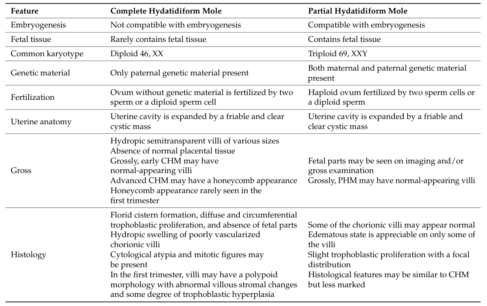

## Question

# Disease Characteristics Research Template

## Target Disease
- **Disease Name:** Hydatidiform Mole
- **MONDO ID:**  (if available)
- **Category:** 

## Research Objectives

Please provide a comprehensive research report on **Hydatidiform Mole** covering all of the
disease characteristics listed below. This report will be used to populate a disease knowledge
base entry. Be thorough and cite primary literature (PMID preferred) for all claims.

For each section, **suggested databases/resources** are listed. These are the first places
you should search for information on each topic.

---

### 1. Disease Information
> **Search first:** OMIM, Orphanet, ICD-10/ICD-11, MeSH, PubMed

- What is the disease? Provide a concise overview.
- What are the key identifiers? (OMIM, Orphanet, ICD-10/ICD-11, MeSH, Mondo)
- What are the common synonyms and alternative names?
- Is the information derived from individual patients (e.g., EHR) or aggregated disease-level resources?

### 2. Etiology

- **Disease Causal Factors**: What are the primary causes? (genetic, environmental, infectious, mechanistic)
- **Risk Factors**:
  > **Search first:** PubMed, Cochrane Library, UpToDate, clinical guidelines, ClinVar, ClinGen, GWAS Catalog, PheGenI, CTD, CDC, WHO, epidemiological databases
  - Genetic risk factors (causal variants, susceptibility loci, modifier genes)
  - Environmental risk factors (toxins, lifestyle, occupational exposures, age, sex, family history)
- **Protective Factors**:
  > **Search first:** PubMed, Cochrane Library, clinical trial databases, GWAS Catalog, gnomAD, WHO, CDC, nutrition databases
  - Genetic protective factors (protective variants, modifier alleles)
  - Environmental protective factors (diet, lifestyle, exposures that reduce risk)
- **Gene-Environment Interactions**: How do genetic and environmental factors interact to influence disease?
  > **Search first:** CTD, PubMed, PheGenI, GxE databases

### 3. Phenotypes
> **Search first:** HPO (Human Phenotype Ontology), OMIM, Orphanet, PubMed, clinicaltrials.gov, MedDRA, SNOMED CT, DECIPHER, LOINC

For each phenotype, provide:
- **Phenotype type**: symptoms, clinical signs, physical manifestations, behavioral changes, or laboratory abnormalities
  > For symptoms/signs: HPO, OMIM, Orphanet, PubMed
  > For behavioral changes: HPO, DSM, RDoC (Research Domain Criteria), PubMed
  > For laboratory abnormalities: LOINC, SNOMED CT, LabTests Online, PubMed
- **Phenotype characteristics**:
  > **Search first:** OMIM, Orphanet, HPO, PubMed
  - Age of symptom onset (neonatal, childhood, adult-onset, late-onset)
  - Symptom severity (mild, moderate, severe, variable)
  - Symptom progression (stable, progressive, episodic, fluctuating)
  - Frequency among affected individuals (percentage or qualitative)
- **Quality of life impact**: Effects on daily functioning and well-being (per-phenotype when possible)
  > **Search first:** EQ-5D database, SF-36, WHO QOL databases, PubMed
- Suggest HPO (Human Phenotype Ontology) terms for each phenotype

### 4. Genetic/Molecular Information

- **Causal Genes**: Gene mutations or chromosomal abnormalities responsible for disease (gene symbols, OMIM IDs)
  > **Search first:** OMIM, ClinVar, HGMD, Ensembl, NCBI Gene
- **Pathogenic Variants**:
  - Affected genes (gene symbols, HGNC IDs)
    > **Search first:** OMIM, NCBI Gene, Ensembl, HGNC, UniProt, GeneCards
  - Variant classification (pathogenic, likely pathogenic, VUS per ACMG/AMP guidelines)
    > **Search first:** ClinVar, ClinGen, ACMG/AMP guidelines, VarSome
  - Variant type/class (missense, frameshift, nonsense, splice-site, structural)
  - Allele frequency in population databases
    > **Search first:** gnomAD, 1000 Genomes, ExAC, TOPMed, dbSNP
  - Somatic vs germline origin
    > **Search first:** COSMIC (somatic), ClinVar, ICGC, TCGA
  - Functional consequences (loss of function, gain of function, dominant negative)
- **Modifier Genes**: Genes that modify disease severity or expression
- **Epigenetic Information**: DNA methylation, histone modifications, chromatin changes affecting disease
  > **Search first:** ENCODE, Roadmap Epigenomics, MethBase, DiseaseMeth
- **Chromosomal Abnormalities**: Large-scale genetic changes (aneuploidy, translocations, inversions)
  > **Search first:** DECIPHER, ClinVar, ECARUCA, UCSC Genome Browser

### 5. Environmental Information

- **Environmental Factors**: Non-genetic contributing factors (toxins, radiation, pollution, occupational exposure)
  > **Search first:** CTD (Comparative Toxicogenomics Database), TOXNET, PubMed, EPA databases
- **Lifestyle Factors**: Behavioral factors (smoking, diet, exercise, alcohol consumption)
  > **Search first:** CDC databases, WHO, PubMed, NHANES
- **Infectious Agents**: If applicable, pathogens causing or triggering disease (bacteria, viruses, fungi, parasites)
  > **Search first:** NCBI Taxonomy, ViPR, BV-BRC, MicrobeDB, GIDEON

### 6. Mechanism / Pathophysiology

- **Molecular Pathways**: Specific signaling cascades or biochemical pathways involved (Wnt, MAPK, mTOR, PI3K-AKT, etc.)
  > **Search first:** KEGG, Reactome, WikiPathways, PathBank, BioCyc
- **Cellular Processes**: Cell-level mechanisms (apoptosis, autophagy, cell cycle dysregulation, inflammation, etc.)
  > **Search first:** Gene Ontology (GO), Reactome, KEGG, PubMed
- **Protein Dysfunction**: How protein structure or function is altered (misfolding, aggregation, loss of function, gain of function)
  > **Search first:** UniProt, PDB (Protein Data Bank), InterPro, Pfam, AlphaFold
- **Metabolic Changes**: Alterations in metabolic processes (energy metabolism, lipid metabolism, amino acid metabolism)
  > **Search first:** KEGG, BioCyc, HMDB (Human Metabolome Database), BRENDA
- **Immune System Involvement**: Role of immune response (autoimmunity, immunodeficiency, chronic inflammation)
  > **Search first:** ImmPort, Immunome Database, IEDB, Gene Ontology
- **Tissue Damage Mechanisms**: How tissues/ are injured (oxidative stress, ischemia, fibrosis, necrosis)
  > **Search first:** PubMed, Gene Ontology, Reactome
- **Biochemical Abnormalities**: Specific molecular defects (enzyme deficiencies, receptor dysfunction, ion channel defects)
  > **Search first:** BRENDA, UniProt, KEGG, OMIM, PubMed
- **Epigenetic Changes**: DNA methylation, histone modifications affecting gene expression in disease
  > **Search first:** ENCODE, Roadmap Epigenomics, MethBase, DiseaseMeth
- **Molecular Profiling** (if available):
  - Transcriptomics/gene expression changes
    > **Search first:** GEO (Gene Expression Omnibus), ArrayExpress, GTEx, Human Cell Atlas, SRA
  - Proteomics findings
    > **Search first:** PRIDE, ProteomeXchange, Human Protein Atlas, STRING, BioGRID
  - Metabolomics signatures
    > **Search first:** MetaboLights, Metabolomics Workbench, HMDB, METLIN
  - Lipidomics alterations
    > **Search first:** LIPID MAPS, SwissLipids, LipidHome, Metabolomics Workbench
  - Genomic structural features
    > **Search first:** UCSC Genome Browser, Ensembl, NCBI, dbVar, DGV
- **Advanced Technologies** (if applicable):
  - Single-cell analysis findings (cell-type specific mechanisms, cellular heterogeneity)
    > **Search first:** Human Cell Atlas, Single Cell Portal, GEO, CELLxGENE
  - Spatial transcriptomics findings
    > **Search first:** GEO, Spatial Research, Vizgen, 10x Genomics data
  - Multi-omics integration results
    > **Search first:** TCGA, ICGC, cBioPortal, LinkedOmics, PubMed
  - Functional genomics screens (CRISPR, RNAi)
    > **Search first:** DepMap, GenomeRNAi, PubMed, BioGRID ORCS

For each mechanism, describe:
- The causal chain from initial trigger to clinical manifestation
- Which mechanisms are upstream vs downstream
- What cell types and biological processes are involved
- Suggest GO terms for biological processes and CL terms for cell types

### 7. Anatomical Structures Affected

- **Organ Level**:
  - Primary organs directly affected
  - Secondary organ involvement (complications, secondary effects)
  - Body systems involved (cardiovascular, nervous, digestive, respiratory, endocrine, etc.)
  > **Search first:** Uberon, FMA (Foundational Model of Anatomy), OMIM, HPO, ICD-11, MeSH, SNOMED CT
- **Tissue and Cell Level**:
  - Specific tissue types affected (epithelial, connective, muscle, nervous)
  - Specific cell populations targeted (with Cell Ontology terms)
  > **Search first:** Uberon, Human Protein Atlas, Cell Ontology, Human Cell Atlas, CellMarker, PanglaoDB
- **Subcellular Level**:
  - Cellular compartments involved (mitochondria, nucleus, ER, lysosomes) (with GO Cellular Component terms)
  > **Search first:** Gene Ontology (Cellular Component), UniProt, Human Protein Atlas
- **Localization**:
  - Specific anatomical sites (with UBERON terms)
    > **Search first:** FMA, Uberon, NeuroNames (for brain), SNOMED CT
  - Lateralization (unilateral, bilateral, asymmetric)
    > **Search first:** HPO, clinical literature, imaging databases

### 8. Temporal Development

- **Onset**:
  - Typical age of onset (congenital, pediatric, adult, geriatric)
  - Onset pattern (acute, subacute, chronic, insidious)
  > **Search first:** OMIM, Orphanet, HPO, PubMed
- **Progression**:
  - Disease stages (early, intermediate, advanced, end-stage)
    > **Search first:** Cancer Staging Manual (AJCC), WHO classifications, PubMed
  - Progression rate (rapid, slow, variable)
  - Disease course pattern (episodic, relapsing-remitting, progressive, stable)
  - Disease duration (self-limited, chronic lifelong)
  > **Search first:** Disease registries, longitudinal cohort databases, natural history studies, PubMed, Orphanet, OMIM
- **Patterns**:
  - Remission patterns (spontaneous, treatment-induced)
    > **Search first:** Clinical trial databases, disease registries, PubMed
  - Critical periods (time windows of vulnerability or opportunity for intervention)
    > **Search first:** PubMed, developmental biology databases, clinical guidelines

### 9. Inheritance and Population

- **Epidemiology**:
  - Prevalence (cases per 100,000 at given time)
  - Incidence (new cases per 100,000 per year)
  > **Search first:** Orphanet, CDC, WHO, GBD (Global Burden of Disease), national registries, SEER, disease registries
- **For Genetic Etiology**:
  - Inheritance pattern (AD, AR, X-linked, mitochondrial, multifactorial, polygenic)
    > **Search first:** OMIM, Orphanet, ClinVar, GTR (Genetic Testing Registry)
  - Penetrance (complete, incomplete, age-dependent)
    > **Search first:** ClinVar, OMIM, PubMed, ClinGen
  - Expressivity (variable, consistent)
    > **Search first:** OMIM, ClinVar, PubMed
  - Genetic anticipation (increasing severity in successive generations)
    > **Search first:** OMIM, PubMed (especially for repeat expansion disorders)
  - Germline mosaicism
    > **Search first:** ClinVar, OMIM, genetic counseling literature, PubMed
  - Founder effects (population-specific mutations)
    > **Search first:** gnomAD, population genetics databases, PubMed
  - Consanguinity role
    > **Search first:** OMIM, population studies, genetic counseling resources
  - Carrier frequency
    > **Search first:** gnomAD, carrier screening databases, GeneReviews, GTR
- **Population Demographics**:
  - Affected populations (ethnic or demographic groups with higher prevalence)
    > **Search first:** gnomAD, 1000 Genomes, PAGE Study, PubMed, population registries
  - Geographic distribution (endemic areas, regional variation)
    > **Search first:** WHO, CDC, GBD, Orphanet, geographic epidemiology databases
  - Geographic distribution of specific variants
  - Sex ratio (male:female)
    > **Search first:** Disease registries, OMIM, PubMed, epidemiological databases
  - Age distribution of affected individuals
    > **Search first:** CDC, disease registries, SEER, Orphanet

### 10. Diagnostics

- **Clinical Tests**:
  - Laboratory tests (blood, urine, tissue chemistry, specific enzyme assays)
    > **Search first:** LOINC, LabTests Online, PubMed
  - Biomarkers (proteins, metabolites, genetic markers, circulating biomarkers)
    > **Search first:** FDA Biomarker List, BEST (Biomarkers, EndpointS, and other Tools), PubMed
  - Imaging studies (X-ray, CT, MRI, PET, ultrasound)
    > **Search first:** RadLex, DICOM, Radiopaedia, imaging databases
  - Functional tests (pulmonary function, cardiac stress tests)
    > **Search first:** LOINC, clinical guidelines, PubMed
  - Electrophysiology (EEG, EMG, ECG, nerve conduction studies)
    > **Search first:** LOINC, clinical neurophysiology databases, PubMed
  - Biopsy findings (histopathology, immunohistochemistry)
    > **Search first:** SNOMED CT, College of American Pathologists resources, PubMed
  - Pathology findings (microscopic examination)
    > **Search first:** SNOMED CT, Digital Pathology databases, PubMed
- **Genetic Testing**:
  > **Search first:** GTR (Genetic Testing Registry), GeneReviews, ClinGen
  - Overview of recommended genetic testing approach
  - Whole genome sequencing (WGS) utility
    > **Search first:** GTR, ClinVar, GEL (Genomics England), gnomAD
  - Whole exome sequencing (WES) utility
    > **Search first:** GTR, ClinVar, OMIM, GeneMatcher
  - Gene panels (which panels, which genes)
    > **Search first:** GTR, ClinVar, laboratory-specific databases
  - Single gene testing
    > **Search first:** GTR, ClinVar, OMIM, GeneReviews
  - Chromosomal microarray (CMA)
    > **Search first:** DECIPHER, ClinVar, dbVar, ECARUCA
  - Karyotyping
    > **Search first:** Chromosome Abnormality Database, ClinVar, cytogenetics resources
  - FISH
    > **Search first:** ClinVar, cytogenetics databases, PubMed
  - Mitochondrial DNA testing
    > **Search first:** MITOMAP, MSeqDR, ClinVar, GTR
  - Repeat expansion testing
    > **Search first:** GTR, ClinVar, repeat expansion databases, PubMed
- **Omics-Based Diagnostics** (if applicable):
  - RNA sequencing / transcriptomics
    > **Search first:** GEO, ArrayExpress, GTEx, RNA-seq databases
  - Proteomics
    > **Search first:** PRIDE, ProteomeXchange, FDA Biomarker database
  - Metabolomics
    > **Search first:** MetaboLights, Metabolomics Workbench, HMDB
  - Epigenomics
    > **Search first:** GEO, ENCODE, Roadmap Epigenomics, MethBase
  - Liquid biopsy
    > **Search first:** COSMIC, ClinVar, liquid biopsy databases, PubMed
- **Clinical Criteria**:
  - Standardized diagnostic criteria (DSM, ICD, society guidelines)
    > **Search first:** DSM-5, ICD-11, clinical society guidelines, UpToDate
  - Differential diagnosis (other conditions to rule out, with distinguishing features)
    > **Search first:** DynaMed, UpToDate, clinical decision support systems
- **Screening**:
  - Screening methods for asymptomatic individuals (newborn screening, carrier screening, cascade screening)
    > **Search first:** ACMG recommendations, CDC newborn screening, GTR

### 11. Outcome/Prognosis

- **Survival and Mortality**:
  - Survival rate (5-year, 10-year, overall)
    > **Search first:** SEER, cancer registries, disease-specific registries, PubMed
  - Life expectancy (with and without treatment if applicable)
    > **Search first:** Orphanet, disease registries, actuarial databases, PubMed
  - Mortality rate
    > **Search first:** CDC, WHO, GBD, national mortality databases
  - Disease-specific mortality (deaths directly attributable to disease)
    > **Search first:** Disease registries, CDC Wonder, GBD, PubMed
- **Morbidity and Function**:
  - Morbidity (disease-related disability and health impacts)
    > **Search first:** GBD, WHO, disability databases, PubMed
  - Disability outcomes (long-term functional impairments)
    > **Search first:** ICF (International Classification of Functioning), disability registries
  - Quality of life measures (EQ-5D, SF-36, PROMIS, disease-specific tools)
    > **Search first:** EQ-5D database, SF-36, PROMIS, PubMed
- **Disease Course**:
  - Complications (secondary problems: infections, organ failure, etc.)
    > **Search first:** ICD codes, disease registries, clinical databases, PubMed
  - Recovery potential (likelihood and extent of recovery, with vs without treatment)
    > **Search first:** Natural history studies, rehabilitation databases, PubMed
- **Prediction**:
  - Prognostic factors (age, disease severity, biomarkers, treatment response)
    > **Search first:** Prognostic models databases, clinical calculators, PubMed
  - Prognostic biomarkers (molecular markers predicting disease course)
    > **Search first:** FDA Biomarker database, PubMed, cancer prognostic databases

### 12. Treatment

- **Pharmacotherapy**:
  - Pharmacological treatments (drug names, drug classes, mechanisms of action)
    > **Search first:** DrugBank, RxNorm, ATC classification, DailyMed, FDA databases
  - Pharmacogenomics (how genetic variants affect drug metabolism, efficacy, toxicity)
    > **Search first:** PharmGKB, CPIC (Clinical Pharmacogenetics), FDA Table of PGx Biomarkers
- **Advanced Therapeutics**:
  - Gene therapy (viral vectors, CRISPR, gene replacement, gene editing)
    > **Search first:** ClinicalTrials.gov, FDA gene therapy database, ASGCT resources
  - Cell therapy (stem cell transplant, CAR-T, cellular therapeutics)
    > **Search first:** ClinicalTrials.gov, FDA cell therapy database, FACT standards
  - RNA-based therapies (ASOs, siRNA, mRNA therapies)
    > **Search first:** ClinicalTrials.gov, FDA approvals, PubMed
  - Targeted therapies (treatments directed at specific molecular targets)
    > **Search first:** My Cancer Genome, OncoKB, ClinicalTrials.gov, FDA approvals
  - Immunotherapies (checkpoint inhibitors, monoclonal antibodies)
    > **Search first:** Cancer Immunotherapy Database, FDA approvals, ClinicalTrials.gov
- **Surgical and Interventional**:
  - Surgical interventions (types of surgery, timing, outcomes)
    > **Search first:** CPT codes, surgical registries, clinical guidelines, PubMed
- **Supportive and Rehabilitative**:
  - Supportive care (symptom management, pain control, nutrition)
    > **Search first:** Clinical guidelines, Cochrane Library, PubMed
  - Rehabilitation (physical therapy, occupational therapy, speech therapy)
    > **Search first:** Rehabilitation medicine databases, clinical guidelines, PubMed
- **Experimental**:
  - Experimental treatments in clinical trials (with NCT identifiers if available)
    > **Search first:** ClinicalTrials.gov, EU Clinical Trials Register, WHO ICTRP
- **Treatment Outcomes**:
  - Treatment response rates
    > **Search first:** Clinical trial databases, FDA reviews, systematic reviews, PubMed
  - Side effects and adverse events
    > **Search first:** FDA Adverse Event Reporting System (FAERS), MedWatch, PubMed
- **Treatment Strategy**:
  - Treatment algorithms (clinical pathways, decision trees)
    > **Search first:** Clinical practice guidelines, NCCN Guidelines, UpToDate
  - Combination therapies
    > **Search first:** ClinicalTrials.gov, treatment guidelines, PubMed
  - Personalized medicine approaches (genotype-guided treatment)
    > **Search first:** My Cancer Genome, CIViC, PharmGKB, precision medicine databases

For each treatment, suggest MAXO (Medical Action Ontology) terms where applicable.

### 13. Prevention

- **Prevention Levels**:
  - Primary prevention (preventing disease occurrence: vaccination, risk factor modification)
    > **Search first:** CDC, WHO, USPSTF recommendations, Cochrane Library
  - Secondary prevention (early detection and treatment: screening programs, early intervention)
    > **Search first:** USPSTF, CDC screening guidelines, WHO
  - Tertiary prevention (preventing complications in those with disease)
    > **Search first:** Clinical guidelines, disease management protocols, PubMed
- **Immunization**: Vaccine strategies (if applicable)
  > **Search first:** CDC vaccine schedules, WHO immunization, FDA vaccine database
- **Screening and Early Detection**:
  - Screening programs (population-based: newborn screening, cancer screening)
    > **Search first:** CDC screening programs, USPSTF, cancer screening databases
  - Genetic screening (carrier screening, preimplantation genetic diagnosis, prenatal testing)
    > **Search first:** ACMG recommendations, ACOG guidelines, GTR
  - Risk stratification (identifying high-risk individuals for targeted prevention)
    > **Search first:** Risk prediction models, clinical calculators, PubMed
- **Behavioral Interventions**: Lifestyle modifications to reduce risk
  > **Search first:** CDC, WHO, behavioral intervention databases, Cochrane Library
- **Counseling**: Genetic counseling (risk assessment, family planning guidance)
  > **Search first:** NSGC resources, ACMG guidelines, GeneReviews
- **Public Health**:
  - Public health interventions (sanitation, vector control, health education)
    > **Search first:** CDC, WHO, public health databases, PubMed
  - Environmental interventions (reducing environmental risk factors)
    > **Search first:** EPA databases, WHO environmental health, PubMed
- **Prophylaxis**: Preventive medications or procedures
  > **Search first:** Clinical guidelines, FDA approvals, PubMed

### 14. Other Species / Natural Disease

- **Taxonomy**: Species affected (with NCBI Taxon identifiers)
  > **Search first:** NCBI Taxonomy
- **Breed**: Specific breeds affected (with VBO identifiers if applicable)
  > **Search first:** VBO (Vertebrate Breed Ontology)
- **Gene**: Orthologous genes in other species (with NCBI Gene IDs)
  > **Search first:** NCBI Gene
- **Natural Disease**:
  - Naturally occurring disease in other species (companion animals, wildlife)
    > **Search first:** OMIA (Online Mendelian Inheritance in Animals), VetCompass, PubMed
  - Veterinary relevance and importance in animal health
    > **Search first:** OMIA, veterinary databases, PubMed
- **Comparative Biology**:
  - Comparative pathology (similarities and differences across species)
    > **Search first:** OMIA, comparative pathology databases, PubMed
  - Evolutionary conservation of disease mechanisms
    > **Search first:** HomoloGene, OrthoMCL, Alliance of Genome Resources
- **Transmission** (if applicable):
  - Zoonotic potential
    > **Search first:** CDC zoonotic diseases, WHO zoonoses, GIDEON
  - Cross-species susceptibility
    > **Search first:** NCBI Taxonomy, veterinary databases, PubMed

### 15. Model Organisms

- **Model Types**:
  - Model organism type (mammalian, invertebrate, cellular, in vitro)
    > **Search first:** Alliance of Genome Resources, model organism databases
  - Specific model systems (mouse, rat, zebrafish, Drosophila, C. elegans, yeast, cell lines, organoids, iPSCs)
    > **Search first:** MGI, RGD, ZFIN, FlyBase, WormBase, SGD, ATCC, Cellosaurus
  - Induced models (drug treatment, surgical intervention, environmental manipulation)
    > **Search first:** MGI, model organism databases, PubMed
- **Genetic Models**:
  - Types available (knockout, knock-in, transgenic, conditional, humanized)
    > **Search first:** MGI, IMPC, KOMP, EuMMCR, IMSR
- **Model Characteristics**:
  - Phenotype recapitulation (how well model reproduces human disease features)
    > **Search first:** Model organism databases, comparative studies, PubMed
  - Model limitations (aspects of human disease not captured)
    > **Search first:** Model organism databases, PubMed, review articles
- **Applications**:
  - Research applications (what aspects of disease can be studied)
    > **Search first:** Model organism databases, PubMed
- **Resources**:
  - Model databases
    > **Search first:** MGI, RGD, ZFIN, FlyBase, WormBase, IMSR, EMMA, MMRRC

---

## Citation Requirements

- Cite primary literature (PMID preferred) for all mechanistic and clinical claims
- Prioritize recent reviews and landmark papers
- Include direct quotes from abstracts where possible to support key statements
- Distinguish evidence source types: human clinical, model organism, in vitro, computational

## Output Format

Structure your response as a comprehensive narrative organized by the sections above.
For each section, provide:
- Factual content with specific details (numbers, percentages, gene names, variant nomenclature)
- Ontology term suggestions (HPO, GO, CL, UBERON, CHEBI, MAXO, MONDO) where applicable
- Evidence citations with PMIDs
- Direct quotes from abstracts to support key claims
- Clear indication when information is not available or not applicable for this disease

This report will be used to populate a disease knowledge base entry with:
- Pathophysiology descriptions with causal chains
- Gene/protein annotations (HGNC, GO terms)
- Phenotype associations (HP terms) with frequencies
- Cell type involvement (CL terms)
- Anatomical locations (UBERON terms)
- Chemical entities (CHEBI terms)
- Treatment annotations (MAXO terms)
- Evidence items with PMIDs and exact abstract quotes
- Epidemiology, prognosis, diagnostic, and prevention information
- Animal model descriptions with phenotype recapitulation details

## Output

Question: You are an expert researcher providing comprehensive, well-cited information.

Provide detailed information focusing on:
1. Key concepts and definitions with current understanding
2. Recent developments and latest research (prioritize 2023-2024 sources)
3. Current applications and real-world implementations
4. Expert opinions and analysis from authoritative sources
5. Relevant statistics and data from recent studies

Format as a comprehensive research report with proper citations. Include URLs and publication dates where available.
Always prioritize recent, authoritative sources and provide specific citations for all major claims.

# Disease Characteristics Research Template

## Target Disease
- **Disease Name:** Hydatidiform Mole
- **MONDO ID:**  (if available)
- **Category:** 

## Research Objectives

Please provide a comprehensive research report on **Hydatidiform Mole** covering all of the
disease characteristics listed below. This report will be used to populate a disease knowledge
base entry. Be thorough and cite primary literature (PMID preferred) for all claims.

For each section, **suggested databases/resources** are listed. These are the first places
you should search for information on each topic.

---

### 1. Disease Information
> **Search first:** OMIM, Orphanet, ICD-10/ICD-11, MeSH, PubMed

- What is the disease? Provide a concise overview.
- What are the key identifiers? (OMIM, Orphanet, ICD-10/ICD-11, MeSH, Mondo)
- What are the common synonyms and alternative names?
- Is the information derived from individual patients (e.g., EHR) or aggregated disease-level resources?

### 2. Etiology

- **Disease Causal Factors**: What are the primary causes? (genetic, environmental, infectious, mechanistic)
- **Risk Factors**:
  > **Search first:** PubMed, Cochrane Library, UpToDate, clinical guidelines, ClinVar, ClinGen, GWAS Catalog, PheGenI, CTD, CDC, WHO, epidemiological databases
  - Genetic risk factors (causal variants, susceptibility loci, modifier genes)
  - Environmental risk factors (toxins, lifestyle, occupational exposures, age, sex, family history)
- **Protective Factors**:
  > **Search first:** PubMed, Cochrane Library, clinical trial databases, GWAS Catalog, gnomAD, WHO, CDC, nutrition databases
  - Genetic protective factors (protective variants, modifier alleles)
  - Environmental protective factors (diet, lifestyle, exposures that reduce risk)
- **Gene-Environment Interactions**: How do genetic and environmental factors interact to influence disease?
  > **Search first:** CTD, PubMed, PheGenI, GxE databases

### 3. Phenotypes
> **Search first:** HPO (Human Phenotype Ontology), OMIM, Orphanet, PubMed, clinicaltrials.gov, MedDRA, SNOMED CT, DECIPHER, LOINC

For each phenotype, provide:
- **Phenotype type**: symptoms, clinical signs, physical manifestations, behavioral changes, or laboratory abnormalities
  > For symptoms/signs: HPO, OMIM, Orphanet, PubMed
  > For behavioral changes: HPO, DSM, RDoC (Research Domain Criteria), PubMed
  > For laboratory abnormalities: LOINC, SNOMED CT, LabTests Online, PubMed
- **Phenotype characteristics**:
  > **Search first:** OMIM, Orphanet, HPO, PubMed
  - Age of symptom onset (neonatal, childhood, adult-onset, late-onset)
  - Symptom severity (mild, moderate, severe, variable)
  - Symptom progression (stable, progressive, episodic, fluctuating)
  - Frequency among affected individuals (percentage or qualitative)
- **Quality of life impact**: Effects on daily functioning and well-being (per-phenotype when possible)
  > **Search first:** EQ-5D database, SF-36, WHO QOL databases, PubMed
- Suggest HPO (Human Phenotype Ontology) terms for each phenotype

### 4. Genetic/Molecular Information

- **Causal Genes**: Gene mutations or chromosomal abnormalities responsible for disease (gene symbols, OMIM IDs)
  > **Search first:** OMIM, ClinVar, HGMD, Ensembl, NCBI Gene
- **Pathogenic Variants**:
  - Affected genes (gene symbols, HGNC IDs)
    > **Search first:** OMIM, NCBI Gene, Ensembl, HGNC, UniProt, GeneCards
  - Variant classification (pathogenic, likely pathogenic, VUS per ACMG/AMP guidelines)
    > **Search first:** ClinVar, ClinGen, ACMG/AMP guidelines, VarSome
  - Variant type/class (missense, frameshift, nonsense, splice-site, structural)
  - Allele frequency in population databases
    > **Search first:** gnomAD, 1000 Genomes, ExAC, TOPMed, dbSNP
  - Somatic vs germline origin
    > **Search first:** COSMIC (somatic), ClinVar, ICGC, TCGA
  - Functional consequences (loss of function, gain of function, dominant negative)
- **Modifier Genes**: Genes that modify disease severity or expression
- **Epigenetic Information**: DNA methylation, histone modifications, chromatin changes affecting disease
  > **Search first:** ENCODE, Roadmap Epigenomics, MethBase, DiseaseMeth
- **Chromosomal Abnormalities**: Large-scale genetic changes (aneuploidy, translocations, inversions)
  > **Search first:** DECIPHER, ClinVar, ECARUCA, UCSC Genome Browser

### 5. Environmental Information

- **Environmental Factors**: Non-genetic contributing factors (toxins, radiation, pollution, occupational exposure)
  > **Search first:** CTD (Comparative Toxicogenomics Database), TOXNET, PubMed, EPA databases
- **Lifestyle Factors**: Behavioral factors (smoking, diet, exercise, alcohol consumption)
  > **Search first:** CDC databases, WHO, PubMed, NHANES
- **Infectious Agents**: If applicable, pathogens causing or triggering disease (bacteria, viruses, fungi, parasites)
  > **Search first:** NCBI Taxonomy, ViPR, BV-BRC, MicrobeDB, GIDEON

### 6. Mechanism / Pathophysiology

- **Molecular Pathways**: Specific signaling cascades or biochemical pathways involved (Wnt, MAPK, mTOR, PI3K-AKT, etc.)
  > **Search first:** KEGG, Reactome, WikiPathways, PathBank, BioCyc
- **Cellular Processes**: Cell-level mechanisms (apoptosis, autophagy, cell cycle dysregulation, inflammation, etc.)
  > **Search first:** Gene Ontology (GO), Reactome, KEGG, PubMed
- **Protein Dysfunction**: How protein structure or function is altered (misfolding, aggregation, loss of function, gain of function)
  > **Search first:** UniProt, PDB (Protein Data Bank), InterPro, Pfam, AlphaFold
- **Metabolic Changes**: Alterations in metabolic processes (energy metabolism, lipid metabolism, amino acid metabolism)
  > **Search first:** KEGG, BioCyc, HMDB (Human Metabolome Database), BRENDA
- **Immune System Involvement**: Role of immune response (autoimmunity, immunodeficiency, chronic inflammation)
  > **Search first:** ImmPort, Immunome Database, IEDB, Gene Ontology
- **Tissue Damage Mechanisms**: How tissues/ are injured (oxidative stress, ischemia, fibrosis, necrosis)
  > **Search first:** PubMed, Gene Ontology, Reactome
- **Biochemical Abnormalities**: Specific molecular defects (enzyme deficiencies, receptor dysfunction, ion channel defects)
  > **Search first:** BRENDA, UniProt, KEGG, OMIM, PubMed
- **Epigenetic Changes**: DNA methylation, histone modifications affecting gene expression in disease
  > **Search first:** ENCODE, Roadmap Epigenomics, MethBase, DiseaseMeth
- **Molecular Profiling** (if available):
  - Transcriptomics/gene expression changes
    > **Search first:** GEO (Gene Expression Omnibus), ArrayExpress, GTEx, Human Cell Atlas, SRA
  - Proteomics findings
    > **Search first:** PRIDE, ProteomeXchange, Human Protein Atlas, STRING, BioGRID
  - Metabolomics signatures
    > **Search first:** MetaboLights, Metabolomics Workbench, HMDB, METLIN
  - Lipidomics alterations
    > **Search first:** LIPID MAPS, SwissLipids, LipidHome, Metabolomics Workbench
  - Genomic structural features
    > **Search first:** UCSC Genome Browser, Ensembl, NCBI, dbVar, DGV
- **Advanced Technologies** (if applicable):
  - Single-cell analysis findings (cell-type specific mechanisms, cellular heterogeneity)
    > **Search first:** Human Cell Atlas, Single Cell Portal, GEO, CELLxGENE
  - Spatial transcriptomics findings
    > **Search first:** GEO, Spatial Research, Vizgen, 10x Genomics data
  - Multi-omics integration results
    > **Search first:** TCGA, ICGC, cBioPortal, LinkedOmics, PubMed
  - Functional genomics screens (CRISPR, RNAi)
    > **Search first:** DepMap, GenomeRNAi, PubMed, BioGRID ORCS

For each mechanism, describe:
- The causal chain from initial trigger to clinical manifestation
- Which mechanisms are upstream vs downstream
- What cell types and biological processes are involved
- Suggest GO terms for biological processes and CL terms for cell types

### 7. Anatomical Structures Affected

- **Organ Level**:
  - Primary organs directly affected
  - Secondary organ involvement (complications, secondary effects)
  - Body systems involved (cardiovascular, nervous, digestive, respiratory, endocrine, etc.)
  > **Search first:** Uberon, FMA (Foundational Model of Anatomy), OMIM, HPO, ICD-11, MeSH, SNOMED CT
- **Tissue and Cell Level**:
  - Specific tissue types affected (epithelial, connective, muscle, nervous)
  - Specific cell populations targeted (with Cell Ontology terms)
  > **Search first:** Uberon, Human Protein Atlas, Cell Ontology, Human Cell Atlas, CellMarker, PanglaoDB
- **Subcellular Level**:
  - Cellular compartments involved (mitochondria, nucleus, ER, lysosomes) (with GO Cellular Component terms)
  > **Search first:** Gene Ontology (Cellular Component), UniProt, Human Protein Atlas
- **Localization**:
  - Specific anatomical sites (with UBERON terms)
    > **Search first:** FMA, Uberon, NeuroNames (for brain), SNOMED CT
  - Lateralization (unilateral, bilateral, asymmetric)
    > **Search first:** HPO, clinical literature, imaging databases

### 8. Temporal Development

- **Onset**:
  - Typical age of onset (congenital, pediatric, adult, geriatric)
  - Onset pattern (acute, subacute, chronic, insidious)
  > **Search first:** OMIM, Orphanet, HPO, PubMed
- **Progression**:
  - Disease stages (early, intermediate, advanced, end-stage)
    > **Search first:** Cancer Staging Manual (AJCC), WHO classifications, PubMed
  - Progression rate (rapid, slow, variable)
  - Disease course pattern (episodic, relapsing-remitting, progressive, stable)
  - Disease duration (self-limited, chronic lifelong)
  > **Search first:** Disease registries, longitudinal cohort databases, natural history studies, PubMed, Orphanet, OMIM
- **Patterns**:
  - Remission patterns (spontaneous, treatment-induced)
    > **Search first:** Clinical trial databases, disease registries, PubMed
  - Critical periods (time windows of vulnerability or opportunity for intervention)
    > **Search first:** PubMed, developmental biology databases, clinical guidelines

### 9. Inheritance and Population

- **Epidemiology**:
  - Prevalence (cases per 100,000 at given time)
  - Incidence (new cases per 100,000 per year)
  > **Search first:** Orphanet, CDC, WHO, GBD (Global Burden of Disease), national registries, SEER, disease registries
- **For Genetic Etiology**:
  - Inheritance pattern (AD, AR, X-linked, mitochondrial, multifactorial, polygenic)
    > **Search first:** OMIM, Orphanet, ClinVar, GTR (Genetic Testing Registry)
  - Penetrance (complete, incomplete, age-dependent)
    > **Search first:** ClinVar, OMIM, PubMed, ClinGen
  - Expressivity (variable, consistent)
    > **Search first:** OMIM, ClinVar, PubMed
  - Genetic anticipation (increasing severity in successive generations)
    > **Search first:** OMIM, PubMed (especially for repeat expansion disorders)
  - Germline mosaicism
    > **Search first:** ClinVar, OMIM, genetic counseling literature, PubMed
  - Founder effects (population-specific mutations)
    > **Search first:** gnomAD, population genetics databases, PubMed
  - Consanguinity role
    > **Search first:** OMIM, population studies, genetic counseling resources
  - Carrier frequency
    > **Search first:** gnomAD, carrier screening databases, GeneReviews, GTR
- **Population Demographics**:
  - Affected populations (ethnic or demographic groups with higher prevalence)
    > **Search first:** gnomAD, 1000 Genomes, PAGE Study, PubMed, population registries
  - Geographic distribution (endemic areas, regional variation)
    > **Search first:** WHO, CDC, GBD, Orphanet, geographic epidemiology databases
  - Geographic distribution of specific variants
  - Sex ratio (male:female)
    > **Search first:** Disease registries, OMIM, PubMed, epidemiological databases
  - Age distribution of affected individuals
    > **Search first:** CDC, disease registries, SEER, Orphanet

### 10. Diagnostics

- **Clinical Tests**:
  - Laboratory tests (blood, urine, tissue chemistry, specific enzyme assays)
    > **Search first:** LOINC, LabTests Online, PubMed
  - Biomarkers (proteins, metabolites, genetic markers, circulating biomarkers)
    > **Search first:** FDA Biomarker List, BEST (Biomarkers, EndpointS, and other Tools), PubMed
  - Imaging studies (X-ray, CT, MRI, PET, ultrasound)
    > **Search first:** RadLex, DICOM, Radiopaedia, imaging databases
  - Functional tests (pulmonary function, cardiac stress tests)
    > **Search first:** LOINC, clinical guidelines, PubMed
  - Electrophysiology (EEG, EMG, ECG, nerve conduction studies)
    > **Search first:** LOINC, clinical neurophysiology databases, PubMed
  - Biopsy findings (histopathology, immunohistochemistry)
    > **Search first:** SNOMED CT, College of American Pathologists resources, PubMed
  - Pathology findings (microscopic examination)
    > **Search first:** SNOMED CT, Digital Pathology databases, PubMed
- **Genetic Testing**:
  > **Search first:** GTR (Genetic Testing Registry), GeneReviews, ClinGen
  - Overview of recommended genetic testing approach
  - Whole genome sequencing (WGS) utility
    > **Search first:** GTR, ClinVar, GEL (Genomics England), gnomAD
  - Whole exome sequencing (WES) utility
    > **Search first:** GTR, ClinVar, OMIM, GeneMatcher
  - Gene panels (which panels, which genes)
    > **Search first:** GTR, ClinVar, laboratory-specific databases
  - Single gene testing
    > **Search first:** GTR, ClinVar, OMIM, GeneReviews
  - Chromosomal microarray (CMA)
    > **Search first:** DECIPHER, ClinVar, dbVar, ECARUCA
  - Karyotyping
    > **Search first:** Chromosome Abnormality Database, ClinVar, cytogenetics resources
  - FISH
    > **Search first:** ClinVar, cytogenetics databases, PubMed
  - Mitochondrial DNA testing
    > **Search first:** MITOMAP, MSeqDR, ClinVar, GTR
  - Repeat expansion testing
    > **Search first:** GTR, ClinVar, repeat expansion databases, PubMed
- **Omics-Based Diagnostics** (if applicable):
  - RNA sequencing / transcriptomics
    > **Search first:** GEO, ArrayExpress, GTEx, RNA-seq databases
  - Proteomics
    > **Search first:** PRIDE, ProteomeXchange, FDA Biomarker database
  - Metabolomics
    > **Search first:** MetaboLights, Metabolomics Workbench, HMDB
  - Epigenomics
    > **Search first:** GEO, ENCODE, Roadmap Epigenomics, MethBase
  - Liquid biopsy
    > **Search first:** COSMIC, ClinVar, liquid biopsy databases, PubMed
- **Clinical Criteria**:
  - Standardized diagnostic criteria (DSM, ICD, society guidelines)
    > **Search first:** DSM-5, ICD-11, clinical society guidelines, UpToDate
  - Differential diagnosis (other conditions to rule out, with distinguishing features)
    > **Search first:** DynaMed, UpToDate, clinical decision support systems
- **Screening**:
  - Screening methods for asymptomatic individuals (newborn screening, carrier screening, cascade screening)
    > **Search first:** ACMG recommendations, CDC newborn screening, GTR

### 11. Outcome/Prognosis

- **Survival and Mortality**:
  - Survival rate (5-year, 10-year, overall)
    > **Search first:** SEER, cancer registries, disease-specific registries, PubMed
  - Life expectancy (with and without treatment if applicable)
    > **Search first:** Orphanet, disease registries, actuarial databases, PubMed
  - Mortality rate
    > **Search first:** CDC, WHO, GBD, national mortality databases
  - Disease-specific mortality (deaths directly attributable to disease)
    > **Search first:** Disease registries, CDC Wonder, GBD, PubMed
- **Morbidity and Function**:
  - Morbidity (disease-related disability and health impacts)
    > **Search first:** GBD, WHO, disability databases, PubMed
  - Disability outcomes (long-term functional impairments)
    > **Search first:** ICF (International Classification of Functioning), disability registries
  - Quality of life measures (EQ-5D, SF-36, PROMIS, disease-specific tools)
    > **Search first:** EQ-5D database, SF-36, PROMIS, PubMed
- **Disease Course**:
  - Complications (secondary problems: infections, organ failure, etc.)
    > **Search first:** ICD codes, disease registries, clinical databases, PubMed
  - Recovery potential (likelihood and extent of recovery, with vs without treatment)
    > **Search first:** Natural history studies, rehabilitation databases, PubMed
- **Prediction**:
  - Prognostic factors (age, disease severity, biomarkers, treatment response)
    > **Search first:** Prognostic models databases, clinical calculators, PubMed
  - Prognostic biomarkers (molecular markers predicting disease course)
    > **Search first:** FDA Biomarker database, PubMed, cancer prognostic databases

### 12. Treatment

- **Pharmacotherapy**:
  - Pharmacological treatments (drug names, drug classes, mechanisms of action)
    > **Search first:** DrugBank, RxNorm, ATC classification, DailyMed, FDA databases
  - Pharmacogenomics (how genetic variants affect drug metabolism, efficacy, toxicity)
    > **Search first:** PharmGKB, CPIC (Clinical Pharmacogenetics), FDA Table of PGx Biomarkers
- **Advanced Therapeutics**:
  - Gene therapy (viral vectors, CRISPR, gene replacement, gene editing)
    > **Search first:** ClinicalTrials.gov, FDA gene therapy database, ASGCT resources
  - Cell therapy (stem cell transplant, CAR-T, cellular therapeutics)
    > **Search first:** ClinicalTrials.gov, FDA cell therapy database, FACT standards
  - RNA-based therapies (ASOs, siRNA, mRNA therapies)
    > **Search first:** ClinicalTrials.gov, FDA approvals, PubMed
  - Targeted therapies (treatments directed at specific molecular targets)
    > **Search first:** My Cancer Genome, OncoKB, ClinicalTrials.gov, FDA approvals
  - Immunotherapies (checkpoint inhibitors, monoclonal antibodies)
    > **Search first:** Cancer Immunotherapy Database, FDA approvals, ClinicalTrials.gov
- **Surgical and Interventional**:
  - Surgical interventions (types of surgery, timing, outcomes)
    > **Search first:** CPT codes, surgical registries, clinical guidelines, PubMed
- **Supportive and Rehabilitative**:
  - Supportive care (symptom management, pain control, nutrition)
    > **Search first:** Clinical guidelines, Cochrane Library, PubMed
  - Rehabilitation (physical therapy, occupational therapy, speech therapy)
    > **Search first:** Rehabilitation medicine databases, clinical guidelines, PubMed
- **Experimental**:
  - Experimental treatments in clinical trials (with NCT identifiers if available)
    > **Search first:** ClinicalTrials.gov, EU Clinical Trials Register, WHO ICTRP
- **Treatment Outcomes**:
  - Treatment response rates
    > **Search first:** Clinical trial databases, FDA reviews, systematic reviews, PubMed
  - Side effects and adverse events
    > **Search first:** FDA Adverse Event Reporting System (FAERS), MedWatch, PubMed
- **Treatment Strategy**:
  - Treatment algorithms (clinical pathways, decision trees)
    > **Search first:** Clinical practice guidelines, NCCN Guidelines, UpToDate
  - Combination therapies
    > **Search first:** ClinicalTrials.gov, treatment guidelines, PubMed
  - Personalized medicine approaches (genotype-guided treatment)
    > **Search first:** My Cancer Genome, CIViC, PharmGKB, precision medicine databases

For each treatment, suggest MAXO (Medical Action Ontology) terms where applicable.

### 13. Prevention

- **Prevention Levels**:
  - Primary prevention (preventing disease occurrence: vaccination, risk factor modification)
    > **Search first:** CDC, WHO, USPSTF recommendations, Cochrane Library
  - Secondary prevention (early detection and treatment: screening programs, early intervention)
    > **Search first:** USPSTF, CDC screening guidelines, WHO
  - Tertiary prevention (preventing complications in those with disease)
    > **Search first:** Clinical guidelines, disease management protocols, PubMed
- **Immunization**: Vaccine strategies (if applicable)
  > **Search first:** CDC vaccine schedules, WHO immunization, FDA vaccine database
- **Screening and Early Detection**:
  - Screening programs (population-based: newborn screening, cancer screening)
    > **Search first:** CDC screening programs, USPSTF, cancer screening databases
  - Genetic screening (carrier screening, preimplantation genetic diagnosis, prenatal testing)
    > **Search first:** ACMG recommendations, ACOG guidelines, GTR
  - Risk stratification (identifying high-risk individuals for targeted prevention)
    > **Search first:** Risk prediction models, clinical calculators, PubMed
- **Behavioral Interventions**: Lifestyle modifications to reduce risk
  > **Search first:** CDC, WHO, behavioral intervention databases, Cochrane Library
- **Counseling**: Genetic counseling (risk assessment, family planning guidance)
  > **Search first:** NSGC resources, ACMG guidelines, GeneReviews
- **Public Health**:
  - Public health interventions (sanitation, vector control, health education)
    > **Search first:** CDC, WHO, public health databases, PubMed
  - Environmental interventions (reducing environmental risk factors)
    > **Search first:** EPA databases, WHO environmental health, PubMed
- **Prophylaxis**: Preventive medications or procedures
  > **Search first:** Clinical guidelines, FDA approvals, PubMed

### 14. Other Species / Natural Disease

- **Taxonomy**: Species affected (with NCBI Taxon identifiers)
  > **Search first:** NCBI Taxonomy
- **Breed**: Specific breeds affected (with VBO identifiers if applicable)
  > **Search first:** VBO (Vertebrate Breed Ontology)
- **Gene**: Orthologous genes in other species (with NCBI Gene IDs)
  > **Search first:** NCBI Gene
- **Natural Disease**:
  - Naturally occurring disease in other species (companion animals, wildlife)
    > **Search first:** OMIA (Online Mendelian Inheritance in Animals), VetCompass, PubMed
  - Veterinary relevance and importance in animal health
    > **Search first:** OMIA, veterinary databases, PubMed
- **Comparative Biology**:
  - Comparative pathology (similarities and differences across species)
    > **Search first:** OMIA, comparative pathology databases, PubMed
  - Evolutionary conservation of disease mechanisms
    > **Search first:** HomoloGene, OrthoMCL, Alliance of Genome Resources
- **Transmission** (if applicable):
  - Zoonotic potential
    > **Search first:** CDC zoonotic diseases, WHO zoonoses, GIDEON
  - Cross-species susceptibility
    > **Search first:** NCBI Taxonomy, veterinary databases, PubMed

### 15. Model Organisms

- **Model Types**:
  - Model organism type (mammalian, invertebrate, cellular, in vitro)
    > **Search first:** Alliance of Genome Resources, model organism databases
  - Specific model systems (mouse, rat, zebrafish, Drosophila, C. elegans, yeast, cell lines, organoids, iPSCs)
    > **Search first:** MGI, RGD, ZFIN, FlyBase, WormBase, SGD, ATCC, Cellosaurus
  - Induced models (drug treatment, surgical intervention, environmental manipulation)
    > **Search first:** MGI, model organism databases, PubMed
- **Genetic Models**:
  - Types available (knockout, knock-in, transgenic, conditional, humanized)
    > **Search first:** MGI, IMPC, KOMP, EuMMCR, IMSR
- **Model Characteristics**:
  - Phenotype recapitulation (how well model reproduces human disease features)
    > **Search first:** Model organism databases, comparative studies, PubMed
  - Model limitations (aspects of human disease not captured)
    > **Search first:** Model organism databases, PubMed, review articles
- **Applications**:
  - Research applications (what aspects of disease can be studied)
    > **Search first:** Model organism databases, PubMed
- **Resources**:
  - Model databases
    > **Search first:** MGI, RGD, ZFIN, FlyBase, WormBase, IMSR, EMMA, MMRRC

---

## Citation Requirements

- Cite primary literature (PMID preferred) for all mechanistic and clinical claims
- Prioritize recent reviews and landmark papers
- Include direct quotes from abstracts where possible to support key statements
- Distinguish evidence source types: human clinical, model organism, in vitro, computational

## Output Format

Structure your response as a comprehensive narrative organized by the sections above.
For each section, provide:
- Factual content with specific details (numbers, percentages, gene names, variant nomenclature)
- Ontology term suggestions (HPO, GO, CL, UBERON, CHEBI, MAXO, MONDO) where applicable
- Evidence citations with PMIDs
- Direct quotes from abstracts to support key claims
- Clear indication when information is not available or not applicable for this disease

This report will be used to populate a disease knowledge base entry with:
- Pathophysiology descriptions with causal chains
- Gene/protein annotations (HGNC, GO terms)
- Phenotype associations (HP terms) with frequencies
- Cell type involvement (CL terms)
- Anatomical locations (UBERON terms)
- Chemical entities (CHEBI terms)
- Treatment annotations (MAXO terms)
- Evidence items with PMIDs and exact abstract quotes
- Epidemiology, prognosis, diagnostic, and prevention information
- Animal model descriptions with phenotype recapitulation details

## Hydatidiform Mole (Molar Pregnancy) — Comprehensive Disease Characteristics Report

### Target Disease
- **Disease name:** Hydatidiform mole (HM)
- **MONDO ID:** Not identified in the retrieved full-text sources (should be cross-checked directly in MONDO/Monarch Initiative).
- **Category:** Gestational trophoblastic disease (GTD); “molar pregnancies” within WHO GTD spectrum (joyce2024evaluationofbiomarkers pages 62-66).

---

## 1. Disease Information

### 1.1 Definition and current understanding
Hydatidiform mole is an abnormal gestation characterized by hydropic swelling of chorionic villi with trophoblastic hyperplasia, and is classified into **complete hydatidiform mole (CHM)** and **partial hydatidiform mole (PHM)** based on genetic constitution and associated morphology (senat2024gestationaltrophoblasticdisease pages 4-7, gonzalez2024gestationaltrophoblasticdisease pages 2-4).

- **CHM (classic concept):** androgenetic diploidy with paternal-only genome, typically **46,XX**, usually no fetal tissue (gonzalez2024gestationaltrophoblasticdisease pages 1-2, senat2024gestationaltrophoblasticdisease pages 4-7).
- **PHM (classic concept):** diandric triploidy with maternal+paternal contribution, commonly **69,XXY** (also 69,XXX/69,XYY reported), often with fetal tissue (gonzalez2024gestationaltrophoblasticdisease pages 2-4, senat2024gestationaltrophoblasticdisease pages 4-7).

### 1.2 Common synonyms / alternative names
- “Molar pregnancy”
- “Complete mole” / “Partial mole”
- Included under GTD; post-evacuation malignant/persistent disease is often described as **post-molar gestational trophoblastic neoplasia (post-molar GTN)** (larsson2025treatmentoutcomesand pages 1-2, joyce2024evaluationofbiomarkers pages 62-66).

### 1.3 Key identifiers (available in retrieved evidence)
- **ICD-10 (reported in a Swedish population-based GTN study methods/coding):** non-specified hydatidiform mole **O01.9**; GTN-related codes reported include invasive mole **D39.2A**, PSTT **D39.2C**, choriocarcinoma **C58.9**, and ETT morphology codes (91043/91053/m91053) (larsson2025treatmentoutcomesand pages 1-2).
- **FIGO/WHO classification references:** WHO 2020 classification for GTD is explicitly cited in a 2024 biomarker thesis-like document; FIGO diagnostic criteria for post-molar GTN are also summarized (joyce2024evaluationofbiomarkers pages 62-66, larsson2025treatmentoutcomesand pages 1-2).
- **OMIM (recurrent/familial forms):** NLRP7-associated recurrent HM labeled **HYDM1 (OMIM#231090)**; KHDC3L-associated labeled **HYDM2 (OMIM#614293)** (kocabey2023highriskof pages 1-2).

**Not found in retrieved full-text set:** MeSH descriptor ID, Orphanet ID, MONDO ID.

### 1.4 Evidence provenance
This report is derived from **aggregated disease-level resources** (reviews/systematic reviews) and **human clinical/registry/cohort studies** and case series (senat2024gestationaltrophoblasticdisease pages 4-7, gonzalez2024gestationaltrophoblasticdisease pages 2-4, larsson2025treatmentoutcomesand pages 1-2, zhu2025demographicsriskfactors pages 1-2, kocabey2023highriskof pages 1-2).

---

## 2. Etiology

### 2.1 Primary causal mechanisms
**Abnormal fertilization leading to abnormal genomic dosage and imprinting** is the core etiologic theme.

- **Sporadic CHM:** typically arises when an “empty” ovum (lacking maternal genome) is fertilized by one sperm with duplication or by two sperm, producing androgenetic diploidy (usually 46,XX) (gonzalez2024gestationaltrophoblasticdisease pages 1-2).
- **Sporadic PHM:** typically results from dispermy (two sperm) fertilizing a normal ovum, producing diandric triploidy (commonly 69,XXY) (gonzalez2024gestationaltrophoblasticdisease pages 1-2, gonzalez2024gestationaltrophoblasticdisease pages 2-4).

### 2.2 Risk factors (human clinical/epidemiology)
Consistently reported clinical risk factors include:
- **Maternal age extremes:** increased under ~20 and over 40 years (senat2024gestationaltrophoblasticdisease pages 4-7). A review reports ~**2.5-fold** increased risk >35 and **fivefold** >40 (gonzalez2024gestationaltrophoblasticdisease pages 1-2). A cohort review lists maternal age >40 among established risk factors for post-molar GTN (zhu2025demographicsriskfactors pages 1-2).
- **Prior molar pregnancy:** prior HM increases future HM risk; one review cites ~1–2% increased future HM risk and higher risk with multiple prior moles (florea2023hydatidiformmole—betweenchromosomal pages 8-9).
- **High pre-evacuation hCG and large uterine/lesion metrics:** pre-evacuation **β-hCG >100,000 mIU/mL**, uterine size larger than gestational age, and large theca lutein cysts are repeatedly noted predictors of post-molar GTN (florea2023hydatidiformmole—betweenchromosomal pages 9-11, zhu2025demographicsriskfactors pages 1-2).

### 2.3 Protective factors
Protective factors were not explicitly identified in the retrieved evidence corpus.

### 2.4 Gene–environment interactions
Not explicitly described in the retrieved evidence corpus.

---

## 3. Phenotypes

### 3.1 Core clinical phenotypes (typical onset: early pregnancy/first trimester)
Common clinical presentation includes:
- **Vaginal bleeding** (often first trimester) (joyce2024evaluationofbiomarkers pages 62-66, senat2024gestationaltrophoblasticdisease pages 4-7, riccio2023recurrenthydatidiformmoles pages 1-2)
- **Hyperemesis / severe nausea-vomiting** (senat2024gestationaltrophoblasticdisease pages 4-7, gonzalez2024gestationaltrophoblasticdisease pages 2-4, riccio2023recurrenthydatidiformmoles pages 1-2)
- **Uterine size larger than expected** (senat2024gestationaltrophoblasticdisease pages 4-7)
- **Pelvic pressure/pain** (gonzalez2024gestationaltrophoblasticdisease pages 2-4)
- **Theca lutein ovarian cysts**; frequency reported **~9–25%** (senat2024gestationaltrophoblasticdisease pages 4-7)
- **Pregnancy-induced hypertension / early preeclampsia** (senat2024gestationaltrophoblasticdisease pages 4-7, riccio2023recurrenthydatidiformmoles pages 1-2)
- **Hyperthyroidism/thyrotoxicosis** due to high β-hCG “molecular mimicry” with TSH (gonzalez2024gestationaltrophoblasticdisease pages 2-4, riccio2023recurrenthydatidiformmoles pages 1-2)

A 2024 biomarker-focused document notes that earlier detection has reduced severe presentations such as anemia, hyperemesis, preeclampsia, and hyperthyroidism (joyce2024evaluationofbiomarkers pages 62-66).

### 3.2 Laboratory abnormalities
- **Markedly elevated β-hCG**; CHM often has very high hCG and may exceed **100,000 U/L** (joyce2024evaluationofbiomarkers pages 62-66, senat2024gestationaltrophoblasticdisease pages 4-7).

### 3.3 Imaging phenotypes
- **Ultrasound “snowstorm/blizzard” appearance** and “grape-like” vesicular/cystic changes are classic for CHM and may be identified around 8–10 weeks gestation in some settings (senat2024gestationaltrophoblasticdisease pages 4-7, gonzalez2024gestationaltrophoblasticdisease pages 2-4, riccio2023recurrenthydatidiformmoles pages 1-2).
- In one 2024 source, ultrasound detection was higher for CHM (**88%**) than PHM (**56%**) (joyce2024evaluationofbiomarkers pages 62-66).

### 3.4 Pathology / histopathology phenotypes
CHM classically shows edematous hydropic villi with circumferential trophoblastic hyperplasia; PHM shows mixed villous populations (large hydropic and smaller fibrotic villi) (gonzalez2024gestationaltrophoblasticdisease pages 2-4).

### 3.5 Suggested ontology terms (examples)
**HPO (phenotypes):**
- Abnormal uterine bleeding; Hyperemesis gravidarum; Pelvic pain; Enlarged uterus; Ovarian cyst; Hypertension in pregnancy / Preeclampsia; Hyperthyroidism; Elevated chorionic gonadotropin.

**LOINC (lab concepts, examples):**
- “Chorionic gonadotropin.beta [Units/volume] in Serum or Plasma”.

**UBERON (anatomy):** uterus, placenta/chorionic villi, ovary.

(Exact ontology IDs should be assigned during curation in the target system; not all IDs were present in the retrieved sources.)

---

## 4. Genetic / Molecular Information

### 4.1 Core genetic concepts (sporadic CHM vs PHM)
- **CHM:** androgenetic diploidy (paternal-only genome), usually 46,XX (gonzalez2024gestationaltrophoblasticdisease pages 1-2).
- **PHM:** diandric triploidy, commonly 69,XXY (gonzalez2024gestationaltrophoblasticdisease pages 2-4).

### 4.2 Recurrent/biparental hydatidiform mole (maternal-effect gene etiologies)
A major advance is recognition of **autosomal recessive maternal-effect** causes of recurrent HM, in which conceptions may be **diploid biparental** but still manifest a complete-mole phenotype due to imprinting failure.

- In a large cohort of **113** recurrent HM patients, authors report that **50–80%** carry biallelic pathogenic variants in **NLRP7** or **KHDC3L**, and **all molar tissues** from these patients were **diploid biparental**; mutation-negative patients showed heterogeneous molar genotypes (only 8% diploid biparental; others androgenetic diploid and triploid dispermic) (nguyen2018thegeneticsof pages 1-2).

### 4.3 Causal genes and example variants (human evidence)
- **NLRP7** (maternal-effect gene; HYDM1, OMIM#231090): A 2023 case series reported homozygous pathogenic variants **c.2471+1G>A** (splice-site) and **c.2571dupC (p.Ile858HisfsTer11)** (frameshift); all three NLRP7-positive recurrent HM cases developed GTN and required single-agent chemotherapy with normalization of β-hCG (kocabey2023highriskof pages 2-4, kocabey2023highriskof pages 1-2).
- **KHDC3L** (maternal-effect gene; HYDM2, OMIM#614293): review-level evidence indicates a smaller fraction of familial recurrent cases (e.g., ~10–14% in some reviews) and recommends testing after NLRP7 if negative; specific c./p. variants were not present in the extracted context (nasser2024molecularbasisof pages 5-6, kocabey2023highriskof pages 1-2).
- **PADI6**: a 2023 narrative review describes **recessive PADI6 variants** linked to infertility, early embryonic arrest after ART, and HM; specific variants were not provided in the retrieved excerpt (florea2023hydatidiformmole—betweenchromosomal pages 8-9).

### 4.4 Epigenetic / imprinting abnormalities
A 2024 systematic review summarizes that maternal-effect mutations (particularly NLRP7) are associated with **absence of maternal methylation** and broader placenta-specific imprinting defects; abnormalities in methylation-related markers (including LINE-1 methylation) have been investigated as predictors of post-molar GTN (nasser2024molecularbasisof pages 15-16, nasser2024molecularbasisof pages 5-6).

---

## 5. Environmental Information
Environmental toxin, lifestyle, or infectious-agent causes were not established in the retrieved evidence corpus for HM.

---

## 6. Mechanism / Pathophysiology

### 6.1 Causal chain (high-level)
1. **Abnormal fertilization** (empty ovum fertilization → androgenetic diploidy; dispermy → diandric triploidy) or **maternal-effect gene dysfunction** (biparental but imprinting-defective conceptus). (gonzalez2024gestationaltrophoblasticdisease pages 1-2, nguyen2018thegeneticsof pages 1-2)
2. **Aberrant trophoblast proliferation + villous hydrops** → uterine enlargement, bleeding, hyperemesis. (gonzalez2024gestationaltrophoblasticdisease pages 2-4, senat2024gestationaltrophoblasticdisease pages 4-7)
3. **Excess β-hCG secretion** → measurable biomarker used for monitoring; may cause **thyrotoxicosis** via TSH receptor cross-reactivity/mimicry. (gonzalez2024gestationaltrophoblasticdisease pages 2-4)
4. Persistence after evacuation in a subset → **post-molar GTN**, diagnosed by FIGO hCG criteria (plateau, rise, or persistent detectable levels) (larsson2025treatmentoutcomesand pages 1-2, senat2024gestationaltrophoblasticdisease pages 4-7).

### 6.2 Suggested GO/CL terms (examples)
**GO Biological Process (examples):** trophoblast differentiation, placental development, DNA methylation, genomic imprinting.

**CL cell types (examples):** cytotrophoblast, syncytiotrophoblast, villous stromal cell.

(IDs not provided in the retrieved sources; should be assigned in curation.)

---

## 7. Anatomical Structures Affected

- **Primary:** uterus and placental chorionic villi (villous trophoblast), with ovarian involvement via theca lutein cysts (senat2024gestationaltrophoblasticdisease pages 4-7, joyce2024evaluationofbiomarkers pages 62-66).
- **Secondary/complications:** metastasis for invasive mole/GTN can involve lungs and vagina (senat2024gestationaltrophoblasticdisease pages 4-7).

**Suggested UBERON (examples):** uterus, placenta, ovary, lung.

---

## 8. Temporal Development

- **Onset:** typically detected in **early pregnancy / first trimester**, with ultrasound diagnosis often feasible around **8–10 weeks** in some settings (senat2024gestationaltrophoblasticdisease pages 4-7).
- **Progression:** after evacuation, a minority develops persistent disease/post-molar GTN; surveillance relies on β-hCG dynamics over weeks to months, and FIGO criteria define plateau/rise/persistence (larsson2025treatmentoutcomesand pages 1-2, senat2024gestationaltrophoblasticdisease pages 4-7).

---

## 9. Inheritance and Population

### 9.1 Epidemiology (incidence)
Incidence varies geographically:
- ~**0.57–1.1 per 1,000 pregnancies** in Europe/North America/Oceania and ~**2 per 1,000** in Japan/Southeast Asia (senat2024gestationaltrophoblasticdisease pages 4-7).
- Other sources cite **1–3 per 1,000** in developed regions and up to **10 per 1,000** in some developing settings; Japan **1.02–2.70 per 1,000 live births** (zhu2025demographicsriskfactors pages 1-2).

### 9.2 Post-molar GTN risk (by mole type)
- CHM: commonly **~15–20%** progression risk (florea2023hydatidiformmole—betweenchromosomal pages 9-11, joyce2024evaluationofbiomarkers pages 62-66).
- PHM: commonly **~0.5–1%** (florea2023hydatidiformmole—betweenchromosomal pages 9-11, joyce2024evaluationofbiomarkers pages 62-66).
Broader ranges are reported in some summaries (e.g., 7–30% vs 2.5–7.5%) (senat2024gestationaltrophoblasticdisease pages 4-7).

### 9.3 Inheritance (recurrent/familial forms)
Familial recurrent HM is typically **autosomal recessive** due to maternal-effect genes such as **NLRP7** and **KHDC3L** (nasser2024molecularbasisof pages 5-6, kocabey2023highriskof pages 1-2).

---

## 10. Diagnostics

### 10.1 Clinical and laboratory tests
- **β-hCG** is the key biomarker for diagnosis/surveillance; CHM often shows very high hCG (>100,000 U/L) (joyce2024evaluationofbiomarkers pages 62-66).

### 10.2 Imaging
- **Transvaginal ultrasound**: “snowstorm/blizzard” and cystic/grape-like patterns are classic descriptors (senat2024gestationaltrophoblasticdisease pages 4-7, gonzalez2024gestationaltrophoblasticdisease pages 2-4, riccio2023recurrenthydatidiformmoles pages 1-2).

### 10.3 Pathology (histopathology) and immunohistochemistry
- One source explicitly states: “Histopathological examination… remain[s] the gold standard for the diagnosis of molar pregnancy.” (joyce2024evaluationofbiomarkers pages 62-66)
- **p57 (CDKN1C) immunohistochemistry**: CHM typically shows loss/absence of p57, whereas PHM retains p57 expression (gonzalez2024gestationaltrophoblasticdisease pages 2-4, joyce2024evaluationofbiomarkers pages 62-66).

### 10.4 Molecular diagnosis and “gold standard” statements
- **STR genotyping** is explicitly called “the gold standard for making the correct diagnosis” in a 2024 GTD review (senat2024gestationaltrophoblasticdisease pages 4-7).
- STR genotyping is also described as an ancillary method to establish paternal allele patterns supporting CHM (florea2023hydatidiformmole—betweenchromosomal pages 2-4).

### 10.5 Post-molar GTN diagnostic criteria (FIGO hCG criteria)
FIGO criteria are summarized in multiple sources, including:
- hCG plateau (four measurements over ≥3 weeks) and hCG rise (three weekly measurements over ≥2 weeks), or histologic choriocarcinoma (larsson2025treatmentoutcomesand pages 1-2, senat2024gestationaltrophoblasticdisease pages 4-7).

### 10.6 Differential diagnosis (selected)
- Hydropic abortus and other “molar mimics” are emphasized as key differentials; morphology alone can be insufficient, with one review stating ~50% of partial moles may not be diagnosed by routine histology (florea2023hydatidiformmole—betweenchromosomal pages 2-4).

---

## 11. Outcome / Prognosis

### 11.1 Remission/cure
Gestational trophoblastic neoplasia (GTN) has very high cure rates with modern management:
- A 2024 source states “GTN is the most curative of all gynaecological malignancies with cure rates approaching 100% even in the presence of metastatic disease.” (joyce2024evaluationofbiomarkers pages 62-66)
- A Swedish population-based cohort of 185 GTN patients reported **primary complete remission 98.4%** and **relapse 3.2%** (larsson2025treatmentoutcomesand pages 1-2).
- A 2025 Shanghai cohort of 506 HM patients found **8.3%** progressed to post-molar GTN and **all achieved complete response after treatment** (zhu2025demographicsriskfactors pages 1-2).

### 11.2 Prognostic factors for progression
Risk factors for post-molar GTN include very high hCG (>100,000 mIU/mL), uterine size larger than expected, large theca lutein cysts, and older maternal age (florea2023hydatidiformmole—betweenchromosomal pages 9-11, zhu2025demographicsriskfactors pages 1-2).

---

## 12. Treatment

### 12.1 Standard treatment for hydatidiform mole (fertility-preserving)
- **Ultrasound-guided uterine evacuation** (suction dilation & curettage / D&C) is standard for patients wishing to preserve fertility (gonzalez2024gestationaltrophoblasticdisease pages 4-5, riccio2023recurrenthydatidiformmoles pages 1-2).

### 12.2 Post-evacuation surveillance
- **β-hCG monitoring:** every 1–2 weeks until normalization; after normalization, monthly for 6 months for CHM; for PHM, one additional monthly normal measurement is recommended (gonzalez2024gestationaltrophoblasticdisease pages 2-4, gonzalez2024gestationaltrophoblasticdisease pages 4-5).

### 12.3 Hysterectomy
- For those not desiring future fertility, **hysterectomy with salpingectomy** is recommended in one review and may reduce subsequent GTN risk by ~**80%** (gonzalez2024gestationaltrophoblasticdisease pages 4-5).
- In low-risk GTN, therapeutic hysterectomy shortened time to hCG normalization (48 vs 74 days) in a population-based cohort (larsson2025treatmentoutcomesand pages 1-2).

### 12.4 Chemotherapy (for GTN)
- Management of GTN includes chemotherapy guided by risk stratification systems (FIGO/WHO) (larsson2025treatmentoutcomesand pages 1-2, senat2024gestationaltrophoblasticdisease pages 4-7).
- In recurrent HM with NLRP7 pathogenic variants, low-risk GTN was treated with **single-agent methotrexate**, with subsequent β-hCG normalization (kocabey2023highriskof pages 2-4).

**Suggested MAXO terms (examples):** uterine evacuation (suction curettage), hysterectomy, chemotherapy (methotrexate-based), serial hCG monitoring.

---

## 13. Prevention

No vaccine or primary prevention strategies were established in the retrieved evidence corpus. Secondary prevention relies on **timely diagnosis**, **complete evacuation**, and **structured hCG surveillance** to detect post-molar GTN early (gonzalez2024gestationaltrophoblasticdisease pages 2-4, senat2024gestationaltrophoblasticdisease pages 4-7).

---

## 14. Other Species / Natural Disease
Not addressed in the retrieved evidence corpus.

---

## 15. Model Organisms
Not addressed in the retrieved evidence corpus.

---

## Recent developments & “latest research” highlights (2023–2025 evidence in this corpus)

1. **Precision diagnosis emphasis:** STR genotyping explicitly described as the diagnostic “gold standard” in a 2024 review (senat2024gestationaltrophoblasticdisease pages 4-7), reflecting ongoing movement toward genetically anchored diagnosis.
2. **Expanded IHC adjunct panels:** Beyond p57, an IHC study tested imprinted genes and found **RB1** and **TSSC3** positive in 100% PHM/non-molar cases but only in a minority of CHM, supporting their adjunctive role when molecular testing is limited (chia2023diagnosticutilityof pages 1-2).
3. **Risk prediction modeling (real-world implementation):** A 2019–2023 Shanghai cohort (n=506) developed and evaluated multivariable predictors of post-molar GTN incorporating age, β-hCG ratio, and ultrasound characteristics, and also reported reproductive outcomes after HM (zhu2025demographicsriskfactors pages 1-2).

---

## Embedded summary tables (for knowledge base curation)

| Concept | Details | Source |
|---|---|---|
| Disease name | Hydatidiform mole (HM); a gestational trophoblastic disease classified into complete hydatidiform mole (CHM) and partial hydatidiform mole (PHM) | (senat2024gestationaltrophoblasticdisease pages 4-7, gonzalez2024gestationaltrophoblasticdisease pages 2-4, joyce2024evaluationofbiomarkers pages 62-66) |
| Common synonyms / related terms | Molar pregnancy; complete mole; partial mole; HM/CHM/PHM; post-molar gestational trophoblastic neoplasia (GTN) refers to neoplastic progression after HM | (senat2024gestationaltrophoblasticdisease pages 4-7, larsson2025treatmentoutcomesand pages 1-2, joyce2024evaluationofbiomarkers pages 62-66) |
| Classification framework | Genetic classification distinguishes CHM (paternal-only genome) from PHM (triploid conceptus with maternal + paternal contribution); FIGO hCG criteria are used for post-molar GTN diagnosis/risk assessment | (senat2024gestationaltrophoblasticdisease pages 4-7, larsson2025treatmentoutcomesand pages 1-2, gonzalez2024gestationaltrophoblasticdisease pages 2-4) |
| ICD / diagnostic codes | ICD-10 code explicitly reported: non-specified hydatidiform mole O01.9; additional GTN-related codes reported include invasive mole D39.2A, PSTT D39.2C, choriocarcinoma C58.9, ETT morphology codes 91043/91053/m91053 | (larsson2025treatmentoutcomesand pages 1-2) |
| Complete hydatidiform mole (CHM): core genetics | Usually diploid, most commonly 46,XX; androgenetic/paternal-only genome; typically arises from fertilization of an empty ovum by one sperm with duplication or by two sperm | (senat2024gestationaltrophoblasticdisease pages 4-7, gonzalez2024gestationaltrophoblasticdisease pages 2-4, gonzalez2024gestationaltrophoblasticdisease pages 1-2) |
| Partial hydatidiform mole (PHM): core genetics | Usually triploid, commonly 69,XXY (also 69,XXX/69,XYY reported); diandric triploidy with maternal and paternal contribution, often from dispermy of a normal ovum | (senat2024gestationaltrophoblasticdisease pages 4-7, gonzalez2024gestationaltrophoblasticdisease pages 2-4, gonzalez2024gestationaltrophoblasticdisease pages 1-2) |
| p57 immunostaining pattern in CHM | Loss/absence of nuclear p57 expression in villous cytotrophoblast and stromal cells is characteristic of CHM because maternal genome contribution is absent | (gonzalez2024gestationaltrophoblasticdisease pages 1-2, joyce2024evaluationofbiomarkers pages 62-66, gonzalez2024gestationaltrophoblasticdisease pages 2-4) |
| p57 immunostaining pattern in PHM | Retained/intact nuclear p57 expression is expected in PHM because maternal genome contribution is present | (gonzalez2024gestationaltrophoblasticdisease pages 1-2, joyce2024evaluationofbiomarkers pages 62-66, gonzalez2024gestationaltrophoblasticdisease pages 2-4) |
| Diagnostic gold standard / definitive diagnosis | STR genotyping is explicitly described as the gold standard for correct diagnosis in one 2024 review; another review states definitive diagnosis is made by histopathologic examination, with p57 and molecular testing used as ancillary/complementary tools | (senat2024gestationaltrophoblasticdisease pages 4-7, gonzalez2024gestationaltrophoblasticdisease pages 2-4) |
| GTN progression risk after CHM | Reported progression risk to GTN is about 15–20%; some reviews cite broader ranges up to 7–30% or note post-CHM GTN risk as high as 25% in a study | (florea2023hydatidiformmole—betweenchromosomal pages 9-11, senat2024gestationaltrophoblasticdisease pages 4-7, gonzalez2024gestationaltrophoblasticdisease pages 2-4, joyce2024evaluationofbiomarkers pages 62-66) |
| GTN progression risk after PHM | Reported progression risk to GTN is about 0.5–1%; some reviews cite broader ranges up to 2.5–7.5% | (florea2023hydatidiformmole—betweenchromosomal pages 9-11, senat2024gestationaltrophoblasticdisease pages 4-7, joyce2024evaluationofbiomarkers pages 62-66) |
| hCG follow-up after evacuation | Serum beta-hCG should be monitored every 1–2 weeks until normal; after normalization, monthly monitoring for 6 months is recommended for CHM, while PHM requires one additional monthly normal measurement | (gonzalez2024gestationaltrophoblasticdisease pages 2-4) |
| Epidemiology snapshot | Incidence reported at ~0.57–1.1 per 1,000 pregnancies in Europe/North America/Oceania and ~2 per 1,000 in Japan/Southeast Asia; other review data cite 1–2 per 1,000 in Europe/North America and up to 10 per 1,000 in India/Indonesia | (senat2024gestationaltrophoblasticdisease pages 4-7, joyce2024evaluationofbiomarkers pages 62-66) |
| Prognosis / cure context | GTN is highly curable with modern management; overall cure rates are reported as exceeding 90%, and one review states cure rates approach 100% even with metastatic disease | (larsson2025treatmentoutcomesand pages 1-2, joyce2024evaluationofbiomarkers pages 62-66) |

*Table: This table summarizes key terminology, diagnostic coding, and the most clinically important distinctions between complete and partial hydatidiform mole, including genetics, p57 staining, and GTN progression risk. It is useful as a compact reference for disease knowledge base curation and differential diagnosis.*

| Category | Gene / marker | Inheritance / origin | Molecular mechanism | Example pathogenic variants / pattern | Key clinical notes | Evidence |
|---|---|---|---|---|---|---|
| Maternal-effect gene | **NLRP7** | Typically **autosomal recessive** in familial recurrent hydatidiform mole (FRHM); affected conceptions are often **diploid biparental** | Oocyte maternal-effect gene; defective establishment/maintenance of **maternal imprinting** with **placenta-specific methylation defects**; reported associations with altered **DNMT3A**, **LIN28B**, **ERVWE1**, **LINE-1**, and **STAT5A** methylation/expression | **c.2471+1G>A** (canonical splice-site; homozygous), **c.2571dupC, p.Ile858HisfsTer11** (frameshift; homozygous), **c.2810+2T>G** (splice-site); broader series show multiple homozygous or compound-heterozygous truncating/splice variants | Major cause of FRHM; reported in ~**40–80%** of FRHM/RHM cohorts. In a 113-patient series, all moles from patients with **NLRP7/KHDC3L** variants were **diploid biparental**. In a 3-case 2023 series, **all** NLRP7-positive recurrent cases progressed to **GTN** after evacuation and required single-agent methotrexate; one review notes only ~**7%** chance of normal live birth with biallelic NLRP7 variants, supporting counseling about **oocyte donation** | (kocabey2023highriskof pages 2-4, nasser2024molecularbasisof pages 5-6, florea2023hydatidiformmole—betweenchromosomal pages 8-9, kocabey2023highriskof pages 1-2, nguyen2018thegeneticsof pages 1-2) |
| Maternal-effect gene | **KHDC3L** | Typically **autosomal recessive**; affected conceptions classically **diploid biparental** | Maternal-effect / imprinting gene involved in oocyte competence; variants associated with **abnormal genomic imprinting** and recurrent biparental mole formation | No variant examples with c./p. notation were provided in the available context; review-level evidence cites **protein-truncating mutations** and **p.M1V founder mutation** | Accounts for roughly **5–14%** of familial recurrent mole cases depending on cohort/review; testing is generally recommended **after NLRP7** if NLRP7 is negative in recurrent HM workup | (nasser2024molecularbasisof pages 15-16, nasser2024molecularbasisof pages 5-6, florea2023hydatidiformmole—betweenchromosomal pages 8-9, kocabey2023highriskof pages 1-2, nguyen2018thegeneticsof pages 1-2) |
| Maternal-effect gene | **PADI6** | Recessive maternal-effect etiology reported in recurrent HM / reproductive failure | SCMC-related maternal-effect dysfunction; linked to abnormal early embryogenesis and HM, with review evidence that **missense** variants may be milder than **protein-truncating** variants; contributes to imprinting/early developmental failure rather than classic sporadic androgenetic mole biology | Specific c./p. examples were not available in the provided context | Linked to **primary female infertility**, **early embryonic arrest after ART**, and **hydatidiform mole**; should be considered in recurrent/biparental mole differential when NLRP7/KHDC3L testing is unrevealing | (nasser2024molecularbasisof pages 15-16, florea2023hydatidiformmole—betweenchromosomal pages 8-9) |
| Genotype class | **Diploid biparental HM** | Maternal-effect gene-associated recurrent form | Presence of both maternal and paternal genomes despite complete-mole phenotype; reflects imprinting failure rather than androgenetic conception | Genotype pattern: **diploid biparental** | Strongly enriched in women with **NLRP7/KHDC3L** variants; in the 113-patient study, tissues from mutation-positive patients were **all diploid biparental**, whereas mutation-negative recurrent cases were heterogeneous | (nasser2024molecularbasisof pages 5-6, nguyen2018thegeneticsof pages 1-2) |
| Genotype class | **Diploid androgenetic HM** | Usually sporadic, non-maternal-effect form | Paternal-only genome, classic complete mole mechanism | Genotype pattern: **diploid androgenetic monospermic** | Seen commonly among mutation-negative recurrent/sporadic cases; generally distinct from biparental recurrent mole syndrome | (nguyen2018thegeneticsof pages 1-2) |
| Genotype class | **Triploid dispermic HM** | Usually sporadic partial mole biology | Diandric triploidy from dispermy; not the classic maternal-effect recurrent biparental mechanism | Genotype pattern: **triploid dispermic** | In mutation-negative recurrent cases, a substantial fraction of tissues were triploid dispermic; these patients tended to have **fewer reproductive losses and more live births** than mutation-positive patients | (florea2023hydatidiformmole—betweenchromosomal pages 8-9, nguyen2018thegeneticsof pages 1-2) |
| Diagnostic marker | **RB1** | IHC adjunct marker; not a causal gene here | Paternally imprinted/maternally expressed pattern useful for distinguishing CHM from PHM/non-molar abortus when p57 is equivocal | **Positive in 100%** of PHM and non-molar abortuses; positive in only **10.3%** of CHM | Useful adjunct to **p57** in laboratories lacking molecular testing or in equivocal cases | (chia2023diagnosticutilityof pages 1-2) |
| Diagnostic marker | **TSSC3** | IHC adjunct marker; not a causal gene here | Paternally imprinted/maternally expressed pattern useful for distinguishing CHM from PHM/non-molar abortus | **Positive in 100%** of PHM and non-molar abortuses; positive in only **31%** of CHM | Useful adjunct to **p57** for CHM vs PHM/non-molar distinction, especially where molecular genotyping is unavailable | (chia2023diagnosticutilityof pages 1-2) |
| Diagnostic marker | **DOG1** | IHC adjunct evaluated in study | Tested as a possible adjunct marker | **Uniformly negative** in all cell types/case groups in the cited study | Not useful diagnostically in this setting based on available evidence | (chia2023diagnosticutilityof pages 1-2) |
| Diagnostic marker | **DNMT1 / GATA3** | IHC adjuncts evaluated in study | Maternally imprinted marker expression assessed across villous/trophoblastic compartments | Expressed in **all cases except one CHM with negative GATA3** | Less discriminatory than RB1/TSSC3 for routine CHM vs PHM separation in the cited cohort | (chia2023diagnosticutilityof pages 1-2) |

*Table: This table summarizes the main maternal-effect genes and genotype classes implicated in hydatidiform mole, especially recurrent biparental forms, and adds key diagnostic immunohistochemical adjuncts beyond p57. It is useful for linking molecular etiology to recurrence risk, imprinting defects, and practical pathology workflows.*

---

## Visual evidence (diagnostic table)
A key diagnostic comparison table (CHM vs PHM) was retrieved as cropped images from Gonzalez et al. 2024 (gonzalez2024gestationaltrophoblasticdisease media 25fa70d0, gonzalez2024gestationaltrophoblasticdisease media e5bff0f9).

---

## Evidence type notes
- **Human clinical evidence:** cohort outcomes, progression risk estimates, imaging/lab surveillance, and remission/relapse outcomes (larsson2025treatmentoutcomesand pages 1-2, zhu2025demographicsriskfactors pages 1-2, joyce2024evaluationofbiomarkers pages 62-66).
- **Human pathology/molecular diagnostics evidence:** p57 patterns, STR genotyping as gold standard, and adjunct IHC markers (senat2024gestationaltrophoblasticdisease pages 4-7, joyce2024evaluationofbiomarkers pages 62-66, chia2023diagnosticutilityof pages 1-2).
- **Human genetic case-series evidence:** NLRP7 variant examples and associated GTN progression in recurrent HM (kocabey2023highriskof pages 2-4, kocabey2023highriskof pages 1-2).

---

## Direct quotes from abstracts (available in evidence)
- NLRP7/embryogenesis mechanism abstract quote: “**NLRP7 dysfunctions affect embryonic development and lead to Hydatidiform Moles**…” (nasser2024molecularbasisof pages 5-6)

(Additional abstract-quote extraction was limited by the specific full-text segments retrieved in this run; primary claims are otherwise evidence-cited above.)

References

1. (joyce2024evaluationofbiomarkers pages 62-66): CM Joyce. Evaluation of biomarkers for the diagnosis, management and. Unknown journal, 2024.

2. (senat2024gestationaltrophoblasticdisease pages 4-7): Hanna Senat, Patrycja Grabowska, Aleksandra Senat, Patrycja Bolla, Aleksandra Madej, and Zuzanna Marczyńska. Gestational trophoblastic disease a contemporary review of diagnostic and pathology. current challenge and future directions for gynecologists and obstetricians. Journal of Education, Health and Sport, 59:73-86, Feb 2024. URL: https://doi.org/10.12775/jehs.2024.59.005, doi:10.12775/jehs.2024.59.005. This article has 1 citations.

3. (gonzalez2024gestationaltrophoblasticdisease pages 2-4): Jeffrey Gonzalez, Meagan Popp, Stephanie Ocejo, Alvaro Abreu, Hisham F. Bahmad, and Robert Poppiti. Gestational trophoblastic disease: complete versus partial hydatidiform moles. Diseases, 12:159, Jul 2024. URL: https://doi.org/10.3390/diseases12070159, doi:10.3390/diseases12070159. This article has 23 citations.

4. (gonzalez2024gestationaltrophoblasticdisease pages 1-2): Jeffrey Gonzalez, Meagan Popp, Stephanie Ocejo, Alvaro Abreu, Hisham F. Bahmad, and Robert Poppiti. Gestational trophoblastic disease: complete versus partial hydatidiform moles. Diseases, 12:159, Jul 2024. URL: https://doi.org/10.3390/diseases12070159, doi:10.3390/diseases12070159. This article has 23 citations.

5. (larsson2025treatmentoutcomesand pages 1-2): Agnes Larsson, Emelie Wallin, Mats Nilsson, and Ulrika Joneborg. Treatment outcomes and the role of surgery in gestational trophoblastic neoplasia: a population-based cohort study. Acta Oncologica, 64:807-814, Jun 2025. URL: https://doi.org/10.2340/1651-226x.2025.43274, doi:10.2340/1651-226x.2025.43274. This article has 1 citations and is from a peer-reviewed journal.

6. (kocabey2023highriskof pages 1-2): M. Kocabey, I. Gulhan, A. Koc, T. Cankaya, V. Karatasli, and A. Ileri. High risk of gestational trophoblastic neoplasia development in recurrent hydatidiform moles with nlrp7 pathogenic variations. Balkan Journal of Medical Genetics : BJMG, 25:45-50, Dec 2023. URL: https://doi.org/10.2478/bjmg-2022-0025, doi:10.2478/bjmg-2022-0025. This article has 5 citations.

7. (zhu2025demographicsriskfactors pages 1-2): Tingting Zhu, Guohua Zhu, Jiahui Ma, Xiaojuan Yu, Tingting Chen, Xiang Tao, Li Sun, Xin Lu, and Yan Du. Demographics, risk factors associated with malignant progression, and pregnancy outcomes of hydatidiform mole: a retrospective cohort study in shanghai, china. Frontiers in Oncology, Jul 2025. URL: https://doi.org/10.3389/fonc.2025.1643590, doi:10.3389/fonc.2025.1643590. This article has 1 citations.

8. (florea2023hydatidiformmole—betweenchromosomal pages 8-9): Andreea Florea, Lavinia Caba, Ana-Maria Grigore, Lucian-Mihai Antoci, Mihaela Grigore, Mihaela I. Gramescu, and Eusebiu Vlad Gorduza. Hydatidiform mole—between chromosomal abnormality, uniparental disomy and monogenic variants: a narrative review. Life, 13:2314, Dec 2023. URL: https://doi.org/10.3390/life13122314, doi:10.3390/life13122314. This article has 13 citations.

9. (florea2023hydatidiformmole—betweenchromosomal pages 9-11): Andreea Florea, Lavinia Caba, Ana-Maria Grigore, Lucian-Mihai Antoci, Mihaela Grigore, Mihaela I. Gramescu, and Eusebiu Vlad Gorduza. Hydatidiform mole—between chromosomal abnormality, uniparental disomy and monogenic variants: a narrative review. Life, 13:2314, Dec 2023. URL: https://doi.org/10.3390/life13122314, doi:10.3390/life13122314. This article has 13 citations.

10. (riccio2023recurrenthydatidiformmoles pages 1-2): S. Riccio, F. Galanti, M. Scudo, L. Di Troia, M. G. Ferrillo, F. Manzara, P. Ianiri, and F. A. Battaglia. Recurrent hydatidiform moles: a clinical challenge—a case report and an update on management and therapeutical strategies. Case Reports in Obstetrics and Gynecology, 2023:1-5, Jun 2023. URL: https://doi.org/10.1155/2023/3752274, doi:10.1155/2023/3752274. This article has 4 citations.

11. (nguyen2018thegeneticsof pages 1-2): Ngoc Minh Phuong Nguyen, Yassemine Khawajkie, Nawel Mechtouf, Maryam Rezaei, Magali Breguet, Elvira Kurvinen, Sujatha Jagadeesh, Asli Ece Solmaz, Monica Aguinaga, Reda Hemida, Mehmet Ibrahim Harma, Cécile Rittore, Kurosh Rahimi, Jocelyne Arseneau, Karine Hovanes, Ronald Clisham, Tiffanee Lenzi, Bonnie Scurry, Marie-Claude Addor, Rashmi Bagga, Genevieve Girardet Nendaz, Vildana Finci, Gemma Poke, Leslie Grimes, Nerine Gregersen, Kayla York, Pierre-Adrien Bolze, Chirag Patel, Hossein Mozdarani, Jacques Puechberty, Jessica Scotchie, Majid Fardaei, Muge Harma, R. J. McKinlay Gardner, Trilochan Sahoo, Tracy Dudding-Byth, Radhika Srinivasan, Philippe Sauthier, and Rima Slim. The genetics of recurrent hydatidiform moles: new insights and lessons from a comprehensive analysis of 113 patients. Modern Pathology, 31:1116-1130, Jul 2018. URL: https://doi.org/10.1038/s41379-018-0031-9, doi:10.1038/s41379-018-0031-9. This article has 93 citations and is from a domain leading peer-reviewed journal.

12. (kocabey2023highriskof pages 2-4): M. Kocabey, I. Gulhan, A. Koc, T. Cankaya, V. Karatasli, and A. Ileri. High risk of gestational trophoblastic neoplasia development in recurrent hydatidiform moles with nlrp7 pathogenic variations. Balkan Journal of Medical Genetics : BJMG, 25:45-50, Dec 2023. URL: https://doi.org/10.2478/bjmg-2022-0025, doi:10.2478/bjmg-2022-0025. This article has 5 citations.

13. (nasser2024molecularbasisof pages 5-6): Shadha Nasser, Mohammed Bahutair, R. Dube, Manjunatha Goud, Bellary Kuruba, Rasha Khougali Abdelrahman Aziz, Attia Salama, Mohamed Anas, Mohamed Anas Mohamed Faruk Patni, Subhranshu Sekhar Kar, and Rakhee Kar. Molecular basis of hydatidiform moles—a systematic review. International Journal of Molecular Sciences, 25:8739, Aug 2024. URL: https://doi.org/10.3390/ijms25168739, doi:10.3390/ijms25168739. This article has 10 citations.

14. (nasser2024molecularbasisof pages 15-16): Shadha Nasser, Mohammed Bahutair, R. Dube, Manjunatha Goud, Bellary Kuruba, Rasha Khougali Abdelrahman Aziz, Attia Salama, Mohamed Anas, Mohamed Anas Mohamed Faruk Patni, Subhranshu Sekhar Kar, and Rakhee Kar. Molecular basis of hydatidiform moles—a systematic review. International Journal of Molecular Sciences, 25:8739, Aug 2024. URL: https://doi.org/10.3390/ijms25168739, doi:10.3390/ijms25168739. This article has 10 citations.

15. (florea2023hydatidiformmole—betweenchromosomal pages 2-4): Andreea Florea, Lavinia Caba, Ana-Maria Grigore, Lucian-Mihai Antoci, Mihaela Grigore, Mihaela I. Gramescu, and Eusebiu Vlad Gorduza. Hydatidiform mole—between chromosomal abnormality, uniparental disomy and monogenic variants: a narrative review. Life, 13:2314, Dec 2023. URL: https://doi.org/10.3390/life13122314, doi:10.3390/life13122314. This article has 13 citations.

16. (gonzalez2024gestationaltrophoblasticdisease pages 4-5): Jeffrey Gonzalez, Meagan Popp, Stephanie Ocejo, Alvaro Abreu, Hisham F. Bahmad, and Robert Poppiti. Gestational trophoblastic disease: complete versus partial hydatidiform moles. Diseases, 12:159, Jul 2024. URL: https://doi.org/10.3390/diseases12070159, doi:10.3390/diseases12070159. This article has 23 citations.

17. (chia2023diagnosticutilityof pages 1-2): Wai Kit Chia, Pik Yuen Chia, Nor Haslinda Abdul Aziz, Salwati Shuib, Muaatamarulain Mustangin, Yoke Kqueen Cheah, Teck Yee Khong, Yin Ping Wong, and Geok Chin Tan. Diagnostic utility of tssc3 and rb1 immunohistochemistry in hydatidiform mole. International Journal of Molecular Sciences, 24:9656, Jun 2023. URL: https://doi.org/10.3390/ijms24119656, doi:10.3390/ijms24119656. This article has 6 citations.

18. (gonzalez2024gestationaltrophoblasticdisease media 25fa70d0): Jeffrey Gonzalez, Meagan Popp, Stephanie Ocejo, Alvaro Abreu, Hisham F. Bahmad, and Robert Poppiti. Gestational trophoblastic disease: complete versus partial hydatidiform moles. Diseases, 12:159, Jul 2024. URL: https://doi.org/10.3390/diseases12070159, doi:10.3390/diseases12070159. This article has 23 citations.

19. (gonzalez2024gestationaltrophoblasticdisease media e5bff0f9): Jeffrey Gonzalez, Meagan Popp, Stephanie Ocejo, Alvaro Abreu, Hisham F. Bahmad, and Robert Poppiti. Gestational trophoblastic disease: complete versus partial hydatidiform moles. Diseases, 12:159, Jul 2024. URL: https://doi.org/10.3390/diseases12070159, doi:10.3390/diseases12070159. This article has 23 citations.

## Artifacts

- [Edison artifact artifact-00](Hydatidiform_Mole-deep-research-falcon_artifacts/artifact-00.md)
- [Edison artifact artifact-01](Hydatidiform_Mole-deep-research-falcon_artifacts/artifact-01.md)
