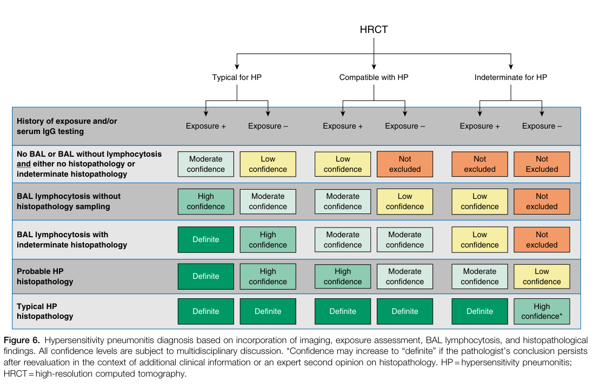

## Question

You are an expert researcher providing comprehensive, well-cited information.

Provide detailed information focusing on:
1. Key concepts and definitions with current understanding
2. Recent developments and latest research (prioritize 2023-2024 sources)
3. Current applications and real-world implementations
4. Expert opinions and analysis from authoritative sources
5. Relevant statistics and data from recent studies

Format as a comprehensive research report with proper citations. Include URLs and publication dates where available.
Always prioritize recent, authoritative sources and provide specific citations for all major claims.

# Disease Characteristics Research Template

## Target Disease
- **Disease Name:** Hypersensitivity pneumonitis
- **MONDO ID:**  (if available)
- **Category:** Complex

## Research Objectives

Please provide a comprehensive research report on **Hypersensitivity pneumonitis** covering all of the
disease characteristics listed below. This report will be used to populate a disease knowledge
base entry. Be thorough and cite primary literature (PMID preferred) for all claims.

For each section, **suggested databases/resources** are listed. These are the first places
you should search for information on each topic.

---

### 1. Disease Information
> **Search first:** OMIM, Orphanet, ICD-10/ICD-11, MeSH, PubMed

- What is the disease? Provide a concise overview.
- What are the key identifiers? (OMIM, Orphanet, ICD-10/ICD-11, MeSH, Mondo)
- What are the common synonyms and alternative names?
- Is the information derived from individual patients (e.g., EHR) or aggregated disease-level resources?

### 2. Etiology

- **Disease Causal Factors**: What are the primary causes? (genetic, environmental, infectious, mechanistic)
- **Risk Factors**:
  > **Search first:** PubMed, Cochrane Library, UpToDate, clinical guidelines, ClinVar, ClinGen, GWAS Catalog, PheGenI, CTD, CDC, WHO, epidemiological databases
  - Genetic risk factors (causal variants, susceptibility loci, modifier genes)
  - Environmental risk factors (toxins, lifestyle, occupational exposures, age, sex, family history)
- **Protective Factors**:
  > **Search first:** PubMed, Cochrane Library, clinical trial databases, GWAS Catalog, gnomAD, WHO, CDC, nutrition databases
  - Genetic protective factors (protective variants, modifier alleles)
  - Environmental protective factors (diet, lifestyle, exposures that reduce risk)
- **Gene-Environment Interactions**: How do genetic and environmental factors interact to influence disease?
  > **Search first:** CTD, PubMed, PheGenI, GxE databases

### 3. Phenotypes
> **Search first:** HPO (Human Phenotype Ontology), OMIM, Orphanet, PubMed, clinicaltrials.gov, MedDRA, SNOMED CT, DECIPHER, LOINC

For each phenotype, provide:
- **Phenotype type**: symptoms, clinical signs, physical manifestations, behavioral changes, or laboratory abnormalities
  > For symptoms/signs: HPO, OMIM, Orphanet, PubMed
  > For behavioral changes: HPO, DSM, RDoC (Research Domain Criteria), PubMed
  > For laboratory abnormalities: LOINC, SNOMED CT, LabTests Online, PubMed
- **Phenotype characteristics**:
  > **Search first:** OMIM, Orphanet, HPO, PubMed
  - Age of symptom onset (neonatal, childhood, adult-onset, late-onset)
  - Symptom severity (mild, moderate, severe, variable)
  - Symptom progression (stable, progressive, episodic, fluctuating)
  - Frequency among affected individuals (percentage or qualitative)
- **Quality of life impact**: Effects on daily functioning and well-being (per-phenotype when possible)
  > **Search first:** EQ-5D database, SF-36, WHO QOL databases, PubMed
- Suggest HPO (Human Phenotype Ontology) terms for each phenotype

### 4. Genetic/Molecular Information

- **Causal Genes**: Gene mutations or chromosomal abnormalities responsible for disease (gene symbols, OMIM IDs)
  > **Search first:** OMIM, ClinVar, HGMD, Ensembl, NCBI Gene
- **Pathogenic Variants**:
  - Affected genes (gene symbols, HGNC IDs)
    > **Search first:** OMIM, NCBI Gene, Ensembl, HGNC, UniProt, GeneCards
  - Variant classification (pathogenic, likely pathogenic, VUS per ACMG/AMP guidelines)
    > **Search first:** ClinVar, ClinGen, ACMG/AMP guidelines, VarSome
  - Variant type/class (missense, frameshift, nonsense, splice-site, structural)
  - Allele frequency in population databases
    > **Search first:** gnomAD, 1000 Genomes, ExAC, TOPMed, dbSNP
  - Somatic vs germline origin
    > **Search first:** COSMIC (somatic), ClinVar, ICGC, TCGA
  - Functional consequences (loss of function, gain of function, dominant negative)
- **Modifier Genes**: Genes that modify disease severity or expression
- **Epigenetic Information**: DNA methylation, histone modifications, chromatin changes affecting disease
  > **Search first:** ENCODE, Roadmap Epigenomics, MethBase, DiseaseMeth
- **Chromosomal Abnormalities**: Large-scale genetic changes (aneuploidy, translocations, inversions)
  > **Search first:** DECIPHER, ClinVar, ECARUCA, UCSC Genome Browser

### 5. Environmental Information

- **Environmental Factors**: Non-genetic contributing factors (toxins, radiation, pollution, occupational exposure)
  > **Search first:** CTD (Comparative Toxicogenomics Database), TOXNET, PubMed, EPA databases
- **Lifestyle Factors**: Behavioral factors (smoking, diet, exercise, alcohol consumption)
  > **Search first:** CDC databases, WHO, PubMed, NHANES
- **Infectious Agents**: If applicable, pathogens causing or triggering disease (bacteria, viruses, fungi, parasites)
  > **Search first:** NCBI Taxonomy, ViPR, BV-BRC, MicrobeDB, GIDEON

### 6. Mechanism / Pathophysiology

- **Molecular Pathways**: Specific signaling cascades or biochemical pathways involved (Wnt, MAPK, mTOR, PI3K-AKT, etc.)
  > **Search first:** KEGG, Reactome, WikiPathways, PathBank, BioCyc
- **Cellular Processes**: Cell-level mechanisms (apoptosis, autophagy, cell cycle dysregulation, inflammation, etc.)
  > **Search first:** Gene Ontology (GO), Reactome, KEGG, PubMed
- **Protein Dysfunction**: How protein structure or function is altered (misfolding, aggregation, loss of function, gain of function)
  > **Search first:** UniProt, PDB (Protein Data Bank), InterPro, Pfam, AlphaFold
- **Metabolic Changes**: Alterations in metabolic processes (energy metabolism, lipid metabolism, amino acid metabolism)
  > **Search first:** KEGG, BioCyc, HMDB (Human Metabolome Database), BRENDA
- **Immune System Involvement**: Role of immune response (autoimmunity, immunodeficiency, chronic inflammation)
  > **Search first:** ImmPort, Immunome Database, IEDB, Gene Ontology
- **Tissue Damage Mechanisms**: How tissues/ are injured (oxidative stress, ischemia, fibrosis, necrosis)
  > **Search first:** PubMed, Gene Ontology, Reactome
- **Biochemical Abnormalities**: Specific molecular defects (enzyme deficiencies, receptor dysfunction, ion channel defects)
  > **Search first:** BRENDA, UniProt, KEGG, OMIM, PubMed
- **Epigenetic Changes**: DNA methylation, histone modifications affecting gene expression in disease
  > **Search first:** ENCODE, Roadmap Epigenomics, MethBase, DiseaseMeth
- **Molecular Profiling** (if available):
  - Transcriptomics/gene expression changes
    > **Search first:** GEO (Gene Expression Omnibus), ArrayExpress, GTEx, Human Cell Atlas, SRA
  - Proteomics findings
    > **Search first:** PRIDE, ProteomeXchange, Human Protein Atlas, STRING, BioGRID
  - Metabolomics signatures
    > **Search first:** MetaboLights, Metabolomics Workbench, HMDB, METLIN
  - Lipidomics alterations
    > **Search first:** LIPID MAPS, SwissLipids, LipidHome, Metabolomics Workbench
  - Genomic structural features
    > **Search first:** UCSC Genome Browser, Ensembl, NCBI, dbVar, DGV
- **Advanced Technologies** (if applicable):
  - Single-cell analysis findings (cell-type specific mechanisms, cellular heterogeneity)
    > **Search first:** Human Cell Atlas, Single Cell Portal, GEO, CELLxGENE
  - Spatial transcriptomics findings
    > **Search first:** GEO, Spatial Research, Vizgen, 10x Genomics data
  - Multi-omics integration results
    > **Search first:** TCGA, ICGC, cBioPortal, LinkedOmics, PubMed
  - Functional genomics screens (CRISPR, RNAi)
    > **Search first:** DepMap, GenomeRNAi, PubMed, BioGRID ORCS

For each mechanism, describe:
- The causal chain from initial trigger to clinical manifestation
- Which mechanisms are upstream vs downstream
- What cell types and biological processes are involved
- Suggest GO terms for biological processes and CL terms for cell types

### 7. Anatomical Structures Affected

- **Organ Level**:
  - Primary organs directly affected
  - Secondary organ involvement (complications, secondary effects)
  - Body systems involved (cardiovascular, nervous, digestive, respiratory, endocrine, etc.)
  > **Search first:** Uberon, FMA (Foundational Model of Anatomy), OMIM, HPO, ICD-11, MeSH, SNOMED CT
- **Tissue and Cell Level**:
  - Specific tissue types affected (epithelial, connective, muscle, nervous)
  - Specific cell populations targeted (with Cell Ontology terms)
  > **Search first:** Uberon, Human Protein Atlas, Cell Ontology, Human Cell Atlas, CellMarker, PanglaoDB
- **Subcellular Level**:
  - Cellular compartments involved (mitochondria, nucleus, ER, lysosomes) (with GO Cellular Component terms)
  > **Search first:** Gene Ontology (Cellular Component), UniProt, Human Protein Atlas
- **Localization**:
  - Specific anatomical sites (with UBERON terms)
    > **Search first:** FMA, Uberon, NeuroNames (for brain), SNOMED CT
  - Lateralization (unilateral, bilateral, asymmetric)
    > **Search first:** HPO, clinical literature, imaging databases

### 8. Temporal Development

- **Onset**:
  - Typical age of onset (congenital, pediatric, adult, geriatric)
  - Onset pattern (acute, subacute, chronic, insidious)
  > **Search first:** OMIM, Orphanet, HPO, PubMed
- **Progression**:
  - Disease stages (early, intermediate, advanced, end-stage)
    > **Search first:** Cancer Staging Manual (AJCC), WHO classifications, PubMed
  - Progression rate (rapid, slow, variable)
  - Disease course pattern (episodic, relapsing-remitting, progressive, stable)
  - Disease duration (self-limited, chronic lifelong)
  > **Search first:** Disease registries, longitudinal cohort databases, natural history studies, PubMed, Orphanet, OMIM
- **Patterns**:
  - Remission patterns (spontaneous, treatment-induced)
    > **Search first:** Clinical trial databases, disease registries, PubMed
  - Critical periods (time windows of vulnerability or opportunity for intervention)
    > **Search first:** PubMed, developmental biology databases, clinical guidelines

### 9. Inheritance and Population

- **Epidemiology**:
  - Prevalence (cases per 100,000 at given time)
  - Incidence (new cases per 100,000 per year)
  > **Search first:** Orphanet, CDC, WHO, GBD (Global Burden of Disease), national registries, SEER, disease registries
- **For Genetic Etiology**:
  - Inheritance pattern (AD, AR, X-linked, mitochondrial, multifactorial, polygenic)
    > **Search first:** OMIM, Orphanet, ClinVar, GTR (Genetic Testing Registry)
  - Penetrance (complete, incomplete, age-dependent)
    > **Search first:** ClinVar, OMIM, PubMed, ClinGen
  - Expressivity (variable, consistent)
    > **Search first:** OMIM, ClinVar, PubMed
  - Genetic anticipation (increasing severity in successive generations)
    > **Search first:** OMIM, PubMed (especially for repeat expansion disorders)
  - Germline mosaicism
    > **Search first:** ClinVar, OMIM, genetic counseling literature, PubMed
  - Founder effects (population-specific mutations)
    > **Search first:** gnomAD, population genetics databases, PubMed
  - Consanguinity role
    > **Search first:** OMIM, population studies, genetic counseling resources
  - Carrier frequency
    > **Search first:** gnomAD, carrier screening databases, GeneReviews, GTR
- **Population Demographics**:
  - Affected populations (ethnic or demographic groups with higher prevalence)
    > **Search first:** gnomAD, 1000 Genomes, PAGE Study, PubMed, population registries
  - Geographic distribution (endemic areas, regional variation)
    > **Search first:** WHO, CDC, GBD, Orphanet, geographic epidemiology databases
  - Geographic distribution of specific variants
  - Sex ratio (male:female)
    > **Search first:** Disease registries, OMIM, PubMed, epidemiological databases
  - Age distribution of affected individuals
    > **Search first:** CDC, disease registries, SEER, Orphanet

### 10. Diagnostics

- **Clinical Tests**:
  - Laboratory tests (blood, urine, tissue chemistry, specific enzyme assays)
    > **Search first:** LOINC, LabTests Online, PubMed
  - Biomarkers (proteins, metabolites, genetic markers, circulating biomarkers)
    > **Search first:** FDA Biomarker List, BEST (Biomarkers, EndpointS, and other Tools), PubMed
  - Imaging studies (X-ray, CT, MRI, PET, ultrasound)
    > **Search first:** RadLex, DICOM, Radiopaedia, imaging databases
  - Functional tests (pulmonary function, cardiac stress tests)
    > **Search first:** LOINC, clinical guidelines, PubMed
  - Electrophysiology (EEG, EMG, ECG, nerve conduction studies)
    > **Search first:** LOINC, clinical neurophysiology databases, PubMed
  - Biopsy findings (histopathology, immunohistochemistry)
    > **Search first:** SNOMED CT, College of American Pathologists resources, PubMed
  - Pathology findings (microscopic examination)
    > **Search first:** SNOMED CT, Digital Pathology databases, PubMed
- **Genetic Testing**:
  > **Search first:** GTR (Genetic Testing Registry), GeneReviews, ClinGen
  - Overview of recommended genetic testing approach
  - Whole genome sequencing (WGS) utility
    > **Search first:** GTR, ClinVar, GEL (Genomics England), gnomAD
  - Whole exome sequencing (WES) utility
    > **Search first:** GTR, ClinVar, OMIM, GeneMatcher
  - Gene panels (which panels, which genes)
    > **Search first:** GTR, ClinVar, laboratory-specific databases
  - Single gene testing
    > **Search first:** GTR, ClinVar, OMIM, GeneReviews
  - Chromosomal microarray (CMA)
    > **Search first:** DECIPHER, ClinVar, dbVar, ECARUCA
  - Karyotyping
    > **Search first:** Chromosome Abnormality Database, ClinVar, cytogenetics resources
  - FISH
    > **Search first:** ClinVar, cytogenetics databases, PubMed
  - Mitochondrial DNA testing
    > **Search first:** MITOMAP, MSeqDR, ClinVar, GTR
  - Repeat expansion testing
    > **Search first:** GTR, ClinVar, repeat expansion databases, PubMed
- **Omics-Based Diagnostics** (if applicable):
  - RNA sequencing / transcriptomics
    > **Search first:** GEO, ArrayExpress, GTEx, RNA-seq databases
  - Proteomics
    > **Search first:** PRIDE, ProteomeXchange, FDA Biomarker database
  - Metabolomics
    > **Search first:** MetaboLights, Metabolomics Workbench, HMDB
  - Epigenomics
    > **Search first:** GEO, ENCODE, Roadmap Epigenomics, MethBase
  - Liquid biopsy
    > **Search first:** COSMIC, ClinVar, liquid biopsy databases, PubMed
- **Clinical Criteria**:
  - Standardized diagnostic criteria (DSM, ICD, society guidelines)
    > **Search first:** DSM-5, ICD-11, clinical society guidelines, UpToDate
  - Differential diagnosis (other conditions to rule out, with distinguishing features)
    > **Search first:** DynaMed, UpToDate, clinical decision support systems
- **Screening**:
  - Screening methods for asymptomatic individuals (newborn screening, carrier screening, cascade screening)
    > **Search first:** ACMG recommendations, CDC newborn screening, GTR

### 11. Outcome/Prognosis

- **Survival and Mortality**:
  - Survival rate (5-year, 10-year, overall)
    > **Search first:** SEER, cancer registries, disease-specific registries, PubMed
  - Life expectancy (with and without treatment if applicable)
    > **Search first:** Orphanet, disease registries, actuarial databases, PubMed
  - Mortality rate
    > **Search first:** CDC, WHO, GBD, national mortality databases
  - Disease-specific mortality (deaths directly attributable to disease)
    > **Search first:** Disease registries, CDC Wonder, GBD, PubMed
- **Morbidity and Function**:
  - Morbidity (disease-related disability and health impacts)
    > **Search first:** GBD, WHO, disability databases, PubMed
  - Disability outcomes (long-term functional impairments)
    > **Search first:** ICF (International Classification of Functioning), disability registries
  - Quality of life measures (EQ-5D, SF-36, PROMIS, disease-specific tools)
    > **Search first:** EQ-5D database, SF-36, PROMIS, PubMed
- **Disease Course**:
  - Complications (secondary problems: infections, organ failure, etc.)
    > **Search first:** ICD codes, disease registries, clinical databases, PubMed
  - Recovery potential (likelihood and extent of recovery, with vs without treatment)
    > **Search first:** Natural history studies, rehabilitation databases, PubMed
- **Prediction**:
  - Prognostic factors (age, disease severity, biomarkers, treatment response)
    > **Search first:** Prognostic models databases, clinical calculators, PubMed
  - Prognostic biomarkers (molecular markers predicting disease course)
    > **Search first:** FDA Biomarker database, PubMed, cancer prognostic databases

### 12. Treatment

- **Pharmacotherapy**:
  - Pharmacological treatments (drug names, drug classes, mechanisms of action)
    > **Search first:** DrugBank, RxNorm, ATC classification, DailyMed, FDA databases
  - Pharmacogenomics (how genetic variants affect drug metabolism, efficacy, toxicity)
    > **Search first:** PharmGKB, CPIC (Clinical Pharmacogenetics), FDA Table of PGx Biomarkers
- **Advanced Therapeutics**:
  - Gene therapy (viral vectors, CRISPR, gene replacement, gene editing)
    > **Search first:** ClinicalTrials.gov, FDA gene therapy database, ASGCT resources
  - Cell therapy (stem cell transplant, CAR-T, cellular therapeutics)
    > **Search first:** ClinicalTrials.gov, FDA cell therapy database, FACT standards
  - RNA-based therapies (ASOs, siRNA, mRNA therapies)
    > **Search first:** ClinicalTrials.gov, FDA approvals, PubMed
  - Targeted therapies (treatments directed at specific molecular targets)
    > **Search first:** My Cancer Genome, OncoKB, ClinicalTrials.gov, FDA approvals
  - Immunotherapies (checkpoint inhibitors, monoclonal antibodies)
    > **Search first:** Cancer Immunotherapy Database, FDA approvals, ClinicalTrials.gov
- **Surgical and Interventional**:
  - Surgical interventions (types of surgery, timing, outcomes)
    > **Search first:** CPT codes, surgical registries, clinical guidelines, PubMed
- **Supportive and Rehabilitative**:
  - Supportive care (symptom management, pain control, nutrition)
    > **Search first:** Clinical guidelines, Cochrane Library, PubMed
  - Rehabilitation (physical therapy, occupational therapy, speech therapy)
    > **Search first:** Rehabilitation medicine databases, clinical guidelines, PubMed
- **Experimental**:
  - Experimental treatments in clinical trials (with NCT identifiers if available)
    > **Search first:** ClinicalTrials.gov, EU Clinical Trials Register, WHO ICTRP
- **Treatment Outcomes**:
  - Treatment response rates
    > **Search first:** Clinical trial databases, FDA reviews, systematic reviews, PubMed
  - Side effects and adverse events
    > **Search first:** FDA Adverse Event Reporting System (FAERS), MedWatch, PubMed
- **Treatment Strategy**:
  - Treatment algorithms (clinical pathways, decision trees)
    > **Search first:** Clinical practice guidelines, NCCN Guidelines, UpToDate
  - Combination therapies
    > **Search first:** ClinicalTrials.gov, treatment guidelines, PubMed
  - Personalized medicine approaches (genotype-guided treatment)
    > **Search first:** My Cancer Genome, CIViC, PharmGKB, precision medicine databases

For each treatment, suggest MAXO (Medical Action Ontology) terms where applicable.

### 13. Prevention

- **Prevention Levels**:
  - Primary prevention (preventing disease occurrence: vaccination, risk factor modification)
    > **Search first:** CDC, WHO, USPSTF recommendations, Cochrane Library
  - Secondary prevention (early detection and treatment: screening programs, early intervention)
    > **Search first:** USPSTF, CDC screening guidelines, WHO
  - Tertiary prevention (preventing complications in those with disease)
    > **Search first:** Clinical guidelines, disease management protocols, PubMed
- **Immunization**: Vaccine strategies (if applicable)
  > **Search first:** CDC vaccine schedules, WHO immunization, FDA vaccine database
- **Screening and Early Detection**:
  - Screening programs (population-based: newborn screening, cancer screening)
    > **Search first:** CDC screening programs, USPSTF, cancer screening databases
  - Genetic screening (carrier screening, preimplantation genetic diagnosis, prenatal testing)
    > **Search first:** ACMG recommendations, ACOG guidelines, GTR
  - Risk stratification (identifying high-risk individuals for targeted prevention)
    > **Search first:** Risk prediction models, clinical calculators, PubMed
- **Behavioral Interventions**: Lifestyle modifications to reduce risk
  > **Search first:** CDC, WHO, behavioral intervention databases, Cochrane Library
- **Counseling**: Genetic counseling (risk assessment, family planning guidance)
  > **Search first:** NSGC resources, ACMG guidelines, GeneReviews
- **Public Health**:
  - Public health interventions (sanitation, vector control, health education)
    > **Search first:** CDC, WHO, public health databases, PubMed
  - Environmental interventions (reducing environmental risk factors)
    > **Search first:** EPA databases, WHO environmental health, PubMed
- **Prophylaxis**: Preventive medications or procedures
  > **Search first:** Clinical guidelines, FDA approvals, PubMed

### 14. Other Species / Natural Disease

- **Taxonomy**: Species affected (with NCBI Taxon identifiers)
  > **Search first:** NCBI Taxonomy
- **Breed**: Specific breeds affected (with VBO identifiers if applicable)
  > **Search first:** VBO (Vertebrate Breed Ontology)
- **Gene**: Orthologous genes in other species (with NCBI Gene IDs)
  > **Search first:** NCBI Gene
- **Natural Disease**:
  - Naturally occurring disease in other species (companion animals, wildlife)
    > **Search first:** OMIA (Online Mendelian Inheritance in Animals), VetCompass, PubMed
  - Veterinary relevance and importance in animal health
    > **Search first:** OMIA, veterinary databases, PubMed
- **Comparative Biology**:
  - Comparative pathology (similarities and differences across species)
    > **Search first:** OMIA, comparative pathology databases, PubMed
  - Evolutionary conservation of disease mechanisms
    > **Search first:** HomoloGene, OrthoMCL, Alliance of Genome Resources
- **Transmission** (if applicable):
  - Zoonotic potential
    > **Search first:** CDC zoonotic diseases, WHO zoonoses, GIDEON
  - Cross-species susceptibility
    > **Search first:** NCBI Taxonomy, veterinary databases, PubMed

### 15. Model Organisms

- **Model Types**:
  - Model organism type (mammalian, invertebrate, cellular, in vitro)
    > **Search first:** Alliance of Genome Resources, model organism databases
  - Specific model systems (mouse, rat, zebrafish, Drosophila, C. elegans, yeast, cell lines, organoids, iPSCs)
    > **Search first:** MGI, RGD, ZFIN, FlyBase, WormBase, SGD, ATCC, Cellosaurus
  - Induced models (drug treatment, surgical intervention, environmental manipulation)
    > **Search first:** MGI, model organism databases, PubMed
- **Genetic Models**:
  - Types available (knockout, knock-in, transgenic, conditional, humanized)
    > **Search first:** MGI, IMPC, KOMP, EuMMCR, IMSR
- **Model Characteristics**:
  - Phenotype recapitulation (how well model reproduces human disease features)
    > **Search first:** Model organism databases, comparative studies, PubMed
  - Model limitations (aspects of human disease not captured)
    > **Search first:** Model organism databases, PubMed, review articles
- **Applications**:
  - Research applications (what aspects of disease can be studied)
    > **Search first:** Model organism databases, PubMed
- **Resources**:
  - Model databases
    > **Search first:** MGI, RGD, ZFIN, FlyBase, WormBase, IMSR, EMMA, MMRRC

---

## Citation Requirements

- Cite primary literature (PMID preferred) for all mechanistic and clinical claims
- Prioritize recent reviews and landmark papers
- Include direct quotes from abstracts where possible to support key statements
- Distinguish evidence source types: human clinical, model organism, in vitro, computational

## Output Format

Structure your response as a comprehensive narrative organized by the sections above.
For each section, provide:
- Factual content with specific details (numbers, percentages, gene names, variant nomenclature)
- Ontology term suggestions (HPO, GO, CL, UBERON, CHEBI, MAXO, MONDO) where applicable
- Evidence citations with PMIDs
- Direct quotes from abstracts to support key claims
- Clear indication when information is not available or not applicable for this disease

This report will be used to populate a disease knowledge base entry with:
- Pathophysiology descriptions with causal chains
- Gene/protein annotations (HGNC, GO terms)
- Phenotype associations (HP terms) with frequencies
- Cell type involvement (CL terms)
- Anatomical locations (UBERON terms)
- Chemical entities (CHEBI terms)
- Treatment annotations (MAXO terms)
- Evidence items with PMIDs and exact abstract quotes
- Epidemiology, prognosis, diagnostic, and prevention information
- Animal model descriptions with phenotype recapitulation details

## Output

Question: You are an expert researcher providing comprehensive, well-cited information.

Provide detailed information focusing on:
1. Key concepts and definitions with current understanding
2. Recent developments and latest research (prioritize 2023-2024 sources)
3. Current applications and real-world implementations
4. Expert opinions and analysis from authoritative sources
5. Relevant statistics and data from recent studies

Format as a comprehensive research report with proper citations. Include URLs and publication dates where available.
Always prioritize recent, authoritative sources and provide specific citations for all major claims.

# Disease Characteristics Research Template

## Target Disease
- **Disease Name:** Hypersensitivity pneumonitis
- **MONDO ID:**  (if available)
- **Category:** Complex

## Research Objectives

Please provide a comprehensive research report on **Hypersensitivity pneumonitis** covering all of the
disease characteristics listed below. This report will be used to populate a disease knowledge
base entry. Be thorough and cite primary literature (PMID preferred) for all claims.

For each section, **suggested databases/resources** are listed. These are the first places
you should search for information on each topic.

---

### 1. Disease Information
> **Search first:** OMIM, Orphanet, ICD-10/ICD-11, MeSH, PubMed

- What is the disease? Provide a concise overview.
- What are the key identifiers? (OMIM, Orphanet, ICD-10/ICD-11, MeSH, Mondo)
- What are the common synonyms and alternative names?
- Is the information derived from individual patients (e.g., EHR) or aggregated disease-level resources?

### 2. Etiology

- **Disease Causal Factors**: What are the primary causes? (genetic, environmental, infectious, mechanistic)
- **Risk Factors**:
  > **Search first:** PubMed, Cochrane Library, UpToDate, clinical guidelines, ClinVar, ClinGen, GWAS Catalog, PheGenI, CTD, CDC, WHO, epidemiological databases
  - Genetic risk factors (causal variants, susceptibility loci, modifier genes)
  - Environmental risk factors (toxins, lifestyle, occupational exposures, age, sex, family history)
- **Protective Factors**:
  > **Search first:** PubMed, Cochrane Library, clinical trial databases, GWAS Catalog, gnomAD, WHO, CDC, nutrition databases
  - Genetic protective factors (protective variants, modifier alleles)
  - Environmental protective factors (diet, lifestyle, exposures that reduce risk)
- **Gene-Environment Interactions**: How do genetic and environmental factors interact to influence disease?
  > **Search first:** CTD, PubMed, PheGenI, GxE databases

### 3. Phenotypes
> **Search first:** HPO (Human Phenotype Ontology), OMIM, Orphanet, PubMed, clinicaltrials.gov, MedDRA, SNOMED CT, DECIPHER, LOINC

For each phenotype, provide:
- **Phenotype type**: symptoms, clinical signs, physical manifestations, behavioral changes, or laboratory abnormalities
  > For symptoms/signs: HPO, OMIM, Orphanet, PubMed
  > For behavioral changes: HPO, DSM, RDoC (Research Domain Criteria), PubMed
  > For laboratory abnormalities: LOINC, SNOMED CT, LabTests Online, PubMed
- **Phenotype characteristics**:
  > **Search first:** OMIM, Orphanet, HPO, PubMed
  - Age of symptom onset (neonatal, childhood, adult-onset, late-onset)
  - Symptom severity (mild, moderate, severe, variable)
  - Symptom progression (stable, progressive, episodic, fluctuating)
  - Frequency among affected individuals (percentage or qualitative)
- **Quality of life impact**: Effects on daily functioning and well-being (per-phenotype when possible)
  > **Search first:** EQ-5D database, SF-36, WHO QOL databases, PubMed
- Suggest HPO (Human Phenotype Ontology) terms for each phenotype

### 4. Genetic/Molecular Information

- **Causal Genes**: Gene mutations or chromosomal abnormalities responsible for disease (gene symbols, OMIM IDs)
  > **Search first:** OMIM, ClinVar, HGMD, Ensembl, NCBI Gene
- **Pathogenic Variants**:
  - Affected genes (gene symbols, HGNC IDs)
    > **Search first:** OMIM, NCBI Gene, Ensembl, HGNC, UniProt, GeneCards
  - Variant classification (pathogenic, likely pathogenic, VUS per ACMG/AMP guidelines)
    > **Search first:** ClinVar, ClinGen, ACMG/AMP guidelines, VarSome
  - Variant type/class (missense, frameshift, nonsense, splice-site, structural)
  - Allele frequency in population databases
    > **Search first:** gnomAD, 1000 Genomes, ExAC, TOPMed, dbSNP
  - Somatic vs germline origin
    > **Search first:** COSMIC (somatic), ClinVar, ICGC, TCGA
  - Functional consequences (loss of function, gain of function, dominant negative)
- **Modifier Genes**: Genes that modify disease severity or expression
- **Epigenetic Information**: DNA methylation, histone modifications, chromatin changes affecting disease
  > **Search first:** ENCODE, Roadmap Epigenomics, MethBase, DiseaseMeth
- **Chromosomal Abnormalities**: Large-scale genetic changes (aneuploidy, translocations, inversions)
  > **Search first:** DECIPHER, ClinVar, ECARUCA, UCSC Genome Browser

### 5. Environmental Information

- **Environmental Factors**: Non-genetic contributing factors (toxins, radiation, pollution, occupational exposure)
  > **Search first:** CTD (Comparative Toxicogenomics Database), TOXNET, PubMed, EPA databases
- **Lifestyle Factors**: Behavioral factors (smoking, diet, exercise, alcohol consumption)
  > **Search first:** CDC databases, WHO, PubMed, NHANES
- **Infectious Agents**: If applicable, pathogens causing or triggering disease (bacteria, viruses, fungi, parasites)
  > **Search first:** NCBI Taxonomy, ViPR, BV-BRC, MicrobeDB, GIDEON

### 6. Mechanism / Pathophysiology

- **Molecular Pathways**: Specific signaling cascades or biochemical pathways involved (Wnt, MAPK, mTOR, PI3K-AKT, etc.)
  > **Search first:** KEGG, Reactome, WikiPathways, PathBank, BioCyc
- **Cellular Processes**: Cell-level mechanisms (apoptosis, autophagy, cell cycle dysregulation, inflammation, etc.)
  > **Search first:** Gene Ontology (GO), Reactome, KEGG, PubMed
- **Protein Dysfunction**: How protein structure or function is altered (misfolding, aggregation, loss of function, gain of function)
  > **Search first:** UniProt, PDB (Protein Data Bank), InterPro, Pfam, AlphaFold
- **Metabolic Changes**: Alterations in metabolic processes (energy metabolism, lipid metabolism, amino acid metabolism)
  > **Search first:** KEGG, BioCyc, HMDB (Human Metabolome Database), BRENDA
- **Immune System Involvement**: Role of immune response (autoimmunity, immunodeficiency, chronic inflammation)
  > **Search first:** ImmPort, Immunome Database, IEDB, Gene Ontology
- **Tissue Damage Mechanisms**: How tissues/ are injured (oxidative stress, ischemia, fibrosis, necrosis)
  > **Search first:** PubMed, Gene Ontology, Reactome
- **Biochemical Abnormalities**: Specific molecular defects (enzyme deficiencies, receptor dysfunction, ion channel defects)
  > **Search first:** BRENDA, UniProt, KEGG, OMIM, PubMed
- **Epigenetic Changes**: DNA methylation, histone modifications affecting gene expression in disease
  > **Search first:** ENCODE, Roadmap Epigenomics, MethBase, DiseaseMeth
- **Molecular Profiling** (if available):
  - Transcriptomics/gene expression changes
    > **Search first:** GEO (Gene Expression Omnibus), ArrayExpress, GTEx, Human Cell Atlas, SRA
  - Proteomics findings
    > **Search first:** PRIDE, ProteomeXchange, Human Protein Atlas, STRING, BioGRID
  - Metabolomics signatures
    > **Search first:** MetaboLights, Metabolomics Workbench, HMDB, METLIN
  - Lipidomics alterations
    > **Search first:** LIPID MAPS, SwissLipids, LipidHome, Metabolomics Workbench
  - Genomic structural features
    > **Search first:** UCSC Genome Browser, Ensembl, NCBI, dbVar, DGV
- **Advanced Technologies** (if applicable):
  - Single-cell analysis findings (cell-type specific mechanisms, cellular heterogeneity)
    > **Search first:** Human Cell Atlas, Single Cell Portal, GEO, CELLxGENE
  - Spatial transcriptomics findings
    > **Search first:** GEO, Spatial Research, Vizgen, 10x Genomics data
  - Multi-omics integration results
    > **Search first:** TCGA, ICGC, cBioPortal, LinkedOmics, PubMed
  - Functional genomics screens (CRISPR, RNAi)
    > **Search first:** DepMap, GenomeRNAi, PubMed, BioGRID ORCS

For each mechanism, describe:
- The causal chain from initial trigger to clinical manifestation
- Which mechanisms are upstream vs downstream
- What cell types and biological processes are involved
- Suggest GO terms for biological processes and CL terms for cell types

### 7. Anatomical Structures Affected

- **Organ Level**:
  - Primary organs directly affected
  - Secondary organ involvement (complications, secondary effects)
  - Body systems involved (cardiovascular, nervous, digestive, respiratory, endocrine, etc.)
  > **Search first:** Uberon, FMA (Foundational Model of Anatomy), OMIM, HPO, ICD-11, MeSH, SNOMED CT
- **Tissue and Cell Level**:
  - Specific tissue types affected (epithelial, connective, muscle, nervous)
  - Specific cell populations targeted (with Cell Ontology terms)
  > **Search first:** Uberon, Human Protein Atlas, Cell Ontology, Human Cell Atlas, CellMarker, PanglaoDB
- **Subcellular Level**:
  - Cellular compartments involved (mitochondria, nucleus, ER, lysosomes) (with GO Cellular Component terms)
  > **Search first:** Gene Ontology (Cellular Component), UniProt, Human Protein Atlas
- **Localization**:
  - Specific anatomical sites (with UBERON terms)
    > **Search first:** FMA, Uberon, NeuroNames (for brain), SNOMED CT
  - Lateralization (unilateral, bilateral, asymmetric)
    > **Search first:** HPO, clinical literature, imaging databases

### 8. Temporal Development

- **Onset**:
  - Typical age of onset (congenital, pediatric, adult, geriatric)
  - Onset pattern (acute, subacute, chronic, insidious)
  > **Search first:** OMIM, Orphanet, HPO, PubMed
- **Progression**:
  - Disease stages (early, intermediate, advanced, end-stage)
    > **Search first:** Cancer Staging Manual (AJCC), WHO classifications, PubMed
  - Progression rate (rapid, slow, variable)
  - Disease course pattern (episodic, relapsing-remitting, progressive, stable)
  - Disease duration (self-limited, chronic lifelong)
  > **Search first:** Disease registries, longitudinal cohort databases, natural history studies, PubMed, Orphanet, OMIM
- **Patterns**:
  - Remission patterns (spontaneous, treatment-induced)
    > **Search first:** Clinical trial databases, disease registries, PubMed
  - Critical periods (time windows of vulnerability or opportunity for intervention)
    > **Search first:** PubMed, developmental biology databases, clinical guidelines

### 9. Inheritance and Population

- **Epidemiology**:
  - Prevalence (cases per 100,000 at given time)
  - Incidence (new cases per 100,000 per year)
  > **Search first:** Orphanet, CDC, WHO, GBD (Global Burden of Disease), national registries, SEER, disease registries
- **For Genetic Etiology**:
  - Inheritance pattern (AD, AR, X-linked, mitochondrial, multifactorial, polygenic)
    > **Search first:** OMIM, Orphanet, ClinVar, GTR (Genetic Testing Registry)
  - Penetrance (complete, incomplete, age-dependent)
    > **Search first:** ClinVar, OMIM, PubMed, ClinGen
  - Expressivity (variable, consistent)
    > **Search first:** OMIM, ClinVar, PubMed
  - Genetic anticipation (increasing severity in successive generations)
    > **Search first:** OMIM, PubMed (especially for repeat expansion disorders)
  - Germline mosaicism
    > **Search first:** ClinVar, OMIM, genetic counseling literature, PubMed
  - Founder effects (population-specific mutations)
    > **Search first:** gnomAD, population genetics databases, PubMed
  - Consanguinity role
    > **Search first:** OMIM, population studies, genetic counseling resources
  - Carrier frequency
    > **Search first:** gnomAD, carrier screening databases, GeneReviews, GTR
- **Population Demographics**:
  - Affected populations (ethnic or demographic groups with higher prevalence)
    > **Search first:** gnomAD, 1000 Genomes, PAGE Study, PubMed, population registries
  - Geographic distribution (endemic areas, regional variation)
    > **Search first:** WHO, CDC, GBD, Orphanet, geographic epidemiology databases
  - Geographic distribution of specific variants
  - Sex ratio (male:female)
    > **Search first:** Disease registries, OMIM, PubMed, epidemiological databases
  - Age distribution of affected individuals
    > **Search first:** CDC, disease registries, SEER, Orphanet

### 10. Diagnostics

- **Clinical Tests**:
  - Laboratory tests (blood, urine, tissue chemistry, specific enzyme assays)
    > **Search first:** LOINC, LabTests Online, PubMed
  - Biomarkers (proteins, metabolites, genetic markers, circulating biomarkers)
    > **Search first:** FDA Biomarker List, BEST (Biomarkers, EndpointS, and other Tools), PubMed
  - Imaging studies (X-ray, CT, MRI, PET, ultrasound)
    > **Search first:** RadLex, DICOM, Radiopaedia, imaging databases
  - Functional tests (pulmonary function, cardiac stress tests)
    > **Search first:** LOINC, clinical guidelines, PubMed
  - Electrophysiology (EEG, EMG, ECG, nerve conduction studies)
    > **Search first:** LOINC, clinical neurophysiology databases, PubMed
  - Biopsy findings (histopathology, immunohistochemistry)
    > **Search first:** SNOMED CT, College of American Pathologists resources, PubMed
  - Pathology findings (microscopic examination)
    > **Search first:** SNOMED CT, Digital Pathology databases, PubMed
- **Genetic Testing**:
  > **Search first:** GTR (Genetic Testing Registry), GeneReviews, ClinGen
  - Overview of recommended genetic testing approach
  - Whole genome sequencing (WGS) utility
    > **Search first:** GTR, ClinVar, GEL (Genomics England), gnomAD
  - Whole exome sequencing (WES) utility
    > **Search first:** GTR, ClinVar, OMIM, GeneMatcher
  - Gene panels (which panels, which genes)
    > **Search first:** GTR, ClinVar, laboratory-specific databases
  - Single gene testing
    > **Search first:** GTR, ClinVar, OMIM, GeneReviews
  - Chromosomal microarray (CMA)
    > **Search first:** DECIPHER, ClinVar, dbVar, ECARUCA
  - Karyotyping
    > **Search first:** Chromosome Abnormality Database, ClinVar, cytogenetics resources
  - FISH
    > **Search first:** ClinVar, cytogenetics databases, PubMed
  - Mitochondrial DNA testing
    > **Search first:** MITOMAP, MSeqDR, ClinVar, GTR
  - Repeat expansion testing
    > **Search first:** GTR, ClinVar, repeat expansion databases, PubMed
- **Omics-Based Diagnostics** (if applicable):
  - RNA sequencing / transcriptomics
    > **Search first:** GEO, ArrayExpress, GTEx, RNA-seq databases
  - Proteomics
    > **Search first:** PRIDE, ProteomeXchange, FDA Biomarker database
  - Metabolomics
    > **Search first:** MetaboLights, Metabolomics Workbench, HMDB
  - Epigenomics
    > **Search first:** GEO, ENCODE, Roadmap Epigenomics, MethBase
  - Liquid biopsy
    > **Search first:** COSMIC, ClinVar, liquid biopsy databases, PubMed
- **Clinical Criteria**:
  - Standardized diagnostic criteria (DSM, ICD, society guidelines)
    > **Search first:** DSM-5, ICD-11, clinical society guidelines, UpToDate
  - Differential diagnosis (other conditions to rule out, with distinguishing features)
    > **Search first:** DynaMed, UpToDate, clinical decision support systems
- **Screening**:
  - Screening methods for asymptomatic individuals (newborn screening, carrier screening, cascade screening)
    > **Search first:** ACMG recommendations, CDC newborn screening, GTR

### 11. Outcome/Prognosis

- **Survival and Mortality**:
  - Survival rate (5-year, 10-year, overall)
    > **Search first:** SEER, cancer registries, disease-specific registries, PubMed
  - Life expectancy (with and without treatment if applicable)
    > **Search first:** Orphanet, disease registries, actuarial databases, PubMed
  - Mortality rate
    > **Search first:** CDC, WHO, GBD, national mortality databases
  - Disease-specific mortality (deaths directly attributable to disease)
    > **Search first:** Disease registries, CDC Wonder, GBD, PubMed
- **Morbidity and Function**:
  - Morbidity (disease-related disability and health impacts)
    > **Search first:** GBD, WHO, disability databases, PubMed
  - Disability outcomes (long-term functional impairments)
    > **Search first:** ICF (International Classification of Functioning), disability registries
  - Quality of life measures (EQ-5D, SF-36, PROMIS, disease-specific tools)
    > **Search first:** EQ-5D database, SF-36, PROMIS, PubMed
- **Disease Course**:
  - Complications (secondary problems: infections, organ failure, etc.)
    > **Search first:** ICD codes, disease registries, clinical databases, PubMed
  - Recovery potential (likelihood and extent of recovery, with vs without treatment)
    > **Search first:** Natural history studies, rehabilitation databases, PubMed
- **Prediction**:
  - Prognostic factors (age, disease severity, biomarkers, treatment response)
    > **Search first:** Prognostic models databases, clinical calculators, PubMed
  - Prognostic biomarkers (molecular markers predicting disease course)
    > **Search first:** FDA Biomarker database, PubMed, cancer prognostic databases

### 12. Treatment

- **Pharmacotherapy**:
  - Pharmacological treatments (drug names, drug classes, mechanisms of action)
    > **Search first:** DrugBank, RxNorm, ATC classification, DailyMed, FDA databases
  - Pharmacogenomics (how genetic variants affect drug metabolism, efficacy, toxicity)
    > **Search first:** PharmGKB, CPIC (Clinical Pharmacogenetics), FDA Table of PGx Biomarkers
- **Advanced Therapeutics**:
  - Gene therapy (viral vectors, CRISPR, gene replacement, gene editing)
    > **Search first:** ClinicalTrials.gov, FDA gene therapy database, ASGCT resources
  - Cell therapy (stem cell transplant, CAR-T, cellular therapeutics)
    > **Search first:** ClinicalTrials.gov, FDA cell therapy database, FACT standards
  - RNA-based therapies (ASOs, siRNA, mRNA therapies)
    > **Search first:** ClinicalTrials.gov, FDA approvals, PubMed
  - Targeted therapies (treatments directed at specific molecular targets)
    > **Search first:** My Cancer Genome, OncoKB, ClinicalTrials.gov, FDA approvals
  - Immunotherapies (checkpoint inhibitors, monoclonal antibodies)
    > **Search first:** Cancer Immunotherapy Database, FDA approvals, ClinicalTrials.gov
- **Surgical and Interventional**:
  - Surgical interventions (types of surgery, timing, outcomes)
    > **Search first:** CPT codes, surgical registries, clinical guidelines, PubMed
- **Supportive and Rehabilitative**:
  - Supportive care (symptom management, pain control, nutrition)
    > **Search first:** Clinical guidelines, Cochrane Library, PubMed
  - Rehabilitation (physical therapy, occupational therapy, speech therapy)
    > **Search first:** Rehabilitation medicine databases, clinical guidelines, PubMed
- **Experimental**:
  - Experimental treatments in clinical trials (with NCT identifiers if available)
    > **Search first:** ClinicalTrials.gov, EU Clinical Trials Register, WHO ICTRP
- **Treatment Outcomes**:
  - Treatment response rates
    > **Search first:** Clinical trial databases, FDA reviews, systematic reviews, PubMed
  - Side effects and adverse events
    > **Search first:** FDA Adverse Event Reporting System (FAERS), MedWatch, PubMed
- **Treatment Strategy**:
  - Treatment algorithms (clinical pathways, decision trees)
    > **Search first:** Clinical practice guidelines, NCCN Guidelines, UpToDate
  - Combination therapies
    > **Search first:** ClinicalTrials.gov, treatment guidelines, PubMed
  - Personalized medicine approaches (genotype-guided treatment)
    > **Search first:** My Cancer Genome, CIViC, PharmGKB, precision medicine databases

For each treatment, suggest MAXO (Medical Action Ontology) terms where applicable.

### 13. Prevention

- **Prevention Levels**:
  - Primary prevention (preventing disease occurrence: vaccination, risk factor modification)
    > **Search first:** CDC, WHO, USPSTF recommendations, Cochrane Library
  - Secondary prevention (early detection and treatment: screening programs, early intervention)
    > **Search first:** USPSTF, CDC screening guidelines, WHO
  - Tertiary prevention (preventing complications in those with disease)
    > **Search first:** Clinical guidelines, disease management protocols, PubMed
- **Immunization**: Vaccine strategies (if applicable)
  > **Search first:** CDC vaccine schedules, WHO immunization, FDA vaccine database
- **Screening and Early Detection**:
  - Screening programs (population-based: newborn screening, cancer screening)
    > **Search first:** CDC screening programs, USPSTF, cancer screening databases
  - Genetic screening (carrier screening, preimplantation genetic diagnosis, prenatal testing)
    > **Search first:** ACMG recommendations, ACOG guidelines, GTR
  - Risk stratification (identifying high-risk individuals for targeted prevention)
    > **Search first:** Risk prediction models, clinical calculators, PubMed
- **Behavioral Interventions**: Lifestyle modifications to reduce risk
  > **Search first:** CDC, WHO, behavioral intervention databases, Cochrane Library
- **Counseling**: Genetic counseling (risk assessment, family planning guidance)
  > **Search first:** NSGC resources, ACMG guidelines, GeneReviews
- **Public Health**:
  - Public health interventions (sanitation, vector control, health education)
    > **Search first:** CDC, WHO, public health databases, PubMed
  - Environmental interventions (reducing environmental risk factors)
    > **Search first:** EPA databases, WHO environmental health, PubMed
- **Prophylaxis**: Preventive medications or procedures
  > **Search first:** Clinical guidelines, FDA approvals, PubMed

### 14. Other Species / Natural Disease

- **Taxonomy**: Species affected (with NCBI Taxon identifiers)
  > **Search first:** NCBI Taxonomy
- **Breed**: Specific breeds affected (with VBO identifiers if applicable)
  > **Search first:** VBO (Vertebrate Breed Ontology)
- **Gene**: Orthologous genes in other species (with NCBI Gene IDs)
  > **Search first:** NCBI Gene
- **Natural Disease**:
  - Naturally occurring disease in other species (companion animals, wildlife)
    > **Search first:** OMIA (Online Mendelian Inheritance in Animals), VetCompass, PubMed
  - Veterinary relevance and importance in animal health
    > **Search first:** OMIA, veterinary databases, PubMed
- **Comparative Biology**:
  - Comparative pathology (similarities and differences across species)
    > **Search first:** OMIA, comparative pathology databases, PubMed
  - Evolutionary conservation of disease mechanisms
    > **Search first:** HomoloGene, OrthoMCL, Alliance of Genome Resources
- **Transmission** (if applicable):
  - Zoonotic potential
    > **Search first:** CDC zoonotic diseases, WHO zoonoses, GIDEON
  - Cross-species susceptibility
    > **Search first:** NCBI Taxonomy, veterinary databases, PubMed

### 15. Model Organisms

- **Model Types**:
  - Model organism type (mammalian, invertebrate, cellular, in vitro)
    > **Search first:** Alliance of Genome Resources, model organism databases
  - Specific model systems (mouse, rat, zebrafish, Drosophila, C. elegans, yeast, cell lines, organoids, iPSCs)
    > **Search first:** MGI, RGD, ZFIN, FlyBase, WormBase, SGD, ATCC, Cellosaurus
  - Induced models (drug treatment, surgical intervention, environmental manipulation)
    > **Search first:** MGI, model organism databases, PubMed
- **Genetic Models**:
  - Types available (knockout, knock-in, transgenic, conditional, humanized)
    > **Search first:** MGI, IMPC, KOMP, EuMMCR, IMSR
- **Model Characteristics**:
  - Phenotype recapitulation (how well model reproduces human disease features)
    > **Search first:** Model organism databases, comparative studies, PubMed
  - Model limitations (aspects of human disease not captured)
    > **Search first:** Model organism databases, PubMed, review articles
- **Applications**:
  - Research applications (what aspects of disease can be studied)
    > **Search first:** Model organism databases, PubMed
- **Resources**:
  - Model databases
    > **Search first:** MGI, RGD, ZFIN, FlyBase, WormBase, IMSR, EMMA, MMRRC

---

## Citation Requirements

- Cite primary literature (PMID preferred) for all mechanistic and clinical claims
- Prioritize recent reviews and landmark papers
- Include direct quotes from abstracts where possible to support key statements
- Distinguish evidence source types: human clinical, model organism, in vitro, computational

## Output Format

Structure your response as a comprehensive narrative organized by the sections above.
For each section, provide:
- Factual content with specific details (numbers, percentages, gene names, variant nomenclature)
- Ontology term suggestions (HPO, GO, CL, UBERON, CHEBI, MAXO, MONDO) where applicable
- Evidence citations with PMIDs
- Direct quotes from abstracts to support key claims
- Clear indication when information is not available or not applicable for this disease

This report will be used to populate a disease knowledge base entry with:
- Pathophysiology descriptions with causal chains
- Gene/protein annotations (HGNC, GO terms)
- Phenotype associations (HP terms) with frequencies
- Cell type involvement (CL terms)
- Anatomical locations (UBERON terms)
- Chemical entities (CHEBI terms)
- Treatment annotations (MAXO terms)
- Evidence items with PMIDs and exact abstract quotes
- Epidemiology, prognosis, diagnostic, and prevention information
- Animal model descriptions with phenotype recapitulation details

# Hypersensitivity Pneumonitis (HP): Disease Characteristics Research Report (2023–2024 prioritized)

## Executive summary
Hypersensitivity pneumonitis (HP) is an immune-mediated interstitial lung disease (ILD) triggered by inhaled environmental antigens, classically avian proteins and fungal/mould exposures, in susceptible individuals. Contemporary international guidance emphasizes a **two-phenotype framework**—**non-fibrotic HP (NFHP)** versus **fibrotic HP (FHP)**—because fibrosis strongly drives prognosis and treatment decisions. Key quantitative data from recent cohorts and trials include: (i) **Korean nationwide incidence 1.14–2.16/100,000/year (2012–2020)**, (ii) ATS/JRS/ALAT diagnostic performance of **BAL lymphocytes ≥30%** versus IPF (sensitivity 55%, specificity 80%), (iii) in a 2023 prospective cohort, **BAL lymphocytes <20% (OR 2.47)** and **BAL eosinophils ≥1.75% (OR 2.36)** were associated with fibrosis, and (iv) in progressive fibrosing ILD (INBUILD), **nintedanib reduced annual FVC decline by ~107 mL/year** versus placebo and reduced risk of progression events, with gastrointestinal adverse events (notably diarrhea) predominating. (raghu2020diagnosisofhypersensitivity pages 20-21, jung2024nationwidestudyof pages 1-2, chen2023clinicalcharacteristicsof pages 5-7, amati2023efficacyofpirfenidone pages 6-7, flaherty2022nintedanibinprogressive pages 6-7)

A compact quantitative evidence table is provided below.

| Domain | Metric | Value | Population/Study | Year | URL | Citation ID |
|---|---|---|---|---|---|---|
| Epidemiology | Annual incidence, Korea | 1.14–2.16 per 100,000/year | Nationwide Korean HIRA claims study; 8,678 incident HP cases | 2024 | https://doi.org/10.3346/jkms.2024.39.e96 | (jung2024nationwidestudyof pages 1-2, jung2024nationwidestudyof pages 2-4) |
| Epidemiology | Mean age / sex | 52.6 ± 18.9 years; 51.5% male | Nationwide Korean HIRA claims study | 2024 | https://doi.org/10.3346/jkms.2024.39.e96 | (jung2024nationwidestudyof pages 2-4) |
| Epidemiology | ICD-10 coding | 82.2% coded J67.9 (HP due to unspecified organic dust) | Nationwide Korean HIRA claims study | 2024 | https://doi.org/10.3346/jkms.2024.39.e96 | (jung2024nationwidestudyof pages 2-4) |
| Epidemiology | Bronchoscopy utilization | 16.9% | Nationwide Korean HIRA claims study | 2024 | https://doi.org/10.3346/jkms.2024.39.e96 | (jung2024nationwidestudyof pages 1-2, jung2024nationwidestudyof pages 9-10) |
| Epidemiology | No treatment within 1 year | 25.4% | Nationwide Korean HIRA claims study | 2024 | https://doi.org/10.3346/jkms.2024.39.e96 | (jung2024nationwidestudyof pages 1-2) |
| Diagnostics | BAL lymphocytosis threshold vs IPF (fibrotic HP) | 20%: sensitivity 69%, specificity 61% | ATS/JRS/ALAT guideline evidence synthesis | 2020 | https://doi.org/10.1164/rccm.202005-2032ST | (raghu2020diagnosisofhypersensitivity pages 20-21) |
| Diagnostics | BAL lymphocytosis threshold vs IPF (fibrotic HP) | 30%: sensitivity 55%, specificity 80% | ATS/JRS/ALAT guideline evidence synthesis | 2020 | https://doi.org/10.1164/rccm.202005-2032ST | (raghu2020diagnosisofhypersensitivity pages 20-21) |
| Diagnostics | BAL lymphocytosis threshold vs IPF (fibrotic HP) | 40%: sensitivity 41%, specificity 93% | ATS/JRS/ALAT guideline evidence synthesis | 2020 | https://doi.org/10.1164/rccm.202005-2032ST | (raghu2020diagnosisofhypersensitivity pages 20-21) |
| Diagnostics | Suggested practical BAL threshold | 30% considered reasonable by expert panel; no single definitive threshold validated | ATS/JRS/ALAT guideline summary | 2021 | https://doi.org/10.1513/AnnalsATS.202009-1195CME | (koster2021diagnosisofhypersensitivity pages 9-14) |
| Exposures | Identified inciting antigen | 66.8% | Prospective HP cohort (n=202) | 2023 | https://doi.org/10.1097/CM9.0000000000002613 | (chen2023clinicalcharacteristicsof pages 3-4) |
| Exposures | Avian exposures among identified antigens | 50.4% | Prospective HP cohort (n=202) | 2023 | https://doi.org/10.1097/CM9.0000000000002613 | (chen2023clinicalcharacteristicsof pages 3-4) |
| Diagnostics | Common HRCT findings | GGO 91.6%; reticulation 63.9%; traction bronchiectasis 48.5% | Prospective HP cohort (n=202) | 2023 | https://doi.org/10.1097/CM9.0000000000002613 | (chen2023clinicalcharacteristicsof pages 3-4) |
| Biomarkers | BAL lymphocytosis present | 70.1% | Prospective HP cohort (n=202) | 2023 | https://doi.org/10.1097/CM9.0000000000002613 | (chen2023clinicalcharacteristicsof pages 3-4, chen2023clinicalcharacteristicsof pages 5-7) |
| Biomarkers | Predictor of fibrosis: BAL lymphocytes <20% | OR 2.47 | Prospective HP cohort (n=202) | 2023 | https://doi.org/10.1097/CM9.0000000000002613 | (chen2023clinicalcharacteristicsof pages 3-4, chen2023clinicalcharacteristicsof pages 5-7) |
| Biomarkers | Predictor of fibrosis: BAL eosinophils ≥1.75% | OR 2.36 | Prospective HP cohort (n=202) | 2023 | https://doi.org/10.1097/CM9.0000000000002613 | (chen2023clinicalcharacteristicsof pages 3-4, chen2023clinicalcharacteristicsof pages 5-7) |
| Biomarkers | Predictor of fibrosis: age ≥65 years | OR 2.61 | Prospective HP cohort (n=202) | 2023 | https://doi.org/10.1097/CM9.0000000000002613 | (chen2023clinicalcharacteristicsof pages 3-4, chen2023clinicalcharacteristicsof pages 5-7) |
| Prognosis | Radiologic fibrosis enrichment in fibrotic HP | Reticulation 96.5% vs 20.7%; honeycombing 40.0% vs 0%; traction bronchiectasis 82.6% vs 3.4% (FHP vs NFHP) | Prospective HP cohort (n=202) | 2023 | https://doi.org/10.1097/CM9.0000000000002613 | (chen2023clinicalcharacteristicsof pages 5-7) |
| Prognosis | 1-, 3-, 5-year mortality | 3.9%, 16.8%, 32.7% | Biopsy-proven fibrotic HP cohort (n=101) | 2023 | https://doi.org/10.3389/fmed.2023.1131070 | (oh2023fibrosisscorepredicts pages 2-3, oh2023fibrosisscorepredicts pages 1-2) |
| Prognosis | Acute exacerbations | 19.8% | Biopsy-proven fibrotic HP cohort (n=101) | 2023 | https://doi.org/10.3389/fmed.2023.1131070 | (oh2023fibrosisscorepredicts pages 2-3) |
| Prognosis | Overall deaths during follow-up | 41.6% | Biopsy-proven fibrotic HP cohort (n=101) | 2023 | https://doi.org/10.3389/fmed.2023.1131070 | (oh2023fibrosisscorepredicts pages 2-3) |
| Prognosis | Fibrosis score performance for 5-year mortality | AUC 0.752; cutoff ≥12.0% | Biopsy-proven fibrotic HP cohort (n=101) | 2023 | https://doi.org/10.3389/fmed.2023.1131070 | (oh2023fibrosisscorepredicts pages 1-2) |
| Prognosis | Survival by fibrosis score | Mean survival 58.3 vs 146.7 months for fibrosis score ≥12.0% vs <12.0% | Biopsy-proven fibrotic HP cohort (n=101) | 2023 | https://doi.org/10.3389/fmed.2023.1131070 | (oh2023fibrosisscorepredicts pages 1-2) |
| Prognosis | Mortality/transplant predictor: age | HR 1.08 | Multicentre fibrotic HP cohort (n=403) | 2024 | https://doi.org/10.1183/23120541.00405-2023 | (canojimenez2024prognosticfactorsof pages 1-2) |
| Prognosis | Mortality/transplant predictor: FVC % predicted | HR 0.96 | Multicentre fibrotic HP cohort (n=403) | 2024 | https://doi.org/10.1183/23120541.00405-2023 | (canojimenez2024prognosticfactorsof pages 1-2) |
| Prognosis | Mortality/transplant predictor: BAL lymphocytosis | HR 0.93 | Multicentre fibrotic HP cohort (n=403) | 2024 | https://doi.org/10.1183/23120541.00405-2023 | (canojimenez2024prognosticfactorsof pages 1-2) |
| Prognosis | Mortality/transplant predictor: acute exacerbation during follow-up | HR 3.04 | Multicentre fibrotic HP cohort (n=403) | 2024 | https://doi.org/10.1183/23120541.00405-2023 | (canojimenez2024prognosticfactorsof pages 1-2) |
| Prognosis | Mortality/transplant predictor: GAP index | HR 1.96 | Multicentre fibrotic HP cohort (n=403) | 2024 | https://doi.org/10.1183/23120541.00405-2023 | (canojimenez2024prognosticfactorsof pages 1-2) |
| Prognosis | Mortality/transplant predictor in biopsied subgroup: fibroblastic foci | HR 8.39 | Multicentre fibrotic HP cohort (biopsied subgroup) | 2024 | https://doi.org/10.1183/23120541.00405-2023 | (canojimenez2024prognosticfactorsof pages 1-2) |
| Treatment | Annual FVC decline, placebo vs nintedanib | −187.8 vs −80.8 mL/year; difference 107 mL/year | INBUILD trial, progressive fibrosing ILD (26.1% HP) | 2023 review of trial data | https://doi.org/10.3390/ijms24097849 | (amati2023efficacyofpirfenidone pages 6-7) |
| Treatment | Risk reduction for relative FVC decline ≥10% predicted | 37% overall reduction | INBUILD whole-trial analysis | 2022 | https://doi.org/10.1183/13993003.04538-2020 | (flaherty2022nintedanibinprogressive pages 6-7) |
| Treatment | Acute exacerbation of ILD or death | HR 0.67 (95% CI 0.46–0.98) | INBUILD whole-trial analysis | 2022 | https://doi.org/10.1183/13993003.04538-2020 | (flaherty2022nintedanibinprogressive pages 6-7) |
| Treatment | Adverse event rate: diarrhea | 136.4 vs 23.0 events/100 patient-years (nintedanib vs placebo) | INBUILD whole-trial analysis | 2022 | https://doi.org/10.1183/13993003.04538-2020 | (flaherty2022nintedanibinprogressive pages 6-7) |
| Treatment | Adverse event rate: nausea | 30.8 vs 7.6 events/100 patient-years | INBUILD whole-trial analysis | 2022 | https://doi.org/10.1183/13993003.04538-2020 | (flaherty2022nintedanibinprogressive pages 6-7) |
| Treatment | Adverse event rate: vomiting | 17.3 vs 3.5 events/100 patient-years | INBUILD whole-trial analysis | 2022 | https://doi.org/10.1183/13993003.04538-2020 | (flaherty2022nintedanibinprogressive pages 6-7) |
| Treatment | Adverse event rate: weight decrease | 12.4 vs 3.9 events/100 patient-years | INBUILD whole-trial analysis | 2022 | https://doi.org/10.1183/13993003.04538-2020 | (flaherty2022nintedanibinprogressive pages 6-7) |
| Treatment | Adverse event rate: ALT increased | 12.4 vs 2.8 events/100 patient-years | INBUILD whole-trial analysis | 2022 | https://doi.org/10.1183/13993003.04538-2020 | (flaherty2022nintedanibinprogressive pages 6-7) |
| Treatment | Real-world pre/post nintedanib FVC decline | −239.9 mL to −88.8 mL over 12 months; p=0.004 | UK multicentre real-world non-IPF PPF cohort (n=126) | 2023 | https://doi.org/10.1183/23120541.00423-2022 | (raman2023nintedanibfornonipf pages 1-2) |
| Treatment | Real-world pre/post nintedanib DLCO decline | −6.1% to −2.1%; p=0.004 | UK multicentre real-world non-IPF PPF cohort (n=126) | 2023 | https://doi.org/10.1183/23120541.00423-2022 | (raman2023nintedanibfornonipf pages 1-2) |
| Treatment | Real-world adverse events / persistence | 71% reported side effects; 80% of surviving patients remained on nintedanib at 12 months; no serious adverse events | UK multicentre real-world non-IPF PPF cohort (n=126) | 2023 | https://doi.org/10.1183/23120541.00423-2022 | (raman2023nintedanibfornonipf pages 1-2) |
| Biomarkers | Plasma GDF15 to distinguish fibrotic vs non-fibrotic HP | 2539 ± 821 vs 1783 ± 801 pg/mL; cutoff 2193.4 pg/mL; AUC 0.75 | HP biomarker study (n=64 HP) | 2024 | https://doi.org/10.1038/s41598-023-49459-6 | (koster2021diagnosisofhypersensitivity pages 1-5) |

*Table: This table compiles key quantitative findings on hypersensitivity pneumonitis across epidemiology, diagnostics, prognosis, exposures, biomarkers, and treatment. It is designed as a compact evidence summary for rapid reference in a disease knowledge base or research report.*

---

## 1. Disease information
### 1.1 Definition and overview
HP is an immune-mediated ILD caused by sensitization and immune reaction to inhaled antigens, producing bronchiolocentric inflammation that may progress to architectural distortion and fibrosis; the **non-fibrotic vs fibrotic** distinction is central to current practice because it correlates with outcomes and guides diagnostic confidence. (costabel2020hypersensitivitypneumonitis pages 1-2, koster2021diagnosisofhypersensitivity pages 1-5)

### 1.2 Key identifiers and controlled vocabularies
- **MONDO:** MONDO_0017853 (hypersensitivity pneumonitis). (OpenTargets Search: hypersensitivity pneumonitis)
- **EFO:** EFO_1001321 (extrinsic allergic alveolitis). (OpenTargets Search: hypersensitivity pneumonitis)
- **MeSH:** *Alveolitis, Extrinsic Allergic* (MeSH ID D000542). (NCT02496182 chunk 2)
- **ICD-10 (claims usage):** J67.* (HP due to organic dust); in a nationwide Korean study, **82.2% were coded J67.9** (unspecified organic dust). (jung2024nationwidestudyof pages 2-4)

### 1.3 Common synonyms / alternative names
- **Extrinsic allergic alveolitis** (historical/alternative term). (OpenTargets Search: hypersensitivity pneumonitis, NCT02496182 chunk 2)
- Exposure-linked synonyms/phenotypes: **farmer’s lung**, **bird breeder’s lung / bird fancier’s lung**, **humidifier lung**, **Japanese summer-type HP**, and other setting-associated forms. (costabel2020hypersensitivitypneumonitis pages 1-2, lewandowska2024acuterespiratoryfailure pages 9-10, akkurt2024evaluationofclinical pages 12-12)

### 1.4 Evidence provenance (individual vs aggregated)
Most current disease knowledge arises from aggregated resources: international society guidelines (ATS/JRS/ALAT) with systematic evidence synthesis and cohort studies, plus population claims registries for epidemiology; individual-patient data appear mainly in case series/case reports (e.g., acute respiratory failure presentations). (raghu2020diagnosisofhypersensitivity pages 20-21, jung2024nationwidestudyof pages 1-2, lewandowska2024acuterespiratoryfailure pages 9-10)

---

## 2. Etiology
### 2.1 Primary causal factors (environmental/immune)
HP is driven by **inhalation of inciting antigens** leading to immune sensitization and lung injury. Commonly implicated antigens include **avian proteins** and **fungal/mould** sources; chronic low-level exposure is particularly associated with fibrotic progression. (costabel2020hypersensitivitypneumonitis pages 1-2)

In a 2023 prospective cohort (n=202), an inciting agent was identified in **66.8%** of cases and, among identified antigens, **avian exposure comprised 50.4%**. (chen2023clinicalcharacteristicsof pages 3-4)

### 2.2 Risk factors
**Host/clinical factors associated with fibrosis and worse outcomes**
- In a 2023 cohort, independent predictors of fibrosis included **age ≥65 years (OR 2.61)**, **BAL lymphocytes <20% (OR 2.47)**, and **BAL eosinophils ≥1.75% (OR 2.36)**. (chen2023clinicalcharacteristicsof pages 5-7)
- In a 2024 multicentre cohort (n=403) of fibrotic HP, predictors associated with death/transplant included **older age (HR 1.08)**, **lower FVC% predicted (HR 0.96)**, **lower BAL lymphocytosis (HR 0.93)**, **acute exacerbation (HR 3.04)**, and **higher GAP index (HR 1.96)**; **fibroblastic foci** in biopsied patients had a strong association (**HR 8.39**). (canojimenez2024prognosticfactorsof pages 1-2)

**Genetic susceptibility (risk architecture)**
Guideline-level synthesis acknowledges susceptibility factors including **telomere-related mutations** and the **MUC5B polymorphism**, supporting a complex (multifactorial) gene–environment model rather than Mendelian inheritance for most HP. (koster2021diagnosisofhypersensitivity pages 1-5)

### 2.3 Protective factors
Evidence in the retrieved sources primarily supports **exposure elimination/avoidance** as the key protective factor against progression, though quantitative protective-effect sizes were not extractable from the retrieved excerpts. (costabel2020hypersensitivitypneumonitis pages 1-2, lewandowska2024acuterespiratoryfailure pages 9-10)

### 2.4 Gene–environment interactions
Current understanding supports that antigen exposure is necessary but not sufficient: host susceptibility (including telomere biology and mucin pathway genetics) modulates risk of chronicity/fibrosis, consistent with a gene–environment interaction paradigm. (koster2021diagnosisofhypersensitivity pages 1-5, pereira2023diagnosisoffibrotic pages 1-2)

---

## 3. Phenotypes (clinical presentation and mapped HPO suggestions)
### 3.1 Major phenotypic axes
- **Non-fibrotic HP (NFHP):** predominantly inflammatory disease; more reversible with antigen avoidance. (koster2021diagnosisofhypersensitivity pages 1-5)
- **Fibrotic HP (FHP):** mixed inflammatory–fibrotic or purely fibrotic disease; poorer prognosis and may resemble IPF radiologically and histologically. (costabel2020hypersensitivitypneumonitis pages 1-2, koster2021diagnosisofhypersensitivity pages 1-5)

### 3.2 Common symptoms/signs (with frequency where available)
From a 2023 prospective cohort (n=202):
- **Cough:** 88.6% (suggest HPO: *Cough* HP:0012735)
- **Dyspnea:** 82.2% (HPO: *Dyspnea* HP:0002094)
- **Fever:** 29.7% (HPO: *Fever* HP:0001945)
FHP cases were older and more likely to have dyspnea, crackles, and clubbing than NFHP. (chen2023clinicalcharacteristicsof pages 3-4)

### 3.3 Imaging phenotype (HRCT) and suggested terms
In the same cohort, common HRCT findings included:
- **Ground-glass opacities (GGO):** 91.6% (HPO suggestion: *Ground-glass opacification on lung imaging*; Radiology ontology terming varies)
- **Reticulation:** 63.9%
- **Traction bronchiectasis:** 48.5% (HPO: *Bronchiectasis* HP:0002110)
Fibrotic phenotype enrichment: **reticulation 96.5% vs 20.7%**, **honeycombing 40.0% vs 0%**, **traction bronchiectasis 82.6% vs 3.4%** (FHP vs NFHP). (chen2023clinicalcharacteristicsof pages 5-7)

Guideline-recognized imaging constructs include the **“three-density pattern”** (formerly “headcheese sign”) and the use of inspiratory + expiratory series to evaluate air-trapping/heterogeneous attenuation in suspected HP. (koster2021diagnosisofhypersensitivity pages 1-5, raghu2020diagnosisofhypersensitivity pages 7-9)

### 3.4 BAL and histopathology phenotypes
- BAL lymphocytosis is common, but may be **less pronounced in fibrotic disease**; in the 2023 cohort **70.1%** had BAL lymphocytosis. (chen2023clinicalcharacteristicsof pages 3-4, chen2023clinicalcharacteristicsof pages 5-7)
- Typical histopathology is bronchiolocentric with granulomatous and lymphocytic inflammation; in progressive fibrotic cases, **fibroblastic foci** are an adverse prognostic marker. (costabel2020hypersensitivitypneumonitis pages 1-2, canojimenez2024prognosticfactorsof pages 1-2)

### 3.5 Quality-of-life impact
Validated symptom/QoL instruments in progressive fibrosing ILD show meaningful symptom burden; in INBUILD, nintedanib reduced worsening in Living with Pulmonary Fibrosis (L-PF) total and symptom scores over 52 weeks. (wijsenbeek2024effectsofnintedanib pages 1-2)

---

## 4. Genetic / molecular information
### 4.1 Causal genes and pathogenic variants
For typical HP, **no single causal gene** is established; HP is predominantly **complex** with susceptibility contributions (e.g., telomere biology, MUC5B). (koster2021diagnosisofhypersensitivity pages 1-5)

### 4.2 Mechanistic immunology (molecular framing)
Fibrotic HP pathogenesis is described as involving both **type III (immune-complex)** and **type IV (cell-mediated)** hypersensitivity mechanisms, with innate/adaptive immune interplay; fibrosis is linked to inflammatory persistence and immune polarization patterns (e.g., Th-cell skewing). (pereira2023diagnosisoffibrotic pages 1-2)

### 4.3 Suggested ontology annotations (examples)
- **GO (biological processes; suggestions):** immune response (GO:0006955), T cell activation (GO:0042110), inflammatory response (GO:0006954), response to external stimulus (GO:0009605), extracellular matrix organization (GO:0030198), fibroblast activation (various).
- **Cell Ontology (CL; suggestions):** alveolar macrophage (CL:0000583), CD4-positive T cell (CL:0000624), CD8-positive T cell (CL:0000625), fibroblast (CL:0000057), alveolar type II pneumocyte (CL:0002063).

These are ontology suggestions for knowledge-base structuring; the retrieved sources provide disease-level mechanistic framing but do not specify gene-level causal chains sufficient for high-confidence variant annotation. (pereira2023diagnosisoffibrotic pages 1-2, costabel2020hypersensitivitypneumonitis pages 1-2)

---

## 5. Environmental information (exposures and real-world settings)
### 5.1 Environmental/occupational antigens
Common exposure settings include:
- **Bird-related exposures** (pet birds, pigeon breeding, feathers/duvets) and **mould/fungal exposures** (water damage, humidifiers, hay/straw), with geographic variability. (costabel2020hypersensitivitypneumonitis pages 1-2, chen2023clinicalcharacteristicsof pages 3-4, lewandowska2024acuterespiratoryfailure pages 9-10)

An occupational HP review emphasizes that identifying the causative agent aids differential diagnosis and that exposure avoidance is first-line, but highlights challenges (no gold-standard test; need multidisciplinary approach). (akkale2023occupationalhypersensitivitypneumonia pages 5-6)

### 5.2 Lifestyle factors
Smoking is commonly considered in prognostic discussions (e.g., association with worse prognosis in guideline summary), but effect-size statistics were not extractable from the retrieved excerpts. (koster2021diagnosisofhypersensitivity pages 1-5)

### 5.3 Infectious agents
HP is triggered by antigenic exposure (often microbial/fungal), but it is not a primary infection-driven disease; microbial components are typically environmental rather than invasive infection. (costabel2020hypersensitivitypneumonitis pages 1-2, pereira2023diagnosisoffibrotic pages 1-2)

### 5.4 Suggested CHEBI mappings (examples)
The retrieved excerpts did not enumerate specific chemical sensitizers with standard identifiers; where inorganic/chemical triggers are suspected clinically (e.g., certain occupational chemicals/metals), CHEBI mapping should be performed using exposure-specific primary sources. (koster2021diagnosisofhypersensitivity pages 1-5)

---

## 6. Mechanism / pathophysiology (causal chain)
### 6.1 Causal chain (current consensus)
1) **Repeated inhalation of an inciting antigen** (often avian/fungal) → 2) **Sensitization and immune activation** (humoral IgG responses plus cellular immune responses) → 3) **Bronchiolocentric inflammation and granulomatous interstitial pneumonia** with small-airway involvement → 4) In susceptible hosts and/or persistent exposure, **chronic inflammation and aberrant repair** → 5) **Fibrotic remodeling** with traction bronchiectasis/honeycombing and progressive gas-exchange impairment. (costabel2020hypersensitivitypneumonitis pages 1-2, pereira2023diagnosisoffibrotic pages 1-2, koster2021diagnosisofhypersensitivity pages 1-5)

### 6.2 Upstream vs downstream processes
- Upstream: antigen exposure and sensitization; exposure identification and removal are therefore mechanistically upstream interventions. (costabel2020hypersensitivitypneumonitis pages 1-2, lewandowska2024acuterespiratoryfailure pages 9-10)
- Downstream: fibroblast activation/ECM deposition and progressive fibrosis, captured clinically by radiologic fibrosis and physiological decline (FVC, DLCO). (canojimenez2024prognosticfactorsof pages 1-2, oh2023fibrosisscorepredicts pages 2-3)

### 6.3 Molecular profiling and biomarkers (state of evidence)
Validated biomarkers remain limited; a biomarker review notes BAL lymphocyte counts and serum antigen-specific IgG are incorporated into guidelines, while other candidates (e.g., KL-6, SP-D, YKL-40) remain investigational with validation gaps. (pereira2023diagnosisoffibrotic pages 1-2)

A 2024 study reported **plasma GDF15** levels higher in fibrotic vs non-fibrotic HP (mean 2539 ± 821 vs 1783 ± 801 pg/mL) with a proposed cutoff 2193.4 pg/mL (AUC 0.75), suggesting a potential fibrotic-phenotype biomarker requiring further validation. (koster2021diagnosisofhypersensitivity pages 1-5)

---

## 7. Anatomical structures affected (with ontology suggestions)
### 7.1 Organ/system
- Primary: **lung** (UBERON:0002048; suggestion)
- Predominant compartments emphasized by recent reviews/guidelines: **small airways**, **interstitium**, and **alveolar compartments**. (koster2021diagnosisofhypersensitivity pages 1-5, costabel2020hypersensitivitypneumonitis pages 1-2)

### 7.2 Tissue/cell level
- Bronchiolocentric interstitial inflammation with lymphocyte predominance and granulomatous features; fibrotic remodeling in FHP. (costabel2020hypersensitivitypneumonitis pages 1-2, canojimenez2024prognosticfactorsof pages 1-2)

### 7.3 Subcellular (GO-CC suggestions)
No specific subcellular compartment pathology is singled out in the retrieved excerpts; generic fibrosis/inflammation-associated CC terms that are often relevant include extracellular region (GO:0005576) and collagen-containing extracellular matrix (GO:0062023) (suggestions).

---

## 8. Temporal development
HP can present acutely after high-level intermittent exposure or chronically after prolonged low-level exposure; in modern practice, staging is operationalized as **non-fibrotic vs fibrotic**, reflecting a temporal and biological shift toward irreversible remodeling in fibrotic disease. (costabel2020hypersensitivitypneumonitis pages 1-2, koster2021diagnosisofhypersensitivity pages 1-5)

Clinical course heterogeneity is reflected in outcome heterogeneity: in biopsy-proven fibrotic HP, 5-year mortality ~32.7% in one cohort, while multicentre data emphasize acute exacerbations and histologic fibroblastic foci as major adverse markers. (oh2023fibrosisscorepredicts pages 1-2, canojimenez2024prognosticfactorsof pages 1-2)

---

## 9. Inheritance and population
### 9.1 Epidemiology (recent population-level data)
**South Korea (nationwide claims; HIRA ~97% population coverage):**
- 8,678 incident HP cases (2011–2020)
- Age/sex-adjusted annual incidence range: **1.14/100,000 (2020) to 2.16/100,000 (2012)**
- Mean age: **52.6 ± 18.9 years**; **51.5% male**
- **82.2% coded J67.9** (unspecified organic dust)
- Bronchoscopy performed in **16.9%**
- **25.4%** had no treatment within 1 year
- Prednisone most common steroid; azathioprine most common second-line immunosuppressant. (jung2024nationwidestudyof pages 2-4, jung2024nationwidestudyof pages 1-2)

Contextual (non-2023/2024) estimates from a major disease primer include incidence ~1.16/100,000/year (Denmark) and US incidence ~1.28–1.94/100,000/year, with prevalence rising with age. (costabel2020hypersensitivitypneumonitis pages 1-2)

### 9.2 Inheritance model
HP is generally **multifactorial/complex**, reflecting environmental necessity and host susceptibility rather than Mendelian inheritance; familial categories exist in ontologies but robust causal gene mapping was not available in the retrieved evidence. (OpenTargets Search: hypersensitivity pneumonitis, koster2021diagnosisofhypersensitivity pages 1-5)

---

## 10. Diagnostics
### 10.1 Guideline framework (ATS/JRS/ALAT 2020)
The ATS/JRS/ALAT 2020 guideline defines a multidimensional diagnostic approach integrating:
- Exposure assessment
- HRCT pattern category (Typical/Compatible/Indeterminate)
- BAL lymphocytosis
- Histopathology (when needed)
- Multidisciplinary discussion (MDD) when diagnostic confidence is not high.

The diagnostic confidence matrix and algorithm are shown in the guideline figures below. (raghu2020diagnosisofhypersensitivity media 2ea50c08, raghu2020diagnosisofhypersensitivity media 1a711271)

### 10.2 BAL lymphocytosis (quantitative thresholds)
ATS/JRS/ALAT evidence synthesis reports performance of BAL lymphocyte percentage thresholds for distinguishing FHP from IPF:
- **≥20%:** sensitivity 69%, specificity 61%
- **≥30%:** sensitivity 55%, specificity 80%
- **≥40%:** sensitivity 41%, specificity 93%
These data illustrate the tradeoff between sensitivity and specificity and support use of BAL lymphocytosis as a probabilistic (not definitive) discriminator. (raghu2020diagnosisofhypersensitivity pages 20-21)

The clinician summary notes that no single threshold definitively distinguishes HP from other ILDs, though expert practice often considers ~30% a reasonable reference point pending further validation/standardization. (koster2021diagnosisofhypersensitivity pages 9-14)

### 10.3 HRCT technique and patterns
The guideline recommends volumetric high-resolution CT with **two supine series** (deep inspiration and prolonged expiration), with expiratory imaging critical for detecting air trapping and heterogeneous attenuation. (raghu2020diagnosisofhypersensitivity pages 7-9, koster2021diagnosisofhypersensitivity pages 1-5)

### 10.4 Serum IgG testing
Serum antigen-specific IgG testing is included as supportive evidence to identify potential exposures, but guideline excerpts highlight lack of standardization and low certainty in effect estimates for IgG panels. (raghu2020diagnosisofhypersensitivity pages 19-20)

### 10.5 Differential diagnosis
A key clinical differentiation is fibrotic HP versus IPF and other ILDs (e.g., sarcoidosis), motivating use of integrated imaging, BAL, exposure history, and pathology when needed. (raghu2020diagnosisofhypersensitivity pages 20-21, leone2020currentdiagnosisand pages 2-4)

---

## 11. Outcome / prognosis
### 11.1 Mortality and survival (recent cohorts)
- Biopsy-proven FHP cohort (n=101): **1-, 3-, 5-year mortality 3.9%, 16.8%, 32.7%**; fibrosis score predicted 5-year mortality with **AUC 0.752**, and fibrosis score ≥12% was associated with shorter mean survival (58.3 vs 146.7 months). (oh2023fibrosisscorepredicts pages 1-2)
- Multicentre FHP cohort (n=403): mortality/transplant risk increased with age, acute exacerbation, higher GAP; **BAL lymphocytosis was inversely related to mortality**; histologic **fibroblastic foci** strongly predicted death/transplant (HR 8.39). (canojimenez2024prognosticfactorsof pages 1-2)

### 11.2 Prognostic markers (quantitative)
- HRCT-based fibrosis metrics (reticulation/honeycombing) are repeatedly linked to outcomes; in the FHP cohort above, fibrosis score (reticulation + honeycombing) predicted mortality. (oh2023fibrosisscorepredicts pages 2-3)

---

## 12. Treatment
### 12.1 Core principle: antigen avoidance
Across reviews and guideline framing, **complete antigen avoidance** is the foundational intervention, particularly important in non-fibrotic disease. Quantitative effect sizes were not extractable from the retrieved excerpts, but this remains the highest-consensus management principle. (costabel2020hypersensitivitypneumonitis pages 1-2, lewandowska2024acuterespiratoryfailure pages 9-10)

**MAXO suggestions:** exposure avoidance / environmental remediation; occupational exposure control.

### 12.2 Corticosteroids and immunosuppressants (real-world implementation)
In Korean claims data (2011–2020 incident cases), **prednisone** was the most-used systemic steroid and **azathioprine** was the most common second-line immunosuppressant; 25.4% received no treatment within 1 year, reflecting real-world heterogeneity in management and/or disease severity. (jung2024nationwidestudyof pages 1-2)

**MAXO suggestions:** systemic glucocorticoid therapy; immunosuppressive therapy.

### 12.3 Antifibrotic therapy (nintedanib; strongest quantitative evidence)
**Randomized trial (PPF; INBUILD):** nintedanib reduced annual FVC decline from **−187.8 mL/year (placebo) to −80.8 mL/year**, a difference of **107 mL/year (p<0.001)** in progressive fibrosing ILDs (HP comprised a substantial subgroup in INBUILD, though the trial was not powered for individual ILD diagnoses). (amati2023efficacyofpirfenidone pages 6-7)

**INBUILD whole-trial analysis (progression events and safety):** nintedanib reduced risk of acute exacerbation of ILD or death (HR ~0.67) and reduced risk of relative FVC decline ≥10% predicted by 37%; adverse event rates (events/100 patient-years) were higher for diarrhea (136.4 vs 23.0), nausea (30.8 vs 7.6), vomiting (17.3 vs 3.5), weight decrease (12.4 vs 3.9), and ALT increase (12.4 vs 2.8) compared with placebo. (flaherty2022nintedanibinprogressive pages 6-7)

**Real-world evidence (UK multicentre PPF; 2019–2020 early access):** after nintedanib initiation, 12-month FVC decline improved from **−239.9 mL (pre) to −88.8 mL (post)** (p=0.004), with 71% reporting side effects but 80% of surviving patients remaining on therapy at 12 months and no serious adverse events reported. (raman2023nintedanibfornonipf pages 1-2)

**MAXO suggestions:** antifibrotic therapy.

### 12.4 Pirfenidone (HP-specific trials; evidence still emerging)
HP-specific trial registrations include:
- **NCT02496182 (Pirfenidone in Chronic HP):** Phase 2/3, randomized, quadruple-masked, n=60 planned; compares prednisone+azathioprine + pirfenidone (1200/1800 mg) vs placebo; primary outcome FVC change at 26/52 weeks. (NCT02496182 chunk 1)
- **NCT02958917 (Pirfenidone in Fibrotic HP):** Phase 2, randomized double-blind; n=40 planned; **terminated due to COVID-19 pandemic**; primary outcome change in %predicted FVC at week 52. (NCT02958917 chunk 1)

A 2023 systematic review of antifibrotics in non-IPF ILDs concluded that randomized evidence is strongest for nintedanib, while pirfenidone evidence is more limited/heterogeneous across non-IPF ILDs. (amati2023efficacyofpirfenidone pages 2-4)

### 12.5 Ongoing immunomodulatory trials in FHP
- **NCT05626387 (MYCOHYPE):** Phase 4, randomized open-label (MMF + prednisolone vs prednisolone), n=144 planned; primary endpoint annual rate of FVC decline over 52 weeks (estimated primary completion 2025). (NCT05626387 chunk 1)

### 12.6 Lung transplantation
Transplant is a potential option in end-stage progressive fibrotic disease; in the 2023 cohort, at least one lung transplant occurred among adverse outcomes (all in FHP). (chen2023clinicalcharacteristicsof pages 3-4)

---

## 13. Prevention
### 13.1 Primary prevention
- **Exposure control** in occupational and home environments (e.g., reducing bird antigen exposure, remediating mould/water damage, improving ventilation/humidifier maintenance) is the dominant prevention strategy, consistent with HP’s exposure-driven etiology. (akkale2023occupationalhypersensitivitypneumonia pages 5-6, costabel2020hypersensitivitypneumonitis pages 1-2)

### 13.2 Secondary prevention
- Early recognition in at-risk settings and use of structured exposure questionnaires and guideline-directed evaluation (HRCT + BAL when indicated) to shorten diagnostic delay. (raghu2020diagnosisofhypersensitivity pages 7-9, raghu2020diagnosisofhypersensitivity pages 20-21)

### 13.3 Tertiary prevention
- Preventing progression/complications in established disease via exposure elimination, monitoring for physiological decline (FVC/DLCO), and (for progressive fibrotic phenotypes) consideration of antifibrotic therapy per progressive pulmonary fibrosis frameworks. (flaherty2022nintedanibinprogressive pages 6-7, raman2023nintedanibfornonipf pages 1-2)

---

## 14. Other species / natural disease
The retrieved evidence did not contain primary data on naturally occurring HP in non-human species or zoonotic transmission. For knowledge-base completion, targeted searches of veterinary pathology literature and OMIA/VetCompass resources would be required; no claims are made here due to insufficient retrieved evidence. (No relevant evidence in retrieved context)

---

## 15. Model organisms
The retrieved sources did not provide specific validated animal or in vitro model systems for HP pathobiology. Model organism and experimental system summaries therefore cannot be evidence-cited from the current retrieved set. (No relevant evidence in retrieved context)

---

## Visual evidence (guideline)
- ATS/JRS/ALAT 2020 **diagnostic confidence table (Figure 6)** and **diagnostic algorithm (Figure 7)** were retrieved as cropped images for direct reference. (raghu2020diagnosisofhypersensitivity media 2ea50c08, raghu2020diagnosisofhypersensitivity media 1a711271)

---

## Notes on evidence gaps (transparency)
- ICD-11/Orphanet identifiers, detailed HPO term mappings with phenotype frequencies beyond those extracted, and gene/variant-level evidence (ClinVar/OMIM-style) were not present in the retrieved full texts and thus are not asserted.
- Treatment-effect estimates for corticosteroids/immunosuppressants specifically in HP (beyond real-world usage patterns and registered trials) were not extractable from the included excerpts.

---

## Key references (URLs and publication dates)
- ATS/JRS/ALAT guideline (Aug 2020): https://doi.org/10.1164/rccm.202005-2032st (raghu2020diagnosisofhypersensitivity pages 20-21, raghu2020diagnosisofhypersensitivity pages 7-9)
- Korean nationwide incidence/treatment patterns (Feb 2024): https://doi.org/10.3346/jkms.2024.39.e96 (jung2024nationwidestudyof pages 1-2, jung2024nationwidestudyof pages 2-4)
- Prospective NFHP vs FHP cohort (Jul 2023): https://doi.org/10.1097/cm9.0000000000002613 (chen2023clinicalcharacteristicsof pages 3-4, chen2023clinicalcharacteristicsof pages 5-7)
- Prognostic factors cohort (Jan 2024): https://doi.org/10.1183/23120541.00405-2023 (canojimenez2024prognosticfactorsof pages 1-2)
- Fibrosis score predicts mortality (Mar 2023): https://doi.org/10.3389/fmed.2023.1131070 (oh2023fibrosisscorepredicts pages 1-2)
- INBUILD whole-trial analysis (Sep 2022): https://doi.org/10.1183/13993003.04538-2020 (flaherty2022nintedanibinprogressive pages 6-7)
- Real-world nintedanib PPF outcomes (Dec 2023): https://doi.org/10.1183/23120541.00423-2022 (raman2023nintedanibfornonipf pages 1-2)
- HP biomarker review (Feb 2023): https://doi.org/10.3390/life13020565 (pereira2023diagnosisoffibrotic pages 1-2)
- Occupational HP review (Mar 2023): https://doi.org/10.5578/tt.20239911 (akkale2023occupationalhypersensitivitypneumonia pages 5-6)
- HP-specific trials: NCT02496182 (2015) (NCT02496182 chunk 1); NCT02958917 (2017; terminated) (NCT02958917 chunk 1); NCT05626387 (2022) (NCT05626387 chunk 1)

References

1. (raghu2020diagnosisofhypersensitivity pages 20-21): Ganesh Raghu, Martine Remy-Jardin, Christopher J. Ryerson, Jeffrey L. Myers, Michael Kreuter, Martina Vasakova, Elena Bargagli, Jonathan H. Chung, Bridget F. Collins, Elisabeth Bendstrup, Hassan A. Chami, Abigail T. Chua, Tamera J. Corte, Jean-Charles Dalphin, Sonye K. Danoff, Javier Diaz-Mendoza, Abhijit Duggal, Ryoko Egashira, Thomas Ewing, Mridu Gulati, Yoshikazu Inoue, Alex R. Jenkins, Kerri A. Johannson, Takeshi Johkoh, Maximiliano Tamae-Kakazu, Masanori Kitaichi, Shandra L. Knight, Dirk Koschel, David J. Lederer, Yolanda Mageto, Lisa A. Maier, Carlos Matiz, Ferran Morell, Andrew G. Nicholson, Setu Patolia, Carlos A. Pereira, Elisabetta A. Renzoni, Margaret L. Salisbury, Moises Selman, Simon L. F. Walsh, Wim A. Wuyts, and Kevin C. Wilson. Diagnosis of hypersensitivity pneumonitis in adults: an official ats/jrs/alat clinical practice guideline. Aug 2020. URL: https://doi.org/10.1164/rccm.202005-2032st, doi:10.1164/rccm.202005-2032st. This article has 1228 citations and is from a highest quality peer-reviewed journal.

2. (jung2024nationwidestudyof pages 1-2): Hae In Jung, Dal Ri Nam, Seung-Hun You, Jae-Woo Jung, Kang-Mo Gu, and Sun-Young Jung. Nationwide study of the epidemiology, diagnosis, and treatment of hypersensitivity pneumonitis in korea. Journal of Korean Medical Science, Feb 2024. URL: https://doi.org/10.3346/jkms.2024.39.e96, doi:10.3346/jkms.2024.39.e96. This article has 6 citations and is from a peer-reviewed journal.

3. (chen2023clinicalcharacteristicsof pages 5-7): Xueying Chen, Xiaoyan Yang, Yanhong Ren, Bingbing Xie, Sheng Xie, Ling Zhao, Shiyao Wang, Jing Geng, Dingyuan Jiang, Sa Luo, Jiarui He, Shi Shu, Yinan Hu, Lili Zhu, Zhen Li, Xinran Zhang, Min Liu, and Huaping Dai. Clinical characteristics of hypersensitivity pneumonitis: non-fibrotic and fibrotic subtypes. Chinese Medical Journal, Jul 2023. URL: https://doi.org/10.1097/cm9.0000000000002613, doi:10.1097/cm9.0000000000002613. This article has 12 citations and is from a peer-reviewed journal.

4. (amati2023efficacyofpirfenidone pages 6-7): Francesco Amati, Anna Stainer, Veronica Polelli, Marco Mantero, Andrea Gramegna, Francesco Blasi, and Stefano Aliberti. Efficacy of pirfenidone and nintedanib in interstitial lung diseases other than idiopathic pulmonary fibrosis: a systematic review. International Journal of Molecular Sciences, 24:7849, Apr 2023. URL: https://doi.org/10.3390/ijms24097849, doi:10.3390/ijms24097849. This article has 72 citations.

5. (flaherty2022nintedanibinprogressive pages 6-7): Kevin R. Flaherty, Athol U. Wells, Vincent Cottin, Anand Devaraj, Yoshikazu Inoue, Luca Richeldi, Simon L.F. Walsh, Martin Kolb, Dirk Koschel, Teng Moua, Susanne Stowasser, Rainer-Georg Goeldner, Rozsa Schlenker-Herceg, and Kevin K. Brown. Nintedanib in progressive interstitial lung diseases: data from the whole inbuild trial. The European Respiratory Journal, 59:2004538, Sep 2022. URL: https://doi.org/10.1183/13993003.04538-2020, doi:10.1183/13993003.04538-2020. This article has 125 citations.

6. (jung2024nationwidestudyof pages 2-4): Hae In Jung, Dal Ri Nam, Seung-Hun You, Jae-Woo Jung, Kang-Mo Gu, and Sun-Young Jung. Nationwide study of the epidemiology, diagnosis, and treatment of hypersensitivity pneumonitis in korea. Journal of Korean Medical Science, Feb 2024. URL: https://doi.org/10.3346/jkms.2024.39.e96, doi:10.3346/jkms.2024.39.e96. This article has 6 citations and is from a peer-reviewed journal.

7. (jung2024nationwidestudyof pages 9-10): Hae In Jung, Dal Ri Nam, Seung-Hun You, Jae-Woo Jung, Kang-Mo Gu, and Sun-Young Jung. Nationwide study of the epidemiology, diagnosis, and treatment of hypersensitivity pneumonitis in korea. Journal of Korean Medical Science, Feb 2024. URL: https://doi.org/10.3346/jkms.2024.39.e96, doi:10.3346/jkms.2024.39.e96. This article has 6 citations and is from a peer-reviewed journal.

8. (koster2021diagnosisofhypersensitivity pages 9-14): Megan A. Koster, Carey C. Thomson, Bridget F. Collins, Alex R. Jenkins, Joseph K. Ruminjo, and Ganesh Raghu. Diagnosis of hypersensitivity pneumonitis in adults, 2020 clinical practice guideline: summary for clinicians. Apr 2021. URL: https://doi.org/10.1513/annalsats.202009-1195cme, doi:10.1513/annalsats.202009-1195cme. This article has 22 citations and is from a domain leading peer-reviewed journal.

9. (chen2023clinicalcharacteristicsof pages 3-4): Xueying Chen, Xiaoyan Yang, Yanhong Ren, Bingbing Xie, Sheng Xie, Ling Zhao, Shiyao Wang, Jing Geng, Dingyuan Jiang, Sa Luo, Jiarui He, Shi Shu, Yinan Hu, Lili Zhu, Zhen Li, Xinran Zhang, Min Liu, and Huaping Dai. Clinical characteristics of hypersensitivity pneumonitis: non-fibrotic and fibrotic subtypes. Chinese Medical Journal, Jul 2023. URL: https://doi.org/10.1097/cm9.0000000000002613, doi:10.1097/cm9.0000000000002613. This article has 12 citations and is from a peer-reviewed journal.

10. (oh2023fibrosisscorepredicts pages 2-3): Ju Hyun Oh, Jieun Kang, and Jin Woo Song. Fibrosis score predicts mortality in patients with fibrotic hypersensitivity pneumonitis. Frontiers in Medicine, Mar 2023. URL: https://doi.org/10.3389/fmed.2023.1131070, doi:10.3389/fmed.2023.1131070. This article has 16 citations.

11. (oh2023fibrosisscorepredicts pages 1-2): Ju Hyun Oh, Jieun Kang, and Jin Woo Song. Fibrosis score predicts mortality in patients with fibrotic hypersensitivity pneumonitis. Frontiers in Medicine, Mar 2023. URL: https://doi.org/10.3389/fmed.2023.1131070, doi:10.3389/fmed.2023.1131070. This article has 16 citations.

12. (canojimenez2024prognosticfactorsof pages 1-2): Esteban Cano-Jiménez, Ana Villar Gómez, Eduardo Velez Segovia, Myriam Aburto Barrenechea, Jacobo Sellarés Torres, Joel Francesqui, Karina Portillo Carroz, Alan Jhunior Solis Solis, Orlando Acosta Fernández, Ana Belén Llanos González, Jaume Bordas-Martinez, Eva Cabrera Cesar, Eva Balcells Vilarnau, Diego Castillo Villegas, Ana Reyes Pardessus, Coral González Fernández, Marta García Moyano, Amaia Urrutia Gajate, Andrés Blanco Hortas, and María Molina-Molina. Prognostic factors of progressive fibrotic hypersensitivity pneumonitis: a large, retrospective, multicentre, observational cohort study. ERJ Open Research, 10:00405-2023, Jan 2024. URL: https://doi.org/10.1183/23120541.00405-2023, doi:10.1183/23120541.00405-2023. This article has 14 citations and is from a peer-reviewed journal.

13. (raman2023nintedanibfornonipf pages 1-2): Lavanya Raman, Iain Stewart, Shaney L. Barratt, Felix Chua, Nazia Chaudhuri, Anjali Crawshaw, Michael Gibbons, Charlotte Hogben, Rachel Hoyles, Vasilis Kouranos, Jennifer Martinovic, Sarah Mulholland, Katherine J. Myall, Marium Naqvi, Elisabetta A. Renzoni, Peter Saunders, Matthew Steward, Dharmic Suresh, Muhunthan Thillai, Athol U. Wells, Alex West, Jane A. Mitchell, and Peter M. George. Nintedanib for non-ipf progressive pulmonary fibrosis: 12-month outcome data from a real-world multicentre observational study. ERJ Open Research, 9:00423-2022, Dec 2023. URL: https://doi.org/10.1183/23120541.00423-2022, doi:10.1183/23120541.00423-2022. This article has 38 citations and is from a peer-reviewed journal.

14. (koster2021diagnosisofhypersensitivity pages 1-5): Megan A. Koster, Carey C. Thomson, Bridget F. Collins, Alex R. Jenkins, Joseph K. Ruminjo, and Ganesh Raghu. Diagnosis of hypersensitivity pneumonitis in adults, 2020 clinical practice guideline: summary for clinicians. Apr 2021. URL: https://doi.org/10.1513/annalsats.202009-1195cme, doi:10.1513/annalsats.202009-1195cme. This article has 22 citations and is from a domain leading peer-reviewed journal.

15. (costabel2020hypersensitivitypneumonitis pages 1-2): Ulrich Costabel, Yasunari Miyazaki, Annie Pardo, Dirk Koschel, Francesco Bonella, Paolo Spagnolo, Josune Guzman, Christopher J. Ryerson, and Moises Selman. Hypersensitivity pneumonitis. Aug 2020. URL: https://doi.org/10.1038/s41572-020-0191-z, doi:10.1038/s41572-020-0191-z. This article has 198 citations.

16. (OpenTargets Search: hypersensitivity pneumonitis): Open Targets Query (hypersensitivity pneumonitis, 0 results). Buniello, A. et al. (2025). Open Targets Platform: facilitating therapeutic hypotheses building in drug discovery. Nucleic Acids Research.

17. (NCT02496182 chunk 2):  Pirfenidone in the Chronic Hypersensitivity Pneumonitis Treatment. Grupo Medifarma, S. A. de C. V.. 2015. ClinicalTrials.gov Identifier: NCT02496182

18. (lewandowska2024acuterespiratoryfailure pages 9-10): Katarzyna B. Lewandowska, Lucyna Opoka, Iwona Bartoszuk, Małgorzata E. Jędrych, Piotr Radwan-Rohrenschef, Kamila Deutsch, Adriana Roży, Lilia Jakubowska, Witold Z. Tomkowski, Małgorzata Sobiecka, and Monika Szturmowicz. Acute respiratory failure as the first sign of non-fibrotic hypersensitivity pneumonitis – diagnostic and therapeutic challenges. Unknown journal, Dec 2024. URL: https://doi.org/10.20944/preprints202412.0775.v1, doi:10.20944/preprints202412.0775.v1.

19. (akkurt2024evaluationofclinical pages 12-12): ESMA SEVIL AKKURT, BERNA AKINCI OZYUREK, KEREM ENSARIOGLU, TUGCE SAHIN OZDEMIREL, OZLEM DUVENCI BIRBEN, HAKAN ERTURK, and TUNAHAN DOLMUS. Evaluation of clinical and radiological features of patients diagnosed with hypersensitivity pneumonia. Unknown journal, Nov 2024. URL: https://doi.org/10.21203/rs.3.rs-5418767/v1, doi:10.21203/rs.3.rs-5418767/v1.

20. (pereira2023diagnosisoffibrotic pages 1-2): João O. Pereira, Vânia Fernandes, Tiago M. Alfaro, Sara Freitas, and Carlos Robalo Cordeiro. Diagnosis of fibrotic hypersensitivity pneumonitis: is there a role for biomarkers? Life, 13:565, Feb 2023. URL: https://doi.org/10.3390/life13020565, doi:10.3390/life13020565. This article has 15 citations.

21. (raghu2020diagnosisofhypersensitivity pages 7-9): Ganesh Raghu, Martine Remy-Jardin, Christopher J. Ryerson, Jeffrey L. Myers, Michael Kreuter, Martina Vasakova, Elena Bargagli, Jonathan H. Chung, Bridget F. Collins, Elisabeth Bendstrup, Hassan A. Chami, Abigail T. Chua, Tamera J. Corte, Jean-Charles Dalphin, Sonye K. Danoff, Javier Diaz-Mendoza, Abhijit Duggal, Ryoko Egashira, Thomas Ewing, Mridu Gulati, Yoshikazu Inoue, Alex R. Jenkins, Kerri A. Johannson, Takeshi Johkoh, Maximiliano Tamae-Kakazu, Masanori Kitaichi, Shandra L. Knight, Dirk Koschel, David J. Lederer, Yolanda Mageto, Lisa A. Maier, Carlos Matiz, Ferran Morell, Andrew G. Nicholson, Setu Patolia, Carlos A. Pereira, Elisabetta A. Renzoni, Margaret L. Salisbury, Moises Selman, Simon L. F. Walsh, Wim A. Wuyts, and Kevin C. Wilson. Diagnosis of hypersensitivity pneumonitis in adults: an official ats/jrs/alat clinical practice guideline. Aug 2020. URL: https://doi.org/10.1164/rccm.202005-2032st, doi:10.1164/rccm.202005-2032st. This article has 1228 citations and is from a highest quality peer-reviewed journal.

22. (wijsenbeek2024effectsofnintedanib pages 1-2): Marlies Wijsenbeek, Jeffrey J. Swigris, Yoshikazu Inoue, Michael Kreuter, Toby M. Maher, Takafumi Suda, Michael Baldwin, Heiko Mueller, Klaus B. Rohr, and Kevin R. Flaherty. Effects of nintedanib on symptoms in patients with progressive pulmonary fibrosis. The European Respiratory Journal, 63:2300752, Dec 2024. URL: https://doi.org/10.1183/13993003.00752-2023, doi:10.1183/13993003.00752-2023. This article has 62 citations.

23. (akkale2023occupationalhypersensitivitypneumonia pages 5-6): Tuğba Akkale, Gülden Sarı, and Ceprail Şimşek. Occupational hypersensitivity pneumonia. Tuberk Toraks, 71:94-104, Mar 2023. URL: https://doi.org/10.5578/tt.20239911, doi:10.5578/tt.20239911. This article has 5 citations.

24. (raghu2020diagnosisofhypersensitivity media 2ea50c08): Ganesh Raghu, Martine Remy-Jardin, Christopher J. Ryerson, Jeffrey L. Myers, Michael Kreuter, Martina Vasakova, Elena Bargagli, Jonathan H. Chung, Bridget F. Collins, Elisabeth Bendstrup, Hassan A. Chami, Abigail T. Chua, Tamera J. Corte, Jean-Charles Dalphin, Sonye K. Danoff, Javier Diaz-Mendoza, Abhijit Duggal, Ryoko Egashira, Thomas Ewing, Mridu Gulati, Yoshikazu Inoue, Alex R. Jenkins, Kerri A. Johannson, Takeshi Johkoh, Maximiliano Tamae-Kakazu, Masanori Kitaichi, Shandra L. Knight, Dirk Koschel, David J. Lederer, Yolanda Mageto, Lisa A. Maier, Carlos Matiz, Ferran Morell, Andrew G. Nicholson, Setu Patolia, Carlos A. Pereira, Elisabetta A. Renzoni, Margaret L. Salisbury, Moises Selman, Simon L. F. Walsh, Wim A. Wuyts, and Kevin C. Wilson. Diagnosis of hypersensitivity pneumonitis in adults: an official ats/jrs/alat clinical practice guideline. Aug 2020. URL: https://doi.org/10.1164/rccm.202005-2032st, doi:10.1164/rccm.202005-2032st. This article has 1228 citations and is from a highest quality peer-reviewed journal.

25. (raghu2020diagnosisofhypersensitivity media 1a711271): Ganesh Raghu, Martine Remy-Jardin, Christopher J. Ryerson, Jeffrey L. Myers, Michael Kreuter, Martina Vasakova, Elena Bargagli, Jonathan H. Chung, Bridget F. Collins, Elisabeth Bendstrup, Hassan A. Chami, Abigail T. Chua, Tamera J. Corte, Jean-Charles Dalphin, Sonye K. Danoff, Javier Diaz-Mendoza, Abhijit Duggal, Ryoko Egashira, Thomas Ewing, Mridu Gulati, Yoshikazu Inoue, Alex R. Jenkins, Kerri A. Johannson, Takeshi Johkoh, Maximiliano Tamae-Kakazu, Masanori Kitaichi, Shandra L. Knight, Dirk Koschel, David J. Lederer, Yolanda Mageto, Lisa A. Maier, Carlos Matiz, Ferran Morell, Andrew G. Nicholson, Setu Patolia, Carlos A. Pereira, Elisabetta A. Renzoni, Margaret L. Salisbury, Moises Selman, Simon L. F. Walsh, Wim A. Wuyts, and Kevin C. Wilson. Diagnosis of hypersensitivity pneumonitis in adults: an official ats/jrs/alat clinical practice guideline. Aug 2020. URL: https://doi.org/10.1164/rccm.202005-2032st, doi:10.1164/rccm.202005-2032st. This article has 1228 citations and is from a highest quality peer-reviewed journal.

26. (raghu2020diagnosisofhypersensitivity pages 19-20): Ganesh Raghu, Martine Remy-Jardin, Christopher J. Ryerson, Jeffrey L. Myers, Michael Kreuter, Martina Vasakova, Elena Bargagli, Jonathan H. Chung, Bridget F. Collins, Elisabeth Bendstrup, Hassan A. Chami, Abigail T. Chua, Tamera J. Corte, Jean-Charles Dalphin, Sonye K. Danoff, Javier Diaz-Mendoza, Abhijit Duggal, Ryoko Egashira, Thomas Ewing, Mridu Gulati, Yoshikazu Inoue, Alex R. Jenkins, Kerri A. Johannson, Takeshi Johkoh, Maximiliano Tamae-Kakazu, Masanori Kitaichi, Shandra L. Knight, Dirk Koschel, David J. Lederer, Yolanda Mageto, Lisa A. Maier, Carlos Matiz, Ferran Morell, Andrew G. Nicholson, Setu Patolia, Carlos A. Pereira, Elisabetta A. Renzoni, Margaret L. Salisbury, Moises Selman, Simon L. F. Walsh, Wim A. Wuyts, and Kevin C. Wilson. Diagnosis of hypersensitivity pneumonitis in adults: an official ats/jrs/alat clinical practice guideline. Aug 2020. URL: https://doi.org/10.1164/rccm.202005-2032st, doi:10.1164/rccm.202005-2032st. This article has 1228 citations and is from a highest quality peer-reviewed journal.

27. (leone2020currentdiagnosisand pages 2-4): Paolo Maria Leone and Luca Richeldi. Current diagnosis and management of hypersensitivity pneumonitis. Tuberculosis and Respiratory Diseases, 83:122-131, Mar 2020. URL: https://doi.org/10.4046/trd.2020.0012, doi:10.4046/trd.2020.0012. This article has 42 citations.

28. (NCT02496182 chunk 1):  Pirfenidone in the Chronic Hypersensitivity Pneumonitis Treatment. Grupo Medifarma, S. A. de C. V.. 2015. ClinicalTrials.gov Identifier: NCT02496182

29. (NCT02958917 chunk 1): Evans Fernandez Perez. Study of Efficacy and Safety of Pirfenidone in Patients With Fibrotic Hypersensitivity Pneumonitis. Evans Fernandez Perez. 2017. ClinicalTrials.gov Identifier: NCT02958917

30. (amati2023efficacyofpirfenidone pages 2-4): Francesco Amati, Anna Stainer, Veronica Polelli, Marco Mantero, Andrea Gramegna, Francesco Blasi, and Stefano Aliberti. Efficacy of pirfenidone and nintedanib in interstitial lung diseases other than idiopathic pulmonary fibrosis: a systematic review. International Journal of Molecular Sciences, 24:7849, Apr 2023. URL: https://doi.org/10.3390/ijms24097849, doi:10.3390/ijms24097849. This article has 72 citations.

31. (NCT05626387 chunk 1): Sahajal Dhooria. An RCT of Mycophenolate Mofetil (MMF) in Fibrotic Hypersensitivity Pneumonitis. Post Graduate Institute of Medical Education and Research, Chandigarh. 2022. ClinicalTrials.gov Identifier: NCT05626387

## Artifacts

- [Edison artifact artifact-00](Hypersensitivity_Pneumonitis-deep-research-falcon_artifacts/artifact-00.md)
