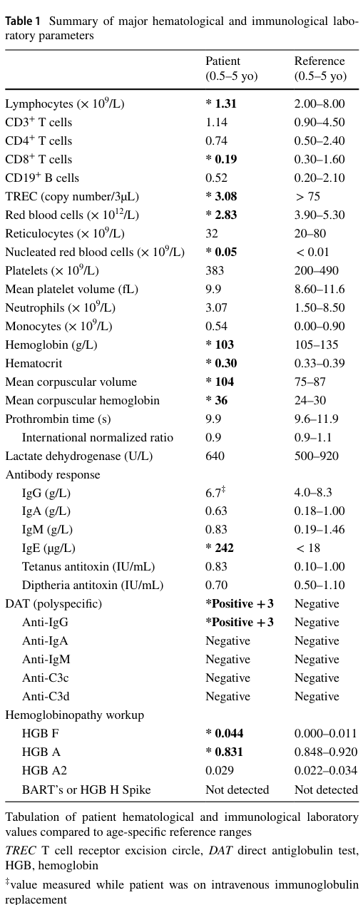

## Question

# Disease Characteristics Research Template

## Target Disease
- **Disease Name:** ICHAD Syndrome
- **MONDO ID:** MONDO:0979234 (if available)
- **Category:** Mendelian

## Research Objectives

Please provide a comprehensive research report on **ICHAD Syndrome** covering all of the
disease characteristics listed below. This report will be used to populate a disease knowledge
base entry. Be thorough and cite primary literature (PMID preferred) for all claims.

For each section, **suggested databases/resources** are listed. These are the first places
you should search for information on each topic.

---

### 1. Disease Information
> **Search first:** OMIM, Orphanet, ICD-10/ICD-11, MeSH, PubMed

- What is the disease? Provide a concise overview.
- What are the key identifiers? (OMIM, Orphanet, ICD-10/ICD-11, MeSH, Mondo)
- What are the common synonyms and alternative names?
- Is the information derived from individual patients (e.g., EHR) or aggregated disease-level resources?

### 2. Etiology

- **Disease Causal Factors**: What are the primary causes? (genetic, environmental, infectious, mechanistic)
- **Risk Factors**:
  > **Search first:** PubMed, Cochrane Library, UpToDate, clinical guidelines, ClinVar, ClinGen, GWAS Catalog, PheGenI, CTD, CDC, WHO, epidemiological databases
  - Genetic risk factors (causal variants, susceptibility loci, modifier genes)
  - Environmental risk factors (toxins, lifestyle, occupational exposures, age, sex, family history)
- **Protective Factors**:
  > **Search first:** PubMed, Cochrane Library, clinical trial databases, GWAS Catalog, gnomAD, WHO, CDC, nutrition databases
  - Genetic protective factors (protective variants, modifier alleles)
  - Environmental protective factors (diet, lifestyle, exposures that reduce risk)
- **Gene-Environment Interactions**: How do genetic and environmental factors interact to influence disease?
  > **Search first:** CTD, PubMed, PheGenI, GxE databases

### 3. Phenotypes
> **Search first:** HPO (Human Phenotype Ontology), OMIM, Orphanet, PubMed, clinicaltrials.gov, MedDRA, SNOMED CT, DECIPHER, LOINC

For each phenotype, provide:
- **Phenotype type**: symptoms, clinical signs, physical manifestations, behavioral changes, or laboratory abnormalities
  > For symptoms/signs: HPO, OMIM, Orphanet, PubMed
  > For behavioral changes: HPO, DSM, RDoC (Research Domain Criteria), PubMed
  > For laboratory abnormalities: LOINC, SNOMED CT, LabTests Online, PubMed
- **Phenotype characteristics**:
  > **Search first:** OMIM, Orphanet, HPO, PubMed
  - Age of symptom onset (neonatal, childhood, adult-onset, late-onset)
  - Symptom severity (mild, moderate, severe, variable)
  - Symptom progression (stable, progressive, episodic, fluctuating)
  - Frequency among affected individuals (percentage or qualitative)
- **Quality of life impact**: Effects on daily functioning and well-being (per-phenotype when possible)
  > **Search first:** EQ-5D database, SF-36, WHO QOL databases, PubMed
- Suggest HPO (Human Phenotype Ontology) terms for each phenotype

### 4. Genetic/Molecular Information

- **Causal Genes**: Gene mutations or chromosomal abnormalities responsible for disease (gene symbols, OMIM IDs)
  > **Search first:** OMIM, ClinVar, HGMD, Ensembl, NCBI Gene
- **Pathogenic Variants**:
  - Affected genes (gene symbols, HGNC IDs)
    > **Search first:** OMIM, NCBI Gene, Ensembl, HGNC, UniProt, GeneCards
  - Variant classification (pathogenic, likely pathogenic, VUS per ACMG/AMP guidelines)
    > **Search first:** ClinVar, ClinGen, ACMG/AMP guidelines, VarSome
  - Variant type/class (missense, frameshift, nonsense, splice-site, structural)
  - Allele frequency in population databases
    > **Search first:** gnomAD, 1000 Genomes, ExAC, TOPMed, dbSNP
  - Somatic vs germline origin
    > **Search first:** COSMIC (somatic), ClinVar, ICGC, TCGA
  - Functional consequences (loss of function, gain of function, dominant negative)
- **Modifier Genes**: Genes that modify disease severity or expression
- **Epigenetic Information**: DNA methylation, histone modifications, chromatin changes affecting disease
  > **Search first:** ENCODE, Roadmap Epigenomics, MethBase, DiseaseMeth
- **Chromosomal Abnormalities**: Large-scale genetic changes (aneuploidy, translocations, inversions)
  > **Search first:** DECIPHER, ClinVar, ECARUCA, UCSC Genome Browser

### 5. Environmental Information

- **Environmental Factors**: Non-genetic contributing factors (toxins, radiation, pollution, occupational exposure)
  > **Search first:** CTD (Comparative Toxicogenomics Database), TOXNET, PubMed, EPA databases
- **Lifestyle Factors**: Behavioral factors (smoking, diet, exercise, alcohol consumption)
  > **Search first:** CDC databases, WHO, PubMed, NHANES
- **Infectious Agents**: If applicable, pathogens causing or triggering disease (bacteria, viruses, fungi, parasites)
  > **Search first:** NCBI Taxonomy, ViPR, BV-BRC, MicrobeDB, GIDEON

### 6. Mechanism / Pathophysiology

**Present this section as an ordered causal chain first, then the detail below.**
Open with a numbered sequence of mechanistic steps running from the initiating
lesion (mutation, exposure, infection) to the clinical manifestation, one step per
line, each naming what it causes next. State the causal verb explicitly ("leads
to", "results in") and say where a step is inferred rather than demonstrated.
Where the mechanism branches, show the branch. The categories below are a
checklist of what to cover within those steps, not the organizing structure —
a step may draw on several of them, and a category may contribute to several
steps.

- **Molecular Pathways**: Specific signaling cascades or biochemical pathways involved (Wnt, MAPK, mTOR, PI3K-AKT, etc.)
  > **Search first:** KEGG, Reactome, WikiPathways, PathBank, BioCyc
- **Cellular Processes**: Cell-level mechanisms (apoptosis, autophagy, cell cycle dysregulation, inflammation, etc.)
  > **Search first:** Gene Ontology (GO), Reactome, KEGG, PubMed
- **Protein Dysfunction**: How protein structure or function is altered (misfolding, aggregation, loss of function, gain of function)
  > **Search first:** UniProt, PDB (Protein Data Bank), InterPro, Pfam, AlphaFold
- **Metabolic Changes**: Alterations in metabolic processes (energy metabolism, lipid metabolism, amino acid metabolism)
  > **Search first:** KEGG, BioCyc, HMDB (Human Metabolome Database), BRENDA
- **Immune System Involvement**: Role of immune response (autoimmunity, immunodeficiency, chronic inflammation)
  > **Search first:** ImmPort, Immunome Database, IEDB, Gene Ontology
- **Tissue Damage Mechanisms**: How tissues/ are injured (oxidative stress, ischemia, fibrosis, necrosis)
  > **Search first:** PubMed, Gene Ontology, Reactome
- **Biochemical Abnormalities**: Specific molecular defects (enzyme deficiencies, receptor dysfunction, ion channel defects)
  > **Search first:** BRENDA, UniProt, KEGG, OMIM, PubMed
- **Epigenetic Changes**: DNA methylation, histone modifications affecting gene expression in disease
  > **Search first:** ENCODE, Roadmap Epigenomics, MethBase, DiseaseMeth
- **Molecular Profiling** (if available):
  - Transcriptomics/gene expression changes
    > **Search first:** GEO (Gene Expression Omnibus), ArrayExpress, GTEx, Human Cell Atlas, SRA
  - Proteomics findings
    > **Search first:** PRIDE, ProteomeXchange, Human Protein Atlas, STRING, BioGRID
  - Metabolomics signatures
    > **Search first:** MetaboLights, Metabolomics Workbench, HMDB, METLIN
  - Lipidomics alterations
    > **Search first:** LIPID MAPS, SwissLipids, LipidHome, Metabolomics Workbench
  - Genomic structural features
    > **Search first:** UCSC Genome Browser, Ensembl, NCBI, dbVar, DGV
- **Advanced Technologies** (if applicable):
  - Single-cell analysis findings (cell-type specific mechanisms, cellular heterogeneity)
    > **Search first:** Human Cell Atlas, Single Cell Portal, GEO, CELLxGENE
  - Spatial transcriptomics findings
    > **Search first:** GEO, Spatial Research, Vizgen, 10x Genomics data
  - Multi-omics integration results
    > **Search first:** TCGA, ICGC, cBioPortal, LinkedOmics, PubMed
  - Functional genomics screens (CRISPR, RNAi)
    > **Search first:** DepMap, GenomeRNAi, PubMed, BioGRID ORCS

For each mechanism, describe:
- The causal chain from initial trigger to clinical manifestation
- Which mechanisms are upstream vs downstream
- What cell types and biological processes are involved
- Suggest GO terms for biological processes and CL terms for cell types

### 7. Anatomical Structures Affected

- **Organ Level**:
  - Primary organs directly affected
  - Secondary organ involvement (complications, secondary effects)
  - Body systems involved (cardiovascular, nervous, digestive, respiratory, endocrine, etc.)
  > **Search first:** Uberon, FMA (Foundational Model of Anatomy), OMIM, HPO, ICD-11, MeSH, SNOMED CT
- **Tissue and Cell Level**:
  - Specific tissue types affected (epithelial, connective, muscle, nervous)
  - Specific cell populations targeted (with Cell Ontology terms)
  > **Search first:** Uberon, Human Protein Atlas, Cell Ontology, Human Cell Atlas, CellMarker, PanglaoDB
- **Subcellular Level**:
  - Cellular compartments involved (mitochondria, nucleus, ER, lysosomes) (with GO Cellular Component terms)
  > **Search first:** Gene Ontology (Cellular Component), UniProt, Human Protein Atlas
- **Localization**:
  - Specific anatomical sites (with UBERON terms)
    > **Search first:** FMA, Uberon, NeuroNames (for brain), SNOMED CT
  - Lateralization (unilateral, bilateral, asymmetric)
    > **Search first:** HPO, clinical literature, imaging databases

### 8. Temporal Development

- **Onset**:
  - Typical age of onset (congenital, pediatric, adult, geriatric)
  - Onset pattern (acute, subacute, chronic, insidious)
  > **Search first:** OMIM, Orphanet, HPO, PubMed
- **Progression**:
  - Disease stages (early, intermediate, advanced, end-stage)
    > **Search first:** Cancer Staging Manual (AJCC), WHO classifications, PubMed
  - Progression rate (rapid, slow, variable)
  - Disease course pattern (episodic, relapsing-remitting, progressive, stable)
  - Disease duration (self-limited, chronic lifelong)
  > **Search first:** Disease registries, longitudinal cohort databases, natural history studies, PubMed, Orphanet, OMIM
- **Patterns**:
  - Remission patterns (spontaneous, treatment-induced)
    > **Search first:** Clinical trial databases, disease registries, PubMed
  - Critical periods (time windows of vulnerability or opportunity for intervention)
    > **Search first:** PubMed, developmental biology databases, clinical guidelines

### 9. Inheritance and Population

- **Epidemiology**:
  - Prevalence (cases per 100,000 at given time)
  - Incidence (new cases per 100,000 per year)
  > **Search first:** Orphanet, CDC, WHO, GBD (Global Burden of Disease), national registries, SEER, disease registries
- **For Genetic Etiology**:
  - Inheritance pattern (AD, AR, X-linked, mitochondrial, multifactorial, polygenic)
    > **Search first:** OMIM, Orphanet, ClinVar, GTR (Genetic Testing Registry)
  - Penetrance (complete, incomplete, age-dependent)
    > **Search first:** ClinVar, OMIM, PubMed, ClinGen
  - Expressivity (variable, consistent)
    > **Search first:** OMIM, ClinVar, PubMed
  - Genetic anticipation (increasing severity in successive generations)
    > **Search first:** OMIM, PubMed (especially for repeat expansion disorders)
  - Germline mosaicism
    > **Search first:** ClinVar, OMIM, genetic counseling literature, PubMed
  - Founder effects (population-specific mutations)
    > **Search first:** gnomAD, population genetics databases, PubMed
  - Consanguinity role
    > **Search first:** OMIM, population studies, genetic counseling resources
  - Carrier frequency
    > **Search first:** gnomAD, carrier screening databases, GeneReviews, GTR
- **Population Demographics**:
  - Affected populations (ethnic or demographic groups with higher prevalence)
    > **Search first:** gnomAD, 1000 Genomes, PAGE Study, PubMed, population registries
  - Geographic distribution (endemic areas, regional variation)
    > **Search first:** WHO, CDC, GBD, Orphanet, geographic epidemiology databases
  - Geographic distribution of specific variants
  - Sex ratio (male:female)
    > **Search first:** Disease registries, OMIM, PubMed, epidemiological databases
  - Age distribution of affected individuals
    > **Search first:** CDC, disease registries, SEER, Orphanet

### 10. Diagnostics

- **Clinical Tests**:
  - Laboratory tests (blood, urine, tissue chemistry, specific enzyme assays)
    > **Search first:** LOINC, LabTests Online, PubMed
  - Biomarkers (proteins, metabolites, genetic markers, circulating biomarkers)
    > **Search first:** FDA Biomarker List, BEST (Biomarkers, EndpointS, and other Tools), PubMed
  - Imaging studies (X-ray, CT, MRI, PET, ultrasound)
    > **Search first:** RadLex, DICOM, Radiopaedia, imaging databases
  - Functional tests (pulmonary function, cardiac stress tests)
    > **Search first:** LOINC, clinical guidelines, PubMed
  - Electrophysiology (EEG, EMG, ECG, nerve conduction studies)
    > **Search first:** LOINC, clinical neurophysiology databases, PubMed
  - Biopsy findings (histopathology, immunohistochemistry)
    > **Search first:** SNOMED CT, College of American Pathologists resources, PubMed
  - Pathology findings (microscopic examination)
    > **Search first:** SNOMED CT, Digital Pathology databases, PubMed
- **Genetic Testing**:
  > **Search first:** GTR (Genetic Testing Registry), GeneReviews, ClinGen
  - Overview of recommended genetic testing approach
  - Whole genome sequencing (WGS) utility
    > **Search first:** GTR, ClinVar, GEL (Genomics England), gnomAD
  - Whole exome sequencing (WES) utility
    > **Search first:** GTR, ClinVar, OMIM, GeneMatcher
  - Gene panels (which panels, which genes)
    > **Search first:** GTR, ClinVar, laboratory-specific databases
  - Single gene testing
    > **Search first:** GTR, ClinVar, OMIM, GeneReviews
  - Chromosomal microarray (CMA)
    > **Search first:** DECIPHER, ClinVar, dbVar, ECARUCA
  - Karyotyping
    > **Search first:** Chromosome Abnormality Database, ClinVar, cytogenetics resources
  - FISH
    > **Search first:** ClinVar, cytogenetics databases, PubMed
  - Mitochondrial DNA testing
    > **Search first:** MITOMAP, MSeqDR, ClinVar, GTR
  - Repeat expansion testing
    > **Search first:** GTR, ClinVar, repeat expansion databases, PubMed
- **Omics-Based Diagnostics** (if applicable):
  - RNA sequencing / transcriptomics
    > **Search first:** GEO, ArrayExpress, GTEx, RNA-seq databases
  - Proteomics
    > **Search first:** PRIDE, ProteomeXchange, FDA Biomarker database
  - Metabolomics
    > **Search first:** MetaboLights, Metabolomics Workbench, HMDB
  - Epigenomics
    > **Search first:** GEO, ENCODE, Roadmap Epigenomics, MethBase
  - Liquid biopsy
    > **Search first:** COSMIC, ClinVar, liquid biopsy databases, PubMed
- **Clinical Criteria**:
  - Standardized diagnostic criteria (DSM, ICD, society guidelines)
    > **Search first:** DSM-5, ICD-11, clinical society guidelines, UpToDate
  - Differential diagnosis (other conditions to rule out, with distinguishing features)
    > **Search first:** DynaMed, UpToDate, clinical decision support systems
- **Screening**:
  - Screening methods for asymptomatic individuals (newborn screening, carrier screening, cascade screening)
    > **Search first:** ACMG recommendations, CDC newborn screening, GTR

### 11. Outcome/Prognosis

- **Survival and Mortality**:
  - Survival rate (5-year, 10-year, overall)
    > **Search first:** SEER, cancer registries, disease-specific registries, PubMed
  - Life expectancy (with and without treatment if applicable)
    > **Search first:** Orphanet, disease registries, actuarial databases, PubMed
  - Mortality rate
    > **Search first:** CDC, WHO, GBD, national mortality databases
  - Disease-specific mortality (deaths directly attributable to disease)
    > **Search first:** Disease registries, CDC Wonder, GBD, PubMed
- **Morbidity and Function**:
  - Morbidity (disease-related disability and health impacts)
    > **Search first:** GBD, WHO, disability databases, PubMed
  - Disability outcomes (long-term functional impairments)
    > **Search first:** ICF (International Classification of Functioning), disability registries
  - Quality of life measures (EQ-5D, SF-36, PROMIS, disease-specific tools)
    > **Search first:** EQ-5D database, SF-36, PROMIS, PubMed
- **Disease Course**:
  - Complications (secondary problems: infections, organ failure, etc.)
    > **Search first:** ICD codes, disease registries, clinical databases, PubMed
  - Recovery potential (likelihood and extent of recovery, with vs without treatment)
    > **Search first:** Natural history studies, rehabilitation databases, PubMed
- **Prediction**:
  - Prognostic factors (age, disease severity, biomarkers, treatment response)
    > **Search first:** Prognostic models databases, clinical calculators, PubMed
  - Prognostic biomarkers (molecular markers predicting disease course)
    > **Search first:** FDA Biomarker database, PubMed, cancer prognostic databases

### 12. Treatment

- **Pharmacotherapy**:
  - Pharmacological treatments (drug names, drug classes, mechanisms of action)
    > **Search first:** DrugBank, RxNorm, ATC classification, DailyMed, FDA databases
  - Pharmacogenomics (how genetic variants affect drug metabolism, efficacy, toxicity)
    > **Search first:** PharmGKB, CPIC (Clinical Pharmacogenetics), FDA Table of PGx Biomarkers
- **Advanced Therapeutics**:
  - Gene therapy (viral vectors, CRISPR, gene replacement, gene editing)
    > **Search first:** ClinicalTrials.gov, FDA gene therapy database, ASGCT resources
  - Cell therapy (stem cell transplant, CAR-T, cellular therapeutics)
    > **Search first:** ClinicalTrials.gov, FDA cell therapy database, FACT standards
  - RNA-based therapies (ASOs, siRNA, mRNA therapies)
    > **Search first:** ClinicalTrials.gov, FDA approvals, PubMed
  - Targeted therapies (treatments directed at specific molecular targets)
    > **Search first:** My Cancer Genome, OncoKB, ClinicalTrials.gov, FDA approvals
  - Immunotherapies (checkpoint inhibitors, monoclonal antibodies)
    > **Search first:** Cancer Immunotherapy Database, FDA approvals, ClinicalTrials.gov
- **Surgical and Interventional**:
  - Surgical interventions (types of surgery, timing, outcomes)
    > **Search first:** CPT codes, surgical registries, clinical guidelines, PubMed
- **Supportive and Rehabilitative**:
  - Supportive care (symptom management, pain control, nutrition)
    > **Search first:** Clinical guidelines, Cochrane Library, PubMed
  - Rehabilitation (physical therapy, occupational therapy, speech therapy)
    > **Search first:** Rehabilitation medicine databases, clinical guidelines, PubMed
- **Experimental**:
  - Experimental treatments in clinical trials (with NCT identifiers if available)
    > **Search first:** ClinicalTrials.gov, EU Clinical Trials Register, WHO ICTRP
- **Treatment Outcomes**:
  - Treatment response rates
    > **Search first:** Clinical trial databases, FDA reviews, systematic reviews, PubMed
  - Side effects and adverse events
    > **Search first:** FDA Adverse Event Reporting System (FAERS), MedWatch, PubMed
- **Treatment Strategy**:
  - Treatment algorithms (clinical pathways, decision trees)
    > **Search first:** Clinical practice guidelines, NCCN Guidelines, UpToDate
  - Combination therapies
    > **Search first:** ClinicalTrials.gov, treatment guidelines, PubMed
  - Personalized medicine approaches (genotype-guided treatment)
    > **Search first:** My Cancer Genome, CIViC, PharmGKB, precision medicine databases

For each treatment, suggest NCIT (NCI Thesaurus) clinical-intervention terms where applicable.

### 13. Prevention

- **Prevention Levels**:
  - Primary prevention (preventing disease occurrence: vaccination, risk factor modification)
    > **Search first:** CDC, WHO, USPSTF recommendations, Cochrane Library
  - Secondary prevention (early detection and treatment: screening programs, early intervention)
    > **Search first:** USPSTF, CDC screening guidelines, WHO
  - Tertiary prevention (preventing complications in those with disease)
    > **Search first:** Clinical guidelines, disease management protocols, PubMed
- **Immunization**: Vaccine strategies (if applicable)
  > **Search first:** CDC vaccine schedules, WHO immunization, FDA vaccine database
- **Screening and Early Detection**:
  - Screening programs (population-based: newborn screening, cancer screening)
    > **Search first:** CDC screening programs, USPSTF, cancer screening databases
  - Genetic screening (carrier screening, preimplantation genetic diagnosis, prenatal testing)
    > **Search first:** ACMG recommendations, ACOG guidelines, GTR
  - Risk stratification (identifying high-risk individuals for targeted prevention)
    > **Search first:** Risk prediction models, clinical calculators, PubMed
- **Behavioral Interventions**: Lifestyle modifications to reduce risk
  > **Search first:** CDC, WHO, behavioral intervention databases, Cochrane Library
- **Counseling**: Genetic counseling (risk assessment, family planning guidance)
  > **Search first:** NSGC resources, ACMG guidelines, GeneReviews
- **Public Health**:
  - Public health interventions (sanitation, vector control, health education)
    > **Search first:** CDC, WHO, public health databases, PubMed
  - Environmental interventions (reducing environmental risk factors)
    > **Search first:** EPA databases, WHO environmental health, PubMed
- **Prophylaxis**: Preventive medications or procedures
  > **Search first:** Clinical guidelines, FDA approvals, PubMed

### 14. Other Species / Natural Disease

- **Taxonomy**: Species affected (with NCBI Taxon identifiers)
  > **Search first:** NCBI Taxonomy
- **Breed**: Specific breeds affected (with VBO identifiers if applicable)
  > **Search first:** VBO (Vertebrate Breed Ontology)
- **Gene**: Orthologous genes in other species (with NCBI Gene IDs)
  > **Search first:** NCBI Gene
- **Natural Disease**:
  - Naturally occurring disease in other species (companion animals, wildlife)
    > **Search first:** OMIA (Online Mendelian Inheritance in Animals), VetCompass, PubMed
  - Veterinary relevance and importance in animal health
    > **Search first:** OMIA, veterinary databases, PubMed
- **Comparative Biology**:
  - Comparative pathology (similarities and differences across species)
    > **Search first:** OMIA, comparative pathology databases, PubMed
  - Evolutionary conservation of disease mechanisms
    > **Search first:** HomoloGene, OrthoMCL, Alliance of Genome Resources
- **Transmission** (if applicable):
  - Zoonotic potential
    > **Search first:** CDC zoonotic diseases, WHO zoonoses, GIDEON
  - Cross-species susceptibility
    > **Search first:** NCBI Taxonomy, veterinary databases, PubMed

### 15. Model Organisms

- **Model Types**:
  - Model organism type (mammalian, invertebrate, cellular, in vitro)
    > **Search first:** Alliance of Genome Resources, model organism databases
  - Specific model systems (mouse, rat, zebrafish, Drosophila, C. elegans, yeast, cell lines, organoids, iPSCs)
    > **Search first:** MGI, RGD, ZFIN, FlyBase, WormBase, SGD, ATCC, Cellosaurus
  - Induced models (drug treatment, surgical intervention, environmental manipulation)
    > **Search first:** MGI, model organism databases, PubMed
- **Genetic Models**:
  - Types available (knockout, knock-in, transgenic, conditional, humanized)
    > **Search first:** MGI, IMPC, KOMP, EuMMCR, IMSR
- **Model Characteristics**:
  - Phenotype recapitulation (how well model reproduces human disease features)
    > **Search first:** Model organism databases, comparative studies, PubMed
  - Model limitations (aspects of human disease not captured)
    > **Search first:** Model organism databases, PubMed, review articles
- **Applications**:
  - Research applications (what aspects of disease can be studied)
    > **Search first:** Model organism databases, PubMed
- **Resources**:
  - Model databases
    > **Search first:** MGI, RGD, ZFIN, FlyBase, WormBase, IMSR, EMMA, MMRRC

---

## Citation Requirements

- Cite primary literature (PMID preferred) for all mechanistic and clinical claims
- Prioritize recent reviews and landmark papers
- Include direct quotes from abstracts where possible to support key statements
- Distinguish evidence source types: human clinical, model organism, in vitro, computational

## Output Format

Structure your response as a comprehensive narrative organized by the sections above.
For each section, provide:
- Factual content with specific details (numbers, percentages, gene names, variant nomenclature)
- Ontology term suggestions (HPO, GO, CL, UBERON, CHEBI, NCIT, MONDO) where applicable
- Evidence citations with PMIDs
- Direct quotes from abstracts to support key claims
- Clear indication when information is not available or not applicable for this disease

This report will be used to populate a disease knowledge base entry with:
- Pathophysiology descriptions with causal chains
- Gene/protein annotations (HGNC, GO terms)
- Phenotype associations (HP terms) with frequencies
- Cell type involvement (CL terms)
- Anatomical locations (UBERON terms)
- Chemical entities (CHEBI terms)
- Treatment annotations (NCIT terms)
- Evidence items with PMIDs and exact abstract quotes
- Epidemiology, prognosis, diagnostic, and prevention information
- Animal model descriptions with phenotype recapitulation details

## Output

Question: You are an expert researcher providing comprehensive, well-cited information.

Provide detailed information focusing on:
1. Key concepts and definitions with current understanding
2. Recent developments and latest research (prioritize 2023-2024 sources)
3. Current applications and real-world implementations
4. Expert opinions and analysis from authoritative sources
5. Relevant statistics and data from recent studies

Format as a comprehensive research report with proper citations. Include URLs and publication dates where available.
Always prioritize recent, authoritative sources and provide specific citations for all major claims.

# Disease Characteristics Research Template

## Target Disease
- **Disease Name:** ICHAD Syndrome
- **MONDO ID:** MONDO:0979234 (if available)
- **Category:** Mendelian

## Research Objectives

Please provide a comprehensive research report on **ICHAD Syndrome** covering all of the
disease characteristics listed below. This report will be used to populate a disease knowledge
base entry. Be thorough and cite primary literature (PMID preferred) for all claims.

For each section, **suggested databases/resources** are listed. These are the first places
you should search for information on each topic.

---

### 1. Disease Information
> **Search first:** OMIM, Orphanet, ICD-10/ICD-11, MeSH, PubMed

- What is the disease? Provide a concise overview.
- What are the key identifiers? (OMIM, Orphanet, ICD-10/ICD-11, MeSH, Mondo)
- What are the common synonyms and alternative names?
- Is the information derived from individual patients (e.g., EHR) or aggregated disease-level resources?

### 2. Etiology

- **Disease Causal Factors**: What are the primary causes? (genetic, environmental, infectious, mechanistic)
- **Risk Factors**:
  > **Search first:** PubMed, Cochrane Library, UpToDate, clinical guidelines, ClinVar, ClinGen, GWAS Catalog, PheGenI, CTD, CDC, WHO, epidemiological databases
  - Genetic risk factors (causal variants, susceptibility loci, modifier genes)
  - Environmental risk factors (toxins, lifestyle, occupational exposures, age, sex, family history)
- **Protective Factors**:
  > **Search first:** PubMed, Cochrane Library, clinical trial databases, GWAS Catalog, gnomAD, WHO, CDC, nutrition databases
  - Genetic protective factors (protective variants, modifier alleles)
  - Environmental protective factors (diet, lifestyle, exposures that reduce risk)
- **Gene-Environment Interactions**: How do genetic and environmental factors interact to influence disease?
  > **Search first:** CTD, PubMed, PheGenI, GxE databases

### 3. Phenotypes
> **Search first:** HPO (Human Phenotype Ontology), OMIM, Orphanet, PubMed, clinicaltrials.gov, MedDRA, SNOMED CT, DECIPHER, LOINC

For each phenotype, provide:
- **Phenotype type**: symptoms, clinical signs, physical manifestations, behavioral changes, or laboratory abnormalities
  > For symptoms/signs: HPO, OMIM, Orphanet, PubMed
  > For behavioral changes: HPO, DSM, RDoC (Research Domain Criteria), PubMed
  > For laboratory abnormalities: LOINC, SNOMED CT, LabTests Online, PubMed
- **Phenotype characteristics**:
  > **Search first:** OMIM, Orphanet, HPO, PubMed
  - Age of symptom onset (neonatal, childhood, adult-onset, late-onset)
  - Symptom severity (mild, moderate, severe, variable)
  - Symptom progression (stable, progressive, episodic, fluctuating)
  - Frequency among affected individuals (percentage or qualitative)
- **Quality of life impact**: Effects on daily functioning and well-being (per-phenotype when possible)
  > **Search first:** EQ-5D database, SF-36, WHO QOL databases, PubMed
- Suggest HPO (Human Phenotype Ontology) terms for each phenotype

### 4. Genetic/Molecular Information

- **Causal Genes**: Gene mutations or chromosomal abnormalities responsible for disease (gene symbols, OMIM IDs)
  > **Search first:** OMIM, ClinVar, HGMD, Ensembl, NCBI Gene
- **Pathogenic Variants**:
  - Affected genes (gene symbols, HGNC IDs)
    > **Search first:** OMIM, NCBI Gene, Ensembl, HGNC, UniProt, GeneCards
  - Variant classification (pathogenic, likely pathogenic, VUS per ACMG/AMP guidelines)
    > **Search first:** ClinVar, ClinGen, ACMG/AMP guidelines, VarSome
  - Variant type/class (missense, frameshift, nonsense, splice-site, structural)
  - Allele frequency in population databases
    > **Search first:** gnomAD, 1000 Genomes, ExAC, TOPMed, dbSNP
  - Somatic vs germline origin
    > **Search first:** COSMIC (somatic), ClinVar, ICGC, TCGA
  - Functional consequences (loss of function, gain of function, dominant negative)
- **Modifier Genes**: Genes that modify disease severity or expression
- **Epigenetic Information**: DNA methylation, histone modifications, chromatin changes affecting disease
  > **Search first:** ENCODE, Roadmap Epigenomics, MethBase, DiseaseMeth
- **Chromosomal Abnormalities**: Large-scale genetic changes (aneuploidy, translocations, inversions)
  > **Search first:** DECIPHER, ClinVar, ECARUCA, UCSC Genome Browser

### 5. Environmental Information

- **Environmental Factors**: Non-genetic contributing factors (toxins, radiation, pollution, occupational exposure)
  > **Search first:** CTD (Comparative Toxicogenomics Database), TOXNET, PubMed, EPA databases
- **Lifestyle Factors**: Behavioral factors (smoking, diet, exercise, alcohol consumption)
  > **Search first:** CDC databases, WHO, PubMed, NHANES
- **Infectious Agents**: If applicable, pathogens causing or triggering disease (bacteria, viruses, fungi, parasites)
  > **Search first:** NCBI Taxonomy, ViPR, BV-BRC, MicrobeDB, GIDEON

### 6. Mechanism / Pathophysiology

**Present this section as an ordered causal chain first, then the detail below.**
Open with a numbered sequence of mechanistic steps running from the initiating
lesion (mutation, exposure, infection) to the clinical manifestation, one step per
line, each naming what it causes next. State the causal verb explicitly ("leads
to", "results in") and say where a step is inferred rather than demonstrated.
Where the mechanism branches, show the branch. The categories below are a
checklist of what to cover within those steps, not the organizing structure —
a step may draw on several of them, and a category may contribute to several
steps.

- **Molecular Pathways**: Specific signaling cascades or biochemical pathways involved (Wnt, MAPK, mTOR, PI3K-AKT, etc.)
  > **Search first:** KEGG, Reactome, WikiPathways, PathBank, BioCyc
- **Cellular Processes**: Cell-level mechanisms (apoptosis, autophagy, cell cycle dysregulation, inflammation, etc.)
  > **Search first:** Gene Ontology (GO), Reactome, KEGG, PubMed
- **Protein Dysfunction**: How protein structure or function is altered (misfolding, aggregation, loss of function, gain of function)
  > **Search first:** UniProt, PDB (Protein Data Bank), InterPro, Pfam, AlphaFold
- **Metabolic Changes**: Alterations in metabolic processes (energy metabolism, lipid metabolism, amino acid metabolism)
  > **Search first:** KEGG, BioCyc, HMDB (Human Metabolome Database), BRENDA
- **Immune System Involvement**: Role of immune response (autoimmunity, immunodeficiency, chronic inflammation)
  > **Search first:** ImmPort, Immunome Database, IEDB, Gene Ontology
- **Tissue Damage Mechanisms**: How tissues/ are injured (oxidative stress, ischemia, fibrosis, necrosis)
  > **Search first:** PubMed, Gene Ontology, Reactome
- **Biochemical Abnormalities**: Specific molecular defects (enzyme deficiencies, receptor dysfunction, ion channel defects)
  > **Search first:** BRENDA, UniProt, KEGG, OMIM, PubMed
- **Epigenetic Changes**: DNA methylation, histone modifications affecting gene expression in disease
  > **Search first:** ENCODE, Roadmap Epigenomics, MethBase, DiseaseMeth
- **Molecular Profiling** (if available):
  - Transcriptomics/gene expression changes
    > **Search first:** GEO (Gene Expression Omnibus), ArrayExpress, GTEx, Human Cell Atlas, SRA
  - Proteomics findings
    > **Search first:** PRIDE, ProteomeXchange, Human Protein Atlas, STRING, BioGRID
  - Metabolomics signatures
    > **Search first:** MetaboLights, Metabolomics Workbench, HMDB, METLIN
  - Lipidomics alterations
    > **Search first:** LIPID MAPS, SwissLipids, LipidHome, Metabolomics Workbench
  - Genomic structural features
    > **Search first:** UCSC Genome Browser, Ensembl, NCBI, dbVar, DGV
- **Advanced Technologies** (if applicable):
  - Single-cell analysis findings (cell-type specific mechanisms, cellular heterogeneity)
    > **Search first:** Human Cell Atlas, Single Cell Portal, GEO, CELLxGENE
  - Spatial transcriptomics findings
    > **Search first:** GEO, Spatial Research, Vizgen, 10x Genomics data
  - Multi-omics integration results
    > **Search first:** TCGA, ICGC, cBioPortal, LinkedOmics, PubMed
  - Functional genomics screens (CRISPR, RNAi)
    > **Search first:** DepMap, GenomeRNAi, PubMed, BioGRID ORCS

For each mechanism, describe:
- The causal chain from initial trigger to clinical manifestation
- Which mechanisms are upstream vs downstream
- What cell types and biological processes are involved
- Suggest GO terms for biological processes and CL terms for cell types

### 7. Anatomical Structures Affected

- **Organ Level**:
  - Primary organs directly affected
  - Secondary organ involvement (complications, secondary effects)
  - Body systems involved (cardiovascular, nervous, digestive, respiratory, endocrine, etc.)
  > **Search first:** Uberon, FMA (Foundational Model of Anatomy), OMIM, HPO, ICD-11, MeSH, SNOMED CT
- **Tissue and Cell Level**:
  - Specific tissue types affected (epithelial, connective, muscle, nervous)
  - Specific cell populations targeted (with Cell Ontology terms)
  > **Search first:** Uberon, Human Protein Atlas, Cell Ontology, Human Cell Atlas, CellMarker, PanglaoDB
- **Subcellular Level**:
  - Cellular compartments involved (mitochondria, nucleus, ER, lysosomes) (with GO Cellular Component terms)
  > **Search first:** Gene Ontology (Cellular Component), UniProt, Human Protein Atlas
- **Localization**:
  - Specific anatomical sites (with UBERON terms)
    > **Search first:** FMA, Uberon, NeuroNames (for brain), SNOMED CT
  - Lateralization (unilateral, bilateral, asymmetric)
    > **Search first:** HPO, clinical literature, imaging databases

### 8. Temporal Development

- **Onset**:
  - Typical age of onset (congenital, pediatric, adult, geriatric)
  - Onset pattern (acute, subacute, chronic, insidious)
  > **Search first:** OMIM, Orphanet, HPO, PubMed
- **Progression**:
  - Disease stages (early, intermediate, advanced, end-stage)
    > **Search first:** Cancer Staging Manual (AJCC), WHO classifications, PubMed
  - Progression rate (rapid, slow, variable)
  - Disease course pattern (episodic, relapsing-remitting, progressive, stable)
  - Disease duration (self-limited, chronic lifelong)
  > **Search first:** Disease registries, longitudinal cohort databases, natural history studies, PubMed, Orphanet, OMIM
- **Patterns**:
  - Remission patterns (spontaneous, treatment-induced)
    > **Search first:** Clinical trial databases, disease registries, PubMed
  - Critical periods (time windows of vulnerability or opportunity for intervention)
    > **Search first:** PubMed, developmental biology databases, clinical guidelines

### 9. Inheritance and Population

- **Epidemiology**:
  - Prevalence (cases per 100,000 at given time)
  - Incidence (new cases per 100,000 per year)
  > **Search first:** Orphanet, CDC, WHO, GBD (Global Burden of Disease), national registries, SEER, disease registries
- **For Genetic Etiology**:
  - Inheritance pattern (AD, AR, X-linked, mitochondrial, multifactorial, polygenic)
    > **Search first:** OMIM, Orphanet, ClinVar, GTR (Genetic Testing Registry)
  - Penetrance (complete, incomplete, age-dependent)
    > **Search first:** ClinVar, OMIM, PubMed, ClinGen
  - Expressivity (variable, consistent)
    > **Search first:** OMIM, ClinVar, PubMed
  - Genetic anticipation (increasing severity in successive generations)
    > **Search first:** OMIM, PubMed (especially for repeat expansion disorders)
  - Germline mosaicism
    > **Search first:** ClinVar, OMIM, genetic counseling literature, PubMed
  - Founder effects (population-specific mutations)
    > **Search first:** gnomAD, population genetics databases, PubMed
  - Consanguinity role
    > **Search first:** OMIM, population studies, genetic counseling resources
  - Carrier frequency
    > **Search first:** gnomAD, carrier screening databases, GeneReviews, GTR
- **Population Demographics**:
  - Affected populations (ethnic or demographic groups with higher prevalence)
    > **Search first:** gnomAD, 1000 Genomes, PAGE Study, PubMed, population registries
  - Geographic distribution (endemic areas, regional variation)
    > **Search first:** WHO, CDC, GBD, Orphanet, geographic epidemiology databases
  - Geographic distribution of specific variants
  - Sex ratio (male:female)
    > **Search first:** Disease registries, OMIM, PubMed, epidemiological databases
  - Age distribution of affected individuals
    > **Search first:** CDC, disease registries, SEER, Orphanet

### 10. Diagnostics

- **Clinical Tests**:
  - Laboratory tests (blood, urine, tissue chemistry, specific enzyme assays)
    > **Search first:** LOINC, LabTests Online, PubMed
  - Biomarkers (proteins, metabolites, genetic markers, circulating biomarkers)
    > **Search first:** FDA Biomarker List, BEST (Biomarkers, EndpointS, and other Tools), PubMed
  - Imaging studies (X-ray, CT, MRI, PET, ultrasound)
    > **Search first:** RadLex, DICOM, Radiopaedia, imaging databases
  - Functional tests (pulmonary function, cardiac stress tests)
    > **Search first:** LOINC, clinical guidelines, PubMed
  - Electrophysiology (EEG, EMG, ECG, nerve conduction studies)
    > **Search first:** LOINC, clinical neurophysiology databases, PubMed
  - Biopsy findings (histopathology, immunohistochemistry)
    > **Search first:** SNOMED CT, College of American Pathologists resources, PubMed
  - Pathology findings (microscopic examination)
    > **Search first:** SNOMED CT, Digital Pathology databases, PubMed
- **Genetic Testing**:
  > **Search first:** GTR (Genetic Testing Registry), GeneReviews, ClinGen
  - Overview of recommended genetic testing approach
  - Whole genome sequencing (WGS) utility
    > **Search first:** GTR, ClinVar, GEL (Genomics England), gnomAD
  - Whole exome sequencing (WES) utility
    > **Search first:** GTR, ClinVar, OMIM, GeneMatcher
  - Gene panels (which panels, which genes)
    > **Search first:** GTR, ClinVar, laboratory-specific databases
  - Single gene testing
    > **Search first:** GTR, ClinVar, OMIM, GeneReviews
  - Chromosomal microarray (CMA)
    > **Search first:** DECIPHER, ClinVar, dbVar, ECARUCA
  - Karyotyping
    > **Search first:** Chromosome Abnormality Database, ClinVar, cytogenetics resources
  - FISH
    > **Search first:** ClinVar, cytogenetics databases, PubMed
  - Mitochondrial DNA testing
    > **Search first:** MITOMAP, MSeqDR, ClinVar, GTR
  - Repeat expansion testing
    > **Search first:** GTR, ClinVar, repeat expansion databases, PubMed
- **Omics-Based Diagnostics** (if applicable):
  - RNA sequencing / transcriptomics
    > **Search first:** GEO, ArrayExpress, GTEx, RNA-seq databases
  - Proteomics
    > **Search first:** PRIDE, ProteomeXchange, FDA Biomarker database
  - Metabolomics
    > **Search first:** MetaboLights, Metabolomics Workbench, HMDB
  - Epigenomics
    > **Search first:** GEO, ENCODE, Roadmap Epigenomics, MethBase
  - Liquid biopsy
    > **Search first:** COSMIC, ClinVar, liquid biopsy databases, PubMed
- **Clinical Criteria**:
  - Standardized diagnostic criteria (DSM, ICD, society guidelines)
    > **Search first:** DSM-5, ICD-11, clinical society guidelines, UpToDate
  - Differential diagnosis (other conditions to rule out, with distinguishing features)
    > **Search first:** DynaMed, UpToDate, clinical decision support systems
- **Screening**:
  - Screening methods for asymptomatic individuals (newborn screening, carrier screening, cascade screening)
    > **Search first:** ACMG recommendations, CDC newborn screening, GTR

### 11. Outcome/Prognosis

- **Survival and Mortality**:
  - Survival rate (5-year, 10-year, overall)
    > **Search first:** SEER, cancer registries, disease-specific registries, PubMed
  - Life expectancy (with and without treatment if applicable)
    > **Search first:** Orphanet, disease registries, actuarial databases, PubMed
  - Mortality rate
    > **Search first:** CDC, WHO, GBD, national mortality databases
  - Disease-specific mortality (deaths directly attributable to disease)
    > **Search first:** Disease registries, CDC Wonder, GBD, PubMed
- **Morbidity and Function**:
  - Morbidity (disease-related disability and health impacts)
    > **Search first:** GBD, WHO, disability databases, PubMed
  - Disability outcomes (long-term functional impairments)
    > **Search first:** ICF (International Classification of Functioning), disability registries
  - Quality of life measures (EQ-5D, SF-36, PROMIS, disease-specific tools)
    > **Search first:** EQ-5D database, SF-36, PROMIS, PubMed
- **Disease Course**:
  - Complications (secondary problems: infections, organ failure, etc.)
    > **Search first:** ICD codes, disease registries, clinical databases, PubMed
  - Recovery potential (likelihood and extent of recovery, with vs without treatment)
    > **Search first:** Natural history studies, rehabilitation databases, PubMed
- **Prediction**:
  - Prognostic factors (age, disease severity, biomarkers, treatment response)
    > **Search first:** Prognostic models databases, clinical calculators, PubMed
  - Prognostic biomarkers (molecular markers predicting disease course)
    > **Search first:** FDA Biomarker database, PubMed, cancer prognostic databases

### 12. Treatment

- **Pharmacotherapy**:
  - Pharmacological treatments (drug names, drug classes, mechanisms of action)
    > **Search first:** DrugBank, RxNorm, ATC classification, DailyMed, FDA databases
  - Pharmacogenomics (how genetic variants affect drug metabolism, efficacy, toxicity)
    > **Search first:** PharmGKB, CPIC (Clinical Pharmacogenetics), FDA Table of PGx Biomarkers
- **Advanced Therapeutics**:
  - Gene therapy (viral vectors, CRISPR, gene replacement, gene editing)
    > **Search first:** ClinicalTrials.gov, FDA gene therapy database, ASGCT resources
  - Cell therapy (stem cell transplant, CAR-T, cellular therapeutics)
    > **Search first:** ClinicalTrials.gov, FDA cell therapy database, FACT standards
  - RNA-based therapies (ASOs, siRNA, mRNA therapies)
    > **Search first:** ClinicalTrials.gov, FDA approvals, PubMed
  - Targeted therapies (treatments directed at specific molecular targets)
    > **Search first:** My Cancer Genome, OncoKB, ClinicalTrials.gov, FDA approvals
  - Immunotherapies (checkpoint inhibitors, monoclonal antibodies)
    > **Search first:** Cancer Immunotherapy Database, FDA approvals, ClinicalTrials.gov
- **Surgical and Interventional**:
  - Surgical interventions (types of surgery, timing, outcomes)
    > **Search first:** CPT codes, surgical registries, clinical guidelines, PubMed
- **Supportive and Rehabilitative**:
  - Supportive care (symptom management, pain control, nutrition)
    > **Search first:** Clinical guidelines, Cochrane Library, PubMed
  - Rehabilitation (physical therapy, occupational therapy, speech therapy)
    > **Search first:** Rehabilitation medicine databases, clinical guidelines, PubMed
- **Experimental**:
  - Experimental treatments in clinical trials (with NCT identifiers if available)
    > **Search first:** ClinicalTrials.gov, EU Clinical Trials Register, WHO ICTRP
- **Treatment Outcomes**:
  - Treatment response rates
    > **Search first:** Clinical trial databases, FDA reviews, systematic reviews, PubMed
  - Side effects and adverse events
    > **Search first:** FDA Adverse Event Reporting System (FAERS), MedWatch, PubMed
- **Treatment Strategy**:
  - Treatment algorithms (clinical pathways, decision trees)
    > **Search first:** Clinical practice guidelines, NCCN Guidelines, UpToDate
  - Combination therapies
    > **Search first:** ClinicalTrials.gov, treatment guidelines, PubMed
  - Personalized medicine approaches (genotype-guided treatment)
    > **Search first:** My Cancer Genome, CIViC, PharmGKB, precision medicine databases

For each treatment, suggest NCIT (NCI Thesaurus) clinical-intervention terms where applicable.

### 13. Prevention

- **Prevention Levels**:
  - Primary prevention (preventing disease occurrence: vaccination, risk factor modification)
    > **Search first:** CDC, WHO, USPSTF recommendations, Cochrane Library
  - Secondary prevention (early detection and treatment: screening programs, early intervention)
    > **Search first:** USPSTF, CDC screening guidelines, WHO
  - Tertiary prevention (preventing complications in those with disease)
    > **Search first:** Clinical guidelines, disease management protocols, PubMed
- **Immunization**: Vaccine strategies (if applicable)
  > **Search first:** CDC vaccine schedules, WHO immunization, FDA vaccine database
- **Screening and Early Detection**:
  - Screening programs (population-based: newborn screening, cancer screening)
    > **Search first:** CDC screening programs, USPSTF, cancer screening databases
  - Genetic screening (carrier screening, preimplantation genetic diagnosis, prenatal testing)
    > **Search first:** ACMG recommendations, ACOG guidelines, GTR
  - Risk stratification (identifying high-risk individuals for targeted prevention)
    > **Search first:** Risk prediction models, clinical calculators, PubMed
- **Behavioral Interventions**: Lifestyle modifications to reduce risk
  > **Search first:** CDC, WHO, behavioral intervention databases, Cochrane Library
- **Counseling**: Genetic counseling (risk assessment, family planning guidance)
  > **Search first:** NSGC resources, ACMG guidelines, GeneReviews
- **Public Health**:
  - Public health interventions (sanitation, vector control, health education)
    > **Search first:** CDC, WHO, public health databases, PubMed
  - Environmental interventions (reducing environmental risk factors)
    > **Search first:** EPA databases, WHO environmental health, PubMed
- **Prophylaxis**: Preventive medications or procedures
  > **Search first:** Clinical guidelines, FDA approvals, PubMed

### 14. Other Species / Natural Disease

- **Taxonomy**: Species affected (with NCBI Taxon identifiers)
  > **Search first:** NCBI Taxonomy
- **Breed**: Specific breeds affected (with VBO identifiers if applicable)
  > **Search first:** VBO (Vertebrate Breed Ontology)
- **Gene**: Orthologous genes in other species (with NCBI Gene IDs)
  > **Search first:** NCBI Gene
- **Natural Disease**:
  - Naturally occurring disease in other species (companion animals, wildlife)
    > **Search first:** OMIA (Online Mendelian Inheritance in Animals), VetCompass, PubMed
  - Veterinary relevance and importance in animal health
    > **Search first:** OMIA, veterinary databases, PubMed
- **Comparative Biology**:
  - Comparative pathology (similarities and differences across species)
    > **Search first:** OMIA, comparative pathology databases, PubMed
  - Evolutionary conservation of disease mechanisms
    > **Search first:** HomoloGene, OrthoMCL, Alliance of Genome Resources
- **Transmission** (if applicable):
  - Zoonotic potential
    > **Search first:** CDC zoonotic diseases, WHO zoonoses, GIDEON
  - Cross-species susceptibility
    > **Search first:** NCBI Taxonomy, veterinary databases, PubMed

### 15. Model Organisms

- **Model Types**:
  - Model organism type (mammalian, invertebrate, cellular, in vitro)
    > **Search first:** Alliance of Genome Resources, model organism databases
  - Specific model systems (mouse, rat, zebrafish, Drosophila, C. elegans, yeast, cell lines, organoids, iPSCs)
    > **Search first:** MGI, RGD, ZFIN, FlyBase, WormBase, SGD, ATCC, Cellosaurus
  - Induced models (drug treatment, surgical intervention, environmental manipulation)
    > **Search first:** MGI, model organism databases, PubMed
- **Genetic Models**:
  - Types available (knockout, knock-in, transgenic, conditional, humanized)
    > **Search first:** MGI, IMPC, KOMP, EuMMCR, IMSR
- **Model Characteristics**:
  - Phenotype recapitulation (how well model reproduces human disease features)
    > **Search first:** Model organism databases, comparative studies, PubMed
  - Model limitations (aspects of human disease not captured)
    > **Search first:** Model organism databases, PubMed, review articles
- **Applications**:
  - Research applications (what aspects of disease can be studied)
    > **Search first:** Model organism databases, PubMed
- **Resources**:
  - Model databases
    > **Search first:** MGI, RGD, ZFIN, FlyBase, WormBase, IMSR, EMMA, MMRRC

---

## Citation Requirements

- Cite primary literature (PMID preferred) for all mechanistic and clinical claims
- Prioritize recent reviews and landmark papers
- Include direct quotes from abstracts where possible to support key statements
- Distinguish evidence source types: human clinical, model organism, in vitro, computational

## Output Format

Structure your response as a comprehensive narrative organized by the sections above.
For each section, provide:
- Factual content with specific details (numbers, percentages, gene names, variant nomenclature)
- Ontology term suggestions (HPO, GO, CL, UBERON, CHEBI, NCIT, MONDO) where applicable
- Evidence citations with PMIDs
- Direct quotes from abstracts to support key claims
- Clear indication when information is not available or not applicable for this disease

This report will be used to populate a disease knowledge base entry with:
- Pathophysiology descriptions with causal chains
- Gene/protein annotations (HGNC, GO terms)
- Phenotype associations (HP terms) with frequencies
- Cell type involvement (CL terms)
- Anatomical locations (UBERON terms)
- Chemical entities (CHEBI terms)
- Treatment annotations (NCIT terms)
- Evidence items with PMIDs and exact abstract quotes
- Epidemiology, prognosis, diagnostic, and prevention information
- Animal model descriptions with phenotype recapitulation details

# ICHAD syndrome: disease-characteristics research report

**Scope and evidence standard.** ICHAD is a recently described Mendelian syndrome, not a metabolic fatty-acid–oxidation disorder. Its name expands to **I**mmunodysregulation, **C**raniofacial anomalies, **H**earing impairment, **A**thelia, and **D**evelopmental delay. The syndrome was described by Mohajeri and colleagues in *Journal of Medical Genetics* in 2023 (60:1092–1104; DOI: [10.1136/jmg-2022-109127](https://doi.org/10.1136/jmg-2022-109127)). A detailed 2025 investigation characterizes **one previously reported affected child**, rather than an independent large cohort. The original 2023 full text was not available for direct verification here; claims about its second reported patient are accordingly limited. No verified PMID for that article should be assigned on the basis of the retrieved evidence. (lu2025agermlineheterozygous pages 16-17, lu2025agermlineheterozygous pages 12-13, lu2025agermlineheterozygous pages 13-14)

## 1. Disease information

ICHAD is an **IKZF2-associated, usually early-presenting syndromic inborn error of immunity** combining developmental abnormalities, sensorineural hearing impairment, and immune dysregulation. It is best distinguished from other **IKZF2/HELIOS-related** presentations, including predominantly immune disease without the ICHAD constellation and autosomal-dominant *nonsyndromic* hearing loss. Its verified disease identifier is **MONDO:0979234**; Open Targets links that entry to **IKZF2**, Ensembl **ENSG00000030419**. A dedicated OMIM phenotype number, Orphanet number, MeSH descriptor, and specific ICD-10/ICD-11 code were **not independently verified** and should remain unpopulated rather than guessed. Synonyms suitable for text search include “IKZF2-related ICHAD syndrome” and “dominant-negative HELIOS-associated syndromic immune regulatory disorder”; neither establishes a separately coded synonym. This report uses aggregated publications and disease resources containing patient-level observations, **not access to individual electronic health records**. (OpenTargets Search: ICHAD syndrome, lu2025agermlineheterozygous pages 1-2, velde2024exomevariantprioritization pages 1-2)

## 2. Etiology: causal, risk, protective, and environmental factors

The established initiating factor is a **germline heterozygous pathogenic IKZF2 variant affecting HELIOS transcription-factor function**. In the extensively studied girl, a *de novo* approximately 20-kb duplication encompasses exon 5 and yields a tandem duplication of DNA-binding zinc fingers 2 and 3. The phenotype was present from birth; her parents were non-consanguineous and family history was unremarkable. A second reported syndromic DNA-binding-region allele is HELIOS **p.Gly153Arg**, but its precise nucleotide change, population frequency, segregation, and patient-specific manifestations could not be verified from the accessible primary report. No established ICHAD-specific susceptibility or modifier locus, protective allele, toxin, lifestyle exposure, infectious *cause*, or quantified gene–environment interaction was found. Respiratory infections can complicate underlying immune dysfunction; they do not cause this inherited disorder. Avoiding infection and managing immune complications may reduce morbidity but does not prevent the germline lesion. (lu2025agermlineheterozygous pages 4-5, lu2025agermlineheterozygous pages 2-4, hetemaki2025helios—illuminatingtheway pages 3-4, lu2025agermlineheterozygous pages 13-14)

## 3. Phenotypes and quality-of-life effects

The following **observations are from the one intensively investigated child**, not validated syndrome-wide percentages. Suggested HPO labels require terminology-service validation before importing numeric HP identifiers. (lu2025agermlineheterozygous pages 2-4, lu2025agermlineheterozygous pages 12-13)

| Phenotype; proposed HPO search label | Type, onset and observed course | Functional impact and evidence |
|---|---|---|
| Bilateral profound sensorineural hearing impairment; **sensorineural hearing impairment** | Congenital or evident at birth; profound and bilateral in the index child | Major communication and developmental burden; formal hearing-related quality-of-life score unavailable. (lu2025agermlineheterozygous pages 2-4) |
| Cleft palate, dysmorphic facies, microcephaly, absent nipples; **cleft palate**, **microcephaly**, **athelia** | Congenital structural findings; athelia means absence of a nipple | Palatal abnormalities can affect feeding and speech, but disease-specific measurements were not reported. (lu2025agermlineheterozygous pages 2-4) |
| Mild developmental delay and hypotonia; **global developmental delay**, **hypotonia** | Childhood; mild delay in this child; long-term trajectory unknown | Likely educational/motor implications; no validated EQ-5D, SF-36 or PROMIS data. (lu2025agermlineheterozygous pages 2-4) |
| Autoimmune hemolytic anemia; **autoimmune hemolytic anemia** | Anemia from approximately **2 months**; initially mixed, cold-predominant hemolysis, later predominantly warm direct-antiglobulin-test positivity | Chronic, with **two** severe episodes requiring red-cell transfusion and hospitalization. (lu2025agermlineheterozygous pages 2-4) |
| Atopic dermatitis; **atopic dermatitis** | Severe onset at **10 months**; initially difficult to control, subsequently more manageable with age | Extensive inflammation of face, limbs and trunk; no quantified quality-of-life score. (lu2025agermlineheterozygous pages 2-4) |
| Recurrent upper-respiratory infections; **recurrent respiratory infections** | Childhood; frequency fell after monthly immunoglobulin replacement | Repeated illness and treatment burden; pathogens and infection rates not quantified. (lu2025agermlineheterozygous pages 2-4) |
| T-cell lymphopenia/low T-cell-receptor excision circles (TRECs), raised IgE and positive direct antiglobulin test; **lymphopenia**, **decreased circulating CD8-positive T-cell count**, **increased serum IgE**, **positive direct antiglobulin test** | Pediatric laboratory abnormalities, with monitoring from infancy | Relevant to infection evaluation and anemia diagnosis. In a summary across ages 0.5–5 years, lymphocytes were **1.31 × 10⁹/L**, CD8⁺ cells **0.19 × 10⁹/L**, TRECs **3.08 copies/3 μL** versus reference **>75**, IgE **242 μg/L** versus **<18**, hemoglobin **103 g/L**, and the polyspecific/anti-IgG direct antiglobulin tests were **3+**. These are **individual measurements**, not population norms. (lu2025agermlineheterozygous pages 4-5, lu2025agermlineheterozygous media 383d5872) |

The other reported DNA-binding-region patient had early infections and failure to thrive; published secondary synthesis reports reduced B cells, IgG and vaccine responses. That pattern should not be imputed to the index girl, whose measured B-cell frequency was largely normal. Across **all HELIOS-deficiency genotypes**, a 2025 review describes 14 individuals from nine families and immune dysregulation in **9/14**; **these are not ICHAD-specific phenotype frequencies**. Clinical heterogeneity prevents reliable per-phenotype percentages for ICHAD itself. (lu2025agermlineheterozygous pages 5-7, hetemaki2025helios—illuminatingtheway pages 3-4, yamashita2025ikzfassociatedinbornerrors pages 5-6, yamashita2025ikzfassociatedinbornerrors pages 6-7)

## 4. Genetic and molecular information

**Causal gene:** **IKZF2** (protein HELIOS; Ensembl ENSG00000030419), an IKAROS-family zinc-finger transcription factor. The verified index allele is **NM_016260.3:c.406+540_574+13477dup; NP_057344.2:p.Gly136_Ser191dup**, a **germline, de novo, heterozygous structural tandem duplication**. The report specifies a GRCh37 breakpoint joining intronic positions near **chr2:213900960** and **chr2:213921017** with a 2-bp insertion. Tandem duplication of exon 5 produces an in-frame 56-amino-acid duplication of zinc fingers 2–3. Patient-derived cells had reduced overall HELIOS expression; transfected variant protein still localized to the nucleus but impaired repression of an **IL2-promoter** reporter alone and when coexpressed with wild type, with a dose-dependent dominant-interference result. This is functional pathogenicity evidence, although a contemporaneous expert review cautions that additional loss-of-function or haploinsufficiency contributions are not completely excluded. A numeric ClinVar classification, allele frequency, HGNC numeric identifier, and precise ClinVar accession for this allele were not independently verified. **Do not classify the separate hearing-only variants as ICHAD variants.** (lu2025agermlineheterozygous pages 4-5, yamashita2025ikzfassociatedinbornerrors pages 6-6)

**2024 genotype–phenotype development.** Velde and colleagues, *Human Genetics* (accepted **27 September 2024**; DOI: [10.1007/s00439-024-02706-w](https://doi.org/10.1007/s00439-024-02706-w)), found IKZF2 zinc-coordinating missense variants cosegregating with dominant **nonsyndromic hearing loss** in three families: **p.His162Pro**, **p.Cys170Tyr**, and **p.Cys145Phe**. Their study classified the first two as **likely pathogenic** and the third as a **variant of uncertain significance** in its hearing-loss setting. The study's listed population frequencies, where available, concern these **hearing-only** alleles and must not be transferred to the ICHAD duplication. Functional assays showed altered HELIOS abundance and IL2-promoter repression, but approximately 1:1 mutant/wild-type coexpression did **not** demonstrate strong dominant interference for these three variants. This supports an allelic spectrum rather than treating hearing impairment alone as sufficient for ICHAD diagnosis. (velde2024exomevariantprioritization pages 1-2, velde2024exomevariantprioritization pages 7-9, velde2024exomevariantprioritization pages 13-16)

Somatic mosaicism, germline mosaicism, founder mutations, large-scale aneuploidy, established modifier genes, or disease-specific chromatin/methylation alterations have **not** been established. A targeted measurement in the index child's Tregs found **largely normal FOXP3 Treg-specific demethylated-region methylation**; this is evidence against a gross defect at that assayed locus, **not** proof that the ICHAD epigenome is normal. (lu2025agermlineheterozygous pages 4-5, lu2025agermlineheterozygous pages 10-11, lu2025agermlineheterozygous pages 11-12)

## 5. Environmental information

No causal infectious agent, environmental toxin, radiation exposure, occupational exposure, diet, smoking exposure, or lifestyle factor is established for ICHAD. Infection exposure could exacerbate an affected person's immunological burden but has not been shown to alter penetrance or produce the congenital developmental phenotype. No ICHAD-specific behavioral intervention is proven to reduce genetic disease risk. (lu2025agermlineheterozygous pages 1-2, lu2025agermlineheterozygous pages 2-4)

## 6. Mechanism and pathophysiology

### Ordered causal chain

1. A **de novo heterozygous IKZF2 exon-5 duplication** **leads to** HELIOS with duplicated DNA-binding zinc fingers 2–3; this DNA-to-protein consequence is demonstrated in the patient. (lu2025agermlineheterozygous pages 4-5)
2. Altered HELIOS expression and transcription-factor activity **lead to** defective repression of an experimental **IL2** promoter, including interference with coexpressed wild-type HELIOS; the reporter and expression effects are demonstrated **in vitro**. The exact interactions with chromatin cofactors for this particular allele remain unresolved. (lu2025agermlineheterozygous pages 1-2, lu2025agermlineheterozygous pages 4-5, yamashita2025ikzfassociatedinbornerrors pages 6-6)
3. Altered immune-cell programming **results in** a branch: **(a)** fewer CD8⁺ and naïve T cells, more activated/memory and cytokine-producing CD4⁺/CD8⁺ cells; **(b)** phenotypically immature NK cells with abnormal effector molecules; and **(c)** Tregs with abnormal T-helper cytokine expression. These downstream patient-cell phenotypes are demonstrated; assigning any *single* branch as the sole direct molecular consequence is **inferred**. (lu2025agermlineheterozygous pages 11-12, lu2025agermlineheterozygous pages 8-9, lu2025agermlineheterozygous pages 7-8)
4. Enhanced pro-inflammatory cytokine output and impaired immune homeostasis **are inferred to lead to** autoimmune red-cell injury and atopic skin inflammation. Anemia, autoantibody positivity and dermatitis are clinically demonstrated; the complete causal path from a specific lymphocyte subset to either lesion has **not** been experimentally demonstrated in the child. (lu2025agermlineheterozygous pages 2-4, lu2025agermlineheterozygous pages 11-12, lu2025agermlineheterozygous pages 12-13)
5. **Parallel developmental branch:** IKZF2 disruption **is inferred to lead to** abnormal craniofacial, nipple and neurodevelopmental phenotypes; the intermediate embryonic cell populations are undetermined. **Parallel auditory branch:** disturbed HELIOS-dependent **cochlear outer-hair-cell maturation** **is inferred to lead to** sensorineural hearing loss in ICHAD; the upstream hair-cell mechanism is demonstrated in an *Ikzf2* mouse model, **not** directly in this child's cochlea. (lu2025agermlineheterozygous pages 2-4, chessum2018ikzf2heliosisa pages 3-4, chessum2018ikzf2heliosisa pages 1-3)

**Cellular and molecular detail.** The index child's stimulated CD4⁺ cells produced more IL-2, IFN-γ and TNF-α, expressed multiple T-helper programs and divided more readily in one assay (**97.1% versus 54.5%** for the cited patient/control comparison). CD8⁺ cells were depleted but enriched for central-memory/PD-1-positive cells and retained enhanced inflammatory cytokine production. NK cells showed reduced CD16/CD57, increased CD27/CD94, increased IFN-γ and reduced intracellular perforin/granzyme B. Reduced intracellular cytotoxic proteins do **not** by themselves establish a quantified in-vivo killing defect. The frequencies of FOXP3⁺ Tregs and their suppression of responder-cell **proliferation** in the reported cocultures were largely preserved, **despite** abnormal secretion of IL-2, IL-4, IL-9, IL-21, IFN-γ and TNF-α; describing the proliferation-suppression assay as definitively impaired would overstate the data. (lu2025agermlineheterozygous pages 11-12, lu2025agermlineheterozygous pages 12-13, lu2025agermlineheterozygous pages 8-9, lu2025agermlineheterozygous pages 7-8)

**Molecular profiling and pathway interpretation.** Single-cell RNA sequencing of patient and two matched controls identified an activated/memory skew, particularly in conventional naïve CD4⁺ cells. Differentially expressed **IL2, IFNG, TNF, IL2RB, PDCD1, CXCR4** and related transcripts and enrichment for **IL-2/STAT5, mTORC1, MYC, glycolysis/gluconeogenesis, IL-6 and T-helper differentiation** programs were observed. These are **expression/enrichment findings**, not proof that a targeted mTOR, Wnt, MAPK or PI3K drug corrects ICHAD. Study data were deposited as **GEO GSE236159**. Disease-specific proteomic or lipidomic signatures, validated metabolomic biomarkers, spatial transcriptomics, multi-omics integration and disease-specific genetic screens were not identified. Proposed annotation *labels*: GO biological processes **regulation of transcription by RNA polymerase II**, **T-cell differentiation**, **regulatory T-cell differentiation**, **natural killer cell differentiation**, **cytokine production**, **outer hair cell differentiation**; cellular component **nucleus/chromatin**. Candidate CL labels are **CD4-positive alpha-beta T cell**, **CD8-positive alpha-beta T cell**, **regulatory T cell**, **natural killer cell**, **B cell**, **erythrocyte** and **cochlear outer hair cell**. Numeric ontology IDs require verification; not all proposed cell populations have been directly shown abnormal in patient tissue. (lu2025agermlineheterozygous pages 2-4, lu2025agermlineheterozygous pages 11-12, lu2025agermlineheterozygous pages 12-13, lu2025agermlineheterozygous pages 8-9)

## 7. Anatomy

**Primary clinically involved sites:** inner ear/cochlea and auditory system; craniofacial structures including palate; skin and nipple/mammary region; hematopoietic/lymphoid compartments and circulating erythrocytes; developing nervous system. Suggested UBERON search labels are **cochlea**, **organ of Corti**, **palate**, **skin of body**, **bone marrow**, **thymus**, **spleen**, **lymph node**, and **brain**. The patient's specific immune phenotyping was principally of **peripheral blood mononuclear cells**, not biopsies proving direct damage in each proposed organ. Cochlear outer-hair-cell involvement is supported by animal experiments and inferred for the human patient. HELIOS functions principally as a nuclear transcription factor; nuclear localization of the patient's altered protein was preserved in transfected cells. The patient's hearing impairment was **bilateral**, not unilateral. UBERON and GO cellular-component identifiers should be verified before database insertion. (lu2025agermlineheterozygous pages 4-5, lu2025agermlineheterozygous pages 2-4, velde2024exomevariantprioritization pages 4-5, chessum2018ikzf2heliosisa pages 1-3)

## 8. Temporal development

Congenital developmental/hearing findings were present at birth; immune disease followed rapidly, including anemia around **2 months** and dermatitis at **10 months** in the followed girl. Her direct-antiglobulin test was positive from **9 weeks**; repeated follow-up through approximately the first **five years** documents chronic but variable hematologic abnormalities. The authors describe transition from an initially mixed cold/warm AIHA pattern to mainly warm antiglobulin positivity without overt ongoing hemolysis, and improving dermatitis and respiratory-infection burden under supportive care. No validated universal ICHAD stages, standardized progression rate, remission probabilities or adult natural-history curve exist. Infancy is an important practical interval for hearing evaluation, immune assessment and treatment of severe anemia; it is **not** a proven disease-modifying molecular window. (lu2025agermlineheterozygous pages 4-5, lu2025agermlineheterozygous pages 2-4)

## 9. Inheritance and population

The studied allele is **de novo, heterozygous, germline**, consistent with **autosomal-dominant** disease risk for this mechanism. Affected heterozygous adults with **other** IKZF2 alleles and biallelic IKZF2 disease show that inheritance and expression must be evaluated by *variant and phenotype*, not by collapsing every HELIOS-related condition into ICHAD. In a 2025 review, **14 HELIOS-deficiency patients from nine families** refer to the broader IKZF2 immune-disease literature, whereas the discovery authors reported **two individuals with dominant-negative ICHAD-associated variants**. These are literature ascertainment counts, **not** prevalence, incidence, carrier frequency, or an ICHAD denominator for penetrance estimates. Population-specific founder effects, disease-specific sex ratio, variant-geographic distributions, anticipation and germline mosaicism are unknown. The observed non-consanguinity in the index family does not establish a general disease association with consanguinity. (lu2025agermlineheterozygous pages 2-4, yamashita2025ikzfassociatedinbornerrors pages 5-6, lu2025agermlineheterozygous pages 13-14)

## 10. Diagnosis and differential diagnosis

**Clinical work-up:** evaluate congenital hearing loss by age-appropriate audiology, assess palate/craniofacial and neurodevelopmental features, and investigate anemia with blood count, reticulocytes, bilirubin/haptoglobin and direct antiglobulin testing when clinically indicated. Immunological evaluation can include quantitative immunoglobulins/IgE, vaccine-response assessment where interpretable, T/B/NK flow cytometry, CD4/CD8 and memory phenotyping, and TRECs. The original child's TREC result (**3.08 copies/3 μL** versus **>75** reference) illustrates why an abnormal newborn TREC screen could prompt evaluation, **not** the sensitivity or specificity of TREC screening for ICHAD. Her IgG value was obtained **while receiving IVIG** and must not be read as an untreated endogenous concentration. Scattered hemophagocytic macrophages were reported in otherwise normocellular marrow but do not establish clinical hemophagocytic lymphohistiocytosis. No disease-defining MRI, EEG, EMG, ECG or characteristic biopsy has been established. (lu2025agermlineheterozygous pages 4-5, lu2025agermlineheterozygous pages 2-4, lu2025agermlineheterozygous pages 12-13)

**Molecular confirmation:** analyze **IKZF2** with trio genome sequencing or a clinically suitable exome/gene panel **plus exon-level copy-number/structural-variant detection**. Trio whole-genome sequencing found the index child's approximately 20-kb exon-5 duplication and breakpoint sequencing confirmed it. An exome-only variant-calling pipeline, single-nucleotide-only test, karyotype or microarray of insufficient resolution could miss this rearrangement. When a clearly relevant familial small variant is known, targeted segregation testing is reasonable. RNA/protein studies and IL2 reporter experiments were *research-level functional evidence*, not standardized clinical diagnostic criteria. No reason exists to order mitochondrial-genome or repeat-expansion testing *solely* for ICHAD; FISH/karyotyping are not established routine confirmatory tests. (lu2025agermlineheterozygous pages 4-5, lu2025agermlineheterozygous pages 2-4, velde2024exomevariantprioritization pages 4-5)

**Differential:** other inborn errors of immune regulation with autoimmune cytopenia; more common genetic causes of syndromic hearing loss and cleft palate; and other **IKZF2 allelic disorders**. The combination of congenital extra-auditory anomalies, immune phenotype and a functionally implicated IKZF2 allele distinguishes ICHAD from hearing-only IKZF2 families. A single positive direct antiglobulin test or nonspecific IKZF2 VUS does **not** establish ICHAD. No published disease-specific formal diagnostic scoring criteria were verified. (lu2025agermlineheterozygous pages 1-2, velde2024exomevariantprioritization pages 1-2, velde2024exomevariantprioritization pages 7-9)

## 11. Outcome and prognosis

The observed burden includes potentially transfusion-requiring anemia, recurrent respiratory illness, dermatitis, major hearing-related disability and developmental needs. In the studied girl, infections became less frequent after IVIG and dermatitis became easier to manage with age, but the structural and genetic findings were not reversed. There are **no trustworthy ICHAD-specific survival rates, life expectancy, mortality rate, disability-adjusted burden, quantitative quality-of-life scores or prognostic model**. A 2025 expert synthesis reports no fatalities among its **broader HELIOS-deficiency** cases; that observation must **not** be turned into a survival percentage for ICHAD. Proposed monitoring markers such as hemoglobin, DAT, immunoglobulins, infection history and lymphocyte subsets are measures of observed illness, **not validated prognostic biomarkers**. (lu2025agermlineheterozygous pages 2-4, lu2025agermlineheterozygous pages 12-13, yamashita2025ikzfassociatedinbornerrors pages 8-8)

## 12. Treatment and implementation

Management is **manifestation-directed and multidisciplinary**, rather than established IKZF2-targeted therapy. In the reported girl, monthly **intravenous immunoglobulin 600 mg/kg every four weeks** was followed by fewer upper-respiratory infections; severe anemia required **two red-cell transfusions**. Dermatitis was managed with topical corticosteroids, emollients and dilute bleach baths, initially with limited control and subsequently improving with age. Appropriate hearing rehabilitation/audiology, speech and developmental support, evaluation of cleft-palate needs, and hematology/immunology follow-up are **reasonable clinical extrapolations** from documented phenotypes, not trial-proven ICHAD treatment outcomes. Suggested NCIT intervention *labels*, requiring code verification, include **intravenous immunoglobulin**, **red blood cell transfusion**, **topical corticosteroid therapy**, **audiologic assessment**, **hearing rehabilitation**, **speech-language therapy** and **genetic counseling**. Suggested ChEBI search labels include **immunoglobulin G**, **interleukin-2**, **iron** and the **individual topical corticosteroid actually prescribed**; the reported study does not specify a particular topical steroid for chemical-level annotation. (lu2025agermlineheterozygous pages 2-4)

Systemic immunosuppression, hydroxychloroquine, prophylactic antibiotics and transplantation have been described in patients with **other IKZF2-related disorders**, including transplantation for exceptionally severe Epstein–Barr virus–associated disease. Their efficacy or risk in **ICHAD itself** is unestablished, and transplantation in another IKZF2 genotype cannot be described as an ICHAD cure. No verified ICHAD-specific NCT-numbered interventional trial, approved gene-editing/gene-replacement, RNA treatment, cell therapy, immunotherapy or pharmacogenomic dosing rule was found. The elevated mTORC1 expression signature is not itself an indication for rapamycin. (lu2025agermlineheterozygous pages 12-13, yamashita2025ikzfassociatedinbornerrors pages 8-8)

## 13. Prevention and counseling

**Primary prevention of a de novo germline IKZF2 mutation is not currently established.** For a molecularly confirmed family, genetic counseling can discuss the reported dominant mechanism, variant-specific segregation, reproductive options, and prenatal/preimplantation testing where technically and ethically appropriate; recurrence risk after an apparently de novo event cannot be specified exactly without considering possible parental germline mosaicism. **Secondary prevention** consists of early detection of hearing/immune complications, clinical evaluation after a low TREC screening result, and targeted familial testing when a disease-causing variant is known. **Tertiary prevention** focuses on infection management, promptly recognizing autoimmune anemia, and hearing/developmental rehabilitation. Routine immunization should be assessed with treating immunologists in view of immune findings; no ICHAD-specific vaccine, pathogen prophylaxis regimen or environmental public-health intervention has been validated. (lu2025agermlineheterozygous pages 4-5, lu2025agermlineheterozygous pages 2-4)

## 14. Other species and natural disease

The relevant comparative species is **human (*Homo sapiens*, NCBI Taxon 9606)** versus **laboratory mouse (*Mus musculus*, NCBI Taxon 10090)**. The genes are orthologous **IKZF2/Ikzf2**. No naturally occurring companion-animal breed with the *complete human ICHAD syndrome*, verified VBO breed identifier, or zoonotic transmission is established. ICHAD is genetic and **not zoonotic**. The spontaneous laboratory-mouse *Ikzf2* **cello** mutation is a natural-occurring mutant allele *within a research colony* and an informative hearing model, not evidence of a documented veterinary ICHAD syndrome. Mouse-gene numeric NCBI Gene IDs and breed IDs were not verified. (chessum2018ikzf2heliosisa pages 3-4, chessum2018ikzf2heliosisa pages 19-25)

## 15. Model organisms and research applications

**Mouse, auditory model:** Chessum and colleagues, *Nature* **November 2018**, DOI: [10.1038/s41586-018-0728-4](https://doi.org/10.1038/s41586-018-0728-4), studied homozygous **Ikzf2^cello/cello** mice carrying a **p.His517Gln** change in a C-terminal dimerization zinc finger. They developed early-onset, subsequently progressive sensorineural hearing impairment; outer hair cells had deficient prestin-dependent electromotility and reduced early **Slc26a5/prestin** and **Ocm** expression. Ectopic *Ikzf2* delivery into inner hair cells induced some outer-hair-cell genes and electromotility. **Direct abstract quote:** “*Ikzf2/helios is expressed in postnatal mouse OHCs, and a mutation in Ikzf2 causes early-onset sensorineural hearing loss in the cello mouse model.*” This strongly supports a conserved auditory-development pathway but **does not reproduce the ICHAD patient's actual human allele or prove her cochlear-cell phenotype**. (chessum2018ikzf2heliosisa pages 3-4, chessum2018ikzf2heliosisa pages 1-3, chessum2018ikzf2heliosisa pages 19-25)

**Mouse, immune models:** germline *Ikzf2*-null and Treg-restricted knockout models develop age-dependent autoimmune activation, altered T-follicular-helper/germinal-center responses and autoantibodies. Some initially studied global-null mice had relatively mild early T-cell phenotypes and normal NK frequencies. Thus knockout or lineage-restricted deletion models capture **parts** of immune dysregulation but have not been shown to recreate the child's dominant-negative allele, congenital anatomy or complete syndrome. **Human-cell models:** patient PBMCs, lymphoblastoid lines and transfected HEK293 cells were used for protein, cytokine and transcriptional-reporter experiments; single-cell sequencing compared one patient with controls. CRISPR-mediated HELIOS disruption in differentiated human Tregs supplies a mechanistic comparator, but editing mature cells is not a congenital dominant-negative organism model. Relevant resource search targets include **MGI/IMPC** for mouse alleles and **GEO GSE236159** for the human single-cell dataset; identifiers for a disease-specific knock-in, iPSC-derived ICHAD organoid, zebrafish or invertebrate model were not verified. (lu2025agermlineheterozygous pages 1-2, lu2025agermlineheterozygous pages 2-4, hetemaki2025helios—illuminatingtheway pages 2-3, lu2025agermlineheterozygous pages 12-13)

### Evidence provenance and limitations

The main directly examined human experimental source is **Lu et al., *Journal of Clinical Immunology*, accepted 14 April 2025**, DOI: [10.1007/s10875-025-01882-2](https://doi.org/10.1007/s10875-025-01882-2). **Direct abstract quote:** “*Patient regulatory T cells (Tregs) developed normally but aberrantly produced high levels of many TH cytokines.*” The original **Mohajeri et al. 2023** discovery and **Velde et al. 2024** family study establish the syndrome and its distinguishable auditory allelic spectrum, respectively. The **Yamashita and Morio 2025** expert review, DOI: [10.70962/jhi.20250063](https://doi.org/10.70962/jhi.20250063), concerns **all IKZF2-associated immune disease** and cannot supply ICHAD-specific penetrance or phenotype frequencies. Patient-level data are extraordinarily sparse, study comparisons include repeated blood draws from the **same individual**, and proposed numeric ontology or coding identifiers not checked against their authorities have intentionally not been invented. A bibliography-based citation without an independently confirmed PubMed record should not be labeled with a guessed PMID. (lu2025agermlineheterozygous pages 1-2, yamashita2025ikzfassociatedinbornerrors pages 5-6, velde2024exomevariantprioritization pages 1-2, yamashita2025ikzfassociatedinbornerrors pages 13-14, lu2025agermlineheterozygous pages 12-13)

References

1. (lu2025agermlineheterozygous pages 16-17): Henry Y. Lu, Maryam Vaseghi-Shanjani, Avery J. Lam, Mehul Sharma, Arezoo Mohajeri, Leandro B. R. Silva, Jana Gillies, Gui Xiang Yang, Susan Lin, Maggie P. Fu, Areesha Salman, Ronak Rahmanian, Linlea Armstrong, Jessica Halparin, Connie L. Yang, Mark Chilvers, Erika Henkelman, Wingfield Rehmus, Douglas Morrison, Audi Setiadi, Sara Mostafavi, Michael S. Kobor, Frederick K. Kozak, Catherine M. Biggs, Clara van Karnebeek, Kyla J. Hildebrand, Megan K. Levings, and Stuart E. Turvey. A germline heterozygous dominant negative ikzf2 variant causing syndromic primary immune regulatory disorder and ichad. Journal of Clinical Immunology, Apr 2025. URL: https://doi.org/10.1007/s10875-025-01882-2, doi:10.1007/s10875-025-01882-2. This article has 5 citations and is from a domain leading peer-reviewed journal.

2. (lu2025agermlineheterozygous pages 12-13): Henry Y. Lu, Maryam Vaseghi-Shanjani, Avery J. Lam, Mehul Sharma, Arezoo Mohajeri, Leandro B. R. Silva, Jana Gillies, Gui Xiang Yang, Susan Lin, Maggie P. Fu, Areesha Salman, Ronak Rahmanian, Linlea Armstrong, Jessica Halparin, Connie L. Yang, Mark Chilvers, Erika Henkelman, Wingfield Rehmus, Douglas Morrison, Audi Setiadi, Sara Mostafavi, Michael S. Kobor, Frederick K. Kozak, Catherine M. Biggs, Clara van Karnebeek, Kyla J. Hildebrand, Megan K. Levings, and Stuart E. Turvey. A germline heterozygous dominant negative ikzf2 variant causing syndromic primary immune regulatory disorder and ichad. Journal of Clinical Immunology, Apr 2025. URL: https://doi.org/10.1007/s10875-025-01882-2, doi:10.1007/s10875-025-01882-2. This article has 5 citations and is from a domain leading peer-reviewed journal.

3. (lu2025agermlineheterozygous pages 13-14): Henry Y. Lu, Maryam Vaseghi-Shanjani, Avery J. Lam, Mehul Sharma, Arezoo Mohajeri, Leandro B. R. Silva, Jana Gillies, Gui Xiang Yang, Susan Lin, Maggie P. Fu, Areesha Salman, Ronak Rahmanian, Linlea Armstrong, Jessica Halparin, Connie L. Yang, Mark Chilvers, Erika Henkelman, Wingfield Rehmus, Douglas Morrison, Audi Setiadi, Sara Mostafavi, Michael S. Kobor, Frederick K. Kozak, Catherine M. Biggs, Clara van Karnebeek, Kyla J. Hildebrand, Megan K. Levings, and Stuart E. Turvey. A germline heterozygous dominant negative ikzf2 variant causing syndromic primary immune regulatory disorder and ichad. Journal of Clinical Immunology, Apr 2025. URL: https://doi.org/10.1007/s10875-025-01882-2, doi:10.1007/s10875-025-01882-2. This article has 5 citations and is from a domain leading peer-reviewed journal.

4. (OpenTargets Search: ICHAD syndrome): Open Targets Query (ICHAD syndrome, 10 results). Buniello, A. et al. (2025). Open Targets Platform: facilitating therapeutic hypotheses building in drug discovery. Nucleic Acids Research.

5. (lu2025agermlineheterozygous pages 1-2): Henry Y. Lu, Maryam Vaseghi-Shanjani, Avery J. Lam, Mehul Sharma, Arezoo Mohajeri, Leandro B. R. Silva, Jana Gillies, Gui Xiang Yang, Susan Lin, Maggie P. Fu, Areesha Salman, Ronak Rahmanian, Linlea Armstrong, Jessica Halparin, Connie L. Yang, Mark Chilvers, Erika Henkelman, Wingfield Rehmus, Douglas Morrison, Audi Setiadi, Sara Mostafavi, Michael S. Kobor, Frederick K. Kozak, Catherine M. Biggs, Clara van Karnebeek, Kyla J. Hildebrand, Megan K. Levings, and Stuart E. Turvey. A germline heterozygous dominant negative ikzf2 variant causing syndromic primary immune regulatory disorder and ichad. Journal of Clinical Immunology, Apr 2025. URL: https://doi.org/10.1007/s10875-025-01882-2, doi:10.1007/s10875-025-01882-2. This article has 5 citations and is from a domain leading peer-reviewed journal.

6. (velde2024exomevariantprioritization pages 1-2): H. Velde, M. Vaseghi-Shanjani, J. J. Smits, Gayatri Ramakrishnan, J. Oostrik, Mieke Wesdorp, Galuh Astuti, H. Yntema, L. Hoefsloot, C. Lanting, M. Huynen, Anna Lehman, S. Turvey, E. M. J. F. L. J. M. F. F. A. I. R. H. H. H. W. T. P. Aten van den Boogaard Cals van Dooren Ebbens Feens, E. Aten, M. J. van den Boogaard, F. L. J. Cals, M. V. van Dooren, F. A. Ebbens, I. Feenstra, R. H. Free, H. H. W. de Gier, T. Goderie, L. Haer-Wigman, K. Hellingman, E. H. Hoefsloot, J. R. Hof, J. M. van de Kamp, S. G. Kant, J. K. Wassink-Ruiter, H. Kremer, M. Kriek, A. M. Lachmeijer, C. Lanting, S. M. Maas, P. Merkus, R. Pennings, A. Plomp, F. Ropers, L. Rotteveel, M. P. van der Schroeff, A. L. Smit, J. J. Smits, V. Vernimmen, J. Widdershoven, H. Yntema, R. Pennings, and H. Kremer. Exome variant prioritization in a large cohort of hearing-impaired individuals indicates ikzf2 to be associated with non-syndromic hearing loss and guides future research of unsolved cases. Human Genetics, 143:1379-1399, Oct 2024. URL: https://doi.org/10.1007/s00439-024-02706-w, doi:10.1007/s00439-024-02706-w. This article has 3 citations and is from a peer-reviewed journal.

7. (lu2025agermlineheterozygous pages 4-5): Henry Y. Lu, Maryam Vaseghi-Shanjani, Avery J. Lam, Mehul Sharma, Arezoo Mohajeri, Leandro B. R. Silva, Jana Gillies, Gui Xiang Yang, Susan Lin, Maggie P. Fu, Areesha Salman, Ronak Rahmanian, Linlea Armstrong, Jessica Halparin, Connie L. Yang, Mark Chilvers, Erika Henkelman, Wingfield Rehmus, Douglas Morrison, Audi Setiadi, Sara Mostafavi, Michael S. Kobor, Frederick K. Kozak, Catherine M. Biggs, Clara van Karnebeek, Kyla J. Hildebrand, Megan K. Levings, and Stuart E. Turvey. A germline heterozygous dominant negative ikzf2 variant causing syndromic primary immune regulatory disorder and ichad. Journal of Clinical Immunology, Apr 2025. URL: https://doi.org/10.1007/s10875-025-01882-2, doi:10.1007/s10875-025-01882-2. This article has 5 citations and is from a domain leading peer-reviewed journal.

8. (lu2025agermlineheterozygous pages 2-4): Henry Y. Lu, Maryam Vaseghi-Shanjani, Avery J. Lam, Mehul Sharma, Arezoo Mohajeri, Leandro B. R. Silva, Jana Gillies, Gui Xiang Yang, Susan Lin, Maggie P. Fu, Areesha Salman, Ronak Rahmanian, Linlea Armstrong, Jessica Halparin, Connie L. Yang, Mark Chilvers, Erika Henkelman, Wingfield Rehmus, Douglas Morrison, Audi Setiadi, Sara Mostafavi, Michael S. Kobor, Frederick K. Kozak, Catherine M. Biggs, Clara van Karnebeek, Kyla J. Hildebrand, Megan K. Levings, and Stuart E. Turvey. A germline heterozygous dominant negative ikzf2 variant causing syndromic primary immune regulatory disorder and ichad. Journal of Clinical Immunology, Apr 2025. URL: https://doi.org/10.1007/s10875-025-01882-2, doi:10.1007/s10875-025-01882-2. This article has 5 citations and is from a domain leading peer-reviewed journal.

9. (hetemaki2025helios—illuminatingtheway pages 3-4): Iivo Hetemäki, T. Petteri Arstila, and Eliisa Kekäläinen. Helios—illuminating the way for lymphocyte self‐control. Immunology, 174:17-29, Oct 2025. URL: https://doi.org/10.1111/imm.13866, doi:10.1111/imm.13866. This article has 11 citations and is from a peer-reviewed journal.

10. (lu2025agermlineheterozygous media 383d5872): Henry Y. Lu, Maryam Vaseghi-Shanjani, Avery J. Lam, Mehul Sharma, Arezoo Mohajeri, Leandro B. R. Silva, Jana Gillies, Gui Xiang Yang, Susan Lin, Maggie P. Fu, Areesha Salman, Ronak Rahmanian, Linlea Armstrong, Jessica Halparin, Connie L. Yang, Mark Chilvers, Erika Henkelman, Wingfield Rehmus, Douglas Morrison, Audi Setiadi, Sara Mostafavi, Michael S. Kobor, Frederick K. Kozak, Catherine M. Biggs, Clara van Karnebeek, Kyla J. Hildebrand, Megan K. Levings, and Stuart E. Turvey. A germline heterozygous dominant negative ikzf2 variant causing syndromic primary immune regulatory disorder and ichad. Journal of Clinical Immunology, Apr 2025. URL: https://doi.org/10.1007/s10875-025-01882-2, doi:10.1007/s10875-025-01882-2. This article has 5 citations and is from a domain leading peer-reviewed journal.

11. (lu2025agermlineheterozygous pages 5-7): Henry Y. Lu, Maryam Vaseghi-Shanjani, Avery J. Lam, Mehul Sharma, Arezoo Mohajeri, Leandro B. R. Silva, Jana Gillies, Gui Xiang Yang, Susan Lin, Maggie P. Fu, Areesha Salman, Ronak Rahmanian, Linlea Armstrong, Jessica Halparin, Connie L. Yang, Mark Chilvers, Erika Henkelman, Wingfield Rehmus, Douglas Morrison, Audi Setiadi, Sara Mostafavi, Michael S. Kobor, Frederick K. Kozak, Catherine M. Biggs, Clara van Karnebeek, Kyla J. Hildebrand, Megan K. Levings, and Stuart E. Turvey. A germline heterozygous dominant negative ikzf2 variant causing syndromic primary immune regulatory disorder and ichad. Journal of Clinical Immunology, Apr 2025. URL: https://doi.org/10.1007/s10875-025-01882-2, doi:10.1007/s10875-025-01882-2. This article has 5 citations and is from a domain leading peer-reviewed journal.

12. (yamashita2025ikzfassociatedinbornerrors pages 5-6): Motoi Yamashita and Tomohiro Morio. Ikzf-associated inborn errors of immunity. Journal of Human Immunity, Jul 2025. URL: https://doi.org/10.70962/jhi.20250063, doi:10.70962/jhi.20250063. This article has 2 citations.

13. (yamashita2025ikzfassociatedinbornerrors pages 6-7): Motoi Yamashita and Tomohiro Morio. Ikzf-associated inborn errors of immunity. Journal of Human Immunity, Jul 2025. URL: https://doi.org/10.70962/jhi.20250063, doi:10.70962/jhi.20250063. This article has 2 citations.

14. (yamashita2025ikzfassociatedinbornerrors pages 6-6): Motoi Yamashita and Tomohiro Morio. Ikzf-associated inborn errors of immunity. Journal of Human Immunity, Jul 2025. URL: https://doi.org/10.70962/jhi.20250063, doi:10.70962/jhi.20250063. This article has 2 citations.

15. (velde2024exomevariantprioritization pages 7-9): H. Velde, M. Vaseghi-Shanjani, J. J. Smits, Gayatri Ramakrishnan, J. Oostrik, Mieke Wesdorp, Galuh Astuti, H. Yntema, L. Hoefsloot, C. Lanting, M. Huynen, Anna Lehman, S. Turvey, E. M. J. F. L. J. M. F. F. A. I. R. H. H. H. W. T. P. Aten van den Boogaard Cals van Dooren Ebbens Feens, E. Aten, M. J. van den Boogaard, F. L. J. Cals, M. V. van Dooren, F. A. Ebbens, I. Feenstra, R. H. Free, H. H. W. de Gier, T. Goderie, L. Haer-Wigman, K. Hellingman, E. H. Hoefsloot, J. R. Hof, J. M. van de Kamp, S. G. Kant, J. K. Wassink-Ruiter, H. Kremer, M. Kriek, A. M. Lachmeijer, C. Lanting, S. M. Maas, P. Merkus, R. Pennings, A. Plomp, F. Ropers, L. Rotteveel, M. P. van der Schroeff, A. L. Smit, J. J. Smits, V. Vernimmen, J. Widdershoven, H. Yntema, R. Pennings, and H. Kremer. Exome variant prioritization in a large cohort of hearing-impaired individuals indicates ikzf2 to be associated with non-syndromic hearing loss and guides future research of unsolved cases. Human Genetics, 143:1379-1399, Oct 2024. URL: https://doi.org/10.1007/s00439-024-02706-w, doi:10.1007/s00439-024-02706-w. This article has 3 citations and is from a peer-reviewed journal.

16. (velde2024exomevariantprioritization pages 13-16): H. Velde, M. Vaseghi-Shanjani, J. J. Smits, Gayatri Ramakrishnan, J. Oostrik, Mieke Wesdorp, Galuh Astuti, H. Yntema, L. Hoefsloot, C. Lanting, M. Huynen, Anna Lehman, S. Turvey, E. M. J. F. L. J. M. F. F. A. I. R. H. H. H. W. T. P. Aten van den Boogaard Cals van Dooren Ebbens Feens, E. Aten, M. J. van den Boogaard, F. L. J. Cals, M. V. van Dooren, F. A. Ebbens, I. Feenstra, R. H. Free, H. H. W. de Gier, T. Goderie, L. Haer-Wigman, K. Hellingman, E. H. Hoefsloot, J. R. Hof, J. M. van de Kamp, S. G. Kant, J. K. Wassink-Ruiter, H. Kremer, M. Kriek, A. M. Lachmeijer, C. Lanting, S. M. Maas, P. Merkus, R. Pennings, A. Plomp, F. Ropers, L. Rotteveel, M. P. van der Schroeff, A. L. Smit, J. J. Smits, V. Vernimmen, J. Widdershoven, H. Yntema, R. Pennings, and H. Kremer. Exome variant prioritization in a large cohort of hearing-impaired individuals indicates ikzf2 to be associated with non-syndromic hearing loss and guides future research of unsolved cases. Human Genetics, 143:1379-1399, Oct 2024. URL: https://doi.org/10.1007/s00439-024-02706-w, doi:10.1007/s00439-024-02706-w. This article has 3 citations and is from a peer-reviewed journal.

17. (lu2025agermlineheterozygous pages 10-11): Henry Y. Lu, Maryam Vaseghi-Shanjani, Avery J. Lam, Mehul Sharma, Arezoo Mohajeri, Leandro B. R. Silva, Jana Gillies, Gui Xiang Yang, Susan Lin, Maggie P. Fu, Areesha Salman, Ronak Rahmanian, Linlea Armstrong, Jessica Halparin, Connie L. Yang, Mark Chilvers, Erika Henkelman, Wingfield Rehmus, Douglas Morrison, Audi Setiadi, Sara Mostafavi, Michael S. Kobor, Frederick K. Kozak, Catherine M. Biggs, Clara van Karnebeek, Kyla J. Hildebrand, Megan K. Levings, and Stuart E. Turvey. A germline heterozygous dominant negative ikzf2 variant causing syndromic primary immune regulatory disorder and ichad. Journal of Clinical Immunology, Apr 2025. URL: https://doi.org/10.1007/s10875-025-01882-2, doi:10.1007/s10875-025-01882-2. This article has 5 citations and is from a domain leading peer-reviewed journal.

18. (lu2025agermlineheterozygous pages 11-12): Henry Y. Lu, Maryam Vaseghi-Shanjani, Avery J. Lam, Mehul Sharma, Arezoo Mohajeri, Leandro B. R. Silva, Jana Gillies, Gui Xiang Yang, Susan Lin, Maggie P. Fu, Areesha Salman, Ronak Rahmanian, Linlea Armstrong, Jessica Halparin, Connie L. Yang, Mark Chilvers, Erika Henkelman, Wingfield Rehmus, Douglas Morrison, Audi Setiadi, Sara Mostafavi, Michael S. Kobor, Frederick K. Kozak, Catherine M. Biggs, Clara van Karnebeek, Kyla J. Hildebrand, Megan K. Levings, and Stuart E. Turvey. A germline heterozygous dominant negative ikzf2 variant causing syndromic primary immune regulatory disorder and ichad. Journal of Clinical Immunology, Apr 2025. URL: https://doi.org/10.1007/s10875-025-01882-2, doi:10.1007/s10875-025-01882-2. This article has 5 citations and is from a domain leading peer-reviewed journal.

19. (lu2025agermlineheterozygous pages 8-9): Henry Y. Lu, Maryam Vaseghi-Shanjani, Avery J. Lam, Mehul Sharma, Arezoo Mohajeri, Leandro B. R. Silva, Jana Gillies, Gui Xiang Yang, Susan Lin, Maggie P. Fu, Areesha Salman, Ronak Rahmanian, Linlea Armstrong, Jessica Halparin, Connie L. Yang, Mark Chilvers, Erika Henkelman, Wingfield Rehmus, Douglas Morrison, Audi Setiadi, Sara Mostafavi, Michael S. Kobor, Frederick K. Kozak, Catherine M. Biggs, Clara van Karnebeek, Kyla J. Hildebrand, Megan K. Levings, and Stuart E. Turvey. A germline heterozygous dominant negative ikzf2 variant causing syndromic primary immune regulatory disorder and ichad. Journal of Clinical Immunology, Apr 2025. URL: https://doi.org/10.1007/s10875-025-01882-2, doi:10.1007/s10875-025-01882-2. This article has 5 citations and is from a domain leading peer-reviewed journal.

20. (lu2025agermlineheterozygous pages 7-8): Henry Y. Lu, Maryam Vaseghi-Shanjani, Avery J. Lam, Mehul Sharma, Arezoo Mohajeri, Leandro B. R. Silva, Jana Gillies, Gui Xiang Yang, Susan Lin, Maggie P. Fu, Areesha Salman, Ronak Rahmanian, Linlea Armstrong, Jessica Halparin, Connie L. Yang, Mark Chilvers, Erika Henkelman, Wingfield Rehmus, Douglas Morrison, Audi Setiadi, Sara Mostafavi, Michael S. Kobor, Frederick K. Kozak, Catherine M. Biggs, Clara van Karnebeek, Kyla J. Hildebrand, Megan K. Levings, and Stuart E. Turvey. A germline heterozygous dominant negative ikzf2 variant causing syndromic primary immune regulatory disorder and ichad. Journal of Clinical Immunology, Apr 2025. URL: https://doi.org/10.1007/s10875-025-01882-2, doi:10.1007/s10875-025-01882-2. This article has 5 citations and is from a domain leading peer-reviewed journal.

21. (chessum2018ikzf2heliosisa pages 3-4): Lauren Chessum, Maggie S. Matern, Michael C. Kelly, Stuart L. Johnson, Yoko Ogawa, Beatrice Milon, Mark McMurray, Elizabeth C. Driver, Andrew Parker, Yang Song, Gemma Codner, Christopher T. Esapa, Jack Prescott, Graham Trent, Sara Wells, Abigail K. Dragich, Gregory I. Frolenkov, Matthew W. Kelley, Walter Marcotti, Steve D. M. Brown, Ran Elkon, Michael R. Bowl, and Ronna Hertzano. Ikzf2/helios is a key transcriptional regulator of outer hair cell maturation. Nature, 563:696-700, Nov 2018. URL: https://doi.org/10.1038/s41586-018-0728-4, doi:10.1038/s41586-018-0728-4. This article has 136 citations and is from a highest quality peer-reviewed journal.

22. (chessum2018ikzf2heliosisa pages 1-3): Lauren Chessum, Maggie S. Matern, Michael C. Kelly, Stuart L. Johnson, Yoko Ogawa, Beatrice Milon, Mark McMurray, Elizabeth C. Driver, Andrew Parker, Yang Song, Gemma Codner, Christopher T. Esapa, Jack Prescott, Graham Trent, Sara Wells, Abigail K. Dragich, Gregory I. Frolenkov, Matthew W. Kelley, Walter Marcotti, Steve D. M. Brown, Ran Elkon, Michael R. Bowl, and Ronna Hertzano. Ikzf2/helios is a key transcriptional regulator of outer hair cell maturation. Nature, 563:696-700, Nov 2018. URL: https://doi.org/10.1038/s41586-018-0728-4, doi:10.1038/s41586-018-0728-4. This article has 136 citations and is from a highest quality peer-reviewed journal.

23. (velde2024exomevariantprioritization pages 4-5): H. Velde, M. Vaseghi-Shanjani, J. J. Smits, Gayatri Ramakrishnan, J. Oostrik, Mieke Wesdorp, Galuh Astuti, H. Yntema, L. Hoefsloot, C. Lanting, M. Huynen, Anna Lehman, S. Turvey, E. M. J. F. L. J. M. F. F. A. I. R. H. H. H. W. T. P. Aten van den Boogaard Cals van Dooren Ebbens Feens, E. Aten, M. J. van den Boogaard, F. L. J. Cals, M. V. van Dooren, F. A. Ebbens, I. Feenstra, R. H. Free, H. H. W. de Gier, T. Goderie, L. Haer-Wigman, K. Hellingman, E. H. Hoefsloot, J. R. Hof, J. M. van de Kamp, S. G. Kant, J. K. Wassink-Ruiter, H. Kremer, M. Kriek, A. M. Lachmeijer, C. Lanting, S. M. Maas, P. Merkus, R. Pennings, A. Plomp, F. Ropers, L. Rotteveel, M. P. van der Schroeff, A. L. Smit, J. J. Smits, V. Vernimmen, J. Widdershoven, H. Yntema, R. Pennings, and H. Kremer. Exome variant prioritization in a large cohort of hearing-impaired individuals indicates ikzf2 to be associated with non-syndromic hearing loss and guides future research of unsolved cases. Human Genetics, 143:1379-1399, Oct 2024. URL: https://doi.org/10.1007/s00439-024-02706-w, doi:10.1007/s00439-024-02706-w. This article has 3 citations and is from a peer-reviewed journal.

24. (yamashita2025ikzfassociatedinbornerrors pages 8-8): Motoi Yamashita and Tomohiro Morio. Ikzf-associated inborn errors of immunity. Journal of Human Immunity, Jul 2025. URL: https://doi.org/10.70962/jhi.20250063, doi:10.70962/jhi.20250063. This article has 2 citations.

25. (chessum2018ikzf2heliosisa pages 19-25): Lauren Chessum, Maggie S. Matern, Michael C. Kelly, Stuart L. Johnson, Yoko Ogawa, Beatrice Milon, Mark McMurray, Elizabeth C. Driver, Andrew Parker, Yang Song, Gemma Codner, Christopher T. Esapa, Jack Prescott, Graham Trent, Sara Wells, Abigail K. Dragich, Gregory I. Frolenkov, Matthew W. Kelley, Walter Marcotti, Steve D. M. Brown, Ran Elkon, Michael R. Bowl, and Ronna Hertzano. Ikzf2/helios is a key transcriptional regulator of outer hair cell maturation. Nature, 563:696-700, Nov 2018. URL: https://doi.org/10.1038/s41586-018-0728-4, doi:10.1038/s41586-018-0728-4. This article has 136 citations and is from a highest quality peer-reviewed journal.

26. (hetemaki2025helios—illuminatingtheway pages 2-3): Iivo Hetemäki, T. Petteri Arstila, and Eliisa Kekäläinen. Helios—illuminating the way for lymphocyte self‐control. Immunology, 174:17-29, Oct 2025. URL: https://doi.org/10.1111/imm.13866, doi:10.1111/imm.13866. This article has 11 citations and is from a peer-reviewed journal.

27. (yamashita2025ikzfassociatedinbornerrors pages 13-14): Motoi Yamashita and Tomohiro Morio. Ikzf-associated inborn errors of immunity. Journal of Human Immunity, Jul 2025. URL: https://doi.org/10.70962/jhi.20250063, doi:10.70962/jhi.20250063. This article has 2 citations.

## Artifacts

## Reference Validation

Checked with `linkml-reference-validator` 0.3.0.

| Outcome | Count |
| --- | --- |
| References checked | 7 |
| Resolved | 7 |
| Unresolved (possible confabulation) | 0 |
| Unverifiable | 0 |
| References weighed for topical relevance | 7 |
| On topic | 6 |
| Off topic | 0 |

All extracted references resolved successfully.

## Term Validation

Checked with `linkml-term-validator` 0.4.5, through the `ols:` adapter.

| Outcome | Count |
| --- | --- |
| Terms checked | 1 |
| Resolved | 1 |
| Unresolved (possible confabulation) | 0 |
| Obsolete | 0 |
| Unverifiable | 0 |
| Terms whose name was checked | 1 |
| Terms named correctly | 0 |
| Terms named as a **different** term | 1 |

### Terms the report names something else

These identifiers resolve, so nothing about them looks wrong, and the ontology calls them something unrelated to what the report calls them. That usually means the identifier is not the one the sentence needs:

- `MONDO:0979234` (2 mentions) - the report calls it "if available"; MONDO calls it **ICHAD syndrome**