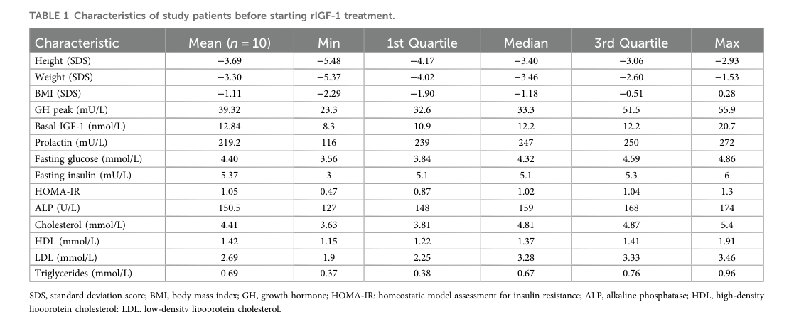

## Question

# Disease Characteristics Research Template

## Target Disease
- **Disease Name:** IGF1 Deficiency
- **MONDO ID:**  (if available)
- **Category:** Mendelian

## Research Objectives

Please provide a comprehensive research report on **IGF1 Deficiency** covering all of the
disease characteristics listed below. This report will be used to populate a disease knowledge
base entry. Be thorough and cite primary literature (PMID preferred) for all claims.

For each section, **suggested databases/resources** are listed. These are the first places
you should search for information on each topic.

---

### 1. Disease Information
> **Search first:** OMIM, Orphanet, ICD-10/ICD-11, MeSH, PubMed

- What is the disease? Provide a concise overview.
- What are the key identifiers? (OMIM, Orphanet, ICD-10/ICD-11, MeSH, Mondo)
- What are the common synonyms and alternative names?
- Is the information derived from individual patients (e.g., EHR) or aggregated disease-level resources?

### 2. Etiology

- **Disease Causal Factors**: What are the primary causes? (genetic, environmental, infectious, mechanistic)
- **Risk Factors**:
  > **Search first:** PubMed, Cochrane Library, UpToDate, clinical guidelines, ClinVar, ClinGen, GWAS Catalog, PheGenI, CTD, CDC, WHO, epidemiological databases
  - Genetic risk factors (causal variants, susceptibility loci, modifier genes)
  - Environmental risk factors (toxins, lifestyle, occupational exposures, age, sex, family history)
- **Protective Factors**:
  > **Search first:** PubMed, Cochrane Library, clinical trial databases, GWAS Catalog, gnomAD, WHO, CDC, nutrition databases
  - Genetic protective factors (protective variants, modifier alleles)
  - Environmental protective factors (diet, lifestyle, exposures that reduce risk)
- **Gene-Environment Interactions**: How do genetic and environmental factors interact to influence disease?
  > **Search first:** CTD, PubMed, PheGenI, GxE databases

### 3. Phenotypes
> **Search first:** HPO (Human Phenotype Ontology), OMIM, Orphanet, PubMed, clinicaltrials.gov, MedDRA, SNOMED CT, DECIPHER, LOINC

For each phenotype, provide:
- **Phenotype type**: symptoms, clinical signs, physical manifestations, behavioral changes, or laboratory abnormalities
  > For symptoms/signs: HPO, OMIM, Orphanet, PubMed
  > For behavioral changes: HPO, DSM, RDoC (Research Domain Criteria), PubMed
  > For laboratory abnormalities: LOINC, SNOMED CT, LabTests Online, PubMed
- **Phenotype characteristics**:
  > **Search first:** OMIM, Orphanet, HPO, PubMed
  - Age of symptom onset (neonatal, childhood, adult-onset, late-onset)
  - Symptom severity (mild, moderate, severe, variable)
  - Symptom progression (stable, progressive, episodic, fluctuating)
  - Frequency among affected individuals (percentage or qualitative)
- **Quality of life impact**: Effects on daily functioning and well-being (per-phenotype when possible)
  > **Search first:** EQ-5D database, SF-36, WHO QOL databases, PubMed
- Suggest HPO (Human Phenotype Ontology) terms for each phenotype

### 4. Genetic/Molecular Information

- **Causal Genes**: Gene mutations or chromosomal abnormalities responsible for disease (gene symbols, OMIM IDs)
  > **Search first:** OMIM, ClinVar, HGMD, Ensembl, NCBI Gene
- **Pathogenic Variants**:
  - Affected genes (gene symbols, HGNC IDs)
    > **Search first:** OMIM, NCBI Gene, Ensembl, HGNC, UniProt, GeneCards
  - Variant classification (pathogenic, likely pathogenic, VUS per ACMG/AMP guidelines)
    > **Search first:** ClinVar, ClinGen, ACMG/AMP guidelines, VarSome
  - Variant type/class (missense, frameshift, nonsense, splice-site, structural)
  - Allele frequency in population databases
    > **Search first:** gnomAD, 1000 Genomes, ExAC, TOPMed, dbSNP
  - Somatic vs germline origin
    > **Search first:** COSMIC (somatic), ClinVar, ICGC, TCGA
  - Functional consequences (loss of function, gain of function, dominant negative)
- **Modifier Genes**: Genes that modify disease severity or expression
- **Epigenetic Information**: DNA methylation, histone modifications, chromatin changes affecting disease
  > **Search first:** ENCODE, Roadmap Epigenomics, MethBase, DiseaseMeth
- **Chromosomal Abnormalities**: Large-scale genetic changes (aneuploidy, translocations, inversions)
  > **Search first:** DECIPHER, ClinVar, ECARUCA, UCSC Genome Browser

### 5. Environmental Information

- **Environmental Factors**: Non-genetic contributing factors (toxins, radiation, pollution, occupational exposure)
  > **Search first:** CTD (Comparative Toxicogenomics Database), TOXNET, PubMed, EPA databases
- **Lifestyle Factors**: Behavioral factors (smoking, diet, exercise, alcohol consumption)
  > **Search first:** CDC databases, WHO, PubMed, NHANES
- **Infectious Agents**: If applicable, pathogens causing or triggering disease (bacteria, viruses, fungi, parasites)
  > **Search first:** NCBI Taxonomy, ViPR, BV-BRC, MicrobeDB, GIDEON

### 6. Mechanism / Pathophysiology

- **Molecular Pathways**: Specific signaling cascades or biochemical pathways involved (Wnt, MAPK, mTOR, PI3K-AKT, etc.)
  > **Search first:** KEGG, Reactome, WikiPathways, PathBank, BioCyc
- **Cellular Processes**: Cell-level mechanisms (apoptosis, autophagy, cell cycle dysregulation, inflammation, etc.)
  > **Search first:** Gene Ontology (GO), Reactome, KEGG, PubMed
- **Protein Dysfunction**: How protein structure or function is altered (misfolding, aggregation, loss of function, gain of function)
  > **Search first:** UniProt, PDB (Protein Data Bank), InterPro, Pfam, AlphaFold
- **Metabolic Changes**: Alterations in metabolic processes (energy metabolism, lipid metabolism, amino acid metabolism)
  > **Search first:** KEGG, BioCyc, HMDB (Human Metabolome Database), BRENDA
- **Immune System Involvement**: Role of immune response (autoimmunity, immunodeficiency, chronic inflammation)
  > **Search first:** ImmPort, Immunome Database, IEDB, Gene Ontology
- **Tissue Damage Mechanisms**: How tissues/ are injured (oxidative stress, ischemia, fibrosis, necrosis)
  > **Search first:** PubMed, Gene Ontology, Reactome
- **Biochemical Abnormalities**: Specific molecular defects (enzyme deficiencies, receptor dysfunction, ion channel defects)
  > **Search first:** BRENDA, UniProt, KEGG, OMIM, PubMed
- **Epigenetic Changes**: DNA methylation, histone modifications affecting gene expression in disease
  > **Search first:** ENCODE, Roadmap Epigenomics, MethBase, DiseaseMeth
- **Molecular Profiling** (if available):
  - Transcriptomics/gene expression changes
    > **Search first:** GEO (Gene Expression Omnibus), ArrayExpress, GTEx, Human Cell Atlas, SRA
  - Proteomics findings
    > **Search first:** PRIDE, ProteomeXchange, Human Protein Atlas, STRING, BioGRID
  - Metabolomics signatures
    > **Search first:** MetaboLights, Metabolomics Workbench, HMDB, METLIN
  - Lipidomics alterations
    > **Search first:** LIPID MAPS, SwissLipids, LipidHome, Metabolomics Workbench
  - Genomic structural features
    > **Search first:** UCSC Genome Browser, Ensembl, NCBI, dbVar, DGV
- **Advanced Technologies** (if applicable):
  - Single-cell analysis findings (cell-type specific mechanisms, cellular heterogeneity)
    > **Search first:** Human Cell Atlas, Single Cell Portal, GEO, CELLxGENE
  - Spatial transcriptomics findings
    > **Search first:** GEO, Spatial Research, Vizgen, 10x Genomics data
  - Multi-omics integration results
    > **Search first:** TCGA, ICGC, cBioPortal, LinkedOmics, PubMed
  - Functional genomics screens (CRISPR, RNAi)
    > **Search first:** DepMap, GenomeRNAi, PubMed, BioGRID ORCS

For each mechanism, describe:
- The causal chain from initial trigger to clinical manifestation
- Which mechanisms are upstream vs downstream
- What cell types and biological processes are involved
- Suggest GO terms for biological processes and CL terms for cell types

### 7. Anatomical Structures Affected

- **Organ Level**:
  - Primary organs directly affected
  - Secondary organ involvement (complications, secondary effects)
  - Body systems involved (cardiovascular, nervous, digestive, respiratory, endocrine, etc.)
  > **Search first:** Uberon, FMA (Foundational Model of Anatomy), OMIM, HPO, ICD-11, MeSH, SNOMED CT
- **Tissue and Cell Level**:
  - Specific tissue types affected (epithelial, connective, muscle, nervous)
  - Specific cell populations targeted (with Cell Ontology terms)
  > **Search first:** Uberon, Human Protein Atlas, Cell Ontology, Human Cell Atlas, CellMarker, PanglaoDB
- **Subcellular Level**:
  - Cellular compartments involved (mitochondria, nucleus, ER, lysosomes) (with GO Cellular Component terms)
  > **Search first:** Gene Ontology (Cellular Component), UniProt, Human Protein Atlas
- **Localization**:
  - Specific anatomical sites (with UBERON terms)
    > **Search first:** FMA, Uberon, NeuroNames (for brain), SNOMED CT
  - Lateralization (unilateral, bilateral, asymmetric)
    > **Search first:** HPO, clinical literature, imaging databases

### 8. Temporal Development

- **Onset**:
  - Typical age of onset (congenital, pediatric, adult, geriatric)
  - Onset pattern (acute, subacute, chronic, insidious)
  > **Search first:** OMIM, Orphanet, HPO, PubMed
- **Progression**:
  - Disease stages (early, intermediate, advanced, end-stage)
    > **Search first:** Cancer Staging Manual (AJCC), WHO classifications, PubMed
  - Progression rate (rapid, slow, variable)
  - Disease course pattern (episodic, relapsing-remitting, progressive, stable)
  - Disease duration (self-limited, chronic lifelong)
  > **Search first:** Disease registries, longitudinal cohort databases, natural history studies, PubMed, Orphanet, OMIM
- **Patterns**:
  - Remission patterns (spontaneous, treatment-induced)
    > **Search first:** Clinical trial databases, disease registries, PubMed
  - Critical periods (time windows of vulnerability or opportunity for intervention)
    > **Search first:** PubMed, developmental biology databases, clinical guidelines

### 9. Inheritance and Population

- **Epidemiology**:
  - Prevalence (cases per 100,000 at given time)
  - Incidence (new cases per 100,000 per year)
  > **Search first:** Orphanet, CDC, WHO, GBD (Global Burden of Disease), national registries, SEER, disease registries
- **For Genetic Etiology**:
  - Inheritance pattern (AD, AR, X-linked, mitochondrial, multifactorial, polygenic)
    > **Search first:** OMIM, Orphanet, ClinVar, GTR (Genetic Testing Registry)
  - Penetrance (complete, incomplete, age-dependent)
    > **Search first:** ClinVar, OMIM, PubMed, ClinGen
  - Expressivity (variable, consistent)
    > **Search first:** OMIM, ClinVar, PubMed
  - Genetic anticipation (increasing severity in successive generations)
    > **Search first:** OMIM, PubMed (especially for repeat expansion disorders)
  - Germline mosaicism
    > **Search first:** ClinVar, OMIM, genetic counseling literature, PubMed
  - Founder effects (population-specific mutations)
    > **Search first:** gnomAD, population genetics databases, PubMed
  - Consanguinity role
    > **Search first:** OMIM, population studies, genetic counseling resources
  - Carrier frequency
    > **Search first:** gnomAD, carrier screening databases, GeneReviews, GTR
- **Population Demographics**:
  - Affected populations (ethnic or demographic groups with higher prevalence)
    > **Search first:** gnomAD, 1000 Genomes, PAGE Study, PubMed, population registries
  - Geographic distribution (endemic areas, regional variation)
    > **Search first:** WHO, CDC, GBD, Orphanet, geographic epidemiology databases
  - Geographic distribution of specific variants
  - Sex ratio (male:female)
    > **Search first:** Disease registries, OMIM, PubMed, epidemiological databases
  - Age distribution of affected individuals
    > **Search first:** CDC, disease registries, SEER, Orphanet

### 10. Diagnostics

- **Clinical Tests**:
  - Laboratory tests (blood, urine, tissue chemistry, specific enzyme assays)
    > **Search first:** LOINC, LabTests Online, PubMed
  - Biomarkers (proteins, metabolites, genetic markers, circulating biomarkers)
    > **Search first:** FDA Biomarker List, BEST (Biomarkers, EndpointS, and other Tools), PubMed
  - Imaging studies (X-ray, CT, MRI, PET, ultrasound)
    > **Search first:** RadLex, DICOM, Radiopaedia, imaging databases
  - Functional tests (pulmonary function, cardiac stress tests)
    > **Search first:** LOINC, clinical guidelines, PubMed
  - Electrophysiology (EEG, EMG, ECG, nerve conduction studies)
    > **Search first:** LOINC, clinical neurophysiology databases, PubMed
  - Biopsy findings (histopathology, immunohistochemistry)
    > **Search first:** SNOMED CT, College of American Pathologists resources, PubMed
  - Pathology findings (microscopic examination)
    > **Search first:** SNOMED CT, Digital Pathology databases, PubMed
- **Genetic Testing**:
  > **Search first:** GTR (Genetic Testing Registry), GeneReviews, ClinGen
  - Overview of recommended genetic testing approach
  - Whole genome sequencing (WGS) utility
    > **Search first:** GTR, ClinVar, GEL (Genomics England), gnomAD
  - Whole exome sequencing (WES) utility
    > **Search first:** GTR, ClinVar, OMIM, GeneMatcher
  - Gene panels (which panels, which genes)
    > **Search first:** GTR, ClinVar, laboratory-specific databases
  - Single gene testing
    > **Search first:** GTR, ClinVar, OMIM, GeneReviews
  - Chromosomal microarray (CMA)
    > **Search first:** DECIPHER, ClinVar, dbVar, ECARUCA
  - Karyotyping
    > **Search first:** Chromosome Abnormality Database, ClinVar, cytogenetics resources
  - FISH
    > **Search first:** ClinVar, cytogenetics databases, PubMed
  - Mitochondrial DNA testing
    > **Search first:** MITOMAP, MSeqDR, ClinVar, GTR
  - Repeat expansion testing
    > **Search first:** GTR, ClinVar, repeat expansion databases, PubMed
- **Omics-Based Diagnostics** (if applicable):
  - RNA sequencing / transcriptomics
    > **Search first:** GEO, ArrayExpress, GTEx, RNA-seq databases
  - Proteomics
    > **Search first:** PRIDE, ProteomeXchange, FDA Biomarker database
  - Metabolomics
    > **Search first:** MetaboLights, Metabolomics Workbench, HMDB
  - Epigenomics
    > **Search first:** GEO, ENCODE, Roadmap Epigenomics, MethBase
  - Liquid biopsy
    > **Search first:** COSMIC, ClinVar, liquid biopsy databases, PubMed
- **Clinical Criteria**:
  - Standardized diagnostic criteria (DSM, ICD, society guidelines)
    > **Search first:** DSM-5, ICD-11, clinical society guidelines, UpToDate
  - Differential diagnosis (other conditions to rule out, with distinguishing features)
    > **Search first:** DynaMed, UpToDate, clinical decision support systems
- **Screening**:
  - Screening methods for asymptomatic individuals (newborn screening, carrier screening, cascade screening)
    > **Search first:** ACMG recommendations, CDC newborn screening, GTR

### 11. Outcome/Prognosis

- **Survival and Mortality**:
  - Survival rate (5-year, 10-year, overall)
    > **Search first:** SEER, cancer registries, disease-specific registries, PubMed
  - Life expectancy (with and without treatment if applicable)
    > **Search first:** Orphanet, disease registries, actuarial databases, PubMed
  - Mortality rate
    > **Search first:** CDC, WHO, GBD, national mortality databases
  - Disease-specific mortality (deaths directly attributable to disease)
    > **Search first:** Disease registries, CDC Wonder, GBD, PubMed
- **Morbidity and Function**:
  - Morbidity (disease-related disability and health impacts)
    > **Search first:** GBD, WHO, disability databases, PubMed
  - Disability outcomes (long-term functional impairments)
    > **Search first:** ICF (International Classification of Functioning), disability registries
  - Quality of life measures (EQ-5D, SF-36, PROMIS, disease-specific tools)
    > **Search first:** EQ-5D database, SF-36, PROMIS, PubMed
- **Disease Course**:
  - Complications (secondary problems: infections, organ failure, etc.)
    > **Search first:** ICD codes, disease registries, clinical databases, PubMed
  - Recovery potential (likelihood and extent of recovery, with vs without treatment)
    > **Search first:** Natural history studies, rehabilitation databases, PubMed
- **Prediction**:
  - Prognostic factors (age, disease severity, biomarkers, treatment response)
    > **Search first:** Prognostic models databases, clinical calculators, PubMed
  - Prognostic biomarkers (molecular markers predicting disease course)
    > **Search first:** FDA Biomarker database, PubMed, cancer prognostic databases

### 12. Treatment

- **Pharmacotherapy**:
  - Pharmacological treatments (drug names, drug classes, mechanisms of action)
    > **Search first:** DrugBank, RxNorm, ATC classification, DailyMed, FDA databases
  - Pharmacogenomics (how genetic variants affect drug metabolism, efficacy, toxicity)
    > **Search first:** PharmGKB, CPIC (Clinical Pharmacogenetics), FDA Table of PGx Biomarkers
- **Advanced Therapeutics**:
  - Gene therapy (viral vectors, CRISPR, gene replacement, gene editing)
    > **Search first:** ClinicalTrials.gov, FDA gene therapy database, ASGCT resources
  - Cell therapy (stem cell transplant, CAR-T, cellular therapeutics)
    > **Search first:** ClinicalTrials.gov, FDA cell therapy database, FACT standards
  - RNA-based therapies (ASOs, siRNA, mRNA therapies)
    > **Search first:** ClinicalTrials.gov, FDA approvals, PubMed
  - Targeted therapies (treatments directed at specific molecular targets)
    > **Search first:** My Cancer Genome, OncoKB, ClinicalTrials.gov, FDA approvals
  - Immunotherapies (checkpoint inhibitors, monoclonal antibodies)
    > **Search first:** Cancer Immunotherapy Database, FDA approvals, ClinicalTrials.gov
- **Surgical and Interventional**:
  - Surgical interventions (types of surgery, timing, outcomes)
    > **Search first:** CPT codes, surgical registries, clinical guidelines, PubMed
- **Supportive and Rehabilitative**:
  - Supportive care (symptom management, pain control, nutrition)
    > **Search first:** Clinical guidelines, Cochrane Library, PubMed
  - Rehabilitation (physical therapy, occupational therapy, speech therapy)
    > **Search first:** Rehabilitation medicine databases, clinical guidelines, PubMed
- **Experimental**:
  - Experimental treatments in clinical trials (with NCT identifiers if available)
    > **Search first:** ClinicalTrials.gov, EU Clinical Trials Register, WHO ICTRP
- **Treatment Outcomes**:
  - Treatment response rates
    > **Search first:** Clinical trial databases, FDA reviews, systematic reviews, PubMed
  - Side effects and adverse events
    > **Search first:** FDA Adverse Event Reporting System (FAERS), MedWatch, PubMed
- **Treatment Strategy**:
  - Treatment algorithms (clinical pathways, decision trees)
    > **Search first:** Clinical practice guidelines, NCCN Guidelines, UpToDate
  - Combination therapies
    > **Search first:** ClinicalTrials.gov, treatment guidelines, PubMed
  - Personalized medicine approaches (genotype-guided treatment)
    > **Search first:** My Cancer Genome, CIViC, PharmGKB, precision medicine databases

For each treatment, suggest MAXO (Medical Action Ontology) terms where applicable.

### 13. Prevention

- **Prevention Levels**:
  - Primary prevention (preventing disease occurrence: vaccination, risk factor modification)
    > **Search first:** CDC, WHO, USPSTF recommendations, Cochrane Library
  - Secondary prevention (early detection and treatment: screening programs, early intervention)
    > **Search first:** USPSTF, CDC screening guidelines, WHO
  - Tertiary prevention (preventing complications in those with disease)
    > **Search first:** Clinical guidelines, disease management protocols, PubMed
- **Immunization**: Vaccine strategies (if applicable)
  > **Search first:** CDC vaccine schedules, WHO immunization, FDA vaccine database
- **Screening and Early Detection**:
  - Screening programs (population-based: newborn screening, cancer screening)
    > **Search first:** CDC screening programs, USPSTF, cancer screening databases
  - Genetic screening (carrier screening, preimplantation genetic diagnosis, prenatal testing)
    > **Search first:** ACMG recommendations, ACOG guidelines, GTR
  - Risk stratification (identifying high-risk individuals for targeted prevention)
    > **Search first:** Risk prediction models, clinical calculators, PubMed
- **Behavioral Interventions**: Lifestyle modifications to reduce risk
  > **Search first:** CDC, WHO, behavioral intervention databases, Cochrane Library
- **Counseling**: Genetic counseling (risk assessment, family planning guidance)
  > **Search first:** NSGC resources, ACMG guidelines, GeneReviews
- **Public Health**:
  - Public health interventions (sanitation, vector control, health education)
    > **Search first:** CDC, WHO, public health databases, PubMed
  - Environmental interventions (reducing environmental risk factors)
    > **Search first:** EPA databases, WHO environmental health, PubMed
- **Prophylaxis**: Preventive medications or procedures
  > **Search first:** Clinical guidelines, FDA approvals, PubMed

### 14. Other Species / Natural Disease

- **Taxonomy**: Species affected (with NCBI Taxon identifiers)
  > **Search first:** NCBI Taxonomy
- **Breed**: Specific breeds affected (with VBO identifiers if applicable)
  > **Search first:** VBO (Vertebrate Breed Ontology)
- **Gene**: Orthologous genes in other species (with NCBI Gene IDs)
  > **Search first:** NCBI Gene
- **Natural Disease**:
  - Naturally occurring disease in other species (companion animals, wildlife)
    > **Search first:** OMIA (Online Mendelian Inheritance in Animals), VetCompass, PubMed
  - Veterinary relevance and importance in animal health
    > **Search first:** OMIA, veterinary databases, PubMed
- **Comparative Biology**:
  - Comparative pathology (similarities and differences across species)
    > **Search first:** OMIA, comparative pathology databases, PubMed
  - Evolutionary conservation of disease mechanisms
    > **Search first:** HomoloGene, OrthoMCL, Alliance of Genome Resources
- **Transmission** (if applicable):
  - Zoonotic potential
    > **Search first:** CDC zoonotic diseases, WHO zoonoses, GIDEON
  - Cross-species susceptibility
    > **Search first:** NCBI Taxonomy, veterinary databases, PubMed

### 15. Model Organisms

- **Model Types**:
  - Model organism type (mammalian, invertebrate, cellular, in vitro)
    > **Search first:** Alliance of Genome Resources, model organism databases
  - Specific model systems (mouse, rat, zebrafish, Drosophila, C. elegans, yeast, cell lines, organoids, iPSCs)
    > **Search first:** MGI, RGD, ZFIN, FlyBase, WormBase, SGD, ATCC, Cellosaurus
  - Induced models (drug treatment, surgical intervention, environmental manipulation)
    > **Search first:** MGI, model organism databases, PubMed
- **Genetic Models**:
  - Types available (knockout, knock-in, transgenic, conditional, humanized)
    > **Search first:** MGI, IMPC, KOMP, EuMMCR, IMSR
- **Model Characteristics**:
  - Phenotype recapitulation (how well model reproduces human disease features)
    > **Search first:** Model organism databases, comparative studies, PubMed
  - Model limitations (aspects of human disease not captured)
    > **Search first:** Model organism databases, PubMed, review articles
- **Applications**:
  - Research applications (what aspects of disease can be studied)
    > **Search first:** Model organism databases, PubMed
- **Resources**:
  - Model databases
    > **Search first:** MGI, RGD, ZFIN, FlyBase, WormBase, IMSR, EMMA, MMRRC

---

## Citation Requirements

- Cite primary literature (PMID preferred) for all mechanistic and clinical claims
- Prioritize recent reviews and landmark papers
- Include direct quotes from abstracts where possible to support key statements
- Distinguish evidence source types: human clinical, model organism, in vitro, computational

## Output Format

Structure your response as a comprehensive narrative organized by the sections above.
For each section, provide:
- Factual content with specific details (numbers, percentages, gene names, variant nomenclature)
- Ontology term suggestions (HPO, GO, CL, UBERON, CHEBI, MAXO, MONDO) where applicable
- Evidence citations with PMIDs
- Direct quotes from abstracts to support key claims
- Clear indication when information is not available or not applicable for this disease

This report will be used to populate a disease knowledge base entry with:
- Pathophysiology descriptions with causal chains
- Gene/protein annotations (HGNC, GO terms)
- Phenotype associations (HP terms) with frequencies
- Cell type involvement (CL terms)
- Anatomical locations (UBERON terms)
- Chemical entities (CHEBI terms)
- Treatment annotations (MAXO terms)
- Evidence items with PMIDs and exact abstract quotes
- Epidemiology, prognosis, diagnostic, and prevention information
- Animal model descriptions with phenotype recapitulation details

## Output

Question: You are an expert researcher providing comprehensive, well-cited information.

Provide detailed information focusing on:
1. Key concepts and definitions with current understanding
2. Recent developments and latest research (prioritize 2023-2024 sources)
3. Current applications and real-world implementations
4. Expert opinions and analysis from authoritative sources
5. Relevant statistics and data from recent studies

Format as a comprehensive research report with proper citations. Include URLs and publication dates where available.
Always prioritize recent, authoritative sources and provide specific citations for all major claims.

# Disease Characteristics Research Template

## Target Disease
- **Disease Name:** IGF1 Deficiency
- **MONDO ID:**  (if available)
- **Category:** Mendelian

## Research Objectives

Please provide a comprehensive research report on **IGF1 Deficiency** covering all of the
disease characteristics listed below. This report will be used to populate a disease knowledge
base entry. Be thorough and cite primary literature (PMID preferred) for all claims.

For each section, **suggested databases/resources** are listed. These are the first places
you should search for information on each topic.

---

### 1. Disease Information
> **Search first:** OMIM, Orphanet, ICD-10/ICD-11, MeSH, PubMed

- What is the disease? Provide a concise overview.
- What are the key identifiers? (OMIM, Orphanet, ICD-10/ICD-11, MeSH, Mondo)
- What are the common synonyms and alternative names?
- Is the information derived from individual patients (e.g., EHR) or aggregated disease-level resources?

### 2. Etiology

- **Disease Causal Factors**: What are the primary causes? (genetic, environmental, infectious, mechanistic)
- **Risk Factors**:
  > **Search first:** PubMed, Cochrane Library, UpToDate, clinical guidelines, ClinVar, ClinGen, GWAS Catalog, PheGenI, CTD, CDC, WHO, epidemiological databases
  - Genetic risk factors (causal variants, susceptibility loci, modifier genes)
  - Environmental risk factors (toxins, lifestyle, occupational exposures, age, sex, family history)
- **Protective Factors**:
  > **Search first:** PubMed, Cochrane Library, clinical trial databases, GWAS Catalog, gnomAD, WHO, CDC, nutrition databases
  - Genetic protective factors (protective variants, modifier alleles)
  - Environmental protective factors (diet, lifestyle, exposures that reduce risk)
- **Gene-Environment Interactions**: How do genetic and environmental factors interact to influence disease?
  > **Search first:** CTD, PubMed, PheGenI, GxE databases

### 3. Phenotypes
> **Search first:** HPO (Human Phenotype Ontology), OMIM, Orphanet, PubMed, clinicaltrials.gov, MedDRA, SNOMED CT, DECIPHER, LOINC

For each phenotype, provide:
- **Phenotype type**: symptoms, clinical signs, physical manifestations, behavioral changes, or laboratory abnormalities
  > For symptoms/signs: HPO, OMIM, Orphanet, PubMed
  > For behavioral changes: HPO, DSM, RDoC (Research Domain Criteria), PubMed
  > For laboratory abnormalities: LOINC, SNOMED CT, LabTests Online, PubMed
- **Phenotype characteristics**:
  > **Search first:** OMIM, Orphanet, HPO, PubMed
  - Age of symptom onset (neonatal, childhood, adult-onset, late-onset)
  - Symptom severity (mild, moderate, severe, variable)
  - Symptom progression (stable, progressive, episodic, fluctuating)
  - Frequency among affected individuals (percentage or qualitative)
- **Quality of life impact**: Effects on daily functioning and well-being (per-phenotype when possible)
  > **Search first:** EQ-5D database, SF-36, WHO QOL databases, PubMed
- Suggest HPO (Human Phenotype Ontology) terms for each phenotype

### 4. Genetic/Molecular Information

- **Causal Genes**: Gene mutations or chromosomal abnormalities responsible for disease (gene symbols, OMIM IDs)
  > **Search first:** OMIM, ClinVar, HGMD, Ensembl, NCBI Gene
- **Pathogenic Variants**:
  - Affected genes (gene symbols, HGNC IDs)
    > **Search first:** OMIM, NCBI Gene, Ensembl, HGNC, UniProt, GeneCards
  - Variant classification (pathogenic, likely pathogenic, VUS per ACMG/AMP guidelines)
    > **Search first:** ClinVar, ClinGen, ACMG/AMP guidelines, VarSome
  - Variant type/class (missense, frameshift, nonsense, splice-site, structural)
  - Allele frequency in population databases
    > **Search first:** gnomAD, 1000 Genomes, ExAC, TOPMed, dbSNP
  - Somatic vs germline origin
    > **Search first:** COSMIC (somatic), ClinVar, ICGC, TCGA
  - Functional consequences (loss of function, gain of function, dominant negative)
- **Modifier Genes**: Genes that modify disease severity or expression
- **Epigenetic Information**: DNA methylation, histone modifications, chromatin changes affecting disease
  > **Search first:** ENCODE, Roadmap Epigenomics, MethBase, DiseaseMeth
- **Chromosomal Abnormalities**: Large-scale genetic changes (aneuploidy, translocations, inversions)
  > **Search first:** DECIPHER, ClinVar, ECARUCA, UCSC Genome Browser

### 5. Environmental Information

- **Environmental Factors**: Non-genetic contributing factors (toxins, radiation, pollution, occupational exposure)
  > **Search first:** CTD (Comparative Toxicogenomics Database), TOXNET, PubMed, EPA databases
- **Lifestyle Factors**: Behavioral factors (smoking, diet, exercise, alcohol consumption)
  > **Search first:** CDC databases, WHO, PubMed, NHANES
- **Infectious Agents**: If applicable, pathogens causing or triggering disease (bacteria, viruses, fungi, parasites)
  > **Search first:** NCBI Taxonomy, ViPR, BV-BRC, MicrobeDB, GIDEON

### 6. Mechanism / Pathophysiology

- **Molecular Pathways**: Specific signaling cascades or biochemical pathways involved (Wnt, MAPK, mTOR, PI3K-AKT, etc.)
  > **Search first:** KEGG, Reactome, WikiPathways, PathBank, BioCyc
- **Cellular Processes**: Cell-level mechanisms (apoptosis, autophagy, cell cycle dysregulation, inflammation, etc.)
  > **Search first:** Gene Ontology (GO), Reactome, KEGG, PubMed
- **Protein Dysfunction**: How protein structure or function is altered (misfolding, aggregation, loss of function, gain of function)
  > **Search first:** UniProt, PDB (Protein Data Bank), InterPro, Pfam, AlphaFold
- **Metabolic Changes**: Alterations in metabolic processes (energy metabolism, lipid metabolism, amino acid metabolism)
  > **Search first:** KEGG, BioCyc, HMDB (Human Metabolome Database), BRENDA
- **Immune System Involvement**: Role of immune response (autoimmunity, immunodeficiency, chronic inflammation)
  > **Search first:** ImmPort, Immunome Database, IEDB, Gene Ontology
- **Tissue Damage Mechanisms**: How tissues/ are injured (oxidative stress, ischemia, fibrosis, necrosis)
  > **Search first:** PubMed, Gene Ontology, Reactome
- **Biochemical Abnormalities**: Specific molecular defects (enzyme deficiencies, receptor dysfunction, ion channel defects)
  > **Search first:** BRENDA, UniProt, KEGG, OMIM, PubMed
- **Epigenetic Changes**: DNA methylation, histone modifications affecting gene expression in disease
  > **Search first:** ENCODE, Roadmap Epigenomics, MethBase, DiseaseMeth
- **Molecular Profiling** (if available):
  - Transcriptomics/gene expression changes
    > **Search first:** GEO (Gene Expression Omnibus), ArrayExpress, GTEx, Human Cell Atlas, SRA
  - Proteomics findings
    > **Search first:** PRIDE, ProteomeXchange, Human Protein Atlas, STRING, BioGRID
  - Metabolomics signatures
    > **Search first:** MetaboLights, Metabolomics Workbench, HMDB, METLIN
  - Lipidomics alterations
    > **Search first:** LIPID MAPS, SwissLipids, LipidHome, Metabolomics Workbench
  - Genomic structural features
    > **Search first:** UCSC Genome Browser, Ensembl, NCBI, dbVar, DGV
- **Advanced Technologies** (if applicable):
  - Single-cell analysis findings (cell-type specific mechanisms, cellular heterogeneity)
    > **Search first:** Human Cell Atlas, Single Cell Portal, GEO, CELLxGENE
  - Spatial transcriptomics findings
    > **Search first:** GEO, Spatial Research, Vizgen, 10x Genomics data
  - Multi-omics integration results
    > **Search first:** TCGA, ICGC, cBioPortal, LinkedOmics, PubMed
  - Functional genomics screens (CRISPR, RNAi)
    > **Search first:** DepMap, GenomeRNAi, PubMed, BioGRID ORCS

For each mechanism, describe:
- The causal chain from initial trigger to clinical manifestation
- Which mechanisms are upstream vs downstream
- What cell types and biological processes are involved
- Suggest GO terms for biological processes and CL terms for cell types

### 7. Anatomical Structures Affected

- **Organ Level**:
  - Primary organs directly affected
  - Secondary organ involvement (complications, secondary effects)
  - Body systems involved (cardiovascular, nervous, digestive, respiratory, endocrine, etc.)
  > **Search first:** Uberon, FMA (Foundational Model of Anatomy), OMIM, HPO, ICD-11, MeSH, SNOMED CT
- **Tissue and Cell Level**:
  - Specific tissue types affected (epithelial, connective, muscle, nervous)
  - Specific cell populations targeted (with Cell Ontology terms)
  > **Search first:** Uberon, Human Protein Atlas, Cell Ontology, Human Cell Atlas, CellMarker, PanglaoDB
- **Subcellular Level**:
  - Cellular compartments involved (mitochondria, nucleus, ER, lysosomes) (with GO Cellular Component terms)
  > **Search first:** Gene Ontology (Cellular Component), UniProt, Human Protein Atlas
- **Localization**:
  - Specific anatomical sites (with UBERON terms)
    > **Search first:** FMA, Uberon, NeuroNames (for brain), SNOMED CT
  - Lateralization (unilateral, bilateral, asymmetric)
    > **Search first:** HPO, clinical literature, imaging databases

### 8. Temporal Development

- **Onset**:
  - Typical age of onset (congenital, pediatric, adult, geriatric)
  - Onset pattern (acute, subacute, chronic, insidious)
  > **Search first:** OMIM, Orphanet, HPO, PubMed
- **Progression**:
  - Disease stages (early, intermediate, advanced, end-stage)
    > **Search first:** Cancer Staging Manual (AJCC), WHO classifications, PubMed
  - Progression rate (rapid, slow, variable)
  - Disease course pattern (episodic, relapsing-remitting, progressive, stable)
  - Disease duration (self-limited, chronic lifelong)
  > **Search first:** Disease registries, longitudinal cohort databases, natural history studies, PubMed, Orphanet, OMIM
- **Patterns**:
  - Remission patterns (spontaneous, treatment-induced)
    > **Search first:** Clinical trial databases, disease registries, PubMed
  - Critical periods (time windows of vulnerability or opportunity for intervention)
    > **Search first:** PubMed, developmental biology databases, clinical guidelines

### 9. Inheritance and Population

- **Epidemiology**:
  - Prevalence (cases per 100,000 at given time)
  - Incidence (new cases per 100,000 per year)
  > **Search first:** Orphanet, CDC, WHO, GBD (Global Burden of Disease), national registries, SEER, disease registries
- **For Genetic Etiology**:
  - Inheritance pattern (AD, AR, X-linked, mitochondrial, multifactorial, polygenic)
    > **Search first:** OMIM, Orphanet, ClinVar, GTR (Genetic Testing Registry)
  - Penetrance (complete, incomplete, age-dependent)
    > **Search first:** ClinVar, OMIM, PubMed, ClinGen
  - Expressivity (variable, consistent)
    > **Search first:** OMIM, ClinVar, PubMed
  - Genetic anticipation (increasing severity in successive generations)
    > **Search first:** OMIM, PubMed (especially for repeat expansion disorders)
  - Germline mosaicism
    > **Search first:** ClinVar, OMIM, genetic counseling literature, PubMed
  - Founder effects (population-specific mutations)
    > **Search first:** gnomAD, population genetics databases, PubMed
  - Consanguinity role
    > **Search first:** OMIM, population studies, genetic counseling resources
  - Carrier frequency
    > **Search first:** gnomAD, carrier screening databases, GeneReviews, GTR
- **Population Demographics**:
  - Affected populations (ethnic or demographic groups with higher prevalence)
    > **Search first:** gnomAD, 1000 Genomes, PAGE Study, PubMed, population registries
  - Geographic distribution (endemic areas, regional variation)
    > **Search first:** WHO, CDC, GBD, Orphanet, geographic epidemiology databases
  - Geographic distribution of specific variants
  - Sex ratio (male:female)
    > **Search first:** Disease registries, OMIM, PubMed, epidemiological databases
  - Age distribution of affected individuals
    > **Search first:** CDC, disease registries, SEER, Orphanet

### 10. Diagnostics

- **Clinical Tests**:
  - Laboratory tests (blood, urine, tissue chemistry, specific enzyme assays)
    > **Search first:** LOINC, LabTests Online, PubMed
  - Biomarkers (proteins, metabolites, genetic markers, circulating biomarkers)
    > **Search first:** FDA Biomarker List, BEST (Biomarkers, EndpointS, and other Tools), PubMed
  - Imaging studies (X-ray, CT, MRI, PET, ultrasound)
    > **Search first:** RadLex, DICOM, Radiopaedia, imaging databases
  - Functional tests (pulmonary function, cardiac stress tests)
    > **Search first:** LOINC, clinical guidelines, PubMed
  - Electrophysiology (EEG, EMG, ECG, nerve conduction studies)
    > **Search first:** LOINC, clinical neurophysiology databases, PubMed
  - Biopsy findings (histopathology, immunohistochemistry)
    > **Search first:** SNOMED CT, College of American Pathologists resources, PubMed
  - Pathology findings (microscopic examination)
    > **Search first:** SNOMED CT, Digital Pathology databases, PubMed
- **Genetic Testing**:
  > **Search first:** GTR (Genetic Testing Registry), GeneReviews, ClinGen
  - Overview of recommended genetic testing approach
  - Whole genome sequencing (WGS) utility
    > **Search first:** GTR, ClinVar, GEL (Genomics England), gnomAD
  - Whole exome sequencing (WES) utility
    > **Search first:** GTR, ClinVar, OMIM, GeneMatcher
  - Gene panels (which panels, which genes)
    > **Search first:** GTR, ClinVar, laboratory-specific databases
  - Single gene testing
    > **Search first:** GTR, ClinVar, OMIM, GeneReviews
  - Chromosomal microarray (CMA)
    > **Search first:** DECIPHER, ClinVar, dbVar, ECARUCA
  - Karyotyping
    > **Search first:** Chromosome Abnormality Database, ClinVar, cytogenetics resources
  - FISH
    > **Search first:** ClinVar, cytogenetics databases, PubMed
  - Mitochondrial DNA testing
    > **Search first:** MITOMAP, MSeqDR, ClinVar, GTR
  - Repeat expansion testing
    > **Search first:** GTR, ClinVar, repeat expansion databases, PubMed
- **Omics-Based Diagnostics** (if applicable):
  - RNA sequencing / transcriptomics
    > **Search first:** GEO, ArrayExpress, GTEx, RNA-seq databases
  - Proteomics
    > **Search first:** PRIDE, ProteomeXchange, FDA Biomarker database
  - Metabolomics
    > **Search first:** MetaboLights, Metabolomics Workbench, HMDB
  - Epigenomics
    > **Search first:** GEO, ENCODE, Roadmap Epigenomics, MethBase
  - Liquid biopsy
    > **Search first:** COSMIC, ClinVar, liquid biopsy databases, PubMed
- **Clinical Criteria**:
  - Standardized diagnostic criteria (DSM, ICD, society guidelines)
    > **Search first:** DSM-5, ICD-11, clinical society guidelines, UpToDate
  - Differential diagnosis (other conditions to rule out, with distinguishing features)
    > **Search first:** DynaMed, UpToDate, clinical decision support systems
- **Screening**:
  - Screening methods for asymptomatic individuals (newborn screening, carrier screening, cascade screening)
    > **Search first:** ACMG recommendations, CDC newborn screening, GTR

### 11. Outcome/Prognosis

- **Survival and Mortality**:
  - Survival rate (5-year, 10-year, overall)
    > **Search first:** SEER, cancer registries, disease-specific registries, PubMed
  - Life expectancy (with and without treatment if applicable)
    > **Search first:** Orphanet, disease registries, actuarial databases, PubMed
  - Mortality rate
    > **Search first:** CDC, WHO, GBD, national mortality databases
  - Disease-specific mortality (deaths directly attributable to disease)
    > **Search first:** Disease registries, CDC Wonder, GBD, PubMed
- **Morbidity and Function**:
  - Morbidity (disease-related disability and health impacts)
    > **Search first:** GBD, WHO, disability databases, PubMed
  - Disability outcomes (long-term functional impairments)
    > **Search first:** ICF (International Classification of Functioning), disability registries
  - Quality of life measures (EQ-5D, SF-36, PROMIS, disease-specific tools)
    > **Search first:** EQ-5D database, SF-36, PROMIS, PubMed
- **Disease Course**:
  - Complications (secondary problems: infections, organ failure, etc.)
    > **Search first:** ICD codes, disease registries, clinical databases, PubMed
  - Recovery potential (likelihood and extent of recovery, with vs without treatment)
    > **Search first:** Natural history studies, rehabilitation databases, PubMed
- **Prediction**:
  - Prognostic factors (age, disease severity, biomarkers, treatment response)
    > **Search first:** Prognostic models databases, clinical calculators, PubMed
  - Prognostic biomarkers (molecular markers predicting disease course)
    > **Search first:** FDA Biomarker database, PubMed, cancer prognostic databases

### 12. Treatment

- **Pharmacotherapy**:
  - Pharmacological treatments (drug names, drug classes, mechanisms of action)
    > **Search first:** DrugBank, RxNorm, ATC classification, DailyMed, FDA databases
  - Pharmacogenomics (how genetic variants affect drug metabolism, efficacy, toxicity)
    > **Search first:** PharmGKB, CPIC (Clinical Pharmacogenetics), FDA Table of PGx Biomarkers
- **Advanced Therapeutics**:
  - Gene therapy (viral vectors, CRISPR, gene replacement, gene editing)
    > **Search first:** ClinicalTrials.gov, FDA gene therapy database, ASGCT resources
  - Cell therapy (stem cell transplant, CAR-T, cellular therapeutics)
    > **Search first:** ClinicalTrials.gov, FDA cell therapy database, FACT standards
  - RNA-based therapies (ASOs, siRNA, mRNA therapies)
    > **Search first:** ClinicalTrials.gov, FDA approvals, PubMed
  - Targeted therapies (treatments directed at specific molecular targets)
    > **Search first:** My Cancer Genome, OncoKB, ClinicalTrials.gov, FDA approvals
  - Immunotherapies (checkpoint inhibitors, monoclonal antibodies)
    > **Search first:** Cancer Immunotherapy Database, FDA approvals, ClinicalTrials.gov
- **Surgical and Interventional**:
  - Surgical interventions (types of surgery, timing, outcomes)
    > **Search first:** CPT codes, surgical registries, clinical guidelines, PubMed
- **Supportive and Rehabilitative**:
  - Supportive care (symptom management, pain control, nutrition)
    > **Search first:** Clinical guidelines, Cochrane Library, PubMed
  - Rehabilitation (physical therapy, occupational therapy, speech therapy)
    > **Search first:** Rehabilitation medicine databases, clinical guidelines, PubMed
- **Experimental**:
  - Experimental treatments in clinical trials (with NCT identifiers if available)
    > **Search first:** ClinicalTrials.gov, EU Clinical Trials Register, WHO ICTRP
- **Treatment Outcomes**:
  - Treatment response rates
    > **Search first:** Clinical trial databases, FDA reviews, systematic reviews, PubMed
  - Side effects and adverse events
    > **Search first:** FDA Adverse Event Reporting System (FAERS), MedWatch, PubMed
- **Treatment Strategy**:
  - Treatment algorithms (clinical pathways, decision trees)
    > **Search first:** Clinical practice guidelines, NCCN Guidelines, UpToDate
  - Combination therapies
    > **Search first:** ClinicalTrials.gov, treatment guidelines, PubMed
  - Personalized medicine approaches (genotype-guided treatment)
    > **Search first:** My Cancer Genome, CIViC, PharmGKB, precision medicine databases

For each treatment, suggest MAXO (Medical Action Ontology) terms where applicable.

### 13. Prevention

- **Prevention Levels**:
  - Primary prevention (preventing disease occurrence: vaccination, risk factor modification)
    > **Search first:** CDC, WHO, USPSTF recommendations, Cochrane Library
  - Secondary prevention (early detection and treatment: screening programs, early intervention)
    > **Search first:** USPSTF, CDC screening guidelines, WHO
  - Tertiary prevention (preventing complications in those with disease)
    > **Search first:** Clinical guidelines, disease management protocols, PubMed
- **Immunization**: Vaccine strategies (if applicable)
  > **Search first:** CDC vaccine schedules, WHO immunization, FDA vaccine database
- **Screening and Early Detection**:
  - Screening programs (population-based: newborn screening, cancer screening)
    > **Search first:** CDC screening programs, USPSTF, cancer screening databases
  - Genetic screening (carrier screening, preimplantation genetic diagnosis, prenatal testing)
    > **Search first:** ACMG recommendations, ACOG guidelines, GTR
  - Risk stratification (identifying high-risk individuals for targeted prevention)
    > **Search first:** Risk prediction models, clinical calculators, PubMed
- **Behavioral Interventions**: Lifestyle modifications to reduce risk
  > **Search first:** CDC, WHO, behavioral intervention databases, Cochrane Library
- **Counseling**: Genetic counseling (risk assessment, family planning guidance)
  > **Search first:** NSGC resources, ACMG guidelines, GeneReviews
- **Public Health**:
  - Public health interventions (sanitation, vector control, health education)
    > **Search first:** CDC, WHO, public health databases, PubMed
  - Environmental interventions (reducing environmental risk factors)
    > **Search first:** EPA databases, WHO environmental health, PubMed
- **Prophylaxis**: Preventive medications or procedures
  > **Search first:** Clinical guidelines, FDA approvals, PubMed

### 14. Other Species / Natural Disease

- **Taxonomy**: Species affected (with NCBI Taxon identifiers)
  > **Search first:** NCBI Taxonomy
- **Breed**: Specific breeds affected (with VBO identifiers if applicable)
  > **Search first:** VBO (Vertebrate Breed Ontology)
- **Gene**: Orthologous genes in other species (with NCBI Gene IDs)
  > **Search first:** NCBI Gene
- **Natural Disease**:
  - Naturally occurring disease in other species (companion animals, wildlife)
    > **Search first:** OMIA (Online Mendelian Inheritance in Animals), VetCompass, PubMed
  - Veterinary relevance and importance in animal health
    > **Search first:** OMIA, veterinary databases, PubMed
- **Comparative Biology**:
  - Comparative pathology (similarities and differences across species)
    > **Search first:** OMIA, comparative pathology databases, PubMed
  - Evolutionary conservation of disease mechanisms
    > **Search first:** HomoloGene, OrthoMCL, Alliance of Genome Resources
- **Transmission** (if applicable):
  - Zoonotic potential
    > **Search first:** CDC zoonotic diseases, WHO zoonoses, GIDEON
  - Cross-species susceptibility
    > **Search first:** NCBI Taxonomy, veterinary databases, PubMed

### 15. Model Organisms

- **Model Types**:
  - Model organism type (mammalian, invertebrate, cellular, in vitro)
    > **Search first:** Alliance of Genome Resources, model organism databases
  - Specific model systems (mouse, rat, zebrafish, Drosophila, C. elegans, yeast, cell lines, organoids, iPSCs)
    > **Search first:** MGI, RGD, ZFIN, FlyBase, WormBase, SGD, ATCC, Cellosaurus
  - Induced models (drug treatment, surgical intervention, environmental manipulation)
    > **Search first:** MGI, model organism databases, PubMed
- **Genetic Models**:
  - Types available (knockout, knock-in, transgenic, conditional, humanized)
    > **Search first:** MGI, IMPC, KOMP, EuMMCR, IMSR
- **Model Characteristics**:
  - Phenotype recapitulation (how well model reproduces human disease features)
    > **Search first:** Model organism databases, comparative studies, PubMed
  - Model limitations (aspects of human disease not captured)
    > **Search first:** Model organism databases, PubMed, review articles
- **Applications**:
  - Research applications (what aspects of disease can be studied)
    > **Search first:** Model organism databases, PubMed
- **Resources**:
  - Model databases
    > **Search first:** MGI, RGD, ZFIN, FlyBase, WormBase, IMSR, EMMA, MMRRC

---

## Citation Requirements

- Cite primary literature (PMID preferred) for all mechanistic and clinical claims
- Prioritize recent reviews and landmark papers
- Include direct quotes from abstracts where possible to support key statements
- Distinguish evidence source types: human clinical, model organism, in vitro, computational

## Output Format

Structure your response as a comprehensive narrative organized by the sections above.
For each section, provide:
- Factual content with specific details (numbers, percentages, gene names, variant nomenclature)
- Ontology term suggestions (HPO, GO, CL, UBERON, CHEBI, MAXO, MONDO) where applicable
- Evidence citations with PMIDs
- Direct quotes from abstracts to support key claims
- Clear indication when information is not available or not applicable for this disease

This report will be used to populate a disease knowledge base entry with:
- Pathophysiology descriptions with causal chains
- Gene/protein annotations (HGNC, GO terms)
- Phenotype associations (HP terms) with frequencies
- Cell type involvement (CL terms)
- Anatomical locations (UBERON terms)
- Chemical entities (CHEBI terms)
- Treatment annotations (MAXO terms)
- Evidence items with PMIDs and exact abstract quotes
- Epidemiology, prognosis, diagnostic, and prevention information
- Animal model descriptions with phenotype recapitulation details

# IGF1 Deficiency (Mendelian) — Comprehensive Disease Characteristics Report

**Target disease:** IGF1 Deficiency (Mendelian; most classically due to biallelic loss-of-function variants in **IGF1**) (walenkamp2013molecularigf1and pages 2-4, giacomozzi2023novelinsulinlikegrowth pages 1-2)

**Scope note (terminology):** In the recent clinical literature, “IGF1 deficiency” (IGF1 gene defects) is closely related to—yet not identical with—**severe primary IGF-1 deficiency (SPIGFD)**/**severe primary IGF-I deficiency** and **growth hormone insensitivity (GHI)/Laron syndrome** (which are defined clinically by low IGF-I despite normal/high GH and can be caused by several GH–IGF axis genes) (backeljauw2023challengesinthe pages 1-3, cappa2009profileofmecasermin pages 1-2, denaite2024clinicalcharacteristicsand pages 1-2). This report therefore covers (1) biallelic IGF1 loss-of-function as a Mendelian disease and (2) the broader, treatment-relevant SPIGFD umbrella as used in registries and practice.

## Executive Summary
Biallelic (autosomal-recessive) IGF1 loss-of-function is a very rare cause of extreme pre- and postnatal growth failure, severe microcephaly, and variable neurodevelopmental impairment and sensorineural deafness, with biochemical findings that can include very low/undetectable IGF-I but can also be assay-dependent and paradoxical in some variants (walenkamp2013molecularigf1and pages 2-4, giacomozzi2023novelinsulinlikegrowth pages 1-2). In practice, many patients are identified and treated under the clinical category **SPIGFD**, defined by severe short stature and low IGF-I with normal/elevated GH; the only disease-specific replacement therapy currently emphasized is **recombinant human IGF-1 (rhIGF-1; mecasermin, Increlex®)** (backeljauw2023challengesinthe pages 1-3, denaite2024clinicalcharacteristicsand pages 1-2). Recent (2023–2024) developments include a multi-stakeholder consensus-style perspective highlighting diagnostic inequities and access barriers (backeljauw2023challengesinthe pages 1-3, backeljauw2023challengesinthe pages 5-7), a 2024 real-world retrospective mecasermin outcomes report (denaite2024clinicalcharacteristicsand pages 1-2), and a 2024 LC–MS clinical laboratory study showing that **heterozygous IGF1 variants can cause systematic under-quantification of total IGF-1** and misclassification against reference ranges if not accounted for (motorykin2024detectionrateof pages 6-8, motorykin2024detectionrateof pages 1-2).

## 1. Disease Information
### 1.1 Concise disease overview
**Mendelian IGF1 deficiency** is classically caused by **biallelic IGF1 loss-of-function** and presents with a constellation of **severe prenatal growth restriction** (IUGR), **marked postnatal growth failure**, **microcephaly**, and often **neurodevelopmental delay** and **sensorineural hearing loss** (walenkamp2013molecularigf1and pages 2-4, giacomozzi2023novelinsulinlikegrowth pages 1-2). 

**SPIGFD** is a related clinical/endocrine entity defined by severe short stature and low IGF-I in the setting of normal/elevated GH, and includes Laron syndrome (GHR defects) and other GH–IGF axis causes (backeljauw2023challengesinthe pages 1-3).

### 1.2 Key identifiers
**Not fully retrievable in this run:** OMIM/Orphanet/ICD/MeSH/MONDO identifiers were not available from the retrieved full-text sources and the current toolset did not include direct OMIM/Orphanet lookups.

**Trial/registry identifier (highly relevant):** The major real‑world data source for rhIGF‑1 (mecasermin) is the **Eu‑IGFD registry / Increlex® Growth Forum Database**, registered at **ClinicalTrials.gov NCT00903110** (Global patient registry; first posted 2008; still active per record versioning) (NCT00903110 chunk 3).

### 1.3 Synonyms / alternative names (current usage)
- IGF1 deficiency; congenital IGF1 deficiency (gene defects) (walenkamp2013molecularigf1and pages 1-2)
- Primary IGF‑1 deficiency; IGF‑1 deficiency (IGFD) (cappa2009profileofmecasermin pages 2-3)
- Severe primary IGF‑1 deficiency (**SPIGFD**) / severe primary insulin‑like growth factor‑I deficiency (backeljauw2023challengesinthe pages 1-3)
- Growth hormone insensitivity (GHI); **Laron syndrome** (best characterized SPIGFD subtype) (cappa2009profileofmecasermin pages 1-2, backeljauw2023challengesinthe pages 1-3)

### 1.4 Source type
Evidence in this report is primarily **aggregated disease-level resources** (registry analyses and reviews) plus **human case reports/case series** for biallelic IGF1 defects and single-center retrospective cohorts for mecasermin treatment (walenkamp2013molecularigf1and pages 2-4, denaite2024clinicalcharacteristicsand pages 1-2, bang2022pubertaltimingand pages 1-2, backeljauw2023challengesinthe pages 1-3).

## 2. Etiology
### 2.1 Primary causal factors
**Genetic (Mendelian):** Biallelic **IGF1** pathogenic variants are a very rare cause of growth failure; one review noted that “**Only three homozygous and two families with heterozygous mutations of the IGF1 gene have been described**” (as of 2013) (walenkamp2013molecularigf1and pages 1-2). A 2023 report reiterates that IGF1 mutations are “extremely rare causes” of pre- and post-natal growth retardation and can include hearing, cognition, and glucose metabolism phenotypes (giacomozzi2023novelinsulinlikegrowth pages 1-2).

**Broader SPIGFD umbrella:** SPIGFD can result from defects across the GH–IGF axis (e.g., **GHR**, **STAT5B**, **IGF1**, **ALS/IGFALS**) (backeljauw2023challengesinthe pages 1-3, cappa2009profileofmecasermin pages 2-3).

### 2.2 Risk factors
For Mendelian IGF1 deficiency, the principal risk factor is **parental carrier status** for pathogenic IGF1 alleles; reported homozygous cases often come from consanguineous families (walenkamp2013molecularigf1and pages 2-4, cappa2009profileofmecasermin pages 1-2).

### 2.3 Protective factors / gene–environment interactions
No robust protective environmental factors were identified in the retrieved sources. A key practical “protective” factor against misdiagnosis is appropriate **assay interpretation**, including attention to **IGF‑1 variants that confound measurement** (see Diagnostics) (motorykin2024detectionrateof pages 6-8, motorykin2024detectionrateof pages 1-2).

## 3. Phenotypes
### 3.1 Core clinical phenotypes (biallelic IGF1 loss-of-function)
**Growth and cranial growth (quantitative):** Reported homozygous IGF1-defect cases show extreme deviations. A review summarizing published patients reports approximate ranges:
- **Birth weight:** ~ −2.4 to −4.0 SDS
- **Birth length:** ~ −3.7 to −6.5 SDS
- **Birth head circumference:** ~ −2.5 to −7.5 SDS
- **Postnatal height:** ~ −4.9 to −8.5 SDS
- **Postnatal head circumference:** ~ −4.0 to −8.0 SDS (walenkamp2013molecularigf1and pages 2-4)

**Neurodevelopment/sensory:** Developmental delay and sensorineural deafness are repeatedly described as key features (walenkamp2013molecularigf1and pages 1-2, giacomozzi2023novelinsulinlikegrowth pages 1-2).

**Metabolic:** Some cases show insulin sensitivity abnormalities; a 2023 report highlights a phenotype including insulin resistance in a homozygous IGF1 missense variant case and hypothesizes altered insulin receptor signaling (giacomozzi2023novelinsulinlikegrowth pages 1-2). 

### 3.2 SPIGFD phenotype beyond height
A multi-stakeholder 2023 perspective highlights that SPIGFD affects more than stature, listing non-growth features that may include hypoglycemia, dyslipidemia, insulin resistance, delayed puberty, hearing impairment, and immunodeficiency (contextualized as key clinical characteristics and care burden) (backeljauw2023challengesinthe pages 7-8).

### 3.3 Suggested HPO terms (non-exhaustive; ontology mapping suggestions)
The following are suggested mappings based on the phenotype descriptions above (not directly asserted by the cited papers as HPO IDs):
- Short stature (HP:0004322)
- Intrauterine growth restriction (HP:0001511)
- Postnatal growth failure (HP:0008897)
- Microcephaly (HP:0000252)
- Global developmental delay (HP:0001263)
- Sensorineural hearing impairment (HP:0000407)
- Hypoglycemia (HP:0001943)
- Insulin resistance (HP:0000855)

### 3.4 Quality of life impact
The 2023 multi-stakeholder perspective emphasizes “**considerable impact on the physical health and quality of life for patients**” and underscores unmet needs beyond height (backeljauw2023challengesinthe pages 1-3).

## 4. Genetic / Molecular Information
### 4.1 Causal genes
- **IGF1** (Mendelian biallelic loss-of-function; primary disease gene) (walenkamp2013molecularigf1and pages 2-4, giacomozzi2023novelinsulinlikegrowth pages 1-2)
- SPIGFD (broader) includes **GHR**, **STAT5B**, **IGF1**, **IGFALS/ALS** among others (backeljauw2023challengesinthe pages 1-3, cappa2009profileofmecasermin pages 2-3).

### 4.2 Pathogenic variant classes and examples
**Biallelic IGF1 defects** include deletions/frameshifts leading to truncation or absent functional peptide and missense variants that reduce IGF1R binding/signaling (walenkamp2013molecularigf1and pages 2-4, giacomozzi2023novelinsulinlikegrowth pages 1-2). A 2013 review lists examples including exon deletions and missense variants (e.g., Val→Met; Arg→Gln) and frameshift variants (walenkamp2013molecularigf1and pages 2-4).

**Functional consequences:** Severe reduction in receptor binding has been measured for some mutants (e.g., up to **~90-fold reduced** binding in one reported mutant) and diminished IGF1R phosphorylation/signaling (walenkamp2013molecularigf1and pages 2-4, giacomozzi2023novelinsulinlikegrowth pages 1-2).

### 4.3 Inheritance
Biallelic IGF1 loss-of-function is **autosomal recessive**, with gene-dose effects described in heterozygous relatives (milder growth impacts) (walenkamp2013molecularigf1and pages 2-4).

### 4.4 Epigenetics / chromosomal abnormalities
No IGF1-deficiency-specific epigenetic mechanisms or recurrent chromosomal abnormalities were identified in the retrieved evidence.

## 5. Environmental Information
No specific toxins, lifestyle factors, or infectious triggers were identified as causal for the Mendelian form in the retrieved evidence; SPIGFD is primarily a genetic/endocrine disorder (backeljauw2023challengesinthe pages 1-3).

## 6. Mechanism / Pathophysiology
### 6.1 Causal chain (core model)
1) **Upstream trigger:** Pathogenic variants in **IGF1** (or other GH–IGF axis genes in SPIGFD) reduce the amount or bioactivity of IGF‑1 (walenkamp2013molecularigf1and pages 2-4, backeljauw2023challengesinthe pages 1-3). 
2) **Molecular consequence:** Reduced IGF‑1 bioactivity leads to reduced IGF1R activation (receptor binding and phosphorylation defects have been measured for multiple IGF‑1 mutants) (walenkamp2013molecularigf1and pages 2-4, giacomozzi2023novelinsulinlikegrowth pages 1-2).
3) **Cellular/tissue consequence:** Impaired IGF1 signaling compromises fetal and postnatal somatic growth and brain development; animal models strongly support prenatal requirement for IGF‑1/IGF1R (IGF1 null mice ~65% birth weight; IGF1R null ~55% and perinatal lethality) (walenkamp2013molecularigf1and pages 1-2).
4) **Clinical phenotype:** IUGR → severe short stature; microcephaly; neurodevelopmental deficits; sensorineural deafness; possible metabolic complications (walenkamp2013molecularigf1and pages 2-4, giacomozzi2023novelinsulinlikegrowth pages 1-2).

### 6.2 Pathways (suggested mapping)
Based on the GH–IGF axis and IGF1R signaling described in the sources, the primary downstream pathways likely involve PI3K–AKT and MAPK signaling downstream of IGF1R (not explicitly detailed in the retrieved excerpts). The direct mechanistic evidence in this run is primarily at the level of IGF1R binding/phosphorylation defects (walenkamp2013molecularigf1and pages 2-4, giacomozzi2023novelinsulinlikegrowth pages 1-2).

### 6.3 Suggested GO and Cell Ontology terms (mapping suggestions)
- **GO Biological Process (suggested):** regulation of growth (GO:0040008); insulin-like growth factor receptor signaling pathway (GO:0048009)
- **CL (suggested):** hepatocyte (CL:0000182) as a major source of circulating IGF-I (backeljauw2023challengesinthe pages 1-3)

## 7. Anatomical Structures Affected
### 7.1 Organ/system level (primary)
- **Endocrine growth axis** (pituitary–liver–peripheral tissue IGF production): liver highlighted as the main producer of circulating IGF-I (backeljauw2023challengesinthe pages 1-3).
- **Brain / neurodevelopmental system:** neurodevelopmental delay and microcephaly are central features (walenkamp2013molecularigf1and pages 2-4, giacomozzi2023novelinsulinlikegrowth pages 1-2).
- **Auditory system:** sensorineural hearing loss is repeatedly described (walenkamp2013molecularigf1and pages 1-2, giacomozzi2023novelinsulinlikegrowth pages 1-2).

### 7.2 Suggested UBERON terms (mapping suggestions)
- Liver (UBERON:0002107)
- Brain (UBERON:0000955)
- Inner ear (UBERON:0001849)

## 8. Temporal Development (Natural History)
### 8.1 Onset
Typically **prenatal/congenital**, with IUGR evident at birth and severe postnatal growth failure thereafter (giacomozzi2023novelinsulinlikegrowth pages 1-2, walenkamp2013molecularigf1and pages 2-4).

### 8.2 Progression/course
Growth failure is chronic and persistent. Puberty in SPIGFD is described as delayed in untreated patients; registry-treated patients show delayed pubertal timing but maintained pubertal height SDS gain (bang2022pubertaltimingand pages 1-2).

## 9. Inheritance and Population
### 9.1 Epidemiology (SPIGFD)
The 2023 multi-stakeholder perspective cites that in the EU about **~2 per 10,000** have “primary IGF‑I deficiencies (PIGFD)” and that SPIGFD is a smaller subset; in one French cohort **~0.8–1.2% of children referred for slow statural growth** were diagnosed with SPIGFD (backeljauw2023challengesinthe pages 1-3).

### 9.2 Variant frequency / laboratory cohort statistic relevant to diagnosis
A 2024 clinical LC–MS study screening **243,808** patients detected IGF‑1 variants in **1,099 patients (0.45%)** (motorykin2024detectionrateof pages 1-2). This is not disease prevalence, but it is a clinically important statistic for interpretation of IGF‑1 testing.

## 10. Diagnostics
### 10.1 Clinical/biochemical criteria for SPIGFD
The 2023 multi-stakeholder perspective provides the commonly used definition (quoted from its abstract): “**Severe primary insulin-like growth factor-I (IGF-I) deficiency (SPIGFD) is a rare growth disorder characterized by short stature (standard deviation score [SDS] ≤ 3.0), low circulating concentrations of IGF-I (SDS ≤ 3.0), and normal or elevated concentrations of growth hormone (GH).**” (published Oct 2023; https://doi.org/10.1186/s13023-023-02928-7) (backeljauw2023challengesinthe pages 1-3).

A 2024 real-world cohort used a slightly different operational definition: height < −3.0 SD and IGF‑1 below the 2.5th percentile (or < −2 SD), with stimulated GH peak ≥10 ng/mL; and used an IGF‑1 generation test with <50% IGF‑1 rise to confirm severe PIGFD (published Oct 28 2024; https://doi.org/10.3389/fped.2024.1461163) (denaite2024clinicalcharacteristicsand pages 1-2).

### 10.2 IGF‑1 generation test
A 2009 review describes use of an IGF‑1 generation test (short rhGH course) as a supportive functional test for GH insensitivity/primary IGF‑1 deficiency, with controversies around cutoffs and assay variability (cappa2009profileofmecasermin pages 2-3).

### 10.3 Genetic testing
A 2023 perspective describes common first-line sequencing of **GHR** and other GH–IGF axis genes, while also emphasizing that genetic testing is limited by access/cost in many regions and that a genetic diagnosis may not be required for rhIGF‑1 treatment eligibility in some jurisdictions (backeljauw2023challengesinthe pages 5-7).

### 10.4 Assay pitfalls and recent diagnostic development (2024 LC–MS variant study)
Motorykin et al. (Oct 2024; https://doi.org/10.1515/cclm-2023-0709) show that heterozygous IGF‑1 variants are frequent enough in clinical testing to matter for interpretation. In **243,808** patients, variants were found in **0.45%** (motorykin2024detectionrateof pages 1-2). Critically, the study reports that in LC‑MS reports for heterozygous variants, the measured concentration may account for only the wild-type peptide; the authors note that for heterozygous individuals “**only half of the total IGF‑1 is quantified**” (motorykin2024detectionrateof pages 6-8, motorykin2024detectionrateof pages 1-2). They estimate **280/1,086 (25.8%)** variant-positive patients could be miscategorized as outside the reference range if variant contribution is ignored (motorykin2024detectionrateof pages 6-8).

**Implication:** Apparent “low IGF‑1” in a patient with a heterozygous IGF1 variant may reflect **measurement underestimation**, potentially confounding evaluation for IGF‑1 deficiency or GH axis disorders (motorykin2024detectionrateof pages 6-8, motorykin2024detectionrateof pages 1-2).

### 10.5 Differential diagnosis (high level)
Within short stature workups, SPIGFD may be confused with other syndromic short stature conditions; the 2023 perspective notes misdiagnosis with syndromes such as Noonan (backeljauw2023challengesinthe pages 7-8).

## 11. Outcome / Prognosis
Long-term outcomes vary by genotype, residual signaling, and treatment timing. Registry data suggest improved height SDS with rhIGF‑1 treatment across childhood and puberty (bang2022pubertaltimingand pages 1-2). Earlier initiation is associated with better first-year growth response (backeljauw2023challengesinthe pages 5-7).

## 12. Treatment
### 12.1 Standard disease-directed therapy: recombinant human IGF‑1 (mecasermin)
The 2023 perspective states that “**Recombinant human IGF‑1 (rhIGF‑1) is currently the only effective therapy for SPIGFD**” (https://doi.org/10.1186/s13023-023-02928-7; Oct 2023) (backeljauw2023challengesinthe pages 1-3).

**Real-world implementation / registries:** Long-term safety and effectiveness are monitored via the Eu‑IGFD Registry (ClinicalTrials.gov **NCT00903110**) (NCT00903110 chunk 3).

**Growth outcomes (registry and cohorts):**
- Registry-derived first-year **height velocity ~7.3 cm/year** (95% CI 6.8–7.7; n=81) in treatment-naïve prepubertal patients; earlier initiation predicted better response (Oct 2023 perspective summarizing registry data) (backeljauw2023challengesinthe pages 5-7).
- Puberty/growth dynamics from the Eu‑IGFD registry (Frontiers in Endocrinology, Feb 2022; https://doi.org/10.3389/fendo.2022.812568): among those reaching end of puberty, mean height SDS increased from **−3.7 to −2.6 (boys)** and **−3.1 to −2.3 (girls)** (bang2022pubertaltimingand pages 1-2).
- Single-center 2024 retrospective cohort (Frontiers in Pediatrics; Oct 28 2024): mean change in height SDS from start to end of treatment **0.76 ± 0.64**, with hypoglycemia reported in 40% (denaite2024clinicalcharacteristicsand pages 1-2).

**Adverse events (hypoglycemia emphasized):**
- 2024 cohort: “**Side effects occurred in 50% of patients, with 40% of patients treated with rhIGF‑1 experiencing hypoglycemia**” (denaite2024clinicalcharacteristicsand pages 1-2).
- 2023 perspective reports aggregated hypoglycemia AE frequencies: **49% in clinical trials vs 28% in post-marketing** data (backeljauw2023challengesinthe pages 7-8).

**MAXO terms (suggested mapping):** recombinant human insulin-like growth factor 1 therapy; blood glucose monitoring.

### 12.2 Growth hormone (rhGH)
In biallelic IGF1 deficiency, rhGH responses are variable and depend on the molecular defect; classical cases may show limited response, while some partial functional defects may benefit (giacomozzi2023novelinsulinlikegrowth pages 1-2). A 2013 review notes limited GH treatment data with poor-to-modest response, but also describes catch-up growth with high-dose GH in one report (0.4 mg/kg/week) (walenkamp2013molecularigf1and pages 2-4, walenkamp2013molecularigf1and pages 1-2).

## 13. Prevention
Primary prevention is not established for Mendelian IGF1 deficiency. Practical prevention focuses on:
- **Genetic counseling** for at-risk families (autosomal recessive inheritance) (walenkamp2013molecularigf1and pages 2-4).
- **Early detection and early treatment initiation** in SPIGFD to optimize growth response (earlier initiation predictor) (backeljauw2023challengesinthe pages 5-7).

## 14. Other Species / Natural Disease
No naturally occurring veterinary syndrome was identified in the retrieved evidence. However, comparative biology is central to the pathway:
- **IGF1 knockout mice** have ~65% of normal birth weight and most die soon after birth; **IGF1R knockout mice** have ~55% of normal birth weight and die within hours (walenkamp2013molecularigf1and pages 1-2).

## 15. Model Organisms
**Mouse genetic models** (IGF1−/−; IGF1R−/−) demonstrate the critical prenatal role of IGF signaling and recapitulate severe growth restriction and perinatal lethality in the most severe disruptions (walenkamp2013molecularigf1and pages 1-2). These models strongly support causality but may overrepresent lethality compared with human hypomorphic alleles.

## Key Concepts and Definitions (with 2023–2024 emphasis)
| Disease entity / label | Scope / relationship | Key diagnostic criteria / definition | Key notes | Sources |
|---|---|---|---|---|
| **IGF1 deficiency** | Broad Mendelian disorder caused by pathogenic **IGF1** variants; typically refers to biallelic loss-of-function with severe prenatal and postnatal growth failure | No single universal cutoff in the extracted sources; human cases are characterized by **very low/undetectable or assay-variable IGF-1**, often **normal-to-elevated GH**, with severe growth failure, microcephaly, developmental delay, and deafness (walenkamp2013molecularigf1and pages 2-4, giacomozzi2023novelinsulinlikegrowth pages 1-2) | Reported pathogenic mechanisms include truncating deletions/frameshifts and missense variants that reduce IGF1R binding/signaling; reported variants include exon 4–5 deletion, **Val92Met**, **Arg84Gln**, **Asn74Argfs*9**, **Ser83Glnfs*13** (walenkamp2013molecularigf1and pages 1-2, walenkamp2013molecularigf1and pages 2-4) | (walenkamp2013molecularigf1and pages 1-2, walenkamp2013molecularigf1and pages 2-4, giacomozzi2023novelinsulinlikegrowth pages 1-2) |
| **Primary IGF-1 deficiency (PIGFD/IGFD)** | Umbrella clinical/endocrine category for disorders with inadequate IGF-1 production/action despite adequate GH; includes congenital/Mendelian GH insensitivity states and related axis defects | Typical pattern: **low IGF-1** with **normal or high GH**; older review notes FDA/EMEA indications centered on severe short stature and low IGF-1 with normal/elevated GH (cappa2009profileofmecasermin pages 2-3) | Genetic causes mentioned include **GHR**, **STAT5B**, **IGF1**, and **ALS/IGFALS**; can overlap with “GH insensitivity” and “Laron syndrome” terminology (cappa2009profileofmecasermin pages 2-3, cappa2009profileofmecasermin pages 1-2) | (cappa2009profileofmecasermin pages 2-3, cappa2009profileofmecasermin pages 1-2) |
| **Severe primary IGF-1 deficiency (SPIGFD)** | Narrower treatment-relevant subset of primary IGF-1 deficiency used in modern care frameworks and registries | **Short stature SDS ≤ -3.0**, **IGF-I SDS ≤ -3.0**, and **normal or elevated GH**; this is the definition used in the 2023 international multi-stakeholder perspective (backeljauw2023challengesinthe pages 1-3) | Best-characterized form is **Laron syndrome** due to **GHR** defects; SPIGFD is a subset of primary IGF-1 deficiencies and diagnosis/treatment access remain challenging (backeljauw2023challengesinthe pages 1-3) | (backeljauw2023challengesinthe pages 1-3) |
| **PSIGFD / severe primary IGF-1 deficiency (single-center 2024 study definition)** | Operational clinical definition used in a 2024 retrospective mecasermin cohort | **Height < -3.0 SD** for age/sex, **IGF-1 below the 2.5th percentile or < -2 SD**, and **normal GH** with **GH peak ≥10 ng/mL** on stimulation; **IGF-1 generation test** after 4-day rhGH with **<50% rise in IGF-1** used to confirm SPIGFD (denaite2024clinicalcharacteristicsand pages 1-2) | Illustrates real-world variation from the stricter **IGF-I SDS ≤ -3.0** definition used elsewhere; useful for understanding why eligibility/diagnosis may differ across centers or jurisdictions (denaite2024clinicalcharacteristicsand pages 1-2, backeljauw2023challengesinthe pages 5-7) | (denaite2024clinicalcharacteristicsand pages 1-2, backeljauw2023challengesinthe pages 5-7) |
| **Growth hormone insensitivity (GHI) / Laron syndrome** | Syndromic/etiologic subset within primary IGF-1 deficiency; classic Mendelian GH resistance state | Clinical pattern of **low IGF-1** despite **normal/high GH**; older review cites FDA/EMEA treatment indications of **height SDS ≤ -3**, **basal IGF-1 SDS ≤ -3**, and **normal/elevated GH** (cappa2009profileofmecasermin pages 2-3) | Most commonly due to **GHR** mutations; older review states >250 reported GHR defects and notes consanguinity in many families; mecasermin is the only specific replacement therapy discussed (cappa2009profileofmecasermin pages 1-2, cappa2009profileofmecasermin pages 2-3) | (cappa2009profileofmecasermin pages 2-3, cappa2009profileofmecasermin pages 1-2) |
| **IGF1 haploinsufficiency** | Heterozygous **IGF1** loss; related but usually milder than classic biallelic IGF1 deficiency | Not defined by fixed biochemical cutoffs in the extracted evidence; phenotype includes prenatal/postnatal growth failure, microcephaly, feeding difficulties, low/low-normal serum IGF-I with relatively preserved IGFBP-3 (punt2025igf1haploinsufficiencyphenotype pages 2-3, punt2025igf1haploinsufficiencyphenotype pages 1-1) | Reported molecular lesions include whole/partial gene deletions and a frameshift (**c.243_246dupCAGC; p.Ser83Glnfs*13**); important differential within monogenic short stature rather than classic SPIGFD (punt2025igf1haploinsufficiencyphenotype pages 2-3, punt2025igf1haploinsufficiencyphenotype pages 1-1) | (punt2025igf1haploinsufficiencyphenotype pages 2-3, punt2025igf1haploinsufficiencyphenotype pages 1-1) |
| **Diagnostic variability across regions / assays** | Cross-cutting issue affecting classification of SPIGFD/PSIGFD | US-style threshold cited as **basal IGF-I SDS ≤ -3.0**, while EU criteria may use **<2.5th percentile**; assay recommendations exist but uptake is limited, creating inter-assay and inter-region variability (backeljauw2023challengesinthe pages 5-7) | IGF-I generation test may support diagnosis but is often inconclusive in non-classic cases; lack of normative IGF-I SDS/percentile data complicates biochemical diagnosis (backeljauw2023challengesinthe pages 5-7) | (backeljauw2023challengesinthe pages 5-7) |
| **IGF-1 LC-MS variant/assay interpretation issue** | Laboratory interpretation issue relevant to diagnosing apparent low IGF-1 in some patients | Not a disease definition, but clinically important because heterozygous **IGF1** variants can cause reported LC-MS IGF-1 to represent **only the wild-type peptide**, effectively underestimating total circulating IGF-1 (motorykin2024detectionrateof pages 1-2, motorykin2024detectionrateof pages 8-9) | In **243,808** patients, variants were detected in **1,099 (0.45%)**; **25.8%** of variant-positive patients could be miscategorized relative to the reference range if variant contribution is ignored (motorykin2024detectionrateof pages 6-8, motorykin2024detectionrateof pages 1-2) | (motorykin2024detectionrateof pages 6-8, motorykin2024detectionrateof pages 1-2, motorykin2024detectionrateof pages 8-9) |

*Table: This table compares the main disease labels used around Mendelian IGF1 deficiency and severe primary IGF-1 deficiency, emphasizing how definitions and cutoffs vary across sources. It is useful for reconciling nomenclature, eligibility criteria, and assay-related diagnostic caveats.*

## Recent Developments and Latest Research (prioritizing 2023–2024)
1) **International multi-stakeholder perspective (Oct 2023)**: formalizes current SPIGFD definition and highlights diagnostic variability, inequitable access to therapy, and the need to characterize disease burden beyond height (https://doi.org/10.1186/s13023-023-02928-7) (backeljauw2023challengesinthe pages 1-3, backeljauw2023challengesinthe pages 5-7).
2) **Novel homozygous IGF1 missense variant with insulin resistance (Dec 2023)**: expands phenotypic spectrum, highlights bioassays and in silico receptor interaction hypotheses (https://doi.org/10.1210/clinem/dgac738) (giacomozzi2023novelinsulinlikegrowth pages 1-2).
3) **LC–MS diagnostic confounding by IGF‑1 variants (Oct 2024)**: large cohort shows variant detection rate 0.45% and quantification pitfalls that can shift z-scores and reference-range categorization (https://doi.org/10.1515/cclm-2023-0709) (motorykin2024detectionrateof pages 6-8, motorykin2024detectionrateof pages 1-2).
4) **Real-world mecasermin cohort outcomes (Oct 2024)**: documents growth gains and frequent hypoglycemia, reinforcing the need for monitoring (https://doi.org/10.3389/fped.2024.1461163) (denaite2024clinicalcharacteristicsand pages 1-2).

## Current Applications / Real-world Implementation
- rhIGF‑1 (mecasermin; Increlex®) is used clinically for SPIGFD and is monitored through the global registry **NCT00903110** (NCT00903110 chunk 3).
- Clinical implementation requires **nutrition timing and glucose monitoring** due to hypoglycemia risk, consistent across recent cohort and consensus-style discussions (denaite2024clinicalcharacteristicsand pages 1-2, backeljauw2023challengesinthe pages 7-8).
- Modern diagnostics increasingly use **next-generation sequencing** and **LC–MS-based IGF‑1 quantification**, but the 2024 LC–MS variant paper indicates interpretation must explicitly account for variant peptides to avoid misclassification (motorykin2024detectionrateof pages 6-8, motorykin2024detectionrateof pages 1-2).

## Figure/Table Evidence from Retrieved Visual Content
Baseline cohort characteristics for a 2024 mecasermin-treated PSIGFD cohort are summarized in the paper’s Table 1 (cropped extraction) (denaite2024clinicalcharacteristicsand media c5b349d8).

## Evidence Gaps / Limitations in this run
- Direct OMIM/Orphanet/MeSH/ICD/MONDO identifiers for “IGF1 deficiency” were not extractable with the current retrieval set and tools.
- A key registry safety paper focused on hypoglycemia risk factors (Bang et al.; Eu‑IGFD registry; DOI:10.1210/clinem/dgad479; PMID cited in trial record) was referenced but not retrievable as full text in this run; therefore, hypoglycemia risk-factor modeling results are not included (NCT00903110 chunk 3).

## URLs and Publication Dates (examples of primary/authoritative sources used)
- Backeljauw et al. *Orphanet J Rare Dis* — **Oct 2023** — https://doi.org/10.1186/s13023-023-02928-7 (backeljauw2023challengesinthe pages 1-3)
- Giacomozzi et al. *J Clin Endocrinol Metab* — **Dec 2023** — https://doi.org/10.1210/clinem/dgac738 (giacomozzi2023novelinsulinlikegrowth pages 1-2)
- Motorykin et al. *Clin Chem Lab Med* — **Oct 2024** — https://doi.org/10.1515/cclm-2023-0709 (motorykin2024detectionrateof pages 1-2)
- Denaite & Navardauskaite *Front Pediatr* — **Oct 28 2024** — https://doi.org/10.3389/fped.2024.1461163 (denaite2024clinicalcharacteristicsand pages 1-2)
- Bang et al. *Front Endocrinol* — **Feb 2022** — https://doi.org/10.3389/fendo.2022.812568 (bang2022pubertaltimingand pages 1-2)
- ClinicalTrials.gov registry: **NCT00903110** (first posted 2008; record updated through 2026 versioning) — https://clinicaltrials.gov/study/NCT00903110 (registry record excerpt) (NCT00903110 chunk 3)

References

1. (walenkamp2013molecularigf1and pages 2-4): M.J.E. Walenkamp, M. Losekoot, and J.M. Wit. Molecular igf-1 and igf-1 receptor defects: from genetics to clinical management. Endocrine development, 24:128-37, Feb 2013. URL: https://doi.org/10.1159/000342841, doi:10.1159/000342841. This article has 81 citations.

2. (giacomozzi2023novelinsulinlikegrowth pages 1-2): Claudio Giacomozzi, Ayelen Martin, María Celia Fernández, Mariana Gutiérrez, Maria Iascone, Horacio M Domené, Fernando P Dominici, Ignacio Bergadá, Biagio Cangiano, Luca Persani, and Patricia A Pennisi. Novel insulin-like growth factor 1 gene mutation: broadening of the phenotype and implications for insulin resistance. The Journal of clinical endocrinology and metabolism, 108:1355-1369, Dec 2023. URL: https://doi.org/10.1210/clinem/dgac738, doi:10.1210/clinem/dgac738. This article has 10 citations.

3. (backeljauw2023challengesinthe pages 1-3): Philippe F. Backeljauw, Mary Andrews, Peter Bang, Leo Dalle Molle, Cheri L. Deal, Jamie Harvey, Shirley Langham, Elżbieta Petriczko, Michel Polak, Helen L. Storr, and Mehul T. Dattani. Challenges in the care of individuals with severe primary insulin-like growth factor-i deficiency (spigfd): an international, multi-stakeholder perspective. Orphanet Journal of Rare Diseases, Oct 2023. URL: https://doi.org/10.1186/s13023-023-02928-7, doi:10.1186/s13023-023-02928-7. This article has 9 citations and is from a peer-reviewed journal.

4. (cappa2009profileofmecasermin pages 1-2): Cappa, Danilo Fintini, and Claudia Brufani. Profile of mecasermin for the long-term treatment of growth failure in children and adolescents with severe primary igf-1 deficiency. Therapeutics and Clinical Risk Management, 5:553-559, Jul 2009. URL: https://doi.org/10.2147/tcrm.s6178, doi:10.2147/tcrm.s6178. This article has 68 citations and is from a peer-reviewed journal.

5. (denaite2024clinicalcharacteristicsand pages 1-2): Dovile Denaite and Ruta Navardauskaite. Clinical characteristics and treatment efficacy in patients with primary severe igf-1 deficiency treated with recombinant igf-1. Frontiers in Pediatrics, Oct 2024. URL: https://doi.org/10.3389/fped.2024.1461163, doi:10.3389/fped.2024.1461163. This article has 2 citations.

6. (backeljauw2023challengesinthe pages 5-7): Philippe F. Backeljauw, Mary Andrews, Peter Bang, Leo Dalle Molle, Cheri L. Deal, Jamie Harvey, Shirley Langham, Elżbieta Petriczko, Michel Polak, Helen L. Storr, and Mehul T. Dattani. Challenges in the care of individuals with severe primary insulin-like growth factor-i deficiency (spigfd): an international, multi-stakeholder perspective. Orphanet Journal of Rare Diseases, Oct 2023. URL: https://doi.org/10.1186/s13023-023-02928-7, doi:10.1186/s13023-023-02928-7. This article has 9 citations and is from a peer-reviewed journal.

7. (motorykin2024detectionrateof pages 6-8): Ievgen Motorykin, Jianying Mu, Bradley S. Miller, Allison Li, Nigel J. Clarke, Michael J. McPhaul, and Zengru Wu. Detection rate of igf-1 variants and their implication to protein binding: study of over 240,000 patients. Clinical Chemistry and Laboratory Medicine (CCLM), 62:484-492, Oct 2024. URL: https://doi.org/10.1515/cclm-2023-0709, doi:10.1515/cclm-2023-0709. This article has 6 citations.

8. (motorykin2024detectionrateof pages 1-2): Ievgen Motorykin, Jianying Mu, Bradley S. Miller, Allison Li, Nigel J. Clarke, Michael J. McPhaul, and Zengru Wu. Detection rate of igf-1 variants and their implication to protein binding: study of over 240,000 patients. Clinical Chemistry and Laboratory Medicine (CCLM), 62:484-492, Oct 2024. URL: https://doi.org/10.1515/cclm-2023-0709, doi:10.1515/cclm-2023-0709. This article has 6 citations.

9. (NCT00903110 chunk 3):  Global Patient Registry to Monitor Long-term Safety and Effectiveness of Increlex® in Children and Adolescents With Severe Primary Insulin-like Growth Factor-1 Deficiency (SPIGFD).. Esteve Pharmaceuticals, S.A.. 2008. ClinicalTrials.gov Identifier: NCT00903110

10. (walenkamp2013molecularigf1and pages 1-2): M.J.E. Walenkamp, M. Losekoot, and J.M. Wit. Molecular igf-1 and igf-1 receptor defects: from genetics to clinical management. Endocrine development, 24:128-37, Feb 2013. URL: https://doi.org/10.1159/000342841, doi:10.1159/000342841. This article has 81 citations.

11. (cappa2009profileofmecasermin pages 2-3): Cappa, Danilo Fintini, and Claudia Brufani. Profile of mecasermin for the long-term treatment of growth failure in children and adolescents with severe primary igf-1 deficiency. Therapeutics and Clinical Risk Management, 5:553-559, Jul 2009. URL: https://doi.org/10.2147/tcrm.s6178, doi:10.2147/tcrm.s6178. This article has 68 citations and is from a peer-reviewed journal.

12. (bang2022pubertaltimingand pages 1-2): Peter Bang, Michel Polak, Valérie Perrot, Caroline Sert, Haris Shaikh, and Joachim Woelfle. Pubertal timing and growth dynamics in children with severe primary igf-1 deficiency: results from the european increlex® growth forum database registry. Frontiers in Endocrinology, Feb 2022. URL: https://doi.org/10.3389/fendo.2022.812568, doi:10.3389/fendo.2022.812568. This article has 9 citations.

13. (backeljauw2023challengesinthe pages 7-8): Philippe F. Backeljauw, Mary Andrews, Peter Bang, Leo Dalle Molle, Cheri L. Deal, Jamie Harvey, Shirley Langham, Elżbieta Petriczko, Michel Polak, Helen L. Storr, and Mehul T. Dattani. Challenges in the care of individuals with severe primary insulin-like growth factor-i deficiency (spigfd): an international, multi-stakeholder perspective. Orphanet Journal of Rare Diseases, Oct 2023. URL: https://doi.org/10.1186/s13023-023-02928-7, doi:10.1186/s13023-023-02928-7. This article has 9 citations and is from a peer-reviewed journal.

14. (punt2025igf1haploinsufficiencyphenotype pages 2-3): Lauren D. Punt, Daniëlle C.M. van der Kaay, Petra A. van Setten, Kirsten de Groote, Anne R. Kruijsen, Gianni Bocca, Sonja A. de Munnik, Judith S. Renes, Christiaan de Bruin, Monique Losekoot, Hermine A. van Duyvenvoorde, Jan M. Wit, and Sjoerd D. Joustra. Igf1 haploinsufficiency: phenotype and response to growth hormone treatment in 9 patients. Jun 2025. URL: https://doi.org/10.1159/000540053, doi:10.1159/000540053. This article has 2 citations and is from a peer-reviewed journal.

15. (punt2025igf1haploinsufficiencyphenotype pages 1-1): Lauren D. Punt, Daniëlle C.M. van der Kaay, Petra A. van Setten, Kirsten de Groote, Anne R. Kruijsen, Gianni Bocca, Sonja A. de Munnik, Judith S. Renes, Christiaan de Bruin, Monique Losekoot, Hermine A. van Duyvenvoorde, Jan M. Wit, and Sjoerd D. Joustra. Igf1 haploinsufficiency: phenotype and response to growth hormone treatment in 9 patients. Jun 2025. URL: https://doi.org/10.1159/000540053, doi:10.1159/000540053. This article has 2 citations and is from a peer-reviewed journal.

16. (motorykin2024detectionrateof pages 8-9): Ievgen Motorykin, Jianying Mu, Bradley S. Miller, Allison Li, Nigel J. Clarke, Michael J. McPhaul, and Zengru Wu. Detection rate of igf-1 variants and their implication to protein binding: study of over 240,000 patients. Clinical Chemistry and Laboratory Medicine (CCLM), 62:484-492, Oct 2024. URL: https://doi.org/10.1515/cclm-2023-0709, doi:10.1515/cclm-2023-0709. This article has 6 citations.

17. (denaite2024clinicalcharacteristicsand media c5b349d8): Dovile Denaite and Ruta Navardauskaite. Clinical characteristics and treatment efficacy in patients with primary severe igf-1 deficiency treated with recombinant igf-1. Frontiers in Pediatrics, Oct 2024. URL: https://doi.org/10.3389/fped.2024.1461163, doi:10.3389/fped.2024.1461163. This article has 2 citations.

## Artifacts

- [Edison artifact artifact-00](IGF1_Deficiency-deep-research-falcon_artifacts/artifact-00.md)
