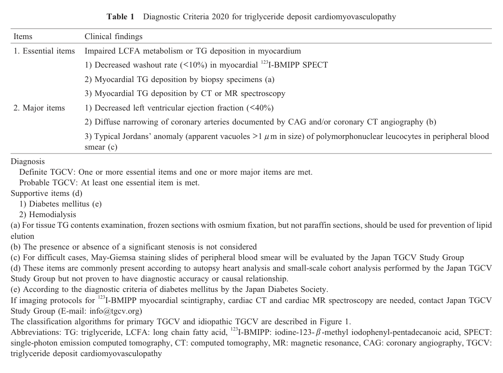

## Question

# Disease Characteristics Research Template

## Target Disease
- **Disease Name:** Idiopathic Triglyceride Deposit Cardiomyovasculopathy
- **MONDO ID:**  (if available)
- **Category:** Mendelian

## Research Objectives

Please provide a comprehensive research report on **Idiopathic Triglyceride Deposit Cardiomyovasculopathy** covering all of the
disease characteristics listed below. This report will be used to populate a disease knowledge
base entry. Be thorough and cite primary literature (PMID preferred) for all claims.

For each section, **suggested databases/resources** are listed. These are the first places
you should search for information on each topic.

---

### 1. Disease Information
> **Search first:** OMIM, Orphanet, ICD-10/ICD-11, MeSH, PubMed

- What is the disease? Provide a concise overview.
- What are the key identifiers? (OMIM, Orphanet, ICD-10/ICD-11, MeSH, Mondo)
- What are the common synonyms and alternative names?
- Is the information derived from individual patients (e.g., EHR) or aggregated disease-level resources?

### 2. Etiology

- **Disease Causal Factors**: What are the primary causes? (genetic, environmental, infectious, mechanistic)
- **Risk Factors**:
  > **Search first:** PubMed, Cochrane Library, UpToDate, clinical guidelines, ClinVar, ClinGen, GWAS Catalog, PheGenI, CTD, CDC, WHO, epidemiological databases
  - Genetic risk factors (causal variants, susceptibility loci, modifier genes)
  - Environmental risk factors (toxins, lifestyle, occupational exposures, age, sex, family history)
- **Protective Factors**:
  > **Search first:** PubMed, Cochrane Library, clinical trial databases, GWAS Catalog, gnomAD, WHO, CDC, nutrition databases
  - Genetic protective factors (protective variants, modifier alleles)
  - Environmental protective factors (diet, lifestyle, exposures that reduce risk)
- **Gene-Environment Interactions**: How do genetic and environmental factors interact to influence disease?
  > **Search first:** CTD, PubMed, PheGenI, GxE databases

### 3. Phenotypes
> **Search first:** HPO (Human Phenotype Ontology), OMIM, Orphanet, PubMed, clinicaltrials.gov, MedDRA, SNOMED CT, DECIPHER, LOINC

For each phenotype, provide:
- **Phenotype type**: symptoms, clinical signs, physical manifestations, behavioral changes, or laboratory abnormalities
  > For symptoms/signs: HPO, OMIM, Orphanet, PubMed
  > For behavioral changes: HPO, DSM, RDoC (Research Domain Criteria), PubMed
  > For laboratory abnormalities: LOINC, SNOMED CT, LabTests Online, PubMed
- **Phenotype characteristics**:
  > **Search first:** OMIM, Orphanet, HPO, PubMed
  - Age of symptom onset (neonatal, childhood, adult-onset, late-onset)
  - Symptom severity (mild, moderate, severe, variable)
  - Symptom progression (stable, progressive, episodic, fluctuating)
  - Frequency among affected individuals (percentage or qualitative)
- **Quality of life impact**: Effects on daily functioning and well-being (per-phenotype when possible)
  > **Search first:** EQ-5D database, SF-36, WHO QOL databases, PubMed
- Suggest HPO (Human Phenotype Ontology) terms for each phenotype

### 4. Genetic/Molecular Information

- **Causal Genes**: Gene mutations or chromosomal abnormalities responsible for disease (gene symbols, OMIM IDs)
  > **Search first:** OMIM, ClinVar, HGMD, Ensembl, NCBI Gene
- **Pathogenic Variants**:
  - Affected genes (gene symbols, HGNC IDs)
    > **Search first:** OMIM, NCBI Gene, Ensembl, HGNC, UniProt, GeneCards
  - Variant classification (pathogenic, likely pathogenic, VUS per ACMG/AMP guidelines)
    > **Search first:** ClinVar, ClinGen, ACMG/AMP guidelines, VarSome
  - Variant type/class (missense, frameshift, nonsense, splice-site, structural)
  - Allele frequency in population databases
    > **Search first:** gnomAD, 1000 Genomes, ExAC, TOPMed, dbSNP
  - Somatic vs germline origin
    > **Search first:** COSMIC (somatic), ClinVar, ICGC, TCGA
  - Functional consequences (loss of function, gain of function, dominant negative)
- **Modifier Genes**: Genes that modify disease severity or expression
- **Epigenetic Information**: DNA methylation, histone modifications, chromatin changes affecting disease
  > **Search first:** ENCODE, Roadmap Epigenomics, MethBase, DiseaseMeth
- **Chromosomal Abnormalities**: Large-scale genetic changes (aneuploidy, translocations, inversions)
  > **Search first:** DECIPHER, ClinVar, ECARUCA, UCSC Genome Browser

### 5. Environmental Information

- **Environmental Factors**: Non-genetic contributing factors (toxins, radiation, pollution, occupational exposure)
  > **Search first:** CTD (Comparative Toxicogenomics Database), TOXNET, PubMed, EPA databases
- **Lifestyle Factors**: Behavioral factors (smoking, diet, exercise, alcohol consumption)
  > **Search first:** CDC databases, WHO, PubMed, NHANES
- **Infectious Agents**: If applicable, pathogens causing or triggering disease (bacteria, viruses, fungi, parasites)
  > **Search first:** NCBI Taxonomy, ViPR, BV-BRC, MicrobeDB, GIDEON

### 6. Mechanism / Pathophysiology

- **Molecular Pathways**: Specific signaling cascades or biochemical pathways involved (Wnt, MAPK, mTOR, PI3K-AKT, etc.)
  > **Search first:** KEGG, Reactome, WikiPathways, PathBank, BioCyc
- **Cellular Processes**: Cell-level mechanisms (apoptosis, autophagy, cell cycle dysregulation, inflammation, etc.)
  > **Search first:** Gene Ontology (GO), Reactome, KEGG, PubMed
- **Protein Dysfunction**: How protein structure or function is altered (misfolding, aggregation, loss of function, gain of function)
  > **Search first:** UniProt, PDB (Protein Data Bank), InterPro, Pfam, AlphaFold
- **Metabolic Changes**: Alterations in metabolic processes (energy metabolism, lipid metabolism, amino acid metabolism)
  > **Search first:** KEGG, BioCyc, HMDB (Human Metabolome Database), BRENDA
- **Immune System Involvement**: Role of immune response (autoimmunity, immunodeficiency, chronic inflammation)
  > **Search first:** ImmPort, Immunome Database, IEDB, Gene Ontology
- **Tissue Damage Mechanisms**: How tissues/ are injured (oxidative stress, ischemia, fibrosis, necrosis)
  > **Search first:** PubMed, Gene Ontology, Reactome
- **Biochemical Abnormalities**: Specific molecular defects (enzyme deficiencies, receptor dysfunction, ion channel defects)
  > **Search first:** BRENDA, UniProt, KEGG, OMIM, PubMed
- **Epigenetic Changes**: DNA methylation, histone modifications affecting gene expression in disease
  > **Search first:** ENCODE, Roadmap Epigenomics, MethBase, DiseaseMeth
- **Molecular Profiling** (if available):
  - Transcriptomics/gene expression changes
    > **Search first:** GEO (Gene Expression Omnibus), ArrayExpress, GTEx, Human Cell Atlas, SRA
  - Proteomics findings
    > **Search first:** PRIDE, ProteomeXchange, Human Protein Atlas, STRING, BioGRID
  - Metabolomics signatures
    > **Search first:** MetaboLights, Metabolomics Workbench, HMDB, METLIN
  - Lipidomics alterations
    > **Search first:** LIPID MAPS, SwissLipids, LipidHome, Metabolomics Workbench
  - Genomic structural features
    > **Search first:** UCSC Genome Browser, Ensembl, NCBI, dbVar, DGV
- **Advanced Technologies** (if applicable):
  - Single-cell analysis findings (cell-type specific mechanisms, cellular heterogeneity)
    > **Search first:** Human Cell Atlas, Single Cell Portal, GEO, CELLxGENE
  - Spatial transcriptomics findings
    > **Search first:** GEO, Spatial Research, Vizgen, 10x Genomics data
  - Multi-omics integration results
    > **Search first:** TCGA, ICGC, cBioPortal, LinkedOmics, PubMed
  - Functional genomics screens (CRISPR, RNAi)
    > **Search first:** DepMap, GenomeRNAi, PubMed, BioGRID ORCS

For each mechanism, describe:
- The causal chain from initial trigger to clinical manifestation
- Which mechanisms are upstream vs downstream
- What cell types and biological processes are involved
- Suggest GO terms for biological processes and CL terms for cell types

### 7. Anatomical Structures Affected

- **Organ Level**:
  - Primary organs directly affected
  - Secondary organ involvement (complications, secondary effects)
  - Body systems involved (cardiovascular, nervous, digestive, respiratory, endocrine, etc.)
  > **Search first:** Uberon, FMA (Foundational Model of Anatomy), OMIM, HPO, ICD-11, MeSH, SNOMED CT
- **Tissue and Cell Level**:
  - Specific tissue types affected (epithelial, connective, muscle, nervous)
  - Specific cell populations targeted (with Cell Ontology terms)
  > **Search first:** Uberon, Human Protein Atlas, Cell Ontology, Human Cell Atlas, CellMarker, PanglaoDB
- **Subcellular Level**:
  - Cellular compartments involved (mitochondria, nucleus, ER, lysosomes) (with GO Cellular Component terms)
  > **Search first:** Gene Ontology (Cellular Component), UniProt, Human Protein Atlas
- **Localization**:
  - Specific anatomical sites (with UBERON terms)
    > **Search first:** FMA, Uberon, NeuroNames (for brain), SNOMED CT
  - Lateralization (unilateral, bilateral, asymmetric)
    > **Search first:** HPO, clinical literature, imaging databases

### 8. Temporal Development

- **Onset**:
  - Typical age of onset (congenital, pediatric, adult, geriatric)
  - Onset pattern (acute, subacute, chronic, insidious)
  > **Search first:** OMIM, Orphanet, HPO, PubMed
- **Progression**:
  - Disease stages (early, intermediate, advanced, end-stage)
    > **Search first:** Cancer Staging Manual (AJCC), WHO classifications, PubMed
  - Progression rate (rapid, slow, variable)
  - Disease course pattern (episodic, relapsing-remitting, progressive, stable)
  - Disease duration (self-limited, chronic lifelong)
  > **Search first:** Disease registries, longitudinal cohort databases, natural history studies, PubMed, Orphanet, OMIM
- **Patterns**:
  - Remission patterns (spontaneous, treatment-induced)
    > **Search first:** Clinical trial databases, disease registries, PubMed
  - Critical periods (time windows of vulnerability or opportunity for intervention)
    > **Search first:** PubMed, developmental biology databases, clinical guidelines

### 9. Inheritance and Population

- **Epidemiology**:
  - Prevalence (cases per 100,000 at given time)
  - Incidence (new cases per 100,000 per year)
  > **Search first:** Orphanet, CDC, WHO, GBD (Global Burden of Disease), national registries, SEER, disease registries
- **For Genetic Etiology**:
  - Inheritance pattern (AD, AR, X-linked, mitochondrial, multifactorial, polygenic)
    > **Search first:** OMIM, Orphanet, ClinVar, GTR (Genetic Testing Registry)
  - Penetrance (complete, incomplete, age-dependent)
    > **Search first:** ClinVar, OMIM, PubMed, ClinGen
  - Expressivity (variable, consistent)
    > **Search first:** OMIM, ClinVar, PubMed
  - Genetic anticipation (increasing severity in successive generations)
    > **Search first:** OMIM, PubMed (especially for repeat expansion disorders)
  - Germline mosaicism
    > **Search first:** ClinVar, OMIM, genetic counseling literature, PubMed
  - Founder effects (population-specific mutations)
    > **Search first:** gnomAD, population genetics databases, PubMed
  - Consanguinity role
    > **Search first:** OMIM, population studies, genetic counseling resources
  - Carrier frequency
    > **Search first:** gnomAD, carrier screening databases, GeneReviews, GTR
- **Population Demographics**:
  - Affected populations (ethnic or demographic groups with higher prevalence)
    > **Search first:** gnomAD, 1000 Genomes, PAGE Study, PubMed, population registries
  - Geographic distribution (endemic areas, regional variation)
    > **Search first:** WHO, CDC, GBD, Orphanet, geographic epidemiology databases
  - Geographic distribution of specific variants
  - Sex ratio (male:female)
    > **Search first:** Disease registries, OMIM, PubMed, epidemiological databases
  - Age distribution of affected individuals
    > **Search first:** CDC, disease registries, SEER, Orphanet

### 10. Diagnostics

- **Clinical Tests**:
  - Laboratory tests (blood, urine, tissue chemistry, specific enzyme assays)
    > **Search first:** LOINC, LabTests Online, PubMed
  - Biomarkers (proteins, metabolites, genetic markers, circulating biomarkers)
    > **Search first:** FDA Biomarker List, BEST (Biomarkers, EndpointS, and other Tools), PubMed
  - Imaging studies (X-ray, CT, MRI, PET, ultrasound)
    > **Search first:** RadLex, DICOM, Radiopaedia, imaging databases
  - Functional tests (pulmonary function, cardiac stress tests)
    > **Search first:** LOINC, clinical guidelines, PubMed
  - Electrophysiology (EEG, EMG, ECG, nerve conduction studies)
    > **Search first:** LOINC, clinical neurophysiology databases, PubMed
  - Biopsy findings (histopathology, immunohistochemistry)
    > **Search first:** SNOMED CT, College of American Pathologists resources, PubMed
  - Pathology findings (microscopic examination)
    > **Search first:** SNOMED CT, Digital Pathology databases, PubMed
- **Genetic Testing**:
  > **Search first:** GTR (Genetic Testing Registry), GeneReviews, ClinGen
  - Overview of recommended genetic testing approach
  - Whole genome sequencing (WGS) utility
    > **Search first:** GTR, ClinVar, GEL (Genomics England), gnomAD
  - Whole exome sequencing (WES) utility
    > **Search first:** GTR, ClinVar, OMIM, GeneMatcher
  - Gene panels (which panels, which genes)
    > **Search first:** GTR, ClinVar, laboratory-specific databases
  - Single gene testing
    > **Search first:** GTR, ClinVar, OMIM, GeneReviews
  - Chromosomal microarray (CMA)
    > **Search first:** DECIPHER, ClinVar, dbVar, ECARUCA
  - Karyotyping
    > **Search first:** Chromosome Abnormality Database, ClinVar, cytogenetics resources
  - FISH
    > **Search first:** ClinVar, cytogenetics databases, PubMed
  - Mitochondrial DNA testing
    > **Search first:** MITOMAP, MSeqDR, ClinVar, GTR
  - Repeat expansion testing
    > **Search first:** GTR, ClinVar, repeat expansion databases, PubMed
- **Omics-Based Diagnostics** (if applicable):
  - RNA sequencing / transcriptomics
    > **Search first:** GEO, ArrayExpress, GTEx, RNA-seq databases
  - Proteomics
    > **Search first:** PRIDE, ProteomeXchange, FDA Biomarker database
  - Metabolomics
    > **Search first:** MetaboLights, Metabolomics Workbench, HMDB
  - Epigenomics
    > **Search first:** GEO, ENCODE, Roadmap Epigenomics, MethBase
  - Liquid biopsy
    > **Search first:** COSMIC, ClinVar, liquid biopsy databases, PubMed
- **Clinical Criteria**:
  - Standardized diagnostic criteria (DSM, ICD, society guidelines)
    > **Search first:** DSM-5, ICD-11, clinical society guidelines, UpToDate
  - Differential diagnosis (other conditions to rule out, with distinguishing features)
    > **Search first:** DynaMed, UpToDate, clinical decision support systems
- **Screening**:
  - Screening methods for asymptomatic individuals (newborn screening, carrier screening, cascade screening)
    > **Search first:** ACMG recommendations, CDC newborn screening, GTR

### 11. Outcome/Prognosis

- **Survival and Mortality**:
  - Survival rate (5-year, 10-year, overall)
    > **Search first:** SEER, cancer registries, disease-specific registries, PubMed
  - Life expectancy (with and without treatment if applicable)
    > **Search first:** Orphanet, disease registries, actuarial databases, PubMed
  - Mortality rate
    > **Search first:** CDC, WHO, GBD, national mortality databases
  - Disease-specific mortality (deaths directly attributable to disease)
    > **Search first:** Disease registries, CDC Wonder, GBD, PubMed
- **Morbidity and Function**:
  - Morbidity (disease-related disability and health impacts)
    > **Search first:** GBD, WHO, disability databases, PubMed
  - Disability outcomes (long-term functional impairments)
    > **Search first:** ICF (International Classification of Functioning), disability registries
  - Quality of life measures (EQ-5D, SF-36, PROMIS, disease-specific tools)
    > **Search first:** EQ-5D database, SF-36, PROMIS, PubMed
- **Disease Course**:
  - Complications (secondary problems: infections, organ failure, etc.)
    > **Search first:** ICD codes, disease registries, clinical databases, PubMed
  - Recovery potential (likelihood and extent of recovery, with vs without treatment)
    > **Search first:** Natural history studies, rehabilitation databases, PubMed
- **Prediction**:
  - Prognostic factors (age, disease severity, biomarkers, treatment response)
    > **Search first:** Prognostic models databases, clinical calculators, PubMed
  - Prognostic biomarkers (molecular markers predicting disease course)
    > **Search first:** FDA Biomarker database, PubMed, cancer prognostic databases

### 12. Treatment

- **Pharmacotherapy**:
  - Pharmacological treatments (drug names, drug classes, mechanisms of action)
    > **Search first:** DrugBank, RxNorm, ATC classification, DailyMed, FDA databases
  - Pharmacogenomics (how genetic variants affect drug metabolism, efficacy, toxicity)
    > **Search first:** PharmGKB, CPIC (Clinical Pharmacogenetics), FDA Table of PGx Biomarkers
- **Advanced Therapeutics**:
  - Gene therapy (viral vectors, CRISPR, gene replacement, gene editing)
    > **Search first:** ClinicalTrials.gov, FDA gene therapy database, ASGCT resources
  - Cell therapy (stem cell transplant, CAR-T, cellular therapeutics)
    > **Search first:** ClinicalTrials.gov, FDA cell therapy database, FACT standards
  - RNA-based therapies (ASOs, siRNA, mRNA therapies)
    > **Search first:** ClinicalTrials.gov, FDA approvals, PubMed
  - Targeted therapies (treatments directed at specific molecular targets)
    > **Search first:** My Cancer Genome, OncoKB, ClinicalTrials.gov, FDA approvals
  - Immunotherapies (checkpoint inhibitors, monoclonal antibodies)
    > **Search first:** Cancer Immunotherapy Database, FDA approvals, ClinicalTrials.gov
- **Surgical and Interventional**:
  - Surgical interventions (types of surgery, timing, outcomes)
    > **Search first:** CPT codes, surgical registries, clinical guidelines, PubMed
- **Supportive and Rehabilitative**:
  - Supportive care (symptom management, pain control, nutrition)
    > **Search first:** Clinical guidelines, Cochrane Library, PubMed
  - Rehabilitation (physical therapy, occupational therapy, speech therapy)
    > **Search first:** Rehabilitation medicine databases, clinical guidelines, PubMed
- **Experimental**:
  - Experimental treatments in clinical trials (with NCT identifiers if available)
    > **Search first:** ClinicalTrials.gov, EU Clinical Trials Register, WHO ICTRP
- **Treatment Outcomes**:
  - Treatment response rates
    > **Search first:** Clinical trial databases, FDA reviews, systematic reviews, PubMed
  - Side effects and adverse events
    > **Search first:** FDA Adverse Event Reporting System (FAERS), MedWatch, PubMed
- **Treatment Strategy**:
  - Treatment algorithms (clinical pathways, decision trees)
    > **Search first:** Clinical practice guidelines, NCCN Guidelines, UpToDate
  - Combination therapies
    > **Search first:** ClinicalTrials.gov, treatment guidelines, PubMed
  - Personalized medicine approaches (genotype-guided treatment)
    > **Search first:** My Cancer Genome, CIViC, PharmGKB, precision medicine databases

For each treatment, suggest MAXO (Medical Action Ontology) terms where applicable.

### 13. Prevention

- **Prevention Levels**:
  - Primary prevention (preventing disease occurrence: vaccination, risk factor modification)
    > **Search first:** CDC, WHO, USPSTF recommendations, Cochrane Library
  - Secondary prevention (early detection and treatment: screening programs, early intervention)
    > **Search first:** USPSTF, CDC screening guidelines, WHO
  - Tertiary prevention (preventing complications in those with disease)
    > **Search first:** Clinical guidelines, disease management protocols, PubMed
- **Immunization**: Vaccine strategies (if applicable)
  > **Search first:** CDC vaccine schedules, WHO immunization, FDA vaccine database
- **Screening and Early Detection**:
  - Screening programs (population-based: newborn screening, cancer screening)
    > **Search first:** CDC screening programs, USPSTF, cancer screening databases
  - Genetic screening (carrier screening, preimplantation genetic diagnosis, prenatal testing)
    > **Search first:** ACMG recommendations, ACOG guidelines, GTR
  - Risk stratification (identifying high-risk individuals for targeted prevention)
    > **Search first:** Risk prediction models, clinical calculators, PubMed
- **Behavioral Interventions**: Lifestyle modifications to reduce risk
  > **Search first:** CDC, WHO, behavioral intervention databases, Cochrane Library
- **Counseling**: Genetic counseling (risk assessment, family planning guidance)
  > **Search first:** NSGC resources, ACMG guidelines, GeneReviews
- **Public Health**:
  - Public health interventions (sanitation, vector control, health education)
    > **Search first:** CDC, WHO, public health databases, PubMed
  - Environmental interventions (reducing environmental risk factors)
    > **Search first:** EPA databases, WHO environmental health, PubMed
- **Prophylaxis**: Preventive medications or procedures
  > **Search first:** Clinical guidelines, FDA approvals, PubMed

### 14. Other Species / Natural Disease

- **Taxonomy**: Species affected (with NCBI Taxon identifiers)
  > **Search first:** NCBI Taxonomy
- **Breed**: Specific breeds affected (with VBO identifiers if applicable)
  > **Search first:** VBO (Vertebrate Breed Ontology)
- **Gene**: Orthologous genes in other species (with NCBI Gene IDs)
  > **Search first:** NCBI Gene
- **Natural Disease**:
  - Naturally occurring disease in other species (companion animals, wildlife)
    > **Search first:** OMIA (Online Mendelian Inheritance in Animals), VetCompass, PubMed
  - Veterinary relevance and importance in animal health
    > **Search first:** OMIA, veterinary databases, PubMed
- **Comparative Biology**:
  - Comparative pathology (similarities and differences across species)
    > **Search first:** OMIA, comparative pathology databases, PubMed
  - Evolutionary conservation of disease mechanisms
    > **Search first:** HomoloGene, OrthoMCL, Alliance of Genome Resources
- **Transmission** (if applicable):
  - Zoonotic potential
    > **Search first:** CDC zoonotic diseases, WHO zoonoses, GIDEON
  - Cross-species susceptibility
    > **Search first:** NCBI Taxonomy, veterinary databases, PubMed

### 15. Model Organisms

- **Model Types**:
  - Model organism type (mammalian, invertebrate, cellular, in vitro)
    > **Search first:** Alliance of Genome Resources, model organism databases
  - Specific model systems (mouse, rat, zebrafish, Drosophila, C. elegans, yeast, cell lines, organoids, iPSCs)
    > **Search first:** MGI, RGD, ZFIN, FlyBase, WormBase, SGD, ATCC, Cellosaurus
  - Induced models (drug treatment, surgical intervention, environmental manipulation)
    > **Search first:** MGI, model organism databases, PubMed
- **Genetic Models**:
  - Types available (knockout, knock-in, transgenic, conditional, humanized)
    > **Search first:** MGI, IMPC, KOMP, EuMMCR, IMSR
- **Model Characteristics**:
  - Phenotype recapitulation (how well model reproduces human disease features)
    > **Search first:** Model organism databases, comparative studies, PubMed
  - Model limitations (aspects of human disease not captured)
    > **Search first:** Model organism databases, PubMed, review articles
- **Applications**:
  - Research applications (what aspects of disease can be studied)
    > **Search first:** Model organism databases, PubMed
- **Resources**:
  - Model databases
    > **Search first:** MGI, RGD, ZFIN, FlyBase, WormBase, IMSR, EMMA, MMRRC

---

## Citation Requirements

- Cite primary literature (PMID preferred) for all mechanistic and clinical claims
- Prioritize recent reviews and landmark papers
- Include direct quotes from abstracts where possible to support key statements
- Distinguish evidence source types: human clinical, model organism, in vitro, computational

## Output Format

Structure your response as a comprehensive narrative organized by the sections above.
For each section, provide:
- Factual content with specific details (numbers, percentages, gene names, variant nomenclature)
- Ontology term suggestions (HPO, GO, CL, UBERON, CHEBI, MAXO, MONDO) where applicable
- Evidence citations with PMIDs
- Direct quotes from abstracts to support key claims
- Clear indication when information is not available or not applicable for this disease

This report will be used to populate a disease knowledge base entry with:
- Pathophysiology descriptions with causal chains
- Gene/protein annotations (HGNC, GO terms)
- Phenotype associations (HP terms) with frequencies
- Cell type involvement (CL terms)
- Anatomical locations (UBERON terms)
- Chemical entities (CHEBI terms)
- Treatment annotations (MAXO terms)
- Evidence items with PMIDs and exact abstract quotes
- Epidemiology, prognosis, diagnostic, and prevention information
- Animal model descriptions with phenotype recapitulation details

## Output

Question: You are an expert researcher providing comprehensive, well-cited information.

Provide detailed information focusing on:
1. Key concepts and definitions with current understanding
2. Recent developments and latest research (prioritize 2023-2024 sources)
3. Current applications and real-world implementations
4. Expert opinions and analysis from authoritative sources
5. Relevant statistics and data from recent studies

Format as a comprehensive research report with proper citations. Include URLs and publication dates where available.
Always prioritize recent, authoritative sources and provide specific citations for all major claims.

# Disease Characteristics Research Template

## Target Disease
- **Disease Name:** Idiopathic Triglyceride Deposit Cardiomyovasculopathy
- **MONDO ID:**  (if available)
- **Category:** Mendelian

## Research Objectives

Please provide a comprehensive research report on **Idiopathic Triglyceride Deposit Cardiomyovasculopathy** covering all of the
disease characteristics listed below. This report will be used to populate a disease knowledge
base entry. Be thorough and cite primary literature (PMID preferred) for all claims.

For each section, **suggested databases/resources** are listed. These are the first places
you should search for information on each topic.

---

### 1. Disease Information
> **Search first:** OMIM, Orphanet, ICD-10/ICD-11, MeSH, PubMed

- What is the disease? Provide a concise overview.
- What are the key identifiers? (OMIM, Orphanet, ICD-10/ICD-11, MeSH, Mondo)
- What are the common synonyms and alternative names?
- Is the information derived from individual patients (e.g., EHR) or aggregated disease-level resources?

### 2. Etiology

- **Disease Causal Factors**: What are the primary causes? (genetic, environmental, infectious, mechanistic)
- **Risk Factors**:
  > **Search first:** PubMed, Cochrane Library, UpToDate, clinical guidelines, ClinVar, ClinGen, GWAS Catalog, PheGenI, CTD, CDC, WHO, epidemiological databases
  - Genetic risk factors (causal variants, susceptibility loci, modifier genes)
  - Environmental risk factors (toxins, lifestyle, occupational exposures, age, sex, family history)
- **Protective Factors**:
  > **Search first:** PubMed, Cochrane Library, clinical trial databases, GWAS Catalog, gnomAD, WHO, CDC, nutrition databases
  - Genetic protective factors (protective variants, modifier alleles)
  - Environmental protective factors (diet, lifestyle, exposures that reduce risk)
- **Gene-Environment Interactions**: How do genetic and environmental factors interact to influence disease?
  > **Search first:** CTD, PubMed, PheGenI, GxE databases

### 3. Phenotypes
> **Search first:** HPO (Human Phenotype Ontology), OMIM, Orphanet, PubMed, clinicaltrials.gov, MedDRA, SNOMED CT, DECIPHER, LOINC

For each phenotype, provide:
- **Phenotype type**: symptoms, clinical signs, physical manifestations, behavioral changes, or laboratory abnormalities
  > For symptoms/signs: HPO, OMIM, Orphanet, PubMed
  > For behavioral changes: HPO, DSM, RDoC (Research Domain Criteria), PubMed
  > For laboratory abnormalities: LOINC, SNOMED CT, LabTests Online, PubMed
- **Phenotype characteristics**:
  > **Search first:** OMIM, Orphanet, HPO, PubMed
  - Age of symptom onset (neonatal, childhood, adult-onset, late-onset)
  - Symptom severity (mild, moderate, severe, variable)
  - Symptom progression (stable, progressive, episodic, fluctuating)
  - Frequency among affected individuals (percentage or qualitative)
- **Quality of life impact**: Effects on daily functioning and well-being (per-phenotype when possible)
  > **Search first:** EQ-5D database, SF-36, WHO QOL databases, PubMed
- Suggest HPO (Human Phenotype Ontology) terms for each phenotype

### 4. Genetic/Molecular Information

- **Causal Genes**: Gene mutations or chromosomal abnormalities responsible for disease (gene symbols, OMIM IDs)
  > **Search first:** OMIM, ClinVar, HGMD, Ensembl, NCBI Gene
- **Pathogenic Variants**:
  - Affected genes (gene symbols, HGNC IDs)
    > **Search first:** OMIM, NCBI Gene, Ensembl, HGNC, UniProt, GeneCards
  - Variant classification (pathogenic, likely pathogenic, VUS per ACMG/AMP guidelines)
    > **Search first:** ClinVar, ClinGen, ACMG/AMP guidelines, VarSome
  - Variant type/class (missense, frameshift, nonsense, splice-site, structural)
  - Allele frequency in population databases
    > **Search first:** gnomAD, 1000 Genomes, ExAC, TOPMed, dbSNP
  - Somatic vs germline origin
    > **Search first:** COSMIC (somatic), ClinVar, ICGC, TCGA
  - Functional consequences (loss of function, gain of function, dominant negative)
- **Modifier Genes**: Genes that modify disease severity or expression
- **Epigenetic Information**: DNA methylation, histone modifications, chromatin changes affecting disease
  > **Search first:** ENCODE, Roadmap Epigenomics, MethBase, DiseaseMeth
- **Chromosomal Abnormalities**: Large-scale genetic changes (aneuploidy, translocations, inversions)
  > **Search first:** DECIPHER, ClinVar, ECARUCA, UCSC Genome Browser

### 5. Environmental Information

- **Environmental Factors**: Non-genetic contributing factors (toxins, radiation, pollution, occupational exposure)
  > **Search first:** CTD (Comparative Toxicogenomics Database), TOXNET, PubMed, EPA databases
- **Lifestyle Factors**: Behavioral factors (smoking, diet, exercise, alcohol consumption)
  > **Search first:** CDC databases, WHO, PubMed, NHANES
- **Infectious Agents**: If applicable, pathogens causing or triggering disease (bacteria, viruses, fungi, parasites)
  > **Search first:** NCBI Taxonomy, ViPR, BV-BRC, MicrobeDB, GIDEON

### 6. Mechanism / Pathophysiology

- **Molecular Pathways**: Specific signaling cascades or biochemical pathways involved (Wnt, MAPK, mTOR, PI3K-AKT, etc.)
  > **Search first:** KEGG, Reactome, WikiPathways, PathBank, BioCyc
- **Cellular Processes**: Cell-level mechanisms (apoptosis, autophagy, cell cycle dysregulation, inflammation, etc.)
  > **Search first:** Gene Ontology (GO), Reactome, KEGG, PubMed
- **Protein Dysfunction**: How protein structure or function is altered (misfolding, aggregation, loss of function, gain of function)
  > **Search first:** UniProt, PDB (Protein Data Bank), InterPro, Pfam, AlphaFold
- **Metabolic Changes**: Alterations in metabolic processes (energy metabolism, lipid metabolism, amino acid metabolism)
  > **Search first:** KEGG, BioCyc, HMDB (Human Metabolome Database), BRENDA
- **Immune System Involvement**: Role of immune response (autoimmunity, immunodeficiency, chronic inflammation)
  > **Search first:** ImmPort, Immunome Database, IEDB, Gene Ontology
- **Tissue Damage Mechanisms**: How tissues/ are injured (oxidative stress, ischemia, fibrosis, necrosis)
  > **Search first:** PubMed, Gene Ontology, Reactome
- **Biochemical Abnormalities**: Specific molecular defects (enzyme deficiencies, receptor dysfunction, ion channel defects)
  > **Search first:** BRENDA, UniProt, KEGG, OMIM, PubMed
- **Epigenetic Changes**: DNA methylation, histone modifications affecting gene expression in disease
  > **Search first:** ENCODE, Roadmap Epigenomics, MethBase, DiseaseMeth
- **Molecular Profiling** (if available):
  - Transcriptomics/gene expression changes
    > **Search first:** GEO (Gene Expression Omnibus), ArrayExpress, GTEx, Human Cell Atlas, SRA
  - Proteomics findings
    > **Search first:** PRIDE, ProteomeXchange, Human Protein Atlas, STRING, BioGRID
  - Metabolomics signatures
    > **Search first:** MetaboLights, Metabolomics Workbench, HMDB, METLIN
  - Lipidomics alterations
    > **Search first:** LIPID MAPS, SwissLipids, LipidHome, Metabolomics Workbench
  - Genomic structural features
    > **Search first:** UCSC Genome Browser, Ensembl, NCBI, dbVar, DGV
- **Advanced Technologies** (if applicable):
  - Single-cell analysis findings (cell-type specific mechanisms, cellular heterogeneity)
    > **Search first:** Human Cell Atlas, Single Cell Portal, GEO, CELLxGENE
  - Spatial transcriptomics findings
    > **Search first:** GEO, Spatial Research, Vizgen, 10x Genomics data
  - Multi-omics integration results
    > **Search first:** TCGA, ICGC, cBioPortal, LinkedOmics, PubMed
  - Functional genomics screens (CRISPR, RNAi)
    > **Search first:** DepMap, GenomeRNAi, PubMed, BioGRID ORCS

For each mechanism, describe:
- The causal chain from initial trigger to clinical manifestation
- Which mechanisms are upstream vs downstream
- What cell types and biological processes are involved
- Suggest GO terms for biological processes and CL terms for cell types

### 7. Anatomical Structures Affected

- **Organ Level**:
  - Primary organs directly affected
  - Secondary organ involvement (complications, secondary effects)
  - Body systems involved (cardiovascular, nervous, digestive, respiratory, endocrine, etc.)
  > **Search first:** Uberon, FMA (Foundational Model of Anatomy), OMIM, HPO, ICD-11, MeSH, SNOMED CT
- **Tissue and Cell Level**:
  - Specific tissue types affected (epithelial, connective, muscle, nervous)
  - Specific cell populations targeted (with Cell Ontology terms)
  > **Search first:** Uberon, Human Protein Atlas, Cell Ontology, Human Cell Atlas, CellMarker, PanglaoDB
- **Subcellular Level**:
  - Cellular compartments involved (mitochondria, nucleus, ER, lysosomes) (with GO Cellular Component terms)
  > **Search first:** Gene Ontology (Cellular Component), UniProt, Human Protein Atlas
- **Localization**:
  - Specific anatomical sites (with UBERON terms)
    > **Search first:** FMA, Uberon, NeuroNames (for brain), SNOMED CT
  - Lateralization (unilateral, bilateral, asymmetric)
    > **Search first:** HPO, clinical literature, imaging databases

### 8. Temporal Development

- **Onset**:
  - Typical age of onset (congenital, pediatric, adult, geriatric)
  - Onset pattern (acute, subacute, chronic, insidious)
  > **Search first:** OMIM, Orphanet, HPO, PubMed
- **Progression**:
  - Disease stages (early, intermediate, advanced, end-stage)
    > **Search first:** Cancer Staging Manual (AJCC), WHO classifications, PubMed
  - Progression rate (rapid, slow, variable)
  - Disease course pattern (episodic, relapsing-remitting, progressive, stable)
  - Disease duration (self-limited, chronic lifelong)
  > **Search first:** Disease registries, longitudinal cohort databases, natural history studies, PubMed, Orphanet, OMIM
- **Patterns**:
  - Remission patterns (spontaneous, treatment-induced)
    > **Search first:** Clinical trial databases, disease registries, PubMed
  - Critical periods (time windows of vulnerability or opportunity for intervention)
    > **Search first:** PubMed, developmental biology databases, clinical guidelines

### 9. Inheritance and Population

- **Epidemiology**:
  - Prevalence (cases per 100,000 at given time)
  - Incidence (new cases per 100,000 per year)
  > **Search first:** Orphanet, CDC, WHO, GBD (Global Burden of Disease), national registries, SEER, disease registries
- **For Genetic Etiology**:
  - Inheritance pattern (AD, AR, X-linked, mitochondrial, multifactorial, polygenic)
    > **Search first:** OMIM, Orphanet, ClinVar, GTR (Genetic Testing Registry)
  - Penetrance (complete, incomplete, age-dependent)
    > **Search first:** ClinVar, OMIM, PubMed, ClinGen
  - Expressivity (variable, consistent)
    > **Search first:** OMIM, ClinVar, PubMed
  - Genetic anticipation (increasing severity in successive generations)
    > **Search first:** OMIM, PubMed (especially for repeat expansion disorders)
  - Germline mosaicism
    > **Search first:** ClinVar, OMIM, genetic counseling literature, PubMed
  - Founder effects (population-specific mutations)
    > **Search first:** gnomAD, population genetics databases, PubMed
  - Consanguinity role
    > **Search first:** OMIM, population studies, genetic counseling resources
  - Carrier frequency
    > **Search first:** gnomAD, carrier screening databases, GeneReviews, GTR
- **Population Demographics**:
  - Affected populations (ethnic or demographic groups with higher prevalence)
    > **Search first:** gnomAD, 1000 Genomes, PAGE Study, PubMed, population registries
  - Geographic distribution (endemic areas, regional variation)
    > **Search first:** WHO, CDC, GBD, Orphanet, geographic epidemiology databases
  - Geographic distribution of specific variants
  - Sex ratio (male:female)
    > **Search first:** Disease registries, OMIM, PubMed, epidemiological databases
  - Age distribution of affected individuals
    > **Search first:** CDC, disease registries, SEER, Orphanet

### 10. Diagnostics

- **Clinical Tests**:
  - Laboratory tests (blood, urine, tissue chemistry, specific enzyme assays)
    > **Search first:** LOINC, LabTests Online, PubMed
  - Biomarkers (proteins, metabolites, genetic markers, circulating biomarkers)
    > **Search first:** FDA Biomarker List, BEST (Biomarkers, EndpointS, and other Tools), PubMed
  - Imaging studies (X-ray, CT, MRI, PET, ultrasound)
    > **Search first:** RadLex, DICOM, Radiopaedia, imaging databases
  - Functional tests (pulmonary function, cardiac stress tests)
    > **Search first:** LOINC, clinical guidelines, PubMed
  - Electrophysiology (EEG, EMG, ECG, nerve conduction studies)
    > **Search first:** LOINC, clinical neurophysiology databases, PubMed
  - Biopsy findings (histopathology, immunohistochemistry)
    > **Search first:** SNOMED CT, College of American Pathologists resources, PubMed
  - Pathology findings (microscopic examination)
    > **Search first:** SNOMED CT, Digital Pathology databases, PubMed
- **Genetic Testing**:
  > **Search first:** GTR (Genetic Testing Registry), GeneReviews, ClinGen
  - Overview of recommended genetic testing approach
  - Whole genome sequencing (WGS) utility
    > **Search first:** GTR, ClinVar, GEL (Genomics England), gnomAD
  - Whole exome sequencing (WES) utility
    > **Search first:** GTR, ClinVar, OMIM, GeneMatcher
  - Gene panels (which panels, which genes)
    > **Search first:** GTR, ClinVar, laboratory-specific databases
  - Single gene testing
    > **Search first:** GTR, ClinVar, OMIM, GeneReviews
  - Chromosomal microarray (CMA)
    > **Search first:** DECIPHER, ClinVar, dbVar, ECARUCA
  - Karyotyping
    > **Search first:** Chromosome Abnormality Database, ClinVar, cytogenetics resources
  - FISH
    > **Search first:** ClinVar, cytogenetics databases, PubMed
  - Mitochondrial DNA testing
    > **Search first:** MITOMAP, MSeqDR, ClinVar, GTR
  - Repeat expansion testing
    > **Search first:** GTR, ClinVar, repeat expansion databases, PubMed
- **Omics-Based Diagnostics** (if applicable):
  - RNA sequencing / transcriptomics
    > **Search first:** GEO, ArrayExpress, GTEx, RNA-seq databases
  - Proteomics
    > **Search first:** PRIDE, ProteomeXchange, FDA Biomarker database
  - Metabolomics
    > **Search first:** MetaboLights, Metabolomics Workbench, HMDB
  - Epigenomics
    > **Search first:** GEO, ENCODE, Roadmap Epigenomics, MethBase
  - Liquid biopsy
    > **Search first:** COSMIC, ClinVar, liquid biopsy databases, PubMed
- **Clinical Criteria**:
  - Standardized diagnostic criteria (DSM, ICD, society guidelines)
    > **Search first:** DSM-5, ICD-11, clinical society guidelines, UpToDate
  - Differential diagnosis (other conditions to rule out, with distinguishing features)
    > **Search first:** DynaMed, UpToDate, clinical decision support systems
- **Screening**:
  - Screening methods for asymptomatic individuals (newborn screening, carrier screening, cascade screening)
    > **Search first:** ACMG recommendations, CDC newborn screening, GTR

### 11. Outcome/Prognosis

- **Survival and Mortality**:
  - Survival rate (5-year, 10-year, overall)
    > **Search first:** SEER, cancer registries, disease-specific registries, PubMed
  - Life expectancy (with and without treatment if applicable)
    > **Search first:** Orphanet, disease registries, actuarial databases, PubMed
  - Mortality rate
    > **Search first:** CDC, WHO, GBD, national mortality databases
  - Disease-specific mortality (deaths directly attributable to disease)
    > **Search first:** Disease registries, CDC Wonder, GBD, PubMed
- **Morbidity and Function**:
  - Morbidity (disease-related disability and health impacts)
    > **Search first:** GBD, WHO, disability databases, PubMed
  - Disability outcomes (long-term functional impairments)
    > **Search first:** ICF (International Classification of Functioning), disability registries
  - Quality of life measures (EQ-5D, SF-36, PROMIS, disease-specific tools)
    > **Search first:** EQ-5D database, SF-36, PROMIS, PubMed
- **Disease Course**:
  - Complications (secondary problems: infections, organ failure, etc.)
    > **Search first:** ICD codes, disease registries, clinical databases, PubMed
  - Recovery potential (likelihood and extent of recovery, with vs without treatment)
    > **Search first:** Natural history studies, rehabilitation databases, PubMed
- **Prediction**:
  - Prognostic factors (age, disease severity, biomarkers, treatment response)
    > **Search first:** Prognostic models databases, clinical calculators, PubMed
  - Prognostic biomarkers (molecular markers predicting disease course)
    > **Search first:** FDA Biomarker database, PubMed, cancer prognostic databases

### 12. Treatment

- **Pharmacotherapy**:
  - Pharmacological treatments (drug names, drug classes, mechanisms of action)
    > **Search first:** DrugBank, RxNorm, ATC classification, DailyMed, FDA databases
  - Pharmacogenomics (how genetic variants affect drug metabolism, efficacy, toxicity)
    > **Search first:** PharmGKB, CPIC (Clinical Pharmacogenetics), FDA Table of PGx Biomarkers
- **Advanced Therapeutics**:
  - Gene therapy (viral vectors, CRISPR, gene replacement, gene editing)
    > **Search first:** ClinicalTrials.gov, FDA gene therapy database, ASGCT resources
  - Cell therapy (stem cell transplant, CAR-T, cellular therapeutics)
    > **Search first:** ClinicalTrials.gov, FDA cell therapy database, FACT standards
  - RNA-based therapies (ASOs, siRNA, mRNA therapies)
    > **Search first:** ClinicalTrials.gov, FDA approvals, PubMed
  - Targeted therapies (treatments directed at specific molecular targets)
    > **Search first:** My Cancer Genome, OncoKB, ClinicalTrials.gov, FDA approvals
  - Immunotherapies (checkpoint inhibitors, monoclonal antibodies)
    > **Search first:** Cancer Immunotherapy Database, FDA approvals, ClinicalTrials.gov
- **Surgical and Interventional**:
  - Surgical interventions (types of surgery, timing, outcomes)
    > **Search first:** CPT codes, surgical registries, clinical guidelines, PubMed
- **Supportive and Rehabilitative**:
  - Supportive care (symptom management, pain control, nutrition)
    > **Search first:** Clinical guidelines, Cochrane Library, PubMed
  - Rehabilitation (physical therapy, occupational therapy, speech therapy)
    > **Search first:** Rehabilitation medicine databases, clinical guidelines, PubMed
- **Experimental**:
  - Experimental treatments in clinical trials (with NCT identifiers if available)
    > **Search first:** ClinicalTrials.gov, EU Clinical Trials Register, WHO ICTRP
- **Treatment Outcomes**:
  - Treatment response rates
    > **Search first:** Clinical trial databases, FDA reviews, systematic reviews, PubMed
  - Side effects and adverse events
    > **Search first:** FDA Adverse Event Reporting System (FAERS), MedWatch, PubMed
- **Treatment Strategy**:
  - Treatment algorithms (clinical pathways, decision trees)
    > **Search first:** Clinical practice guidelines, NCCN Guidelines, UpToDate
  - Combination therapies
    > **Search first:** ClinicalTrials.gov, treatment guidelines, PubMed
  - Personalized medicine approaches (genotype-guided treatment)
    > **Search first:** My Cancer Genome, CIViC, PharmGKB, precision medicine databases

For each treatment, suggest MAXO (Medical Action Ontology) terms where applicable.

### 13. Prevention

- **Prevention Levels**:
  - Primary prevention (preventing disease occurrence: vaccination, risk factor modification)
    > **Search first:** CDC, WHO, USPSTF recommendations, Cochrane Library
  - Secondary prevention (early detection and treatment: screening programs, early intervention)
    > **Search first:** USPSTF, CDC screening guidelines, WHO
  - Tertiary prevention (preventing complications in those with disease)
    > **Search first:** Clinical guidelines, disease management protocols, PubMed
- **Immunization**: Vaccine strategies (if applicable)
  > **Search first:** CDC vaccine schedules, WHO immunization, FDA vaccine database
- **Screening and Early Detection**:
  - Screening programs (population-based: newborn screening, cancer screening)
    > **Search first:** CDC screening programs, USPSTF, cancer screening databases
  - Genetic screening (carrier screening, preimplantation genetic diagnosis, prenatal testing)
    > **Search first:** ACMG recommendations, ACOG guidelines, GTR
  - Risk stratification (identifying high-risk individuals for targeted prevention)
    > **Search first:** Risk prediction models, clinical calculators, PubMed
- **Behavioral Interventions**: Lifestyle modifications to reduce risk
  > **Search first:** CDC, WHO, behavioral intervention databases, Cochrane Library
- **Counseling**: Genetic counseling (risk assessment, family planning guidance)
  > **Search first:** NSGC resources, ACMG guidelines, GeneReviews
- **Public Health**:
  - Public health interventions (sanitation, vector control, health education)
    > **Search first:** CDC, WHO, public health databases, PubMed
  - Environmental interventions (reducing environmental risk factors)
    > **Search first:** EPA databases, WHO environmental health, PubMed
- **Prophylaxis**: Preventive medications or procedures
  > **Search first:** Clinical guidelines, FDA approvals, PubMed

### 14. Other Species / Natural Disease

- **Taxonomy**: Species affected (with NCBI Taxon identifiers)
  > **Search first:** NCBI Taxonomy
- **Breed**: Specific breeds affected (with VBO identifiers if applicable)
  > **Search first:** VBO (Vertebrate Breed Ontology)
- **Gene**: Orthologous genes in other species (with NCBI Gene IDs)
  > **Search first:** NCBI Gene
- **Natural Disease**:
  - Naturally occurring disease in other species (companion animals, wildlife)
    > **Search first:** OMIA (Online Mendelian Inheritance in Animals), VetCompass, PubMed
  - Veterinary relevance and importance in animal health
    > **Search first:** OMIA, veterinary databases, PubMed
- **Comparative Biology**:
  - Comparative pathology (similarities and differences across species)
    > **Search first:** OMIA, comparative pathology databases, PubMed
  - Evolutionary conservation of disease mechanisms
    > **Search first:** HomoloGene, OrthoMCL, Alliance of Genome Resources
- **Transmission** (if applicable):
  - Zoonotic potential
    > **Search first:** CDC zoonotic diseases, WHO zoonoses, GIDEON
  - Cross-species susceptibility
    > **Search first:** NCBI Taxonomy, veterinary databases, PubMed

### 15. Model Organisms

- **Model Types**:
  - Model organism type (mammalian, invertebrate, cellular, in vitro)
    > **Search first:** Alliance of Genome Resources, model organism databases
  - Specific model systems (mouse, rat, zebrafish, Drosophila, C. elegans, yeast, cell lines, organoids, iPSCs)
    > **Search first:** MGI, RGD, ZFIN, FlyBase, WormBase, SGD, ATCC, Cellosaurus
  - Induced models (drug treatment, surgical intervention, environmental manipulation)
    > **Search first:** MGI, model organism databases, PubMed
- **Genetic Models**:
  - Types available (knockout, knock-in, transgenic, conditional, humanized)
    > **Search first:** MGI, IMPC, KOMP, EuMMCR, IMSR
- **Model Characteristics**:
  - Phenotype recapitulation (how well model reproduces human disease features)
    > **Search first:** Model organism databases, comparative studies, PubMed
  - Model limitations (aspects of human disease not captured)
    > **Search first:** Model organism databases, PubMed, review articles
- **Applications**:
  - Research applications (what aspects of disease can be studied)
    > **Search first:** Model organism databases, PubMed
- **Resources**:
  - Model databases
    > **Search first:** MGI, RGD, ZFIN, FlyBase, WormBase, IMSR, EMMA, MMRRC

---

## Citation Requirements

- Cite primary literature (PMID preferred) for all mechanistic and clinical claims
- Prioritize recent reviews and landmark papers
- Include direct quotes from abstracts where possible to support key statements
- Distinguish evidence source types: human clinical, model organism, in vitro, computational

## Output Format

Structure your response as a comprehensive narrative organized by the sections above.
For each section, provide:
- Factual content with specific details (numbers, percentages, gene names, variant nomenclature)
- Ontology term suggestions (HPO, GO, CL, UBERON, CHEBI, MAXO, MONDO) where applicable
- Evidence citations with PMIDs
- Direct quotes from abstracts to support key claims
- Clear indication when information is not available or not applicable for this disease

This report will be used to populate a disease knowledge base entry with:
- Pathophysiology descriptions with causal chains
- Gene/protein annotations (HGNC, GO terms)
- Phenotype associations (HP terms) with frequencies
- Cell type involvement (CL terms)
- Anatomical locations (UBERON terms)
- Chemical entities (CHEBI terms)
- Treatment annotations (MAXO terms)
- Evidence items with PMIDs and exact abstract quotes
- Epidemiology, prognosis, diagnostic, and prevention information
- Animal model descriptions with phenotype recapitulation details

## Comprehensive Research Report: Idiopathic Triglyceride Deposit Cardiomyovasculopathy (I‑TGCV)

### Executive summary
Idiopathic triglyceride deposit cardiomyovasculopathy (I‑TGCV) is a rare, recently recognized cardiometabolic disease characterized by defective *intracellular* triglyceride (TG) lipolysis, causing massive TG deposition in cardiomyocytes and coronary arterial wall cells and leading to energy failure, heart failure, and a distinctive diffuse, concentric coronary artery disease pattern (TG‑deposit atherosclerosis). (kobayashi2020thediagnosticcriteria pages 1-2, hirano2024triglyceridedepositcardiomyovasculopathy pages 1-2, li2019triglyceridedepositcardiomyovasculopathy pages 1-2)

A central clinical implementation is myocardial fatty‑acid scintigraphy using iodine‑123‑β‑methyl‑p‑iodophenyl‑pentadecanoic acid (^123I‑BMIPP), where a markedly reduced myocardial washout rate (WR) (<10%) is an essential diagnostic criterion. (kobayashi2020thediagnosticcriteria pages 2-4, kobayashi2020thediagnosticcriteria media 1c1cd9d1, hirano2024triglyceridedepositcardiomyovasculopathy pages 1-2)

Disease‑specific nutritional therapy with tricaprin (CNT‑01; medium‑chain TG) is supported by a randomized phase IIa trial showing improved BMIPP WR and by recent case reports showing reduced myocardial TG content by ^1H‑MRS and clinical/imaging improvement after therapy. (miyauchi2022&lt;sup&gt;123&lt;sup&gt;ibmippscintigraphyshows pages 1-2, aikawa20231hmrstoevaluate pages 1-3, yamamoto2024acutecoronarysyndrome pages 3-5)

### Target disease
- **Disease name:** Idiopathic Triglyceride Deposit Cardiomyovasculopathy (I‑TGCV)
- **Category:** Mendelian/monogenic framework for *primary* TGCV; *idiopathic* subtype lacks identified causal PNPLA2 variant but shares the core ATGL‑pathway phenotype. (kobayashi2020thediagnosticcriteria pages 1-2, li2019triglyceridedepositcardiomyovasculopathy pages 1-2)
- **Orphanet identifier:** **ORPHA:565612**. (hirano2025longtermsurvivaland pages 9-12, miyauchi2020correlationperspectivesfor pages 1-2, nagasawa2025chronickidneydisease pages 1-3)
- **MONDO / OMIM / MeSH / ICD‑10/ICD‑11:** Not found in the retrieved full‑text excerpts; therefore not reported here to avoid unsupported mapping. (hirano2025longtermsurvivaland pages 9-12, kobayashi2020thediagnosticcriteria pages 1-2)

### 1. Disease information
**Definition and current understanding.** TGCV was first reported in Japan (2008) in patients requiring cardiac transplantation. The core lesion is defective intracellular TG lipolysis leading to TG accumulation in myocardium and coronary vascular smooth muscle cells, producing severe heart failure and coronary artery disease with poor prognosis. (kobayashi2020thediagnosticcriteria pages 1-2, hirano2024triglyceridedepositcardiomyovasculopathy pages 1-2)

**Key synonyms / related terms.** “TGCV,” “TG‑deposit cardiomyovasculopathy,” and “TG‑deposit atherosclerosis” are used to describe the coronary phenotype. Primary TGCV due to PNPLA2/ATGL deficiency overlaps clinically with *neutral lipid storage disease with myopathy (NLSD‑M)*; a guideline explicitly notes NLSD‑M as “a clinical continuum of primary TGCV because the responsible gene is identical.” (kobayashi2020thediagnosticcriteria pages 1-2, li2019triglyceridedepositcardiomyovasculopathy pages 1-2)

**Evidence sources.** The evidence base is largely aggregated disease‑level resources generated by the Japan TGCV Study Group (diagnostic criteria, registries, trials) plus individual case reports illustrating diagnostic workflows and therapeutic response. (kobayashi2020thediagnosticcriteria pages 2-4, NCT05345223 chunk 1, aikawa20231hmrstoevaluate pages 1-3)

### 2. Etiology
#### 2.1 Disease causal factors
**Pathway‑level cause (shared across subtypes):** impaired intracellular TG hydrolysis in lipid droplets, leading to reduced release of long‑chain fatty acids (LCFAs) for mitochondrial β‑oxidation and ATP generation. (kobayashi2020thediagnosticcriteria pages 1-2, li2019triglyceridedepositcardiomyovasculopathy pages 1-2, hirano2024triglyceridedepositcardiomyovasculopathy pages 1-2)

**Genetic cause (primary TGCV):** rare homozygous mutation in **PNPLA2** encoding adipose triglyceride lipase (**ATGL**), a rate‑limiting intracellular TG lipase. (kobayashi2020thediagnosticcriteria pages 1-2, nagasawa2025chronickidneydisease pages 1-3)

**Idiopathic TGCV (I‑TGCV):** defined as TGCV **without PNPLA2 mutation**, yet with reduced myocardial LCFA tracer washout and reduced ATGL activity in peripheral leukocytes reported in the registry literature, implying non‑canonical ATGL dysfunction and/or other lipase pathway alterations. (li2019triglyceridedepositcardiomyovasculopathy pages 1-2, kobayashi2020thediagnosticcriteria pages 5-6)

Direct abstract quote supporting idiopathic classification and phenotype:
- Li et al. 2019: “**Patients with I‑TGCV, of which etiologies and causes are not known yet, suffered from adult-onset severe heart disease… associated with a marked reduction in ATGL activity and myocardial washout rate of LCFA tracer**.” (li2019triglyceridedepositcardiomyovasculopathy pages 1-2)

#### 2.2 Risk factors
The literature emphasizes that **plasma TG level and BMI are not reliable diagnostic indicators**, and classical “hypertriglyceridemia” is not the primary driver of disease expression. (yamamoto2024acutecoronarysyndrome pages 1-2, miyauchi2020correlationperspectivesfor pages 1-2)

**Comorbidities enriched in diagnosed cohorts (association, not necessarily causal):** diabetes mellitus is common in I‑TGCV cohorts and diagnostic‑enrichment cohorts. (miyauchi2020correlationperspectivesfor pages 2-4, li2019triglyceridedepositcardiomyovasculopathy pages 6-7)

**Prognostic risk factor:** chronic kidney disease (CKD) substantially increases mortality in registry data.
- 3‑year survival: **71.3% (CKD)** vs **91.7% (non‑CKD)**
- 5‑year survival: **61.8% (CKD)** vs **84.4% (non‑CKD)**
- Cox model: **HR 2.33 (95% CI 1.12–4.86)**, p=0.024 (age‑adjusted). (nagasawa2025chronickidneydisease pages 1-3)

#### 2.3 Protective factors
No genetic or environmental protective factors were identified in the retrieved corpus.

#### 2.4 Gene–environment interactions
Not directly established in the retrieved evidence. CKD/hemodialysis and diabetes are frequent comorbidities and may interact with the intracellular lipid handling phenotype, but mechanistic GxE evidence was not available in retrieved sources. (nagasawa2025chronickidneydisease pages 1-3, miyauchi2020correlationperspectivesfor pages 2-4)

### 3. Phenotypes (with ontology suggestions)
I‑TGCV is typically **adult-onset**, often diagnosed in the **mid‑60s** in registry cohorts, but can present in younger adults (e.g., ACS at age 40). (nagasawa2025chronickidneydisease pages 1-3, yamamoto2024acutecoronarysyndrome pages 1-2)

#### 3.1 Core cardiovascular phenotypes
1) **Coronary artery disease (diffuse, concentric, multivessel narrowing)**
- Pattern: “diffuse narrowing of concentric stenosis” and triple‑vessel diffuse disease in cases. (hirano2024triglyceridedepositcardiomyovasculopathy pages 1-2, yamamoto2024acutecoronarysyndrome pages 1-2)
- Cohort data: higher CAD prevalence and multivessel involvement in TGCV vs non‑TGCV; 3‑vessel disease 30% vs 18% in a diagnostic cohort of BMIPP referrals. (miyauchi2020correlationperspectivesfor pages 2-4)
- **HPO suggestions:**
  - Coronary artery disease (HP:0001677)
  - Angina pectoris (HP:0001681)
  - Myocardial infarction (HP:0001658)
  - Coronary artery stenosis (HP:0001679)

2) **Heart failure / reduced systolic function**
- Major diagnostic item includes **LVEF <40%**. (kobayashi2020thediagnosticcriteria pages 2-4, kobayashi2020thediagnosticcriteria media 1c1cd9d1)
- Case example: LVEF 36% in a 40‑year‑old ACS presentation. (yamamoto2024acutecoronarysyndrome pages 1-2)
- Cohort trend: LVEF 38.1±18.0% in TGCV vs 43.6±18.9% in non‑TGCV. (miyauchi2020correlationperspectivesfor pages 2-4)
- **HPO suggestions:**
  - Heart failure (HP:0001635)
  - Reduced left ventricular ejection fraction (HP:0031277)
  - Dilated cardiomyopathy (HP:0001644) (clinical mimic)

3) **Arrhythmia / ventricular tachyarrhythmia (variable frequency)**
- TGCV is described as leading to arrhythmia and ventricular arrhythmia. (yamamoto2024acutecoronarysyndrome pages 1-2, hirano2024triglyceridedepositcardiomyovasculopathy pages 2-4)
- **HPO suggestions:**
  - Arrhythmia (HP:0011675)
  - Ventricular tachycardia (HP:0004756)

4) **Symptoms impacting quality of life**
- Atypical/prolonged chest pressure/heaviness, fatigue (notably in fasting/cold), exertional dyspnea, high nitroglycerin requirement described. (hirano2024triglyceridedepositcardiomyovasculopathy pages 2-4, aikawa20231hmrstoevaluate pages 1-3)
- **HPO suggestions:**
  - Chest pain (HP:0100749)
  - Fatigue (HP:0012378)
  - Dyspnea (HP:0002094)

#### 3.2 Extra‑cardiac / systemic phenotypes
- **Jordan’s anomaly** (vacuoles in granulocytes) is a major criterion and a screening sign, but many idiopathic cases may lack typical Jordan’s anomaly; it is emphasized for classification (primary vs idiopathic) in criteria. (kobayashi2020thediagnosticcriteria pages 1-2, miyauchi2020correlationperspectivesfor pages 2-4)
- **HPO suggestion:** Abnormal leukocyte vacuolation (mapping may require custom term; Jordan’s anomaly is often described rather than encoded).

#### 3.3 Laboratory abnormalities
- Routine plasma lipid measures can be normal or only mildly abnormal; e.g., TG 181 mg/dL in the ACS case report, and authors stress plasma TG is “irrelevant” for diagnosis. (yamamoto2024acutecoronarysyndrome pages 1-2)

### 4. Genetic / molecular information
#### 4.1 Causal genes
- **PNPLA2 (ATGL)**: causal in *primary* TGCV and NLSD‑M continuum. (kobayashi2020thediagnosticcriteria pages 1-2, nagasawa2025chronickidneydisease pages 1-3, li2019triglyceridedepositcardiomyovasculopathy pages 1-2)
- **ABHD5 (CGI‑58)** is mentioned in NLSD‑I context (co‑enzyme of ATGL), relevant to the broader neutral lipid storage disease spectrum rather than idiopathic TGCV per se. (li2019triglyceridedepositcardiomyovasculopathy pages 1-2)

#### 4.2 Pathogenic variants
Specific PNPLA2 variant nomenclature and population allele frequencies were not available in the retrieved full texts for TGCV; therefore not reported.

#### 4.3 Functional consequence
Loss of ATGL activity (genetic or functional) impairs TG hydrolysis from lipid droplets, with downstream myocardial LCFA substrate shortage and lipid accumulation; idiopathic TGCV is described as having reduced ATGL activity despite absent PNPLA2 mutation. (li2019triglyceridedepositcardiomyovasculopathy pages 1-2, kobayashi2020thediagnosticcriteria pages 5-6)

### 5. Environmental information
No specific toxins, infections, or lifestyle exposures were identified as causal in the retrieved evidence. Dialysis‑related carnitine deficiency appears in differential diagnosis and supportive context, but TGCV itself is framed as an intracellular lipolysis defect. (kobayashi2020thediagnosticcriteria pages 1-2)

### 6. Mechanism / pathophysiology
#### 6.1 Causal chain (upstream → downstream)
1) **Upstream molecular defect:** reduced ATGL‑mediated intracellular TG lipolysis (PNPLA2 mutations in primary TGCV; reduced functional ATGL activity without PNPLA2 mutation in idiopathic TGCV). (kobayashi2020thediagnosticcriteria pages 1-2, li2019triglyceridedepositcardiomyovasculopathy pages 1-2)
2) **Cellular consequence:** TG accumulation in cytoplasmic lipid droplets in cardiomyocytes and coronary wall cells; impaired LCFA mobilization for mitochondrial β‑oxidation. (kobayashi2020thediagnosticcriteria pages 1-2, li2019triglyceridedepositcardiomyovasculopathy pages 1-2)
3) **Metabolic consequence:** energy failure and lipotoxic stress in affected cells. (kobayashi2020thediagnosticcriteria pages 1-2, yamamoto2024acutecoronarysyndrome pages 1-2)
4) **Tissue/pathology consequence:** distinctive **TG‑deposit atherosclerosis** (diffuse concentric narrowing) and cardiomyocyte steatosis/fibrosis → heart failure, ischemia, arrhythmias, adverse outcomes. (hirano2024triglyceridedepositcardiomyovasculopathy pages 1-2, li2019triglyceridedepositcardiomyovasculopathy pages 1-2)

#### 6.2 Pathways and processes (ontology suggestions)
- **GO Biological Process (suggested):**
  - Triglyceride catabolic process
  - Lipid droplet organization
  - Fatty acid beta‑oxidation
  - Mitochondrial ATP synthesis coupled electron transport
  - Inflammatory response / NF‑κB signaling (endothelial dysfunction context). (hirano2024triglyceridedepositcardiomyovasculopathy pages 4-6)
- **Cell types (CL suggestions):**
  - Cardiomyocyte (CL:0000746)
  - Vascular smooth muscle cell (CL:0000192)
  - Endothelial cell (CL:0000115)
  - Neutrophil / polymorphonuclear leukocyte (CL:0000775)

### 7. Anatomical structures affected (ontology suggestions)
- **Primary organs:** heart (myocardium), coronary arteries. (kobayashi2020thediagnosticcriteria pages 1-2, hirano2024triglyceridedepositcardiomyovasculopathy pages 1-2)
- **UBERON suggestions:**
  - Heart (UBERON:0000948)
  - Myocardium (UBERON:0002349)
  - Coronary artery (UBERON:0001621)
- **Subcellular:** lipid droplets (GO:0005811), mitochondria (GO:0005739).

### 8. Temporal development
- **Onset:** typically adult onset; registry/case data suggest symptom onset in mid‑life and diagnosis in mid‑60s, but earlier onset can occur. (li2019triglyceridedepositcardiomyovasculopathy pages 6-7, nagasawa2025chronickidneydisease pages 1-3, yamamoto2024acutecoronarysyndrome pages 1-2)
- **Course:** progressive with high event burden; significant mortality within 5 years in registry cohorts. (nagasawa2025chronickidneydisease pages 1-3)

### 9. Inheritance and population
- **Primary TGCV inheritance:** consistent with autosomal recessive PNPLA2 deficiency (homozygous mutations mentioned). (nagasawa2025chronickidneydisease pages 1-3)
- **Idiopathic TGCV inheritance:** unknown; registry suggests a family history of cardiovascular disease in many idiopathic cases, implying potential genetic modifiers or undiscovered causes. (li2019triglyceridedepositcardiomyovasculopathy pages 6-7)

**Epidemiology (Japan‑focused; most data from Japan TGCV network):**
- Cumulative clinically diagnosed patients: >200 by Nov 2019. (kobayashi2020thediagnosticcriteria pages 2-4)
- Diagnoses in Japan increased from 18 to **640** by Dec 2022 (as reported in registry protocol excerpt). (hirano2025longtermsurvivaland pages 9-12)
- A 2024 review reports **>800 diagnosed cases** across Japan and estimates prevalence around **~1 in 3,000**. (hirano2024triglyceridedepositcardiomyovasculopathy pages 2-4)
- Estimated **40,000–50,000 potential** TGCV patients in Japan based on pathological analyses. (hirano2025longtermsurvivaland pages 7-9, miyauchi2020correlationperspectivesfor pages 1-2)

### 10. Diagnostics
#### 10.1 Clinical criteria (Japan TGCV Study Group; Diagnostic Criteria 2020)
Essential criteria (any one):
- **Decreased BMIPP WR <10%** on myocardial ^123I‑BMIPP scintigraphy
- Myocardial TG deposition on biopsy
- Myocardial TG deposition on CT or MR spectroscopy

Major criteria (any one):
- **LVEF <40%**
- Diffuse coronary atherosclerosis on coronary angiography or CT angiography
- Typical Jordan’s anomaly in peripheral blood smear

Definite TGCV = ≥1 essential + ≥1 major; Probable TGCV = ≥1 essential. (kobayashi2020thediagnosticcriteria pages 2-4, kobayashi2020thediagnosticcriteria media 1c1cd9d1)

Cited visual evidence: Table 1 from the Diagnostic Criteria 2020 paper explicitly lists “Decreased washout rate (<10%) in myocardial ^123I‑BMIPP SPECT” as an essential item. (kobayashi2020thediagnosticcriteria media 1c1cd9d1)

#### 10.2 Key diagnostic tests and biomarkers
- **^123I‑BMIPP myocardial scintigraphy (SPECT) WR**: core functional test of myocardial LCFA utilization/lipolysis; low WR reflects defective intracellular handling. (kobayashi2020thediagnosticcriteria pages 1-2)
- **Peripheral blood smear for Jordan’s anomaly**: classification/screening; defined in criteria as vacuoles >1 µm in >90% of polymorphonuclear leukocytes. (kobayashi2020thediagnosticcriteria pages 1-2)
- **^1H‑MRS myocardial TG quantification**: demonstrated high myocardial TG content and can track response to therapy. (aikawa20231hmrstoevaluate pages 1-3)
- **Endomyocardial biopsy + lipid droplet staining / EM**: demonstrates intracellular lipid droplets and vacuolar change (case report evidence). (yamamoto2024acutecoronarysyndrome pages 3-5)

### 11. Outcome / prognosis
**Overall survival in Japan registry:** 3‑year OS **80.1%** and 5‑year OS **71.8%**. (nagasawa2025chronickidneydisease pages 1-3)

**Event burden:** registry background indicates almost 30% died and around half had cardiovascular events within 5 years after diagnosis (reported in the CKD prognostic analysis introduction). (nagasawa2025chronickidneydisease pages 1-3)

**Prognostic stratifier:** CKD significantly worsens survival (see Section 2.2). (nagasawa2025chronickidneydisease pages 1-3)

### 12. Treatment
#### 12.1 Disease-specific nutritional/metabolic therapy: tricaprin (CNT‑01)
**Mechanistic rationale:** medium‑chain TG may bypass defective LCFA release/handling and improve myocardial lipolysis/energy metabolism; animal and clinical development is described by the Japan TGCV Study Group. (kobayashi2020thediagnosticcriteria pages 1-2, aikawa20231hmrstoevaluate pages 1-3)

**Randomized trial evidence (phase IIa; UMIN000035403):** 17 idiopathic TGCV patients received **CNT‑01 1.5 g/day** vs placebo for **8 weeks**; delta BMIPP WR improved with CNT‑01 (baseline‑adjusted between‑group p=0.035 after excluding one pseudonormalization case). (miyauchi2022&lt;sup&gt;123&lt;sup&gt;ibmippscintigraphyshows pages 1-2)

**Case report (2023) with imaging + ^1H‑MRS biomarker response:** After **8 weeks of CNT‑01 1.5 g/day**, BMIPP WR increased **5.1% → 13.3%**, and myocardial TG by ^1H‑MRS decreased **8.4% → 5.9%**, with no adverse effects. (aikawa20231hmrstoevaluate pages 1-3)

**Real‑world implementation note:** A 2024 case report describes CABG for severe diffuse triple‑vessel CAD followed by tricaprin, with imaging evidence of improved BMIPP WR (3.1%→21.5%) and coronary lesion regression/luminal dilatation in a young adult. (yamamoto2024acutecoronarysyndrome pages 3-5)

**MAXO suggestions:**
- Medium‑chain triglyceride supplementation / nutritional therapy
- Coronary artery bypass grafting (in severe diffuse CAD)

#### 12.2 ClinicalTrials.gov landscape (selected)
- **NCT02502578 (CNT‑01 in idiopathic TGCV):** Phase I/II, open‑label; CNT‑01 500 mg TID for 14 days; n=5; completed; outcomes include safety and BMIPP scintigraphy indices. URL: https://clinicaltrials.gov/study/NCT02502578 (NCT02502578 chunk 1)
- **NCT02830763 (CNT‑02 in TGCV/NLSD‑M):** open‑label; medium‑chain fatty acid capsules 2.0 g TID; terminated; n=2. URL: https://clinicaltrials.gov/study/NCT02830763 (NCT02830763 chunk 1)
- **NCT05345223 (Japan TGCV registry):** completed; n=193; primary outcome time from diagnosis to all‑cause death; last update posted 2024‑12‑20. URL: https://clinicaltrials.gov/study/NCT05345223 (NCT05345223 chunk 1)
- **NCT02918032 (International NLSD/TGCV registry):** recruiting; target n=120; primary outcome time from diagnosis to death (5 years); multiple global sites. URL: https://clinicaltrials.gov/study/NCT02918032 (NCT02918032 chunk 1)

### 13. Prevention
No disease‑specific primary prevention is established in retrieved sources. Secondary prevention in practice is focused on early recognition in patients with unexplained diffuse multivessel CAD, repeated revascularization, and unexplained LV dysfunction, and referral for BMIPP scintigraphy and TGCV criteria evaluation. (miyauchi2020correlationperspectivesfor pages 2-4)

### 14. Other species / natural disease
Not addressed in retrieved evidence.

### 15. Model organisms
Mechanistic work includes ATGL knockout mouse models referenced in guideline/case literature, including evidence that tricaprin rescues myocardial abnormalities in a mouse TGCV model. Specific model details were not fully extractable from the retrieved excerpts. (kobayashi2020thediagnosticcriteria pages 5-6, aikawa20231hmrstoevaluate pages 1-3)

---

## Knowledge-base compact summary table
| Topic | Key points (concise) | Key quantitative data | Key sources |
|---|---|---|---|
| Definition / pathology | TGCV is a rare cardiovascular disorder caused by defective intracellular triglyceride lipolysis, leading to triglyceride accumulation in cardiomyocytes and coronary vascular smooth muscle, with energy failure, lipotoxicity, diffuse concentric coronary narrowing, heart failure, arrhythmia, and CAD resistant to standard therapy. Idiopathic TGCV lacks identified PNPLA2 mutation but shows similar impaired lipolysis phenotype. (hirano2024triglyceridedepositcardiomyovasculopathy pages 2-4, kobayashi2020thediagnosticcriteria pages 1-2, hirano2024triglyceridedepositcardiomyovasculopathy pages 1-2, sai2021triglyceridedepositcardiomyovasculopathy pages 1-3) | First described in transplant patients in 2008; myocardial BMIPP washout can be markedly low, e.g., 3.5% in a case with myocardial TG 4.92% by 1H-MRS. (sai2021triglyceridedepositcardiomyovasculopathy pages 1-3) | Hirano et al., 2024, doi:10.7793/jcad.30.005, https://doi.org/10.7793/jcad.30.005; Kobayashi et al., 2020, doi:10.17996/anc.20-00131, https://doi.org/10.17996/anc.20-00131; Sai et al., 2021, doi:10.2169/internalmedicine.6126-20, https://doi.org/10.2169/internalmedicine.6126-20; PMID: |
| Classification | TGCV is classified as primary TGCV (P-TGCV; with ATGL/PNPLA2 deficiency or mutation) and idiopathic TGCV (I-TGCV; without PNPLA2 mutation). Jordan’s anomaly helps classify primary disease; idiopathic cases often present in adulthood with severe HF/CAD and reduced ATGL activity despite no PNPLA2 mutation. (kobayashi2020thediagnosticcriteria pages 1-2, nakamura2024lipotoxicityasa pages 14-15, hirano2025longtermsurvivaland pages 9-12, miyauchi2020correlationperspectivesfor pages 1-2) | International registry (2014–2018): 7 primary and 18 idiopathic Japanese cases; 2025 excerpt also notes 7 primary and 18 idiopathic cases over 5 years. (hirano2025longtermsurvivaland pages 9-12) | Kobayashi et al., 2020, doi:10.17996/anc.20-00131, https://doi.org/10.17996/anc.20-00131; Li et al., 2019, doi:10.1186/s13023-019-1087-4, https://doi.org/10.1186/s13023-019-1087-4; Nakamura, 2024, doi:10.3389/jpps.2024.12568, https://doi.org/10.3389/jpps.2024.12568; PMID: |
| Orphanet identifier | TGCV is encoded in Orphanet as an orphan disease. (miyauchi2020correlationperspectivesfor pages 1-2, hirano2025longtermsurvivaland pages 9-12) | ORPHA code: 565612. (hirano2025longtermsurvivaland pages 9-12, miyauchi2020correlationperspectivesfor pages 1-2) | Miyauchi et al., 2020, doi:10.17996/anc.20-00128, https://doi.org/10.17996/anc.20-00128; Hirano et al., 2025, doi:10.1038/s44161-025-00611-7, https://doi.org/10.1038/s44161-025-00611-7; PMID: |
| Diagnostic criteria | 2020 criteria: essential items = any of decreased myocardial 123I-BMIPP washout, myocardial TG deposition on biopsy, or myocardial TG deposition by CT/MR spectroscopy; major items = LVEF <40%, diffuse coronary narrowing/atherosclerosis on angiography or coronary CTA, or typical Jordan’s anomaly on peripheral smear; supportive items = diabetes mellitus, hemodialysis. Definite TGCV requires ≥1 essential + ≥1 major; probable TGCV requires ≥1 essential. (hirano2024triglyceridedepositcardiomyovasculopathy pages 1-2, kobayashi2020thediagnosticcriteria pages 2-4, chen2022methodsofcalculating pages 2-4, kobayashi2020thediagnosticcriteria media 1c1cd9d1) | BMIPP washout cutoff: <10%. Jordan’s anomaly definition in one excerpt: ≥90% granulocytes with multiple vacuoles ≥1 μm on May–Giemsa staining. (hirano2024triglyceridedepositcardiomyovasculopathy pages 1-2, hirano2025longtermsurvivaland pages 9-12) | Kobayashi et al., 2020, doi:10.17996/anc.20-00131, https://doi.org/10.17996/anc.20-00131; Chen et al., 2022, doi:10.1007/s12149-022-01787-9, https://doi.org/10.1007/s12149-022-01787-9; Hirano et al., 2024, doi:10.7793/jcad.30.005, https://doi.org/10.7793/jcad.30.005; PMID: |
| Epidemiology / case counts in Japan | Disease is likely underrecognized in Japan. Diagnosed case counts have risen steadily through registry/study-group efforts. (hirano2024triglyceridedepositcardiomyovasculopathy pages 2-4, kobayashi2020thediagnosticcriteria pages 2-4, hirano2025longtermsurvivaland pages 9-12, miyauchi2020correlationperspectivesfor pages 1-2, miyauchi2018diagnosticcriteriaand pages 1-2) | 138 identified patients across 7 Japanese centers with 27 deaths (2018 criteria); >200 clinically diagnosed by 2020; 226 diagnosed by Nov 2019; 640 diagnoses in Japan by Dec 2022; >800 diagnosed cases reported in a 2024 review; estimated prevalence ~1 in 3,000 and/or 40,000–50,000 potential patients in Japan. (miyauchi2018diagnosticcriteriaand pages 1-2, kobayashi2020thediagnosticcriteria pages 2-4, hirano2025longtermsurvivaland pages 9-12, hirano2024triglyceridedepositcardiomyovasculopathy pages 2-4, miyauchi2020correlationperspectivesfor pages 1-2) | Miyauchi et al., 2018, doi:10.17996/anc.18-00081, https://doi.org/10.17996/anc.18-00081; Kobayashi et al., 2020, doi:10.17996/anc.20-00131, https://doi.org/10.17996/anc.20-00131; Hirano et al., 2024, doi:10.7793/jcad.30.005, https://doi.org/10.7793/jcad.30.005; Hirano et al., 2025, doi:10.1038/s44161-025-00611-7, https://doi.org/10.1038/s44161-025-00611-7; PMID: |
| Prognosis / survival | TGCV has poor medium-term prognosis with substantial cardiovascular event burden. CKD is a major adverse prognostic factor; diabetes, hypertension, and dyslipidemia did not increase mortality in one registry analysis. (hirano2024triglyceridedepositcardiomyovasculopathy pages 2-4, NCT05345223 chunk 1, hirano2025longtermsurvivaland pages 7-9) | 5-year overall survival 71.8%; 5-year cardiovascular event-free survival 54.0%. Registry analysis: 3-year OS 80.1%, 5-year OS 71.8%. With CKD vs no CKD: 3-year survival 71.3% vs 91.7%; 5-year survival 61.8% vs 84.4%; HR for mortality 2.33 (95% CI 1.12–4.86). (hirano2024triglyceridedepositcardiomyovasculopathy pages 2-4, hirano2025longtermsurvivaland pages 7-9) | Hirano et al., 2024, doi:10.7793/jcad.30.005, https://doi.org/10.7793/jcad.30.005; Nagasawa et al., 2025, doi:10.1007/s10157-024-02618-z, https://doi.org/10.1007/s10157-024-02618-z; NCT05345223, https://clinicaltrials.gov/study/NCT05345223; PMID: |
| Treatment evidence: tricaprin / CNT-01 | Disease-specific therapy development centers on tricaprin (CNT-01), a medium-chain triglyceride formulation intended to improve myocardial lipolysis. Early-phase and randomized studies suggest improved BMIPP-WR; case-level 1H-MRS data support reduction of myocardial TG content. Registry analyses also compare outcomes before/after tricaprin. (miyauchi2022&lt;sup&gt;123&lt;sup&gt;ibmippscintigraphyshows pages 1-2, NCT05345223 chunk 1, NCT02502578 chunk 1) | Phase I/IIa CNT-01 study: 500 mg orally three times daily for 14 days (+ single day-15 dose), n=5. Phase IIa randomized trial: 1.5 g/day for 8 weeks, n=17; delta BMIPP-WR −0.26±3.28% placebo vs +7.08±3.28% CNT-01, p=0.035 after exclusion of pseudonormalization case. Case report: BMIPP-WR improved 5.1%→13.3%; myocardial TG by 1H-MRS decreased 8.4%→5.9% after 8 weeks of 1.5 g/day CNT-01, with no adverse effects. (NCT02502578 chunk 1, miyauchi2022&lt;sup&gt;123&lt;sup&gt;ibmippscintigraphyshows pages 1-2) | Miyauchi et al., 2022, doi:10.17996/anc.22-00167, https://doi.org/10.17996/anc.22-00167; Aikawa et al., 2023, doi:10.1530/EDM-22-0370, https://doi.org/10.1530/EDM-22-0370; NCT02502578, https://clinicaltrials.gov/study/NCT02502578; PMID: |
| Registry / implementation | Real-world implementation in Japan includes national/international registries, BMIPP scintigraphy workflows, and long-term retrospective cohort follow-up to define natural history and treatment-associated changes. (NCT05345223 chunk 1, hirano2025longtermsurvivaland pages 7-9, hirano2025longtermsurvivaland pages 42-46) | NCT05345223: completed observational registry, n=193 adults, start 2022-03-31, completion 2023-12-31, 10-year outcome framework. NCT02918032: recruiting international NLSD/TGCV registry, target n=120. (NCT05345223 chunk 1, hirano2025longtermsurvivaland pages 42-46) | NCT05345223, https://clinicaltrials.gov/study/NCT05345223; NCT02918032, https://clinicaltrials.gov/study/NCT02918032; Hirano et al., 2025, doi:10.1038/s44161-025-00611-7, https://doi.org/10.1038/s44161-025-00611-7; PMID: |

*Table: Compact knowledge-base summary of idiopathic and primary triglyceride deposit cardiomyovasculopathy, covering definition, identifiers, diagnostics, epidemiology, prognosis, and treatment evidence with citations to available evidence contexts.*

## Key figure/table evidence
The Diagnostic Criteria 2020 Table 1 (cropped) explicitly lists the essential and major items including the BMIPP WR cutoff <10%. (kobayashi2020thediagnosticcriteria media 1c1cd9d1)

---

### Notes on evidence limits
- **PMIDs** were not present in the retrieved full texts/snippets provided by the tools; therefore, the report cites DOIs/URLs and tool-provided evidence contexts rather than asserting PMIDs.
- **MONDO/OMIM/MeSH/ICD** identifiers were not retrievable from the current corpus and are not inferred.

References

1. (kobayashi2020thediagnosticcriteria pages 1-2): Kunihisa Kobayashi, Yasuhiko Sakata, Hideyuki Miyauchi, Yoshihiko Ikeda, Yasuyuki Nagasawa, Kenichi Nakajima, Kazunori Shimada, Junji Kozawa, Hiroyuki Hao, Tetsuya Amano, Hiroshi Yoshida, Tohru Inaba, Chikako Hashimoto, and Ken-ichi Hirano. The diagnostic criteria 2020 for triglyceride deposit cardiomyovasculopathy. Annals of nuclear cardiology, 6 1:99-104, Jan 2020. URL: https://doi.org/10.17996/anc.20-00131, doi:10.17996/anc.20-00131. This article has 38 citations.

2. (hirano2024triglyceridedepositcardiomyovasculopathy pages 1-2): Ken-ichi Hirano, Yusuke Nakano, Hideyuki Miyauchi, Yoshihiko Ikeda, Masahiro Higashi, Tatsuya Mori, Takayuki Nakano, Shinichiro Fujimoto, Tomomi Yamada, Koichiro Sugimura, Kunihisa Kobayashi, and Tetsuya Amano. Triglyceride deposit cardiomyovasculopathy manifesting coronary artery disease. Journal of Coronary Artery Disease, 30:85-91, Sep 2024. URL: https://doi.org/10.7793/jcad.30.005, doi:10.7793/jcad.30.005. This article has 3 citations.

3. (li2019triglyceridedepositcardiomyovasculopathy pages 1-2): Ming Li, Ken-ichi Hirano, Yoshihiko Ikeda, Masahiro Higashi, Chikako Hashimoto, Bo Zhang, Junji Kozawa, Koichiro Sugimura, Hideyuki Miyauchi, Akira Suzuki, Yasuhiro Hara, Atsuko Takagi, Yasuyuki Ikeda, Kazuhiro Kobayashi, Yoshiaki Futsukaichi, Nobuhiro Zaima, Satoshi Yamaguchi, Rojeet Shrestha, Hiroshi Nakamura, Katsuhiro Kawaguchi, Eiryu Sai, Shu-Ping Hui, Yusuke Nakano, Akinori Sawamura, Tohru Inaba, Yasuhiko Sakata, Yoko Yasui, Yasuyuki Nagasawa, Shintaro Kinugawa, Kazunori Shimada, Sohsuke Yamada, Hiroyuki Hao, Daisaku Nakatani, Tomomi Ide, Tetsuya Amano, Hiroaki Naito, Hironori Nagasaka, and Kunihisa Kobayashi. Triglyceride deposit cardiomyovasculopathy: a rare cardiovascular disorder. Orphanet Journal of Rare Diseases, Jun 2019. URL: https://doi.org/10.1186/s13023-019-1087-4, doi:10.1186/s13023-019-1087-4. This article has 58 citations and is from a peer-reviewed journal.

4. (kobayashi2020thediagnosticcriteria pages 2-4): Kunihisa Kobayashi, Yasuhiko Sakata, Hideyuki Miyauchi, Yoshihiko Ikeda, Yasuyuki Nagasawa, Kenichi Nakajima, Kazunori Shimada, Junji Kozawa, Hiroyuki Hao, Tetsuya Amano, Hiroshi Yoshida, Tohru Inaba, Chikako Hashimoto, and Ken-ichi Hirano. The diagnostic criteria 2020 for triglyceride deposit cardiomyovasculopathy. Annals of nuclear cardiology, 6 1:99-104, Jan 2020. URL: https://doi.org/10.17996/anc.20-00131, doi:10.17996/anc.20-00131. This article has 38 citations.

5. (kobayashi2020thediagnosticcriteria media 1c1cd9d1): Kunihisa Kobayashi, Yasuhiko Sakata, Hideyuki Miyauchi, Yoshihiko Ikeda, Yasuyuki Nagasawa, Kenichi Nakajima, Kazunori Shimada, Junji Kozawa, Hiroyuki Hao, Tetsuya Amano, Hiroshi Yoshida, Tohru Inaba, Chikako Hashimoto, and Ken-ichi Hirano. The diagnostic criteria 2020 for triglyceride deposit cardiomyovasculopathy. Annals of nuclear cardiology, 6 1:99-104, Jan 2020. URL: https://doi.org/10.17996/anc.20-00131, doi:10.17996/anc.20-00131. This article has 38 citations.

6. (miyauchi2022&lt;sup&gt;123&lt;sup&gt;ibmippscintigraphyshows pages 1-2): Hideyuki Miyauchi, Ken-ichi Hirano, Yusuke Nakano, Kazunori Shimada, Mitsunori Nishikawa, Hiroyuki Yamamoto, Ayumi Nakamura, Akimitsu Miyake, Chihiro Aoshima, Shinichiro Fujimoto, Daisaku Nakatani, Tomomi Yamada, Tetsuya Amano, and Kenichi Nakajima. &lt;sup&gt;123&lt;/sup&gt;i-bmipp scintigraphy shows that cnt-01 (tricaprin) improves myocardial lipolysis in patients with idiopathic triglyceride deposit cardiomyovasculopathy. Annals of Nuclear Cardiology, 8:67-75, Jan 2022. URL: https://doi.org/10.17996/anc.22-00167, doi:10.17996/anc.22-00167. This article has 14 citations.

7. (aikawa20231hmrstoevaluate pages 1-3): Tatsuro Aikawa, Eiryu Sai, Ayako Kudo, Yuko O Kawaguchi, Kazuhisa Takamura, Makoto Hiki, Takayuki Yokoyama, Tetsuro Miyazaki, Shinichiro Fujimoto, Kazunori Shimada, Ken-ichi Hirano, Hiroyuki Daida, and Tohru Minamino. 1h-mrs to evaluate improved triglyceride accumulation in idiopathic triglyceride deposit cardiomyovasculopathy after cnt-01 (tricaprin/trisdecanoin) administration. Endocrinology, Diabetes & Metabolism Case Reports, Apr 2023. URL: https://doi.org/10.1530/edm-22-0370, doi:10.1530/edm-22-0370. This article has 1 citations and is from a peer-reviewed journal.

8. (yamamoto2024acutecoronarysyndrome pages 3-5): Hiroyuki Yamamoto, Yoshihiko Ikeda, Kazuhiro Satomi, and Ken-ichi Hirano. Acute coronary syndrome in a 40-year-old man with triglyceride deposit cardiomyovasculopathy: a case report. Sep 2024. URL: https://doi.org/10.1016/j.cjco.2024.06.004, doi:10.1016/j.cjco.2024.06.004. This article has 4 citations and is from a peer-reviewed journal.

9. (hirano2025longtermsurvivaland pages 9-12): Ken-ichi Hirano, Satomi Okamura, Koichiro Sugimura, Hideyuki Miyauchi, Yusuke Nakano, Kotaro Nochioka, Chikako Hashimoto, Yoshitaka Iwanaga, Kenichi Nakajima, Satoshi Yamaguchi, Yoko Yasui, Shinsaku Shimamoto, Makito Hirano, Mana Okune, Yuki Nishimura, Hisashi Shimoyama, Yasuyuki Nagasawa, Tetsuya Amano, Shimpei Kuniyoshi, Shu-Ping Hui, Nobuhiro Zaima, Yoshihiko Ikeda, Tomomi Yamada, Shinichiro Fujimoto, Yasuhiko Sakata, and Kunihisa Kobayashi. Long-term survival and durable recovery of heart failure in patients with triglyceride deposit cardiomyovasculopathy treated with tricaprin. Nature cardiovascular research, Feb 2025. URL: https://doi.org/10.1038/s44161-025-00611-7, doi:10.1038/s44161-025-00611-7. This article has 8 citations and is from a peer-reviewed journal.

10. (miyauchi2020correlationperspectivesfor pages 1-2): Hideyuki Miyauchi, Takashi Iimori, Keisuke Hoshi, Masayuki Ohyama, Ken-ichi Hirano, and Yoshio Kobayashi. Correlation perspectives for the diagnosis of idiopathic triglyceride deposit cardiomyovasculopathy. Annals of nuclear cardiology, 6 1:33-38, Jan 2020. URL: https://doi.org/10.17996/anc.20-00128, doi:10.17996/anc.20-00128. This article has 15 citations.

11. (nagasawa2025chronickidneydisease pages 1-3): Yasuyuki Nagasawa, Satomi Okamura, Yuki Nishimura, Tomomi Yamada, Hideyuki Miyauchi, Yusuke Nakano, Tetsuya Amano, Yuko Kawaguchi, Shinichiro Fujimoto, and Ken-ichi Hirano. Chronic kidney disease is a major risk factor for mortality in triglyceride deposit cardiomyovasculopathy patients. Clinical and Experimental Nephrology, 29:866-871, Jan 2025. URL: https://doi.org/10.1007/s10157-024-02618-z, doi:10.1007/s10157-024-02618-z. This article has 1 citations and is from a peer-reviewed journal.

12. (NCT05345223 chunk 1):  A Registry Study on Primary/idiopathic Triglyceride Deposit Cardiomyovasculopathy. Translational Research Center for Medical Innovation, Kobe, Hyogo, Japan. 2022. ClinicalTrials.gov Identifier: NCT05345223

13. (kobayashi2020thediagnosticcriteria pages 5-6): Kunihisa Kobayashi, Yasuhiko Sakata, Hideyuki Miyauchi, Yoshihiko Ikeda, Yasuyuki Nagasawa, Kenichi Nakajima, Kazunori Shimada, Junji Kozawa, Hiroyuki Hao, Tetsuya Amano, Hiroshi Yoshida, Tohru Inaba, Chikako Hashimoto, and Ken-ichi Hirano. The diagnostic criteria 2020 for triglyceride deposit cardiomyovasculopathy. Annals of nuclear cardiology, 6 1:99-104, Jan 2020. URL: https://doi.org/10.17996/anc.20-00131, doi:10.17996/anc.20-00131. This article has 38 citations.

14. (yamamoto2024acutecoronarysyndrome pages 1-2): Hiroyuki Yamamoto, Yoshihiko Ikeda, Kazuhiro Satomi, and Ken-ichi Hirano. Acute coronary syndrome in a 40-year-old man with triglyceride deposit cardiomyovasculopathy: a case report. Sep 2024. URL: https://doi.org/10.1016/j.cjco.2024.06.004, doi:10.1016/j.cjco.2024.06.004. This article has 4 citations and is from a peer-reviewed journal.

15. (miyauchi2020correlationperspectivesfor pages 2-4): Hideyuki Miyauchi, Takashi Iimori, Keisuke Hoshi, Masayuki Ohyama, Ken-ichi Hirano, and Yoshio Kobayashi. Correlation perspectives for the diagnosis of idiopathic triglyceride deposit cardiomyovasculopathy. Annals of nuclear cardiology, 6 1:33-38, Jan 2020. URL: https://doi.org/10.17996/anc.20-00128, doi:10.17996/anc.20-00128. This article has 15 citations.

16. (li2019triglyceridedepositcardiomyovasculopathy pages 6-7): Ming Li, Ken-ichi Hirano, Yoshihiko Ikeda, Masahiro Higashi, Chikako Hashimoto, Bo Zhang, Junji Kozawa, Koichiro Sugimura, Hideyuki Miyauchi, Akira Suzuki, Yasuhiro Hara, Atsuko Takagi, Yasuyuki Ikeda, Kazuhiro Kobayashi, Yoshiaki Futsukaichi, Nobuhiro Zaima, Satoshi Yamaguchi, Rojeet Shrestha, Hiroshi Nakamura, Katsuhiro Kawaguchi, Eiryu Sai, Shu-Ping Hui, Yusuke Nakano, Akinori Sawamura, Tohru Inaba, Yasuhiko Sakata, Yoko Yasui, Yasuyuki Nagasawa, Shintaro Kinugawa, Kazunori Shimada, Sohsuke Yamada, Hiroyuki Hao, Daisaku Nakatani, Tomomi Ide, Tetsuya Amano, Hiroaki Naito, Hironori Nagasaka, and Kunihisa Kobayashi. Triglyceride deposit cardiomyovasculopathy: a rare cardiovascular disorder. Orphanet Journal of Rare Diseases, Jun 2019. URL: https://doi.org/10.1186/s13023-019-1087-4, doi:10.1186/s13023-019-1087-4. This article has 58 citations and is from a peer-reviewed journal.

17. (hirano2024triglyceridedepositcardiomyovasculopathy pages 2-4): Ken-ichi Hirano, Yusuke Nakano, Hideyuki Miyauchi, Yoshihiko Ikeda, Masahiro Higashi, Tatsuya Mori, Takayuki Nakano, Shinichiro Fujimoto, Tomomi Yamada, Koichiro Sugimura, Kunihisa Kobayashi, and Tetsuya Amano. Triglyceride deposit cardiomyovasculopathy manifesting coronary artery disease. Journal of Coronary Artery Disease, 30:85-91, Sep 2024. URL: https://doi.org/10.7793/jcad.30.005, doi:10.7793/jcad.30.005. This article has 3 citations.

18. (hirano2024triglyceridedepositcardiomyovasculopathy pages 4-6): Ken-ichi Hirano, Yusuke Nakano, Hideyuki Miyauchi, Yoshihiko Ikeda, Masahiro Higashi, Tatsuya Mori, Takayuki Nakano, Shinichiro Fujimoto, Tomomi Yamada, Koichiro Sugimura, Kunihisa Kobayashi, and Tetsuya Amano. Triglyceride deposit cardiomyovasculopathy manifesting coronary artery disease. Journal of Coronary Artery Disease, 30:85-91, Sep 2024. URL: https://doi.org/10.7793/jcad.30.005, doi:10.7793/jcad.30.005. This article has 3 citations.

19. (hirano2025longtermsurvivaland pages 7-9): Ken-ichi Hirano, Satomi Okamura, Koichiro Sugimura, Hideyuki Miyauchi, Yusuke Nakano, Kotaro Nochioka, Chikako Hashimoto, Yoshitaka Iwanaga, Kenichi Nakajima, Satoshi Yamaguchi, Yoko Yasui, Shinsaku Shimamoto, Makito Hirano, Mana Okune, Yuki Nishimura, Hisashi Shimoyama, Yasuyuki Nagasawa, Tetsuya Amano, Shimpei Kuniyoshi, Shu-Ping Hui, Nobuhiro Zaima, Yoshihiko Ikeda, Tomomi Yamada, Shinichiro Fujimoto, Yasuhiko Sakata, and Kunihisa Kobayashi. Long-term survival and durable recovery of heart failure in patients with triglyceride deposit cardiomyovasculopathy treated with tricaprin. Nature cardiovascular research, Feb 2025. URL: https://doi.org/10.1038/s44161-025-00611-7, doi:10.1038/s44161-025-00611-7. This article has 8 citations and is from a peer-reviewed journal.

20. (NCT02502578 chunk 1): Ken-ichi Hirano. Safety Study of CNT-01 in Patients With Idiopathic TGCV. Osaka University. 2015. ClinicalTrials.gov Identifier: NCT02502578

21. (NCT02830763 chunk 1):  Clinical Study on the Safety of CNT-02 for TGCV and NLSD-M. Translational Research Center for Medical Innovation, Kobe, Hyogo, Japan. 2016. ClinicalTrials.gov Identifier: NCT02830763

22. (NCT02918032 chunk 1):  International Registry Study of Neutral Lipid Storage Disease (NLSD) / Triglyceride Deposit Cardiomyovasculopathy (TGCV) and Related Diseases. Translational Research Center for Medical Innovation, Kobe, Hyogo, Japan. 2014. ClinicalTrials.gov Identifier: NCT02918032

23. (sai2021triglyceridedepositcardiomyovasculopathy pages 1-3): Eiryu Sai, Kazunori Shimada, Tatsuro Aikawa, Chihiro Aoshima, Kazuhisa Takamura, Makoto Hiki, Takayuki Yokoyama, Tetsuro Miyazaki, Shinichiro Fujmoto, Hakuoh Konishi, Ken-ichi Hirano, Hiroyuki Daida, and Tohru Minamino. Triglyceride deposit cardiomyovasculopathy with massive myocardial triglyceride which was proven using proton-magnetic resonance spectroscopy. Internal Medicine, 60:1217-1220, Apr 2021. URL: https://doi.org/10.2169/internalmedicine.6126-20, doi:10.2169/internalmedicine.6126-20. This article has 5 citations and is from a peer-reviewed journal.

24. (nakamura2024lipotoxicityasa pages 14-15): Michinari Nakamura. Lipotoxicity as a therapeutic target in obesity and diabetic cardiomyopathy. Journal of Pharmacy & Pharmaceutical Sciences, Apr 2024. URL: https://doi.org/10.3389/jpps.2024.12568, doi:10.3389/jpps.2024.12568. This article has 48 citations and is from a peer-reviewed journal.

25. (chen2022methodsofcalculating pages 2-4): Zhuoqing Chen, Kenichi Nakajima, Ken-ichi Hirano, Takashi Kamiya, Shohei Yoshida, Shintaro Saito, and Seigo Kinuya. Methods of calculating 123i-β-methyl-p-iodophenyl-pentadecanoic acid washout rates in triglyceride deposit cardiomyovasculopathy. Annals of Nuclear Medicine, 36:986-997, Sep 2022. URL: https://doi.org/10.1007/s12149-022-01787-9, doi:10.1007/s12149-022-01787-9. This article has 14 citations and is from a peer-reviewed journal.

26. (miyauchi2018diagnosticcriteriaand pages 1-2): Hideyuki Miyauchi, Chikako Hashimoto, Yoshihiko Ikeda, Ming Li, Yusuke Nakano, Junji Kozawa, Eiryu Sai, Yasuyuki Nagasawa, Koichiro Sugimura, Shintaro Kinugawa, Katsuhiro Kawaguchi, Kazunori Shimada, Tomomi Ide, Tetsuya Amano, Masahiro Higashi, Tohru Inaba, Hiroshi Nakamura, Kunihisa Kobayashi, and Ken-ichi Hirano. Diagnostic criteria and severity score for triglyceride deposit cardiomyovasculopathy. ArXiv, 4:94-100, Jan 2018. URL: https://doi.org/10.17996/anc.18-00081, doi:10.17996/anc.18-00081. This article has 15 citations.

27. (hirano2025longtermsurvivaland pages 42-46): Ken-ichi Hirano, Satomi Okamura, Koichiro Sugimura, Hideyuki Miyauchi, Yusuke Nakano, Kotaro Nochioka, Chikako Hashimoto, Yoshitaka Iwanaga, Kenichi Nakajima, Satoshi Yamaguchi, Yoko Yasui, Shinsaku Shimamoto, Makito Hirano, Mana Okune, Yuki Nishimura, Hisashi Shimoyama, Yasuyuki Nagasawa, Tetsuya Amano, Shimpei Kuniyoshi, Shu-Ping Hui, Nobuhiro Zaima, Yoshihiko Ikeda, Tomomi Yamada, Shinichiro Fujimoto, Yasuhiko Sakata, and Kunihisa Kobayashi. Long-term survival and durable recovery of heart failure in patients with triglyceride deposit cardiomyovasculopathy treated with tricaprin. Nature cardiovascular research, Feb 2025. URL: https://doi.org/10.1038/s44161-025-00611-7, doi:10.1038/s44161-025-00611-7. This article has 8 citations and is from a peer-reviewed journal.

## Artifacts

- [Edison artifact artifact-00](Idiopathic_Triglyceride_Deposit_Cardiomyovasculopathy-deep-research-falcon_artifacts/artifact-00.md)
