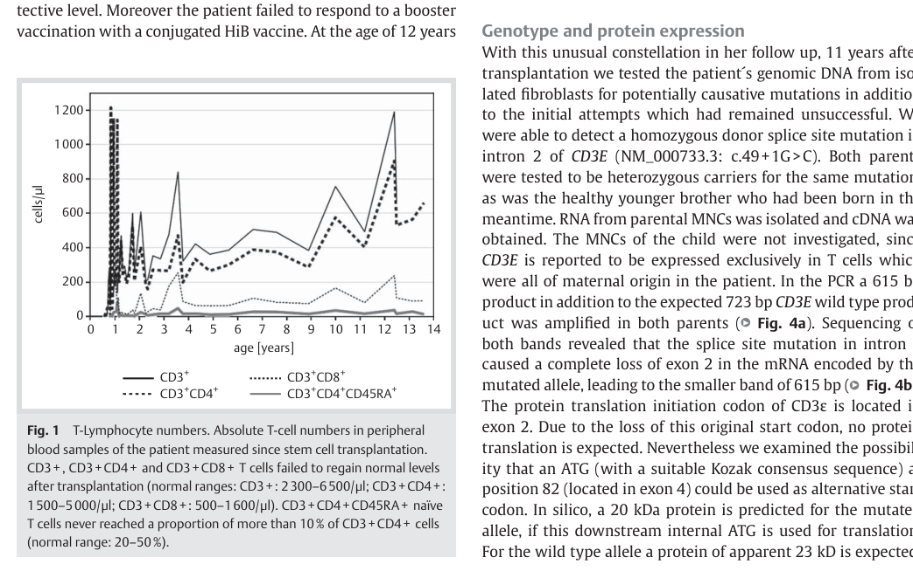

## Question

# Disease Characteristics Research Template

## Target Disease
- **Disease Name:** immunodeficiency 18 (CD3epsilon deficiency, biallelic CD3E loss of function)
- **MONDO ID:** MONDO:0014278 (if available)
- **Category:** Mendelian

## Research Objectives

Please provide a comprehensive research report on **immunodeficiency 18 (CD3epsilon deficiency, biallelic CD3E loss of function)** covering all of the
disease characteristics listed below. This report will be used to populate a disease knowledge
base entry. Be thorough and cite primary literature (PMID preferred) for all claims.

For each section, **suggested databases/resources** are listed. These are the first places
you should search for information on each topic.

---

### 1. Disease Information
> **Search first:** OMIM, Orphanet, ICD-10/ICD-11, MeSH, PubMed

- What is the disease? Provide a concise overview.
- What are the key identifiers? (OMIM, Orphanet, ICD-10/ICD-11, MeSH, Mondo)
- What are the common synonyms and alternative names?
- Is the information derived from individual patients (e.g., EHR) or aggregated disease-level resources?

### 2. Etiology

- **Disease Causal Factors**: What are the primary causes? (genetic, environmental, infectious, mechanistic)
- **Risk Factors**:
  > **Search first:** PubMed, Cochrane Library, UpToDate, clinical guidelines, ClinVar, ClinGen, GWAS Catalog, PheGenI, CTD, CDC, WHO, epidemiological databases
  - Genetic risk factors (causal variants, susceptibility loci, modifier genes)
  - Environmental risk factors (toxins, lifestyle, occupational exposures, age, sex, family history)
- **Protective Factors**:
  > **Search first:** PubMed, Cochrane Library, clinical trial databases, GWAS Catalog, gnomAD, WHO, CDC, nutrition databases
  - Genetic protective factors (protective variants, modifier alleles)
  - Environmental protective factors (diet, lifestyle, exposures that reduce risk)
- **Gene-Environment Interactions**: How do genetic and environmental factors interact to influence disease?
  > **Search first:** CTD, PubMed, PheGenI, GxE databases

### 3. Phenotypes
> **Search first:** HPO (Human Phenotype Ontology), OMIM, Orphanet, PubMed, clinicaltrials.gov, MedDRA, SNOMED CT, DECIPHER, LOINC

For each phenotype, provide:
- **Phenotype type**: symptoms, clinical signs, physical manifestations, behavioral changes, or laboratory abnormalities
  > For symptoms/signs: HPO, OMIM, Orphanet, PubMed
  > For behavioral changes: HPO, DSM, RDoC (Research Domain Criteria), PubMed
  > For laboratory abnormalities: LOINC, SNOMED CT, LabTests Online, PubMed
- **Phenotype characteristics**:
  > **Search first:** OMIM, Orphanet, HPO, PubMed
  - Age of symptom onset (neonatal, childhood, adult-onset, late-onset)
  - Symptom severity (mild, moderate, severe, variable)
  - Symptom progression (stable, progressive, episodic, fluctuating)
  - Frequency among affected individuals (percentage or qualitative)
- **Quality of life impact**: Effects on daily functioning and well-being (per-phenotype when possible)
  > **Search first:** EQ-5D database, SF-36, WHO QOL databases, PubMed
- Suggest HPO (Human Phenotype Ontology) terms for each phenotype

### 4. Genetic/Molecular Information

- **Causal Genes**: Gene mutations or chromosomal abnormalities responsible for disease (gene symbols, OMIM IDs)
  > **Search first:** OMIM, ClinVar, HGMD, Ensembl, NCBI Gene
- **Pathogenic Variants**:
  - Affected genes (gene symbols, HGNC IDs)
    > **Search first:** OMIM, NCBI Gene, Ensembl, HGNC, UniProt, GeneCards
  - Variant classification (pathogenic, likely pathogenic, VUS per ACMG/AMP guidelines)
    > **Search first:** ClinVar, ClinGen, ACMG/AMP guidelines, VarSome
  - Variant type/class (missense, frameshift, nonsense, splice-site, structural)
  - Allele frequency in population databases
    > **Search first:** gnomAD, 1000 Genomes, ExAC, TOPMed, dbSNP
  - Somatic vs germline origin
    > **Search first:** COSMIC (somatic), ClinVar, ICGC, TCGA
  - Functional consequences (loss of function, gain of function, dominant negative)
- **Modifier Genes**: Genes that modify disease severity or expression
- **Epigenetic Information**: DNA methylation, histone modifications, chromatin changes affecting disease
  > **Search first:** ENCODE, Roadmap Epigenomics, MethBase, DiseaseMeth
- **Chromosomal Abnormalities**: Large-scale genetic changes (aneuploidy, translocations, inversions)
  > **Search first:** DECIPHER, ClinVar, ECARUCA, UCSC Genome Browser

### 5. Environmental Information

- **Environmental Factors**: Non-genetic contributing factors (toxins, radiation, pollution, occupational exposure)
  > **Search first:** CTD (Comparative Toxicogenomics Database), TOXNET, PubMed, EPA databases
- **Lifestyle Factors**: Behavioral factors (smoking, diet, exercise, alcohol consumption)
  > **Search first:** CDC databases, WHO, PubMed, NHANES
- **Infectious Agents**: If applicable, pathogens causing or triggering disease (bacteria, viruses, fungi, parasites)
  > **Search first:** NCBI Taxonomy, ViPR, BV-BRC, MicrobeDB, GIDEON

### 6. Mechanism / Pathophysiology

**Present this section as an ordered causal chain first, then the detail below.**
Open with a numbered sequence of mechanistic steps running from the initiating
lesion (mutation, exposure, infection) to the clinical manifestation, one step per
line, each naming what it causes next. State the causal verb explicitly ("leads
to", "results in") and say where a step is inferred rather than demonstrated.
Where the mechanism branches, show the branch. The categories below are a
checklist of what to cover within those steps, not the organizing structure —
a step may draw on several of them, and a category may contribute to several
steps.

- **Molecular Pathways**: Specific signaling cascades or biochemical pathways involved (Wnt, MAPK, mTOR, PI3K-AKT, etc.)
  > **Search first:** KEGG, Reactome, WikiPathways, PathBank, BioCyc
- **Cellular Processes**: Cell-level mechanisms (apoptosis, autophagy, cell cycle dysregulation, inflammation, etc.)
  > **Search first:** Gene Ontology (GO), Reactome, KEGG, PubMed
- **Protein Dysfunction**: How protein structure or function is altered (misfolding, aggregation, loss of function, gain of function)
  > **Search first:** UniProt, PDB (Protein Data Bank), InterPro, Pfam, AlphaFold
- **Metabolic Changes**: Alterations in metabolic processes (energy metabolism, lipid metabolism, amino acid metabolism)
  > **Search first:** KEGG, BioCyc, HMDB (Human Metabolome Database), BRENDA
- **Immune System Involvement**: Role of immune response (autoimmunity, immunodeficiency, chronic inflammation)
  > **Search first:** ImmPort, Immunome Database, IEDB, Gene Ontology
- **Tissue Damage Mechanisms**: How tissues/ are injured (oxidative stress, ischemia, fibrosis, necrosis)
  > **Search first:** PubMed, Gene Ontology, Reactome
- **Biochemical Abnormalities**: Specific molecular defects (enzyme deficiencies, receptor dysfunction, ion channel defects)
  > **Search first:** BRENDA, UniProt, KEGG, OMIM, PubMed
- **Epigenetic Changes**: DNA methylation, histone modifications affecting gene expression in disease
  > **Search first:** ENCODE, Roadmap Epigenomics, MethBase, DiseaseMeth
- **Molecular Profiling** (if available):
  - Transcriptomics/gene expression changes
    > **Search first:** GEO (Gene Expression Omnibus), ArrayExpress, GTEx, Human Cell Atlas, SRA
  - Proteomics findings
    > **Search first:** PRIDE, ProteomeXchange, Human Protein Atlas, STRING, BioGRID
  - Metabolomics signatures
    > **Search first:** MetaboLights, Metabolomics Workbench, HMDB, METLIN
  - Lipidomics alterations
    > **Search first:** LIPID MAPS, SwissLipids, LipidHome, Metabolomics Workbench
  - Genomic structural features
    > **Search first:** UCSC Genome Browser, Ensembl, NCBI, dbVar, DGV
- **Advanced Technologies** (if applicable):
  - Single-cell analysis findings (cell-type specific mechanisms, cellular heterogeneity)
    > **Search first:** Human Cell Atlas, Single Cell Portal, GEO, CELLxGENE
  - Spatial transcriptomics findings
    > **Search first:** GEO, Spatial Research, Vizgen, 10x Genomics data
  - Multi-omics integration results
    > **Search first:** TCGA, ICGC, cBioPortal, LinkedOmics, PubMed
  - Functional genomics screens (CRISPR, RNAi)
    > **Search first:** DepMap, GenomeRNAi, PubMed, BioGRID ORCS

For each mechanism, describe:
- The causal chain from initial trigger to clinical manifestation
- Which mechanisms are upstream vs downstream
- What cell types and biological processes are involved
- Suggest GO terms for biological processes and CL terms for cell types

### 7. Anatomical Structures Affected

- **Organ Level**:
  - Primary organs directly affected
  - Secondary organ involvement (complications, secondary effects)
  - Body systems involved (cardiovascular, nervous, digestive, respiratory, endocrine, etc.)
  > **Search first:** Uberon, FMA (Foundational Model of Anatomy), OMIM, HPO, ICD-11, MeSH, SNOMED CT
- **Tissue and Cell Level**:
  - Specific tissue types affected (epithelial, connective, muscle, nervous)
  - Specific cell populations targeted (with Cell Ontology terms)
  > **Search first:** Uberon, Human Protein Atlas, Cell Ontology, Human Cell Atlas, CellMarker, PanglaoDB
- **Subcellular Level**:
  - Cellular compartments involved (mitochondria, nucleus, ER, lysosomes) (with GO Cellular Component terms)
  > **Search first:** Gene Ontology (Cellular Component), UniProt, Human Protein Atlas
- **Localization**:
  - Specific anatomical sites (with UBERON terms)
    > **Search first:** FMA, Uberon, NeuroNames (for brain), SNOMED CT
  - Lateralization (unilateral, bilateral, asymmetric)
    > **Search first:** HPO, clinical literature, imaging databases

### 8. Temporal Development

- **Onset**:
  - Typical age of onset (congenital, pediatric, adult, geriatric)
  - Onset pattern (acute, subacute, chronic, insidious)
  > **Search first:** OMIM, Orphanet, HPO, PubMed
- **Progression**:
  - Disease stages (early, intermediate, advanced, end-stage)
    > **Search first:** Cancer Staging Manual (AJCC), WHO classifications, PubMed
  - Progression rate (rapid, slow, variable)
  - Disease course pattern (episodic, relapsing-remitting, progressive, stable)
  - Disease duration (self-limited, chronic lifelong)
  > **Search first:** Disease registries, longitudinal cohort databases, natural history studies, PubMed, Orphanet, OMIM
- **Patterns**:
  - Remission patterns (spontaneous, treatment-induced)
    > **Search first:** Clinical trial databases, disease registries, PubMed
  - Critical periods (time windows of vulnerability or opportunity for intervention)
    > **Search first:** PubMed, developmental biology databases, clinical guidelines

### 9. Inheritance and Population

- **Epidemiology**:
  - Prevalence (cases per 100,000 at given time)
  - Incidence (new cases per 100,000 per year)
  > **Search first:** Orphanet, CDC, WHO, GBD (Global Burden of Disease), national registries, SEER, disease registries
- **For Genetic Etiology**:
  - Inheritance pattern (AD, AR, X-linked, mitochondrial, multifactorial, polygenic)
    > **Search first:** OMIM, Orphanet, ClinVar, GTR (Genetic Testing Registry)
  - Penetrance (complete, incomplete, age-dependent)
    > **Search first:** ClinVar, OMIM, PubMed, ClinGen
  - Expressivity (variable, consistent)
    > **Search first:** OMIM, ClinVar, PubMed
  - Genetic anticipation (increasing severity in successive generations)
    > **Search first:** OMIM, PubMed (especially for repeat expansion disorders)
  - Germline mosaicism
    > **Search first:** ClinVar, OMIM, genetic counseling literature, PubMed
  - Founder effects (population-specific mutations)
    > **Search first:** gnomAD, population genetics databases, PubMed
  - Consanguinity role
    > **Search first:** OMIM, population studies, genetic counseling resources
  - Carrier frequency
    > **Search first:** gnomAD, carrier screening databases, GeneReviews, GTR
- **Population Demographics**:
  - Affected populations (ethnic or demographic groups with higher prevalence)
    > **Search first:** gnomAD, 1000 Genomes, PAGE Study, PubMed, population registries
  - Geographic distribution (endemic areas, regional variation)
    > **Search first:** WHO, CDC, GBD, Orphanet, geographic epidemiology databases
  - Geographic distribution of specific variants
  - Sex ratio (male:female)
    > **Search first:** Disease registries, OMIM, PubMed, epidemiological databases
  - Age distribution of affected individuals
    > **Search first:** CDC, disease registries, SEER, Orphanet

### 10. Diagnostics

- **Clinical Tests**:
  - Laboratory tests (blood, urine, tissue chemistry, specific enzyme assays)
    > **Search first:** LOINC, LabTests Online, PubMed
  - Biomarkers (proteins, metabolites, genetic markers, circulating biomarkers)
    > **Search first:** FDA Biomarker List, BEST (Biomarkers, EndpointS, and other Tools), PubMed
  - Imaging studies (X-ray, CT, MRI, PET, ultrasound)
    > **Search first:** RadLex, DICOM, Radiopaedia, imaging databases
  - Functional tests (pulmonary function, cardiac stress tests)
    > **Search first:** LOINC, clinical guidelines, PubMed
  - Electrophysiology (EEG, EMG, ECG, nerve conduction studies)
    > **Search first:** LOINC, clinical neurophysiology databases, PubMed
  - Biopsy findings (histopathology, immunohistochemistry)
    > **Search first:** SNOMED CT, College of American Pathologists resources, PubMed
  - Pathology findings (microscopic examination)
    > **Search first:** SNOMED CT, Digital Pathology databases, PubMed
- **Genetic Testing**:
  > **Search first:** GTR (Genetic Testing Registry), GeneReviews, ClinGen
  - Overview of recommended genetic testing approach
  - Whole genome sequencing (WGS) utility
    > **Search first:** GTR, ClinVar, GEL (Genomics England), gnomAD
  - Whole exome sequencing (WES) utility
    > **Search first:** GTR, ClinVar, OMIM, GeneMatcher
  - Gene panels (which panels, which genes)
    > **Search first:** GTR, ClinVar, laboratory-specific databases
  - Single gene testing
    > **Search first:** GTR, ClinVar, OMIM, GeneReviews
  - Chromosomal microarray (CMA)
    > **Search first:** DECIPHER, ClinVar, dbVar, ECARUCA
  - Karyotyping
    > **Search first:** Chromosome Abnormality Database, ClinVar, cytogenetics resources
  - FISH
    > **Search first:** ClinVar, cytogenetics databases, PubMed
  - Mitochondrial DNA testing
    > **Search first:** MITOMAP, MSeqDR, ClinVar, GTR
  - Repeat expansion testing
    > **Search first:** GTR, ClinVar, repeat expansion databases, PubMed
- **Omics-Based Diagnostics** (if applicable):
  - RNA sequencing / transcriptomics
    > **Search first:** GEO, ArrayExpress, GTEx, RNA-seq databases
  - Proteomics
    > **Search first:** PRIDE, ProteomeXchange, FDA Biomarker database
  - Metabolomics
    > **Search first:** MetaboLights, Metabolomics Workbench, HMDB
  - Epigenomics
    > **Search first:** GEO, ENCODE, Roadmap Epigenomics, MethBase
  - Liquid biopsy
    > **Search first:** COSMIC, ClinVar, liquid biopsy databases, PubMed
- **Clinical Criteria**:
  - Standardized diagnostic criteria (DSM, ICD, society guidelines)
    > **Search first:** DSM-5, ICD-11, clinical society guidelines, UpToDate
  - Differential diagnosis (other conditions to rule out, with distinguishing features)
    > **Search first:** DynaMed, UpToDate, clinical decision support systems
- **Screening**:
  - Screening methods for asymptomatic individuals (newborn screening, carrier screening, cascade screening)
    > **Search first:** ACMG recommendations, CDC newborn screening, GTR

### 11. Outcome/Prognosis

- **Survival and Mortality**:
  - Survival rate (5-year, 10-year, overall)
    > **Search first:** SEER, cancer registries, disease-specific registries, PubMed
  - Life expectancy (with and without treatment if applicable)
    > **Search first:** Orphanet, disease registries, actuarial databases, PubMed
  - Mortality rate
    > **Search first:** CDC, WHO, GBD, national mortality databases
  - Disease-specific mortality (deaths directly attributable to disease)
    > **Search first:** Disease registries, CDC Wonder, GBD, PubMed
- **Morbidity and Function**:
  - Morbidity (disease-related disability and health impacts)
    > **Search first:** GBD, WHO, disability databases, PubMed
  - Disability outcomes (long-term functional impairments)
    > **Search first:** ICF (International Classification of Functioning), disability registries
  - Quality of life measures (EQ-5D, SF-36, PROMIS, disease-specific tools)
    > **Search first:** EQ-5D database, SF-36, PROMIS, PubMed
- **Disease Course**:
  - Complications (secondary problems: infections, organ failure, etc.)
    > **Search first:** ICD codes, disease registries, clinical databases, PubMed
  - Recovery potential (likelihood and extent of recovery, with vs without treatment)
    > **Search first:** Natural history studies, rehabilitation databases, PubMed
- **Prediction**:
  - Prognostic factors (age, disease severity, biomarkers, treatment response)
    > **Search first:** Prognostic models databases, clinical calculators, PubMed
  - Prognostic biomarkers (molecular markers predicting disease course)
    > **Search first:** FDA Biomarker database, PubMed, cancer prognostic databases

### 12. Treatment

- **Pharmacotherapy**:
  - Pharmacological treatments (drug names, drug classes, mechanisms of action)
    > **Search first:** DrugBank, RxNorm, ATC classification, DailyMed, FDA databases
  - Pharmacogenomics (how genetic variants affect drug metabolism, efficacy, toxicity)
    > **Search first:** PharmGKB, CPIC (Clinical Pharmacogenetics), FDA Table of PGx Biomarkers
- **Advanced Therapeutics**:
  - Gene therapy (viral vectors, CRISPR, gene replacement, gene editing)
    > **Search first:** ClinicalTrials.gov, FDA gene therapy database, ASGCT resources
  - Cell therapy (stem cell transplant, CAR-T, cellular therapeutics)
    > **Search first:** ClinicalTrials.gov, FDA cell therapy database, FACT standards
  - RNA-based therapies (ASOs, siRNA, mRNA therapies)
    > **Search first:** ClinicalTrials.gov, FDA approvals, PubMed
  - Targeted therapies (treatments directed at specific molecular targets)
    > **Search first:** My Cancer Genome, OncoKB, ClinicalTrials.gov, FDA approvals
  - Immunotherapies (checkpoint inhibitors, monoclonal antibodies)
    > **Search first:** Cancer Immunotherapy Database, FDA approvals, ClinicalTrials.gov
- **Surgical and Interventional**:
  - Surgical interventions (types of surgery, timing, outcomes)
    > **Search first:** CPT codes, surgical registries, clinical guidelines, PubMed
- **Supportive and Rehabilitative**:
  - Supportive care (symptom management, pain control, nutrition)
    > **Search first:** Clinical guidelines, Cochrane Library, PubMed
  - Rehabilitation (physical therapy, occupational therapy, speech therapy)
    > **Search first:** Rehabilitation medicine databases, clinical guidelines, PubMed
- **Experimental**:
  - Experimental treatments in clinical trials (with NCT identifiers if available)
    > **Search first:** ClinicalTrials.gov, EU Clinical Trials Register, WHO ICTRP
- **Treatment Outcomes**:
  - Treatment response rates
    > **Search first:** Clinical trial databases, FDA reviews, systematic reviews, PubMed
  - Side effects and adverse events
    > **Search first:** FDA Adverse Event Reporting System (FAERS), MedWatch, PubMed
- **Treatment Strategy**:
  - Treatment algorithms (clinical pathways, decision trees)
    > **Search first:** Clinical practice guidelines, NCCN Guidelines, UpToDate
  - Combination therapies
    > **Search first:** ClinicalTrials.gov, treatment guidelines, PubMed
  - Personalized medicine approaches (genotype-guided treatment)
    > **Search first:** My Cancer Genome, CIViC, PharmGKB, precision medicine databases

For each treatment, suggest NCIT (NCI Thesaurus) clinical-intervention terms where applicable.

### 13. Prevention

- **Prevention Levels**:
  - Primary prevention (preventing disease occurrence: vaccination, risk factor modification)
    > **Search first:** CDC, WHO, USPSTF recommendations, Cochrane Library
  - Secondary prevention (early detection and treatment: screening programs, early intervention)
    > **Search first:** USPSTF, CDC screening guidelines, WHO
  - Tertiary prevention (preventing complications in those with disease)
    > **Search first:** Clinical guidelines, disease management protocols, PubMed
- **Immunization**: Vaccine strategies (if applicable)
  > **Search first:** CDC vaccine schedules, WHO immunization, FDA vaccine database
- **Screening and Early Detection**:
  - Screening programs (population-based: newborn screening, cancer screening)
    > **Search first:** CDC screening programs, USPSTF, cancer screening databases
  - Genetic screening (carrier screening, preimplantation genetic diagnosis, prenatal testing)
    > **Search first:** ACMG recommendations, ACOG guidelines, GTR
  - Risk stratification (identifying high-risk individuals for targeted prevention)
    > **Search first:** Risk prediction models, clinical calculators, PubMed
- **Behavioral Interventions**: Lifestyle modifications to reduce risk
  > **Search first:** CDC, WHO, behavioral intervention databases, Cochrane Library
- **Counseling**: Genetic counseling (risk assessment, family planning guidance)
  > **Search first:** NSGC resources, ACMG guidelines, GeneReviews
- **Public Health**:
  - Public health interventions (sanitation, vector control, health education)
    > **Search first:** CDC, WHO, public health databases, PubMed
  - Environmental interventions (reducing environmental risk factors)
    > **Search first:** EPA databases, WHO environmental health, PubMed
- **Prophylaxis**: Preventive medications or procedures
  > **Search first:** Clinical guidelines, FDA approvals, PubMed

### 14. Other Species / Natural Disease

- **Taxonomy**: Species affected (with NCBI Taxon identifiers)
  > **Search first:** NCBI Taxonomy
- **Breed**: Specific breeds affected (with VBO identifiers if applicable)
  > **Search first:** VBO (Vertebrate Breed Ontology)
- **Gene**: Orthologous genes in other species (with NCBI Gene IDs)
  > **Search first:** NCBI Gene
- **Natural Disease**:
  - Naturally occurring disease in other species (companion animals, wildlife)
    > **Search first:** OMIA (Online Mendelian Inheritance in Animals), VetCompass, PubMed
  - Veterinary relevance and importance in animal health
    > **Search first:** OMIA, veterinary databases, PubMed
- **Comparative Biology**:
  - Comparative pathology (similarities and differences across species)
    > **Search first:** OMIA, comparative pathology databases, PubMed
  - Evolutionary conservation of disease mechanisms
    > **Search first:** HomoloGene, OrthoMCL, Alliance of Genome Resources
- **Transmission** (if applicable):
  - Zoonotic potential
    > **Search first:** CDC zoonotic diseases, WHO zoonoses, GIDEON
  - Cross-species susceptibility
    > **Search first:** NCBI Taxonomy, veterinary databases, PubMed

### 15. Model Organisms

- **Model Types**:
  - Model organism type (mammalian, invertebrate, cellular, in vitro)
    > **Search first:** Alliance of Genome Resources, model organism databases
  - Specific model systems (mouse, rat, zebrafish, Drosophila, C. elegans, yeast, cell lines, organoids, iPSCs)
    > **Search first:** MGI, RGD, ZFIN, FlyBase, WormBase, SGD, ATCC, Cellosaurus
  - Induced models (drug treatment, surgical intervention, environmental manipulation)
    > **Search first:** MGI, model organism databases, PubMed
- **Genetic Models**:
  - Types available (knockout, knock-in, transgenic, conditional, humanized)
    > **Search first:** MGI, IMPC, KOMP, EuMMCR, IMSR
- **Model Characteristics**:
  - Phenotype recapitulation (how well model reproduces human disease features)
    > **Search first:** Model organism databases, comparative studies, PubMed
  - Model limitations (aspects of human disease not captured)
    > **Search first:** Model organism databases, PubMed, review articles
- **Applications**:
  - Research applications (what aspects of disease can be studied)
    > **Search first:** Model organism databases, PubMed
- **Resources**:
  - Model databases
    > **Search first:** MGI, RGD, ZFIN, FlyBase, WormBase, IMSR, EMMA, MMRRC

---

## Citation Requirements

- Cite primary literature (PMID preferred) for all mechanistic and clinical claims
- Prioritize recent reviews and landmark papers
- Include direct quotes from abstracts where possible to support key statements
- Distinguish evidence source types: human clinical, model organism, in vitro, computational

## Output Format

Structure your response as a comprehensive narrative organized by the sections above.
For each section, provide:
- Factual content with specific details (numbers, percentages, gene names, variant nomenclature)
- Ontology term suggestions (HPO, GO, CL, UBERON, CHEBI, NCIT, MONDO) where applicable
- Evidence citations with PMIDs
- Direct quotes from abstracts to support key claims
- Clear indication when information is not available or not applicable for this disease

This report will be used to populate a disease knowledge base entry with:
- Pathophysiology descriptions with causal chains
- Gene/protein annotations (HGNC, GO terms)
- Phenotype associations (HP terms) with frequencies
- Cell type involvement (CL terms)
- Anatomical locations (UBERON terms)
- Chemical entities (CHEBI terms)
- Treatment annotations (NCIT terms)
- Evidence items with PMIDs and exact abstract quotes
- Epidemiology, prognosis, diagnostic, and prevention information
- Animal model descriptions with phenotype recapitulation details

## Output

Question: You are an expert researcher providing comprehensive, well-cited information.

Provide detailed information focusing on:
1. Key concepts and definitions with current understanding
2. Recent developments and latest research (prioritize 2023-2024 sources)
3. Current applications and real-world implementations
4. Expert opinions and analysis from authoritative sources
5. Relevant statistics and data from recent studies

Format as a comprehensive research report with proper citations. Include URLs and publication dates where available.
Always prioritize recent, authoritative sources and provide specific citations for all major claims.

# Disease Characteristics Research Template

## Target Disease
- **Disease Name:** immunodeficiency 18 (CD3epsilon deficiency, biallelic CD3E loss of function)
- **MONDO ID:** MONDO:0014278 (if available)
- **Category:** Mendelian

## Research Objectives

Please provide a comprehensive research report on **immunodeficiency 18 (CD3epsilon deficiency, biallelic CD3E loss of function)** covering all of the
disease characteristics listed below. This report will be used to populate a disease knowledge
base entry. Be thorough and cite primary literature (PMID preferred) for all claims.

For each section, **suggested databases/resources** are listed. These are the first places
you should search for information on each topic.

---

### 1. Disease Information
> **Search first:** OMIM, Orphanet, ICD-10/ICD-11, MeSH, PubMed

- What is the disease? Provide a concise overview.
- What are the key identifiers? (OMIM, Orphanet, ICD-10/ICD-11, MeSH, Mondo)
- What are the common synonyms and alternative names?
- Is the information derived from individual patients (e.g., EHR) or aggregated disease-level resources?

### 2. Etiology

- **Disease Causal Factors**: What are the primary causes? (genetic, environmental, infectious, mechanistic)
- **Risk Factors**:
  > **Search first:** PubMed, Cochrane Library, UpToDate, clinical guidelines, ClinVar, ClinGen, GWAS Catalog, PheGenI, CTD, CDC, WHO, epidemiological databases
  - Genetic risk factors (causal variants, susceptibility loci, modifier genes)
  - Environmental risk factors (toxins, lifestyle, occupational exposures, age, sex, family history)
- **Protective Factors**:
  > **Search first:** PubMed, Cochrane Library, clinical trial databases, GWAS Catalog, gnomAD, WHO, CDC, nutrition databases
  - Genetic protective factors (protective variants, modifier alleles)
  - Environmental protective factors (diet, lifestyle, exposures that reduce risk)
- **Gene-Environment Interactions**: How do genetic and environmental factors interact to influence disease?
  > **Search first:** CTD, PubMed, PheGenI, GxE databases

### 3. Phenotypes
> **Search first:** HPO (Human Phenotype Ontology), OMIM, Orphanet, PubMed, clinicaltrials.gov, MedDRA, SNOMED CT, DECIPHER, LOINC

For each phenotype, provide:
- **Phenotype type**: symptoms, clinical signs, physical manifestations, behavioral changes, or laboratory abnormalities
  > For symptoms/signs: HPO, OMIM, Orphanet, PubMed
  > For behavioral changes: HPO, DSM, RDoC (Research Domain Criteria), PubMed
  > For laboratory abnormalities: LOINC, SNOMED CT, LabTests Online, PubMed
- **Phenotype characteristics**:
  > **Search first:** OMIM, Orphanet, HPO, PubMed
  - Age of symptom onset (neonatal, childhood, adult-onset, late-onset)
  - Symptom severity (mild, moderate, severe, variable)
  - Symptom progression (stable, progressive, episodic, fluctuating)
  - Frequency among affected individuals (percentage or qualitative)
- **Quality of life impact**: Effects on daily functioning and well-being (per-phenotype when possible)
  > **Search first:** EQ-5D database, SF-36, WHO QOL databases, PubMed
- Suggest HPO (Human Phenotype Ontology) terms for each phenotype

### 4. Genetic/Molecular Information

- **Causal Genes**: Gene mutations or chromosomal abnormalities responsible for disease (gene symbols, OMIM IDs)
  > **Search first:** OMIM, ClinVar, HGMD, Ensembl, NCBI Gene
- **Pathogenic Variants**:
  - Affected genes (gene symbols, HGNC IDs)
    > **Search first:** OMIM, NCBI Gene, Ensembl, HGNC, UniProt, GeneCards
  - Variant classification (pathogenic, likely pathogenic, VUS per ACMG/AMP guidelines)
    > **Search first:** ClinVar, ClinGen, ACMG/AMP guidelines, VarSome
  - Variant type/class (missense, frameshift, nonsense, splice-site, structural)
  - Allele frequency in population databases
    > **Search first:** gnomAD, 1000 Genomes, ExAC, TOPMed, dbSNP
  - Somatic vs germline origin
    > **Search first:** COSMIC (somatic), ClinVar, ICGC, TCGA
  - Functional consequences (loss of function, gain of function, dominant negative)
- **Modifier Genes**: Genes that modify disease severity or expression
- **Epigenetic Information**: DNA methylation, histone modifications, chromatin changes affecting disease
  > **Search first:** ENCODE, Roadmap Epigenomics, MethBase, DiseaseMeth
- **Chromosomal Abnormalities**: Large-scale genetic changes (aneuploidy, translocations, inversions)
  > **Search first:** DECIPHER, ClinVar, ECARUCA, UCSC Genome Browser

### 5. Environmental Information

- **Environmental Factors**: Non-genetic contributing factors (toxins, radiation, pollution, occupational exposure)
  > **Search first:** CTD (Comparative Toxicogenomics Database), TOXNET, PubMed, EPA databases
- **Lifestyle Factors**: Behavioral factors (smoking, diet, exercise, alcohol consumption)
  > **Search first:** CDC databases, WHO, PubMed, NHANES
- **Infectious Agents**: If applicable, pathogens causing or triggering disease (bacteria, viruses, fungi, parasites)
  > **Search first:** NCBI Taxonomy, ViPR, BV-BRC, MicrobeDB, GIDEON

### 6. Mechanism / Pathophysiology

**Present this section as an ordered causal chain first, then the detail below.**
Open with a numbered sequence of mechanistic steps running from the initiating
lesion (mutation, exposure, infection) to the clinical manifestation, one step per
line, each naming what it causes next. State the causal verb explicitly ("leads
to", "results in") and say where a step is inferred rather than demonstrated.
Where the mechanism branches, show the branch. The categories below are a
checklist of what to cover within those steps, not the organizing structure —
a step may draw on several of them, and a category may contribute to several
steps.

- **Molecular Pathways**: Specific signaling cascades or biochemical pathways involved (Wnt, MAPK, mTOR, PI3K-AKT, etc.)
  > **Search first:** KEGG, Reactome, WikiPathways, PathBank, BioCyc
- **Cellular Processes**: Cell-level mechanisms (apoptosis, autophagy, cell cycle dysregulation, inflammation, etc.)
  > **Search first:** Gene Ontology (GO), Reactome, KEGG, PubMed
- **Protein Dysfunction**: How protein structure or function is altered (misfolding, aggregation, loss of function, gain of function)
  > **Search first:** UniProt, PDB (Protein Data Bank), InterPro, Pfam, AlphaFold
- **Metabolic Changes**: Alterations in metabolic processes (energy metabolism, lipid metabolism, amino acid metabolism)
  > **Search first:** KEGG, BioCyc, HMDB (Human Metabolome Database), BRENDA
- **Immune System Involvement**: Role of immune response (autoimmunity, immunodeficiency, chronic inflammation)
  > **Search first:** ImmPort, Immunome Database, IEDB, Gene Ontology
- **Tissue Damage Mechanisms**: How tissues/ are injured (oxidative stress, ischemia, fibrosis, necrosis)
  > **Search first:** PubMed, Gene Ontology, Reactome
- **Biochemical Abnormalities**: Specific molecular defects (enzyme deficiencies, receptor dysfunction, ion channel defects)
  > **Search first:** BRENDA, UniProt, KEGG, OMIM, PubMed
- **Epigenetic Changes**: DNA methylation, histone modifications affecting gene expression in disease
  > **Search first:** ENCODE, Roadmap Epigenomics, MethBase, DiseaseMeth
- **Molecular Profiling** (if available):
  - Transcriptomics/gene expression changes
    > **Search first:** GEO (Gene Expression Omnibus), ArrayExpress, GTEx, Human Cell Atlas, SRA
  - Proteomics findings
    > **Search first:** PRIDE, ProteomeXchange, Human Protein Atlas, STRING, BioGRID
  - Metabolomics signatures
    > **Search first:** MetaboLights, Metabolomics Workbench, HMDB, METLIN
  - Lipidomics alterations
    > **Search first:** LIPID MAPS, SwissLipids, LipidHome, Metabolomics Workbench
  - Genomic structural features
    > **Search first:** UCSC Genome Browser, Ensembl, NCBI, dbVar, DGV
- **Advanced Technologies** (if applicable):
  - Single-cell analysis findings (cell-type specific mechanisms, cellular heterogeneity)
    > **Search first:** Human Cell Atlas, Single Cell Portal, GEO, CELLxGENE
  - Spatial transcriptomics findings
    > **Search first:** GEO, Spatial Research, Vizgen, 10x Genomics data
  - Multi-omics integration results
    > **Search first:** TCGA, ICGC, cBioPortal, LinkedOmics, PubMed
  - Functional genomics screens (CRISPR, RNAi)
    > **Search first:** DepMap, GenomeRNAi, PubMed, BioGRID ORCS

For each mechanism, describe:
- The causal chain from initial trigger to clinical manifestation
- Which mechanisms are upstream vs downstream
- What cell types and biological processes are involved
- Suggest GO terms for biological processes and CL terms for cell types

### 7. Anatomical Structures Affected

- **Organ Level**:
  - Primary organs directly affected
  - Secondary organ involvement (complications, secondary effects)
  - Body systems involved (cardiovascular, nervous, digestive, respiratory, endocrine, etc.)
  > **Search first:** Uberon, FMA (Foundational Model of Anatomy), OMIM, HPO, ICD-11, MeSH, SNOMED CT
- **Tissue and Cell Level**:
  - Specific tissue types affected (epithelial, connective, muscle, nervous)
  - Specific cell populations targeted (with Cell Ontology terms)
  > **Search first:** Uberon, Human Protein Atlas, Cell Ontology, Human Cell Atlas, CellMarker, PanglaoDB
- **Subcellular Level**:
  - Cellular compartments involved (mitochondria, nucleus, ER, lysosomes) (with GO Cellular Component terms)
  > **Search first:** Gene Ontology (Cellular Component), UniProt, Human Protein Atlas
- **Localization**:
  - Specific anatomical sites (with UBERON terms)
    > **Search first:** FMA, Uberon, NeuroNames (for brain), SNOMED CT
  - Lateralization (unilateral, bilateral, asymmetric)
    > **Search first:** HPO, clinical literature, imaging databases

### 8. Temporal Development

- **Onset**:
  - Typical age of onset (congenital, pediatric, adult, geriatric)
  - Onset pattern (acute, subacute, chronic, insidious)
  > **Search first:** OMIM, Orphanet, HPO, PubMed
- **Progression**:
  - Disease stages (early, intermediate, advanced, end-stage)
    > **Search first:** Cancer Staging Manual (AJCC), WHO classifications, PubMed
  - Progression rate (rapid, slow, variable)
  - Disease course pattern (episodic, relapsing-remitting, progressive, stable)
  - Disease duration (self-limited, chronic lifelong)
  > **Search first:** Disease registries, longitudinal cohort databases, natural history studies, PubMed, Orphanet, OMIM
- **Patterns**:
  - Remission patterns (spontaneous, treatment-induced)
    > **Search first:** Clinical trial databases, disease registries, PubMed
  - Critical periods (time windows of vulnerability or opportunity for intervention)
    > **Search first:** PubMed, developmental biology databases, clinical guidelines

### 9. Inheritance and Population

- **Epidemiology**:
  - Prevalence (cases per 100,000 at given time)
  - Incidence (new cases per 100,000 per year)
  > **Search first:** Orphanet, CDC, WHO, GBD (Global Burden of Disease), national registries, SEER, disease registries
- **For Genetic Etiology**:
  - Inheritance pattern (AD, AR, X-linked, mitochondrial, multifactorial, polygenic)
    > **Search first:** OMIM, Orphanet, ClinVar, GTR (Genetic Testing Registry)
  - Penetrance (complete, incomplete, age-dependent)
    > **Search first:** ClinVar, OMIM, PubMed, ClinGen
  - Expressivity (variable, consistent)
    > **Search first:** OMIM, ClinVar, PubMed
  - Genetic anticipation (increasing severity in successive generations)
    > **Search first:** OMIM, PubMed (especially for repeat expansion disorders)
  - Germline mosaicism
    > **Search first:** ClinVar, OMIM, genetic counseling literature, PubMed
  - Founder effects (population-specific mutations)
    > **Search first:** gnomAD, population genetics databases, PubMed
  - Consanguinity role
    > **Search first:** OMIM, population studies, genetic counseling resources
  - Carrier frequency
    > **Search first:** gnomAD, carrier screening databases, GeneReviews, GTR
- **Population Demographics**:
  - Affected populations (ethnic or demographic groups with higher prevalence)
    > **Search first:** gnomAD, 1000 Genomes, PAGE Study, PubMed, population registries
  - Geographic distribution (endemic areas, regional variation)
    > **Search first:** WHO, CDC, GBD, Orphanet, geographic epidemiology databases
  - Geographic distribution of specific variants
  - Sex ratio (male:female)
    > **Search first:** Disease registries, OMIM, PubMed, epidemiological databases
  - Age distribution of affected individuals
    > **Search first:** CDC, disease registries, SEER, Orphanet

### 10. Diagnostics

- **Clinical Tests**:
  - Laboratory tests (blood, urine, tissue chemistry, specific enzyme assays)
    > **Search first:** LOINC, LabTests Online, PubMed
  - Biomarkers (proteins, metabolites, genetic markers, circulating biomarkers)
    > **Search first:** FDA Biomarker List, BEST (Biomarkers, EndpointS, and other Tools), PubMed
  - Imaging studies (X-ray, CT, MRI, PET, ultrasound)
    > **Search first:** RadLex, DICOM, Radiopaedia, imaging databases
  - Functional tests (pulmonary function, cardiac stress tests)
    > **Search first:** LOINC, clinical guidelines, PubMed
  - Electrophysiology (EEG, EMG, ECG, nerve conduction studies)
    > **Search first:** LOINC, clinical neurophysiology databases, PubMed
  - Biopsy findings (histopathology, immunohistochemistry)
    > **Search first:** SNOMED CT, College of American Pathologists resources, PubMed
  - Pathology findings (microscopic examination)
    > **Search first:** SNOMED CT, Digital Pathology databases, PubMed
- **Genetic Testing**:
  > **Search first:** GTR (Genetic Testing Registry), GeneReviews, ClinGen
  - Overview of recommended genetic testing approach
  - Whole genome sequencing (WGS) utility
    > **Search first:** GTR, ClinVar, GEL (Genomics England), gnomAD
  - Whole exome sequencing (WES) utility
    > **Search first:** GTR, ClinVar, OMIM, GeneMatcher
  - Gene panels (which panels, which genes)
    > **Search first:** GTR, ClinVar, laboratory-specific databases
  - Single gene testing
    > **Search first:** GTR, ClinVar, OMIM, GeneReviews
  - Chromosomal microarray (CMA)
    > **Search first:** DECIPHER, ClinVar, dbVar, ECARUCA
  - Karyotyping
    > **Search first:** Chromosome Abnormality Database, ClinVar, cytogenetics resources
  - FISH
    > **Search first:** ClinVar, cytogenetics databases, PubMed
  - Mitochondrial DNA testing
    > **Search first:** MITOMAP, MSeqDR, ClinVar, GTR
  - Repeat expansion testing
    > **Search first:** GTR, ClinVar, repeat expansion databases, PubMed
- **Omics-Based Diagnostics** (if applicable):
  - RNA sequencing / transcriptomics
    > **Search first:** GEO, ArrayExpress, GTEx, RNA-seq databases
  - Proteomics
    > **Search first:** PRIDE, ProteomeXchange, FDA Biomarker database
  - Metabolomics
    > **Search first:** MetaboLights, Metabolomics Workbench, HMDB
  - Epigenomics
    > **Search first:** GEO, ENCODE, Roadmap Epigenomics, MethBase
  - Liquid biopsy
    > **Search first:** COSMIC, ClinVar, liquid biopsy databases, PubMed
- **Clinical Criteria**:
  - Standardized diagnostic criteria (DSM, ICD, society guidelines)
    > **Search first:** DSM-5, ICD-11, clinical society guidelines, UpToDate
  - Differential diagnosis (other conditions to rule out, with distinguishing features)
    > **Search first:** DynaMed, UpToDate, clinical decision support systems
- **Screening**:
  - Screening methods for asymptomatic individuals (newborn screening, carrier screening, cascade screening)
    > **Search first:** ACMG recommendations, CDC newborn screening, GTR

### 11. Outcome/Prognosis

- **Survival and Mortality**:
  - Survival rate (5-year, 10-year, overall)
    > **Search first:** SEER, cancer registries, disease-specific registries, PubMed
  - Life expectancy (with and without treatment if applicable)
    > **Search first:** Orphanet, disease registries, actuarial databases, PubMed
  - Mortality rate
    > **Search first:** CDC, WHO, GBD, national mortality databases
  - Disease-specific mortality (deaths directly attributable to disease)
    > **Search first:** Disease registries, CDC Wonder, GBD, PubMed
- **Morbidity and Function**:
  - Morbidity (disease-related disability and health impacts)
    > **Search first:** GBD, WHO, disability databases, PubMed
  - Disability outcomes (long-term functional impairments)
    > **Search first:** ICF (International Classification of Functioning), disability registries
  - Quality of life measures (EQ-5D, SF-36, PROMIS, disease-specific tools)
    > **Search first:** EQ-5D database, SF-36, PROMIS, PubMed
- **Disease Course**:
  - Complications (secondary problems: infections, organ failure, etc.)
    > **Search first:** ICD codes, disease registries, clinical databases, PubMed
  - Recovery potential (likelihood and extent of recovery, with vs without treatment)
    > **Search first:** Natural history studies, rehabilitation databases, PubMed
- **Prediction**:
  - Prognostic factors (age, disease severity, biomarkers, treatment response)
    > **Search first:** Prognostic models databases, clinical calculators, PubMed
  - Prognostic biomarkers (molecular markers predicting disease course)
    > **Search first:** FDA Biomarker database, PubMed, cancer prognostic databases

### 12. Treatment

- **Pharmacotherapy**:
  - Pharmacological treatments (drug names, drug classes, mechanisms of action)
    > **Search first:** DrugBank, RxNorm, ATC classification, DailyMed, FDA databases
  - Pharmacogenomics (how genetic variants affect drug metabolism, efficacy, toxicity)
    > **Search first:** PharmGKB, CPIC (Clinical Pharmacogenetics), FDA Table of PGx Biomarkers
- **Advanced Therapeutics**:
  - Gene therapy (viral vectors, CRISPR, gene replacement, gene editing)
    > **Search first:** ClinicalTrials.gov, FDA gene therapy database, ASGCT resources
  - Cell therapy (stem cell transplant, CAR-T, cellular therapeutics)
    > **Search first:** ClinicalTrials.gov, FDA cell therapy database, FACT standards
  - RNA-based therapies (ASOs, siRNA, mRNA therapies)
    > **Search first:** ClinicalTrials.gov, FDA approvals, PubMed
  - Targeted therapies (treatments directed at specific molecular targets)
    > **Search first:** My Cancer Genome, OncoKB, ClinicalTrials.gov, FDA approvals
  - Immunotherapies (checkpoint inhibitors, monoclonal antibodies)
    > **Search first:** Cancer Immunotherapy Database, FDA approvals, ClinicalTrials.gov
- **Surgical and Interventional**:
  - Surgical interventions (types of surgery, timing, outcomes)
    > **Search first:** CPT codes, surgical registries, clinical guidelines, PubMed
- **Supportive and Rehabilitative**:
  - Supportive care (symptom management, pain control, nutrition)
    > **Search first:** Clinical guidelines, Cochrane Library, PubMed
  - Rehabilitation (physical therapy, occupational therapy, speech therapy)
    > **Search first:** Rehabilitation medicine databases, clinical guidelines, PubMed
- **Experimental**:
  - Experimental treatments in clinical trials (with NCT identifiers if available)
    > **Search first:** ClinicalTrials.gov, EU Clinical Trials Register, WHO ICTRP
- **Treatment Outcomes**:
  - Treatment response rates
    > **Search first:** Clinical trial databases, FDA reviews, systematic reviews, PubMed
  - Side effects and adverse events
    > **Search first:** FDA Adverse Event Reporting System (FAERS), MedWatch, PubMed
- **Treatment Strategy**:
  - Treatment algorithms (clinical pathways, decision trees)
    > **Search first:** Clinical practice guidelines, NCCN Guidelines, UpToDate
  - Combination therapies
    > **Search first:** ClinicalTrials.gov, treatment guidelines, PubMed
  - Personalized medicine approaches (genotype-guided treatment)
    > **Search first:** My Cancer Genome, CIViC, PharmGKB, precision medicine databases

For each treatment, suggest NCIT (NCI Thesaurus) clinical-intervention terms where applicable.

### 13. Prevention

- **Prevention Levels**:
  - Primary prevention (preventing disease occurrence: vaccination, risk factor modification)
    > **Search first:** CDC, WHO, USPSTF recommendations, Cochrane Library
  - Secondary prevention (early detection and treatment: screening programs, early intervention)
    > **Search first:** USPSTF, CDC screening guidelines, WHO
  - Tertiary prevention (preventing complications in those with disease)
    > **Search first:** Clinical guidelines, disease management protocols, PubMed
- **Immunization**: Vaccine strategies (if applicable)
  > **Search first:** CDC vaccine schedules, WHO immunization, FDA vaccine database
- **Screening and Early Detection**:
  - Screening programs (population-based: newborn screening, cancer screening)
    > **Search first:** CDC screening programs, USPSTF, cancer screening databases
  - Genetic screening (carrier screening, preimplantation genetic diagnosis, prenatal testing)
    > **Search first:** ACMG recommendations, ACOG guidelines, GTR
  - Risk stratification (identifying high-risk individuals for targeted prevention)
    > **Search first:** Risk prediction models, clinical calculators, PubMed
- **Behavioral Interventions**: Lifestyle modifications to reduce risk
  > **Search first:** CDC, WHO, behavioral intervention databases, Cochrane Library
- **Counseling**: Genetic counseling (risk assessment, family planning guidance)
  > **Search first:** NSGC resources, ACMG guidelines, GeneReviews
- **Public Health**:
  - Public health interventions (sanitation, vector control, health education)
    > **Search first:** CDC, WHO, public health databases, PubMed
  - Environmental interventions (reducing environmental risk factors)
    > **Search first:** EPA databases, WHO environmental health, PubMed
- **Prophylaxis**: Preventive medications or procedures
  > **Search first:** Clinical guidelines, FDA approvals, PubMed

### 14. Other Species / Natural Disease

- **Taxonomy**: Species affected (with NCBI Taxon identifiers)
  > **Search first:** NCBI Taxonomy
- **Breed**: Specific breeds affected (with VBO identifiers if applicable)
  > **Search first:** VBO (Vertebrate Breed Ontology)
- **Gene**: Orthologous genes in other species (with NCBI Gene IDs)
  > **Search first:** NCBI Gene
- **Natural Disease**:
  - Naturally occurring disease in other species (companion animals, wildlife)
    > **Search first:** OMIA (Online Mendelian Inheritance in Animals), VetCompass, PubMed
  - Veterinary relevance and importance in animal health
    > **Search first:** OMIA, veterinary databases, PubMed
- **Comparative Biology**:
  - Comparative pathology (similarities and differences across species)
    > **Search first:** OMIA, comparative pathology databases, PubMed
  - Evolutionary conservation of disease mechanisms
    > **Search first:** HomoloGene, OrthoMCL, Alliance of Genome Resources
- **Transmission** (if applicable):
  - Zoonotic potential
    > **Search first:** CDC zoonotic diseases, WHO zoonoses, GIDEON
  - Cross-species susceptibility
    > **Search first:** NCBI Taxonomy, veterinary databases, PubMed

### 15. Model Organisms

- **Model Types**:
  - Model organism type (mammalian, invertebrate, cellular, in vitro)
    > **Search first:** Alliance of Genome Resources, model organism databases
  - Specific model systems (mouse, rat, zebrafish, Drosophila, C. elegans, yeast, cell lines, organoids, iPSCs)
    > **Search first:** MGI, RGD, ZFIN, FlyBase, WormBase, SGD, ATCC, Cellosaurus
  - Induced models (drug treatment, surgical intervention, environmental manipulation)
    > **Search first:** MGI, model organism databases, PubMed
- **Genetic Models**:
  - Types available (knockout, knock-in, transgenic, conditional, humanized)
    > **Search first:** MGI, IMPC, KOMP, EuMMCR, IMSR
- **Model Characteristics**:
  - Phenotype recapitulation (how well model reproduces human disease features)
    > **Search first:** Model organism databases, comparative studies, PubMed
  - Model limitations (aspects of human disease not captured)
    > **Search first:** Model organism databases, PubMed, review articles
- **Applications**:
  - Research applications (what aspects of disease can be studied)
    > **Search first:** Model organism databases, PubMed
- **Resources**:
  - Model databases
    > **Search first:** MGI, RGD, ZFIN, FlyBase, WormBase, IMSR, EMMA, MMRRC

---

## Citation Requirements

- Cite primary literature (PMID preferred) for all mechanistic and clinical claims
- Prioritize recent reviews and landmark papers
- Include direct quotes from abstracts where possible to support key statements
- Distinguish evidence source types: human clinical, model organism, in vitro, computational

## Output Format

Structure your response as a comprehensive narrative organized by the sections above.
For each section, provide:
- Factual content with specific details (numbers, percentages, gene names, variant nomenclature)
- Ontology term suggestions (HPO, GO, CL, UBERON, CHEBI, NCIT, MONDO) where applicable
- Evidence citations with PMIDs
- Direct quotes from abstracts to support key claims
- Clear indication when information is not available or not applicable for this disease

This report will be used to populate a disease knowledge base entry with:
- Pathophysiology descriptions with causal chains
- Gene/protein annotations (HGNC, GO terms)
- Phenotype associations (HP terms) with frequencies
- Cell type involvement (CL terms)
- Anatomical locations (UBERON terms)
- Chemical entities (CHEBI terms)
- Treatment annotations (NCIT terms)
- Evidence items with PMIDs and exact abstract quotes
- Epidemiology, prognosis, diagnostic, and prevention information
- Animal model descriptions with phenotype recapitulation details

# Immunodeficiency 18 due to biallelic **CD3E** loss of function

**Scope and evidence standard.** Immunodeficiency 18 is exceptionally rare; its evidence base consists chiefly of individual families, case reports, and small SCID cohorts. Consequently, frequencies calculated from published cases are highly ascertainment-biased. Statements explicitly marked **SCID-wide extrapolation** derive from broader severe combined immunodeficiency evidence rather than CD3E-specific trials or cohorts.

## Executive summary

Immunodeficiency 18 is an autosomal-recessive inborn error of immunity caused by biallelic loss-of-function variants in **CD3E**, encoding the CD3ε component of the pre-T-cell receptor (pre-TCR) and mature TCR–CD3 complexes. Complete loss usually produces congenital **T−B+NK+ SCID**, with absent or nearly absent αβ and γδ T cells, preserved B- and NK-cell development, secondary failure of antibody production, and life-threatening infections beginning in early infancy. Hypomorphic alleles retaining residual CD3ε can produce a milder combined immunodeficiency rather than classic SCID. The disease is curable in principle by hematopoietic stem-cell transplantation (HSCT), but no CD3E-specific gene therapy or interventional trial was identified. TREC newborn screening, rapid molecular diagnosis, infection prevention, and transplantation before infection are the most important current implementations. (notarangelo2024geneticallydetermineddefectsof pages 4-6, basile2004severecombinedimmunodeficiency pages 1-2, basile2004severecombinedimmunodeficiency pages 3-4, fuehrer2014successfulhaploidenticalhematopoietic pages 1-2)

| Domain | Curated finding | Evidence scope | Suggested ontology/identifier |
|---|---|---|---|
| Disease identity | Immunodeficiency 18 is a Mendelian inborn error of immunity caused by biallelic loss-of-function of **CD3E**, typically presenting as **T−B+NK+ severe combined immunodeficiency (SCID)**. (OpenTargets Search: immunodeficiency 18-CD3E, basile2004severecombinedimmunodeficiency pages 1-2, notarangelo2024geneticallydetermineddefectsof pages 4-6) | Human disease-level resources + primary human cases | MONDO:0014278; OMIM phenotype: 615615 |
| Gene | Causal gene: **CD3E** (CD3 epsilon subunit of T-cell receptor complex); Open Targets links CD3E to immunodeficiency 18. (OpenTargets Search: immunodeficiency 18-CD3E) | Curated disease-target association + literature-backed evidence | CD3E; Ensembl: ENSG00000198851 |
| Inheritance | Inheritance is **autosomal recessive**; early reports showed affected children from consanguineous families and unaffected heterozygous relatives. (basile2004severecombinedimmunodeficiency pages 1-2, basile2004severecombinedimmunodeficiency pages 3-4) | Primary human families | HP:0000007 Autosomal recessive inheritance |
| Core immunophenotype | Typical immune phenotype is **absence or near-absence of peripheral T cells** with preserved/elevated **B cells** and present **NK cells**: T−B+NK+. Low/absent IgA and low IgG after maternal IgG wanes are reported. (basile2004severecombinedimmunodeficiency pages 1-2, basile2004severecombinedimmunodeficiency pages 2-3, notarangelo2024geneticallydetermineddefectsof pages 4-6) | Primary human cases | HP:0005403 Absence of T cells; HP:0002841 Hypogammaglobulinemia; SCID phenotype |
| Key infectious/clinical phenotypes | Reported manifestations include early-onset diarrhea, pneumonitis/pneumonia, oral/perineal candidiasis, CMV/adenovirus/EBV infections, failure to thrive, and lymphopenia. (basile2004severecombinedimmunodeficiency pages 4-6, basile2004severecombinedimmunodeficiency pages 1-2) | Primary human cases | HP:0002014 Diarrhea; HP:0006532 Oral candidiasis; HP:0006538 Recurrent pneumonia; HP:0001875 Neutropenia not core/optional; HP:0001888 Lymphopenia; HP:0001508 Failure to thrive |
| Representative variant 1 | **c.128_129del** in exon 5 (legacy description: “homozygous 2-bp deletion at nucleotide 128”) causes frameshift with downstream premature stop; associated with complete CD3ε deficiency in family I. (basile2004severecombinedimmunodeficiency pages 2-3, basile2004severecombinedimmunodeficiency pages 4-6) | Primary human molecular report | CD3E loss-of-function variant |
| Representative variant 2 | **c.49+1G>C** (NM_000733.3), homozygous donor splice-site variant in intron 2; abolishes exon 2 including the start codon and is functionally a **null mutation**. (fuehrer2014successfulhaploidenticalhematopoietic pages 1-2, fuehrer2014successfulhaploidenticalhematopoietic pages 2-3, fuehrer2014successfulhaploidenticalhematopoietic pages 4-5, fuehrer2014successfulhaploidenticalhematopoietic media 0f49bd22) | Primary human molecular + post-transplant follow-up | CD3E splice donor LoF |
| Representative variant 3 | **c.269T>A, p.Leu90Ter**, a novel nonsense variant, was reported in an Egyptian T-B+ SCID patient. (hawary2021wholeexomesequencingof pages 9-12, hawary2021wholeexomesequencingof pages 7-9) | Cohort report; limited single-patient detail in available text | CD3E nonsense LoF |
| Turkish variant note | A **novel pathogenic CD3E frameshift** was reported in Turkish patients, but the exact HGVS was not available in the retrieved full text; do **not** invent nomenclature. (hawary2021wholeexomesequencingof pages 12-14, firtina2020mutationallandscapeof pages 6-7, firtina2020mutationallandscapeof pages 4-5) | Secondary mention within cohort literature | CD3E pathogenic frameshift, HGVS unavailable here |
| Mechanism | Biallelic CD3E LoF impairs assembly/signaling of the **pre-TCR/TCR-CD3 complex**, leading to failed thymocyte development and profound deficiency of αβ and γδ T cells; human stage of block is inferred for complete CD3E loss from mouse and related human data. (li2009theimportanceof pages 36-40, malissen1995alteredtcell pages 1-2, recio2007differentialbiologicalrole pages 1-2, basile2004severecombinedimmunodeficiency pages 4-6) | Human + mouse; some human-stage detail inferred | GO:0042110 T cell activation; GO:0045058 T cell selection; CL:0000084 T cell; UBERON:0002370 thymus |
| Diagnosis | Diagnosis rests on **TREC-based newborn screening**, confirmatory lymphocyte subsets (CD3/CD4/CD8, B, NK), naïve/memory T-cell phenotyping, proliferation testing, maternal engraftment studies, and molecular testing (panel/WES/WGS). **SCID-wide extrapolation.** (dvorak2023thediagnosisof pages 5-7, notarangelo2024geneticallydetermineddefectsof pages 4-6, dvorak2023thediagnosisof pages 3-5) | SCID-wide consensus/guideline extrapolation, not CD3E-specific validation | PIDTC 2022 SCID definitions; TREC screening workflow |
| Treatment | Definitive therapy is **hematopoietic stem cell transplantation (HSCT)**. One CD3E-deficient patient had long-term survival after haploidentical SCT with split chimerism but later required **IVIG** for humoral deficiency; early historical cases often died pre/post-transplant. **No CD3E-specific gene therapy found.** (fuehrer2014successfulhaploidenticalhematopoietic pages 1-2, fuehrer2014successfulhaploidenticalhematopoietic pages 2-3, fuehrer2014successfulhaploidenticalhematopoietic pages 4-5, basile2004severecombinedimmunodeficiency pages 4-6) | Primary CD3E cases + SCID practice context | NCIT: Hematopoietic Stem Cell Transplantation; Intravenous Immune Globulin |
| Prognosis | Untreated SCID is often fatal in infancy; for SCID broadly, outcomes are best with diagnosis by newborn screening and HSCT before 3.5 months and before active infection. Historical CD3E cases had high mortality, but long-term survival after SCT is possible. **SCID-wide extrapolation for timing/survival rates.** (notarangelo2024geneticallydetermineddefectsof pages 4-6, mongkonsritragoon2023positivenewbornscreening pages 1-2, soomann2024reducingmortalityand pages 1-2, fuehrer2014successfulhaploidenticalhematopoietic pages 2-3) | Mixed: primary CD3E + SCID-wide outcomes | Prognostic factors: age at HSCT; infection status |
| Prevention/supportive care | While awaiting definitive therapy: protective isolation, TMP-SMX for PCP prophylaxis after 30 days, IVIG, avoidance of live vaccines and unirradiated blood products, CMV risk mitigation, palivizumab seasonally. **SCID-wide extrapolation.** (notarangelo2024geneticallydetermineddefectsof pages 4-6, mongkonsritragoon2023positivenewbornscreening pages 1-2) | SCID-wide management guidance | NCIT/clinical terms: prophylaxis, immunoglobulin replacement |
| Mouse model | **Cd3e-null mice** show early thymocyte developmental arrest at the **CD44low CD25+ DN3** stage, supporting the causal role of CD3ε in pre-TCR signaling and thymocyte progression. (malissen1995alteredtcell pages 1-2, wang1998expressionofa pages 11-12, bettini2014membraneassociationof pages 1-2) | Model organism evidence | Mouse Cd3e knockout; GO:0070231 T cell apoptotic process (context-dependent); CL:0000791 thymocyte |
| Major gaps | Extremely few published human cases; no robust CD3E-specific prevalence/incidence estimates, penetrance data, natural-history cohorts, validated biomarker studies, or interventional trials specific to CD3E deficiency. Many management statements are extrapolated from broader SCID literature. (haskologlu2024newbornscreeningfor pages 5-6, firatoglu2025evaluationofpatients pages 1-3, notarangelo2024geneticallydetermineddefectsof pages 4-6, dvorak2023thediagnosisof pages 3-5) | Evidence-gap statement | Rare-disease evidence limitation |

*Table: This table condenses the core disease-identity, molecular, phenotypic, mechanistic, diagnostic, treatment, prognosis, model-organism, and evidence-gap facts for immunodeficiency 18 due to biallelic CD3E loss of function. It is designed as a compact knowledge-base curation aid and clearly labels where statements are extrapolated from broader SCID literature.*

## 1. Disease information

### Definition and identifiers

* **Preferred name:** immunodeficiency 18.
* **Definition:** autosomal-recessive CD3ε deficiency, generally manifesting as T−B+NK+ SCID when both alleles cause complete loss of function.
* **MONDO:** **MONDO:0014278**.
* **OMIM phenotype:** **615615**; the causal gene is **CD3E**.
* **Gene identifiers:** CD3E; Ensembl **ENSG00000198851**; approved name “CD3 epsilon subunit of T-cell receptor complex.” Open Targets links only CD3E to MONDO:0014278 and cites the foundational human reports, including PMID **8490660** and PMID **15546002**. (OpenTargets Search: immunodeficiency 18-CD3E)
* **Synonyms:** CD3 epsilon deficiency; CD3ε deficiency; CD3E-related SCID; severe combined immunodeficiency due to CD3ε deficiency; T−B+NK+ SCID due to CD3E deficiency.
* **ICD/MeSH:** no uniquely specific ICD-10/ICD-11 or MeSH code was verified. Coding ordinarily falls under broader SCID/combined-immunodeficiency categories; a CD3E-specific molecular diagnosis should be retained separately.
* **Orphanet:** a disease-specific Orphanet identifier was not established from the retrieved evidence and should not be inferred.

The foundational publication described five patients and two affected fetuses from three consanguineous families, but only one family had CD3E deficiency; the other two had CD3D deficiency. Its abstract states that the findings “extend the known molecular mechanisms underlying severe combined immunodeficiency to a new deficiency, i.e., CD3ε deficiency.” Published evidence is therefore aggregated at disease level from a very small number of deeply characterized individuals—not population EHR data. (basile2004severecombinedimmunodeficiency pages 1-2)

## 2. Etiology, risk, protection, and gene–environment interaction

The necessary cause is **biallelic germline CD3E dysfunction**. Complete null variants prevent production of functional CD3ε; splice, nonsense, and frameshift alleles are documented. Environmental exposures do not cause this Mendelian disorder.

* **Genetic risk:** having two pathogenic CD3E alleles. For two heterozygous parents, each pregnancy has the standard autosomal-recessive probabilities: 25% affected, 50% carrier, and 25% unaffected/non-carrier.
* **Family-history/consanguinity:** consanguinity increases the probability that both parents carry the same rare allele. The original complete-loss family involved third-cousin parents; Turkish SCID cohorts also show enrichment of recessive disease in consanguineous families. (basile2004severecombinedimmunodeficiency pages 4-6, haskologlu2024newbornscreeningfor pages 5-6, firtina2020mutationallandscapeof pages 4-5)
* **Sex:** both sexes are affected; no sex-linked risk is expected.
* **Modifiers/protective alleles:** no validated genetic modifier or protective CD3E allele is known. Residual expression from hypomorphic alleles modifies severity but is not “protective” in a population-health sense. An earlier compound-heterozygous patient retained residual correctly spliced CD3E and developed a milder phenotype, whereas complete absence produced SCID. (zapata2000cd3immunodeficiencies pages 4-7, basile2004severecombinedimmunodeficiency pages 3-4)
* **Environmental interaction:** pathogens and live vaccines determine when and how severely the congenital defect becomes clinically apparent. CMV, adenovirus, EBV, fungi, and respiratory pathogens do not initiate the disease but exploit profound T-cell deficiency. Avoiding exposure and infection before HSCT markedly improves prognosis. (basile2004severecombinedimmunodeficiency pages 4-6, soomann2024reducingmortalityand pages 1-2)
* **Lifestyle/toxicant factors:** smoking, diet, exercise, alcohol, pollution, radiation, and occupational exposure have no established etiologic role.

## 3. Phenotypes

### Core phenotype profile

| Phenotype | Type and typical behavior | Evidence/frequency limitations | Suggested HPO term |
|---|---|---|---|
| Profound T-cell lymphopenia/absence | Laboratory abnormality; congenital, severe, persistent without immune reconstitution | Complete-loss cases had no or nearly no CD3+ cells; core feature | Decreased/absent T-cell number; lymphopenia |
| Preserved B and NK cells | Laboratory pattern; B cells often normal/high and NK cells present | Defines T−B+NK+ phenotype | Normal B-cell number; normal NK-cell number |
| Hypogammaglobulinemia | Laboratory abnormality; becomes clearer after maternal IgG wanes | IgG low after four months, IgA absent, IgM detectable in original series | Hypogammaglobulinemia; decreased IgA |
| Candidiasis | Infection/sign; often oral or perineal in infancy | Repeated in historical cases; percentage unreliable | Oral candidiasis; cutaneous candidiasis |
| Pneumonitis/pneumonia | Clinical sign; severe, recurrent/progressive | Frequent presenting and fatal manifestation | Recurrent pneumonia; pneumonitis |
| Chronic/protracted diarrhea | Symptom; early infancy, persistent | Present in multiple foundational patients | Chronic diarrhea |
| Failure to thrive | Physical manifestation, secondary to infection/enteropathy | Common across SCID; reported in CD3E cohorts | Failure to thrive |
| Severe viral/opportunistic infection | Clinical complication | CMV, adenovirus, EBV and molluscum documented | Recurrent opportunistic infections |
| Reduced thymic output | Biomarker/physiology | Expected low/absent TRECs; post-HSCT naïve T cells may remain low | Abnormal thymic T-cell production |

In the original complete-loss family, one infant presented at one month with diarrhea, pneumonitis, oral candidiasis, and lymphopenia (1,105 lymphocytes/µL), then died at three months with disseminated CMV. A sibling diagnosed at birth died 25 days after haploidentical BMT from disseminated adenovirus. Laboratory data showed CD3 cells at zero in the tested CD3E patient, CD19 cells 1,750/µL (70%), CD56 cells 300/µL (12%), IgG 360 mg/dL, IgA <4 mg/dL, and IgM 20 mg/dL. (basile2004severecombinedimmunodeficiency pages 2-3, basile2004severecombinedimmunodeficiency pages 1-2, basile2004severecombinedimmunodeficiency pages 4-6)

A hypomorphic compound-heterozygous patient differed substantially: recurrent *Haemophilus influenzae* pneumonia and otitis began around age two, and prophylactic antibiotics plus IVIG kept the child infection-free through age seven. This demonstrates genotype-dependent expressivity and cautions against assigning classic SCID to every biallelic CD3E genotype. (zapata2000cd3immunodeficiencies pages 7-9, zapata2000cd3immunodeficiencies pages 4-7)

No CD3E-specific EQ-5D, SF-36, PROMIS, behavioral, or neuropsychiatric study exists. Before definitive treatment, isolation, repeated hospitalization, diarrhea, growth failure, and infection substantially impair development and family life; after successful HSCT, ordinary functioning is possible, although chronic IVIG and follow-up may remain necessary. (fuehrer2014successfulhaploidenticalhematopoietic pages 1-2, fuehrer2014successfulhaploidenticalhematopoietic pages 2-3)

## 4. Genetic and molecular information

**CD3E**, at chromosome **11q23.3**, has nine exons and encodes a type-I membrane component of the TCR–CD3 complex. The disorder is germline, not somatic. No recurrent aneuploidy, translocation, inversion, disease-specific methylation signature, or validated modifier gene has been reported. (hawary2021wholeexomesequencingof pages 9-12)

### Reported representative alleles

1. **Homozygous two-base deletion at nucleotide 128 in exon 5**—reported in legacy nomenclature and often rendered c.128_129del depending on transcript normalization. It causes a frameshift at residue 43 and a stop 13 residues later, predicting truncation within the extracellular region and complete CD3ε deficiency. It segregated from the heterozygous father; maternal DNA was unavailable. (basile2004severecombinedimmunodeficiency pages 2-3)
2. **NM_000733.3:c.49+1G>C**, homozygous. This canonical splice-donor variant removes exon 2, including the translation start codon. No proposed alternative 20-kDa product was detected, supporting a null effect. Both parents and a healthy sibling were heterozygous. (fuehrer2014successfulhaploidenticalhematopoietic pages 2-3, fuehrer2014successfulhaploidenticalhematopoietic pages 4-5)
3. **c.269T>A, p.Leu90Ter**, homozygous nonsense variant in an Egyptian patient, predicting truncation at amino acid 90. (hawary2021wholeexomesequencingof pages 9-12, hawary2021wholeexomesequencingof pages 7-9)
4. A pathogenic homozygous **frameshift CD3E allele** was found in two Turkish T−B+NK+ SCID patients. The exact HGVS expression was unavailable in the retrieved primary text and should be curated directly from Fırtına et al., *Immunogenetics* 2017, DOI: https://doi.org/10.1007/s00251-017-1005-7, before database entry. In a later 38-patient Turkish SCID cohort, two CD3E cases comprised 5.2% of that selected cohort: a three-month-old female who died without HSCT and a two-month-old male alive after HSCT. This is not a population prevalence estimate. (firtina2020mutationallandscapeof pages 4-5, firtina2020mutationallandscapeof pages 6-7)
5. An earlier compound-heterozygous genotype consisted of a paternal nonsense allele converting a tryptophan codon to stop and a maternal intron-7 splice-site substitution causing near-complete exon-7 skipping. Residual normal splicing apparently permitted T-cell development and a milder combined immunodeficiency. (zapata2000cd3immunodeficiencies pages 4-7, basile2004severecombinedimmunodeficiency pages 3-4)

The pathogenic mechanism for classic disease is loss of function. Allele frequencies were not supplied in the retrieved papers; the early truncating alleles were absent from more than 90 control chromosomes, but contemporary gnomAD frequencies and current ClinVar classifications should be checked variant by variant rather than assumed. (basile2004severecombinedimmunodeficiency pages 2-3)

## 5. Environmental and infectious information

No toxin, radiation, pollutant, occupational, dietary, or behavioral cause is established. Relevant agents are **secondary infectious threats**: CMV, EBV, adenovirus, *Candida*, *Aspergillus*, *Pneumocystis jirovecii*, BCG, and common respiratory/bacterial pathogens. In historical CD3E cases, disseminated CMV and adenovirus were fatal; BCGitis occurred in the long-term transplant survivor before immune reconstitution. (basile2004severecombinedimmunodeficiency pages 4-6, fuehrer2014successfulhaploidenticalhematopoietic pages 2-3)

## 6. Mechanism and pathophysiology

### Ordered causal chain

1. **Biallelic pathogenic CD3E variants lead to** absent or markedly reduced functional CD3ε protein.
2. **Loss of CD3ε leads to** defective assembly, surface transport, and signaling of CD3γε/CD3δε-containing pre-TCR and mature TCR complexes.
3. **Defective pre-TCR signaling leads to** failure of β-selection-associated survival, proliferation, and progression of developing thymocytes; the precise arrest stage in complete human CD3E deficiency is **inferred primarily from Cd3e-null mice**, because affected human thymus was unavailable.
4. **Failed thymopoiesis results in** absent or nearly absent mature αβ and γδ T cells and profoundly reduced thymic output/TRECs, while B- and NK-cell development remains largely intact.
5. **Loss of helper and cytotoxic T-cell function leads to two downstream branches:**
   * **cellular-immunity failure leads to** opportunistic, viral, fungal, and recurrent respiratory/gastrointestinal infection;
   * **loss of T-cell help to B cells leads to** impaired class switching, specific-antibody production, and hypogammaglobulinemia despite preserved B-cell counts.
6. **Uncontrolled infection and enteropathy lead to** pneumonitis, diarrhea, failure to thrive, disseminated infection, organ injury, and death unless immune reconstitution is achieved. (malissen1995alteredtcell pages 1-2, recio2007differentialbiologicalrole pages 1-2, notarangelo2024geneticallydetermineddefectsof pages 4-6, basile2004severecombinedimmunodeficiency pages 1-2, basile2004severecombinedimmunodeficiency pages 4-6)

The normal TCR–CD3 complex comprises an antigen-binding αβ or γδ heterodimer associated with CD3γε, CD3δε, and ζζ signaling dimers. Ligand-induced signaling involves Src-family kinases LCK/FYN, phosphorylation of CD3 immunoreceptor tyrosine-based activation motifs, recruitment of ZAP70, and downstream LAT/SLP76 signaling. CD3ε also has structural and membrane-association functions: mice with a disrupted basic-rich stretch had abnormal DN3→DN4 progression, excessive signaling/apoptosis, impaired positive selection, and weak influenza responses even when the ITAM itself was intact. (bettini2014membraneassociationof pages 1-2, recio2007differentialbiologicalrole pages 1-2)

Cd3e-null mice arrest at the CD44-low/CD25-positive triple-negative/DN3 checkpoint, similar to RAG-deficient thymocytes, despite TCRβ rearrangement. This experimentally supports a role in pre-TCR surveillance of productive TCRβ rearrangement. Human arrest at the same stage remains plausible but not directly demonstrated. (malissen1995alteredtcell pages 1-2, basile2004severecombinedimmunodeficiency pages 3-4)

**Suggested ontology annotations:** GO: T-cell receptor signaling pathway; pre-TCR signaling; T-cell differentiation in thymus; β-selection; αβ T-cell differentiation; γδ T-cell differentiation; T-cell activation; positive T-cell selection; immunoglobulin class switching. Cell Ontology: hematopoietic stem cell, T-cell lineage committed progenitor, DN3 thymocyte, double-positive thymocyte, naïve αβ T cell, γδ T cell, B cell, NK cell, thymic epithelial cell. No disease-specific metabolomic, lipidomic, spatial-transcriptomic, single-cell, proteomic, or epigenomic profile was identified.

## 7. Anatomical structures affected

The **thymus** is the primary organ of pathogenesis; the causal lesion is intrinsic to hematopoietic T-lineage precursors rather than thymic stroma. Peripheral blood and lymphoid tissues consequently lack mature T cells. B cells remain in lymph nodes, but T-cell paracortical zones are depleted. Secondary injury affects lungs, gastrointestinal tract, skin/mucosa, liver, and other infection-involved organs. There is no lateralization. (basile2004severecombinedimmunodeficiency pages 1-2, basile2004severecombinedimmunodeficiency pages 4-6)

Suggested UBERON terms include thymus (**UBERON:0002370**), blood, lymph node, lung, gastrointestinal tract, skin, and liver. Relevant subcellular locations are plasma membrane/TCR complex, endoplasmic reticulum and Golgi secretory pathway for complex assembly, and cytoplasmic signaling domain; suggested GO cellular-component terms are T-cell receptor complex and plasma membrane.

## 8. Temporal development

The molecular and thymopoietic defect is congenital. Infants may appear healthy at birth because exposure is limited and transplacental maternal IgG temporarily masks humoral failure. Complete-loss disease generally manifests during the first months with candidiasis, diarrhea, pneumonia, or opportunistic infection and then progresses rapidly without treatment. (notarangelo2024geneticallydetermineddefectsof pages 4-6, basile2004severecombinedimmunodeficiency pages 4-6)

There are no validated CD3E-specific stages. Clinically useful phases are: presymptomatic low-TREC newborn; confirmed T−B+NK+ lymphopenia; infection-free pre-HSCT; infection-complicated SCID; early post-HSCT immune reconstitution; and long-term follow-up for chimerism, naïve T-cell output, antibodies, and late complications. The critical intervention window is before active infection and preferably before 3.5 months—**SCID-wide evidence**. (notarangelo2024geneticallydetermineddefectsof pages 4-6, mongkonsritragoon2023positivenewbornscreening pages 1-2)

## 9. Inheritance and population

Inheritance is autosomal recessive. Heterozygotes in reported families were clinically unaffected, supporting recessive penetrance, but formal penetrance estimates are unavailable. Complete null genotypes appear highly penetrant for severe T-cell deficiency; expressivity varies with residual CD3ε, infection timing, and treatment. Anticipation is not expected. Germline mosaicism has not been demonstrated but cannot be excluded in counseling. (basile2004severecombinedimmunodeficiency pages 3-4, fuehrer2014successfulhaploidenticalhematopoietic pages 2-3)

CD3E-specific incidence, prevalence, carrier frequency, sex ratio, and geographic distribution are unknown. Cases have been reported in European, Turkish, Egyptian, and Indian-associated literature, often in consanguineous families, but no validated founder allele was established. SCID overall occurs around 1:50,000–66,000 births in several Western estimates, whereas a 2024 Turkish pilot found two SCID cases among 20,253 screened newborns—at least 1:10,000 in that regional sample, not specifically CD3E. (haskologlu2024newbornscreeningfor pages 5-6, firatoglu2025evaluationofpatients pages 1-3, soomann2024reducingmortalityand pages 1-2)

## 10. Diagnostics

### Current workflow

1. **Newborn screening:** quantify TRECs by PCR from dried blood spots. CD3E-null disease should produce very low/undetectable TRECs because thymic T-cell output is blocked.
2. **Confirmatory immunology:** CBC/differential and flow cytometry for absolute CD3, CD4, CD8, CD19, and CD16/CD56 counts; quantify naïve CD4+CD45RA+ versus activated/memory CD45RO+ cells.
3. **SCID characterization:** immunoglobulins, maternal T-cell engraftment using STR/HLA methods, and, where informative, TCR repertoire and flow-based proliferation after PHA or anti-CD3/CD28.
4. **Molecular confirmation:** an accredited SCID/inborn-error-of-immunity panel including **CD3E, CD3D, CD247, IL7R, PTPRC, IL2RG, JAK3, RAG1/2, DCLRE1C**, followed by trio WES or WGS if nondiagnostic. Sanger/orthogonal confirmation and segregation analysis are appropriate.
5. **Functional confirmation for novel alleles:** RNA studies for splicing, CD3ε protein assessment, and evidence of absent surface TCR/CD3 may support ACMG classification. (notarangelo2024geneticallydetermineddefectsof pages 4-6, dvorak2023thediagnosisof pages 5-7, fuehrer2014successfulhaploidenticalhematopoietic pages 2-3, fuehrer2014successfulhaploidenticalhematopoietic pages 4-5)

The 2022 PIDTC definition calls “suspected SCID” CD3 T cells <0.3×10⁹/L or naïve CD4 cells <20% plus abnormal TRECs, family history, or opportunistic infection. For typical SCID without maternal engraftment, the revised profound threshold is <0.05×10⁹/L CD3 T cells. These are SCID consensus criteria, not CD3E-specific criteria. (dvorak2023thediagnosisof pages 7-8, dvorak2023thediagnosisof pages 5-7)

**Differential diagnosis:** IL7R deficiency has the same T−B+NK+ pattern; CD3D and CD247 deficiencies also lack αβ and γδ T cells. PTPRC/CD45 deficiency may preserve γδ cells. CD3G deficiency is generally milder with appreciable T-cell numbers and reduced surface TCR. Congenital athymia has low T cells but is stromal rather than hematopoietic; RAG/NHEJ disorders typically reduce both T and B cells. HIV and secondary/transient neonatal lymphopenia must also be excluded. (notarangelo2024geneticallydetermineddefectsof pages 4-6, recio2007differentialbiologicalrole pages 1-2)

CMA, karyotype, FISH, mitochondrial sequencing, repeat-expansion testing, imaging, electrophysiology, and liquid biopsy are not routine for isolated CD3E deficiency. Imaging may document infection or thymic shadow but is not diagnostic.

## 11. Outcome and prognosis

Without immune reconstitution, classic SCID is usually fatal in infancy or early childhood. In the original complete-loss CD3E family, all three described siblings died: at five months with pneumonitis, at three months with disseminated CMV, and 25 days post-BMT with adenovirus. These historical outcomes reflect delayed diagnosis, active infection, and older transplant practice, not inevitable modern prognosis. (basile2004severecombinedimmunodeficiency pages 4-6)

Long-term survival is documented. A patient with homozygous c.49+1G>C received maternal haploidentical SCT and remained free of serious opportunistic infection over 15 years. Nevertheless, donor engraftment was restricted to T cells; CD3 counts remained approximately 200–1,200/µL and naïve T cells remained under 10%. Six years after SCT, immunoglobulins declined, switched-memory B cells were nearly absent (0.48%), invasive Hib meningitis occurred, and regular IVIG became necessary. The authors considered gradual loss of T-helper support more likely than a direct B-cell CD3E defect. (fuehrer2014successfulhaploidenticalhematopoietic pages 1-2, fuehrer2014successfulhaploidenticalhematopoietic pages 2-3, fuehrer2014successfulhaploidenticalhematopoietic pages 3-4, fuehrer2014successfulhaploidenticalhematopoietic pages 4-5, fuehrer2014successfulhaploidenticalhematopoietic media 0f49bd22)

Recent SCID-wide Swiss data provide contemporary context: newborn-screened patients were diagnosed at median 9 days versus 9 months, had infection before HSCT in 29% versus 93% (P=.004), and had observed survival of 86% versus 67%; active infection at transplant significantly worsened survival. These figures must not be represented as CD3E-specific. (soomann2024reducingmortalityand pages 1-2)

## 12. Treatment

### Definitive therapy

**Allogeneic HSCT** is the current definitive treatment for CD3E-null SCID. Donor selection, graft manipulation, and conditioning require specialist SCID-transplant evaluation. A matched sibling is preferred when available; haploidentical transplantation can work but may produce incomplete or split chimerism. Genotype, infection status, donor availability, maternal engraftment, and institutional protocol guide conditioning. Suggested NCIT concepts: hematopoietic stem-cell transplantation; allogeneic stem-cell transplantation; haploidentical transplantation; bone-marrow transplantation. (notarangelo2024geneticallydetermineddefectsof pages 4-6, fuehrer2014successfulhaploidenticalhematopoietic pages 1-2)

### Bridging/supportive therapy

SCID-wide management includes protective isolation; IVIG; TMP–SMX against *Pneumocystis* after approximately 30 days of life; organism- and center-tailored antiviral/antifungal prophylaxis; irradiated, leukoreduced, CMV-safe blood products; avoidance of live vaccines; breastfeeding interruption until maternal CMV seronegativity is established; and palivizumab during RSV season where indicated. Active infections require aggressive organism-directed treatment. Suggested NCIT concepts include intravenous immunoglobulin therapy, anti-infective prophylaxis, antibacterial agent, antifungal agent, antiviral agent, and protective isolation. (notarangelo2024geneticallydetermineddefectsof pages 4-6)

No pharmacogenomic recommendation specific to CD3E exists. No surgery or rehabilitation treats the molecular defect, although nutrition, developmental therapy, pulmonary care, and rehabilitation may address complications.

### Experimental therapy and trials

The trial search identified SCID-wide transplant studies such as **NCT01652092** and **NCT04172181**, and gene-therapy programs for IL2RG-, ADA-, DCLRE1C/Artemis-, or RAG1-related SCID—not CD3E. No CD3E-specific gene replacement, CRISPR, RNA, or cellular trial was identified. Gene correction is biologically conceivable but remains preclinical/undeveloped for this ultra-rare genotype.

## 13. Prevention

The germline disorder cannot be prevented by diet or lifestyle. **Primary genetic prevention** consists of carrier testing in relatives, counseling, partner testing, prenatal diagnosis, and preimplantation genetic testing for a known familial variant. Prenatal fetal-blood immunophenotyping was historically used, but targeted molecular testing by chorionic-villus sampling or amniocentesis is now preferable when the familial genotype is known. (dvorak2023thediagnosisof pages 7-8, basile2004severecombinedimmunodeficiency pages 4-6)

**Secondary prevention** is TREC newborn screening and immediate confirmatory testing, including testing at birth regardless of screening result when family history is positive. **Tertiary prevention** includes infection avoidance, antimicrobial prophylaxis, IVIG, vaccine restrictions, safe blood products, and early HSCT. Household members should avoid live viral vaccines when specialist guidance identifies transmission risk. (notarangelo2024geneticallydetermineddefectsof pages 4-6)

## 14. Other species and natural disease

No well-established naturally occurring veterinary CD3E-deficiency syndrome was identified. The disorder is not infectious and has no zoonotic or cross-species transmission. Orthologous **Cd3e** is evolutionarily conserved in laboratory mouse (*Mus musculus*, NCBI Taxonomy **10090**), but this is an engineered model rather than documented natural disease.

## 15. Model organisms

The principal model is the **Cd3e-targeted knockout mouse**. Cd3e-null thymocytes arrest at an early CD44-low/CD25-positive triple-negative checkpoint, retain TCRβ rearrangement but have low full-length TCRβ transcripts, and fail to generate normal mature T cells. This model establishes causality between CD3ε loss, failed pre-TCR checkpoint signaling, and T-cell developmental arrest. (malissen1995alteredtcell pages 1-2)

Transgenic restoration of CD3ε can rescue development from a prothymocyte subset, providing genetic rescue evidence. Signaling-domain and basic-rich-stretch mutants further dissect structural, membrane-association, ITAM-dependent, and ITAM-independent functions. (bettini2014membraneassociationof pages 1-2, wang1998expressionofa pages 11-12)

Limitations are important: mouse and human CD3-chain requirements are not identical, and no thymus from a complete-loss human CD3E patient was available in the foundational report. Thus, the exact human arrest stage is inferred rather than demonstrated. Human patient-derived iPSCs, thymic organoids, or CRISPR-corrected progenitors were not identified as established disease models. (recio2007differentialbiologicalrole pages 1-2, basile2004severecombinedimmunodeficiency pages 3-4)

## Recent developments and expert interpretation

The major 2023–2024 advances are not new CD3E-specific therapies but improved **SCID ascertainment and care infrastructure**. PIDTC’s 2022 definitions, published in February 2023, introduced contemporary thresholds, a “suspected SCID” category, standardized maternal-engraftment assessment, and panel/WES/WGS integration; pathogenic variants can now be identified in more than 90% of SCID overall. (dvorak2023thediagnosisof pages 3-5, dvorak2023thediagnosisof pages 5-7)

Notarangelo’s September 2024 review classifies CD3D, CD3E, and CD247 defects together as autosomal-recessive T−B+NK+ SCID lacking both αβ and γδ T cells, while emphasizing that newborn screening permits survival above 90% in well-resourced programs. The practical expert consensus is therefore to treat a low-TREC CD3E-null infant as a medical emergency even when clinically well. (notarangelo2024geneticallydetermineddefectsof pages 4-6)

A 2024 Swiss implementation study supplied real-world evidence that newborn screening advances diagnosis by months and sharply reduces pre-HSCT infection. A 2024 Turkish pilot screened 20,253 newborns and demonstrated feasibility in a population with substantial consanguinity, although neither study identified a CD3E case. (haskologlu2024newbornscreeningfor pages 5-6, soomann2024reducingmortalityand pages 1-2)

## Key evidence gaps

There is no reliable CD3E-specific prevalence, incidence, carrier frequency, survival curve, quality-of-life instrument, penetrance estimate, natural-history registry, biomarker-validation study, multi-omics signature, or interventional trial. Several published variants also require transcript-normalized HGVS reconciliation and contemporary ClinVar/gnomAD review. The strongest disease-specific conclusions are therefore: biallelic complete loss causes T−B+NK+ SCID; residual expression can attenuate severity; HSCT can restore clinically meaningful immunity; and long-term immune reconstitution may remain incomplete. All numerical treatment benchmarks beyond the individual CD3E cases should be stored as SCID-wide contextual evidence, not as genotype-specific estimates.

References

1. (notarangelo2024geneticallydetermineddefectsof pages 4-6): Luigi D. Notarangelo. Genetically-determined defects of t cell development. Allergy and asthma proceedings, 45 5:326-331, Sep 2024. URL: https://doi.org/10.2500/aap.2024.45.240028, doi:10.2500/aap.2024.45.240028. This article has 4 citations and is from a peer-reviewed journal.

2. (basile2004severecombinedimmunodeficiency pages 1-2): Geneviève de Saint Basile, Frédéric Geissmann, Elisabeth Flori, Béatrice Uring-Lambert, Claire Soudais, Marina Cavazzana-Calvo, Anne Durandy, Nada Jabado, Alain Fischer, and Françoise Le Deist. Severe combined immunodeficiency caused by deficiency in either the δ or the ε subunit of cd3. Journal of Clinical Investigation, 114:1512-1517, Nov 2004. URL: https://doi.org/10.1172/jci22588, doi:10.1172/jci22588. This article has 221 citations and is from a highest quality peer-reviewed journal.

3. (basile2004severecombinedimmunodeficiency pages 3-4): Geneviève de Saint Basile, Frédéric Geissmann, Elisabeth Flori, Béatrice Uring-Lambert, Claire Soudais, Marina Cavazzana-Calvo, Anne Durandy, Nada Jabado, Alain Fischer, and Françoise Le Deist. Severe combined immunodeficiency caused by deficiency in either the δ or the ε subunit of cd3. Journal of Clinical Investigation, 114:1512-1517, Nov 2004. URL: https://doi.org/10.1172/jci22588, doi:10.1172/jci22588. This article has 221 citations and is from a highest quality peer-reviewed journal.

4. (fuehrer2014successfulhaploidenticalhematopoietic pages 1-2): M. Fuehrer, U. Pannicke, Catharina Schuetz, Eva Jacobsen, Ansgar Schulz, W. Friedrich, Klaus Schwarz, and M. Hönig. Successful haploidentical hematopoietic stem cell transplantation in a patient with scid due to cd3ε deficiency: need for igg-substitution 6 years later. Klinische Pädiatrie, 226:149-153, Feb 2014. URL: https://doi.org/10.1055/s-0033-1361142, doi:10.1055/s-0033-1361142. This article has 10 citations.

5. (OpenTargets Search: immunodeficiency 18-CD3E): Open Targets Query (immunodeficiency 18-CD3E, 3 results). Buniello, A. et al. (2025). Open Targets Platform: facilitating therapeutic hypotheses building in drug discovery. Nucleic Acids Research.

6. (basile2004severecombinedimmunodeficiency pages 2-3): Geneviève de Saint Basile, Frédéric Geissmann, Elisabeth Flori, Béatrice Uring-Lambert, Claire Soudais, Marina Cavazzana-Calvo, Anne Durandy, Nada Jabado, Alain Fischer, and Françoise Le Deist. Severe combined immunodeficiency caused by deficiency in either the δ or the ε subunit of cd3. Journal of Clinical Investigation, 114:1512-1517, Nov 2004. URL: https://doi.org/10.1172/jci22588, doi:10.1172/jci22588. This article has 221 citations and is from a highest quality peer-reviewed journal.

7. (basile2004severecombinedimmunodeficiency pages 4-6): Geneviève de Saint Basile, Frédéric Geissmann, Elisabeth Flori, Béatrice Uring-Lambert, Claire Soudais, Marina Cavazzana-Calvo, Anne Durandy, Nada Jabado, Alain Fischer, and Françoise Le Deist. Severe combined immunodeficiency caused by deficiency in either the δ or the ε subunit of cd3. Journal of Clinical Investigation, 114:1512-1517, Nov 2004. URL: https://doi.org/10.1172/jci22588, doi:10.1172/jci22588. This article has 221 citations and is from a highest quality peer-reviewed journal.

8. (fuehrer2014successfulhaploidenticalhematopoietic pages 2-3): M. Fuehrer, U. Pannicke, Catharina Schuetz, Eva Jacobsen, Ansgar Schulz, W. Friedrich, Klaus Schwarz, and M. Hönig. Successful haploidentical hematopoietic stem cell transplantation in a patient with scid due to cd3ε deficiency: need for igg-substitution 6 years later. Klinische Pädiatrie, 226:149-153, Feb 2014. URL: https://doi.org/10.1055/s-0033-1361142, doi:10.1055/s-0033-1361142. This article has 10 citations.

9. (fuehrer2014successfulhaploidenticalhematopoietic pages 4-5): M. Fuehrer, U. Pannicke, Catharina Schuetz, Eva Jacobsen, Ansgar Schulz, W. Friedrich, Klaus Schwarz, and M. Hönig. Successful haploidentical hematopoietic stem cell transplantation in a patient with scid due to cd3ε deficiency: need for igg-substitution 6 years later. Klinische Pädiatrie, 226:149-153, Feb 2014. URL: https://doi.org/10.1055/s-0033-1361142, doi:10.1055/s-0033-1361142. This article has 10 citations.

10. (fuehrer2014successfulhaploidenticalhematopoietic media 0f49bd22): M. Fuehrer, U. Pannicke, Catharina Schuetz, Eva Jacobsen, Ansgar Schulz, W. Friedrich, Klaus Schwarz, and M. Hönig. Successful haploidentical hematopoietic stem cell transplantation in a patient with scid due to cd3ε deficiency: need for igg-substitution 6 years later. Klinische Pädiatrie, 226:149-153, Feb 2014. URL: https://doi.org/10.1055/s-0033-1361142, doi:10.1055/s-0033-1361142. This article has 10 citations.

11. (hawary2021wholeexomesequencingof pages 9-12): Rabab E. EL Hawary, S. Meshaal, A. Mauracher, L. Opitz, Dalia Abd Elaziz, Sohilla Lotfy, Alia S. Eldash, Jeannette A. Boutros, Nermeen M. Galal, J. Pachlopnik Schmid, and A. Elmarsafy. Whole-exome sequencing of t-b+ severe combined immunodeficiency in egyptian infants, jak3 predominance and novel variants. Nov 2021. URL: https://doi.org/10.1111/cei.13536, doi:10.1111/cei.13536. This article has 13 citations and is from a peer-reviewed journal.

12. (hawary2021wholeexomesequencingof pages 7-9): Rabab E. EL Hawary, S. Meshaal, A. Mauracher, L. Opitz, Dalia Abd Elaziz, Sohilla Lotfy, Alia S. Eldash, Jeannette A. Boutros, Nermeen M. Galal, J. Pachlopnik Schmid, and A. Elmarsafy. Whole-exome sequencing of t-b+ severe combined immunodeficiency in egyptian infants, jak3 predominance and novel variants. Nov 2021. URL: https://doi.org/10.1111/cei.13536, doi:10.1111/cei.13536. This article has 13 citations and is from a peer-reviewed journal.

13. (hawary2021wholeexomesequencingof pages 12-14): Rabab E. EL Hawary, S. Meshaal, A. Mauracher, L. Opitz, Dalia Abd Elaziz, Sohilla Lotfy, Alia S. Eldash, Jeannette A. Boutros, Nermeen M. Galal, J. Pachlopnik Schmid, and A. Elmarsafy. Whole-exome sequencing of t-b+ severe combined immunodeficiency in egyptian infants, jak3 predominance and novel variants. Nov 2021. URL: https://doi.org/10.1111/cei.13536, doi:10.1111/cei.13536. This article has 13 citations and is from a peer-reviewed journal.

14. (firtina2020mutationallandscapeof pages 6-7): Sinem Firtina, Yuk Yin Ng, Ozden Hatirnaz Ng, Ayca Kiykim, Elif Aydiner, Serdar Nepesov, Yildiz Camcioglu, Esra H. Sayar, Ismail Reisli, Selda H. Torun, Tuba Cogurlu, Dilara Uygun, Isil E. Simsek, Aysenur Kaya, Funda Cipe, Deniz Cagdas, Esra Yucel, Sukru Cekic, Vedat Uygun, Safa Baris, Ahmet Ozen, Ugur Ozbek, and Muge Sayitoglu. Mutational landscape of severe combined immunodeficiency patients from turkey. International Journal of Immunogenetics, 47:529-538, May 2020. URL: https://doi.org/10.1111/iji.12496, doi:10.1111/iji.12496. This article has 29 citations and is from a peer-reviewed journal.

15. (firtina2020mutationallandscapeof pages 4-5): Sinem Firtina, Yuk Yin Ng, Ozden Hatirnaz Ng, Ayca Kiykim, Elif Aydiner, Serdar Nepesov, Yildiz Camcioglu, Esra H. Sayar, Ismail Reisli, Selda H. Torun, Tuba Cogurlu, Dilara Uygun, Isil E. Simsek, Aysenur Kaya, Funda Cipe, Deniz Cagdas, Esra Yucel, Sukru Cekic, Vedat Uygun, Safa Baris, Ahmet Ozen, Ugur Ozbek, and Muge Sayitoglu. Mutational landscape of severe combined immunodeficiency patients from turkey. International Journal of Immunogenetics, 47:529-538, May 2020. URL: https://doi.org/10.1111/iji.12496, doi:10.1111/iji.12496. This article has 29 citations and is from a peer-reviewed journal.

16. (li2009theimportanceof pages 36-40): S Li. The importance of the intracytoplasmic domain of cd3 epsilon in thymocyte development. Unknown journal, 2009.

17. (malissen1995alteredtcell pages 1-2): M. Malissen, A. Gillet, L. Ardouin, G. Bouvier, J. Trucy, P. Ferrier, É. Vivier, and B. Malissen. Altered t cell development in mice with a targeted mutation of the cd3‐epsilon gene. The EMBO Journal, 14:4641-4653, Oct 1995. URL: https://doi.org/10.1002/j.1460-2075.1995.tb00146.x, doi:10.1002/j.1460-2075.1995.tb00146.x. This article has 484 citations.

18. (recio2007differentialbiologicalrole pages 1-2): María J. Recio, Miguel Angel Moreno-Pelayo, Sara S. Kiliç, Alberto C. Guardo, Ozden Sanal, Luis M. Allende, Verónica Pérez-Flores, Angeles Mencía, Silvia Modamio-Høybjør, Elena Seoane, and José R. Regueiro. Differential biological role of cd3 chains revealed by human immunodeficiencies1. The Journal of Immunology, 178:2556-2564, Feb 2007. URL: https://doi.org/10.4049/jimmunol.178.4.2556, doi:10.4049/jimmunol.178.4.2556. This article has 97 citations.

19. (dvorak2023thediagnosisof pages 5-7): Christopher C. Dvorak, Elie Haddad, Jennifer Heimall, Elizabeth Dunn, Rebecca H. Buckley, Donald B. Kohn, Morton J. Cowan, Sung-Yun Pai, Linda M. Griffith, Geoffrey D.E. Cuvelier, Hesham Eissa, Ami J. Shah, Richard J. O’Reilly, Michael A. Pulsipher, Nicola A.M. Wright, Roshini S. Abraham, Lisa Forbes Satter, Luigi D. Notarangelo, and Jennifer M. Puck. The diagnosis of severe combined immunodeficiency (scid): the primary immune deficiency treatment consortium (pidtc) 2022 definitions. Feb 2023. URL: https://doi.org/10.1016/j.jaci.2022.10.022, doi:10.1016/j.jaci.2022.10.022. This article has 166 citations and is from a highest quality peer-reviewed journal.

20. (dvorak2023thediagnosisof pages 3-5): Christopher C. Dvorak, Elie Haddad, Jennifer Heimall, Elizabeth Dunn, Rebecca H. Buckley, Donald B. Kohn, Morton J. Cowan, Sung-Yun Pai, Linda M. Griffith, Geoffrey D.E. Cuvelier, Hesham Eissa, Ami J. Shah, Richard J. O’Reilly, Michael A. Pulsipher, Nicola A.M. Wright, Roshini S. Abraham, Lisa Forbes Satter, Luigi D. Notarangelo, and Jennifer M. Puck. The diagnosis of severe combined immunodeficiency (scid): the primary immune deficiency treatment consortium (pidtc) 2022 definitions. Feb 2023. URL: https://doi.org/10.1016/j.jaci.2022.10.022, doi:10.1016/j.jaci.2022.10.022. This article has 166 citations and is from a highest quality peer-reviewed journal.

21. (mongkonsritragoon2023positivenewbornscreening pages 1-2): Wimwipa Mongkonsritragoon, Jenny Huang, Mary Fredrickson, Divya Seth, and Pavadee Poowuttikul. Positive newborn screening for severe combined immunodeficiency: what should the pediatrician do? Clinical Medicine Insights. Pediatrics, Jan 2023. URL: https://doi.org/10.1177/11795565231162839, doi:10.1177/11795565231162839. This article has 14 citations.

22. (soomann2024reducingmortalityand pages 1-2): Maarja Soomann, Seraina Prader, Aline Pinto Monteiro, Ulrike Zeilhofer, Mathias Hauri-Hohl, Tayfun Güngör, Jana Pachlopnik Schmid, Johannes Trück, and Matthias Felber. Reducing mortality and morbidity in children with severe combined immunodeficiency in switzerland: the role of newborn screening. Journal of Clinical Immunology, Jan 2024. URL: https://doi.org/10.1007/s10875-023-01640-2, doi:10.1007/s10875-023-01640-2. This article has 19 citations and is from a domain leading peer-reviewed journal.

23. (wang1998expressionofa pages 11-12): Ning-Hai Wang, Baoping Wang, M. Salio, Deborah J. Allen, J. She, and C. Terhorst. Expression of a cd3 epsilon transgene in cd3 epsilon(null) mice does not restore cd3 gamma and delta expression but efficiently rescues t cell development from a subpopulation of prothymocytes. International Immunology, 10(12):1777-1788, Dec 1998. URL: https://doi.org/10.1093/intimm/10.12.1777, doi:10.1093/intimm/10.12.1777. This article has 41 citations and is from a peer-reviewed journal.

24. (bettini2014membraneassociationof pages 1-2): Matthew L. Bettini, Clifford Guy, Pradyot Dash, Kate M. Vignali, David E. Hamm, Jessica Dobbins, Etienne Gagnon, Paul G. Thomas, Kai W. Wucherpfennig, and Dario A. A. Vignali. Membrane association of the cd3ε signaling domain is required for optimal t cell development and function. The Journal of Immunology, 193:258-267, Jul 2014. URL: https://doi.org/10.4049/jimmunol.1400322, doi:10.4049/jimmunol.1400322. This article has 51 citations.

25. (haskologlu2024newbornscreeningfor pages 5-6): Sule Haskologlu, Senem Kocak, Lale Satiroglu Tufan, Fethiye Eken Aksoy, Dilan Bastug, Deniz Aslar Oner, Candan Islamoglu, Kubra Baskin, Saliha Esenboga, Deniz Acican, Serdar Ceylaner, Sukru Nail Guner, Sevgi Keles, Deniz Cagdas, Ismail Reisli, Basak Tezel, Figen Dogu, Ilhan Tezcan, and Aydan Ikinciogullari. Newborn screening for scid: the very first prospective pilot study from türkiye. Frontiers in Immunology, Oct 2024. URL: https://doi.org/10.3389/fimmu.2024.1384195, doi:10.3389/fimmu.2024.1384195. This article has 7 citations and is from a peer-reviewed journal.

26. (firatoglu2025evaluationofpatients pages 1-3): Hatice Firatoglu, C. Aytekin, F. Doğu, S. Bal, Şule Haskoloğlu, Kaan Boztug, and A. Ikinciogulları. Evaluation of patients with combined immunodeficiency: a single center experience. Iranian journal of immunology : IJI, Mar 2025. URL: https://doi.org/10.22034/iji.2025.103499.2844, doi:10.22034/iji.2025.103499.2844. This article has 1 citations.

27. (zapata2000cd3immunodeficiencies pages 4-7): David A. Zapata, Alberto Pacheco-Castro, Pilar S. Torres, Ruth Millán, and José R. Regueiro. Cd3 immunodeficiencies. Radiologic Clinics of North America, 20:1-17, Feb 2000. URL: https://doi.org/10.1016/s0889-8561(05)70130-2, doi:10.1016/s0889-8561(05)70130-2. This article has 11 citations and is from a peer-reviewed journal.

28. (zapata2000cd3immunodeficiencies pages 7-9): David A. Zapata, Alberto Pacheco-Castro, Pilar S. Torres, Ruth Millán, and José R. Regueiro. Cd3 immunodeficiencies. Radiologic Clinics of North America, 20:1-17, Feb 2000. URL: https://doi.org/10.1016/s0889-8561(05)70130-2, doi:10.1016/s0889-8561(05)70130-2. This article has 11 citations and is from a peer-reviewed journal.

29. (dvorak2023thediagnosisof pages 7-8): Christopher C. Dvorak, Elie Haddad, Jennifer Heimall, Elizabeth Dunn, Rebecca H. Buckley, Donald B. Kohn, Morton J. Cowan, Sung-Yun Pai, Linda M. Griffith, Geoffrey D.E. Cuvelier, Hesham Eissa, Ami J. Shah, Richard J. O’Reilly, Michael A. Pulsipher, Nicola A.M. Wright, Roshini S. Abraham, Lisa Forbes Satter, Luigi D. Notarangelo, and Jennifer M. Puck. The diagnosis of severe combined immunodeficiency (scid): the primary immune deficiency treatment consortium (pidtc) 2022 definitions. Feb 2023. URL: https://doi.org/10.1016/j.jaci.2022.10.022, doi:10.1016/j.jaci.2022.10.022. This article has 166 citations and is from a highest quality peer-reviewed journal.

30. (fuehrer2014successfulhaploidenticalhematopoietic pages 3-4): M. Fuehrer, U. Pannicke, Catharina Schuetz, Eva Jacobsen, Ansgar Schulz, W. Friedrich, Klaus Schwarz, and M. Hönig. Successful haploidentical hematopoietic stem cell transplantation in a patient with scid due to cd3ε deficiency: need for igg-substitution 6 years later. Klinische Pädiatrie, 226:149-153, Feb 2014. URL: https://doi.org/10.1055/s-0033-1361142, doi:10.1055/s-0033-1361142. This article has 10 citations.

## Artifacts

- [Edison artifact artifact-00](Immunodeficiency_18-deep-research-falcon_artifacts/artifact-00.md)

## Reference Validation

Checked with `linkml-reference-validator` 0.2.1.

| Outcome | Count |
| --- | --- |
| References checked | 17 |
| Resolved | 15 |
| Unresolved (possible confabulation) | 1 |
| Unverifiable | 1 |
| References weighed for topical relevance | 15 |
| On topic | 4 |
| Off topic | 0 |

### Unresolved references

These identifiers did not resolve to a record and may be fabricated. A lookup that failed for transport reasons is indistinguishable from one that failed because the record does not exist, so spot-check before acting on them:

- `DOI:10.22034/iji.2025.103499.2844` (3 mentions) - Identifier did not resolve to a record

## Term Validation

Checked with `linkml-term-validator` 0.4.5, through the `ols:` adapter.

| Outcome | Count |
| --- | --- |
| Terms checked | 16 |
| Resolved | 16 |
| Unresolved (possible confabulation) | 0 |
| Obsolete | 0 |
| Unverifiable | 0 |
| Terms whose name was checked | 1 |
| Terms named correctly | 0 |
| Terms named as a **different** term | 1 |

### Terms the report names something else

These identifiers resolve, so nothing about them looks wrong, and the ontology calls them something unrelated to what the report calls them. That usually means the identifier is not the one the sentence needs:

- `MONDO:0014278` (4 mentions) - the report calls it "if available"; MONDO calls it **immunodeficiency 18**