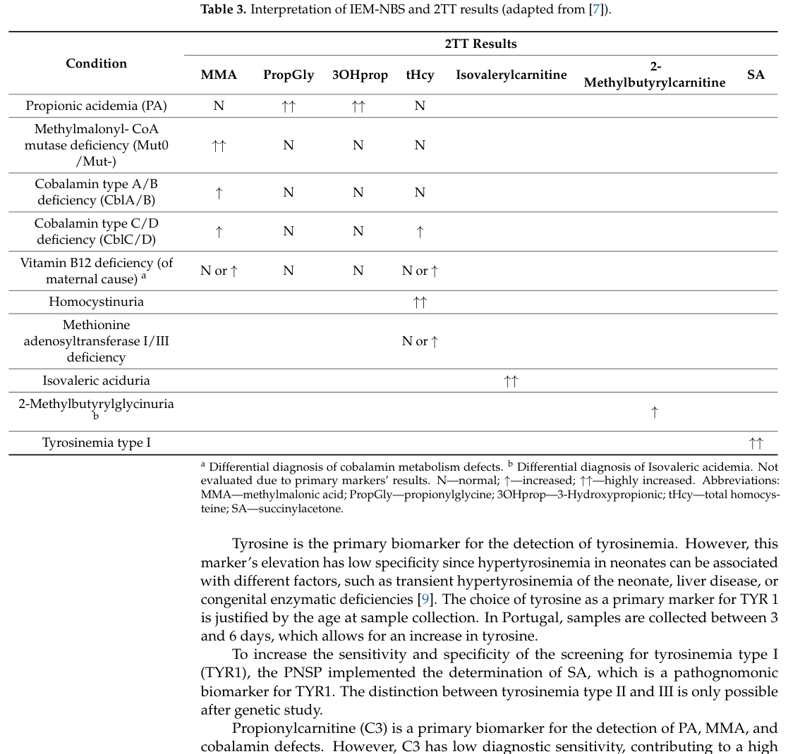

## Question

# Disease Characteristics Research Template

## Target Disease
- **Disease Name:** Inborn Disorder of Cobalamin Metabolism and Transport
- **MONDO ID:**  (if available)
- **Category:** Mendelian

## Research Objectives

Please provide a comprehensive research report on **Inborn Disorder of Cobalamin Metabolism and Transport** covering all of the
disease characteristics listed below. This report will be used to populate a disease knowledge
base entry. Be thorough and cite primary literature (PMID preferred) for all claims.

For each section, **suggested databases/resources** are listed. These are the first places
you should search for information on each topic.

---

### 1. Disease Information
> **Search first:** OMIM, Orphanet, ICD-10/ICD-11, MeSH, PubMed

- What is the disease? Provide a concise overview.
- What are the key identifiers? (OMIM, Orphanet, ICD-10/ICD-11, MeSH, Mondo)
- What are the common synonyms and alternative names?
- Is the information derived from individual patients (e.g., EHR) or aggregated disease-level resources?

### 2. Etiology

- **Disease Causal Factors**: What are the primary causes? (genetic, environmental, infectious, mechanistic)
- **Risk Factors**:
  > **Search first:** PubMed, Cochrane Library, UpToDate, clinical guidelines, ClinVar, ClinGen, GWAS Catalog, PheGenI, CTD, CDC, WHO, epidemiological databases
  - Genetic risk factors (causal variants, susceptibility loci, modifier genes)
  - Environmental risk factors (toxins, lifestyle, occupational exposures, age, sex, family history)
- **Protective Factors**:
  > **Search first:** PubMed, Cochrane Library, clinical trial databases, GWAS Catalog, gnomAD, WHO, CDC, nutrition databases
  - Genetic protective factors (protective variants, modifier alleles)
  - Environmental protective factors (diet, lifestyle, exposures that reduce risk)
- **Gene-Environment Interactions**: How do genetic and environmental factors interact to influence disease?
  > **Search first:** CTD, PubMed, PheGenI, GxE databases

### 3. Phenotypes
> **Search first:** HPO (Human Phenotype Ontology), OMIM, Orphanet, PubMed, clinicaltrials.gov, MedDRA, SNOMED CT, DECIPHER, LOINC

For each phenotype, provide:
- **Phenotype type**: symptoms, clinical signs, physical manifestations, behavioral changes, or laboratory abnormalities
  > For symptoms/signs: HPO, OMIM, Orphanet, PubMed
  > For behavioral changes: HPO, DSM, RDoC (Research Domain Criteria), PubMed
  > For laboratory abnormalities: LOINC, SNOMED CT, LabTests Online, PubMed
- **Phenotype characteristics**:
  > **Search first:** OMIM, Orphanet, HPO, PubMed
  - Age of symptom onset (neonatal, childhood, adult-onset, late-onset)
  - Symptom severity (mild, moderate, severe, variable)
  - Symptom progression (stable, progressive, episodic, fluctuating)
  - Frequency among affected individuals (percentage or qualitative)
- **Quality of life impact**: Effects on daily functioning and well-being (per-phenotype when possible)
  > **Search first:** EQ-5D database, SF-36, WHO QOL databases, PubMed
- Suggest HPO (Human Phenotype Ontology) terms for each phenotype

### 4. Genetic/Molecular Information

- **Causal Genes**: Gene mutations or chromosomal abnormalities responsible for disease (gene symbols, OMIM IDs)
  > **Search first:** OMIM, ClinVar, HGMD, Ensembl, NCBI Gene
- **Pathogenic Variants**:
  - Affected genes (gene symbols, HGNC IDs)
    > **Search first:** OMIM, NCBI Gene, Ensembl, HGNC, UniProt, GeneCards
  - Variant classification (pathogenic, likely pathogenic, VUS per ACMG/AMP guidelines)
    > **Search first:** ClinVar, ClinGen, ACMG/AMP guidelines, VarSome
  - Variant type/class (missense, frameshift, nonsense, splice-site, structural)
  - Allele frequency in population databases
    > **Search first:** gnomAD, 1000 Genomes, ExAC, TOPMed, dbSNP
  - Somatic vs germline origin
    > **Search first:** COSMIC (somatic), ClinVar, ICGC, TCGA
  - Functional consequences (loss of function, gain of function, dominant negative)
- **Modifier Genes**: Genes that modify disease severity or expression
- **Epigenetic Information**: DNA methylation, histone modifications, chromatin changes affecting disease
  > **Search first:** ENCODE, Roadmap Epigenomics, MethBase, DiseaseMeth
- **Chromosomal Abnormalities**: Large-scale genetic changes (aneuploidy, translocations, inversions)
  > **Search first:** DECIPHER, ClinVar, ECARUCA, UCSC Genome Browser

### 5. Environmental Information

- **Environmental Factors**: Non-genetic contributing factors (toxins, radiation, pollution, occupational exposure)
  > **Search first:** CTD (Comparative Toxicogenomics Database), TOXNET, PubMed, EPA databases
- **Lifestyle Factors**: Behavioral factors (smoking, diet, exercise, alcohol consumption)
  > **Search first:** CDC databases, WHO, PubMed, NHANES
- **Infectious Agents**: If applicable, pathogens causing or triggering disease (bacteria, viruses, fungi, parasites)
  > **Search first:** NCBI Taxonomy, ViPR, BV-BRC, MicrobeDB, GIDEON

### 6. Mechanism / Pathophysiology

- **Molecular Pathways**: Specific signaling cascades or biochemical pathways involved (Wnt, MAPK, mTOR, PI3K-AKT, etc.)
  > **Search first:** KEGG, Reactome, WikiPathways, PathBank, BioCyc
- **Cellular Processes**: Cell-level mechanisms (apoptosis, autophagy, cell cycle dysregulation, inflammation, etc.)
  > **Search first:** Gene Ontology (GO), Reactome, KEGG, PubMed
- **Protein Dysfunction**: How protein structure or function is altered (misfolding, aggregation, loss of function, gain of function)
  > **Search first:** UniProt, PDB (Protein Data Bank), InterPro, Pfam, AlphaFold
- **Metabolic Changes**: Alterations in metabolic processes (energy metabolism, lipid metabolism, amino acid metabolism)
  > **Search first:** KEGG, BioCyc, HMDB (Human Metabolome Database), BRENDA
- **Immune System Involvement**: Role of immune response (autoimmunity, immunodeficiency, chronic inflammation)
  > **Search first:** ImmPort, Immunome Database, IEDB, Gene Ontology
- **Tissue Damage Mechanisms**: How tissues/ are injured (oxidative stress, ischemia, fibrosis, necrosis)
  > **Search first:** PubMed, Gene Ontology, Reactome
- **Biochemical Abnormalities**: Specific molecular defects (enzyme deficiencies, receptor dysfunction, ion channel defects)
  > **Search first:** BRENDA, UniProt, KEGG, OMIM, PubMed
- **Epigenetic Changes**: DNA methylation, histone modifications affecting gene expression in disease
  > **Search first:** ENCODE, Roadmap Epigenomics, MethBase, DiseaseMeth
- **Molecular Profiling** (if available):
  - Transcriptomics/gene expression changes
    > **Search first:** GEO (Gene Expression Omnibus), ArrayExpress, GTEx, Human Cell Atlas, SRA
  - Proteomics findings
    > **Search first:** PRIDE, ProteomeXchange, Human Protein Atlas, STRING, BioGRID
  - Metabolomics signatures
    > **Search first:** MetaboLights, Metabolomics Workbench, HMDB, METLIN
  - Lipidomics alterations
    > **Search first:** LIPID MAPS, SwissLipids, LipidHome, Metabolomics Workbench
  - Genomic structural features
    > **Search first:** UCSC Genome Browser, Ensembl, NCBI, dbVar, DGV
- **Advanced Technologies** (if applicable):
  - Single-cell analysis findings (cell-type specific mechanisms, cellular heterogeneity)
    > **Search first:** Human Cell Atlas, Single Cell Portal, GEO, CELLxGENE
  - Spatial transcriptomics findings
    > **Search first:** GEO, Spatial Research, Vizgen, 10x Genomics data
  - Multi-omics integration results
    > **Search first:** TCGA, ICGC, cBioPortal, LinkedOmics, PubMed
  - Functional genomics screens (CRISPR, RNAi)
    > **Search first:** DepMap, GenomeRNAi, PubMed, BioGRID ORCS

For each mechanism, describe:
- The causal chain from initial trigger to clinical manifestation
- Which mechanisms are upstream vs downstream
- What cell types and biological processes are involved
- Suggest GO terms for biological processes and CL terms for cell types

### 7. Anatomical Structures Affected

- **Organ Level**:
  - Primary organs directly affected
  - Secondary organ involvement (complications, secondary effects)
  - Body systems involved (cardiovascular, nervous, digestive, respiratory, endocrine, etc.)
  > **Search first:** Uberon, FMA (Foundational Model of Anatomy), OMIM, HPO, ICD-11, MeSH, SNOMED CT
- **Tissue and Cell Level**:
  - Specific tissue types affected (epithelial, connective, muscle, nervous)
  - Specific cell populations targeted (with Cell Ontology terms)
  > **Search first:** Uberon, Human Protein Atlas, Cell Ontology, Human Cell Atlas, CellMarker, PanglaoDB
- **Subcellular Level**:
  - Cellular compartments involved (mitochondria, nucleus, ER, lysosomes) (with GO Cellular Component terms)
  > **Search first:** Gene Ontology (Cellular Component), UniProt, Human Protein Atlas
- **Localization**:
  - Specific anatomical sites (with UBERON terms)
    > **Search first:** FMA, Uberon, NeuroNames (for brain), SNOMED CT
  - Lateralization (unilateral, bilateral, asymmetric)
    > **Search first:** HPO, clinical literature, imaging databases

### 8. Temporal Development

- **Onset**:
  - Typical age of onset (congenital, pediatric, adult, geriatric)
  - Onset pattern (acute, subacute, chronic, insidious)
  > **Search first:** OMIM, Orphanet, HPO, PubMed
- **Progression**:
  - Disease stages (early, intermediate, advanced, end-stage)
    > **Search first:** Cancer Staging Manual (AJCC), WHO classifications, PubMed
  - Progression rate (rapid, slow, variable)
  - Disease course pattern (episodic, relapsing-remitting, progressive, stable)
  - Disease duration (self-limited, chronic lifelong)
  > **Search first:** Disease registries, longitudinal cohort databases, natural history studies, PubMed, Orphanet, OMIM
- **Patterns**:
  - Remission patterns (spontaneous, treatment-induced)
    > **Search first:** Clinical trial databases, disease registries, PubMed
  - Critical periods (time windows of vulnerability or opportunity for intervention)
    > **Search first:** PubMed, developmental biology databases, clinical guidelines

### 9. Inheritance and Population

- **Epidemiology**:
  - Prevalence (cases per 100,000 at given time)
  - Incidence (new cases per 100,000 per year)
  > **Search first:** Orphanet, CDC, WHO, GBD (Global Burden of Disease), national registries, SEER, disease registries
- **For Genetic Etiology**:
  - Inheritance pattern (AD, AR, X-linked, mitochondrial, multifactorial, polygenic)
    > **Search first:** OMIM, Orphanet, ClinVar, GTR (Genetic Testing Registry)
  - Penetrance (complete, incomplete, age-dependent)
    > **Search first:** ClinVar, OMIM, PubMed, ClinGen
  - Expressivity (variable, consistent)
    > **Search first:** OMIM, ClinVar, PubMed
  - Genetic anticipation (increasing severity in successive generations)
    > **Search first:** OMIM, PubMed (especially for repeat expansion disorders)
  - Germline mosaicism
    > **Search first:** ClinVar, OMIM, genetic counseling literature, PubMed
  - Founder effects (population-specific mutations)
    > **Search first:** gnomAD, population genetics databases, PubMed
  - Consanguinity role
    > **Search first:** OMIM, population studies, genetic counseling resources
  - Carrier frequency
    > **Search first:** gnomAD, carrier screening databases, GeneReviews, GTR
- **Population Demographics**:
  - Affected populations (ethnic or demographic groups with higher prevalence)
    > **Search first:** gnomAD, 1000 Genomes, PAGE Study, PubMed, population registries
  - Geographic distribution (endemic areas, regional variation)
    > **Search first:** WHO, CDC, GBD, Orphanet, geographic epidemiology databases
  - Geographic distribution of specific variants
  - Sex ratio (male:female)
    > **Search first:** Disease registries, OMIM, PubMed, epidemiological databases
  - Age distribution of affected individuals
    > **Search first:** CDC, disease registries, SEER, Orphanet

### 10. Diagnostics

- **Clinical Tests**:
  - Laboratory tests (blood, urine, tissue chemistry, specific enzyme assays)
    > **Search first:** LOINC, LabTests Online, PubMed
  - Biomarkers (proteins, metabolites, genetic markers, circulating biomarkers)
    > **Search first:** FDA Biomarker List, BEST (Biomarkers, EndpointS, and other Tools), PubMed
  - Imaging studies (X-ray, CT, MRI, PET, ultrasound)
    > **Search first:** RadLex, DICOM, Radiopaedia, imaging databases
  - Functional tests (pulmonary function, cardiac stress tests)
    > **Search first:** LOINC, clinical guidelines, PubMed
  - Electrophysiology (EEG, EMG, ECG, nerve conduction studies)
    > **Search first:** LOINC, clinical neurophysiology databases, PubMed
  - Biopsy findings (histopathology, immunohistochemistry)
    > **Search first:** SNOMED CT, College of American Pathologists resources, PubMed
  - Pathology findings (microscopic examination)
    > **Search first:** SNOMED CT, Digital Pathology databases, PubMed
- **Genetic Testing**:
  > **Search first:** GTR (Genetic Testing Registry), GeneReviews, ClinGen
  - Overview of recommended genetic testing approach
  - Whole genome sequencing (WGS) utility
    > **Search first:** GTR, ClinVar, GEL (Genomics England), gnomAD
  - Whole exome sequencing (WES) utility
    > **Search first:** GTR, ClinVar, OMIM, GeneMatcher
  - Gene panels (which panels, which genes)
    > **Search first:** GTR, ClinVar, laboratory-specific databases
  - Single gene testing
    > **Search first:** GTR, ClinVar, OMIM, GeneReviews
  - Chromosomal microarray (CMA)
    > **Search first:** DECIPHER, ClinVar, dbVar, ECARUCA
  - Karyotyping
    > **Search first:** Chromosome Abnormality Database, ClinVar, cytogenetics resources
  - FISH
    > **Search first:** ClinVar, cytogenetics databases, PubMed
  - Mitochondrial DNA testing
    > **Search first:** MITOMAP, MSeqDR, ClinVar, GTR
  - Repeat expansion testing
    > **Search first:** GTR, ClinVar, repeat expansion databases, PubMed
- **Omics-Based Diagnostics** (if applicable):
  - RNA sequencing / transcriptomics
    > **Search first:** GEO, ArrayExpress, GTEx, RNA-seq databases
  - Proteomics
    > **Search first:** PRIDE, ProteomeXchange, FDA Biomarker database
  - Metabolomics
    > **Search first:** MetaboLights, Metabolomics Workbench, HMDB
  - Epigenomics
    > **Search first:** GEO, ENCODE, Roadmap Epigenomics, MethBase
  - Liquid biopsy
    > **Search first:** COSMIC, ClinVar, liquid biopsy databases, PubMed
- **Clinical Criteria**:
  - Standardized diagnostic criteria (DSM, ICD, society guidelines)
    > **Search first:** DSM-5, ICD-11, clinical society guidelines, UpToDate
  - Differential diagnosis (other conditions to rule out, with distinguishing features)
    > **Search first:** DynaMed, UpToDate, clinical decision support systems
- **Screening**:
  - Screening methods for asymptomatic individuals (newborn screening, carrier screening, cascade screening)
    > **Search first:** ACMG recommendations, CDC newborn screening, GTR

### 11. Outcome/Prognosis

- **Survival and Mortality**:
  - Survival rate (5-year, 10-year, overall)
    > **Search first:** SEER, cancer registries, disease-specific registries, PubMed
  - Life expectancy (with and without treatment if applicable)
    > **Search first:** Orphanet, disease registries, actuarial databases, PubMed
  - Mortality rate
    > **Search first:** CDC, WHO, GBD, national mortality databases
  - Disease-specific mortality (deaths directly attributable to disease)
    > **Search first:** Disease registries, CDC Wonder, GBD, PubMed
- **Morbidity and Function**:
  - Morbidity (disease-related disability and health impacts)
    > **Search first:** GBD, WHO, disability databases, PubMed
  - Disability outcomes (long-term functional impairments)
    > **Search first:** ICF (International Classification of Functioning), disability registries
  - Quality of life measures (EQ-5D, SF-36, PROMIS, disease-specific tools)
    > **Search first:** EQ-5D database, SF-36, PROMIS, PubMed
- **Disease Course**:
  - Complications (secondary problems: infections, organ failure, etc.)
    > **Search first:** ICD codes, disease registries, clinical databases, PubMed
  - Recovery potential (likelihood and extent of recovery, with vs without treatment)
    > **Search first:** Natural history studies, rehabilitation databases, PubMed
- **Prediction**:
  - Prognostic factors (age, disease severity, biomarkers, treatment response)
    > **Search first:** Prognostic models databases, clinical calculators, PubMed
  - Prognostic biomarkers (molecular markers predicting disease course)
    > **Search first:** FDA Biomarker database, PubMed, cancer prognostic databases

### 12. Treatment

- **Pharmacotherapy**:
  - Pharmacological treatments (drug names, drug classes, mechanisms of action)
    > **Search first:** DrugBank, RxNorm, ATC classification, DailyMed, FDA databases
  - Pharmacogenomics (how genetic variants affect drug metabolism, efficacy, toxicity)
    > **Search first:** PharmGKB, CPIC (Clinical Pharmacogenetics), FDA Table of PGx Biomarkers
- **Advanced Therapeutics**:
  - Gene therapy (viral vectors, CRISPR, gene replacement, gene editing)
    > **Search first:** ClinicalTrials.gov, FDA gene therapy database, ASGCT resources
  - Cell therapy (stem cell transplant, CAR-T, cellular therapeutics)
    > **Search first:** ClinicalTrials.gov, FDA cell therapy database, FACT standards
  - RNA-based therapies (ASOs, siRNA, mRNA therapies)
    > **Search first:** ClinicalTrials.gov, FDA approvals, PubMed
  - Targeted therapies (treatments directed at specific molecular targets)
    > **Search first:** My Cancer Genome, OncoKB, ClinicalTrials.gov, FDA approvals
  - Immunotherapies (checkpoint inhibitors, monoclonal antibodies)
    > **Search first:** Cancer Immunotherapy Database, FDA approvals, ClinicalTrials.gov
- **Surgical and Interventional**:
  - Surgical interventions (types of surgery, timing, outcomes)
    > **Search first:** CPT codes, surgical registries, clinical guidelines, PubMed
- **Supportive and Rehabilitative**:
  - Supportive care (symptom management, pain control, nutrition)
    > **Search first:** Clinical guidelines, Cochrane Library, PubMed
  - Rehabilitation (physical therapy, occupational therapy, speech therapy)
    > **Search first:** Rehabilitation medicine databases, clinical guidelines, PubMed
- **Experimental**:
  - Experimental treatments in clinical trials (with NCT identifiers if available)
    > **Search first:** ClinicalTrials.gov, EU Clinical Trials Register, WHO ICTRP
- **Treatment Outcomes**:
  - Treatment response rates
    > **Search first:** Clinical trial databases, FDA reviews, systematic reviews, PubMed
  - Side effects and adverse events
    > **Search first:** FDA Adverse Event Reporting System (FAERS), MedWatch, PubMed
- **Treatment Strategy**:
  - Treatment algorithms (clinical pathways, decision trees)
    > **Search first:** Clinical practice guidelines, NCCN Guidelines, UpToDate
  - Combination therapies
    > **Search first:** ClinicalTrials.gov, treatment guidelines, PubMed
  - Personalized medicine approaches (genotype-guided treatment)
    > **Search first:** My Cancer Genome, CIViC, PharmGKB, precision medicine databases

For each treatment, suggest MAXO (Medical Action Ontology) terms where applicable.

### 13. Prevention

- **Prevention Levels**:
  - Primary prevention (preventing disease occurrence: vaccination, risk factor modification)
    > **Search first:** CDC, WHO, USPSTF recommendations, Cochrane Library
  - Secondary prevention (early detection and treatment: screening programs, early intervention)
    > **Search first:** USPSTF, CDC screening guidelines, WHO
  - Tertiary prevention (preventing complications in those with disease)
    > **Search first:** Clinical guidelines, disease management protocols, PubMed
- **Immunization**: Vaccine strategies (if applicable)
  > **Search first:** CDC vaccine schedules, WHO immunization, FDA vaccine database
- **Screening and Early Detection**:
  - Screening programs (population-based: newborn screening, cancer screening)
    > **Search first:** CDC screening programs, USPSTF, cancer screening databases
  - Genetic screening (carrier screening, preimplantation genetic diagnosis, prenatal testing)
    > **Search first:** ACMG recommendations, ACOG guidelines, GTR
  - Risk stratification (identifying high-risk individuals for targeted prevention)
    > **Search first:** Risk prediction models, clinical calculators, PubMed
- **Behavioral Interventions**: Lifestyle modifications to reduce risk
  > **Search first:** CDC, WHO, behavioral intervention databases, Cochrane Library
- **Counseling**: Genetic counseling (risk assessment, family planning guidance)
  > **Search first:** NSGC resources, ACMG guidelines, GeneReviews
- **Public Health**:
  - Public health interventions (sanitation, vector control, health education)
    > **Search first:** CDC, WHO, public health databases, PubMed
  - Environmental interventions (reducing environmental risk factors)
    > **Search first:** EPA databases, WHO environmental health, PubMed
- **Prophylaxis**: Preventive medications or procedures
  > **Search first:** Clinical guidelines, FDA approvals, PubMed

### 14. Other Species / Natural Disease

- **Taxonomy**: Species affected (with NCBI Taxon identifiers)
  > **Search first:** NCBI Taxonomy
- **Breed**: Specific breeds affected (with VBO identifiers if applicable)
  > **Search first:** VBO (Vertebrate Breed Ontology)
- **Gene**: Orthologous genes in other species (with NCBI Gene IDs)
  > **Search first:** NCBI Gene
- **Natural Disease**:
  - Naturally occurring disease in other species (companion animals, wildlife)
    > **Search first:** OMIA (Online Mendelian Inheritance in Animals), VetCompass, PubMed
  - Veterinary relevance and importance in animal health
    > **Search first:** OMIA, veterinary databases, PubMed
- **Comparative Biology**:
  - Comparative pathology (similarities and differences across species)
    > **Search first:** OMIA, comparative pathology databases, PubMed
  - Evolutionary conservation of disease mechanisms
    > **Search first:** HomoloGene, OrthoMCL, Alliance of Genome Resources
- **Transmission** (if applicable):
  - Zoonotic potential
    > **Search first:** CDC zoonotic diseases, WHO zoonoses, GIDEON
  - Cross-species susceptibility
    > **Search first:** NCBI Taxonomy, veterinary databases, PubMed

### 15. Model Organisms

- **Model Types**:
  - Model organism type (mammalian, invertebrate, cellular, in vitro)
    > **Search first:** Alliance of Genome Resources, model organism databases
  - Specific model systems (mouse, rat, zebrafish, Drosophila, C. elegans, yeast, cell lines, organoids, iPSCs)
    > **Search first:** MGI, RGD, ZFIN, FlyBase, WormBase, SGD, ATCC, Cellosaurus
  - Induced models (drug treatment, surgical intervention, environmental manipulation)
    > **Search first:** MGI, model organism databases, PubMed
- **Genetic Models**:
  - Types available (knockout, knock-in, transgenic, conditional, humanized)
    > **Search first:** MGI, IMPC, KOMP, EuMMCR, IMSR
- **Model Characteristics**:
  - Phenotype recapitulation (how well model reproduces human disease features)
    > **Search first:** Model organism databases, comparative studies, PubMed
  - Model limitations (aspects of human disease not captured)
    > **Search first:** Model organism databases, PubMed, review articles
- **Applications**:
  - Research applications (what aspects of disease can be studied)
    > **Search first:** Model organism databases, PubMed
- **Resources**:
  - Model databases
    > **Search first:** MGI, RGD, ZFIN, FlyBase, WormBase, IMSR, EMMA, MMRRC

---

## Citation Requirements

- Cite primary literature (PMID preferred) for all mechanistic and clinical claims
- Prioritize recent reviews and landmark papers
- Include direct quotes from abstracts where possible to support key statements
- Distinguish evidence source types: human clinical, model organism, in vitro, computational

## Output Format

Structure your response as a comprehensive narrative organized by the sections above.
For each section, provide:
- Factual content with specific details (numbers, percentages, gene names, variant nomenclature)
- Ontology term suggestions (HPO, GO, CL, UBERON, CHEBI, MAXO, MONDO) where applicable
- Evidence citations with PMIDs
- Direct quotes from abstracts to support key claims
- Clear indication when information is not available or not applicable for this disease

This report will be used to populate a disease knowledge base entry with:
- Pathophysiology descriptions with causal chains
- Gene/protein annotations (HGNC, GO terms)
- Phenotype associations (HP terms) with frequencies
- Cell type involvement (CL terms)
- Anatomical locations (UBERON terms)
- Chemical entities (CHEBI terms)
- Treatment annotations (MAXO terms)
- Evidence items with PMIDs and exact abstract quotes
- Epidemiology, prognosis, diagnostic, and prevention information
- Animal model descriptions with phenotype recapitulation details

## Output

Question: You are an expert researcher providing comprehensive, well-cited information.

Provide detailed information focusing on:
1. Key concepts and definitions with current understanding
2. Recent developments and latest research (prioritize 2023-2024 sources)
3. Current applications and real-world implementations
4. Expert opinions and analysis from authoritative sources
5. Relevant statistics and data from recent studies

Format as a comprehensive research report with proper citations. Include URLs and publication dates where available.
Always prioritize recent, authoritative sources and provide specific citations for all major claims.

# Disease Characteristics Research Template

## Target Disease
- **Disease Name:** Inborn Disorder of Cobalamin Metabolism and Transport
- **MONDO ID:**  (if available)
- **Category:** Mendelian

## Research Objectives

Please provide a comprehensive research report on **Inborn Disorder of Cobalamin Metabolism and Transport** covering all of the
disease characteristics listed below. This report will be used to populate a disease knowledge
base entry. Be thorough and cite primary literature (PMID preferred) for all claims.

For each section, **suggested databases/resources** are listed. These are the first places
you should search for information on each topic.

---

### 1. Disease Information
> **Search first:** OMIM, Orphanet, ICD-10/ICD-11, MeSH, PubMed

- What is the disease? Provide a concise overview.
- What are the key identifiers? (OMIM, Orphanet, ICD-10/ICD-11, MeSH, Mondo)
- What are the common synonyms and alternative names?
- Is the information derived from individual patients (e.g., EHR) or aggregated disease-level resources?

### 2. Etiology

- **Disease Causal Factors**: What are the primary causes? (genetic, environmental, infectious, mechanistic)
- **Risk Factors**:
  > **Search first:** PubMed, Cochrane Library, UpToDate, clinical guidelines, ClinVar, ClinGen, GWAS Catalog, PheGenI, CTD, CDC, WHO, epidemiological databases
  - Genetic risk factors (causal variants, susceptibility loci, modifier genes)
  - Environmental risk factors (toxins, lifestyle, occupational exposures, age, sex, family history)
- **Protective Factors**:
  > **Search first:** PubMed, Cochrane Library, clinical trial databases, GWAS Catalog, gnomAD, WHO, CDC, nutrition databases
  - Genetic protective factors (protective variants, modifier alleles)
  - Environmental protective factors (diet, lifestyle, exposures that reduce risk)
- **Gene-Environment Interactions**: How do genetic and environmental factors interact to influence disease?
  > **Search first:** CTD, PubMed, PheGenI, GxE databases

### 3. Phenotypes
> **Search first:** HPO (Human Phenotype Ontology), OMIM, Orphanet, PubMed, clinicaltrials.gov, MedDRA, SNOMED CT, DECIPHER, LOINC

For each phenotype, provide:
- **Phenotype type**: symptoms, clinical signs, physical manifestations, behavioral changes, or laboratory abnormalities
  > For symptoms/signs: HPO, OMIM, Orphanet, PubMed
  > For behavioral changes: HPO, DSM, RDoC (Research Domain Criteria), PubMed
  > For laboratory abnormalities: LOINC, SNOMED CT, LabTests Online, PubMed
- **Phenotype characteristics**:
  > **Search first:** OMIM, Orphanet, HPO, PubMed
  - Age of symptom onset (neonatal, childhood, adult-onset, late-onset)
  - Symptom severity (mild, moderate, severe, variable)
  - Symptom progression (stable, progressive, episodic, fluctuating)
  - Frequency among affected individuals (percentage or qualitative)
- **Quality of life impact**: Effects on daily functioning and well-being (per-phenotype when possible)
  > **Search first:** EQ-5D database, SF-36, WHO QOL databases, PubMed
- Suggest HPO (Human Phenotype Ontology) terms for each phenotype

### 4. Genetic/Molecular Information

- **Causal Genes**: Gene mutations or chromosomal abnormalities responsible for disease (gene symbols, OMIM IDs)
  > **Search first:** OMIM, ClinVar, HGMD, Ensembl, NCBI Gene
- **Pathogenic Variants**:
  - Affected genes (gene symbols, HGNC IDs)
    > **Search first:** OMIM, NCBI Gene, Ensembl, HGNC, UniProt, GeneCards
  - Variant classification (pathogenic, likely pathogenic, VUS per ACMG/AMP guidelines)
    > **Search first:** ClinVar, ClinGen, ACMG/AMP guidelines, VarSome
  - Variant type/class (missense, frameshift, nonsense, splice-site, structural)
  - Allele frequency in population databases
    > **Search first:** gnomAD, 1000 Genomes, ExAC, TOPMed, dbSNP
  - Somatic vs germline origin
    > **Search first:** COSMIC (somatic), ClinVar, ICGC, TCGA
  - Functional consequences (loss of function, gain of function, dominant negative)
- **Modifier Genes**: Genes that modify disease severity or expression
- **Epigenetic Information**: DNA methylation, histone modifications, chromatin changes affecting disease
  > **Search first:** ENCODE, Roadmap Epigenomics, MethBase, DiseaseMeth
- **Chromosomal Abnormalities**: Large-scale genetic changes (aneuploidy, translocations, inversions)
  > **Search first:** DECIPHER, ClinVar, ECARUCA, UCSC Genome Browser

### 5. Environmental Information

- **Environmental Factors**: Non-genetic contributing factors (toxins, radiation, pollution, occupational exposure)
  > **Search first:** CTD (Comparative Toxicogenomics Database), TOXNET, PubMed, EPA databases
- **Lifestyle Factors**: Behavioral factors (smoking, diet, exercise, alcohol consumption)
  > **Search first:** CDC databases, WHO, PubMed, NHANES
- **Infectious Agents**: If applicable, pathogens causing or triggering disease (bacteria, viruses, fungi, parasites)
  > **Search first:** NCBI Taxonomy, ViPR, BV-BRC, MicrobeDB, GIDEON

### 6. Mechanism / Pathophysiology

- **Molecular Pathways**: Specific signaling cascades or biochemical pathways involved (Wnt, MAPK, mTOR, PI3K-AKT, etc.)
  > **Search first:** KEGG, Reactome, WikiPathways, PathBank, BioCyc
- **Cellular Processes**: Cell-level mechanisms (apoptosis, autophagy, cell cycle dysregulation, inflammation, etc.)
  > **Search first:** Gene Ontology (GO), Reactome, KEGG, PubMed
- **Protein Dysfunction**: How protein structure or function is altered (misfolding, aggregation, loss of function, gain of function)
  > **Search first:** UniProt, PDB (Protein Data Bank), InterPro, Pfam, AlphaFold
- **Metabolic Changes**: Alterations in metabolic processes (energy metabolism, lipid metabolism, amino acid metabolism)
  > **Search first:** KEGG, BioCyc, HMDB (Human Metabolome Database), BRENDA
- **Immune System Involvement**: Role of immune response (autoimmunity, immunodeficiency, chronic inflammation)
  > **Search first:** ImmPort, Immunome Database, IEDB, Gene Ontology
- **Tissue Damage Mechanisms**: How tissues/ are injured (oxidative stress, ischemia, fibrosis, necrosis)
  > **Search first:** PubMed, Gene Ontology, Reactome
- **Biochemical Abnormalities**: Specific molecular defects (enzyme deficiencies, receptor dysfunction, ion channel defects)
  > **Search first:** BRENDA, UniProt, KEGG, OMIM, PubMed
- **Epigenetic Changes**: DNA methylation, histone modifications affecting gene expression in disease
  > **Search first:** ENCODE, Roadmap Epigenomics, MethBase, DiseaseMeth
- **Molecular Profiling** (if available):
  - Transcriptomics/gene expression changes
    > **Search first:** GEO (Gene Expression Omnibus), ArrayExpress, GTEx, Human Cell Atlas, SRA
  - Proteomics findings
    > **Search first:** PRIDE, ProteomeXchange, Human Protein Atlas, STRING, BioGRID
  - Metabolomics signatures
    > **Search first:** MetaboLights, Metabolomics Workbench, HMDB, METLIN
  - Lipidomics alterations
    > **Search first:** LIPID MAPS, SwissLipids, LipidHome, Metabolomics Workbench
  - Genomic structural features
    > **Search first:** UCSC Genome Browser, Ensembl, NCBI, dbVar, DGV
- **Advanced Technologies** (if applicable):
  - Single-cell analysis findings (cell-type specific mechanisms, cellular heterogeneity)
    > **Search first:** Human Cell Atlas, Single Cell Portal, GEO, CELLxGENE
  - Spatial transcriptomics findings
    > **Search first:** GEO, Spatial Research, Vizgen, 10x Genomics data
  - Multi-omics integration results
    > **Search first:** TCGA, ICGC, cBioPortal, LinkedOmics, PubMed
  - Functional genomics screens (CRISPR, RNAi)
    > **Search first:** DepMap, GenomeRNAi, PubMed, BioGRID ORCS

For each mechanism, describe:
- The causal chain from initial trigger to clinical manifestation
- Which mechanisms are upstream vs downstream
- What cell types and biological processes are involved
- Suggest GO terms for biological processes and CL terms for cell types

### 7. Anatomical Structures Affected

- **Organ Level**:
  - Primary organs directly affected
  - Secondary organ involvement (complications, secondary effects)
  - Body systems involved (cardiovascular, nervous, digestive, respiratory, endocrine, etc.)
  > **Search first:** Uberon, FMA (Foundational Model of Anatomy), OMIM, HPO, ICD-11, MeSH, SNOMED CT
- **Tissue and Cell Level**:
  - Specific tissue types affected (epithelial, connective, muscle, nervous)
  - Specific cell populations targeted (with Cell Ontology terms)
  > **Search first:** Uberon, Human Protein Atlas, Cell Ontology, Human Cell Atlas, CellMarker, PanglaoDB
- **Subcellular Level**:
  - Cellular compartments involved (mitochondria, nucleus, ER, lysosomes) (with GO Cellular Component terms)
  > **Search first:** Gene Ontology (Cellular Component), UniProt, Human Protein Atlas
- **Localization**:
  - Specific anatomical sites (with UBERON terms)
    > **Search first:** FMA, Uberon, NeuroNames (for brain), SNOMED CT
  - Lateralization (unilateral, bilateral, asymmetric)
    > **Search first:** HPO, clinical literature, imaging databases

### 8. Temporal Development

- **Onset**:
  - Typical age of onset (congenital, pediatric, adult, geriatric)
  - Onset pattern (acute, subacute, chronic, insidious)
  > **Search first:** OMIM, Orphanet, HPO, PubMed
- **Progression**:
  - Disease stages (early, intermediate, advanced, end-stage)
    > **Search first:** Cancer Staging Manual (AJCC), WHO classifications, PubMed
  - Progression rate (rapid, slow, variable)
  - Disease course pattern (episodic, relapsing-remitting, progressive, stable)
  - Disease duration (self-limited, chronic lifelong)
  > **Search first:** Disease registries, longitudinal cohort databases, natural history studies, PubMed, Orphanet, OMIM
- **Patterns**:
  - Remission patterns (spontaneous, treatment-induced)
    > **Search first:** Clinical trial databases, disease registries, PubMed
  - Critical periods (time windows of vulnerability or opportunity for intervention)
    > **Search first:** PubMed, developmental biology databases, clinical guidelines

### 9. Inheritance and Population

- **Epidemiology**:
  - Prevalence (cases per 100,000 at given time)
  - Incidence (new cases per 100,000 per year)
  > **Search first:** Orphanet, CDC, WHO, GBD (Global Burden of Disease), national registries, SEER, disease registries
- **For Genetic Etiology**:
  - Inheritance pattern (AD, AR, X-linked, mitochondrial, multifactorial, polygenic)
    > **Search first:** OMIM, Orphanet, ClinVar, GTR (Genetic Testing Registry)
  - Penetrance (complete, incomplete, age-dependent)
    > **Search first:** ClinVar, OMIM, PubMed, ClinGen
  - Expressivity (variable, consistent)
    > **Search first:** OMIM, ClinVar, PubMed
  - Genetic anticipation (increasing severity in successive generations)
    > **Search first:** OMIM, PubMed (especially for repeat expansion disorders)
  - Germline mosaicism
    > **Search first:** ClinVar, OMIM, genetic counseling literature, PubMed
  - Founder effects (population-specific mutations)
    > **Search first:** gnomAD, population genetics databases, PubMed
  - Consanguinity role
    > **Search first:** OMIM, population studies, genetic counseling resources
  - Carrier frequency
    > **Search first:** gnomAD, carrier screening databases, GeneReviews, GTR
- **Population Demographics**:
  - Affected populations (ethnic or demographic groups with higher prevalence)
    > **Search first:** gnomAD, 1000 Genomes, PAGE Study, PubMed, population registries
  - Geographic distribution (endemic areas, regional variation)
    > **Search first:** WHO, CDC, GBD, Orphanet, geographic epidemiology databases
  - Geographic distribution of specific variants
  - Sex ratio (male:female)
    > **Search first:** Disease registries, OMIM, PubMed, epidemiological databases
  - Age distribution of affected individuals
    > **Search first:** CDC, disease registries, SEER, Orphanet

### 10. Diagnostics

- **Clinical Tests**:
  - Laboratory tests (blood, urine, tissue chemistry, specific enzyme assays)
    > **Search first:** LOINC, LabTests Online, PubMed
  - Biomarkers (proteins, metabolites, genetic markers, circulating biomarkers)
    > **Search first:** FDA Biomarker List, BEST (Biomarkers, EndpointS, and other Tools), PubMed
  - Imaging studies (X-ray, CT, MRI, PET, ultrasound)
    > **Search first:** RadLex, DICOM, Radiopaedia, imaging databases
  - Functional tests (pulmonary function, cardiac stress tests)
    > **Search first:** LOINC, clinical guidelines, PubMed
  - Electrophysiology (EEG, EMG, ECG, nerve conduction studies)
    > **Search first:** LOINC, clinical neurophysiology databases, PubMed
  - Biopsy findings (histopathology, immunohistochemistry)
    > **Search first:** SNOMED CT, College of American Pathologists resources, PubMed
  - Pathology findings (microscopic examination)
    > **Search first:** SNOMED CT, Digital Pathology databases, PubMed
- **Genetic Testing**:
  > **Search first:** GTR (Genetic Testing Registry), GeneReviews, ClinGen
  - Overview of recommended genetic testing approach
  - Whole genome sequencing (WGS) utility
    > **Search first:** GTR, ClinVar, GEL (Genomics England), gnomAD
  - Whole exome sequencing (WES) utility
    > **Search first:** GTR, ClinVar, OMIM, GeneMatcher
  - Gene panels (which panels, which genes)
    > **Search first:** GTR, ClinVar, laboratory-specific databases
  - Single gene testing
    > **Search first:** GTR, ClinVar, OMIM, GeneReviews
  - Chromosomal microarray (CMA)
    > **Search first:** DECIPHER, ClinVar, dbVar, ECARUCA
  - Karyotyping
    > **Search first:** Chromosome Abnormality Database, ClinVar, cytogenetics resources
  - FISH
    > **Search first:** ClinVar, cytogenetics databases, PubMed
  - Mitochondrial DNA testing
    > **Search first:** MITOMAP, MSeqDR, ClinVar, GTR
  - Repeat expansion testing
    > **Search first:** GTR, ClinVar, repeat expansion databases, PubMed
- **Omics-Based Diagnostics** (if applicable):
  - RNA sequencing / transcriptomics
    > **Search first:** GEO, ArrayExpress, GTEx, RNA-seq databases
  - Proteomics
    > **Search first:** PRIDE, ProteomeXchange, FDA Biomarker database
  - Metabolomics
    > **Search first:** MetaboLights, Metabolomics Workbench, HMDB
  - Epigenomics
    > **Search first:** GEO, ENCODE, Roadmap Epigenomics, MethBase
  - Liquid biopsy
    > **Search first:** COSMIC, ClinVar, liquid biopsy databases, PubMed
- **Clinical Criteria**:
  - Standardized diagnostic criteria (DSM, ICD, society guidelines)
    > **Search first:** DSM-5, ICD-11, clinical society guidelines, UpToDate
  - Differential diagnosis (other conditions to rule out, with distinguishing features)
    > **Search first:** DynaMed, UpToDate, clinical decision support systems
- **Screening**:
  - Screening methods for asymptomatic individuals (newborn screening, carrier screening, cascade screening)
    > **Search first:** ACMG recommendations, CDC newborn screening, GTR

### 11. Outcome/Prognosis

- **Survival and Mortality**:
  - Survival rate (5-year, 10-year, overall)
    > **Search first:** SEER, cancer registries, disease-specific registries, PubMed
  - Life expectancy (with and without treatment if applicable)
    > **Search first:** Orphanet, disease registries, actuarial databases, PubMed
  - Mortality rate
    > **Search first:** CDC, WHO, GBD, national mortality databases
  - Disease-specific mortality (deaths directly attributable to disease)
    > **Search first:** Disease registries, CDC Wonder, GBD, PubMed
- **Morbidity and Function**:
  - Morbidity (disease-related disability and health impacts)
    > **Search first:** GBD, WHO, disability databases, PubMed
  - Disability outcomes (long-term functional impairments)
    > **Search first:** ICF (International Classification of Functioning), disability registries
  - Quality of life measures (EQ-5D, SF-36, PROMIS, disease-specific tools)
    > **Search first:** EQ-5D database, SF-36, PROMIS, PubMed
- **Disease Course**:
  - Complications (secondary problems: infections, organ failure, etc.)
    > **Search first:** ICD codes, disease registries, clinical databases, PubMed
  - Recovery potential (likelihood and extent of recovery, with vs without treatment)
    > **Search first:** Natural history studies, rehabilitation databases, PubMed
- **Prediction**:
  - Prognostic factors (age, disease severity, biomarkers, treatment response)
    > **Search first:** Prognostic models databases, clinical calculators, PubMed
  - Prognostic biomarkers (molecular markers predicting disease course)
    > **Search first:** FDA Biomarker database, PubMed, cancer prognostic databases

### 12. Treatment

- **Pharmacotherapy**:
  - Pharmacological treatments (drug names, drug classes, mechanisms of action)
    > **Search first:** DrugBank, RxNorm, ATC classification, DailyMed, FDA databases
  - Pharmacogenomics (how genetic variants affect drug metabolism, efficacy, toxicity)
    > **Search first:** PharmGKB, CPIC (Clinical Pharmacogenetics), FDA Table of PGx Biomarkers
- **Advanced Therapeutics**:
  - Gene therapy (viral vectors, CRISPR, gene replacement, gene editing)
    > **Search first:** ClinicalTrials.gov, FDA gene therapy database, ASGCT resources
  - Cell therapy (stem cell transplant, CAR-T, cellular therapeutics)
    > **Search first:** ClinicalTrials.gov, FDA cell therapy database, FACT standards
  - RNA-based therapies (ASOs, siRNA, mRNA therapies)
    > **Search first:** ClinicalTrials.gov, FDA approvals, PubMed
  - Targeted therapies (treatments directed at specific molecular targets)
    > **Search first:** My Cancer Genome, OncoKB, ClinicalTrials.gov, FDA approvals
  - Immunotherapies (checkpoint inhibitors, monoclonal antibodies)
    > **Search first:** Cancer Immunotherapy Database, FDA approvals, ClinicalTrials.gov
- **Surgical and Interventional**:
  - Surgical interventions (types of surgery, timing, outcomes)
    > **Search first:** CPT codes, surgical registries, clinical guidelines, PubMed
- **Supportive and Rehabilitative**:
  - Supportive care (symptom management, pain control, nutrition)
    > **Search first:** Clinical guidelines, Cochrane Library, PubMed
  - Rehabilitation (physical therapy, occupational therapy, speech therapy)
    > **Search first:** Rehabilitation medicine databases, clinical guidelines, PubMed
- **Experimental**:
  - Experimental treatments in clinical trials (with NCT identifiers if available)
    > **Search first:** ClinicalTrials.gov, EU Clinical Trials Register, WHO ICTRP
- **Treatment Outcomes**:
  - Treatment response rates
    > **Search first:** Clinical trial databases, FDA reviews, systematic reviews, PubMed
  - Side effects and adverse events
    > **Search first:** FDA Adverse Event Reporting System (FAERS), MedWatch, PubMed
- **Treatment Strategy**:
  - Treatment algorithms (clinical pathways, decision trees)
    > **Search first:** Clinical practice guidelines, NCCN Guidelines, UpToDate
  - Combination therapies
    > **Search first:** ClinicalTrials.gov, treatment guidelines, PubMed
  - Personalized medicine approaches (genotype-guided treatment)
    > **Search first:** My Cancer Genome, CIViC, PharmGKB, precision medicine databases

For each treatment, suggest MAXO (Medical Action Ontology) terms where applicable.

### 13. Prevention

- **Prevention Levels**:
  - Primary prevention (preventing disease occurrence: vaccination, risk factor modification)
    > **Search first:** CDC, WHO, USPSTF recommendations, Cochrane Library
  - Secondary prevention (early detection and treatment: screening programs, early intervention)
    > **Search first:** USPSTF, CDC screening guidelines, WHO
  - Tertiary prevention (preventing complications in those with disease)
    > **Search first:** Clinical guidelines, disease management protocols, PubMed
- **Immunization**: Vaccine strategies (if applicable)
  > **Search first:** CDC vaccine schedules, WHO immunization, FDA vaccine database
- **Screening and Early Detection**:
  - Screening programs (population-based: newborn screening, cancer screening)
    > **Search first:** CDC screening programs, USPSTF, cancer screening databases
  - Genetic screening (carrier screening, preimplantation genetic diagnosis, prenatal testing)
    > **Search first:** ACMG recommendations, ACOG guidelines, GTR
  - Risk stratification (identifying high-risk individuals for targeted prevention)
    > **Search first:** Risk prediction models, clinical calculators, PubMed
- **Behavioral Interventions**: Lifestyle modifications to reduce risk
  > **Search first:** CDC, WHO, behavioral intervention databases, Cochrane Library
- **Counseling**: Genetic counseling (risk assessment, family planning guidance)
  > **Search first:** NSGC resources, ACMG guidelines, GeneReviews
- **Public Health**:
  - Public health interventions (sanitation, vector control, health education)
    > **Search first:** CDC, WHO, public health databases, PubMed
  - Environmental interventions (reducing environmental risk factors)
    > **Search first:** EPA databases, WHO environmental health, PubMed
- **Prophylaxis**: Preventive medications or procedures
  > **Search first:** Clinical guidelines, FDA approvals, PubMed

### 14. Other Species / Natural Disease

- **Taxonomy**: Species affected (with NCBI Taxon identifiers)
  > **Search first:** NCBI Taxonomy
- **Breed**: Specific breeds affected (with VBO identifiers if applicable)
  > **Search first:** VBO (Vertebrate Breed Ontology)
- **Gene**: Orthologous genes in other species (with NCBI Gene IDs)
  > **Search first:** NCBI Gene
- **Natural Disease**:
  - Naturally occurring disease in other species (companion animals, wildlife)
    > **Search first:** OMIA (Online Mendelian Inheritance in Animals), VetCompass, PubMed
  - Veterinary relevance and importance in animal health
    > **Search first:** OMIA, veterinary databases, PubMed
- **Comparative Biology**:
  - Comparative pathology (similarities and differences across species)
    > **Search first:** OMIA, comparative pathology databases, PubMed
  - Evolutionary conservation of disease mechanisms
    > **Search first:** HomoloGene, OrthoMCL, Alliance of Genome Resources
- **Transmission** (if applicable):
  - Zoonotic potential
    > **Search first:** CDC zoonotic diseases, WHO zoonoses, GIDEON
  - Cross-species susceptibility
    > **Search first:** NCBI Taxonomy, veterinary databases, PubMed

### 15. Model Organisms

- **Model Types**:
  - Model organism type (mammalian, invertebrate, cellular, in vitro)
    > **Search first:** Alliance of Genome Resources, model organism databases
  - Specific model systems (mouse, rat, zebrafish, Drosophila, C. elegans, yeast, cell lines, organoids, iPSCs)
    > **Search first:** MGI, RGD, ZFIN, FlyBase, WormBase, SGD, ATCC, Cellosaurus
  - Induced models (drug treatment, surgical intervention, environmental manipulation)
    > **Search first:** MGI, model organism databases, PubMed
- **Genetic Models**:
  - Types available (knockout, knock-in, transgenic, conditional, humanized)
    > **Search first:** MGI, IMPC, KOMP, EuMMCR, IMSR
- **Model Characteristics**:
  - Phenotype recapitulation (how well model reproduces human disease features)
    > **Search first:** Model organism databases, comparative studies, PubMed
  - Model limitations (aspects of human disease not captured)
    > **Search first:** Model organism databases, PubMed, review articles
- **Applications**:
  - Research applications (what aspects of disease can be studied)
    > **Search first:** Model organism databases, PubMed
- **Resources**:
  - Model databases
    > **Search first:** MGI, RGD, ZFIN, FlyBase, WormBase, IMSR, EMMA, MMRRC

---

## Citation Requirements

- Cite primary literature (PMID preferred) for all mechanistic and clinical claims
- Prioritize recent reviews and landmark papers
- Include direct quotes from abstracts where possible to support key statements
- Distinguish evidence source types: human clinical, model organism, in vitro, computational

## Output Format

Structure your response as a comprehensive narrative organized by the sections above.
For each section, provide:
- Factual content with specific details (numbers, percentages, gene names, variant nomenclature)
- Ontology term suggestions (HPO, GO, CL, UBERON, CHEBI, MAXO, MONDO) where applicable
- Evidence citations with PMIDs
- Direct quotes from abstracts to support key claims
- Clear indication when information is not available or not applicable for this disease

This report will be used to populate a disease knowledge base entry with:
- Pathophysiology descriptions with causal chains
- Gene/protein annotations (HGNC, GO terms)
- Phenotype associations (HP terms) with frequencies
- Cell type involvement (CL terms)
- Anatomical locations (UBERON terms)
- Chemical entities (CHEBI terms)
- Treatment annotations (MAXO terms)
- Evidence items with PMIDs and exact abstract quotes
- Epidemiology, prognosis, diagnostic, and prevention information
- Animal model descriptions with phenotype recapitulation details

# Disease Characteristics Research Report: Inborn Disorder of Cobalamin Metabolism and Transport (Mendelian)

## Executive summary
“Inborn disorders of cobalamin metabolism and transport” are a genetically heterogeneous set of conditions disrupting vitamin B12 (cobalamin) absorption/transport, lysosomal export, intracellular processing, and the generation or use of the two active B12 cofactors—adenosylcobalamin (AdoCbl) for mitochondrial methylmalonyl‑CoA mutase and methylcobalamin (MeCbl) for cytosolic methionine synthase—producing characteristic biochemical signatures (methylmalonic acid (MMA), total homocysteine (tHcy), and methionine abnormalities) and multisystem disease including neuropsychiatric, hematologic, renal, and cardiovascular involvement. Recent (2023–2024) clinical cohorts and systematic review evidence emphasize that presymptomatic detection (notably through newborn screening (NBS) plus early treatment) is associated with markedly better neurodevelopmental outcomes in cobalamin C (cblC) disease, the most common intracellular cobalamin disorder. (mucha2024vitaminb12metabolism pages 10-11, wu2024variablephenotypesand pages 1-2)

## Target disease
- **Disease name (umbrella concept):** Inborn disorder of cobalamin metabolism and transport
- **Category:** Mendelian
- **MONDO ID:** Not retrievable from the current evidence corpus (see “Key identifiers” limitations below).

## 1. Disease information
### 1.1 Concise overview
Cobalamin (vitamin B12) must be acquired from diet and converted intracellularly from inactive forms (e.g., hydroxy‑/cyanocobalamin) into two active cofactors: MeCbl (used by methionine synthase) and AdoCbl (used by methylmalonyl‑CoA mutase). Defects in uptake/transport, lysosomal export, intracellular chaperoning/processing, or downstream enzymes cause functional cobalamin deficiency and lead to accumulation of MMA and/or homocysteine with related clinical phenotypes (neurologic, hematologic, renal, cardiovascular). (goncalves2024epidemiologyofrare pages 30-33, mucha2024vitaminb12metabolism pages 1-3)

**Key biochemical definition:** The classic clinical genetics categorization distinguishes:
- **Combined MMA + homocystinuria phenotypes** (e.g., cblC, some cblD, cblF, ABCD4-related; and other intracellular processing/transport defects) with **↑MMA + ↑tHcy** (often **↓methionine**), versus
- **Isolated MMA** (e.g., mut/MMUT, cblA/MMAA, cblB/MMAB; some cblD) with **↑MMA without tHcy elevation**, and
- **Isolated remethylation defects** (e.g., cblE/MTRR, cblG/MTR; some cblD) with **↑tHcy + ↓methionine**. (su2024clinicalandgenetic pages 1-2, mucha2024vitaminb12metabolism pages 10-11)

### 1.2 Key identifiers and limitations
The requested identifiers (OMIM, Orphanet, ICD-10/ICD-11, MeSH, MONDO) are not consistently present in the full-text evidence retrieved via the tools for this run. For example, the systematic review states that cblC is caused by MMACHC variants and mentions the OMIM gene record for MMACHC (*609831) but does not provide a full umbrella-disease OMIM/Orphanet/MONDO mapping within the retrieved pages. (arhip2024lateonsetmethylmalonicacidemia pages 1-2)

**Implication:** For a production knowledge base, identifiers should be pulled from dedicated resources (OMIM/Orphanet/MONDO/MeSH), but this run’s tool-retrieved corpus did not contain those crosswalk tables; therefore, identifiers are reported as **not available from current evidence** rather than inferred.

### 1.3 Common synonyms / alternative names (supported by retrieved literature)
- **Inborn errors of cobalamin (cbl) metabolism** (umbrella phrasing) (wiedemann2024multiomicanalysisin pages 1-2)
- For the major entity within the umbrella (cblC):
  - **Cobalamin C disease / cblC defect / cblC deficiency** (arhip2024lateonsetmethylmalonicacidemia pages 1-2, ding2023lateonsetcblcdefect pages 1-2)
  - **Combined methylmalonic acidemia (or aciduria) and homocystinuria (cblC type)** (arhip2024lateonsetmethylmalonicacidemia pages 1-2)

### 1.4 Evidence source type
The information in this report is derived from aggregated disease-level resources (reviews, systematic reviews, cohorts, NBS program reports) and primary evidence from human cohorts/case series and patient-derived fibroblast multi-omics studies; not from EHR-only sources. (wiedemann2024multiomicanalysisin pages 1-2, wu2024variablephenotypesand pages 1-2, goncalves2024portugueseneonatalscreening pages 4-6)

## 2. Etiology
### 2.1 Disease causal factors
**Primary cause:** Germline pathogenic variants in genes required for:
- **Transport/uptake:** e.g., **TCN2**, **CD320/TCblR** (mucha2024vitaminb12metabolism pages 19-20)
- **Lysosomal export/trafficking:** **LMBRD1** (cblF) and **ABCD4** (mucha2024vitaminb12metabolism pages 15-15)
- **Intracellular processing/sorting:** **MMACHC** (cblC), **MMADHC** (cblD) (mucha2024vitaminb12metabolism pages 15-15, mucha2024vitaminb12metabolism pages 9-10)
- **Remethylation enzyme/reductase:** **MTR** (cblG), **MTRR** (cblE) (mucha2024vitaminb12metabolism pages 10-11)
- **Mitochondrial AdoCbl pathway and mutase system:** **MMUT** (mut), **MMAA** (cblA), **MMAB** (cblB) (mucha2024vitaminb12metabolism pages 10-11)

**Biochemical causal chain (core concept):**
- Methylmalonyl‑CoA mutase converts methylmalonyl‑CoA to succinyl‑CoA and requires AdoCbl; dysfunction → ↑MMA. (goncalves2024epidemiologyofrare pages 30-33)
- Methionine synthase remethylates homocysteine to methionine and requires MeCbl; dysfunction → ↑tHcy and ↓methionine. (goncalves2024epidemiologyofrare pages 30-33, wiedemann2024multiomicanalysisin pages 1-2)

### 2.2 Risk factors
For Mendelian inborn errors, the dominant risk factor is **inheriting pathogenic variants**. The late-onset cblC cohort shows substantial diagnostic delay (up to 20 years) and emphasizes that heterogenous symptoms contribute to misdiagnosis; thus, “risk” for poor outcomes is strongly linked to **delayed diagnosis and delayed treatment** rather than environmental exposure. In that cohort, time from onset to diagnosis was an independent risk factor for poor outcome (OR = 1.025). (ding2023lateonsetcblcdefect pages 1-2)

### 2.3 Protective factors
**Presymptomatic diagnosis and early therapy** function as protective factors for clinical outcomes, particularly neurodevelopmental outcomes in cblC cohorts identified via NBS. (wu2024variablephenotypesand pages 1-2, wu2024variablephenotypesand pages 2-4)

### 2.4 Gene–environment interactions
The NBS literature emphasizes the need to distinguish genetic cobalamin disorders from **acquired vitamin B12 deficiency (including maternal B12 deficiency)** because the biochemical patterns can overlap; this is a clinically important gene–environment intersection (genetic vs nutritional deficiency) in screening contexts. (goncalves2024epidemiologyofrarea pages 45-47, goncalves2024portugueseneonatalscreening media c19dd8c9)

## 3. Phenotypes
### 3.1 Major phenotype domains and examples
Because the umbrella includes multiple genetic disorders, phenotype varies by subtype. The strongest recent quantitative phenotype evidence in the retrieved corpus is for **cblC**.

#### 3.1.1 Neurodevelopmental / neuropsychiatric phenotypes (cblC)
- **Late-onset cblC (n=85):** neuropsychiatric symptoms were the first presentation in **68.2%**; across disease course, neuropsychiatric signs were present in **80.0%**, cognitive decline in **58.8%**, motor involvement **57.6%**, seizures **28.2%**. (ding2023lateonsetcblcdefect pages 2-4)
- **MMACHC c.482G>A cohort (symptomatic subset):** leading onset symptoms among symptomatic patients included developmental delay **59.4%**, lower-limb weakness/poor exercise tolerance **50.7%**, cognitive decline **37.7%**, gait instability **36.2%**, seizures **26.1%**, psychiatric/behavioral disturbance **24.6%**. (wu2024variablephenotypesand pages 1-2)

**Suggested HPO terms:**
- Developmental delay (HP:0001263)
- Cognitive impairment (HP:0100543)
- Seizures (HP:0001250)
- Gait ataxia/instability (HP:0002066)
- Limb weakness (HP:0003690)

#### 3.1.2 Renal phenotypes (cblC)
- Late-onset cblC cohort: renal involvement in **23.5%** overall (proteinuria/hematuria 16.5%, kidney failure 5.9%, HUS 2.4%). (ding2023lateonsetcblcdefect pages 2-4)
- Pediatric series with kidney damage (n=7) found thrombotic microangiopathy on biopsy (5/5 biopsied) and frequent hypertension (6/7). (liu2023prominentrenalcomplications pages 1-2)

**Suggested HPO terms:**
- Hematuria (HP:0000790)
- Proteinuria (HP:0000093)
- Thrombotic microangiopathy (HP:0100754)
- Hypertension (HP:0000822)

#### 3.1.3 Cardiovascular / pulmonary hypertension (cblC)
- Late-onset cblC cohort: cardiovascular disease in **8.2%** (e.g., PAH 5.9%, heart failure 4.7%). (ding2023lateonsetcblcdefect pages 2-4)

**Suggested HPO terms:**
- Pulmonary arterial hypertension (HP:0002092)
- Heart failure (HP:0001635)

#### 3.1.4 Hematologic phenotypes (cblC)
- Pediatric renal series: macrocytic anemia was detected in **all seven** cases. (liu2023prominentrenalcomplications pages 1-2)

**Suggested HPO terms:**
- Macrocytic anemia (HP:0001972)

### 3.2 Laboratory abnormalities (core across subtypes)
- **Combined MMA + homocystinuria**: ↑MMA and ↑tHcy (and frequently ↓methionine). (mucha2024vitaminb12metabolism pages 10-11)
- **Isolated MMA**: ↑MMA without homocysteinemia. (su2024clinicalandgenetic pages 1-2)

**Suggested HPO terms (from artifact and evidence):**
- Elevated urine methylmalonate (HP:0012120) (mucha2024vitaminb12metabolism pages 15-15)
- Homocystinuria (HP:0003235) (mucha2024vitaminb12metabolism pages 15-15)

### 3.3 Quality of life impact
The retrieved evidence base provides limited formal QoL instruments; however, the symptom spectrum (developmental delay, motor decline, seizures, renal disease, hypertension) implies major functional impairment. Cohort evidence shows persistent sequelae in most late-onset patients (only 16/85 fully recovered). (ding2023lateonsetcblcdefect pages 1-2)

## 4. Genetic / molecular information
### 4.1 Causal genes and subtype mapping (current understanding)
A consolidated map of functional steps, complementation groups, genes, and hallmark biomarkers is provided below.

| Functional step | Complementation group / phenotype label | Gene(s) | Typical biochemical hallmarks | Notes / ontology suggestions | Evidence |
|---|---|---|---|---|---|
| Blood transport / cellular uptake | Transport defects (not classic complementation label in gathered evidence) | **TCN2**, **CD320/TCblR** | Can present with cobalamin deficiency biochemistry; newborn screening reports may flag methylmalonic aciduria and/or homocysteine abnormalities depending on downstream impact | Transport proteins specifically noted as causes of inborn errors of cobalamin transport; useful differential when biochemical pattern suggests acquired-like or transport-level B12 dysfunction. **CHEBI:** cobalamin **CHEBI:30411** | (mucha2024vitaminb12metabolism pages 19-20, mucha2024vitaminb12metabolism pages 1-3) |
| Lysosomal export / intracellular trafficking | **cblF** | **LMBRD1** | Typically part of **combined MMA + homocystinuria** spectrum in intracellular cobalamin disorders | LMBD1 is required for lysosomal handling/export and mediates ABCD4 lysosomal translocation; grouped among combined MMA/homocystinuria disorders. **GO:** cobalamin metabolic process **GO:0009235** | (mucha2024vitaminb12metabolism pages 19-20, mucha2024vitaminb12metabolism pages 15-15, su2024clinicalandgenetic pages 1-2) |
| Lysosomal export / intracellular trafficking | ABCD4-related intracellular transport defect | **ABCD4** | Combined or cobalamin-defect pattern; interpreted with MMA and tHcy in NBS algorithms | ABCD4 identified as lysosomal cobalamin exporter/handling protein relevant to intracellular cobalamin deficiency; included in cobalamin-defect differential diagnosis. **GO:** cobalamin metabolic process **GO:0009235** | (mucha2024vitaminb12metabolism pages 19-20, goncalves2024portugueseneonatalscreening pages 4-6) |
| Intracellular processing before cofactor synthesis | **cblC** | **MMACHC** | **Combined**: **↑MMA + ↑tHcy**, often **↓Met** | Canonical combined methylmalonic acidemia and homocystinuria phenotype; MMACHC acts after uptake and before synthesis of methylcobalamin and adenosylcobalamin. **HPO:** Elevated urine methylmalonate **HP:0012120**; Homocystinuria **HP:0003235**; **GO:** cobalamin metabolic process **GO:0009235**; methionine biosynthetic process **GO:0009086** | (mucha2024vitaminb12metabolism pages 15-15, mucha2024vitaminb12metabolism pages 9-10, wiedemann2024multiomicanalysisin pages 1-2) |
| Intracellular sorting of cobalamin toward cytosolic/mitochondrial pathways | **cblD-MMA** | **MMADHC** | **Isolated MMA**: **↑MMA** without homocysteinemia | MMADHC-related cblD may be phenotype-specific; cblD-MMA is one recognized presentation. | (mucha2024vitaminb12metabolism pages 15-15, mucha2024vitaminb12metabolism pages 9-10, mucha2024vitaminb12metabolism pages 10-11) |
| Intracellular sorting of cobalamin toward cytosolic/mitochondrial pathways | **cblD-HC** | **MMADHC** | **Isolated remethylation defect**: **↑tHcy + ↓Met**, without MMA elevation | cblD-HC is the homocystinuria-predominant MMADHC phenotype. **HPO:** Homocystinuria **HP:0003235**; Low methionine not explicitly mapped in gathered evidence. | (mucha2024vitaminb12metabolism pages 10-11) |
| Intracellular sorting of cobalamin toward cytosolic/mitochondrial pathways | **cblD-MMA/HC** | **MMADHC** | **Combined**: **↑MMA + ↑tHcy**, often **↓Met** | MMADHC can cause isolated MMA, isolated homocystinuria, or combined disease depending on variant/location effect. | (mucha2024vitaminb12metabolism pages 15-15, mucha2024vitaminb12metabolism pages 9-10, mucha2024vitaminb12metabolism pages 10-11) |
| Remethylation cofactor regeneration / methionine synthase reductase pathway | **cblE** | **MTRR** | **↑tHcy + homocystinuria + ↓Met**; not an MMA-predominant disorder | cblE is a methylcobalamin/remethylation defect distinct from cblG; grouped with disorders causing homocysteinemia and hypomethioninemia. **GO:** methionine biosynthetic process **GO:0009086** | (mucha2024vitaminb12metabolism pages 10-11) |
| Downstream cytosolic remethylation enzyme | **cblG** | **MTR** | **↑tHcy + homocystinuria + ↓Met**; generally without isolated MMA predominance | cblG corresponds to methionine synthase deficiency; directly affects vitamin B12-dependent methyl transfer to remethylate homocysteine to methionine. | (mucha2024vitaminb12metabolism pages 15-15, mucha2024vitaminb12metabolism pages 10-11, wiedemann2024multiomicanalysisin pages 1-2) |
| Mitochondrial adenosylcobalamin pathway / mutase chaperone | **cblA** | **MMAA** | **Isolated MMA**: **↑MMA** without homocysteinemia | cblA affects mitochondrial AdoCbl-dependent mutase pathway; part of isolated methylmalonic aciduria group. | (goncalves2024epidemiologyofrare pages 30-33, mucha2024vitaminb12metabolism pages 10-11) |
| Mitochondrial adenosylcobalamin pathway / adenosyltransferase | **cblB** | **MMAB** | **Isolated MMA**: **↑MMA** without homocysteinemia | cblB affects cofactor synthesis for methylmalonyl-CoA mutase and is grouped with isolated MMA disorders. | (goncalves2024epidemiologyofrare pages 30-33, mucha2024vitaminb12metabolism pages 10-11) |
| Downstream mitochondrial enzyme | mut / isolated MMA | **MMUT** | **Isolated MMA**: **↑MMA** without homocysteinemia | Included because differential diagnosis of cobalamin-pathway disease often separates mutase defects from intracellular cobalamin defects; mut− and mut0 subgroups noted. | (su2024clinicalandgenetic pages 1-2, mucha2024vitaminb12metabolism pages 10-11) |
| Disease-level biomarker ontology row | Applies across combined cobalamin disorders | — | **↑MMA**, **↑tHcy**, and often **↓Met** are the key hallmarks that distinguish combined intracellular cobalamin defects from isolated MMA or isolated remethylation defects | Suggested ontology set for knowledge-base annotation: **CHEBI:30411** (cobalamin); **HP:0012120** (Elevated urine methylmalonate); **HP:0003235** (Homocystinuria); **GO:0009235** (cobalamin metabolic process); **GO:0009086** (methionine biosynthetic process). | (su2024clinicalandgenetic pages 1-2, mucha2024vitaminb12metabolism pages 9-10, mucha2024vitaminb12metabolism pages 10-11, wiedemann2024multiomicanalysisin pages 1-2) |

*Table: This table summarizes the main inborn errors of cobalamin metabolism and transport relevant to methylmalonic acidemia and homocystinuria, organized by functional step, gene, and characteristic biochemical pattern. It is useful for distinguishing combined intracellular cobalamin defects from isolated MMA and isolated remethylation disorders.*

### 4.2 Pathogenic variant patterns and genotype–phenotype examples
- In a large Chinese cblC cohort focused on **MMACHC c.482G>A** (n=195), the variant was associated with **later-onset/milder phenotypes** and better outcomes; a majority were detected by NBS (64.1%). (wu2024variablephenotypesand pages 1-2)
- In a late-onset Chinese cblC cohort (n=85), **c.482G>A** was the most frequent allele (25% of mutant alleles in that cohort). (ding2023lateonsetcblcdefect pages 1-2)

### 4.3 Modifier genes / epigenetic information
Not available in the retrieved evidence corpus for this run.

## 5. Environmental information
### 5.1 Environmental/lifestyle contributors
For the Mendelian disorders, environmental factors are not primary causes; however, **maternal/acquired vitamin B12 deficiency** can mimic or overlap screening biomarkers and must be considered in NBS differential diagnosis algorithms. (goncalves2024epidemiologyofrarea pages 45-47, goncalves2024portugueseneonatalscreening media c19dd8c9)

## 6. Mechanism / pathophysiology
### 6.1 Core biochemical pathways
- **Propionate / odd-chain fatty acid and amino acid catabolism → methylmalonyl-CoA → succinyl-CoA** requires AdoCbl-dependent methylmalonyl-CoA mutase; failure leads to MMA accumulation. (goncalves2024epidemiologyofrare pages 30-33)
- **One-carbon metabolism / remethylation:** methionine synthase uses MeCbl and 5‑methyl‑tetrahydrofolate to remethylate homocysteine to methionine; failure yields hyperhomocysteinemia and hypomethioninemia. (wiedemann2024multiomicanalysisin pages 1-2)

### 6.2 Upstream vs downstream structure
- **Upstream:** transport (TCN2/CD320), lysosomal export (LMBRD1/ABCD4), intracellular processing (MMACHC/MMADHC) (mucha2024vitaminb12metabolism pages 19-20, mucha2024vitaminb12metabolism pages 15-15)
- **Downstream:** enzyme function (MMUT; MTR; MTRR; MMAA; MMAB) (mucha2024vitaminb12metabolism pages 10-11)

### 6.3 Cellular/tissue mechanisms and newer profiling (2024)
A 2024 patient-fibroblast multi‑omics study of inborn errors of cobalamin metabolism (including cblC and cblG) reported mitochondrial/TCA-related perturbations and post-translational modifications in cblC cells. The authors describe altered mitochondrial protein expression and propose that multi‑omic perturbations may underlie clinical/metabolic variability across IECM subtypes. (wiedemann2024multiomicanalysisin pages 1-2)

**Suggested GO biological processes:**
- Cobalamin metabolic process (GO:0009235) (artifact-00)
- Methionine biosynthetic process (GO:0009086) (artifact-00)

**Suggested CL (cell types):** Not explicitly specified in retrieved evidence; fibroblast-based evidence supports annotating “fibroblast” (CL:0000057) as an experimental system rather than a primary affected cell type. (wiedemann2024multiomicanalysisin pages 1-2)

## 7. Anatomical structures affected
Evidence in cblC cohorts supports multi-organ involvement:
- **Central nervous system** (developmental delay, seizures, cognitive decline) (ding2023lateonsetcblcdefect pages 2-4)
- **Kidney** (proteinuria/hematuria, TMA, kidney failure) (ding2023lateonsetcblcdefect pages 2-4, liu2023prominentrenalcomplications pages 1-2)
- **Cardiopulmonary vasculature** (pulmonary hypertension, heart failure) (ding2023lateonsetcblcdefect pages 2-4)
- **Hematopoietic system** (macrocytic anemia) (liu2023prominentrenalcomplications pages 1-2)

**Suggested UBERON terms (examples):**
- Kidney (UBERON:0002113)
- Brain (UBERON:0000955)
- Pulmonary artery (UBERON:0002049)
- Bone marrow (UBERON:0002371)

## 8. Temporal development
### 8.1 Onset
For cblC specifically, onset spans from neonatal to adult; late-onset cblC (>1 year) shows onset 2–32.8 years (median 8.6). (ding2023lateonsetcblcdefect pages 1-2)

### 8.2 Progression
Late-onset cblC often progresses with cognitive decline becoming frequent overall; most patients had persistent sequelae, and delayed diagnosis worsened prognosis. (ding2023lateonsetcblcdefect pages 1-2, ding2023lateonsetcblcdefect pages 2-4)

## 9. Inheritance and population
### 9.1 Inheritance
The major disorders discussed (e.g., cblC due to MMACHC; cblD due to MMADHC; cblF due to LMBRD1) are treated in the literature as Mendelian inborn errors; specific inheritance patterns are not explicitly stated in all retrieved pages, but cblC is consistently discussed as an inherited metabolic disorder due to biallelic variants. (wu2024variablephenotypesand pages 1-2, ding2023lateonsetcblcdefect pages 1-2)

### 9.2 Epidemiology
A 2024 systematic review of late-onset cblC reports an estimated **incidence of 1:200,000 births** (contextual estimate; underlying sources vary). (arhip2024lateonsetmethylmalonicacidemia pages 1-2)

Population-specific variant enrichment examples:
- In Chinese cohorts, MMACHC c.482G>A is common and associated with milder phenotypes and high NBS detection. (wu2024variablephenotypesand pages 1-2)

## 10. Diagnostics
### 10.1 Biochemical diagnosis and newborn screening (real-world implementations)
**Primary newborn screening marker:** elevated propionylcarnitine (**C3**) and/or elevated C3/C2 ratio are widely used as the first-tier trigger for propionate/MMA/cobalamin-related disorders. (goncalves2024epidemiologyofrarea pages 45-47, goncalves2024portugueseneonatalscreening pages 4-6)

**Second-tier testing (2TT) on dried blood spots (DBS):** Portugal implemented 2TT for **MMA and tHcy** (plus 3‑OH‑propionic acid and propionyl‑glycine) to improve specificity; in the Portuguese program, MMA and tHcy for cobalamin metabolism defects were added in **2017**. (goncalves2024portugueseneonatalscreening pages 4-6)

**Interpretive algorithm / differential patterns:** In the Portuguese program’s second-tier table:
- **cblA/B:** MMA ↑ with tHcy normal
- **cblC/D:** MMA ↑ with tHcy ↑
- **maternal vitamin B12 deficiency:** MMA N/↑ and tHcy N/↑
(goncalves2024portugueseneonatalscreening media c19dd8c9)

### 10.2 Confirmatory testing
Clinical diagnostic workflows described in a 2024 MMA cohort include:
- MS/MS acylcarnitines (C3, C2; ratios)
- GC–MS urinary organic acids (MMA, methylcitric acid)
- plasma tHcy to distinguish combined vs isolated MMA
- sequencing of causal genes (coding regions and exon–intron boundaries) after biochemical suspicion.
(su2024clinicalandgenetic pages 1-2)

## 11. Outcome / prognosis
### 11.1 Late-onset cblC prognosis
In late-onset cblC (n=85), only **16** patients recovered completely; the remainder had sequelae, and diagnostic delay increased risk of poor outcome. (ding2023lateonsetcblcdefect pages 1-2)

A 2024 systematic review of late-onset cblC (199 patients) summarized overall outcomes: **64 recovered, 78 improved, 4 did not improve/progressed, and 12 died**. (arhip2024lateonsetmethylmalonicacidemia pages 1-2)

### 11.2 Presymptomatic detection improves outcomes (NBS cohorts)
In the MMACHC c.482G>A multicenter cohort, NBS-detected individuals were overwhelmingly asymptomatic on follow-up (93.6% of those detected by NBS remained asymptomatic), and NBS was associated with markedly higher normal psychomotor/language development (e.g., 99.3% normal development with NBS vs 33.3% when diagnosed due to onset in the c.482G>A group). (wu2024variablephenotypesand pages 1-2)

## 12. Treatment
### 12.1 Standard-of-care pharmacotherapy (cblC and related combined disorders)
**Core agents (as implemented in cohorts and review evidence):**
- **Hydroxocobalamin (parenteral)** (IM/IV/SC), commonly combined with
- **Betaine**,
- **Folic acid / folinic acid**,
- **L‑carnitine**.
(arhip2024lateonsetmethylmalonicacidemia pages 4-5, liu2023prominentrenalcomplications pages 1-2)

**Direct abstract-quotable treatment statistics (systematic review, late-onset cblC):**
- “117 patients received treatment with Hydroxocobalamin, 30 intravenously and 75 intramuscularly.” (arhip2024lateonsetmethylmalonicacidemia pages 4-5)
- Adjuncts: folic acid (127), betaine (134), L-carnitine (79). (arhip2024lateonsetmethylmalonicacidemia pages 4-5)

**Cohort-based implementation example (late-onset cblC):**
- IM hydroxocobalamin with oral betaine, carnitine, and folic acid; hydroxocobalamin dosing individualized (5–20 mg per dose; intervals daily to every 3 weeks), with long-term monitoring and a target homocysteine ≤50 μmol/L cited as satisfactory control. (ding2023lateonsetcblcdefect pages 2-4)

### 12.2 Treatment responses (examples)
- In a renal-involvement cblC series (n=7), hematologic recovery was the earliest response after hydroxocobalamin-based therapy; proteinuria and renal function improved variably, emphasizing benefit of early diagnosis. (liu2023prominentrenalcomplications pages 1-2)
- In a late-onset renal cblC series (n=3), hydroxocobalamin + betaine + L‑carnitine decreased homocysteine and improved blood pressure and kidney outcomes. (bao2024lateonsetrenaltma pages 1-2)

### 12.3 Treatment strategy and expert analysis (from authoritative sources)
Recent NBS and cohort evidence supports a clinical strategy of (1) early detection with 2TT MMA+tHcy and (2) rapid initiation of parenteral hydroxocobalamin plus methylation-supportive adjuncts, because diagnostic delay correlates with worse outcomes. (ding2023lateonsetcblcdefect pages 1-2, goncalves2024portugueseneonatalscreening pages 4-6)

**MAXO suggestions (examples):**
- Hydroxocobalamin administration (MAXO: medical supplementation/therapy term; exact MAXO ID not retrievable from evidence corpus)
- Betaine supplementation
- Folic acid/folinic acid supplementation
- Carnitine supplementation

## 13. Prevention
### 13.1 Primary/secondary prevention
- **Secondary prevention via newborn screening** is the key real-world prevention strategy: first-tier MS/MS (C3, ratios) plus second-tier MMA+tHcy reduces false positives and helps distinguish genetic cobalamin disorders from maternal B12 deficiency, enabling early intervention. (goncalves2024epidemiologyofrarea pages 45-47, goncalves2024portugueseneonatalscreening pages 4-6, goncalves2024portugueseneonatalscreening media c19dd8c9)

### 13.2 Genetic counseling
Not explicitly detailed in retrieved corpus, but the Mendelian nature and use of confirmatory genetic testing in cohorts imply standard genetic counseling and cascade testing practices.

## 14. Other species / natural disease
Not addressed in the retrieved evidence corpus for this run.

## 15. Model organisms
Not addressed in the retrieved evidence corpus for this run.

---

## Recent developments (2023–2024 highlights)
1. **Systematic synthesis of late-onset cblC (2024):** Consolidated case literature (199 patients), treatment patterns, and outcomes; demonstrates that many improve with treatment but persistent disability and mortality still occur, reflecting the need for earlier recognition. URL: https://doi.org/10.1186/s13023-024-03021-3 (published Jan 2024). (arhip2024lateonsetmethylmalonicacidemia pages 1-2, arhip2024lateonsetmethylmalonicacidemia pages 4-5)
2. **Large genotype-stratified cblC cohort (2024):** MMACHC c.482G>A study links genotype to milder phenotype and quantifies NBS benefit and neurodevelopmental outcomes. URL: https://doi.org/10.1007/s12519-023-00770-2 (published Dec 2024). (wu2024variablephenotypesand pages 1-2, wu2024variablephenotypesand pages 2-4)
3. **Multi-omics mechanism work (2024):** Patient fibroblast study suggests mitochondrial and post-translational modification changes that may align with clinical/metabolic variability in inborn cobalamin errors. URL: https://doi.org/10.1016/j.ebiom.2023.104911 (published Jan 2024). (wiedemann2024multiomicanalysisin pages 1-2)
4. **NBS implementation practice (2024):** Portugal’s national program report documents implementation of DBS second-tier MMA+tHcy and interpretive patterns distinguishing cobalamin subtypes and maternal deficiency. URL: https://doi.org/10.3390/ijns10010025 (published Mar 2024). (goncalves2024portugueseneonatalscreening pages 4-6, goncalves2024portugueseneonatalscreening media c19dd8c9)

---

## Evidence gaps and notes for knowledge-base curation
- **Identifiers:** OMIM/Orphanet/MONDO/ICD/MeSH codes for the umbrella disease and each subtype should be added from dedicated databases; this run’s tool-retrieved corpus did not supply these systematically. (arhip2024lateonsetmethylmalonicacidemia pages 1-2)
- **QoL instruments, epigenetics, modifier genes, and model organisms:** Not supported by retrieved evidence; would require targeted searches (e.g., GeneReviews, ClinGen, IMPC/MGI, OMIA) outside current corpus.
- **Clinical trials:** The ClinicalTrials.gov search results returned general B12-related studies but did not return disease-specific interventional trials for inherited intracellular cobalamin defects in the retrieved set; this should be re-queried with stricter disease terms (e.g., “cblC”, “MMACHC”) in a future iteration.

References

1. (mucha2024vitaminb12metabolism pages 10-11): Patryk Mucha, Filip Kus, Dominik Cysewski, Ryszard Tomasz Smolenski, and Marta Tomczyk. Vitamin b12 metabolism: a network of multi-protein mediated processes. International Journal of Molecular Sciences, Jul 2024. URL: https://doi.org/10.3390/ijms25158021, doi:10.3390/ijms25158021. This article has 61 citations.

2. (wu2024variablephenotypesand pages 1-2): Sheng-Nan Wu, Hui-Shu E, Yue Yu, Shi-Ying Ling, Li-Li Liang, Wen-Juan Qiu, Hui-Wen Zhang, Rui-Xue Shuai, Hai-Yan Wei, Chi-Ju Yang, Peng Xu, Xi-Gui Chen, Hui Zou, Ji-Zhen Feng, Ting-Ting Niu, Hai-Li Hu, Kai-Chuang Zhang, De-Yun Lu, Zhu-Wen Gong, Xia Zhan, Wen-Jun Ji, Xue-Fan Gu, Yong-Xing Chen, and Lian-Shu Han. Variable phenotypes and outcomes associated with the mmachc c.482g > a mutation: follow-up in a large cblc disease cohort. World Journal of Pediatrics, 20:848-858, Dec 2024. URL: https://doi.org/10.1007/s12519-023-00770-2, doi:10.1007/s12519-023-00770-2. This article has 10 citations and is from a peer-reviewed journal.

3. (goncalves2024epidemiologyofrare pages 30-33): MMR Gonçalves. Epidemiology of rare diseases detected by newborn screening. Unknown journal, 2024.

4. (mucha2024vitaminb12metabolism pages 1-3): Patryk Mucha, Filip Kus, Dominik Cysewski, Ryszard Tomasz Smolenski, and Marta Tomczyk. Vitamin b12 metabolism: a network of multi-protein mediated processes. International Journal of Molecular Sciences, Jul 2024. URL: https://doi.org/10.3390/ijms25158021, doi:10.3390/ijms25158021. This article has 61 citations.

5. (su2024clinicalandgenetic pages 1-2): Ling Su, Huiying Sheng, Xiuzhen Li, Yanna Cai, Huifen Mei, Jing Cheng, Duan Li, Zhikun Lu, Yunting Lin, Xiaodan Chen, Minzhi Peng, Yonglan Huang, Wen Zhang, and Li Liu. Clinical and genetic analysis of methylmalonic aciduria in 60 patients from southern china: a single center retrospective study. Orphanet Journal of Rare Diseases, May 2024. URL: https://doi.org/10.1186/s13023-024-03210-0, doi:10.1186/s13023-024-03210-0. This article has 7 citations and is from a peer-reviewed journal.

6. (arhip2024lateonsetmethylmalonicacidemia pages 1-2): Loredana Arhip, Noemi Brox-Torrecilla, Inmaculada Romero, Marta Motilla, Clara Serrano-Moreno, María Miguélez, and Cristina Cuerda. Late-onset methylmalonic acidemia and homocysteinemia (cblc disease): systematic review. Orphanet Journal of Rare Diseases, Jan 2024. URL: https://doi.org/10.1186/s13023-024-03021-3, doi:10.1186/s13023-024-03021-3. This article has 28 citations and is from a peer-reviewed journal.

7. (wiedemann2024multiomicanalysisin pages 1-2): Arnaud Wiedemann, Abderrahim Oussalah, Rosa-Maria Guéant Rodriguez, Elise Jeannesson, Marc Merten, Irina Rotaru, Jean-Marc Alberto, Okan Baspinar, Charif Rashka, Ziad Hassan, Youssef Siblini, Karim Matmat, Manon Jeandel, Celine Chery, Aurélie Robert, Guillaume Chevreux, Laurent Lignières, Jean-Michel Camadro, Sébastien Hergalant, François Feillet, David Coelho, and Jean-Louis Guéant. Multiomic analysis in fibroblasts of patients with inborn errors of cobalamin metabolism reveals concordance with clinical and metabolic variability. eBioMedicine, 99:104911, Jan 2024. URL: https://doi.org/10.1016/j.ebiom.2023.104911, doi:10.1016/j.ebiom.2023.104911. This article has 12 citations and is from a peer-reviewed journal.

8. (ding2023lateonsetcblcdefect pages 1-2): Si Ding, Shiying Ling, Lili Liang, Wenjuan Qiu, Huiwen Zhang, Ting Chen, Xia Zhan, Feng Xu, Xuefan Gu, and Lianshu Han. Late-onset cblc defect: clinical, biochemical and molecular analysis. Orphanet Journal of Rare Diseases, Sep 2023. URL: https://doi.org/10.1186/s13023-023-02890-4, doi:10.1186/s13023-023-02890-4. This article has 11 citations and is from a peer-reviewed journal.

9. (goncalves2024portugueseneonatalscreening pages 4-6): Maria Miguel Gonçalves, Ana Marcão, Carmen Sousa, Célia Nogueira, Helena Fonseca, Hugo Rocha, and Laura Vilarinho. Portuguese neonatal screening program: a cohort study of 18 years using ms/ms. International Journal of Neonatal Screening, 10:25, Mar 2024. URL: https://doi.org/10.3390/ijns10010025, doi:10.3390/ijns10010025. This article has 11 citations.

10. (mucha2024vitaminb12metabolism pages 19-20): Patryk Mucha, Filip Kus, Dominik Cysewski, Ryszard Tomasz Smolenski, and Marta Tomczyk. Vitamin b12 metabolism: a network of multi-protein mediated processes. International Journal of Molecular Sciences, Jul 2024. URL: https://doi.org/10.3390/ijms25158021, doi:10.3390/ijms25158021. This article has 61 citations.

11. (mucha2024vitaminb12metabolism pages 15-15): Patryk Mucha, Filip Kus, Dominik Cysewski, Ryszard Tomasz Smolenski, and Marta Tomczyk. Vitamin b12 metabolism: a network of multi-protein mediated processes. International Journal of Molecular Sciences, Jul 2024. URL: https://doi.org/10.3390/ijms25158021, doi:10.3390/ijms25158021. This article has 61 citations.

12. (mucha2024vitaminb12metabolism pages 9-10): Patryk Mucha, Filip Kus, Dominik Cysewski, Ryszard Tomasz Smolenski, and Marta Tomczyk. Vitamin b12 metabolism: a network of multi-protein mediated processes. International Journal of Molecular Sciences, Jul 2024. URL: https://doi.org/10.3390/ijms25158021, doi:10.3390/ijms25158021. This article has 61 citations.

13. (wu2024variablephenotypesand pages 2-4): Sheng-Nan Wu, Hui-Shu E, Yue Yu, Shi-Ying Ling, Li-Li Liang, Wen-Juan Qiu, Hui-Wen Zhang, Rui-Xue Shuai, Hai-Yan Wei, Chi-Ju Yang, Peng Xu, Xi-Gui Chen, Hui Zou, Ji-Zhen Feng, Ting-Ting Niu, Hai-Li Hu, Kai-Chuang Zhang, De-Yun Lu, Zhu-Wen Gong, Xia Zhan, Wen-Jun Ji, Xue-Fan Gu, Yong-Xing Chen, and Lian-Shu Han. Variable phenotypes and outcomes associated with the mmachc c.482g > a mutation: follow-up in a large cblc disease cohort. World Journal of Pediatrics, 20:848-858, Dec 2024. URL: https://doi.org/10.1007/s12519-023-00770-2, doi:10.1007/s12519-023-00770-2. This article has 10 citations and is from a peer-reviewed journal.

14. (goncalves2024epidemiologyofrarea pages 45-47): MMR Gonçalves. Epidemiology of rare diseases detected by newborn screening. Unknown journal, 2024.

15. (goncalves2024portugueseneonatalscreening media c19dd8c9): Maria Miguel Gonçalves, Ana Marcão, Carmen Sousa, Célia Nogueira, Helena Fonseca, Hugo Rocha, and Laura Vilarinho. Portuguese neonatal screening program: a cohort study of 18 years using ms/ms. International Journal of Neonatal Screening, 10:25, Mar 2024. URL: https://doi.org/10.3390/ijns10010025, doi:10.3390/ijns10010025. This article has 11 citations.

16. (ding2023lateonsetcblcdefect pages 2-4): Si Ding, Shiying Ling, Lili Liang, Wenjuan Qiu, Huiwen Zhang, Ting Chen, Xia Zhan, Feng Xu, Xuefan Gu, and Lianshu Han. Late-onset cblc defect: clinical, biochemical and molecular analysis. Orphanet Journal of Rare Diseases, Sep 2023. URL: https://doi.org/10.1186/s13023-023-02890-4, doi:10.1186/s13023-023-02890-4. This article has 11 citations and is from a peer-reviewed journal.

17. (liu2023prominentrenalcomplications pages 1-2): Xiaoyu Liu, Huijie Xiao, Yong Yao, Suxia Wang, Hongwen Zhang, Xuhui Zhong, Yanling Yang, Jie Ding, and Fang Wang. Prominent renal complications associated with mmachc pathogenic variant c.80a > g in chinese children with cobalamin c deficiency. Frontiers in Pediatrics, Jan 2023. URL: https://doi.org/10.3389/fped.2022.1057594, doi:10.3389/fped.2022.1057594. This article has 13 citations.

18. (arhip2024lateonsetmethylmalonicacidemia pages 4-5): Loredana Arhip, Noemi Brox-Torrecilla, Inmaculada Romero, Marta Motilla, Clara Serrano-Moreno, María Miguélez, and Cristina Cuerda. Late-onset methylmalonic acidemia and homocysteinemia (cblc disease): systematic review. Orphanet Journal of Rare Diseases, Jan 2024. URL: https://doi.org/10.1186/s13023-024-03021-3, doi:10.1186/s13023-024-03021-3. This article has 28 citations and is from a peer-reviewed journal.

19. (bao2024lateonsetrenaltma pages 1-2): Daorina Bao, Hongyu Yang, Yanqi Yin, Suxia Wang, Yang Li, Xin Zhang, Tao Su, Rong Xu, Chunyue Li, and Fude Zhou. Late-onset renal tma and tubular injury in cobalamin c disease: a report of three cases and literature review. BMC Nephrology, Oct 2024. URL: https://doi.org/10.1186/s12882-024-03774-w, doi:10.1186/s12882-024-03774-w. This article has 4 citations and is from a peer-reviewed journal.

## Artifacts

- [Edison artifact artifact-00](Inborn_Disorder_of_Cobalamin_Metabolism_and_Transport-deep-research-falcon_artifacts/artifact-00.md)
