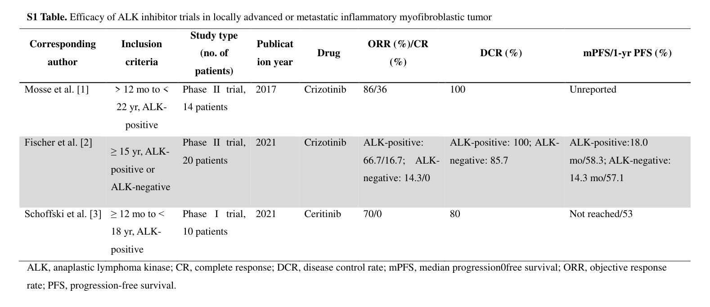

## Question

# Disease Characteristics Research Template

## Target Disease
- **Disease Name:** Inflammatory Myofibroblastic Tumor
- **MONDO ID:**  (if available)
- **Category:** Complex

## Research Objectives

Please provide a comprehensive research report on **Inflammatory Myofibroblastic Tumor** covering all of the
disease characteristics listed below. This report will be used to populate a disease knowledge
base entry. Be thorough and cite primary literature (PMID preferred) for all claims.

For each section, **suggested databases/resources** are listed. These are the first places
you should search for information on each topic.

---

### 1. Disease Information
> **Search first:** OMIM, Orphanet, ICD-10/ICD-11, MeSH, PubMed

- What is the disease? Provide a concise overview.
- What are the key identifiers? (OMIM, Orphanet, ICD-10/ICD-11, MeSH, Mondo)
- What are the common synonyms and alternative names?
- Is the information derived from individual patients (e.g., EHR) or aggregated disease-level resources?

### 2. Etiology

- **Disease Causal Factors**: What are the primary causes? (genetic, environmental, infectious, mechanistic)
- **Risk Factors**:
  > **Search first:** PubMed, Cochrane Library, UpToDate, clinical guidelines, ClinVar, ClinGen, GWAS Catalog, PheGenI, CTD, CDC, WHO, epidemiological databases
  - Genetic risk factors (causal variants, susceptibility loci, modifier genes)
  - Environmental risk factors (toxins, lifestyle, occupational exposures, age, sex, family history)
- **Protective Factors**:
  > **Search first:** PubMed, Cochrane Library, clinical trial databases, GWAS Catalog, gnomAD, WHO, CDC, nutrition databases
  - Genetic protective factors (protective variants, modifier alleles)
  - Environmental protective factors (diet, lifestyle, exposures that reduce risk)
- **Gene-Environment Interactions**: How do genetic and environmental factors interact to influence disease?
  > **Search first:** CTD, PubMed, PheGenI, GxE databases

### 3. Phenotypes
> **Search first:** HPO (Human Phenotype Ontology), OMIM, Orphanet, PubMed, clinicaltrials.gov, MedDRA, SNOMED CT, DECIPHER, LOINC

For each phenotype, provide:
- **Phenotype type**: symptoms, clinical signs, physical manifestations, behavioral changes, or laboratory abnormalities
  > For symptoms/signs: HPO, OMIM, Orphanet, PubMed
  > For behavioral changes: HPO, DSM, RDoC (Research Domain Criteria), PubMed
  > For laboratory abnormalities: LOINC, SNOMED CT, LabTests Online, PubMed
- **Phenotype characteristics**:
  > **Search first:** OMIM, Orphanet, HPO, PubMed
  - Age of symptom onset (neonatal, childhood, adult-onset, late-onset)
  - Symptom severity (mild, moderate, severe, variable)
  - Symptom progression (stable, progressive, episodic, fluctuating)
  - Frequency among affected individuals (percentage or qualitative)
- **Quality of life impact**: Effects on daily functioning and well-being (per-phenotype when possible)
  > **Search first:** EQ-5D database, SF-36, WHO QOL databases, PubMed
- Suggest HPO (Human Phenotype Ontology) terms for each phenotype

### 4. Genetic/Molecular Information

- **Causal Genes**: Gene mutations or chromosomal abnormalities responsible for disease (gene symbols, OMIM IDs)
  > **Search first:** OMIM, ClinVar, HGMD, Ensembl, NCBI Gene
- **Pathogenic Variants**:
  - Affected genes (gene symbols, HGNC IDs)
    > **Search first:** OMIM, NCBI Gene, Ensembl, HGNC, UniProt, GeneCards
  - Variant classification (pathogenic, likely pathogenic, VUS per ACMG/AMP guidelines)
    > **Search first:** ClinVar, ClinGen, ACMG/AMP guidelines, VarSome
  - Variant type/class (missense, frameshift, nonsense, splice-site, structural)
  - Allele frequency in population databases
    > **Search first:** gnomAD, 1000 Genomes, ExAC, TOPMed, dbSNP
  - Somatic vs germline origin
    > **Search first:** COSMIC (somatic), ClinVar, ICGC, TCGA
  - Functional consequences (loss of function, gain of function, dominant negative)
- **Modifier Genes**: Genes that modify disease severity or expression
- **Epigenetic Information**: DNA methylation, histone modifications, chromatin changes affecting disease
  > **Search first:** ENCODE, Roadmap Epigenomics, MethBase, DiseaseMeth
- **Chromosomal Abnormalities**: Large-scale genetic changes (aneuploidy, translocations, inversions)
  > **Search first:** DECIPHER, ClinVar, ECARUCA, UCSC Genome Browser

### 5. Environmental Information

- **Environmental Factors**: Non-genetic contributing factors (toxins, radiation, pollution, occupational exposure)
  > **Search first:** CTD (Comparative Toxicogenomics Database), TOXNET, PubMed, EPA databases
- **Lifestyle Factors**: Behavioral factors (smoking, diet, exercise, alcohol consumption)
  > **Search first:** CDC databases, WHO, PubMed, NHANES
- **Infectious Agents**: If applicable, pathogens causing or triggering disease (bacteria, viruses, fungi, parasites)
  > **Search first:** NCBI Taxonomy, ViPR, BV-BRC, MicrobeDB, GIDEON

### 6. Mechanism / Pathophysiology

- **Molecular Pathways**: Specific signaling cascades or biochemical pathways involved (Wnt, MAPK, mTOR, PI3K-AKT, etc.)
  > **Search first:** KEGG, Reactome, WikiPathways, PathBank, BioCyc
- **Cellular Processes**: Cell-level mechanisms (apoptosis, autophagy, cell cycle dysregulation, inflammation, etc.)
  > **Search first:** Gene Ontology (GO), Reactome, KEGG, PubMed
- **Protein Dysfunction**: How protein structure or function is altered (misfolding, aggregation, loss of function, gain of function)
  > **Search first:** UniProt, PDB (Protein Data Bank), InterPro, Pfam, AlphaFold
- **Metabolic Changes**: Alterations in metabolic processes (energy metabolism, lipid metabolism, amino acid metabolism)
  > **Search first:** KEGG, BioCyc, HMDB (Human Metabolome Database), BRENDA
- **Immune System Involvement**: Role of immune response (autoimmunity, immunodeficiency, chronic inflammation)
  > **Search first:** ImmPort, Immunome Database, IEDB, Gene Ontology
- **Tissue Damage Mechanisms**: How tissues/ are injured (oxidative stress, ischemia, fibrosis, necrosis)
  > **Search first:** PubMed, Gene Ontology, Reactome
- **Biochemical Abnormalities**: Specific molecular defects (enzyme deficiencies, receptor dysfunction, ion channel defects)
  > **Search first:** BRENDA, UniProt, KEGG, OMIM, PubMed
- **Epigenetic Changes**: DNA methylation, histone modifications affecting gene expression in disease
  > **Search first:** ENCODE, Roadmap Epigenomics, MethBase, DiseaseMeth
- **Molecular Profiling** (if available):
  - Transcriptomics/gene expression changes
    > **Search first:** GEO (Gene Expression Omnibus), ArrayExpress, GTEx, Human Cell Atlas, SRA
  - Proteomics findings
    > **Search first:** PRIDE, ProteomeXchange, Human Protein Atlas, STRING, BioGRID
  - Metabolomics signatures
    > **Search first:** MetaboLights, Metabolomics Workbench, HMDB, METLIN
  - Lipidomics alterations
    > **Search first:** LIPID MAPS, SwissLipids, LipidHome, Metabolomics Workbench
  - Genomic structural features
    > **Search first:** UCSC Genome Browser, Ensembl, NCBI, dbVar, DGV
- **Advanced Technologies** (if applicable):
  - Single-cell analysis findings (cell-type specific mechanisms, cellular heterogeneity)
    > **Search first:** Human Cell Atlas, Single Cell Portal, GEO, CELLxGENE
  - Spatial transcriptomics findings
    > **Search first:** GEO, Spatial Research, Vizgen, 10x Genomics data
  - Multi-omics integration results
    > **Search first:** TCGA, ICGC, cBioPortal, LinkedOmics, PubMed
  - Functional genomics screens (CRISPR, RNAi)
    > **Search first:** DepMap, GenomeRNAi, PubMed, BioGRID ORCS

For each mechanism, describe:
- The causal chain from initial trigger to clinical manifestation
- Which mechanisms are upstream vs downstream
- What cell types and biological processes are involved
- Suggest GO terms for biological processes and CL terms for cell types

### 7. Anatomical Structures Affected

- **Organ Level**:
  - Primary organs directly affected
  - Secondary organ involvement (complications, secondary effects)
  - Body systems involved (cardiovascular, nervous, digestive, respiratory, endocrine, etc.)
  > **Search first:** Uberon, FMA (Foundational Model of Anatomy), OMIM, HPO, ICD-11, MeSH, SNOMED CT
- **Tissue and Cell Level**:
  - Specific tissue types affected (epithelial, connective, muscle, nervous)
  - Specific cell populations targeted (with Cell Ontology terms)
  > **Search first:** Uberon, Human Protein Atlas, Cell Ontology, Human Cell Atlas, CellMarker, PanglaoDB
- **Subcellular Level**:
  - Cellular compartments involved (mitochondria, nucleus, ER, lysosomes) (with GO Cellular Component terms)
  > **Search first:** Gene Ontology (Cellular Component), UniProt, Human Protein Atlas
- **Localization**:
  - Specific anatomical sites (with UBERON terms)
    > **Search first:** FMA, Uberon, NeuroNames (for brain), SNOMED CT
  - Lateralization (unilateral, bilateral, asymmetric)
    > **Search first:** HPO, clinical literature, imaging databases

### 8. Temporal Development

- **Onset**:
  - Typical age of onset (congenital, pediatric, adult, geriatric)
  - Onset pattern (acute, subacute, chronic, insidious)
  > **Search first:** OMIM, Orphanet, HPO, PubMed
- **Progression**:
  - Disease stages (early, intermediate, advanced, end-stage)
    > **Search first:** Cancer Staging Manual (AJCC), WHO classifications, PubMed
  - Progression rate (rapid, slow, variable)
  - Disease course pattern (episodic, relapsing-remitting, progressive, stable)
  - Disease duration (self-limited, chronic lifelong)
  > **Search first:** Disease registries, longitudinal cohort databases, natural history studies, PubMed, Orphanet, OMIM
- **Patterns**:
  - Remission patterns (spontaneous, treatment-induced)
    > **Search first:** Clinical trial databases, disease registries, PubMed
  - Critical periods (time windows of vulnerability or opportunity for intervention)
    > **Search first:** PubMed, developmental biology databases, clinical guidelines

### 9. Inheritance and Population

- **Epidemiology**:
  - Prevalence (cases per 100,000 at given time)
  - Incidence (new cases per 100,000 per year)
  > **Search first:** Orphanet, CDC, WHO, GBD (Global Burden of Disease), national registries, SEER, disease registries
- **For Genetic Etiology**:
  - Inheritance pattern (AD, AR, X-linked, mitochondrial, multifactorial, polygenic)
    > **Search first:** OMIM, Orphanet, ClinVar, GTR (Genetic Testing Registry)
  - Penetrance (complete, incomplete, age-dependent)
    > **Search first:** ClinVar, OMIM, PubMed, ClinGen
  - Expressivity (variable, consistent)
    > **Search first:** OMIM, ClinVar, PubMed
  - Genetic anticipation (increasing severity in successive generations)
    > **Search first:** OMIM, PubMed (especially for repeat expansion disorders)
  - Germline mosaicism
    > **Search first:** ClinVar, OMIM, genetic counseling literature, PubMed
  - Founder effects (population-specific mutations)
    > **Search first:** gnomAD, population genetics databases, PubMed
  - Consanguinity role
    > **Search first:** OMIM, population studies, genetic counseling resources
  - Carrier frequency
    > **Search first:** gnomAD, carrier screening databases, GeneReviews, GTR
- **Population Demographics**:
  - Affected populations (ethnic or demographic groups with higher prevalence)
    > **Search first:** gnomAD, 1000 Genomes, PAGE Study, PubMed, population registries
  - Geographic distribution (endemic areas, regional variation)
    > **Search first:** WHO, CDC, GBD, Orphanet, geographic epidemiology databases
  - Geographic distribution of specific variants
  - Sex ratio (male:female)
    > **Search first:** Disease registries, OMIM, PubMed, epidemiological databases
  - Age distribution of affected individuals
    > **Search first:** CDC, disease registries, SEER, Orphanet

### 10. Diagnostics

- **Clinical Tests**:
  - Laboratory tests (blood, urine, tissue chemistry, specific enzyme assays)
    > **Search first:** LOINC, LabTests Online, PubMed
  - Biomarkers (proteins, metabolites, genetic markers, circulating biomarkers)
    > **Search first:** FDA Biomarker List, BEST (Biomarkers, EndpointS, and other Tools), PubMed
  - Imaging studies (X-ray, CT, MRI, PET, ultrasound)
    > **Search first:** RadLex, DICOM, Radiopaedia, imaging databases
  - Functional tests (pulmonary function, cardiac stress tests)
    > **Search first:** LOINC, clinical guidelines, PubMed
  - Electrophysiology (EEG, EMG, ECG, nerve conduction studies)
    > **Search first:** LOINC, clinical neurophysiology databases, PubMed
  - Biopsy findings (histopathology, immunohistochemistry)
    > **Search first:** SNOMED CT, College of American Pathologists resources, PubMed
  - Pathology findings (microscopic examination)
    > **Search first:** SNOMED CT, Digital Pathology databases, PubMed
- **Genetic Testing**:
  > **Search first:** GTR (Genetic Testing Registry), GeneReviews, ClinGen
  - Overview of recommended genetic testing approach
  - Whole genome sequencing (WGS) utility
    > **Search first:** GTR, ClinVar, GEL (Genomics England), gnomAD
  - Whole exome sequencing (WES) utility
    > **Search first:** GTR, ClinVar, OMIM, GeneMatcher
  - Gene panels (which panels, which genes)
    > **Search first:** GTR, ClinVar, laboratory-specific databases
  - Single gene testing
    > **Search first:** GTR, ClinVar, OMIM, GeneReviews
  - Chromosomal microarray (CMA)
    > **Search first:** DECIPHER, ClinVar, dbVar, ECARUCA
  - Karyotyping
    > **Search first:** Chromosome Abnormality Database, ClinVar, cytogenetics resources
  - FISH
    > **Search first:** ClinVar, cytogenetics databases, PubMed
  - Mitochondrial DNA testing
    > **Search first:** MITOMAP, MSeqDR, ClinVar, GTR
  - Repeat expansion testing
    > **Search first:** GTR, ClinVar, repeat expansion databases, PubMed
- **Omics-Based Diagnostics** (if applicable):
  - RNA sequencing / transcriptomics
    > **Search first:** GEO, ArrayExpress, GTEx, RNA-seq databases
  - Proteomics
    > **Search first:** PRIDE, ProteomeXchange, FDA Biomarker database
  - Metabolomics
    > **Search first:** MetaboLights, Metabolomics Workbench, HMDB
  - Epigenomics
    > **Search first:** GEO, ENCODE, Roadmap Epigenomics, MethBase
  - Liquid biopsy
    > **Search first:** COSMIC, ClinVar, liquid biopsy databases, PubMed
- **Clinical Criteria**:
  - Standardized diagnostic criteria (DSM, ICD, society guidelines)
    > **Search first:** DSM-5, ICD-11, clinical society guidelines, UpToDate
  - Differential diagnosis (other conditions to rule out, with distinguishing features)
    > **Search first:** DynaMed, UpToDate, clinical decision support systems
- **Screening**:
  - Screening methods for asymptomatic individuals (newborn screening, carrier screening, cascade screening)
    > **Search first:** ACMG recommendations, CDC newborn screening, GTR

### 11. Outcome/Prognosis

- **Survival and Mortality**:
  - Survival rate (5-year, 10-year, overall)
    > **Search first:** SEER, cancer registries, disease-specific registries, PubMed
  - Life expectancy (with and without treatment if applicable)
    > **Search first:** Orphanet, disease registries, actuarial databases, PubMed
  - Mortality rate
    > **Search first:** CDC, WHO, GBD, national mortality databases
  - Disease-specific mortality (deaths directly attributable to disease)
    > **Search first:** Disease registries, CDC Wonder, GBD, PubMed
- **Morbidity and Function**:
  - Morbidity (disease-related disability and health impacts)
    > **Search first:** GBD, WHO, disability databases, PubMed
  - Disability outcomes (long-term functional impairments)
    > **Search first:** ICF (International Classification of Functioning), disability registries
  - Quality of life measures (EQ-5D, SF-36, PROMIS, disease-specific tools)
    > **Search first:** EQ-5D database, SF-36, PROMIS, PubMed
- **Disease Course**:
  - Complications (secondary problems: infections, organ failure, etc.)
    > **Search first:** ICD codes, disease registries, clinical databases, PubMed
  - Recovery potential (likelihood and extent of recovery, with vs without treatment)
    > **Search first:** Natural history studies, rehabilitation databases, PubMed
- **Prediction**:
  - Prognostic factors (age, disease severity, biomarkers, treatment response)
    > **Search first:** Prognostic models databases, clinical calculators, PubMed
  - Prognostic biomarkers (molecular markers predicting disease course)
    > **Search first:** FDA Biomarker database, PubMed, cancer prognostic databases

### 12. Treatment

- **Pharmacotherapy**:
  - Pharmacological treatments (drug names, drug classes, mechanisms of action)
    > **Search first:** DrugBank, RxNorm, ATC classification, DailyMed, FDA databases
  - Pharmacogenomics (how genetic variants affect drug metabolism, efficacy, toxicity)
    > **Search first:** PharmGKB, CPIC (Clinical Pharmacogenetics), FDA Table of PGx Biomarkers
- **Advanced Therapeutics**:
  - Gene therapy (viral vectors, CRISPR, gene replacement, gene editing)
    > **Search first:** ClinicalTrials.gov, FDA gene therapy database, ASGCT resources
  - Cell therapy (stem cell transplant, CAR-T, cellular therapeutics)
    > **Search first:** ClinicalTrials.gov, FDA cell therapy database, FACT standards
  - RNA-based therapies (ASOs, siRNA, mRNA therapies)
    > **Search first:** ClinicalTrials.gov, FDA approvals, PubMed
  - Targeted therapies (treatments directed at specific molecular targets)
    > **Search first:** My Cancer Genome, OncoKB, ClinicalTrials.gov, FDA approvals
  - Immunotherapies (checkpoint inhibitors, monoclonal antibodies)
    > **Search first:** Cancer Immunotherapy Database, FDA approvals, ClinicalTrials.gov
- **Surgical and Interventional**:
  - Surgical interventions (types of surgery, timing, outcomes)
    > **Search first:** CPT codes, surgical registries, clinical guidelines, PubMed
- **Supportive and Rehabilitative**:
  - Supportive care (symptom management, pain control, nutrition)
    > **Search first:** Clinical guidelines, Cochrane Library, PubMed
  - Rehabilitation (physical therapy, occupational therapy, speech therapy)
    > **Search first:** Rehabilitation medicine databases, clinical guidelines, PubMed
- **Experimental**:
  - Experimental treatments in clinical trials (with NCT identifiers if available)
    > **Search first:** ClinicalTrials.gov, EU Clinical Trials Register, WHO ICTRP
- **Treatment Outcomes**:
  - Treatment response rates
    > **Search first:** Clinical trial databases, FDA reviews, systematic reviews, PubMed
  - Side effects and adverse events
    > **Search first:** FDA Adverse Event Reporting System (FAERS), MedWatch, PubMed
- **Treatment Strategy**:
  - Treatment algorithms (clinical pathways, decision trees)
    > **Search first:** Clinical practice guidelines, NCCN Guidelines, UpToDate
  - Combination therapies
    > **Search first:** ClinicalTrials.gov, treatment guidelines, PubMed
  - Personalized medicine approaches (genotype-guided treatment)
    > **Search first:** My Cancer Genome, CIViC, PharmGKB, precision medicine databases

For each treatment, suggest MAXO (Medical Action Ontology) terms where applicable.

### 13. Prevention

- **Prevention Levels**:
  - Primary prevention (preventing disease occurrence: vaccination, risk factor modification)
    > **Search first:** CDC, WHO, USPSTF recommendations, Cochrane Library
  - Secondary prevention (early detection and treatment: screening programs, early intervention)
    > **Search first:** USPSTF, CDC screening guidelines, WHO
  - Tertiary prevention (preventing complications in those with disease)
    > **Search first:** Clinical guidelines, disease management protocols, PubMed
- **Immunization**: Vaccine strategies (if applicable)
  > **Search first:** CDC vaccine schedules, WHO immunization, FDA vaccine database
- **Screening and Early Detection**:
  - Screening programs (population-based: newborn screening, cancer screening)
    > **Search first:** CDC screening programs, USPSTF, cancer screening databases
  - Genetic screening (carrier screening, preimplantation genetic diagnosis, prenatal testing)
    > **Search first:** ACMG recommendations, ACOG guidelines, GTR
  - Risk stratification (identifying high-risk individuals for targeted prevention)
    > **Search first:** Risk prediction models, clinical calculators, PubMed
- **Behavioral Interventions**: Lifestyle modifications to reduce risk
  > **Search first:** CDC, WHO, behavioral intervention databases, Cochrane Library
- **Counseling**: Genetic counseling (risk assessment, family planning guidance)
  > **Search first:** NSGC resources, ACMG guidelines, GeneReviews
- **Public Health**:
  - Public health interventions (sanitation, vector control, health education)
    > **Search first:** CDC, WHO, public health databases, PubMed
  - Environmental interventions (reducing environmental risk factors)
    > **Search first:** EPA databases, WHO environmental health, PubMed
- **Prophylaxis**: Preventive medications or procedures
  > **Search first:** Clinical guidelines, FDA approvals, PubMed

### 14. Other Species / Natural Disease

- **Taxonomy**: Species affected (with NCBI Taxon identifiers)
  > **Search first:** NCBI Taxonomy
- **Breed**: Specific breeds affected (with VBO identifiers if applicable)
  > **Search first:** VBO (Vertebrate Breed Ontology)
- **Gene**: Orthologous genes in other species (with NCBI Gene IDs)
  > **Search first:** NCBI Gene
- **Natural Disease**:
  - Naturally occurring disease in other species (companion animals, wildlife)
    > **Search first:** OMIA (Online Mendelian Inheritance in Animals), VetCompass, PubMed
  - Veterinary relevance and importance in animal health
    > **Search first:** OMIA, veterinary databases, PubMed
- **Comparative Biology**:
  - Comparative pathology (similarities and differences across species)
    > **Search first:** OMIA, comparative pathology databases, PubMed
  - Evolutionary conservation of disease mechanisms
    > **Search first:** HomoloGene, OrthoMCL, Alliance of Genome Resources
- **Transmission** (if applicable):
  - Zoonotic potential
    > **Search first:** CDC zoonotic diseases, WHO zoonoses, GIDEON
  - Cross-species susceptibility
    > **Search first:** NCBI Taxonomy, veterinary databases, PubMed

### 15. Model Organisms

- **Model Types**:
  - Model organism type (mammalian, invertebrate, cellular, in vitro)
    > **Search first:** Alliance of Genome Resources, model organism databases
  - Specific model systems (mouse, rat, zebrafish, Drosophila, C. elegans, yeast, cell lines, organoids, iPSCs)
    > **Search first:** MGI, RGD, ZFIN, FlyBase, WormBase, SGD, ATCC, Cellosaurus
  - Induced models (drug treatment, surgical intervention, environmental manipulation)
    > **Search first:** MGI, model organism databases, PubMed
- **Genetic Models**:
  - Types available (knockout, knock-in, transgenic, conditional, humanized)
    > **Search first:** MGI, IMPC, KOMP, EuMMCR, IMSR
- **Model Characteristics**:
  - Phenotype recapitulation (how well model reproduces human disease features)
    > **Search first:** Model organism databases, comparative studies, PubMed
  - Model limitations (aspects of human disease not captured)
    > **Search first:** Model organism databases, PubMed, review articles
- **Applications**:
  - Research applications (what aspects of disease can be studied)
    > **Search first:** Model organism databases, PubMed
- **Resources**:
  - Model databases
    > **Search first:** MGI, RGD, ZFIN, FlyBase, WormBase, IMSR, EMMA, MMRRC

---

## Citation Requirements

- Cite primary literature (PMID preferred) for all mechanistic and clinical claims
- Prioritize recent reviews and landmark papers
- Include direct quotes from abstracts where possible to support key statements
- Distinguish evidence source types: human clinical, model organism, in vitro, computational

## Output Format

Structure your response as a comprehensive narrative organized by the sections above.
For each section, provide:
- Factual content with specific details (numbers, percentages, gene names, variant nomenclature)
- Ontology term suggestions (HPO, GO, CL, UBERON, CHEBI, MAXO, MONDO) where applicable
- Evidence citations with PMIDs
- Direct quotes from abstracts to support key claims
- Clear indication when information is not available or not applicable for this disease

This report will be used to populate a disease knowledge base entry with:
- Pathophysiology descriptions with causal chains
- Gene/protein annotations (HGNC, GO terms)
- Phenotype associations (HP terms) with frequencies
- Cell type involvement (CL terms)
- Anatomical locations (UBERON terms)
- Chemical entities (CHEBI terms)
- Treatment annotations (MAXO terms)
- Evidence items with PMIDs and exact abstract quotes
- Epidemiology, prognosis, diagnostic, and prevention information
- Animal model descriptions with phenotype recapitulation details

## Output

Question: You are an expert researcher providing comprehensive, well-cited information.

Provide detailed information focusing on:
1. Key concepts and definitions with current understanding
2. Recent developments and latest research (prioritize 2023-2024 sources)
3. Current applications and real-world implementations
4. Expert opinions and analysis from authoritative sources
5. Relevant statistics and data from recent studies

Format as a comprehensive research report with proper citations. Include URLs and publication dates where available.
Always prioritize recent, authoritative sources and provide specific citations for all major claims.

# Disease Characteristics Research Template

## Target Disease
- **Disease Name:** Inflammatory Myofibroblastic Tumor
- **MONDO ID:**  (if available)
- **Category:** Complex

## Research Objectives

Please provide a comprehensive research report on **Inflammatory Myofibroblastic Tumor** covering all of the
disease characteristics listed below. This report will be used to populate a disease knowledge
base entry. Be thorough and cite primary literature (PMID preferred) for all claims.

For each section, **suggested databases/resources** are listed. These are the first places
you should search for information on each topic.

---

### 1. Disease Information
> **Search first:** OMIM, Orphanet, ICD-10/ICD-11, MeSH, PubMed

- What is the disease? Provide a concise overview.
- What are the key identifiers? (OMIM, Orphanet, ICD-10/ICD-11, MeSH, Mondo)
- What are the common synonyms and alternative names?
- Is the information derived from individual patients (e.g., EHR) or aggregated disease-level resources?

### 2. Etiology

- **Disease Causal Factors**: What are the primary causes? (genetic, environmental, infectious, mechanistic)
- **Risk Factors**:
  > **Search first:** PubMed, Cochrane Library, UpToDate, clinical guidelines, ClinVar, ClinGen, GWAS Catalog, PheGenI, CTD, CDC, WHO, epidemiological databases
  - Genetic risk factors (causal variants, susceptibility loci, modifier genes)
  - Environmental risk factors (toxins, lifestyle, occupational exposures, age, sex, family history)
- **Protective Factors**:
  > **Search first:** PubMed, Cochrane Library, clinical trial databases, GWAS Catalog, gnomAD, WHO, CDC, nutrition databases
  - Genetic protective factors (protective variants, modifier alleles)
  - Environmental protective factors (diet, lifestyle, exposures that reduce risk)
- **Gene-Environment Interactions**: How do genetic and environmental factors interact to influence disease?
  > **Search first:** CTD, PubMed, PheGenI, GxE databases

### 3. Phenotypes
> **Search first:** HPO (Human Phenotype Ontology), OMIM, Orphanet, PubMed, clinicaltrials.gov, MedDRA, SNOMED CT, DECIPHER, LOINC

For each phenotype, provide:
- **Phenotype type**: symptoms, clinical signs, physical manifestations, behavioral changes, or laboratory abnormalities
  > For symptoms/signs: HPO, OMIM, Orphanet, PubMed
  > For behavioral changes: HPO, DSM, RDoC (Research Domain Criteria), PubMed
  > For laboratory abnormalities: LOINC, SNOMED CT, LabTests Online, PubMed
- **Phenotype characteristics**:
  > **Search first:** OMIM, Orphanet, HPO, PubMed
  - Age of symptom onset (neonatal, childhood, adult-onset, late-onset)
  - Symptom severity (mild, moderate, severe, variable)
  - Symptom progression (stable, progressive, episodic, fluctuating)
  - Frequency among affected individuals (percentage or qualitative)
- **Quality of life impact**: Effects on daily functioning and well-being (per-phenotype when possible)
  > **Search first:** EQ-5D database, SF-36, WHO QOL databases, PubMed
- Suggest HPO (Human Phenotype Ontology) terms for each phenotype

### 4. Genetic/Molecular Information

- **Causal Genes**: Gene mutations or chromosomal abnormalities responsible for disease (gene symbols, OMIM IDs)
  > **Search first:** OMIM, ClinVar, HGMD, Ensembl, NCBI Gene
- **Pathogenic Variants**:
  - Affected genes (gene symbols, HGNC IDs)
    > **Search first:** OMIM, NCBI Gene, Ensembl, HGNC, UniProt, GeneCards
  - Variant classification (pathogenic, likely pathogenic, VUS per ACMG/AMP guidelines)
    > **Search first:** ClinVar, ClinGen, ACMG/AMP guidelines, VarSome
  - Variant type/class (missense, frameshift, nonsense, splice-site, structural)
  - Allele frequency in population databases
    > **Search first:** gnomAD, 1000 Genomes, ExAC, TOPMed, dbSNP
  - Somatic vs germline origin
    > **Search first:** COSMIC (somatic), ClinVar, ICGC, TCGA
  - Functional consequences (loss of function, gain of function, dominant negative)
- **Modifier Genes**: Genes that modify disease severity or expression
- **Epigenetic Information**: DNA methylation, histone modifications, chromatin changes affecting disease
  > **Search first:** ENCODE, Roadmap Epigenomics, MethBase, DiseaseMeth
- **Chromosomal Abnormalities**: Large-scale genetic changes (aneuploidy, translocations, inversions)
  > **Search first:** DECIPHER, ClinVar, ECARUCA, UCSC Genome Browser

### 5. Environmental Information

- **Environmental Factors**: Non-genetic contributing factors (toxins, radiation, pollution, occupational exposure)
  > **Search first:** CTD (Comparative Toxicogenomics Database), TOXNET, PubMed, EPA databases
- **Lifestyle Factors**: Behavioral factors (smoking, diet, exercise, alcohol consumption)
  > **Search first:** CDC databases, WHO, PubMed, NHANES
- **Infectious Agents**: If applicable, pathogens causing or triggering disease (bacteria, viruses, fungi, parasites)
  > **Search first:** NCBI Taxonomy, ViPR, BV-BRC, MicrobeDB, GIDEON

### 6. Mechanism / Pathophysiology

- **Molecular Pathways**: Specific signaling cascades or biochemical pathways involved (Wnt, MAPK, mTOR, PI3K-AKT, etc.)
  > **Search first:** KEGG, Reactome, WikiPathways, PathBank, BioCyc
- **Cellular Processes**: Cell-level mechanisms (apoptosis, autophagy, cell cycle dysregulation, inflammation, etc.)
  > **Search first:** Gene Ontology (GO), Reactome, KEGG, PubMed
- **Protein Dysfunction**: How protein structure or function is altered (misfolding, aggregation, loss of function, gain of function)
  > **Search first:** UniProt, PDB (Protein Data Bank), InterPro, Pfam, AlphaFold
- **Metabolic Changes**: Alterations in metabolic processes (energy metabolism, lipid metabolism, amino acid metabolism)
  > **Search first:** KEGG, BioCyc, HMDB (Human Metabolome Database), BRENDA
- **Immune System Involvement**: Role of immune response (autoimmunity, immunodeficiency, chronic inflammation)
  > **Search first:** ImmPort, Immunome Database, IEDB, Gene Ontology
- **Tissue Damage Mechanisms**: How tissues/ are injured (oxidative stress, ischemia, fibrosis, necrosis)
  > **Search first:** PubMed, Gene Ontology, Reactome
- **Biochemical Abnormalities**: Specific molecular defects (enzyme deficiencies, receptor dysfunction, ion channel defects)
  > **Search first:** BRENDA, UniProt, KEGG, OMIM, PubMed
- **Epigenetic Changes**: DNA methylation, histone modifications affecting gene expression in disease
  > **Search first:** ENCODE, Roadmap Epigenomics, MethBase, DiseaseMeth
- **Molecular Profiling** (if available):
  - Transcriptomics/gene expression changes
    > **Search first:** GEO (Gene Expression Omnibus), ArrayExpress, GTEx, Human Cell Atlas, SRA
  - Proteomics findings
    > **Search first:** PRIDE, ProteomeXchange, Human Protein Atlas, STRING, BioGRID
  - Metabolomics signatures
    > **Search first:** MetaboLights, Metabolomics Workbench, HMDB, METLIN
  - Lipidomics alterations
    > **Search first:** LIPID MAPS, SwissLipids, LipidHome, Metabolomics Workbench
  - Genomic structural features
    > **Search first:** UCSC Genome Browser, Ensembl, NCBI, dbVar, DGV
- **Advanced Technologies** (if applicable):
  - Single-cell analysis findings (cell-type specific mechanisms, cellular heterogeneity)
    > **Search first:** Human Cell Atlas, Single Cell Portal, GEO, CELLxGENE
  - Spatial transcriptomics findings
    > **Search first:** GEO, Spatial Research, Vizgen, 10x Genomics data
  - Multi-omics integration results
    > **Search first:** TCGA, ICGC, cBioPortal, LinkedOmics, PubMed
  - Functional genomics screens (CRISPR, RNAi)
    > **Search first:** DepMap, GenomeRNAi, PubMed, BioGRID ORCS

For each mechanism, describe:
- The causal chain from initial trigger to clinical manifestation
- Which mechanisms are upstream vs downstream
- What cell types and biological processes are involved
- Suggest GO terms for biological processes and CL terms for cell types

### 7. Anatomical Structures Affected

- **Organ Level**:
  - Primary organs directly affected
  - Secondary organ involvement (complications, secondary effects)
  - Body systems involved (cardiovascular, nervous, digestive, respiratory, endocrine, etc.)
  > **Search first:** Uberon, FMA (Foundational Model of Anatomy), OMIM, HPO, ICD-11, MeSH, SNOMED CT
- **Tissue and Cell Level**:
  - Specific tissue types affected (epithelial, connective, muscle, nervous)
  - Specific cell populations targeted (with Cell Ontology terms)
  > **Search first:** Uberon, Human Protein Atlas, Cell Ontology, Human Cell Atlas, CellMarker, PanglaoDB
- **Subcellular Level**:
  - Cellular compartments involved (mitochondria, nucleus, ER, lysosomes) (with GO Cellular Component terms)
  > **Search first:** Gene Ontology (Cellular Component), UniProt, Human Protein Atlas
- **Localization**:
  - Specific anatomical sites (with UBERON terms)
    > **Search first:** FMA, Uberon, NeuroNames (for brain), SNOMED CT
  - Lateralization (unilateral, bilateral, asymmetric)
    > **Search first:** HPO, clinical literature, imaging databases

### 8. Temporal Development

- **Onset**:
  - Typical age of onset (congenital, pediatric, adult, geriatric)
  - Onset pattern (acute, subacute, chronic, insidious)
  > **Search first:** OMIM, Orphanet, HPO, PubMed
- **Progression**:
  - Disease stages (early, intermediate, advanced, end-stage)
    > **Search first:** Cancer Staging Manual (AJCC), WHO classifications, PubMed
  - Progression rate (rapid, slow, variable)
  - Disease course pattern (episodic, relapsing-remitting, progressive, stable)
  - Disease duration (self-limited, chronic lifelong)
  > **Search first:** Disease registries, longitudinal cohort databases, natural history studies, PubMed, Orphanet, OMIM
- **Patterns**:
  - Remission patterns (spontaneous, treatment-induced)
    > **Search first:** Clinical trial databases, disease registries, PubMed
  - Critical periods (time windows of vulnerability or opportunity for intervention)
    > **Search first:** PubMed, developmental biology databases, clinical guidelines

### 9. Inheritance and Population

- **Epidemiology**:
  - Prevalence (cases per 100,000 at given time)
  - Incidence (new cases per 100,000 per year)
  > **Search first:** Orphanet, CDC, WHO, GBD (Global Burden of Disease), national registries, SEER, disease registries
- **For Genetic Etiology**:
  - Inheritance pattern (AD, AR, X-linked, mitochondrial, multifactorial, polygenic)
    > **Search first:** OMIM, Orphanet, ClinVar, GTR (Genetic Testing Registry)
  - Penetrance (complete, incomplete, age-dependent)
    > **Search first:** ClinVar, OMIM, PubMed, ClinGen
  - Expressivity (variable, consistent)
    > **Search first:** OMIM, ClinVar, PubMed
  - Genetic anticipation (increasing severity in successive generations)
    > **Search first:** OMIM, PubMed (especially for repeat expansion disorders)
  - Germline mosaicism
    > **Search first:** ClinVar, OMIM, genetic counseling literature, PubMed
  - Founder effects (population-specific mutations)
    > **Search first:** gnomAD, population genetics databases, PubMed
  - Consanguinity role
    > **Search first:** OMIM, population studies, genetic counseling resources
  - Carrier frequency
    > **Search first:** gnomAD, carrier screening databases, GeneReviews, GTR
- **Population Demographics**:
  - Affected populations (ethnic or demographic groups with higher prevalence)
    > **Search first:** gnomAD, 1000 Genomes, PAGE Study, PubMed, population registries
  - Geographic distribution (endemic areas, regional variation)
    > **Search first:** WHO, CDC, GBD, Orphanet, geographic epidemiology databases
  - Geographic distribution of specific variants
  - Sex ratio (male:female)
    > **Search first:** Disease registries, OMIM, PubMed, epidemiological databases
  - Age distribution of affected individuals
    > **Search first:** CDC, disease registries, SEER, Orphanet

### 10. Diagnostics

- **Clinical Tests**:
  - Laboratory tests (blood, urine, tissue chemistry, specific enzyme assays)
    > **Search first:** LOINC, LabTests Online, PubMed
  - Biomarkers (proteins, metabolites, genetic markers, circulating biomarkers)
    > **Search first:** FDA Biomarker List, BEST (Biomarkers, EndpointS, and other Tools), PubMed
  - Imaging studies (X-ray, CT, MRI, PET, ultrasound)
    > **Search first:** RadLex, DICOM, Radiopaedia, imaging databases
  - Functional tests (pulmonary function, cardiac stress tests)
    > **Search first:** LOINC, clinical guidelines, PubMed
  - Electrophysiology (EEG, EMG, ECG, nerve conduction studies)
    > **Search first:** LOINC, clinical neurophysiology databases, PubMed
  - Biopsy findings (histopathology, immunohistochemistry)
    > **Search first:** SNOMED CT, College of American Pathologists resources, PubMed
  - Pathology findings (microscopic examination)
    > **Search first:** SNOMED CT, Digital Pathology databases, PubMed
- **Genetic Testing**:
  > **Search first:** GTR (Genetic Testing Registry), GeneReviews, ClinGen
  - Overview of recommended genetic testing approach
  - Whole genome sequencing (WGS) utility
    > **Search first:** GTR, ClinVar, GEL (Genomics England), gnomAD
  - Whole exome sequencing (WES) utility
    > **Search first:** GTR, ClinVar, OMIM, GeneMatcher
  - Gene panels (which panels, which genes)
    > **Search first:** GTR, ClinVar, laboratory-specific databases
  - Single gene testing
    > **Search first:** GTR, ClinVar, OMIM, GeneReviews
  - Chromosomal microarray (CMA)
    > **Search first:** DECIPHER, ClinVar, dbVar, ECARUCA
  - Karyotyping
    > **Search first:** Chromosome Abnormality Database, ClinVar, cytogenetics resources
  - FISH
    > **Search first:** ClinVar, cytogenetics databases, PubMed
  - Mitochondrial DNA testing
    > **Search first:** MITOMAP, MSeqDR, ClinVar, GTR
  - Repeat expansion testing
    > **Search first:** GTR, ClinVar, repeat expansion databases, PubMed
- **Omics-Based Diagnostics** (if applicable):
  - RNA sequencing / transcriptomics
    > **Search first:** GEO, ArrayExpress, GTEx, RNA-seq databases
  - Proteomics
    > **Search first:** PRIDE, ProteomeXchange, FDA Biomarker database
  - Metabolomics
    > **Search first:** MetaboLights, Metabolomics Workbench, HMDB
  - Epigenomics
    > **Search first:** GEO, ENCODE, Roadmap Epigenomics, MethBase
  - Liquid biopsy
    > **Search first:** COSMIC, ClinVar, liquid biopsy databases, PubMed
- **Clinical Criteria**:
  - Standardized diagnostic criteria (DSM, ICD, society guidelines)
    > **Search first:** DSM-5, ICD-11, clinical society guidelines, UpToDate
  - Differential diagnosis (other conditions to rule out, with distinguishing features)
    > **Search first:** DynaMed, UpToDate, clinical decision support systems
- **Screening**:
  - Screening methods for asymptomatic individuals (newborn screening, carrier screening, cascade screening)
    > **Search first:** ACMG recommendations, CDC newborn screening, GTR

### 11. Outcome/Prognosis

- **Survival and Mortality**:
  - Survival rate (5-year, 10-year, overall)
    > **Search first:** SEER, cancer registries, disease-specific registries, PubMed
  - Life expectancy (with and without treatment if applicable)
    > **Search first:** Orphanet, disease registries, actuarial databases, PubMed
  - Mortality rate
    > **Search first:** CDC, WHO, GBD, national mortality databases
  - Disease-specific mortality (deaths directly attributable to disease)
    > **Search first:** Disease registries, CDC Wonder, GBD, PubMed
- **Morbidity and Function**:
  - Morbidity (disease-related disability and health impacts)
    > **Search first:** GBD, WHO, disability databases, PubMed
  - Disability outcomes (long-term functional impairments)
    > **Search first:** ICF (International Classification of Functioning), disability registries
  - Quality of life measures (EQ-5D, SF-36, PROMIS, disease-specific tools)
    > **Search first:** EQ-5D database, SF-36, PROMIS, PubMed
- **Disease Course**:
  - Complications (secondary problems: infections, organ failure, etc.)
    > **Search first:** ICD codes, disease registries, clinical databases, PubMed
  - Recovery potential (likelihood and extent of recovery, with vs without treatment)
    > **Search first:** Natural history studies, rehabilitation databases, PubMed
- **Prediction**:
  - Prognostic factors (age, disease severity, biomarkers, treatment response)
    > **Search first:** Prognostic models databases, clinical calculators, PubMed
  - Prognostic biomarkers (molecular markers predicting disease course)
    > **Search first:** FDA Biomarker database, PubMed, cancer prognostic databases

### 12. Treatment

- **Pharmacotherapy**:
  - Pharmacological treatments (drug names, drug classes, mechanisms of action)
    > **Search first:** DrugBank, RxNorm, ATC classification, DailyMed, FDA databases
  - Pharmacogenomics (how genetic variants affect drug metabolism, efficacy, toxicity)
    > **Search first:** PharmGKB, CPIC (Clinical Pharmacogenetics), FDA Table of PGx Biomarkers
- **Advanced Therapeutics**:
  - Gene therapy (viral vectors, CRISPR, gene replacement, gene editing)
    > **Search first:** ClinicalTrials.gov, FDA gene therapy database, ASGCT resources
  - Cell therapy (stem cell transplant, CAR-T, cellular therapeutics)
    > **Search first:** ClinicalTrials.gov, FDA cell therapy database, FACT standards
  - RNA-based therapies (ASOs, siRNA, mRNA therapies)
    > **Search first:** ClinicalTrials.gov, FDA approvals, PubMed
  - Targeted therapies (treatments directed at specific molecular targets)
    > **Search first:** My Cancer Genome, OncoKB, ClinicalTrials.gov, FDA approvals
  - Immunotherapies (checkpoint inhibitors, monoclonal antibodies)
    > **Search first:** Cancer Immunotherapy Database, FDA approvals, ClinicalTrials.gov
- **Surgical and Interventional**:
  - Surgical interventions (types of surgery, timing, outcomes)
    > **Search first:** CPT codes, surgical registries, clinical guidelines, PubMed
- **Supportive and Rehabilitative**:
  - Supportive care (symptom management, pain control, nutrition)
    > **Search first:** Clinical guidelines, Cochrane Library, PubMed
  - Rehabilitation (physical therapy, occupational therapy, speech therapy)
    > **Search first:** Rehabilitation medicine databases, clinical guidelines, PubMed
- **Experimental**:
  - Experimental treatments in clinical trials (with NCT identifiers if available)
    > **Search first:** ClinicalTrials.gov, EU Clinical Trials Register, WHO ICTRP
- **Treatment Outcomes**:
  - Treatment response rates
    > **Search first:** Clinical trial databases, FDA reviews, systematic reviews, PubMed
  - Side effects and adverse events
    > **Search first:** FDA Adverse Event Reporting System (FAERS), MedWatch, PubMed
- **Treatment Strategy**:
  - Treatment algorithms (clinical pathways, decision trees)
    > **Search first:** Clinical practice guidelines, NCCN Guidelines, UpToDate
  - Combination therapies
    > **Search first:** ClinicalTrials.gov, treatment guidelines, PubMed
  - Personalized medicine approaches (genotype-guided treatment)
    > **Search first:** My Cancer Genome, CIViC, PharmGKB, precision medicine databases

For each treatment, suggest MAXO (Medical Action Ontology) terms where applicable.

### 13. Prevention

- **Prevention Levels**:
  - Primary prevention (preventing disease occurrence: vaccination, risk factor modification)
    > **Search first:** CDC, WHO, USPSTF recommendations, Cochrane Library
  - Secondary prevention (early detection and treatment: screening programs, early intervention)
    > **Search first:** USPSTF, CDC screening guidelines, WHO
  - Tertiary prevention (preventing complications in those with disease)
    > **Search first:** Clinical guidelines, disease management protocols, PubMed
- **Immunization**: Vaccine strategies (if applicable)
  > **Search first:** CDC vaccine schedules, WHO immunization, FDA vaccine database
- **Screening and Early Detection**:
  - Screening programs (population-based: newborn screening, cancer screening)
    > **Search first:** CDC screening programs, USPSTF, cancer screening databases
  - Genetic screening (carrier screening, preimplantation genetic diagnosis, prenatal testing)
    > **Search first:** ACMG recommendations, ACOG guidelines, GTR
  - Risk stratification (identifying high-risk individuals for targeted prevention)
    > **Search first:** Risk prediction models, clinical calculators, PubMed
- **Behavioral Interventions**: Lifestyle modifications to reduce risk
  > **Search first:** CDC, WHO, behavioral intervention databases, Cochrane Library
- **Counseling**: Genetic counseling (risk assessment, family planning guidance)
  > **Search first:** NSGC resources, ACMG guidelines, GeneReviews
- **Public Health**:
  - Public health interventions (sanitation, vector control, health education)
    > **Search first:** CDC, WHO, public health databases, PubMed
  - Environmental interventions (reducing environmental risk factors)
    > **Search first:** EPA databases, WHO environmental health, PubMed
- **Prophylaxis**: Preventive medications or procedures
  > **Search first:** Clinical guidelines, FDA approvals, PubMed

### 14. Other Species / Natural Disease

- **Taxonomy**: Species affected (with NCBI Taxon identifiers)
  > **Search first:** NCBI Taxonomy
- **Breed**: Specific breeds affected (with VBO identifiers if applicable)
  > **Search first:** VBO (Vertebrate Breed Ontology)
- **Gene**: Orthologous genes in other species (with NCBI Gene IDs)
  > **Search first:** NCBI Gene
- **Natural Disease**:
  - Naturally occurring disease in other species (companion animals, wildlife)
    > **Search first:** OMIA (Online Mendelian Inheritance in Animals), VetCompass, PubMed
  - Veterinary relevance and importance in animal health
    > **Search first:** OMIA, veterinary databases, PubMed
- **Comparative Biology**:
  - Comparative pathology (similarities and differences across species)
    > **Search first:** OMIA, comparative pathology databases, PubMed
  - Evolutionary conservation of disease mechanisms
    > **Search first:** HomoloGene, OrthoMCL, Alliance of Genome Resources
- **Transmission** (if applicable):
  - Zoonotic potential
    > **Search first:** CDC zoonotic diseases, WHO zoonoses, GIDEON
  - Cross-species susceptibility
    > **Search first:** NCBI Taxonomy, veterinary databases, PubMed

### 15. Model Organisms

- **Model Types**:
  - Model organism type (mammalian, invertebrate, cellular, in vitro)
    > **Search first:** Alliance of Genome Resources, model organism databases
  - Specific model systems (mouse, rat, zebrafish, Drosophila, C. elegans, yeast, cell lines, organoids, iPSCs)
    > **Search first:** MGI, RGD, ZFIN, FlyBase, WormBase, SGD, ATCC, Cellosaurus
  - Induced models (drug treatment, surgical intervention, environmental manipulation)
    > **Search first:** MGI, model organism databases, PubMed
- **Genetic Models**:
  - Types available (knockout, knock-in, transgenic, conditional, humanized)
    > **Search first:** MGI, IMPC, KOMP, EuMMCR, IMSR
- **Model Characteristics**:
  - Phenotype recapitulation (how well model reproduces human disease features)
    > **Search first:** Model organism databases, comparative studies, PubMed
  - Model limitations (aspects of human disease not captured)
    > **Search first:** Model organism databases, PubMed, review articles
- **Applications**:
  - Research applications (what aspects of disease can be studied)
    > **Search first:** Model organism databases, PubMed
- **Resources**:
  - Model databases
    > **Search first:** MGI, RGD, ZFIN, FlyBase, WormBase, IMSR, EMMA, MMRRC

---

## Citation Requirements

- Cite primary literature (PMID preferred) for all mechanistic and clinical claims
- Prioritize recent reviews and landmark papers
- Include direct quotes from abstracts where possible to support key statements
- Distinguish evidence source types: human clinical, model organism, in vitro, computational

## Output Format

Structure your response as a comprehensive narrative organized by the sections above.
For each section, provide:
- Factual content with specific details (numbers, percentages, gene names, variant nomenclature)
- Ontology term suggestions (HPO, GO, CL, UBERON, CHEBI, MAXO, MONDO) where applicable
- Evidence citations with PMIDs
- Direct quotes from abstracts to support key claims
- Clear indication when information is not available or not applicable for this disease

This report will be used to populate a disease knowledge base entry with:
- Pathophysiology descriptions with causal chains
- Gene/protein annotations (HGNC, GO terms)
- Phenotype associations (HP terms) with frequencies
- Cell type involvement (CL terms)
- Anatomical locations (UBERON terms)
- Chemical entities (CHEBI terms)
- Treatment annotations (MAXO terms)
- Evidence items with PMIDs and exact abstract quotes
- Epidemiology, prognosis, diagnostic, and prevention information
- Animal model descriptions with phenotype recapitulation details

# Comprehensive Research Report: Inflammatory Myofibroblastic Tumor (IMT)

## Executive summary
Inflammatory myofibroblastic tumor (IMT) is a rare, fusion-driven mesenchymal neoplasm of intermediate malignant potential, characterized by spindle-cell myofibroblastic proliferation with a prominent inflammatory infiltrate, a substantial local recurrence risk (~25%), and generally low metastatic risk (<5%). Contemporary management increasingly centers on molecular diagnosis (especially kinase fusion detection) to guide targeted therapy (notably ALK inhibitors) when disease is unresectable or metastatic. Recent evidence (2023–2024) highlights (i) the breadth of actionable kinase fusions beyond ALK (e.g., ROS1, NTRK3, RET), (ii) the utility of RNA-based NGS and multi-omics tumor boards for resistance mechanisms, and (iii) active pediatric/young-adult clinical trials of next-generation ALK/ROS1/NTRK inhibitors. (chmiel2024inflammatorymyofibroblastictumor pages 1-2, wang2023updateofdiagnosis pages 1-3, wang2023updateofdiagnosis pages 3-6, hunt2023integrationofmultiomic pages 1-2)

| Topic | Key details | Best supporting source (first author year) | Publication date | URL/DOI |
|---|---|---|---|---|
| Definition/classification | IMT is a rare mesenchymal neoplasm of **intermediate malignancy** composed of myofibroblastic spindle cells with inflammatory infiltrates. Review states it is a “**rare neoplasm with intermediate malignancy characterized by a propensity for recurrence but a low metastatic rate**”; WHO-based framing in recent reviews describes it as a low-grade/borderline mesenchymal tumor and recommends AJCC 8th pTNM staging by site (chmiel2024inflammatorymyofibroblastictumor pages 1-2). | Chmiel 2024 | 2024-06-20 | https://doi.org/10.32604/or.2024.050350 |
| Epidemiology | IMT is extremely rare: **150–200 cases/year in the USA** were cited in a 2023 review, and overall prevalence was summarized as **0.04–0.7%**. Age distribution skews young: most patients are diagnosed **below 40 years**, with a **slight female predominance** in one 2024 review, while another notes predilection for children and young adults (wang2023updateofdiagnosis pages 1-3, chmiel2024inflammatorymyofibroblastictumor pages 1-2). | Wang 2023 | 2023-11-08 | https://doi.org/10.1007/s11864-023-01144-6 |
| Anatomic sites | The **lung** is the most common site in multiple reviews; other common locations are **abdomen/pelvis/retroperitoneum**, visceral organs, deep soft tissue, and head/neck. Recent review: “**The most common IMT manifestation is the lung**,” but tumors may arise in almost any site including bone, CNS, pericardium, heart, spinal meninges, uterus, and adrenal gland (chmiel2024inflammatorymyofibroblastictumor pages 1-2, wang2023updateofdiagnosis pages 1-3). | Chmiel 2024 | 2024-06-20 | https://doi.org/10.32604/or.2024.050350 |
| Recurrence/metastasis | Recurrence is a defining clinical risk: recent reviews report **~25% recurrence** overall. Metastasis is uncommon, typically **<5%**, with Fu et al. reporting **5/92 patients (5.4%)** metastatic. One review notes aggressive/atypical cases can reach **10.2% metastatic risk**, and lung IMT has especially low recurrence (**~2%**). Pediatric recurrence cited at **21%** in one review (wang2023updateofdiagnosis pages 1-3, chmiel2024inflammatorymyofibroblastictumor pages 2-3, chmiel2024inflammatorymyofibroblastictumor pages 1-2). | Chmiel 2024 / Wang 2023 | 2024-06-20 / 2023-11-08 | https://doi.org/10.32604/or.2024.050350 ; https://doi.org/10.1007/s11864-023-01144-6 |
| Key molecular alterations | ALK rearrangement is the major driver. Recent reviews summarize **~50%**, **~66.7%**, and **~70%** ALK-positive rates depending on cohort/series; one review states IMT is “**identified by the fusion of the anaplastic lymphoma kinase (ALK) gene, which is present in approximately 70% of cases**.” Known ALK partners include **RANBP2, IGFBP5, TPM4, SQSTM1**. Non-ALK kinase fusions occur, especially in ALK-negative IMT: **ROS1 (~5–10%)**, **NTRK3 (~5%)**, **RET**, **PDGFRB**. A 2023 case added **TPD52L2-ROS1** and notes ROS1 fusions in “**about 10% of IMT**” (chmiel2024inflammatorymyofibroblastictumor pages 1-2, wang2023updateofdiagnosis pages 3-6, liu2023anoveltpd52l2ros1 pages 1-3). | Chmiel 2024 / Liu 2023 | 2024-06-20 / 2023-09-14 | https://doi.org/10.32604/or.2024.050350 ; https://doi.org/10.1186/s13000-023-01382-0 |
| Diagnostics | Diagnosis relies on pathology plus molecular testing. Histology: spindle myofibroblastic/fibroblastic cells in myxoid-to-collagenous stroma with lymphoplasmacytic infiltrates; three patterns are described (myxoid/vascular, compact spindle, hypocellular fibrous). IHC often shows **ALK** (when rearranged) and **SMA** positivity; negative markers may include **S100, myogenin, CD117, EMA**. 2023 review states “**pathological and immunohistochemical tests are considered the gold standard**,” but **NGS** is emphasized because **FISH can be false-negative** and NGS identifies exact fusion partners. Imaging (CT/MRI) is helpful but nonspecific (wang2023updateofdiagnosis pages 3-6, chmiel2024inflammatorymyofibroblastictumor pages 2-3, liu2023anoveltpd52l2ros1 pages 1-3, bai2024uterineinflammatorymyofibroblastic pages 1-2). | Wang 2023 | 2023-11-08 | https://doi.org/10.1007/s11864-023-01144-6 |
| Treatments/outcomes | **Surgery** is standard for localized disease and best prognosis when margins are negative. For advanced ALK+ disease, **crizotinib** became FDA-approved in **2020**; later approvals/usage include ceritinib, alectinib, brigatinib, lorlatinib. In adult single-center data, **16** advanced ALK+ patients treated with crizotinib had **ORR 81.3%**, **DCR 87.5%**, **median PFS 20.8 months**, and overall **5-year OS 77%** at median 30-month follow-up. Trial summary table reported crizotinib ORR **66.7% in ALK-positive** versus **14.3% in ALK-negative** disease, with mPFS **18.0 vs 14.3 months**; pediatric ceritinib trial ORR **70%** and DCR **80%**. Chemotherapy retrospective ORRs were **47.6%** (anthracycline-based) and **53.8%** (methotrexate-based). Recent review quotes: “**Targeted therapies are crucial for achieving sustained response**,” while noting resistance is common (liu2023clinicopathologicalanalysisand pages 1-1, chmiel2024inflammatorymyofibroblastictumor pages 1-2, wang2023updateofdiagnosis pages 1-3). | Liu 2023 / Chmiel 2024 | 2023-07 / 2024-06-20 | https://doi.org/10.4143/crt.2022.894 ; https://doi.org/10.32604/or.2024.050350 |
| Resistance/precision oncology | Resistance mechanisms are increasingly defined. A 2023 molecular tumor board case found **EML4-ALK** in primary and recurrent tumor, with secondary **ALK I1171N** mutation and persistent **EGFR activation (pEGFRY1068)** in recurrence. Quote: “**EGFR signaling in the background of a secondary ALK mutation is correlated with reduced ALK TKI sensitivity in vitro**,” supporting repeat biopsy plus multi-omics for therapy selection after relapse (hunt2023integrationofmultiomic pages 1-2). | Hunt 2023 | 2023-05-31 | https://doi.org/10.1093/oncolo/oyad129 |
| Uterine IMT subset | In uterine IMT, abnormal uterine bleeding was the leading symptom (**51.85%, 14/27**), ALK IHC positivity was **96.3%**, and after median **8 months** follow-up all patients were alive and disease-free. The study emphasizes histology + IHC + **FISH/NGS** and notes fertility-sparing resection may be considered in selected patients (bai2024uterineinflammatorymyofibroblastic pages 1-2). | Bai 2024 | 2024-09-20 | https://doi.org/10.3389/fonc.2024.1461092 |

*Table: This table compiles high-yield clinical, pathologic, molecular, diagnostic, and treatment facts for inflammatory myofibroblastic tumor using only the provided evidence contexts. It highlights recent statistics and actionable findings useful for a disease knowledge base or research report.*

| NCT ID | Title | Intervention(s) | Molecular eligibility | Population/age | Phase | Status | Sponsor | Key notes |
|---|---|---|---|---|---|---|---|---|
| NCT01524926 | CREATE: Cross-tumoral Phase 2 With Crizotinib | Crizotinib (PF-02341066) | Cross-tumoral enrollment including locally advanced/metastatic IMT; proven ALK and/or MET alteration **not mandatory** for registration | Children and adults; minimum age 1 year | Phase 2 | Completed | European Organisation for Research and Treatment of Cancer (EORTC) | Included a predefined IMT cohort; dosing differed for patients aged ≥15 years vs younger children; foundational basket trial for crizotinib in IMT (NCT01524926 chunk 1, NCT01524926 chunk 2) |
| NCT03874273 | Study of Crizotinib in Children and Adolescents With Myofibroblastic Tumors | Crizotinib (Xalkori) 280 mg/m² twice daily, up to 24 months | Requires clear expression of rearranged **ALK/ROS1** genes | Pediatric only; age 0–18 years | Phase 2/3 | Unknown overall status; last known status recruiting | Federal Research Institute of Pediatric Hematology, Oncology and Immunology / Dmitry Rogachev National Research Center (Moscow) | Official title specifies recurrent, progressive, unresectable IMT; primary outcome ORR, with relapse-free survival and overall survival secondary endpoints (NCT03874273 chunk 1) |
| NCT04094610 | A Study of Repotrectinib in Pediatric and Young Adult Subjects Harboring ALK, ROS1, OR NTRK1-3 Alterations | Repotrectinib (TPX-0005), oral | Requires qualifying **ALK, ROS1, or NTRK1-3** alterations; IMT listed among relevant conditions/keywords | Pediatric and young adult subjects; cohorts include pediatric and 12–25-year-old groups | Phase 1/2 | Recruiting | Turning Point Therapeutics, Inc. | Molecularly driven trial relevant to fusion-positive IMT; Phase 1 focuses on safety/RP2D, Phase 2 on anti-tumor activity in alteration-defined cohorts (NCT04094610 chunk 1, NCT04094610 chunk 4) |
| NCT04925609 | Brigatinib in Pediatric and Young Adult Patients With ALK+ ALCL, IMT or Other Solid Tumors | Brigatinib monotherapy, oral | **ALK-positive** disease; includes dedicated ALK+ IMT expansion cohort | Pediatric and young adult patients; 1 to <26 years (phase 1 limited to ≤18 years) | Phase 1/2 | Recruiting | Princess Máxima Center for Pediatric Oncology (collaborator: Takeda) | Rolling-6 dose escalation followed by tumor-specific expansion; Cohort B1 is ALK+ IMT (planned n=12); objectives include RP2D, PK/safety, and ORR by RECIST 1.1 in IMT (NCT04925609 chunk 1) |
| NCT03085186 | Treatment With Crizotinib Single Patient Expanded Access IND 134375 | Crizotinib | Pediatric IMT case; molecular criterion not stated in the available record excerpt | Single pediatric patient; 2-year-old male | Expanded access (not phase-assigned) | No longer available | Jean M. Tersak, M.D. / University of Pittsburgh (collaborator: Pfizer) | Single-patient expanded-access treatment intended to shrink lesion before safer surgical resection; directly relevant as real-world pediatric IMT use of crizotinib (NCT03085186 chunk 1) |

*Table: This table summarizes ClinicalTrials.gov studies and expanded-access records relevant to inflammatory myofibroblastic tumor, including targeted agents, molecular entry criteria, age ranges, phases, and recruitment status. It is useful for quickly identifying current and completed precision-oncology options for ALK/ROS1/NTRK-altered IMT.*

---

## 1. Disease information
### 1.1 Overview (what is IMT?)
IMT is described in recent reviews as a rare mesenchymal tumor with intermediate malignancy and a tendency for recurrence but a low metastatic rate. A 2024 review summarizes: “Inflammatory myofibroblastic tumor (IMT) is a rare neoplasm with intermediate malignancy characterized by a propensity for recurrence but a low metastatic rate.” (chmiel2024inflammatorymyofibroblastictumor pages 1-2)

IMT has historically been conflated with “inflammatory pseudotumor,” but contemporary sources emphasize its neoplastic nature based on recurrent chromosomal/kinase-fusion drivers. (wang2023updateofdiagnosis pages 1-3, wang2023updateofdiagnosis pages 3-6)

### 1.2 Key identifiers (OMIM, Orphanet, ICD-10/ICD-11, MeSH, MONDO)
Within the full-text evidence retrieved in this run, explicit ontology identifiers (MONDO ID, MeSH Unique ID, Orphanet ID, OMIM, ICD-10/ICD-11 codes) were not present; therefore they cannot be reliably populated here without additional direct ontology lookups. (wang2023updateofdiagnosis pages 1-3, chmiel2024inflammatorymyofibroblastictumor pages 1-2)

### 1.3 Synonyms/alternate names
Commonly used alternate terminology in the reviewed literature includes:
- “Inflammatory pseudotumor” (historical umbrella term; now separated from IMT in contemporary classification discussions) (chmiel2024inflammatorymyofibroblastictumor pages 2-3)
- Organ-specific descriptors: e.g., “uterine inflammatory myofibroblastic tumor (UIMT)” (bai2024uterineinflammatorymyofibroblastic pages 1-2)
- Variant/subtype: epithelioid inflammatory myofibroblastic sarcoma/tumor (EIMS/eIMS), an aggressive variant with characteristic ALK patterns (li2023casereportepithelioid pages 3-4, hunt2023integrationofmultiomic pages 1-2)

### 1.4 Evidence sources (patient-level vs aggregated)
The retrieved evidence includes both aggregated resources (reviews; clinical trial registries) and patient-level data (retrospective case series and case reports). Examples include a 2023 expert review (aggregated), a 2024 review (aggregated), a 2024 retrospective uterine series of 27 cases (aggregated clinical series), and case reports with multi-omic profiling (patient-level precision oncology). (wang2023updateofdiagnosis pages 1-3, chmiel2024inflammatorymyofibroblastictumor pages 1-2, bai2024uterineinflammatorymyofibroblastic pages 1-2, hunt2023integrationofmultiomic pages 1-2)

---

## 2. Etiology
### 2.1 Disease causal factors (current understanding)
**Current consensus trend**: IMT is increasingly considered a true neoplasm driven by oncogenic kinase alterations (particularly ALK, but also ROS1/NTRK/RET/PDGFRB in subsets). (wang2023updateofdiagnosis pages 3-6, chmiel2024inflammatorymyofibroblastictumor pages 1-2)

**Historical/reactive hypotheses**: A 2023 review notes proposed reactive/inflammatory triggers (cytokine dysregulation following infection; immune response to viruses such as HHV-8 and EBV; surgery; autoimmune disease), while emphasizing the shift toward a neoplastic model due to chromosomal abnormalities and oncogene-driven tumorigenesis. (wang2023updateofdiagnosis pages 1-3, wang2023updateofdiagnosis pages 3-6)

### 2.2 Risk factors (reported/putative)
A 2023 review states that because IMT is rare, risk factors are not fully understood, but “Smoking, minor trauma, and IgG4-related disease are thought to be risk factors for tumorigenesis in IMT.” (wang2023updateofdiagnosis pages 1-3)

Additional reported associations in the IMT/pseudotumor spectrum include possible links with EBV and IgG4-related disease in some related entities, and reactive/post-traumatic mimics that complicate diagnosis. (gros2022inflammatorymyofibroblastictumour pages 6-6)

### 2.3 Protective factors
No protective genetic or environmental factors were identified in the retrieved full-text evidence. (wang2023updateofdiagnosis pages 1-3)

### 2.4 Gene–environment interactions
No specific gene–environment interaction studies were identified in the retrieved evidence. (wang2023updateofdiagnosis pages 1-3)

---

## 3. Phenotypes
### 3.1 Clinical signs/symptoms (with suggested HPO terms)
IMT symptomatology is strongly site-dependent and frequently nonspecific; incidental discovery is common. (chmiel2024inflammatorymyofibroblastictumor pages 1-2, chmiel2024inflammatorymyofibroblastictumor pages 2-3)

**General/systemic**
- Fever (HP:0001945) (chmiel2024inflammatorymyofibroblastictumor pages 1-2)
- Weight loss (HP:0001824) (chmiel2024inflammatorymyofibroblastictumor pages 2-3)
- Fatigue/malaise (HP:0012378 / HP:0033834) (chmiel2024inflammatorymyofibroblastictumor pages 1-2)
- Decreased appetite (HP:0004396) (chmiel2024inflammatorymyofibroblastictumor pages 2-3)
- Pain (HP:0012531) (chmiel2024inflammatorymyofibroblastictumor pages 2-3)

**Pulmonary/thoracic**
- Cough (HP:0012735) (chmiel2024inflammatorymyofibroblastictumor pages 2-3)
- Dyspnea (HP:0002094) (chmiel2024inflammatorymyofibroblastictumor pages 2-3)
- Hemoptysis (HP:0002105) (chmiel2024inflammatorymyofibroblastictumor pages 2-3)
- Chest pain (HP:0100749) (chmiel2024inflammatorymyofibroblastictumor pages 2-3)

**Abdominal/pelvic/GI**
- Nausea (HP:0002018), vomiting (HP:0002013) (chmiel2024inflammatorymyofibroblastictumor pages 2-3)
- Dysphagia (HP:0002015), reflux (HP:0002020) (chmiel2024inflammatorymyofibroblastictumor pages 2-3)
- Melena (HP:0002249), GI obstruction (HP:0002242) (chmiel2024inflammatorymyofibroblastictumor pages 2-3)
- Abdominal pain (HP:0002027) (chmiel2024inflammatorymyofibroblastictumor pages 2-3)

**Genitourinary/gynecologic (uterine IMT example)**
- Abnormal uterine bleeding (HP:0000132): 51.85% (14/27) in a 2024 UIMT series (bai2024uterineinflammatorymyofibroblastic pages 1-2)
- Dysmenorrhea (HP:0033729) reported in 2 cases in the same series (bai2024uterineinflammatorymyofibroblastic pages 1-2)

### 3.2 Laboratory abnormalities (with suggested HPO terms)
A 2023 review lists nonspecific inflammatory laboratory findings:
- Leukocytosis (HP:0001974)
- Elevated C-reactive protein (HP:0011227)
- Elevated erythrocyte sedimentation rate (HP:0020064)
- Microcytic anemia (HP:0001935)
- Thrombocytosis (HP:0001894)
- Hypergammaglobulinemia (HP:0004315)
These are described as nonspecific and shared with other inflammatory and neoplastic conditions. (wang2023updateofdiagnosis pages 3-6)

### 3.3 Age of onset, severity, progression
IMT can occur at any age but has a predilection for children/young adults; a 2024 review states most patients are diagnosed below age 40 and notes a slight female predominance. (chmiel2024inflammatorymyofibroblastictumor pages 1-2, wang2023updateofdiagnosis pages 1-3)

### 3.4 Quality-of-life impact
Direct QoL instrument outcomes (EQ-5D/SF-36/PROMIS) were not identified in the retrieved evidence. Clinically, symptoms can be burdensome and depend on tumor site; the feasibility of durable disease control with targeted therapy is illustrated by long responses and management of chronic residual disease in advanced cases. (hunt2023integrationofmultiomic pages 1-2, chmiel2024inflammatorymyofibroblastictumor pages 1-2)

---

## 4. Genetic / molecular information
### 4.1 Causal genes and chromosomal abnormalities (somatic)
IMT is strongly associated with somatic kinase fusions.

**ALK (anaplastic lymphoma kinase; 2p23)**
- A 2024 review: IMT is “identified by the fusion of the anaplastic lymphoma kinase (ALK) gene, which is present in approximately 70% of cases.” (chmiel2024inflammatorymyofibroblastictumor pages 1-2)
- A 2023 review: “approximately 50% of the patients with IMT had ALK rearrangements” and provides examples of ALK fusion partners (RANBP2, IGFBP5, TPM4, SQSTM1). (wang2023updateofdiagnosis pages 3-6)

**Non-ALK kinase fusions in ALK-negative IMT**
A 2023 case report emphasizes that in ALK-negative IMT, fusions of other kinases “such as RET, NTRK1, ROS1, etc., are revealed.” (liu2023anoveltpd52l2ros1 pages 1-3)

### 4.2 Pathogenic variants and functional consequences
The primary actionable alterations are generally gene fusions leading to constitutive kinase signaling. In a precision-oncology case, IMT had an EML4–ALK rearrangement with an acquired ALK I1171N mutation at relapse and EGFR activation, supporting a mechanistic basis for reduced sensitivity to ALK TKIs. The abstract states: “EGFR signaling in the background of a secondary ALK mutation is correlated with reduced ALK TKI sensitivity in vitro.” (hunt2023integrationofmultiomic pages 1-2)

### 4.3 Modifier genes / epigenetics
No IMT-specific modifier-gene or epigenetic datasets were identified in the retrieved evidence. (chmiel2024inflammatorymyofibroblastictumor pages 1-2)

---

## 5. Environmental information
Evidence supports only **putative** (not definitive) environmental/inflammatory associations (e.g., infection-related cytokine dysregulation; suggested viral associations; smoking/trauma). (wang2023updateofdiagnosis pages 1-3)

No specific toxins/pollutants or lifestyle exposures with quantified risk estimates were found in the retrieved evidence. (wang2023updateofdiagnosis pages 1-3)

---

## 6. Mechanism / pathophysiology
### 6.1 Causal chain (current model)
1) **Initiating driver**: Somatic kinase fusion (most commonly ALK; alternatively ROS1/NTRK3/RET/PDGFRB in subsets) (wang2023updateofdiagnosis pages 3-6, liu2023anoveltpd52l2ros1 pages 1-3)
2) **Cellular phenotype**: Proliferation of spindle-shaped myofibroblastic/fibroblastic tumor cells within a collagenous/myxoid stroma and mixed inflammatory infiltrates (plasma cells, lymphocytes; sometimes neutrophils/eosinophils). (chmiel2024inflammatorymyofibroblastictumor pages 2-3, liu2023anoveltpd52l2ros1 pages 1-3)
3) **Clinical manifestations**: Mass effect and site-specific symptoms; sometimes systemic inflammatory symptoms/labs; recurrence risk related to anatomy and resection margins. (chmiel2024inflammatorymyofibroblastictumor pages 2-3, chmiel2024inflammatorymyofibroblastictumor pages 1-2)
4) **Therapy response/resistance**: Targeted kinase inhibition can yield high response rates in fusion-positive disease; resistance can emerge via secondary kinase-domain mutations and bypass pathway activation (e.g., EGFR signaling with diminished ALK activation in recurrent tissue). (hunt2023integrationofmultiomic pages 1-2, liu2023clinicopathologicalanalysisand pages 1-1)

### 6.2 Suggested ontology terms
**GO Biological Process (examples relevant to evidence)**
- GO:0008283 cell population proliferation (general, fusion-driven neoplasia) (wang2023updateofdiagnosis pages 3-6)
- GO:0006954 inflammatory response (prominent inflammatory infiltrate) (chmiel2024inflammatorymyofibroblastictumor pages 2-3)

**Cell Ontology (CL) candidates**
- Myofibroblast (CL:0000186)
- Fibroblast (CL:0000057)
- Plasma cell (CL:0000786)
- T cell (CL:0000084)
(These reflect the described spindle-cell tumor component and lymphoplasmacytic inflammation.) (chmiel2024inflammatorymyofibroblastictumor pages 2-3, chmiel2024inflammatorymyofibroblastictumor pages 1-2)

---

## 7. Anatomical structures affected
### 7.1 Organ-level distribution (with suggested UBERON terms)
- Lung (UBERON:0002048): most common site in reviews (chmiel2024inflammatorymyofibroblastictumor pages 1-2)
- Abdomen/pelvis/retroperitoneum (UBERON:0000916 / UBERON:0000917 / UBERON:0000086): common visceral/deep soft-tissue locations (chmiel2024inflammatorymyofibroblastictumor pages 1-2)
- Uterus (UBERON:0000995): uncommon overall but clinically important subset (bai2024uterineinflammatorymyofibroblastic pages 1-2)
- Bone involvement can occur (destruction noted for osseous lesions on imaging) (chmiel2024inflammatorymyofibroblastictumor pages 2-3)

### 7.2 Tissue/cell level
IMT is a fibroblastic/myofibroblastic neoplasm (connective tissue lineage) with immune infiltration. (hunt2023integrationofmultiomic pages 1-2, chmiel2024inflammatorymyofibroblastictumor pages 2-3)

---

## 8. Temporal development
### Onset and course
- Often discovered incidentally; symptoms may emerge with growth or anatomic compromise. (chmiel2024inflammatorymyofibroblastictumor pages 1-2, wang2023updateofdiagnosis pages 1-3)
- Recurrence risk ~25% overall, site-dependent; lung tumors have low recurrence (~2%). Late metastasis can occur (reported even >10 years post-excision in review). (chmiel2024inflammatorymyofibroblastictumor pages 1-2)

---

## 9. Inheritance and population
IMT is generally treated as a **sporadic, somatic** fusion-driven neoplasm; inherited Mendelian patterns are not supported by the retrieved evidence. (wang2023updateofdiagnosis pages 3-6, liu2023anoveltpd52l2ros1 pages 1-3)

**Epidemiologic descriptors**
- A 2023 review cites 150–200 cases/year in the USA and prevalence 0.04–0.7% (contextual rarity measure; not incidence per 100,000). (wang2023updateofdiagnosis pages 1-3)
- A 2024 review: most diagnosed <40 years; slight female predominance. (chmiel2024inflammatorymyofibroblastictumor pages 1-2)

---

## 10. Diagnostics
### 10.1 Diagnostic work-up (current practice)
**Pathology is central**: A 2023 review states “pathological and immunohistochemical tests are considered the gold standard for IMT diagnosis,” while emphasizing that NGS improves molecular characterization. (wang2023updateofdiagnosis pages 3-6)

**Histopathology**
A 2024 review describes three recurring histologic patterns (myxoid/vascular; compact spindle; hypocellular fibrous/fibromatosis-like) within tumors, with spindle-cell proliferation in myxoid-to-collagenous stroma and mixed inflammatory infiltrates. (chmiel2024inflammatorymyofibroblastictumor pages 2-3)

**Immunohistochemistry (IHC)**
ALK IHC is a key biomarker in fusion-positive cases; SMA positivity is common. A 2023 review notes additional IHC patterns and negatives used in differential diagnosis (e.g., negative S-100, myogenin, CD117, EMA in reported series). (wang2023updateofdiagnosis pages 3-6)

**Molecular confirmation**
- FISH is used for ALK translocation but false-negatives can occur; NGS is emphasized as more reliable and can identify fusion partners. (wang2023updateofdiagnosis pages 3-6)
- A uterine IMT series recommends combining histology, IHC, and molecular confirmation using FISH or NGS. (bai2024uterineinflammatorymyofibroblastic pages 1-2)
- RNA-based NGS can identify actionable fusions even when IHC is negative (e.g., TPD52L2–ROS1 identified by RNA-based NGS with negative ALK IHC and negative ROS1 IHC, with clinical response to crizotinib). (liu2023anoveltpd52l2ros1 pages 1-3)

### 10.2 Differential diagnosis
Differential diagnosis can include inflammatory pseudotumor/IgG4-related disease, nodular fasciitis, inflammatory fibroid polyps, and various malignant spindle-cell neoplasms, motivating molecular confirmation in ambiguous cases. (chmiel2024inflammatorymyofibroblastictumor pages 2-3, wang2023updateofdiagnosis pages 3-6)

---

## 11. Outcome / prognosis
### 11.1 Recurrence and metastasis
- Recurrence is commonly cited around ~25% (site-dependent). (chmiel2024inflammatorymyofibroblastictumor pages 1-2, wang2023updateofdiagnosis pages 1-3)
- Metastases are generally rare (<5%), though atypical/aggressive pathology can have higher metastatic potential (~10.2% in one cited context). (chmiel2024inflammatorymyofibroblastictumor pages 2-3)

### 11.2 Survival statistics (recent studies)
A 2023 adult single-center study (2006–2021; n=30) reported 5-year overall survival (OS) of **77%** (95% CI 66–88) at a median follow-up of 30 months. (liu2023clinicopathologicalanalysisand pages 1-1)

In a uterine IMT series (n=27), after median 8 months follow-up, all patients were disease-free and alive (short follow-up). (bai2024uterineinflammatorymyofibroblastic pages 1-2)

---

## 12. Treatment
### 12.1 Local therapy
**Surgery**
Surgery is widely described as the preferred curative option for localized disease, particularly when complete resection with negative margins is feasible. (wang2023updateofdiagnosis pages 1-3, chmiel2024inflammatorymyofibroblastictumor pages 1-2)

Suggested MAXO terms:
- MAXO:0000004 surgical procedure (general)
- MAXO:0000637 tumor resection (if using a more specific surgical action term in your system)

**Radiotherapy**
A 2024 review notes that “Combining radiotherapy with targeted therapy appears to be beneficial in this indication,” while acknowledging the lack of defined recommendations. (chmiel2024inflammatorymyofibroblastictumor pages 1-2)

Suggested MAXO term:
- MAXO:0000058 radiation therapy

### 12.2 Systemic therapy
**Targeted therapy (ALK/ROS1/NTRK)**
Crizotinib (ALK TKI) is highlighted as FDA-approved for ALK-rearranged IMT (approval year cited as 2020 in reviews). The 2024 review states: “Crizotinib… was officially approved by the US Food and Drug Administration (FDA) in 2020 to treat IMT with ALK rearrangement.” (chmiel2024inflammatorymyofibroblastictumor pages 1-2)

Efficacy signals from the 2023 adult series:
- In advanced ALK+ disease treated with crizotinib (n=16), objective response rate (ORR) **81.3%**, disease control rate (DCR) **87.5%**, median PFS **20.8 months**. (liu2023clinicopathologicalanalysisand pages 1-1)

Evidence from ALK-inhibitor trial summary (S1 Table) includes:
- Crizotinib Phase II (2021 report): ALK-positive ORR **66.7%** and ALK-negative ORR **14.3%**; ALK-positive mPFS **18.0 months** (table-reported). (liu2023clinicopathologicalanalysisand pages 1-1, liu2023clinicopathologicalanalysisand media 4d605880)

**Resistance and sequencing of ALK TKIs**
Real-world resistance mechanisms and the need for sequential inhibitors are illustrated by:
- A multi-omic tumor board case: initial response to alectinib, relapse on therapy, treated with lorlatinib; recurrent tissue showed a secondary ALK I1171N mutation and EGFR activation. (hunt2023integrationofmultiomic pages 1-2)

Suggested MAXO terms:
- MAXO:0000757 targeted therapy
- MAXO:0000918 tyrosine kinase inhibitor therapy

**Chemotherapy / steroids**
A 2023 review summarizes chemotherapy response rates from retrospective data (ORR ~47.6% anthracycline-based; 53.8% methotrexate-based) and notes steroids are used in some contexts; prospective chemotherapy studies are limited. (wang2023updateofdiagnosis pages 1-3)

Suggested MAXO terms:
- MAXO:0000011 chemotherapy
- MAXO:0000015 glucocorticoid therapy

**Immunotherapy**
The 2024 review notes: “Early promising results have also been achieved with immunotherapy,” but “defined recommendations are still lacking.” (chmiel2024inflammatorymyofibroblastictumor pages 1-2)

Suggested MAXO term:
- MAXO:0000610 immune checkpoint inhibitor therapy (if applicable in your ontology) or a general immunotherapy term.

### 12.3 Clinical trials (real-world implementation)
Active and completed trials directly relevant to IMT are summarized in the ClinicalTrials.gov artifact. Notably:
- EORTC CREATE basket trial of crizotinib including IMT cohort (NCT01524926; completed). (NCT01524926 chunk 1)
- Pediatric IMT/related myofibroblastic tumor trial requiring ALK/ROS1 rearrangement (NCT03874273). (NCT03874273 chunk 1)
- Repotrectinib trial for ALK/ROS1/NTRK-altered cancers including IMT (NCT04094610; recruiting). (NCT04094610 chunk 1)
- Brigatinib trial with ALK+ IMT cohort in pediatric/young adult patients (NCT04925609; recruiting). (NCT04925609 chunk 1)

---

## 13. Prevention
No evidence-based primary prevention or screening strategies specific to IMT were identified in the retrieved evidence. Proposed risk associations (e.g., smoking, minor trauma, IgG4-related disease; infection/viral triggers) do not currently translate into validated prevention guidelines. (wang2023updateofdiagnosis pages 1-3)

---

## 14. Other species / natural disease
Veterinary and comparative IMT-like lesions exist, but detailed, directly retrieved full-text evidence of animal IMT cases was limited in this run; several potentially relevant veterinary reports were not obtainable in full text. (Paper-search metadata only; not used for major claims.)

---

## 15. Model organisms and model systems
Preclinical modeling is best developed for aggressive epithelioid IMT/eIMS:
- **Patient-derived xenografts (PDX)**: Patient-derived eIMS cultures engrafted into immunodeficient NSG mice (subcutaneous and orthotopic models) recapitulated multinodular disease; ALK and CD30 expression and RANBP2–ALK translocation were validated in xenografts. (fordham2020modellingranbp2alkrearrangedepithelioid pages 143-147)
- **Therapy testing and resistance**: Xenograft studies examined CD30-directed therapy (brentuximab vedotin) and combination strategies with ALK inhibitors; resistance was associated with reduced CD30 and increased ABCB1 in models. (fordham2020modellingranbp2alkrearrangedepithelioid pages 258-261)
- **Engineered fusion models**: NIH3T3 transduction models of ALK fusions support focus/colony formation assays and demonstrate that fusion partners can influence TKI sensitivity. (fordham2020modellingranbp2alkrearrangedepithelioid pages 105-108)

---

## Evidence gaps and curation notes
1) **Ontology identifiers** (MONDO/MeSH/Orphanet/ICD/OMIM) were not present in the retrieved full-text contexts; these should be added via direct ontology queries during knowledge-base curation. (wang2023updateofdiagnosis pages 1-3)
2) **PMIDs**: Many retrieved sources are accessible via DOI and journal metadata; PMIDs were not consistently available in the extracted full-text evidence and thus are not reported here to avoid errors. (chmiel2024inflammatorymyofibroblastictumor pages 1-2, wang2023updateofdiagnosis pages 1-3)
3) **Epidemiology**: Incidence/prevalence per 100,000 is not well characterized in the retrieved sources; cited rarity measures (e.g., 150–200 US cases/year; prevalence 0.04–0.7%) are not direct population incidence rates and should be supplemented with registry analyses if needed. (wang2023updateofdiagnosis pages 1-3)
4) **QoL and patient-reported outcomes**: Not found in retrieved evidence; may require separate targeted searches. (hunt2023integrationofmultiomic pages 1-2)

---

## Key recent sources (2023–2024 prioritized; publication dates and URLs)
- Wang QA et al. *Current Treatment Options in Oncology* (Published online 8 Nov 2023). https://doi.org/10.1007/s11864-023-01144-6 (wang2023updateofdiagnosis pages 1-3, wang2023updateofdiagnosis pages 3-6)
- Chmiel P et al. *Oncology Research* (Published 20 Jun 2024). https://doi.org/10.32604/or.2024.050350 (chmiel2024inflammatorymyofibroblastictumor pages 1-2, chmiel2024inflammatorymyofibroblastictumor pages 2-3)
- Hunt AL et al. *The Oncologist* (Advance access 31 May 2023). https://doi.org/10.1093/oncolo/oyad129 (hunt2023integrationofmultiomic pages 1-2)
- Bai L et al. *Frontiers in Oncology* (Published 20 Sep 2024). https://doi.org/10.3389/fonc.2024.1461092 (bai2024uterineinflammatorymyofibroblastic pages 1-2)

References

1. (chmiel2024inflammatorymyofibroblastictumor pages 1-2): PAULINA CHMIEL, ALEKSANDRA SłOWIKOWSKA, ŁUKASZ BANASZEK, ANNA SZUMERA-CIEćKIEWICZ, BARTłOMIEJ SZOSTAKOWSKI, MATEUSZ J. SPAłEK, TOMASZ ŚWITAJ, PIOTR RUTKOWSKI, and ANNA M. CZARNECKA. Inflammatory myofibroblastic tumor from molecular diagnostics to current treatment. Oncology Research, 32:1141-1162, Jun 2024. URL: https://doi.org/10.32604/or.2024.050350, doi:10.32604/or.2024.050350. This article has 39 citations and is from a peer-reviewed journal.

2. (wang2023updateofdiagnosis pages 1-3): Qi-An Wang, Huan-Wu Chen, Ren-Chin Wu, and Chiao-En Wu. Update of diagnosis and targeted therapy for alk+ inflammation myofibroblastic tumor. Current Treatment Options in Oncology, 24:1683-1702, Nov 2023. URL: https://doi.org/10.1007/s11864-023-01144-6, doi:10.1007/s11864-023-01144-6. This article has 40 citations and is from a peer-reviewed journal.

3. (wang2023updateofdiagnosis pages 3-6): Qi-An Wang, Huan-Wu Chen, Ren-Chin Wu, and Chiao-En Wu. Update of diagnosis and targeted therapy for alk+ inflammation myofibroblastic tumor. Current Treatment Options in Oncology, 24:1683-1702, Nov 2023. URL: https://doi.org/10.1007/s11864-023-01144-6, doi:10.1007/s11864-023-01144-6. This article has 40 citations and is from a peer-reviewed journal.

4. (hunt2023integrationofmultiomic pages 1-2): Allison L Hunt, Aratara Nutcharoen, Jamie Randall, Alyssa Papazian, John Deeken, G Larry Maxwell, Nicholas W Bateman, Emanuel F Petricoin, Amin Benyounes, Thomas P Conrads, and Timothy L Cannon. Integration of multi-omic data in a molecular tumor board reveals egfr-associated alk-inhibitor resistance in a patient with inflammatory myofibroblastic cancer. The Oncologist, 28:730-736, May 2023. URL: https://doi.org/10.1093/oncolo/oyad129, doi:10.1093/oncolo/oyad129. This article has 18 citations.

5. (chmiel2024inflammatorymyofibroblastictumor pages 2-3): PAULINA CHMIEL, ALEKSANDRA SłOWIKOWSKA, ŁUKASZ BANASZEK, ANNA SZUMERA-CIEćKIEWICZ, BARTłOMIEJ SZOSTAKOWSKI, MATEUSZ J. SPAłEK, TOMASZ ŚWITAJ, PIOTR RUTKOWSKI, and ANNA M. CZARNECKA. Inflammatory myofibroblastic tumor from molecular diagnostics to current treatment. Oncology Research, 32:1141-1162, Jun 2024. URL: https://doi.org/10.32604/or.2024.050350, doi:10.32604/or.2024.050350. This article has 39 citations and is from a peer-reviewed journal.

6. (liu2023anoveltpd52l2ros1 pages 1-3): Xuguang Liu, Yaqi Duan, Guoping Wang, and Pengcheng Zhu. A novel tpd52l2-ros1 gene fusion expanding the molecular alterations in inflammatory myofibroblastic tumor: case report and literature review. Diagnostic Pathology, Sep 2023. URL: https://doi.org/10.1186/s13000-023-01382-0, doi:10.1186/s13000-023-01382-0. This article has 4 citations and is from a peer-reviewed journal.

7. (bai2024uterineinflammatorymyofibroblastic pages 1-2): Li-ping Bai, Ling Han, Ai Zheng, and Ya-li Chen. Uterine inflammatory myofibroblastic tumor: a retrospective analysis. Frontiers in Oncology, Sep 2024. URL: https://doi.org/10.3389/fonc.2024.1461092, doi:10.3389/fonc.2024.1461092. This article has 6 citations.

8. (liu2023clinicopathologicalanalysisand pages 1-1): Xin Liu, Chengcheng Gong, Jieyun Zhang, Wanjing Feng, Yanjing Guo, Youzhou Sang, Chunmeng Wang, Yong Chen, Jian Wang, Lin Yu, Xiaowei Zhang, and Zhiguo Luo. Clinicopathological analysis and treatment of adult patients with inflammatory myofibroblastic tumor: a 15-year single-center study. Cancer Research and Treatment, 55:1001-1010, Jul 2023. URL: https://doi.org/10.4143/crt.2022.894, doi:10.4143/crt.2022.894. This article has 25 citations and is from a peer-reviewed journal.

9. (NCT01524926 chunk 1):  CREATE: Cross-tumoral Phase 2 With Crizotinib. European Organisation for Research and Treatment of Cancer - EORTC. 2012. ClinicalTrials.gov Identifier: NCT01524926

10. (NCT01524926 chunk 2):  CREATE: Cross-tumoral Phase 2 With Crizotinib. European Organisation for Research and Treatment of Cancer - EORTC. 2012. ClinicalTrials.gov Identifier: NCT01524926

11. (NCT03874273 chunk 1):  Study of Crizotinib in Children and Adolescents With Myofibroblastic Tumors. Federal Research Institute of Pediatric Hematology, Oncology and Immunology. 2019. ClinicalTrials.gov Identifier: NCT03874273

12. (NCT04094610 chunk 1):  A Study of Repotrectinib in Pediatric and Young Adult Subjects Harboring ALK, ROS1, OR NTRK1-3 Alterations. Turning Point Therapeutics, Inc.. 2020. ClinicalTrials.gov Identifier: NCT04094610

13. (NCT04094610 chunk 4):  A Study of Repotrectinib in Pediatric and Young Adult Subjects Harboring ALK, ROS1, OR NTRK1-3 Alterations. Turning Point Therapeutics, Inc.. 2020. ClinicalTrials.gov Identifier: NCT04094610

14. (NCT04925609 chunk 1):  Brigatinib in Pediatric and Young Adult Patients With ALK+ ALCL, IMT or Other Solid Tumors. Princess Maxima Center for Pediatric Oncology. 2022. ClinicalTrials.gov Identifier: NCT04925609

15. (NCT03085186 chunk 1): Jean M. Tersak, M.D.. Treatment With Crizotinib Single Patient Expanded Access IND 134375. Jean M. Tersak, M.D.. ClinicalTrials.gov Identifier: NCT03085186

16. (li2023casereportepithelioid pages 3-4): Mengmeng Li, Ruyue Xing, Jiuyan Huang, Chao Shi, Chunhua Wei, and Huijuan Wang. Case report: epithelioid inflammatory myofibroblastic sarcoma treated with an alk tki ensartinib. Frontiers in Oncology, Mar 2023. URL: https://doi.org/10.3389/fonc.2023.1084456, doi:10.3389/fonc.2023.1084456. This article has 14 citations.

17. (gros2022inflammatorymyofibroblastictumour pages 6-6): Louis Gros, Angelo Paolo Dei Tos, Robin L. Jones, and Antonia Digklia. Inflammatory myofibroblastic tumour: state of the art. Cancers, 14:3662, Jul 2022. URL: https://doi.org/10.3390/cancers14153662, doi:10.3390/cancers14153662. This article has 108 citations.

18. (liu2023clinicopathologicalanalysisand media 4d605880): Xin Liu, Chengcheng Gong, Jieyun Zhang, Wanjing Feng, Yanjing Guo, Youzhou Sang, Chunmeng Wang, Yong Chen, Jian Wang, Lin Yu, Xiaowei Zhang, and Zhiguo Luo. Clinicopathological analysis and treatment of adult patients with inflammatory myofibroblastic tumor: a 15-year single-center study. Cancer Research and Treatment, 55:1001-1010, Jul 2023. URL: https://doi.org/10.4143/crt.2022.894, doi:10.4143/crt.2022.894. This article has 25 citations and is from a peer-reviewed journal.

19. (fordham2020modellingranbp2alkrearrangedepithelioid pages 143-147): Modelling RANBP2-ALK-rearranged Epithelioid Inflammatory Myofibroblastic Sarcoma This article has 0 citations.

20. (fordham2020modellingranbp2alkrearrangedepithelioid pages 258-261): Modelling RANBP2-ALK-rearranged Epithelioid Inflammatory Myofibroblastic Sarcoma This article has 0 citations.

21. (fordham2020modellingranbp2alkrearrangedepithelioid pages 105-108): Modelling RANBP2-ALK-rearranged Epithelioid Inflammatory Myofibroblastic Sarcoma This article has 0 citations.

## Artifacts

- [Edison artifact artifact-00](Inflammatory_Myofibroblastic_Tumor-deep-research-falcon_artifacts/artifact-00.md)
- [Edison artifact artifact-01](Inflammatory_Myofibroblastic_Tumor-deep-research-falcon_artifacts/artifact-01.md)
