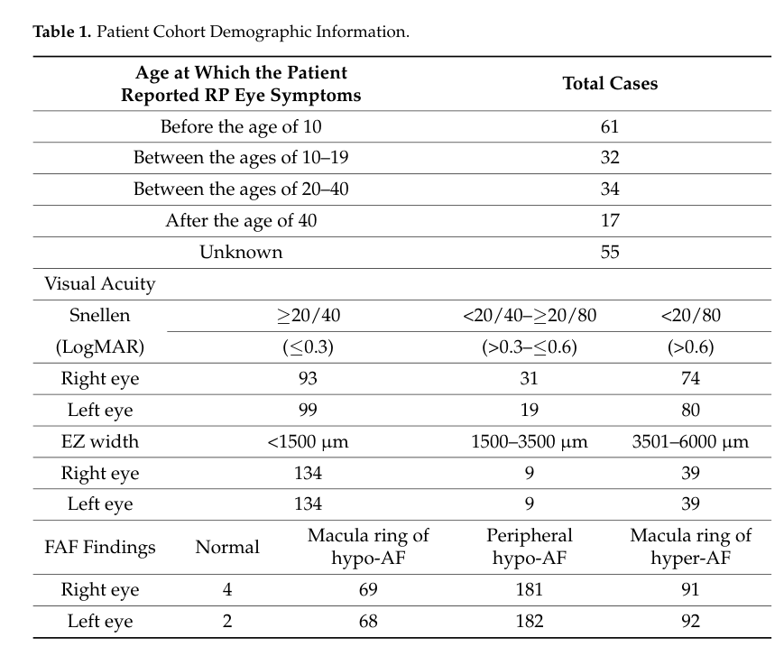

## Question

# Disease Characteristics Research Template

## Target Disease
- **Disease Name:** Inherited Retinal Dystrophy
- **MONDO ID:**  (if available)
- **Category:** Mendelian

## Research Objectives

Please provide a comprehensive research report on **Inherited Retinal Dystrophy** covering all of the
disease characteristics listed below. This report will be used to populate a disease knowledge
base entry. Be thorough and cite primary literature (PMID preferred) for all claims.

For each section, **suggested databases/resources** are listed. These are the first places
you should search for information on each topic.

---

### 1. Disease Information
> **Search first:** OMIM, Orphanet, ICD-10/ICD-11, MeSH, PubMed

- What is the disease? Provide a concise overview.
- What are the key identifiers? (OMIM, Orphanet, ICD-10/ICD-11, MeSH, Mondo)
- What are the common synonyms and alternative names?
- Is the information derived from individual patients (e.g., EHR) or aggregated disease-level resources?

### 2. Etiology

- **Disease Causal Factors**: What are the primary causes? (genetic, environmental, infectious, mechanistic)
- **Risk Factors**:
  > **Search first:** PubMed, Cochrane Library, UpToDate, clinical guidelines, ClinVar, ClinGen, GWAS Catalog, PheGenI, CTD, CDC, WHO, epidemiological databases
  - Genetic risk factors (causal variants, susceptibility loci, modifier genes)
  - Environmental risk factors (toxins, lifestyle, occupational exposures, age, sex, family history)
- **Protective Factors**:
  > **Search first:** PubMed, Cochrane Library, clinical trial databases, GWAS Catalog, gnomAD, WHO, CDC, nutrition databases
  - Genetic protective factors (protective variants, modifier alleles)
  - Environmental protective factors (diet, lifestyle, exposures that reduce risk)
- **Gene-Environment Interactions**: How do genetic and environmental factors interact to influence disease?
  > **Search first:** CTD, PubMed, PheGenI, GxE databases

### 3. Phenotypes
> **Search first:** HPO (Human Phenotype Ontology), OMIM, Orphanet, PubMed, clinicaltrials.gov, MedDRA, SNOMED CT, DECIPHER, LOINC

For each phenotype, provide:
- **Phenotype type**: symptoms, clinical signs, physical manifestations, behavioral changes, or laboratory abnormalities
  > For symptoms/signs: HPO, OMIM, Orphanet, PubMed
  > For behavioral changes: HPO, DSM, RDoC (Research Domain Criteria), PubMed
  > For laboratory abnormalities: LOINC, SNOMED CT, LabTests Online, PubMed
- **Phenotype characteristics**:
  > **Search first:** OMIM, Orphanet, HPO, PubMed
  - Age of symptom onset (neonatal, childhood, adult-onset, late-onset)
  - Symptom severity (mild, moderate, severe, variable)
  - Symptom progression (stable, progressive, episodic, fluctuating)
  - Frequency among affected individuals (percentage or qualitative)
- **Quality of life impact**: Effects on daily functioning and well-being (per-phenotype when possible)
  > **Search first:** EQ-5D database, SF-36, WHO QOL databases, PubMed
- Suggest HPO (Human Phenotype Ontology) terms for each phenotype

### 4. Genetic/Molecular Information

- **Causal Genes**: Gene mutations or chromosomal abnormalities responsible for disease (gene symbols, OMIM IDs)
  > **Search first:** OMIM, ClinVar, HGMD, Ensembl, NCBI Gene
- **Pathogenic Variants**:
  - Affected genes (gene symbols, HGNC IDs)
    > **Search first:** OMIM, NCBI Gene, Ensembl, HGNC, UniProt, GeneCards
  - Variant classification (pathogenic, likely pathogenic, VUS per ACMG/AMP guidelines)
    > **Search first:** ClinVar, ClinGen, ACMG/AMP guidelines, VarSome
  - Variant type/class (missense, frameshift, nonsense, splice-site, structural)
  - Allele frequency in population databases
    > **Search first:** gnomAD, 1000 Genomes, ExAC, TOPMed, dbSNP
  - Somatic vs germline origin
    > **Search first:** COSMIC (somatic), ClinVar, ICGC, TCGA
  - Functional consequences (loss of function, gain of function, dominant negative)
- **Modifier Genes**: Genes that modify disease severity or expression
- **Epigenetic Information**: DNA methylation, histone modifications, chromatin changes affecting disease
  > **Search first:** ENCODE, Roadmap Epigenomics, MethBase, DiseaseMeth
- **Chromosomal Abnormalities**: Large-scale genetic changes (aneuploidy, translocations, inversions)
  > **Search first:** DECIPHER, ClinVar, ECARUCA, UCSC Genome Browser

### 5. Environmental Information

- **Environmental Factors**: Non-genetic contributing factors (toxins, radiation, pollution, occupational exposure)
  > **Search first:** CTD (Comparative Toxicogenomics Database), TOXNET, PubMed, EPA databases
- **Lifestyle Factors**: Behavioral factors (smoking, diet, exercise, alcohol consumption)
  > **Search first:** CDC databases, WHO, PubMed, NHANES
- **Infectious Agents**: If applicable, pathogens causing or triggering disease (bacteria, viruses, fungi, parasites)
  > **Search first:** NCBI Taxonomy, ViPR, BV-BRC, MicrobeDB, GIDEON

### 6. Mechanism / Pathophysiology

- **Molecular Pathways**: Specific signaling cascades or biochemical pathways involved (Wnt, MAPK, mTOR, PI3K-AKT, etc.)
  > **Search first:** KEGG, Reactome, WikiPathways, PathBank, BioCyc
- **Cellular Processes**: Cell-level mechanisms (apoptosis, autophagy, cell cycle dysregulation, inflammation, etc.)
  > **Search first:** Gene Ontology (GO), Reactome, KEGG, PubMed
- **Protein Dysfunction**: How protein structure or function is altered (misfolding, aggregation, loss of function, gain of function)
  > **Search first:** UniProt, PDB (Protein Data Bank), InterPro, Pfam, AlphaFold
- **Metabolic Changes**: Alterations in metabolic processes (energy metabolism, lipid metabolism, amino acid metabolism)
  > **Search first:** KEGG, BioCyc, HMDB (Human Metabolome Database), BRENDA
- **Immune System Involvement**: Role of immune response (autoimmunity, immunodeficiency, chronic inflammation)
  > **Search first:** ImmPort, Immunome Database, IEDB, Gene Ontology
- **Tissue Damage Mechanisms**: How tissues/ are injured (oxidative stress, ischemia, fibrosis, necrosis)
  > **Search first:** PubMed, Gene Ontology, Reactome
- **Biochemical Abnormalities**: Specific molecular defects (enzyme deficiencies, receptor dysfunction, ion channel defects)
  > **Search first:** BRENDA, UniProt, KEGG, OMIM, PubMed
- **Epigenetic Changes**: DNA methylation, histone modifications affecting gene expression in disease
  > **Search first:** ENCODE, Roadmap Epigenomics, MethBase, DiseaseMeth
- **Molecular Profiling** (if available):
  - Transcriptomics/gene expression changes
    > **Search first:** GEO (Gene Expression Omnibus), ArrayExpress, GTEx, Human Cell Atlas, SRA
  - Proteomics findings
    > **Search first:** PRIDE, ProteomeXchange, Human Protein Atlas, STRING, BioGRID
  - Metabolomics signatures
    > **Search first:** MetaboLights, Metabolomics Workbench, HMDB, METLIN
  - Lipidomics alterations
    > **Search first:** LIPID MAPS, SwissLipids, LipidHome, Metabolomics Workbench
  - Genomic structural features
    > **Search first:** UCSC Genome Browser, Ensembl, NCBI, dbVar, DGV
- **Advanced Technologies** (if applicable):
  - Single-cell analysis findings (cell-type specific mechanisms, cellular heterogeneity)
    > **Search first:** Human Cell Atlas, Single Cell Portal, GEO, CELLxGENE
  - Spatial transcriptomics findings
    > **Search first:** GEO, Spatial Research, Vizgen, 10x Genomics data
  - Multi-omics integration results
    > **Search first:** TCGA, ICGC, cBioPortal, LinkedOmics, PubMed
  - Functional genomics screens (CRISPR, RNAi)
    > **Search first:** DepMap, GenomeRNAi, PubMed, BioGRID ORCS

For each mechanism, describe:
- The causal chain from initial trigger to clinical manifestation
- Which mechanisms are upstream vs downstream
- What cell types and biological processes are involved
- Suggest GO terms for biological processes and CL terms for cell types

### 7. Anatomical Structures Affected

- **Organ Level**:
  - Primary organs directly affected
  - Secondary organ involvement (complications, secondary effects)
  - Body systems involved (cardiovascular, nervous, digestive, respiratory, endocrine, etc.)
  > **Search first:** Uberon, FMA (Foundational Model of Anatomy), OMIM, HPO, ICD-11, MeSH, SNOMED CT
- **Tissue and Cell Level**:
  - Specific tissue types affected (epithelial, connective, muscle, nervous)
  - Specific cell populations targeted (with Cell Ontology terms)
  > **Search first:** Uberon, Human Protein Atlas, Cell Ontology, Human Cell Atlas, CellMarker, PanglaoDB
- **Subcellular Level**:
  - Cellular compartments involved (mitochondria, nucleus, ER, lysosomes) (with GO Cellular Component terms)
  > **Search first:** Gene Ontology (Cellular Component), UniProt, Human Protein Atlas
- **Localization**:
  - Specific anatomical sites (with UBERON terms)
    > **Search first:** FMA, Uberon, NeuroNames (for brain), SNOMED CT
  - Lateralization (unilateral, bilateral, asymmetric)
    > **Search first:** HPO, clinical literature, imaging databases

### 8. Temporal Development

- **Onset**:
  - Typical age of onset (congenital, pediatric, adult, geriatric)
  - Onset pattern (acute, subacute, chronic, insidious)
  > **Search first:** OMIM, Orphanet, HPO, PubMed
- **Progression**:
  - Disease stages (early, intermediate, advanced, end-stage)
    > **Search first:** Cancer Staging Manual (AJCC), WHO classifications, PubMed
  - Progression rate (rapid, slow, variable)
  - Disease course pattern (episodic, relapsing-remitting, progressive, stable)
  - Disease duration (self-limited, chronic lifelong)
  > **Search first:** Disease registries, longitudinal cohort databases, natural history studies, PubMed, Orphanet, OMIM
- **Patterns**:
  - Remission patterns (spontaneous, treatment-induced)
    > **Search first:** Clinical trial databases, disease registries, PubMed
  - Critical periods (time windows of vulnerability or opportunity for intervention)
    > **Search first:** PubMed, developmental biology databases, clinical guidelines

### 9. Inheritance and Population

- **Epidemiology**:
  - Prevalence (cases per 100,000 at given time)
  - Incidence (new cases per 100,000 per year)
  > **Search first:** Orphanet, CDC, WHO, GBD (Global Burden of Disease), national registries, SEER, disease registries
- **For Genetic Etiology**:
  - Inheritance pattern (AD, AR, X-linked, mitochondrial, multifactorial, polygenic)
    > **Search first:** OMIM, Orphanet, ClinVar, GTR (Genetic Testing Registry)
  - Penetrance (complete, incomplete, age-dependent)
    > **Search first:** ClinVar, OMIM, PubMed, ClinGen
  - Expressivity (variable, consistent)
    > **Search first:** OMIM, ClinVar, PubMed
  - Genetic anticipation (increasing severity in successive generations)
    > **Search first:** OMIM, PubMed (especially for repeat expansion disorders)
  - Germline mosaicism
    > **Search first:** ClinVar, OMIM, genetic counseling literature, PubMed
  - Founder effects (population-specific mutations)
    > **Search first:** gnomAD, population genetics databases, PubMed
  - Consanguinity role
    > **Search first:** OMIM, population studies, genetic counseling resources
  - Carrier frequency
    > **Search first:** gnomAD, carrier screening databases, GeneReviews, GTR
- **Population Demographics**:
  - Affected populations (ethnic or demographic groups with higher prevalence)
    > **Search first:** gnomAD, 1000 Genomes, PAGE Study, PubMed, population registries
  - Geographic distribution (endemic areas, regional variation)
    > **Search first:** WHO, CDC, GBD, Orphanet, geographic epidemiology databases
  - Geographic distribution of specific variants
  - Sex ratio (male:female)
    > **Search first:** Disease registries, OMIM, PubMed, epidemiological databases
  - Age distribution of affected individuals
    > **Search first:** CDC, disease registries, SEER, Orphanet

### 10. Diagnostics

- **Clinical Tests**:
  - Laboratory tests (blood, urine, tissue chemistry, specific enzyme assays)
    > **Search first:** LOINC, LabTests Online, PubMed
  - Biomarkers (proteins, metabolites, genetic markers, circulating biomarkers)
    > **Search first:** FDA Biomarker List, BEST (Biomarkers, EndpointS, and other Tools), PubMed
  - Imaging studies (X-ray, CT, MRI, PET, ultrasound)
    > **Search first:** RadLex, DICOM, Radiopaedia, imaging databases
  - Functional tests (pulmonary function, cardiac stress tests)
    > **Search first:** LOINC, clinical guidelines, PubMed
  - Electrophysiology (EEG, EMG, ECG, nerve conduction studies)
    > **Search first:** LOINC, clinical neurophysiology databases, PubMed
  - Biopsy findings (histopathology, immunohistochemistry)
    > **Search first:** SNOMED CT, College of American Pathologists resources, PubMed
  - Pathology findings (microscopic examination)
    > **Search first:** SNOMED CT, Digital Pathology databases, PubMed
- **Genetic Testing**:
  > **Search first:** GTR (Genetic Testing Registry), GeneReviews, ClinGen
  - Overview of recommended genetic testing approach
  - Whole genome sequencing (WGS) utility
    > **Search first:** GTR, ClinVar, GEL (Genomics England), gnomAD
  - Whole exome sequencing (WES) utility
    > **Search first:** GTR, ClinVar, OMIM, GeneMatcher
  - Gene panels (which panels, which genes)
    > **Search first:** GTR, ClinVar, laboratory-specific databases
  - Single gene testing
    > **Search first:** GTR, ClinVar, OMIM, GeneReviews
  - Chromosomal microarray (CMA)
    > **Search first:** DECIPHER, ClinVar, dbVar, ECARUCA
  - Karyotyping
    > **Search first:** Chromosome Abnormality Database, ClinVar, cytogenetics resources
  - FISH
    > **Search first:** ClinVar, cytogenetics databases, PubMed
  - Mitochondrial DNA testing
    > **Search first:** MITOMAP, MSeqDR, ClinVar, GTR
  - Repeat expansion testing
    > **Search first:** GTR, ClinVar, repeat expansion databases, PubMed
- **Omics-Based Diagnostics** (if applicable):
  - RNA sequencing / transcriptomics
    > **Search first:** GEO, ArrayExpress, GTEx, RNA-seq databases
  - Proteomics
    > **Search first:** PRIDE, ProteomeXchange, FDA Biomarker database
  - Metabolomics
    > **Search first:** MetaboLights, Metabolomics Workbench, HMDB
  - Epigenomics
    > **Search first:** GEO, ENCODE, Roadmap Epigenomics, MethBase
  - Liquid biopsy
    > **Search first:** COSMIC, ClinVar, liquid biopsy databases, PubMed
- **Clinical Criteria**:
  - Standardized diagnostic criteria (DSM, ICD, society guidelines)
    > **Search first:** DSM-5, ICD-11, clinical society guidelines, UpToDate
  - Differential diagnosis (other conditions to rule out, with distinguishing features)
    > **Search first:** DynaMed, UpToDate, clinical decision support systems
- **Screening**:
  - Screening methods for asymptomatic individuals (newborn screening, carrier screening, cascade screening)
    > **Search first:** ACMG recommendations, CDC newborn screening, GTR

### 11. Outcome/Prognosis

- **Survival and Mortality**:
  - Survival rate (5-year, 10-year, overall)
    > **Search first:** SEER, cancer registries, disease-specific registries, PubMed
  - Life expectancy (with and without treatment if applicable)
    > **Search first:** Orphanet, disease registries, actuarial databases, PubMed
  - Mortality rate
    > **Search first:** CDC, WHO, GBD, national mortality databases
  - Disease-specific mortality (deaths directly attributable to disease)
    > **Search first:** Disease registries, CDC Wonder, GBD, PubMed
- **Morbidity and Function**:
  - Morbidity (disease-related disability and health impacts)
    > **Search first:** GBD, WHO, disability databases, PubMed
  - Disability outcomes (long-term functional impairments)
    > **Search first:** ICF (International Classification of Functioning), disability registries
  - Quality of life measures (EQ-5D, SF-36, PROMIS, disease-specific tools)
    > **Search first:** EQ-5D database, SF-36, PROMIS, PubMed
- **Disease Course**:
  - Complications (secondary problems: infections, organ failure, etc.)
    > **Search first:** ICD codes, disease registries, clinical databases, PubMed
  - Recovery potential (likelihood and extent of recovery, with vs without treatment)
    > **Search first:** Natural history studies, rehabilitation databases, PubMed
- **Prediction**:
  - Prognostic factors (age, disease severity, biomarkers, treatment response)
    > **Search first:** Prognostic models databases, clinical calculators, PubMed
  - Prognostic biomarkers (molecular markers predicting disease course)
    > **Search first:** FDA Biomarker database, PubMed, cancer prognostic databases

### 12. Treatment

- **Pharmacotherapy**:
  - Pharmacological treatments (drug names, drug classes, mechanisms of action)
    > **Search first:** DrugBank, RxNorm, ATC classification, DailyMed, FDA databases
  - Pharmacogenomics (how genetic variants affect drug metabolism, efficacy, toxicity)
    > **Search first:** PharmGKB, CPIC (Clinical Pharmacogenetics), FDA Table of PGx Biomarkers
- **Advanced Therapeutics**:
  - Gene therapy (viral vectors, CRISPR, gene replacement, gene editing)
    > **Search first:** ClinicalTrials.gov, FDA gene therapy database, ASGCT resources
  - Cell therapy (stem cell transplant, CAR-T, cellular therapeutics)
    > **Search first:** ClinicalTrials.gov, FDA cell therapy database, FACT standards
  - RNA-based therapies (ASOs, siRNA, mRNA therapies)
    > **Search first:** ClinicalTrials.gov, FDA approvals, PubMed
  - Targeted therapies (treatments directed at specific molecular targets)
    > **Search first:** My Cancer Genome, OncoKB, ClinicalTrials.gov, FDA approvals
  - Immunotherapies (checkpoint inhibitors, monoclonal antibodies)
    > **Search first:** Cancer Immunotherapy Database, FDA approvals, ClinicalTrials.gov
- **Surgical and Interventional**:
  - Surgical interventions (types of surgery, timing, outcomes)
    > **Search first:** CPT codes, surgical registries, clinical guidelines, PubMed
- **Supportive and Rehabilitative**:
  - Supportive care (symptom management, pain control, nutrition)
    > **Search first:** Clinical guidelines, Cochrane Library, PubMed
  - Rehabilitation (physical therapy, occupational therapy, speech therapy)
    > **Search first:** Rehabilitation medicine databases, clinical guidelines, PubMed
- **Experimental**:
  - Experimental treatments in clinical trials (with NCT identifiers if available)
    > **Search first:** ClinicalTrials.gov, EU Clinical Trials Register, WHO ICTRP
- **Treatment Outcomes**:
  - Treatment response rates
    > **Search first:** Clinical trial databases, FDA reviews, systematic reviews, PubMed
  - Side effects and adverse events
    > **Search first:** FDA Adverse Event Reporting System (FAERS), MedWatch, PubMed
- **Treatment Strategy**:
  - Treatment algorithms (clinical pathways, decision trees)
    > **Search first:** Clinical practice guidelines, NCCN Guidelines, UpToDate
  - Combination therapies
    > **Search first:** ClinicalTrials.gov, treatment guidelines, PubMed
  - Personalized medicine approaches (genotype-guided treatment)
    > **Search first:** My Cancer Genome, CIViC, PharmGKB, precision medicine databases

For each treatment, suggest MAXO (Medical Action Ontology) terms where applicable.

### 13. Prevention

- **Prevention Levels**:
  - Primary prevention (preventing disease occurrence: vaccination, risk factor modification)
    > **Search first:** CDC, WHO, USPSTF recommendations, Cochrane Library
  - Secondary prevention (early detection and treatment: screening programs, early intervention)
    > **Search first:** USPSTF, CDC screening guidelines, WHO
  - Tertiary prevention (preventing complications in those with disease)
    > **Search first:** Clinical guidelines, disease management protocols, PubMed
- **Immunization**: Vaccine strategies (if applicable)
  > **Search first:** CDC vaccine schedules, WHO immunization, FDA vaccine database
- **Screening and Early Detection**:
  - Screening programs (population-based: newborn screening, cancer screening)
    > **Search first:** CDC screening programs, USPSTF, cancer screening databases
  - Genetic screening (carrier screening, preimplantation genetic diagnosis, prenatal testing)
    > **Search first:** ACMG recommendations, ACOG guidelines, GTR
  - Risk stratification (identifying high-risk individuals for targeted prevention)
    > **Search first:** Risk prediction models, clinical calculators, PubMed
- **Behavioral Interventions**: Lifestyle modifications to reduce risk
  > **Search first:** CDC, WHO, behavioral intervention databases, Cochrane Library
- **Counseling**: Genetic counseling (risk assessment, family planning guidance)
  > **Search first:** NSGC resources, ACMG guidelines, GeneReviews
- **Public Health**:
  - Public health interventions (sanitation, vector control, health education)
    > **Search first:** CDC, WHO, public health databases, PubMed
  - Environmental interventions (reducing environmental risk factors)
    > **Search first:** EPA databases, WHO environmental health, PubMed
- **Prophylaxis**: Preventive medications or procedures
  > **Search first:** Clinical guidelines, FDA approvals, PubMed

### 14. Other Species / Natural Disease

- **Taxonomy**: Species affected (with NCBI Taxon identifiers)
  > **Search first:** NCBI Taxonomy
- **Breed**: Specific breeds affected (with VBO identifiers if applicable)
  > **Search first:** VBO (Vertebrate Breed Ontology)
- **Gene**: Orthologous genes in other species (with NCBI Gene IDs)
  > **Search first:** NCBI Gene
- **Natural Disease**:
  - Naturally occurring disease in other species (companion animals, wildlife)
    > **Search first:** OMIA (Online Mendelian Inheritance in Animals), VetCompass, PubMed
  - Veterinary relevance and importance in animal health
    > **Search first:** OMIA, veterinary databases, PubMed
- **Comparative Biology**:
  - Comparative pathology (similarities and differences across species)
    > **Search first:** OMIA, comparative pathology databases, PubMed
  - Evolutionary conservation of disease mechanisms
    > **Search first:** HomoloGene, OrthoMCL, Alliance of Genome Resources
- **Transmission** (if applicable):
  - Zoonotic potential
    > **Search first:** CDC zoonotic diseases, WHO zoonoses, GIDEON
  - Cross-species susceptibility
    > **Search first:** NCBI Taxonomy, veterinary databases, PubMed

### 15. Model Organisms

- **Model Types**:
  - Model organism type (mammalian, invertebrate, cellular, in vitro)
    > **Search first:** Alliance of Genome Resources, model organism databases
  - Specific model systems (mouse, rat, zebrafish, Drosophila, C. elegans, yeast, cell lines, organoids, iPSCs)
    > **Search first:** MGI, RGD, ZFIN, FlyBase, WormBase, SGD, ATCC, Cellosaurus
  - Induced models (drug treatment, surgical intervention, environmental manipulation)
    > **Search first:** MGI, model organism databases, PubMed
- **Genetic Models**:
  - Types available (knockout, knock-in, transgenic, conditional, humanized)
    > **Search first:** MGI, IMPC, KOMP, EuMMCR, IMSR
- **Model Characteristics**:
  - Phenotype recapitulation (how well model reproduces human disease features)
    > **Search first:** Model organism databases, comparative studies, PubMed
  - Model limitations (aspects of human disease not captured)
    > **Search first:** Model organism databases, PubMed, review articles
- **Applications**:
  - Research applications (what aspects of disease can be studied)
    > **Search first:** Model organism databases, PubMed
- **Resources**:
  - Model databases
    > **Search first:** MGI, RGD, ZFIN, FlyBase, WormBase, IMSR, EMMA, MMRRC

---

## Citation Requirements

- Cite primary literature (PMID preferred) for all mechanistic and clinical claims
- Prioritize recent reviews and landmark papers
- Include direct quotes from abstracts where possible to support key statements
- Distinguish evidence source types: human clinical, model organism, in vitro, computational

## Output Format

Structure your response as a comprehensive narrative organized by the sections above.
For each section, provide:
- Factual content with specific details (numbers, percentages, gene names, variant nomenclature)
- Ontology term suggestions (HPO, GO, CL, UBERON, CHEBI, MAXO, MONDO) where applicable
- Evidence citations with PMIDs
- Direct quotes from abstracts to support key claims
- Clear indication when information is not available or not applicable for this disease

This report will be used to populate a disease knowledge base entry with:
- Pathophysiology descriptions with causal chains
- Gene/protein annotations (HGNC, GO terms)
- Phenotype associations (HP terms) with frequencies
- Cell type involvement (CL terms)
- Anatomical locations (UBERON terms)
- Chemical entities (CHEBI terms)
- Treatment annotations (MAXO terms)
- Evidence items with PMIDs and exact abstract quotes
- Epidemiology, prognosis, diagnostic, and prevention information
- Animal model descriptions with phenotype recapitulation details

## Output

Question: You are an expert researcher providing comprehensive, well-cited information.

Provide detailed information focusing on:
1. Key concepts and definitions with current understanding
2. Recent developments and latest research (prioritize 2023-2024 sources)
3. Current applications and real-world implementations
4. Expert opinions and analysis from authoritative sources
5. Relevant statistics and data from recent studies

Format as a comprehensive research report with proper citations. Include URLs and publication dates where available.
Always prioritize recent, authoritative sources and provide specific citations for all major claims.

# Disease Characteristics Research Template

## Target Disease
- **Disease Name:** Inherited Retinal Dystrophy
- **MONDO ID:**  (if available)
- **Category:** Mendelian

## Research Objectives

Please provide a comprehensive research report on **Inherited Retinal Dystrophy** covering all of the
disease characteristics listed below. This report will be used to populate a disease knowledge
base entry. Be thorough and cite primary literature (PMID preferred) for all claims.

For each section, **suggested databases/resources** are listed. These are the first places
you should search for information on each topic.

---

### 1. Disease Information
> **Search first:** OMIM, Orphanet, ICD-10/ICD-11, MeSH, PubMed

- What is the disease? Provide a concise overview.
- What are the key identifiers? (OMIM, Orphanet, ICD-10/ICD-11, MeSH, Mondo)
- What are the common synonyms and alternative names?
- Is the information derived from individual patients (e.g., EHR) or aggregated disease-level resources?

### 2. Etiology

- **Disease Causal Factors**: What are the primary causes? (genetic, environmental, infectious, mechanistic)
- **Risk Factors**:
  > **Search first:** PubMed, Cochrane Library, UpToDate, clinical guidelines, ClinVar, ClinGen, GWAS Catalog, PheGenI, CTD, CDC, WHO, epidemiological databases
  - Genetic risk factors (causal variants, susceptibility loci, modifier genes)
  - Environmental risk factors (toxins, lifestyle, occupational exposures, age, sex, family history)
- **Protective Factors**:
  > **Search first:** PubMed, Cochrane Library, clinical trial databases, GWAS Catalog, gnomAD, WHO, CDC, nutrition databases
  - Genetic protective factors (protective variants, modifier alleles)
  - Environmental protective factors (diet, lifestyle, exposures that reduce risk)
- **Gene-Environment Interactions**: How do genetic and environmental factors interact to influence disease?
  > **Search first:** CTD, PubMed, PheGenI, GxE databases

### 3. Phenotypes
> **Search first:** HPO (Human Phenotype Ontology), OMIM, Orphanet, PubMed, clinicaltrials.gov, MedDRA, SNOMED CT, DECIPHER, LOINC

For each phenotype, provide:
- **Phenotype type**: symptoms, clinical signs, physical manifestations, behavioral changes, or laboratory abnormalities
  > For symptoms/signs: HPO, OMIM, Orphanet, PubMed
  > For behavioral changes: HPO, DSM, RDoC (Research Domain Criteria), PubMed
  > For laboratory abnormalities: LOINC, SNOMED CT, LabTests Online, PubMed
- **Phenotype characteristics**:
  > **Search first:** OMIM, Orphanet, HPO, PubMed
  - Age of symptom onset (neonatal, childhood, adult-onset, late-onset)
  - Symptom severity (mild, moderate, severe, variable)
  - Symptom progression (stable, progressive, episodic, fluctuating)
  - Frequency among affected individuals (percentage or qualitative)
- **Quality of life impact**: Effects on daily functioning and well-being (per-phenotype when possible)
  > **Search first:** EQ-5D database, SF-36, WHO QOL databases, PubMed
- Suggest HPO (Human Phenotype Ontology) terms for each phenotype

### 4. Genetic/Molecular Information

- **Causal Genes**: Gene mutations or chromosomal abnormalities responsible for disease (gene symbols, OMIM IDs)
  > **Search first:** OMIM, ClinVar, HGMD, Ensembl, NCBI Gene
- **Pathogenic Variants**:
  - Affected genes (gene symbols, HGNC IDs)
    > **Search first:** OMIM, NCBI Gene, Ensembl, HGNC, UniProt, GeneCards
  - Variant classification (pathogenic, likely pathogenic, VUS per ACMG/AMP guidelines)
    > **Search first:** ClinVar, ClinGen, ACMG/AMP guidelines, VarSome
  - Variant type/class (missense, frameshift, nonsense, splice-site, structural)
  - Allele frequency in population databases
    > **Search first:** gnomAD, 1000 Genomes, ExAC, TOPMed, dbSNP
  - Somatic vs germline origin
    > **Search first:** COSMIC (somatic), ClinVar, ICGC, TCGA
  - Functional consequences (loss of function, gain of function, dominant negative)
- **Modifier Genes**: Genes that modify disease severity or expression
- **Epigenetic Information**: DNA methylation, histone modifications, chromatin changes affecting disease
  > **Search first:** ENCODE, Roadmap Epigenomics, MethBase, DiseaseMeth
- **Chromosomal Abnormalities**: Large-scale genetic changes (aneuploidy, translocations, inversions)
  > **Search first:** DECIPHER, ClinVar, ECARUCA, UCSC Genome Browser

### 5. Environmental Information

- **Environmental Factors**: Non-genetic contributing factors (toxins, radiation, pollution, occupational exposure)
  > **Search first:** CTD (Comparative Toxicogenomics Database), TOXNET, PubMed, EPA databases
- **Lifestyle Factors**: Behavioral factors (smoking, diet, exercise, alcohol consumption)
  > **Search first:** CDC databases, WHO, PubMed, NHANES
- **Infectious Agents**: If applicable, pathogens causing or triggering disease (bacteria, viruses, fungi, parasites)
  > **Search first:** NCBI Taxonomy, ViPR, BV-BRC, MicrobeDB, GIDEON

### 6. Mechanism / Pathophysiology

- **Molecular Pathways**: Specific signaling cascades or biochemical pathways involved (Wnt, MAPK, mTOR, PI3K-AKT, etc.)
  > **Search first:** KEGG, Reactome, WikiPathways, PathBank, BioCyc
- **Cellular Processes**: Cell-level mechanisms (apoptosis, autophagy, cell cycle dysregulation, inflammation, etc.)
  > **Search first:** Gene Ontology (GO), Reactome, KEGG, PubMed
- **Protein Dysfunction**: How protein structure or function is altered (misfolding, aggregation, loss of function, gain of function)
  > **Search first:** UniProt, PDB (Protein Data Bank), InterPro, Pfam, AlphaFold
- **Metabolic Changes**: Alterations in metabolic processes (energy metabolism, lipid metabolism, amino acid metabolism)
  > **Search first:** KEGG, BioCyc, HMDB (Human Metabolome Database), BRENDA
- **Immune System Involvement**: Role of immune response (autoimmunity, immunodeficiency, chronic inflammation)
  > **Search first:** ImmPort, Immunome Database, IEDB, Gene Ontology
- **Tissue Damage Mechanisms**: How tissues/ are injured (oxidative stress, ischemia, fibrosis, necrosis)
  > **Search first:** PubMed, Gene Ontology, Reactome
- **Biochemical Abnormalities**: Specific molecular defects (enzyme deficiencies, receptor dysfunction, ion channel defects)
  > **Search first:** BRENDA, UniProt, KEGG, OMIM, PubMed
- **Epigenetic Changes**: DNA methylation, histone modifications affecting gene expression in disease
  > **Search first:** ENCODE, Roadmap Epigenomics, MethBase, DiseaseMeth
- **Molecular Profiling** (if available):
  - Transcriptomics/gene expression changes
    > **Search first:** GEO (Gene Expression Omnibus), ArrayExpress, GTEx, Human Cell Atlas, SRA
  - Proteomics findings
    > **Search first:** PRIDE, ProteomeXchange, Human Protein Atlas, STRING, BioGRID
  - Metabolomics signatures
    > **Search first:** MetaboLights, Metabolomics Workbench, HMDB, METLIN
  - Lipidomics alterations
    > **Search first:** LIPID MAPS, SwissLipids, LipidHome, Metabolomics Workbench
  - Genomic structural features
    > **Search first:** UCSC Genome Browser, Ensembl, NCBI, dbVar, DGV
- **Advanced Technologies** (if applicable):
  - Single-cell analysis findings (cell-type specific mechanisms, cellular heterogeneity)
    > **Search first:** Human Cell Atlas, Single Cell Portal, GEO, CELLxGENE
  - Spatial transcriptomics findings
    > **Search first:** GEO, Spatial Research, Vizgen, 10x Genomics data
  - Multi-omics integration results
    > **Search first:** TCGA, ICGC, cBioPortal, LinkedOmics, PubMed
  - Functional genomics screens (CRISPR, RNAi)
    > **Search first:** DepMap, GenomeRNAi, PubMed, BioGRID ORCS

For each mechanism, describe:
- The causal chain from initial trigger to clinical manifestation
- Which mechanisms are upstream vs downstream
- What cell types and biological processes are involved
- Suggest GO terms for biological processes and CL terms for cell types

### 7. Anatomical Structures Affected

- **Organ Level**:
  - Primary organs directly affected
  - Secondary organ involvement (complications, secondary effects)
  - Body systems involved (cardiovascular, nervous, digestive, respiratory, endocrine, etc.)
  > **Search first:** Uberon, FMA (Foundational Model of Anatomy), OMIM, HPO, ICD-11, MeSH, SNOMED CT
- **Tissue and Cell Level**:
  - Specific tissue types affected (epithelial, connective, muscle, nervous)
  - Specific cell populations targeted (with Cell Ontology terms)
  > **Search first:** Uberon, Human Protein Atlas, Cell Ontology, Human Cell Atlas, CellMarker, PanglaoDB
- **Subcellular Level**:
  - Cellular compartments involved (mitochondria, nucleus, ER, lysosomes) (with GO Cellular Component terms)
  > **Search first:** Gene Ontology (Cellular Component), UniProt, Human Protein Atlas
- **Localization**:
  - Specific anatomical sites (with UBERON terms)
    > **Search first:** FMA, Uberon, NeuroNames (for brain), SNOMED CT
  - Lateralization (unilateral, bilateral, asymmetric)
    > **Search first:** HPO, clinical literature, imaging databases

### 8. Temporal Development

- **Onset**:
  - Typical age of onset (congenital, pediatric, adult, geriatric)
  - Onset pattern (acute, subacute, chronic, insidious)
  > **Search first:** OMIM, Orphanet, HPO, PubMed
- **Progression**:
  - Disease stages (early, intermediate, advanced, end-stage)
    > **Search first:** Cancer Staging Manual (AJCC), WHO classifications, PubMed
  - Progression rate (rapid, slow, variable)
  - Disease course pattern (episodic, relapsing-remitting, progressive, stable)
  - Disease duration (self-limited, chronic lifelong)
  > **Search first:** Disease registries, longitudinal cohort databases, natural history studies, PubMed, Orphanet, OMIM
- **Patterns**:
  - Remission patterns (spontaneous, treatment-induced)
    > **Search first:** Clinical trial databases, disease registries, PubMed
  - Critical periods (time windows of vulnerability or opportunity for intervention)
    > **Search first:** PubMed, developmental biology databases, clinical guidelines

### 9. Inheritance and Population

- **Epidemiology**:
  - Prevalence (cases per 100,000 at given time)
  - Incidence (new cases per 100,000 per year)
  > **Search first:** Orphanet, CDC, WHO, GBD (Global Burden of Disease), national registries, SEER, disease registries
- **For Genetic Etiology**:
  - Inheritance pattern (AD, AR, X-linked, mitochondrial, multifactorial, polygenic)
    > **Search first:** OMIM, Orphanet, ClinVar, GTR (Genetic Testing Registry)
  - Penetrance (complete, incomplete, age-dependent)
    > **Search first:** ClinVar, OMIM, PubMed, ClinGen
  - Expressivity (variable, consistent)
    > **Search first:** OMIM, ClinVar, PubMed
  - Genetic anticipation (increasing severity in successive generations)
    > **Search first:** OMIM, PubMed (especially for repeat expansion disorders)
  - Germline mosaicism
    > **Search first:** ClinVar, OMIM, genetic counseling literature, PubMed
  - Founder effects (population-specific mutations)
    > **Search first:** gnomAD, population genetics databases, PubMed
  - Consanguinity role
    > **Search first:** OMIM, population studies, genetic counseling resources
  - Carrier frequency
    > **Search first:** gnomAD, carrier screening databases, GeneReviews, GTR
- **Population Demographics**:
  - Affected populations (ethnic or demographic groups with higher prevalence)
    > **Search first:** gnomAD, 1000 Genomes, PAGE Study, PubMed, population registries
  - Geographic distribution (endemic areas, regional variation)
    > **Search first:** WHO, CDC, GBD, Orphanet, geographic epidemiology databases
  - Geographic distribution of specific variants
  - Sex ratio (male:female)
    > **Search first:** Disease registries, OMIM, PubMed, epidemiological databases
  - Age distribution of affected individuals
    > **Search first:** CDC, disease registries, SEER, Orphanet

### 10. Diagnostics

- **Clinical Tests**:
  - Laboratory tests (blood, urine, tissue chemistry, specific enzyme assays)
    > **Search first:** LOINC, LabTests Online, PubMed
  - Biomarkers (proteins, metabolites, genetic markers, circulating biomarkers)
    > **Search first:** FDA Biomarker List, BEST (Biomarkers, EndpointS, and other Tools), PubMed
  - Imaging studies (X-ray, CT, MRI, PET, ultrasound)
    > **Search first:** RadLex, DICOM, Radiopaedia, imaging databases
  - Functional tests (pulmonary function, cardiac stress tests)
    > **Search first:** LOINC, clinical guidelines, PubMed
  - Electrophysiology (EEG, EMG, ECG, nerve conduction studies)
    > **Search first:** LOINC, clinical neurophysiology databases, PubMed
  - Biopsy findings (histopathology, immunohistochemistry)
    > **Search first:** SNOMED CT, College of American Pathologists resources, PubMed
  - Pathology findings (microscopic examination)
    > **Search first:** SNOMED CT, Digital Pathology databases, PubMed
- **Genetic Testing**:
  > **Search first:** GTR (Genetic Testing Registry), GeneReviews, ClinGen
  - Overview of recommended genetic testing approach
  - Whole genome sequencing (WGS) utility
    > **Search first:** GTR, ClinVar, GEL (Genomics England), gnomAD
  - Whole exome sequencing (WES) utility
    > **Search first:** GTR, ClinVar, OMIM, GeneMatcher
  - Gene panels (which panels, which genes)
    > **Search first:** GTR, ClinVar, laboratory-specific databases
  - Single gene testing
    > **Search first:** GTR, ClinVar, OMIM, GeneReviews
  - Chromosomal microarray (CMA)
    > **Search first:** DECIPHER, ClinVar, dbVar, ECARUCA
  - Karyotyping
    > **Search first:** Chromosome Abnormality Database, ClinVar, cytogenetics resources
  - FISH
    > **Search first:** ClinVar, cytogenetics databases, PubMed
  - Mitochondrial DNA testing
    > **Search first:** MITOMAP, MSeqDR, ClinVar, GTR
  - Repeat expansion testing
    > **Search first:** GTR, ClinVar, repeat expansion databases, PubMed
- **Omics-Based Diagnostics** (if applicable):
  - RNA sequencing / transcriptomics
    > **Search first:** GEO, ArrayExpress, GTEx, RNA-seq databases
  - Proteomics
    > **Search first:** PRIDE, ProteomeXchange, FDA Biomarker database
  - Metabolomics
    > **Search first:** MetaboLights, Metabolomics Workbench, HMDB
  - Epigenomics
    > **Search first:** GEO, ENCODE, Roadmap Epigenomics, MethBase
  - Liquid biopsy
    > **Search first:** COSMIC, ClinVar, liquid biopsy databases, PubMed
- **Clinical Criteria**:
  - Standardized diagnostic criteria (DSM, ICD, society guidelines)
    > **Search first:** DSM-5, ICD-11, clinical society guidelines, UpToDate
  - Differential diagnosis (other conditions to rule out, with distinguishing features)
    > **Search first:** DynaMed, UpToDate, clinical decision support systems
- **Screening**:
  - Screening methods for asymptomatic individuals (newborn screening, carrier screening, cascade screening)
    > **Search first:** ACMG recommendations, CDC newborn screening, GTR

### 11. Outcome/Prognosis

- **Survival and Mortality**:
  - Survival rate (5-year, 10-year, overall)
    > **Search first:** SEER, cancer registries, disease-specific registries, PubMed
  - Life expectancy (with and without treatment if applicable)
    > **Search first:** Orphanet, disease registries, actuarial databases, PubMed
  - Mortality rate
    > **Search first:** CDC, WHO, GBD, national mortality databases
  - Disease-specific mortality (deaths directly attributable to disease)
    > **Search first:** Disease registries, CDC Wonder, GBD, PubMed
- **Morbidity and Function**:
  - Morbidity (disease-related disability and health impacts)
    > **Search first:** GBD, WHO, disability databases, PubMed
  - Disability outcomes (long-term functional impairments)
    > **Search first:** ICF (International Classification of Functioning), disability registries
  - Quality of life measures (EQ-5D, SF-36, PROMIS, disease-specific tools)
    > **Search first:** EQ-5D database, SF-36, PROMIS, PubMed
- **Disease Course**:
  - Complications (secondary problems: infections, organ failure, etc.)
    > **Search first:** ICD codes, disease registries, clinical databases, PubMed
  - Recovery potential (likelihood and extent of recovery, with vs without treatment)
    > **Search first:** Natural history studies, rehabilitation databases, PubMed
- **Prediction**:
  - Prognostic factors (age, disease severity, biomarkers, treatment response)
    > **Search first:** Prognostic models databases, clinical calculators, PubMed
  - Prognostic biomarkers (molecular markers predicting disease course)
    > **Search first:** FDA Biomarker database, PubMed, cancer prognostic databases

### 12. Treatment

- **Pharmacotherapy**:
  - Pharmacological treatments (drug names, drug classes, mechanisms of action)
    > **Search first:** DrugBank, RxNorm, ATC classification, DailyMed, FDA databases
  - Pharmacogenomics (how genetic variants affect drug metabolism, efficacy, toxicity)
    > **Search first:** PharmGKB, CPIC (Clinical Pharmacogenetics), FDA Table of PGx Biomarkers
- **Advanced Therapeutics**:
  - Gene therapy (viral vectors, CRISPR, gene replacement, gene editing)
    > **Search first:** ClinicalTrials.gov, FDA gene therapy database, ASGCT resources
  - Cell therapy (stem cell transplant, CAR-T, cellular therapeutics)
    > **Search first:** ClinicalTrials.gov, FDA cell therapy database, FACT standards
  - RNA-based therapies (ASOs, siRNA, mRNA therapies)
    > **Search first:** ClinicalTrials.gov, FDA approvals, PubMed
  - Targeted therapies (treatments directed at specific molecular targets)
    > **Search first:** My Cancer Genome, OncoKB, ClinicalTrials.gov, FDA approvals
  - Immunotherapies (checkpoint inhibitors, monoclonal antibodies)
    > **Search first:** Cancer Immunotherapy Database, FDA approvals, ClinicalTrials.gov
- **Surgical and Interventional**:
  - Surgical interventions (types of surgery, timing, outcomes)
    > **Search first:** CPT codes, surgical registries, clinical guidelines, PubMed
- **Supportive and Rehabilitative**:
  - Supportive care (symptom management, pain control, nutrition)
    > **Search first:** Clinical guidelines, Cochrane Library, PubMed
  - Rehabilitation (physical therapy, occupational therapy, speech therapy)
    > **Search first:** Rehabilitation medicine databases, clinical guidelines, PubMed
- **Experimental**:
  - Experimental treatments in clinical trials (with NCT identifiers if available)
    > **Search first:** ClinicalTrials.gov, EU Clinical Trials Register, WHO ICTRP
- **Treatment Outcomes**:
  - Treatment response rates
    > **Search first:** Clinical trial databases, FDA reviews, systematic reviews, PubMed
  - Side effects and adverse events
    > **Search first:** FDA Adverse Event Reporting System (FAERS), MedWatch, PubMed
- **Treatment Strategy**:
  - Treatment algorithms (clinical pathways, decision trees)
    > **Search first:** Clinical practice guidelines, NCCN Guidelines, UpToDate
  - Combination therapies
    > **Search first:** ClinicalTrials.gov, treatment guidelines, PubMed
  - Personalized medicine approaches (genotype-guided treatment)
    > **Search first:** My Cancer Genome, CIViC, PharmGKB, precision medicine databases

For each treatment, suggest MAXO (Medical Action Ontology) terms where applicable.

### 13. Prevention

- **Prevention Levels**:
  - Primary prevention (preventing disease occurrence: vaccination, risk factor modification)
    > **Search first:** CDC, WHO, USPSTF recommendations, Cochrane Library
  - Secondary prevention (early detection and treatment: screening programs, early intervention)
    > **Search first:** USPSTF, CDC screening guidelines, WHO
  - Tertiary prevention (preventing complications in those with disease)
    > **Search first:** Clinical guidelines, disease management protocols, PubMed
- **Immunization**: Vaccine strategies (if applicable)
  > **Search first:** CDC vaccine schedules, WHO immunization, FDA vaccine database
- **Screening and Early Detection**:
  - Screening programs (population-based: newborn screening, cancer screening)
    > **Search first:** CDC screening programs, USPSTF, cancer screening databases
  - Genetic screening (carrier screening, preimplantation genetic diagnosis, prenatal testing)
    > **Search first:** ACMG recommendations, ACOG guidelines, GTR
  - Risk stratification (identifying high-risk individuals for targeted prevention)
    > **Search first:** Risk prediction models, clinical calculators, PubMed
- **Behavioral Interventions**: Lifestyle modifications to reduce risk
  > **Search first:** CDC, WHO, behavioral intervention databases, Cochrane Library
- **Counseling**: Genetic counseling (risk assessment, family planning guidance)
  > **Search first:** NSGC resources, ACMG guidelines, GeneReviews
- **Public Health**:
  - Public health interventions (sanitation, vector control, health education)
    > **Search first:** CDC, WHO, public health databases, PubMed
  - Environmental interventions (reducing environmental risk factors)
    > **Search first:** EPA databases, WHO environmental health, PubMed
- **Prophylaxis**: Preventive medications or procedures
  > **Search first:** Clinical guidelines, FDA approvals, PubMed

### 14. Other Species / Natural Disease

- **Taxonomy**: Species affected (with NCBI Taxon identifiers)
  > **Search first:** NCBI Taxonomy
- **Breed**: Specific breeds affected (with VBO identifiers if applicable)
  > **Search first:** VBO (Vertebrate Breed Ontology)
- **Gene**: Orthologous genes in other species (with NCBI Gene IDs)
  > **Search first:** NCBI Gene
- **Natural Disease**:
  - Naturally occurring disease in other species (companion animals, wildlife)
    > **Search first:** OMIA (Online Mendelian Inheritance in Animals), VetCompass, PubMed
  - Veterinary relevance and importance in animal health
    > **Search first:** OMIA, veterinary databases, PubMed
- **Comparative Biology**:
  - Comparative pathology (similarities and differences across species)
    > **Search first:** OMIA, comparative pathology databases, PubMed
  - Evolutionary conservation of disease mechanisms
    > **Search first:** HomoloGene, OrthoMCL, Alliance of Genome Resources
- **Transmission** (if applicable):
  - Zoonotic potential
    > **Search first:** CDC zoonotic diseases, WHO zoonoses, GIDEON
  - Cross-species susceptibility
    > **Search first:** NCBI Taxonomy, veterinary databases, PubMed

### 15. Model Organisms

- **Model Types**:
  - Model organism type (mammalian, invertebrate, cellular, in vitro)
    > **Search first:** Alliance of Genome Resources, model organism databases
  - Specific model systems (mouse, rat, zebrafish, Drosophila, C. elegans, yeast, cell lines, organoids, iPSCs)
    > **Search first:** MGI, RGD, ZFIN, FlyBase, WormBase, SGD, ATCC, Cellosaurus
  - Induced models (drug treatment, surgical intervention, environmental manipulation)
    > **Search first:** MGI, model organism databases, PubMed
- **Genetic Models**:
  - Types available (knockout, knock-in, transgenic, conditional, humanized)
    > **Search first:** MGI, IMPC, KOMP, EuMMCR, IMSR
- **Model Characteristics**:
  - Phenotype recapitulation (how well model reproduces human disease features)
    > **Search first:** Model organism databases, comparative studies, PubMed
  - Model limitations (aspects of human disease not captured)
    > **Search first:** Model organism databases, PubMed, review articles
- **Applications**:
  - Research applications (what aspects of disease can be studied)
    > **Search first:** Model organism databases, PubMed
- **Resources**:
  - Model databases
    > **Search first:** MGI, RGD, ZFIN, FlyBase, WormBase, IMSR, EMMA, MMRRC

---

## Citation Requirements

- Cite primary literature (PMID preferred) for all mechanistic and clinical claims
- Prioritize recent reviews and landmark papers
- Include direct quotes from abstracts where possible to support key statements
- Distinguish evidence source types: human clinical, model organism, in vitro, computational

## Output Format

Structure your response as a comprehensive narrative organized by the sections above.
For each section, provide:
- Factual content with specific details (numbers, percentages, gene names, variant nomenclature)
- Ontology term suggestions (HPO, GO, CL, UBERON, CHEBI, MAXO, MONDO) where applicable
- Evidence citations with PMIDs
- Direct quotes from abstracts to support key claims
- Clear indication when information is not available or not applicable for this disease

This report will be used to populate a disease knowledge base entry with:
- Pathophysiology descriptions with causal chains
- Gene/protein annotations (HGNC, GO terms)
- Phenotype associations (HP terms) with frequencies
- Cell type involvement (CL terms)
- Anatomical locations (UBERON terms)
- Chemical entities (CHEBI terms)
- Treatment annotations (MAXO terms)
- Evidence items with PMIDs and exact abstract quotes
- Epidemiology, prognosis, diagnostic, and prevention information
- Animal model descriptions with phenotype recapitulation details

## Comprehensive Research Report: Inherited Retinal Dystrophy (IRD)

### Target disease
- **Disease name:** Inherited retinal dystrophy (IRD)
- **MONDO ID:** **MONDO:0019118** (“inherited retinal dystrophy”) (OpenTargets Search: inherited retinal dystrophy,retinitis pigmentosa,Leber congenital amaurosis)
- **Category:** Mendelian, genetically heterogeneous retinal degenerations (murro2023amultidisciplinaryapproach pages 1-2, munir2024asystematicreview pages 1-2)

---

## 1. Disease Information

### 1.1 Overview (current understanding)
Inherited retinal dystrophies (IRDs; also commonly termed inherited retinal degenerations/diseases) are a **group of rare, typically progressive disorders** characterized by dysfunction and eventual loss of **photoreceptors (rods and/or cones)** and frequently **retinal pigment epithelium (RPE)** involvement, leading to visual impairment or blindness. IRDs show substantial genetic and phenotypic heterogeneity and overlapping clinical presentations among distinct entities, complicating diagnosis. (murro2023amultidisciplinaryapproach pages 1-2, murro2023amultidisciplinaryapproach pages 2-3)

**Abstract-supported quote (definition/impact):** Murro et al. describe IRDs as “**a group of rare, typically progressive disorders marked by dysfunction and loss of photoreceptors and the retinal pigment epithelium, resulting in marked vision impairment or blindness**.” (murro2023amultidisciplinaryapproach pages 1-2)

### 1.2 Major clinical subtypes / synonyms used in practice
Common IRD entities include:
- **Retinitis pigmentosa (RP)** (most common generalized IRD) (murro2023amultidisciplinaryapproach pages 2-3)
- **Leber congenital amaurosis (LCA)** (severe early-onset IRD of infancy) (murro2023amultidisciplinaryapproach pages 2-3)
- **Cone dystrophy / cone–rod dystrophy**, **Stargardt disease (STGD1)**, **Usher syndrome**, **Bardet–Biedl syndrome**, **congenital stationary night blindness (CSNB)**, and many other ocular-only and syndromic forms (malvasi2023genetherapyin pages 2-3, munir2024asystematicreview pages 2-4)

Common umbrella synonyms:
- “Inherited retinal dystrophies”
- “Inherited retinal degenerations”
- “Inherited retinal diseases”
These terms are used across aggregated resources and publications (munir2024asystematicreview pages 1-2, murro2023amultidisciplinaryapproach pages 1-2, marques2024currentmanagementof pages 2-3).

### 1.3 Key identifiers and terminologies
- **MONDO:** MONDO:0019118 (OpenTargets Search: inherited retinal dystrophy,retinitis pigmentosa,Leber congenital amaurosis)
- **ICD-11/OMIM/Orphanet/MeSH:** A 2023 terminology-coverage study shows IRD concepts are variably represented across ICD-11, OMIM, and Orphanet Rare Disease Ontology (ORDO), but **specific codes/IDs for the umbrella IRD term were not extractable from the available evidence snippets** and should be populated directly from those databases during knowledge-base curation. (malvasi2023genetherapyin pages 18-19)

### 1.4 Evidence source type
Most information in this report is derived from **aggregated disease-level resources (reviews, systematic reviews, cohort studies, trials)**, not individual EHR-only data. Examples include national surveys (Portugal), systematic review/meta-analyses, genetic-testing cohorts, and prospective trials. (marques2024currentmanagementof pages 3-5, ng2024costofillnessstudiesof pages 1-2)

---

## 2. Etiology

### 2.1 Primary causes
IRDs are primarily caused by **pathogenic germline variants in genes critical to retinal development and function**, spanning multiple biological pathways (phototransduction, retinoid cycle, cilia/trafficking, disc morphogenesis, RPE phagocytosis). (manley2023cellularandmolecular pages 3-4, manley2023cellularandmolecular pages 4-6)

Inheritance patterns include **autosomal recessive (AR), autosomal dominant (AD), X-linked, and mitochondrial** inheritance. (murro2023amultidisciplinaryapproach pages 1-2, munir2024asystematicreview pages 1-2)

### 2.2 Genetic risk factors (causal genes; examples from recent cohorts)
Recent large genetic-testing cohorts emphasize that a limited set of genes contributes disproportionately to diagnoses in some populations:
- Taiwanese 319-gene panel cohort (425 probands): most commonly mutated genes among those diagnosed included **USH2A (13.7%), EYS (11.3%), CYP4V2 (4.8%), ABCA4 (4.5%), RPGR (3.4%), RP1 (3.1%)**. (kao2024highlyefficientcapture pages 1-2)

OpenTargets supports strong disease–gene associations for IRD for targets including **ABCA4, RPE65, CRB1, PRPH2, GUCY2D, RPGR, RHO** (MONDO:0019118 disease node). (OpenTargets Search: inherited retinal dystrophy,retinitis pigmentosa,Leber congenital amaurosis)

### 2.3 Variant classes contributing to IRD and unsolved cases (2023–2024)
A major theme in 2023–2024 diagnostics is that **structural variants (SVs/CNVs)** and **deep intronic/non-canonical splice variants** contribute to molecularly unsolved cases.
- In a 2024 NPJ Genomic Medicine WGS study of **271 panel-unsolved IRD patients**, WGS produced an additional confirmed genetic diagnosis in **13% (34/271)**; diagnoses were **7% SV-only**, **4% SNV+SV**, and **2% intronic variants**, with many variants novel. (liu2024wholegenomesequencing pages 1-2)
- A 2024 Swiss cohort (WES-unsolved) reported **added diagnostic value of WGS of 9.6% (5/66)** (jordi2024limitedaddeddiagnostic pages 1-2).
- A 2024 clinician-driven exome reanalysis study increased ES diagnostic yield by **+8.3 percentage points** by incorporating SVs, mitochondrial variants, noncanonical splicing, and updated phenotype data. (surl2024cliniciandrivenreanalysisof pages 1-2)

### 2.4 Modifier genes / protective factors / gene–environment interactions
- **Modifier genes / protective variants:** Not systematically extractable from the current evidence set; IRD expressivity and phenotype variability are acknowledged (including same gene causing multiple phenotypes), but robust modifier-gene claims require additional dedicated sources (e.g., ClinGen/ClinVar reviews, gene-specific studies). (malvasi2023genetherapyin pages 2-3)
- **Environmental risk/protective factors:** For IRDs as Mendelian disorders, environment is not a primary cause; however, visual-cycle defects can lead to **light sensitivity and susceptibility to light damage via toxic aldehyde accumulation** in some mechanistic contexts. (manley2023cellularandmolecular pages 19-20)

---

## 3. Phenotypes

### 3.1 Core symptom/sign spectrum
IRDs commonly show (depending on rod vs cone predominance):
- **Nyctalopia (night blindness)** and progressive peripheral field loss typical of rod-cone dystrophy/RP (murro2023amultidisciplinaryapproach pages 2-3)
- **Reduced visual acuity**, **photophobia/photosensitivity**, **color vision impairment**, and **nystagmus** more prominent in cone-predominant and early-onset forms (gong2024infantilenystagmussyndrome—associated pages 2-4)

### 3.2 Cohort-based phenotype frequencies (example: RP clinic cohort)
A 199-patient RP cohort (University of Minnesota) reported:
- **Nyctalopia:** 85.4% (134/157)
- **Visual field loss:** 92.4% (170/184)
- **Photosensitivity/hemeralopia:** 60.5% (52/86)
- **Color vision impairment:** 55.8% (53/95)
- **Advanced photoreceptor loss on OCT (ellipsoid zone width <1500 μm):** 73.6% (134/182)
- **FAF abnormalities (macular ring and/or peripheral hypo-AF):** 99.0% (191/193)
These frequencies are directly useful for knowledge-base phenotype prevalence fields. (sather2023clinicalcharacteristicsand pages 2-4, sather2023clinicalcharacteristicsand pages 1-2)

**Supporting visual evidence:** The cohort’s clinical characteristics table (counts for onset and imaging categories) is shown in Table 1. (sather2023clinicalcharacteristicsand media ad2e1a73)

### 3.3 Phenotype characteristics (onset, progression)
- Many non-syndromic IRDs manifest between **early childhood and late adolescence**, though onset varies substantially by gene and subtype. (murro2023amultidisciplinaryapproach pages 1-2)
- LCA presents in the **first months of life** with profound visual deficit and frequently non-detectable ERG. (murro2023amultidisciplinaryapproach pages 2-3, murro2023amultidisciplinaryapproach pages 5-7)

### 3.4 Quality of life and functional burden
- In a large Australian IRD community survey (n=681), median **NEI-VFQ-25** was **48 (IQR 38–62)** and median **EQ-5D-5L utility** was **0.81** (VAS 77), consistent with substantial vision-related impairment. (mack2023surveyofperspectives pages 4-6)

### 3.5 Suggested HPO terms (examples)
Below are suggested HPO mappings commonly applicable across IRD subtypes (with cohort evidence where available):
- **Nyctalopia** – HP:0000662 (85.4% in RP cohort) (sather2023clinicalcharacteristicsand pages 2-4)
- **Visual field constriction / peripheral visual field loss** – e.g., HP:0001132 / HP:0007787 (92.4% visual field loss in RP cohort; progressive concentric loss described in RP) (sather2023clinicalcharacteristicsand pages 2-4, murro2023amultidisciplinaryapproach pages 2-3)
- **Photophobia / photosensitivity** – HP:0000613 (60.5% photosensitivity/hemeralopia in RP cohort) (sather2023clinicalcharacteristicsand pages 2-4)
- **Abnormal color vision** – HP:0000551 (55.8% in RP cohort) (sather2023clinicalcharacteristicsand pages 2-4)
- **Decreased visual acuity** – HP:0007663 (visual acuity worse than 20/80 in ~38–40%) (sather2023clinicalcharacteristicsand pages 1-2)
- **Abnormal fundus autofluorescence** – (phenotypic feature; IRD cohort 99% with ring/peripheral hypo-AF) (sather2023clinicalcharacteristicsand pages 2-4)
- **Abnormality of the ellipsoid zone / photoreceptor layer** – (reduced EZ width <1500 μm in 73.6%) (sather2023clinicalcharacteristicsand pages 2-4)
- **Cystoid macular edema** – HP:0001103 (noted as common OCT finding in RP in review) (malvasi2023genetherapyin pages 18-19)

---

## 4. Genetic/Molecular Information

### 4.1 Causal genes (examples; not exhaustive)
Recent reviews and cohorts support **hundreds** of causal genes across IRDs (>280–300 genes reported) (munir2024asystematicreview pages 1-2, murro2023amultidisciplinaryapproach pages 5-7). Commonly implicated genes by population and phenotype include:
- **RP / rod-cone dystrophy:** EYS, USH2A, RPGR, RHO, PDE6A/PDE6B, PRPF31 (liu2024wholegenomesequencing pages 1-2, kao2024highlyefficientcapture pages 1-2, munir2024asystematicreview pages 2-4)
- **LCA / early-onset:** RPE65, CEP290, GUCY2D, LCA5 (murro2023amultidisciplinaryapproach pages 2-3, gong2024infantilenystagmussyndrome—associated pages 16-17)
- **Maculopathies / Stargardt:** ABCA4 (munir2024asystematicreview pages 2-4)

### 4.2 Pathogenic variant types and frequency considerations
- In a Pakistan IRD literature synthesis, reported variant classes included **missense (41.88%)**, **indels/frameshift (26.35%)**, **nonsense (19.13%)**, **splice site (12.27%)**, and rare synonymous changes, with strong homozygosity reflecting consanguinity. (munir2024asystematicreview pages 1-2)
- 2024 WGS work highlights under-detected classes in unresolved patients: SVs and intronic splice variants. (liu2024wholegenomesequencing pages 1-2)

### 4.3 Somatic vs germline
The reviewed evidence pertains to **germline** pathogenic variants underlying Mendelian IRDs; somatic mosaic contributions were not extractable from the current sources.

### 4.4 Epigenetics
Single-cell transcriptomic/epigenomic maps of developing human retina and animal models have been cited as providing mechanistic insights relevant to IRDs, but disease-specific epigenetic signatures were not provided in the accessible excerpts. (duncan2024inheritedretinaldegenerations pages 2-4)

---

## 5. Environmental Information
IRDs are primarily genetic disorders. Environmental exposures are generally not causal; however, mechanistic literature indicates that disruption of retinoid handling can produce **toxic retinoid intermediate accumulation** and increased vulnerability to light damage in some pathways, representing a gene-context-dependent susceptibility rather than a population-level environmental risk factor. (manley2023cellularandmolecular pages 19-20)

---

## 6. Mechanism / Pathophysiology

### 6.1 Affected structures and key causal chains
Core mechanistic theme: **gene mutation → dysfunction in photoreceptor/RPE pathways → photoreceptor dysfunction → degeneration → vision loss**.

Major mechanistic categories supported by recent reviews:
1. **Phototransduction dysfunction (rods/cones)**
   - Mutations in phototransduction components (e.g., RHO, GNAT1/2, PDE6 subunits) can drive misfolding, mislocalization, altered signaling, and **toxic cGMP dysregulation**, contributing to photoreceptor degeneration. (manley2023cellularandmolecular pages 4-6)
2. **Visual cycle / retinoid cycle defects (RPE–photoreceptor interface)**
   - Mutations in visual-cycle genes (e.g., RPE65, LRAT, RLBP1, RBP4, RDH genes) reduce 11-cis retinal regeneration (chromophore deficiency) and can promote toxic aldehyde accumulation, leading to impaired dark adaptation and progressive degeneration. (manley2023cellularandmolecular pages 19-20, manley2023cellularandmolecular pages 18-19)
3. **Ciliary transport and protein trafficking defects**
   - Defects in connecting cilium/ciliary trafficking (e.g., RPGR and other ciliary proteins) impair delivery of key proteins to outer segments and can cause early retinal cell death in models. (manley2023cellularandmolecular pages 8-10, manley2023cellularandmolecular pages 3-4)
4. **Disc morphogenesis and outer-segment structural maintenance**
   - Mutations in disc-structure genes (e.g., PRPH2, ROM1, PROM1, PCDH21, CFAP418) disrupt disc formation/maintenance, causing protein mislocalization and progressive degeneration. (manley2023cellularandmolecular pages 14-16)
5. **RPE phagocytosis/outer-segment renewal defects**
   - Mutations in phagocytosis genes (e.g., MERTK) disrupt daily outer-segment shedding/clearance and lead to toxic buildup. (manley2023cellularandmolecular pages 19-20)

### 6.2 Cell types (CL suggestions)
- **Photoreceptor cell** (rods and cones) – central effector cells of degeneration (manley2023cellularandmolecular pages 3-4)
- **Retinal pigment epithelial cell** – visual cycle, phagocytosis, lipofuscin/toxic byproducts (manley2023cellularandmolecular pages 19-20)
- **Müller glial cell** – implicated in some visual cycle/retinoid pathways and retinal homeostasis (manley2023cellularandmolecular pages 19-20)

### 6.3 Anatomical structures (UBERON suggestions)
- **Retina (UBERON:0000966)**
- **Photoreceptor outer segment (UBERON:0001922)** (functional unit emphasized across mechanisms)
- **Retinal pigment epithelium (UBERON:0000968)**

### 6.4 Pathway/process ontology suggestions (GO terms; examples)
- Phototransduction (GO:0007602)
- Visual perception (GO:0007601)
- Retinoid metabolic process / visual cycle (e.g., GO:0001523 retinoid metabolic process)
- Cilium organization (GO:0044782) and intraciliary transport (GO:0044783)
- Phagocytosis, engulfment (GO:0006911)

### 6.5 Recent multi-omics / translational advances (2024)
A 2024 review highlights that **single-cell transcriptomic and epigenomic maps** of developing human retina and animal models have provided mechanistic insights, and emphasizes the search for **shared downstream mechanisms** (neuroprotective pathways; outer retinal metabolism) to enable **gene-agnostic** therapies. (duncan2024inheritedretinaldegenerations pages 2-4)

---

## 7. Anatomical Structures Affected

- **Primary organ/system:** eye (retina), with primary involvement of photoreceptors and often RPE (murro2023amultidisciplinaryapproach pages 1-2)
- **Tissue/cell level:** photoreceptors (rod and cone), RPE, and supporting retinal glia (manley2023cellularandmolecular pages 3-4)
- **Localization:** typically **bilateral** involvement (inherited dystrophies), with progressive outer retinal changes observable on OCT and FAF (murro2023amultidisciplinaryapproach pages 5-7)

---

## 8. Temporal Development (Natural history)

- **Onset:** often childhood/adolescence for many non-syndromic generalized photoreceptor dystrophies; LCA in infancy (murro2023amultidisciplinaryapproach pages 1-2, murro2023amultidisciplinaryapproach pages 2-3)
- **Progression pattern:** typically progressive, with rod involvement often preceding cone involvement (night blindness → peripheral constriction → central acuity decline) in RP; other IRDs may be cone-predominant or stationary (CSNB). (murro2023amultidisciplinaryapproach pages 2-3, malvasi2023genetherapyin pages 2-3)

---

## 9. Inheritance and Population

### 9.1 Epidemiology (recent and cohort-based)
- Global IRD prevalence estimates: **~1:2,000 to 1:4,000**. (munir2024asystematicreview pages 1-2)
- RP prevalence: **~1:4,000 worldwide**. (murro2023amultidisciplinaryapproach pages 2-3)
- Portugal (national survey estimate): **0.031% (~1:3,000)**. (marques2024currentmanagementof pages 3-5)

### 9.2 Population genetics and consanguinity
A 2024 Pakistan systematic review (1999–Apr 2023) reported strong consanguinity effects:
- ~**70%** of index cases had consanguineous parents
- **>95%** of cases were recessively inherited
- ~**88.8%** of detected variants were homozygous
This emphasizes the role of consanguinity in shaping IRD inheritance patterns and homozygosity in specific populations. (munir2024asystematicreview pages 1-2)

---

## 10. Diagnostics

### 10.1 Clinical and functional testing (recommended workup)
Recent reviews recommend a stepwise diagnostic approach including:
- Detailed medical and family history, evaluation for syndromic features, and multidisciplinary assessment (ophthalmology + genetics and other specialties as needed). (murro2023amultidisciplinaryapproach pages 3-5)
- **Electrophysiology:** Full-field ERG (ISCEV-guided) to distinguish rod vs cone disease; FST as alternative when ERG/fixation is limited; mfERG to detect residual function/progression. (murro2023amultidisciplinaryapproach pages 3-5, murro2023amultidisciplinaryapproach pages 5-7)
- **Imaging:** SD-OCT (outer retinal layers, ellipsoid zone, ONL), fundus autofluorescence (RPE/photoreceptor loss patterns; hyper-AF rings), and in some contexts OCT-A. (murro2023amultidisciplinaryapproach pages 3-5, murro2023amultidisciplinaryapproach pages 5-7)
- **Visual field testing:** Goldmann/kinetic perimetry for peripheral loss; microperimetry for central sensitivity (murro2023amultidisciplinaryapproach pages 3-5, heon2023geneticsofretinal pages 4-5)

### 10.2 Genetic testing strategy and yields (2023–2024)
- Targeted multi-gene NGS panels are widely used; one review notes molecular diagnoses can be obtained in up to ~70% but 30–40% remain unsolved. (murro2023amultidisciplinaryapproach pages 5-7)
- Large 2024 cohort data demonstrate yields and incremental improvements:
  - 319-gene panel: **68.5%** molecular diagnosis in 425 probands (Taiwan). (kao2024highlyefficientcapture pages 1-2)
  - Genome sequencing in routine care: **57.4%** definite diagnosis in 1,000 inherited eye disease probands; **SV/non-coding** variants comprised **12.7%** of observed variants. (weisschuh2024diagnosticgenomesequencing pages 1-2)
  - Clinician-driven ES reanalysis: improved yield by **+8.3 percentage points** in 264 IRD patients. (surl2024cliniciandrivenreanalysisof pages 1-2)
  - WGS in panel-unsolved cases: **13%** additional diagnoses in 271 unresolved IRD patients, often via SVs/intronic variants. (liu2024wholegenomesequencing pages 1-2)

### 10.3 Differential diagnosis
A formal differential list (e.g., acquired retinal degenerations, inflammatory/autoimmune retinopathies, toxic retinopathies) was not explicitly extractable from the retrieved excerpts; however, multidisciplinary evaluation for systemic features and targeted ancillary testing for syndromic IRDs is recommended. (murro2023amultidisciplinaryapproach pages 3-5)

---

## 11. Outcome / Prognosis

### 11.1 Vision-related prognosis
Prognosis is subtype- and gene-dependent; in RP, progressive outer retinal atrophy and field constriction typically worsen over time, with structural correlates on OCT (ellipsoid zone loss/ONL thinning). (malvasi2023genetherapyin pages 18-19)

### 11.2 Economic and societal burden (recent data)
A 2024 systematic review of cost-of-illness studies found substantial per-patient costs and that non-health (societal) costs dominate:
- Annual per-patient totals (standardized): Singapore ~US$6,926; Japan US$20,833; UK US$21,658–36,549; US ~US$33,017–186,051; Canada US$16,470–275,045 (ng2024costofillnessstudiesof pages 1-2)
- **Non-health costs comprised ~87–98%** of total costs in included studies. (ng2024costofillnessstudiesof pages 1-2)

---

## 12. Treatment

### 12.1 Approved gene therapy (real-world implementation)
**Voretigene neparvovec (VN; Luxturna)**
- Indication: IRD due to **biallelic RPE65 mutations**.
- Regulatory history: FDA approval 2017; EMA approval 2018. (testa2024voretigeneneparvovecfor pages 1-2)
- Epidemiologic context: biallelic **RPE65** mutations estimated to account for **~8% of LCA** and **~2% of RP**. (testa2024voretigeneneparvovecfor pages 1-2)
- Real-world issues: eligibility requires **preserved viable retina/photoreceptors**, but **no single upper limit of degeneration** defines eligibility; pediatric patients often have greater potential benefit. (testa2024voretigeneneparvovecfor pages 1-2)

**MAXO suggestions** (illustrative):
- Gene therapy procedure (subretinal delivery)
- Genetic counseling
- Visual rehabilitation / low-vision support

### 12.2 Landmark and emerging interventional trials (2024)
- **RLBP1 gene therapy (AAV8-RLBP1; NCT03374657)**: Phase 1/2, n=12, subretinal delivery; dose-dependent inflammation responsive to corticosteroids; focal RPE atrophy dose-limiting; significant improvements in dark adaptation across cohorts; one study-drug–related severe vision loss SAE. (kvanta2024interimsafetyand pages 1-2)
- **CYP4V2 gene replacement in Bietti crystalline dystrophy (rAAV2/8-hCYP4V2; NCT04722107)**: open-label exploratory trial, n=12; 77.8% BCVA improvement at day 180 (mean +9.0 letters, p=0.021); no treatment-related serious AEs or immune toxicities. (wang2024genereplacementtherapy pages 1-2)

### 12.3 Clinical trials and real-world endpoints
The pivotal Luxturna Phase 3 trial (NCT00999609) used **bilateral multi-luminance mobility testing (MLMT)** as the primary efficacy endpoint and also used **full-field light sensitivity threshold (FST)** and visual acuity among secondary endpoints. (NCT00999609 chunk 1)

Endpoint selection is an ongoing challenge because traditional measures (BCVA, macular OCT) may not capture peripheral, night, contrast, and real-world functional outcomes, motivating inclusion of microperimetry, FST, mobility tests, and patient-reported outcomes. (brar2023genetherapyfor pages 23-25)

### 12.4 In vivo genome editing (recent implementation example)
The EDIT-101 trial (NCT03872479) is a phase 1/2 open-label CRISPR-based program for CEP290-associated LCA10, with outcomes including safety and a broad set of functional/structural measures (mobility, BCVA, FST, microperimetry, contrast sensitivity, macular thickness, QoL). (NCT03872479 chunk 1)

---

## 13. Prevention

### 13.1 Primary prevention
Primary prevention is limited for Mendelian IRDs, but **reproductive risk reduction** strategies are standard:
- **Genetic counseling** for affected individuals and families (pre- and post-test counseling recommended). (murro2023amultidisciplinaryapproach pages 7-8)
- Carrier testing/cascade testing and reproductive options (prenatal testing/PGT) are implied as key counseling topics, though not detailed in the retrieved excerpts. (murro2023amultidisciplinaryapproach pages 7-8)

### 13.2 Secondary/tertiary prevention
- Early diagnosis and longitudinal monitoring with OCT/FAF/ERG and functional testing to detect treatable complications and identify gene-therapy eligibility windows (especially where preserved photoreceptors remain). (testa2024voretigeneneparvovecfor pages 1-2, murro2023amultidisciplinaryapproach pages 5-7)

---

## 14. Other Species / Natural Disease
Naturally occurring retinal dystrophies occur across multiple species and are widely used for translational research, but **species-specific natural disease examples were not extractable from the current evidence snippets**.

---

## 15. Model Organisms
Animal models (including mouse models) have been used to replicate human IRD phenotypes to study mechanisms and develop therapies; mechanistic reviews explicitly refer to mouse evidence for ciliary gene defects leading to retinal cell death (e.g., RPGR). (manley2023cellularandmolecular pages 8-10)

---

## Recent developments and real-world implementation highlights (2023–2024 synthesis)

1. **Genetic testing is becoming more actionable** due to therapy and trial eligibility; advanced pipelines and reanalysis improve yields (e.g., +8.3% by clinician-led exome reanalysis). (surl2024cliniciandrivenreanalysisof pages 1-2)
2. **Beyond-exome variants matter**: WGS can identify SVs and intronic splice variants missed by panels/WES in a meaningful fraction of unresolved cases (e.g., 13% additional diagnoses in a 271-patient unresolved cohort). (liu2024wholegenomesequencing pages 1-2)
3. **Therapeutic expansion beyond RPE65**: 2024 trials report encouraging interim results for visual-cycle gene therapy (RLBP1) and first-in-human gene replacement for CYP4V2-associated disease. (kvanta2024interimsafetyand pages 1-2, wang2024genereplacementtherapy pages 1-2)
4. **Patient/community readiness is high but knowledge gaps persist**: 91.6% willingness to accept gene therapy in an Australian survey, but only 28.3% reported good knowledge; internet was the most common information source (49.3%). (mack2023surveyofperspectives pages 2-3)
5. **Societal burden is dominated by non-health costs** (87–98% of total), strengthening the case for holistic evaluation of emerging interventions beyond direct healthcare spending. (ng2024costofillnessstudiesof pages 1-2)

---

## Evidence summary tables

| Claim/Metric | Value | Population/Study | Publication (year, journal) | URL/DOI |
|---|---:|---|---|---|
| Global IRD prevalence | ~1 in 2,000 to 1 in 4,000 | General/global IRD estimates (munir2024asystematicreview pages 1-2) | Munir et al. 2024, *BMC Ophthalmology* | https://doi.org/10.1186/s12886-024-03319-7 |
| RP prevalence | ~1:4,000 worldwide | Retinitis pigmentosa, global estimate (murro2023amultidisciplinaryapproach pages 2-3) | Murro et al. 2023, *Orphanet Journal of Rare Diseases* | https://doi.org/10.1186/s13023-023-02798-z |
| LCA prevalence | ~1/30,000 to 1/81,000; ~5% of IRDs | Leber congenital amaurosis (murro2023amultidisciplinaryapproach pages 2-3, malvasi2023genetherapyin pages 2-3) | Murro et al. 2023, *Orphanet Journal of Rare Diseases*; Malvasi et al. 2023, *IJMS* | https://doi.org/10.1186/s13023-023-02798-z; https://doi.org/10.3390/ijms241813756 |
| Stargardt disease prevalence | ~1 in 8,000–10,000 | STGD1 global estimate (munir2024asystematicreview pages 2-4) | Munir et al. 2024, *BMC Ophthalmology* | https://doi.org/10.1186/s12886-024-03319-7 |
| Portugal IRD prevalence | 0.031% (~1 in 3,000) | Nationwide Portuguese IRD-PT survey, 26 HCP respondents (marques2024currentmanagementof pages 3-5, marques2024currentmanagementof pages 1-2) | Marques et al. 2024, *Scientific Reports* | https://doi.org/10.1038/s41598-024-72589-4 |
| Portugal biallelic RPE65 prevalence | 0.00031% (~1 in 300,000) | Nationwide Portuguese IRD-PT survey (marques2024currentmanagementof pages 1-2) | Marques et al. 2024, *Scientific Reports* | https://doi.org/10.1038/s41598-024-72589-4 |
| Pakistan consanguinity among IRD index cases | ~70% | Pakistani IRD literature review, 1999–2023 (munir2024asystematicreview pages 1-2, munir2024asystematicreview pages 10-12, munir2024asystematicreview pages 9-10) | Munir et al. 2024, *BMC Ophthalmology* | https://doi.org/10.1186/s12886-024-03319-7 |
| Pakistan recessive inheritance proportion | >95% recessive; ~88.8% homozygous variants | Pakistani IRD literature review (munir2024asystematicreview pages 1-2) | Munir et al. 2024, *BMC Ophthalmology* | https://doi.org/10.1186/s12886-024-03319-7 |
| Broad NGS panel diagnostic yield | 64.3% | 1,005 inherited eye disease patients in Poland, 2020–2023 (kao2024highlyefficientcapture pages 1-2) | Matczyńska et al. 2024, *Biomedicines* | https://doi.org/10.3390/biomedicines12061355 |
| 319-gene panel diagnostic yield | 68.5% molecular diagnosis; 53.9% resolved | 425 Taiwanese IRD probands (kao2024highlyefficientcapture pages 1-2, kao2024highlyefficientcapture pages 2-2) | Kao et al. 2024, *NPJ Genomic Medicine* | https://doi.org/10.1038/s41525-023-00388-3 |
| smMIPs panel diagnostic yield | 56% | 1,192 RP/LCA probands, international cohort (surl2024cliniciandrivenreanalysisof pages 1-2) | Panneman et al. 2023, *Frontiers in Cell and Developmental Biology* | https://doi.org/10.3389/fcell.2023.1112270 |
| Exome sequencing initial diagnostic yield | 62.9% | 264 Korean IRD patients before reanalysis (surl2024cliniciandrivenreanalysisof pages 1-2) | Surl et al. 2024, *JAMA Network Open* | https://doi.org/10.1001/jamanetworkopen.2024.14198 |
| Exome reanalysis increment | +8.3 percentage points; final yield ~71.2% | 264 Korean IRD patients, clinician-driven ES reanalysis (surl2024cliniciandrivenreanalysisof pages 1-2) | Surl et al. 2024, *JAMA Network Open* | https://doi.org/10.1001/jamanetworkopen.2024.14198 |
| Genome sequencing yield in routine care | 57.4% definite diagnosis; non-coding/SV variants were 12.7% of observed variants | 1,000 inherited eye disease probands (IRD/ION), Germany (weisschuh2024diagnosticgenomesequencing pages 1-2) | Weisschuh et al. 2024, *Journal of Medical Genetics* | https://doi.org/10.1136/jmg-2023-109470 |
| WGS added yield in previously unsolved IRDs | 13% additional diagnoses; 7% SV only, 4% SNV+SV, 2% intronic | 271 unresolved IRD patients after prior panel screening (liu2024wholegenomesequencing pages 1-2) | Liu et al. 2024, *NPJ Genomic Medicine* | https://doi.org/10.1038/s41525-024-00391-2 |
| WGS incremental value after prior WES | 9.6% added diagnostic value (5/66); overall WGS diagnosis 28.8% (19/66) | 66 Swiss index patients unsolved after WES (jordi2024limitedaddeddiagnostic pages 1-2, jordi2024limitedaddeddiagnostic pages 8-9) | Maggi et al. 2024, *IJMS* | https://doi.org/10.3390/ijms25126540 |
| Gene therapy: AAV8-RLBP1 | NCT03374657; n=12; primary endpoints: ocular/systemic safety and dark adaptation recovery; significant improvement in dark adaptation across all dose cohorts; 108 AEs (65 ocular, 43 non-ocular); dose-dependent inflammation responsive to corticosteroids; focal RPE atrophy was dose-limiting toxicity; 1 study-drug–related severe vision loss SAE | Phase 1/2, biallelic RLBP1-associated retinal dystrophy (kvanta2024interimsafetyand pages 1-2) | Kvanta et al. 2024, *Nature Communications* | https://doi.org/10.1038/s41467-024-51575-4 |
| Gene therapy: rAAV2/8-hCYP4V2 (ZVS101e) | NCT04722107; n=12; endpoints: safety, BCVA, mfERG, microperimetry, VFQ-25; BCVA improved in 77.8% at day 180 (mean +9.0±10.8 letters, p=0.021) and 80% at day 365 (mean +11.0±10.6 letters, p=0.125, 5 eyes assessed); 73 TEAEs, 98.6% mild/moderate; no treatment-related SAEs or immune toxicities | Open-label exploratory trial in Bietti crystalline corneoretinal dystrophy (wang2024genereplacementtherapy pages 1-2) | Wang et al. 2024, *Signal Transduction and Targeted Therapy* | https://doi.org/10.1038/s41392-024-01806-3 |

*Table: This table compacts high-value evidence for inherited retinal dystrophy across epidemiology, molecular diagnostic yield, and recent interventional trials. It is useful for quickly extracting population-level figures, comparing testing strategies, and summarizing the most recent human gene therapy outcome data.*

---

## Key URLs (recent, prioritized)
- Munir et al., 2024 (systematic review; epidemiology, consanguinity): https://doi.org/10.1186/s12886-024-03319-7 (Feb 2024) (munir2024asystematicreview pages 1-2)
- Marques et al., 2024 (Portugal IRD prevalence survey): https://doi.org/10.1038/s41598-024-72589-4 (Sep 2024) (marques2024currentmanagementof pages 3-5)
- Weisschuh et al., 2024 (prospective GS in 1000 inherited eye disease patients): https://doi.org/10.1136/jmg-2023-109470 (Sep 2024) (weisschuh2024diagnosticgenomesequencing pages 1-2)
- Surl et al., 2024 (clinician-driven exome reanalysis): https://doi.org/10.1001/jamanetworkopen.2024.14198 (May 2024) (surl2024cliniciandrivenreanalysisof pages 1-2)
- Testa et al., 2024 (Luxturna real-world eligibility challenges): https://doi.org/10.1038/s41433-024-03065-6 (Apr 2024) (testa2024voretigeneneparvovecfor pages 1-2)
- Kvanta et al., 2024 (AAV8-RLBP1 trial): https://doi.org/10.1038/s41467-024-51575-4 (Sep 2024) (kvanta2024interimsafetyand pages 1-2)
- Wang et al., 2024 (CYP4V2 gene replacement trial): https://doi.org/10.1038/s41392-024-01806-3 (Apr 2024) (wang2024genereplacementtherapy pages 1-2)
- Ng et al., 2024 (cost-of-illness systematic review): https://doi.org/10.1186/s13023-024-03099-9 (Feb 2024) (ng2024costofillnessstudiesof pages 1-2)
- ClinicalTrials.gov Luxturna pivotal trial (RPE65): https://clinicaltrials.gov/study/NCT00999609 (results first posted 2018-03-26) (NCT00999609 chunk 1)
- ClinicalTrials.gov EDIT-101 (CEP290): https://clinicaltrials.gov/study/NCT03872479 (first posted 2019) (NCT03872479 chunk 1)

References

1. (OpenTargets Search: inherited retinal dystrophy,retinitis pigmentosa,Leber congenital amaurosis): Open Targets Query (inherited retinal dystrophy,retinitis pigmentosa,Leber congenital amaurosis, 42 results). Buniello, A. et al. (2025). Open Targets Platform: facilitating therapeutic hypotheses building in drug discovery. Nucleic Acids Research.

2. (murro2023amultidisciplinaryapproach pages 1-2): Vittoria Murro, Sandro Banfi, Francesco Testa, Giancarlo Iarossi, Benedetto Falsini, Andrea Sodi, Sabrina Signorini, Achille Iolascon, Roberta Russo, Dario Pasquale Mucciolo, Roberto Caputo, Giacomo Maria Bacci, Sara Bargiacchi, Simona Turco, Stefania Fortini, and Francesca Simonelli. A multidisciplinary approach to inherited retinal dystrophies from diagnosis to initial care: a narrative review with inputs from clinical practice. Orphanet Journal of Rare Diseases, Jul 2023. URL: https://doi.org/10.1186/s13023-023-02798-z, doi:10.1186/s13023-023-02798-z. This article has 51 citations and is from a peer-reviewed journal.

3. (munir2024asystematicreview pages 1-2): Asad Munir, Salma Afsar, and Atta Ur Rehman. A systematic review of inherited retinal dystrophies in pakistan: updates from 1999 to april 2023. BMC Ophthalmology, Feb 2024. URL: https://doi.org/10.1186/s12886-024-03319-7, doi:10.1186/s12886-024-03319-7. This article has 18 citations and is from a peer-reviewed journal.

4. (murro2023amultidisciplinaryapproach pages 2-3): Vittoria Murro, Sandro Banfi, Francesco Testa, Giancarlo Iarossi, Benedetto Falsini, Andrea Sodi, Sabrina Signorini, Achille Iolascon, Roberta Russo, Dario Pasquale Mucciolo, Roberto Caputo, Giacomo Maria Bacci, Sara Bargiacchi, Simona Turco, Stefania Fortini, and Francesca Simonelli. A multidisciplinary approach to inherited retinal dystrophies from diagnosis to initial care: a narrative review with inputs from clinical practice. Orphanet Journal of Rare Diseases, Jul 2023. URL: https://doi.org/10.1186/s13023-023-02798-z, doi:10.1186/s13023-023-02798-z. This article has 51 citations and is from a peer-reviewed journal.

5. (malvasi2023genetherapyin pages 2-3): Mariaelena Malvasi, Lorenzo Casillo, Filippo Avogaro, Alessandro Abbouda, and Enzo Maria Vingolo. Gene therapy in hereditary retinal dystrophies: the usefulness of diagnostic tools in candidate patient selections. International Journal of Molecular Sciences, 24:13756, Sep 2023. URL: https://doi.org/10.3390/ijms241813756, doi:10.3390/ijms241813756. This article has 26 citations.

6. (munir2024asystematicreview pages 2-4): Asad Munir, Salma Afsar, and Atta Ur Rehman. A systematic review of inherited retinal dystrophies in pakistan: updates from 1999 to april 2023. BMC Ophthalmology, Feb 2024. URL: https://doi.org/10.1186/s12886-024-03319-7, doi:10.1186/s12886-024-03319-7. This article has 18 citations and is from a peer-reviewed journal.

7. (marques2024currentmanagementof pages 2-3): João Pedro Marques, Nuno Ferreira, Natacha Moreno, Ana Marta, Sara Vaz-Pereira, Sérgio Estrela-Silva, José Costa, Ana Rocha Cardoso, Pedro Neves, Lilianne Duarte, Dália Meira, Joana Pires, Carlos Menezes, Filipa Rodrigues, Pedro Arede, André Coutinho, Diogo Cabral, Inês Coutinho, Miguel Ribeiro, Marta Macedo, Sérgio Brito, Filipe Isidro, Filipa Gomes Rodrigues, João Paulo Castro Sousa, Marco Marques, Raquel Martins, and Eduardo Silva. Current management of inherited retinal degenerations in portugal (ird-pt survey). Scientific Reports, Sep 2024. URL: https://doi.org/10.1038/s41598-024-72589-4, doi:10.1038/s41598-024-72589-4. This article has 7 citations and is from a peer-reviewed journal.

8. (malvasi2023genetherapyin pages 18-19): Mariaelena Malvasi, Lorenzo Casillo, Filippo Avogaro, Alessandro Abbouda, and Enzo Maria Vingolo. Gene therapy in hereditary retinal dystrophies: the usefulness of diagnostic tools in candidate patient selections. International Journal of Molecular Sciences, 24:13756, Sep 2023. URL: https://doi.org/10.3390/ijms241813756, doi:10.3390/ijms241813756. This article has 26 citations.

9. (marques2024currentmanagementof pages 3-5): João Pedro Marques, Nuno Ferreira, Natacha Moreno, Ana Marta, Sara Vaz-Pereira, Sérgio Estrela-Silva, José Costa, Ana Rocha Cardoso, Pedro Neves, Lilianne Duarte, Dália Meira, Joana Pires, Carlos Menezes, Filipa Rodrigues, Pedro Arede, André Coutinho, Diogo Cabral, Inês Coutinho, Miguel Ribeiro, Marta Macedo, Sérgio Brito, Filipe Isidro, Filipa Gomes Rodrigues, João Paulo Castro Sousa, Marco Marques, Raquel Martins, and Eduardo Silva. Current management of inherited retinal degenerations in portugal (ird-pt survey). Scientific Reports, Sep 2024. URL: https://doi.org/10.1038/s41598-024-72589-4, doi:10.1038/s41598-024-72589-4. This article has 7 citations and is from a peer-reviewed journal.

10. (ng2024costofillnessstudiesof pages 1-2): Qin Xiang Ng, Clarence Ong, Clyve Yu Leon Yaow, Hwei Wuen Chan, Julian Thumboo, Yi Wang, and Gerald Choon Huat Koh. Cost-of-illness studies of inherited retinal diseases: a systematic review. Orphanet Journal of Rare Diseases, Feb 2024. URL: https://doi.org/10.1186/s13023-024-03099-9, doi:10.1186/s13023-024-03099-9. This article has 23 citations and is from a peer-reviewed journal.

11. (manley2023cellularandmolecular pages 3-4): Andrew Manley, Bahar I. Meshkat, Monica M. Jablonski, and T.J. Hollingsworth. Cellular and molecular mechanisms of pathogenesis underlying inherited retinal dystrophies. Biomolecules, 13:271, Feb 2023. URL: https://doi.org/10.3390/biom13020271, doi:10.3390/biom13020271. This article has 61 citations.

12. (manley2023cellularandmolecular pages 4-6): Andrew Manley, Bahar I. Meshkat, Monica M. Jablonski, and T.J. Hollingsworth. Cellular and molecular mechanisms of pathogenesis underlying inherited retinal dystrophies. Biomolecules, 13:271, Feb 2023. URL: https://doi.org/10.3390/biom13020271, doi:10.3390/biom13020271. This article has 61 citations.

13. (kao2024highlyefficientcapture pages 1-2): Hsiao-Jung Kao, Ting-Yi Lin, Feng-Jen Hsieh, Jia-Ying Chien, Erh-Chan Yeh, Wan-Jia Lin, Yi-Hua Chen, Kai-Hsuan Ding, Yu Yang, Sheng-Chu Chi, Ping-Hsing Tsai, Chih-Chien Hsu, De-Kuang Hwang, Hsien-Yang Tsai, Mei-Ling Peng, Shi-Huang Lee, Siu-Fung Chau, Chen Yu Chen, Wai-Man Cheang, Shih-Jen Chen, Pui-Yan Kwok, Shih-Hwa Chiou, Mei-Yeh Jade Lu, and Shun-Ping Huang. Highly efficient capture approach for the identification of diverse inherited retinal disorders. NPJ Genomic Medicine, Jan 2024. URL: https://doi.org/10.1038/s41525-023-00388-3, doi:10.1038/s41525-023-00388-3. This article has 11 citations and is from a peer-reviewed journal.

14. (liu2024wholegenomesequencing pages 1-2): Xubing Liu, Fangyuan Hu, Daowei Zhang, Zhe Li, Jianquan He, Shenghai Zhang, Zhenguo Wang, Yingke Zhao, Jiawen Wu, Chen Liu, Chenchen Li, Xin Li, and Jihong Wu. Whole genome sequencing enables new genetic diagnosis for inherited retinal diseases by identifying pathogenic variants. NPJ Genomic Medicine, Jan 2024. URL: https://doi.org/10.1038/s41525-024-00391-2, doi:10.1038/s41525-024-00391-2. This article has 36 citations and is from a peer-reviewed journal.

15. (jordi2024limitedaddeddiagnostic pages 1-2): Jordi Maggi, Samuel Koller, Silke Feil, Ruxandra Bachmann-Gagescu, Christina Gerth-Kahlert, and Wolfgang Berger. Limited added diagnostic value of whole genome sequencing in genetic testing of inherited retinal diseases in a swiss patient cohort. International Journal of Molecular Sciences, Jun 2024. URL: https://doi.org/10.3390/ijms25126540, doi:10.3390/ijms25126540. This article has 14 citations.

16. (surl2024cliniciandrivenreanalysisof pages 1-2): Dongheon Surl, Dongju Won, Seung-Tae Lee, Christopher Seungkyu Lee, Junwon Lee, Hyun Taek Lim, Seung Ah Chung, Won Kyung Song, Min Kim, Sung Soo Kim, Saeam Shin, Jong Rak Choi, Riccardo Sangermano, Suk Ho Byeon, Kinga M. Bujakowska, and Jinu Han. Clinician-driven reanalysis of exome sequencing data from patients with inherited retinal diseases. JAMA Network Open, 7:e2414198, May 2024. URL: https://doi.org/10.1001/jamanetworkopen.2024.14198, doi:10.1001/jamanetworkopen.2024.14198. This article has 13 citations and is from a peer-reviewed journal.

17. (manley2023cellularandmolecular pages 19-20): Andrew Manley, Bahar I. Meshkat, Monica M. Jablonski, and T.J. Hollingsworth. Cellular and molecular mechanisms of pathogenesis underlying inherited retinal dystrophies. Biomolecules, 13:271, Feb 2023. URL: https://doi.org/10.3390/biom13020271, doi:10.3390/biom13020271. This article has 61 citations.

18. (gong2024infantilenystagmussyndrome—associated pages 2-4): Xiaoming Gong and Richard W. Hertle. Infantile nystagmus syndrome—associated inherited retinal diseases: perspectives from gene therapy clinical trials. Life, 14:1356, Oct 2024. URL: https://doi.org/10.3390/life14111356, doi:10.3390/life14111356. This article has 2 citations.

19. (sather2023clinicalcharacteristicsand pages 2-4): Richard Sather, Jacie Ihinger, Michael Simmons, Tahsin Khundkar, Glenn P. Lobo, and Sandra R. Montezuma. Clinical characteristics and genetic variants of a large cohort of patients with retinitis pigmentosa using multimodal imaging and next generation sequencing. International Journal of Molecular Sciences, 24:10895, Jun 2023. URL: https://doi.org/10.3390/ijms241310895, doi:10.3390/ijms241310895. This article has 12 citations.

20. (sather2023clinicalcharacteristicsand pages 1-2): Richard Sather, Jacie Ihinger, Michael Simmons, Tahsin Khundkar, Glenn P. Lobo, and Sandra R. Montezuma. Clinical characteristics and genetic variants of a large cohort of patients with retinitis pigmentosa using multimodal imaging and next generation sequencing. International Journal of Molecular Sciences, 24:10895, Jun 2023. URL: https://doi.org/10.3390/ijms241310895, doi:10.3390/ijms241310895. This article has 12 citations.

21. (sather2023clinicalcharacteristicsand media ad2e1a73): Richard Sather, Jacie Ihinger, Michael Simmons, Tahsin Khundkar, Glenn P. Lobo, and Sandra R. Montezuma. Clinical characteristics and genetic variants of a large cohort of patients with retinitis pigmentosa using multimodal imaging and next generation sequencing. International Journal of Molecular Sciences, 24:10895, Jun 2023. URL: https://doi.org/10.3390/ijms241310895, doi:10.3390/ijms241310895. This article has 12 citations.

22. (murro2023amultidisciplinaryapproach pages 5-7): Vittoria Murro, Sandro Banfi, Francesco Testa, Giancarlo Iarossi, Benedetto Falsini, Andrea Sodi, Sabrina Signorini, Achille Iolascon, Roberta Russo, Dario Pasquale Mucciolo, Roberto Caputo, Giacomo Maria Bacci, Sara Bargiacchi, Simona Turco, Stefania Fortini, and Francesca Simonelli. A multidisciplinary approach to inherited retinal dystrophies from diagnosis to initial care: a narrative review with inputs from clinical practice. Orphanet Journal of Rare Diseases, Jul 2023. URL: https://doi.org/10.1186/s13023-023-02798-z, doi:10.1186/s13023-023-02798-z. This article has 51 citations and is from a peer-reviewed journal.

23. (mack2023surveyofperspectives pages 4-6): Heather G. Mack, Alexis Ceecee Britten-Jones, Myra B. McGuinness, Fred K. Chen, John R. Grigg, Robyn V. Jamieson, Thomas L. Edwards, John De Roach, Fleur O’Hare, Keith R. Martin, and Lauren N. Ayton. Survey of perspectives of people with inherited retinal diseases on ocular gene therapy in australia. Gene Therapy, 30:336-346, Oct 2023. URL: https://doi.org/10.1038/s41434-022-00364-z, doi:10.1038/s41434-022-00364-z. This article has 19 citations and is from a peer-reviewed journal.

24. (gong2024infantilenystagmussyndrome—associated pages 16-17): Xiaoming Gong and Richard W. Hertle. Infantile nystagmus syndrome—associated inherited retinal diseases: perspectives from gene therapy clinical trials. Life, 14:1356, Oct 2024. URL: https://doi.org/10.3390/life14111356, doi:10.3390/life14111356. This article has 2 citations.

25. (duncan2024inheritedretinaldegenerations pages 2-4): Jacque L. Duncan, Angela Bowman, Amy Laster, Claire Gelfman, David G. Birch, Shannon E. Boye, Stephen P. Daiger, Lucian del Priore, Donald J. Zack, and James T. Handa. Inherited retinal degenerations and non-neovascular age-related macular degeneration: progress and unmet needs. Translational Vision Science &amp; Technology, 13:28, Dec 2024. URL: https://doi.org/10.1167/tvst.13.12.28, doi:10.1167/tvst.13.12.28. This article has 11 citations and is from a peer-reviewed journal.

26. (manley2023cellularandmolecular pages 18-19): Andrew Manley, Bahar I. Meshkat, Monica M. Jablonski, and T.J. Hollingsworth. Cellular and molecular mechanisms of pathogenesis underlying inherited retinal dystrophies. Biomolecules, 13:271, Feb 2023. URL: https://doi.org/10.3390/biom13020271, doi:10.3390/biom13020271. This article has 61 citations.

27. (manley2023cellularandmolecular pages 8-10): Andrew Manley, Bahar I. Meshkat, Monica M. Jablonski, and T.J. Hollingsworth. Cellular and molecular mechanisms of pathogenesis underlying inherited retinal dystrophies. Biomolecules, 13:271, Feb 2023. URL: https://doi.org/10.3390/biom13020271, doi:10.3390/biom13020271. This article has 61 citations.

28. (manley2023cellularandmolecular pages 14-16): Andrew Manley, Bahar I. Meshkat, Monica M. Jablonski, and T.J. Hollingsworth. Cellular and molecular mechanisms of pathogenesis underlying inherited retinal dystrophies. Biomolecules, 13:271, Feb 2023. URL: https://doi.org/10.3390/biom13020271, doi:10.3390/biom13020271. This article has 61 citations.

29. (murro2023amultidisciplinaryapproach pages 3-5): Vittoria Murro, Sandro Banfi, Francesco Testa, Giancarlo Iarossi, Benedetto Falsini, Andrea Sodi, Sabrina Signorini, Achille Iolascon, Roberta Russo, Dario Pasquale Mucciolo, Roberto Caputo, Giacomo Maria Bacci, Sara Bargiacchi, Simona Turco, Stefania Fortini, and Francesca Simonelli. A multidisciplinary approach to inherited retinal dystrophies from diagnosis to initial care: a narrative review with inputs from clinical practice. Orphanet Journal of Rare Diseases, Jul 2023. URL: https://doi.org/10.1186/s13023-023-02798-z, doi:10.1186/s13023-023-02798-z. This article has 51 citations and is from a peer-reviewed journal.

30. (heon2023geneticsofretinal pages 4-5): MD Elise Héon, M Ajoy Vincent, and A Tayyib. Genetics of retinal degeneration in 2023. Canadian Eye Care Today, Feb 2023. URL: https://doi.org/10.58931/cect.2023.2122, doi:10.58931/cect.2023.2122. This article has 0 citations.

31. (weisschuh2024diagnosticgenomesequencing pages 1-2): Nicole Weisschuh, Pascale Mazzola, Theresia Zuleger, Karin Schaeferhoff, Laura Kühlewein, Friederike Kortüm, Dennis Witt, Alexandra Liebmann, Ruth Falb, Lisa Pohl, Milda Reith, Lara G Stühn, Miriam Bertrand, Amelie Müller, Nicolas Casadei, Olga Kelemen, Carina Kelbsch, Christoph Kernstock, Paul Richter, Francoise Sadler, German Demidov, Leon Schütz, Jakob Admard, Marc Sturm, Ute Grasshoff, Felix Tonagel, Tilman Heinrich, Fadi Nasser, Bernd Wissinger, Stephan Ossowski, Susanne Kohl, Olaf Riess, Katarina Stingl, and Tobias B Haack. Diagnostic genome sequencing improves diagnostic yield: a prospective single-centre study in 1000 patients with inherited eye diseases. Journal of Medical Genetics, 61:186-195, Sep 2024. URL: https://doi.org/10.1136/jmg-2023-109470, doi:10.1136/jmg-2023-109470. This article has 73 citations and is from a domain leading peer-reviewed journal.

32. (testa2024voretigeneneparvovecfor pages 1-2): Francesco Testa, Giacomo Bacci, Benedetto Falsini, Giancarlo Iarossi, Paolo Melillo, Dario Pasquale Mucciolo, Vittoria Murro, Anna Paola Salvetti, Andrea Sodi, Giovanni Staurenghi, and Francesca Simonelli. Voretigene neparvovec for inherited retinal dystrophy due to rpe65 mutations: a scoping review of eligibility and treatment challenges from clinical trials to real practice. Eye, 38:2504-2515, Apr 2024. URL: https://doi.org/10.1038/s41433-024-03065-6, doi:10.1038/s41433-024-03065-6. This article has 37 citations and is from a peer-reviewed journal.

33. (kvanta2024interimsafetyand pages 1-2): Anders Kvanta, Nalini Rangaswamy, Karen Holopigian, Christine Watters, Nicki Jennings, Melissa S. H. Liew, Chad Bigelow, Cynthia Grosskreutz, Marie Burstedt, Abinaya Venkataraman, Sofie Westman, Asbjörg Geirsdottir, Kalliopi Stasi, and Helder André. Interim safety and efficacy of gene therapy for rlbp1-associated retinal dystrophy: a phase 1/2 trial. Nature Communications, Sep 2024. URL: https://doi.org/10.1038/s41467-024-51575-4, doi:10.1038/s41467-024-51575-4. This article has 16 citations and is from a highest quality peer-reviewed journal.

34. (wang2024genereplacementtherapy pages 1-2): Jinyuan Wang, Jinlu Zhang, Shicheng Yu, Hongyan Li, Shaohong Chen, Jingting Luo, Haibo Wang, Yuxia Guan, Haihan Zhang, Shiyi Yin, Huili Wang, Heping Li, Junle Liu, Jingyuan Zhu, Qiong Yang, Ying Sha, Chuan Zhang, Yuhang Yang, Xuan Yang, Xifang Zhang, Xiuli Zhao, Likun Wang, Liping Yang, and Wen-guo Wei. Gene replacement therapy in bietti crystalline corneoretinal dystrophy: an open-label, single-arm, exploratory trial. Signal Transduction and Targeted Therapy, Apr 2024. URL: https://doi.org/10.1038/s41392-024-01806-3, doi:10.1038/s41392-024-01806-3. This article has 30 citations and is from a peer-reviewed journal.

35. (NCT00999609 chunk 1):  Safety and Efficacy Study in Subjects With Leber Congenital Amaurosis. Spark Therapeutics, Inc.. 2012. ClinicalTrials.gov Identifier: NCT00999609

36. (brar2023genetherapyfor pages 23-25): Anand Singh Brar, Deepika C. Parameswarappa, Brijesh Takkar, Raja Narayanan, Subhadra Jalali, Sohini Mandal, Kaoru Fujinami, and Srikanta Kumar Padhy. Gene therapy for inherited retinal diseases: from laboratory bench to patient bedside and beyond. Ophthalmology and Therapy, 13:21-50, Dec 2024. URL: https://doi.org/10.1007/s40123-023-00862-2, doi:10.1007/s40123-023-00862-2. This article has 46 citations and is from a peer-reviewed journal.

37. (NCT03872479 chunk 1):  Single Ascending Dose Study in Participants With LCA10. Editas Medicine, Inc.. 2019. ClinicalTrials.gov Identifier: NCT03872479

38. (murro2023amultidisciplinaryapproach pages 7-8): Vittoria Murro, Sandro Banfi, Francesco Testa, Giancarlo Iarossi, Benedetto Falsini, Andrea Sodi, Sabrina Signorini, Achille Iolascon, Roberta Russo, Dario Pasquale Mucciolo, Roberto Caputo, Giacomo Maria Bacci, Sara Bargiacchi, Simona Turco, Stefania Fortini, and Francesca Simonelli. A multidisciplinary approach to inherited retinal dystrophies from diagnosis to initial care: a narrative review with inputs from clinical practice. Orphanet Journal of Rare Diseases, Jul 2023. URL: https://doi.org/10.1186/s13023-023-02798-z, doi:10.1186/s13023-023-02798-z. This article has 51 citations and is from a peer-reviewed journal.

39. (mack2023surveyofperspectives pages 2-3): Heather G. Mack, Alexis Ceecee Britten-Jones, Myra B. McGuinness, Fred K. Chen, John R. Grigg, Robyn V. Jamieson, Thomas L. Edwards, John De Roach, Fleur O’Hare, Keith R. Martin, and Lauren N. Ayton. Survey of perspectives of people with inherited retinal diseases on ocular gene therapy in australia. Gene Therapy, 30:336-346, Oct 2023. URL: https://doi.org/10.1038/s41434-022-00364-z, doi:10.1038/s41434-022-00364-z. This article has 19 citations and is from a peer-reviewed journal.

40. (marques2024currentmanagementof pages 1-2): João Pedro Marques, Nuno Ferreira, Natacha Moreno, Ana Marta, Sara Vaz-Pereira, Sérgio Estrela-Silva, José Costa, Ana Rocha Cardoso, Pedro Neves, Lilianne Duarte, Dália Meira, Joana Pires, Carlos Menezes, Filipa Rodrigues, Pedro Arede, André Coutinho, Diogo Cabral, Inês Coutinho, Miguel Ribeiro, Marta Macedo, Sérgio Brito, Filipe Isidro, Filipa Gomes Rodrigues, João Paulo Castro Sousa, Marco Marques, Raquel Martins, and Eduardo Silva. Current management of inherited retinal degenerations in portugal (ird-pt survey). Scientific Reports, Sep 2024. URL: https://doi.org/10.1038/s41598-024-72589-4, doi:10.1038/s41598-024-72589-4. This article has 7 citations and is from a peer-reviewed journal.

41. (munir2024asystematicreview pages 10-12): Asad Munir, Salma Afsar, and Atta Ur Rehman. A systematic review of inherited retinal dystrophies in pakistan: updates from 1999 to april 2023. BMC Ophthalmology, Feb 2024. URL: https://doi.org/10.1186/s12886-024-03319-7, doi:10.1186/s12886-024-03319-7. This article has 18 citations and is from a peer-reviewed journal.

42. (munir2024asystematicreview pages 9-10): Asad Munir, Salma Afsar, and Atta Ur Rehman. A systematic review of inherited retinal dystrophies in pakistan: updates from 1999 to april 2023. BMC Ophthalmology, Feb 2024. URL: https://doi.org/10.1186/s12886-024-03319-7, doi:10.1186/s12886-024-03319-7. This article has 18 citations and is from a peer-reviewed journal.

43. (kao2024highlyefficientcapture pages 2-2): Hsiao-Jung Kao, Ting-Yi Lin, Feng-Jen Hsieh, Jia-Ying Chien, Erh-Chan Yeh, Wan-Jia Lin, Yi-Hua Chen, Kai-Hsuan Ding, Yu Yang, Sheng-Chu Chi, Ping-Hsing Tsai, Chih-Chien Hsu, De-Kuang Hwang, Hsien-Yang Tsai, Mei-Ling Peng, Shi-Huang Lee, Siu-Fung Chau, Chen Yu Chen, Wai-Man Cheang, Shih-Jen Chen, Pui-Yan Kwok, Shih-Hwa Chiou, Mei-Yeh Jade Lu, and Shun-Ping Huang. Highly efficient capture approach for the identification of diverse inherited retinal disorders. NPJ Genomic Medicine, Jan 2024. URL: https://doi.org/10.1038/s41525-023-00388-3, doi:10.1038/s41525-023-00388-3. This article has 11 citations and is from a peer-reviewed journal.

44. (jordi2024limitedaddeddiagnostic pages 8-9): Jordi Maggi, Samuel Koller, Silke Feil, Ruxandra Bachmann-Gagescu, Christina Gerth-Kahlert, and Wolfgang Berger. Limited added diagnostic value of whole genome sequencing in genetic testing of inherited retinal diseases in a swiss patient cohort. International Journal of Molecular Sciences, Jun 2024. URL: https://doi.org/10.3390/ijms25126540, doi:10.3390/ijms25126540. This article has 14 citations.

## Artifacts

- [Edison artifact artifact-00](Inherited_Retinal_Dystrophy-deep-research-falcon_artifacts/artifact-00.md)
