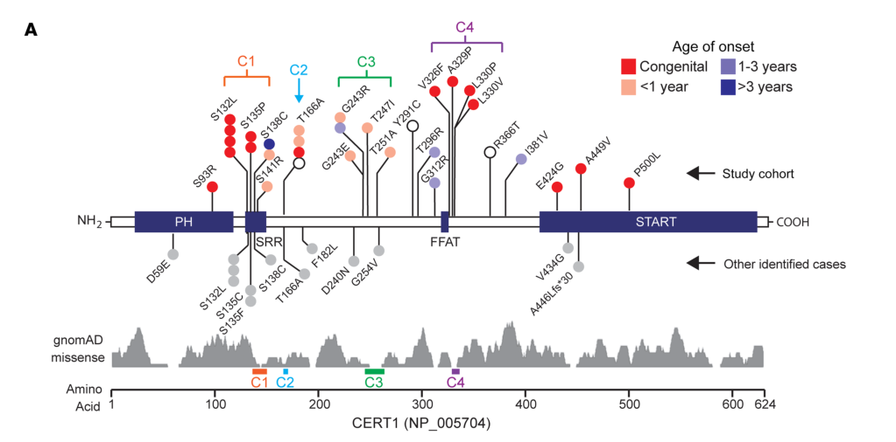

## Question

# Disease Characteristics Research Template

## Target Disease
- **Disease Name:** Intellectual Disability Autosomal Dominant 34
- **MONDO ID:**  (if available)
- **Category:** Mendelian

## Research Objectives

Please provide a comprehensive research report on **Intellectual Disability Autosomal Dominant 34** covering all of the
disease characteristics listed below. This report will be used to populate a disease knowledge
base entry. Be thorough and cite primary literature (PMID preferred) for all claims.

For each section, **suggested databases/resources** are listed. These are the first places
you should search for information on each topic.

---

### 1. Disease Information
> **Search first:** OMIM, Orphanet, ICD-10/ICD-11, MeSH, PubMed

- What is the disease? Provide a concise overview.
- What are the key identifiers? (OMIM, Orphanet, ICD-10/ICD-11, MeSH, Mondo)
- What are the common synonyms and alternative names?
- Is the information derived from individual patients (e.g., EHR) or aggregated disease-level resources?

### 2. Etiology

- **Disease Causal Factors**: What are the primary causes? (genetic, environmental, infectious, mechanistic)
- **Risk Factors**:
  > **Search first:** PubMed, Cochrane Library, UpToDate, clinical guidelines, ClinVar, ClinGen, GWAS Catalog, PheGenI, CTD, CDC, WHO, epidemiological databases
  - Genetic risk factors (causal variants, susceptibility loci, modifier genes)
  - Environmental risk factors (toxins, lifestyle, occupational exposures, age, sex, family history)
- **Protective Factors**:
  > **Search first:** PubMed, Cochrane Library, clinical trial databases, GWAS Catalog, gnomAD, WHO, CDC, nutrition databases
  - Genetic protective factors (protective variants, modifier alleles)
  - Environmental protective factors (diet, lifestyle, exposures that reduce risk)
- **Gene-Environment Interactions**: How do genetic and environmental factors interact to influence disease?
  > **Search first:** CTD, PubMed, PheGenI, GxE databases

### 3. Phenotypes
> **Search first:** HPO (Human Phenotype Ontology), OMIM, Orphanet, PubMed, clinicaltrials.gov, MedDRA, SNOMED CT, DECIPHER, LOINC

For each phenotype, provide:
- **Phenotype type**: symptoms, clinical signs, physical manifestations, behavioral changes, or laboratory abnormalities
  > For symptoms/signs: HPO, OMIM, Orphanet, PubMed
  > For behavioral changes: HPO, DSM, RDoC (Research Domain Criteria), PubMed
  > For laboratory abnormalities: LOINC, SNOMED CT, LabTests Online, PubMed
- **Phenotype characteristics**:
  > **Search first:** OMIM, Orphanet, HPO, PubMed
  - Age of symptom onset (neonatal, childhood, adult-onset, late-onset)
  - Symptom severity (mild, moderate, severe, variable)
  - Symptom progression (stable, progressive, episodic, fluctuating)
  - Frequency among affected individuals (percentage or qualitative)
- **Quality of life impact**: Effects on daily functioning and well-being (per-phenotype when possible)
  > **Search first:** EQ-5D database, SF-36, WHO QOL databases, PubMed
- Suggest HPO (Human Phenotype Ontology) terms for each phenotype

### 4. Genetic/Molecular Information

- **Causal Genes**: Gene mutations or chromosomal abnormalities responsible for disease (gene symbols, OMIM IDs)
  > **Search first:** OMIM, ClinVar, HGMD, Ensembl, NCBI Gene
- **Pathogenic Variants**:
  - Affected genes (gene symbols, HGNC IDs)
    > **Search first:** OMIM, NCBI Gene, Ensembl, HGNC, UniProt, GeneCards
  - Variant classification (pathogenic, likely pathogenic, VUS per ACMG/AMP guidelines)
    > **Search first:** ClinVar, ClinGen, ACMG/AMP guidelines, VarSome
  - Variant type/class (missense, frameshift, nonsense, splice-site, structural)
  - Allele frequency in population databases
    > **Search first:** gnomAD, 1000 Genomes, ExAC, TOPMed, dbSNP
  - Somatic vs germline origin
    > **Search first:** COSMIC (somatic), ClinVar, ICGC, TCGA
  - Functional consequences (loss of function, gain of function, dominant negative)
- **Modifier Genes**: Genes that modify disease severity or expression
- **Epigenetic Information**: DNA methylation, histone modifications, chromatin changes affecting disease
  > **Search first:** ENCODE, Roadmap Epigenomics, MethBase, DiseaseMeth
- **Chromosomal Abnormalities**: Large-scale genetic changes (aneuploidy, translocations, inversions)
  > **Search first:** DECIPHER, ClinVar, ECARUCA, UCSC Genome Browser

### 5. Environmental Information

- **Environmental Factors**: Non-genetic contributing factors (toxins, radiation, pollution, occupational exposure)
  > **Search first:** CTD (Comparative Toxicogenomics Database), TOXNET, PubMed, EPA databases
- **Lifestyle Factors**: Behavioral factors (smoking, diet, exercise, alcohol consumption)
  > **Search first:** CDC databases, WHO, PubMed, NHANES
- **Infectious Agents**: If applicable, pathogens causing or triggering disease (bacteria, viruses, fungi, parasites)
  > **Search first:** NCBI Taxonomy, ViPR, BV-BRC, MicrobeDB, GIDEON

### 6. Mechanism / Pathophysiology

**Present this section as an ordered causal chain first, then the detail below.**
Open with a numbered sequence of mechanistic steps running from the initiating
lesion (mutation, exposure, infection) to the clinical manifestation, one step per
line, each naming what it causes next. State the causal verb explicitly ("leads
to", "results in") and say where a step is inferred rather than demonstrated.
Where the mechanism branches, show the branch. The categories below are a
checklist of what to cover within those steps, not the organizing structure —
a step may draw on several of them, and a category may contribute to several
steps.

- **Molecular Pathways**: Specific signaling cascades or biochemical pathways involved (Wnt, MAPK, mTOR, PI3K-AKT, etc.)
  > **Search first:** KEGG, Reactome, WikiPathways, PathBank, BioCyc
- **Cellular Processes**: Cell-level mechanisms (apoptosis, autophagy, cell cycle dysregulation, inflammation, etc.)
  > **Search first:** Gene Ontology (GO), Reactome, KEGG, PubMed
- **Protein Dysfunction**: How protein structure or function is altered (misfolding, aggregation, loss of function, gain of function)
  > **Search first:** UniProt, PDB (Protein Data Bank), InterPro, Pfam, AlphaFold
- **Metabolic Changes**: Alterations in metabolic processes (energy metabolism, lipid metabolism, amino acid metabolism)
  > **Search first:** KEGG, BioCyc, HMDB (Human Metabolome Database), BRENDA
- **Immune System Involvement**: Role of immune response (autoimmunity, immunodeficiency, chronic inflammation)
  > **Search first:** ImmPort, Immunome Database, IEDB, Gene Ontology
- **Tissue Damage Mechanisms**: How tissues/ are injured (oxidative stress, ischemia, fibrosis, necrosis)
  > **Search first:** PubMed, Gene Ontology, Reactome
- **Biochemical Abnormalities**: Specific molecular defects (enzyme deficiencies, receptor dysfunction, ion channel defects)
  > **Search first:** BRENDA, UniProt, KEGG, OMIM, PubMed
- **Epigenetic Changes**: DNA methylation, histone modifications affecting gene expression in disease
  > **Search first:** ENCODE, Roadmap Epigenomics, MethBase, DiseaseMeth
- **Molecular Profiling** (if available):
  - Transcriptomics/gene expression changes
    > **Search first:** GEO (Gene Expression Omnibus), ArrayExpress, GTEx, Human Cell Atlas, SRA
  - Proteomics findings
    > **Search first:** PRIDE, ProteomeXchange, Human Protein Atlas, STRING, BioGRID
  - Metabolomics signatures
    > **Search first:** MetaboLights, Metabolomics Workbench, HMDB, METLIN
  - Lipidomics alterations
    > **Search first:** LIPID MAPS, SwissLipids, LipidHome, Metabolomics Workbench
  - Genomic structural features
    > **Search first:** UCSC Genome Browser, Ensembl, NCBI, dbVar, DGV
- **Advanced Technologies** (if applicable):
  - Single-cell analysis findings (cell-type specific mechanisms, cellular heterogeneity)
    > **Search first:** Human Cell Atlas, Single Cell Portal, GEO, CELLxGENE
  - Spatial transcriptomics findings
    > **Search first:** GEO, Spatial Research, Vizgen, 10x Genomics data
  - Multi-omics integration results
    > **Search first:** TCGA, ICGC, cBioPortal, LinkedOmics, PubMed
  - Functional genomics screens (CRISPR, RNAi)
    > **Search first:** DepMap, GenomeRNAi, PubMed, BioGRID ORCS

For each mechanism, describe:
- The causal chain from initial trigger to clinical manifestation
- Which mechanisms are upstream vs downstream
- What cell types and biological processes are involved
- Suggest GO terms for biological processes and CL terms for cell types

### 7. Anatomical Structures Affected

- **Organ Level**:
  - Primary organs directly affected
  - Secondary organ involvement (complications, secondary effects)
  - Body systems involved (cardiovascular, nervous, digestive, respiratory, endocrine, etc.)
  > **Search first:** Uberon, FMA (Foundational Model of Anatomy), OMIM, HPO, ICD-11, MeSH, SNOMED CT
- **Tissue and Cell Level**:
  - Specific tissue types affected (epithelial, connective, muscle, nervous)
  - Specific cell populations targeted (with Cell Ontology terms)
  > **Search first:** Uberon, Human Protein Atlas, Cell Ontology, Human Cell Atlas, CellMarker, PanglaoDB
- **Subcellular Level**:
  - Cellular compartments involved (mitochondria, nucleus, ER, lysosomes) (with GO Cellular Component terms)
  > **Search first:** Gene Ontology (Cellular Component), UniProt, Human Protein Atlas
- **Localization**:
  - Specific anatomical sites (with UBERON terms)
    > **Search first:** FMA, Uberon, NeuroNames (for brain), SNOMED CT
  - Lateralization (unilateral, bilateral, asymmetric)
    > **Search first:** HPO, clinical literature, imaging databases

### 8. Temporal Development

- **Onset**:
  - Typical age of onset (congenital, pediatric, adult, geriatric)
  - Onset pattern (acute, subacute, chronic, insidious)
  > **Search first:** OMIM, Orphanet, HPO, PubMed
- **Progression**:
  - Disease stages (early, intermediate, advanced, end-stage)
    > **Search first:** Cancer Staging Manual (AJCC), WHO classifications, PubMed
  - Progression rate (rapid, slow, variable)
  - Disease course pattern (episodic, relapsing-remitting, progressive, stable)
  - Disease duration (self-limited, chronic lifelong)
  > **Search first:** Disease registries, longitudinal cohort databases, natural history studies, PubMed, Orphanet, OMIM
- **Patterns**:
  - Remission patterns (spontaneous, treatment-induced)
    > **Search first:** Clinical trial databases, disease registries, PubMed
  - Critical periods (time windows of vulnerability or opportunity for intervention)
    > **Search first:** PubMed, developmental biology databases, clinical guidelines

### 9. Inheritance and Population

- **Epidemiology**:
  - Prevalence (cases per 100,000 at given time)
  - Incidence (new cases per 100,000 per year)
  > **Search first:** Orphanet, CDC, WHO, GBD (Global Burden of Disease), national registries, SEER, disease registries
- **For Genetic Etiology**:
  - Inheritance pattern (AD, AR, X-linked, mitochondrial, multifactorial, polygenic)
    > **Search first:** OMIM, Orphanet, ClinVar, GTR (Genetic Testing Registry)
  - Penetrance (complete, incomplete, age-dependent)
    > **Search first:** ClinVar, OMIM, PubMed, ClinGen
  - Expressivity (variable, consistent)
    > **Search first:** OMIM, ClinVar, PubMed
  - Genetic anticipation (increasing severity in successive generations)
    > **Search first:** OMIM, PubMed (especially for repeat expansion disorders)
  - Germline mosaicism
    > **Search first:** ClinVar, OMIM, genetic counseling literature, PubMed
  - Founder effects (population-specific mutations)
    > **Search first:** gnomAD, population genetics databases, PubMed
  - Consanguinity role
    > **Search first:** OMIM, population studies, genetic counseling resources
  - Carrier frequency
    > **Search first:** gnomAD, carrier screening databases, GeneReviews, GTR
- **Population Demographics**:
  - Affected populations (ethnic or demographic groups with higher prevalence)
    > **Search first:** gnomAD, 1000 Genomes, PAGE Study, PubMed, population registries
  - Geographic distribution (endemic areas, regional variation)
    > **Search first:** WHO, CDC, GBD, Orphanet, geographic epidemiology databases
  - Geographic distribution of specific variants
  - Sex ratio (male:female)
    > **Search first:** Disease registries, OMIM, PubMed, epidemiological databases
  - Age distribution of affected individuals
    > **Search first:** CDC, disease registries, SEER, Orphanet

### 10. Diagnostics

- **Clinical Tests**:
  - Laboratory tests (blood, urine, tissue chemistry, specific enzyme assays)
    > **Search first:** LOINC, LabTests Online, PubMed
  - Biomarkers (proteins, metabolites, genetic markers, circulating biomarkers)
    > **Search first:** FDA Biomarker List, BEST (Biomarkers, EndpointS, and other Tools), PubMed
  - Imaging studies (X-ray, CT, MRI, PET, ultrasound)
    > **Search first:** RadLex, DICOM, Radiopaedia, imaging databases
  - Functional tests (pulmonary function, cardiac stress tests)
    > **Search first:** LOINC, clinical guidelines, PubMed
  - Electrophysiology (EEG, EMG, ECG, nerve conduction studies)
    > **Search first:** LOINC, clinical neurophysiology databases, PubMed
  - Biopsy findings (histopathology, immunohistochemistry)
    > **Search first:** SNOMED CT, College of American Pathologists resources, PubMed
  - Pathology findings (microscopic examination)
    > **Search first:** SNOMED CT, Digital Pathology databases, PubMed
- **Genetic Testing**:
  > **Search first:** GTR (Genetic Testing Registry), GeneReviews, ClinGen
  - Overview of recommended genetic testing approach
  - Whole genome sequencing (WGS) utility
    > **Search first:** GTR, ClinVar, GEL (Genomics England), gnomAD
  - Whole exome sequencing (WES) utility
    > **Search first:** GTR, ClinVar, OMIM, GeneMatcher
  - Gene panels (which panels, which genes)
    > **Search first:** GTR, ClinVar, laboratory-specific databases
  - Single gene testing
    > **Search first:** GTR, ClinVar, OMIM, GeneReviews
  - Chromosomal microarray (CMA)
    > **Search first:** DECIPHER, ClinVar, dbVar, ECARUCA
  - Karyotyping
    > **Search first:** Chromosome Abnormality Database, ClinVar, cytogenetics resources
  - FISH
    > **Search first:** ClinVar, cytogenetics databases, PubMed
  - Mitochondrial DNA testing
    > **Search first:** MITOMAP, MSeqDR, ClinVar, GTR
  - Repeat expansion testing
    > **Search first:** GTR, ClinVar, repeat expansion databases, PubMed
- **Omics-Based Diagnostics** (if applicable):
  - RNA sequencing / transcriptomics
    > **Search first:** GEO, ArrayExpress, GTEx, RNA-seq databases
  - Proteomics
    > **Search first:** PRIDE, ProteomeXchange, FDA Biomarker database
  - Metabolomics
    > **Search first:** MetaboLights, Metabolomics Workbench, HMDB
  - Epigenomics
    > **Search first:** GEO, ENCODE, Roadmap Epigenomics, MethBase
  - Liquid biopsy
    > **Search first:** COSMIC, ClinVar, liquid biopsy databases, PubMed
- **Clinical Criteria**:
  - Standardized diagnostic criteria (DSM, ICD, society guidelines)
    > **Search first:** DSM-5, ICD-11, clinical society guidelines, UpToDate
  - Differential diagnosis (other conditions to rule out, with distinguishing features)
    > **Search first:** DynaMed, UpToDate, clinical decision support systems
- **Screening**:
  - Screening methods for asymptomatic individuals (newborn screening, carrier screening, cascade screening)
    > **Search first:** ACMG recommendations, CDC newborn screening, GTR

### 11. Outcome/Prognosis

- **Survival and Mortality**:
  - Survival rate (5-year, 10-year, overall)
    > **Search first:** SEER, cancer registries, disease-specific registries, PubMed
  - Life expectancy (with and without treatment if applicable)
    > **Search first:** Orphanet, disease registries, actuarial databases, PubMed
  - Mortality rate
    > **Search first:** CDC, WHO, GBD, national mortality databases
  - Disease-specific mortality (deaths directly attributable to disease)
    > **Search first:** Disease registries, CDC Wonder, GBD, PubMed
- **Morbidity and Function**:
  - Morbidity (disease-related disability and health impacts)
    > **Search first:** GBD, WHO, disability databases, PubMed
  - Disability outcomes (long-term functional impairments)
    > **Search first:** ICF (International Classification of Functioning), disability registries
  - Quality of life measures (EQ-5D, SF-36, PROMIS, disease-specific tools)
    > **Search first:** EQ-5D database, SF-36, PROMIS, PubMed
- **Disease Course**:
  - Complications (secondary problems: infections, organ failure, etc.)
    > **Search first:** ICD codes, disease registries, clinical databases, PubMed
  - Recovery potential (likelihood and extent of recovery, with vs without treatment)
    > **Search first:** Natural history studies, rehabilitation databases, PubMed
- **Prediction**:
  - Prognostic factors (age, disease severity, biomarkers, treatment response)
    > **Search first:** Prognostic models databases, clinical calculators, PubMed
  - Prognostic biomarkers (molecular markers predicting disease course)
    > **Search first:** FDA Biomarker database, PubMed, cancer prognostic databases

### 12. Treatment

- **Pharmacotherapy**:
  - Pharmacological treatments (drug names, drug classes, mechanisms of action)
    > **Search first:** DrugBank, RxNorm, ATC classification, DailyMed, FDA databases
  - Pharmacogenomics (how genetic variants affect drug metabolism, efficacy, toxicity)
    > **Search first:** PharmGKB, CPIC (Clinical Pharmacogenetics), FDA Table of PGx Biomarkers
- **Advanced Therapeutics**:
  - Gene therapy (viral vectors, CRISPR, gene replacement, gene editing)
    > **Search first:** ClinicalTrials.gov, FDA gene therapy database, ASGCT resources
  - Cell therapy (stem cell transplant, CAR-T, cellular therapeutics)
    > **Search first:** ClinicalTrials.gov, FDA cell therapy database, FACT standards
  - RNA-based therapies (ASOs, siRNA, mRNA therapies)
    > **Search first:** ClinicalTrials.gov, FDA approvals, PubMed
  - Targeted therapies (treatments directed at specific molecular targets)
    > **Search first:** My Cancer Genome, OncoKB, ClinicalTrials.gov, FDA approvals
  - Immunotherapies (checkpoint inhibitors, monoclonal antibodies)
    > **Search first:** Cancer Immunotherapy Database, FDA approvals, ClinicalTrials.gov
- **Surgical and Interventional**:
  - Surgical interventions (types of surgery, timing, outcomes)
    > **Search first:** CPT codes, surgical registries, clinical guidelines, PubMed
- **Supportive and Rehabilitative**:
  - Supportive care (symptom management, pain control, nutrition)
    > **Search first:** Clinical guidelines, Cochrane Library, PubMed
  - Rehabilitation (physical therapy, occupational therapy, speech therapy)
    > **Search first:** Rehabilitation medicine databases, clinical guidelines, PubMed
- **Experimental**:
  - Experimental treatments in clinical trials (with NCT identifiers if available)
    > **Search first:** ClinicalTrials.gov, EU Clinical Trials Register, WHO ICTRP
- **Treatment Outcomes**:
  - Treatment response rates
    > **Search first:** Clinical trial databases, FDA reviews, systematic reviews, PubMed
  - Side effects and adverse events
    > **Search first:** FDA Adverse Event Reporting System (FAERS), MedWatch, PubMed
- **Treatment Strategy**:
  - Treatment algorithms (clinical pathways, decision trees)
    > **Search first:** Clinical practice guidelines, NCCN Guidelines, UpToDate
  - Combination therapies
    > **Search first:** ClinicalTrials.gov, treatment guidelines, PubMed
  - Personalized medicine approaches (genotype-guided treatment)
    > **Search first:** My Cancer Genome, CIViC, PharmGKB, precision medicine databases

For each treatment, suggest NCIT (NCI Thesaurus) clinical-intervention terms where applicable.

### 13. Prevention

- **Prevention Levels**:
  - Primary prevention (preventing disease occurrence: vaccination, risk factor modification)
    > **Search first:** CDC, WHO, USPSTF recommendations, Cochrane Library
  - Secondary prevention (early detection and treatment: screening programs, early intervention)
    > **Search first:** USPSTF, CDC screening guidelines, WHO
  - Tertiary prevention (preventing complications in those with disease)
    > **Search first:** Clinical guidelines, disease management protocols, PubMed
- **Immunization**: Vaccine strategies (if applicable)
  > **Search first:** CDC vaccine schedules, WHO immunization, FDA vaccine database
- **Screening and Early Detection**:
  - Screening programs (population-based: newborn screening, cancer screening)
    > **Search first:** CDC screening programs, USPSTF, cancer screening databases
  - Genetic screening (carrier screening, preimplantation genetic diagnosis, prenatal testing)
    > **Search first:** ACMG recommendations, ACOG guidelines, GTR
  - Risk stratification (identifying high-risk individuals for targeted prevention)
    > **Search first:** Risk prediction models, clinical calculators, PubMed
- **Behavioral Interventions**: Lifestyle modifications to reduce risk
  > **Search first:** CDC, WHO, behavioral intervention databases, Cochrane Library
- **Counseling**: Genetic counseling (risk assessment, family planning guidance)
  > **Search first:** NSGC resources, ACMG guidelines, GeneReviews
- **Public Health**:
  - Public health interventions (sanitation, vector control, health education)
    > **Search first:** CDC, WHO, public health databases, PubMed
  - Environmental interventions (reducing environmental risk factors)
    > **Search first:** EPA databases, WHO environmental health, PubMed
- **Prophylaxis**: Preventive medications or procedures
  > **Search first:** Clinical guidelines, FDA approvals, PubMed

### 14. Other Species / Natural Disease

- **Taxonomy**: Species affected (with NCBI Taxon identifiers)
  > **Search first:** NCBI Taxonomy
- **Breed**: Specific breeds affected (with VBO identifiers if applicable)
  > **Search first:** VBO (Vertebrate Breed Ontology)
- **Gene**: Orthologous genes in other species (with NCBI Gene IDs)
  > **Search first:** NCBI Gene
- **Natural Disease**:
  - Naturally occurring disease in other species (companion animals, wildlife)
    > **Search first:** OMIA (Online Mendelian Inheritance in Animals), VetCompass, PubMed
  - Veterinary relevance and importance in animal health
    > **Search first:** OMIA, veterinary databases, PubMed
- **Comparative Biology**:
  - Comparative pathology (similarities and differences across species)
    > **Search first:** OMIA, comparative pathology databases, PubMed
  - Evolutionary conservation of disease mechanisms
    > **Search first:** HomoloGene, OrthoMCL, Alliance of Genome Resources
- **Transmission** (if applicable):
  - Zoonotic potential
    > **Search first:** CDC zoonotic diseases, WHO zoonoses, GIDEON
  - Cross-species susceptibility
    > **Search first:** NCBI Taxonomy, veterinary databases, PubMed

### 15. Model Organisms

- **Model Types**:
  - Model organism type (mammalian, invertebrate, cellular, in vitro)
    > **Search first:** Alliance of Genome Resources, model organism databases
  - Specific model systems (mouse, rat, zebrafish, Drosophila, C. elegans, yeast, cell lines, organoids, iPSCs)
    > **Search first:** MGI, RGD, ZFIN, FlyBase, WormBase, SGD, ATCC, Cellosaurus
  - Induced models (drug treatment, surgical intervention, environmental manipulation)
    > **Search first:** MGI, model organism databases, PubMed
- **Genetic Models**:
  - Types available (knockout, knock-in, transgenic, conditional, humanized)
    > **Search first:** MGI, IMPC, KOMP, EuMMCR, IMSR
- **Model Characteristics**:
  - Phenotype recapitulation (how well model reproduces human disease features)
    > **Search first:** Model organism databases, comparative studies, PubMed
  - Model limitations (aspects of human disease not captured)
    > **Search first:** Model organism databases, PubMed, review articles
- **Applications**:
  - Research applications (what aspects of disease can be studied)
    > **Search first:** Model organism databases, PubMed
- **Resources**:
  - Model databases
    > **Search first:** MGI, RGD, ZFIN, FlyBase, WormBase, IMSR, EMMA, MMRRC

---

## Citation Requirements

- Cite primary literature (PMID preferred) for all mechanistic and clinical claims
- Prioritize recent reviews and landmark papers
- Include direct quotes from abstracts where possible to support key statements
- Distinguish evidence source types: human clinical, model organism, in vitro, computational

## Output Format

Structure your response as a comprehensive narrative organized by the sections above.
For each section, provide:
- Factual content with specific details (numbers, percentages, gene names, variant nomenclature)
- Ontology term suggestions (HPO, GO, CL, UBERON, CHEBI, NCIT, MONDO) where applicable
- Evidence citations with PMIDs
- Direct quotes from abstracts to support key claims
- Clear indication when information is not available or not applicable for this disease

This report will be used to populate a disease knowledge base entry with:
- Pathophysiology descriptions with causal chains
- Gene/protein annotations (HGNC, GO terms)
- Phenotype associations (HP terms) with frequencies
- Cell type involvement (CL terms)
- Anatomical locations (UBERON terms)
- Chemical entities (CHEBI terms)
- Treatment annotations (NCIT terms)
- Evidence items with PMIDs and exact abstract quotes
- Epidemiology, prognosis, diagnostic, and prevention information
- Animal model descriptions with phenotype recapitulation details

## Output

Question: You are an expert researcher providing comprehensive, well-cited information.

Provide detailed information focusing on:
1. Key concepts and definitions with current understanding
2. Recent developments and latest research (prioritize 2023-2024 sources)
3. Current applications and real-world implementations
4. Expert opinions and analysis from authoritative sources
5. Relevant statistics and data from recent studies

Format as a comprehensive research report with proper citations. Include URLs and publication dates where available.
Always prioritize recent, authoritative sources and provide specific citations for all major claims.

# Disease Characteristics Research Template

## Target Disease
- **Disease Name:** Intellectual Disability Autosomal Dominant 34
- **MONDO ID:**  (if available)
- **Category:** Mendelian

## Research Objectives

Please provide a comprehensive research report on **Intellectual Disability Autosomal Dominant 34** covering all of the
disease characteristics listed below. This report will be used to populate a disease knowledge
base entry. Be thorough and cite primary literature (PMID preferred) for all claims.

For each section, **suggested databases/resources** are listed. These are the first places
you should search for information on each topic.

---

### 1. Disease Information
> **Search first:** OMIM, Orphanet, ICD-10/ICD-11, MeSH, PubMed

- What is the disease? Provide a concise overview.
- What are the key identifiers? (OMIM, Orphanet, ICD-10/ICD-11, MeSH, Mondo)
- What are the common synonyms and alternative names?
- Is the information derived from individual patients (e.g., EHR) or aggregated disease-level resources?

### 2. Etiology

- **Disease Causal Factors**: What are the primary causes? (genetic, environmental, infectious, mechanistic)
- **Risk Factors**:
  > **Search first:** PubMed, Cochrane Library, UpToDate, clinical guidelines, ClinVar, ClinGen, GWAS Catalog, PheGenI, CTD, CDC, WHO, epidemiological databases
  - Genetic risk factors (causal variants, susceptibility loci, modifier genes)
  - Environmental risk factors (toxins, lifestyle, occupational exposures, age, sex, family history)
- **Protective Factors**:
  > **Search first:** PubMed, Cochrane Library, clinical trial databases, GWAS Catalog, gnomAD, WHO, CDC, nutrition databases
  - Genetic protective factors (protective variants, modifier alleles)
  - Environmental protective factors (diet, lifestyle, exposures that reduce risk)
- **Gene-Environment Interactions**: How do genetic and environmental factors interact to influence disease?
  > **Search first:** CTD, PubMed, PheGenI, GxE databases

### 3. Phenotypes
> **Search first:** HPO (Human Phenotype Ontology), OMIM, Orphanet, PubMed, clinicaltrials.gov, MedDRA, SNOMED CT, DECIPHER, LOINC

For each phenotype, provide:
- **Phenotype type**: symptoms, clinical signs, physical manifestations, behavioral changes, or laboratory abnormalities
  > For symptoms/signs: HPO, OMIM, Orphanet, PubMed
  > For behavioral changes: HPO, DSM, RDoC (Research Domain Criteria), PubMed
  > For laboratory abnormalities: LOINC, SNOMED CT, LabTests Online, PubMed
- **Phenotype characteristics**:
  > **Search first:** OMIM, Orphanet, HPO, PubMed
  - Age of symptom onset (neonatal, childhood, adult-onset, late-onset)
  - Symptom severity (mild, moderate, severe, variable)
  - Symptom progression (stable, progressive, episodic, fluctuating)
  - Frequency among affected individuals (percentage or qualitative)
- **Quality of life impact**: Effects on daily functioning and well-being (per-phenotype when possible)
  > **Search first:** EQ-5D database, SF-36, WHO QOL databases, PubMed
- Suggest HPO (Human Phenotype Ontology) terms for each phenotype

### 4. Genetic/Molecular Information

- **Causal Genes**: Gene mutations or chromosomal abnormalities responsible for disease (gene symbols, OMIM IDs)
  > **Search first:** OMIM, ClinVar, HGMD, Ensembl, NCBI Gene
- **Pathogenic Variants**:
  - Affected genes (gene symbols, HGNC IDs)
    > **Search first:** OMIM, NCBI Gene, Ensembl, HGNC, UniProt, GeneCards
  - Variant classification (pathogenic, likely pathogenic, VUS per ACMG/AMP guidelines)
    > **Search first:** ClinVar, ClinGen, ACMG/AMP guidelines, VarSome
  - Variant type/class (missense, frameshift, nonsense, splice-site, structural)
  - Allele frequency in population databases
    > **Search first:** gnomAD, 1000 Genomes, ExAC, TOPMed, dbSNP
  - Somatic vs germline origin
    > **Search first:** COSMIC (somatic), ClinVar, ICGC, TCGA
  - Functional consequences (loss of function, gain of function, dominant negative)
- **Modifier Genes**: Genes that modify disease severity or expression
- **Epigenetic Information**: DNA methylation, histone modifications, chromatin changes affecting disease
  > **Search first:** ENCODE, Roadmap Epigenomics, MethBase, DiseaseMeth
- **Chromosomal Abnormalities**: Large-scale genetic changes (aneuploidy, translocations, inversions)
  > **Search first:** DECIPHER, ClinVar, ECARUCA, UCSC Genome Browser

### 5. Environmental Information

- **Environmental Factors**: Non-genetic contributing factors (toxins, radiation, pollution, occupational exposure)
  > **Search first:** CTD (Comparative Toxicogenomics Database), TOXNET, PubMed, EPA databases
- **Lifestyle Factors**: Behavioral factors (smoking, diet, exercise, alcohol consumption)
  > **Search first:** CDC databases, WHO, PubMed, NHANES
- **Infectious Agents**: If applicable, pathogens causing or triggering disease (bacteria, viruses, fungi, parasites)
  > **Search first:** NCBI Taxonomy, ViPR, BV-BRC, MicrobeDB, GIDEON

### 6. Mechanism / Pathophysiology

**Present this section as an ordered causal chain first, then the detail below.**
Open with a numbered sequence of mechanistic steps running from the initiating
lesion (mutation, exposure, infection) to the clinical manifestation, one step per
line, each naming what it causes next. State the causal verb explicitly ("leads
to", "results in") and say where a step is inferred rather than demonstrated.
Where the mechanism branches, show the branch. The categories below are a
checklist of what to cover within those steps, not the organizing structure —
a step may draw on several of them, and a category may contribute to several
steps.

- **Molecular Pathways**: Specific signaling cascades or biochemical pathways involved (Wnt, MAPK, mTOR, PI3K-AKT, etc.)
  > **Search first:** KEGG, Reactome, WikiPathways, PathBank, BioCyc
- **Cellular Processes**: Cell-level mechanisms (apoptosis, autophagy, cell cycle dysregulation, inflammation, etc.)
  > **Search first:** Gene Ontology (GO), Reactome, KEGG, PubMed
- **Protein Dysfunction**: How protein structure or function is altered (misfolding, aggregation, loss of function, gain of function)
  > **Search first:** UniProt, PDB (Protein Data Bank), InterPro, Pfam, AlphaFold
- **Metabolic Changes**: Alterations in metabolic processes (energy metabolism, lipid metabolism, amino acid metabolism)
  > **Search first:** KEGG, BioCyc, HMDB (Human Metabolome Database), BRENDA
- **Immune System Involvement**: Role of immune response (autoimmunity, immunodeficiency, chronic inflammation)
  > **Search first:** ImmPort, Immunome Database, IEDB, Gene Ontology
- **Tissue Damage Mechanisms**: How tissues/ are injured (oxidative stress, ischemia, fibrosis, necrosis)
  > **Search first:** PubMed, Gene Ontology, Reactome
- **Biochemical Abnormalities**: Specific molecular defects (enzyme deficiencies, receptor dysfunction, ion channel defects)
  > **Search first:** BRENDA, UniProt, KEGG, OMIM, PubMed
- **Epigenetic Changes**: DNA methylation, histone modifications affecting gene expression in disease
  > **Search first:** ENCODE, Roadmap Epigenomics, MethBase, DiseaseMeth
- **Molecular Profiling** (if available):
  - Transcriptomics/gene expression changes
    > **Search first:** GEO (Gene Expression Omnibus), ArrayExpress, GTEx, Human Cell Atlas, SRA
  - Proteomics findings
    > **Search first:** PRIDE, ProteomeXchange, Human Protein Atlas, STRING, BioGRID
  - Metabolomics signatures
    > **Search first:** MetaboLights, Metabolomics Workbench, HMDB, METLIN
  - Lipidomics alterations
    > **Search first:** LIPID MAPS, SwissLipids, LipidHome, Metabolomics Workbench
  - Genomic structural features
    > **Search first:** UCSC Genome Browser, Ensembl, NCBI, dbVar, DGV
- **Advanced Technologies** (if applicable):
  - Single-cell analysis findings (cell-type specific mechanisms, cellular heterogeneity)
    > **Search first:** Human Cell Atlas, Single Cell Portal, GEO, CELLxGENE
  - Spatial transcriptomics findings
    > **Search first:** GEO, Spatial Research, Vizgen, 10x Genomics data
  - Multi-omics integration results
    > **Search first:** TCGA, ICGC, cBioPortal, LinkedOmics, PubMed
  - Functional genomics screens (CRISPR, RNAi)
    > **Search first:** DepMap, GenomeRNAi, PubMed, BioGRID ORCS

For each mechanism, describe:
- The causal chain from initial trigger to clinical manifestation
- Which mechanisms are upstream vs downstream
- What cell types and biological processes are involved
- Suggest GO terms for biological processes and CL terms for cell types

### 7. Anatomical Structures Affected

- **Organ Level**:
  - Primary organs directly affected
  - Secondary organ involvement (complications, secondary effects)
  - Body systems involved (cardiovascular, nervous, digestive, respiratory, endocrine, etc.)
  > **Search first:** Uberon, FMA (Foundational Model of Anatomy), OMIM, HPO, ICD-11, MeSH, SNOMED CT
- **Tissue and Cell Level**:
  - Specific tissue types affected (epithelial, connective, muscle, nervous)
  - Specific cell populations targeted (with Cell Ontology terms)
  > **Search first:** Uberon, Human Protein Atlas, Cell Ontology, Human Cell Atlas, CellMarker, PanglaoDB
- **Subcellular Level**:
  - Cellular compartments involved (mitochondria, nucleus, ER, lysosomes) (with GO Cellular Component terms)
  > **Search first:** Gene Ontology (Cellular Component), UniProt, Human Protein Atlas
- **Localization**:
  - Specific anatomical sites (with UBERON terms)
    > **Search first:** FMA, Uberon, NeuroNames (for brain), SNOMED CT
  - Lateralization (unilateral, bilateral, asymmetric)
    > **Search first:** HPO, clinical literature, imaging databases

### 8. Temporal Development

- **Onset**:
  - Typical age of onset (congenital, pediatric, adult, geriatric)
  - Onset pattern (acute, subacute, chronic, insidious)
  > **Search first:** OMIM, Orphanet, HPO, PubMed
- **Progression**:
  - Disease stages (early, intermediate, advanced, end-stage)
    > **Search first:** Cancer Staging Manual (AJCC), WHO classifications, PubMed
  - Progression rate (rapid, slow, variable)
  - Disease course pattern (episodic, relapsing-remitting, progressive, stable)
  - Disease duration (self-limited, chronic lifelong)
  > **Search first:** Disease registries, longitudinal cohort databases, natural history studies, PubMed, Orphanet, OMIM
- **Patterns**:
  - Remission patterns (spontaneous, treatment-induced)
    > **Search first:** Clinical trial databases, disease registries, PubMed
  - Critical periods (time windows of vulnerability or opportunity for intervention)
    > **Search first:** PubMed, developmental biology databases, clinical guidelines

### 9. Inheritance and Population

- **Epidemiology**:
  - Prevalence (cases per 100,000 at given time)
  - Incidence (new cases per 100,000 per year)
  > **Search first:** Orphanet, CDC, WHO, GBD (Global Burden of Disease), national registries, SEER, disease registries
- **For Genetic Etiology**:
  - Inheritance pattern (AD, AR, X-linked, mitochondrial, multifactorial, polygenic)
    > **Search first:** OMIM, Orphanet, ClinVar, GTR (Genetic Testing Registry)
  - Penetrance (complete, incomplete, age-dependent)
    > **Search first:** ClinVar, OMIM, PubMed, ClinGen
  - Expressivity (variable, consistent)
    > **Search first:** OMIM, ClinVar, PubMed
  - Genetic anticipation (increasing severity in successive generations)
    > **Search first:** OMIM, PubMed (especially for repeat expansion disorders)
  - Germline mosaicism
    > **Search first:** ClinVar, OMIM, genetic counseling literature, PubMed
  - Founder effects (population-specific mutations)
    > **Search first:** gnomAD, population genetics databases, PubMed
  - Consanguinity role
    > **Search first:** OMIM, population studies, genetic counseling resources
  - Carrier frequency
    > **Search first:** gnomAD, carrier screening databases, GeneReviews, GTR
- **Population Demographics**:
  - Affected populations (ethnic or demographic groups with higher prevalence)
    > **Search first:** gnomAD, 1000 Genomes, PAGE Study, PubMed, population registries
  - Geographic distribution (endemic areas, regional variation)
    > **Search first:** WHO, CDC, GBD, Orphanet, geographic epidemiology databases
  - Geographic distribution of specific variants
  - Sex ratio (male:female)
    > **Search first:** Disease registries, OMIM, PubMed, epidemiological databases
  - Age distribution of affected individuals
    > **Search first:** CDC, disease registries, SEER, Orphanet

### 10. Diagnostics

- **Clinical Tests**:
  - Laboratory tests (blood, urine, tissue chemistry, specific enzyme assays)
    > **Search first:** LOINC, LabTests Online, PubMed
  - Biomarkers (proteins, metabolites, genetic markers, circulating biomarkers)
    > **Search first:** FDA Biomarker List, BEST (Biomarkers, EndpointS, and other Tools), PubMed
  - Imaging studies (X-ray, CT, MRI, PET, ultrasound)
    > **Search first:** RadLex, DICOM, Radiopaedia, imaging databases
  - Functional tests (pulmonary function, cardiac stress tests)
    > **Search first:** LOINC, clinical guidelines, PubMed
  - Electrophysiology (EEG, EMG, ECG, nerve conduction studies)
    > **Search first:** LOINC, clinical neurophysiology databases, PubMed
  - Biopsy findings (histopathology, immunohistochemistry)
    > **Search first:** SNOMED CT, College of American Pathologists resources, PubMed
  - Pathology findings (microscopic examination)
    > **Search first:** SNOMED CT, Digital Pathology databases, PubMed
- **Genetic Testing**:
  > **Search first:** GTR (Genetic Testing Registry), GeneReviews, ClinGen
  - Overview of recommended genetic testing approach
  - Whole genome sequencing (WGS) utility
    > **Search first:** GTR, ClinVar, GEL (Genomics England), gnomAD
  - Whole exome sequencing (WES) utility
    > **Search first:** GTR, ClinVar, OMIM, GeneMatcher
  - Gene panels (which panels, which genes)
    > **Search first:** GTR, ClinVar, laboratory-specific databases
  - Single gene testing
    > **Search first:** GTR, ClinVar, OMIM, GeneReviews
  - Chromosomal microarray (CMA)
    > **Search first:** DECIPHER, ClinVar, dbVar, ECARUCA
  - Karyotyping
    > **Search first:** Chromosome Abnormality Database, ClinVar, cytogenetics resources
  - FISH
    > **Search first:** ClinVar, cytogenetics databases, PubMed
  - Mitochondrial DNA testing
    > **Search first:** MITOMAP, MSeqDR, ClinVar, GTR
  - Repeat expansion testing
    > **Search first:** GTR, ClinVar, repeat expansion databases, PubMed
- **Omics-Based Diagnostics** (if applicable):
  - RNA sequencing / transcriptomics
    > **Search first:** GEO, ArrayExpress, GTEx, RNA-seq databases
  - Proteomics
    > **Search first:** PRIDE, ProteomeXchange, FDA Biomarker database
  - Metabolomics
    > **Search first:** MetaboLights, Metabolomics Workbench, HMDB
  - Epigenomics
    > **Search first:** GEO, ENCODE, Roadmap Epigenomics, MethBase
  - Liquid biopsy
    > **Search first:** COSMIC, ClinVar, liquid biopsy databases, PubMed
- **Clinical Criteria**:
  - Standardized diagnostic criteria (DSM, ICD, society guidelines)
    > **Search first:** DSM-5, ICD-11, clinical society guidelines, UpToDate
  - Differential diagnosis (other conditions to rule out, with distinguishing features)
    > **Search first:** DynaMed, UpToDate, clinical decision support systems
- **Screening**:
  - Screening methods for asymptomatic individuals (newborn screening, carrier screening, cascade screening)
    > **Search first:** ACMG recommendations, CDC newborn screening, GTR

### 11. Outcome/Prognosis

- **Survival and Mortality**:
  - Survival rate (5-year, 10-year, overall)
    > **Search first:** SEER, cancer registries, disease-specific registries, PubMed
  - Life expectancy (with and without treatment if applicable)
    > **Search first:** Orphanet, disease registries, actuarial databases, PubMed
  - Mortality rate
    > **Search first:** CDC, WHO, GBD, national mortality databases
  - Disease-specific mortality (deaths directly attributable to disease)
    > **Search first:** Disease registries, CDC Wonder, GBD, PubMed
- **Morbidity and Function**:
  - Morbidity (disease-related disability and health impacts)
    > **Search first:** GBD, WHO, disability databases, PubMed
  - Disability outcomes (long-term functional impairments)
    > **Search first:** ICF (International Classification of Functioning), disability registries
  - Quality of life measures (EQ-5D, SF-36, PROMIS, disease-specific tools)
    > **Search first:** EQ-5D database, SF-36, PROMIS, PubMed
- **Disease Course**:
  - Complications (secondary problems: infections, organ failure, etc.)
    > **Search first:** ICD codes, disease registries, clinical databases, PubMed
  - Recovery potential (likelihood and extent of recovery, with vs without treatment)
    > **Search first:** Natural history studies, rehabilitation databases, PubMed
- **Prediction**:
  - Prognostic factors (age, disease severity, biomarkers, treatment response)
    > **Search first:** Prognostic models databases, clinical calculators, PubMed
  - Prognostic biomarkers (molecular markers predicting disease course)
    > **Search first:** FDA Biomarker database, PubMed, cancer prognostic databases

### 12. Treatment

- **Pharmacotherapy**:
  - Pharmacological treatments (drug names, drug classes, mechanisms of action)
    > **Search first:** DrugBank, RxNorm, ATC classification, DailyMed, FDA databases
  - Pharmacogenomics (how genetic variants affect drug metabolism, efficacy, toxicity)
    > **Search first:** PharmGKB, CPIC (Clinical Pharmacogenetics), FDA Table of PGx Biomarkers
- **Advanced Therapeutics**:
  - Gene therapy (viral vectors, CRISPR, gene replacement, gene editing)
    > **Search first:** ClinicalTrials.gov, FDA gene therapy database, ASGCT resources
  - Cell therapy (stem cell transplant, CAR-T, cellular therapeutics)
    > **Search first:** ClinicalTrials.gov, FDA cell therapy database, FACT standards
  - RNA-based therapies (ASOs, siRNA, mRNA therapies)
    > **Search first:** ClinicalTrials.gov, FDA approvals, PubMed
  - Targeted therapies (treatments directed at specific molecular targets)
    > **Search first:** My Cancer Genome, OncoKB, ClinicalTrials.gov, FDA approvals
  - Immunotherapies (checkpoint inhibitors, monoclonal antibodies)
    > **Search first:** Cancer Immunotherapy Database, FDA approvals, ClinicalTrials.gov
- **Surgical and Interventional**:
  - Surgical interventions (types of surgery, timing, outcomes)
    > **Search first:** CPT codes, surgical registries, clinical guidelines, PubMed
- **Supportive and Rehabilitative**:
  - Supportive care (symptom management, pain control, nutrition)
    > **Search first:** Clinical guidelines, Cochrane Library, PubMed
  - Rehabilitation (physical therapy, occupational therapy, speech therapy)
    > **Search first:** Rehabilitation medicine databases, clinical guidelines, PubMed
- **Experimental**:
  - Experimental treatments in clinical trials (with NCT identifiers if available)
    > **Search first:** ClinicalTrials.gov, EU Clinical Trials Register, WHO ICTRP
- **Treatment Outcomes**:
  - Treatment response rates
    > **Search first:** Clinical trial databases, FDA reviews, systematic reviews, PubMed
  - Side effects and adverse events
    > **Search first:** FDA Adverse Event Reporting System (FAERS), MedWatch, PubMed
- **Treatment Strategy**:
  - Treatment algorithms (clinical pathways, decision trees)
    > **Search first:** Clinical practice guidelines, NCCN Guidelines, UpToDate
  - Combination therapies
    > **Search first:** ClinicalTrials.gov, treatment guidelines, PubMed
  - Personalized medicine approaches (genotype-guided treatment)
    > **Search first:** My Cancer Genome, CIViC, PharmGKB, precision medicine databases

For each treatment, suggest NCIT (NCI Thesaurus) clinical-intervention terms where applicable.

### 13. Prevention

- **Prevention Levels**:
  - Primary prevention (preventing disease occurrence: vaccination, risk factor modification)
    > **Search first:** CDC, WHO, USPSTF recommendations, Cochrane Library
  - Secondary prevention (early detection and treatment: screening programs, early intervention)
    > **Search first:** USPSTF, CDC screening guidelines, WHO
  - Tertiary prevention (preventing complications in those with disease)
    > **Search first:** Clinical guidelines, disease management protocols, PubMed
- **Immunization**: Vaccine strategies (if applicable)
  > **Search first:** CDC vaccine schedules, WHO immunization, FDA vaccine database
- **Screening and Early Detection**:
  - Screening programs (population-based: newborn screening, cancer screening)
    > **Search first:** CDC screening programs, USPSTF, cancer screening databases
  - Genetic screening (carrier screening, preimplantation genetic diagnosis, prenatal testing)
    > **Search first:** ACMG recommendations, ACOG guidelines, GTR
  - Risk stratification (identifying high-risk individuals for targeted prevention)
    > **Search first:** Risk prediction models, clinical calculators, PubMed
- **Behavioral Interventions**: Lifestyle modifications to reduce risk
  > **Search first:** CDC, WHO, behavioral intervention databases, Cochrane Library
- **Counseling**: Genetic counseling (risk assessment, family planning guidance)
  > **Search first:** NSGC resources, ACMG guidelines, GeneReviews
- **Public Health**:
  - Public health interventions (sanitation, vector control, health education)
    > **Search first:** CDC, WHO, public health databases, PubMed
  - Environmental interventions (reducing environmental risk factors)
    > **Search first:** EPA databases, WHO environmental health, PubMed
- **Prophylaxis**: Preventive medications or procedures
  > **Search first:** Clinical guidelines, FDA approvals, PubMed

### 14. Other Species / Natural Disease

- **Taxonomy**: Species affected (with NCBI Taxon identifiers)
  > **Search first:** NCBI Taxonomy
- **Breed**: Specific breeds affected (with VBO identifiers if applicable)
  > **Search first:** VBO (Vertebrate Breed Ontology)
- **Gene**: Orthologous genes in other species (with NCBI Gene IDs)
  > **Search first:** NCBI Gene
- **Natural Disease**:
  - Naturally occurring disease in other species (companion animals, wildlife)
    > **Search first:** OMIA (Online Mendelian Inheritance in Animals), VetCompass, PubMed
  - Veterinary relevance and importance in animal health
    > **Search first:** OMIA, veterinary databases, PubMed
- **Comparative Biology**:
  - Comparative pathology (similarities and differences across species)
    > **Search first:** OMIA, comparative pathology databases, PubMed
  - Evolutionary conservation of disease mechanisms
    > **Search first:** HomoloGene, OrthoMCL, Alliance of Genome Resources
- **Transmission** (if applicable):
  - Zoonotic potential
    > **Search first:** CDC zoonotic diseases, WHO zoonoses, GIDEON
  - Cross-species susceptibility
    > **Search first:** NCBI Taxonomy, veterinary databases, PubMed

### 15. Model Organisms

- **Model Types**:
  - Model organism type (mammalian, invertebrate, cellular, in vitro)
    > **Search first:** Alliance of Genome Resources, model organism databases
  - Specific model systems (mouse, rat, zebrafish, Drosophila, C. elegans, yeast, cell lines, organoids, iPSCs)
    > **Search first:** MGI, RGD, ZFIN, FlyBase, WormBase, SGD, ATCC, Cellosaurus
  - Induced models (drug treatment, surgical intervention, environmental manipulation)
    > **Search first:** MGI, model organism databases, PubMed
- **Genetic Models**:
  - Types available (knockout, knock-in, transgenic, conditional, humanized)
    > **Search first:** MGI, IMPC, KOMP, EuMMCR, IMSR
- **Model Characteristics**:
  - Phenotype recapitulation (how well model reproduces human disease features)
    > **Search first:** Model organism databases, comparative studies, PubMed
  - Model limitations (aspects of human disease not captured)
    > **Search first:** Model organism databases, PubMed, review articles
- **Applications**:
  - Research applications (what aspects of disease can be studied)
    > **Search first:** Model organism databases, PubMed
- **Resources**:
  - Model databases
    > **Search first:** MGI, RGD, ZFIN, FlyBase, WormBase, IMSR, EMMA, MMRRC

---

## Citation Requirements

- Cite primary literature (PMID preferred) for all mechanistic and clinical claims
- Prioritize recent reviews and landmark papers
- Include direct quotes from abstracts where possible to support key statements
- Distinguish evidence source types: human clinical, model organism, in vitro, computational

## Output Format

Structure your response as a comprehensive narrative organized by the sections above.
For each section, provide:
- Factual content with specific details (numbers, percentages, gene names, variant nomenclature)
- Ontology term suggestions (HPO, GO, CL, UBERON, CHEBI, NCIT, MONDO) where applicable
- Evidence citations with PMIDs
- Direct quotes from abstracts to support key claims
- Clear indication when information is not available or not applicable for this disease

This report will be used to populate a disease knowledge base entry with:
- Pathophysiology descriptions with causal chains
- Gene/protein annotations (HGNC, GO terms)
- Phenotype associations (HP terms) with frequencies
- Cell type involvement (CL terms)
- Anatomical locations (UBERON terms)
- Chemical entities (CHEBI terms)
- Treatment annotations (NCIT terms)
- Evidence items with PMIDs and exact abstract quotes
- Epidemiology, prognosis, diagnostic, and prevention information
- Animal model descriptions with phenotype recapitulation details

# Intellectual Disability, Autosomal Dominant 34 (MRD34): Research Report

## Executive summary

Intellectual disability, autosomal dominant 34 (MRD34) is an ultra-rare Mendelian neurodevelopmental disorder caused primarily by heterozygous gain-of-function variants in **CERT1**, the gene encoding ceramide transporter 1. The broader phenotype was renamed **ceramide transporter (CerTra) syndrome** after a 2023 international study characterized 31 unrelated affected individuals. Core manifestations are developmental delay, variable intellectual disability, marked speech and motor impairment, infantile hypotonia, autism or other behavioral abnormalities, seizures, feeding/growth problems, and occasionally abnormal cerebral myelination or atrophy. Most informative cases are caused by de novo missense variants that disrupt CERT autoregulation and sphingolipid homeostasis. There is no approved disease-modifying treatment; CERT inhibition has rescued abnormalities only in a Drosophila model. Epidemiology, long-term survival, validated biomarkers, and formal management guidelines remain unknown. (gehin2023cert1mutationsperturb pages 3-5, gehin2023cert1mutationsperturb pages 2-3)

The following table summarizes the most actionable knowledge-base fields.

| Knowledge-base field | Evidence status | Concise finding | Key evidence |
|---|---|---|---|
| Disease identity | Established disease-level classification | **Intellectual disability, autosomal dominant 34 (MRD34)**; the expanded phenotype is termed **ceramide transporter (CerTra) syndrome**. | OMIM **616351**; MONDO **MONDO:0014599**. Synonyms include *autosomal dominant mental retardation 34* and *CERT1-related intellectual disability*. (rasika2019golgipathiesinneurodevelopment pages 5-9, OpenTargets Search: Intellectual disability, autosomal dominant 34, gehin2023cert1mutationsperturb pages 2-3) |
| Gene and locus | Established human genetic evidence | Heterozygous variants in **CERT1** (historical symbol **COL4A3BP**; aliases **CERT** and **GPBP**), encoding ceramide transporter 1; locus **5q13**; Ensembl **ENSG00000113163**. | OMIM gene **604677**; Open Targets identifies a definitive monoallelic association. (OpenTargets Search: Intellectual disability, autosomal dominant 34, arseni2018fromstructureto pages 19-20) |
| Inheritance | Established human genetic evidence | **Autosomal dominant**, usually caused by a de novo heterozygous missense variant. In the largest cohort, 25/27 informative variants (**93%**) were de novo. | Gehin et al., May 15, 2023, DOI: [10.1172/JCI165019](https://doi.org/10.1172/jci165019); PMID **36976648**. (gehin2023cert1mutationsperturb pages 2-3) |
| Strongest cohort | Established human cohort evidence | The 2023 study analyzed **31 unrelated individuals with 22 distinct CERT1 missense variants**, including 18 reportedly novel variants. Most variants, 27/31 (**87%**), occurred between the PH and C-terminal START-related domains. | Gehin et al., 2023, DOI: [10.1172/JCI165019](https://doi.org/10.1172/jci165019). (gehin2023cert1mutationsperturb pages 3-5, gehin2023cert1mutationsperturb pages 2-3) |
| Developmental phenotype | Established human cohort evidence | **Motor delay occurred in 26/29** evaluable individuals; only 4/26 (**15%**) lacked developmental delay by the end of the first year. Intellectual disability ranged from mild to profound, with frequent severe speech impairment. | Gehin et al., 2023. (gehin2023cert1mutationsperturb pages 3-5, gehin2023cert1mutationsperturb media 51f69b9d) |
| Behavioral phenotype | Established human cohort evidence | Autism spectrum disorder occurred in **19/27 (70%)** evaluable individuals. Stereotypies, self-injury, ADHD, anxiety, aggression, sleep disruption, and increased pain tolerance were also reported. | Gehin et al., 2023; earlier reports described anxiety and self-mutilation. (arseni2018fromstructureto pages 19-20, gehin2023cert1mutationsperturb pages 3-5) |
| Neurologic phenotype | Established human cohort and case evidence | Seizures occurred in **16/29** evaluable individuals. Other findings included infantile hypotonia, thin or hypoplastic corpus callosum, ventriculomegaly, delayed myelination, cerebral or cerebellar atrophy, and leukodystrophy-like changes. | Gehin et al., 2023; Murakami et al., December 21, 2020, DOI: [10.1371/journal.pone.0243980](https://doi.org/10.1371/journal.pone.0243980); PMID **33347465**. (murakami2020intellectualdisabilityassociatedgainoffunction pages 5-8, gehin2023cert1mutationsperturb pages 3-5) |
| Variant hotspots | Established human genetic evidence | Variants cluster at **p.S132, p.S135, p.S138, and p.S141** in the serine-repeat motif; **p.T166**; **p.D240, p.G243, p.T247, and p.T251**; and **p.V326F, p.A329P, p.L330V, and p.L330P** near the FFAT motif. | p.S132/p.S135 variants were associated with more severe presentations, although genotype groups were small. (gehin2023cert1mutationsperturb pages 3-5) |
| Variant-interpretation caution | Established segregation and functional evidence | Not every rare CERT1 variant is causal. **c.2242_2243dupAA; p.(Pro749fs)** was inherited and did not reproduce abnormal activity in functional testing, so it was judged noncausative in that family. | Tamura et al., October 22, 2021, DOI: [10.1016/j.jbc.2021.101338](https://doi.org/10.1016/j.jbc.2021.101338); PMID **34688657**. (tamura2021intellectualdisabilityassociatedmutationsin pages 1-2) |
| Molecular mechanism | Demonstrated in biochemical and cellular models; clinical consequences partly inferred | CERT transfers ceramide from the **endoplasmic reticulum to trans-Golgi contact sites** for sphingomyelin synthesis. Disease variants impair phosphorylation-dependent autorepression or another regulatory domain, causing **gain of function**, excessive ceramide transport, altered sphingolipid flux, and abnormal punctate localization. | Murakami et al., 2020; Tamura et al., 2021; Gehin et al., 2023. (gehin2023cert1mutationsperturb pages 2-3, tamura2021intellectualdisabilityassociatedmutationsin pages 1-2, murakami2020intellectualdisabilityassociatedgainoffunction pages 11-13) |
| Diagnostic approach | Current clinical-genetics practice; no formal disease-specific criteria | Use an intellectual-disability or neurodevelopmental gene panel, preferably trio **WES/WGS**, with parental segregation and transcript-specific HGVS reporting. Apply ACMG/AMP criteria and interpret variants using population frequency, clustering, segregation, and functional evidence. MRI and EEG characterize complications but are not diagnostic biomarkers. | Published cohorts used exome sequencing, segregation analysis, ACMG interpretation, neurologic assessment, MRI, and EEG. (murakami2020intellectualdisabilityassociatedgainoffunction pages 5-8, gehin2023cert1mutationsperturb pages 12-13, tamura2021intellectualdisabilityassociatedmutationsin pages 1-2) |
| Treatment status | No established disease-modifying human treatment | Care is supportive and individualized: developmental intervention, speech or augmentative communication, occupational and physical therapy, behavioral and sleep support, feeding care, and standard antiseizure treatment when required. No validated genotype-guided therapy or disease-specific interventional trial was identified. | Human reports provide no efficacy or safety evidence for CERT1-directed treatment. (murakami2020intellectualdisabilityassociatedgainoffunction pages 5-8, gehin2023cert1mutationsperturb pages 12-13, gehin2023cert1mutationsperturb pages 2-3) |
| Experimental therapy | Preclinical only | The CERT inhibitor **HPA-12** corrected locomotor and morphological abnormalities in a Drosophila model. This supports therapeutic plausibility but provides no human efficacy, safety, or dosing evidence. | Gehin et al., 2023. (gehin2023cert1mutationsperturb pages 2-3, gehin2023cert1mutationsperturb pages 10-12) |
| Model-organism evidence | Experimental Drosophila evidence | CERT gain of function in **Drosophila melanogaster** caused abnormal head or brain size and locomotor hypoactivity; pharmacologic rescue supports excessive CERT activity as the disease mechanism. | Gehin et al., 2023, DOI: [10.1172/JCI165019](https://doi.org/10.1172/jci165019); PMID **36976648**. (gehin2023cert1mutationsperturb pages 2-3, gehin2023cert1mutationsperturb pages 10-12) |
| Epidemiology | Major evidence gap | Prevalence, incidence, carrier frequency, founder effects, geographic enrichment, and sex ratio have not been established. Published cases are rare-disease referrals rather than a population-based cohort. | The largest available delineation included 31 unrelated individuals, without a population denominator. (gehin2023cert1mutationsperturb pages 3-5, gehin2023cert1mutationsperturb pages 2-3) |
| Prognosis | Major evidence gap | The condition is chronic and lifelong with variable severity. Developmental slowing or regression may occur, and one severely affected adult had progressive leukodystrophy-like MRI changes. Survival, life expectancy, mortality, quality-of-life scores, and prognostic biomarkers remain unknown. | Human cohort and longitudinal single-case observations. (murakami2020intellectualdisabilityassociatedgainoffunction pages 5-8, gehin2023cert1mutationsperturb pages 3-5) |

*Table: Concise evidence summary for CERT1-related CerTra syndrome, covering identity, genetics, cohort statistics, phenotype, mechanism, diagnosis, treatment, models, and major knowledge gaps. Evidence is explicitly distinguished as established human, experimental, inferred, or unavailable.*

## 1. Disease information

### Definition and identifiers

MRD34 is a syndromic neurodevelopmental disorder in which pathogenic monoallelic **CERT1** variants impair intellectual and adaptive development. The 2023 expanded phenotype encompasses neurologic, behavioral, growth, and mild dysmorphic manifestations and is termed **CerTra syndrome**. (gehin2023cert1mutationsperturb pages 3-5, gehin2023cert1mutationsperturb pages 2-3)

* **MONDO:** MONDO:0014599.
* **OMIM phenotype:** 616351.
* **OMIM gene:** CERT1/COL4A3BP, 604677.
* **Gene:** CERT1; Ensembl ENSG00000113163; historical symbol **COL4A3BP**; aliases **CERT**, **GPBP**, and STARD11.
* **Locus:** 5q13.
* **Synonyms:** intellectual disability, autosomal dominant 34; autosomal dominant mental retardation 34; MRD34; CERT1-related intellectual disability; CERT1-related neurodevelopmental disorder; ceramide transporter syndrome/CerTra syndrome. (OpenTargets Search: Intellectual disability, autosomal dominant 34, rasika2019golgipathiesinneurodevelopment pages 5-9, arseni2018fromstructureto pages 19-20)
* **ICD/MeSH:** No uniquely specific ICD-10, ICD-11, or MeSH code was established in the retrieved evidence. Coding generally falls under intellectual-developmental disorder, with separate codes for epilepsy, autism, feeding difficulty, and other manifestations.

The evidence is **aggregated disease-level evidence** assembled from international research cohorts, ClinVar/DECIPHER/GeneMatcher-type resources, and published case reports—not longitudinal EHR-derived population data. The principal cohort consists of highly selected rare-disease referrals and should not be interpreted as population surveillance. (gehin2023cert1mutationsperturb pages 2-3, gehin2023cert1mutationsperturb pages 12-13)

## 2. Etiology, risks, and protective factors

### Causal factor

The initiating cause is usually a **germline heterozygous missense variant in CERT1**. Of 27 affected individuals with informative parental data in the 2023 cohort, 25 variants were de novo (93%). One variant was inherited from an apparently unaffected father and another from a mother with intellectual disability, indicating possible reduced penetrance, very mild expression, or uncertainty for individual alleles. (gehin2023cert1mutationsperturb pages 2-3)

The best-supported molecular class is **gain of function**, not simple haploinsufficiency: pathogenic variants impair phosphorylation-dependent or structural autoregulation, leaving CERT excessively active. An arbitrary rare CERT1 variant is therefore insufficient for diagnosis. A C-terminal frameshift, c.2242_2243dupAA; p.(Pro749fs), segregated away from disease and behaved like a negative control in functional experiments. (tamura2021intellectualdisabilityassociatedmutationsin pages 1-2)

### Risk, protective, and gene–environment factors

* **Genetic risk:** a pathogenic/likely pathogenic heterozygous CERT1 allele, particularly a de novo missense change in a demonstrated regulatory cluster.
* **Modifiers:** no validated modifier genes, polygenic scores, protective alleles, founder variants, or susceptibility loci are known.
* **Environmental/lifestyle risks:** no toxin, diet, occupation, smoking, alcohol, radiation, or infectious agent is established as causal or penetrance-modifying.
* **Potential triggers:** influenza preceded seizure onset in one patient, but this is temporal case-level evidence and does not establish a gene–infection interaction. (murakami2020intellectualdisabilityassociatedgainoffunction pages 5-8)
* **Protective factors:** none demonstrated in humans. Pharmacological CERT inhibition is protective only in an experimental fly model. (gehin2023cert1mutationsperturb pages 2-3, gehin2023cert1mutationsperturb pages 10-12)

## 3. Phenotypes

The strongest frequency estimates come from the 31-person 2023 cohort. Denominators vary because not every characteristic was available for every patient. (gehin2023cert1mutationsperturb pages 3-5, gehin2023cert1mutationsperturb pages 2-3)

| Phenotype | Characterization and frequency | Suggested HPO term |
|---|---|---|
| Global developmental delay | Usually apparent during infancy; only 4/26 individuals (15%) lacked developmental delay by the end of year one. Chronic, variable, and sometimes followed by slowing/regression. | HP:0001263 |
| Motor delay | 26/29; severity ranged from mild delay to supported walking or persistent immobility. | HP:0001270; HP:0002062 delayed walking |
| Intellectual disability | Mild to profound. p.S132/p.S135 cases were generally most severe; one p.S135P adult had IQ <35 in childhood. | HP:0001249; HP:0010864 severe ID; HP:0002187 profound ID |
| Speech/language delay | Common and often severe; meaningful speech may remain absent in profoundly affected patients. | HP:0000750; HP:0001344 absent speech |
| Autism spectrum disorder | 19/27 (70%). | HP:0000717 |
| Behavioral abnormalities | Stereotypies, self-injury, ADHD, anxiety, aggression, sleep disruption, and increased pain tolerance. Frequencies were not consistently supplied. | HP:0000708, HP:0000733, HP:0000716, HP:0000729, HP:0002360, HP:0007328 |
| Seizures/epilepsy | 16/29; variable severity. Some recurrent-variant groups had no seizures, whereas severe epileptic encephalopathy occurred in an outlier with p.T166A. | HP:0001250; HP:0001251 |
| Hypotonia | Frequently infantile, contributing to motor and feeding difficulty. | HP:0001252 |
| Feeding difficulty/failure to thrive | Neonatal feeding problems and failure to thrive are especially prominent with p.S132/p.S135 variants. | HP:0011968; HP:0001508 |
| Growth abnormalities | Small size at birth or acquired growth delay in some patients; neither universal nor quantified across all cases. | HP:0001518; HP:0001507 |
| Mild dysmorphism | Variable facial, hand, and foot abnormalities; no single pathognomonic gestalt. | HP:0001999 |
| Neuroimaging abnormalities | Thin/hypoplastic corpus callosum, ventriculomegaly, delayed myelination, cerebral/cerebellar atrophy, or leukodystrophy-like change in subsets. | HP:0002079, HP:0002119, HP:0002410, HP:0002059 |

The severe p.S132L group was small at birth, had perinatal difficulty and failure to thrive, attained sitting at approximately 3–4 years, and might walk with support at 7–8 years before becoming immobile in late adolescence. p.S138C was associated with milder motor and speech delay and no seizures in two reported individuals. These correlations involve only two to four people per recurrent variant and remain preliminary. (gehin2023cert1mutationsperturb media 51f69b9d, gehin2023cert1mutationsperturb media ad12d9c6, gehin2023cert1mutationsperturb media 91444d58)

Quality-of-life instruments such as EQ-5D, SF-36, or PROMIS have not been reported. Nonetheless, severe limitations in communication, independent mobility, learning, adaptive behavior, feeding, sleep, and seizure control imply substantial lifelong effects on autonomy and caregiver burden. That impact is a clinical inference rather than a measured disease-specific utility estimate. (gehin2023cert1mutationsperturb pages 3-5, murakami2020intellectualdisabilityassociatedgainoffunction pages 5-8)

## 4. Genetic and molecular information

### Gene and variant architecture

The 2023 study reported **31 unrelated individuals, 22 distinct missense variants, and 18 apparently novel variants**. Twenty-seven of 31 variants (87%) lay between the N-terminal PH domain and C-terminal START-related domain. Four clusters were emphasized:

1. The serine-repeat regulatory region: p.S132, p.S135, p.S138, p.S141.
2. p.T166.
3. p.D240, p.G243, p.T247, p.T251.
4. The FFAT-region cluster: p.V326F, p.A329P, p.L330V, p.L330P. (gehin2023cert1mutationsperturb pages 3-5, gehin2023cert1mutationsperturb media 51f69b9d)

A primary case report identified de novo **NM_001130105.1:c.787T>C, p.(Ser263Pro)**, corresponding to **c.403T>C, p.(Ser135Pro)** under another transcript/protein isoform. This discrepancy illustrates why clinical reports must state transcript accession and version. The allele was absent from gnomAD and jMorp and was classified as pathogenic under ACMG criteria. (murakami2020intellectualdisabilityassociatedgainoffunction pages 5-8)

All well-supported disease alleles are constitutional/germline. No somatic CERT1 mechanism is established. The reported pathogenic missense variants are generally absent or extremely rare in population databases; a universal allele-frequency threshold cannot substitute for mechanism-aware interpretation. Open Targets also records a stop-gained allele and several missense records, but database assertions need case-level and segregation review. (OpenTargets Search: Intellectual disability, autosomal dominant 34)

### Functional consequence and modifiers

Pathogenic variants cause **abnormally increased CERT activity**, impaired serine-repeat hyperphosphorylation, altered intracellular localization, or disruption of a newly characterized dimeric helical regulatory domain. S132L, S135 substitutions, and G243R are experimentally supported gain-of-function alleles. No established modifier genes or disease-specific epigenetic signature has been reported. No recurrent pathogenic chromosome-scale deletion, translocation, inversion, or aneuploidy defines MRD34. (gehin2023cert1mutationsperturb pages 2-3, tamura2021intellectualdisabilityassociatedmutationsin pages 1-2, murakami2020intellectualdisabilityassociatedgainoffunction pages 11-13)

## 5. Environmental information

MRD34 is a primary genetic disorder. No infectious organism, toxic exposure, pollution source, occupational factor, radiation exposure, dietary deficiency, smoking, alcohol use, or exercise pattern has been shown to cause it. General environmental and educational circumstances may affect developmental attainment and quality of life, as in other neurodevelopmental disorders, but no CERT1-specific gene–environment interaction has been demonstrated.

## 6. Mechanism and pathophysiology

### Ordered causal chain

1. A heterozygous regulatory **CERT1 missense variant leads to** defective phosphorylation-dependent or structural autoregulation of CERT.
2. Failed autoregulation **results in** excessive CERT activation and abnormal punctate localization at ER–Golgi contact machinery.
3. Excess CERT activity **leads to** increased nonvesicular transfer of ceramide from the endoplasmic reticulum to the trans-Golgi.
4. Increased ceramide delivery **results in** excessive or compositionally skewed sphingomyelin/sphingolipid synthesis and altered lipid homeostasis.
5. Altered sphingolipid flux **is inferred to disrupt** membrane composition, organelle communication, neural differentiation, synaptic transmission, action-potential propagation, and/or myelin biology; the precise vulnerable human neural cell type remains unproved.
6. Neural developmental dysfunction **leads to** hypotonia, impaired cognition, speech and motor delay, autism-related behavior, and seizures.
7. **Branch:** severe or prolonged lipid dysregulation may lead to abnormal myelination and cerebral/cerebellar atrophy; this link is supported by human imaging but remains mechanistically inferred.
8. **Experimental intervention branch:** CERT inhibition with HPA-12 reduces excessive CERT activity and **results in** rescue of morphological and locomotor abnormalities in Drosophila, but has not been tested therapeutically in affected humans. (gehin2023cert1mutationsperturb pages 2-3, tamura2021intellectualdisabilityassociatedmutationsin pages 1-2, gehin2023cert1mutationsperturb pages 10-12, gehin2023cert1mutationsperturb pages 3-5)

CERT normally binds trans-Golgi phosphatidylinositol-4-phosphate through its PH domain, ER VAP proteins through its FFAT motif, and ceramide through its START-related domain. Multisite phosphorylation of the serine-repeat motif downregulates transport when cellular sphingomyelin requirements have been met. The disease therefore represents dysregulated **ER–Golgi membrane-contact-site lipid transport**, not a conventional lysosomal sphingolipidosis. (rasika2019golgipathiesinneurodevelopment pages 5-9, murakami2020intellectualdisabilityassociatedgainoffunction pages 11-13)

**Suggested GO biological processes:** ceramide transport (GO:0035627), sphingomyelin biosynthetic process (GO:0006686), sphingolipid metabolic process (GO:0006665), lipid transport (GO:0006869), ER-to-Golgi transport, regulation of protein phosphorylation, nervous-system development (GO:0007399), and myelination (GO:0042552). Suggested cellular components are endoplasmic-reticulum membrane (GO:0005789), Golgi membrane (GO:0000139), trans-Golgi network (GO:0005802), membrane contact site (GO:0044232), and cytosol (GO:0005829).

**Candidate Cell Ontology annotations:** neuron (CL:0000540), neural progenitor cell (CL:0011020), oligodendrocyte (CL:0000128), astrocyte (CL:0000127), and Schwann cell (CL:0002573). These are biologically plausible targets; the retrieved human studies do not establish one primary cell type.

No disease-specific immune mechanism, oxidative injury cascade, validated transcriptomic signature, patient proteomic biomarker, metabolomic diagnostic panel, single-cell atlas, spatial transcriptomic dataset, organoid study, or human CRISPR screen was established. Lipidomic and biochemical experiments support sphingolipid disequilibrium, but clinical metabolomic validation is lacking. (gehin2023cert1mutationsperturb pages 2-3)

A concise exact abstract quotation from Murakami et al. is: **“These results identified specific ID-associated CERT1 mutations that induced gain-of-function effects on CERT activity.”** The paper was published December 21, 2020; DOI [10.1371/journal.pone.0243980](https://doi.org/10.1371/journal.pone.0243980), PMID 33347465. (murakami2020intellectualdisabilityassociatedgainoffunction pages 5-8, murakami2020intellectualdisabilityassociatedgainoffunction pages 11-13)

## 7. Anatomical structures affected

* **Primary organ/system:** central nervous system, especially the developing brain (UBERON:0000955) and cerebral cortex (UBERON:0000956).
* **White matter/myelin:** cerebral white matter (UBERON:0002437), corpus callosum (UBERON:0002336), and cerebellum (UBERON:0002037) may be abnormal on MRI.
* **Functional neural systems:** cognitive, language, motor, behavioral, sensory/pain-processing, and epileptic networks.
* **Secondary structures:** skeletal growth, face, hands, and feet may show mild nonspecific abnormalities; gastrointestinal/oromotor function is implicated by feeding difficulty.
* **Subcellular structures:** ER membrane, trans-Golgi membrane, and ER–Golgi contact sites are directly involved.

Findings are generally bilateral/systemic rather than consistently lateralized. No reproducible unilateral lesion is known. (murakami2020intellectualdisabilityassociatedgainoffunction pages 5-8, gehin2023cert1mutationsperturb pages 3-5)

## 8. Temporal development

Onset is congenital or in early infancy. Some infants are small at birth or have perinatal feeding difficulty and hypotonia; others have normal birth parameters and become recognizable through delayed milestones during the first years. p.S132/p.S135 variants tend toward congenital/perinatal severity, whereas p.S138, p.T166, and p.G243 may present with later slowing or regression. (gehin2023cert1mutationsperturb pages 3-5, gehin2023cert1mutationsperturb media 91444d58)

The disease is chronic and lifelong. Course ranges from relatively stable mild disability to severe developmental impairment, loss of mobility, seizure-associated worsening, or progressive neuroimaging abnormalities. In one woman with p.S135P, delayed myelination and corpus-callosum hypoplasia at age five evolved into frontal-predominant leukodystrophy/general cerebral atrophy by age 23. That single trajectory cannot establish universal neurodegeneration. (murakami2020intellectualdisabilityassociatedgainoffunction pages 5-8)

No standardized disease stages, remission pattern, or quantified progression rate exists. Early childhood is the probable critical window for developmental intervention and any future lipid-normalizing therapy, but the latter remains an inference.

## 9. Inheritance and population

Inheritance is **autosomal dominant**, predominantly de novo. If a parent carries a pathogenic allele, the theoretical transmission probability is 50% per pregnancy, although severity may be unpredictable because expressivity is variable. For an apparently de novo case, recurrence risk is low but not zero because parental germline mosaicism has not been systematically excluded. (gehin2023cert1mutationsperturb pages 2-3, gehin2023cert1mutationsperturb pages 12-13)

Penetrance is not formally quantified. The apparently unaffected father who transmitted p.V326F raises the possibility of reduced penetrance or uncertain pathogenicity, while maternal transmission of p.A449V from a mother with intellectual disability supports variable expressivity. No anticipation, founder effect, consanguinity association, carrier frequency, ethnic enrichment, geographic concentration, or sex-ratio difference is established. (gehin2023cert1mutationsperturb pages 2-3, gehin2023cert1mutationsperturb pages 10-12)

Prevalence and incidence are unknown. The 31-person international cohort has no population denominator and cannot yield cases per 100,000. The condition is likely ultra-rare and underdiagnosed, particularly among individuals previously labeled with nonspecific developmental delay or intellectual disability.

## 10. Diagnostics

### Recommended approach

1. Establish the neurodevelopmental phenotype using standardized cognitive, adaptive, language, motor, autism, and behavioral assessment.
2. Perform trio WES/WGS or a comprehensive neurodevelopmental/intellectual-disability panel including **CERT1**. Trio analysis is particularly informative because most pathogenic alleles are de novo.
3. Confirm the allele and parental segregation by orthogonal sequencing; report the exact transcript.
4. Apply ACMG/AMP criteria with attention to population absence, de novo status, regulatory-domain clustering, prior affected individuals, phenotype match, and available functional evidence.
5. Avoid assuming haploinsufficiency: truncating or C-terminal variants require careful segregation and functional evaluation.
6. Use brain MRI, EEG, hearing/vision assessment, feeding evaluation, and growth monitoring to define complications—not to confirm the molecular diagnosis. (murakami2020intellectualdisabilityassociatedgainoffunction pages 5-8, gehin2023cert1mutationsperturb pages 12-13, tamura2021intellectualdisabilityassociatedmutationsin pages 1-2)

Routine ammonia, lactate, thyroid/liver studies, blood gases, amino acids, acylcarnitine/tandem mass spectrometry, and urine organic acids were normal in one investigated patient; no diagnostic blood, urine, enzyme, or CSF biomarker is validated. (tamura2021intellectualdisabilityassociatedmutationsin pages 1-2)

CMA is reasonable early testing for unexplained developmental disability but will generally not detect a single-nucleotide CERT1 gain-of-function allele. Karyotyping and FISH have no disease-specific role unless a chromosomal rearrangement is independently suspected. Mitochondrial DNA and repeat-expansion testing are phenotype-driven differentials, not direct tests for MRD34. RNA sequencing, proteomics, lipidomics, and cellular CERT-localization assays remain research-level tools.

### Differential diagnosis

The differential includes other monogenic developmental epileptic encephalopathies, autism–ID syndromes, hypomyelinating/leukodystrophy disorders, cerebral palsy, chromosomal copy-number disorders, congenital disorders of glycosylation, mitochondrial disease, and other sphingolipid-metabolism disorders. CERT1 should be prioritized when ID and severe speech/motor delay coexist with hypotonia, autism/stereotypies, increased pain tolerance, feeding/growth problems, seizures, and a thin corpus callosum or delayed myelination.

No population newborn screen or biochemical carrier screen exists. Cascade sequencing is appropriate after identifying a familial pathogenic variant. Prenatal diagnosis or PGT-M is technically possible once a familial pathogenic allele is established, but no MRD34-specific outcome guideline was identified.

## 11. Outcome and prognosis

The reported range is broad—from mild ID with delayed milestones to profound disability, absent speech, epilepsy, immobility, and progressive cerebral imaging abnormalities. p.S132/p.S135 variants appear more severe, but recurrent-variant samples are too small for reliable individual prediction. Seizure burden may worsen function in some patients. (gehin2023cert1mutationsperturb media 91444d58, gehin2023cert1mutationsperturb pages 3-5)

No five- or ten-year survival estimates, life expectancy, standardized mortality rate, disease-specific cause-of-death profile, validated prognostic biomarker, recovery percentage, or formal quality-of-life score is available. MRD34 itself has not been shown to shorten lifespan, but absence of evidence should not be interpreted as normal life expectancy. Developmental disability is generally lifelong; therapies may improve function and participation but are not known to reverse the genetic disorder.

## 12. Treatment and real-world management

There is no approved CERT1-specific therapy and no relevant disease-specific interventional ClinicalTrials.gov study was identified by the tool searches. Current implementation is supportive and phenotype directed:

* early developmental and special-education services;
* speech-language therapy and augmentative/alternative communication;
* physical and occupational therapy, mobility equipment, and contracture prevention;
* standard antiseizure medication selected by seizure type;
* autism/behavioral assessment and evidence-based behavioral support;
* sleep evaluation and treatment;
* feeding/swallowing and nutritional support;
* hearing, vision, orthopedic, growth, and neurologic surveillance;
* family psychosocial support and genetic counseling. (murakami2020intellectualdisabilityassociatedgainoffunction pages 5-8, gehin2023cert1mutationsperturb pages 12-13)

Suggested NCIt concepts include **Physical Therapy (C15329)**, **Occupational Therapy (C15337)**, **Speech Therapy (C15345)**, **Supportive Care (C15747)**, genetic counseling, and anticonvulsant therapy. These are ontology mappings, not MRD34-specific efficacy endorsements.

HPA-12 and other CERT inhibitors are experimental. HPA-12 corrected fly locomotor and morphologic abnormalities, supplying target-validation evidence but no human dose, safety, CNS-penetration, developmental-toxicity, or response-rate data. CERT is fundamental to membrane lipid homeostasis, so over-inhibition could itself be harmful. No gene therapy, CRISPR, ASO, siRNA, mRNA, cell therapy, immunotherapy, surgery, pharmacogenomic algorithm, or validated combination regimen exists. (gehin2023cert1mutationsperturb pages 2-3, gehin2023cert1mutationsperturb pages 10-12, murakami2020intellectualdisabilityassociatedgainoffunction pages 11-13)

A 2024 technology development created a live-cell NanoBRET assay and screened 140 HPA-12 derivatives, identifying six compounds superior in dose-response and orthogonal lipidomic assays. This is a drug-discovery platform, not testing in CerTra patients. DOI: [10.1002/anie.202413562](https://doi.org/10.1002/anie.202413562), published November 2024.

## 13. Prevention

Primary prevention through lifestyle or vaccination is not applicable to a spontaneous Mendelian variant. Reproductive prevention options are nondirective genetic counseling, parental testing, PGT-M, chorionic-villus/amniotic-fluid diagnosis, or donor gametes after a pathogenic familial allele is confirmed. Residual recurrence risk from parental gonadal mosaicism should be discussed even after an apparently de novo result.

Secondary prevention consists of early molecular diagnosis, early developmental intervention, prompt seizure recognition, and early feeding/hearing/vision assessment. Tertiary prevention includes seizure control, aspiration and malnutrition prevention, mobility/contracture management, communication support, behavioral and sleep care, and caregiver support. No vaccine, medication prophylaxis, or population screening program prevents MRD34.

## 14. Other species and natural disease

No naturally occurring CERT1-associated veterinary counterpart, affected breed, zoonotic transmission, or cross-species infectious susceptibility was identified. Relevant taxa include **Homo sapiens** (NCBI Taxon 9606) and the experimental fruit fly **Drosophila melanogaster** (NCBI Taxon 7227). CERT-mediated sphingolipid transport is evolutionarily conserved, permitting mechanistic modeling, but a manipulated fly phenotype is not a naturally occurring animal disease.

## 15. Model organisms and experimental systems

The principal in vivo disease model is transgenic **Drosophila melanogaster** expressing gain-of-function CERT. It reproduces abnormal head/brain size and locomotor hypoactivity and is pharmacologically rescuable with HPA-12, supporting causal excess CERT activity. Its limitations are major differences in brain architecture, development, cognition, drug metabolism, and sphingolipid composition; it cannot model human language, adaptive behavior, or the full epilepsy phenotype. (gehin2023cert1mutationsperturb pages 2-3, gehin2023cert1mutationsperturb pages 10-12)

Cellular models expressing S132L, S135 substitutions, or G243R reproduce deficient SRM hyperphosphorylation, excess CERT activity, increased sphingomyelin synthesis, and punctate ER/Golgi-associated localization. The nonsegregating Pro749fs construct behaved as a useful negative control. These systems are suited to variant classification, lipidomics, structure–function analysis, and inhibitor screening but do not reproduce developing human neural circuitry. (tamura2021intellectualdisabilityassociatedmutationsin pages 1-2, murakami2020intellectualdisabilityassociatedgainoffunction pages 11-13)

No validated Cert1 knock-in mouse, rat, zebrafish, patient-derived iPSC-neuron, cerebral-organoid, conditional neural model, or humanized model was established in the retrieved disease-specific evidence.

## Evidence appraisal and recent developments

The decisive recent development was Gehin et al., published May 15, 2023 in the *Journal of Clinical Investigation* (PMID 36976648; DOI [10.1172/JCI165019](https://doi.org/10.1172/jci165019)). It expanded the disorder from isolated cases to 31 unrelated individuals, identified recurrent regulatory clusters, quantified core manifestations, established altered sphingolipid homeostasis, and demonstrated pharmacological rescue in flies. The authors’ central interpretation is that CERT1 mutations **“perturb human development by disrupting sphingolipid homeostasis.”** (gehin2023cert1mutationsperturb pages 3-5, gehin2023cert1mutationsperturb pages 2-3)

Mechanistic confidence is high that selected variants cause CERT gain of function; confidence is moderate that altered neural sphingolipid homeostasis directly produces every clinical manifestation; and confidence is low regarding variant-specific prognosis, penetrance, population prevalence, and therapeutic translation. The most important next steps are prospective natural-history studies, standardized phenotyping and quality-of-life measurement, patient-cell or iPSC-neuron lipidomics, mammalian knock-in models, CNS pharmacology/toxicology of partial CERT inhibition, and a curated mechanism-aware variant-classification framework.

References

1. (gehin2023cert1mutationsperturb pages 3-5): Charlotte Gehin, Museer A. Lone, Winston Lee, Laura Capolupo, Sylvia Ho, Adekemi M. Adeyemi, Erica H. Gerkes, Alexander P.A. Stegmann, Estrella López-Martín, Eva Bermejo-Sánchez, Beatriz Martínez-Delgado, Christiane Zweier, Cornelia Kraus, Bernt Popp, Vincent Strehlow, Daniel Gräfe, Ina Knerr, Eppie R. Jones, Stefano Zamuner, Luciano A. Abriata, Vidya Kunnathully, Brandon E. Moeller, Anthony Vocat, Samuel Rommelaere, Jean-Philippe Bocquete, Evelyne Ruchti, Greta Limoni, Marine Van Campenhoudt, Samuel Bourgeat, Petra Henklein, Christian Gilissen, Bregje W. van Bon, Rolph Pfundt, Marjolein H. Willemsen, Jolanda H. Schieving, Emanuela Leonardi, Fiorenza Soli, Alessandra Murgia, Hui Guo, Qiumeng Zhang, Kun Xia, Christina R. Fagerberg, Christoph P. Beier, Martin J. Larsen, Irene Valenzuela, Paula Fernández-Álvarez, Shiyi Xiong, Robert Śmigiel, Vanesa López-González, Lluís Armengol, Manuela Morleo, Angelo Selicorni, Annalaura Torella, Moira Blyth, Nicola S. Cooper, Valerie Wilson, Renske Oegema, Yvan Herenger, Aurore Garde, Ange-Line Bruel, Frederic Tran Mau-Them, Alexis B.R. Maddocks, Jennifer M. Bain, Musadiq A. Bhat, Gregory Costain, Peter Kannu, Ashish Marwaha, Neena L. Champaigne, Michael J. Friez, Ellen B. Richardson, Vykuntaraju K. Gowda, Varunvenkat M. Srinivasan, Yask Gupta, Tze Y. Lim, Simone Sanna-Cherchi, Bruno Lemaitre, Toshiyuki Yamaji, Kentaro Hanada, John E. Burke, Ana Marjia Jakšić, Brian D. McCabe, Paolo De Los Rios, Thorsten Hornemann, Giovanni D’Angelo, and Vincenzo A. Gennarino. Cert1 mutations perturb human development by disrupting sphingolipid homeostasis. Journal of Clinical Investigation, May 2023. URL: https://doi.org/10.1172/jci165019, doi:10.1172/jci165019. This article has 37 citations and is from a highest quality peer-reviewed journal.

2. (gehin2023cert1mutationsperturb pages 2-3): Charlotte Gehin, Museer A. Lone, Winston Lee, Laura Capolupo, Sylvia Ho, Adekemi M. Adeyemi, Erica H. Gerkes, Alexander P.A. Stegmann, Estrella López-Martín, Eva Bermejo-Sánchez, Beatriz Martínez-Delgado, Christiane Zweier, Cornelia Kraus, Bernt Popp, Vincent Strehlow, Daniel Gräfe, Ina Knerr, Eppie R. Jones, Stefano Zamuner, Luciano A. Abriata, Vidya Kunnathully, Brandon E. Moeller, Anthony Vocat, Samuel Rommelaere, Jean-Philippe Bocquete, Evelyne Ruchti, Greta Limoni, Marine Van Campenhoudt, Samuel Bourgeat, Petra Henklein, Christian Gilissen, Bregje W. van Bon, Rolph Pfundt, Marjolein H. Willemsen, Jolanda H. Schieving, Emanuela Leonardi, Fiorenza Soli, Alessandra Murgia, Hui Guo, Qiumeng Zhang, Kun Xia, Christina R. Fagerberg, Christoph P. Beier, Martin J. Larsen, Irene Valenzuela, Paula Fernández-Álvarez, Shiyi Xiong, Robert Śmigiel, Vanesa López-González, Lluís Armengol, Manuela Morleo, Angelo Selicorni, Annalaura Torella, Moira Blyth, Nicola S. Cooper, Valerie Wilson, Renske Oegema, Yvan Herenger, Aurore Garde, Ange-Line Bruel, Frederic Tran Mau-Them, Alexis B.R. Maddocks, Jennifer M. Bain, Musadiq A. Bhat, Gregory Costain, Peter Kannu, Ashish Marwaha, Neena L. Champaigne, Michael J. Friez, Ellen B. Richardson, Vykuntaraju K. Gowda, Varunvenkat M. Srinivasan, Yask Gupta, Tze Y. Lim, Simone Sanna-Cherchi, Bruno Lemaitre, Toshiyuki Yamaji, Kentaro Hanada, John E. Burke, Ana Marjia Jakšić, Brian D. McCabe, Paolo De Los Rios, Thorsten Hornemann, Giovanni D’Angelo, and Vincenzo A. Gennarino. Cert1 mutations perturb human development by disrupting sphingolipid homeostasis. Journal of Clinical Investigation, May 2023. URL: https://doi.org/10.1172/jci165019, doi:10.1172/jci165019. This article has 37 citations and is from a highest quality peer-reviewed journal.

3. (rasika2019golgipathiesinneurodevelopment pages 5-9): Sowmyalakshmi Rasika, Sandrine Passemard, Alain Verloes, Pierre Gressens, and Vincent El Ghouzzi. Golgipathies in neurodevelopment: a new view of old defects. Developmental Neuroscience, 40:396-416, Mar 2019. URL: https://doi.org/10.1159/000497035, doi:10.1159/000497035. This article has 60 citations and is from a peer-reviewed journal.

4. (OpenTargets Search: Intellectual disability, autosomal dominant 34): Open Targets Query (Intellectual disability, autosomal dominant 34, 2 results). Buniello, A. et al. (2025). Open Targets Platform: facilitating therapeutic hypotheses building in drug discovery. Nucleic Acids Research.

5. (arseni2018fromstructureto pages 19-20): Lavinia Arseni, Anita Lombardi, and Donata Orioli. From structure to phenotype: impact of collagen alterations on human health. May 2018. URL: https://doi.org/10.3390/ijms19051407, doi:10.3390/ijms19051407. This article has 250 citations.

6. (gehin2023cert1mutationsperturb media 51f69b9d): Charlotte Gehin, Museer A. Lone, Winston Lee, Laura Capolupo, Sylvia Ho, Adekemi M. Adeyemi, Erica H. Gerkes, Alexander P.A. Stegmann, Estrella López-Martín, Eva Bermejo-Sánchez, Beatriz Martínez-Delgado, Christiane Zweier, Cornelia Kraus, Bernt Popp, Vincent Strehlow, Daniel Gräfe, Ina Knerr, Eppie R. Jones, Stefano Zamuner, Luciano A. Abriata, Vidya Kunnathully, Brandon E. Moeller, Anthony Vocat, Samuel Rommelaere, Jean-Philippe Bocquete, Evelyne Ruchti, Greta Limoni, Marine Van Campenhoudt, Samuel Bourgeat, Petra Henklein, Christian Gilissen, Bregje W. van Bon, Rolph Pfundt, Marjolein H. Willemsen, Jolanda H. Schieving, Emanuela Leonardi, Fiorenza Soli, Alessandra Murgia, Hui Guo, Qiumeng Zhang, Kun Xia, Christina R. Fagerberg, Christoph P. Beier, Martin J. Larsen, Irene Valenzuela, Paula Fernández-Álvarez, Shiyi Xiong, Robert Śmigiel, Vanesa López-González, Lluís Armengol, Manuela Morleo, Angelo Selicorni, Annalaura Torella, Moira Blyth, Nicola S. Cooper, Valerie Wilson, Renske Oegema, Yvan Herenger, Aurore Garde, Ange-Line Bruel, Frederic Tran Mau-Them, Alexis B.R. Maddocks, Jennifer M. Bain, Musadiq A. Bhat, Gregory Costain, Peter Kannu, Ashish Marwaha, Neena L. Champaigne, Michael J. Friez, Ellen B. Richardson, Vykuntaraju K. Gowda, Varunvenkat M. Srinivasan, Yask Gupta, Tze Y. Lim, Simone Sanna-Cherchi, Bruno Lemaitre, Toshiyuki Yamaji, Kentaro Hanada, John E. Burke, Ana Marjia Jakšić, Brian D. McCabe, Paolo De Los Rios, Thorsten Hornemann, Giovanni D’Angelo, and Vincenzo A. Gennarino. Cert1 mutations perturb human development by disrupting sphingolipid homeostasis. Journal of Clinical Investigation, May 2023. URL: https://doi.org/10.1172/jci165019, doi:10.1172/jci165019. This article has 37 citations and is from a highest quality peer-reviewed journal.

7. (murakami2020intellectualdisabilityassociatedgainoffunction pages 5-8): Hiroaki Murakami, Norito Tamura, Yumi Enomoto, Kentaro Shimasaki, Kenji Kurosawa, and Kentaro Hanada. Intellectual disability-associated gain-of-function mutations in cert1 that encodes the ceramide transport protein cert. PLoS ONE, 15:e0243980, Dec 2020. URL: https://doi.org/10.1371/journal.pone.0243980, doi:10.1371/journal.pone.0243980. This article has 33 citations and is from a peer-reviewed journal.

8. (tamura2021intellectualdisabilityassociatedmutationsin pages 1-2): Norito Tamura, Shota Sakai, Loreto Martorell, Roser Colomé, Aya Mizuike, Asako Goto, Juan Darío Ortigoza-Escobar, and Kentaro Hanada. Intellectual-disability-associated mutations in the ceramide transport protein gene cert1 lead to aberrant function and subcellular distribution. Nov 2021. URL: https://doi.org/10.1016/j.jbc.2021.101338, doi:10.1016/j.jbc.2021.101338. This article has 20 citations and is from a domain leading peer-reviewed journal.

9. (murakami2020intellectualdisabilityassociatedgainoffunction pages 11-13): Hiroaki Murakami, Norito Tamura, Yumi Enomoto, Kentaro Shimasaki, Kenji Kurosawa, and Kentaro Hanada. Intellectual disability-associated gain-of-function mutations in cert1 that encodes the ceramide transport protein cert. PLoS ONE, 15:e0243980, Dec 2020. URL: https://doi.org/10.1371/journal.pone.0243980, doi:10.1371/journal.pone.0243980. This article has 33 citations and is from a peer-reviewed journal.

10. (gehin2023cert1mutationsperturb pages 12-13): Charlotte Gehin, Museer A. Lone, Winston Lee, Laura Capolupo, Sylvia Ho, Adekemi M. Adeyemi, Erica H. Gerkes, Alexander P.A. Stegmann, Estrella López-Martín, Eva Bermejo-Sánchez, Beatriz Martínez-Delgado, Christiane Zweier, Cornelia Kraus, Bernt Popp, Vincent Strehlow, Daniel Gräfe, Ina Knerr, Eppie R. Jones, Stefano Zamuner, Luciano A. Abriata, Vidya Kunnathully, Brandon E. Moeller, Anthony Vocat, Samuel Rommelaere, Jean-Philippe Bocquete, Evelyne Ruchti, Greta Limoni, Marine Van Campenhoudt, Samuel Bourgeat, Petra Henklein, Christian Gilissen, Bregje W. van Bon, Rolph Pfundt, Marjolein H. Willemsen, Jolanda H. Schieving, Emanuela Leonardi, Fiorenza Soli, Alessandra Murgia, Hui Guo, Qiumeng Zhang, Kun Xia, Christina R. Fagerberg, Christoph P. Beier, Martin J. Larsen, Irene Valenzuela, Paula Fernández-Álvarez, Shiyi Xiong, Robert Śmigiel, Vanesa López-González, Lluís Armengol, Manuela Morleo, Angelo Selicorni, Annalaura Torella, Moira Blyth, Nicola S. Cooper, Valerie Wilson, Renske Oegema, Yvan Herenger, Aurore Garde, Ange-Line Bruel, Frederic Tran Mau-Them, Alexis B.R. Maddocks, Jennifer M. Bain, Musadiq A. Bhat, Gregory Costain, Peter Kannu, Ashish Marwaha, Neena L. Champaigne, Michael J. Friez, Ellen B. Richardson, Vykuntaraju K. Gowda, Varunvenkat M. Srinivasan, Yask Gupta, Tze Y. Lim, Simone Sanna-Cherchi, Bruno Lemaitre, Toshiyuki Yamaji, Kentaro Hanada, John E. Burke, Ana Marjia Jakšić, Brian D. McCabe, Paolo De Los Rios, Thorsten Hornemann, Giovanni D’Angelo, and Vincenzo A. Gennarino. Cert1 mutations perturb human development by disrupting sphingolipid homeostasis. Journal of Clinical Investigation, May 2023. URL: https://doi.org/10.1172/jci165019, doi:10.1172/jci165019. This article has 37 citations and is from a highest quality peer-reviewed journal.

11. (gehin2023cert1mutationsperturb pages 10-12): Charlotte Gehin, Museer A. Lone, Winston Lee, Laura Capolupo, Sylvia Ho, Adekemi M. Adeyemi, Erica H. Gerkes, Alexander P.A. Stegmann, Estrella López-Martín, Eva Bermejo-Sánchez, Beatriz Martínez-Delgado, Christiane Zweier, Cornelia Kraus, Bernt Popp, Vincent Strehlow, Daniel Gräfe, Ina Knerr, Eppie R. Jones, Stefano Zamuner, Luciano A. Abriata, Vidya Kunnathully, Brandon E. Moeller, Anthony Vocat, Samuel Rommelaere, Jean-Philippe Bocquete, Evelyne Ruchti, Greta Limoni, Marine Van Campenhoudt, Samuel Bourgeat, Petra Henklein, Christian Gilissen, Bregje W. van Bon, Rolph Pfundt, Marjolein H. Willemsen, Jolanda H. Schieving, Emanuela Leonardi, Fiorenza Soli, Alessandra Murgia, Hui Guo, Qiumeng Zhang, Kun Xia, Christina R. Fagerberg, Christoph P. Beier, Martin J. Larsen, Irene Valenzuela, Paula Fernández-Álvarez, Shiyi Xiong, Robert Śmigiel, Vanesa López-González, Lluís Armengol, Manuela Morleo, Angelo Selicorni, Annalaura Torella, Moira Blyth, Nicola S. Cooper, Valerie Wilson, Renske Oegema, Yvan Herenger, Aurore Garde, Ange-Line Bruel, Frederic Tran Mau-Them, Alexis B.R. Maddocks, Jennifer M. Bain, Musadiq A. Bhat, Gregory Costain, Peter Kannu, Ashish Marwaha, Neena L. Champaigne, Michael J. Friez, Ellen B. Richardson, Vykuntaraju K. Gowda, Varunvenkat M. Srinivasan, Yask Gupta, Tze Y. Lim, Simone Sanna-Cherchi, Bruno Lemaitre, Toshiyuki Yamaji, Kentaro Hanada, John E. Burke, Ana Marjia Jakšić, Brian D. McCabe, Paolo De Los Rios, Thorsten Hornemann, Giovanni D’Angelo, and Vincenzo A. Gennarino. Cert1 mutations perturb human development by disrupting sphingolipid homeostasis. Journal of Clinical Investigation, May 2023. URL: https://doi.org/10.1172/jci165019, doi:10.1172/jci165019. This article has 37 citations and is from a highest quality peer-reviewed journal.

12. (gehin2023cert1mutationsperturb media ad12d9c6): Charlotte Gehin, Museer A. Lone, Winston Lee, Laura Capolupo, Sylvia Ho, Adekemi M. Adeyemi, Erica H. Gerkes, Alexander P.A. Stegmann, Estrella López-Martín, Eva Bermejo-Sánchez, Beatriz Martínez-Delgado, Christiane Zweier, Cornelia Kraus, Bernt Popp, Vincent Strehlow, Daniel Gräfe, Ina Knerr, Eppie R. Jones, Stefano Zamuner, Luciano A. Abriata, Vidya Kunnathully, Brandon E. Moeller, Anthony Vocat, Samuel Rommelaere, Jean-Philippe Bocquete, Evelyne Ruchti, Greta Limoni, Marine Van Campenhoudt, Samuel Bourgeat, Petra Henklein, Christian Gilissen, Bregje W. van Bon, Rolph Pfundt, Marjolein H. Willemsen, Jolanda H. Schieving, Emanuela Leonardi, Fiorenza Soli, Alessandra Murgia, Hui Guo, Qiumeng Zhang, Kun Xia, Christina R. Fagerberg, Christoph P. Beier, Martin J. Larsen, Irene Valenzuela, Paula Fernández-Álvarez, Shiyi Xiong, Robert Śmigiel, Vanesa López-González, Lluís Armengol, Manuela Morleo, Angelo Selicorni, Annalaura Torella, Moira Blyth, Nicola S. Cooper, Valerie Wilson, Renske Oegema, Yvan Herenger, Aurore Garde, Ange-Line Bruel, Frederic Tran Mau-Them, Alexis B.R. Maddocks, Jennifer M. Bain, Musadiq A. Bhat, Gregory Costain, Peter Kannu, Ashish Marwaha, Neena L. Champaigne, Michael J. Friez, Ellen B. Richardson, Vykuntaraju K. Gowda, Varunvenkat M. Srinivasan, Yask Gupta, Tze Y. Lim, Simone Sanna-Cherchi, Bruno Lemaitre, Toshiyuki Yamaji, Kentaro Hanada, John E. Burke, Ana Marjia Jakšić, Brian D. McCabe, Paolo De Los Rios, Thorsten Hornemann, Giovanni D’Angelo, and Vincenzo A. Gennarino. Cert1 mutations perturb human development by disrupting sphingolipid homeostasis. Journal of Clinical Investigation, May 2023. URL: https://doi.org/10.1172/jci165019, doi:10.1172/jci165019. This article has 37 citations and is from a highest quality peer-reviewed journal.

13. (gehin2023cert1mutationsperturb media 91444d58): Charlotte Gehin, Museer A. Lone, Winston Lee, Laura Capolupo, Sylvia Ho, Adekemi M. Adeyemi, Erica H. Gerkes, Alexander P.A. Stegmann, Estrella López-Martín, Eva Bermejo-Sánchez, Beatriz Martínez-Delgado, Christiane Zweier, Cornelia Kraus, Bernt Popp, Vincent Strehlow, Daniel Gräfe, Ina Knerr, Eppie R. Jones, Stefano Zamuner, Luciano A. Abriata, Vidya Kunnathully, Brandon E. Moeller, Anthony Vocat, Samuel Rommelaere, Jean-Philippe Bocquete, Evelyne Ruchti, Greta Limoni, Marine Van Campenhoudt, Samuel Bourgeat, Petra Henklein, Christian Gilissen, Bregje W. van Bon, Rolph Pfundt, Marjolein H. Willemsen, Jolanda H. Schieving, Emanuela Leonardi, Fiorenza Soli, Alessandra Murgia, Hui Guo, Qiumeng Zhang, Kun Xia, Christina R. Fagerberg, Christoph P. Beier, Martin J. Larsen, Irene Valenzuela, Paula Fernández-Álvarez, Shiyi Xiong, Robert Śmigiel, Vanesa López-González, Lluís Armengol, Manuela Morleo, Angelo Selicorni, Annalaura Torella, Moira Blyth, Nicola S. Cooper, Valerie Wilson, Renske Oegema, Yvan Herenger, Aurore Garde, Ange-Line Bruel, Frederic Tran Mau-Them, Alexis B.R. Maddocks, Jennifer M. Bain, Musadiq A. Bhat, Gregory Costain, Peter Kannu, Ashish Marwaha, Neena L. Champaigne, Michael J. Friez, Ellen B. Richardson, Vykuntaraju K. Gowda, Varunvenkat M. Srinivasan, Yask Gupta, Tze Y. Lim, Simone Sanna-Cherchi, Bruno Lemaitre, Toshiyuki Yamaji, Kentaro Hanada, John E. Burke, Ana Marjia Jakšić, Brian D. McCabe, Paolo De Los Rios, Thorsten Hornemann, Giovanni D’Angelo, and Vincenzo A. Gennarino. Cert1 mutations perturb human development by disrupting sphingolipid homeostasis. Journal of Clinical Investigation, May 2023. URL: https://doi.org/10.1172/jci165019, doi:10.1172/jci165019. This article has 37 citations and is from a highest quality peer-reviewed journal.

## Artifacts

- [Edison artifact artifact-00](Intellectual_Disability_Autosomal_Dominant_34-deep-research-falcon_artifacts/artifact-00.md)

## Reference Validation

Checked with `linkml-reference-validator` 0.2.1.

| Outcome | Count |
| --- | --- |
| References checked | 8 |
| Resolved | 8 |
| Unresolved (possible confabulation) | 0 |
| Unverifiable | 0 |
| References weighed for topical relevance | 8 |
| On topic | 3 |
| Off topic | 1 |

### References that may not be about this subject

These identifiers resolve, so they are not fabrications, but the records they resolve to share almost none of this report's vocabulary. That is a clue and not a verdict - a paper can be relevant in ways its title and abstract do not spell out - so read them before deciding:

- `DOI:10.1002/anie.202413562` (2 mentions) - Live‐Cell Identification of Inhibitors of the Lipid Transfer Protein CERT Using Nanoluciferase Bioluminescence Resonance Energy Transfer (NanoBRET)
  - shared terms: cert

Weighed against this report's own most characteristic terms: `disease`, `variant`, `gene`, `clinical`, `genetic`, `disability`, `individual`, `developmental`, `human`, `affected`, `phenotype`, `model`, `cert1`, `intellectual`, `established`, `abnormalitie`, `function`, `pathogenic`, `cert`, `allele`.

All extracted references resolved successfully.
Resolving is not the same as being relevant, though - see the references listed above as possibly off topic.

## Term Validation

Checked with `linkml-term-validator` 0.4.5, through the `ols:` adapter.

| Outcome | Count |
| --- | --- |
| Terms checked | 49 |
| Resolved | 49 |
| Unresolved (possible confabulation) | 0 |
| Obsolete | 0 |
| Unverifiable | 0 |
| Terms whose name was checked | 3 |
| Terms named correctly | 0 |
| Terms named as a **different** term | 2 |
| Terms whose name is worth a second look | 1 |

### Terms the report names something else

These identifiers resolve, so nothing about them looks wrong, and the ontology calls them something unrelated to what the report calls them. That usually means the identifier is not the one the sentence needs:

- `HP:0001252` (1 mention) - the report calls it "Frequently infantile, contributing to motor and feeding difficulty"; HP calls it **Hypotonia**
- `HP:0001999` (1 mention) - the report calls it "Variable facial, hand, and foot abnormalities; no single pathognomonic gestalt"; HP calls it **Abnormal facial shape**

### Terms whose name is worth a second look

The report's name for these is recognisably related to the term's own name without being one of them. A loose paraphrase reads the same way as a citation of the wrong sibling term - and so does a *related* synonym, which the ontology records precisely because it names something adjacent rather than the same thing - so these are listed rather than judged:

- `UBERON:0002437` (1 mention) - the report calls it "White matter/myelin:** cerebral white matter"; UBERON calls it **cerebral hemisphere white matter**, and lists "cerebral white matter" among its other names