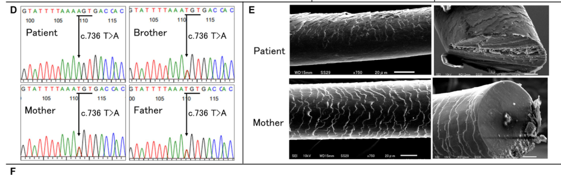

## Question

# Disease Characteristics Research Template

## Target Disease
- **Disease Name:** Isolated Woolly Hair
- **MONDO ID:**  (if available)
- **Category:** Mendelian

## Research Objectives

Please provide a comprehensive research report on **Isolated Woolly Hair** covering all of the
disease characteristics listed below. This report will be used to populate a disease knowledge
base entry. Be thorough and cite primary literature (PMID preferred) for all claims.

For each section, **suggested databases/resources** are listed. These are the first places
you should search for information on each topic.

---

### 1. Disease Information
> **Search first:** OMIM, Orphanet, ICD-10/ICD-11, MeSH, PubMed

- What is the disease? Provide a concise overview.
- What are the key identifiers? (OMIM, Orphanet, ICD-10/ICD-11, MeSH, Mondo)
- What are the common synonyms and alternative names?
- Is the information derived from individual patients (e.g., EHR) or aggregated disease-level resources?

### 2. Etiology

- **Disease Causal Factors**: What are the primary causes? (genetic, environmental, infectious, mechanistic)
- **Risk Factors**:
  > **Search first:** PubMed, Cochrane Library, UpToDate, clinical guidelines, ClinVar, ClinGen, GWAS Catalog, PheGenI, CTD, CDC, WHO, epidemiological databases
  - Genetic risk factors (causal variants, susceptibility loci, modifier genes)
  - Environmental risk factors (toxins, lifestyle, occupational exposures, age, sex, family history)
- **Protective Factors**:
  > **Search first:** PubMed, Cochrane Library, clinical trial databases, GWAS Catalog, gnomAD, WHO, CDC, nutrition databases
  - Genetic protective factors (protective variants, modifier alleles)
  - Environmental protective factors (diet, lifestyle, exposures that reduce risk)
- **Gene-Environment Interactions**: How do genetic and environmental factors interact to influence disease?
  > **Search first:** CTD, PubMed, PheGenI, GxE databases

### 3. Phenotypes
> **Search first:** HPO (Human Phenotype Ontology), OMIM, Orphanet, PubMed, clinicaltrials.gov, MedDRA, SNOMED CT, DECIPHER, LOINC

For each phenotype, provide:
- **Phenotype type**: symptoms, clinical signs, physical manifestations, behavioral changes, or laboratory abnormalities
  > For symptoms/signs: HPO, OMIM, Orphanet, PubMed
  > For behavioral changes: HPO, DSM, RDoC (Research Domain Criteria), PubMed
  > For laboratory abnormalities: LOINC, SNOMED CT, LabTests Online, PubMed
- **Phenotype characteristics**:
  > **Search first:** OMIM, Orphanet, HPO, PubMed
  - Age of symptom onset (neonatal, childhood, adult-onset, late-onset)
  - Symptom severity (mild, moderate, severe, variable)
  - Symptom progression (stable, progressive, episodic, fluctuating)
  - Frequency among affected individuals (percentage or qualitative)
- **Quality of life impact**: Effects on daily functioning and well-being (per-phenotype when possible)
  > **Search first:** EQ-5D database, SF-36, WHO QOL databases, PubMed
- Suggest HPO (Human Phenotype Ontology) terms for each phenotype

### 4. Genetic/Molecular Information

- **Causal Genes**: Gene mutations or chromosomal abnormalities responsible for disease (gene symbols, OMIM IDs)
  > **Search first:** OMIM, ClinVar, HGMD, Ensembl, NCBI Gene
- **Pathogenic Variants**:
  - Affected genes (gene symbols, HGNC IDs)
    > **Search first:** OMIM, NCBI Gene, Ensembl, HGNC, UniProt, GeneCards
  - Variant classification (pathogenic, likely pathogenic, VUS per ACMG/AMP guidelines)
    > **Search first:** ClinVar, ClinGen, ACMG/AMP guidelines, VarSome
  - Variant type/class (missense, frameshift, nonsense, splice-site, structural)
  - Allele frequency in population databases
    > **Search first:** gnomAD, 1000 Genomes, ExAC, TOPMed, dbSNP
  - Somatic vs germline origin
    > **Search first:** COSMIC (somatic), ClinVar, ICGC, TCGA
  - Functional consequences (loss of function, gain of function, dominant negative)
- **Modifier Genes**: Genes that modify disease severity or expression
- **Epigenetic Information**: DNA methylation, histone modifications, chromatin changes affecting disease
  > **Search first:** ENCODE, Roadmap Epigenomics, MethBase, DiseaseMeth
- **Chromosomal Abnormalities**: Large-scale genetic changes (aneuploidy, translocations, inversions)
  > **Search first:** DECIPHER, ClinVar, ECARUCA, UCSC Genome Browser

### 5. Environmental Information

- **Environmental Factors**: Non-genetic contributing factors (toxins, radiation, pollution, occupational exposure)
  > **Search first:** CTD (Comparative Toxicogenomics Database), TOXNET, PubMed, EPA databases
- **Lifestyle Factors**: Behavioral factors (smoking, diet, exercise, alcohol consumption)
  > **Search first:** CDC databases, WHO, PubMed, NHANES
- **Infectious Agents**: If applicable, pathogens causing or triggering disease (bacteria, viruses, fungi, parasites)
  > **Search first:** NCBI Taxonomy, ViPR, BV-BRC, MicrobeDB, GIDEON

### 6. Mechanism / Pathophysiology

- **Molecular Pathways**: Specific signaling cascades or biochemical pathways involved (Wnt, MAPK, mTOR, PI3K-AKT, etc.)
  > **Search first:** KEGG, Reactome, WikiPathways, PathBank, BioCyc
- **Cellular Processes**: Cell-level mechanisms (apoptosis, autophagy, cell cycle dysregulation, inflammation, etc.)
  > **Search first:** Gene Ontology (GO), Reactome, KEGG, PubMed
- **Protein Dysfunction**: How protein structure or function is altered (misfolding, aggregation, loss of function, gain of function)
  > **Search first:** UniProt, PDB (Protein Data Bank), InterPro, Pfam, AlphaFold
- **Metabolic Changes**: Alterations in metabolic processes (energy metabolism, lipid metabolism, amino acid metabolism)
  > **Search first:** KEGG, BioCyc, HMDB (Human Metabolome Database), BRENDA
- **Immune System Involvement**: Role of immune response (autoimmunity, immunodeficiency, chronic inflammation)
  > **Search first:** ImmPort, Immunome Database, IEDB, Gene Ontology
- **Tissue Damage Mechanisms**: How tissues/ are injured (oxidative stress, ischemia, fibrosis, necrosis)
  > **Search first:** PubMed, Gene Ontology, Reactome
- **Biochemical Abnormalities**: Specific molecular defects (enzyme deficiencies, receptor dysfunction, ion channel defects)
  > **Search first:** BRENDA, UniProt, KEGG, OMIM, PubMed
- **Epigenetic Changes**: DNA methylation, histone modifications affecting gene expression in disease
  > **Search first:** ENCODE, Roadmap Epigenomics, MethBase, DiseaseMeth
- **Molecular Profiling** (if available):
  - Transcriptomics/gene expression changes
    > **Search first:** GEO (Gene Expression Omnibus), ArrayExpress, GTEx, Human Cell Atlas, SRA
  - Proteomics findings
    > **Search first:** PRIDE, ProteomeXchange, Human Protein Atlas, STRING, BioGRID
  - Metabolomics signatures
    > **Search first:** MetaboLights, Metabolomics Workbench, HMDB, METLIN
  - Lipidomics alterations
    > **Search first:** LIPID MAPS, SwissLipids, LipidHome, Metabolomics Workbench
  - Genomic structural features
    > **Search first:** UCSC Genome Browser, Ensembl, NCBI, dbVar, DGV
- **Advanced Technologies** (if applicable):
  - Single-cell analysis findings (cell-type specific mechanisms, cellular heterogeneity)
    > **Search first:** Human Cell Atlas, Single Cell Portal, GEO, CELLxGENE
  - Spatial transcriptomics findings
    > **Search first:** GEO, Spatial Research, Vizgen, 10x Genomics data
  - Multi-omics integration results
    > **Search first:** TCGA, ICGC, cBioPortal, LinkedOmics, PubMed
  - Functional genomics screens (CRISPR, RNAi)
    > **Search first:** DepMap, GenomeRNAi, PubMed, BioGRID ORCS

For each mechanism, describe:
- The causal chain from initial trigger to clinical manifestation
- Which mechanisms are upstream vs downstream
- What cell types and biological processes are involved
- Suggest GO terms for biological processes and CL terms for cell types

### 7. Anatomical Structures Affected

- **Organ Level**:
  - Primary organs directly affected
  - Secondary organ involvement (complications, secondary effects)
  - Body systems involved (cardiovascular, nervous, digestive, respiratory, endocrine, etc.)
  > **Search first:** Uberon, FMA (Foundational Model of Anatomy), OMIM, HPO, ICD-11, MeSH, SNOMED CT
- **Tissue and Cell Level**:
  - Specific tissue types affected (epithelial, connective, muscle, nervous)
  - Specific cell populations targeted (with Cell Ontology terms)
  > **Search first:** Uberon, Human Protein Atlas, Cell Ontology, Human Cell Atlas, CellMarker, PanglaoDB
- **Subcellular Level**:
  - Cellular compartments involved (mitochondria, nucleus, ER, lysosomes) (with GO Cellular Component terms)
  > **Search first:** Gene Ontology (Cellular Component), UniProt, Human Protein Atlas
- **Localization**:
  - Specific anatomical sites (with UBERON terms)
    > **Search first:** FMA, Uberon, NeuroNames (for brain), SNOMED CT
  - Lateralization (unilateral, bilateral, asymmetric)
    > **Search first:** HPO, clinical literature, imaging databases

### 8. Temporal Development

- **Onset**:
  - Typical age of onset (congenital, pediatric, adult, geriatric)
  - Onset pattern (acute, subacute, chronic, insidious)
  > **Search first:** OMIM, Orphanet, HPO, PubMed
- **Progression**:
  - Disease stages (early, intermediate, advanced, end-stage)
    > **Search first:** Cancer Staging Manual (AJCC), WHO classifications, PubMed
  - Progression rate (rapid, slow, variable)
  - Disease course pattern (episodic, relapsing-remitting, progressive, stable)
  - Disease duration (self-limited, chronic lifelong)
  > **Search first:** Disease registries, longitudinal cohort databases, natural history studies, PubMed, Orphanet, OMIM
- **Patterns**:
  - Remission patterns (spontaneous, treatment-induced)
    > **Search first:** Clinical trial databases, disease registries, PubMed
  - Critical periods (time windows of vulnerability or opportunity for intervention)
    > **Search first:** PubMed, developmental biology databases, clinical guidelines

### 9. Inheritance and Population

- **Epidemiology**:
  - Prevalence (cases per 100,000 at given time)
  - Incidence (new cases per 100,000 per year)
  > **Search first:** Orphanet, CDC, WHO, GBD (Global Burden of Disease), national registries, SEER, disease registries
- **For Genetic Etiology**:
  - Inheritance pattern (AD, AR, X-linked, mitochondrial, multifactorial, polygenic)
    > **Search first:** OMIM, Orphanet, ClinVar, GTR (Genetic Testing Registry)
  - Penetrance (complete, incomplete, age-dependent)
    > **Search first:** ClinVar, OMIM, PubMed, ClinGen
  - Expressivity (variable, consistent)
    > **Search first:** OMIM, ClinVar, PubMed
  - Genetic anticipation (increasing severity in successive generations)
    > **Search first:** OMIM, PubMed (especially for repeat expansion disorders)
  - Germline mosaicism
    > **Search first:** ClinVar, OMIM, genetic counseling literature, PubMed
  - Founder effects (population-specific mutations)
    > **Search first:** gnomAD, population genetics databases, PubMed
  - Consanguinity role
    > **Search first:** OMIM, population studies, genetic counseling resources
  - Carrier frequency
    > **Search first:** gnomAD, carrier screening databases, GeneReviews, GTR
- **Population Demographics**:
  - Affected populations (ethnic or demographic groups with higher prevalence)
    > **Search first:** gnomAD, 1000 Genomes, PAGE Study, PubMed, population registries
  - Geographic distribution (endemic areas, regional variation)
    > **Search first:** WHO, CDC, GBD, Orphanet, geographic epidemiology databases
  - Geographic distribution of specific variants
  - Sex ratio (male:female)
    > **Search first:** Disease registries, OMIM, PubMed, epidemiological databases
  - Age distribution of affected individuals
    > **Search first:** CDC, disease registries, SEER, Orphanet

### 10. Diagnostics

- **Clinical Tests**:
  - Laboratory tests (blood, urine, tissue chemistry, specific enzyme assays)
    > **Search first:** LOINC, LabTests Online, PubMed
  - Biomarkers (proteins, metabolites, genetic markers, circulating biomarkers)
    > **Search first:** FDA Biomarker List, BEST (Biomarkers, EndpointS, and other Tools), PubMed
  - Imaging studies (X-ray, CT, MRI, PET, ultrasound)
    > **Search first:** RadLex, DICOM, Radiopaedia, imaging databases
  - Functional tests (pulmonary function, cardiac stress tests)
    > **Search first:** LOINC, clinical guidelines, PubMed
  - Electrophysiology (EEG, EMG, ECG, nerve conduction studies)
    > **Search first:** LOINC, clinical neurophysiology databases, PubMed
  - Biopsy findings (histopathology, immunohistochemistry)
    > **Search first:** SNOMED CT, College of American Pathologists resources, PubMed
  - Pathology findings (microscopic examination)
    > **Search first:** SNOMED CT, Digital Pathology databases, PubMed
- **Genetic Testing**:
  > **Search first:** GTR (Genetic Testing Registry), GeneReviews, ClinGen
  - Overview of recommended genetic testing approach
  - Whole genome sequencing (WGS) utility
    > **Search first:** GTR, ClinVar, GEL (Genomics England), gnomAD
  - Whole exome sequencing (WES) utility
    > **Search first:** GTR, ClinVar, OMIM, GeneMatcher
  - Gene panels (which panels, which genes)
    > **Search first:** GTR, ClinVar, laboratory-specific databases
  - Single gene testing
    > **Search first:** GTR, ClinVar, OMIM, GeneReviews
  - Chromosomal microarray (CMA)
    > **Search first:** DECIPHER, ClinVar, dbVar, ECARUCA
  - Karyotyping
    > **Search first:** Chromosome Abnormality Database, ClinVar, cytogenetics resources
  - FISH
    > **Search first:** ClinVar, cytogenetics databases, PubMed
  - Mitochondrial DNA testing
    > **Search first:** MITOMAP, MSeqDR, ClinVar, GTR
  - Repeat expansion testing
    > **Search first:** GTR, ClinVar, repeat expansion databases, PubMed
- **Omics-Based Diagnostics** (if applicable):
  - RNA sequencing / transcriptomics
    > **Search first:** GEO, ArrayExpress, GTEx, RNA-seq databases
  - Proteomics
    > **Search first:** PRIDE, ProteomeXchange, FDA Biomarker database
  - Metabolomics
    > **Search first:** MetaboLights, Metabolomics Workbench, HMDB
  - Epigenomics
    > **Search first:** GEO, ENCODE, Roadmap Epigenomics, MethBase
  - Liquid biopsy
    > **Search first:** COSMIC, ClinVar, liquid biopsy databases, PubMed
- **Clinical Criteria**:
  - Standardized diagnostic criteria (DSM, ICD, society guidelines)
    > **Search first:** DSM-5, ICD-11, clinical society guidelines, UpToDate
  - Differential diagnosis (other conditions to rule out, with distinguishing features)
    > **Search first:** DynaMed, UpToDate, clinical decision support systems
- **Screening**:
  - Screening methods for asymptomatic individuals (newborn screening, carrier screening, cascade screening)
    > **Search first:** ACMG recommendations, CDC newborn screening, GTR

### 11. Outcome/Prognosis

- **Survival and Mortality**:
  - Survival rate (5-year, 10-year, overall)
    > **Search first:** SEER, cancer registries, disease-specific registries, PubMed
  - Life expectancy (with and without treatment if applicable)
    > **Search first:** Orphanet, disease registries, actuarial databases, PubMed
  - Mortality rate
    > **Search first:** CDC, WHO, GBD, national mortality databases
  - Disease-specific mortality (deaths directly attributable to disease)
    > **Search first:** Disease registries, CDC Wonder, GBD, PubMed
- **Morbidity and Function**:
  - Morbidity (disease-related disability and health impacts)
    > **Search first:** GBD, WHO, disability databases, PubMed
  - Disability outcomes (long-term functional impairments)
    > **Search first:** ICF (International Classification of Functioning), disability registries
  - Quality of life measures (EQ-5D, SF-36, PROMIS, disease-specific tools)
    > **Search first:** EQ-5D database, SF-36, PROMIS, PubMed
- **Disease Course**:
  - Complications (secondary problems: infections, organ failure, etc.)
    > **Search first:** ICD codes, disease registries, clinical databases, PubMed
  - Recovery potential (likelihood and extent of recovery, with vs without treatment)
    > **Search first:** Natural history studies, rehabilitation databases, PubMed
- **Prediction**:
  - Prognostic factors (age, disease severity, biomarkers, treatment response)
    > **Search first:** Prognostic models databases, clinical calculators, PubMed
  - Prognostic biomarkers (molecular markers predicting disease course)
    > **Search first:** FDA Biomarker database, PubMed, cancer prognostic databases

### 12. Treatment

- **Pharmacotherapy**:
  - Pharmacological treatments (drug names, drug classes, mechanisms of action)
    > **Search first:** DrugBank, RxNorm, ATC classification, DailyMed, FDA databases
  - Pharmacogenomics (how genetic variants affect drug metabolism, efficacy, toxicity)
    > **Search first:** PharmGKB, CPIC (Clinical Pharmacogenetics), FDA Table of PGx Biomarkers
- **Advanced Therapeutics**:
  - Gene therapy (viral vectors, CRISPR, gene replacement, gene editing)
    > **Search first:** ClinicalTrials.gov, FDA gene therapy database, ASGCT resources
  - Cell therapy (stem cell transplant, CAR-T, cellular therapeutics)
    > **Search first:** ClinicalTrials.gov, FDA cell therapy database, FACT standards
  - RNA-based therapies (ASOs, siRNA, mRNA therapies)
    > **Search first:** ClinicalTrials.gov, FDA approvals, PubMed
  - Targeted therapies (treatments directed at specific molecular targets)
    > **Search first:** My Cancer Genome, OncoKB, ClinicalTrials.gov, FDA approvals
  - Immunotherapies (checkpoint inhibitors, monoclonal antibodies)
    > **Search first:** Cancer Immunotherapy Database, FDA approvals, ClinicalTrials.gov
- **Surgical and Interventional**:
  - Surgical interventions (types of surgery, timing, outcomes)
    > **Search first:** CPT codes, surgical registries, clinical guidelines, PubMed
- **Supportive and Rehabilitative**:
  - Supportive care (symptom management, pain control, nutrition)
    > **Search first:** Clinical guidelines, Cochrane Library, PubMed
  - Rehabilitation (physical therapy, occupational therapy, speech therapy)
    > **Search first:** Rehabilitation medicine databases, clinical guidelines, PubMed
- **Experimental**:
  - Experimental treatments in clinical trials (with NCT identifiers if available)
    > **Search first:** ClinicalTrials.gov, EU Clinical Trials Register, WHO ICTRP
- **Treatment Outcomes**:
  - Treatment response rates
    > **Search first:** Clinical trial databases, FDA reviews, systematic reviews, PubMed
  - Side effects and adverse events
    > **Search first:** FDA Adverse Event Reporting System (FAERS), MedWatch, PubMed
- **Treatment Strategy**:
  - Treatment algorithms (clinical pathways, decision trees)
    > **Search first:** Clinical practice guidelines, NCCN Guidelines, UpToDate
  - Combination therapies
    > **Search first:** ClinicalTrials.gov, treatment guidelines, PubMed
  - Personalized medicine approaches (genotype-guided treatment)
    > **Search first:** My Cancer Genome, CIViC, PharmGKB, precision medicine databases

For each treatment, suggest MAXO (Medical Action Ontology) terms where applicable.

### 13. Prevention

- **Prevention Levels**:
  - Primary prevention (preventing disease occurrence: vaccination, risk factor modification)
    > **Search first:** CDC, WHO, USPSTF recommendations, Cochrane Library
  - Secondary prevention (early detection and treatment: screening programs, early intervention)
    > **Search first:** USPSTF, CDC screening guidelines, WHO
  - Tertiary prevention (preventing complications in those with disease)
    > **Search first:** Clinical guidelines, disease management protocols, PubMed
- **Immunization**: Vaccine strategies (if applicable)
  > **Search first:** CDC vaccine schedules, WHO immunization, FDA vaccine database
- **Screening and Early Detection**:
  - Screening programs (population-based: newborn screening, cancer screening)
    > **Search first:** CDC screening programs, USPSTF, cancer screening databases
  - Genetic screening (carrier screening, preimplantation genetic diagnosis, prenatal testing)
    > **Search first:** ACMG recommendations, ACOG guidelines, GTR
  - Risk stratification (identifying high-risk individuals for targeted prevention)
    > **Search first:** Risk prediction models, clinical calculators, PubMed
- **Behavioral Interventions**: Lifestyle modifications to reduce risk
  > **Search first:** CDC, WHO, behavioral intervention databases, Cochrane Library
- **Counseling**: Genetic counseling (risk assessment, family planning guidance)
  > **Search first:** NSGC resources, ACMG guidelines, GeneReviews
- **Public Health**:
  - Public health interventions (sanitation, vector control, health education)
    > **Search first:** CDC, WHO, public health databases, PubMed
  - Environmental interventions (reducing environmental risk factors)
    > **Search first:** EPA databases, WHO environmental health, PubMed
- **Prophylaxis**: Preventive medications or procedures
  > **Search first:** Clinical guidelines, FDA approvals, PubMed

### 14. Other Species / Natural Disease

- **Taxonomy**: Species affected (with NCBI Taxon identifiers)
  > **Search first:** NCBI Taxonomy
- **Breed**: Specific breeds affected (with VBO identifiers if applicable)
  > **Search first:** VBO (Vertebrate Breed Ontology)
- **Gene**: Orthologous genes in other species (with NCBI Gene IDs)
  > **Search first:** NCBI Gene
- **Natural Disease**:
  - Naturally occurring disease in other species (companion animals, wildlife)
    > **Search first:** OMIA (Online Mendelian Inheritance in Animals), VetCompass, PubMed
  - Veterinary relevance and importance in animal health
    > **Search first:** OMIA, veterinary databases, PubMed
- **Comparative Biology**:
  - Comparative pathology (similarities and differences across species)
    > **Search first:** OMIA, comparative pathology databases, PubMed
  - Evolutionary conservation of disease mechanisms
    > **Search first:** HomoloGene, OrthoMCL, Alliance of Genome Resources
- **Transmission** (if applicable):
  - Zoonotic potential
    > **Search first:** CDC zoonotic diseases, WHO zoonoses, GIDEON
  - Cross-species susceptibility
    > **Search first:** NCBI Taxonomy, veterinary databases, PubMed

### 15. Model Organisms

- **Model Types**:
  - Model organism type (mammalian, invertebrate, cellular, in vitro)
    > **Search first:** Alliance of Genome Resources, model organism databases
  - Specific model systems (mouse, rat, zebrafish, Drosophila, C. elegans, yeast, cell lines, organoids, iPSCs)
    > **Search first:** MGI, RGD, ZFIN, FlyBase, WormBase, SGD, ATCC, Cellosaurus
  - Induced models (drug treatment, surgical intervention, environmental manipulation)
    > **Search first:** MGI, model organism databases, PubMed
- **Genetic Models**:
  - Types available (knockout, knock-in, transgenic, conditional, humanized)
    > **Search first:** MGI, IMPC, KOMP, EuMMCR, IMSR
- **Model Characteristics**:
  - Phenotype recapitulation (how well model reproduces human disease features)
    > **Search first:** Model organism databases, comparative studies, PubMed
  - Model limitations (aspects of human disease not captured)
    > **Search first:** Model organism databases, PubMed, review articles
- **Applications**:
  - Research applications (what aspects of disease can be studied)
    > **Search first:** Model organism databases, PubMed
- **Resources**:
  - Model databases
    > **Search first:** MGI, RGD, ZFIN, FlyBase, WormBase, IMSR, EMMA, MMRRC

---

## Citation Requirements

- Cite primary literature (PMID preferred) for all mechanistic and clinical claims
- Prioritize recent reviews and landmark papers
- Include direct quotes from abstracts where possible to support key statements
- Distinguish evidence source types: human clinical, model organism, in vitro, computational

## Output Format

Structure your response as a comprehensive narrative organized by the sections above.
For each section, provide:
- Factual content with specific details (numbers, percentages, gene names, variant nomenclature)
- Ontology term suggestions (HPO, GO, CL, UBERON, CHEBI, MAXO, MONDO) where applicable
- Evidence citations with PMIDs
- Direct quotes from abstracts to support key claims
- Clear indication when information is not available or not applicable for this disease

This report will be used to populate a disease knowledge base entry with:
- Pathophysiology descriptions with causal chains
- Gene/protein annotations (HGNC, GO terms)
- Phenotype associations (HP terms) with frequencies
- Cell type involvement (CL terms)
- Anatomical locations (UBERON terms)
- Chemical entities (CHEBI terms)
- Treatment annotations (MAXO terms)
- Evidence items with PMIDs and exact abstract quotes
- Epidemiology, prognosis, diagnostic, and prevention information
- Animal model descriptions with phenotype recapitulation details

## Output

Question: You are an expert researcher providing comprehensive, well-cited information.

Provide detailed information focusing on:
1. Key concepts and definitions with current understanding
2. Recent developments and latest research (prioritize 2023-2024 sources)
3. Current applications and real-world implementations
4. Expert opinions and analysis from authoritative sources
5. Relevant statistics and data from recent studies

Format as a comprehensive research report with proper citations. Include URLs and publication dates where available.
Always prioritize recent, authoritative sources and provide specific citations for all major claims.

# Disease Characteristics Research Template

## Target Disease
- **Disease Name:** Isolated Woolly Hair
- **MONDO ID:**  (if available)
- **Category:** Mendelian

## Research Objectives

Please provide a comprehensive research report on **Isolated Woolly Hair** covering all of the
disease characteristics listed below. This report will be used to populate a disease knowledge
base entry. Be thorough and cite primary literature (PMID preferred) for all claims.

For each section, **suggested databases/resources** are listed. These are the first places
you should search for information on each topic.

---

### 1. Disease Information
> **Search first:** OMIM, Orphanet, ICD-10/ICD-11, MeSH, PubMed

- What is the disease? Provide a concise overview.
- What are the key identifiers? (OMIM, Orphanet, ICD-10/ICD-11, MeSH, Mondo)
- What are the common synonyms and alternative names?
- Is the information derived from individual patients (e.g., EHR) or aggregated disease-level resources?

### 2. Etiology

- **Disease Causal Factors**: What are the primary causes? (genetic, environmental, infectious, mechanistic)
- **Risk Factors**:
  > **Search first:** PubMed, Cochrane Library, UpToDate, clinical guidelines, ClinVar, ClinGen, GWAS Catalog, PheGenI, CTD, CDC, WHO, epidemiological databases
  - Genetic risk factors (causal variants, susceptibility loci, modifier genes)
  - Environmental risk factors (toxins, lifestyle, occupational exposures, age, sex, family history)
- **Protective Factors**:
  > **Search first:** PubMed, Cochrane Library, clinical trial databases, GWAS Catalog, gnomAD, WHO, CDC, nutrition databases
  - Genetic protective factors (protective variants, modifier alleles)
  - Environmental protective factors (diet, lifestyle, exposures that reduce risk)
- **Gene-Environment Interactions**: How do genetic and environmental factors interact to influence disease?
  > **Search first:** CTD, PubMed, PheGenI, GxE databases

### 3. Phenotypes
> **Search first:** HPO (Human Phenotype Ontology), OMIM, Orphanet, PubMed, clinicaltrials.gov, MedDRA, SNOMED CT, DECIPHER, LOINC

For each phenotype, provide:
- **Phenotype type**: symptoms, clinical signs, physical manifestations, behavioral changes, or laboratory abnormalities
  > For symptoms/signs: HPO, OMIM, Orphanet, PubMed
  > For behavioral changes: HPO, DSM, RDoC (Research Domain Criteria), PubMed
  > For laboratory abnormalities: LOINC, SNOMED CT, LabTests Online, PubMed
- **Phenotype characteristics**:
  > **Search first:** OMIM, Orphanet, HPO, PubMed
  - Age of symptom onset (neonatal, childhood, adult-onset, late-onset)
  - Symptom severity (mild, moderate, severe, variable)
  - Symptom progression (stable, progressive, episodic, fluctuating)
  - Frequency among affected individuals (percentage or qualitative)
- **Quality of life impact**: Effects on daily functioning and well-being (per-phenotype when possible)
  > **Search first:** EQ-5D database, SF-36, WHO QOL databases, PubMed
- Suggest HPO (Human Phenotype Ontology) terms for each phenotype

### 4. Genetic/Molecular Information

- **Causal Genes**: Gene mutations or chromosomal abnormalities responsible for disease (gene symbols, OMIM IDs)
  > **Search first:** OMIM, ClinVar, HGMD, Ensembl, NCBI Gene
- **Pathogenic Variants**:
  - Affected genes (gene symbols, HGNC IDs)
    > **Search first:** OMIM, NCBI Gene, Ensembl, HGNC, UniProt, GeneCards
  - Variant classification (pathogenic, likely pathogenic, VUS per ACMG/AMP guidelines)
    > **Search first:** ClinVar, ClinGen, ACMG/AMP guidelines, VarSome
  - Variant type/class (missense, frameshift, nonsense, splice-site, structural)
  - Allele frequency in population databases
    > **Search first:** gnomAD, 1000 Genomes, ExAC, TOPMed, dbSNP
  - Somatic vs germline origin
    > **Search first:** COSMIC (somatic), ClinVar, ICGC, TCGA
  - Functional consequences (loss of function, gain of function, dominant negative)
- **Modifier Genes**: Genes that modify disease severity or expression
- **Epigenetic Information**: DNA methylation, histone modifications, chromatin changes affecting disease
  > **Search first:** ENCODE, Roadmap Epigenomics, MethBase, DiseaseMeth
- **Chromosomal Abnormalities**: Large-scale genetic changes (aneuploidy, translocations, inversions)
  > **Search first:** DECIPHER, ClinVar, ECARUCA, UCSC Genome Browser

### 5. Environmental Information

- **Environmental Factors**: Non-genetic contributing factors (toxins, radiation, pollution, occupational exposure)
  > **Search first:** CTD (Comparative Toxicogenomics Database), TOXNET, PubMed, EPA databases
- **Lifestyle Factors**: Behavioral factors (smoking, diet, exercise, alcohol consumption)
  > **Search first:** CDC databases, WHO, PubMed, NHANES
- **Infectious Agents**: If applicable, pathogens causing or triggering disease (bacteria, viruses, fungi, parasites)
  > **Search first:** NCBI Taxonomy, ViPR, BV-BRC, MicrobeDB, GIDEON

### 6. Mechanism / Pathophysiology

- **Molecular Pathways**: Specific signaling cascades or biochemical pathways involved (Wnt, MAPK, mTOR, PI3K-AKT, etc.)
  > **Search first:** KEGG, Reactome, WikiPathways, PathBank, BioCyc
- **Cellular Processes**: Cell-level mechanisms (apoptosis, autophagy, cell cycle dysregulation, inflammation, etc.)
  > **Search first:** Gene Ontology (GO), Reactome, KEGG, PubMed
- **Protein Dysfunction**: How protein structure or function is altered (misfolding, aggregation, loss of function, gain of function)
  > **Search first:** UniProt, PDB (Protein Data Bank), InterPro, Pfam, AlphaFold
- **Metabolic Changes**: Alterations in metabolic processes (energy metabolism, lipid metabolism, amino acid metabolism)
  > **Search first:** KEGG, BioCyc, HMDB (Human Metabolome Database), BRENDA
- **Immune System Involvement**: Role of immune response (autoimmunity, immunodeficiency, chronic inflammation)
  > **Search first:** ImmPort, Immunome Database, IEDB, Gene Ontology
- **Tissue Damage Mechanisms**: How tissues/ are injured (oxidative stress, ischemia, fibrosis, necrosis)
  > **Search first:** PubMed, Gene Ontology, Reactome
- **Biochemical Abnormalities**: Specific molecular defects (enzyme deficiencies, receptor dysfunction, ion channel defects)
  > **Search first:** BRENDA, UniProt, KEGG, OMIM, PubMed
- **Epigenetic Changes**: DNA methylation, histone modifications affecting gene expression in disease
  > **Search first:** ENCODE, Roadmap Epigenomics, MethBase, DiseaseMeth
- **Molecular Profiling** (if available):
  - Transcriptomics/gene expression changes
    > **Search first:** GEO (Gene Expression Omnibus), ArrayExpress, GTEx, Human Cell Atlas, SRA
  - Proteomics findings
    > **Search first:** PRIDE, ProteomeXchange, Human Protein Atlas, STRING, BioGRID
  - Metabolomics signatures
    > **Search first:** MetaboLights, Metabolomics Workbench, HMDB, METLIN
  - Lipidomics alterations
    > **Search first:** LIPID MAPS, SwissLipids, LipidHome, Metabolomics Workbench
  - Genomic structural features
    > **Search first:** UCSC Genome Browser, Ensembl, NCBI, dbVar, DGV
- **Advanced Technologies** (if applicable):
  - Single-cell analysis findings (cell-type specific mechanisms, cellular heterogeneity)
    > **Search first:** Human Cell Atlas, Single Cell Portal, GEO, CELLxGENE
  - Spatial transcriptomics findings
    > **Search first:** GEO, Spatial Research, Vizgen, 10x Genomics data
  - Multi-omics integration results
    > **Search first:** TCGA, ICGC, cBioPortal, LinkedOmics, PubMed
  - Functional genomics screens (CRISPR, RNAi)
    > **Search first:** DepMap, GenomeRNAi, PubMed, BioGRID ORCS

For each mechanism, describe:
- The causal chain from initial trigger to clinical manifestation
- Which mechanisms are upstream vs downstream
- What cell types and biological processes are involved
- Suggest GO terms for biological processes and CL terms for cell types

### 7. Anatomical Structures Affected

- **Organ Level**:
  - Primary organs directly affected
  - Secondary organ involvement (complications, secondary effects)
  - Body systems involved (cardiovascular, nervous, digestive, respiratory, endocrine, etc.)
  > **Search first:** Uberon, FMA (Foundational Model of Anatomy), OMIM, HPO, ICD-11, MeSH, SNOMED CT
- **Tissue and Cell Level**:
  - Specific tissue types affected (epithelial, connective, muscle, nervous)
  - Specific cell populations targeted (with Cell Ontology terms)
  > **Search first:** Uberon, Human Protein Atlas, Cell Ontology, Human Cell Atlas, CellMarker, PanglaoDB
- **Subcellular Level**:
  - Cellular compartments involved (mitochondria, nucleus, ER, lysosomes) (with GO Cellular Component terms)
  > **Search first:** Gene Ontology (Cellular Component), UniProt, Human Protein Atlas
- **Localization**:
  - Specific anatomical sites (with UBERON terms)
    > **Search first:** FMA, Uberon, NeuroNames (for brain), SNOMED CT
  - Lateralization (unilateral, bilateral, asymmetric)
    > **Search first:** HPO, clinical literature, imaging databases

### 8. Temporal Development

- **Onset**:
  - Typical age of onset (congenital, pediatric, adult, geriatric)
  - Onset pattern (acute, subacute, chronic, insidious)
  > **Search first:** OMIM, Orphanet, HPO, PubMed
- **Progression**:
  - Disease stages (early, intermediate, advanced, end-stage)
    > **Search first:** Cancer Staging Manual (AJCC), WHO classifications, PubMed
  - Progression rate (rapid, slow, variable)
  - Disease course pattern (episodic, relapsing-remitting, progressive, stable)
  - Disease duration (self-limited, chronic lifelong)
  > **Search first:** Disease registries, longitudinal cohort databases, natural history studies, PubMed, Orphanet, OMIM
- **Patterns**:
  - Remission patterns (spontaneous, treatment-induced)
    > **Search first:** Clinical trial databases, disease registries, PubMed
  - Critical periods (time windows of vulnerability or opportunity for intervention)
    > **Search first:** PubMed, developmental biology databases, clinical guidelines

### 9. Inheritance and Population

- **Epidemiology**:
  - Prevalence (cases per 100,000 at given time)
  - Incidence (new cases per 100,000 per year)
  > **Search first:** Orphanet, CDC, WHO, GBD (Global Burden of Disease), national registries, SEER, disease registries
- **For Genetic Etiology**:
  - Inheritance pattern (AD, AR, X-linked, mitochondrial, multifactorial, polygenic)
    > **Search first:** OMIM, Orphanet, ClinVar, GTR (Genetic Testing Registry)
  - Penetrance (complete, incomplete, age-dependent)
    > **Search first:** ClinVar, OMIM, PubMed, ClinGen
  - Expressivity (variable, consistent)
    > **Search first:** OMIM, ClinVar, PubMed
  - Genetic anticipation (increasing severity in successive generations)
    > **Search first:** OMIM, PubMed (especially for repeat expansion disorders)
  - Germline mosaicism
    > **Search first:** ClinVar, OMIM, genetic counseling literature, PubMed
  - Founder effects (population-specific mutations)
    > **Search first:** gnomAD, population genetics databases, PubMed
  - Consanguinity role
    > **Search first:** OMIM, population studies, genetic counseling resources
  - Carrier frequency
    > **Search first:** gnomAD, carrier screening databases, GeneReviews, GTR
- **Population Demographics**:
  - Affected populations (ethnic or demographic groups with higher prevalence)
    > **Search first:** gnomAD, 1000 Genomes, PAGE Study, PubMed, population registries
  - Geographic distribution (endemic areas, regional variation)
    > **Search first:** WHO, CDC, GBD, Orphanet, geographic epidemiology databases
  - Geographic distribution of specific variants
  - Sex ratio (male:female)
    > **Search first:** Disease registries, OMIM, PubMed, epidemiological databases
  - Age distribution of affected individuals
    > **Search first:** CDC, disease registries, SEER, Orphanet

### 10. Diagnostics

- **Clinical Tests**:
  - Laboratory tests (blood, urine, tissue chemistry, specific enzyme assays)
    > **Search first:** LOINC, LabTests Online, PubMed
  - Biomarkers (proteins, metabolites, genetic markers, circulating biomarkers)
    > **Search first:** FDA Biomarker List, BEST (Biomarkers, EndpointS, and other Tools), PubMed
  - Imaging studies (X-ray, CT, MRI, PET, ultrasound)
    > **Search first:** RadLex, DICOM, Radiopaedia, imaging databases
  - Functional tests (pulmonary function, cardiac stress tests)
    > **Search first:** LOINC, clinical guidelines, PubMed
  - Electrophysiology (EEG, EMG, ECG, nerve conduction studies)
    > **Search first:** LOINC, clinical neurophysiology databases, PubMed
  - Biopsy findings (histopathology, immunohistochemistry)
    > **Search first:** SNOMED CT, College of American Pathologists resources, PubMed
  - Pathology findings (microscopic examination)
    > **Search first:** SNOMED CT, Digital Pathology databases, PubMed
- **Genetic Testing**:
  > **Search first:** GTR (Genetic Testing Registry), GeneReviews, ClinGen
  - Overview of recommended genetic testing approach
  - Whole genome sequencing (WGS) utility
    > **Search first:** GTR, ClinVar, GEL (Genomics England), gnomAD
  - Whole exome sequencing (WES) utility
    > **Search first:** GTR, ClinVar, OMIM, GeneMatcher
  - Gene panels (which panels, which genes)
    > **Search first:** GTR, ClinVar, laboratory-specific databases
  - Single gene testing
    > **Search first:** GTR, ClinVar, OMIM, GeneReviews
  - Chromosomal microarray (CMA)
    > **Search first:** DECIPHER, ClinVar, dbVar, ECARUCA
  - Karyotyping
    > **Search first:** Chromosome Abnormality Database, ClinVar, cytogenetics resources
  - FISH
    > **Search first:** ClinVar, cytogenetics databases, PubMed
  - Mitochondrial DNA testing
    > **Search first:** MITOMAP, MSeqDR, ClinVar, GTR
  - Repeat expansion testing
    > **Search first:** GTR, ClinVar, repeat expansion databases, PubMed
- **Omics-Based Diagnostics** (if applicable):
  - RNA sequencing / transcriptomics
    > **Search first:** GEO, ArrayExpress, GTEx, RNA-seq databases
  - Proteomics
    > **Search first:** PRIDE, ProteomeXchange, FDA Biomarker database
  - Metabolomics
    > **Search first:** MetaboLights, Metabolomics Workbench, HMDB
  - Epigenomics
    > **Search first:** GEO, ENCODE, Roadmap Epigenomics, MethBase
  - Liquid biopsy
    > **Search first:** COSMIC, ClinVar, liquid biopsy databases, PubMed
- **Clinical Criteria**:
  - Standardized diagnostic criteria (DSM, ICD, society guidelines)
    > **Search first:** DSM-5, ICD-11, clinical society guidelines, UpToDate
  - Differential diagnosis (other conditions to rule out, with distinguishing features)
    > **Search first:** DynaMed, UpToDate, clinical decision support systems
- **Screening**:
  - Screening methods for asymptomatic individuals (newborn screening, carrier screening, cascade screening)
    > **Search first:** ACMG recommendations, CDC newborn screening, GTR

### 11. Outcome/Prognosis

- **Survival and Mortality**:
  - Survival rate (5-year, 10-year, overall)
    > **Search first:** SEER, cancer registries, disease-specific registries, PubMed
  - Life expectancy (with and without treatment if applicable)
    > **Search first:** Orphanet, disease registries, actuarial databases, PubMed
  - Mortality rate
    > **Search first:** CDC, WHO, GBD, national mortality databases
  - Disease-specific mortality (deaths directly attributable to disease)
    > **Search first:** Disease registries, CDC Wonder, GBD, PubMed
- **Morbidity and Function**:
  - Morbidity (disease-related disability and health impacts)
    > **Search first:** GBD, WHO, disability databases, PubMed
  - Disability outcomes (long-term functional impairments)
    > **Search first:** ICF (International Classification of Functioning), disability registries
  - Quality of life measures (EQ-5D, SF-36, PROMIS, disease-specific tools)
    > **Search first:** EQ-5D database, SF-36, PROMIS, PubMed
- **Disease Course**:
  - Complications (secondary problems: infections, organ failure, etc.)
    > **Search first:** ICD codes, disease registries, clinical databases, PubMed
  - Recovery potential (likelihood and extent of recovery, with vs without treatment)
    > **Search first:** Natural history studies, rehabilitation databases, PubMed
- **Prediction**:
  - Prognostic factors (age, disease severity, biomarkers, treatment response)
    > **Search first:** Prognostic models databases, clinical calculators, PubMed
  - Prognostic biomarkers (molecular markers predicting disease course)
    > **Search first:** FDA Biomarker database, PubMed, cancer prognostic databases

### 12. Treatment

- **Pharmacotherapy**:
  - Pharmacological treatments (drug names, drug classes, mechanisms of action)
    > **Search first:** DrugBank, RxNorm, ATC classification, DailyMed, FDA databases
  - Pharmacogenomics (how genetic variants affect drug metabolism, efficacy, toxicity)
    > **Search first:** PharmGKB, CPIC (Clinical Pharmacogenetics), FDA Table of PGx Biomarkers
- **Advanced Therapeutics**:
  - Gene therapy (viral vectors, CRISPR, gene replacement, gene editing)
    > **Search first:** ClinicalTrials.gov, FDA gene therapy database, ASGCT resources
  - Cell therapy (stem cell transplant, CAR-T, cellular therapeutics)
    > **Search first:** ClinicalTrials.gov, FDA cell therapy database, FACT standards
  - RNA-based therapies (ASOs, siRNA, mRNA therapies)
    > **Search first:** ClinicalTrials.gov, FDA approvals, PubMed
  - Targeted therapies (treatments directed at specific molecular targets)
    > **Search first:** My Cancer Genome, OncoKB, ClinicalTrials.gov, FDA approvals
  - Immunotherapies (checkpoint inhibitors, monoclonal antibodies)
    > **Search first:** Cancer Immunotherapy Database, FDA approvals, ClinicalTrials.gov
- **Surgical and Interventional**:
  - Surgical interventions (types of surgery, timing, outcomes)
    > **Search first:** CPT codes, surgical registries, clinical guidelines, PubMed
- **Supportive and Rehabilitative**:
  - Supportive care (symptom management, pain control, nutrition)
    > **Search first:** Clinical guidelines, Cochrane Library, PubMed
  - Rehabilitation (physical therapy, occupational therapy, speech therapy)
    > **Search first:** Rehabilitation medicine databases, clinical guidelines, PubMed
- **Experimental**:
  - Experimental treatments in clinical trials (with NCT identifiers if available)
    > **Search first:** ClinicalTrials.gov, EU Clinical Trials Register, WHO ICTRP
- **Treatment Outcomes**:
  - Treatment response rates
    > **Search first:** Clinical trial databases, FDA reviews, systematic reviews, PubMed
  - Side effects and adverse events
    > **Search first:** FDA Adverse Event Reporting System (FAERS), MedWatch, PubMed
- **Treatment Strategy**:
  - Treatment algorithms (clinical pathways, decision trees)
    > **Search first:** Clinical practice guidelines, NCCN Guidelines, UpToDate
  - Combination therapies
    > **Search first:** ClinicalTrials.gov, treatment guidelines, PubMed
  - Personalized medicine approaches (genotype-guided treatment)
    > **Search first:** My Cancer Genome, CIViC, PharmGKB, precision medicine databases

For each treatment, suggest MAXO (Medical Action Ontology) terms where applicable.

### 13. Prevention

- **Prevention Levels**:
  - Primary prevention (preventing disease occurrence: vaccination, risk factor modification)
    > **Search first:** CDC, WHO, USPSTF recommendations, Cochrane Library
  - Secondary prevention (early detection and treatment: screening programs, early intervention)
    > **Search first:** USPSTF, CDC screening guidelines, WHO
  - Tertiary prevention (preventing complications in those with disease)
    > **Search first:** Clinical guidelines, disease management protocols, PubMed
- **Immunization**: Vaccine strategies (if applicable)
  > **Search first:** CDC vaccine schedules, WHO immunization, FDA vaccine database
- **Screening and Early Detection**:
  - Screening programs (population-based: newborn screening, cancer screening)
    > **Search first:** CDC screening programs, USPSTF, cancer screening databases
  - Genetic screening (carrier screening, preimplantation genetic diagnosis, prenatal testing)
    > **Search first:** ACMG recommendations, ACOG guidelines, GTR
  - Risk stratification (identifying high-risk individuals for targeted prevention)
    > **Search first:** Risk prediction models, clinical calculators, PubMed
- **Behavioral Interventions**: Lifestyle modifications to reduce risk
  > **Search first:** CDC, WHO, behavioral intervention databases, Cochrane Library
- **Counseling**: Genetic counseling (risk assessment, family planning guidance)
  > **Search first:** NSGC resources, ACMG guidelines, GeneReviews
- **Public Health**:
  - Public health interventions (sanitation, vector control, health education)
    > **Search first:** CDC, WHO, public health databases, PubMed
  - Environmental interventions (reducing environmental risk factors)
    > **Search first:** EPA databases, WHO environmental health, PubMed
- **Prophylaxis**: Preventive medications or procedures
  > **Search first:** Clinical guidelines, FDA approvals, PubMed

### 14. Other Species / Natural Disease

- **Taxonomy**: Species affected (with NCBI Taxon identifiers)
  > **Search first:** NCBI Taxonomy
- **Breed**: Specific breeds affected (with VBO identifiers if applicable)
  > **Search first:** VBO (Vertebrate Breed Ontology)
- **Gene**: Orthologous genes in other species (with NCBI Gene IDs)
  > **Search first:** NCBI Gene
- **Natural Disease**:
  - Naturally occurring disease in other species (companion animals, wildlife)
    > **Search first:** OMIA (Online Mendelian Inheritance in Animals), VetCompass, PubMed
  - Veterinary relevance and importance in animal health
    > **Search first:** OMIA, veterinary databases, PubMed
- **Comparative Biology**:
  - Comparative pathology (similarities and differences across species)
    > **Search first:** OMIA, comparative pathology databases, PubMed
  - Evolutionary conservation of disease mechanisms
    > **Search first:** HomoloGene, OrthoMCL, Alliance of Genome Resources
- **Transmission** (if applicable):
  - Zoonotic potential
    > **Search first:** CDC zoonotic diseases, WHO zoonoses, GIDEON
  - Cross-species susceptibility
    > **Search first:** NCBI Taxonomy, veterinary databases, PubMed

### 15. Model Organisms

- **Model Types**:
  - Model organism type (mammalian, invertebrate, cellular, in vitro)
    > **Search first:** Alliance of Genome Resources, model organism databases
  - Specific model systems (mouse, rat, zebrafish, Drosophila, C. elegans, yeast, cell lines, organoids, iPSCs)
    > **Search first:** MGI, RGD, ZFIN, FlyBase, WormBase, SGD, ATCC, Cellosaurus
  - Induced models (drug treatment, surgical intervention, environmental manipulation)
    > **Search first:** MGI, model organism databases, PubMed
- **Genetic Models**:
  - Types available (knockout, knock-in, transgenic, conditional, humanized)
    > **Search first:** MGI, IMPC, KOMP, EuMMCR, IMSR
- **Model Characteristics**:
  - Phenotype recapitulation (how well model reproduces human disease features)
    > **Search first:** Model organism databases, comparative studies, PubMed
  - Model limitations (aspects of human disease not captured)
    > **Search first:** Model organism databases, PubMed, review articles
- **Applications**:
  - Research applications (what aspects of disease can be studied)
    > **Search first:** Model organism databases, PubMed
- **Resources**:
  - Model databases
    > **Search first:** MGI, RGD, ZFIN, FlyBase, WormBase, IMSR, EMMA, MMRRC

---

## Citation Requirements

- Cite primary literature (PMID preferred) for all mechanistic and clinical claims
- Prioritize recent reviews and landmark papers
- Include direct quotes from abstracts where possible to support key statements
- Distinguish evidence source types: human clinical, model organism, in vitro, computational

## Output Format

Structure your response as a comprehensive narrative organized by the sections above.
For each section, provide:
- Factual content with specific details (numbers, percentages, gene names, variant nomenclature)
- Ontology term suggestions (HPO, GO, CL, UBERON, CHEBI, MAXO, MONDO) where applicable
- Evidence citations with PMIDs
- Direct quotes from abstracts to support key claims
- Clear indication when information is not available or not applicable for this disease

This report will be used to populate a disease knowledge base entry with:
- Pathophysiology descriptions with causal chains
- Gene/protein annotations (HGNC, GO terms)
- Phenotype associations (HP terms) with frequencies
- Cell type involvement (CL terms)
- Anatomical locations (UBERON terms)
- Chemical entities (CHEBI terms)
- Treatment annotations (MAXO terms)
- Evidence items with PMIDs and exact abstract quotes
- Epidemiology, prognosis, diagnostic, and prevention information
- Animal model descriptions with phenotype recapitulation details

# Isolated Woolly Hair (non‑syndromic autosomal‑recessive woolly hair/hypotrichosis): Disease Characteristics Research Report

**Target disease:** Isolated Woolly Hair (typically discussed as *isolated autosomal recessive woolly hair/hypotrichosis*, ARWH/HT)  
**Category:** Mendelian (primarily autosomal recessive) (xie2025diagnosisandtreatment pages 1-2, xie2025diagnosisandtreatment pages 2-4)  

## Executive summary (current understanding)
Isolated woolly hair is a rare congenital hair‑shaft disorder characterized by tightly curled “woolly” scalp hair with limited length, fragility, and often hypotrichosis, usually without extracutaneous features (xie2025diagnosisandtreatment pages 1-2, xie2025diagnosisandtreatment pages 2-4, xie2025autosomalrecessivewoolly pages 1-2). The best‑supported molecular model is disruption of a lipid‑mediator pathway in the hair follicle inner root sheath (IRS): **LIPH (PA‑PLA1α)** generates **2‑acyl lysophosphatidic acid (LPA)**, which signals through **LPAR6/P2RY5 (LPA6)**; **C3ORF52** supports this signaling module; downstream effects include altered IRS development and keratin programs and EGFR activation (shimomura2025molecularbasisof pages 2-4, xie2025autosomalrecessivewoolly pages 2-5, ramot2015thetwistingtale pages 1-2). No disease‑modifying therapy is established; evidence for interventions is limited to case reports and small series (xie2025autosomalrecessivewoolly pages 2-5, xie2025diagnosisandtreatment pages 1-2).

| Disease entity / subtype | Key gene(s) | Inheritance | Example pathogenic variants | Core clinical phenotype | Key diagnostics | Mechanistic pathway / notes |
|---|---|---|---|---|---|---|
| Isolated woolly hair / autosomal recessive woolly hair-hypotrichosis (classic non-syndromic ARWH; includes ARWH1/2/3) | **LIPH**, **LPAR6/P2RY5**, **KRT25**; **C3ORF52** also reported in rare cases (xie2025diagnosisandtreatment pages 1-2, shimomura2025molecularbasisof pages 2-4, xie2025autosomalrecessivewoolly pages 1-2) | Usually **autosomal recessive** (xie2025diagnosisandtreatment pages 1-2, minakawa2024casereportexploring pages 1-3, xie2025diagnosisandtreatment pages 2-4) | Representative recent/recurring variants: **LIPH c.736T>A (p.Cys246Ser)**, **c.742C>A (p.His248Asn)**, **c.1101del**, **c.530T>G (p.Leu177Arg)**; **LPAR6 c.436G>A (p.Gly146Arg)** (minakawa2024casereportexploring pages 1-3, xie2025autosomalrecessivewoolly pages 1-2, zhang2025completedefectin pages 1-2, zhang2025completedefectin pages 2-4, aisha2025molecularanalysisof pages 3-5) | Congenital or first 2 years; sparse, thin, tightly curled “woolly” scalp hair; fragility, slow growth, often stops at short length, rarely **>12 cm**; other ectodermal structures usually normal (xie2025diagnosisandtreatment pages 1-2, xie2025diagnosisandtreatment pages 2-4, xie2025autosomalrecessivewoolly pages 1-2) | Clinical hair exam; trichoscopy (wavy/curly shafts, broken hairs, clumping, yellow/black dots); light microscopy; SEM showing rough/irregular cuticle, grooves, oval cross-sections; confirm with exome/panel testing and segregation (xie2025autosomalrecessivewoolly pages 2-5, minakawa2024casereportexploring pages 1-3, xie2025autosomalrecessivewoolly pages 1-2) | Central axis: **LIPH → LPA → LPAR6/P2RY5**; proteins co-expressed in **inner root sheath (IRS)**; pathway supports IRS development, hair growth, and can signal via **EGFR**; loss of function impairs follicular differentiation/maturation (shimomura2025molecularbasisof pages 2-4, xie2025autosomalrecessivewoolly pages 2-5, zhang2025completedefectin pages 8-8, ramot2015thetwistingtale pages 1-2) |
| ARWH2 / LIPH-related isolated woolly hair-hypotrichosis | **LIPH** (PA-PLA1α) (shimomura2025molecularbasisof pages 2-4, xie2025autosomalrecessivewoolly pages 2-5) | Autosomal recessive (xie2025autosomalrecessivewoolly pages 2-5, minakawa2024casereportexploring pages 1-3) | **c.736T>A (p.Cys246Ser)** founder/recurrent in Japan; **c.742C>A (p.His248Asn)** founder/recurrent; **c.1101del** novel frameshift; **c.530T>G (p.Leu177Arg)** with secretion defect (minakawa2024casereportexploring pages 1-3, xie2025autosomalrecessivewoolly pages 1-2, zhang2025completedefectin pages 1-2, zhang2025completedefectin pages 2-4, shimomura2025molecularbasisof pages 2-4) | Since birth or infancy; short, sparse, brittle yellowish/rough hair, easy breakage; one case limited to ~**5 cm** growth (xie2025autosomalrecessivewoolly pages 2-5, minakawa2024casereportexploring pages 1-3, xie2025autosomalrecessivewoolly pages 1-2) | WES/Sanger commonly diagnostic; SEM/trichoscopy often supportive (xie2025autosomalrecessivewoolly pages 2-5, minakawa2024casereportexploring pages 1-3, xie2025autosomalrecessivewoolly pages 1-2) | LIPH encodes a phospholipase producing **lysophosphatidic acid (LPA)**; pathogenic variants can reduce catalytic activity or block secretion, causing loss of downstream **P2RY5/LPAR6** activation and defective hair development (xie2025autosomalrecessivewoolly pages 2-5, zhang2025completedefectin pages 1-2, zhang2025completedefectin pages 2-4) |
| ARWH1 / LPAR6-related isolated woolly hair-hypotrichosis | **LPAR6 / P2RY5** (xie2025diagnosisandtreatment pages 1-2, aisha2025molecularanalysisof pages 1-2, aisha2025molecularanalysisof pages 5-6) | Autosomal recessive (aisha2025molecularanalysisof pages 5-6, aisha2025molecularanalysisof pages 3-5) | **c.436G>A (p.Gly146Arg)** reported in Pakistani families; multiple other pathogenic LPAR6 variants known (aisha2025molecularanalysisof pages 5-6, aisha2025molecularanalysisof pages 3-5) | Early-onset sparse, woolly scalp hair, usually without ectodermal abnormalities (aisha2025molecularanalysisof pages 5-6) | Gene-focused sequencing or exome sequencing with segregation; clinical recognition of isolated scalp hair phenotype (xie2025diagnosisandtreatment pages 1-2, aisha2025molecularanalysisof pages 5-6) | LPAR6 encodes an **LPA-responsive GPCR** critical for hair follicle morphogenesis and hair shaft differentiation; missense changes may disrupt transmembrane helix structure and receptor signaling (aisha2025molecularanalysisof pages 1-2, aisha2025molecularanalysisof pages 5-6) |
| ARWH3 / keratin-associated recessive woolly hair-hypotrichosis | **KRT25** (rare recessive cause); keratin genes also important in broader woolly hair biology (xie2025diagnosisandtreatment pages 1-2, shimomura2025molecularbasisof pages 2-4, ramot2015thetwistingtale pages 3-5) | Autosomal recessive for classic ARWH3; distinguish from dominant keratin-related woolly hair due to other keratins (xie2025diagnosisandtreatment pages 1-2, shimomura2025molecularbasisof pages 2-4, ramot2015thetwistingtale pages 1-2) | Specific recurrent KRT25 examples not detailed in available contexts here; reported founder variants noted in review literature (xie2025diagnosisandtreatment pages 1-2) | Similar congenital woolly hair/hypotrichosis phenotype with variable severity (xie2025diagnosisandtreatment pages 1-2, shimomura2025molecularbasisof pages 2-4) | Genetics is key because phenotype overlaps with LIPH/LPAR6 disease (xie2025diagnosisandtreatment pages 1-2, shimomura2025molecularbasisof pages 2-4) | Keratin dysfunction affects **IRS/hair shaft structural integrity** and molding of the hair shaft (ramot2015thetwistingtale pages 1-2, ramot2015thetwistingtale pages 3-5) |
| Rare isolated ARWH-like form | **C3ORF52** (also TTMP) (shimomura2025molecularbasisof pages 2-4, zhang2025completedefectin pages 1-2) | Autosomal recessive (bi-allelic loss-of-function reported) (shimomura2025molecularbasisof pages 2-4) | Specific variants not provided in available contexts (shimomura2025molecularbasisof pages 2-4) | Localized or generalized hypotrichosis/woolly hair reported in rare cases (xie2025diagnosisandtreatment pages 1-2, zhang2025completedefectin pages 8-8) | Detected by exome/panel sequencing when LIPH/LPAR6/KRT25 are negative (xie2025diagnosisandtreatment pages 1-2, shimomura2025molecularbasisof pages 2-4) | C3ORF52 is membrane-localized, co-expressed with **PA-PLA1α/LPA6** in the **IRS**, and supports the same lipid signaling pathway required for hair growth (shimomura2025molecularbasisof pages 2-4, zhang2025completedefectin pages 1-2) |
| Important differential / not classic isolated ARWH | **ADAM17** | **Autosomal dominant** hypotrichosis with woolly hair, not the usual recessive isolated ARWH category (wang2024adam17variantcauses pages 1-2, wang2024adam17variantcauses pages 2-4) | **c.1939G>A (p.Asp647Asn / p.D647N)** (wang2024adam17variantcauses pages 2-4) | Hair loss/hypotrichosis with woolly hair phenotype; distinct from classic LIPH/LPAR6 recessive disease (wang2024adam17variantcauses pages 1-2, wang2024adam17variantcauses pages 2-4) | Human genetics plus supportive knock-in mouse model (wang2024adam17variantcauses pages 1-2, wang2024adam17variantcauses pages 2-4) | Variant enhances **TRIM47-mediated ubiquitination** and degradation of ADAM17, reducing **Notch** signaling and causing hair follicle stem-cell dysfunction; mechanistically relevant but separate disease class (wang2024adam17variantcauses pages 1-2, wang2024adam17variantcauses pages 2-4) |
| Population / recent epidemiology highlights | Mainly **LIPH** in Japan; **LPAR6** more sporadic globally (xie2025diagnosisandtreatment pages 1-2, shimomura2025molecularbasisof pages 2-4, xie2025diagnosisandtreatment pages 6-8) | AR inheritance enriched in consanguineous pedigrees for some populations (aisha2025molecularanalysisof pages 5-6) | Founder/recurrent variants: Japan **LIPH c.736T>A**, **c.742C>A**; Pakistan **LIPH c.659_660del** and recurrent **LPAR6 p.Gly146Arg**; Russia exon 4 **LIPH c.527_628del**; China 12/19 reported ARWH cases linked to **LIPH c.742C>A** (xie2025diagnosisandtreatment pages 1-2, aisha2025molecularanalysisof pages 5-6, shimomura2025molecularbasisof pages 2-4) | Rare disorder overall; a 2025 review screened **63 English + 22 Chinese** articles; one estimate suggests **~10,000 Japanese patients** with LIPH-related ARWH due to founder alleles (xie2025diagnosisandtreatment pages 1-2, shimomura2025molecularbasisof pages 2-4) | Population-aware variant interpretation and targeted testing can improve yield (xie2025diagnosisandtreatment pages 1-2, shimomura2025molecularbasisof pages 2-4) | Founder effects are strong for **LIPH** in some populations, while **LPAR6** lacks a single dominant recurrent mutation across countries (xie2025diagnosisandtreatment pages 1-2, xie2025diagnosisandtreatment pages 6-8) |
| Current management evidence | No established disease-modifying therapy (xie2025autosomalrecessivewoolly pages 2-5, xie2025diagnosisandtreatment pages 1-2) | Not applicable | Topical **minoxidil** tried in at least one recent LIPH case without significant improvement after ~3 months; review literature mentions anecdotal minoxidil, gentamicin, regenerative, and plant-derived approaches (xie2025autosomalrecessivewoolly pages 2-5, xie2025diagnosisandtreatment pages 9-9, xie2025diagnosisandtreatment pages 1-2) | Lifelong cosmetic/quality-of-life issue more than systemic morbidity in isolated forms (xie2025diagnosisandtreatment pages 2-4, xie2025diagnosisandtreatment pages 1-2) | Supportive dermatologic follow-up and genetic counseling; exclude syndromic woolly hair with cardiac/ectodermal involvement (ramot2015thetwistingtale pages 1-2, xie2025diagnosisandtreatment pages 1-2) | Future therapeutic concept is pathway-directed modulation of the **LIPH/LPA/LPAR6** axis rather than any validated targeted treatment at present (xie2025autosomalrecessivewoolly pages 2-5, xie2025diagnosisandtreatment pages 1-2) |

*Table: This table condenses the main clinical, genetic, mechanistic, diagnostic, and population-level facts for isolated woolly hair/autosomal recessive woolly hair-hypotrichosis. It distinguishes classic recessive forms from related but non-classic entities such as dominant ADAM17-associated woolly hair/hypotrichosis.*

## 1. Disease information
### 1.1 What is the disease?
**Definition/overview.** Woolly hair (WH) is a hair‑shaft anomaly with tightly curled hair that typically grows only a few inches; in the isolated autosomal‑recessive form, the phenotype is present from birth/early infancy and may be accompanied by diffuse sparseness/hypotrichosis (minakawa2024casereportexploring pages 1-3, xie2025diagnosisandtreatment pages 2-4). A 2024 Japanese case report describes WH as “a hair shaft anomaly characterized by tightly curled hair that typically stops growing at a few inches” and attributes autosomal‑recessive cases to LPAR6, LIPH, or KRT25 (minakawa2024casereportexploring pages 1-3).

**Evidence type.** Most of the literature base is **aggregated** review synthesis plus **individual case reports** and family studies. For example, a 2025 review covering literature through Dec 2024 included “63 English and 22 Chinese articles (63 case reports, 7 reviews)” (xie2025diagnosisandtreatment pages 1-2).

### 1.2 Key identifiers
* **OMIM:** ARWH is cited with **OMIM: 278150**, and related entries are also cited as **604379** and **616760** in clinical genetics literature (minakawa2024casereportexploring pages 1-3). 
* **MONDO / Orphanet / ICD‑10/11 / MeSH:** Not retrievable from the tool‑accessible sources in this run; therefore **not asserted** here.

### 1.3 Synonyms / alternative names
* Isolated autosomal recessive woolly hair/hypotrichosis (ARWH/HT) (xie2025diagnosisandtreatment pages 1-2, xie2025autosomalrecessivewoolly pages 1-2)
* Autosomal recessive woolly hair (ARWH) (minakawa2024casereportexploring pages 1-3, xie2025diagnosisandtreatment pages 2-4)
* Non‑syndromic woolly hair/hypotrichosis (xie2025autosomalrecessivewoolly pages 1-2)

### 1.4 Distinguishing isolated vs syndromic woolly hair
A key diagnostic concept is **separating isolated ARWH** from syndromic cardiocutaneous disorders (e.g., desmosomal gene disorders) where woolly hair co‑occurs with palmoplantar keratoderma and arrhythmogenic cardiomyopathy; in those syndromic contexts, cardiac evaluation is emphasized (ramot2015thetwistingtale pages 1-2).

## 2. Etiology
### 2.1 Disease causal factors
**Primary cause:** Germline pathogenic variants in hair‑follicle genes, most commonly within the LPA signaling pathway.
* **LIPH** and **LPAR6/P2RY5** are described as the main causes of non‑syndromic ARWH (xie2025autosomalrecessivewoolly pages 1-2). 
* Additional genes reported in isolated ARWH include **KRT25** (ARWH3) and rare bi‑allelic loss‑of‑function in **C3ORF52** (xie2025autosomalrecessivewoolly pages 2-5, shimomura2025molecularbasisof pages 2-4).

**Abstract‑supported quote (recent, authoritative):**
* Shimomura (2025) summarizes that hereditary hair diseases include “non‑syndromic form of autosomal recessive woolly hair… caused by founder pathogenic variants in the lipase H (LIPH) gene” in Japan (shimomura2025molecularbasisof pages 2-4).

### 2.2 Risk factors
* **Genetic risk factor:** Consanguinity increases risk for autosomal‑recessive forms; multiple reports emphasize consanguineous families for LPAR6 variants (aisha2025molecularanalysisof pages 5-6, aisha2025molecularanalysisof pages 3-5).
* **Population/founder effects:** Strong founder effects are described for **LIPH** in Japan and recurrent variants in other regions (xie2025diagnosisandtreatment pages 1-2, shimomura2025molecularbasisof pages 2-4).

**Environmental risk factors:** Not established for isolated ARWH in retrieved sources.

### 2.3 Protective factors
No genetic or environmental protective factors were identified in the retrieved sources.

### 2.4 Gene–environment interactions
Not reported in the retrieved sources.

## 3. Phenotypes (clinical features)
### 3.1 Core phenotype and characteristics
**Typical phenotype (non‑syndromic ARWH):**
* **Age of onset:** birth or within the first 2 years (xie2025diagnosisandtreatment pages 1-2, xie2025autosomalrecessivewoolly pages 1-2).
* **Hair features:** sparse, thin, tightly curled “woolly” scalp hair with slow growth and limited maximal length; pigmentation may be reduced; hair is often brittle and breaks easily (xie2025diagnosisandtreatment pages 2-4, xie2025autosomalrecessivewoolly pages 1-2).
* **Length limit statistic:** growth often ceases at short length and is described as rarely exceeding **12 cm** in a review (xie2025diagnosisandtreatment pages 1-2, xie2025diagnosisandtreatment pages 2-4).
* **Extra‑hair findings:** eyebrows/eyelashes/nails/sweat glands often preserved in isolated forms (xie2025autosomalrecessivewoolly pages 2-5).

**Representative recent case (2024):** A 3‑year‑old Japanese girl had “scalp‑limited, short, tightly curled, sparse hair since birth”; trichoscopy showed undulation and uniformly thin hair; SEM showed rough cuticle and grooves; she carried homozygous **LIPH c.736T>A (p.Cys246Ser)** (minakawa2024casereportexploring pages 1-3).

### 3.2 Hair microscopy / trichoscopy / SEM phenotypes
Across a 2025 case report and review, microscopy and SEM/trichoscopy features include irregular bending, S‑shaped curves, longitudinal/transverse grooves, uneven twisting, and cuticle/cortex abnormalities, which support a primary hair‑shaft structural defect (xie2025autosomalrecessivewoolly pages 2-5, xie2025diagnosisandtreatment pages 2-4).

**Visual evidence (SEM and segregation):** Minakawa et al. provide figure panels showing segregation of LIPH c.736T>A (p.Cys246Ser) and SEM hair‑shaft abnormalities (rough/irregular cuticle; oval cross‑sections), as well as a 5‑case clinical summary (minakawa2024casereportexploring media a883f03b, minakawa2024casereportexploring media eb325025).

### 3.3 Suggested HPO terms (non‑exhaustive)
Based on retrieved descriptions:
* **Woolly hair** (HP term suggestion: *Woolly hair*) (minakawa2024casereportexploring pages 1-3, xie2025diagnosisandtreatment pages 2-4)
* **Hypotrichosis** (HP term suggestion: *Hypotrichosis*) (xie2025autosomalrecessivewoolly pages 1-2, xie2025diagnosisandtreatment pages 1-2)
* **Abnormal hair growth** / **Short hair** (HP term suggestion: *Short hair*, *Abnormality of hair growth*) (xie2025diagnosisandtreatment pages 2-4)
* **Hair fragility** / **Hair breakage** (HP term suggestion: *Increased hair fragility*) (xie2025autosomalrecessivewoolly pages 2-5, xie2025diagnosisandtreatment pages 2-4)
* **Abnormal hair shaft morphology** (HP term suggestion: *Abnormal hair shaft morphology*) (xie2025diagnosisandtreatment pages 2-4, minakawa2024casereportexploring media a883f03b)

### 3.4 Quality‑of‑life impact
Direct validated QoL instrument data (SF‑36/EQ‑5D/PROMIS) were not found in retrieved sources. However, the literature frames isolated ARWH largely as a chronic cosmetic/psychosocial concern without systemic morbidity in isolated forms (xie2025diagnosisandtreatment pages 2-4, xie2025diagnosisandtreatment pages 1-2).

## 4. Genetic / molecular information
### 4.1 Causal genes (current consensus in retrieved sources)
* **LIPH** (ARWH2) (minakawa2024casereportexploring pages 1-3, xie2025autosomalrecessivewoolly pages 1-2)
* **LPAR6 / P2RY5** (ARWH1) (xie2025autosomalrecessivewoolly pages 2-5, aisha2025molecularanalysisof pages 5-6)
* **KRT25** (ARWH3) (xie2025autosomalrecessivewoolly pages 2-5, minakawa2024casereportexploring pages 1-3)
* **C3ORF52** (rare; bi‑allelic loss‑of‑function reported) (shimomura2025molecularbasisof pages 2-4)

### 4.2 Pathogenic variants (examples; not comprehensive)
**LIPH examples from recent reports:**
* **c.736T>A (p.Cys246Ser)**—homozygous in multiple Japanese cases (minakawa2024casereportexploring pages 1-3, minakawa2024casereportexploring media a883f03b). 
* **c.742C>A (p.His248Asn)**—reported as a Japanese founder allele (shimomura2025molecularbasisof pages 2-4).
* **c.1101del**—novel frameshift in a 2025 case report (xie2025autosomalrecessivewoolly pages 1-2).
* **c.530T>G (p.Leu177Arg)**—missense associated with near‑abolished secretion in an experimental secretion assay (zhang2025completedefectin pages 1-2, zhang2025completedefectin pages 2-4).

**LPAR6 example from family study:**
* **c.436G>A (p.Gly146Arg)**—homozygous in two consanguineous Pakistani families; structural modeling suggests disruption of transmembrane helix/receptor conformation and signaling (aisha2025molecularanalysisof pages 3-5, aisha2025molecularanalysisof pages 5-6).

**Variant classification:** Some reports explicitly apply ACMG classification (e.g., 2025 LIPH compound heterozygotes classified as pathogenic) (xie2025autosomalrecessivewoolly pages 2-5).

### 4.3 Genotype–phenotype / population patterns (selected quantitative data)
* **Japan:** LIPH‑related ARWH is described as the most prevalent hereditary hair disease in Japan; two exon‑6 founder alleles (**c.736T>A p.C246S** and **c.742C>A p.H248N**) are highlighted, and the author estimates **~10,000 Japanese patients** with LIPH‑related ARWH (shimomura2025molecularbasisof pages 2-4).
* **China:** In a 2025 review, **12/19** reported Chinese ARWH cases were linked to **LIPH c.742C>A** (xie2025diagnosisandtreatment pages 1-2).
* **Clinic series statistic (Japan):** One report describes **5** genetically confirmed LIPH cases (four homozygous p.Cys246Ser; one compound heterozygote p.Cys246Ser/p.Pro224Arg) (minakawa2024casereportexploring pages 1-3, minakawa2024casereportexploring media eb325025).

### 4.4 Modifier genes / epigenetics / chromosomal abnormalities
Not reported in the retrieved sources.

## 5. Environmental information
No non‑genetic causal or modifying exposures were identified in the retrieved sources.

## 6. Mechanism / pathophysiology
### 6.1 Core pathway and causal chain (human genetics + mechanistic inference)
**Upstream trigger:** bi‑allelic loss‑of‑function (or severe functional impairment) in LIPH, LPAR6/P2RY5, or C3ORF52 (shimomura2025molecularbasisof pages 2-4, xie2025autosomalrecessivewoolly pages 2-5).

**Molecular chain:**
1. **LIPH (PA‑PLA1α)** hydrolyzes phosphatidic acid to produce **2‑acyl LPA** (shimomura2025molecularbasisof pages 2-4, ramot2015thetwistingtale pages 1-2). 
2. **LPAR6 (LPA6/P2RY5)**, a GPCR, binds 2‑acyl LPA and mediates signaling necessary for hair follicle morphogenesis and hair shaft differentiation (shimomura2025molecularbasisof pages 2-4, aisha2025molecularanalysisof pages 1-2).
3. **C3ORF52** is membrane‑localized and supports PA‑PLA1α function; PA‑PLA1α/LPA6/C3ORF52 are co‑expressed in the **inner root sheath (IRS)** (shimomura2025molecularbasisof pages 2-4).
4. In mouse hair follicles, PA‑PLA1α/LPA/LPA6 signaling can activate **EGFR** and regulate **IRS‑specific keratin** expression; disruption impairs IRS development and hair growth, yielding woolly hair/hypotrichosis (shimomura2025molecularbasisof pages 2-4).

**Variant mechanism examples (downstream functional consequences):**
* A 2025 case report describes a novel LIPH frameshift (c.1101del) predicted to truncate the catalytic domain and impair phosphatidic‑acid hydrolysis (loss of LPA production) (xie2025autosomalrecessivewoolly pages 2-5).
* A 2025 functional study identifies a missense variant (c.530T>G; p.Leu177Arg) that “almost abolished the secretion” of the mutant protein in a secretion assay, implying complete functional loss of the secreted enzyme (zhang2025completedefectin pages 1-2).
* LPAR6 p.Gly146Arg is modeled to destabilize a transmembrane helix and impair receptor conformation/signaling (aisha2025molecularanalysisof pages 5-6).

### 6.2 Cellular/tissue localization
* **Anatomical compartment:** hair follicle **inner root sheath (IRS)**; co‑expression of LIPH/LPAR6/C3ORF52 is reported in IRS (shimomura2025molecularbasisof pages 2-4).
* A 2025 case report further specifies co‑expression of LIPH and P2Y5 in the IRS (Huxley layer and basement membrane layers) (xie2025autosomalrecessivewoolly pages 2-5).

### 6.3 Suggested ontology mappings
**UBERON (anatomy):**
* Hair follicle; inner root sheath of hair follicle; scalp hair follicle (shimomura2025molecularbasisof pages 2-4, xie2025autosomalrecessivewoolly pages 2-5)

**CL (cell types):**
* Inner root sheath epithelial cell (inferred from IRS localization statements) (shimomura2025molecularbasisof pages 2-4)

**GO (biological process; examples):**
* Hair follicle development / hair growth (shimomura2025molecularbasisof pages 2-4, xie2025autosomalrecessivewoolly pages 2-5)
* Lysophosphatidic acid biosynthetic process / LPA signaling (shimomura2025molecularbasisof pages 2-4, ramot2015thetwistingtale pages 1-2)
* EGFR signaling pathway regulation in follicle context (shimomura2025molecularbasisof pages 2-4)

**GO (molecular function; examples):**
* Phospholipase A1 activity (LIPH/PA‑PLA1α) (shimomura2025molecularbasisof pages 2-4, ramot2015thetwistingtale pages 1-2)
* Lysophosphatidic acid receptor activity / GPCR activity (LPAR6) (shimomura2025molecularbasisof pages 2-4, aisha2025molecularanalysisof pages 1-2)

## 7. Anatomical structures affected
### 7.1 Organ/system level
* Primary: **skin appendage / hair follicle** (scalp hair most prominently) (minakawa2024casereportexploring pages 1-3, xie2025diagnosisandtreatment pages 2-4).

### 7.2 Tissue and cell level
* **Hair follicle inner root sheath (IRS)** is repeatedly implicated as a key tissue compartment for gene expression and mechanism (shimomura2025molecularbasisof pages 2-4, xie2025autosomalrecessivewoolly pages 2-5).

### 7.3 Subcellular level
* Membrane localization of receptors and some pathway proteins (LPAR6 GPCR; C3ORF52 membrane‑localized) and secreted/extracellular activity of PA‑PLA1α are described (shimomura2025molecularbasisof pages 2-4, zhang2025completedefectin pages 1-2).

## 8. Temporal development (natural history)
* **Onset:** congenital/infancy; hair present at birth or within first 2 years (xie2025diagnosisandtreatment pages 1-2, xie2025autosomalrecessivewoolly pages 1-2).
* **Course:** chronic; characterized by slow growth and limited maximal length (often stable trait). A 2024 report documents hair shaft ultrastructural abnormalities by SEM in a 3‑year‑old (minakawa2024casereportexploring pages 1-3). 
* **Progression:** not consistently quantified; variable severity is suggested in the literature and may change with age (xie2025diagnosisandtreatment pages 1-2).

## 9. Inheritance and population
### 9.1 Inheritance patterns
* Predominantly **autosomal recessive** for isolated ARWH subtypes (LIPH, LPAR6, KRT25, C3ORF52) (xie2025diagnosisandtreatment pages 1-2, minakawa2024casereportexploring pages 1-3).

### 9.2 Epidemiology / distribution (available statistics)
Robust prevalence/incidence data are generally absent in the retrieved sources; however, several population signals are reported:
* **Japan:** estimated **~10,000** LIPH‑related ARWH patients due to high‑frequency founder alleles (shimomura2025molecularbasisof pages 2-4).
* **Founder/recurrent alleles:** Japanese predominance of **LIPH c.736T>A** and **c.742C>A**; Pakistan recurrent **LIPH c.659_660del** and recurrent LPAR6 variant in families; Russia exon 4 deletion; China 12/19 cases with **LIPH c.742C>A** (xie2025diagnosisandtreatment pages 1-2, shimomura2025molecularbasisof pages 2-4).
* **Global distribution of LPAR6:** reported across many countries; missense variants are predominant and no single high‑frequency founder variant is established (xie2025diagnosisandtreatment pages 6-8).

### 9.3 Penetrance/expressivity
Quantitative penetrance estimates were not found. Expressivity is described as variable, especially in founder‑variant contexts (xie2025diagnosisandtreatment pages 1-2).

## 10. Diagnostics
### 10.1 Clinical evaluation
Diagnosis begins with recognition of the congenital woolly hair phenotype (tight curls, limited length, fragility, hypotrichosis) and assessment for syndromic signs (e.g., palmoplantar keratoderma, cardiomyopathy) (xie2025diagnosisandtreatment pages 2-4, ramot2015thetwistingtale pages 1-2).

### 10.2 Hair‑shaft testing modalities used in the literature
* **Trichoscopy:** wavy/curly shafts, broken hairs, clumping, yellow/black dots (xie2025autosomalrecessivewoolly pages 1-2).
* **Light microscopy:** irregular bending, S‑shaped curves (xie2025autosomalrecessivewoolly pages 2-5).
* **Scanning electron microscopy (SEM):** irregular/rough cuticle, grooves, raised/serrated cortex margins, oval cross‑sections (minakawa2024casereportexploring pages 1-3, minakawa2024casereportexploring media a883f03b).

### 10.3 Genetic testing strategy (real‑world implementation)
**Recommended approach (evidence‑aligned):**
1. If phenotype is isolated and AR inheritance suspected: perform targeted sequencing/panel or exome sequencing covering **LIPH, LPAR6/P2RY5, KRT25, C3ORF52**, followed by segregation testing in parents/siblings (xie2025diagnosisandtreatment pages 1-2, xie2025autosomalrecessivewoolly pages 2-5).
2. Use population‑informed interpretation: e.g., in Japanese patients prioritize known founder LIPH alleles (shimomura2025molecularbasisof pages 2-4).

### 10.4 Differential diagnosis (high priority)
* **Syndromic woolly hair** due to desmosomal gene disorders (e.g., cardiocutaneous syndromes) requires consideration because of potentially life‑threatening cardiac involvement; a genetics review emphasizes ECG/echocardiography and cardiology management in those syndromic forms (ramot2015thetwistingtale pages 1-2).
* **Dominant woolly hair/hypotrichosis** due to keratin genes (KRT71/KRT74) can resemble ARWH but differs in inheritance and mechanism (ramot2015thetwistingtale pages 1-2).

## 11. Outcome / prognosis
* **Isolated ARWH:** primarily affects hair appearance/texture and is generally not described as causing systemic morbidity in the isolated forms in the retrieved sources (xie2025diagnosisandtreatment pages 2-4, xie2025diagnosisandtreatment pages 1-2). 
* Formal mortality or life expectancy data were not found.

## 12. Treatment
### 12.1 Current clinical management (evidence level: case reports / small series)
No definitive therapy is established (xie2025diagnosisandtreatment pages 1-2). Reported approaches include topical or systemic hair‑growth promotion and cosmetic/hair‑care measures.

**Minoxidil:**
* A 2025 case report documented topical minoxidil tincture use with “no significant improvement” after ~3 months (xie2025autosomalrecessivewoolly pages 2-5).
* A 2025 review states case reports exist describing improvement with topical minoxidil in congenital hypotrichosis linked to LIPH mutations, and mentions combinations (minoxidil + tretinoin + oral vitamin D analog) (xie2025diagnosisandtreatment pages 9-9). (Note: this review statement summarizes other reports not retrievable in full here.)

**Other proposed/experimental approaches (limited evidence):**
* The review lists “gentamicin, regenerative approaches, and plant-derived compounds” as potential options but does not provide controlled efficacy data (xie2025diagnosisandtreatment pages 1-2).
* Pathway‑guided therapeutic concept: targeting the **LIPH/LPA/LPAR6** axis is proposed as a future direction (xie2025autosomalrecessivewoolly pages 2-5).

### 12.2 Clinical trials
No relevant interventional clinical trials were identified in this run.

### 12.3 MAXO term suggestions (supportive mapping)
* Topical minoxidil therapy (MAXO suggestion: *topical pharmacotherapy*) (xie2025autosomalrecessivewoolly pages 2-5)
* Genetic testing / exome sequencing (MAXO suggestion: *genetic test*) (xie2025autosomalrecessivewoolly pages 2-5)
* Genetic counseling (MAXO suggestion: *genetic counseling*)—supported conceptually by consanguinity/family studies and explicit counseling emphasis (aisha2025molecularanalysisof pages 5-6)

## 13. Prevention
Primary prevention is not established; however, **genetic counseling and carrier‑aware family planning** are implied prevention strategies in AR forms, particularly in high‑consanguinity settings (aisha2025molecularanalysisof pages 5-6).

## 14. Other species / natural disease
Cross‑species hair texture phenotypes support keratin gene roles in “woolly/curly” hair traits (see model organisms below) (ramot2015thetwistingtale pages 1-2).

## 15. Model organisms
### 15.1 Keratin‑related woolly hair models (not LIPH/LPAR6 ARWH per se)
* **Krt71 knockout mouse (2023):** CRISPR/Cas9 Krt71 KO mice showed curly/woolly coat phenotypes; a novel observation was complete hair shedding at 3–5 weeks, resembling nude mice but without immunodeficiency (zhang2023developmentofwoolly pages 1-2, zhang2023developmentofwoolly pages 2-4). These models support the concept that IRS keratin perturbation can generate woolly hair phenotypes.

### 15.2 Dominant woolly hair/hypotrichosis mechanistic model (non‑classic isolated ARWH)
* **Adam17 p.D647N knock‑in mouse (2024):** recapitulated hypotrichosis with woolly hair; mechanism involves TRIM47‑mediated ubiquitination/degradation of ADAM17 and downstream Notch pathway impairment with hair follicle stem cell exhaustion (wang2024adam17variantcauses pages 1-2, wang2024adam17variantcauses pages 2-4). This is mechanistically informative for hair follicle biology but represents a **distinct dominant condition**, not classic isolated ARWH.

## Recent developments (prioritizing 2023–2024 where available)
* **2024 SEM + genotype correlation in Japan:** A Frontiers in Medicine case report combined trichoscopy, SEM, and LIPH genotyping and summarized a 5‑case series, emphasizing genotype–phenotype correlation in a founder‑variant population (published May 2024; https://doi.org/10.3389/fmed.2024.1374222) (minakawa2024casereportexploring pages 1-3, minakawa2024casereportexploring media eb325025).
* **2023 engineered keratin model:** A CRISPR Krt71 KO mouse model provides updated in vivo evidence for keratin‑dependent woolly hair/hairlessness phenotypes (published Jul 2023; https://doi.org/10.3390/cells12131781) (zhang2023developmentofwoolly pages 1-2).
* **Expert synthesis on hereditary hair disease genetics:** A 2025 review (accepted/published as “2023-0007-ir”) provides a high‑level expert perspective emphasizing LIPH founder variants and estimating disease burden in Japan (published Jul 2025; https://doi.org/10.2302/kjm.2023-0007-ir) (shimomura2025molecularbasisof pages 2-4).

## Data gaps / limitations of this report
* Standard ontology identifiers beyond OMIM (MONDO/Orphanet/ICD/MeSH) were not accessible in the retrieved documents for this run, so they are not included.
* Many treatment claims in review literature refer to earlier case reports not directly retrievable here; thus, treatment efficacy statements should be interpreted as **low‑certainty** unless confirmed by primary reports.
* Robust prevalence/incidence, penetrance, and validated QoL data are not available in the retrieved sources.

References

1. (xie2025diagnosisandtreatment pages 1-2): Ying Xie, Sha Luo, Yumei Yang, Xin Zou, Shuying Lv, Meijiao Du, Yonglong Xu, Xiaojuan Song, Changjie Qi, Nuo Li, and Dingquan Yang. Diagnosis and treatment of isolated autosomal recessive woolly hair/hypotrichosis. Frontiers in Medicine, Dec 2025. URL: https://doi.org/10.3389/fmed.2025.1605851, doi:10.3389/fmed.2025.1605851. This article has 0 citations.

2. (xie2025diagnosisandtreatment pages 2-4): Ying Xie, Sha Luo, Yumei Yang, Xin Zou, Shuying Lv, Meijiao Du, Yonglong Xu, Xiaojuan Song, Changjie Qi, Nuo Li, and Dingquan Yang. Diagnosis and treatment of isolated autosomal recessive woolly hair/hypotrichosis. Frontiers in Medicine, Dec 2025. URL: https://doi.org/10.3389/fmed.2025.1605851, doi:10.3389/fmed.2025.1605851. This article has 0 citations.

3. (xie2025autosomalrecessivewoolly pages 1-2): Ying Xie, Sha Luo, Yumei Yang, Xin Zou, Shuying Lv, Meijiao Du, Yonglong Xu, Xiaojuan Song, Changjie Qi, Nuo Li, and Dingquan Yang. Autosomal recessive woolly hair/hypotrichosis caused by liph mutations: a case report. Frontiers in Medicine, Jul 2025. URL: https://doi.org/10.3389/fmed.2025.1563299, doi:10.3389/fmed.2025.1563299. This article has 0 citations.

4. (shimomura2025molecularbasisof pages 2-4): Yutaka Shimomura. Molecular basis of hereditary hair diseases. The Keio journal of medicine, Jul 2025. URL: https://doi.org/10.2302/kjm.2023-0007-ir, doi:10.2302/kjm.2023-0007-ir. This article has 2 citations.

5. (xie2025autosomalrecessivewoolly pages 2-5): Ying Xie, Sha Luo, Yumei Yang, Xin Zou, Shuying Lv, Meijiao Du, Yonglong Xu, Xiaojuan Song, Changjie Qi, Nuo Li, and Dingquan Yang. Autosomal recessive woolly hair/hypotrichosis caused by liph mutations: a case report. Frontiers in Medicine, Jul 2025. URL: https://doi.org/10.3389/fmed.2025.1563299, doi:10.3389/fmed.2025.1563299. This article has 0 citations.

6. (ramot2015thetwistingtale pages 1-2): Yuval Ramot and Abraham Zlotogorski. The twisting tale of woolly hair: a trait with many causes. Journal of Medical Genetics, 52:217-223, Jan 2015. URL: https://doi.org/10.1136/jmedgenet-2014-102630, doi:10.1136/jmedgenet-2014-102630. This article has 26 citations and is from a domain leading peer-reviewed journal.

7. (minakawa2024casereportexploring pages 1-3): Satoko Minakawa, Yasushi Matsuzaki, Toshihide Higashino, Tamio Suzuki, Hirofumi Tomita, Eijiro Akasaka, and Daisuke Sawamura. Case report: exploring autosomal recessive woolly hair: genetic and scanning electron microscopic perspectives on a japanese patient. Frontiers in Medicine, May 2024. URL: https://doi.org/10.3389/fmed.2024.1374222, doi:10.3389/fmed.2024.1374222. This article has 4 citations.

8. (zhang2025completedefectin pages 1-2): Xinyue Zhang, Kexin Guo, Jiawei Liu, Xueting Yang, Rui Zhang, Rongrong Wang, Donglai Ma, and Xue Zhang. Complete defect in pa-pla1α secretion function leading to autosomal recessive woolly hair and hypotrichosis: insights from a novel compound heterozygous liph variant study in a chinese pedigree. Frontiers in Genetics, May 2025. URL: https://doi.org/10.3389/fgene.2025.1591409, doi:10.3389/fgene.2025.1591409. This article has 0 citations and is from a peer-reviewed journal.

9. (zhang2025completedefectin pages 2-4): Xinyue Zhang, Kexin Guo, Jiawei Liu, Xueting Yang, Rui Zhang, Rongrong Wang, Donglai Ma, and Xue Zhang. Complete defect in pa-pla1α secretion function leading to autosomal recessive woolly hair and hypotrichosis: insights from a novel compound heterozygous liph variant study in a chinese pedigree. Frontiers in Genetics, May 2025. URL: https://doi.org/10.3389/fgene.2025.1591409, doi:10.3389/fgene.2025.1591409. This article has 0 citations and is from a peer-reviewed journal.

10. (aisha2025molecularanalysisof pages 3-5): Bibi Aisha and Bibi Aisha¹. Molecular analysis of heredity hypotrichosis in consanguineous families in the district of karak, pakistan. Journal of Health, Wellness and Community Research, Jun 2025. URL: https://doi.org/10.61919/t6018574, doi:10.61919/t6018574. This article has 0 citations.

11. (zhang2025completedefectin pages 8-8): Xinyue Zhang, Kexin Guo, Jiawei Liu, Xueting Yang, Rui Zhang, Rongrong Wang, Donglai Ma, and Xue Zhang. Complete defect in pa-pla1α secretion function leading to autosomal recessive woolly hair and hypotrichosis: insights from a novel compound heterozygous liph variant study in a chinese pedigree. Frontiers in Genetics, May 2025. URL: https://doi.org/10.3389/fgene.2025.1591409, doi:10.3389/fgene.2025.1591409. This article has 0 citations and is from a peer-reviewed journal.

12. (aisha2025molecularanalysisof pages 1-2): Bibi Aisha and Bibi Aisha¹. Molecular analysis of heredity hypotrichosis in consanguineous families in the district of karak, pakistan. Journal of Health, Wellness and Community Research, Jun 2025. URL: https://doi.org/10.61919/t6018574, doi:10.61919/t6018574. This article has 0 citations.

13. (aisha2025molecularanalysisof pages 5-6): Bibi Aisha and Bibi Aisha¹. Molecular analysis of heredity hypotrichosis in consanguineous families in the district of karak, pakistan. Journal of Health, Wellness and Community Research, Jun 2025. URL: https://doi.org/10.61919/t6018574, doi:10.61919/t6018574. This article has 0 citations.

14. (ramot2015thetwistingtale pages 3-5): Yuval Ramot and Abraham Zlotogorski. The twisting tale of woolly hair: a trait with many causes. Journal of Medical Genetics, 52:217-223, Jan 2015. URL: https://doi.org/10.1136/jmedgenet-2014-102630, doi:10.1136/jmedgenet-2014-102630. This article has 26 citations and is from a domain leading peer-reviewed journal.

15. (wang2024adam17variantcauses pages 1-2): Xiaoxiao Wang, Chaolan Pan, Luyao Zheng, Jianbo Wang, Quan Zou, Peiyi Sun, Kaili Zhou, Anqi Zhao, Qiaoyu Cao, Wei He, Yumeng Wang, Ruhong Cheng, Zhirong Yao, Si Zhang, Hui Zhang, and Ming Li. Adam17 variant causes hair loss via ubiquitin ligase trim47–mediated degradation. JCI Insight, May 2024. URL: https://doi.org/10.1172/jci.insight.177588, doi:10.1172/jci.insight.177588. This article has 4 citations and is from a domain leading peer-reviewed journal.

16. (wang2024adam17variantcauses pages 2-4): Xiaoxiao Wang, Chaolan Pan, Luyao Zheng, Jianbo Wang, Quan Zou, Peiyi Sun, Kaili Zhou, Anqi Zhao, Qiaoyu Cao, Wei He, Yumeng Wang, Ruhong Cheng, Zhirong Yao, Si Zhang, Hui Zhang, and Ming Li. Adam17 variant causes hair loss via ubiquitin ligase trim47–mediated degradation. JCI Insight, May 2024. URL: https://doi.org/10.1172/jci.insight.177588, doi:10.1172/jci.insight.177588. This article has 4 citations and is from a domain leading peer-reviewed journal.

17. (xie2025diagnosisandtreatment pages 6-8): Ying Xie, Sha Luo, Yumei Yang, Xin Zou, Shuying Lv, Meijiao Du, Yonglong Xu, Xiaojuan Song, Changjie Qi, Nuo Li, and Dingquan Yang. Diagnosis and treatment of isolated autosomal recessive woolly hair/hypotrichosis. Frontiers in Medicine, Dec 2025. URL: https://doi.org/10.3389/fmed.2025.1605851, doi:10.3389/fmed.2025.1605851. This article has 0 citations.

18. (xie2025diagnosisandtreatment pages 9-9): Ying Xie, Sha Luo, Yumei Yang, Xin Zou, Shuying Lv, Meijiao Du, Yonglong Xu, Xiaojuan Song, Changjie Qi, Nuo Li, and Dingquan Yang. Diagnosis and treatment of isolated autosomal recessive woolly hair/hypotrichosis. Frontiers in Medicine, Dec 2025. URL: https://doi.org/10.3389/fmed.2025.1605851, doi:10.3389/fmed.2025.1605851. This article has 0 citations.

19. (minakawa2024casereportexploring media a883f03b): Satoko Minakawa, Yasushi Matsuzaki, Toshihide Higashino, Tamio Suzuki, Hirofumi Tomita, Eijiro Akasaka, and Daisuke Sawamura. Case report: exploring autosomal recessive woolly hair: genetic and scanning electron microscopic perspectives on a japanese patient. Frontiers in Medicine, May 2024. URL: https://doi.org/10.3389/fmed.2024.1374222, doi:10.3389/fmed.2024.1374222. This article has 4 citations.

20. (minakawa2024casereportexploring media eb325025): Satoko Minakawa, Yasushi Matsuzaki, Toshihide Higashino, Tamio Suzuki, Hirofumi Tomita, Eijiro Akasaka, and Daisuke Sawamura. Case report: exploring autosomal recessive woolly hair: genetic and scanning electron microscopic perspectives on a japanese patient. Frontiers in Medicine, May 2024. URL: https://doi.org/10.3389/fmed.2024.1374222, doi:10.3389/fmed.2024.1374222. This article has 4 citations.

21. (zhang2023developmentofwoolly pages 1-2): Tao Zhang, Hongwu Yao, Hejun Wang, and Tingting Sui. Development of woolly hair and hairlessness in a crispr−engineered mutant mouse model with krt71 mutations. Cells, 12:1781, Jul 2023. URL: https://doi.org/10.3390/cells12131781, doi:10.3390/cells12131781. This article has 6 citations.

22. (zhang2023developmentofwoolly pages 2-4): Tao Zhang, Hongwu Yao, Hejun Wang, and Tingting Sui. Development of woolly hair and hairlessness in a crispr−engineered mutant mouse model with krt71 mutations. Cells, 12:1781, Jul 2023. URL: https://doi.org/10.3390/cells12131781, doi:10.3390/cells12131781. This article has 6 citations.

## Artifacts

- [Edison artifact artifact-00](Isolated_Woolly_Hair-deep-research-falcon_artifacts/artifact-00.md)
