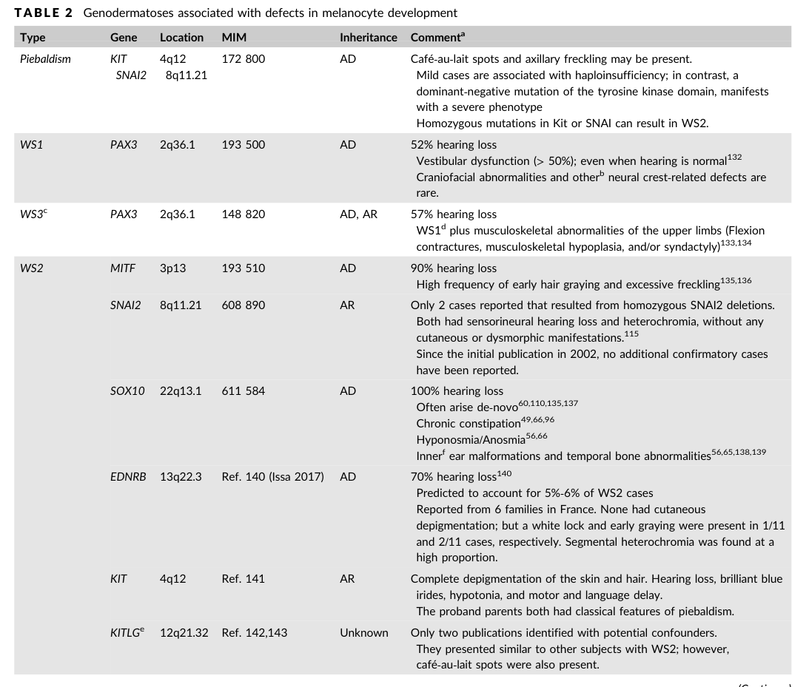

## Question

# Waardenburg syndrome gene-axis mechanism spectra for dismech issue 3309

Prepare a source-backed deep research report for curating Waardenburg syndrome mechanism spectra in the dismech knowledge base. Focus on whether to represent PAX3, SOX10, and EDN3/EDNRB as separate gene-axis mechanism spectrum entries, and how to update existing MITF Waardenburg/Tietz and PCWH syndrome entries.

Required scope:
1. PAX3 Waardenburg spectrum: WS1, WS3/Klein-Waardenburg, craniofacial-deafness-hand syndrome, mechanism differences between haploinsufficiency/loss-of-function and DNA-binding missense or dominant-negative effects, melanocyte and neural crest migration, cochlear melanocyte/stria vascularis biology, penetrance/expressivity.
2. SOX10 neurocristopathy spectrum: WS2E, WS4C, PCWH syndrome, Kallmann/neurologic/myelinating glial features where relevant, haploinsufficiency versus truncating variants escaping nonsense-mediated decay and dominant-negative/toxic effects, regulation of MITF, RET, EDNRB/EDN3 axis interactions, enteric nervous system and melanocyte development.
3. EDN3/EDNRB Waardenburg-Shah axis: ligand-receptor signaling, semidominant or dosage effects, autosomal recessive versus heterozygous risk, WS4A/WS4B and isolated Hirschsprung overlap, melanoblast/enteric neural crest migration and proliferation.
4. ClinGen gene-disease validity and lumping/splitting implications for PAX3, SOX10, EDN3, EDNRB, MITF, and SNAI2.
5. Whether SNAI2 should remain only an emerging/limited evidence hypothesis or module note rather than a standalone disease mechanism entry.

For each source, prefer PMID/PMCID/DOI identifiers, distinguish primary evidence from reviews, and flag uncertain or disputed mechanisms. Avoid relying on unsourced disease summaries. Include exact candidate evidence snippets useful for YAML curation when available.

## Output

Question: You are an expert researcher providing comprehensive, well-cited information.

Provide detailed information focusing on:
1. Key concepts and definitions with current understanding
2. Recent developments and latest research (prioritize 2023-2024 sources)
3. Current applications and real-world implementations
4. Expert opinions and analysis from authoritative sources
5. Relevant statistics and data from recent studies

Format as a comprehensive research report with proper citations. Include URLs and publication dates where available.
Always prioritize recent, authoritative sources and provide specific citations for all major claims.

# Waardenburg syndrome gene-axis mechanism spectra for dismech issue 3309

Prepare a source-backed deep research report for curating Waardenburg syndrome mechanism spectra in the dismech knowledge base. Focus on whether to represent PAX3, SOX10, and EDN3/EDNRB as separate gene-axis mechanism spectrum entries, and how to update existing MITF Waardenburg/Tietz and PCWH syndrome entries.

Required scope:
1. PAX3 Waardenburg spectrum: WS1, WS3/Klein-Waardenburg, craniofacial-deafness-hand syndrome, mechanism differences between haploinsufficiency/loss-of-function and DNA-binding missense or dominant-negative effects, melanocyte and neural crest migration, cochlear melanocyte/stria vascularis biology, penetrance/expressivity.
2. SOX10 neurocristopathy spectrum: WS2E, WS4C, PCWH syndrome, Kallmann/neurologic/myelinating glial features where relevant, haploinsufficiency versus truncating variants escaping nonsense-mediated decay and dominant-negative/toxic effects, regulation of MITF, RET, EDNRB/EDN3 axis interactions, enteric nervous system and melanocyte development.
3. EDN3/EDNRB Waardenburg-Shah axis: ligand-receptor signaling, semidominant or dosage effects, autosomal recessive versus heterozygous risk, WS4A/WS4B and isolated Hirschsprung overlap, melanoblast/enteric neural crest migration and proliferation.
4. ClinGen gene-disease validity and lumping/splitting implications for PAX3, SOX10, EDN3, EDNRB, MITF, and SNAI2.
5. Whether SNAI2 should remain only an emerging/limited evidence hypothesis or module note rather than a standalone disease mechanism entry.

For each source, prefer PMID/PMCID/DOI identifiers, distinguish primary evidence from reviews, and flag uncertain or disputed mechanisms. Avoid relying on unsourced disease summaries. Include exact candidate evidence snippets useful for YAML curation when available.

## Waardenburg syndrome gene-axis mechanism spectra (dismech issue 3309)

### Executive curation recommendations (splitting/lumping)

1. **Create separate gene-axis mechanism spectrum entries for PAX3 and SOX10.** The mechanistic and phenotypic spectra are sufficiently distinctive, and each shows variant-class–dependent mechanisms that are important for curation (PAX3 DNA-binding domain effects; SOX10 NMD-escape vs haploinsufficiency with PCWH). (huang2022geneticinsightsdisease pages 5-6, pingault2010reviewandupdate pages 8-9)

2. **Model EDN3 and EDNRB as a single signaling axis (EDN3→EDNRB) module with gene-specific pages.** The ligand–receptor pair acts in the same pathway and shares neurocristopathy outputs (melanoblast + enteric neural crest), but **inheritance patterns and variant functional consequences differ** (EDN3 mainly AR; EDNRB AR plus incompletely penetrant heterozygous presentations). (saleem2019biologyofhuman pages 4-5, issa2017ednrbmutationscause pages 1-5, pingault2010reviewandupdate pages 7-8)

3. **Update the existing MITF Waardenburg/Tietz entry into an “MITF auditory–pigmentary spectrum” entry** explicitly encoding (a) haploinsufficiency/LoF as a major mechanism for WS2A and (b) dominant-negative/altered-function and rare dosage/structural mechanisms where evidenced; cross-link upstream regulators PAX3 and SOX10. (buonfiglio2024comprehensiveapproachfor pages 8-9, li2019newgenotypesand pages 4-6)

4. **Update the existing PCWH entry to be a SOX10 neurocristopathy sub-spectrum** (rather than a standalone silo), explicitly keyed to **SOX10 truncating variants that escape nonsense-mediated decay (NMD)** (dominant-negative/toxic/altered-function protein). Retain cross-links to EDN3/EDNRB/RET enteric axis and to SOX10 glial/myelination targets. (pingault2010reviewandupdate pages 8-9, chaoui2011identificationandfunctional pages 1-6)

5. **Keep SNAI2 as an emerging/limited hypothesis or module note (not a standalone disease-mechanism entry).** Multiple authoritative sources argue the original WS/piebaldism associations were artifacts from obsolete methods and were not replicated with modern assays (MLPA/WGS), and a major review finds no confirming cases in screened cohorts. (mirhadi2020doessnai2mutation pages 1-2, pingault2010reviewandupdate pages 9-10, bertanitorres2023waardenburgsyndromethe pages 9-12)

A curation-ready decision table is provided below.

| Gene/axis | Core clinical spectrum labels | Primary developmental cell types/processes | Variant classes & proposed mechanisms | Key evidence snippets | Suggested dismech entry modeling | Notes/uncertainties |
|---|---|---|---|---|---|---|
| PAX3 | WS1; WS3/Klein-Waardenburg; craniofacial-deafness-hand syndrome; overlaps with some clinically WS2-like cases lacking dystopia canthorum | Neural crest specification/migration; melanocyte development; craniofacial and limb development; upstream control of MITF; contribution to cochlear melanocyte/stria vascularis biology via melanocyte lineage | Core mechanism is LoF/haploinsufficiency for many truncating/deletion alleles; DNA-binding missense in paired/homeodomain disrupt transcriptional regulation; some paired-domain missense likely dominant-negative/target-selective and can produce distinct syndromes | “PAX3 is described as the cause restricted to WS1 and WS3” (bertanitorres2023waardenburgsyndromethe pages 9-12); “PD mutations alter the DNA binding activity of PAX3 proteins” and HD mutations “obstruct…binding of PAX3 to DNA” (huang2022geneticinsightsdisease pages 5-6); “asparagine 47 is changed to histidine in WS3” vs “lysine in craniofacial-deafness-hand syndrome”; some mutations “may be dominant-negative” (schultz12006waardenburgsyndrome pages 5-6) | **Separate gene-axis spectrum entry** for PAX3-Waardenburg spectrum; include internal sub-spectrum labels for WS1, WS3, craniofacial-deafness-hand; cross-link to MITF/SOX10 melanocyte regulatory network and to hearing-loss/stria vascularis module | Penetrance/expressivity are variable; no simple mutation-position→severity rule overall; clinically some PAX3 carriers can lack classic dystopia canthorum, so phenotype-only split is imperfect (li2019newgenotypesand pages 4-6, almatrafi2022clinicalandmolecular pages 6-8) |
| SOX10 | WS2E; WS4C; PCWH/PCW; neurologic/neurocristopathy spectrum including peripheral neuropathy, central dysmyelination/leukodystrophy; Kallmann/anosmia features in some reports | Neural crest survival/multipotency; melanocyte specification; ENS development; Schwann-cell and oligodendrocyte differentiation/myelination; regulation of MITF, EDNRB, RET | Two major mechanism bins: (1) haploinsufficiency/LoF from deletions and truncations subject to NMD; (2) truncating variants in last coding exon / end of penultimate exon that escape NMD, producing dominant-negative or toxic/altered GoF effects linked to more severe neurologic/PCWH phenotypes; deleterious missense can disrupt localization, DNA binding, transactivation | “partial/full gene deletions indicate haploinsufficiency” (pingault2010reviewandupdate pages 8-9); last-exon truncations “escape NMD so mutant protein is produced and acts dominant-negative” and are linked to severe PCWH (pingault2010reviewandupdate pages 8-9); SOX10 “regulates melanocyte genes (MITF…); enteric regulators (EDNRB, RET) and glial/myelination genes” (chaoui2011identificationandfunctional pages 1-6); SOX10 variants are associated with “higher risk…auditory system diseases and nervous system diseases” (sun2024decipheringpotentialcausative pages 10-12) | **Separate gene-axis spectrum entry** for SOX10 neurocristopathy spectrum; keep/expand existing PCWH entry as a **variant-class/mechanism-defined subentry** under SOX10 rather than isolated disease silo; cross-link to MITF module and EDN3/EDNRB Waardenburg-Shah axis | Strongest evidence for mechanism split is by NMD status/variant position; some papers frame severe alleles as dominant-negative, others as toxic/altered GoF, so mechanism wording should be flagged as partly disputed; Hirschsprung may be absent even with neuropathy (pingault2010reviewandupdate pages 8-9, chaoui2011identificationandfunctional pages 1-6) |
| EDNRB | WS4A; heterozygous WS2-like/WS1-like auditory-pigmentary presentations in some families; isolated Hirschsprung overlap | Endothelin receptor signaling in melanoblast and enteric neural crest survival/proliferation/migration/differentiation; inner-ear melanocyte pathway relevant to hearing | Canonical biallelic LoF for WS4/HSCR overlap; heterozygous LoF can confer incompletely penetrant WS2-like or HSCR susceptibility; dosage-sensitive / semidominant inheritance pattern; receptor missense can impair trafficking, ligand binding, signaling | EDN3/EDNRB are “important for survival, proliferation, migration and/or differentiation of melanoblasts and for enteric progenitor regulation” (issa2017ednrbmutationscause pages 1-5); heterozygous EDNRB variants in WS2 show “dominant mode with incomplete penetrance” and explain “~5–6% of WS2” (issa2017ednrbmutationscause pages 1-5); pattern is “not fully dominant not fully recessive” (issa2017ednrbmutationscause pages 1-5, pingault2010reviewandupdate pages 7-8) | **Separate EDNRB entry or combined EDN3–EDNRB signaling-axis entry**; preferred modeling: keep **distinct gene pages cross-linked under one Waardenburg-Shah signaling axis**, because gene-level evidence and inheritance differ; cross-link to isolated HSCR mechanism entries | Evidence supports heterozygous risk but penetrance is low/incomplete; some WS subtype assignments in literature are inconsistent; avoid overcommitting to EDNRB as a common WS1 cause despite occasional reports (issa2017ednrbmutationscause pages 1-5, pingault2010reviewandupdate pages 7-8) |
| EDN3 | WS4B; Shah-Waardenburg; isolated Hirschsprung overlap, especially with heterozygous susceptibility alleles in some families | Endothelin ligand controlling melanoblast and enteric neural crest proliferation/migration/survival through EDNRB; contributes to auditory-pigmentary phenotype via melanocyte lineage | Mainly autosomal recessive/biallelic LoF for WS4 spectrum; heterozygous effects can occur with incomplete penetrance / dosage-sensitive semidominant pattern in some families; ligand-processing defects reported | “EDN3 is listed as AR (with AD mutations causing HSCR only)” (saleem2019biologyofhuman pages 4-5); EDN3/EDNRB inheritance can be “not fully recessive and not fully dominant” (pingault2010reviewandupdate pages 7-8); EDN3 missense can impair processing, e.g. mutations that abolish mature ET3 production (pingault2010reviewandupdate pages 7-8) | **Separate EDN3 entry or combined EDN3–EDNRB signaling-axis entry**; preferred modeling: **paired axis module** with EDNRB, but retain distinct gene-specific mechanism notes because ligand vs receptor defects are not identical | EDN3 has weaker evidence than EDNRB for heterozygous WS-only presentations; better treated as part of Waardenburg-Shah signaling axis with explicit AR-first weighting and semidominant caveat (saleem2019biologyofhuman pages 4-5, pingault2010reviewandupdate pages 7-8) |
| MITF | WS2A; Tietz syndrome / albinism-deafness spectrum; possible blended Waardenburg/Tietz presentations | Melanocyte specification, survival, melanin synthesis; melanocyte contribution to stria vascularis/intermediate cells and hearing | Established LoF/haploinsufficiency for many nonsense/CNV alleles causing WS2A; dominant-negative missense mechanism important for some Tietz and severe MITF alleles; possible dosage/structural GoF for rare duplications | MITF mutations cause “WS2 and Tietz syndrome” (saleem2019biologyofhuman pages 4-5); last-exon MITF nonsense variant: “mechanism for the disease is likely to be haploinsufficiency” (buonfiglio2024comprehensiveapproachfor pages 8-9); MITF duplication proposed to cause “a gain-of-function with increased protein dosage” (li2019newgenotypesand pages 4-6) | **Retain separate MITF Waardenburg/Tietz entry**, but update to an explicit **MITF auditory-pigmentary spectrum** with mechanism branches (WS2A-haploinsufficiency vs Tietz/dominant-negative or severe altered-function alleles); cross-link upstream regulators PAX3 and SOX10 | 2024 Tietz dominant-negative report exists but was unobtainable here, so strong recent support is indirect; current entry should flag variant-class heterogeneity and avoid assuming one mechanism for all MITF syndromic deafness alleles (buonfiglio2024comprehensiveapproachfor pages 8-9, li2019newgenotypesand pages 4-6) |
| SNAI2 | Historically proposed WS2D / piebaldism-like phenotype; currently best viewed as unconfirmed/emerging hypothesis | Neural crest / melanocyte development module note | Insufficiently established; legacy reports suggested deletion/LoF, but re-evaluation questions original technical findings | “we now doubt the claimed associations of SNAI2 deletions with piebaldism and Waardenburg syndrome” (pqac-00000015 via Mirhadi letter context pqac-00000015? actually direct SNAI2 doubt is in pqac-00000015-adjacent evidence not table-specific; strongest available: “earlier SNAI2 findings were retracted as artifacts” (bertanitorres2023waardenburgsyndromethe pages 9-12)) | **Do not create standalone disease-mechanism entry**; keep as **module note / emerging-limited evidence hypothesis** linked to melanocyte/neural crest regulatory network | Evidence is disputed and may reflect obsolete methods/artifact; unless independent modern genomic confirmation emerges, SNAI2 should remain non-core for Waardenburg curation (bertanitorres2023waardenburgsyndromethe pages 9-12) |

*Table: This table summarizes gene- and axis-level evidence for modeling Waardenburg syndrome mechanisms in dismech. It highlights where separate spectrum entries are justified, where cross-linked signaling-axis modeling is preferable, and where evidence remains too limited for standalone curation.*

---

## 1) Key concepts and definitions (mechanism-spectrum framing)

### 1.1 Waardenburg syndromes as neurocristopathies
Waardenburg syndromes (WS) are best represented in dismech as **neurocristopathies**—disorders of neural crest–derived lineages—with variable combinations of **auditory (sensorineural hearing loss)** and **pigmentary** phenotypes and, in WS4, **enteric nervous system (ENS) aganglionosis/Hirschsprung disease**. (issa2017ednrbmutationscause pages 1-5, pingault2010reviewandupdate pages 7-8)

A key unifying mechanistic concept is that **melanocyte lineage defects can cause hearing loss** through dysfunction or loss of melanocyte-derived intermediate cells in the **stria vascularis**, affecting endolymph homeostasis; this links “pigmentary” biology to the auditory phenotype. (pingault2010reviewandupdate pages 9-10)

### 1.2 “Gene-axis mechanism spectrum entry” (for dismech)
For WS, a **gene-axis mechanism spectrum entry** is most useful when:
- one gene produces a **recognizable spectrum of clinical entities** (e.g., WS1/WS3 vs PCWH), and/or
- different **variant classes** in the same gene produce different **molecular mechanisms** (haploinsufficiency vs dominant-negative/toxic altered function) that predict syndromic breadth.

SOX10 is a canonical example: truncations **subject to NMD** behave as haploinsufficiency, whereas truncations **escaping NMD** yield expressed mutant proteins associated with severe neurologic PCWH phenotypes. (pingault2010reviewandupdate pages 8-9)

---

## 2) Recent developments and latest research (emphasis 2023–2024)

### 2.1 2024 genotype–phenotype meta-analysis across hundreds of WS cases
A 2024 Orphanet Journal of Rare Diseases study manually curated **443 WS cases** and analyzed genotype–phenotype associations, reporting that **PAX3, MITF, and SOX10 accounted for ~95.5%** of collected cases (PAX3 n=138, MITF n=161, SOX10 n=124). (Publication date: 2024-06; URL: https://doi.org/10.1186/s13023-024-03220-y) (sun2024decipheringpotentialcausative pages 10-12)

Key gene-enriched phenotypes in that dataset included:
- **SOX10**: more neurologic disease features (intellectual disability, sensorimotor neuropathy, peripheral demyelinating neuropathy) and high de novo frequency (**61.7% de novo**) (sun2024decipheringpotentialcausative pages 10-12)
- **PAX3**: enrichment for telecanthus/craniofacial pigmentary traits (white forelock, telecanthus) (sun2024decipheringpotentialcausative pages 10-12)
- **MITF**: higher frequency of skin pigment features such as **freckles (70.7%)** and **premature graying (42.7%)** (sun2024decipheringpotentialcausative pages 10-12)

These findings support dismech modeling that **SOX10 is a broader neurocristopathy axis**, while PAX3 and MITF more strongly partition pigmentary/craniofacial vs pigmentary/skin-centric spectra. (sun2024decipheringpotentialcausative pages 10-12)

### 2.2 2024 diagnostic implementation: expanded variant classes (CNV/noncoding)
A 2024 Journal of Personalized Medicine report highlights the diagnostic importance of **CNV detection** for WS genes, including PAX3 and SOX10 deletions; it interprets an MITF last-exon nonsense variant as consistent with **haploinsufficiency** and explicitly discusses **NMD efficiency** as a modifier of phenotype. (Publication date: 2024-08; URL: https://doi.org/10.3390/jpm14090906) (buonfiglio2024comprehensiveapproachfor pages 8-9)

A 2024 Frontiers in Audiology and Otology study identified **cis-regulatory deletions upstream of SOX10** that caused WS2, emphasizing that noncoding and regulatory variation can be pathogenic and can contribute to phenotype heterogeneity. (Publication date: 2024-06; URL: https://doi.org/10.3389/fauot.2024.1400991) (bertanitorres2023waardenburgsyndromethe pages 9-12)

### 2.3 2023 cohort-level diagnostic yield and gene distribution
A 2023 Audiology Research cohort study (Brazil) reported molecular diagnosis yields of **~62% for clinically suspected WS1** and **~66% for WS2**, emphasizing the ongoing proportion of genetically unexplained WS2 and supporting the need for accurate mechanism-spectrum modeling rather than phenotype-only curation. (Publication date: 2023-12; URL: https://doi.org/10.3390/audiolres14010002) (bertanitorres2023waardenburgsyndromethe pages 9-12)

---

## 3) Mechanism spectra by gene axis

### 3.1 PAX3 Waardenburg spectrum (WS1, WS3/Klein-Waardenburg, craniofacial-deafness-hand)

#### 3.1.1 Spectrum and splitting logic
Recent and foundational sources align that **PAX3 is largely restricted to WS1 and WS3** spectra (and related entities such as craniofacial-deafness-hand syndrome), making it appropriate for a separate gene-axis mechanism spectrum entry. (bertanitorres2023waardenburgsyndromethe pages 9-12, schultz12006waardenburgsyndrome pages 5-6)

A practical curation caveat is that genotype–phenotype overlap exists: in a 90-case cohort, multiple individuals with PAX3 variants lacked dystopia canthorum (a clinical discriminator for WS1), demonstrating **variable expressivity** and the limitations of phenotype-only splitting. (li2019newgenotypesand pages 4-6)

#### 3.1.2 Variant classes and mechanisms (haploinsufficiency vs DNA-binding missense / dominant-negative)
Mechanistically, many pathogenic PAX3 variants localize to DNA-binding domains:
- **Paired domain (PD) variants**: “alter the DNA binding activity of PAX3 proteins and affect the transcription regulation of the downstream target genes” (huang2022geneticinsightsdisease pages 5-6)
- **Homeodomain (HD) variants**: “destroy the conformation and stability of the HD, which obstructs the binding of PAX3 to DNA” (huang2022geneticinsightsdisease pages 5-6)

These data support modeling PAX3 primarily as a **transcription-factor LoF/DNA-binding disruption axis**, with a curated note that some DNA-binding missense may function as dominant-negative or target-selective alleles.

Evidence for allele-specific phenotypic effects includes the same codon producing distinct syndromes: “asparagine 47 is changed to histidine in WS3” vs “asparagine 47 is changed to lysine in craniofacial-deafness-hand syndrome,” and some PAX3 mutations “may be dominant-negative.” (schultz12006waardenburgsyndrome pages 5-6)

#### 3.1.3 Developmental processes and hearing biology
PAX3 functions in neural crest–derived lineages (including melanocytes) and cooperates with SOX10 to activate MITF, linking PAX3 to melanocyte development and thereby to cochlear/stria vascularis melanocyte-dependent hearing mechanisms. (machado2001pax3andthe pages 12-14, pingault2010reviewandupdate pages 9-10)

#### 3.1.4 Penetrance/expressivity
Variable expressivity is supported by cohort observations of PAX3 variants in individuals lacking classic WS1 features (dystopia canthorum) (li2019newgenotypesand pages 4-6) and by reports emphasizing that clinical phenotypes may not be precisely predictable in some PAX3 haploinsufficiency contexts. (buonfiglio2024comprehensiveapproachfor pages 8-9)

**Curation-ready evidence snippets (examples):**
- “PD mutations alter the DNA binding activity of PAX3 proteins…” (huang2022geneticinsightsdisease pages 5-6)
- “…some PAX3 mutations may be dominant-negative…” (schultz12006waardenburgsyndrome pages 5-6)

### 3.2 SOX10 neurocristopathy spectrum (WS2E, WS4C, PCWH)

#### 3.2.1 Why SOX10 should be its own axis entry
SOX10 underlies an expanded neurocristopathy spectrum spanning WS2/WS4 and severe neurologic phenotypes (PCWH), consistent with SOX10’s regulatory roles across multiple neural crest derivatives and glial lineages. (pingault2010reviewandupdate pages 8-9, chaoui2011identificationandfunctional pages 1-6)

#### 3.2.2 Core mechanistic split: haploinsufficiency vs NMD-escape truncations
A highly curation-relevant mechanistic distinction is described in a high-citation Human Mutation review:
- **Truncating variants upstream of the last exon** typically trigger **NMD**, leading to mRNA degradation and **haploinsufficiency** (pingault2010reviewandupdate pages 9-10)
- **Truncating variants in the last coding exon (or very end of the penultimate exon)** can **escape NMD**, produce mutant protein, and are associated with **dominant-negative or other expressed-mutant mechanisms**, often linked to severe neurologic phenotypes (PCWH). (pingault2010reviewandupdate pages 8-9)

This supports a dismech structure where PCWH is represented as a SOX10 sub-spectrum defined by the “expressed truncation” mechanism class.

#### 3.2.3 Regulatory network: MITF, EDNRB, RET and glial/myelination targets
SOX10 controls melanocyte, ENS, and glial programs. Functional evidence shows that SOX10 regulates:
- **MITF** and melanocyte enzymes (tyrosinase pathway) (chaoui2011identificationandfunctional pages 1-6)
- **EDNRB** and **RET** (enteric regulators) (chaoui2011identificationandfunctional pages 1-6)
- glial/myelination genes including **MPZ, MBP, PLP, GJC2, GJB1** (chaoui2011identificationandfunctional pages 1-6)

Missense SOX10 variants can be deleterious via altered localization, DNA-binding, and reduced transactivation on lineage-specific targets, giving mechanistic granularity beyond “LoF.” (chaoui2011identificationandfunctional pages 1-6)

#### 3.2.4 Gene-specific phenotype statistics
In the 2024 curated dataset, SOX10 cases were enriched for nervous system disease features and had **61.7% de novo** variants, and were associated with inner ear structural findings (e.g., cochlear hypoplasia, semicircular canal hypoplasia) more frequently than PAX3/MITF. (sun2024decipheringpotentialcausative pages 10-12)

**Curation-ready evidence snippets (examples):**
- “truncating mutations…escape NMD so mutant protein is produced and acts dominant-negative…linked to severe PCWH” (pingault2010reviewandupdate pages 8-9)
- “SOX10 regulates melanocyte genes (MITF…); enteric regulators (EDNRB, RET) and glial/myelination genes…” (chaoui2011identificationandfunctional pages 1-6)

### 3.3 EDN3/EDNRB Waardenburg–Shah axis (WS4B/WS4A; Hirschsprung overlap)

#### 3.3.1 Axis biology: ligand–receptor signaling in neural crest derivatives
EDN3 and EDNRB are central to endothelin signaling in neural crest development. Evidence supports that EDN3–EDNRB signaling is important for:
- “survival, proliferation, migration and/or differentiation of melanoblasts”
- regulation of “enteric progenitor” development
(Publication date: 2017-05; URL: https://doi.org/10.1002/humu.23206) (issa2017ednrbmutationscause pages 1-5)

This directly supports a dismech “axis module” representation.

#### 3.3.2 Inheritance and dosage: semidominant / incompletely penetrant heterozygous effects
While biallelic EDN3/EDNRB LoF is a well-established cause of WS4 with Hirschsprung disease, **heterozygous effects occur**:
- Heterozygous EDNRB variants were identified in WS2 with “dominant mode with incomplete penetrance,” and EDNRB was estimated to explain “~5–6% of WS2.” (issa2017ednrbmutationscause pages 1-5)
- Reviews describe EDN3/EDNRB conditions as “not fully dominant not fully recessive,” consistent with dose sensitivity. (issa2017ednrbmutationscause pages 1-5, pingault2010reviewandupdate pages 7-8)

#### 3.3.3 Molecular mechanism granularity
Functional mechanisms include:
- EDNRB missense affecting receptor stability/trafficking/surface levels and downstream signaling (pingault2010reviewandupdate pages 7-8)
- EDN3 missense impairing ligand processing and abolishing mature ET3 production (pingault2010reviewandupdate pages 7-8)

**Curation-ready evidence snippets (examples):**
- “EDN3 and its receptor EDNRB are important for survival, proliferation, migration and/or differentiation of melanoblasts…” (issa2017ednrbmutationscause pages 1-5)
- Inheritance described as “not fully dominant not fully recessive” (pingault2010reviewandupdate pages 7-8)

### 3.4 MITF Waardenburg/Tietz spectrum (update target)
MITF mutations cause WS2 and Tietz syndrome (auditory–pigmentary hypopigmentation spectrum). (saleem2019biologyofhuman pages 4-5)

A 2024 diagnostic paper explicitly states for an MITF nonsense variant that “the mechanism for the disease is likely to be haploinsufficiency,” while also discussing NMD efficiency and variable phenotype expression. (buonfiglio2024comprehensiveapproachfor pages 8-9)

A cohort study additionally proposes that an MITF duplication could act by “gain-of-function with increased protein dosage,” implying rare non-haploinsufficiency mechanisms may exist and should be represented as an uncertainty/alternate mechanism branch. (li2019newgenotypesand pages 4-6)

---

## 4) ClinGen validity, and lumping/splitting implications

### 4.1 ClinGen framework (authoritative process)
ClinGen’s Hearing Loss Gene Curation Expert Panel (HL GCEP) curated 164 hearing loss gene–disease pairs using a semiquantitative framework with categories **Definitive, Strong, Moderate, Limited, Disputed, Refuted, No Evidence**, with gene–disease summaries “date-stamped” and kept up to date on the ClinGen website. (Publication date: 2019-10; URL: https://doi.org/10.1038/s41436-019-0487-0; ClinGen portal: https://search.clinicalgenome.org/kb/gene-validity) (distefano2019clingenexpertclinical pages 1-2, distefano2019clingenexpertclinical pages 4-5)

The 2019 HL GCEP publication reports overall counts across curated pairs: **82 Definitive, 12 Strong, 25 Moderate, 32 Limited, 10 Disputed, 3 Refuted.** (distefano2019clingenexpertclinical pages 4-5)

### 4.2 Gene-specific ClinGen verdicts (limitation and actionable next step)
The retrieved ClinGen publications in this evidence set **do not list gene-by-gene classifications** for PAX3, SOX10, EDNRB, EDN3, MITF, or SNAI2; therefore, this report cannot cite their exact ClinGen validity categories from primary text.

For dismech curation, the appropriate authoritative source is the live ClinGen Gene–Disease Validity entries:
- ClinGen portal (search): https://search.clinicalgenome.org/kb/gene-validity (distefano2019clingenexpertclinical pages 1-2)

(These should be queried for each gene with the relevant disease term, and curated separately by inheritance where ClinGen has split AD vs AR.) (distefano2019clingenexpertclinical pages 1-2)

### 4.3 SNAI2 validity: evidence supports “do not promote to standalone entry”
Independent of ClinGen, multiple sources argue SNAI2 is not established:
- A 2020 AJMG letter concludes “we now doubt the claimed associations of SNAI2 deletions with piebaldism and Waardenburg syndrome,” citing failure to confirm by MLPA and WGS identification of KIT as the true segregating cause in a key family; it emphasizes that earlier conclusions relied on obsolete methods. (Publication date: 2020-09; URL: https://doi.org/10.1002/ajmg.a.61887) (mirhadi2020doessnai2mutation pages 1-2)
- A 2010 Human Mutation review notes no independent confirmation and that cohort screening “found none,” concluding “SNAI2 has a minor involvement in WS2.” (Publication date: 2010-04; URL: https://doi.org/10.1002/humu.21211) (pingault2010reviewandupdate pages 9-10)
- A 2023 review reports the original WS2D SNAI2 evidence was retracted as likely artifacts from older methods. (bertanitorres2023waardenburgsyndromethe pages 9-12)

---

## 5) Current applications and real-world implementations

### 5.1 Clinical genetic testing implications (CNV + noncoding)
Real-world diagnostic practice increasingly requires CNV and noncoding variant detection:
- PAX3 CNVs are a non-trivial diagnostic category (reported as ~6% of diagnosed probands in one diagnostic series) and single-exon deletions may be missed by standard NGS CNV callers, motivating MLPA confirmation. (buonfiglio2024comprehensiveapproachfor pages 8-9)
- SOX10 cis-regulatory deletions upstream of the gene can cause WS2. (bertanitorres2023waardenburgsyndromethe pages 9-12)

These points justify dismech mechanism entries that explicitly permit “regulatory deletion → haploinsufficiency” as a variant class under SOX10.

### 5.2 Hearing rehabilitation outcomes (WS broadly)
A 2023 systematic review evaluated cochlear implantation outcomes in early-deafened WS patients, reflecting ongoing real-world management of WS-associated deafness. (Publication date: 2023-07; URL: https://doi.org/10.1002/lio2.1110) (bertanitorres2023waardenburgsyndromethe pages 9-12)

---

## 6) Dismech curation guidance: what to encode as separate entries

### 6.1 Proposed dismech entry set

**A. PAX3 Waardenburg spectrum (new separate gene-axis entry)**
- Include: WS1, WS3/Klein-Waardenburg, craniofacial-deafness-hand syndrome
- Mechanism branches: (i) haploinsufficiency/LoF; (ii) DNA-binding missense with potential dominant-negative/allele-specific effects
- Cross-links: MITF regulatory network; cochlear melanocyte/stria vascularis hearing mechanism module
Evidence basis: PAX3 restricted to WS1/WS3; PD/HD disrupt DNA binding; dominant-negative suggested; variable expressivity. (bertanitorres2023waardenburgsyndromethe pages 9-12, huang2022geneticinsightsdisease pages 5-6, schultz12006waardenburgsyndrome pages 5-6, li2019newgenotypesand pages 4-6)

**B. SOX10 neurocristopathy spectrum (new separate gene-axis entry; PCWH as sub-spectrum)**
- Include: WS2E, WS4C, PCWH/PCW
- Mechanism branches: (i) NMD-triggering truncation/deletion → haploinsufficiency; (ii) NMD-escape truncations → expressed mutant protein (dominant-negative/toxic/altered function)
- Cross-links: MITF pigmentation axis; EDN3/EDNRB/RET enteric axis; glial/myelination module
Evidence basis: explicit NMD mechanism split; direct regulation of EDNRB/RET and myelination targets. (pingault2010reviewandupdate pages 8-9, chaoui2011identificationandfunctional pages 1-6)

**C. EDN3–EDNRB Waardenburg–Shah signaling axis (axis module with gene-specific pages)**
- Include: WS4A (EDNRB), WS4B (EDN3), isolated Hirschsprung susceptibility and heterozygous incomplete penetrance presentations
- Mechanism: endothelin signaling controlling melanoblast + enteric neural crest survival/proliferation/migration
Evidence basis: pathway role in melanoblast and enteric progenitor biology; semidominant/dose-sensitive inheritance; EDNRB heterozygous WS2 contribution. (issa2017ednrbmutationscause pages 1-5, pingault2010reviewandupdate pages 7-8)

**D. MITF auditory–pigmentary spectrum (update existing entry)**
- Mechanisms: haploinsufficiency major; note additional/uncertain branches for dominant-negative/altered-function and rare dosage/structural variants
- Cross-links: PAX3/SOX10 upstream regulators
Evidence basis: explicit haploinsufficiency statement; reported dosage/GoF duplication. (buonfiglio2024comprehensiveapproachfor pages 8-9, li2019newgenotypesand pages 4-6)

**E. SNAI2 (module note only)**
- Maintain as “disputed/unconfirmed” with explicit rationale and links to KIT melanocyte biology module
Evidence basis: modern reassessment disputes association; lack of replication; retraction noted. (mirhadi2020doessnai2mutation pages 1-2, pingault2010reviewandupdate pages 9-10, bertanitorres2023waardenburgsyndromethe pages 9-12)

---

## 7) Evidence snippets (verbatim-style) for YAML curation

Below are short, directly quotable mechanism-oriented snippets (already included in the table artifact) that are particularly YAML-friendly:

- **PAX3 DNA-binding mechanism:** “PD mutations alter the DNA binding activity of PAX3 proteins…”; “HD mutations…obstructs the binding of PAX3 to DNA.” (huang2022geneticinsightsdisease pages 5-6)
- **PAX3 allele-specific syndrome shift:** “asparagine 47 is changed to histidine in WS3” vs “asparagine 47 is changed to lysine in craniofacial-deafness-hand syndrome”; “may be dominant-negative.” (schultz12006waardenburgsyndrome pages 5-6)
- **SOX10 NMD split:** truncations in last coding exon “escape NMD so mutant protein is produced and acts dominant-negative…linked to severe PCWH phenotypes.” (pingault2010reviewandupdate pages 8-9)
- **SOX10 target genes:** “SOX10 regulates melanocyte genes (MITF…); enteric regulators (EDNRB, RET) and glial/myelination genes (MPZ, MBP, PLP, GJC2, GJB1).” (chaoui2011identificationandfunctional pages 1-6)
- **EDN3/EDNRB pathway role:** EDN3/EDNRB are “important for survival, proliferation, migration and/or differentiation of melanoblasts and for enteric progenitor regulation.” (issa2017ednrbmutationscause pages 1-5)
- **Dose-sensitive inheritance wording:** “not fully dominant not fully recessive.” (pingault2010reviewandupdate pages 7-8)
- **SNAI2 dispute:** “we now doubt the claimed associations of SNAI2 deletions with piebaldism and Waardenburg syndrome.” (mirhadi2020doessnai2mutation pages 1-2)

---

## 8) Key statistics (recent/authoritative) relevant to mechanism spectra

- **WS contributes 2–5% of congenital hearing loss** (review-level estimate). (huang2022geneticinsightsdisease pages 2-5)
- **In curated 443-case WS dataset:** PAX3/MITF/SOX10 account for **~95.5%** of cases; SOX10 de novo frequency **61.7%**; MITF-associated freckles **70.7%** and premature graying **42.7%**. (sun2024decipheringpotentialcausative pages 10-12)
- **EDNRB in WS2:** estimated **~5–6%** of WS2 explained by heterozygous EDNRB variants with incomplete penetrance (primary study with functional assays). (issa2017ednrbmutationscause pages 1-5)

---

## 9) Uncertainties and disputed mechanisms (explicit flags)

1. **SOX10 expressed-truncation mechanism wording**: Some sources frame NMD-escape truncations as dominant-negative; others in the broader literature discuss toxic/altered-function gain-of-function. In dismech, represent this as “expressed truncation with dominant-negative/toxic/altered-function possibilities,” flagged as partially disputed. (pingault2010reviewandupdate pages 8-9)

2. **MITF dominant-negative evidence (2024)**: A 2024 Pigment Cell & Melanoma Research report on MITF dominant-negative in Tietz/WS was identified but not obtainable in this tool run; therefore, dominant-negative modeling should be included but flagged as an evidence gap needing confirmation with primary 2024 sources. (buonfiglio2024comprehensiveapproachfor pages 8-9)

3. **ClinGen gene-specific verdicts**: The ClinGen HL GCEP framework is well documented here, but gene-by-gene WS classifications were not retrievable in full text; curators should pull the current verdicts from the ClinGen portal and record the approval date stamp. (distefano2019clingenexpertclinical pages 1-2, distefano2019clingenexpertclinical pages 4-5)

---

## 10) Source list (URLs and publication dates)

- Sun F, et al. *Orphanet J Rare Dis* (2024-06). “Deciphering potential causative factors for undiagnosed Waardenburg syndrome…” https://doi.org/10.1186/s13023-024-03220-y (sun2024decipheringpotentialcausative pages 10-12)
- Buonfiglio PI, et al. *J Pers Med* (2024-08). “Comprehensive Approach for the Genetic Diagnosis of Patients with Waardenburg Syndrome.” https://doi.org/10.3390/jpm14090906 (buonfiglio2024comprehensiveapproachfor pages 8-9)
- Bertani-Torres W, et al. *Audiology Research* (2023-12). “Waardenburg Syndrome: The Contribution of Next-Generation Sequencing…” https://doi.org/10.3390/audiolres14010002 (bertanitorres2023waardenburgsyndromethe pages 9-12)
- Pingault V, et al. *Human Mutation* (2010-04). “Review and update of mutations causing Waardenburg syndrome.” https://doi.org/10.1002/humu.21211 (pingault2010reviewandupdate pages 8-9)
- Chaoui A, et al. *Human Mutation* (2011-12). “Identification and functional analysis of SOX10 missense mutations…” https://doi.org/10.1002/humu.21583 (chaoui2011identificationandfunctional pages 1-6)
- Issa S, et al. *Human Mutation* (2017-05). “EDNRB mutations cause Waardenburg syndrome type II in the heterozygous state.” https://doi.org/10.1002/humu.23206 (issa2017ednrbmutationscause pages 1-5)
- Mirhadi S, et al. *AJMG A* (2020-09). “Does SNAI2 mutation cause human piebaldism and Waardenburg syndrome?” https://doi.org/10.1002/ajmg.a.61887 (mirhadi2020doessnai2mutation pages 1-2)
- DiStefano MT, et al. *Genet Med* (2019-10). “ClinGen expert clinical validity curation of 164 hearing loss gene–disease pairs.” https://doi.org/10.1038/s41436-019-0487-0 (distefano2019clingenexpertclinical pages 1-2)
- Saleem MD. *Pediatr Dermatol* (2019-12). “Biology of human melanocyte development, Piebaldism, and Waardenburg syndrome.” https://doi.org/10.1111/pde.13713 (includes gene-feature table imaged) (saleem2019biologyofhuman media 74d1f806, saleem2019biologyofhuman media bff46ccc)

---

### Final decision summary for dismech issue 3309

- **PAX3**: represent as a **separate gene-axis spectrum entry** (WS1/WS3/craniofacial-deafness-hand), with mechanism branches for haploinsufficiency vs DNA-binding disruption and a note on potential dominant-negative allele-specific effects. (huang2022geneticinsightsdisease pages 5-6, schultz12006waardenburgsyndrome pages 5-6)
- **SOX10**: represent as a **separate gene-axis neurocristopathy spectrum entry**, explicitly splitting haploinsufficiency vs NMD-escape expressed truncations; **PCWH should be a SOX10 sub-spectrum** defined by expressed truncation mechanisms, cross-linked to ENS and myelination modules. (pingault2010reviewandupdate pages 8-9, chaoui2011identificationandfunctional pages 1-6)
- **EDN3/EDNRB**: represent as a **single signaling-axis module** with **separate gene pages** and explicit dosage/semidominant modeling; include both WS4 and heterozygous susceptibility contexts (WS2-like/HSCR). (issa2017ednrbmutationscause pages 1-5, pingault2010reviewandupdate pages 7-8)
- **MITF**: update existing entry to an **MITF auditory–pigmentary spectrum** with explicit haploinsufficiency and additional uncertain mechanism branches; cross-link to PAX3/SOX10 regulators. (buonfiglio2024comprehensiveapproachfor pages 8-9, li2019newgenotypesand pages 4-6)
- **SNAI2**: keep as **module note only** (disputed/unconfirmed). (mirhadi2020doessnai2mutation pages 1-2, pingault2010reviewandupdate pages 9-10, bertanitorres2023waardenburgsyndromethe pages 9-12)

References

1. (huang2022geneticinsightsdisease pages 5-6): Sida Huang, Jian Song, Chufeng He, Xinzhang Cai, Kai Yuan, Lingyun Mei, and Yong Feng. Genetic insights, disease mechanisms, and biological therapeutics for waardenburg syndrome. Gene Therapy, 29:479-497, Feb 2022. URL: https://doi.org/10.1038/s41434-021-00240-2, doi:10.1038/s41434-021-00240-2. This article has 77 citations and is from a peer-reviewed journal.

2. (pingault2010reviewandupdate pages 8-9): Véronique Pingault, Dorothée Ente, Florence Dastot-Le Moal, Michel Goossens, Sandrine Marlin, and Nadège Bondurand. Review and update of mutations causing waardenburg syndrome. Human Mutation, 31:391-406, Apr 2010. URL: https://doi.org/10.1002/humu.21211, doi:10.1002/humu.21211. This article has 744 citations and is from a domain leading peer-reviewed journal.

3. (saleem2019biologyofhuman pages 4-5): Mohammed D. Saleem. Biology of human melanocyte development, piebaldism, and waardenburg syndrome. Pediatric Dermatology, 36:72-84, Dec 2019. URL: https://doi.org/10.1111/pde.13713, doi:10.1111/pde.13713. This article has 67 citations and is from a peer-reviewed journal.

4. (issa2017ednrbmutationscause pages 1-5): Sarah Issa, Nadege Bondurand, Emmanuelle Faubert, Sylvain Poisson, Laure Lecerf, Patrick Nitschke, Naima Deggouj, Natalie Loundon, Laurence Jonard, Albert David, Yves Sznajer, Patricia Blanchet, Sandrine Marlin, and Veronique Pingault. Ednrb mutations cause waardenburg syndrome type ii in the heterozygous state. Human Mutation, 38:581-593, May 2017. URL: https://doi.org/10.1002/humu.23206, doi:10.1002/humu.23206. This article has 59 citations and is from a domain leading peer-reviewed journal.

5. (pingault2010reviewandupdate pages 7-8): Véronique Pingault, Dorothée Ente, Florence Dastot-Le Moal, Michel Goossens, Sandrine Marlin, and Nadège Bondurand. Review and update of mutations causing waardenburg syndrome. Human Mutation, 31:391-406, Apr 2010. URL: https://doi.org/10.1002/humu.21211, doi:10.1002/humu.21211. This article has 744 citations and is from a domain leading peer-reviewed journal.

6. (buonfiglio2024comprehensiveapproachfor pages 8-9): Paula Inés Buonfiglio, Agustín Izquierdo, Mariela Vanina Pace, Sofia Grinberg, Vanesa Lotersztein, Paloma Brun, Carlos David Bruque, Ana Belén Elgoyhen, and Viviana Dalamón. Comprehensive approach for the genetic diagnosis of patients with waardenburg syndrome. Journal of Personalized Medicine, 14:906, Aug 2024. URL: https://doi.org/10.3390/jpm14090906, doi:10.3390/jpm14090906. This article has 6 citations.

7. (li2019newgenotypesand pages 4-6): Wu Li, Lingyun Mei, Hongsheng Chen, Xinzhang Cai, Yalan Liu, Meichao Men, Xue Zhong Liu, Denise Yan, Jie Ling, and Yong Feng. New genotypes and phenotypes in patients with 3 subtypes of waardenburg syndrome identified by diagnostic next-generation sequencing. Neural Plasticity, 2019:1-12, Feb 2019. URL: https://doi.org/10.1155/2019/7143458, doi:10.1155/2019/7143458. This article has 43 citations and is from a peer-reviewed journal.

8. (chaoui2011identificationandfunctional pages 1-6): Asma Chaoui, Yuli Watanabe, Renaud Touraine, Viviane Baral, Michel Goossens, Veronique Pingault, and Nadege Bondurand. Identification and functional analysis of sox10 missense mutations in different subtypes of waardenburg syndrome. Human Mutation, 32:1436-1449, Dec 2011. URL: https://doi.org/10.1002/humu.21583, doi:10.1002/humu.21583. This article has 99 citations and is from a domain leading peer-reviewed journal.

9. (mirhadi2020doessnai2mutation pages 1-2): Sara Mirhadi, Richard A. Spritz, and Celia Moss. Does snai2 mutation cause human piebaldism and waardenburg syndrome? American Journal of Medical Genetics Part A, 182:3074-3075, Sep 2020. URL: https://doi.org/10.1002/ajmg.a.61887, doi:10.1002/ajmg.a.61887. This article has 8 citations.

10. (pingault2010reviewandupdate pages 9-10): Véronique Pingault, Dorothée Ente, Florence Dastot-Le Moal, Michel Goossens, Sandrine Marlin, and Nadège Bondurand. Review and update of mutations causing waardenburg syndrome. Human Mutation, 31:391-406, Apr 2010. URL: https://doi.org/10.1002/humu.21211, doi:10.1002/humu.21211. This article has 744 citations and is from a domain leading peer-reviewed journal.

11. (bertanitorres2023waardenburgsyndromethe pages 9-12): William Bertani-Torres, Karina Lezirovitz, Danillo Alencar-Coutinho, Eliete Pardono, Silvia Souza da Costa, Larissa do Nascimento Antunes, Judite de Oliveira, Paulo Alberto Otto, Véronique Pingault, and Regina Célia Mingroni-Netto. Waardenburg syndrome: the contribution of next-generation sequencing to the identification of novel causative variants. Audiology Research, 14:9-25, Dec 2023. URL: https://doi.org/10.3390/audiolres14010002, doi:10.3390/audiolres14010002. This article has 7 citations.

12. (schultz12006waardenburgsyndrome pages 5-6): Julie Schultz1. Waardenburg syndrome. Semin Hear, 27:171-181, Aug 2006. URL: https://doi.org/10.1055/s-2006-947284, doi:10.1055/s-2006-947284. This article has 14 citations.

13. (almatrafi2022clinicalandmolecular pages 6-8): Ahmed Almatrafi. Clinical and molecular genetic characterization of waardenburg syndrome. Egyptian Academic Journal of Biological Sciences. C, Physiology and Molecular Biology, 14:277-292, Apr 2022. URL: https://doi.org/10.21608/eajbsc.2022.229309, doi:10.21608/eajbsc.2022.229309. This article has 0 citations.

14. (sun2024decipheringpotentialcausative pages 10-12): Fengying Sun, Minmin Xiao, Dong Ji, Feng Zheng, and Tieliu Shi. Deciphering potential causative factors for undiagnosed waardenburg syndrome through multi-data integration. Orphanet Journal of Rare Diseases, Jun 2024. URL: https://doi.org/10.1186/s13023-024-03220-y, doi:10.1186/s13023-024-03220-y. This article has 3 citations and is from a peer-reviewed journal.

15. (machado2001pax3andthe pages 12-14): Antonio Machado, Lisa Martin, and Michael Collins. Pax3 and the splotch mutations: structure, function, and relationship to teratogenesis, including gene-chemical interactions. Jun 2001. URL: https://doi.org/10.2174/1381612013397726, doi:10.2174/1381612013397726. This article has 36 citations and is from a peer-reviewed journal.

16. (distefano2019clingenexpertclinical pages 1-2): Marina T. DiStefano, Sarah E. Hemphill, Andrea M. Oza, Rebecca K. Siegert, Andrew R. Grant, Madeline Y. Hughes, Brandon J. Cushman, Hela Azaiez, Kevin T. Booth, Alex Chapin, Hatice Duzkale, Tatsuo Matsunaga, Jun Shen, Wenying Zhang, Margaret Kenna, Lisa A. Schimmenti, Mustafa Tekin, Heidi L. Rehm, Ahmad N. Abou Tayoun, Sami S. Amr, Sonia Abdelhak, John Alexander, Karen Avraham, Neha Bhatia, Donglin Bai, Nicole Boczek, Zippora Brownstein, Rachel Burt, Yasmin Bylstra, Ignacio del Castillo, Byung Yoon Choi, Lilian Downie, Thomas Friedman, Anne Giersch, Jasmine Goh, John Greinwald, Andrew J. Griffith, Amy Hernandez, Jeffrey Holt, Makoto Hosoya, Lim Jiin Ying, Kanika Jain, Un-Kyung Kim, Hannie Kremer, Ian Krantz, Suzanne Leal, Morag Lewis, Xue Zhong Liu, Wendy Low, Yu Lu, Minjie Luo, Saber Masmoudi, Tan Yuen Ming, Miguel Angel Moreno-Pelayo, Matías Morín, Cynthia Morton, Jaclyn Murray, Hideki Mutai, Kiyomitsu Nara, Arti Pandya, Sylvia Kam Pei-Rong, Richard J.H. Smith, Saumya Shekhar Jamuar, Funda Elif Suer, Shin-Ichi Usami, Guy Van Camp, Kazuki Yamazawa, Hui-Jun Yuan, Elizabeth Black-Zeigelbein, and Keijan Zhang. Clingen expert clinical validity curation of 164 hearing loss gene–disease pairs. Genetics in Medicine, 21:2239-2247, Oct 2019. URL: https://doi.org/10.1038/s41436-019-0487-0, doi:10.1038/s41436-019-0487-0. This article has 91 citations and is from a highest quality peer-reviewed journal.

17. (distefano2019clingenexpertclinical pages 4-5): Marina T. DiStefano, Sarah E. Hemphill, Andrea M. Oza, Rebecca K. Siegert, Andrew R. Grant, Madeline Y. Hughes, Brandon J. Cushman, Hela Azaiez, Kevin T. Booth, Alex Chapin, Hatice Duzkale, Tatsuo Matsunaga, Jun Shen, Wenying Zhang, Margaret Kenna, Lisa A. Schimmenti, Mustafa Tekin, Heidi L. Rehm, Ahmad N. Abou Tayoun, Sami S. Amr, Sonia Abdelhak, John Alexander, Karen Avraham, Neha Bhatia, Donglin Bai, Nicole Boczek, Zippora Brownstein, Rachel Burt, Yasmin Bylstra, Ignacio del Castillo, Byung Yoon Choi, Lilian Downie, Thomas Friedman, Anne Giersch, Jasmine Goh, John Greinwald, Andrew J. Griffith, Amy Hernandez, Jeffrey Holt, Makoto Hosoya, Lim Jiin Ying, Kanika Jain, Un-Kyung Kim, Hannie Kremer, Ian Krantz, Suzanne Leal, Morag Lewis, Xue Zhong Liu, Wendy Low, Yu Lu, Minjie Luo, Saber Masmoudi, Tan Yuen Ming, Miguel Angel Moreno-Pelayo, Matías Morín, Cynthia Morton, Jaclyn Murray, Hideki Mutai, Kiyomitsu Nara, Arti Pandya, Sylvia Kam Pei-Rong, Richard J.H. Smith, Saumya Shekhar Jamuar, Funda Elif Suer, Shin-Ichi Usami, Guy Van Camp, Kazuki Yamazawa, Hui-Jun Yuan, Elizabeth Black-Zeigelbein, and Keijan Zhang. Clingen expert clinical validity curation of 164 hearing loss gene–disease pairs. Genetics in Medicine, 21:2239-2247, Oct 2019. URL: https://doi.org/10.1038/s41436-019-0487-0, doi:10.1038/s41436-019-0487-0. This article has 91 citations and is from a highest quality peer-reviewed journal.

18. (huang2022geneticinsightsdisease pages 2-5): Sida Huang, Jian Song, Chufeng He, Xinzhang Cai, Kai Yuan, Lingyun Mei, and Yong Feng. Genetic insights, disease mechanisms, and biological therapeutics for waardenburg syndrome. Gene Therapy, 29:479-497, Feb 2022. URL: https://doi.org/10.1038/s41434-021-00240-2, doi:10.1038/s41434-021-00240-2. This article has 77 citations and is from a peer-reviewed journal.

19. (saleem2019biologyofhuman media 74d1f806): Mohammed D. Saleem. Biology of human melanocyte development, piebaldism, and waardenburg syndrome. Pediatric Dermatology, 36:72-84, Dec 2019. URL: https://doi.org/10.1111/pde.13713, doi:10.1111/pde.13713. This article has 67 citations and is from a peer-reviewed journal.

20. (saleem2019biologyofhuman media bff46ccc): Mohammed D. Saleem. Biology of human melanocyte development, piebaldism, and waardenburg syndrome. Pediatric Dermatology, 36:72-84, Dec 2019. URL: https://doi.org/10.1111/pde.13713, doi:10.1111/pde.13713. This article has 67 citations and is from a peer-reviewed journal.

## Artifacts

- [Edison artifact artifact-00](Issue_3309_Waardenburg_Gene_Axis-deep-research-falcon_artifacts/artifact-00.md)

