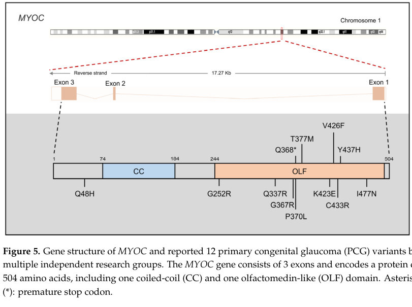

## Question

# Disease Characteristics Research Template

## Target Disease
- **Disease Name:** Juvenile Open Angle Glaucoma
- **MONDO ID:** MONDO:0020367 (if available)
- **Category:** Mendelian

## Research Objectives

Please provide a comprehensive research report on **Juvenile Open Angle Glaucoma** covering all of the
disease characteristics listed below. This report will be used to populate a disease knowledge
base entry. Be thorough and cite primary literature (PMID preferred) for all claims.

For each section, **suggested databases/resources** are listed. These are the first places
you should search for information on each topic.

---

### 1. Disease Information
> **Search first:** OMIM, Orphanet, ICD-10/ICD-11, MeSH, PubMed

- What is the disease? Provide a concise overview.
- What are the key identifiers? (OMIM, Orphanet, ICD-10/ICD-11, MeSH, Mondo)
- What are the common synonyms and alternative names?
- Is the information derived from individual patients (e.g., EHR) or aggregated disease-level resources?

### 2. Etiology

- **Disease Causal Factors**: What are the primary causes? (genetic, environmental, infectious, mechanistic)
- **Risk Factors**:
  > **Search first:** PubMed, Cochrane Library, UpToDate, clinical guidelines, ClinVar, ClinGen, GWAS Catalog, PheGenI, CTD, CDC, WHO, epidemiological databases
  - Genetic risk factors (causal variants, susceptibility loci, modifier genes)
  - Environmental risk factors (toxins, lifestyle, occupational exposures, age, sex, family history)
- **Protective Factors**:
  > **Search first:** PubMed, Cochrane Library, clinical trial databases, GWAS Catalog, gnomAD, WHO, CDC, nutrition databases
  - Genetic protective factors (protective variants, modifier alleles)
  - Environmental protective factors (diet, lifestyle, exposures that reduce risk)
- **Gene-Environment Interactions**: How do genetic and environmental factors interact to influence disease?
  > **Search first:** CTD, PubMed, PheGenI, GxE databases

### 3. Phenotypes
> **Search first:** HPO (Human Phenotype Ontology), OMIM, Orphanet, PubMed, clinicaltrials.gov, MedDRA, SNOMED CT, DECIPHER, LOINC

For each phenotype, provide:
- **Phenotype type**: symptoms, clinical signs, physical manifestations, behavioral changes, or laboratory abnormalities
  > For symptoms/signs: HPO, OMIM, Orphanet, PubMed
  > For behavioral changes: HPO, DSM, RDoC (Research Domain Criteria), PubMed
  > For laboratory abnormalities: LOINC, SNOMED CT, LabTests Online, PubMed
- **Phenotype characteristics**:
  > **Search first:** OMIM, Orphanet, HPO, PubMed
  - Age of symptom onset (neonatal, childhood, adult-onset, late-onset)
  - Symptom severity (mild, moderate, severe, variable)
  - Symptom progression (stable, progressive, episodic, fluctuating)
  - Frequency among affected individuals (percentage or qualitative)
- **Quality of life impact**: Effects on daily functioning and well-being (per-phenotype when possible)
  > **Search first:** EQ-5D database, SF-36, WHO QOL databases, PubMed
- Suggest HPO (Human Phenotype Ontology) terms for each phenotype

### 4. Genetic/Molecular Information

- **Causal Genes**: Gene mutations or chromosomal abnormalities responsible for disease (gene symbols, OMIM IDs)
  > **Search first:** OMIM, ClinVar, HGMD, Ensembl, NCBI Gene
- **Pathogenic Variants**:
  - Affected genes (gene symbols, HGNC IDs)
    > **Search first:** OMIM, NCBI Gene, Ensembl, HGNC, UniProt, GeneCards
  - Variant classification (pathogenic, likely pathogenic, VUS per ACMG/AMP guidelines)
    > **Search first:** ClinVar, ClinGen, ACMG/AMP guidelines, VarSome
  - Variant type/class (missense, frameshift, nonsense, splice-site, structural)
  - Allele frequency in population databases
    > **Search first:** gnomAD, 1000 Genomes, ExAC, TOPMed, dbSNP
  - Somatic vs germline origin
    > **Search first:** COSMIC (somatic), ClinVar, ICGC, TCGA
  - Functional consequences (loss of function, gain of function, dominant negative)
- **Modifier Genes**: Genes that modify disease severity or expression
- **Epigenetic Information**: DNA methylation, histone modifications, chromatin changes affecting disease
  > **Search first:** ENCODE, Roadmap Epigenomics, MethBase, DiseaseMeth
- **Chromosomal Abnormalities**: Large-scale genetic changes (aneuploidy, translocations, inversions)
  > **Search first:** DECIPHER, ClinVar, ECARUCA, UCSC Genome Browser

### 5. Environmental Information

- **Environmental Factors**: Non-genetic contributing factors (toxins, radiation, pollution, occupational exposure)
  > **Search first:** CTD (Comparative Toxicogenomics Database), TOXNET, PubMed, EPA databases
- **Lifestyle Factors**: Behavioral factors (smoking, diet, exercise, alcohol consumption)
  > **Search first:** CDC databases, WHO, PubMed, NHANES
- **Infectious Agents**: If applicable, pathogens causing or triggering disease (bacteria, viruses, fungi, parasites)
  > **Search first:** NCBI Taxonomy, ViPR, BV-BRC, MicrobeDB, GIDEON

### 6. Mechanism / Pathophysiology

- **Molecular Pathways**: Specific signaling cascades or biochemical pathways involved (Wnt, MAPK, mTOR, PI3K-AKT, etc.)
  > **Search first:** KEGG, Reactome, WikiPathways, PathBank, BioCyc
- **Cellular Processes**: Cell-level mechanisms (apoptosis, autophagy, cell cycle dysregulation, inflammation, etc.)
  > **Search first:** Gene Ontology (GO), Reactome, KEGG, PubMed
- **Protein Dysfunction**: How protein structure or function is altered (misfolding, aggregation, loss of function, gain of function)
  > **Search first:** UniProt, PDB (Protein Data Bank), InterPro, Pfam, AlphaFold
- **Metabolic Changes**: Alterations in metabolic processes (energy metabolism, lipid metabolism, amino acid metabolism)
  > **Search first:** KEGG, BioCyc, HMDB (Human Metabolome Database), BRENDA
- **Immune System Involvement**: Role of immune response (autoimmunity, immunodeficiency, chronic inflammation)
  > **Search first:** ImmPort, Immunome Database, IEDB, Gene Ontology
- **Tissue Damage Mechanisms**: How tissues/ are injured (oxidative stress, ischemia, fibrosis, necrosis)
  > **Search first:** PubMed, Gene Ontology, Reactome
- **Biochemical Abnormalities**: Specific molecular defects (enzyme deficiencies, receptor dysfunction, ion channel defects)
  > **Search first:** BRENDA, UniProt, KEGG, OMIM, PubMed
- **Epigenetic Changes**: DNA methylation, histone modifications affecting gene expression in disease
  > **Search first:** ENCODE, Roadmap Epigenomics, MethBase, DiseaseMeth
- **Molecular Profiling** (if available):
  - Transcriptomics/gene expression changes
    > **Search first:** GEO (Gene Expression Omnibus), ArrayExpress, GTEx, Human Cell Atlas, SRA
  - Proteomics findings
    > **Search first:** PRIDE, ProteomeXchange, Human Protein Atlas, STRING, BioGRID
  - Metabolomics signatures
    > **Search first:** MetaboLights, Metabolomics Workbench, HMDB, METLIN
  - Lipidomics alterations
    > **Search first:** LIPID MAPS, SwissLipids, LipidHome, Metabolomics Workbench
  - Genomic structural features
    > **Search first:** UCSC Genome Browser, Ensembl, NCBI, dbVar, DGV
- **Advanced Technologies** (if applicable):
  - Single-cell analysis findings (cell-type specific mechanisms, cellular heterogeneity)
    > **Search first:** Human Cell Atlas, Single Cell Portal, GEO, CELLxGENE
  - Spatial transcriptomics findings
    > **Search first:** GEO, Spatial Research, Vizgen, 10x Genomics data
  - Multi-omics integration results
    > **Search first:** TCGA, ICGC, cBioPortal, LinkedOmics, PubMed
  - Functional genomics screens (CRISPR, RNAi)
    > **Search first:** DepMap, GenomeRNAi, PubMed, BioGRID ORCS

For each mechanism, describe:
- The causal chain from initial trigger to clinical manifestation
- Which mechanisms are upstream vs downstream
- What cell types and biological processes are involved
- Suggest GO terms for biological processes and CL terms for cell types

### 7. Anatomical Structures Affected

- **Organ Level**:
  - Primary organs directly affected
  - Secondary organ involvement (complications, secondary effects)
  - Body systems involved (cardiovascular, nervous, digestive, respiratory, endocrine, etc.)
  > **Search first:** Uberon, FMA (Foundational Model of Anatomy), OMIM, HPO, ICD-11, MeSH, SNOMED CT
- **Tissue and Cell Level**:
  - Specific tissue types affected (epithelial, connective, muscle, nervous)
  - Specific cell populations targeted (with Cell Ontology terms)
  > **Search first:** Uberon, Human Protein Atlas, Cell Ontology, Human Cell Atlas, CellMarker, PanglaoDB
- **Subcellular Level**:
  - Cellular compartments involved (mitochondria, nucleus, ER, lysosomes) (with GO Cellular Component terms)
  > **Search first:** Gene Ontology (Cellular Component), UniProt, Human Protein Atlas
- **Localization**:
  - Specific anatomical sites (with UBERON terms)
    > **Search first:** FMA, Uberon, NeuroNames (for brain), SNOMED CT
  - Lateralization (unilateral, bilateral, asymmetric)
    > **Search first:** HPO, clinical literature, imaging databases

### 8. Temporal Development

- **Onset**:
  - Typical age of onset (congenital, pediatric, adult, geriatric)
  - Onset pattern (acute, subacute, chronic, insidious)
  > **Search first:** OMIM, Orphanet, HPO, PubMed
- **Progression**:
  - Disease stages (early, intermediate, advanced, end-stage)
    > **Search first:** Cancer Staging Manual (AJCC), WHO classifications, PubMed
  - Progression rate (rapid, slow, variable)
  - Disease course pattern (episodic, relapsing-remitting, progressive, stable)
  - Disease duration (self-limited, chronic lifelong)
  > **Search first:** Disease registries, longitudinal cohort databases, natural history studies, PubMed, Orphanet, OMIM
- **Patterns**:
  - Remission patterns (spontaneous, treatment-induced)
    > **Search first:** Clinical trial databases, disease registries, PubMed
  - Critical periods (time windows of vulnerability or opportunity for intervention)
    > **Search first:** PubMed, developmental biology databases, clinical guidelines

### 9. Inheritance and Population

- **Epidemiology**:
  - Prevalence (cases per 100,000 at given time)
  - Incidence (new cases per 100,000 per year)
  > **Search first:** Orphanet, CDC, WHO, GBD (Global Burden of Disease), national registries, SEER, disease registries
- **For Genetic Etiology**:
  - Inheritance pattern (AD, AR, X-linked, mitochondrial, multifactorial, polygenic)
    > **Search first:** OMIM, Orphanet, ClinVar, GTR (Genetic Testing Registry)
  - Penetrance (complete, incomplete, age-dependent)
    > **Search first:** ClinVar, OMIM, PubMed, ClinGen
  - Expressivity (variable, consistent)
    > **Search first:** OMIM, ClinVar, PubMed
  - Genetic anticipation (increasing severity in successive generations)
    > **Search first:** OMIM, PubMed (especially for repeat expansion disorders)
  - Germline mosaicism
    > **Search first:** ClinVar, OMIM, genetic counseling literature, PubMed
  - Founder effects (population-specific mutations)
    > **Search first:** gnomAD, population genetics databases, PubMed
  - Consanguinity role
    > **Search first:** OMIM, population studies, genetic counseling resources
  - Carrier frequency
    > **Search first:** gnomAD, carrier screening databases, GeneReviews, GTR
- **Population Demographics**:
  - Affected populations (ethnic or demographic groups with higher prevalence)
    > **Search first:** gnomAD, 1000 Genomes, PAGE Study, PubMed, population registries
  - Geographic distribution (endemic areas, regional variation)
    > **Search first:** WHO, CDC, GBD, Orphanet, geographic epidemiology databases
  - Geographic distribution of specific variants
  - Sex ratio (male:female)
    > **Search first:** Disease registries, OMIM, PubMed, epidemiological databases
  - Age distribution of affected individuals
    > **Search first:** CDC, disease registries, SEER, Orphanet

### 10. Diagnostics

- **Clinical Tests**:
  - Laboratory tests (blood, urine, tissue chemistry, specific enzyme assays)
    > **Search first:** LOINC, LabTests Online, PubMed
  - Biomarkers (proteins, metabolites, genetic markers, circulating biomarkers)
    > **Search first:** FDA Biomarker List, BEST (Biomarkers, EndpointS, and other Tools), PubMed
  - Imaging studies (X-ray, CT, MRI, PET, ultrasound)
    > **Search first:** RadLex, DICOM, Radiopaedia, imaging databases
  - Functional tests (pulmonary function, cardiac stress tests)
    > **Search first:** LOINC, clinical guidelines, PubMed
  - Electrophysiology (EEG, EMG, ECG, nerve conduction studies)
    > **Search first:** LOINC, clinical neurophysiology databases, PubMed
  - Biopsy findings (histopathology, immunohistochemistry)
    > **Search first:** SNOMED CT, College of American Pathologists resources, PubMed
  - Pathology findings (microscopic examination)
    > **Search first:** SNOMED CT, Digital Pathology databases, PubMed
- **Genetic Testing**:
  > **Search first:** GTR (Genetic Testing Registry), GeneReviews, ClinGen
  - Overview of recommended genetic testing approach
  - Whole genome sequencing (WGS) utility
    > **Search first:** GTR, ClinVar, GEL (Genomics England), gnomAD
  - Whole exome sequencing (WES) utility
    > **Search first:** GTR, ClinVar, OMIM, GeneMatcher
  - Gene panels (which panels, which genes)
    > **Search first:** GTR, ClinVar, laboratory-specific databases
  - Single gene testing
    > **Search first:** GTR, ClinVar, OMIM, GeneReviews
  - Chromosomal microarray (CMA)
    > **Search first:** DECIPHER, ClinVar, dbVar, ECARUCA
  - Karyotyping
    > **Search first:** Chromosome Abnormality Database, ClinVar, cytogenetics resources
  - FISH
    > **Search first:** ClinVar, cytogenetics databases, PubMed
  - Mitochondrial DNA testing
    > **Search first:** MITOMAP, MSeqDR, ClinVar, GTR
  - Repeat expansion testing
    > **Search first:** GTR, ClinVar, repeat expansion databases, PubMed
- **Omics-Based Diagnostics** (if applicable):
  - RNA sequencing / transcriptomics
    > **Search first:** GEO, ArrayExpress, GTEx, RNA-seq databases
  - Proteomics
    > **Search first:** PRIDE, ProteomeXchange, FDA Biomarker database
  - Metabolomics
    > **Search first:** MetaboLights, Metabolomics Workbench, HMDB
  - Epigenomics
    > **Search first:** GEO, ENCODE, Roadmap Epigenomics, MethBase
  - Liquid biopsy
    > **Search first:** COSMIC, ClinVar, liquid biopsy databases, PubMed
- **Clinical Criteria**:
  - Standardized diagnostic criteria (DSM, ICD, society guidelines)
    > **Search first:** DSM-5, ICD-11, clinical society guidelines, UpToDate
  - Differential diagnosis (other conditions to rule out, with distinguishing features)
    > **Search first:** DynaMed, UpToDate, clinical decision support systems
- **Screening**:
  - Screening methods for asymptomatic individuals (newborn screening, carrier screening, cascade screening)
    > **Search first:** ACMG recommendations, CDC newborn screening, GTR

### 11. Outcome/Prognosis

- **Survival and Mortality**:
  - Survival rate (5-year, 10-year, overall)
    > **Search first:** SEER, cancer registries, disease-specific registries, PubMed
  - Life expectancy (with and without treatment if applicable)
    > **Search first:** Orphanet, disease registries, actuarial databases, PubMed
  - Mortality rate
    > **Search first:** CDC, WHO, GBD, national mortality databases
  - Disease-specific mortality (deaths directly attributable to disease)
    > **Search first:** Disease registries, CDC Wonder, GBD, PubMed
- **Morbidity and Function**:
  - Morbidity (disease-related disability and health impacts)
    > **Search first:** GBD, WHO, disability databases, PubMed
  - Disability outcomes (long-term functional impairments)
    > **Search first:** ICF (International Classification of Functioning), disability registries
  - Quality of life measures (EQ-5D, SF-36, PROMIS, disease-specific tools)
    > **Search first:** EQ-5D database, SF-36, PROMIS, PubMed
- **Disease Course**:
  - Complications (secondary problems: infections, organ failure, etc.)
    > **Search first:** ICD codes, disease registries, clinical databases, PubMed
  - Recovery potential (likelihood and extent of recovery, with vs without treatment)
    > **Search first:** Natural history studies, rehabilitation databases, PubMed
- **Prediction**:
  - Prognostic factors (age, disease severity, biomarkers, treatment response)
    > **Search first:** Prognostic models databases, clinical calculators, PubMed
  - Prognostic biomarkers (molecular markers predicting disease course)
    > **Search first:** FDA Biomarker database, PubMed, cancer prognostic databases

### 12. Treatment

- **Pharmacotherapy**:
  - Pharmacological treatments (drug names, drug classes, mechanisms of action)
    > **Search first:** DrugBank, RxNorm, ATC classification, DailyMed, FDA databases
  - Pharmacogenomics (how genetic variants affect drug metabolism, efficacy, toxicity)
    > **Search first:** PharmGKB, CPIC (Clinical Pharmacogenetics), FDA Table of PGx Biomarkers
- **Advanced Therapeutics**:
  - Gene therapy (viral vectors, CRISPR, gene replacement, gene editing)
    > **Search first:** ClinicalTrials.gov, FDA gene therapy database, ASGCT resources
  - Cell therapy (stem cell transplant, CAR-T, cellular therapeutics)
    > **Search first:** ClinicalTrials.gov, FDA cell therapy database, FACT standards
  - RNA-based therapies (ASOs, siRNA, mRNA therapies)
    > **Search first:** ClinicalTrials.gov, FDA approvals, PubMed
  - Targeted therapies (treatments directed at specific molecular targets)
    > **Search first:** My Cancer Genome, OncoKB, ClinicalTrials.gov, FDA approvals
  - Immunotherapies (checkpoint inhibitors, monoclonal antibodies)
    > **Search first:** Cancer Immunotherapy Database, FDA approvals, ClinicalTrials.gov
- **Surgical and Interventional**:
  - Surgical interventions (types of surgery, timing, outcomes)
    > **Search first:** CPT codes, surgical registries, clinical guidelines, PubMed
- **Supportive and Rehabilitative**:
  - Supportive care (symptom management, pain control, nutrition)
    > **Search first:** Clinical guidelines, Cochrane Library, PubMed
  - Rehabilitation (physical therapy, occupational therapy, speech therapy)
    > **Search first:** Rehabilitation medicine databases, clinical guidelines, PubMed
- **Experimental**:
  - Experimental treatments in clinical trials (with NCT identifiers if available)
    > **Search first:** ClinicalTrials.gov, EU Clinical Trials Register, WHO ICTRP
- **Treatment Outcomes**:
  - Treatment response rates
    > **Search first:** Clinical trial databases, FDA reviews, systematic reviews, PubMed
  - Side effects and adverse events
    > **Search first:** FDA Adverse Event Reporting System (FAERS), MedWatch, PubMed
- **Treatment Strategy**:
  - Treatment algorithms (clinical pathways, decision trees)
    > **Search first:** Clinical practice guidelines, NCCN Guidelines, UpToDate
  - Combination therapies
    > **Search first:** ClinicalTrials.gov, treatment guidelines, PubMed
  - Personalized medicine approaches (genotype-guided treatment)
    > **Search first:** My Cancer Genome, CIViC, PharmGKB, precision medicine databases

For each treatment, suggest MAXO (Medical Action Ontology) terms where applicable.

### 13. Prevention

- **Prevention Levels**:
  - Primary prevention (preventing disease occurrence: vaccination, risk factor modification)
    > **Search first:** CDC, WHO, USPSTF recommendations, Cochrane Library
  - Secondary prevention (early detection and treatment: screening programs, early intervention)
    > **Search first:** USPSTF, CDC screening guidelines, WHO
  - Tertiary prevention (preventing complications in those with disease)
    > **Search first:** Clinical guidelines, disease management protocols, PubMed
- **Immunization**: Vaccine strategies (if applicable)
  > **Search first:** CDC vaccine schedules, WHO immunization, FDA vaccine database
- **Screening and Early Detection**:
  - Screening programs (population-based: newborn screening, cancer screening)
    > **Search first:** CDC screening programs, USPSTF, cancer screening databases
  - Genetic screening (carrier screening, preimplantation genetic diagnosis, prenatal testing)
    > **Search first:** ACMG recommendations, ACOG guidelines, GTR
  - Risk stratification (identifying high-risk individuals for targeted prevention)
    > **Search first:** Risk prediction models, clinical calculators, PubMed
- **Behavioral Interventions**: Lifestyle modifications to reduce risk
  > **Search first:** CDC, WHO, behavioral intervention databases, Cochrane Library
- **Counseling**: Genetic counseling (risk assessment, family planning guidance)
  > **Search first:** NSGC resources, ACMG guidelines, GeneReviews
- **Public Health**:
  - Public health interventions (sanitation, vector control, health education)
    > **Search first:** CDC, WHO, public health databases, PubMed
  - Environmental interventions (reducing environmental risk factors)
    > **Search first:** EPA databases, WHO environmental health, PubMed
- **Prophylaxis**: Preventive medications or procedures
  > **Search first:** Clinical guidelines, FDA approvals, PubMed

### 14. Other Species / Natural Disease

- **Taxonomy**: Species affected (with NCBI Taxon identifiers)
  > **Search first:** NCBI Taxonomy
- **Breed**: Specific breeds affected (with VBO identifiers if applicable)
  > **Search first:** VBO (Vertebrate Breed Ontology)
- **Gene**: Orthologous genes in other species (with NCBI Gene IDs)
  > **Search first:** NCBI Gene
- **Natural Disease**:
  - Naturally occurring disease in other species (companion animals, wildlife)
    > **Search first:** OMIA (Online Mendelian Inheritance in Animals), VetCompass, PubMed
  - Veterinary relevance and importance in animal health
    > **Search first:** OMIA, veterinary databases, PubMed
- **Comparative Biology**:
  - Comparative pathology (similarities and differences across species)
    > **Search first:** OMIA, comparative pathology databases, PubMed
  - Evolutionary conservation of disease mechanisms
    > **Search first:** HomoloGene, OrthoMCL, Alliance of Genome Resources
- **Transmission** (if applicable):
  - Zoonotic potential
    > **Search first:** CDC zoonotic diseases, WHO zoonoses, GIDEON
  - Cross-species susceptibility
    > **Search first:** NCBI Taxonomy, veterinary databases, PubMed

### 15. Model Organisms

- **Model Types**:
  - Model organism type (mammalian, invertebrate, cellular, in vitro)
    > **Search first:** Alliance of Genome Resources, model organism databases
  - Specific model systems (mouse, rat, zebrafish, Drosophila, C. elegans, yeast, cell lines, organoids, iPSCs)
    > **Search first:** MGI, RGD, ZFIN, FlyBase, WormBase, SGD, ATCC, Cellosaurus
  - Induced models (drug treatment, surgical intervention, environmental manipulation)
    > **Search first:** MGI, model organism databases, PubMed
- **Genetic Models**:
  - Types available (knockout, knock-in, transgenic, conditional, humanized)
    > **Search first:** MGI, IMPC, KOMP, EuMMCR, IMSR
- **Model Characteristics**:
  - Phenotype recapitulation (how well model reproduces human disease features)
    > **Search first:** Model organism databases, comparative studies, PubMed
  - Model limitations (aspects of human disease not captured)
    > **Search first:** Model organism databases, PubMed, review articles
- **Applications**:
  - Research applications (what aspects of disease can be studied)
    > **Search first:** Model organism databases, PubMed
- **Resources**:
  - Model databases
    > **Search first:** MGI, RGD, ZFIN, FlyBase, WormBase, IMSR, EMMA, MMRRC

---

## Citation Requirements

- Cite primary literature (PMID preferred) for all mechanistic and clinical claims
- Prioritize recent reviews and landmark papers
- Include direct quotes from abstracts where possible to support key statements
- Distinguish evidence source types: human clinical, model organism, in vitro, computational

## Output Format

Structure your response as a comprehensive narrative organized by the sections above.
For each section, provide:
- Factual content with specific details (numbers, percentages, gene names, variant nomenclature)
- Ontology term suggestions (HPO, GO, CL, UBERON, CHEBI, MAXO, MONDO) where applicable
- Evidence citations with PMIDs
- Direct quotes from abstracts to support key claims
- Clear indication when information is not available or not applicable for this disease

This report will be used to populate a disease knowledge base entry with:
- Pathophysiology descriptions with causal chains
- Gene/protein annotations (HGNC, GO terms)
- Phenotype associations (HP terms) with frequencies
- Cell type involvement (CL terms)
- Anatomical locations (UBERON terms)
- Chemical entities (CHEBI terms)
- Treatment annotations (MAXO terms)
- Evidence items with PMIDs and exact abstract quotes
- Epidemiology, prognosis, diagnostic, and prevention information
- Animal model descriptions with phenotype recapitulation details

## Output

Question: You are an expert researcher providing comprehensive, well-cited information.

Provide detailed information focusing on:
1. Key concepts and definitions with current understanding
2. Recent developments and latest research (prioritize 2023-2024 sources)
3. Current applications and real-world implementations
4. Expert opinions and analysis from authoritative sources
5. Relevant statistics and data from recent studies

Format as a comprehensive research report with proper citations. Include URLs and publication dates where available.
Always prioritize recent, authoritative sources and provide specific citations for all major claims.

# Disease Characteristics Research Template

## Target Disease
- **Disease Name:** Juvenile Open Angle Glaucoma
- **MONDO ID:** MONDO:0020367 (if available)
- **Category:** Mendelian

## Research Objectives

Please provide a comprehensive research report on **Juvenile Open Angle Glaucoma** covering all of the
disease characteristics listed below. This report will be used to populate a disease knowledge
base entry. Be thorough and cite primary literature (PMID preferred) for all claims.

For each section, **suggested databases/resources** are listed. These are the first places
you should search for information on each topic.

---

### 1. Disease Information
> **Search first:** OMIM, Orphanet, ICD-10/ICD-11, MeSH, PubMed

- What is the disease? Provide a concise overview.
- What are the key identifiers? (OMIM, Orphanet, ICD-10/ICD-11, MeSH, Mondo)
- What are the common synonyms and alternative names?
- Is the information derived from individual patients (e.g., EHR) or aggregated disease-level resources?

### 2. Etiology

- **Disease Causal Factors**: What are the primary causes? (genetic, environmental, infectious, mechanistic)
- **Risk Factors**:
  > **Search first:** PubMed, Cochrane Library, UpToDate, clinical guidelines, ClinVar, ClinGen, GWAS Catalog, PheGenI, CTD, CDC, WHO, epidemiological databases
  - Genetic risk factors (causal variants, susceptibility loci, modifier genes)
  - Environmental risk factors (toxins, lifestyle, occupational exposures, age, sex, family history)
- **Protective Factors**:
  > **Search first:** PubMed, Cochrane Library, clinical trial databases, GWAS Catalog, gnomAD, WHO, CDC, nutrition databases
  - Genetic protective factors (protective variants, modifier alleles)
  - Environmental protective factors (diet, lifestyle, exposures that reduce risk)
- **Gene-Environment Interactions**: How do genetic and environmental factors interact to influence disease?
  > **Search first:** CTD, PubMed, PheGenI, GxE databases

### 3. Phenotypes
> **Search first:** HPO (Human Phenotype Ontology), OMIM, Orphanet, PubMed, clinicaltrials.gov, MedDRA, SNOMED CT, DECIPHER, LOINC

For each phenotype, provide:
- **Phenotype type**: symptoms, clinical signs, physical manifestations, behavioral changes, or laboratory abnormalities
  > For symptoms/signs: HPO, OMIM, Orphanet, PubMed
  > For behavioral changes: HPO, DSM, RDoC (Research Domain Criteria), PubMed
  > For laboratory abnormalities: LOINC, SNOMED CT, LabTests Online, PubMed
- **Phenotype characteristics**:
  > **Search first:** OMIM, Orphanet, HPO, PubMed
  - Age of symptom onset (neonatal, childhood, adult-onset, late-onset)
  - Symptom severity (mild, moderate, severe, variable)
  - Symptom progression (stable, progressive, episodic, fluctuating)
  - Frequency among affected individuals (percentage or qualitative)
- **Quality of life impact**: Effects on daily functioning and well-being (per-phenotype when possible)
  > **Search first:** EQ-5D database, SF-36, WHO QOL databases, PubMed
- Suggest HPO (Human Phenotype Ontology) terms for each phenotype

### 4. Genetic/Molecular Information

- **Causal Genes**: Gene mutations or chromosomal abnormalities responsible for disease (gene symbols, OMIM IDs)
  > **Search first:** OMIM, ClinVar, HGMD, Ensembl, NCBI Gene
- **Pathogenic Variants**:
  - Affected genes (gene symbols, HGNC IDs)
    > **Search first:** OMIM, NCBI Gene, Ensembl, HGNC, UniProt, GeneCards
  - Variant classification (pathogenic, likely pathogenic, VUS per ACMG/AMP guidelines)
    > **Search first:** ClinVar, ClinGen, ACMG/AMP guidelines, VarSome
  - Variant type/class (missense, frameshift, nonsense, splice-site, structural)
  - Allele frequency in population databases
    > **Search first:** gnomAD, 1000 Genomes, ExAC, TOPMed, dbSNP
  - Somatic vs germline origin
    > **Search first:** COSMIC (somatic), ClinVar, ICGC, TCGA
  - Functional consequences (loss of function, gain of function, dominant negative)
- **Modifier Genes**: Genes that modify disease severity or expression
- **Epigenetic Information**: DNA methylation, histone modifications, chromatin changes affecting disease
  > **Search first:** ENCODE, Roadmap Epigenomics, MethBase, DiseaseMeth
- **Chromosomal Abnormalities**: Large-scale genetic changes (aneuploidy, translocations, inversions)
  > **Search first:** DECIPHER, ClinVar, ECARUCA, UCSC Genome Browser

### 5. Environmental Information

- **Environmental Factors**: Non-genetic contributing factors (toxins, radiation, pollution, occupational exposure)
  > **Search first:** CTD (Comparative Toxicogenomics Database), TOXNET, PubMed, EPA databases
- **Lifestyle Factors**: Behavioral factors (smoking, diet, exercise, alcohol consumption)
  > **Search first:** CDC databases, WHO, PubMed, NHANES
- **Infectious Agents**: If applicable, pathogens causing or triggering disease (bacteria, viruses, fungi, parasites)
  > **Search first:** NCBI Taxonomy, ViPR, BV-BRC, MicrobeDB, GIDEON

### 6. Mechanism / Pathophysiology

- **Molecular Pathways**: Specific signaling cascades or biochemical pathways involved (Wnt, MAPK, mTOR, PI3K-AKT, etc.)
  > **Search first:** KEGG, Reactome, WikiPathways, PathBank, BioCyc
- **Cellular Processes**: Cell-level mechanisms (apoptosis, autophagy, cell cycle dysregulation, inflammation, etc.)
  > **Search first:** Gene Ontology (GO), Reactome, KEGG, PubMed
- **Protein Dysfunction**: How protein structure or function is altered (misfolding, aggregation, loss of function, gain of function)
  > **Search first:** UniProt, PDB (Protein Data Bank), InterPro, Pfam, AlphaFold
- **Metabolic Changes**: Alterations in metabolic processes (energy metabolism, lipid metabolism, amino acid metabolism)
  > **Search first:** KEGG, BioCyc, HMDB (Human Metabolome Database), BRENDA
- **Immune System Involvement**: Role of immune response (autoimmunity, immunodeficiency, chronic inflammation)
  > **Search first:** ImmPort, Immunome Database, IEDB, Gene Ontology
- **Tissue Damage Mechanisms**: How tissues/ are injured (oxidative stress, ischemia, fibrosis, necrosis)
  > **Search first:** PubMed, Gene Ontology, Reactome
- **Biochemical Abnormalities**: Specific molecular defects (enzyme deficiencies, receptor dysfunction, ion channel defects)
  > **Search first:** BRENDA, UniProt, KEGG, OMIM, PubMed
- **Epigenetic Changes**: DNA methylation, histone modifications affecting gene expression in disease
  > **Search first:** ENCODE, Roadmap Epigenomics, MethBase, DiseaseMeth
- **Molecular Profiling** (if available):
  - Transcriptomics/gene expression changes
    > **Search first:** GEO (Gene Expression Omnibus), ArrayExpress, GTEx, Human Cell Atlas, SRA
  - Proteomics findings
    > **Search first:** PRIDE, ProteomeXchange, Human Protein Atlas, STRING, BioGRID
  - Metabolomics signatures
    > **Search first:** MetaboLights, Metabolomics Workbench, HMDB, METLIN
  - Lipidomics alterations
    > **Search first:** LIPID MAPS, SwissLipids, LipidHome, Metabolomics Workbench
  - Genomic structural features
    > **Search first:** UCSC Genome Browser, Ensembl, NCBI, dbVar, DGV
- **Advanced Technologies** (if applicable):
  - Single-cell analysis findings (cell-type specific mechanisms, cellular heterogeneity)
    > **Search first:** Human Cell Atlas, Single Cell Portal, GEO, CELLxGENE
  - Spatial transcriptomics findings
    > **Search first:** GEO, Spatial Research, Vizgen, 10x Genomics data
  - Multi-omics integration results
    > **Search first:** TCGA, ICGC, cBioPortal, LinkedOmics, PubMed
  - Functional genomics screens (CRISPR, RNAi)
    > **Search first:** DepMap, GenomeRNAi, PubMed, BioGRID ORCS

For each mechanism, describe:
- The causal chain from initial trigger to clinical manifestation
- Which mechanisms are upstream vs downstream
- What cell types and biological processes are involved
- Suggest GO terms for biological processes and CL terms for cell types

### 7. Anatomical Structures Affected

- **Organ Level**:
  - Primary organs directly affected
  - Secondary organ involvement (complications, secondary effects)
  - Body systems involved (cardiovascular, nervous, digestive, respiratory, endocrine, etc.)
  > **Search first:** Uberon, FMA (Foundational Model of Anatomy), OMIM, HPO, ICD-11, MeSH, SNOMED CT
- **Tissue and Cell Level**:
  - Specific tissue types affected (epithelial, connective, muscle, nervous)
  - Specific cell populations targeted (with Cell Ontology terms)
  > **Search first:** Uberon, Human Protein Atlas, Cell Ontology, Human Cell Atlas, CellMarker, PanglaoDB
- **Subcellular Level**:
  - Cellular compartments involved (mitochondria, nucleus, ER, lysosomes) (with GO Cellular Component terms)
  > **Search first:** Gene Ontology (Cellular Component), UniProt, Human Protein Atlas
- **Localization**:
  - Specific anatomical sites (with UBERON terms)
    > **Search first:** FMA, Uberon, NeuroNames (for brain), SNOMED CT
  - Lateralization (unilateral, bilateral, asymmetric)
    > **Search first:** HPO, clinical literature, imaging databases

### 8. Temporal Development

- **Onset**:
  - Typical age of onset (congenital, pediatric, adult, geriatric)
  - Onset pattern (acute, subacute, chronic, insidious)
  > **Search first:** OMIM, Orphanet, HPO, PubMed
- **Progression**:
  - Disease stages (early, intermediate, advanced, end-stage)
    > **Search first:** Cancer Staging Manual (AJCC), WHO classifications, PubMed
  - Progression rate (rapid, slow, variable)
  - Disease course pattern (episodic, relapsing-remitting, progressive, stable)
  - Disease duration (self-limited, chronic lifelong)
  > **Search first:** Disease registries, longitudinal cohort databases, natural history studies, PubMed, Orphanet, OMIM
- **Patterns**:
  - Remission patterns (spontaneous, treatment-induced)
    > **Search first:** Clinical trial databases, disease registries, PubMed
  - Critical periods (time windows of vulnerability or opportunity for intervention)
    > **Search first:** PubMed, developmental biology databases, clinical guidelines

### 9. Inheritance and Population

- **Epidemiology**:
  - Prevalence (cases per 100,000 at given time)
  - Incidence (new cases per 100,000 per year)
  > **Search first:** Orphanet, CDC, WHO, GBD (Global Burden of Disease), national registries, SEER, disease registries
- **For Genetic Etiology**:
  - Inheritance pattern (AD, AR, X-linked, mitochondrial, multifactorial, polygenic)
    > **Search first:** OMIM, Orphanet, ClinVar, GTR (Genetic Testing Registry)
  - Penetrance (complete, incomplete, age-dependent)
    > **Search first:** ClinVar, OMIM, PubMed, ClinGen
  - Expressivity (variable, consistent)
    > **Search first:** OMIM, ClinVar, PubMed
  - Genetic anticipation (increasing severity in successive generations)
    > **Search first:** OMIM, PubMed (especially for repeat expansion disorders)
  - Germline mosaicism
    > **Search first:** ClinVar, OMIM, genetic counseling literature, PubMed
  - Founder effects (population-specific mutations)
    > **Search first:** gnomAD, population genetics databases, PubMed
  - Consanguinity role
    > **Search first:** OMIM, population studies, genetic counseling resources
  - Carrier frequency
    > **Search first:** gnomAD, carrier screening databases, GeneReviews, GTR
- **Population Demographics**:
  - Affected populations (ethnic or demographic groups with higher prevalence)
    > **Search first:** gnomAD, 1000 Genomes, PAGE Study, PubMed, population registries
  - Geographic distribution (endemic areas, regional variation)
    > **Search first:** WHO, CDC, GBD, Orphanet, geographic epidemiology databases
  - Geographic distribution of specific variants
  - Sex ratio (male:female)
    > **Search first:** Disease registries, OMIM, PubMed, epidemiological databases
  - Age distribution of affected individuals
    > **Search first:** CDC, disease registries, SEER, Orphanet

### 10. Diagnostics

- **Clinical Tests**:
  - Laboratory tests (blood, urine, tissue chemistry, specific enzyme assays)
    > **Search first:** LOINC, LabTests Online, PubMed
  - Biomarkers (proteins, metabolites, genetic markers, circulating biomarkers)
    > **Search first:** FDA Biomarker List, BEST (Biomarkers, EndpointS, and other Tools), PubMed
  - Imaging studies (X-ray, CT, MRI, PET, ultrasound)
    > **Search first:** RadLex, DICOM, Radiopaedia, imaging databases
  - Functional tests (pulmonary function, cardiac stress tests)
    > **Search first:** LOINC, clinical guidelines, PubMed
  - Electrophysiology (EEG, EMG, ECG, nerve conduction studies)
    > **Search first:** LOINC, clinical neurophysiology databases, PubMed
  - Biopsy findings (histopathology, immunohistochemistry)
    > **Search first:** SNOMED CT, College of American Pathologists resources, PubMed
  - Pathology findings (microscopic examination)
    > **Search first:** SNOMED CT, Digital Pathology databases, PubMed
- **Genetic Testing**:
  > **Search first:** GTR (Genetic Testing Registry), GeneReviews, ClinGen
  - Overview of recommended genetic testing approach
  - Whole genome sequencing (WGS) utility
    > **Search first:** GTR, ClinVar, GEL (Genomics England), gnomAD
  - Whole exome sequencing (WES) utility
    > **Search first:** GTR, ClinVar, OMIM, GeneMatcher
  - Gene panels (which panels, which genes)
    > **Search first:** GTR, ClinVar, laboratory-specific databases
  - Single gene testing
    > **Search first:** GTR, ClinVar, OMIM, GeneReviews
  - Chromosomal microarray (CMA)
    > **Search first:** DECIPHER, ClinVar, dbVar, ECARUCA
  - Karyotyping
    > **Search first:** Chromosome Abnormality Database, ClinVar, cytogenetics resources
  - FISH
    > **Search first:** ClinVar, cytogenetics databases, PubMed
  - Mitochondrial DNA testing
    > **Search first:** MITOMAP, MSeqDR, ClinVar, GTR
  - Repeat expansion testing
    > **Search first:** GTR, ClinVar, repeat expansion databases, PubMed
- **Omics-Based Diagnostics** (if applicable):
  - RNA sequencing / transcriptomics
    > **Search first:** GEO, ArrayExpress, GTEx, RNA-seq databases
  - Proteomics
    > **Search first:** PRIDE, ProteomeXchange, FDA Biomarker database
  - Metabolomics
    > **Search first:** MetaboLights, Metabolomics Workbench, HMDB
  - Epigenomics
    > **Search first:** GEO, ENCODE, Roadmap Epigenomics, MethBase
  - Liquid biopsy
    > **Search first:** COSMIC, ClinVar, liquid biopsy databases, PubMed
- **Clinical Criteria**:
  - Standardized diagnostic criteria (DSM, ICD, society guidelines)
    > **Search first:** DSM-5, ICD-11, clinical society guidelines, UpToDate
  - Differential diagnosis (other conditions to rule out, with distinguishing features)
    > **Search first:** DynaMed, UpToDate, clinical decision support systems
- **Screening**:
  - Screening methods for asymptomatic individuals (newborn screening, carrier screening, cascade screening)
    > **Search first:** ACMG recommendations, CDC newborn screening, GTR

### 11. Outcome/Prognosis

- **Survival and Mortality**:
  - Survival rate (5-year, 10-year, overall)
    > **Search first:** SEER, cancer registries, disease-specific registries, PubMed
  - Life expectancy (with and without treatment if applicable)
    > **Search first:** Orphanet, disease registries, actuarial databases, PubMed
  - Mortality rate
    > **Search first:** CDC, WHO, GBD, national mortality databases
  - Disease-specific mortality (deaths directly attributable to disease)
    > **Search first:** Disease registries, CDC Wonder, GBD, PubMed
- **Morbidity and Function**:
  - Morbidity (disease-related disability and health impacts)
    > **Search first:** GBD, WHO, disability databases, PubMed
  - Disability outcomes (long-term functional impairments)
    > **Search first:** ICF (International Classification of Functioning), disability registries
  - Quality of life measures (EQ-5D, SF-36, PROMIS, disease-specific tools)
    > **Search first:** EQ-5D database, SF-36, PROMIS, PubMed
- **Disease Course**:
  - Complications (secondary problems: infections, organ failure, etc.)
    > **Search first:** ICD codes, disease registries, clinical databases, PubMed
  - Recovery potential (likelihood and extent of recovery, with vs without treatment)
    > **Search first:** Natural history studies, rehabilitation databases, PubMed
- **Prediction**:
  - Prognostic factors (age, disease severity, biomarkers, treatment response)
    > **Search first:** Prognostic models databases, clinical calculators, PubMed
  - Prognostic biomarkers (molecular markers predicting disease course)
    > **Search first:** FDA Biomarker database, PubMed, cancer prognostic databases

### 12. Treatment

- **Pharmacotherapy**:
  - Pharmacological treatments (drug names, drug classes, mechanisms of action)
    > **Search first:** DrugBank, RxNorm, ATC classification, DailyMed, FDA databases
  - Pharmacogenomics (how genetic variants affect drug metabolism, efficacy, toxicity)
    > **Search first:** PharmGKB, CPIC (Clinical Pharmacogenetics), FDA Table of PGx Biomarkers
- **Advanced Therapeutics**:
  - Gene therapy (viral vectors, CRISPR, gene replacement, gene editing)
    > **Search first:** ClinicalTrials.gov, FDA gene therapy database, ASGCT resources
  - Cell therapy (stem cell transplant, CAR-T, cellular therapeutics)
    > **Search first:** ClinicalTrials.gov, FDA cell therapy database, FACT standards
  - RNA-based therapies (ASOs, siRNA, mRNA therapies)
    > **Search first:** ClinicalTrials.gov, FDA approvals, PubMed
  - Targeted therapies (treatments directed at specific molecular targets)
    > **Search first:** My Cancer Genome, OncoKB, ClinicalTrials.gov, FDA approvals
  - Immunotherapies (checkpoint inhibitors, monoclonal antibodies)
    > **Search first:** Cancer Immunotherapy Database, FDA approvals, ClinicalTrials.gov
- **Surgical and Interventional**:
  - Surgical interventions (types of surgery, timing, outcomes)
    > **Search first:** CPT codes, surgical registries, clinical guidelines, PubMed
- **Supportive and Rehabilitative**:
  - Supportive care (symptom management, pain control, nutrition)
    > **Search first:** Clinical guidelines, Cochrane Library, PubMed
  - Rehabilitation (physical therapy, occupational therapy, speech therapy)
    > **Search first:** Rehabilitation medicine databases, clinical guidelines, PubMed
- **Experimental**:
  - Experimental treatments in clinical trials (with NCT identifiers if available)
    > **Search first:** ClinicalTrials.gov, EU Clinical Trials Register, WHO ICTRP
- **Treatment Outcomes**:
  - Treatment response rates
    > **Search first:** Clinical trial databases, FDA reviews, systematic reviews, PubMed
  - Side effects and adverse events
    > **Search first:** FDA Adverse Event Reporting System (FAERS), MedWatch, PubMed
- **Treatment Strategy**:
  - Treatment algorithms (clinical pathways, decision trees)
    > **Search first:** Clinical practice guidelines, NCCN Guidelines, UpToDate
  - Combination therapies
    > **Search first:** ClinicalTrials.gov, treatment guidelines, PubMed
  - Personalized medicine approaches (genotype-guided treatment)
    > **Search first:** My Cancer Genome, CIViC, PharmGKB, precision medicine databases

For each treatment, suggest MAXO (Medical Action Ontology) terms where applicable.

### 13. Prevention

- **Prevention Levels**:
  - Primary prevention (preventing disease occurrence: vaccination, risk factor modification)
    > **Search first:** CDC, WHO, USPSTF recommendations, Cochrane Library
  - Secondary prevention (early detection and treatment: screening programs, early intervention)
    > **Search first:** USPSTF, CDC screening guidelines, WHO
  - Tertiary prevention (preventing complications in those with disease)
    > **Search first:** Clinical guidelines, disease management protocols, PubMed
- **Immunization**: Vaccine strategies (if applicable)
  > **Search first:** CDC vaccine schedules, WHO immunization, FDA vaccine database
- **Screening and Early Detection**:
  - Screening programs (population-based: newborn screening, cancer screening)
    > **Search first:** CDC screening programs, USPSTF, cancer screening databases
  - Genetic screening (carrier screening, preimplantation genetic diagnosis, prenatal testing)
    > **Search first:** ACMG recommendations, ACOG guidelines, GTR
  - Risk stratification (identifying high-risk individuals for targeted prevention)
    > **Search first:** Risk prediction models, clinical calculators, PubMed
- **Behavioral Interventions**: Lifestyle modifications to reduce risk
  > **Search first:** CDC, WHO, behavioral intervention databases, Cochrane Library
- **Counseling**: Genetic counseling (risk assessment, family planning guidance)
  > **Search first:** NSGC resources, ACMG guidelines, GeneReviews
- **Public Health**:
  - Public health interventions (sanitation, vector control, health education)
    > **Search first:** CDC, WHO, public health databases, PubMed
  - Environmental interventions (reducing environmental risk factors)
    > **Search first:** EPA databases, WHO environmental health, PubMed
- **Prophylaxis**: Preventive medications or procedures
  > **Search first:** Clinical guidelines, FDA approvals, PubMed

### 14. Other Species / Natural Disease

- **Taxonomy**: Species affected (with NCBI Taxon identifiers)
  > **Search first:** NCBI Taxonomy
- **Breed**: Specific breeds affected (with VBO identifiers if applicable)
  > **Search first:** VBO (Vertebrate Breed Ontology)
- **Gene**: Orthologous genes in other species (with NCBI Gene IDs)
  > **Search first:** NCBI Gene
- **Natural Disease**:
  - Naturally occurring disease in other species (companion animals, wildlife)
    > **Search first:** OMIA (Online Mendelian Inheritance in Animals), VetCompass, PubMed
  - Veterinary relevance and importance in animal health
    > **Search first:** OMIA, veterinary databases, PubMed
- **Comparative Biology**:
  - Comparative pathology (similarities and differences across species)
    > **Search first:** OMIA, comparative pathology databases, PubMed
  - Evolutionary conservation of disease mechanisms
    > **Search first:** HomoloGene, OrthoMCL, Alliance of Genome Resources
- **Transmission** (if applicable):
  - Zoonotic potential
    > **Search first:** CDC zoonotic diseases, WHO zoonoses, GIDEON
  - Cross-species susceptibility
    > **Search first:** NCBI Taxonomy, veterinary databases, PubMed

### 15. Model Organisms

- **Model Types**:
  - Model organism type (mammalian, invertebrate, cellular, in vitro)
    > **Search first:** Alliance of Genome Resources, model organism databases
  - Specific model systems (mouse, rat, zebrafish, Drosophila, C. elegans, yeast, cell lines, organoids, iPSCs)
    > **Search first:** MGI, RGD, ZFIN, FlyBase, WormBase, SGD, ATCC, Cellosaurus
  - Induced models (drug treatment, surgical intervention, environmental manipulation)
    > **Search first:** MGI, model organism databases, PubMed
- **Genetic Models**:
  - Types available (knockout, knock-in, transgenic, conditional, humanized)
    > **Search first:** MGI, IMPC, KOMP, EuMMCR, IMSR
- **Model Characteristics**:
  - Phenotype recapitulation (how well model reproduces human disease features)
    > **Search first:** Model organism databases, comparative studies, PubMed
  - Model limitations (aspects of human disease not captured)
    > **Search first:** Model organism databases, PubMed, review articles
- **Applications**:
  - Research applications (what aspects of disease can be studied)
    > **Search first:** Model organism databases, PubMed
- **Resources**:
  - Model databases
    > **Search first:** MGI, RGD, ZFIN, FlyBase, WormBase, IMSR, EMMA, MMRRC

---

## Citation Requirements

- Cite primary literature (PMID preferred) for all mechanistic and clinical claims
- Prioritize recent reviews and landmark papers
- Include direct quotes from abstracts where possible to support key statements
- Distinguish evidence source types: human clinical, model organism, in vitro, computational

## Output Format

Structure your response as a comprehensive narrative organized by the sections above.
For each section, provide:
- Factual content with specific details (numbers, percentages, gene names, variant nomenclature)
- Ontology term suggestions (HPO, GO, CL, UBERON, CHEBI, MAXO, MONDO) where applicable
- Evidence citations with PMIDs
- Direct quotes from abstracts to support key claims
- Clear indication when information is not available or not applicable for this disease

This report will be used to populate a disease knowledge base entry with:
- Pathophysiology descriptions with causal chains
- Gene/protein annotations (HGNC, GO terms)
- Phenotype associations (HP terms) with frequencies
- Cell type involvement (CL terms)
- Anatomical locations (UBERON terms)
- Chemical entities (CHEBI terms)
- Treatment annotations (MAXO terms)
- Evidence items with PMIDs and exact abstract quotes
- Epidemiology, prognosis, diagnostic, and prevention information
- Animal model descriptions with phenotype recapitulation details

# Juvenile Open-Angle Glaucoma (JOAG) — Disease Characteristics Research Report

**Target disease:** Juvenile open-angle glaucoma (JOAG)  
**MONDO:** MONDO:0020367 (via OpenTargets disease mapping) (OpenTargets Search: juvenile open angle glaucoma)  
**Category:** Mendelian (early-onset glaucoma frequently follows Mendelian inheritance) (pan2024exploringthegenetic pages 1-2)

## Executive overview (current understanding)
Juvenile open-angle glaucoma (JOAG) is a primary childhood/early-onset open-angle glaucoma characterized by elevated intraocular pressure (IOP), glaucomatous optic neuropathy, and corresponding visual field defects, typically presenting in childhood, adolescence, or young adulthood, classically **before age 40** (or sometimes before ~35 in certain definitions). It differs from primary congenital glaucoma by the **absence of congenital anterior-segment abnormalities** (e.g., Haab striae, enlarged corneal diameter, anterior segment dysgenesis) and by a later onset, yet it often shows **more severe IOP elevation and faster progression** than typical adult-onset primary open-angle glaucoma (POAG). (almulhim2024agesexand pages 1-2, huang2018detectionofmutations pages 1-2, pan2024exploringthegenetic pages 9-11)

## 1. Disease information
### 1.1 Definition and overview
A recent childhood glaucoma genetics review describes a modern consensus classification in which childhood glaucoma is divided into primary vs secondary forms, and primary childhood glaucoma includes **primary congenital glaucoma (PCG)** and **JOAG**. In this framework, JOAG may be asymptomatic and identified incidentally or during family screening. (pan2024exploringthegenetic pages 1-2)

**Clinical definition used in recent JOAG cohorts:**
* Saudi tertiary-center cohort (2015–2022) defined inclusion as symptom onset **between 3 and 40 years**, glaucomatous optic neuropathy with compatible visual field loss, persistent elevated IOP (**>22 mmHg on ≥2 occasions**), and open angles. (almulhim2024agesexand pages 2-4)

### 1.2 Key identifiers
* **MONDO:** MONDO:0020367 (OpenTargets mapping) (OpenTargets Search: juvenile open angle glaucoma)
* **Other identifiers (OMIM/Orphanet/ICD/MeSH):** not directly retrievable from the accessible full-text sources in this run; should be added from OMIM/Orphanet/ICD/MeSH authoritative records in a subsequent curation pass.

### 1.3 Synonyms / alternative names
Commonly used terms in the literature include:
* “juvenile open-angle glaucoma (JOAG)” (almulhim2024agesexand pages 1-2, pan2024exploringthegenetic pages 1-2)
* “juvenile-onset open-angle glaucoma” (JOAG) (huang2018detectionofmutations pages 1-2)
* “juvenile-onset primary open-angle glaucoma” (juvenile-onset POAG) (huang2018detectionofmutations pages 1-2)

### 1.4 Evidence type
The information below is derived from:
* **Aggregated disease-level resources/reviews** (systematic review; narrative reviews) (kumar2024geneticchangesand pages 1-2, pan2024exploringthegenetic pages 1-2)
* **Human clinical cohorts/case series** (retrospective cohorts and surgical series) (almulhim2024agesexand pages 5-7, un2024surgicalapproachesto pages 1-2)
* **Human genetics case report** (de novo MYOC variant) (souzeau2016anovelde pages 2-5)
* **In vitro / biochemical variant interpretation** (MYOC olfactomedin-domain assays) (scelsi2023quantitativedifferentiationof pages 1-3)

## 2. Etiology
### 2.1 Disease causal factors (primary causes)
JOAG is predominantly genetic and is classically considered a Mendelian disorder in early-onset glaucoma; one review notes: **“early-onset cases (before 40 years) typically displaying Mendelian inheritance patterns”**. (pan2024exploringthegenetic pages 1-2)

**Causal genetic factors** are most strongly supported for **MYOC** (myocilin) in autosomal dominant JOAG, with additional genes sometimes implicated in juvenile/early-onset open-angle glaucoma phenotypes (e.g., CYP1B1, OPTN, FOXC1; and biallelic CPAMD8 in some childhood/juvenile open-angle glaucoma cases). (OpenTargets Search: juvenile open angle glaucoma, huang2018detectionofmutations pages 1-2, kumar2024geneticchangesand pages 1-2, pan2024exploringthegenetic pages 9-11)

### 2.2 Risk factors
**Genetic risk factors**
* **MYOC pathogenic variants**: A 2024 systematic review of childhood glaucoma genetics reports: **“MYOC variants … with prevalence up to 36% among patients with juvenile open angle glaucoma.”** (kumar2024geneticchangesand pages 1-2)
* A Saudi JOAG cohort review within a clinical cohort paper notes MYOC mutations were found in **~3.6–9.5%** of JOAG patients (literature figure cited within that paper). (almulhim2024agesexand pages 1-2)

**Non-genetic / demographic risk factors**
JOAG is frequently associated with myopia and family history in clinic-based cohorts (see Phenotypes and Epidemiology below), but robust, JOAG-specific environmental risk factor quantification was not available in the retrieved corpus.

### 2.3 Protective factors
JOAG-specific protective factors were not identified from the retrieved sources. (No relevant evidence in current corpus.)

### 2.4 Gene–environment interactions
No JOAG-specific gene–environment interaction evidence was identified in the retrieved sources. (No relevant evidence in current corpus.)

## 3. Phenotypes
### 3.1 Core clinical phenotype (human)
**Hallmarks:** elevated IOP with glaucomatous optic nerve damage and corresponding visual field defects in an anatomically open angle. (almulhim2024agesexand pages 2-4, pan2024exploringthegenetic pages 1-2)

**Severity:** A 2024 review states JOAG is characterized by **“extremely elevated IOP, often exceeding 50 mmHg, necessitating surgical treatment”** and is inherited as an autosomal dominant trait. (pan2024exploringthegenetic pages 9-11)

**Cohort phenotype statistics (Saudi, 2015–2022):**
* Mean age 26.91 years; range 6–38 (45 patients; 87 eyes) (almulhim2024agesexand pages 2-4)
* **Bilateral disease:** 93.3% (42/45) (almulhim2024agesexand pages 2-4)
* **Myopia:** 93.3% (42/45) (almulhim2024agesexand pages 4-5)
* **Family history of glaucoma:** 51.1% (23/45) (almulhim2024agesexand pages 4-5)
* **Optic nerve:** mean cup–disc ratio 0.73±0.14 (OD) and 0.66±0.17 (OS) (almulhim2024agesexand pages 2-4)
* **Visual field severity:** severe defects in 57.1% (OD) and 44.4% (OS) (almulhim2024agesexand pages 4-5)

**Suggested HPO terms (examples; not exhaustive):**
* Elevated intraocular pressure — **HP:0000506**
* Glaucomatous optic disc cupping — **HP:0030539** (or Optic disc cupping) 
* Visual field defect — **HP:0001123**
* Retinal nerve fiber layer thinning (OCT) — **HP:0030791** (if used)
* Myopia — **HP:0000545**

### 3.2 Quality-of-life impact
Direct JOAG-specific QoL instruments (EQ-5D, VFQ-25, etc.) were not located in the retrieved sources. However, JOAG can cause substantial irreversible vision loss through severe early visual field defects, implying significant functional impact. (almulhim2024agesexand pages 1-2, almulhim2024agesexand pages 4-5)

## 4. Genetic / molecular information
### 4.1 Causal genes (and evidence)
**MYOC (myocilin)**
* A 2024 review explicitly states: “genes … **associated with PCG; and MYOC (myocilin), associated with JOAG**.” (pan2024exploringthegenetic pages 1-2)
* JOAG genetic loci include **GLC1A** (contains MYOC) and others (GLC1J/K/M/N) (pan2024exploringthegenetic pages 9-11)

**Other genes reported in JOAG / juvenile-onset open-angle glaucoma contexts**
* **CYP1B1** and **OPTN** in a Chinese JOAG exome-sequenced cohort (huang2018detectionofmutations pages 1-2)
* **FOXC1** and other childhood glaucoma genes are discussed for pediatric glaucoma; FOXC1 is referenced as relevant in childhood glaucoma and may be seen in early-onset glaucomas (kumar2024geneticchangesand pages 1-2, pan2024exploringthegenetic pages 1-2)
* OpenTargets also links MONDO:0020367 to MYOC, CYP1B1, FOXC1, and others (disease–target association view) (OpenTargets Search: juvenile open angle glaucoma)

### 4.2 Pathogenic variants (examples from primary literature)
**MYOC variant spectrum**
* Review synthesis (2024): **“over 250 MYOC mutations”** have been reported; “**37.7% are considered pathogenic**”; and “**approximately 97% of disease-causing MYOC mutations localize to exon 3**” (and it references myocilin.com). (pan2024exploringthegenetic pages 9-11)
* Key alleles highlighted for JOAG include **p.Gln368stop** (aggregation), **p.Pro370Leu** (severe), and **p.Tyr437His** (earlier onset, higher IOP) (pan2024exploringthegenetic pages 9-11)

**Example JOAG variants identified via exome sequencing (Chinese cohort, n=67)**
* Heterozygous **MYOC**: c.1109C>T (p.P370L); c.1150G>C (p.D384H)
* Heterozygous **OPTN**: c.985A>G (p.R329G); c.1481T>G (p.L494W)
* Homozygous **CYP1B1**: c.1412T>G (p.I471S); c.1169G>A (p.R390H) (huang2018detectionofmutations pages 1-2)

**De novo MYOC in sporadic JOAG**
* A case report identified a de novo **MYOC:c.761C>T, p.(Pro254Leu)** in a 14-year-old male with sporadic JOAG and no family history, emphasizing that MYOC testing can be relevant even without family history. (souzeau2016anovelde pages 2-5)

### 4.3 Inheritance, penetrance, expressivity
* JOAG is described as **autosomal dominant** in the 2024 review and is commonly framed as a Mendelian early-onset disorder. (pan2024exploringthegenetic pages 1-2, pan2024exploringthegenetic pages 9-11)
* Variable penetrance/expressivity is noted broadly for childhood glaucoma Mendelian genes (“strong penetrance but variable expressivity”), but JOAG-specific penetrance estimates were not available from the accessible full text in this run. (pan2024exploringthegenetic pages 1-2)

### 4.4 Functional consequences and variant interpretation (recent development)
A 2023 Disease Models & Mechanisms study positions MYOC-associated open-angle glaucoma as a **toxic gain-of-function** driven by misfolding/aggregation and provides a precision-medicine approach for variant interpretation:
* **“Inherited missense mutations in the myocilin (MYOC) gene … constitute the strongest genetic link to primary open-angle glaucoma via a toxic gain of function”** (scelsi2023quantitativedifferentiationof pages 1-3)
* It proposes a single biophysical discriminator: **“pathogenicity can be predicted by a thermal stability cutoff of 47 °C”** for the olfactomedin domain, supporting improved classification of rare MYOC variants seen in population databases. (scelsi2023quantitativedifferentiationof pages 1-3)

## 5. Environmental information
JOAG is principally a genetic disease entity in the retrieved sources. No JOAG-specific environmental toxins, infectious triggers, or protective lifestyle factors were identified in the retrieved corpus. (No relevant evidence in current corpus.)

## 6. Mechanism / pathophysiology
### 6.1 Causal chain (MYOC-centered, current consensus)
**Upstream trigger:** germline MYOC pathogenic variant (dominant; toxic gain-of-function) (scelsi2023quantitativedifferentiationof pages 1-3, pan2024exploringthegenetic pages 9-11)  
**Molecular mechanism:** misfolding/aberrant trafficking → ER retention/accumulation → unfolded protein response (UPR) → ER stress → trabecular meshwork (TM) dysfunction/cell death (pan2024exploringthegenetic pages 9-11)  
**Tissue-level effect:** reduced aqueous humor outflow through TM/Schlemm’s canal pathways → sustained IOP elevation (pan2024exploringthegenetic pages 9-11)  
**Clinical manifestations:** optic nerve head damage (cupping/notching), retinal nerve fiber layer loss, progressive visual field defects (almulhim2024agesexand pages 2-4, souzeau2016anovelde pages 2-5)

A 2024 review states: **“mutated MYOC tends to accumulate in the endoplasmic reticulum (ER) rather than proper release, leading to activation of the unfolded protein response (UPR) and subsequent ER stress”**, and that TM cells may die, “thereby contributing to elevated IOP and the development of glaucoma.” (pan2024exploringthegenetic pages 9-11)

### 6.2 Pathways, cell types, and ontology suggestions
**Key cell types (CL):**
* Trabecular meshwork cell — suggested (Cell Ontology term usage varies; may map to TM cell types)
* Schlemm’s canal endothelial cell — suggested
* Retinal ganglion cell — **CL:0000740** (primary neurodegeneration target)

**Biological processes (GO) – suggested:**
* Unfolded protein response — **GO:0030968**
* Response to endoplasmic reticulum stress — **GO:0034976**
* Protein folding / proteostasis — **GO:0006457**
* Apoptotic process — **GO:0006915**
* Regulation of intraocular pressure — suggested process mapping

## 7. Anatomical structures affected
**Primary ocular structures (UBERON suggestions):**
* Trabecular meshwork (aqueous outflow) — UBERON:0001769 (commonly used) 
* Schlemm’s canal — UBERON:0001797 (commonly used)
* Optic nerve head / optic disc — UBERON mapping dependent on use case
* Retina / retinal nerve fiber layer; retinal ganglion cells — UBERON mappings

JOAG is defined by open angles and glaucomatous optic neuropathy with visual field loss, consistent with primary involvement of aqueous outflow tissues and retinal ganglion cell/optic nerve structures. (pan2024exploringthegenetic pages 1-2, almulhim2024agesexand pages 2-4)

## 8. Temporal development
**Onset:** childhood to young adulthood; commonly defined as onset/diagnosis between ages 3–40; some reviews describe occurrence “before the age of 35.” (almulhim2024agesexand pages 2-4, pan2024exploringthegenetic pages 9-11)

**Course/progression:** often progressive with severe IOP elevation and significant visual field loss at presentation in clinic-based cohorts; may be asymptomatic early. (pan2024exploringthegenetic pages 1-2, almulhim2024agesexand pages 4-5)

## 9. Inheritance and population
### 9.1 Epidemiology (recently extracted quantitative data)
Estimates vary substantially by setting:
* A 2024 Ethiopian tertiary-center childhood glaucoma cohort reported **JOAG = 15.5% of glaucomatous eyes** (28/181; 95% CI 10.5–21.6). (mulugeta2024childhoodglaucomaprofile pages 1-3)
* A 2024 surgical JOAG series reports JOAG as ~**0.7% of glaucoma referrals in Caucasians** and **3.3% of glaucoma admissions** in a tertiary Indian center (as literature context). (un2024surgicalapproachesto pages 1-2)
* A registry-oriented summary text reports: **“The occurrence of JOAG is estimated at 1 in 50,000 individuals in the United States”** (literature-cited figure within that text). (diel2024resultsofa pages 23-26)

### 9.2 Inheritance pattern
* Often autosomal dominant for MYOC-driven JOAG; early-onset glaucoma is described as typically Mendelian. (pan2024exploringthegenetic pages 1-2, pan2024exploringthegenetic pages 9-11)

### 9.3 Founder effects / population-specific variants
The retrieved corpus did not provide robust, quantified founder-effect estimates for JOAG variants. However, MYOC p.Gln368stop is highlighted as a common mutation in JOAG. (pan2024exploringthegenetic pages 9-11)

## 10. Diagnostics
### 10.1 Clinical diagnostic criteria and tests
**CGRN childhood glaucoma criteria (applies to childhood glaucoma diagnosis broadly):** diagnosis requires ≥2 of:
1) IOP ≥21 mmHg  
2) glaucomatous optic nerve damage (cupping/notching/C:D asymmetry ≥0.2)  
3) corneal changes (e.g., increased corneal diameter or Haab striae)  
4) visual field defects consistent with glaucomatous optic nerve damage  
(pan2024exploringthegenetic pages 1-2)

**Common clinical evaluations in JOAG cohorts:**
* Gold-standard IOP measurement series (thresholds >21 or >22 depending on protocol) (almulhim2024agesexand pages 2-4)
* Gonioscopy confirming open angles (almulhim2024agesexand pages 2-4)
* Visual fields (Humphrey 24-2 SITA standard in the Saudi cohort) (almulhim2024agesexand pages 2-4)
* Optic nerve evaluation (cup–disc ratio) (almulhim2024agesexand pages 2-4)

**Differential diagnosis considerations (from cohort definition logic):**
* Primary congenital glaucoma / anterior segment dysgenesis glaucomas (distinguished by corneal enlargement, Haab striae, abnormal anterior segment) (almulhim2024agesexand pages 1-2, pan2024exploringthegenetic pages 1-2)
* Secondary glaucomas (e.g., steroid-induced, post-surgical) in pediatric populations (mulugeta2024childhoodglaucomaprofile pages 1-3)

### 10.2 Genetic testing (current state)
A 2024 systematic review emphasizes that testing practices are variable and that multiple genes are implicated; it reports that MYOC variants can be detected in up to 36% of JOAG in the literature, supporting MYOC-first or panel-based approaches in early-onset open-angle glaucoma. (kumar2024geneticchangesand pages 1-2)

**Suggested approach (evidence-informed):**
1) **MYOC sequencing** (coding + splice regions), with attention to exon 3/olfactomedin domain enrichment in pathogenic variants (pan2024exploringthegenetic pages 9-11)
2) If negative or phenotype suggests broader etiology, consider **multi-gene childhood glaucoma / early-onset glaucoma panel** including CYP1B1, OPTN, FOXC1 (and others per contemporary panels) (huang2018detectionofmutations pages 1-2, kumar2024geneticchangesand pages 1-2)
3) Consider **exome/genome sequencing** in unsolved cases (as demonstrated by JOAG exome cohort studies) (huang2018detectionofmutations pages 1-2)

## 11. Outcome / prognosis
JOAG often presents with severe visual field defects in clinic-based series, reflecting potentially advanced disease at first diagnosis and risk for irreversible vision loss if untreated. In the Saudi cohort, severe visual field defects were common (44–57% of eyes), implying substantial morbidity. (almulhim2024agesexand pages 4-5)

Long-term JOAG-specific survival/mortality is not applicable; vision-related outcomes dominate prognosis. Robust, multi-year JOAG progression models were not available in the retrieved sources.

## 12. Treatment
### 12.1 Current applications and real-world implementations
**IOP lowering is the principal modifiable factor**, achieved with topical medications and frequently surgery in JOAG.

**Real-world cohort outcomes (Saudi, 2015–2022):**
* Surgical group: mean IOP decreased from **30.58±7.10** to **14.92** mmHg (p<0.01). (almulhim2024agesexand pages 5-7)
* Non-surgical group: mean IOP decreased from **32.97±6.36** to **13.50** mmHg (p<0.01). (almulhim2024agesexand pages 5-7)

**Surgical case series (2019–2022):** multiple approaches were used: trabeculectomy with antimetabolite, glaucoma drainage device (Ahmed valve), deep sclerectomy/external trabeculotomy, and gonioscopy-assisted transluminal trabeculotomy (GATT). IOP fell from **27.62±7.17** to **17.62±13.06** mmHg, and 76.9% achieved IOP control without additional surgery during mean 15.6 months follow-up. (un2024surgicalapproachesto pages 1-2)

**Modern Schlemm’s canal/outflow surgery (GATT) outcomes (3-year, 2025 study; included for completeness):**
* IOP decreased from **29.89±9.43** mmHg pre-op to **15.70±4.39** at 12 months and **17.33±3.37** at 36 months; complete success declined from 73.7% (12 mo) to 51.7% (36 mo). (hu2025threeyearoutcomesof pages 1-2)

### 12.2 MAXO terms (suggested)
* Topical intraocular pressure–lowering therapy — **MAXO:0000742** (approximate; verify exact MAXO mapping)
* Trabeculectomy — **MAXO term for trabeculectomy** (ontology mapping required)
* Glaucoma drainage device implantation — **MAXO term**
* Trabeculotomy / GATT — **MAXO term**

### 12.3 Expert opinion / analysis (authoritative synthesis)
A 2024 genetic landscape review frames JOAG as frequently requiring surgical treatment due to extreme IOP elevation (>50 mmHg in some cases) and emphasizes MYOC-driven disease biology (ER accumulation → UPR/ER stress → TM cell loss). (pan2024exploringthegenetic pages 9-11)

## 13. Prevention
No primary prevention methods specific to JOAG were identified in the retrieved corpus. The most evidence-supported preventive strategy is **secondary prevention** via early detection in at-risk individuals (family screening) given the heritable nature and potential asymptomatic early course. (pan2024exploringthegenetic pages 1-2, souzeau2016anovelde pages 2-5)

## 14. Other species / natural disease
The retrieved corpus did not include naturally occurring JOAG in non-human species (OMIA/VetCompass) evidence.

## 15. Model organisms
A 2024 review summarizes MYOC model evidence supporting gain-of-function mechanisms and notes that MYOC knockout models do not reproduce glaucoma phenotypes, while expression of specific pathogenic human MYOC mutations (e.g., p.Y437H) in relevant ocular tissues can elevate IOP in mice under certain experimental strategies. (pan2024exploringthegenetic pages 9-11)

## Visual evidence
Figure evidence supporting MYOC’s exon/domain organization and pathogenic-variant clustering is available from the 2024 review (Figure 5: MYOC gene structure and variants). (pan2024exploringthegenetic media 1a72f31d)

## Summary tables
The following table consolidates high-yield disease facts, genetics, phenotypes, epidemiology, and treatment outcomes from the evidence base assembled here.

| Domain | Key points | Quantitative data | Key sources |
|---|---|---|---|
| **Clinical Definition & Onset** | Primary open-angle glaucoma (POAG) subtype presenting in older children and young adults; features open angles and normal anterior segments without congenital anomalies (e.g., Haab's striae or increased corneal diameter). | Typical age of onset defined between 3 and 40 years, or sometimes specified as <35 years. | (almulhim2024agesexand pages 1-2, huang2018detectionofmutations pages 1-2, pan2024exploringthegenetic pages 9-11, almulhim2024agesexand pages 2-4) |
| **Diagnostic Criteria** | CGRN childhood glaucoma criteria require ≥2 findings: elevated IOP, glaucomatous optic nerve (ON) damage, corneal changes, or visual field (VF) defects. Cohort inclusions specify persistent IOP elevation and ON changes with open angles. | IOP ≥21 mmHg (CGRN) or >22 mmHg on 2+ occasions; C/D asymmetry ≥0.2. | (pan2024exploringthegenetic pages 1-2, almulhim2024agesexand pages 2-4) |
| **Genetic Etiology** | *MYOC* is the primary gene (autosomal dominant, variable penetrance); mutant proteins accumulate and misfold in the endoplasmic reticulum (ER) causing ER stress and trabecular meshwork cell death. *CYP1B1*, *OPTN*, *FOXC1*, and *CPAMD8* variants are also implicated in JOAG/pediatric cohorts. | *MYOC* mutations explain 3.6%–9.5% (Saudi cohort) up to 36% of JOAG cases; >250 *MYOC* variants identified (37.7% pathogenic; 97% in exon 3, e.g., p.Gln368stop, p.Pro370Leu). | (OpenTargets Search: juvenile open angle glaucoma, huang2018detectionofmutations pages 1-2, pan2024exploringthegenetic pages 9-11, kumar2024geneticchangesand pages 1-2, almulhim2024agesexand pages 1-2) |
| **Epidemiology** | Rare globally, but comprises a notable fraction of childhood glaucoma cases. Incidence/prevalence varies significantly by region and referral population. | Estimated US incidence: 1 in 50,000; Accounts for ~0.7% of Caucasian glaucoma referrals and up to 15.5%–29.3% of childhood glaucoma cohorts. | (un2024surgicalapproachesto pages 1-2, diel2024resultsofa pages 23-26, mulugeta2024childhoodglaucomaprofile pages 1-3) |
| **Clinical Phenotype** | Patients often present with high myopia, significant family history, extremely high IOP, and rapid, severe visual field progression. Often asymptomatic until advanced. | Myopia prevalence ~93%; Family history ~51%; Preoperative mean IOP ~27–30 mmHg (can exceed 50 mmHg); Severe VF defects in 44%–57% of eyes; Mean C/D ratio 0.66–0.73. | (pan2024exploringthegenetic pages 9-11, almulhim2024agesexand pages 5-7, almulhim2024agesexand pages 2-4, almulhim2024agesexand pages 4-5, hu2025threeyearoutcomesof pages 1-2) |
| **Treatment & Outcomes (2024-2025)** | Highly refractory to medications; often requires surgery (e.g., GATT, trabeculectomy, deep sclerectomy). GATT is safe and effective, though complete success declines over a 3-year period. | Mean IOP reduction post-surgery: ~13–17 mmHg (down to ~14–17 mmHg final); Surgical control without reoperation: 76.9%–85.3%; GATT complete success: 73.7% at 1 yr, 51.7% at 3 yrs. | (un2024surgicalapproachesto pages 1-2, almulhim2024agesexand pages 4-5, hu2025threeyearoutcomesof pages 1-2, mulugeta2024childhoodglaucomaprofile pages 1-3) |

*Table: A summary table of recent (2024-2025) and core literature findings on Juvenile Open-Angle Glaucoma (JOAG), detailing diagnostic criteria, genetic etiology, clinical phenotypes, and surgical treatment outcomes.*

## Key recent developments (prioritized 2023–2024)
1) **Systematic evidence synthesis (2024):** Childhood glaucoma genetics review aggregates 196 studies and reports that MYOC variant prevalence can be **up to 36% in JOAG** and that CYP1B1, MYOC, and FOXC1 are among the most frequently studied genes across pediatric glaucoma. (kumar2024geneticchangesand pages 1-2, kumar2024geneticchangesand pages 2-5)
2) **Updated mechanistic synthesis (2024):** Review integrates MYOC proteostasis mechanism—ER retention and UPR/ER stress leading to TM cell loss and IOP elevation—and provides curated mutation statistics (e.g., >250 MYOC variants, ~97% of pathogenic variants in exon 3). (pan2024exploringthegenetic pages 9-11)
3) **Precision variant interpretation (2023):** MYOC variant pathogenicity can be differentiated using a biophysical metric (OLF thermal stability cutoff), enabling more actionable clinical genetics for rare variants. (scelsi2023quantitativedifferentiationof pages 1-3)
4) **Contemporary real-world cohort characterization (2024):** Tertiary-center cohort reports high myopia (93%), family history (51%), severe visual field defects, and large IOP reductions with both surgical and non-surgical management. (almulhim2024agesexand pages 4-5, almulhim2024agesexand pages 5-7)

## Primary source URLs and publication dates (from retrieved corpus)
* Pan Y, Iwata T. *Exploring the Genetic Landscape of Childhood Glaucoma.* **Children**. Published **2024-04-09**. https://doi.org/10.3390/children11040454 (pan2024exploringthegenetic pages 1-2, pan2024exploringthegenetic pages 9-11)
* Kumar A, Han Y, Oatts JT. *Genetic changes and testing associated with childhood glaucoma: a systematic review.* **PLOS ONE**. Published **2024-02**. https://doi.org/10.1371/journal.pone.0298883 (kumar2024geneticchangesand pages 1-2)
* Almulhim A, Almulhim A. *Age, Sex, and Clinical Characteristics of JOAG Patients…* **Medicina**. Published **2024-09**. https://doi.org/10.3390/medicina60101591 (almulhim2024agesexand pages 5-7)
* Huang C et al. *Detection of mutations in MYOC, OPTN, … in Chinese JOAG using exome sequencing.* **Scientific Reports**. Published **2018-03**. https://doi.org/10.1038/s41598-018-22337-2 (huang2018detectionofmutations pages 1-2)
* Souzeau E et al. *A novel de novo MYOC variant in sporadic JOAG.* **BMC Medical Genetics**. Published **2016-04**. https://doi.org/10.1186/s12881-016-0291-5 (souzeau2016anovelde pages 2-5)
* Scelsi HF et al. *Quantitative differentiation of benign and misfolded glaucoma-causing MYOC variants…* **Disease Models & Mechanisms**. Published **2023-01**. https://doi.org/10.1242/dmm.049816 (scelsi2023quantitativedifferentiationof pages 1-3)

## Limitations of this report (evidence availability)
* OMIM/Orphanet/ICD/MeSH identifier fields and certain guideline-level treatment algorithms were not directly retrievable from the full texts accessed in this run.
* JOAG-specific penetrance estimates, modifier genes, epigenetic signatures, and high-quality JOAG-specific QoL outcomes were not present in the retrieved evidence corpus.

References

1. (OpenTargets Search: juvenile open angle glaucoma): Open Targets Query (juvenile open angle glaucoma, 35 results). Buniello, A. et al. (2025). Open Targets Platform: facilitating therapeutic hypotheses building in drug discovery. Nucleic Acids Research.

2. (pan2024exploringthegenetic pages 1-2): Yang Pan and Takeshi Iwata. Exploring the genetic landscape of childhood glaucoma. Children, 11:454, Apr 2024. URL: https://doi.org/10.3390/children11040454, doi:10.3390/children11040454. This article has 15 citations.

3. (almulhim2024agesexand pages 1-2): Amar Almulhim and Abdulmohsen Almulhim. Age, sex, and clinical characteristics of juvenile open-angle glaucoma patients in a saudi tertiary hospital: a retrospective study of surgical and non-surgical outcomes. Medicina, 60:1591, Sep 2024. URL: https://doi.org/10.3390/medicina60101591, doi:10.3390/medicina60101591. This article has 3 citations.

4. (huang2018detectionofmutations pages 1-2): Chukai Huang, Lijing Xie, Zhenggen Wu, Yingjie Cao, Yuqian Zheng, Chi-Pui Pang, and Mingzhi Zhang. Detection of mutations in myoc, optn, ntf4, wdr36 and cyp1b1 in chinese juvenile onset open-angle glaucoma using exome sequencing. Scientific Reports, Mar 2018. URL: https://doi.org/10.1038/s41598-018-22337-2, doi:10.1038/s41598-018-22337-2. This article has 58 citations and is from a peer-reviewed journal.

5. (pan2024exploringthegenetic pages 9-11): Yang Pan and Takeshi Iwata. Exploring the genetic landscape of childhood glaucoma. Children, 11:454, Apr 2024. URL: https://doi.org/10.3390/children11040454, doi:10.3390/children11040454. This article has 15 citations.

6. (almulhim2024agesexand pages 2-4): Amar Almulhim and Abdulmohsen Almulhim. Age, sex, and clinical characteristics of juvenile open-angle glaucoma patients in a saudi tertiary hospital: a retrospective study of surgical and non-surgical outcomes. Medicina, 60:1591, Sep 2024. URL: https://doi.org/10.3390/medicina60101591, doi:10.3390/medicina60101591. This article has 3 citations.

7. (kumar2024geneticchangesand pages 1-2): Anika Kumar, Ying Han, and Julius T. Oatts. Genetic changes and testing associated with childhood glaucoma: a systematic review. PLOS ONE, 19:e0298883, Feb 2024. URL: https://doi.org/10.1371/journal.pone.0298883, doi:10.1371/journal.pone.0298883. This article has 20 citations and is from a peer-reviewed journal.

8. (almulhim2024agesexand pages 5-7): Amar Almulhim and Abdulmohsen Almulhim. Age, sex, and clinical characteristics of juvenile open-angle glaucoma patients in a saudi tertiary hospital: a retrospective study of surgical and non-surgical outcomes. Medicina, 60:1591, Sep 2024. URL: https://doi.org/10.3390/medicina60101591, doi:10.3390/medicina60101591. This article has 3 citations.

9. (un2024surgicalapproachesto pages 1-2): Y Un, S Imamoglu, O Alpogan, and R Bolac. Surgical approaches to juvenile open-angle glaucoma. European Eye Research, pages 42-50, Jan 2024. URL: https://doi.org/10.14744/eer.2023.39306, doi:10.14744/eer.2023.39306. This article has 4 citations.

10. (souzeau2016anovelde pages 2-5): Emmanuelle Souzeau, Kathryn P. Burdon, Bronwyn Ridge, Andrew Dubowsky, Jonathan B. Ruddle, and Jamie E. Craig. A novel de novo myocilin variant in a patient with sporadic juvenile open angle glaucoma. BMC Medical Genetics, Apr 2016. URL: https://doi.org/10.1186/s12881-016-0291-5, doi:10.1186/s12881-016-0291-5. This article has 15 citations and is from a peer-reviewed journal.

11. (scelsi2023quantitativedifferentiationof pages 1-3): Hailee F. Scelsi, Kamisha R. Hill, Brett M. Barlow, Mackenzie D. Martin, and Raquel L. Lieberman. Quantitative differentiation of benign and misfolded glaucoma-causing myocilin variants on the basis of protein thermal stability. Disease Models &amp; Mechanisms, Jan 2023. URL: https://doi.org/10.1242/dmm.049816, doi:10.1242/dmm.049816. This article has 11 citations and is from a domain leading peer-reviewed journal.

12. (almulhim2024agesexand pages 4-5): Amar Almulhim and Abdulmohsen Almulhim. Age, sex, and clinical characteristics of juvenile open-angle glaucoma patients in a saudi tertiary hospital: a retrospective study of surgical and non-surgical outcomes. Medicina, 60:1591, Sep 2024. URL: https://doi.org/10.3390/medicina60101591, doi:10.3390/medicina60101591. This article has 3 citations.

13. (mulugeta2024childhoodglaucomaprofile pages 1-3): Tarekegn Mulugeta, Guteta Gebremichael, and Sufa Adugna. Childhood glaucoma profile in a southwestern ethiopia tertiary care center: a retrospective study. BMC Ophthalmology, Jan 2024. URL: https://doi.org/10.1186/s12886-023-03268-7, doi:10.1186/s12886-023-03268-7. This article has 2 citations and is from a peer-reviewed journal.

14. (diel2024resultsofa pages 23-26): Results of a pilot study at the Department of Ophthalmology at Mainz University Medical Center to establish a nationwide registry for childhood glaucoma in Germany This article has 0 citations and is from a peer-reviewed journal.

15. (hu2025threeyearoutcomesof pages 1-2): Baiyu Hu, Suju Liu, Hanying Fan, and Liuzhi Zeng. Three-year outcomes of gonioscopy-assisted transluminal trabeculotomy for juvenile-onset primary open-angle glaucoma: a retrospective study. BMC Ophthalmology, Apr 2025. URL: https://doi.org/10.1186/s12886-025-03930-2, doi:10.1186/s12886-025-03930-2. This article has 3 citations and is from a peer-reviewed journal.

16. (pan2024exploringthegenetic media 1a72f31d): Yang Pan and Takeshi Iwata. Exploring the genetic landscape of childhood glaucoma. Children, 11:454, Apr 2024. URL: https://doi.org/10.3390/children11040454, doi:10.3390/children11040454. This article has 15 citations.

17. (kumar2024geneticchangesand pages 2-5): Anika Kumar, Ying Han, and Julius T. Oatts. Genetic changes and testing associated with childhood glaucoma: a systematic review. PLOS ONE, 19:e0298883, Feb 2024. URL: https://doi.org/10.1371/journal.pone.0298883, doi:10.1371/journal.pone.0298883. This article has 20 citations and is from a peer-reviewed journal.

## Artifacts

- [Edison artifact artifact-00](Juvenile_Open_Angle_Glaucoma-deep-research-falcon_artifacts/artifact-00.md)
