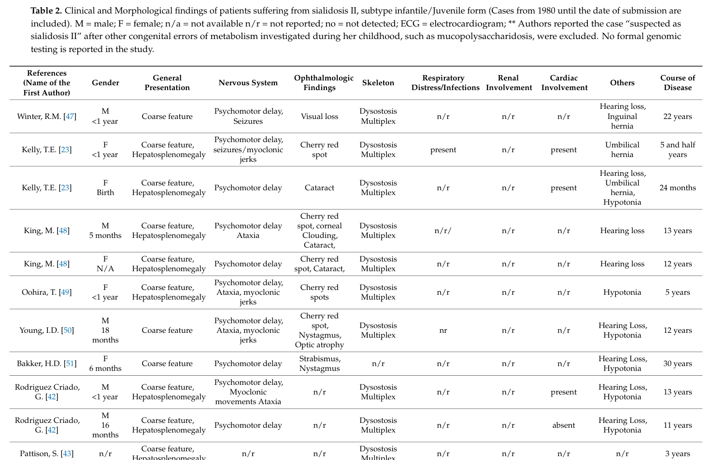

## Question

# Disease Characteristics Research Template

## Target Disease
- **Disease Name:** Juvenile Sialidosis Type 2
- **MONDO ID:**  (if available)
- **Category:** Mendelian

## Research Objectives

Please provide a comprehensive research report on **Juvenile Sialidosis Type 2** covering all of the
disease characteristics listed below. This report will be used to populate a disease knowledge
base entry. Be thorough and cite primary literature (PMID preferred) for all claims.

For each section, **suggested databases/resources** are listed. These are the first places
you should search for information on each topic.

---

### 1. Disease Information
> **Search first:** OMIM, Orphanet, ICD-10/ICD-11, MeSH, PubMed

- What is the disease? Provide a concise overview.
- What are the key identifiers? (OMIM, Orphanet, ICD-10/ICD-11, MeSH, Mondo)
- What are the common synonyms and alternative names?
- Is the information derived from individual patients (e.g., EHR) or aggregated disease-level resources?

### 2. Etiology

- **Disease Causal Factors**: What are the primary causes? (genetic, environmental, infectious, mechanistic)
- **Risk Factors**:
  > **Search first:** PubMed, Cochrane Library, UpToDate, clinical guidelines, ClinVar, ClinGen, GWAS Catalog, PheGenI, CTD, CDC, WHO, epidemiological databases
  - Genetic risk factors (causal variants, susceptibility loci, modifier genes)
  - Environmental risk factors (toxins, lifestyle, occupational exposures, age, sex, family history)
- **Protective Factors**:
  > **Search first:** PubMed, Cochrane Library, clinical trial databases, GWAS Catalog, gnomAD, WHO, CDC, nutrition databases
  - Genetic protective factors (protective variants, modifier alleles)
  - Environmental protective factors (diet, lifestyle, exposures that reduce risk)
- **Gene-Environment Interactions**: How do genetic and environmental factors interact to influence disease?
  > **Search first:** CTD, PubMed, PheGenI, GxE databases

### 3. Phenotypes
> **Search first:** HPO (Human Phenotype Ontology), OMIM, Orphanet, PubMed, clinicaltrials.gov, MedDRA, SNOMED CT, DECIPHER, LOINC

For each phenotype, provide:
- **Phenotype type**: symptoms, clinical signs, physical manifestations, behavioral changes, or laboratory abnormalities
  > For symptoms/signs: HPO, OMIM, Orphanet, PubMed
  > For behavioral changes: HPO, DSM, RDoC (Research Domain Criteria), PubMed
  > For laboratory abnormalities: LOINC, SNOMED CT, LabTests Online, PubMed
- **Phenotype characteristics**:
  > **Search first:** OMIM, Orphanet, HPO, PubMed
  - Age of symptom onset (neonatal, childhood, adult-onset, late-onset)
  - Symptom severity (mild, moderate, severe, variable)
  - Symptom progression (stable, progressive, episodic, fluctuating)
  - Frequency among affected individuals (percentage or qualitative)
- **Quality of life impact**: Effects on daily functioning and well-being (per-phenotype when possible)
  > **Search first:** EQ-5D database, SF-36, WHO QOL databases, PubMed
- Suggest HPO (Human Phenotype Ontology) terms for each phenotype

### 4. Genetic/Molecular Information

- **Causal Genes**: Gene mutations or chromosomal abnormalities responsible for disease (gene symbols, OMIM IDs)
  > **Search first:** OMIM, ClinVar, HGMD, Ensembl, NCBI Gene
- **Pathogenic Variants**:
  - Affected genes (gene symbols, HGNC IDs)
    > **Search first:** OMIM, NCBI Gene, Ensembl, HGNC, UniProt, GeneCards
  - Variant classification (pathogenic, likely pathogenic, VUS per ACMG/AMP guidelines)
    > **Search first:** ClinVar, ClinGen, ACMG/AMP guidelines, VarSome
  - Variant type/class (missense, frameshift, nonsense, splice-site, structural)
  - Allele frequency in population databases
    > **Search first:** gnomAD, 1000 Genomes, ExAC, TOPMed, dbSNP
  - Somatic vs germline origin
    > **Search first:** COSMIC (somatic), ClinVar, ICGC, TCGA
  - Functional consequences (loss of function, gain of function, dominant negative)
- **Modifier Genes**: Genes that modify disease severity or expression
- **Epigenetic Information**: DNA methylation, histone modifications, chromatin changes affecting disease
  > **Search first:** ENCODE, Roadmap Epigenomics, MethBase, DiseaseMeth
- **Chromosomal Abnormalities**: Large-scale genetic changes (aneuploidy, translocations, inversions)
  > **Search first:** DECIPHER, ClinVar, ECARUCA, UCSC Genome Browser

### 5. Environmental Information

- **Environmental Factors**: Non-genetic contributing factors (toxins, radiation, pollution, occupational exposure)
  > **Search first:** CTD (Comparative Toxicogenomics Database), TOXNET, PubMed, EPA databases
- **Lifestyle Factors**: Behavioral factors (smoking, diet, exercise, alcohol consumption)
  > **Search first:** CDC databases, WHO, PubMed, NHANES
- **Infectious Agents**: If applicable, pathogens causing or triggering disease (bacteria, viruses, fungi, parasites)
  > **Search first:** NCBI Taxonomy, ViPR, BV-BRC, MicrobeDB, GIDEON

### 6. Mechanism / Pathophysiology

- **Molecular Pathways**: Specific signaling cascades or biochemical pathways involved (Wnt, MAPK, mTOR, PI3K-AKT, etc.)
  > **Search first:** KEGG, Reactome, WikiPathways, PathBank, BioCyc
- **Cellular Processes**: Cell-level mechanisms (apoptosis, autophagy, cell cycle dysregulation, inflammation, etc.)
  > **Search first:** Gene Ontology (GO), Reactome, KEGG, PubMed
- **Protein Dysfunction**: How protein structure or function is altered (misfolding, aggregation, loss of function, gain of function)
  > **Search first:** UniProt, PDB (Protein Data Bank), InterPro, Pfam, AlphaFold
- **Metabolic Changes**: Alterations in metabolic processes (energy metabolism, lipid metabolism, amino acid metabolism)
  > **Search first:** KEGG, BioCyc, HMDB (Human Metabolome Database), BRENDA
- **Immune System Involvement**: Role of immune response (autoimmunity, immunodeficiency, chronic inflammation)
  > **Search first:** ImmPort, Immunome Database, IEDB, Gene Ontology
- **Tissue Damage Mechanisms**: How tissues/ are injured (oxidative stress, ischemia, fibrosis, necrosis)
  > **Search first:** PubMed, Gene Ontology, Reactome
- **Biochemical Abnormalities**: Specific molecular defects (enzyme deficiencies, receptor dysfunction, ion channel defects)
  > **Search first:** BRENDA, UniProt, KEGG, OMIM, PubMed
- **Epigenetic Changes**: DNA methylation, histone modifications affecting gene expression in disease
  > **Search first:** ENCODE, Roadmap Epigenomics, MethBase, DiseaseMeth
- **Molecular Profiling** (if available):
  - Transcriptomics/gene expression changes
    > **Search first:** GEO (Gene Expression Omnibus), ArrayExpress, GTEx, Human Cell Atlas, SRA
  - Proteomics findings
    > **Search first:** PRIDE, ProteomeXchange, Human Protein Atlas, STRING, BioGRID
  - Metabolomics signatures
    > **Search first:** MetaboLights, Metabolomics Workbench, HMDB, METLIN
  - Lipidomics alterations
    > **Search first:** LIPID MAPS, SwissLipids, LipidHome, Metabolomics Workbench
  - Genomic structural features
    > **Search first:** UCSC Genome Browser, Ensembl, NCBI, dbVar, DGV
- **Advanced Technologies** (if applicable):
  - Single-cell analysis findings (cell-type specific mechanisms, cellular heterogeneity)
    > **Search first:** Human Cell Atlas, Single Cell Portal, GEO, CELLxGENE
  - Spatial transcriptomics findings
    > **Search first:** GEO, Spatial Research, Vizgen, 10x Genomics data
  - Multi-omics integration results
    > **Search first:** TCGA, ICGC, cBioPortal, LinkedOmics, PubMed
  - Functional genomics screens (CRISPR, RNAi)
    > **Search first:** DepMap, GenomeRNAi, PubMed, BioGRID ORCS

For each mechanism, describe:
- The causal chain from initial trigger to clinical manifestation
- Which mechanisms are upstream vs downstream
- What cell types and biological processes are involved
- Suggest GO terms for biological processes and CL terms for cell types

### 7. Anatomical Structures Affected

- **Organ Level**:
  - Primary organs directly affected
  - Secondary organ involvement (complications, secondary effects)
  - Body systems involved (cardiovascular, nervous, digestive, respiratory, endocrine, etc.)
  > **Search first:** Uberon, FMA (Foundational Model of Anatomy), OMIM, HPO, ICD-11, MeSH, SNOMED CT
- **Tissue and Cell Level**:
  - Specific tissue types affected (epithelial, connective, muscle, nervous)
  - Specific cell populations targeted (with Cell Ontology terms)
  > **Search first:** Uberon, Human Protein Atlas, Cell Ontology, Human Cell Atlas, CellMarker, PanglaoDB
- **Subcellular Level**:
  - Cellular compartments involved (mitochondria, nucleus, ER, lysosomes) (with GO Cellular Component terms)
  > **Search first:** Gene Ontology (Cellular Component), UniProt, Human Protein Atlas
- **Localization**:
  - Specific anatomical sites (with UBERON terms)
    > **Search first:** FMA, Uberon, NeuroNames (for brain), SNOMED CT
  - Lateralization (unilateral, bilateral, asymmetric)
    > **Search first:** HPO, clinical literature, imaging databases

### 8. Temporal Development

- **Onset**:
  - Typical age of onset (congenital, pediatric, adult, geriatric)
  - Onset pattern (acute, subacute, chronic, insidious)
  > **Search first:** OMIM, Orphanet, HPO, PubMed
- **Progression**:
  - Disease stages (early, intermediate, advanced, end-stage)
    > **Search first:** Cancer Staging Manual (AJCC), WHO classifications, PubMed
  - Progression rate (rapid, slow, variable)
  - Disease course pattern (episodic, relapsing-remitting, progressive, stable)
  - Disease duration (self-limited, chronic lifelong)
  > **Search first:** Disease registries, longitudinal cohort databases, natural history studies, PubMed, Orphanet, OMIM
- **Patterns**:
  - Remission patterns (spontaneous, treatment-induced)
    > **Search first:** Clinical trial databases, disease registries, PubMed
  - Critical periods (time windows of vulnerability or opportunity for intervention)
    > **Search first:** PubMed, developmental biology databases, clinical guidelines

### 9. Inheritance and Population

- **Epidemiology**:
  - Prevalence (cases per 100,000 at given time)
  - Incidence (new cases per 100,000 per year)
  > **Search first:** Orphanet, CDC, WHO, GBD (Global Burden of Disease), national registries, SEER, disease registries
- **For Genetic Etiology**:
  - Inheritance pattern (AD, AR, X-linked, mitochondrial, multifactorial, polygenic)
    > **Search first:** OMIM, Orphanet, ClinVar, GTR (Genetic Testing Registry)
  - Penetrance (complete, incomplete, age-dependent)
    > **Search first:** ClinVar, OMIM, PubMed, ClinGen
  - Expressivity (variable, consistent)
    > **Search first:** OMIM, ClinVar, PubMed
  - Genetic anticipation (increasing severity in successive generations)
    > **Search first:** OMIM, PubMed (especially for repeat expansion disorders)
  - Germline mosaicism
    > **Search first:** ClinVar, OMIM, genetic counseling literature, PubMed
  - Founder effects (population-specific mutations)
    > **Search first:** gnomAD, population genetics databases, PubMed
  - Consanguinity role
    > **Search first:** OMIM, population studies, genetic counseling resources
  - Carrier frequency
    > **Search first:** gnomAD, carrier screening databases, GeneReviews, GTR
- **Population Demographics**:
  - Affected populations (ethnic or demographic groups with higher prevalence)
    > **Search first:** gnomAD, 1000 Genomes, PAGE Study, PubMed, population registries
  - Geographic distribution (endemic areas, regional variation)
    > **Search first:** WHO, CDC, GBD, Orphanet, geographic epidemiology databases
  - Geographic distribution of specific variants
  - Sex ratio (male:female)
    > **Search first:** Disease registries, OMIM, PubMed, epidemiological databases
  - Age distribution of affected individuals
    > **Search first:** CDC, disease registries, SEER, Orphanet

### 10. Diagnostics

- **Clinical Tests**:
  - Laboratory tests (blood, urine, tissue chemistry, specific enzyme assays)
    > **Search first:** LOINC, LabTests Online, PubMed
  - Biomarkers (proteins, metabolites, genetic markers, circulating biomarkers)
    > **Search first:** FDA Biomarker List, BEST (Biomarkers, EndpointS, and other Tools), PubMed
  - Imaging studies (X-ray, CT, MRI, PET, ultrasound)
    > **Search first:** RadLex, DICOM, Radiopaedia, imaging databases
  - Functional tests (pulmonary function, cardiac stress tests)
    > **Search first:** LOINC, clinical guidelines, PubMed
  - Electrophysiology (EEG, EMG, ECG, nerve conduction studies)
    > **Search first:** LOINC, clinical neurophysiology databases, PubMed
  - Biopsy findings (histopathology, immunohistochemistry)
    > **Search first:** SNOMED CT, College of American Pathologists resources, PubMed
  - Pathology findings (microscopic examination)
    > **Search first:** SNOMED CT, Digital Pathology databases, PubMed
- **Genetic Testing**:
  > **Search first:** GTR (Genetic Testing Registry), GeneReviews, ClinGen
  - Overview of recommended genetic testing approach
  - Whole genome sequencing (WGS) utility
    > **Search first:** GTR, ClinVar, GEL (Genomics England), gnomAD
  - Whole exome sequencing (WES) utility
    > **Search first:** GTR, ClinVar, OMIM, GeneMatcher
  - Gene panels (which panels, which genes)
    > **Search first:** GTR, ClinVar, laboratory-specific databases
  - Single gene testing
    > **Search first:** GTR, ClinVar, OMIM, GeneReviews
  - Chromosomal microarray (CMA)
    > **Search first:** DECIPHER, ClinVar, dbVar, ECARUCA
  - Karyotyping
    > **Search first:** Chromosome Abnormality Database, ClinVar, cytogenetics resources
  - FISH
    > **Search first:** ClinVar, cytogenetics databases, PubMed
  - Mitochondrial DNA testing
    > **Search first:** MITOMAP, MSeqDR, ClinVar, GTR
  - Repeat expansion testing
    > **Search first:** GTR, ClinVar, repeat expansion databases, PubMed
- **Omics-Based Diagnostics** (if applicable):
  - RNA sequencing / transcriptomics
    > **Search first:** GEO, ArrayExpress, GTEx, RNA-seq databases
  - Proteomics
    > **Search first:** PRIDE, ProteomeXchange, FDA Biomarker database
  - Metabolomics
    > **Search first:** MetaboLights, Metabolomics Workbench, HMDB
  - Epigenomics
    > **Search first:** GEO, ENCODE, Roadmap Epigenomics, MethBase
  - Liquid biopsy
    > **Search first:** COSMIC, ClinVar, liquid biopsy databases, PubMed
- **Clinical Criteria**:
  - Standardized diagnostic criteria (DSM, ICD, society guidelines)
    > **Search first:** DSM-5, ICD-11, clinical society guidelines, UpToDate
  - Differential diagnosis (other conditions to rule out, with distinguishing features)
    > **Search first:** DynaMed, UpToDate, clinical decision support systems
- **Screening**:
  - Screening methods for asymptomatic individuals (newborn screening, carrier screening, cascade screening)
    > **Search first:** ACMG recommendations, CDC newborn screening, GTR

### 11. Outcome/Prognosis

- **Survival and Mortality**:
  - Survival rate (5-year, 10-year, overall)
    > **Search first:** SEER, cancer registries, disease-specific registries, PubMed
  - Life expectancy (with and without treatment if applicable)
    > **Search first:** Orphanet, disease registries, actuarial databases, PubMed
  - Mortality rate
    > **Search first:** CDC, WHO, GBD, national mortality databases
  - Disease-specific mortality (deaths directly attributable to disease)
    > **Search first:** Disease registries, CDC Wonder, GBD, PubMed
- **Morbidity and Function**:
  - Morbidity (disease-related disability and health impacts)
    > **Search first:** GBD, WHO, disability databases, PubMed
  - Disability outcomes (long-term functional impairments)
    > **Search first:** ICF (International Classification of Functioning), disability registries
  - Quality of life measures (EQ-5D, SF-36, PROMIS, disease-specific tools)
    > **Search first:** EQ-5D database, SF-36, PROMIS, PubMed
- **Disease Course**:
  - Complications (secondary problems: infections, organ failure, etc.)
    > **Search first:** ICD codes, disease registries, clinical databases, PubMed
  - Recovery potential (likelihood and extent of recovery, with vs without treatment)
    > **Search first:** Natural history studies, rehabilitation databases, PubMed
- **Prediction**:
  - Prognostic factors (age, disease severity, biomarkers, treatment response)
    > **Search first:** Prognostic models databases, clinical calculators, PubMed
  - Prognostic biomarkers (molecular markers predicting disease course)
    > **Search first:** FDA Biomarker database, PubMed, cancer prognostic databases

### 12. Treatment

- **Pharmacotherapy**:
  - Pharmacological treatments (drug names, drug classes, mechanisms of action)
    > **Search first:** DrugBank, RxNorm, ATC classification, DailyMed, FDA databases
  - Pharmacogenomics (how genetic variants affect drug metabolism, efficacy, toxicity)
    > **Search first:** PharmGKB, CPIC (Clinical Pharmacogenetics), FDA Table of PGx Biomarkers
- **Advanced Therapeutics**:
  - Gene therapy (viral vectors, CRISPR, gene replacement, gene editing)
    > **Search first:** ClinicalTrials.gov, FDA gene therapy database, ASGCT resources
  - Cell therapy (stem cell transplant, CAR-T, cellular therapeutics)
    > **Search first:** ClinicalTrials.gov, FDA cell therapy database, FACT standards
  - RNA-based therapies (ASOs, siRNA, mRNA therapies)
    > **Search first:** ClinicalTrials.gov, FDA approvals, PubMed
  - Targeted therapies (treatments directed at specific molecular targets)
    > **Search first:** My Cancer Genome, OncoKB, ClinicalTrials.gov, FDA approvals
  - Immunotherapies (checkpoint inhibitors, monoclonal antibodies)
    > **Search first:** Cancer Immunotherapy Database, FDA approvals, ClinicalTrials.gov
- **Surgical and Interventional**:
  - Surgical interventions (types of surgery, timing, outcomes)
    > **Search first:** CPT codes, surgical registries, clinical guidelines, PubMed
- **Supportive and Rehabilitative**:
  - Supportive care (symptom management, pain control, nutrition)
    > **Search first:** Clinical guidelines, Cochrane Library, PubMed
  - Rehabilitation (physical therapy, occupational therapy, speech therapy)
    > **Search first:** Rehabilitation medicine databases, clinical guidelines, PubMed
- **Experimental**:
  - Experimental treatments in clinical trials (with NCT identifiers if available)
    > **Search first:** ClinicalTrials.gov, EU Clinical Trials Register, WHO ICTRP
- **Treatment Outcomes**:
  - Treatment response rates
    > **Search first:** Clinical trial databases, FDA reviews, systematic reviews, PubMed
  - Side effects and adverse events
    > **Search first:** FDA Adverse Event Reporting System (FAERS), MedWatch, PubMed
- **Treatment Strategy**:
  - Treatment algorithms (clinical pathways, decision trees)
    > **Search first:** Clinical practice guidelines, NCCN Guidelines, UpToDate
  - Combination therapies
    > **Search first:** ClinicalTrials.gov, treatment guidelines, PubMed
  - Personalized medicine approaches (genotype-guided treatment)
    > **Search first:** My Cancer Genome, CIViC, PharmGKB, precision medicine databases

For each treatment, suggest MAXO (Medical Action Ontology) terms where applicable.

### 13. Prevention

- **Prevention Levels**:
  - Primary prevention (preventing disease occurrence: vaccination, risk factor modification)
    > **Search first:** CDC, WHO, USPSTF recommendations, Cochrane Library
  - Secondary prevention (early detection and treatment: screening programs, early intervention)
    > **Search first:** USPSTF, CDC screening guidelines, WHO
  - Tertiary prevention (preventing complications in those with disease)
    > **Search first:** Clinical guidelines, disease management protocols, PubMed
- **Immunization**: Vaccine strategies (if applicable)
  > **Search first:** CDC vaccine schedules, WHO immunization, FDA vaccine database
- **Screening and Early Detection**:
  - Screening programs (population-based: newborn screening, cancer screening)
    > **Search first:** CDC screening programs, USPSTF, cancer screening databases
  - Genetic screening (carrier screening, preimplantation genetic diagnosis, prenatal testing)
    > **Search first:** ACMG recommendations, ACOG guidelines, GTR
  - Risk stratification (identifying high-risk individuals for targeted prevention)
    > **Search first:** Risk prediction models, clinical calculators, PubMed
- **Behavioral Interventions**: Lifestyle modifications to reduce risk
  > **Search first:** CDC, WHO, behavioral intervention databases, Cochrane Library
- **Counseling**: Genetic counseling (risk assessment, family planning guidance)
  > **Search first:** NSGC resources, ACMG guidelines, GeneReviews
- **Public Health**:
  - Public health interventions (sanitation, vector control, health education)
    > **Search first:** CDC, WHO, public health databases, PubMed
  - Environmental interventions (reducing environmental risk factors)
    > **Search first:** EPA databases, WHO environmental health, PubMed
- **Prophylaxis**: Preventive medications or procedures
  > **Search first:** Clinical guidelines, FDA approvals, PubMed

### 14. Other Species / Natural Disease

- **Taxonomy**: Species affected (with NCBI Taxon identifiers)
  > **Search first:** NCBI Taxonomy
- **Breed**: Specific breeds affected (with VBO identifiers if applicable)
  > **Search first:** VBO (Vertebrate Breed Ontology)
- **Gene**: Orthologous genes in other species (with NCBI Gene IDs)
  > **Search first:** NCBI Gene
- **Natural Disease**:
  - Naturally occurring disease in other species (companion animals, wildlife)
    > **Search first:** OMIA (Online Mendelian Inheritance in Animals), VetCompass, PubMed
  - Veterinary relevance and importance in animal health
    > **Search first:** OMIA, veterinary databases, PubMed
- **Comparative Biology**:
  - Comparative pathology (similarities and differences across species)
    > **Search first:** OMIA, comparative pathology databases, PubMed
  - Evolutionary conservation of disease mechanisms
    > **Search first:** HomoloGene, OrthoMCL, Alliance of Genome Resources
- **Transmission** (if applicable):
  - Zoonotic potential
    > **Search first:** CDC zoonotic diseases, WHO zoonoses, GIDEON
  - Cross-species susceptibility
    > **Search first:** NCBI Taxonomy, veterinary databases, PubMed

### 15. Model Organisms

- **Model Types**:
  - Model organism type (mammalian, invertebrate, cellular, in vitro)
    > **Search first:** Alliance of Genome Resources, model organism databases
  - Specific model systems (mouse, rat, zebrafish, Drosophila, C. elegans, yeast, cell lines, organoids, iPSCs)
    > **Search first:** MGI, RGD, ZFIN, FlyBase, WormBase, SGD, ATCC, Cellosaurus
  - Induced models (drug treatment, surgical intervention, environmental manipulation)
    > **Search first:** MGI, model organism databases, PubMed
- **Genetic Models**:
  - Types available (knockout, knock-in, transgenic, conditional, humanized)
    > **Search first:** MGI, IMPC, KOMP, EuMMCR, IMSR
- **Model Characteristics**:
  - Phenotype recapitulation (how well model reproduces human disease features)
    > **Search first:** Model organism databases, comparative studies, PubMed
  - Model limitations (aspects of human disease not captured)
    > **Search first:** Model organism databases, PubMed, review articles
- **Applications**:
  - Research applications (what aspects of disease can be studied)
    > **Search first:** Model organism databases, PubMed
- **Resources**:
  - Model databases
    > **Search first:** MGI, RGD, ZFIN, FlyBase, WormBase, IMSR, EMMA, MMRRC

---

## Citation Requirements

- Cite primary literature (PMID preferred) for all mechanistic and clinical claims
- Prioritize recent reviews and landmark papers
- Include direct quotes from abstracts where possible to support key statements
- Distinguish evidence source types: human clinical, model organism, in vitro, computational

## Output Format

Structure your response as a comprehensive narrative organized by the sections above.
For each section, provide:
- Factual content with specific details (numbers, percentages, gene names, variant nomenclature)
- Ontology term suggestions (HPO, GO, CL, UBERON, CHEBI, MAXO, MONDO) where applicable
- Evidence citations with PMIDs
- Direct quotes from abstracts to support key claims
- Clear indication when information is not available or not applicable for this disease

This report will be used to populate a disease knowledge base entry with:
- Pathophysiology descriptions with causal chains
- Gene/protein annotations (HGNC, GO terms)
- Phenotype associations (HP terms) with frequencies
- Cell type involvement (CL terms)
- Anatomical locations (UBERON terms)
- Chemical entities (CHEBI terms)
- Treatment annotations (MAXO terms)
- Evidence items with PMIDs and exact abstract quotes
- Epidemiology, prognosis, diagnostic, and prevention information
- Animal model descriptions with phenotype recapitulation details

## Output

Question: You are an expert researcher providing comprehensive, well-cited information.

Provide detailed information focusing on:
1. Key concepts and definitions with current understanding
2. Recent developments and latest research (prioritize 2023-2024 sources)
3. Current applications and real-world implementations
4. Expert opinions and analysis from authoritative sources
5. Relevant statistics and data from recent studies

Format as a comprehensive research report with proper citations. Include URLs and publication dates where available.
Always prioritize recent, authoritative sources and provide specific citations for all major claims.

# Disease Characteristics Research Template

## Target Disease
- **Disease Name:** Juvenile Sialidosis Type 2
- **MONDO ID:**  (if available)
- **Category:** Mendelian

## Research Objectives

Please provide a comprehensive research report on **Juvenile Sialidosis Type 2** covering all of the
disease characteristics listed below. This report will be used to populate a disease knowledge
base entry. Be thorough and cite primary literature (PMID preferred) for all claims.

For each section, **suggested databases/resources** are listed. These are the first places
you should search for information on each topic.

---

### 1. Disease Information
> **Search first:** OMIM, Orphanet, ICD-10/ICD-11, MeSH, PubMed

- What is the disease? Provide a concise overview.
- What are the key identifiers? (OMIM, Orphanet, ICD-10/ICD-11, MeSH, Mondo)
- What are the common synonyms and alternative names?
- Is the information derived from individual patients (e.g., EHR) or aggregated disease-level resources?

### 2. Etiology

- **Disease Causal Factors**: What are the primary causes? (genetic, environmental, infectious, mechanistic)
- **Risk Factors**:
  > **Search first:** PubMed, Cochrane Library, UpToDate, clinical guidelines, ClinVar, ClinGen, GWAS Catalog, PheGenI, CTD, CDC, WHO, epidemiological databases
  - Genetic risk factors (causal variants, susceptibility loci, modifier genes)
  - Environmental risk factors (toxins, lifestyle, occupational exposures, age, sex, family history)
- **Protective Factors**:
  > **Search first:** PubMed, Cochrane Library, clinical trial databases, GWAS Catalog, gnomAD, WHO, CDC, nutrition databases
  - Genetic protective factors (protective variants, modifier alleles)
  - Environmental protective factors (diet, lifestyle, exposures that reduce risk)
- **Gene-Environment Interactions**: How do genetic and environmental factors interact to influence disease?
  > **Search first:** CTD, PubMed, PheGenI, GxE databases

### 3. Phenotypes
> **Search first:** HPO (Human Phenotype Ontology), OMIM, Orphanet, PubMed, clinicaltrials.gov, MedDRA, SNOMED CT, DECIPHER, LOINC

For each phenotype, provide:
- **Phenotype type**: symptoms, clinical signs, physical manifestations, behavioral changes, or laboratory abnormalities
  > For symptoms/signs: HPO, OMIM, Orphanet, PubMed
  > For behavioral changes: HPO, DSM, RDoC (Research Domain Criteria), PubMed
  > For laboratory abnormalities: LOINC, SNOMED CT, LabTests Online, PubMed
- **Phenotype characteristics**:
  > **Search first:** OMIM, Orphanet, HPO, PubMed
  - Age of symptom onset (neonatal, childhood, adult-onset, late-onset)
  - Symptom severity (mild, moderate, severe, variable)
  - Symptom progression (stable, progressive, episodic, fluctuating)
  - Frequency among affected individuals (percentage or qualitative)
- **Quality of life impact**: Effects on daily functioning and well-being (per-phenotype when possible)
  > **Search first:** EQ-5D database, SF-36, WHO QOL databases, PubMed
- Suggest HPO (Human Phenotype Ontology) terms for each phenotype

### 4. Genetic/Molecular Information

- **Causal Genes**: Gene mutations or chromosomal abnormalities responsible for disease (gene symbols, OMIM IDs)
  > **Search first:** OMIM, ClinVar, HGMD, Ensembl, NCBI Gene
- **Pathogenic Variants**:
  - Affected genes (gene symbols, HGNC IDs)
    > **Search first:** OMIM, NCBI Gene, Ensembl, HGNC, UniProt, GeneCards
  - Variant classification (pathogenic, likely pathogenic, VUS per ACMG/AMP guidelines)
    > **Search first:** ClinVar, ClinGen, ACMG/AMP guidelines, VarSome
  - Variant type/class (missense, frameshift, nonsense, splice-site, structural)
  - Allele frequency in population databases
    > **Search first:** gnomAD, 1000 Genomes, ExAC, TOPMed, dbSNP
  - Somatic vs germline origin
    > **Search first:** COSMIC (somatic), ClinVar, ICGC, TCGA
  - Functional consequences (loss of function, gain of function, dominant negative)
- **Modifier Genes**: Genes that modify disease severity or expression
- **Epigenetic Information**: DNA methylation, histone modifications, chromatin changes affecting disease
  > **Search first:** ENCODE, Roadmap Epigenomics, MethBase, DiseaseMeth
- **Chromosomal Abnormalities**: Large-scale genetic changes (aneuploidy, translocations, inversions)
  > **Search first:** DECIPHER, ClinVar, ECARUCA, UCSC Genome Browser

### 5. Environmental Information

- **Environmental Factors**: Non-genetic contributing factors (toxins, radiation, pollution, occupational exposure)
  > **Search first:** CTD (Comparative Toxicogenomics Database), TOXNET, PubMed, EPA databases
- **Lifestyle Factors**: Behavioral factors (smoking, diet, exercise, alcohol consumption)
  > **Search first:** CDC databases, WHO, PubMed, NHANES
- **Infectious Agents**: If applicable, pathogens causing or triggering disease (bacteria, viruses, fungi, parasites)
  > **Search first:** NCBI Taxonomy, ViPR, BV-BRC, MicrobeDB, GIDEON

### 6. Mechanism / Pathophysiology

- **Molecular Pathways**: Specific signaling cascades or biochemical pathways involved (Wnt, MAPK, mTOR, PI3K-AKT, etc.)
  > **Search first:** KEGG, Reactome, WikiPathways, PathBank, BioCyc
- **Cellular Processes**: Cell-level mechanisms (apoptosis, autophagy, cell cycle dysregulation, inflammation, etc.)
  > **Search first:** Gene Ontology (GO), Reactome, KEGG, PubMed
- **Protein Dysfunction**: How protein structure or function is altered (misfolding, aggregation, loss of function, gain of function)
  > **Search first:** UniProt, PDB (Protein Data Bank), InterPro, Pfam, AlphaFold
- **Metabolic Changes**: Alterations in metabolic processes (energy metabolism, lipid metabolism, amino acid metabolism)
  > **Search first:** KEGG, BioCyc, HMDB (Human Metabolome Database), BRENDA
- **Immune System Involvement**: Role of immune response (autoimmunity, immunodeficiency, chronic inflammation)
  > **Search first:** ImmPort, Immunome Database, IEDB, Gene Ontology
- **Tissue Damage Mechanisms**: How tissues/ are injured (oxidative stress, ischemia, fibrosis, necrosis)
  > **Search first:** PubMed, Gene Ontology, Reactome
- **Biochemical Abnormalities**: Specific molecular defects (enzyme deficiencies, receptor dysfunction, ion channel defects)
  > **Search first:** BRENDA, UniProt, KEGG, OMIM, PubMed
- **Epigenetic Changes**: DNA methylation, histone modifications affecting gene expression in disease
  > **Search first:** ENCODE, Roadmap Epigenomics, MethBase, DiseaseMeth
- **Molecular Profiling** (if available):
  - Transcriptomics/gene expression changes
    > **Search first:** GEO (Gene Expression Omnibus), ArrayExpress, GTEx, Human Cell Atlas, SRA
  - Proteomics findings
    > **Search first:** PRIDE, ProteomeXchange, Human Protein Atlas, STRING, BioGRID
  - Metabolomics signatures
    > **Search first:** MetaboLights, Metabolomics Workbench, HMDB, METLIN
  - Lipidomics alterations
    > **Search first:** LIPID MAPS, SwissLipids, LipidHome, Metabolomics Workbench
  - Genomic structural features
    > **Search first:** UCSC Genome Browser, Ensembl, NCBI, dbVar, DGV
- **Advanced Technologies** (if applicable):
  - Single-cell analysis findings (cell-type specific mechanisms, cellular heterogeneity)
    > **Search first:** Human Cell Atlas, Single Cell Portal, GEO, CELLxGENE
  - Spatial transcriptomics findings
    > **Search first:** GEO, Spatial Research, Vizgen, 10x Genomics data
  - Multi-omics integration results
    > **Search first:** TCGA, ICGC, cBioPortal, LinkedOmics, PubMed
  - Functional genomics screens (CRISPR, RNAi)
    > **Search first:** DepMap, GenomeRNAi, PubMed, BioGRID ORCS

For each mechanism, describe:
- The causal chain from initial trigger to clinical manifestation
- Which mechanisms are upstream vs downstream
- What cell types and biological processes are involved
- Suggest GO terms for biological processes and CL terms for cell types

### 7. Anatomical Structures Affected

- **Organ Level**:
  - Primary organs directly affected
  - Secondary organ involvement (complications, secondary effects)
  - Body systems involved (cardiovascular, nervous, digestive, respiratory, endocrine, etc.)
  > **Search first:** Uberon, FMA (Foundational Model of Anatomy), OMIM, HPO, ICD-11, MeSH, SNOMED CT
- **Tissue and Cell Level**:
  - Specific tissue types affected (epithelial, connective, muscle, nervous)
  - Specific cell populations targeted (with Cell Ontology terms)
  > **Search first:** Uberon, Human Protein Atlas, Cell Ontology, Human Cell Atlas, CellMarker, PanglaoDB
- **Subcellular Level**:
  - Cellular compartments involved (mitochondria, nucleus, ER, lysosomes) (with GO Cellular Component terms)
  > **Search first:** Gene Ontology (Cellular Component), UniProt, Human Protein Atlas
- **Localization**:
  - Specific anatomical sites (with UBERON terms)
    > **Search first:** FMA, Uberon, NeuroNames (for brain), SNOMED CT
  - Lateralization (unilateral, bilateral, asymmetric)
    > **Search first:** HPO, clinical literature, imaging databases

### 8. Temporal Development

- **Onset**:
  - Typical age of onset (congenital, pediatric, adult, geriatric)
  - Onset pattern (acute, subacute, chronic, insidious)
  > **Search first:** OMIM, Orphanet, HPO, PubMed
- **Progression**:
  - Disease stages (early, intermediate, advanced, end-stage)
    > **Search first:** Cancer Staging Manual (AJCC), WHO classifications, PubMed
  - Progression rate (rapid, slow, variable)
  - Disease course pattern (episodic, relapsing-remitting, progressive, stable)
  - Disease duration (self-limited, chronic lifelong)
  > **Search first:** Disease registries, longitudinal cohort databases, natural history studies, PubMed, Orphanet, OMIM
- **Patterns**:
  - Remission patterns (spontaneous, treatment-induced)
    > **Search first:** Clinical trial databases, disease registries, PubMed
  - Critical periods (time windows of vulnerability or opportunity for intervention)
    > **Search first:** PubMed, developmental biology databases, clinical guidelines

### 9. Inheritance and Population

- **Epidemiology**:
  - Prevalence (cases per 100,000 at given time)
  - Incidence (new cases per 100,000 per year)
  > **Search first:** Orphanet, CDC, WHO, GBD (Global Burden of Disease), national registries, SEER, disease registries
- **For Genetic Etiology**:
  - Inheritance pattern (AD, AR, X-linked, mitochondrial, multifactorial, polygenic)
    > **Search first:** OMIM, Orphanet, ClinVar, GTR (Genetic Testing Registry)
  - Penetrance (complete, incomplete, age-dependent)
    > **Search first:** ClinVar, OMIM, PubMed, ClinGen
  - Expressivity (variable, consistent)
    > **Search first:** OMIM, ClinVar, PubMed
  - Genetic anticipation (increasing severity in successive generations)
    > **Search first:** OMIM, PubMed (especially for repeat expansion disorders)
  - Germline mosaicism
    > **Search first:** ClinVar, OMIM, genetic counseling literature, PubMed
  - Founder effects (population-specific mutations)
    > **Search first:** gnomAD, population genetics databases, PubMed
  - Consanguinity role
    > **Search first:** OMIM, population studies, genetic counseling resources
  - Carrier frequency
    > **Search first:** gnomAD, carrier screening databases, GeneReviews, GTR
- **Population Demographics**:
  - Affected populations (ethnic or demographic groups with higher prevalence)
    > **Search first:** gnomAD, 1000 Genomes, PAGE Study, PubMed, population registries
  - Geographic distribution (endemic areas, regional variation)
    > **Search first:** WHO, CDC, GBD, Orphanet, geographic epidemiology databases
  - Geographic distribution of specific variants
  - Sex ratio (male:female)
    > **Search first:** Disease registries, OMIM, PubMed, epidemiological databases
  - Age distribution of affected individuals
    > **Search first:** CDC, disease registries, SEER, Orphanet

### 10. Diagnostics

- **Clinical Tests**:
  - Laboratory tests (blood, urine, tissue chemistry, specific enzyme assays)
    > **Search first:** LOINC, LabTests Online, PubMed
  - Biomarkers (proteins, metabolites, genetic markers, circulating biomarkers)
    > **Search first:** FDA Biomarker List, BEST (Biomarkers, EndpointS, and other Tools), PubMed
  - Imaging studies (X-ray, CT, MRI, PET, ultrasound)
    > **Search first:** RadLex, DICOM, Radiopaedia, imaging databases
  - Functional tests (pulmonary function, cardiac stress tests)
    > **Search first:** LOINC, clinical guidelines, PubMed
  - Electrophysiology (EEG, EMG, ECG, nerve conduction studies)
    > **Search first:** LOINC, clinical neurophysiology databases, PubMed
  - Biopsy findings (histopathology, immunohistochemistry)
    > **Search first:** SNOMED CT, College of American Pathologists resources, PubMed
  - Pathology findings (microscopic examination)
    > **Search first:** SNOMED CT, Digital Pathology databases, PubMed
- **Genetic Testing**:
  > **Search first:** GTR (Genetic Testing Registry), GeneReviews, ClinGen
  - Overview of recommended genetic testing approach
  - Whole genome sequencing (WGS) utility
    > **Search first:** GTR, ClinVar, GEL (Genomics England), gnomAD
  - Whole exome sequencing (WES) utility
    > **Search first:** GTR, ClinVar, OMIM, GeneMatcher
  - Gene panels (which panels, which genes)
    > **Search first:** GTR, ClinVar, laboratory-specific databases
  - Single gene testing
    > **Search first:** GTR, ClinVar, OMIM, GeneReviews
  - Chromosomal microarray (CMA)
    > **Search first:** DECIPHER, ClinVar, dbVar, ECARUCA
  - Karyotyping
    > **Search first:** Chromosome Abnormality Database, ClinVar, cytogenetics resources
  - FISH
    > **Search first:** ClinVar, cytogenetics databases, PubMed
  - Mitochondrial DNA testing
    > **Search first:** MITOMAP, MSeqDR, ClinVar, GTR
  - Repeat expansion testing
    > **Search first:** GTR, ClinVar, repeat expansion databases, PubMed
- **Omics-Based Diagnostics** (if applicable):
  - RNA sequencing / transcriptomics
    > **Search first:** GEO, ArrayExpress, GTEx, RNA-seq databases
  - Proteomics
    > **Search first:** PRIDE, ProteomeXchange, FDA Biomarker database
  - Metabolomics
    > **Search first:** MetaboLights, Metabolomics Workbench, HMDB
  - Epigenomics
    > **Search first:** GEO, ENCODE, Roadmap Epigenomics, MethBase
  - Liquid biopsy
    > **Search first:** COSMIC, ClinVar, liquid biopsy databases, PubMed
- **Clinical Criteria**:
  - Standardized diagnostic criteria (DSM, ICD, society guidelines)
    > **Search first:** DSM-5, ICD-11, clinical society guidelines, UpToDate
  - Differential diagnosis (other conditions to rule out, with distinguishing features)
    > **Search first:** DynaMed, UpToDate, clinical decision support systems
- **Screening**:
  - Screening methods for asymptomatic individuals (newborn screening, carrier screening, cascade screening)
    > **Search first:** ACMG recommendations, CDC newborn screening, GTR

### 11. Outcome/Prognosis

- **Survival and Mortality**:
  - Survival rate (5-year, 10-year, overall)
    > **Search first:** SEER, cancer registries, disease-specific registries, PubMed
  - Life expectancy (with and without treatment if applicable)
    > **Search first:** Orphanet, disease registries, actuarial databases, PubMed
  - Mortality rate
    > **Search first:** CDC, WHO, GBD, national mortality databases
  - Disease-specific mortality (deaths directly attributable to disease)
    > **Search first:** Disease registries, CDC Wonder, GBD, PubMed
- **Morbidity and Function**:
  - Morbidity (disease-related disability and health impacts)
    > **Search first:** GBD, WHO, disability databases, PubMed
  - Disability outcomes (long-term functional impairments)
    > **Search first:** ICF (International Classification of Functioning), disability registries
  - Quality of life measures (EQ-5D, SF-36, PROMIS, disease-specific tools)
    > **Search first:** EQ-5D database, SF-36, PROMIS, PubMed
- **Disease Course**:
  - Complications (secondary problems: infections, organ failure, etc.)
    > **Search first:** ICD codes, disease registries, clinical databases, PubMed
  - Recovery potential (likelihood and extent of recovery, with vs without treatment)
    > **Search first:** Natural history studies, rehabilitation databases, PubMed
- **Prediction**:
  - Prognostic factors (age, disease severity, biomarkers, treatment response)
    > **Search first:** Prognostic models databases, clinical calculators, PubMed
  - Prognostic biomarkers (molecular markers predicting disease course)
    > **Search first:** FDA Biomarker database, PubMed, cancer prognostic databases

### 12. Treatment

- **Pharmacotherapy**:
  - Pharmacological treatments (drug names, drug classes, mechanisms of action)
    > **Search first:** DrugBank, RxNorm, ATC classification, DailyMed, FDA databases
  - Pharmacogenomics (how genetic variants affect drug metabolism, efficacy, toxicity)
    > **Search first:** PharmGKB, CPIC (Clinical Pharmacogenetics), FDA Table of PGx Biomarkers
- **Advanced Therapeutics**:
  - Gene therapy (viral vectors, CRISPR, gene replacement, gene editing)
    > **Search first:** ClinicalTrials.gov, FDA gene therapy database, ASGCT resources
  - Cell therapy (stem cell transplant, CAR-T, cellular therapeutics)
    > **Search first:** ClinicalTrials.gov, FDA cell therapy database, FACT standards
  - RNA-based therapies (ASOs, siRNA, mRNA therapies)
    > **Search first:** ClinicalTrials.gov, FDA approvals, PubMed
  - Targeted therapies (treatments directed at specific molecular targets)
    > **Search first:** My Cancer Genome, OncoKB, ClinicalTrials.gov, FDA approvals
  - Immunotherapies (checkpoint inhibitors, monoclonal antibodies)
    > **Search first:** Cancer Immunotherapy Database, FDA approvals, ClinicalTrials.gov
- **Surgical and Interventional**:
  - Surgical interventions (types of surgery, timing, outcomes)
    > **Search first:** CPT codes, surgical registries, clinical guidelines, PubMed
- **Supportive and Rehabilitative**:
  - Supportive care (symptom management, pain control, nutrition)
    > **Search first:** Clinical guidelines, Cochrane Library, PubMed
  - Rehabilitation (physical therapy, occupational therapy, speech therapy)
    > **Search first:** Rehabilitation medicine databases, clinical guidelines, PubMed
- **Experimental**:
  - Experimental treatments in clinical trials (with NCT identifiers if available)
    > **Search first:** ClinicalTrials.gov, EU Clinical Trials Register, WHO ICTRP
- **Treatment Outcomes**:
  - Treatment response rates
    > **Search first:** Clinical trial databases, FDA reviews, systematic reviews, PubMed
  - Side effects and adverse events
    > **Search first:** FDA Adverse Event Reporting System (FAERS), MedWatch, PubMed
- **Treatment Strategy**:
  - Treatment algorithms (clinical pathways, decision trees)
    > **Search first:** Clinical practice guidelines, NCCN Guidelines, UpToDate
  - Combination therapies
    > **Search first:** ClinicalTrials.gov, treatment guidelines, PubMed
  - Personalized medicine approaches (genotype-guided treatment)
    > **Search first:** My Cancer Genome, CIViC, PharmGKB, precision medicine databases

For each treatment, suggest MAXO (Medical Action Ontology) terms where applicable.

### 13. Prevention

- **Prevention Levels**:
  - Primary prevention (preventing disease occurrence: vaccination, risk factor modification)
    > **Search first:** CDC, WHO, USPSTF recommendations, Cochrane Library
  - Secondary prevention (early detection and treatment: screening programs, early intervention)
    > **Search first:** USPSTF, CDC screening guidelines, WHO
  - Tertiary prevention (preventing complications in those with disease)
    > **Search first:** Clinical guidelines, disease management protocols, PubMed
- **Immunization**: Vaccine strategies (if applicable)
  > **Search first:** CDC vaccine schedules, WHO immunization, FDA vaccine database
- **Screening and Early Detection**:
  - Screening programs (population-based: newborn screening, cancer screening)
    > **Search first:** CDC screening programs, USPSTF, cancer screening databases
  - Genetic screening (carrier screening, preimplantation genetic diagnosis, prenatal testing)
    > **Search first:** ACMG recommendations, ACOG guidelines, GTR
  - Risk stratification (identifying high-risk individuals for targeted prevention)
    > **Search first:** Risk prediction models, clinical calculators, PubMed
- **Behavioral Interventions**: Lifestyle modifications to reduce risk
  > **Search first:** CDC, WHO, behavioral intervention databases, Cochrane Library
- **Counseling**: Genetic counseling (risk assessment, family planning guidance)
  > **Search first:** NSGC resources, ACMG guidelines, GeneReviews
- **Public Health**:
  - Public health interventions (sanitation, vector control, health education)
    > **Search first:** CDC, WHO, public health databases, PubMed
  - Environmental interventions (reducing environmental risk factors)
    > **Search first:** EPA databases, WHO environmental health, PubMed
- **Prophylaxis**: Preventive medications or procedures
  > **Search first:** Clinical guidelines, FDA approvals, PubMed

### 14. Other Species / Natural Disease

- **Taxonomy**: Species affected (with NCBI Taxon identifiers)
  > **Search first:** NCBI Taxonomy
- **Breed**: Specific breeds affected (with VBO identifiers if applicable)
  > **Search first:** VBO (Vertebrate Breed Ontology)
- **Gene**: Orthologous genes in other species (with NCBI Gene IDs)
  > **Search first:** NCBI Gene
- **Natural Disease**:
  - Naturally occurring disease in other species (companion animals, wildlife)
    > **Search first:** OMIA (Online Mendelian Inheritance in Animals), VetCompass, PubMed
  - Veterinary relevance and importance in animal health
    > **Search first:** OMIA, veterinary databases, PubMed
- **Comparative Biology**:
  - Comparative pathology (similarities and differences across species)
    > **Search first:** OMIA, comparative pathology databases, PubMed
  - Evolutionary conservation of disease mechanisms
    > **Search first:** HomoloGene, OrthoMCL, Alliance of Genome Resources
- **Transmission** (if applicable):
  - Zoonotic potential
    > **Search first:** CDC zoonotic diseases, WHO zoonoses, GIDEON
  - Cross-species susceptibility
    > **Search first:** NCBI Taxonomy, veterinary databases, PubMed

### 15. Model Organisms

- **Model Types**:
  - Model organism type (mammalian, invertebrate, cellular, in vitro)
    > **Search first:** Alliance of Genome Resources, model organism databases
  - Specific model systems (mouse, rat, zebrafish, Drosophila, C. elegans, yeast, cell lines, organoids, iPSCs)
    > **Search first:** MGI, RGD, ZFIN, FlyBase, WormBase, SGD, ATCC, Cellosaurus
  - Induced models (drug treatment, surgical intervention, environmental manipulation)
    > **Search first:** MGI, model organism databases, PubMed
- **Genetic Models**:
  - Types available (knockout, knock-in, transgenic, conditional, humanized)
    > **Search first:** MGI, IMPC, KOMP, EuMMCR, IMSR
- **Model Characteristics**:
  - Phenotype recapitulation (how well model reproduces human disease features)
    > **Search first:** Model organism databases, comparative studies, PubMed
  - Model limitations (aspects of human disease not captured)
    > **Search first:** Model organism databases, PubMed, review articles
- **Applications**:
  - Research applications (what aspects of disease can be studied)
    > **Search first:** Model organism databases, PubMed
- **Resources**:
  - Model databases
    > **Search first:** MGI, RGD, ZFIN, FlyBase, WormBase, IMSR, EMMA, MMRRC

---

## Citation Requirements

- Cite primary literature (PMID preferred) for all mechanistic and clinical claims
- Prioritize recent reviews and landmark papers
- Include direct quotes from abstracts where possible to support key statements
- Distinguish evidence source types: human clinical, model organism, in vitro, computational

## Output Format

Structure your response as a comprehensive narrative organized by the sections above.
For each section, provide:
- Factual content with specific details (numbers, percentages, gene names, variant nomenclature)
- Ontology term suggestions (HPO, GO, CL, UBERON, CHEBI, MAXO, MONDO) where applicable
- Evidence citations with PMIDs
- Direct quotes from abstracts to support key claims
- Clear indication when information is not available or not applicable for this disease

This report will be used to populate a disease knowledge base entry with:
- Pathophysiology descriptions with causal chains
- Gene/protein annotations (HGNC, GO terms)
- Phenotype associations (HP terms) with frequencies
- Cell type involvement (CL terms)
- Anatomical locations (UBERON terms)
- Chemical entities (CHEBI terms)
- Treatment annotations (MAXO terms)
- Evidence items with PMIDs and exact abstract quotes
- Epidemiology, prognosis, diagnostic, and prevention information
- Animal model descriptions with phenotype recapitulation details

## Comprehensive Disease Characteristics Report: Juvenile Sialidosis Type II (NEU1-related sialidosis type II, juvenile-onset subtype)

### Executive summary
Juvenile sialidosis type II is the juvenile/childhood-onset subtype of **sialidosis type II**, a severe neuropathic **autosomal recessive lysosomal storage disorder** caused by **biallelic pathogenic variants in *NEU1*** (neuraminidase 1; lysosomal sialidase/α-neuraminidase). It is clinically characterized by a mucopolysaccharidosis-like, multisystem phenotype including **coarse/dysmorphic facies**, **visceromegaly (hepatosplenomegaly)**, **skeletal dysplasia/dysostosis multiplex**, neurodevelopmental impairment, and frequently **macular cherry-red spots**; a subset develop **nephrosialidosis** (nephrotic syndrome/fulminant glomerulopathy). There is **no established curative therapy** in clinical practice; management is supportive while multiple **preclinical gene-therapy and other disease-modifying strategies** are advancing in mouse models. (d’azzo2015pathogenesisemergingtherapeutic pages 3-4, kho2023severekidneydysfunction pages 1-2, khan2018sialidosisareview pages 5-7, vlekkert2024aavmediatedgenetherapy pages 1-5)

| Category | Item | Summary | Evidence |
|---|---|---|---|
| Disease identity | Preferred label | Juvenile sialidosis type II = juvenile/childhood-onset subtype of severe neuropathic sialidosis type II, an ultra-rare lysosomal storage disorder caused by NEU1 deficiency | (d’azzo2015pathogenesisemergingtherapeutic pages 3-4, kho2023severekidneydysfunction pages 1-2) |
| Disease identity | Identifiers | MONDO: sialidosis type 2 = MONDO_0009738; Orphanet: sialidosis type II = Orphanet_87876; OMIM: sialidosis = #256550 | (OpenTargets Search: sialidosis-NEU1, kho2023severekidneydysfunction pages 1-2) |
| Disease identity | Synonyms/classification | Type II sialidosis; dysmorphic/severe sialidosis; type II is subdivided into congenital, infantile, juvenile forms | (khan2018sialidosisareview pages 3-5, d’azzo2015pathogenesisemergingtherapeutic pages 3-4, khan2018sialidosisareview pages 1-3) |
| Genetics | Causal gene | NEU1 (neuraminidase 1); lysosomal sialidase/α-neuraminidase deficiency | (d’azzo2015pathogenesisemergingtherapeutic pages 3-4, khan2018sialidosisareview pages 1-3) |
| Genetics | Inheritance | Autosomal recessive | (khan2018sialidosisareview pages 11-13, d’azzo2015pathogenesisemergingtherapeutic pages 1-3, aravindhan2018childneurologytype pages 1-2) |
| Temporal definition | Juvenile onset | Juvenile type II onset is defined as after age 2 years; another review gives juvenile range as ~2–20 years | (khan2018sialidosisareview pages 3-5, d’azzo2015pathogenesisemergingtherapeutic pages 3-4, d’azzo2015pathogenesisemergingtherapeutic pages 1-3) |
| Mechanism | Core pathobiology | NEU1 deficiency impairs degradation of sialylated glycoproteins/oligosaccharides, causing lysosomal storage and urinary excretion of oversialylated metabolites | (kho2023severekidneydysfunction pages 1-2, d’azzo2015pathogenesisemergingtherapeutic pages 1-3) |
| Mechanism | NEU1-PPCA/CTSA complex | NEU1 requires the protective protein/cathepsin A (PPCA/CTSA) in a multienzyme complex for lysosomal targeting, stability, and catalytic activation; some pathogenic variants disrupt NEU1-PPCA interaction | (d’azzo2015pathogenesisemergingtherapeutic pages 3-4, khan2018sialidosisareview pages 1-3) |
| Genotype-phenotype | Variant classes | Severe type II often involves catalytically inactive variants; biochemically, variants may be mislocalized/inactive, lysosome-localized but inactive, or retain residual activity | (khan2018sialidosisareview pages 3-5) |
| Clinical features | Visceromegaly | Hepatosplenomegaly/visceromegaly is a characteristic recurrent feature | (khan2018sialidosisareview pages 5-7, d’azzo2015pathogenesisemergingtherapeutic pages 3-4, arora2020sialidosistypeii pages 2-3) |
| Clinical features | Skeletal disease | Dysostosis multiplex, vertebral deformities, scoliosis, short stature, kyphoscoliosis are common/recurring findings | (khan2018sialidosisareview pages 5-7, d’azzo2015pathogenesisemergingtherapeutic pages 3-4, arora2020sialidosistypeii pages 2-3, arora2020sialidosistypeii pages 3-5) |
| Clinical features | Dysmorphism | Coarse facies/dysmorphic facial features are characteristic; reported details include hypertelorism, broad depressed nasal bridge, prominent philtrum, prognathism | (khan2018sialidosisareview pages 5-7, arora2020sialidosistypeii pages 3-5) |
| Clinical features | Neurodevelopment | Global developmental delay/intellectual and adaptive impairment are central juvenile type II manifestations; cognitive, speech, and motor domains can all be affected | (d’azzo2015pathogenesisemergingtherapeutic pages 3-4, kho2023severekidneydysfunction pages 1-2, arora2020sialidosistypeii pages 1-2) |
| Clinical features | Ophthalmology | Cherry-red macular spots are classic; other findings include cataract, corneal clouding, nystagmus, strabismus; rare bull's-eye maculopathy reported | (khan2018sialidosisareview pages 5-7, d’azzo2015pathogenesisemergingtherapeutic pages 3-4, arora2020sialidosistypeii pages 2-3, arora2020sialidosistypeii pages 3-5) |
| Clinical features | Hearing loss | Hearing loss is recurrent in juvenile/infantile type II cohorts | (d’azzo2015pathogenesisemergingtherapeutic pages 3-4, arora2020sialidosistypeii pages 2-3) |
| Clinical features | Renal involvement | A subset develop nephrosialidosis with nephrotic syndrome/fulminant glomerulopathy, podocyte vacuolization, proteinuria, renal failure | (kho2023severekidneydysfunction pages 1-2, kho2023severekidneydysfunction pages 2-3, maroofian2018parentalwholeexomesequencing pages 3-5, maroofian2018parentalwholeexomesequencing pages 1-2) |
| Epidemiology | Frequency | Ultra-rare; reported prevalence for sialidosis overall is <1/1,000,000 live births; type II-specific incidence not established in retrieved sources | (kho2023severekidneydysfunction pages 1-2) |
| Cohort statistic | Seven-patient series | In a 7-patient type II series from North India: developmental delay 7/7, coarse facies 7/7, short stature 7/7, cherry-red spot 6/7, hearing loss 4/7, dysostosis 4/7, hepatomegaly 4/7, scoliosis 5/7, seizures 2/7 | (arora2020sialidosistypeii pages 2-3) |
| Cohort statistic | Nephrosialidosis literature | One 2018 review noted only 16 prior nephrosialidosis cases, 14 deceased; hepatomegaly in nearly all, classic ocular signs in roughly half | (maroofian2018parentalwholeexomesequencing pages 1-2) |
| Genotype example | Common cohort variant | NEU1 c.679G>A (p.Gly227Arg) was homozygous in all 7 patients of one North Indian type II cohort; proposed common/founder mutation with pre-lysosomal retention and absent effective lysosomal activity | (arora2020sialidosistypeii pages 2-3, arora2020sialidosistypeii pages 3-5) |
| Key sources | Reviews and case series | 2015 Expert Opin Orphan Drugs review DOI: 10.1517/21678707.2015.1025746; 2018 Diagnostics review DOI: 10.3390/diagnostics8020029; 2020 Mol Genet Metab Rep DOI: 10.1016/j.ymgmr.2019.100561; 2023 JCI Insight DOI: 10.1172/jci.insight.166470; 2018 Kidney Int Rep DOI: 10.1016/j.ekir.2018.07.015 | (d’azzo2015pathogenesisemergingtherapeutic pages 3-4, khan2018sialidosisareview pages 5-7, arora2020sialidosistypeii pages 2-3, kho2023severekidneydysfunction pages 1-2, maroofian2018parentalwholeexomesequencing pages 3-5) |

| Study | Status | Sponsor | Start date | Purpose | Key outcomes collected | Evidence |
|---|---|---|---|---|---|---|
| NCT00029965 — Natural History of Glycosphingolipid Storage Disorders and Glycoprotein Disorders | Recruiting | National Human Genome Research Institute (NHGRI) | 2002-02-06 | Characterize progression of glycoprotein/glycosphingolipid disorders including sialidosis; develop monitoring tools and biomarkers for future trials | Serial natural history assessments every ~1–2 years; blood/CSF/urine biomarkers; MRI/MRS, EEG, ophthalmology, gait analysis; fibroblasts/iPSC | (NCT00029965 chunk 1) |
| NCT01891422 — Longitudinal Studies of the Glycoproteinoses | Completed | Greenwood Genetic Center | 2009-08 | Define disease frequency and progression in glycoproteinoses including sialidosis; identify early diagnostic features, assess supportive therapies, and genotype-phenotype correlations | Change in disease characteristics over time (baseline through Years 1–4); molecular/biochemical confirmation; blood and urine metabolic/genetic testing; retained biospecimens | (NCT01891422 chunk 1) |

*Table: This table condenses the key identifiers, genetics, age-of-onset definition, hallmark clinical features, and high-yield evidence for juvenile sialidosis type II, plus two relevant observational natural-history studies. It is useful as a quick-reference scaffold for disease knowledge base curation and evidence tracing.*

---

## 1. Disease information

### 1.1 Definition and current understanding
Sialidosis is a lysosomal storage disease due to deficient neuraminidase-1 (NEU1) activity leading to impaired degradation of sialylated substrates and lysosomal storage. It is classically divided into **type I** (attenuated) and **type II** (severe neuropathic), with type II further subdivided into **congenital**, **infantile**, and **juvenile** forms based on age of onset. (khan2018sialidosisareview pages 3-5, d’azzo2015pathogenesisemergingtherapeutic pages 3-4, khan2018sialidosisareview pages 1-3)

**Juvenile sialidosis type II** is defined as the type II subtype with onset **after age 2 years**; one review operationalizes juvenile onset as approximately **2–20 years**. (d’azzo2015pathogenesisemergingtherapeutic pages 3-4, khan2018sialidosisareview pages 3-5)

### 1.2 Key identifiers (available from retrieved sources)
* **MONDO**: sialidosis type 2 = **MONDO_0009738**; sialidosis (parent) = **MONDO_0017734** (OpenTargets Search: sialidosis-NEU1)
* **Orphanet**: sialidosis type II = **Orphanet_87876** (OpenTargets Search: sialidosis-NEU1)
* **OMIM**: sialidosis = **OMIM #256550** (kho2023severekidneydysfunction pages 1-2)

ICD-10/ICD-11 and MeSH identifiers were **not** found in the retrieved full-text evidence set; these would require additional targeted retrieval from ICD/MeSH catalogs or OMIM/Orphanet pages beyond the current corpus.

### 1.3 Common synonyms / alternative names
Within the retrieved literature, type II is repeatedly described as the **“dysmorphic/severe”** form of sialidosis and as **severe neuropathic sialidosis**, with subtypes **congenital/hydropic**, **infantile**, and **juvenile**. (khan2018sialidosisareview pages 1-3, d’azzo2015pathogenesisemergingtherapeutic pages 3-4)

### 1.4 Evidence source types
The disease characterization in this report is derived from:
* **Aggregated disease-level resources / reviews** (e.g., mechanistic/clinical reviews). (d’azzo2015pathogenesisemergingtherapeutic pages 3-4, khan2018sialidosisareview pages 1-3)
* **Human case series and case reports** (including molecularly confirmed sialidosis type II, nephrosialidosis). (arora2020sialidosistypeii pages 2-3, maroofian2018parentalwholeexomesequencing pages 3-5)
* **Model organism studies** (Neu1-deficient mice; pathophysiology and therapy testing). (kho2023severekidneydysfunction pages 1-2, vlekkert2024aavmediatedgenetherapy pages 1-5)
* **ClinicalTrials.gov observational natural-history cohorts**. (NCT00029965 chunk 1, NCT01891422 chunk 1)

---

## 2. Etiology

### 2.1 Disease causal factors
**Primary cause:** biallelic pathogenic variants in ***NEU1*** cause neuraminidase-1 deficiency and consequent lysosomal storage. Sialidosis is described as **autosomal recessive**. (d’azzo2015pathogenesisemergingtherapeutic pages 1-3, khan2018sialidosisareview pages 1-3, kho2023severekidneydysfunction pages 1-2)

**Mechanistic cause:** loss of NEU1 function impairs the processing/degradation of sialylated glycoproteins/oligosaccharides, leading to accumulation of oversialylated metabolites and lysosomal dysfunction. (d’azzo2015pathogenesisemergingtherapeutic pages 1-3, kho2023severekidneydysfunction pages 1-2)

### 2.2 Risk factors
For this Mendelian condition, the primary risk factor is **inheritance of pathogenic *NEU1* variants** (carrier parents). Consanguinity was present in some families in a 7-patient type II cohort. (arora2020sialidosistypeii pages 2-3)

No environmental, infectious, or lifestyle risk factors were identified in the retrieved corpus as causally contributing to juvenile sialidosis type II.

### 2.3 Protective factors
No established protective genetic variants or environmental protective factors for sialidosis type II were identified in the retrieved evidence.

### 2.4 Gene–environment interactions
No gene–environment interactions were identified in the retrieved evidence.

---

## 3. Phenotypes (juvenile sialidosis type II)

### 3.1 Core phenotype cluster
Reviews describe the infantile/juvenile type II phenotype as **mucopolysaccharidosis-like**, with characteristic features including **coarse facies**, **visceromegaly**, **dysostosis multiplex/vertebral deformities**, and **neurodevelopmental impairment**, and frequent ocular findings such as **cherry-red spots**. (khan2018sialidosisareview pages 5-7, d’azzo2015pathogenesisemergingtherapeutic pages 3-4)

A curated cross-case summary table of infantile/juvenile type II findings is provided as **Table 2** in Khan & Sergi (Diagnostics, 2018), documenting recurrent neurologic, ocular, visceral, and skeletal findings across historical cases. (khan2018sialidosisareview media 418082c6, khan2018sialidosisareview media 2b732cec)

### 3.2 Quantitative phenotype data from a molecularly confirmed cohort
A 7-patient molecularly confirmed type II cohort reported frequencies including: developmental delay **7/7**, coarse facies **7/7**, short stature **7/7**, cherry-red spot **6/7**, hearing loss **4/7**, dysostosis **4/7**, hepatomegaly **4/7**, scoliosis **5/7**, seizures **2/7**, ataxia **2/7**. (arora2020sialidosistypeii pages 2-3)

### 3.3 Renal phenotype: nephrosialidosis
A subset of severe type II patients develop **nephrosialidosis**, described as abrupt-onset fulminant glomerular nephropathy/nephrotic syndrome with podocyte pathology. (kho2023severekidneydysfunction pages 1-2, kho2023severekidneydysfunction pages 2-3)

A nephrosialidosis case report/review highlights: proteinuria often beginning around ages **2–3 years**, renal histology including focal segmental glomerulosclerosis with vacuolated cells, frequent lack of steroid responsiveness, and high mortality in reported cases (14/16 deceased in the review’s historical set). (maroofian2018parentalwholeexomesequencing pages 1-2)

### 3.4 Suggested HPO terms (non-exhaustive)
Based on reported recurring manifestations in juvenile/infantile type II:
* **Coarse facial features** (HP:0000280) (khan2018sialidosisareview pages 5-7, arora2020sialidosistypeii pages 3-5)
* **Hepatosplenomegaly** (HP:0001433) / **Hepatomegaly** (HP:0002240) / **Splenomegaly** (HP:0001744) (d’azzo2015pathogenesisemergingtherapeutic pages 3-4, arora2020sialidosistypeii pages 2-3)
* **Dysostosis multiplex** (HP:0002755) / **Scoliosis** (HP:0002650) / **Short stature** (HP:0004322) (d’azzo2015pathogenesisemergingtherapeutic pages 3-4, arora2020sialidosistypeii pages 2-3)
* **Global developmental delay** (HP:0001263) / **Intellectual disability** (HP:0001249) (d’azzo2015pathogenesisemergingtherapeutic pages 3-4, arora2020sialidosistypeii pages 1-2)
* **Cherry-red spot of the macula** (HP:0010707) / **Cataract** (HP:0000518) / **Corneal clouding** (HP:0007957) (khan2018sialidosisareview pages 5-7, arora2020sialidosistypeii pages 2-3)
* **Sensorineural hearing impairment** (HP:0000407) (arora2020sialidosistypeii pages 2-3)
* **Myoclonus** (HP:0001336) / **Seizures** (HP:0001250) / **Ataxia** (HP:0001251) (d’azzo2015pathogenesisemergingtherapeutic pages 3-4, arora2020sialidosistypeii pages 2-3)
* **Nephrotic syndrome** (HP:0000100) / **Proteinuria** (HP:0000093) (maroofian2018parentalwholeexomesequencing pages 3-5, maroofian2018parentalwholeexomesequencing pages 1-2)

### 3.5 Quality-of-life impact
Formal disease-specific QoL instrument data were not found in the retrieved corpus. However, the combination of neurodevelopmental disability, progressive vision impairment, skeletal disease, and potential renal failure implies substantial functional impairment and caregiver burden. This remains an evidence gap in the current retrieved set.

---

## 4. Genetic / molecular information

### 4.1 Causal gene(s)
* ***NEU1*** (neuraminidase 1; lysosomal sialidase). (khan2018sialidosisareview pages 1-3, d’azzo2015pathogenesisemergingtherapeutic pages 3-4)

### 4.2 Inheritance
Autosomal recessive (homozygous or compound heterozygous *NEU1* pathogenic variants). (aravindhan2018childneurologytype pages 1-2, d’azzo2015pathogenesisemergingtherapeutic pages 1-3)

### 4.3 Variant spectrum and genotype–phenotype
A review describes a genotype–phenotype correlation: **age of onset and clinical severity parallel residual neuraminidase activity**, and NEU1 mutants can be grouped into biochemical classes: (1) inactive/mislocalized, (2) lysosome-localized but inactive, and (3) lysosome-localized with residual activity. (khan2018sialidosisareview pages 3-5)

**Example of a recurrent variant in a type II cohort:** In a 7-patient North Indian cohort, all probands were **homozygous for *NEU1* c.679G>A (p.Gly227Arg)**, proposed as a common/founder mutation; the paper reports predicted misfolding and pre-lysosomal retention with impaired lysosomal targeting and enzyme activity. (arora2020sialidosistypeii pages 2-3, arora2020sialidosistypeii pages 3-5)

**Example in nephrosialidosis:** A nephrosialidosis case was reported with a homozygous *NEU1* change (reported as c.1109A/G), identified via parental WES and segregating with disease. (maroofian2018parentalwholeexomesequencing pages 3-5)

Population allele-frequency metrics for specific pathogenic type II variants were not available in the retrieved corpus. A separate *NEU1* 3’UTR variant is common in gnomAD (3–16% across populations) and associated with lower GFR in GWAS, but this is not evidence for causation of sialidosis. (kho2023severekidneydysfunction pages 1-2)

### 4.4 Modifier genes / epigenetics / chromosomal abnormalities
No established modifier genes, epigenetic signatures, or chromosomal abnormalities were identified in the retrieved evidence.

---

## 5. Environmental information
No environmental, lifestyle, toxicant, or infectious triggers were identified as contributing causes in the retrieved evidence. Juvenile sialidosis type II is best supported as a primarily genetic lysosomal storage disease. (d’azzo2015pathogenesisemergingtherapeutic pages 1-3, kho2023severekidneydysfunction pages 1-2)

---

## 6. Mechanism / pathophysiology

### 6.1 Causal chain (from gene to phenotype)
1. **Biallelic *NEU1* pathogenic variants** → reduced/absent NEU1 activity. (kho2023severekidneydysfunction pages 1-2)
2. **Impaired catabolism of sialylated glycoproteins/oligosaccharides** → accumulation of oversialylated substrates in lysosomes and increased urinary excretion of sialylated oligosaccharides/glycopeptides. (kho2023severekidneydysfunction pages 1-2)
3. **Multisystem lysosomal dysfunction** affects viscera, skeleton, and CNS → visceromegaly, dysostosis multiplex, neurodevelopmental impairment. (khan2018sialidosisareview pages 5-7, d’azzo2015pathogenesisemergingtherapeutic pages 3-4)
4. In some patients, **renal pathology (nephrosialidosis)** emerges, with glomerular and tubular dysfunction. (kho2023severekidneydysfunction pages 2-3, maroofian2018parentalwholeexomesequencing pages 1-2)

### 6.2 NEU1 multienzyme complex (NEU1–PPCA/CTSA)
NEU1 is reported to be catalytically active only in a multienzyme complex with β-galactosidase and **PPCA (protective protein/cathepsin A; CTSA)**. PPCA is an indispensable chaperone required for NEU1 lysosomal compartmentalization, stability, and catalytic activation; variants disrupting NEU1–PPCA interaction can be pathogenic even with an intact active site. (d’azzo2015pathogenesisemergingtherapeutic pages 3-4, khan2018sialidosisareview pages 1-3)

### 6.3 Kidney mechanism in NEU1 deficiency (recent mechanistic work)
A 2023 JCI Insight study used two Neu1-deficient mouse models and concluded that NEU1 deficiency causes hypersialylation and mistrafficking of **megalin**, reducing its apical membrane localization and impairing protein reabsorption, thereby contributing to nephrosialidosis-like renal dysfunction. The abstract states: “Together, our results demonstrated that desialylation by NEU1 plays a crucial role in processing and cellular trafficking of megalin and that NEU1 deficiency in sialidosis impairs megalin-mediated protein reabsorption.” (Publication date: Oct 2023; URL: https://doi.org/10.1172/jci.insight.166470) (kho2023severekidneydysfunction pages 2-3)

### 6.4 Suggested ontology terms
**GO biological process (examples):**
* Lysosomal glycoprotein catabolic process (broadly supported by NEU1 lysosomal sialidase function and impaired degradation). (d’azzo2015pathogenesisemergingtherapeutic pages 1-3)
* Glycoprotein desialylation (NEU1 function; mechanism implicit in renal/megalin trafficking). (kho2023severekidneydysfunction pages 2-3)

**GO cellular component:**
* Lysosome (NEU1 lysosomal enzyme; lysosomal storage). (d’azzo2015pathogenesisemergingtherapeutic pages 3-4, kho2023severekidneydysfunction pages 1-2)

**Cell Ontology (CL) candidates (mechanism-anchored):**
* **Podocyte** (CL:0000653) (glomerular lesions in nephrosialidosis). (kho2023severekidneydysfunction pages 2-3)
* **Renal proximal tubule epithelial cell** (CL:0002306) (megalin-mediated reabsorption; proximal tubular involvement). (kho2023severekidneydysfunction pages 2-3)
* **Microglia** (CL:0000129) (microgliosis noted in Neu1−/− brain pathology and gene-therapy readouts). (khan2018sialidosisareview pages 5-7, vlekkert2024aavmediatedgenetherapy pages 15-19)

---

## 7. Anatomical structures affected

### 7.1 Organ/system level
* **Liver and spleen** (visceromegaly/hepatosplenomegaly). (d’azzo2015pathogenesisemergingtherapeutic pages 3-4)
* **Skeletal system** (dysostosis multiplex, vertebral deformities, scoliosis/kyphoscoliosis). (d’azzo2015pathogenesisemergingtherapeutic pages 3-4, arora2020sialidosistypeii pages 2-3)
* **Eye/retina** (macular cherry-red spot; cataract/corneal clouding). (d’azzo2015pathogenesisemergingtherapeutic pages 3-4, arora2020sialidosistypeii pages 2-3)
* **Central nervous system** (severe neurodevelopmental impairment; neuropathology). (kho2023severekidneydysfunction pages 1-2, d’azzo2015pathogenesisemergingtherapeutic pages 3-4)
* **Kidney** (subset: nephrosialidosis). (maroofian2018parentalwholeexomesequencing pages 3-5, kho2023severekidneydysfunction pages 2-3)

### 7.2 UBERON suggestions
* Liver (UBERON:0002107), spleen (UBERON:0002106) (d’azzo2015pathogenesisemergingtherapeutic pages 3-4)
* Kidney (UBERON:0002113); glomerulus (UBERON:0001285); proximal tubule (UBERON:0001283) (kho2023severekidneydysfunction pages 2-3)
* Retina (UBERON:0000966); macula (UBERON:0004734) (d’azzo2015pathogenesisemergingtherapeutic pages 3-4)
* Skeleton/bone (UBERON:0002481) (d’azzo2015pathogenesisemergingtherapeutic pages 3-4)

### 7.3 Subcellular localization
Primary compartment implicated is the **lysosome** (storage, enzyme function), with downstream effects on trafficking of membrane proteins (e.g., megalin). (kho2023severekidneydysfunction pages 1-2, kho2023severekidneydysfunction pages 2-3)

---

## 8. Temporal development

### 8.1 Onset
Type II is subdivided into congenital (in utero), infantile (birth–12 months), and **juvenile (onset past 2 years)**. (d’azzo2015pathogenesisemergingtherapeutic pages 3-4)

### 8.2 Progression and course
Later onset tends to associate with longer survival than fulminant congenital disease, while earlier-onset disease is described as having a more fulminant course; comprehensive longitudinal survival curves specific to juvenile type II were not found in the retrieved set. (khan2018sialidosisareview pages 5-7)

### 8.3 Natural history data collection (real-world implementation)
Two observational infrastructures explicitly include sialidosis:
* **NCT00029965 (NHGRI)**: recruiting natural-history study capturing serial clinical measures and biomarkers (blood/CSF/urine), including MRI/MRS, EEG, ophthalmology, gait analysis; started 2002-02-06 (ClinicalTrials.gov). (NCT00029965 chunk 1)
* **NCT01891422 (Greenwood Genetic Center)**: completed (primary completion July 2020; last update Sept 2023) longitudinal cohort aiming to define frequency, progression, supportive-therapy impact, and genotype–phenotype correlations across glycoproteinoses including sialidosis. (NCT01891422 chunk 1)

---

## 9. Inheritance and population

### 9.1 Epidemiology
Sialidosis is described as **ultra-rare**. A 2023 JCI Insight paper states a prevalence estimate for sialidosis overall: **“less than 1/1,000,000 live births.”** (Publication date: Oct 2023; URL: https://doi.org/10.1172/jci.insight.166470) (kho2023severekidneydysfunction pages 1-2)

Type II- or juvenile subtype–specific prevalence/incidence estimates were not available in the retrieved evidence.

### 9.2 Population genetics and founder effects
A North Indian case series reported all seven type II probands homozygous for *NEU1* p.Gly227Arg and suggested a possible founder/common mutation in that regional population. (arora2020sialidosistypeii pages 3-5)

---

## 10. Diagnostics

### 10.1 Clinical clues
In the juvenile/infantile type II spectrum, common diagnostic clues include **coarse facies**, **hepatosplenomegaly**, **skeletal dysplasia/dysostosis multiplex**, developmental delay/intellectual disability, and **macular cherry-red spots**. (d’azzo2015pathogenesisemergingtherapeutic pages 3-4, khan2018sialidosisareview pages 5-7)

### 10.2 Laboratory/biochemical testing
Reported biochemical hallmarks include:
* **Decreased NEU1 activity** in patient cells (e.g., fibroblasts/leukocytes). (d’azzo2015pathogenesisemergingtherapeutic pages 1-3, aravindhan2018childneurologytype pages 1-2)
* **Increased high–molecular-weight sialylated oligosaccharides in urine** (urinary oligosaccharide abnormalities). (d’azzo2015pathogenesisemergingtherapeutic pages 1-3)

### 10.3 Genetic testing
Diagnostic confirmation is via identification of pathogenic *NEU1* variants (NGS panels, WES/WGS with segregation confirmation). (arora2020sialidosistypeii pages 2-3, maroofian2018parentalwholeexomesequencing pages 3-5)

### 10.4 Pathology and imaging
In nephrosialidosis, renal biopsy can show enlarged glomerular epithelial cells with foamy/granular cytoplasm, and podocyte pathology (vacuolization, foot-process fusion). (maroofian2018parentalwholeexomesequencing pages 3-5, kho2023severekidneydysfunction pages 2-3)

### 10.5 Differential diagnosis
Not comprehensively retrievable from the current corpus; however, mechanistic reviews emphasize distinguishing **sialidosis** from **galactosialidosis** (CTSA/PPCA deficiency with secondary NEU1 deficiency) and other lysosomal storage diseases with similar visceromegaly/skeletal/ocular findings. (d’azzo2015pathogenesisemergingtherapeutic pages 3-4, khan2018sialidosisareview pages 1-3)

---

## 11. Outcome / prognosis
Robust survival statistics stratified by juvenile-onset type II were not present in the retrieved evidence. Available evidence supports that severe multisystem involvement can lead to early morbidity and mortality, particularly when nephrosialidosis develops (rapid renal failure, dialysis, death reported). (maroofian2018parentalwholeexomesequencing pages 3-5, maroofian2018parentalwholeexomesequencing pages 1-2)

---

## 12. Treatment

### 12.1 Current standard of care (real-world practice)
The retrieved evidence supports that there is **no established disease-modifying therapy** in routine clinical practice for sialidosis; care is predominantly supportive and symptom-directed (e.g., seizure/myoclonus management, vision and hearing support, orthopedic management, nephrology care when renal disease occurs). (d’azzo2015pathogenesisemergingtherapeutic pages 1-3)

**MAXO suggestions (supportive care):** antiseizure therapy (MAXO:0000749), physical therapy (MAXO:0000011), occupational therapy (MAXO:0000012), hearing assistive devices (MAXO:0000782), renal replacement therapy/hemodialysis (MAXO:0000603).

### 12.2 Recent developments (preclinical; 2023–2024 emphasized)
**AAV-mediated gene therapy (preclinical):** A 2023-posted/2024-cited bioRxiv preprint reports combined systemic delivery of scAAV vectors expressing **NEU1 and CTSA (PPCA)** in Neu1−/− mice, with treated animals described as phenotypically indistinguishable from wild-type and showing restoration of NEU1 activity in most tissues, reversal of sialyl-oligosacchariduria, and prevention of generalized fibrosis. (Version posted Nov 13, 2023; DOI/URL: https://doi.org/10.1101/2023.11.10.566667) (vlekkert2024aavmediatedgenetherapy pages 1-5, vlekkert2024aavmediatedgenetherapy pages 12-15)

**Enzyme replacement therapy (preclinical):** Review-level evidence indicates ERT increased NEU1 levels and corrected pathology in systemic organs of Neu1−/− mice but was highly immunogenic, limiting use. (khan2018sialidosisareview pages 11-13)

**Chaperone/proteostasis approaches:** A review notes proteostasis-based strategies (e.g., MG132 with celastrol) that can improve intracellular localization and residual enzyme activity in cellular models. (khan2018sialidosisareview pages 11-13)

### 12.3 Clinical trials
No interventional clinical trials specifically testing disease-modifying therapy for sialidosis type II were identified in the retrieved ClinicalTrials.gov set. However, observational natural-history studies (Section 8.3) are actively collecting outcome measures for future trials. (NCT00029965 chunk 1, NCT01891422 chunk 1)

---

## 13. Prevention
Primary prevention in Mendelian disease centers on **carrier detection, genetic counseling, and prenatal/preimplantation options**, supported by the centrality of *NEU1* molecular diagnosis. (khan2018sialidosisareview pages 11-13)

**MAXO suggestions:** genetic counseling (MAXO:0000079), prenatal genetic testing (MAXO:0000128), preimplantation genetic testing (MAXO:0000129).

---

## 14. Other species / natural disease
The retrieved evidence did not include naturally occurring sialidosis type II in non-human species (OMIA/VetCompass-style evidence not retrieved). This remains an information gap in the current corpus.

---

## 15. Model organisms
**Mouse models** are central to current mechanistic and therapeutic research:
* Neu1-deficient mice recapitulate multisystem disease features and have been used to elucidate renal mechanisms and test gene therapy. (kho2023severekidneydysfunction pages 2-3, vlekkert2024aavmediatedgenetherapy pages 1-5)

**Applications:** mechanism discovery (lysosomal storage, hypersialylation, renal tubular trafficking), biomarker development (urinary sialyl-oligosacchariduria), and advanced therapeutic testing (AAV gene therapy). (kho2023severekidneydysfunction pages 2-3, vlekkert2024aavmediatedgenetherapy pages 12-15)

---

## Direct abstract-supported statements (verbatim excerpts)
* From Kho et al. (JCI Insight, Oct 2023; https://doi.org/10.1172/jci.insight.166470): “Together, our results demonstrated that desialylation by NEU1 plays a crucial role in processing and cellular trafficking of megalin and that NEU1 deficiency in sialidosis impairs megalin-mediated protein reabsorption.” (kho2023severekidneydysfunction pages 2-3)
* From the same abstract: sialidosis is described as “an ultra-rare multisystemic lysosomal disease caused by mutations in the neuraminidase 1 (NEU1) gene,” and type II is noted to manifest with “prenatal/infantile or juvenile onset, bone abnormalities, severe neuropathology, and visceromegaly.” (kho2023severekidneydysfunction pages 1-2)

---

## Key URLs and publication dates (high-yield)
* D’Azzo et al. **2015-04**. *Pathogenesis, emerging therapeutic targets and treatment in sialidosis*. DOI/URL: https://doi.org/10.1517/21678707.2015.1025746 (d’azzo2015pathogenesisemergingtherapeutic pages 3-4)
* Khan & Sergi **2018-04**. *Sialidosis: A Review of Morphology and Molecular Biology…*. DOI/URL: https://doi.org/10.3390/diagnostics8020029 (khan2018sialidosisareview pages 1-3)
* Maroofian et al. **2018-11**. *Parental WES enables sialidosis type II diagnosis… nephrotic syndrome*. DOI/URL: https://doi.org/10.1016/j.ekir.2018.07.015 (maroofian2018parentalwholeexomesequencing pages 3-5)
* Arora et al. **2020-03**. *Sialidosis type II… seven patients; common mutation*. DOI/URL: https://doi.org/10.1016/j.ymgmr.2019.100561 (arora2020sialidosistypeii pages 2-3)
* Kho et al. **2023-10**. *Severe kidney dysfunction in sialidosis mice…*. DOI/URL: https://doi.org/10.1172/jci.insight.166470 (kho2023severekidneydysfunction pages 1-2)
* van de Vlekkert et al. bioRxiv version posted **2023-11-13** (indexed 2024). *AAV-mediated gene therapy for sialidosis*. DOI/URL: https://doi.org/10.1101/2023.11.10.566667 (vlekkert2024aavmediatedgenetherapy pages 1-5)

---

## Limitations / evidence gaps (important for knowledge base curation)
* Subtype-specific epidemiology (juvenile type II incidence/prevalence) and standardized QoL outcomes were not present in the retrieved evidence.
* ICD/MeSH mappings were not found in the current full-text corpus and would require targeted retrieval from those terminologies.
* Human interventional trial evidence for disease-modifying therapies in sialidosis type II was not identified; the most advanced evidence in this corpus is **preclinical** (mouse) gene therapy and enzyme/chaperone strategies.

References

1. (d’azzo2015pathogenesisemergingtherapeutic pages 3-4): Alessandra D’Azzo, Eda Machado, and Ida Annunziata. Pathogenesis, emerging therapeutic targets and treatment in sialidosis. Expert Opinion on Orphan Drugs, 3:491-504, Apr 2015. URL: https://doi.org/10.1517/21678707.2015.1025746, doi:10.1517/21678707.2015.1025746. This article has 91 citations.

2. (kho2023severekidneydysfunction pages 1-2): Ikhui Kho, Ekaterina P. Demina, Xuefang Pan, Irene Londono, Christopher W. Cairo, Luisa Sturiale, Angelo Palmigiano, Angela Messina, Domenico Garozzo, Roth-Visal Ung, Fabrice Mac-Way, Éric Bonneil, Pierre Thibault, Mathieu Lemaire, Carlos R. Morales, and Alexey V. Pshezhetsky. Severe kidney dysfunction in sialidosis mice reveals an essential role for neuraminidase 1 in reabsorption. JCI Insight, Oct 2023. URL: https://doi.org/10.1172/jci.insight.166470, doi:10.1172/jci.insight.166470. This article has 14 citations and is from a domain leading peer-reviewed journal.

3. (khan2018sialidosisareview pages 5-7): Aiza Khan and Consolato Sergi. Sialidosis: a review of morphology and molecular biology of a rare pediatric disorder. Diagnostics, 8:29, Apr 2018. URL: https://doi.org/10.3390/diagnostics8020029, doi:10.3390/diagnostics8020029. This article has 73 citations.

4. (vlekkert2024aavmediatedgenetherapy pages 1-5): Diantha van de Vlekkert, Huimin Hu, Leigh E. Fremuth, Scott A. Brown, Jason A. Weesner, Elida Gomero, Yvan Campos, and Alessandra d’Azzo. Aav-mediated gene therapy for sialidosis. bioRxiv, Nov 2024. URL: https://doi.org/10.1101/2023.11.10.566667, doi:10.1101/2023.11.10.566667. This article has 11 citations.

5. (OpenTargets Search: sialidosis-NEU1): Open Targets Query (sialidosis-NEU1, 5 results). Buniello, A. et al. (2025). Open Targets Platform: facilitating therapeutic hypotheses building in drug discovery. Nucleic Acids Research.

6. (khan2018sialidosisareview pages 3-5): Aiza Khan and Consolato Sergi. Sialidosis: a review of morphology and molecular biology of a rare pediatric disorder. Diagnostics, 8:29, Apr 2018. URL: https://doi.org/10.3390/diagnostics8020029, doi:10.3390/diagnostics8020029. This article has 73 citations.

7. (khan2018sialidosisareview pages 1-3): Aiza Khan and Consolato Sergi. Sialidosis: a review of morphology and molecular biology of a rare pediatric disorder. Diagnostics, 8:29, Apr 2018. URL: https://doi.org/10.3390/diagnostics8020029, doi:10.3390/diagnostics8020029. This article has 73 citations.

8. (khan2018sialidosisareview pages 11-13): Aiza Khan and Consolato Sergi. Sialidosis: a review of morphology and molecular biology of a rare pediatric disorder. Diagnostics, 8:29, Apr 2018. URL: https://doi.org/10.3390/diagnostics8020029, doi:10.3390/diagnostics8020029. This article has 73 citations.

9. (d’azzo2015pathogenesisemergingtherapeutic pages 1-3): Alessandra D’Azzo, Eda Machado, and Ida Annunziata. Pathogenesis, emerging therapeutic targets and treatment in sialidosis. Expert Opinion on Orphan Drugs, 3:491-504, Apr 2015. URL: https://doi.org/10.1517/21678707.2015.1025746, doi:10.1517/21678707.2015.1025746. This article has 91 citations.

10. (aravindhan2018childneurologytype pages 1-2): Akilandeswari Aravindhan, Aravindhan Veerapandiyan, Chelsea Earley, Venkatraman Thulasi, Christina Kresge, and Jeffrey Kornitzer. Child neurology: type 1 sialidosis due to a novel mutation in neu1 gene. Neurology, 90:622-624, Mar 2018. URL: https://doi.org/10.1212/wnl.0000000000005209, doi:10.1212/wnl.0000000000005209. This article has 15 citations and is from a highest quality peer-reviewed journal.

11. (arora2020sialidosistypeii pages 2-3): Veronica Arora, Nitika Setia, Ashwin Dalal, Maria Celestina Vanaja, Deepti Gupta, Tinku Razdan, Shubha R. Phadke, Renu Saxena, Anshu Rohtagi, Ishwar C. Verma, and Ratna Dua Puri. Sialidosis type ii: expansion of phenotypic spectrum and identification of a common mutation in seven patients. Mar 2020. URL: https://doi.org/10.1016/j.ymgmr.2019.100561, doi:10.1016/j.ymgmr.2019.100561. This article has 23 citations.

12. (arora2020sialidosistypeii pages 3-5): Veronica Arora, Nitika Setia, Ashwin Dalal, Maria Celestina Vanaja, Deepti Gupta, Tinku Razdan, Shubha R. Phadke, Renu Saxena, Anshu Rohtagi, Ishwar C. Verma, and Ratna Dua Puri. Sialidosis type ii: expansion of phenotypic spectrum and identification of a common mutation in seven patients. Mar 2020. URL: https://doi.org/10.1016/j.ymgmr.2019.100561, doi:10.1016/j.ymgmr.2019.100561. This article has 23 citations.

13. (arora2020sialidosistypeii pages 1-2): Veronica Arora, Nitika Setia, Ashwin Dalal, Maria Celestina Vanaja, Deepti Gupta, Tinku Razdan, Shubha R. Phadke, Renu Saxena, Anshu Rohtagi, Ishwar C. Verma, and Ratna Dua Puri. Sialidosis type ii: expansion of phenotypic spectrum and identification of a common mutation in seven patients. Mar 2020. URL: https://doi.org/10.1016/j.ymgmr.2019.100561, doi:10.1016/j.ymgmr.2019.100561. This article has 23 citations.

14. (kho2023severekidneydysfunction pages 2-3): Ikhui Kho, Ekaterina P. Demina, Xuefang Pan, Irene Londono, Christopher W. Cairo, Luisa Sturiale, Angelo Palmigiano, Angela Messina, Domenico Garozzo, Roth-Visal Ung, Fabrice Mac-Way, Éric Bonneil, Pierre Thibault, Mathieu Lemaire, Carlos R. Morales, and Alexey V. Pshezhetsky. Severe kidney dysfunction in sialidosis mice reveals an essential role for neuraminidase 1 in reabsorption. JCI Insight, Oct 2023. URL: https://doi.org/10.1172/jci.insight.166470, doi:10.1172/jci.insight.166470. This article has 14 citations and is from a domain leading peer-reviewed journal.

15. (maroofian2018parentalwholeexomesequencing pages 3-5): Reza Maroofian, Isabel Schuele, Maryam Najafi, Zeineb Bakey, Abolfazl Rad, Dinu Antony, Haleh Habibi, and Miriam Schmidts. Parental whole-exome sequencing enables sialidosis type ii diagnosis due to an neu1 missense mutation as an underlying cause of nephrotic syndrome in the child. Kidney International Reports, 3:1454-1463, Nov 2018. URL: https://doi.org/10.1016/j.ekir.2018.07.015, doi:10.1016/j.ekir.2018.07.015. This article has 20 citations and is from a peer-reviewed journal.

16. (maroofian2018parentalwholeexomesequencing pages 1-2): Reza Maroofian, Isabel Schuele, Maryam Najafi, Zeineb Bakey, Abolfazl Rad, Dinu Antony, Haleh Habibi, and Miriam Schmidts. Parental whole-exome sequencing enables sialidosis type ii diagnosis due to an neu1 missense mutation as an underlying cause of nephrotic syndrome in the child. Kidney International Reports, 3:1454-1463, Nov 2018. URL: https://doi.org/10.1016/j.ekir.2018.07.015, doi:10.1016/j.ekir.2018.07.015. This article has 20 citations and is from a peer-reviewed journal.

17. (NCT00029965 chunk 1):  Natural History of Glycosphingolipid Storage Disorders and Glycoprotein Disorders. National Human Genome Research Institute (NHGRI). 2002. ClinicalTrials.gov Identifier: NCT00029965

18. (NCT01891422 chunk 1):  Longitudinal Studies of the Glycoproteinoses. Greenwood Genetic Center. 2009. ClinicalTrials.gov Identifier: NCT01891422

19. (khan2018sialidosisareview media 418082c6): Aiza Khan and Consolato Sergi. Sialidosis: a review of morphology and molecular biology of a rare pediatric disorder. Diagnostics, 8:29, Apr 2018. URL: https://doi.org/10.3390/diagnostics8020029, doi:10.3390/diagnostics8020029. This article has 73 citations.

20. (khan2018sialidosisareview media 2b732cec): Aiza Khan and Consolato Sergi. Sialidosis: a review of morphology and molecular biology of a rare pediatric disorder. Diagnostics, 8:29, Apr 2018. URL: https://doi.org/10.3390/diagnostics8020029, doi:10.3390/diagnostics8020029. This article has 73 citations.

21. (vlekkert2024aavmediatedgenetherapy pages 15-19): Diantha van de Vlekkert, Huimin Hu, Leigh E. Fremuth, Scott A. Brown, Jason A. Weesner, Elida Gomero, Yvan Campos, and Alessandra d’Azzo. Aav-mediated gene therapy for sialidosis. bioRxiv, Nov 2024. URL: https://doi.org/10.1101/2023.11.10.566667, doi:10.1101/2023.11.10.566667. This article has 11 citations.

22. (vlekkert2024aavmediatedgenetherapy pages 12-15): Diantha van de Vlekkert, Huimin Hu, Leigh E. Fremuth, Scott A. Brown, Jason A. Weesner, Elida Gomero, Yvan Campos, and Alessandra d’Azzo. Aav-mediated gene therapy for sialidosis. bioRxiv, Nov 2024. URL: https://doi.org/10.1101/2023.11.10.566667, doi:10.1101/2023.11.10.566667. This article has 11 citations.

## Artifacts

- [Edison artifact artifact-00](Juvenile_Sialidosis_Type_2-deep-research-falcon_artifacts/artifact-00.md)
