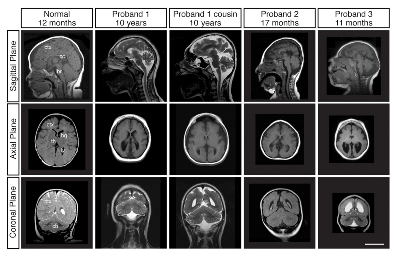

## Question

# Disease Characteristics Research Template

## Target Disease
- **Disease Name:** KATNB1-related Cortical Malformation
- **MONDO ID:**  (if available)
- **Category:** Mendelian

## Research Objectives

Please provide a comprehensive research report on **KATNB1-related Cortical Malformation** covering all of the
disease characteristics listed below. This report will be used to populate a disease knowledge
base entry. Be thorough and cite primary literature (PMID preferred) for all claims.

For each section, **suggested databases/resources** are listed. These are the first places
you should search for information on each topic.

---

### 1. Disease Information
> **Search first:** OMIM, Orphanet, ICD-10/ICD-11, MeSH, PubMed

- What is the disease? Provide a concise overview.
- What are the key identifiers? (OMIM, Orphanet, ICD-10/ICD-11, MeSH, Mondo)
- What are the common synonyms and alternative names?
- Is the information derived from individual patients (e.g., EHR) or aggregated disease-level resources?

### 2. Etiology

- **Disease Causal Factors**: What are the primary causes? (genetic, environmental, infectious, mechanistic)
- **Risk Factors**:
  > **Search first:** PubMed, Cochrane Library, UpToDate, clinical guidelines, ClinVar, ClinGen, GWAS Catalog, PheGenI, CTD, CDC, WHO, epidemiological databases
  - Genetic risk factors (causal variants, susceptibility loci, modifier genes)
  - Environmental risk factors (toxins, lifestyle, occupational exposures, age, sex, family history)
- **Protective Factors**:
  > **Search first:** PubMed, Cochrane Library, clinical trial databases, GWAS Catalog, gnomAD, WHO, CDC, nutrition databases
  - Genetic protective factors (protective variants, modifier alleles)
  - Environmental protective factors (diet, lifestyle, exposures that reduce risk)
- **Gene-Environment Interactions**: How do genetic and environmental factors interact to influence disease?
  > **Search first:** CTD, PubMed, PheGenI, GxE databases

### 3. Phenotypes
> **Search first:** HPO (Human Phenotype Ontology), OMIM, Orphanet, PubMed, clinicaltrials.gov, MedDRA, SNOMED CT, DECIPHER, LOINC

For each phenotype, provide:
- **Phenotype type**: symptoms, clinical signs, physical manifestations, behavioral changes, or laboratory abnormalities
  > For symptoms/signs: HPO, OMIM, Orphanet, PubMed
  > For behavioral changes: HPO, DSM, RDoC (Research Domain Criteria), PubMed
  > For laboratory abnormalities: LOINC, SNOMED CT, LabTests Online, PubMed
- **Phenotype characteristics**:
  > **Search first:** OMIM, Orphanet, HPO, PubMed
  - Age of symptom onset (neonatal, childhood, adult-onset, late-onset)
  - Symptom severity (mild, moderate, severe, variable)
  - Symptom progression (stable, progressive, episodic, fluctuating)
  - Frequency among affected individuals (percentage or qualitative)
- **Quality of life impact**: Effects on daily functioning and well-being (per-phenotype when possible)
  > **Search first:** EQ-5D database, SF-36, WHO QOL databases, PubMed
- Suggest HPO (Human Phenotype Ontology) terms for each phenotype

### 4. Genetic/Molecular Information

- **Causal Genes**: Gene mutations or chromosomal abnormalities responsible for disease (gene symbols, OMIM IDs)
  > **Search first:** OMIM, ClinVar, HGMD, Ensembl, NCBI Gene
- **Pathogenic Variants**:
  - Affected genes (gene symbols, HGNC IDs)
    > **Search first:** OMIM, NCBI Gene, Ensembl, HGNC, UniProt, GeneCards
  - Variant classification (pathogenic, likely pathogenic, VUS per ACMG/AMP guidelines)
    > **Search first:** ClinVar, ClinGen, ACMG/AMP guidelines, VarSome
  - Variant type/class (missense, frameshift, nonsense, splice-site, structural)
  - Allele frequency in population databases
    > **Search first:** gnomAD, 1000 Genomes, ExAC, TOPMed, dbSNP
  - Somatic vs germline origin
    > **Search first:** COSMIC (somatic), ClinVar, ICGC, TCGA
  - Functional consequences (loss of function, gain of function, dominant negative)
- **Modifier Genes**: Genes that modify disease severity or expression
- **Epigenetic Information**: DNA methylation, histone modifications, chromatin changes affecting disease
  > **Search first:** ENCODE, Roadmap Epigenomics, MethBase, DiseaseMeth
- **Chromosomal Abnormalities**: Large-scale genetic changes (aneuploidy, translocations, inversions)
  > **Search first:** DECIPHER, ClinVar, ECARUCA, UCSC Genome Browser

### 5. Environmental Information

- **Environmental Factors**: Non-genetic contributing factors (toxins, radiation, pollution, occupational exposure)
  > **Search first:** CTD (Comparative Toxicogenomics Database), TOXNET, PubMed, EPA databases
- **Lifestyle Factors**: Behavioral factors (smoking, diet, exercise, alcohol consumption)
  > **Search first:** CDC databases, WHO, PubMed, NHANES
- **Infectious Agents**: If applicable, pathogens causing or triggering disease (bacteria, viruses, fungi, parasites)
  > **Search first:** NCBI Taxonomy, ViPR, BV-BRC, MicrobeDB, GIDEON

### 6. Mechanism / Pathophysiology

- **Molecular Pathways**: Specific signaling cascades or biochemical pathways involved (Wnt, MAPK, mTOR, PI3K-AKT, etc.)
  > **Search first:** KEGG, Reactome, WikiPathways, PathBank, BioCyc
- **Cellular Processes**: Cell-level mechanisms (apoptosis, autophagy, cell cycle dysregulation, inflammation, etc.)
  > **Search first:** Gene Ontology (GO), Reactome, KEGG, PubMed
- **Protein Dysfunction**: How protein structure or function is altered (misfolding, aggregation, loss of function, gain of function)
  > **Search first:** UniProt, PDB (Protein Data Bank), InterPro, Pfam, AlphaFold
- **Metabolic Changes**: Alterations in metabolic processes (energy metabolism, lipid metabolism, amino acid metabolism)
  > **Search first:** KEGG, BioCyc, HMDB (Human Metabolome Database), BRENDA
- **Immune System Involvement**: Role of immune response (autoimmunity, immunodeficiency, chronic inflammation)
  > **Search first:** ImmPort, Immunome Database, IEDB, Gene Ontology
- **Tissue Damage Mechanisms**: How tissues/ are injured (oxidative stress, ischemia, fibrosis, necrosis)
  > **Search first:** PubMed, Gene Ontology, Reactome
- **Biochemical Abnormalities**: Specific molecular defects (enzyme deficiencies, receptor dysfunction, ion channel defects)
  > **Search first:** BRENDA, UniProt, KEGG, OMIM, PubMed
- **Epigenetic Changes**: DNA methylation, histone modifications affecting gene expression in disease
  > **Search first:** ENCODE, Roadmap Epigenomics, MethBase, DiseaseMeth
- **Molecular Profiling** (if available):
  - Transcriptomics/gene expression changes
    > **Search first:** GEO (Gene Expression Omnibus), ArrayExpress, GTEx, Human Cell Atlas, SRA
  - Proteomics findings
    > **Search first:** PRIDE, ProteomeXchange, Human Protein Atlas, STRING, BioGRID
  - Metabolomics signatures
    > **Search first:** MetaboLights, Metabolomics Workbench, HMDB, METLIN
  - Lipidomics alterations
    > **Search first:** LIPID MAPS, SwissLipids, LipidHome, Metabolomics Workbench
  - Genomic structural features
    > **Search first:** UCSC Genome Browser, Ensembl, NCBI, dbVar, DGV
- **Advanced Technologies** (if applicable):
  - Single-cell analysis findings (cell-type specific mechanisms, cellular heterogeneity)
    > **Search first:** Human Cell Atlas, Single Cell Portal, GEO, CELLxGENE
  - Spatial transcriptomics findings
    > **Search first:** GEO, Spatial Research, Vizgen, 10x Genomics data
  - Multi-omics integration results
    > **Search first:** TCGA, ICGC, cBioPortal, LinkedOmics, PubMed
  - Functional genomics screens (CRISPR, RNAi)
    > **Search first:** DepMap, GenomeRNAi, PubMed, BioGRID ORCS

For each mechanism, describe:
- The causal chain from initial trigger to clinical manifestation
- Which mechanisms are upstream vs downstream
- What cell types and biological processes are involved
- Suggest GO terms for biological processes and CL terms for cell types

### 7. Anatomical Structures Affected

- **Organ Level**:
  - Primary organs directly affected
  - Secondary organ involvement (complications, secondary effects)
  - Body systems involved (cardiovascular, nervous, digestive, respiratory, endocrine, etc.)
  > **Search first:** Uberon, FMA (Foundational Model of Anatomy), OMIM, HPO, ICD-11, MeSH, SNOMED CT
- **Tissue and Cell Level**:
  - Specific tissue types affected (epithelial, connective, muscle, nervous)
  - Specific cell populations targeted (with Cell Ontology terms)
  > **Search first:** Uberon, Human Protein Atlas, Cell Ontology, Human Cell Atlas, CellMarker, PanglaoDB
- **Subcellular Level**:
  - Cellular compartments involved (mitochondria, nucleus, ER, lysosomes) (with GO Cellular Component terms)
  > **Search first:** Gene Ontology (Cellular Component), UniProt, Human Protein Atlas
- **Localization**:
  - Specific anatomical sites (with UBERON terms)
    > **Search first:** FMA, Uberon, NeuroNames (for brain), SNOMED CT
  - Lateralization (unilateral, bilateral, asymmetric)
    > **Search first:** HPO, clinical literature, imaging databases

### 8. Temporal Development

- **Onset**:
  - Typical age of onset (congenital, pediatric, adult, geriatric)
  - Onset pattern (acute, subacute, chronic, insidious)
  > **Search first:** OMIM, Orphanet, HPO, PubMed
- **Progression**:
  - Disease stages (early, intermediate, advanced, end-stage)
    > **Search first:** Cancer Staging Manual (AJCC), WHO classifications, PubMed
  - Progression rate (rapid, slow, variable)
  - Disease course pattern (episodic, relapsing-remitting, progressive, stable)
  - Disease duration (self-limited, chronic lifelong)
  > **Search first:** Disease registries, longitudinal cohort databases, natural history studies, PubMed, Orphanet, OMIM
- **Patterns**:
  - Remission patterns (spontaneous, treatment-induced)
    > **Search first:** Clinical trial databases, disease registries, PubMed
  - Critical periods (time windows of vulnerability or opportunity for intervention)
    > **Search first:** PubMed, developmental biology databases, clinical guidelines

### 9. Inheritance and Population

- **Epidemiology**:
  - Prevalence (cases per 100,000 at given time)
  - Incidence (new cases per 100,000 per year)
  > **Search first:** Orphanet, CDC, WHO, GBD (Global Burden of Disease), national registries, SEER, disease registries
- **For Genetic Etiology**:
  - Inheritance pattern (AD, AR, X-linked, mitochondrial, multifactorial, polygenic)
    > **Search first:** OMIM, Orphanet, ClinVar, GTR (Genetic Testing Registry)
  - Penetrance (complete, incomplete, age-dependent)
    > **Search first:** ClinVar, OMIM, PubMed, ClinGen
  - Expressivity (variable, consistent)
    > **Search first:** OMIM, ClinVar, PubMed
  - Genetic anticipation (increasing severity in successive generations)
    > **Search first:** OMIM, PubMed (especially for repeat expansion disorders)
  - Germline mosaicism
    > **Search first:** ClinVar, OMIM, genetic counseling literature, PubMed
  - Founder effects (population-specific mutations)
    > **Search first:** gnomAD, population genetics databases, PubMed
  - Consanguinity role
    > **Search first:** OMIM, population studies, genetic counseling resources
  - Carrier frequency
    > **Search first:** gnomAD, carrier screening databases, GeneReviews, GTR
- **Population Demographics**:
  - Affected populations (ethnic or demographic groups with higher prevalence)
    > **Search first:** gnomAD, 1000 Genomes, PAGE Study, PubMed, population registries
  - Geographic distribution (endemic areas, regional variation)
    > **Search first:** WHO, CDC, GBD, Orphanet, geographic epidemiology databases
  - Geographic distribution of specific variants
  - Sex ratio (male:female)
    > **Search first:** Disease registries, OMIM, PubMed, epidemiological databases
  - Age distribution of affected individuals
    > **Search first:** CDC, disease registries, SEER, Orphanet

### 10. Diagnostics

- **Clinical Tests**:
  - Laboratory tests (blood, urine, tissue chemistry, specific enzyme assays)
    > **Search first:** LOINC, LabTests Online, PubMed
  - Biomarkers (proteins, metabolites, genetic markers, circulating biomarkers)
    > **Search first:** FDA Biomarker List, BEST (Biomarkers, EndpointS, and other Tools), PubMed
  - Imaging studies (X-ray, CT, MRI, PET, ultrasound)
    > **Search first:** RadLex, DICOM, Radiopaedia, imaging databases
  - Functional tests (pulmonary function, cardiac stress tests)
    > **Search first:** LOINC, clinical guidelines, PubMed
  - Electrophysiology (EEG, EMG, ECG, nerve conduction studies)
    > **Search first:** LOINC, clinical neurophysiology databases, PubMed
  - Biopsy findings (histopathology, immunohistochemistry)
    > **Search first:** SNOMED CT, College of American Pathologists resources, PubMed
  - Pathology findings (microscopic examination)
    > **Search first:** SNOMED CT, Digital Pathology databases, PubMed
- **Genetic Testing**:
  > **Search first:** GTR (Genetic Testing Registry), GeneReviews, ClinGen
  - Overview of recommended genetic testing approach
  - Whole genome sequencing (WGS) utility
    > **Search first:** GTR, ClinVar, GEL (Genomics England), gnomAD
  - Whole exome sequencing (WES) utility
    > **Search first:** GTR, ClinVar, OMIM, GeneMatcher
  - Gene panels (which panels, which genes)
    > **Search first:** GTR, ClinVar, laboratory-specific databases
  - Single gene testing
    > **Search first:** GTR, ClinVar, OMIM, GeneReviews
  - Chromosomal microarray (CMA)
    > **Search first:** DECIPHER, ClinVar, dbVar, ECARUCA
  - Karyotyping
    > **Search first:** Chromosome Abnormality Database, ClinVar, cytogenetics resources
  - FISH
    > **Search first:** ClinVar, cytogenetics databases, PubMed
  - Mitochondrial DNA testing
    > **Search first:** MITOMAP, MSeqDR, ClinVar, GTR
  - Repeat expansion testing
    > **Search first:** GTR, ClinVar, repeat expansion databases, PubMed
- **Omics-Based Diagnostics** (if applicable):
  - RNA sequencing / transcriptomics
    > **Search first:** GEO, ArrayExpress, GTEx, RNA-seq databases
  - Proteomics
    > **Search first:** PRIDE, ProteomeXchange, FDA Biomarker database
  - Metabolomics
    > **Search first:** MetaboLights, Metabolomics Workbench, HMDB
  - Epigenomics
    > **Search first:** GEO, ENCODE, Roadmap Epigenomics, MethBase
  - Liquid biopsy
    > **Search first:** COSMIC, ClinVar, liquid biopsy databases, PubMed
- **Clinical Criteria**:
  - Standardized diagnostic criteria (DSM, ICD, society guidelines)
    > **Search first:** DSM-5, ICD-11, clinical society guidelines, UpToDate
  - Differential diagnosis (other conditions to rule out, with distinguishing features)
    > **Search first:** DynaMed, UpToDate, clinical decision support systems
- **Screening**:
  - Screening methods for asymptomatic individuals (newborn screening, carrier screening, cascade screening)
    > **Search first:** ACMG recommendations, CDC newborn screening, GTR

### 11. Outcome/Prognosis

- **Survival and Mortality**:
  - Survival rate (5-year, 10-year, overall)
    > **Search first:** SEER, cancer registries, disease-specific registries, PubMed
  - Life expectancy (with and without treatment if applicable)
    > **Search first:** Orphanet, disease registries, actuarial databases, PubMed
  - Mortality rate
    > **Search first:** CDC, WHO, GBD, national mortality databases
  - Disease-specific mortality (deaths directly attributable to disease)
    > **Search first:** Disease registries, CDC Wonder, GBD, PubMed
- **Morbidity and Function**:
  - Morbidity (disease-related disability and health impacts)
    > **Search first:** GBD, WHO, disability databases, PubMed
  - Disability outcomes (long-term functional impairments)
    > **Search first:** ICF (International Classification of Functioning), disability registries
  - Quality of life measures (EQ-5D, SF-36, PROMIS, disease-specific tools)
    > **Search first:** EQ-5D database, SF-36, PROMIS, PubMed
- **Disease Course**:
  - Complications (secondary problems: infections, organ failure, etc.)
    > **Search first:** ICD codes, disease registries, clinical databases, PubMed
  - Recovery potential (likelihood and extent of recovery, with vs without treatment)
    > **Search first:** Natural history studies, rehabilitation databases, PubMed
- **Prediction**:
  - Prognostic factors (age, disease severity, biomarkers, treatment response)
    > **Search first:** Prognostic models databases, clinical calculators, PubMed
  - Prognostic biomarkers (molecular markers predicting disease course)
    > **Search first:** FDA Biomarker database, PubMed, cancer prognostic databases

### 12. Treatment

- **Pharmacotherapy**:
  - Pharmacological treatments (drug names, drug classes, mechanisms of action)
    > **Search first:** DrugBank, RxNorm, ATC classification, DailyMed, FDA databases
  - Pharmacogenomics (how genetic variants affect drug metabolism, efficacy, toxicity)
    > **Search first:** PharmGKB, CPIC (Clinical Pharmacogenetics), FDA Table of PGx Biomarkers
- **Advanced Therapeutics**:
  - Gene therapy (viral vectors, CRISPR, gene replacement, gene editing)
    > **Search first:** ClinicalTrials.gov, FDA gene therapy database, ASGCT resources
  - Cell therapy (stem cell transplant, CAR-T, cellular therapeutics)
    > **Search first:** ClinicalTrials.gov, FDA cell therapy database, FACT standards
  - RNA-based therapies (ASOs, siRNA, mRNA therapies)
    > **Search first:** ClinicalTrials.gov, FDA approvals, PubMed
  - Targeted therapies (treatments directed at specific molecular targets)
    > **Search first:** My Cancer Genome, OncoKB, ClinicalTrials.gov, FDA approvals
  - Immunotherapies (checkpoint inhibitors, monoclonal antibodies)
    > **Search first:** Cancer Immunotherapy Database, FDA approvals, ClinicalTrials.gov
- **Surgical and Interventional**:
  - Surgical interventions (types of surgery, timing, outcomes)
    > **Search first:** CPT codes, surgical registries, clinical guidelines, PubMed
- **Supportive and Rehabilitative**:
  - Supportive care (symptom management, pain control, nutrition)
    > **Search first:** Clinical guidelines, Cochrane Library, PubMed
  - Rehabilitation (physical therapy, occupational therapy, speech therapy)
    > **Search first:** Rehabilitation medicine databases, clinical guidelines, PubMed
- **Experimental**:
  - Experimental treatments in clinical trials (with NCT identifiers if available)
    > **Search first:** ClinicalTrials.gov, EU Clinical Trials Register, WHO ICTRP
- **Treatment Outcomes**:
  - Treatment response rates
    > **Search first:** Clinical trial databases, FDA reviews, systematic reviews, PubMed
  - Side effects and adverse events
    > **Search first:** FDA Adverse Event Reporting System (FAERS), MedWatch, PubMed
- **Treatment Strategy**:
  - Treatment algorithms (clinical pathways, decision trees)
    > **Search first:** Clinical practice guidelines, NCCN Guidelines, UpToDate
  - Combination therapies
    > **Search first:** ClinicalTrials.gov, treatment guidelines, PubMed
  - Personalized medicine approaches (genotype-guided treatment)
    > **Search first:** My Cancer Genome, CIViC, PharmGKB, precision medicine databases

For each treatment, suggest MAXO (Medical Action Ontology) terms where applicable.

### 13. Prevention

- **Prevention Levels**:
  - Primary prevention (preventing disease occurrence: vaccination, risk factor modification)
    > **Search first:** CDC, WHO, USPSTF recommendations, Cochrane Library
  - Secondary prevention (early detection and treatment: screening programs, early intervention)
    > **Search first:** USPSTF, CDC screening guidelines, WHO
  - Tertiary prevention (preventing complications in those with disease)
    > **Search first:** Clinical guidelines, disease management protocols, PubMed
- **Immunization**: Vaccine strategies (if applicable)
  > **Search first:** CDC vaccine schedules, WHO immunization, FDA vaccine database
- **Screening and Early Detection**:
  - Screening programs (population-based: newborn screening, cancer screening)
    > **Search first:** CDC screening programs, USPSTF, cancer screening databases
  - Genetic screening (carrier screening, preimplantation genetic diagnosis, prenatal testing)
    > **Search first:** ACMG recommendations, ACOG guidelines, GTR
  - Risk stratification (identifying high-risk individuals for targeted prevention)
    > **Search first:** Risk prediction models, clinical calculators, PubMed
- **Behavioral Interventions**: Lifestyle modifications to reduce risk
  > **Search first:** CDC, WHO, behavioral intervention databases, Cochrane Library
- **Counseling**: Genetic counseling (risk assessment, family planning guidance)
  > **Search first:** NSGC resources, ACMG guidelines, GeneReviews
- **Public Health**:
  - Public health interventions (sanitation, vector control, health education)
    > **Search first:** CDC, WHO, public health databases, PubMed
  - Environmental interventions (reducing environmental risk factors)
    > **Search first:** EPA databases, WHO environmental health, PubMed
- **Prophylaxis**: Preventive medications or procedures
  > **Search first:** Clinical guidelines, FDA approvals, PubMed

### 14. Other Species / Natural Disease

- **Taxonomy**: Species affected (with NCBI Taxon identifiers)
  > **Search first:** NCBI Taxonomy
- **Breed**: Specific breeds affected (with VBO identifiers if applicable)
  > **Search first:** VBO (Vertebrate Breed Ontology)
- **Gene**: Orthologous genes in other species (with NCBI Gene IDs)
  > **Search first:** NCBI Gene
- **Natural Disease**:
  - Naturally occurring disease in other species (companion animals, wildlife)
    > **Search first:** OMIA (Online Mendelian Inheritance in Animals), VetCompass, PubMed
  - Veterinary relevance and importance in animal health
    > **Search first:** OMIA, veterinary databases, PubMed
- **Comparative Biology**:
  - Comparative pathology (similarities and differences across species)
    > **Search first:** OMIA, comparative pathology databases, PubMed
  - Evolutionary conservation of disease mechanisms
    > **Search first:** HomoloGene, OrthoMCL, Alliance of Genome Resources
- **Transmission** (if applicable):
  - Zoonotic potential
    > **Search first:** CDC zoonotic diseases, WHO zoonoses, GIDEON
  - Cross-species susceptibility
    > **Search first:** NCBI Taxonomy, veterinary databases, PubMed

### 15. Model Organisms

- **Model Types**:
  - Model organism type (mammalian, invertebrate, cellular, in vitro)
    > **Search first:** Alliance of Genome Resources, model organism databases
  - Specific model systems (mouse, rat, zebrafish, Drosophila, C. elegans, yeast, cell lines, organoids, iPSCs)
    > **Search first:** MGI, RGD, ZFIN, FlyBase, WormBase, SGD, ATCC, Cellosaurus
  - Induced models (drug treatment, surgical intervention, environmental manipulation)
    > **Search first:** MGI, model organism databases, PubMed
- **Genetic Models**:
  - Types available (knockout, knock-in, transgenic, conditional, humanized)
    > **Search first:** MGI, IMPC, KOMP, EuMMCR, IMSR
- **Model Characteristics**:
  - Phenotype recapitulation (how well model reproduces human disease features)
    > **Search first:** Model organism databases, comparative studies, PubMed
  - Model limitations (aspects of human disease not captured)
    > **Search first:** Model organism databases, PubMed, review articles
- **Applications**:
  - Research applications (what aspects of disease can be studied)
    > **Search first:** Model organism databases, PubMed
- **Resources**:
  - Model databases
    > **Search first:** MGI, RGD, ZFIN, FlyBase, WormBase, IMSR, EMMA, MMRRC

---

## Citation Requirements

- Cite primary literature (PMID preferred) for all mechanistic and clinical claims
- Prioritize recent reviews and landmark papers
- Include direct quotes from abstracts where possible to support key statements
- Distinguish evidence source types: human clinical, model organism, in vitro, computational

## Output Format

Structure your response as a comprehensive narrative organized by the sections above.
For each section, provide:
- Factual content with specific details (numbers, percentages, gene names, variant nomenclature)
- Ontology term suggestions (HPO, GO, CL, UBERON, CHEBI, MAXO, MONDO) where applicable
- Evidence citations with PMIDs
- Direct quotes from abstracts to support key claims
- Clear indication when information is not available or not applicable for this disease

This report will be used to populate a disease knowledge base entry with:
- Pathophysiology descriptions with causal chains
- Gene/protein annotations (HGNC, GO terms)
- Phenotype associations (HP terms) with frequencies
- Cell type involvement (CL terms)
- Anatomical locations (UBERON terms)
- Chemical entities (CHEBI terms)
- Treatment annotations (MAXO terms)
- Evidence items with PMIDs and exact abstract quotes
- Epidemiology, prognosis, diagnostic, and prevention information
- Animal model descriptions with phenotype recapitulation details

## Output

Question: You are an expert researcher providing comprehensive, well-cited information.

Provide detailed information focusing on:
1. Key concepts and definitions with current understanding
2. Recent developments and latest research (prioritize 2023-2024 sources)
3. Current applications and real-world implementations
4. Expert opinions and analysis from authoritative sources
5. Relevant statistics and data from recent studies

Format as a comprehensive research report with proper citations. Include URLs and publication dates where available.
Always prioritize recent, authoritative sources and provide specific citations for all major claims.

# Disease Characteristics Research Template

## Target Disease
- **Disease Name:** KATNB1-related Cortical Malformation
- **MONDO ID:**  (if available)
- **Category:** Mendelian

## Research Objectives

Please provide a comprehensive research report on **KATNB1-related Cortical Malformation** covering all of the
disease characteristics listed below. This report will be used to populate a disease knowledge
base entry. Be thorough and cite primary literature (PMID preferred) for all claims.

For each section, **suggested databases/resources** are listed. These are the first places
you should search for information on each topic.

---

### 1. Disease Information
> **Search first:** OMIM, Orphanet, ICD-10/ICD-11, MeSH, PubMed

- What is the disease? Provide a concise overview.
- What are the key identifiers? (OMIM, Orphanet, ICD-10/ICD-11, MeSH, Mondo)
- What are the common synonyms and alternative names?
- Is the information derived from individual patients (e.g., EHR) or aggregated disease-level resources?

### 2. Etiology

- **Disease Causal Factors**: What are the primary causes? (genetic, environmental, infectious, mechanistic)
- **Risk Factors**:
  > **Search first:** PubMed, Cochrane Library, UpToDate, clinical guidelines, ClinVar, ClinGen, GWAS Catalog, PheGenI, CTD, CDC, WHO, epidemiological databases
  - Genetic risk factors (causal variants, susceptibility loci, modifier genes)
  - Environmental risk factors (toxins, lifestyle, occupational exposures, age, sex, family history)
- **Protective Factors**:
  > **Search first:** PubMed, Cochrane Library, clinical trial databases, GWAS Catalog, gnomAD, WHO, CDC, nutrition databases
  - Genetic protective factors (protective variants, modifier alleles)
  - Environmental protective factors (diet, lifestyle, exposures that reduce risk)
- **Gene-Environment Interactions**: How do genetic and environmental factors interact to influence disease?
  > **Search first:** CTD, PubMed, PheGenI, GxE databases

### 3. Phenotypes
> **Search first:** HPO (Human Phenotype Ontology), OMIM, Orphanet, PubMed, clinicaltrials.gov, MedDRA, SNOMED CT, DECIPHER, LOINC

For each phenotype, provide:
- **Phenotype type**: symptoms, clinical signs, physical manifestations, behavioral changes, or laboratory abnormalities
  > For symptoms/signs: HPO, OMIM, Orphanet, PubMed
  > For behavioral changes: HPO, DSM, RDoC (Research Domain Criteria), PubMed
  > For laboratory abnormalities: LOINC, SNOMED CT, LabTests Online, PubMed
- **Phenotype characteristics**:
  > **Search first:** OMIM, Orphanet, HPO, PubMed
  - Age of symptom onset (neonatal, childhood, adult-onset, late-onset)
  - Symptom severity (mild, moderate, severe, variable)
  - Symptom progression (stable, progressive, episodic, fluctuating)
  - Frequency among affected individuals (percentage or qualitative)
- **Quality of life impact**: Effects on daily functioning and well-being (per-phenotype when possible)
  > **Search first:** EQ-5D database, SF-36, WHO QOL databases, PubMed
- Suggest HPO (Human Phenotype Ontology) terms for each phenotype

### 4. Genetic/Molecular Information

- **Causal Genes**: Gene mutations or chromosomal abnormalities responsible for disease (gene symbols, OMIM IDs)
  > **Search first:** OMIM, ClinVar, HGMD, Ensembl, NCBI Gene
- **Pathogenic Variants**:
  - Affected genes (gene symbols, HGNC IDs)
    > **Search first:** OMIM, NCBI Gene, Ensembl, HGNC, UniProt, GeneCards
  - Variant classification (pathogenic, likely pathogenic, VUS per ACMG/AMP guidelines)
    > **Search first:** ClinVar, ClinGen, ACMG/AMP guidelines, VarSome
  - Variant type/class (missense, frameshift, nonsense, splice-site, structural)
  - Allele frequency in population databases
    > **Search first:** gnomAD, 1000 Genomes, ExAC, TOPMed, dbSNP
  - Somatic vs germline origin
    > **Search first:** COSMIC (somatic), ClinVar, ICGC, TCGA
  - Functional consequences (loss of function, gain of function, dominant negative)
- **Modifier Genes**: Genes that modify disease severity or expression
- **Epigenetic Information**: DNA methylation, histone modifications, chromatin changes affecting disease
  > **Search first:** ENCODE, Roadmap Epigenomics, MethBase, DiseaseMeth
- **Chromosomal Abnormalities**: Large-scale genetic changes (aneuploidy, translocations, inversions)
  > **Search first:** DECIPHER, ClinVar, ECARUCA, UCSC Genome Browser

### 5. Environmental Information

- **Environmental Factors**: Non-genetic contributing factors (toxins, radiation, pollution, occupational exposure)
  > **Search first:** CTD (Comparative Toxicogenomics Database), TOXNET, PubMed, EPA databases
- **Lifestyle Factors**: Behavioral factors (smoking, diet, exercise, alcohol consumption)
  > **Search first:** CDC databases, WHO, PubMed, NHANES
- **Infectious Agents**: If applicable, pathogens causing or triggering disease (bacteria, viruses, fungi, parasites)
  > **Search first:** NCBI Taxonomy, ViPR, BV-BRC, MicrobeDB, GIDEON

### 6. Mechanism / Pathophysiology

- **Molecular Pathways**: Specific signaling cascades or biochemical pathways involved (Wnt, MAPK, mTOR, PI3K-AKT, etc.)
  > **Search first:** KEGG, Reactome, WikiPathways, PathBank, BioCyc
- **Cellular Processes**: Cell-level mechanisms (apoptosis, autophagy, cell cycle dysregulation, inflammation, etc.)
  > **Search first:** Gene Ontology (GO), Reactome, KEGG, PubMed
- **Protein Dysfunction**: How protein structure or function is altered (misfolding, aggregation, loss of function, gain of function)
  > **Search first:** UniProt, PDB (Protein Data Bank), InterPro, Pfam, AlphaFold
- **Metabolic Changes**: Alterations in metabolic processes (energy metabolism, lipid metabolism, amino acid metabolism)
  > **Search first:** KEGG, BioCyc, HMDB (Human Metabolome Database), BRENDA
- **Immune System Involvement**: Role of immune response (autoimmunity, immunodeficiency, chronic inflammation)
  > **Search first:** ImmPort, Immunome Database, IEDB, Gene Ontology
- **Tissue Damage Mechanisms**: How tissues/ are injured (oxidative stress, ischemia, fibrosis, necrosis)
  > **Search first:** PubMed, Gene Ontology, Reactome
- **Biochemical Abnormalities**: Specific molecular defects (enzyme deficiencies, receptor dysfunction, ion channel defects)
  > **Search first:** BRENDA, UniProt, KEGG, OMIM, PubMed
- **Epigenetic Changes**: DNA methylation, histone modifications affecting gene expression in disease
  > **Search first:** ENCODE, Roadmap Epigenomics, MethBase, DiseaseMeth
- **Molecular Profiling** (if available):
  - Transcriptomics/gene expression changes
    > **Search first:** GEO (Gene Expression Omnibus), ArrayExpress, GTEx, Human Cell Atlas, SRA
  - Proteomics findings
    > **Search first:** PRIDE, ProteomeXchange, Human Protein Atlas, STRING, BioGRID
  - Metabolomics signatures
    > **Search first:** MetaboLights, Metabolomics Workbench, HMDB, METLIN
  - Lipidomics alterations
    > **Search first:** LIPID MAPS, SwissLipids, LipidHome, Metabolomics Workbench
  - Genomic structural features
    > **Search first:** UCSC Genome Browser, Ensembl, NCBI, dbVar, DGV
- **Advanced Technologies** (if applicable):
  - Single-cell analysis findings (cell-type specific mechanisms, cellular heterogeneity)
    > **Search first:** Human Cell Atlas, Single Cell Portal, GEO, CELLxGENE
  - Spatial transcriptomics findings
    > **Search first:** GEO, Spatial Research, Vizgen, 10x Genomics data
  - Multi-omics integration results
    > **Search first:** TCGA, ICGC, cBioPortal, LinkedOmics, PubMed
  - Functional genomics screens (CRISPR, RNAi)
    > **Search first:** DepMap, GenomeRNAi, PubMed, BioGRID ORCS

For each mechanism, describe:
- The causal chain from initial trigger to clinical manifestation
- Which mechanisms are upstream vs downstream
- What cell types and biological processes are involved
- Suggest GO terms for biological processes and CL terms for cell types

### 7. Anatomical Structures Affected

- **Organ Level**:
  - Primary organs directly affected
  - Secondary organ involvement (complications, secondary effects)
  - Body systems involved (cardiovascular, nervous, digestive, respiratory, endocrine, etc.)
  > **Search first:** Uberon, FMA (Foundational Model of Anatomy), OMIM, HPO, ICD-11, MeSH, SNOMED CT
- **Tissue and Cell Level**:
  - Specific tissue types affected (epithelial, connective, muscle, nervous)
  - Specific cell populations targeted (with Cell Ontology terms)
  > **Search first:** Uberon, Human Protein Atlas, Cell Ontology, Human Cell Atlas, CellMarker, PanglaoDB
- **Subcellular Level**:
  - Cellular compartments involved (mitochondria, nucleus, ER, lysosomes) (with GO Cellular Component terms)
  > **Search first:** Gene Ontology (Cellular Component), UniProt, Human Protein Atlas
- **Localization**:
  - Specific anatomical sites (with UBERON terms)
    > **Search first:** FMA, Uberon, NeuroNames (for brain), SNOMED CT
  - Lateralization (unilateral, bilateral, asymmetric)
    > **Search first:** HPO, clinical literature, imaging databases

### 8. Temporal Development

- **Onset**:
  - Typical age of onset (congenital, pediatric, adult, geriatric)
  - Onset pattern (acute, subacute, chronic, insidious)
  > **Search first:** OMIM, Orphanet, HPO, PubMed
- **Progression**:
  - Disease stages (early, intermediate, advanced, end-stage)
    > **Search first:** Cancer Staging Manual (AJCC), WHO classifications, PubMed
  - Progression rate (rapid, slow, variable)
  - Disease course pattern (episodic, relapsing-remitting, progressive, stable)
  - Disease duration (self-limited, chronic lifelong)
  > **Search first:** Disease registries, longitudinal cohort databases, natural history studies, PubMed, Orphanet, OMIM
- **Patterns**:
  - Remission patterns (spontaneous, treatment-induced)
    > **Search first:** Clinical trial databases, disease registries, PubMed
  - Critical periods (time windows of vulnerability or opportunity for intervention)
    > **Search first:** PubMed, developmental biology databases, clinical guidelines

### 9. Inheritance and Population

- **Epidemiology**:
  - Prevalence (cases per 100,000 at given time)
  - Incidence (new cases per 100,000 per year)
  > **Search first:** Orphanet, CDC, WHO, GBD (Global Burden of Disease), national registries, SEER, disease registries
- **For Genetic Etiology**:
  - Inheritance pattern (AD, AR, X-linked, mitochondrial, multifactorial, polygenic)
    > **Search first:** OMIM, Orphanet, ClinVar, GTR (Genetic Testing Registry)
  - Penetrance (complete, incomplete, age-dependent)
    > **Search first:** ClinVar, OMIM, PubMed, ClinGen
  - Expressivity (variable, consistent)
    > **Search first:** OMIM, ClinVar, PubMed
  - Genetic anticipation (increasing severity in successive generations)
    > **Search first:** OMIM, PubMed (especially for repeat expansion disorders)
  - Germline mosaicism
    > **Search first:** ClinVar, OMIM, genetic counseling literature, PubMed
  - Founder effects (population-specific mutations)
    > **Search first:** gnomAD, population genetics databases, PubMed
  - Consanguinity role
    > **Search first:** OMIM, population studies, genetic counseling resources
  - Carrier frequency
    > **Search first:** gnomAD, carrier screening databases, GeneReviews, GTR
- **Population Demographics**:
  - Affected populations (ethnic or demographic groups with higher prevalence)
    > **Search first:** gnomAD, 1000 Genomes, PAGE Study, PubMed, population registries
  - Geographic distribution (endemic areas, regional variation)
    > **Search first:** WHO, CDC, GBD, Orphanet, geographic epidemiology databases
  - Geographic distribution of specific variants
  - Sex ratio (male:female)
    > **Search first:** Disease registries, OMIM, PubMed, epidemiological databases
  - Age distribution of affected individuals
    > **Search first:** CDC, disease registries, SEER, Orphanet

### 10. Diagnostics

- **Clinical Tests**:
  - Laboratory tests (blood, urine, tissue chemistry, specific enzyme assays)
    > **Search first:** LOINC, LabTests Online, PubMed
  - Biomarkers (proteins, metabolites, genetic markers, circulating biomarkers)
    > **Search first:** FDA Biomarker List, BEST (Biomarkers, EndpointS, and other Tools), PubMed
  - Imaging studies (X-ray, CT, MRI, PET, ultrasound)
    > **Search first:** RadLex, DICOM, Radiopaedia, imaging databases
  - Functional tests (pulmonary function, cardiac stress tests)
    > **Search first:** LOINC, clinical guidelines, PubMed
  - Electrophysiology (EEG, EMG, ECG, nerve conduction studies)
    > **Search first:** LOINC, clinical neurophysiology databases, PubMed
  - Biopsy findings (histopathology, immunohistochemistry)
    > **Search first:** SNOMED CT, College of American Pathologists resources, PubMed
  - Pathology findings (microscopic examination)
    > **Search first:** SNOMED CT, Digital Pathology databases, PubMed
- **Genetic Testing**:
  > **Search first:** GTR (Genetic Testing Registry), GeneReviews, ClinGen
  - Overview of recommended genetic testing approach
  - Whole genome sequencing (WGS) utility
    > **Search first:** GTR, ClinVar, GEL (Genomics England), gnomAD
  - Whole exome sequencing (WES) utility
    > **Search first:** GTR, ClinVar, OMIM, GeneMatcher
  - Gene panels (which panels, which genes)
    > **Search first:** GTR, ClinVar, laboratory-specific databases
  - Single gene testing
    > **Search first:** GTR, ClinVar, OMIM, GeneReviews
  - Chromosomal microarray (CMA)
    > **Search first:** DECIPHER, ClinVar, dbVar, ECARUCA
  - Karyotyping
    > **Search first:** Chromosome Abnormality Database, ClinVar, cytogenetics resources
  - FISH
    > **Search first:** ClinVar, cytogenetics databases, PubMed
  - Mitochondrial DNA testing
    > **Search first:** MITOMAP, MSeqDR, ClinVar, GTR
  - Repeat expansion testing
    > **Search first:** GTR, ClinVar, repeat expansion databases, PubMed
- **Omics-Based Diagnostics** (if applicable):
  - RNA sequencing / transcriptomics
    > **Search first:** GEO, ArrayExpress, GTEx, RNA-seq databases
  - Proteomics
    > **Search first:** PRIDE, ProteomeXchange, FDA Biomarker database
  - Metabolomics
    > **Search first:** MetaboLights, Metabolomics Workbench, HMDB
  - Epigenomics
    > **Search first:** GEO, ENCODE, Roadmap Epigenomics, MethBase
  - Liquid biopsy
    > **Search first:** COSMIC, ClinVar, liquid biopsy databases, PubMed
- **Clinical Criteria**:
  - Standardized diagnostic criteria (DSM, ICD, society guidelines)
    > **Search first:** DSM-5, ICD-11, clinical society guidelines, UpToDate
  - Differential diagnosis (other conditions to rule out, with distinguishing features)
    > **Search first:** DynaMed, UpToDate, clinical decision support systems
- **Screening**:
  - Screening methods for asymptomatic individuals (newborn screening, carrier screening, cascade screening)
    > **Search first:** ACMG recommendations, CDC newborn screening, GTR

### 11. Outcome/Prognosis

- **Survival and Mortality**:
  - Survival rate (5-year, 10-year, overall)
    > **Search first:** SEER, cancer registries, disease-specific registries, PubMed
  - Life expectancy (with and without treatment if applicable)
    > **Search first:** Orphanet, disease registries, actuarial databases, PubMed
  - Mortality rate
    > **Search first:** CDC, WHO, GBD, national mortality databases
  - Disease-specific mortality (deaths directly attributable to disease)
    > **Search first:** Disease registries, CDC Wonder, GBD, PubMed
- **Morbidity and Function**:
  - Morbidity (disease-related disability and health impacts)
    > **Search first:** GBD, WHO, disability databases, PubMed
  - Disability outcomes (long-term functional impairments)
    > **Search first:** ICF (International Classification of Functioning), disability registries
  - Quality of life measures (EQ-5D, SF-36, PROMIS, disease-specific tools)
    > **Search first:** EQ-5D database, SF-36, PROMIS, PubMed
- **Disease Course**:
  - Complications (secondary problems: infections, organ failure, etc.)
    > **Search first:** ICD codes, disease registries, clinical databases, PubMed
  - Recovery potential (likelihood and extent of recovery, with vs without treatment)
    > **Search first:** Natural history studies, rehabilitation databases, PubMed
- **Prediction**:
  - Prognostic factors (age, disease severity, biomarkers, treatment response)
    > **Search first:** Prognostic models databases, clinical calculators, PubMed
  - Prognostic biomarkers (molecular markers predicting disease course)
    > **Search first:** FDA Biomarker database, PubMed, cancer prognostic databases

### 12. Treatment

- **Pharmacotherapy**:
  - Pharmacological treatments (drug names, drug classes, mechanisms of action)
    > **Search first:** DrugBank, RxNorm, ATC classification, DailyMed, FDA databases
  - Pharmacogenomics (how genetic variants affect drug metabolism, efficacy, toxicity)
    > **Search first:** PharmGKB, CPIC (Clinical Pharmacogenetics), FDA Table of PGx Biomarkers
- **Advanced Therapeutics**:
  - Gene therapy (viral vectors, CRISPR, gene replacement, gene editing)
    > **Search first:** ClinicalTrials.gov, FDA gene therapy database, ASGCT resources
  - Cell therapy (stem cell transplant, CAR-T, cellular therapeutics)
    > **Search first:** ClinicalTrials.gov, FDA cell therapy database, FACT standards
  - RNA-based therapies (ASOs, siRNA, mRNA therapies)
    > **Search first:** ClinicalTrials.gov, FDA approvals, PubMed
  - Targeted therapies (treatments directed at specific molecular targets)
    > **Search first:** My Cancer Genome, OncoKB, ClinicalTrials.gov, FDA approvals
  - Immunotherapies (checkpoint inhibitors, monoclonal antibodies)
    > **Search first:** Cancer Immunotherapy Database, FDA approvals, ClinicalTrials.gov
- **Surgical and Interventional**:
  - Surgical interventions (types of surgery, timing, outcomes)
    > **Search first:** CPT codes, surgical registries, clinical guidelines, PubMed
- **Supportive and Rehabilitative**:
  - Supportive care (symptom management, pain control, nutrition)
    > **Search first:** Clinical guidelines, Cochrane Library, PubMed
  - Rehabilitation (physical therapy, occupational therapy, speech therapy)
    > **Search first:** Rehabilitation medicine databases, clinical guidelines, PubMed
- **Experimental**:
  - Experimental treatments in clinical trials (with NCT identifiers if available)
    > **Search first:** ClinicalTrials.gov, EU Clinical Trials Register, WHO ICTRP
- **Treatment Outcomes**:
  - Treatment response rates
    > **Search first:** Clinical trial databases, FDA reviews, systematic reviews, PubMed
  - Side effects and adverse events
    > **Search first:** FDA Adverse Event Reporting System (FAERS), MedWatch, PubMed
- **Treatment Strategy**:
  - Treatment algorithms (clinical pathways, decision trees)
    > **Search first:** Clinical practice guidelines, NCCN Guidelines, UpToDate
  - Combination therapies
    > **Search first:** ClinicalTrials.gov, treatment guidelines, PubMed
  - Personalized medicine approaches (genotype-guided treatment)
    > **Search first:** My Cancer Genome, CIViC, PharmGKB, precision medicine databases

For each treatment, suggest MAXO (Medical Action Ontology) terms where applicable.

### 13. Prevention

- **Prevention Levels**:
  - Primary prevention (preventing disease occurrence: vaccination, risk factor modification)
    > **Search first:** CDC, WHO, USPSTF recommendations, Cochrane Library
  - Secondary prevention (early detection and treatment: screening programs, early intervention)
    > **Search first:** USPSTF, CDC screening guidelines, WHO
  - Tertiary prevention (preventing complications in those with disease)
    > **Search first:** Clinical guidelines, disease management protocols, PubMed
- **Immunization**: Vaccine strategies (if applicable)
  > **Search first:** CDC vaccine schedules, WHO immunization, FDA vaccine database
- **Screening and Early Detection**:
  - Screening programs (population-based: newborn screening, cancer screening)
    > **Search first:** CDC screening programs, USPSTF, cancer screening databases
  - Genetic screening (carrier screening, preimplantation genetic diagnosis, prenatal testing)
    > **Search first:** ACMG recommendations, ACOG guidelines, GTR
  - Risk stratification (identifying high-risk individuals for targeted prevention)
    > **Search first:** Risk prediction models, clinical calculators, PubMed
- **Behavioral Interventions**: Lifestyle modifications to reduce risk
  > **Search first:** CDC, WHO, behavioral intervention databases, Cochrane Library
- **Counseling**: Genetic counseling (risk assessment, family planning guidance)
  > **Search first:** NSGC resources, ACMG guidelines, GeneReviews
- **Public Health**:
  - Public health interventions (sanitation, vector control, health education)
    > **Search first:** CDC, WHO, public health databases, PubMed
  - Environmental interventions (reducing environmental risk factors)
    > **Search first:** EPA databases, WHO environmental health, PubMed
- **Prophylaxis**: Preventive medications or procedures
  > **Search first:** Clinical guidelines, FDA approvals, PubMed

### 14. Other Species / Natural Disease

- **Taxonomy**: Species affected (with NCBI Taxon identifiers)
  > **Search first:** NCBI Taxonomy
- **Breed**: Specific breeds affected (with VBO identifiers if applicable)
  > **Search first:** VBO (Vertebrate Breed Ontology)
- **Gene**: Orthologous genes in other species (with NCBI Gene IDs)
  > **Search first:** NCBI Gene
- **Natural Disease**:
  - Naturally occurring disease in other species (companion animals, wildlife)
    > **Search first:** OMIA (Online Mendelian Inheritance in Animals), VetCompass, PubMed
  - Veterinary relevance and importance in animal health
    > **Search first:** OMIA, veterinary databases, PubMed
- **Comparative Biology**:
  - Comparative pathology (similarities and differences across species)
    > **Search first:** OMIA, comparative pathology databases, PubMed
  - Evolutionary conservation of disease mechanisms
    > **Search first:** HomoloGene, OrthoMCL, Alliance of Genome Resources
- **Transmission** (if applicable):
  - Zoonotic potential
    > **Search first:** CDC zoonotic diseases, WHO zoonoses, GIDEON
  - Cross-species susceptibility
    > **Search first:** NCBI Taxonomy, veterinary databases, PubMed

### 15. Model Organisms

- **Model Types**:
  - Model organism type (mammalian, invertebrate, cellular, in vitro)
    > **Search first:** Alliance of Genome Resources, model organism databases
  - Specific model systems (mouse, rat, zebrafish, Drosophila, C. elegans, yeast, cell lines, organoids, iPSCs)
    > **Search first:** MGI, RGD, ZFIN, FlyBase, WormBase, SGD, ATCC, Cellosaurus
  - Induced models (drug treatment, surgical intervention, environmental manipulation)
    > **Search first:** MGI, model organism databases, PubMed
- **Genetic Models**:
  - Types available (knockout, knock-in, transgenic, conditional, humanized)
    > **Search first:** MGI, IMPC, KOMP, EuMMCR, IMSR
- **Model Characteristics**:
  - Phenotype recapitulation (how well model reproduces human disease features)
    > **Search first:** Model organism databases, comparative studies, PubMed
  - Model limitations (aspects of human disease not captured)
    > **Search first:** Model organism databases, PubMed, review articles
- **Applications**:
  - Research applications (what aspects of disease can be studied)
    > **Search first:** Model organism databases, PubMed
- **Resources**:
  - Model databases
    > **Search first:** MGI, RGD, ZFIN, FlyBase, WormBase, IMSR, EMMA, MMRRC

---

## Citation Requirements

- Cite primary literature (PMID preferred) for all mechanistic and clinical claims
- Prioritize recent reviews and landmark papers
- Include direct quotes from abstracts where possible to support key statements
- Distinguish evidence source types: human clinical, model organism, in vitro, computational

## Output Format

Structure your response as a comprehensive narrative organized by the sections above.
For each section, provide:
- Factual content with specific details (numbers, percentages, gene names, variant nomenclature)
- Ontology term suggestions (HPO, GO, CL, UBERON, CHEBI, MAXO, MONDO) where applicable
- Evidence citations with PMIDs
- Direct quotes from abstracts to support key claims
- Clear indication when information is not available or not applicable for this disease

This report will be used to populate a disease knowledge base entry with:
- Pathophysiology descriptions with causal chains
- Gene/protein annotations (HGNC, GO terms)
- Phenotype associations (HP terms) with frequencies
- Cell type involvement (CL terms)
- Anatomical locations (UBERON terms)
- Chemical entities (CHEBI terms)
- Treatment annotations (MAXO terms)
- Evidence items with PMIDs and exact abstract quotes
- Epidemiology, prognosis, diagnostic, and prevention information
- Animal model descriptions with phenotype recapitulation details

## Comprehensive Research Report: KATNB1-related Cortical Malformation (KATNB1-related microlissencephaly; “Lissencephaly 6 with microcephaly”, LIS6)

### Executive summary
KATNB1-related cortical malformation is a rare autosomal recessive neurodevelopmental disorder characterized by congenital/progressive microcephaly and malformations of cortical development (MCD), most often described as microlissencephaly (severely simplified gyral pattern) with variably associated ventriculomegaly and corpus callosum abnormalities. Core clinical features include global developmental delay and seizures, with highly variable developmental outcomes. Mechanistically, current evidence links KATNB1 loss of function to disrupted microtubule severing and centrosome–cilium homeostasis, mitotic spindle defects, impaired Hedgehog signaling, reduced neural progenitor proliferation/survival, and abnormal neuronal migration—supported by animal models and patient-derived iPSC/organoid systems. (hu2014kataninp80regulates pages 1-2, peluso2021wholeexomesequencing pages 6-8, jin2017kataninp80numa pages 1-3)

---

## 1. Disease Information

### 1.1 Disease overview (what it is)
The disorder is described as **severe microlissencephaly** due to **biallelic pathogenic variants in KATNB1**, encoding the p80 regulatory subunit of the katanin microtubule-severing complex. Affected individuals show **severe microcephaly with simplified cortical gyri/sulci**, typically with dramatically reduced cortical volume on MRI. (hu2014kataninp80regulates pages 2-4, hu2014kataninp80regulates pages 1-2)

### 1.2 Key identifiers and controlled names
- **Gene:** *KATNB1*; a microcephaly-disorders review explicitly notes **KATNB1 (MIM# 602703)** and uses the disease label **“Lissencephaly 6 with microcephaly (LIS6)”**. (brown2017geneticrequirementsfor pages 103-108)
- **Standardized disease name used in primary literature:** “**lissencephaly 6**” and “**microlissencephaly**”. (peluso2021wholeexomesequencing pages 1-2, hu2014kataninp80regulates pages 2-4)
- **MONDO / Orphanet / ICD / MeSH / OMIM disease-number:** Not present in the retrieved full-text excerpts; therefore not reported here to avoid mis-mapping. (peluso2021wholeexomesequencing pages 1-2, brown2017geneticrequirementsfor pages 103-108)

### 1.3 Synonyms and alternative names
- KATNB1-related microlissencephaly (primary literature framing) (hu2014kataninp80regulates pages 2-4)
- Lissencephaly 6 with microcephaly (LIS6) (brown2017geneticrequirementsfor pages 103-108, peluso2021wholeexomesequencing pages 1-2)
- KATNB1-related cortical malformation (umbrella term consistent with MCD phenotype) (peluso2021wholeexomesequencing pages 6-8)

### 1.4 Evidence sources (individual vs aggregated)
The knowledge base here is derived from:
- **Primary human family-based studies** describing affected individuals and segregating variants (Hu et al., *Neuron* 2014). (hu2014kataninp80regulates pages 2-4)
- **Case report plus literature aggregation** with pooled counts across published patients (Peluso et al., *Genes* 2021). (peluso2021wholeexomesequencing pages 6-8)
- **Mechanistic studies** using patient-derived iPSCs/brain organoids and animal models (Jin et al., 2017; Hu et al., 2014). (jin2017kataninp80numa pages 1-3, hu2014kataninp80regulates pages 1-2)
- **Consensus diagnostic guidance for MCDs** (Neuro-MIG; Oegema et al., *Nat Rev Neurol* 2020). (oegema2020internationalconsensusrecommendations pages 8-9, oegema2020internationalconsensusrecommendations pages 7-8)

---

## 2. Etiology

### 2.1 Disease causal factors
**Primary cause:** Biallelic pathogenic variants in **KATNB1** disrupting normal katanin p80 function, leading to abnormal cortical development. (hu2014kataninp80regulates pages 2-4, peluso2021wholeexomesequencing pages 6-8)

**Inheritance:** Evidence supports **autosomal recessive inheritance**, including consanguineous pedigrees and parental heterozygosity for proband homozygous variants. (hu2014kataninp80regulates pages 1-2, peluso2021wholeexomesequencing pages 1-2)

### 2.2 Risk factors
- **Genetic risk factor:** Having **biallelic (homozygous or compound heterozygous) loss-of-function** KATNB1 variants. (peluso2021wholeexomesequencing pages 6-8)
- **Family structure:** Consanguinity increases risk for recessive disorders; KATNB1 cases include first-cousin unions in reported families. (hu2014kataninp80regulates pages 1-2, peluso2021wholeexomesequencing pages 1-2)

Environmental risk factors and infectious triggers were not identified as causal for this monogenic condition in the retrieved evidence.

### 2.3 Protective factors
No genetic or environmental protective factors have been reported in the retrieved evidence.

### 2.4 Gene–environment interactions
No KATNB1-specific gene–environment interaction evidence was found in the retrieved corpus.

---

## 3. Phenotypes (clinical features)

### 3.1 Core phenotype spectrum
Across three unrelated families, affected individuals had **severe microcephaly, global developmental delay, and seizures**, with MRI showing markedly reduced cortical volume and simplified gyral pattern. (hu2014kataninp80regulates pages 1-2)

A literature aggregation summarized **13 subjects from nine families** (age range **11 months–12 years**) and emphasized microcephaly as characteristic. (peluso2021wholeexomesequencing pages 6-8)

### 3.2 Quantitative outcome and frequency data (from available aggregation)
From the Peluso 2021 aggregation:
- **Head circumference at birth:** approximately **−1.63 to −5.9 SD**, with further decline in many patients. (peluso2021wholeexomesequencing pages 6-8)
- **Progression:** in **8/14** cases head circumference declined to **< −6 SD** (and one reported < −11 SD by 12 years). (peluso2021wholeexomesequencing pages 6-8)
- **Neurodevelopmental outcomes:**
  - Regular/normal psychomotor development reported in **2 patients**.
  - **5 patients** never achieved independent walking.
  - **5 patients** had absent speech.
  (peluso2021wholeexomesequencing pages 6-8)
- **Hypertonia:** reported in **8/14**, mainly lower limbs. (peluso2021wholeexomesequencing pages 6-8)

Seizure frequency (percent affected) was not quantified in the retrieved aggregation excerpts.

### 3.3 Neuroimaging phenotypes
MRI findings in primary and aggregated reports include:
- **Reduced cortical size/volume** and **simplified gyral folding** with **shallow sulci**. (hu2014kataninp80regulates pages 2-4, hu2014kataninp80regulates media 9e221719)
- **Posterior ventriculomegaly** (enlarged lateral ventricles posteriorly). (hu2014kataninp80regulates pages 2-4, hu2014kataninp80regulates media 9e221719)
- **Corpus callosum thinning/abnormalities**. (hu2014kataninp80regulates pages 2-4, peluso2021wholeexomesequencing pages 6-8)
- Additional reported cortical malformations across cases: **pachygyria**, **polymicrogyria**, and **periventricular/bilateral nodular heterotopia**. (peluso2021wholeexomesequencing pages 6-8)

### 3.4 Suggested HPO terms (examples)
Key HPO mappings are provided in the ontology table artifact. (hu2014kataninp80regulates pages 1-2, peluso2021wholeexomesequencing pages 6-8)

### 3.5 Quality-of-life impact
Formal QoL instruments (EQ-5D/SF-36/PROMIS) were not reported in the retrieved evidence. Functional impact is inferred from high rates of absent speech/non-walking and severe microcephaly. (peluso2021wholeexomesequencing pages 6-8)

---

## 4. Genetic/Molecular Information

### 4.1 Causal gene
- **KATNB1** encodes the **p80 regulatory subunit** of katanin, which regulates the localization/activity of the catalytic p60 subunit in a heterodimeric microtubule-severing complex. (lynn2021themammalianfamily pages 1-2, lynn2023methodsandsystems pages 20-26)

### 4.2 Pathogenic variant types and examples
Primary human study (Hu et al., 2014) identified **homozygous deleterious variants** across three families:
- Start-codon (initiator ATG)–abolishing variant. (hu2014kataninp80regulates pages 2-4)
- Conserved glycine-to-tryptophan **missense** variant in WD40 region. (hu2014kataninp80regulates pages 2-4)
- **Splice donor** variant at exon 6 boundary causing **exon 6 skipping (dele6)**. (hu2014kataninp80regulates pages 2-4)

Case report (Peluso et al., 2021):
- Homozygous splice-site variant **NM_005886.3:c.1416+1del** (absent from gnomAD v2.1.1 at time of report), with parental heterozygosity. (peluso2021wholeexomesequencing pages 4-6, peluso2021wholeexomesequencing pages 1-2)

Additional variants mentioned in a microcephaly disorders review (secondary synthesis; should be traced to primary sources for clinical interpretation): **S535L, L540R, V45I, V150Cfs*22**. (brown2017geneticrequirementsfor pages 103-108)

### 4.3 Functional consequences
Evidence supports predominantly **loss-of-function/hypomorphic mechanisms**:
- Hu et al. report reduced protein levels and functional defects (e.g., dele6 stable but functionally defective; altered localization). (hu2014kataninp80regulates pages 2-4)
- KATNB1 is under strong negative selection (Ka/Ks ~0.03–0.08), consistent with functional constraint. (hu2014kataninp80regulates pages 2-4)

### 4.4 Modifier genes / epigenetics / chromosomal abnormalities
No validated KATNB1-specific modifier genes, epigenetic signatures, or recurrent chromosomal abnormalities were identified in the retrieved evidence.

---

## 5. Environmental Information
No established environmental, lifestyle, or infectious causal contributors to KATNB1-related microlissencephaly were identified in the retrieved evidence.

---

## 6. Mechanism / Pathophysiology

### 6.1 Key concepts (current understanding)
KATNB1 (p80) is part of the katanin microtubule-severing system. In cortical development, current evidence links KATNB1 dysfunction to **centrosome/centriole abnormalities**, **aberrant ciliogenesis**, **mitotic spindle defects**, and downstream disruption of morphogen signaling—ultimately impairing neural progenitor divisions and neuronal migration. (hu2014kataninp80regulates pages 1-2, jin2017kataninp80numa pages 1-3, lynn2023methodsandsystemsa pages 31-36)

### 6.2 Causal chain (from variant to phenotype)
1. **Biallelic KATNB1 loss-of-function** → impaired regulation/localization of katanin activity and microtubule remodeling. (lynn2021themammalianfamily pages 1-2, lynn2023methodsandsystems pages 20-26)
2. **Centrosome/centriole dysregulation** → supernumerary centrioles, multipolar spindles, and ectopic/supernumerary primary cilia. (hu2014kataninp80regulates pages 2-4)
3. **Cilia dysfunction** → impaired **Hedgehog signaling** (e.g., reduced GLI1/Patched expression reported in summaries of KATNB1-null contexts). (lynn2023methodsandsystems pages 41-46, hu2014kataninp80regulates pages 1-2)
4. **Neural stem/progenitor defects** (reduced proliferation, increased cell death, altered asymmetric division) → reduced cortical mass and microcephaly. (zaidi2022primaryciliainfluence pages 9-10, hu2014kataninp80regulates pages 1-2)
5. **Neuronal migration defects** (and disturbed neurogenesis) → simplified gyral pattern/lissencephaly-spectrum malformation and associated epilepsy/developmental disability. (jin2017kataninp80numa pages 1-3)

### 6.3 Cellular processes and pathways
- **Mitotic microtubule/spindle organization:** KATNB1 is essential for aster formation/maintenance; depletion produces abnormal mitoses and neurodevelopmental abnormalities. (jin2017kataninp80numa pages 1-3)
- **Centrosome and cilium biology:** KATNB1 regulates centriole (including mother centriole) and cilia number; loss leads to excess centrioles and cilia. (hu2014kataninp80regulates pages 1-2)
- **Hedgehog signaling:** Perturbed Shh/Hedgehog signaling accompanies KATNB1 loss. (hu2014kataninp80regulates pages 2-4)

### 6.4 Evidence from advanced technologies
**Patient-derived iPSCs and brain organoids** recapitulate mitotic/microtubule and neuronal migration defects observed in experimental depletion models, supporting human relevance. (jin2017kataninp80numa pages 1-3)

### 6.5 Suggested GO and CL terms
A structured list is provided in the ontology artifact. (hu2014kataninp80regulates pages 1-2, duy2024the"microcephalichydrocephalus" pages 6-7)

---

## 7. Anatomical Structures Affected

### 7.1 Organ/system level
- **Central nervous system**, especially **cerebral cortex** (reduced cortical volume, simplified gyration). (hu2014kataninp80regulates pages 2-4, hu2014kataninp80regulates media 9e221719)

### 7.2 Tissue/cell level
Neural stem/progenitor compartments implicated include **neuroepithelial cells** and **radial glia** (NSC paradigm emphasized in recent synthesis; cortical progenitor/cilium context described in primary paper). (duy2024the"microcephalichydrocephalus" pages 6-7, hu2014kataninp80regulates pages 2-4)

### 7.3 Subcellular level
- **Centrosome/centriole** and **primary cilium**, and **mitotic spindle** are central subcellular structures implicated by functional studies. (hu2014kataninp80regulates pages 1-2, lynn2023methodsandsystemsa pages 31-36)

---

## 8. Temporal Development

### 8.1 Onset
Evidence is consistent with **congenital onset**, with microcephaly present at birth in reported cases and MRI demonstrating early developmental malformation. (peluso2021wholeexomesequencing pages 6-8, hu2014kataninp80regulates pages 1-2)

### 8.2 Progression
Microcephaly can be **progressive** postnatally in many individuals (declining SD over time), while neurodevelopmental impairments can be severe and persistent. (peluso2021wholeexomesequencing pages 6-8)

---

## 9. Inheritance and Population

### 9.1 Inheritance pattern
**Autosomal recessive** inheritance is supported by consanguinity, homozygous variants, and parental carrier status. (hu2014kataninp80regulates pages 1-2, peluso2021wholeexomesequencing pages 1-2)

### 9.2 Epidemiology
No prevalence/incidence estimates were identified in the retrieved evidence.

### 9.3 Population genetics and rarity indicators
- The c.1416+1del splice variant was absent from **gnomAD v2.1.1** at time of reporting, supporting ultra-rarity. (peluso2021wholeexomesequencing pages 4-6)
- KATNB1 shows strong evolutionary constraint (Ka/Ks ~0.03–0.08), suggesting intolerance to nonsynonymous variation. (hu2014kataninp80regulates pages 2-4)

---

## 10. Diagnostics

### 10.1 Clinical diagnosis
Diagnosis is suggested by congenital microcephaly with MRI evidence of microlissencephaly/simplified gyral pattern and associated MCD features such as ventriculomegaly and corpus callosum thinning. (hu2014kataninp80regulates pages 2-4, hu2014kataninp80regulates media 9e221719)

### 10.2 Genetic testing approach (expert guidance)
**Neuro-MIG international consensus** recommends that all individuals with MCD pursue an etiologic diagnosis using:
- Expert MRI review and pattern recognition to guide testing.
- **Chromosomal microarray (CMA)** as first-tier test.
- **NGS panels** or **trio exome/genome** to maximize yield; consider deep sequencing for mosaicism, segregation testing, multi-tissue testing, and functional validation when needed. (oegema2020internationalconsensusrecommendations pages 7-8, oegema2020internationalconsensusrecommendations pages 12-13)

### 10.3 KATNB1-specific implementation example
A targeted NGS panel for brain malformations/microcephaly detected a homozygous KATNB1 splice variant, with confirmatory **Sanger sequencing**, segregation in parents, and checks against public databases (gnomAD/HGMD). (peluso2021wholeexomesequencing pages 4-6)

---

## 11. Outcome/Prognosis

Outcome is variable but often severe:
- Among aggregated cases: severe motor and speech impairment is common (non-walking and absent speech each reported in 5 patients), though **normal psychomotor development** has been reported in 2 patients. (peluso2021wholeexomesequencing pages 6-8)
- Hypertonia is frequent (8/14). (peluso2021wholeexomesequencing pages 6-8)

Formal survival/life expectancy data were not available in the retrieved evidence.

---

## 12. Treatment

### 12.1 Disease-modifying therapies
No disease-modifying or gene-targeted therapies were identified in the retrieved evidence for KATNB1-related microlissencephaly.

### 12.2 Current clinical management (real-world implementation)
Evidence supports **supportive, multidisciplinary care**, including:
- Neurologic care for seizures (seizures are a common feature, but specific antiseizure medication regimens were not described in available excerpts). (hu2014kataninp80regulates pages 1-2)
- MRI-based monitoring/characterization and multi-system evaluations (ophthalmologic, audiologic, cardiologic) as seen in reported cases. (peluso2021wholeexomesequencing pages 4-6)
- Supportive interventions for complications (e.g., albumin infusions for nephrotic syndrome in one reported case, although this complication is not established as core/typical in all KATNB1 cases). (peluso2021wholeexomesequencing pages 4-6)

### 12.3 Suggested MAXO terms
Suggested MAXO terms are included in the ontology artifact; these represent standard care actions inferred from phenotype and diagnostic practice. (oegema2020internationalconsensusrecommendations pages 7-8, peluso2021wholeexomesequencing pages 6-8)

---

## 13. Prevention

No primary prevention is available for this genetic disorder. Prevention in practice is **genetic counseling** and **carrier/recurrence-risk assessment** due to autosomal recessive inheritance and observed consanguinity in multiple families. (peluso2021wholeexomesequencing pages 1-2, hu2014kataninp80regulates pages 1-2)

---

## 14. Other Species / Natural Disease
No naturally occurring veterinary analogs were identified in the retrieved evidence.

---

## 15. Model Organisms

Evidence supports multiple model systems:
- **Mouse:** Katnb1 loss is associated with essential roles in neurogenesis and cell survival and Shh-related developmental abnormalities (e.g., holoprosencephaly hallmarks described in the primary report’s summary). (hu2014kataninp80regulates pages 1-2)
- **Zebrafish:** loss of zebrafish *katnb1* reveals roles in early and late developmental stages (reported in the primary study summary). (hu2014kataninp80regulates pages 1-2)
- **Human iPSC/brain organoids:** patient-derived KATNB1-mutant iPSCs and brain organoids confirm mitotic and neuronal migration defects. (jin2017kataninp80numa pages 1-3)

---

## Figures and structured summaries

The following artifact summarizes the best-supported clinical, genetic, imaging, and mechanistic facts, including key case counts and variant examples.

| Aspect | Key details (concise) | Evidence/source (include PMID/DOI and year) |
|---|---|---|
| Disease framing / synonyms | KATNB1-related cortical malformation is described as severe congenital microlissencephaly / lissencephaly 6 with combined microcephaly and lissencephaly-spectrum cortical malformation. | Hu et al., *Neuron* (2014), DOI: 10.1016/j.neuron.2014.12.017; Peluso et al., *Genes* (2021), DOI: 10.3390/genes12070962; Jin et al., *Sci Rep* (2017), DOI: 10.1038/srep39902 (hu2014kataninp80regulates pages 2-4, peluso2021wholeexomesequencing pages 1-2, jin2017kataninp80numa pages 1-3) |
| Inheritance | Reported as autosomal recessive; families include consanguineous pedigrees and affected individuals with homozygous or compound heterozygous variants; parental heterozygosity shown for c.1416+1del. | Hu et al., *Neuron* (2014), DOI: 10.1016/j.neuron.2014.12.017; Peluso et al., *Genes* (2021), DOI: 10.3390/genes12070962 (hu2014kataninp80regulates pages 1-2, peluso2021wholeexomesequencing pages 1-2, peluso2021wholeexomesequencing pages 4-6) |
| Core clinical features | Severe congenital microcephaly, global developmental delay / psychomotor impairment, seizures, hypertonia (especially lower limbs in aggregated series), and variable absent speech / failure to achieve independent walking. | Hu et al., *Neuron* (2014), DOI: 10.1016/j.neuron.2014.12.017; Peluso et al., *Genes* (2021), DOI: 10.3390/genes12070962 (hu2014kataninp80regulates pages 1-2, peluso2021wholeexomesequencing pages 6-8) |
| Head-size severity | Microcephaly is characteristic; aggregated summary reported head circumference from about -1.63 to -5.9 SD at birth, with further decline in many patients; 8/14 reportedly fell below -6 SD. | Peluso et al., *Genes* (2021), DOI: 10.3390/genes12070962 (peluso2021wholeexomesequencing pages 6-8) |
| Neuroimaging pattern | Reduced cortical size / brain volume with simplified gyral pattern, shallow sulci, posteriorly enlarged lateral ventricles, thinning or abnormalities of the corpus callosum; relative sparing of cerebellum, basal ganglia, thalamus, and brainstem in the original Neuron report. | Hu et al., *Neuron* (2014), DOI: 10.1016/j.neuron.2014.12.017 (hu2014kataninp80regulates pages 2-4, hu2014kataninp80regulates pages 1-2) |
| Additional imaging findings across reports | Pachygyria, polymicrogyria, simplified gyral pattern, periventricular or bilateral nodular heterotopia, posterior fossa anomalies; in one 2021 case, subarachnoid dilatation, abnormal gyration, slight hippocampal malrotation, subcortical heterotopia, and slightly thickened cortex. | Peluso et al., *Genes* (2021), DOI: 10.3390/genes12070962 (peluso2021wholeexomesequencing pages 6-8, peluso2021wholeexomesequencing pages 4-6) |
| Reported case counts | Hu et al. studied 3 families / 3 probands in detail; one family reportedly had 5 affected individuals. Peluso summarized prior literature as 13 subjects from 9 families, while some aggregated phenotype counts were tabulated over 14 cases (including the newly reported case). | Hu et al., *Neuron* (2014), DOI: 10.1016/j.neuron.2014.12.017; Peluso et al., *Genes* (2021), DOI: 10.3390/genes12070962 (hu2014kataninp80regulates pages 2-4, hu2014kataninp80regulates pages 1-2, peluso2021wholeexomesequencing pages 6-8) |
| Example pathogenic variants from primary reports | Homozygous start-codon–abolishing variant; homozygous missense variant in a conserved WD40 repeat (glycine to tryptophan); homozygous splice-donor variant causing exon 6 skipping (dele6); homozygous splice-site variant NM_005886.3:c.1416+1del. | Hu et al., *Neuron* (2014), DOI: 10.1016/j.neuron.2014.12.017; Peluso et al., *Genes* (2021), DOI: 10.3390/genes12070962 (hu2014kataninp80regulates pages 2-4, peluso2021wholeexomesequencing pages 4-6) |
| Other reported variant examples in literature summary | Additional literature summary lists homozygous pathogenic variants including S535L, L540R, V45I, and frameshift V150Cfs*22, supporting loss-of-function / severe functional impairment. | Brown review summary citing Mishra-Gorur/Hu era literature (2017) (brown2017geneticrequirementsfor pages 103-108) |
| Population rarity | The 2021 splice variant c.1416+1del was absent from gnomAD v2.1.1 and HGMD at time of report; the original 2014 variants were absent from matched control populations. | Peluso et al., *Genes* (2021), DOI: 10.3390/genes12070962; Hu et al., *Neuron* (2014), DOI: 10.1016/j.neuron.2014.12.017 (peluso2021wholeexomesequencing pages 4-6, hu2014kataninp80regulates pages 2-4) |
| KATNB1 molecular role | KATNB1 encodes the p80 regulatory B-subunit of the katanin microtubule-severing complex; it regulates localization/activity of the catalytic A-subunit and is important for corticogenesis. | Lynn et al., *Front Cell Dev Biol* (2021), DOI: 10.3389/fcell.2021.692040 (lynn2021themammalianfamily pages 1-2, lynn2021themammalianfamily pages 14-15, lynn2021themammalianfamily pages 8-10) |
| Mechanistic theme: centriole / cilia control | KATNB1 loss causes excess centrioles, increased mother centrioles, supernumerary cilia / aberrant ciliogenesis, linking disease to centrosome-cilia homeostasis defects. | Hu et al., *Neuron* (2014), DOI: 10.1016/j.neuron.2014.12.017; Zaidi et al., *Cells* (2022), DOI: 10.3390/cells11182895 (hu2014kataninp80regulates pages 1-2, zaidi2022primaryciliainfluence pages 9-10) |
| Mechanistic theme: spindle / mitotic defects | Patient-derived or depleted cells show defective proliferation, abnormal mitotic spindles, aster-formation defects, reduced spindle-pole microtubules, supernumerary centrosomes, and cytokinesis-related abnormalities. | Hu et al., *Neuron* (2014), DOI: 10.1016/j.neuron.2014.12.017; Jin et al., *Sci Rep* (2017), DOI: 10.1038/srep39902; Lynn methods summary (2023) (hu2014kataninp80regulates pages 1-2, jin2017kataninp80numa pages 1-3, lynn2023methodsandsystemsa pages 31-36) |
| Mechanistic theme: Hedgehog signaling | Katnb1-null cells show defective Hedgehog signaling with reduced GLI1 and Patched expression, supporting a cilia-dependent developmental signaling defect upstream of impaired corticogenesis. | Hu et al., *Neuron* (2014), DOI: 10.1016/j.neuron.2014.12.017; Lynn methods summary (2023) (hu2014kataninp80regulates pages 1-2, lynn2023methodsandsystems pages 41-46) |
| Mechanistic theme: neurogenesis / migration | Loss or depletion impairs neurogenesis, reduces neural progenitor proliferation, increases cell death in some models, and disrupts neuronal migration; disease pathogenesis is linked to abnormal asymmetrically dividing neural progenitors. | Hu et al., *Neuron* (2014), DOI: 10.1016/j.neuron.2014.12.017; Jin et al., *Sci Rep* (2017), DOI: 10.1038/srep39902; Zaidi et al., *Cells* (2022), DOI: 10.3390/cells11182895 (hu2014kataninp80regulates pages 1-2, jin2017kataninp80numa pages 1-3, zaidi2022primaryciliainfluence pages 9-10) |
| Human stem-cell / organoid evidence | Findings were confirmed in patient-derived KATNB1-mutant iPSCs and brain organoids, supporting relevance of spindle/MT and migration defects to human cortical development. | Jin et al., *Sci Rep* (2017), DOI: 10.1038/srep39902 (jin2017kataninp80numa pages 1-3) |

*Table: This table concisely summarizes the clinical, genetic, imaging, and mechanistic evidence for KATNB1-related cortical malformation using only the provided evidence snippets. It is useful as a structured reference for a disease knowledge base entry on microlissencephaly / lissencephaly 6.*

Ontology term suggestions (HPO/GO/CL/UBERON/MAXO) are summarized here:

| Category | Suggested term label | Suggested ID | Rationale/notes linked to evidence |
|---|---|---|---|
| HPO | Microcephaly | HP:0000252 | Core feature across reported families/cases; severe congenital microcephaly is repeatedly emphasized in KATNB1-related microlissencephaly/lissencephaly 6 (hu2014kataninp80regulates pages 1-2, peluso2021wholeexomesequencing pages 6-8). |
| HPO | Seizure | HP:0001250 | Seizures are reported among major presenting neurological features in affected individuals (hu2014kataninp80regulates pages 1-2). |
| HPO | Global developmental delay | HP:0001263 | Human cases show global developmental delay / severe psychomotor impairment, with delayed walking and speech or absent milestones in several patients (hu2014kataninp80regulates pages 1-2, peluso2021wholeexomesequencing pages 6-8). |
| HPO | Lissencephaly | HP:0001339 | Disease is framed as microlissencephaly / lissencephaly 6; simplified cortical folding is central to diagnosis (hu2014kataninp80regulates pages 2-4, peluso2021wholeexomesequencing pages 1-2). |
| HPO | Simplified gyral pattern | HP:0009879 | MRI in affected individuals shows simplification of gyral folding pattern with shallow sulci (hu2014kataninp80regulates pages 2-4, hu2014kataninp80regulates media 9e221719). |
| HPO | Ventriculomegaly | HP:0002119 | Enlarged lateral ventricles, particularly posteriorly, are described on MRI (hu2014kataninp80regulates pages 2-4). |
| HPO | Abnormality of the corpus callosum | HP:0001273 | Corpus callosum thinning/abnormality is repeatedly reported in neuroimaging summaries (peluso2021wholeexomesequencing pages 6-8, hu2014kataninp80regulates pages 2-4). |
| HPO | Hypertonia | HP:0001276 | Hypertonia, particularly affecting lower limbs, was reported in aggregated clinical summaries (peluso2021wholeexomesequencing pages 6-8). |
| HPO | Periventricular nodular heterotopia | HP:0002136 | Periventricular/bilateral nodular heterotopia has been reported among associated cortical malformations (peluso2021wholeexomesequencing pages 6-8, peluso2021wholeexomesequencing pages 4-6). |
| GO | microtubule severing | GO:0051013 | KATNB1 encodes the regulatory p80 subunit of katanin, a microtubule-severing complex; this is central to current molecular understanding (lynn2021themammalianfamily pages 1-2, lynn2023methodsandsystems pages 20-26). |
| GO | mitotic spindle organization | GO:0007052 | KATNB1 loss causes spindle defects, abnormal mitoses, reduced spindle-pole microtubules, and aster defects (hu2014kataninp80regulates pages 1-2, jin2017kataninp80numa pages 1-3, lynn2023methodsandsystemsa pages 31-36). |
| GO | centriole duplication | GO:0031534 | Katnb1-null or depleted cells show excess centrioles / centriole overduplication, directly supporting this process as disease-relevant (hu2014kataninp80regulates pages 1-2, lynn2023methodsandsystems pages 41-46). |
| GO | cilium assembly | GO:0060271 | Supernumerary cilia / aberrant ciliogenesis are a recurring mechanistic finding in KATNB1-deficient systems (hu2014kataninp80regulates pages 1-2, lynn2023methodsandsystems pages 41-46, lynn2023methodsandsystemsa pages 41-46). |
| GO | Hedgehog signaling pathway | GO:0007224 | Defective Hedgehog signaling with reduced GLI1/Patched expression is reported in KATNB1-deficient models (hu2014kataninp80regulates pages 1-2, lynn2023methodsandsystems pages 41-46). |
| GO | neuron migration | GO:0001764 | Patient-derived iPSC/organoid and mouse studies show impaired neuronal migration after KATNB1 disruption (jin2017kataninp80numa pages 1-3, lynn2023methodsandsystemsa pages 41-46). |
| GO | neurogenesis | GO:0022008 | Loss of KATNB1 impairs neurogenesis, progenitor proliferation, and neuronal output during cortical development (hu2014kataninp80regulates pages 1-2, zaidi2022primaryciliainfluence pages 9-10, jin2017kataninp80numa pages 1-3). |
| CL | radial glial cell | CL:0010012 | Reviews and mechanistic syntheses place disease biology in cortical radial glia / apical progenitors and neural stem-cell compartments (duy2024the"microcephalichydrocephalus" pages 6-7, duy2024the"microcephalichydrocephalus" pages 4-5). |
| CL | neuroepithelial cell | CL:0002319 | Early cortical neuroepithelial cells are implicated in the developmental context of KATNB1-related disease and cilium/centriole asymmetry (hu2014kataninp80regulates pages 2-4, duy2024the"microcephalichydrocephalus" pages 4-5). |
| CL | neural progenitor cell | CL:0011020 | Reduced cycling/proliferation of neural progenitors is a key mechanism across human/model evidence (zaidi2022primaryciliainfluence pages 9-10, duy2024the"microcephalichydrocephalus" pages 6-7). |
| CL | neuron | CL:0000540 | Reduced cortical neurons and impaired neuronal migration are downstream disease mechanisms (jin2017kataninp80numa pages 1-3, lynn2023methodsandsystemsa pages 41-46). |
| UBERON | cerebral cortex | UBERON:0000956 | Primary malformed structure; imaging shows markedly reduced cortical size and simplified gyration (hu2014kataninp80regulates pages 2-4, hu2014kataninp80regulates media 9e221719). |
| UBERON | lateral ventricle | UBERON:0002081 | Lateral ventricular enlargement is a consistent imaging feature (hu2014kataninp80regulates pages 2-4, hu2014kataninp80regulates media 9e221719). |
| UBERON | corpus callosum | UBERON:0000924 | Corpus callosum thinning/abnormality is repeatedly noted on MRI (peluso2021wholeexomesequencing pages 6-8, hu2014kataninp80regulates pages 2-4). |
| UBERON | primary cilium |  | Evidence strongly supports abnormal cilia number/ciliogenesis, but a stable UBERON ID is not confidently assigned here from available context; include as an anatomical target structure (hu2014kataninp80regulates pages 1-2, lynn2023methodsandsystems pages 41-46). |
| GO | centrosome | GO:0005813 | KATNB1 localizes to centrosomes and disease mechanisms include centrosome numerical/structural abnormalities; GO cellular component is more appropriate than UBERON for this subcellular structure (lynn2023methodsandsystemsa pages 31-36, brown2017geneticrequirementsfor pages 103-108). |
| MAXO | Antiseizure medication therapy |  | No KATNB1-specific drug regimen is established, but seizure management is a logical supportive action given recurrent epilepsy/seizures in affected individuals (hu2014kataninp80regulates pages 1-2, peluso2021wholeexomesequencing pages 6-8). |
| MAXO | Brain magnetic resonance imaging |  | MRI is central for identifying simplified gyral pattern, ventriculomegaly, and corpus callosum abnormalities in diagnosis/workup (hu2014kataninp80regulates pages 2-4, oegema2020internationalconsensusrecommendations pages 1-2). |
| MAXO | Exome sequencing |  | WES is recommended/used for diagnosis in malformations of cortical development and specifically highlighted in consanguineous families (peluso2021wholeexomesequencing pages 4-6, oegema2020internationalconsensusrecommendations pages 7-8). |
| MAXO | Genetic counseling |  | Autosomal recessive inheritance with parental heterozygosity supports counseling on recurrence risk and family planning (peluso2021wholeexomesequencing pages 1-2, oegema2020internationalconsensusrecommendations pages 1-2). |
| MAXO | Physical therapy |  | Supportive rehabilitation is reasonable for severe motor impairment/hypertonia, although no disease-specific trials were identified in the retrieved evidence (peluso2021wholeexomesequencing pages 6-8). |
| MAXO | Speech therapy |  | Many patients have absent or severely delayed speech; supportive speech/language intervention is therefore relevant, though not specifically studied in KATNB1 cohorts (peluso2021wholeexomesequencing pages 6-8). |

*Table: This table proposes ontology mappings for phenotypes, mechanisms, cell types, anatomy, and care actions relevant to KATNB1-related cortical malformation. It is designed to support structured knowledge-base annotation while keeping suggestions tied to the available evidence.*

An example MRI figure demonstrating reduced cortical size, simplified gyral pattern, ventriculomegaly, and corpus callosum thinning is available from Hu et al. 2014 (Figure 1A). (hu2014kataninp80regulates media 9e221719)

---

## Limitations of this report (evidence gaps)
1. **Formal disease identifiers** (MONDO/Orphanet/ICD/MeSH and OMIM disease-number) were not present in retrieved full-text excerpts; they require database lookups not available in this tool context.
2. The major Neuron case series **Mishra-Gorur et al. 2015** was not available in full text in the retrieved corpus beyond limited metadata, restricting completeness of variant cataloging and phenotype frequencies.
3. No controlled clinical guidelines specific to KATNB1, no clinical trials, and limited treatment details were present in the accessible literature excerpts.

---

## Source URLs and publication dates (from retrieved corpus)
- Hu et al. *Neuron* — published **2014-12-17**; https://doi.org/10.1016/j.neuron.2014.12.017 (hu2014kataninp80regulates pages 1-2)
- Jin et al. *Scientific Reports* — published **2017-01**; https://doi.org/10.1038/srep39902 (jin2017kataninp80numa pages 1-3)
- Oegema et al. *Nature Reviews Neurology* — published **2020-09**; https://doi.org/10.1038/s41582-020-0395-6 (oegema2020internationalconsensusrecommendations pages 8-9)
- Peluso et al. *Genes* — published **2021-06-24**; https://doi.org/10.3390/genes12070962 (peluso2021wholeexomesequencing pages 1-2)
- Duy et al. *Cerebral Cortex* — published **2024-11**; https://doi.org/10.1093/cercor/bhad432 (duy2024the"microcephalichydrocephalus" pages 1-2)

References

1. (hu2014kataninp80regulates pages 1-2): Wen F. Hu, Oz Pomp, Tawfeg Ben-Omran, Andrew Kodani, Katrin Henke, Ganeshwaran H. Mochida, Timothy W. Yu, Mollie B. Woodworth, Carine Bonnard, Grace Selva Raj, Thong Teck Tan, Hanan Hamamy, Amira Masri, Mohammad Shboul, Muna Al Saffar, Jennifer N. Partlow, Mohammed Al-Dosari, Anas Alazami, Mohammed Alowain, Fowzan S. Alkuraya, Jeremy F. Reiter, Matthew P. Harris, Bruno Reversade, and Christopher A. Walsh. Katanin p80 regulates human cortical development by limiting centriole and cilia number. Neuron, 84:1240-1257, Dec 2014. URL: https://doi.org/10.1016/j.neuron.2014.12.017, doi:10.1016/j.neuron.2014.12.017. This article has 124 citations and is from a highest quality peer-reviewed journal.

2. (peluso2021wholeexomesequencing pages 6-8): Francesca Peluso, Stefano Giuseppe Caraffi, Roberta Zuntini, Gabriele Trimarchi, Ivan Ivanovski, Lara Valeri, Veronica Barbieri, Maria Marinelli, Alessia Pancaldi, Nives Melli, Claudia Cesario, Emanuele Agolini, Elena Cellini, Francesca Clementina Radio, Antonella Crisafi, Manuela Napoli, Renzo Guerrini, Marco Tartaglia, Antonio Novelli, Giancarlo Gargano, Orsetta Zuffardi, and Livia Garavelli. Whole exome sequencing is the minimal technological approach in probands born to consanguineous couples. Genes, 12:962, Jun 2021. URL: https://doi.org/10.3390/genes12070962, doi:10.3390/genes12070962. This article has 4 citations.

3. (jin2017kataninp80numa pages 1-3): Mingyue Jin, Oz Pomp, Tomoyasu Shinoda, Shiori Toba, Takayuki Torisawa, Ken’ya Furuta, Kazuhiro Oiwa, Takuo Yasunaga, Daiju Kitagawa, Shigeru Matsumura, Takaki Miyata, Thong Teck Tan, Bruno Reversade, and Shinji Hirotsune. Katanin p80, numa and cytoplasmic dynein cooperate to control microtubule dynamics. Scientific Reports, Jan 2017. URL: https://doi.org/10.1038/srep39902, doi:10.1038/srep39902. This article has 47 citations and is from a peer-reviewed journal.

4. (hu2014kataninp80regulates pages 2-4): Wen F. Hu, Oz Pomp, Tawfeg Ben-Omran, Andrew Kodani, Katrin Henke, Ganeshwaran H. Mochida, Timothy W. Yu, Mollie B. Woodworth, Carine Bonnard, Grace Selva Raj, Thong Teck Tan, Hanan Hamamy, Amira Masri, Mohammad Shboul, Muna Al Saffar, Jennifer N. Partlow, Mohammed Al-Dosari, Anas Alazami, Mohammed Alowain, Fowzan S. Alkuraya, Jeremy F. Reiter, Matthew P. Harris, Bruno Reversade, and Christopher A. Walsh. Katanin p80 regulates human cortical development by limiting centriole and cilia number. Neuron, 84:1240-1257, Dec 2014. URL: https://doi.org/10.1016/j.neuron.2014.12.017, doi:10.1016/j.neuron.2014.12.017. This article has 124 citations and is from a highest quality peer-reviewed journal.

5. (brown2017geneticrequirementsfor pages 103-108): C Brown. Genetic requirements for building a brain of a sufficent size: insights from mendelian congenital microcephaly disorders. Unknown journal, 2017.

6. (peluso2021wholeexomesequencing pages 1-2): Francesca Peluso, Stefano Giuseppe Caraffi, Roberta Zuntini, Gabriele Trimarchi, Ivan Ivanovski, Lara Valeri, Veronica Barbieri, Maria Marinelli, Alessia Pancaldi, Nives Melli, Claudia Cesario, Emanuele Agolini, Elena Cellini, Francesca Clementina Radio, Antonella Crisafi, Manuela Napoli, Renzo Guerrini, Marco Tartaglia, Antonio Novelli, Giancarlo Gargano, Orsetta Zuffardi, and Livia Garavelli. Whole exome sequencing is the minimal technological approach in probands born to consanguineous couples. Genes, 12:962, Jun 2021. URL: https://doi.org/10.3390/genes12070962, doi:10.3390/genes12070962. This article has 4 citations.

7. (oegema2020internationalconsensusrecommendations pages 8-9): Renske Oegema, Tahsin Stefan Barakat, Martina Wilke, Katrien Stouffs, Dina Amrom, Eleonora Aronica, Nadia Bahi-Buisson, Valerio Conti, Andrew E. Fry, Tobias Geis, David Gomez Andres, Elena Parrini, Ivana Pogledic, Edith Said, Doriette Soler, Luis M. Valor, Maha S. Zaki, Ghayda Mirzaa, William B. Dobyns, Orly Reiner, Renzo Guerrini, Daniela T. Pilz, Ute Hehr, Richard J. Leventer, Anna C. Jansen, Grazia M. S. Mancini, and Nataliya Di Donato. International consensus recommendations on the diagnostic work-up for malformations of cortical development. Nature Reviews Neurology, 16:618-635, Sep 2020. URL: https://doi.org/10.1038/s41582-020-0395-6, doi:10.1038/s41582-020-0395-6. This article has 130 citations and is from a highest quality peer-reviewed journal.

8. (oegema2020internationalconsensusrecommendations pages 7-8): Renske Oegema, Tahsin Stefan Barakat, Martina Wilke, Katrien Stouffs, Dina Amrom, Eleonora Aronica, Nadia Bahi-Buisson, Valerio Conti, Andrew E. Fry, Tobias Geis, David Gomez Andres, Elena Parrini, Ivana Pogledic, Edith Said, Doriette Soler, Luis M. Valor, Maha S. Zaki, Ghayda Mirzaa, William B. Dobyns, Orly Reiner, Renzo Guerrini, Daniela T. Pilz, Ute Hehr, Richard J. Leventer, Anna C. Jansen, Grazia M. S. Mancini, and Nataliya Di Donato. International consensus recommendations on the diagnostic work-up for malformations of cortical development. Nature Reviews Neurology, 16:618-635, Sep 2020. URL: https://doi.org/10.1038/s41582-020-0395-6, doi:10.1038/s41582-020-0395-6. This article has 130 citations and is from a highest quality peer-reviewed journal.

9. (hu2014kataninp80regulates media 9e221719): Wen F. Hu, Oz Pomp, Tawfeg Ben-Omran, Andrew Kodani, Katrin Henke, Ganeshwaran H. Mochida, Timothy W. Yu, Mollie B. Woodworth, Carine Bonnard, Grace Selva Raj, Thong Teck Tan, Hanan Hamamy, Amira Masri, Mohammad Shboul, Muna Al Saffar, Jennifer N. Partlow, Mohammed Al-Dosari, Anas Alazami, Mohammed Alowain, Fowzan S. Alkuraya, Jeremy F. Reiter, Matthew P. Harris, Bruno Reversade, and Christopher A. Walsh. Katanin p80 regulates human cortical development by limiting centriole and cilia number. Neuron, 84:1240-1257, Dec 2014. URL: https://doi.org/10.1016/j.neuron.2014.12.017, doi:10.1016/j.neuron.2014.12.017. This article has 124 citations and is from a highest quality peer-reviewed journal.

10. (lynn2021themammalianfamily pages 1-2): Nicole A. Lynn, Emily Martinez, Hieu Nguyen, and Jorge Z. Torres. The mammalian family of katanin microtubule-severing enzymes. Frontiers in Cell and Developmental Biology, Aug 2021. URL: https://doi.org/10.3389/fcell.2021.692040, doi:10.3389/fcell.2021.692040. This article has 50 citations.

11. (lynn2023methodsandsystems pages 20-26): NA Lynn. Methods and systems developed for characterization of mammalian katanin. Unknown journal, 2023.

12. (peluso2021wholeexomesequencing pages 4-6): Francesca Peluso, Stefano Giuseppe Caraffi, Roberta Zuntini, Gabriele Trimarchi, Ivan Ivanovski, Lara Valeri, Veronica Barbieri, Maria Marinelli, Alessia Pancaldi, Nives Melli, Claudia Cesario, Emanuele Agolini, Elena Cellini, Francesca Clementina Radio, Antonella Crisafi, Manuela Napoli, Renzo Guerrini, Marco Tartaglia, Antonio Novelli, Giancarlo Gargano, Orsetta Zuffardi, and Livia Garavelli. Whole exome sequencing is the minimal technological approach in probands born to consanguineous couples. Genes, 12:962, Jun 2021. URL: https://doi.org/10.3390/genes12070962, doi:10.3390/genes12070962. This article has 4 citations.

13. (lynn2023methodsandsystemsa pages 31-36): NA Lynn. Methods and systems developed for characterization of mammalian katanin. Unknown journal, 2023.

14. (lynn2023methodsandsystems pages 41-46): NA Lynn. Methods and systems developed for characterization of mammalian katanin. Unknown journal, 2023.

15. (zaidi2022primaryciliainfluence pages 9-10): Donia Zaidi, Kaviya Chinnappa, and Fiona Francis. Primary cilia influence progenitor function during cortical development. Cells, 11:2895, Sep 2022. URL: https://doi.org/10.3390/cells11182895, doi:10.3390/cells11182895. This article has 28 citations.

16. (duy2024the"microcephalichydrocephalus" pages 6-7): Phan Q. Duy, Neel H. Mehta, and Kristopher T. Kahle. The "microcephalic hydrocephalus" paradox as a paradigm of altered neural stem cell biology. Cerebral cortex, Nov 2024. URL: https://doi.org/10.1093/cercor/bhad432, doi:10.1093/cercor/bhad432. This article has 4 citations and is from a highest quality peer-reviewed journal.

17. (oegema2020internationalconsensusrecommendations pages 12-13): Renske Oegema, Tahsin Stefan Barakat, Martina Wilke, Katrien Stouffs, Dina Amrom, Eleonora Aronica, Nadia Bahi-Buisson, Valerio Conti, Andrew E. Fry, Tobias Geis, David Gomez Andres, Elena Parrini, Ivana Pogledic, Edith Said, Doriette Soler, Luis M. Valor, Maha S. Zaki, Ghayda Mirzaa, William B. Dobyns, Orly Reiner, Renzo Guerrini, Daniela T. Pilz, Ute Hehr, Richard J. Leventer, Anna C. Jansen, Grazia M. S. Mancini, and Nataliya Di Donato. International consensus recommendations on the diagnostic work-up for malformations of cortical development. Nature Reviews Neurology, 16:618-635, Sep 2020. URL: https://doi.org/10.1038/s41582-020-0395-6, doi:10.1038/s41582-020-0395-6. This article has 130 citations and is from a highest quality peer-reviewed journal.

18. (lynn2021themammalianfamily pages 14-15): Nicole A. Lynn, Emily Martinez, Hieu Nguyen, and Jorge Z. Torres. The mammalian family of katanin microtubule-severing enzymes. Frontiers in Cell and Developmental Biology, Aug 2021. URL: https://doi.org/10.3389/fcell.2021.692040, doi:10.3389/fcell.2021.692040. This article has 50 citations.

19. (lynn2021themammalianfamily pages 8-10): Nicole A. Lynn, Emily Martinez, Hieu Nguyen, and Jorge Z. Torres. The mammalian family of katanin microtubule-severing enzymes. Frontiers in Cell and Developmental Biology, Aug 2021. URL: https://doi.org/10.3389/fcell.2021.692040, doi:10.3389/fcell.2021.692040. This article has 50 citations.

20. (lynn2023methodsandsystemsa pages 41-46): NA Lynn. Methods and systems developed for characterization of mammalian katanin. Unknown journal, 2023.

21. (duy2024the"microcephalichydrocephalus" pages 4-5): Phan Q. Duy, Neel H. Mehta, and Kristopher T. Kahle. The "microcephalic hydrocephalus" paradox as a paradigm of altered neural stem cell biology. Cerebral cortex, Nov 2024. URL: https://doi.org/10.1093/cercor/bhad432, doi:10.1093/cercor/bhad432. This article has 4 citations and is from a highest quality peer-reviewed journal.

22. (oegema2020internationalconsensusrecommendations pages 1-2): Renske Oegema, Tahsin Stefan Barakat, Martina Wilke, Katrien Stouffs, Dina Amrom, Eleonora Aronica, Nadia Bahi-Buisson, Valerio Conti, Andrew E. Fry, Tobias Geis, David Gomez Andres, Elena Parrini, Ivana Pogledic, Edith Said, Doriette Soler, Luis M. Valor, Maha S. Zaki, Ghayda Mirzaa, William B. Dobyns, Orly Reiner, Renzo Guerrini, Daniela T. Pilz, Ute Hehr, Richard J. Leventer, Anna C. Jansen, Grazia M. S. Mancini, and Nataliya Di Donato. International consensus recommendations on the diagnostic work-up for malformations of cortical development. Nature Reviews Neurology, 16:618-635, Sep 2020. URL: https://doi.org/10.1038/s41582-020-0395-6, doi:10.1038/s41582-020-0395-6. This article has 130 citations and is from a highest quality peer-reviewed journal.

23. (duy2024the"microcephalichydrocephalus" pages 1-2): Phan Q. Duy, Neel H. Mehta, and Kristopher T. Kahle. The "microcephalic hydrocephalus" paradox as a paradigm of altered neural stem cell biology. Cerebral cortex, Nov 2024. URL: https://doi.org/10.1093/cercor/bhad432, doi:10.1093/cercor/bhad432. This article has 4 citations and is from a highest quality peer-reviewed journal.

## Artifacts

- [Edison artifact artifact-00](KATNB1-related_Cortical_Malformation-deep-research-falcon_artifacts/artifact-00.md)
- [Edison artifact artifact-01](KATNB1-related_Cortical_Malformation-deep-research-falcon_artifacts/artifact-01.md)

