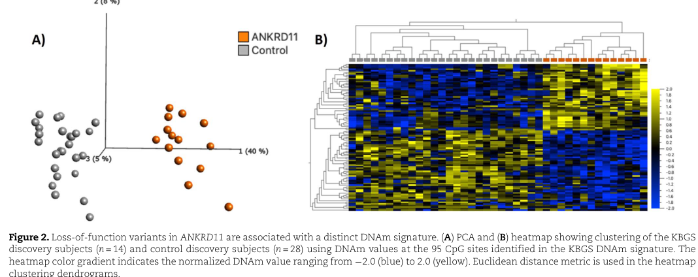

## Question

# Disease Characteristics Research Template

## Target Disease
- **Disease Name:** KBG Syndrome
- **MONDO ID:**  (if available)
- **Category:** Mendelian

## Research Objectives

Please provide a comprehensive research report on **KBG Syndrome** covering all of the
disease characteristics listed below. This report will be used to populate a disease knowledge
base entry. Be thorough and cite primary literature (PMID preferred) for all claims.

For each section, **suggested databases/resources** are listed. These are the first places
you should search for information on each topic.

---

### 1. Disease Information
> **Search first:** OMIM, Orphanet, ICD-10/ICD-11, MeSH, PubMed

- What is the disease? Provide a concise overview.
- What are the key identifiers? (OMIM, Orphanet, ICD-10/ICD-11, MeSH, Mondo)
- What are the common synonyms and alternative names?
- Is the information derived from individual patients (e.g., EHR) or aggregated disease-level resources?

### 2. Etiology

- **Disease Causal Factors**: What are the primary causes? (genetic, environmental, infectious, mechanistic)
- **Risk Factors**:
  > **Search first:** PubMed, Cochrane Library, UpToDate, clinical guidelines, ClinVar, ClinGen, GWAS Catalog, PheGenI, CTD, CDC, WHO, epidemiological databases
  - Genetic risk factors (causal variants, susceptibility loci, modifier genes)
  - Environmental risk factors (toxins, lifestyle, occupational exposures, age, sex, family history)
- **Protective Factors**:
  > **Search first:** PubMed, Cochrane Library, clinical trial databases, GWAS Catalog, gnomAD, WHO, CDC, nutrition databases
  - Genetic protective factors (protective variants, modifier alleles)
  - Environmental protective factors (diet, lifestyle, exposures that reduce risk)
- **Gene-Environment Interactions**: How do genetic and environmental factors interact to influence disease?
  > **Search first:** CTD, PubMed, PheGenI, GxE databases

### 3. Phenotypes
> **Search first:** HPO (Human Phenotype Ontology), OMIM, Orphanet, PubMed, clinicaltrials.gov, MedDRA, SNOMED CT, DECIPHER, LOINC

For each phenotype, provide:
- **Phenotype type**: symptoms, clinical signs, physical manifestations, behavioral changes, or laboratory abnormalities
  > For symptoms/signs: HPO, OMIM, Orphanet, PubMed
  > For behavioral changes: HPO, DSM, RDoC (Research Domain Criteria), PubMed
  > For laboratory abnormalities: LOINC, SNOMED CT, LabTests Online, PubMed
- **Phenotype characteristics**:
  > **Search first:** OMIM, Orphanet, HPO, PubMed
  - Age of symptom onset (neonatal, childhood, adult-onset, late-onset)
  - Symptom severity (mild, moderate, severe, variable)
  - Symptom progression (stable, progressive, episodic, fluctuating)
  - Frequency among affected individuals (percentage or qualitative)
- **Quality of life impact**: Effects on daily functioning and well-being (per-phenotype when possible)
  > **Search first:** EQ-5D database, SF-36, WHO QOL databases, PubMed
- Suggest HPO (Human Phenotype Ontology) terms for each phenotype

### 4. Genetic/Molecular Information

- **Causal Genes**: Gene mutations or chromosomal abnormalities responsible for disease (gene symbols, OMIM IDs)
  > **Search first:** OMIM, ClinVar, HGMD, Ensembl, NCBI Gene
- **Pathogenic Variants**:
  - Affected genes (gene symbols, HGNC IDs)
    > **Search first:** OMIM, NCBI Gene, Ensembl, HGNC, UniProt, GeneCards
  - Variant classification (pathogenic, likely pathogenic, VUS per ACMG/AMP guidelines)
    > **Search first:** ClinVar, ClinGen, ACMG/AMP guidelines, VarSome
  - Variant type/class (missense, frameshift, nonsense, splice-site, structural)
  - Allele frequency in population databases
    > **Search first:** gnomAD, 1000 Genomes, ExAC, TOPMed, dbSNP
  - Somatic vs germline origin
    > **Search first:** COSMIC (somatic), ClinVar, ICGC, TCGA
  - Functional consequences (loss of function, gain of function, dominant negative)
- **Modifier Genes**: Genes that modify disease severity or expression
- **Epigenetic Information**: DNA methylation, histone modifications, chromatin changes affecting disease
  > **Search first:** ENCODE, Roadmap Epigenomics, MethBase, DiseaseMeth
- **Chromosomal Abnormalities**: Large-scale genetic changes (aneuploidy, translocations, inversions)
  > **Search first:** DECIPHER, ClinVar, ECARUCA, UCSC Genome Browser

### 5. Environmental Information

- **Environmental Factors**: Non-genetic contributing factors (toxins, radiation, pollution, occupational exposure)
  > **Search first:** CTD (Comparative Toxicogenomics Database), TOXNET, PubMed, EPA databases
- **Lifestyle Factors**: Behavioral factors (smoking, diet, exercise, alcohol consumption)
  > **Search first:** CDC databases, WHO, PubMed, NHANES
- **Infectious Agents**: If applicable, pathogens causing or triggering disease (bacteria, viruses, fungi, parasites)
  > **Search first:** NCBI Taxonomy, ViPR, BV-BRC, MicrobeDB, GIDEON

### 6. Mechanism / Pathophysiology

- **Molecular Pathways**: Specific signaling cascades or biochemical pathways involved (Wnt, MAPK, mTOR, PI3K-AKT, etc.)
  > **Search first:** KEGG, Reactome, WikiPathways, PathBank, BioCyc
- **Cellular Processes**: Cell-level mechanisms (apoptosis, autophagy, cell cycle dysregulation, inflammation, etc.)
  > **Search first:** Gene Ontology (GO), Reactome, KEGG, PubMed
- **Protein Dysfunction**: How protein structure or function is altered (misfolding, aggregation, loss of function, gain of function)
  > **Search first:** UniProt, PDB (Protein Data Bank), InterPro, Pfam, AlphaFold
- **Metabolic Changes**: Alterations in metabolic processes (energy metabolism, lipid metabolism, amino acid metabolism)
  > **Search first:** KEGG, BioCyc, HMDB (Human Metabolome Database), BRENDA
- **Immune System Involvement**: Role of immune response (autoimmunity, immunodeficiency, chronic inflammation)
  > **Search first:** ImmPort, Immunome Database, IEDB, Gene Ontology
- **Tissue Damage Mechanisms**: How tissues/ are injured (oxidative stress, ischemia, fibrosis, necrosis)
  > **Search first:** PubMed, Gene Ontology, Reactome
- **Biochemical Abnormalities**: Specific molecular defects (enzyme deficiencies, receptor dysfunction, ion channel defects)
  > **Search first:** BRENDA, UniProt, KEGG, OMIM, PubMed
- **Epigenetic Changes**: DNA methylation, histone modifications affecting gene expression in disease
  > **Search first:** ENCODE, Roadmap Epigenomics, MethBase, DiseaseMeth
- **Molecular Profiling** (if available):
  - Transcriptomics/gene expression changes
    > **Search first:** GEO (Gene Expression Omnibus), ArrayExpress, GTEx, Human Cell Atlas, SRA
  - Proteomics findings
    > **Search first:** PRIDE, ProteomeXchange, Human Protein Atlas, STRING, BioGRID
  - Metabolomics signatures
    > **Search first:** MetaboLights, Metabolomics Workbench, HMDB, METLIN
  - Lipidomics alterations
    > **Search first:** LIPID MAPS, SwissLipids, LipidHome, Metabolomics Workbench
  - Genomic structural features
    > **Search first:** UCSC Genome Browser, Ensembl, NCBI, dbVar, DGV
- **Advanced Technologies** (if applicable):
  - Single-cell analysis findings (cell-type specific mechanisms, cellular heterogeneity)
    > **Search first:** Human Cell Atlas, Single Cell Portal, GEO, CELLxGENE
  - Spatial transcriptomics findings
    > **Search first:** GEO, Spatial Research, Vizgen, 10x Genomics data
  - Multi-omics integration results
    > **Search first:** TCGA, ICGC, cBioPortal, LinkedOmics, PubMed
  - Functional genomics screens (CRISPR, RNAi)
    > **Search first:** DepMap, GenomeRNAi, PubMed, BioGRID ORCS

For each mechanism, describe:
- The causal chain from initial trigger to clinical manifestation
- Which mechanisms are upstream vs downstream
- What cell types and biological processes are involved
- Suggest GO terms for biological processes and CL terms for cell types

### 7. Anatomical Structures Affected

- **Organ Level**:
  - Primary organs directly affected
  - Secondary organ involvement (complications, secondary effects)
  - Body systems involved (cardiovascular, nervous, digestive, respiratory, endocrine, etc.)
  > **Search first:** Uberon, FMA (Foundational Model of Anatomy), OMIM, HPO, ICD-11, MeSH, SNOMED CT
- **Tissue and Cell Level**:
  - Specific tissue types affected (epithelial, connective, muscle, nervous)
  - Specific cell populations targeted (with Cell Ontology terms)
  > **Search first:** Uberon, Human Protein Atlas, Cell Ontology, Human Cell Atlas, CellMarker, PanglaoDB
- **Subcellular Level**:
  - Cellular compartments involved (mitochondria, nucleus, ER, lysosomes) (with GO Cellular Component terms)
  > **Search first:** Gene Ontology (Cellular Component), UniProt, Human Protein Atlas
- **Localization**:
  - Specific anatomical sites (with UBERON terms)
    > **Search first:** FMA, Uberon, NeuroNames (for brain), SNOMED CT
  - Lateralization (unilateral, bilateral, asymmetric)
    > **Search first:** HPO, clinical literature, imaging databases

### 8. Temporal Development

- **Onset**:
  - Typical age of onset (congenital, pediatric, adult, geriatric)
  - Onset pattern (acute, subacute, chronic, insidious)
  > **Search first:** OMIM, Orphanet, HPO, PubMed
- **Progression**:
  - Disease stages (early, intermediate, advanced, end-stage)
    > **Search first:** Cancer Staging Manual (AJCC), WHO classifications, PubMed
  - Progression rate (rapid, slow, variable)
  - Disease course pattern (episodic, relapsing-remitting, progressive, stable)
  - Disease duration (self-limited, chronic lifelong)
  > **Search first:** Disease registries, longitudinal cohort databases, natural history studies, PubMed, Orphanet, OMIM
- **Patterns**:
  - Remission patterns (spontaneous, treatment-induced)
    > **Search first:** Clinical trial databases, disease registries, PubMed
  - Critical periods (time windows of vulnerability or opportunity for intervention)
    > **Search first:** PubMed, developmental biology databases, clinical guidelines

### 9. Inheritance and Population

- **Epidemiology**:
  - Prevalence (cases per 100,000 at given time)
  - Incidence (new cases per 100,000 per year)
  > **Search first:** Orphanet, CDC, WHO, GBD (Global Burden of Disease), national registries, SEER, disease registries
- **For Genetic Etiology**:
  - Inheritance pattern (AD, AR, X-linked, mitochondrial, multifactorial, polygenic)
    > **Search first:** OMIM, Orphanet, ClinVar, GTR (Genetic Testing Registry)
  - Penetrance (complete, incomplete, age-dependent)
    > **Search first:** ClinVar, OMIM, PubMed, ClinGen
  - Expressivity (variable, consistent)
    > **Search first:** OMIM, ClinVar, PubMed
  - Genetic anticipation (increasing severity in successive generations)
    > **Search first:** OMIM, PubMed (especially for repeat expansion disorders)
  - Germline mosaicism
    > **Search first:** ClinVar, OMIM, genetic counseling literature, PubMed
  - Founder effects (population-specific mutations)
    > **Search first:** gnomAD, population genetics databases, PubMed
  - Consanguinity role
    > **Search first:** OMIM, population studies, genetic counseling resources
  - Carrier frequency
    > **Search first:** gnomAD, carrier screening databases, GeneReviews, GTR
- **Population Demographics**:
  - Affected populations (ethnic or demographic groups with higher prevalence)
    > **Search first:** gnomAD, 1000 Genomes, PAGE Study, PubMed, population registries
  - Geographic distribution (endemic areas, regional variation)
    > **Search first:** WHO, CDC, GBD, Orphanet, geographic epidemiology databases
  - Geographic distribution of specific variants
  - Sex ratio (male:female)
    > **Search first:** Disease registries, OMIM, PubMed, epidemiological databases
  - Age distribution of affected individuals
    > **Search first:** CDC, disease registries, SEER, Orphanet

### 10. Diagnostics

- **Clinical Tests**:
  - Laboratory tests (blood, urine, tissue chemistry, specific enzyme assays)
    > **Search first:** LOINC, LabTests Online, PubMed
  - Biomarkers (proteins, metabolites, genetic markers, circulating biomarkers)
    > **Search first:** FDA Biomarker List, BEST (Biomarkers, EndpointS, and other Tools), PubMed
  - Imaging studies (X-ray, CT, MRI, PET, ultrasound)
    > **Search first:** RadLex, DICOM, Radiopaedia, imaging databases
  - Functional tests (pulmonary function, cardiac stress tests)
    > **Search first:** LOINC, clinical guidelines, PubMed
  - Electrophysiology (EEG, EMG, ECG, nerve conduction studies)
    > **Search first:** LOINC, clinical neurophysiology databases, PubMed
  - Biopsy findings (histopathology, immunohistochemistry)
    > **Search first:** SNOMED CT, College of American Pathologists resources, PubMed
  - Pathology findings (microscopic examination)
    > **Search first:** SNOMED CT, Digital Pathology databases, PubMed
- **Genetic Testing**:
  > **Search first:** GTR (Genetic Testing Registry), GeneReviews, ClinGen
  - Overview of recommended genetic testing approach
  - Whole genome sequencing (WGS) utility
    > **Search first:** GTR, ClinVar, GEL (Genomics England), gnomAD
  - Whole exome sequencing (WES) utility
    > **Search first:** GTR, ClinVar, OMIM, GeneMatcher
  - Gene panels (which panels, which genes)
    > **Search first:** GTR, ClinVar, laboratory-specific databases
  - Single gene testing
    > **Search first:** GTR, ClinVar, OMIM, GeneReviews
  - Chromosomal microarray (CMA)
    > **Search first:** DECIPHER, ClinVar, dbVar, ECARUCA
  - Karyotyping
    > **Search first:** Chromosome Abnormality Database, ClinVar, cytogenetics resources
  - FISH
    > **Search first:** ClinVar, cytogenetics databases, PubMed
  - Mitochondrial DNA testing
    > **Search first:** MITOMAP, MSeqDR, ClinVar, GTR
  - Repeat expansion testing
    > **Search first:** GTR, ClinVar, repeat expansion databases, PubMed
- **Omics-Based Diagnostics** (if applicable):
  - RNA sequencing / transcriptomics
    > **Search first:** GEO, ArrayExpress, GTEx, RNA-seq databases
  - Proteomics
    > **Search first:** PRIDE, ProteomeXchange, FDA Biomarker database
  - Metabolomics
    > **Search first:** MetaboLights, Metabolomics Workbench, HMDB
  - Epigenomics
    > **Search first:** GEO, ENCODE, Roadmap Epigenomics, MethBase
  - Liquid biopsy
    > **Search first:** COSMIC, ClinVar, liquid biopsy databases, PubMed
- **Clinical Criteria**:
  - Standardized diagnostic criteria (DSM, ICD, society guidelines)
    > **Search first:** DSM-5, ICD-11, clinical society guidelines, UpToDate
  - Differential diagnosis (other conditions to rule out, with distinguishing features)
    > **Search first:** DynaMed, UpToDate, clinical decision support systems
- **Screening**:
  - Screening methods for asymptomatic individuals (newborn screening, carrier screening, cascade screening)
    > **Search first:** ACMG recommendations, CDC newborn screening, GTR

### 11. Outcome/Prognosis

- **Survival and Mortality**:
  - Survival rate (5-year, 10-year, overall)
    > **Search first:** SEER, cancer registries, disease-specific registries, PubMed
  - Life expectancy (with and without treatment if applicable)
    > **Search first:** Orphanet, disease registries, actuarial databases, PubMed
  - Mortality rate
    > **Search first:** CDC, WHO, GBD, national mortality databases
  - Disease-specific mortality (deaths directly attributable to disease)
    > **Search first:** Disease registries, CDC Wonder, GBD, PubMed
- **Morbidity and Function**:
  - Morbidity (disease-related disability and health impacts)
    > **Search first:** GBD, WHO, disability databases, PubMed
  - Disability outcomes (long-term functional impairments)
    > **Search first:** ICF (International Classification of Functioning), disability registries
  - Quality of life measures (EQ-5D, SF-36, PROMIS, disease-specific tools)
    > **Search first:** EQ-5D database, SF-36, PROMIS, PubMed
- **Disease Course**:
  - Complications (secondary problems: infections, organ failure, etc.)
    > **Search first:** ICD codes, disease registries, clinical databases, PubMed
  - Recovery potential (likelihood and extent of recovery, with vs without treatment)
    > **Search first:** Natural history studies, rehabilitation databases, PubMed
- **Prediction**:
  - Prognostic factors (age, disease severity, biomarkers, treatment response)
    > **Search first:** Prognostic models databases, clinical calculators, PubMed
  - Prognostic biomarkers (molecular markers predicting disease course)
    > **Search first:** FDA Biomarker database, PubMed, cancer prognostic databases

### 12. Treatment

- **Pharmacotherapy**:
  - Pharmacological treatments (drug names, drug classes, mechanisms of action)
    > **Search first:** DrugBank, RxNorm, ATC classification, DailyMed, FDA databases
  - Pharmacogenomics (how genetic variants affect drug metabolism, efficacy, toxicity)
    > **Search first:** PharmGKB, CPIC (Clinical Pharmacogenetics), FDA Table of PGx Biomarkers
- **Advanced Therapeutics**:
  - Gene therapy (viral vectors, CRISPR, gene replacement, gene editing)
    > **Search first:** ClinicalTrials.gov, FDA gene therapy database, ASGCT resources
  - Cell therapy (stem cell transplant, CAR-T, cellular therapeutics)
    > **Search first:** ClinicalTrials.gov, FDA cell therapy database, FACT standards
  - RNA-based therapies (ASOs, siRNA, mRNA therapies)
    > **Search first:** ClinicalTrials.gov, FDA approvals, PubMed
  - Targeted therapies (treatments directed at specific molecular targets)
    > **Search first:** My Cancer Genome, OncoKB, ClinicalTrials.gov, FDA approvals
  - Immunotherapies (checkpoint inhibitors, monoclonal antibodies)
    > **Search first:** Cancer Immunotherapy Database, FDA approvals, ClinicalTrials.gov
- **Surgical and Interventional**:
  - Surgical interventions (types of surgery, timing, outcomes)
    > **Search first:** CPT codes, surgical registries, clinical guidelines, PubMed
- **Supportive and Rehabilitative**:
  - Supportive care (symptom management, pain control, nutrition)
    > **Search first:** Clinical guidelines, Cochrane Library, PubMed
  - Rehabilitation (physical therapy, occupational therapy, speech therapy)
    > **Search first:** Rehabilitation medicine databases, clinical guidelines, PubMed
- **Experimental**:
  - Experimental treatments in clinical trials (with NCT identifiers if available)
    > **Search first:** ClinicalTrials.gov, EU Clinical Trials Register, WHO ICTRP
- **Treatment Outcomes**:
  - Treatment response rates
    > **Search first:** Clinical trial databases, FDA reviews, systematic reviews, PubMed
  - Side effects and adverse events
    > **Search first:** FDA Adverse Event Reporting System (FAERS), MedWatch, PubMed
- **Treatment Strategy**:
  - Treatment algorithms (clinical pathways, decision trees)
    > **Search first:** Clinical practice guidelines, NCCN Guidelines, UpToDate
  - Combination therapies
    > **Search first:** ClinicalTrials.gov, treatment guidelines, PubMed
  - Personalized medicine approaches (genotype-guided treatment)
    > **Search first:** My Cancer Genome, CIViC, PharmGKB, precision medicine databases

For each treatment, suggest MAXO (Medical Action Ontology) terms where applicable.

### 13. Prevention

- **Prevention Levels**:
  - Primary prevention (preventing disease occurrence: vaccination, risk factor modification)
    > **Search first:** CDC, WHO, USPSTF recommendations, Cochrane Library
  - Secondary prevention (early detection and treatment: screening programs, early intervention)
    > **Search first:** USPSTF, CDC screening guidelines, WHO
  - Tertiary prevention (preventing complications in those with disease)
    > **Search first:** Clinical guidelines, disease management protocols, PubMed
- **Immunization**: Vaccine strategies (if applicable)
  > **Search first:** CDC vaccine schedules, WHO immunization, FDA vaccine database
- **Screening and Early Detection**:
  - Screening programs (population-based: newborn screening, cancer screening)
    > **Search first:** CDC screening programs, USPSTF, cancer screening databases
  - Genetic screening (carrier screening, preimplantation genetic diagnosis, prenatal testing)
    > **Search first:** ACMG recommendations, ACOG guidelines, GTR
  - Risk stratification (identifying high-risk individuals for targeted prevention)
    > **Search first:** Risk prediction models, clinical calculators, PubMed
- **Behavioral Interventions**: Lifestyle modifications to reduce risk
  > **Search first:** CDC, WHO, behavioral intervention databases, Cochrane Library
- **Counseling**: Genetic counseling (risk assessment, family planning guidance)
  > **Search first:** NSGC resources, ACMG guidelines, GeneReviews
- **Public Health**:
  - Public health interventions (sanitation, vector control, health education)
    > **Search first:** CDC, WHO, public health databases, PubMed
  - Environmental interventions (reducing environmental risk factors)
    > **Search first:** EPA databases, WHO environmental health, PubMed
- **Prophylaxis**: Preventive medications or procedures
  > **Search first:** Clinical guidelines, FDA approvals, PubMed

### 14. Other Species / Natural Disease

- **Taxonomy**: Species affected (with NCBI Taxon identifiers)
  > **Search first:** NCBI Taxonomy
- **Breed**: Specific breeds affected (with VBO identifiers if applicable)
  > **Search first:** VBO (Vertebrate Breed Ontology)
- **Gene**: Orthologous genes in other species (with NCBI Gene IDs)
  > **Search first:** NCBI Gene
- **Natural Disease**:
  - Naturally occurring disease in other species (companion animals, wildlife)
    > **Search first:** OMIA (Online Mendelian Inheritance in Animals), VetCompass, PubMed
  - Veterinary relevance and importance in animal health
    > **Search first:** OMIA, veterinary databases, PubMed
- **Comparative Biology**:
  - Comparative pathology (similarities and differences across species)
    > **Search first:** OMIA, comparative pathology databases, PubMed
  - Evolutionary conservation of disease mechanisms
    > **Search first:** HomoloGene, OrthoMCL, Alliance of Genome Resources
- **Transmission** (if applicable):
  - Zoonotic potential
    > **Search first:** CDC zoonotic diseases, WHO zoonoses, GIDEON
  - Cross-species susceptibility
    > **Search first:** NCBI Taxonomy, veterinary databases, PubMed

### 15. Model Organisms

- **Model Types**:
  - Model organism type (mammalian, invertebrate, cellular, in vitro)
    > **Search first:** Alliance of Genome Resources, model organism databases
  - Specific model systems (mouse, rat, zebrafish, Drosophila, C. elegans, yeast, cell lines, organoids, iPSCs)
    > **Search first:** MGI, RGD, ZFIN, FlyBase, WormBase, SGD, ATCC, Cellosaurus
  - Induced models (drug treatment, surgical intervention, environmental manipulation)
    > **Search first:** MGI, model organism databases, PubMed
- **Genetic Models**:
  - Types available (knockout, knock-in, transgenic, conditional, humanized)
    > **Search first:** MGI, IMPC, KOMP, EuMMCR, IMSR
- **Model Characteristics**:
  - Phenotype recapitulation (how well model reproduces human disease features)
    > **Search first:** Model organism databases, comparative studies, PubMed
  - Model limitations (aspects of human disease not captured)
    > **Search first:** Model organism databases, PubMed, review articles
- **Applications**:
  - Research applications (what aspects of disease can be studied)
    > **Search first:** Model organism databases, PubMed
- **Resources**:
  - Model databases
    > **Search first:** MGI, RGD, ZFIN, FlyBase, WormBase, IMSR, EMMA, MMRRC

---

## Citation Requirements

- Cite primary literature (PMID preferred) for all mechanistic and clinical claims
- Prioritize recent reviews and landmark papers
- Include direct quotes from abstracts where possible to support key statements
- Distinguish evidence source types: human clinical, model organism, in vitro, computational

## Output Format

Structure your response as a comprehensive narrative organized by the sections above.
For each section, provide:
- Factual content with specific details (numbers, percentages, gene names, variant nomenclature)
- Ontology term suggestions (HPO, GO, CL, UBERON, CHEBI, MAXO, MONDO) where applicable
- Evidence citations with PMIDs
- Direct quotes from abstracts to support key claims
- Clear indication when information is not available or not applicable for this disease

This report will be used to populate a disease knowledge base entry with:
- Pathophysiology descriptions with causal chains
- Gene/protein annotations (HGNC, GO terms)
- Phenotype associations (HP terms) with frequencies
- Cell type involvement (CL terms)
- Anatomical locations (UBERON terms)
- Chemical entities (CHEBI terms)
- Treatment annotations (MAXO terms)
- Evidence items with PMIDs and exact abstract quotes
- Epidemiology, prognosis, diagnostic, and prevention information
- Animal model descriptions with phenotype recapitulation details

## Output

Question: You are an expert researcher providing comprehensive, well-cited information.

Provide detailed information focusing on:
1. Key concepts and definitions with current understanding
2. Recent developments and latest research (prioritize 2023-2024 sources)
3. Current applications and real-world implementations
4. Expert opinions and analysis from authoritative sources
5. Relevant statistics and data from recent studies

Format as a comprehensive research report with proper citations. Include URLs and publication dates where available.
Always prioritize recent, authoritative sources and provide specific citations for all major claims.

# Disease Characteristics Research Template

## Target Disease
- **Disease Name:** KBG Syndrome
- **MONDO ID:**  (if available)
- **Category:** Mendelian

## Research Objectives

Please provide a comprehensive research report on **KBG Syndrome** covering all of the
disease characteristics listed below. This report will be used to populate a disease knowledge
base entry. Be thorough and cite primary literature (PMID preferred) for all claims.

For each section, **suggested databases/resources** are listed. These are the first places
you should search for information on each topic.

---

### 1. Disease Information
> **Search first:** OMIM, Orphanet, ICD-10/ICD-11, MeSH, PubMed

- What is the disease? Provide a concise overview.
- What are the key identifiers? (OMIM, Orphanet, ICD-10/ICD-11, MeSH, Mondo)
- What are the common synonyms and alternative names?
- Is the information derived from individual patients (e.g., EHR) or aggregated disease-level resources?

### 2. Etiology

- **Disease Causal Factors**: What are the primary causes? (genetic, environmental, infectious, mechanistic)
- **Risk Factors**:
  > **Search first:** PubMed, Cochrane Library, UpToDate, clinical guidelines, ClinVar, ClinGen, GWAS Catalog, PheGenI, CTD, CDC, WHO, epidemiological databases
  - Genetic risk factors (causal variants, susceptibility loci, modifier genes)
  - Environmental risk factors (toxins, lifestyle, occupational exposures, age, sex, family history)
- **Protective Factors**:
  > **Search first:** PubMed, Cochrane Library, clinical trial databases, GWAS Catalog, gnomAD, WHO, CDC, nutrition databases
  - Genetic protective factors (protective variants, modifier alleles)
  - Environmental protective factors (diet, lifestyle, exposures that reduce risk)
- **Gene-Environment Interactions**: How do genetic and environmental factors interact to influence disease?
  > **Search first:** CTD, PubMed, PheGenI, GxE databases

### 3. Phenotypes
> **Search first:** HPO (Human Phenotype Ontology), OMIM, Orphanet, PubMed, clinicaltrials.gov, MedDRA, SNOMED CT, DECIPHER, LOINC

For each phenotype, provide:
- **Phenotype type**: symptoms, clinical signs, physical manifestations, behavioral changes, or laboratory abnormalities
  > For symptoms/signs: HPO, OMIM, Orphanet, PubMed
  > For behavioral changes: HPO, DSM, RDoC (Research Domain Criteria), PubMed
  > For laboratory abnormalities: LOINC, SNOMED CT, LabTests Online, PubMed
- **Phenotype characteristics**:
  > **Search first:** OMIM, Orphanet, HPO, PubMed
  - Age of symptom onset (neonatal, childhood, adult-onset, late-onset)
  - Symptom severity (mild, moderate, severe, variable)
  - Symptom progression (stable, progressive, episodic, fluctuating)
  - Frequency among affected individuals (percentage or qualitative)
- **Quality of life impact**: Effects on daily functioning and well-being (per-phenotype when possible)
  > **Search first:** EQ-5D database, SF-36, WHO QOL databases, PubMed
- Suggest HPO (Human Phenotype Ontology) terms for each phenotype

### 4. Genetic/Molecular Information

- **Causal Genes**: Gene mutations or chromosomal abnormalities responsible for disease (gene symbols, OMIM IDs)
  > **Search first:** OMIM, ClinVar, HGMD, Ensembl, NCBI Gene
- **Pathogenic Variants**:
  - Affected genes (gene symbols, HGNC IDs)
    > **Search first:** OMIM, NCBI Gene, Ensembl, HGNC, UniProt, GeneCards
  - Variant classification (pathogenic, likely pathogenic, VUS per ACMG/AMP guidelines)
    > **Search first:** ClinVar, ClinGen, ACMG/AMP guidelines, VarSome
  - Variant type/class (missense, frameshift, nonsense, splice-site, structural)
  - Allele frequency in population databases
    > **Search first:** gnomAD, 1000 Genomes, ExAC, TOPMed, dbSNP
  - Somatic vs germline origin
    > **Search first:** COSMIC (somatic), ClinVar, ICGC, TCGA
  - Functional consequences (loss of function, gain of function, dominant negative)
- **Modifier Genes**: Genes that modify disease severity or expression
- **Epigenetic Information**: DNA methylation, histone modifications, chromatin changes affecting disease
  > **Search first:** ENCODE, Roadmap Epigenomics, MethBase, DiseaseMeth
- **Chromosomal Abnormalities**: Large-scale genetic changes (aneuploidy, translocations, inversions)
  > **Search first:** DECIPHER, ClinVar, ECARUCA, UCSC Genome Browser

### 5. Environmental Information

- **Environmental Factors**: Non-genetic contributing factors (toxins, radiation, pollution, occupational exposure)
  > **Search first:** CTD (Comparative Toxicogenomics Database), TOXNET, PubMed, EPA databases
- **Lifestyle Factors**: Behavioral factors (smoking, diet, exercise, alcohol consumption)
  > **Search first:** CDC databases, WHO, PubMed, NHANES
- **Infectious Agents**: If applicable, pathogens causing or triggering disease (bacteria, viruses, fungi, parasites)
  > **Search first:** NCBI Taxonomy, ViPR, BV-BRC, MicrobeDB, GIDEON

### 6. Mechanism / Pathophysiology

- **Molecular Pathways**: Specific signaling cascades or biochemical pathways involved (Wnt, MAPK, mTOR, PI3K-AKT, etc.)
  > **Search first:** KEGG, Reactome, WikiPathways, PathBank, BioCyc
- **Cellular Processes**: Cell-level mechanisms (apoptosis, autophagy, cell cycle dysregulation, inflammation, etc.)
  > **Search first:** Gene Ontology (GO), Reactome, KEGG, PubMed
- **Protein Dysfunction**: How protein structure or function is altered (misfolding, aggregation, loss of function, gain of function)
  > **Search first:** UniProt, PDB (Protein Data Bank), InterPro, Pfam, AlphaFold
- **Metabolic Changes**: Alterations in metabolic processes (energy metabolism, lipid metabolism, amino acid metabolism)
  > **Search first:** KEGG, BioCyc, HMDB (Human Metabolome Database), BRENDA
- **Immune System Involvement**: Role of immune response (autoimmunity, immunodeficiency, chronic inflammation)
  > **Search first:** ImmPort, Immunome Database, IEDB, Gene Ontology
- **Tissue Damage Mechanisms**: How tissues/ are injured (oxidative stress, ischemia, fibrosis, necrosis)
  > **Search first:** PubMed, Gene Ontology, Reactome
- **Biochemical Abnormalities**: Specific molecular defects (enzyme deficiencies, receptor dysfunction, ion channel defects)
  > **Search first:** BRENDA, UniProt, KEGG, OMIM, PubMed
- **Epigenetic Changes**: DNA methylation, histone modifications affecting gene expression in disease
  > **Search first:** ENCODE, Roadmap Epigenomics, MethBase, DiseaseMeth
- **Molecular Profiling** (if available):
  - Transcriptomics/gene expression changes
    > **Search first:** GEO (Gene Expression Omnibus), ArrayExpress, GTEx, Human Cell Atlas, SRA
  - Proteomics findings
    > **Search first:** PRIDE, ProteomeXchange, Human Protein Atlas, STRING, BioGRID
  - Metabolomics signatures
    > **Search first:** MetaboLights, Metabolomics Workbench, HMDB, METLIN
  - Lipidomics alterations
    > **Search first:** LIPID MAPS, SwissLipids, LipidHome, Metabolomics Workbench
  - Genomic structural features
    > **Search first:** UCSC Genome Browser, Ensembl, NCBI, dbVar, DGV
- **Advanced Technologies** (if applicable):
  - Single-cell analysis findings (cell-type specific mechanisms, cellular heterogeneity)
    > **Search first:** Human Cell Atlas, Single Cell Portal, GEO, CELLxGENE
  - Spatial transcriptomics findings
    > **Search first:** GEO, Spatial Research, Vizgen, 10x Genomics data
  - Multi-omics integration results
    > **Search first:** TCGA, ICGC, cBioPortal, LinkedOmics, PubMed
  - Functional genomics screens (CRISPR, RNAi)
    > **Search first:** DepMap, GenomeRNAi, PubMed, BioGRID ORCS

For each mechanism, describe:
- The causal chain from initial trigger to clinical manifestation
- Which mechanisms are upstream vs downstream
- What cell types and biological processes are involved
- Suggest GO terms for biological processes and CL terms for cell types

### 7. Anatomical Structures Affected

- **Organ Level**:
  - Primary organs directly affected
  - Secondary organ involvement (complications, secondary effects)
  - Body systems involved (cardiovascular, nervous, digestive, respiratory, endocrine, etc.)
  > **Search first:** Uberon, FMA (Foundational Model of Anatomy), OMIM, HPO, ICD-11, MeSH, SNOMED CT
- **Tissue and Cell Level**:
  - Specific tissue types affected (epithelial, connective, muscle, nervous)
  - Specific cell populations targeted (with Cell Ontology terms)
  > **Search first:** Uberon, Human Protein Atlas, Cell Ontology, Human Cell Atlas, CellMarker, PanglaoDB
- **Subcellular Level**:
  - Cellular compartments involved (mitochondria, nucleus, ER, lysosomes) (with GO Cellular Component terms)
  > **Search first:** Gene Ontology (Cellular Component), UniProt, Human Protein Atlas
- **Localization**:
  - Specific anatomical sites (with UBERON terms)
    > **Search first:** FMA, Uberon, NeuroNames (for brain), SNOMED CT
  - Lateralization (unilateral, bilateral, asymmetric)
    > **Search first:** HPO, clinical literature, imaging databases

### 8. Temporal Development

- **Onset**:
  - Typical age of onset (congenital, pediatric, adult, geriatric)
  - Onset pattern (acute, subacute, chronic, insidious)
  > **Search first:** OMIM, Orphanet, HPO, PubMed
- **Progression**:
  - Disease stages (early, intermediate, advanced, end-stage)
    > **Search first:** Cancer Staging Manual (AJCC), WHO classifications, PubMed
  - Progression rate (rapid, slow, variable)
  - Disease course pattern (episodic, relapsing-remitting, progressive, stable)
  - Disease duration (self-limited, chronic lifelong)
  > **Search first:** Disease registries, longitudinal cohort databases, natural history studies, PubMed, Orphanet, OMIM
- **Patterns**:
  - Remission patterns (spontaneous, treatment-induced)
    > **Search first:** Clinical trial databases, disease registries, PubMed
  - Critical periods (time windows of vulnerability or opportunity for intervention)
    > **Search first:** PubMed, developmental biology databases, clinical guidelines

### 9. Inheritance and Population

- **Epidemiology**:
  - Prevalence (cases per 100,000 at given time)
  - Incidence (new cases per 100,000 per year)
  > **Search first:** Orphanet, CDC, WHO, GBD (Global Burden of Disease), national registries, SEER, disease registries
- **For Genetic Etiology**:
  - Inheritance pattern (AD, AR, X-linked, mitochondrial, multifactorial, polygenic)
    > **Search first:** OMIM, Orphanet, ClinVar, GTR (Genetic Testing Registry)
  - Penetrance (complete, incomplete, age-dependent)
    > **Search first:** ClinVar, OMIM, PubMed, ClinGen
  - Expressivity (variable, consistent)
    > **Search first:** OMIM, ClinVar, PubMed
  - Genetic anticipation (increasing severity in successive generations)
    > **Search first:** OMIM, PubMed (especially for repeat expansion disorders)
  - Germline mosaicism
    > **Search first:** ClinVar, OMIM, genetic counseling literature, PubMed
  - Founder effects (population-specific mutations)
    > **Search first:** gnomAD, population genetics databases, PubMed
  - Consanguinity role
    > **Search first:** OMIM, population studies, genetic counseling resources
  - Carrier frequency
    > **Search first:** gnomAD, carrier screening databases, GeneReviews, GTR
- **Population Demographics**:
  - Affected populations (ethnic or demographic groups with higher prevalence)
    > **Search first:** gnomAD, 1000 Genomes, PAGE Study, PubMed, population registries
  - Geographic distribution (endemic areas, regional variation)
    > **Search first:** WHO, CDC, GBD, Orphanet, geographic epidemiology databases
  - Geographic distribution of specific variants
  - Sex ratio (male:female)
    > **Search first:** Disease registries, OMIM, PubMed, epidemiological databases
  - Age distribution of affected individuals
    > **Search first:** CDC, disease registries, SEER, Orphanet

### 10. Diagnostics

- **Clinical Tests**:
  - Laboratory tests (blood, urine, tissue chemistry, specific enzyme assays)
    > **Search first:** LOINC, LabTests Online, PubMed
  - Biomarkers (proteins, metabolites, genetic markers, circulating biomarkers)
    > **Search first:** FDA Biomarker List, BEST (Biomarkers, EndpointS, and other Tools), PubMed
  - Imaging studies (X-ray, CT, MRI, PET, ultrasound)
    > **Search first:** RadLex, DICOM, Radiopaedia, imaging databases
  - Functional tests (pulmonary function, cardiac stress tests)
    > **Search first:** LOINC, clinical guidelines, PubMed
  - Electrophysiology (EEG, EMG, ECG, nerve conduction studies)
    > **Search first:** LOINC, clinical neurophysiology databases, PubMed
  - Biopsy findings (histopathology, immunohistochemistry)
    > **Search first:** SNOMED CT, College of American Pathologists resources, PubMed
  - Pathology findings (microscopic examination)
    > **Search first:** SNOMED CT, Digital Pathology databases, PubMed
- **Genetic Testing**:
  > **Search first:** GTR (Genetic Testing Registry), GeneReviews, ClinGen
  - Overview of recommended genetic testing approach
  - Whole genome sequencing (WGS) utility
    > **Search first:** GTR, ClinVar, GEL (Genomics England), gnomAD
  - Whole exome sequencing (WES) utility
    > **Search first:** GTR, ClinVar, OMIM, GeneMatcher
  - Gene panels (which panels, which genes)
    > **Search first:** GTR, ClinVar, laboratory-specific databases
  - Single gene testing
    > **Search first:** GTR, ClinVar, OMIM, GeneReviews
  - Chromosomal microarray (CMA)
    > **Search first:** DECIPHER, ClinVar, dbVar, ECARUCA
  - Karyotyping
    > **Search first:** Chromosome Abnormality Database, ClinVar, cytogenetics resources
  - FISH
    > **Search first:** ClinVar, cytogenetics databases, PubMed
  - Mitochondrial DNA testing
    > **Search first:** MITOMAP, MSeqDR, ClinVar, GTR
  - Repeat expansion testing
    > **Search first:** GTR, ClinVar, repeat expansion databases, PubMed
- **Omics-Based Diagnostics** (if applicable):
  - RNA sequencing / transcriptomics
    > **Search first:** GEO, ArrayExpress, GTEx, RNA-seq databases
  - Proteomics
    > **Search first:** PRIDE, ProteomeXchange, FDA Biomarker database
  - Metabolomics
    > **Search first:** MetaboLights, Metabolomics Workbench, HMDB
  - Epigenomics
    > **Search first:** GEO, ENCODE, Roadmap Epigenomics, MethBase
  - Liquid biopsy
    > **Search first:** COSMIC, ClinVar, liquid biopsy databases, PubMed
- **Clinical Criteria**:
  - Standardized diagnostic criteria (DSM, ICD, society guidelines)
    > **Search first:** DSM-5, ICD-11, clinical society guidelines, UpToDate
  - Differential diagnosis (other conditions to rule out, with distinguishing features)
    > **Search first:** DynaMed, UpToDate, clinical decision support systems
- **Screening**:
  - Screening methods for asymptomatic individuals (newborn screening, carrier screening, cascade screening)
    > **Search first:** ACMG recommendations, CDC newborn screening, GTR

### 11. Outcome/Prognosis

- **Survival and Mortality**:
  - Survival rate (5-year, 10-year, overall)
    > **Search first:** SEER, cancer registries, disease-specific registries, PubMed
  - Life expectancy (with and without treatment if applicable)
    > **Search first:** Orphanet, disease registries, actuarial databases, PubMed
  - Mortality rate
    > **Search first:** CDC, WHO, GBD, national mortality databases
  - Disease-specific mortality (deaths directly attributable to disease)
    > **Search first:** Disease registries, CDC Wonder, GBD, PubMed
- **Morbidity and Function**:
  - Morbidity (disease-related disability and health impacts)
    > **Search first:** GBD, WHO, disability databases, PubMed
  - Disability outcomes (long-term functional impairments)
    > **Search first:** ICF (International Classification of Functioning), disability registries
  - Quality of life measures (EQ-5D, SF-36, PROMIS, disease-specific tools)
    > **Search first:** EQ-5D database, SF-36, PROMIS, PubMed
- **Disease Course**:
  - Complications (secondary problems: infections, organ failure, etc.)
    > **Search first:** ICD codes, disease registries, clinical databases, PubMed
  - Recovery potential (likelihood and extent of recovery, with vs without treatment)
    > **Search first:** Natural history studies, rehabilitation databases, PubMed
- **Prediction**:
  - Prognostic factors (age, disease severity, biomarkers, treatment response)
    > **Search first:** Prognostic models databases, clinical calculators, PubMed
  - Prognostic biomarkers (molecular markers predicting disease course)
    > **Search first:** FDA Biomarker database, PubMed, cancer prognostic databases

### 12. Treatment

- **Pharmacotherapy**:
  - Pharmacological treatments (drug names, drug classes, mechanisms of action)
    > **Search first:** DrugBank, RxNorm, ATC classification, DailyMed, FDA databases
  - Pharmacogenomics (how genetic variants affect drug metabolism, efficacy, toxicity)
    > **Search first:** PharmGKB, CPIC (Clinical Pharmacogenetics), FDA Table of PGx Biomarkers
- **Advanced Therapeutics**:
  - Gene therapy (viral vectors, CRISPR, gene replacement, gene editing)
    > **Search first:** ClinicalTrials.gov, FDA gene therapy database, ASGCT resources
  - Cell therapy (stem cell transplant, CAR-T, cellular therapeutics)
    > **Search first:** ClinicalTrials.gov, FDA cell therapy database, FACT standards
  - RNA-based therapies (ASOs, siRNA, mRNA therapies)
    > **Search first:** ClinicalTrials.gov, FDA approvals, PubMed
  - Targeted therapies (treatments directed at specific molecular targets)
    > **Search first:** My Cancer Genome, OncoKB, ClinicalTrials.gov, FDA approvals
  - Immunotherapies (checkpoint inhibitors, monoclonal antibodies)
    > **Search first:** Cancer Immunotherapy Database, FDA approvals, ClinicalTrials.gov
- **Surgical and Interventional**:
  - Surgical interventions (types of surgery, timing, outcomes)
    > **Search first:** CPT codes, surgical registries, clinical guidelines, PubMed
- **Supportive and Rehabilitative**:
  - Supportive care (symptom management, pain control, nutrition)
    > **Search first:** Clinical guidelines, Cochrane Library, PubMed
  - Rehabilitation (physical therapy, occupational therapy, speech therapy)
    > **Search first:** Rehabilitation medicine databases, clinical guidelines, PubMed
- **Experimental**:
  - Experimental treatments in clinical trials (with NCT identifiers if available)
    > **Search first:** ClinicalTrials.gov, EU Clinical Trials Register, WHO ICTRP
- **Treatment Outcomes**:
  - Treatment response rates
    > **Search first:** Clinical trial databases, FDA reviews, systematic reviews, PubMed
  - Side effects and adverse events
    > **Search first:** FDA Adverse Event Reporting System (FAERS), MedWatch, PubMed
- **Treatment Strategy**:
  - Treatment algorithms (clinical pathways, decision trees)
    > **Search first:** Clinical practice guidelines, NCCN Guidelines, UpToDate
  - Combination therapies
    > **Search first:** ClinicalTrials.gov, treatment guidelines, PubMed
  - Personalized medicine approaches (genotype-guided treatment)
    > **Search first:** My Cancer Genome, CIViC, PharmGKB, precision medicine databases

For each treatment, suggest MAXO (Medical Action Ontology) terms where applicable.

### 13. Prevention

- **Prevention Levels**:
  - Primary prevention (preventing disease occurrence: vaccination, risk factor modification)
    > **Search first:** CDC, WHO, USPSTF recommendations, Cochrane Library
  - Secondary prevention (early detection and treatment: screening programs, early intervention)
    > **Search first:** USPSTF, CDC screening guidelines, WHO
  - Tertiary prevention (preventing complications in those with disease)
    > **Search first:** Clinical guidelines, disease management protocols, PubMed
- **Immunization**: Vaccine strategies (if applicable)
  > **Search first:** CDC vaccine schedules, WHO immunization, FDA vaccine database
- **Screening and Early Detection**:
  - Screening programs (population-based: newborn screening, cancer screening)
    > **Search first:** CDC screening programs, USPSTF, cancer screening databases
  - Genetic screening (carrier screening, preimplantation genetic diagnosis, prenatal testing)
    > **Search first:** ACMG recommendations, ACOG guidelines, GTR
  - Risk stratification (identifying high-risk individuals for targeted prevention)
    > **Search first:** Risk prediction models, clinical calculators, PubMed
- **Behavioral Interventions**: Lifestyle modifications to reduce risk
  > **Search first:** CDC, WHO, behavioral intervention databases, Cochrane Library
- **Counseling**: Genetic counseling (risk assessment, family planning guidance)
  > **Search first:** NSGC resources, ACMG guidelines, GeneReviews
- **Public Health**:
  - Public health interventions (sanitation, vector control, health education)
    > **Search first:** CDC, WHO, public health databases, PubMed
  - Environmental interventions (reducing environmental risk factors)
    > **Search first:** EPA databases, WHO environmental health, PubMed
- **Prophylaxis**: Preventive medications or procedures
  > **Search first:** Clinical guidelines, FDA approvals, PubMed

### 14. Other Species / Natural Disease

- **Taxonomy**: Species affected (with NCBI Taxon identifiers)
  > **Search first:** NCBI Taxonomy
- **Breed**: Specific breeds affected (with VBO identifiers if applicable)
  > **Search first:** VBO (Vertebrate Breed Ontology)
- **Gene**: Orthologous genes in other species (with NCBI Gene IDs)
  > **Search first:** NCBI Gene
- **Natural Disease**:
  - Naturally occurring disease in other species (companion animals, wildlife)
    > **Search first:** OMIA (Online Mendelian Inheritance in Animals), VetCompass, PubMed
  - Veterinary relevance and importance in animal health
    > **Search first:** OMIA, veterinary databases, PubMed
- **Comparative Biology**:
  - Comparative pathology (similarities and differences across species)
    > **Search first:** OMIA, comparative pathology databases, PubMed
  - Evolutionary conservation of disease mechanisms
    > **Search first:** HomoloGene, OrthoMCL, Alliance of Genome Resources
- **Transmission** (if applicable):
  - Zoonotic potential
    > **Search first:** CDC zoonotic diseases, WHO zoonoses, GIDEON
  - Cross-species susceptibility
    > **Search first:** NCBI Taxonomy, veterinary databases, PubMed

### 15. Model Organisms

- **Model Types**:
  - Model organism type (mammalian, invertebrate, cellular, in vitro)
    > **Search first:** Alliance of Genome Resources, model organism databases
  - Specific model systems (mouse, rat, zebrafish, Drosophila, C. elegans, yeast, cell lines, organoids, iPSCs)
    > **Search first:** MGI, RGD, ZFIN, FlyBase, WormBase, SGD, ATCC, Cellosaurus
  - Induced models (drug treatment, surgical intervention, environmental manipulation)
    > **Search first:** MGI, model organism databases, PubMed
- **Genetic Models**:
  - Types available (knockout, knock-in, transgenic, conditional, humanized)
    > **Search first:** MGI, IMPC, KOMP, EuMMCR, IMSR
- **Model Characteristics**:
  - Phenotype recapitulation (how well model reproduces human disease features)
    > **Search first:** Model organism databases, comparative studies, PubMed
  - Model limitations (aspects of human disease not captured)
    > **Search first:** Model organism databases, PubMed, review articles
- **Applications**:
  - Research applications (what aspects of disease can be studied)
    > **Search first:** Model organism databases, PubMed
- **Resources**:
  - Model databases
    > **Search first:** MGI, RGD, ZFIN, FlyBase, WormBase, IMSR, EMMA, MMRRC

---

## Citation Requirements

- Cite primary literature (PMID preferred) for all mechanistic and clinical claims
- Prioritize recent reviews and landmark papers
- Include direct quotes from abstracts where possible to support key statements
- Distinguish evidence source types: human clinical, model organism, in vitro, computational

## Output Format

Structure your response as a comprehensive narrative organized by the sections above.
For each section, provide:
- Factual content with specific details (numbers, percentages, gene names, variant nomenclature)
- Ontology term suggestions (HPO, GO, CL, UBERON, CHEBI, MAXO, MONDO) where applicable
- Evidence citations with PMIDs
- Direct quotes from abstracts to support key claims
- Clear indication when information is not available or not applicable for this disease

This report will be used to populate a disease knowledge base entry with:
- Pathophysiology descriptions with causal chains
- Gene/protein annotations (HGNC, GO terms)
- Phenotype associations (HP terms) with frequencies
- Cell type involvement (CL terms)
- Anatomical locations (UBERON terms)
- Chemical entities (CHEBI terms)
- Treatment annotations (MAXO terms)
- Evidence items with PMIDs and exact abstract quotes
- Epidemiology, prognosis, diagnostic, and prevention information
- Animal model descriptions with phenotype recapitulation details

# KBG Syndrome (ANKRD11-related): Disease Characteristics Research Report

## Target disease
- **Disease name:** KBG syndrome
- **Category:** Mendelian (monogenic, autosomal dominant)
- **Primary gene:** **ANKRD11** (chromosome 16q24.3)
- **MONDO ID:** Not located in the retrieved sources in this run (not asserted).

## Evidence summary table
| Category | Key points | Quantitative data | Key sources (DOI/year) |
|---|---|---|---|
| Disease definition / identifiers | KBG syndrome is a rare autosomal dominant neurodevelopmental disorder caused by ANKRD11 disruption; OMIM identifier explicitly reported as **#148050** in cohort/review literature. Clinical diagnosis has historically relied on aggregated disease-level resources and cohort studies, with molecular confirmation by ANKRD11 sequencing/CNV analysis. (loberti2022naturalhistoryof pages 1-2, swols2017kbgsyndrome pages 1-2) | OMIM **148050**; >100 patients reported by 2017 review; 49-patient European natural history cohort. (loberti2022naturalhistoryof pages 1-2, swols2017kbgsyndrome pages 1-2) | 10.1093/hmg/ddac167 (2022); 10.1186/s13023-017-0736-8 (2017) |
| Causal gene and inheritance | **ANKRD11** is the causal gene; disease is typically **autosomal dominant**. Both heterozygous sequence variants and **16q24.3 CNVs/microdeletions** involving ANKRD11 cause KBG syndrome. About one-third of causal variants were reported as de novo in the 2017 review; in a newer cohort, most sequence variants were de novo. (swols2017kbgsyndrome pages 1-2, martinezcayuelas2023clinicaldescriptionmolecular pages 21-23) | ~1/3 de novo in 2017 review; **86%** de novo in 2023 cohort subset. (swols2017kbgsyndrome pages 1-2, martinezcayuelas2023clinicaldescriptionmolecular pages 21-23) | 10.1186/s13023-017-0736-8 (2017); 10.1136/jmg-2022-108632 (2023) |
| Molecular mechanism | Predominant mechanism is **ANKRD11 haploinsufficiency**; ANKRD11 is a chromatin-associated transcriptional regulator interacting with HDAC-containing complexes. Truncating variants are most common; some variants may escape NMD and produce dysfunctional truncated proteins with impaired transcriptional activity, and some data suggest dominant-negative effects for specific alleles. Regulatory-region deletions can also reduce transcript levels. (he2024insightsintothe pages 1-2, wei2024functionalinvestigationof pages 6-9, bestetti2022expandingthemolecular pages 10-11, iwataotsubo202516q24.3microdeletionsdisrupting pages 5-7) | In ClinVar/literature review, **583** pathogenic/likely pathogenic ANKRD11 variants cataloged; frameshift and nonsense were the most frequent classes. Case functional study showed mutant ANKRD11 truncated protein ~**85 kDa** vs WT ~**292 kDa**. (he2024insightsintothe pages 1-2, wei2024functionalinvestigationof pages 6-9) | 10.1186/s13023-024-03301-y (2024); 10.1016/j.heliyon.2024.e28082 (2024); 10.3390/ijms23115912 (2022) |
| Variant spectrum / CNVs | Pathogenic variant classes include **frameshift, nonsense, splice-site, missense**, intragenic deletions/duplications, promoter/non-coding deletions, and larger **16q24.3 microdeletions**. CNVs share core phenotype with sequence-variant KBG, though some genotype-phenotype differences exist. (gao2022geneticandphenotypic pages 9-11, bestetti2022expandingthemolecular pages 10-11, iwataotsubo202516q24.3microdeletionsdisrupting pages 7-9) | Molecular diagnosis in 22/33 (**67%**) clinically suspected cases using multi-test strategy in one study; 16q24.3 microdeletion review summarized **68** cases. (bestetti2022expandingthemolecular pages 10-11, li2026clinicalfeaturesand pages 1-2) | 10.3390/ijms23115912 (2022); 10.3389/fped.2026.1742479 (2026) |
| Proposed diagnostic framework | Updated diagnostic approach from the large 2023 cohort: neurodevelopmental delay and/or ID/ADHD/ASD plus characteristic phenotypic features and/or major comorbidities. Earlier criteria emphasized macrodontia, characteristic face, short stature, hearing/otitis, family history, hand anomalies, seizures, cryptorchidism, feeding/palate problems, ASD, and wide fontanelle. (martinezcayuelas2023clinicaldescriptionmolecular pages 21-23, martinezcayuelas2023clinicaldescriptionmolecular pages 5-7) | Low et al. criteria reportedly met by **70%** of patients in the 2023 analysis. (martinezcayuelas2023clinicaldescriptionmolecular pages 21-23) | 10.1136/jmg-2022-108632 (2023); 10.1002/ajmg.a.37842 (2016) |
| Core phenotypic features | Most prevalent features are neurodevelopmental delay, macrodontia, triangular face, characteristic ears/nose/eyebrows, short stature, hand anomalies, and comorbid hearing/vision/feeding/cardiac/seizure issues. (martinezcayuelas2023clinicaldescriptionmolecular pages 1-5, martinezcayuelas2023clinicaldescriptionmolecular pages 12-14, loberti2022naturalhistoryof pages 1-2) | New 67-patient cohort: neurodevelopmental delay **95%**, macrodontia **80.9%**, triangular face **71.2%**, ears **76%**, nose **75.9%**, eyebrows **67.3%**. Combined cohort: macrodontia **79.6%** (211/265), bushy eyebrows **81.3%** (126/155), long philtrum **74.1%** (117/158), large/prominent ears **74.5%** (70/94), anteverted nares **72.4%** (76/105), brachydactyly/clinodactyly **69.5%** (189/272), triangular face **64.8%** (83/128). (martinezcayuelas2023clinicaldescriptionmolecular pages 1-5, martinezcayuelas2023clinicaldescriptionmolecular pages 12-14) | 10.1136/jmg-2022-108632 (2023); 10.1093/hmg/ddac167 (2022) |
| Neurodevelopmental/behavioral phenotype | Intellectual disability, language delay, ADHD and ASD are common; severity is variable. Epilepsy is associated with poorer developmental outcome in affected subsets. (martinezcayuelas2023clinicaldescriptionmolecular pages 21-23, martinezcayuelas2023clinicaldescriptionmolecular pages 18-21, donnellan2024epilepticdyskineticencephalopathy pages 1-2) | 2023 cohort: ID **82.1%**, language delay **72%**, ADHD **63.3%**, ASD **41.5%**. European cohort: ID **82%**. (martinezcayuelas2023clinicaldescriptionmolecular pages 10-12, loberti2022naturalhistoryof pages 1-2) | 10.1136/jmg-2022-108632 (2023); 10.1093/hmg/ddac167 (2022); 10.1016/j.ebr.2024.100647 (2024) |
| Major comorbidities | Hearing/otitis, visual problems, cryptorchidism, congenital heart defects, feeding difficulties, seizures, and brain anomalies are frequent and clinically actionable. (martinezcayuelas2023clinicaldescriptionmolecular pages 21-23, martinezcayuelas2023clinicaldescriptionmolecular pages 12-14, loberti2022naturalhistoryof pages 1-2) | 2023 combined/new cohort examples: hearing loss and/or otitis media **55.6%**; feeding difficulties **43.2%** (70/162); cryptorchidism **44.2%** (42/95); congenital heart defects **35.7%** (71/199); seizures **33.8%** (73/216). European cohort: cerebral anomalies **56%**; prenatal ultrasound anomalies **28.5%**. (martinezcayuelas2023clinicaldescriptionmolecular pages 21-23, martinezcayuelas2023clinicaldescriptionmolecular pages 12-14, loberti2022naturalhistoryof pages 1-2) | 10.1136/jmg-2022-108632 (2023); 10.1093/hmg/ddac167 (2022) |
| Epilepsy prevalence and spectrum | Epilepsy is a clinically important but heterogeneous feature, ranging from focal and generalized seizures to DEE/Lennox-Gastaut syndrome, EMAS, febrile seizures, and newer phenotype expansions. Presence of epilepsy is linked to worse developmental outcomes. (donnellan2024epilepticdyskineticencephalopathy pages 1-2, donnellan2024epilepticdyskineticencephalopathy pages 2-4, liu2026heterogeneityofepileptic pages 1-3) | European cohort: epilepsy **26.5%**. Combined 2023 cohort: seizures **33.8%** (73/216). Buijsse data cited in 2024 report: epilepsy **26/75**; seizure types generalized **15/38 (39%)**, focal **12/38 (31.6%)**, combined **11/38 (31.6%)**; median onset ~**3–4 years**. Literature review: refractory epilepsy about **27.8%**; multiple seizure types **36.3%**. (loberti2022naturalhistoryof pages 1-2, martinezcayuelas2023clinicaldescriptionmolecular pages 12-14, donnellan2024epilepticdyskineticencephalopathy pages 1-2, liu2026heterogeneityofepileptic pages 1-3, liu2026heterogeneityofepileptic pages 6-7) | 10.1093/hmg/ddac167 (2022); 10.1136/jmg-2022-108632 (2023); 10.1016/j.ebr.2024.100647 (2024); 10.21203/rs.3.rs-8780749/v1 (2026) |
| Epilepsy treatment signals | No disease-specific antiseizure standard exists; responses vary widely. Severe cases may be drug-resistant, but some focal seizures appear responsive to **lacosamide**; VNS and adjunctive therapies have also shown benefit in selected refractory cases. (donnellan2024epilepticdyskineticencephalopathy pages 2-4, liu2026heterogeneityofepileptic pages 3-4, liu2026heterogeneityofepileptic pages 6-7) | In one 4-case series, **2** focal-epilepsy patients achieved seizure control with lacosamide; doses reported ~**6.25–7.14 mg/kg/day** in one extract. Literature review estimated monotherapy effective in **37.5%** and valproate monotherapy response ~**32.3%**; refractory epilepsy ~**27.8%**. (liu2026heterogeneityofepileptic pages 3-4, liu2026heterogeneityofepileptic pages 6-7) | 10.1016/j.ebr.2024.100647 (2024); 10.21203/rs.3.rs-8780749/v1 (2026) |
| Short stature burden | Short stature is a hallmark but variably expressed feature; likely relates to impaired growth-plate chondrocyte differentiation and bone elongation due to ANKRD11 dysfunction. (he2024insightsintothe pages 1-2, he2024insightsintothe pages 10-11, he2024insightsintothe pages 3-6) | Short stature in **47.35%** (116/245) or **48.76%** (59/121) depending on analytic subset; combined 2023 cohort short stature **57.9%** (150/259). European cohort notes persistence over time. (he2024insightsintothe pages 3-6, martinezcayuelas2023clinicaldescriptionmolecular pages 12-14, loberti2022naturalhistoryof pages 1-2) | 10.1186/s13023-024-03301-y (2024); 10.1136/jmg-2022-108632 (2023); 10.1093/hmg/ddac167 (2022) |
| rhGH treatment summary | **Recombinant human growth hormone (rhGH)** has emerging supportive evidence for short stature in KBG syndrome, but data remain limited and non-randomized. Most reported treated children improved height SDS; endocrine evaluation often includes bone age, GH stimulation, and IGF-1 testing. (he2024insightsintothe pages 6-8, he2024insightsintothe pages 8-10, li2026clinicalfeaturesand pages 1-2) | Review summarized **9** treated patients; treatment duration ~**0.58–3 years**; height SDS gains about **+0.14 to +1.87**. In microdeletion-type KBG, 2 children had catch-up growth of **+1.66 SD** and **+0.68 SD**; another series reported improvement in **2/4** patients. (he2024insightsintothe pages 6-8, he2024insightsintothe pages 8-10, li2026clinicalfeaturesand pages 2-3, li2026clinicalfeaturesand pages 1-2) | 10.1186/s13023-024-03301-y (2024); 10.3389/fped.2026.1742479 (2026) |
| Epigenetic / DNAm signature | A blood-based **DNA methylation signature** has been described for KBG syndrome caused by pathogenic ANKRD11 variants and 16q24.3 microdeletions, supporting its status as an epigenetic/chromatinopathy-related disorder and offering diagnostic help for VUS interpretation. (awamleh2023ankrd11pathogenicvariants pages 1-2, awamleh2023ankrd11pathogenicvariants pages 2-2, awamleh2023ankrd11pathogenicvariants pages 4-5) | Discovery cohort: **14** KBG cases vs **28** controls; broader profiling included **21** ANKRD11-variant cases, **2** microdeletion cases, and **28** controls. Signature comprised **95 CpG** sites. Validation: **7** KBG cases classified with **100% sensitivity** and **150** controls with **100% specificity**. Four VUS were tested; two were control-like, and a parent-child duo had intermediate/KBG-like probabilities. (awamleh2023ankrd11pathogenicvariants pages 1-2, awamleh2023ankrd11pathogenicvariants pages 2-2, awamleh2023ankrd11pathogenicvariants pages 4-5, awamleh2023ankrd11pathogenicvariants media 9f6c7c1b) | 10.1093/hmg/ddac289 (2023) |
| Natural history / progression | KBG syndrome is lifelong, with evolving recognizability across age. Short stature tends to persist, while head circumference may normalize. Some seizures remit after adolescence, but a subset develop severe refractory epilepsy. Adult functional outcomes are variable, with some individuals achieving partial or full independence. (loberti2022naturalhistoryof pages 1-2, swols2017kbgsyndrome pages 6-7, donnellan2024epilepticdyskineticencephalopathy pages 1-2) | OFC median at birth **−0.88 SD** and tends to normalize over time; epilepsy present in **26.5%** in European cohort; cognitive impairment usually mild–moderate in most reported patients. (loberti2022naturalhistoryof pages 1-2, swols2017kbgsyndrome pages 6-7) | 10.1093/hmg/ddac167 (2022); 10.1186/s13023-017-0736-8 (2017); 10.1016/j.ebr.2024.100647 (2024) |

*Table: This table summarizes high-yield knowledge base fields for KBG syndrome using only the extracted evidence, including genetics, phenotype frequencies, epilepsy, growth, and epigenetic diagnostics. It is designed as a compact evidence-backed reference for disease curation.*

---

## 1. Disease information

### 1.1 Concise overview (current understanding)
KBG syndrome is a rare, multisystem neurodevelopmental disorder classically characterized by macrodontia of the upper permanent incisors, characteristic facial gestalt, postnatal short stature, skeletal anomalies, and developmental delay/intellectual disability with frequent behavioral comorbidity. It is most often caused by heterozygous loss-of-function (LoF) variants in **ANKRD11** or by copy-number variants (CNVs)/microdeletions at **16q24.3** involving ANKRD11, with ANKRD11 dosage sensitivity as the predominant mechanism. (swols2017kbgsyndrome pages 1-2, loberti2022naturalhistoryof pages 1-2)

A large 2023 international/literature-integrated analysis emphasized high phenotypic variability and reported high prevalence of neurodevelopmental involvement (ID/ADHD/ASD features) alongside dysmorphology and frequent medical comorbidities (hearing/otitis, cardiac defects, seizures, feeding problems, vision issues, cryptorchidism). (martinezcayuelas2023clinicaldescriptionmolecular pages 12-14, martinezcayuelas2023clinicaldescriptionmolecular pages 21-23)

### 1.2 Key identifiers
- **OMIM:** **KBG syndrome, MIM #148050**. (loberti2022naturalhistoryof pages 1-2)
- **Orphanet / ICD-10 / ICD-11 / MeSH / MONDO:** Not present in the retrieved full-text evidence in this run; therefore not asserted.

### 1.3 Synonyms / alternative names
The retrieved sources consistently use “KBG syndrome.” The acronym derives from initial affected families described historically (not re-verified here beyond secondary description). (swols2017kbgsyndrome pages 1-2)

### 1.4 Evidence provenance (patient-level vs aggregated)
The current evidence base includes:
- Large aggregated cohorts integrating literature cases (e.g., n=340 analysis) (martinezcayuelas2023clinicaldescriptionmolecular pages 12-14)
- Multi-center natural history cohort (n=49) (loberti2022naturalhistoryof pages 1-2)
- Focused mechanistic/functional studies in vitro and transcriptomics in patient-derived cell lines (wei2024functionalinvestigationof pages 6-9, iwataotsubo202516q24.3microdeletionsdisrupting pages 5-7)
- Reviews and case series (swols2017kbgsyndrome pages 1-2, he2024insightsintothe pages 6-8)

---

## 2. Etiology

### 2.1 Disease causal factors
**Primary cause:** heterozygous disruption of **ANKRD11** (sequence variants and CNVs/microdeletions affecting ANKRD11) producing ANKRD11 dosage reduction and downstream transcriptional dysregulation. (swols2017kbgsyndrome pages 1-2, loberti2022naturalhistoryof pages 1-2, martinezcayuelas2023clinicaldescriptionmolecular pages 12-14)

**Variant classes implicated:** nonsense, frameshift, splice-site variants leading to premature termination; intragenic deletions/duplications; larger 16q24.3 deletions; and regulatory/non-coding deletions that reduce ANKRD11 expression. (gao2022geneticandphenotypic pages 9-11, bestetti2022expandingthemolecular pages 10-11, iwataotsubo202516q24.3microdeletionsdisrupting pages 5-7)

### 2.2 Risk factors
As a Mendelian disorder, the principal risk factor is carrying a pathogenic ANKRD11 variant or an ANKRD11-involving 16q24.3 CNV. De novo occurrence is common; in the 2023 cohort subset summarized in evidence, most ANKRD11 variants were de novo (86%). (martinezcayuelas2023clinicaldescriptionmolecular pages 21-23)

No environmental susceptibility factors or gene–environment interactions were identified in the retrieved evidence for KBG syndrome.

### 2.3 Protective factors
No genetic or environmental protective factors were identified in the retrieved evidence.

---

## 3. Phenotypes (with suggested HPO terms)

### 3.1 Most prevalent phenotypes and frequencies (2023–2024 prioritized)
A large 2023 cohort analysis (n=340 combined; 67 newly assessed) provides granular frequencies (note denominators vary by feature, reflecting heterogeneous reporting). Key features include: macrodontia (79.6%, 211/265), bushy/thick eyebrows (81.3%, 126/155), long philtrum (74.1%, 117/158), large/prominent ears (74.5%, 70/94), anteverted nares (72.4%, 76/105), brachydactyly/clinodactyly (69.5%, 189/272), triangular face (64.8%, 83/128), and short stature ≤10th centile (57.9%, 150/259). (martinezcayuelas2023clinicaldescriptionmolecular pages 12-14)

Comorbidities are frequent: feeding difficulties (43.2%, 70/162), cryptorchidism (44.2%, 42/95), congenital heart defects (35.7%, 71/199), seizures (33.8%, 73/216), sleep problems (36.2%, 25/69). (martinezcayuelas2023clinicaldescriptionmolecular pages 12-14)

A European natural-history cohort (n=49) reported intellectual disability (82%), epilepsy (26.5%), cerebral anomalies (56%), and dental anomalies including macrodontia/oligodontia/dental agenesis (53%). (loberti2022naturalhistoryof pages 1-2)

### 3.2 Neurodevelopmental and behavioral phenotype
In the 2023 cohort subset summarized in evidence, neurodevelopmental diagnoses/symptoms were very common: intellectual disability 82.1%, language delay 72%, ADHD diagnosis/symptoms 63.3%, ASD diagnosis/symptoms 41.5%. (martinezcayuelas2023clinicaldescriptionmolecular pages 18-21, martinezcayuelas2023clinicaldescriptionmolecular pages 10-12)

### 3.3 Epilepsy phenotype
Epilepsy is heterogeneous in semiology and severity. A 2024 report summarizing prior cohort data described generalized, focal, and mixed seizure types with median onset about 3–4 years, frequent seizure remission but with an estimated ~quarter drug-resistant in some analyses. (donnellan2024epilepticdyskineticencephalopathy pages 1-2)

Severe epileptic encephalopathy phenotypes have been reported, including Lennox–Gastaut syndrome with refractory seizures and profound neurodevelopmental impairment; in one case, a vagal nerve stimulator reduced motor seizures and status epilepticus frequency. (donnellan2024epilepticdyskineticencephalopathy pages 2-4)

### 3.4 Suggested HPO terms (examples; not exhaustive)
Based on the reported phenotype spectrum:
- **Macrodontia of permanent maxillary central incisors**: HP:0001572 (macrodontia)
- **Triangular face**: HP:0000325
- **Thick/bushy eyebrows / synophrys**: HP:0000574 / HP:0000664
- **Long philtrum**: HP:0000343
- **Short stature**: HP:0004322
- **Brachydactyly / clinodactyly**: HP:0001156 / HP:0000031
- **Developmental delay / Intellectual disability**: HP:0001263 / HP:0001249
- **ADHD**: HP:0007018
- **Autism spectrum disorder**: HP:0000729
- **Hearing loss / recurrent otitis media**: HP:0000365 / HP:0000403
- **Seizures / abnormal EEG**: HP:0001250 / HP:0002353
- **Cryptorchidism**: HP:0000028
- **Congenital heart defect (broad)**: HP:0001627
- **Feeding difficulties**: HP:0011968

(martinezcayuelas2023clinicaldescriptionmolecular pages 12-14, martinezcayuelas2023clinicaldescriptionmolecular pages 10-12, loberti2022naturalhistoryof pages 1-2)

### 3.5 Quality of life impact
Direct QoL instrument data (e.g., EQ-5D/SF-36) were not present in the retrieved evidence. However, the condition’s burden is expected to derive from neurodevelopmental disability (ID/ADHD/ASD), epilepsy, feeding problems, hearing impairment, and multisystem medical follow-up needs. (martinezcayuelas2023clinicaldescriptionmolecular pages 12-14, donnellan2024epilepticdyskineticencephalopathy pages 2-4)

---

## 4. Genetic / molecular information

### 4.1 Causal gene(s)
- **ANKRD11** is the principal disease gene. (swols2017kbgsyndrome pages 1-2, martinezcayuelas2023clinicaldescriptionmolecular pages 12-14)

### 4.2 Variant spectrum and classification
- Pathogenic variants include truncating variants (frameshift, nonsense, splice leading to PTC), missense variants, intragenic deletions/duplications, promoter/regulatory region deletions, and larger 16q24.3 microdeletions involving ANKRD11. (gao2022geneticandphenotypic pages 9-11, bestetti2022expandingthemolecular pages 10-11, iwataotsubo202516q24.3microdeletionsdisrupting pages 5-7)
- A 2024 ClinVar/literature synthesis reported 583 pathogenic/likely pathogenic ANKRD11 variants, with frameshift and nonsense being the most frequent classes. (he2024insightsintothe pages 1-2)

### 4.3 Functional consequences and mechanism (current models)
**Haploinsufficiency model:** KBG syndrome is widely described as resulting from ANKRD11 haploinsufficiency (dosage reduction), consistent with the high prevalence of truncating variants and pathogenic deletions. (swols2017kbgsyndrome pages 1-2, he2024insightsintothe pages 1-2)

**Transcription/chromatin regulator role:** ANKRD11 functions as a transcriptional regulator associated with chromatin-modifying complexes; it can recruit HDACs and interacts with acetylation-related complexes, supporting classification among “chromatinopathies.” (he2024insightsintothe pages 1-2, parenti2021ankrd11variantskbg pages 11-12)

**Transcriptome evidence for downstream dysregulation:** Upstream non-coding deletions involving ANKRD11 exon 1 and its upstream region reduce ANKRD11 transcript level and are associated with broad differential gene expression in patient-derived lymphoblastoid cell lines, consistent with global transcriptional alteration downstream of reduced ANKRD11 dosage. (iwataotsubo202516q24.3microdeletionsdisrupting pages 5-7)

**Functional in vitro evidence (2024):** A 2024 Heliyon study of a segregating ANKRD11 frameshift (NM_013275.6 c.2280_2281delGT, p.Tyr761Glnfs*20) reported escape from nonsense-mediated decay with production of a truncated protein (~85 kDa). The mutant protein showed altered subcellular distribution (predominantly nuclear) and reduced CDKN1A/P21 promoter luciferase activation relative to wild type; endogenous CDKN1A/P21 mRNA was reduced, interpreted as impaired transcriptional regulatory function and a possible dominant-negative effect for that allele. (wei2024functionalinvestigationof pages 6-9)

### 4.4 Modifier genes / blended phenotypes
The retrieved evidence mentions phenotypic overlap with other chromatinopathy syndromes and the possibility of additional molecular diagnoses contributing to phenotypic variability, but does not provide validated modifier genes for KBG syndrome. (parenti2021ankrd11variantskbg pages 11-12)

### 4.5 Epigenetic information: DNA methylation signature (2023 development)
A 2023 Human Molecular Genetics study established a blood DNA methylation (DNAm) signature for KBG syndrome:
- Profiling in whole blood using Illumina EPIC arrays included 21 individuals with ANKRD11 variants, 2 with 16q24.3 microdeletions, and 28 typically developing controls. (awamleh2023ankrd11pathogenicvariants pages 1-2)
- A discovery analysis of 14 cases vs 28 controls identified **95 differentially methylated CpG sites** (FDR thresholding and effect-size criteria described). (awamleh2023ankrd11pathogenicvariants pages 2-2)
- A supervised classifier achieved **100% sensitivity** in a validation set (7 affected individuals) and **100% specificity** in controls (n=150). (awamleh2023ankrd11pathogenicvariants pages 4-5)
- The DNAm profiles of 16q24.3 microdeletion cases were reported as indistinguishable from those with pathogenic ANKRD11 variants, supporting shared downstream epigenomic effects. (awamleh2023ankrd11pathogenicvariants pages 1-2)

**Visual evidence (figures):** The 95-CpG separation of cases vs controls and model performance are shown in the cropped figure panels retrieved from the paper. (awamleh2023ankrd11pathogenicvariants media 9f6c7c1b, awamleh2023ankrd11pathogenicvariants media 554a6258)

---

## 5. Environmental information
No specific environmental, lifestyle, or infectious contributors were identified in the retrieved evidence for KBG syndrome.

---

## 6. Mechanism / pathophysiology

### 6.1 Proposed causal chain (from gene disruption to phenotype)
1. **Primary trigger:** germline heterozygous ANKRD11 LoF variant or ANKRD11-involving CNV/microdeletion at 16q24.3. (swols2017kbgsyndrome pages 1-2, martinezcayuelas2023clinicaldescriptionmolecular pages 12-14)
2. **Molecular consequence:** reduced ANKRD11 dosage and/or altered ANKRD11 protein function, affecting transcriptional regulation and chromatin-associated processes via HDAC recruitment and acetylation-linked complexes. (he2024insightsintothe pages 1-2, parenti2021ankrd11variantskbg pages 11-12)
3. **Downstream transcriptional effects:** global gene expression changes observed in patient-derived cell lines, with predominance of downregulated genes in some transcriptomic comparisons. (iwataotsubo202516q24.3microdeletionsdisrupting pages 5-7)
4. **Systems-level developmental effects:** neurodevelopmental impairment (developmental delay/ID/ADHD/ASD), craniofacial and dental anomalies, skeletal anomalies (including short stature), and multisystem comorbidities such as seizures/epilepsy, hearing loss/otitis media, and congenital heart defects. (martinezcayuelas2023clinicaldescriptionmolecular pages 12-14, loberti2022naturalhistoryof pages 1-2)

### 6.2 Pathways and processes (suggested GO terms)
Grounded in ANKRD11’s transcription/chromatin role and observed downstream effects:
- **GO:0006355** regulation of transcription, DNA-templated (broad)
- **GO:0006338** chromatin remodeling
- **GO:0016570** histone modification
- **GO:0007049** cell cycle (via CDKN1A/P21 involvement in functional assays)
- **GO:0007399** nervous system development (high-level mechanistic interpretation)

(These are ontology suggestions; the evidence supports transcription/chromatin involvement and p21 regulatory effects but does not enumerate GO IDs.) (he2024insightsintothe pages 1-2, wei2024functionalinvestigationof pages 6-9)

### 6.3 Cell types (suggested CL terms)
Direct disease cell-type specificity was not established in the retrieved evidence. For mechanistic annotation consistent with reported hypotheses:
- Growth plate **chondrocyte** (CL:0000138) as a candidate key cell type for short stature mechanisms. (he2024insightsintothe pages 10-11)
- Neuronal lineages broadly (e.g., “neuronal cell”) for neurodevelopmental phenotype.

---

## 7. Anatomical structures affected (suggested UBERON terms)
From dominant phenotype domains:
- **Central nervous system / brain** (UBERON:0000955) including structural anomalies on MRI (loberti2022naturalhistoryof pages 1-2, liu2026heterogeneityofepileptic pages 7-8)
- **Teeth** (UBERON:0001091) / dentition (macrodontia, dental anomalies) (martinezcayuelas2023clinicaldescriptionmolecular pages 12-14, loberti2022naturalhistoryof pages 1-2)
- **Skeleton / bone** (UBERON:0002481) including hand bones/spine and growth plate effects (martinezcayuelas2023clinicaldescriptionmolecular pages 12-14, he2024insightsintothe pages 10-11)
- **Ear** (UBERON:0001690) related to hearing loss/otitis media (martinezcayuelas2023clinicaldescriptionmolecular pages 12-14)
- **Heart** (UBERON:0000948) related to congenital heart defects (martinezcayuelas2023clinicaldescriptionmolecular pages 12-14)
- **Testis / male reproductive system** (UBERON:0000473) related to cryptorchidism (martinezcayuelas2023clinicaldescriptionmolecular pages 12-14)

---

## 8. Temporal development

### 8.1 Onset
KBG syndrome is typically a pediatric-onset neurodevelopmental disorder with early developmental delay and evolving recognizability of dysmorphic/skeletal/dental features over time. (loberti2022naturalhistoryof pages 1-2)

### 8.2 Progression and course
- In the European natural history cohort, **short stature was consistent over time**, while head circumference tended to normalize from a median −0.88 SD at birth. (loberti2022naturalhistoryof pages 1-2)
- Epilepsy onset in summarized cohorts is commonly in early childhood (median ~3–4 years), with many patients achieving remission but a subset having drug-resistant epilepsy and severe outcomes. (donnellan2024epilepticdyskineticencephalopathy pages 1-2, donnellan2024epilepticdyskineticencephalopathy pages 2-4)

---

## 9. Inheritance and population

### 9.1 Inheritance
Autosomal dominant inheritance is consistently reported. De novo variants are common; in one 2023 cohort subset, 86% were de novo. (martinezcayuelas2023clinicaldescriptionmolecular pages 21-23)

### 9.2 Epidemiology
Robust incidence/prevalence estimates were not identified in the retrieved evidence. A 2024 review attempted indirect prevalence reasoning using short-stature cohorts; it reported pathogenic ANKRD11 variant frequencies in some short stature cohorts (~0.35–0.55%) and extrapolated an estimated ANKRD11 population prevalence of ~0.0105–0.0165% based on ~3% population short stature, but this is an indirect estimate with substantial assumptions. (he2024insightsintothe pages 6-8)

### 9.3 Sex ratio / demographics
No stable population sex ratio for KBG syndrome overall was established from the retrieved evidence. Some sub-analyses show male predominance in epilepsy-focused literature; interpret cautiously due to ascertainment. (liu2026heterogeneityofepileptic pages 1-3)

---

## 10. Diagnostics

### 10.1 Clinical diagnostic criteria (recent developments)
A 2023 large cohort analysis proposed updated diagnostic framing based on neurodevelopmental involvement plus characteristic features and/or comorbidities. Specifically, the authors proposed diagnosis when there is neurodevelopmental delay or ID/ADHD/ASD plus (i) ≥3 phenotypic features, or (ii) fewer phenotypic features combined with ≥1 of seven main comorbidities. (martinezcayuelas2023clinicaldescriptionmolecular pages 21-23)

The same work summarized prior criteria systems using major/minor features and thresholds (e.g., macrodontia/characteristic gestalt, short stature, otitis/hearing loss, family history as major features; seizures, cryptorchidism, feeding/palate problems, ASD, wide fontanelle as minor features). (martinezcayuelas2023clinicaldescriptionmolecular pages 5-7)

### 10.2 Genetic testing strategy (real-world implementation)
- Clinical diagnosis should be confirmed by identifying a pathogenic ANKRD11 variant or ANKRD11-involving CNV/microdeletion; approaches include targeted panels, exome/genome sequencing, and chromosomal microarray for CNVs. (swols2017kbgsyndrome pages 1-2)
- Multi-test diagnostic strategies can increase yield and detect regulatory-region alterations (e.g., promoter/exon 1 deletions) via transcript quantification (RT-qPCR) in selected cases. (bestetti2022expandingthemolecular pages 10-11)

### 10.3 Epigenomic testing as an emerging diagnostic adjunct
The 2023 DNAm signature work supports peripheral-blood DNAm profiling as a tool for variant interpretation and VUS classification in ANKRD11, with high performance in reported validation sets. (awamleh2023ankrd11pathogenicvariants pages 4-5, awamleh2023ankrd11pathogenicvariants media 9f6c7c1b)

### 10.4 Differential diagnosis
The retrieved evidence supports that ANKRD11-related phenotypes overlap with other chromatinopathy syndromes (e.g., Cornelia de Lange-like presentations and other epigenetic regulator disorders), potentially complicating purely clinical diagnosis. (parenti2021ankrd11variantskbg pages 11-12)

---

## 11. Outcome / prognosis

### 11.1 Neurodevelopmental outcomes
Intellectual disability is typically mild to moderate in the European cohort (82% ID; severe in 2 individuals), and no regression was emphasized in review-level summaries. (loberti2022naturalhistoryof pages 1-2, swols2017kbgsyndrome pages 6-7)

### 11.2 Epilepsy-related prognosis
Epilepsy is associated with poorer developmental outcomes in summarized cohorts and can be severe and refractory in some individuals (e.g., developmental and epileptic encephalopathy phenotypes). (donnellan2024epilepticdyskineticencephalopathy pages 1-2, donnellan2024epilepticdyskineticencephalopathy pages 2-4)

### 11.3 Mortality / survival
No disease-specific survival or mortality rates were identified in the retrieved evidence.

---

## 12. Treatment

### 12.1 Supportive, multidisciplinary care (standard of care)
Management is generally multidisciplinary and symptomatic, addressing developmental/behavioral needs, feeding/nutrition, ENT/hearing, ophthalmology, cardiology when indicated, and urologic issues such as cryptorchidism. (swols2017kbgsyndrome pages 6-7, li2026clinicalfeaturesand pages 1-2)

### 12.2 Epilepsy management
Anti-seizure medication (ASM) strategies are individualized; seizure phenotypes and responses are variable. Evidence from an epilepsy-focused case series/literature review suggests:
- Overall ASM response is often favorable, but refractory epilepsy can occur (~27.8% in one pooled analysis). (liu2026heterogeneityofepileptic pages 1-3)
- **Lacosamide** may be effective for focal seizures in some KBG patients; two reported patients achieved seizure control with lacosamide in one series. (liu2026heterogeneityofepileptic pages 3-4)
- Severe refractory cases may require multiple ASMs and advanced therapies; VNS showed benefit in one severe case. (donnellan2024epilepticdyskineticencephalopathy pages 2-4)

**MAXO suggestions:**
- Antiseizure therapy (e.g., MAXO:0000058 drug therapy; concept-level)
- Vagus nerve stimulation (concept-level)

### 12.3 Short stature: recombinant human growth hormone (rhGH)
A 2024 Orphanet Journal of Rare Diseases review focused on short stature in ANKRD11/KBG reported:
- Short stature prevalence around half (e.g., 47.35% [116/245] in an expanded height dataset). (he2024insightsintothe pages 3-6)
- Limited rhGH-treated cases (n=9 summarized) show height SDS gains ranging roughly +0.14 to +1.87 over ~0.58–3 years, suggesting potential benefit in selected individuals though evidence is sparse and non-randomized. (he2024insightsintothe pages 8-10)

In a 16q24.3 microdeletion KBG report/review, two children treated with rhGH had catch-up growth of +1.66 SD and +0.68 SD in height. (li2026clinicalfeaturesand pages 1-2)

**MAXO suggestions:**
- Growth hormone therapy (concept-level)
- Endocrinology evaluation (concept-level; includes bone age assessment, GH stimulation testing, IGF-1)

### 12.4 Recent clinical trial activity (real-world implementation)
A registered interventional study targets ADHD-like symptoms in KBG syndrome:
- **NCT06465641**, “Methylphenidate in KBG Syndrome: N-of-1 Series” (Radboud University Medical Center; registry year 2024): randomized crossover, quadruple-masked N-of-1 series; estimated enrollment 15; primary endpoint SDQ ADHD subscale; includes multiple secondary outcomes and adverse effects monitoring; eligibility includes molecularly confirmed ANKRD11 pathogenic variant or 16q24 deletion including ANKRD11. (NCT06465641 chunk 1)

---

## 13. Prevention
Primary prevention is not applicable for established Mendelian disease except through reproductive options. The retrieved evidence did not include formal prevention guidelines.

---

## 14. Other species / natural disease
No naturally occurring KBG-like disease in non-human species was identified in the retrieved evidence.

---

## 15. Model organisms
Direct model-organism primary papers were not retrieved in full-text here; however, mechanistic summaries in a 2024 review cite mouse models (e.g., Ankrd11-mutant “Yoda” and conditional knockout contexts) supporting roles in neurodevelopment and skeletal growth, consistent with the short stature mechanism hypothesis (growth-plate chondrocyte differentiation disruption). (he2024insightsintothe pages 8-10, he2024insightsintothe pages 1-2)

---

## 2023–2024 “latest research” highlights (curated)
1. **Largest genotype–phenotype and diagnostic-criteria update:** n=340 cohort analysis proposing updated diagnostic framing and reporting detailed frequencies and genotype–phenotype correlations. Publication: 2023-11; DOI: https://doi.org/10.1136/jmg-2022-108632. (martinezcayuelas2023clinicaldescriptionmolecular pages 12-14, martinezcayuelas2023clinicaldescriptionmolecular pages 21-23)
2. **Epigenomic biomarker development:** discovery/validation of a KBG-specific whole-blood DNAm signature (95 CpGs) with machine-learning classification showing 100% sensitivity and specificity in reported validations; includes VUS interpretation use case. Publication: 2023-11; DOI: https://doi.org/10.1093/hmg/ddac289. (awamleh2023ankrd11pathogenicvariants pages 4-5, awamleh2023ankrd11pathogenicvariants media 9f6c7c1b)
3. **Short stature focused synthesis and rhGH evidence:** short stature prevalence quantified (~47–49% depending on dataset) and a small rhGH-treated case synthesis suggesting potential benefit; mechanistic hypothesis linking ANKRD11 deficiency to growth plate chondrocyte differentiation disruption. Publication: 2024-08; DOI: https://doi.org/10.1186/s13023-024-03301-y. (he2024insightsintothe pages 3-6, he2024insightsintothe pages 8-10)
4. **Expanded epilepsy phenotype:** severe epileptic-dyskinetic encephalopathy/Lennox–Gastaut cases and synthesis that epilepsy is linked with poorer outcomes in subsets. Publication: 2024-01; DOI: https://doi.org/10.1016/j.ebr.2024.100647. (donnellan2024epilepticdyskineticencephalopathy pages 2-4, donnellan2024epilepticdyskineticencephalopathy pages 1-2)
5. **Interventional trial for ADHD symptoms:** NCT06465641 methylphenidate N-of-1 series for KBG. Registry year: 2024; URL: https://clinicaltrials.gov/study/NCT06465641. (NCT06465641 chunk 1)

---

## Notes on limitations of this run
- Several requested identifiers (Orphanet ORPHA code, ICD-10/ICD-11 code, MeSH term, MONDO ID) and PMIDs were not present in the retrieved evidence snippets; therefore they are not asserted here.
- Some recent high-impact papers referenced in retrieved bibliographies (e.g., 2023 Genetics in Medicine missense-mechanism paper; 2023 Epilepsia Open epilepsy outcome paper) were listed as unobtainable in this run; thus detailed extraction from those sources was not possible.

References

1. (loberti2022naturalhistoryof pages 1-2): Lorenzo Loberti, Lucia Pia Bruno, Stefania Granata, Gabriella Doddato, Sara Resciniti, Francesca Fava, Michele Carullo, Elisa Rahikkala, Guillaume Jouret, Leonie A Menke, Damien Lederer, Pascal Vrielynck, Lukáš Ryba, Nicola Brunetti-Pierri, Amaia Lasa-Aranzasti, Anna Maria Cueto-González, Laura Trujillano, Irene Valenzuela, Eduardo F Tizzano, Alessandro Mauro Spinelli, Irene Bruno, Aurora Currò, Franco Stanzial, Francesco Benedicenti, Diego Lopergolo, Filippo Maria Santorelli, Constantia Aristidou, George A Tanteles, Isabelle Maystadt, Tinatin Tkemaladze, Tiia Reimand, Helen Lokke, Katrin Õunap, Maria K Haanpää, Andrea Holubová, Veronika Zoubková, Martin Schwarz, Riina Žordania, Kai Muru, Laura Roht, Annika Tihveräinen, Rita Teek, Ulvi Thomson, Isis Atallah, Andrea Superti-Furga, Sabrina Buoni, Roberto Canitano, Valeria Scandurra, Annalisa Rossetti, Salvatore Grosso, Roberta Battini, Margherita Baldassarri, Maria Antonietta Mencarelli, Caterina Lo Rizzo, Mirella Bruttini, Francesca Mari, Francesca Ariani, Alessandra Renieri, and Anna Maria Pinto. Natural history of kbg syndrome in a large european cohort. Human Molecular Genetics, 31:4131-4142, Jul 2022. URL: https://doi.org/10.1093/hmg/ddac167, doi:10.1093/hmg/ddac167. This article has 33 citations and is from a domain leading peer-reviewed journal.

2. (swols2017kbgsyndrome pages 1-2): Dayna Morel Swols, Joseph Foster, and Mustafa Tekin. Kbg syndrome. Orphanet Journal of Rare Diseases, Dec 2018. URL: https://doi.org/10.1186/s13023-017-0736-8, doi:10.1186/s13023-017-0736-8. This article has 64 citations and is from a peer-reviewed journal.

3. (martinezcayuelas2023clinicaldescriptionmolecular pages 21-23): Elena Martinez-Cayuelas, Fiona Blanco-Kelly, Fermina Lopez-Grondona, Saoud Tahsin Swafiri, Rosario Lopez-Rodriguez, Rebeca Losada-Del Pozo, Ignacio Mahillo-Fernandez, Beatriz Moreno, Maria Rodrigo-Moreno, Didac Casas-Alba, Aitor Lopez-Gonzalez, Sixto García-Miñaúr, Maria Ángeles Mori, Marta Pacio-Minguez, Emi Rikeros-Orozco, Fernando Santos-Simarro, Jaime Cruz-Rojo, Juan Francisco Quesada-Espinosa, Maria Teresa Sanchez-Calvin, Jaime Sanchez-del Pozo, Raquel Bernado Fonz, Maria Isidoro-Garcia, Irene Ruiz-Ayucar, Maria Isabel Alvarez-Mora, Raquel Blanco-Lago, Begoña De Azua, Jesus Eiris, Juan Jose Garcia-Peñas, Belen Gil-Fournier, Carmen Gomez-Lado, Nadia Irazabal, Vanessa Lopez-Gonzalez, Irene Madrigal, Ignacio Malaga, Beatriz Martinez-Menendez, Soraya Ramiro-Leon, Maria Garcia-Hoyos, Pablo Prieto-Matos, Javier Lopez-Pison, Sergio Aguilera-Albesa, Sara Alvarez, Alberto Fernández-Jaén, Isabel Llano-Rivas, Blanca Gener-Querol, Carmen Ayuso, Ana Arteche-Lopez, Maria Palomares-Bralo, Anna Cueto-González, Irene Valenzuela, Antonio Martinez-Monseny, Isabel Lorda-Sanchez, and Berta Almoguera. Clinical description, molecular delineation and genotype–phenotype correlation in 340 patients with kbg syndrome: addition of 67 new patients. Journal of Medical Genetics, 60:644-654, Nov 2023. URL: https://doi.org/10.1136/jmg-2022-108632, doi:10.1136/jmg-2022-108632. This article has 23 citations and is from a domain leading peer-reviewed journal.

4. (he2024insightsintothe pages 1-2): Dongye He, Mei Zhang, Yanying Li, Fupeng Liu, and Bo Ban. Insights into the ankrd11 variants and short-stature phenotype through literature review and clinvar database search. Orphanet Journal of Rare Diseases, Aug 2024. URL: https://doi.org/10.1186/s13023-024-03301-y, doi:10.1186/s13023-024-03301-y. This article has 11 citations and is from a peer-reviewed journal.

5. (wei2024functionalinvestigationof pages 6-9): Shuoshuo Wei, Yanying Li, Wanling Yang, Shuxiong Chen, Fupeng Liu, Mei Zhang, Bo Ban, and Dongye He. Functional investigation of a novel ankrd11 frameshift variant identified in a chinese family with kbg syndrome. Heliyon, 10:e28082, Mar 2024. URL: https://doi.org/10.1016/j.heliyon.2024.e28082, doi:10.1016/j.heliyon.2024.e28082. This article has 2 citations.

6. (bestetti2022expandingthemolecular pages 10-11): Ilaria Bestetti, Milena Crippa, Alessandra Sironi, Francesca Tumiatti, Maura Masciadri, Marie Falkenberg Smeland, Swati Naik, Oliver Murch, Maria Teresa Bonati, Alice Spano, Elisa Cattaneo, Milena Mariani, Fabio Gotta, Francesca Crosti, Pietro Cavalli, Chiara Pantaleoni, Federica Natacci, Maria Francesca Bedeschi, Donatella Milani, Silvia Maitz, Angelo Selicorni, Luigina Spaccini, Angela Peron, Silvia Russo, Lidia Larizza, Karen Low, and Palma Finelli. Expanding the molecular spectrum of ankrd11 gene defects in 33 patients with a clinical presentation of kbg syndrome. International Journal of Molecular Sciences, 23:5912, May 2022. URL: https://doi.org/10.3390/ijms23115912, doi:10.3390/ijms23115912. This article has 11 citations.

7. (iwataotsubo202516q24.3microdeletionsdisrupting pages 5-7): Aiko Iwata-Otsubo, Alyssa L. Rippert, Jorune Balciuniene, Sarah K. Fiordaliso, Robert Chen, Preetha Markose, Cara M. Skraban, Christopher Gray, Elaine H. Zackai, Holly A Dubbs, Matthew A. Deardorff, Laura K. Conlin, and Kosuke Izumi. 16q24.3 microdeletions disrupting upstream non-coding region of ankrd11 cause kbg syndrome. Genes, 16:136, Jan 2025. URL: https://doi.org/10.3390/genes16020136, doi:10.3390/genes16020136. This article has 1 citations.

8. (gao2022geneticandphenotypic pages 9-11): Fenqi Gao, Xiu Zhao, Bingyan Cao, Xin Fan, Xiaoqiao Li, Lele Li, Shengbin Sui, Zhe Su, and Chunxiu Gong. Genetic and phenotypic spectrum of kbg syndrome: a report of 13 new chinese cases and a review of the literature. Journal of Personalized Medicine, 12:407, Mar 2022. URL: https://doi.org/10.3390/jpm12030407, doi:10.3390/jpm12030407. This article has 17 citations.

9. (iwataotsubo202516q24.3microdeletionsdisrupting pages 7-9): Aiko Iwata-Otsubo, Alyssa L. Rippert, Jorune Balciuniene, Sarah K. Fiordaliso, Robert Chen, Preetha Markose, Cara M. Skraban, Christopher Gray, Elaine H. Zackai, Holly A Dubbs, Matthew A. Deardorff, Laura K. Conlin, and Kosuke Izumi. 16q24.3 microdeletions disrupting upstream non-coding region of ankrd11 cause kbg syndrome. Genes, 16:136, Jan 2025. URL: https://doi.org/10.3390/genes16020136, doi:10.3390/genes16020136. This article has 1 citations.

10. (li2026clinicalfeaturesand pages 1-2): Miaomiao Li, Shiqi Wang, Guimei Pan, Zixia Zhang, Xi Wang, Jiaqian Hu, Mengqin Wang, Mengmeng Du, Haiyan Wei, and Yongxing Chen. Clinical features and management of 16q24.3 microdeletion kbg syndrome: literature review. Frontiers in Pediatrics, Feb 2026. URL: https://doi.org/10.3389/fped.2026.1742479, doi:10.3389/fped.2026.1742479. This article has 0 citations.

11. (martinezcayuelas2023clinicaldescriptionmolecular pages 5-7): Elena Martinez-Cayuelas, Fiona Blanco-Kelly, Fermina Lopez-Grondona, Saoud Tahsin Swafiri, Rosario Lopez-Rodriguez, Rebeca Losada-Del Pozo, Ignacio Mahillo-Fernandez, Beatriz Moreno, Maria Rodrigo-Moreno, Didac Casas-Alba, Aitor Lopez-Gonzalez, Sixto García-Miñaúr, Maria Ángeles Mori, Marta Pacio-Minguez, Emi Rikeros-Orozco, Fernando Santos-Simarro, Jaime Cruz-Rojo, Juan Francisco Quesada-Espinosa, Maria Teresa Sanchez-Calvin, Jaime Sanchez-del Pozo, Raquel Bernado Fonz, Maria Isidoro-Garcia, Irene Ruiz-Ayucar, Maria Isabel Alvarez-Mora, Raquel Blanco-Lago, Begoña De Azua, Jesus Eiris, Juan Jose Garcia-Peñas, Belen Gil-Fournier, Carmen Gomez-Lado, Nadia Irazabal, Vanessa Lopez-Gonzalez, Irene Madrigal, Ignacio Malaga, Beatriz Martinez-Menendez, Soraya Ramiro-Leon, Maria Garcia-Hoyos, Pablo Prieto-Matos, Javier Lopez-Pison, Sergio Aguilera-Albesa, Sara Alvarez, Alberto Fernández-Jaén, Isabel Llano-Rivas, Blanca Gener-Querol, Carmen Ayuso, Ana Arteche-Lopez, Maria Palomares-Bralo, Anna Cueto-González, Irene Valenzuela, Antonio Martinez-Monseny, Isabel Lorda-Sanchez, and Berta Almoguera. Clinical description, molecular delineation and genotype–phenotype correlation in 340 patients with kbg syndrome: addition of 67 new patients. Journal of Medical Genetics, 60:644-654, Nov 2023. URL: https://doi.org/10.1136/jmg-2022-108632, doi:10.1136/jmg-2022-108632. This article has 23 citations and is from a domain leading peer-reviewed journal.

12. (martinezcayuelas2023clinicaldescriptionmolecular pages 1-5): Elena Martinez-Cayuelas, Fiona Blanco-Kelly, Fermina Lopez-Grondona, Saoud Tahsin Swafiri, Rosario Lopez-Rodriguez, Rebeca Losada-Del Pozo, Ignacio Mahillo-Fernandez, Beatriz Moreno, Maria Rodrigo-Moreno, Didac Casas-Alba, Aitor Lopez-Gonzalez, Sixto García-Miñaúr, Maria Ángeles Mori, Marta Pacio-Minguez, Emi Rikeros-Orozco, Fernando Santos-Simarro, Jaime Cruz-Rojo, Juan Francisco Quesada-Espinosa, Maria Teresa Sanchez-Calvin, Jaime Sanchez-del Pozo, Raquel Bernado Fonz, Maria Isidoro-Garcia, Irene Ruiz-Ayucar, Maria Isabel Alvarez-Mora, Raquel Blanco-Lago, Begoña De Azua, Jesus Eiris, Juan Jose Garcia-Peñas, Belen Gil-Fournier, Carmen Gomez-Lado, Nadia Irazabal, Vanessa Lopez-Gonzalez, Irene Madrigal, Ignacio Malaga, Beatriz Martinez-Menendez, Soraya Ramiro-Leon, Maria Garcia-Hoyos, Pablo Prieto-Matos, Javier Lopez-Pison, Sergio Aguilera-Albesa, Sara Alvarez, Alberto Fernández-Jaén, Isabel Llano-Rivas, Blanca Gener-Querol, Carmen Ayuso, Ana Arteche-Lopez, Maria Palomares-Bralo, Anna Cueto-González, Irene Valenzuela, Antonio Martinez-Monseny, Isabel Lorda-Sanchez, and Berta Almoguera. Clinical description, molecular delineation and genotype–phenotype correlation in 340 patients with kbg syndrome: addition of 67 new patients. Journal of Medical Genetics, 60:644-654, Nov 2023. URL: https://doi.org/10.1136/jmg-2022-108632, doi:10.1136/jmg-2022-108632. This article has 23 citations and is from a domain leading peer-reviewed journal.

13. (martinezcayuelas2023clinicaldescriptionmolecular pages 12-14): Elena Martinez-Cayuelas, Fiona Blanco-Kelly, Fermina Lopez-Grondona, Saoud Tahsin Swafiri, Rosario Lopez-Rodriguez, Rebeca Losada-Del Pozo, Ignacio Mahillo-Fernandez, Beatriz Moreno, Maria Rodrigo-Moreno, Didac Casas-Alba, Aitor Lopez-Gonzalez, Sixto García-Miñaúr, Maria Ángeles Mori, Marta Pacio-Minguez, Emi Rikeros-Orozco, Fernando Santos-Simarro, Jaime Cruz-Rojo, Juan Francisco Quesada-Espinosa, Maria Teresa Sanchez-Calvin, Jaime Sanchez-del Pozo, Raquel Bernado Fonz, Maria Isidoro-Garcia, Irene Ruiz-Ayucar, Maria Isabel Alvarez-Mora, Raquel Blanco-Lago, Begoña De Azua, Jesus Eiris, Juan Jose Garcia-Peñas, Belen Gil-Fournier, Carmen Gomez-Lado, Nadia Irazabal, Vanessa Lopez-Gonzalez, Irene Madrigal, Ignacio Malaga, Beatriz Martinez-Menendez, Soraya Ramiro-Leon, Maria Garcia-Hoyos, Pablo Prieto-Matos, Javier Lopez-Pison, Sergio Aguilera-Albesa, Sara Alvarez, Alberto Fernández-Jaén, Isabel Llano-Rivas, Blanca Gener-Querol, Carmen Ayuso, Ana Arteche-Lopez, Maria Palomares-Bralo, Anna Cueto-González, Irene Valenzuela, Antonio Martinez-Monseny, Isabel Lorda-Sanchez, and Berta Almoguera. Clinical description, molecular delineation and genotype–phenotype correlation in 340 patients with kbg syndrome: addition of 67 new patients. Journal of Medical Genetics, 60:644-654, Nov 2023. URL: https://doi.org/10.1136/jmg-2022-108632, doi:10.1136/jmg-2022-108632. This article has 23 citations and is from a domain leading peer-reviewed journal.

14. (martinezcayuelas2023clinicaldescriptionmolecular pages 18-21): Elena Martinez-Cayuelas, Fiona Blanco-Kelly, Fermina Lopez-Grondona, Saoud Tahsin Swafiri, Rosario Lopez-Rodriguez, Rebeca Losada-Del Pozo, Ignacio Mahillo-Fernandez, Beatriz Moreno, Maria Rodrigo-Moreno, Didac Casas-Alba, Aitor Lopez-Gonzalez, Sixto García-Miñaúr, Maria Ángeles Mori, Marta Pacio-Minguez, Emi Rikeros-Orozco, Fernando Santos-Simarro, Jaime Cruz-Rojo, Juan Francisco Quesada-Espinosa, Maria Teresa Sanchez-Calvin, Jaime Sanchez-del Pozo, Raquel Bernado Fonz, Maria Isidoro-Garcia, Irene Ruiz-Ayucar, Maria Isabel Alvarez-Mora, Raquel Blanco-Lago, Begoña De Azua, Jesus Eiris, Juan Jose Garcia-Peñas, Belen Gil-Fournier, Carmen Gomez-Lado, Nadia Irazabal, Vanessa Lopez-Gonzalez, Irene Madrigal, Ignacio Malaga, Beatriz Martinez-Menendez, Soraya Ramiro-Leon, Maria Garcia-Hoyos, Pablo Prieto-Matos, Javier Lopez-Pison, Sergio Aguilera-Albesa, Sara Alvarez, Alberto Fernández-Jaén, Isabel Llano-Rivas, Blanca Gener-Querol, Carmen Ayuso, Ana Arteche-Lopez, Maria Palomares-Bralo, Anna Cueto-González, Irene Valenzuela, Antonio Martinez-Monseny, Isabel Lorda-Sanchez, and Berta Almoguera. Clinical description, molecular delineation and genotype–phenotype correlation in 340 patients with kbg syndrome: addition of 67 new patients. Journal of Medical Genetics, 60:644-654, Nov 2023. URL: https://doi.org/10.1136/jmg-2022-108632, doi:10.1136/jmg-2022-108632. This article has 23 citations and is from a domain leading peer-reviewed journal.

15. (donnellan2024epilepticdyskineticencephalopathy pages 1-2): Eoin P. Donnellan, Kathleen M. Gorman, Amre Shahwan, and Nicholas M. Allen. Epileptic dyskinetic encephalopathy in kbg syndrome: expansion of the phenotype. Epilepsy & Behavior Reports, 25:100647, Jan 2024. URL: https://doi.org/10.1016/j.ebr.2024.100647, doi:10.1016/j.ebr.2024.100647. This article has 7 citations and is from a peer-reviewed journal.

16. (martinezcayuelas2023clinicaldescriptionmolecular pages 10-12): Elena Martinez-Cayuelas, Fiona Blanco-Kelly, Fermina Lopez-Grondona, Saoud Tahsin Swafiri, Rosario Lopez-Rodriguez, Rebeca Losada-Del Pozo, Ignacio Mahillo-Fernandez, Beatriz Moreno, Maria Rodrigo-Moreno, Didac Casas-Alba, Aitor Lopez-Gonzalez, Sixto García-Miñaúr, Maria Ángeles Mori, Marta Pacio-Minguez, Emi Rikeros-Orozco, Fernando Santos-Simarro, Jaime Cruz-Rojo, Juan Francisco Quesada-Espinosa, Maria Teresa Sanchez-Calvin, Jaime Sanchez-del Pozo, Raquel Bernado Fonz, Maria Isidoro-Garcia, Irene Ruiz-Ayucar, Maria Isabel Alvarez-Mora, Raquel Blanco-Lago, Begoña De Azua, Jesus Eiris, Juan Jose Garcia-Peñas, Belen Gil-Fournier, Carmen Gomez-Lado, Nadia Irazabal, Vanessa Lopez-Gonzalez, Irene Madrigal, Ignacio Malaga, Beatriz Martinez-Menendez, Soraya Ramiro-Leon, Maria Garcia-Hoyos, Pablo Prieto-Matos, Javier Lopez-Pison, Sergio Aguilera-Albesa, Sara Alvarez, Alberto Fernández-Jaén, Isabel Llano-Rivas, Blanca Gener-Querol, Carmen Ayuso, Ana Arteche-Lopez, Maria Palomares-Bralo, Anna Cueto-González, Irene Valenzuela, Antonio Martinez-Monseny, Isabel Lorda-Sanchez, and Berta Almoguera. Clinical description, molecular delineation and genotype–phenotype correlation in 340 patients with kbg syndrome: addition of 67 new patients. Journal of Medical Genetics, 60:644-654, Nov 2023. URL: https://doi.org/10.1136/jmg-2022-108632, doi:10.1136/jmg-2022-108632. This article has 23 citations and is from a domain leading peer-reviewed journal.

17. (donnellan2024epilepticdyskineticencephalopathy pages 2-4): Eoin P. Donnellan, Kathleen M. Gorman, Amre Shahwan, and Nicholas M. Allen. Epileptic dyskinetic encephalopathy in kbg syndrome: expansion of the phenotype. Epilepsy & Behavior Reports, 25:100647, Jan 2024. URL: https://doi.org/10.1016/j.ebr.2024.100647, doi:10.1016/j.ebr.2024.100647. This article has 7 citations and is from a peer-reviewed journal.

18. (liu2026heterogeneityofepileptic pages 1-3): Xuefang Liu, Jingjie Li, Jing Zhang, Lingyu Pang, Panhui Yu, Fan Feng, Hongru Lu, Liyao Ma, Xin Li, and Fang Chen. Heterogeneity of epileptic phenotypes in kbg syndrome: a series of four cases and literature review. Unknown journal, Feb 2026. URL: https://doi.org/10.21203/rs.3.rs-8780749/v1, doi:10.21203/rs.3.rs-8780749/v1.

19. (liu2026heterogeneityofepileptic pages 6-7): Xuefang Liu, Jingjie Li, Jing Zhang, Lingyu Pang, Panhui Yu, Fan Feng, Hongru Lu, Liyao Ma, Xin Li, and Fang Chen. Heterogeneity of epileptic phenotypes in kbg syndrome: a series of four cases and literature review. Unknown journal, Feb 2026. URL: https://doi.org/10.21203/rs.3.rs-8780749/v1, doi:10.21203/rs.3.rs-8780749/v1.

20. (liu2026heterogeneityofepileptic pages 3-4): Xuefang Liu, Jingjie Li, Jing Zhang, Lingyu Pang, Panhui Yu, Fan Feng, Hongru Lu, Liyao Ma, Xin Li, and Fang Chen. Heterogeneity of epileptic phenotypes in kbg syndrome: a series of four cases and literature review. Unknown journal, Feb 2026. URL: https://doi.org/10.21203/rs.3.rs-8780749/v1, doi:10.21203/rs.3.rs-8780749/v1.

21. (he2024insightsintothe pages 10-11): Dongye He, Mei Zhang, Yanying Li, Fupeng Liu, and Bo Ban. Insights into the ankrd11 variants and short-stature phenotype through literature review and clinvar database search. Orphanet Journal of Rare Diseases, Aug 2024. URL: https://doi.org/10.1186/s13023-024-03301-y, doi:10.1186/s13023-024-03301-y. This article has 11 citations and is from a peer-reviewed journal.

22. (he2024insightsintothe pages 3-6): Dongye He, Mei Zhang, Yanying Li, Fupeng Liu, and Bo Ban. Insights into the ankrd11 variants and short-stature phenotype through literature review and clinvar database search. Orphanet Journal of Rare Diseases, Aug 2024. URL: https://doi.org/10.1186/s13023-024-03301-y, doi:10.1186/s13023-024-03301-y. This article has 11 citations and is from a peer-reviewed journal.

23. (he2024insightsintothe pages 6-8): Dongye He, Mei Zhang, Yanying Li, Fupeng Liu, and Bo Ban. Insights into the ankrd11 variants and short-stature phenotype through literature review and clinvar database search. Orphanet Journal of Rare Diseases, Aug 2024. URL: https://doi.org/10.1186/s13023-024-03301-y, doi:10.1186/s13023-024-03301-y. This article has 11 citations and is from a peer-reviewed journal.

24. (he2024insightsintothe pages 8-10): Dongye He, Mei Zhang, Yanying Li, Fupeng Liu, and Bo Ban. Insights into the ankrd11 variants and short-stature phenotype through literature review and clinvar database search. Orphanet Journal of Rare Diseases, Aug 2024. URL: https://doi.org/10.1186/s13023-024-03301-y, doi:10.1186/s13023-024-03301-y. This article has 11 citations and is from a peer-reviewed journal.

25. (li2026clinicalfeaturesand pages 2-3): Miaomiao Li, Shiqi Wang, Guimei Pan, Zixia Zhang, Xi Wang, Jiaqian Hu, Mengqin Wang, Mengmeng Du, Haiyan Wei, and Yongxing Chen. Clinical features and management of 16q24.3 microdeletion kbg syndrome: literature review. Frontiers in Pediatrics, Feb 2026. URL: https://doi.org/10.3389/fped.2026.1742479, doi:10.3389/fped.2026.1742479. This article has 0 citations.

26. (awamleh2023ankrd11pathogenicvariants pages 1-2): Zain Awamleh, Sanaa Choufani, Cheryl Cytrynbaum, Fowzan S Alkuraya, Stephen Scherer, Sofia Fernandes, Catarina Rosas, Pedro Louro, Patricia Dias, Mariana Tomásio Neves, Sérgio B Sousa, and Rosanna Weksberg. Ankrd11 pathogenic variants and 16q24.3 microdeletions share an altered dna methylation signature in patients with kbg syndrome. Human Molecular Genetics, 32:1429-1438, Nov 2023. URL: https://doi.org/10.1093/hmg/ddac289, doi:10.1093/hmg/ddac289. This article has 24 citations and is from a domain leading peer-reviewed journal.

27. (awamleh2023ankrd11pathogenicvariants pages 2-2): Zain Awamleh, Sanaa Choufani, Cheryl Cytrynbaum, Fowzan S Alkuraya, Stephen Scherer, Sofia Fernandes, Catarina Rosas, Pedro Louro, Patricia Dias, Mariana Tomásio Neves, Sérgio B Sousa, and Rosanna Weksberg. Ankrd11 pathogenic variants and 16q24.3 microdeletions share an altered dna methylation signature in patients with kbg syndrome. Human Molecular Genetics, 32:1429-1438, Nov 2023. URL: https://doi.org/10.1093/hmg/ddac289, doi:10.1093/hmg/ddac289. This article has 24 citations and is from a domain leading peer-reviewed journal.

28. (awamleh2023ankrd11pathogenicvariants pages 4-5): Zain Awamleh, Sanaa Choufani, Cheryl Cytrynbaum, Fowzan S Alkuraya, Stephen Scherer, Sofia Fernandes, Catarina Rosas, Pedro Louro, Patricia Dias, Mariana Tomásio Neves, Sérgio B Sousa, and Rosanna Weksberg. Ankrd11 pathogenic variants and 16q24.3 microdeletions share an altered dna methylation signature in patients with kbg syndrome. Human Molecular Genetics, 32:1429-1438, Nov 2023. URL: https://doi.org/10.1093/hmg/ddac289, doi:10.1093/hmg/ddac289. This article has 24 citations and is from a domain leading peer-reviewed journal.

29. (awamleh2023ankrd11pathogenicvariants media 9f6c7c1b): Zain Awamleh, Sanaa Choufani, Cheryl Cytrynbaum, Fowzan S Alkuraya, Stephen Scherer, Sofia Fernandes, Catarina Rosas, Pedro Louro, Patricia Dias, Mariana Tomásio Neves, Sérgio B Sousa, and Rosanna Weksberg. Ankrd11 pathogenic variants and 16q24.3 microdeletions share an altered dna methylation signature in patients with kbg syndrome. Human Molecular Genetics, 32:1429-1438, Nov 2023. URL: https://doi.org/10.1093/hmg/ddac289, doi:10.1093/hmg/ddac289. This article has 24 citations and is from a domain leading peer-reviewed journal.

30. (swols2017kbgsyndrome pages 6-7): Dayna Morel Swols, Joseph Foster, and Mustafa Tekin. Kbg syndrome. Orphanet Journal of Rare Diseases, Dec 2018. URL: https://doi.org/10.1186/s13023-017-0736-8, doi:10.1186/s13023-017-0736-8. This article has 64 citations and is from a peer-reviewed journal.

31. (parenti2021ankrd11variantskbg pages 11-12): Ilaria Parenti, Mark B. Mallozzi, Irina Hüning, Cristina Gervasini, Alma Kuechler, Emanuele Agolini, Beate Albrecht, Carolina Baquero‐Montoya, Axel Bohring, Nuria C. Bramswig, Andreas Busche, Andreas Dalski, Yiran Guo, Britta Hanker, Yorck Hellenbroich, Denise Horn, A. Micheil Innes, Chiara Leoni, Yun R. Li, Sally Ann Lynch, Milena Mariani, Livija Medne, Barbara Mikat, Donatella Milani, Roberta Onesimo, Xilma Ortiz‐Gonzalez, Eva Christina Prott, Heiko Reutter, Eva Rossier, Angelo Selicorni, Peter Wieacker, Alisha Wilkens, Dagmar Wieczorek, Elaine H. Zackai, Giuseppe Zampino, Birgit Zirn, Hakon Hakonarson, Matthew A. Deardorff, Gabriele Gillessen‐Kaesbach, and Frank J. Kaiser. <i>ankrd11</i> variants: <scp>kbg</scp> syndrome and beyond. Clinical Genetics, 100:187-200, May 2021. URL: https://doi.org/10.1111/cge.13977, doi:10.1111/cge.13977. This article has 48 citations and is from a peer-reviewed journal.

32. (awamleh2023ankrd11pathogenicvariants media 554a6258): Zain Awamleh, Sanaa Choufani, Cheryl Cytrynbaum, Fowzan S Alkuraya, Stephen Scherer, Sofia Fernandes, Catarina Rosas, Pedro Louro, Patricia Dias, Mariana Tomásio Neves, Sérgio B Sousa, and Rosanna Weksberg. Ankrd11 pathogenic variants and 16q24.3 microdeletions share an altered dna methylation signature in patients with kbg syndrome. Human Molecular Genetics, 32:1429-1438, Nov 2023. URL: https://doi.org/10.1093/hmg/ddac289, doi:10.1093/hmg/ddac289. This article has 24 citations and is from a domain leading peer-reviewed journal.

33. (liu2026heterogeneityofepileptic pages 7-8): Xuefang Liu, Jingjie Li, Jing Zhang, Lingyu Pang, Panhui Yu, Fan Feng, Hongru Lu, Liyao Ma, Xin Li, and Fang Chen. Heterogeneity of epileptic phenotypes in kbg syndrome: a series of four cases and literature review. Unknown journal, Feb 2026. URL: https://doi.org/10.21203/rs.3.rs-8780749/v1, doi:10.21203/rs.3.rs-8780749/v1.

34. (NCT06465641 chunk 1):  Methylphenidate in KBG Syndrome: N-of-1 Series. Radboud University Medical Center. 2024. ClinicalTrials.gov Identifier: NCT06465641

## Artifacts

- [Edison artifact artifact-00](KBG_Syndrome-deep-research-falcon_artifacts/artifact-00.md)
