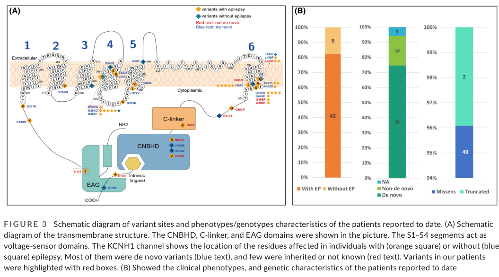

## Question

# Disease Characteristics Research Template

## Target Disease
- **Disease Name:** KCNH1 Associated Disorder
- **MONDO ID:**  (if available)
- **Category:** Mendelian

## Research Objectives

Please provide a comprehensive research report on **KCNH1 Associated Disorder** covering all of the
disease characteristics listed below. This report will be used to populate a disease knowledge
base entry. Be thorough and cite primary literature (PMID preferred) for all claims.

For each section, **suggested databases/resources** are listed. These are the first places
you should search for information on each topic.

---

### 1. Disease Information
> **Search first:** OMIM, Orphanet, ICD-10/ICD-11, MeSH, PubMed

- What is the disease? Provide a concise overview.
- What are the key identifiers? (OMIM, Orphanet, ICD-10/ICD-11, MeSH, Mondo)
- What are the common synonyms and alternative names?
- Is the information derived from individual patients (e.g., EHR) or aggregated disease-level resources?

### 2. Etiology

- **Disease Causal Factors**: What are the primary causes? (genetic, environmental, infectious, mechanistic)
- **Risk Factors**:
  > **Search first:** PubMed, Cochrane Library, UpToDate, clinical guidelines, ClinVar, ClinGen, GWAS Catalog, PheGenI, CTD, CDC, WHO, epidemiological databases
  - Genetic risk factors (causal variants, susceptibility loci, modifier genes)
  - Environmental risk factors (toxins, lifestyle, occupational exposures, age, sex, family history)
- **Protective Factors**:
  > **Search first:** PubMed, Cochrane Library, clinical trial databases, GWAS Catalog, gnomAD, WHO, CDC, nutrition databases
  - Genetic protective factors (protective variants, modifier alleles)
  - Environmental protective factors (diet, lifestyle, exposures that reduce risk)
- **Gene-Environment Interactions**: How do genetic and environmental factors interact to influence disease?
  > **Search first:** CTD, PubMed, PheGenI, GxE databases

### 3. Phenotypes
> **Search first:** HPO (Human Phenotype Ontology), OMIM, Orphanet, PubMed, clinicaltrials.gov, MedDRA, SNOMED CT, DECIPHER, LOINC

For each phenotype, provide:
- **Phenotype type**: symptoms, clinical signs, physical manifestations, behavioral changes, or laboratory abnormalities
  > For symptoms/signs: HPO, OMIM, Orphanet, PubMed
  > For behavioral changes: HPO, DSM, RDoC (Research Domain Criteria), PubMed
  > For laboratory abnormalities: LOINC, SNOMED CT, LabTests Online, PubMed
- **Phenotype characteristics**:
  > **Search first:** OMIM, Orphanet, HPO, PubMed
  - Age of symptom onset (neonatal, childhood, adult-onset, late-onset)
  - Symptom severity (mild, moderate, severe, variable)
  - Symptom progression (stable, progressive, episodic, fluctuating)
  - Frequency among affected individuals (percentage or qualitative)
- **Quality of life impact**: Effects on daily functioning and well-being (per-phenotype when possible)
  > **Search first:** EQ-5D database, SF-36, WHO QOL databases, PubMed
- Suggest HPO (Human Phenotype Ontology) terms for each phenotype

### 4. Genetic/Molecular Information

- **Causal Genes**: Gene mutations or chromosomal abnormalities responsible for disease (gene symbols, OMIM IDs)
  > **Search first:** OMIM, ClinVar, HGMD, Ensembl, NCBI Gene
- **Pathogenic Variants**:
  - Affected genes (gene symbols, HGNC IDs)
    > **Search first:** OMIM, NCBI Gene, Ensembl, HGNC, UniProt, GeneCards
  - Variant classification (pathogenic, likely pathogenic, VUS per ACMG/AMP guidelines)
    > **Search first:** ClinVar, ClinGen, ACMG/AMP guidelines, VarSome
  - Variant type/class (missense, frameshift, nonsense, splice-site, structural)
  - Allele frequency in population databases
    > **Search first:** gnomAD, 1000 Genomes, ExAC, TOPMed, dbSNP
  - Somatic vs germline origin
    > **Search first:** COSMIC (somatic), ClinVar, ICGC, TCGA
  - Functional consequences (loss of function, gain of function, dominant negative)
- **Modifier Genes**: Genes that modify disease severity or expression
- **Epigenetic Information**: DNA methylation, histone modifications, chromatin changes affecting disease
  > **Search first:** ENCODE, Roadmap Epigenomics, MethBase, DiseaseMeth
- **Chromosomal Abnormalities**: Large-scale genetic changes (aneuploidy, translocations, inversions)
  > **Search first:** DECIPHER, ClinVar, ECARUCA, UCSC Genome Browser

### 5. Environmental Information

- **Environmental Factors**: Non-genetic contributing factors (toxins, radiation, pollution, occupational exposure)
  > **Search first:** CTD (Comparative Toxicogenomics Database), TOXNET, PubMed, EPA databases
- **Lifestyle Factors**: Behavioral factors (smoking, diet, exercise, alcohol consumption)
  > **Search first:** CDC databases, WHO, PubMed, NHANES
- **Infectious Agents**: If applicable, pathogens causing or triggering disease (bacteria, viruses, fungi, parasites)
  > **Search first:** NCBI Taxonomy, ViPR, BV-BRC, MicrobeDB, GIDEON

### 6. Mechanism / Pathophysiology

- **Molecular Pathways**: Specific signaling cascades or biochemical pathways involved (Wnt, MAPK, mTOR, PI3K-AKT, etc.)
  > **Search first:** KEGG, Reactome, WikiPathways, PathBank, BioCyc
- **Cellular Processes**: Cell-level mechanisms (apoptosis, autophagy, cell cycle dysregulation, inflammation, etc.)
  > **Search first:** Gene Ontology (GO), Reactome, KEGG, PubMed
- **Protein Dysfunction**: How protein structure or function is altered (misfolding, aggregation, loss of function, gain of function)
  > **Search first:** UniProt, PDB (Protein Data Bank), InterPro, Pfam, AlphaFold
- **Metabolic Changes**: Alterations in metabolic processes (energy metabolism, lipid metabolism, amino acid metabolism)
  > **Search first:** KEGG, BioCyc, HMDB (Human Metabolome Database), BRENDA
- **Immune System Involvement**: Role of immune response (autoimmunity, immunodeficiency, chronic inflammation)
  > **Search first:** ImmPort, Immunome Database, IEDB, Gene Ontology
- **Tissue Damage Mechanisms**: How tissues/ are injured (oxidative stress, ischemia, fibrosis, necrosis)
  > **Search first:** PubMed, Gene Ontology, Reactome
- **Biochemical Abnormalities**: Specific molecular defects (enzyme deficiencies, receptor dysfunction, ion channel defects)
  > **Search first:** BRENDA, UniProt, KEGG, OMIM, PubMed
- **Epigenetic Changes**: DNA methylation, histone modifications affecting gene expression in disease
  > **Search first:** ENCODE, Roadmap Epigenomics, MethBase, DiseaseMeth
- **Molecular Profiling** (if available):
  - Transcriptomics/gene expression changes
    > **Search first:** GEO (Gene Expression Omnibus), ArrayExpress, GTEx, Human Cell Atlas, SRA
  - Proteomics findings
    > **Search first:** PRIDE, ProteomeXchange, Human Protein Atlas, STRING, BioGRID
  - Metabolomics signatures
    > **Search first:** MetaboLights, Metabolomics Workbench, HMDB, METLIN
  - Lipidomics alterations
    > **Search first:** LIPID MAPS, SwissLipids, LipidHome, Metabolomics Workbench
  - Genomic structural features
    > **Search first:** UCSC Genome Browser, Ensembl, NCBI, dbVar, DGV
- **Advanced Technologies** (if applicable):
  - Single-cell analysis findings (cell-type specific mechanisms, cellular heterogeneity)
    > **Search first:** Human Cell Atlas, Single Cell Portal, GEO, CELLxGENE
  - Spatial transcriptomics findings
    > **Search first:** GEO, Spatial Research, Vizgen, 10x Genomics data
  - Multi-omics integration results
    > **Search first:** TCGA, ICGC, cBioPortal, LinkedOmics, PubMed
  - Functional genomics screens (CRISPR, RNAi)
    > **Search first:** DepMap, GenomeRNAi, PubMed, BioGRID ORCS

For each mechanism, describe:
- The causal chain from initial trigger to clinical manifestation
- Which mechanisms are upstream vs downstream
- What cell types and biological processes are involved
- Suggest GO terms for biological processes and CL terms for cell types

### 7. Anatomical Structures Affected

- **Organ Level**:
  - Primary organs directly affected
  - Secondary organ involvement (complications, secondary effects)
  - Body systems involved (cardiovascular, nervous, digestive, respiratory, endocrine, etc.)
  > **Search first:** Uberon, FMA (Foundational Model of Anatomy), OMIM, HPO, ICD-11, MeSH, SNOMED CT
- **Tissue and Cell Level**:
  - Specific tissue types affected (epithelial, connective, muscle, nervous)
  - Specific cell populations targeted (with Cell Ontology terms)
  > **Search first:** Uberon, Human Protein Atlas, Cell Ontology, Human Cell Atlas, CellMarker, PanglaoDB
- **Subcellular Level**:
  - Cellular compartments involved (mitochondria, nucleus, ER, lysosomes) (with GO Cellular Component terms)
  > **Search first:** Gene Ontology (Cellular Component), UniProt, Human Protein Atlas
- **Localization**:
  - Specific anatomical sites (with UBERON terms)
    > **Search first:** FMA, Uberon, NeuroNames (for brain), SNOMED CT
  - Lateralization (unilateral, bilateral, asymmetric)
    > **Search first:** HPO, clinical literature, imaging databases

### 8. Temporal Development

- **Onset**:
  - Typical age of onset (congenital, pediatric, adult, geriatric)
  - Onset pattern (acute, subacute, chronic, insidious)
  > **Search first:** OMIM, Orphanet, HPO, PubMed
- **Progression**:
  - Disease stages (early, intermediate, advanced, end-stage)
    > **Search first:** Cancer Staging Manual (AJCC), WHO classifications, PubMed
  - Progression rate (rapid, slow, variable)
  - Disease course pattern (episodic, relapsing-remitting, progressive, stable)
  - Disease duration (self-limited, chronic lifelong)
  > **Search first:** Disease registries, longitudinal cohort databases, natural history studies, PubMed, Orphanet, OMIM
- **Patterns**:
  - Remission patterns (spontaneous, treatment-induced)
    > **Search first:** Clinical trial databases, disease registries, PubMed
  - Critical periods (time windows of vulnerability or opportunity for intervention)
    > **Search first:** PubMed, developmental biology databases, clinical guidelines

### 9. Inheritance and Population

- **Epidemiology**:
  - Prevalence (cases per 100,000 at given time)
  - Incidence (new cases per 100,000 per year)
  > **Search first:** Orphanet, CDC, WHO, GBD (Global Burden of Disease), national registries, SEER, disease registries
- **For Genetic Etiology**:
  - Inheritance pattern (AD, AR, X-linked, mitochondrial, multifactorial, polygenic)
    > **Search first:** OMIM, Orphanet, ClinVar, GTR (Genetic Testing Registry)
  - Penetrance (complete, incomplete, age-dependent)
    > **Search first:** ClinVar, OMIM, PubMed, ClinGen
  - Expressivity (variable, consistent)
    > **Search first:** OMIM, ClinVar, PubMed
  - Genetic anticipation (increasing severity in successive generations)
    > **Search first:** OMIM, PubMed (especially for repeat expansion disorders)
  - Germline mosaicism
    > **Search first:** ClinVar, OMIM, genetic counseling literature, PubMed
  - Founder effects (population-specific mutations)
    > **Search first:** gnomAD, population genetics databases, PubMed
  - Consanguinity role
    > **Search first:** OMIM, population studies, genetic counseling resources
  - Carrier frequency
    > **Search first:** gnomAD, carrier screening databases, GeneReviews, GTR
- **Population Demographics**:
  - Affected populations (ethnic or demographic groups with higher prevalence)
    > **Search first:** gnomAD, 1000 Genomes, PAGE Study, PubMed, population registries
  - Geographic distribution (endemic areas, regional variation)
    > **Search first:** WHO, CDC, GBD, Orphanet, geographic epidemiology databases
  - Geographic distribution of specific variants
  - Sex ratio (male:female)
    > **Search first:** Disease registries, OMIM, PubMed, epidemiological databases
  - Age distribution of affected individuals
    > **Search first:** CDC, disease registries, SEER, Orphanet

### 10. Diagnostics

- **Clinical Tests**:
  - Laboratory tests (blood, urine, tissue chemistry, specific enzyme assays)
    > **Search first:** LOINC, LabTests Online, PubMed
  - Biomarkers (proteins, metabolites, genetic markers, circulating biomarkers)
    > **Search first:** FDA Biomarker List, BEST (Biomarkers, EndpointS, and other Tools), PubMed
  - Imaging studies (X-ray, CT, MRI, PET, ultrasound)
    > **Search first:** RadLex, DICOM, Radiopaedia, imaging databases
  - Functional tests (pulmonary function, cardiac stress tests)
    > **Search first:** LOINC, clinical guidelines, PubMed
  - Electrophysiology (EEG, EMG, ECG, nerve conduction studies)
    > **Search first:** LOINC, clinical neurophysiology databases, PubMed
  - Biopsy findings (histopathology, immunohistochemistry)
    > **Search first:** SNOMED CT, College of American Pathologists resources, PubMed
  - Pathology findings (microscopic examination)
    > **Search first:** SNOMED CT, Digital Pathology databases, PubMed
- **Genetic Testing**:
  > **Search first:** GTR (Genetic Testing Registry), GeneReviews, ClinGen
  - Overview of recommended genetic testing approach
  - Whole genome sequencing (WGS) utility
    > **Search first:** GTR, ClinVar, GEL (Genomics England), gnomAD
  - Whole exome sequencing (WES) utility
    > **Search first:** GTR, ClinVar, OMIM, GeneMatcher
  - Gene panels (which panels, which genes)
    > **Search first:** GTR, ClinVar, laboratory-specific databases
  - Single gene testing
    > **Search first:** GTR, ClinVar, OMIM, GeneReviews
  - Chromosomal microarray (CMA)
    > **Search first:** DECIPHER, ClinVar, dbVar, ECARUCA
  - Karyotyping
    > **Search first:** Chromosome Abnormality Database, ClinVar, cytogenetics resources
  - FISH
    > **Search first:** ClinVar, cytogenetics databases, PubMed
  - Mitochondrial DNA testing
    > **Search first:** MITOMAP, MSeqDR, ClinVar, GTR
  - Repeat expansion testing
    > **Search first:** GTR, ClinVar, repeat expansion databases, PubMed
- **Omics-Based Diagnostics** (if applicable):
  - RNA sequencing / transcriptomics
    > **Search first:** GEO, ArrayExpress, GTEx, RNA-seq databases
  - Proteomics
    > **Search first:** PRIDE, ProteomeXchange, FDA Biomarker database
  - Metabolomics
    > **Search first:** MetaboLights, Metabolomics Workbench, HMDB
  - Epigenomics
    > **Search first:** GEO, ENCODE, Roadmap Epigenomics, MethBase
  - Liquid biopsy
    > **Search first:** COSMIC, ClinVar, liquid biopsy databases, PubMed
- **Clinical Criteria**:
  - Standardized diagnostic criteria (DSM, ICD, society guidelines)
    > **Search first:** DSM-5, ICD-11, clinical society guidelines, UpToDate
  - Differential diagnosis (other conditions to rule out, with distinguishing features)
    > **Search first:** DynaMed, UpToDate, clinical decision support systems
- **Screening**:
  - Screening methods for asymptomatic individuals (newborn screening, carrier screening, cascade screening)
    > **Search first:** ACMG recommendations, CDC newborn screening, GTR

### 11. Outcome/Prognosis

- **Survival and Mortality**:
  - Survival rate (5-year, 10-year, overall)
    > **Search first:** SEER, cancer registries, disease-specific registries, PubMed
  - Life expectancy (with and without treatment if applicable)
    > **Search first:** Orphanet, disease registries, actuarial databases, PubMed
  - Mortality rate
    > **Search first:** CDC, WHO, GBD, national mortality databases
  - Disease-specific mortality (deaths directly attributable to disease)
    > **Search first:** Disease registries, CDC Wonder, GBD, PubMed
- **Morbidity and Function**:
  - Morbidity (disease-related disability and health impacts)
    > **Search first:** GBD, WHO, disability databases, PubMed
  - Disability outcomes (long-term functional impairments)
    > **Search first:** ICF (International Classification of Functioning), disability registries
  - Quality of life measures (EQ-5D, SF-36, PROMIS, disease-specific tools)
    > **Search first:** EQ-5D database, SF-36, PROMIS, PubMed
- **Disease Course**:
  - Complications (secondary problems: infections, organ failure, etc.)
    > **Search first:** ICD codes, disease registries, clinical databases, PubMed
  - Recovery potential (likelihood and extent of recovery, with vs without treatment)
    > **Search first:** Natural history studies, rehabilitation databases, PubMed
- **Prediction**:
  - Prognostic factors (age, disease severity, biomarkers, treatment response)
    > **Search first:** Prognostic models databases, clinical calculators, PubMed
  - Prognostic biomarkers (molecular markers predicting disease course)
    > **Search first:** FDA Biomarker database, PubMed, cancer prognostic databases

### 12. Treatment

- **Pharmacotherapy**:
  - Pharmacological treatments (drug names, drug classes, mechanisms of action)
    > **Search first:** DrugBank, RxNorm, ATC classification, DailyMed, FDA databases
  - Pharmacogenomics (how genetic variants affect drug metabolism, efficacy, toxicity)
    > **Search first:** PharmGKB, CPIC (Clinical Pharmacogenetics), FDA Table of PGx Biomarkers
- **Advanced Therapeutics**:
  - Gene therapy (viral vectors, CRISPR, gene replacement, gene editing)
    > **Search first:** ClinicalTrials.gov, FDA gene therapy database, ASGCT resources
  - Cell therapy (stem cell transplant, CAR-T, cellular therapeutics)
    > **Search first:** ClinicalTrials.gov, FDA cell therapy database, FACT standards
  - RNA-based therapies (ASOs, siRNA, mRNA therapies)
    > **Search first:** ClinicalTrials.gov, FDA approvals, PubMed
  - Targeted therapies (treatments directed at specific molecular targets)
    > **Search first:** My Cancer Genome, OncoKB, ClinicalTrials.gov, FDA approvals
  - Immunotherapies (checkpoint inhibitors, monoclonal antibodies)
    > **Search first:** Cancer Immunotherapy Database, FDA approvals, ClinicalTrials.gov
- **Surgical and Interventional**:
  - Surgical interventions (types of surgery, timing, outcomes)
    > **Search first:** CPT codes, surgical registries, clinical guidelines, PubMed
- **Supportive and Rehabilitative**:
  - Supportive care (symptom management, pain control, nutrition)
    > **Search first:** Clinical guidelines, Cochrane Library, PubMed
  - Rehabilitation (physical therapy, occupational therapy, speech therapy)
    > **Search first:** Rehabilitation medicine databases, clinical guidelines, PubMed
- **Experimental**:
  - Experimental treatments in clinical trials (with NCT identifiers if available)
    > **Search first:** ClinicalTrials.gov, EU Clinical Trials Register, WHO ICTRP
- **Treatment Outcomes**:
  - Treatment response rates
    > **Search first:** Clinical trial databases, FDA reviews, systematic reviews, PubMed
  - Side effects and adverse events
    > **Search first:** FDA Adverse Event Reporting System (FAERS), MedWatch, PubMed
- **Treatment Strategy**:
  - Treatment algorithms (clinical pathways, decision trees)
    > **Search first:** Clinical practice guidelines, NCCN Guidelines, UpToDate
  - Combination therapies
    > **Search first:** ClinicalTrials.gov, treatment guidelines, PubMed
  - Personalized medicine approaches (genotype-guided treatment)
    > **Search first:** My Cancer Genome, CIViC, PharmGKB, precision medicine databases

For each treatment, suggest NCIT (NCI Thesaurus) clinical-intervention terms where applicable.

### 13. Prevention

- **Prevention Levels**:
  - Primary prevention (preventing disease occurrence: vaccination, risk factor modification)
    > **Search first:** CDC, WHO, USPSTF recommendations, Cochrane Library
  - Secondary prevention (early detection and treatment: screening programs, early intervention)
    > **Search first:** USPSTF, CDC screening guidelines, WHO
  - Tertiary prevention (preventing complications in those with disease)
    > **Search first:** Clinical guidelines, disease management protocols, PubMed
- **Immunization**: Vaccine strategies (if applicable)
  > **Search first:** CDC vaccine schedules, WHO immunization, FDA vaccine database
- **Screening and Early Detection**:
  - Screening programs (population-based: newborn screening, cancer screening)
    > **Search first:** CDC screening programs, USPSTF, cancer screening databases
  - Genetic screening (carrier screening, preimplantation genetic diagnosis, prenatal testing)
    > **Search first:** ACMG recommendations, ACOG guidelines, GTR
  - Risk stratification (identifying high-risk individuals for targeted prevention)
    > **Search first:** Risk prediction models, clinical calculators, PubMed
- **Behavioral Interventions**: Lifestyle modifications to reduce risk
  > **Search first:** CDC, WHO, behavioral intervention databases, Cochrane Library
- **Counseling**: Genetic counseling (risk assessment, family planning guidance)
  > **Search first:** NSGC resources, ACMG guidelines, GeneReviews
- **Public Health**:
  - Public health interventions (sanitation, vector control, health education)
    > **Search first:** CDC, WHO, public health databases, PubMed
  - Environmental interventions (reducing environmental risk factors)
    > **Search first:** EPA databases, WHO environmental health, PubMed
- **Prophylaxis**: Preventive medications or procedures
  > **Search first:** Clinical guidelines, FDA approvals, PubMed

### 14. Other Species / Natural Disease

- **Taxonomy**: Species affected (with NCBI Taxon identifiers)
  > **Search first:** NCBI Taxonomy
- **Breed**: Specific breeds affected (with VBO identifiers if applicable)
  > **Search first:** VBO (Vertebrate Breed Ontology)
- **Gene**: Orthologous genes in other species (with NCBI Gene IDs)
  > **Search first:** NCBI Gene
- **Natural Disease**:
  - Naturally occurring disease in other species (companion animals, wildlife)
    > **Search first:** OMIA (Online Mendelian Inheritance in Animals), VetCompass, PubMed
  - Veterinary relevance and importance in animal health
    > **Search first:** OMIA, veterinary databases, PubMed
- **Comparative Biology**:
  - Comparative pathology (similarities and differences across species)
    > **Search first:** OMIA, comparative pathology databases, PubMed
  - Evolutionary conservation of disease mechanisms
    > **Search first:** HomoloGene, OrthoMCL, Alliance of Genome Resources
- **Transmission** (if applicable):
  - Zoonotic potential
    > **Search first:** CDC zoonotic diseases, WHO zoonoses, GIDEON
  - Cross-species susceptibility
    > **Search first:** NCBI Taxonomy, veterinary databases, PubMed

### 15. Model Organisms

- **Model Types**:
  - Model organism type (mammalian, invertebrate, cellular, in vitro)
    > **Search first:** Alliance of Genome Resources, model organism databases
  - Specific model systems (mouse, rat, zebrafish, Drosophila, C. elegans, yeast, cell lines, organoids, iPSCs)
    > **Search first:** MGI, RGD, ZFIN, FlyBase, WormBase, SGD, ATCC, Cellosaurus
  - Induced models (drug treatment, surgical intervention, environmental manipulation)
    > **Search first:** MGI, model organism databases, PubMed
- **Genetic Models**:
  - Types available (knockout, knock-in, transgenic, conditional, humanized)
    > **Search first:** MGI, IMPC, KOMP, EuMMCR, IMSR
- **Model Characteristics**:
  - Phenotype recapitulation (how well model reproduces human disease features)
    > **Search first:** Model organism databases, comparative studies, PubMed
  - Model limitations (aspects of human disease not captured)
    > **Search first:** Model organism databases, PubMed, review articles
- **Applications**:
  - Research applications (what aspects of disease can be studied)
    > **Search first:** Model organism databases, PubMed
- **Resources**:
  - Model databases
    > **Search first:** MGI, RGD, ZFIN, FlyBase, WormBase, IMSR, EMMA, MMRRC

---

## Citation Requirements

- Cite primary literature (PMID preferred) for all mechanistic and clinical claims
- Prioritize recent reviews and landmark papers
- Include direct quotes from abstracts where possible to support key statements
- Distinguish evidence source types: human clinical, model organism, in vitro, computational

## Output Format

Structure your response as a comprehensive narrative organized by the sections above.
For each section, provide:
- Factual content with specific details (numbers, percentages, gene names, variant nomenclature)
- Ontology term suggestions (HPO, GO, CL, UBERON, CHEBI, NCIT, MONDO) where applicable
- Evidence citations with PMIDs
- Direct quotes from abstracts to support key claims
- Clear indication when information is not available or not applicable for this disease

This report will be used to populate a disease knowledge base entry with:
- Pathophysiology descriptions with causal chains
- Gene/protein annotations (HGNC, GO terms)
- Phenotype associations (HP terms) with frequencies
- Cell type involvement (CL terms)
- Anatomical locations (UBERON terms)
- Chemical entities (CHEBI terms)
- Treatment annotations (NCIT terms)
- Evidence items with PMIDs and exact abstract quotes
- Epidemiology, prognosis, diagnostic, and prevention information
- Animal model descriptions with phenotype recapitulation details

## Output

Question: You are an expert researcher providing comprehensive, well-cited information.

Provide detailed information focusing on:
1. Key concepts and definitions with current understanding
2. Recent developments and latest research (prioritize 2023-2024 sources)
3. Current applications and real-world implementations
4. Expert opinions and analysis from authoritative sources
5. Relevant statistics and data from recent studies

Format as a comprehensive research report with proper citations. Include URLs and publication dates where available.
Always prioritize recent, authoritative sources and provide specific citations for all major claims.

# Disease Characteristics Research Template

## Target Disease
- **Disease Name:** KCNH1 Associated Disorder
- **MONDO ID:**  (if available)
- **Category:** Mendelian

## Research Objectives

Please provide a comprehensive research report on **KCNH1 Associated Disorder** covering all of the
disease characteristics listed below. This report will be used to populate a disease knowledge
base entry. Be thorough and cite primary literature (PMID preferred) for all claims.

For each section, **suggested databases/resources** are listed. These are the first places
you should search for information on each topic.

---

### 1. Disease Information
> **Search first:** OMIM, Orphanet, ICD-10/ICD-11, MeSH, PubMed

- What is the disease? Provide a concise overview.
- What are the key identifiers? (OMIM, Orphanet, ICD-10/ICD-11, MeSH, Mondo)
- What are the common synonyms and alternative names?
- Is the information derived from individual patients (e.g., EHR) or aggregated disease-level resources?

### 2. Etiology

- **Disease Causal Factors**: What are the primary causes? (genetic, environmental, infectious, mechanistic)
- **Risk Factors**:
  > **Search first:** PubMed, Cochrane Library, UpToDate, clinical guidelines, ClinVar, ClinGen, GWAS Catalog, PheGenI, CTD, CDC, WHO, epidemiological databases
  - Genetic risk factors (causal variants, susceptibility loci, modifier genes)
  - Environmental risk factors (toxins, lifestyle, occupational exposures, age, sex, family history)
- **Protective Factors**:
  > **Search first:** PubMed, Cochrane Library, clinical trial databases, GWAS Catalog, gnomAD, WHO, CDC, nutrition databases
  - Genetic protective factors (protective variants, modifier alleles)
  - Environmental protective factors (diet, lifestyle, exposures that reduce risk)
- **Gene-Environment Interactions**: How do genetic and environmental factors interact to influence disease?
  > **Search first:** CTD, PubMed, PheGenI, GxE databases

### 3. Phenotypes
> **Search first:** HPO (Human Phenotype Ontology), OMIM, Orphanet, PubMed, clinicaltrials.gov, MedDRA, SNOMED CT, DECIPHER, LOINC

For each phenotype, provide:
- **Phenotype type**: symptoms, clinical signs, physical manifestations, behavioral changes, or laboratory abnormalities
  > For symptoms/signs: HPO, OMIM, Orphanet, PubMed
  > For behavioral changes: HPO, DSM, RDoC (Research Domain Criteria), PubMed
  > For laboratory abnormalities: LOINC, SNOMED CT, LabTests Online, PubMed
- **Phenotype characteristics**:
  > **Search first:** OMIM, Orphanet, HPO, PubMed
  - Age of symptom onset (neonatal, childhood, adult-onset, late-onset)
  - Symptom severity (mild, moderate, severe, variable)
  - Symptom progression (stable, progressive, episodic, fluctuating)
  - Frequency among affected individuals (percentage or qualitative)
- **Quality of life impact**: Effects on daily functioning and well-being (per-phenotype when possible)
  > **Search first:** EQ-5D database, SF-36, WHO QOL databases, PubMed
- Suggest HPO (Human Phenotype Ontology) terms for each phenotype

### 4. Genetic/Molecular Information

- **Causal Genes**: Gene mutations or chromosomal abnormalities responsible for disease (gene symbols, OMIM IDs)
  > **Search first:** OMIM, ClinVar, HGMD, Ensembl, NCBI Gene
- **Pathogenic Variants**:
  - Affected genes (gene symbols, HGNC IDs)
    > **Search first:** OMIM, NCBI Gene, Ensembl, HGNC, UniProt, GeneCards
  - Variant classification (pathogenic, likely pathogenic, VUS per ACMG/AMP guidelines)
    > **Search first:** ClinVar, ClinGen, ACMG/AMP guidelines, VarSome
  - Variant type/class (missense, frameshift, nonsense, splice-site, structural)
  - Allele frequency in population databases
    > **Search first:** gnomAD, 1000 Genomes, ExAC, TOPMed, dbSNP
  - Somatic vs germline origin
    > **Search first:** COSMIC (somatic), ClinVar, ICGC, TCGA
  - Functional consequences (loss of function, gain of function, dominant negative)
- **Modifier Genes**: Genes that modify disease severity or expression
- **Epigenetic Information**: DNA methylation, histone modifications, chromatin changes affecting disease
  > **Search first:** ENCODE, Roadmap Epigenomics, MethBase, DiseaseMeth
- **Chromosomal Abnormalities**: Large-scale genetic changes (aneuploidy, translocations, inversions)
  > **Search first:** DECIPHER, ClinVar, ECARUCA, UCSC Genome Browser

### 5. Environmental Information

- **Environmental Factors**: Non-genetic contributing factors (toxins, radiation, pollution, occupational exposure)
  > **Search first:** CTD (Comparative Toxicogenomics Database), TOXNET, PubMed, EPA databases
- **Lifestyle Factors**: Behavioral factors (smoking, diet, exercise, alcohol consumption)
  > **Search first:** CDC databases, WHO, PubMed, NHANES
- **Infectious Agents**: If applicable, pathogens causing or triggering disease (bacteria, viruses, fungi, parasites)
  > **Search first:** NCBI Taxonomy, ViPR, BV-BRC, MicrobeDB, GIDEON

### 6. Mechanism / Pathophysiology

- **Molecular Pathways**: Specific signaling cascades or biochemical pathways involved (Wnt, MAPK, mTOR, PI3K-AKT, etc.)
  > **Search first:** KEGG, Reactome, WikiPathways, PathBank, BioCyc
- **Cellular Processes**: Cell-level mechanisms (apoptosis, autophagy, cell cycle dysregulation, inflammation, etc.)
  > **Search first:** Gene Ontology (GO), Reactome, KEGG, PubMed
- **Protein Dysfunction**: How protein structure or function is altered (misfolding, aggregation, loss of function, gain of function)
  > **Search first:** UniProt, PDB (Protein Data Bank), InterPro, Pfam, AlphaFold
- **Metabolic Changes**: Alterations in metabolic processes (energy metabolism, lipid metabolism, amino acid metabolism)
  > **Search first:** KEGG, BioCyc, HMDB (Human Metabolome Database), BRENDA
- **Immune System Involvement**: Role of immune response (autoimmunity, immunodeficiency, chronic inflammation)
  > **Search first:** ImmPort, Immunome Database, IEDB, Gene Ontology
- **Tissue Damage Mechanisms**: How tissues/ are injured (oxidative stress, ischemia, fibrosis, necrosis)
  > **Search first:** PubMed, Gene Ontology, Reactome
- **Biochemical Abnormalities**: Specific molecular defects (enzyme deficiencies, receptor dysfunction, ion channel defects)
  > **Search first:** BRENDA, UniProt, KEGG, OMIM, PubMed
- **Epigenetic Changes**: DNA methylation, histone modifications affecting gene expression in disease
  > **Search first:** ENCODE, Roadmap Epigenomics, MethBase, DiseaseMeth
- **Molecular Profiling** (if available):
  - Transcriptomics/gene expression changes
    > **Search first:** GEO (Gene Expression Omnibus), ArrayExpress, GTEx, Human Cell Atlas, SRA
  - Proteomics findings
    > **Search first:** PRIDE, ProteomeXchange, Human Protein Atlas, STRING, BioGRID
  - Metabolomics signatures
    > **Search first:** MetaboLights, Metabolomics Workbench, HMDB, METLIN
  - Lipidomics alterations
    > **Search first:** LIPID MAPS, SwissLipids, LipidHome, Metabolomics Workbench
  - Genomic structural features
    > **Search first:** UCSC Genome Browser, Ensembl, NCBI, dbVar, DGV
- **Advanced Technologies** (if applicable):
  - Single-cell analysis findings (cell-type specific mechanisms, cellular heterogeneity)
    > **Search first:** Human Cell Atlas, Single Cell Portal, GEO, CELLxGENE
  - Spatial transcriptomics findings
    > **Search first:** GEO, Spatial Research, Vizgen, 10x Genomics data
  - Multi-omics integration results
    > **Search first:** TCGA, ICGC, cBioPortal, LinkedOmics, PubMed
  - Functional genomics screens (CRISPR, RNAi)
    > **Search first:** DepMap, GenomeRNAi, PubMed, BioGRID ORCS

For each mechanism, describe:
- The causal chain from initial trigger to clinical manifestation
- Which mechanisms are upstream vs downstream
- What cell types and biological processes are involved
- Suggest GO terms for biological processes and CL terms for cell types

### 7. Anatomical Structures Affected

- **Organ Level**:
  - Primary organs directly affected
  - Secondary organ involvement (complications, secondary effects)
  - Body systems involved (cardiovascular, nervous, digestive, respiratory, endocrine, etc.)
  > **Search first:** Uberon, FMA (Foundational Model of Anatomy), OMIM, HPO, ICD-11, MeSH, SNOMED CT
- **Tissue and Cell Level**:
  - Specific tissue types affected (epithelial, connective, muscle, nervous)
  - Specific cell populations targeted (with Cell Ontology terms)
  > **Search first:** Uberon, Human Protein Atlas, Cell Ontology, Human Cell Atlas, CellMarker, PanglaoDB
- **Subcellular Level**:
  - Cellular compartments involved (mitochondria, nucleus, ER, lysosomes) (with GO Cellular Component terms)
  > **Search first:** Gene Ontology (Cellular Component), UniProt, Human Protein Atlas
- **Localization**:
  - Specific anatomical sites (with UBERON terms)
    > **Search first:** FMA, Uberon, NeuroNames (for brain), SNOMED CT
  - Lateralization (unilateral, bilateral, asymmetric)
    > **Search first:** HPO, clinical literature, imaging databases

### 8. Temporal Development

- **Onset**:
  - Typical age of onset (congenital, pediatric, adult, geriatric)
  - Onset pattern (acute, subacute, chronic, insidious)
  > **Search first:** OMIM, Orphanet, HPO, PubMed
- **Progression**:
  - Disease stages (early, intermediate, advanced, end-stage)
    > **Search first:** Cancer Staging Manual (AJCC), WHO classifications, PubMed
  - Progression rate (rapid, slow, variable)
  - Disease course pattern (episodic, relapsing-remitting, progressive, stable)
  - Disease duration (self-limited, chronic lifelong)
  > **Search first:** Disease registries, longitudinal cohort databases, natural history studies, PubMed, Orphanet, OMIM
- **Patterns**:
  - Remission patterns (spontaneous, treatment-induced)
    > **Search first:** Clinical trial databases, disease registries, PubMed
  - Critical periods (time windows of vulnerability or opportunity for intervention)
    > **Search first:** PubMed, developmental biology databases, clinical guidelines

### 9. Inheritance and Population

- **Epidemiology**:
  - Prevalence (cases per 100,000 at given time)
  - Incidence (new cases per 100,000 per year)
  > **Search first:** Orphanet, CDC, WHO, GBD (Global Burden of Disease), national registries, SEER, disease registries
- **For Genetic Etiology**:
  - Inheritance pattern (AD, AR, X-linked, mitochondrial, multifactorial, polygenic)
    > **Search first:** OMIM, Orphanet, ClinVar, GTR (Genetic Testing Registry)
  - Penetrance (complete, incomplete, age-dependent)
    > **Search first:** ClinVar, OMIM, PubMed, ClinGen
  - Expressivity (variable, consistent)
    > **Search first:** OMIM, ClinVar, PubMed
  - Genetic anticipation (increasing severity in successive generations)
    > **Search first:** OMIM, PubMed (especially for repeat expansion disorders)
  - Germline mosaicism
    > **Search first:** ClinVar, OMIM, genetic counseling literature, PubMed
  - Founder effects (population-specific mutations)
    > **Search first:** gnomAD, population genetics databases, PubMed
  - Consanguinity role
    > **Search first:** OMIM, population studies, genetic counseling resources
  - Carrier frequency
    > **Search first:** gnomAD, carrier screening databases, GeneReviews, GTR
- **Population Demographics**:
  - Affected populations (ethnic or demographic groups with higher prevalence)
    > **Search first:** gnomAD, 1000 Genomes, PAGE Study, PubMed, population registries
  - Geographic distribution (endemic areas, regional variation)
    > **Search first:** WHO, CDC, GBD, Orphanet, geographic epidemiology databases
  - Geographic distribution of specific variants
  - Sex ratio (male:female)
    > **Search first:** Disease registries, OMIM, PubMed, epidemiological databases
  - Age distribution of affected individuals
    > **Search first:** CDC, disease registries, SEER, Orphanet

### 10. Diagnostics

- **Clinical Tests**:
  - Laboratory tests (blood, urine, tissue chemistry, specific enzyme assays)
    > **Search first:** LOINC, LabTests Online, PubMed
  - Biomarkers (proteins, metabolites, genetic markers, circulating biomarkers)
    > **Search first:** FDA Biomarker List, BEST (Biomarkers, EndpointS, and other Tools), PubMed
  - Imaging studies (X-ray, CT, MRI, PET, ultrasound)
    > **Search first:** RadLex, DICOM, Radiopaedia, imaging databases
  - Functional tests (pulmonary function, cardiac stress tests)
    > **Search first:** LOINC, clinical guidelines, PubMed
  - Electrophysiology (EEG, EMG, ECG, nerve conduction studies)
    > **Search first:** LOINC, clinical neurophysiology databases, PubMed
  - Biopsy findings (histopathology, immunohistochemistry)
    > **Search first:** SNOMED CT, College of American Pathologists resources, PubMed
  - Pathology findings (microscopic examination)
    > **Search first:** SNOMED CT, Digital Pathology databases, PubMed
- **Genetic Testing**:
  > **Search first:** GTR (Genetic Testing Registry), GeneReviews, ClinGen
  - Overview of recommended genetic testing approach
  - Whole genome sequencing (WGS) utility
    > **Search first:** GTR, ClinVar, GEL (Genomics England), gnomAD
  - Whole exome sequencing (WES) utility
    > **Search first:** GTR, ClinVar, OMIM, GeneMatcher
  - Gene panels (which panels, which genes)
    > **Search first:** GTR, ClinVar, laboratory-specific databases
  - Single gene testing
    > **Search first:** GTR, ClinVar, OMIM, GeneReviews
  - Chromosomal microarray (CMA)
    > **Search first:** DECIPHER, ClinVar, dbVar, ECARUCA
  - Karyotyping
    > **Search first:** Chromosome Abnormality Database, ClinVar, cytogenetics resources
  - FISH
    > **Search first:** ClinVar, cytogenetics databases, PubMed
  - Mitochondrial DNA testing
    > **Search first:** MITOMAP, MSeqDR, ClinVar, GTR
  - Repeat expansion testing
    > **Search first:** GTR, ClinVar, repeat expansion databases, PubMed
- **Omics-Based Diagnostics** (if applicable):
  - RNA sequencing / transcriptomics
    > **Search first:** GEO, ArrayExpress, GTEx, RNA-seq databases
  - Proteomics
    > **Search first:** PRIDE, ProteomeXchange, FDA Biomarker database
  - Metabolomics
    > **Search first:** MetaboLights, Metabolomics Workbench, HMDB
  - Epigenomics
    > **Search first:** GEO, ENCODE, Roadmap Epigenomics, MethBase
  - Liquid biopsy
    > **Search first:** COSMIC, ClinVar, liquid biopsy databases, PubMed
- **Clinical Criteria**:
  - Standardized diagnostic criteria (DSM, ICD, society guidelines)
    > **Search first:** DSM-5, ICD-11, clinical society guidelines, UpToDate
  - Differential diagnosis (other conditions to rule out, with distinguishing features)
    > **Search first:** DynaMed, UpToDate, clinical decision support systems
- **Screening**:
  - Screening methods for asymptomatic individuals (newborn screening, carrier screening, cascade screening)
    > **Search first:** ACMG recommendations, CDC newborn screening, GTR

### 11. Outcome/Prognosis

- **Survival and Mortality**:
  - Survival rate (5-year, 10-year, overall)
    > **Search first:** SEER, cancer registries, disease-specific registries, PubMed
  - Life expectancy (with and without treatment if applicable)
    > **Search first:** Orphanet, disease registries, actuarial databases, PubMed
  - Mortality rate
    > **Search first:** CDC, WHO, GBD, national mortality databases
  - Disease-specific mortality (deaths directly attributable to disease)
    > **Search first:** Disease registries, CDC Wonder, GBD, PubMed
- **Morbidity and Function**:
  - Morbidity (disease-related disability and health impacts)
    > **Search first:** GBD, WHO, disability databases, PubMed
  - Disability outcomes (long-term functional impairments)
    > **Search first:** ICF (International Classification of Functioning), disability registries
  - Quality of life measures (EQ-5D, SF-36, PROMIS, disease-specific tools)
    > **Search first:** EQ-5D database, SF-36, PROMIS, PubMed
- **Disease Course**:
  - Complications (secondary problems: infections, organ failure, etc.)
    > **Search first:** ICD codes, disease registries, clinical databases, PubMed
  - Recovery potential (likelihood and extent of recovery, with vs without treatment)
    > **Search first:** Natural history studies, rehabilitation databases, PubMed
- **Prediction**:
  - Prognostic factors (age, disease severity, biomarkers, treatment response)
    > **Search first:** Prognostic models databases, clinical calculators, PubMed
  - Prognostic biomarkers (molecular markers predicting disease course)
    > **Search first:** FDA Biomarker database, PubMed, cancer prognostic databases

### 12. Treatment

- **Pharmacotherapy**:
  - Pharmacological treatments (drug names, drug classes, mechanisms of action)
    > **Search first:** DrugBank, RxNorm, ATC classification, DailyMed, FDA databases
  - Pharmacogenomics (how genetic variants affect drug metabolism, efficacy, toxicity)
    > **Search first:** PharmGKB, CPIC (Clinical Pharmacogenetics), FDA Table of PGx Biomarkers
- **Advanced Therapeutics**:
  - Gene therapy (viral vectors, CRISPR, gene replacement, gene editing)
    > **Search first:** ClinicalTrials.gov, FDA gene therapy database, ASGCT resources
  - Cell therapy (stem cell transplant, CAR-T, cellular therapeutics)
    > **Search first:** ClinicalTrials.gov, FDA cell therapy database, FACT standards
  - RNA-based therapies (ASOs, siRNA, mRNA therapies)
    > **Search first:** ClinicalTrials.gov, FDA approvals, PubMed
  - Targeted therapies (treatments directed at specific molecular targets)
    > **Search first:** My Cancer Genome, OncoKB, ClinicalTrials.gov, FDA approvals
  - Immunotherapies (checkpoint inhibitors, monoclonal antibodies)
    > **Search first:** Cancer Immunotherapy Database, FDA approvals, ClinicalTrials.gov
- **Surgical and Interventional**:
  - Surgical interventions (types of surgery, timing, outcomes)
    > **Search first:** CPT codes, surgical registries, clinical guidelines, PubMed
- **Supportive and Rehabilitative**:
  - Supportive care (symptom management, pain control, nutrition)
    > **Search first:** Clinical guidelines, Cochrane Library, PubMed
  - Rehabilitation (physical therapy, occupational therapy, speech therapy)
    > **Search first:** Rehabilitation medicine databases, clinical guidelines, PubMed
- **Experimental**:
  - Experimental treatments in clinical trials (with NCT identifiers if available)
    > **Search first:** ClinicalTrials.gov, EU Clinical Trials Register, WHO ICTRP
- **Treatment Outcomes**:
  - Treatment response rates
    > **Search first:** Clinical trial databases, FDA reviews, systematic reviews, PubMed
  - Side effects and adverse events
    > **Search first:** FDA Adverse Event Reporting System (FAERS), MedWatch, PubMed
- **Treatment Strategy**:
  - Treatment algorithms (clinical pathways, decision trees)
    > **Search first:** Clinical practice guidelines, NCCN Guidelines, UpToDate
  - Combination therapies
    > **Search first:** ClinicalTrials.gov, treatment guidelines, PubMed
  - Personalized medicine approaches (genotype-guided treatment)
    > **Search first:** My Cancer Genome, CIViC, PharmGKB, precision medicine databases

For each treatment, suggest NCIT (NCI Thesaurus) clinical-intervention terms where applicable.

### 13. Prevention

- **Prevention Levels**:
  - Primary prevention (preventing disease occurrence: vaccination, risk factor modification)
    > **Search first:** CDC, WHO, USPSTF recommendations, Cochrane Library
  - Secondary prevention (early detection and treatment: screening programs, early intervention)
    > **Search first:** USPSTF, CDC screening guidelines, WHO
  - Tertiary prevention (preventing complications in those with disease)
    > **Search first:** Clinical guidelines, disease management protocols, PubMed
- **Immunization**: Vaccine strategies (if applicable)
  > **Search first:** CDC vaccine schedules, WHO immunization, FDA vaccine database
- **Screening and Early Detection**:
  - Screening programs (population-based: newborn screening, cancer screening)
    > **Search first:** CDC screening programs, USPSTF, cancer screening databases
  - Genetic screening (carrier screening, preimplantation genetic diagnosis, prenatal testing)
    > **Search first:** ACMG recommendations, ACOG guidelines, GTR
  - Risk stratification (identifying high-risk individuals for targeted prevention)
    > **Search first:** Risk prediction models, clinical calculators, PubMed
- **Behavioral Interventions**: Lifestyle modifications to reduce risk
  > **Search first:** CDC, WHO, behavioral intervention databases, Cochrane Library
- **Counseling**: Genetic counseling (risk assessment, family planning guidance)
  > **Search first:** NSGC resources, ACMG guidelines, GeneReviews
- **Public Health**:
  - Public health interventions (sanitation, vector control, health education)
    > **Search first:** CDC, WHO, public health databases, PubMed
  - Environmental interventions (reducing environmental risk factors)
    > **Search first:** EPA databases, WHO environmental health, PubMed
- **Prophylaxis**: Preventive medications or procedures
  > **Search first:** Clinical guidelines, FDA approvals, PubMed

### 14. Other Species / Natural Disease

- **Taxonomy**: Species affected (with NCBI Taxon identifiers)
  > **Search first:** NCBI Taxonomy
- **Breed**: Specific breeds affected (with VBO identifiers if applicable)
  > **Search first:** VBO (Vertebrate Breed Ontology)
- **Gene**: Orthologous genes in other species (with NCBI Gene IDs)
  > **Search first:** NCBI Gene
- **Natural Disease**:
  - Naturally occurring disease in other species (companion animals, wildlife)
    > **Search first:** OMIA (Online Mendelian Inheritance in Animals), VetCompass, PubMed
  - Veterinary relevance and importance in animal health
    > **Search first:** OMIA, veterinary databases, PubMed
- **Comparative Biology**:
  - Comparative pathology (similarities and differences across species)
    > **Search first:** OMIA, comparative pathology databases, PubMed
  - Evolutionary conservation of disease mechanisms
    > **Search first:** HomoloGene, OrthoMCL, Alliance of Genome Resources
- **Transmission** (if applicable):
  - Zoonotic potential
    > **Search first:** CDC zoonotic diseases, WHO zoonoses, GIDEON
  - Cross-species susceptibility
    > **Search first:** NCBI Taxonomy, veterinary databases, PubMed

### 15. Model Organisms

- **Model Types**:
  - Model organism type (mammalian, invertebrate, cellular, in vitro)
    > **Search first:** Alliance of Genome Resources, model organism databases
  - Specific model systems (mouse, rat, zebrafish, Drosophila, C. elegans, yeast, cell lines, organoids, iPSCs)
    > **Search first:** MGI, RGD, ZFIN, FlyBase, WormBase, SGD, ATCC, Cellosaurus
  - Induced models (drug treatment, surgical intervention, environmental manipulation)
    > **Search first:** MGI, model organism databases, PubMed
- **Genetic Models**:
  - Types available (knockout, knock-in, transgenic, conditional, humanized)
    > **Search first:** MGI, IMPC, KOMP, EuMMCR, IMSR
- **Model Characteristics**:
  - Phenotype recapitulation (how well model reproduces human disease features)
    > **Search first:** Model organism databases, comparative studies, PubMed
  - Model limitations (aspects of human disease not captured)
    > **Search first:** Model organism databases, PubMed, review articles
- **Applications**:
  - Research applications (what aspects of disease can be studied)
    > **Search first:** Model organism databases, PubMed
- **Resources**:
  - Model databases
    > **Search first:** MGI, RGD, ZFIN, FlyBase, WormBase, IMSR, EMMA, MMRRC

---

## Citation Requirements

- Cite primary literature (PMID preferred) for all mechanistic and clinical claims
- Prioritize recent reviews and landmark papers
- Include direct quotes from abstracts where possible to support key statements
- Distinguish evidence source types: human clinical, model organism, in vitro, computational

## Output Format

Structure your response as a comprehensive narrative organized by the sections above.
For each section, provide:
- Factual content with specific details (numbers, percentages, gene names, variant nomenclature)
- Ontology term suggestions (HPO, GO, CL, UBERON, CHEBI, NCIT, MONDO) where applicable
- Evidence citations with PMIDs
- Direct quotes from abstracts to support key claims
- Clear indication when information is not available or not applicable for this disease

This report will be used to populate a disease knowledge base entry with:
- Pathophysiology descriptions with causal chains
- Gene/protein annotations (HGNC, GO terms)
- Phenotype associations (HP terms) with frequencies
- Cell type involvement (CL terms)
- Anatomical locations (UBERON terms)
- Chemical entities (CHEBI terms)
- Treatment annotations (NCIT terms)
- Evidence items with PMIDs and exact abstract quotes
- Epidemiology, prognosis, diagnostic, and prevention information
- Animal model descriptions with phenotype recapitulation details

# KCNH1-Associated Disorder: Comprehensive Disease-Characteristics Report

## Executive summary

**KCNH1-associated disorder** is an autosomal-dominant neurodevelopmental potassium-channelopathy spectrum caused principally by heterozygous activating missense variants in **KCNH1**, which encodes the voltage-gated potassium channel Kv10.1/Eag1. The spectrum includes **Temple–Baraitser syndrome (TMBTS)**, **KCNH1-related Zimmermann–Laband syndrome type 1 (ZLS1)**, syndromic developmental delay with hypotonia and epilepsy, developmental and epileptic encephalopathy (DEE), and—based on newer evidence—milder isolated febrile seizures or epilepsy. Boundaries between TMBTS and ZLS1 are clinically and molecularly porous; it is often more accurate to represent them as overlapping manifestations of one KCNH1-related spectrum. (tian2023phenotypicexpansionof pages 1-2, wrede2021novelkcnh1mutations pages 1-2, gripp2021syndromicdisorderscaused pages 1-2)

The best recent aggregate analysis included **51 affected individuals and 30 variants**: 42/51 (82%) had epilepsy or seizures, 38/51 carried de novo variants, and 49/51 (96%) had missense variants. Inherited, mosaic, or brain-somatic variants generally produced later-onset or more restricted epilepsy, whereas recurrent de novo variants in voltage-sensor S4 and pore-associated S6 regions were enriched in severe early-onset epilepsy and moderate-to-severe developmental impairment. (tian2023phenotypicexpansionof pages 1-2, tian2023phenotypicexpansionof pages 9-10, tian2023phenotypicexpansionof pages 3-5, tian2023phenotypicexpansionof pages 5-8, tian2023phenotypicexpansionof media 96944f0f)

| Domain | Established findings | Quantitative evidence | Suggested ontology terms | Evidence limitations |
|---|---|---|---|---|
| Disease scope / identifiers | KCNH1-associated disorder is best treated as a dominant KCNH1-related neurodevelopmental potassium-channelopathy spectrum that includes Temple-Baraitser syndrome (TMBTS), KCNH1-related Zimmermann-Laband syndrome type 1 (ZLS1), syndromic developmental delay/hypotonia/seizures, and milder isolated epilepsy. Distinguish from ATP6V1B2-related ZLS2 and KCNN3-related ZLS3. Open Targets supports associations with Temple-Baraitser syndrome and Zimmermann-Laband syndrome. (gripp2021syndromicdisorderscaused pages 1-2, napoli2022potassiumchannelkcnh1 pages 1-2, gu2024clinicalandgenetic pages 1-2, OpenTargets Search: Temple-Baraitser syndrome,Zimmermann-Laband syndrome-KCNH1) | Open Targets evidence size: 5 for Temple-Baraitser syndrome and 5 for Zimmermann-Laband syndrome; association scores ~0.79-0.80. (OpenTargets Search: Temple-Baraitser syndrome,Zimmermann-Laband syndrome-KCNH1) | MONDO_0000200 Zimmermann-Laband syndrome; EFO_0009062 Temple-Baraitser syndrome; NCIT: potassium channelopathy | No single universally adopted MONDO term for the full KCNH1 spectrum was retrieved; nomenclature varies across reports. |
| Inheritance / genetics | Predominantly heterozygous missense KCNH1 variants with autosomal dominant effect, usually de novo; inherited, mosaic, and somatic variants also occur and are often associated with milder or more focal phenotypes. Gain-of-function is the main pathogenic mechanism; truncating variants appear less consistently pathogenic. (tian2023phenotypicexpansionof pages 1-2, wrede2021novelkcnh1mutations pages 1-2, tian2023phenotypicexpansionof pages 9-10, wrede2021novelkcnh1mutations pages 6-8, tian2023phenotypicexpansionof pages 5-8) | In aggregated review of 51 patients: 42/51 had epilepsy; 38/51 had de novo variants; 13/51 had non-de novo variants; 49/51 (96%) harbored missense variants. In an ID cohort, de novo pathogenic KCNH1 variants were found in 4/1447 individuals (0.3%). (tian2023phenotypicexpansionof pages 9-10, tian2023phenotypicexpansionof pages 5-8, bramswig2015‘splittingversuslumping’ pages 2-4) | HGNC: KCNH1; SO: missense_variant, stop_gained, somatic_variant; HPO: HP:0000006 Autosomal dominant inheritance | Formal penetrance estimates are unavailable; low penetrance is suggested for p.Arg535* from family observations only. |
| Core phenotypes | Core syndromic findings include developmental delay/intellectual disability, epilepsy/seizures, hypotonia, coarse facial features, gingival enlargement, distal digital/terminal phalangeal and nail hypoplasia, and occasional hypertrichosis. Milder isolated febrile seizures/epilepsy without classic dysmorphism also occur. (gripp2021syndromicdisorderscaused pages 1-2, gripp2021syndromicdisorderscaused pages 9-10, tian2023phenotypicexpansionof pages 3-5, tian2023phenotypicexpansionof pages 5-8, gu2024clinicalandgenetic pages 1-2) | Among dominant KCNH1 cases summarized by Gripp et al.: absent/hypoplastic great toe nail 24/27 (89%); other finger/toe nail anomalies 16/20 (80%); gingival enlargement 15/19 (79%); hypertrichosis 3/16 (19%); hypoplasia of terminal phalanges 76%; proximal placement/long thumb 78%; long great toes 63%; broad thumb/toe 46%. Epilepsy/seizures in 82% of 51 reported patients. (gripp2021syndromicdisorderscaused pages 9-10, tian2023phenotypicexpansionof pages 5-8) | HPO: HP:0001263 Global developmental delay; HP:0001249 Intellectual disability; HP:0001250 Seizure; HP:0001290 Generalized hypotonia; HP:0000212 Gingival overgrowth; HP:0001558 Hypertrichosis; HP:0010808 Nail dysplasia; HP:0009882 Short distal phalanx of toe | Frequencies come from pooled case reports/reviews with missing data denominators; phenotype ascertainment is heterogeneous. |
| Mechanism / pathophysiology | Functional evidence supports pathogenic gain-of-function in Kv10.1/Eag1, with epilepsy-linked hotspots enriched in S4 and S6. KCNH1 localizes to the ciliary base/ciliary pocket; activating variants perturb cilia morphology, assembly/disassembly, intraflagellar transport, and SHH signaling, providing a developmental mechanism beyond excitability alone. (tian2023phenotypicexpansionof pages 9-10, tian2023phenotypicexpansionof pages 5-8, napoli2022potassiumchannelkcnh1 pages 9-11, napoli2022potassiumchannelkcnh1 pages 1-2, tian2023phenotypicexpansionof media 96944f0f) | Nine missense mutations showed gain-of-function electrophysiologic effects in prior studies summarized by Napoli et al.; in Tian et al., hotspot variants associated with epilepsy clustered in S4/S6, whereas milder non-epilepsy variants were more scattered. (tian2023phenotypicexpansionof pages 5-8, napoli2022potassiumchannelkcnh1 pages 9-11) | GO: potassium ion transmembrane transport; GO: regulation of membrane potential; GO: cilium assembly; GO: cilium organization; GO: Hedgehog signaling pathway; CL: neuron; CL: fibroblast; UBERON: primary cilium | Mechanistic evidence is largely in vitro and inferential; no direct in vivo KCNH1 disease model was retrieved. |
| Diagnosis | Diagnosis relies on syndrome recognition plus molecular testing, especially trio-WES/WES, with Sanger confirmation in reported cases. EEG and brain MRI help characterize seizures/complications; some patients have normal MRI/EEG early, whereas severe cases show diffuse slowing, subclinical temporal seizures, acute encephalopathy changes, or corpus callosum anomalies. (tian2023phenotypicexpansionof pages 3-5, tian2023phenotypicexpansionof pages 5-8, bramswig2015‘splittingversuslumping’ pages 2-4, gu2024clinicalandgenetic pages 1-2, gu2024clinicalandgenetic pages 6-7) | In Tian et al., 98 patients with unexplained epilepsy/familial febrile seizures were screened and 2 KCNH1 missense variants were identified in 3 individuals. Case series report seizure onset from neonatal period to adolescence; newly reported isolated-epilepsy cases began at 8 months to 1.5 years. (tian2023phenotypicexpansionof pages 2-3, tian2023phenotypicexpansionof pages 8-9, tian2023phenotypicexpansionof pages 3-5) | NCIT: Whole Exome Sequencing; HPO: HP:0002353 EEG abnormality; HP:0410018 Abnormal brain MRI; HP:0001250 Seizure | No standardized disease-specific diagnostic criteria or biomarker panel was retrieved; evidence is from case reports/series. |
| Treatment / management | Management is symptomatic: antiseizure medications (ASMs) are mainstay for epilepsy; gingivectomy/gingivoplasty and dental rehabilitation are used for severe gingival overgrowth. Reported ASMs include valproate, diazepam, phenobarbital, midazolam, carbamazepine, phenytoin, levetiracetam, lamotrigine, clobazam, sulthiame, lacosamide, oxcarbazepine; cannabidiol was reported effective in at least one case. (tian2023phenotypicexpansionof pages 8-9, tian2023phenotypicexpansionof pages 3-5, bramswig2015‘splittingversuslumping’ pages 2-4, tian2023phenotypicexpansionof pages 9-10, gu2024clinicalandgenetic pages 1-2, gu2024clinicalandgenetic pages 6-7) | More than half of epilepsy patients responded well to ASMs: 20/34 (59%). Case 3 in Tian et al. became seizure-free on valproate after refractory febrile seizures required IV midazolam. Dental surgery in a 2-year-old ZLS case improved mastication/lip closure, with slight recurrence at 2-year follow-up. (tian2023phenotypicexpansionof pages 9-10, tian2023phenotypicexpansionof pages 3-5, gu2024clinicalandgenetic pages 1-2, gu2024clinicalandgenetic pages 6-7) | NCIT: Anticonvulsant Therapy; NCIT: Valproic Acid; NCIT: Midazolam; NCIT: Gingivectomy; NCIT: Gingivoplasty | No KCNH1-targeted therapy, approved precision treatment, or interventional trial was retrieved. Reported responses are anecdotal/case-based. |
| Prognosis / outcomes | Outcomes are highly variable: some patients have mild isolated febrile seizures with normal cognition, whereas others develop severe DEE, regression, gait impairment, status epilepticus, acute encephalopathy, or death. Non-de novo/inherited or mosaic variants tend to be milder on average. (tian2023phenotypicexpansionof pages 1-2, wrede2021novelkcnh1mutations pages 2-4, tian2023phenotypicexpansionof pages 3-5, tian2023phenotypicexpansionof pages 5-8, tian2023phenotypicexpansionof pages 9-10) | Status epilepticus occurred in 21% of reported patients; 2 newly reported patients developed super-refractory SE. One newly reported patient died 20 days after seizure onset due to uncontrollable seizures and severe brain damage. (tian2023phenotypicexpansionof pages 3-5, tian2023phenotypicexpansionof pages 9-10) | HPO: HP:0002349 Status epilepticus; HP:0002376 Developmental regression; HP:0001252 Hypotonia; HP:0012378 Poor prognosis | No formal survival curves, life-expectancy estimates, or validated quality-of-life studies were retrieved. |
| Epidemiology / population | The disorder is very rare and currently described through aggregated case reports, case series, and review cohorts rather than population registries. Cases are reported across multiple ancestries and both sexes. (gripp2021syndromicdisorderscaused pages 1-2, bramswig2015‘splittingversuslumping’ pages 2-4, gu2024clinicalandgenetic pages 1-2) | Largest aggregated dataset cited here includes 51 patients with KCNH1 variants; another review summarized 27 dominant KCNH1 syndromic cases. No prevalence or incidence estimates were retrieved. (gripp2021syndromicdisorderscaused pages 9-10, tian2023phenotypicexpansionof pages 5-8) | NCIT: Rare Disease | No population-based prevalence, incidence, carrier frequency, founder effect, or sex-ratio data were found. |
| Model / experimental systems | Experimental support comes from in vitro systems: Xenopus laevis oocytes, HEK293T cells, CHO cells, human dermal fibroblasts, and hTERT-RPE1 cells. These show altered channel gating and ciliary defects for pathogenic missense variants. (tian2023phenotypicexpansionof pages 9-10, napoli2022potassiumchannelkcnh1 pages 9-11, napoli2022potassiumchannelkcnh1 pages 1-2) | Functional studies summarized for 9 missense variants indicate increased whole-cell K+ conductance at negative potentials; Napoli et al. demonstrated abnormal cilia morphology and SHH-related defects in patient/mutant cell systems. (napoli2022potassiumchannelkcnh1 pages 9-11) | CL: fibroblast; CL: retinal pigment epithelial cell; GO: voltage-gated potassium channel activity | No dedicated mammalian or zebrafish KCNH1 disease model with recapitulated syndrome-level phenotype was retrieved from the gathered evidence. |

*Table: This table condenses the current evidence base for KCNH1-associated disorder across clinical, genetic, mechanistic, diagnostic, and management domains. It is useful for rapid knowledge-base population because it highlights established findings, numeric evidence, ontology suggestions, and major evidence gaps.*

## Evidence framework

Evidence is primarily **aggregated disease-level evidence** from published case reports, small cohorts, functional studies, and reviews—not population registries or longitudinal EHR studies. Patient-level observations are frequently re-aggregated across papers, so denominators vary by feature and should not be interpreted as unbiased prevalence estimates. The most informative recent sources are Tian et al. (published online October 2022; journal issue 2023; DOI [10.1111/cns.14001](https://doi.org/10.1111/cns.14001)), Napoli et al. (31 May 2022; DOI [10.1007/s12035-022-02886-4](https://doi.org/10.1007/s12035-022-02886-4)), and the 2024 dental case report by Gu et al. (July 2024; DOI [10.22514/jocpd.2024.095](https://doi.org/10.22514/jocpd.2024.095)). Foundational KCNH1 disease-association literature is indexed under PMID **25420144** and **25915598**. (OpenTargets Search: Temple-Baraitser syndrome,Zimmermann-Laband syndrome-KCNH1, tian2023phenotypicexpansionof pages 1-2, napoli2022potassiumchannelkcnh1 pages 1-2, gu2024clinicalandgenetic pages 1-2)

---

## 1. Disease information

### Definition and scope

The disorder is a **Mendelian, dominant, syndromic neurodevelopmental channelopathy**. Its defining manifestations are variable combinations of developmental delay/intellectual disability, early hypotonia, epilepsy, characteristic craniofacial appearance, gingival enlargement, hypoplasia of terminal phalanges and nails, and occasionally hypertrichosis. Mild presentations may consist of febrile seizures or epilepsy without dysmorphism or intellectual disability. (gripp2021syndromicdisorderscaused pages 1-2, gripp2021syndromicdisorderscaused pages 9-10, tian2023phenotypicexpansionof pages 3-5)

### Identifiers and synonyms

- **Gene:** KCNH1; approved name *potassium voltage-gated channel subfamily H member 1*; Ensembl **ENSG00000143473**.
- **Protein synonyms:** Kv10.1, Eag1, ether-à-go-go 1.
- **Temple–Baraitser syndrome:** OMIM **#611816**; Open Targets/EFO **EFO:0009062**.
- **Zimmermann–Laband syndrome 1:** OMIM **#135500**; broader Zimmermann–Laband syndrome has **MONDO:0000200**.
- Other names: **KCNH1-related neurodevelopmental disorder**, **KCNH1-related developmental and epileptic encephalopathy**, **KCNH1-associated epilepsy**, and **syndromic neurodevelopmental K+ channelopathy**. (OpenTargets Search: Temple-Baraitser syndrome,Zimmermann-Laband syndrome-KCNH1, napoli2022potassiumchannelkcnh1 pages 9-11, napoli2022potassiumchannelkcnh1 pages 1-2)
- No specific ICD-10, ICD-11, or MeSH code unique to the complete KCNH1 spectrum was established in the retrieved sources; coding generally uses broader congenital-malformation, intellectual-disability, or epilepsy categories.

**Important nomenclature distinction:** KCNH1 causes **ZLS1**. ATP6V1B2-related disease is commonly called **ZLS2**, while KCNN3-related disease is ZLS3; KCNK4 causes an overlapping FHEIG/channelopathy phenotype. These should not be merged into a KCNH1 gene-specific entry. (gripp2021syndromicdisorderscaused pages 1-2, gripp2021syndromicdisorderscaused pages 9-10)

---

## 2. Etiology

### Causal factor

The primary cause is a pathogenic or likely pathogenic **germline heterozygous KCNH1 variant**, most often de novo and missense. Activating variants alter Kv10.1 gating and increase potassium conductance over physiologically important negative membrane potentials. The relationship between increased K+ conductance and epilepsy is not simply “more potassium current equals less excitation”: cell-type-specific effects, impaired inhibitory-network function, developmental signaling, and altered ciliary biology may all contribute. (tian2023phenotypicexpansionof pages 9-10, tian2023phenotypicexpansionof pages 5-8, napoli2022potassiumchannelkcnh1 pages 9-11)

### Genetic risk factors

- Recurrent severe-disease residues include **Arg357**, **Leu489**, **Ala492**, **Ile/Leu494**, and **Gly496**, concentrated in S4 or S6/channel-gating regions.
- Reported variants include p.Ile113Thr, p.Lys199Arg, p.Arg330Gln under the short isoform/p.Arg357Gln under the long isoform, p.Arg357Trp, p.Leu489Phe, p.Ala492Thr, p.Gly496Glu, p.Arg535*, p.Val713Glu, and the 2024 p.Pro733Leu case.
- Variants p.Ile113Thr and p.Arg357Trp were absent from gnomAD in Tian et al.; severe recurrent missense variants are generally exceptionally rare or absent from population databases. (tian2023phenotypicexpansionof pages 2-3, wrede2021novelkcnh1mutations pages 6-8, tian2023phenotypicexpansionof pages 3-5, gu2024clinicalandgenetic pages 6-7)
- **Somatic mosaicism:** p.Val713Glu was detected in resected focal cortical dysplasia type IIb tissue but not adjacent healthy brain or blood, supporting a brain-somatic mechanism for focal epilepsy. (wrede2021novelkcnh1mutations pages 6-8)

### Environmental, lifestyle, and infectious factors

No toxin, infection, diet, smoking, occupational exposure, or other environmental factor is known to cause the disorder. Fever, hot-water bathing, and acute illness may **trigger seizures or status epilepticus** in susceptible individuals but are not etiologic. One p.Arg357Trp patient had seizures precipitated by low-grade fever or hot-water bathing. (tian2023phenotypicexpansionof pages 3-5)

### Protective factors and gene–environment interaction

No validated genetic or environmental protective factor has been identified. Prompt fever management and an individualized seizure-rescue plan may reduce complications, but this is tertiary risk management rather than primary prevention. Modifier genes are unconfirmed; apparent severity differences remain only partly explained by variant location, functional strength, and mosaic fraction. (tian2023phenotypicexpansionof pages 5-8)

---

## 3. Phenotypes

### Quantified syndromic phenotype

In 27 individuals with dominant KCNH1 variants summarized by Gripp et al.:

- Great-toe nail absence/hypoplasia: **24/27 (89%)**.
- Other fingernail/toenail absence or hypoplasia: **16/20 (80%)**.
- Gingival enlargement: **15/19 (79%)**.
- Hypertrichosis: **3/16 (19%)**.
- Terminal phalangeal hypoplasia: approximately **76%**.
- Proximally placed/long thumb: **78%**.
- Long great toes: **63%**.
- Broad thumb and/or toe: **46%**.
- Seizures/epilepsy were reported as a hallmark in approximately **89%** of the syndromic KCNH1 group. (gripp2021syndromicdisorderscaused pages 9-10)

Across the broader 51-person KCNH1 spectrum, epilepsy/seizures occurred in **42/51 (82%)**. (tian2023phenotypicexpansionof pages 3-5, tian2023phenotypicexpansionof pages 5-8)

### Phenotype annotations

| Manifestation | Characteristics and course | Suggested HPO terms |
|---|---|---|
| Developmental delay/ID | Usually congenital or recognized in infancy; severe/profound in classic syndromic disease, but normal cognition is possible in inherited isolated epilepsy. May plateau or regress after seizure onset. | HP:0001263 Global developmental delay; HP:0001249 Intellectual disability; HP:0002376 Developmental regression |
| Epilepsy | Neonatal through adolescent onset; commonly infancy/early childhood. Focal, generalized tonic-clonic, tonic, myoclonic, atonic, absence, febrile, and mixed seizures occur. Severity ranges from self-limited febrile seizures to drug-resistant DEE and super-refractory status epilepticus. | HP:0001250 Seizure; HP:0002349 Focal seizures; HP:0002069 Generalized tonic-clonic seizure; HP:0002349 Status epilepticus |
| Hypotonia/motor impairment | Often neonatal or early infantile; variable gait acquisition. Some severely affected individuals never walk independently. | HP:0001319 Neonatal hypotonia; HP:0001290 Generalized hypotonia; HP:0001270 Motor delay |
| Speech/language impairment | Common in severe disease; ranges from delayed few-word speech to absent speech or loss of acquired words. | HP:0000750 Delayed speech and language development; HP:0001344 Absent speech |
| Behavioral findings | Autism-spectrum features, poor eye contact, and social-developmental delay have been reported, but frequencies are uncertain. | HP:0000729 Autistic behavior; HP:0000735 Impaired social interactions |
| Craniofacial phenotype | Coarse or long face, thick hair/eyebrows/eyelashes, broad or depressed nasal bridge, bulbous/prominent nose, full cheeks/lips, open mouth, and prominent earlobes; gestalt may evolve with age. | HP:0000280 Coarse facial features; HP:0000316 Hypertelorism; HP:0000455 Broad nasal tip |
| Gingival enlargement | Usually progressive; may delay tooth eruption, impair mastication, pronunciation, lip closure, oral hygiene, and occlusion. | HP:0000212 Gingival overgrowth; HP:0000680 Delayed eruption of teeth |
| Digital/nail abnormalities | Congenital or increasingly evident with age; broad/long thumbs or great toes, terminal phalangeal hypoplasia, and absent/hypoplastic nails. | HP:0001597 Abnormality of the nail; HP:0001792 Small nail; HP:0009882 Short distal phalanx of toe; HP:0011304 Broad thumb |
| Hypertrichosis | Variable and less frequent in KCNH1 than gingival/nail abnormalities. | HP:0000998 Hypertrichosis |
| Brain abnormalities | Many MRIs are normal. Reported abnormalities include corpus-callosum agenesis/hypoplasia, focal cortical dysplasia, and acute encephalopathy-related diffusion changes. | HP:0001274 Agenesis of corpus callosum; HP:0002539 Cortical dysplasia; HP:0410018 Abnormal brain MRI |

A 2023 patient with p.Arg357Trp had febrile seizures beginning at eight months, more than ten seizures/hour during fever at 14 months, mild developmental delay, and no nail or facial abnormalities. Conversely, severe classic patients may have profound ID, absent ambulation, gingival hyperplasia requiring repeated operations, and pharmacoresistant epilepsy. (tian2023phenotypicexpansionof pages 3-5, bramswig2015‘splittingversuslumping’ pages 2-4)

### Quality of life

No validated EQ-5D, SF-36, PROMIS, or disease-specific quality-of-life dataset was found. Nevertheless, severe epilepsy, inability to walk or communicate, feeding/oral-health burden, repeated gingival surgery, and dependence in activities of daily living imply substantial patient and caregiver burden. The mild end of the spectrum can have normal cognition and seizure remission. (tian2023phenotypicexpansionof pages 3-5, bramswig2015‘splittingversuslumping’ pages 2-4, gu2024clinicalandgenetic pages 1-2)

---

## 4. Genetic and molecular information

### Gene and protein

**KCNH1** is located on chromosome 1 and encodes a 989-amino-acid voltage-gated K+ channel with six transmembrane segments, an N-terminal EAG domain, S1–S4 voltage-sensor region, S5–S6 pore/gate region, C-linker, cyclic nucleotide-binding homology domain (CNBHD), and calmodulin-regulated C terminus. It is highly expressed in brain and also functions in non-excitable cells. (wrede2021novelkcnh1mutations pages 6-8, bramswig2015‘splittingversuslumping’ pages 2-4)

### Variant classes and consequences

- **Missense variants:** dominant disease class; 49/51 (96%) in the largest aggregate analysis.
- **Truncating variants:** substantially less convincing as a general disease mechanism. p.Arg535* segregated to an affected individual but also an unaffected father and sister; multiple nonsense alleles occur in population controls, indicating that simple haploinsufficiency is comparatively tolerated.
- **Germline:** usual origin; most severe variants are de novo.
- **Mosaic/somatic:** documented and generally associated with isolated or focal epilepsy.
- **Functional consequence:** chiefly **gain of function**, including negative shifts in voltage-dependent activation and increased whole-cell K+ conductance. Nine missense variants had GOF evidence in summarized electrophysiological studies. (tian2023phenotypicexpansionof pages 9-10, wrede2021novelkcnh1mutations pages 6-8, napoli2022potassiumchannelkcnh1 pages 9-11)

The 2023 distribution is visually summarized in Tian et al.’s channel-domain figure: epilepsy-associated variants are concentrated around gating-critical transmembrane regions, while inherited/non-de novo and non-epilepsy-associated variants are more dispersed. (tian2023phenotypicexpansionof media 96944f0f)

### ClinVar/ACMG interpretation

Individual variants should be evaluated under ACMG/AMP criteria using de novo status, population absence, phenotype specificity, recurrence, functional evidence, and domain constraint. A variant outside established hotspots should not be called pathogenic solely because it occurs in KCNH1. Conversely, truncating variants require particular caution because haploinsufficiency is not the established mechanism. The retrieved literature did not provide a complete current ClinVar enumeration or consistent ACMG classification for every reported allele.

### Modifier genes, epigenetics, and structural variation

No replicated modifier gene, disease-associated methylation signature, histone alteration, or recurrent pathogenic chromosomal rearrangement specifically defining KCNH1-associated disorder has been established. Large deletions involving KCNH1 may not phenocopy activating missense disease because loss of function is comparatively tolerated. (wrede2021novelkcnh1mutations pages 6-8)

---

## 5. Environmental information

There is no evidence that pollution, radiation, toxins, smoking, alcohol, diet, exercise, occupation, or infectious agents cause KCNH1-associated disorder. Fever and hyperthermic exposures can precipitate seizures in some genotypes. This suggests a clinically relevant **trigger interaction**—constitutive channel dysfunction plus temperature/illness-related reduction in seizure threshold—but not an environmental etiology. No infectious-agent taxonomy or CHEBI toxicant annotation is applicable. (tian2023phenotypicexpansionof pages 3-5)

---

## 6. Mechanism and pathophysiology

### Upstream causal chain

1. **Heterozygous activating KCNH1 missense variant**—often in S4/S6 gating regions.
2. **Altered Kv10.1 activation/gating**, usually activation at more negative potentials and increased K+ conductance.
3. **Disturbed membrane-potential and network development.** Depending on cell type, increased K+ current may suppress inhibitory interneurons, alter firing adaptation, or disrupt developmental bioelectric signals, producing network disinhibition and epilepsy.
4. **Non-conducting/developmental effects:** mutant KCNH1 at the ciliary base perturbs ciliogenesis, intraflagellar transport, cell-cycle coordination, and Sonic Hedgehog signaling.
5. **Clinical consequences:** epilepsy/DEE from abnormal neuronal networks; ID and autism-related behavior from impaired neurodevelopment; nail, terminal-phalanx, craniofacial, and gingival abnormalities from altered morphogenesis. (tian2023phenotypicexpansionof pages 5-8, napoli2022potassiumchannelkcnh1 pages 9-11, napoli2022potassiumchannelkcnh1 pages 1-2)

### Ciliary and signaling mechanism

Napoli et al. localized KCNH1 to pre-ciliary vesicles and the ciliary pocket in human dermal fibroblasts and hTERT-RPE1 cells. Pathogenic p.Leu352Val and p.Arg330Gln variants caused short or fragmented cilia, bulbous tips, multiciliation, defective IFT172 accumulation, impaired assembly/disassembly, ciliary-tip excision, and ectopic SHH activation. The authors’ abstract states that the variants “**perturb cilia morphology, assembly/disassembly, and Sonic Hedgehog signaling**.” This is **in-vitro human-cell evidence**, not proof that every patient manifestation is a classical ciliopathy. (napoli2022potassiumchannelkcnh1 pages 9-11, napoli2022potassiumchannelkcnh1 pages 1-2)

### Suggested ontology annotations

- **GO biological process:** potassium ion transmembrane transport; regulation of membrane potential; action-potential repolarization; cilium assembly; cilium organization; regulation of cell cycle; intraciliary transport; Hedgehog signaling.
- **GO molecular function:** voltage-gated potassium channel activity.
- **GO cellular component:** plasma membrane; voltage-gated potassium channel complex; primary cilium; ciliary pocket; pre-ciliary vesicle.
- **Cell Ontology:** neuron; GABAergic neuron (mechanistically plausible but not directly proven for KCNH1); dermal fibroblast; retinal pigment epithelial cell; neural progenitor cell.

No reproducible patient transcriptomic, proteomic, metabolomic, lipidomic, single-cell, spatial-transcriptomic, or integrated multi-omic signature was found. Computational structural modeling predicts variant-specific destabilization or conformational change but remains supporting rather than definitive functional evidence. (wrede2021novelkcnh1mutations pages 6-8, tian2023phenotypicexpansionof pages 3-5)

---

## 7. Anatomical structures affected

- **Primary organ/system:** central nervous system—developing cerebral cortex and neuronal networks (**UBERON:0000955 brain; UBERON:0001950 neocortex**).
- **Oral/craniofacial:** gingiva, dentition, maxillofacial structures (**UBERON:0001828 gingiva; UBERON:0001091 tooth**).
- **Musculoskeletal/integumentary:** terminal phalanges, thumbs, great toes, and nail units.
- **Subcellular:** neuronal plasma membrane, primary cilium/ciliary pocket, pre-ciliary vesicles, and channel complex.
- **Secondary involvement:** scoliosis, joint hypermobility, strabismus, and corpus-callosum anomalies occur in subsets.

Digital and nail involvement is usually bilateral, although detailed lateralization is inconsistently reported. Focal cortical dysplasia, when driven by a brain-somatic variant, is anatomically localized rather than generalized. (gripp2021syndromicdisorderscaused pages 5-6, wrede2021novelkcnh1mutations pages 6-8, napoli2022potassiumchannelkcnh1 pages 9-11)

---

## 8. Temporal development

- **Onset:** congenital malformations and hypotonia may be evident neonatally; developmental delay emerges during infancy. Seizures range from neonatal onset to adolescence but most severe hotspot-associated epilepsy begins before age two.
- In 14 patients with variants at p.Leu489, p.Ala492, or p.Gly496, all had epilepsy onset before two years; five p.Ile494Val patients had later onset averaging about five years. (tian2023phenotypicexpansionof pages 5-8)
- **Course:** chronic and lifelong for developmental/dysmorphic manifestations. Epilepsy may remit, remain medication-responsive, or become recurrent/drug-resistant. A mother carrying p.Ile113Thr had four to five febrile seizures from 1.5 to five years and normal adult neuropsychological status. (tian2023phenotypicexpansionof pages 3-5)
- **Critical period:** prenatal/early postnatal neurodevelopment is probably a major vulnerability window; prevention of prolonged seizures and status epilepticus is a practical postnatal intervention window.
- **No formal stages or remission criteria** exist. Facial appearance, nail abnormalities, and gingival enlargement may become more apparent with age. (bramswig2015‘splittingversuslumping’ pages 2-4)

---

## 9. Inheritance and population

### Inheritance

- **Pattern:** autosomal dominant.
- **Origin:** predominantly de novo in severe syndromic disease—38/51 in the 2023 aggregate dataset.
- **Penetrance:** probably high for recurrent activating hotspot variants, but not formally quantified. It can be low for some truncating alleles; p.Arg535* was present in an unaffected father and sister.
- **Expressivity:** markedly variable, ranging from normal cognition with self-limited febrile seizures to profound DEE and multiple congenital abnormalities.
- **Mosaicism:** somatic and mosaic variants are documented. Parental germline mosaicism remains a biologically plausible recurrence mechanism even when parental blood testing is negative.
- No anticipation, founder effect, consanguinity association, or population-specific carrier frequency is established. (tian2023phenotypicexpansionof pages 1-2, wrede2021novelkcnh1mutations pages 6-8, tian2023phenotypicexpansionof pages 3-5)

### Epidemiology

Population prevalence and incidence are unknown. The largest literature aggregation available here comprised only **51 individuals**. In one trio-WES-based intellectual-disability series, de novo pathogenic KCNH1 variants occurred in **4/1,447 (0.3%)**, but this is a diagnostic yield in an enriched ID cohort—not population prevalence. No robust sex ratio, ethnic enrichment, or geographic concentration is apparent. (tian2023phenotypicexpansionof pages 3-5, bramswig2015‘splittingversuslumping’ pages 2-4)

---

## 10. Diagnostics

### Clinical evaluation

Consider KCNH1 testing in a child with developmental delay/ID plus epilepsy, particularly when accompanied by broad or long thumbs/great toes, nail hypoplasia, gingival enlargement, coarse facial features, or neonatal hypotonia. The absence of dysmorphism does not exclude KCNH1-related isolated epilepsy. (tian2023phenotypicexpansionof pages 3-5, tian2023phenotypicexpansionof pages 5-8)

Recommended characterization includes:

1. Detailed developmental, neurologic, dysmorphology, nail/digital, dental, and three-generation family assessment.
2. EEG; prolonged/video EEG when events or subclinical seizures are suspected.
3. Brain MRI for malformations, focal cortical dysplasia, corpus-callosum abnormalities, or status-related injury.
4. Dental/periodontal assessment, swallowing/nutrition review, ophthalmologic examination, and orthopedic assessment when indicated.
5. Standard safety laboratory monitoring dictated by antiseizure treatment; no disease-specific blood, urine, enzyme, metabolic, or circulating biomarker exists. (gripp2021syndromicdisorderscaused pages 5-6, tian2023phenotypicexpansionof pages 3-5, gu2024clinicalandgenetic pages 1-2)

### Genetic-testing strategy

- **Preferred:** trio exome sequencing or trio genome sequencing, or a comprehensive epilepsy/neurodevelopmental panel that includes KCNH1.
- **Confirmation:** Sanger confirmation and parental testing to establish de novo status.
- **Mosaicism:** high-depth sequencing of affected tissue should be considered when focal cortical dysplasia is resected and blood testing is negative or inconclusive.
- **WGS:** useful for poorly covered exons, mosaicism, structural/noncoding variants, or negative exome/panel results.
- **CMA:** appropriate when multiple congenital anomalies or ID warrant copy-number analysis, but it is not the optimal test for the usual activating single-nucleotide variants.
- Karyotype, FISH, mitochondrial sequencing, and repeat-expansion assays are not disease-specific tests.
- RNA-seq, proteomics, metabolomics, liquid biopsy, or methylation profiling are not validated diagnostic modalities. (tian2023phenotypicexpansionof pages 2-3, wrede2021novelkcnh1mutations pages 6-8, bramswig2015‘splittingversuslumping’ pages 2-4)

### Differential diagnosis

Major differentials include ATP6V1B2-related ZLS2/DDOD, KCNN3-related ZLS3, KCNK4-related FHEIG syndrome, Coffin–Siris syndromes, DOORS syndrome, Cantú syndrome, Cornelia de Lange spectrum, and other genetic DEEs. Nail/phalangeal pattern, gingival enlargement, hearing loss, hypertrichosis, cardiac findings, and molecular testing are discriminating features. (gripp2021syndromicdisorderscaused pages 1-2, gripp2021syndromicdisorderscaused pages 9-10)

No consensus clinical diagnostic criteria or newborn-screening assay exists.

---

## 11. Outcome and prognosis

Prognosis is genotype- and phenotype-dependent. Inherited or low-level mosaic variants tend to be associated with later seizure onset, less ID/DD, and a higher probability of seizure freedom. De novo S4/S6 hotspot variants more often produce early DEE, severe disability, and recurrent or drug-resistant seizures. (tian2023phenotypicexpansionof pages 1-2, tian2023phenotypicexpansionof pages 5-8)

- **ASM response:** 20/34 patients with documented epilepsy treatment (**59%**) responded well.
- **Status epilepticus:** approximately **21%** of reported epilepsy patients experienced SE; super-refractory SE occurred in two newly reported patients.
- **Mortality:** one patient died 20 days after seizure onset following uncontrollable seizures, acute encephalopathy, and severe brain damage. This demonstrates possible early mortality but does not establish a mortality rate.
- No five- or ten-year survival estimates, life-expectancy model, formal SUDEP rate, or prognostic biomarker has been published in the retrieved evidence. (tian2023phenotypicexpansionof pages 3-5, tian2023phenotypicexpansionof pages 9-10)

Long-term morbidity may include profound cognitive and communication impairment, non-ambulation, recurrent seizures, dental/periodontal disease, and dependence for daily care. Recovery from the underlying developmental disorder is not expected, although seizure control, rehabilitation, and oral surgery can improve function.

---

## 12. Treatment

### Antiseizure treatment

There is no approved disease-modifying or KCNH1-selective therapy. Treatment follows seizure type and standard pediatric epilepsy/DEE practice. Reported agents include valproate, levetiracetam, lamotrigine, carbamazepine, oxcarbazepine, phenytoin, phenobarbital, clobazam, sulthiame, lacosamide, diazepam, and intravenous midazolam; cannabidiol was effective in at least one published case. Responses are heterogeneous, and several patients were resistant to multiple drugs. (wrede2021novelkcnh1mutations pages 2-4, tian2023phenotypicexpansionof pages 8-9, tian2023phenotypicexpansionof pages 9-10)

A p.Arg357Trp child with fever-triggered frequent seizures failed diazepam, valproate, and phenobarbital acutely, responded to continuous IV midazolam, and subsequently remained seizure-free on valproate 22 mg/kg/day through age two. This is anecdotal evidence, not a genotype-specific algorithm. (tian2023phenotypicexpansionof pages 3-5)

Suggested NCIT annotations: **Anticonvulsant Therapy**, **Valproic Acid**, **Levetiracetam**, **Clobazam**, **Midazolam**, and **Cannabidiol**.

### Oral and dental treatment

For mild gingival enlargement, meticulous periodontal hygiene and surveillance are appropriate. Severe enlargement impairing eruption, mastication, speech, lip closure, or hygiene can require **gingivectomy/gingivoplasty**. In the 2024 p.Pro733Leu case, surgery restored mastication and gingival form; slight recurrence was present at two years, while permanent-tooth eruption progressed. Stainless-steel crowns successfully treated carious primary molars without secondary caries or periapical disease at follow-up. (gu2024clinicalandgenetic pages 1-2, gu2024clinicalandgenetic pages 6-7)

Suggested NCIT terms: **Gingivectomy**, **Gingivoplasty**, **Dental Restoration Procedure**.

### Supportive treatment

Early physical, occupational, speech/language, feeding, behavioral, and augmentative-communication therapies are appropriate. Orthotics, mobility equipment, scoliosis surveillance, nutrition support, and caregiver respite should be individualized. A written fever and seizure-rescue plan is important for patients with temperature-sensitive epilepsy.

### Experimental and precision therapies

No relevant KCNH1-specific interventional ClinicalTrials.gov study, gene therapy, ASO/siRNA program, CRISPR trial, cell therapy, or validated channel-blocker trial was found. Kv10.1 blockade is mechanistically attractive for activating variants, but currently available blockers have substantial off-target/cardiac or oncologic-development concerns; clinical use cannot be recommended without disease-specific safety and efficacy studies.

---

## 13. Prevention

- **Primary prevention:** no lifestyle, vaccine, environmental intervention, or medication prevents a de novo KCNH1 variant.
- **Reproductive prevention/options:** genetic counseling; parental testing; prenatal diagnosis or preimplantation genetic testing when the familial pathogenic variant is known.
- **Recurrence counseling:** for an apparently de novo variant, recurrence is low but not zero because parental germline mosaicism cannot be excluded. An affected heterozygous individual has up to a 50% transmission risk, modified by penetrance and expressivity.
- **Secondary prevention:** no population or newborn screening program. Cascade testing is appropriate in families with an inherited variant, interpreted cautiously for truncating/VUS alleles.
- **Tertiary prevention:** seizure-rescue planning, rapid management of prolonged seizures/fever, medication adherence, developmental intervention, aspiration/nutrition assessment, dental hygiene, periodontal surveillance, and regular assessment for orthopedic and visual complications. (wrede2021novelkcnh1mutations pages 6-8, tian2023phenotypicexpansionof pages 3-5, gu2024clinicalandgenetic pages 1-2)

Immunization should follow routine schedules; no KCNH1-specific vaccine indication or contraindication was identified.

---

## 14. Other species and natural disease

KCNH1/Eag-family channels are evolutionarily conserved, including homology to the *Drosophila melanogaster* **ether-à-go-go** channel. Xenopus oocytes are extensively used for functional expression and electrophysiology. (tian2023phenotypicexpansionof pages 9-10, bramswig2015‘splittingversuslumping’ pages 2-4)

No naturally occurring companion-animal, livestock, or wildlife syndrome convincingly equivalent to human KCNH1-associated disorder was identified. Therefore, no breed/VBO association, veterinary prevalence, cross-species transmission, or zoonotic potential applies. This is a genetic channelopathy and is not transmissible between species.

---

## 15. Model organisms and experimental models

### Available systems

- **Xenopus laevis oocytes:** heterologous channel electrophysiology; several missense variants demonstrate GOF gating.
- **HEK293T and CHO cells:** patch-clamp and channel-expression assays.
- **Human dermal fibroblasts:** patient/mutant-cell analysis of ciliary morphology, assembly/disassembly, cell cycle, and SHH signaling.
- **hTERT-RPE1 cells:** localization to pre-ciliary vesicles/ciliary pocket and mechanistic ciliogenesis experiments.
- **Computational models:** AlphaFold/Robetta structures and stability/hydrogen-bond predictions for variant interpretation. (tian2023phenotypicexpansionof pages 9-10, wrede2021novelkcnh1mutations pages 6-8, tian2023phenotypicexpansionof pages 3-5, napoli2022potassiumchannelkcnh1 pages 9-11)

### Strengths and limitations

These models directly test channel gating and cellular consequences but do not reproduce organism-level cognition, epilepsy networks, craniofacial development, or longitudinal treatment response. No dedicated KCNH1 knock-in mouse, zebrafish, Drosophila syndrome model, patient-derived neuronal iPSC model, or brain organoid with validated recapitulation of the human disorder was retrieved. Such models are a major research need for resolving the potassium-channel GOF epilepsy paradox and testing Kv10.1-selective therapies.

---

## Direct abstract quotations supporting central conclusions

- Tian et al. defined the objective succinctly: “**This study aimed to expand the phenotypic spectrum of KCNH1 and explore the correlations between epilepsy and molecular sub-regional locations.**” Their 2023 analysis supports inclusion of isolated epilepsy within the spectrum. (tian2023phenotypicexpansionof pages 1-2)
- Gripp et al. described the shared phenotype as including “**developmental delay and/or ID, coarse facial features, gingival enlargement, distal digital hypoplasia, and hypertrichosis**” and proposed a subgroup of syndromic neurodevelopmental K+ channelopathies. (gripp2021syndromicdisorderscaused pages 1-2)
- Napoli et al. reported that KCNH1 variants “**perturb cilia morphology, assembly/disassembly, and Sonic Hedgehog signaling**,” supplying a developmental mechanism beyond altered electrical excitability. (napoli2022potassiumchannelkcnh1 pages 1-2)
- Von Wrede et al. concluded that their cases ranged “**from developmental and epileptic encephalopathy with intellectual disability (DEE) to genetic generalized epilepsy (GGE)**” and that GOF rather than haploinsufficiency is central to pathogenicity. (wrede2021novelkcnh1mutations pages 1-2)

## Knowledge gaps and expert assessment

The evidence strongly supports **KCNH1 gain of function as the principal upstream mechanism**, but current clinical knowledge remains limited by small, overlapping case series, inconsistent phenotype ascertainment, and lack of prospective natural-history data. The most defensible knowledge-base representation is therefore a **KCNH1-associated disorder spectrum**, with TMBTS, ZLS1, DEE, and isolated epilepsy retained as phenotype labels rather than rigidly separate molecular diseases. High priorities are an international longitudinal registry, standardized seizure/developmental and quality-of-life outcomes, functional classification of individual variants, deep sequencing for mosaicism, patient-derived neuronal models, and development of safe Kv10.1-selective modulation. (tian2023phenotypicexpansionof pages 1-2, gripp2021syndromicdisorderscaused pages 1-2, tian2023phenotypicexpansionof pages 5-8, napoli2022potassiumchannelkcnh1 pages 9-11)

References

1. (tian2023phenotypicexpansionof pages 1-2): Mao‐Qiang Tian, Ren‐Ke Li, Fan Yang, Xiao‐Mei Shu, Juan Li, Jing Chen, Long‐Ying Peng, Xiao‐Hua Yu, and Chang‐Jian Yang. Phenotypic expansion of kcnh1 ‐associated disorders to include isolated epilepsy and its associations with genotypes and molecular sub‐regional locations. CNS Neuroscience & Therapeutics, 29:270-281, Oct 2023. URL: https://doi.org/10.1111/cns.14001, doi:10.1111/cns.14001. This article has 15 citations and is from a peer-reviewed journal.

2. (wrede2021novelkcnh1mutations pages 1-2): Randi von Wrede, Monika Jeub, Idil Ariöz, Christian E. Elger, Hubertus von Voss, Hanns-Georg Klein, Albert J. Becker, Susanne Schoch, Rainer Surges, and Wolfram S. Kunz. Novel kcnh1 mutations associated with epilepsy: broadening the phenotypic spectrum of kcnh1-associated diseases. Genes, 12:132, Jan 2021. URL: https://doi.org/10.3390/genes12020132, doi:10.3390/genes12020132. This article has 20 citations.

3. (gripp2021syndromicdisorderscaused pages 1-2): Karen W. Gripp, Sarah F. Smithson, Ingrid J. Scurr, Julia Baptista, Anirban Majumdar, Germaine Pierre, Maggie Williams, Lindsay B. Henderson, Ingrid M. Wentzensen, Heather McLaughlin, Lisette Leeuwen, Marleen E. H. Simon, Ellen van Binsbergen, Mary Beth P. Dinulos, Julie D. Kaplan, Anne McRae, Andrea Superti-Furga, Jean-Marc Good, and Kerstin Kutsche. Syndromic disorders caused by gain-of-function variants in kcnh1, kcnk4, and kcnn3—a subgroup of k+ channelopathies. European Journal of Human Genetics, 29:1384-1395, Feb 2021. URL: https://doi.org/10.1038/s41431-021-00818-9, doi:10.1038/s41431-021-00818-9. This article has 51 citations and is from a domain leading peer-reviewed journal.

4. (tian2023phenotypicexpansionof pages 9-10): Mao‐Qiang Tian, Ren‐Ke Li, Fan Yang, Xiao‐Mei Shu, Juan Li, Jing Chen, Long‐Ying Peng, Xiao‐Hua Yu, and Chang‐Jian Yang. Phenotypic expansion of kcnh1 ‐associated disorders to include isolated epilepsy and its associations with genotypes and molecular sub‐regional locations. CNS Neuroscience & Therapeutics, 29:270-281, Oct 2023. URL: https://doi.org/10.1111/cns.14001, doi:10.1111/cns.14001. This article has 15 citations and is from a peer-reviewed journal.

5. (tian2023phenotypicexpansionof pages 3-5): Mao‐Qiang Tian, Ren‐Ke Li, Fan Yang, Xiao‐Mei Shu, Juan Li, Jing Chen, Long‐Ying Peng, Xiao‐Hua Yu, and Chang‐Jian Yang. Phenotypic expansion of kcnh1 ‐associated disorders to include isolated epilepsy and its associations with genotypes and molecular sub‐regional locations. CNS Neuroscience & Therapeutics, 29:270-281, Oct 2023. URL: https://doi.org/10.1111/cns.14001, doi:10.1111/cns.14001. This article has 15 citations and is from a peer-reviewed journal.

6. (tian2023phenotypicexpansionof pages 5-8): Mao‐Qiang Tian, Ren‐Ke Li, Fan Yang, Xiao‐Mei Shu, Juan Li, Jing Chen, Long‐Ying Peng, Xiao‐Hua Yu, and Chang‐Jian Yang. Phenotypic expansion of kcnh1 ‐associated disorders to include isolated epilepsy and its associations with genotypes and molecular sub‐regional locations. CNS Neuroscience & Therapeutics, 29:270-281, Oct 2023. URL: https://doi.org/10.1111/cns.14001, doi:10.1111/cns.14001. This article has 15 citations and is from a peer-reviewed journal.

7. (tian2023phenotypicexpansionof media 96944f0f): Mao‐Qiang Tian, Ren‐Ke Li, Fan Yang, Xiao‐Mei Shu, Juan Li, Jing Chen, Long‐Ying Peng, Xiao‐Hua Yu, and Chang‐Jian Yang. Phenotypic expansion of kcnh1 ‐associated disorders to include isolated epilepsy and its associations with genotypes and molecular sub‐regional locations. CNS Neuroscience & Therapeutics, 29:270-281, Oct 2023. URL: https://doi.org/10.1111/cns.14001, doi:10.1111/cns.14001. This article has 15 citations and is from a peer-reviewed journal.

8. (napoli2022potassiumchannelkcnh1 pages 1-2): Giulia Napoli, Noemi Panzironi, Alice Traversa, Caterina Catalanotto, Valentina Pace, Francesco Petrizzelli, Agnese Giovannetti, Sara Lazzari, Carlo Cogoni, Marco Tartaglia, Massimo Carella, Tommaso Mazza, Antonio Pizzuti, Chiara Parisi, and Viviana Caputo. Potassium channel kcnh1 activating variants cause altered functional and morphological ciliogenesis. Molecular Neurobiology, 59:4825-4838, May 2022. URL: https://doi.org/10.1007/s12035-022-02886-4, doi:10.1007/s12035-022-02886-4. This article has 15 citations and is from a peer-reviewed journal.

9. (gu2024clinicalandgenetic pages 1-2): Yang Gu, Xiaoxue Yang, Xiaohe Guo, Meiling Wu, Xiaoyao Huang, Hao Guo, Shijie Li, Fei Fu, Mingyuan Liu, K. Xuan, and Anqi Liu. Clinical and genetic evaluations of zimmermann-laband syndrome with gingival fibromatosis: a rare case report. The Journal of clinical pediatric dentistry, 48 4:206-213, Jul 2024. URL: https://doi.org/10.22514/jocpd.2024.095, doi:10.22514/jocpd.2024.095. This article has 3 citations.

10. (OpenTargets Search: Temple-Baraitser syndrome,Zimmermann-Laband syndrome-KCNH1): Open Targets Query (Temple-Baraitser syndrome,Zimmermann-Laband syndrome-KCNH1, 2 results). Buniello, A. et al. (2025). Open Targets Platform: facilitating therapeutic hypotheses building in drug discovery. Nucleic Acids Research.

11. (wrede2021novelkcnh1mutations pages 6-8): Randi von Wrede, Monika Jeub, Idil Ariöz, Christian E. Elger, Hubertus von Voss, Hanns-Georg Klein, Albert J. Becker, Susanne Schoch, Rainer Surges, and Wolfram S. Kunz. Novel kcnh1 mutations associated with epilepsy: broadening the phenotypic spectrum of kcnh1-associated diseases. Genes, 12:132, Jan 2021. URL: https://doi.org/10.3390/genes12020132, doi:10.3390/genes12020132. This article has 20 citations.

12. (bramswig2015‘splittingversuslumping’ pages 2-4): Nuria C. Bramswig, C. W. Ockeloen, J. C. Czeschik, A. J. van Essen, R. Pfundt, J. Smeitink, B. T. Poll-The, H. Engels, T. M. Strom, D. Wieczorek, T. Kleefstra, and H.-J. Lüdecke. ‘splitting versus lumping’: temple–baraitser and zimmermann–laband syndromes. Human Genetics, 134:1089-1097, Aug 2015. URL: https://doi.org/10.1007/s00439-015-1590-1, doi:10.1007/s00439-015-1590-1. This article has 43 citations and is from a peer-reviewed journal.

13. (gripp2021syndromicdisorderscaused pages 9-10): Karen W. Gripp, Sarah F. Smithson, Ingrid J. Scurr, Julia Baptista, Anirban Majumdar, Germaine Pierre, Maggie Williams, Lindsay B. Henderson, Ingrid M. Wentzensen, Heather McLaughlin, Lisette Leeuwen, Marleen E. H. Simon, Ellen van Binsbergen, Mary Beth P. Dinulos, Julie D. Kaplan, Anne McRae, Andrea Superti-Furga, Jean-Marc Good, and Kerstin Kutsche. Syndromic disorders caused by gain-of-function variants in kcnh1, kcnk4, and kcnn3—a subgroup of k+ channelopathies. European Journal of Human Genetics, 29:1384-1395, Feb 2021. URL: https://doi.org/10.1038/s41431-021-00818-9, doi:10.1038/s41431-021-00818-9. This article has 51 citations and is from a domain leading peer-reviewed journal.

14. (napoli2022potassiumchannelkcnh1 pages 9-11): Giulia Napoli, Noemi Panzironi, Alice Traversa, Caterina Catalanotto, Valentina Pace, Francesco Petrizzelli, Agnese Giovannetti, Sara Lazzari, Carlo Cogoni, Marco Tartaglia, Massimo Carella, Tommaso Mazza, Antonio Pizzuti, Chiara Parisi, and Viviana Caputo. Potassium channel kcnh1 activating variants cause altered functional and morphological ciliogenesis. Molecular Neurobiology, 59:4825-4838, May 2022. URL: https://doi.org/10.1007/s12035-022-02886-4, doi:10.1007/s12035-022-02886-4. This article has 15 citations and is from a peer-reviewed journal.

15. (gu2024clinicalandgenetic pages 6-7): Yang Gu, Xiaoxue Yang, Xiaohe Guo, Meiling Wu, Xiaoyao Huang, Hao Guo, Shijie Li, Fei Fu, Mingyuan Liu, K. Xuan, and Anqi Liu. Clinical and genetic evaluations of zimmermann-laband syndrome with gingival fibromatosis: a rare case report. The Journal of clinical pediatric dentistry, 48 4:206-213, Jul 2024. URL: https://doi.org/10.22514/jocpd.2024.095, doi:10.22514/jocpd.2024.095. This article has 3 citations.

16. (tian2023phenotypicexpansionof pages 2-3): Mao‐Qiang Tian, Ren‐Ke Li, Fan Yang, Xiao‐Mei Shu, Juan Li, Jing Chen, Long‐Ying Peng, Xiao‐Hua Yu, and Chang‐Jian Yang. Phenotypic expansion of kcnh1 ‐associated disorders to include isolated epilepsy and its associations with genotypes and molecular sub‐regional locations. CNS Neuroscience & Therapeutics, 29:270-281, Oct 2023. URL: https://doi.org/10.1111/cns.14001, doi:10.1111/cns.14001. This article has 15 citations and is from a peer-reviewed journal.

17. (tian2023phenotypicexpansionof pages 8-9): Mao‐Qiang Tian, Ren‐Ke Li, Fan Yang, Xiao‐Mei Shu, Juan Li, Jing Chen, Long‐Ying Peng, Xiao‐Hua Yu, and Chang‐Jian Yang. Phenotypic expansion of kcnh1 ‐associated disorders to include isolated epilepsy and its associations with genotypes and molecular sub‐regional locations. CNS Neuroscience & Therapeutics, 29:270-281, Oct 2023. URL: https://doi.org/10.1111/cns.14001, doi:10.1111/cns.14001. This article has 15 citations and is from a peer-reviewed journal.

18. (wrede2021novelkcnh1mutations pages 2-4): Randi von Wrede, Monika Jeub, Idil Ariöz, Christian E. Elger, Hubertus von Voss, Hanns-Georg Klein, Albert J. Becker, Susanne Schoch, Rainer Surges, and Wolfram S. Kunz. Novel kcnh1 mutations associated with epilepsy: broadening the phenotypic spectrum of kcnh1-associated diseases. Genes, 12:132, Jan 2021. URL: https://doi.org/10.3390/genes12020132, doi:10.3390/genes12020132. This article has 20 citations.

19. (gripp2021syndromicdisorderscaused pages 5-6): Karen W. Gripp, Sarah F. Smithson, Ingrid J. Scurr, Julia Baptista, Anirban Majumdar, Germaine Pierre, Maggie Williams, Lindsay B. Henderson, Ingrid M. Wentzensen, Heather McLaughlin, Lisette Leeuwen, Marleen E. H. Simon, Ellen van Binsbergen, Mary Beth P. Dinulos, Julie D. Kaplan, Anne McRae, Andrea Superti-Furga, Jean-Marc Good, and Kerstin Kutsche. Syndromic disorders caused by gain-of-function variants in kcnh1, kcnk4, and kcnn3—a subgroup of k+ channelopathies. European Journal of Human Genetics, 29:1384-1395, Feb 2021. URL: https://doi.org/10.1038/s41431-021-00818-9, doi:10.1038/s41431-021-00818-9. This article has 51 citations and is from a domain leading peer-reviewed journal.

## Artifacts

- [Edison artifact artifact-00](KCNH1_Associated_Disorder-deep-research-falcon_artifacts/artifact-00.md)
