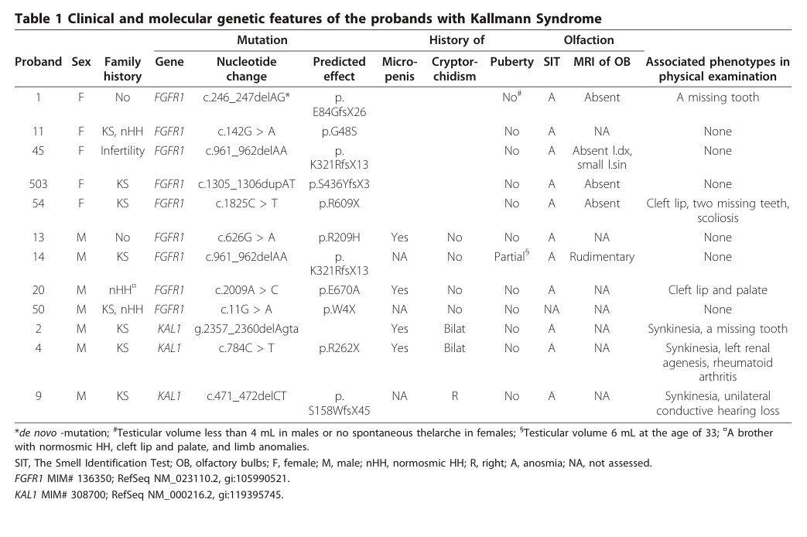

## Question

# Disease Characteristics Research Template

## Target Disease
- **Disease Name:** Kallmann Syndrome
- **MONDO ID:**  (if available)
- **Category:** Mendelian

## Research Objectives

Please provide a comprehensive research report on **Kallmann Syndrome** covering all of the
disease characteristics listed below. This report will be used to populate a disease knowledge
base entry. Be thorough and cite primary literature (PMID preferred) for all claims.

For each section, **suggested databases/resources** are listed. These are the first places
you should search for information on each topic.

---

### 1. Disease Information
> **Search first:** OMIM, Orphanet, ICD-10/ICD-11, MeSH, PubMed

- What is the disease? Provide a concise overview.
- What are the key identifiers? (OMIM, Orphanet, ICD-10/ICD-11, MeSH, Mondo)
- What are the common synonyms and alternative names?
- Is the information derived from individual patients (e.g., EHR) or aggregated disease-level resources?

### 2. Etiology

- **Disease Causal Factors**: What are the primary causes? (genetic, environmental, infectious, mechanistic)
- **Risk Factors**:
  > **Search first:** PubMed, Cochrane Library, UpToDate, clinical guidelines, ClinVar, ClinGen, GWAS Catalog, PheGenI, CTD, CDC, WHO, epidemiological databases
  - Genetic risk factors (causal variants, susceptibility loci, modifier genes)
  - Environmental risk factors (toxins, lifestyle, occupational exposures, age, sex, family history)
- **Protective Factors**:
  > **Search first:** PubMed, Cochrane Library, clinical trial databases, GWAS Catalog, gnomAD, WHO, CDC, nutrition databases
  - Genetic protective factors (protective variants, modifier alleles)
  - Environmental protective factors (diet, lifestyle, exposures that reduce risk)
- **Gene-Environment Interactions**: How do genetic and environmental factors interact to influence disease?
  > **Search first:** CTD, PubMed, PheGenI, GxE databases

### 3. Phenotypes
> **Search first:** HPO (Human Phenotype Ontology), OMIM, Orphanet, PubMed, clinicaltrials.gov, MedDRA, SNOMED CT, DECIPHER, LOINC

For each phenotype, provide:
- **Phenotype type**: symptoms, clinical signs, physical manifestations, behavioral changes, or laboratory abnormalities
  > For symptoms/signs: HPO, OMIM, Orphanet, PubMed
  > For behavioral changes: HPO, DSM, RDoC (Research Domain Criteria), PubMed
  > For laboratory abnormalities: LOINC, SNOMED CT, LabTests Online, PubMed
- **Phenotype characteristics**:
  > **Search first:** OMIM, Orphanet, HPO, PubMed
  - Age of symptom onset (neonatal, childhood, adult-onset, late-onset)
  - Symptom severity (mild, moderate, severe, variable)
  - Symptom progression (stable, progressive, episodic, fluctuating)
  - Frequency among affected individuals (percentage or qualitative)
- **Quality of life impact**: Effects on daily functioning and well-being (per-phenotype when possible)
  > **Search first:** EQ-5D database, SF-36, WHO QOL databases, PubMed
- Suggest HPO (Human Phenotype Ontology) terms for each phenotype

### 4. Genetic/Molecular Information

- **Causal Genes**: Gene mutations or chromosomal abnormalities responsible for disease (gene symbols, OMIM IDs)
  > **Search first:** OMIM, ClinVar, HGMD, Ensembl, NCBI Gene
- **Pathogenic Variants**:
  - Affected genes (gene symbols, HGNC IDs)
    > **Search first:** OMIM, NCBI Gene, Ensembl, HGNC, UniProt, GeneCards
  - Variant classification (pathogenic, likely pathogenic, VUS per ACMG/AMP guidelines)
    > **Search first:** ClinVar, ClinGen, ACMG/AMP guidelines, VarSome
  - Variant type/class (missense, frameshift, nonsense, splice-site, structural)
  - Allele frequency in population databases
    > **Search first:** gnomAD, 1000 Genomes, ExAC, TOPMed, dbSNP
  - Somatic vs germline origin
    > **Search first:** COSMIC (somatic), ClinVar, ICGC, TCGA
  - Functional consequences (loss of function, gain of function, dominant negative)
- **Modifier Genes**: Genes that modify disease severity or expression
- **Epigenetic Information**: DNA methylation, histone modifications, chromatin changes affecting disease
  > **Search first:** ENCODE, Roadmap Epigenomics, MethBase, DiseaseMeth
- **Chromosomal Abnormalities**: Large-scale genetic changes (aneuploidy, translocations, inversions)
  > **Search first:** DECIPHER, ClinVar, ECARUCA, UCSC Genome Browser

### 5. Environmental Information

- **Environmental Factors**: Non-genetic contributing factors (toxins, radiation, pollution, occupational exposure)
  > **Search first:** CTD (Comparative Toxicogenomics Database), TOXNET, PubMed, EPA databases
- **Lifestyle Factors**: Behavioral factors (smoking, diet, exercise, alcohol consumption)
  > **Search first:** CDC databases, WHO, PubMed, NHANES
- **Infectious Agents**: If applicable, pathogens causing or triggering disease (bacteria, viruses, fungi, parasites)
  > **Search first:** NCBI Taxonomy, ViPR, BV-BRC, MicrobeDB, GIDEON

### 6. Mechanism / Pathophysiology

- **Molecular Pathways**: Specific signaling cascades or biochemical pathways involved (Wnt, MAPK, mTOR, PI3K-AKT, etc.)
  > **Search first:** KEGG, Reactome, WikiPathways, PathBank, BioCyc
- **Cellular Processes**: Cell-level mechanisms (apoptosis, autophagy, cell cycle dysregulation, inflammation, etc.)
  > **Search first:** Gene Ontology (GO), Reactome, KEGG, PubMed
- **Protein Dysfunction**: How protein structure or function is altered (misfolding, aggregation, loss of function, gain of function)
  > **Search first:** UniProt, PDB (Protein Data Bank), InterPro, Pfam, AlphaFold
- **Metabolic Changes**: Alterations in metabolic processes (energy metabolism, lipid metabolism, amino acid metabolism)
  > **Search first:** KEGG, BioCyc, HMDB (Human Metabolome Database), BRENDA
- **Immune System Involvement**: Role of immune response (autoimmunity, immunodeficiency, chronic inflammation)
  > **Search first:** ImmPort, Immunome Database, IEDB, Gene Ontology
- **Tissue Damage Mechanisms**: How tissues/ are injured (oxidative stress, ischemia, fibrosis, necrosis)
  > **Search first:** PubMed, Gene Ontology, Reactome
- **Biochemical Abnormalities**: Specific molecular defects (enzyme deficiencies, receptor dysfunction, ion channel defects)
  > **Search first:** BRENDA, UniProt, KEGG, OMIM, PubMed
- **Epigenetic Changes**: DNA methylation, histone modifications affecting gene expression in disease
  > **Search first:** ENCODE, Roadmap Epigenomics, MethBase, DiseaseMeth
- **Molecular Profiling** (if available):
  - Transcriptomics/gene expression changes
    > **Search first:** GEO (Gene Expression Omnibus), ArrayExpress, GTEx, Human Cell Atlas, SRA
  - Proteomics findings
    > **Search first:** PRIDE, ProteomeXchange, Human Protein Atlas, STRING, BioGRID
  - Metabolomics signatures
    > **Search first:** MetaboLights, Metabolomics Workbench, HMDB, METLIN
  - Lipidomics alterations
    > **Search first:** LIPID MAPS, SwissLipids, LipidHome, Metabolomics Workbench
  - Genomic structural features
    > **Search first:** UCSC Genome Browser, Ensembl, NCBI, dbVar, DGV
- **Advanced Technologies** (if applicable):
  - Single-cell analysis findings (cell-type specific mechanisms, cellular heterogeneity)
    > **Search first:** Human Cell Atlas, Single Cell Portal, GEO, CELLxGENE
  - Spatial transcriptomics findings
    > **Search first:** GEO, Spatial Research, Vizgen, 10x Genomics data
  - Multi-omics integration results
    > **Search first:** TCGA, ICGC, cBioPortal, LinkedOmics, PubMed
  - Functional genomics screens (CRISPR, RNAi)
    > **Search first:** DepMap, GenomeRNAi, PubMed, BioGRID ORCS

For each mechanism, describe:
- The causal chain from initial trigger to clinical manifestation
- Which mechanisms are upstream vs downstream
- What cell types and biological processes are involved
- Suggest GO terms for biological processes and CL terms for cell types

### 7. Anatomical Structures Affected

- **Organ Level**:
  - Primary organs directly affected
  - Secondary organ involvement (complications, secondary effects)
  - Body systems involved (cardiovascular, nervous, digestive, respiratory, endocrine, etc.)
  > **Search first:** Uberon, FMA (Foundational Model of Anatomy), OMIM, HPO, ICD-11, MeSH, SNOMED CT
- **Tissue and Cell Level**:
  - Specific tissue types affected (epithelial, connective, muscle, nervous)
  - Specific cell populations targeted (with Cell Ontology terms)
  > **Search first:** Uberon, Human Protein Atlas, Cell Ontology, Human Cell Atlas, CellMarker, PanglaoDB
- **Subcellular Level**:
  - Cellular compartments involved (mitochondria, nucleus, ER, lysosomes) (with GO Cellular Component terms)
  > **Search first:** Gene Ontology (Cellular Component), UniProt, Human Protein Atlas
- **Localization**:
  - Specific anatomical sites (with UBERON terms)
    > **Search first:** FMA, Uberon, NeuroNames (for brain), SNOMED CT
  - Lateralization (unilateral, bilateral, asymmetric)
    > **Search first:** HPO, clinical literature, imaging databases

### 8. Temporal Development

- **Onset**:
  - Typical age of onset (congenital, pediatric, adult, geriatric)
  - Onset pattern (acute, subacute, chronic, insidious)
  > **Search first:** OMIM, Orphanet, HPO, PubMed
- **Progression**:
  - Disease stages (early, intermediate, advanced, end-stage)
    > **Search first:** Cancer Staging Manual (AJCC), WHO classifications, PubMed
  - Progression rate (rapid, slow, variable)
  - Disease course pattern (episodic, relapsing-remitting, progressive, stable)
  - Disease duration (self-limited, chronic lifelong)
  > **Search first:** Disease registries, longitudinal cohort databases, natural history studies, PubMed, Orphanet, OMIM
- **Patterns**:
  - Remission patterns (spontaneous, treatment-induced)
    > **Search first:** Clinical trial databases, disease registries, PubMed
  - Critical periods (time windows of vulnerability or opportunity for intervention)
    > **Search first:** PubMed, developmental biology databases, clinical guidelines

### 9. Inheritance and Population

- **Epidemiology**:
  - Prevalence (cases per 100,000 at given time)
  - Incidence (new cases per 100,000 per year)
  > **Search first:** Orphanet, CDC, WHO, GBD (Global Burden of Disease), national registries, SEER, disease registries
- **For Genetic Etiology**:
  - Inheritance pattern (AD, AR, X-linked, mitochondrial, multifactorial, polygenic)
    > **Search first:** OMIM, Orphanet, ClinVar, GTR (Genetic Testing Registry)
  - Penetrance (complete, incomplete, age-dependent)
    > **Search first:** ClinVar, OMIM, PubMed, ClinGen
  - Expressivity (variable, consistent)
    > **Search first:** OMIM, ClinVar, PubMed
  - Genetic anticipation (increasing severity in successive generations)
    > **Search first:** OMIM, PubMed (especially for repeat expansion disorders)
  - Germline mosaicism
    > **Search first:** ClinVar, OMIM, genetic counseling literature, PubMed
  - Founder effects (population-specific mutations)
    > **Search first:** gnomAD, population genetics databases, PubMed
  - Consanguinity role
    > **Search first:** OMIM, population studies, genetic counseling resources
  - Carrier frequency
    > **Search first:** gnomAD, carrier screening databases, GeneReviews, GTR
- **Population Demographics**:
  - Affected populations (ethnic or demographic groups with higher prevalence)
    > **Search first:** gnomAD, 1000 Genomes, PAGE Study, PubMed, population registries
  - Geographic distribution (endemic areas, regional variation)
    > **Search first:** WHO, CDC, GBD, Orphanet, geographic epidemiology databases
  - Geographic distribution of specific variants
  - Sex ratio (male:female)
    > **Search first:** Disease registries, OMIM, PubMed, epidemiological databases
  - Age distribution of affected individuals
    > **Search first:** CDC, disease registries, SEER, Orphanet

### 10. Diagnostics

- **Clinical Tests**:
  - Laboratory tests (blood, urine, tissue chemistry, specific enzyme assays)
    > **Search first:** LOINC, LabTests Online, PubMed
  - Biomarkers (proteins, metabolites, genetic markers, circulating biomarkers)
    > **Search first:** FDA Biomarker List, BEST (Biomarkers, EndpointS, and other Tools), PubMed
  - Imaging studies (X-ray, CT, MRI, PET, ultrasound)
    > **Search first:** RadLex, DICOM, Radiopaedia, imaging databases
  - Functional tests (pulmonary function, cardiac stress tests)
    > **Search first:** LOINC, clinical guidelines, PubMed
  - Electrophysiology (EEG, EMG, ECG, nerve conduction studies)
    > **Search first:** LOINC, clinical neurophysiology databases, PubMed
  - Biopsy findings (histopathology, immunohistochemistry)
    > **Search first:** SNOMED CT, College of American Pathologists resources, PubMed
  - Pathology findings (microscopic examination)
    > **Search first:** SNOMED CT, Digital Pathology databases, PubMed
- **Genetic Testing**:
  > **Search first:** GTR (Genetic Testing Registry), GeneReviews, ClinGen
  - Overview of recommended genetic testing approach
  - Whole genome sequencing (WGS) utility
    > **Search first:** GTR, ClinVar, GEL (Genomics England), gnomAD
  - Whole exome sequencing (WES) utility
    > **Search first:** GTR, ClinVar, OMIM, GeneMatcher
  - Gene panels (which panels, which genes)
    > **Search first:** GTR, ClinVar, laboratory-specific databases
  - Single gene testing
    > **Search first:** GTR, ClinVar, OMIM, GeneReviews
  - Chromosomal microarray (CMA)
    > **Search first:** DECIPHER, ClinVar, dbVar, ECARUCA
  - Karyotyping
    > **Search first:** Chromosome Abnormality Database, ClinVar, cytogenetics resources
  - FISH
    > **Search first:** ClinVar, cytogenetics databases, PubMed
  - Mitochondrial DNA testing
    > **Search first:** MITOMAP, MSeqDR, ClinVar, GTR
  - Repeat expansion testing
    > **Search first:** GTR, ClinVar, repeat expansion databases, PubMed
- **Omics-Based Diagnostics** (if applicable):
  - RNA sequencing / transcriptomics
    > **Search first:** GEO, ArrayExpress, GTEx, RNA-seq databases
  - Proteomics
    > **Search first:** PRIDE, ProteomeXchange, FDA Biomarker database
  - Metabolomics
    > **Search first:** MetaboLights, Metabolomics Workbench, HMDB
  - Epigenomics
    > **Search first:** GEO, ENCODE, Roadmap Epigenomics, MethBase
  - Liquid biopsy
    > **Search first:** COSMIC, ClinVar, liquid biopsy databases, PubMed
- **Clinical Criteria**:
  - Standardized diagnostic criteria (DSM, ICD, society guidelines)
    > **Search first:** DSM-5, ICD-11, clinical society guidelines, UpToDate
  - Differential diagnosis (other conditions to rule out, with distinguishing features)
    > **Search first:** DynaMed, UpToDate, clinical decision support systems
- **Screening**:
  - Screening methods for asymptomatic individuals (newborn screening, carrier screening, cascade screening)
    > **Search first:** ACMG recommendations, CDC newborn screening, GTR

### 11. Outcome/Prognosis

- **Survival and Mortality**:
  - Survival rate (5-year, 10-year, overall)
    > **Search first:** SEER, cancer registries, disease-specific registries, PubMed
  - Life expectancy (with and without treatment if applicable)
    > **Search first:** Orphanet, disease registries, actuarial databases, PubMed
  - Mortality rate
    > **Search first:** CDC, WHO, GBD, national mortality databases
  - Disease-specific mortality (deaths directly attributable to disease)
    > **Search first:** Disease registries, CDC Wonder, GBD, PubMed
- **Morbidity and Function**:
  - Morbidity (disease-related disability and health impacts)
    > **Search first:** GBD, WHO, disability databases, PubMed
  - Disability outcomes (long-term functional impairments)
    > **Search first:** ICF (International Classification of Functioning), disability registries
  - Quality of life measures (EQ-5D, SF-36, PROMIS, disease-specific tools)
    > **Search first:** EQ-5D database, SF-36, PROMIS, PubMed
- **Disease Course**:
  - Complications (secondary problems: infections, organ failure, etc.)
    > **Search first:** ICD codes, disease registries, clinical databases, PubMed
  - Recovery potential (likelihood and extent of recovery, with vs without treatment)
    > **Search first:** Natural history studies, rehabilitation databases, PubMed
- **Prediction**:
  - Prognostic factors (age, disease severity, biomarkers, treatment response)
    > **Search first:** Prognostic models databases, clinical calculators, PubMed
  - Prognostic biomarkers (molecular markers predicting disease course)
    > **Search first:** FDA Biomarker database, PubMed, cancer prognostic databases

### 12. Treatment

- **Pharmacotherapy**:
  - Pharmacological treatments (drug names, drug classes, mechanisms of action)
    > **Search first:** DrugBank, RxNorm, ATC classification, DailyMed, FDA databases
  - Pharmacogenomics (how genetic variants affect drug metabolism, efficacy, toxicity)
    > **Search first:** PharmGKB, CPIC (Clinical Pharmacogenetics), FDA Table of PGx Biomarkers
- **Advanced Therapeutics**:
  - Gene therapy (viral vectors, CRISPR, gene replacement, gene editing)
    > **Search first:** ClinicalTrials.gov, FDA gene therapy database, ASGCT resources
  - Cell therapy (stem cell transplant, CAR-T, cellular therapeutics)
    > **Search first:** ClinicalTrials.gov, FDA cell therapy database, FACT standards
  - RNA-based therapies (ASOs, siRNA, mRNA therapies)
    > **Search first:** ClinicalTrials.gov, FDA approvals, PubMed
  - Targeted therapies (treatments directed at specific molecular targets)
    > **Search first:** My Cancer Genome, OncoKB, ClinicalTrials.gov, FDA approvals
  - Immunotherapies (checkpoint inhibitors, monoclonal antibodies)
    > **Search first:** Cancer Immunotherapy Database, FDA approvals, ClinicalTrials.gov
- **Surgical and Interventional**:
  - Surgical interventions (types of surgery, timing, outcomes)
    > **Search first:** CPT codes, surgical registries, clinical guidelines, PubMed
- **Supportive and Rehabilitative**:
  - Supportive care (symptom management, pain control, nutrition)
    > **Search first:** Clinical guidelines, Cochrane Library, PubMed
  - Rehabilitation (physical therapy, occupational therapy, speech therapy)
    > **Search first:** Rehabilitation medicine databases, clinical guidelines, PubMed
- **Experimental**:
  - Experimental treatments in clinical trials (with NCT identifiers if available)
    > **Search first:** ClinicalTrials.gov, EU Clinical Trials Register, WHO ICTRP
- **Treatment Outcomes**:
  - Treatment response rates
    > **Search first:** Clinical trial databases, FDA reviews, systematic reviews, PubMed
  - Side effects and adverse events
    > **Search first:** FDA Adverse Event Reporting System (FAERS), MedWatch, PubMed
- **Treatment Strategy**:
  - Treatment algorithms (clinical pathways, decision trees)
    > **Search first:** Clinical practice guidelines, NCCN Guidelines, UpToDate
  - Combination therapies
    > **Search first:** ClinicalTrials.gov, treatment guidelines, PubMed
  - Personalized medicine approaches (genotype-guided treatment)
    > **Search first:** My Cancer Genome, CIViC, PharmGKB, precision medicine databases

For each treatment, suggest MAXO (Medical Action Ontology) terms where applicable.

### 13. Prevention

- **Prevention Levels**:
  - Primary prevention (preventing disease occurrence: vaccination, risk factor modification)
    > **Search first:** CDC, WHO, USPSTF recommendations, Cochrane Library
  - Secondary prevention (early detection and treatment: screening programs, early intervention)
    > **Search first:** USPSTF, CDC screening guidelines, WHO
  - Tertiary prevention (preventing complications in those with disease)
    > **Search first:** Clinical guidelines, disease management protocols, PubMed
- **Immunization**: Vaccine strategies (if applicable)
  > **Search first:** CDC vaccine schedules, WHO immunization, FDA vaccine database
- **Screening and Early Detection**:
  - Screening programs (population-based: newborn screening, cancer screening)
    > **Search first:** CDC screening programs, USPSTF, cancer screening databases
  - Genetic screening (carrier screening, preimplantation genetic diagnosis, prenatal testing)
    > **Search first:** ACMG recommendations, ACOG guidelines, GTR
  - Risk stratification (identifying high-risk individuals for targeted prevention)
    > **Search first:** Risk prediction models, clinical calculators, PubMed
- **Behavioral Interventions**: Lifestyle modifications to reduce risk
  > **Search first:** CDC, WHO, behavioral intervention databases, Cochrane Library
- **Counseling**: Genetic counseling (risk assessment, family planning guidance)
  > **Search first:** NSGC resources, ACMG guidelines, GeneReviews
- **Public Health**:
  - Public health interventions (sanitation, vector control, health education)
    > **Search first:** CDC, WHO, public health databases, PubMed
  - Environmental interventions (reducing environmental risk factors)
    > **Search first:** EPA databases, WHO environmental health, PubMed
- **Prophylaxis**: Preventive medications or procedures
  > **Search first:** Clinical guidelines, FDA approvals, PubMed

### 14. Other Species / Natural Disease

- **Taxonomy**: Species affected (with NCBI Taxon identifiers)
  > **Search first:** NCBI Taxonomy
- **Breed**: Specific breeds affected (with VBO identifiers if applicable)
  > **Search first:** VBO (Vertebrate Breed Ontology)
- **Gene**: Orthologous genes in other species (with NCBI Gene IDs)
  > **Search first:** NCBI Gene
- **Natural Disease**:
  - Naturally occurring disease in other species (companion animals, wildlife)
    > **Search first:** OMIA (Online Mendelian Inheritance in Animals), VetCompass, PubMed
  - Veterinary relevance and importance in animal health
    > **Search first:** OMIA, veterinary databases, PubMed
- **Comparative Biology**:
  - Comparative pathology (similarities and differences across species)
    > **Search first:** OMIA, comparative pathology databases, PubMed
  - Evolutionary conservation of disease mechanisms
    > **Search first:** HomoloGene, OrthoMCL, Alliance of Genome Resources
- **Transmission** (if applicable):
  - Zoonotic potential
    > **Search first:** CDC zoonotic diseases, WHO zoonoses, GIDEON
  - Cross-species susceptibility
    > **Search first:** NCBI Taxonomy, veterinary databases, PubMed

### 15. Model Organisms

- **Model Types**:
  - Model organism type (mammalian, invertebrate, cellular, in vitro)
    > **Search first:** Alliance of Genome Resources, model organism databases
  - Specific model systems (mouse, rat, zebrafish, Drosophila, C. elegans, yeast, cell lines, organoids, iPSCs)
    > **Search first:** MGI, RGD, ZFIN, FlyBase, WormBase, SGD, ATCC, Cellosaurus
  - Induced models (drug treatment, surgical intervention, environmental manipulation)
    > **Search first:** MGI, model organism databases, PubMed
- **Genetic Models**:
  - Types available (knockout, knock-in, transgenic, conditional, humanized)
    > **Search first:** MGI, IMPC, KOMP, EuMMCR, IMSR
- **Model Characteristics**:
  - Phenotype recapitulation (how well model reproduces human disease features)
    > **Search first:** Model organism databases, comparative studies, PubMed
  - Model limitations (aspects of human disease not captured)
    > **Search first:** Model organism databases, PubMed, review articles
- **Applications**:
  - Research applications (what aspects of disease can be studied)
    > **Search first:** Model organism databases, PubMed
- **Resources**:
  - Model databases
    > **Search first:** MGI, RGD, ZFIN, FlyBase, WormBase, IMSR, EMMA, MMRRC

---

## Citation Requirements

- Cite primary literature (PMID preferred) for all mechanistic and clinical claims
- Prioritize recent reviews and landmark papers
- Include direct quotes from abstracts where possible to support key statements
- Distinguish evidence source types: human clinical, model organism, in vitro, computational

## Output Format

Structure your response as a comprehensive narrative organized by the sections above.
For each section, provide:
- Factual content with specific details (numbers, percentages, gene names, variant nomenclature)
- Ontology term suggestions (HPO, GO, CL, UBERON, CHEBI, MAXO, MONDO) where applicable
- Evidence citations with PMIDs
- Direct quotes from abstracts to support key claims
- Clear indication when information is not available or not applicable for this disease

This report will be used to populate a disease knowledge base entry with:
- Pathophysiology descriptions with causal chains
- Gene/protein annotations (HGNC, GO terms)
- Phenotype associations (HP terms) with frequencies
- Cell type involvement (CL terms)
- Anatomical locations (UBERON terms)
- Chemical entities (CHEBI terms)
- Treatment annotations (MAXO terms)
- Evidence items with PMIDs and exact abstract quotes
- Epidemiology, prognosis, diagnostic, and prevention information
- Animal model descriptions with phenotype recapitulation details

## Output

Question: You are an expert researcher providing comprehensive, well-cited information.

Provide detailed information focusing on:
1. Key concepts and definitions with current understanding
2. Recent developments and latest research (prioritize 2023-2024 sources)
3. Current applications and real-world implementations
4. Expert opinions and analysis from authoritative sources
5. Relevant statistics and data from recent studies

Format as a comprehensive research report with proper citations. Include URLs and publication dates where available.
Always prioritize recent, authoritative sources and provide specific citations for all major claims.

# Disease Characteristics Research Template

## Target Disease
- **Disease Name:** Kallmann Syndrome
- **MONDO ID:**  (if available)
- **Category:** Mendelian

## Research Objectives

Please provide a comprehensive research report on **Kallmann Syndrome** covering all of the
disease characteristics listed below. This report will be used to populate a disease knowledge
base entry. Be thorough and cite primary literature (PMID preferred) for all claims.

For each section, **suggested databases/resources** are listed. These are the first places
you should search for information on each topic.

---

### 1. Disease Information
> **Search first:** OMIM, Orphanet, ICD-10/ICD-11, MeSH, PubMed

- What is the disease? Provide a concise overview.
- What are the key identifiers? (OMIM, Orphanet, ICD-10/ICD-11, MeSH, Mondo)
- What are the common synonyms and alternative names?
- Is the information derived from individual patients (e.g., EHR) or aggregated disease-level resources?

### 2. Etiology

- **Disease Causal Factors**: What are the primary causes? (genetic, environmental, infectious, mechanistic)
- **Risk Factors**:
  > **Search first:** PubMed, Cochrane Library, UpToDate, clinical guidelines, ClinVar, ClinGen, GWAS Catalog, PheGenI, CTD, CDC, WHO, epidemiological databases
  - Genetic risk factors (causal variants, susceptibility loci, modifier genes)
  - Environmental risk factors (toxins, lifestyle, occupational exposures, age, sex, family history)
- **Protective Factors**:
  > **Search first:** PubMed, Cochrane Library, clinical trial databases, GWAS Catalog, gnomAD, WHO, CDC, nutrition databases
  - Genetic protective factors (protective variants, modifier alleles)
  - Environmental protective factors (diet, lifestyle, exposures that reduce risk)
- **Gene-Environment Interactions**: How do genetic and environmental factors interact to influence disease?
  > **Search first:** CTD, PubMed, PheGenI, GxE databases

### 3. Phenotypes
> **Search first:** HPO (Human Phenotype Ontology), OMIM, Orphanet, PubMed, clinicaltrials.gov, MedDRA, SNOMED CT, DECIPHER, LOINC

For each phenotype, provide:
- **Phenotype type**: symptoms, clinical signs, physical manifestations, behavioral changes, or laboratory abnormalities
  > For symptoms/signs: HPO, OMIM, Orphanet, PubMed
  > For behavioral changes: HPO, DSM, RDoC (Research Domain Criteria), PubMed
  > For laboratory abnormalities: LOINC, SNOMED CT, LabTests Online, PubMed
- **Phenotype characteristics**:
  > **Search first:** OMIM, Orphanet, HPO, PubMed
  - Age of symptom onset (neonatal, childhood, adult-onset, late-onset)
  - Symptom severity (mild, moderate, severe, variable)
  - Symptom progression (stable, progressive, episodic, fluctuating)
  - Frequency among affected individuals (percentage or qualitative)
- **Quality of life impact**: Effects on daily functioning and well-being (per-phenotype when possible)
  > **Search first:** EQ-5D database, SF-36, WHO QOL databases, PubMed
- Suggest HPO (Human Phenotype Ontology) terms for each phenotype

### 4. Genetic/Molecular Information

- **Causal Genes**: Gene mutations or chromosomal abnormalities responsible for disease (gene symbols, OMIM IDs)
  > **Search first:** OMIM, ClinVar, HGMD, Ensembl, NCBI Gene
- **Pathogenic Variants**:
  - Affected genes (gene symbols, HGNC IDs)
    > **Search first:** OMIM, NCBI Gene, Ensembl, HGNC, UniProt, GeneCards
  - Variant classification (pathogenic, likely pathogenic, VUS per ACMG/AMP guidelines)
    > **Search first:** ClinVar, ClinGen, ACMG/AMP guidelines, VarSome
  - Variant type/class (missense, frameshift, nonsense, splice-site, structural)
  - Allele frequency in population databases
    > **Search first:** gnomAD, 1000 Genomes, ExAC, TOPMed, dbSNP
  - Somatic vs germline origin
    > **Search first:** COSMIC (somatic), ClinVar, ICGC, TCGA
  - Functional consequences (loss of function, gain of function, dominant negative)
- **Modifier Genes**: Genes that modify disease severity or expression
- **Epigenetic Information**: DNA methylation, histone modifications, chromatin changes affecting disease
  > **Search first:** ENCODE, Roadmap Epigenomics, MethBase, DiseaseMeth
- **Chromosomal Abnormalities**: Large-scale genetic changes (aneuploidy, translocations, inversions)
  > **Search first:** DECIPHER, ClinVar, ECARUCA, UCSC Genome Browser

### 5. Environmental Information

- **Environmental Factors**: Non-genetic contributing factors (toxins, radiation, pollution, occupational exposure)
  > **Search first:** CTD (Comparative Toxicogenomics Database), TOXNET, PubMed, EPA databases
- **Lifestyle Factors**: Behavioral factors (smoking, diet, exercise, alcohol consumption)
  > **Search first:** CDC databases, WHO, PubMed, NHANES
- **Infectious Agents**: If applicable, pathogens causing or triggering disease (bacteria, viruses, fungi, parasites)
  > **Search first:** NCBI Taxonomy, ViPR, BV-BRC, MicrobeDB, GIDEON

### 6. Mechanism / Pathophysiology

- **Molecular Pathways**: Specific signaling cascades or biochemical pathways involved (Wnt, MAPK, mTOR, PI3K-AKT, etc.)
  > **Search first:** KEGG, Reactome, WikiPathways, PathBank, BioCyc
- **Cellular Processes**: Cell-level mechanisms (apoptosis, autophagy, cell cycle dysregulation, inflammation, etc.)
  > **Search first:** Gene Ontology (GO), Reactome, KEGG, PubMed
- **Protein Dysfunction**: How protein structure or function is altered (misfolding, aggregation, loss of function, gain of function)
  > **Search first:** UniProt, PDB (Protein Data Bank), InterPro, Pfam, AlphaFold
- **Metabolic Changes**: Alterations in metabolic processes (energy metabolism, lipid metabolism, amino acid metabolism)
  > **Search first:** KEGG, BioCyc, HMDB (Human Metabolome Database), BRENDA
- **Immune System Involvement**: Role of immune response (autoimmunity, immunodeficiency, chronic inflammation)
  > **Search first:** ImmPort, Immunome Database, IEDB, Gene Ontology
- **Tissue Damage Mechanisms**: How tissues/ are injured (oxidative stress, ischemia, fibrosis, necrosis)
  > **Search first:** PubMed, Gene Ontology, Reactome
- **Biochemical Abnormalities**: Specific molecular defects (enzyme deficiencies, receptor dysfunction, ion channel defects)
  > **Search first:** BRENDA, UniProt, KEGG, OMIM, PubMed
- **Epigenetic Changes**: DNA methylation, histone modifications affecting gene expression in disease
  > **Search first:** ENCODE, Roadmap Epigenomics, MethBase, DiseaseMeth
- **Molecular Profiling** (if available):
  - Transcriptomics/gene expression changes
    > **Search first:** GEO (Gene Expression Omnibus), ArrayExpress, GTEx, Human Cell Atlas, SRA
  - Proteomics findings
    > **Search first:** PRIDE, ProteomeXchange, Human Protein Atlas, STRING, BioGRID
  - Metabolomics signatures
    > **Search first:** MetaboLights, Metabolomics Workbench, HMDB, METLIN
  - Lipidomics alterations
    > **Search first:** LIPID MAPS, SwissLipids, LipidHome, Metabolomics Workbench
  - Genomic structural features
    > **Search first:** UCSC Genome Browser, Ensembl, NCBI, dbVar, DGV
- **Advanced Technologies** (if applicable):
  - Single-cell analysis findings (cell-type specific mechanisms, cellular heterogeneity)
    > **Search first:** Human Cell Atlas, Single Cell Portal, GEO, CELLxGENE
  - Spatial transcriptomics findings
    > **Search first:** GEO, Spatial Research, Vizgen, 10x Genomics data
  - Multi-omics integration results
    > **Search first:** TCGA, ICGC, cBioPortal, LinkedOmics, PubMed
  - Functional genomics screens (CRISPR, RNAi)
    > **Search first:** DepMap, GenomeRNAi, PubMed, BioGRID ORCS

For each mechanism, describe:
- The causal chain from initial trigger to clinical manifestation
- Which mechanisms are upstream vs downstream
- What cell types and biological processes are involved
- Suggest GO terms for biological processes and CL terms for cell types

### 7. Anatomical Structures Affected

- **Organ Level**:
  - Primary organs directly affected
  - Secondary organ involvement (complications, secondary effects)
  - Body systems involved (cardiovascular, nervous, digestive, respiratory, endocrine, etc.)
  > **Search first:** Uberon, FMA (Foundational Model of Anatomy), OMIM, HPO, ICD-11, MeSH, SNOMED CT
- **Tissue and Cell Level**:
  - Specific tissue types affected (epithelial, connective, muscle, nervous)
  - Specific cell populations targeted (with Cell Ontology terms)
  > **Search first:** Uberon, Human Protein Atlas, Cell Ontology, Human Cell Atlas, CellMarker, PanglaoDB
- **Subcellular Level**:
  - Cellular compartments involved (mitochondria, nucleus, ER, lysosomes) (with GO Cellular Component terms)
  > **Search first:** Gene Ontology (Cellular Component), UniProt, Human Protein Atlas
- **Localization**:
  - Specific anatomical sites (with UBERON terms)
    > **Search first:** FMA, Uberon, NeuroNames (for brain), SNOMED CT
  - Lateralization (unilateral, bilateral, asymmetric)
    > **Search first:** HPO, clinical literature, imaging databases

### 8. Temporal Development

- **Onset**:
  - Typical age of onset (congenital, pediatric, adult, geriatric)
  - Onset pattern (acute, subacute, chronic, insidious)
  > **Search first:** OMIM, Orphanet, HPO, PubMed
- **Progression**:
  - Disease stages (early, intermediate, advanced, end-stage)
    > **Search first:** Cancer Staging Manual (AJCC), WHO classifications, PubMed
  - Progression rate (rapid, slow, variable)
  - Disease course pattern (episodic, relapsing-remitting, progressive, stable)
  - Disease duration (self-limited, chronic lifelong)
  > **Search first:** Disease registries, longitudinal cohort databases, natural history studies, PubMed, Orphanet, OMIM
- **Patterns**:
  - Remission patterns (spontaneous, treatment-induced)
    > **Search first:** Clinical trial databases, disease registries, PubMed
  - Critical periods (time windows of vulnerability or opportunity for intervention)
    > **Search first:** PubMed, developmental biology databases, clinical guidelines

### 9. Inheritance and Population

- **Epidemiology**:
  - Prevalence (cases per 100,000 at given time)
  - Incidence (new cases per 100,000 per year)
  > **Search first:** Orphanet, CDC, WHO, GBD (Global Burden of Disease), national registries, SEER, disease registries
- **For Genetic Etiology**:
  - Inheritance pattern (AD, AR, X-linked, mitochondrial, multifactorial, polygenic)
    > **Search first:** OMIM, Orphanet, ClinVar, GTR (Genetic Testing Registry)
  - Penetrance (complete, incomplete, age-dependent)
    > **Search first:** ClinVar, OMIM, PubMed, ClinGen
  - Expressivity (variable, consistent)
    > **Search first:** OMIM, ClinVar, PubMed
  - Genetic anticipation (increasing severity in successive generations)
    > **Search first:** OMIM, PubMed (especially for repeat expansion disorders)
  - Germline mosaicism
    > **Search first:** ClinVar, OMIM, genetic counseling literature, PubMed
  - Founder effects (population-specific mutations)
    > **Search first:** gnomAD, population genetics databases, PubMed
  - Consanguinity role
    > **Search first:** OMIM, population studies, genetic counseling resources
  - Carrier frequency
    > **Search first:** gnomAD, carrier screening databases, GeneReviews, GTR
- **Population Demographics**:
  - Affected populations (ethnic or demographic groups with higher prevalence)
    > **Search first:** gnomAD, 1000 Genomes, PAGE Study, PubMed, population registries
  - Geographic distribution (endemic areas, regional variation)
    > **Search first:** WHO, CDC, GBD, Orphanet, geographic epidemiology databases
  - Geographic distribution of specific variants
  - Sex ratio (male:female)
    > **Search first:** Disease registries, OMIM, PubMed, epidemiological databases
  - Age distribution of affected individuals
    > **Search first:** CDC, disease registries, SEER, Orphanet

### 10. Diagnostics

- **Clinical Tests**:
  - Laboratory tests (blood, urine, tissue chemistry, specific enzyme assays)
    > **Search first:** LOINC, LabTests Online, PubMed
  - Biomarkers (proteins, metabolites, genetic markers, circulating biomarkers)
    > **Search first:** FDA Biomarker List, BEST (Biomarkers, EndpointS, and other Tools), PubMed
  - Imaging studies (X-ray, CT, MRI, PET, ultrasound)
    > **Search first:** RadLex, DICOM, Radiopaedia, imaging databases
  - Functional tests (pulmonary function, cardiac stress tests)
    > **Search first:** LOINC, clinical guidelines, PubMed
  - Electrophysiology (EEG, EMG, ECG, nerve conduction studies)
    > **Search first:** LOINC, clinical neurophysiology databases, PubMed
  - Biopsy findings (histopathology, immunohistochemistry)
    > **Search first:** SNOMED CT, College of American Pathologists resources, PubMed
  - Pathology findings (microscopic examination)
    > **Search first:** SNOMED CT, Digital Pathology databases, PubMed
- **Genetic Testing**:
  > **Search first:** GTR (Genetic Testing Registry), GeneReviews, ClinGen
  - Overview of recommended genetic testing approach
  - Whole genome sequencing (WGS) utility
    > **Search first:** GTR, ClinVar, GEL (Genomics England), gnomAD
  - Whole exome sequencing (WES) utility
    > **Search first:** GTR, ClinVar, OMIM, GeneMatcher
  - Gene panels (which panels, which genes)
    > **Search first:** GTR, ClinVar, laboratory-specific databases
  - Single gene testing
    > **Search first:** GTR, ClinVar, OMIM, GeneReviews
  - Chromosomal microarray (CMA)
    > **Search first:** DECIPHER, ClinVar, dbVar, ECARUCA
  - Karyotyping
    > **Search first:** Chromosome Abnormality Database, ClinVar, cytogenetics resources
  - FISH
    > **Search first:** ClinVar, cytogenetics databases, PubMed
  - Mitochondrial DNA testing
    > **Search first:** MITOMAP, MSeqDR, ClinVar, GTR
  - Repeat expansion testing
    > **Search first:** GTR, ClinVar, repeat expansion databases, PubMed
- **Omics-Based Diagnostics** (if applicable):
  - RNA sequencing / transcriptomics
    > **Search first:** GEO, ArrayExpress, GTEx, RNA-seq databases
  - Proteomics
    > **Search first:** PRIDE, ProteomeXchange, FDA Biomarker database
  - Metabolomics
    > **Search first:** MetaboLights, Metabolomics Workbench, HMDB
  - Epigenomics
    > **Search first:** GEO, ENCODE, Roadmap Epigenomics, MethBase
  - Liquid biopsy
    > **Search first:** COSMIC, ClinVar, liquid biopsy databases, PubMed
- **Clinical Criteria**:
  - Standardized diagnostic criteria (DSM, ICD, society guidelines)
    > **Search first:** DSM-5, ICD-11, clinical society guidelines, UpToDate
  - Differential diagnosis (other conditions to rule out, with distinguishing features)
    > **Search first:** DynaMed, UpToDate, clinical decision support systems
- **Screening**:
  - Screening methods for asymptomatic individuals (newborn screening, carrier screening, cascade screening)
    > **Search first:** ACMG recommendations, CDC newborn screening, GTR

### 11. Outcome/Prognosis

- **Survival and Mortality**:
  - Survival rate (5-year, 10-year, overall)
    > **Search first:** SEER, cancer registries, disease-specific registries, PubMed
  - Life expectancy (with and without treatment if applicable)
    > **Search first:** Orphanet, disease registries, actuarial databases, PubMed
  - Mortality rate
    > **Search first:** CDC, WHO, GBD, national mortality databases
  - Disease-specific mortality (deaths directly attributable to disease)
    > **Search first:** Disease registries, CDC Wonder, GBD, PubMed
- **Morbidity and Function**:
  - Morbidity (disease-related disability and health impacts)
    > **Search first:** GBD, WHO, disability databases, PubMed
  - Disability outcomes (long-term functional impairments)
    > **Search first:** ICF (International Classification of Functioning), disability registries
  - Quality of life measures (EQ-5D, SF-36, PROMIS, disease-specific tools)
    > **Search first:** EQ-5D database, SF-36, PROMIS, PubMed
- **Disease Course**:
  - Complications (secondary problems: infections, organ failure, etc.)
    > **Search first:** ICD codes, disease registries, clinical databases, PubMed
  - Recovery potential (likelihood and extent of recovery, with vs without treatment)
    > **Search first:** Natural history studies, rehabilitation databases, PubMed
- **Prediction**:
  - Prognostic factors (age, disease severity, biomarkers, treatment response)
    > **Search first:** Prognostic models databases, clinical calculators, PubMed
  - Prognostic biomarkers (molecular markers predicting disease course)
    > **Search first:** FDA Biomarker database, PubMed, cancer prognostic databases

### 12. Treatment

- **Pharmacotherapy**:
  - Pharmacological treatments (drug names, drug classes, mechanisms of action)
    > **Search first:** DrugBank, RxNorm, ATC classification, DailyMed, FDA databases
  - Pharmacogenomics (how genetic variants affect drug metabolism, efficacy, toxicity)
    > **Search first:** PharmGKB, CPIC (Clinical Pharmacogenetics), FDA Table of PGx Biomarkers
- **Advanced Therapeutics**:
  - Gene therapy (viral vectors, CRISPR, gene replacement, gene editing)
    > **Search first:** ClinicalTrials.gov, FDA gene therapy database, ASGCT resources
  - Cell therapy (stem cell transplant, CAR-T, cellular therapeutics)
    > **Search first:** ClinicalTrials.gov, FDA cell therapy database, FACT standards
  - RNA-based therapies (ASOs, siRNA, mRNA therapies)
    > **Search first:** ClinicalTrials.gov, FDA approvals, PubMed
  - Targeted therapies (treatments directed at specific molecular targets)
    > **Search first:** My Cancer Genome, OncoKB, ClinicalTrials.gov, FDA approvals
  - Immunotherapies (checkpoint inhibitors, monoclonal antibodies)
    > **Search first:** Cancer Immunotherapy Database, FDA approvals, ClinicalTrials.gov
- **Surgical and Interventional**:
  - Surgical interventions (types of surgery, timing, outcomes)
    > **Search first:** CPT codes, surgical registries, clinical guidelines, PubMed
- **Supportive and Rehabilitative**:
  - Supportive care (symptom management, pain control, nutrition)
    > **Search first:** Clinical guidelines, Cochrane Library, PubMed
  - Rehabilitation (physical therapy, occupational therapy, speech therapy)
    > **Search first:** Rehabilitation medicine databases, clinical guidelines, PubMed
- **Experimental**:
  - Experimental treatments in clinical trials (with NCT identifiers if available)
    > **Search first:** ClinicalTrials.gov, EU Clinical Trials Register, WHO ICTRP
- **Treatment Outcomes**:
  - Treatment response rates
    > **Search first:** Clinical trial databases, FDA reviews, systematic reviews, PubMed
  - Side effects and adverse events
    > **Search first:** FDA Adverse Event Reporting System (FAERS), MedWatch, PubMed
- **Treatment Strategy**:
  - Treatment algorithms (clinical pathways, decision trees)
    > **Search first:** Clinical practice guidelines, NCCN Guidelines, UpToDate
  - Combination therapies
    > **Search first:** ClinicalTrials.gov, treatment guidelines, PubMed
  - Personalized medicine approaches (genotype-guided treatment)
    > **Search first:** My Cancer Genome, CIViC, PharmGKB, precision medicine databases

For each treatment, suggest MAXO (Medical Action Ontology) terms where applicable.

### 13. Prevention

- **Prevention Levels**:
  - Primary prevention (preventing disease occurrence: vaccination, risk factor modification)
    > **Search first:** CDC, WHO, USPSTF recommendations, Cochrane Library
  - Secondary prevention (early detection and treatment: screening programs, early intervention)
    > **Search first:** USPSTF, CDC screening guidelines, WHO
  - Tertiary prevention (preventing complications in those with disease)
    > **Search first:** Clinical guidelines, disease management protocols, PubMed
- **Immunization**: Vaccine strategies (if applicable)
  > **Search first:** CDC vaccine schedules, WHO immunization, FDA vaccine database
- **Screening and Early Detection**:
  - Screening programs (population-based: newborn screening, cancer screening)
    > **Search first:** CDC screening programs, USPSTF, cancer screening databases
  - Genetic screening (carrier screening, preimplantation genetic diagnosis, prenatal testing)
    > **Search first:** ACMG recommendations, ACOG guidelines, GTR
  - Risk stratification (identifying high-risk individuals for targeted prevention)
    > **Search first:** Risk prediction models, clinical calculators, PubMed
- **Behavioral Interventions**: Lifestyle modifications to reduce risk
  > **Search first:** CDC, WHO, behavioral intervention databases, Cochrane Library
- **Counseling**: Genetic counseling (risk assessment, family planning guidance)
  > **Search first:** NSGC resources, ACMG guidelines, GeneReviews
- **Public Health**:
  - Public health interventions (sanitation, vector control, health education)
    > **Search first:** CDC, WHO, public health databases, PubMed
  - Environmental interventions (reducing environmental risk factors)
    > **Search first:** EPA databases, WHO environmental health, PubMed
- **Prophylaxis**: Preventive medications or procedures
  > **Search first:** Clinical guidelines, FDA approvals, PubMed

### 14. Other Species / Natural Disease

- **Taxonomy**: Species affected (with NCBI Taxon identifiers)
  > **Search first:** NCBI Taxonomy
- **Breed**: Specific breeds affected (with VBO identifiers if applicable)
  > **Search first:** VBO (Vertebrate Breed Ontology)
- **Gene**: Orthologous genes in other species (with NCBI Gene IDs)
  > **Search first:** NCBI Gene
- **Natural Disease**:
  - Naturally occurring disease in other species (companion animals, wildlife)
    > **Search first:** OMIA (Online Mendelian Inheritance in Animals), VetCompass, PubMed
  - Veterinary relevance and importance in animal health
    > **Search first:** OMIA, veterinary databases, PubMed
- **Comparative Biology**:
  - Comparative pathology (similarities and differences across species)
    > **Search first:** OMIA, comparative pathology databases, PubMed
  - Evolutionary conservation of disease mechanisms
    > **Search first:** HomoloGene, OrthoMCL, Alliance of Genome Resources
- **Transmission** (if applicable):
  - Zoonotic potential
    > **Search first:** CDC zoonotic diseases, WHO zoonoses, GIDEON
  - Cross-species susceptibility
    > **Search first:** NCBI Taxonomy, veterinary databases, PubMed

### 15. Model Organisms

- **Model Types**:
  - Model organism type (mammalian, invertebrate, cellular, in vitro)
    > **Search first:** Alliance of Genome Resources, model organism databases
  - Specific model systems (mouse, rat, zebrafish, Drosophila, C. elegans, yeast, cell lines, organoids, iPSCs)
    > **Search first:** MGI, RGD, ZFIN, FlyBase, WormBase, SGD, ATCC, Cellosaurus
  - Induced models (drug treatment, surgical intervention, environmental manipulation)
    > **Search first:** MGI, model organism databases, PubMed
- **Genetic Models**:
  - Types available (knockout, knock-in, transgenic, conditional, humanized)
    > **Search first:** MGI, IMPC, KOMP, EuMMCR, IMSR
- **Model Characteristics**:
  - Phenotype recapitulation (how well model reproduces human disease features)
    > **Search first:** Model organism databases, comparative studies, PubMed
  - Model limitations (aspects of human disease not captured)
    > **Search first:** Model organism databases, PubMed, review articles
- **Applications**:
  - Research applications (what aspects of disease can be studied)
    > **Search first:** Model organism databases, PubMed
- **Resources**:
  - Model databases
    > **Search first:** MGI, RGD, ZFIN, FlyBase, WormBase, IMSR, EMMA, MMRRC

---

## Citation Requirements

- Cite primary literature (PMID preferred) for all mechanistic and clinical claims
- Prioritize recent reviews and landmark papers
- Include direct quotes from abstracts where possible to support key statements
- Distinguish evidence source types: human clinical, model organism, in vitro, computational

## Output Format

Structure your response as a comprehensive narrative organized by the sections above.
For each section, provide:
- Factual content with specific details (numbers, percentages, gene names, variant nomenclature)
- Ontology term suggestions (HPO, GO, CL, UBERON, CHEBI, MAXO, MONDO) where applicable
- Evidence citations with PMIDs
- Direct quotes from abstracts to support key claims
- Clear indication when information is not available or not applicable for this disease

This report will be used to populate a disease knowledge base entry with:
- Pathophysiology descriptions with causal chains
- Gene/protein annotations (HGNC, GO terms)
- Phenotype associations (HP terms) with frequencies
- Cell type involvement (CL terms)
- Anatomical locations (UBERON terms)
- Chemical entities (CHEBI terms)
- Treatment annotations (MAXO terms)
- Evidence items with PMIDs and exact abstract quotes
- Epidemiology, prognosis, diagnostic, and prevention information
- Animal model descriptions with phenotype recapitulation details

# Comprehensive Disease Characteristics Report: Kallmann Syndrome (KS)

## 0. Executive summary
Kallmann syndrome (KS) is a **Mendelian** disorder classically defined as **congenital hypogonadotropic hypogonadism (CHH) with olfactory dysfunction (anosmia/hyposmia)** due to disrupted embryonic development/migration of gonadotropin-releasing hormone (GnRH) neurons along olfactory pathways. (laitinen2011incidencephenotypicfeatures pages 1-2)

| Item | Value | Evidence/Source (include PMID if present) | URL | Notes |
|---|---|---|---|---|
| Definition | Rare congenital form of isolated/congenital hypogonadotropic hypogonadism characterized by impaired smell (anosmia or hyposmia) together with GnRH deficiency/HH | Laitinen et al., *Orphanet J Rare Dis* (2011): KS is “comprised of congenital hypogonadotropic hypogonadism (HH) and anosmia” (PMID not available in provided context); Żak 2024 review: “rare congenital disorder characterized by hypogonadotropic hypogonadism and anosmia or hyposmia” (laitinen2011incidencephenotypicfeatures pages 1-2, zak2024kallmannsyndromecausessymptoms pages 1-5) | https://doi.org/10.1186/1750-1172-6-41 | Disease-level information derived from aggregated literature/research cohorts rather than individual EHR records |
| Minimal incidence in Finland (overall) | 1:48,000 | Laitinen et al., *Orphanet J Rare Dis* 2011, Finnish epidemiologic study; abstract reports “The minimal incidence estimate of KS in Finland was 1:48 000” (laitinen2011incidencephenotypicfeatures pages 1-2) | https://doi.org/10.1186/1750-1172-6-41 | Population-based national estimate; often cited as a benchmark because true prevalence is difficult to ascertain |
| Minimal incidence in Finland (males) | 1:30,000 | Laitinen et al., *Orphanet J Rare Dis* 2011; abstract reports male incidence 1:30,000 (laitinen2011incidencephenotypicfeatures pages 1-2) | https://doi.org/10.1186/1750-1172-6-41 | Consistent with later review summaries citing ~1:30,000 males |
| Minimal incidence in Finland (females) | 1:125,000 | Laitinen et al., *Orphanet J Rare Dis* 2011; abstract reports female incidence 1:125,000 (laitinen2011incidencephenotypicfeatures pages 1-2) | https://doi.org/10.1186/1750-1172-6-41 | Female underdiagnosis is widely suspected because milder/less obvious pubertal findings may delay recognition |
| Sex ratio / sex bias | Marked male predominance; approximately 3–5-fold more frequent in males; Finland data imply ~4.2:1 male:female incidence ratio | Laitinen et al. 2011 notes KS is “3–5 times more frequent in men”; Żak 2024 review reports ~1:30,000 in males vs ~1:125,000 in females; Meczekalski et al. 2013 reports male:female ratio ~4:1 to 5:1 (laitinen2011incidencephenotypicfeatures pages 1-2, zak2024kallmannsyndromecausessymptoms pages 1-5, meczekalski2013kallmannsyndromein pages 3-4) | https://doi.org/10.1186/1750-1172-6-41; https://doi.org/10.3109/09513590.2012.752459 | Ratio varies across sources because of ascertainment differences and historical under-recognition in females |
| Prevalence/incidence estimates in reviews | Commonly cited estimates: ~1:30,000 males and ~1:125,000 females; older review also cites 1:10,000 males and 1:50,000 females | Żak 2024 review summarizes ~1:30,000 males and ~1:125,000 females; Meczekalski et al. 2013 gives older/higher estimates of 1:10,000 males and 1:50,000 females (zak2024kallmannsyndromecausessymptoms pages 1-5, meczekalski2013kallmannsyndromein pages 3-4) | https://doi.org/10.3109/09513590.2012.752459 | Differences likely reflect methodology, diagnostic criteria, and evolving ascertainment, especially in women |
| Sporadic vs familial cases | ~60% sporadic | Laitinen et al. 2011 states that approximately 60% of KS cases are sporadic (laitinen2011incidencephenotypicfeatures pages 1-2) | https://doi.org/10.1186/1750-1172-6-41 | Familial cases occur with X-linked, autosomal dominant, autosomal recessive, and oligogenic inheritance |
| Familial/genetic heterogeneity note | Multiple inheritance modes: X-linked recessive, autosomal dominant, autosomal recessive, and oligogenic inheritance | Laitinen et al. 2011 lists KAL1/ANOS1, FGFR1, FGF8, PROK2, PROKR2, CHD7, WDR11 and notes heterogeneous inheritance; Żak 2024 review similarly summarizes inheritance patterns (laitinen2011incidencephenotypicfeatures pages 1-2, zak2024kallmannsyndromecausessymptoms pages 1-5) | https://doi.org/10.1186/1750-1172-6-41 | Important for counseling because recurrence risk depends on the causal gene and penetrance |
| Diagnostic timing context | Most cases are diagnosed in adolescence | Żak 2024 review notes most cases are recognized during adolescence when absent/incomplete puberty becomes evident (zak2024kallmannsyndromecausessymptomsa pages 1-5) | N/A | Neonatal male signs such as micropenis/cryptorchidism may enable earlier detection in some patients |

*Table: This table summarizes core disease-definition and epidemiology facts for Kallmann syndrome, emphasizing the frequently cited Finnish incidence estimates and the marked male predominance. It also highlights the distinction between sporadic and familial disease, which is useful for knowledge-base curation and genetic counseling context.*

---

## 1. Disease Information
### 1.1 Overview (current understanding)
KS is a rare congenital disorder characterized by hypogonadotropic hypogonadism plus impaired sense of smell, with broad phenotypic heterogeneity (reproductive and non-reproductive anomalies). (laitinen2011incidencephenotypicfeatures pages 1-2, zak2024kallmannsyndromecausessymptoms pages 1-5)

Key mechanistic definition: KS “**results from disturbed intrauterine migration of gonadotropin-releasing hormone (GnRH) neurons from the olfactory placode to the hypothalamus**.” (laitinen2011incidencephenotypicfeatures pages 1-2)

### 1.2 Key identifiers (available in retrieved sources)
* **OMIM (MIM):** KS is explicitly listed as **MIM#147950**. (laitinen2011incidencephenotypicfeatures pages 1-2)
* **Related OMIM:** hypogonadotropic hypogonadism is cited as **MIM#146110** in the same source. (laitinen2011incidencephenotypicfeatures pages 1-2)
* **ICD-10 (as used in Finnish discharge register ascertainment):** hypogonadotropic hypogonadism **E23.04** (and ICD-9 253.4). (laitinen2011incidencephenotypicfeatures pages 1-2)

Not found in the retrieved evidence snippets (therefore cannot be asserted here with citations): **Orphanet ORPHA code**, **MeSH ID**, **MONDO ID**, and **ICD-11 code** for KS specifically. (laitinen2011incidencephenotypicfeatures pages 1-2, meczekalski2013kallmannsyndromein pages 1-2)

### 1.3 Synonyms and alternative names
A women-focused KS review explicitly lists alternative names/synonyms: **“de Morsier syndrome”, “dysplasia olfactogenitalis”, and “familial hypogonadism with anosmia”**. (meczekalski2013kallmannsyndromein pages 1-2)

### 1.4 Evidence provenance
Most information in this report is derived from **aggregated disease-level resources**: population-based epidemiology (Finland), cohort sequencing studies, and clinical genetics reviews—not from EHR-only sources. (laitinen2011incidencephenotypicfeatures pages 1-2, kałuzna2021defectsingnrh pages 1-2, sayed2023paneltestingfor pages 1-2)

---

## 2. Etiology
### 2.1 Disease causal factors
**Primary cause:** genetic defects affecting **GnRH neuron development/migration** and/or hypothalamic–pituitary signaling, producing congenital GnRH deficiency and associated olfactory defects. (laitinen2011incidencephenotypicfeatures pages 1-2, kałuzna2021defectsingnrh pages 1-2)

### 2.2 Risk factors
* **Genetic:** pathogenic/likely pathogenic variants in multiple genes (see Section 4). KS is “genetically heterogeneous,” with multiple inheritance modes (X-linked, autosomal dominant/recessive, and oligogenic). (laitinen2011incidencephenotypicfeatures pages 1-2, sayed2023paneltestingfor pages 1-2)
* **Non-genetic/environmental:** no specific environmental risk factors were identified in the retrieved evidence; KS is generally treated as primarily genetic/developmental in the cited sources. (laitinen2011incidencephenotypicfeatures pages 1-2, sayed2023paneltestingfor pages 1-2)

### 2.3 Protective factors
No protective genetic or environmental factors were identified in the retrieved evidence. (laitinen2011incidencephenotypicfeatures pages 1-2, sayed2023paneltestingfor pages 1-2)

### 2.4 Gene–environment interactions
No specific gene–environment interaction evidence was identified in the retrieved texts. (laitinen2011incidencephenotypicfeatures pages 1-2, sayed2023paneltestingfor pages 1-2)

---

## 3. Phenotypes
KS has a wide phenotype spectrum including reproductive, olfactory, congenital anomaly, neurologic, and psychosocial manifestations. (laitinen2011incidencephenotypicfeatures pages 1-2, zak2024kallmannsyndromecausessymptoms pages 1-5)

| Phenotype (plain) | Suggested HPO term(s) | Typical timing/onset | Notes on frequency | Key evidence (include abstract quotes if present) | Key references/URL |
|---|---|---|---|---|---|
| Hypogonadotropic hypogonadism | HP:0000044 Hypogonadotropic hypogonadism | Congenital; usually recognized in infancy (mini-puberty) or adolescence | Core/defining feature; effectively universal in KS by definition | KS is defined as congenital HH with olfactory dysfunction; Laitinen: KS is “comprised of congenital hypogonadotropic hypogonadism (HH) and anosmia” (laitinen2011incidencephenotypicfeatures pages 1-2) | Laitinen 2011 https://doi.org/10.1186/1750-1172-6-41; Żak 2024 review (zak2024kallmannsyndromecausessymptoms pages 1-5) |
| Delayed or absent puberty | HP:0000823 Delayed puberty; HP:0008197 Absent puberty | Adolescence | Very common/core presentation; often the reason for diagnosis | Żak 2024 notes absent or incomplete pubertal development in adolescence; Meczekalski 2013 describes “absence of spontaneous puberty” and arrested sexual maturation in female KS (zak2024kallmannsyndromecausessymptoms pages 1-5, meczekalski2013kallmannsyndromein pages 3-4) | Meczekalski 2013 https://doi.org/10.3109/09513590.2012.752459; Żak 2024 review (zak2024kallmannsyndromecausessymptoms pages 1-5) |
| Anosmia / hyposmia | HP:0000458 Anosmia; HP:0004409 Hyposmia | Congenital, though often recognized in childhood/adolescence | Core/defining feature; required to distinguish KS from normosmic CHH | Sayed 2023 lists anosmia as a clinical “red flag”; Laitinen used UPSIT with anosmia defined as “<5th percentile for age”; Żak 2024 and Liu 2022 define KS by HH plus hyposmia/anosmia (laitinen2011incidencephenotypicfeatures pages 1-2, sayed2023paneltestingfor pages 1-2, liu2022advancesingenetic pages 1-2) | Sayed 2023 https://doi.org/10.1038/s41431-022-01261-0; Laitinen 2011 https://doi.org/10.1186/1750-1172-6-41 |
| Infertility / subfertility | HP:0000789 Infertility | Usually recognized in adulthood | Very common if untreated; treatment-responsive in many patients | Sayed 2023 states CHH/KS causes “reduced potential for fertility” and that fertility can be restored in “approximately 75% of men and women”; Żak 2024 notes infertility is common in adults with KS (sayed2023paneltestingfor pages 1-2, zak2024kallmannsyndromecausessymptoms pages 1-5) | Sayed 2023 https://doi.org/10.1038/s41431-022-01261-0; Żak 2024 review (zak2024kallmannsyndromecausessymptoms pages 1-5) |
| Cryptorchidism | HP:0000028 Cryptorchidism | Neonatal/infancy in males | Important early clue in boys; qualitative frequency high enough to be a classic red flag; one Chinese IHH cohort reported 35% overall among male patients, not KS-specific (zak2024kallmannsyndromecausessymptomsa pages 1-5) | Sayed 2023 includes cryptorchidism among KS/CHH “red flag” features; Żak 2024 lists neonatal male presentation with cryptorchidism; Liu 2022 highlights neonatal male signs including cryptorchidism (sayed2023paneltestingfor pages 1-2, zak2024kallmannsyndromecausessymptoms pages 1-5, liu2022advancesingenetic pages 1-2) | Sayed 2023 https://doi.org/10.1038/s41431-022-01261-0; Żak 2024 review (zak2024kallmannsyndromecausessymptoms pages 1-5) |
| Micropenis | HP:0000054 Micropenis | Neonatal/infancy in males | Important early clue; qualitative classic sign of congenital GnRH deficiency | Sayed 2023 lists micropenis as a clinical red flag; Liu 2022 notes neonatal male signs such as “cryptorchidism and micropenis (stretched penile length <2.5 cm)”; Żak 2024 also notes micropenis in neonatal males (sayed2023paneltestingfor pages 1-2, liu2022advancesingenetic pages 1-2, zak2024kallmannsyndromecausessymptoms pages 1-5) | Sayed 2023 https://doi.org/10.1038/s41431-022-01261-0; Liu 2022 https://doi.org/10.1007/s43032-021-00638-8 |
| Renal agenesis (often unilateral) | HP:0000122 Renal agenesis; HP:0010957 Unilateral renal agenesis | Congenital | Non-reproductive associated anomaly; frequency variable and gene-dependent | Żak 2024 lists “Unilateral renal agenesis”; Laitinen 2011 and Liu 2022 include renal agenesis among associated non-reproductive features; Sayed 2023 lists renal agenesis among red flags (zak2024kallmannsyndromecausessymptoms pages 5-8, laitinen2011incidencephenotypicfeatures pages 1-2, sayed2023paneltestingfor pages 1-2, liu2022advancesingenetic pages 1-2) | Laitinen 2011 https://doi.org/10.1186/1750-1172-6-41; Sayed 2023 https://doi.org/10.1038/s41431-022-01261-0 |
| Cleft lip and/or palate | HP:0000202 Cleft palate; HP:0000204 Cleft upper lip | Congenital | Non-reproductive associated anomaly; variable | Laitinen 2011 lists “cleft lip/palate”; Żak 2024 lists “cleft palate and lip”; Sayed 2023 includes midline defects such as cleft palate (laitinen2011incidencephenotypicfeatures pages 1-2, zak2024kallmannsyndromecausessymptoms pages 5-8, sayed2023paneltestingfor pages 1-2) | Laitinen 2011 https://doi.org/10.1186/1750-1172-6-41; Żak 2024 review (zak2024kallmannsyndromecausessymptoms pages 5-8) |
| Dental agenesis / hypodontia | HP:0009804 Tooth agenesis; HP:0000674 Hypodontia | Congenital; often recognized in childhood/adolescence | Variable but well-established associated feature | Laitinen 2011 lists “dental agenesis”; Żak 2024 lists “hypodontia”; Liu 2022 includes “dental agenesis” in the broad phenotype; FGFR1-associated dental anomalies are repeatedly cited (laitinen2011incidencephenotypicfeatures pages 1-2, zak2024kallmannsyndromecausessymptoms pages 5-8, liu2022advancesingenetic pages 1-2) | Laitinen 2011 https://doi.org/10.1186/1750-1172-6-41; Liu 2022 https://doi.org/10.1007/s43032-021-00638-8 |
| Synkinesis / mirror movements | HP:0003128 Mirror movements | Childhood onward; often longstanding | Classic associated neurologic sign; variable, gene-enriched | Laitinen 2011 lists “mirror movements”; Sayed 2023 lists “synkinesis (mirror movements)” as a red flag; Liu 2022 includes “mirror movements” in the phenotypic spectrum (laitinen2011incidencephenotypicfeatures pages 1-2, sayed2023paneltestingfor pages 1-2, liu2022advancesingenetic pages 1-2) | Laitinen 2011 https://doi.org/10.1186/1750-1172-6-41; Sayed 2023 https://doi.org/10.1038/s41431-022-01261-0 |
| Hearing impairment | HP:0000365 Hearing impairment | Congenital or early-life; may be recognized later | Variable associated feature | Laitinen 2011 lists “hearing impairment”; Żak 2024 notes “central hearing impairment”; Liu 2022 lists “hearing loss” among broader phenotypes; He 2023 lists hearing loss among non-reproductive features (laitinen2011incidencephenotypicfeatures pages 1-2, zak2024kallmannsyndromecausessymptoms pages 5-8, liu2022advancesingenetic pages 1-2, he2023clinicalmanifestationsgenetic pages 1-2) | Laitinen 2011 https://doi.org/10.1186/1750-1172-6-41; He 2023 https://doi.org/10.2147/ijgm.s430904 |
| Eye movement abnormalities / ataxia | HP:0000640 Oculomotor apraxia/abnormality of eye movement; HP:0001251 Ataxia | Childhood onward | Variable neurologic manifestations; not universal | Liu 2022 lists “eye movement abnormalities”; Żak 2024 lists “ataxia”; Laitinen 2011 includes associated anomalies and later reviews emphasize cerebellar/oculomotor involvement in some patients (liu2022advancesingenetic pages 1-2, zak2024kallmannsyndromecausessymptoms pages 5-8, laitinen2011incidencephenotypicfeatures pages 1-2) | Liu 2022 https://doi.org/10.1007/s43032-021-00638-8; Żak 2024 review (zak2024kallmannsyndromecausessymptoms pages 5-8) |
| Psychological impact / reduced quality of life | HP:0012735 Emotional lability or use broader term: HP:0000716 Depression; HP:0000739 Anxiety | Often emerges in adolescence/adulthood | Qualitatively important; related to delayed puberty, infertility, body image, chronic disease burden | Żak 2024 notes “significant psychological morbidity” and elevated BDI/BAI/ASEX scores in cited literature; the review emphasizes psychosocial burden and the need for psychological support (zak2024kallmannsyndromecausessymptomsa pages 5-8, zak2024kallmannsyndromecausessymptomsa pages 8-13) | Żak 2024 review (zak2024kallmannsyndromecausessymptomsa pages 5-8, zak2024kallmannsyndromecausessymptomsa pages 8-13) |
| Low gonadotropins and inhibin B | HP:0011968 Decreased circulating luteinizing hormone level; HP:0011969 Decreased circulating follicle stimulating hormone level; HP:0034343 Decreased circulating inhibin B level | Detectable in infancy (mini-puberty) and at diagnostic evaluation later | Characteristic laboratory abnormality; central to diagnosis | Żak 2024: “Patients of both sexes with KS exhibit very low plasma levels of gonadotropins, including FSH, LH and inhibin B”; He 2023 describes “low or inappropriately normal serum levels of luteinizing hormone (LH), follicle-stimulating hormone (FSH)” with low sex steroids (zak2024kallmannsyndromecausessymptomsa pages 5-8, he2023clinicalmanifestationsgenetic pages 1-2, zak2024kallmannsyndromecausessymptoms pages 5-8) | Żak 2024 review (zak2024kallmannsyndromecausessymptomsa pages 5-8); He 2023 https://doi.org/10.2147/ijgm.s430904 |
| Primary amenorrhea / absent breast development in affected females | HP:0000786 Primary amenorrhea; HP:0000066 Hypogonadism; HP:0000824 Delayed menarche | Adolescence | Common female presentation but female cases are under-recognized | Żak 2024 notes underdeveloped breasts and primary amenorrhea in girls; Meczekalski 2013 discusses incomplete secondary sexual characteristics in women with KS (zak2024kallmannsyndromecausessymptoms pages 1-5, meczekalski2013kallmannsyndromein pages 3-4) | Meczekalski 2013 https://doi.org/10.3109/09513590.2012.752459; Żak 2024 review (zak2024kallmannsyndromecausessymptoms pages 1-5) |
| Osteopenia / osteoporosis / fracture risk | HP:0000939 Osteoporosis; HP:0002758 Osteopenia | Usually chronic, emerging in adolescence/adulthood if untreated | Secondary complication of untreated hypogonadism; clinically important | Meczekalski 2013 states “Untreated KS patients have increased risk of osteoporosis” and “higher incidence of osteopenia or osteoporosis and have a greater fracture risk”; Żak 2024 notes risk of early osteoporotic fractures (meczekalski2013kallmannsyndromein pages 3-4, zak2024kallmannsyndromecausessymptomsa pages 1-5) | Meczekalski 2013 https://doi.org/10.3109/09513590.2012.752459; Żak 2024 review (zak2024kallmannsyndromecausessymptomsa pages 1-5) |

*Table: This table summarizes the core reproductive, olfactory, neurologic, congenital, psychological, and laboratory phenotypes reported in Kallmann syndrome, with suggested HPO mappings and evidence-linked notes. It is useful for structured disease knowledge-base curation and phenotype annotation.*

### 3.1 Phenotypic spectrum and timing
* **Neonatal/infancy (males):** cryptorchidism and micropenis may be early “red flags” for CHH/KS. (sayed2023paneltestingfor pages 1-2, liu2022advancesingenetic pages 1-2)
* **Adolescence:** absent or incomplete puberty and delayed sexual maturation are common triggers for diagnosis. (zak2024kallmannsyndromecausessymptomsa pages 1-5, meczekalski2013kallmannsyndromein pages 3-4)
* **Adulthood:** infertility/subfertility becomes prominent if untreated; chronic hypogonadism contributes to low bone mineral density and fracture risk. (meczekalski2013kallmannsyndromein pages 3-4, zak2024kallmannsyndromecausessymptoms pages 1-5)

### 3.2 Frequency data and cohort statistics (available)
* **Finnish epidemiology/ascertainment:** KS minimal incidence 1:48,000 overall (sex-stratified in Section 9). (laitinen2011incidencephenotypicfeatures pages 1-2)
* **Genetic diagnostic yield in a KS cohort (Poland, panel sequencing):** P/LP variants detected in **43.5% (20/46)** and oligogenic P/LP defects in **26% (12/46)**. (kałuzna2021defectsingnrh pages 1-2)

For specific non-reproductive phenotype frequencies (e.g., renal agenesis rate, mirror movements rate), the retrieved evidence identifies these features but does not provide consistent percentages in the snippets available; therefore only qualitative assertions are provided. (laitinen2011incidencephenotypicfeatures pages 1-2, zak2024kallmannsyndromecausessymptoms pages 5-8)

---

## 4. Genetic / Molecular Information
### 4.1 Causal genes (representative, non-exhaustive)
Multiple genes are implicated, including **ANOS1 (KAL1), FGFR1, FGF8, PROK2, PROKR2, CHD7, WDR11, SOX10, SEMA3A**, among others; genetic heterogeneity and incomplete penetrance are emphasized across sources. (laitinen2011incidencephenotypicfeatures pages 1-2, sayed2023paneltestingfor pages 1-2, he2023clinicalmanifestationsgenetic pages 1-2, zak2024kallmannsyndromecausessymptoms pages 1-5)

| Gene (HGNC symbol) | Typical inheritance in KS | Biological role/mechanism (short) | Evidence (include abstract quote if present) | Key references (with DOI/URL) |
|---|---|---|---|---|
| **ANOS1** (formerly **KAL1**) | X-linked recessive; can contribute to oligogenic KS | Encodes anosmin-1; involved in olfactory axon/GnRH neuron development and migration from olfactory placode to hypothalamus | Review evidence lists **KAL1/ANOS1** among core KS genes and classifies it as X-linked; KS mechanistically “results from disturbed intrauterine migration of gonadotropin-releasing hormone (GnRH) neurons from the olfactory placode to the hypothalamus” (zak2024kallmannsyndromecausessymptoms pages 1-5, laitinen2011incidencephenotypicfeatures pages 1-2). Laitinen et al. found **KAL1 mutations in 3 men** in the Finnish cohort (laitinen2011incidencephenotypicfeatures pages 1-2). | Laitinen 2011, *Orphanet J Rare Dis* — https://doi.org/10.1186/1750-1172-6-41; Żak 2024 review (zak2024kallmannsyndromecausessymptoms pages 1-5, laitinen2011incidencephenotypicfeatures pages 1-2) |
| **FGFR1** | Usually autosomal dominant; incomplete penetrance; also seen in oligogenic disease | FGF receptor controlling olfactory bulb development, GnRH neuron ontogeny/migration, craniofacial/dental development | Laitinen: “**a monoallelic mutation in FGFR1 underlies approximately 10% of KS cases**” and mutations were found in **all 5 women vs. 4/25 men** in their cohort (laitinen2011incidencephenotypicfeatures pages 1-2). Chu 2023: “**autosomal dominant (FGFR1, FGF8, and CHD7...)**” and identified novel FGFR1 variants including pathogenic frameshift/CNV lesions (laitinen2011incidencephenotypicfeatures pages 1-2). | Laitinen 2011 — https://doi.org/10.1186/1750-1172-6-41; Chu 2023 — https://doi.org/10.1186/s12958-023-01074-w |
| **FGF8** | Usually autosomal dominant; sometimes incomplete penetrance/oligogenic contribution | Ligand for FGFR1 pathway; critical for embryonic olfactory/GnRH neuronal development | Core KS reviews consistently include **FGF8** in dominant KS genetics and within the neurodevelopmental class of genes linked to anosmic CHH/KS (zak2024kallmannsyndromecausessymptoms pages 1-5, stamou2018kallmannsyndromephenotype pages 1-3, zak2024kallmannsyndromecausessymptoms pages 5-8). The FGFR1/FGF8 axis is repeatedly associated with craniofacial and dental phenotypes in KS (zak2024kallmannsyndromecausessymptoms pages 5-8). | Chu 2023 — https://doi.org/10.1186/s12958-023-01074-w; Stamou 2018 — https://doi.org/10.1016/j.metabol.2017.10.012 |
| **PROK2** | Usually autosomal recessive; may participate in digenic/oligogenic KS | Ligand in prokineticin signaling required for olfactory bulb morphogenesis and GnRH neuron migration/guidance | Gene lists from Finnish and later reviews include **PROK2** among canonical KS genes with AR inheritance patterns and possible oligogenicity (laitinen2011incidencephenotypicfeatures pages 1-2, liu2022advancesingenetic pages 1-2). Sayed 2023 emphasizes CHH/KS complexity with “**di- and oligogenic, as well as classic monogenic, inheritance and incomplete penetrance**” (sayed2023paneltestingfor pages 1-2). | Laitinen 2011 — https://doi.org/10.1186/1750-1172-6-41; Sayed 2023 — https://doi.org/10.1038/s41431-022-01261-0 |
| **PROKR2** | Often autosomal recessive or dominant with reduced penetrance; frequent digenic/oligogenic contributor | GPCR for PROK2; regulates olfactory bulb formation and GnRH neuron migration; variants can also affect broader neuroendocrine phenotypes | Martinez-Mayer 2023 abstract: “**Mice lacking Prokr2 have been shown to present abnormal olfactory bulb formation as well as defects in GnRH neuron migration. Patients carrying mutations in PROKR2 typically present hypogonadotropic hypogonadism, anosmia/hyposmia or Kallmann Syndrome**” (zak2024kallmannsyndromecausessymptomsa pages 1-5). He 2023 found **PROKR2** heterozygous variants in both KS and nIHH; Kałużna 2021 reported oligogenic P/LP defects in **26%** of KS patients (he2023clinicalmanifestationsgenetic pages 1-2, kałuzna2021defectsingnrh pages 1-2). | Martinez-Mayer 2023 — https://doi.org/10.3389/fendo.2023.1132787; He 2023 — https://doi.org/10.2147/ijgm.s430904; Kałużna 2021 — https://doi.org/10.3390/genes12060868 |
| **CHD7** | Usually autosomal dominant; variable expressivity; incomplete penetrance; oligogenic cases reported | Chromatin remodeler implicated in neural crest/olfactory/GnRH development; overlaps KS–CHARGE spectrum | Laitinen notes some KS patients show CHARGE-like features even without CHD7 mutation, supporting pathway overlap (laitinen2011incidencephenotypicfeatures pages 1-2). He 2023 detected **CHD7** variants in both KS and nIHH; Sayed 2023 highlights incomplete penetrance and oligogenic inheritance in CHH panels (he2023clinicalmanifestationsgenetic pages 1-2, sayed2023paneltestingfor pages 1-2). | Laitinen 2011 — https://doi.org/10.1186/1750-1172-6-41; He 2023 — https://doi.org/10.2147/ijgm.s430904; Sayed 2023 — https://doi.org/10.1038/s41431-022-01261-0 |
| **WDR11** | Usually autosomal dominant or oligogenic contributor; incomplete penetrance reported | Developmental regulator affecting GnRH neuronal development and hypothalamic-pituitary signaling | Included in canonical KS gene sets from Laitinen and later NGS studies (laitinen2011incidencephenotypicfeatures pages 1-2, he2023clinicalmanifestationsgenetic pages 1-2). Kałużna 2021 showed that genes affecting “**GnRH neuron migration/development and hypothalamic-pituitary signaling**” contribute to clinical variability in KS, supporting WDR11 as a pathway gene (kałuzna2021defectsingnrh pages 1-2). | Laitinen 2011 — https://doi.org/10.1186/1750-1172-6-41; He 2023 — https://doi.org/10.2147/ijgm.s430904; Kałużna 2021 — https://doi.org/10.3390/genes12060868 |
| **SOX10** | Usually autosomal dominant; can be syndromic; reduced penetrance/variable expressivity | Neural crest transcription factor; links KS with hearing/pigmentary phenotypes and olfactory/GnRH developmental defects | He 2023: “**a novel likely pathogenic variant in the SOX10 (c.429–1G>C) was considered to cause the KS phenotype**” (he2023clinicalmanifestationsgenetic pages 1-2). Żak 2024 also lists **SOX10** among implicated autosomal dominant genes and notes hearing/pigmentary manifestations in KS (zak2024kallmannsyndromecausessymptomsa pages 1-5). | He 2023 — https://doi.org/10.2147/ijgm.s430904; Żak 2024 review (zak2024kallmannsyndromecausessymptomsa pages 1-5) |
| **SEMA3A** | Likely autosomal dominant susceptibility/modifier gene; often oligogenic | Axon guidance cue influencing olfactory/GnRH neuron pathfinding | Żak 2024 lists **SEMA3A** among genes “under investigation” in KS (zak2024kallmannsyndromecausessymptoms pages 1-5). He 2023 includes **SEMA3A** among common IHH/KS genes in the NGS era (he2023clinicalmanifestationsgenetic pages 1-2). Kałużna 2021 places KS genes within the broader class of migration/guidance genes; Sayed 2023 highlights panel-based diagnosis amid oligogenicity/incomplete penetrance (kałuzna2021defectsingnrh pages 1-2, sayed2023paneltestingfor pages 1-2). | He 2023 — https://doi.org/10.2147/ijgm.s430904; Sayed 2023 — https://doi.org/10.1038/s41431-022-01261-0 |
| **RMST** (lncRNA) | Structural-disruption/LOF mechanism reported in isolated case; inheritance not yet established as classic Mendelian pattern | Long noncoding RNA regulating neural crest/GnRH ontogeny; affects downstream developmental genes | Stamou 2020 abstract: “**A novel deletion in RMST implicates the loss of function of a lncRNA as a unique cause of KS and suggests it plays a critical role in the ontogeny of GnRH neurons and puberty**” (zak2024kallmannsyndromecausessymptomsa pages 1-5). In patient-derived cells, RMST reduction was associated with abnormal neural crest morphology and altered expression of **SOX2, PAX3, CHD7, TUBB3, MKRN3** (zak2024kallmannsyndromecausessymptomsa pages 1-5). | Stamou 2020 — https://doi.org/10.1210/clinem/dgz011 |
| **Cross-gene architecture note** | Monogenic, digenic, and oligogenic inheritance; incomplete penetrance common | KS is genetically heterogeneous; neurodevelopmental and hypothalamic-pituitary pathway defects converge on GnRH deficiency plus olfactory dysfunction | Kałużna 2021 abstract: “**The prevalence of oligogenic P/LP defects in selected genes among KS patients was 26% (12/46)**” and P/LP variants were found in **43.5%** of the cohort (kałuzna2021defectsingnrh pages 1-2). Sayed 2023: CHH genetics includes “**di- and oligogenic, as well as classic monogenic, inheritance and incomplete penetrance**” (sayed2023paneltestingfor pages 1-2). Liu 2022: “**Approximately 40% of KS patients have one or several rare sequence variants that have been identified**” (liu2022advancesingenetic pages 1-2). | Kałużna 2021 — https://doi.org/10.3390/genes12060868; Sayed 2023 — https://doi.org/10.1038/s41431-022-01261-0; Liu 2022 — https://doi.org/10.1007/s43032-021-00638-8 |

*Table: This table summarizes the main genes implicated in Kallmann syndrome, their typical inheritance patterns, and the developmental mechanisms linking them to GnRH deficiency and olfactory dysfunction. It is useful for rapid comparison of core KS genes while highlighting oligogenicity and incomplete penetrance.*

### 4.2 Pathogenic variant types and classification practices
* A 2023 KS mutation study reported identification of **novel** ANOS1 variants including splice-altering mutations validated by functional splicing assay, and FGFR1 variants including **frameshift** and **pathogenic CNV deletions**, interpreted under **ACMG/ClinGen** standards. (zak2024kallmannsyndromecausessymptomsa pages 1-5)
* A 2023 sporadic IHH/KS cohort explicitly classified variants according to **ACMG-AMP** guidelines and reported a **novel likely pathogenic SOX10 splice variant (c.429–1G>C)** in a KS patient. (he2023clinicalmanifestationsgenetic pages 1-2)

### 4.3 Oligogenicity and diagnostic yield (recent emphasis)
* A KS cohort sequencing study found “**The prevalence of oligogenic P/LP defects…was 26% (12/46)**” and P/LP variants in “**43.5%**.” (kałuzna2021defectsingnrh pages 1-2)
* A CHH genetic testing perspective emphasizes that CHH/KS genetics includes “**di- and oligogenic, as well as classic monogenic, inheritance and incomplete penetrance**,” and notes a curated **14-gene panel** adopted in the UK NHS Genomic Medicine Service for CHH molecular diagnosis. (sayed2023paneltestingfor pages 1-2)

### 4.4 Epigenetic information
Direct epigenetic mechanisms (methylation/histone marks) were not identified in the retrieved evidence; however, chromatin remodeling genes (e.g., **CHD7**) can contribute to KS/CHH phenotypes. (sayed2023paneltestingfor pages 1-2, he2023clinicalmanifestationsgenetic pages 1-2)

### 4.5 Chromosomal/structural abnormalities
A structural defect affecting a long noncoding RNA was described: a KS patient with a balanced translocation implicating **RMST**. The abstract concludes: “**A novel deletion in RMST implicates the loss of function of a lncRNA as a unique cause of KS and suggests it plays a critical role in the ontogeny of GnRH neurons and puberty.**” (zak2024kallmannsyndromecausessymptomsa pages 1-5)

---

## 5. Environmental Information
No specific toxins, lifestyle exposures, or infectious agents were identified as contributors in the retrieved KS-focused evidence; the disorder is predominantly presented as genetic/developmental. (laitinen2011incidencephenotypicfeatures pages 1-2, sayed2023paneltestingfor pages 1-2)

---

## 6. Mechanism / Pathophysiology
### 6.1 Causal chain (current consensus in retrieved sources)
1. **Upstream developmental defect:** genetic disruptions in pathways controlling **olfactory system development and GnRH neuron ontogeny/migration**. (laitinen2011incidencephenotypicfeatures pages 1-2, kałuzna2021defectsingnrh pages 1-2)
2. **Key developmental event:** GnRH neurons normally migrate from the **olfactory placode/nasal region** to the hypothalamus; KS arises when this is disturbed. (laitinen2011incidencephenotypicfeatures pages 1-2, kałuzna2021defectsingnrh pages 1-2)
3. **Downstream endocrine consequence:** impaired GnRH pulsatility → low/inappropriately normal LH/FSH → hypogonadism, absent puberty, infertility. (he2023clinicalmanifestationsgenetic pages 1-2, zak2024kallmannsyndromecausessymptomsa pages 5-8)
4. **Parallel olfactory phenotype:** olfactory bulb/tract hypoplasia or agenesis may accompany the GnRH neuronal defect (e.g., MRI findings). (zak2024kallmannsyndromecausessymptomsa pages 5-8, zak2024kallmannsyndromecausessymptoms pages 5-8)

### 6.2 Molecular/cellular processes and example pathway anchors
* **GnRH neuronal migration and axon guidance:** A KS genetics study describes GnRH neurons originating in the nasal region and migrating toward the brain, consistent with shared developmental origins of the olfactory and reproductive axes. (kałuzna2021defectsingnrh pages 1-2)
* **PROKR2 biology:** Review-level mechanistic evidence links PROKR2 loss to abnormal olfactory bulb formation and GnRH neuron migration; the abstract states: “**Mice lacking Prokr2 have been shown to present abnormal olfactory bulb formation as well as defects in GnRH neuron migration. Patients carrying mutations in PROKR2 typically present hypogonadotropic hypogonadism, anosmia/hyposmia or Kallmann Syndrome.**” (zak2024kallmannsyndromecausessymptomsa pages 1-5)

### 6.3 Suggested ontology terms
* **GO biological processes (suggested):** 
  * GnRH neuron migration/development (e.g., neuron migration; axon guidance; olfactory bulb development; regulation of GnRH secretion)
* **Cell types (CL, suggested):** 
  * Gonadotropin-releasing hormone neuron; olfactory ensheathing cell (supporting GnRH axon pathfinding); neural crest cell (as implicated in RMST/iPSC-NCC modeling) (kałuzna2021defectsingnrh pages 1-2, zak2024kallmannsyndromecausessymptomsa pages 1-5)

---

## 7. Anatomical Structures Affected
### 7.1 Organ and system level
* **Hypothalamic–pituitary–gonadal axis** (endocrine/reproductive) leading to hypogonadism and infertility. (he2023clinicalmanifestationsgenetic pages 1-2, sayed2023paneltestingfor pages 1-2)
* **Olfactory system** (olfactory bulbs/tracts), often with structural or functional deficits. (zak2024kallmannsyndromecausessymptomsa pages 5-8, zak2024kallmannsyndromecausessymptoms pages 5-8)

### 7.2 Tissue and cell level (suggested)
* **Neuroendocrine neurons:** GnRH neurons (hypothalamic). (laitinen2011incidencephenotypicfeatures pages 1-2)
* **Olfactory pathway-associated cells:** olfactory-related guidance/support (e.g., olfactory ensheathing cells, based on migration framework). (kałuzna2021defectsingnrh pages 1-2)

### 7.3 Subcellular level
No consistent subcellular compartment pathology (e.g., mitochondria/ER) is specified in the retrieved evidence. 

---

## 8. Temporal Development
* **Onset:** congenital, but diagnosis commonly occurs in adolescence; neonatal male signs may enable earlier recognition. (zak2024kallmannsyndromecausessymptomsa pages 1-5, sayed2023paneltestingfor pages 1-2)
* **Course:** chronic lifelong without treatment; phenotypic severity ranges from severe HH with absent puberty to partial puberty, and “reversal of hypogonadotropism later in life” is possible in some cases. (laitinen2011incidencephenotypicfeatures pages 1-2)
* **Reversal:** a recent review states spontaneous recovery occurs in “approximately **10–20%**,” though details are not in the snippet. (zak2024kallmannsyndromecausessymptoms pages 5-8)

---

## 9. Inheritance and Population
### 9.1 Epidemiology (recently cited benchmark)
A Finnish population-based ascertainment study reports: “**The minimal incidence estimate of KS in Finland was 1:48 000, with clear difference between males (1:30 000) and females (1:125 000)**.” (laitinen2011incidencephenotypicfeatures pages 1-2)

A key visual summary of clinical features and genotypes appears in Table 1 of this Finnish paper (cropped). (laitinen2011incidencephenotypicfeatures media a022cd77)

### 9.2 Inheritance patterns
* Family patterns include **X-linked recessive**, **autosomal dominant**, **autosomal recessive**, and **oligogenic** inheritance. (laitinen2011incidencephenotypicfeatures pages 1-2)
* Clinical genetics perspective underscores incomplete penetrance and the need for careful interpretation of genetic results in panels. (sayed2023paneltestingfor pages 1-2)

---

## 10. Diagnostics
### 10.1 Clinical and laboratory testing
* **Hormones:** KS commonly shows very low gonadotropins; one review states: “**Patients of both sexes with KS exhibit very low plasma levels of gonadotropins, including FSH, LH and inhibin B.**” (zak2024kallmannsyndromecausessymptomsa pages 5-8)
* **Mini-puberty window (infants):** highlighted as a diagnostic opportunity (1–3 months) to assess congenital GnRH deficiency. (zak2024kallmannsyndromecausessymptomsa pages 5-8)

### 10.2 Olfactory testing and imaging
* **Formal olfactory assessment:** UPSIT thresholds were used in Finnish ascertainment (anosmia <5th percentile for age). (laitinen2011incidencephenotypicfeatures pages 1-2)
* **MRI:** reviews emphasize MRI findings such as **unilateral/bilateral agenesis of olfactory bulbs/tracts** in KS patients, supporting diagnosis and phenotyping. (zak2024kallmannsyndromecausessymptomsa pages 5-8, zak2024kallmannsyndromecausessymptoms pages 5-8)

### 10.3 Genetic testing (real-world implementation)
* Modern practice increasingly uses **NGS-based panels/WES** due to genetic heterogeneity. (he2023clinicalmanifestationsgenetic pages 1-2, sayed2023paneltestingfor pages 1-2)
* In the UK NHS Genomic Medicine Service, a curated **14-gene CHH diagnostic panel** has been adopted (review report). (sayed2023paneltestingfor pages 1-2)

### 10.4 Differential diagnosis
Reviews highlight differentiation from constitutional delay of growth and puberty (CDGP), CHARGE syndrome, tumors causing acquired HH, and functional hypogonadotropic hypogonadism. (zak2024kallmannsyndromecausessymptomsa pages 5-8, zak2024kallmannsyndromecausessymptoms pages 5-8)

---

## 11. Outcome / Prognosis
* **Fertility:** CHH/KS is considered treatable for fertility; one authoritative review states fertility “**can be restored in approximately 75% of men and women**” with appropriate therapy. (sayed2023paneltestingfor pages 1-2)
* **Bone health:** untreated KS is associated with osteoporosis/osteopenia and increased fracture risk (secondary to chronic hypogonadism). (meczekalski2013kallmannsyndromein pages 3-4)
* **Psychosocial burden:** reviews note substantial psychological morbidity and emphasize psychological support as part of management. (zak2024kallmannsyndromecausessymptomsa pages 5-8, zak2024kallmannsyndromecausessymptomsa pages 8-13)

Mortality/life expectancy statistics specific to KS were not identified in the retrieved evidence snippets.

---

## 12. Treatment
### 12.1 Hormone replacement (puberty induction / maintenance)
* **Males:** testosterone replacement is used to induce/maintain virilization and secondary sexual characteristics. (zak2024kallmannsyndromecausessymptoms pages 5-8, sayed2023paneltestingfor pages 1-2)
* **Females:** 17β-estradiol with later addition of progesterone (or estrogen–progestin regimens) to induce/maintain feminization and protect endometrium. (zak2024kallmannsyndromecausessymptoms pages 5-8, meczekalski2013kallmannsyndromein pages 3-4)

### 12.2 Fertility induction
* **Pulsatile GnRH** or **gonadotropin therapy (e.g., hCG/FSH-based regimens)** are used for fertility induction in adults (both sexes). (zak2024kallmannsyndromecausessymptoms pages 5-8)
* Treatment success for fertility restoration is summarized at population level as ~75% in the CHH panel-testing review. (sayed2023paneltestingfor pages 1-2)

### 12.3 Surgical/interventional and supportive care
* **Cryptorchidism repair** is recommended early in infancy (review suggests 6–12 months). (zak2024kallmannsyndromecausessymptoms pages 5-8)
* **Psychological support** is repeatedly recommended given psychosocial impacts. (zak2024kallmannsyndromecausessymptomsa pages 1-5, zak2024kallmannsyndromecausessymptomsa pages 5-8)

### 12.4 Experimental/advanced therapeutics
No KS-specific gene therapy or RNA therapy clinical trials were identified in retrieved evidence.

### 12.5 Suggested MAXO terms (examples)
* Hormone replacement therapy (sex steroid replacement)
* Gonadotropin therapy
* Pulsatile GnRH therapy
* Orchidopexy (cryptorchidism repair)

---

## 13. Prevention
Primary prevention is not currently established for KS (congenital genetic/developmental). However, **reproductive genetic options** are discussed in a genetic diagnosis review, including **prenatal diagnosis** and **preimplantation genetic testing (PGT)** to reduce transmission risk in affected families. (liu2022advancesingenetic pages 1-2)

---

## 14. Other Species / Natural Disease
No naturally occurring veterinary analogs were identified in the retrieved evidence.

---

## 15. Model Organisms
Mouse models are used to support mechanism. For example, **Prokr2** loss in mice is associated with “abnormal olfactory bulb formation” and “defects in GnRH neuron migration,” paralleling the human KS phenotype spectrum. (zak2024kallmannsyndromecausessymptomsa pages 1-5)

---

# Recent developments and latest research emphasis (2023–2024)
1. **Clinical deployment of curated genetic panels (UK NHS):** A 2023 European Journal of Human Genetics review reports a curated **14-gene panel** for CHH diagnosis within the NHS Genomic Medicine Service and highlights pitfalls/benefits in real-world endocrine diagnostics, stressing oligogenicity and incomplete penetrance. Publication date: **Dec 2023**; URL: https://doi.org/10.1038/s41431-022-01261-0 (sayed2023paneltestingfor pages 1-2)
2. **Oligogenicity quantified in KS cohort sequencing:** A KS cohort NGS study reports **26% oligogenic P/LP defects** and **43.5% P/LP detection** (Genes, 2021; still widely relevant as quantification). (kałuzna2021defectsingnrh pages 1-2)
3. **2024 literature synthesis:** A 2024 KS review summarizes contemporary diagnostic workup (including mini-puberty, olfactory testing, MRI), modern genetics, and treatment approaches including reported reversal (10–20%). (zak2024kallmannsyndromecausessymptomsa pages 1-5, zak2024kallmannsyndromecausessymptoms pages 5-8)

---

# Key visual evidence
A cropped **Table 1** from the Finland epidemiology/genetics study summarizes clinical and molecular genetic features across KS probands (supporting phenotypic heterogeneity and genotype-phenotype mapping). (laitinen2011incidencephenotypicfeatures media a022cd77)

---

# Limitations of this evidence package
* Standard ontology identifiers (**MONDO, Orphanet ORPHA, MeSH ID, ICD-11 for KS**) were not present in the retrieved full-text snippets and therefore are not asserted here.
* Several clinically important phenotype frequencies (e.g., renal agenesis %, mirror movements %) are identified qualitatively but were not numerically extractable from the available snippets.

References

1. (laitinen2011incidencephenotypicfeatures pages 1-2): Eeva-Maria Laitinen, Kirsi Vaaralahti, Johanna Tommiska, Elina Eklund, Mari Tervaniemi, Leena Valanne, and Taneli Raivio. Incidence, phenotypic features and molecular genetics of kallmann syndrome in finland. Orphanet Journal of Rare Diseases, 6:41-41, Jun 2011. URL: https://doi.org/10.1186/1750-1172-6-41, doi:10.1186/1750-1172-6-41. This article has 244 citations and is from a peer-reviewed journal.

2. (zak2024kallmannsyndromecausessymptoms pages 1-5): N Żak. Kallmann syndrome-causes, symptoms, treatment-review of literature. Unknown journal, 2024.

3. (meczekalski2013kallmannsyndromein pages 3-4): Blazej Meczekalski, Agnieszka Podfigurna-Stopa, Roman Smolarczyk, Krzysztof Katulski, and Andrea R. Genazzani. Kallmann syndrome in women: from genes to diagnosis and treatment. Gynecological Endocrinology, 29:296-300, Mar 2013. URL: https://doi.org/10.3109/09513590.2012.752459, doi:10.3109/09513590.2012.752459. This article has 46 citations and is from a peer-reviewed journal.

4. (zak2024kallmannsyndromecausessymptomsa pages 1-5): N Żak. Kallmann syndrome-causes, symptoms, treatment-review of literature. Unknown journal, 2024.

5. (meczekalski2013kallmannsyndromein pages 1-2): Blazej Meczekalski, Agnieszka Podfigurna-Stopa, Roman Smolarczyk, Krzysztof Katulski, and Andrea R. Genazzani. Kallmann syndrome in women: from genes to diagnosis and treatment. Gynecological Endocrinology, 29:296-300, Mar 2013. URL: https://doi.org/10.3109/09513590.2012.752459, doi:10.3109/09513590.2012.752459. This article has 46 citations and is from a peer-reviewed journal.

6. (kałuzna2021defectsingnrh pages 1-2): Małgorzata Kałużna, Bartłomiej Budny, Michał Rabijewski, Jarosław Kałużny, Agnieszka Dubiel, Małgorzata Trofimiuk-Müldner, Elżbieta Wrotkowska, Alicja Hubalewska-Dydejczyk, Marek Ruchała, and Katarzyna Ziemnicka. Defects in gnrh neuron migration/development and hypothalamic-pituitary signaling impact clinical variability of kallmann syndrome. Genes, 12:868, Jun 2021. URL: https://doi.org/10.3390/genes12060868, doi:10.3390/genes12060868. This article has 19 citations.

7. (sayed2023paneltestingfor pages 1-2): Yasmin Al Sayed and Sasha R. Howard. Panel testing for the molecular genetic diagnosis of congenital hypogonadotropic hypogonadism – a clinical perspective. European Journal of Human Genetics, 31:387-394, Dec 2023. URL: https://doi.org/10.1038/s41431-022-01261-0, doi:10.1038/s41431-022-01261-0. This article has 35 citations and is from a domain leading peer-reviewed journal.

8. (liu2022advancesingenetic pages 1-2): Yujun Liu and Xu Zhi. Advances in genetic diagnosis of kallmann syndrome and genetic interruption. Reproductive Sciences, 29:1697-1709, Jul 2022. URL: https://doi.org/10.1007/s43032-021-00638-8, doi:10.1007/s43032-021-00638-8. This article has 42 citations and is from a peer-reviewed journal.

9. (zak2024kallmannsyndromecausessymptoms pages 5-8): N Żak. Kallmann syndrome-causes, symptoms, treatment-review of literature. Unknown journal, 2024.

10. (he2023clinicalmanifestationsgenetic pages 1-2): Dongye He, Hailing Sun, Mei Zhang, Yanying Li, Fupeng Liu, Yanhong Zhang, Mingming He, and Bo Ban. Clinical manifestations, genetic variants and therapeutic evaluation in sporadic chinese patients with idiopathic hypogonadotropic hypogonadism. International Journal of General Medicine, 16:4429-4439, Sep 2023. URL: https://doi.org/10.2147/ijgm.s430904, doi:10.2147/ijgm.s430904. This article has 1 citations.

11. (zak2024kallmannsyndromecausessymptomsa pages 5-8): N Żak. Kallmann syndrome-causes, symptoms, treatment-review of literature. Unknown journal, 2024.

12. (zak2024kallmannsyndromecausessymptomsa pages 8-13): N Żak. Kallmann syndrome-causes, symptoms, treatment-review of literature. Unknown journal, 2024.

13. (stamou2018kallmannsyndromephenotype pages 1-3): Maria I. Stamou and Neoklis A. Georgopoulos. Kallmann syndrome: phenotype and genotype of hypogonadotropic hypogonadism. Sep 2018. URL: https://doi.org/10.1016/j.metabol.2017.10.012, doi:10.1016/j.metabol.2017.10.012. This article has 222 citations.

14. (laitinen2011incidencephenotypicfeatures media a022cd77): Eeva-Maria Laitinen, Kirsi Vaaralahti, Johanna Tommiska, Elina Eklund, Mari Tervaniemi, Leena Valanne, and Taneli Raivio. Incidence, phenotypic features and molecular genetics of kallmann syndrome in finland. Orphanet Journal of Rare Diseases, 6:41-41, Jun 2011. URL: https://doi.org/10.1186/1750-1172-6-41, doi:10.1186/1750-1172-6-41. This article has 244 citations and is from a peer-reviewed journal.

## Artifacts

- [Edison artifact artifact-00](Kallmann_Syndrome-deep-research-falcon_artifacts/artifact-00.md)
- [Edison artifact artifact-01](Kallmann_Syndrome-deep-research-falcon_artifacts/artifact-01.md)
- [Edison artifact artifact-02](Kallmann_Syndrome-deep-research-falcon_artifacts/artifact-02.md)
