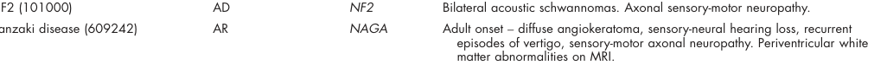

## Question

# Disease Characteristics Research Template

## Target Disease
- **Disease Name:** Kanzaki Disease
- **MONDO ID:**  (if available)
- **Category:** Mendelian

## Research Objectives

Please provide a comprehensive research report on **Kanzaki Disease** covering all of the
disease characteristics listed below. This report will be used to populate a disease knowledge
base entry. Be thorough and cite primary literature (PMID preferred) for all claims.

For each section, **suggested databases/resources** are listed. These are the first places
you should search for information on each topic.

---

### 1. Disease Information
> **Search first:** OMIM, Orphanet, ICD-10/ICD-11, MeSH, PubMed

- What is the disease? Provide a concise overview.
- What are the key identifiers? (OMIM, Orphanet, ICD-10/ICD-11, MeSH, Mondo)
- What are the common synonyms and alternative names?
- Is the information derived from individual patients (e.g., EHR) or aggregated disease-level resources?

### 2. Etiology

- **Disease Causal Factors**: What are the primary causes? (genetic, environmental, infectious, mechanistic)
- **Risk Factors**:
  > **Search first:** PubMed, Cochrane Library, UpToDate, clinical guidelines, ClinVar, ClinGen, GWAS Catalog, PheGenI, CTD, CDC, WHO, epidemiological databases
  - Genetic risk factors (causal variants, susceptibility loci, modifier genes)
  - Environmental risk factors (toxins, lifestyle, occupational exposures, age, sex, family history)
- **Protective Factors**:
  > **Search first:** PubMed, Cochrane Library, clinical trial databases, GWAS Catalog, gnomAD, WHO, CDC, nutrition databases
  - Genetic protective factors (protective variants, modifier alleles)
  - Environmental protective factors (diet, lifestyle, exposures that reduce risk)
- **Gene-Environment Interactions**: How do genetic and environmental factors interact to influence disease?
  > **Search first:** CTD, PubMed, PheGenI, GxE databases

### 3. Phenotypes
> **Search first:** HPO (Human Phenotype Ontology), OMIM, Orphanet, PubMed, clinicaltrials.gov, MedDRA, SNOMED CT, DECIPHER, LOINC

For each phenotype, provide:
- **Phenotype type**: symptoms, clinical signs, physical manifestations, behavioral changes, or laboratory abnormalities
  > For symptoms/signs: HPO, OMIM, Orphanet, PubMed
  > For behavioral changes: HPO, DSM, RDoC (Research Domain Criteria), PubMed
  > For laboratory abnormalities: LOINC, SNOMED CT, LabTests Online, PubMed
- **Phenotype characteristics**:
  > **Search first:** OMIM, Orphanet, HPO, PubMed
  - Age of symptom onset (neonatal, childhood, adult-onset, late-onset)
  - Symptom severity (mild, moderate, severe, variable)
  - Symptom progression (stable, progressive, episodic, fluctuating)
  - Frequency among affected individuals (percentage or qualitative)
- **Quality of life impact**: Effects on daily functioning and well-being (per-phenotype when possible)
  > **Search first:** EQ-5D database, SF-36, WHO QOL databases, PubMed
- Suggest HPO (Human Phenotype Ontology) terms for each phenotype

### 4. Genetic/Molecular Information

- **Causal Genes**: Gene mutations or chromosomal abnormalities responsible for disease (gene symbols, OMIM IDs)
  > **Search first:** OMIM, ClinVar, HGMD, Ensembl, NCBI Gene
- **Pathogenic Variants**:
  - Affected genes (gene symbols, HGNC IDs)
    > **Search first:** OMIM, NCBI Gene, Ensembl, HGNC, UniProt, GeneCards
  - Variant classification (pathogenic, likely pathogenic, VUS per ACMG/AMP guidelines)
    > **Search first:** ClinVar, ClinGen, ACMG/AMP guidelines, VarSome
  - Variant type/class (missense, frameshift, nonsense, splice-site, structural)
  - Allele frequency in population databases
    > **Search first:** gnomAD, 1000 Genomes, ExAC, TOPMed, dbSNP
  - Somatic vs germline origin
    > **Search first:** COSMIC (somatic), ClinVar, ICGC, TCGA
  - Functional consequences (loss of function, gain of function, dominant negative)
- **Modifier Genes**: Genes that modify disease severity or expression
- **Epigenetic Information**: DNA methylation, histone modifications, chromatin changes affecting disease
  > **Search first:** ENCODE, Roadmap Epigenomics, MethBase, DiseaseMeth
- **Chromosomal Abnormalities**: Large-scale genetic changes (aneuploidy, translocations, inversions)
  > **Search first:** DECIPHER, ClinVar, ECARUCA, UCSC Genome Browser

### 5. Environmental Information

- **Environmental Factors**: Non-genetic contributing factors (toxins, radiation, pollution, occupational exposure)
  > **Search first:** CTD (Comparative Toxicogenomics Database), TOXNET, PubMed, EPA databases
- **Lifestyle Factors**: Behavioral factors (smoking, diet, exercise, alcohol consumption)
  > **Search first:** CDC databases, WHO, PubMed, NHANES
- **Infectious Agents**: If applicable, pathogens causing or triggering disease (bacteria, viruses, fungi, parasites)
  > **Search first:** NCBI Taxonomy, ViPR, BV-BRC, MicrobeDB, GIDEON

### 6. Mechanism / Pathophysiology

- **Molecular Pathways**: Specific signaling cascades or biochemical pathways involved (Wnt, MAPK, mTOR, PI3K-AKT, etc.)
  > **Search first:** KEGG, Reactome, WikiPathways, PathBank, BioCyc
- **Cellular Processes**: Cell-level mechanisms (apoptosis, autophagy, cell cycle dysregulation, inflammation, etc.)
  > **Search first:** Gene Ontology (GO), Reactome, KEGG, PubMed
- **Protein Dysfunction**: How protein structure or function is altered (misfolding, aggregation, loss of function, gain of function)
  > **Search first:** UniProt, PDB (Protein Data Bank), InterPro, Pfam, AlphaFold
- **Metabolic Changes**: Alterations in metabolic processes (energy metabolism, lipid metabolism, amino acid metabolism)
  > **Search first:** KEGG, BioCyc, HMDB (Human Metabolome Database), BRENDA
- **Immune System Involvement**: Role of immune response (autoimmunity, immunodeficiency, chronic inflammation)
  > **Search first:** ImmPort, Immunome Database, IEDB, Gene Ontology
- **Tissue Damage Mechanisms**: How tissues/ are injured (oxidative stress, ischemia, fibrosis, necrosis)
  > **Search first:** PubMed, Gene Ontology, Reactome
- **Biochemical Abnormalities**: Specific molecular defects (enzyme deficiencies, receptor dysfunction, ion channel defects)
  > **Search first:** BRENDA, UniProt, KEGG, OMIM, PubMed
- **Epigenetic Changes**: DNA methylation, histone modifications affecting gene expression in disease
  > **Search first:** ENCODE, Roadmap Epigenomics, MethBase, DiseaseMeth
- **Molecular Profiling** (if available):
  - Transcriptomics/gene expression changes
    > **Search first:** GEO (Gene Expression Omnibus), ArrayExpress, GTEx, Human Cell Atlas, SRA
  - Proteomics findings
    > **Search first:** PRIDE, ProteomeXchange, Human Protein Atlas, STRING, BioGRID
  - Metabolomics signatures
    > **Search first:** MetaboLights, Metabolomics Workbench, HMDB, METLIN
  - Lipidomics alterations
    > **Search first:** LIPID MAPS, SwissLipids, LipidHome, Metabolomics Workbench
  - Genomic structural features
    > **Search first:** UCSC Genome Browser, Ensembl, NCBI, dbVar, DGV
- **Advanced Technologies** (if applicable):
  - Single-cell analysis findings (cell-type specific mechanisms, cellular heterogeneity)
    > **Search first:** Human Cell Atlas, Single Cell Portal, GEO, CELLxGENE
  - Spatial transcriptomics findings
    > **Search first:** GEO, Spatial Research, Vizgen, 10x Genomics data
  - Multi-omics integration results
    > **Search first:** TCGA, ICGC, cBioPortal, LinkedOmics, PubMed
  - Functional genomics screens (CRISPR, RNAi)
    > **Search first:** DepMap, GenomeRNAi, PubMed, BioGRID ORCS

For each mechanism, describe:
- The causal chain from initial trigger to clinical manifestation
- Which mechanisms are upstream vs downstream
- What cell types and biological processes are involved
- Suggest GO terms for biological processes and CL terms for cell types

### 7. Anatomical Structures Affected

- **Organ Level**:
  - Primary organs directly affected
  - Secondary organ involvement (complications, secondary effects)
  - Body systems involved (cardiovascular, nervous, digestive, respiratory, endocrine, etc.)
  > **Search first:** Uberon, FMA (Foundational Model of Anatomy), OMIM, HPO, ICD-11, MeSH, SNOMED CT
- **Tissue and Cell Level**:
  - Specific tissue types affected (epithelial, connective, muscle, nervous)
  - Specific cell populations targeted (with Cell Ontology terms)
  > **Search first:** Uberon, Human Protein Atlas, Cell Ontology, Human Cell Atlas, CellMarker, PanglaoDB
- **Subcellular Level**:
  - Cellular compartments involved (mitochondria, nucleus, ER, lysosomes) (with GO Cellular Component terms)
  > **Search first:** Gene Ontology (Cellular Component), UniProt, Human Protein Atlas
- **Localization**:
  - Specific anatomical sites (with UBERON terms)
    > **Search first:** FMA, Uberon, NeuroNames (for brain), SNOMED CT
  - Lateralization (unilateral, bilateral, asymmetric)
    > **Search first:** HPO, clinical literature, imaging databases

### 8. Temporal Development

- **Onset**:
  - Typical age of onset (congenital, pediatric, adult, geriatric)
  - Onset pattern (acute, subacute, chronic, insidious)
  > **Search first:** OMIM, Orphanet, HPO, PubMed
- **Progression**:
  - Disease stages (early, intermediate, advanced, end-stage)
    > **Search first:** Cancer Staging Manual (AJCC), WHO classifications, PubMed
  - Progression rate (rapid, slow, variable)
  - Disease course pattern (episodic, relapsing-remitting, progressive, stable)
  - Disease duration (self-limited, chronic lifelong)
  > **Search first:** Disease registries, longitudinal cohort databases, natural history studies, PubMed, Orphanet, OMIM
- **Patterns**:
  - Remission patterns (spontaneous, treatment-induced)
    > **Search first:** Clinical trial databases, disease registries, PubMed
  - Critical periods (time windows of vulnerability or opportunity for intervention)
    > **Search first:** PubMed, developmental biology databases, clinical guidelines

### 9. Inheritance and Population

- **Epidemiology**:
  - Prevalence (cases per 100,000 at given time)
  - Incidence (new cases per 100,000 per year)
  > **Search first:** Orphanet, CDC, WHO, GBD (Global Burden of Disease), national registries, SEER, disease registries
- **For Genetic Etiology**:
  - Inheritance pattern (AD, AR, X-linked, mitochondrial, multifactorial, polygenic)
    > **Search first:** OMIM, Orphanet, ClinVar, GTR (Genetic Testing Registry)
  - Penetrance (complete, incomplete, age-dependent)
    > **Search first:** ClinVar, OMIM, PubMed, ClinGen
  - Expressivity (variable, consistent)
    > **Search first:** OMIM, ClinVar, PubMed
  - Genetic anticipation (increasing severity in successive generations)
    > **Search first:** OMIM, PubMed (especially for repeat expansion disorders)
  - Germline mosaicism
    > **Search first:** ClinVar, OMIM, genetic counseling literature, PubMed
  - Founder effects (population-specific mutations)
    > **Search first:** gnomAD, population genetics databases, PubMed
  - Consanguinity role
    > **Search first:** OMIM, population studies, genetic counseling resources
  - Carrier frequency
    > **Search first:** gnomAD, carrier screening databases, GeneReviews, GTR
- **Population Demographics**:
  - Affected populations (ethnic or demographic groups with higher prevalence)
    > **Search first:** gnomAD, 1000 Genomes, PAGE Study, PubMed, population registries
  - Geographic distribution (endemic areas, regional variation)
    > **Search first:** WHO, CDC, GBD, Orphanet, geographic epidemiology databases
  - Geographic distribution of specific variants
  - Sex ratio (male:female)
    > **Search first:** Disease registries, OMIM, PubMed, epidemiological databases
  - Age distribution of affected individuals
    > **Search first:** CDC, disease registries, SEER, Orphanet

### 10. Diagnostics

- **Clinical Tests**:
  - Laboratory tests (blood, urine, tissue chemistry, specific enzyme assays)
    > **Search first:** LOINC, LabTests Online, PubMed
  - Biomarkers (proteins, metabolites, genetic markers, circulating biomarkers)
    > **Search first:** FDA Biomarker List, BEST (Biomarkers, EndpointS, and other Tools), PubMed
  - Imaging studies (X-ray, CT, MRI, PET, ultrasound)
    > **Search first:** RadLex, DICOM, Radiopaedia, imaging databases
  - Functional tests (pulmonary function, cardiac stress tests)
    > **Search first:** LOINC, clinical guidelines, PubMed
  - Electrophysiology (EEG, EMG, ECG, nerve conduction studies)
    > **Search first:** LOINC, clinical neurophysiology databases, PubMed
  - Biopsy findings (histopathology, immunohistochemistry)
    > **Search first:** SNOMED CT, College of American Pathologists resources, PubMed
  - Pathology findings (microscopic examination)
    > **Search first:** SNOMED CT, Digital Pathology databases, PubMed
- **Genetic Testing**:
  > **Search first:** GTR (Genetic Testing Registry), GeneReviews, ClinGen
  - Overview of recommended genetic testing approach
  - Whole genome sequencing (WGS) utility
    > **Search first:** GTR, ClinVar, GEL (Genomics England), gnomAD
  - Whole exome sequencing (WES) utility
    > **Search first:** GTR, ClinVar, OMIM, GeneMatcher
  - Gene panels (which panels, which genes)
    > **Search first:** GTR, ClinVar, laboratory-specific databases
  - Single gene testing
    > **Search first:** GTR, ClinVar, OMIM, GeneReviews
  - Chromosomal microarray (CMA)
    > **Search first:** DECIPHER, ClinVar, dbVar, ECARUCA
  - Karyotyping
    > **Search first:** Chromosome Abnormality Database, ClinVar, cytogenetics resources
  - FISH
    > **Search first:** ClinVar, cytogenetics databases, PubMed
  - Mitochondrial DNA testing
    > **Search first:** MITOMAP, MSeqDR, ClinVar, GTR
  - Repeat expansion testing
    > **Search first:** GTR, ClinVar, repeat expansion databases, PubMed
- **Omics-Based Diagnostics** (if applicable):
  - RNA sequencing / transcriptomics
    > **Search first:** GEO, ArrayExpress, GTEx, RNA-seq databases
  - Proteomics
    > **Search first:** PRIDE, ProteomeXchange, FDA Biomarker database
  - Metabolomics
    > **Search first:** MetaboLights, Metabolomics Workbench, HMDB
  - Epigenomics
    > **Search first:** GEO, ENCODE, Roadmap Epigenomics, MethBase
  - Liquid biopsy
    > **Search first:** COSMIC, ClinVar, liquid biopsy databases, PubMed
- **Clinical Criteria**:
  - Standardized diagnostic criteria (DSM, ICD, society guidelines)
    > **Search first:** DSM-5, ICD-11, clinical society guidelines, UpToDate
  - Differential diagnosis (other conditions to rule out, with distinguishing features)
    > **Search first:** DynaMed, UpToDate, clinical decision support systems
- **Screening**:
  - Screening methods for asymptomatic individuals (newborn screening, carrier screening, cascade screening)
    > **Search first:** ACMG recommendations, CDC newborn screening, GTR

### 11. Outcome/Prognosis

- **Survival and Mortality**:
  - Survival rate (5-year, 10-year, overall)
    > **Search first:** SEER, cancer registries, disease-specific registries, PubMed
  - Life expectancy (with and without treatment if applicable)
    > **Search first:** Orphanet, disease registries, actuarial databases, PubMed
  - Mortality rate
    > **Search first:** CDC, WHO, GBD, national mortality databases
  - Disease-specific mortality (deaths directly attributable to disease)
    > **Search first:** Disease registries, CDC Wonder, GBD, PubMed
- **Morbidity and Function**:
  - Morbidity (disease-related disability and health impacts)
    > **Search first:** GBD, WHO, disability databases, PubMed
  - Disability outcomes (long-term functional impairments)
    > **Search first:** ICF (International Classification of Functioning), disability registries
  - Quality of life measures (EQ-5D, SF-36, PROMIS, disease-specific tools)
    > **Search first:** EQ-5D database, SF-36, PROMIS, PubMed
- **Disease Course**:
  - Complications (secondary problems: infections, organ failure, etc.)
    > **Search first:** ICD codes, disease registries, clinical databases, PubMed
  - Recovery potential (likelihood and extent of recovery, with vs without treatment)
    > **Search first:** Natural history studies, rehabilitation databases, PubMed
- **Prediction**:
  - Prognostic factors (age, disease severity, biomarkers, treatment response)
    > **Search first:** Prognostic models databases, clinical calculators, PubMed
  - Prognostic biomarkers (molecular markers predicting disease course)
    > **Search first:** FDA Biomarker database, PubMed, cancer prognostic databases

### 12. Treatment

- **Pharmacotherapy**:
  - Pharmacological treatments (drug names, drug classes, mechanisms of action)
    > **Search first:** DrugBank, RxNorm, ATC classification, DailyMed, FDA databases
  - Pharmacogenomics (how genetic variants affect drug metabolism, efficacy, toxicity)
    > **Search first:** PharmGKB, CPIC (Clinical Pharmacogenetics), FDA Table of PGx Biomarkers
- **Advanced Therapeutics**:
  - Gene therapy (viral vectors, CRISPR, gene replacement, gene editing)
    > **Search first:** ClinicalTrials.gov, FDA gene therapy database, ASGCT resources
  - Cell therapy (stem cell transplant, CAR-T, cellular therapeutics)
    > **Search first:** ClinicalTrials.gov, FDA cell therapy database, FACT standards
  - RNA-based therapies (ASOs, siRNA, mRNA therapies)
    > **Search first:** ClinicalTrials.gov, FDA approvals, PubMed
  - Targeted therapies (treatments directed at specific molecular targets)
    > **Search first:** My Cancer Genome, OncoKB, ClinicalTrials.gov, FDA approvals
  - Immunotherapies (checkpoint inhibitors, monoclonal antibodies)
    > **Search first:** Cancer Immunotherapy Database, FDA approvals, ClinicalTrials.gov
- **Surgical and Interventional**:
  - Surgical interventions (types of surgery, timing, outcomes)
    > **Search first:** CPT codes, surgical registries, clinical guidelines, PubMed
- **Supportive and Rehabilitative**:
  - Supportive care (symptom management, pain control, nutrition)
    > **Search first:** Clinical guidelines, Cochrane Library, PubMed
  - Rehabilitation (physical therapy, occupational therapy, speech therapy)
    > **Search first:** Rehabilitation medicine databases, clinical guidelines, PubMed
- **Experimental**:
  - Experimental treatments in clinical trials (with NCT identifiers if available)
    > **Search first:** ClinicalTrials.gov, EU Clinical Trials Register, WHO ICTRP
- **Treatment Outcomes**:
  - Treatment response rates
    > **Search first:** Clinical trial databases, FDA reviews, systematic reviews, PubMed
  - Side effects and adverse events
    > **Search first:** FDA Adverse Event Reporting System (FAERS), MedWatch, PubMed
- **Treatment Strategy**:
  - Treatment algorithms (clinical pathways, decision trees)
    > **Search first:** Clinical practice guidelines, NCCN Guidelines, UpToDate
  - Combination therapies
    > **Search first:** ClinicalTrials.gov, treatment guidelines, PubMed
  - Personalized medicine approaches (genotype-guided treatment)
    > **Search first:** My Cancer Genome, CIViC, PharmGKB, precision medicine databases

For each treatment, suggest MAXO (Medical Action Ontology) terms where applicable.

### 13. Prevention

- **Prevention Levels**:
  - Primary prevention (preventing disease occurrence: vaccination, risk factor modification)
    > **Search first:** CDC, WHO, USPSTF recommendations, Cochrane Library
  - Secondary prevention (early detection and treatment: screening programs, early intervention)
    > **Search first:** USPSTF, CDC screening guidelines, WHO
  - Tertiary prevention (preventing complications in those with disease)
    > **Search first:** Clinical guidelines, disease management protocols, PubMed
- **Immunization**: Vaccine strategies (if applicable)
  > **Search first:** CDC vaccine schedules, WHO immunization, FDA vaccine database
- **Screening and Early Detection**:
  - Screening programs (population-based: newborn screening, cancer screening)
    > **Search first:** CDC screening programs, USPSTF, cancer screening databases
  - Genetic screening (carrier screening, preimplantation genetic diagnosis, prenatal testing)
    > **Search first:** ACMG recommendations, ACOG guidelines, GTR
  - Risk stratification (identifying high-risk individuals for targeted prevention)
    > **Search first:** Risk prediction models, clinical calculators, PubMed
- **Behavioral Interventions**: Lifestyle modifications to reduce risk
  > **Search first:** CDC, WHO, behavioral intervention databases, Cochrane Library
- **Counseling**: Genetic counseling (risk assessment, family planning guidance)
  > **Search first:** NSGC resources, ACMG guidelines, GeneReviews
- **Public Health**:
  - Public health interventions (sanitation, vector control, health education)
    > **Search first:** CDC, WHO, public health databases, PubMed
  - Environmental interventions (reducing environmental risk factors)
    > **Search first:** EPA databases, WHO environmental health, PubMed
- **Prophylaxis**: Preventive medications or procedures
  > **Search first:** Clinical guidelines, FDA approvals, PubMed

### 14. Other Species / Natural Disease

- **Taxonomy**: Species affected (with NCBI Taxon identifiers)
  > **Search first:** NCBI Taxonomy
- **Breed**: Specific breeds affected (with VBO identifiers if applicable)
  > **Search first:** VBO (Vertebrate Breed Ontology)
- **Gene**: Orthologous genes in other species (with NCBI Gene IDs)
  > **Search first:** NCBI Gene
- **Natural Disease**:
  - Naturally occurring disease in other species (companion animals, wildlife)
    > **Search first:** OMIA (Online Mendelian Inheritance in Animals), VetCompass, PubMed
  - Veterinary relevance and importance in animal health
    > **Search first:** OMIA, veterinary databases, PubMed
- **Comparative Biology**:
  - Comparative pathology (similarities and differences across species)
    > **Search first:** OMIA, comparative pathology databases, PubMed
  - Evolutionary conservation of disease mechanisms
    > **Search first:** HomoloGene, OrthoMCL, Alliance of Genome Resources
- **Transmission** (if applicable):
  - Zoonotic potential
    > **Search first:** CDC zoonotic diseases, WHO zoonoses, GIDEON
  - Cross-species susceptibility
    > **Search first:** NCBI Taxonomy, veterinary databases, PubMed

### 15. Model Organisms

- **Model Types**:
  - Model organism type (mammalian, invertebrate, cellular, in vitro)
    > **Search first:** Alliance of Genome Resources, model organism databases
  - Specific model systems (mouse, rat, zebrafish, Drosophila, C. elegans, yeast, cell lines, organoids, iPSCs)
    > **Search first:** MGI, RGD, ZFIN, FlyBase, WormBase, SGD, ATCC, Cellosaurus
  - Induced models (drug treatment, surgical intervention, environmental manipulation)
    > **Search first:** MGI, model organism databases, PubMed
- **Genetic Models**:
  - Types available (knockout, knock-in, transgenic, conditional, humanized)
    > **Search first:** MGI, IMPC, KOMP, EuMMCR, IMSR
- **Model Characteristics**:
  - Phenotype recapitulation (how well model reproduces human disease features)
    > **Search first:** Model organism databases, comparative studies, PubMed
  - Model limitations (aspects of human disease not captured)
    > **Search first:** Model organism databases, PubMed, review articles
- **Applications**:
  - Research applications (what aspects of disease can be studied)
    > **Search first:** Model organism databases, PubMed
- **Resources**:
  - Model databases
    > **Search first:** MGI, RGD, ZFIN, FlyBase, WormBase, IMSR, EMMA, MMRRC

---

## Citation Requirements

- Cite primary literature (PMID preferred) for all mechanistic and clinical claims
- Prioritize recent reviews and landmark papers
- Include direct quotes from abstracts where possible to support key statements
- Distinguish evidence source types: human clinical, model organism, in vitro, computational

## Output Format

Structure your response as a comprehensive narrative organized by the sections above.
For each section, provide:
- Factual content with specific details (numbers, percentages, gene names, variant nomenclature)
- Ontology term suggestions (HPO, GO, CL, UBERON, CHEBI, MAXO, MONDO) where applicable
- Evidence citations with PMIDs
- Direct quotes from abstracts to support key claims
- Clear indication when information is not available or not applicable for this disease

This report will be used to populate a disease knowledge base entry with:
- Pathophysiology descriptions with causal chains
- Gene/protein annotations (HGNC, GO terms)
- Phenotype associations (HP terms) with frequencies
- Cell type involvement (CL terms)
- Anatomical locations (UBERON terms)
- Chemical entities (CHEBI terms)
- Treatment annotations (MAXO terms)
- Evidence items with PMIDs and exact abstract quotes
- Epidemiology, prognosis, diagnostic, and prevention information
- Animal model descriptions with phenotype recapitulation details

## Output

Question: You are an expert researcher providing comprehensive, well-cited information.

Provide detailed information focusing on:
1. Key concepts and definitions with current understanding
2. Recent developments and latest research (prioritize 2023-2024 sources)
3. Current applications and real-world implementations
4. Expert opinions and analysis from authoritative sources
5. Relevant statistics and data from recent studies

Format as a comprehensive research report with proper citations. Include URLs and publication dates where available.
Always prioritize recent, authoritative sources and provide specific citations for all major claims.

# Disease Characteristics Research Template

## Target Disease
- **Disease Name:** Kanzaki Disease
- **MONDO ID:**  (if available)
- **Category:** Mendelian

## Research Objectives

Please provide a comprehensive research report on **Kanzaki Disease** covering all of the
disease characteristics listed below. This report will be used to populate a disease knowledge
base entry. Be thorough and cite primary literature (PMID preferred) for all claims.

For each section, **suggested databases/resources** are listed. These are the first places
you should search for information on each topic.

---

### 1. Disease Information
> **Search first:** OMIM, Orphanet, ICD-10/ICD-11, MeSH, PubMed

- What is the disease? Provide a concise overview.
- What are the key identifiers? (OMIM, Orphanet, ICD-10/ICD-11, MeSH, Mondo)
- What are the common synonyms and alternative names?
- Is the information derived from individual patients (e.g., EHR) or aggregated disease-level resources?

### 2. Etiology

- **Disease Causal Factors**: What are the primary causes? (genetic, environmental, infectious, mechanistic)
- **Risk Factors**:
  > **Search first:** PubMed, Cochrane Library, UpToDate, clinical guidelines, ClinVar, ClinGen, GWAS Catalog, PheGenI, CTD, CDC, WHO, epidemiological databases
  - Genetic risk factors (causal variants, susceptibility loci, modifier genes)
  - Environmental risk factors (toxins, lifestyle, occupational exposures, age, sex, family history)
- **Protective Factors**:
  > **Search first:** PubMed, Cochrane Library, clinical trial databases, GWAS Catalog, gnomAD, WHO, CDC, nutrition databases
  - Genetic protective factors (protective variants, modifier alleles)
  - Environmental protective factors (diet, lifestyle, exposures that reduce risk)
- **Gene-Environment Interactions**: How do genetic and environmental factors interact to influence disease?
  > **Search first:** CTD, PubMed, PheGenI, GxE databases

### 3. Phenotypes
> **Search first:** HPO (Human Phenotype Ontology), OMIM, Orphanet, PubMed, clinicaltrials.gov, MedDRA, SNOMED CT, DECIPHER, LOINC

For each phenotype, provide:
- **Phenotype type**: symptoms, clinical signs, physical manifestations, behavioral changes, or laboratory abnormalities
  > For symptoms/signs: HPO, OMIM, Orphanet, PubMed
  > For behavioral changes: HPO, DSM, RDoC (Research Domain Criteria), PubMed
  > For laboratory abnormalities: LOINC, SNOMED CT, LabTests Online, PubMed
- **Phenotype characteristics**:
  > **Search first:** OMIM, Orphanet, HPO, PubMed
  - Age of symptom onset (neonatal, childhood, adult-onset, late-onset)
  - Symptom severity (mild, moderate, severe, variable)
  - Symptom progression (stable, progressive, episodic, fluctuating)
  - Frequency among affected individuals (percentage or qualitative)
- **Quality of life impact**: Effects on daily functioning and well-being (per-phenotype when possible)
  > **Search first:** EQ-5D database, SF-36, WHO QOL databases, PubMed
- Suggest HPO (Human Phenotype Ontology) terms for each phenotype

### 4. Genetic/Molecular Information

- **Causal Genes**: Gene mutations or chromosomal abnormalities responsible for disease (gene symbols, OMIM IDs)
  > **Search first:** OMIM, ClinVar, HGMD, Ensembl, NCBI Gene
- **Pathogenic Variants**:
  - Affected genes (gene symbols, HGNC IDs)
    > **Search first:** OMIM, NCBI Gene, Ensembl, HGNC, UniProt, GeneCards
  - Variant classification (pathogenic, likely pathogenic, VUS per ACMG/AMP guidelines)
    > **Search first:** ClinVar, ClinGen, ACMG/AMP guidelines, VarSome
  - Variant type/class (missense, frameshift, nonsense, splice-site, structural)
  - Allele frequency in population databases
    > **Search first:** gnomAD, 1000 Genomes, ExAC, TOPMed, dbSNP
  - Somatic vs germline origin
    > **Search first:** COSMIC (somatic), ClinVar, ICGC, TCGA
  - Functional consequences (loss of function, gain of function, dominant negative)
- **Modifier Genes**: Genes that modify disease severity or expression
- **Epigenetic Information**: DNA methylation, histone modifications, chromatin changes affecting disease
  > **Search first:** ENCODE, Roadmap Epigenomics, MethBase, DiseaseMeth
- **Chromosomal Abnormalities**: Large-scale genetic changes (aneuploidy, translocations, inversions)
  > **Search first:** DECIPHER, ClinVar, ECARUCA, UCSC Genome Browser

### 5. Environmental Information

- **Environmental Factors**: Non-genetic contributing factors (toxins, radiation, pollution, occupational exposure)
  > **Search first:** CTD (Comparative Toxicogenomics Database), TOXNET, PubMed, EPA databases
- **Lifestyle Factors**: Behavioral factors (smoking, diet, exercise, alcohol consumption)
  > **Search first:** CDC databases, WHO, PubMed, NHANES
- **Infectious Agents**: If applicable, pathogens causing or triggering disease (bacteria, viruses, fungi, parasites)
  > **Search first:** NCBI Taxonomy, ViPR, BV-BRC, MicrobeDB, GIDEON

### 6. Mechanism / Pathophysiology

- **Molecular Pathways**: Specific signaling cascades or biochemical pathways involved (Wnt, MAPK, mTOR, PI3K-AKT, etc.)
  > **Search first:** KEGG, Reactome, WikiPathways, PathBank, BioCyc
- **Cellular Processes**: Cell-level mechanisms (apoptosis, autophagy, cell cycle dysregulation, inflammation, etc.)
  > **Search first:** Gene Ontology (GO), Reactome, KEGG, PubMed
- **Protein Dysfunction**: How protein structure or function is altered (misfolding, aggregation, loss of function, gain of function)
  > **Search first:** UniProt, PDB (Protein Data Bank), InterPro, Pfam, AlphaFold
- **Metabolic Changes**: Alterations in metabolic processes (energy metabolism, lipid metabolism, amino acid metabolism)
  > **Search first:** KEGG, BioCyc, HMDB (Human Metabolome Database), BRENDA
- **Immune System Involvement**: Role of immune response (autoimmunity, immunodeficiency, chronic inflammation)
  > **Search first:** ImmPort, Immunome Database, IEDB, Gene Ontology
- **Tissue Damage Mechanisms**: How tissues/ are injured (oxidative stress, ischemia, fibrosis, necrosis)
  > **Search first:** PubMed, Gene Ontology, Reactome
- **Biochemical Abnormalities**: Specific molecular defects (enzyme deficiencies, receptor dysfunction, ion channel defects)
  > **Search first:** BRENDA, UniProt, KEGG, OMIM, PubMed
- **Epigenetic Changes**: DNA methylation, histone modifications affecting gene expression in disease
  > **Search first:** ENCODE, Roadmap Epigenomics, MethBase, DiseaseMeth
- **Molecular Profiling** (if available):
  - Transcriptomics/gene expression changes
    > **Search first:** GEO (Gene Expression Omnibus), ArrayExpress, GTEx, Human Cell Atlas, SRA
  - Proteomics findings
    > **Search first:** PRIDE, ProteomeXchange, Human Protein Atlas, STRING, BioGRID
  - Metabolomics signatures
    > **Search first:** MetaboLights, Metabolomics Workbench, HMDB, METLIN
  - Lipidomics alterations
    > **Search first:** LIPID MAPS, SwissLipids, LipidHome, Metabolomics Workbench
  - Genomic structural features
    > **Search first:** UCSC Genome Browser, Ensembl, NCBI, dbVar, DGV
- **Advanced Technologies** (if applicable):
  - Single-cell analysis findings (cell-type specific mechanisms, cellular heterogeneity)
    > **Search first:** Human Cell Atlas, Single Cell Portal, GEO, CELLxGENE
  - Spatial transcriptomics findings
    > **Search first:** GEO, Spatial Research, Vizgen, 10x Genomics data
  - Multi-omics integration results
    > **Search first:** TCGA, ICGC, cBioPortal, LinkedOmics, PubMed
  - Functional genomics screens (CRISPR, RNAi)
    > **Search first:** DepMap, GenomeRNAi, PubMed, BioGRID ORCS

For each mechanism, describe:
- The causal chain from initial trigger to clinical manifestation
- Which mechanisms are upstream vs downstream
- What cell types and biological processes are involved
- Suggest GO terms for biological processes and CL terms for cell types

### 7. Anatomical Structures Affected

- **Organ Level**:
  - Primary organs directly affected
  - Secondary organ involvement (complications, secondary effects)
  - Body systems involved (cardiovascular, nervous, digestive, respiratory, endocrine, etc.)
  > **Search first:** Uberon, FMA (Foundational Model of Anatomy), OMIM, HPO, ICD-11, MeSH, SNOMED CT
- **Tissue and Cell Level**:
  - Specific tissue types affected (epithelial, connective, muscle, nervous)
  - Specific cell populations targeted (with Cell Ontology terms)
  > **Search first:** Uberon, Human Protein Atlas, Cell Ontology, Human Cell Atlas, CellMarker, PanglaoDB
- **Subcellular Level**:
  - Cellular compartments involved (mitochondria, nucleus, ER, lysosomes) (with GO Cellular Component terms)
  > **Search first:** Gene Ontology (Cellular Component), UniProt, Human Protein Atlas
- **Localization**:
  - Specific anatomical sites (with UBERON terms)
    > **Search first:** FMA, Uberon, NeuroNames (for brain), SNOMED CT
  - Lateralization (unilateral, bilateral, asymmetric)
    > **Search first:** HPO, clinical literature, imaging databases

### 8. Temporal Development

- **Onset**:
  - Typical age of onset (congenital, pediatric, adult, geriatric)
  - Onset pattern (acute, subacute, chronic, insidious)
  > **Search first:** OMIM, Orphanet, HPO, PubMed
- **Progression**:
  - Disease stages (early, intermediate, advanced, end-stage)
    > **Search first:** Cancer Staging Manual (AJCC), WHO classifications, PubMed
  - Progression rate (rapid, slow, variable)
  - Disease course pattern (episodic, relapsing-remitting, progressive, stable)
  - Disease duration (self-limited, chronic lifelong)
  > **Search first:** Disease registries, longitudinal cohort databases, natural history studies, PubMed, Orphanet, OMIM
- **Patterns**:
  - Remission patterns (spontaneous, treatment-induced)
    > **Search first:** Clinical trial databases, disease registries, PubMed
  - Critical periods (time windows of vulnerability or opportunity for intervention)
    > **Search first:** PubMed, developmental biology databases, clinical guidelines

### 9. Inheritance and Population

- **Epidemiology**:
  - Prevalence (cases per 100,000 at given time)
  - Incidence (new cases per 100,000 per year)
  > **Search first:** Orphanet, CDC, WHO, GBD (Global Burden of Disease), national registries, SEER, disease registries
- **For Genetic Etiology**:
  - Inheritance pattern (AD, AR, X-linked, mitochondrial, multifactorial, polygenic)
    > **Search first:** OMIM, Orphanet, ClinVar, GTR (Genetic Testing Registry)
  - Penetrance (complete, incomplete, age-dependent)
    > **Search first:** ClinVar, OMIM, PubMed, ClinGen
  - Expressivity (variable, consistent)
    > **Search first:** OMIM, ClinVar, PubMed
  - Genetic anticipation (increasing severity in successive generations)
    > **Search first:** OMIM, PubMed (especially for repeat expansion disorders)
  - Germline mosaicism
    > **Search first:** ClinVar, OMIM, genetic counseling literature, PubMed
  - Founder effects (population-specific mutations)
    > **Search first:** gnomAD, population genetics databases, PubMed
  - Consanguinity role
    > **Search first:** OMIM, population studies, genetic counseling resources
  - Carrier frequency
    > **Search first:** gnomAD, carrier screening databases, GeneReviews, GTR
- **Population Demographics**:
  - Affected populations (ethnic or demographic groups with higher prevalence)
    > **Search first:** gnomAD, 1000 Genomes, PAGE Study, PubMed, population registries
  - Geographic distribution (endemic areas, regional variation)
    > **Search first:** WHO, CDC, GBD, Orphanet, geographic epidemiology databases
  - Geographic distribution of specific variants
  - Sex ratio (male:female)
    > **Search first:** Disease registries, OMIM, PubMed, epidemiological databases
  - Age distribution of affected individuals
    > **Search first:** CDC, disease registries, SEER, Orphanet

### 10. Diagnostics

- **Clinical Tests**:
  - Laboratory tests (blood, urine, tissue chemistry, specific enzyme assays)
    > **Search first:** LOINC, LabTests Online, PubMed
  - Biomarkers (proteins, metabolites, genetic markers, circulating biomarkers)
    > **Search first:** FDA Biomarker List, BEST (Biomarkers, EndpointS, and other Tools), PubMed
  - Imaging studies (X-ray, CT, MRI, PET, ultrasound)
    > **Search first:** RadLex, DICOM, Radiopaedia, imaging databases
  - Functional tests (pulmonary function, cardiac stress tests)
    > **Search first:** LOINC, clinical guidelines, PubMed
  - Electrophysiology (EEG, EMG, ECG, nerve conduction studies)
    > **Search first:** LOINC, clinical neurophysiology databases, PubMed
  - Biopsy findings (histopathology, immunohistochemistry)
    > **Search first:** SNOMED CT, College of American Pathologists resources, PubMed
  - Pathology findings (microscopic examination)
    > **Search first:** SNOMED CT, Digital Pathology databases, PubMed
- **Genetic Testing**:
  > **Search first:** GTR (Genetic Testing Registry), GeneReviews, ClinGen
  - Overview of recommended genetic testing approach
  - Whole genome sequencing (WGS) utility
    > **Search first:** GTR, ClinVar, GEL (Genomics England), gnomAD
  - Whole exome sequencing (WES) utility
    > **Search first:** GTR, ClinVar, OMIM, GeneMatcher
  - Gene panels (which panels, which genes)
    > **Search first:** GTR, ClinVar, laboratory-specific databases
  - Single gene testing
    > **Search first:** GTR, ClinVar, OMIM, GeneReviews
  - Chromosomal microarray (CMA)
    > **Search first:** DECIPHER, ClinVar, dbVar, ECARUCA
  - Karyotyping
    > **Search first:** Chromosome Abnormality Database, ClinVar, cytogenetics resources
  - FISH
    > **Search first:** ClinVar, cytogenetics databases, PubMed
  - Mitochondrial DNA testing
    > **Search first:** MITOMAP, MSeqDR, ClinVar, GTR
  - Repeat expansion testing
    > **Search first:** GTR, ClinVar, repeat expansion databases, PubMed
- **Omics-Based Diagnostics** (if applicable):
  - RNA sequencing / transcriptomics
    > **Search first:** GEO, ArrayExpress, GTEx, RNA-seq databases
  - Proteomics
    > **Search first:** PRIDE, ProteomeXchange, FDA Biomarker database
  - Metabolomics
    > **Search first:** MetaboLights, Metabolomics Workbench, HMDB
  - Epigenomics
    > **Search first:** GEO, ENCODE, Roadmap Epigenomics, MethBase
  - Liquid biopsy
    > **Search first:** COSMIC, ClinVar, liquid biopsy databases, PubMed
- **Clinical Criteria**:
  - Standardized diagnostic criteria (DSM, ICD, society guidelines)
    > **Search first:** DSM-5, ICD-11, clinical society guidelines, UpToDate
  - Differential diagnosis (other conditions to rule out, with distinguishing features)
    > **Search first:** DynaMed, UpToDate, clinical decision support systems
- **Screening**:
  - Screening methods for asymptomatic individuals (newborn screening, carrier screening, cascade screening)
    > **Search first:** ACMG recommendations, CDC newborn screening, GTR

### 11. Outcome/Prognosis

- **Survival and Mortality**:
  - Survival rate (5-year, 10-year, overall)
    > **Search first:** SEER, cancer registries, disease-specific registries, PubMed
  - Life expectancy (with and without treatment if applicable)
    > **Search first:** Orphanet, disease registries, actuarial databases, PubMed
  - Mortality rate
    > **Search first:** CDC, WHO, GBD, national mortality databases
  - Disease-specific mortality (deaths directly attributable to disease)
    > **Search first:** Disease registries, CDC Wonder, GBD, PubMed
- **Morbidity and Function**:
  - Morbidity (disease-related disability and health impacts)
    > **Search first:** GBD, WHO, disability databases, PubMed
  - Disability outcomes (long-term functional impairments)
    > **Search first:** ICF (International Classification of Functioning), disability registries
  - Quality of life measures (EQ-5D, SF-36, PROMIS, disease-specific tools)
    > **Search first:** EQ-5D database, SF-36, PROMIS, PubMed
- **Disease Course**:
  - Complications (secondary problems: infections, organ failure, etc.)
    > **Search first:** ICD codes, disease registries, clinical databases, PubMed
  - Recovery potential (likelihood and extent of recovery, with vs without treatment)
    > **Search first:** Natural history studies, rehabilitation databases, PubMed
- **Prediction**:
  - Prognostic factors (age, disease severity, biomarkers, treatment response)
    > **Search first:** Prognostic models databases, clinical calculators, PubMed
  - Prognostic biomarkers (molecular markers predicting disease course)
    > **Search first:** FDA Biomarker database, PubMed, cancer prognostic databases

### 12. Treatment

- **Pharmacotherapy**:
  - Pharmacological treatments (drug names, drug classes, mechanisms of action)
    > **Search first:** DrugBank, RxNorm, ATC classification, DailyMed, FDA databases
  - Pharmacogenomics (how genetic variants affect drug metabolism, efficacy, toxicity)
    > **Search first:** PharmGKB, CPIC (Clinical Pharmacogenetics), FDA Table of PGx Biomarkers
- **Advanced Therapeutics**:
  - Gene therapy (viral vectors, CRISPR, gene replacement, gene editing)
    > **Search first:** ClinicalTrials.gov, FDA gene therapy database, ASGCT resources
  - Cell therapy (stem cell transplant, CAR-T, cellular therapeutics)
    > **Search first:** ClinicalTrials.gov, FDA cell therapy database, FACT standards
  - RNA-based therapies (ASOs, siRNA, mRNA therapies)
    > **Search first:** ClinicalTrials.gov, FDA approvals, PubMed
  - Targeted therapies (treatments directed at specific molecular targets)
    > **Search first:** My Cancer Genome, OncoKB, ClinicalTrials.gov, FDA approvals
  - Immunotherapies (checkpoint inhibitors, monoclonal antibodies)
    > **Search first:** Cancer Immunotherapy Database, FDA approvals, ClinicalTrials.gov
- **Surgical and Interventional**:
  - Surgical interventions (types of surgery, timing, outcomes)
    > **Search first:** CPT codes, surgical registries, clinical guidelines, PubMed
- **Supportive and Rehabilitative**:
  - Supportive care (symptom management, pain control, nutrition)
    > **Search first:** Clinical guidelines, Cochrane Library, PubMed
  - Rehabilitation (physical therapy, occupational therapy, speech therapy)
    > **Search first:** Rehabilitation medicine databases, clinical guidelines, PubMed
- **Experimental**:
  - Experimental treatments in clinical trials (with NCT identifiers if available)
    > **Search first:** ClinicalTrials.gov, EU Clinical Trials Register, WHO ICTRP
- **Treatment Outcomes**:
  - Treatment response rates
    > **Search first:** Clinical trial databases, FDA reviews, systematic reviews, PubMed
  - Side effects and adverse events
    > **Search first:** FDA Adverse Event Reporting System (FAERS), MedWatch, PubMed
- **Treatment Strategy**:
  - Treatment algorithms (clinical pathways, decision trees)
    > **Search first:** Clinical practice guidelines, NCCN Guidelines, UpToDate
  - Combination therapies
    > **Search first:** ClinicalTrials.gov, treatment guidelines, PubMed
  - Personalized medicine approaches (genotype-guided treatment)
    > **Search first:** My Cancer Genome, CIViC, PharmGKB, precision medicine databases

For each treatment, suggest MAXO (Medical Action Ontology) terms where applicable.

### 13. Prevention

- **Prevention Levels**:
  - Primary prevention (preventing disease occurrence: vaccination, risk factor modification)
    > **Search first:** CDC, WHO, USPSTF recommendations, Cochrane Library
  - Secondary prevention (early detection and treatment: screening programs, early intervention)
    > **Search first:** USPSTF, CDC screening guidelines, WHO
  - Tertiary prevention (preventing complications in those with disease)
    > **Search first:** Clinical guidelines, disease management protocols, PubMed
- **Immunization**: Vaccine strategies (if applicable)
  > **Search first:** CDC vaccine schedules, WHO immunization, FDA vaccine database
- **Screening and Early Detection**:
  - Screening programs (population-based: newborn screening, cancer screening)
    > **Search first:** CDC screening programs, USPSTF, cancer screening databases
  - Genetic screening (carrier screening, preimplantation genetic diagnosis, prenatal testing)
    > **Search first:** ACMG recommendations, ACOG guidelines, GTR
  - Risk stratification (identifying high-risk individuals for targeted prevention)
    > **Search first:** Risk prediction models, clinical calculators, PubMed
- **Behavioral Interventions**: Lifestyle modifications to reduce risk
  > **Search first:** CDC, WHO, behavioral intervention databases, Cochrane Library
- **Counseling**: Genetic counseling (risk assessment, family planning guidance)
  > **Search first:** NSGC resources, ACMG guidelines, GeneReviews
- **Public Health**:
  - Public health interventions (sanitation, vector control, health education)
    > **Search first:** CDC, WHO, public health databases, PubMed
  - Environmental interventions (reducing environmental risk factors)
    > **Search first:** EPA databases, WHO environmental health, PubMed
- **Prophylaxis**: Preventive medications or procedures
  > **Search first:** Clinical guidelines, FDA approvals, PubMed

### 14. Other Species / Natural Disease

- **Taxonomy**: Species affected (with NCBI Taxon identifiers)
  > **Search first:** NCBI Taxonomy
- **Breed**: Specific breeds affected (with VBO identifiers if applicable)
  > **Search first:** VBO (Vertebrate Breed Ontology)
- **Gene**: Orthologous genes in other species (with NCBI Gene IDs)
  > **Search first:** NCBI Gene
- **Natural Disease**:
  - Naturally occurring disease in other species (companion animals, wildlife)
    > **Search first:** OMIA (Online Mendelian Inheritance in Animals), VetCompass, PubMed
  - Veterinary relevance and importance in animal health
    > **Search first:** OMIA, veterinary databases, PubMed
- **Comparative Biology**:
  - Comparative pathology (similarities and differences across species)
    > **Search first:** OMIA, comparative pathology databases, PubMed
  - Evolutionary conservation of disease mechanisms
    > **Search first:** HomoloGene, OrthoMCL, Alliance of Genome Resources
- **Transmission** (if applicable):
  - Zoonotic potential
    > **Search first:** CDC zoonotic diseases, WHO zoonoses, GIDEON
  - Cross-species susceptibility
    > **Search first:** NCBI Taxonomy, veterinary databases, PubMed

### 15. Model Organisms

- **Model Types**:
  - Model organism type (mammalian, invertebrate, cellular, in vitro)
    > **Search first:** Alliance of Genome Resources, model organism databases
  - Specific model systems (mouse, rat, zebrafish, Drosophila, C. elegans, yeast, cell lines, organoids, iPSCs)
    > **Search first:** MGI, RGD, ZFIN, FlyBase, WormBase, SGD, ATCC, Cellosaurus
  - Induced models (drug treatment, surgical intervention, environmental manipulation)
    > **Search first:** MGI, model organism databases, PubMed
- **Genetic Models**:
  - Types available (knockout, knock-in, transgenic, conditional, humanized)
    > **Search first:** MGI, IMPC, KOMP, EuMMCR, IMSR
- **Model Characteristics**:
  - Phenotype recapitulation (how well model reproduces human disease features)
    > **Search first:** Model organism databases, comparative studies, PubMed
  - Model limitations (aspects of human disease not captured)
    > **Search first:** Model organism databases, PubMed, review articles
- **Applications**:
  - Research applications (what aspects of disease can be studied)
    > **Search first:** Model organism databases, PubMed
- **Resources**:
  - Model databases
    > **Search first:** MGI, RGD, ZFIN, FlyBase, WormBase, IMSR, EMMA, MMRRC

---

## Citation Requirements

- Cite primary literature (PMID preferred) for all mechanistic and clinical claims
- Prioritize recent reviews and landmark papers
- Include direct quotes from abstracts where possible to support key statements
- Distinguish evidence source types: human clinical, model organism, in vitro, computational

## Output Format

Structure your response as a comprehensive narrative organized by the sections above.
For each section, provide:
- Factual content with specific details (numbers, percentages, gene names, variant nomenclature)
- Ontology term suggestions (HPO, GO, CL, UBERON, CHEBI, MAXO, MONDO) where applicable
- Evidence citations with PMIDs
- Direct quotes from abstracts to support key claims
- Clear indication when information is not available or not applicable for this disease

This report will be used to populate a disease knowledge base entry with:
- Pathophysiology descriptions with causal chains
- Gene/protein annotations (HGNC, GO terms)
- Phenotype associations (HP terms) with frequencies
- Cell type involvement (CL terms)
- Anatomical locations (UBERON terms)
- Chemical entities (CHEBI terms)
- Treatment annotations (MAXO terms)
- Evidence items with PMIDs and exact abstract quotes
- Epidemiology, prognosis, diagnostic, and prevention information
- Animal model descriptions with phenotype recapitulation details

## Comprehensive Research Report: Kanzaki Disease (Schindler disease type II; α-N-acetylgalactosaminidase deficiency type 2)

### Executive summary
Kanzaki disease is an ultra-rare, autosomal recessive lysosomal storage disorder (LSD) on the Schindler disease spectrum caused by biallelic pathogenic variants in **NAGA**, encoding the lysosomal exoglycosidase **α-N-acetylgalactosaminidase (α-NAGA/α-NAGAL; EC 3.2.1.49)**. The adult-onset phenotype is classically dominated by **angiokeratoma corporis diffusum**, **lymphedema**, **sensorineural hearing loss**, **vertigo**, and **peripheral neuropathy**, with variable cognitive/white matter involvement. Diagnosis relies on low α-NAGA enzymatic activity, urinary oligosaccharide/glycopeptide abnormalities, and confirmatory molecular testing. No disease-modifying therapy is established; management is supportive, with pharmacological chaperones discussed as theoretical/experimental options. (castro2019anewcase pages 1-3, rossor2024theevolvingspectrum pages 10-12, rossor2024theevolvingspectrum media e968f4f1, groopman2024assessmentofgenes pages 8-11)

---

## 1. Disease information

### 1.1 What is the disease? (overview)
Schindler disease is an autosomal recessive LSD caused by defective or absent α-NAGA activity, with three main phenotypes (types I–III). **Type II is Kanzaki disease**, an adult-onset, typically milder phenotype compared with infantile neuroaxonal dystrophy (type I). (castro2019anewcase pages 1-3, asadi2021theroleof pages 1-3)

A representative adult case (68-year-old man) presented with **axonal/demyelinating polyneuropathy**, **sensorineural hearing loss**, **chronic lymphedema**, **angiokeratoma corporis diffusum**, and **carpal tunnel syndrome**, and molecular testing confirmed a homozygous nonsense variant in **NAGA**. (castro2019anewcase pages 1-3, castro2019anewcase pages 3-3)

### 1.2 Key identifiers (and gaps in retrieved sources)
| Concept | Value | Notes | Primary supporting source (with citation id) |
|---|---|---|---|
| Disease name | Kanzaki disease | Adult-onset, milder phenotype within the Schindler disease spectrum; a lysosomal storage disorder due to alpha-N-acetylgalactosaminidase deficiency. | Rossor 2024 table entry; Castro 2019 definition (rossor2024theevolvingspectrum pages 10-12, castro2019anewcase pages 1-3) |
| Synonym | Schindler disease type II | Explicitly equated with Kanzaki disease in retrieved sources. | Asadi 2021; Castro 2019 (asadi2021theroleof pages 1-3, castro2019anewcase pages 1-3) |
| Synonym | Alpha-N-acetylgalactosaminidase deficiency type 2 | MONDO/Open Targets naming for the type 2 subtype corresponding to Kanzaki disease. | Open Targets / MONDO mapping (OpenTargets Search: Kanzaki disease,Schindler disease-NAGA) |
| Broader disease term | Alpha-N-acetylgalactosaminidase deficiency | Parent disease term spanning types 1–3; Kanzaki disease is type 2. | Open Targets / MONDO mapping; Castro 2019 (OpenTargets Search: Kanzaki disease,Schindler disease-NAGA, castro2019anewcase pages 1-3) |
| Broader disease term | Schindler disease | Broader clinical label for the spectrum; types I–III described in retrieved literature. | Castro 2019; Asadi 2021 (castro2019anewcase pages 1-3, asadi2021theroleof pages 1-3) |
| OMIM | 609242 | Rossor 2024 lists Kanzaki disease with OMIM 609242 and AR inheritance linked to NAGA. | Rossor 2024 (rossor2024theevolvingspectrum pages 10-12) |
| MONDO | MONDO:0012222 | Open Targets lists “alpha-N-acetylgalactosaminidase deficiency type 2,” corresponding to Kanzaki disease / Schindler disease type II. | Open Targets / MONDO mapping (OpenTargets Search: Kanzaki disease,Schindler disease-NAGA) |
| MONDO (parent term) | MONDO:0017779 | Parent disease term: alpha-N-acetylgalactosaminidase deficiency. | Open Targets / MONDO mapping (OpenTargets Search: Kanzaki disease,Schindler disease-NAGA) |
| MONDO (related subtype) | MONDO:0012221 | Type 1 subtype of alpha-N-acetylgalactosaminidase deficiency; related but not Kanzaki disease. Included for ontology context. | Open Targets / MONDO mapping (OpenTargets Search: Kanzaki disease,Schindler disease-NAGA) |
| MONDO (related subtype) | MONDO:0019264 | Type 3 subtype of alpha-N-acetylgalactosaminidase deficiency; related but not Kanzaki disease. Included for ontology context. | Open Targets / MONDO mapping (OpenTargets Search: Kanzaki disease,Schindler disease-NAGA) |
| Causal gene | NAGA | NAGA encodes alpha-N-acetylgalactosaminidase; causative gene for Schindler/Kanzaki disease spectrum. | Asadi 2021; Rossor 2024; Open Targets (asadi2021theroleof pages 1-3, rossor2024theevolvingspectrum pages 10-12, OpenTargets Search: Kanzaki disease,Schindler disease-NAGA) |
| Inheritance | Autosomal recessive | Explicitly reported for Kanzaki disease / Schindler disease type II. | Rossor 2024; Asadi 2021 (rossor2024theevolvingspectrum pages 10-12, asadi2021theroleof pages 1-3) |
| ICD-10 | Not found in retrieved sources | Direct ICD query needed; no ICD identifier was present in the retrieved evidence. | No identifier in retrieved evidence set (OpenTargets Search: Kanzaki disease,Schindler disease-NAGA, rossor2024theevolvingspectrum pages 10-12) |
| ICD-11 | Not found in retrieved sources | Direct ICD query needed; no ICD-11 identifier was present in the retrieved evidence. | No identifier in retrieved evidence set (OpenTargets Search: Kanzaki disease,Schindler disease-NAGA, rossor2024theevolvingspectrum pages 10-12) |
| MeSH | Not found in retrieved sources | Direct MeSH query needed; not reported in retrieved papers/platform evidence. | No identifier in retrieved evidence set (castro2019anewcase pages 1-3, OpenTargets Search: Kanzaki disease,Schindler disease-NAGA) |
| Orphanet | Not found in retrieved sources | Direct Orphanet query needed; Open Targets notes Orphanet as an evidence source but no Orphanet ID was exposed in the retrieved output. | Open Targets evidence summary (OpenTargets Search: Kanzaki disease,Schindler disease-NAGA) |

*Table: This table summarizes the main names and ontology/database identifiers retrieved for Kanzaki disease, including its relationship to Schindler disease type II and alpha-N-acetylgalactosaminidase deficiency type 2. It highlights which identifiers were directly supported by retrieved evidence and which require follow-up database queries.*

Key identifiers supported in retrieved evidence include:
- **OMIM: 609242** (Kanzaki disease) (rossor2024theevolvingspectrum pages 10-12, rossor2024theevolvingspectrum media e968f4f1)
- **MONDO:0012222** (α-N-acetylgalactosaminidase deficiency type 2), with parent term **MONDO:0017779** (α-N-acetylgalactosaminidase deficiency) (OpenTargets Search: Kanzaki disease,Schindler disease-NAGA)

**ICD-10/ICD-11/MeSH/Orphanet identifiers were not present in the retrieved full-text excerpts**, and would require direct database queries. (OpenTargets Search: Kanzaki disease,Schindler disease-NAGA)

### 1.3 Synonyms / alternative names
Kanzaki disease is consistently treated as synonymous with:
- **Schindler disease type II** (asadi2021theroleof pages 1-3, castro2019anewcase pages 1-3)
- **α-N-acetylgalactosaminidase deficiency type 2** (OpenTargets Search: Kanzaki disease,Schindler disease-NAGA)

### 1.4 Evidence sources (patient-level vs aggregated)
- **Patient-level**: case report evidence including detailed phenotyping and a confirmed NAGA variant (e.g., the 68-year-old case). (castro2019anewcase pages 1-3, castro2019anewcase pages 3-3)
- **Aggregated**: ClinGen gene curation framework (2024), Open Targets/MONDO mapping, and expert reviews/tables. (groopman2024assessmentofgenes pages 8-11, OpenTargets Search: Kanzaki disease,Schindler disease-NAGA, rossor2024theevolvingspectrum pages 10-12)

---

## 2. Etiology

### 2.1 Primary causal factors
**Genetic cause**: biallelic pathogenic variants in **NAGA** lead to loss of α-NAGA function and lysosomal substrate accumulation. (castro2019anewcase pages 1-3, asadi2021theroleof pages 1-3, groopman2024assessmentofgenes pages 8-11)

### 2.2 Risk factors
- **Genetic**: autosomal recessive inheritance; affected individuals carry **two pathogenic alleles**. (asadi2021theroleof pages 1-3, rossor2024theevolvingspectrum pages 10-12)
- **Modifier factors**: evidence suggests **marked genotype–phenotype variability**; α-NAGA deficiency alone may not fully explain clinical heterogeneity, and residual enzyme activity may not correlate tightly with severity. (lukacs2022oligosaccharidosesandsialic pages 1-3, sakuraba2004structuralandimmunocytochemical pages 1-2)
- **ABO blood group A**: one clinical source notes that blood group A may confer worse prognosis because the A antigen terminal residue is a substrate for α-NAGA (uncleaved in deficiency). (castro2019anewcase pages 1-3)

### 2.3 Protective factors / gene–environment interactions
No protective environmental or genetic factors, or gene–environment interactions, were identified in the retrieved sources.

---

## 3. Phenotypes

### 3.1 Core phenotype spectrum (adult Kanzaki disease)
A recent neuropathy-focused review lists Kanzaki disease (OMIM 609242; AR; NAGA) with: **adult-onset diffuse angiokeratoma**, **sensorineural hearing loss**, **recurrent vertigo**, **sensory-motor axonal neuropathy**, and **periventricular white matter abnormalities on MRI**. (rossor2024theevolvingspectrum pages 10-12, rossor2024theevolvingspectrum media e968f4f1)

A clinical case report further emphasizes **lymphedema** and systemic features, and provides histologic confirmation of angiokeratomas. (castro2019anewcase pages 1-3)

| Phenotype (plain language) | Suggested HPO term(s) | Typical onset/course | Evidence notes | Supporting citation ids |
|---|---|---|---|---|
| Diffuse angiokeratoma / angiokeratoma corporis diffusum | HP:0001056 Angiokeratoma | Adult-onset; chronic; frequency unknown/variable | A hallmark cutaneous feature of Kanzaki disease/Schindler type II; reported as diffuse angiokeratoma or angiokeratoma corporis diffusum in adult patients. Included in Rossor 2024 table and Castro 2019 case description. | (castro2019anewcase pages 1-3, rossor2024theevolvingspectrum pages 10-12, rossor2024theevolvingspectrum media e968f4f1) |
| Chronic lymphedema | HP:0001004 Lymphedema | Adult-onset; progressive/chronic; frequency unknown/variable | Castro 2019 describes chronic lymphoedema as a key feature of the adult phenotype and in the reported 68-year-old case. | (castro2019anewcase pages 1-3, castro2019anewcase pages 3-3) |
| Sensorineural hearing loss | HP:0000407 Sensorineural hearing impairment | Adult-onset; chronic; frequency unknown/variable | Recurrently reported in type II/Kanzaki disease; present in the Castro 2019 case and listed in Rossor 2024. | (castro2019anewcase pages 1-3, castro2019anewcase pages 3-3, rossor2024theevolvingspectrum pages 10-12, rossor2024theevolvingspectrum media e968f4f1) |
| Recurrent vertigo | HP:0002321 Vertigo | Adult-onset; episodic/recurrent; frequency unknown/variable | Rossor 2024 lists recurrent vertigo; Castro 2019 notes recurrent vertigo among neurologic manifestations described for type II disease. | (castro2019anewcase pages 1-3, rossor2024theevolvingspectrum pages 10-12, rossor2024theevolvingspectrum media e968f4f1) |
| Peripheral neuropathy / sensory-motor axonal neuropathy | HP:0009830 Peripheral neuropathy; HP:0003447 Axonal neuropathy | Adult-onset; chronic/progressive; frequency unknown/variable | Type II disease includes peripheral neuropathy; Rossor 2024 specifies sensory-motor axonal neuropathy, while Castro 2019 reports axonal and demyelinating polyneuropathy. | (castro2019anewcase pages 1-3, castro2019anewcase pages 3-3, rossor2024theevolvingspectrum pages 10-12, rossor2024theevolvingspectrum media e968f4f1) |
| White matter abnormalities on brain MRI | HP:0002500 Abnormal cerebral white matter morphology; HP:0007045 Periventricular white matter abnormalities | Adult presentation; course unclear; frequency unknown/variable | Rossor 2024 specifically reports periventricular white matter abnormalities on MRI in Kanzaki disease. | (rossor2024theevolvingspectrum pages 10-12, rossor2024theevolvingspectrum media e968f4f1) |
| Mild cognitive impairment / cognitive decline | HP:0001263 Global developmental delay (not ideal for adults); HP:0100543 Cognitive impairment | Usually adult-onset when present; mild/variable; frequency unknown/variable | Adult type II is described as milder; Makridou 2025 notes mild cognitive decline, and Asadi 2021 notes mild cognitive impairment among typical adult features. | (makridou2025mappinglysosomalstorage pages 10-12, asadi2021theroleof pages 1-3) |
| Lymphadenopathy | HP:0002716 Lymphadenopathy | Adult-onset; chronic/variable; frequency unknown/variable | Makridou 2025 includes lymphadenopathy/lymph node involvement among clinical features of Kanzaki disease. | (makridou2025mappinglysosomalstorage pages 10-12) |
| Neurological weakness | HP:0001324 Muscle weakness | Adult-onset; variable; frequency unknown/variable | Asadi 2021 describes neurological weakness as part of the milder adult phenotype. | (asadi2021theroleof pages 1-3) |
| Recurrent carpal tunnel syndrome / entrapment neuropathy | HP:0009834 Carpal tunnel syndrome | Adult-onset; chronic/recurrent; frequency unknown/variable | Reported in the Castro 2019 case as bilateral carpal tunnel syndrome, likely part of peripheral nerve involvement rather than a universal feature. | (castro2019anewcase pages 1-3) |
| Cardiac enlargement / hypertrophy | HP:0001642 Cardiac hypertrophy; HP:0001627 Abnormal cardiac morphology | Adult-onset when present; variable; frequency unknown/variable | Castro 2019 notes that type II disease can include cardiac enlargement; structural variant reviews also associate some NAGA variants with cardiac hypertrophy. | (castro2019anewcase pages 1-3, meshach2018explorationofstructural pages 1-2) |

*Table: This table summarizes the major reported clinical phenotypes of Kanzaki disease (Schindler disease type II), emphasizing adult-onset cutaneous, neurologic, lymphatic, and imaging findings. It is designed to support phenotype curation with suggested HPO mappings and source-linked evidence.*

### 3.2 Age of onset, progression, severity
- **Onset**: Kanzaki disease is typically **adult-onset**. (castro2019anewcase pages 1-3, rossor2024theevolvingspectrum pages 10-12)
- **Course**: can be chronic/progressive for some manifestations (e.g., slowly progressive lymphedema in a documented adult). (castro2019anewcase pages 3-3)
- **Severity**: variable; some patients show mild cognitive issues, whereas others have prominent neuropathy/hearing loss/skin findings. (makridou2025mappinglysosomalstorage pages 10-12, rossor2024theevolvingspectrum pages 10-12)

### 3.3 Quality of life impact
Direct QoL instrument data (e.g., SF-36/EQ-5D) were not found in retrieved sources. However, neuropathic pain and progressive lymphedema can plausibly impair function; one case required analgesia on demand for neuropathic pain. (castro2019anewcase pages 1-3)

---

## 4. Genetic / molecular information

### 4.1 Causal gene
- **NAGA** encodes **α-N-acetylgalactosaminidase (α-NAGAL/α-NAGA)**; deficiency causes the Schindler/Kanzaki spectrum. (asadi2021theroleof pages 1-3, castro2019anewcase pages 1-3, OpenTargets Search: Kanzaki disease,Schindler disease-NAGA)

### 4.2 Gene–disease validity (authoritative assessment)
A 2024 ClinGen Lysosomal Disease Gene Curation Expert Panel (LD GCEP) assessment classifies **NAGA–α-N-acetylgalactosaminidase deficiency (MONDO:0017779) as “Definitive.”** It reports 9 probands supporting genetic evidence and additional experimental evidence (biochemical function and non-human model), while emphasizing that clinical expressivity ranges from asymptomatic to neurological manifestations. (groopman2024assessmentofgenes pages 8-11)

### 4.3 Pathogenic variants and functional consequences
A curated subset of reported variants and associations is summarized below.

| Variant (protein; cDNA if available) | Variant type | Reported phenotype association | Functional/biochemical notes (residual activity, protein processing, stability, storage material) | Evidence type (human/structural) | Supporting citation ids |
|---|---|---|---|---|---|
| p.Arg329Trp (R329W); cDNA not reported in retrieved evidence | Missense | Kanzaki disease / Schindler type II; angiokeratoma corporis diffusum, intellectual defects, neuroaxonal dystrophy reported in variant-focused review | Structural modeling predicts major conformational change at the interface of domains I and II; patients homozygous for R329W have very low α-NAGA activity (<1% normal); immunoblotting showed no mature α-NAGA band in one R329W patient; patient fibroblasts show lysosomal Tn-antigen accumulation | Human clinical, structural modeling, immunocytochemistry | (sakuraba2004structuralandimmunocytochemical pages 1-2, sakuraba2004structuralandimmunocytochemical pages 5-7, sakuraba2004structuralandimmunocytochemical pages 3-5, meshach2018explorationofstructural pages 1-2, makridou2025mappinglysosomalstorage pages 10-12) |
| p.Arg329Gln (R329Q); cDNA not reported in retrieved evidence | Missense | Kanzaki disease / Schindler type II; hearing defects, cardiac hypertrophy, peripheral nervous system defects, Ménière-like syndrome/vertigo | Structural modeling predicts conformational change with reduced enzyme stability/function despite location far from active site; homozygous patients had α-NAGA activity below 1% of normal; associated with Tn-antigen lysosomal storage in Kanzaki fibroblasts | Human clinical, structural modeling | (makridou2025mappinglysosomalstorage pages 10-12, sakuraba2004structuralandimmunocytochemical pages 1-2, sakuraba2004structuralandimmunocytochemical pages 5-7, sakuraba2004structuralandimmunocytochemical pages 3-5, meshach2018explorationofstructural pages 1-2) |
| p.Glu193Ter / p.Glu193* (E193X); exact cDNA not reported in older sources | Nonsense | Mild adult phenotype / Kanzaki disease in Spanish adult siblings; clinically compatible with Schindler type II | Null mutation with complete loss of α-NAGA protein; adult E1.1/E1.2 fibroblast activity around ~0.2 versus control mean 81 (range 40–130); no α-NAGA protein synthesized in metabolic labeling; strong genotype-phenotype paradox because null genotype associated with relatively mild adult phenotype; urinary excretion includes sialylglycopeptides; intracellular storage includes α-GalNAc/Tn-containing material | Human clinical, biochemical, cell biology | (sakuraba2004structuralandimmunocytochemical pages 1-2, sakuraba2004structuralandimmunocytochemical pages 3-5, keulemans1996humanalphanacetylgalactosaminidase(alphanaga) pages 3-4, castro2019anewcase pages 3-3) |
| c.577G>T (p.Glu193*) | Nonsense | Confirmed in a 68-year-old man with Kanzaki disease / Schindler type II: polyneuropathy, sensorineural hearing loss, chronic lymphedema, angiokeratoma corporis diffusum, bilateral carpal tunnel syndrome | Confirmed by PCR as apparently homozygous; diagnostic context included diminished α-NAGA activity and glycopeptiduria; no disease-modifying therapy established; represents the same protein change as E193X/p.Glu193* | Human clinical case report | (castro2019anewcase pages 1-3, castro2019anewcase pages 3-3) |
| p.Glu325Lys (E325K); cDNA not reported in retrieved evidence | Missense | Infantile Schindler disease / type I; severe neuroaxonal phenotype in homozygous brothers, although other reports note phenotypic heterogeneity | Higher residual activity than E193X in reported patients (about 0.6–1.7% of normal); structural change predicted to be smaller and localized near the N-terminal side of the tenth β-strand in domain II; defective phosphorylation/maturation reported in infantile α-NAGA deficiency literature cited by Keulemans | Human clinical, biochemical, structural modeling | (sakuraba2004structuralandimmunocytochemical pages 1-2, sakuraba2004structuralandimmunocytochemical pages 3-5, keulemans1996humanalphanacetylgalactosaminidase(alphanaga) pages 7-7) |
| p.Ser160Cys (S160C); cDNA not reported in retrieved evidence | Missense | Schindler disease spectrum; associated in review with psychomotor retardation and convulsions | Identified as one of the disease-causing missense variants analyzed in structural studies; computational work included S160C among variants altering conformational behavior relative to wild-type α-NAGA; not specifically tied to Kanzaki phenotype in retrieved primary evidence | Structural/computational, literature review | (meshach2018explorationofstructural pages 1-2, meshach2018explorationofstructural pages 2-4) |

*Table: This table summarizes reported disease-associated NAGA variants relevant to the Schindler/Kanzaki spectrum, linking each variant to phenotype and available functional evidence. It is useful for rapid curation of variant-level molecular and clinical annotations, especially where genotype-phenotype correlation is complex.*

Key mechanistic points:
- Disease-causing variants can impair **catalysis** (e.g., active-site residues) or **protein folding/stability** (buried-core mutations) or **post-translational maturation** (e.g., truncations). (clark2009the1.9a pages 5-7, clark2009the1.9a pages 4-5)
- A confirmed adult Kanzaki-compatible case carried **c.577G>T (p.Glu193*)**. (castro2019anewcase pages 1-3, castro2019anewcase pages 3-3)

### 4.4 Molecular/biochemical biomarkers
- **Enzyme activity**: diminished α-NAGA activity on blood testing is used clinically. (castro2019anewcase pages 1-3, castro2019anewcase pages 3-3)
- **Urine**: glycopeptiduria may be detected; broader urinary oligosaccharide/glycopeptide abnormalities have been reported in α-NAGA deficiency. (castro2019anewcase pages 1-3, sakuraba2004structuralandimmunocytochemical pages 1-2, keulemans1996humanalphanacetylgalactosaminidase(alphanaga) pages 3-4)
- **Cellular storage**: immunocytochemistry supports lysosomal accumulation of **Tn-antigen (GalNAcα-O-Ser/Thr)** in Kanzaki patient fibroblasts. (makridou2025mappinglysosomalstorage pages 10-12, sakuraba2004structuralandimmunocytochemical pages 1-2)

### 4.5 Epigenetics / chromosomal abnormalities
No epigenetic or cytogenetic abnormalities were identified in the retrieved sources for Kanzaki disease.

---

## 5. Environmental information
No environmental, lifestyle, or infectious triggers were identified in the retrieved sources; Kanzaki disease is primarily Mendelian (autosomal recessive) and mechanistically enzymatic/lysosomal. (asadi2021theroleof pages 1-3, rossor2024theevolvingspectrum pages 10-12)

---

## 6. Mechanism / pathophysiology

### 6.1 Causal chain (enzyme deficiency → storage → tissue dysfunction)
1) **Biallelic NAGA variants** reduce α-NAGA abundance or activity. (asadi2021theroleof pages 1-3, groopman2024assessmentofgenes pages 8-11)
2) α-NAGA normally degrades glycopeptides (including **Tn-antigen**); loss of function causes **lysosomal accumulation of undegraded substrates**. (makridou2025mappinglysosomalstorage pages 10-12, sakuraba2004structuralandimmunocytochemical pages 1-2)
3) Multi-tissue substrate storage is consistent with systemic findings (skin, peripheral nerves, lymphatic system, and sometimes CNS/white matter). (castro2019anewcase pages 1-3, rossor2024theevolvingspectrum pages 10-12)

A clinical source also describes failure to hydrolyze terminal residues leading to intracellular accumulation of classes of glycoconjugates/lipids (galactose oligosaccharides, galactomannans, galactolipids). (castro2019anewcase pages 1-3)

### 6.2 Structural biology (expert mechanistic evidence)
High-resolution structural work provides a detailed catalytic framework:
- Human α-NAGAL is a homodimer with a TIM-barrel catalytic domain; catalysis proceeds by a **double-displacement** mechanism with **D156 as nucleophile and D217 as acid/base**. Substrate specificity for α-GalNAc involves interactions with S188/A191/R213 and ligand-induced rearrangements in the active site. (clark2009the1.9a pages 2-4, clark2009the1.9a pages 4-5)
- Mapping pathogenic variants onto the structure supports that many mutations destabilize the core or disrupt essential catalytic residues and disulfide networks, offering a mechanistic basis for chaperone strategies. (clark2009the1.9a pages 5-7, clark2009the1.9a pages 21-22)

### 6.3 Genotype–phenotype complexity (expert analysis)
Multiple sources emphasize a paradoxical or weak relationship between residual enzyme activity and clinical severity, implying modifiers beyond NAGA alone. (lukacs2022oligosaccharidosesandsialic pages 1-3, sakuraba2004structuralandimmunocytochemical pages 1-2)

### 6.4 Suggested ontology terms
- **GO (process)**: lysosomal glycoprotein catabolic process; glycosphingolipid catabolic process; lysosome organization (supported broadly by lysosomal storage mechanism). (castro2019anewcase pages 1-3, makridou2025mappinglysosomalstorage pages 10-12)
- **GO (cellular component)**: lysosome. (makridou2025mappinglysosomalstorage pages 10-12)
- **CL (cell types implicated by storage evidence)**: vascular endothelial cell, fibroblast, pericyte, eccrine sweat gland cell (storage of Tn-antigen reported in these cell types). (sakuraba2004structuralandimmunocytochemical pages 5-7)

---

## 7. Anatomical structures affected

### 7.1 Organ/system level
- **Skin**: angiokeratoma corporis diffusum is a central clinical manifestation. (castro2019anewcase pages 1-3, rossor2024theevolvingspectrum pages 10-12)
- **Peripheral nervous system**: sensory-motor axonal neuropathy/polyneuropathy. (rossor2024theevolvingspectrum media e968f4f1, castro2019anewcase pages 1-3)
- **Auditory/vestibular system**: sensorineural hearing loss and recurrent vertigo. (rossor2024theevolvingspectrum media e968f4f1, castro2019anewcase pages 1-3)
- **Lymphatic system**: chronic lymphedema; lymphadenopathy reported. (castro2019anewcase pages 1-3, makridou2025mappinglysosomalstorage pages 10-12)
- **Central nervous system**: periventricular white matter abnormalities may be present on MRI; cognitive decline can be mild. (rossor2024theevolvingspectrum media e968f4f1, makridou2025mappinglysosomalstorage pages 10-12)

### 7.2 Suggested UBERON mappings (examples)
- Skin: UBERON:0002097
- Peripheral nerve: UBERON:0001021
- Inner ear: UBERON:0001768
- Lymph node: UBERON:0000029
- Cerebral white matter: UBERON:0002319
(These are ontology suggestions; not explicitly enumerated in retrieved texts.)

### 7.3 Subcellular localization
The relevant compartment is the **lysosome**. (makridou2025mappinglysosomalstorage pages 10-12)

---

## 8. Temporal development

### 8.1 Onset pattern
Kanzaki disease is **adult-onset** in contrast to infantile Schindler type I. (castro2019anewcase pages 1-3, rossor2024theevolvingspectrum pages 10-12)

### 8.2 Progression / staging
Formal stage systems were not identified. A case report documents stability of some features (neuropathy/hearing loss/angiokeratomas) with slowly progressive lymphedema. (castro2019anewcase pages 3-3)

---

## 9. Inheritance and population

### 9.1 Inheritance
- **Autosomal recessive** inheritance is consistently reported for Kanzaki disease. (asadi2021theroleof pages 1-3, rossor2024theevolvingspectrum pages 10-12)

### 9.2 Epidemiology
Kanzaki disease is exceptionally rare. A 2019 case report states: **“To our knowledge, fewer than 20 cases have been described to date.”** (castro2019anewcase pages 1-3)

Robust prevalence/incidence estimates were not identified in retrieved sources.

---

## 10. Diagnostics

### 10.1 Clinical tests
- **Enzyme assay**: blood testing showing diminished α-NAGA activity is a key biochemical diagnostic. (castro2019anewcase pages 1-3, castro2019anewcase pages 3-3)
- **Urine testing**: may reveal glycopeptiduria and oligosaccharide/glycopeptide abnormalities. (castro2019anewcase pages 1-3, keulemans1996humanalphanacetylgalactosaminidase(alphanaga) pages 3-4)

### 10.2 Genetic testing
- Molecular testing of **NAGA** is described as the **gold standard** in a clinical report (PCR-based testing in that context), confirming diagnosis in an adult Kanzaki-compatible case. (castro2019anewcase pages 1-3, castro2019anewcase pages 3-3)

### 10.3 Differential diagnosis
Kanzaki disease may be confused with other LSDs such as Fabry disease due to angiokeratomas; one patient had normal α-galactosidase activity, helping exclude Fabry. (castro2019anewcase pages 3-3)

---

## 11. Outcome / prognosis
Evidence is limited; adult-onset Kanzaki disease can be chronic and progressive in some domains (e.g., lymphedema). A clinical report suggests worse prognosis for blood group A patients. Survival statistics were not found in retrieved sources. (castro2019anewcase pages 1-3, castro2019anewcase pages 3-3)

---

## 12. Treatment

### 12.1 Standard of care (current real-world implementation)
Across sources, the only established care is **supportive/symptomatic**.
- A case report states: “The only treatment for this disease consists of support measures and symptomatic treatment,” and the patient used analgesia for neuropathic pain. (castro2019anewcase pages 1-3)
- Another review-like source emphasizes supportive multidisciplinary management and genetic counseling. (asadi2021theroleof pages 1-3)

### 12.2 Disease-modifying therapies (status)
- A metabolic disorders chapter notes that oligosaccharidoses (including α-NAGA deficiency) “still lack treatment, e.g., enzyme replacement therapy,” and that “mainly palliative therapies can be provided.” (lukacs2022oligosaccharidosesandsialic pages 1-3)
- A case report states: “There is no current treatment for Schindler disease,” while noting proposed therapies. (castro2019anewcase pages 3-3)

### 12.3 Proposed / experimental approaches
- **Pharmacological chaperones** have been proposed (without clinical trial confirmation in retrieved evidence). (castro2019anewcase pages 3-3)
- Structural mapping of variants supports the rationale for chaperones that stabilize misfolded enzyme conformations. (clark2009the1.9a pages 5-7, clark2009the1.9a pages 21-22)

### 12.4 Clinical trials
No Kanzaki disease-specific interventional trials were identified from the retrieved clinicaltrials.gov search results.

### 12.5 Suggested MAXO terms (examples)
- Symptomatic treatment (MAXO:0000011; general symptomatic therapy)
- Analgesic therapy (MAXO term suggestion)
- Genetic counseling (MAXO:0000079; term suggestion)
- Enzyme activity assay / biochemical testing (diagnostic action; MAXO term suggestion)
(Term IDs should be verified against MAXO; these are suggestions based on described actions.)

---

## 13. Prevention
No primary prevention is available for a Mendelian AR disorder aside from reproductive/genetic options.
- Genetic counseling is emphasized as essential for families. (asadi2021theroleof pages 1-3)

Carrier screening, prenatal diagnosis, and cascade testing are plausible but were not explicitly detailed in retrieved sources.

---

## 14. Other species / natural disease
No naturally occurring veterinary Kanzaki disease analogs were identified in retrieved sources.

---

## 15. Model organisms
Evidence retrieved supports the following model and experimental systems:
- **Caenorhabditis elegans**: a thesis describes identification of a worm ortholog (R07B7.11; later **gana-1**) with measurable α-N-acetylgalactosaminidase activity and outlines genetic approaches (RNAi, deletion mutants) for modeling lysosomal enzymopathies including Schindler disease. (urinovska2008…modelorganism pages 44-46, urinovska2008…modelorganisma pages 1-4)
- **Structural/biochemical systems**: recombinant expression (insect cells) and comparisons to chicken enzyme supported mechanistic understanding of α-NAGAL. (clark2009the1.9a pages 1-2, clark2009the1.9a pages 2-4)

No explicit NAGA knockout mouse disease model was retrieved in the available texts.

---

## Recent developments (2023–2024 priority)
1) **2024 ClinGen evaluation**: NAGA–α-N-acetylgalactosaminidase deficiency is classified as **Definitive** for the biochemical disorder, with explicit recognition that clinical impact and expressivity remain variable. (Publication date: Nov 2024; URL: https://doi.org/10.1016/j.ymgme.2024.108593) (groopman2024assessmentofgenes pages 8-11, groopman2024assessmentofgenes pages 11-15)
2) **2024 clinical synthesis in inherited neuropathy**: Kanzaki disease is included in an updated table of complex inherited neuropathies with a concise phenotype summary and identifiers (OMIM 609242; AR; NAGA), including MRI white matter abnormalities. (Publication date: Jul 2024; URL: https://doi.org/10.1097/WCO.0000000000001307) (rossor2024theevolvingspectrum pages 10-12, rossor2024theevolvingspectrum media e968f4f1)

---

## Notes on evidence limitations
Kanzaki disease is extremely rare, and much of the detailed clinical literature consists of case reports/series. Within the retrieved corpus, Kanzaki-specific primary reports in 2023–2024 were not available, so recent content is primarily from authoritative gene-curation and expert clinical review sources rather than new patient cohorts.

References

1. (castro2019anewcase pages 1-3): Rubén García Castro, Ana María González Pérez, María Concepción Román Curto, Javier Cañueto Álvarez, Alberto Conde Ferreirós, Alex Viñolas Cuadros, David Moyano Bueno, and Antonio Javier Chamorro Fernández. A new case of schindler disease. European Journal of Case Reports in Internal Medicine, 6:1, Oct 2019. URL: https://doi.org/10.12890/2019\_001269, doi:10.12890/2019\_001269. This article has 12 citations.

2. (rossor2024theevolvingspectrum pages 10-12): Alexander M. Rossor, Saif Haddad, and Mary M. Reilly. The evolving spectrum of complex inherited neuropathies. Current Opinion in Neurology, 37:427-444, Jul 2024. URL: https://doi.org/10.1097/wco.0000000000001307, doi:10.1097/wco.0000000000001307. This article has 12 citations and is from a peer-reviewed journal.

3. (rossor2024theevolvingspectrum media e968f4f1): Alexander M. Rossor, Saif Haddad, and Mary M. Reilly. The evolving spectrum of complex inherited neuropathies. Current Opinion in Neurology, 37:427-444, Jul 2024. URL: https://doi.org/10.1097/wco.0000000000001307, doi:10.1097/wco.0000000000001307. This article has 12 citations and is from a peer-reviewed journal.

4. (groopman2024assessmentofgenes pages 8-11): Emily Groopman, Shruthi Mohan, Amber Waddell, Matheus Wilke, Raquel Fernandez, Meredith Weaver, Hongjie Chen, Hongbin Liu, Deeksha Bali, Heather Baudet, Lorne Clarke, Christina Hung, Rong Mao, Filippo Pinto e Vairo, Lemuel Racacho, Tatiana Yuzyuk, William J. Craigen, and Jennifer Goldstein. Assessment of genes involved in lysosomal diseases using the clingen clinical validity framework. Molecular Genetics and Metabolism, 143:108593, Nov 2024. URL: https://doi.org/10.1016/j.ymgme.2024.108593, doi:10.1016/j.ymgme.2024.108593. This article has 1 citations and is from a peer-reviewed journal.

5. (asadi2021theroleof pages 1-3): Shahin Asadi, Amir Houssein Kiani, and Mohaddeseh Mohsenifar. The role of mutations on gene naga, in schindler syndrome. Biomedical Research and Clinical Reviews, 3:01-04, Jan 2021. URL: https://doi.org/10.31579/2692-9406/029, doi:10.31579/2692-9406/029. This article has 0 citations.

6. (castro2019anewcase pages 3-3): Rubén García Castro, Ana María González Pérez, María Concepción Román Curto, Javier Cañueto Álvarez, Alberto Conde Ferreirós, Alex Viñolas Cuadros, David Moyano Bueno, and Antonio Javier Chamorro Fernández. A new case of schindler disease. European Journal of Case Reports in Internal Medicine, 6:1, Oct 2019. URL: https://doi.org/10.12890/2019\_001269, doi:10.12890/2019\_001269. This article has 12 citations.

7. (OpenTargets Search: Kanzaki disease,Schindler disease-NAGA): Open Targets Query (Kanzaki disease,Schindler disease-NAGA, 5 results). Buniello, A. et al. (2025). Open Targets Platform: facilitating therapeutic hypotheses building in drug discovery. Nucleic Acids Research.

8. (lukacs2022oligosaccharidosesandsialic pages 1-3): Zoltan Lukacs and Michael Beck. Oligosaccharidoses and sialic acid disorders. Physician's Guide to the Diagnosis, Treatment, and Follow-Up of Inherited Metabolic Diseases, pages 437-448, Jan 2022. URL: https://doi.org/10.1007/978-3-642-40337-8\_26, doi:10.1007/978-3-642-40337-8\_26. This article has 0 citations.

9. (sakuraba2004structuralandimmunocytochemical pages 1-2): Hitoshi Sakuraba, Fumiko Matsuzawa, Sei-ichi Aikawa, Hirofumi Doi, Masaharu Kotani, Hiroshi Nakada, Tomoko Fukushige, and Tamotsu Kanzaki. Structural and immunocytochemical studies on α-n-acetylgalactosaminidase deficiency (schindler/kanzaki disease). Journal of Human Genetics, 49:1-8, Jan 2004. URL: https://doi.org/10.1007/s10038-003-0098-z, doi:10.1007/s10038-003-0098-z. This article has 60 citations and is from a peer-reviewed journal.

10. (makridou2025mappinglysosomalstorage pages 10-12): Anna Makridou, Evangelie Sintou, Sofia Chatzianagnosti, Sofia Gargani, Maria Eleni Manthou, Iasonas Dermitzakis, and Paschalis Theotokis. Mapping lysosomal storage disorders with neurological features by cellular pathways: towards precision medicine. Current Issues in Molecular Biology, 47:1009, Dec 2025. URL: https://doi.org/10.3390/cimb47121009, doi:10.3390/cimb47121009. This article has 0 citations.

11. (meshach2018explorationofstructural pages 1-2): D. Meshach, Paul, and bullet R Rajasekaran. Exploration of structural and functional variations owing to point mutations in α-naga. Interdisciplinary Sciences: Computational Life Sciences, 10:81-92, May 2018. URL: https://doi.org/10.1007/s12539-016-0173-8, doi:10.1007/s12539-016-0173-8. This article has 10 citations.

12. (sakuraba2004structuralandimmunocytochemical pages 5-7): Hitoshi Sakuraba, Fumiko Matsuzawa, Sei-ichi Aikawa, Hirofumi Doi, Masaharu Kotani, Hiroshi Nakada, Tomoko Fukushige, and Tamotsu Kanzaki. Structural and immunocytochemical studies on α-n-acetylgalactosaminidase deficiency (schindler/kanzaki disease). Journal of Human Genetics, 49:1-8, Jan 2004. URL: https://doi.org/10.1007/s10038-003-0098-z, doi:10.1007/s10038-003-0098-z. This article has 60 citations and is from a peer-reviewed journal.

13. (sakuraba2004structuralandimmunocytochemical pages 3-5): Hitoshi Sakuraba, Fumiko Matsuzawa, Sei-ichi Aikawa, Hirofumi Doi, Masaharu Kotani, Hiroshi Nakada, Tomoko Fukushige, and Tamotsu Kanzaki. Structural and immunocytochemical studies on α-n-acetylgalactosaminidase deficiency (schindler/kanzaki disease). Journal of Human Genetics, 49:1-8, Jan 2004. URL: https://doi.org/10.1007/s10038-003-0098-z, doi:10.1007/s10038-003-0098-z. This article has 60 citations and is from a peer-reviewed journal.

14. (keulemans1996humanalphanacetylgalactosaminidase(alphanaga) pages 3-4): J. Keulemans, A. Reuser, M. Kroos, R. Willemsen, M. Hermans, A. V. D. van den Ouweland, J. de Jong, R. Wevers, W. Renier, D. Schindler, M. Coll, A. Chabás, H. Sakuraba, Y. Suzuki, and O. V. van Diggelen. Human alpha-n-acetylgalactosaminidase (alpha-naga) deficiency: new mutations and the paradox between genotype and phenotype. Journal of Medical Genetics, 33:458-464, Jun 1996. URL: https://doi.org/10.1136/jmg.33.6.458, doi:10.1136/jmg.33.6.458. This article has 52 citations and is from a domain leading peer-reviewed journal.

15. (keulemans1996humanalphanacetylgalactosaminidase(alphanaga) pages 7-7): J. Keulemans, A. Reuser, M. Kroos, R. Willemsen, M. Hermans, A. V. D. van den Ouweland, J. de Jong, R. Wevers, W. Renier, D. Schindler, M. Coll, A. Chabás, H. Sakuraba, Y. Suzuki, and O. V. van Diggelen. Human alpha-n-acetylgalactosaminidase (alpha-naga) deficiency: new mutations and the paradox between genotype and phenotype. Journal of Medical Genetics, 33:458-464, Jun 1996. URL: https://doi.org/10.1136/jmg.33.6.458, doi:10.1136/jmg.33.6.458. This article has 52 citations and is from a domain leading peer-reviewed journal.

16. (meshach2018explorationofstructural pages 2-4): D. Meshach, Paul, and bullet R Rajasekaran. Exploration of structural and functional variations owing to point mutations in α-naga. Interdisciplinary Sciences: Computational Life Sciences, 10:81-92, May 2018. URL: https://doi.org/10.1007/s12539-016-0173-8, doi:10.1007/s12539-016-0173-8. This article has 10 citations.

17. (clark2009the1.9a pages 5-7): Nathaniel E. Clark and Scott C. Garman. The 1.9 a structure of human alpha-n-acetylgalactosaminidase: the molecular basis of schindler and kanzaki diseases. Journal of molecular biology, 393 2:435-47, Oct 2009. URL: https://doi.org/10.1016/j.jmb.2009.08.021, doi:10.1016/j.jmb.2009.08.021. This article has 83 citations and is from a domain leading peer-reviewed journal.

18. (clark2009the1.9a pages 4-5): Nathaniel E. Clark and Scott C. Garman. The 1.9 a structure of human alpha-n-acetylgalactosaminidase: the molecular basis of schindler and kanzaki diseases. Journal of molecular biology, 393 2:435-47, Oct 2009. URL: https://doi.org/10.1016/j.jmb.2009.08.021, doi:10.1016/j.jmb.2009.08.021. This article has 83 citations and is from a domain leading peer-reviewed journal.

19. (clark2009the1.9a pages 2-4): Nathaniel E. Clark and Scott C. Garman. The 1.9 a structure of human alpha-n-acetylgalactosaminidase: the molecular basis of schindler and kanzaki diseases. Journal of molecular biology, 393 2:435-47, Oct 2009. URL: https://doi.org/10.1016/j.jmb.2009.08.021, doi:10.1016/j.jmb.2009.08.021. This article has 83 citations and is from a domain leading peer-reviewed journal.

20. (clark2009the1.9a pages 21-22): Nathaniel E. Clark and Scott C. Garman. The 1.9 a structure of human alpha-n-acetylgalactosaminidase: the molecular basis of schindler and kanzaki diseases. Journal of molecular biology, 393 2:435-47, Oct 2009. URL: https://doi.org/10.1016/j.jmb.2009.08.021, doi:10.1016/j.jmb.2009.08.021. This article has 83 citations and is from a domain leading peer-reviewed journal.

21. (urinovska2008…modelorganism pages 44-46): J Uřinovská. … model organism for the study of human lysosomal enzymopathies? a study of fabry, schindler, pompe and mucopolysaccharidosis iiic diseases in c. elegans …. Unknown journal, 2008.

22. (urinovska2008…modelorganisma pages 1-4): J Uřinovská. … model organism for the study of human lysosomal enzymopathies? a study of fabry, schindler, pompe and mucopolysaccharidosis iiic diseases in c. elegans …. Unknown journal, 2008.

23. (clark2009the1.9a pages 1-2): Nathaniel E. Clark and Scott C. Garman. The 1.9 a structure of human alpha-n-acetylgalactosaminidase: the molecular basis of schindler and kanzaki diseases. Journal of molecular biology, 393 2:435-47, Oct 2009. URL: https://doi.org/10.1016/j.jmb.2009.08.021, doi:10.1016/j.jmb.2009.08.021. This article has 83 citations and is from a domain leading peer-reviewed journal.

24. (groopman2024assessmentofgenes pages 11-15): Emily Groopman, Shruthi Mohan, Amber Waddell, Matheus Wilke, Raquel Fernandez, Meredith Weaver, Hongjie Chen, Hongbin Liu, Deeksha Bali, Heather Baudet, Lorne Clarke, Christina Hung, Rong Mao, Filippo Pinto e Vairo, Lemuel Racacho, Tatiana Yuzyuk, William J. Craigen, and Jennifer Goldstein. Assessment of genes involved in lysosomal diseases using the clingen clinical validity framework. Molecular Genetics and Metabolism, 143:108593, Nov 2024. URL: https://doi.org/10.1016/j.ymgme.2024.108593, doi:10.1016/j.ymgme.2024.108593. This article has 1 citations and is from a peer-reviewed journal.

## Artifacts

- [Edison artifact artifact-00](Kanzaki_Disease-deep-research-falcon_artifacts/artifact-00.md)
- [Edison artifact artifact-01](Kanzaki_Disease-deep-research-falcon_artifacts/artifact-01.md)
- [Edison artifact artifact-02](Kanzaki_Disease-deep-research-falcon_artifacts/artifact-02.md)
