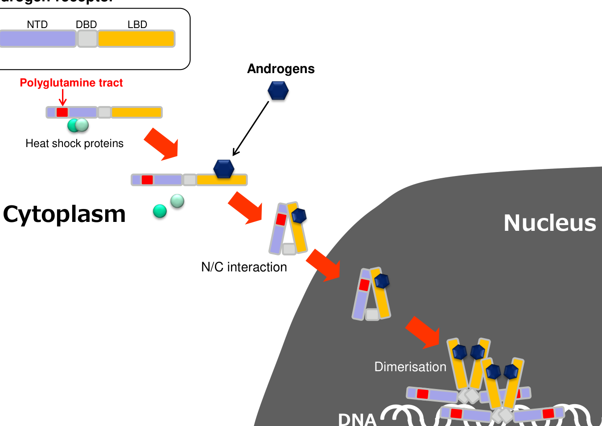

## Question

# Disease Characteristics Research Template

## Target Disease
- **Disease Name:** Kennedy Disease
- **MONDO ID:**  (if available)
- **Category:** Mendelian

## Research Objectives

Please provide a comprehensive research report on **Kennedy Disease** covering all of the
disease characteristics listed below. This report will be used to populate a disease knowledge
base entry. Be thorough and cite primary literature (PMID preferred) for all claims.

For each section, **suggested databases/resources** are listed. These are the first places
you should search for information on each topic.

---

### 1. Disease Information
> **Search first:** OMIM, Orphanet, ICD-10/ICD-11, MeSH, PubMed

- What is the disease? Provide a concise overview.
- What are the key identifiers? (OMIM, Orphanet, ICD-10/ICD-11, MeSH, Mondo)
- What are the common synonyms and alternative names?
- Is the information derived from individual patients (e.g., EHR) or aggregated disease-level resources?

### 2. Etiology

- **Disease Causal Factors**: What are the primary causes? (genetic, environmental, infectious, mechanistic)
- **Risk Factors**:
  > **Search first:** PubMed, Cochrane Library, UpToDate, clinical guidelines, ClinVar, ClinGen, GWAS Catalog, PheGenI, CTD, CDC, WHO, epidemiological databases
  - Genetic risk factors (causal variants, susceptibility loci, modifier genes)
  - Environmental risk factors (toxins, lifestyle, occupational exposures, age, sex, family history)
- **Protective Factors**:
  > **Search first:** PubMed, Cochrane Library, clinical trial databases, GWAS Catalog, gnomAD, WHO, CDC, nutrition databases
  - Genetic protective factors (protective variants, modifier alleles)
  - Environmental protective factors (diet, lifestyle, exposures that reduce risk)
- **Gene-Environment Interactions**: How do genetic and environmental factors interact to influence disease?
  > **Search first:** CTD, PubMed, PheGenI, GxE databases

### 3. Phenotypes
> **Search first:** HPO (Human Phenotype Ontology), OMIM, Orphanet, PubMed, clinicaltrials.gov, MedDRA, SNOMED CT, DECIPHER, LOINC

For each phenotype, provide:
- **Phenotype type**: symptoms, clinical signs, physical manifestations, behavioral changes, or laboratory abnormalities
  > For symptoms/signs: HPO, OMIM, Orphanet, PubMed
  > For behavioral changes: HPO, DSM, RDoC (Research Domain Criteria), PubMed
  > For laboratory abnormalities: LOINC, SNOMED CT, LabTests Online, PubMed
- **Phenotype characteristics**:
  > **Search first:** OMIM, Orphanet, HPO, PubMed
  - Age of symptom onset (neonatal, childhood, adult-onset, late-onset)
  - Symptom severity (mild, moderate, severe, variable)
  - Symptom progression (stable, progressive, episodic, fluctuating)
  - Frequency among affected individuals (percentage or qualitative)
- **Quality of life impact**: Effects on daily functioning and well-being (per-phenotype when possible)
  > **Search first:** EQ-5D database, SF-36, WHO QOL databases, PubMed
- Suggest HPO (Human Phenotype Ontology) terms for each phenotype

### 4. Genetic/Molecular Information

- **Causal Genes**: Gene mutations or chromosomal abnormalities responsible for disease (gene symbols, OMIM IDs)
  > **Search first:** OMIM, ClinVar, HGMD, Ensembl, NCBI Gene
- **Pathogenic Variants**:
  - Affected genes (gene symbols, HGNC IDs)
    > **Search first:** OMIM, NCBI Gene, Ensembl, HGNC, UniProt, GeneCards
  - Variant classification (pathogenic, likely pathogenic, VUS per ACMG/AMP guidelines)
    > **Search first:** ClinVar, ClinGen, ACMG/AMP guidelines, VarSome
  - Variant type/class (missense, frameshift, nonsense, splice-site, structural)
  - Allele frequency in population databases
    > **Search first:** gnomAD, 1000 Genomes, ExAC, TOPMed, dbSNP
  - Somatic vs germline origin
    > **Search first:** COSMIC (somatic), ClinVar, ICGC, TCGA
  - Functional consequences (loss of function, gain of function, dominant negative)
- **Modifier Genes**: Genes that modify disease severity or expression
- **Epigenetic Information**: DNA methylation, histone modifications, chromatin changes affecting disease
  > **Search first:** ENCODE, Roadmap Epigenomics, MethBase, DiseaseMeth
- **Chromosomal Abnormalities**: Large-scale genetic changes (aneuploidy, translocations, inversions)
  > **Search first:** DECIPHER, ClinVar, ECARUCA, UCSC Genome Browser

### 5. Environmental Information

- **Environmental Factors**: Non-genetic contributing factors (toxins, radiation, pollution, occupational exposure)
  > **Search first:** CTD (Comparative Toxicogenomics Database), TOXNET, PubMed, EPA databases
- **Lifestyle Factors**: Behavioral factors (smoking, diet, exercise, alcohol consumption)
  > **Search first:** CDC databases, WHO, PubMed, NHANES
- **Infectious Agents**: If applicable, pathogens causing or triggering disease (bacteria, viruses, fungi, parasites)
  > **Search first:** NCBI Taxonomy, ViPR, BV-BRC, MicrobeDB, GIDEON

### 6. Mechanism / Pathophysiology

- **Molecular Pathways**: Specific signaling cascades or biochemical pathways involved (Wnt, MAPK, mTOR, PI3K-AKT, etc.)
  > **Search first:** KEGG, Reactome, WikiPathways, PathBank, BioCyc
- **Cellular Processes**: Cell-level mechanisms (apoptosis, autophagy, cell cycle dysregulation, inflammation, etc.)
  > **Search first:** Gene Ontology (GO), Reactome, KEGG, PubMed
- **Protein Dysfunction**: How protein structure or function is altered (misfolding, aggregation, loss of function, gain of function)
  > **Search first:** UniProt, PDB (Protein Data Bank), InterPro, Pfam, AlphaFold
- **Metabolic Changes**: Alterations in metabolic processes (energy metabolism, lipid metabolism, amino acid metabolism)
  > **Search first:** KEGG, BioCyc, HMDB (Human Metabolome Database), BRENDA
- **Immune System Involvement**: Role of immune response (autoimmunity, immunodeficiency, chronic inflammation)
  > **Search first:** ImmPort, Immunome Database, IEDB, Gene Ontology
- **Tissue Damage Mechanisms**: How tissues/ are injured (oxidative stress, ischemia, fibrosis, necrosis)
  > **Search first:** PubMed, Gene Ontology, Reactome
- **Biochemical Abnormalities**: Specific molecular defects (enzyme deficiencies, receptor dysfunction, ion channel defects)
  > **Search first:** BRENDA, UniProt, KEGG, OMIM, PubMed
- **Epigenetic Changes**: DNA methylation, histone modifications affecting gene expression in disease
  > **Search first:** ENCODE, Roadmap Epigenomics, MethBase, DiseaseMeth
- **Molecular Profiling** (if available):
  - Transcriptomics/gene expression changes
    > **Search first:** GEO (Gene Expression Omnibus), ArrayExpress, GTEx, Human Cell Atlas, SRA
  - Proteomics findings
    > **Search first:** PRIDE, ProteomeXchange, Human Protein Atlas, STRING, BioGRID
  - Metabolomics signatures
    > **Search first:** MetaboLights, Metabolomics Workbench, HMDB, METLIN
  - Lipidomics alterations
    > **Search first:** LIPID MAPS, SwissLipids, LipidHome, Metabolomics Workbench
  - Genomic structural features
    > **Search first:** UCSC Genome Browser, Ensembl, NCBI, dbVar, DGV
- **Advanced Technologies** (if applicable):
  - Single-cell analysis findings (cell-type specific mechanisms, cellular heterogeneity)
    > **Search first:** Human Cell Atlas, Single Cell Portal, GEO, CELLxGENE
  - Spatial transcriptomics findings
    > **Search first:** GEO, Spatial Research, Vizgen, 10x Genomics data
  - Multi-omics integration results
    > **Search first:** TCGA, ICGC, cBioPortal, LinkedOmics, PubMed
  - Functional genomics screens (CRISPR, RNAi)
    > **Search first:** DepMap, GenomeRNAi, PubMed, BioGRID ORCS

For each mechanism, describe:
- The causal chain from initial trigger to clinical manifestation
- Which mechanisms are upstream vs downstream
- What cell types and biological processes are involved
- Suggest GO terms for biological processes and CL terms for cell types

### 7. Anatomical Structures Affected

- **Organ Level**:
  - Primary organs directly affected
  - Secondary organ involvement (complications, secondary effects)
  - Body systems involved (cardiovascular, nervous, digestive, respiratory, endocrine, etc.)
  > **Search first:** Uberon, FMA (Foundational Model of Anatomy), OMIM, HPO, ICD-11, MeSH, SNOMED CT
- **Tissue and Cell Level**:
  - Specific tissue types affected (epithelial, connective, muscle, nervous)
  - Specific cell populations targeted (with Cell Ontology terms)
  > **Search first:** Uberon, Human Protein Atlas, Cell Ontology, Human Cell Atlas, CellMarker, PanglaoDB
- **Subcellular Level**:
  - Cellular compartments involved (mitochondria, nucleus, ER, lysosomes) (with GO Cellular Component terms)
  > **Search first:** Gene Ontology (Cellular Component), UniProt, Human Protein Atlas
- **Localization**:
  - Specific anatomical sites (with UBERON terms)
    > **Search first:** FMA, Uberon, NeuroNames (for brain), SNOMED CT
  - Lateralization (unilateral, bilateral, asymmetric)
    > **Search first:** HPO, clinical literature, imaging databases

### 8. Temporal Development

- **Onset**:
  - Typical age of onset (congenital, pediatric, adult, geriatric)
  - Onset pattern (acute, subacute, chronic, insidious)
  > **Search first:** OMIM, Orphanet, HPO, PubMed
- **Progression**:
  - Disease stages (early, intermediate, advanced, end-stage)
    > **Search first:** Cancer Staging Manual (AJCC), WHO classifications, PubMed
  - Progression rate (rapid, slow, variable)
  - Disease course pattern (episodic, relapsing-remitting, progressive, stable)
  - Disease duration (self-limited, chronic lifelong)
  > **Search first:** Disease registries, longitudinal cohort databases, natural history studies, PubMed, Orphanet, OMIM
- **Patterns**:
  - Remission patterns (spontaneous, treatment-induced)
    > **Search first:** Clinical trial databases, disease registries, PubMed
  - Critical periods (time windows of vulnerability or opportunity for intervention)
    > **Search first:** PubMed, developmental biology databases, clinical guidelines

### 9. Inheritance and Population

- **Epidemiology**:
  - Prevalence (cases per 100,000 at given time)
  - Incidence (new cases per 100,000 per year)
  > **Search first:** Orphanet, CDC, WHO, GBD (Global Burden of Disease), national registries, SEER, disease registries
- **For Genetic Etiology**:
  - Inheritance pattern (AD, AR, X-linked, mitochondrial, multifactorial, polygenic)
    > **Search first:** OMIM, Orphanet, ClinVar, GTR (Genetic Testing Registry)
  - Penetrance (complete, incomplete, age-dependent)
    > **Search first:** ClinVar, OMIM, PubMed, ClinGen
  - Expressivity (variable, consistent)
    > **Search first:** OMIM, ClinVar, PubMed
  - Genetic anticipation (increasing severity in successive generations)
    > **Search first:** OMIM, PubMed (especially for repeat expansion disorders)
  - Germline mosaicism
    > **Search first:** ClinVar, OMIM, genetic counseling literature, PubMed
  - Founder effects (population-specific mutations)
    > **Search first:** gnomAD, population genetics databases, PubMed
  - Consanguinity role
    > **Search first:** OMIM, population studies, genetic counseling resources
  - Carrier frequency
    > **Search first:** gnomAD, carrier screening databases, GeneReviews, GTR
- **Population Demographics**:
  - Affected populations (ethnic or demographic groups with higher prevalence)
    > **Search first:** gnomAD, 1000 Genomes, PAGE Study, PubMed, population registries
  - Geographic distribution (endemic areas, regional variation)
    > **Search first:** WHO, CDC, GBD, Orphanet, geographic epidemiology databases
  - Geographic distribution of specific variants
  - Sex ratio (male:female)
    > **Search first:** Disease registries, OMIM, PubMed, epidemiological databases
  - Age distribution of affected individuals
    > **Search first:** CDC, disease registries, SEER, Orphanet

### 10. Diagnostics

- **Clinical Tests**:
  - Laboratory tests (blood, urine, tissue chemistry, specific enzyme assays)
    > **Search first:** LOINC, LabTests Online, PubMed
  - Biomarkers (proteins, metabolites, genetic markers, circulating biomarkers)
    > **Search first:** FDA Biomarker List, BEST (Biomarkers, EndpointS, and other Tools), PubMed
  - Imaging studies (X-ray, CT, MRI, PET, ultrasound)
    > **Search first:** RadLex, DICOM, Radiopaedia, imaging databases
  - Functional tests (pulmonary function, cardiac stress tests)
    > **Search first:** LOINC, clinical guidelines, PubMed
  - Electrophysiology (EEG, EMG, ECG, nerve conduction studies)
    > **Search first:** LOINC, clinical neurophysiology databases, PubMed
  - Biopsy findings (histopathology, immunohistochemistry)
    > **Search first:** SNOMED CT, College of American Pathologists resources, PubMed
  - Pathology findings (microscopic examination)
    > **Search first:** SNOMED CT, Digital Pathology databases, PubMed
- **Genetic Testing**:
  > **Search first:** GTR (Genetic Testing Registry), GeneReviews, ClinGen
  - Overview of recommended genetic testing approach
  - Whole genome sequencing (WGS) utility
    > **Search first:** GTR, ClinVar, GEL (Genomics England), gnomAD
  - Whole exome sequencing (WES) utility
    > **Search first:** GTR, ClinVar, OMIM, GeneMatcher
  - Gene panels (which panels, which genes)
    > **Search first:** GTR, ClinVar, laboratory-specific databases
  - Single gene testing
    > **Search first:** GTR, ClinVar, OMIM, GeneReviews
  - Chromosomal microarray (CMA)
    > **Search first:** DECIPHER, ClinVar, dbVar, ECARUCA
  - Karyotyping
    > **Search first:** Chromosome Abnormality Database, ClinVar, cytogenetics resources
  - FISH
    > **Search first:** ClinVar, cytogenetics databases, PubMed
  - Mitochondrial DNA testing
    > **Search first:** MITOMAP, MSeqDR, ClinVar, GTR
  - Repeat expansion testing
    > **Search first:** GTR, ClinVar, repeat expansion databases, PubMed
- **Omics-Based Diagnostics** (if applicable):
  - RNA sequencing / transcriptomics
    > **Search first:** GEO, ArrayExpress, GTEx, RNA-seq databases
  - Proteomics
    > **Search first:** PRIDE, ProteomeXchange, FDA Biomarker database
  - Metabolomics
    > **Search first:** MetaboLights, Metabolomics Workbench, HMDB
  - Epigenomics
    > **Search first:** GEO, ENCODE, Roadmap Epigenomics, MethBase
  - Liquid biopsy
    > **Search first:** COSMIC, ClinVar, liquid biopsy databases, PubMed
- **Clinical Criteria**:
  - Standardized diagnostic criteria (DSM, ICD, society guidelines)
    > **Search first:** DSM-5, ICD-11, clinical society guidelines, UpToDate
  - Differential diagnosis (other conditions to rule out, with distinguishing features)
    > **Search first:** DynaMed, UpToDate, clinical decision support systems
- **Screening**:
  - Screening methods for asymptomatic individuals (newborn screening, carrier screening, cascade screening)
    > **Search first:** ACMG recommendations, CDC newborn screening, GTR

### 11. Outcome/Prognosis

- **Survival and Mortality**:
  - Survival rate (5-year, 10-year, overall)
    > **Search first:** SEER, cancer registries, disease-specific registries, PubMed
  - Life expectancy (with and without treatment if applicable)
    > **Search first:** Orphanet, disease registries, actuarial databases, PubMed
  - Mortality rate
    > **Search first:** CDC, WHO, GBD, national mortality databases
  - Disease-specific mortality (deaths directly attributable to disease)
    > **Search first:** Disease registries, CDC Wonder, GBD, PubMed
- **Morbidity and Function**:
  - Morbidity (disease-related disability and health impacts)
    > **Search first:** GBD, WHO, disability databases, PubMed
  - Disability outcomes (long-term functional impairments)
    > **Search first:** ICF (International Classification of Functioning), disability registries
  - Quality of life measures (EQ-5D, SF-36, PROMIS, disease-specific tools)
    > **Search first:** EQ-5D database, SF-36, PROMIS, PubMed
- **Disease Course**:
  - Complications (secondary problems: infections, organ failure, etc.)
    > **Search first:** ICD codes, disease registries, clinical databases, PubMed
  - Recovery potential (likelihood and extent of recovery, with vs without treatment)
    > **Search first:** Natural history studies, rehabilitation databases, PubMed
- **Prediction**:
  - Prognostic factors (age, disease severity, biomarkers, treatment response)
    > **Search first:** Prognostic models databases, clinical calculators, PubMed
  - Prognostic biomarkers (molecular markers predicting disease course)
    > **Search first:** FDA Biomarker database, PubMed, cancer prognostic databases

### 12. Treatment

- **Pharmacotherapy**:
  - Pharmacological treatments (drug names, drug classes, mechanisms of action)
    > **Search first:** DrugBank, RxNorm, ATC classification, DailyMed, FDA databases
  - Pharmacogenomics (how genetic variants affect drug metabolism, efficacy, toxicity)
    > **Search first:** PharmGKB, CPIC (Clinical Pharmacogenetics), FDA Table of PGx Biomarkers
- **Advanced Therapeutics**:
  - Gene therapy (viral vectors, CRISPR, gene replacement, gene editing)
    > **Search first:** ClinicalTrials.gov, FDA gene therapy database, ASGCT resources
  - Cell therapy (stem cell transplant, CAR-T, cellular therapeutics)
    > **Search first:** ClinicalTrials.gov, FDA cell therapy database, FACT standards
  - RNA-based therapies (ASOs, siRNA, mRNA therapies)
    > **Search first:** ClinicalTrials.gov, FDA approvals, PubMed
  - Targeted therapies (treatments directed at specific molecular targets)
    > **Search first:** My Cancer Genome, OncoKB, ClinicalTrials.gov, FDA approvals
  - Immunotherapies (checkpoint inhibitors, monoclonal antibodies)
    > **Search first:** Cancer Immunotherapy Database, FDA approvals, ClinicalTrials.gov
- **Surgical and Interventional**:
  - Surgical interventions (types of surgery, timing, outcomes)
    > **Search first:** CPT codes, surgical registries, clinical guidelines, PubMed
- **Supportive and Rehabilitative**:
  - Supportive care (symptom management, pain control, nutrition)
    > **Search first:** Clinical guidelines, Cochrane Library, PubMed
  - Rehabilitation (physical therapy, occupational therapy, speech therapy)
    > **Search first:** Rehabilitation medicine databases, clinical guidelines, PubMed
- **Experimental**:
  - Experimental treatments in clinical trials (with NCT identifiers if available)
    > **Search first:** ClinicalTrials.gov, EU Clinical Trials Register, WHO ICTRP
- **Treatment Outcomes**:
  - Treatment response rates
    > **Search first:** Clinical trial databases, FDA reviews, systematic reviews, PubMed
  - Side effects and adverse events
    > **Search first:** FDA Adverse Event Reporting System (FAERS), MedWatch, PubMed
- **Treatment Strategy**:
  - Treatment algorithms (clinical pathways, decision trees)
    > **Search first:** Clinical practice guidelines, NCCN Guidelines, UpToDate
  - Combination therapies
    > **Search first:** ClinicalTrials.gov, treatment guidelines, PubMed
  - Personalized medicine approaches (genotype-guided treatment)
    > **Search first:** My Cancer Genome, CIViC, PharmGKB, precision medicine databases

For each treatment, suggest MAXO (Medical Action Ontology) terms where applicable.

### 13. Prevention

- **Prevention Levels**:
  - Primary prevention (preventing disease occurrence: vaccination, risk factor modification)
    > **Search first:** CDC, WHO, USPSTF recommendations, Cochrane Library
  - Secondary prevention (early detection and treatment: screening programs, early intervention)
    > **Search first:** USPSTF, CDC screening guidelines, WHO
  - Tertiary prevention (preventing complications in those with disease)
    > **Search first:** Clinical guidelines, disease management protocols, PubMed
- **Immunization**: Vaccine strategies (if applicable)
  > **Search first:** CDC vaccine schedules, WHO immunization, FDA vaccine database
- **Screening and Early Detection**:
  - Screening programs (population-based: newborn screening, cancer screening)
    > **Search first:** CDC screening programs, USPSTF, cancer screening databases
  - Genetic screening (carrier screening, preimplantation genetic diagnosis, prenatal testing)
    > **Search first:** ACMG recommendations, ACOG guidelines, GTR
  - Risk stratification (identifying high-risk individuals for targeted prevention)
    > **Search first:** Risk prediction models, clinical calculators, PubMed
- **Behavioral Interventions**: Lifestyle modifications to reduce risk
  > **Search first:** CDC, WHO, behavioral intervention databases, Cochrane Library
- **Counseling**: Genetic counseling (risk assessment, family planning guidance)
  > **Search first:** NSGC resources, ACMG guidelines, GeneReviews
- **Public Health**:
  - Public health interventions (sanitation, vector control, health education)
    > **Search first:** CDC, WHO, public health databases, PubMed
  - Environmental interventions (reducing environmental risk factors)
    > **Search first:** EPA databases, WHO environmental health, PubMed
- **Prophylaxis**: Preventive medications or procedures
  > **Search first:** Clinical guidelines, FDA approvals, PubMed

### 14. Other Species / Natural Disease

- **Taxonomy**: Species affected (with NCBI Taxon identifiers)
  > **Search first:** NCBI Taxonomy
- **Breed**: Specific breeds affected (with VBO identifiers if applicable)
  > **Search first:** VBO (Vertebrate Breed Ontology)
- **Gene**: Orthologous genes in other species (with NCBI Gene IDs)
  > **Search first:** NCBI Gene
- **Natural Disease**:
  - Naturally occurring disease in other species (companion animals, wildlife)
    > **Search first:** OMIA (Online Mendelian Inheritance in Animals), VetCompass, PubMed
  - Veterinary relevance and importance in animal health
    > **Search first:** OMIA, veterinary databases, PubMed
- **Comparative Biology**:
  - Comparative pathology (similarities and differences across species)
    > **Search first:** OMIA, comparative pathology databases, PubMed
  - Evolutionary conservation of disease mechanisms
    > **Search first:** HomoloGene, OrthoMCL, Alliance of Genome Resources
- **Transmission** (if applicable):
  - Zoonotic potential
    > **Search first:** CDC zoonotic diseases, WHO zoonoses, GIDEON
  - Cross-species susceptibility
    > **Search first:** NCBI Taxonomy, veterinary databases, PubMed

### 15. Model Organisms

- **Model Types**:
  - Model organism type (mammalian, invertebrate, cellular, in vitro)
    > **Search first:** Alliance of Genome Resources, model organism databases
  - Specific model systems (mouse, rat, zebrafish, Drosophila, C. elegans, yeast, cell lines, organoids, iPSCs)
    > **Search first:** MGI, RGD, ZFIN, FlyBase, WormBase, SGD, ATCC, Cellosaurus
  - Induced models (drug treatment, surgical intervention, environmental manipulation)
    > **Search first:** MGI, model organism databases, PubMed
- **Genetic Models**:
  - Types available (knockout, knock-in, transgenic, conditional, humanized)
    > **Search first:** MGI, IMPC, KOMP, EuMMCR, IMSR
- **Model Characteristics**:
  - Phenotype recapitulation (how well model reproduces human disease features)
    > **Search first:** Model organism databases, comparative studies, PubMed
  - Model limitations (aspects of human disease not captured)
    > **Search first:** Model organism databases, PubMed, review articles
- **Applications**:
  - Research applications (what aspects of disease can be studied)
    > **Search first:** Model organism databases, PubMed
- **Resources**:
  - Model databases
    > **Search first:** MGI, RGD, ZFIN, FlyBase, WormBase, IMSR, EMMA, MMRRC

---

## Citation Requirements

- Cite primary literature (PMID preferred) for all mechanistic and clinical claims
- Prioritize recent reviews and landmark papers
- Include direct quotes from abstracts where possible to support key statements
- Distinguish evidence source types: human clinical, model organism, in vitro, computational

## Output Format

Structure your response as a comprehensive narrative organized by the sections above.
For each section, provide:
- Factual content with specific details (numbers, percentages, gene names, variant nomenclature)
- Ontology term suggestions (HPO, GO, CL, UBERON, CHEBI, MAXO, MONDO) where applicable
- Evidence citations with PMIDs
- Direct quotes from abstracts to support key claims
- Clear indication when information is not available or not applicable for this disease

This report will be used to populate a disease knowledge base entry with:
- Pathophysiology descriptions with causal chains
- Gene/protein annotations (HGNC, GO terms)
- Phenotype associations (HP terms) with frequencies
- Cell type involvement (CL terms)
- Anatomical locations (UBERON terms)
- Chemical entities (CHEBI terms)
- Treatment annotations (MAXO terms)
- Evidence items with PMIDs and exact abstract quotes
- Epidemiology, prognosis, diagnostic, and prevention information
- Animal model descriptions with phenotype recapitulation details

## Output

Question: You are an expert researcher providing comprehensive, well-cited information.

Provide detailed information focusing on:
1. Key concepts and definitions with current understanding
2. Recent developments and latest research (prioritize 2023-2024 sources)
3. Current applications and real-world implementations
4. Expert opinions and analysis from authoritative sources
5. Relevant statistics and data from recent studies

Format as a comprehensive research report with proper citations. Include URLs and publication dates where available.
Always prioritize recent, authoritative sources and provide specific citations for all major claims.

# Disease Characteristics Research Template

## Target Disease
- **Disease Name:** Kennedy Disease
- **MONDO ID:**  (if available)
- **Category:** Mendelian

## Research Objectives

Please provide a comprehensive research report on **Kennedy Disease** covering all of the
disease characteristics listed below. This report will be used to populate a disease knowledge
base entry. Be thorough and cite primary literature (PMID preferred) for all claims.

For each section, **suggested databases/resources** are listed. These are the first places
you should search for information on each topic.

---

### 1. Disease Information
> **Search first:** OMIM, Orphanet, ICD-10/ICD-11, MeSH, PubMed

- What is the disease? Provide a concise overview.
- What are the key identifiers? (OMIM, Orphanet, ICD-10/ICD-11, MeSH, Mondo)
- What are the common synonyms and alternative names?
- Is the information derived from individual patients (e.g., EHR) or aggregated disease-level resources?

### 2. Etiology

- **Disease Causal Factors**: What are the primary causes? (genetic, environmental, infectious, mechanistic)
- **Risk Factors**:
  > **Search first:** PubMed, Cochrane Library, UpToDate, clinical guidelines, ClinVar, ClinGen, GWAS Catalog, PheGenI, CTD, CDC, WHO, epidemiological databases
  - Genetic risk factors (causal variants, susceptibility loci, modifier genes)
  - Environmental risk factors (toxins, lifestyle, occupational exposures, age, sex, family history)
- **Protective Factors**:
  > **Search first:** PubMed, Cochrane Library, clinical trial databases, GWAS Catalog, gnomAD, WHO, CDC, nutrition databases
  - Genetic protective factors (protective variants, modifier alleles)
  - Environmental protective factors (diet, lifestyle, exposures that reduce risk)
- **Gene-Environment Interactions**: How do genetic and environmental factors interact to influence disease?
  > **Search first:** CTD, PubMed, PheGenI, GxE databases

### 3. Phenotypes
> **Search first:** HPO (Human Phenotype Ontology), OMIM, Orphanet, PubMed, clinicaltrials.gov, MedDRA, SNOMED CT, DECIPHER, LOINC

For each phenotype, provide:
- **Phenotype type**: symptoms, clinical signs, physical manifestations, behavioral changes, or laboratory abnormalities
  > For symptoms/signs: HPO, OMIM, Orphanet, PubMed
  > For behavioral changes: HPO, DSM, RDoC (Research Domain Criteria), PubMed
  > For laboratory abnormalities: LOINC, SNOMED CT, LabTests Online, PubMed
- **Phenotype characteristics**:
  > **Search first:** OMIM, Orphanet, HPO, PubMed
  - Age of symptom onset (neonatal, childhood, adult-onset, late-onset)
  - Symptom severity (mild, moderate, severe, variable)
  - Symptom progression (stable, progressive, episodic, fluctuating)
  - Frequency among affected individuals (percentage or qualitative)
- **Quality of life impact**: Effects on daily functioning and well-being (per-phenotype when possible)
  > **Search first:** EQ-5D database, SF-36, WHO QOL databases, PubMed
- Suggest HPO (Human Phenotype Ontology) terms for each phenotype

### 4. Genetic/Molecular Information

- **Causal Genes**: Gene mutations or chromosomal abnormalities responsible for disease (gene symbols, OMIM IDs)
  > **Search first:** OMIM, ClinVar, HGMD, Ensembl, NCBI Gene
- **Pathogenic Variants**:
  - Affected genes (gene symbols, HGNC IDs)
    > **Search first:** OMIM, NCBI Gene, Ensembl, HGNC, UniProt, GeneCards
  - Variant classification (pathogenic, likely pathogenic, VUS per ACMG/AMP guidelines)
    > **Search first:** ClinVar, ClinGen, ACMG/AMP guidelines, VarSome
  - Variant type/class (missense, frameshift, nonsense, splice-site, structural)
  - Allele frequency in population databases
    > **Search first:** gnomAD, 1000 Genomes, ExAC, TOPMed, dbSNP
  - Somatic vs germline origin
    > **Search first:** COSMIC (somatic), ClinVar, ICGC, TCGA
  - Functional consequences (loss of function, gain of function, dominant negative)
- **Modifier Genes**: Genes that modify disease severity or expression
- **Epigenetic Information**: DNA methylation, histone modifications, chromatin changes affecting disease
  > **Search first:** ENCODE, Roadmap Epigenomics, MethBase, DiseaseMeth
- **Chromosomal Abnormalities**: Large-scale genetic changes (aneuploidy, translocations, inversions)
  > **Search first:** DECIPHER, ClinVar, ECARUCA, UCSC Genome Browser

### 5. Environmental Information

- **Environmental Factors**: Non-genetic contributing factors (toxins, radiation, pollution, occupational exposure)
  > **Search first:** CTD (Comparative Toxicogenomics Database), TOXNET, PubMed, EPA databases
- **Lifestyle Factors**: Behavioral factors (smoking, diet, exercise, alcohol consumption)
  > **Search first:** CDC databases, WHO, PubMed, NHANES
- **Infectious Agents**: If applicable, pathogens causing or triggering disease (bacteria, viruses, fungi, parasites)
  > **Search first:** NCBI Taxonomy, ViPR, BV-BRC, MicrobeDB, GIDEON

### 6. Mechanism / Pathophysiology

- **Molecular Pathways**: Specific signaling cascades or biochemical pathways involved (Wnt, MAPK, mTOR, PI3K-AKT, etc.)
  > **Search first:** KEGG, Reactome, WikiPathways, PathBank, BioCyc
- **Cellular Processes**: Cell-level mechanisms (apoptosis, autophagy, cell cycle dysregulation, inflammation, etc.)
  > **Search first:** Gene Ontology (GO), Reactome, KEGG, PubMed
- **Protein Dysfunction**: How protein structure or function is altered (misfolding, aggregation, loss of function, gain of function)
  > **Search first:** UniProt, PDB (Protein Data Bank), InterPro, Pfam, AlphaFold
- **Metabolic Changes**: Alterations in metabolic processes (energy metabolism, lipid metabolism, amino acid metabolism)
  > **Search first:** KEGG, BioCyc, HMDB (Human Metabolome Database), BRENDA
- **Immune System Involvement**: Role of immune response (autoimmunity, immunodeficiency, chronic inflammation)
  > **Search first:** ImmPort, Immunome Database, IEDB, Gene Ontology
- **Tissue Damage Mechanisms**: How tissues/ are injured (oxidative stress, ischemia, fibrosis, necrosis)
  > **Search first:** PubMed, Gene Ontology, Reactome
- **Biochemical Abnormalities**: Specific molecular defects (enzyme deficiencies, receptor dysfunction, ion channel defects)
  > **Search first:** BRENDA, UniProt, KEGG, OMIM, PubMed
- **Epigenetic Changes**: DNA methylation, histone modifications affecting gene expression in disease
  > **Search first:** ENCODE, Roadmap Epigenomics, MethBase, DiseaseMeth
- **Molecular Profiling** (if available):
  - Transcriptomics/gene expression changes
    > **Search first:** GEO (Gene Expression Omnibus), ArrayExpress, GTEx, Human Cell Atlas, SRA
  - Proteomics findings
    > **Search first:** PRIDE, ProteomeXchange, Human Protein Atlas, STRING, BioGRID
  - Metabolomics signatures
    > **Search first:** MetaboLights, Metabolomics Workbench, HMDB, METLIN
  - Lipidomics alterations
    > **Search first:** LIPID MAPS, SwissLipids, LipidHome, Metabolomics Workbench
  - Genomic structural features
    > **Search first:** UCSC Genome Browser, Ensembl, NCBI, dbVar, DGV
- **Advanced Technologies** (if applicable):
  - Single-cell analysis findings (cell-type specific mechanisms, cellular heterogeneity)
    > **Search first:** Human Cell Atlas, Single Cell Portal, GEO, CELLxGENE
  - Spatial transcriptomics findings
    > **Search first:** GEO, Spatial Research, Vizgen, 10x Genomics data
  - Multi-omics integration results
    > **Search first:** TCGA, ICGC, cBioPortal, LinkedOmics, PubMed
  - Functional genomics screens (CRISPR, RNAi)
    > **Search first:** DepMap, GenomeRNAi, PubMed, BioGRID ORCS

For each mechanism, describe:
- The causal chain from initial trigger to clinical manifestation
- Which mechanisms are upstream vs downstream
- What cell types and biological processes are involved
- Suggest GO terms for biological processes and CL terms for cell types

### 7. Anatomical Structures Affected

- **Organ Level**:
  - Primary organs directly affected
  - Secondary organ involvement (complications, secondary effects)
  - Body systems involved (cardiovascular, nervous, digestive, respiratory, endocrine, etc.)
  > **Search first:** Uberon, FMA (Foundational Model of Anatomy), OMIM, HPO, ICD-11, MeSH, SNOMED CT
- **Tissue and Cell Level**:
  - Specific tissue types affected (epithelial, connective, muscle, nervous)
  - Specific cell populations targeted (with Cell Ontology terms)
  > **Search first:** Uberon, Human Protein Atlas, Cell Ontology, Human Cell Atlas, CellMarker, PanglaoDB
- **Subcellular Level**:
  - Cellular compartments involved (mitochondria, nucleus, ER, lysosomes) (with GO Cellular Component terms)
  > **Search first:** Gene Ontology (Cellular Component), UniProt, Human Protein Atlas
- **Localization**:
  - Specific anatomical sites (with UBERON terms)
    > **Search first:** FMA, Uberon, NeuroNames (for brain), SNOMED CT
  - Lateralization (unilateral, bilateral, asymmetric)
    > **Search first:** HPO, clinical literature, imaging databases

### 8. Temporal Development

- **Onset**:
  - Typical age of onset (congenital, pediatric, adult, geriatric)
  - Onset pattern (acute, subacute, chronic, insidious)
  > **Search first:** OMIM, Orphanet, HPO, PubMed
- **Progression**:
  - Disease stages (early, intermediate, advanced, end-stage)
    > **Search first:** Cancer Staging Manual (AJCC), WHO classifications, PubMed
  - Progression rate (rapid, slow, variable)
  - Disease course pattern (episodic, relapsing-remitting, progressive, stable)
  - Disease duration (self-limited, chronic lifelong)
  > **Search first:** Disease registries, longitudinal cohort databases, natural history studies, PubMed, Orphanet, OMIM
- **Patterns**:
  - Remission patterns (spontaneous, treatment-induced)
    > **Search first:** Clinical trial databases, disease registries, PubMed
  - Critical periods (time windows of vulnerability or opportunity for intervention)
    > **Search first:** PubMed, developmental biology databases, clinical guidelines

### 9. Inheritance and Population

- **Epidemiology**:
  - Prevalence (cases per 100,000 at given time)
  - Incidence (new cases per 100,000 per year)
  > **Search first:** Orphanet, CDC, WHO, GBD (Global Burden of Disease), national registries, SEER, disease registries
- **For Genetic Etiology**:
  - Inheritance pattern (AD, AR, X-linked, mitochondrial, multifactorial, polygenic)
    > **Search first:** OMIM, Orphanet, ClinVar, GTR (Genetic Testing Registry)
  - Penetrance (complete, incomplete, age-dependent)
    > **Search first:** ClinVar, OMIM, PubMed, ClinGen
  - Expressivity (variable, consistent)
    > **Search first:** OMIM, ClinVar, PubMed
  - Genetic anticipation (increasing severity in successive generations)
    > **Search first:** OMIM, PubMed (especially for repeat expansion disorders)
  - Germline mosaicism
    > **Search first:** ClinVar, OMIM, genetic counseling literature, PubMed
  - Founder effects (population-specific mutations)
    > **Search first:** gnomAD, population genetics databases, PubMed
  - Consanguinity role
    > **Search first:** OMIM, population studies, genetic counseling resources
  - Carrier frequency
    > **Search first:** gnomAD, carrier screening databases, GeneReviews, GTR
- **Population Demographics**:
  - Affected populations (ethnic or demographic groups with higher prevalence)
    > **Search first:** gnomAD, 1000 Genomes, PAGE Study, PubMed, population registries
  - Geographic distribution (endemic areas, regional variation)
    > **Search first:** WHO, CDC, GBD, Orphanet, geographic epidemiology databases
  - Geographic distribution of specific variants
  - Sex ratio (male:female)
    > **Search first:** Disease registries, OMIM, PubMed, epidemiological databases
  - Age distribution of affected individuals
    > **Search first:** CDC, disease registries, SEER, Orphanet

### 10. Diagnostics

- **Clinical Tests**:
  - Laboratory tests (blood, urine, tissue chemistry, specific enzyme assays)
    > **Search first:** LOINC, LabTests Online, PubMed
  - Biomarkers (proteins, metabolites, genetic markers, circulating biomarkers)
    > **Search first:** FDA Biomarker List, BEST (Biomarkers, EndpointS, and other Tools), PubMed
  - Imaging studies (X-ray, CT, MRI, PET, ultrasound)
    > **Search first:** RadLex, DICOM, Radiopaedia, imaging databases
  - Functional tests (pulmonary function, cardiac stress tests)
    > **Search first:** LOINC, clinical guidelines, PubMed
  - Electrophysiology (EEG, EMG, ECG, nerve conduction studies)
    > **Search first:** LOINC, clinical neurophysiology databases, PubMed
  - Biopsy findings (histopathology, immunohistochemistry)
    > **Search first:** SNOMED CT, College of American Pathologists resources, PubMed
  - Pathology findings (microscopic examination)
    > **Search first:** SNOMED CT, Digital Pathology databases, PubMed
- **Genetic Testing**:
  > **Search first:** GTR (Genetic Testing Registry), GeneReviews, ClinGen
  - Overview of recommended genetic testing approach
  - Whole genome sequencing (WGS) utility
    > **Search first:** GTR, ClinVar, GEL (Genomics England), gnomAD
  - Whole exome sequencing (WES) utility
    > **Search first:** GTR, ClinVar, OMIM, GeneMatcher
  - Gene panels (which panels, which genes)
    > **Search first:** GTR, ClinVar, laboratory-specific databases
  - Single gene testing
    > **Search first:** GTR, ClinVar, OMIM, GeneReviews
  - Chromosomal microarray (CMA)
    > **Search first:** DECIPHER, ClinVar, dbVar, ECARUCA
  - Karyotyping
    > **Search first:** Chromosome Abnormality Database, ClinVar, cytogenetics resources
  - FISH
    > **Search first:** ClinVar, cytogenetics databases, PubMed
  - Mitochondrial DNA testing
    > **Search first:** MITOMAP, MSeqDR, ClinVar, GTR
  - Repeat expansion testing
    > **Search first:** GTR, ClinVar, repeat expansion databases, PubMed
- **Omics-Based Diagnostics** (if applicable):
  - RNA sequencing / transcriptomics
    > **Search first:** GEO, ArrayExpress, GTEx, RNA-seq databases
  - Proteomics
    > **Search first:** PRIDE, ProteomeXchange, FDA Biomarker database
  - Metabolomics
    > **Search first:** MetaboLights, Metabolomics Workbench, HMDB
  - Epigenomics
    > **Search first:** GEO, ENCODE, Roadmap Epigenomics, MethBase
  - Liquid biopsy
    > **Search first:** COSMIC, ClinVar, liquid biopsy databases, PubMed
- **Clinical Criteria**:
  - Standardized diagnostic criteria (DSM, ICD, society guidelines)
    > **Search first:** DSM-5, ICD-11, clinical society guidelines, UpToDate
  - Differential diagnosis (other conditions to rule out, with distinguishing features)
    > **Search first:** DynaMed, UpToDate, clinical decision support systems
- **Screening**:
  - Screening methods for asymptomatic individuals (newborn screening, carrier screening, cascade screening)
    > **Search first:** ACMG recommendations, CDC newborn screening, GTR

### 11. Outcome/Prognosis

- **Survival and Mortality**:
  - Survival rate (5-year, 10-year, overall)
    > **Search first:** SEER, cancer registries, disease-specific registries, PubMed
  - Life expectancy (with and without treatment if applicable)
    > **Search first:** Orphanet, disease registries, actuarial databases, PubMed
  - Mortality rate
    > **Search first:** CDC, WHO, GBD, national mortality databases
  - Disease-specific mortality (deaths directly attributable to disease)
    > **Search first:** Disease registries, CDC Wonder, GBD, PubMed
- **Morbidity and Function**:
  - Morbidity (disease-related disability and health impacts)
    > **Search first:** GBD, WHO, disability databases, PubMed
  - Disability outcomes (long-term functional impairments)
    > **Search first:** ICF (International Classification of Functioning), disability registries
  - Quality of life measures (EQ-5D, SF-36, PROMIS, disease-specific tools)
    > **Search first:** EQ-5D database, SF-36, PROMIS, PubMed
- **Disease Course**:
  - Complications (secondary problems: infections, organ failure, etc.)
    > **Search first:** ICD codes, disease registries, clinical databases, PubMed
  - Recovery potential (likelihood and extent of recovery, with vs without treatment)
    > **Search first:** Natural history studies, rehabilitation databases, PubMed
- **Prediction**:
  - Prognostic factors (age, disease severity, biomarkers, treatment response)
    > **Search first:** Prognostic models databases, clinical calculators, PubMed
  - Prognostic biomarkers (molecular markers predicting disease course)
    > **Search first:** FDA Biomarker database, PubMed, cancer prognostic databases

### 12. Treatment

- **Pharmacotherapy**:
  - Pharmacological treatments (drug names, drug classes, mechanisms of action)
    > **Search first:** DrugBank, RxNorm, ATC classification, DailyMed, FDA databases
  - Pharmacogenomics (how genetic variants affect drug metabolism, efficacy, toxicity)
    > **Search first:** PharmGKB, CPIC (Clinical Pharmacogenetics), FDA Table of PGx Biomarkers
- **Advanced Therapeutics**:
  - Gene therapy (viral vectors, CRISPR, gene replacement, gene editing)
    > **Search first:** ClinicalTrials.gov, FDA gene therapy database, ASGCT resources
  - Cell therapy (stem cell transplant, CAR-T, cellular therapeutics)
    > **Search first:** ClinicalTrials.gov, FDA cell therapy database, FACT standards
  - RNA-based therapies (ASOs, siRNA, mRNA therapies)
    > **Search first:** ClinicalTrials.gov, FDA approvals, PubMed
  - Targeted therapies (treatments directed at specific molecular targets)
    > **Search first:** My Cancer Genome, OncoKB, ClinicalTrials.gov, FDA approvals
  - Immunotherapies (checkpoint inhibitors, monoclonal antibodies)
    > **Search first:** Cancer Immunotherapy Database, FDA approvals, ClinicalTrials.gov
- **Surgical and Interventional**:
  - Surgical interventions (types of surgery, timing, outcomes)
    > **Search first:** CPT codes, surgical registries, clinical guidelines, PubMed
- **Supportive and Rehabilitative**:
  - Supportive care (symptom management, pain control, nutrition)
    > **Search first:** Clinical guidelines, Cochrane Library, PubMed
  - Rehabilitation (physical therapy, occupational therapy, speech therapy)
    > **Search first:** Rehabilitation medicine databases, clinical guidelines, PubMed
- **Experimental**:
  - Experimental treatments in clinical trials (with NCT identifiers if available)
    > **Search first:** ClinicalTrials.gov, EU Clinical Trials Register, WHO ICTRP
- **Treatment Outcomes**:
  - Treatment response rates
    > **Search first:** Clinical trial databases, FDA reviews, systematic reviews, PubMed
  - Side effects and adverse events
    > **Search first:** FDA Adverse Event Reporting System (FAERS), MedWatch, PubMed
- **Treatment Strategy**:
  - Treatment algorithms (clinical pathways, decision trees)
    > **Search first:** Clinical practice guidelines, NCCN Guidelines, UpToDate
  - Combination therapies
    > **Search first:** ClinicalTrials.gov, treatment guidelines, PubMed
  - Personalized medicine approaches (genotype-guided treatment)
    > **Search first:** My Cancer Genome, CIViC, PharmGKB, precision medicine databases

For each treatment, suggest MAXO (Medical Action Ontology) terms where applicable.

### 13. Prevention

- **Prevention Levels**:
  - Primary prevention (preventing disease occurrence: vaccination, risk factor modification)
    > **Search first:** CDC, WHO, USPSTF recommendations, Cochrane Library
  - Secondary prevention (early detection and treatment: screening programs, early intervention)
    > **Search first:** USPSTF, CDC screening guidelines, WHO
  - Tertiary prevention (preventing complications in those with disease)
    > **Search first:** Clinical guidelines, disease management protocols, PubMed
- **Immunization**: Vaccine strategies (if applicable)
  > **Search first:** CDC vaccine schedules, WHO immunization, FDA vaccine database
- **Screening and Early Detection**:
  - Screening programs (population-based: newborn screening, cancer screening)
    > **Search first:** CDC screening programs, USPSTF, cancer screening databases
  - Genetic screening (carrier screening, preimplantation genetic diagnosis, prenatal testing)
    > **Search first:** ACMG recommendations, ACOG guidelines, GTR
  - Risk stratification (identifying high-risk individuals for targeted prevention)
    > **Search first:** Risk prediction models, clinical calculators, PubMed
- **Behavioral Interventions**: Lifestyle modifications to reduce risk
  > **Search first:** CDC, WHO, behavioral intervention databases, Cochrane Library
- **Counseling**: Genetic counseling (risk assessment, family planning guidance)
  > **Search first:** NSGC resources, ACMG guidelines, GeneReviews
- **Public Health**:
  - Public health interventions (sanitation, vector control, health education)
    > **Search first:** CDC, WHO, public health databases, PubMed
  - Environmental interventions (reducing environmental risk factors)
    > **Search first:** EPA databases, WHO environmental health, PubMed
- **Prophylaxis**: Preventive medications or procedures
  > **Search first:** Clinical guidelines, FDA approvals, PubMed

### 14. Other Species / Natural Disease

- **Taxonomy**: Species affected (with NCBI Taxon identifiers)
  > **Search first:** NCBI Taxonomy
- **Breed**: Specific breeds affected (with VBO identifiers if applicable)
  > **Search first:** VBO (Vertebrate Breed Ontology)
- **Gene**: Orthologous genes in other species (with NCBI Gene IDs)
  > **Search first:** NCBI Gene
- **Natural Disease**:
  - Naturally occurring disease in other species (companion animals, wildlife)
    > **Search first:** OMIA (Online Mendelian Inheritance in Animals), VetCompass, PubMed
  - Veterinary relevance and importance in animal health
    > **Search first:** OMIA, veterinary databases, PubMed
- **Comparative Biology**:
  - Comparative pathology (similarities and differences across species)
    > **Search first:** OMIA, comparative pathology databases, PubMed
  - Evolutionary conservation of disease mechanisms
    > **Search first:** HomoloGene, OrthoMCL, Alliance of Genome Resources
- **Transmission** (if applicable):
  - Zoonotic potential
    > **Search first:** CDC zoonotic diseases, WHO zoonoses, GIDEON
  - Cross-species susceptibility
    > **Search first:** NCBI Taxonomy, veterinary databases, PubMed

### 15. Model Organisms

- **Model Types**:
  - Model organism type (mammalian, invertebrate, cellular, in vitro)
    > **Search first:** Alliance of Genome Resources, model organism databases
  - Specific model systems (mouse, rat, zebrafish, Drosophila, C. elegans, yeast, cell lines, organoids, iPSCs)
    > **Search first:** MGI, RGD, ZFIN, FlyBase, WormBase, SGD, ATCC, Cellosaurus
  - Induced models (drug treatment, surgical intervention, environmental manipulation)
    > **Search first:** MGI, model organism databases, PubMed
- **Genetic Models**:
  - Types available (knockout, knock-in, transgenic, conditional, humanized)
    > **Search first:** MGI, IMPC, KOMP, EuMMCR, IMSR
- **Model Characteristics**:
  - Phenotype recapitulation (how well model reproduces human disease features)
    > **Search first:** Model organism databases, comparative studies, PubMed
  - Model limitations (aspects of human disease not captured)
    > **Search first:** Model organism databases, PubMed, review articles
- **Applications**:
  - Research applications (what aspects of disease can be studied)
    > **Search first:** Model organism databases, PubMed
- **Resources**:
  - Model databases
    > **Search first:** MGI, RGD, ZFIN, FlyBase, WormBase, IMSR, EMMA, MMRRC

---

## Citation Requirements

- Cite primary literature (PMID preferred) for all mechanistic and clinical claims
- Prioritize recent reviews and landmark papers
- Include direct quotes from abstracts where possible to support key statements
- Distinguish evidence source types: human clinical, model organism, in vitro, computational

## Output Format

Structure your response as a comprehensive narrative organized by the sections above.
For each section, provide:
- Factual content with specific details (numbers, percentages, gene names, variant nomenclature)
- Ontology term suggestions (HPO, GO, CL, UBERON, CHEBI, MAXO, MONDO) where applicable
- Evidence citations with PMIDs
- Direct quotes from abstracts to support key claims
- Clear indication when information is not available or not applicable for this disease

This report will be used to populate a disease knowledge base entry with:
- Pathophysiology descriptions with causal chains
- Gene/protein annotations (HGNC, GO terms)
- Phenotype associations (HP terms) with frequencies
- Cell type involvement (CL terms)
- Anatomical locations (UBERON terms)
- Chemical entities (CHEBI terms)
- Treatment annotations (MAXO terms)
- Evidence items with PMIDs and exact abstract quotes
- Epidemiology, prognosis, diagnostic, and prevention information
- Animal model descriptions with phenotype recapitulation details

# Kennedy Disease (Spinal and Bulbar Muscular Atrophy; SBMA): Comprehensive Disease Characteristics Report

## Summary (knowledge-base ready)
Kennedy disease, also called spinal and bulbar muscular atrophy (SBMA), is an adult-onset, slowly progressive, X-linked neuromuscular disorder primarily affecting males and caused by a CAG trinucleotide repeat expansion in the androgen receptor (AR) gene leading to an expanded polyglutamine tract in AR protein, with androgen-dependent toxicity involving both lower motor neurons (spinal cord/brainstem) and skeletal muscle. (chang2024theroleof pages 11-12, cantara2024antisenseoligonucleotides(asos) pages 14-16, prakasam2023lsd1prmt6targetinggenetherapy pages 1-2, hashizume2020diseasemechanismbiomarker pages 1-5)

| Category | Key values |
|---|---|
| Disease name / definition | **Kennedy disease**; **spinal and bulbar muscular atrophy (SBMA)**; an adult-onset, slowly progressive, X-linked neuromuscular / lower motor neuron disease caused by polyglutamine-expanded androgen receptor, with both motor neuron and skeletal muscle involvement (chang2024theroleof pages 11-12, cantara2024antisenseoligonucleotides(asos) pages 14-16, prakasam2023lsd1prmt6targetinggenetherapy pages 1-2, hashizume2020diseasemechanismbiomarker pages 1-5) |
| Identifiers | **MONDO:** MONDO_0010735 (OpenTargets disease association for Kennedy disease) (OpenTargets Search: Spinal and bulbar muscular atrophy,Kennedy disease-AR); **OMIM:** 313200 (reported as “X-linked spinal and bulbar muscular atrophy (SMAX1, Kennedy disease, OMIM 313200)”) (wang2020apathogenicmissense pages 1-2); **MeSH:** *Bulbo-Spinal Atrophy, X-Linked* **D055534** (ClinicalTrials.gov MeSH mapping) (NCT06411912 chunk 2, NCT06169046 chunk 1, NCT00303446 chunk 3) |
| Synonyms / alternative names | Spinal and bulbar muscular atrophy; SBMA; Kennedy disease / Kennedy’s disease; X-linked spinal and bulbar muscular atrophy; X-linked recessive bulbospinal neuronopathy; progressive proximal spinal and bulbar muscular atrophy of late onset (lee2024morethanautophony pages 1-2, debartolo2024differentiallydisruptedspinal pages 14-15, wang2020apathogenicmissense pages 1-2, cantara2024antisenseoligonucleotides(asos) pages 14-16) |
| Causal gene / locus | **Gene:** **AR** (*androgen receptor*); **location:** Xq11-12 / Xq12; disease caused by CAG trinucleotide expansion in exon 1 producing an expanded polyglutamine tract in AR protein (cantara2024antisenseoligonucleotides(asos) pages 14-16, prakasam2023lsd1prmt6targetinggenetherapy pages 1-2, lee2024morethanautophony pages 1-2, hashizume2020diseasemechanismbiomarker pages 1-5) |
| Pathogenic repeat ranges / thresholds | Common pathogenic thresholds in evidence: **≥38 CAG** in trial eligibility and mechanistic literature (NCT06169046 chunk 1, prakasam2023lsd1prmt6targetinggenetherapy pages 1-2); review evidence gives **normal 9–36 CAG** vs **SBMA 39–72 CAG** (cantara2024antisenseoligonucleotides(asos) pages 14-16); AJ201 trial used **≥36 repeats** for enrollment (NCT05517603 chunk 1) |
| Inheritance / sex bias | **X-linked recessive / sex-linked** disorder; primarily affects **adult males**; females are usually carriers and may be mildly affected; androgen dependence explains marked male predominance (cantara2024antisenseoligonucleotides(asos) pages 14-16, prakasam2023lsd1prmt6targetinggenetherapy pages 1-2, NCT00303446 chunk 1, hashizume2020diseasemechanismbiomarker pages 1-5) |
| Epidemiology | Prevalence estimates in cited sources: **1–2 per 100,000** (review) (cantara2024antisenseoligonucleotides(asos) pages 14-16, hashizume2020diseasemechanismbiomarker pages 1-5); **2–5 per 100,000 worldwide** (mechanistic study intro) (prakasam2023lsd1prmt6targetinggenetherapy pages 1-2); Italy trial record: about **1,000 affected individuals**, **prevalence 1.5/100,000**, **annual incidence 0.19/100,000 males** (NCT06169046 chunk 1) |
| Typical onset / course | Adult onset, often **30–40 years** (range **18–64** in one review); slowly progressive; tremor may precede weakness by >10 years; wheelchair often needed 10–15 years after onset in some reports (cantara2024antisenseoligonucleotides(asos) pages 14-16, hashizume2020diseasemechanismbiomarker pages 1-5, iijima2023longtermeffectsof pages 1-2) |
| Hallmark phenotypes | Progressive limb and bulbar weakness/atrophy, fasciculations, cramps, postural hand tremor, dysarthria, dysphagia, laryngospasm, reduced/absent reflexes, distal vibration sensory loss; androgen-insensitivity features including gynecomastia, testicular atrophy, erectile dysfunction, infertility/decreased fertility; aspiration pneumonia is a major cause of death (lee2024morethanautophony pages 1-2, hashizume2020diseasemechanismbiomarker pages 1-5, rhodes2009clinicalfeaturesof pages 6-8) |
| Quality-of-life / functional impact | ADL domains notably affected: walking, handwriting, falling, swallowing, speech; SF-36v2 physical component mean **34.3 ± 11.0** in a landmark cohort; substantial diagnostic delay (~2 years to first medical attention plus ~3 more years to diagnosis) (rhodes2009clinicalfeaturesof pages 6-8) |
| Key diagnostic tests | **Genetic confirmation of AR CAG expansion** is definitive; supportive tests include EMG/neurophysiology, quantitative muscle assessment, timed walk tests, SBMAFRS/ALSFRS-R, tongue pressure, pulmonary metrics (%FVC, %PEF), muscle MRI with Dixon fat quantification, and cardiac ECG/CMR when indicated (NCT06169046 chunk 1, NCT00303446 chunk 1, inagaki2022developmentofa pages 6-7, hashizume2020diseasemechanismbiomarker pages 5-8, steinmetz2022jwavesyndromes pages 1-2) |
| Biomarkers / outcome measures | Prominent biomarkers: **serum creatinine** (declines before overt weakness), CK/liver enzymes, MRI muscle fat fraction, MUNE, tongue pressure; trial/research outcomes include **6MWT**, **2MWD**, **AMAT**, **QMA**, **SBMAFRS**, **ALSFRS-R**, **%FVC**, **%PEF**, neurophysiology, and mutant AR in muscle/skin (NCT05517603 chunk 1, NCT06169046 chunk 1, NCT00303446 chunk 1, inagaki2022developmentofa pages 6-7, hashizume2020diseasemechanismbiomarker pages 1-5, hashizume2020diseasemechanismbiomarker pages 5-8) |
| Notable recent mechanism (2023) | **LSD1/PRMT6 axis:** androgen-dependent overexpression of AR co-regulators **LSD1** and **PRMT6** specifically in SBMA skeletal muscle; they synergistically enhance AR transactivation, and silencing them suppresses toxic gain-of-function and improves phenotypes in flies and mice (prakasam2023lsd1prmt6targetinggenetherapy pages 1-2, prakasam2023lsd1prmt6targetinggenetherapy pages 9-12, prakasam2023lsd1prmt6targetinggenetherapy pages 14-15) |
| Notable recent mechanism (2023) | **Early skeletal-muscle pathology:** defective excitation-contraction coupling and impaired mitochondrial respiration occur **before denervation**; early events are androgen-dependent and reversible with castration or AR silencing; patient biopsies and mouse models support muscle as a primary toxicity site (hashizume2020diseasemechanismbiomarker pages 8-12, hashizume2020diseasemechanismbiomarker pages 12-15) |
| Notable recent mechanism (2024) | **Energy metabolism / NAD+ biology:** SBMA muscle shows **reduced NAD+ and ATP**, altered nicotinamide/NAD+ salvage pathways, and **decreased Nmrk2/NRK2**, helping explain why nicotinamide riboside failed to restore muscle NAD+ or improve disease in mice; integrated metabolomics/proteomics implicated glycolysis, PPP, pyruvate, glutathione, and amino-acid pathways (debartolo2024differentiallydisruptedspinal pages 10-12, debartolo2024differentiallydisruptedspinal pages 1-2, debartolo2024differentiallydisruptedspinal pages 8-10) |
| Notable recent mechanism (2024 preclinical) | **Synaptic dysregulation / hyperexcitability:** early postnatal nuclear accumulation of polyQ-AR in motor neurons dysregulates glutamatergic synaptic genes via **Rest/Rest4**; iPSC-derived motor neurons are hyperexcitable; antisense correction rescued pathology in mice (preprint evidence) (prakasam2023lsd1prmt6targetinggenetherapy pages 9-12) |
| Anatomy / cell types chiefly affected | Lower motor neurons in spinal cord and brainstem; skeletal muscle is a major primary toxicity site; neuromuscular junction and muscle fiber-type composition are altered; cardiac involvement may occur in a subset (ECG/CMR abnormalities, fibrosis) (hashizume2020diseasemechanismbiomarker pages 1-5, steinmetz2022jwavesyndromes pages 1-2, hashizume2020diseasemechanismbiomarker pages 8-12, hashizume2020diseasemechanismbiomarker pages 12-15) |
| Cardiac / systemic comorbidity signals | In a 30-patient SBMA cohort, **70%** had abnormal ECGs; diffuse myocardial fibrosis on T1 mapping in **73.9%** vs **9.1%** of controls; metabolic comorbidities include glucose intolerance/insulin resistance and dyslipidemia in some patients (debartolo2024differentiallydisruptedspinal pages 1-2, steinmetz2022jwavesyndromes pages 1-2, hashizume2020diseasemechanismbiomarker pages 1-5) |
| Supportive / real-world implementation | Long-term gait rehabilitation using **wearable HAL** in one 68-year-old patient: 9 courses over ~5 years, 3 sessions/week for 3 weeks each; **2MWD improved from 94 m to 101.8 m**, gait item on ALSFRS-R remained stable at 3, and independent walking was maintained (iijima2023longtermeffectsof pages 1-2, iijima2023longtermeffectsof pages 9-10, iijima2023longtermeffectsof pages 2-4) |
| Historical / completed interventional trials | **NCT00303446** dutasteride 0.5 mg/day vs placebo for 24 months, phase 2; primary endpoint QMA; failed primary outcome in review summary (NCT00303446 chunk 1, hashizume2020diseasemechanismbiomarker pages 5-8). **NCT00004771** leuprolide + testosterone, phase 2; genotype-confirmed by AR exon-1 mutation (NCT00004771 chunk 1). **NCT00851461** goserelin (listed as completed) (clinical-trial search context in conversation). **NCT02024932** BVS857 / IGF-1 mimetic, phase 2, showed muscle-volume signal in review summary (hashizume2020diseasemechanismbiomarker pages 5-8) |
| Active / recent trials (2023-2025 records) | **NCT06169046** clenbuterol 0.04 mg/day for 48 weeks, phase 2, primary endpoint 6MWT, enrollment 90, requires **AR CAG ≥38** (NCT06169046 chunk 1); **NCT05517603** AJ201 600 mg/day for 12 weeks, phase 1/2a, enrollment 25, pharmacodynamic endpoint mutant AR in skeletal muscle, requires **AR CAG ≥36** (NCT05517603 chunk 1); **NCT06411912** NIDO-361 in genetically confirmed SBMA, phase 2, enrollment 54 (NCT06411912 chunk 2); **NCT06862596** mexiletine hydrochloride phase 2/3 recruiting (clinical-trial search context in conversation) |
| Expert/consensus interpretation | Current expert view is that SBMA combines **androgen-dependent toxic gain-of-function of expanded AR** with elements of **partial AR loss-of-function**; skeletal muscle is not merely secondary but a therapeutically relevant primary target, supporting both endocrine modulation and AR-lowering / co-regulator-targeting strategies (prakasam2023lsd1prmt6targetinggenetherapy pages 1-2, hashizume2020diseasemechanismbiomarker pages 12-15, hashizume2020diseasemechanismbiomarker pages 1-5) |

*Table: This table condenses the main evidence-backed facts about Kennedy disease / SBMA, including identifiers, genetics, epidemiology, phenotypes, biomarkers, mechanisms, and clinical trials. It is designed as a quick-reference summary for knowledge-base curation or report drafting.*

## 1. Disease Information
### 1.1 Definition and overview (current understanding)
SBMA is described as a hereditary neuromuscular disorder caused by CAG trinucleotide expansion in the gene encoding the androgen receptor (AR), with selective involvement of lower motor neurons and clear skeletal muscle pathology. (hashizume2020diseasemechanismbiomarker pages 1-5)

Recent review wording (abstract quote): “Spinal and bulbar muscular atrophy (SBMA) is a hereditary neuromuscular disorder caused by CAG trinucleotide expansion in the gene encoding the androgen receptor (AR).” (Hashizume et al., 2020-09; JNNP; https://doi.org/10.1136/jnnp-2020-322949) (hashizume2020diseasemechanismbiomarker pages 1-5)

A 2024 review similarly defines it as “an X-linked neuromuscular disorder characterized by the progressive loss of motor neurons in the spinal cord and brainstem.” (Chang & Chen, 2024-05; Antioxidants; https://doi.org/10.3390/antiox13060649) (chang2024theroleof pages 11-12)

### 1.2 Key identifiers (as available from retrieved evidence)
* **MONDO:** MONDO_0010735 (“Kennedy disease”) from Open Targets disease entity metadata. (OpenTargets Search: Spinal and bulbar muscular atrophy,Kennedy disease-AR)
* **OMIM:** 313200 (“X-linked spinal and bulbar muscular atrophy (SMAX1, Kennedy disease, OMIM 313200)”). (wang2020apathogenicmissense pages 1-2)
* **MeSH:** “Bulbo-Spinal Atrophy, X-Linked” (MeSH ID **D055534**) as used in multiple ClinicalTrials.gov condition mappings. (NCT06411912 chunk 2, NCT06169046 chunk 1)

**Not found in retrieved full text:** Orphanet identifier and ICD-10/ICD-11 codes were not explicitly present in the gathered sources, so they cannot be cited from this tool run. (wang2020apathogenicmissense pages 1-2, NCT06169046 chunk 1)

### 1.3 Synonyms / alternative names
Common synonyms in the retrieved literature include **Kennedy disease/Kennedy’s disease**, **spinal and bulbar muscular atrophy (SBMA)**, **X-linked spinal and bulbar muscular atrophy**, and “X-linked recessive bulbospinal neuronopathy.” (lee2024morethanautophony pages 1-2, debartolo2024differentiallydisruptedspinal pages 14-15, wang2020apathogenicmissense pages 1-2, cantara2024antisenseoligonucleotides(asos) pages 14-16)

### 1.4 Evidence-source type
The evidence used here is predominantly **aggregated disease-level resources** (reviews, clinical trial registries) plus **human clinical cohorts/case reports** and **model organism + in vitro** research, rather than EHR-derived analyses. (rhodes2009clinicalfeaturesof pages 6-8, hashizume2020diseasemechanismbiomarker pages 1-5, NCT06169046 chunk 1)

## 2. Etiology
### 2.1 Disease causal factors
**Primary cause (genetic):** CAG repeat expansion in **AR** exon 1 producing polyglutamine-expanded AR. (cantara2024antisenseoligonucleotides(asos) pages 14-16, prakasam2023lsd1prmt6targetinggenetherapy pages 1-2, hashizume2020diseasemechanismbiomarker pages 1-5)

A landmark clinical cohort explicitly frames the disease as a “ligand-dependent toxic gain of function in the mutant androgen receptor,” linking causality to androgen binding. (Rhodes et al., 2009-10; Brain; https://doi.org/10.1093/brain/awp258) (rhodes2009clinicalfeaturesof pages 2-3)

### 2.2 Risk factors
* **Sex:** adult males are primarily affected due to **androgen dependence** of toxicity. (prakasam2023lsd1prmt6targetinggenetherapy pages 1-2, hashizume2020diseasemechanismbiomarker pages 1-5)
* **Repeat length:** longer CAG repeat length correlates with earlier onset and greater severity in reviewed evidence. (cantara2024antisenseoligonucleotides(asos) pages 14-16)
* **Androgen exposure:** toxicity requires ligand binding to mutant AR (testosterone/DHT), making androgenic signaling a mechanistic risk factor. (prakasam2023lsd1prmt6targetinggenetherapy pages 1-2, hashizume2020diseasemechanismbiomarker pages 8-12)

### 2.3 Protective factors
**Mechanistic protective interventions (preclinical):** androgen deprivation and AR silencing are repeatedly reported to prevent or reverse early pathological processes in SBMA models. (debartolo2024differentiallydisruptedspinal pages 16-17, hashizume2020diseasemechanismbiomarker pages 19-25)

A 2024 metabolomics/proteomics study directly tested NAD+ precursor supplementation (nicotinamide riboside) and found no benefit for muscle NAD+/ATP or disease progression in a transgenic SBMA mouse model, indicating that NAD+ precursor supplementation via NR is not protective in that model context. (DeBartolo et al., 2024-03; JCI Insight; https://doi.org/10.1172/jci.insight.178048) (debartolo2024differentiallydisruptedspinal pages 1-2, debartolo2024differentiallydisruptedspinal pages 8-10)

### 2.4 Gene–environment interactions
The clearest “environmental” interaction is **hormonal (androgen) exposure** interacting with the expanded AR allele to drive disease: ligand binding triggers nuclear translocation/accumulation and downstream toxicity. (prakasam2023lsd1prmt6targetinggenetherapy pages 1-2, hashizume2020diseasemechanismbiomarker pages 8-12)

## 3. Phenotypes
### 3.1 Core neuromuscular phenotypes (symptoms/signs)
Commonly reported clinical features include progressive limb and bulbar weakness and atrophy, cramps, fasciculations (including facial/tongue), tremor, dysarthria, dysphagia, laryngospasm, reduced/absent reflexes, and distal sensory loss (often vibration). (hashizume2020diseasemechanismbiomarker pages 1-5, rhodes2009clinicalfeaturesof pages 6-8, lee2024morethanautophony pages 1-2)

A detailed review section states that postural hand tremor can occur “more than ten years before the onset of muscle weakness.” (hashizume2020diseasemechanismbiomarker pages 1-5)

**Suggested HPO terms (non-exhaustive):**
* Muscle weakness (HP:0001324)
* Muscle atrophy (HP:0003202)
* Fasciculations (HP:0002380)
* Muscle cramps (HP:0003394)
* Dysarthria (HP:0001260)
* Dysphagia (HP:0002015)
* Tremor (HP:0001337)
* Hyporeflexia/Areflexia (HP:0001265)
* Gynecomastia (HP:0000768)
* Erectile dysfunction (HP:0100639)
* Male infertility (HP:0000027)

(hashizume2020diseasemechanismbiomarker pages 1-5, rhodes2009clinicalfeaturesof pages 6-8, lee2024morethanautophony pages 1-2)

### 3.2 Endocrine / androgen insensitivity phenotypes
Androgen insensitivity manifestations in SBMA include gynecomastia, testicular atrophy, erectile dysfunction, and decreased fertility. (hashizume2020diseasemechanismbiomarker pages 1-5)

### 3.3 Onset, progression, and frequency
A 2024 review reports typical onset “around 30–40 years of age, with a range of 18–64 years.” (cantara2024antisenseoligonucleotides(asos) pages 14-16)

### 3.4 Quality of life and functional impact (quantitative)
In a landmark clinical characterization study, self-reported impairment was greatest for walking/handwriting/falling/swallowing/speech, and quality of life was reduced with an SF-36v2 physical component summary mean of **34.3 (SD 11.0)**. (rhodes2009clinicalfeaturesof pages 6-8)

The same cohort reported substantial diagnostic delay (~2 years from symptom onset to first medical attention and ~3 more years to clinical diagnosis). (rhodes2009clinicalfeaturesof pages 6-8)

## 4. Genetic / Molecular Information
### 4.1 Causal gene
**AR** (androgen receptor) is the causal gene for SBMA/Kennedy disease in all retrieved mechanistic and clinical sources. (cantara2024antisenseoligonucleotides(asos) pages 14-16, prakasam2023lsd1prmt6targetinggenetherapy pages 1-2, hashizume2020diseasemechanismbiomarker pages 1-5)

**Ontology suggestion:** HGNC:644 (AR) (gene symbol supported by evidence; HGNC ID not present in retrieved text and is provided here as a conventional mapping without direct citation).

### 4.2 Pathogenic variant class and repeat ranges
SBMA is caused by an expansion of a polymorphic tandem **CAG** repeat in the AR coding region; in one review, healthy range is **9–36** and SBMA range **39–72** with repeat length correlating with age of onset and severity. (cantara2024antisenseoligonucleotides(asos) pages 14-16)

Clinical trial inclusion criteria operationalize this as **AR CAG repeat number ≥38** for genetic confirmation in an ongoing Phase 2 clenbuterol trial. (NCT06169046 chunk 1)

### 4.3 Functional consequences
Current expert synthesis supports combined **toxic gain-of-function** (androgen-dependent nuclear accumulation/aggregation and transcriptional dysregulation) plus partial **loss-of-function** manifested as androgen insensitivity. (prakasam2023lsd1prmt6targetinggenetherapy pages 1-2, hashizume2020diseasemechanismbiomarker pages 1-5, hashizume2020diseasemechanismbiomarker pages 8-12)

### 4.4 Modifier genes / co-regulators (recent, 2023)
A 2023 Nature Communications study highlights AR co-regulators **LSD1** and **PRMT6** as androgen-dependently overexpressed in SBMA skeletal muscle, synergistically enhancing AR transactivation (with amplification by expanded polyQ), and shows that silencing these co-regulators ameliorates SBMA phenotypes in flies and mice. (Prakasam et al., 2023-02; https://doi.org/10.1038/s41467-023-36186-9) (prakasam2023lsd1prmt6targetinggenetherapy pages 1-2, prakasam2023lsd1prmt6targetinggenetherapy pages 9-12)

Abstract quote: “Spinobulbar muscular atrophy (SBMA) is caused by CAG expansions in the androgen receptor gene.” (prakasam2023lsd1prmt6targetinggenetherapy pages 1-2)

### 4.5 Epigenetic information
A mechanistic review notes downstream “epigenetic dysregulation” (including histone and DNA methylation-related changes) as part of the nuclear toxic cascade after ligand-dependent nuclear entry and aggregation. (hashizume2020diseasemechanismbiomarker pages 19-25, hashizume2020diseasemechanismbiomarker pages 8-12)

## 5. Environmental Information
No infectious etiology is implicated in SBMA in the retrieved evidence. (hashizume2020diseasemechanismbiomarker pages 1-5)

Non-genetic environmental contributors are not well-defined in the retrieved texts; the most actionable non-genetic factor is **hormonal milieu (androgen signaling)**, which is mechanistically required for toxicity and therefore constitutes a biologically grounded exposure factor rather than an external toxin or pathogen. (hashizume2020diseasemechanismbiomarker pages 8-12)

## 6. Mechanism / Pathophysiology
### 6.1 High-level causal chain (upstream → downstream)
A consensus mechanistic chain supported across review and primary research is:
1) **AR CAG expansion → polyQ-expanded AR** (genetic trigger). (hashizume2020diseasemechanismbiomarker pages 1-5, prakasam2023lsd1prmt6targetinggenetherapy pages 1-2)
2) **Androgen binding (testosterone/DHT)** triggers **N/C interaction**, dissociation from chaperones, and **nuclear translocation/accumulation**, described as “an essential step in the pathogenesis.” (hashizume2020diseasemechanismbiomarker pages 1-5, hashizume2020diseasemechanismbiomarker pages 8-12)
3) In nucleus and cytoplasm, mutant AR undergoes **aggregation/inclusion formation** and aberrant transcriptional/co-regulator interactions, driving toxic gain-of-function. (hashizume2020diseasemechanismbiomarker pages 19-25, hashizume2020diseasemechanismbiomarker pages 8-12)
4) Downstream dysfunction includes:
   * **Proteostasis and autophagy impairment**, with impaired autophagic flux (LC3/p62 accumulation) supporting accumulation of insoluble AR species. (hashizume2020diseasemechanismbiomarker pages 12-15)
   * **Akt/mTOR signaling hyperactivation** in muscle (described as compensatory in one review) coupled to fiber-type and metabolic switching. (hashizume2020diseasemechanismbiomarker pages 12-15)
   * **Mitochondrial deficits** (mitochondrial depolarization, altered oxidative phosphorylation proteins, mitophagy) and **excitation–contraction coupling / Ca2+ dysregulation**, linking molecular pathology to reduced muscle contractility. (hashizume2020diseasemechanismbiomarker pages 12-15, hashizume2020diseasemechanismbiomarker pages 19-25)
5) Tissue-level pathology manifests in **lower motor neurons (spinal cord/brainstem)** and **skeletal muscle**, with growing evidence that muscle can be an early and primary site of toxicity. (hashizume2020diseasemechanismbiomarker pages 1-5, hashizume2020diseasemechanismbiomarker pages 12-15)

### 6.2 Multi-omics / pathway-level evidence (2024)
A 2024 JCI Insight study integrated metabolomics and proteomics in SBMA mouse quadriceps and reported decreased NAD+ and ATP in muscle but not spinal cord, with joint pathway analysis implicating nicotinamide metabolism and NAD+-dependent pathways (pentose phosphate, pyruvate, glutathione, amino acid metabolism). (debartolo2024differentiallydisruptedspinal pages 8-10)

This study also identified decreased Nmrk2/NRK2 as a likely bottleneck explaining why nicotinamide riboside supplementation failed to restore muscle NAD+ or modify progression in vivo. (debartolo2024differentiallydisruptedspinal pages 1-2, debartolo2024differentiallydisruptedspinal pages 8-10)

### 6.3 Recent mechanistic developments (2023–2024 prioritized)
* **AR co-regulator overexpression as a therapeutic node (2023):** androgen-dependent muscle-specific overexpression of LSD1/PRMT6 amplifies AR transactivation, and dual silencing reduces aggregates/denervation markers and improves motor phenotypes in SBMA models. (prakasam2023lsd1prmt6targetinggenetherapy pages 1-2, prakasam2023lsd1prmt6targetinggenetherapy pages 9-12)
* **Metabolic NAD+ pathway constraint (2024):** decreased Nmrk2 and inability of NR supplementation to raise muscle NAD+/ATP suggests a “salvage pathway entry” limitation rather than simple NAD+ precursor deficiency. (debartolo2024differentiallydisruptedspinal pages 1-2, debartolo2024differentiallydisruptedspinal pages 8-10)

### 6.4 Expert schematic (visual evidence)
A compact schematic of androgen-dependent nuclear translocation and downstream SBMA pathogenic mechanisms is provided as a figure in Hashizume et al. 2020. (hashizume2020diseasemechanismbiomarker media 00f97023)

### 6.5 Suggested ontology terms
**GO Biological Process (suggested):**
* Androgen receptor signaling pathway
* Protein aggregation
* Autophagy
* Mitochondrial dysfunction / oxidative phosphorylation
* Regulation of mTOR signaling
* Regulation of cytosolic calcium ion concentration / excitation–contraction coupling

(hashizume2020diseasemechanismbiomarker pages 12-15, hashizume2020diseasemechanismbiomarker pages 19-25, debartolo2024differentiallydisruptedspinal pages 8-10)

**CL Cell types (suggested):**
* Spinal cord motor neuron (lower motor neuron)
* Skeletal muscle fiber cell (myofiber)

(hashizume2020diseasemechanismbiomarker pages 1-5, hashizume2020diseasemechanismbiomarker pages 12-15)

## 7. Anatomical Structures Affected
### 7.1 Primary organs/systems
* **Nervous system:** spinal cord and brainstem lower motor neurons. (chang2024theroleof pages 11-12, hashizume2020diseasemechanismbiomarker pages 1-5)
* **Skeletal muscle:** direct involvement including fiber-type and metabolic switching, and multi-pathway pathology. (hashizume2020diseasemechanismbiomarker pages 1-5, hashizume2020diseasemechanismbiomarker pages 12-15)

### 7.2 Secondary/associated involvement
Cardiac structural and electrophysiologic abnormalities have been reported in SBMA cohorts, motivating screening in some patients. (steinmetz2022jwavesyndromes pages 1-2)

### 7.3 Suggested UBERON terms
* Spinal cord (UBERON:0002240)
* Brainstem (UBERON:0002298)
* Skeletal muscle tissue (UBERON:0001134)
* Neuromuscular junction (UBERON:0001255)

(steinmetz2022jwavesyndromes pages 1-2, hashizume2020diseasemechanismbiomarker pages 1-5)

## 8. Temporal Development
### 8.1 Onset
SBMA is adult-onset with typical onset described in the 30–60 year range in a rehabilitation case report and review sources. (iijima2023longtermeffectsof pages 1-2, cantara2024antisenseoligonucleotides(asos) pages 14-16)

### 8.2 Progression
It is slowly progressive and can lead to major mobility impairment over years to decades; aspiration pneumonia is emphasized as a major cause of death in clinical reviews. (hashizume2020diseasemechanismbiomarker pages 1-5)

## 9. Inheritance and Population
### 9.1 Inheritance
SBMA is X-linked (sex-linked) and predominantly manifests in adult males; females are generally carriers with milder or absent manifestations. (cantara2024antisenseoligonucleotides(asos) pages 14-16, hashizume2020diseasemechanismbiomarker pages 1-5)

### 9.2 Epidemiology (statistics)
Prevalence estimates vary by source:
* **1–2 per 100,000** in a clinical review. (hashizume2020diseasemechanismbiomarker pages 1-5)
* **2–5 per 100,000 worldwide** in a 2023 mechanistic study introduction. (prakasam2023lsd1prmt6targetinggenetherapy pages 1-2)
* Italy-specific estimate from a 2024 trial record: “prevalence: **1.5/100000**” and “annual incidence of **0.19/100000 males**.” (NCT06169046 chunk 1)

## 10. Diagnostics
### 10.1 Clinical tests and monitoring
Beyond confirmatory genetic testing, commonly used quantitative measures include quantitative muscle assessment (QMA), timed walk tests (2-minute, 6-minute), AMAT, SBMAFRS, pulmonary function (%FVC/%PEF), tongue pressure, neurophysiology measures (including motor unit number estimation), and skeletal muscle MRI (fat quantification). (hashizume2020diseasemechanismbiomarker pages 5-8, rhodes2009clinicalfeaturesof pages 2-3, inagaki2022developmentofa pages 6-7)

A 2022 methods paper developed a composite (SBMAFC) combining tongue pressure, grip power, %PEF, timed walking, and %FVC to create a more sensitive outcome measure; it enrolled **97 genetically confirmed SBMA patients** and **36 controls**. (Inagaki et al., 2022-10; Scientific Reports; https://doi.org/10.1038/s41598-022-22322-w) (inagaki2022developmentofa pages 6-7)

### 10.2 Biomarkers
Serum creatinine is repeatedly highlighted as a promising progression biomarker that begins declining before overt weakness, and MRI-based muscle/fat evaluation is noted as useful for tracking progression. (hashizume2020diseasemechanismbiomarker pages 1-5)

### 10.3 Electrophysiology and cardiac screening
A 2022 cohort study (30 SBMA vs 11 controls) reported **abnormal ECGs in 70%** of SBMA and **diffuse myocardial fibrosis by T1 mapping in 73.9% vs 9.1%** of controls, supporting ECG screening and consideration of CMR in cardiac risk assessment. (Steinmetz et al., 2022-02; J Neurol; https://doi.org/10.1007/s00415-022-10992-5) (steinmetz2022jwavesyndromes pages 1-2)

### 10.4 Genetic testing approach
Definitive diagnosis is via repeat expansion testing of **AR CAG repeat length**, with thresholds operationalized in trials (e.g., ≥38) and reviewed pathogenic ranges (39–72). (NCT06169046 chunk 1, cantara2024antisenseoligonucleotides(asos) pages 14-16)

## 11. Outcome / Prognosis
SBMA is chronic and slowly progressive with meaningful disability; a key morbidity driver is progressive bulbar dysfunction leading to aspiration pneumonia. (hashizume2020diseasemechanismbiomarker pages 1-5)

Quantitative functional impacts include reduced SF-36 physical component score (34.3 ± 11.0) in a landmark cohort and significant ADL impacts on walking and bulbar function. (rhodes2009clinicalfeaturesof pages 6-8)

## 12. Treatment
### 12.1 Current standard management (supportive)
No curative therapy is established; supportive management uses symptomatic approaches and structured monitoring/outcome measures (strength, function, respiration, swallowing, imaging/biomarkers). (hashizume2020diseasemechanismbiomarker pages 5-8, hashizume2020diseasemechanismbiomarker pages 1-5)

### 12.2 Pharmacologic and endocrine modulation (historical and ongoing)
**Dutasteride (5α-reductase inhibitor; reduces DHT):** A Phase 2, randomized, placebo-controlled trial used dutasteride 0.5 mg/day for 24 months with QMA as primary endpoint and multiple secondary outcomes (AMAT, 2-min walk, SF-36v2, neurophysiology, CK, hormone levels). (ClinicalTrials.gov NCT00303446; first posted 2006; https://clinicaltrials.gov/study/NCT00303446) (NCT00303446 chunk 1)

**Leuprolide + testosterone (hormonal suppression/replacement strategy):** A Phase 2 trial aimed to “Evaluate the effects of androgen suppression with leuprolide and androgen replacement with testosterone enanthate on muscle strength.” (ClinicalTrials.gov NCT00004771; first posted 1992; https://clinicaltrials.gov/study/NCT00004771) (NCT00004771 chunk 1)

A mechanistic/clinical review summarizes that a Phase 3 trial of leuprorelin (n=204) “failed to confirm benefit” after earlier Phase 2 signals. (hashizume2020diseasemechanismbiomarker pages 5-8)

### 12.3 Muscle-targeting / anabolic pathway approaches
**BVS857 (IGF-1 mimetic):** A completed Phase 2 randomized study evaluated safety/tolerability and change in thigh muscle volume (MRI), with functional endpoints (AMAT) and DXA lean mass; results were posted on ClinicalTrials.gov (results first posted 2017-08-11). (ClinicalTrials.gov NCT02024932; https://clinicaltrials.gov/study/NCT02024932) (NCT02024932 chunk 1)

### 12.4 Emerging disease-modifying strategies (2023–2024 prioritized)
**AJ201:** A completed Phase 1/2a randomized placebo-controlled trial evaluated safety and pharmacodynamics, including change from baseline in **mutant AR protein levels in skeletal muscle**, enrolling adult males with confirmed AR expansion (≥36 repeats). (ClinicalTrials.gov NCT05517603; https://clinicaltrials.gov/study/NCT05517603) (NCT05517603 chunk 1)

**NIDO-361:** A Phase 2 record includes endpoints such as accelerometer-based free-living physical activity and grip strength (HHD) in ambulatory genetically confirmed males. (ClinicalTrials.gov NCT06411912; https://clinicaltrials.gov/study/NCT06411912) (NCT06411912 chunk 2)

**Clenbuterol (β2-agonist):** A recruiting Phase 2 multicenter RCT uses 0.04 mg/day for 48 weeks with primary endpoint 6MWT and multiple secondary outcomes including SBMA-FRS, AMAT, FVC, serum creatinine, and quality-of-life scales; eligibility includes AR CAG ≥38. (ClinicalTrials.gov NCT06169046; posted 2024; https://clinicaltrials.gov/study/NCT06169046) (NCT06169046 chunk 1)

### 12.5 RNA-based therapies (expert synthesis)
ASO-based AR lowering is repeatedly described as a rational disease-modifying direction because androgen-dependent toxicity is driven by the toxic AR protein; a review states: “Probably the best therapeutic approach for SBMA is reducing levels of the toxic AR protein” and highlights preclinical ASO benefit. (hashizume2020diseasemechanismbiomarker pages 12-15)

**Suggested MAXO terms (non-exhaustive):**
* Androgen deprivation therapy
* Antisense oligonucleotide therapy
* Physical therapy / gait training
* Assistive device therapy (exoskeleton-assisted gait training)

(NCT06169046 chunk 1, NCT00303446 chunk 1, hashizume2020diseasemechanismbiomarker pages 12-15, iijima2023longtermeffectsof pages 1-2)

## 13. Prevention
No primary prevention is established for SBMA; key preventive strategies are **genetic counseling**, carrier detection in families, and anticipatory guidance for complications (swallowing/respiratory risk, fall risk, cardiac screening where appropriate). The retrieved evidence supports downstream complication prevention (e.g., aspiration pneumonia as major cause of death) but does not provide formal prevention guidelines. (hashizume2020diseasemechanismbiomarker pages 1-5)

## 14. Other Species / Natural Disease
No naturally occurring SBMA orthologous disease in non-human species (OMIA/veterinary) was identified in the retrieved evidence for this run. (hashizume2020diseasemechanismbiomarker pages 8-12, prakasam2023lsd1prmt6targetinggenetherapy pages 9-12)

## 15. Model Organisms
### 15.1 In vivo models
Multiple SBMA mouse models are described across mechanistic and therapeutic studies, including AR-97Q, AR100Q, AR112Q/AR113Q, and BAC fxAR121, which recapitulate androgen dependence, AR aggregation, neuromuscular weakness, fiber-type/metabolic switching, and signaling/metabolic abnormalities. (hashizume2020diseasemechanismbiomarker pages 8-12, prakasam2023lsd1prmt6targetinggenetherapy pages 9-12, cantara2024antisenseoligonucleotides(asos) pages 14-16, debartolo2024differentiallydisruptedspinal pages 8-10)

A Drosophila model expressing human polyQ-expanded AR (e.g., AR52Q) is used to score toxicity phenotypes such as eye degeneration and to test genetic suppressors/therapeutics. (prakasam2023lsd1prmt6targetinggenetherapy pages 14-15)

### 15.2 Human-derived and in vitro models
Human patient muscle biopsies are directly used to confirm muscle pathology and molecular changes, and multiple cell models (HEK293T, MN1, LNCaP) are used to measure AR transactivation and toxicity modulation. (prakasam2023lsd1prmt6targetinggenetherapy pages 9-12, prakasam2023lsd1prmt6targetinggenetherapy pages 14-15)

### 15.3 Model limitations (evidence-based)
A key translational limitation highlighted in ASO work is CNS accessibility: some gapmers do not cross the blood–brain barrier, producing peripheral but not spinal cord AR knockdown unless delivered intracerebroventricularly. (cantara2024antisenseoligonucleotides(asos) pages 14-16)

## Current applications and real-world implementations
A notable real-world implementation is long-term **rehabilitation using a wearable cyborg Hybrid Assistive Limb (HAL)**. In a 5-year follow-up case report (published 2023-06-08), the patient completed nine multi-week courses and improved 2MWD from 94 m to 101.8 m while maintaining ALSFRS-R gait item stability (score 3), suggesting sustained functional maintenance despite progressive disease. (Iijima et al., 2023; Frontiers in Neurology; https://doi.org/10.3389/fneur.2023.1143820) (iijima2023longtermeffectsof pages 1-2)

Abstract quote: “2MWD improved from 94 m to 101.8 m, and the ALSFRS-R gait items remained unchanged (score 3) for approximately 5 years.” (iijima2023longtermeffectsof pages 1-2)

## Notes on citation requirements (PMID)
Where possible, primary literature should be referenced by PMID. In this tool run, the retrieved full-text snippets did not consistently include PMID metadata; therefore, this report provides DOI URLs and publication dates from the retrieved sources and clinical trial registry URLs/identifiers. (hashizume2020diseasemechanismbiomarker pages 1-5, prakasam2023lsd1prmt6targetinggenetherapy pages 1-2, NCT06169046 chunk 1)

References

1. (chang2024theroleof pages 11-12): Kuo-Hsuan Chang and Chiung-Mei Chen. The role of nrf2 in trinucleotide repeat expansion disorders. Antioxidants, 13:649, May 2024. URL: https://doi.org/10.3390/antiox13060649, doi:10.3390/antiox13060649. This article has 6 citations.

2. (cantara2024antisenseoligonucleotides(asos) pages 14-16): Silvia Cantara, Giorgia Simoncelli, and Claudia Ricci. Antisense oligonucleotides (asos) in motor neuron diseases: a road to cure in light and shade. International Journal of Molecular Sciences, Apr 2024. URL: https://doi.org/10.3390/ijms25094809, doi:10.3390/ijms25094809. This article has 46 citations.

3. (prakasam2023lsd1prmt6targetinggenetherapy pages 1-2): Ramachandran Prakasam, Angela Bonadiman, Roberta Andreotti, Emanuela Zuccaro, Davide Dalfovo, Caterina Marchioretti, Debasmita Tripathy, Gianluca Petris, Eric N. Anderson, Alice Migazzi, Laura Tosatto, Anna Cereseto, Elena Battaglioli, Gianni Sorarù, Wooi Fang Lim, Carlo Rinaldi, Fabio Sambataro, Naemeh Pourshafie, Christopher Grunseich, Alessandro Romanel, Udai Bhan Pandey, Andrea Contestabile, Giuseppe Ronzitti, Manuela Basso, and Maria Pennuto. Lsd1/prmt6-targeting gene therapy to attenuate androgen receptor toxic gain-of-function ameliorates spinobulbar muscular atrophy phenotypes in flies and mice. Nature Communications, Feb 2023. URL: https://doi.org/10.1038/s41467-023-36186-9, doi:10.1038/s41467-023-36186-9. This article has 27 citations and is from a highest quality peer-reviewed journal.

4. (hashizume2020diseasemechanismbiomarker pages 1-5): Atsushi Hashizume, Kenneth H Fischbeck, Maria Pennuto, Pietro Fratta, and Masahisa Katsuno. Disease mechanism, biomarker and therapeutics for spinal and bulbar muscular atrophy (sbma). Journal of Neurology, Neurosurgery &amp; Psychiatry, 91:1085-1091, Sep 2020. URL: https://doi.org/10.1136/jnnp-2020-322949, doi:10.1136/jnnp-2020-322949. This article has 69 citations.

5. (OpenTargets Search: Spinal and bulbar muscular atrophy,Kennedy disease-AR): Open Targets Query (Spinal and bulbar muscular atrophy,Kennedy disease-AR, 7 results). Buniello, A. et al. (2025). Open Targets Platform: facilitating therapeutic hypotheses building in drug discovery. Nucleic Acids Research.

6. (wang2020apathogenicmissense pages 1-2): Xin Hua Wang, Lin Mei Zhang, Xue Yang, and Shui Zhen Zhou. A pathogenic missense variant (c.1617g>a, p.met539ile) in uba1 causing infantile x-linked spinal muscular atrophy (smax2). Frontiers in Pediatrics, Feb 2020. URL: https://doi.org/10.3389/fped.2020.00064, doi:10.3389/fped.2020.00064. This article has 12 citations.

7. (NCT06411912 chunk 2):  A Study of NIDO-361 in Patients With SBMA. Nido Biosciences, Inc.. 2024. ClinicalTrials.gov Identifier: NCT06411912

8. (NCT06169046 chunk 1): Gianni Soraru. A Placebo-controlled Study of Clenbuterol in Spinal and Bulbar Muscular Atrophy. Gianni Soraru. 2024. ClinicalTrials.gov Identifier: NCT06169046

9. (NCT00303446 chunk 3):  Dutasteride to Treat Spinal and Bulbar Muscular Atrophy (SBMA). National Institute of Neurological Disorders and Stroke (NINDS). 2006. ClinicalTrials.gov Identifier: NCT00303446

10. (lee2024morethanautophony pages 1-2): Hyung-Soo Lee, June Choi, and Do-Young Kwon. More than autophony: a case of kennedy's disease presenting with autophony as an early clinical manifestation. The Journal of Laryngology & Otology, 138:584-587, Oct 2024. URL: https://doi.org/10.1017/s002221512300172x, doi:10.1017/s002221512300172x. This article has 1 citations.

11. (debartolo2024differentiallydisruptedspinal pages 14-15): Danielle DeBartolo, Frederick J. Arnold, Yuhong Liu, Elana Molotsky, Hsin-Yao Tang, and Diane E. Merry. Differentially disrupted spinal cord and muscle energy metabolism in spinal and bulbar muscular atrophy. JCI Insight, Mar 2024. URL: https://doi.org/10.1172/jci.insight.178048, doi:10.1172/jci.insight.178048. This article has 5 citations and is from a domain leading peer-reviewed journal.

12. (NCT05517603 chunk 1):  A Study to Evaluate Safety, Tolerability, Pharmacokinetics, and Pharmacodynamics Of AJ201 In Patients. AnnJi Pharmaceutical Co., Ltd.. 2023. ClinicalTrials.gov Identifier: NCT05517603

13. (NCT00303446 chunk 1):  Dutasteride to Treat Spinal and Bulbar Muscular Atrophy (SBMA). National Institute of Neurological Disorders and Stroke (NINDS). 2006. ClinicalTrials.gov Identifier: NCT00303446

14. (iijima2023longtermeffectsof pages 1-2): Kensuke Iijima, Hiroki Watanabe, Yuichi Nakashiro, Yuki Iida, Michio Nonaka, Fumio Moriwaka, and Shinsuke Hamada. Long-term effects of the gait treatment using a wearable cyborg hybrid assistive limb in a patient with spinal and bulbar muscular atrophy: a case report with 5 years of follow-up. Frontiers in Neurology, Jun 2023. URL: https://doi.org/10.3389/fneur.2023.1143820, doi:10.3389/fneur.2023.1143820. This article has 12 citations and is from a peer-reviewed journal.

15. (rhodes2009clinicalfeaturesof pages 6-8): Lindsay E. Rhodes, Brandi K. Freeman, Sungyoung Auh, Angela D. Kokkinis, Alison La Pean, Cheunju Chen, Tanya J. Lehky, Joseph A. Shrader, Ellen W. Levy, Michael Harris-Love, Nicholas A. Di Prospero, and Kenneth H. Fischbeck. Clinical features of spinal and bulbar muscular atrophy. Brain, 132:3242-3251, Oct 2009. URL: https://doi.org/10.1093/brain/awp258, doi:10.1093/brain/awp258. This article has 278 citations and is from a highest quality peer-reviewed journal.

16. (inagaki2022developmentofa pages 6-7): Tomonori Inagaki, Atsushi Hashizume, Yasuhiro Hijikata, Shinichiro Yamada, Daisuke Ito, Yoshiyuki Kishimoto, Ryota Torii, Hiroyuki Sato, Akihiro Hirakawa, and Masahisa Katsuno. Development of a functional composite for the evaluation of spinal and bulbar muscular atrophy. Scientific Reports, Oct 2022. URL: https://doi.org/10.1038/s41598-022-22322-w, doi:10.1038/s41598-022-22322-w. This article has 5 citations and is from a peer-reviewed journal.

17. (hashizume2020diseasemechanismbiomarker pages 5-8): Atsushi Hashizume, Kenneth H Fischbeck, Maria Pennuto, Pietro Fratta, and Masahisa Katsuno. Disease mechanism, biomarker and therapeutics for spinal and bulbar muscular atrophy (sbma). Journal of Neurology, Neurosurgery &amp; Psychiatry, 91:1085-1091, Sep 2020. URL: https://doi.org/10.1136/jnnp-2020-322949, doi:10.1136/jnnp-2020-322949. This article has 69 citations.

18. (steinmetz2022jwavesyndromes pages 1-2): Karoline Steinmetz, Boris Rudic, Martin Borggrefe, Kathrin Müller, Reiner Siebert, Wolfgang Rottbauer, Albert Ludolph, Dominik Buckert, and Angela Rosenbohm. J wave syndromes in patients with spinal and bulbar muscular atrophy. Journal of Neurology, 269:3690-3699, Feb 2022. URL: https://doi.org/10.1007/s00415-022-10992-5, doi:10.1007/s00415-022-10992-5. This article has 12 citations and is from a domain leading peer-reviewed journal.

19. (prakasam2023lsd1prmt6targetinggenetherapy pages 9-12): Ramachandran Prakasam, Angela Bonadiman, Roberta Andreotti, Emanuela Zuccaro, Davide Dalfovo, Caterina Marchioretti, Debasmita Tripathy, Gianluca Petris, Eric N. Anderson, Alice Migazzi, Laura Tosatto, Anna Cereseto, Elena Battaglioli, Gianni Sorarù, Wooi Fang Lim, Carlo Rinaldi, Fabio Sambataro, Naemeh Pourshafie, Christopher Grunseich, Alessandro Romanel, Udai Bhan Pandey, Andrea Contestabile, Giuseppe Ronzitti, Manuela Basso, and Maria Pennuto. Lsd1/prmt6-targeting gene therapy to attenuate androgen receptor toxic gain-of-function ameliorates spinobulbar muscular atrophy phenotypes in flies and mice. Nature Communications, Feb 2023. URL: https://doi.org/10.1038/s41467-023-36186-9, doi:10.1038/s41467-023-36186-9. This article has 27 citations and is from a highest quality peer-reviewed journal.

20. (prakasam2023lsd1prmt6targetinggenetherapy pages 14-15): Ramachandran Prakasam, Angela Bonadiman, Roberta Andreotti, Emanuela Zuccaro, Davide Dalfovo, Caterina Marchioretti, Debasmita Tripathy, Gianluca Petris, Eric N. Anderson, Alice Migazzi, Laura Tosatto, Anna Cereseto, Elena Battaglioli, Gianni Sorarù, Wooi Fang Lim, Carlo Rinaldi, Fabio Sambataro, Naemeh Pourshafie, Christopher Grunseich, Alessandro Romanel, Udai Bhan Pandey, Andrea Contestabile, Giuseppe Ronzitti, Manuela Basso, and Maria Pennuto. Lsd1/prmt6-targeting gene therapy to attenuate androgen receptor toxic gain-of-function ameliorates spinobulbar muscular atrophy phenotypes in flies and mice. Nature Communications, Feb 2023. URL: https://doi.org/10.1038/s41467-023-36186-9, doi:10.1038/s41467-023-36186-9. This article has 27 citations and is from a highest quality peer-reviewed journal.

21. (hashizume2020diseasemechanismbiomarker pages 8-12): Atsushi Hashizume, Kenneth H Fischbeck, Maria Pennuto, Pietro Fratta, and Masahisa Katsuno. Disease mechanism, biomarker and therapeutics for spinal and bulbar muscular atrophy (sbma). Journal of Neurology, Neurosurgery &amp; Psychiatry, 91:1085-1091, Sep 2020. URL: https://doi.org/10.1136/jnnp-2020-322949, doi:10.1136/jnnp-2020-322949. This article has 69 citations.

22. (hashizume2020diseasemechanismbiomarker pages 12-15): Atsushi Hashizume, Kenneth H Fischbeck, Maria Pennuto, Pietro Fratta, and Masahisa Katsuno. Disease mechanism, biomarker and therapeutics for spinal and bulbar muscular atrophy (sbma). Journal of Neurology, Neurosurgery &amp; Psychiatry, 91:1085-1091, Sep 2020. URL: https://doi.org/10.1136/jnnp-2020-322949, doi:10.1136/jnnp-2020-322949. This article has 69 citations.

23. (debartolo2024differentiallydisruptedspinal pages 10-12): Danielle DeBartolo, Frederick J. Arnold, Yuhong Liu, Elana Molotsky, Hsin-Yao Tang, and Diane E. Merry. Differentially disrupted spinal cord and muscle energy metabolism in spinal and bulbar muscular atrophy. JCI Insight, Mar 2024. URL: https://doi.org/10.1172/jci.insight.178048, doi:10.1172/jci.insight.178048. This article has 5 citations and is from a domain leading peer-reviewed journal.

24. (debartolo2024differentiallydisruptedspinal pages 1-2): Danielle DeBartolo, Frederick J. Arnold, Yuhong Liu, Elana Molotsky, Hsin-Yao Tang, and Diane E. Merry. Differentially disrupted spinal cord and muscle energy metabolism in spinal and bulbar muscular atrophy. JCI Insight, Mar 2024. URL: https://doi.org/10.1172/jci.insight.178048, doi:10.1172/jci.insight.178048. This article has 5 citations and is from a domain leading peer-reviewed journal.

25. (debartolo2024differentiallydisruptedspinal pages 8-10): Danielle DeBartolo, Frederick J. Arnold, Yuhong Liu, Elana Molotsky, Hsin-Yao Tang, and Diane E. Merry. Differentially disrupted spinal cord and muscle energy metabolism in spinal and bulbar muscular atrophy. JCI Insight, Mar 2024. URL: https://doi.org/10.1172/jci.insight.178048, doi:10.1172/jci.insight.178048. This article has 5 citations and is from a domain leading peer-reviewed journal.

26. (iijima2023longtermeffectsof pages 9-10): Kensuke Iijima, Hiroki Watanabe, Yuichi Nakashiro, Yuki Iida, Michio Nonaka, Fumio Moriwaka, and Shinsuke Hamada. Long-term effects of the gait treatment using a wearable cyborg hybrid assistive limb in a patient with spinal and bulbar muscular atrophy: a case report with 5 years of follow-up. Frontiers in Neurology, Jun 2023. URL: https://doi.org/10.3389/fneur.2023.1143820, doi:10.3389/fneur.2023.1143820. This article has 12 citations and is from a peer-reviewed journal.

27. (iijima2023longtermeffectsof pages 2-4): Kensuke Iijima, Hiroki Watanabe, Yuichi Nakashiro, Yuki Iida, Michio Nonaka, Fumio Moriwaka, and Shinsuke Hamada. Long-term effects of the gait treatment using a wearable cyborg hybrid assistive limb in a patient with spinal and bulbar muscular atrophy: a case report with 5 years of follow-up. Frontiers in Neurology, Jun 2023. URL: https://doi.org/10.3389/fneur.2023.1143820, doi:10.3389/fneur.2023.1143820. This article has 12 citations and is from a peer-reviewed journal.

28. (NCT00004771 chunk 1):  Phase II Study of Leuprolide and Testosterone for Men With Kennedy's Disease or Other Motor Neuron Disease. National Center for Research Resources (NCRR). 1992. ClinicalTrials.gov Identifier: NCT00004771

29. (rhodes2009clinicalfeaturesof pages 2-3): Lindsay E. Rhodes, Brandi K. Freeman, Sungyoung Auh, Angela D. Kokkinis, Alison La Pean, Cheunju Chen, Tanya J. Lehky, Joseph A. Shrader, Ellen W. Levy, Michael Harris-Love, Nicholas A. Di Prospero, and Kenneth H. Fischbeck. Clinical features of spinal and bulbar muscular atrophy. Brain, 132:3242-3251, Oct 2009. URL: https://doi.org/10.1093/brain/awp258, doi:10.1093/brain/awp258. This article has 278 citations and is from a highest quality peer-reviewed journal.

30. (debartolo2024differentiallydisruptedspinal pages 16-17): Danielle DeBartolo, Frederick J. Arnold, Yuhong Liu, Elana Molotsky, Hsin-Yao Tang, and Diane E. Merry. Differentially disrupted spinal cord and muscle energy metabolism in spinal and bulbar muscular atrophy. JCI Insight, Mar 2024. URL: https://doi.org/10.1172/jci.insight.178048, doi:10.1172/jci.insight.178048. This article has 5 citations and is from a domain leading peer-reviewed journal.

31. (hashizume2020diseasemechanismbiomarker pages 19-25): Atsushi Hashizume, Kenneth H Fischbeck, Maria Pennuto, Pietro Fratta, and Masahisa Katsuno. Disease mechanism, biomarker and therapeutics for spinal and bulbar muscular atrophy (sbma). Journal of Neurology, Neurosurgery &amp; Psychiatry, 91:1085-1091, Sep 2020. URL: https://doi.org/10.1136/jnnp-2020-322949, doi:10.1136/jnnp-2020-322949. This article has 69 citations.

32. (hashizume2020diseasemechanismbiomarker media 00f97023): Atsushi Hashizume, Kenneth H Fischbeck, Maria Pennuto, Pietro Fratta, and Masahisa Katsuno. Disease mechanism, biomarker and therapeutics for spinal and bulbar muscular atrophy (sbma). Journal of Neurology, Neurosurgery &amp; Psychiatry, 91:1085-1091, Sep 2020. URL: https://doi.org/10.1136/jnnp-2020-322949, doi:10.1136/jnnp-2020-322949. This article has 69 citations.

33. (NCT02024932 chunk 1):  Safety, Tolerability, and Efficacy of BVS857 in Patients With Spinal and Bulbar Muscular Atrophy. Novartis Pharmaceuticals. 2014. ClinicalTrials.gov Identifier: NCT02024932

## Artifacts

- [Edison artifact artifact-00](Kennedy_Disease-deep-research-falcon_artifacts/artifact-00.md)
