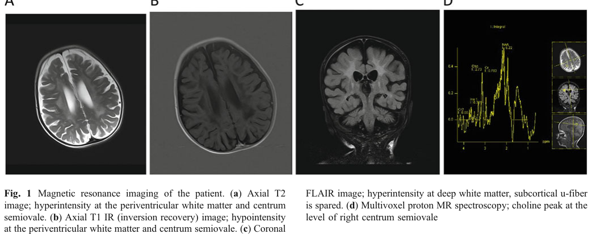

## Question

# Disease Characteristics Research Template

## Target Disease
- **Disease Name:** Krabbe Disease Due To Saposin A Deficiency
- **MONDO ID:**  (if available)
- **Category:** Mendelian

## Research Objectives

Please provide a comprehensive research report on **Krabbe Disease Due To Saposin A Deficiency** covering all of the
disease characteristics listed below. This report will be used to populate a disease knowledge
base entry. Be thorough and cite primary literature (PMID preferred) for all claims.

For each section, **suggested databases/resources** are listed. These are the first places
you should search for information on each topic.

---

### 1. Disease Information
> **Search first:** OMIM, Orphanet, ICD-10/ICD-11, MeSH, PubMed

- What is the disease? Provide a concise overview.
- What are the key identifiers? (OMIM, Orphanet, ICD-10/ICD-11, MeSH, Mondo)
- What are the common synonyms and alternative names?
- Is the information derived from individual patients (e.g., EHR) or aggregated disease-level resources?

### 2. Etiology

- **Disease Causal Factors**: What are the primary causes? (genetic, environmental, infectious, mechanistic)
- **Risk Factors**:
  > **Search first:** PubMed, Cochrane Library, UpToDate, clinical guidelines, ClinVar, ClinGen, GWAS Catalog, PheGenI, CTD, CDC, WHO, epidemiological databases
  - Genetic risk factors (causal variants, susceptibility loci, modifier genes)
  - Environmental risk factors (toxins, lifestyle, occupational exposures, age, sex, family history)
- **Protective Factors**:
  > **Search first:** PubMed, Cochrane Library, clinical trial databases, GWAS Catalog, gnomAD, WHO, CDC, nutrition databases
  - Genetic protective factors (protective variants, modifier alleles)
  - Environmental protective factors (diet, lifestyle, exposures that reduce risk)
- **Gene-Environment Interactions**: How do genetic and environmental factors interact to influence disease?
  > **Search first:** CTD, PubMed, PheGenI, GxE databases

### 3. Phenotypes
> **Search first:** HPO (Human Phenotype Ontology), OMIM, Orphanet, PubMed, clinicaltrials.gov, MedDRA, SNOMED CT, DECIPHER, LOINC

For each phenotype, provide:
- **Phenotype type**: symptoms, clinical signs, physical manifestations, behavioral changes, or laboratory abnormalities
  > For symptoms/signs: HPO, OMIM, Orphanet, PubMed
  > For behavioral changes: HPO, DSM, RDoC (Research Domain Criteria), PubMed
  > For laboratory abnormalities: LOINC, SNOMED CT, LabTests Online, PubMed
- **Phenotype characteristics**:
  > **Search first:** OMIM, Orphanet, HPO, PubMed
  - Age of symptom onset (neonatal, childhood, adult-onset, late-onset)
  - Symptom severity (mild, moderate, severe, variable)
  - Symptom progression (stable, progressive, episodic, fluctuating)
  - Frequency among affected individuals (percentage or qualitative)
- **Quality of life impact**: Effects on daily functioning and well-being (per-phenotype when possible)
  > **Search first:** EQ-5D database, SF-36, WHO QOL databases, PubMed
- Suggest HPO (Human Phenotype Ontology) terms for each phenotype

### 4. Genetic/Molecular Information

- **Causal Genes**: Gene mutations or chromosomal abnormalities responsible for disease (gene symbols, OMIM IDs)
  > **Search first:** OMIM, ClinVar, HGMD, Ensembl, NCBI Gene
- **Pathogenic Variants**:
  - Affected genes (gene symbols, HGNC IDs)
    > **Search first:** OMIM, NCBI Gene, Ensembl, HGNC, UniProt, GeneCards
  - Variant classification (pathogenic, likely pathogenic, VUS per ACMG/AMP guidelines)
    > **Search first:** ClinVar, ClinGen, ACMG/AMP guidelines, VarSome
  - Variant type/class (missense, frameshift, nonsense, splice-site, structural)
  - Allele frequency in population databases
    > **Search first:** gnomAD, 1000 Genomes, ExAC, TOPMed, dbSNP
  - Somatic vs germline origin
    > **Search first:** COSMIC (somatic), ClinVar, ICGC, TCGA
  - Functional consequences (loss of function, gain of function, dominant negative)
- **Modifier Genes**: Genes that modify disease severity or expression
- **Epigenetic Information**: DNA methylation, histone modifications, chromatin changes affecting disease
  > **Search first:** ENCODE, Roadmap Epigenomics, MethBase, DiseaseMeth
- **Chromosomal Abnormalities**: Large-scale genetic changes (aneuploidy, translocations, inversions)
  > **Search first:** DECIPHER, ClinVar, ECARUCA, UCSC Genome Browser

### 5. Environmental Information

- **Environmental Factors**: Non-genetic contributing factors (toxins, radiation, pollution, occupational exposure)
  > **Search first:** CTD (Comparative Toxicogenomics Database), TOXNET, PubMed, EPA databases
- **Lifestyle Factors**: Behavioral factors (smoking, diet, exercise, alcohol consumption)
  > **Search first:** CDC databases, WHO, PubMed, NHANES
- **Infectious Agents**: If applicable, pathogens causing or triggering disease (bacteria, viruses, fungi, parasites)
  > **Search first:** NCBI Taxonomy, ViPR, BV-BRC, MicrobeDB, GIDEON

### 6. Mechanism / Pathophysiology

- **Molecular Pathways**: Specific signaling cascades or biochemical pathways involved (Wnt, MAPK, mTOR, PI3K-AKT, etc.)
  > **Search first:** KEGG, Reactome, WikiPathways, PathBank, BioCyc
- **Cellular Processes**: Cell-level mechanisms (apoptosis, autophagy, cell cycle dysregulation, inflammation, etc.)
  > **Search first:** Gene Ontology (GO), Reactome, KEGG, PubMed
- **Protein Dysfunction**: How protein structure or function is altered (misfolding, aggregation, loss of function, gain of function)
  > **Search first:** UniProt, PDB (Protein Data Bank), InterPro, Pfam, AlphaFold
- **Metabolic Changes**: Alterations in metabolic processes (energy metabolism, lipid metabolism, amino acid metabolism)
  > **Search first:** KEGG, BioCyc, HMDB (Human Metabolome Database), BRENDA
- **Immune System Involvement**: Role of immune response (autoimmunity, immunodeficiency, chronic inflammation)
  > **Search first:** ImmPort, Immunome Database, IEDB, Gene Ontology
- **Tissue Damage Mechanisms**: How tissues/ are injured (oxidative stress, ischemia, fibrosis, necrosis)
  > **Search first:** PubMed, Gene Ontology, Reactome
- **Biochemical Abnormalities**: Specific molecular defects (enzyme deficiencies, receptor dysfunction, ion channel defects)
  > **Search first:** BRENDA, UniProt, KEGG, OMIM, PubMed
- **Epigenetic Changes**: DNA methylation, histone modifications affecting gene expression in disease
  > **Search first:** ENCODE, Roadmap Epigenomics, MethBase, DiseaseMeth
- **Molecular Profiling** (if available):
  - Transcriptomics/gene expression changes
    > **Search first:** GEO (Gene Expression Omnibus), ArrayExpress, GTEx, Human Cell Atlas, SRA
  - Proteomics findings
    > **Search first:** PRIDE, ProteomeXchange, Human Protein Atlas, STRING, BioGRID
  - Metabolomics signatures
    > **Search first:** MetaboLights, Metabolomics Workbench, HMDB, METLIN
  - Lipidomics alterations
    > **Search first:** LIPID MAPS, SwissLipids, LipidHome, Metabolomics Workbench
  - Genomic structural features
    > **Search first:** UCSC Genome Browser, Ensembl, NCBI, dbVar, DGV
- **Advanced Technologies** (if applicable):
  - Single-cell analysis findings (cell-type specific mechanisms, cellular heterogeneity)
    > **Search first:** Human Cell Atlas, Single Cell Portal, GEO, CELLxGENE
  - Spatial transcriptomics findings
    > **Search first:** GEO, Spatial Research, Vizgen, 10x Genomics data
  - Multi-omics integration results
    > **Search first:** TCGA, ICGC, cBioPortal, LinkedOmics, PubMed
  - Functional genomics screens (CRISPR, RNAi)
    > **Search first:** DepMap, GenomeRNAi, PubMed, BioGRID ORCS

For each mechanism, describe:
- The causal chain from initial trigger to clinical manifestation
- Which mechanisms are upstream vs downstream
- What cell types and biological processes are involved
- Suggest GO terms for biological processes and CL terms for cell types

### 7. Anatomical Structures Affected

- **Organ Level**:
  - Primary organs directly affected
  - Secondary organ involvement (complications, secondary effects)
  - Body systems involved (cardiovascular, nervous, digestive, respiratory, endocrine, etc.)
  > **Search first:** Uberon, FMA (Foundational Model of Anatomy), OMIM, HPO, ICD-11, MeSH, SNOMED CT
- **Tissue and Cell Level**:
  - Specific tissue types affected (epithelial, connective, muscle, nervous)
  - Specific cell populations targeted (with Cell Ontology terms)
  > **Search first:** Uberon, Human Protein Atlas, Cell Ontology, Human Cell Atlas, CellMarker, PanglaoDB
- **Subcellular Level**:
  - Cellular compartments involved (mitochondria, nucleus, ER, lysosomes) (with GO Cellular Component terms)
  > **Search first:** Gene Ontology (Cellular Component), UniProt, Human Protein Atlas
- **Localization**:
  - Specific anatomical sites (with UBERON terms)
    > **Search first:** FMA, Uberon, NeuroNames (for brain), SNOMED CT
  - Lateralization (unilateral, bilateral, asymmetric)
    > **Search first:** HPO, clinical literature, imaging databases

### 8. Temporal Development

- **Onset**:
  - Typical age of onset (congenital, pediatric, adult, geriatric)
  - Onset pattern (acute, subacute, chronic, insidious)
  > **Search first:** OMIM, Orphanet, HPO, PubMed
- **Progression**:
  - Disease stages (early, intermediate, advanced, end-stage)
    > **Search first:** Cancer Staging Manual (AJCC), WHO classifications, PubMed
  - Progression rate (rapid, slow, variable)
  - Disease course pattern (episodic, relapsing-remitting, progressive, stable)
  - Disease duration (self-limited, chronic lifelong)
  > **Search first:** Disease registries, longitudinal cohort databases, natural history studies, PubMed, Orphanet, OMIM
- **Patterns**:
  - Remission patterns (spontaneous, treatment-induced)
    > **Search first:** Clinical trial databases, disease registries, PubMed
  - Critical periods (time windows of vulnerability or opportunity for intervention)
    > **Search first:** PubMed, developmental biology databases, clinical guidelines

### 9. Inheritance and Population

- **Epidemiology**:
  - Prevalence (cases per 100,000 at given time)
  - Incidence (new cases per 100,000 per year)
  > **Search first:** Orphanet, CDC, WHO, GBD (Global Burden of Disease), national registries, SEER, disease registries
- **For Genetic Etiology**:
  - Inheritance pattern (AD, AR, X-linked, mitochondrial, multifactorial, polygenic)
    > **Search first:** OMIM, Orphanet, ClinVar, GTR (Genetic Testing Registry)
  - Penetrance (complete, incomplete, age-dependent)
    > **Search first:** ClinVar, OMIM, PubMed, ClinGen
  - Expressivity (variable, consistent)
    > **Search first:** OMIM, ClinVar, PubMed
  - Genetic anticipation (increasing severity in successive generations)
    > **Search first:** OMIM, PubMed (especially for repeat expansion disorders)
  - Germline mosaicism
    > **Search first:** ClinVar, OMIM, genetic counseling literature, PubMed
  - Founder effects (population-specific mutations)
    > **Search first:** gnomAD, population genetics databases, PubMed
  - Consanguinity role
    > **Search first:** OMIM, population studies, genetic counseling resources
  - Carrier frequency
    > **Search first:** gnomAD, carrier screening databases, GeneReviews, GTR
- **Population Demographics**:
  - Affected populations (ethnic or demographic groups with higher prevalence)
    > **Search first:** gnomAD, 1000 Genomes, PAGE Study, PubMed, population registries
  - Geographic distribution (endemic areas, regional variation)
    > **Search first:** WHO, CDC, GBD, Orphanet, geographic epidemiology databases
  - Geographic distribution of specific variants
  - Sex ratio (male:female)
    > **Search first:** Disease registries, OMIM, PubMed, epidemiological databases
  - Age distribution of affected individuals
    > **Search first:** CDC, disease registries, SEER, Orphanet

### 10. Diagnostics

- **Clinical Tests**:
  - Laboratory tests (blood, urine, tissue chemistry, specific enzyme assays)
    > **Search first:** LOINC, LabTests Online, PubMed
  - Biomarkers (proteins, metabolites, genetic markers, circulating biomarkers)
    > **Search first:** FDA Biomarker List, BEST (Biomarkers, EndpointS, and other Tools), PubMed
  - Imaging studies (X-ray, CT, MRI, PET, ultrasound)
    > **Search first:** RadLex, DICOM, Radiopaedia, imaging databases
  - Functional tests (pulmonary function, cardiac stress tests)
    > **Search first:** LOINC, clinical guidelines, PubMed
  - Electrophysiology (EEG, EMG, ECG, nerve conduction studies)
    > **Search first:** LOINC, clinical neurophysiology databases, PubMed
  - Biopsy findings (histopathology, immunohistochemistry)
    > **Search first:** SNOMED CT, College of American Pathologists resources, PubMed
  - Pathology findings (microscopic examination)
    > **Search first:** SNOMED CT, Digital Pathology databases, PubMed
- **Genetic Testing**:
  > **Search first:** GTR (Genetic Testing Registry), GeneReviews, ClinGen
  - Overview of recommended genetic testing approach
  - Whole genome sequencing (WGS) utility
    > **Search first:** GTR, ClinVar, GEL (Genomics England), gnomAD
  - Whole exome sequencing (WES) utility
    > **Search first:** GTR, ClinVar, OMIM, GeneMatcher
  - Gene panels (which panels, which genes)
    > **Search first:** GTR, ClinVar, laboratory-specific databases
  - Single gene testing
    > **Search first:** GTR, ClinVar, OMIM, GeneReviews
  - Chromosomal microarray (CMA)
    > **Search first:** DECIPHER, ClinVar, dbVar, ECARUCA
  - Karyotyping
    > **Search first:** Chromosome Abnormality Database, ClinVar, cytogenetics resources
  - FISH
    > **Search first:** ClinVar, cytogenetics databases, PubMed
  - Mitochondrial DNA testing
    > **Search first:** MITOMAP, MSeqDR, ClinVar, GTR
  - Repeat expansion testing
    > **Search first:** GTR, ClinVar, repeat expansion databases, PubMed
- **Omics-Based Diagnostics** (if applicable):
  - RNA sequencing / transcriptomics
    > **Search first:** GEO, ArrayExpress, GTEx, RNA-seq databases
  - Proteomics
    > **Search first:** PRIDE, ProteomeXchange, FDA Biomarker database
  - Metabolomics
    > **Search first:** MetaboLights, Metabolomics Workbench, HMDB
  - Epigenomics
    > **Search first:** GEO, ENCODE, Roadmap Epigenomics, MethBase
  - Liquid biopsy
    > **Search first:** COSMIC, ClinVar, liquid biopsy databases, PubMed
- **Clinical Criteria**:
  - Standardized diagnostic criteria (DSM, ICD, society guidelines)
    > **Search first:** DSM-5, ICD-11, clinical society guidelines, UpToDate
  - Differential diagnosis (other conditions to rule out, with distinguishing features)
    > **Search first:** DynaMed, UpToDate, clinical decision support systems
- **Screening**:
  - Screening methods for asymptomatic individuals (newborn screening, carrier screening, cascade screening)
    > **Search first:** ACMG recommendations, CDC newborn screening, GTR

### 11. Outcome/Prognosis

- **Survival and Mortality**:
  - Survival rate (5-year, 10-year, overall)
    > **Search first:** SEER, cancer registries, disease-specific registries, PubMed
  - Life expectancy (with and without treatment if applicable)
    > **Search first:** Orphanet, disease registries, actuarial databases, PubMed
  - Mortality rate
    > **Search first:** CDC, WHO, GBD, national mortality databases
  - Disease-specific mortality (deaths directly attributable to disease)
    > **Search first:** Disease registries, CDC Wonder, GBD, PubMed
- **Morbidity and Function**:
  - Morbidity (disease-related disability and health impacts)
    > **Search first:** GBD, WHO, disability databases, PubMed
  - Disability outcomes (long-term functional impairments)
    > **Search first:** ICF (International Classification of Functioning), disability registries
  - Quality of life measures (EQ-5D, SF-36, PROMIS, disease-specific tools)
    > **Search first:** EQ-5D database, SF-36, PROMIS, PubMed
- **Disease Course**:
  - Complications (secondary problems: infections, organ failure, etc.)
    > **Search first:** ICD codes, disease registries, clinical databases, PubMed
  - Recovery potential (likelihood and extent of recovery, with vs without treatment)
    > **Search first:** Natural history studies, rehabilitation databases, PubMed
- **Prediction**:
  - Prognostic factors (age, disease severity, biomarkers, treatment response)
    > **Search first:** Prognostic models databases, clinical calculators, PubMed
  - Prognostic biomarkers (molecular markers predicting disease course)
    > **Search first:** FDA Biomarker database, PubMed, cancer prognostic databases

### 12. Treatment

- **Pharmacotherapy**:
  - Pharmacological treatments (drug names, drug classes, mechanisms of action)
    > **Search first:** DrugBank, RxNorm, ATC classification, DailyMed, FDA databases
  - Pharmacogenomics (how genetic variants affect drug metabolism, efficacy, toxicity)
    > **Search first:** PharmGKB, CPIC (Clinical Pharmacogenetics), FDA Table of PGx Biomarkers
- **Advanced Therapeutics**:
  - Gene therapy (viral vectors, CRISPR, gene replacement, gene editing)
    > **Search first:** ClinicalTrials.gov, FDA gene therapy database, ASGCT resources
  - Cell therapy (stem cell transplant, CAR-T, cellular therapeutics)
    > **Search first:** ClinicalTrials.gov, FDA cell therapy database, FACT standards
  - RNA-based therapies (ASOs, siRNA, mRNA therapies)
    > **Search first:** ClinicalTrials.gov, FDA approvals, PubMed
  - Targeted therapies (treatments directed at specific molecular targets)
    > **Search first:** My Cancer Genome, OncoKB, ClinicalTrials.gov, FDA approvals
  - Immunotherapies (checkpoint inhibitors, monoclonal antibodies)
    > **Search first:** Cancer Immunotherapy Database, FDA approvals, ClinicalTrials.gov
- **Surgical and Interventional**:
  - Surgical interventions (types of surgery, timing, outcomes)
    > **Search first:** CPT codes, surgical registries, clinical guidelines, PubMed
- **Supportive and Rehabilitative**:
  - Supportive care (symptom management, pain control, nutrition)
    > **Search first:** Clinical guidelines, Cochrane Library, PubMed
  - Rehabilitation (physical therapy, occupational therapy, speech therapy)
    > **Search first:** Rehabilitation medicine databases, clinical guidelines, PubMed
- **Experimental**:
  - Experimental treatments in clinical trials (with NCT identifiers if available)
    > **Search first:** ClinicalTrials.gov, EU Clinical Trials Register, WHO ICTRP
- **Treatment Outcomes**:
  - Treatment response rates
    > **Search first:** Clinical trial databases, FDA reviews, systematic reviews, PubMed
  - Side effects and adverse events
    > **Search first:** FDA Adverse Event Reporting System (FAERS), MedWatch, PubMed
- **Treatment Strategy**:
  - Treatment algorithms (clinical pathways, decision trees)
    > **Search first:** Clinical practice guidelines, NCCN Guidelines, UpToDate
  - Combination therapies
    > **Search first:** ClinicalTrials.gov, treatment guidelines, PubMed
  - Personalized medicine approaches (genotype-guided treatment)
    > **Search first:** My Cancer Genome, CIViC, PharmGKB, precision medicine databases

For each treatment, suggest MAXO (Medical Action Ontology) terms where applicable.

### 13. Prevention

- **Prevention Levels**:
  - Primary prevention (preventing disease occurrence: vaccination, risk factor modification)
    > **Search first:** CDC, WHO, USPSTF recommendations, Cochrane Library
  - Secondary prevention (early detection and treatment: screening programs, early intervention)
    > **Search first:** USPSTF, CDC screening guidelines, WHO
  - Tertiary prevention (preventing complications in those with disease)
    > **Search first:** Clinical guidelines, disease management protocols, PubMed
- **Immunization**: Vaccine strategies (if applicable)
  > **Search first:** CDC vaccine schedules, WHO immunization, FDA vaccine database
- **Screening and Early Detection**:
  - Screening programs (population-based: newborn screening, cancer screening)
    > **Search first:** CDC screening programs, USPSTF, cancer screening databases
  - Genetic screening (carrier screening, preimplantation genetic diagnosis, prenatal testing)
    > **Search first:** ACMG recommendations, ACOG guidelines, GTR
  - Risk stratification (identifying high-risk individuals for targeted prevention)
    > **Search first:** Risk prediction models, clinical calculators, PubMed
- **Behavioral Interventions**: Lifestyle modifications to reduce risk
  > **Search first:** CDC, WHO, behavioral intervention databases, Cochrane Library
- **Counseling**: Genetic counseling (risk assessment, family planning guidance)
  > **Search first:** NSGC resources, ACMG guidelines, GeneReviews
- **Public Health**:
  - Public health interventions (sanitation, vector control, health education)
    > **Search first:** CDC, WHO, public health databases, PubMed
  - Environmental interventions (reducing environmental risk factors)
    > **Search first:** EPA databases, WHO environmental health, PubMed
- **Prophylaxis**: Preventive medications or procedures
  > **Search first:** Clinical guidelines, FDA approvals, PubMed

### 14. Other Species / Natural Disease

- **Taxonomy**: Species affected (with NCBI Taxon identifiers)
  > **Search first:** NCBI Taxonomy
- **Breed**: Specific breeds affected (with VBO identifiers if applicable)
  > **Search first:** VBO (Vertebrate Breed Ontology)
- **Gene**: Orthologous genes in other species (with NCBI Gene IDs)
  > **Search first:** NCBI Gene
- **Natural Disease**:
  - Naturally occurring disease in other species (companion animals, wildlife)
    > **Search first:** OMIA (Online Mendelian Inheritance in Animals), VetCompass, PubMed
  - Veterinary relevance and importance in animal health
    > **Search first:** OMIA, veterinary databases, PubMed
- **Comparative Biology**:
  - Comparative pathology (similarities and differences across species)
    > **Search first:** OMIA, comparative pathology databases, PubMed
  - Evolutionary conservation of disease mechanisms
    > **Search first:** HomoloGene, OrthoMCL, Alliance of Genome Resources
- **Transmission** (if applicable):
  - Zoonotic potential
    > **Search first:** CDC zoonotic diseases, WHO zoonoses, GIDEON
  - Cross-species susceptibility
    > **Search first:** NCBI Taxonomy, veterinary databases, PubMed

### 15. Model Organisms

- **Model Types**:
  - Model organism type (mammalian, invertebrate, cellular, in vitro)
    > **Search first:** Alliance of Genome Resources, model organism databases
  - Specific model systems (mouse, rat, zebrafish, Drosophila, C. elegans, yeast, cell lines, organoids, iPSCs)
    > **Search first:** MGI, RGD, ZFIN, FlyBase, WormBase, SGD, ATCC, Cellosaurus
  - Induced models (drug treatment, surgical intervention, environmental manipulation)
    > **Search first:** MGI, model organism databases, PubMed
- **Genetic Models**:
  - Types available (knockout, knock-in, transgenic, conditional, humanized)
    > **Search first:** MGI, IMPC, KOMP, EuMMCR, IMSR
- **Model Characteristics**:
  - Phenotype recapitulation (how well model reproduces human disease features)
    > **Search first:** Model organism databases, comparative studies, PubMed
  - Model limitations (aspects of human disease not captured)
    > **Search first:** Model organism databases, PubMed, review articles
- **Applications**:
  - Research applications (what aspects of disease can be studied)
    > **Search first:** Model organism databases, PubMed
- **Resources**:
  - Model databases
    > **Search first:** MGI, RGD, ZFIN, FlyBase, WormBase, IMSR, EMMA, MMRRC

---

## Citation Requirements

- Cite primary literature (PMID preferred) for all mechanistic and clinical claims
- Prioritize recent reviews and landmark papers
- Include direct quotes from abstracts where possible to support key statements
- Distinguish evidence source types: human clinical, model organism, in vitro, computational

## Output Format

Structure your response as a comprehensive narrative organized by the sections above.
For each section, provide:
- Factual content with specific details (numbers, percentages, gene names, variant nomenclature)
- Ontology term suggestions (HPO, GO, CL, UBERON, CHEBI, MAXO, MONDO) where applicable
- Evidence citations with PMIDs
- Direct quotes from abstracts to support key claims
- Clear indication when information is not available or not applicable for this disease

This report will be used to populate a disease knowledge base entry with:
- Pathophysiology descriptions with causal chains
- Gene/protein annotations (HGNC, GO terms)
- Phenotype associations (HP terms) with frequencies
- Cell type involvement (CL terms)
- Anatomical locations (UBERON terms)
- Chemical entities (CHEBI terms)
- Treatment annotations (MAXO terms)
- Evidence items with PMIDs and exact abstract quotes
- Epidemiology, prognosis, diagnostic, and prevention information
- Animal model descriptions with phenotype recapitulation details

## Output

Question: You are an expert researcher providing comprehensive, well-cited information.

Provide detailed information focusing on:
1. Key concepts and definitions with current understanding
2. Recent developments and latest research (prioritize 2023-2024 sources)
3. Current applications and real-world implementations
4. Expert opinions and analysis from authoritative sources
5. Relevant statistics and data from recent studies

Format as a comprehensive research report with proper citations. Include URLs and publication dates where available.
Always prioritize recent, authoritative sources and provide specific citations for all major claims.

# Disease Characteristics Research Template

## Target Disease
- **Disease Name:** Krabbe Disease Due To Saposin A Deficiency
- **MONDO ID:**  (if available)
- **Category:** Mendelian

## Research Objectives

Please provide a comprehensive research report on **Krabbe Disease Due To Saposin A Deficiency** covering all of the
disease characteristics listed below. This report will be used to populate a disease knowledge
base entry. Be thorough and cite primary literature (PMID preferred) for all claims.

For each section, **suggested databases/resources** are listed. These are the first places
you should search for information on each topic.

---

### 1. Disease Information
> **Search first:** OMIM, Orphanet, ICD-10/ICD-11, MeSH, PubMed

- What is the disease? Provide a concise overview.
- What are the key identifiers? (OMIM, Orphanet, ICD-10/ICD-11, MeSH, Mondo)
- What are the common synonyms and alternative names?
- Is the information derived from individual patients (e.g., EHR) or aggregated disease-level resources?

### 2. Etiology

- **Disease Causal Factors**: What are the primary causes? (genetic, environmental, infectious, mechanistic)
- **Risk Factors**:
  > **Search first:** PubMed, Cochrane Library, UpToDate, clinical guidelines, ClinVar, ClinGen, GWAS Catalog, PheGenI, CTD, CDC, WHO, epidemiological databases
  - Genetic risk factors (causal variants, susceptibility loci, modifier genes)
  - Environmental risk factors (toxins, lifestyle, occupational exposures, age, sex, family history)
- **Protective Factors**:
  > **Search first:** PubMed, Cochrane Library, clinical trial databases, GWAS Catalog, gnomAD, WHO, CDC, nutrition databases
  - Genetic protective factors (protective variants, modifier alleles)
  - Environmental protective factors (diet, lifestyle, exposures that reduce risk)
- **Gene-Environment Interactions**: How do genetic and environmental factors interact to influence disease?
  > **Search first:** CTD, PubMed, PheGenI, GxE databases

### 3. Phenotypes
> **Search first:** HPO (Human Phenotype Ontology), OMIM, Orphanet, PubMed, clinicaltrials.gov, MedDRA, SNOMED CT, DECIPHER, LOINC

For each phenotype, provide:
- **Phenotype type**: symptoms, clinical signs, physical manifestations, behavioral changes, or laboratory abnormalities
  > For symptoms/signs: HPO, OMIM, Orphanet, PubMed
  > For behavioral changes: HPO, DSM, RDoC (Research Domain Criteria), PubMed
  > For laboratory abnormalities: LOINC, SNOMED CT, LabTests Online, PubMed
- **Phenotype characteristics**:
  > **Search first:** OMIM, Orphanet, HPO, PubMed
  - Age of symptom onset (neonatal, childhood, adult-onset, late-onset)
  - Symptom severity (mild, moderate, severe, variable)
  - Symptom progression (stable, progressive, episodic, fluctuating)
  - Frequency among affected individuals (percentage or qualitative)
- **Quality of life impact**: Effects on daily functioning and well-being (per-phenotype when possible)
  > **Search first:** EQ-5D database, SF-36, WHO QOL databases, PubMed
- Suggest HPO (Human Phenotype Ontology) terms for each phenotype

### 4. Genetic/Molecular Information

- **Causal Genes**: Gene mutations or chromosomal abnormalities responsible for disease (gene symbols, OMIM IDs)
  > **Search first:** OMIM, ClinVar, HGMD, Ensembl, NCBI Gene
- **Pathogenic Variants**:
  - Affected genes (gene symbols, HGNC IDs)
    > **Search first:** OMIM, NCBI Gene, Ensembl, HGNC, UniProt, GeneCards
  - Variant classification (pathogenic, likely pathogenic, VUS per ACMG/AMP guidelines)
    > **Search first:** ClinVar, ClinGen, ACMG/AMP guidelines, VarSome
  - Variant type/class (missense, frameshift, nonsense, splice-site, structural)
  - Allele frequency in population databases
    > **Search first:** gnomAD, 1000 Genomes, ExAC, TOPMed, dbSNP
  - Somatic vs germline origin
    > **Search first:** COSMIC (somatic), ClinVar, ICGC, TCGA
  - Functional consequences (loss of function, gain of function, dominant negative)
- **Modifier Genes**: Genes that modify disease severity or expression
- **Epigenetic Information**: DNA methylation, histone modifications, chromatin changes affecting disease
  > **Search first:** ENCODE, Roadmap Epigenomics, MethBase, DiseaseMeth
- **Chromosomal Abnormalities**: Large-scale genetic changes (aneuploidy, translocations, inversions)
  > **Search first:** DECIPHER, ClinVar, ECARUCA, UCSC Genome Browser

### 5. Environmental Information

- **Environmental Factors**: Non-genetic contributing factors (toxins, radiation, pollution, occupational exposure)
  > **Search first:** CTD (Comparative Toxicogenomics Database), TOXNET, PubMed, EPA databases
- **Lifestyle Factors**: Behavioral factors (smoking, diet, exercise, alcohol consumption)
  > **Search first:** CDC databases, WHO, PubMed, NHANES
- **Infectious Agents**: If applicable, pathogens causing or triggering disease (bacteria, viruses, fungi, parasites)
  > **Search first:** NCBI Taxonomy, ViPR, BV-BRC, MicrobeDB, GIDEON

### 6. Mechanism / Pathophysiology

- **Molecular Pathways**: Specific signaling cascades or biochemical pathways involved (Wnt, MAPK, mTOR, PI3K-AKT, etc.)
  > **Search first:** KEGG, Reactome, WikiPathways, PathBank, BioCyc
- **Cellular Processes**: Cell-level mechanisms (apoptosis, autophagy, cell cycle dysregulation, inflammation, etc.)
  > **Search first:** Gene Ontology (GO), Reactome, KEGG, PubMed
- **Protein Dysfunction**: How protein structure or function is altered (misfolding, aggregation, loss of function, gain of function)
  > **Search first:** UniProt, PDB (Protein Data Bank), InterPro, Pfam, AlphaFold
- **Metabolic Changes**: Alterations in metabolic processes (energy metabolism, lipid metabolism, amino acid metabolism)
  > **Search first:** KEGG, BioCyc, HMDB (Human Metabolome Database), BRENDA
- **Immune System Involvement**: Role of immune response (autoimmunity, immunodeficiency, chronic inflammation)
  > **Search first:** ImmPort, Immunome Database, IEDB, Gene Ontology
- **Tissue Damage Mechanisms**: How tissues/ are injured (oxidative stress, ischemia, fibrosis, necrosis)
  > **Search first:** PubMed, Gene Ontology, Reactome
- **Biochemical Abnormalities**: Specific molecular defects (enzyme deficiencies, receptor dysfunction, ion channel defects)
  > **Search first:** BRENDA, UniProt, KEGG, OMIM, PubMed
- **Epigenetic Changes**: DNA methylation, histone modifications affecting gene expression in disease
  > **Search first:** ENCODE, Roadmap Epigenomics, MethBase, DiseaseMeth
- **Molecular Profiling** (if available):
  - Transcriptomics/gene expression changes
    > **Search first:** GEO (Gene Expression Omnibus), ArrayExpress, GTEx, Human Cell Atlas, SRA
  - Proteomics findings
    > **Search first:** PRIDE, ProteomeXchange, Human Protein Atlas, STRING, BioGRID
  - Metabolomics signatures
    > **Search first:** MetaboLights, Metabolomics Workbench, HMDB, METLIN
  - Lipidomics alterations
    > **Search first:** LIPID MAPS, SwissLipids, LipidHome, Metabolomics Workbench
  - Genomic structural features
    > **Search first:** UCSC Genome Browser, Ensembl, NCBI, dbVar, DGV
- **Advanced Technologies** (if applicable):
  - Single-cell analysis findings (cell-type specific mechanisms, cellular heterogeneity)
    > **Search first:** Human Cell Atlas, Single Cell Portal, GEO, CELLxGENE
  - Spatial transcriptomics findings
    > **Search first:** GEO, Spatial Research, Vizgen, 10x Genomics data
  - Multi-omics integration results
    > **Search first:** TCGA, ICGC, cBioPortal, LinkedOmics, PubMed
  - Functional genomics screens (CRISPR, RNAi)
    > **Search first:** DepMap, GenomeRNAi, PubMed, BioGRID ORCS

For each mechanism, describe:
- The causal chain from initial trigger to clinical manifestation
- Which mechanisms are upstream vs downstream
- What cell types and biological processes are involved
- Suggest GO terms for biological processes and CL terms for cell types

### 7. Anatomical Structures Affected

- **Organ Level**:
  - Primary organs directly affected
  - Secondary organ involvement (complications, secondary effects)
  - Body systems involved (cardiovascular, nervous, digestive, respiratory, endocrine, etc.)
  > **Search first:** Uberon, FMA (Foundational Model of Anatomy), OMIM, HPO, ICD-11, MeSH, SNOMED CT
- **Tissue and Cell Level**:
  - Specific tissue types affected (epithelial, connective, muscle, nervous)
  - Specific cell populations targeted (with Cell Ontology terms)
  > **Search first:** Uberon, Human Protein Atlas, Cell Ontology, Human Cell Atlas, CellMarker, PanglaoDB
- **Subcellular Level**:
  - Cellular compartments involved (mitochondria, nucleus, ER, lysosomes) (with GO Cellular Component terms)
  > **Search first:** Gene Ontology (Cellular Component), UniProt, Human Protein Atlas
- **Localization**:
  - Specific anatomical sites (with UBERON terms)
    > **Search first:** FMA, Uberon, NeuroNames (for brain), SNOMED CT
  - Lateralization (unilateral, bilateral, asymmetric)
    > **Search first:** HPO, clinical literature, imaging databases

### 8. Temporal Development

- **Onset**:
  - Typical age of onset (congenital, pediatric, adult, geriatric)
  - Onset pattern (acute, subacute, chronic, insidious)
  > **Search first:** OMIM, Orphanet, HPO, PubMed
- **Progression**:
  - Disease stages (early, intermediate, advanced, end-stage)
    > **Search first:** Cancer Staging Manual (AJCC), WHO classifications, PubMed
  - Progression rate (rapid, slow, variable)
  - Disease course pattern (episodic, relapsing-remitting, progressive, stable)
  - Disease duration (self-limited, chronic lifelong)
  > **Search first:** Disease registries, longitudinal cohort databases, natural history studies, PubMed, Orphanet, OMIM
- **Patterns**:
  - Remission patterns (spontaneous, treatment-induced)
    > **Search first:** Clinical trial databases, disease registries, PubMed
  - Critical periods (time windows of vulnerability or opportunity for intervention)
    > **Search first:** PubMed, developmental biology databases, clinical guidelines

### 9. Inheritance and Population

- **Epidemiology**:
  - Prevalence (cases per 100,000 at given time)
  - Incidence (new cases per 100,000 per year)
  > **Search first:** Orphanet, CDC, WHO, GBD (Global Burden of Disease), national registries, SEER, disease registries
- **For Genetic Etiology**:
  - Inheritance pattern (AD, AR, X-linked, mitochondrial, multifactorial, polygenic)
    > **Search first:** OMIM, Orphanet, ClinVar, GTR (Genetic Testing Registry)
  - Penetrance (complete, incomplete, age-dependent)
    > **Search first:** ClinVar, OMIM, PubMed, ClinGen
  - Expressivity (variable, consistent)
    > **Search first:** OMIM, ClinVar, PubMed
  - Genetic anticipation (increasing severity in successive generations)
    > **Search first:** OMIM, PubMed (especially for repeat expansion disorders)
  - Germline mosaicism
    > **Search first:** ClinVar, OMIM, genetic counseling literature, PubMed
  - Founder effects (population-specific mutations)
    > **Search first:** gnomAD, population genetics databases, PubMed
  - Consanguinity role
    > **Search first:** OMIM, population studies, genetic counseling resources
  - Carrier frequency
    > **Search first:** gnomAD, carrier screening databases, GeneReviews, GTR
- **Population Demographics**:
  - Affected populations (ethnic or demographic groups with higher prevalence)
    > **Search first:** gnomAD, 1000 Genomes, PAGE Study, PubMed, population registries
  - Geographic distribution (endemic areas, regional variation)
    > **Search first:** WHO, CDC, GBD, Orphanet, geographic epidemiology databases
  - Geographic distribution of specific variants
  - Sex ratio (male:female)
    > **Search first:** Disease registries, OMIM, PubMed, epidemiological databases
  - Age distribution of affected individuals
    > **Search first:** CDC, disease registries, SEER, Orphanet

### 10. Diagnostics

- **Clinical Tests**:
  - Laboratory tests (blood, urine, tissue chemistry, specific enzyme assays)
    > **Search first:** LOINC, LabTests Online, PubMed
  - Biomarkers (proteins, metabolites, genetic markers, circulating biomarkers)
    > **Search first:** FDA Biomarker List, BEST (Biomarkers, EndpointS, and other Tools), PubMed
  - Imaging studies (X-ray, CT, MRI, PET, ultrasound)
    > **Search first:** RadLex, DICOM, Radiopaedia, imaging databases
  - Functional tests (pulmonary function, cardiac stress tests)
    > **Search first:** LOINC, clinical guidelines, PubMed
  - Electrophysiology (EEG, EMG, ECG, nerve conduction studies)
    > **Search first:** LOINC, clinical neurophysiology databases, PubMed
  - Biopsy findings (histopathology, immunohistochemistry)
    > **Search first:** SNOMED CT, College of American Pathologists resources, PubMed
  - Pathology findings (microscopic examination)
    > **Search first:** SNOMED CT, Digital Pathology databases, PubMed
- **Genetic Testing**:
  > **Search first:** GTR (Genetic Testing Registry), GeneReviews, ClinGen
  - Overview of recommended genetic testing approach
  - Whole genome sequencing (WGS) utility
    > **Search first:** GTR, ClinVar, GEL (Genomics England), gnomAD
  - Whole exome sequencing (WES) utility
    > **Search first:** GTR, ClinVar, OMIM, GeneMatcher
  - Gene panels (which panels, which genes)
    > **Search first:** GTR, ClinVar, laboratory-specific databases
  - Single gene testing
    > **Search first:** GTR, ClinVar, OMIM, GeneReviews
  - Chromosomal microarray (CMA)
    > **Search first:** DECIPHER, ClinVar, dbVar, ECARUCA
  - Karyotyping
    > **Search first:** Chromosome Abnormality Database, ClinVar, cytogenetics resources
  - FISH
    > **Search first:** ClinVar, cytogenetics databases, PubMed
  - Mitochondrial DNA testing
    > **Search first:** MITOMAP, MSeqDR, ClinVar, GTR
  - Repeat expansion testing
    > **Search first:** GTR, ClinVar, repeat expansion databases, PubMed
- **Omics-Based Diagnostics** (if applicable):
  - RNA sequencing / transcriptomics
    > **Search first:** GEO, ArrayExpress, GTEx, RNA-seq databases
  - Proteomics
    > **Search first:** PRIDE, ProteomeXchange, FDA Biomarker database
  - Metabolomics
    > **Search first:** MetaboLights, Metabolomics Workbench, HMDB
  - Epigenomics
    > **Search first:** GEO, ENCODE, Roadmap Epigenomics, MethBase
  - Liquid biopsy
    > **Search first:** COSMIC, ClinVar, liquid biopsy databases, PubMed
- **Clinical Criteria**:
  - Standardized diagnostic criteria (DSM, ICD, society guidelines)
    > **Search first:** DSM-5, ICD-11, clinical society guidelines, UpToDate
  - Differential diagnosis (other conditions to rule out, with distinguishing features)
    > **Search first:** DynaMed, UpToDate, clinical decision support systems
- **Screening**:
  - Screening methods for asymptomatic individuals (newborn screening, carrier screening, cascade screening)
    > **Search first:** ACMG recommendations, CDC newborn screening, GTR

### 11. Outcome/Prognosis

- **Survival and Mortality**:
  - Survival rate (5-year, 10-year, overall)
    > **Search first:** SEER, cancer registries, disease-specific registries, PubMed
  - Life expectancy (with and without treatment if applicable)
    > **Search first:** Orphanet, disease registries, actuarial databases, PubMed
  - Mortality rate
    > **Search first:** CDC, WHO, GBD, national mortality databases
  - Disease-specific mortality (deaths directly attributable to disease)
    > **Search first:** Disease registries, CDC Wonder, GBD, PubMed
- **Morbidity and Function**:
  - Morbidity (disease-related disability and health impacts)
    > **Search first:** GBD, WHO, disability databases, PubMed
  - Disability outcomes (long-term functional impairments)
    > **Search first:** ICF (International Classification of Functioning), disability registries
  - Quality of life measures (EQ-5D, SF-36, PROMIS, disease-specific tools)
    > **Search first:** EQ-5D database, SF-36, PROMIS, PubMed
- **Disease Course**:
  - Complications (secondary problems: infections, organ failure, etc.)
    > **Search first:** ICD codes, disease registries, clinical databases, PubMed
  - Recovery potential (likelihood and extent of recovery, with vs without treatment)
    > **Search first:** Natural history studies, rehabilitation databases, PubMed
- **Prediction**:
  - Prognostic factors (age, disease severity, biomarkers, treatment response)
    > **Search first:** Prognostic models databases, clinical calculators, PubMed
  - Prognostic biomarkers (molecular markers predicting disease course)
    > **Search first:** FDA Biomarker database, PubMed, cancer prognostic databases

### 12. Treatment

- **Pharmacotherapy**:
  - Pharmacological treatments (drug names, drug classes, mechanisms of action)
    > **Search first:** DrugBank, RxNorm, ATC classification, DailyMed, FDA databases
  - Pharmacogenomics (how genetic variants affect drug metabolism, efficacy, toxicity)
    > **Search first:** PharmGKB, CPIC (Clinical Pharmacogenetics), FDA Table of PGx Biomarkers
- **Advanced Therapeutics**:
  - Gene therapy (viral vectors, CRISPR, gene replacement, gene editing)
    > **Search first:** ClinicalTrials.gov, FDA gene therapy database, ASGCT resources
  - Cell therapy (stem cell transplant, CAR-T, cellular therapeutics)
    > **Search first:** ClinicalTrials.gov, FDA cell therapy database, FACT standards
  - RNA-based therapies (ASOs, siRNA, mRNA therapies)
    > **Search first:** ClinicalTrials.gov, FDA approvals, PubMed
  - Targeted therapies (treatments directed at specific molecular targets)
    > **Search first:** My Cancer Genome, OncoKB, ClinicalTrials.gov, FDA approvals
  - Immunotherapies (checkpoint inhibitors, monoclonal antibodies)
    > **Search first:** Cancer Immunotherapy Database, FDA approvals, ClinicalTrials.gov
- **Surgical and Interventional**:
  - Surgical interventions (types of surgery, timing, outcomes)
    > **Search first:** CPT codes, surgical registries, clinical guidelines, PubMed
- **Supportive and Rehabilitative**:
  - Supportive care (symptom management, pain control, nutrition)
    > **Search first:** Clinical guidelines, Cochrane Library, PubMed
  - Rehabilitation (physical therapy, occupational therapy, speech therapy)
    > **Search first:** Rehabilitation medicine databases, clinical guidelines, PubMed
- **Experimental**:
  - Experimental treatments in clinical trials (with NCT identifiers if available)
    > **Search first:** ClinicalTrials.gov, EU Clinical Trials Register, WHO ICTRP
- **Treatment Outcomes**:
  - Treatment response rates
    > **Search first:** Clinical trial databases, FDA reviews, systematic reviews, PubMed
  - Side effects and adverse events
    > **Search first:** FDA Adverse Event Reporting System (FAERS), MedWatch, PubMed
- **Treatment Strategy**:
  - Treatment algorithms (clinical pathways, decision trees)
    > **Search first:** Clinical practice guidelines, NCCN Guidelines, UpToDate
  - Combination therapies
    > **Search first:** ClinicalTrials.gov, treatment guidelines, PubMed
  - Personalized medicine approaches (genotype-guided treatment)
    > **Search first:** My Cancer Genome, CIViC, PharmGKB, precision medicine databases

For each treatment, suggest MAXO (Medical Action Ontology) terms where applicable.

### 13. Prevention

- **Prevention Levels**:
  - Primary prevention (preventing disease occurrence: vaccination, risk factor modification)
    > **Search first:** CDC, WHO, USPSTF recommendations, Cochrane Library
  - Secondary prevention (early detection and treatment: screening programs, early intervention)
    > **Search first:** USPSTF, CDC screening guidelines, WHO
  - Tertiary prevention (preventing complications in those with disease)
    > **Search first:** Clinical guidelines, disease management protocols, PubMed
- **Immunization**: Vaccine strategies (if applicable)
  > **Search first:** CDC vaccine schedules, WHO immunization, FDA vaccine database
- **Screening and Early Detection**:
  - Screening programs (population-based: newborn screening, cancer screening)
    > **Search first:** CDC screening programs, USPSTF, cancer screening databases
  - Genetic screening (carrier screening, preimplantation genetic diagnosis, prenatal testing)
    > **Search first:** ACMG recommendations, ACOG guidelines, GTR
  - Risk stratification (identifying high-risk individuals for targeted prevention)
    > **Search first:** Risk prediction models, clinical calculators, PubMed
- **Behavioral Interventions**: Lifestyle modifications to reduce risk
  > **Search first:** CDC, WHO, behavioral intervention databases, Cochrane Library
- **Counseling**: Genetic counseling (risk assessment, family planning guidance)
  > **Search first:** NSGC resources, ACMG guidelines, GeneReviews
- **Public Health**:
  - Public health interventions (sanitation, vector control, health education)
    > **Search first:** CDC, WHO, public health databases, PubMed
  - Environmental interventions (reducing environmental risk factors)
    > **Search first:** EPA databases, WHO environmental health, PubMed
- **Prophylaxis**: Preventive medications or procedures
  > **Search first:** Clinical guidelines, FDA approvals, PubMed

### 14. Other Species / Natural Disease

- **Taxonomy**: Species affected (with NCBI Taxon identifiers)
  > **Search first:** NCBI Taxonomy
- **Breed**: Specific breeds affected (with VBO identifiers if applicable)
  > **Search first:** VBO (Vertebrate Breed Ontology)
- **Gene**: Orthologous genes in other species (with NCBI Gene IDs)
  > **Search first:** NCBI Gene
- **Natural Disease**:
  - Naturally occurring disease in other species (companion animals, wildlife)
    > **Search first:** OMIA (Online Mendelian Inheritance in Animals), VetCompass, PubMed
  - Veterinary relevance and importance in animal health
    > **Search first:** OMIA, veterinary databases, PubMed
- **Comparative Biology**:
  - Comparative pathology (similarities and differences across species)
    > **Search first:** OMIA, comparative pathology databases, PubMed
  - Evolutionary conservation of disease mechanisms
    > **Search first:** HomoloGene, OrthoMCL, Alliance of Genome Resources
- **Transmission** (if applicable):
  - Zoonotic potential
    > **Search first:** CDC zoonotic diseases, WHO zoonoses, GIDEON
  - Cross-species susceptibility
    > **Search first:** NCBI Taxonomy, veterinary databases, PubMed

### 15. Model Organisms

- **Model Types**:
  - Model organism type (mammalian, invertebrate, cellular, in vitro)
    > **Search first:** Alliance of Genome Resources, model organism databases
  - Specific model systems (mouse, rat, zebrafish, Drosophila, C. elegans, yeast, cell lines, organoids, iPSCs)
    > **Search first:** MGI, RGD, ZFIN, FlyBase, WormBase, SGD, ATCC, Cellosaurus
  - Induced models (drug treatment, surgical intervention, environmental manipulation)
    > **Search first:** MGI, model organism databases, PubMed
- **Genetic Models**:
  - Types available (knockout, knock-in, transgenic, conditional, humanized)
    > **Search first:** MGI, IMPC, KOMP, EuMMCR, IMSR
- **Model Characteristics**:
  - Phenotype recapitulation (how well model reproduces human disease features)
    > **Search first:** Model organism databases, comparative studies, PubMed
  - Model limitations (aspects of human disease not captured)
    > **Search first:** Model organism databases, PubMed, review articles
- **Applications**:
  - Research applications (what aspects of disease can be studied)
    > **Search first:** Model organism databases, PubMed
- **Resources**:
  - Model databases
    > **Search first:** MGI, RGD, ZFIN, FlyBase, WormBase, IMSR, EMMA, MMRRC

---

## Citation Requirements

- Cite primary literature (PMID preferred) for all mechanistic and clinical claims
- Prioritize recent reviews and landmark papers
- Include direct quotes from abstracts where possible to support key statements
- Distinguish evidence source types: human clinical, model organism, in vitro, computational

## Output Format

Structure your response as a comprehensive narrative organized by the sections above.
For each section, provide:
- Factual content with specific details (numbers, percentages, gene names, variant nomenclature)
- Ontology term suggestions (HPO, GO, CL, UBERON, CHEBI, MAXO, MONDO) where applicable
- Evidence citations with PMIDs
- Direct quotes from abstracts to support key claims
- Clear indication when information is not available or not applicable for this disease

This report will be used to populate a disease knowledge base entry with:
- Pathophysiology descriptions with causal chains
- Gene/protein annotations (HGNC, GO terms)
- Phenotype associations (HP terms) with frequencies
- Cell type involvement (CL terms)
- Anatomical locations (UBERON terms)
- Chemical entities (CHEBI terms)
- Treatment annotations (MAXO terms)
- Evidence items with PMIDs and exact abstract quotes
- Epidemiology, prognosis, diagnostic, and prevention information
- Animal model descriptions with phenotype recapitulation details

## Comprehensive Research Report: Krabbe Disease Due to Saposin A Deficiency (PSAP / saposin A domain)

### Scope note
“Krabbe disease due to saposin A deficiency” refers to a **Krabbe-like (globoid cell leukodystrophy) phenotype caused by deficiency of saposin A**, a prosaposin (PSAP) cleavage product that is required as an activator/stabilizer for lysosomal **galactosylceramidase (GALC)**. This is distinct from canonical Krabbe disease caused by biallelic **GALC** variants. The human literature in the retrieved corpus is dominated by **case reports**, and population-level epidemiology for saposin A deficiency specifically is largely unavailable. (kose2018thesecondcase pages 1-3, kose2018thesecondcase pages 11-12)

---

## 1. Disease Information

### 1.1 Concise overview
Krabbe disease (globoid cell leukodystrophy, GLD) is a lysosomal leukodystrophy characterized by progressive **central and peripheral demyelination** and neurodegeneration. While most cases are due to primary GALC deficiency, **“in very rare cases” a Krabbe phenotype can be caused by lack of active saposin A**, a necessary cofactor for GALC activity in vivo. (szymanska2012diagnosticdifficultiesin pages 11-11)

### 1.2 Key identifiers
- **Saposin A deficiency**: **OMIM #611722** (kose2018thesecondcase pages 6-7)
- **Krabbe disease / globoid cell leukodystrophy**: **OMIM #245200** (kose2018thesecondcase pages 6-7)
- **MONDO / Orphanet / ICD-10/ICD-11 / MeSH**: not confirmed from the retrieved sources; should be populated from external disease ontologies in a downstream curation step.

### 1.3 Synonyms / alternative names
- Saposin A deficiency (PSAP saposin A domain deficiency) (kose2018thesecondcase pages 6-7)
- Krabbe-like leukodystrophy due to saposin A deficiency (concept supported by the Krabbe-phenotype description) (kose2018thesecondcase pages 1-3, szymanska2012diagnosticdifficultiesin pages 11-11)
- Globoid cell leukodystrophy (Krabbe disease) phenotype due to saposin A deficiency (szymanska2012diagnosticdifficultiesin pages 11-11)

### 1.4 Evidence type
Evidence in this report is derived from:
- **Individual patient case report(s)** (human; aggregated only at “n=2 published cases” level in-source) (kose2018thesecondcase pages 3-6, kose2018thesecondcase pages 11-12)
- **Aggregated disease-level sources for classic Krabbe disease** (newborn screening policy review; incidence and HSCT risk) (ream2025evidenceandrecommendation pages 1-3)
- **Model organism studies** (mouse; defining mechanism and phenotype timing) (matsuda2001amutationin pages 4-6, matsuda2007thefunctionof pages 2-3)

---

## 2. Etiology

### 2.1 Disease causal factors
**Primary cause:** germline **biallelic pathogenic variants in PSAP affecting the saposin A domain**, producing functional saposin A deficiency. The second reported human case carried homozygous **PSAP NM_002778.3:c.209T>G (p.Val70Gly)**. (kose2018thesecondcase pages 3-6, kose2018thesecondcase pages 1-3)

**Mechanistic cause:** saposin A is a non-enzymatic lysosomal activator/stabilizer required for in vivo degradation of galactosylceramide by GALC; saposin A deficiency can therefore impair GalCer catabolism **even when the GALC gene is intact**, producing a Krabbe phenotype. (kose2018thesecondcase pages 8-9, matsuda2007thefunctionof pages 2-3)

### 2.2 Risk factors
- **Genetic risk:** autosomal recessive inheritance is implied by reported homozygous variants (and consanguinity in case reports is common in PSAP-related disorders, though not established here beyond the homozygous state). (kose2018thesecondcase pages 3-6)
- **Environmental risk factors:** none established in retrieved sources.

### 2.3 Protective factors / modifiers
No protective variants or environmental protective factors were identified in the retrieved sources.

### 2.4 Gene–environment interactions
No gene–environment interaction data were identified.

---

## 3. Phenotypes (Human)

### 3.1 Core clinical phenotype (reported 2018 case)
A reported infant (7 months) with saposin A deficiency had a clinical picture described as highly compatible with infantile Krabbe disease, including:
- **Neurologic regression / loss of milestones** (loss of head control, loss of acquired skills) (kose2018thesecondcase pages 1-3)
- **Seizures** (refractory seizures; tonic convulsions) (kose2018thesecondcase pages 1-3)
- **Hypertonicity** and **increased deep tendon reflexes** (kose2018thesecondcase pages 1-3)
- **Peripheral neuropathy**: severe axonal polyneuropathy (kose2018thesecondcase pages 1-3)
- **CSF abnormality**: elevated CSF protein (135 mg/dL) (kose2018thesecondcase pages 1-3)

**Imaging:** MRI showed ventriculomegaly and white matter signal abnormalities, described as compatible with Krabbe disease; optic nerve thickening was also noted. (kose2018thesecondcase pages 1-3, kose2018thesecondcase media 3d158019)

### 3.2 Phenotype characteristics (limitations)
- **Age of onset:** infantile in the reported human case; earlier/later-onset spectrum is not well-defined due to extremely small number of published human cases accessible in this corpus. (kose2018thesecondcase pages 1-3, kose2018thesecondcase pages 11-12)
- **Progression:** progressive neurodegeneration is implied by regression and severe neurologic findings. (kose2018thesecondcase pages 1-3)
- **Frequency among affected individuals:** not quantifiable in retrieved sources (n≈2 published human cases referenced in-source). (kose2018thesecondcase pages 3-6, kose2018thesecondcase pages 11-12)

### 3.3 Suggested HPO terms (non-exhaustive; mapping based on described features)
- Seizures **HP:0001250** (kose2018thesecondcase pages 1-3)
- Developmental regression **HP:0002376** (kose2018thesecondcase pages 1-3)
- Hypertonia **HP:0001252** (kose2018thesecondcase pages 1-3)
- Hyperreflexia **HP:0001347** (kose2018thesecondcase pages 1-3)
- Peripheral neuropathy **HP:0009830** / Axonal neuropathy **HP:0003477** (kose2018thesecondcase pages 1-3)
- Abnormal brain MRI / White matter abnormalities **HP:0002500** / **HP:0002669** (kose2018thesecondcase pages 1-3, kose2018thesecondcase media 3d158019)
- Increased cerebrospinal fluid protein **HP:0002928** (kose2018thesecondcase pages 1-3)

### 3.4 Quality-of-life impact
No formal QoL instruments (e.g., PedsQL, PROMIS) were reported in retrieved saposin A deficiency sources; however, the clinical features (seizures, regression, neuropathy) imply severe impairment. (kose2018thesecondcase pages 1-3)

---

## 4. Genetic / Molecular Information

### 4.1 Causal gene
- **PSAP** (prosaposin), specifically affecting the **saposin A domain** (kose2018thesecondcase pages 1-3)

### 4.2 Pathogenic variants (human)
From the retrieved corpus:
- **PSAP NM_002778.3:c.209T>G (p.Val70Gly)**, homozygous, associated with infantile Krabbe-like phenotype; GALC gene testing negative in that patient. (kose2018thesecondcase pages 3-6, kose2018thesecondcase pages 1-3, kose2018thesecondcase media 3d158019)

Other human saposin A deficiency was referenced as first reported in 2005 (Spiegel et al.), but that primary paper was not retrievable here; variant details are therefore not extractable from the current evidence set. (kose2018thesecondcase pages 12-12, szymanska2012diagnosticdifficultiesin pages 11-11)

### 4.3 Functional consequence
In the human case report, biochemical findings supported impaired GalCer degradation and lysosomal dysfunction, consistent with **loss of function of saposin A cofactor activity**. (kose2018thesecondcase pages 8-9)

### 4.4 Modifier genes / epigenetics / chromosomal abnormalities
No modifier genes, epigenetic mechanisms, or chromosomal abnormalities specific to saposin A deficiency were identified.

---

## 5. Environmental Information
No validated environmental, lifestyle, toxic, or infectious contributors were identified in the retrieved sources.

---

## 6. Mechanism / Pathophysiology

### 6.1 Causal chain (current understanding)
1. **PSAP saposin A-domain deficiency** → reduced availability of saposin A cofactor (kose2018thesecondcase pages 1-3)
2. **Impaired in vivo GALC-mediated degradation of galactosylceramide** (saposin A is “essential/indispensable” for this process in vivo in model systems) (matsuda2007thefunctionof pages 2-3, matsuda2007thefunctionof pages 1-2)
3. **Accumulation of myelin-enriched glycosphingolipids**, including GalCer; psychosine accumulation is implicated in Krabbe biology and was increased in saposin A-deficient mice (modest vs twitcher) (matsuda2001amutationin pages 2-4, matsuda2001amutationin pages 6-7)
4. **Demyelination and neuroinflammation** with infiltration of PAS-positive multinucleated macrophages (“globoid cells”) in CNS/PNS (matsuda2001amutationin pages 2-4, matsuda2007thefunctionof pages 2-3)
5. Clinical manifestations: progressive neurologic decline, seizures, neuropathy, and white matter disease (human phenotype) (kose2018thesecondcase pages 1-3)

### 6.2 Autophagy / lysosome dysfunction (human evidence)
Patient fibroblasts showed **altered autophagy** consistent with impaired autophagic flux: the report describes a **twofold increase of LC3 and p62** and impaired autophagosome–lysosome fusion/maturation. (kose2018thesecondcase pages 3-6, kose2018thesecondcase pages 11-12)

### 6.3 Biochemical abnormalities
- In the 2018 human case, fibroblasts showed increased neutral glycosphingolipids including **GalCer (3.5-fold), LacCer (1.5-fold), Cer (2-fold), GlcCer (1.4-fold)** compared with controls. (kose2018thesecondcase pages 8-9)
- Psychosine could not be measured in that patient due to specimen constraints (“only fibroblasts were available”). (kose2018thesecondcase pages 8-9)

### 6.4 Suggested ontology terms
**GO biological process (examples):**
- sphingolipid catabolic process (GO) (mechanistic basis supported) (matsuda2007thefunctionof pages 2-3)
- lysosomal transport / lysosome organization (GO) (lysosome/autophagy involvement) (kose2018thesecondcase pages 11-12)
- autophagy (GO) (kose2018thesecondcase pages 11-12)

**GO cellular component:**
- lysosome (GO:0005764) (supported by LAMP1-positive lysosome increase) (kose2018thesecondcase pages 8-9)

**Cell Ontology (CL) (examples):**
- macrophage / microglia-like phagocytes implicated by globoid cells (histologic globoid macrophages) (matsuda2001amutationin pages 2-4)
- oligodendrocyte lineage is implicated by demyelination (general Krabbe biology; directly supported in model pathology) (matsuda2007thefunctionof pages 2-3)

---

## 7. Anatomical Structures Affected

### 7.1 Organ/system level
- **Central nervous system** (white matter leukodystrophy; MRI changes) (kose2018thesecondcase pages 1-3, kose2018thesecondcase media 3d158019)
- **Peripheral nervous system** (severe axonal polyneuropathy; in mice, marked PNS demyelination and enlarged peripheral nerves) (kose2018thesecondcase pages 1-3, matsuda2001amutationin pages 4-6)

### 7.2 Tissue/cell level
- **Myelinated tracts / white matter** (leukodystrophy and demyelination pathology in models) (matsuda2001amutationin pages 2-4, matsuda2007thefunctionof pages 2-3)
- **Macrophage-lineage globoid cells** (PAS-positive multinucleated macrophages) (matsuda2001amutationin pages 2-4, matsuda2007thefunctionof pages 2-3)

### 7.3 Subcellular localization
- **Lysosome** (lysosomal storage biology; increased LAMP1 signal reported) (kose2018thesecondcase pages 8-9)

### 7.4 Suggested UBERON terms (examples)
- Brain white matter (UBERON) (kose2018thesecondcase media 3d158019)
- Peripheral nerve (UBERON) (matsuda2001amutationin pages 4-6)

---

## 8. Temporal Development

### 8.1 Human
- Infantile onset with rapid neurologic deterioration by 7 months was reported in the 2018 case. (kose2018thesecondcase pages 1-3)

### 8.2 Model organism temporal profile (saposin A-deficient mice)
- Weakness onset around **~60 days** and lifespan around **~120 days** in saposin A-deficient mice, indicating a chronic, later-onset course relative to twitcher (GALC-deficient) mice. (matsuda2007thefunctionof pages 2-3, matsuda2007thefunctionof pages 1-2)

---

## 9. Inheritance and Population

### 9.1 Inheritance
Autosomal recessive inheritance is supported by the reported **homozygous** PSAP variant in the 2018 case. (kose2018thesecondcase pages 3-6)

### 9.2 Epidemiology
- **Saposin A deficiency specifically:** extremely rare; the 2018 report states it is the **second reported human case**. (kose2018thesecondcase pages 3-6, kose2018thesecondcase pages 11-12)
- **Krabbe disease overall (mostly GALC-related):** a 2025 Pediatrics review reports incidence **“0.3–2.6 per 100,000 live births.”** (ream2025evidenceandrecommendation pages 1-3)
- A 2023 review cited U.S. estimates of **1 in 310,000** (retrospective analysis) and **1 in 394,000** (New York State NBS). (heller2023preclinicalstudiesin pages 1-2)

Carrier frequency, penetrance, founder effects, and variant geographic distribution for saposin A deficiency were not available in retrieved sources.

---

## 10. Diagnostics

### 10.1 Clinical testing (biochemical)
Key diagnostic pitfall: saposin A deficiency can present as Krabbe disease while having atypical enzymology/genetics for GALC.
- In the 2018 saposin A deficiency case, **GALC activity was reduced** (dried blood; leukocytes) but described as **higher than expected for classic Krabbe**, and **other lysosomal enzymes were normal**. (kose2018thesecondcase pages 3-6, kose2018thesecondcase pages 8-9)
- Fibroblast lipid studies demonstrated GalCer and related glycosphingolipid accumulation. (kose2018thesecondcase pages 8-9)

**Newborn screening context (Krabbe overall):**
- NBS uses low GALC activity in dried blood spots, with second-tier psychosine testing to improve specificity. (ream2025evidenceandrecommendation pages 1-3)
- The 2024 expedited evidence review evaluated/implemented a referral strategy based on **psychosine ≥10 nM**. (kemperUnknownyearexpeditedevidencebasedreview pages 1-4)

### 10.2 Imaging
MRI white matter abnormalities consistent with leukodystrophy were reported in the 2018 saposin A deficiency case. (kose2018thesecondcase pages 1-3, kose2018thesecondcase media 3d158019)

### 10.3 Genetic testing strategy
For a Krabbe phenotype with inconclusive GALC findings, the 2018 case supports:
- initial GALC testing (enzyme + gene) followed by
- **exome sequencing** and confirmatory Sanger sequencing to identify **PSAP saposin A-domain variants**. (kose2018thesecondcase pages 3-6, kose2018thesecondcase pages 1-3)

### 10.4 Differential diagnosis
- Classic GALC-related Krabbe disease (globoid cell leukodystrophy) remains the main differential. (kose2018thesecondcase pages 6-7, szymanska2012diagnosticdifficultiesin pages 11-11)
- Saposin A deficiency should be considered when Krabbe phenotype is present but standard testing is not definitive. (kose2018thesecondcase pages 11-12)

### 10.5 Suggested LOINC-style test concepts (since specific LOINC IDs not retrieved)
- GALC enzyme activity (dried blood spot; leukocytes) (kose2018thesecondcase pages 3-6)
- Psychosine (galactosylsphingosine) in dried blood spot / plasma (Krabbe NBS) (kemperUnknownyearexpeditedevidencebasedreview pages 1-4)
- PSAP sequencing (targeted or exome) (kose2018thesecondcase pages 3-6)

---

## 11. Outcomes / Prognosis

### 11.1 Saposin A deficiency (human)
No longitudinal survival outcomes or treatment response were available in the retrieved saposin A deficiency case excerpts.

### 11.2 Krabbe disease (overall; policy/review evidence)
The 2025 Pediatrics review summarizes infantile Krabbe disease as untreated leading to “death in early childhood.” (Direct quote from abstract-style summary) (ream2025evidenceandrecommendation pages 1-3)

---

## 12. Treatment

### 12.1 Disease-modifying therapy (Krabbe overall)
- **HSCT**: The 2025 Pediatrics review states: **“Hematopoietic stem cell transplantation (HSCT) for IKD approximately 1 month after birth can improve long-term survival but has about a 10% risk of mortality within 100 days.”** (direct quote) (ream2025evidenceandrecommendation pages 1-3)
- **Newborn screening enabling early HSCT**: The 2024 expedited evidence review modeled that with a psychosine ≥10 nM referral threshold, ~11.3 infants/year (range 5.6–20.2) would be diagnosed with infantile Krabbe disease in a 3.65M-birth cohort, with ~1.0 (0.3–1.2) HSCT deaths within 100 days among those transplanted. (kemperUnknownyearexpeditedevidencebasedreview pages 21-24)

### 12.2 Applicability to saposin A deficiency
No direct evidence in the retrieved human saposin A deficiency case report excerpts documents HSCT or gene therapy use in saposin A deficiency patients. Therefore, extrapolation from GALC-Krabbe therapeutic literature should be done cautiously.

### 12.3 Suggested MAXO terms (examples)
- Hematopoietic stem cell transplantation (MAXO) (Krabbe overall) (ream2025evidenceandrecommendation pages 1-3)
- Genetic testing (MAXO) / Whole exome sequencing (MAXO) (kose2018thesecondcase pages 3-6)

---

## 13. Prevention

### 13.1 Secondary prevention (screening)
- Newborn screening for Krabbe (overall) is based on dried blood spot GALC activity with psychosine second-tier testing; in 2024, infantile Krabbe disease was added to the U.S. Recommended Uniform Screening Panel (RUSP) as summarized in the 2025 Pediatrics review. (ream2025evidenceandrecommendation pages 1-3)

Primary prevention (environmental) is not applicable based on current evidence.

---

## 14. Other Species / Natural Disease
No naturally occurring saposin A deficiency “Krabbe due to saposin A deficiency” was identified in non-human species from the retrieved sources (separate from experimental models).

---

## 15. Model Organisms

### 15.1 Mouse models (saposin A deficiency)
Mouse models provide strong mechanistic support that saposin A deficiency can cause globoid cell leukodystrophy:
- Saposin A-deficient mice show Krabbe-like demyelination with PAS-positive multinucleated macrophage/globoid cells in CNS/PNS, weakness at ~60 days, and lifespan ~120 days. (matsuda2007thefunctionof pages 2-3, matsuda2007thefunctionof pages 1-2)
- In a saposin A-domain mutant mouse model, mean survival was ~122±17 days versus twitcher ~48±5 days, and brain GALC activity was ~half of wild type, consistent with saposin A acting as an essential activator/stabilizer for GALC in vivo. (matsuda2001amutationin pages 4-6)

### 15.2 Comparative pathology (saposin A vs twitcher)
A comparative clinico-pathological study used demyelination markers (Luxol fast blue loss; PAS-positive macrophages) and compared terminal-stage saposin A-deficient mice at PND 180 vs twitcher at PND 50, emphasizing the later course in saposin A deficiency relative to primary GALC deficiency. (yagi2004comparativeclinicopathologicalstudy pages 1-3)

### 15.3 Zebrafish (combined saposin deficiency; broader PSAP biology)
A CRISPR-Cas9 zebrafish psap knockout model recapitulated major LSD pathologies including impaired locomotion and severe myelin loss and identified acid sphingomyelinase modulation as a potential therapeutic direction for sphingolipidoses (not specific to isolated saposin A deficiency). (kose2018thesecondcase media bc75f129)

---

## Summary Table (human + models)

| Cohort/model | Age at onset / stage | Key phenotypes | Imaging / pathology | Biochemical findings | Genetic variant / genotype | Rarity / notes |
|---|---|---|---|---|---|---|
| Human case 1: first reported saposin A deficiency presenting as Krabbe disease | Infantile onset; exact onset not available in retrieved context | Krabbe-like / globoid cell leukodystrophy phenotype in an infant (szymanska2012diagnosticdifficultiesin pages 11-11) | Not available in retrieved context | Saposin A deficiency reported as cause of Krabbe phenotype; detailed GALC/psychosine values not available in retrieved context (szymanska2012diagnosticdifficultiesin pages 11-11) | Mutation in saposin A coding region of **PSAP**; exact HGVS not available in retrieved context (kose2018thesecondcase pages 12-12, szymanska2012diagnosticdifficultiesin pages 11-11) | First human report; establishes that saposin A deficiency can phenocopy Krabbe disease (kose2018thesecondcase pages 12-12, szymanska2012diagnosticdifficultiesin pages 11-11) |
| Human case 2: JIMD Reports 2018 proband | Normal early infancy, then deterioration by 7 months; infantile presentation (kose2018thesecondcase pages 1-3) | Refractory seizures, loss of milestones/head control, feeding difficulty, hypertonicity, increased deep tendon reflexes, severe axonal polyneuropathy, elevated CSF protein 135 mg/dL; phenotype highly compatible with infantile Krabbe disease (kose2018thesecondcase pages 1-3) | Brain MRI: bilateral ventricular enlargement, periventricular/centrum semiovale white matter hyperintensities, optic nerve thickening; MRI compatible with Krabbe disease (kose2018thesecondcase pages 1-3, kose2018thesecondcase media 3d158019) | GALC activity low in dried blood and reduced in leukocytes, but higher than expected for classic Krabbe; other lysosomal enzymes normal. Fibroblasts: GalCer 3.5-fold, LacCer 1.5-fold, Cer 2-fold, GlcCer 1.4-fold vs controls; increased LAMP1-positive lysosomes. Psychosine could not be assessed because only fibroblasts were available (kose2018thesecondcase pages 3-6, kose2018thesecondcase pages 8-9, kose2018thesecondcase pages 6-7, kose2018thesecondcase media 3d158019) | **PSAP** NM_002778.3:c.209T>G (p.Val70Gly), homozygous, in saposin A domain; GALC gene negative (kose2018thesecondcase pages 3-6, kose2018thesecondcase pages 1-3, kose2018thesecondcase media 3d158019) | Second known human case; authors emphasize extreme rarity and recommend considering PSAP when Krabbe phenotype is present but GALC testing is inconclusive (kose2018thesecondcase pages 3-6, kose2018thesecondcase pages 11-12) |
| Mouse model: saposin A domain mutant / saposin A-deficient (C106F; often denoted SAP-A−/− or A−/−) | Subtle weakness/sluggishness around 60 days to 2.5 months; hind-leg atrophy/paralysis and weight plateau by ~3 months (matsuda2007thefunctionof pages 2-3, matsuda2001amutationin pages 1-2) | Chronic, milder Krabbe-like disease with progressive neuromotor decline; occasional seizures/hyperactivity (matsuda2001amutationin pages 2-4, matsuda2001amutationin pages 1-2) | Demyelination in CNS and PNS; PAS-positive multinucleated macrophages / globoid-like cells around vessels; enlarged peripheral nerves; pathology detectable by ~30 days in some studies (matsuda2001amutationin pages 2-4, matsuda2007thefunctionof pages 1-2, matsuda2001amutationin pages 6-7, yagi2004comparativeclinicopathologicalstudy pages 1-3) | Brain GALC activity ~0.74 ± 0.15 vs 1.41 ± 0.23 nmol/h/mg in wild type; slight brain GalCer increase, marked kidney GalCer increase; brain psychosine ~2–3× normal / approximately doubled by 2 months (matsuda2001amutationin pages 4-6, matsuda2001amutationin pages 2-4, matsuda2001amutationin pages 6-7) | Targeted **Psap** saposin A-domain C106F mutation disrupting conserved disulfide bond (matsuda2001amutationin pages 1-2, matsuda2001amutationin pages 2-4) | Demonstrates saposin A is indispensable for in vivo GALC-mediated GalCer degradation and that saposin A deficiency is an alternative cause of globoid cell leukodystrophy (matsuda2007thefunctionof pages 2-3, matsuda2007thefunctionof pages 1-2) |
| Mouse comparator: twitcher (classic GALC-deficient Krabbe model) | Earlier onset than saposin A-deficient mice; terminal stage around PND 50 in comparative pathology studies (yagi2004comparativeclinicopathologicalstudy pages 1-3) | Severe, rapidly progressive Krabbe phenotype (matsuda2007thefunctionof pages 1-2, yagi2004comparativeclinicopathologicalstudy pages 1-3) | More severe demyelination and globoid cell pathology than saposin A-deficient mice at earlier ages (matsuda2007thefunctionof pages 1-2, yagi2004comparativeclinicopathologicalstudy pages 1-3) | Much greater psychosine accumulation than saposin A-deficient mice; terminal twitcher mice show markedly elevated psychosine, with saposin A-deficient mice having only modest increases (matsuda2001amutationin pages 2-4, matsuda2001amutationin pages 6-7) | **Galc**-deficient twitcher genotype (matsuda2007thefunctionof pages 1-2, yagi2004comparativeclinicopathologicalstudy pages 1-3) | Benchmark canonical Krabbe model used to show saposin A deficiency causes a milder, later-onset but mechanistically related leukodystrophy (matsuda2001amutationin pages 4-6, matsuda2007thefunctionof pages 1-2, yagi2004comparativeclinicopathologicalstudy pages 1-3) |
| Mouse comparator: saposin A-deficient vs twitcher lifespan | SAP-A−/− mean survival ~122 ± 17 days vs twitcher ~48 ± 5 days (matsuda2001amutationin pages 4-6) | SAP-A−/− chronic course vs twitcher fulminant course (matsuda2001amutationin pages 4-6, matsuda2007thefunctionof pages 1-2) | SAP-A−/− terminal-stage pathology compared at PND 180 vs twitcher at PND 50 (yagi2004comparativeclinicopathologicalstudy pages 1-3) | SAP-A−/− retains partial GALC-related function / compensation, whereas twitcher lacks primary GALC activity (matsuda2001amutationin pages 4-6, matsuda2007thefunctionof pages 2-3) | Comparative model evidence rather than a separate genotype row (matsuda2001amutationin pages 4-6, yagi2004comparativeclinicopathologicalstudy pages 1-3) | Useful for interpreting why human saposin A deficiency may show Krabbe phenotype despite noncanonical GALC findings (kose2018thesecondcase pages 3-6, matsuda2001amutationin pages 4-6) |

*Table: This table summarizes the reported human saposin A deficiency cases with Krabbe-like presentation and the main saposin A animal models used to define disease mechanism. It is useful for comparing clinical rarity, diagnostic findings, and the mechanistic contrast between PSAP/saposin A deficiency and classic GALC-deficient Krabbe disease.*

---

## Key gaps / limitations in the current evidence set
1. The primary first human saposin A deficiency report (Spiegel et al., 2005) and the psychosine-focused saposin A differential report (Calderwood et al., 2020) were referenced but not retrievable in this tool session; variant-level details and psychosine findings from those sources could not be extracted here. (kose2018thesecondcase pages 12-12, ream2025evidenceandrecommendation pages 8-8)
2. MONDO/Orphanet/ICD/MeSH identifiers for “Krabbe disease due to saposin A deficiency” were not available in the retrieved sources.
3. No dedicated clinical trials or treatment outcome series for saposin A deficiency (PSAP saposin A domain) were identified in the retrieved corpus; most recent (2023–2025) advances pertain to GALC-Krabbe screening and treatment policy rather than saposin A deficiency specifically. (kemperUnknownyearexpeditedevidencebasedreview pages 21-24, ream2025evidenceandrecommendation pages 1-3)

---

## URLs and publication dates (from retrieved sources)
- Kose et al. *JIMD Reports* (Jul 2018). https://doi.org/10.1007/8904_2018_114 (kose2018thesecondcase pages 3-6)
- Matsuda et al. *Human Molecular Genetics* (May 2001). https://doi.org/10.1093/hmg/10.11.1191 (matsuda2001amutationin pages 1-2)
- Matsuda et al. *Journal of Neurochemistry* (Nov 2007). https://doi.org/10.1111/j.1471-4159.2007.04709.x (matsuda2007thefunctionof pages 2-3)
- Yagi et al. *Journal of Neuropathology & Experimental Neurology* (Jul 2004). https://doi.org/10.1093/jnen/63.7.721 (yagi2004comparativeclinicopathologicalstudy pages 1-3)
- Ream et al. *Pediatrics* (Mar/Apr 2025). https://doi.org/10.1542/peds.2024-069152 (ream2025evidenceandrecommendation pages 1-3)
- Kemper et al. HRSA report “Expedited Evidence-Based Review…” (Feb 1, 2024; PDF URL referenced in-source). (kemperUnknownyearexpeditedevidencebasedreview pages 1-4)

References

1. (kose2018thesecondcase pages 1-3): Melis Kose, Secil Akyildiz Demir, Gulcin Akinci, Cenk Eraslan, Unsal Yilmaz, Serdar Ceylaner, Eser Sozmen Yildirim, and Volkan Seyrantepe. The second case of saposin a deficiency and altered autophagy. JIMD reports, 44:43-54, Jul 2018. URL: https://doi.org/10.1007/8904\_2018\_114, doi:10.1007/8904\_2018\_114. This article has 11 citations and is from a peer-reviewed journal.

2. (kose2018thesecondcase pages 11-12): Melis Kose, Secil Akyildiz Demir, Gulcin Akinci, Cenk Eraslan, Unsal Yilmaz, Serdar Ceylaner, Eser Sozmen Yildirim, and Volkan Seyrantepe. The second case of saposin a deficiency and altered autophagy. JIMD reports, 44:43-54, Jul 2018. URL: https://doi.org/10.1007/8904\_2018\_114, doi:10.1007/8904\_2018\_114. This article has 11 citations and is from a peer-reviewed journal.

3. (szymanska2012diagnosticdifficultiesin pages 11-11): Krystyna Szymańska, Agnieszka Ługowska, Milena Laure-Kamionowska, Monika Bekiesińska-Figatowska, Dorota Gieruszczak-Białek, Małgorzata Musielak, Sabrina Eichler, Anne-Katrin Giese, and Arndt Rolfs. Diagnostic difficulties in krabbe disease: a report of two cases and review of literature. Folia neuropathologica, 50 4:346-56, Aug 2012. URL: https://doi.org/10.5114/fn.2012.32364, doi:10.5114/fn.2012.32364. This article has 31 citations and is from a peer-reviewed journal.

4. (kose2018thesecondcase pages 6-7): Melis Kose, Secil Akyildiz Demir, Gulcin Akinci, Cenk Eraslan, Unsal Yilmaz, Serdar Ceylaner, Eser Sozmen Yildirim, and Volkan Seyrantepe. The second case of saposin a deficiency and altered autophagy. JIMD reports, 44:43-54, Jul 2018. URL: https://doi.org/10.1007/8904\_2018\_114, doi:10.1007/8904\_2018\_114. This article has 11 citations and is from a peer-reviewed journal.

5. (kose2018thesecondcase pages 3-6): Melis Kose, Secil Akyildiz Demir, Gulcin Akinci, Cenk Eraslan, Unsal Yilmaz, Serdar Ceylaner, Eser Sozmen Yildirim, and Volkan Seyrantepe. The second case of saposin a deficiency and altered autophagy. JIMD reports, 44:43-54, Jul 2018. URL: https://doi.org/10.1007/8904\_2018\_114, doi:10.1007/8904\_2018\_114. This article has 11 citations and is from a peer-reviewed journal.

6. (ream2025evidenceandrecommendation pages 1-3): Margie A. Ream, Wendy K. K. Lam, Scott D. Grosse, Jelili Ojodu, Elizabeth Jones, Lisa A. Prosser, Angela M. Rose, Anne Marie Comeau, Susan Tanksley, Katie P. DiCostanzo, and Alex R. Kemper. Evidence and recommendation for infantile krabbe disease newborn screening. Pediatrics, Mar 2025. URL: https://doi.org/10.1542/peds.2024-069152, doi:10.1542/peds.2024-069152. This article has 7 citations and is from a highest quality peer-reviewed journal.

7. (matsuda2001amutationin pages 4-6): J. Matsuda, M. Vanier, Y. Saito, J. Tohyama, Kinuko Suzuki, and Kunihiko Suzuki. A mutation in the saposin a domain of the sphingolipid activator protein (prosaposin) gene results in a late-onset, chronic form of globoid cell leukodystrophy in the mouse. Human molecular genetics, 10 11:1191-9, May 2001. URL: https://doi.org/10.1093/hmg/10.11.1191, doi:10.1093/hmg/10.11.1191. This article has 173 citations and is from a domain leading peer-reviewed journal.

8. (matsuda2007thefunctionof pages 2-3): Junko Matsuda, Azusa Yoneshige, and Kunihiko Suzuki. The function of sphingolipids in the nervous system: lessons learnt from mouse models of specific sphingolipid activator protein deficiencies. Journal of Neurochemistry, 103:32-38, Nov 2007. URL: https://doi.org/10.1111/j.1471-4159.2007.04709.x, doi:10.1111/j.1471-4159.2007.04709.x. This article has 45 citations and is from a domain leading peer-reviewed journal.

9. (kose2018thesecondcase pages 8-9): Melis Kose, Secil Akyildiz Demir, Gulcin Akinci, Cenk Eraslan, Unsal Yilmaz, Serdar Ceylaner, Eser Sozmen Yildirim, and Volkan Seyrantepe. The second case of saposin a deficiency and altered autophagy. JIMD reports, 44:43-54, Jul 2018. URL: https://doi.org/10.1007/8904\_2018\_114, doi:10.1007/8904\_2018\_114. This article has 11 citations and is from a peer-reviewed journal.

10. (kose2018thesecondcase media 3d158019): Melis Kose, Secil Akyildiz Demir, Gulcin Akinci, Cenk Eraslan, Unsal Yilmaz, Serdar Ceylaner, Eser Sozmen Yildirim, and Volkan Seyrantepe. The second case of saposin a deficiency and altered autophagy. JIMD reports, 44:43-54, Jul 2018. URL: https://doi.org/10.1007/8904\_2018\_114, doi:10.1007/8904\_2018\_114. This article has 11 citations and is from a peer-reviewed journal.

11. (kose2018thesecondcase pages 12-12): Melis Kose, Secil Akyildiz Demir, Gulcin Akinci, Cenk Eraslan, Unsal Yilmaz, Serdar Ceylaner, Eser Sozmen Yildirim, and Volkan Seyrantepe. The second case of saposin a deficiency and altered autophagy. JIMD reports, 44:43-54, Jul 2018. URL: https://doi.org/10.1007/8904\_2018\_114, doi:10.1007/8904\_2018\_114. This article has 11 citations and is from a peer-reviewed journal.

12. (matsuda2007thefunctionof pages 1-2): Junko Matsuda, Azusa Yoneshige, and Kunihiko Suzuki. The function of sphingolipids in the nervous system: lessons learnt from mouse models of specific sphingolipid activator protein deficiencies. Journal of Neurochemistry, 103:32-38, Nov 2007. URL: https://doi.org/10.1111/j.1471-4159.2007.04709.x, doi:10.1111/j.1471-4159.2007.04709.x. This article has 45 citations and is from a domain leading peer-reviewed journal.

13. (matsuda2001amutationin pages 2-4): J. Matsuda, M. Vanier, Y. Saito, J. Tohyama, Kinuko Suzuki, and Kunihiko Suzuki. A mutation in the saposin a domain of the sphingolipid activator protein (prosaposin) gene results in a late-onset, chronic form of globoid cell leukodystrophy in the mouse. Human molecular genetics, 10 11:1191-9, May 2001. URL: https://doi.org/10.1093/hmg/10.11.1191, doi:10.1093/hmg/10.11.1191. This article has 173 citations and is from a domain leading peer-reviewed journal.

14. (matsuda2001amutationin pages 6-7): J. Matsuda, M. Vanier, Y. Saito, J. Tohyama, Kinuko Suzuki, and Kunihiko Suzuki. A mutation in the saposin a domain of the sphingolipid activator protein (prosaposin) gene results in a late-onset, chronic form of globoid cell leukodystrophy in the mouse. Human molecular genetics, 10 11:1191-9, May 2001. URL: https://doi.org/10.1093/hmg/10.11.1191, doi:10.1093/hmg/10.11.1191. This article has 173 citations and is from a domain leading peer-reviewed journal.

15. (heller2023preclinicalstudiesin pages 1-2): Gregory Heller, Allison M. Bradbury, Mark S. Sands, and Ernesto R. Bongarzone. Preclinical studies in krabbe disease: a model for the investigation of novel combination therapies for lysosomal storage diseases. Molecular Therapy, 31:7-23, Jan 2023. URL: https://doi.org/10.1016/j.ymthe.2022.09.017, doi:10.1016/j.ymthe.2022.09.017. This article has 15 citations and is from a highest quality peer-reviewed journal.

16. (kemperUnknownyearexpeditedevidencebasedreview pages 1-4): AR Kemper, KK Lam, M Ream, and K DiCostanzo. Expedited evidence-based review of newborn screening for krabbe disease final report: february 1, 2024. Unknown journal, Unknown year.

17. (kemperUnknownyearexpeditedevidencebasedreview pages 21-24): AR Kemper, KK Lam, M Ream, and K DiCostanzo. Expedited evidence-based review of newborn screening for krabbe disease final report: february 1, 2024. Unknown journal, Unknown year.

18. (yagi2004comparativeclinicopathologicalstudy pages 1-3): Takashi Yagi, Junko Matsuda, Shoichi Takikita, Ikuko Mohri, Kunihiko Suzuki, and Kinuko Suzuki. Comparative clinico-pathological study of saposin-a-deficient (sap-a−/−) and twitcher mice. Journal of Neuropathology &amp; Experimental Neurology, 63:721-734, Jul 2004. URL: https://doi.org/10.1093/jnen/63.7.721, doi:10.1093/jnen/63.7.721. This article has 13 citations and is from a peer-reviewed journal.

19. (kose2018thesecondcase media bc75f129): Melis Kose, Secil Akyildiz Demir, Gulcin Akinci, Cenk Eraslan, Unsal Yilmaz, Serdar Ceylaner, Eser Sozmen Yildirim, and Volkan Seyrantepe. The second case of saposin a deficiency and altered autophagy. JIMD reports, 44:43-54, Jul 2018. URL: https://doi.org/10.1007/8904\_2018\_114, doi:10.1007/8904\_2018\_114. This article has 11 citations and is from a peer-reviewed journal.

20. (matsuda2001amutationin pages 1-2): J. Matsuda, M. Vanier, Y. Saito, J. Tohyama, Kinuko Suzuki, and Kunihiko Suzuki. A mutation in the saposin a domain of the sphingolipid activator protein (prosaposin) gene results in a late-onset, chronic form of globoid cell leukodystrophy in the mouse. Human molecular genetics, 10 11:1191-9, May 2001. URL: https://doi.org/10.1093/hmg/10.11.1191, doi:10.1093/hmg/10.11.1191. This article has 173 citations and is from a domain leading peer-reviewed journal.

21. (ream2025evidenceandrecommendation pages 8-8): Margie A. Ream, Wendy K. K. Lam, Scott D. Grosse, Jelili Ojodu, Elizabeth Jones, Lisa A. Prosser, Angela M. Rose, Anne Marie Comeau, Susan Tanksley, Katie P. DiCostanzo, and Alex R. Kemper. Evidence and recommendation for infantile krabbe disease newborn screening. Pediatrics, Mar 2025. URL: https://doi.org/10.1542/peds.2024-069152, doi:10.1542/peds.2024-069152. This article has 7 citations and is from a highest quality peer-reviewed journal.

## Artifacts

- [Edison artifact artifact-00](Krabbe_Disease_Due_To_Saposin_A_Deficiency-deep-research-falcon_artifacts/artifact-00.md)
