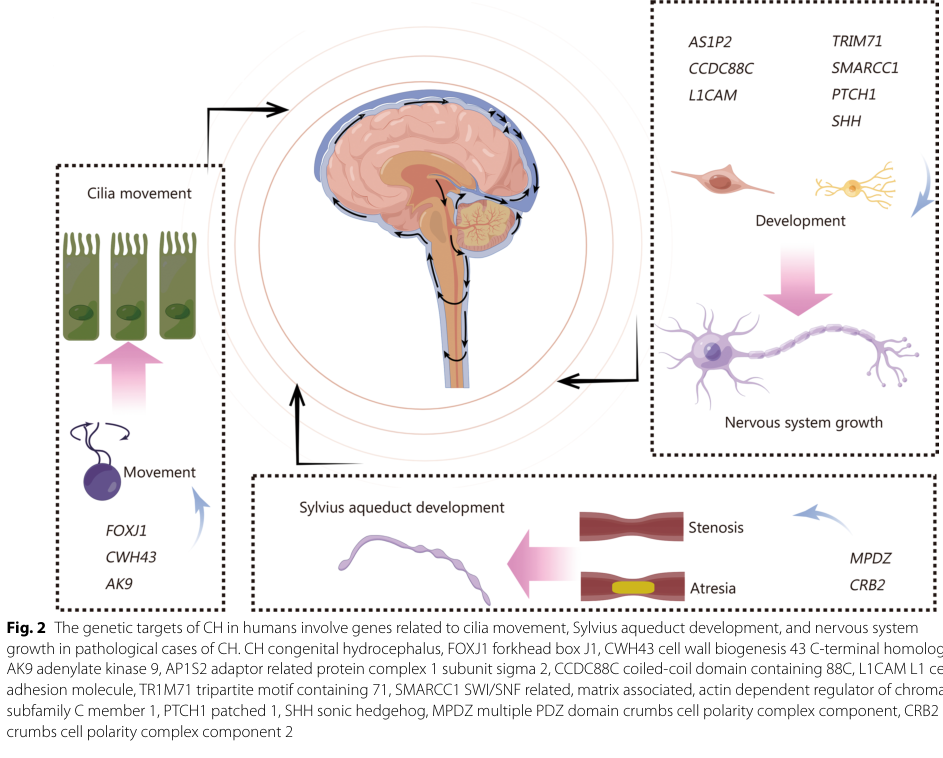

## Question

# Disease Characteristics Research Template

## Target Disease
- **Disease Name:** L1 Syndrome
- **MONDO ID:**  (if available)
- **Category:** Mendelian

## Research Objectives

Please provide a comprehensive research report on **L1 Syndrome** covering all of the
disease characteristics listed below. This report will be used to populate a disease knowledge
base entry. Be thorough and cite primary literature (PMID preferred) for all claims.

For each section, **suggested databases/resources** are listed. These are the first places
you should search for information on each topic.

---

### 1. Disease Information
> **Search first:** OMIM, Orphanet, ICD-10/ICD-11, MeSH, PubMed

- What is the disease? Provide a concise overview.
- What are the key identifiers? (OMIM, Orphanet, ICD-10/ICD-11, MeSH, Mondo)
- What are the common synonyms and alternative names?
- Is the information derived from individual patients (e.g., EHR) or aggregated disease-level resources?

### 2. Etiology

- **Disease Causal Factors**: What are the primary causes? (genetic, environmental, infectious, mechanistic)
- **Risk Factors**:
  > **Search first:** PubMed, Cochrane Library, UpToDate, clinical guidelines, ClinVar, ClinGen, GWAS Catalog, PheGenI, CTD, CDC, WHO, epidemiological databases
  - Genetic risk factors (causal variants, susceptibility loci, modifier genes)
  - Environmental risk factors (toxins, lifestyle, occupational exposures, age, sex, family history)
- **Protective Factors**:
  > **Search first:** PubMed, Cochrane Library, clinical trial databases, GWAS Catalog, gnomAD, WHO, CDC, nutrition databases
  - Genetic protective factors (protective variants, modifier alleles)
  - Environmental protective factors (diet, lifestyle, exposures that reduce risk)
- **Gene-Environment Interactions**: How do genetic and environmental factors interact to influence disease?
  > **Search first:** CTD, PubMed, PheGenI, GxE databases

### 3. Phenotypes
> **Search first:** HPO (Human Phenotype Ontology), OMIM, Orphanet, PubMed, clinicaltrials.gov, MedDRA, SNOMED CT, DECIPHER, LOINC

For each phenotype, provide:
- **Phenotype type**: symptoms, clinical signs, physical manifestations, behavioral changes, or laboratory abnormalities
  > For symptoms/signs: HPO, OMIM, Orphanet, PubMed
  > For behavioral changes: HPO, DSM, RDoC (Research Domain Criteria), PubMed
  > For laboratory abnormalities: LOINC, SNOMED CT, LabTests Online, PubMed
- **Phenotype characteristics**:
  > **Search first:** OMIM, Orphanet, HPO, PubMed
  - Age of symptom onset (neonatal, childhood, adult-onset, late-onset)
  - Symptom severity (mild, moderate, severe, variable)
  - Symptom progression (stable, progressive, episodic, fluctuating)
  - Frequency among affected individuals (percentage or qualitative)
- **Quality of life impact**: Effects on daily functioning and well-being (per-phenotype when possible)
  > **Search first:** EQ-5D database, SF-36, WHO QOL databases, PubMed
- Suggest HPO (Human Phenotype Ontology) terms for each phenotype

### 4. Genetic/Molecular Information

- **Causal Genes**: Gene mutations or chromosomal abnormalities responsible for disease (gene symbols, OMIM IDs)
  > **Search first:** OMIM, ClinVar, HGMD, Ensembl, NCBI Gene
- **Pathogenic Variants**:
  - Affected genes (gene symbols, HGNC IDs)
    > **Search first:** OMIM, NCBI Gene, Ensembl, HGNC, UniProt, GeneCards
  - Variant classification (pathogenic, likely pathogenic, VUS per ACMG/AMP guidelines)
    > **Search first:** ClinVar, ClinGen, ACMG/AMP guidelines, VarSome
  - Variant type/class (missense, frameshift, nonsense, splice-site, structural)
  - Allele frequency in population databases
    > **Search first:** gnomAD, 1000 Genomes, ExAC, TOPMed, dbSNP
  - Somatic vs germline origin
    > **Search first:** COSMIC (somatic), ClinVar, ICGC, TCGA
  - Functional consequences (loss of function, gain of function, dominant negative)
- **Modifier Genes**: Genes that modify disease severity or expression
- **Epigenetic Information**: DNA methylation, histone modifications, chromatin changes affecting disease
  > **Search first:** ENCODE, Roadmap Epigenomics, MethBase, DiseaseMeth
- **Chromosomal Abnormalities**: Large-scale genetic changes (aneuploidy, translocations, inversions)
  > **Search first:** DECIPHER, ClinVar, ECARUCA, UCSC Genome Browser

### 5. Environmental Information

- **Environmental Factors**: Non-genetic contributing factors (toxins, radiation, pollution, occupational exposure)
  > **Search first:** CTD (Comparative Toxicogenomics Database), TOXNET, PubMed, EPA databases
- **Lifestyle Factors**: Behavioral factors (smoking, diet, exercise, alcohol consumption)
  > **Search first:** CDC databases, WHO, PubMed, NHANES
- **Infectious Agents**: If applicable, pathogens causing or triggering disease (bacteria, viruses, fungi, parasites)
  > **Search first:** NCBI Taxonomy, ViPR, BV-BRC, MicrobeDB, GIDEON

### 6. Mechanism / Pathophysiology

- **Molecular Pathways**: Specific signaling cascades or biochemical pathways involved (Wnt, MAPK, mTOR, PI3K-AKT, etc.)
  > **Search first:** KEGG, Reactome, WikiPathways, PathBank, BioCyc
- **Cellular Processes**: Cell-level mechanisms (apoptosis, autophagy, cell cycle dysregulation, inflammation, etc.)
  > **Search first:** Gene Ontology (GO), Reactome, KEGG, PubMed
- **Protein Dysfunction**: How protein structure or function is altered (misfolding, aggregation, loss of function, gain of function)
  > **Search first:** UniProt, PDB (Protein Data Bank), InterPro, Pfam, AlphaFold
- **Metabolic Changes**: Alterations in metabolic processes (energy metabolism, lipid metabolism, amino acid metabolism)
  > **Search first:** KEGG, BioCyc, HMDB (Human Metabolome Database), BRENDA
- **Immune System Involvement**: Role of immune response (autoimmunity, immunodeficiency, chronic inflammation)
  > **Search first:** ImmPort, Immunome Database, IEDB, Gene Ontology
- **Tissue Damage Mechanisms**: How tissues/ are injured (oxidative stress, ischemia, fibrosis, necrosis)
  > **Search first:** PubMed, Gene Ontology, Reactome
- **Biochemical Abnormalities**: Specific molecular defects (enzyme deficiencies, receptor dysfunction, ion channel defects)
  > **Search first:** BRENDA, UniProt, KEGG, OMIM, PubMed
- **Epigenetic Changes**: DNA methylation, histone modifications affecting gene expression in disease
  > **Search first:** ENCODE, Roadmap Epigenomics, MethBase, DiseaseMeth
- **Molecular Profiling** (if available):
  - Transcriptomics/gene expression changes
    > **Search first:** GEO (Gene Expression Omnibus), ArrayExpress, GTEx, Human Cell Atlas, SRA
  - Proteomics findings
    > **Search first:** PRIDE, ProteomeXchange, Human Protein Atlas, STRING, BioGRID
  - Metabolomics signatures
    > **Search first:** MetaboLights, Metabolomics Workbench, HMDB, METLIN
  - Lipidomics alterations
    > **Search first:** LIPID MAPS, SwissLipids, LipidHome, Metabolomics Workbench
  - Genomic structural features
    > **Search first:** UCSC Genome Browser, Ensembl, NCBI, dbVar, DGV
- **Advanced Technologies** (if applicable):
  - Single-cell analysis findings (cell-type specific mechanisms, cellular heterogeneity)
    > **Search first:** Human Cell Atlas, Single Cell Portal, GEO, CELLxGENE
  - Spatial transcriptomics findings
    > **Search first:** GEO, Spatial Research, Vizgen, 10x Genomics data
  - Multi-omics integration results
    > **Search first:** TCGA, ICGC, cBioPortal, LinkedOmics, PubMed
  - Functional genomics screens (CRISPR, RNAi)
    > **Search first:** DepMap, GenomeRNAi, PubMed, BioGRID ORCS

For each mechanism, describe:
- The causal chain from initial trigger to clinical manifestation
- Which mechanisms are upstream vs downstream
- What cell types and biological processes are involved
- Suggest GO terms for biological processes and CL terms for cell types

### 7. Anatomical Structures Affected

- **Organ Level**:
  - Primary organs directly affected
  - Secondary organ involvement (complications, secondary effects)
  - Body systems involved (cardiovascular, nervous, digestive, respiratory, endocrine, etc.)
  > **Search first:** Uberon, FMA (Foundational Model of Anatomy), OMIM, HPO, ICD-11, MeSH, SNOMED CT
- **Tissue and Cell Level**:
  - Specific tissue types affected (epithelial, connective, muscle, nervous)
  - Specific cell populations targeted (with Cell Ontology terms)
  > **Search first:** Uberon, Human Protein Atlas, Cell Ontology, Human Cell Atlas, CellMarker, PanglaoDB
- **Subcellular Level**:
  - Cellular compartments involved (mitochondria, nucleus, ER, lysosomes) (with GO Cellular Component terms)
  > **Search first:** Gene Ontology (Cellular Component), UniProt, Human Protein Atlas
- **Localization**:
  - Specific anatomical sites (with UBERON terms)
    > **Search first:** FMA, Uberon, NeuroNames (for brain), SNOMED CT
  - Lateralization (unilateral, bilateral, asymmetric)
    > **Search first:** HPO, clinical literature, imaging databases

### 8. Temporal Development

- **Onset**:
  - Typical age of onset (congenital, pediatric, adult, geriatric)
  - Onset pattern (acute, subacute, chronic, insidious)
  > **Search first:** OMIM, Orphanet, HPO, PubMed
- **Progression**:
  - Disease stages (early, intermediate, advanced, end-stage)
    > **Search first:** Cancer Staging Manual (AJCC), WHO classifications, PubMed
  - Progression rate (rapid, slow, variable)
  - Disease course pattern (episodic, relapsing-remitting, progressive, stable)
  - Disease duration (self-limited, chronic lifelong)
  > **Search first:** Disease registries, longitudinal cohort databases, natural history studies, PubMed, Orphanet, OMIM
- **Patterns**:
  - Remission patterns (spontaneous, treatment-induced)
    > **Search first:** Clinical trial databases, disease registries, PubMed
  - Critical periods (time windows of vulnerability or opportunity for intervention)
    > **Search first:** PubMed, developmental biology databases, clinical guidelines

### 9. Inheritance and Population

- **Epidemiology**:
  - Prevalence (cases per 100,000 at given time)
  - Incidence (new cases per 100,000 per year)
  > **Search first:** Orphanet, CDC, WHO, GBD (Global Burden of Disease), national registries, SEER, disease registries
- **For Genetic Etiology**:
  - Inheritance pattern (AD, AR, X-linked, mitochondrial, multifactorial, polygenic)
    > **Search first:** OMIM, Orphanet, ClinVar, GTR (Genetic Testing Registry)
  - Penetrance (complete, incomplete, age-dependent)
    > **Search first:** ClinVar, OMIM, PubMed, ClinGen
  - Expressivity (variable, consistent)
    > **Search first:** OMIM, ClinVar, PubMed
  - Genetic anticipation (increasing severity in successive generations)
    > **Search first:** OMIM, PubMed (especially for repeat expansion disorders)
  - Germline mosaicism
    > **Search first:** ClinVar, OMIM, genetic counseling literature, PubMed
  - Founder effects (population-specific mutations)
    > **Search first:** gnomAD, population genetics databases, PubMed
  - Consanguinity role
    > **Search first:** OMIM, population studies, genetic counseling resources
  - Carrier frequency
    > **Search first:** gnomAD, carrier screening databases, GeneReviews, GTR
- **Population Demographics**:
  - Affected populations (ethnic or demographic groups with higher prevalence)
    > **Search first:** gnomAD, 1000 Genomes, PAGE Study, PubMed, population registries
  - Geographic distribution (endemic areas, regional variation)
    > **Search first:** WHO, CDC, GBD, Orphanet, geographic epidemiology databases
  - Geographic distribution of specific variants
  - Sex ratio (male:female)
    > **Search first:** Disease registries, OMIM, PubMed, epidemiological databases
  - Age distribution of affected individuals
    > **Search first:** CDC, disease registries, SEER, Orphanet

### 10. Diagnostics

- **Clinical Tests**:
  - Laboratory tests (blood, urine, tissue chemistry, specific enzyme assays)
    > **Search first:** LOINC, LabTests Online, PubMed
  - Biomarkers (proteins, metabolites, genetic markers, circulating biomarkers)
    > **Search first:** FDA Biomarker List, BEST (Biomarkers, EndpointS, and other Tools), PubMed
  - Imaging studies (X-ray, CT, MRI, PET, ultrasound)
    > **Search first:** RadLex, DICOM, Radiopaedia, imaging databases
  - Functional tests (pulmonary function, cardiac stress tests)
    > **Search first:** LOINC, clinical guidelines, PubMed
  - Electrophysiology (EEG, EMG, ECG, nerve conduction studies)
    > **Search first:** LOINC, clinical neurophysiology databases, PubMed
  - Biopsy findings (histopathology, immunohistochemistry)
    > **Search first:** SNOMED CT, College of American Pathologists resources, PubMed
  - Pathology findings (microscopic examination)
    > **Search first:** SNOMED CT, Digital Pathology databases, PubMed
- **Genetic Testing**:
  > **Search first:** GTR (Genetic Testing Registry), GeneReviews, ClinGen
  - Overview of recommended genetic testing approach
  - Whole genome sequencing (WGS) utility
    > **Search first:** GTR, ClinVar, GEL (Genomics England), gnomAD
  - Whole exome sequencing (WES) utility
    > **Search first:** GTR, ClinVar, OMIM, GeneMatcher
  - Gene panels (which panels, which genes)
    > **Search first:** GTR, ClinVar, laboratory-specific databases
  - Single gene testing
    > **Search first:** GTR, ClinVar, OMIM, GeneReviews
  - Chromosomal microarray (CMA)
    > **Search first:** DECIPHER, ClinVar, dbVar, ECARUCA
  - Karyotyping
    > **Search first:** Chromosome Abnormality Database, ClinVar, cytogenetics resources
  - FISH
    > **Search first:** ClinVar, cytogenetics databases, PubMed
  - Mitochondrial DNA testing
    > **Search first:** MITOMAP, MSeqDR, ClinVar, GTR
  - Repeat expansion testing
    > **Search first:** GTR, ClinVar, repeat expansion databases, PubMed
- **Omics-Based Diagnostics** (if applicable):
  - RNA sequencing / transcriptomics
    > **Search first:** GEO, ArrayExpress, GTEx, RNA-seq databases
  - Proteomics
    > **Search first:** PRIDE, ProteomeXchange, FDA Biomarker database
  - Metabolomics
    > **Search first:** MetaboLights, Metabolomics Workbench, HMDB
  - Epigenomics
    > **Search first:** GEO, ENCODE, Roadmap Epigenomics, MethBase
  - Liquid biopsy
    > **Search first:** COSMIC, ClinVar, liquid biopsy databases, PubMed
- **Clinical Criteria**:
  - Standardized diagnostic criteria (DSM, ICD, society guidelines)
    > **Search first:** DSM-5, ICD-11, clinical society guidelines, UpToDate
  - Differential diagnosis (other conditions to rule out, with distinguishing features)
    > **Search first:** DynaMed, UpToDate, clinical decision support systems
- **Screening**:
  - Screening methods for asymptomatic individuals (newborn screening, carrier screening, cascade screening)
    > **Search first:** ACMG recommendations, CDC newborn screening, GTR

### 11. Outcome/Prognosis

- **Survival and Mortality**:
  - Survival rate (5-year, 10-year, overall)
    > **Search first:** SEER, cancer registries, disease-specific registries, PubMed
  - Life expectancy (with and without treatment if applicable)
    > **Search first:** Orphanet, disease registries, actuarial databases, PubMed
  - Mortality rate
    > **Search first:** CDC, WHO, GBD, national mortality databases
  - Disease-specific mortality (deaths directly attributable to disease)
    > **Search first:** Disease registries, CDC Wonder, GBD, PubMed
- **Morbidity and Function**:
  - Morbidity (disease-related disability and health impacts)
    > **Search first:** GBD, WHO, disability databases, PubMed
  - Disability outcomes (long-term functional impairments)
    > **Search first:** ICF (International Classification of Functioning), disability registries
  - Quality of life measures (EQ-5D, SF-36, PROMIS, disease-specific tools)
    > **Search first:** EQ-5D database, SF-36, PROMIS, PubMed
- **Disease Course**:
  - Complications (secondary problems: infections, organ failure, etc.)
    > **Search first:** ICD codes, disease registries, clinical databases, PubMed
  - Recovery potential (likelihood and extent of recovery, with vs without treatment)
    > **Search first:** Natural history studies, rehabilitation databases, PubMed
- **Prediction**:
  - Prognostic factors (age, disease severity, biomarkers, treatment response)
    > **Search first:** Prognostic models databases, clinical calculators, PubMed
  - Prognostic biomarkers (molecular markers predicting disease course)
    > **Search first:** FDA Biomarker database, PubMed, cancer prognostic databases

### 12. Treatment

- **Pharmacotherapy**:
  - Pharmacological treatments (drug names, drug classes, mechanisms of action)
    > **Search first:** DrugBank, RxNorm, ATC classification, DailyMed, FDA databases
  - Pharmacogenomics (how genetic variants affect drug metabolism, efficacy, toxicity)
    > **Search first:** PharmGKB, CPIC (Clinical Pharmacogenetics), FDA Table of PGx Biomarkers
- **Advanced Therapeutics**:
  - Gene therapy (viral vectors, CRISPR, gene replacement, gene editing)
    > **Search first:** ClinicalTrials.gov, FDA gene therapy database, ASGCT resources
  - Cell therapy (stem cell transplant, CAR-T, cellular therapeutics)
    > **Search first:** ClinicalTrials.gov, FDA cell therapy database, FACT standards
  - RNA-based therapies (ASOs, siRNA, mRNA therapies)
    > **Search first:** ClinicalTrials.gov, FDA approvals, PubMed
  - Targeted therapies (treatments directed at specific molecular targets)
    > **Search first:** My Cancer Genome, OncoKB, ClinicalTrials.gov, FDA approvals
  - Immunotherapies (checkpoint inhibitors, monoclonal antibodies)
    > **Search first:** Cancer Immunotherapy Database, FDA approvals, ClinicalTrials.gov
- **Surgical and Interventional**:
  - Surgical interventions (types of surgery, timing, outcomes)
    > **Search first:** CPT codes, surgical registries, clinical guidelines, PubMed
- **Supportive and Rehabilitative**:
  - Supportive care (symptom management, pain control, nutrition)
    > **Search first:** Clinical guidelines, Cochrane Library, PubMed
  - Rehabilitation (physical therapy, occupational therapy, speech therapy)
    > **Search first:** Rehabilitation medicine databases, clinical guidelines, PubMed
- **Experimental**:
  - Experimental treatments in clinical trials (with NCT identifiers if available)
    > **Search first:** ClinicalTrials.gov, EU Clinical Trials Register, WHO ICTRP
- **Treatment Outcomes**:
  - Treatment response rates
    > **Search first:** Clinical trial databases, FDA reviews, systematic reviews, PubMed
  - Side effects and adverse events
    > **Search first:** FDA Adverse Event Reporting System (FAERS), MedWatch, PubMed
- **Treatment Strategy**:
  - Treatment algorithms (clinical pathways, decision trees)
    > **Search first:** Clinical practice guidelines, NCCN Guidelines, UpToDate
  - Combination therapies
    > **Search first:** ClinicalTrials.gov, treatment guidelines, PubMed
  - Personalized medicine approaches (genotype-guided treatment)
    > **Search first:** My Cancer Genome, CIViC, PharmGKB, precision medicine databases

For each treatment, suggest MAXO (Medical Action Ontology) terms where applicable.

### 13. Prevention

- **Prevention Levels**:
  - Primary prevention (preventing disease occurrence: vaccination, risk factor modification)
    > **Search first:** CDC, WHO, USPSTF recommendations, Cochrane Library
  - Secondary prevention (early detection and treatment: screening programs, early intervention)
    > **Search first:** USPSTF, CDC screening guidelines, WHO
  - Tertiary prevention (preventing complications in those with disease)
    > **Search first:** Clinical guidelines, disease management protocols, PubMed
- **Immunization**: Vaccine strategies (if applicable)
  > **Search first:** CDC vaccine schedules, WHO immunization, FDA vaccine database
- **Screening and Early Detection**:
  - Screening programs (population-based: newborn screening, cancer screening)
    > **Search first:** CDC screening programs, USPSTF, cancer screening databases
  - Genetic screening (carrier screening, preimplantation genetic diagnosis, prenatal testing)
    > **Search first:** ACMG recommendations, ACOG guidelines, GTR
  - Risk stratification (identifying high-risk individuals for targeted prevention)
    > **Search first:** Risk prediction models, clinical calculators, PubMed
- **Behavioral Interventions**: Lifestyle modifications to reduce risk
  > **Search first:** CDC, WHO, behavioral intervention databases, Cochrane Library
- **Counseling**: Genetic counseling (risk assessment, family planning guidance)
  > **Search first:** NSGC resources, ACMG guidelines, GeneReviews
- **Public Health**:
  - Public health interventions (sanitation, vector control, health education)
    > **Search first:** CDC, WHO, public health databases, PubMed
  - Environmental interventions (reducing environmental risk factors)
    > **Search first:** EPA databases, WHO environmental health, PubMed
- **Prophylaxis**: Preventive medications or procedures
  > **Search first:** Clinical guidelines, FDA approvals, PubMed

### 14. Other Species / Natural Disease

- **Taxonomy**: Species affected (with NCBI Taxon identifiers)
  > **Search first:** NCBI Taxonomy
- **Breed**: Specific breeds affected (with VBO identifiers if applicable)
  > **Search first:** VBO (Vertebrate Breed Ontology)
- **Gene**: Orthologous genes in other species (with NCBI Gene IDs)
  > **Search first:** NCBI Gene
- **Natural Disease**:
  - Naturally occurring disease in other species (companion animals, wildlife)
    > **Search first:** OMIA (Online Mendelian Inheritance in Animals), VetCompass, PubMed
  - Veterinary relevance and importance in animal health
    > **Search first:** OMIA, veterinary databases, PubMed
- **Comparative Biology**:
  - Comparative pathology (similarities and differences across species)
    > **Search first:** OMIA, comparative pathology databases, PubMed
  - Evolutionary conservation of disease mechanisms
    > **Search first:** HomoloGene, OrthoMCL, Alliance of Genome Resources
- **Transmission** (if applicable):
  - Zoonotic potential
    > **Search first:** CDC zoonotic diseases, WHO zoonoses, GIDEON
  - Cross-species susceptibility
    > **Search first:** NCBI Taxonomy, veterinary databases, PubMed

### 15. Model Organisms

- **Model Types**:
  - Model organism type (mammalian, invertebrate, cellular, in vitro)
    > **Search first:** Alliance of Genome Resources, model organism databases
  - Specific model systems (mouse, rat, zebrafish, Drosophila, C. elegans, yeast, cell lines, organoids, iPSCs)
    > **Search first:** MGI, RGD, ZFIN, FlyBase, WormBase, SGD, ATCC, Cellosaurus
  - Induced models (drug treatment, surgical intervention, environmental manipulation)
    > **Search first:** MGI, model organism databases, PubMed
- **Genetic Models**:
  - Types available (knockout, knock-in, transgenic, conditional, humanized)
    > **Search first:** MGI, IMPC, KOMP, EuMMCR, IMSR
- **Model Characteristics**:
  - Phenotype recapitulation (how well model reproduces human disease features)
    > **Search first:** Model organism databases, comparative studies, PubMed
  - Model limitations (aspects of human disease not captured)
    > **Search first:** Model organism databases, PubMed, review articles
- **Applications**:
  - Research applications (what aspects of disease can be studied)
    > **Search first:** Model organism databases, PubMed
- **Resources**:
  - Model databases
    > **Search first:** MGI, RGD, ZFIN, FlyBase, WormBase, IMSR, EMMA, MMRRC

---

## Citation Requirements

- Cite primary literature (PMID preferred) for all mechanistic and clinical claims
- Prioritize recent reviews and landmark papers
- Include direct quotes from abstracts where possible to support key statements
- Distinguish evidence source types: human clinical, model organism, in vitro, computational

## Output Format

Structure your response as a comprehensive narrative organized by the sections above.
For each section, provide:
- Factual content with specific details (numbers, percentages, gene names, variant nomenclature)
- Ontology term suggestions (HPO, GO, CL, UBERON, CHEBI, MAXO, MONDO) where applicable
- Evidence citations with PMIDs
- Direct quotes from abstracts to support key claims
- Clear indication when information is not available or not applicable for this disease

This report will be used to populate a disease knowledge base entry with:
- Pathophysiology descriptions with causal chains
- Gene/protein annotations (HGNC, GO terms)
- Phenotype associations (HP terms) with frequencies
- Cell type involvement (CL terms)
- Anatomical locations (UBERON terms)
- Chemical entities (CHEBI terms)
- Treatment annotations (MAXO terms)
- Evidence items with PMIDs and exact abstract quotes
- Epidemiology, prognosis, diagnostic, and prevention information
- Animal model descriptions with phenotype recapitulation details

## Output

Question: You are an expert researcher providing comprehensive, well-cited information.

Provide detailed information focusing on:
1. Key concepts and definitions with current understanding
2. Recent developments and latest research (prioritize 2023-2024 sources)
3. Current applications and real-world implementations
4. Expert opinions and analysis from authoritative sources
5. Relevant statistics and data from recent studies

Format as a comprehensive research report with proper citations. Include URLs and publication dates where available.
Always prioritize recent, authoritative sources and provide specific citations for all major claims.

# Disease Characteristics Research Template

## Target Disease
- **Disease Name:** L1 Syndrome
- **MONDO ID:**  (if available)
- **Category:** Mendelian

## Research Objectives

Please provide a comprehensive research report on **L1 Syndrome** covering all of the
disease characteristics listed below. This report will be used to populate a disease knowledge
base entry. Be thorough and cite primary literature (PMID preferred) for all claims.

For each section, **suggested databases/resources** are listed. These are the first places
you should search for information on each topic.

---

### 1. Disease Information
> **Search first:** OMIM, Orphanet, ICD-10/ICD-11, MeSH, PubMed

- What is the disease? Provide a concise overview.
- What are the key identifiers? (OMIM, Orphanet, ICD-10/ICD-11, MeSH, Mondo)
- What are the common synonyms and alternative names?
- Is the information derived from individual patients (e.g., EHR) or aggregated disease-level resources?

### 2. Etiology

- **Disease Causal Factors**: What are the primary causes? (genetic, environmental, infectious, mechanistic)
- **Risk Factors**:
  > **Search first:** PubMed, Cochrane Library, UpToDate, clinical guidelines, ClinVar, ClinGen, GWAS Catalog, PheGenI, CTD, CDC, WHO, epidemiological databases
  - Genetic risk factors (causal variants, susceptibility loci, modifier genes)
  - Environmental risk factors (toxins, lifestyle, occupational exposures, age, sex, family history)
- **Protective Factors**:
  > **Search first:** PubMed, Cochrane Library, clinical trial databases, GWAS Catalog, gnomAD, WHO, CDC, nutrition databases
  - Genetic protective factors (protective variants, modifier alleles)
  - Environmental protective factors (diet, lifestyle, exposures that reduce risk)
- **Gene-Environment Interactions**: How do genetic and environmental factors interact to influence disease?
  > **Search first:** CTD, PubMed, PheGenI, GxE databases

### 3. Phenotypes
> **Search first:** HPO (Human Phenotype Ontology), OMIM, Orphanet, PubMed, clinicaltrials.gov, MedDRA, SNOMED CT, DECIPHER, LOINC

For each phenotype, provide:
- **Phenotype type**: symptoms, clinical signs, physical manifestations, behavioral changes, or laboratory abnormalities
  > For symptoms/signs: HPO, OMIM, Orphanet, PubMed
  > For behavioral changes: HPO, DSM, RDoC (Research Domain Criteria), PubMed
  > For laboratory abnormalities: LOINC, SNOMED CT, LabTests Online, PubMed
- **Phenotype characteristics**:
  > **Search first:** OMIM, Orphanet, HPO, PubMed
  - Age of symptom onset (neonatal, childhood, adult-onset, late-onset)
  - Symptom severity (mild, moderate, severe, variable)
  - Symptom progression (stable, progressive, episodic, fluctuating)
  - Frequency among affected individuals (percentage or qualitative)
- **Quality of life impact**: Effects on daily functioning and well-being (per-phenotype when possible)
  > **Search first:** EQ-5D database, SF-36, WHO QOL databases, PubMed
- Suggest HPO (Human Phenotype Ontology) terms for each phenotype

### 4. Genetic/Molecular Information

- **Causal Genes**: Gene mutations or chromosomal abnormalities responsible for disease (gene symbols, OMIM IDs)
  > **Search first:** OMIM, ClinVar, HGMD, Ensembl, NCBI Gene
- **Pathogenic Variants**:
  - Affected genes (gene symbols, HGNC IDs)
    > **Search first:** OMIM, NCBI Gene, Ensembl, HGNC, UniProt, GeneCards
  - Variant classification (pathogenic, likely pathogenic, VUS per ACMG/AMP guidelines)
    > **Search first:** ClinVar, ClinGen, ACMG/AMP guidelines, VarSome
  - Variant type/class (missense, frameshift, nonsense, splice-site, structural)
  - Allele frequency in population databases
    > **Search first:** gnomAD, 1000 Genomes, ExAC, TOPMed, dbSNP
  - Somatic vs germline origin
    > **Search first:** COSMIC (somatic), ClinVar, ICGC, TCGA
  - Functional consequences (loss of function, gain of function, dominant negative)
- **Modifier Genes**: Genes that modify disease severity or expression
- **Epigenetic Information**: DNA methylation, histone modifications, chromatin changes affecting disease
  > **Search first:** ENCODE, Roadmap Epigenomics, MethBase, DiseaseMeth
- **Chromosomal Abnormalities**: Large-scale genetic changes (aneuploidy, translocations, inversions)
  > **Search first:** DECIPHER, ClinVar, ECARUCA, UCSC Genome Browser

### 5. Environmental Information

- **Environmental Factors**: Non-genetic contributing factors (toxins, radiation, pollution, occupational exposure)
  > **Search first:** CTD (Comparative Toxicogenomics Database), TOXNET, PubMed, EPA databases
- **Lifestyle Factors**: Behavioral factors (smoking, diet, exercise, alcohol consumption)
  > **Search first:** CDC databases, WHO, PubMed, NHANES
- **Infectious Agents**: If applicable, pathogens causing or triggering disease (bacteria, viruses, fungi, parasites)
  > **Search first:** NCBI Taxonomy, ViPR, BV-BRC, MicrobeDB, GIDEON

### 6. Mechanism / Pathophysiology

- **Molecular Pathways**: Specific signaling cascades or biochemical pathways involved (Wnt, MAPK, mTOR, PI3K-AKT, etc.)
  > **Search first:** KEGG, Reactome, WikiPathways, PathBank, BioCyc
- **Cellular Processes**: Cell-level mechanisms (apoptosis, autophagy, cell cycle dysregulation, inflammation, etc.)
  > **Search first:** Gene Ontology (GO), Reactome, KEGG, PubMed
- **Protein Dysfunction**: How protein structure or function is altered (misfolding, aggregation, loss of function, gain of function)
  > **Search first:** UniProt, PDB (Protein Data Bank), InterPro, Pfam, AlphaFold
- **Metabolic Changes**: Alterations in metabolic processes (energy metabolism, lipid metabolism, amino acid metabolism)
  > **Search first:** KEGG, BioCyc, HMDB (Human Metabolome Database), BRENDA
- **Immune System Involvement**: Role of immune response (autoimmunity, immunodeficiency, chronic inflammation)
  > **Search first:** ImmPort, Immunome Database, IEDB, Gene Ontology
- **Tissue Damage Mechanisms**: How tissues/ are injured (oxidative stress, ischemia, fibrosis, necrosis)
  > **Search first:** PubMed, Gene Ontology, Reactome
- **Biochemical Abnormalities**: Specific molecular defects (enzyme deficiencies, receptor dysfunction, ion channel defects)
  > **Search first:** BRENDA, UniProt, KEGG, OMIM, PubMed
- **Epigenetic Changes**: DNA methylation, histone modifications affecting gene expression in disease
  > **Search first:** ENCODE, Roadmap Epigenomics, MethBase, DiseaseMeth
- **Molecular Profiling** (if available):
  - Transcriptomics/gene expression changes
    > **Search first:** GEO (Gene Expression Omnibus), ArrayExpress, GTEx, Human Cell Atlas, SRA
  - Proteomics findings
    > **Search first:** PRIDE, ProteomeXchange, Human Protein Atlas, STRING, BioGRID
  - Metabolomics signatures
    > **Search first:** MetaboLights, Metabolomics Workbench, HMDB, METLIN
  - Lipidomics alterations
    > **Search first:** LIPID MAPS, SwissLipids, LipidHome, Metabolomics Workbench
  - Genomic structural features
    > **Search first:** UCSC Genome Browser, Ensembl, NCBI, dbVar, DGV
- **Advanced Technologies** (if applicable):
  - Single-cell analysis findings (cell-type specific mechanisms, cellular heterogeneity)
    > **Search first:** Human Cell Atlas, Single Cell Portal, GEO, CELLxGENE
  - Spatial transcriptomics findings
    > **Search first:** GEO, Spatial Research, Vizgen, 10x Genomics data
  - Multi-omics integration results
    > **Search first:** TCGA, ICGC, cBioPortal, LinkedOmics, PubMed
  - Functional genomics screens (CRISPR, RNAi)
    > **Search first:** DepMap, GenomeRNAi, PubMed, BioGRID ORCS

For each mechanism, describe:
- The causal chain from initial trigger to clinical manifestation
- Which mechanisms are upstream vs downstream
- What cell types and biological processes are involved
- Suggest GO terms for biological processes and CL terms for cell types

### 7. Anatomical Structures Affected

- **Organ Level**:
  - Primary organs directly affected
  - Secondary organ involvement (complications, secondary effects)
  - Body systems involved (cardiovascular, nervous, digestive, respiratory, endocrine, etc.)
  > **Search first:** Uberon, FMA (Foundational Model of Anatomy), OMIM, HPO, ICD-11, MeSH, SNOMED CT
- **Tissue and Cell Level**:
  - Specific tissue types affected (epithelial, connective, muscle, nervous)
  - Specific cell populations targeted (with Cell Ontology terms)
  > **Search first:** Uberon, Human Protein Atlas, Cell Ontology, Human Cell Atlas, CellMarker, PanglaoDB
- **Subcellular Level**:
  - Cellular compartments involved (mitochondria, nucleus, ER, lysosomes) (with GO Cellular Component terms)
  > **Search first:** Gene Ontology (Cellular Component), UniProt, Human Protein Atlas
- **Localization**:
  - Specific anatomical sites (with UBERON terms)
    > **Search first:** FMA, Uberon, NeuroNames (for brain), SNOMED CT
  - Lateralization (unilateral, bilateral, asymmetric)
    > **Search first:** HPO, clinical literature, imaging databases

### 8. Temporal Development

- **Onset**:
  - Typical age of onset (congenital, pediatric, adult, geriatric)
  - Onset pattern (acute, subacute, chronic, insidious)
  > **Search first:** OMIM, Orphanet, HPO, PubMed
- **Progression**:
  - Disease stages (early, intermediate, advanced, end-stage)
    > **Search first:** Cancer Staging Manual (AJCC), WHO classifications, PubMed
  - Progression rate (rapid, slow, variable)
  - Disease course pattern (episodic, relapsing-remitting, progressive, stable)
  - Disease duration (self-limited, chronic lifelong)
  > **Search first:** Disease registries, longitudinal cohort databases, natural history studies, PubMed, Orphanet, OMIM
- **Patterns**:
  - Remission patterns (spontaneous, treatment-induced)
    > **Search first:** Clinical trial databases, disease registries, PubMed
  - Critical periods (time windows of vulnerability or opportunity for intervention)
    > **Search first:** PubMed, developmental biology databases, clinical guidelines

### 9. Inheritance and Population

- **Epidemiology**:
  - Prevalence (cases per 100,000 at given time)
  - Incidence (new cases per 100,000 per year)
  > **Search first:** Orphanet, CDC, WHO, GBD (Global Burden of Disease), national registries, SEER, disease registries
- **For Genetic Etiology**:
  - Inheritance pattern (AD, AR, X-linked, mitochondrial, multifactorial, polygenic)
    > **Search first:** OMIM, Orphanet, ClinVar, GTR (Genetic Testing Registry)
  - Penetrance (complete, incomplete, age-dependent)
    > **Search first:** ClinVar, OMIM, PubMed, ClinGen
  - Expressivity (variable, consistent)
    > **Search first:** OMIM, ClinVar, PubMed
  - Genetic anticipation (increasing severity in successive generations)
    > **Search first:** OMIM, PubMed (especially for repeat expansion disorders)
  - Germline mosaicism
    > **Search first:** ClinVar, OMIM, genetic counseling literature, PubMed
  - Founder effects (population-specific mutations)
    > **Search first:** gnomAD, population genetics databases, PubMed
  - Consanguinity role
    > **Search first:** OMIM, population studies, genetic counseling resources
  - Carrier frequency
    > **Search first:** gnomAD, carrier screening databases, GeneReviews, GTR
- **Population Demographics**:
  - Affected populations (ethnic or demographic groups with higher prevalence)
    > **Search first:** gnomAD, 1000 Genomes, PAGE Study, PubMed, population registries
  - Geographic distribution (endemic areas, regional variation)
    > **Search first:** WHO, CDC, GBD, Orphanet, geographic epidemiology databases
  - Geographic distribution of specific variants
  - Sex ratio (male:female)
    > **Search first:** Disease registries, OMIM, PubMed, epidemiological databases
  - Age distribution of affected individuals
    > **Search first:** CDC, disease registries, SEER, Orphanet

### 10. Diagnostics

- **Clinical Tests**:
  - Laboratory tests (blood, urine, tissue chemistry, specific enzyme assays)
    > **Search first:** LOINC, LabTests Online, PubMed
  - Biomarkers (proteins, metabolites, genetic markers, circulating biomarkers)
    > **Search first:** FDA Biomarker List, BEST (Biomarkers, EndpointS, and other Tools), PubMed
  - Imaging studies (X-ray, CT, MRI, PET, ultrasound)
    > **Search first:** RadLex, DICOM, Radiopaedia, imaging databases
  - Functional tests (pulmonary function, cardiac stress tests)
    > **Search first:** LOINC, clinical guidelines, PubMed
  - Electrophysiology (EEG, EMG, ECG, nerve conduction studies)
    > **Search first:** LOINC, clinical neurophysiology databases, PubMed
  - Biopsy findings (histopathology, immunohistochemistry)
    > **Search first:** SNOMED CT, College of American Pathologists resources, PubMed
  - Pathology findings (microscopic examination)
    > **Search first:** SNOMED CT, Digital Pathology databases, PubMed
- **Genetic Testing**:
  > **Search first:** GTR (Genetic Testing Registry), GeneReviews, ClinGen
  - Overview of recommended genetic testing approach
  - Whole genome sequencing (WGS) utility
    > **Search first:** GTR, ClinVar, GEL (Genomics England), gnomAD
  - Whole exome sequencing (WES) utility
    > **Search first:** GTR, ClinVar, OMIM, GeneMatcher
  - Gene panels (which panels, which genes)
    > **Search first:** GTR, ClinVar, laboratory-specific databases
  - Single gene testing
    > **Search first:** GTR, ClinVar, OMIM, GeneReviews
  - Chromosomal microarray (CMA)
    > **Search first:** DECIPHER, ClinVar, dbVar, ECARUCA
  - Karyotyping
    > **Search first:** Chromosome Abnormality Database, ClinVar, cytogenetics resources
  - FISH
    > **Search first:** ClinVar, cytogenetics databases, PubMed
  - Mitochondrial DNA testing
    > **Search first:** MITOMAP, MSeqDR, ClinVar, GTR
  - Repeat expansion testing
    > **Search first:** GTR, ClinVar, repeat expansion databases, PubMed
- **Omics-Based Diagnostics** (if applicable):
  - RNA sequencing / transcriptomics
    > **Search first:** GEO, ArrayExpress, GTEx, RNA-seq databases
  - Proteomics
    > **Search first:** PRIDE, ProteomeXchange, FDA Biomarker database
  - Metabolomics
    > **Search first:** MetaboLights, Metabolomics Workbench, HMDB
  - Epigenomics
    > **Search first:** GEO, ENCODE, Roadmap Epigenomics, MethBase
  - Liquid biopsy
    > **Search first:** COSMIC, ClinVar, liquid biopsy databases, PubMed
- **Clinical Criteria**:
  - Standardized diagnostic criteria (DSM, ICD, society guidelines)
    > **Search first:** DSM-5, ICD-11, clinical society guidelines, UpToDate
  - Differential diagnosis (other conditions to rule out, with distinguishing features)
    > **Search first:** DynaMed, UpToDate, clinical decision support systems
- **Screening**:
  - Screening methods for asymptomatic individuals (newborn screening, carrier screening, cascade screening)
    > **Search first:** ACMG recommendations, CDC newborn screening, GTR

### 11. Outcome/Prognosis

- **Survival and Mortality**:
  - Survival rate (5-year, 10-year, overall)
    > **Search first:** SEER, cancer registries, disease-specific registries, PubMed
  - Life expectancy (with and without treatment if applicable)
    > **Search first:** Orphanet, disease registries, actuarial databases, PubMed
  - Mortality rate
    > **Search first:** CDC, WHO, GBD, national mortality databases
  - Disease-specific mortality (deaths directly attributable to disease)
    > **Search first:** Disease registries, CDC Wonder, GBD, PubMed
- **Morbidity and Function**:
  - Morbidity (disease-related disability and health impacts)
    > **Search first:** GBD, WHO, disability databases, PubMed
  - Disability outcomes (long-term functional impairments)
    > **Search first:** ICF (International Classification of Functioning), disability registries
  - Quality of life measures (EQ-5D, SF-36, PROMIS, disease-specific tools)
    > **Search first:** EQ-5D database, SF-36, PROMIS, PubMed
- **Disease Course**:
  - Complications (secondary problems: infections, organ failure, etc.)
    > **Search first:** ICD codes, disease registries, clinical databases, PubMed
  - Recovery potential (likelihood and extent of recovery, with vs without treatment)
    > **Search first:** Natural history studies, rehabilitation databases, PubMed
- **Prediction**:
  - Prognostic factors (age, disease severity, biomarkers, treatment response)
    > **Search first:** Prognostic models databases, clinical calculators, PubMed
  - Prognostic biomarkers (molecular markers predicting disease course)
    > **Search first:** FDA Biomarker database, PubMed, cancer prognostic databases

### 12. Treatment

- **Pharmacotherapy**:
  - Pharmacological treatments (drug names, drug classes, mechanisms of action)
    > **Search first:** DrugBank, RxNorm, ATC classification, DailyMed, FDA databases
  - Pharmacogenomics (how genetic variants affect drug metabolism, efficacy, toxicity)
    > **Search first:** PharmGKB, CPIC (Clinical Pharmacogenetics), FDA Table of PGx Biomarkers
- **Advanced Therapeutics**:
  - Gene therapy (viral vectors, CRISPR, gene replacement, gene editing)
    > **Search first:** ClinicalTrials.gov, FDA gene therapy database, ASGCT resources
  - Cell therapy (stem cell transplant, CAR-T, cellular therapeutics)
    > **Search first:** ClinicalTrials.gov, FDA cell therapy database, FACT standards
  - RNA-based therapies (ASOs, siRNA, mRNA therapies)
    > **Search first:** ClinicalTrials.gov, FDA approvals, PubMed
  - Targeted therapies (treatments directed at specific molecular targets)
    > **Search first:** My Cancer Genome, OncoKB, ClinicalTrials.gov, FDA approvals
  - Immunotherapies (checkpoint inhibitors, monoclonal antibodies)
    > **Search first:** Cancer Immunotherapy Database, FDA approvals, ClinicalTrials.gov
- **Surgical and Interventional**:
  - Surgical interventions (types of surgery, timing, outcomes)
    > **Search first:** CPT codes, surgical registries, clinical guidelines, PubMed
- **Supportive and Rehabilitative**:
  - Supportive care (symptom management, pain control, nutrition)
    > **Search first:** Clinical guidelines, Cochrane Library, PubMed
  - Rehabilitation (physical therapy, occupational therapy, speech therapy)
    > **Search first:** Rehabilitation medicine databases, clinical guidelines, PubMed
- **Experimental**:
  - Experimental treatments in clinical trials (with NCT identifiers if available)
    > **Search first:** ClinicalTrials.gov, EU Clinical Trials Register, WHO ICTRP
- **Treatment Outcomes**:
  - Treatment response rates
    > **Search first:** Clinical trial databases, FDA reviews, systematic reviews, PubMed
  - Side effects and adverse events
    > **Search first:** FDA Adverse Event Reporting System (FAERS), MedWatch, PubMed
- **Treatment Strategy**:
  - Treatment algorithms (clinical pathways, decision trees)
    > **Search first:** Clinical practice guidelines, NCCN Guidelines, UpToDate
  - Combination therapies
    > **Search first:** ClinicalTrials.gov, treatment guidelines, PubMed
  - Personalized medicine approaches (genotype-guided treatment)
    > **Search first:** My Cancer Genome, CIViC, PharmGKB, precision medicine databases

For each treatment, suggest MAXO (Medical Action Ontology) terms where applicable.

### 13. Prevention

- **Prevention Levels**:
  - Primary prevention (preventing disease occurrence: vaccination, risk factor modification)
    > **Search first:** CDC, WHO, USPSTF recommendations, Cochrane Library
  - Secondary prevention (early detection and treatment: screening programs, early intervention)
    > **Search first:** USPSTF, CDC screening guidelines, WHO
  - Tertiary prevention (preventing complications in those with disease)
    > **Search first:** Clinical guidelines, disease management protocols, PubMed
- **Immunization**: Vaccine strategies (if applicable)
  > **Search first:** CDC vaccine schedules, WHO immunization, FDA vaccine database
- **Screening and Early Detection**:
  - Screening programs (population-based: newborn screening, cancer screening)
    > **Search first:** CDC screening programs, USPSTF, cancer screening databases
  - Genetic screening (carrier screening, preimplantation genetic diagnosis, prenatal testing)
    > **Search first:** ACMG recommendations, ACOG guidelines, GTR
  - Risk stratification (identifying high-risk individuals for targeted prevention)
    > **Search first:** Risk prediction models, clinical calculators, PubMed
- **Behavioral Interventions**: Lifestyle modifications to reduce risk
  > **Search first:** CDC, WHO, behavioral intervention databases, Cochrane Library
- **Counseling**: Genetic counseling (risk assessment, family planning guidance)
  > **Search first:** NSGC resources, ACMG guidelines, GeneReviews
- **Public Health**:
  - Public health interventions (sanitation, vector control, health education)
    > **Search first:** CDC, WHO, public health databases, PubMed
  - Environmental interventions (reducing environmental risk factors)
    > **Search first:** EPA databases, WHO environmental health, PubMed
- **Prophylaxis**: Preventive medications or procedures
  > **Search first:** Clinical guidelines, FDA approvals, PubMed

### 14. Other Species / Natural Disease

- **Taxonomy**: Species affected (with NCBI Taxon identifiers)
  > **Search first:** NCBI Taxonomy
- **Breed**: Specific breeds affected (with VBO identifiers if applicable)
  > **Search first:** VBO (Vertebrate Breed Ontology)
- **Gene**: Orthologous genes in other species (with NCBI Gene IDs)
  > **Search first:** NCBI Gene
- **Natural Disease**:
  - Naturally occurring disease in other species (companion animals, wildlife)
    > **Search first:** OMIA (Online Mendelian Inheritance in Animals), VetCompass, PubMed
  - Veterinary relevance and importance in animal health
    > **Search first:** OMIA, veterinary databases, PubMed
- **Comparative Biology**:
  - Comparative pathology (similarities and differences across species)
    > **Search first:** OMIA, comparative pathology databases, PubMed
  - Evolutionary conservation of disease mechanisms
    > **Search first:** HomoloGene, OrthoMCL, Alliance of Genome Resources
- **Transmission** (if applicable):
  - Zoonotic potential
    > **Search first:** CDC zoonotic diseases, WHO zoonoses, GIDEON
  - Cross-species susceptibility
    > **Search first:** NCBI Taxonomy, veterinary databases, PubMed

### 15. Model Organisms

- **Model Types**:
  - Model organism type (mammalian, invertebrate, cellular, in vitro)
    > **Search first:** Alliance of Genome Resources, model organism databases
  - Specific model systems (mouse, rat, zebrafish, Drosophila, C. elegans, yeast, cell lines, organoids, iPSCs)
    > **Search first:** MGI, RGD, ZFIN, FlyBase, WormBase, SGD, ATCC, Cellosaurus
  - Induced models (drug treatment, surgical intervention, environmental manipulation)
    > **Search first:** MGI, model organism databases, PubMed
- **Genetic Models**:
  - Types available (knockout, knock-in, transgenic, conditional, humanized)
    > **Search first:** MGI, IMPC, KOMP, EuMMCR, IMSR
- **Model Characteristics**:
  - Phenotype recapitulation (how well model reproduces human disease features)
    > **Search first:** Model organism databases, comparative studies, PubMed
  - Model limitations (aspects of human disease not captured)
    > **Search first:** Model organism databases, PubMed, review articles
- **Applications**:
  - Research applications (what aspects of disease can be studied)
    > **Search first:** Model organism databases, PubMed
- **Resources**:
  - Model databases
    > **Search first:** MGI, RGD, ZFIN, FlyBase, WormBase, IMSR, EMMA, MMRRC

---

## Citation Requirements

- Cite primary literature (PMID preferred) for all mechanistic and clinical claims
- Prioritize recent reviews and landmark papers
- Include direct quotes from abstracts where possible to support key statements
- Distinguish evidence source types: human clinical, model organism, in vitro, computational

## Output Format

Structure your response as a comprehensive narrative organized by the sections above.
For each section, provide:
- Factual content with specific details (numbers, percentages, gene names, variant nomenclature)
- Ontology term suggestions (HPO, GO, CL, UBERON, CHEBI, MAXO, MONDO) where applicable
- Evidence citations with PMIDs
- Direct quotes from abstracts to support key claims
- Clear indication when information is not available or not applicable for this disease

This report will be used to populate a disease knowledge base entry with:
- Pathophysiology descriptions with causal chains
- Gene/protein annotations (HGNC, GO terms)
- Phenotype associations (HP terms) with frequencies
- Cell type involvement (CL terms)
- Anatomical locations (UBERON terms)
- Chemical entities (CHEBI terms)
- Treatment annotations (MAXO terms)
- Evidence items with PMIDs and exact abstract quotes
- Epidemiology, prognosis, diagnostic, and prevention information
- Animal model descriptions with phenotype recapitulation details

# L1 Syndrome (L1CAM-related disorder) — Disease Characteristics Research Report

## Executive summary
L1 syndrome is an X-linked recessive neurodevelopmental disorder caused by pathogenic variants in **L1CAM** (Xq28), encompassing a phenotypic spectrum historically described as **X-linked hydrocephalus with stenosis of the aqueduct of Sylvius (HSAS)**, **MASA syndrome**, **SPG1 (X-linked spastic paraplegia type 1)**, and **CRASH syndrome**. Cardinal features include congenital hydrocephalus/ventriculomegaly (often with aqueductal stenosis), corpus callosum agenesis/hypoplasia, spasticity/spastic paraplegia, intellectual disability, and (in ~45%) adducted thumbs. Disease severity ranges from prenatal-onset lethal hydrocephalus to milder, survivable motor/cognitive phenotypes. (weller2001geneticandclinical pages 1-2)

Two 2023–2024 advances particularly relevant to mechanism and translational framing are: (i) a mechanistic connection between L1 processing and autophagy machinery via **LC3 binding**, required for L1-dependent neurite outgrowth and neuronal survival (loers2023interactionofl1cam pages 14-16, loers2023interactionofl1cam pages 2-4); and (ii) a 2024 synthesis of congenital hydrocephalus genetics that places **L1CAM among the small set of confirmed human congenital-hydrocephalus genes** and categorizes mechanisms (neurodevelopment, cilia/CSF flow, etc.), including a summary figure (liu2024congenitalhydrocephalusa pages 1-3, liu2024congenitalhydrocephalusa media 5d669376).

## Target disease
- **Disease name:** L1 syndrome
- **Category:** Mendelian
- **MONDO ID:** **MONDO:0017140** (OpenTargets Search: L1 syndrome-L1CAM)

---

## 1. Disease Information

### 1.1 Definition and overview
L1 syndrome (also termed “L1 disease” in foundational literature) is a group of **overlapping X-linked phenotypes** caused by **L1CAM** mutations and classically including **HSAS**, **MASA**, **SPG1**, and **X-linked agenesis of the corpus callosum**; the broad clinical spectrum is often referred to as **CRASH syndrome** (weller2001geneticandclinical pages 1-2, silan2005anovell1cam pages 1-2).

### 1.2 Key identifiers and synonyms
- **MONDO:** MONDO:0017140 (OpenTargets Search: L1 syndrome-L1CAM)
- **Gene/OMIM note:** L1CAM is noted as **OMIM 308840** in a prenatal-exome case series (li2020l1cammutationsin pages 1-3).
- **Spectrum terms/synonyms used clinically:** HSAS, MASA, CRASH, SPG1, X-linked ACC (li2020l1cammutationsin pages 1-3, silan2005anovell1cam pages 1-2, weller2001geneticandclinical pages 1-2).

### 1.3 Evidence type
The knowledge base–relevant information is drawn from:
- Aggregated disease-level resources and curated databases (e.g., Open Targets disease mapping to MONDO) (OpenTargets Search: L1 syndrome-L1CAM)
- Human clinical genetics reviews and case reports (prenatal and postnatal) (weller2001geneticandclinical pages 1-2, ochando2016prenataldiagnosisof pages 2-3, li2020l1cammutationsin pages 1-3)
- Model organism and mechanistic experimental studies (mouse/in vitro) (loers2023interactionofl1cam pages 14-16, jiang2024singlenucleotidepolymorphism pages 1-2).

**URL examples:**
- Weller & Gärtner 2001 (Human Mutation; 2001-07; DOI URL): https://doi.org/10.1002/humu.1144 (weller2001geneticandclinical pages 1-2)
- Liu et al. 2024 (Military Medical Research; 2024-08; DOI URL): https://doi.org/10.1186/s40779-024-00560-5 (liu2024congenitalhydrocephalusa pages 1-3)

---

## 2. Etiology

### 2.1 Disease causal factors
**Primary cause:** pathogenic germline variation in **L1CAM** (Xq28), an Ig-superfamily neuronal cell adhesion molecule required for nervous system development and multiple neurodevelopmental processes (weller2001geneticandclinical pages 1-2, silan2005anovell1cam pages 1-2).

**Inheritance:** typically **X-linked recessive**; affected individuals are usually hemizygous males, while heterozygous females are often asymptomatic but can occasionally show manifestations, plausibly due to skewed X-inactivation (silan2005anovell1cam pages 2-3).

### 2.2 Risk factors
For a Mendelian disease, the major risk factor is **carrier status** in the mother and familial history of affected males; prenatal case reports emphasize recurrence in pedigrees and the role of targeted L1CAM analysis (ochando2016prenataldiagnosisof pages 2-3, ochando2016prenataldiagnosisof pages 1-2).

### 2.3 Protective factors and gene–environment interaction
No protective genetic variants or environmental protective factors were identified in the retrieved evidence. L1 syndrome is not typically conceptualized as gene–environment driven; however, severity may be modulated by variant class/domain and potentially genetic background (model systems show allele/background dependence for hydrocephalus phenotypes) (congiu2023micemutatedin pages 16-17).

---

## 3. Phenotypes

### 3.1 Core phenotype spectrum (clinical)
Commonly described features across the L1 spectrum include:
- **Hydrocephalus/ventriculomegaly**, often congenital and sometimes prenatal-onset (weller2001geneticandclinical pages 1-2, li2020l1cammutationsin pages 3-4)
- **Agenesis/hypoplasia of the corpus callosum** (weller2001geneticandclinical pages 1-2, ochando2016prenataldiagnosisof pages 2-3)
- **Spastic paraplegia/spasticity** with gait disturbance (weller2001geneticandclinical pages 1-2, gasser2010efnsguidelineson pages 8-9)
- **Intellectual disability/developmental delay** (weller2001geneticandclinical pages 1-2, li2020l1cammutationsin pages 3-4)
- **Adducted thumbs** (~45% in a foundational review) (weller2001geneticandclinical pages 1-2)
- MASA-associated features including **aphasia/speech impairment** and **shuffling gait** (li2020l1cammutationsin pages 1-3, gasser2010efnsguidelineson pages 8-9)

### 3.2 Prenatal imaging phenotypes
Prenatal ultrasound and fetal MRI findings reported in L1CAM-related disease include severe ventriculomegaly/hydrocephalus, third ventricle dilation, and corpus callosum agenesis; absent cavum septum pellucidum has been described in affected fetuses (li2020l1cammutationsin pages 3-4, ochando2016prenataldiagnosisof pages 1-2).

### 3.3 HPO mapping
A structured HPO mapping is provided below.

| Phenotype | Suggested HPO term(s) | Onset / frequency / notes | Evidence sources |
|---|---|---|---|
| Hydrocephalus / ventriculomegaly | HP:0000238 Hydrocephalus; HP:0002119 Ventriculomegaly | Often prenatal or congenital; may begin in utero and range from severe fetal hydrocephalus to milder ventricular enlargement; core hallmark of L1 syndrome/HSAS (weller2001geneticandclinical pages 1-2, li2020l1cammutationsin pages 3-4, li2020l1cammutationsin pages 1-3) | (weller2001geneticandclinical pages 1-2, li2020l1cammutationsin pages 3-4, li2020l1cammutationsin pages 1-3) |
| Aqueductal stenosis | HP:0002620 Stenosis of the cerebral aqueduct | Classic feature of HSAS/X-linked hydrocephalus; commonly inferred from prenatal/postnatal neuroimaging and disease definition (weller2001geneticandclinical pages 1-2, varagur2022syndromichydrocephalus. pages 1-3, varagur2022syndromichydrocephalus. pages 19-23) | (weller2001geneticandclinical pages 1-2, varagur2022syndromichydrocephalus. pages 1-3, varagur2022syndromichydrocephalus. pages 19-23) |
| Corpus callosum agenesis / hypoplasia | HP:0001274 Agenesis of the corpus callosum; HP:0002079 Hypoplasia of the corpus callosum | Frequently detected prenatally or congenitally; part of CRASH/L1 spectrum; may be complete or partial (weller2001geneticandclinical pages 1-2, li2020l1cammutationsin pages 3-4, ochando2016prenataldiagnosisof pages 2-3, li2020l1cammutationsin pages 1-3) | (weller2001geneticandclinical pages 1-2, li2020l1cammutationsin pages 3-4, ochando2016prenataldiagnosisof pages 2-3, li2020l1cammutationsin pages 1-3) |
| Adducted thumbs | HP:0001182 Adducted thumb | Characteristic but not universal; reported in ~45% of cases in a foundational review; can sometimes be detected prenatally (weller2001geneticandclinical pages 1-2, li2020l1cammutationsin pages 3-4) | (weller2001geneticandclinical pages 1-2, li2020l1cammutationsin pages 3-4) |
| Spastic paraplegia / spasticity | HP:0001258 Spasticity; HP:0007021 Spastic paraplegia | Usually childhood-onset in SPG1/MASA end of spectrum; chronic motor disability affecting gait and mobility; severity variable (weller2001geneticandclinical pages 1-2, gasser2010efnsguidelineson pages 8-9, kutlubaeva2024hereditaryspasticparaplegias pages 1-2) | (weller2001geneticandclinical pages 1-2, gasser2010efnsguidelineson pages 8-9, kutlubaeva2024hereditaryspasticparaplegias pages 1-2) |
| Intellectual disability / developmental delay | HP:0001249 Intellectual disability; HP:0001263 Global developmental delay | Common across the spectrum; severity ranges from mild learning impairment to severe developmental disability (weller2001geneticandclinical pages 1-2, li2020l1cammutationsin pages 3-4, silan2005anovell1cam pages 1-2) | (weller2001geneticandclinical pages 1-2, li2020l1cammutationsin pages 3-4, silan2005anovell1cam pages 1-2) |
| Aphasia / speech impairment | HP:0002381 Aphasia; HP:0002167 Delayed speech and language development | Included in MASA acronym; speech/language impairment may be part of milder surviving phenotypes (li2020l1cammutationsin pages 1-3, gasser2010efnsguidelineson pages 8-9) | (li2020l1cammutationsin pages 1-3, gasser2010efnsguidelineson pages 8-9) |
| Shuffling gait / gait abnormality | HP:0002362 Shuffling gait; HP:0001288 Gait disturbance | Included in MASA acronym; usually reflects corticospinal tract dysfunction/spastic paraparesis with childhood onset or progressive mobility limitation (li2020l1cammutationsin pages 1-3, gasser2010efnsguidelineson pages 8-9, awuah2024hereditaryspasticparaplegia pages 1-2) | (li2020l1cammutationsin pages 1-3, gasser2010efnsguidelineson pages 8-9, awuah2024hereditaryspasticparaplegia pages 1-2) |
| White matter abnormalities / hypomyelination | HP:0002500 Abnormal cerebral white matter morphology; HP:0003429 Hypomyelination | Reported as reduced white matter / hypomyelination in L1 spectrum and model data; may contribute to motor/cognitive dysfunction (silan2005anovell1cam pages 1-2, varagur2022syndromichydrocephalus. pages 1-3, awuah2024hereditaryspasticparaplegia pages 8-10) | (silan2005anovell1cam pages 1-2, varagur2022syndromichydrocephalus. pages 1-3, awuah2024hereditaryspasticparaplegia pages 8-10) |
| Corticospinal tract hypoplasia | HP:0031887 Corticospinal tract hypoplasia | Described as part of the core neuroanatomic spectrum and likely underlies spastic paraplegia/spastic gait (weller2001geneticandclinical pages 1-2, silan2005anovell1cam pages 1-2) | (weller2001geneticandclinical pages 1-2, silan2005anovell1cam pages 1-2) |
| Macrocephaly | HP:0000256 Macrocephaly | May accompany ventriculomegaly/hydrocephalus, especially in affected males; secondary to CSF accumulation rather than a universal primary trait (silan2005anovell1cam pages 1-2) | (silan2005anovell1cam pages 1-2) |
| Dilated third ventricle (prenatal ultrasound/MRI finding) | HP:0003370 Enlarged third ventricle | Prenatal imaging clue; reported with severe fetal hydrocephalus/ventriculomegaly and corpus callosum anomalies (li2020l1cammutationsin pages 3-4, ochando2016prenataldiagnosisof pages 1-2, silan2005anovell1cam pages 2-3) | (li2020l1cammutationsin pages 3-4, ochando2016prenataldiagnosisof pages 1-2, silan2005anovell1cam pages 2-3) |
| Absent cavum septum pellucidum (prenatal imaging finding) | HP:0012113 Absent septum pellucidum | Prenatal imaging clue that may accompany corpus callosum agenesis and ventriculomegaly in affected male fetuses (ochando2016prenataldiagnosisof pages 2-3, ochando2016prenataldiagnosisof pages 1-2) | (ochando2016prenataldiagnosisof pages 2-3, ochando2016prenataldiagnosisof pages 1-2) |

*Table: This table maps the principal clinical and prenatal imaging features of L1 syndrome to suggested HPO terms, with brief notes on onset and frequency where available. It is useful for structured phenotype annotation in a disease knowledge base.*

### 3.4 Quality of life impact
Direct QoL instruments specific to L1 syndrome were not found in the retrieved primary sources. However, L1 syndrome includes SPG1/MASA phenotypes within the hereditary spastic paraplegia (HSP) spectrum. A 2024 review of HSP emphasizes that HSP “**does not reduce a person’s lifespan**” but “**significantly impairs their quality of life as they age**,” reflecting progressive mobility impairment (awuah2024hereditaryspasticparaplegia pages 1-2). This provides indirect but clinically relevant framing for QoL in L1CAM-related spastic paraplegia phenotypes.

---

## 4. Genetic / Molecular Information

### 4.1 Causal gene
**L1CAM** encodes a ~1275 aa single-pass transmembrane glycoprotein with **six Ig-like domains and five FNIII domains** and a conserved cytoplasmic tail that includes the ankyrin-binding FIGQY motif (weller2001geneticandclinical pages 1-2).

### 4.2 Pathogenic variant spectrum
Key points supported by clinical genetics sources:
- Reported **>280 distinct L1CAM mutations**, ~50% missense; many are “private” to individual families (xie2018twonovelpathogenic pages 1-2).
- Variant types include **missense, nonsense, frameshift, splice-altering variants**, and structural variants/CNVs (xie2018twonovelpathogenic pages 1-2, weller2001geneticandclinical pages 10-11).

### 4.3 Genotype–phenotype correlations (current understanding)
A consistent trend across the clinical literature is:
- **Truncating variants** (especially extracellular-domain truncations leading to absent/non-detectable protein) are associated with **severe phenotypes** including severe hydrocephalus and higher infant mortality (weller2001geneticandclinical pages 1-2, silan2005anovell1cam pages 2-3).
- **Missense variants** and **cytoplasmic-domain variants** often produce **milder phenotypes** than extracellular truncations (weller2001geneticandclinical pages 1-2, xie2018twonovelpathogenic pages 1-2).
- A practical classification framework (Classes I–IV) dividing extracellular truncating vs extracellular missense vs cytoplasmic vs splicing-related groups is described in fetal hydrocephalus case literature (xie2018twonovelpathogenic pages 1-2).

### 4.4 Allele frequency and constraint notes
A genetics study in another phenotype context (childhood-onset psychosis) reports L1CAM is highly constrained (e.g., pLI=1) and uses gnomAD rarity thresholds for candidate variants; while not L1-syndrome–specific, it underscores strong selective constraint on L1CAM (sato2020hemizygousmutationsin pages 1-6).

### 4.5 Modifier genes / epigenetics / chromosomal abnormalities
No definitive modifier genes or disease-specific epigenetic signatures were identified in retrieved sources. Some reports acknowledge phenotypic variability within families and across variants, implying possible modifying factors (silan2005anovell1cam pages 2-3).

---

## 5. Environmental Information
No established environmental, lifestyle, or infectious causal contributors were identified in the retrieved evidence. L1 syndrome is primarily genetic (X-linked, L1CAM pathogenic variants) (weller2001geneticandclinical pages 1-2).

---

## 6. Mechanism / Pathophysiology

### 6.1 Causal chain (high-level)
**L1CAM pathogenic variants → impaired cell adhesion/signaling/trafficking and impaired neurite outgrowth/axon guidance/migration and CNS tract development → neuroanatomic malformations (aqueductal stenosis, ventriculomegaly/hydrocephalus, corpus callosum/corticospinal tract abnormalities) → developmental delay/intellectual disability and motor syndrome (spastic paraplegia/gait disturbance), plus associated features (e.g., adducted thumbs).** (weller2001geneticandclinical pages 1-2)

### 6.2 2023 mechanistic advance: L1–LC3 (autophagy-related) coupling
A 2023 mechanistic study reports that the L1-70 fragment binds LC3 via an extracellular LIR motif in the fourth FNIII domain, and that this interaction is required for L1-mediated neurite outgrowth and neuronal survival (loers2023interactionofl1cam pages 14-16, loers2023interactionofl1cam pages 2-4). This creates a mechanistic bridge between L1CAM processing and autophagy/mitophagy-related pathways.

**Direct abstract-supported quote (from abstract text captured):** the study states that “**L1-70 interacts with LC3 via the extracellular LIR motif in the fourth fibronectin type III domain**” and that “**the disruption of the L1-LC3 interaction reduces L1-mediated neurite outgrowth and neuronal survival**” (loers2023interactionofl1cam pages 1-2).

### 6.3 2024 congenital hydrocephalus genetics synthesis
A 2024 congenital hydrocephalus review provides epidemiologic framing and pathway categories (cilia movement, neurogenesis/apoptosis, etc.), and explicitly lists L1CAM among the limited number of genes currently associated with congenital hydrocephalus in humans (liu2024congenitalhydrocephalusa pages 1-3).

**Direct abstract-supported quote:** “**The global prevalence rate for congenital hydrocephalus (CH) is approximately one out of every five hundred births**” and genetic influences may be involved in “**up to 40%**” of cases, but the etiology has been pinpointed in “**fewer than 5%**” of human instances (liu2024congenitalhydrocephalusa pages 1-3).

A key figure from this review summarizes L1CAM within genetic and mechanistic groupings:
- Figure shows L1CAM listed under “nervous system growth/development” among CH genetic causes (liu2024congenitalhydrocephalusa media 5d669376).

### 6.4 Anatomy and cell types implicated
Primary anatomic substrates include:
- **Brain ventricles and CSF pathways** (ventriculomegaly/hydrocephalus; aqueduct) (weller2001geneticandclinical pages 1-2, varagur2022syndromichydrocephalus. pages 1-3)
- **Corpus callosum** and **corticospinal tracts** (weller2001geneticandclinical pages 1-2, silan2005anovell1cam pages 1-2)

Suggested ontology mappings:
- **UBERON:** UBERON:0000955 (brain); UBERON:0002285 (corpus callosum); UBERON:0004686 (cerebral aqueduct); UBERON:0002288 (lateral ventricle) (anatomy inferred from phenotypes) (weller2001geneticandclinical pages 1-2, varagur2022syndromichydrocephalus. pages 1-3).
- **CL (cell types):** CL:0000540 (neuron); CL:0000129 (glial cell); CL:0000127 (astrocyte); Schwann cell involvement noted for L1 expression (CL:0000218) (weller2001geneticandclinical pages 1-2).
- **GO biological processes (examples):** neuron migration, axon guidance, neurite outgrowth, cell–cell adhesion, myelination, regulation of autophagy/mitophagy (supported conceptually by L1 functions and L1–LC3 evidence) (weller2001geneticandclinical pages 1-2, loers2023interactionofl1cam pages 14-16).

### 6.5 Molecular profiling / omics
No disease-specific multi-omics signatures (transcriptomic/proteomic/metabolomic) in patients were found in the retrieved sources.

---

## 7. Anatomical Structures Affected
- **Primary systems:** CNS (ventricular system/CSF flow, midline structures, long tracts) (weller2001geneticandclinical pages 1-2)
- **Structures:** aqueduct of Sylvius, ventricles (hydrocephalus), corpus callosum, corticospinal tracts (weller2001geneticandclinical pages 1-2, varagur2022syndromichydrocephalus. pages 19-23)
- **Peripheral/other:** adducted thumbs reflect limb/hand posture abnormalities (weller2001geneticandclinical pages 1-2).

---

## 8. Temporal Development
- **Onset:** commonly **prenatal/congenital** for severe HSAS; prenatal imaging may detect ventriculomegaly and ACC in the second trimester (ochando2016prenataldiagnosisof pages 1-2, li2020l1cammutationsin pages 3-4).
- **Course:** severe prenatal hydrocephalus can lead to stillbirth/early infant death; milder variants may survive with chronic neurodevelopmental disability (weller2001geneticandclinical pages 1-2, silan2005anovell1cam pages 1-2).

---

## 9. Inheritance and Population

### 9.1 Inheritance pattern
- **X-linked recessive** (weller2001geneticandclinical pages 1-2, silan2005anovell1cam pages 2-3).

### 9.2 Epidemiology (statistics)
- **HSAS frequency:** ~**1 in 30,000 live male births** (silan2005anovell1cam pages 1-2, xie2018twonovelpathogenic pages 1-2).
- **Contribution to congenital hydrocephalus:** L1CAM mutations estimated up to **~25% of isolated male congenital hydrocephalus** in classic review literature (weller2001geneticandclinical pages 1-2).
- **Proportion of congenital hydrocephalus that is X-linked hydrocephalus:** ~**5%** (varagur2022syndromichydrocephalus. pages 1-3).
- **Congenital hydrocephalus overall:** ~**1/500 births** globally; genetics may contribute to up to **40%** but <**5%** of cases are genetically solved (liu2024congenitalhydrocephalusa pages 1-3).

---

## 10. Diagnostics

### 10.1 Clinical/imaging
- **Prenatal ultrasound**: ventriculomegaly/hydrocephalus, third ventricle dilation, corpus callosum agenesis; adducted thumbs can sometimes be detected (li2020l1cammutationsin pages 3-4, silan2005anovell1cam pages 2-3).
- **Fetal MRI** can complement ultrasound for ventriculomegaly and callosal anomalies (ochando2016prenataldiagnosisof pages 2-3).
- **Postnatal MRI** is used to assess hydrocephalus/aqueductal stenosis and associated malformations (varagur2022syndromichydrocephalus. pages 19-23).

### 10.2 Genetic testing approaches (real-world)
- If L1 syndrome is suspected (e.g., male fetus with hydrocephalus + other signs) and karyotype is normal, targeted **L1CAM sequencing** is used in practice (ochando2016prenataldiagnosisof pages 1-2).
- **Medical exome sequencing** has been used for fetuses with ultrasound abnormalities to identify L1CAM variants, using ACMG/AMP interpretation; reported detection rates vary strongly by family history (15.7% sporadic vs 74.2% with ≥2 affected relatives) (li2020l1cammutationsin pages 3-4).

### 10.3 Differential diagnosis (prenatal hydrocephalus)
Differential diagnoses noted in prenatal L1CAM hydrocephalus work include Chiari II malformation, other aqueductal stenosis/gliosis, intrauterine infection, hemorrhage, fetal alcohol syndrome, and chromosomal abnormalities (trisomy 13/18, triploidy) (ochando2016prenataldiagnosisof pages 2-3).

---

## 11. Outcome / Prognosis
- **Spectrum:** ranges from severe prenatal-onset hydrocephalus with stillbirth/early infant death to milder ventricular enlargement compatible with longer survival (weller2001geneticandclinical pages 1-2).
- **Severe cases:** can have poor neurodevelopmental outcomes even after neurosurgical CSF diversion (e.g., ventriculostomy) because of underlying brain malformations (silan2005anovell1cam pages 1-2).
- **Motor disability/QoL:** in L1CAM-related spastic paraplegia phenotypes, progressive spasticity and gait impairment can substantially impair QoL; HSP literature suggests lifespan may be preserved in many forms but disability can be significant (awuah2024hereditaryspasticparaplegia pages 1-2, gasser2010efnsguidelineson pages 8-9).

---

## 12. Treatment

### 12.1 Surgical/interventional management (hydrocephalus)
- Syndromic hydrocephalus management commonly includes **ventriculoperitoneal shunting**; **ETV ± CPC** is used in some settings but efficacy is variable in young infants (varagur2022syndromichydrocephalus. pages 1-3, varagur2022syndromichydrocephalus. pages 19-23).
- Case literature includes **endoscopic ventriculostomy** in a severe L1CAM family case (silan2005anovell1cam pages 1-2).

**Suggested MAXO terms (examples):**
- MAXO:0000058 (cerebrospinal fluid shunting procedure; ventriculoperitoneal shunt) — concept mapped to VP shunt use (varagur2022syndromichydrocephalus. pages 19-23)
- MAXO:0000756 (endoscopic third ventriculostomy) — concept mapped to ETV (varagur2022syndromichydrocephalus. pages 19-23)

### 12.2 Pharmacotherapy / disease-modifying therapies
No disease-modifying pharmacotherapy is established for L1 syndrome in the retrieved sources; foundational and prenatal reports emphasize lack of curative therapy and the role of genetic counseling (silan2005anovell1cam pages 1-2, weller2001geneticandclinical pages 1-2).

### 12.3 Experimental/advanced therapeutics
Mouse/in vitro work describes **L1 mimetics** and multiple L1-based strategies in CNS injury contexts (e.g., L1 peptides, function-triggering antibodies, recombinant domains), but these are not clinical L1 syndrome therapies in the retrieved evidence (jiang2024singlenucleotidepolymorphism pages 1-2).

---

## 13. Prevention
Primary prevention is genetic:
- **Genetic counseling** and **carrier testing** in families with known L1CAM variants (varagur2022syndromichydrocephalus. pages 1-3).
- **Prenatal diagnosis** using DNA from **chorionic villus sampling** or **amniocentesis** with targeted mutation analysis is emphasized; **preimplantation genetic diagnosis/testing** is also described as possible (silan2005anovell1cam pages 2-3, ochando2016prenataldiagnosisof pages 2-3).

**Suggested MAXO terms (examples):**
- MAXO:0000079 (genetic counseling)
- MAXO:0001002 (prenatal genetic testing)
- MAXO:0001184 (preimplantation genetic testing)

---

## 14. Other Species / Natural Disease
No naturally occurring veterinary analogs were identified in the retrieved evidence.

---

## 15. Model Organisms
Mouse and in vitro models provide substantial mechanistic support:
- **L1/858–863 knock-in mouse**: mutation of a dibasic motif in FNIII domain disrupts cleavage sites and is associated with hippocampal neuronal death, astrogliosis and behavioral alterations (congiu2023micemutatedin pages 1-2, congiu2023micemutatedin pages 2-4).
- **L1-201 (D201) point-mutant mouse**: used as an L1 syndrome model; males show worse learning/memory after experimental TBI; in vitro L1 mimetics normalized neuritogenesis and survival deficits and Schwann-cell process formation (jiang2024singlenucleotidepolymorphism pages 1-2).
- **L1 deficiency/other alleles**: multiple mouse perturbations show axon guidance and tract defects and variable ventriculomegaly/hydrocephalus depending on allele and genetic background (congiu2023micemutatedin pages 16-17).
- **Mechanistic in vitro assays**: ELISA/immunoprecipitation/proximity ligation and neurite outgrowth assays demonstrate L1–LC3 coupling required for neurite outgrowth and neuronal survival (loers2023interactionofl1cam pages 2-4, loers2023interactionofl1cam pages 1-2).

---

## Key knowledge-base summary table
| Category | Key points (concise) | Evidence/notes |
|---|---|---|
| Disease identifier | **L1 syndrome**; **MONDO:0017140** | Open Targets disease mapping links L1 syndrome to **MONDO_0017140** and L1CAM as the principal associated target (OpenTargets Search: L1 syndrome-L1CAM) |
| Core synonyms / spectrum terms | Overlapping **L1CAM-related** phenotypes include **X-linked hydrocephalus with stenosis of the aqueduct of Sylvius (HSAS)**, **MASA syndrome**, **CRASH syndrome** (*corpus callosum hypoplasia, retardation/intellectual disability, adducted thumbs, spastic paraplegia, hydrocephalus*), **SPG1** (*spastic paraplegia type 1*), and **X-linked agenesis/partial agenesis of the corpus callosum (ACC)** | Synonym set and spectrum terminology are consistently described across foundational reviews and case reports (weller2001geneticandclinical pages 1-2, xie2018twonovelpathogenic pages 1-2, li2020l1cammutationsin pages 1-3, silan2005anovell1cam pages 1-2) |
| Causal gene | **L1CAM** (*L1 cell adhesion molecule*), Xq28; neural cell-adhesion glycoprotein important for CNS development | L1CAM is the established causal gene for L1 syndrome and related allelic disorders (OpenTargets Search: L1 syndrome-L1CAM, weller2001geneticandclinical pages 1-2, li2020l1cammutationsin pages 1-3) |
| Inheritance | **X-linked recessive**; affected individuals are usually **hemizygous males**; female carriers are often asymptomatic but can occasionally manifest disease with **skewed/non-random X-inactivation** | Human clinical literature describes typical X-linked transmission and occasional manifesting females (weller2001geneticandclinical pages 1-2, silan2005anovell1cam pages 2-3, li2020l1cammutationsin pages 3-4) |
| Hallmark phenotypes | Major recurrent features: **congenital hydrocephalus/ventriculomegaly** (often aqueductal stenosis), **adducted thumbs**, **spasticity/spastic paraplegia**, **agenesis/hypoplasia of corpus callosum**, **intellectual disability/developmental delay**, gait and speech problems; severity ranges from fetal-lethal hydrocephalus to milder neurodevelopmental disease | Core phenotype spectrum summarized in reviews and prenatal/fetal case series (weller2001geneticandclinical pages 1-2, xie2018twonovelpathogenic pages 1-2, li2020l1cammutationsin pages 3-4, li2020l1cammutationsin pages 1-3) |
| Onset / course | Often **prenatal or congenital** for severe HSAS; hydrocephalus may start **in utero**; milder presentations may survive into childhood/adulthood with chronic motor/cognitive disability | Natural-history pattern described in foundational review and fetal studies (weller2001geneticandclinical pages 1-2, li2020l1cammutationsin pages 1-3, xie2018twonovelpathogenic pages 1-2) |
| Key epidemiology: L1 syndrome / HSAS | **~1 in 30,000 live male births**; described as the **most common inherited form of hydrocephalus** | Reported in multiple L1CAM-focused papers (silan2005anovell1cam pages 1-2, xie2018twonovelpathogenic pages 1-2, li2020l1cammutationsin pages 3-4) |
| Key epidemiology: contribution to congenital hydrocephalus | **Up to ~25% of isolated male congenital hydrocephalus** may be attributable to an **X-chromosomal gene mutation** in classic literature on L1 disease | Foundational review gives this estimate in the context of L1 disease/X-linked hydrocephalus (weller2001geneticandclinical pages 1-2) |
| Broader congenital hydrocephalus epidemiology | Congenital hydrocephalus (CH) affects **~1/500 births** globally; **genetic factors may contribute up to 40%** of cases, but a **precise genetic etiology has been pinpointed in <5%** of human cases | Recent CH review provides current epidemiologic framing and highlights limited solved fraction despite substantial genetic contribution (liu2024congenitalhydrocephalusa pages 1-3) |
| Variant spectrum | Broad spectrum with **>280 reported L1CAM variants**; about **~50% missense**; many are **private/family-specific**; variant types include missense, nonsense, frameshift, splice-site, CNVs, and whole-gene deletions | Mutation spectrum summarized in case literature/reviews; CNVs are also recognized in HSP-related genes including L1CAM (xie2018twonovelpathogenic pages 1-2, weller2001geneticandclinical pages 9-10) |
| Genotype–phenotype correlation | General trend: **missense variants** in extracellular or cytoplasmic regions often produce **milder phenotypes**, whereas **truncating / loss-of-function variants**, especially in extracellular domains or with absent protein, are associated with **more severe disease** including severe hydrocephalus and higher infant mortality | Recurrent genotype–phenotype trend across classic and later reports (weller2001geneticandclinical pages 1-2, silan2005anovell1cam pages 2-3, li2020l1cammutationsin pages 3-4, xie2018twonovelpathogenic pages 1-2) |
| Mutation classes | Proposed functional classes: **Class I** extracellular frameshift/nonsense → **loss of function, severe**; **Class II** extracellular missense → **partial function, variable severity**; **Class III** cytoplasmic variants → **signaling defects, usually milder**; **Class IV** extracellular variants associated with **aberrant splicing**, phenotype less clearly defined | Practical classification summarized in fetal hydrocephalus report/review (xie2018twonovelpathogenic pages 1-2) |
| 2023 mechanistic advance | **L1–LC3 interaction**: the **L1-70 fragment** binds **LC3** via an extracellular **LIR motif** in the 4th FNIII domain; disrupting this interaction impairs **L1-dependent neurite outgrowth** and **neuronal survival**, linking L1CAM to autophagy/mitophagy-related machinery | Direct mechanistic evidence from 2023 study; important for understanding downstream neuronal vulnerability in L1CAM dysfunction (loers2023interactionofl1cam pages 14-16, loers2023interactionofl1cam pages 1-2, loers2023interactionofl1cam pages 16-17, loers2023interactionofl1cam pages 2-4) |
| 2023-2024 broader mechanism context | L1CAM biology supports **cell migration, neurite outgrowth, neuronal survival, myelination, synaptic plasticity**; congenital hydrocephalus pathways highlighted in 2024 review include **nervous system growth/development**, **cilia synthesis/movement**, **ion channels/transport**, **Reissner’s fiber synthesis**, **cell apoptosis**, and **neurogenesis** | Recent CH review places **L1CAM** among the limited confirmed CH genes and Figure 2 summarizes pathway groupings; recent mouse work also supports consequences of extracellular-domain mutations for neuronal death/behavior (liu2024congenitalhydrocephalusa pages 1-3, liu2024congenitalhydrocephalusa media 5d669376, congiu2023micemutatedin pages 20-21, jiang2024singlenucleotidepolymorphism pages 1-2) |
| Diagnostic/KB note | Evidence here is drawn from **aggregated disease-level resources and published human case series/reviews**, with mechanistic support from **mouse/in vitro** studies; useful for phenotype, mechanism, and inheritance fields in a knowledge base | Human clinical, review, and model-organism evidence are all represented in the cited contexts (OpenTargets Search: L1 syndrome-L1CAM, weller2001geneticandclinical pages 1-2, liu2024congenitalhydrocephalusa pages 1-3, loers2023interactionofl1cam pages 14-16) |

*Table: This table summarizes high-yield knowledge base facts for L1 syndrome, including identifiers, synonyms, inheritance, hallmark phenotypes, epidemiology, genotype-phenotype patterns, and recent mechanistic advances. It is useful as a concise evidence-backed overview of L1CAM-related disease.*

---

## Visual evidence (recent review)
Figure evidence supporting L1CAM as a congenital hydrocephalus gene and mechanism category:
- A 2024 review figure summarizes genetic causes/pathways of congenital hydrocephalus and includes **L1CAM** under nervous system growth/development (liu2024congenitalhydrocephalusa media 5d669376).

---

## Notes on limitations of this report
- Disease identifiers beyond MONDO (e.g., Orphanet IDs, ICD-10/ICD-11, MeSH IDs) were not directly retrievable in the current tool context; key synonym/phenotype mapping is nonetheless supported by primary and review literature (weller2001geneticandclinical pages 1-2, silan2005anovell1cam pages 1-2).
- Many 2023–2024 L1 syndrome clinical reports and some systematic reviews were not obtainable in full text via the current retrieval; consequently, some sections (e.g., formal diagnostic criteria, detailed prevalence by region, standardized QoL metrics) remain qualitative. (liu2024congenitalhydrocephalusa pages 1-3, weller2001geneticandclinical pages 1-2)

References

1. (weller2001geneticandclinical pages 1-2): Sabine Weller and Jutta Gärtner. Genetic and clinical aspects of x‐linked hydrocephalus (l1 disease): mutations in the l1cam gene. Human Mutation, 18:1-12, Jul 2001. URL: https://doi.org/10.1002/humu.1144, doi:10.1002/humu.1144. This article has 241 citations and is from a domain leading peer-reviewed journal.

2. (loers2023interactionofl1cam pages 14-16): Gabriele Loers, Ralf Kleene, Viviana Granato, Ute Bork, and Melitta Schachner. Interaction of l1cam with lc3 is required for l1-dependent neurite outgrowth and neuronal survival. International Journal of Molecular Sciences, 24:12531, Aug 2023. URL: https://doi.org/10.3390/ijms241512531, doi:10.3390/ijms241512531. This article has 9 citations.

3. (loers2023interactionofl1cam pages 2-4): Gabriele Loers, Ralf Kleene, Viviana Granato, Ute Bork, and Melitta Schachner. Interaction of l1cam with lc3 is required for l1-dependent neurite outgrowth and neuronal survival. International Journal of Molecular Sciences, 24:12531, Aug 2023. URL: https://doi.org/10.3390/ijms241512531, doi:10.3390/ijms241512531. This article has 9 citations.

4. (liu2024congenitalhydrocephalusa pages 1-3): Xiu-Yun Liu, Xin Song, Marek Czosnyka, Chiara Robba, Zofia Czosnyka, Jennifer Lee Summers, Hui-Jie Yu, Guo-Yi Gao, Peter Smielewski, Fang Guo, Mei-Jun Pang, and Dong Ming. Congenital hydrocephalus: a review of recent advances in genetic etiology and molecular mechanisms. Military Medical Research, Aug 2024. URL: https://doi.org/10.1186/s40779-024-00560-5, doi:10.1186/s40779-024-00560-5. This article has 16 citations and is from a peer-reviewed journal.

5. (liu2024congenitalhydrocephalusa media 5d669376): Xiu-Yun Liu, Xin Song, Marek Czosnyka, Chiara Robba, Zofia Czosnyka, Jennifer Lee Summers, Hui-Jie Yu, Guo-Yi Gao, Peter Smielewski, Fang Guo, Mei-Jun Pang, and Dong Ming. Congenital hydrocephalus: a review of recent advances in genetic etiology and molecular mechanisms. Military Medical Research, Aug 2024. URL: https://doi.org/10.1186/s40779-024-00560-5, doi:10.1186/s40779-024-00560-5. This article has 16 citations and is from a peer-reviewed journal.

6. (OpenTargets Search: L1 syndrome-L1CAM): Open Targets Query (L1 syndrome-L1CAM, 7 results). Buniello, A. et al. (2025). Open Targets Platform: facilitating therapeutic hypotheses building in drug discovery. Nucleic Acids Research.

7. (silan2005anovell1cam pages 1-2): Fatma Silan, Ismail Ozdemir, and Willy Lissens. A novel l1cam mutation with l1 spectrum disorders. Prenatal Diagnosis, 25:57-59, Jan 2005. URL: https://doi.org/10.1002/pd.978, doi:10.1002/pd.978. This article has 16 citations and is from a peer-reviewed journal.

8. (li2020l1cammutationsin pages 1-3): Ying-Ting Li, Jing-Si Chen, Wei Jian, Yi-Duo He, Nan Li, Yi-Nong Xie, Jing Wang, Victor Wei Zhang, Wei-Ran Huang, Fu-man Jiang, Xiao-Qing Ye, Dun-Jin Chen, and Min Chen. L1cam mutations in three fetuses diagnosed by medical exome sequencing. Taiwanese journal of obstetrics & gynecology, 59 3:451-455, May 2020. URL: https://doi.org/10.1016/j.tjog.2020.03.022, doi:10.1016/j.tjog.2020.03.022. This article has 12 citations and is from a peer-reviewed journal.

9. (ochando2016prenataldiagnosisof pages 2-3): I. Ochando, V. Vidal, J. Gascon, M. Acién, Antonio Urbano, and J. Rueda. Prenatal diagnosis of x-linked hydrocephalus in a family with a novel mutation in l1cam gene. Journal of Obstetrics and Gynaecology, 36:403-405, Apr 2016. URL: https://doi.org/10.3109/01443615.2015.1086982, doi:10.3109/01443615.2015.1086982. This article has 14 citations and is from a peer-reviewed journal.

10. (jiang2024singlenucleotidepolymorphism pages 1-2): Haoyu Jiang, Anna O. Giarratana, Thomas Theis, Vini Nagaraj, Xiaofeng Zhou, Smita Thakker-Varia, Melitta Schachner, and Janet Alder. Single nucleotide polymorphism in cell adhesion molecule l1 affects learning and memory in a mouse model of traumatic brain injury. International Journal of Molecular Sciences, 25:3043, Mar 2024. URL: https://doi.org/10.3390/ijms25053043, doi:10.3390/ijms25053043. This article has 3 citations.

11. (silan2005anovell1cam pages 2-3): Fatma Silan, Ismail Ozdemir, and Willy Lissens. A novel l1cam mutation with l1 spectrum disorders. Prenatal Diagnosis, 25:57-59, Jan 2005. URL: https://doi.org/10.1002/pd.978, doi:10.1002/pd.978. This article has 16 citations and is from a peer-reviewed journal.

12. (ochando2016prenataldiagnosisof pages 1-2): I. Ochando, V. Vidal, J. Gascon, M. Acién, Antonio Urbano, and J. Rueda. Prenatal diagnosis of x-linked hydrocephalus in a family with a novel mutation in l1cam gene. Journal of Obstetrics and Gynaecology, 36:403-405, Apr 2016. URL: https://doi.org/10.3109/01443615.2015.1086982, doi:10.3109/01443615.2015.1086982. This article has 14 citations and is from a peer-reviewed journal.

13. (congiu2023micemutatedin pages 16-17): Ludovica Congiu, Viviana Granato, Igor Jakovcevski, Ralf Kleene, Luciana Fernandes, Sandra Freitag, Matthias Kneussel, Melitta Schachner, and Gabriele Loers. Mice mutated in the third fibronectin domain of l1 show enhanced hippocampal neuronal cell death, astrogliosis and alterations in behavior. Biomolecules, 13:776, Apr 2023. URL: https://doi.org/10.3390/biom13050776, doi:10.3390/biom13050776. This article has 2 citations.

14. (li2020l1cammutationsin pages 3-4): Ying-Ting Li, Jing-Si Chen, Wei Jian, Yi-Duo He, Nan Li, Yi-Nong Xie, Jing Wang, Victor Wei Zhang, Wei-Ran Huang, Fu-man Jiang, Xiao-Qing Ye, Dun-Jin Chen, and Min Chen. L1cam mutations in three fetuses diagnosed by medical exome sequencing. Taiwanese journal of obstetrics & gynecology, 59 3:451-455, May 2020. URL: https://doi.org/10.1016/j.tjog.2020.03.022, doi:10.1016/j.tjog.2020.03.022. This article has 12 citations and is from a peer-reviewed journal.

15. (gasser2010efnsguidelineson pages 8-9): T. Gasser, J. Finsterer, J. Baets, C. Van Broeckhoven, S. Di Donato, B. Fontaine, P. De Jonghe, A. Lossos, T. Lynch, C. Mariotti, L. Schöls, A. Spinazzola, Z. Szolnoki, S. J. Tabrizi, C.M.E. Tallaksen, M. Zeviani, J‐M. Burgunder, and H. F. Harbo. Efns guidelines on the molecular diagnosis of ataxias and spastic paraplegias. European Journal of Neurology, 17:179-188, Feb 2010. URL: https://doi.org/10.1111/j.1468-1331.2009.02873.x, doi:10.1111/j.1468-1331.2009.02873.x. This article has 74 citations and is from a domain leading peer-reviewed journal.

16. (varagur2022syndromichydrocephalus. pages 1-3): Kaamya Varagur, Sai Anusha Sanka, and Jennifer M. Strahle. Syndromic hydrocephalus. Neurosurgery clinics of North America, 33 1:67-79, Jan 2022. URL: https://doi.org/10.1016/j.nec.2021.09.006, doi:10.1016/j.nec.2021.09.006. This article has 38 citations and is from a peer-reviewed journal.

17. (varagur2022syndromichydrocephalus. pages 19-23): Kaamya Varagur, Sai Anusha Sanka, and Jennifer M. Strahle. Syndromic hydrocephalus. Neurosurgery clinics of North America, 33 1:67-79, Jan 2022. URL: https://doi.org/10.1016/j.nec.2021.09.006, doi:10.1016/j.nec.2021.09.006. This article has 38 citations and is from a peer-reviewed journal.

18. (kutlubaeva2024hereditaryspasticparaplegias pages 1-2): R. F. Kutlubaeva, M. Kutlubaev, R. V. Magzhanov, E. V. Sayfullina, and I. Khidiyatova. Hereditary spastic paraplegias. Neuromuscular Diseases, Jan 2024. URL: https://doi.org/10.17650/2222-8721-2023-13-4-74-82, doi:10.17650/2222-8721-2023-13-4-74-82. This article has 5 citations.

19. (awuah2024hereditaryspasticparaplegia pages 1-2): Wireko Andrew Awuah, Joecelyn Kirani Tan, Anastasiia D Shkodina, Tomas Ferreira, Favour Tope Adebusoye, Adele Mazzoleni, Jack Wellington, Lian David, Ellie Chilcott, Helen Huang, Toufik Abdul-Rahman, Vallabh Shet, Oday Atallah, Jacob Kalmanovich, Riaz Jiffry, Divine Elizabeth Madhu, Kateryna Sikora, Oleksii Kmyta, and Mykhailo Yu Delva. Hereditary spastic paraplegia: novel insights into the pathogenesis and management. SAGE Open Medicine, Dec 2024. URL: https://doi.org/10.1177/20503121231221941, doi:10.1177/20503121231221941. This article has 31 citations.

20. (awuah2024hereditaryspasticparaplegia pages 8-10): Wireko Andrew Awuah, Joecelyn Kirani Tan, Anastasiia D Shkodina, Tomas Ferreira, Favour Tope Adebusoye, Adele Mazzoleni, Jack Wellington, Lian David, Ellie Chilcott, Helen Huang, Toufik Abdul-Rahman, Vallabh Shet, Oday Atallah, Jacob Kalmanovich, Riaz Jiffry, Divine Elizabeth Madhu, Kateryna Sikora, Oleksii Kmyta, and Mykhailo Yu Delva. Hereditary spastic paraplegia: novel insights into the pathogenesis and management. SAGE Open Medicine, Dec 2024. URL: https://doi.org/10.1177/20503121231221941, doi:10.1177/20503121231221941. This article has 31 citations.

21. (xie2018twonovelpathogenic pages 1-2): Bobo Xie, Jingsi Luo, Yaqin Lei, Qi Yang, Mengting Li, Shang Yi, Shiyu Luo, Jin Wang, Zailong Qin, Zuojian Yang, Hongwei Wei, and Xin Fan. Two novel pathogenic variants of l1cam gene in two fetuses with isolated x‑linked hydrocephaly: a case report. Molecular Medicine Reports, 18 6:5760-5764, Oct 2018. URL: https://doi.org/10.3892/mmr.2018.9583, doi:10.3892/mmr.2018.9583. This article has 6 citations and is from a peer-reviewed journal.

22. (weller2001geneticandclinical pages 10-11): Sabine Weller and Jutta Gärtner. Genetic and clinical aspects of x‐linked hydrocephalus (l1 disease): mutations in the l1cam gene. Human Mutation, 18:1-12, Jul 2001. URL: https://doi.org/10.1002/humu.1144, doi:10.1002/humu.1144. This article has 241 citations and is from a domain leading peer-reviewed journal.

23. (sato2020hemizygousmutationsin pages 1-6): Mitra S. Sato, Marinos Kyriakopoulos, Anthony James, Susanne Marwedel, Clare Borsay, Armandina Almanza Gutierrez, Alexandra I. Blakemore, and Anna C. Need. Hemizygous mutations in l1cam in two unrelated male probands with childhood onset psychosis. Psychiatric Genetics, 30:73-82, Jun 2020. URL: https://doi.org/10.1097/ypg.0000000000000253, doi:10.1097/ypg.0000000000000253. This article has 7 citations and is from a peer-reviewed journal.

24. (loers2023interactionofl1cam pages 1-2): Gabriele Loers, Ralf Kleene, Viviana Granato, Ute Bork, and Melitta Schachner. Interaction of l1cam with lc3 is required for l1-dependent neurite outgrowth and neuronal survival. International Journal of Molecular Sciences, 24:12531, Aug 2023. URL: https://doi.org/10.3390/ijms241512531, doi:10.3390/ijms241512531. This article has 9 citations.

25. (congiu2023micemutatedin pages 1-2): Ludovica Congiu, Viviana Granato, Igor Jakovcevski, Ralf Kleene, Luciana Fernandes, Sandra Freitag, Matthias Kneussel, Melitta Schachner, and Gabriele Loers. Mice mutated in the third fibronectin domain of l1 show enhanced hippocampal neuronal cell death, astrogliosis and alterations in behavior. Biomolecules, 13:776, Apr 2023. URL: https://doi.org/10.3390/biom13050776, doi:10.3390/biom13050776. This article has 2 citations.

26. (congiu2023micemutatedin pages 2-4): Ludovica Congiu, Viviana Granato, Igor Jakovcevski, Ralf Kleene, Luciana Fernandes, Sandra Freitag, Matthias Kneussel, Melitta Schachner, and Gabriele Loers. Mice mutated in the third fibronectin domain of l1 show enhanced hippocampal neuronal cell death, astrogliosis and alterations in behavior. Biomolecules, 13:776, Apr 2023. URL: https://doi.org/10.3390/biom13050776, doi:10.3390/biom13050776. This article has 2 citations.

27. (weller2001geneticandclinical pages 9-10): Sabine Weller and Jutta Gärtner. Genetic and clinical aspects of x‐linked hydrocephalus (l1 disease): mutations in the l1cam gene. Human Mutation, 18:1-12, Jul 2001. URL: https://doi.org/10.1002/humu.1144, doi:10.1002/humu.1144. This article has 241 citations and is from a domain leading peer-reviewed journal.

28. (loers2023interactionofl1cam pages 16-17): Gabriele Loers, Ralf Kleene, Viviana Granato, Ute Bork, and Melitta Schachner. Interaction of l1cam with lc3 is required for l1-dependent neurite outgrowth and neuronal survival. International Journal of Molecular Sciences, 24:12531, Aug 2023. URL: https://doi.org/10.3390/ijms241512531, doi:10.3390/ijms241512531. This article has 9 citations.

29. (congiu2023micemutatedin pages 20-21): Ludovica Congiu, Viviana Granato, Igor Jakovcevski, Ralf Kleene, Luciana Fernandes, Sandra Freitag, Matthias Kneussel, Melitta Schachner, and Gabriele Loers. Mice mutated in the third fibronectin domain of l1 show enhanced hippocampal neuronal cell death, astrogliosis and alterations in behavior. Biomolecules, 13:776, Apr 2023. URL: https://doi.org/10.3390/biom13050776, doi:10.3390/biom13050776. This article has 2 citations.

## Artifacts

- [Edison artifact artifact-00](L1_Syndrome-deep-research-falcon_artifacts/artifact-00.md)
- [Edison artifact artifact-01](L1_Syndrome-deep-research-falcon_artifacts/artifact-01.md)
