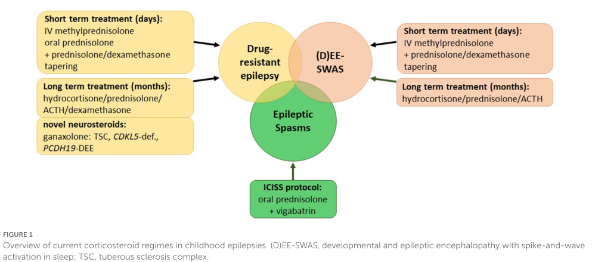

## Question

# Disease Characteristics Research Template

## Target Disease
- **Disease Name:** Landau-Kleffner Syndrome
- **MONDO ID:**  (if available)
- **Category:** Mendelian

## Research Objectives

Please provide a comprehensive research report on **Landau-Kleffner Syndrome** covering all of the
disease characteristics listed below. This report will be used to populate a disease knowledge
base entry. Be thorough and cite primary literature (PMID preferred) for all claims.

For each section, **suggested databases/resources** are listed. These are the first places
you should search for information on each topic.

---

### 1. Disease Information
> **Search first:** OMIM, Orphanet, ICD-10/ICD-11, MeSH, PubMed

- What is the disease? Provide a concise overview.
- What are the key identifiers? (OMIM, Orphanet, ICD-10/ICD-11, MeSH, Mondo)
- What are the common synonyms and alternative names?
- Is the information derived from individual patients (e.g., EHR) or aggregated disease-level resources?

### 2. Etiology

- **Disease Causal Factors**: What are the primary causes? (genetic, environmental, infectious, mechanistic)
- **Risk Factors**:
  > **Search first:** PubMed, Cochrane Library, UpToDate, clinical guidelines, ClinVar, ClinGen, GWAS Catalog, PheGenI, CTD, CDC, WHO, epidemiological databases
  - Genetic risk factors (causal variants, susceptibility loci, modifier genes)
  - Environmental risk factors (toxins, lifestyle, occupational exposures, age, sex, family history)
- **Protective Factors**:
  > **Search first:** PubMed, Cochrane Library, clinical trial databases, GWAS Catalog, gnomAD, WHO, CDC, nutrition databases
  - Genetic protective factors (protective variants, modifier alleles)
  - Environmental protective factors (diet, lifestyle, exposures that reduce risk)
- **Gene-Environment Interactions**: How do genetic and environmental factors interact to influence disease?
  > **Search first:** CTD, PubMed, PheGenI, GxE databases

### 3. Phenotypes
> **Search first:** HPO (Human Phenotype Ontology), OMIM, Orphanet, PubMed, clinicaltrials.gov, MedDRA, SNOMED CT, DECIPHER, LOINC

For each phenotype, provide:
- **Phenotype type**: symptoms, clinical signs, physical manifestations, behavioral changes, or laboratory abnormalities
  > For symptoms/signs: HPO, OMIM, Orphanet, PubMed
  > For behavioral changes: HPO, DSM, RDoC (Research Domain Criteria), PubMed
  > For laboratory abnormalities: LOINC, SNOMED CT, LabTests Online, PubMed
- **Phenotype characteristics**:
  > **Search first:** OMIM, Orphanet, HPO, PubMed
  - Age of symptom onset (neonatal, childhood, adult-onset, late-onset)
  - Symptom severity (mild, moderate, severe, variable)
  - Symptom progression (stable, progressive, episodic, fluctuating)
  - Frequency among affected individuals (percentage or qualitative)
- **Quality of life impact**: Effects on daily functioning and well-being (per-phenotype when possible)
  > **Search first:** EQ-5D database, SF-36, WHO QOL databases, PubMed
- Suggest HPO (Human Phenotype Ontology) terms for each phenotype

### 4. Genetic/Molecular Information

- **Causal Genes**: Gene mutations or chromosomal abnormalities responsible for disease (gene symbols, OMIM IDs)
  > **Search first:** OMIM, ClinVar, HGMD, Ensembl, NCBI Gene
- **Pathogenic Variants**:
  - Affected genes (gene symbols, HGNC IDs)
    > **Search first:** OMIM, NCBI Gene, Ensembl, HGNC, UniProt, GeneCards
  - Variant classification (pathogenic, likely pathogenic, VUS per ACMG/AMP guidelines)
    > **Search first:** ClinVar, ClinGen, ACMG/AMP guidelines, VarSome
  - Variant type/class (missense, frameshift, nonsense, splice-site, structural)
  - Allele frequency in population databases
    > **Search first:** gnomAD, 1000 Genomes, ExAC, TOPMed, dbSNP
  - Somatic vs germline origin
    > **Search first:** COSMIC (somatic), ClinVar, ICGC, TCGA
  - Functional consequences (loss of function, gain of function, dominant negative)
- **Modifier Genes**: Genes that modify disease severity or expression
- **Epigenetic Information**: DNA methylation, histone modifications, chromatin changes affecting disease
  > **Search first:** ENCODE, Roadmap Epigenomics, MethBase, DiseaseMeth
- **Chromosomal Abnormalities**: Large-scale genetic changes (aneuploidy, translocations, inversions)
  > **Search first:** DECIPHER, ClinVar, ECARUCA, UCSC Genome Browser

### 5. Environmental Information

- **Environmental Factors**: Non-genetic contributing factors (toxins, radiation, pollution, occupational exposure)
  > **Search first:** CTD (Comparative Toxicogenomics Database), TOXNET, PubMed, EPA databases
- **Lifestyle Factors**: Behavioral factors (smoking, diet, exercise, alcohol consumption)
  > **Search first:** CDC databases, WHO, PubMed, NHANES
- **Infectious Agents**: If applicable, pathogens causing or triggering disease (bacteria, viruses, fungi, parasites)
  > **Search first:** NCBI Taxonomy, ViPR, BV-BRC, MicrobeDB, GIDEON

### 6. Mechanism / Pathophysiology

- **Molecular Pathways**: Specific signaling cascades or biochemical pathways involved (Wnt, MAPK, mTOR, PI3K-AKT, etc.)
  > **Search first:** KEGG, Reactome, WikiPathways, PathBank, BioCyc
- **Cellular Processes**: Cell-level mechanisms (apoptosis, autophagy, cell cycle dysregulation, inflammation, etc.)
  > **Search first:** Gene Ontology (GO), Reactome, KEGG, PubMed
- **Protein Dysfunction**: How protein structure or function is altered (misfolding, aggregation, loss of function, gain of function)
  > **Search first:** UniProt, PDB (Protein Data Bank), InterPro, Pfam, AlphaFold
- **Metabolic Changes**: Alterations in metabolic processes (energy metabolism, lipid metabolism, amino acid metabolism)
  > **Search first:** KEGG, BioCyc, HMDB (Human Metabolome Database), BRENDA
- **Immune System Involvement**: Role of immune response (autoimmunity, immunodeficiency, chronic inflammation)
  > **Search first:** ImmPort, Immunome Database, IEDB, Gene Ontology
- **Tissue Damage Mechanisms**: How tissues/ are injured (oxidative stress, ischemia, fibrosis, necrosis)
  > **Search first:** PubMed, Gene Ontology, Reactome
- **Biochemical Abnormalities**: Specific molecular defects (enzyme deficiencies, receptor dysfunction, ion channel defects)
  > **Search first:** BRENDA, UniProt, KEGG, OMIM, PubMed
- **Epigenetic Changes**: DNA methylation, histone modifications affecting gene expression in disease
  > **Search first:** ENCODE, Roadmap Epigenomics, MethBase, DiseaseMeth
- **Molecular Profiling** (if available):
  - Transcriptomics/gene expression changes
    > **Search first:** GEO (Gene Expression Omnibus), ArrayExpress, GTEx, Human Cell Atlas, SRA
  - Proteomics findings
    > **Search first:** PRIDE, ProteomeXchange, Human Protein Atlas, STRING, BioGRID
  - Metabolomics signatures
    > **Search first:** MetaboLights, Metabolomics Workbench, HMDB, METLIN
  - Lipidomics alterations
    > **Search first:** LIPID MAPS, SwissLipids, LipidHome, Metabolomics Workbench
  - Genomic structural features
    > **Search first:** UCSC Genome Browser, Ensembl, NCBI, dbVar, DGV
- **Advanced Technologies** (if applicable):
  - Single-cell analysis findings (cell-type specific mechanisms, cellular heterogeneity)
    > **Search first:** Human Cell Atlas, Single Cell Portal, GEO, CELLxGENE
  - Spatial transcriptomics findings
    > **Search first:** GEO, Spatial Research, Vizgen, 10x Genomics data
  - Multi-omics integration results
    > **Search first:** TCGA, ICGC, cBioPortal, LinkedOmics, PubMed
  - Functional genomics screens (CRISPR, RNAi)
    > **Search first:** DepMap, GenomeRNAi, PubMed, BioGRID ORCS

For each mechanism, describe:
- The causal chain from initial trigger to clinical manifestation
- Which mechanisms are upstream vs downstream
- What cell types and biological processes are involved
- Suggest GO terms for biological processes and CL terms for cell types

### 7. Anatomical Structures Affected

- **Organ Level**:
  - Primary organs directly affected
  - Secondary organ involvement (complications, secondary effects)
  - Body systems involved (cardiovascular, nervous, digestive, respiratory, endocrine, etc.)
  > **Search first:** Uberon, FMA (Foundational Model of Anatomy), OMIM, HPO, ICD-11, MeSH, SNOMED CT
- **Tissue and Cell Level**:
  - Specific tissue types affected (epithelial, connective, muscle, nervous)
  - Specific cell populations targeted (with Cell Ontology terms)
  > **Search first:** Uberon, Human Protein Atlas, Cell Ontology, Human Cell Atlas, CellMarker, PanglaoDB
- **Subcellular Level**:
  - Cellular compartments involved (mitochondria, nucleus, ER, lysosomes) (with GO Cellular Component terms)
  > **Search first:** Gene Ontology (Cellular Component), UniProt, Human Protein Atlas
- **Localization**:
  - Specific anatomical sites (with UBERON terms)
    > **Search first:** FMA, Uberon, NeuroNames (for brain), SNOMED CT
  - Lateralization (unilateral, bilateral, asymmetric)
    > **Search first:** HPO, clinical literature, imaging databases

### 8. Temporal Development

- **Onset**:
  - Typical age of onset (congenital, pediatric, adult, geriatric)
  - Onset pattern (acute, subacute, chronic, insidious)
  > **Search first:** OMIM, Orphanet, HPO, PubMed
- **Progression**:
  - Disease stages (early, intermediate, advanced, end-stage)
    > **Search first:** Cancer Staging Manual (AJCC), WHO classifications, PubMed
  - Progression rate (rapid, slow, variable)
  - Disease course pattern (episodic, relapsing-remitting, progressive, stable)
  - Disease duration (self-limited, chronic lifelong)
  > **Search first:** Disease registries, longitudinal cohort databases, natural history studies, PubMed, Orphanet, OMIM
- **Patterns**:
  - Remission patterns (spontaneous, treatment-induced)
    > **Search first:** Clinical trial databases, disease registries, PubMed
  - Critical periods (time windows of vulnerability or opportunity for intervention)
    > **Search first:** PubMed, developmental biology databases, clinical guidelines

### 9. Inheritance and Population

- **Epidemiology**:
  - Prevalence (cases per 100,000 at given time)
  - Incidence (new cases per 100,000 per year)
  > **Search first:** Orphanet, CDC, WHO, GBD (Global Burden of Disease), national registries, SEER, disease registries
- **For Genetic Etiology**:
  - Inheritance pattern (AD, AR, X-linked, mitochondrial, multifactorial, polygenic)
    > **Search first:** OMIM, Orphanet, ClinVar, GTR (Genetic Testing Registry)
  - Penetrance (complete, incomplete, age-dependent)
    > **Search first:** ClinVar, OMIM, PubMed, ClinGen
  - Expressivity (variable, consistent)
    > **Search first:** OMIM, ClinVar, PubMed
  - Genetic anticipation (increasing severity in successive generations)
    > **Search first:** OMIM, PubMed (especially for repeat expansion disorders)
  - Germline mosaicism
    > **Search first:** ClinVar, OMIM, genetic counseling literature, PubMed
  - Founder effects (population-specific mutations)
    > **Search first:** gnomAD, population genetics databases, PubMed
  - Consanguinity role
    > **Search first:** OMIM, population studies, genetic counseling resources
  - Carrier frequency
    > **Search first:** gnomAD, carrier screening databases, GeneReviews, GTR
- **Population Demographics**:
  - Affected populations (ethnic or demographic groups with higher prevalence)
    > **Search first:** gnomAD, 1000 Genomes, PAGE Study, PubMed, population registries
  - Geographic distribution (endemic areas, regional variation)
    > **Search first:** WHO, CDC, GBD, Orphanet, geographic epidemiology databases
  - Geographic distribution of specific variants
  - Sex ratio (male:female)
    > **Search first:** Disease registries, OMIM, PubMed, epidemiological databases
  - Age distribution of affected individuals
    > **Search first:** CDC, disease registries, SEER, Orphanet

### 10. Diagnostics

- **Clinical Tests**:
  - Laboratory tests (blood, urine, tissue chemistry, specific enzyme assays)
    > **Search first:** LOINC, LabTests Online, PubMed
  - Biomarkers (proteins, metabolites, genetic markers, circulating biomarkers)
    > **Search first:** FDA Biomarker List, BEST (Biomarkers, EndpointS, and other Tools), PubMed
  - Imaging studies (X-ray, CT, MRI, PET, ultrasound)
    > **Search first:** RadLex, DICOM, Radiopaedia, imaging databases
  - Functional tests (pulmonary function, cardiac stress tests)
    > **Search first:** LOINC, clinical guidelines, PubMed
  - Electrophysiology (EEG, EMG, ECG, nerve conduction studies)
    > **Search first:** LOINC, clinical neurophysiology databases, PubMed
  - Biopsy findings (histopathology, immunohistochemistry)
    > **Search first:** SNOMED CT, College of American Pathologists resources, PubMed
  - Pathology findings (microscopic examination)
    > **Search first:** SNOMED CT, Digital Pathology databases, PubMed
- **Genetic Testing**:
  > **Search first:** GTR (Genetic Testing Registry), GeneReviews, ClinGen
  - Overview of recommended genetic testing approach
  - Whole genome sequencing (WGS) utility
    > **Search first:** GTR, ClinVar, GEL (Genomics England), gnomAD
  - Whole exome sequencing (WES) utility
    > **Search first:** GTR, ClinVar, OMIM, GeneMatcher
  - Gene panels (which panels, which genes)
    > **Search first:** GTR, ClinVar, laboratory-specific databases
  - Single gene testing
    > **Search first:** GTR, ClinVar, OMIM, GeneReviews
  - Chromosomal microarray (CMA)
    > **Search first:** DECIPHER, ClinVar, dbVar, ECARUCA
  - Karyotyping
    > **Search first:** Chromosome Abnormality Database, ClinVar, cytogenetics resources
  - FISH
    > **Search first:** ClinVar, cytogenetics databases, PubMed
  - Mitochondrial DNA testing
    > **Search first:** MITOMAP, MSeqDR, ClinVar, GTR
  - Repeat expansion testing
    > **Search first:** GTR, ClinVar, repeat expansion databases, PubMed
- **Omics-Based Diagnostics** (if applicable):
  - RNA sequencing / transcriptomics
    > **Search first:** GEO, ArrayExpress, GTEx, RNA-seq databases
  - Proteomics
    > **Search first:** PRIDE, ProteomeXchange, FDA Biomarker database
  - Metabolomics
    > **Search first:** MetaboLights, Metabolomics Workbench, HMDB
  - Epigenomics
    > **Search first:** GEO, ENCODE, Roadmap Epigenomics, MethBase
  - Liquid biopsy
    > **Search first:** COSMIC, ClinVar, liquid biopsy databases, PubMed
- **Clinical Criteria**:
  - Standardized diagnostic criteria (DSM, ICD, society guidelines)
    > **Search first:** DSM-5, ICD-11, clinical society guidelines, UpToDate
  - Differential diagnosis (other conditions to rule out, with distinguishing features)
    > **Search first:** DynaMed, UpToDate, clinical decision support systems
- **Screening**:
  - Screening methods for asymptomatic individuals (newborn screening, carrier screening, cascade screening)
    > **Search first:** ACMG recommendations, CDC newborn screening, GTR

### 11. Outcome/Prognosis

- **Survival and Mortality**:
  - Survival rate (5-year, 10-year, overall)
    > **Search first:** SEER, cancer registries, disease-specific registries, PubMed
  - Life expectancy (with and without treatment if applicable)
    > **Search first:** Orphanet, disease registries, actuarial databases, PubMed
  - Mortality rate
    > **Search first:** CDC, WHO, GBD, national mortality databases
  - Disease-specific mortality (deaths directly attributable to disease)
    > **Search first:** Disease registries, CDC Wonder, GBD, PubMed
- **Morbidity and Function**:
  - Morbidity (disease-related disability and health impacts)
    > **Search first:** GBD, WHO, disability databases, PubMed
  - Disability outcomes (long-term functional impairments)
    > **Search first:** ICF (International Classification of Functioning), disability registries
  - Quality of life measures (EQ-5D, SF-36, PROMIS, disease-specific tools)
    > **Search first:** EQ-5D database, SF-36, PROMIS, PubMed
- **Disease Course**:
  - Complications (secondary problems: infections, organ failure, etc.)
    > **Search first:** ICD codes, disease registries, clinical databases, PubMed
  - Recovery potential (likelihood and extent of recovery, with vs without treatment)
    > **Search first:** Natural history studies, rehabilitation databases, PubMed
- **Prediction**:
  - Prognostic factors (age, disease severity, biomarkers, treatment response)
    > **Search first:** Prognostic models databases, clinical calculators, PubMed
  - Prognostic biomarkers (molecular markers predicting disease course)
    > **Search first:** FDA Biomarker database, PubMed, cancer prognostic databases

### 12. Treatment

- **Pharmacotherapy**:
  - Pharmacological treatments (drug names, drug classes, mechanisms of action)
    > **Search first:** DrugBank, RxNorm, ATC classification, DailyMed, FDA databases
  - Pharmacogenomics (how genetic variants affect drug metabolism, efficacy, toxicity)
    > **Search first:** PharmGKB, CPIC (Clinical Pharmacogenetics), FDA Table of PGx Biomarkers
- **Advanced Therapeutics**:
  - Gene therapy (viral vectors, CRISPR, gene replacement, gene editing)
    > **Search first:** ClinicalTrials.gov, FDA gene therapy database, ASGCT resources
  - Cell therapy (stem cell transplant, CAR-T, cellular therapeutics)
    > **Search first:** ClinicalTrials.gov, FDA cell therapy database, FACT standards
  - RNA-based therapies (ASOs, siRNA, mRNA therapies)
    > **Search first:** ClinicalTrials.gov, FDA approvals, PubMed
  - Targeted therapies (treatments directed at specific molecular targets)
    > **Search first:** My Cancer Genome, OncoKB, ClinicalTrials.gov, FDA approvals
  - Immunotherapies (checkpoint inhibitors, monoclonal antibodies)
    > **Search first:** Cancer Immunotherapy Database, FDA approvals, ClinicalTrials.gov
- **Surgical and Interventional**:
  - Surgical interventions (types of surgery, timing, outcomes)
    > **Search first:** CPT codes, surgical registries, clinical guidelines, PubMed
- **Supportive and Rehabilitative**:
  - Supportive care (symptom management, pain control, nutrition)
    > **Search first:** Clinical guidelines, Cochrane Library, PubMed
  - Rehabilitation (physical therapy, occupational therapy, speech therapy)
    > **Search first:** Rehabilitation medicine databases, clinical guidelines, PubMed
- **Experimental**:
  - Experimental treatments in clinical trials (with NCT identifiers if available)
    > **Search first:** ClinicalTrials.gov, EU Clinical Trials Register, WHO ICTRP
- **Treatment Outcomes**:
  - Treatment response rates
    > **Search first:** Clinical trial databases, FDA reviews, systematic reviews, PubMed
  - Side effects and adverse events
    > **Search first:** FDA Adverse Event Reporting System (FAERS), MedWatch, PubMed
- **Treatment Strategy**:
  - Treatment algorithms (clinical pathways, decision trees)
    > **Search first:** Clinical practice guidelines, NCCN Guidelines, UpToDate
  - Combination therapies
    > **Search first:** ClinicalTrials.gov, treatment guidelines, PubMed
  - Personalized medicine approaches (genotype-guided treatment)
    > **Search first:** My Cancer Genome, CIViC, PharmGKB, precision medicine databases

For each treatment, suggest MAXO (Medical Action Ontology) terms where applicable.

### 13. Prevention

- **Prevention Levels**:
  - Primary prevention (preventing disease occurrence: vaccination, risk factor modification)
    > **Search first:** CDC, WHO, USPSTF recommendations, Cochrane Library
  - Secondary prevention (early detection and treatment: screening programs, early intervention)
    > **Search first:** USPSTF, CDC screening guidelines, WHO
  - Tertiary prevention (preventing complications in those with disease)
    > **Search first:** Clinical guidelines, disease management protocols, PubMed
- **Immunization**: Vaccine strategies (if applicable)
  > **Search first:** CDC vaccine schedules, WHO immunization, FDA vaccine database
- **Screening and Early Detection**:
  - Screening programs (population-based: newborn screening, cancer screening)
    > **Search first:** CDC screening programs, USPSTF, cancer screening databases
  - Genetic screening (carrier screening, preimplantation genetic diagnosis, prenatal testing)
    > **Search first:** ACMG recommendations, ACOG guidelines, GTR
  - Risk stratification (identifying high-risk individuals for targeted prevention)
    > **Search first:** Risk prediction models, clinical calculators, PubMed
- **Behavioral Interventions**: Lifestyle modifications to reduce risk
  > **Search first:** CDC, WHO, behavioral intervention databases, Cochrane Library
- **Counseling**: Genetic counseling (risk assessment, family planning guidance)
  > **Search first:** NSGC resources, ACMG guidelines, GeneReviews
- **Public Health**:
  - Public health interventions (sanitation, vector control, health education)
    > **Search first:** CDC, WHO, public health databases, PubMed
  - Environmental interventions (reducing environmental risk factors)
    > **Search first:** EPA databases, WHO environmental health, PubMed
- **Prophylaxis**: Preventive medications or procedures
  > **Search first:** Clinical guidelines, FDA approvals, PubMed

### 14. Other Species / Natural Disease

- **Taxonomy**: Species affected (with NCBI Taxon identifiers)
  > **Search first:** NCBI Taxonomy
- **Breed**: Specific breeds affected (with VBO identifiers if applicable)
  > **Search first:** VBO (Vertebrate Breed Ontology)
- **Gene**: Orthologous genes in other species (with NCBI Gene IDs)
  > **Search first:** NCBI Gene
- **Natural Disease**:
  - Naturally occurring disease in other species (companion animals, wildlife)
    > **Search first:** OMIA (Online Mendelian Inheritance in Animals), VetCompass, PubMed
  - Veterinary relevance and importance in animal health
    > **Search first:** OMIA, veterinary databases, PubMed
- **Comparative Biology**:
  - Comparative pathology (similarities and differences across species)
    > **Search first:** OMIA, comparative pathology databases, PubMed
  - Evolutionary conservation of disease mechanisms
    > **Search first:** HomoloGene, OrthoMCL, Alliance of Genome Resources
- **Transmission** (if applicable):
  - Zoonotic potential
    > **Search first:** CDC zoonotic diseases, WHO zoonoses, GIDEON
  - Cross-species susceptibility
    > **Search first:** NCBI Taxonomy, veterinary databases, PubMed

### 15. Model Organisms

- **Model Types**:
  - Model organism type (mammalian, invertebrate, cellular, in vitro)
    > **Search first:** Alliance of Genome Resources, model organism databases
  - Specific model systems (mouse, rat, zebrafish, Drosophila, C. elegans, yeast, cell lines, organoids, iPSCs)
    > **Search first:** MGI, RGD, ZFIN, FlyBase, WormBase, SGD, ATCC, Cellosaurus
  - Induced models (drug treatment, surgical intervention, environmental manipulation)
    > **Search first:** MGI, model organism databases, PubMed
- **Genetic Models**:
  - Types available (knockout, knock-in, transgenic, conditional, humanized)
    > **Search first:** MGI, IMPC, KOMP, EuMMCR, IMSR
- **Model Characteristics**:
  - Phenotype recapitulation (how well model reproduces human disease features)
    > **Search first:** Model organism databases, comparative studies, PubMed
  - Model limitations (aspects of human disease not captured)
    > **Search first:** Model organism databases, PubMed, review articles
- **Applications**:
  - Research applications (what aspects of disease can be studied)
    > **Search first:** Model organism databases, PubMed
- **Resources**:
  - Model databases
    > **Search first:** MGI, RGD, ZFIN, FlyBase, WormBase, IMSR, EMMA, MMRRC

---

## Citation Requirements

- Cite primary literature (PMID preferred) for all mechanistic and clinical claims
- Prioritize recent reviews and landmark papers
- Include direct quotes from abstracts where possible to support key statements
- Distinguish evidence source types: human clinical, model organism, in vitro, computational

## Output Format

Structure your response as a comprehensive narrative organized by the sections above.
For each section, provide:
- Factual content with specific details (numbers, percentages, gene names, variant nomenclature)
- Ontology term suggestions (HPO, GO, CL, UBERON, CHEBI, MAXO, MONDO) where applicable
- Evidence citations with PMIDs
- Direct quotes from abstracts to support key claims
- Clear indication when information is not available or not applicable for this disease

This report will be used to populate a disease knowledge base entry with:
- Pathophysiology descriptions with causal chains
- Gene/protein annotations (HGNC, GO terms)
- Phenotype associations (HP terms) with frequencies
- Cell type involvement (CL terms)
- Anatomical locations (UBERON terms)
- Chemical entities (CHEBI terms)
- Treatment annotations (MAXO terms)
- Evidence items with PMIDs and exact abstract quotes
- Epidemiology, prognosis, diagnostic, and prevention information
- Animal model descriptions with phenotype recapitulation details

## Output

Question: You are an expert researcher providing comprehensive, well-cited information.

Provide detailed information focusing on:
1. Key concepts and definitions with current understanding
2. Recent developments and latest research (prioritize 2023-2024 sources)
3. Current applications and real-world implementations
4. Expert opinions and analysis from authoritative sources
5. Relevant statistics and data from recent studies

Format as a comprehensive research report with proper citations. Include URLs and publication dates where available.
Always prioritize recent, authoritative sources and provide specific citations for all major claims.

# Disease Characteristics Research Template

## Target Disease
- **Disease Name:** Landau-Kleffner Syndrome
- **MONDO ID:**  (if available)
- **Category:** Mendelian

## Research Objectives

Please provide a comprehensive research report on **Landau-Kleffner Syndrome** covering all of the
disease characteristics listed below. This report will be used to populate a disease knowledge
base entry. Be thorough and cite primary literature (PMID preferred) for all claims.

For each section, **suggested databases/resources** are listed. These are the first places
you should search for information on each topic.

---

### 1. Disease Information
> **Search first:** OMIM, Orphanet, ICD-10/ICD-11, MeSH, PubMed

- What is the disease? Provide a concise overview.
- What are the key identifiers? (OMIM, Orphanet, ICD-10/ICD-11, MeSH, Mondo)
- What are the common synonyms and alternative names?
- Is the information derived from individual patients (e.g., EHR) or aggregated disease-level resources?

### 2. Etiology

- **Disease Causal Factors**: What are the primary causes? (genetic, environmental, infectious, mechanistic)
- **Risk Factors**:
  > **Search first:** PubMed, Cochrane Library, UpToDate, clinical guidelines, ClinVar, ClinGen, GWAS Catalog, PheGenI, CTD, CDC, WHO, epidemiological databases
  - Genetic risk factors (causal variants, susceptibility loci, modifier genes)
  - Environmental risk factors (toxins, lifestyle, occupational exposures, age, sex, family history)
- **Protective Factors**:
  > **Search first:** PubMed, Cochrane Library, clinical trial databases, GWAS Catalog, gnomAD, WHO, CDC, nutrition databases
  - Genetic protective factors (protective variants, modifier alleles)
  - Environmental protective factors (diet, lifestyle, exposures that reduce risk)
- **Gene-Environment Interactions**: How do genetic and environmental factors interact to influence disease?
  > **Search first:** CTD, PubMed, PheGenI, GxE databases

### 3. Phenotypes
> **Search first:** HPO (Human Phenotype Ontology), OMIM, Orphanet, PubMed, clinicaltrials.gov, MedDRA, SNOMED CT, DECIPHER, LOINC

For each phenotype, provide:
- **Phenotype type**: symptoms, clinical signs, physical manifestations, behavioral changes, or laboratory abnormalities
  > For symptoms/signs: HPO, OMIM, Orphanet, PubMed
  > For behavioral changes: HPO, DSM, RDoC (Research Domain Criteria), PubMed
  > For laboratory abnormalities: LOINC, SNOMED CT, LabTests Online, PubMed
- **Phenotype characteristics**:
  > **Search first:** OMIM, Orphanet, HPO, PubMed
  - Age of symptom onset (neonatal, childhood, adult-onset, late-onset)
  - Symptom severity (mild, moderate, severe, variable)
  - Symptom progression (stable, progressive, episodic, fluctuating)
  - Frequency among affected individuals (percentage or qualitative)
- **Quality of life impact**: Effects on daily functioning and well-being (per-phenotype when possible)
  > **Search first:** EQ-5D database, SF-36, WHO QOL databases, PubMed
- Suggest HPO (Human Phenotype Ontology) terms for each phenotype

### 4. Genetic/Molecular Information

- **Causal Genes**: Gene mutations or chromosomal abnormalities responsible for disease (gene symbols, OMIM IDs)
  > **Search first:** OMIM, ClinVar, HGMD, Ensembl, NCBI Gene
- **Pathogenic Variants**:
  - Affected genes (gene symbols, HGNC IDs)
    > **Search first:** OMIM, NCBI Gene, Ensembl, HGNC, UniProt, GeneCards
  - Variant classification (pathogenic, likely pathogenic, VUS per ACMG/AMP guidelines)
    > **Search first:** ClinVar, ClinGen, ACMG/AMP guidelines, VarSome
  - Variant type/class (missense, frameshift, nonsense, splice-site, structural)
  - Allele frequency in population databases
    > **Search first:** gnomAD, 1000 Genomes, ExAC, TOPMed, dbSNP
  - Somatic vs germline origin
    > **Search first:** COSMIC (somatic), ClinVar, ICGC, TCGA
  - Functional consequences (loss of function, gain of function, dominant negative)
- **Modifier Genes**: Genes that modify disease severity or expression
- **Epigenetic Information**: DNA methylation, histone modifications, chromatin changes affecting disease
  > **Search first:** ENCODE, Roadmap Epigenomics, MethBase, DiseaseMeth
- **Chromosomal Abnormalities**: Large-scale genetic changes (aneuploidy, translocations, inversions)
  > **Search first:** DECIPHER, ClinVar, ECARUCA, UCSC Genome Browser

### 5. Environmental Information

- **Environmental Factors**: Non-genetic contributing factors (toxins, radiation, pollution, occupational exposure)
  > **Search first:** CTD (Comparative Toxicogenomics Database), TOXNET, PubMed, EPA databases
- **Lifestyle Factors**: Behavioral factors (smoking, diet, exercise, alcohol consumption)
  > **Search first:** CDC databases, WHO, PubMed, NHANES
- **Infectious Agents**: If applicable, pathogens causing or triggering disease (bacteria, viruses, fungi, parasites)
  > **Search first:** NCBI Taxonomy, ViPR, BV-BRC, MicrobeDB, GIDEON

### 6. Mechanism / Pathophysiology

- **Molecular Pathways**: Specific signaling cascades or biochemical pathways involved (Wnt, MAPK, mTOR, PI3K-AKT, etc.)
  > **Search first:** KEGG, Reactome, WikiPathways, PathBank, BioCyc
- **Cellular Processes**: Cell-level mechanisms (apoptosis, autophagy, cell cycle dysregulation, inflammation, etc.)
  > **Search first:** Gene Ontology (GO), Reactome, KEGG, PubMed
- **Protein Dysfunction**: How protein structure or function is altered (misfolding, aggregation, loss of function, gain of function)
  > **Search first:** UniProt, PDB (Protein Data Bank), InterPro, Pfam, AlphaFold
- **Metabolic Changes**: Alterations in metabolic processes (energy metabolism, lipid metabolism, amino acid metabolism)
  > **Search first:** KEGG, BioCyc, HMDB (Human Metabolome Database), BRENDA
- **Immune System Involvement**: Role of immune response (autoimmunity, immunodeficiency, chronic inflammation)
  > **Search first:** ImmPort, Immunome Database, IEDB, Gene Ontology
- **Tissue Damage Mechanisms**: How tissues/ are injured (oxidative stress, ischemia, fibrosis, necrosis)
  > **Search first:** PubMed, Gene Ontology, Reactome
- **Biochemical Abnormalities**: Specific molecular defects (enzyme deficiencies, receptor dysfunction, ion channel defects)
  > **Search first:** BRENDA, UniProt, KEGG, OMIM, PubMed
- **Epigenetic Changes**: DNA methylation, histone modifications affecting gene expression in disease
  > **Search first:** ENCODE, Roadmap Epigenomics, MethBase, DiseaseMeth
- **Molecular Profiling** (if available):
  - Transcriptomics/gene expression changes
    > **Search first:** GEO (Gene Expression Omnibus), ArrayExpress, GTEx, Human Cell Atlas, SRA
  - Proteomics findings
    > **Search first:** PRIDE, ProteomeXchange, Human Protein Atlas, STRING, BioGRID
  - Metabolomics signatures
    > **Search first:** MetaboLights, Metabolomics Workbench, HMDB, METLIN
  - Lipidomics alterations
    > **Search first:** LIPID MAPS, SwissLipids, LipidHome, Metabolomics Workbench
  - Genomic structural features
    > **Search first:** UCSC Genome Browser, Ensembl, NCBI, dbVar, DGV
- **Advanced Technologies** (if applicable):
  - Single-cell analysis findings (cell-type specific mechanisms, cellular heterogeneity)
    > **Search first:** Human Cell Atlas, Single Cell Portal, GEO, CELLxGENE
  - Spatial transcriptomics findings
    > **Search first:** GEO, Spatial Research, Vizgen, 10x Genomics data
  - Multi-omics integration results
    > **Search first:** TCGA, ICGC, cBioPortal, LinkedOmics, PubMed
  - Functional genomics screens (CRISPR, RNAi)
    > **Search first:** DepMap, GenomeRNAi, PubMed, BioGRID ORCS

For each mechanism, describe:
- The causal chain from initial trigger to clinical manifestation
- Which mechanisms are upstream vs downstream
- What cell types and biological processes are involved
- Suggest GO terms for biological processes and CL terms for cell types

### 7. Anatomical Structures Affected

- **Organ Level**:
  - Primary organs directly affected
  - Secondary organ involvement (complications, secondary effects)
  - Body systems involved (cardiovascular, nervous, digestive, respiratory, endocrine, etc.)
  > **Search first:** Uberon, FMA (Foundational Model of Anatomy), OMIM, HPO, ICD-11, MeSH, SNOMED CT
- **Tissue and Cell Level**:
  - Specific tissue types affected (epithelial, connective, muscle, nervous)
  - Specific cell populations targeted (with Cell Ontology terms)
  > **Search first:** Uberon, Human Protein Atlas, Cell Ontology, Human Cell Atlas, CellMarker, PanglaoDB
- **Subcellular Level**:
  - Cellular compartments involved (mitochondria, nucleus, ER, lysosomes) (with GO Cellular Component terms)
  > **Search first:** Gene Ontology (Cellular Component), UniProt, Human Protein Atlas
- **Localization**:
  - Specific anatomical sites (with UBERON terms)
    > **Search first:** FMA, Uberon, NeuroNames (for brain), SNOMED CT
  - Lateralization (unilateral, bilateral, asymmetric)
    > **Search first:** HPO, clinical literature, imaging databases

### 8. Temporal Development

- **Onset**:
  - Typical age of onset (congenital, pediatric, adult, geriatric)
  - Onset pattern (acute, subacute, chronic, insidious)
  > **Search first:** OMIM, Orphanet, HPO, PubMed
- **Progression**:
  - Disease stages (early, intermediate, advanced, end-stage)
    > **Search first:** Cancer Staging Manual (AJCC), WHO classifications, PubMed
  - Progression rate (rapid, slow, variable)
  - Disease course pattern (episodic, relapsing-remitting, progressive, stable)
  - Disease duration (self-limited, chronic lifelong)
  > **Search first:** Disease registries, longitudinal cohort databases, natural history studies, PubMed, Orphanet, OMIM
- **Patterns**:
  - Remission patterns (spontaneous, treatment-induced)
    > **Search first:** Clinical trial databases, disease registries, PubMed
  - Critical periods (time windows of vulnerability or opportunity for intervention)
    > **Search first:** PubMed, developmental biology databases, clinical guidelines

### 9. Inheritance and Population

- **Epidemiology**:
  - Prevalence (cases per 100,000 at given time)
  - Incidence (new cases per 100,000 per year)
  > **Search first:** Orphanet, CDC, WHO, GBD (Global Burden of Disease), national registries, SEER, disease registries
- **For Genetic Etiology**:
  - Inheritance pattern (AD, AR, X-linked, mitochondrial, multifactorial, polygenic)
    > **Search first:** OMIM, Orphanet, ClinVar, GTR (Genetic Testing Registry)
  - Penetrance (complete, incomplete, age-dependent)
    > **Search first:** ClinVar, OMIM, PubMed, ClinGen
  - Expressivity (variable, consistent)
    > **Search first:** OMIM, ClinVar, PubMed
  - Genetic anticipation (increasing severity in successive generations)
    > **Search first:** OMIM, PubMed (especially for repeat expansion disorders)
  - Germline mosaicism
    > **Search first:** ClinVar, OMIM, genetic counseling literature, PubMed
  - Founder effects (population-specific mutations)
    > **Search first:** gnomAD, population genetics databases, PubMed
  - Consanguinity role
    > **Search first:** OMIM, population studies, genetic counseling resources
  - Carrier frequency
    > **Search first:** gnomAD, carrier screening databases, GeneReviews, GTR
- **Population Demographics**:
  - Affected populations (ethnic or demographic groups with higher prevalence)
    > **Search first:** gnomAD, 1000 Genomes, PAGE Study, PubMed, population registries
  - Geographic distribution (endemic areas, regional variation)
    > **Search first:** WHO, CDC, GBD, Orphanet, geographic epidemiology databases
  - Geographic distribution of specific variants
  - Sex ratio (male:female)
    > **Search first:** Disease registries, OMIM, PubMed, epidemiological databases
  - Age distribution of affected individuals
    > **Search first:** CDC, disease registries, SEER, Orphanet

### 10. Diagnostics

- **Clinical Tests**:
  - Laboratory tests (blood, urine, tissue chemistry, specific enzyme assays)
    > **Search first:** LOINC, LabTests Online, PubMed
  - Biomarkers (proteins, metabolites, genetic markers, circulating biomarkers)
    > **Search first:** FDA Biomarker List, BEST (Biomarkers, EndpointS, and other Tools), PubMed
  - Imaging studies (X-ray, CT, MRI, PET, ultrasound)
    > **Search first:** RadLex, DICOM, Radiopaedia, imaging databases
  - Functional tests (pulmonary function, cardiac stress tests)
    > **Search first:** LOINC, clinical guidelines, PubMed
  - Electrophysiology (EEG, EMG, ECG, nerve conduction studies)
    > **Search first:** LOINC, clinical neurophysiology databases, PubMed
  - Biopsy findings (histopathology, immunohistochemistry)
    > **Search first:** SNOMED CT, College of American Pathologists resources, PubMed
  - Pathology findings (microscopic examination)
    > **Search first:** SNOMED CT, Digital Pathology databases, PubMed
- **Genetic Testing**:
  > **Search first:** GTR (Genetic Testing Registry), GeneReviews, ClinGen
  - Overview of recommended genetic testing approach
  - Whole genome sequencing (WGS) utility
    > **Search first:** GTR, ClinVar, GEL (Genomics England), gnomAD
  - Whole exome sequencing (WES) utility
    > **Search first:** GTR, ClinVar, OMIM, GeneMatcher
  - Gene panels (which panels, which genes)
    > **Search first:** GTR, ClinVar, laboratory-specific databases
  - Single gene testing
    > **Search first:** GTR, ClinVar, OMIM, GeneReviews
  - Chromosomal microarray (CMA)
    > **Search first:** DECIPHER, ClinVar, dbVar, ECARUCA
  - Karyotyping
    > **Search first:** Chromosome Abnormality Database, ClinVar, cytogenetics resources
  - FISH
    > **Search first:** ClinVar, cytogenetics databases, PubMed
  - Mitochondrial DNA testing
    > **Search first:** MITOMAP, MSeqDR, ClinVar, GTR
  - Repeat expansion testing
    > **Search first:** GTR, ClinVar, repeat expansion databases, PubMed
- **Omics-Based Diagnostics** (if applicable):
  - RNA sequencing / transcriptomics
    > **Search first:** GEO, ArrayExpress, GTEx, RNA-seq databases
  - Proteomics
    > **Search first:** PRIDE, ProteomeXchange, FDA Biomarker database
  - Metabolomics
    > **Search first:** MetaboLights, Metabolomics Workbench, HMDB
  - Epigenomics
    > **Search first:** GEO, ENCODE, Roadmap Epigenomics, MethBase
  - Liquid biopsy
    > **Search first:** COSMIC, ClinVar, liquid biopsy databases, PubMed
- **Clinical Criteria**:
  - Standardized diagnostic criteria (DSM, ICD, society guidelines)
    > **Search first:** DSM-5, ICD-11, clinical society guidelines, UpToDate
  - Differential diagnosis (other conditions to rule out, with distinguishing features)
    > **Search first:** DynaMed, UpToDate, clinical decision support systems
- **Screening**:
  - Screening methods for asymptomatic individuals (newborn screening, carrier screening, cascade screening)
    > **Search first:** ACMG recommendations, CDC newborn screening, GTR

### 11. Outcome/Prognosis

- **Survival and Mortality**:
  - Survival rate (5-year, 10-year, overall)
    > **Search first:** SEER, cancer registries, disease-specific registries, PubMed
  - Life expectancy (with and without treatment if applicable)
    > **Search first:** Orphanet, disease registries, actuarial databases, PubMed
  - Mortality rate
    > **Search first:** CDC, WHO, GBD, national mortality databases
  - Disease-specific mortality (deaths directly attributable to disease)
    > **Search first:** Disease registries, CDC Wonder, GBD, PubMed
- **Morbidity and Function**:
  - Morbidity (disease-related disability and health impacts)
    > **Search first:** GBD, WHO, disability databases, PubMed
  - Disability outcomes (long-term functional impairments)
    > **Search first:** ICF (International Classification of Functioning), disability registries
  - Quality of life measures (EQ-5D, SF-36, PROMIS, disease-specific tools)
    > **Search first:** EQ-5D database, SF-36, PROMIS, PubMed
- **Disease Course**:
  - Complications (secondary problems: infections, organ failure, etc.)
    > **Search first:** ICD codes, disease registries, clinical databases, PubMed
  - Recovery potential (likelihood and extent of recovery, with vs without treatment)
    > **Search first:** Natural history studies, rehabilitation databases, PubMed
- **Prediction**:
  - Prognostic factors (age, disease severity, biomarkers, treatment response)
    > **Search first:** Prognostic models databases, clinical calculators, PubMed
  - Prognostic biomarkers (molecular markers predicting disease course)
    > **Search first:** FDA Biomarker database, PubMed, cancer prognostic databases

### 12. Treatment

- **Pharmacotherapy**:
  - Pharmacological treatments (drug names, drug classes, mechanisms of action)
    > **Search first:** DrugBank, RxNorm, ATC classification, DailyMed, FDA databases
  - Pharmacogenomics (how genetic variants affect drug metabolism, efficacy, toxicity)
    > **Search first:** PharmGKB, CPIC (Clinical Pharmacogenetics), FDA Table of PGx Biomarkers
- **Advanced Therapeutics**:
  - Gene therapy (viral vectors, CRISPR, gene replacement, gene editing)
    > **Search first:** ClinicalTrials.gov, FDA gene therapy database, ASGCT resources
  - Cell therapy (stem cell transplant, CAR-T, cellular therapeutics)
    > **Search first:** ClinicalTrials.gov, FDA cell therapy database, FACT standards
  - RNA-based therapies (ASOs, siRNA, mRNA therapies)
    > **Search first:** ClinicalTrials.gov, FDA approvals, PubMed
  - Targeted therapies (treatments directed at specific molecular targets)
    > **Search first:** My Cancer Genome, OncoKB, ClinicalTrials.gov, FDA approvals
  - Immunotherapies (checkpoint inhibitors, monoclonal antibodies)
    > **Search first:** Cancer Immunotherapy Database, FDA approvals, ClinicalTrials.gov
- **Surgical and Interventional**:
  - Surgical interventions (types of surgery, timing, outcomes)
    > **Search first:** CPT codes, surgical registries, clinical guidelines, PubMed
- **Supportive and Rehabilitative**:
  - Supportive care (symptom management, pain control, nutrition)
    > **Search first:** Clinical guidelines, Cochrane Library, PubMed
  - Rehabilitation (physical therapy, occupational therapy, speech therapy)
    > **Search first:** Rehabilitation medicine databases, clinical guidelines, PubMed
- **Experimental**:
  - Experimental treatments in clinical trials (with NCT identifiers if available)
    > **Search first:** ClinicalTrials.gov, EU Clinical Trials Register, WHO ICTRP
- **Treatment Outcomes**:
  - Treatment response rates
    > **Search first:** Clinical trial databases, FDA reviews, systematic reviews, PubMed
  - Side effects and adverse events
    > **Search first:** FDA Adverse Event Reporting System (FAERS), MedWatch, PubMed
- **Treatment Strategy**:
  - Treatment algorithms (clinical pathways, decision trees)
    > **Search first:** Clinical practice guidelines, NCCN Guidelines, UpToDate
  - Combination therapies
    > **Search first:** ClinicalTrials.gov, treatment guidelines, PubMed
  - Personalized medicine approaches (genotype-guided treatment)
    > **Search first:** My Cancer Genome, CIViC, PharmGKB, precision medicine databases

For each treatment, suggest MAXO (Medical Action Ontology) terms where applicable.

### 13. Prevention

- **Prevention Levels**:
  - Primary prevention (preventing disease occurrence: vaccination, risk factor modification)
    > **Search first:** CDC, WHO, USPSTF recommendations, Cochrane Library
  - Secondary prevention (early detection and treatment: screening programs, early intervention)
    > **Search first:** USPSTF, CDC screening guidelines, WHO
  - Tertiary prevention (preventing complications in those with disease)
    > **Search first:** Clinical guidelines, disease management protocols, PubMed
- **Immunization**: Vaccine strategies (if applicable)
  > **Search first:** CDC vaccine schedules, WHO immunization, FDA vaccine database
- **Screening and Early Detection**:
  - Screening programs (population-based: newborn screening, cancer screening)
    > **Search first:** CDC screening programs, USPSTF, cancer screening databases
  - Genetic screening (carrier screening, preimplantation genetic diagnosis, prenatal testing)
    > **Search first:** ACMG recommendations, ACOG guidelines, GTR
  - Risk stratification (identifying high-risk individuals for targeted prevention)
    > **Search first:** Risk prediction models, clinical calculators, PubMed
- **Behavioral Interventions**: Lifestyle modifications to reduce risk
  > **Search first:** CDC, WHO, behavioral intervention databases, Cochrane Library
- **Counseling**: Genetic counseling (risk assessment, family planning guidance)
  > **Search first:** NSGC resources, ACMG guidelines, GeneReviews
- **Public Health**:
  - Public health interventions (sanitation, vector control, health education)
    > **Search first:** CDC, WHO, public health databases, PubMed
  - Environmental interventions (reducing environmental risk factors)
    > **Search first:** EPA databases, WHO environmental health, PubMed
- **Prophylaxis**: Preventive medications or procedures
  > **Search first:** Clinical guidelines, FDA approvals, PubMed

### 14. Other Species / Natural Disease

- **Taxonomy**: Species affected (with NCBI Taxon identifiers)
  > **Search first:** NCBI Taxonomy
- **Breed**: Specific breeds affected (with VBO identifiers if applicable)
  > **Search first:** VBO (Vertebrate Breed Ontology)
- **Gene**: Orthologous genes in other species (with NCBI Gene IDs)
  > **Search first:** NCBI Gene
- **Natural Disease**:
  - Naturally occurring disease in other species (companion animals, wildlife)
    > **Search first:** OMIA (Online Mendelian Inheritance in Animals), VetCompass, PubMed
  - Veterinary relevance and importance in animal health
    > **Search first:** OMIA, veterinary databases, PubMed
- **Comparative Biology**:
  - Comparative pathology (similarities and differences across species)
    > **Search first:** OMIA, comparative pathology databases, PubMed
  - Evolutionary conservation of disease mechanisms
    > **Search first:** HomoloGene, OrthoMCL, Alliance of Genome Resources
- **Transmission** (if applicable):
  - Zoonotic potential
    > **Search first:** CDC zoonotic diseases, WHO zoonoses, GIDEON
  - Cross-species susceptibility
    > **Search first:** NCBI Taxonomy, veterinary databases, PubMed

### 15. Model Organisms

- **Model Types**:
  - Model organism type (mammalian, invertebrate, cellular, in vitro)
    > **Search first:** Alliance of Genome Resources, model organism databases
  - Specific model systems (mouse, rat, zebrafish, Drosophila, C. elegans, yeast, cell lines, organoids, iPSCs)
    > **Search first:** MGI, RGD, ZFIN, FlyBase, WormBase, SGD, ATCC, Cellosaurus
  - Induced models (drug treatment, surgical intervention, environmental manipulation)
    > **Search first:** MGI, model organism databases, PubMed
- **Genetic Models**:
  - Types available (knockout, knock-in, transgenic, conditional, humanized)
    > **Search first:** MGI, IMPC, KOMP, EuMMCR, IMSR
- **Model Characteristics**:
  - Phenotype recapitulation (how well model reproduces human disease features)
    > **Search first:** Model organism databases, comparative studies, PubMed
  - Model limitations (aspects of human disease not captured)
    > **Search first:** Model organism databases, PubMed, review articles
- **Applications**:
  - Research applications (what aspects of disease can be studied)
    > **Search first:** Model organism databases, PubMed
- **Resources**:
  - Model databases
    > **Search first:** MGI, RGD, ZFIN, FlyBase, WormBase, IMSR, EMMA, MMRRC

---

## Citation Requirements

- Cite primary literature (PMID preferred) for all mechanistic and clinical claims
- Prioritize recent reviews and landmark papers
- Include direct quotes from abstracts where possible to support key statements
- Distinguish evidence source types: human clinical, model organism, in vitro, computational

## Output Format

Structure your response as a comprehensive narrative organized by the sections above.
For each section, provide:
- Factual content with specific details (numbers, percentages, gene names, variant nomenclature)
- Ontology term suggestions (HPO, GO, CL, UBERON, CHEBI, MAXO, MONDO) where applicable
- Evidence citations with PMIDs
- Direct quotes from abstracts to support key claims
- Clear indication when information is not available or not applicable for this disease

This report will be used to populate a disease knowledge base entry with:
- Pathophysiology descriptions with causal chains
- Gene/protein annotations (HGNC, GO terms)
- Phenotype associations (HP terms) with frequencies
- Cell type involvement (CL terms)
- Anatomical locations (UBERON terms)
- Chemical entities (CHEBI terms)
- Treatment annotations (MAXO terms)
- Evidence items with PMIDs and exact abstract quotes
- Epidemiology, prognosis, diagnostic, and prevention information
- Animal model descriptions with phenotype recapitulation details

# Landau–Kleffner Syndrome (LKS): Disease Characteristics Research Report (2026-06-04)

## Target disease
- **Disease name:** Landau–Kleffner syndrome (LKS)
- **Category:** Typically considered within the epilepsy–aphasia spectrum / developmental and epileptic encephalopathies with spike-wave activation in sleep (EE-SWAS/DEE-SWAS). (strehlow2024grin2arelateddisorders pages 3-5, strehlow2024grin2arelateddisorders pages 1-3)
- **MONDO ID:** Not extractable from the retrieved sources in this tool run (no MONDO/OMIM/Orphanet/MeSH/ICD identifiers were present in the captured texts).

---

## 1. Disease information
### Overview (current understanding)
Landau–Kleffner syndrome is a **rare childhood epileptic encephalopathy** characterized by **acquired receptive and expressive aphasia**—often presenting as **auditory verbal agnosia (“word deafness”)**—with **sleep-activated epileptiform EEG abnormalities**; seizures are common but not obligatory. (magalhaes2022onesilencedifferent pages 1-2, motta2022landaukleffnersyndromea pages 1-2)

### Synonyms / alternative names
- *Acquired epileptic aphasia* / *acquired aphasia-epilepsy syndrome* (nariai2018treatmentofepileptic pages 8-9)
- Often discussed within *epilepsy–aphasia spectrum disorders* and alongside CSWS/ESES/EE-SWAS. (krey2024genetikundgenetische pages 2-3, moresco2020pharmacologicaltreatmentfor pages 5-6)

### Key identifiers (as available here)
- **Open Targets disease entity:** Landau–Kleffner syndrome **EFO_1001010** (Open Targets internal/EFO identifier in returned record). (OpenTargets Search: Landau-Kleffner syndrome)
- **ClinicalTrials.gov condition label(s):** “Landau-Kleffner Syndrome”, often paired with “CSWS/ESES”. (NCT02904265 chunk 1, NCT03024827 chunk 1)

### Evidence provenance
The information summarized here comes from **aggregated disease-level resources** (systematic reviews, scoping reviews, GeneReviews-like GRIN2A disorder summary, Cochrane review) and **aggregated case-series evidence**; some case-report-derived statements are also present in the systematic review corpus. (motta2022landaukleffnersyndromea pages 5-6, moresco2020pharmacologicaltreatmentfor pages 7-10, strehlow2024grin2arelateddisorders pages 1-3)

---

## 2. Etiology
### Disease causal factors
**Core causal model (electroclinical):** LKS is strongly associated with **sleep-potentiated epileptiform activity** (SWAS/ESES/CSWS pattern) that disrupts language networks and yields acquired aphasia/auditory agnosia. (nariai2018treatmentofepileptic pages 8-9, moresco2020pharmacologicaltreatmentfor pages 4-5)

**Genetic contributions:** LKS is within the epilepsy–aphasia spectrum in which **pathogenic variants in GRIN2A** are a major established monogenic contributor. (strehlow2024grin2arelateddisorders pages 1-3, strehlow2024grin2arelateddisorders pages 17-19)

**Other proposed contributors:** Etiology is often described as unclear/multifactorial, with hypotheses including **autoimmune mechanisms** and **infectious triggers** (e.g., HSV, Toxoplasma) in some cases/reviews. (motta2022landaukleffnersyndromea pages 2-3)

### Risk factors
- **Genetic:** Pathogenic GRIN2A variants (dominant/monoallelic) are associated with epilepsy–aphasia syndromes including LKS. (strehlow2024grin2arelateddisorders pages 1-3, OpenTargets Search: Landau-Kleffner syndrome)
- **Male predominance** is reported in aggregated LKS case data. (motta2022landaukleffnersyndromea pages 5-6, magalhaes2022onesilencedifferent pages 1-2)

### Protective factors
No specific protective genetic variants or environmental protective factors were identified in the retrieved sources.

### Gene–environment interactions
Not directly supported by the retrieved sources. Reviews mention autoimmune/infectious hypotheses, but do not provide explicit gene–environment interaction evidence for LKS. (motta2022landaukleffnersyndromea pages 2-3)

---

## 3. Phenotypes (with suggested HPO terms)
### Core phenotype set
1) **Acquired aphasia / language regression**
- **Description:** Rapid or progressive loss of language (weeks–months) with prominent receptive deficit (auditory agnosia), often with normal audiogram; expressive deficits may follow. (papatheodorou2024howencephalopathyimpacts pages 2-3, magalhaes2022onesilencedifferent pages 1-2)
- **Age of onset:** Typically **3–8 years**; broader reported range **18 months–14 years**. (magalhaes2022onesilencedifferent pages 1-2, motta2022landaukleffnersyndromea pages 2-3)
- **Suggested HPO:** 
  - *Aphasia* (HP:0002385)
  - *Loss of speech* (HP:0002371)
  - *Language regression* (HP:0002376)

2) **Auditory verbal agnosia (“word deafness”) / impaired speech comprehension**
- **Description:** Child may appear “effectively deaf” to speech (auditory agnosia). (nariai2018treatmentofepileptic pages 8-9)
- **Suggested HPO:** 
  - *Auditory agnosia* (HP:0008551)
  - *Abnormality of speech comprehension* (HP:0002189)

3) **Seizures (variable; not obligatory)**
- **Frequency:** Two-thirds in one review; in pooled case data, seizures were present in **~80.35%** of cases with seizure-status described. (magalhaes2022onesilencedifferent pages 1-2, motta2022landaukleffnersyndromea pages 5-6)
- **Seizure–aphasia timing (243 cases):** seizures preceded aphasia **32.51% (79/243)**, followed aphasia **43.21% (105/243)**, and **18.52% (45/243)** had no seizures. (motta2022landaukleffnersyndromea pages 5-6)
- **Suggested HPO:** 
  - *Seizure* (HP:0001250)
  - *Focal seizures* (HP:0007359) (if specified)

4) **Behavioral and cognitive comorbidities**
- **Frequency:** In pooled 243 cases, **69.96% (170/243)** had additional symptoms including behavioral and mood changes. (motta2022landaukleffnersyndromea pages 5-6)
- **Examples:** irritability, aggressiveness, attention-deficit disorder, hyperkinesis, autistic behaviors. (nariai2018treatmentofepileptic pages 8-9, motta2022landaukleffnersyndromea pages 5-6)
- **Suggested HPO:** 
  - *Behavioral abnormality* (HP:0000708)
  - *Attention deficit* (HP:0000736)
  - *Autistic behavior* (HP:0000729)

### Quality-of-life impact
Direct QoL instrument data (e.g., EQ-5D, PedsQL) specific to LKS were not found in the retrieved sources; however, persistent communication impairment into adulthood is reported in follow-up literature. (papatheodorou2024howencephalopathyimpacts pages 9-10)

---

## 4. Genetic / molecular information
### Causal / high-confidence genes
**GRIN2A (NMDA receptor GluN2A subunit)**
- **Evidence type:** human genetic association; epilepsy–aphasia spectrum disorders including LKS. (strehlow2024grin2arelateddisorders pages 17-19, strehlow2024grin2arelateddisorders pages 1-3)
- **Key primary literature explicitly cited with PMIDs in retrieved GeneReviews excerpt:**
  - “GRIN2A mutations cause epilepsy-aphasia spectrum disorders” (Carvill 2013 **PMID: 23933818**). (strehlow2024grin2arelateddisorders pages 17-19)
  - “GRIN2A mutations in acquired epileptic aphasia …” (Lesca 2013 **PMID: 23933820**). (strehlow2024grin2arelateddisorders pages 17-19)
- **Inheritance:** autosomal dominant; about **50% de novo** among GRIN2A-related disorders. (strehlow2024grin2arelateddisorders pages 1-3)
- **Variant classes:** missense, nonsense, splice-site, small deletions/insertions reported in GRIN2A-related disorders. (strehlow2024grin2arelateddisorders pages 3-5, strehlow2024grin2arelateddisorders pages 1-3)

**Other genetic findings (less specific / broader spectrum)**
- **GRIN2B:** implicated in related phenotypes; cited with Endele 2010 **PMID: 20890276** in the GRIN2A disorders excerpt. (strehlow2024grin2arelateddisorders pages 17-19)
- **16p13 deletions including GRIN2A:** reported (Reutlinger 2010 **PMID: 20384727**). (strehlow2024grin2arelateddisorders pages 17-19)

### Disease–target association resource summary
Open Targets reports a strong association between **LKS and GRIN2A** and provides a list of supporting PMIDs (including 23933818, 23933820, 30544257, 38538865, etc.) and an allelic requirement indicating **monoallelic** involvement. (OpenTargets Search: Landau-Kleffner syndrome)

### Functional consequences / mechanistic genetics
GRIN2A-related disorder guidance emphasizes that some variants have **loss-of-function/null** effects, others **gain-of-function** (activating) effects, and that this distinction may guide precision therapy (e.g., avoid NMDAR agonists such as L-serine in GOF; consider L-serine in LOF/null; use NMDAR blockers cautiously depending on functional class). (strehlow2024grin2arelateddisorders pages 1-3, krey2024genetikundgenetische pages 2-3)

### Modifier genes / epigenetics / chromosomal abnormalities
No specific modifier genes or epigenetic signatures were identified in the retrieved sources. Chromosomal abnormality evidence is limited to reported 16p13 deletions including GRIN2A. (strehlow2024grin2arelateddisorders pages 17-19)

---

## 5. Environmental information
The retrieved sources do not support specific environmental toxins, lifestyle factors, or infectious agents as consistent causal triggers. Reviews mention possible infectious/autoimmune hypotheses (HSV, Toxoplasma) but without strong causal epidemiologic evidence in the extracted text. (motta2022landaukleffnersyndromea pages 2-3)

---

## 6. Mechanism / pathophysiology
### Core causal chain (electroclinical model)
1) **Sleep potentiates epileptiform discharges** (SWAS/ESES/CSWS), with near-continuous spike–wave activity during NREM sleep in some definitions. (moresco2020pharmacologicaltreatmentfor pages 4-5, papatheodorou2024howencephalopathyimpacts pages 2-3)
2) **Abnormal discharges disrupt language network function/plasticity**, producing impaired access to previously established receptive/expressive language and neurocognitive regression. (moresco2020pharmacologicaltreatmentfor pages 4-5, nariai2018treatmentofepileptic pages 8-9)
3) Clinical manifestations include **auditory verbal agnosia and aphasia**, with behavioral/cognitive sequelae. (nariai2018treatmentofepileptic pages 8-9, motta2022landaukleffnersyndromea pages 5-6)

A mechanistic framing from ESES literature suggests that sleep-related network consolidation may be repeatedly disrupted (“spikes” undoing normal network “work”), contributing to persistent deficits. (nariai2018treatmentofepileptic pages 8-9)

### Circuit-level mechanisms (sleep activation)
A 2024 sleep–epilepsy review proposes that SWAS/ESES sleep activation may reflect **abnormal hyperactivation of the thalamic oscillatory circuit** and altered inhibitory dynamics (shift from GABA-A to GABA-B-mediated postsynaptic inhibition). (krutoshinskaya2024thereciprocalrelationship pages 5-7)

### Molecular mechanisms
- **NMDA receptor dysfunction** (via GRIN2A variants) is a key molecular mechanism for a subset of patients, linking glutamatergic synaptic signaling to epilepsy–aphasia syndromes. (strehlow2024grin2arelateddisorders pages 17-19, strehlow2024grin2arelateddisorders pages 1-3)

### Neuroanatomical/network correlates
LKS EEG abnormalities are often localized to temporal/perisylvian regions around the Sylvian fissure (language network). (magalhaes2022onesilencedifferent pages 2-4, motta2022landaukleffnersyndromea pages 2-3)

Structural MRI studies in GRIN2A-related epilepsy–aphasia syndromes show anomalies in perisylvian speech-language regions (e.g., posterior Broca’s area and superior temporal regions) and reduced left hippocampal volume, suggesting altered development of speech-language networks in this genetic subgroup. (thompsonlake2024perisylvianandhippocampal pages 1-2)

### Suggested ontology annotations
- **GO (biological process):** 
  - *synaptic transmission, glutamatergic* (GO:0035249)
  - *learning or memory* (GO:0007611)
  - *regulation of synaptic plasticity* (GO:0048167)
  - *sleep* / *regulation of sleep* (GO:0030431 / GO:0060113) (mechanistic context: sleep-activated discharges)
- **CL (cell types; hypothesized):** 
  - *cortical pyramidal neuron* (e.g., CL:0000540)
  - *GABAergic interneuron* (e.g., CL:0000617)
  - *thalamic neuron* (generic thalamic relay neuron; relevant to thalamocortical oscillations) (krutoshinskaya2024thereciprocalrelationship pages 5-7)

---

## 7. Anatomical structures affected
- **Primary system:** Central nervous system, particularly networks supporting speech/language.
- **Localization evidence:** Temporal and perisylvian regions around the Sylvian fissure on EEG; Wernicke/Broca involvement is discussed in reviews/case localizations. (magalhaes2022onesilencedifferent pages 2-4, motta2022landaukleffnersyndromea pages 2-3)
- **UBERON suggestions:** 
  - *temporal lobe* (UBERON:0001871)
  - *cerebral cortex* (UBERON:0000956)
  - *superior temporal gyrus* (UBERON:0002290) (linked via posterior STG activation in LKS recovery studies) (papatheodorou2024howencephalopathyimpacts pages 12-13)

---

## 8. Temporal development
- **Onset:** Typically ages **3–8** (some sources: 2–8); range 18 months–14 years. (magalhaes2022onesilencedifferent pages 1-2, nariai2018treatmentofepileptic pages 8-9)
- **Course:** Sudden or gradual language regression; seizures may be absent or infrequent; spontaneous resolution before adolescence can occur but persistent language deficits are common in some. (magalhaes2022onesilencedifferent pages 1-2)

---

## 9. Inheritance and population
### Epidemiology
- **Incidence:** Japanese epidemiologic estimate reported as **~1 per 1,000,000** (e.g., ages 5–14). (magalhaes2022onesilencedifferent pages 1-2, motta2022landaukleffnersyndromea pages 2-3)
- **Share of childhood epilepsy:** One systematic review summary reports LKS accounts for **~0.2% of childhood epilepsy cases** (as stated in the review narrative). (motta2022landaukleffnersyndromea pages 1-2)

### Inheritance (for genetic subgroup)
For GRIN2A-related disorders that include LKS: autosomal dominant; ~50% de novo. (strehlow2024grin2arelateddisorders pages 1-3)

### Sex ratio
Aggregated cases show male predominance (e.g., “1.4 times more” male than female in one pooled dataset). (motta2022landaukleffnersyndromea pages 5-6)

---

## 10. Diagnostics
### Core diagnostic tests
**EEG (sleep recording is essential):**
- Diagnostic emphasis on sleep EEG to capture SWAS/ESES features; epileptiform discharges can become continuous during non-REM sleep. (magalhaes2022onesilencedifferent pages 2-4, papatheodorou2024howencephalopathyimpacts pages 2-3)
- A commonly cited classical criterion for ESES/CSWS is **≥85% of NREM/slow-wave sleep** occupied by spike–wave complexes; some studies use spike–wave index thresholds ≥25% or >50% for clinical relevance. (nariai2018treatmentofepileptic pages 8-9)

**MRI:** Often normal in LKS, but focal lesions may occur in a minority and should be excluded (e.g., vascular lesions, tumors, inflammatory lesions, demyelination, cortical atrophy). (motta2022landaukleffnersyndromea pages 2-3, magalhaes2022onesilencedifferent pages 1-2)

### Genetic testing
- Epilepsy gene panels including **GRIN2A** are used in workup; diagnosis of GRIN2A-related disorder is by finding a heterozygous pathogenic variant. (magalhaes2022onesilencedifferent pages 2-4, strehlow2024grin2arelateddisorders pages 1-3)

### Differential diagnosis (examples mentioned)
- Selective mutism and other primary emotional/anxiety disorders can mimic presentation; diagnostic difficulty is emphasized. (magalhaes2022onesilencedifferent pages 2-4)

---

## 11. Outcome / prognosis
### Short- and long-term outcomes
A systematic review summarizing 243 published cases reported:
- **Partial regression:** **58.02% (141/243)**
- **Total regression:** **41.98% (102/243)**
- **Improved without therapy:** **3.29% (8 cases)**
with “total improvement” defined as ≥50% seizure reduction and ≥50% aphasia improvement / conversational autonomy. (motta2022landaukleffnersyndromea pages 5-6)

Adult language outcomes vary widely; across multiple follow-up studies summarized in a 2024 scoping review, groups had subsets with normal/mild outcomes and smaller subsets with severe persistent impairment (e.g., severe impairment counts of 2/13 and 4/8 in example cohorts). (papatheodorou2024howencephalopathyimpacts pages 9-10)

---

## 12. Treatment
### Evidence base caveat (critical)
A 2020 Cochrane review concluded there was **no eligible RCT evidence** for pharmacologic therapy for CSWS/LKS as of its search, stating:
- “**We identified no trials that matched our inclusion criteria**” and
- “**There was no evidence from trials to support or refute the use of pharmacological treatment** … [and] **well-designed randomised controlled trials are needed**.” (moresco2020pharmacologicaltreatmentfor pages 10-11, moresco2020pharmacologicaltreatmentfor pages 1-4)

### Commonly used real-world therapies (with evidence summaries)
**1) Corticosteroids / ACTH (immunomodulatory therapy)**
- 2023 systematic review: in (D)EE-SWAS including LKS, **81/126 (64%)** improved in EEG or language/cognition across nine heterogeneous studies. (becker2023corticosteroidsinchildhood pages 2-4)
- In one cited study: **6/6 LKS** improved with oral prednisolone 1–2 mg/kg/day for 6 months (in the review’s summary of Chen et al.). (becker2023corticosteroidsinchildhood pages 2-4)
- Relapse is common in some series (e.g., relapse in 14/21 responders in one SWAS cohort; relapse reported in 17/25 in three studies in a broader synthesis). (becker2023corticosteroidsinchildhood pages 2-4, becker2023corticosteroidsinchildhood pages 4-5)
- **MAXO suggestions:** corticosteroid therapy; adrenocorticotropic hormone therapy.

**2) Benzodiazepines**
- In a multicenter retrospective CSWS cohort (not LKS-specific): compared with ASMs, benzodiazepines had higher odds of physician-noted clinical improvement (OR 3.32), and steroids OR 4.04; steroids had greater EEG improvement than ASMs (OR 3.36). (baumer2021treatmentpracticesand pages 1-2)
- **MAXO suggestions:** benzodiazepine therapy.

**3) Anti-seizure medications (ASMs)**
- Several reviews describe valproate and others as commonly used; some ASMs (carbamazepine, phenytoin, phenobarbital; also oxcarbazepine, vigabatrin) may worsen discharges and are discouraged. (magalhaes2022onesilencedifferent pages 1-2, nariai2018treatmentofepileptic pages 8-9)
- **MAXO suggestions:** antiseizure medication therapy.

**4) IVIG**
- Used in practice in some reports (dosing regimens described in differential diagnosis review) but evidence is inconsistent; one review excerpt notes IVIG attempted “without success” in ESES context. (magalhaes2022onesilencedifferent pages 1-2, nariai2018treatmentofepileptic pages 8-9)
- **MAXO suggestions:** intravenous immunoglobulin therapy.

**5) Ketogenic diet**
- Suggested in selected cases and in broader ESES/CSWS literature; high-quality LKS-specific outcome data were not captured in the retrieved excerpts. (magalhaes2022onesilencedifferent pages 1-2, nariai2018treatmentofepileptic pages 8-9)
- **MAXO suggestions:** ketogenic diet therapy.

**6) Surgical options (including multiple subpial transection, MST)**
- Systematic-review summaries and ESES surgical reviews describe MST historically used, but outcomes vary and evidence is inconsistent. (wang2020surgicalmanagementof pages 2-3, magalhaes2022onesilencedifferent pages 1-2)
- A pooled case review reported surgery performed in **19.34% (47/243)** cases and suggested higher total regression rates in surgically treated vs conservative cases within the limitations of case-report literature. (motta2022landaukleffnersyndromea pages 5-6)
- **MAXO suggestions:** epilepsy surgery; multiple subpial transection.

### Precision/targeted approaches (recent genetic-era developments)
For GRIN2A-related disorders (which include LKS phenotypes), variant-function-guided therapy has been proposed:
- Consider **L-serine** for GRIN2A loss-of-function/null variants; avoid NMDAR agonists/activators in gain-of-function missense variants; use NMDAR blockers (memantine, ketamine, dextromethorphan) cautiously depending on functional class. (strehlow2024grin2arelateddisorders pages 1-3, krey2024genetikundgenetische pages 2-3)

---

## 13. Prevention
No primary prevention strategies are established for idiopathic LKS. Secondary prevention focuses on **early detection of sleep-activated epileptiform activity** and timely therapy to reduce EEG burden, as earlier onset/longer duration predicts poorer outcomes. (nariai2018treatmentofepileptic pages 8-9)

---

## 14. Other species / natural disease
No naturally occurring LKS analogs in non-human species were identified in the retrieved sources.

---

## 15. Model organisms
A rat model of frequent focal interictal spikes during neurodevelopment is described as relevant to cognitive/behavioral comorbidities seen in syndromes such as LKS/CSWS; ACTH modestly improved attention deficits in the model without changing spike activity, supporting a neurodevelopmental impact of epileptiform activity beyond seizures. (moresco2020pharmacologicaltreatmentfor pages 10-11)

---

## Recent developments and latest research (prioritized 2023–2024)
1) **Corticosteroids evidence synthesis (2023):** systematic review quantified response/relapse rates in EE-SWAS/LKS and highlighted need for controlled trials. URL: https://doi.org/10.3389/fneur.2023.1142253 (published Mar 2023). (becker2023corticosteroidsinchildhood pages 1-2, becker2023corticosteroidsinchildhood pages 2-4)
2) **GRIN2A precision management guidance (2024):** autosomal dominant inheritance with ~50% de novo and variant-function-guided recommendations (L-serine vs caution with NMDAR modulators). (strehlow2024grin2arelateddisorders pages 1-3)
3) **Neuroimaging in GRIN2A epilepsy–aphasia spectrum (2024):** perisylvian and hippocampal structural anomalies in pathogenic GRIN2A carriers. URL: https://doi.org/10.1212/nxg.0000000000200129 (published Apr 2024). (thompsonlake2024perisylvianandhippocampal pages 1-2)
4) **Language outcomes in adulthood (2024):** scoping review summarizes variable adult language outcomes and cognitive–linguistic correlations. URL: https://doi.org/10.3390/medicina60101635 (published Oct 2024). (papatheodorou2024howencephalopathyimpacts pages 2-3, papatheodorou2024howencephalopathyimpacts pages 9-10)

---

## Clinical trials and real-world implementations (ClinicalTrials.gov)
- **NCT02904265** “Efficacy Study of Acetazolamide Versus Diazepam in Continuous Spike and Wave/Landau-Kleffner Syndrome” (Mayo Clinic). Phase 2/3; randomized open-label; **terminated for lack of enrollment**; enrollment 3; start Sep 2016; completion Jul 26, 2019; results first posted Jun 11, 2020. (NCT02904265 chunk 1)
- **NCT03024827** CARE-E: cannabidiol-enriched cannabis oil in children with refractory epileptic encephalopathy; conditions list includes LKS/CSWS; Phase 1 dose escalation; start 2017-04-26; estimated completion 2023-12-31; enrollment 20; outcomes include safety labs, EEG, seizure frequency logs, QOLCE. (NCT03024827 chunk 1)
- **NCT01335425** observational case-control study of rolandic epilepsy/ESES/LKS and language impairment correlations; completed; enrolled 47; start Oct 2010; completion Dec 2013. (NCT01335425 chunk 1)

---

## Visual evidence
A figure summarizing corticosteroid regimens across pediatric epilepsy syndromes (including (D)EE-SWAS) is available from Becker & Kaindl 2023 and supports the diversity of steroid protocols used in practice. (becker2023corticosteroidsinchildhood media 270f7cc0)

---

## Notable limitations of this report (due to retrieval constraints)
- Formal **OMIM/Orphanet/MeSH/MONDO/ICD** identifiers were not present in retrieved texts during this tool run, so they cannot be provided with citations here.
- Many LKS treatment claims remain based on heterogeneous retrospective series; high-quality RCT evidence is limited/absent per Cochrane review (searched to Sept 2020). (moresco2020pharmacologicaltreatmentfor pages 10-11)

References

1. (strehlow2024grin2arelateddisorders pages 3-5): V Strehlow, KA Myers, and AT Morgan. Grin2a-related disorders. Unknown journal, 2024.

2. (strehlow2024grin2arelateddisorders pages 1-3): V Strehlow, KA Myers, and AT Morgan. Grin2a-related disorders. Unknown journal, 2024.

3. (magalhaes2022onesilencedifferent pages 1-2): P Magalhães, M Marques, and V Martins. One silence, different clinical pictures: landau kleffner syndrome: differential diagnosis. Unknown journal, 2022.

4. (motta2022landaukleffnersyndromea pages 1-2): Giovana Cássia de Almeida Motta, Letícia Goes, Pedro Henrique Simm Pires de Aguiar, Fernando Furtado Santos, César Cozar Pacheco, Paulo Roberto Franceschini, and Paulo Henrique Pires de Aguiar. Landau-kleffner syndrome: a systematic review and two illustrative cases. Revista Chilena de Neurocirugía, 47:67-73, Apr 2022. URL: https://doi.org/10.36593/revchilneurocir.v47i2.250, doi:10.36593/revchilneurocir.v47i2.250. This article has 5 citations.

5. (nariai2018treatmentofepileptic pages 8-9): Hiroki Nariai, Susan Duberstein, and Shlomo Shinnar. Treatment of epileptic encephalopathies: current state of the art. Journal of Child Neurology, 33:41-54, Jan 2018. URL: https://doi.org/10.1177/0883073817690290, doi:10.1177/0883073817690290. This article has 53 citations and is from a peer-reviewed journal.

6. (krey2024genetikundgenetische pages 2-3): Ilona Krey, Johannes R. Lemke, and Sarah von Spiczak. Genetik und genetische diagnostik fokaler epilepsien des kindesalters. Clinical Epileptology, 37:120-125, Jun 2024. URL: https://doi.org/10.1007/s10309-024-00677-6, doi:10.1007/s10309-024-00677-6. This article has 0 citations.

7. (moresco2020pharmacologicaltreatmentfor pages 5-6): Luca Moresco, Matteo Bruschettini, Maria Grazia Calevo, and Laura Siri. Pharmacological treatment for continuous spike-wave during slow wave sleep syndrome and landau-kleffner syndrome. The Cochrane database of systematic reviews, 11:CD013132, Nov 2020. URL: https://doi.org/10.1002/14651858.cd013132.pub2, doi:10.1002/14651858.cd013132.pub2. This article has 19 citations.

8. (OpenTargets Search: Landau-Kleffner syndrome): Open Targets Query (Landau-Kleffner syndrome, 1 results). Buniello, A. et al. (2025). Open Targets Platform: facilitating therapeutic hypotheses building in drug discovery. Nucleic Acids Research.

9. (NCT02904265 chunk 1): Katherine C. Nickels. Efficacy Study of Acetazolamide Versus Diazepam in Continuous Spike and Wave/Landau-Kleffner Syndrome. Mayo Clinic. 2016. ClinicalTrials.gov Identifier: NCT02904265

10. (NCT03024827 chunk 1): Richard Huntsman. Cannabidiol in Children With Refractory Epileptic Encephalopathy. University of Saskatchewan. 2017. ClinicalTrials.gov Identifier: NCT03024827

11. (motta2022landaukleffnersyndromea pages 5-6): Giovana Cássia de Almeida Motta, Letícia Goes, Pedro Henrique Simm Pires de Aguiar, Fernando Furtado Santos, César Cozar Pacheco, Paulo Roberto Franceschini, and Paulo Henrique Pires de Aguiar. Landau-kleffner syndrome: a systematic review and two illustrative cases. Revista Chilena de Neurocirugía, 47:67-73, Apr 2022. URL: https://doi.org/10.36593/revchilneurocir.v47i2.250, doi:10.36593/revchilneurocir.v47i2.250. This article has 5 citations.

12. (moresco2020pharmacologicaltreatmentfor pages 7-10): Luca Moresco, Matteo Bruschettini, Maria Grazia Calevo, and Laura Siri. Pharmacological treatment for continuous spike-wave during slow wave sleep syndrome and landau-kleffner syndrome. The Cochrane database of systematic reviews, 11:CD013132, Nov 2020. URL: https://doi.org/10.1002/14651858.cd013132.pub2, doi:10.1002/14651858.cd013132.pub2. This article has 19 citations.

13. (moresco2020pharmacologicaltreatmentfor pages 4-5): Luca Moresco, Matteo Bruschettini, Maria Grazia Calevo, and Laura Siri. Pharmacological treatment for continuous spike-wave during slow wave sleep syndrome and landau-kleffner syndrome. The Cochrane database of systematic reviews, 11:CD013132, Nov 2020. URL: https://doi.org/10.1002/14651858.cd013132.pub2, doi:10.1002/14651858.cd013132.pub2. This article has 19 citations.

14. (strehlow2024grin2arelateddisorders pages 17-19): V Strehlow, KA Myers, and AT Morgan. Grin2a-related disorders. Unknown journal, 2024.

15. (motta2022landaukleffnersyndromea pages 2-3): Giovana Cássia de Almeida Motta, Letícia Goes, Pedro Henrique Simm Pires de Aguiar, Fernando Furtado Santos, César Cozar Pacheco, Paulo Roberto Franceschini, and Paulo Henrique Pires de Aguiar. Landau-kleffner syndrome: a systematic review and two illustrative cases. Revista Chilena de Neurocirugía, 47:67-73, Apr 2022. URL: https://doi.org/10.36593/revchilneurocir.v47i2.250, doi:10.36593/revchilneurocir.v47i2.250. This article has 5 citations.

16. (papatheodorou2024howencephalopathyimpacts pages 2-3): Ioanna Papatheodorou, Stavroula Stavrakaki, Vasiliki Koukoulioti, Martha Spilioti, and Vasileios Kimiskidis. How encephalopathy impacts language ability: a scoping review of the linguistic abilities of adults with developmental and epileptic encephalopathy. Medicina, 60:1635, Oct 2024. URL: https://doi.org/10.3390/medicina60101635, doi:10.3390/medicina60101635. This article has 4 citations.

17. (papatheodorou2024howencephalopathyimpacts pages 9-10): Ioanna Papatheodorou, Stavroula Stavrakaki, Vasiliki Koukoulioti, Martha Spilioti, and Vasileios Kimiskidis. How encephalopathy impacts language ability: a scoping review of the linguistic abilities of adults with developmental and epileptic encephalopathy. Medicina, 60:1635, Oct 2024. URL: https://doi.org/10.3390/medicina60101635, doi:10.3390/medicina60101635. This article has 4 citations.

18. (krutoshinskaya2024thereciprocalrelationship pages 5-7): Yana Krutoshinskaya, Kelly Coulehan, Galyna Pushchinska, and Rebecca Spiegel. The reciprocal relationship between sleep and epilepsy. Journal of Personalized Medicine, 14:118, Jan 2024. URL: https://doi.org/10.3390/jpm14010118, doi:10.3390/jpm14010118. This article has 33 citations.

19. (magalhaes2022onesilencedifferent pages 2-4): P Magalhães, M Marques, and V Martins. One silence, different clinical pictures: landau kleffner syndrome: differential diagnosis. Unknown journal, 2022.

20. (thompsonlake2024perisylvianandhippocampal pages 1-2): Daisy G.Y. Thompson-Lake, Frederique J. Liegeois, Ruth O. Braden, Graeme D. Jackson, Samantha J. Turner, Lottie Morison, Michael Hildebrand, Ingrid E. Scheffer, and Angela T. Morgan. Perisylvian and hippocampal anomalies in individuals with pathogenic <i>grin2a</i> variants. Neurology Genetics, Apr 2024. URL: https://doi.org/10.1212/nxg.0000000000200129, doi:10.1212/nxg.0000000000200129. This article has 2 citations.

21. (papatheodorou2024howencephalopathyimpacts pages 12-13): Ioanna Papatheodorou, Stavroula Stavrakaki, Vasiliki Koukoulioti, Martha Spilioti, and Vasileios Kimiskidis. How encephalopathy impacts language ability: a scoping review of the linguistic abilities of adults with developmental and epileptic encephalopathy. Medicina, 60:1635, Oct 2024. URL: https://doi.org/10.3390/medicina60101635, doi:10.3390/medicina60101635. This article has 4 citations.

22. (moresco2020pharmacologicaltreatmentfor pages 10-11): Luca Moresco, Matteo Bruschettini, Maria Grazia Calevo, and Laura Siri. Pharmacological treatment for continuous spike-wave during slow wave sleep syndrome and landau-kleffner syndrome. The Cochrane database of systematic reviews, 11:CD013132, Nov 2020. URL: https://doi.org/10.1002/14651858.cd013132.pub2, doi:10.1002/14651858.cd013132.pub2. This article has 19 citations.

23. (moresco2020pharmacologicaltreatmentfor pages 1-4): Luca Moresco, Matteo Bruschettini, Maria Grazia Calevo, and Laura Siri. Pharmacological treatment for continuous spike-wave during slow wave sleep syndrome and landau-kleffner syndrome. The Cochrane database of systematic reviews, 11:CD013132, Nov 2020. URL: https://doi.org/10.1002/14651858.cd013132.pub2, doi:10.1002/14651858.cd013132.pub2. This article has 19 citations.

24. (becker2023corticosteroidsinchildhood pages 2-4): Lena-Luise Becker and Angela M. Kaindl. Corticosteroids in childhood epilepsies: a systematic review. Frontiers in Neurology, Mar 2023. URL: https://doi.org/10.3389/fneur.2023.1142253, doi:10.3389/fneur.2023.1142253. This article has 29 citations and is from a peer-reviewed journal.

25. (becker2023corticosteroidsinchildhood pages 4-5): Lena-Luise Becker and Angela M. Kaindl. Corticosteroids in childhood epilepsies: a systematic review. Frontiers in Neurology, Mar 2023. URL: https://doi.org/10.3389/fneur.2023.1142253, doi:10.3389/fneur.2023.1142253. This article has 29 citations and is from a peer-reviewed journal.

26. (baumer2021treatmentpracticesand pages 1-2): Fiona M. Baumer, Nancy A. McNamara, Anthony L. Fine, Elia Pestana-Knight, Renée A. Shellhaas, Zihuai He, Daniel H. Arndt, William D. Gaillard, Sarah A. Kelley, Margot Nagan, Adam P. Ostendorf, Nilika S. Singhal, Laura Speltz, and Kevin E. Chapman. Treatment practices and outcomes in continuous spike and wave during slow wave sleep: a multicenter collaboration. May 2021. URL: https://doi.org/10.1016/j.jpeds.2021.01.032, doi:10.1016/j.jpeds.2021.01.032. This article has 38 citations.

27. (wang2020surgicalmanagementof pages 2-3): Shelly Wang, Alexander G. Weil, George M. Ibrahim, Aria Fallah, Brandon Korman, John Ragheb, Sanjiv Bhatia, and Michael Duchowny. Surgical management of pediatric patients with encephalopathy due to electrical status epilepticus during sleep (eses). Epileptic disorders : international epilepsy journal with videotape, 22:39-54, Feb 2020. URL: https://doi.org/10.1684/epd.2020.1129, doi:10.1684/epd.2020.1129. This article has 17 citations.

28. (becker2023corticosteroidsinchildhood pages 1-2): Lena-Luise Becker and Angela M. Kaindl. Corticosteroids in childhood epilepsies: a systematic review. Frontiers in Neurology, Mar 2023. URL: https://doi.org/10.3389/fneur.2023.1142253, doi:10.3389/fneur.2023.1142253. This article has 29 citations and is from a peer-reviewed journal.

29. (NCT01335425 chunk 1): René Besseling. The Rolandic Epilepsy/ESES/Landau-Kleffner Syndrome and Correlation With Language Impairment Study. Maastricht University Medical Center. 2010. ClinicalTrials.gov Identifier: NCT01335425

30. (becker2023corticosteroidsinchildhood media 270f7cc0): Lena-Luise Becker and Angela M. Kaindl. Corticosteroids in childhood epilepsies: a systematic review. Frontiers in Neurology, Mar 2023. URL: https://doi.org/10.3389/fneur.2023.1142253, doi:10.3389/fneur.2023.1142253. This article has 29 citations and is from a peer-reviewed journal.

## Artifacts

