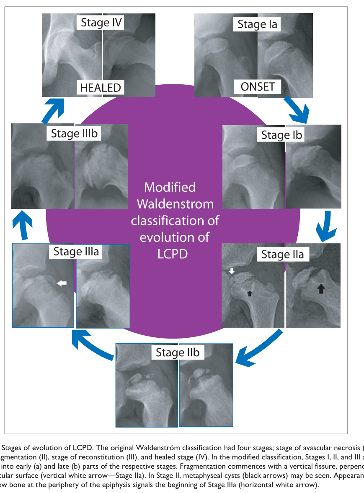

## Question

# Disease Characteristics Research Template

## Target Disease
- **Disease Name:** Legg-Calve-Perthes Disease
- **MONDO ID:** MONDO:0007885 (if available)
- **Category:** Complex

## Research Objectives

Please provide a comprehensive research report on **Legg-Calve-Perthes Disease** covering all of the
disease characteristics listed below. This report will be used to populate a disease knowledge
base entry. Be thorough and cite primary literature (PMID preferred) for all claims.

For each section, **suggested databases/resources** are listed. These are the first places
you should search for information on each topic.

---

### 1. Disease Information
> **Search first:** OMIM, Orphanet, ICD-10/ICD-11, MeSH, PubMed

- What is the disease? Provide a concise overview.
- What are the key identifiers? (OMIM, Orphanet, ICD-10/ICD-11, MeSH, Mondo)
- What are the common synonyms and alternative names?
- Is the information derived from individual patients (e.g., EHR) or aggregated disease-level resources?

### 2. Etiology

- **Disease Causal Factors**: What are the primary causes? (genetic, environmental, infectious, mechanistic)
- **Risk Factors**:
  > **Search first:** PubMed, Cochrane Library, UpToDate, clinical guidelines, ClinVar, ClinGen, GWAS Catalog, PheGenI, CTD, CDC, WHO, epidemiological databases
  - Genetic risk factors (causal variants, susceptibility loci, modifier genes)
  - Environmental risk factors (toxins, lifestyle, occupational exposures, age, sex, family history)
- **Protective Factors**:
  > **Search first:** PubMed, Cochrane Library, clinical trial databases, GWAS Catalog, gnomAD, WHO, CDC, nutrition databases
  - Genetic protective factors (protective variants, modifier alleles)
  - Environmental protective factors (diet, lifestyle, exposures that reduce risk)
- **Gene-Environment Interactions**: How do genetic and environmental factors interact to influence disease?
  > **Search first:** CTD, PubMed, PheGenI, GxE databases

### 3. Phenotypes
> **Search first:** HPO (Human Phenotype Ontology), OMIM, Orphanet, PubMed, clinicaltrials.gov, MedDRA, SNOMED CT, DECIPHER, LOINC

For each phenotype, provide:
- **Phenotype type**: symptoms, clinical signs, physical manifestations, behavioral changes, or laboratory abnormalities
  > For symptoms/signs: HPO, OMIM, Orphanet, PubMed
  > For behavioral changes: HPO, DSM, RDoC (Research Domain Criteria), PubMed
  > For laboratory abnormalities: LOINC, SNOMED CT, LabTests Online, PubMed
- **Phenotype characteristics**:
  > **Search first:** OMIM, Orphanet, HPO, PubMed
  - Age of symptom onset (neonatal, childhood, adult-onset, late-onset)
  - Symptom severity (mild, moderate, severe, variable)
  - Symptom progression (stable, progressive, episodic, fluctuating)
  - Frequency among affected individuals (percentage or qualitative)
- **Quality of life impact**: Effects on daily functioning and well-being (per-phenotype when possible)
  > **Search first:** EQ-5D database, SF-36, WHO QOL databases, PubMed
- Suggest HPO (Human Phenotype Ontology) terms for each phenotype

### 4. Genetic/Molecular Information

- **Causal Genes**: Gene mutations or chromosomal abnormalities responsible for disease (gene symbols, OMIM IDs)
  > **Search first:** OMIM, ClinVar, HGMD, Ensembl, NCBI Gene
- **Pathogenic Variants**:
  - Affected genes (gene symbols, HGNC IDs)
    > **Search first:** OMIM, NCBI Gene, Ensembl, HGNC, UniProt, GeneCards
  - Variant classification (pathogenic, likely pathogenic, VUS per ACMG/AMP guidelines)
    > **Search first:** ClinVar, ClinGen, ACMG/AMP guidelines, VarSome
  - Variant type/class (missense, frameshift, nonsense, splice-site, structural)
  - Allele frequency in population databases
    > **Search first:** gnomAD, 1000 Genomes, ExAC, TOPMed, dbSNP
  - Somatic vs germline origin
    > **Search first:** COSMIC (somatic), ClinVar, ICGC, TCGA
  - Functional consequences (loss of function, gain of function, dominant negative)
- **Modifier Genes**: Genes that modify disease severity or expression
- **Epigenetic Information**: DNA methylation, histone modifications, chromatin changes affecting disease
  > **Search first:** ENCODE, Roadmap Epigenomics, MethBase, DiseaseMeth
- **Chromosomal Abnormalities**: Large-scale genetic changes (aneuploidy, translocations, inversions)
  > **Search first:** DECIPHER, ClinVar, ECARUCA, UCSC Genome Browser

### 5. Environmental Information

- **Environmental Factors**: Non-genetic contributing factors (toxins, radiation, pollution, occupational exposure)
  > **Search first:** CTD (Comparative Toxicogenomics Database), TOXNET, PubMed, EPA databases
- **Lifestyle Factors**: Behavioral factors (smoking, diet, exercise, alcohol consumption)
  > **Search first:** CDC databases, WHO, PubMed, NHANES
- **Infectious Agents**: If applicable, pathogens causing or triggering disease (bacteria, viruses, fungi, parasites)
  > **Search first:** NCBI Taxonomy, ViPR, BV-BRC, MicrobeDB, GIDEON

### 6. Mechanism / Pathophysiology

**Present this section as an ordered causal chain first, then the detail below.**
Open with a numbered sequence of mechanistic steps running from the initiating
lesion (mutation, exposure, infection) to the clinical manifestation, one step per
line, each naming what it causes next. State the causal verb explicitly ("leads
to", "results in") and say where a step is inferred rather than demonstrated.
Where the mechanism branches, show the branch. The categories below are a
checklist of what to cover within those steps, not the organizing structure —
a step may draw on several of them, and a category may contribute to several
steps.

- **Molecular Pathways**: Specific signaling cascades or biochemical pathways involved (Wnt, MAPK, mTOR, PI3K-AKT, etc.)
  > **Search first:** KEGG, Reactome, WikiPathways, PathBank, BioCyc
- **Cellular Processes**: Cell-level mechanisms (apoptosis, autophagy, cell cycle dysregulation, inflammation, etc.)
  > **Search first:** Gene Ontology (GO), Reactome, KEGG, PubMed
- **Protein Dysfunction**: How protein structure or function is altered (misfolding, aggregation, loss of function, gain of function)
  > **Search first:** UniProt, PDB (Protein Data Bank), InterPro, Pfam, AlphaFold
- **Metabolic Changes**: Alterations in metabolic processes (energy metabolism, lipid metabolism, amino acid metabolism)
  > **Search first:** KEGG, BioCyc, HMDB (Human Metabolome Database), BRENDA
- **Immune System Involvement**: Role of immune response (autoimmunity, immunodeficiency, chronic inflammation)
  > **Search first:** ImmPort, Immunome Database, IEDB, Gene Ontology
- **Tissue Damage Mechanisms**: How tissues/ are injured (oxidative stress, ischemia, fibrosis, necrosis)
  > **Search first:** PubMed, Gene Ontology, Reactome
- **Biochemical Abnormalities**: Specific molecular defects (enzyme deficiencies, receptor dysfunction, ion channel defects)
  > **Search first:** BRENDA, UniProt, KEGG, OMIM, PubMed
- **Epigenetic Changes**: DNA methylation, histone modifications affecting gene expression in disease
  > **Search first:** ENCODE, Roadmap Epigenomics, MethBase, DiseaseMeth
- **Molecular Profiling** (if available):
  - Transcriptomics/gene expression changes
    > **Search first:** GEO (Gene Expression Omnibus), ArrayExpress, GTEx, Human Cell Atlas, SRA
  - Proteomics findings
    > **Search first:** PRIDE, ProteomeXchange, Human Protein Atlas, STRING, BioGRID
  - Metabolomics signatures
    > **Search first:** MetaboLights, Metabolomics Workbench, HMDB, METLIN
  - Lipidomics alterations
    > **Search first:** LIPID MAPS, SwissLipids, LipidHome, Metabolomics Workbench
  - Genomic structural features
    > **Search first:** UCSC Genome Browser, Ensembl, NCBI, dbVar, DGV
- **Advanced Technologies** (if applicable):
  - Single-cell analysis findings (cell-type specific mechanisms, cellular heterogeneity)
    > **Search first:** Human Cell Atlas, Single Cell Portal, GEO, CELLxGENE
  - Spatial transcriptomics findings
    > **Search first:** GEO, Spatial Research, Vizgen, 10x Genomics data
  - Multi-omics integration results
    > **Search first:** TCGA, ICGC, cBioPortal, LinkedOmics, PubMed
  - Functional genomics screens (CRISPR, RNAi)
    > **Search first:** DepMap, GenomeRNAi, PubMed, BioGRID ORCS

For each mechanism, describe:
- The causal chain from initial trigger to clinical manifestation
- Which mechanisms are upstream vs downstream
- What cell types and biological processes are involved
- Suggest GO terms for biological processes and CL terms for cell types

### 7. Anatomical Structures Affected

- **Organ Level**:
  - Primary organs directly affected
  - Secondary organ involvement (complications, secondary effects)
  - Body systems involved (cardiovascular, nervous, digestive, respiratory, endocrine, etc.)
  > **Search first:** Uberon, FMA (Foundational Model of Anatomy), OMIM, HPO, ICD-11, MeSH, SNOMED CT
- **Tissue and Cell Level**:
  - Specific tissue types affected (epithelial, connective, muscle, nervous)
  - Specific cell populations targeted (with Cell Ontology terms)
  > **Search first:** Uberon, Human Protein Atlas, Cell Ontology, Human Cell Atlas, CellMarker, PanglaoDB
- **Subcellular Level**:
  - Cellular compartments involved (mitochondria, nucleus, ER, lysosomes) (with GO Cellular Component terms)
  > **Search first:** Gene Ontology (Cellular Component), UniProt, Human Protein Atlas
- **Localization**:
  - Specific anatomical sites (with UBERON terms)
    > **Search first:** FMA, Uberon, NeuroNames (for brain), SNOMED CT
  - Lateralization (unilateral, bilateral, asymmetric)
    > **Search first:** HPO, clinical literature, imaging databases

### 8. Temporal Development

- **Onset**:
  - Typical age of onset (congenital, pediatric, adult, geriatric)
  - Onset pattern (acute, subacute, chronic, insidious)
  > **Search first:** OMIM, Orphanet, HPO, PubMed
- **Progression**:
  - Disease stages (early, intermediate, advanced, end-stage)
    > **Search first:** Cancer Staging Manual (AJCC), WHO classifications, PubMed
  - Progression rate (rapid, slow, variable)
  - Disease course pattern (episodic, relapsing-remitting, progressive, stable)
  - Disease duration (self-limited, chronic lifelong)
  > **Search first:** Disease registries, longitudinal cohort databases, natural history studies, PubMed, Orphanet, OMIM
- **Patterns**:
  - Remission patterns (spontaneous, treatment-induced)
    > **Search first:** Clinical trial databases, disease registries, PubMed
  - Critical periods (time windows of vulnerability or opportunity for intervention)
    > **Search first:** PubMed, developmental biology databases, clinical guidelines

### 9. Inheritance and Population

- **Epidemiology**:
  - Prevalence (cases per 100,000 at given time)
  - Incidence (new cases per 100,000 per year)
  > **Search first:** Orphanet, CDC, WHO, GBD (Global Burden of Disease), national registries, SEER, disease registries
- **For Genetic Etiology**:
  - Inheritance pattern (AD, AR, X-linked, mitochondrial, multifactorial, polygenic)
    > **Search first:** OMIM, Orphanet, ClinVar, GTR (Genetic Testing Registry)
  - Penetrance (complete, incomplete, age-dependent)
    > **Search first:** ClinVar, OMIM, PubMed, ClinGen
  - Expressivity (variable, consistent)
    > **Search first:** OMIM, ClinVar, PubMed
  - Genetic anticipation (increasing severity in successive generations)
    > **Search first:** OMIM, PubMed (especially for repeat expansion disorders)
  - Germline mosaicism
    > **Search first:** ClinVar, OMIM, genetic counseling literature, PubMed
  - Founder effects (population-specific mutations)
    > **Search first:** gnomAD, population genetics databases, PubMed
  - Consanguinity role
    > **Search first:** OMIM, population studies, genetic counseling resources
  - Carrier frequency
    > **Search first:** gnomAD, carrier screening databases, GeneReviews, GTR
- **Population Demographics**:
  - Affected populations (ethnic or demographic groups with higher prevalence)
    > **Search first:** gnomAD, 1000 Genomes, PAGE Study, PubMed, population registries
  - Geographic distribution (endemic areas, regional variation)
    > **Search first:** WHO, CDC, GBD, Orphanet, geographic epidemiology databases
  - Geographic distribution of specific variants
  - Sex ratio (male:female)
    > **Search first:** Disease registries, OMIM, PubMed, epidemiological databases
  - Age distribution of affected individuals
    > **Search first:** CDC, disease registries, SEER, Orphanet

### 10. Diagnostics

- **Clinical Tests**:
  - Laboratory tests (blood, urine, tissue chemistry, specific enzyme assays)
    > **Search first:** LOINC, LabTests Online, PubMed
  - Biomarkers (proteins, metabolites, genetic markers, circulating biomarkers)
    > **Search first:** FDA Biomarker List, BEST (Biomarkers, EndpointS, and other Tools), PubMed
  - Imaging studies (X-ray, CT, MRI, PET, ultrasound)
    > **Search first:** RadLex, DICOM, Radiopaedia, imaging databases
  - Functional tests (pulmonary function, cardiac stress tests)
    > **Search first:** LOINC, clinical guidelines, PubMed
  - Electrophysiology (EEG, EMG, ECG, nerve conduction studies)
    > **Search first:** LOINC, clinical neurophysiology databases, PubMed
  - Biopsy findings (histopathology, immunohistochemistry)
    > **Search first:** SNOMED CT, College of American Pathologists resources, PubMed
  - Pathology findings (microscopic examination)
    > **Search first:** SNOMED CT, Digital Pathology databases, PubMed
- **Genetic Testing**:
  > **Search first:** GTR (Genetic Testing Registry), GeneReviews, ClinGen
  - Overview of recommended genetic testing approach
  - Whole genome sequencing (WGS) utility
    > **Search first:** GTR, ClinVar, GEL (Genomics England), gnomAD
  - Whole exome sequencing (WES) utility
    > **Search first:** GTR, ClinVar, OMIM, GeneMatcher
  - Gene panels (which panels, which genes)
    > **Search first:** GTR, ClinVar, laboratory-specific databases
  - Single gene testing
    > **Search first:** GTR, ClinVar, OMIM, GeneReviews
  - Chromosomal microarray (CMA)
    > **Search first:** DECIPHER, ClinVar, dbVar, ECARUCA
  - Karyotyping
    > **Search first:** Chromosome Abnormality Database, ClinVar, cytogenetics resources
  - FISH
    > **Search first:** ClinVar, cytogenetics databases, PubMed
  - Mitochondrial DNA testing
    > **Search first:** MITOMAP, MSeqDR, ClinVar, GTR
  - Repeat expansion testing
    > **Search first:** GTR, ClinVar, repeat expansion databases, PubMed
- **Omics-Based Diagnostics** (if applicable):
  - RNA sequencing / transcriptomics
    > **Search first:** GEO, ArrayExpress, GTEx, RNA-seq databases
  - Proteomics
    > **Search first:** PRIDE, ProteomeXchange, FDA Biomarker database
  - Metabolomics
    > **Search first:** MetaboLights, Metabolomics Workbench, HMDB
  - Epigenomics
    > **Search first:** GEO, ENCODE, Roadmap Epigenomics, MethBase
  - Liquid biopsy
    > **Search first:** COSMIC, ClinVar, liquid biopsy databases, PubMed
- **Clinical Criteria**:
  - Standardized diagnostic criteria (DSM, ICD, society guidelines)
    > **Search first:** DSM-5, ICD-11, clinical society guidelines, UpToDate
  - Differential diagnosis (other conditions to rule out, with distinguishing features)
    > **Search first:** DynaMed, UpToDate, clinical decision support systems
- **Screening**:
  - Screening methods for asymptomatic individuals (newborn screening, carrier screening, cascade screening)
    > **Search first:** ACMG recommendations, CDC newborn screening, GTR

### 11. Outcome/Prognosis

- **Survival and Mortality**:
  - Survival rate (5-year, 10-year, overall)
    > **Search first:** SEER, cancer registries, disease-specific registries, PubMed
  - Life expectancy (with and without treatment if applicable)
    > **Search first:** Orphanet, disease registries, actuarial databases, PubMed
  - Mortality rate
    > **Search first:** CDC, WHO, GBD, national mortality databases
  - Disease-specific mortality (deaths directly attributable to disease)
    > **Search first:** Disease registries, CDC Wonder, GBD, PubMed
- **Morbidity and Function**:
  - Morbidity (disease-related disability and health impacts)
    > **Search first:** GBD, WHO, disability databases, PubMed
  - Disability outcomes (long-term functional impairments)
    > **Search first:** ICF (International Classification of Functioning), disability registries
  - Quality of life measures (EQ-5D, SF-36, PROMIS, disease-specific tools)
    > **Search first:** EQ-5D database, SF-36, PROMIS, PubMed
- **Disease Course**:
  - Complications (secondary problems: infections, organ failure, etc.)
    > **Search first:** ICD codes, disease registries, clinical databases, PubMed
  - Recovery potential (likelihood and extent of recovery, with vs without treatment)
    > **Search first:** Natural history studies, rehabilitation databases, PubMed
- **Prediction**:
  - Prognostic factors (age, disease severity, biomarkers, treatment response)
    > **Search first:** Prognostic models databases, clinical calculators, PubMed
  - Prognostic biomarkers (molecular markers predicting disease course)
    > **Search first:** FDA Biomarker database, PubMed, cancer prognostic databases

### 12. Treatment

- **Pharmacotherapy**:
  - Pharmacological treatments (drug names, drug classes, mechanisms of action)
    > **Search first:** DrugBank, RxNorm, ATC classification, DailyMed, FDA databases
  - Pharmacogenomics (how genetic variants affect drug metabolism, efficacy, toxicity)
    > **Search first:** PharmGKB, CPIC (Clinical Pharmacogenetics), FDA Table of PGx Biomarkers
- **Advanced Therapeutics**:
  - Gene therapy (viral vectors, CRISPR, gene replacement, gene editing)
    > **Search first:** ClinicalTrials.gov, FDA gene therapy database, ASGCT resources
  - Cell therapy (stem cell transplant, CAR-T, cellular therapeutics)
    > **Search first:** ClinicalTrials.gov, FDA cell therapy database, FACT standards
  - RNA-based therapies (ASOs, siRNA, mRNA therapies)
    > **Search first:** ClinicalTrials.gov, FDA approvals, PubMed
  - Targeted therapies (treatments directed at specific molecular targets)
    > **Search first:** My Cancer Genome, OncoKB, ClinicalTrials.gov, FDA approvals
  - Immunotherapies (checkpoint inhibitors, monoclonal antibodies)
    > **Search first:** Cancer Immunotherapy Database, FDA approvals, ClinicalTrials.gov
- **Surgical and Interventional**:
  - Surgical interventions (types of surgery, timing, outcomes)
    > **Search first:** CPT codes, surgical registries, clinical guidelines, PubMed
- **Supportive and Rehabilitative**:
  - Supportive care (symptom management, pain control, nutrition)
    > **Search first:** Clinical guidelines, Cochrane Library, PubMed
  - Rehabilitation (physical therapy, occupational therapy, speech therapy)
    > **Search first:** Rehabilitation medicine databases, clinical guidelines, PubMed
- **Experimental**:
  - Experimental treatments in clinical trials (with NCT identifiers if available)
    > **Search first:** ClinicalTrials.gov, EU Clinical Trials Register, WHO ICTRP
- **Treatment Outcomes**:
  - Treatment response rates
    > **Search first:** Clinical trial databases, FDA reviews, systematic reviews, PubMed
  - Side effects and adverse events
    > **Search first:** FDA Adverse Event Reporting System (FAERS), MedWatch, PubMed
- **Treatment Strategy**:
  - Treatment algorithms (clinical pathways, decision trees)
    > **Search first:** Clinical practice guidelines, NCCN Guidelines, UpToDate
  - Combination therapies
    > **Search first:** ClinicalTrials.gov, treatment guidelines, PubMed
  - Personalized medicine approaches (genotype-guided treatment)
    > **Search first:** My Cancer Genome, CIViC, PharmGKB, precision medicine databases

For each treatment, suggest NCIT (NCI Thesaurus) clinical-intervention terms where applicable.

### 13. Prevention

- **Prevention Levels**:
  - Primary prevention (preventing disease occurrence: vaccination, risk factor modification)
    > **Search first:** CDC, WHO, USPSTF recommendations, Cochrane Library
  - Secondary prevention (early detection and treatment: screening programs, early intervention)
    > **Search first:** USPSTF, CDC screening guidelines, WHO
  - Tertiary prevention (preventing complications in those with disease)
    > **Search first:** Clinical guidelines, disease management protocols, PubMed
- **Immunization**: Vaccine strategies (if applicable)
  > **Search first:** CDC vaccine schedules, WHO immunization, FDA vaccine database
- **Screening and Early Detection**:
  - Screening programs (population-based: newborn screening, cancer screening)
    > **Search first:** CDC screening programs, USPSTF, cancer screening databases
  - Genetic screening (carrier screening, preimplantation genetic diagnosis, prenatal testing)
    > **Search first:** ACMG recommendations, ACOG guidelines, GTR
  - Risk stratification (identifying high-risk individuals for targeted prevention)
    > **Search first:** Risk prediction models, clinical calculators, PubMed
- **Behavioral Interventions**: Lifestyle modifications to reduce risk
  > **Search first:** CDC, WHO, behavioral intervention databases, Cochrane Library
- **Counseling**: Genetic counseling (risk assessment, family planning guidance)
  > **Search first:** NSGC resources, ACMG guidelines, GeneReviews
- **Public Health**:
  - Public health interventions (sanitation, vector control, health education)
    > **Search first:** CDC, WHO, public health databases, PubMed
  - Environmental interventions (reducing environmental risk factors)
    > **Search first:** EPA databases, WHO environmental health, PubMed
- **Prophylaxis**: Preventive medications or procedures
  > **Search first:** Clinical guidelines, FDA approvals, PubMed

### 14. Other Species / Natural Disease

- **Taxonomy**: Species affected (with NCBI Taxon identifiers)
  > **Search first:** NCBI Taxonomy
- **Breed**: Specific breeds affected (with VBO identifiers if applicable)
  > **Search first:** VBO (Vertebrate Breed Ontology)
- **Gene**: Orthologous genes in other species (with NCBI Gene IDs)
  > **Search first:** NCBI Gene
- **Natural Disease**:
  - Naturally occurring disease in other species (companion animals, wildlife)
    > **Search first:** OMIA (Online Mendelian Inheritance in Animals), VetCompass, PubMed
  - Veterinary relevance and importance in animal health
    > **Search first:** OMIA, veterinary databases, PubMed
- **Comparative Biology**:
  - Comparative pathology (similarities and differences across species)
    > **Search first:** OMIA, comparative pathology databases, PubMed
  - Evolutionary conservation of disease mechanisms
    > **Search first:** HomoloGene, OrthoMCL, Alliance of Genome Resources
- **Transmission** (if applicable):
  - Zoonotic potential
    > **Search first:** CDC zoonotic diseases, WHO zoonoses, GIDEON
  - Cross-species susceptibility
    > **Search first:** NCBI Taxonomy, veterinary databases, PubMed

### 15. Model Organisms

- **Model Types**:
  - Model organism type (mammalian, invertebrate, cellular, in vitro)
    > **Search first:** Alliance of Genome Resources, model organism databases
  - Specific model systems (mouse, rat, zebrafish, Drosophila, C. elegans, yeast, cell lines, organoids, iPSCs)
    > **Search first:** MGI, RGD, ZFIN, FlyBase, WormBase, SGD, ATCC, Cellosaurus
  - Induced models (drug treatment, surgical intervention, environmental manipulation)
    > **Search first:** MGI, model organism databases, PubMed
- **Genetic Models**:
  - Types available (knockout, knock-in, transgenic, conditional, humanized)
    > **Search first:** MGI, IMPC, KOMP, EuMMCR, IMSR
- **Model Characteristics**:
  - Phenotype recapitulation (how well model reproduces human disease features)
    > **Search first:** Model organism databases, comparative studies, PubMed
  - Model limitations (aspects of human disease not captured)
    > **Search first:** Model organism databases, PubMed, review articles
- **Applications**:
  - Research applications (what aspects of disease can be studied)
    > **Search first:** Model organism databases, PubMed
- **Resources**:
  - Model databases
    > **Search first:** MGI, RGD, ZFIN, FlyBase, WormBase, IMSR, EMMA, MMRRC

---

## Citation Requirements

- Cite primary literature (PMID preferred) for all mechanistic and clinical claims
- Prioritize recent reviews and landmark papers
- Include direct quotes from abstracts where possible to support key statements
- Distinguish evidence source types: human clinical, model organism, in vitro, computational

## Output Format

Structure your response as a comprehensive narrative organized by the sections above.
For each section, provide:
- Factual content with specific details (numbers, percentages, gene names, variant nomenclature)
- Ontology term suggestions (HPO, GO, CL, UBERON, CHEBI, NCIT, MONDO) where applicable
- Evidence citations with PMIDs
- Direct quotes from abstracts to support key claims
- Clear indication when information is not available or not applicable for this disease

This report will be used to populate a disease knowledge base entry with:
- Pathophysiology descriptions with causal chains
- Gene/protein annotations (HGNC, GO terms)
- Phenotype associations (HP terms) with frequencies
- Cell type involvement (CL terms)
- Anatomical locations (UBERON terms)
- Chemical entities (CHEBI terms)
- Treatment annotations (NCIT terms)
- Evidence items with PMIDs and exact abstract quotes
- Epidemiology, prognosis, diagnostic, and prevention information
- Animal model descriptions with phenotype recapitulation details

## Output

Question: You are an expert researcher providing comprehensive, well-cited information.

Provide detailed information focusing on:
1. Key concepts and definitions with current understanding
2. Recent developments and latest research (prioritize 2023-2024 sources)
3. Current applications and real-world implementations
4. Expert opinions and analysis from authoritative sources
5. Relevant statistics and data from recent studies

Format as a comprehensive research report with proper citations. Include URLs and publication dates where available.
Always prioritize recent, authoritative sources and provide specific citations for all major claims.

# Disease Characteristics Research Template

## Target Disease
- **Disease Name:** Legg-Calve-Perthes Disease
- **MONDO ID:** MONDO:0007885 (if available)
- **Category:** Complex

## Research Objectives

Please provide a comprehensive research report on **Legg-Calve-Perthes Disease** covering all of the
disease characteristics listed below. This report will be used to populate a disease knowledge
base entry. Be thorough and cite primary literature (PMID preferred) for all claims.

For each section, **suggested databases/resources** are listed. These are the first places
you should search for information on each topic.

---

### 1. Disease Information
> **Search first:** OMIM, Orphanet, ICD-10/ICD-11, MeSH, PubMed

- What is the disease? Provide a concise overview.
- What are the key identifiers? (OMIM, Orphanet, ICD-10/ICD-11, MeSH, Mondo)
- What are the common synonyms and alternative names?
- Is the information derived from individual patients (e.g., EHR) or aggregated disease-level resources?

### 2. Etiology

- **Disease Causal Factors**: What are the primary causes? (genetic, environmental, infectious, mechanistic)
- **Risk Factors**:
  > **Search first:** PubMed, Cochrane Library, UpToDate, clinical guidelines, ClinVar, ClinGen, GWAS Catalog, PheGenI, CTD, CDC, WHO, epidemiological databases
  - Genetic risk factors (causal variants, susceptibility loci, modifier genes)
  - Environmental risk factors (toxins, lifestyle, occupational exposures, age, sex, family history)
- **Protective Factors**:
  > **Search first:** PubMed, Cochrane Library, clinical trial databases, GWAS Catalog, gnomAD, WHO, CDC, nutrition databases
  - Genetic protective factors (protective variants, modifier alleles)
  - Environmental protective factors (diet, lifestyle, exposures that reduce risk)
- **Gene-Environment Interactions**: How do genetic and environmental factors interact to influence disease?
  > **Search first:** CTD, PubMed, PheGenI, GxE databases

### 3. Phenotypes
> **Search first:** HPO (Human Phenotype Ontology), OMIM, Orphanet, PubMed, clinicaltrials.gov, MedDRA, SNOMED CT, DECIPHER, LOINC

For each phenotype, provide:
- **Phenotype type**: symptoms, clinical signs, physical manifestations, behavioral changes, or laboratory abnormalities
  > For symptoms/signs: HPO, OMIM, Orphanet, PubMed
  > For behavioral changes: HPO, DSM, RDoC (Research Domain Criteria), PubMed
  > For laboratory abnormalities: LOINC, SNOMED CT, LabTests Online, PubMed
- **Phenotype characteristics**:
  > **Search first:** OMIM, Orphanet, HPO, PubMed
  - Age of symptom onset (neonatal, childhood, adult-onset, late-onset)
  - Symptom severity (mild, moderate, severe, variable)
  - Symptom progression (stable, progressive, episodic, fluctuating)
  - Frequency among affected individuals (percentage or qualitative)
- **Quality of life impact**: Effects on daily functioning and well-being (per-phenotype when possible)
  > **Search first:** EQ-5D database, SF-36, WHO QOL databases, PubMed
- Suggest HPO (Human Phenotype Ontology) terms for each phenotype

### 4. Genetic/Molecular Information

- **Causal Genes**: Gene mutations or chromosomal abnormalities responsible for disease (gene symbols, OMIM IDs)
  > **Search first:** OMIM, ClinVar, HGMD, Ensembl, NCBI Gene
- **Pathogenic Variants**:
  - Affected genes (gene symbols, HGNC IDs)
    > **Search first:** OMIM, NCBI Gene, Ensembl, HGNC, UniProt, GeneCards
  - Variant classification (pathogenic, likely pathogenic, VUS per ACMG/AMP guidelines)
    > **Search first:** ClinVar, ClinGen, ACMG/AMP guidelines, VarSome
  - Variant type/class (missense, frameshift, nonsense, splice-site, structural)
  - Allele frequency in population databases
    > **Search first:** gnomAD, 1000 Genomes, ExAC, TOPMed, dbSNP
  - Somatic vs germline origin
    > **Search first:** COSMIC (somatic), ClinVar, ICGC, TCGA
  - Functional consequences (loss of function, gain of function, dominant negative)
- **Modifier Genes**: Genes that modify disease severity or expression
- **Epigenetic Information**: DNA methylation, histone modifications, chromatin changes affecting disease
  > **Search first:** ENCODE, Roadmap Epigenomics, MethBase, DiseaseMeth
- **Chromosomal Abnormalities**: Large-scale genetic changes (aneuploidy, translocations, inversions)
  > **Search first:** DECIPHER, ClinVar, ECARUCA, UCSC Genome Browser

### 5. Environmental Information

- **Environmental Factors**: Non-genetic contributing factors (toxins, radiation, pollution, occupational exposure)
  > **Search first:** CTD (Comparative Toxicogenomics Database), TOXNET, PubMed, EPA databases
- **Lifestyle Factors**: Behavioral factors (smoking, diet, exercise, alcohol consumption)
  > **Search first:** CDC databases, WHO, PubMed, NHANES
- **Infectious Agents**: If applicable, pathogens causing or triggering disease (bacteria, viruses, fungi, parasites)
  > **Search first:** NCBI Taxonomy, ViPR, BV-BRC, MicrobeDB, GIDEON

### 6. Mechanism / Pathophysiology

**Present this section as an ordered causal chain first, then the detail below.**
Open with a numbered sequence of mechanistic steps running from the initiating
lesion (mutation, exposure, infection) to the clinical manifestation, one step per
line, each naming what it causes next. State the causal verb explicitly ("leads
to", "results in") and say where a step is inferred rather than demonstrated.
Where the mechanism branches, show the branch. The categories below are a
checklist of what to cover within those steps, not the organizing structure —
a step may draw on several of them, and a category may contribute to several
steps.

- **Molecular Pathways**: Specific signaling cascades or biochemical pathways involved (Wnt, MAPK, mTOR, PI3K-AKT, etc.)
  > **Search first:** KEGG, Reactome, WikiPathways, PathBank, BioCyc
- **Cellular Processes**: Cell-level mechanisms (apoptosis, autophagy, cell cycle dysregulation, inflammation, etc.)
  > **Search first:** Gene Ontology (GO), Reactome, KEGG, PubMed
- **Protein Dysfunction**: How protein structure or function is altered (misfolding, aggregation, loss of function, gain of function)
  > **Search first:** UniProt, PDB (Protein Data Bank), InterPro, Pfam, AlphaFold
- **Metabolic Changes**: Alterations in metabolic processes (energy metabolism, lipid metabolism, amino acid metabolism)
  > **Search first:** KEGG, BioCyc, HMDB (Human Metabolome Database), BRENDA
- **Immune System Involvement**: Role of immune response (autoimmunity, immunodeficiency, chronic inflammation)
  > **Search first:** ImmPort, Immunome Database, IEDB, Gene Ontology
- **Tissue Damage Mechanisms**: How tissues/ are injured (oxidative stress, ischemia, fibrosis, necrosis)
  > **Search first:** PubMed, Gene Ontology, Reactome
- **Biochemical Abnormalities**: Specific molecular defects (enzyme deficiencies, receptor dysfunction, ion channel defects)
  > **Search first:** BRENDA, UniProt, KEGG, OMIM, PubMed
- **Epigenetic Changes**: DNA methylation, histone modifications affecting gene expression in disease
  > **Search first:** ENCODE, Roadmap Epigenomics, MethBase, DiseaseMeth
- **Molecular Profiling** (if available):
  - Transcriptomics/gene expression changes
    > **Search first:** GEO (Gene Expression Omnibus), ArrayExpress, GTEx, Human Cell Atlas, SRA
  - Proteomics findings
    > **Search first:** PRIDE, ProteomeXchange, Human Protein Atlas, STRING, BioGRID
  - Metabolomics signatures
    > **Search first:** MetaboLights, Metabolomics Workbench, HMDB, METLIN
  - Lipidomics alterations
    > **Search first:** LIPID MAPS, SwissLipids, LipidHome, Metabolomics Workbench
  - Genomic structural features
    > **Search first:** UCSC Genome Browser, Ensembl, NCBI, dbVar, DGV
- **Advanced Technologies** (if applicable):
  - Single-cell analysis findings (cell-type specific mechanisms, cellular heterogeneity)
    > **Search first:** Human Cell Atlas, Single Cell Portal, GEO, CELLxGENE
  - Spatial transcriptomics findings
    > **Search first:** GEO, Spatial Research, Vizgen, 10x Genomics data
  - Multi-omics integration results
    > **Search first:** TCGA, ICGC, cBioPortal, LinkedOmics, PubMed
  - Functional genomics screens (CRISPR, RNAi)
    > **Search first:** DepMap, GenomeRNAi, PubMed, BioGRID ORCS

For each mechanism, describe:
- The causal chain from initial trigger to clinical manifestation
- Which mechanisms are upstream vs downstream
- What cell types and biological processes are involved
- Suggest GO terms for biological processes and CL terms for cell types

### 7. Anatomical Structures Affected

- **Organ Level**:
  - Primary organs directly affected
  - Secondary organ involvement (complications, secondary effects)
  - Body systems involved (cardiovascular, nervous, digestive, respiratory, endocrine, etc.)
  > **Search first:** Uberon, FMA (Foundational Model of Anatomy), OMIM, HPO, ICD-11, MeSH, SNOMED CT
- **Tissue and Cell Level**:
  - Specific tissue types affected (epithelial, connective, muscle, nervous)
  - Specific cell populations targeted (with Cell Ontology terms)
  > **Search first:** Uberon, Human Protein Atlas, Cell Ontology, Human Cell Atlas, CellMarker, PanglaoDB
- **Subcellular Level**:
  - Cellular compartments involved (mitochondria, nucleus, ER, lysosomes) (with GO Cellular Component terms)
  > **Search first:** Gene Ontology (Cellular Component), UniProt, Human Protein Atlas
- **Localization**:
  - Specific anatomical sites (with UBERON terms)
    > **Search first:** FMA, Uberon, NeuroNames (for brain), SNOMED CT
  - Lateralization (unilateral, bilateral, asymmetric)
    > **Search first:** HPO, clinical literature, imaging databases

### 8. Temporal Development

- **Onset**:
  - Typical age of onset (congenital, pediatric, adult, geriatric)
  - Onset pattern (acute, subacute, chronic, insidious)
  > **Search first:** OMIM, Orphanet, HPO, PubMed
- **Progression**:
  - Disease stages (early, intermediate, advanced, end-stage)
    > **Search first:** Cancer Staging Manual (AJCC), WHO classifications, PubMed
  - Progression rate (rapid, slow, variable)
  - Disease course pattern (episodic, relapsing-remitting, progressive, stable)
  - Disease duration (self-limited, chronic lifelong)
  > **Search first:** Disease registries, longitudinal cohort databases, natural history studies, PubMed, Orphanet, OMIM
- **Patterns**:
  - Remission patterns (spontaneous, treatment-induced)
    > **Search first:** Clinical trial databases, disease registries, PubMed
  - Critical periods (time windows of vulnerability or opportunity for intervention)
    > **Search first:** PubMed, developmental biology databases, clinical guidelines

### 9. Inheritance and Population

- **Epidemiology**:
  - Prevalence (cases per 100,000 at given time)
  - Incidence (new cases per 100,000 per year)
  > **Search first:** Orphanet, CDC, WHO, GBD (Global Burden of Disease), national registries, SEER, disease registries
- **For Genetic Etiology**:
  - Inheritance pattern (AD, AR, X-linked, mitochondrial, multifactorial, polygenic)
    > **Search first:** OMIM, Orphanet, ClinVar, GTR (Genetic Testing Registry)
  - Penetrance (complete, incomplete, age-dependent)
    > **Search first:** ClinVar, OMIM, PubMed, ClinGen
  - Expressivity (variable, consistent)
    > **Search first:** OMIM, ClinVar, PubMed
  - Genetic anticipation (increasing severity in successive generations)
    > **Search first:** OMIM, PubMed (especially for repeat expansion disorders)
  - Germline mosaicism
    > **Search first:** ClinVar, OMIM, genetic counseling literature, PubMed
  - Founder effects (population-specific mutations)
    > **Search first:** gnomAD, population genetics databases, PubMed
  - Consanguinity role
    > **Search first:** OMIM, population studies, genetic counseling resources
  - Carrier frequency
    > **Search first:** gnomAD, carrier screening databases, GeneReviews, GTR
- **Population Demographics**:
  - Affected populations (ethnic or demographic groups with higher prevalence)
    > **Search first:** gnomAD, 1000 Genomes, PAGE Study, PubMed, population registries
  - Geographic distribution (endemic areas, regional variation)
    > **Search first:** WHO, CDC, GBD, Orphanet, geographic epidemiology databases
  - Geographic distribution of specific variants
  - Sex ratio (male:female)
    > **Search first:** Disease registries, OMIM, PubMed, epidemiological databases
  - Age distribution of affected individuals
    > **Search first:** CDC, disease registries, SEER, Orphanet

### 10. Diagnostics

- **Clinical Tests**:
  - Laboratory tests (blood, urine, tissue chemistry, specific enzyme assays)
    > **Search first:** LOINC, LabTests Online, PubMed
  - Biomarkers (proteins, metabolites, genetic markers, circulating biomarkers)
    > **Search first:** FDA Biomarker List, BEST (Biomarkers, EndpointS, and other Tools), PubMed
  - Imaging studies (X-ray, CT, MRI, PET, ultrasound)
    > **Search first:** RadLex, DICOM, Radiopaedia, imaging databases
  - Functional tests (pulmonary function, cardiac stress tests)
    > **Search first:** LOINC, clinical guidelines, PubMed
  - Electrophysiology (EEG, EMG, ECG, nerve conduction studies)
    > **Search first:** LOINC, clinical neurophysiology databases, PubMed
  - Biopsy findings (histopathology, immunohistochemistry)
    > **Search first:** SNOMED CT, College of American Pathologists resources, PubMed
  - Pathology findings (microscopic examination)
    > **Search first:** SNOMED CT, Digital Pathology databases, PubMed
- **Genetic Testing**:
  > **Search first:** GTR (Genetic Testing Registry), GeneReviews, ClinGen
  - Overview of recommended genetic testing approach
  - Whole genome sequencing (WGS) utility
    > **Search first:** GTR, ClinVar, GEL (Genomics England), gnomAD
  - Whole exome sequencing (WES) utility
    > **Search first:** GTR, ClinVar, OMIM, GeneMatcher
  - Gene panels (which panels, which genes)
    > **Search first:** GTR, ClinVar, laboratory-specific databases
  - Single gene testing
    > **Search first:** GTR, ClinVar, OMIM, GeneReviews
  - Chromosomal microarray (CMA)
    > **Search first:** DECIPHER, ClinVar, dbVar, ECARUCA
  - Karyotyping
    > **Search first:** Chromosome Abnormality Database, ClinVar, cytogenetics resources
  - FISH
    > **Search first:** ClinVar, cytogenetics databases, PubMed
  - Mitochondrial DNA testing
    > **Search first:** MITOMAP, MSeqDR, ClinVar, GTR
  - Repeat expansion testing
    > **Search first:** GTR, ClinVar, repeat expansion databases, PubMed
- **Omics-Based Diagnostics** (if applicable):
  - RNA sequencing / transcriptomics
    > **Search first:** GEO, ArrayExpress, GTEx, RNA-seq databases
  - Proteomics
    > **Search first:** PRIDE, ProteomeXchange, FDA Biomarker database
  - Metabolomics
    > **Search first:** MetaboLights, Metabolomics Workbench, HMDB
  - Epigenomics
    > **Search first:** GEO, ENCODE, Roadmap Epigenomics, MethBase
  - Liquid biopsy
    > **Search first:** COSMIC, ClinVar, liquid biopsy databases, PubMed
- **Clinical Criteria**:
  - Standardized diagnostic criteria (DSM, ICD, society guidelines)
    > **Search first:** DSM-5, ICD-11, clinical society guidelines, UpToDate
  - Differential diagnosis (other conditions to rule out, with distinguishing features)
    > **Search first:** DynaMed, UpToDate, clinical decision support systems
- **Screening**:
  - Screening methods for asymptomatic individuals (newborn screening, carrier screening, cascade screening)
    > **Search first:** ACMG recommendations, CDC newborn screening, GTR

### 11. Outcome/Prognosis

- **Survival and Mortality**:
  - Survival rate (5-year, 10-year, overall)
    > **Search first:** SEER, cancer registries, disease-specific registries, PubMed
  - Life expectancy (with and without treatment if applicable)
    > **Search first:** Orphanet, disease registries, actuarial databases, PubMed
  - Mortality rate
    > **Search first:** CDC, WHO, GBD, national mortality databases
  - Disease-specific mortality (deaths directly attributable to disease)
    > **Search first:** Disease registries, CDC Wonder, GBD, PubMed
- **Morbidity and Function**:
  - Morbidity (disease-related disability and health impacts)
    > **Search first:** GBD, WHO, disability databases, PubMed
  - Disability outcomes (long-term functional impairments)
    > **Search first:** ICF (International Classification of Functioning), disability registries
  - Quality of life measures (EQ-5D, SF-36, PROMIS, disease-specific tools)
    > **Search first:** EQ-5D database, SF-36, PROMIS, PubMed
- **Disease Course**:
  - Complications (secondary problems: infections, organ failure, etc.)
    > **Search first:** ICD codes, disease registries, clinical databases, PubMed
  - Recovery potential (likelihood and extent of recovery, with vs without treatment)
    > **Search first:** Natural history studies, rehabilitation databases, PubMed
- **Prediction**:
  - Prognostic factors (age, disease severity, biomarkers, treatment response)
    > **Search first:** Prognostic models databases, clinical calculators, PubMed
  - Prognostic biomarkers (molecular markers predicting disease course)
    > **Search first:** FDA Biomarker database, PubMed, cancer prognostic databases

### 12. Treatment

- **Pharmacotherapy**:
  - Pharmacological treatments (drug names, drug classes, mechanisms of action)
    > **Search first:** DrugBank, RxNorm, ATC classification, DailyMed, FDA databases
  - Pharmacogenomics (how genetic variants affect drug metabolism, efficacy, toxicity)
    > **Search first:** PharmGKB, CPIC (Clinical Pharmacogenetics), FDA Table of PGx Biomarkers
- **Advanced Therapeutics**:
  - Gene therapy (viral vectors, CRISPR, gene replacement, gene editing)
    > **Search first:** ClinicalTrials.gov, FDA gene therapy database, ASGCT resources
  - Cell therapy (stem cell transplant, CAR-T, cellular therapeutics)
    > **Search first:** ClinicalTrials.gov, FDA cell therapy database, FACT standards
  - RNA-based therapies (ASOs, siRNA, mRNA therapies)
    > **Search first:** ClinicalTrials.gov, FDA approvals, PubMed
  - Targeted therapies (treatments directed at specific molecular targets)
    > **Search first:** My Cancer Genome, OncoKB, ClinicalTrials.gov, FDA approvals
  - Immunotherapies (checkpoint inhibitors, monoclonal antibodies)
    > **Search first:** Cancer Immunotherapy Database, FDA approvals, ClinicalTrials.gov
- **Surgical and Interventional**:
  - Surgical interventions (types of surgery, timing, outcomes)
    > **Search first:** CPT codes, surgical registries, clinical guidelines, PubMed
- **Supportive and Rehabilitative**:
  - Supportive care (symptom management, pain control, nutrition)
    > **Search first:** Clinical guidelines, Cochrane Library, PubMed
  - Rehabilitation (physical therapy, occupational therapy, speech therapy)
    > **Search first:** Rehabilitation medicine databases, clinical guidelines, PubMed
- **Experimental**:
  - Experimental treatments in clinical trials (with NCT identifiers if available)
    > **Search first:** ClinicalTrials.gov, EU Clinical Trials Register, WHO ICTRP
- **Treatment Outcomes**:
  - Treatment response rates
    > **Search first:** Clinical trial databases, FDA reviews, systematic reviews, PubMed
  - Side effects and adverse events
    > **Search first:** FDA Adverse Event Reporting System (FAERS), MedWatch, PubMed
- **Treatment Strategy**:
  - Treatment algorithms (clinical pathways, decision trees)
    > **Search first:** Clinical practice guidelines, NCCN Guidelines, UpToDate
  - Combination therapies
    > **Search first:** ClinicalTrials.gov, treatment guidelines, PubMed
  - Personalized medicine approaches (genotype-guided treatment)
    > **Search first:** My Cancer Genome, CIViC, PharmGKB, precision medicine databases

For each treatment, suggest NCIT (NCI Thesaurus) clinical-intervention terms where applicable.

### 13. Prevention

- **Prevention Levels**:
  - Primary prevention (preventing disease occurrence: vaccination, risk factor modification)
    > **Search first:** CDC, WHO, USPSTF recommendations, Cochrane Library
  - Secondary prevention (early detection and treatment: screening programs, early intervention)
    > **Search first:** USPSTF, CDC screening guidelines, WHO
  - Tertiary prevention (preventing complications in those with disease)
    > **Search first:** Clinical guidelines, disease management protocols, PubMed
- **Immunization**: Vaccine strategies (if applicable)
  > **Search first:** CDC vaccine schedules, WHO immunization, FDA vaccine database
- **Screening and Early Detection**:
  - Screening programs (population-based: newborn screening, cancer screening)
    > **Search first:** CDC screening programs, USPSTF, cancer screening databases
  - Genetic screening (carrier screening, preimplantation genetic diagnosis, prenatal testing)
    > **Search first:** ACMG recommendations, ACOG guidelines, GTR
  - Risk stratification (identifying high-risk individuals for targeted prevention)
    > **Search first:** Risk prediction models, clinical calculators, PubMed
- **Behavioral Interventions**: Lifestyle modifications to reduce risk
  > **Search first:** CDC, WHO, behavioral intervention databases, Cochrane Library
- **Counseling**: Genetic counseling (risk assessment, family planning guidance)
  > **Search first:** NSGC resources, ACMG guidelines, GeneReviews
- **Public Health**:
  - Public health interventions (sanitation, vector control, health education)
    > **Search first:** CDC, WHO, public health databases, PubMed
  - Environmental interventions (reducing environmental risk factors)
    > **Search first:** EPA databases, WHO environmental health, PubMed
- **Prophylaxis**: Preventive medications or procedures
  > **Search first:** Clinical guidelines, FDA approvals, PubMed

### 14. Other Species / Natural Disease

- **Taxonomy**: Species affected (with NCBI Taxon identifiers)
  > **Search first:** NCBI Taxonomy
- **Breed**: Specific breeds affected (with VBO identifiers if applicable)
  > **Search first:** VBO (Vertebrate Breed Ontology)
- **Gene**: Orthologous genes in other species (with NCBI Gene IDs)
  > **Search first:** NCBI Gene
- **Natural Disease**:
  - Naturally occurring disease in other species (companion animals, wildlife)
    > **Search first:** OMIA (Online Mendelian Inheritance in Animals), VetCompass, PubMed
  - Veterinary relevance and importance in animal health
    > **Search first:** OMIA, veterinary databases, PubMed
- **Comparative Biology**:
  - Comparative pathology (similarities and differences across species)
    > **Search first:** OMIA, comparative pathology databases, PubMed
  - Evolutionary conservation of disease mechanisms
    > **Search first:** HomoloGene, OrthoMCL, Alliance of Genome Resources
- **Transmission** (if applicable):
  - Zoonotic potential
    > **Search first:** CDC zoonotic diseases, WHO zoonoses, GIDEON
  - Cross-species susceptibility
    > **Search first:** NCBI Taxonomy, veterinary databases, PubMed

### 15. Model Organisms

- **Model Types**:
  - Model organism type (mammalian, invertebrate, cellular, in vitro)
    > **Search first:** Alliance of Genome Resources, model organism databases
  - Specific model systems (mouse, rat, zebrafish, Drosophila, C. elegans, yeast, cell lines, organoids, iPSCs)
    > **Search first:** MGI, RGD, ZFIN, FlyBase, WormBase, SGD, ATCC, Cellosaurus
  - Induced models (drug treatment, surgical intervention, environmental manipulation)
    > **Search first:** MGI, model organism databases, PubMed
- **Genetic Models**:
  - Types available (knockout, knock-in, transgenic, conditional, humanized)
    > **Search first:** MGI, IMPC, KOMP, EuMMCR, IMSR
- **Model Characteristics**:
  - Phenotype recapitulation (how well model reproduces human disease features)
    > **Search first:** Model organism databases, comparative studies, PubMed
  - Model limitations (aspects of human disease not captured)
    > **Search first:** Model organism databases, PubMed, review articles
- **Applications**:
  - Research applications (what aspects of disease can be studied)
    > **Search first:** Model organism databases, PubMed
- **Resources**:
  - Model databases
    > **Search first:** MGI, RGD, ZFIN, FlyBase, WormBase, IMSR, EMMA, MMRRC

---

## Citation Requirements

- Cite primary literature (PMID preferred) for all mechanistic and clinical claims
- Prioritize recent reviews and landmark papers
- Include direct quotes from abstracts where possible to support key statements
- Distinguish evidence source types: human clinical, model organism, in vitro, computational

## Output Format

Structure your response as a comprehensive narrative organized by the sections above.
For each section, provide:
- Factual content with specific details (numbers, percentages, gene names, variant nomenclature)
- Ontology term suggestions (HPO, GO, CL, UBERON, CHEBI, NCIT, MONDO) where applicable
- Evidence citations with PMIDs
- Direct quotes from abstracts to support key claims
- Clear indication when information is not available or not applicable for this disease

This report will be used to populate a disease knowledge base entry with:
- Pathophysiology descriptions with causal chains
- Gene/protein annotations (HGNC, GO terms)
- Phenotype associations (HP terms) with frequencies
- Cell type involvement (CL terms)
- Anatomical locations (UBERON terms)
- Chemical entities (CHEBI terms)
- Treatment annotations (NCIT terms)
- Evidence items with PMIDs and exact abstract quotes
- Epidemiology, prognosis, diagnostic, and prevention information
- Animal model descriptions with phenotype recapitulation details

# Legg–Calvé–Perthes disease: disease-characteristics research report

**Scope and evidence standard.** This is a disease-level synthesis, not an analysis of individual electronic health records. It distinguishes observations in affected children, clinical-study registrations, spontaneous disease in dogs, and experimentally induced ischemia in animals. The central distinction is that interruption of blood supply to the developing femoral head is established, whereas **the cause of that interruption in most children is not**. Familial type II collagenopathies can resemble or include Perthes disease but must not be assumed to explain ordinary sporadic cases. (joseph2023epidemiologynaturalevolution pages 1-2, joseph2023epidemiologynaturalevolution pages 2-5, spasovski2023molecularbiomarkersin pages 6-8)

The following evidence map gives quantitative findings alongside their principal limitations; citations in the narrative supply additional detail.

| Characteristic | Numerical or molecular finding | Evidence type and inference limit | Concise source |
|---|---|---|---|
| Epidemiology and smoke exposure | Annual incidence is **0.2–19.1 per 100,000** children aged 0–14; males are affected approximately **3–5 times** as often as females. A Swedish case–control study (**852 cases; 4,432 controls**) found adjusted ORs of **1.4** for parental smoking under 10 cigarettes/day and **2.0** for over 10/day. | Population studies and reviews; incidence varies markedly by geography. Smoking evidence is observational, may retain socioeconomic confounding, and does not establish causation. | Joseph et al., 2023, DOI: [10.1177/18632521231203009](https://doi.org/10.1177/18632521231203009); Spasovski et al., 2023, DOI: [10.3390/diagnostics13030471](https://doi.org/10.3390/diagnostics13030471) (joseph2023epidemiologynaturalevolution pages 2-5, joseph2023epidemiologynaturalevolution pages 1-2, spasovski2023molecularbiomarkersin pages 1-2) |
| Familial **COL2A1** disease | Heterozygous **COL2A1 c.1888G>A (p.Gly630Ser)** segregated with LCPD or avascular necrosis in a four-generation, **45-member** family; an asymptomatic seven-year-old carrier illustrated age-dependent or incomplete expression. Familial **c.3665G>A (p.Gly1170Ser)** has also segregated with LCPD, adult avascular necrosis, and osteoarthritis. | Human pedigrees support autosomal-dominant type II collagenopathy in rare families. Variant numbering can depend on transcript. These variants are **not established as the usual mechanism of sporadic LCPD**. | Li et al., 2014, DOI: [10.1371/journal.pone.0100505](https://doi.org/10.1371/journal.pone.0100505); Spasovski et al., 2023, DOI: [10.3390/diagnostics13030471](https://doi.org/10.3390/diagnostics13030471) (spasovski2023molecularbiomarkersin pages 6-8, li2014anovelp. pages 1-2, li2014anovelp. pages 2-4) |
| Synovial inflammation | A research summary reports significant **IL-6 overexpression in synovial fluid from 13 patients** with active LCPD. Elevations of HMGB1, TNF-alpha, and IL-1beta and persistent synovitis have also been reported. | Small human biomarker studies support local inflammation but do not prove that IL-6 initiates ischemia. Mechanistic evidence from IL-6 knockout or receptor blockade is predominantly preclinical. No validated clinical IL-6 threshold exists. | Spasovski et al., 2023, DOI: [10.3390/diagnostics13030471](https://doi.org/10.3390/diagnostics13030471) (spasovski2023molecularbiomarkersin pages 3-5, spasovski2023molecularbiomarkersin pages 5-6) |
| Ischemia and staged evolution | Interruption of capital-femoral-epiphyseal blood supply leads to avascular necrosis. Modified Waldenström stages are **Ia/Ib** (necrosis), **IIa/IIb** (fragmentation), **IIIa/IIIb** (reconstitution), and **IV** (healed). Early loading deformation can be reversible; collapse becomes irreversible particularly in IIb–IIIa. Healing usually takes **2–4 years**. | Vascular imaging, sequential radiographs, pathology, and biomechanical observations strongly support ischemia and staged repair. The initiating cause of vascular interruption remains unknown. | Joseph et al., 2023, DOI: [10.1177/18632521231203009](https://doi.org/10.1177/18632521231203009) (joseph2023epidemiologynaturalevolution pages 5-8, joseph2023epidemiologynaturalevolution pages 8-10, joseph2023epidemiologynaturalevolution pages 1-2, joseph2023epidemiologynaturalevolution media 2310f0af) |
| Vitamin D and stage duration | In a 2024 prospective cohort of **50** children, fragmentation lasted **15.5 ± 1.3 months** with 25-hydroxyvitamin D deficiency, **14.2 ± 1.9 months** with insufficiency, and **10.4 ± 3.1 months** with sufficient levels; **p=0.01**. | Single-center observational cohort restricted to unilateral stages 2–3A. The association may be prognostic but does not show that deficiency causes prolonged fragmentation or that supplementation changes outcomes. | Afaque et al., 2024, DOI: [10.7759/cureus.57274](https://doi.org/10.7759/cureus.57274) (afaque2024theeffectof pages 1-2, afaque2024theeffectof pages 2-5) |
| Rabbit transcriptomic model | RNA sequencing identified **77 differentially expressed lncRNAs, 239 miRNAs, and 1,027 mRNAs**. Angiogenesis- and platelet-activation genes were downregulated; a ceRNA network contained 29 lncRNAs, 28 miRNAs, and 76 mRNAs, including **HIF3A, ALOX12**, and **PTGER2**. | Induced rabbit osteonecrosis with computational network analysis. Findings are hypothesis-generating, not validated human biomarkers or proof that the nominated RNAs cause human LCPD. | Zhang et al., 2023, DOI: [10.3389/fgene.2023.1105893](https://doi.org/10.3389/fgene.2023.1105893) (zhang2023constructionofcerna pages 1-2) |
| Natural canine disease and cell model | A 2024 study cultured MSC-like cells from **six naturally affected canine femoral heads** and compared them with **six canine bone-marrow MSC controls**. Cells showed MSC characteristics, trilineage differentiation, osteogenic potential, and measurable **HIF1A, VEGFA, VEGFB**, and **PDGFB** expression. | Natural canine LCPD provides comparative pathology, unlike induced piglet or rabbit models. Small samples, in-vitro conditions, and no healthy femoral-head MSC control prevent attribution of these properties specifically to LCPD. | Eto et al., 2024, DOI: [10.5455/ovj.2024.v14.i5.12](https://doi.org/10.5455/ovj.2024.v14.i5.12) (eto2024generationandcharacterization pages 1-2, eto2024generationandcharacterization pages 6-8, eto2024generationandcharacterization pages 8-10, eto2024generationandcharacterization pages 2-4) |
| Treatment evidence | Containment procedures, range-of-motion therapy, and selective weight relief are widely used. One nonrandomized comparison reported spherical healing in **75%** of hips protected from weight bearing until stage IIIb versus **49%** after six months. Prospective studies conflict on containment benefit, and no operation is clearly superior. | Evidence consists mainly of retrospective series and nonrandomized cohorts; the 2023 review found **no Level I evidence** for preventive intervention. Bisphosphonates, RANKL or IL-6 inhibition, stem cells, and molecular therapies remain experimental. | Joseph et al., 2023, DOI: [10.1177/18632521231203009](https://doi.org/10.1177/18632521231203009); IPSG cohort NCT02040714 (joseph2023epidemiologynaturalevolution pages 13-15, NCT02040714 chunk 1) |

*Table: Key epidemiologic, genetic, mechanistic, comparative, and treatment findings for Legg-Calvé-Perthes disease, with quantitative results and explicit inference limits. Human observations are distinguished from animal and in-vitro evidence.*

## 1. Disease information and identifiers

Legg–Calvé–Perthes disease (LCPD) is childhood ischemic osteonecrosis of the **capital femoral epiphysis**. Necrotic bone is subsequently resorbed and replaced; during repair the femoral head may flatten, enlarge, or lose congruence with the acetabulum, increasing the risk of later hip osteoarthritis. Common names include *Perthes disease*, *Legg–Perthes disease*, *Calvé–Legg–Perthes disease*, *juvenile osteonecrosis of the femoral head*, and *osteochondrosis/osteochondritis of the femoral head*. “Avascular necrosis of the femoral head” is broader and should not automatically be coded as idiopathic LCPD when another cause is known. (joseph2023epidemiologynaturalevolution pages 1-2, joseph2023epidemiologynaturalevolution pages 5-8, NCT03885960 chunk 1)

**Cross-references supported by the retrieved resources:** MONDO:**0007885** (Open Targets disease record); OMIM phenotype **150600**; MeSH **D007873**; ICD-10 **M91.1**, juvenile osteochondrosis of head of femur. A Korean database study additionally used M91.8 and M91.9 to assemble a broader case cohort, but these are *not* equally specific LCPD identifiers. The precise Orphanet and ICD-11 identifiers were not verified and should remain unpopulated pending direct terminology lookup. Links: [MONDO 0007885](https://mondo.monarchinitiative.org/pages/mondo-0007885/), [OMIM 150600](https://omim.org/entry/150600), [MeSH D007873](https://meshb.nlm.nih.gov/record/ui?ui=D007873). (OpenTargets Search: Legg-Calve-Perthes disease-COL2A1,IL6,F5,NOS3, spasovski2023molecularbiomarkersin pages 1-2, NCT05840146 chunk 1, joseph2023epidemiologynaturalevolution pages 1-2)

## 2. Etiology, risks, protection, and gene–environment interaction

**Causal lesion versus cause of lesion.** Occlusion or interruption of lateral epiphyseal arterial supply produces the characteristic ischemia; which event precipitates interruption in an individual child is generally unknown. Proposed contributors include vascular/endothelial vulnerability, abnormal coagulation or fibrinolysis, prenatal growth disturbance, and environmental exposures. Neither a pathogen nor an infectious syndrome is established as the cause of idiopathic LCPD. Trauma, steroids, hemoglobinopathy, or infection can produce *other* types of femoral-head osteonecrosis and warrant separate attribution. (joseph2023epidemiologynaturalevolution pages 1-2, joseph2023epidemiologynaturalevolution pages 5-8, spasovski2023molecularbiomarkersin pages 3-5)

**Human observational risk evidence.** Disease is associated with male sex, socioeconomic deprivation, lower birth weight or length, and household/prenatal smoke exposure. In a Swedish case–control analysis summarized by Joseph and colleagues, **852 cases and 4,432 controls** yielded adjusted smoking odds ratios of **1.4** for fewer than 10 and **2.0** for more than 10 cigarettes/day; low and very low birth weight had reported odds ratios of **1.33** and **3.32**, respectively. The most deprived households had approximately fourfold the disease frequency of the most affluent. Smoke, deprivation, and growth restriction are interrelated, so these associations are not proof of direct causation. Other investigated exposures include indoor wood smoke. Avoid interpreting affected children’s hyperactivity, obesity, or an earlier limp/trauma history as established initiating causes. (joseph2023epidemiologynaturalevolution pages 2-5, zheng2025progressinunderstanding pages 7-8, joseph2023epidemiologynaturalevolution pages 1-2)

**Protective evidence.** A small genetic association study found reduced LCPD odds among heterozygotes for linked **IL6 −174G>C/−597G>A** promoter polymorphisms; replication and an established protective mechanism are lacking. Greater vitamin-D sufficiency correlated with a shorter *fragmentation phase after diagnosis*, not proven prevention of incident LCPD. Reducing smoke exposure is prudent public health advice, but no trial demonstrates that it specifically prevents Perthes disease. No validated protective genotype, supplement, exercise prescription, or prophylactic drug can currently be entered as a proven LCPD preventive intervention. (spasovski2023molecularbiomarkersin pages 3-5, afaque2024theeffectof pages 2-5, joseph2023epidemiologynaturalevolution pages 2-5)

**Gene–environment interaction:** A plausible, **unproven** model is that endothelial or coagulation susceptibility combines with tobacco-associated endothelial injury and the vulnerable childhood epiphyseal circulation. Familial COL2A1 changes can modify cartilage mechanics, but no validated quantitative LCPD-specific genotype-by-smoking or genotype-by-diet interaction was identified. (zheng2025progressinunderstanding pages 6-7, zheng2025progressinunderstanding pages 11-12, joseph2023epidemiologynaturalevolution pages 2-5)

## 3. Phenotypes and patient impact

Symptoms usually begin **insidiously in childhood**, most often around ages **5–6** within an approximately **2–14-year** presentation range. Severity and timing fluctuate: early pain can improve, and later pain can recur when deformation creates impingement or “hinge abduction.” The retrieved clinical sources do not provide dependable population-wide percentages for individual symptoms, so qualitative frequencies below should not be converted into numerical HPO frequencies. Suggested HPO labels require verification against an HPO release before assigning exact **HP identifiers**. (joseph2023epidemiologynaturalevolution pages 2-5, joseph2023epidemiologynaturalevolution pages 8-10, joseph2023epidemiologynaturalevolution pages 12-13)

| Phenotype; suggested HPO label | Type, onset, course and impact | Evidence |
|---|---|---|
| Limp / abnormal gait; **Limp**, **Abnormal gait** | Common presenting clinical sign in childhood; may impair walking, school and play; persistent limp can follow deformity. Percentage unestablished. | (joseph2023epidemiologynaturalevolution pages 8-10, NCT05840146 chunk 1) |
| Hip or groin pain, sometimes referred knee pain; **Hip pain**, **Knee pain** | Variable symptom, often activity-related; may diminish with reduced activity and recur with hinge abduction. Pain limits mobility and sleep/activity in some patients; percentage unestablished. | (joseph2023epidemiologynaturalevolution pages 8-10, joseph2023epidemiologynaturalevolution pages 12-13, NCT05840146 chunk 1) |
| Reduced hip abduction/internal rotation and stiffness; **Limited hip range of motion** | Characteristic examination findings, of variable severity; can affect dressing, walking and sport. Gluteal weakness/Trendelenburg function may be assessed. Percentage unestablished. | (joseph2023epidemiologynaturalevolution pages 8-10, NCT05840146 chunk 1, NCT03885960 chunk 1) |
| Capital-epiphyseal sclerosis, fragmentation, flattening and extrusion; **Osteonecrosis**, **Abnormality of femoral head**, **Coxa plana** | Imaging/structural manifestations develop over disease stages; severe collapse may be permanent. These are stage-dependent, not universal at first presentation. | (joseph2023epidemiologynaturalevolution pages 5-8, joseph2023epidemiologynaturalevolution pages 8-10, joseph2023epidemiologynaturalevolution media 2310f0af) |
| Synovitis and mild joint effusion; **Synovitis**, **Hip joint effusion** | Early and potentially persistent inflammatory findings; associated with discomfort and restricted movement. Frequency unestablished. | (joseph2023epidemiologynaturalevolution pages 8-10, spasovski2023molecularbiomarkersin pages 3-5) |
| Residual short neck/coxa magna, leg-length difference and secondary osteoarthritis; **Coxa magna**, **Hip osteoarthritis** | Later structural outcomes, chiefly after substantial deformation; risk is heterogeneous and not synonymous with every diagnosis. | (joseph2023epidemiologynaturalevolution pages 5-8, NCT03885960 chunk 1, li2014anovelp. pages 2-4) |

Behavioral difficulties/hyperactivity have been reported as associations, but whether they precede disease or reflect pain and reduced mobility is unresolved: they are **not diagnostic neurobehavioral phenotypes**. Children’s function and quality of life should be assessed separately from radiographic shape: the Norwegian follow-up uses **HOOS**, while pediatric WOMAC validation has been registered; a brief taping trial assessed pain, walking, stair climbing, balance and gluteal strength. Do not treat their registry endpoints as reported effect sizes. (joseph2023epidemiologynaturalevolution pages 2-5, NCT03885960 chunk 1, NCT02795494 chunk 1, NCT05840146 chunk 1)

## 4. Genetic and molecular information

**Inheritance.** Most LCPD is sporadic and probably heterogeneous/multifactorial. Among **81 Danish twin pairs** with at least one affected child, concordance was very low, with **no affected co-twin in the monozygotic pairs** described in the 2023 clinical review; this weighs against a major high-penetrance Mendelian cause of typical disease but cannot exclude genetic contribution. In contrast, selected collagenopathy pedigrees demonstrate **autosomal-dominant transmission with variable age-dependent expression**. A seven-year-old carrier without manifestations is evidence against assuming complete early-childhood penetrance. No validated LCPD-wide carrier frequency, founder effect, anticipation, germline mosaicism frequency, consanguinity effect, or structural-chromosome cause was established. (joseph2023epidemiologynaturalevolution pages 2-5, spasovski2023molecularbiomarkersin pages 5-6, spasovski2023molecularbiomarkersin pages 6-8, li2014anovelp. pages 2-4)

**Strongest family-level gene, COL2A1** (collagen type II α1 chain; OMIM gene **120140**): heterozygous germline glycine-altering missense variants reported in families or selected bilateral cases include **c.1888G>A, p.Gly630Ser**; **c.3665G>A, p.Gly1170Ser** as reported by the review; and bilateral probands with **c.638G>A, p.Gly213Asp** or **c.2014G>T, p.Gly672Cys**. Nomenclature and protein positions must be reconciled to a stated reference transcript before clinical use: sources give different transcripts and descriptions for some historical variants. In Li and colleagues’ four-generation family, **45 relatives** were investigated, the p.Gly630Ser allele tracked with childhood Perthes-like disease or femoral-head osteonecrosis, and **200 healthy volunteers** were used as controls; one young carrier lacked typical radiographic disease. Glycine substitution in the Gly–X–Y collagen helix is predicted to impair extracellular-matrix architecture, but this pedigree does not establish a biochemical loss-of-function versus dominant-negative result for this allele. Do **not** transfer a family’s phenotype or a paper’s “mutation” terminology into an independently verified current ACMG/ClinVar *pathogenic* classification. (li2014anovelp. pages 1-2, li2014anovelp. pages 2-4, li2014anovelp. pages 4-5, spasovski2023molecularbiomarkersin pages 6-8)

**Other candidate genes, not established LCPD causes:** **F5** factor V Leiden, **F2** prothrombin-associated variation, **NOS3**/eNOS (rs1799983, rs2070744, and 4a/4b VNTR rs61722009 as listed in the 2023 review), **IL6** promoter variants and IGF-axis alterations have been investigated. NOS3 findings differ between Chinese and Iranian studies; TLR4 D299G/T399I and TNF/IL3 candidate polymorphisms did not show consistent association in the cited cohorts. Reviews disagree on the importance of inherited thrombophilia: the 2023 clinical assessment describes associations as weak and inconsistent. These genes should be recorded as *candidate susceptibility/pathway annotations*, not interchangeable causal genes. Open Targets lists COL2A1 and lower-scoring IL6 associations for MONDO:0007885, but database association scores are not clinical pathogenicity adjudications. (spasovski2023molecularbiomarkersin pages 2-3, spasovski2023molecularbiomarkersin pages 3-5, joseph2023epidemiologynaturalevolution pages 5-8, OpenTargets Search: Legg-Calve-Perthes disease-COL2A1,IL6,F5,NOS3)

**Variant and modifier-data limits.** Verified **gnomAD allele frequencies, HGNC numeric IDs, ClinVar assertions, and chromosome-level copy-number abnormalities were not retrieved**: leave these fields blank rather than invent numbers. F5 factor V Leiden and F2 G20210A should be documented as candidate thrombophilia findings, not assigned case-specific variant calls in the absence of genotyping. No validated LCPD modifier-gene panel or pharmacogenomic marker is available. (spasovski2023molecularbiomarkersin pages 6-8, joseph2023epidemiologynaturalevolution pages 5-8, spasovski2023molecularbiomarkersin pages 10-11)

**Epigenetic/profiling evidence.** A peripheral-blood comparison of **82 cases and 120 controls** reported altered **LINE-1/global methylation**; a periosteal analysis of **9 cases and 6 controls** found **13 differentially expressed lncRNAs** associated with vascular pathways. Plasma exosome studies and miR-214/BAX studies are small and hypothesis-generating. In **induced rabbit disease**, 2023 RNA sequencing found **77 lncRNAs, 239 miRNAs and 1,027 mRNAs** differentially expressed, with proposed angiogenesis/platelet-activation and ceRNA modules involving **HIF3A, ALOX12** and **PTGER2**; these are **not human diagnostic signatures**. No validated clinical LCPD single-cell atlas, spatial transcriptomic diagnostic, integrated multi-omics predictor, lipidomic biomarker, or human CRISPR-screen hit was established. (zheng2025progressinunderstanding pages 3-4, zhang2023constructionofcerna pages 1-2, spasovski2023molecularbiomarkersin pages 3-5)

## 5. Environmental and infectious information

The relevant non-genetic exposures are predominantly **prenatal or passive tobacco smoke**, deprivation-associated living conditions, and possibly indoor solid-fuel smoke; lower birth weight and length are markers of early-life circumstances, not direct toxicants. Proposed associations with nutritional status—including vitamin D—must be separated from demonstrated prevention of disease onset. Occupational exposures and alcohol are not established pediatric LCPD etiologies, and the evidence searched does not implicate a specific bacterium, virus, fungus, parasite, radiation exposure, or transmissible agent. For chemical annotation, candidate labels include **nicotine**, **cotinine** as an exposure biomarker, and **25-hydroxyvitamin D**; exact ChEBI identifiers require independent verification. (joseph2023epidemiologynaturalevolution pages 2-5, zheng2025progressinunderstanding pages 7-8, afaque2024theeffectof pages 1-2)

## 6. Mechanism and pathophysiology

**Ordered causal chain**—“inferred” specifies a link not established as causal in ordinary human LCPD:

1. **An unknown initiating vascular insult**—possibly influenced by smoke-associated/endothelial or coagulation vulnerability **[inferred as to the particular trigger]**—**leads to** reduced perfusion through the lateral epiphyseal supply of the growing femoral head. A rare **COL2A1** collagenopathy forms a separate branch: altered cartilage matrix **may lead to** increased mechanical susceptibility, but it is not the initiating mutation in most children. (joseph2023epidemiologynaturalevolution pages 1-2, joseph2023epidemiologynaturalevolution pages 2-5, spasovski2023molecularbiomarkersin pages 6-8)
2. **Epiphyseal hypoperfusion leads to** osteocyte, marrow and growth-cartilage ischemic injury/necrosis and disrupted endochondral ossification; early perfusion MRI can delineate the unperfused region. (joseph2023epidemiologynaturalevolution pages 1-2, spasovski2023molecularbiomarkersin pages 2-3, zheng2025progressinunderstanding pages 13-14)
3. **Necrotic tissue leads to** an inflammatory-repair response with synovitis and elevated synovial **IL-6**; a model-supported branch links necrotic-bone signals to macrophage **TLR4** activation, **TNF-α/IL-1β/IL-6** release and osteoclast recruitment. Whether inflammation also worsens the *preceding* vascular injury in humans is **inferred**, not demonstrated. (spasovski2023molecularbiomarkersin pages 3-5, spasovski2023molecularbiomarkersin pages 5-6, zheng2025progressinunderstanding pages 11-12)
4. **Osteoclast-mediated clearance outpacing osteoblast replacement leads to** weakened necrotic trabeculae and radiographic fragmentation; **RANKL–RANK/OPG**, IL-6 signaling and macrophage responses are plausible regulators, supported principally by animal perturbations. A repair branch—hypoxia-associated **HIF/VEGF** responses and revascularization—**leads to** endochondral bone formation, but restoration may be delayed if collapse compromises vessels. (joseph2023epidemiologynaturalevolution pages 5-8, spasovski2023molecularbiomarkersin pages 8-10, spasovski2023molecularbiomarkersin pages 2-3)
5. **Weak, partly extruded epiphysis under mechanical loading leads to** initially reversible flattening/widening and, particularly in late fragmentation, irreversible collapse; deformity and synovitis **lead to** pain, stiffness and limp. Persistent asphericity **leads to** impingement and increased long-term osteoarthritis risk. (joseph2023epidemiologynaturalevolution pages 8-10, joseph2023epidemiologynaturalevolution pages 12-13, NCT03885960 chunk 1)

**Strength of links and biology.** In a human early-stage loading MRI study discussed in the 2023 review, standing increased mean epiphyseal width **7.2%** and decreased height **12.4%**, with reversal on unloading; this directly supports load-dependent deformation, not the efficacy of months of restricted weight bearing. Human synovial-fluid evidence supports IL-6 elevation, whereas **IL6-knockout mice**, **TLR4-inhibited macrophages/piglets**, **RANKL-inhibited piglets**, and **tocilizumab-treated piglets** provide perturbational but preclinical evidence. VEGF concentrations in small human serum cohorts were inconsistent. Avoid asserting that Wnt, mTOR, PI3K–AKT, a primary enzyme deficiency, a specific metabolic disorder, or autoimmunity is established as the principal LCPD pathway. (joseph2023epidemiologynaturalevolution pages 8-10, spasovski2023molecularbiomarkersin pages 3-5, spasovski2023molecularbiomarkersin pages 5-6, spasovski2023molecularbiomarkersin pages 8-10, spasovski2023molecularbiomarkersin pages 2-3)

**Suggested ontology annotations, not verified cross-reference IDs:** processes—GO *response to hypoxia*, *angiogenesis*, *inflammatory response*, *osteoclast differentiation*, *bone resorption*, *bone mineralization*, *endochondral ossification*, *apoptotic process*; cell types—CL *vascular endothelial cell*, *macrophage*, *osteoclast*, *osteoblast*, *chondrocyte*, *mesenchymal stem cell*. For collagenopathy the **extracellular matrix** is the relevant GO cellular component; the **nucleus** is relevant to transcriptional/epigenetic assays, and mitochondria to proposed hypoxic-cell injury, but no disease-specific organelle defect is demonstrated. These are pathway/cell-location suggestions, **not a claim that the specific ontology identifiers or every proposed pathway were experimentally verified in human tissue**. (spasovski2023molecularbiomarkersin pages 5-6, spasovski2023molecularbiomarkersin pages 2-3, spasovski2023molecularbiomarkersin pages 6-8, zhang2023constructionofcerna pages 1-2)

## 7. Anatomy and localization

The primary site is the **capital epiphysis of the proximal femur** and its developing ossification center; adjacent articular cartilage, epiphyseal/subchondral trabecular bone, physis, hip synovium and capsule, and ultimately the acetabular cartilage/rim may be involved. The medial circumflex femoral artery’s lateral epiphyseal branches are anatomically important at the common age of presentation. Secondary manifestations predominantly affect the musculoskeletal system—hip mechanics, periarticular muscles, gait and osteoarthritic change—not primary multisystem organ failure. Suggested UBERON label mappings are *head of femur*, *femur*, *hip joint*, *articular cartilage*, *synovial membrane* and *acetabulum*; precise UBERON accessions should be checked before database ingestion. (joseph2023epidemiologynaturalevolution pages 1-2, joseph2023epidemiologynaturalevolution pages 5-8, joseph2023epidemiologynaturalevolution pages 8-10, joseph2023epidemiologynaturalevolution pages 12-13)

The condition is predominantly **unilateral**, with bilateral disease documented. One 2023 review of a Scottish series reports **35 of 310 children, 11.3%, bilateral**; estimates vary among populations and definitions, so avoid treating one value as universal. Bilateral, severe or familial presentation raises the importance of examining alternative diagnoses, including a collagenopathy. (spasovski2023molecularbiomarkersin pages 5-6, spasovski2023molecularbiomarkersin pages 6-8)

## 8. Temporal development

The course is **insidious**, generally not congenital: synovitis/ischemic injury precedes characteristic serial radiographic changes. The modified Waldenström stages are **I(a,b), avascular/sclerotic; II(a,b), fragmentation; III(a,b), re-ossification/reconstitution; IV, healed**. A vertical fissure begins IIa, whereas peripheral new bone signals IIIa. Disease typically repairs over **2–4 years**, although shape and functional consequences can persist into adult life. Early load-related deformation may reverse; late fragmentation and early re-ossification can produce irreversible flattening, while late re-ossification is less susceptible to new collapse. The source’s cropped radiographic staging illustration directly shows these phase-specific changes. (joseph2023epidemiologynaturalevolution pages 5-8, joseph2023epidemiologynaturalevolution pages 8-10, joseph2023epidemiologynaturalevolution media 2310f0af)

A 2024 **single-center prospective cohort**, not a prevention trial, followed **50 children** with unilateral disease. Fragmentation lasted **15.5 ± 1.3 months** among those with serum 25-hydroxyvitamin D below 20 ng/mL, **14.2 ± 1.9 months** at 20–30 ng/mL, and **10.4 ± 3.1 months** with sufficient levels; the groups were **34%, 56%, and 10%** of the sample, respectively. The selected sample was **58% female**—do not generalize that selected cohort’s sex ratio to population incidence—and the finding does **not** show benefit from supplementation. (afaque2024theeffectof pages 1-2, afaque2024theeffectof pages 2-5)

## 9. Inheritance and population epidemiology

Across reviewed populations, **annual incidence ranges approximately 0.2–19.1 per 100,000 children aged 0–14**, not a point-prevalence estimate. Male predominance is commonly reported at roughly **3–5:1**; onset peaks around **5–6 years**. Rates differ geographically: Scotland **10.39** versus London **4.6**; Indian Manipal **4.4** versus Vellore **0.4**; and Norwegian Finnmark **3.6** versus Sogn og Fjordane **16.7**, all reported per 100,000 children annually in the review. Merseyside fell from **14.2 to 7.4 per 100,000/year** between 1976 and 2009. Differences by ancestry/geography and deprivation are observed, but genetic ancestry should not be inferred to cause them. **Contemporary point prevalence and a worldwide mortality rate were not established** in the searched evidence. (joseph2023epidemiologynaturalevolution pages 2-5, joseph2023epidemiologynaturalevolution pages 1-2, spasovski2023molecularbiomarkersin pages 1-2)

Familial cases exist, yet the low twin concordance, smoking/deprivation gradient, and variation by place favor substantial nongenetic influence in most cases. Conversely, rare COL2A1-positive pedigrees may show dominant segregation with different childhood and adult hip phenotypes; penetrance is age-dependent or incomplete in the reported young carriers, but **no population penetrance percentage** is defensible. (joseph2023epidemiologynaturalevolution pages 2-5, spasovski2023molecularbiomarkersin pages 6-8, li2014anovelp. pages 2-4)

## 10. Diagnosis and differential diagnosis

**Standard clinical workflow:** assess an atraumatic or persistent limp, hip/groin or referred knee pain, hip abduction and internal rotation, gait and limb length; obtain **anteroposterior pelvis and frog-leg lateral hip radiographs**, often repeated if early films are normal. Findings include early epiphyseal sclerosis followed by fragmentation, reduced lateral-pillar height, subchondral collapse/extrusion and subsequent re-ossification. **MRI**, especially when radiographs are normal or early perfusion extent would alter planning, can depict osteonecrosis, cartilage/synovial change and nonperfused epiphysis; perfusion protocols using gadolinium require individualized consideration. Ultrasound can identify effusion but does not by itself establish Perthes disease. **Waldenström** stages temporal evolution, **Herring lateral-pillar** classification characterizes fragmentation severity, and **Stulberg I–V** describes healed shape/congruence. (joseph2023epidemiologynaturalevolution pages 8-10, joseph2023epidemiologynaturalevolution pages 1-2, joseph2023epidemiologynaturalevolution pages 12-13, NCT02040714 chunk 1)

There is **no established diagnostic blood test or FDA-qualified molecular biomarker**. Serum 25-hydroxyvitamin D is a contextual bone-health/prognostic research measurement, not a diagnostic confirmation; VEGF assays have conflicted, and IL-6, plasma extracellular vesicles, and methylation remain research measurements. Biopsy is not routine. One small histopathological series summarized in the molecular review described metaphyseal fat necrosis, vascular proliferation and fibrosis consistent with prior ischemia. Functional evaluation includes gait, hip range of motion, hip-abductor strength and patient-reported pain/function, not electrophysiology or cardiopulmonary testing for uncomplicated disease. (spasovski2023molecularbiomarkersin pages 2-3, zheng2025progressinunderstanding pages 13-14, afaque2024theeffectof pages 2-5, NCT03885960 chunk 1)

**Exclude other causes** when history, fever, laboratory inflammation, imaging pattern, or age are atypical: septic arthritis/osteomyelitis and transient synovitis; slipped capital femoral epiphysis, developmental hip dysplasia, traumatic injury; steroid-, sickle-cell- or other secondary osteonecrosis; skeletal dysplasia, particularly COL2A1-related bilateral/familial disease; and neoplasm. Urgent evaluation of a febrile child unable to bear weight is appropriate because infection cannot be assumed to be LCPD. This is a clinical differential, not evidence that these conditions are LCPD subtypes. (joseph2023epidemiologynaturalevolution pages 8-10, spasovski2023molecularbiomarkersin pages 6-8, li2014anovelp. pages 1-2)

**Genetic testing strategy:** do **not** reflexively order a genetic test for typical isolated LCPD. Consider genetics referral and a **COL2A1-inclusive skeletal dysplasia/osteonecrosis panel** or carefully interpreted exome/genome sequencing when bilateral disease, multiple affected relatives, unusual short stature or multisystem collagenopathy features suggest an alternative Mendelian diagnosis; test relatives for a confirmed familial variant with counseling. No evidence retrieved supports routine WGS, WES, chromosomal microarray, karyotype, FISH, mitochondrial sequencing, repeat-expansion assays, carrier screening or liquid biopsy for unselected LCPD. Gene panels should not imply that candidate F5/NOS3/IL6 variants are clinically validated diagnostic tests. No population or neonatal screening program was identified. (spasovski2023molecularbiomarkersin pages 6-8, spasovski2023molecularbiomarkersin pages 10-11, joseph2023epidemiologynaturalevolution pages 2-5)

## 11. Prognosis and outcomes

LCPD usually does **not** warrant oncology-style 5-year survival or disease-specific mortality estimates: outcomes concern morphology, function, pain and later degenerative joint disease. Healing of necrotic bone does not guarantee a spherical femoral head. Poorer prognostic features include **older age at onset, more extensive epiphyseal ischemia/lateral-pillar loss, extrusion greater than about 20%, and irreversible collapse/hinge abduction**; adolescent-onset destructive disease has particularly poor shape outcomes. **Stulberg I/II** are spherical, usually desirable morphological outcomes; clinical function and patient experience remain separate endpoints. The Norwegian registry seeks **20-year** radiographic osteoarthritis and HOOS outcomes rather than supplying, in its registration, a measured lifetime replacement risk. (joseph2023epidemiologynaturalevolution pages 12-13, joseph2023epidemiologynaturalevolution pages 8-10, NCT03885960 chunk 1)

Evidence for therapy-dependent prognosis is mixed: a 2023 expert review found **no Level I preventive-treatment study**, prospective containment studies with conflicting conclusions, and uncertainty about the preferred operation. Its reported **75% versus 49%** spherical-healing comparison for prolonged versus six-month weight relief is nonrandomized and not a guaranteed treatment effect. A 2025 retrospective series of **13 severe Herring-C hips** reported improved Harris hip score after combined valgus extension osteotomy/tectoplasty, but a small uncontrolled selected series cannot predict every patient’s outcome. Validated LCPD-specific molecular prognostic markers, population-wide lifetime arthroplasty percentages, and disease-attributable life-expectancy decrements remain unavailable in the retrieved material. (joseph2023epidemiologynaturalevolution pages 13-15, joseph2023epidemiologynaturalevolution pages 12-13)

## 12. Treatment and real-world implementation

The practical objective is to maintain hip movement and femoral-head coverage while minimizing deforming loads during vulnerable growth, with decisions individualized by **age, stage, perfusion/severity, containment/extrusion and hip congruence**. These are specialist strategies, not proof that every child needs prolonged off-loading or surgery. Suggested **NCIt intervention labels**—*physical therapy*, *analgesic therapy*, *osteotomy*, *hip arthroplasty*, *bisphosphonate therapy*—are conceptual mappings only; exact NCIt codes require terminology verification. (joseph2023epidemiologynaturalevolution pages 10-12, joseph2023epidemiologynaturalevolution pages 12-13, joseph2023epidemiologynaturalevolution pages 13-15)

* **Observation and support:** serial orthopedic review and radiographs; pain control with ordinary age-appropriate analgesia/anti-inflammatory medication where appropriate; activity adjustment and physiotherapy to preserve abduction and hip motion. Rehabilitation may target gluteal strength and gait. Restricted weight bearing and abduction casts/braces are used selectively, but the duration, adherence burden and comparative benefit remain disputed. A registered **30-child**, randomized, sham-controlled kinesiotaping study ([NCT05840146](https://clinicaltrials.gov/study/NCT05840146), posted 2023) measured outcomes only **30 minutes after application**; its registration alone does not establish efficacy. (joseph2023epidemiologynaturalevolution pages 8-10, joseph2023epidemiologynaturalevolution pages 13-15, NCT05840146 chunk 1)
* **Early containment (typically before established collapse):** femoral varus osteotomy, Salter innominate or triple pelvic osteotomy, and selected shelf acetabuloplasty attempt to improve coverage. Older children with extensive involvement/extrusion are more likely to be considered for surgery; precise age thresholds are not universal. Risks include operative and anesthetic harm, possible shortening or residual varus, need for implant removal and postoperative mobility restrictions. Evidence does not establish an unequivocally superior procedure. A **2025 retrospective comparison of 33 children** found excellent radiographic outcome in **53.84%** after Salter osteotomy versus **40.00%** after femoral varus osteotomy, **p=0.091**—a *non-significant* difference at approximately 21 months, not evidence of surgical superiority. (joseph2023epidemiologynaturalevolution pages 10-12, joseph2023epidemiologynaturalevolution pages 13-15, yang2025comparisonofshortterm pages 1-2)
* **Late remedial/salvage treatment:** reducible hinge abduction may prompt shelf/pelvic approaches, while irreducible hinging can lead to valgus proximal-femoral osteotomy; later structural impingement may be addressed by hip-preservation surgery. Total hip arthroplasty is an option for disabling advanced adult arthritis, **not standard treatment of a child’s active LCPD**. (joseph2023epidemiologynaturalevolution pages 12-13, joseph2023epidemiologynaturalevolution pages 13-15, braun2025leggcalvéperthesdisease–surgical pages 1-2)
* **Drugs and experimental biology:** no pharmacological agent has been demonstrated to reverse the primary idiopathic process or established as a standard LCPD disease-modifying drug. Bisphosphonates such as **zoledronic acid/ibandronate**, **RANKL blockade**, IL-6 receptor blockade (**tocilizumab**), TLR4 inhibition, BMP-based repair, biochanin A and MSC strategies are principally **animal or laboratory research**; pediatric dosing, growth-plate safety and efficacy are unresolved. The 2025 mouse biochanin A study proposes increased osteoclast-precursor **PDGF-BB** and type-H vascular growth; notably it modeled the **distal femoral epiphysis**, not a human femoral head. Its findings are not a human treatment recommendation. No gene, RNA, immunotherapy, cell therapy or genotype-guided drug treatment is established clinically for LCPD. (spasovski2023molecularbiomarkersin pages 8-10, huang2025biochaninaenhances pages 1-2, spasovski2023molecularbiomarkersin pages 5-6)

**Research implementations:** [NCT02040714](https://clinicaltrials.gov/study/NCT02040714), an International Perthes Study Group **nonrandomized prospective cohort**, plans approximately **1,500** participants and comparisons by ages **1–6, 6–8, 8–11, and >11** years; surgeon-selected treatments mean confounding requires careful analysis. [NCT03885960](https://clinicaltrials.gov/study/NCT03885960) follows a national Norwegian inception cohort of **425 originally registered children** with approximately **216** in the later registry enrollment and measures long-term hip function/osteoarthritis. [NCT02676271](https://clinicaltrials.gov/study/NCT02676271) registers long-term assessment after varus derotation osteotomy. [NCT01026909](https://clinicaltrials.gov/study/NCT01026909) was a **terminated** intra-articular corticosteroid study and should not be characterized as evidence of benefit. Registry enrollment and completion labels are **not efficacy results**. (NCT02040714 chunk 1, NCT03885960 chunk 1, NCT02676271 chunk 1, NCT05840146 chunk 1)

## 13. Prevention

**Primary prevention:** because the immediate trigger remains unknown, there is **no proven disease-specific primary prevention, vaccine, prophylactic medicine, universal genetic-screening program or prenatal test** for ordinary sporadic LCPD. Smoke-free pregnancy and childhood environments are sensible on general health grounds and respond to observational LCPD risk associations, not to an LCPD prevention trial. Vitamin-D deficiency may merit ordinary clinical assessment/correction for bone health; supplementation has **not** been shown to prevent onset or improve Perthes outcomes. (joseph2023epidemiologynaturalevolution pages 2-5, afaque2024theeffectof pages 2-5, joseph2023epidemiologynaturalevolution pages 1-2)

**Secondary prevention:** timely assessment of a persistent limp, including **referred knee pain**, and appropriate hip imaging may allow intervention before the high-deformity late-fragmentation period; there is no evidence supporting radiographic screening of asymptomatic children. **Tertiary prevention:** individualize motion-preserving care, monitoring of extrusion/collapse, support with mobility/school activities, and management of eventual impingement or osteoarthritis. Offer genetics counseling to a family when a convincingly pathogenic **familial COL2A1-related disorder** is established—not across all LCPD families. (joseph2023epidemiologynaturalevolution pages 8-10, joseph2023epidemiologynaturalevolution pages 10-12, spasovski2023molecularbiomarkersin pages 6-8)

## 14. Naturally occurring disease in other species

**Dogs (*Canis lupus familiaris*; NCBI Taxon 9615)** develop spontaneous juvenile femoral-head osteonecrosis called LCPD, especially small/toy breeds including **Poodles, Yorkshire Terriers and West Highland Terriers**. This is clinically relevant veterinary disease causing painful hind-limb lameness and potential collapse. A 2024 original study cultured MSC-like cells from **six affected canine femoral heads** and compared them with **six canine bone-marrow MSC preparations**; it measured HIF1A, VEGFA, VEGFB and PDGFB expression and confirmed trilineage differentiation. Crucially, these controls were not normal femoral-head cells; the study cannot establish that any measured expression difference is disease-causing, nor does it demonstrate canine **COL2A1** causality. Exact breed VBO identifiers and canine ortholog NCBI Gene identifiers were not verified and should not be fabricated. There is **no zoonotic transmission**: the human and dog conditions are comparable noninfectious osteonecrosis phenotypes. (eto2024generationandcharacterization pages 1-2, eto2024generationandcharacterization pages 6-8, eto2024generationandcharacterization pages 8-10)

## 15. Research models and limitations

* **Induced juvenile pig/piglet (*Sus scrofa*; Taxon 9823) femoral-head ischemia** reproduces much of the vascular, cartilage and bony repair sequence and allows interventions such as RANKL blockade, tocilizumab, bisphosphonates and TLR4 perturbation. Induction bypasses the unknown human initiating insult, and success in an animal does not establish pediatric efficacy. (spasovski2023molecularbiomarkersin pages 8-10, spasovski2023molecularbiomarkersin pages 5-6, zheng2025progressinunderstanding pages 13-14)
* **Mouse (*Mus musculus*; Taxon 10090) epiphyseal ischemia** permits **Il6 knockout** and drug perturbations; one 2025 experiment deliberately used distal rather than proximal femoral epiphysis because murine developmental ossification differs from human femoral-head anatomy. Thus its angiogenic/repair findings cannot be treated as exact human femoral-head physiology. (spasovski2023molecularbiomarkersin pages 5-6, huang2025biochaninaenhances pages 1-2)
* **Rabbit (*Oryctolagus cuniculus*; Taxon 9986) surgically induced disease** supplied the 2023 lncRNA/miRNA/mRNA profiling and has been used to test osteogenic cell/BMP interventions. It models tissue response to ischemia, not demonstrated idiopathic human etiology. (zhang2023constructionofcerna pages 1-2, spasovski2023molecularbiomarkersin pages 8-10)
* **Canine spontaneous disease and primary canine MSC cultures** offer natural comparative pathology; patient-derived cells preserve aspects of biological heterogeneity but cell-culture conditions, six-dog sampling and absence of normal femoral-head controls limit mechanistic attribution. **In-vitro macrophage TLR4/CRISPR experiments** provide pathway perturbation, not human clinical validation. Relevant model databases to consult for future accession-level curation include **MGI** for genetically modified mice and veterinary disease resources such as **OMIA**; verified allele/accession IDs were not obtained in this search. (eto2024generationandcharacterization pages 1-2, eto2024generationandcharacterization pages 8-10, spasovski2023molecularbiomarkersin pages 5-6)

## Exact source language, provenance and remaining gaps

The following **short verbatim excerpts** support central conclusions; quotation does not upgrade a review to a primary experiment:

* Joseph, Shah and Perry, **September 2023**, *Journal of Children’s Orthopaedics*, [DOI:10.1177/18632521231203009](https://doi.org/10.1177/18632521231203009), **expert literature review**, abstract: “**The impression that these treatment methods are helpful is based on poor quality evidence.**” (joseph2023epidemiologynaturalevolution pages 1-2)
* Afaque and colleagues, **30 March 2024**, *Cureus*, [DOI:10.7759/cureus.57274](https://doi.org/10.7759/cureus.57274), **prospective human cohort**, abstract: “**50 patients aged 4-12 years were examined**”; an independently listed bibliographic source supplies **PMID:38686237**. This small observational study addresses progression *among cases*, not disease prevention. (afaque2024theeffectof pages 1-2, asif¹2026predictorsoftreatment pages 11-11)
* Zhang and colleagues, **26 May 2023**, *Frontiers in Genetics*, [DOI:10.3389/fgene.2023.1105893](https://doi.org/10.3389/fgene.2023.1105893), **rabbit RNA-seq**, abstract: “**77 lncRNAs, 239 miRNAs, and 1027 mRNAs were differentially expressed in the rabbit model.**” (zhang2023constructionofcerna pages 1-2)
* Li and colleagues, **20 June 2014**, *PLOS ONE*, [DOI:10.1371/journal.pone.0100505](https://doi.org/10.1371/journal.pone.0100505), **human pedigree**, abstract: “**Forty-five members of a four-generation family were recruited and investigated.**” (li2014anovelp. pages 1-2)
* Eto and colleagues, **May 2024**, *Open Veterinary Journal*, [DOI:10.5455/ovj.2024.v14.i5.12](https://doi.org/10.5455/ovj.2024.v14.i5.12), **naturally affected dogs/in-vitro cultures**, abstract: “**LCPD-affected femoral head-derived adherent cells showed a fibroblast-like morphology**”. (eto2024generationandcharacterization pages 1-2)

**Database-curation caveat.** Most retrieved full texts supplied DOI rather than PMID; **only the explicitly cross-referenced PMID above and PMIDs directly appearing in the Open Targets record should be treated as verified here**. Assigning other PMID, HGNC, HP, GO, CL, UBERON, ChEBI, NCIt, VBO, ICD-11 or Orphanet numeric accessions, ClinVar ACMG classes, or gnomAD frequencies from general recollection would create false precision. Clinical severity frequencies, universal prevalence, standardized molecular diagnostic cutoffs, intervention response rates and a single established genetic/environmental causal interaction remain unverified or presently unavailable in this evidence set. (asif¹2026predictorsoftreatment pages 11-11, OpenTargets Search: Legg-Calve-Perthes disease-COL2A1,IL6,F5,NOS3, joseph2023epidemiologynaturalevolution pages 1-2, spasovski2023molecularbiomarkersin pages 1-2)

References

1. (joseph2023epidemiologynaturalevolution pages 1-2): Benjamin Joseph, Hitesh Shah, and Daniel C Perry. Epidemiology, natural evolution, pathogenesis, clinical spectrum, and management of legg–calvé–perthes. Journal of Children's Orthopaedics, 17:385-403, Sep 2023. URL: https://doi.org/10.1177/18632521231203009, doi:10.1177/18632521231203009. This article has 54 citations.

2. (joseph2023epidemiologynaturalevolution pages 2-5): Benjamin Joseph, Hitesh Shah, and Daniel C Perry. Epidemiology, natural evolution, pathogenesis, clinical spectrum, and management of legg–calvé–perthes. Journal of Children's Orthopaedics, 17:385-403, Sep 2023. URL: https://doi.org/10.1177/18632521231203009, doi:10.1177/18632521231203009. This article has 54 citations.

3. (spasovski2023molecularbiomarkersin pages 6-8): Vesna Spasovski, Sanja Srzentić Dražilov, Gordana Nikčević, Zoran Baščarević, Maja Stojiljković, Sonja Pavlović, and Duško Spasovski. Molecular biomarkers in perthes disease: a review. Diagnostics, 13:471, Jan 2023. URL: https://doi.org/10.3390/diagnostics13030471, doi:10.3390/diagnostics13030471. This article has 17 citations.

4. (spasovski2023molecularbiomarkersin pages 1-2): Vesna Spasovski, Sanja Srzentić Dražilov, Gordana Nikčević, Zoran Baščarević, Maja Stojiljković, Sonja Pavlović, and Duško Spasovski. Molecular biomarkers in perthes disease: a review. Diagnostics, 13:471, Jan 2023. URL: https://doi.org/10.3390/diagnostics13030471, doi:10.3390/diagnostics13030471. This article has 17 citations.

5. (li2014anovelp. pages 1-2): Na Li, Jian Yu, Xiang Cao, Qiu-Yue Wu, Wei-Wei Li, Tian-Fu Li, Cui Zhang, Ying-Xia Cui, Xiao-Jun Li, Zhi-Min Yin, and Xin-Yi Xia. A novel p. gly630ser mutation of col2a1 in a chinese family with presentations of legg–calvé–perthes disease or avascular necrosis of the femoral head. PLoS ONE, 9:e100505, Jun 2014. URL: https://doi.org/10.1371/journal.pone.0100505, doi:10.1371/journal.pone.0100505. This article has 55 citations and is from a peer-reviewed journal.

6. (li2014anovelp. pages 2-4): Na Li, Jian Yu, Xiang Cao, Qiu-Yue Wu, Wei-Wei Li, Tian-Fu Li, Cui Zhang, Ying-Xia Cui, Xiao-Jun Li, Zhi-Min Yin, and Xin-Yi Xia. A novel p. gly630ser mutation of col2a1 in a chinese family with presentations of legg–calvé–perthes disease or avascular necrosis of the femoral head. PLoS ONE, 9:e100505, Jun 2014. URL: https://doi.org/10.1371/journal.pone.0100505, doi:10.1371/journal.pone.0100505. This article has 55 citations and is from a peer-reviewed journal.

7. (spasovski2023molecularbiomarkersin pages 3-5): Vesna Spasovski, Sanja Srzentić Dražilov, Gordana Nikčević, Zoran Baščarević, Maja Stojiljković, Sonja Pavlović, and Duško Spasovski. Molecular biomarkers in perthes disease: a review. Diagnostics, 13:471, Jan 2023. URL: https://doi.org/10.3390/diagnostics13030471, doi:10.3390/diagnostics13030471. This article has 17 citations.

8. (spasovski2023molecularbiomarkersin pages 5-6): Vesna Spasovski, Sanja Srzentić Dražilov, Gordana Nikčević, Zoran Baščarević, Maja Stojiljković, Sonja Pavlović, and Duško Spasovski. Molecular biomarkers in perthes disease: a review. Diagnostics, 13:471, Jan 2023. URL: https://doi.org/10.3390/diagnostics13030471, doi:10.3390/diagnostics13030471. This article has 17 citations.

9. (joseph2023epidemiologynaturalevolution pages 5-8): Benjamin Joseph, Hitesh Shah, and Daniel C Perry. Epidemiology, natural evolution, pathogenesis, clinical spectrum, and management of legg–calvé–perthes. Journal of Children's Orthopaedics, 17:385-403, Sep 2023. URL: https://doi.org/10.1177/18632521231203009, doi:10.1177/18632521231203009. This article has 54 citations.

10. (joseph2023epidemiologynaturalevolution pages 8-10): Benjamin Joseph, Hitesh Shah, and Daniel C Perry. Epidemiology, natural evolution, pathogenesis, clinical spectrum, and management of legg–calvé–perthes. Journal of Children's Orthopaedics, 17:385-403, Sep 2023. URL: https://doi.org/10.1177/18632521231203009, doi:10.1177/18632521231203009. This article has 54 citations.

11. (joseph2023epidemiologynaturalevolution media 2310f0af): Benjamin Joseph, Hitesh Shah, and Daniel C Perry. Epidemiology, natural evolution, pathogenesis, clinical spectrum, and management of legg–calvé–perthes. Journal of Children's Orthopaedics, 17:385-403, Sep 2023. URL: https://doi.org/10.1177/18632521231203009, doi:10.1177/18632521231203009. This article has 54 citations.

12. (afaque2024theeffectof pages 1-2): Syed Faisal Afaque, Vikas Verma, Udit Agrawal, Suresh Chand, Vaibhav Singh, and Ajai Singh. The effect of vitamin d deficiency as a risk factor of early fragmentation in legg-calve-perthes disease: a prospective study. Cureus, Mar 2024. URL: https://doi.org/10.7759/cureus.57274, doi:10.7759/cureus.57274. This article has 2 citations.

13. (afaque2024theeffectof pages 2-5): Syed Faisal Afaque, Vikas Verma, Udit Agrawal, Suresh Chand, Vaibhav Singh, and Ajai Singh. The effect of vitamin d deficiency as a risk factor of early fragmentation in legg-calve-perthes disease: a prospective study. Cureus, Mar 2024. URL: https://doi.org/10.7759/cureus.57274, doi:10.7759/cureus.57274. This article has 2 citations.

14. (zhang2023constructionofcerna pages 1-2): Tianjiu Zhang, Xiaolin Hu, Song Yu, and Chunyan Wei. Construction of cerna network based on rna-seq for identifying prognostic lncrna biomarkers in perthes disease. Frontiers in Genetics, May 2023. URL: https://doi.org/10.3389/fgene.2023.1105893, doi:10.3389/fgene.2023.1105893. This article has 6 citations and is from a peer-reviewed journal.

15. (eto2024generationandcharacterization pages 1-2): Hinano Eto, Atsushi Yamazaki, Yuma Tomo, Koji Tanegashima, and Kazuya Edamura. Generation and characterization of mesenchymal stem cells from the affected femoral heads of dogs with legg calvé perthes disease. Open Veterinary Journal, 14:1172-1181, May 2024. URL: https://doi.org/10.5455/ovj.2024.v14.i5.12, doi:10.5455/ovj.2024.v14.i5.12. This article has 2 citations.

16. (eto2024generationandcharacterization pages 6-8): Hinano Eto, Atsushi Yamazaki, Yuma Tomo, Koji Tanegashima, and Kazuya Edamura. Generation and characterization of mesenchymal stem cells from the affected femoral heads of dogs with legg calvé perthes disease. Open Veterinary Journal, 14:1172-1181, May 2024. URL: https://doi.org/10.5455/ovj.2024.v14.i5.12, doi:10.5455/ovj.2024.v14.i5.12. This article has 2 citations.

17. (eto2024generationandcharacterization pages 8-10): Hinano Eto, Atsushi Yamazaki, Yuma Tomo, Koji Tanegashima, and Kazuya Edamura. Generation and characterization of mesenchymal stem cells from the affected femoral heads of dogs with legg calvé perthes disease. Open Veterinary Journal, 14:1172-1181, May 2024. URL: https://doi.org/10.5455/ovj.2024.v14.i5.12, doi:10.5455/ovj.2024.v14.i5.12. This article has 2 citations.

18. (eto2024generationandcharacterization pages 2-4): Hinano Eto, Atsushi Yamazaki, Yuma Tomo, Koji Tanegashima, and Kazuya Edamura. Generation and characterization of mesenchymal stem cells from the affected femoral heads of dogs with legg calvé perthes disease. Open Veterinary Journal, 14:1172-1181, May 2024. URL: https://doi.org/10.5455/ovj.2024.v14.i5.12, doi:10.5455/ovj.2024.v14.i5.12. This article has 2 citations.

19. (joseph2023epidemiologynaturalevolution pages 13-15): Benjamin Joseph, Hitesh Shah, and Daniel C Perry. Epidemiology, natural evolution, pathogenesis, clinical spectrum, and management of legg–calvé–perthes. Journal of Children's Orthopaedics, 17:385-403, Sep 2023. URL: https://doi.org/10.1177/18632521231203009, doi:10.1177/18632521231203009. This article has 54 citations.

20. (NCT02040714 chunk 1): Harry Kim, MD. Multicenter Prospective Cohort Study on Current Treatments of Legg-Calvé-Perthes Disease. Texas Scottish Rite Hospital for Children. 2012. ClinicalTrials.gov Identifier: NCT02040714

21. (NCT03885960 chunk 1): Stefan Huhnstock. Perthes Disease in Norway. Oslo University Hospital. 2018. ClinicalTrials.gov Identifier: NCT03885960

22. (OpenTargets Search: Legg-Calve-Perthes disease-COL2A1,IL6,F5,NOS3): Open Targets Query (Legg-Calve-Perthes disease-COL2A1,IL6,F5,NOS3, 6 results). Buniello, A. et al. (2025). Open Targets Platform: facilitating therapeutic hypotheses building in drug discovery. Nucleic Acids Research.

23. (NCT05840146 chunk 1): Sezen Karaborklu Argut. Kineesiotaping for Patients With LCPD. Istanbul University - Cerrahpasa. 2017. ClinicalTrials.gov Identifier: NCT05840146

24. (zheng2025progressinunderstanding pages 7-8): Xinda Zheng, Zhuqing Dong, Xiaofei Ding, Qian Huang, Shengping Tang, Yuchen Zhang, Boxiang Li, and Shijie Liao. Progress in understanding legg–calvé–perthes disease etiology from a molecular and cellular biology perspective. Frontiers in Physiology, Feb 2025. URL: https://doi.org/10.3389/fphys.2025.1514302, doi:10.3389/fphys.2025.1514302. This article has 9 citations.

25. (zheng2025progressinunderstanding pages 6-7): Xinda Zheng, Zhuqing Dong, Xiaofei Ding, Qian Huang, Shengping Tang, Yuchen Zhang, Boxiang Li, and Shijie Liao. Progress in understanding legg–calvé–perthes disease etiology from a molecular and cellular biology perspective. Frontiers in Physiology, Feb 2025. URL: https://doi.org/10.3389/fphys.2025.1514302, doi:10.3389/fphys.2025.1514302. This article has 9 citations.

26. (zheng2025progressinunderstanding pages 11-12): Xinda Zheng, Zhuqing Dong, Xiaofei Ding, Qian Huang, Shengping Tang, Yuchen Zhang, Boxiang Li, and Shijie Liao. Progress in understanding legg–calvé–perthes disease etiology from a molecular and cellular biology perspective. Frontiers in Physiology, Feb 2025. URL: https://doi.org/10.3389/fphys.2025.1514302, doi:10.3389/fphys.2025.1514302. This article has 9 citations.

27. (joseph2023epidemiologynaturalevolution pages 12-13): Benjamin Joseph, Hitesh Shah, and Daniel C Perry. Epidemiology, natural evolution, pathogenesis, clinical spectrum, and management of legg–calvé–perthes. Journal of Children's Orthopaedics, 17:385-403, Sep 2023. URL: https://doi.org/10.1177/18632521231203009, doi:10.1177/18632521231203009. This article has 54 citations.

28. (NCT02795494 chunk 1): Kishore Mulpuri. WOMAC Hip Score in Children and Adolescents With Perthes Disease. British Columbia Children's Hospital. 2007. ClinicalTrials.gov Identifier: NCT02795494

29. (li2014anovelp. pages 4-5): Na Li, Jian Yu, Xiang Cao, Qiu-Yue Wu, Wei-Wei Li, Tian-Fu Li, Cui Zhang, Ying-Xia Cui, Xiao-Jun Li, Zhi-Min Yin, and Xin-Yi Xia. A novel p. gly630ser mutation of col2a1 in a chinese family with presentations of legg–calvé–perthes disease or avascular necrosis of the femoral head. PLoS ONE, 9:e100505, Jun 2014. URL: https://doi.org/10.1371/journal.pone.0100505, doi:10.1371/journal.pone.0100505. This article has 55 citations and is from a peer-reviewed journal.

30. (spasovski2023molecularbiomarkersin pages 2-3): Vesna Spasovski, Sanja Srzentić Dražilov, Gordana Nikčević, Zoran Baščarević, Maja Stojiljković, Sonja Pavlović, and Duško Spasovski. Molecular biomarkers in perthes disease: a review. Diagnostics, 13:471, Jan 2023. URL: https://doi.org/10.3390/diagnostics13030471, doi:10.3390/diagnostics13030471. This article has 17 citations.

31. (spasovski2023molecularbiomarkersin pages 10-11): Vesna Spasovski, Sanja Srzentić Dražilov, Gordana Nikčević, Zoran Baščarević, Maja Stojiljković, Sonja Pavlović, and Duško Spasovski. Molecular biomarkers in perthes disease: a review. Diagnostics, 13:471, Jan 2023. URL: https://doi.org/10.3390/diagnostics13030471, doi:10.3390/diagnostics13030471. This article has 17 citations.

32. (zheng2025progressinunderstanding pages 3-4): Xinda Zheng, Zhuqing Dong, Xiaofei Ding, Qian Huang, Shengping Tang, Yuchen Zhang, Boxiang Li, and Shijie Liao. Progress in understanding legg–calvé–perthes disease etiology from a molecular and cellular biology perspective. Frontiers in Physiology, Feb 2025. URL: https://doi.org/10.3389/fphys.2025.1514302, doi:10.3389/fphys.2025.1514302. This article has 9 citations.

33. (zheng2025progressinunderstanding pages 13-14): Xinda Zheng, Zhuqing Dong, Xiaofei Ding, Qian Huang, Shengping Tang, Yuchen Zhang, Boxiang Li, and Shijie Liao. Progress in understanding legg–calvé–perthes disease etiology from a molecular and cellular biology perspective. Frontiers in Physiology, Feb 2025. URL: https://doi.org/10.3389/fphys.2025.1514302, doi:10.3389/fphys.2025.1514302. This article has 9 citations.

34. (spasovski2023molecularbiomarkersin pages 8-10): Vesna Spasovski, Sanja Srzentić Dražilov, Gordana Nikčević, Zoran Baščarević, Maja Stojiljković, Sonja Pavlović, and Duško Spasovski. Molecular biomarkers in perthes disease: a review. Diagnostics, 13:471, Jan 2023. URL: https://doi.org/10.3390/diagnostics13030471, doi:10.3390/diagnostics13030471. This article has 17 citations.

35. (joseph2023epidemiologynaturalevolution pages 10-12): Benjamin Joseph, Hitesh Shah, and Daniel C Perry. Epidemiology, natural evolution, pathogenesis, clinical spectrum, and management of legg–calvé–perthes. Journal of Children's Orthopaedics, 17:385-403, Sep 2023. URL: https://doi.org/10.1177/18632521231203009, doi:10.1177/18632521231203009. This article has 54 citations.

36. (yang2025comparisonofshortterm pages 1-2): Han Yang, You Zhou, Xin-Hao Chen, Zidan Tang, Na Ma, Rui Xie, Yong Hang, Ran Zhang, and Xiaopeng Kang. Comparison of short-term radiographic outcomes between femoral varus osteotomy and salter osteotomy in the management of legg-calvé-perthes disease. Annali Italiani di Chirurgia, 96:941-949, Jul 2025. URL: https://doi.org/10.62713/aic.4028, doi:10.62713/aic.4028. This article has 0 citations.

37. (braun2025leggcalvéperthesdisease–surgical pages 1-2): Sebastian Braun, Stefanie Adolf, Marco Brenneis, Friedrich Boettner, and Andrea Meurer. Legg-calvé-perthes disease– surgical treatment options. Archives of Orthopaedic and Trauma Surgery, Mar 2025. URL: https://doi.org/10.1007/s00402-025-05801-3, doi:10.1007/s00402-025-05801-3. This article has 16 citations and is from a peer-reviewed journal.

38. (huang2025biochaninaenhances pages 1-2): Qian Huang, Yuchen Zhang, Shengping Tang, Xinda Zheng, Boxiang Li, Yun Liu, Xiaofei Ding, Jinmin Zhao, Qian Liu, and Shijie Liao. Biochanin a enhances type h vessel formation and improves epiphysis deformities following ischemic osteonecrosis in juvenile mouse. Frontiers in Nutrition, Jul 2025. URL: https://doi.org/10.3389/fnut.2025.1583539, doi:10.3389/fnut.2025.1583539. This article has 2 citations.

39. (NCT02676271 chunk 1): Assaf Harofeh MC. The Long Term Outcome of Varus Derotational Osteotomy for Legg-Calvé-Perthes' Disease. Assaf-Harofeh Medical Center. 2015. ClinicalTrials.gov Identifier: NCT02676271

40. (asif¹2026predictorsoftreatment pages 11-11): M Asif¹, AK Modak, and SA Chowdhury. Predictors of treatment failure and functional outcomes in children with legg-calvé-perthes disease: a prospective cohort study. Unknown journal, 2026.

## Artifacts

- [Edison artifact artifact-00](Legg-Calve-Perthes_Disease-deep-research-falcon_artifacts/artifact-00.md)

## Reference Validation

Checked with `linkml-reference-validator` 0.3.0.

| Outcome | Count |
| --- | --- |
| References checked | 11 |
| Resolved | 11 |
| Unresolved (possible confabulation) | 0 |
| Unverifiable | 0 |
| References weighed for topical relevance | 11 |
| On topic | 6 |
| Off topic | 0 |

All extracted references resolved successfully.

## Term Validation

Checked with `linkml-term-validator` 0.4.5, through the `ols:` adapter.

| Outcome | Count |
| --- | --- |
| Terms checked | 1 |
| Resolved | 1 |
| Unresolved (possible confabulation) | 0 |
| Obsolete | 0 |
| Unverifiable | 0 |
| Terms whose name was checked | 1 |
| Terms named correctly | 0 |
| Terms named as a **different** term | 1 |

### Terms the report names something else

These identifiers resolve, so nothing about them looks wrong, and the ontology calls them something unrelated to what the report calls them. That usually means the identifier is not the one the sentence needs:

- `MONDO:0007885` (2 mentions) - the report calls it "if available"; MONDO calls it **Legg-Calve-Perthes disease**