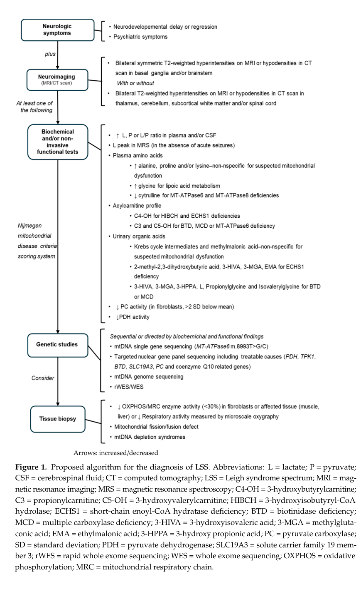

## Question

# Disease Characteristics Research Template

## Target Disease
- **Disease Name:** Leigh Syndrome
- **MONDO ID:**  (if available)
- **Category:** Mendelian

## Research Objectives

Please provide a comprehensive research report on **Leigh Syndrome** covering all of the
disease characteristics listed below. This report will be used to populate a disease knowledge
base entry. Be thorough and cite primary literature (PMID preferred) for all claims.

For each section, **suggested databases/resources** are listed. These are the first places
you should search for information on each topic.

---

### 1. Disease Information
> **Search first:** OMIM, Orphanet, ICD-10/ICD-11, MeSH, PubMed

- What is the disease? Provide a concise overview.
- What are the key identifiers? (OMIM, Orphanet, ICD-10/ICD-11, MeSH, Mondo)
- What are the common synonyms and alternative names?
- Is the information derived from individual patients (e.g., EHR) or aggregated disease-level resources?

### 2. Etiology

- **Disease Causal Factors**: What are the primary causes? (genetic, environmental, infectious, mechanistic)
- **Risk Factors**:
  > **Search first:** PubMed, Cochrane Library, UpToDate, clinical guidelines, ClinVar, ClinGen, GWAS Catalog, PheGenI, CTD, CDC, WHO, epidemiological databases
  - Genetic risk factors (causal variants, susceptibility loci, modifier genes)
  - Environmental risk factors (toxins, lifestyle, occupational exposures, age, sex, family history)
- **Protective Factors**:
  > **Search first:** PubMed, Cochrane Library, clinical trial databases, GWAS Catalog, gnomAD, WHO, CDC, nutrition databases
  - Genetic protective factors (protective variants, modifier alleles)
  - Environmental protective factors (diet, lifestyle, exposures that reduce risk)
- **Gene-Environment Interactions**: How do genetic and environmental factors interact to influence disease?
  > **Search first:** CTD, PubMed, PheGenI, GxE databases

### 3. Phenotypes
> **Search first:** HPO (Human Phenotype Ontology), OMIM, Orphanet, PubMed, clinicaltrials.gov, MedDRA, SNOMED CT, DECIPHER, LOINC

For each phenotype, provide:
- **Phenotype type**: symptoms, clinical signs, physical manifestations, behavioral changes, or laboratory abnormalities
  > For symptoms/signs: HPO, OMIM, Orphanet, PubMed
  > For behavioral changes: HPO, DSM, RDoC (Research Domain Criteria), PubMed
  > For laboratory abnormalities: LOINC, SNOMED CT, LabTests Online, PubMed
- **Phenotype characteristics**:
  > **Search first:** OMIM, Orphanet, HPO, PubMed
  - Age of symptom onset (neonatal, childhood, adult-onset, late-onset)
  - Symptom severity (mild, moderate, severe, variable)
  - Symptom progression (stable, progressive, episodic, fluctuating)
  - Frequency among affected individuals (percentage or qualitative)
- **Quality of life impact**: Effects on daily functioning and well-being (per-phenotype when possible)
  > **Search first:** EQ-5D database, SF-36, WHO QOL databases, PubMed
- Suggest HPO (Human Phenotype Ontology) terms for each phenotype

### 4. Genetic/Molecular Information

- **Causal Genes**: Gene mutations or chromosomal abnormalities responsible for disease (gene symbols, OMIM IDs)
  > **Search first:** OMIM, ClinVar, HGMD, Ensembl, NCBI Gene
- **Pathogenic Variants**:
  - Affected genes (gene symbols, HGNC IDs)
    > **Search first:** OMIM, NCBI Gene, Ensembl, HGNC, UniProt, GeneCards
  - Variant classification (pathogenic, likely pathogenic, VUS per ACMG/AMP guidelines)
    > **Search first:** ClinVar, ClinGen, ACMG/AMP guidelines, VarSome
  - Variant type/class (missense, frameshift, nonsense, splice-site, structural)
  - Allele frequency in population databases
    > **Search first:** gnomAD, 1000 Genomes, ExAC, TOPMed, dbSNP
  - Somatic vs germline origin
    > **Search first:** COSMIC (somatic), ClinVar, ICGC, TCGA
  - Functional consequences (loss of function, gain of function, dominant negative)
- **Modifier Genes**: Genes that modify disease severity or expression
- **Epigenetic Information**: DNA methylation, histone modifications, chromatin changes affecting disease
  > **Search first:** ENCODE, Roadmap Epigenomics, MethBase, DiseaseMeth
- **Chromosomal Abnormalities**: Large-scale genetic changes (aneuploidy, translocations, inversions)
  > **Search first:** DECIPHER, ClinVar, ECARUCA, UCSC Genome Browser

### 5. Environmental Information

- **Environmental Factors**: Non-genetic contributing factors (toxins, radiation, pollution, occupational exposure)
  > **Search first:** CTD (Comparative Toxicogenomics Database), TOXNET, PubMed, EPA databases
- **Lifestyle Factors**: Behavioral factors (smoking, diet, exercise, alcohol consumption)
  > **Search first:** CDC databases, WHO, PubMed, NHANES
- **Infectious Agents**: If applicable, pathogens causing or triggering disease (bacteria, viruses, fungi, parasites)
  > **Search first:** NCBI Taxonomy, ViPR, BV-BRC, MicrobeDB, GIDEON

### 6. Mechanism / Pathophysiology

- **Molecular Pathways**: Specific signaling cascades or biochemical pathways involved (Wnt, MAPK, mTOR, PI3K-AKT, etc.)
  > **Search first:** KEGG, Reactome, WikiPathways, PathBank, BioCyc
- **Cellular Processes**: Cell-level mechanisms (apoptosis, autophagy, cell cycle dysregulation, inflammation, etc.)
  > **Search first:** Gene Ontology (GO), Reactome, KEGG, PubMed
- **Protein Dysfunction**: How protein structure or function is altered (misfolding, aggregation, loss of function, gain of function)
  > **Search first:** UniProt, PDB (Protein Data Bank), InterPro, Pfam, AlphaFold
- **Metabolic Changes**: Alterations in metabolic processes (energy metabolism, lipid metabolism, amino acid metabolism)
  > **Search first:** KEGG, BioCyc, HMDB (Human Metabolome Database), BRENDA
- **Immune System Involvement**: Role of immune response (autoimmunity, immunodeficiency, chronic inflammation)
  > **Search first:** ImmPort, Immunome Database, IEDB, Gene Ontology
- **Tissue Damage Mechanisms**: How tissues/ are injured (oxidative stress, ischemia, fibrosis, necrosis)
  > **Search first:** PubMed, Gene Ontology, Reactome
- **Biochemical Abnormalities**: Specific molecular defects (enzyme deficiencies, receptor dysfunction, ion channel defects)
  > **Search first:** BRENDA, UniProt, KEGG, OMIM, PubMed
- **Epigenetic Changes**: DNA methylation, histone modifications affecting gene expression in disease
  > **Search first:** ENCODE, Roadmap Epigenomics, MethBase, DiseaseMeth
- **Molecular Profiling** (if available):
  - Transcriptomics/gene expression changes
    > **Search first:** GEO (Gene Expression Omnibus), ArrayExpress, GTEx, Human Cell Atlas, SRA
  - Proteomics findings
    > **Search first:** PRIDE, ProteomeXchange, Human Protein Atlas, STRING, BioGRID
  - Metabolomics signatures
    > **Search first:** MetaboLights, Metabolomics Workbench, HMDB, METLIN
  - Lipidomics alterations
    > **Search first:** LIPID MAPS, SwissLipids, LipidHome, Metabolomics Workbench
  - Genomic structural features
    > **Search first:** UCSC Genome Browser, Ensembl, NCBI, dbVar, DGV
- **Advanced Technologies** (if applicable):
  - Single-cell analysis findings (cell-type specific mechanisms, cellular heterogeneity)
    > **Search first:** Human Cell Atlas, Single Cell Portal, GEO, CELLxGENE
  - Spatial transcriptomics findings
    > **Search first:** GEO, Spatial Research, Vizgen, 10x Genomics data
  - Multi-omics integration results
    > **Search first:** TCGA, ICGC, cBioPortal, LinkedOmics, PubMed
  - Functional genomics screens (CRISPR, RNAi)
    > **Search first:** DepMap, GenomeRNAi, PubMed, BioGRID ORCS

For each mechanism, describe:
- The causal chain from initial trigger to clinical manifestation
- Which mechanisms are upstream vs downstream
- What cell types and biological processes are involved
- Suggest GO terms for biological processes and CL terms for cell types

### 7. Anatomical Structures Affected

- **Organ Level**:
  - Primary organs directly affected
  - Secondary organ involvement (complications, secondary effects)
  - Body systems involved (cardiovascular, nervous, digestive, respiratory, endocrine, etc.)
  > **Search first:** Uberon, FMA (Foundational Model of Anatomy), OMIM, HPO, ICD-11, MeSH, SNOMED CT
- **Tissue and Cell Level**:
  - Specific tissue types affected (epithelial, connective, muscle, nervous)
  - Specific cell populations targeted (with Cell Ontology terms)
  > **Search first:** Uberon, Human Protein Atlas, Cell Ontology, Human Cell Atlas, CellMarker, PanglaoDB
- **Subcellular Level**:
  - Cellular compartments involved (mitochondria, nucleus, ER, lysosomes) (with GO Cellular Component terms)
  > **Search first:** Gene Ontology (Cellular Component), UniProt, Human Protein Atlas
- **Localization**:
  - Specific anatomical sites (with UBERON terms)
    > **Search first:** FMA, Uberon, NeuroNames (for brain), SNOMED CT
  - Lateralization (unilateral, bilateral, asymmetric)
    > **Search first:** HPO, clinical literature, imaging databases

### 8. Temporal Development

- **Onset**:
  - Typical age of onset (congenital, pediatric, adult, geriatric)
  - Onset pattern (acute, subacute, chronic, insidious)
  > **Search first:** OMIM, Orphanet, HPO, PubMed
- **Progression**:
  - Disease stages (early, intermediate, advanced, end-stage)
    > **Search first:** Cancer Staging Manual (AJCC), WHO classifications, PubMed
  - Progression rate (rapid, slow, variable)
  - Disease course pattern (episodic, relapsing-remitting, progressive, stable)
  - Disease duration (self-limited, chronic lifelong)
  > **Search first:** Disease registries, longitudinal cohort databases, natural history studies, PubMed, Orphanet, OMIM
- **Patterns**:
  - Remission patterns (spontaneous, treatment-induced)
    > **Search first:** Clinical trial databases, disease registries, PubMed
  - Critical periods (time windows of vulnerability or opportunity for intervention)
    > **Search first:** PubMed, developmental biology databases, clinical guidelines

### 9. Inheritance and Population

- **Epidemiology**:
  - Prevalence (cases per 100,000 at given time)
  - Incidence (new cases per 100,000 per year)
  > **Search first:** Orphanet, CDC, WHO, GBD (Global Burden of Disease), national registries, SEER, disease registries
- **For Genetic Etiology**:
  - Inheritance pattern (AD, AR, X-linked, mitochondrial, multifactorial, polygenic)
    > **Search first:** OMIM, Orphanet, ClinVar, GTR (Genetic Testing Registry)
  - Penetrance (complete, incomplete, age-dependent)
    > **Search first:** ClinVar, OMIM, PubMed, ClinGen
  - Expressivity (variable, consistent)
    > **Search first:** OMIM, ClinVar, PubMed
  - Genetic anticipation (increasing severity in successive generations)
    > **Search first:** OMIM, PubMed (especially for repeat expansion disorders)
  - Germline mosaicism
    > **Search first:** ClinVar, OMIM, genetic counseling literature, PubMed
  - Founder effects (population-specific mutations)
    > **Search first:** gnomAD, population genetics databases, PubMed
  - Consanguinity role
    > **Search first:** OMIM, population studies, genetic counseling resources
  - Carrier frequency
    > **Search first:** gnomAD, carrier screening databases, GeneReviews, GTR
- **Population Demographics**:
  - Affected populations (ethnic or demographic groups with higher prevalence)
    > **Search first:** gnomAD, 1000 Genomes, PAGE Study, PubMed, population registries
  - Geographic distribution (endemic areas, regional variation)
    > **Search first:** WHO, CDC, GBD, Orphanet, geographic epidemiology databases
  - Geographic distribution of specific variants
  - Sex ratio (male:female)
    > **Search first:** Disease registries, OMIM, PubMed, epidemiological databases
  - Age distribution of affected individuals
    > **Search first:** CDC, disease registries, SEER, Orphanet

### 10. Diagnostics

- **Clinical Tests**:
  - Laboratory tests (blood, urine, tissue chemistry, specific enzyme assays)
    > **Search first:** LOINC, LabTests Online, PubMed
  - Biomarkers (proteins, metabolites, genetic markers, circulating biomarkers)
    > **Search first:** FDA Biomarker List, BEST (Biomarkers, EndpointS, and other Tools), PubMed
  - Imaging studies (X-ray, CT, MRI, PET, ultrasound)
    > **Search first:** RadLex, DICOM, Radiopaedia, imaging databases
  - Functional tests (pulmonary function, cardiac stress tests)
    > **Search first:** LOINC, clinical guidelines, PubMed
  - Electrophysiology (EEG, EMG, ECG, nerve conduction studies)
    > **Search first:** LOINC, clinical neurophysiology databases, PubMed
  - Biopsy findings (histopathology, immunohistochemistry)
    > **Search first:** SNOMED CT, College of American Pathologists resources, PubMed
  - Pathology findings (microscopic examination)
    > **Search first:** SNOMED CT, Digital Pathology databases, PubMed
- **Genetic Testing**:
  > **Search first:** GTR (Genetic Testing Registry), GeneReviews, ClinGen
  - Overview of recommended genetic testing approach
  - Whole genome sequencing (WGS) utility
    > **Search first:** GTR, ClinVar, GEL (Genomics England), gnomAD
  - Whole exome sequencing (WES) utility
    > **Search first:** GTR, ClinVar, OMIM, GeneMatcher
  - Gene panels (which panels, which genes)
    > **Search first:** GTR, ClinVar, laboratory-specific databases
  - Single gene testing
    > **Search first:** GTR, ClinVar, OMIM, GeneReviews
  - Chromosomal microarray (CMA)
    > **Search first:** DECIPHER, ClinVar, dbVar, ECARUCA
  - Karyotyping
    > **Search first:** Chromosome Abnormality Database, ClinVar, cytogenetics resources
  - FISH
    > **Search first:** ClinVar, cytogenetics databases, PubMed
  - Mitochondrial DNA testing
    > **Search first:** MITOMAP, MSeqDR, ClinVar, GTR
  - Repeat expansion testing
    > **Search first:** GTR, ClinVar, repeat expansion databases, PubMed
- **Omics-Based Diagnostics** (if applicable):
  - RNA sequencing / transcriptomics
    > **Search first:** GEO, ArrayExpress, GTEx, RNA-seq databases
  - Proteomics
    > **Search first:** PRIDE, ProteomeXchange, FDA Biomarker database
  - Metabolomics
    > **Search first:** MetaboLights, Metabolomics Workbench, HMDB
  - Epigenomics
    > **Search first:** GEO, ENCODE, Roadmap Epigenomics, MethBase
  - Liquid biopsy
    > **Search first:** COSMIC, ClinVar, liquid biopsy databases, PubMed
- **Clinical Criteria**:
  - Standardized diagnostic criteria (DSM, ICD, society guidelines)
    > **Search first:** DSM-5, ICD-11, clinical society guidelines, UpToDate
  - Differential diagnosis (other conditions to rule out, with distinguishing features)
    > **Search first:** DynaMed, UpToDate, clinical decision support systems
- **Screening**:
  - Screening methods for asymptomatic individuals (newborn screening, carrier screening, cascade screening)
    > **Search first:** ACMG recommendations, CDC newborn screening, GTR

### 11. Outcome/Prognosis

- **Survival and Mortality**:
  - Survival rate (5-year, 10-year, overall)
    > **Search first:** SEER, cancer registries, disease-specific registries, PubMed
  - Life expectancy (with and without treatment if applicable)
    > **Search first:** Orphanet, disease registries, actuarial databases, PubMed
  - Mortality rate
    > **Search first:** CDC, WHO, GBD, national mortality databases
  - Disease-specific mortality (deaths directly attributable to disease)
    > **Search first:** Disease registries, CDC Wonder, GBD, PubMed
- **Morbidity and Function**:
  - Morbidity (disease-related disability and health impacts)
    > **Search first:** GBD, WHO, disability databases, PubMed
  - Disability outcomes (long-term functional impairments)
    > **Search first:** ICF (International Classification of Functioning), disability registries
  - Quality of life measures (EQ-5D, SF-36, PROMIS, disease-specific tools)
    > **Search first:** EQ-5D database, SF-36, PROMIS, PubMed
- **Disease Course**:
  - Complications (secondary problems: infections, organ failure, etc.)
    > **Search first:** ICD codes, disease registries, clinical databases, PubMed
  - Recovery potential (likelihood and extent of recovery, with vs without treatment)
    > **Search first:** Natural history studies, rehabilitation databases, PubMed
- **Prediction**:
  - Prognostic factors (age, disease severity, biomarkers, treatment response)
    > **Search first:** Prognostic models databases, clinical calculators, PubMed
  - Prognostic biomarkers (molecular markers predicting disease course)
    > **Search first:** FDA Biomarker database, PubMed, cancer prognostic databases

### 12. Treatment

- **Pharmacotherapy**:
  - Pharmacological treatments (drug names, drug classes, mechanisms of action)
    > **Search first:** DrugBank, RxNorm, ATC classification, DailyMed, FDA databases
  - Pharmacogenomics (how genetic variants affect drug metabolism, efficacy, toxicity)
    > **Search first:** PharmGKB, CPIC (Clinical Pharmacogenetics), FDA Table of PGx Biomarkers
- **Advanced Therapeutics**:
  - Gene therapy (viral vectors, CRISPR, gene replacement, gene editing)
    > **Search first:** ClinicalTrials.gov, FDA gene therapy database, ASGCT resources
  - Cell therapy (stem cell transplant, CAR-T, cellular therapeutics)
    > **Search first:** ClinicalTrials.gov, FDA cell therapy database, FACT standards
  - RNA-based therapies (ASOs, siRNA, mRNA therapies)
    > **Search first:** ClinicalTrials.gov, FDA approvals, PubMed
  - Targeted therapies (treatments directed at specific molecular targets)
    > **Search first:** My Cancer Genome, OncoKB, ClinicalTrials.gov, FDA approvals
  - Immunotherapies (checkpoint inhibitors, monoclonal antibodies)
    > **Search first:** Cancer Immunotherapy Database, FDA approvals, ClinicalTrials.gov
- **Surgical and Interventional**:
  - Surgical interventions (types of surgery, timing, outcomes)
    > **Search first:** CPT codes, surgical registries, clinical guidelines, PubMed
- **Supportive and Rehabilitative**:
  - Supportive care (symptom management, pain control, nutrition)
    > **Search first:** Clinical guidelines, Cochrane Library, PubMed
  - Rehabilitation (physical therapy, occupational therapy, speech therapy)
    > **Search first:** Rehabilitation medicine databases, clinical guidelines, PubMed
- **Experimental**:
  - Experimental treatments in clinical trials (with NCT identifiers if available)
    > **Search first:** ClinicalTrials.gov, EU Clinical Trials Register, WHO ICTRP
- **Treatment Outcomes**:
  - Treatment response rates
    > **Search first:** Clinical trial databases, FDA reviews, systematic reviews, PubMed
  - Side effects and adverse events
    > **Search first:** FDA Adverse Event Reporting System (FAERS), MedWatch, PubMed
- **Treatment Strategy**:
  - Treatment algorithms (clinical pathways, decision trees)
    > **Search first:** Clinical practice guidelines, NCCN Guidelines, UpToDate
  - Combination therapies
    > **Search first:** ClinicalTrials.gov, treatment guidelines, PubMed
  - Personalized medicine approaches (genotype-guided treatment)
    > **Search first:** My Cancer Genome, CIViC, PharmGKB, precision medicine databases

For each treatment, suggest MAXO (Medical Action Ontology) terms where applicable.

### 13. Prevention

- **Prevention Levels**:
  - Primary prevention (preventing disease occurrence: vaccination, risk factor modification)
    > **Search first:** CDC, WHO, USPSTF recommendations, Cochrane Library
  - Secondary prevention (early detection and treatment: screening programs, early intervention)
    > **Search first:** USPSTF, CDC screening guidelines, WHO
  - Tertiary prevention (preventing complications in those with disease)
    > **Search first:** Clinical guidelines, disease management protocols, PubMed
- **Immunization**: Vaccine strategies (if applicable)
  > **Search first:** CDC vaccine schedules, WHO immunization, FDA vaccine database
- **Screening and Early Detection**:
  - Screening programs (population-based: newborn screening, cancer screening)
    > **Search first:** CDC screening programs, USPSTF, cancer screening databases
  - Genetic screening (carrier screening, preimplantation genetic diagnosis, prenatal testing)
    > **Search first:** ACMG recommendations, ACOG guidelines, GTR
  - Risk stratification (identifying high-risk individuals for targeted prevention)
    > **Search first:** Risk prediction models, clinical calculators, PubMed
- **Behavioral Interventions**: Lifestyle modifications to reduce risk
  > **Search first:** CDC, WHO, behavioral intervention databases, Cochrane Library
- **Counseling**: Genetic counseling (risk assessment, family planning guidance)
  > **Search first:** NSGC resources, ACMG guidelines, GeneReviews
- **Public Health**:
  - Public health interventions (sanitation, vector control, health education)
    > **Search first:** CDC, WHO, public health databases, PubMed
  - Environmental interventions (reducing environmental risk factors)
    > **Search first:** EPA databases, WHO environmental health, PubMed
- **Prophylaxis**: Preventive medications or procedures
  > **Search first:** Clinical guidelines, FDA approvals, PubMed

### 14. Other Species / Natural Disease

- **Taxonomy**: Species affected (with NCBI Taxon identifiers)
  > **Search first:** NCBI Taxonomy
- **Breed**: Specific breeds affected (with VBO identifiers if applicable)
  > **Search first:** VBO (Vertebrate Breed Ontology)
- **Gene**: Orthologous genes in other species (with NCBI Gene IDs)
  > **Search first:** NCBI Gene
- **Natural Disease**:
  - Naturally occurring disease in other species (companion animals, wildlife)
    > **Search first:** OMIA (Online Mendelian Inheritance in Animals), VetCompass, PubMed
  - Veterinary relevance and importance in animal health
    > **Search first:** OMIA, veterinary databases, PubMed
- **Comparative Biology**:
  - Comparative pathology (similarities and differences across species)
    > **Search first:** OMIA, comparative pathology databases, PubMed
  - Evolutionary conservation of disease mechanisms
    > **Search first:** HomoloGene, OrthoMCL, Alliance of Genome Resources
- **Transmission** (if applicable):
  - Zoonotic potential
    > **Search first:** CDC zoonotic diseases, WHO zoonoses, GIDEON
  - Cross-species susceptibility
    > **Search first:** NCBI Taxonomy, veterinary databases, PubMed

### 15. Model Organisms

- **Model Types**:
  - Model organism type (mammalian, invertebrate, cellular, in vitro)
    > **Search first:** Alliance of Genome Resources, model organism databases
  - Specific model systems (mouse, rat, zebrafish, Drosophila, C. elegans, yeast, cell lines, organoids, iPSCs)
    > **Search first:** MGI, RGD, ZFIN, FlyBase, WormBase, SGD, ATCC, Cellosaurus
  - Induced models (drug treatment, surgical intervention, environmental manipulation)
    > **Search first:** MGI, model organism databases, PubMed
- **Genetic Models**:
  - Types available (knockout, knock-in, transgenic, conditional, humanized)
    > **Search first:** MGI, IMPC, KOMP, EuMMCR, IMSR
- **Model Characteristics**:
  - Phenotype recapitulation (how well model reproduces human disease features)
    > **Search first:** Model organism databases, comparative studies, PubMed
  - Model limitations (aspects of human disease not captured)
    > **Search first:** Model organism databases, PubMed, review articles
- **Applications**:
  - Research applications (what aspects of disease can be studied)
    > **Search first:** Model organism databases, PubMed
- **Resources**:
  - Model databases
    > **Search first:** MGI, RGD, ZFIN, FlyBase, WormBase, IMSR, EMMA, MMRRC

---

## Citation Requirements

- Cite primary literature (PMID preferred) for all mechanistic and clinical claims
- Prioritize recent reviews and landmark papers
- Include direct quotes from abstracts where possible to support key statements
- Distinguish evidence source types: human clinical, model organism, in vitro, computational

## Output Format

Structure your response as a comprehensive narrative organized by the sections above.
For each section, provide:
- Factual content with specific details (numbers, percentages, gene names, variant nomenclature)
- Ontology term suggestions (HPO, GO, CL, UBERON, CHEBI, MAXO, MONDO) where applicable
- Evidence citations with PMIDs
- Direct quotes from abstracts to support key claims
- Clear indication when information is not available or not applicable for this disease

This report will be used to populate a disease knowledge base entry with:
- Pathophysiology descriptions with causal chains
- Gene/protein annotations (HGNC, GO terms)
- Phenotype associations (HP terms) with frequencies
- Cell type involvement (CL terms)
- Anatomical locations (UBERON terms)
- Chemical entities (CHEBI terms)
- Treatment annotations (MAXO terms)
- Evidence items with PMIDs and exact abstract quotes
- Epidemiology, prognosis, diagnostic, and prevention information
- Animal model descriptions with phenotype recapitulation details

## Output

Question: You are an expert researcher providing comprehensive, well-cited information.

Provide detailed information focusing on:
1. Key concepts and definitions with current understanding
2. Recent developments and latest research (prioritize 2023-2024 sources)
3. Current applications and real-world implementations
4. Expert opinions and analysis from authoritative sources
5. Relevant statistics and data from recent studies

Format as a comprehensive research report with proper citations. Include URLs and publication dates where available.
Always prioritize recent, authoritative sources and provide specific citations for all major claims.

# Disease Characteristics Research Template

## Target Disease
- **Disease Name:** Leigh Syndrome
- **MONDO ID:**  (if available)
- **Category:** Mendelian

## Research Objectives

Please provide a comprehensive research report on **Leigh Syndrome** covering all of the
disease characteristics listed below. This report will be used to populate a disease knowledge
base entry. Be thorough and cite primary literature (PMID preferred) for all claims.

For each section, **suggested databases/resources** are listed. These are the first places
you should search for information on each topic.

---

### 1. Disease Information
> **Search first:** OMIM, Orphanet, ICD-10/ICD-11, MeSH, PubMed

- What is the disease? Provide a concise overview.
- What are the key identifiers? (OMIM, Orphanet, ICD-10/ICD-11, MeSH, Mondo)
- What are the common synonyms and alternative names?
- Is the information derived from individual patients (e.g., EHR) or aggregated disease-level resources?

### 2. Etiology

- **Disease Causal Factors**: What are the primary causes? (genetic, environmental, infectious, mechanistic)
- **Risk Factors**:
  > **Search first:** PubMed, Cochrane Library, UpToDate, clinical guidelines, ClinVar, ClinGen, GWAS Catalog, PheGenI, CTD, CDC, WHO, epidemiological databases
  - Genetic risk factors (causal variants, susceptibility loci, modifier genes)
  - Environmental risk factors (toxins, lifestyle, occupational exposures, age, sex, family history)
- **Protective Factors**:
  > **Search first:** PubMed, Cochrane Library, clinical trial databases, GWAS Catalog, gnomAD, WHO, CDC, nutrition databases
  - Genetic protective factors (protective variants, modifier alleles)
  - Environmental protective factors (diet, lifestyle, exposures that reduce risk)
- **Gene-Environment Interactions**: How do genetic and environmental factors interact to influence disease?
  > **Search first:** CTD, PubMed, PheGenI, GxE databases

### 3. Phenotypes
> **Search first:** HPO (Human Phenotype Ontology), OMIM, Orphanet, PubMed, clinicaltrials.gov, MedDRA, SNOMED CT, DECIPHER, LOINC

For each phenotype, provide:
- **Phenotype type**: symptoms, clinical signs, physical manifestations, behavioral changes, or laboratory abnormalities
  > For symptoms/signs: HPO, OMIM, Orphanet, PubMed
  > For behavioral changes: HPO, DSM, RDoC (Research Domain Criteria), PubMed
  > For laboratory abnormalities: LOINC, SNOMED CT, LabTests Online, PubMed
- **Phenotype characteristics**:
  > **Search first:** OMIM, Orphanet, HPO, PubMed
  - Age of symptom onset (neonatal, childhood, adult-onset, late-onset)
  - Symptom severity (mild, moderate, severe, variable)
  - Symptom progression (stable, progressive, episodic, fluctuating)
  - Frequency among affected individuals (percentage or qualitative)
- **Quality of life impact**: Effects on daily functioning and well-being (per-phenotype when possible)
  > **Search first:** EQ-5D database, SF-36, WHO QOL databases, PubMed
- Suggest HPO (Human Phenotype Ontology) terms for each phenotype

### 4. Genetic/Molecular Information

- **Causal Genes**: Gene mutations or chromosomal abnormalities responsible for disease (gene symbols, OMIM IDs)
  > **Search first:** OMIM, ClinVar, HGMD, Ensembl, NCBI Gene
- **Pathogenic Variants**:
  - Affected genes (gene symbols, HGNC IDs)
    > **Search first:** OMIM, NCBI Gene, Ensembl, HGNC, UniProt, GeneCards
  - Variant classification (pathogenic, likely pathogenic, VUS per ACMG/AMP guidelines)
    > **Search first:** ClinVar, ClinGen, ACMG/AMP guidelines, VarSome
  - Variant type/class (missense, frameshift, nonsense, splice-site, structural)
  - Allele frequency in population databases
    > **Search first:** gnomAD, 1000 Genomes, ExAC, TOPMed, dbSNP
  - Somatic vs germline origin
    > **Search first:** COSMIC (somatic), ClinVar, ICGC, TCGA
  - Functional consequences (loss of function, gain of function, dominant negative)
- **Modifier Genes**: Genes that modify disease severity or expression
- **Epigenetic Information**: DNA methylation, histone modifications, chromatin changes affecting disease
  > **Search first:** ENCODE, Roadmap Epigenomics, MethBase, DiseaseMeth
- **Chromosomal Abnormalities**: Large-scale genetic changes (aneuploidy, translocations, inversions)
  > **Search first:** DECIPHER, ClinVar, ECARUCA, UCSC Genome Browser

### 5. Environmental Information

- **Environmental Factors**: Non-genetic contributing factors (toxins, radiation, pollution, occupational exposure)
  > **Search first:** CTD (Comparative Toxicogenomics Database), TOXNET, PubMed, EPA databases
- **Lifestyle Factors**: Behavioral factors (smoking, diet, exercise, alcohol consumption)
  > **Search first:** CDC databases, WHO, PubMed, NHANES
- **Infectious Agents**: If applicable, pathogens causing or triggering disease (bacteria, viruses, fungi, parasites)
  > **Search first:** NCBI Taxonomy, ViPR, BV-BRC, MicrobeDB, GIDEON

### 6. Mechanism / Pathophysiology

- **Molecular Pathways**: Specific signaling cascades or biochemical pathways involved (Wnt, MAPK, mTOR, PI3K-AKT, etc.)
  > **Search first:** KEGG, Reactome, WikiPathways, PathBank, BioCyc
- **Cellular Processes**: Cell-level mechanisms (apoptosis, autophagy, cell cycle dysregulation, inflammation, etc.)
  > **Search first:** Gene Ontology (GO), Reactome, KEGG, PubMed
- **Protein Dysfunction**: How protein structure or function is altered (misfolding, aggregation, loss of function, gain of function)
  > **Search first:** UniProt, PDB (Protein Data Bank), InterPro, Pfam, AlphaFold
- **Metabolic Changes**: Alterations in metabolic processes (energy metabolism, lipid metabolism, amino acid metabolism)
  > **Search first:** KEGG, BioCyc, HMDB (Human Metabolome Database), BRENDA
- **Immune System Involvement**: Role of immune response (autoimmunity, immunodeficiency, chronic inflammation)
  > **Search first:** ImmPort, Immunome Database, IEDB, Gene Ontology
- **Tissue Damage Mechanisms**: How tissues/ are injured (oxidative stress, ischemia, fibrosis, necrosis)
  > **Search first:** PubMed, Gene Ontology, Reactome
- **Biochemical Abnormalities**: Specific molecular defects (enzyme deficiencies, receptor dysfunction, ion channel defects)
  > **Search first:** BRENDA, UniProt, KEGG, OMIM, PubMed
- **Epigenetic Changes**: DNA methylation, histone modifications affecting gene expression in disease
  > **Search first:** ENCODE, Roadmap Epigenomics, MethBase, DiseaseMeth
- **Molecular Profiling** (if available):
  - Transcriptomics/gene expression changes
    > **Search first:** GEO (Gene Expression Omnibus), ArrayExpress, GTEx, Human Cell Atlas, SRA
  - Proteomics findings
    > **Search first:** PRIDE, ProteomeXchange, Human Protein Atlas, STRING, BioGRID
  - Metabolomics signatures
    > **Search first:** MetaboLights, Metabolomics Workbench, HMDB, METLIN
  - Lipidomics alterations
    > **Search first:** LIPID MAPS, SwissLipids, LipidHome, Metabolomics Workbench
  - Genomic structural features
    > **Search first:** UCSC Genome Browser, Ensembl, NCBI, dbVar, DGV
- **Advanced Technologies** (if applicable):
  - Single-cell analysis findings (cell-type specific mechanisms, cellular heterogeneity)
    > **Search first:** Human Cell Atlas, Single Cell Portal, GEO, CELLxGENE
  - Spatial transcriptomics findings
    > **Search first:** GEO, Spatial Research, Vizgen, 10x Genomics data
  - Multi-omics integration results
    > **Search first:** TCGA, ICGC, cBioPortal, LinkedOmics, PubMed
  - Functional genomics screens (CRISPR, RNAi)
    > **Search first:** DepMap, GenomeRNAi, PubMed, BioGRID ORCS

For each mechanism, describe:
- The causal chain from initial trigger to clinical manifestation
- Which mechanisms are upstream vs downstream
- What cell types and biological processes are involved
- Suggest GO terms for biological processes and CL terms for cell types

### 7. Anatomical Structures Affected

- **Organ Level**:
  - Primary organs directly affected
  - Secondary organ involvement (complications, secondary effects)
  - Body systems involved (cardiovascular, nervous, digestive, respiratory, endocrine, etc.)
  > **Search first:** Uberon, FMA (Foundational Model of Anatomy), OMIM, HPO, ICD-11, MeSH, SNOMED CT
- **Tissue and Cell Level**:
  - Specific tissue types affected (epithelial, connective, muscle, nervous)
  - Specific cell populations targeted (with Cell Ontology terms)
  > **Search first:** Uberon, Human Protein Atlas, Cell Ontology, Human Cell Atlas, CellMarker, PanglaoDB
- **Subcellular Level**:
  - Cellular compartments involved (mitochondria, nucleus, ER, lysosomes) (with GO Cellular Component terms)
  > **Search first:** Gene Ontology (Cellular Component), UniProt, Human Protein Atlas
- **Localization**:
  - Specific anatomical sites (with UBERON terms)
    > **Search first:** FMA, Uberon, NeuroNames (for brain), SNOMED CT
  - Lateralization (unilateral, bilateral, asymmetric)
    > **Search first:** HPO, clinical literature, imaging databases

### 8. Temporal Development

- **Onset**:
  - Typical age of onset (congenital, pediatric, adult, geriatric)
  - Onset pattern (acute, subacute, chronic, insidious)
  > **Search first:** OMIM, Orphanet, HPO, PubMed
- **Progression**:
  - Disease stages (early, intermediate, advanced, end-stage)
    > **Search first:** Cancer Staging Manual (AJCC), WHO classifications, PubMed
  - Progression rate (rapid, slow, variable)
  - Disease course pattern (episodic, relapsing-remitting, progressive, stable)
  - Disease duration (self-limited, chronic lifelong)
  > **Search first:** Disease registries, longitudinal cohort databases, natural history studies, PubMed, Orphanet, OMIM
- **Patterns**:
  - Remission patterns (spontaneous, treatment-induced)
    > **Search first:** Clinical trial databases, disease registries, PubMed
  - Critical periods (time windows of vulnerability or opportunity for intervention)
    > **Search first:** PubMed, developmental biology databases, clinical guidelines

### 9. Inheritance and Population

- **Epidemiology**:
  - Prevalence (cases per 100,000 at given time)
  - Incidence (new cases per 100,000 per year)
  > **Search first:** Orphanet, CDC, WHO, GBD (Global Burden of Disease), national registries, SEER, disease registries
- **For Genetic Etiology**:
  - Inheritance pattern (AD, AR, X-linked, mitochondrial, multifactorial, polygenic)
    > **Search first:** OMIM, Orphanet, ClinVar, GTR (Genetic Testing Registry)
  - Penetrance (complete, incomplete, age-dependent)
    > **Search first:** ClinVar, OMIM, PubMed, ClinGen
  - Expressivity (variable, consistent)
    > **Search first:** OMIM, ClinVar, PubMed
  - Genetic anticipation (increasing severity in successive generations)
    > **Search first:** OMIM, PubMed (especially for repeat expansion disorders)
  - Germline mosaicism
    > **Search first:** ClinVar, OMIM, genetic counseling literature, PubMed
  - Founder effects (population-specific mutations)
    > **Search first:** gnomAD, population genetics databases, PubMed
  - Consanguinity role
    > **Search first:** OMIM, population studies, genetic counseling resources
  - Carrier frequency
    > **Search first:** gnomAD, carrier screening databases, GeneReviews, GTR
- **Population Demographics**:
  - Affected populations (ethnic or demographic groups with higher prevalence)
    > **Search first:** gnomAD, 1000 Genomes, PAGE Study, PubMed, population registries
  - Geographic distribution (endemic areas, regional variation)
    > **Search first:** WHO, CDC, GBD, Orphanet, geographic epidemiology databases
  - Geographic distribution of specific variants
  - Sex ratio (male:female)
    > **Search first:** Disease registries, OMIM, PubMed, epidemiological databases
  - Age distribution of affected individuals
    > **Search first:** CDC, disease registries, SEER, Orphanet

### 10. Diagnostics

- **Clinical Tests**:
  - Laboratory tests (blood, urine, tissue chemistry, specific enzyme assays)
    > **Search first:** LOINC, LabTests Online, PubMed
  - Biomarkers (proteins, metabolites, genetic markers, circulating biomarkers)
    > **Search first:** FDA Biomarker List, BEST (Biomarkers, EndpointS, and other Tools), PubMed
  - Imaging studies (X-ray, CT, MRI, PET, ultrasound)
    > **Search first:** RadLex, DICOM, Radiopaedia, imaging databases
  - Functional tests (pulmonary function, cardiac stress tests)
    > **Search first:** LOINC, clinical guidelines, PubMed
  - Electrophysiology (EEG, EMG, ECG, nerve conduction studies)
    > **Search first:** LOINC, clinical neurophysiology databases, PubMed
  - Biopsy findings (histopathology, immunohistochemistry)
    > **Search first:** SNOMED CT, College of American Pathologists resources, PubMed
  - Pathology findings (microscopic examination)
    > **Search first:** SNOMED CT, Digital Pathology databases, PubMed
- **Genetic Testing**:
  > **Search first:** GTR (Genetic Testing Registry), GeneReviews, ClinGen
  - Overview of recommended genetic testing approach
  - Whole genome sequencing (WGS) utility
    > **Search first:** GTR, ClinVar, GEL (Genomics England), gnomAD
  - Whole exome sequencing (WES) utility
    > **Search first:** GTR, ClinVar, OMIM, GeneMatcher
  - Gene panels (which panels, which genes)
    > **Search first:** GTR, ClinVar, laboratory-specific databases
  - Single gene testing
    > **Search first:** GTR, ClinVar, OMIM, GeneReviews
  - Chromosomal microarray (CMA)
    > **Search first:** DECIPHER, ClinVar, dbVar, ECARUCA
  - Karyotyping
    > **Search first:** Chromosome Abnormality Database, ClinVar, cytogenetics resources
  - FISH
    > **Search first:** ClinVar, cytogenetics databases, PubMed
  - Mitochondrial DNA testing
    > **Search first:** MITOMAP, MSeqDR, ClinVar, GTR
  - Repeat expansion testing
    > **Search first:** GTR, ClinVar, repeat expansion databases, PubMed
- **Omics-Based Diagnostics** (if applicable):
  - RNA sequencing / transcriptomics
    > **Search first:** GEO, ArrayExpress, GTEx, RNA-seq databases
  - Proteomics
    > **Search first:** PRIDE, ProteomeXchange, FDA Biomarker database
  - Metabolomics
    > **Search first:** MetaboLights, Metabolomics Workbench, HMDB
  - Epigenomics
    > **Search first:** GEO, ENCODE, Roadmap Epigenomics, MethBase
  - Liquid biopsy
    > **Search first:** COSMIC, ClinVar, liquid biopsy databases, PubMed
- **Clinical Criteria**:
  - Standardized diagnostic criteria (DSM, ICD, society guidelines)
    > **Search first:** DSM-5, ICD-11, clinical society guidelines, UpToDate
  - Differential diagnosis (other conditions to rule out, with distinguishing features)
    > **Search first:** DynaMed, UpToDate, clinical decision support systems
- **Screening**:
  - Screening methods for asymptomatic individuals (newborn screening, carrier screening, cascade screening)
    > **Search first:** ACMG recommendations, CDC newborn screening, GTR

### 11. Outcome/Prognosis

- **Survival and Mortality**:
  - Survival rate (5-year, 10-year, overall)
    > **Search first:** SEER, cancer registries, disease-specific registries, PubMed
  - Life expectancy (with and without treatment if applicable)
    > **Search first:** Orphanet, disease registries, actuarial databases, PubMed
  - Mortality rate
    > **Search first:** CDC, WHO, GBD, national mortality databases
  - Disease-specific mortality (deaths directly attributable to disease)
    > **Search first:** Disease registries, CDC Wonder, GBD, PubMed
- **Morbidity and Function**:
  - Morbidity (disease-related disability and health impacts)
    > **Search first:** GBD, WHO, disability databases, PubMed
  - Disability outcomes (long-term functional impairments)
    > **Search first:** ICF (International Classification of Functioning), disability registries
  - Quality of life measures (EQ-5D, SF-36, PROMIS, disease-specific tools)
    > **Search first:** EQ-5D database, SF-36, PROMIS, PubMed
- **Disease Course**:
  - Complications (secondary problems: infections, organ failure, etc.)
    > **Search first:** ICD codes, disease registries, clinical databases, PubMed
  - Recovery potential (likelihood and extent of recovery, with vs without treatment)
    > **Search first:** Natural history studies, rehabilitation databases, PubMed
- **Prediction**:
  - Prognostic factors (age, disease severity, biomarkers, treatment response)
    > **Search first:** Prognostic models databases, clinical calculators, PubMed
  - Prognostic biomarkers (molecular markers predicting disease course)
    > **Search first:** FDA Biomarker database, PubMed, cancer prognostic databases

### 12. Treatment

- **Pharmacotherapy**:
  - Pharmacological treatments (drug names, drug classes, mechanisms of action)
    > **Search first:** DrugBank, RxNorm, ATC classification, DailyMed, FDA databases
  - Pharmacogenomics (how genetic variants affect drug metabolism, efficacy, toxicity)
    > **Search first:** PharmGKB, CPIC (Clinical Pharmacogenetics), FDA Table of PGx Biomarkers
- **Advanced Therapeutics**:
  - Gene therapy (viral vectors, CRISPR, gene replacement, gene editing)
    > **Search first:** ClinicalTrials.gov, FDA gene therapy database, ASGCT resources
  - Cell therapy (stem cell transplant, CAR-T, cellular therapeutics)
    > **Search first:** ClinicalTrials.gov, FDA cell therapy database, FACT standards
  - RNA-based therapies (ASOs, siRNA, mRNA therapies)
    > **Search first:** ClinicalTrials.gov, FDA approvals, PubMed
  - Targeted therapies (treatments directed at specific molecular targets)
    > **Search first:** My Cancer Genome, OncoKB, ClinicalTrials.gov, FDA approvals
  - Immunotherapies (checkpoint inhibitors, monoclonal antibodies)
    > **Search first:** Cancer Immunotherapy Database, FDA approvals, ClinicalTrials.gov
- **Surgical and Interventional**:
  - Surgical interventions (types of surgery, timing, outcomes)
    > **Search first:** CPT codes, surgical registries, clinical guidelines, PubMed
- **Supportive and Rehabilitative**:
  - Supportive care (symptom management, pain control, nutrition)
    > **Search first:** Clinical guidelines, Cochrane Library, PubMed
  - Rehabilitation (physical therapy, occupational therapy, speech therapy)
    > **Search first:** Rehabilitation medicine databases, clinical guidelines, PubMed
- **Experimental**:
  - Experimental treatments in clinical trials (with NCT identifiers if available)
    > **Search first:** ClinicalTrials.gov, EU Clinical Trials Register, WHO ICTRP
- **Treatment Outcomes**:
  - Treatment response rates
    > **Search first:** Clinical trial databases, FDA reviews, systematic reviews, PubMed
  - Side effects and adverse events
    > **Search first:** FDA Adverse Event Reporting System (FAERS), MedWatch, PubMed
- **Treatment Strategy**:
  - Treatment algorithms (clinical pathways, decision trees)
    > **Search first:** Clinical practice guidelines, NCCN Guidelines, UpToDate
  - Combination therapies
    > **Search first:** ClinicalTrials.gov, treatment guidelines, PubMed
  - Personalized medicine approaches (genotype-guided treatment)
    > **Search first:** My Cancer Genome, CIViC, PharmGKB, precision medicine databases

For each treatment, suggest MAXO (Medical Action Ontology) terms where applicable.

### 13. Prevention

- **Prevention Levels**:
  - Primary prevention (preventing disease occurrence: vaccination, risk factor modification)
    > **Search first:** CDC, WHO, USPSTF recommendations, Cochrane Library
  - Secondary prevention (early detection and treatment: screening programs, early intervention)
    > **Search first:** USPSTF, CDC screening guidelines, WHO
  - Tertiary prevention (preventing complications in those with disease)
    > **Search first:** Clinical guidelines, disease management protocols, PubMed
- **Immunization**: Vaccine strategies (if applicable)
  > **Search first:** CDC vaccine schedules, WHO immunization, FDA vaccine database
- **Screening and Early Detection**:
  - Screening programs (population-based: newborn screening, cancer screening)
    > **Search first:** CDC screening programs, USPSTF, cancer screening databases
  - Genetic screening (carrier screening, preimplantation genetic diagnosis, prenatal testing)
    > **Search first:** ACMG recommendations, ACOG guidelines, GTR
  - Risk stratification (identifying high-risk individuals for targeted prevention)
    > **Search first:** Risk prediction models, clinical calculators, PubMed
- **Behavioral Interventions**: Lifestyle modifications to reduce risk
  > **Search first:** CDC, WHO, behavioral intervention databases, Cochrane Library
- **Counseling**: Genetic counseling (risk assessment, family planning guidance)
  > **Search first:** NSGC resources, ACMG guidelines, GeneReviews
- **Public Health**:
  - Public health interventions (sanitation, vector control, health education)
    > **Search first:** CDC, WHO, public health databases, PubMed
  - Environmental interventions (reducing environmental risk factors)
    > **Search first:** EPA databases, WHO environmental health, PubMed
- **Prophylaxis**: Preventive medications or procedures
  > **Search first:** Clinical guidelines, FDA approvals, PubMed

### 14. Other Species / Natural Disease

- **Taxonomy**: Species affected (with NCBI Taxon identifiers)
  > **Search first:** NCBI Taxonomy
- **Breed**: Specific breeds affected (with VBO identifiers if applicable)
  > **Search first:** VBO (Vertebrate Breed Ontology)
- **Gene**: Orthologous genes in other species (with NCBI Gene IDs)
  > **Search first:** NCBI Gene
- **Natural Disease**:
  - Naturally occurring disease in other species (companion animals, wildlife)
    > **Search first:** OMIA (Online Mendelian Inheritance in Animals), VetCompass, PubMed
  - Veterinary relevance and importance in animal health
    > **Search first:** OMIA, veterinary databases, PubMed
- **Comparative Biology**:
  - Comparative pathology (similarities and differences across species)
    > **Search first:** OMIA, comparative pathology databases, PubMed
  - Evolutionary conservation of disease mechanisms
    > **Search first:** HomoloGene, OrthoMCL, Alliance of Genome Resources
- **Transmission** (if applicable):
  - Zoonotic potential
    > **Search first:** CDC zoonotic diseases, WHO zoonoses, GIDEON
  - Cross-species susceptibility
    > **Search first:** NCBI Taxonomy, veterinary databases, PubMed

### 15. Model Organisms

- **Model Types**:
  - Model organism type (mammalian, invertebrate, cellular, in vitro)
    > **Search first:** Alliance of Genome Resources, model organism databases
  - Specific model systems (mouse, rat, zebrafish, Drosophila, C. elegans, yeast, cell lines, organoids, iPSCs)
    > **Search first:** MGI, RGD, ZFIN, FlyBase, WormBase, SGD, ATCC, Cellosaurus
  - Induced models (drug treatment, surgical intervention, environmental manipulation)
    > **Search first:** MGI, model organism databases, PubMed
- **Genetic Models**:
  - Types available (knockout, knock-in, transgenic, conditional, humanized)
    > **Search first:** MGI, IMPC, KOMP, EuMMCR, IMSR
- **Model Characteristics**:
  - Phenotype recapitulation (how well model reproduces human disease features)
    > **Search first:** Model organism databases, comparative studies, PubMed
  - Model limitations (aspects of human disease not captured)
    > **Search first:** Model organism databases, PubMed, review articles
- **Applications**:
  - Research applications (what aspects of disease can be studied)
    > **Search first:** Model organism databases, PubMed
- **Resources**:
  - Model databases
    > **Search first:** MGI, RGD, ZFIN, FlyBase, WormBase, IMSR, EMMA, MMRRC

---

## Citation Requirements

- Cite primary literature (PMID preferred) for all mechanistic and clinical claims
- Prioritize recent reviews and landmark papers
- Include direct quotes from abstracts where possible to support key statements
- Distinguish evidence source types: human clinical, model organism, in vitro, computational

## Output Format

Structure your response as a comprehensive narrative organized by the sections above.
For each section, provide:
- Factual content with specific details (numbers, percentages, gene names, variant nomenclature)
- Ontology term suggestions (HPO, GO, CL, UBERON, CHEBI, MAXO, MONDO) where applicable
- Evidence citations with PMIDs
- Direct quotes from abstracts to support key claims
- Clear indication when information is not available or not applicable for this disease

This report will be used to populate a disease knowledge base entry with:
- Pathophysiology descriptions with causal chains
- Gene/protein annotations (HGNC, GO terms)
- Phenotype associations (HP terms) with frequencies
- Cell type involvement (CL terms)
- Anatomical locations (UBERON terms)
- Chemical entities (CHEBI terms)
- Treatment annotations (MAXO terms)
- Evidence items with PMIDs and exact abstract quotes
- Epidemiology, prognosis, diagnostic, and prevention information
- Animal model descriptions with phenotype recapitulation details

## Comprehensive Disease Characteristics Report: Leigh Syndrome (Mendelian; mitochondrial disorder)

### Target Disease
**Leigh syndrome (LS)**—often discussed under the broader **Leigh syndrome spectrum (LSS)**—is a severe, genetically heterogeneous **mitochondrial encephalopathy** classically (neuro)pathologically defined as **subacute necrotizing encephalomyelopathy**, with characteristic bilateral, symmetric lesions in basal ganglia and/or brainstem and evidence of mitochondrial energy failure. (lake2016leighsyndromeone pages 1-6, baldo2024acomprehensiveapproach pages 1-2, mccormick2023expertpanelcuration pages 9-10)

---

## 1. Disease Information

### 1.1 Concise overview (current understanding)
Leigh syndrome is the most frequent pediatric manifestation of primary mitochondrial disease, typically presenting in infancy/early childhood with developmental delay or regression and progressive neurologic dysfunction; multisystem involvement (e.g., cardiac, hepatic, renal, GI) can occur. (lake2016leighsyndromeone pages 1-6, baldo2024acomprehensiveapproach pages 1-2)

**Neuroimaging hallmark:** bilateral symmetric basal ganglia and/or brainstem lesions, visible as focal T2 hyperintensities; MR spectroscopy can show elevated lactate. (lake2016leighsyndromeone pages 1-6, baldo2024acomprehensiveapproach pages 1-2, lim2022naturalhistoryof pages 2-3)

### 1.2 Synonyms / alternative names
- **Subacute necrotizing encephalomyelopathy** (classical terminology) (lake2016leighsyndromeone pages 1-6, mccormick2023expertpanelcuration pages 9-10)
- **Leigh syndrome spectrum (LSS)**: nomenclature used to encompass classic Leigh plus “Leigh-like” phenotypes in modern clinical genetics and ClinGen curation. (baldo2024acomprehensiveapproach pages 1-2, mccormick2023expertpanelcuration pages 9-10)

### 1.3 Key identifiers
Evidence retrieved in this run supports disease-level identifiers primarily through literature and ClinGen-oriented curation, but **did not contain explicit Orphanet, ICD-10/ICD-11, MeSH, or MONDO IDs** in the accessible text snippets. Therefore, those specific codes cannot be asserted here from tool-retrieved evidence.

### 1.4 Evidence source type
The report integrates:
- Aggregated disease-level resources and expert consensus (ClinGen curation; diagnostic review) (mccormick2023expertpanelcuration pages 9-10, baldo2024acomprehensiveapproach pages 1-2)
- Cohort/natural history studies (human observational) (lim2022naturalhistoryof pages 2-3, stenton2022leighsyndromea pages 1-1)
- Patient registry (patient-/caregiver-reported outcomes) (zilber2023leighsyndromeglobal pages 1-2, zilber2023leighsyndromeglobal pages 8-11, zilber2023leighsyndromeglobal pages 2-4, zilber2023leighsyndromeglobal pages 11-12)
- Model organism mechanistic studies (e.g., Ndufs4−/− mouse) (lake2016leighsyndromeone pages 19-24, spencer2023volatileanaesthetictoxicity pages 1-2)

---

## 2. Etiology

### 2.1 Primary causal factors
**Primary cause:** inherited mitochondrial dysfunction leading to impaired ATP generation, commonly due to defects in **oxidative phosphorylation (OXPHOS)** and/or **pyruvate dehydrogenase complex (PDHc)**. (lake2016leighsyndromeone pages 1-6)

### 2.2 Genetic risk factors (causal variants/genes)
LS/LSS is **highly genetically heterogeneous**, caused by pathogenic variants in both **nuclear DNA (nDNA)** and **mitochondrial DNA (mtDNA)** genes. A key diagnostic challenge is establishing gene–disease relationships across “>100 monogenic causes” spanning both genomes. (mccormick2023expertpanelcuration pages 9-10, lake2016leighsyndromeone pages 1-6)

**ClinGen/Expert-panel evidence (2023):** The ClinGen Mitochondrial Disease Gene Curation Expert Panel (Mito GCEP) curated **113 primary mitochondrial disease genes** for LSS and evaluated **114 gene–disease relationships (GDRs)**, classified as 31 definitive (27%), 38 moderate (33%), 43 limited (38%), and 2 disputed (2%). Inheritance among curated genes was predominantly autosomal recessive (90), with fewer maternal (16), autosomal dominant (5), and X-linked (3). (mccormick2023expertpanelcuration pages 9-10, mccormick2023expertpanelcuration pages 4-5)

**Commonly implicated genes/defects (examples):**
- **Complex I deficiency** (often most frequent OXPHOS defect in LS cohorts/reviews) and complex I gene involvement across both genomes (e.g., MT-ND genes; nuclear complex I genes). (lake2016leighsyndromeone pages 1-6, henke2024diseasemodelsof pages 2-5)
- **MT-ATP6 (complex V/ATP synthase)** variants: frequently highlighted in LSS diagnostic reviews and cohorts, including **m.8993T>G/C** and **m.9176T>C**. (baldo2024acomprehensiveapproach pages 1-2, lim2022naturalhistoryof pages 2-3, baldo2024acomprehensiveapproach pages 2-4)
- **SURF1** (complex IV assembly factor) is repeatedly cited as a common nuclear cause in LSS frameworks. (baldo2024acomprehensiveapproach pages 1-2, stenton2022leighsyndromea pages 1-1)
- **PDHA1** (PDHc) appears among frequent genes in a large pediatric cohort. (stenton2022leighsyndromea pages 1-1)

### 2.3 Environmental risk factors / triggers
LS is Mendelian/mitochondrial in etiology; however, **physiologic stressors** can worsen clinical status. A 2023 preclinical study provides mechanistic evidence that **volatile anesthetic exposure (isoflurane)** can be toxic in a canonical LS model (Ndufs4−/−), producing hyperlactatemia, weight loss, and increased mortality in a disease-stage-dependent manner. (spencer2023volatileanaesthetictoxicity pages 1-2)

### 2.4 Protective factors
No validated protective variants or environmental protective factors were identified in the retrieved evidence.

### 2.5 Gene–environment interactions
Direct, human-proven gene–environment interaction datasets were not retrieved in this run. However, experimental evidence in Ndufs4−/− mice indicates a strong interaction between **genetic mitochondrial disease state** and **volatile anesthetic exposure**, and suggests a neuroimmune component modulating toxicity (attenuation with CSF1R inhibitor pexidartinib/PLX3397). (spencer2023volatileanaesthetictoxicity pages 1-2)

---

## 3. Phenotypes

### 3.1 Core phenotype spectrum (human)
Across cohorts and reviews, common clinical features include:
- Developmental delay / developmental regression
- Hypotonia, weakness
- Ataxia, dystonia / movement disorders
- Epilepsy/seizures
- Feeding difficulties/poor feeding
- Ophthalmologic manifestations (e.g., ophthalmoparesis/optic atrophy in classic descriptions)
(lake2016leighsyndromeone pages 1-6, lim2022naturalhistoryof pages 2-3, henke2024diseasemodelsof pages 2-5)

**Quantitative cohort examples**
- In a 209-patient cohort, common clinical/biochemical features included **elevated serum lactate (144/195)**, **global developmental delay (142/209)**, and **developmental regression (103/209)**. (stenton2022leighsyndromea pages 1-1)

**Registry-reported developmental impacts**
- In the global registry analysis, **68%** of participant concerns were developmental delay/regression; **56%** never achieved at least one milestone and **40%** never walked. (zilber2023leighsyndromeglobal pages 11-12)

### 3.2 Phenotype characteristics and HPO suggestions
Below are practical phenotype-to-HPO mappings aligned with retrieved evidence.

| Phenotype | Type | Typical onset/course (from retrieved evidence) | Suggested HPO term(s) |
|---|---|---|---|
| Developmental delay/regression | Neurodevelopmental | Often infancy/early childhood; median onset 9 months in one cohort | HP:0001263 (Global developmental delay); HP:0002376 (Developmental regression) (lim2022naturalhistoryof pages 2-3, stenton2022leighsyndromea pages 1-1)
| Seizures/epilepsy | Neurologic | Common in LSS diagnostic discussions | HP:0001250 (Seizures); HP:0001270 (Epileptic encephalopathy) (baldo2024acomprehensiveapproach pages 1-2, henke2024diseasemodelsof pages 2-5)
| Hypotonia/weakness | Neuromuscular | Frequent sign in reviews/models | HP:0001252 (Muscular hypotonia); HP:0001324 (Muscle weakness) (lake2016leighsyndromeone pages 1-6, henke2024diseasemodelsof pages 2-5)
| Ataxia | Neurologic | Common in reviews | HP:0001251 (Ataxia) (lake2016leighsyndromeone pages 1-6)
| Dystonia/movement disorder | Neurologic | Common; registry and cohorts emphasize motor impairment | HP:0001332 (Dystonia) (lake2016leighsyndromeone pages 1-6, zilber2023leighsyndromeglobal pages 8-11)
| Lactic acidosis / elevated lactate | Laboratory abnormality | Frequent across cohorts; MRS lactate peak supportive | HP:0003128 (Lactic acidemia); HP:0002151 (Increased lactate) (baldo2024acomprehensiveapproach pages 1-2, lim2022naturalhistoryof pages 2-3)
| Symmetric basal ganglia/brainstem lesions | Imaging finding | Core neuroradiologic hallmark | HP:0002136 (Bilateral basal ganglia lesions); HP:0012557 (Brainstem lesion) (conceptual mapping; supported by imaging descriptions) (lake2016leighsyndromeone pages 1-6, lim2022naturalhistoryof pages 2-3)

### 3.3 Quality-of-life and caregiver burden (registry data; 2023–2025)
**Abstract-quotable statements (2023 registry paper):**
- “Reported results include demographics, diagnostic information, symptom history, loss of milestones, disease management, healthcare utilization, quality of life, and caregiver burden for **116 participants**.” (zilber2023leighsyndromeglobal pages 1-2)
- “Results show a high disease burden, but a relatively short time to diagnosis.” (zilber2023leighsyndromeglobal pages 1-2)
- Participants “in general, are described as having a good quality of life and caregivers are overall resilient, while also reporting a significant amount of stress.” (zilber2023leighsyndromeglobal pages 1-2)

**Additional quantitative registry findings (selected):**
- International distribution: nearly 70% outside the US, 25 countries; heavy representation in Eastern Europe and North America in early analysis. (zilber2023leighsyndromeglobal pages 8-11, zilber2023leighsyndromeglobal pages 2-4)
- Healthcare utilization example: in one 3-month window, ~74% reported 0 inpatient nights; among those with any inpatient stay, mean nights were ~12.5 (SD 12.3). (zilber2023leighsyndromeglobal pages 8-11)

---

## 4. Genetic/Molecular Information

### 4.1 Causal genes (selected, evidence-supported)
**Disease-level statement:** >75 genes were recognized in a high-citation review, with continued expansion to >100 genes in more recent frameworks; ClinGen curated 113 genes as a minimum set for LSS gene–disease validity. (lake2016leighsyndromeone pages 1-6, mccormick2023expertpanelcuration pages 9-10)

**Examples (non-exhaustive):**
- mtDNA: **MT-ATP6** (e.g., m.8993T>G/C; m.9176T>C), MT-ND genes (complex I subunits) (baldo2024acomprehensiveapproach pages 1-2, lim2022naturalhistoryof pages 2-3, henke2024diseasemodelsof pages 2-5)
- nDNA: **SURF1**, **PDHA1**, nuclear complex I genes and assembly factors (stenton2022leighsyndromea pages 1-1, henke2024diseasemodelsof pages 2-5)

### 4.2 Pathogenic variant classes and functional consequences
Retrieved sources emphasize functional consequences primarily as **energy generation failure** due to:
- OXPHOS complex dysfunction (complex I frequently; complex IV; complex V/ATP synthase) (lake2016leighsyndromeone pages 1-6, henke2024diseasemodelsof pages 2-5)
- PDHc defects impairing entry of pyruvate into the TCA cycle (lake2016leighsyndromeone pages 1-6)

**Variant load/heteroplasmy (mtDNA):** One natural history cohort noted mtDNA pathogenic variants in ~22% and that MT-ATP6 variants were the most frequent mtDNA causes; mtDNA heteroplasmy is a key determinant of severity in mitochondrial disease biology, although detailed allele-frequency distributions in population databases were not retrievable here. (lim2022naturalhistoryof pages 2-3)

### 4.3 Modifier genes / epigenetics / chromosomal abnormalities
No robust modifier-gene or epigenetic-signature evidence was retrieved in this run. (Not available from the gathered context.)

---

## 5. Environmental Information

### 5.1 Environmental/lifestyle/infectious contributors
No infectious causes are implicated; LS is a genetic neurometabolic disorder. However, exposures that alter mitochondrial function can be clinically relevant.

**Volatile anesthetics (environmental/iatrogenic exposure):** Isoflurane exposure was toxic in Ndufs4−/− mice, inducing hyperlactatemia, weight loss, and mortality; toxicity depended on neurological disease status and was attenuated by microglia/macrophage depletion using CSF1R inhibitor pexidartinib. (spencer2023volatileanaesthetictoxicity pages 1-2)

---

## 6. Mechanism / Pathophysiology

### 6.1 Causal chain (gene → cellular → tissue → clinical)
**Upstream trigger:** pathogenic variants in mtDNA or nDNA affecting mitochondrial energy generation (OXPHOS/PDHc). (lake2016leighsyndromeone pages 1-6)

**Cellular consequence:** reduced ATP production with compensatory glycolysis and altered redox state; biochemical accumulation of lactate/pyruvate is common. (baldo2024acomprehensiveapproach pages 1-2, henke2024diseasemodelsof pages 2-5)

**Tissue vulnerability:** CNS regions with high energy demand (basal ganglia/brainstem/cerebellum) develop bilateral necrotizing lesions → neurodevelopmental regression, movement disorders, seizures, respiratory failure. (lake2016leighsyndromeone pages 1-6, lim2022naturalhistoryof pages 2-3)

### 6.2 Molecular pathways and cellular processes (evidence-supported)
- **OXPHOS / electron transport chain** dysfunction (complex I, IV, V prominent in examples). (lake2016leighsyndromeone pages 1-6, henke2024diseasemodelsof pages 2-5)
- **mTOR signaling**: a high-citation review summarizes that rapamycin improved lifespan and neurodegeneration in the Ndufs4−/− LS model, supporting nutrient-sensing dysregulation as a contributory mechanism and a potential therapeutic axis. (lake2016leighsyndromeone pages 19-24)
- **Neuroimmune involvement**: anesthetic toxicity in Ndufs4−/− mice was attenuated by CSF1R inhibitor pexidartinib, implicating microglia/macrophages. (spencer2023volatileanaesthetictoxicity pages 1-2)

### 6.3 Suggested ontology terms
**GO Biological Process (examples):**
- GO:0006119 oxidative phosphorylation
- GO:0006099 tricarboxylic acid cycle (as downstream of PDHc)
- GO:0010906 regulation of glucose metabolic process (reflecting glycolytic shift)

**GO Cellular Component:**
- GO:0005739 mitochondrion
- GO:0005743 mitochondrial inner membrane
- GO:0005753 mitochondrial proton-transporting ATP synthase complex

**Cell Ontology (CL) likely involved:**
- CL:0000540 neuron
- CL:0000129 microglial cell (supported by CSF1R inhibitor result in model) (spencer2023volatileanaesthetictoxicity pages 1-2)

---

## 7. Anatomical Structures Affected

### 7.1 Organ/system level
- **Central nervous system** is primary: basal ganglia and brainstem involvement are defining. (lake2016leighsyndromeone pages 1-6, baldo2024acomprehensiveapproach pages 1-2)
- Multisystem involvement can include **muscle**, **eye**, and **heart** (noted generally in reviews; detailed organ-frequency breakdown not consistently available across retrieved human cohorts in this run). (lake2016leighsyndromeone pages 1-6)

### 7.2 Localization (UBERON suggestions)
- UBERON:0002421 basal ganglion
- UBERON:0002298 brainstem
- UBERON:0002037 cerebellum

### 7.3 MRI lesion distribution (quantitative cohort)
In one pediatric natural-history cohort, the commonest MRI findings were **symmetrical putaminal signal abnormality (57.1%)**, **globus pallidus (41.3%)**, and **caudate (39.7%)**. (lim2022naturalhistoryof pages 2-3)

---

## 8. Temporal Development

### 8.1 Onset
- Typical onset is **before age 2 years**, with median onset **9 months** in one natural history cohort. (lake2016leighsyndromeone pages 1-6, lim2022naturalhistoryof pages 2-3)

### 8.2 Progression/course
- Course is often progressive and may be rapid in severe early-onset forms; prognosis is strongly genotype- and onset-age-dependent. (lake2016leighsyndromeone pages 1-6, stenton2022leighsyndromea pages 1-1)

---

## 9. Inheritance and Population

### 9.1 Epidemiology (statistics)
- A widely cited prevalence estimate is **~1 per 40,000 live births**. (lake2016leighsyndromeone pages 1-6, baldo2024acomprehensiveapproach pages 1-2, lim2022naturalhistorystudy pages 50-53)
- Founder effects can produce much higher incidence in particular populations (e.g., LRPPRC in Saguenay–Lac-Saint-Jean; SUCLA2 in Faroe Islands) per compiled prevalence notes. (lim2022naturalhistorystudy pages 50-53)

### 9.2 Inheritance patterns
- Mixed: **autosomal recessive, maternal (mtDNA), X-linked**—supported by expert-panel curated distribution and classic review descriptions. (lake2016leighsyndromeone pages 1-6, mccormick2023expertpanelcuration pages 9-10)

---

## 10. Diagnostics

### 10.1 Core clinical + imaging criteria
Modern LSS diagnostic approaches emphasize:
- Compatible neurologic presentation (developmental delay/regression, epilepsy, movement disorder, etc.)
- Neuroradiology: bilateral symmetric basal ganglia/brainstem lesions (T2 hyperintensities; CT hypodensities)
- Biochemical support (lactate/pyruvate abnormalities)
- **Genetic confirmation** increasingly required/central
(baldo2024acomprehensiveapproach pages 1-2, baldo2024acomprehensiveapproach pages 2-4)

### 10.2 Biochemical and laboratory tests
Commonly used markers include:
- Elevated lactate (serum and/or CSF) (lim2022naturalhistoryof pages 2-3)
- Lactate/pyruvate ratio: **L/P >20** highlighted as more specific in one diagnostic review (baldo2024acomprehensiveapproach pages 1-2)
- Plasma amino acids (e.g., alanine elevation reflecting glycolytic shift) and urine organic acids/acylcarnitines as parallel first-tier studies to identify treatable etiologies faster. (baldo2024acomprehensiveapproach pages 1-2, baldo2024acomprehensiveapproach pages 2-4)

### 10.3 Genetic testing strategy
- A diagnostic review proposes a pipeline adding **rapid biochemical screening** (amino acids, acylcarnitine, urinary organic acids) in parallel with genetic testing; in their cohort, this approach “characterized 80%” and enabled “specific intervention in 10% of confirmed cases.” (baldo2024acomprehensiveapproach pages 1-2)
- Large cohorts show high genetic diagnostic yield (e.g., 82% in one natural-history cohort). (lim2022naturalhistoryof pages 2-3)

### 10.4 Visual evidence: diagnostic workflow
A diagnostic algorithm (flowchart) summarizing imaging criteria, biochemical screening, and genetic studies for LSS is presented in the Baldo et al. 2024 paper (Figure 1). (baldo2024acomprehensiveapproach media 389448a6)

---

## 11. Outcome/Prognosis

### 11.1 Survival and mortality (recent cohort statistics)
- **Japanese cohort (n=166):** 24.1% deceased at follow-up; “Nearly 90% of deaths occurred by age 6.” Earlier onset (<6 months) predicted higher mortality; all neonatal-onset were deceased or bedridden. (lim2022naturalhistoryof pages 2-3)
- **Beijing cohort (n=209):** genotype-specific outcomes; poorest outcomes (≤50% 3-year survival) included MT-ND5, MT-ATP6 m.8993T>C/m.9176T>C, SURF1, ALDH5A1, while treatable causes (ECHS1, SLC19A3) had 100% 3-year survival. (stenton2022leighsyndromea pages 1-1)

### 11.2 Prognostic factors
- Age at onset is consistently prognostic (early onset worse). (lim2022naturalhistoryof pages 2-3)
- Genotype is prognostic with strong defect-specific patterns. (stenton2022leighsyndromea pages 1-1)

---

## 12. Treatment

### 12.1 Standard of care (current real-world implementation)
There is **no broadly curative therapy**; management is typically supportive and multidisciplinary (neurology, metabolic genetics, nutrition, PT/OT/SLP) plus targeted interventions for treatable genetic subtypes when identified. Reviews and cohort data indicate widespread use of vitamin/cofactor supplementation in practice, though a natural history study observed no clear effect on overall course during follow-up. (lake2016leighsyndromeone pages 19-24, lim2022naturalhistoryof pages 2-3)

### 12.2 Genotype-targeted / treatable causes
Treatable etiologies highlighted in diagnostic reviews include:
- **SLC19A3** (biotin–thiamine-responsive basal ganglia disease; a Leigh(-like) mimic/overlap)
- Valine pathway disorders (e.g., **ECHS1**, HIBCH)
(baldo2024acomprehensiveapproach pages 2-4)

### 12.3 Recent developments (prioritizing 2023–2024)
**Gene curation and trial readiness (2023):** ClinGen Mito GCEP provided a curated gene list and refined phenotype criteria intended to streamline diagnosis and enable inclusive clinical trials. (mccormick2023expertpanelcuration pages 9-10)

**Global patient registry (2023):** registry infrastructure aims to support natural history understanding and facilitate clinical trial recruitment with global reach (nearly 70% outside US). (zilber2023leighsyndromeglobal pages 1-2, zilber2023leighsyndromeglobal pages 8-11)

**Anesthesia safety signal (2023):** volatile anesthetic toxicity shown in the Ndufs4−/− model suggests disease-stage dependence and potential neuroimmune modulation—important for perioperative risk management research. (spencer2023volatileanaesthetictoxicity pages 1-2)

### 12.4 Pharmacotherapy/experimental trials (ClinicalTrials.gov)
**EPI-743 (vatiquinone) in Leigh syndrome (NCT01721733):** Phase 2B randomized, placebo-controlled, double-blind trial in children (6–17 years), n=35, primary endpoint change in NPMDS over 6 months; completed (study completion 2015-05-31). (NCT01721733 chunk 1)

### 12.5 MAXO suggestions (treatments/actions)
- Supportive mitochondrial disease management: MAXO terms not directly retrievable here; suggested mappings include supportive care, nutritional support, feeding tube placement, physical therapy/rehabilitation (consistent with registry “devices” and interventions). (zilber2023leighsyndromeglobal pages 8-11)
- Genotype-guided vitamin therapy: thiamine/biotin supplementation for SLC19A3-related treatable disease. (baldo2024acomprehensiveapproach pages 2-4)

---

## 13. Prevention

### 13.1 Primary prevention
No population-level prevention exists for most LS causes. Prevention is primarily via **genetic counseling**, reproductive options, and avoidance of known iatrogenic stressors when possible.

### 13.2 Secondary/tertiary prevention
- Earlier diagnosis via streamlined biochemical + genetic pipelines can enable prompt treatment for treatable mimics/overlaps and improve supportive management planning. (baldo2024acomprehensiveapproach pages 1-2, baldo2024acomprehensiveapproach pages 2-4)
- Registry efforts aim to improve early recognition and trial readiness. (zilber2023leighsyndromeglobal pages 1-2)

---

## 14. Other Species / Natural Disease
Direct evidence for naturally occurring Leigh syndrome in non-human species was not retrieved in this run. (Not available from the gathered context.)

---

## 15. Model Organisms

### 15.1 Model landscape (2024 review)
A 2024 review summarizes LS disease models “from yeast to organoids,” including yeast biochemical models, invertebrates (Drosophila, C. elegans), zebrafish, mammalian models, and patient-derived iPSCs/organoids; it states that mutations in “more than 100 genes” can cause LS and emphasizes model selection based on the research question. (henke2024diseasemodelsof pages 2-5)

### 15.2 Widely used mammalian model: Ndufs4−/− mouse
- Highlighted as a gold-standard model recapitulating LSS features in ClinGen scoring guidance and used extensively in mechanistic and therapy studies. (mccormick2023expertpanelcuration pages 9-10, lake2016leighsyndromeone pages 19-24)
- Used to study volatile anesthetic toxicity (isoflurane) and neuroimmune modulation via CSF1R inhibition. (spencer2023volatileanaesthetictoxicity pages 1-2)

---

## Embedded Summary Artifact
The following table consolidates key nomenclature and headline epidemiology/prognosis facts from the retrieved evidence:

| Item type | Value | Notes | Source (with PMID if available) | URL | Publication date |
|---|---|---|---|---|---|
| Identifier | Leigh syndrome (OMIM 256000) | Baldo & Vilarinho review explicitly states “Leigh Syndrome (OMIM 256000)”; classic synonym is subacute necrotizing encephalomyelopathy (lake2016leighsyndromeone pages 1-6, zilber2023leighsyndromeglobal pages 2-4) | Baldo MS, Vilarinho L. *Orphanet J Rare Dis.* 2020; PMID not provided in gathered context | https://doi.org/10.1186/s13023-020-1297-9 | 2020-01 |
| Synonym | Subacute necrotizing encephalomyelopathy | Classical neuropathologic designation used for LS/LSS in reviews and ClinGen-oriented literature (lake2016leighsyndromeone pages 1-6, mccormick2023expertpanelcuration pages 9-10) | Lake NJ et al. *Ann Neurol.* 2016; PMID not provided in gathered context | https://doi.org/10.1002/ana.24551 | 2016-02 |
| Synonym | Leigh syndrome spectrum (LSS) | Newer umbrella term encompassing classical Leigh syndrome and Leigh-like phenotypes; used in recent diagnostic and ClinGen frameworks (baldo2024acomprehensiveapproach pages 1-2, mccormick2023expertpanelcuration pages 9-10) | Baldo MS et al. *Diagnostics.* 2024; PMID not provided in gathered context | https://doi.org/10.3390/diagnostics14192133 | 2024-09 |
| Identifier/Nomenclature | ClinGen Mito GCEP curated 113 primary mitochondrial disease genes for LSS | Expert-panel framework to standardize LSS definition and gene–disease relationships; 114 GDRs assessed (31 definitive, 38 moderate, 43 limited, 2 disputed) (mccormick2023expertpanelcuration pages 9-10, mccormick2023expertpanelcuration pages 4-5) | McCormick E et al. *Ann Neurol.* 2023; PMID not provided in gathered context | https://doi.org/10.1002/ana.26716 | 2023-08 |
| Epidemiology | Prevalence/birth prevalence ~1 per 40,000 live births | Repeated across authoritative reviews and recent diagnostic review as the standard headline prevalence estimate (lake2016leighsyndromeone pages 1-6, baldo2024acomprehensiveapproach pages 1-2, lim2022naturalhistorystudy pages 50-53) | Lake NJ et al. *Ann Neurol.* 2016; PMID not provided in gathered context | https://doi.org/10.1002/ana.24551 | 2016-02 |
| Epidemiology | Higher-prevalence founder populations reported | Examples include LRPPRC in Saguenay–Lac-Saint-Jean (~1:2000) and SUCLA2 in the Faroe Islands (~1:1700) (lim2022naturalhistorystudy pages 50-53) | Lim AZ. Natural history thesis/report, 2022; PMID not provided in gathered context | Not available in gathered context | 2022 |
| Epidemiology | Most common pediatric manifestation of primary mitochondrial disease | Leigh syndrome/LSS is consistently described as the most frequent pediatric mitochondrial neurodegenerative disorder (baldo2024acomprehensiveapproach pages 1-2, mccormick2023expertpanelcuration pages 9-10) | Baldo MS et al. *Diagnostics.* 2024; PMID not provided in gathered context | https://doi.org/10.3390/diagnostics14192133 | 2024-09 |
| Prognosis | Typical onset before age 2 years | Onset generally by age 2 years; median age at onset 9 months in one natural-history cohort (lake2016leighsyndromeone pages 1-6, lim2022naturalhistoryof pages 2-3) | Lim AZ et al. *Ann Neurol.* 2022; PMID not provided in gathered context | https://doi.org/10.1002/ana.26260 | 2022-11 |
| Prognosis | Often rapidly progressive | Authoritative review notes progression is often rapid, with classic severe pediatric course (lake2016leighsyndromeone pages 1-6) | Lake NJ et al. *Ann Neurol.* 2016; PMID not provided in gathered context | https://doi.org/10.1002/ana.24551 | 2016-02 |
| Prognosis | Typical historical outcome: death by ~3 years in severe early-onset disease | Review summarizes classic expectation of death by age 3; more recent cohorts show genotype-specific variability and some longer survival (lake2016leighsyndromeone pages 1-6, stenton2022leighsyndromea pages 1-1) | Lake NJ et al. *Ann Neurol.* 2016; PMID not provided in gathered context | https://doi.org/10.1002/ana.24551 | 2016-02 |
| Prognosis | Nearly 90% of deaths occurred by age 6 in a Japanese cohort | In 166 patients, early onset (<6 months) strongly worsened mortality; all neonatal-onset patients were deceased or bedridden (lim2022naturalhistoryof pages 2-3) | Ogawa E et al. *J Inherit Metab Dis.* 2020; PMID not provided in gathered context | https://doi.org/10.1002/jimd.12218 | 2020-02 |
| Prognosis | Genotype-specific 3-year survival differs substantially | Poorest outcomes (≤50% 3-year survival) reported for MT-ND5, MT-ATP6 m.8993T>C/m.9176T>C, SURF1, ALDH5A1; treatable causes such as ECHS1 and SLC19A3 had 100% 3-year survival in the Beijing cohort (stenton2022leighsyndromea pages 1-1) | Stenton SL et al. *Ann Neurol.* 2022; PMID not provided in gathered context | https://doi.org/10.1002/ana.26313 | 2022-03 |
| Prognosis | Registry snapshot suggests substantial burden but some resilience | Global registry (n=116) found high disease burden, relatively short time to diagnosis, generally good reported QoL, and caregivers reporting significant stress; ~70% lived outside the US (zilber2023leighsyndromeglobal pages 1-2, zilber2023leighsyndromeglobal pages 8-11, zilber2023leighsyndromeglobal pages 2-4) | Zilber S et al. *Orphanet J Rare Dis.* 2023; PMID not provided in gathered context | https://doi.org/10.1186/s13023-023-02886-0 | 2023-09 |

*Table: This table summarizes core nomenclature, identifiers, and headline epidemiology/prognosis facts for Leigh syndrome/Leigh syndrome spectrum using only gathered evidence. It is useful as a compact reference for disease knowledge base population.*

---

## References (URLs and publication dates from retrieved sources)
- Lake NJ et al. *Annals of Neurology* (2016-02). “Leigh syndrome: One disorder, more than 75 monogenic causes.” https://doi.org/10.1002/ana.24551 (lake2016leighsyndromeone pages 1-6, lake2016leighsyndromeone pages 19-24)
- McCormick E et al. *Annals of Neurology* (2023-08). “Expert panel curation of 113 primary mitochondrial disease genes for the Leigh syndrome spectrum.” https://doi.org/10.1002/ana.26716 (mccormick2023expertpanelcuration pages 9-10, mccormick2023expertpanelcuration pages 4-5)
- Baldo MS et al. *Diagnostics* (2024-09). “A Comprehensive Approach to the Diagnosis of Leigh Syndrome Spectrum.” https://doi.org/10.3390/diagnostics14192133 (baldo2024acomprehensiveapproach pages 1-2, baldo2024acomprehensiveapproach pages 2-4, baldo2024acomprehensiveapproach media 389448a6)
- Lim AZ et al. *Annals of Neurology* (2022-11). “Natural History of Leigh Syndrome: A Study of Disease Burden and Progression.” https://doi.org/10.1002/ana.26260 (lim2022naturalhistoryof pages 2-3)
- Stenton SL et al. *Annals of Neurology* (2022-03). “Leigh Syndrome: A Study of 209 Patients at the Beijing Children’s Hospital.” https://doi.org/10.1002/ana.26313 (stenton2022leighsyndromea pages 1-1)
- Zilber S et al. *Orphanet Journal of Rare Diseases* (2023-09). “Leigh syndrome global patient registry: uniting patients and researchers worldwide.” https://doi.org/10.1186/s13023-023-02886-0 (zilber2023leighsyndromeglobal pages 1-2, zilber2023leighsyndromeglobal pages 8-11, zilber2023leighsyndromeglobal pages 2-4, zilber2023leighsyndromeglobal pages 11-12)
- Spencer KA et al. *British Journal of Anaesthesia* (2023-11). “Volatile anaesthetic toxicity in the genetic mitochondrial disease Leigh syndrome.” https://doi.org/10.1016/j.bja.2023.08.009 (spencer2023volatileanaesthetictoxicity pages 1-2)
- ClinicalTrials.gov: NCT01721733 (EPI-743/vatiquinone). First posted 2012; completed 2015. https://clinicaltrials.gov/study/NCT01721733 (NCT01721733 chunk 1)

References

1. (lake2016leighsyndromeone pages 1-6): Nicole J. Lake, Alison G. Compton, Shamima Rahman, and David R. Thorburn. Leigh syndrome: one disorder, more than 75 monogenic causes. Annals of Neurology, 79:190-203, Feb 2016. URL: https://doi.org/10.1002/ana.24551, doi:10.1002/ana.24551. This article has 646 citations and is from a highest quality peer-reviewed journal.

2. (baldo2024acomprehensiveapproach pages 1-2): Manuela Schubert Baldo, Luísa Azevedo, Margarida Paiva Coelho, Esmeralda Martins, and Laura Vilarinho. A comprehensive approach to the diagnosis of leigh syndrome spectrum. Diagnostics, 14:2133, Sep 2024. URL: https://doi.org/10.3390/diagnostics14192133, doi:10.3390/diagnostics14192133. This article has 3 citations.

3. (mccormick2023expertpanelcuration pages 9-10): E. McCormick, Kierstin N. Keller, Julie Taylor, A. Coffey, Lishuang Shen, D. Krotoski, B. Harding, C. Alves, A. Ardissone, Renkui Bai, I.P. de Barcelos, E. Bertini, Krista K. Bluske, J. Christodoulou, Amanda R. Clause, W. Copeland, G. Diaz, D. Diodato, M. Dulik, G. Enns, A. Feigenbaum, C. Fratter, D. Ghezzi, A. Goldstein, A. Gropman, R. Haas, A. Karaa, M. Koenig, B. Monteleone, S. Parikh, B. P. Dueñas, Revathi Rajkumar, Ann Saada, R. Saneto, K. Sergeant, J. Shoffner, Conrad Smith, C. Stanley, Isabelle Thiffault, D. Thorburn, M. Walker, D. Wallace, L. Wong, Xiaowu Gai, Marni J. Falk, Z. Zolkipli-Cunningham, and S. Rahman. Expert panel curation of 113 primary mitochondrial disease genes for the leigh syndrome spectrum. Annals of Neurology, 94:696-712, Aug 2023. URL: https://doi.org/10.1002/ana.26716, doi:10.1002/ana.26716. This article has 61 citations and is from a highest quality peer-reviewed journal.

4. (lim2022naturalhistoryof pages 2-3): Albert Z. Lim, Yi Shiau Ng, Alasdair Blain, Cecilia Jiminez‐Moreno, Charlotte L. Alston, Victoria Nesbitt, Louise Simmons, Saikat Santra, Evangeline Wassmer, Emma L. Blakely, Doug M. Turnbull, Robert W. Taylor, Gráinne S. Gorman, and Robert McFarland. Natural history of leigh syndrome: a study of disease burden and progression. Annals of Neurology, 91:117-130, Nov 2022. URL: https://doi.org/10.1002/ana.26260, doi:10.1002/ana.26260. This article has 50 citations and is from a highest quality peer-reviewed journal.

5. (stenton2022leighsyndromea pages 1-1): Sarah L. Stenton, Ying Zou, Hua Cheng, Zhimei Liu, Junling Wang, Danmin Shen, Hong Jin, Changhong Ding, Xiaolu Tang, Suzhen Sun, Hong Han, Yanli Ma, Weihua Zhang, Ruifeng Jin, Hua Wang, Dan Sun, Jun Lan Lv, Holger Prokisch, and Fang Fang. Leigh syndrome: a study of 209 patients at the beijing children's hospital. Mar 2022. URL: https://doi.org/10.1002/ana.26313, doi:10.1002/ana.26313. This article has 44 citations and is from a highest quality peer-reviewed journal.

6. (zilber2023leighsyndromeglobal pages 1-2): Sophia Zilber, Kasey Woleben, Simon C. Johnson, Carolina Fischinger Moura de Souza, Danielle Boyce, Kevin Freiert, Courtney Boggs, Souad Messahel, Melinda J. Burnworth, Titilola M. Afolabi, and Saima Kayani. Leigh syndrome global patient registry: uniting patients and researchers worldwide. Orphanet Journal of Rare Diseases, Sep 2023. URL: https://doi.org/10.1186/s13023-023-02886-0, doi:10.1186/s13023-023-02886-0. This article has 19 citations and is from a peer-reviewed journal.

7. (zilber2023leighsyndromeglobal pages 8-11): Sophia Zilber, Kasey Woleben, Simon C. Johnson, Carolina Fischinger Moura de Souza, Danielle Boyce, Kevin Freiert, Courtney Boggs, Souad Messahel, Melinda J. Burnworth, Titilola M. Afolabi, and Saima Kayani. Leigh syndrome global patient registry: uniting patients and researchers worldwide. Orphanet Journal of Rare Diseases, Sep 2023. URL: https://doi.org/10.1186/s13023-023-02886-0, doi:10.1186/s13023-023-02886-0. This article has 19 citations and is from a peer-reviewed journal.

8. (zilber2023leighsyndromeglobal pages 2-4): Sophia Zilber, Kasey Woleben, Simon C. Johnson, Carolina Fischinger Moura de Souza, Danielle Boyce, Kevin Freiert, Courtney Boggs, Souad Messahel, Melinda J. Burnworth, Titilola M. Afolabi, and Saima Kayani. Leigh syndrome global patient registry: uniting patients and researchers worldwide. Orphanet Journal of Rare Diseases, Sep 2023. URL: https://doi.org/10.1186/s13023-023-02886-0, doi:10.1186/s13023-023-02886-0. This article has 19 citations and is from a peer-reviewed journal.

9. (zilber2023leighsyndromeglobal pages 11-12): Sophia Zilber, Kasey Woleben, Simon C. Johnson, Carolina Fischinger Moura de Souza, Danielle Boyce, Kevin Freiert, Courtney Boggs, Souad Messahel, Melinda J. Burnworth, Titilola M. Afolabi, and Saima Kayani. Leigh syndrome global patient registry: uniting patients and researchers worldwide. Orphanet Journal of Rare Diseases, Sep 2023. URL: https://doi.org/10.1186/s13023-023-02886-0, doi:10.1186/s13023-023-02886-0. This article has 19 citations and is from a peer-reviewed journal.

10. (lake2016leighsyndromeone pages 19-24): Nicole J. Lake, Alison G. Compton, Shamima Rahman, and David R. Thorburn. Leigh syndrome: one disorder, more than 75 monogenic causes. Annals of Neurology, 79:190-203, Feb 2016. URL: https://doi.org/10.1002/ana.24551, doi:10.1002/ana.24551. This article has 646 citations and is from a highest quality peer-reviewed journal.

11. (spencer2023volatileanaesthetictoxicity pages 1-2): Kira A. Spencer, Michael Mulholland, John Snell, Miranda Howe, Katerina James, Allison R. Hanaford, Philip G. Morgan, Margaret Sedensky, and Simon C. Johnson. Volatile anaesthetic toxicity in the genetic mitochondrial disease leigh syndrome. British Journal of Anaesthesia, 131:832-846, Nov 2023. URL: https://doi.org/10.1016/j.bja.2023.08.009, doi:10.1016/j.bja.2023.08.009. This article has 14 citations and is from a highest quality peer-reviewed journal.

12. (mccormick2023expertpanelcuration pages 4-5): E. McCormick, Kierstin N. Keller, Julie Taylor, A. Coffey, Lishuang Shen, D. Krotoski, B. Harding, C. Alves, A. Ardissone, Renkui Bai, I.P. de Barcelos, E. Bertini, Krista K. Bluske, J. Christodoulou, Amanda R. Clause, W. Copeland, G. Diaz, D. Diodato, M. Dulik, G. Enns, A. Feigenbaum, C. Fratter, D. Ghezzi, A. Goldstein, A. Gropman, R. Haas, A. Karaa, M. Koenig, B. Monteleone, S. Parikh, B. P. Dueñas, Revathi Rajkumar, Ann Saada, R. Saneto, K. Sergeant, J. Shoffner, Conrad Smith, C. Stanley, Isabelle Thiffault, D. Thorburn, M. Walker, D. Wallace, L. Wong, Xiaowu Gai, Marni J. Falk, Z. Zolkipli-Cunningham, and S. Rahman. Expert panel curation of 113 primary mitochondrial disease genes for the leigh syndrome spectrum. Annals of Neurology, 94:696-712, Aug 2023. URL: https://doi.org/10.1002/ana.26716, doi:10.1002/ana.26716. This article has 61 citations and is from a highest quality peer-reviewed journal.

13. (henke2024diseasemodelsof pages 2-5): Marie‐Thérèse Henke, Alessandro Prigione, and Markus Schuelke. Disease models of leigh syndrome: from yeast to organoids. Journal of Inherited Metabolic Disease, 47:1292-1321, Oct 2024. URL: https://doi.org/10.1002/jimd.12804, doi:10.1002/jimd.12804. This article has 15 citations and is from a peer-reviewed journal.

14. (baldo2024acomprehensiveapproach pages 2-4): Manuela Schubert Baldo, Luísa Azevedo, Margarida Paiva Coelho, Esmeralda Martins, and Laura Vilarinho. A comprehensive approach to the diagnosis of leigh syndrome spectrum. Diagnostics, 14:2133, Sep 2024. URL: https://doi.org/10.3390/diagnostics14192133, doi:10.3390/diagnostics14192133. This article has 3 citations.

15. (lim2022naturalhistorystudy pages 50-53): AZ Lim. Natural history study of childhood-onset mitochondrial disorders by using outcome measure assessments. Unknown journal, 2022.

16. (baldo2024acomprehensiveapproach media 389448a6): Manuela Schubert Baldo, Luísa Azevedo, Margarida Paiva Coelho, Esmeralda Martins, and Laura Vilarinho. A comprehensive approach to the diagnosis of leigh syndrome spectrum. Diagnostics, 14:2133, Sep 2024. URL: https://doi.org/10.3390/diagnostics14192133, doi:10.3390/diagnostics14192133. This article has 3 citations.

17. (NCT01721733 chunk 1):  Safety and Efficacy Study of EPI-743 in Children With Leigh Syndrome. PTC Therapeutics. 2012. ClinicalTrials.gov Identifier: NCT01721733

## Artifacts

- [Edison artifact artifact-00](Leigh_Syndrome-deep-research-falcon_artifacts/artifact-00.md)
