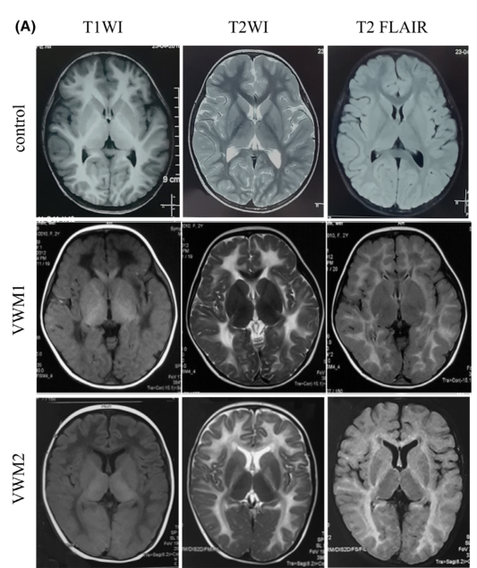

## Question

# Disease Characteristics Research Template

## Target Disease
- **Disease Name:** Leukoencephalopathy With Vanishing White Matter
- **MONDO ID:**  (if available)
- **Category:** Genetic

## Research Objectives

Please provide a comprehensive research report on **Leukoencephalopathy With Vanishing White Matter** covering all of the
disease characteristics listed below. This report will be used to populate a disease knowledge
base entry. Be thorough and cite primary literature (PMID preferred) for all claims.

For each section, **suggested databases/resources** are listed. These are the first places
you should search for information on each topic.

---

### 1. Disease Information
> **Search first:** OMIM, Orphanet, ICD-10/ICD-11, MeSH, PubMed

- What is the disease? Provide a concise overview.
- What are the key identifiers? (OMIM, Orphanet, ICD-10/ICD-11, MeSH, Mondo)
- What are the common synonyms and alternative names?
- Is the information derived from individual patients (e.g., EHR) or aggregated disease-level resources?

### 2. Etiology

- **Disease Causal Factors**: What are the primary causes? (genetic, environmental, infectious, mechanistic)
- **Risk Factors**:
  > **Search first:** PubMed, Cochrane Library, UpToDate, clinical guidelines, ClinVar, ClinGen, GWAS Catalog, PheGenI, CTD, CDC, WHO, epidemiological databases
  - Genetic risk factors (causal variants, susceptibility loci, modifier genes)
  - Environmental risk factors (toxins, lifestyle, occupational exposures, age, sex, family history)
- **Protective Factors**:
  > **Search first:** PubMed, Cochrane Library, clinical trial databases, GWAS Catalog, gnomAD, WHO, CDC, nutrition databases
  - Genetic protective factors (protective variants, modifier alleles)
  - Environmental protective factors (diet, lifestyle, exposures that reduce risk)
- **Gene-Environment Interactions**: How do genetic and environmental factors interact to influence disease?
  > **Search first:** CTD, PubMed, PheGenI, GxE databases

### 3. Phenotypes
> **Search first:** HPO (Human Phenotype Ontology), OMIM, Orphanet, PubMed, clinicaltrials.gov, MedDRA, SNOMED CT, DECIPHER, LOINC

For each phenotype, provide:
- **Phenotype type**: symptoms, clinical signs, physical manifestations, behavioral changes, or laboratory abnormalities
  > For symptoms/signs: HPO, OMIM, Orphanet, PubMed
  > For behavioral changes: HPO, DSM, RDoC (Research Domain Criteria), PubMed
  > For laboratory abnormalities: LOINC, SNOMED CT, LabTests Online, PubMed
- **Phenotype characteristics**:
  > **Search first:** OMIM, Orphanet, HPO, PubMed
  - Age of symptom onset (neonatal, childhood, adult-onset, late-onset)
  - Symptom severity (mild, moderate, severe, variable)
  - Symptom progression (stable, progressive, episodic, fluctuating)
  - Frequency among affected individuals (percentage or qualitative)
- **Quality of life impact**: Effects on daily functioning and well-being (per-phenotype when possible)
  > **Search first:** EQ-5D database, SF-36, WHO QOL databases, PubMed
- Suggest HPO (Human Phenotype Ontology) terms for each phenotype

### 4. Genetic/Molecular Information

- **Causal Genes**: Gene mutations or chromosomal abnormalities responsible for disease (gene symbols, OMIM IDs)
  > **Search first:** OMIM, ClinVar, HGMD, Ensembl, NCBI Gene
- **Pathogenic Variants**:
  - Affected genes (gene symbols, HGNC IDs)
    > **Search first:** OMIM, NCBI Gene, Ensembl, HGNC, UniProt, GeneCards
  - Variant classification (pathogenic, likely pathogenic, VUS per ACMG/AMP guidelines)
    > **Search first:** ClinVar, ClinGen, ACMG/AMP guidelines, VarSome
  - Variant type/class (missense, frameshift, nonsense, splice-site, structural)
  - Allele frequency in population databases
    > **Search first:** gnomAD, 1000 Genomes, ExAC, TOPMed, dbSNP
  - Somatic vs germline origin
    > **Search first:** COSMIC (somatic), ClinVar, ICGC, TCGA
  - Functional consequences (loss of function, gain of function, dominant negative)
- **Modifier Genes**: Genes that modify disease severity or expression
- **Epigenetic Information**: DNA methylation, histone modifications, chromatin changes affecting disease
  > **Search first:** ENCODE, Roadmap Epigenomics, MethBase, DiseaseMeth
- **Chromosomal Abnormalities**: Large-scale genetic changes (aneuploidy, translocations, inversions)
  > **Search first:** DECIPHER, ClinVar, ECARUCA, UCSC Genome Browser

### 5. Environmental Information

- **Environmental Factors**: Non-genetic contributing factors (toxins, radiation, pollution, occupational exposure)
  > **Search first:** CTD (Comparative Toxicogenomics Database), TOXNET, PubMed, EPA databases
- **Lifestyle Factors**: Behavioral factors (smoking, diet, exercise, alcohol consumption)
  > **Search first:** CDC databases, WHO, PubMed, NHANES
- **Infectious Agents**: If applicable, pathogens causing or triggering disease (bacteria, viruses, fungi, parasites)
  > **Search first:** NCBI Taxonomy, ViPR, BV-BRC, MicrobeDB, GIDEON

### 6. Mechanism / Pathophysiology

- **Molecular Pathways**: Specific signaling cascades or biochemical pathways involved (Wnt, MAPK, mTOR, PI3K-AKT, etc.)
  > **Search first:** KEGG, Reactome, WikiPathways, PathBank, BioCyc
- **Cellular Processes**: Cell-level mechanisms (apoptosis, autophagy, cell cycle dysregulation, inflammation, etc.)
  > **Search first:** Gene Ontology (GO), Reactome, KEGG, PubMed
- **Protein Dysfunction**: How protein structure or function is altered (misfolding, aggregation, loss of function, gain of function)
  > **Search first:** UniProt, PDB (Protein Data Bank), InterPro, Pfam, AlphaFold
- **Metabolic Changes**: Alterations in metabolic processes (energy metabolism, lipid metabolism, amino acid metabolism)
  > **Search first:** KEGG, BioCyc, HMDB (Human Metabolome Database), BRENDA
- **Immune System Involvement**: Role of immune response (autoimmunity, immunodeficiency, chronic inflammation)
  > **Search first:** ImmPort, Immunome Database, IEDB, Gene Ontology
- **Tissue Damage Mechanisms**: How tissues/ are injured (oxidative stress, ischemia, fibrosis, necrosis)
  > **Search first:** PubMed, Gene Ontology, Reactome
- **Biochemical Abnormalities**: Specific molecular defects (enzyme deficiencies, receptor dysfunction, ion channel defects)
  > **Search first:** BRENDA, UniProt, KEGG, OMIM, PubMed
- **Epigenetic Changes**: DNA methylation, histone modifications affecting gene expression in disease
  > **Search first:** ENCODE, Roadmap Epigenomics, MethBase, DiseaseMeth
- **Molecular Profiling** (if available):
  - Transcriptomics/gene expression changes
    > **Search first:** GEO (Gene Expression Omnibus), ArrayExpress, GTEx, Human Cell Atlas, SRA
  - Proteomics findings
    > **Search first:** PRIDE, ProteomeXchange, Human Protein Atlas, STRING, BioGRID
  - Metabolomics signatures
    > **Search first:** MetaboLights, Metabolomics Workbench, HMDB, METLIN
  - Lipidomics alterations
    > **Search first:** LIPID MAPS, SwissLipids, LipidHome, Metabolomics Workbench
  - Genomic structural features
    > **Search first:** UCSC Genome Browser, Ensembl, NCBI, dbVar, DGV
- **Advanced Technologies** (if applicable):
  - Single-cell analysis findings (cell-type specific mechanisms, cellular heterogeneity)
    > **Search first:** Human Cell Atlas, Single Cell Portal, GEO, CELLxGENE
  - Spatial transcriptomics findings
    > **Search first:** GEO, Spatial Research, Vizgen, 10x Genomics data
  - Multi-omics integration results
    > **Search first:** TCGA, ICGC, cBioPortal, LinkedOmics, PubMed
  - Functional genomics screens (CRISPR, RNAi)
    > **Search first:** DepMap, GenomeRNAi, PubMed, BioGRID ORCS

For each mechanism, describe:
- The causal chain from initial trigger to clinical manifestation
- Which mechanisms are upstream vs downstream
- What cell types and biological processes are involved
- Suggest GO terms for biological processes and CL terms for cell types

### 7. Anatomical Structures Affected

- **Organ Level**:
  - Primary organs directly affected
  - Secondary organ involvement (complications, secondary effects)
  - Body systems involved (cardiovascular, nervous, digestive, respiratory, endocrine, etc.)
  > **Search first:** Uberon, FMA (Foundational Model of Anatomy), OMIM, HPO, ICD-11, MeSH, SNOMED CT
- **Tissue and Cell Level**:
  - Specific tissue types affected (epithelial, connective, muscle, nervous)
  - Specific cell populations targeted (with Cell Ontology terms)
  > **Search first:** Uberon, Human Protein Atlas, Cell Ontology, Human Cell Atlas, CellMarker, PanglaoDB
- **Subcellular Level**:
  - Cellular compartments involved (mitochondria, nucleus, ER, lysosomes) (with GO Cellular Component terms)
  > **Search first:** Gene Ontology (Cellular Component), UniProt, Human Protein Atlas
- **Localization**:
  - Specific anatomical sites (with UBERON terms)
    > **Search first:** FMA, Uberon, NeuroNames (for brain), SNOMED CT
  - Lateralization (unilateral, bilateral, asymmetric)
    > **Search first:** HPO, clinical literature, imaging databases

### 8. Temporal Development

- **Onset**:
  - Typical age of onset (congenital, pediatric, adult, geriatric)
  - Onset pattern (acute, subacute, chronic, insidious)
  > **Search first:** OMIM, Orphanet, HPO, PubMed
- **Progression**:
  - Disease stages (early, intermediate, advanced, end-stage)
    > **Search first:** Cancer Staging Manual (AJCC), WHO classifications, PubMed
  - Progression rate (rapid, slow, variable)
  - Disease course pattern (episodic, relapsing-remitting, progressive, stable)
  - Disease duration (self-limited, chronic lifelong)
  > **Search first:** Disease registries, longitudinal cohort databases, natural history studies, PubMed, Orphanet, OMIM
- **Patterns**:
  - Remission patterns (spontaneous, treatment-induced)
    > **Search first:** Clinical trial databases, disease registries, PubMed
  - Critical periods (time windows of vulnerability or opportunity for intervention)
    > **Search first:** PubMed, developmental biology databases, clinical guidelines

### 9. Inheritance and Population

- **Epidemiology**:
  - Prevalence (cases per 100,000 at given time)
  - Incidence (new cases per 100,000 per year)
  > **Search first:** Orphanet, CDC, WHO, GBD (Global Burden of Disease), national registries, SEER, disease registries
- **For Genetic Etiology**:
  - Inheritance pattern (AD, AR, X-linked, mitochondrial, multifactorial, polygenic)
    > **Search first:** OMIM, Orphanet, ClinVar, GTR (Genetic Testing Registry)
  - Penetrance (complete, incomplete, age-dependent)
    > **Search first:** ClinVar, OMIM, PubMed, ClinGen
  - Expressivity (variable, consistent)
    > **Search first:** OMIM, ClinVar, PubMed
  - Genetic anticipation (increasing severity in successive generations)
    > **Search first:** OMIM, PubMed (especially for repeat expansion disorders)
  - Germline mosaicism
    > **Search first:** ClinVar, OMIM, genetic counseling literature, PubMed
  - Founder effects (population-specific mutations)
    > **Search first:** gnomAD, population genetics databases, PubMed
  - Consanguinity role
    > **Search first:** OMIM, population studies, genetic counseling resources
  - Carrier frequency
    > **Search first:** gnomAD, carrier screening databases, GeneReviews, GTR
- **Population Demographics**:
  - Affected populations (ethnic or demographic groups with higher prevalence)
    > **Search first:** gnomAD, 1000 Genomes, PAGE Study, PubMed, population registries
  - Geographic distribution (endemic areas, regional variation)
    > **Search first:** WHO, CDC, GBD, Orphanet, geographic epidemiology databases
  - Geographic distribution of specific variants
  - Sex ratio (male:female)
    > **Search first:** Disease registries, OMIM, PubMed, epidemiological databases
  - Age distribution of affected individuals
    > **Search first:** CDC, disease registries, SEER, Orphanet

### 10. Diagnostics

- **Clinical Tests**:
  - Laboratory tests (blood, urine, tissue chemistry, specific enzyme assays)
    > **Search first:** LOINC, LabTests Online, PubMed
  - Biomarkers (proteins, metabolites, genetic markers, circulating biomarkers)
    > **Search first:** FDA Biomarker List, BEST (Biomarkers, EndpointS, and other Tools), PubMed
  - Imaging studies (X-ray, CT, MRI, PET, ultrasound)
    > **Search first:** RadLex, DICOM, Radiopaedia, imaging databases
  - Functional tests (pulmonary function, cardiac stress tests)
    > **Search first:** LOINC, clinical guidelines, PubMed
  - Electrophysiology (EEG, EMG, ECG, nerve conduction studies)
    > **Search first:** LOINC, clinical neurophysiology databases, PubMed
  - Biopsy findings (histopathology, immunohistochemistry)
    > **Search first:** SNOMED CT, College of American Pathologists resources, PubMed
  - Pathology findings (microscopic examination)
    > **Search first:** SNOMED CT, Digital Pathology databases, PubMed
- **Genetic Testing**:
  > **Search first:** GTR (Genetic Testing Registry), GeneReviews, ClinGen
  - Overview of recommended genetic testing approach
  - Whole genome sequencing (WGS) utility
    > **Search first:** GTR, ClinVar, GEL (Genomics England), gnomAD
  - Whole exome sequencing (WES) utility
    > **Search first:** GTR, ClinVar, OMIM, GeneMatcher
  - Gene panels (which panels, which genes)
    > **Search first:** GTR, ClinVar, laboratory-specific databases
  - Single gene testing
    > **Search first:** GTR, ClinVar, OMIM, GeneReviews
  - Chromosomal microarray (CMA)
    > **Search first:** DECIPHER, ClinVar, dbVar, ECARUCA
  - Karyotyping
    > **Search first:** Chromosome Abnormality Database, ClinVar, cytogenetics resources
  - FISH
    > **Search first:** ClinVar, cytogenetics databases, PubMed
  - Mitochondrial DNA testing
    > **Search first:** MITOMAP, MSeqDR, ClinVar, GTR
  - Repeat expansion testing
    > **Search first:** GTR, ClinVar, repeat expansion databases, PubMed
- **Omics-Based Diagnostics** (if applicable):
  - RNA sequencing / transcriptomics
    > **Search first:** GEO, ArrayExpress, GTEx, RNA-seq databases
  - Proteomics
    > **Search first:** PRIDE, ProteomeXchange, FDA Biomarker database
  - Metabolomics
    > **Search first:** MetaboLights, Metabolomics Workbench, HMDB
  - Epigenomics
    > **Search first:** GEO, ENCODE, Roadmap Epigenomics, MethBase
  - Liquid biopsy
    > **Search first:** COSMIC, ClinVar, liquid biopsy databases, PubMed
- **Clinical Criteria**:
  - Standardized diagnostic criteria (DSM, ICD, society guidelines)
    > **Search first:** DSM-5, ICD-11, clinical society guidelines, UpToDate
  - Differential diagnosis (other conditions to rule out, with distinguishing features)
    > **Search first:** DynaMed, UpToDate, clinical decision support systems
- **Screening**:
  - Screening methods for asymptomatic individuals (newborn screening, carrier screening, cascade screening)
    > **Search first:** ACMG recommendations, CDC newborn screening, GTR

### 11. Outcome/Prognosis

- **Survival and Mortality**:
  - Survival rate (5-year, 10-year, overall)
    > **Search first:** SEER, cancer registries, disease-specific registries, PubMed
  - Life expectancy (with and without treatment if applicable)
    > **Search first:** Orphanet, disease registries, actuarial databases, PubMed
  - Mortality rate
    > **Search first:** CDC, WHO, GBD, national mortality databases
  - Disease-specific mortality (deaths directly attributable to disease)
    > **Search first:** Disease registries, CDC Wonder, GBD, PubMed
- **Morbidity and Function**:
  - Morbidity (disease-related disability and health impacts)
    > **Search first:** GBD, WHO, disability databases, PubMed
  - Disability outcomes (long-term functional impairments)
    > **Search first:** ICF (International Classification of Functioning), disability registries
  - Quality of life measures (EQ-5D, SF-36, PROMIS, disease-specific tools)
    > **Search first:** EQ-5D database, SF-36, PROMIS, PubMed
- **Disease Course**:
  - Complications (secondary problems: infections, organ failure, etc.)
    > **Search first:** ICD codes, disease registries, clinical databases, PubMed
  - Recovery potential (likelihood and extent of recovery, with vs without treatment)
    > **Search first:** Natural history studies, rehabilitation databases, PubMed
- **Prediction**:
  - Prognostic factors (age, disease severity, biomarkers, treatment response)
    > **Search first:** Prognostic models databases, clinical calculators, PubMed
  - Prognostic biomarkers (molecular markers predicting disease course)
    > **Search first:** FDA Biomarker database, PubMed, cancer prognostic databases

### 12. Treatment

- **Pharmacotherapy**:
  - Pharmacological treatments (drug names, drug classes, mechanisms of action)
    > **Search first:** DrugBank, RxNorm, ATC classification, DailyMed, FDA databases
  - Pharmacogenomics (how genetic variants affect drug metabolism, efficacy, toxicity)
    > **Search first:** PharmGKB, CPIC (Clinical Pharmacogenetics), FDA Table of PGx Biomarkers
- **Advanced Therapeutics**:
  - Gene therapy (viral vectors, CRISPR, gene replacement, gene editing)
    > **Search first:** ClinicalTrials.gov, FDA gene therapy database, ASGCT resources
  - Cell therapy (stem cell transplant, CAR-T, cellular therapeutics)
    > **Search first:** ClinicalTrials.gov, FDA cell therapy database, FACT standards
  - RNA-based therapies (ASOs, siRNA, mRNA therapies)
    > **Search first:** ClinicalTrials.gov, FDA approvals, PubMed
  - Targeted therapies (treatments directed at specific molecular targets)
    > **Search first:** My Cancer Genome, OncoKB, ClinicalTrials.gov, FDA approvals
  - Immunotherapies (checkpoint inhibitors, monoclonal antibodies)
    > **Search first:** Cancer Immunotherapy Database, FDA approvals, ClinicalTrials.gov
- **Surgical and Interventional**:
  - Surgical interventions (types of surgery, timing, outcomes)
    > **Search first:** CPT codes, surgical registries, clinical guidelines, PubMed
- **Supportive and Rehabilitative**:
  - Supportive care (symptom management, pain control, nutrition)
    > **Search first:** Clinical guidelines, Cochrane Library, PubMed
  - Rehabilitation (physical therapy, occupational therapy, speech therapy)
    > **Search first:** Rehabilitation medicine databases, clinical guidelines, PubMed
- **Experimental**:
  - Experimental treatments in clinical trials (with NCT identifiers if available)
    > **Search first:** ClinicalTrials.gov, EU Clinical Trials Register, WHO ICTRP
- **Treatment Outcomes**:
  - Treatment response rates
    > **Search first:** Clinical trial databases, FDA reviews, systematic reviews, PubMed
  - Side effects and adverse events
    > **Search first:** FDA Adverse Event Reporting System (FAERS), MedWatch, PubMed
- **Treatment Strategy**:
  - Treatment algorithms (clinical pathways, decision trees)
    > **Search first:** Clinical practice guidelines, NCCN Guidelines, UpToDate
  - Combination therapies
    > **Search first:** ClinicalTrials.gov, treatment guidelines, PubMed
  - Personalized medicine approaches (genotype-guided treatment)
    > **Search first:** My Cancer Genome, CIViC, PharmGKB, precision medicine databases

For each treatment, suggest MAXO (Medical Action Ontology) terms where applicable.

### 13. Prevention

- **Prevention Levels**:
  - Primary prevention (preventing disease occurrence: vaccination, risk factor modification)
    > **Search first:** CDC, WHO, USPSTF recommendations, Cochrane Library
  - Secondary prevention (early detection and treatment: screening programs, early intervention)
    > **Search first:** USPSTF, CDC screening guidelines, WHO
  - Tertiary prevention (preventing complications in those with disease)
    > **Search first:** Clinical guidelines, disease management protocols, PubMed
- **Immunization**: Vaccine strategies (if applicable)
  > **Search first:** CDC vaccine schedules, WHO immunization, FDA vaccine database
- **Screening and Early Detection**:
  - Screening programs (population-based: newborn screening, cancer screening)
    > **Search first:** CDC screening programs, USPSTF, cancer screening databases
  - Genetic screening (carrier screening, preimplantation genetic diagnosis, prenatal testing)
    > **Search first:** ACMG recommendations, ACOG guidelines, GTR
  - Risk stratification (identifying high-risk individuals for targeted prevention)
    > **Search first:** Risk prediction models, clinical calculators, PubMed
- **Behavioral Interventions**: Lifestyle modifications to reduce risk
  > **Search first:** CDC, WHO, behavioral intervention databases, Cochrane Library
- **Counseling**: Genetic counseling (risk assessment, family planning guidance)
  > **Search first:** NSGC resources, ACMG guidelines, GeneReviews
- **Public Health**:
  - Public health interventions (sanitation, vector control, health education)
    > **Search first:** CDC, WHO, public health databases, PubMed
  - Environmental interventions (reducing environmental risk factors)
    > **Search first:** EPA databases, WHO environmental health, PubMed
- **Prophylaxis**: Preventive medications or procedures
  > **Search first:** Clinical guidelines, FDA approvals, PubMed

### 14. Other Species / Natural Disease

- **Taxonomy**: Species affected (with NCBI Taxon identifiers)
  > **Search first:** NCBI Taxonomy
- **Breed**: Specific breeds affected (with VBO identifiers if applicable)
  > **Search first:** VBO (Vertebrate Breed Ontology)
- **Gene**: Orthologous genes in other species (with NCBI Gene IDs)
  > **Search first:** NCBI Gene
- **Natural Disease**:
  - Naturally occurring disease in other species (companion animals, wildlife)
    > **Search first:** OMIA (Online Mendelian Inheritance in Animals), VetCompass, PubMed
  - Veterinary relevance and importance in animal health
    > **Search first:** OMIA, veterinary databases, PubMed
- **Comparative Biology**:
  - Comparative pathology (similarities and differences across species)
    > **Search first:** OMIA, comparative pathology databases, PubMed
  - Evolutionary conservation of disease mechanisms
    > **Search first:** HomoloGene, OrthoMCL, Alliance of Genome Resources
- **Transmission** (if applicable):
  - Zoonotic potential
    > **Search first:** CDC zoonotic diseases, WHO zoonoses, GIDEON
  - Cross-species susceptibility
    > **Search first:** NCBI Taxonomy, veterinary databases, PubMed

### 15. Model Organisms

- **Model Types**:
  - Model organism type (mammalian, invertebrate, cellular, in vitro)
    > **Search first:** Alliance of Genome Resources, model organism databases
  - Specific model systems (mouse, rat, zebrafish, Drosophila, C. elegans, yeast, cell lines, organoids, iPSCs)
    > **Search first:** MGI, RGD, ZFIN, FlyBase, WormBase, SGD, ATCC, Cellosaurus
  - Induced models (drug treatment, surgical intervention, environmental manipulation)
    > **Search first:** MGI, model organism databases, PubMed
- **Genetic Models**:
  - Types available (knockout, knock-in, transgenic, conditional, humanized)
    > **Search first:** MGI, IMPC, KOMP, EuMMCR, IMSR
- **Model Characteristics**:
  - Phenotype recapitulation (how well model reproduces human disease features)
    > **Search first:** Model organism databases, comparative studies, PubMed
  - Model limitations (aspects of human disease not captured)
    > **Search first:** Model organism databases, PubMed, review articles
- **Applications**:
  - Research applications (what aspects of disease can be studied)
    > **Search first:** Model organism databases, PubMed
- **Resources**:
  - Model databases
    > **Search first:** MGI, RGD, ZFIN, FlyBase, WormBase, IMSR, EMMA, MMRRC

---

## Citation Requirements

- Cite primary literature (PMID preferred) for all mechanistic and clinical claims
- Prioritize recent reviews and landmark papers
- Include direct quotes from abstracts where possible to support key statements
- Distinguish evidence source types: human clinical, model organism, in vitro, computational

## Output Format

Structure your response as a comprehensive narrative organized by the sections above.
For each section, provide:
- Factual content with specific details (numbers, percentages, gene names, variant nomenclature)
- Ontology term suggestions (HPO, GO, CL, UBERON, CHEBI, MAXO, MONDO) where applicable
- Evidence citations with PMIDs
- Direct quotes from abstracts to support key claims
- Clear indication when information is not available or not applicable for this disease

This report will be used to populate a disease knowledge base entry with:
- Pathophysiology descriptions with causal chains
- Gene/protein annotations (HGNC, GO terms)
- Phenotype associations (HP terms) with frequencies
- Cell type involvement (CL terms)
- Anatomical locations (UBERON terms)
- Chemical entities (CHEBI terms)
- Treatment annotations (MAXO terms)
- Evidence items with PMIDs and exact abstract quotes
- Epidemiology, prognosis, diagnostic, and prevention information
- Animal model descriptions with phenotype recapitulation details

## Output

Question: You are an expert researcher providing comprehensive, well-cited information.

Provide detailed information focusing on:
1. Key concepts and definitions with current understanding
2. Recent developments and latest research (prioritize 2023-2024 sources)
3. Current applications and real-world implementations
4. Expert opinions and analysis from authoritative sources
5. Relevant statistics and data from recent studies

Format as a comprehensive research report with proper citations. Include URLs and publication dates where available.
Always prioritize recent, authoritative sources and provide specific citations for all major claims.

# Disease Characteristics Research Template

## Target Disease
- **Disease Name:** Leukoencephalopathy With Vanishing White Matter
- **MONDO ID:**  (if available)
- **Category:** Genetic

## Research Objectives

Please provide a comprehensive research report on **Leukoencephalopathy With Vanishing White Matter** covering all of the
disease characteristics listed below. This report will be used to populate a disease knowledge
base entry. Be thorough and cite primary literature (PMID preferred) for all claims.

For each section, **suggested databases/resources** are listed. These are the first places
you should search for information on each topic.

---

### 1. Disease Information
> **Search first:** OMIM, Orphanet, ICD-10/ICD-11, MeSH, PubMed

- What is the disease? Provide a concise overview.
- What are the key identifiers? (OMIM, Orphanet, ICD-10/ICD-11, MeSH, Mondo)
- What are the common synonyms and alternative names?
- Is the information derived from individual patients (e.g., EHR) or aggregated disease-level resources?

### 2. Etiology

- **Disease Causal Factors**: What are the primary causes? (genetic, environmental, infectious, mechanistic)
- **Risk Factors**:
  > **Search first:** PubMed, Cochrane Library, UpToDate, clinical guidelines, ClinVar, ClinGen, GWAS Catalog, PheGenI, CTD, CDC, WHO, epidemiological databases
  - Genetic risk factors (causal variants, susceptibility loci, modifier genes)
  - Environmental risk factors (toxins, lifestyle, occupational exposures, age, sex, family history)
- **Protective Factors**:
  > **Search first:** PubMed, Cochrane Library, clinical trial databases, GWAS Catalog, gnomAD, WHO, CDC, nutrition databases
  - Genetic protective factors (protective variants, modifier alleles)
  - Environmental protective factors (diet, lifestyle, exposures that reduce risk)
- **Gene-Environment Interactions**: How do genetic and environmental factors interact to influence disease?
  > **Search first:** CTD, PubMed, PheGenI, GxE databases

### 3. Phenotypes
> **Search first:** HPO (Human Phenotype Ontology), OMIM, Orphanet, PubMed, clinicaltrials.gov, MedDRA, SNOMED CT, DECIPHER, LOINC

For each phenotype, provide:
- **Phenotype type**: symptoms, clinical signs, physical manifestations, behavioral changes, or laboratory abnormalities
  > For symptoms/signs: HPO, OMIM, Orphanet, PubMed
  > For behavioral changes: HPO, DSM, RDoC (Research Domain Criteria), PubMed
  > For laboratory abnormalities: LOINC, SNOMED CT, LabTests Online, PubMed
- **Phenotype characteristics**:
  > **Search first:** OMIM, Orphanet, HPO, PubMed
  - Age of symptom onset (neonatal, childhood, adult-onset, late-onset)
  - Symptom severity (mild, moderate, severe, variable)
  - Symptom progression (stable, progressive, episodic, fluctuating)
  - Frequency among affected individuals (percentage or qualitative)
- **Quality of life impact**: Effects on daily functioning and well-being (per-phenotype when possible)
  > **Search first:** EQ-5D database, SF-36, WHO QOL databases, PubMed
- Suggest HPO (Human Phenotype Ontology) terms for each phenotype

### 4. Genetic/Molecular Information

- **Causal Genes**: Gene mutations or chromosomal abnormalities responsible for disease (gene symbols, OMIM IDs)
  > **Search first:** OMIM, ClinVar, HGMD, Ensembl, NCBI Gene
- **Pathogenic Variants**:
  - Affected genes (gene symbols, HGNC IDs)
    > **Search first:** OMIM, NCBI Gene, Ensembl, HGNC, UniProt, GeneCards
  - Variant classification (pathogenic, likely pathogenic, VUS per ACMG/AMP guidelines)
    > **Search first:** ClinVar, ClinGen, ACMG/AMP guidelines, VarSome
  - Variant type/class (missense, frameshift, nonsense, splice-site, structural)
  - Allele frequency in population databases
    > **Search first:** gnomAD, 1000 Genomes, ExAC, TOPMed, dbSNP
  - Somatic vs germline origin
    > **Search first:** COSMIC (somatic), ClinVar, ICGC, TCGA
  - Functional consequences (loss of function, gain of function, dominant negative)
- **Modifier Genes**: Genes that modify disease severity or expression
- **Epigenetic Information**: DNA methylation, histone modifications, chromatin changes affecting disease
  > **Search first:** ENCODE, Roadmap Epigenomics, MethBase, DiseaseMeth
- **Chromosomal Abnormalities**: Large-scale genetic changes (aneuploidy, translocations, inversions)
  > **Search first:** DECIPHER, ClinVar, ECARUCA, UCSC Genome Browser

### 5. Environmental Information

- **Environmental Factors**: Non-genetic contributing factors (toxins, radiation, pollution, occupational exposure)
  > **Search first:** CTD (Comparative Toxicogenomics Database), TOXNET, PubMed, EPA databases
- **Lifestyle Factors**: Behavioral factors (smoking, diet, exercise, alcohol consumption)
  > **Search first:** CDC databases, WHO, PubMed, NHANES
- **Infectious Agents**: If applicable, pathogens causing or triggering disease (bacteria, viruses, fungi, parasites)
  > **Search first:** NCBI Taxonomy, ViPR, BV-BRC, MicrobeDB, GIDEON

### 6. Mechanism / Pathophysiology

- **Molecular Pathways**: Specific signaling cascades or biochemical pathways involved (Wnt, MAPK, mTOR, PI3K-AKT, etc.)
  > **Search first:** KEGG, Reactome, WikiPathways, PathBank, BioCyc
- **Cellular Processes**: Cell-level mechanisms (apoptosis, autophagy, cell cycle dysregulation, inflammation, etc.)
  > **Search first:** Gene Ontology (GO), Reactome, KEGG, PubMed
- **Protein Dysfunction**: How protein structure or function is altered (misfolding, aggregation, loss of function, gain of function)
  > **Search first:** UniProt, PDB (Protein Data Bank), InterPro, Pfam, AlphaFold
- **Metabolic Changes**: Alterations in metabolic processes (energy metabolism, lipid metabolism, amino acid metabolism)
  > **Search first:** KEGG, BioCyc, HMDB (Human Metabolome Database), BRENDA
- **Immune System Involvement**: Role of immune response (autoimmunity, immunodeficiency, chronic inflammation)
  > **Search first:** ImmPort, Immunome Database, IEDB, Gene Ontology
- **Tissue Damage Mechanisms**: How tissues/ are injured (oxidative stress, ischemia, fibrosis, necrosis)
  > **Search first:** PubMed, Gene Ontology, Reactome
- **Biochemical Abnormalities**: Specific molecular defects (enzyme deficiencies, receptor dysfunction, ion channel defects)
  > **Search first:** BRENDA, UniProt, KEGG, OMIM, PubMed
- **Epigenetic Changes**: DNA methylation, histone modifications affecting gene expression in disease
  > **Search first:** ENCODE, Roadmap Epigenomics, MethBase, DiseaseMeth
- **Molecular Profiling** (if available):
  - Transcriptomics/gene expression changes
    > **Search first:** GEO (Gene Expression Omnibus), ArrayExpress, GTEx, Human Cell Atlas, SRA
  - Proteomics findings
    > **Search first:** PRIDE, ProteomeXchange, Human Protein Atlas, STRING, BioGRID
  - Metabolomics signatures
    > **Search first:** MetaboLights, Metabolomics Workbench, HMDB, METLIN
  - Lipidomics alterations
    > **Search first:** LIPID MAPS, SwissLipids, LipidHome, Metabolomics Workbench
  - Genomic structural features
    > **Search first:** UCSC Genome Browser, Ensembl, NCBI, dbVar, DGV
- **Advanced Technologies** (if applicable):
  - Single-cell analysis findings (cell-type specific mechanisms, cellular heterogeneity)
    > **Search first:** Human Cell Atlas, Single Cell Portal, GEO, CELLxGENE
  - Spatial transcriptomics findings
    > **Search first:** GEO, Spatial Research, Vizgen, 10x Genomics data
  - Multi-omics integration results
    > **Search first:** TCGA, ICGC, cBioPortal, LinkedOmics, PubMed
  - Functional genomics screens (CRISPR, RNAi)
    > **Search first:** DepMap, GenomeRNAi, PubMed, BioGRID ORCS

For each mechanism, describe:
- The causal chain from initial trigger to clinical manifestation
- Which mechanisms are upstream vs downstream
- What cell types and biological processes are involved
- Suggest GO terms for biological processes and CL terms for cell types

### 7. Anatomical Structures Affected

- **Organ Level**:
  - Primary organs directly affected
  - Secondary organ involvement (complications, secondary effects)
  - Body systems involved (cardiovascular, nervous, digestive, respiratory, endocrine, etc.)
  > **Search first:** Uberon, FMA (Foundational Model of Anatomy), OMIM, HPO, ICD-11, MeSH, SNOMED CT
- **Tissue and Cell Level**:
  - Specific tissue types affected (epithelial, connective, muscle, nervous)
  - Specific cell populations targeted (with Cell Ontology terms)
  > **Search first:** Uberon, Human Protein Atlas, Cell Ontology, Human Cell Atlas, CellMarker, PanglaoDB
- **Subcellular Level**:
  - Cellular compartments involved (mitochondria, nucleus, ER, lysosomes) (with GO Cellular Component terms)
  > **Search first:** Gene Ontology (Cellular Component), UniProt, Human Protein Atlas
- **Localization**:
  - Specific anatomical sites (with UBERON terms)
    > **Search first:** FMA, Uberon, NeuroNames (for brain), SNOMED CT
  - Lateralization (unilateral, bilateral, asymmetric)
    > **Search first:** HPO, clinical literature, imaging databases

### 8. Temporal Development

- **Onset**:
  - Typical age of onset (congenital, pediatric, adult, geriatric)
  - Onset pattern (acute, subacute, chronic, insidious)
  > **Search first:** OMIM, Orphanet, HPO, PubMed
- **Progression**:
  - Disease stages (early, intermediate, advanced, end-stage)
    > **Search first:** Cancer Staging Manual (AJCC), WHO classifications, PubMed
  - Progression rate (rapid, slow, variable)
  - Disease course pattern (episodic, relapsing-remitting, progressive, stable)
  - Disease duration (self-limited, chronic lifelong)
  > **Search first:** Disease registries, longitudinal cohort databases, natural history studies, PubMed, Orphanet, OMIM
- **Patterns**:
  - Remission patterns (spontaneous, treatment-induced)
    > **Search first:** Clinical trial databases, disease registries, PubMed
  - Critical periods (time windows of vulnerability or opportunity for intervention)
    > **Search first:** PubMed, developmental biology databases, clinical guidelines

### 9. Inheritance and Population

- **Epidemiology**:
  - Prevalence (cases per 100,000 at given time)
  - Incidence (new cases per 100,000 per year)
  > **Search first:** Orphanet, CDC, WHO, GBD (Global Burden of Disease), national registries, SEER, disease registries
- **For Genetic Etiology**:
  - Inheritance pattern (AD, AR, X-linked, mitochondrial, multifactorial, polygenic)
    > **Search first:** OMIM, Orphanet, ClinVar, GTR (Genetic Testing Registry)
  - Penetrance (complete, incomplete, age-dependent)
    > **Search first:** ClinVar, OMIM, PubMed, ClinGen
  - Expressivity (variable, consistent)
    > **Search first:** OMIM, ClinVar, PubMed
  - Genetic anticipation (increasing severity in successive generations)
    > **Search first:** OMIM, PubMed (especially for repeat expansion disorders)
  - Germline mosaicism
    > **Search first:** ClinVar, OMIM, genetic counseling literature, PubMed
  - Founder effects (population-specific mutations)
    > **Search first:** gnomAD, population genetics databases, PubMed
  - Consanguinity role
    > **Search first:** OMIM, population studies, genetic counseling resources
  - Carrier frequency
    > **Search first:** gnomAD, carrier screening databases, GeneReviews, GTR
- **Population Demographics**:
  - Affected populations (ethnic or demographic groups with higher prevalence)
    > **Search first:** gnomAD, 1000 Genomes, PAGE Study, PubMed, population registries
  - Geographic distribution (endemic areas, regional variation)
    > **Search first:** WHO, CDC, GBD, Orphanet, geographic epidemiology databases
  - Geographic distribution of specific variants
  - Sex ratio (male:female)
    > **Search first:** Disease registries, OMIM, PubMed, epidemiological databases
  - Age distribution of affected individuals
    > **Search first:** CDC, disease registries, SEER, Orphanet

### 10. Diagnostics

- **Clinical Tests**:
  - Laboratory tests (blood, urine, tissue chemistry, specific enzyme assays)
    > **Search first:** LOINC, LabTests Online, PubMed
  - Biomarkers (proteins, metabolites, genetic markers, circulating biomarkers)
    > **Search first:** FDA Biomarker List, BEST (Biomarkers, EndpointS, and other Tools), PubMed
  - Imaging studies (X-ray, CT, MRI, PET, ultrasound)
    > **Search first:** RadLex, DICOM, Radiopaedia, imaging databases
  - Functional tests (pulmonary function, cardiac stress tests)
    > **Search first:** LOINC, clinical guidelines, PubMed
  - Electrophysiology (EEG, EMG, ECG, nerve conduction studies)
    > **Search first:** LOINC, clinical neurophysiology databases, PubMed
  - Biopsy findings (histopathology, immunohistochemistry)
    > **Search first:** SNOMED CT, College of American Pathologists resources, PubMed
  - Pathology findings (microscopic examination)
    > **Search first:** SNOMED CT, Digital Pathology databases, PubMed
- **Genetic Testing**:
  > **Search first:** GTR (Genetic Testing Registry), GeneReviews, ClinGen
  - Overview of recommended genetic testing approach
  - Whole genome sequencing (WGS) utility
    > **Search first:** GTR, ClinVar, GEL (Genomics England), gnomAD
  - Whole exome sequencing (WES) utility
    > **Search first:** GTR, ClinVar, OMIM, GeneMatcher
  - Gene panels (which panels, which genes)
    > **Search first:** GTR, ClinVar, laboratory-specific databases
  - Single gene testing
    > **Search first:** GTR, ClinVar, OMIM, GeneReviews
  - Chromosomal microarray (CMA)
    > **Search first:** DECIPHER, ClinVar, dbVar, ECARUCA
  - Karyotyping
    > **Search first:** Chromosome Abnormality Database, ClinVar, cytogenetics resources
  - FISH
    > **Search first:** ClinVar, cytogenetics databases, PubMed
  - Mitochondrial DNA testing
    > **Search first:** MITOMAP, MSeqDR, ClinVar, GTR
  - Repeat expansion testing
    > **Search first:** GTR, ClinVar, repeat expansion databases, PubMed
- **Omics-Based Diagnostics** (if applicable):
  - RNA sequencing / transcriptomics
    > **Search first:** GEO, ArrayExpress, GTEx, RNA-seq databases
  - Proteomics
    > **Search first:** PRIDE, ProteomeXchange, FDA Biomarker database
  - Metabolomics
    > **Search first:** MetaboLights, Metabolomics Workbench, HMDB
  - Epigenomics
    > **Search first:** GEO, ENCODE, Roadmap Epigenomics, MethBase
  - Liquid biopsy
    > **Search first:** COSMIC, ClinVar, liquid biopsy databases, PubMed
- **Clinical Criteria**:
  - Standardized diagnostic criteria (DSM, ICD, society guidelines)
    > **Search first:** DSM-5, ICD-11, clinical society guidelines, UpToDate
  - Differential diagnosis (other conditions to rule out, with distinguishing features)
    > **Search first:** DynaMed, UpToDate, clinical decision support systems
- **Screening**:
  - Screening methods for asymptomatic individuals (newborn screening, carrier screening, cascade screening)
    > **Search first:** ACMG recommendations, CDC newborn screening, GTR

### 11. Outcome/Prognosis

- **Survival and Mortality**:
  - Survival rate (5-year, 10-year, overall)
    > **Search first:** SEER, cancer registries, disease-specific registries, PubMed
  - Life expectancy (with and without treatment if applicable)
    > **Search first:** Orphanet, disease registries, actuarial databases, PubMed
  - Mortality rate
    > **Search first:** CDC, WHO, GBD, national mortality databases
  - Disease-specific mortality (deaths directly attributable to disease)
    > **Search first:** Disease registries, CDC Wonder, GBD, PubMed
- **Morbidity and Function**:
  - Morbidity (disease-related disability and health impacts)
    > **Search first:** GBD, WHO, disability databases, PubMed
  - Disability outcomes (long-term functional impairments)
    > **Search first:** ICF (International Classification of Functioning), disability registries
  - Quality of life measures (EQ-5D, SF-36, PROMIS, disease-specific tools)
    > **Search first:** EQ-5D database, SF-36, PROMIS, PubMed
- **Disease Course**:
  - Complications (secondary problems: infections, organ failure, etc.)
    > **Search first:** ICD codes, disease registries, clinical databases, PubMed
  - Recovery potential (likelihood and extent of recovery, with vs without treatment)
    > **Search first:** Natural history studies, rehabilitation databases, PubMed
- **Prediction**:
  - Prognostic factors (age, disease severity, biomarkers, treatment response)
    > **Search first:** Prognostic models databases, clinical calculators, PubMed
  - Prognostic biomarkers (molecular markers predicting disease course)
    > **Search first:** FDA Biomarker database, PubMed, cancer prognostic databases

### 12. Treatment

- **Pharmacotherapy**:
  - Pharmacological treatments (drug names, drug classes, mechanisms of action)
    > **Search first:** DrugBank, RxNorm, ATC classification, DailyMed, FDA databases
  - Pharmacogenomics (how genetic variants affect drug metabolism, efficacy, toxicity)
    > **Search first:** PharmGKB, CPIC (Clinical Pharmacogenetics), FDA Table of PGx Biomarkers
- **Advanced Therapeutics**:
  - Gene therapy (viral vectors, CRISPR, gene replacement, gene editing)
    > **Search first:** ClinicalTrials.gov, FDA gene therapy database, ASGCT resources
  - Cell therapy (stem cell transplant, CAR-T, cellular therapeutics)
    > **Search first:** ClinicalTrials.gov, FDA cell therapy database, FACT standards
  - RNA-based therapies (ASOs, siRNA, mRNA therapies)
    > **Search first:** ClinicalTrials.gov, FDA approvals, PubMed
  - Targeted therapies (treatments directed at specific molecular targets)
    > **Search first:** My Cancer Genome, OncoKB, ClinicalTrials.gov, FDA approvals
  - Immunotherapies (checkpoint inhibitors, monoclonal antibodies)
    > **Search first:** Cancer Immunotherapy Database, FDA approvals, ClinicalTrials.gov
- **Surgical and Interventional**:
  - Surgical interventions (types of surgery, timing, outcomes)
    > **Search first:** CPT codes, surgical registries, clinical guidelines, PubMed
- **Supportive and Rehabilitative**:
  - Supportive care (symptom management, pain control, nutrition)
    > **Search first:** Clinical guidelines, Cochrane Library, PubMed
  - Rehabilitation (physical therapy, occupational therapy, speech therapy)
    > **Search first:** Rehabilitation medicine databases, clinical guidelines, PubMed
- **Experimental**:
  - Experimental treatments in clinical trials (with NCT identifiers if available)
    > **Search first:** ClinicalTrials.gov, EU Clinical Trials Register, WHO ICTRP
- **Treatment Outcomes**:
  - Treatment response rates
    > **Search first:** Clinical trial databases, FDA reviews, systematic reviews, PubMed
  - Side effects and adverse events
    > **Search first:** FDA Adverse Event Reporting System (FAERS), MedWatch, PubMed
- **Treatment Strategy**:
  - Treatment algorithms (clinical pathways, decision trees)
    > **Search first:** Clinical practice guidelines, NCCN Guidelines, UpToDate
  - Combination therapies
    > **Search first:** ClinicalTrials.gov, treatment guidelines, PubMed
  - Personalized medicine approaches (genotype-guided treatment)
    > **Search first:** My Cancer Genome, CIViC, PharmGKB, precision medicine databases

For each treatment, suggest MAXO (Medical Action Ontology) terms where applicable.

### 13. Prevention

- **Prevention Levels**:
  - Primary prevention (preventing disease occurrence: vaccination, risk factor modification)
    > **Search first:** CDC, WHO, USPSTF recommendations, Cochrane Library
  - Secondary prevention (early detection and treatment: screening programs, early intervention)
    > **Search first:** USPSTF, CDC screening guidelines, WHO
  - Tertiary prevention (preventing complications in those with disease)
    > **Search first:** Clinical guidelines, disease management protocols, PubMed
- **Immunization**: Vaccine strategies (if applicable)
  > **Search first:** CDC vaccine schedules, WHO immunization, FDA vaccine database
- **Screening and Early Detection**:
  - Screening programs (population-based: newborn screening, cancer screening)
    > **Search first:** CDC screening programs, USPSTF, cancer screening databases
  - Genetic screening (carrier screening, preimplantation genetic diagnosis, prenatal testing)
    > **Search first:** ACMG recommendations, ACOG guidelines, GTR
  - Risk stratification (identifying high-risk individuals for targeted prevention)
    > **Search first:** Risk prediction models, clinical calculators, PubMed
- **Behavioral Interventions**: Lifestyle modifications to reduce risk
  > **Search first:** CDC, WHO, behavioral intervention databases, Cochrane Library
- **Counseling**: Genetic counseling (risk assessment, family planning guidance)
  > **Search first:** NSGC resources, ACMG guidelines, GeneReviews
- **Public Health**:
  - Public health interventions (sanitation, vector control, health education)
    > **Search first:** CDC, WHO, public health databases, PubMed
  - Environmental interventions (reducing environmental risk factors)
    > **Search first:** EPA databases, WHO environmental health, PubMed
- **Prophylaxis**: Preventive medications or procedures
  > **Search first:** Clinical guidelines, FDA approvals, PubMed

### 14. Other Species / Natural Disease

- **Taxonomy**: Species affected (with NCBI Taxon identifiers)
  > **Search first:** NCBI Taxonomy
- **Breed**: Specific breeds affected (with VBO identifiers if applicable)
  > **Search first:** VBO (Vertebrate Breed Ontology)
- **Gene**: Orthologous genes in other species (with NCBI Gene IDs)
  > **Search first:** NCBI Gene
- **Natural Disease**:
  - Naturally occurring disease in other species (companion animals, wildlife)
    > **Search first:** OMIA (Online Mendelian Inheritance in Animals), VetCompass, PubMed
  - Veterinary relevance and importance in animal health
    > **Search first:** OMIA, veterinary databases, PubMed
- **Comparative Biology**:
  - Comparative pathology (similarities and differences across species)
    > **Search first:** OMIA, comparative pathology databases, PubMed
  - Evolutionary conservation of disease mechanisms
    > **Search first:** HomoloGene, OrthoMCL, Alliance of Genome Resources
- **Transmission** (if applicable):
  - Zoonotic potential
    > **Search first:** CDC zoonotic diseases, WHO zoonoses, GIDEON
  - Cross-species susceptibility
    > **Search first:** NCBI Taxonomy, veterinary databases, PubMed

### 15. Model Organisms

- **Model Types**:
  - Model organism type (mammalian, invertebrate, cellular, in vitro)
    > **Search first:** Alliance of Genome Resources, model organism databases
  - Specific model systems (mouse, rat, zebrafish, Drosophila, C. elegans, yeast, cell lines, organoids, iPSCs)
    > **Search first:** MGI, RGD, ZFIN, FlyBase, WormBase, SGD, ATCC, Cellosaurus
  - Induced models (drug treatment, surgical intervention, environmental manipulation)
    > **Search first:** MGI, model organism databases, PubMed
- **Genetic Models**:
  - Types available (knockout, knock-in, transgenic, conditional, humanized)
    > **Search first:** MGI, IMPC, KOMP, EuMMCR, IMSR
- **Model Characteristics**:
  - Phenotype recapitulation (how well model reproduces human disease features)
    > **Search first:** Model organism databases, comparative studies, PubMed
  - Model limitations (aspects of human disease not captured)
    > **Search first:** Model organism databases, PubMed, review articles
- **Applications**:
  - Research applications (what aspects of disease can be studied)
    > **Search first:** Model organism databases, PubMed
- **Resources**:
  - Model databases
    > **Search first:** MGI, RGD, ZFIN, FlyBase, WormBase, IMSR, EMMA, MMRRC

---

## Citation Requirements

- Cite primary literature (PMID preferred) for all mechanistic and clinical claims
- Prioritize recent reviews and landmark papers
- Include direct quotes from abstracts where possible to support key statements
- Distinguish evidence source types: human clinical, model organism, in vitro, computational

## Output Format

Structure your response as a comprehensive narrative organized by the sections above.
For each section, provide:
- Factual content with specific details (numbers, percentages, gene names, variant nomenclature)
- Ontology term suggestions (HPO, GO, CL, UBERON, CHEBI, MAXO, MONDO) where applicable
- Evidence citations with PMIDs
- Direct quotes from abstracts to support key claims
- Clear indication when information is not available or not applicable for this disease

This report will be used to populate a disease knowledge base entry with:
- Pathophysiology descriptions with causal chains
- Gene/protein annotations (HGNC, GO terms)
- Phenotype associations (HP terms) with frequencies
- Cell type involvement (CL terms)
- Anatomical locations (UBERON terms)
- Chemical entities (CHEBI terms)
- Treatment annotations (MAXO terms)
- Evidence items with PMIDs and exact abstract quotes
- Epidemiology, prognosis, diagnostic, and prevention information
- Animal model descriptions with phenotype recapitulation details

## Comprehensive Research Report: Leukoencephalopathy With Vanishing White Matter (VWM/VWMD/CACH)

### Target disease
- **Preferred name:** Leukoencephalopathy with vanishing white matter (VWM)
- **Category:** Genetic leukodystrophy (white matter disorder)
- **MONDO ID:** **MONDO:0800448** (Open Targets disease mapping) (OpenTargets Search: Vanishing white matter disease,Leukoencephalopathy with vanishing white matter,Childhood ataxia with central nervous system hypomyelination)

---

## 1. Disease information

### 1.1 Concise overview (current understanding)
Leukoencephalopathy with vanishing white matter (VWM) is a **rare autosomal recessive leukodystrophy** characterized by **chronic neurological deterioration** with **superimposed stress-provoked episodes of rapid decline** (often after febrile/afebrile infections or head trauma). It is caused by **biallelic pathogenic variants in the five genes encoding the eukaryotic initiation factor 2B (eIF2B) complex** (EIF2B1–EIF2B5), a central regulator of mRNA translation and the **integrated stress response (ISR)**. (knaap2022therapytrialdesign pages 1-2, knaap2022therapytrialdesign pages 2-4, stellingwerff2021mrinaturalhistory pages 1-2)

### 1.2 Key identifiers and ontology links
- **MONDO:** MONDO:0800448 (OpenTargets Search: Vanishing white matter disease,Leukoencephalopathy with vanishing white matter,Childhood ataxia with central nervous system hypomyelination)
- **OMIM:** **603896** (VWM) (man2024proteomicdissectionof pages 1-2, schoenmakers2023coreprotocoldevelopment pages 1-2)
- **MeSH / ICD-10 / ICD-11 / Orphanet:** Not retrieved in the current tool evidence; should be added from OMIM/Orphanet cross-references during curation.

### 1.3 Synonyms / alternative names
- Vanishing white matter (VWM)
- Vanishing white matter disease (VWMD)
- Childhood ataxia with central nervous system hypomyelination (CACH)
- eIF2B-related leukodystrophy
- **Ovarioleukodystrophy** (female phenotype with ovarian failure)
These are explicitly used in recent clinical literature and systematic reviews. (gui2024adultonsetleukoencephalopathywith pages 1-2, escobarpacheco2024ovarioleukodystrophydueto pages 4-5, knaap2022therapytrialdesign pages 2-4, escobarpacheco2024ovarioleukodystrophydueto pages 8-10)

### 1.4 Evidence sources: individual vs aggregated
- **Aggregated cohort/natural history:** 296 genetically confirmed patients in the multicenter natural history study (Hamilton et al., 2018). (hamilton2018naturalhistoryof pages 1-2)
- **Aggregated registry:** International VWM registry with **>400 genetically confirmed** patients, **~250 alive** (20 years of collection). (schoenmakers2023coreprotocoldevelopment pages 1-2)
- **Individual cases/case series:** Adult-onset and ovarioleukodystrophy case reports and systematic review of ovarian phenotype cases. (gui2024adultonsetleukoencephalopathywith pages 1-2, escobarpacheco2024ovarioleukodystrophydueto pages 4-5)

---

## 2. Etiology

### 2.1 Disease causal factors
**Primary cause:** germline **biallelic (recessive) pathogenic variants** in **EIF2B1, EIF2B2, EIF2B3, EIF2B4, EIF2B5**, encoding the 5 subunits (α–ε) of **eIF2B**. (knaap2022therapytrialdesign pages 1-2, schoenmakers2023coreprotocoldevelopment pages 1-2)

**Triggering (provoking) factors:** clinical worsening and acute episodes are commonly precipitated by **febrile/afebrile infection, head trauma**, and other stressors; stress-provoked deterioration is a hallmark feature. (knaap2022therapytrialdesign pages 1-2, knaap2022therapytrialdesign pages 2-4)

### 2.2 Risk factors
- **Genetic:** carrying biallelic pathogenic variants in EIF2B1–5 is causal. (knaap2022therapytrialdesign pages 1-2, schoenmakers2023coreprotocoldevelopment pages 1-2)
- **Clinical/environmental stressors:** infections and trauma are associated with stress-provoked episodes and more severe course. (knaap2022therapytrialdesign pages 2-4)

### 2.3 Protective factors
Robust protective genetic variants or environmental protective factors are not established in the evidence retrieved; however, **absence of stress-provoked episodes and absence of seizures** predicted more favorable outcomes in the natural history cohort. (hamilton2018naturalhistoryof pages 1-2)

### 2.4 Gene–environment interaction
VWM exemplifies gene–environment interaction in which **translation/ISR dysregulation from EIF2B variants** lowers cellular resilience; acute stress (infection/fever/trauma) triggers **rapid neurologic deterioration**. (knaap2022therapytrialdesign pages 1-2, herstine2024evaluationofsafety pages 1-2)

---

## 3. Phenotypes (clinical manifestations)

### 3.1 Core neurological phenotypes (with suggested HPO terms)
Common manifestations across cohorts/consensus descriptions include:
- **Cerebellar ataxia** (HPO: **HP:0001251**) (knaap2022therapytrialdesign pages 2-4, herstine2024evaluationofsafety pages 1-2)
- **Spasticity / spastic paraplegia** (HP:0001257 / HP:0001258) (knaap2022therapytrialdesign pages 2-4, herstine2024evaluationofsafety pages 1-2)
- **Seizures / epilepsy** (HP:0001250) (knaap2022therapytrialdesign pages 2-4, herstine2024evaluationofsafety pages 1-2)
- **Cognitive impairment / executive dysfunction** (HP:0100543; broader: HP:0001263) (hamilton2018naturalhistoryof pages 1-2, knaap2022therapytrialdesign pages 2-4)
- **Psychiatric/behavioral symptoms** (e.g., emotional lability; psychiatric manifestations) (HP:0000716 / HP:0000729) (gui2024adultonsetleukoencephalopathywith pages 1-2, escobarpacheco2024ovarioleukodystrophydueto pages 4-5)
- **Episodes of rapid neurological deterioration after stress** (can map to HP terms for episodic deterioration, coma/altered consciousness: HP:0001259 if present) (gui2024adultonsetleukoencephalopathywith pages 1-2, knaap2022therapytrialdesign pages 2-4)

### 3.2 Female-specific phenotype: ovarian failure (“ovarioleukodystrophy”)
Ovarian dysfunction is a recognized phenotype in females (often adult onset), discussed as a subtype/phenotypic spectrum of VWM. (gui2024adultonsetleukoencephalopathywith pages 1-2, escobarpacheco2024ovarioleukodystrophydueto pages 8-10)
- Suggested HPO: **Premature ovarian failure** (HP:0008209)

### 3.3 Phenotype frequencies (recent aggregated data)
A systematic review of **EIF2B-associated ovarioleukodystrophy** (n=20 cases) reported (selected):
- **Pyramidal signs:** 45% (9/20)
- **Gait disturbance:** 35% (7/20)
- **Epilepsy:** 30% (6/20)
- **Sphincter dysfunction:** 30% (6/20)
- **Psychiatric manifestations:** 35% (7/20)
Abnormal neuroimaging and ovarian disorders were present in **100%** (20/20). (escobarpacheco2024ovarioleukodystrophydueto pages 4-5)

### 3.4 Age of onset and progression patterns
Onset spans **antenatal to adulthood/senescence**; earlier onset predicts faster decline and higher mortality, while later onset is variable and may be dominated by cognitive/psychiatric symptoms. (knaap2022therapytrialdesign pages 1-2, knaap2022therapytrialdesign pages 2-4)

### 3.5 Quality of life impact
Hamilton et al. used the **Health Utilities Index (HUI3)** (vision, hearing, speech, ambulation, dexterity, emotion, cognition, pain) and the **Guy’s Neurological Disability Scale** to quantify disability/HRQoL longitudinally in 296 patients, supporting substantial multi-domain impact as disease progresses. (hamilton2018naturalhistoryof pages 1-2)

---

## 4. Genetic / molecular information

### 4.1 Causal genes
- **EIF2B1 (eIF2Bα)**
- **EIF2B2 (eIF2Bβ)**
- **EIF2B3 (eIF2Bγ)**
- **EIF2B4 (eIF2Bδ)**
- **EIF2B5 (eIF2Bε)**
All are supported by curated disease–target associations and consensus clinical genetics. (OpenTargets Search: Vanishing white matter disease,Leukoencephalopathy with vanishing white matter,Childhood ataxia with central nervous system hypomyelination, knaap2022therapytrialdesign pages 1-2)

### 4.2 Pathogenic variant classes (overview)
- Disease is caused by **biallelic pathogenic variants**; case and cohort literature include **missense** and other variant types.
- In ovarioleukodystrophy cases, **missense variants predominated** (systematic review). (escobarpacheco2024ovarioleukodystrophydueto pages 4-5)

Example genotype documentation from an adult case report (EIF2B3):
- **EIF2B3 c.1037T>C (p.I346T)** (pathogenic) and **c.22A>T (p.M8L)** (VUS) in compound heterozygosity. (gui2024adultonsetleukoencephalopathywith pages 1-2)

### 4.3 Functional consequences (current understanding)
eIF2B is a guanine nucleotide exchange factor (GEF) for eIF2 and is central to translation initiation and ISR control. Pathogenic EIF2B variants reduce eIF2B function and are linked to **constitutive/deregulated ISR signaling**, with strong evidence that **astrocyte dysfunction** is central to pathophysiology. (man2024proteomicdissectionof pages 1-2, herstine2024evaluationofsafety pages 1-2)

### 4.4 Modifier genes / protective variants / epigenetics
Not established in the retrieved evidence. Natural history data suggest clinical modifiers (absence of stress episodes, absence of seizures) influence outcomes. (hamilton2018naturalhistoryof pages 1-2)

---

## 5. Environmental information

### 5.1 Environmental/lifestyle contributors
No primary environmental cause is established; however, **stressors** (especially **infection/fever and head trauma/trauma**) are repeatedly described as triggers for rapid deterioration. (knaap2022therapytrialdesign pages 1-2, herstine2024evaluationofsafety pages 1-2)

### 5.2 Infectious agents
No single pathogen is causal. Viral-like stress is experimentally modeled in vitro using poly(I:C) to simulate viral infection stimuli in iPSC-derived astrocytes. (ng2023edaravoneandmitochondrial pages 1-2)

---

## 6. Mechanism / pathophysiology

### 6.1 Causal chain (trigger → molecular pathway → cellular pathology → clinical phenotype)
1) **Trigger:** cellular stress (infection/fever/trauma) (knaap2022therapytrialdesign pages 1-2)
2) **Upstream molecular defect:** hypomorphic EIF2B variants impair eIF2B GEF activity and translation regulation (herstine2024evaluationofsafety pages 1-2)
3) **Pathway-level consequence:** **deregulated/chronic integrated stress response (ISR)**, with altered translation attenuation programs (knaap2022therapytrialdesign pages 1-2, herstine2024evaluationofsafety pages 1-2)
4) **Cellular vulnerability:** astrocytes are primarily affected; downstream effects include impaired oligodendrocyte maturation and myelin abnormalities (man2024proteomicdissectionof pages 1-2, herstine2024evaluationofsafety pages 1-2)
5) **Tissue phenotype:** progressive white matter rarefaction/cystic degeneration (“vanishing”) (stellingwerff2021mrinaturalhistory pages 1-2, knaap2022therapytrialdesign pages 2-4)
6) **Clinical phenotype:** chronic motor decline (ataxia, spasticity) and stress-provoked rapid deterioration episodes; cognitive/psychiatric features more prominent in some adult-onset presentations (knaap2022therapytrialdesign pages 2-4)

### 6.2 Key molecular/cellular processes implicated (selected)
Evidence from iPSC-astrocyte proteomics and pathway analysis indicates differential signaling involving:
- **EIF2 signaling / ISR**
- **Oxidative stress**
- **Oxidative phosphorylation (OXPHOS) / mitochondrial function**
- **Unfolded protein response (UPR), ER stress**
- **Autophagy, phagosome regulation**
- **TCA cycle / glycolysis**
- **Senescence pathways**
(ng2023edaravoneandmitochondrial pages 1-2)

In cerebral organoids, the abstract reports: “mutant brain organoids were significantly smaller, accompanied by increase in apoptosis, which might be resulted from overactivation of unfolded protein response (UPR)” and later-stage defects included “increased oligodendrocyte progenitor cells, decreased mature oligodendrocytes, and sparse myelin.” (deng2023human‐inducedpluripotentstem pages 1-2)

### 6.3 Cell types (suggested Cell Ontology, CL)
- **Astrocyte** (CL:0000127) — primary affected glial cell type (man2024proteomicdissectionof pages 1-2, herstine2024evaluationofsafety pages 1-2)
- **Oligodendrocyte progenitor cell (OPC)** (CL:0002453)
- **Oligodendrocyte** (CL:0000128)
- **Microglia** (CL:0000129) (activation can be assessed in models) (herstine2024evaluationofsafety pages 2-4)

### 6.4 Suggested GO biological process terms
- **Integrated stress response** (GO:0140352)
- **Translational initiation** (GO:0006413)
- **Regulation of translation** (GO:0006417)
- **Response to endoplasmic reticulum stress** (GO:0034976)
- **Unfolded protein response** (GO:0030968)
- **Myelination** (GO:0042552)
- **Oligodendrocyte differentiation** (GO:0048709)

### 6.5 Molecular profiling and “omics” (recent)
- **Mouse proteomics (2024):** region- and time-dependent proteome dysregulation in the 2b5^ho mouse; dysregulation in cerebellum/cortex prior to pathology, corpus callosum after onset, brainstem transient (suggesting compensation). (man2024proteomicdissectionof pages 1-2)
- **iPSC-astrocyte proteomics (2023):** broad pathway changes (ISR, mitochondrial, proteostasis) and partial correction by edaravone and mitochondrial transfer. (ng2023edaravoneandmitochondrial pages 1-2)

---

## 7. Anatomical structures affected

### 7.1 Organ/system level
- **Central nervous system** with predominant **cerebral white matter** involvement (leukodystrophy). (stellingwerff2021mrinaturalhistory pages 1-2, knaap2022therapytrialdesign pages 2-4)
- **Ovaries** (in ovarioleukodystrophy spectrum). (escobarpacheco2024ovarioleukodystrophydueto pages 4-5, escobarpacheco2024ovarioleukodystrophydueto pages 8-10)

### 7.2 Tissue level (suggested UBERON)
- **Cerebral white matter** (UBERON:0004803)
- **Corpus callosum** (UBERON:0002076)
- **Cerebellar white matter** (UBERON term depending on schema)
White matter rarefaction/cystic change is emphasized in MRI descriptions. (knaap2022therapytrialdesign pages 2-4, stellingwerff2021mrinaturalhistory pages 1-2)

### 7.3 Subcellular / compartments (suggested GO cellular component)
Based on implicated mechanisms:
- **Mitochondrion** (GO:0005739)
- **Endoplasmic reticulum** (GO:0005783)
- **Ribosome** (GO:0005840)
These are consistent with mitochondrial dysfunction, ER stress/UPR, and translation control themes. (ng2023edaravoneandmitochondrial pages 1-2, herstine2024evaluationofsafety pages 1-2)

---

## 8. Temporal development

### 8.1 Onset
- Median first disease signs at **3 years** (range: before birth to 54 years); **60% symptomatic before age 4** in the 296-patient cohort. (hamilton2018naturalhistoryof pages 1-2)

### 8.2 Progression/course
- Course often includes chronic decline plus episodic stress-provoked deteriorations.
- Age at onset is a strong predictor of survival and ambulation preservation. (hamilton2018naturalhistoryof pages 1-2)

Natural history milestones by onset group are summarized in artifact-01. (knaap2022therapytrialdesign pages 2-4, hamilton2018naturalhistoryof pages 1-2)

---

## 9. Inheritance and population

### 9.1 Inheritance
- **Autosomal recessive** / **biallelic pathogenic variants** in EIF2B1–EIF2B5. (knaap2022therapytrialdesign pages 1-2, schoenmakers2023coreprotocoldevelopment pages 1-2)

### 9.2 Epidemiology (recently summarized consensus source)
Schoenmakers et al. (BMC Neurology, **2023-08**; https://doi.org/10.1186/s12883-023-03354-9) report the only known epidemiological estimates (Netherlands):
- **Incidence:** ~**1:100,000 live births**
- **Prevalence:** ~**1.3:1,000,000 inhabitants**
(schoenmakers2023coreprotocoldevelopment pages 1-2)

### 9.3 Registry statistics
- International registry: **>400 genetically confirmed** patients, **~250 alive** (20 years of worldwide data collection). (schoenmakers2023coreprotocoldevelopment pages 1-2)

---

## 10. Diagnostics

### 10.1 Imaging (MRI) hallmarks
Consensus and radiology natural history work describe VWM MRI as often pathognomonic:
- **Diffuse T2 hyperintensity** throughout cerebral white matter
- **Progressive rarefaction and cystic degeneration** on FLAIR/proton density with signal approaching CSF
- **Radiating stripes** reflecting preserved tissue strands
- Gray matter relatively preserved; features vary with age at onset (early onset can show swollen white matter; adult abnormalities can be more subtle and periventricular with atrophy). (knaap2022therapytrialdesign pages 2-4, stellingwerff2021mrinaturalhistory pages 1-2)

A representative MRI panel (control vs two VWM children) shows low T1, high T2, and low T2-FLAIR “liquefaction sign.” (deng2023human‐inducedpluripotentstem media f1ae697b)

### 10.2 Genetic testing approach
- MRI pattern prompts confirmatory **genetic testing** for EIF2B1–5 variants. (schoenmakers2023coreprotocoldevelopment pages 1-2)
- WES/WGS are used in real-world cohorts for genetically heterogeneous leukoencephalopathies; VWM is among diagnosed entities. (OpenTargets Search: Vanishing white matter disease,Leukoencephalopathy with vanishing white matter,Childhood ataxia with central nervous system hypomyelination)

### 10.3 Differential diagnosis
Conditions that can overlap with adult-onset leukodystrophy and/or ovarian failure phenotypes include:
- **AARS2-related leukoencephalopathy with ovarian failure** and other Perrault-related genes; these are noted as alternative genetic causes in the ovarian failure + leukoencephalopathy spectrum. (escobarpacheco2024ovarioleukodystrophydueto pages 8-10)

---

## 11. Outcome / prognosis

### 11.1 Prognostic factors
From the 296-patient natural history cohort:
- **Older age at onset** associated with **better ambulation preservation and survival**.
- **Absence of stress-provoked episodes** and **absence of seizures** predicted more favorable outcomes. (hamilton2018naturalhistoryof pages 1-2)

### 11.2 Survival/functional milestone statistics
Age-at-onset–stratified median ages for ambulation loss, wheelchair dependency, and death (and triggered-onset percentages) are summarized here:

| Age at onset group | Disease onset provoked by trigger | Exacerbating disease course | Achieved walking without support | Median age of loss of walking without support | Median age of full wheelchair dependency | Median age of death | Median disease duration at death | Citation |
|---|---:|---:|---:|---|---|---|---|---|
| <12 months | 43% | 84% | 0% | n.a. | n.a. | 9 months [6–14] | 7 months [3–10] | (knaap2022therapytrialdesign pages 2-4, hamilton2018naturalhistoryof pages 1-2) |
| 1 to <2 years | 66% | 88% | 74% | 2 years | 3 years | 4 years [2–8] | 2 years [1–6] | (knaap2022therapytrialdesign pages 2-4, hamilton2018naturalhistoryof pages 1-2) |
| 2 to <4 years | 72% | 93% | 100% | 3 years | 7 years | 9 years [6–15] | 7 years [3–13] | (knaap2022therapytrialdesign pages 2-4, hamilton2018naturalhistoryof pages 1-2) |
| 4 to <8 years | 40% | 76% | 100% | 14 years | 18 years | 13 years [9–23] | 6 years [5–17] | (knaap2022therapytrialdesign pages 2-4, hamilton2018naturalhistoryof pages 1-2) |
| 8 to <18 years | 54% | 68% | 100% | 25 years | 33 years | 29 years [16–34] | 14 years [4–22] | (knaap2022therapytrialdesign pages 2-4, hamilton2018naturalhistoryof pages 1-2) |
| ≥18 years | 21% | 59% | 100% | 44 years | 56 years | 37 years [29–50] | 10 years [4–14] | (knaap2022therapytrialdesign pages 2-4, hamilton2018naturalhistoryof pages 1-2) |

*Table: This table summarizes age-at-onset–stratified natural history and prognosis statistics for vanishing white matter disease as reproduced in van der Knaap et al. 2022 from the Hamilton et al. 2018 cohort. It is useful for counseling, prognosis estimation, and trial stratification.*

---

## 12. Treatment

### 12.1 Current standard of care (real-world implementation)
There is **no curative therapy**; care is primarily:
- **Supportive/symptomatic management**
- **Avoidance of provocative stressors** (fever/infection management; head trauma avoidance)
This is emphasized in consensus trial-design guidance and case reports. (knaap2022therapytrialdesign pages 1-2, gui2024adultonsetleukoencephalopathywith pages 1-2, schoenmakers2023coreprotocoldevelopment pages 2-4)

Suggested MAXO terms (examples):
- **Supportive care** (MAXO:0000747)
- **Infection prevention / fever management** (MAXO terms depend on catalog)
- **Genetic counseling** (MAXO:0000111)

### 12.2 ISR-targeted pharmacologic development (expert consensus)
Schoenmakers et al. (2023) explicitly frame ISR as the driving pathomechanism and list multiple ISR-targeting strategies/drug examples:
- ER-stress chaperones (e.g., **ursodiol**)
- GSK3β inhibitors modulating eIF2B phosphorylation (**trazodone**, **lithium**)
- Direct eIF2B activators (**ISRIB**, **2BAct**)
- GADD34-targeting approaches (**guanabenz**, **sephin1**, also salubrinal in the preprint version)
- ATF4 inhibition / downstream modulation
They also note: “The year 2021 marked the first therapeutic trial in VWM… to investigate Guanabenz.” (schoenmakers2023coreprotocoldevelopment pages 1-2)

### 12.3 Clinical trial (explicit NCT)
A 2024 AAV gene therapy paper notes that “An ISRIB derivative is now in an early stage clinical trial for adult VWM patients **[NCT05757141]**.” (herstine2024evaluationofsafety pages 1-2)

### 12.4 2023–2024 experimental/advanced therapeutics (latest research)

#### (A) iPSC-astrocyte therapeutic screening / mechanistic rescue (2023)
Ng et al. (CNS Neuroscience & Therapeutics; **2023-03**; https://doi.org/10.1111/cns.14190) used patient-derived iPSC astrocytes with proteomics and stress paradigms. The abstract states pathway disruption spanning EIF2 signaling/ISR, oxidative stress, mitochondrial function, UPR/ER stress, autophagy, and metabolism; and reports that:
- **Edaravone** reduced differential expression across UPR, autophagy/ER stress, senescence and metabolic pathways.
- **Mitochondrial transfer** modulated UPR, glycolysis, Ca2+ transport, phagosome formation, ER stress; increased GFAP expression in VWMD astrocytes.
(ng2023edaravoneandmitochondrial pages 1-2)

#### (B) Human iPSC-derived cerebral organoids (2023)
Deng et al. (CNS Neuroscience & Therapeutics; **2023-01**; https://doi.org/10.1111/cns.14079) reported: “mutant brain organoids were significantly smaller, accompanied by increase in apoptosis, which might be resulted from overactivation of unfolded protein response (UPR)” and later-stage glial phenotypes (immature astrocytes; fewer mature oligodendrocytes; sparse myelin). (deng2023human‐inducedpluripotentstem pages 1-2)

#### (C) Astrocyte-targeted AAV9 EIF2B5 gene supplementation (2024)
Herstine et al. (Molecular Therapy; **2024-06**; https://doi.org/10.1016/j.ymthe.2024.03.034) describe astrocyte-targeted AAV9-mediated EIF2B5 supplementation. The abstract reports “significant rescue in body weight, motor function, gait normalization, life extension… and… gene supplementation attenuates demyelination,” with greatest rescue from a modified GFAP promoter vector (**AAV9-gfaABC(1)D-EIF2B5**), supporting astrocyte targeting. (herstine2024evaluationofsafety pages 1-2)

#### (D) In vivo base editing of pathogenic Eif2b5 variant (2024)
Böck et al. (Molecular Therapy; **2024-05**; https://doi.org/10.1016/j.ymthe.2024.03.009) report neonatal intracerebroventricular delivery of split adenine base editors via AAV, achieving **45.9% ± 5.9% correction** of the Eif2b5R191H variant in cortex and partial ISR recovery in females, with improvements in body weight and grip strength but not locomotor disability. (bock2024invivobase pages 1-2)

---

## 13. Prevention

### 13.1 Primary/secondary/tertiary prevention (practical guidance)
Because disease is genetic, prevention focuses on:
- **Genetic counseling** and reproductive options for at-risk families (implied by recessive inheritance and importance of early recognition). (knaap2022therapytrialdesign pages 1-2)
- **Trigger avoidance / tertiary prevention:** avoidance of head trauma and aggressive management of fever/infections to reduce likelihood of stress-provoked episodes. (schoenmakers2023coreprotocoldevelopment pages 2-4, gui2024adultonsetleukoencephalopathywith pages 1-2)

No newborn screening guidance was retrieved in the current evidence.

---

## 14. Other species / natural disease
No naturally occurring VWM in non-human species was retrieved in the current evidence set.

---

## 15. Model organisms and model systems (research use)

### 15.1 Mouse models
- **Eif2b5 R191H** model (used for AAV supplementation and base editing studies; corresponds to severe human mutation spectrum). (herstine2024evaluationofsafety pages 2-4, bock2024invivobase pages 1-2)
- Other Eif2b5 models (R132H, I98M) described in AAV gene therapy paper background as recapitulating mild-to-severe spectrum. (herstine2024evaluationofsafety pages 2-4)

### 15.2 Human cell-based models
- **Patient iPSC-derived astrocytes** with proteomics and stress paradigms for drug screening (edaravone; mitochondrial transfer). (ng2023edaravoneandmitochondrial pages 1-2)
- **Patient iPSC-derived cerebral organoids** modeling neurodevelopmental and glial maturation phenotypes. (deng2023human‐inducedpluripotentstem pages 1-2)

### 15.3 Model limitations (from the retrieved evidence)
- Base-editing rescue was incomplete; authors conclude deeper brain region/oligodendrocyte delivery and editing precision are limiting for broader phenotypic rescue. (bock2024invivobase pages 1-2)

---

# Structured artifacts

### Key identifiers and nomenclature
| Disease / Preferred label | MONDO ID | OMIM | Common synonyms | Inheritance | Causal genes | Key references (date; URL) |
|---|---|---|---|---|---|---|
| Leukoencephalopathy with vanishing white matter | MONDO:0800448 | OMIM: 603896 | Vanishing white matter (VWM); vanishing white matter disease (VWMD); childhood ataxia with central nervous system hypomyelination (CACH); eIF2B-related leukodystrophy; ovarioleukodystrophy (female phenotype with ovarian failure) (OpenTargets Search: Vanishing white matter disease,Leukoencephalopathy with vanishing white matter,Childhood ataxia with central nervous system hypomyelination, knaap2022therapytrialdesign pages 2-4, escobarpacheco2024ovarioleukodystrophydueto pages 8-10) | Autosomal recessive / recessive; caused by biallelic pathogenic variants (knaap2022therapytrialdesign pages 2-4, knaap2022therapytrialdesign pages 1-2, stellingwerff2021mrinaturalhistory pages 1-2) | **EIF2B1, EIF2B2, EIF2B3, EIF2B4, EIF2B5** encoding eIF2B subunits α–ε (OpenTargets Search: Vanishing white matter disease,Leukoencephalopathy with vanishing white matter,Childhood ataxia with central nervous system hypomyelination, man2024proteomicdissectionof pages 1-2, knaap2022therapytrialdesign pages 2-4) | Hamilton et al., *Natural History of Vanishing White Matter* (2018); https://doi.org/10.1002/ana.25287 (hamilton2018naturalhistoryof pages 1-2). van der Knaap et al., *Therapy trial design in vanishing white matter* (2022); https://doi.org/10.1212/nxg.0000000000000657 (knaap2022therapytrialdesign pages 1-2). Schoenmakers et al., *Core protocol development for phase 2/3 clinical trials in the leukodystrophy vanishing white matter* (2023); https://doi.org/10.1186/s12883-023-03354-9 (OpenTargets Search: Vanishing white matter disease,Leukoencephalopathy with vanishing white matter,Childhood ataxia with central nervous system hypomyelination). Gui et al., *Adult-onset leukoencephalopathy with vanishing white matter with compound heterozygous EIF2B3 gene variants* (2024); https://doi.org/10.1186/s12883-024-03721-0 (gui2024adultonsetleukoencephalopathywith pages 1-2). |
| Disease-gene evidence summary | MONDO:0800448 | — | Disease-target associations curated in Open Targets support the five canonical EIF2B genes (OpenTargets Search: Vanishing white matter disease,Leukoencephalopathy with vanishing white matter,Childhood ataxia with central nervous system hypomyelination) | Recessive disease architecture supported by cohort and review data (knaap2022therapytrialdesign pages 2-4, knaap2022therapytrialdesign pages 1-2) | EIF2B1–EIF2B5 each show disease association evidence; EIF2B5 is frequently highlighted in case and model literature (OpenTargets Search: Vanishing white matter disease,Leukoencephalopathy with vanishing white matter,Childhood ataxia with central nervous system hypomyelination, herstine2024evaluationofsafety pages 1-2) | Open Targets disease-target association context for MONDO:0800448 (accessed via collected context) (OpenTargets Search: Vanishing white matter disease,Leukoencephalopathy with vanishing white matter,Childhood ataxia with central nervous system hypomyelination). Herstine et al., *Evaluation of safety and early efficacy of AAV gene therapy in mouse models of vanishing white matter disease* (2024); https://doi.org/10.1016/j.ymthe.2024.03.034 (herstine2024evaluationofsafety pages 1-2). |
| Phenotypic subtype / related label | Same core MONDO disease; female ovarian phenotype often discussed separately | OMIM parent disease: 603896 | Ovarioleukodystrophy; adult-onset VWM with ovarian failure (escobarpacheco2024ovarioleukodystrophydueto pages 4-5, escobarpacheco2024ovarioleukodystrophydueto pages 8-10) | Autosomal recessive (escobarpacheco2024ovarioleukodystrophydueto pages 8-10) | EIF2B1–EIF2B5, with missense variants common in reported ovarian cases (escobarpacheco2024ovarioleukodystrophydueto pages 4-5, escobarpacheco2024ovarioleukodystrophydueto pages 8-10) | Escobar-Pacheco et al., *Ovarioleukodystrophy due to EIF2B genes: systematic review and case report* (2024); https://doi.org/10.7759/cureus.64497 (escobarpacheco2024ovarioleukodystrophydueto pages 4-5). Wei et al., *Adult-onset vanishing white matter disease with the EIF2B2 gene mutation presenting as menometrorrhagia* (2019); https://doi.org/10.1186/s12883-019-1429-9 (OpenTargets Search: Vanishing white matter disease,Leukoencephalopathy with vanishing white matter,Childhood ataxia with central nervous system hypomyelination). |

*Table: This table summarizes the core disease identifiers and nomenclature for leukoencephalopathy with vanishing white matter, along with inheritance, canonical causal genes, and high-value references. It is useful as a compact normalization artifact for a disease knowledge base entry.*

---

# Notes on gaps and curation next steps
- **ICD-10/ICD-11, MeSH, Orphanet IDs** were not retrieved via the current tool evidence and should be added from OMIM/Orphanet/GARD resources.
- Variant-level population frequencies (gnomAD), ClinVar/ClinGen classifications, and founder variants were not systematically extracted in the retrieved evidence set.

---

## Key cited sources (publication date; URL)
- Hamilton et al. **2018-08**. *Natural History of Vanishing White Matter.* Ann Neurol. https://doi.org/10.1002/ana.25287 (hamilton2018naturalhistoryof pages 1-2)
- van der Knaap et al. **2022-04**. *Therapy trial design in vanishing white matter.* Neurology Genetics. https://doi.org/10.1212/nxg.0000000000000657 (knaap2022therapytrialdesign pages 1-2)
- Schoenmakers et al. **2023-08**. *Core protocol development for phase 2/3 clinical trials in… VWM.* BMC Neurology. https://doi.org/10.1186/s12883-023-03354-9 (schoenmakers2023coreprotocoldevelopment pages 1-2)
- Ng et al. **2023-03**. *Edaravone and mitochondrial transfer…* CNS Neurosci Ther. https://doi.org/10.1111/cns.14190 (ng2023edaravoneandmitochondrial pages 1-2)
- Deng et al. **2023-01**. *Human iPSC-derived cerebral organoid of VWM.* CNS Neurosci Ther. https://doi.org/10.1111/cns.14079 (deng2023human‐inducedpluripotentstem pages 1-2)
- Man et al. **2024-05**. *Proteomic dissection of VWM pathogenesis.* CMLS. https://doi.org/10.1007/s00018-024-05258-4 (man2024proteomicdissectionof pages 1-2)
- Böck et al. **2024-05**. *In vivo base editing… improves VWM phenotypes in mice.* Molecular Therapy. https://doi.org/10.1016/j.ymthe.2024.03.009 (bock2024invivobase pages 1-2)
- Herstine et al. **2024-06**. *AAV gene therapy… mouse models of VWM.* Molecular Therapy. https://doi.org/10.1016/j.ymthe.2024.03.034 (herstine2024evaluationofsafety pages 1-2)
- Escobar-Pacheco et al. **2024-07**. *Ovarioleukodystrophy due to EIF2B genes: systematic review…* Cureus. https://doi.org/10.7759/cureus.64497 (escobarpacheco2024ovarioleukodystrophydueto pages 4-5)

References

1. (OpenTargets Search: Vanishing white matter disease,Leukoencephalopathy with vanishing white matter,Childhood ataxia with central nervous system hypomyelination): Open Targets Query (Vanishing white matter disease,Leukoencephalopathy with vanishing white matter,Childhood ataxia with central nervous system hypomyelination, 23 results). Buniello, A. et al. (2025). Open Targets Platform: facilitating therapeutic hypotheses building in drug discovery. Nucleic Acids Research.

2. (knaap2022therapytrialdesign pages 1-2): Marjo S. van der Knaap, Joshua L. Bonkowsky, Adeline Vanderver, Raphael Schiffmann, Ingeborg Krägeloh-Mann, Enrico Bertini, Genevieve Bernard, Seyed Ali Fatemi, Nicole I. Wolf, Elise Saunier-Vivar, Robert Rauner, Hanka Dekker, Pieter van Bokhoven, Peter van de Ven, and Prisca S. Leferink. Therapy trial design in vanishing white matter. Neurology Genetics, Apr 2022. URL: https://doi.org/10.1212/nxg.0000000000000657, doi:10.1212/nxg.0000000000000657. This article has 32 citations.

3. (knaap2022therapytrialdesign pages 2-4): Marjo S. van der Knaap, Joshua L. Bonkowsky, Adeline Vanderver, Raphael Schiffmann, Ingeborg Krägeloh-Mann, Enrico Bertini, Genevieve Bernard, Seyed Ali Fatemi, Nicole I. Wolf, Elise Saunier-Vivar, Robert Rauner, Hanka Dekker, Pieter van Bokhoven, Peter van de Ven, and Prisca S. Leferink. Therapy trial design in vanishing white matter. Neurology Genetics, Apr 2022. URL: https://doi.org/10.1212/nxg.0000000000000657, doi:10.1212/nxg.0000000000000657. This article has 32 citations.

4. (stellingwerff2021mrinaturalhistory pages 1-2): Menno D. Stellingwerff, Murtadha L. Al-Saady, Tim van de Brug, Frederik Barkhof, Petra J. W. Pouwels, and Marjo S. van der Knaap. Mri natural history of the leukodystrophy vanishing white matter. Sep 2021. URL: https://doi.org/10.1148/radiol.2021210110, doi:10.1148/radiol.2021210110. This article has 33 citations and is from a highest quality peer-reviewed journal.

5. (man2024proteomicdissectionof pages 1-2): Jodie H. K. Man, Parand Zarekiani, Peter Mosen, Mike de Kok, Donna O. Debets, Marjolein Breur, Maarten Altelaar, Marjo S. van der Knaap, and Marianna Bugiani. Proteomic dissection of vanishing white matter pathogenesis. Cellular and Molecular Life Sciences: CMLS, May 2024. URL: https://doi.org/10.1007/s00018-024-05258-4, doi:10.1007/s00018-024-05258-4. This article has 1 citations.

6. (schoenmakers2023coreprotocoldevelopment pages 1-2): Daphne H. Schoenmakers, Prisca S. Leferink, Adeline Vanderver, Joshua L. Bonkowsky, Ingeborg Krägeloh-Mann, Geneviève Bernard, Enrico Bertini, Ali Fatemi, Brent L. Fogel, Nicole I. Wolf, Donna Skwirut, Allyson Buck, Brett Holberg, Elise F. Saunier-Vivar, Robert Rauner, Hanka Dekker, Pieter van Bokhoven, Menno D. Stellingwerff, Johannes Berkhof, and Marjo S. van der Knaap. Core protocol development for phase 2/3 clinical trials in the leukodystrophy vanishing white matter: a consensus statement by the vwm consortium and patient advocates. BMC Neurology, Aug 2023. URL: https://doi.org/10.1186/s12883-023-03354-9, doi:10.1186/s12883-023-03354-9. This article has 6 citations and is from a peer-reviewed journal.

7. (gui2024adultonsetleukoencephalopathywith pages 1-2): Meilin Gui, Miao He, and Lixia Qin. Adult-onset leukoencephalopathy with vanishing white matter with compound heterozygous eif2b3 gene variants. BMC Neurology, Jun 2024. URL: https://doi.org/10.1186/s12883-024-03721-0, doi:10.1186/s12883-024-03721-0. This article has 9 citations and is from a peer-reviewed journal.

8. (escobarpacheco2024ovarioleukodystrophydueto pages 4-5): Mariana Escobar-Pacheco, Mariana Luna-Álvarez, David Dávila-Ortiz de Montellano, Petra Yescas-Gómez, and Miguel Á Ramírez-García. Ovarioleukodystrophy due to eif2b genes: systematic review and case report. Cureus, Jul 2024. URL: https://doi.org/10.7759/cureus.64497, doi:10.7759/cureus.64497. This article has 4 citations.

9. (escobarpacheco2024ovarioleukodystrophydueto pages 8-10): Mariana Escobar-Pacheco, Mariana Luna-Álvarez, David Dávila-Ortiz de Montellano, Petra Yescas-Gómez, and Miguel Á Ramírez-García. Ovarioleukodystrophy due to eif2b genes: systematic review and case report. Cureus, Jul 2024. URL: https://doi.org/10.7759/cureus.64497, doi:10.7759/cureus.64497. This article has 4 citations.

10. (hamilton2018naturalhistoryof pages 1-2): Eline M. C. Hamilton, Hannemieke D. W. van der Lei, Gerre Vermeulen, Jan A. M. Gerver, Charles M. Lourenço, Sakkubai Naidu, Hanna Mierzewska, Reinoud J. B. J. Gemke, Henrica C. W. de Vet, Bernard M. J. Uitdehaag, Birgit I. Lissenberg‐Witte, and Marjo S. van der Knaap. Natural history of vanishing white matter. Annals of Neurology, 84:274-288, Aug 2018. URL: https://doi.org/10.1002/ana.25287, doi:10.1002/ana.25287. This article has 146 citations and is from a highest quality peer-reviewed journal.

11. (herstine2024evaluationofsafety pages 1-2): Jessica A. Herstine, Pi-Kai Chang, Sergiy Chornyy, Tamara J. Stevenson, Alex C. Sunshine, Ksenia Nokhrina, Jessica Rediger, Julia Wentz, Tatyana A. Vetter, Erika Scholl, Caleb Holaway, Nettie K. Pyne, Anna Bratasz, Stewart Yeoh, Kevin M. Flanigan, Joshua L. Bonkowsky, and Allison M. Bradbury. Evaluation of safety and early efficacy of aav gene therapy in mouse models of vanishing white matter disease. Molecular Therapy, 32:1701-1720, Jun 2024. URL: https://doi.org/10.1016/j.ymthe.2024.03.034, doi:10.1016/j.ymthe.2024.03.034. This article has 12 citations and is from a highest quality peer-reviewed journal.

12. (ng2023edaravoneandmitochondrial pages 1-2): Neville S. Ng, Michelle Newbery, Aude Touffu, Simon Maksour, Johnson Chung, Luke Carroll, Thiri Zaw, Yunqi Wu, and Lezanne Ooi. Edaravone and mitochondrial transfer as potential therapeutics for vanishing white matter disease astrocyte dysfunction. CNS Neuroscience & Therapeutics, 29:2481-2497, Mar 2023. URL: https://doi.org/10.1111/cns.14190, doi:10.1111/cns.14190. This article has 10 citations and is from a peer-reviewed journal.

13. (deng2023human‐inducedpluripotentstem pages 1-2): Jiong Deng, Jie Zhang, Kai Gao, Ling Zhou, Yuwu Jiang, Jingmin Wang, and Ye Wu. Human‐induced pluripotent stem cell‐derived cerebral organoid of leukoencephalopathy with vanishing white matter. CNS Neuroscience & Therapeutics, 29:1049-1066, Jan 2023. URL: https://doi.org/10.1111/cns.14079, doi:10.1111/cns.14079. This article has 17 citations and is from a peer-reviewed journal.

14. (herstine2024evaluationofsafety pages 2-4): Jessica A. Herstine, Pi-Kai Chang, Sergiy Chornyy, Tamara J. Stevenson, Alex C. Sunshine, Ksenia Nokhrina, Jessica Rediger, Julia Wentz, Tatyana A. Vetter, Erika Scholl, Caleb Holaway, Nettie K. Pyne, Anna Bratasz, Stewart Yeoh, Kevin M. Flanigan, Joshua L. Bonkowsky, and Allison M. Bradbury. Evaluation of safety and early efficacy of aav gene therapy in mouse models of vanishing white matter disease. Molecular Therapy, 32:1701-1720, Jun 2024. URL: https://doi.org/10.1016/j.ymthe.2024.03.034, doi:10.1016/j.ymthe.2024.03.034. This article has 12 citations and is from a highest quality peer-reviewed journal.

15. (deng2023human‐inducedpluripotentstem media f1ae697b): Jiong Deng, Jie Zhang, Kai Gao, Ling Zhou, Yuwu Jiang, Jingmin Wang, and Ye Wu. Human‐induced pluripotent stem cell‐derived cerebral organoid of leukoencephalopathy with vanishing white matter. CNS Neuroscience & Therapeutics, 29:1049-1066, Jan 2023. URL: https://doi.org/10.1111/cns.14079, doi:10.1111/cns.14079. This article has 17 citations and is from a peer-reviewed journal.

16. (schoenmakers2023coreprotocoldevelopment pages 2-4): Daphne H. Schoenmakers, Prisca S. Leferink, Adeline Vanderver, Joshua L. Bonkowsky, Ingeborg Krägeloh-Mann, Geneviève Bernard, Enrico Bertini, Ali Fatemi, Brent L. Fogel, Nicole I. Wolf, Donna Skwirut, Allyson Buck, Brett Holberg, Elise F. Saunier-Vivar, Robert Rauner, Hanka Dekker, Pieter van Bokhoven, Menno D. Stellingwerff, Johannes Berkhof, and Marjo S. van der Knaap. Core protocol development for phase 2/3 clinical trials in the leukodystrophy vanishing white matter: a consensus statement by the vwm consortium and patient advocates. BMC Neurology, Aug 2023. URL: https://doi.org/10.1186/s12883-023-03354-9, doi:10.1186/s12883-023-03354-9. This article has 6 citations and is from a peer-reviewed journal.

17. (bock2024invivobase pages 1-2): Desirée Böck, Ilma M. Revers, Anastasia S.J. Bomhof, Anne E.J. Hillen, Claire Boeijink, Lucas Kissling, Sabina Egli, Miguel A. Moreno-Mateos, Marjo S. van der Knaap, Niek P. van Til, and Gerald Schwank. In vivo base editing of a pathogenic eif2b5 variant improves vanishing white matter phenotypes in mice. May 2024. URL: https://doi.org/10.1016/j.ymthe.2024.03.009, doi:10.1016/j.ymthe.2024.03.009. This article has 6 citations and is from a highest quality peer-reviewed journal.

## Artifacts

- [Edison artifact artifact-00](Leukoencephalopathy_With_Vanishing_White_Matter-deep-research-falcon_artifacts/artifact-00.md)
- [Edison artifact artifact-01](Leukoencephalopathy_With_Vanishing_White_Matter-deep-research-falcon_artifacts/artifact-01.md)
