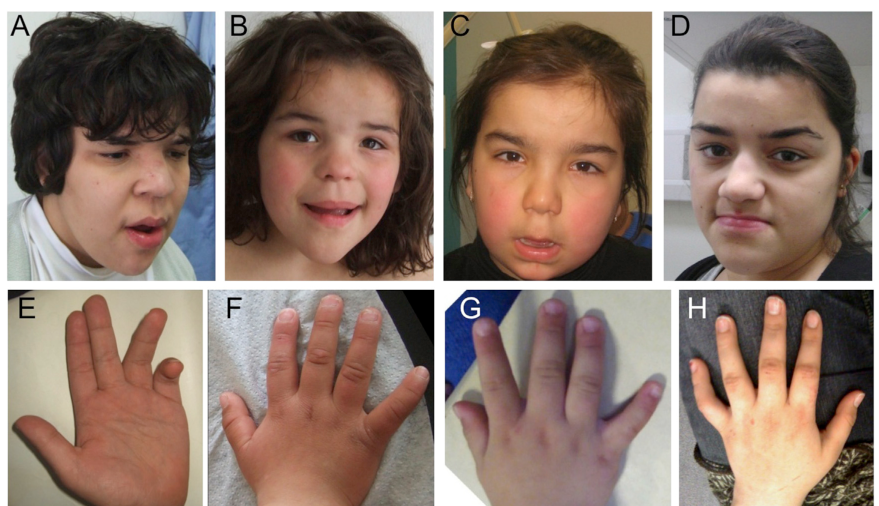

## Question

# Disease Characteristics Research Template

## Target Disease
- **Disease Name:** Lichtenstein-Knorr Syndrome
- **MONDO ID:**  (if available)
- **Category:** Mendelian

## Research Objectives

Please provide a comprehensive research report on **Lichtenstein-Knorr Syndrome** covering all of the
disease characteristics listed below. This report will be used to populate a disease knowledge
base entry. Be thorough and cite primary literature (PMID preferred) for all claims.

For each section, **suggested databases/resources** are listed. These are the first places
you should search for information on each topic.

---

### 1. Disease Information
> **Search first:** OMIM, Orphanet, ICD-10/ICD-11, MeSH, PubMed

- What is the disease? Provide a concise overview.
- What are the key identifiers? (OMIM, Orphanet, ICD-10/ICD-11, MeSH, Mondo)
- What are the common synonyms and alternative names?
- Is the information derived from individual patients (e.g., EHR) or aggregated disease-level resources?

### 2. Etiology

- **Disease Causal Factors**: What are the primary causes? (genetic, environmental, infectious, mechanistic)
- **Risk Factors**:
  > **Search first:** PubMed, Cochrane Library, UpToDate, clinical guidelines, ClinVar, ClinGen, GWAS Catalog, PheGenI, CTD, CDC, WHO, epidemiological databases
  - Genetic risk factors (causal variants, susceptibility loci, modifier genes)
  - Environmental risk factors (toxins, lifestyle, occupational exposures, age, sex, family history)
- **Protective Factors**:
  > **Search first:** PubMed, Cochrane Library, clinical trial databases, GWAS Catalog, gnomAD, WHO, CDC, nutrition databases
  - Genetic protective factors (protective variants, modifier alleles)
  - Environmental protective factors (diet, lifestyle, exposures that reduce risk)
- **Gene-Environment Interactions**: How do genetic and environmental factors interact to influence disease?
  > **Search first:** CTD, PubMed, PheGenI, GxE databases

### 3. Phenotypes
> **Search first:** HPO (Human Phenotype Ontology), OMIM, Orphanet, PubMed, clinicaltrials.gov, MedDRA, SNOMED CT, DECIPHER, LOINC

For each phenotype, provide:
- **Phenotype type**: symptoms, clinical signs, physical manifestations, behavioral changes, or laboratory abnormalities
  > For symptoms/signs: HPO, OMIM, Orphanet, PubMed
  > For behavioral changes: HPO, DSM, RDoC (Research Domain Criteria), PubMed
  > For laboratory abnormalities: LOINC, SNOMED CT, LabTests Online, PubMed
- **Phenotype characteristics**:
  > **Search first:** OMIM, Orphanet, HPO, PubMed
  - Age of symptom onset (neonatal, childhood, adult-onset, late-onset)
  - Symptom severity (mild, moderate, severe, variable)
  - Symptom progression (stable, progressive, episodic, fluctuating)
  - Frequency among affected individuals (percentage or qualitative)
- **Quality of life impact**: Effects on daily functioning and well-being (per-phenotype when possible)
  > **Search first:** EQ-5D database, SF-36, WHO QOL databases, PubMed
- Suggest HPO (Human Phenotype Ontology) terms for each phenotype

### 4. Genetic/Molecular Information

- **Causal Genes**: Gene mutations or chromosomal abnormalities responsible for disease (gene symbols, OMIM IDs)
  > **Search first:** OMIM, ClinVar, HGMD, Ensembl, NCBI Gene
- **Pathogenic Variants**:
  - Affected genes (gene symbols, HGNC IDs)
    > **Search first:** OMIM, NCBI Gene, Ensembl, HGNC, UniProt, GeneCards
  - Variant classification (pathogenic, likely pathogenic, VUS per ACMG/AMP guidelines)
    > **Search first:** ClinVar, ClinGen, ACMG/AMP guidelines, VarSome
  - Variant type/class (missense, frameshift, nonsense, splice-site, structural)
  - Allele frequency in population databases
    > **Search first:** gnomAD, 1000 Genomes, ExAC, TOPMed, dbSNP
  - Somatic vs germline origin
    > **Search first:** COSMIC (somatic), ClinVar, ICGC, TCGA
  - Functional consequences (loss of function, gain of function, dominant negative)
- **Modifier Genes**: Genes that modify disease severity or expression
- **Epigenetic Information**: DNA methylation, histone modifications, chromatin changes affecting disease
  > **Search first:** ENCODE, Roadmap Epigenomics, MethBase, DiseaseMeth
- **Chromosomal Abnormalities**: Large-scale genetic changes (aneuploidy, translocations, inversions)
  > **Search first:** DECIPHER, ClinVar, ECARUCA, UCSC Genome Browser

### 5. Environmental Information

- **Environmental Factors**: Non-genetic contributing factors (toxins, radiation, pollution, occupational exposure)
  > **Search first:** CTD (Comparative Toxicogenomics Database), TOXNET, PubMed, EPA databases
- **Lifestyle Factors**: Behavioral factors (smoking, diet, exercise, alcohol consumption)
  > **Search first:** CDC databases, WHO, PubMed, NHANES
- **Infectious Agents**: If applicable, pathogens causing or triggering disease (bacteria, viruses, fungi, parasites)
  > **Search first:** NCBI Taxonomy, ViPR, BV-BRC, MicrobeDB, GIDEON

### 6. Mechanism / Pathophysiology

- **Molecular Pathways**: Specific signaling cascades or biochemical pathways involved (Wnt, MAPK, mTOR, PI3K-AKT, etc.)
  > **Search first:** KEGG, Reactome, WikiPathways, PathBank, BioCyc
- **Cellular Processes**: Cell-level mechanisms (apoptosis, autophagy, cell cycle dysregulation, inflammation, etc.)
  > **Search first:** Gene Ontology (GO), Reactome, KEGG, PubMed
- **Protein Dysfunction**: How protein structure or function is altered (misfolding, aggregation, loss of function, gain of function)
  > **Search first:** UniProt, PDB (Protein Data Bank), InterPro, Pfam, AlphaFold
- **Metabolic Changes**: Alterations in metabolic processes (energy metabolism, lipid metabolism, amino acid metabolism)
  > **Search first:** KEGG, BioCyc, HMDB (Human Metabolome Database), BRENDA
- **Immune System Involvement**: Role of immune response (autoimmunity, immunodeficiency, chronic inflammation)
  > **Search first:** ImmPort, Immunome Database, IEDB, Gene Ontology
- **Tissue Damage Mechanisms**: How tissues/ are injured (oxidative stress, ischemia, fibrosis, necrosis)
  > **Search first:** PubMed, Gene Ontology, Reactome
- **Biochemical Abnormalities**: Specific molecular defects (enzyme deficiencies, receptor dysfunction, ion channel defects)
  > **Search first:** BRENDA, UniProt, KEGG, OMIM, PubMed
- **Epigenetic Changes**: DNA methylation, histone modifications affecting gene expression in disease
  > **Search first:** ENCODE, Roadmap Epigenomics, MethBase, DiseaseMeth
- **Molecular Profiling** (if available):
  - Transcriptomics/gene expression changes
    > **Search first:** GEO (Gene Expression Omnibus), ArrayExpress, GTEx, Human Cell Atlas, SRA
  - Proteomics findings
    > **Search first:** PRIDE, ProteomeXchange, Human Protein Atlas, STRING, BioGRID
  - Metabolomics signatures
    > **Search first:** MetaboLights, Metabolomics Workbench, HMDB, METLIN
  - Lipidomics alterations
    > **Search first:** LIPID MAPS, SwissLipids, LipidHome, Metabolomics Workbench
  - Genomic structural features
    > **Search first:** UCSC Genome Browser, Ensembl, NCBI, dbVar, DGV
- **Advanced Technologies** (if applicable):
  - Single-cell analysis findings (cell-type specific mechanisms, cellular heterogeneity)
    > **Search first:** Human Cell Atlas, Single Cell Portal, GEO, CELLxGENE
  - Spatial transcriptomics findings
    > **Search first:** GEO, Spatial Research, Vizgen, 10x Genomics data
  - Multi-omics integration results
    > **Search first:** TCGA, ICGC, cBioPortal, LinkedOmics, PubMed
  - Functional genomics screens (CRISPR, RNAi)
    > **Search first:** DepMap, GenomeRNAi, PubMed, BioGRID ORCS

For each mechanism, describe:
- The causal chain from initial trigger to clinical manifestation
- Which mechanisms are upstream vs downstream
- What cell types and biological processes are involved
- Suggest GO terms for biological processes and CL terms for cell types

### 7. Anatomical Structures Affected

- **Organ Level**:
  - Primary organs directly affected
  - Secondary organ involvement (complications, secondary effects)
  - Body systems involved (cardiovascular, nervous, digestive, respiratory, endocrine, etc.)
  > **Search first:** Uberon, FMA (Foundational Model of Anatomy), OMIM, HPO, ICD-11, MeSH, SNOMED CT
- **Tissue and Cell Level**:
  - Specific tissue types affected (epithelial, connective, muscle, nervous)
  - Specific cell populations targeted (with Cell Ontology terms)
  > **Search first:** Uberon, Human Protein Atlas, Cell Ontology, Human Cell Atlas, CellMarker, PanglaoDB
- **Subcellular Level**:
  - Cellular compartments involved (mitochondria, nucleus, ER, lysosomes) (with GO Cellular Component terms)
  > **Search first:** Gene Ontology (Cellular Component), UniProt, Human Protein Atlas
- **Localization**:
  - Specific anatomical sites (with UBERON terms)
    > **Search first:** FMA, Uberon, NeuroNames (for brain), SNOMED CT
  - Lateralization (unilateral, bilateral, asymmetric)
    > **Search first:** HPO, clinical literature, imaging databases

### 8. Temporal Development

- **Onset**:
  - Typical age of onset (congenital, pediatric, adult, geriatric)
  - Onset pattern (acute, subacute, chronic, insidious)
  > **Search first:** OMIM, Orphanet, HPO, PubMed
- **Progression**:
  - Disease stages (early, intermediate, advanced, end-stage)
    > **Search first:** Cancer Staging Manual (AJCC), WHO classifications, PubMed
  - Progression rate (rapid, slow, variable)
  - Disease course pattern (episodic, relapsing-remitting, progressive, stable)
  - Disease duration (self-limited, chronic lifelong)
  > **Search first:** Disease registries, longitudinal cohort databases, natural history studies, PubMed, Orphanet, OMIM
- **Patterns**:
  - Remission patterns (spontaneous, treatment-induced)
    > **Search first:** Clinical trial databases, disease registries, PubMed
  - Critical periods (time windows of vulnerability or opportunity for intervention)
    > **Search first:** PubMed, developmental biology databases, clinical guidelines

### 9. Inheritance and Population

- **Epidemiology**:
  - Prevalence (cases per 100,000 at given time)
  - Incidence (new cases per 100,000 per year)
  > **Search first:** Orphanet, CDC, WHO, GBD (Global Burden of Disease), national registries, SEER, disease registries
- **For Genetic Etiology**:
  - Inheritance pattern (AD, AR, X-linked, mitochondrial, multifactorial, polygenic)
    > **Search first:** OMIM, Orphanet, ClinVar, GTR (Genetic Testing Registry)
  - Penetrance (complete, incomplete, age-dependent)
    > **Search first:** ClinVar, OMIM, PubMed, ClinGen
  - Expressivity (variable, consistent)
    > **Search first:** OMIM, ClinVar, PubMed
  - Genetic anticipation (increasing severity in successive generations)
    > **Search first:** OMIM, PubMed (especially for repeat expansion disorders)
  - Germline mosaicism
    > **Search first:** ClinVar, OMIM, genetic counseling literature, PubMed
  - Founder effects (population-specific mutations)
    > **Search first:** gnomAD, population genetics databases, PubMed
  - Consanguinity role
    > **Search first:** OMIM, population studies, genetic counseling resources
  - Carrier frequency
    > **Search first:** gnomAD, carrier screening databases, GeneReviews, GTR
- **Population Demographics**:
  - Affected populations (ethnic or demographic groups with higher prevalence)
    > **Search first:** gnomAD, 1000 Genomes, PAGE Study, PubMed, population registries
  - Geographic distribution (endemic areas, regional variation)
    > **Search first:** WHO, CDC, GBD, Orphanet, geographic epidemiology databases
  - Geographic distribution of specific variants
  - Sex ratio (male:female)
    > **Search first:** Disease registries, OMIM, PubMed, epidemiological databases
  - Age distribution of affected individuals
    > **Search first:** CDC, disease registries, SEER, Orphanet

### 10. Diagnostics

- **Clinical Tests**:
  - Laboratory tests (blood, urine, tissue chemistry, specific enzyme assays)
    > **Search first:** LOINC, LabTests Online, PubMed
  - Biomarkers (proteins, metabolites, genetic markers, circulating biomarkers)
    > **Search first:** FDA Biomarker List, BEST (Biomarkers, EndpointS, and other Tools), PubMed
  - Imaging studies (X-ray, CT, MRI, PET, ultrasound)
    > **Search first:** RadLex, DICOM, Radiopaedia, imaging databases
  - Functional tests (pulmonary function, cardiac stress tests)
    > **Search first:** LOINC, clinical guidelines, PubMed
  - Electrophysiology (EEG, EMG, ECG, nerve conduction studies)
    > **Search first:** LOINC, clinical neurophysiology databases, PubMed
  - Biopsy findings (histopathology, immunohistochemistry)
    > **Search first:** SNOMED CT, College of American Pathologists resources, PubMed
  - Pathology findings (microscopic examination)
    > **Search first:** SNOMED CT, Digital Pathology databases, PubMed
- **Genetic Testing**:
  > **Search first:** GTR (Genetic Testing Registry), GeneReviews, ClinGen
  - Overview of recommended genetic testing approach
  - Whole genome sequencing (WGS) utility
    > **Search first:** GTR, ClinVar, GEL (Genomics England), gnomAD
  - Whole exome sequencing (WES) utility
    > **Search first:** GTR, ClinVar, OMIM, GeneMatcher
  - Gene panels (which panels, which genes)
    > **Search first:** GTR, ClinVar, laboratory-specific databases
  - Single gene testing
    > **Search first:** GTR, ClinVar, OMIM, GeneReviews
  - Chromosomal microarray (CMA)
    > **Search first:** DECIPHER, ClinVar, dbVar, ECARUCA
  - Karyotyping
    > **Search first:** Chromosome Abnormality Database, ClinVar, cytogenetics resources
  - FISH
    > **Search first:** ClinVar, cytogenetics databases, PubMed
  - Mitochondrial DNA testing
    > **Search first:** MITOMAP, MSeqDR, ClinVar, GTR
  - Repeat expansion testing
    > **Search first:** GTR, ClinVar, repeat expansion databases, PubMed
- **Omics-Based Diagnostics** (if applicable):
  - RNA sequencing / transcriptomics
    > **Search first:** GEO, ArrayExpress, GTEx, RNA-seq databases
  - Proteomics
    > **Search first:** PRIDE, ProteomeXchange, FDA Biomarker database
  - Metabolomics
    > **Search first:** MetaboLights, Metabolomics Workbench, HMDB
  - Epigenomics
    > **Search first:** GEO, ENCODE, Roadmap Epigenomics, MethBase
  - Liquid biopsy
    > **Search first:** COSMIC, ClinVar, liquid biopsy databases, PubMed
- **Clinical Criteria**:
  - Standardized diagnostic criteria (DSM, ICD, society guidelines)
    > **Search first:** DSM-5, ICD-11, clinical society guidelines, UpToDate
  - Differential diagnosis (other conditions to rule out, with distinguishing features)
    > **Search first:** DynaMed, UpToDate, clinical decision support systems
- **Screening**:
  - Screening methods for asymptomatic individuals (newborn screening, carrier screening, cascade screening)
    > **Search first:** ACMG recommendations, CDC newborn screening, GTR

### 11. Outcome/Prognosis

- **Survival and Mortality**:
  - Survival rate (5-year, 10-year, overall)
    > **Search first:** SEER, cancer registries, disease-specific registries, PubMed
  - Life expectancy (with and without treatment if applicable)
    > **Search first:** Orphanet, disease registries, actuarial databases, PubMed
  - Mortality rate
    > **Search first:** CDC, WHO, GBD, national mortality databases
  - Disease-specific mortality (deaths directly attributable to disease)
    > **Search first:** Disease registries, CDC Wonder, GBD, PubMed
- **Morbidity and Function**:
  - Morbidity (disease-related disability and health impacts)
    > **Search first:** GBD, WHO, disability databases, PubMed
  - Disability outcomes (long-term functional impairments)
    > **Search first:** ICF (International Classification of Functioning), disability registries
  - Quality of life measures (EQ-5D, SF-36, PROMIS, disease-specific tools)
    > **Search first:** EQ-5D database, SF-36, PROMIS, PubMed
- **Disease Course**:
  - Complications (secondary problems: infections, organ failure, etc.)
    > **Search first:** ICD codes, disease registries, clinical databases, PubMed
  - Recovery potential (likelihood and extent of recovery, with vs without treatment)
    > **Search first:** Natural history studies, rehabilitation databases, PubMed
- **Prediction**:
  - Prognostic factors (age, disease severity, biomarkers, treatment response)
    > **Search first:** Prognostic models databases, clinical calculators, PubMed
  - Prognostic biomarkers (molecular markers predicting disease course)
    > **Search first:** FDA Biomarker database, PubMed, cancer prognostic databases

### 12. Treatment

- **Pharmacotherapy**:
  - Pharmacological treatments (drug names, drug classes, mechanisms of action)
    > **Search first:** DrugBank, RxNorm, ATC classification, DailyMed, FDA databases
  - Pharmacogenomics (how genetic variants affect drug metabolism, efficacy, toxicity)
    > **Search first:** PharmGKB, CPIC (Clinical Pharmacogenetics), FDA Table of PGx Biomarkers
- **Advanced Therapeutics**:
  - Gene therapy (viral vectors, CRISPR, gene replacement, gene editing)
    > **Search first:** ClinicalTrials.gov, FDA gene therapy database, ASGCT resources
  - Cell therapy (stem cell transplant, CAR-T, cellular therapeutics)
    > **Search first:** ClinicalTrials.gov, FDA cell therapy database, FACT standards
  - RNA-based therapies (ASOs, siRNA, mRNA therapies)
    > **Search first:** ClinicalTrials.gov, FDA approvals, PubMed
  - Targeted therapies (treatments directed at specific molecular targets)
    > **Search first:** My Cancer Genome, OncoKB, ClinicalTrials.gov, FDA approvals
  - Immunotherapies (checkpoint inhibitors, monoclonal antibodies)
    > **Search first:** Cancer Immunotherapy Database, FDA approvals, ClinicalTrials.gov
- **Surgical and Interventional**:
  - Surgical interventions (types of surgery, timing, outcomes)
    > **Search first:** CPT codes, surgical registries, clinical guidelines, PubMed
- **Supportive and Rehabilitative**:
  - Supportive care (symptom management, pain control, nutrition)
    > **Search first:** Clinical guidelines, Cochrane Library, PubMed
  - Rehabilitation (physical therapy, occupational therapy, speech therapy)
    > **Search first:** Rehabilitation medicine databases, clinical guidelines, PubMed
- **Experimental**:
  - Experimental treatments in clinical trials (with NCT identifiers if available)
    > **Search first:** ClinicalTrials.gov, EU Clinical Trials Register, WHO ICTRP
- **Treatment Outcomes**:
  - Treatment response rates
    > **Search first:** Clinical trial databases, FDA reviews, systematic reviews, PubMed
  - Side effects and adverse events
    > **Search first:** FDA Adverse Event Reporting System (FAERS), MedWatch, PubMed
- **Treatment Strategy**:
  - Treatment algorithms (clinical pathways, decision trees)
    > **Search first:** Clinical practice guidelines, NCCN Guidelines, UpToDate
  - Combination therapies
    > **Search first:** ClinicalTrials.gov, treatment guidelines, PubMed
  - Personalized medicine approaches (genotype-guided treatment)
    > **Search first:** My Cancer Genome, CIViC, PharmGKB, precision medicine databases

For each treatment, suggest MAXO (Medical Action Ontology) terms where applicable.

### 13. Prevention

- **Prevention Levels**:
  - Primary prevention (preventing disease occurrence: vaccination, risk factor modification)
    > **Search first:** CDC, WHO, USPSTF recommendations, Cochrane Library
  - Secondary prevention (early detection and treatment: screening programs, early intervention)
    > **Search first:** USPSTF, CDC screening guidelines, WHO
  - Tertiary prevention (preventing complications in those with disease)
    > **Search first:** Clinical guidelines, disease management protocols, PubMed
- **Immunization**: Vaccine strategies (if applicable)
  > **Search first:** CDC vaccine schedules, WHO immunization, FDA vaccine database
- **Screening and Early Detection**:
  - Screening programs (population-based: newborn screening, cancer screening)
    > **Search first:** CDC screening programs, USPSTF, cancer screening databases
  - Genetic screening (carrier screening, preimplantation genetic diagnosis, prenatal testing)
    > **Search first:** ACMG recommendations, ACOG guidelines, GTR
  - Risk stratification (identifying high-risk individuals for targeted prevention)
    > **Search first:** Risk prediction models, clinical calculators, PubMed
- **Behavioral Interventions**: Lifestyle modifications to reduce risk
  > **Search first:** CDC, WHO, behavioral intervention databases, Cochrane Library
- **Counseling**: Genetic counseling (risk assessment, family planning guidance)
  > **Search first:** NSGC resources, ACMG guidelines, GeneReviews
- **Public Health**:
  - Public health interventions (sanitation, vector control, health education)
    > **Search first:** CDC, WHO, public health databases, PubMed
  - Environmental interventions (reducing environmental risk factors)
    > **Search first:** EPA databases, WHO environmental health, PubMed
- **Prophylaxis**: Preventive medications or procedures
  > **Search first:** Clinical guidelines, FDA approvals, PubMed

### 14. Other Species / Natural Disease

- **Taxonomy**: Species affected (with NCBI Taxon identifiers)
  > **Search first:** NCBI Taxonomy
- **Breed**: Specific breeds affected (with VBO identifiers if applicable)
  > **Search first:** VBO (Vertebrate Breed Ontology)
- **Gene**: Orthologous genes in other species (with NCBI Gene IDs)
  > **Search first:** NCBI Gene
- **Natural Disease**:
  - Naturally occurring disease in other species (companion animals, wildlife)
    > **Search first:** OMIA (Online Mendelian Inheritance in Animals), VetCompass, PubMed
  - Veterinary relevance and importance in animal health
    > **Search first:** OMIA, veterinary databases, PubMed
- **Comparative Biology**:
  - Comparative pathology (similarities and differences across species)
    > **Search first:** OMIA, comparative pathology databases, PubMed
  - Evolutionary conservation of disease mechanisms
    > **Search first:** HomoloGene, OrthoMCL, Alliance of Genome Resources
- **Transmission** (if applicable):
  - Zoonotic potential
    > **Search first:** CDC zoonotic diseases, WHO zoonoses, GIDEON
  - Cross-species susceptibility
    > **Search first:** NCBI Taxonomy, veterinary databases, PubMed

### 15. Model Organisms

- **Model Types**:
  - Model organism type (mammalian, invertebrate, cellular, in vitro)
    > **Search first:** Alliance of Genome Resources, model organism databases
  - Specific model systems (mouse, rat, zebrafish, Drosophila, C. elegans, yeast, cell lines, organoids, iPSCs)
    > **Search first:** MGI, RGD, ZFIN, FlyBase, WormBase, SGD, ATCC, Cellosaurus
  - Induced models (drug treatment, surgical intervention, environmental manipulation)
    > **Search first:** MGI, model organism databases, PubMed
- **Genetic Models**:
  - Types available (knockout, knock-in, transgenic, conditional, humanized)
    > **Search first:** MGI, IMPC, KOMP, EuMMCR, IMSR
- **Model Characteristics**:
  - Phenotype recapitulation (how well model reproduces human disease features)
    > **Search first:** Model organism databases, comparative studies, PubMed
  - Model limitations (aspects of human disease not captured)
    > **Search first:** Model organism databases, PubMed, review articles
- **Applications**:
  - Research applications (what aspects of disease can be studied)
    > **Search first:** Model organism databases, PubMed
- **Resources**:
  - Model databases
    > **Search first:** MGI, RGD, ZFIN, FlyBase, WormBase, IMSR, EMMA, MMRRC

---

## Citation Requirements

- Cite primary literature (PMID preferred) for all mechanistic and clinical claims
- Prioritize recent reviews and landmark papers
- Include direct quotes from abstracts where possible to support key statements
- Distinguish evidence source types: human clinical, model organism, in vitro, computational

## Output Format

Structure your response as a comprehensive narrative organized by the sections above.
For each section, provide:
- Factual content with specific details (numbers, percentages, gene names, variant nomenclature)
- Ontology term suggestions (HPO, GO, CL, UBERON, CHEBI, MAXO, MONDO) where applicable
- Evidence citations with PMIDs
- Direct quotes from abstracts to support key claims
- Clear indication when information is not available or not applicable for this disease

This report will be used to populate a disease knowledge base entry with:
- Pathophysiology descriptions with causal chains
- Gene/protein annotations (HGNC, GO terms)
- Phenotype associations (HP terms) with frequencies
- Cell type involvement (CL terms)
- Anatomical locations (UBERON terms)
- Chemical entities (CHEBI terms)
- Treatment annotations (MAXO terms)
- Evidence items with PMIDs and exact abstract quotes
- Epidemiology, prognosis, diagnostic, and prevention information
- Animal model descriptions with phenotype recapitulation details

## Output

Question: You are an expert researcher providing comprehensive, well-cited information.

Provide detailed information focusing on:
1. Key concepts and definitions with current understanding
2. Recent developments and latest research (prioritize 2023-2024 sources)
3. Current applications and real-world implementations
4. Expert opinions and analysis from authoritative sources
5. Relevant statistics and data from recent studies

Format as a comprehensive research report with proper citations. Include URLs and publication dates where available.
Always prioritize recent, authoritative sources and provide specific citations for all major claims.

# Disease Characteristics Research Template

## Target Disease
- **Disease Name:** Lichtenstein-Knorr Syndrome
- **MONDO ID:**  (if available)
- **Category:** Mendelian

## Research Objectives

Please provide a comprehensive research report on **Lichtenstein-Knorr Syndrome** covering all of the
disease characteristics listed below. This report will be used to populate a disease knowledge
base entry. Be thorough and cite primary literature (PMID preferred) for all claims.

For each section, **suggested databases/resources** are listed. These are the first places
you should search for information on each topic.

---

### 1. Disease Information
> **Search first:** OMIM, Orphanet, ICD-10/ICD-11, MeSH, PubMed

- What is the disease? Provide a concise overview.
- What are the key identifiers? (OMIM, Orphanet, ICD-10/ICD-11, MeSH, Mondo)
- What are the common synonyms and alternative names?
- Is the information derived from individual patients (e.g., EHR) or aggregated disease-level resources?

### 2. Etiology

- **Disease Causal Factors**: What are the primary causes? (genetic, environmental, infectious, mechanistic)
- **Risk Factors**:
  > **Search first:** PubMed, Cochrane Library, UpToDate, clinical guidelines, ClinVar, ClinGen, GWAS Catalog, PheGenI, CTD, CDC, WHO, epidemiological databases
  - Genetic risk factors (causal variants, susceptibility loci, modifier genes)
  - Environmental risk factors (toxins, lifestyle, occupational exposures, age, sex, family history)
- **Protective Factors**:
  > **Search first:** PubMed, Cochrane Library, clinical trial databases, GWAS Catalog, gnomAD, WHO, CDC, nutrition databases
  - Genetic protective factors (protective variants, modifier alleles)
  - Environmental protective factors (diet, lifestyle, exposures that reduce risk)
- **Gene-Environment Interactions**: How do genetic and environmental factors interact to influence disease?
  > **Search first:** CTD, PubMed, PheGenI, GxE databases

### 3. Phenotypes
> **Search first:** HPO (Human Phenotype Ontology), OMIM, Orphanet, PubMed, clinicaltrials.gov, MedDRA, SNOMED CT, DECIPHER, LOINC

For each phenotype, provide:
- **Phenotype type**: symptoms, clinical signs, physical manifestations, behavioral changes, or laboratory abnormalities
  > For symptoms/signs: HPO, OMIM, Orphanet, PubMed
  > For behavioral changes: HPO, DSM, RDoC (Research Domain Criteria), PubMed
  > For laboratory abnormalities: LOINC, SNOMED CT, LabTests Online, PubMed
- **Phenotype characteristics**:
  > **Search first:** OMIM, Orphanet, HPO, PubMed
  - Age of symptom onset (neonatal, childhood, adult-onset, late-onset)
  - Symptom severity (mild, moderate, severe, variable)
  - Symptom progression (stable, progressive, episodic, fluctuating)
  - Frequency among affected individuals (percentage or qualitative)
- **Quality of life impact**: Effects on daily functioning and well-being (per-phenotype when possible)
  > **Search first:** EQ-5D database, SF-36, WHO QOL databases, PubMed
- Suggest HPO (Human Phenotype Ontology) terms for each phenotype

### 4. Genetic/Molecular Information

- **Causal Genes**: Gene mutations or chromosomal abnormalities responsible for disease (gene symbols, OMIM IDs)
  > **Search first:** OMIM, ClinVar, HGMD, Ensembl, NCBI Gene
- **Pathogenic Variants**:
  - Affected genes (gene symbols, HGNC IDs)
    > **Search first:** OMIM, NCBI Gene, Ensembl, HGNC, UniProt, GeneCards
  - Variant classification (pathogenic, likely pathogenic, VUS per ACMG/AMP guidelines)
    > **Search first:** ClinVar, ClinGen, ACMG/AMP guidelines, VarSome
  - Variant type/class (missense, frameshift, nonsense, splice-site, structural)
  - Allele frequency in population databases
    > **Search first:** gnomAD, 1000 Genomes, ExAC, TOPMed, dbSNP
  - Somatic vs germline origin
    > **Search first:** COSMIC (somatic), ClinVar, ICGC, TCGA
  - Functional consequences (loss of function, gain of function, dominant negative)
- **Modifier Genes**: Genes that modify disease severity or expression
- **Epigenetic Information**: DNA methylation, histone modifications, chromatin changes affecting disease
  > **Search first:** ENCODE, Roadmap Epigenomics, MethBase, DiseaseMeth
- **Chromosomal Abnormalities**: Large-scale genetic changes (aneuploidy, translocations, inversions)
  > **Search first:** DECIPHER, ClinVar, ECARUCA, UCSC Genome Browser

### 5. Environmental Information

- **Environmental Factors**: Non-genetic contributing factors (toxins, radiation, pollution, occupational exposure)
  > **Search first:** CTD (Comparative Toxicogenomics Database), TOXNET, PubMed, EPA databases
- **Lifestyle Factors**: Behavioral factors (smoking, diet, exercise, alcohol consumption)
  > **Search first:** CDC databases, WHO, PubMed, NHANES
- **Infectious Agents**: If applicable, pathogens causing or triggering disease (bacteria, viruses, fungi, parasites)
  > **Search first:** NCBI Taxonomy, ViPR, BV-BRC, MicrobeDB, GIDEON

### 6. Mechanism / Pathophysiology

- **Molecular Pathways**: Specific signaling cascades or biochemical pathways involved (Wnt, MAPK, mTOR, PI3K-AKT, etc.)
  > **Search first:** KEGG, Reactome, WikiPathways, PathBank, BioCyc
- **Cellular Processes**: Cell-level mechanisms (apoptosis, autophagy, cell cycle dysregulation, inflammation, etc.)
  > **Search first:** Gene Ontology (GO), Reactome, KEGG, PubMed
- **Protein Dysfunction**: How protein structure or function is altered (misfolding, aggregation, loss of function, gain of function)
  > **Search first:** UniProt, PDB (Protein Data Bank), InterPro, Pfam, AlphaFold
- **Metabolic Changes**: Alterations in metabolic processes (energy metabolism, lipid metabolism, amino acid metabolism)
  > **Search first:** KEGG, BioCyc, HMDB (Human Metabolome Database), BRENDA
- **Immune System Involvement**: Role of immune response (autoimmunity, immunodeficiency, chronic inflammation)
  > **Search first:** ImmPort, Immunome Database, IEDB, Gene Ontology
- **Tissue Damage Mechanisms**: How tissues/ are injured (oxidative stress, ischemia, fibrosis, necrosis)
  > **Search first:** PubMed, Gene Ontology, Reactome
- **Biochemical Abnormalities**: Specific molecular defects (enzyme deficiencies, receptor dysfunction, ion channel defects)
  > **Search first:** BRENDA, UniProt, KEGG, OMIM, PubMed
- **Epigenetic Changes**: DNA methylation, histone modifications affecting gene expression in disease
  > **Search first:** ENCODE, Roadmap Epigenomics, MethBase, DiseaseMeth
- **Molecular Profiling** (if available):
  - Transcriptomics/gene expression changes
    > **Search first:** GEO (Gene Expression Omnibus), ArrayExpress, GTEx, Human Cell Atlas, SRA
  - Proteomics findings
    > **Search first:** PRIDE, ProteomeXchange, Human Protein Atlas, STRING, BioGRID
  - Metabolomics signatures
    > **Search first:** MetaboLights, Metabolomics Workbench, HMDB, METLIN
  - Lipidomics alterations
    > **Search first:** LIPID MAPS, SwissLipids, LipidHome, Metabolomics Workbench
  - Genomic structural features
    > **Search first:** UCSC Genome Browser, Ensembl, NCBI, dbVar, DGV
- **Advanced Technologies** (if applicable):
  - Single-cell analysis findings (cell-type specific mechanisms, cellular heterogeneity)
    > **Search first:** Human Cell Atlas, Single Cell Portal, GEO, CELLxGENE
  - Spatial transcriptomics findings
    > **Search first:** GEO, Spatial Research, Vizgen, 10x Genomics data
  - Multi-omics integration results
    > **Search first:** TCGA, ICGC, cBioPortal, LinkedOmics, PubMed
  - Functional genomics screens (CRISPR, RNAi)
    > **Search first:** DepMap, GenomeRNAi, PubMed, BioGRID ORCS

For each mechanism, describe:
- The causal chain from initial trigger to clinical manifestation
- Which mechanisms are upstream vs downstream
- What cell types and biological processes are involved
- Suggest GO terms for biological processes and CL terms for cell types

### 7. Anatomical Structures Affected

- **Organ Level**:
  - Primary organs directly affected
  - Secondary organ involvement (complications, secondary effects)
  - Body systems involved (cardiovascular, nervous, digestive, respiratory, endocrine, etc.)
  > **Search first:** Uberon, FMA (Foundational Model of Anatomy), OMIM, HPO, ICD-11, MeSH, SNOMED CT
- **Tissue and Cell Level**:
  - Specific tissue types affected (epithelial, connective, muscle, nervous)
  - Specific cell populations targeted (with Cell Ontology terms)
  > **Search first:** Uberon, Human Protein Atlas, Cell Ontology, Human Cell Atlas, CellMarker, PanglaoDB
- **Subcellular Level**:
  - Cellular compartments involved (mitochondria, nucleus, ER, lysosomes) (with GO Cellular Component terms)
  > **Search first:** Gene Ontology (Cellular Component), UniProt, Human Protein Atlas
- **Localization**:
  - Specific anatomical sites (with UBERON terms)
    > **Search first:** FMA, Uberon, NeuroNames (for brain), SNOMED CT
  - Lateralization (unilateral, bilateral, asymmetric)
    > **Search first:** HPO, clinical literature, imaging databases

### 8. Temporal Development

- **Onset**:
  - Typical age of onset (congenital, pediatric, adult, geriatric)
  - Onset pattern (acute, subacute, chronic, insidious)
  > **Search first:** OMIM, Orphanet, HPO, PubMed
- **Progression**:
  - Disease stages (early, intermediate, advanced, end-stage)
    > **Search first:** Cancer Staging Manual (AJCC), WHO classifications, PubMed
  - Progression rate (rapid, slow, variable)
  - Disease course pattern (episodic, relapsing-remitting, progressive, stable)
  - Disease duration (self-limited, chronic lifelong)
  > **Search first:** Disease registries, longitudinal cohort databases, natural history studies, PubMed, Orphanet, OMIM
- **Patterns**:
  - Remission patterns (spontaneous, treatment-induced)
    > **Search first:** Clinical trial databases, disease registries, PubMed
  - Critical periods (time windows of vulnerability or opportunity for intervention)
    > **Search first:** PubMed, developmental biology databases, clinical guidelines

### 9. Inheritance and Population

- **Epidemiology**:
  - Prevalence (cases per 100,000 at given time)
  - Incidence (new cases per 100,000 per year)
  > **Search first:** Orphanet, CDC, WHO, GBD (Global Burden of Disease), national registries, SEER, disease registries
- **For Genetic Etiology**:
  - Inheritance pattern (AD, AR, X-linked, mitochondrial, multifactorial, polygenic)
    > **Search first:** OMIM, Orphanet, ClinVar, GTR (Genetic Testing Registry)
  - Penetrance (complete, incomplete, age-dependent)
    > **Search first:** ClinVar, OMIM, PubMed, ClinGen
  - Expressivity (variable, consistent)
    > **Search first:** OMIM, ClinVar, PubMed
  - Genetic anticipation (increasing severity in successive generations)
    > **Search first:** OMIM, PubMed (especially for repeat expansion disorders)
  - Germline mosaicism
    > **Search first:** ClinVar, OMIM, genetic counseling literature, PubMed
  - Founder effects (population-specific mutations)
    > **Search first:** gnomAD, population genetics databases, PubMed
  - Consanguinity role
    > **Search first:** OMIM, population studies, genetic counseling resources
  - Carrier frequency
    > **Search first:** gnomAD, carrier screening databases, GeneReviews, GTR
- **Population Demographics**:
  - Affected populations (ethnic or demographic groups with higher prevalence)
    > **Search first:** gnomAD, 1000 Genomes, PAGE Study, PubMed, population registries
  - Geographic distribution (endemic areas, regional variation)
    > **Search first:** WHO, CDC, GBD, Orphanet, geographic epidemiology databases
  - Geographic distribution of specific variants
  - Sex ratio (male:female)
    > **Search first:** Disease registries, OMIM, PubMed, epidemiological databases
  - Age distribution of affected individuals
    > **Search first:** CDC, disease registries, SEER, Orphanet

### 10. Diagnostics

- **Clinical Tests**:
  - Laboratory tests (blood, urine, tissue chemistry, specific enzyme assays)
    > **Search first:** LOINC, LabTests Online, PubMed
  - Biomarkers (proteins, metabolites, genetic markers, circulating biomarkers)
    > **Search first:** FDA Biomarker List, BEST (Biomarkers, EndpointS, and other Tools), PubMed
  - Imaging studies (X-ray, CT, MRI, PET, ultrasound)
    > **Search first:** RadLex, DICOM, Radiopaedia, imaging databases
  - Functional tests (pulmonary function, cardiac stress tests)
    > **Search first:** LOINC, clinical guidelines, PubMed
  - Electrophysiology (EEG, EMG, ECG, nerve conduction studies)
    > **Search first:** LOINC, clinical neurophysiology databases, PubMed
  - Biopsy findings (histopathology, immunohistochemistry)
    > **Search first:** SNOMED CT, College of American Pathologists resources, PubMed
  - Pathology findings (microscopic examination)
    > **Search first:** SNOMED CT, Digital Pathology databases, PubMed
- **Genetic Testing**:
  > **Search first:** GTR (Genetic Testing Registry), GeneReviews, ClinGen
  - Overview of recommended genetic testing approach
  - Whole genome sequencing (WGS) utility
    > **Search first:** GTR, ClinVar, GEL (Genomics England), gnomAD
  - Whole exome sequencing (WES) utility
    > **Search first:** GTR, ClinVar, OMIM, GeneMatcher
  - Gene panels (which panels, which genes)
    > **Search first:** GTR, ClinVar, laboratory-specific databases
  - Single gene testing
    > **Search first:** GTR, ClinVar, OMIM, GeneReviews
  - Chromosomal microarray (CMA)
    > **Search first:** DECIPHER, ClinVar, dbVar, ECARUCA
  - Karyotyping
    > **Search first:** Chromosome Abnormality Database, ClinVar, cytogenetics resources
  - FISH
    > **Search first:** ClinVar, cytogenetics databases, PubMed
  - Mitochondrial DNA testing
    > **Search first:** MITOMAP, MSeqDR, ClinVar, GTR
  - Repeat expansion testing
    > **Search first:** GTR, ClinVar, repeat expansion databases, PubMed
- **Omics-Based Diagnostics** (if applicable):
  - RNA sequencing / transcriptomics
    > **Search first:** GEO, ArrayExpress, GTEx, RNA-seq databases
  - Proteomics
    > **Search first:** PRIDE, ProteomeXchange, FDA Biomarker database
  - Metabolomics
    > **Search first:** MetaboLights, Metabolomics Workbench, HMDB
  - Epigenomics
    > **Search first:** GEO, ENCODE, Roadmap Epigenomics, MethBase
  - Liquid biopsy
    > **Search first:** COSMIC, ClinVar, liquid biopsy databases, PubMed
- **Clinical Criteria**:
  - Standardized diagnostic criteria (DSM, ICD, society guidelines)
    > **Search first:** DSM-5, ICD-11, clinical society guidelines, UpToDate
  - Differential diagnosis (other conditions to rule out, with distinguishing features)
    > **Search first:** DynaMed, UpToDate, clinical decision support systems
- **Screening**:
  - Screening methods for asymptomatic individuals (newborn screening, carrier screening, cascade screening)
    > **Search first:** ACMG recommendations, CDC newborn screening, GTR

### 11. Outcome/Prognosis

- **Survival and Mortality**:
  - Survival rate (5-year, 10-year, overall)
    > **Search first:** SEER, cancer registries, disease-specific registries, PubMed
  - Life expectancy (with and without treatment if applicable)
    > **Search first:** Orphanet, disease registries, actuarial databases, PubMed
  - Mortality rate
    > **Search first:** CDC, WHO, GBD, national mortality databases
  - Disease-specific mortality (deaths directly attributable to disease)
    > **Search first:** Disease registries, CDC Wonder, GBD, PubMed
- **Morbidity and Function**:
  - Morbidity (disease-related disability and health impacts)
    > **Search first:** GBD, WHO, disability databases, PubMed
  - Disability outcomes (long-term functional impairments)
    > **Search first:** ICF (International Classification of Functioning), disability registries
  - Quality of life measures (EQ-5D, SF-36, PROMIS, disease-specific tools)
    > **Search first:** EQ-5D database, SF-36, PROMIS, PubMed
- **Disease Course**:
  - Complications (secondary problems: infections, organ failure, etc.)
    > **Search first:** ICD codes, disease registries, clinical databases, PubMed
  - Recovery potential (likelihood and extent of recovery, with vs without treatment)
    > **Search first:** Natural history studies, rehabilitation databases, PubMed
- **Prediction**:
  - Prognostic factors (age, disease severity, biomarkers, treatment response)
    > **Search first:** Prognostic models databases, clinical calculators, PubMed
  - Prognostic biomarkers (molecular markers predicting disease course)
    > **Search first:** FDA Biomarker database, PubMed, cancer prognostic databases

### 12. Treatment

- **Pharmacotherapy**:
  - Pharmacological treatments (drug names, drug classes, mechanisms of action)
    > **Search first:** DrugBank, RxNorm, ATC classification, DailyMed, FDA databases
  - Pharmacogenomics (how genetic variants affect drug metabolism, efficacy, toxicity)
    > **Search first:** PharmGKB, CPIC (Clinical Pharmacogenetics), FDA Table of PGx Biomarkers
- **Advanced Therapeutics**:
  - Gene therapy (viral vectors, CRISPR, gene replacement, gene editing)
    > **Search first:** ClinicalTrials.gov, FDA gene therapy database, ASGCT resources
  - Cell therapy (stem cell transplant, CAR-T, cellular therapeutics)
    > **Search first:** ClinicalTrials.gov, FDA cell therapy database, FACT standards
  - RNA-based therapies (ASOs, siRNA, mRNA therapies)
    > **Search first:** ClinicalTrials.gov, FDA approvals, PubMed
  - Targeted therapies (treatments directed at specific molecular targets)
    > **Search first:** My Cancer Genome, OncoKB, ClinicalTrials.gov, FDA approvals
  - Immunotherapies (checkpoint inhibitors, monoclonal antibodies)
    > **Search first:** Cancer Immunotherapy Database, FDA approvals, ClinicalTrials.gov
- **Surgical and Interventional**:
  - Surgical interventions (types of surgery, timing, outcomes)
    > **Search first:** CPT codes, surgical registries, clinical guidelines, PubMed
- **Supportive and Rehabilitative**:
  - Supportive care (symptom management, pain control, nutrition)
    > **Search first:** Clinical guidelines, Cochrane Library, PubMed
  - Rehabilitation (physical therapy, occupational therapy, speech therapy)
    > **Search first:** Rehabilitation medicine databases, clinical guidelines, PubMed
- **Experimental**:
  - Experimental treatments in clinical trials (with NCT identifiers if available)
    > **Search first:** ClinicalTrials.gov, EU Clinical Trials Register, WHO ICTRP
- **Treatment Outcomes**:
  - Treatment response rates
    > **Search first:** Clinical trial databases, FDA reviews, systematic reviews, PubMed
  - Side effects and adverse events
    > **Search first:** FDA Adverse Event Reporting System (FAERS), MedWatch, PubMed
- **Treatment Strategy**:
  - Treatment algorithms (clinical pathways, decision trees)
    > **Search first:** Clinical practice guidelines, NCCN Guidelines, UpToDate
  - Combination therapies
    > **Search first:** ClinicalTrials.gov, treatment guidelines, PubMed
  - Personalized medicine approaches (genotype-guided treatment)
    > **Search first:** My Cancer Genome, CIViC, PharmGKB, precision medicine databases

For each treatment, suggest MAXO (Medical Action Ontology) terms where applicable.

### 13. Prevention

- **Prevention Levels**:
  - Primary prevention (preventing disease occurrence: vaccination, risk factor modification)
    > **Search first:** CDC, WHO, USPSTF recommendations, Cochrane Library
  - Secondary prevention (early detection and treatment: screening programs, early intervention)
    > **Search first:** USPSTF, CDC screening guidelines, WHO
  - Tertiary prevention (preventing complications in those with disease)
    > **Search first:** Clinical guidelines, disease management protocols, PubMed
- **Immunization**: Vaccine strategies (if applicable)
  > **Search first:** CDC vaccine schedules, WHO immunization, FDA vaccine database
- **Screening and Early Detection**:
  - Screening programs (population-based: newborn screening, cancer screening)
    > **Search first:** CDC screening programs, USPSTF, cancer screening databases
  - Genetic screening (carrier screening, preimplantation genetic diagnosis, prenatal testing)
    > **Search first:** ACMG recommendations, ACOG guidelines, GTR
  - Risk stratification (identifying high-risk individuals for targeted prevention)
    > **Search first:** Risk prediction models, clinical calculators, PubMed
- **Behavioral Interventions**: Lifestyle modifications to reduce risk
  > **Search first:** CDC, WHO, behavioral intervention databases, Cochrane Library
- **Counseling**: Genetic counseling (risk assessment, family planning guidance)
  > **Search first:** NSGC resources, ACMG guidelines, GeneReviews
- **Public Health**:
  - Public health interventions (sanitation, vector control, health education)
    > **Search first:** CDC, WHO, public health databases, PubMed
  - Environmental interventions (reducing environmental risk factors)
    > **Search first:** EPA databases, WHO environmental health, PubMed
- **Prophylaxis**: Preventive medications or procedures
  > **Search first:** Clinical guidelines, FDA approvals, PubMed

### 14. Other Species / Natural Disease

- **Taxonomy**: Species affected (with NCBI Taxon identifiers)
  > **Search first:** NCBI Taxonomy
- **Breed**: Specific breeds affected (with VBO identifiers if applicable)
  > **Search first:** VBO (Vertebrate Breed Ontology)
- **Gene**: Orthologous genes in other species (with NCBI Gene IDs)
  > **Search first:** NCBI Gene
- **Natural Disease**:
  - Naturally occurring disease in other species (companion animals, wildlife)
    > **Search first:** OMIA (Online Mendelian Inheritance in Animals), VetCompass, PubMed
  - Veterinary relevance and importance in animal health
    > **Search first:** OMIA, veterinary databases, PubMed
- **Comparative Biology**:
  - Comparative pathology (similarities and differences across species)
    > **Search first:** OMIA, comparative pathology databases, PubMed
  - Evolutionary conservation of disease mechanisms
    > **Search first:** HomoloGene, OrthoMCL, Alliance of Genome Resources
- **Transmission** (if applicable):
  - Zoonotic potential
    > **Search first:** CDC zoonotic diseases, WHO zoonoses, GIDEON
  - Cross-species susceptibility
    > **Search first:** NCBI Taxonomy, veterinary databases, PubMed

### 15. Model Organisms

- **Model Types**:
  - Model organism type (mammalian, invertebrate, cellular, in vitro)
    > **Search first:** Alliance of Genome Resources, model organism databases
  - Specific model systems (mouse, rat, zebrafish, Drosophila, C. elegans, yeast, cell lines, organoids, iPSCs)
    > **Search first:** MGI, RGD, ZFIN, FlyBase, WormBase, SGD, ATCC, Cellosaurus
  - Induced models (drug treatment, surgical intervention, environmental manipulation)
    > **Search first:** MGI, model organism databases, PubMed
- **Genetic Models**:
  - Types available (knockout, knock-in, transgenic, conditional, humanized)
    > **Search first:** MGI, IMPC, KOMP, EuMMCR, IMSR
- **Model Characteristics**:
  - Phenotype recapitulation (how well model reproduces human disease features)
    > **Search first:** Model organism databases, comparative studies, PubMed
  - Model limitations (aspects of human disease not captured)
    > **Search first:** Model organism databases, PubMed, review articles
- **Applications**:
  - Research applications (what aspects of disease can be studied)
    > **Search first:** Model organism databases, PubMed
- **Resources**:
  - Model databases
    > **Search first:** MGI, RGD, ZFIN, FlyBase, WormBase, IMSR, EMMA, MMRRC

---

## Citation Requirements

- Cite primary literature (PMID preferred) for all mechanistic and clinical claims
- Prioritize recent reviews and landmark papers
- Include direct quotes from abstracts where possible to support key statements
- Distinguish evidence source types: human clinical, model organism, in vitro, computational

## Output Format

Structure your response as a comprehensive narrative organized by the sections above.
For each section, provide:
- Factual content with specific details (numbers, percentages, gene names, variant nomenclature)
- Ontology term suggestions (HPO, GO, CL, UBERON, CHEBI, MAXO, MONDO) where applicable
- Evidence citations with PMIDs
- Direct quotes from abstracts to support key claims
- Clear indication when information is not available or not applicable for this disease

This report will be used to populate a disease knowledge base entry with:
- Pathophysiology descriptions with causal chains
- Gene/protein annotations (HGNC, GO terms)
- Phenotype associations (HP terms) with frequencies
- Cell type involvement (CL terms)
- Anatomical locations (UBERON terms)
- Chemical entities (CHEBI terms)
- Treatment annotations (MAXO terms)
- Evidence items with PMIDs and exact abstract quotes
- Epidemiology, prognosis, diagnostic, and prevention information
- Animal model descriptions with phenotype recapitulation details

## Comprehensive Research Report: Lichtenstein–Knorr Syndrome (SNX14-related SCAR20)

### Executive summary
Lichtenstein–Knorr syndrome is now commonly operationalized in the contemporary genetics literature as **SNX14-related autosomal recessive spinocerebellar ataxia 20 (SCAR20; OMIM 616354)**, a childhood-onset syndromic neurodevelopmental/neurodegenerative disorder with progressive cerebellar atrophy/ataxia, severe global developmental delay/intellectual disability, absent or markedly impaired speech, and a distinctive coarse facial gestalt, variably accompanied by seizures, autism-like features, hearing loss, and skeletal anomalies. (thomas2015mutationsinsnx14 pages 1-3, akizu2015biallelicmutationsin pages 21-23, akizu2015biallelicmutationsin pages 3-4)

| Preferred name | Synonyms/alternate names | OMIM disease number | Gene (HGNC symbol) | Inheritance | Key defining features (1 line) | Key references (with DOI/URL and year) |
|---|---|---|---|---|---|---|
| Lichtenstein-Knorr syndrome | Spinocerebellar ataxia, autosomal recessive 20; SCAR20; SNX14-related cerebellar ataxia and intellectual disability syndrome; distinctive autosomal-recessive cerebellar ataxia and intellectual disability syndrome (thomas2015mutationsinsnx14 pages 1-3, bryant2018snx14mutationsaffect pages 1-2, maia2020twocompoundheterozygous pages 1-2, levchenko2023homozygousdeepintronic pages 1-2) | OMIM 616354 (maia2020twocompoundheterozygous pages 1-2, levchenko2023homozygousdeepintronic pages 1-2, shao2024compoundheterozygousmutation pages 1-2) | SNX14 (HGNC symbol: SNX14) (thomas2015mutationsinsnx14 pages 1-3, shao2024compoundheterozygousmutation pages 1-2) | Autosomal recessive (thomas2015mutationsinsnx14 pages 1-3, bryant2018snx14mutationsaffect pages 1-2, shao2024compoundheterozygousmutation pages 1-2) | Early-onset progressive cerebellar ataxia/atrophy with severe intellectual disability or developmental delay, absent or markedly impaired speech, relative macrocephaly, coarse facial features, and frequent additional findings such as hypotonia, hearing loss, skeletal anomalies, autism, or seizures (thomas2015mutationsinsnx14 pages 1-3, bryant2018snx14mutationsaffect pages 1-2, maia2020twocompoundheterozygous pages 1-2, levchenko2023homozygousdeepintronic pages 1-2, shao2024compoundheterozygousmutation pages 1-2) | Thomas et al., 2014, AJHG, doi:10.1016/j.ajhg.2014.10.007, https://doi.org/10.1016/j.ajhg.2015.05.010 (reported in retrieved source) (thomas2015mutationsinsnx14 pages 1-3); Bryant et al., 2018, Hum Mol Genet, doi:10.1093/hmg/ddy101, https://doi.org/10.1093/hmg/ddy101 (bryant2018snx14mutationsaffect pages 1-2); Maia et al., 2020, Front Genet, doi:10.3389/fgene.2020.01038, https://doi.org/10.3389/fgene.2020.01038 (maia2020twocompoundheterozygous pages 1-2); Levchenko et al., 2023, Front Genet, doi:10.3389/fgene.2023.1197681, https://doi.org/10.3389/fgene.2023.1197681 (levchenko2023homozygousdeepintronic pages 1-2); Shao et al., 2024, Front Genet, doi:10.3389/fgene.2024.1379366, https://doi.org/10.3389/fgene.2024.1379366 (shao2024compoundheterozygousmutation pages 1-2) |
| MONDO / MeSH / ICD identifiers | not found in retrieved sources (levchenko2023homozygousdeepintronic pages 1-2, thomas2015mutationsinsnx14 pages 1-3) | not found in retrieved sources (levchenko2023homozygousdeepintronic pages 1-2, thomas2015mutationsinsnx14 pages 1-3) | not applicable | not applicable | Cross-ontology identifiers beyond OMIM were not reported in the retrieved evidence set (levchenko2023homozygousdeepintronic pages 1-2, thomas2015mutationsinsnx14 pages 1-3) | Evidence base searched here did not yield MONDO, MeSH, ICD-10, or ICD-11 identifiers in retrieved sources (levchenko2023homozygousdeepintronic pages 1-2, thomas2015mutationsinsnx14 pages 1-3) |

*Table: This table summarizes the main disease names, aliases, OMIM identifier, causal gene, inheritance, and defining clinical features for Lichtenstein-Knorr syndrome / SNX14-related SCAR20. It is useful as a compact reference for disease knowledge-base normalization and synonym mapping.*

---

## 1. Disease information

### 1.1 Definition and current understanding
Foundational case series established **biallelic SNX14 loss-of-function** as the cause of a distinctive, recognizable recessive syndrome with combined **cerebellar atrophy/ataxia and severe neurodevelopmental impairment**. (thomas2015mutationsinsnx14 pages 1-3, akizu2015biallelicmutationsin pages 21-23)

**Direct abstract quote (foundational genetics)**: Akizu et al. (Nature Genetics, Apr 2015) state: “**Pediatric-onset ataxias often present clinically as developmental delay and intellectual disability, with prominent cerebellar atrophy as a key neuroradiographic finding. Here we describe a new clinically distinguishable recessive syndrome in 12 families with cerebellar atrophy together with ataxia, coarsened facial features and intellectual disability, due to truncating mutations in the sorting nexin gene SNX14** …” and “**Our results characterize a unique ataxia syndrome due to biallelic SNX14 mutations leading to lysosome-autophagosome dysfunction.**” (https://doi.org/10.1038/ng.3256; publication date Apr 2015). (akizu2015biallelicmutationsin pages 1-3)

### 1.2 Key identifiers and nomenclature
* **OMIM disease**: **SCAR20 / Spinocerebellar ataxia, autosomal recessive 20**: **OMIM 616354**. (levchenko2023homozygousdeepintronic pages 1-2, maia2020twocompoundheterozygous pages 1-2)
* **Gene**: **SNX14** (Sorting nexin 14). (thomas2015mutationsinsnx14 pages 1-3)
* **Synonyms in retrieved sources**: “SCAR20,” “autosomal recessive spinocerebellar ataxia 20,” “distinctive autosomal-recessive cerebellar ataxia and intellectual disability syndrome,” and “SNX14-related cerebellar ataxia and intellectual disability syndrome.” (thomas2015mutationsinsnx14 pages 1-3, bryant2018snx14mutationsaffect pages 1-2, levchenko2023homozygousdeepintronic pages 1-2)
* **PMID**: The Thomas et al. AJHG report is referenced with **PMID: 25439728** in the retrieved evidence set. (akizu2015biallelicmutationsin pages 11-13)

**Not found in retrieved sources**: MONDO, MeSH, ICD-10/ICD-11 codes (not captured in the retrieved texts for this run). (levchenko2023homozygousdeepintronic pages 1-2, thomas2015mutationsinsnx14 pages 1-3)

### 1.3 Evidence source type
The disease characterization here is derived primarily from:
* **Aggregated cohorts** (e.g., 22-individual cohort tables; multi-family ascertainment) (akizu2015biallelicmutationsin pages 21-23, akizu2015biallelicmutationsin pages 3-4)
* **Human case reports and small family series** (e.g., deep intronic variant requiring WGS; compound-heterozygous families) (levchenko2023homozygousdeepintronic pages 1-2, shao2024compoundheterozygousmutation pages 1-2)
* **Model organism studies** (mouse, zebrafish; plus canine naturally occurring disease) (zhang2021snx14deficiencyinduceddefective pages 1-2, akizu2015biallelicmutationsin pages 21-23, bryant2018snx14mutationsaffect pages 1-2)

---

## 2. Etiology

### 2.1 Primary causal factors
**Genetic etiology (Mendelian)**: biallelic pathogenic variants in **SNX14** cause the disorder, typically via **loss-of-function** (nonsense/frameshift/splice, deletions/rearrangements, and deep intronic pseudo-exon activation). (thomas2015mutationsinsnx14 pages 3-5, akizu2015biallelicmutationsin pages 3-4, levchenko2023homozygousdeepintronic pages 1-2)

### 2.2 Risk factors
* **Family history** consistent with **autosomal recessive inheritance**; many families are consanguineous in initial cohorts. (thomas2015mutationsinsnx14 pages 3-5, akizu2015biallelicmutationsin pages 3-4)
* **Founder effect**: In a 96-family childhood-onset recessive cerebellar atrophy cohort, **three families shared SNX14 p.Arg378\*** on a shared haplotype, consistent with a founder allele. (akizu2015biallelicmutationsin pages 3-4)

### 2.3 Protective factors / gene–environment interactions
No protective genetic or environmental factors and no gene–environment interaction data were identified in the retrieved sources for this run.

---

## 3. Phenotypes

### 3.1 Core phenotype spectrum (with frequencies where available)
A high-penetrance, syndromic phenotype is supported by cohort-level data.

**Akizu et al. cohort (n=22)**: universal **global developmental impairment** (delayed gross motor, fine motor, language, and social development **22/22**), **hypotonia 22/22**, **wide-based or absent gait 22/22**, **cerebellar atrophy on MRI 22/22**, and **coarse facies 22/22**; common additional features include **autistic-like behavior 12/22**, **seizures 8/22**, **nystagmus 11/22**, and **hearing loss 5/22**. (akizu2015biallelicmutationsin pages 21-23)

**Thomas et al. cohort (n=7)**: severe neurodevelopmental disability with absent/severely impaired speech (5/7), hypotonia (6/7), progressive cerebellar atrophy (5/7), pontine thinning (4/7), and sensorineural hearing loss (5/7), plus consistent coarse craniofacial gestalt and digital anomalies (e.g., 5th-finger brachy/camptodactyly 6/7). (thomas2015mutationsinsnx14 pages 3-5)

### 3.2 Onset and progression
Typical presentation occurs **between birth and 1 year** with global developmental delay and hypotonia; cerebellar atrophy is described as **age-dependent** (can be absent in early infancy and become progressive). (akizu2015biallelicmutationsin pages 3-4, kim2021twokoreansiblings pages 3-4)

### 3.3 Quality-of-life / functional impact
Cohort language indicates profound functional impact on core domains:
* **Mobility**: “wide-based or absent gait” (Akizu cohort) and only a minority achieving even assisted walking in the Thomas cohort, with only one individual reaching independent ambulation in that series. (akizu2015biallelicmutationsin pages 21-23, thomas2015mutationsinsnx14 pages 3-5)
* **Communication**: “delayed or absent language” in Akizu cohort and frequent absent/severely impaired speech in Thomas cohort. (akizu2015biallelicmutationsin pages 21-23, thomas2015mutationsinsnx14 pages 3-5)

### 3.4 Suggested HPO terms
A curated phenotype-to-HPO mapping with cohort frequencies is provided in the artifact below.

| Phenotype | HPO term(s) | Frequency (Akizu 2015) | Frequency (Thomas 2014) | Onset/progression notes | Evidence citations |
|---|---|---:|---:|---|---|
| Global developmental delay / severe developmental impairment | HP:0001263 Developmental delay; HP:0011344 Severe global developmental delay | 22/22 delayed gross motor; 22/22 delayed fine motor; 22/22 delayed/absent social development | Severe intellectual disability in most; 7/7 affected with major neurodevelopmental impairment | Usually presents between birth and 1 year; early pervasive developmental impairment | (akizu2015biallelicmutationsin pages 21-23, akizu2015biallelicmutationsin pages 3-4, thomas2015mutationsinsnx14 pages 3-5) |
| Intellectual disability | HP:0001249 Intellectual disability; HP:0010864 Severe intellectual disability | Not separately enumerated in retrieved Akizu table text, but syndrome includes intellectual disability across cohort | Severe in most; 1 moderate among 7 | Early-onset, persistent cognitive disability | (akizu2015biallelicmutationsin pages 3-4, thomas2015mutationsinsnx14 pages 3-5, akizu2015biallelicmutationsin pages 1-3) |
| Speech delay / absent speech | HP:0000750 Delayed speech and language development; HP:0001344 Absent speech | 22/22 delayed or absent language | 5/7 absent or severely impaired speech | Major communication impairment from infancy/early childhood; often lifelong | (akizu2015biallelicmutationsin pages 21-23, thomas2015mutationsinsnx14 pages 3-5, kim2021twokoreansiblings pages 3-4) |
| Hypotonia | HP:0001252 Hypotonia | 22/22 | 6/7 | Present from infancy; often among earliest signs | (akizu2015biallelicmutationsin pages 21-23, akizu2015biallelicmutationsin pages 3-4, thomas2015mutationsinsnx14 pages 3-5) |
| Ataxia / gait abnormality / absent ambulation | HP:0001251 Ataxia; HP:0002066 Gait ataxia; HP:0002540 Inability to walk | 22/22 wide-based gait or absent gait | Ataxia in 5/6 assessed; only 1/7 achieved independent ambulation by age 3 years | Early motor delay; ambulation often absent or markedly delayed; cerebellar signs progressive | (akizu2015biallelicmutationsin pages 21-23, akizu2015biallelicmutationsin pages 3-4, thomas2015mutationsinsnx14 pages 3-5) |
| Delayed motor milestones | HP:0001270 Motor delay; HP:0002194 Delayed gross motor development | 22/22 gross motor delay | Sitting markedly delayed; only 4/7 walked with help | Childhood-onset; substantial impact on mobility and daily function | (akizu2015biallelicmutationsin pages 21-23, thomas2015mutationsinsnx14 pages 3-5, kim2021twokoreansiblings pages 3-4) |
| Cerebellar atrophy | HP:0001272 Cerebellar atrophy | 22/22 | 5/7 | Age-dependent; may be absent in infancy/early imaging and then become progressive | (akizu2015biallelicmutationsin pages 21-23, akizu2015biallelicmutationsin pages 3-4, thomas2015mutationsinsnx14 pages 3-5, kim2021twokoreansiblings pages 3-4) |
| Pontine thinning | HP:0001302 Pontocerebellar hypoplasia / HP:0006829 Pontine atrophy (closest related HPO concepts) | Not specified in retrieved Akizu frequency text | 4/7 | Reported on MRI in Thomas cohort; brainstem relatively preserved compared with cerebellum in some images | (thomas2015mutationsinsnx14 pages 3-5, thomas2015mutationsinsnx14 media ca718e7a) |
| Coarse facial features | HP:0000280 Coarse facial features | 22/22 | 7/7 | Distinctive gestalt supports recognition; features may become progressively coarse | (akizu2015biallelicmutationsin pages 21-23, akizu2015biallelicmutationsin pages 3-4, thomas2015mutationsinsnx14 pages 3-5) |
| Relative macrocephaly / macrocephaly | HP:0000256 Macrocephaly; HP:0011227 Relative macrocephaly | Not quantified in retrieved Akizu table text | Several individuals had OFC >97th centile; not summarized as total count in retrieved text | Relative macrocephaly noted as characteristic syndrome feature | (akizu2015biallelicmutationsin pages 3-4, thomas2015mutationsinsnx14 pages 3-5) |
| Hearing loss (sensorineural) | HP:0000407 Sensorineural hearing impairment | 5/22 | 5/7 | Variable associated feature; not universal | (akizu2015biallelicmutationsin pages 21-23, akizu2015biallelicmutationsin pages 3-4, thomas2015mutationsinsnx14 pages 3-5) |
| Seizures / epilepsy | HP:0001250 Seizure | 8/22; about half developed seizures by age 2 years in narrative summary | Absent in original Thomas family set per syndrome description | Variable; often early childhood onset when present; reported as medically controllable in Akizu series | (akizu2015biallelicmutationsin pages 21-23, akizu2015biallelicmutationsin pages 3-4, thomas2015mutationsinsnx14 pages 1-3) |
| Nystagmus / oculomotor abnormality | HP:0000639 Nystagmus | 11/22 | Not reported as frequency in Thomas retrieved table text | Common associated neurologic sign in Akizu cohort | (akizu2015biallelicmutationsin pages 21-23, akizu2015biallelicmutationsin pages 3-4) |
| Autism-like / stereotyped behavior | HP:0000729 Autistic behavior; HP:0000733 Stereotypy | 12/22 autistic-like behavior | Not reported in Thomas table | Neurobehavioral manifestation in a substantial subset | (akizu2015biallelicmutationsin pages 21-23) |
| Hyporeflexia / areflexia | HP:0001265 Hyporeflexia; HP:0001284 Areflexia | Reduced deep tendon reflexes in most children (narrative) | 5/6 hypo/areflexia | Peripheral neurologic involvement accompanies cerebellar syndrome | (akizu2015biallelicmutationsin pages 3-4, thomas2015mutationsinsnx14 pages 3-5) |
| Fifth-finger brachy/camptodactyly / broad short digits | HP:0004209 Camptodactyly of finger; HP:0001182 Brachydactyly; HP:0009381 Broad finger | Kyphoscoliosis/clinodactyly 10/22 | 6/7 brachy/camptodactyly of 5th fingers; 7/7 short broad fingers/toes | Skeletal/digital anomalies are common supportive findings | (akizu2015biallelicmutationsin pages 21-23, thomas2015mutationsinsnx14 pages 3-5) |
| Hypertrichosis | HP:0000998 Hypertrichosis | 12/22 | Not reported in Thomas table | Variable syndromic feature | (akizu2015biallelicmutationsin pages 21-23) |
| Macroglossia | HP:0000158 Macroglossia | 12/22 | Not reported in Thomas table | Variable syndromic feature | (akizu2015biallelicmutationsin pages 21-23) |
| Hepatosplenomegaly | HP:0001433 Hepatosplenomegaly | 5/22 | Not reported in Thomas table | Infrequent extra-neurologic feature; helped raise lysosomal-storage-disease differential in some cases | (akizu2015biallelicmutationsin pages 21-23, akizu2015biallelicmutationsin pages 4-6) |
| Abnormal urine oligosaccharides / glycosaminoglycans | HP:0033106 Abnormal urine oligosaccharide level; HP:0012411 Abnormal urinary glycosaminoglycan excretion | 5/22 abnormal oligosaccharides or GAG-related testing in retrieved table summary | Not reported | Laboratory abnormalities were inconsistent and lysosomal enzyme assays could be unrevealing | (akizu2015biallelicmutationsin pages 21-23, akizu2015biallelicmutationsin pages 4-6) |

*Table: This table maps core phenotypes of SNX14-related SCAR20/Lichtenstein-Knorr syndrome to suggested HPO terms and summarizes frequencies from the Akizu 2015 and Thomas 2014 cohorts where available. It is useful for phenotype curation, ontology annotation, and comparing syndrome-defining features across the two foundational cohorts.*

---

## 4. Genetic / molecular information

### 4.1 Causal gene and inheritance
* **Causal gene**: **SNX14**. (thomas2015mutationsinsnx14 pages 1-3)
* **Inheritance**: **autosomal recessive**. (thomas2015mutationsinsnx14 pages 1-3, akizu2015biallelicmutationsin pages 3-4)

### 4.2 Pathogenic variant classes and examples
Across cohorts and recent case reports, reported pathogenic mechanisms include:
* **Truncating and splice loss-of-function** variants (common in early cohorts). (akizu2015biallelicmutationsin pages 3-4, thomas2015mutationsinsnx14 pages 3-5)
* **Large deletions and complex rearrangements** that evade standard SNV-only pipelines. (maia2020twocompoundheterozygous pages 1-2)
* **Deep intronic splice-altering variants** detected by WGS (pseudo-exon activation; premature stop). (levchenko2023homozygousdeepintronic pages 1-2)
* **Compound heterozygosity** increasingly reported (e.g., nonsense + rearrangement; nonsense + missense VUS with functional effect on expression). (maia2020twocompoundheterozygous pages 1-2, shao2024compoundheterozygousmutation pages 1-2)

**Example population frequency**: SNX14 c.2746-2A>G reported with gnomAD allele frequency **1/245460**. (kim2021twokoreansiblings pages 3-4)

A structured, curation-ready variant summary is provided below.

| Publication (year) | PMID | Family structure / consanguinity | Variant(s) (HGVS c. and p.) | Variant type | Zygosity | ACMG classification | Key genotype-phenotype notes (1 line) | Notable population data |
|---|---|---|---|---|---|---|---|---|
| Thomas et al. (2014/2015) | 25439728 | 3 unrelated consanguineous families; 7 affected individuals total (5F, 2M) (akizu2015biallelicmutationsin pages 11-13, thomas2015mutationsinsnx14 pages 3-5) | Family 1: c.2596C>T, p.Gln866*; Family 2: c.1108+1181_2108-2342del, p.Val369_Leu702del; Family 3: c.1894+1G>A, splice effect reported as p.Ala603_Gly632del / part-PX-domain deletion in retrieved text (thomas2015mutationsinsnx14 pages 3-5) | Nonsense; multiexon deletion; splice-site (thomas2015mutationsinsnx14 pages 3-5) | Homozygous in each family (thomas2015mutationsinsnx14 pages 3-5) | Not stated in retrieved text | Severe intellectual disability, hypotonia, delayed milestones, ataxia, progressive cerebellar atrophy (5/7), pontine thinning (4/7), hearing loss (5/7); mutations predicted to disrupt/remove PX and/or RGS domains (thomas2015mutationsinsnx14 pages 3-5) | Not stated in retrieved text |
| Akizu et al. (2015) | not in retrieved text | Initial cohort of 96 families with childhood-onset recessive cerebellar atrophy; 81 consanguineous families; identified 16 patients from 8 families with truncating SNX14 variants; later summary table covered 22 affected individuals from 12 families (akizu2015biallelicmutationsin pages 3-4, akizu2015biallelicmutationsin pages 21-23, akizu2015biallelicmutationsin pages 1-3) | Specific family-level HGVS not fully enumerated in retrieved text; study summary reports truncating / loss-of-function biallelic SNX14 variants including recurrent founder p.Arg378* allele in 3 families (akizu2015biallelicmutationsin pages 3-4) | Truncating loss-of-function variants (nonsense/frameshift/splice not individually resolved in retrieved text) (akizu2015biallelicmutationsin pages 3-4, akizu2015biallelicmutationsin pages 1-3) | Biallelic; predominantly homozygous in consanguineous families (akizu2015biallelicmutationsin pages 3-4) | Not stated in retrieved text | Distinct syndromic cerebellar atrophy with coarse facies in all, onset birth-1 year, hypotonia, seizures in ~50% by age 2, hearing loss in ~1/3; patient cells showed engorged lysosomes and slower autophagosome clearance (akizu2015biallelicmutationsin pages 3-4, akizu2015biallelicmutationsin pages 13-21, akizu2015biallelicmutationsin pages 21-23) | Founder allele p.Arg378* on a 1.5 Mb haplotype in 3 families; SNX14 accounted for ~10% of families in this cohort (akizu2015biallelicmutationsin pages 3-4) |
| Maia et al. (2020) | not in retrieved text | First reported non-consanguineous SCAR20 family; 2 affected siblings (maia2020twocompoundheterozygous pages 1-2) | c.1195C>T, p.Arg399* plus complex rearrangement c.[612+3028_698-2759del;698-2758_698-516inv;698-515_1171+1366delinsAG] (maia2020twocompoundheterozygous pages 1-2) | Nonsense + complex genomic rearrangement (2 deletions, inversion, insertion) (maia2020twocompoundheterozygous pages 1-2) | Compound heterozygous (maia2020twocompoundheterozygous pages 1-2) | Not stated in retrieved text | Extended phenotype with dystonia and stereotypies in addition to classic SCAR20 features; MRI showed diffuse cerebellar and pontine atrophy (maia2020twocompoundheterozygous pages 1-2) | Not stated in retrieved text |
| Kim et al. (2021) | not in retrieved text | Korean family with 2 affected siblings; parents heterozygous carriers; report notes prior cases mostly from consanguineous families (kim2021twokoreansiblings pages 3-4, kim2021twokoreansiblings pages 1-3) | c.2746-2A>G (splice acceptor) (kim2021twokoreansiblings pages 3-4, kim2021twokoreansiblings pages 1-3) | Splice-site loss-of-function (kim2021twokoreansiblings pages 3-4, kim2021twokoreansiblings pages 1-3) | Homozygous in both siblings (kim2021twokoreansiblings pages 3-4, kim2021twokoreansiblings pages 1-3) | Pathogenic (reported in summary of retrieved evidence) (kim2021twokoreansiblings pages 3-4) | Severe developmental delay with progressive cerebellar atrophy in older sibling; younger sibling had initially intact cerebellum, illustrating age-dependent imaging progression (kim2021twokoreansiblings pages 3-4, kim2021twokoreansiblings pages 1-3) | gnomAD allele frequency reported as 1/245460 for c.2746-2A>G (kim2021twokoreansiblings pages 3-4) |
| Levchenko et al. (2023) | not in retrieved text | 2 sisters from a consanguineous family (levchenko2023homozygousdeepintronic pages 1-2) | c.462-589A>G causing pseudo-exon inclusion; protein consequence p.Asp155Valfs*8 (levchenko2023homozygousdeepintronic pages 1-2) | Deep intronic splice-altering variant causing frameshift / premature stop (levchenko2023homozygousdeepintronic pages 1-2) | Homozygous (levchenko2023homozygousdeepintronic pages 1-2) | Not stated in retrieved text | First deep intronic SNX14 case; diagnosis required trio WGS after extensive diagnostic workup and expanded SCAR20 mutational spectrum beyond coding/canonical splice variants (levchenko2023homozygousdeepintronic pages 1-2) | Retrieved text notes 28 pathogenic/likely pathogenic SNX14 variants in ClinVar and >36 patients from 19 families, but no variant-specific population AF (levchenko2023homozygousdeepintronic pages 1-2) |
| Shao et al. (2024) | not in retrieved text | Family with 2 affected children (siblings) and unaffected carrier parents; prenatal ultrasound abnormalities prompted evaluation (shao2024compoundheterozygousmutation pages 1-2) | c.712A>T, p.Arg238Ter and c.2744A>T, p.Gln915Leu (shao2024compoundheterozygousmutation pages 1-2) | Nonsense + missense (shao2024compoundheterozygousmutation pages 1-2) | Compound heterozygous (shao2024compoundheterozygousmutation pages 1-2) | p.Arg238Ter: pathogenic; p.Gln915Leu: VUS (ACMG, as stated) (shao2024compoundheterozygousmutation pages 1-2) | In vitro experiments showed both variants reduced SNX14 expression; phenotype included prenatal skeletal/craniofacial abnormalities, postnatal developmental delay and hypotonia (shao2024compoundheterozygousmutation pages 1-2) | Not stated in retrieved text |

*Table: This table summarizes reported SNX14 disease-causing variants and key genetic evidence for Lichtenstein-Knorr syndrome/SCAR20 from the retrieved literature. It highlights variant class, zygosity, family structure, and notable genotype-phenotype or population observations useful for curation.*

### 4.3 Functional consequence (current consensus)
Most disease-associated alleles are interpreted as producing **loss of normal SNX14 function**, either by truncation, splicing disruption, deletion/rearrangement, or markedly reduced expression. (akizu2015biallelicmutationsin pages 3-4, levchenko2023homozygousdeepintronic pages 1-2, shao2024compoundheterozygousmutation pages 1-2)

### 4.4 Modifier genes / epigenetics
No validated modifier genes or disease-specific epigenetic signatures were identified in the retrieved sources for this run.

---

## 5. Environmental information
No established non-genetic causal or modifying environmental factors were identified in the retrieved sources for this run.

---

## 6. Mechanism / pathophysiology
SNX14-related disease has converging evidence for a multi-step mechanism linking organelle homeostasis defects to **selective Purkinje cell vulnerability**.

### 6.1 Lysosome–autophagosome dysfunction (human cells and zebrafish)
Akizu et al. report SNX14 localization to lysosomal compartments and cellular evidence of **engorged lysosomes** and **slower autophagosome clearance** upon starvation, with zebrafish knockdown showing cerebellar tissue loss and autophagosome accumulation. (akizu2015biallelicmutationsin pages 1-3, akizu2015biallelicmutationsin pages 13-21, akizu2015biallelicmutationsin pages 21-23)

**Dataset**: WES data deposition noted at **dbGaP phs000288**. (akizu2015biallelicmutationsin pages 1-3)

### 6.2 ER–lipid droplet contact biology and lipid homeostasis (cell biology)
Mechanistic studies place SNX14 at the intersection of ER and lipid droplet (LD) biology:
* SNX14 is described as an **ER-localized/anchored protein** implicated in ER-associated neutral lipid metabolism and lipid droplet association. (bryant2018snx14mutationsaffect pages 1-2, bryant2018snx14mutationsaffect pages 10-10)
* Proximity labeling work indicates SNX14 promotes LD biogenesis during fatty acid flux and functionally interacts with the fatty acid desaturase **SCD1**; SCD1 overexpression rescues specific lipotoxic phenotypes. (datta2020snx14proximitylabeling pages 1-2)

### 6.3 Selective cerebellar vulnerability and lipidomic signatures (2024 JCI Insight)
**Direct abstract quote (recent 2024 primary research)**: Zhou et al. (JCI Insight; accepted Apr 5, 2024; published Apr 16, 2024; https://doi.org/10.1172/jci.insight.168594) report: “**Here, we show that cerebellar neurodegeneration caused by Sorting Nexin 14 (SNX14) deficiency is associated with lipid homeostasis defects** …” and “**predegenerating SNX14-deficient cerebella show a unique accumulation of acylcarnitines and depletion of triglycerides** …” while “**cerebellar Purkinje cells (PCs) are selectively vulnerable to SNX14 deficiency while forebrain regions preserve their neuronal content.**” (zhou2024alteredlipidhomeostasis pages 1-2)

**Dataset**: RNA-seq deposited at **GEO GSE215834**. (zhou2024alteredlipidhomeostasis pages 17-18)

### 6.4 Axonal microtubule organization and mitochondrial transport; pharmacologic rescue (2021 mouse models)
**Direct abstract quote (therapeutic-direction mechanistic model)**: Zhang et al. (National Science Review; advance access 10 Feb 2021; https://doi.org/10.1093/nsr/nwab024) report that SNX14 deficiency “**disrupted microtubule organization and mitochondrial transport in axons**” and that “**The antiepileptic drug valproate ameliorated motor deficits and cerebellar degeneration in Snx14-deficient mice via the restoration of mitochondrial transport and function in Purkinje cells.**” (zhang2021snx14deficiencyinduceddefective pages 1-2)

### 6.5 Causal chain (integrated view)
A synthesis consistent with the retrieved primary data is:
1) **Biallelic SNX14 loss-of-function** → 2) disturbed **lysosome–autophagy** and/or **ER–LD lipid handling** (cholesterol/neutral lipid imbalance; saturated FA lipotoxicity) → 3) tissue-specific lipid dysregulation (e.g., cerebellar acylcarnitine accumulation and triglyceride depletion) and organelle stress (lysosome enlargement, ER enlargement) → 4) disruption of axonal processes (microtubule/mitochondrial transport) and impaired energetic homeostasis → 5) **selective Purkinje cell degeneration** → 6) progressive cerebellar atrophy and clinical ataxia with severe neurodevelopmental disability. (akizu2015biallelicmutationsin pages 13-21, datta2020snx14proximitylabeling pages 1-2, zhou2024alteredlipidhomeostasis pages 1-2, zhang2021snx14deficiencyinduceddefective pages 1-2)

### 6.6 Ontology suggestions (mechanism annotation)
* **GO biological process (suggested)**: autophagy (GO:0006914), lysosome organization (GO:0007040), lipid droplet organization (GO:0034389), fatty acid metabolic process (GO:0006631), mitochondrial transport (GO:0006839 / related transport terms), microtubule cytoskeleton organization (GO:0000226). (akizu2015biallelicmutationsin pages 13-21, datta2020snx14proximitylabeling pages 1-2, zhang2021snx14deficiencyinduceddefective pages 1-2, zhou2024alteredlipidhomeostasis pages 1-2)
* **Cell Ontology (suggested)**: **Purkinje cell** (CL:0000121). (zhou2024alteredlipidhomeostasis pages 1-2, zhang2021snx14deficiencyinduceddefective pages 1-2)

---

## 7. Anatomical structures affected

### 7.1 Primary organs/systems
* **Central nervous system**, with emphasis on **cerebellum** and **Purkinje cells**. (zhou2024alteredlipidhomeostasis pages 1-2, zhang2021snx14deficiencyinduceddefective pages 1-2)

### 7.2 Neuroimaging corroboration (with figure evidence)
MRI evidence in the Thomas cohort shows evolution from **normal early imaging** to later **global cerebellar atrophy with thin folia and enlarged fissures**, supporting age-dependent progression. (thomas2015mutationsinsnx14 media ca718e7a)

---

## 8. Temporal development (natural history)

### 8.1 Onset
Most patients present **in infancy (birth–1 year)** with global developmental delay and hypotonia. (akizu2015biallelicmutationsin pages 3-4)

### 8.2 Progression
Progressive cerebellar atrophy is documented in multiple cohorts and can be absent in very early imaging. (akizu2015biallelicmutationsin pages 3-4, kim2021twokoreansiblings pages 3-4)

**Evidence gap**: This run did not retrieve a longitudinal natural history study reporting survival, standardized ataxia scales over time, or life expectancy.

---

## 9. Inheritance and population

### 9.1 Epidemiology
* In autosomal recessive cerebellar ataxia broadly, incidence/prevalence is cited as **~3 per 100,000** in a mechanistic mouse-model paper. (zhang2021snx14deficiencyinduceddefective pages 1-2)

**SCAR20-specific prevalence/incidence** was not provided in the retrieved sources.

### 9.2 Consanguinity and founder effects
In a 96-family cohort with childhood-onset recessive cerebellar atrophy, parental consanguinity was common and **SNX14 explained ~10% of families**; a **p.Arg378\*** founder haplotype was observed in three families. (akizu2015biallelicmutationsin pages 3-4)

---

## 10. Diagnostics

### 10.1 Clinical suspicion and imaging
Key clinical clues supporting targeted genetic testing include: severe developmental delay with absent speech, hypotonia, progressive ataxia, coarse facies, and cerebellar atrophy (which may be absent early). (kim2021twokoreansiblings pages 3-4, akizu2015biallelicmutationsin pages 3-4)

Imaging features reported across series include progressive cerebellar atrophy and, in some cases, pontine thinning. (thomas2015mutationsinsnx14 pages 3-5)

### 10.2 Genetic testing strategy and real-world implementation
**Whole-exome sequencing (WES)** is the dominant diagnostic tool in published cases and cohorts; families are often diagnosed via WES with Sanger confirmation. (thomas2015mutationsinsnx14 pages 3-5, kim2021twokoreansiblings pages 1-3, shao2024compoundheterozygousmutation pages 1-2)

**Whole-genome sequencing (WGS)** is important in unsolved cases, particularly to detect:
* **deep intronic splice-altering variants** (e.g., pseudo-exon activation) (levchenko2023homozygousdeepintronic pages 1-2)
* **complex rearrangements** requiring qPCR/long-range PCR and breakpoint mapping beyond WES SNV calls. (maia2020twocompoundheterozygous pages 1-2)

A 2023 report emphasizes that WES yields can exceed panels in recessive ataxia evaluation and underscores WGS value for intronic/splicing variants. (levchenko2023homozygousdeepintronic pages 1-2)

### 10.3 Differential diagnosis considerations
Akizu et al. highlight resemblance to **lysosomal storage disorders** (storage-like coarse facies; organomegaly in a subset) and used exclusion criteria for multiple alternative etiologies during cohort assembly (e.g., other ataxias, white matter disease, lysosomal disorders). (akizu2015biallelicmutationsin pages 3-4, akizu2015biallelicmutationsin pages 6-8)

---

## 11. Outcome / prognosis
Robust survival and life-expectancy statistics were not present in the retrieved evidence set for this run. Available evidence supports a severe, childhood-onset disorder with persistent severe disability and progressive cerebellar degeneration in many individuals. (akizu2015biallelicmutationsin pages 3-4, zhou2024alteredlipidhomeostasis pages 1-2)

---

## 12. Treatment

### 12.1 Current standard of care (evidence in retrieved sources)
Evidence in retrieved sources primarily supports **supportive/symptomatic management**:
* **Seizure management**: seizures “well controlled with anticonvulsant medication” in about half of affected children with seizures by age 2 in one cohort. (akizu2015biallelicmutationsin pages 3-4)

### 12.2 Experimental / emerging therapy signals
**Valproate (preclinical)**: Valproate improved motor deficits and cerebellar degeneration in Snx14-deficient mice by restoring mitochondrial transport/function in Purkinje cells. (zhang2021snx14deficiencyinduceddefective pages 1-2)

**Caution**: This is preclinical mouse evidence; the retrieved evidence set did not include human clinical trials of valproate in SCAR20.

### 12.3 Suggested MAXO terms (management annotation; suggested)
* Seizure management / antiepileptic therapy: MAXO:0000747 (anticonvulsant therapy; suggested mapping). (Supported generally by seizure control mention) (akizu2015biallelicmutationsin pages 3-4)
* Rehabilitation therapy: physical therapy/occupational therapy (suggested; not specifically evaluated in retrieved texts).

---

## 13. Prevention
No disease-specific primary prevention is established. Practical prevention in an autosomal recessive disorder is **genetic counseling**, cascade testing, and reproductive options; these were not explicitly detailed in the retrieved sources but are implied by autosomal recessive inheritance and family-based diagnoses. (akizu2015biallelicmutationsin pages 3-4)

---

## 14. Other species / natural disease
A naturally occurring **canine** disorder in the Hungarian Vizsla associated with an SNX14 splice donor variant is cited as producing progressive ataxia and Purkinje degeneration, supporting cross-species relevance of SNX14 in cerebellar integrity. (bryant2018snx14mutationsaffect pages 1-2, kim2021twokoreansiblings pages 4-5)

---

## 15. Model organisms

### 15.1 Zebrafish
Zebrafish snx14 knockdown recapitulates key disease-relevant features including cerebellar/hindbrain pathology, autophagosome accumulation, and apoptosis, with rescue by human SNX14 mRNA in reported experiments. (akizu2015biallelicmutationsin pages 21-23)

### 15.2 Mouse
Two complementary mouse-model lines are represented in retrieved evidence:
* **CNS-restricted Snx14 deficiency** causing Purkinje degeneration and motor deficits, mechanistically linked to microtubule disruption and mitochondrial transport defects; valproate rescue demonstrated. (zhang2021snx14deficiencyinduceddefective pages 1-2)
* A full-body Snx14 KO model surviving to adulthood and recapitulating cerebellar and cognitive features, with selective Purkinje vulnerability and lipidomic signatures. (zhou2024alteredlipidhomeostasis pages 1-2)

### 15.3 Comparative mechanism conservation
Across species and model systems, SNX14 function converges on **organelle homeostasis** (lysosome/autophagy and ER–LD lipid handling) and **Purkinje cell vulnerability**. (akizu2015biallelicmutationsin pages 13-21, datta2020snx14proximitylabeling pages 1-2, zhou2024alteredlipidhomeostasis pages 1-2)

---

## Recent developments (prioritizing 2023–2024)
1) **Deep intronic variant discovery via WGS** expands the mutational spectrum and reinforces WGS use when WES is negative (Frontiers in Genetics, Jul 2023; https://doi.org/10.3389/fgene.2023.1197681). (levchenko2023homozygousdeepintronic pages 1-2)
2) **Mouse model + multi-omics link to lipid homeostasis defects** and selective Purkinje vulnerability (JCI Insight, published Apr 16, 2024; https://doi.org/10.1172/jci.insight.168594; GEO GSE215834). (zhou2024alteredlipidhomeostasis pages 1-2, zhou2024alteredlipidhomeostasis pages 17-18)
3) **New compound heterozygous family reports with functional validation** (Frontiers in Genetics, Apr 2024; https://doi.org/10.3389/fgene.2024.1379366) emphasize variant interpretation under ACMG and in vitro expression consequences. (shao2024compoundheterozygousmutation pages 1-2)

---

## Limitations of this report (due to retrieved-source constraints)
* Cross-ontology identifiers (MONDO/MeSH/ICD) were not captured in the retrieved evidence set.
* No SCAR20-specific prevalence/incidence, survival curves, or formal longitudinal natural-history metrics were retrieved.
* Human interventional trial evidence (including valproate in patients) was not retrieved; valproate support here is preclinical.

---

## Key primary references (URLs; dates)
* Akizu et al. Nature Genetics. “Biallelic mutations in SNX14 cause a syndromic form of cerebellar atrophy and lysosome-autophagosome dysfunction.” **Apr 2015**. https://doi.org/10.1038/ng.3256 (akizu2015biallelicmutationsin pages 1-3)
* Thomas et al. American Journal of Human Genetics. “Mutations in SNX14 Cause a Distinctive Autosomal-Recessive Cerebellar Ataxia and Intellectual Disability Syndrome.” (PMID **25439728**; table/figure evidence in retrieved text). (akizu2015biallelicmutationsin pages 11-13, thomas2015mutationsinsnx14 pages 1-3)
* Zhang et al. National Science Review. “SNX14 deficiency-induced defective axonal mitochondrial transport in Purkinje cells … reversed by valproate.” **Advance access 10 Feb 2021**. https://doi.org/10.1093/nsr/nwab024 (zhang2021snx14deficiencyinduceddefective pages 1-2)
* Zhou et al. JCI Insight. “Altered lipid homeostasis is associated with cerebellar neurodegeneration in SNX14 deficiency.” **Published 16 Apr 2024**. https://doi.org/10.1172/jci.insight.168594 (zhou2024alteredlipidhomeostasis pages 1-2)

References

1. (thomas2015mutationsinsnx14 pages 1-3): Anna C. Thomas, Hywel Williams, Núria Setó-Salvia, Chiara Bacchelli, Dagan Jenkins, Mary O’Sullivan, Konstantinos Mengrelis, Miho Ishida, Louise Ocaka, Estelle Chanudet, Chela James, Francesco Lescai, Glenn Anderson, Deborah Morrogh, Mina Ryten, Andrew J. Duncan, Yun Jin Pai, Jorge M. Saraiva, Fabiana Ramos, Bernadette Farren, Dawn Saunders, Bertrand Vernay, Paul Gissen, Anna Straatmaan-Iwanowska, Frank Baas, Nicholas W. Wood, Joshua Hersheson, Henry Houlden, Jane Hurst, Richard Scott, Maria Bitner-Glindzicz, Gudrun E. Moore, Sérgio B. Sousa, and Philip Stanier. Mutations in snx14 cause a distinctive autosomal-recessive cerebellar ataxia and intellectual disability syndrome. The American Journal of Human Genetics, 96:1008-1009, Jun 2015. URL: https://doi.org/10.1016/j.ajhg.2015.05.010, doi:10.1016/j.ajhg.2015.05.010. This article has 124 citations.

2. (akizu2015biallelicmutationsin pages 21-23): Naiara Akizu, Vincent Cantagrel, Maha S Zaki, Lihadh Al-Gazali, Xin Wang, Rasim Ozgur Rosti, Esra Dikoglu, Antoinette Bernabe Gelot, Basak Rosti, Keith K Vaux, Eric M Scott, Jennifer L Silhavy, Jana Schroth, Brett Copeland, Ashleigh E Schaffer, Philip L S M Gordts, Jeffrey D Esko, Matthew D Buschman, Seth J Field, Gennaro Napolitano, Ghada M Abdel-Salam, R Koksal Ozgul, Mahmut Samil Sagıroglu, Matloob Azam, Samira Ismail, Mona Aglan, Laila Selim, Iman G Mahmoud, Sawsan Abdel-Hadi, Amera El Badawy, Abdelrahim A Sadek, Faezeh Mojahedi, Hulya Kayserili, Amira Masri, Laila Bastaki, Samia Temtamy, Ulrich Müller, Isabelle Desguerre, Jean-Laurent Casanova, Ali Dursun, Murat Gunel, Stacey B Gabriel, Pascale de Lonlay, and Joseph G Gleeson. Biallelic mutations in snx14 cause a syndromic form of cerebellar atrophy and lysosome-autophagosome dysfunction. Apr 2015. URL: https://doi.org/10.1038/ng.3256, doi:10.1038/ng.3256. This article has 161 citations and is from a highest quality peer-reviewed journal.

3. (akizu2015biallelicmutationsin pages 3-4): Naiara Akizu, Vincent Cantagrel, Maha S Zaki, Lihadh Al-Gazali, Xin Wang, Rasim Ozgur Rosti, Esra Dikoglu, Antoinette Bernabe Gelot, Basak Rosti, Keith K Vaux, Eric M Scott, Jennifer L Silhavy, Jana Schroth, Brett Copeland, Ashleigh E Schaffer, Philip L S M Gordts, Jeffrey D Esko, Matthew D Buschman, Seth J Field, Gennaro Napolitano, Ghada M Abdel-Salam, R Koksal Ozgul, Mahmut Samil Sagıroglu, Matloob Azam, Samira Ismail, Mona Aglan, Laila Selim, Iman G Mahmoud, Sawsan Abdel-Hadi, Amera El Badawy, Abdelrahim A Sadek, Faezeh Mojahedi, Hulya Kayserili, Amira Masri, Laila Bastaki, Samia Temtamy, Ulrich Müller, Isabelle Desguerre, Jean-Laurent Casanova, Ali Dursun, Murat Gunel, Stacey B Gabriel, Pascale de Lonlay, and Joseph G Gleeson. Biallelic mutations in snx14 cause a syndromic form of cerebellar atrophy and lysosome-autophagosome dysfunction. Apr 2015. URL: https://doi.org/10.1038/ng.3256, doi:10.1038/ng.3256. This article has 161 citations and is from a highest quality peer-reviewed journal.

4. (bryant2018snx14mutationsaffect pages 1-2): Dale Bryant, Yang Liu, Sanchari Datta, Hanaa Hariri, Marian Seda, Glenn Anderson, Emma Peskett, Charalambos Demetriou, Sergio Sousa, Dagan Jenkins, Peter Clayton, Maria Bitner-Glindzicz, Gudrun E Moore, W Mike Henne, and Philip Stanier. Snx14 mutations affect endoplasmic reticulum-associated neutral lipid metabolism in autosomal recessive spinocerebellar ataxia 20. Human Molecular Genetics, 27:1927–1940, Jun 2018. URL: https://doi.org/10.1093/hmg/ddy101, doi:10.1093/hmg/ddy101. This article has 81 citations and is from a domain leading peer-reviewed journal.

5. (maia2020twocompoundheterozygous pages 1-2): Nuno Maia, Gabriela Soares, Cecília Silva, Isabel Marques, Bárbara Rodrigues, Rosário Santos, Manuel Melo-Pires, Arjan PM de Brouwer, Teresa Temudo, and Paula Jorge. Two compound heterozygous variants in snx14 cause stereotypies and dystonia in autosomal recessive spinocerebellar ataxia 20. Frontiers in Genetics, Sep 2020. URL: https://doi.org/10.3389/fgene.2020.01038, doi:10.3389/fgene.2020.01038. This article has 9 citations and is from a peer-reviewed journal.

6. (levchenko2023homozygousdeepintronic pages 1-2): Olga Levchenko, Alexandra Filatova, Irina Mishina, Aleksey Antonenko, and Mikhail Skoblov. Homozygous deep intronic variant in snx14 cause autosomal recessive spinocerebellar ataxia 20: a case report. Frontiers in Genetics, Jul 2023. URL: https://doi.org/10.3389/fgene.2023.1197681, doi:10.3389/fgene.2023.1197681. This article has 5 citations and is from a peer-reviewed journal.

7. (shao2024compoundheterozygousmutation pages 1-2): Yuqi Shao, Saisai Yang, Jiafu Li, Lin Cheng, Jiawei Kang, Juan Liu, Jianhong Ma, Jie Duan, and Yuanzhen Zhang. Compound heterozygous mutation of the snx14 gene causes autosomal recessive spinocerebellar ataxia 20. Frontiers in Genetics, Apr 2024. URL: https://doi.org/10.3389/fgene.2024.1379366, doi:10.3389/fgene.2024.1379366. This article has 2 citations and is from a peer-reviewed journal.

8. (akizu2015biallelicmutationsin pages 1-3): Naiara Akizu, Vincent Cantagrel, Maha S Zaki, Lihadh Al-Gazali, Xin Wang, Rasim Ozgur Rosti, Esra Dikoglu, Antoinette Bernabe Gelot, Basak Rosti, Keith K Vaux, Eric M Scott, Jennifer L Silhavy, Jana Schroth, Brett Copeland, Ashleigh E Schaffer, Philip L S M Gordts, Jeffrey D Esko, Matthew D Buschman, Seth J Field, Gennaro Napolitano, Ghada M Abdel-Salam, R Koksal Ozgul, Mahmut Samil Sagıroglu, Matloob Azam, Samira Ismail, Mona Aglan, Laila Selim, Iman G Mahmoud, Sawsan Abdel-Hadi, Amera El Badawy, Abdelrahim A Sadek, Faezeh Mojahedi, Hulya Kayserili, Amira Masri, Laila Bastaki, Samia Temtamy, Ulrich Müller, Isabelle Desguerre, Jean-Laurent Casanova, Ali Dursun, Murat Gunel, Stacey B Gabriel, Pascale de Lonlay, and Joseph G Gleeson. Biallelic mutations in snx14 cause a syndromic form of cerebellar atrophy and lysosome-autophagosome dysfunction. Apr 2015. URL: https://doi.org/10.1038/ng.3256, doi:10.1038/ng.3256. This article has 161 citations and is from a highest quality peer-reviewed journal.

9. (akizu2015biallelicmutationsin pages 11-13): Naiara Akizu, Vincent Cantagrel, Maha S Zaki, Lihadh Al-Gazali, Xin Wang, Rasim Ozgur Rosti, Esra Dikoglu, Antoinette Bernabe Gelot, Basak Rosti, Keith K Vaux, Eric M Scott, Jennifer L Silhavy, Jana Schroth, Brett Copeland, Ashleigh E Schaffer, Philip L S M Gordts, Jeffrey D Esko, Matthew D Buschman, Seth J Field, Gennaro Napolitano, Ghada M Abdel-Salam, R Koksal Ozgul, Mahmut Samil Sagıroglu, Matloob Azam, Samira Ismail, Mona Aglan, Laila Selim, Iman G Mahmoud, Sawsan Abdel-Hadi, Amera El Badawy, Abdelrahim A Sadek, Faezeh Mojahedi, Hulya Kayserili, Amira Masri, Laila Bastaki, Samia Temtamy, Ulrich Müller, Isabelle Desguerre, Jean-Laurent Casanova, Ali Dursun, Murat Gunel, Stacey B Gabriel, Pascale de Lonlay, and Joseph G Gleeson. Biallelic mutations in snx14 cause a syndromic form of cerebellar atrophy and lysosome-autophagosome dysfunction. Apr 2015. URL: https://doi.org/10.1038/ng.3256, doi:10.1038/ng.3256. This article has 161 citations and is from a highest quality peer-reviewed journal.

10. (zhang2021snx14deficiencyinduceddefective pages 1-2): Hongfeng Zhang, Yujuan Hong, Weijie Yang, Ruimin Wang, Ting Yao, Jian Wang, Ke Liu, Huilong Yuan, Chaoqun Xu, Yuanyuan Zhou, Guanxian Li, Lishan Zhang, Hong Luo, Xian Zhang, Dan Du, Hao Sun, Qiuyang Zheng, Yun-Wu Zhang, Yingjun Zhao, Ying Zhou, Huaxi Xu, and Xin Wang. Snx14 deficiency-induced defective axonal mitochondrial transport in purkinje cells underlies cerebellar ataxia and can be reversed by valproate. National Science Review, Feb 2021. URL: https://doi.org/10.1093/nsr/nwab024, doi:10.1093/nsr/nwab024. This article has 27 citations and is from a peer-reviewed journal.

11. (thomas2015mutationsinsnx14 pages 3-5): Anna C. Thomas, Hywel Williams, Núria Setó-Salvia, Chiara Bacchelli, Dagan Jenkins, Mary O’Sullivan, Konstantinos Mengrelis, Miho Ishida, Louise Ocaka, Estelle Chanudet, Chela James, Francesco Lescai, Glenn Anderson, Deborah Morrogh, Mina Ryten, Andrew J. Duncan, Yun Jin Pai, Jorge M. Saraiva, Fabiana Ramos, Bernadette Farren, Dawn Saunders, Bertrand Vernay, Paul Gissen, Anna Straatmaan-Iwanowska, Frank Baas, Nicholas W. Wood, Joshua Hersheson, Henry Houlden, Jane Hurst, Richard Scott, Maria Bitner-Glindzicz, Gudrun E. Moore, Sérgio B. Sousa, and Philip Stanier. Mutations in snx14 cause a distinctive autosomal-recessive cerebellar ataxia and intellectual disability syndrome. The American Journal of Human Genetics, 96:1008-1009, Jun 2015. URL: https://doi.org/10.1016/j.ajhg.2015.05.010, doi:10.1016/j.ajhg.2015.05.010. This article has 124 citations.

12. (kim2021twokoreansiblings pages 3-4): Ae Ryoung Kim, Jong-Mok Lee, Go Hun Seo, Sang In Lee, Hyunwoo Bae, and Yun Jeong Lee. Two korean siblings with autosomal recessive spinocerebellar ataxia 20 caused by homozygous variants in snx14. Journal of Genetic Medicine, 18:127-131, Dec 2021. URL: https://doi.org/10.5734/jgm.2021.18.2.127, doi:10.5734/jgm.2021.18.2.127. This article has 1 citations.

13. (thomas2015mutationsinsnx14 media ca718e7a): Anna C. Thomas, Hywel Williams, Núria Setó-Salvia, Chiara Bacchelli, Dagan Jenkins, Mary O’Sullivan, Konstantinos Mengrelis, Miho Ishida, Louise Ocaka, Estelle Chanudet, Chela James, Francesco Lescai, Glenn Anderson, Deborah Morrogh, Mina Ryten, Andrew J. Duncan, Yun Jin Pai, Jorge M. Saraiva, Fabiana Ramos, Bernadette Farren, Dawn Saunders, Bertrand Vernay, Paul Gissen, Anna Straatmaan-Iwanowska, Frank Baas, Nicholas W. Wood, Joshua Hersheson, Henry Houlden, Jane Hurst, Richard Scott, Maria Bitner-Glindzicz, Gudrun E. Moore, Sérgio B. Sousa, and Philip Stanier. Mutations in snx14 cause a distinctive autosomal-recessive cerebellar ataxia and intellectual disability syndrome. The American Journal of Human Genetics, 96:1008-1009, Jun 2015. URL: https://doi.org/10.1016/j.ajhg.2015.05.010, doi:10.1016/j.ajhg.2015.05.010. This article has 124 citations.

14. (akizu2015biallelicmutationsin pages 4-6): Naiara Akizu, Vincent Cantagrel, Maha S Zaki, Lihadh Al-Gazali, Xin Wang, Rasim Ozgur Rosti, Esra Dikoglu, Antoinette Bernabe Gelot, Basak Rosti, Keith K Vaux, Eric M Scott, Jennifer L Silhavy, Jana Schroth, Brett Copeland, Ashleigh E Schaffer, Philip L S M Gordts, Jeffrey D Esko, Matthew D Buschman, Seth J Field, Gennaro Napolitano, Ghada M Abdel-Salam, R Koksal Ozgul, Mahmut Samil Sagıroglu, Matloob Azam, Samira Ismail, Mona Aglan, Laila Selim, Iman G Mahmoud, Sawsan Abdel-Hadi, Amera El Badawy, Abdelrahim A Sadek, Faezeh Mojahedi, Hulya Kayserili, Amira Masri, Laila Bastaki, Samia Temtamy, Ulrich Müller, Isabelle Desguerre, Jean-Laurent Casanova, Ali Dursun, Murat Gunel, Stacey B Gabriel, Pascale de Lonlay, and Joseph G Gleeson. Biallelic mutations in snx14 cause a syndromic form of cerebellar atrophy and lysosome-autophagosome dysfunction. Apr 2015. URL: https://doi.org/10.1038/ng.3256, doi:10.1038/ng.3256. This article has 161 citations and is from a highest quality peer-reviewed journal.

15. (akizu2015biallelicmutationsin pages 13-21): Naiara Akizu, Vincent Cantagrel, Maha S Zaki, Lihadh Al-Gazali, Xin Wang, Rasim Ozgur Rosti, Esra Dikoglu, Antoinette Bernabe Gelot, Basak Rosti, Keith K Vaux, Eric M Scott, Jennifer L Silhavy, Jana Schroth, Brett Copeland, Ashleigh E Schaffer, Philip L S M Gordts, Jeffrey D Esko, Matthew D Buschman, Seth J Field, Gennaro Napolitano, Ghada M Abdel-Salam, R Koksal Ozgul, Mahmut Samil Sagıroglu, Matloob Azam, Samira Ismail, Mona Aglan, Laila Selim, Iman G Mahmoud, Sawsan Abdel-Hadi, Amera El Badawy, Abdelrahim A Sadek, Faezeh Mojahedi, Hulya Kayserili, Amira Masri, Laila Bastaki, Samia Temtamy, Ulrich Müller, Isabelle Desguerre, Jean-Laurent Casanova, Ali Dursun, Murat Gunel, Stacey B Gabriel, Pascale de Lonlay, and Joseph G Gleeson. Biallelic mutations in snx14 cause a syndromic form of cerebellar atrophy and lysosome-autophagosome dysfunction. Apr 2015. URL: https://doi.org/10.1038/ng.3256, doi:10.1038/ng.3256. This article has 161 citations and is from a highest quality peer-reviewed journal.

16. (kim2021twokoreansiblings pages 1-3): Ae Ryoung Kim, Jong-Mok Lee, Go Hun Seo, Sang In Lee, Hyunwoo Bae, and Yun Jeong Lee. Two korean siblings with autosomal recessive spinocerebellar ataxia 20 caused by homozygous variants in snx14. Journal of Genetic Medicine, 18:127-131, Dec 2021. URL: https://doi.org/10.5734/jgm.2021.18.2.127, doi:10.5734/jgm.2021.18.2.127. This article has 1 citations.

17. (bryant2018snx14mutationsaffect pages 10-10): Dale Bryant, Yang Liu, Sanchari Datta, Hanaa Hariri, Marian Seda, Glenn Anderson, Emma Peskett, Charalambos Demetriou, Sergio Sousa, Dagan Jenkins, Peter Clayton, Maria Bitner-Glindzicz, Gudrun E Moore, W Mike Henne, and Philip Stanier. Snx14 mutations affect endoplasmic reticulum-associated neutral lipid metabolism in autosomal recessive spinocerebellar ataxia 20. Human Molecular Genetics, 27:1927–1940, Jun 2018. URL: https://doi.org/10.1093/hmg/ddy101, doi:10.1093/hmg/ddy101. This article has 81 citations and is from a domain leading peer-reviewed journal.

18. (datta2020snx14proximitylabeling pages 1-2): Sanchari Datta, Jade Bowerman, Hanaa Hariri, Rupali Ugrankar, Kaitlyn M. Eckert, Chase Corley, Gonçalo Vale, Jeffrey G. McDonald, and W. Mike Henne. Snx14 proximity labeling reveals a role in saturated fatty acid metabolism and er homeostasis defective in scar20 disease. Dec 2020. URL: https://doi.org/10.1073/pnas.2011124117, doi:10.1073/pnas.2011124117. This article has 28 citations and is from a highest quality peer-reviewed journal.

19. (zhou2024alteredlipidhomeostasis pages 1-2): Yijing Zhou, Vanessa B. Sanchez, Peining Xu, Thomas Roule, Marco Flores-Mendez, Brianna Ciesielski, Donna Yoo, Hiab Teshome, Teresa Jimenez, Shibo Liu, Mike Henne, Tim O’Brien, Ye He, Clementina Mesaros, and Naiara Akizu. Altered lipid homeostasis is associated with cerebellar neurodegeneration in snx14 deficiency. JCI Insight, Apr 2024. URL: https://doi.org/10.1172/jci.insight.168594, doi:10.1172/jci.insight.168594. This article has 7 citations and is from a domain leading peer-reviewed journal.

20. (zhou2024alteredlipidhomeostasis pages 17-18): Yijing Zhou, Vanessa B. Sanchez, Peining Xu, Thomas Roule, Marco Flores-Mendez, Brianna Ciesielski, Donna Yoo, Hiab Teshome, Teresa Jimenez, Shibo Liu, Mike Henne, Tim O’Brien, Ye He, Clementina Mesaros, and Naiara Akizu. Altered lipid homeostasis is associated with cerebellar neurodegeneration in snx14 deficiency. JCI Insight, Apr 2024. URL: https://doi.org/10.1172/jci.insight.168594, doi:10.1172/jci.insight.168594. This article has 7 citations and is from a domain leading peer-reviewed journal.

21. (akizu2015biallelicmutationsin pages 6-8): Naiara Akizu, Vincent Cantagrel, Maha S Zaki, Lihadh Al-Gazali, Xin Wang, Rasim Ozgur Rosti, Esra Dikoglu, Antoinette Bernabe Gelot, Basak Rosti, Keith K Vaux, Eric M Scott, Jennifer L Silhavy, Jana Schroth, Brett Copeland, Ashleigh E Schaffer, Philip L S M Gordts, Jeffrey D Esko, Matthew D Buschman, Seth J Field, Gennaro Napolitano, Ghada M Abdel-Salam, R Koksal Ozgul, Mahmut Samil Sagıroglu, Matloob Azam, Samira Ismail, Mona Aglan, Laila Selim, Iman G Mahmoud, Sawsan Abdel-Hadi, Amera El Badawy, Abdelrahim A Sadek, Faezeh Mojahedi, Hulya Kayserili, Amira Masri, Laila Bastaki, Samia Temtamy, Ulrich Müller, Isabelle Desguerre, Jean-Laurent Casanova, Ali Dursun, Murat Gunel, Stacey B Gabriel, Pascale de Lonlay, and Joseph G Gleeson. Biallelic mutations in snx14 cause a syndromic form of cerebellar atrophy and lysosome-autophagosome dysfunction. Apr 2015. URL: https://doi.org/10.1038/ng.3256, doi:10.1038/ng.3256. This article has 161 citations and is from a highest quality peer-reviewed journal.

22. (kim2021twokoreansiblings pages 4-5): Ae Ryoung Kim, Jong-Mok Lee, Go Hun Seo, Sang In Lee, Hyunwoo Bae, and Yun Jeong Lee. Two korean siblings with autosomal recessive spinocerebellar ataxia 20 caused by homozygous variants in snx14. Journal of Genetic Medicine, 18:127-131, Dec 2021. URL: https://doi.org/10.5734/jgm.2021.18.2.127, doi:10.5734/jgm.2021.18.2.127. This article has 1 citations.

## Artifacts

- [Edison artifact artifact-00](Lichtenstein-Knorr_Syndrome-deep-research-falcon_artifacts/artifact-00.md)
- [Edison artifact artifact-01](Lichtenstein-Knorr_Syndrome-deep-research-falcon_artifacts/artifact-01.md)
- [Edison artifact artifact-02](Lichtenstein-Knorr_Syndrome-deep-research-falcon_artifacts/artifact-02.md)
