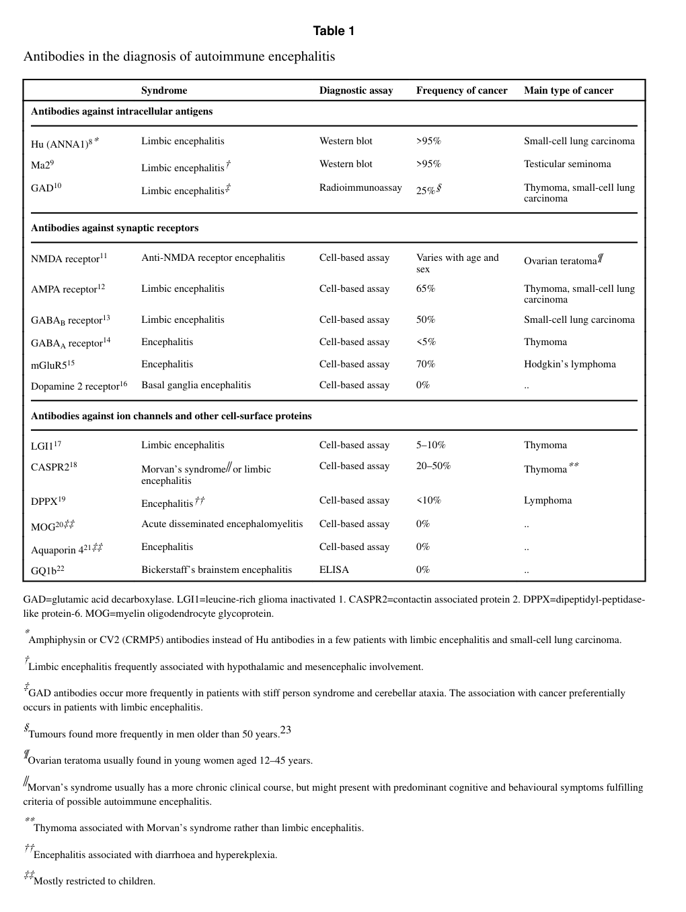

## Question

# Disease Characteristics Research Template

## Target Disease
- **Disease Name:** Limbic Encephalitis
- **MONDO ID:**  (if available)
- **Category:** Autoimmune

## Research Objectives

Please provide a comprehensive research report on **Limbic Encephalitis** covering all of the
disease characteristics listed below. This report will be used to populate a disease knowledge
base entry. Be thorough and cite primary literature (PMID preferred) for all claims.

For each section, **suggested databases/resources** are listed. These are the first places
you should search for information on each topic.

---

### 1. Disease Information
> **Search first:** OMIM, Orphanet, ICD-10/ICD-11, MeSH, PubMed

- What is the disease? Provide a concise overview.
- What are the key identifiers? (OMIM, Orphanet, ICD-10/ICD-11, MeSH, Mondo)
- What are the common synonyms and alternative names?
- Is the information derived from individual patients (e.g., EHR) or aggregated disease-level resources?

### 2. Etiology

- **Disease Causal Factors**: What are the primary causes? (genetic, environmental, infectious, mechanistic)
- **Risk Factors**:
  > **Search first:** PubMed, Cochrane Library, UpToDate, clinical guidelines, ClinVar, ClinGen, GWAS Catalog, PheGenI, CTD, CDC, WHO, epidemiological databases
  - Genetic risk factors (causal variants, susceptibility loci, modifier genes)
  - Environmental risk factors (toxins, lifestyle, occupational exposures, age, sex, family history)
- **Protective Factors**:
  > **Search first:** PubMed, Cochrane Library, clinical trial databases, GWAS Catalog, gnomAD, WHO, CDC, nutrition databases
  - Genetic protective factors (protective variants, modifier alleles)
  - Environmental protective factors (diet, lifestyle, exposures that reduce risk)
- **Gene-Environment Interactions**: How do genetic and environmental factors interact to influence disease?
  > **Search first:** CTD, PubMed, PheGenI, GxE databases

### 3. Phenotypes
> **Search first:** HPO (Human Phenotype Ontology), OMIM, Orphanet, PubMed, clinicaltrials.gov, MedDRA, SNOMED CT, DECIPHER, LOINC

For each phenotype, provide:
- **Phenotype type**: symptoms, clinical signs, physical manifestations, behavioral changes, or laboratory abnormalities
  > For symptoms/signs: HPO, OMIM, Orphanet, PubMed
  > For behavioral changes: HPO, DSM, RDoC (Research Domain Criteria), PubMed
  > For laboratory abnormalities: LOINC, SNOMED CT, LabTests Online, PubMed
- **Phenotype characteristics**:
  > **Search first:** OMIM, Orphanet, HPO, PubMed
  - Age of symptom onset (neonatal, childhood, adult-onset, late-onset)
  - Symptom severity (mild, moderate, severe, variable)
  - Symptom progression (stable, progressive, episodic, fluctuating)
  - Frequency among affected individuals (percentage or qualitative)
- **Quality of life impact**: Effects on daily functioning and well-being (per-phenotype when possible)
  > **Search first:** EQ-5D database, SF-36, WHO QOL databases, PubMed
- Suggest HPO (Human Phenotype Ontology) terms for each phenotype

### 4. Genetic/Molecular Information

- **Causal Genes**: Gene mutations or chromosomal abnormalities responsible for disease (gene symbols, OMIM IDs)
  > **Search first:** OMIM, ClinVar, HGMD, Ensembl, NCBI Gene
- **Pathogenic Variants**:
  - Affected genes (gene symbols, HGNC IDs)
    > **Search first:** OMIM, NCBI Gene, Ensembl, HGNC, UniProt, GeneCards
  - Variant classification (pathogenic, likely pathogenic, VUS per ACMG/AMP guidelines)
    > **Search first:** ClinVar, ClinGen, ACMG/AMP guidelines, VarSome
  - Variant type/class (missense, frameshift, nonsense, splice-site, structural)
  - Allele frequency in population databases
    > **Search first:** gnomAD, 1000 Genomes, ExAC, TOPMed, dbSNP
  - Somatic vs germline origin
    > **Search first:** COSMIC (somatic), ClinVar, ICGC, TCGA
  - Functional consequences (loss of function, gain of function, dominant negative)
- **Modifier Genes**: Genes that modify disease severity or expression
- **Epigenetic Information**: DNA methylation, histone modifications, chromatin changes affecting disease
  > **Search first:** ENCODE, Roadmap Epigenomics, MethBase, DiseaseMeth
- **Chromosomal Abnormalities**: Large-scale genetic changes (aneuploidy, translocations, inversions)
  > **Search first:** DECIPHER, ClinVar, ECARUCA, UCSC Genome Browser

### 5. Environmental Information

- **Environmental Factors**: Non-genetic contributing factors (toxins, radiation, pollution, occupational exposure)
  > **Search first:** CTD (Comparative Toxicogenomics Database), TOXNET, PubMed, EPA databases
- **Lifestyle Factors**: Behavioral factors (smoking, diet, exercise, alcohol consumption)
  > **Search first:** CDC databases, WHO, PubMed, NHANES
- **Infectious Agents**: If applicable, pathogens causing or triggering disease (bacteria, viruses, fungi, parasites)
  > **Search first:** NCBI Taxonomy, ViPR, BV-BRC, MicrobeDB, GIDEON

### 6. Mechanism / Pathophysiology

- **Molecular Pathways**: Specific signaling cascades or biochemical pathways involved (Wnt, MAPK, mTOR, PI3K-AKT, etc.)
  > **Search first:** KEGG, Reactome, WikiPathways, PathBank, BioCyc
- **Cellular Processes**: Cell-level mechanisms (apoptosis, autophagy, cell cycle dysregulation, inflammation, etc.)
  > **Search first:** Gene Ontology (GO), Reactome, KEGG, PubMed
- **Protein Dysfunction**: How protein structure or function is altered (misfolding, aggregation, loss of function, gain of function)
  > **Search first:** UniProt, PDB (Protein Data Bank), InterPro, Pfam, AlphaFold
- **Metabolic Changes**: Alterations in metabolic processes (energy metabolism, lipid metabolism, amino acid metabolism)
  > **Search first:** KEGG, BioCyc, HMDB (Human Metabolome Database), BRENDA
- **Immune System Involvement**: Role of immune response (autoimmunity, immunodeficiency, chronic inflammation)
  > **Search first:** ImmPort, Immunome Database, IEDB, Gene Ontology
- **Tissue Damage Mechanisms**: How tissues/ are injured (oxidative stress, ischemia, fibrosis, necrosis)
  > **Search first:** PubMed, Gene Ontology, Reactome
- **Biochemical Abnormalities**: Specific molecular defects (enzyme deficiencies, receptor dysfunction, ion channel defects)
  > **Search first:** BRENDA, UniProt, KEGG, OMIM, PubMed
- **Epigenetic Changes**: DNA methylation, histone modifications affecting gene expression in disease
  > **Search first:** ENCODE, Roadmap Epigenomics, MethBase, DiseaseMeth
- **Molecular Profiling** (if available):
  - Transcriptomics/gene expression changes
    > **Search first:** GEO (Gene Expression Omnibus), ArrayExpress, GTEx, Human Cell Atlas, SRA
  - Proteomics findings
    > **Search first:** PRIDE, ProteomeXchange, Human Protein Atlas, STRING, BioGRID
  - Metabolomics signatures
    > **Search first:** MetaboLights, Metabolomics Workbench, HMDB, METLIN
  - Lipidomics alterations
    > **Search first:** LIPID MAPS, SwissLipids, LipidHome, Metabolomics Workbench
  - Genomic structural features
    > **Search first:** UCSC Genome Browser, Ensembl, NCBI, dbVar, DGV
- **Advanced Technologies** (if applicable):
  - Single-cell analysis findings (cell-type specific mechanisms, cellular heterogeneity)
    > **Search first:** Human Cell Atlas, Single Cell Portal, GEO, CELLxGENE
  - Spatial transcriptomics findings
    > **Search first:** GEO, Spatial Research, Vizgen, 10x Genomics data
  - Multi-omics integration results
    > **Search first:** TCGA, ICGC, cBioPortal, LinkedOmics, PubMed
  - Functional genomics screens (CRISPR, RNAi)
    > **Search first:** DepMap, GenomeRNAi, PubMed, BioGRID ORCS

For each mechanism, describe:
- The causal chain from initial trigger to clinical manifestation
- Which mechanisms are upstream vs downstream
- What cell types and biological processes are involved
- Suggest GO terms for biological processes and CL terms for cell types

### 7. Anatomical Structures Affected

- **Organ Level**:
  - Primary organs directly affected
  - Secondary organ involvement (complications, secondary effects)
  - Body systems involved (cardiovascular, nervous, digestive, respiratory, endocrine, etc.)
  > **Search first:** Uberon, FMA (Foundational Model of Anatomy), OMIM, HPO, ICD-11, MeSH, SNOMED CT
- **Tissue and Cell Level**:
  - Specific tissue types affected (epithelial, connective, muscle, nervous)
  - Specific cell populations targeted (with Cell Ontology terms)
  > **Search first:** Uberon, Human Protein Atlas, Cell Ontology, Human Cell Atlas, CellMarker, PanglaoDB
- **Subcellular Level**:
  - Cellular compartments involved (mitochondria, nucleus, ER, lysosomes) (with GO Cellular Component terms)
  > **Search first:** Gene Ontology (Cellular Component), UniProt, Human Protein Atlas
- **Localization**:
  - Specific anatomical sites (with UBERON terms)
    > **Search first:** FMA, Uberon, NeuroNames (for brain), SNOMED CT
  - Lateralization (unilateral, bilateral, asymmetric)
    > **Search first:** HPO, clinical literature, imaging databases

### 8. Temporal Development

- **Onset**:
  - Typical age of onset (congenital, pediatric, adult, geriatric)
  - Onset pattern (acute, subacute, chronic, insidious)
  > **Search first:** OMIM, Orphanet, HPO, PubMed
- **Progression**:
  - Disease stages (early, intermediate, advanced, end-stage)
    > **Search first:** Cancer Staging Manual (AJCC), WHO classifications, PubMed
  - Progression rate (rapid, slow, variable)
  - Disease course pattern (episodic, relapsing-remitting, progressive, stable)
  - Disease duration (self-limited, chronic lifelong)
  > **Search first:** Disease registries, longitudinal cohort databases, natural history studies, PubMed, Orphanet, OMIM
- **Patterns**:
  - Remission patterns (spontaneous, treatment-induced)
    > **Search first:** Clinical trial databases, disease registries, PubMed
  - Critical periods (time windows of vulnerability or opportunity for intervention)
    > **Search first:** PubMed, developmental biology databases, clinical guidelines

### 9. Inheritance and Population

- **Epidemiology**:
  - Prevalence (cases per 100,000 at given time)
  - Incidence (new cases per 100,000 per year)
  > **Search first:** Orphanet, CDC, WHO, GBD (Global Burden of Disease), national registries, SEER, disease registries
- **For Genetic Etiology**:
  - Inheritance pattern (AD, AR, X-linked, mitochondrial, multifactorial, polygenic)
    > **Search first:** OMIM, Orphanet, ClinVar, GTR (Genetic Testing Registry)
  - Penetrance (complete, incomplete, age-dependent)
    > **Search first:** ClinVar, OMIM, PubMed, ClinGen
  - Expressivity (variable, consistent)
    > **Search first:** OMIM, ClinVar, PubMed
  - Genetic anticipation (increasing severity in successive generations)
    > **Search first:** OMIM, PubMed (especially for repeat expansion disorders)
  - Germline mosaicism
    > **Search first:** ClinVar, OMIM, genetic counseling literature, PubMed
  - Founder effects (population-specific mutations)
    > **Search first:** gnomAD, population genetics databases, PubMed
  - Consanguinity role
    > **Search first:** OMIM, population studies, genetic counseling resources
  - Carrier frequency
    > **Search first:** gnomAD, carrier screening databases, GeneReviews, GTR
- **Population Demographics**:
  - Affected populations (ethnic or demographic groups with higher prevalence)
    > **Search first:** gnomAD, 1000 Genomes, PAGE Study, PubMed, population registries
  - Geographic distribution (endemic areas, regional variation)
    > **Search first:** WHO, CDC, GBD, Orphanet, geographic epidemiology databases
  - Geographic distribution of specific variants
  - Sex ratio (male:female)
    > **Search first:** Disease registries, OMIM, PubMed, epidemiological databases
  - Age distribution of affected individuals
    > **Search first:** CDC, disease registries, SEER, Orphanet

### 10. Diagnostics

- **Clinical Tests**:
  - Laboratory tests (blood, urine, tissue chemistry, specific enzyme assays)
    > **Search first:** LOINC, LabTests Online, PubMed
  - Biomarkers (proteins, metabolites, genetic markers, circulating biomarkers)
    > **Search first:** FDA Biomarker List, BEST (Biomarkers, EndpointS, and other Tools), PubMed
  - Imaging studies (X-ray, CT, MRI, PET, ultrasound)
    > **Search first:** RadLex, DICOM, Radiopaedia, imaging databases
  - Functional tests (pulmonary function, cardiac stress tests)
    > **Search first:** LOINC, clinical guidelines, PubMed
  - Electrophysiology (EEG, EMG, ECG, nerve conduction studies)
    > **Search first:** LOINC, clinical neurophysiology databases, PubMed
  - Biopsy findings (histopathology, immunohistochemistry)
    > **Search first:** SNOMED CT, College of American Pathologists resources, PubMed
  - Pathology findings (microscopic examination)
    > **Search first:** SNOMED CT, Digital Pathology databases, PubMed
- **Genetic Testing**:
  > **Search first:** GTR (Genetic Testing Registry), GeneReviews, ClinGen
  - Overview of recommended genetic testing approach
  - Whole genome sequencing (WGS) utility
    > **Search first:** GTR, ClinVar, GEL (Genomics England), gnomAD
  - Whole exome sequencing (WES) utility
    > **Search first:** GTR, ClinVar, OMIM, GeneMatcher
  - Gene panels (which panels, which genes)
    > **Search first:** GTR, ClinVar, laboratory-specific databases
  - Single gene testing
    > **Search first:** GTR, ClinVar, OMIM, GeneReviews
  - Chromosomal microarray (CMA)
    > **Search first:** DECIPHER, ClinVar, dbVar, ECARUCA
  - Karyotyping
    > **Search first:** Chromosome Abnormality Database, ClinVar, cytogenetics resources
  - FISH
    > **Search first:** ClinVar, cytogenetics databases, PubMed
  - Mitochondrial DNA testing
    > **Search first:** MITOMAP, MSeqDR, ClinVar, GTR
  - Repeat expansion testing
    > **Search first:** GTR, ClinVar, repeat expansion databases, PubMed
- **Omics-Based Diagnostics** (if applicable):
  - RNA sequencing / transcriptomics
    > **Search first:** GEO, ArrayExpress, GTEx, RNA-seq databases
  - Proteomics
    > **Search first:** PRIDE, ProteomeXchange, FDA Biomarker database
  - Metabolomics
    > **Search first:** MetaboLights, Metabolomics Workbench, HMDB
  - Epigenomics
    > **Search first:** GEO, ENCODE, Roadmap Epigenomics, MethBase
  - Liquid biopsy
    > **Search first:** COSMIC, ClinVar, liquid biopsy databases, PubMed
- **Clinical Criteria**:
  - Standardized diagnostic criteria (DSM, ICD, society guidelines)
    > **Search first:** DSM-5, ICD-11, clinical society guidelines, UpToDate
  - Differential diagnosis (other conditions to rule out, with distinguishing features)
    > **Search first:** DynaMed, UpToDate, clinical decision support systems
- **Screening**:
  - Screening methods for asymptomatic individuals (newborn screening, carrier screening, cascade screening)
    > **Search first:** ACMG recommendations, CDC newborn screening, GTR

### 11. Outcome/Prognosis

- **Survival and Mortality**:
  - Survival rate (5-year, 10-year, overall)
    > **Search first:** SEER, cancer registries, disease-specific registries, PubMed
  - Life expectancy (with and without treatment if applicable)
    > **Search first:** Orphanet, disease registries, actuarial databases, PubMed
  - Mortality rate
    > **Search first:** CDC, WHO, GBD, national mortality databases
  - Disease-specific mortality (deaths directly attributable to disease)
    > **Search first:** Disease registries, CDC Wonder, GBD, PubMed
- **Morbidity and Function**:
  - Morbidity (disease-related disability and health impacts)
    > **Search first:** GBD, WHO, disability databases, PubMed
  - Disability outcomes (long-term functional impairments)
    > **Search first:** ICF (International Classification of Functioning), disability registries
  - Quality of life measures (EQ-5D, SF-36, PROMIS, disease-specific tools)
    > **Search first:** EQ-5D database, SF-36, PROMIS, PubMed
- **Disease Course**:
  - Complications (secondary problems: infections, organ failure, etc.)
    > **Search first:** ICD codes, disease registries, clinical databases, PubMed
  - Recovery potential (likelihood and extent of recovery, with vs without treatment)
    > **Search first:** Natural history studies, rehabilitation databases, PubMed
- **Prediction**:
  - Prognostic factors (age, disease severity, biomarkers, treatment response)
    > **Search first:** Prognostic models databases, clinical calculators, PubMed
  - Prognostic biomarkers (molecular markers predicting disease course)
    > **Search first:** FDA Biomarker database, PubMed, cancer prognostic databases

### 12. Treatment

- **Pharmacotherapy**:
  - Pharmacological treatments (drug names, drug classes, mechanisms of action)
    > **Search first:** DrugBank, RxNorm, ATC classification, DailyMed, FDA databases
  - Pharmacogenomics (how genetic variants affect drug metabolism, efficacy, toxicity)
    > **Search first:** PharmGKB, CPIC (Clinical Pharmacogenetics), FDA Table of PGx Biomarkers
- **Advanced Therapeutics**:
  - Gene therapy (viral vectors, CRISPR, gene replacement, gene editing)
    > **Search first:** ClinicalTrials.gov, FDA gene therapy database, ASGCT resources
  - Cell therapy (stem cell transplant, CAR-T, cellular therapeutics)
    > **Search first:** ClinicalTrials.gov, FDA cell therapy database, FACT standards
  - RNA-based therapies (ASOs, siRNA, mRNA therapies)
    > **Search first:** ClinicalTrials.gov, FDA approvals, PubMed
  - Targeted therapies (treatments directed at specific molecular targets)
    > **Search first:** My Cancer Genome, OncoKB, ClinicalTrials.gov, FDA approvals
  - Immunotherapies (checkpoint inhibitors, monoclonal antibodies)
    > **Search first:** Cancer Immunotherapy Database, FDA approvals, ClinicalTrials.gov
- **Surgical and Interventional**:
  - Surgical interventions (types of surgery, timing, outcomes)
    > **Search first:** CPT codes, surgical registries, clinical guidelines, PubMed
- **Supportive and Rehabilitative**:
  - Supportive care (symptom management, pain control, nutrition)
    > **Search first:** Clinical guidelines, Cochrane Library, PubMed
  - Rehabilitation (physical therapy, occupational therapy, speech therapy)
    > **Search first:** Rehabilitation medicine databases, clinical guidelines, PubMed
- **Experimental**:
  - Experimental treatments in clinical trials (with NCT identifiers if available)
    > **Search first:** ClinicalTrials.gov, EU Clinical Trials Register, WHO ICTRP
- **Treatment Outcomes**:
  - Treatment response rates
    > **Search first:** Clinical trial databases, FDA reviews, systematic reviews, PubMed
  - Side effects and adverse events
    > **Search first:** FDA Adverse Event Reporting System (FAERS), MedWatch, PubMed
- **Treatment Strategy**:
  - Treatment algorithms (clinical pathways, decision trees)
    > **Search first:** Clinical practice guidelines, NCCN Guidelines, UpToDate
  - Combination therapies
    > **Search first:** ClinicalTrials.gov, treatment guidelines, PubMed
  - Personalized medicine approaches (genotype-guided treatment)
    > **Search first:** My Cancer Genome, CIViC, PharmGKB, precision medicine databases

For each treatment, suggest MAXO (Medical Action Ontology) terms where applicable.

### 13. Prevention

- **Prevention Levels**:
  - Primary prevention (preventing disease occurrence: vaccination, risk factor modification)
    > **Search first:** CDC, WHO, USPSTF recommendations, Cochrane Library
  - Secondary prevention (early detection and treatment: screening programs, early intervention)
    > **Search first:** USPSTF, CDC screening guidelines, WHO
  - Tertiary prevention (preventing complications in those with disease)
    > **Search first:** Clinical guidelines, disease management protocols, PubMed
- **Immunization**: Vaccine strategies (if applicable)
  > **Search first:** CDC vaccine schedules, WHO immunization, FDA vaccine database
- **Screening and Early Detection**:
  - Screening programs (population-based: newborn screening, cancer screening)
    > **Search first:** CDC screening programs, USPSTF, cancer screening databases
  - Genetic screening (carrier screening, preimplantation genetic diagnosis, prenatal testing)
    > **Search first:** ACMG recommendations, ACOG guidelines, GTR
  - Risk stratification (identifying high-risk individuals for targeted prevention)
    > **Search first:** Risk prediction models, clinical calculators, PubMed
- **Behavioral Interventions**: Lifestyle modifications to reduce risk
  > **Search first:** CDC, WHO, behavioral intervention databases, Cochrane Library
- **Counseling**: Genetic counseling (risk assessment, family planning guidance)
  > **Search first:** NSGC resources, ACMG guidelines, GeneReviews
- **Public Health**:
  - Public health interventions (sanitation, vector control, health education)
    > **Search first:** CDC, WHO, public health databases, PubMed
  - Environmental interventions (reducing environmental risk factors)
    > **Search first:** EPA databases, WHO environmental health, PubMed
- **Prophylaxis**: Preventive medications or procedures
  > **Search first:** Clinical guidelines, FDA approvals, PubMed

### 14. Other Species / Natural Disease

- **Taxonomy**: Species affected (with NCBI Taxon identifiers)
  > **Search first:** NCBI Taxonomy
- **Breed**: Specific breeds affected (with VBO identifiers if applicable)
  > **Search first:** VBO (Vertebrate Breed Ontology)
- **Gene**: Orthologous genes in other species (with NCBI Gene IDs)
  > **Search first:** NCBI Gene
- **Natural Disease**:
  - Naturally occurring disease in other species (companion animals, wildlife)
    > **Search first:** OMIA (Online Mendelian Inheritance in Animals), VetCompass, PubMed
  - Veterinary relevance and importance in animal health
    > **Search first:** OMIA, veterinary databases, PubMed
- **Comparative Biology**:
  - Comparative pathology (similarities and differences across species)
    > **Search first:** OMIA, comparative pathology databases, PubMed
  - Evolutionary conservation of disease mechanisms
    > **Search first:** HomoloGene, OrthoMCL, Alliance of Genome Resources
- **Transmission** (if applicable):
  - Zoonotic potential
    > **Search first:** CDC zoonotic diseases, WHO zoonoses, GIDEON
  - Cross-species susceptibility
    > **Search first:** NCBI Taxonomy, veterinary databases, PubMed

### 15. Model Organisms

- **Model Types**:
  - Model organism type (mammalian, invertebrate, cellular, in vitro)
    > **Search first:** Alliance of Genome Resources, model organism databases
  - Specific model systems (mouse, rat, zebrafish, Drosophila, C. elegans, yeast, cell lines, organoids, iPSCs)
    > **Search first:** MGI, RGD, ZFIN, FlyBase, WormBase, SGD, ATCC, Cellosaurus
  - Induced models (drug treatment, surgical intervention, environmental manipulation)
    > **Search first:** MGI, model organism databases, PubMed
- **Genetic Models**:
  - Types available (knockout, knock-in, transgenic, conditional, humanized)
    > **Search first:** MGI, IMPC, KOMP, EuMMCR, IMSR
- **Model Characteristics**:
  - Phenotype recapitulation (how well model reproduces human disease features)
    > **Search first:** Model organism databases, comparative studies, PubMed
  - Model limitations (aspects of human disease not captured)
    > **Search first:** Model organism databases, PubMed, review articles
- **Applications**:
  - Research applications (what aspects of disease can be studied)
    > **Search first:** Model organism databases, PubMed
- **Resources**:
  - Model databases
    > **Search first:** MGI, RGD, ZFIN, FlyBase, WormBase, IMSR, EMMA, MMRRC

---

## Citation Requirements

- Cite primary literature (PMID preferred) for all mechanistic and clinical claims
- Prioritize recent reviews and landmark papers
- Include direct quotes from abstracts where possible to support key statements
- Distinguish evidence source types: human clinical, model organism, in vitro, computational

## Output Format

Structure your response as a comprehensive narrative organized by the sections above.
For each section, provide:
- Factual content with specific details (numbers, percentages, gene names, variant nomenclature)
- Ontology term suggestions (HPO, GO, CL, UBERON, CHEBI, MAXO, MONDO) where applicable
- Evidence citations with PMIDs
- Direct quotes from abstracts to support key claims
- Clear indication when information is not available or not applicable for this disease

This report will be used to populate a disease knowledge base entry with:
- Pathophysiology descriptions with causal chains
- Gene/protein annotations (HGNC, GO terms)
- Phenotype associations (HP terms) with frequencies
- Cell type involvement (CL terms)
- Anatomical locations (UBERON terms)
- Chemical entities (CHEBI terms)
- Treatment annotations (MAXO terms)
- Evidence items with PMIDs and exact abstract quotes
- Epidemiology, prognosis, diagnostic, and prevention information
- Animal model descriptions with phenotype recapitulation details

## Output

Question: You are an expert researcher providing comprehensive, well-cited information.

Provide detailed information focusing on:
1. Key concepts and definitions with current understanding
2. Recent developments and latest research (prioritize 2023-2024 sources)
3. Current applications and real-world implementations
4. Expert opinions and analysis from authoritative sources
5. Relevant statistics and data from recent studies

Format as a comprehensive research report with proper citations. Include URLs and publication dates where available.
Always prioritize recent, authoritative sources and provide specific citations for all major claims.

# Disease Characteristics Research Template

## Target Disease
- **Disease Name:** Limbic Encephalitis
- **MONDO ID:**  (if available)
- **Category:** Autoimmune

## Research Objectives

Please provide a comprehensive research report on **Limbic Encephalitis** covering all of the
disease characteristics listed below. This report will be used to populate a disease knowledge
base entry. Be thorough and cite primary literature (PMID preferred) for all claims.

For each section, **suggested databases/resources** are listed. These are the first places
you should search for information on each topic.

---

### 1. Disease Information
> **Search first:** OMIM, Orphanet, ICD-10/ICD-11, MeSH, PubMed

- What is the disease? Provide a concise overview.
- What are the key identifiers? (OMIM, Orphanet, ICD-10/ICD-11, MeSH, Mondo)
- What are the common synonyms and alternative names?
- Is the information derived from individual patients (e.g., EHR) or aggregated disease-level resources?

### 2. Etiology

- **Disease Causal Factors**: What are the primary causes? (genetic, environmental, infectious, mechanistic)
- **Risk Factors**:
  > **Search first:** PubMed, Cochrane Library, UpToDate, clinical guidelines, ClinVar, ClinGen, GWAS Catalog, PheGenI, CTD, CDC, WHO, epidemiological databases
  - Genetic risk factors (causal variants, susceptibility loci, modifier genes)
  - Environmental risk factors (toxins, lifestyle, occupational exposures, age, sex, family history)
- **Protective Factors**:
  > **Search first:** PubMed, Cochrane Library, clinical trial databases, GWAS Catalog, gnomAD, WHO, CDC, nutrition databases
  - Genetic protective factors (protective variants, modifier alleles)
  - Environmental protective factors (diet, lifestyle, exposures that reduce risk)
- **Gene-Environment Interactions**: How do genetic and environmental factors interact to influence disease?
  > **Search first:** CTD, PubMed, PheGenI, GxE databases

### 3. Phenotypes
> **Search first:** HPO (Human Phenotype Ontology), OMIM, Orphanet, PubMed, clinicaltrials.gov, MedDRA, SNOMED CT, DECIPHER, LOINC

For each phenotype, provide:
- **Phenotype type**: symptoms, clinical signs, physical manifestations, behavioral changes, or laboratory abnormalities
  > For symptoms/signs: HPO, OMIM, Orphanet, PubMed
  > For behavioral changes: HPO, DSM, RDoC (Research Domain Criteria), PubMed
  > For laboratory abnormalities: LOINC, SNOMED CT, LabTests Online, PubMed
- **Phenotype characteristics**:
  > **Search first:** OMIM, Orphanet, HPO, PubMed
  - Age of symptom onset (neonatal, childhood, adult-onset, late-onset)
  - Symptom severity (mild, moderate, severe, variable)
  - Symptom progression (stable, progressive, episodic, fluctuating)
  - Frequency among affected individuals (percentage or qualitative)
- **Quality of life impact**: Effects on daily functioning and well-being (per-phenotype when possible)
  > **Search first:** EQ-5D database, SF-36, WHO QOL databases, PubMed
- Suggest HPO (Human Phenotype Ontology) terms for each phenotype

### 4. Genetic/Molecular Information

- **Causal Genes**: Gene mutations or chromosomal abnormalities responsible for disease (gene symbols, OMIM IDs)
  > **Search first:** OMIM, ClinVar, HGMD, Ensembl, NCBI Gene
- **Pathogenic Variants**:
  - Affected genes (gene symbols, HGNC IDs)
    > **Search first:** OMIM, NCBI Gene, Ensembl, HGNC, UniProt, GeneCards
  - Variant classification (pathogenic, likely pathogenic, VUS per ACMG/AMP guidelines)
    > **Search first:** ClinVar, ClinGen, ACMG/AMP guidelines, VarSome
  - Variant type/class (missense, frameshift, nonsense, splice-site, structural)
  - Allele frequency in population databases
    > **Search first:** gnomAD, 1000 Genomes, ExAC, TOPMed, dbSNP
  - Somatic vs germline origin
    > **Search first:** COSMIC (somatic), ClinVar, ICGC, TCGA
  - Functional consequences (loss of function, gain of function, dominant negative)
- **Modifier Genes**: Genes that modify disease severity or expression
- **Epigenetic Information**: DNA methylation, histone modifications, chromatin changes affecting disease
  > **Search first:** ENCODE, Roadmap Epigenomics, MethBase, DiseaseMeth
- **Chromosomal Abnormalities**: Large-scale genetic changes (aneuploidy, translocations, inversions)
  > **Search first:** DECIPHER, ClinVar, ECARUCA, UCSC Genome Browser

### 5. Environmental Information

- **Environmental Factors**: Non-genetic contributing factors (toxins, radiation, pollution, occupational exposure)
  > **Search first:** CTD (Comparative Toxicogenomics Database), TOXNET, PubMed, EPA databases
- **Lifestyle Factors**: Behavioral factors (smoking, diet, exercise, alcohol consumption)
  > **Search first:** CDC databases, WHO, PubMed, NHANES
- **Infectious Agents**: If applicable, pathogens causing or triggering disease (bacteria, viruses, fungi, parasites)
  > **Search first:** NCBI Taxonomy, ViPR, BV-BRC, MicrobeDB, GIDEON

### 6. Mechanism / Pathophysiology

- **Molecular Pathways**: Specific signaling cascades or biochemical pathways involved (Wnt, MAPK, mTOR, PI3K-AKT, etc.)
  > **Search first:** KEGG, Reactome, WikiPathways, PathBank, BioCyc
- **Cellular Processes**: Cell-level mechanisms (apoptosis, autophagy, cell cycle dysregulation, inflammation, etc.)
  > **Search first:** Gene Ontology (GO), Reactome, KEGG, PubMed
- **Protein Dysfunction**: How protein structure or function is altered (misfolding, aggregation, loss of function, gain of function)
  > **Search first:** UniProt, PDB (Protein Data Bank), InterPro, Pfam, AlphaFold
- **Metabolic Changes**: Alterations in metabolic processes (energy metabolism, lipid metabolism, amino acid metabolism)
  > **Search first:** KEGG, BioCyc, HMDB (Human Metabolome Database), BRENDA
- **Immune System Involvement**: Role of immune response (autoimmunity, immunodeficiency, chronic inflammation)
  > **Search first:** ImmPort, Immunome Database, IEDB, Gene Ontology
- **Tissue Damage Mechanisms**: How tissues/ are injured (oxidative stress, ischemia, fibrosis, necrosis)
  > **Search first:** PubMed, Gene Ontology, Reactome
- **Biochemical Abnormalities**: Specific molecular defects (enzyme deficiencies, receptor dysfunction, ion channel defects)
  > **Search first:** BRENDA, UniProt, KEGG, OMIM, PubMed
- **Epigenetic Changes**: DNA methylation, histone modifications affecting gene expression in disease
  > **Search first:** ENCODE, Roadmap Epigenomics, MethBase, DiseaseMeth
- **Molecular Profiling** (if available):
  - Transcriptomics/gene expression changes
    > **Search first:** GEO (Gene Expression Omnibus), ArrayExpress, GTEx, Human Cell Atlas, SRA
  - Proteomics findings
    > **Search first:** PRIDE, ProteomeXchange, Human Protein Atlas, STRING, BioGRID
  - Metabolomics signatures
    > **Search first:** MetaboLights, Metabolomics Workbench, HMDB, METLIN
  - Lipidomics alterations
    > **Search first:** LIPID MAPS, SwissLipids, LipidHome, Metabolomics Workbench
  - Genomic structural features
    > **Search first:** UCSC Genome Browser, Ensembl, NCBI, dbVar, DGV
- **Advanced Technologies** (if applicable):
  - Single-cell analysis findings (cell-type specific mechanisms, cellular heterogeneity)
    > **Search first:** Human Cell Atlas, Single Cell Portal, GEO, CELLxGENE
  - Spatial transcriptomics findings
    > **Search first:** GEO, Spatial Research, Vizgen, 10x Genomics data
  - Multi-omics integration results
    > **Search first:** TCGA, ICGC, cBioPortal, LinkedOmics, PubMed
  - Functional genomics screens (CRISPR, RNAi)
    > **Search first:** DepMap, GenomeRNAi, PubMed, BioGRID ORCS

For each mechanism, describe:
- The causal chain from initial trigger to clinical manifestation
- Which mechanisms are upstream vs downstream
- What cell types and biological processes are involved
- Suggest GO terms for biological processes and CL terms for cell types

### 7. Anatomical Structures Affected

- **Organ Level**:
  - Primary organs directly affected
  - Secondary organ involvement (complications, secondary effects)
  - Body systems involved (cardiovascular, nervous, digestive, respiratory, endocrine, etc.)
  > **Search first:** Uberon, FMA (Foundational Model of Anatomy), OMIM, HPO, ICD-11, MeSH, SNOMED CT
- **Tissue and Cell Level**:
  - Specific tissue types affected (epithelial, connective, muscle, nervous)
  - Specific cell populations targeted (with Cell Ontology terms)
  > **Search first:** Uberon, Human Protein Atlas, Cell Ontology, Human Cell Atlas, CellMarker, PanglaoDB
- **Subcellular Level**:
  - Cellular compartments involved (mitochondria, nucleus, ER, lysosomes) (with GO Cellular Component terms)
  > **Search first:** Gene Ontology (Cellular Component), UniProt, Human Protein Atlas
- **Localization**:
  - Specific anatomical sites (with UBERON terms)
    > **Search first:** FMA, Uberon, NeuroNames (for brain), SNOMED CT
  - Lateralization (unilateral, bilateral, asymmetric)
    > **Search first:** HPO, clinical literature, imaging databases

### 8. Temporal Development

- **Onset**:
  - Typical age of onset (congenital, pediatric, adult, geriatric)
  - Onset pattern (acute, subacute, chronic, insidious)
  > **Search first:** OMIM, Orphanet, HPO, PubMed
- **Progression**:
  - Disease stages (early, intermediate, advanced, end-stage)
    > **Search first:** Cancer Staging Manual (AJCC), WHO classifications, PubMed
  - Progression rate (rapid, slow, variable)
  - Disease course pattern (episodic, relapsing-remitting, progressive, stable)
  - Disease duration (self-limited, chronic lifelong)
  > **Search first:** Disease registries, longitudinal cohort databases, natural history studies, PubMed, Orphanet, OMIM
- **Patterns**:
  - Remission patterns (spontaneous, treatment-induced)
    > **Search first:** Clinical trial databases, disease registries, PubMed
  - Critical periods (time windows of vulnerability or opportunity for intervention)
    > **Search first:** PubMed, developmental biology databases, clinical guidelines

### 9. Inheritance and Population

- **Epidemiology**:
  - Prevalence (cases per 100,000 at given time)
  - Incidence (new cases per 100,000 per year)
  > **Search first:** Orphanet, CDC, WHO, GBD (Global Burden of Disease), national registries, SEER, disease registries
- **For Genetic Etiology**:
  - Inheritance pattern (AD, AR, X-linked, mitochondrial, multifactorial, polygenic)
    > **Search first:** OMIM, Orphanet, ClinVar, GTR (Genetic Testing Registry)
  - Penetrance (complete, incomplete, age-dependent)
    > **Search first:** ClinVar, OMIM, PubMed, ClinGen
  - Expressivity (variable, consistent)
    > **Search first:** OMIM, ClinVar, PubMed
  - Genetic anticipation (increasing severity in successive generations)
    > **Search first:** OMIM, PubMed (especially for repeat expansion disorders)
  - Germline mosaicism
    > **Search first:** ClinVar, OMIM, genetic counseling literature, PubMed
  - Founder effects (population-specific mutations)
    > **Search first:** gnomAD, population genetics databases, PubMed
  - Consanguinity role
    > **Search first:** OMIM, population studies, genetic counseling resources
  - Carrier frequency
    > **Search first:** gnomAD, carrier screening databases, GeneReviews, GTR
- **Population Demographics**:
  - Affected populations (ethnic or demographic groups with higher prevalence)
    > **Search first:** gnomAD, 1000 Genomes, PAGE Study, PubMed, population registries
  - Geographic distribution (endemic areas, regional variation)
    > **Search first:** WHO, CDC, GBD, Orphanet, geographic epidemiology databases
  - Geographic distribution of specific variants
  - Sex ratio (male:female)
    > **Search first:** Disease registries, OMIM, PubMed, epidemiological databases
  - Age distribution of affected individuals
    > **Search first:** CDC, disease registries, SEER, Orphanet

### 10. Diagnostics

- **Clinical Tests**:
  - Laboratory tests (blood, urine, tissue chemistry, specific enzyme assays)
    > **Search first:** LOINC, LabTests Online, PubMed
  - Biomarkers (proteins, metabolites, genetic markers, circulating biomarkers)
    > **Search first:** FDA Biomarker List, BEST (Biomarkers, EndpointS, and other Tools), PubMed
  - Imaging studies (X-ray, CT, MRI, PET, ultrasound)
    > **Search first:** RadLex, DICOM, Radiopaedia, imaging databases
  - Functional tests (pulmonary function, cardiac stress tests)
    > **Search first:** LOINC, clinical guidelines, PubMed
  - Electrophysiology (EEG, EMG, ECG, nerve conduction studies)
    > **Search first:** LOINC, clinical neurophysiology databases, PubMed
  - Biopsy findings (histopathology, immunohistochemistry)
    > **Search first:** SNOMED CT, College of American Pathologists resources, PubMed
  - Pathology findings (microscopic examination)
    > **Search first:** SNOMED CT, Digital Pathology databases, PubMed
- **Genetic Testing**:
  > **Search first:** GTR (Genetic Testing Registry), GeneReviews, ClinGen
  - Overview of recommended genetic testing approach
  - Whole genome sequencing (WGS) utility
    > **Search first:** GTR, ClinVar, GEL (Genomics England), gnomAD
  - Whole exome sequencing (WES) utility
    > **Search first:** GTR, ClinVar, OMIM, GeneMatcher
  - Gene panels (which panels, which genes)
    > **Search first:** GTR, ClinVar, laboratory-specific databases
  - Single gene testing
    > **Search first:** GTR, ClinVar, OMIM, GeneReviews
  - Chromosomal microarray (CMA)
    > **Search first:** DECIPHER, ClinVar, dbVar, ECARUCA
  - Karyotyping
    > **Search first:** Chromosome Abnormality Database, ClinVar, cytogenetics resources
  - FISH
    > **Search first:** ClinVar, cytogenetics databases, PubMed
  - Mitochondrial DNA testing
    > **Search first:** MITOMAP, MSeqDR, ClinVar, GTR
  - Repeat expansion testing
    > **Search first:** GTR, ClinVar, repeat expansion databases, PubMed
- **Omics-Based Diagnostics** (if applicable):
  - RNA sequencing / transcriptomics
    > **Search first:** GEO, ArrayExpress, GTEx, RNA-seq databases
  - Proteomics
    > **Search first:** PRIDE, ProteomeXchange, FDA Biomarker database
  - Metabolomics
    > **Search first:** MetaboLights, Metabolomics Workbench, HMDB
  - Epigenomics
    > **Search first:** GEO, ENCODE, Roadmap Epigenomics, MethBase
  - Liquid biopsy
    > **Search first:** COSMIC, ClinVar, liquid biopsy databases, PubMed
- **Clinical Criteria**:
  - Standardized diagnostic criteria (DSM, ICD, society guidelines)
    > **Search first:** DSM-5, ICD-11, clinical society guidelines, UpToDate
  - Differential diagnosis (other conditions to rule out, with distinguishing features)
    > **Search first:** DynaMed, UpToDate, clinical decision support systems
- **Screening**:
  - Screening methods for asymptomatic individuals (newborn screening, carrier screening, cascade screening)
    > **Search first:** ACMG recommendations, CDC newborn screening, GTR

### 11. Outcome/Prognosis

- **Survival and Mortality**:
  - Survival rate (5-year, 10-year, overall)
    > **Search first:** SEER, cancer registries, disease-specific registries, PubMed
  - Life expectancy (with and without treatment if applicable)
    > **Search first:** Orphanet, disease registries, actuarial databases, PubMed
  - Mortality rate
    > **Search first:** CDC, WHO, GBD, national mortality databases
  - Disease-specific mortality (deaths directly attributable to disease)
    > **Search first:** Disease registries, CDC Wonder, GBD, PubMed
- **Morbidity and Function**:
  - Morbidity (disease-related disability and health impacts)
    > **Search first:** GBD, WHO, disability databases, PubMed
  - Disability outcomes (long-term functional impairments)
    > **Search first:** ICF (International Classification of Functioning), disability registries
  - Quality of life measures (EQ-5D, SF-36, PROMIS, disease-specific tools)
    > **Search first:** EQ-5D database, SF-36, PROMIS, PubMed
- **Disease Course**:
  - Complications (secondary problems: infections, organ failure, etc.)
    > **Search first:** ICD codes, disease registries, clinical databases, PubMed
  - Recovery potential (likelihood and extent of recovery, with vs without treatment)
    > **Search first:** Natural history studies, rehabilitation databases, PubMed
- **Prediction**:
  - Prognostic factors (age, disease severity, biomarkers, treatment response)
    > **Search first:** Prognostic models databases, clinical calculators, PubMed
  - Prognostic biomarkers (molecular markers predicting disease course)
    > **Search first:** FDA Biomarker database, PubMed, cancer prognostic databases

### 12. Treatment

- **Pharmacotherapy**:
  - Pharmacological treatments (drug names, drug classes, mechanisms of action)
    > **Search first:** DrugBank, RxNorm, ATC classification, DailyMed, FDA databases
  - Pharmacogenomics (how genetic variants affect drug metabolism, efficacy, toxicity)
    > **Search first:** PharmGKB, CPIC (Clinical Pharmacogenetics), FDA Table of PGx Biomarkers
- **Advanced Therapeutics**:
  - Gene therapy (viral vectors, CRISPR, gene replacement, gene editing)
    > **Search first:** ClinicalTrials.gov, FDA gene therapy database, ASGCT resources
  - Cell therapy (stem cell transplant, CAR-T, cellular therapeutics)
    > **Search first:** ClinicalTrials.gov, FDA cell therapy database, FACT standards
  - RNA-based therapies (ASOs, siRNA, mRNA therapies)
    > **Search first:** ClinicalTrials.gov, FDA approvals, PubMed
  - Targeted therapies (treatments directed at specific molecular targets)
    > **Search first:** My Cancer Genome, OncoKB, ClinicalTrials.gov, FDA approvals
  - Immunotherapies (checkpoint inhibitors, monoclonal antibodies)
    > **Search first:** Cancer Immunotherapy Database, FDA approvals, ClinicalTrials.gov
- **Surgical and Interventional**:
  - Surgical interventions (types of surgery, timing, outcomes)
    > **Search first:** CPT codes, surgical registries, clinical guidelines, PubMed
- **Supportive and Rehabilitative**:
  - Supportive care (symptom management, pain control, nutrition)
    > **Search first:** Clinical guidelines, Cochrane Library, PubMed
  - Rehabilitation (physical therapy, occupational therapy, speech therapy)
    > **Search first:** Rehabilitation medicine databases, clinical guidelines, PubMed
- **Experimental**:
  - Experimental treatments in clinical trials (with NCT identifiers if available)
    > **Search first:** ClinicalTrials.gov, EU Clinical Trials Register, WHO ICTRP
- **Treatment Outcomes**:
  - Treatment response rates
    > **Search first:** Clinical trial databases, FDA reviews, systematic reviews, PubMed
  - Side effects and adverse events
    > **Search first:** FDA Adverse Event Reporting System (FAERS), MedWatch, PubMed
- **Treatment Strategy**:
  - Treatment algorithms (clinical pathways, decision trees)
    > **Search first:** Clinical practice guidelines, NCCN Guidelines, UpToDate
  - Combination therapies
    > **Search first:** ClinicalTrials.gov, treatment guidelines, PubMed
  - Personalized medicine approaches (genotype-guided treatment)
    > **Search first:** My Cancer Genome, CIViC, PharmGKB, precision medicine databases

For each treatment, suggest MAXO (Medical Action Ontology) terms where applicable.

### 13. Prevention

- **Prevention Levels**:
  - Primary prevention (preventing disease occurrence: vaccination, risk factor modification)
    > **Search first:** CDC, WHO, USPSTF recommendations, Cochrane Library
  - Secondary prevention (early detection and treatment: screening programs, early intervention)
    > **Search first:** USPSTF, CDC screening guidelines, WHO
  - Tertiary prevention (preventing complications in those with disease)
    > **Search first:** Clinical guidelines, disease management protocols, PubMed
- **Immunization**: Vaccine strategies (if applicable)
  > **Search first:** CDC vaccine schedules, WHO immunization, FDA vaccine database
- **Screening and Early Detection**:
  - Screening programs (population-based: newborn screening, cancer screening)
    > **Search first:** CDC screening programs, USPSTF, cancer screening databases
  - Genetic screening (carrier screening, preimplantation genetic diagnosis, prenatal testing)
    > **Search first:** ACMG recommendations, ACOG guidelines, GTR
  - Risk stratification (identifying high-risk individuals for targeted prevention)
    > **Search first:** Risk prediction models, clinical calculators, PubMed
- **Behavioral Interventions**: Lifestyle modifications to reduce risk
  > **Search first:** CDC, WHO, behavioral intervention databases, Cochrane Library
- **Counseling**: Genetic counseling (risk assessment, family planning guidance)
  > **Search first:** NSGC resources, ACMG guidelines, GeneReviews
- **Public Health**:
  - Public health interventions (sanitation, vector control, health education)
    > **Search first:** CDC, WHO, public health databases, PubMed
  - Environmental interventions (reducing environmental risk factors)
    > **Search first:** EPA databases, WHO environmental health, PubMed
- **Prophylaxis**: Preventive medications or procedures
  > **Search first:** Clinical guidelines, FDA approvals, PubMed

### 14. Other Species / Natural Disease

- **Taxonomy**: Species affected (with NCBI Taxon identifiers)
  > **Search first:** NCBI Taxonomy
- **Breed**: Specific breeds affected (with VBO identifiers if applicable)
  > **Search first:** VBO (Vertebrate Breed Ontology)
- **Gene**: Orthologous genes in other species (with NCBI Gene IDs)
  > **Search first:** NCBI Gene
- **Natural Disease**:
  - Naturally occurring disease in other species (companion animals, wildlife)
    > **Search first:** OMIA (Online Mendelian Inheritance in Animals), VetCompass, PubMed
  - Veterinary relevance and importance in animal health
    > **Search first:** OMIA, veterinary databases, PubMed
- **Comparative Biology**:
  - Comparative pathology (similarities and differences across species)
    > **Search first:** OMIA, comparative pathology databases, PubMed
  - Evolutionary conservation of disease mechanisms
    > **Search first:** HomoloGene, OrthoMCL, Alliance of Genome Resources
- **Transmission** (if applicable):
  - Zoonotic potential
    > **Search first:** CDC zoonotic diseases, WHO zoonoses, GIDEON
  - Cross-species susceptibility
    > **Search first:** NCBI Taxonomy, veterinary databases, PubMed

### 15. Model Organisms

- **Model Types**:
  - Model organism type (mammalian, invertebrate, cellular, in vitro)
    > **Search first:** Alliance of Genome Resources, model organism databases
  - Specific model systems (mouse, rat, zebrafish, Drosophila, C. elegans, yeast, cell lines, organoids, iPSCs)
    > **Search first:** MGI, RGD, ZFIN, FlyBase, WormBase, SGD, ATCC, Cellosaurus
  - Induced models (drug treatment, surgical intervention, environmental manipulation)
    > **Search first:** MGI, model organism databases, PubMed
- **Genetic Models**:
  - Types available (knockout, knock-in, transgenic, conditional, humanized)
    > **Search first:** MGI, IMPC, KOMP, EuMMCR, IMSR
- **Model Characteristics**:
  - Phenotype recapitulation (how well model reproduces human disease features)
    > **Search first:** Model organism databases, comparative studies, PubMed
  - Model limitations (aspects of human disease not captured)
    > **Search first:** Model organism databases, PubMed, review articles
- **Applications**:
  - Research applications (what aspects of disease can be studied)
    > **Search first:** Model organism databases, PubMed
- **Resources**:
  - Model databases
    > **Search first:** MGI, RGD, ZFIN, FlyBase, WormBase, IMSR, EMMA, MMRRC

---

## Citation Requirements

- Cite primary literature (PMID preferred) for all mechanistic and clinical claims
- Prioritize recent reviews and landmark papers
- Include direct quotes from abstracts where possible to support key statements
- Distinguish evidence source types: human clinical, model organism, in vitro, computational

## Output Format

Structure your response as a comprehensive narrative organized by the sections above.
For each section, provide:
- Factual content with specific details (numbers, percentages, gene names, variant nomenclature)
- Ontology term suggestions (HPO, GO, CL, UBERON, CHEBI, MAXO, MONDO) where applicable
- Evidence citations with PMIDs
- Direct quotes from abstracts to support key claims
- Clear indication when information is not available or not applicable for this disease

This report will be used to populate a disease knowledge base entry with:
- Pathophysiology descriptions with causal chains
- Gene/protein annotations (HGNC, GO terms)
- Phenotype associations (HP terms) with frequencies
- Cell type involvement (CL terms)
- Anatomical locations (UBERON terms)
- Chemical entities (CHEBI terms)
- Treatment annotations (MAXO terms)
- Evidence items with PMIDs and exact abstract quotes
- Epidemiology, prognosis, diagnostic, and prevention information
- Animal model descriptions with phenotype recapitulation details

# Limbic Encephalitis (Autoimmune) — Comprehensive Disease Characteristics Report

## Target Disease
- **Disease name:** Limbic encephalitis (LE)
- **Category:** Autoimmune (often antibody-mediated; can be paraneoplastic)
- **MONDO ID:** Not retrieved in the tool-accessible evidence for this run (explicit MONDO mapping not available from the sources accessed).

## Executive summary (current understanding)
Autoimmune limbic encephalitis is a subacute inflammatory syndrome affecting limbic structures (especially the medial temporal lobes) that commonly presents with memory deficits, seizures, and/or psychiatric symptoms. A widely used operational definition is the 2016 Graus et al. “definite autoimmune limbic encephalitis” criteria, which integrates clinical syndrome, medial temporal MRI (or FDG-PET) abnormalities, supportive CSF/EEG evidence, and exclusion of alternative causes. Autoimmune LE encompasses both (i) neuronal cell-surface/synaptic antibody–associated disease (often treatment-responsive) and (ii) paraneoplastic/intracellular onconeural antibody–associated disease (more often cancer-associated and less responsive to immunotherapy). (graus2016aclinicalapproach pages 6-7, graus2016aclinicalapproach pages 7-9)

---

## 1. Disease information

### 1.1 What is the disease?
**Definite autoimmune limbic encephalitis (Graus 2016)** requires all four of the following: (1) **subacute onset (<3 months)** of working memory deficits, seizures, or psychiatric symptoms suggesting limbic involvement; (2) **bilateral** medial temporal lobe abnormalities on **T2/FLAIR MRI** (or FDG-PET substitute); (3) at least one of **CSF pleocytosis (>5 cells/mm³)** or **EEG** with temporal epileptic/slow activity; and (4) reasonable exclusion of alternative causes. (graus2016aclinicalapproach pages 6-7)

**Clinical concept:** LE is a syndrome that can arise from infectious encephalitis (notably HSV) or autoimmune mechanisms; the Graus framework is intended to support early diagnosis and empiric immunotherapy once infectious causes are reasonably excluded because delays can worsen outcomes. (graus2016aclinicalapproach pages 2-4)

### 1.2 Key identifiers (OMIM, Orphanet, ICD-10/ICD-11, MeSH, MONDO)
In the retrieved tool-accessible full texts for this run, **specific codes/IDs** (OMIM, Orphanet, ICD-10/ICD-11, MeSH, MONDO) **for limbic encephalitis were not explicitly provided**. Accordingly, this report **does not assert** specific identifiers without evidence.

### 1.3 Common synonyms / alternative names
- Autoimmune limbic encephalitis
- Paraneoplastic limbic encephalitis (when associated with high-risk intracellular/onconeural antibodies and cancer)
- Antibody-mediated encephalitis with limbic involvement (used in some reviews/guidelines) (graus2016aclinicalapproach pages 7-9)

### 1.4 Evidence provenance
Information in this report is derived from **aggregated disease-level resources** (international diagnostic criteria and national consensus guidelines) and **cohort studies** (multicenter and single-center), plus mechanistic reviews synthesizing **in vitro** and **in vivo** models. (graus2016aclinicalapproach pages 6-7, hahn2024canadianconsensusguidelines pages 8-9, dutra2024brazilianconsensusrecommendations pages 1-2, rada2024riskofseizure pages 1-2, ryding2023pathophysiologicaleffectsof pages 4-5)

---

## 2. Etiology

### 2.1 Disease causal factors
**Autoimmune mechanisms** dominate “autoimmune LE,” frequently mediated by autoantibodies against neuronal cell-surface/synaptic proteins (e.g., LGI1, CASPR2, GABABR, AMPAR, NMDAR) that can directly perturb synaptic function. (li2024clinicalcharacteristicsand pages 1-2, graus2016aclinicalapproach pages 29-29, ryding2023pathophysiologicaleffectsof pages 4-5)

**Paraneoplastic etiologies** occur when LE is associated with intracellular/onconeural antibodies (e.g., Hu, Ma2) and underlying cancer; these forms are generally less responsive to immunotherapy and require tumor-directed care. (graus2016aclinicalapproach pages 7-9, hahn2024canadianconsensusguidelines pages 8-9)

### 2.2 Risk factors
- **Neoplasm/cancer association:** In multi-antibody AE (which can include LE phenotypes), ~46.9% (39/83) were confirmed/suspected to have a tumor; lung cancer was most common (33.7%, 28/83). (zhou2024clinicalcharacteristicsof pages 1-2)
- **Autoantibody subtype:** Certain antibodies have high tumor associations per Graus’ summary table (e.g., AMPAR ~65% with thymoma/SCLC; GABABR ~50% with SCLC). (graus2016aclinicalapproach pages 29-29)

### 2.3 Protective factors
No protective factors (genetic or environmental) were identified in the retrieved sources for this run.

### 2.4 Gene–environment interactions
Not specifically addressed in retrieved sources for this run.

---

## 3. Phenotypes

### 3.1 Core phenotype spectrum and suggested HPO terms
**Syndromic core** (Graus 2016): subacute onset of
- Memory deficits / working memory impairment (**HPO:** HP:0002354 Memory impairment)
- Seizures (**HPO:** HP:0001250 Seizures)
- Psychiatric symptoms (e.g., psychosis, behavioral change) (**HPO:** HP:0000708 Behavioral abnormality; HP:0000738 Hallucinations)
(graus2016aclinicalapproach pages 6-7)

**Seizure-related phenotypes:** Seizures are common early in autoimmune encephalitis, reported in 42–100% of patients; <15% may develop chronic epilepsy. (li2024clinicalcharacteristicsand pages 1-2)

**Subtype-linked phenotype example (LGI1):** In an anti-LGI1 cohort (n=45), seizures occurred in 100%; cognitive dysfunction 82.2%; psychiatric disturbance 66.7%; sleep disorder 54.5%; hyponatremia 66.7%. Suggested HPO additions: HP:0002360 Sleep disturbance; HP:0002902 Hyponatremia. (li2021clinicalcharacteristicsand pages 1-2)

**EEG phenotype:** “Extreme delta brush” is noted in up to 30% of NMDAR antibody encephalitis cases. (hahn2024canadianconsensusguidelines pages 6-7)

### 3.2 Age of onset / progression patterns
LE typically presents with **subacute onset** (criterion: <3 months). (graus2016aclinicalapproach pages 6-7)
Late-onset anti-NMDAR encephalitis (>45 years in one series) may be oligosymptomatic, has different tumor associations, and worse outcomes in some reports summarized in a 2024 review. (ferreira2024recentadvancesin pages 1-2)

### 3.3 Quality-of-life and functional impact
Long-term morbidity is substantial in anti-LGI1 encephalitis (a leading LE cause): residual moderate-to-severe cognitive impairment reported in 28.0–66.7%; only 24–43% returned to premorbid activities in cited series; visually detectable hippocampal atrophy in 77.8–88.9%. (li2021clinicalcharacteristicsand pages 1-2)

---

## 4. Genetic / molecular information

### 4.1 Causal genes / pathogenic variants
Autoimmune LE is **not typically a monogenic disorder** in the retrieved sources. Instead, disease is defined by **autoantibody specificity** (e.g., anti-LGI1, anti-CASPR2, anti-GABABR, anti-AMPAR, anti-NMDAR) and immune dysregulation.

### 4.2 Susceptibility genetics
A 2024 review notes HLA associations for anti-LGI1, anti-CASPR2, anti-IgLON5, and anti-GAD syndromes. (ferreira2024recentadvancesin pages 1-2)

### 4.3 Molecular targets (key “genes” as antigen names)
See antibody table artifact below for major targets, tumor links, and mechanisms.

| Antibody/target | Antigen location | Typical syndrome/notes | Common tumor associations and approximate positivity rates if provided | Key mechanistic effect | Key evidence type | Primary sources |
|---|---|---|---|---|---|---|
| **LGI1** | Cell-surface/synaptic VGKC-complex–associated protein | Classic autoimmune **limbic encephalitis**; prominent seizures, memory impairment, psychiatric/behavioral change; **faciobrachial dystonic seizures (FBDS)** are highly specific; hyponatremia common (graus2016aclinicalapproach pages 6-7, li2021clinicalcharacteristicsand pages 1-2) | Thymoma reported; approximate tumor positivity **5–10%** in Graus table (graus2016aclinicalapproach pages 29-29) | Predominantly IgG4-mediated **disruption of LGI1–ADAM22/ADAM23 interactions**; reduction of synaptic **AMPAR** and Kv1 channel clusters; impaired LTP; increased excitability; some models suggest BBB tight-junction breakdown and possible complement/inflammatory effects (ryding2023pathophysiologicaleffectsof pages 4-5, ryding2023pathophysiologicaleffectsof pages 8-10, ryding2023pathophysiologicaleffectsof pages 6-8) | Human clinical cohorts + in vitro/in vivo mechanistic models | Graus 2016, doi: https://doi.org/10.1016/S1474-4422(15)00401-9; Li 2021, doi: https://doi.org/10.3389/fneur.2021.674368; Ryding 2023, doi: https://doi.org/10.3390/cells13010015 (graus2016aclinicalapproach pages 6-7, li2021clinicalcharacteristicsand pages 1-2, ryding2023pathophysiologicaleffectsof pages 4-5) |
| **CASPR2** | Cell-surface/paranodal-synaptic protein | Limbic encephalitis spectrum with seizures/cognitive symptoms; can overlap with Morvan syndrome; relevant limbic involvement in autoimmune encephalitis panels (graus2016aclinicalapproach pages 29-29, rada2024riskofseizure pages 1-2) | Thymoma reported; approximate tumor positivity **20–50%** in Graus table (graus2016aclinicalapproach pages 29-29) | **Disruption of CASPR2–contactin-2 interactions** and/or CASPR2 internalization; altered Kv1.2 surface expression, neuronal hyperexcitability, reduced AMPAR currents/LTP, memory impairment; glial activation and increased complement C3 in models (ryding2023pathophysiologicaleffectsof pages 4-5, ryding2023pathophysiologicaleffectsof pages 10-11, ryding2023pathophysiologicaleffectsof pages 8-10) | Human clinical cohorts + in vitro/in vivo mechanistic models | Graus 2016, doi: https://doi.org/10.1016/S1474-4422(15)00401-9; Rada 2024, doi: https://doi.org/10.1212/NXI.0000000000200225; Ryding 2023, doi: https://doi.org/10.3390/cells13010015 (graus2016aclinicalapproach pages 29-29, rada2024riskofseizure pages 1-2, ryding2023pathophysiologicaleffectsof pages 10-11) |
| **GABABR** | Cell-surface/synaptic receptor | Autoimmune limbic encephalitis with **early and prominent seizures**; often included among core limbic AE antibodies (graus2016aclinicalapproach pages 29-29, rada2024riskofseizure pages 1-2) | **Small-cell lung carcinoma** common; approximate tumor positivity **~50%** in Graus table (graus2016aclinicalapproach pages 29-29) | Evidence supports **direct inhibition/signaling blockade of receptor function** rather than major receptor-expression loss (ryding2023pathophysiologicaleffectsof pages 5-6) | Human clinical association + mechanistic in vitro evidence/review synthesis | Graus 2016, doi: https://doi.org/10.1016/S1474-4422(15)00401-9; Rada 2024, doi: https://doi.org/10.1212/NXI.0000000000200225; Ryding 2023, doi: https://doi.org/10.3390/cells13010015 (graus2016aclinicalapproach pages 29-29, rada2024riskofseizure pages 1-2, ryding2023pathophysiologicaleffectsof pages 5-6) |
| **AMPAR** | Cell-surface/synaptic glutamate receptor | Limbic encephalitis with memory disturbance, seizures, psychiatric symptoms; important cell-surface limbic AE subtype (graus2016aclinicalapproach pages 29-29) | Thymoma and **small-cell lung cancer** reported; approximate tumor positivity **~65%** in Graus table (graus2016aclinicalapproach pages 29-29) | **Receptor internalization and lysosomal degradation**, reduced AMPAR-mediated currents, impaired LTP, memory deficits (ryding2023pathophysiologicaleffectsof pages 4-5, ryding2023pathophysiologicaleffectsof pages 10-11, ryding2023pathophysiologicaleffectsof pages 8-10) | Human clinical association + in vitro/in vivo mechanistic models | Graus 2016, doi: https://doi.org/10.1016/S1474-4422(15)00401-9; Ryding 2023, doi: https://doi.org/10.3390/cells13010015 (graus2016aclinicalapproach pages 29-29, ryding2023pathophysiologicaleffectsof pages 10-11) |
| **NMDAR (NR1)** | Cell-surface/synaptic glutamate receptor | Broader autoimmune encephalitis phenotype; may involve limbic symptoms including memory deficits, seizures, psychiatric symptoms; anti-NMDAR is a major AE subtype and included in limbic differential/criteria (graus2016aclinicalapproach pages 6-7, ferreira2024recentadvancesin pages 1-2) | Ovarian teratoma association; positivity varies with age/sex in Graus table; review notes ovarian teratoma in **nearly 50%** of cases in some series, with lower tumor rates (~10%) in some countries (graus2016aclinicalapproach pages 29-29, ferreira2024recentadvancesin pages 1-2) | IgG1-mediated **cross-linking, internalization, and lysosomal degradation** of NMDAR; suppression of NMDAR-dependent plasticity/LTP; altered excitability and receptor trafficking (ryding2023pathophysiologicaleffectsof pages 4-5, ryding2023pathophysiologicaleffectsof pages 6-8) | Human clinical cohorts + strong in vitro/in vivo mechanistic evidence | Graus 2016, doi: https://doi.org/10.1016/S1474-4422(15)00401-9; Ferreira 2024, doi: https://doi.org/10.1055/s-0044-1793933; Ryding 2023, doi: https://doi.org/10.3390/cells13010015 (graus2016aclinicalapproach pages 29-29, ferreira2024recentadvancesin pages 1-2, ryding2023pathophysiologicaleffectsof pages 6-8) |
| **Ma2** | Intracellular/onconeural antigen | **Paraneoplastic limbic encephalitis**; intracellular-antibody subgroup generally less responsive to immunotherapy than cell-surface forms (graus2016aclinicalapproach pages 7-9, graus2016aclinicalapproach pages 29-29) | **Testicular seminoma**; Graus table reports positivity **>95%** by Western blot (graus2016aclinicalapproach pages 29-29) | Primarily a **marker of T-cell–mediated paraneoplastic autoimmunity** rather than a directly pathogenic surface-antibody mechanism (ryding2023pathophysiologicaleffectsof pages 1-2, graus2016aclinicalapproach pages 7-9) | Human clinical/paraneoplastic evidence | Graus 2016, doi: https://doi.org/10.1016/S1474-4422(15)00401-9; Ryding 2023, doi: https://doi.org/10.3390/cells13010015 (graus2016aclinicalapproach pages 7-9, graus2016aclinicalapproach pages 29-29, ryding2023pathophysiologicaleffectsof pages 1-2) |
| **Hu (ANNA-1)** | Intracellular/onconeural antigen | Classic **paraneoplastic limbic encephalitis**/encephalomyelitis spectrum; intracellular high-risk antibody category with poorer response to immunotherapy (graus2016aclinicalapproach pages 7-9, hahn2024canadianconsensusguidelines pages 8-9) | Strongly cancer-associated; Graus identifies Hu as an onconeuronal antibody linked to cancer, though the supplied excerpt does not give a percentage for Hu specifically (graus2016aclinicalapproach pages 7-9) | Mainly reflects **cytotoxic T-cell–mediated neuronal injury** rather than receptor internalization/signaling blockade (ryding2023pathophysiologicaleffectsof pages 1-2, graus2016aclinicalapproach pages 7-9) | Human clinical/paraneoplastic evidence | Graus 2016, doi: https://doi.org/10.1016/S1474-4422(15)00401-9; Canadian guideline 2024, doi: https://doi.org/10.1017/cjn.2024.16; Ryding 2023, doi: https://doi.org/10.3390/cells13010015 (graus2016aclinicalapproach pages 7-9, hahn2024canadianconsensusguidelines pages 8-9, ryding2023pathophysiologicaleffectsof pages 1-2) |
| **GAD65** | Intracellular enzyme antigen | Limbic encephalitis/autoimmune epilepsy subgroup with predominant seizures; often younger median age in Graus discussion; usually no cancer, but cancer risk higher in older patients or with coexisting GABABR antibodies (graus2016aclinicalapproach pages 7-9) | Graus table reports approximate positivity **~25%** and associations with **thymoma** and **small-cell lung carcinoma** (graus2016aclinicalapproach pages 29-29) | Intracellular target; direct pathogenicity less established than for surface antibodies, often treated as part of broader autoimmune process rather than classic receptor-internalization mechanism (ryding2023pathophysiologicaleffectsof pages 2-4, ryding2023pathophysiologicaleffectsof pages 1-2) | Human clinical evidence; mechanistic evidence less definitive | Graus 2016, doi: https://doi.org/10.1016/S1474-4422(15)00401-9; Ryding 2023, doi: https://doi.org/10.3390/cells13010015 (graus2016aclinicalapproach pages 7-9, graus2016aclinicalapproach pages 29-29, ryding2023pathophysiologicaleffectsof pages 2-4) |

*Table: This table summarizes major antibody-defined subtypes relevant to autoimmune limbic encephalitis, including antigen class, typical clinical patterns, tumor associations, and supported mechanisms. It is useful for comparing cell-surface/synaptic versus intracellular paraneoplastic forms and linking subtype to diagnosis and management.*

---

## 5. Environmental information

### 5.1 Infectious triggers
Infectious encephalitis (notably HSV) is a major differential; HSV PCR may be falsely negative early (<24h) and repeat testing is emphasized in diagnostic reasoning. (graus2016aclinicalapproach pages 6-7)
The Canadian guideline notes an infectious prodrome is common in autoimmune encephalitis broadly. (hahn2024canadianconsensusguidelines pages 1-2)

### 5.2 Lifestyle/other exposures
Not identified in retrieved sources for this run.

---

## 6. Mechanism / pathophysiology

### 6.1 Causal chains (examples)
**Cell-surface/synaptic antibody LE (often more treatment-responsive):**
1) Immune activation leads to production of IgG autoantibodies against neuronal surface/synaptic targets (e.g., NMDAR, AMPAR, LGI1, CASPR2). (li2024clinicalcharacteristicsand pages 1-2, ryding2023pathophysiologicaleffectsof pages 1-2)
2) Antibodies bind accessible extracellular epitopes → functional effects including receptor cross-linking/internalization (NMDAR/AMPAR), disruption of protein–protein interactions (LGI1/CASPR2), or direct signaling blockade (GABABR). (ryding2023pathophysiologicaleffectsof pages 4-5, ryding2023pathophysiologicaleffectsof pages 6-8, ryding2023pathophysiologicaleffectsof pages 5-6)
3) Synaptic dysfunction (impaired LTP, altered excitability) → limbic symptoms: memory deficits, seizures, psychiatric changes. (ryding2023pathophysiologicaleffectsof pages 4-5, ryding2023pathophysiologicaleffectsof pages 6-8)

**Intracellular/onconeural paraneoplastic LE (often less treatment-responsive):**
1) Tumor expression of neuronal antigens → immune response; intracellular antibodies serve as markers of paraneoplastic autoimmunity.
2) Strong cancer association and poorer immunotherapy response relative to cell-surface forms; tumor resection/oncologic therapy becomes central. (graus2016aclinicalapproach pages 7-9, hahn2024canadianconsensusguidelines pages 8-9)

### 6.2 Antibody-specific mechanistic highlights (selected)
- **NMDAR:** IgG1-mediated cross-linking → internalization and lysosomal degradation → reduced surface NMDARs; suppression of NMDAR-dependent synaptic plasticity/LTP. (ryding2023pathophysiologicaleffectsof pages 6-8)
- **LGI1:** antibodies (often IgG4) disrupt LGI1–ADAM22/23 interactions; reduce synaptic AMPAR and Kv1 channel clusters; impair LTP and increase excitability; BBB tight-junction breakdown has been observed in models. (ryding2023pathophysiologicaleffectsof pages 4-5, ryding2023pathophysiologicaleffectsof pages 8-10)
- **CASPR2:** disrupt CASPR2–contactin-2 interactions and/or internalize CASPR2; can increase excitability (Kv1.2 changes), associate with glial activation and complement C3 in models. (ryding2023pathophysiologicaleffectsof pages 4-5, ryding2023pathophysiologicaleffectsof pages 8-10)
- **AMPAR:** internalization and lysosomal degradation, reduced AMPAR currents, impaired LTP. (ryding2023pathophysiologicaleffectsof pages 10-11)
- **GABABR:** direct inhibition of receptor function without major receptor-expression change (reviewed evidence). (ryding2023pathophysiologicaleffectsof pages 5-6)

### 6.3 Suggested ontology terms (mechanisms, cells)
**GO biological processes (suggested, based on mechanisms described):**
- Synaptic signaling / glutamatergic transmission; synaptic plasticity / long-term potentiation (LTP) (ryding2023pathophysiologicaleffectsof pages 4-5, ryding2023pathophysiologicaleffectsof pages 6-8)
- Receptor-mediated endocytosis / receptor internalization (NMDAR/AMPAR) (ryding2023pathophysiologicaleffectsof pages 10-11, ryding2023pathophysiologicaleffectsof pages 6-8)
- Complement activation / innate immune response (subset of AE mechanisms) (ryding2023pathophysiologicaleffectsof pages 4-5, ryding2023pathophysiologicaleffectsof pages 1-2)

**Cell Ontology (CL) cell types (suggested):**
- Hippocampal pyramidal neurons (inferred from hippocampal involvement and LTP mechanisms) (ryding2023pathophysiologicaleffectsof pages 6-8)
- Microglia (glial activation in CASPR2 models) (ryding2023pathophysiologicaleffectsof pages 4-5)
- Astrocytes (morphologic changes in CASPR2 models) (ryding2023pathophysiologicaleffectsof pages 10-11)
- Oligodendrocytes (NMDAR effects on oligodendrocyte GLUT1 described) (ryding2023pathophysiologicaleffectsof pages 6-8)

---

## 7. Anatomical structures affected

### 7.1 Primary localization
- **Medial temporal lobes** (limbic structures) as the key imaging localization: bilateral medial temporal T2/FLAIR abnormalities are a defining criterion for definite autoimmune LE. (graus2016aclinicalapproach pages 6-7)

### 7.2 Suggested UBERON terms
- Hippocampus (UBERON:0001954)
- Temporal lobe (UBERON:0001874)
(These are ontology suggestions; explicit UBERON IDs were not provided in the retrieved sources.)

---

## 8. Temporal development

### 8.1 Onset pattern
- **Subacute** onset required by criteria: <3 months. (graus2016aclinicalapproach pages 6-7)

### 8.2 Course patterns
- Seizures are common in the acute stage; many cases improve with immunotherapy and do not develop chronic epilepsy. (li2024clinicalcharacteristicsand pages 1-2)
- Relapses occur in anti-LGI1 encephalitis; literature range 12.5%–35.3% and in one cohort (n=45) ~13% relapsed over ~33 months. (li2021clinicalcharacteristicsand pages 1-2)

---

## 9. Inheritance and population

### 9.1 Epidemiology
- **Encephalitis overall** incidence (high-income countries): ~5–10 per 100,000 per year (all-cause encephalitis). (graus2016aclinicalapproach pages 2-4)
- **Autoimmune encephalitis (AE)** incidence cited in a 2024 review: ~1.2 per 100,000 per year. (ferreira2024recentadvancesin pages 1-2)
- Canadian guideline cites AIE incidence range 0.2–0.8 per 100,000 person-years and notes similar prevalence to infectious encephalitis. (hahn2024canadianconsensusguidelines pages 1-2)

### 9.2 Population/subtype demographics
Anti-NMDAR encephalitis commonly affects young women and may be associated with ovarian teratoma in nearly 50% of cases in some series; other series report up to 40% male and ~10% neoplasia rates. (ferreira2024recentadvancesin pages 1-2)

---

## 10. Diagnostics

### 10.1 Standardized criteria and core workup
The Graus criteria provide a widely used framework for **definite autoimmune limbic encephalitis** (see Section 1). (graus2016aclinicalapproach pages 6-7)

National consensus guidelines emphasize a pragmatic workup incorporating MRI/EEG/CSF, paired serum+CSF antibody testing, and malignancy screening.

| Framework/source | Intended diagnosis level | Criteria/workup elements | Notes/thresholds | Source URL + publication month/year |
|---|---|---|---|---|
| Graus et al. 2016, *A clinical approach to diagnosis of autoimmune encephalitis* | **Definite autoimmune limbic encephalitis** | 1) **Subacute onset** of working memory deficits, seizures, or psychiatric symptoms suggesting limbic system involvement; 2) **Bilateral** brain abnormalities on **T2-weighted FLAIR MRI** highly restricted to the **medial temporal lobes**; 3) At least one of: **CSF pleocytosis** or **EEG** with epileptic/slow-wave activity involving temporal lobes; 4) **Reasonable exclusion of alternative causes** (graus2016aclinicalapproach pages 6-7, graus2016aclinicalapproach pages 2-4) | Symptom onset should be **<3 months**; CSF pleocytosis threshold **>5 cells/mm³**; **18F-FDG-PET can substitute for criterion 2** if MRI unavailable/negative in some cases; if one of first 3 criteria is missing, diagnosis of definite LE requires detection of antibodies against **cell-surface, synaptic, or onconeural proteins** (graus2016aclinicalapproach pages 6-7, graus2016aclinicalapproach pages 7-9) | https://doi.org/10.1016/S1474-4422(15)00401-9 — **Apr 2016** (graus2016aclinicalapproach pages 6-7, graus2016aclinicalapproach pages 2-4) |
| Graus et al. 2016, syndrome-based AE approach | **Possible autoimmune encephalitis** / early diagnostic framework | Use **clinical syndrome + conventional tests** rather than waiting for antibody confirmation: neurologic assessment, **MRI**, **CSF**, **EEG**, differential diagnosis, and staged evidence levels (possible/probable/definite) (graus2016aclinicalapproach pages 2-4) | Designed to avoid over-reliance on antibody tests and treatment response; supports **early immunotherapy once mimics are excluded** because delayed treatment worsens outcomes (graus2016aclinicalapproach pages 2-4) | https://doi.org/10.1016/S1474-4422(15)00401-9 — **Apr 2016** (graus2016aclinicalapproach pages 2-4) |
| Canadian Consensus Guidelines 2024 | **Adult AE diagnostic workup in acute care** | Core workup includes **MRI brain**, **EEG**, **CSF**, neural antibody testing, repeat/follow-up MRI if initial imaging is unrevealing, and consideration of **FDG-PET** and malignancy screening where appropriate (hahn2024canadianconsensusguidelines pages 1-2, hahn2024canadianconsensusguidelines pages 6-7) | **FDG-PET** reported as more sensitive than MRI (**87% vs 25–50%**) but **should not be used alone for diagnosis**; **whole-body FDG-PET** is useful for **occult malignancy**, especially with intermediate-/high-risk antibodies; EEG contributes to definite limbic AIE criteria (hahn2024canadianconsensusguidelines pages 6-7) | https://doi.org/10.1017/cjn.2024.16 — **Feb 2024** (hahn2024canadianconsensusguidelines pages 1-2, hahn2024canadianconsensusguidelines pages 6-7) |
| Canadian Consensus Guidelines 2024 | **Ancillary test interpretation** | **EEG** abnormalities support diagnosis; specific recognition of **extreme delta brush** in anti-NMDAR encephalitis; imaging and antibody results should be interpreted in clinical context (hahn2024canadianconsensusguidelines pages 6-7) | **Extreme delta brush** occurs in **up to 30%** of anti-NMDAR encephalitis cases; clinicians should contact testing laboratories for **unexpected antibody results** and consider confirmatory testing ("TIIF/IHC") for broad neural antibody panels (hahn2024canadianconsensusguidelines pages 6-7) | https://doi.org/10.1017/cjn.2024.16 — **Feb 2024** (hahn2024canadianconsensusguidelines pages 6-7) |
| Brazilian Consensus Recommendations 2024 | **Possible or definite AE diagnostic workup** | Initial investigations should include **brain MRI**, **EEG**, **CSF analysis**, **oligoclonal bands**, **IgG index**, and **CSF PCR for herpesviruses**; collect **paired serum and CSF** for antineuronal antibody testing **before treatment** when feasible (dutra2024brazilianconsensusrecommendations pages 7-8) | MRI findings suggestive of AIE include **medial temporal T2/FLAIR hyperintensities** and multifocal inflammatory/demyelinating changes; herpes simplex and other herpesvirus encephalitides should be excluded with CSF PCR (dutra2024brazilianconsensusrecommendations pages 7-8) | https://doi.org/10.1055/s-0044-1788586 — **Jul 2024** (dutra2024brazilianconsensusrecommendations pages 7-8) |
| Brazilian Consensus Recommendations 2024 | **Antibody-confirmed AE / comprehensive laboratory workup** | Test **serum and CSF** using both **tissue-based assay (TBA)** and **cell-based assay (CBA)**; **CBA** specifically recommended for **anti-MOG** and **anti-glycine receptor** antibodies; children should also be screened for **anti-MOG** (dutra2024brazilianconsensusrecommendations pages 1-2, dutra2024brazilianconsensusrecommendations pages 7-8, dutra2024brazilianconsensusrecommendations pages 10-11) | Combined **TBA + CBA** improves sensitivity/specificity; **TBA (rat-brain immunohistochemistry)** may detect noncommercial/novel antibodies; the panel **recommended against anti-VGKC testing**; low-titer serum-only antibodies and low-titer anti-CASPR2 require cautious interpretation (dutra2024brazilianconsensusrecommendations pages 7-8, dutra2024brazilianconsensusrecommendations pages 10-11) | https://doi.org/10.1055/s-0044-1788586 — **Jul 2024** (dutra2024brazilianconsensusrecommendations pages 1-2, dutra2024brazilianconsensusrecommendations pages 7-8, dutra2024brazilianconsensusrecommendations pages 10-11) |
| Brazilian Consensus Recommendations 2024 | **Cancer/paraneoplastic workup** | Perform **neoplasm screening at presentation** and repeat surveillance for antibodies linked to cancer; use **contrast-enhanced CT chest/abdomen/pelvis** or MRI if CT contraindicated; consider **whole-body FDG-PET** if CT is negative (dutra2024brazilianconsensusrecommendations pages 7-8, dutra2024brazilianconsensusrecommendations pages 10-11) | Screening at presentation had **100% panel agreement**; CT chest/abdomen/pelvis **92% agreement**; whole-body FDG-PET after negative CT **84% agreement**; repeat cancer screening **annually for 4 years** for tumor-associated antibodies (dutra2024brazilianconsensusrecommendations pages 7-8, dutra2024brazilianconsensusrecommendations pages 10-11) | https://doi.org/10.1055/s-0044-1788586 — **Jul 2024** (dutra2024brazilianconsensusrecommendations pages 7-8, dutra2024brazilianconsensusrecommendations pages 10-11) |
| Practical cross-framework synthesis | **Real-world diagnostic implementation for autoimmune limbic encephalitis** | Suspected limbic encephalitis should be approached with rapid **syndrome recognition**, **MRI/EEG/CSF**, paired **serum+CSF antibody testing**, selective **FDG-PET** when MRI is negative or malignancy is suspected, and prompt exclusion of infectious mimics (graus2016aclinicalapproach pages 6-7, hahn2024canadianconsensusguidelines pages 6-7, dutra2024brazilianconsensusrecommendations pages 7-8) | Key thresholds/features: **subacute <3 months**, **CSF >5 cells/mm³**, **bilateral medial temporal FLAIR lesions**, temporal **EEG slow waves/epileptiform activity**, **extreme delta brush** mainly in anti-NMDAR, and annual tumor surveillance for high-risk antibodies (graus2016aclinicalapproach pages 6-7, hahn2024canadianconsensusguidelines pages 6-7, dutra2024brazilianconsensusrecommendations pages 10-11) | Graus 2016: https://doi.org/10.1016/S1474-4422(15)00401-9 (**Apr 2016**); Canadian 2024: https://doi.org/10.1017/cjn.2024.16 (**Feb 2024**); Brazilian 2024: https://doi.org/10.1055/s-0044-1788586 (**Jul 2024**) (graus2016aclinicalapproach pages 6-7, hahn2024canadianconsensusguidelines pages 6-7, dutra2024brazilianconsensusrecommendations pages 10-11) |

*Table: This table condenses the core diagnostic criteria for definite autoimmune limbic encephalitis from Graus 2016 and aligns them with 2024 Canadian and Brazilian consensus diagnostic workup recommendations. It is useful for quickly comparing formal criteria, practical testing steps, thresholds, and malignancy-screening guidance.*

### 10.2 Imaging
- MRI: bilateral medial temporal T2/FLAIR hyperintensity is central to definite LE criteria. (graus2016aclinicalapproach pages 6-7)
- FDG-PET: Canadian guideline reports brain FDG-PET may be more sensitive than MRI (87% vs 25–50%) but should not be used alone for diagnosis; whole-body FDG-PET is useful for occult malignancy in higher-risk antibody contexts. (hahn2024canadianconsensusguidelines pages 6-7)

### 10.3 CSF / EEG
- CSF pleocytosis threshold in definite LE criteria: >5 cells/mm³; mild-to-moderate lymphocytic pleocytosis occurs in 60–80% of AE; IgG index/OCBs in ~50% (Graus). (graus2016aclinicalapproach pages 6-7)
- EEG: temporal epileptic/slow-wave activity supports definite LE. (graus2016aclinicalapproach pages 6-7)
- Extreme delta brush: up to 30% of anti-NMDAR encephalitis. (hahn2024canadianconsensusguidelines pages 6-7)

### 10.4 Antibody testing (real-world implementation)
Brazilian 2024 consensus recommends testing paired serum and CSF using both **tissue-based assay (TBA)** and **cell-based assay (CBA)**; TBA can detect noncommercial/novel antibodies; and it recommends against anti-VGKC testing. (dutra2024brazilianconsensusrecommendations pages 7-8, dutra2024brazilianconsensusrecommendations pages 10-11)

### 10.5 Differential diagnosis
HSV and other infections are key mimics; Graus notes HSV PCR can be falsely negative if performed within 24 hours. (graus2016aclinicalapproach pages 6-7)

---

## 11. Outcome / prognosis

### 11.1 Seizure outcomes (quantitative)
A multicenter cohort (n=981 across NMDAR/LGI1/CASPR2/GABABR) estimated the probability of remaining seizure-free for 12 months after achieving 3 months seizure freedom as: NMDAR 0.89, LGI1 0.84, CASPR2 0.82, GABABR 0.76 (Kaplan–Meier). (rada2024riskofseizure pages 1-2)

### 11.2 Mortality / severe outcomes
In a cohort of AE patients with **co-existing multiple neuronal antibodies** (n=83), 31.3% (26/83) died during treatment or follow-up; 68.6% had partial/complete recovery. (zhou2024clinicalcharacteristicsof pages 1-2)

### 11.3 Relapse
Anti-LGI1 relapse rates in literature are reported as 12.5%–35.3%; in one cohort (n=45), ~13% relapsed over follow-up 32.8±13.5 months. (li2021clinicalcharacteristicsand pages 1-2)

### 11.4 Prognostic factors
A 2024 seizure-focused cohort study in AE found poor prognosis associated with status epilepticus, complications, intubation, higher mRS at discharge, and higher APE2/RITE2 scores; intensive care and higher albumin were associated with reduced risk. (li2024clinicalcharacteristicsand pages 1-2)

---

## 12. Treatment

### 12.1 Consensus treatment algorithms (real-world practice)
Both Canadian (2024) and Brazilian (2024) guidance emphasize early empiric immunotherapy once infection is reasonably excluded and recommend tiered escalation (first-line → second-line → third-line), incorporating cancer treatment when appropriate.

| Framework/source | Treatment tier / decision point | Recommended strategy | Timing for escalation / treatment failure | Dosing examples provided | Neoplasm / other key management notes | Source URL + publication date |
|---|---|---|---|---|---|---|
| Canadian consensus guidelines | Empiric initiation | Start **early empiric immunotherapy** for suspected autoimmune encephalitis once infectious causes are reasonably excluded; **do not delay while awaiting neural antibody results** (hahn2024canadianconsensusguidelines pages 8-9, hahn2024canadianconsensusguidelines pages 6-7) | Treatment should begin promptly in the acute setting; delay is associated with worse prognosis in guideline rationale (hahn2024canadianconsensusguidelines pages 1-2, hahn2024canadianconsensusguidelines pages 6-7) | Severe AIE combination therapy example: **IV methylprednisolone 1 g daily for 5 days** plus **IVIG 2 g/kg over 2–5 days** (hahn2024canadianconsensusguidelines pages 6-7) | **Early tumor removal in paraneoplastic encephalitis is crucial**; malignancy search is part of workup, especially with intermediate/high-risk neural antibodies (hahn2024canadianconsensusguidelines pages 6-7) | https://doi.org/10.1017/cjn.2024.16; Feb 2024 (hahn2024canadianconsensusguidelines pages 8-9, hahn2024canadianconsensusguidelines pages 6-7) |
| Canadian consensus guidelines | First-line therapy | Steroids, IVIG, and/or plasma exchange (PLEX); in severe disease, guideline supports **combination therapy** rather than waiting for monotherapy failure (hahn2024canadianconsensusguidelines pages 8-9, hahn2024canadianconsensusguidelines pages 6-7) | **First-line failure** defined as lack of improvement or worsening at **5–10 days in severe AIE** and **2–4 weeks in mild/moderate AIE**; objective measures such as seizure frequency and cognitive testing recommended (hahn2024canadianconsensusguidelines pages 8-9) | **IV methylprednisolone 1 g/day ×5 days**; **IVIG 2 g/kg over 2–5 days**; repeat high-dose steroids or repeat PLEX/IVIG can be considered if previously effective (hahn2024canadianconsensusguidelines pages 8-9, hahn2024canadianconsensusguidelines pages 6-7) | Follow-up MRI if initial MRI negative but suspicion remains; FDG-PET may be more sensitive than MRI but should not be used alone for diagnosis (hahn2024canadianconsensusguidelines pages 6-7) | https://doi.org/10.1017/cjn.2024.16; Feb 2024 (hahn2024canadianconsensusguidelines pages 8-9, hahn2024canadianconsensusguidelines pages 6-7) |
| Canadian consensus guidelines | Second-line therapy: cell-surface antibody or antibody-negative AIE | Prefer **rituximab** because of efficacy/safety profile in cell-surface antibody disease and antibody-negative AIE (hahn2024canadianconsensusguidelines pages 8-9) | Escalate after first-line failure using above timing windows; failure after second-line is harder to define because onset of action is variable and treatments overlap (hahn2024canadianconsensusguidelines pages 8-9) | Specific rituximab dose not stated in extracted Canadian text (hahn2024canadianconsensusguidelines pages 8-9) | Can use rituximab when cyclophosphamide is contraindicated (hahn2024canadianconsensusguidelines pages 8-9) | https://doi.org/10.1017/cjn.2024.16; Feb 2024 (hahn2024canadianconsensusguidelines pages 8-9) |
| Canadian consensus guidelines | Second-line therapy: paraneoplastic / intracellular high-risk antibody AIE | Prefer **cyclophosphamide** for paraneoplastic cases and intracellular high-risk antibodies such as **Hu** or **Yo** (hahn2024canadianconsensusguidelines pages 8-9) | Escalate after first-line failure; specialist input recommended in severe/refractory disease (hahn2024canadianconsensusguidelines pages 8-9) | Specific cyclophosphamide dose not stated in extracted Canadian text (hahn2024canadianconsensusguidelines pages 8-9) | Strong recommendation for **tumor resection and oncology involvement** in paraneoplastic encephalitis (hahn2024canadianconsensusguidelines pages 8-9, hahn2024canadianconsensusguidelines pages 6-7) | https://doi.org/10.1017/cjn.2024.16; Feb 2024 (hahn2024canadianconsensusguidelines pages 8-9, hahn2024canadianconsensusguidelines pages 6-7) |
| Canadian consensus guidelines | Third-line / refractory disease | **Tocilizumab** or **bortezomib** used for refractory disease after failure of second-line therapy; myeloablative cyclophosphamide may be considered in selected severe cases with specialist input (hahn2024canadianconsensusguidelines pages 8-9) | No fixed universal failure interval after second-line because response kinetics vary (hahn2024canadianconsensusguidelines pages 8-9) | Specific tocilizumab/bortezomib doses not stated in extracted Canadian text (hahn2024canadianconsensusguidelines pages 8-9) | Guideline notes evidence base is limited and largely observational/consensus-driven, except one positive RCT for IVIG in LGI1/CASPR2-seropositive patients (hahn2024canadianconsensusguidelines pages 6-7) | https://doi.org/10.1017/cjn.2024.16; Feb 2024 (hahn2024canadianconsensusguidelines pages 8-9, hahn2024canadianconsensusguidelines pages 6-7) |
| Brazilian consensus recommendations | Empiric initiation | Treat **possible or definite AIE**; consensus states **treatment should be started within the first 4 weeks of symptoms** and should not wait for complete antibody confirmation when suspicion is high (dutra2024brazilianconsensusrecommendations pages 1-2, dutra2024brazilianconsensusrecommendations pages 7-8, dutra2024brazilianconsensusrecommendations pages 10-11) | If there is **no satisfactory clinical/functional improvement within 10–14 days**, start second-line therapy (dutra2024brazilianconsensusrecommendations pages 7-8) | First-line usually combines methylprednisolone with IVIG or plasmapheresis (dutra2024brazilianconsensusrecommendations pages 1-2, dutra2024brazilianconsensusrecommendations pages 8-10) | Prognosis is associated with treatment within the first 4 weeks; panel recommends neoplasm screening at presentation (dutra2024brazilianconsensusrecommendations pages 10-11) | https://doi.org/10.1055/s-0044-1788586; Jul 2024 (dutra2024brazilianconsensusrecommendations pages 1-2, dutra2024brazilianconsensusrecommendations pages 8-10, dutra2024brazilianconsensusrecommendations pages 7-8, dutra2024brazilianconsensusrecommendations pages 10-11) |
| Brazilian consensus recommendations | First-line therapy | Preferred first-line is **combination therapy**: **methylprednisolone + IVIG** or **methylprednisolone + plasmapheresis**; MP, IVIG, and PLEX may be given concomitantly depending on availability/experience (dutra2024brazilianconsensusrecommendations pages 1-2, dutra2024brazilianconsensusrecommendations pages 8-10, dutra2024brazilianconsensusrecommendations pages 7-8, dutra2024brazilianconsensusrecommendations pages 10-11) | Assess for clinical/functional response over **10–14 days** (dutra2024brazilianconsensusrecommendations pages 7-8) | **IVIG 2 g/kg over 2–5 days**; **IV methylprednisolone adults 1,000 mg/day for 3–5 days**; **children 20–30 mg/kg/day, max 1 g/day for 3–5 days**; **plasmapheresis 5–7 sessions over 7–14 days** (dutra2024brazilianconsensusrecommendations pages 8-10) | Rule out herpesvirus encephalitis with CSF PCR; MRI/EEG/CSF are part of parallel workup (dutra2024brazilianconsensusrecommendations pages 8-10, dutra2024brazilianconsensusrecommendations pages 7-8) | https://doi.org/10.1055/s-0044-1788586; Jul 2024 (dutra2024brazilianconsensusrecommendations pages 8-10, dutra2024brazilianconsensusrecommendations pages 7-8) |
| Brazilian consensus recommendations | Second-line therapy | **Rituximab and/or cyclophosphamide** for refractory disease or inadequate response to first-line therapy (dutra2024brazilianconsensusrecommendations pages 1-2, dutra2024brazilianconsensusrecommendations pages 8-10, dutra2024brazilianconsensusrecommendations pages 10-11) | Start after **10–14 days** without satisfactory improvement (dutra2024brazilianconsensusrecommendations pages 7-8) | **Rituximab**: acceptable regimens include **500–1,000 mg twice 2 weeks apart** or **375 mg/m² weekly ×4**; **cyclophosphamide 500–1,000 mg/m² IV monthly pulses** (dutra2024brazilianconsensusrecommendations pages 8-10) | Rituximab supported by better functional outcomes and fewer relapses, especially in anti-NMDAR; cyclophosphamide favored when rituximab unavailable or in selected refractory patients >16 years (dutra2024brazilianconsensusrecommendations pages 8-10, dutra2024brazilianconsensusrecommendations pages 10-11) | https://doi.org/10.1055/s-0044-1788586; Jul 2024 (dutra2024brazilianconsensusrecommendations pages 8-10, dutra2024brazilianconsensusrecommendations pages 10-11) |
| Brazilian consensus recommendations | Third-line therapy | **Tocilizumab** and **bortezomib** are third-line options for refractory disease (dutra2024brazilianconsensusrecommendations pages 1-2, dutra2024brazilianconsensusrecommendations pages 8-10, dutra2024brazilianconsensusrecommendations pages 10-11) | Used after failure of second-line therapy in refractory cases (dutra2024brazilianconsensusrecommendations pages 1-2, dutra2024brazilianconsensusrecommendations pages 8-10) | **Tocilizumab**: monthly IV dosing with pediatric/adult weight-based regimens; **bortezomib**: **3 cycles of 21 days**, given **subcutaneously on days 1, 4, 8, 11** (dutra2024brazilianconsensusrecommendations pages 8-10) | Intended for highly refractory disease; evidence base remains limited compared with first-/second-line treatments (dutra2024brazilianconsensusrecommendations pages 8-10, dutra2024brazilianconsensusrecommendations pages 10-11) | https://doi.org/10.1055/s-0044-1788586; Jul 2024 (dutra2024brazilianconsensusrecommendations pages 8-10, dutra2024brazilianconsensusrecommendations pages 10-11) |
| Brazilian consensus recommendations | Maintenance / long-term therapy | Maintenance may include **monthly IVIG** in selected cases; routine long-term **azathioprine/mycophenolate** is **not supported by current evidence**, and oral immunosuppressants should not be used in anti-NMDAR according to panel consensus (dutra2024brazilianconsensusrecommendations pages 1-2, dutra2024brazilianconsensusrecommendations pages 7-8, dutra2024brazilianconsensusrecommendations pages 10-11) | Long-term strategy individualized after acute response (dutra2024brazilianconsensusrecommendations pages 7-8) | No standardized dose extracted for monthly IVIG maintenance (dutra2024brazilianconsensusrecommendations pages 7-8) | ASMs are for seizure control; most seizures are acute symptomatic and may be weaned after acute stage (dutra2024brazilianconsensusrecommendations pages 1-2, dutra2024brazilianconsensusrecommendations pages 8-10, dutra2024brazilianconsensusrecommendations pages 10-11) | https://doi.org/10.1055/s-0044-1788586; Jul 2024 (dutra2024brazilianconsensusrecommendations pages 1-2, dutra2024brazilianconsensusrecommendations pages 8-10, dutra2024brazilianconsensusrecommendations pages 7-8, dutra2024brazilianconsensusrecommendations pages 10-11) |
| Brazilian consensus recommendations | Neoplasm management | Screen for neoplasia at presentation in all patients; for antibodies commonly linked to cancer, continue surveillance (dutra2024brazilianconsensusrecommendations pages 7-8, dutra2024brazilianconsensusrecommendations pages 10-11) | Repeat screening **annually for 4 years** when antibodies are commonly tumor-associated (dutra2024brazilianconsensusrecommendations pages 7-8, dutra2024brazilianconsensusrecommendations pages 10-11) | Initial screening examples: **contrast-enhanced CT chest/abdomen/pelvis**; MRI if CT contraindicated; consider **whole-body FDG-PET** if CT is negative (dutra2024brazilianconsensusrecommendations pages 10-11) | Integrates AE care with oncology; parallels Canadian emphasis on early tumor treatment in paraneoplastic disease (hahn2024canadianconsensusguidelines pages 8-9, hahn2024canadianconsensusguidelines pages 6-7, dutra2024brazilianconsensusrecommendations pages 10-11) | https://doi.org/10.1055/s-0044-1788586; Jul 2024; https://doi.org/10.1017/cjn.2024.16; Feb 2024 (hahn2024canadianconsensusguidelines pages 8-9, hahn2024canadianconsensusguidelines pages 6-7, dutra2024brazilianconsensusrecommendations pages 10-11) |

*Table: This table summarizes consensus treatment pathways for autoimmune encephalitis and limbic encephalitis from the 2024 Canadian and Brazilian guidelines. It highlights empiric treatment timing, escalation thresholds, drug tiers, dosing examples where available, and tumor-management recommendations.*

### 12.2 Key guideline points (selected)
- Canadian guideline: do not delay immunotherapy waiting for antibody results; severe AIE example: IV methylprednisolone 1 g/day ×5 days + IVIG 2 g/kg over 2–5 days. (hahn2024canadianconsensusguidelines pages 6-7)
- Canadian guideline: first-line failure defined as no improvement/worsening at 5–10 days (severe) or 2–4 weeks (mild/moderate). (hahn2024canadianconsensusguidelines pages 8-9)
- Brazilian guideline: start treatment within first 4 weeks of symptoms; first-line combination MP + IVIG or MP + plasmapheresis; second-line rituximab/cyclophosphamide; third-line tocilizumab/bortezomib; provides dosing regimens. (dutra2024brazilianconsensusrecommendations pages 1-2, dutra2024brazilianconsensusrecommendations pages 8-10)

### 12.3 MAXO (suggested) terms
- High-dose intravenous corticosteroid therapy
- Intravenous immunoglobulin therapy
- Therapeutic plasma exchange
- B-cell depletion therapy (rituximab)
- Alkylating agent immunosuppression (cyclophosphamide)
- IL-6 receptor inhibitor therapy (tocilizumab; satralizumab investigational)
- Proteasome inhibitor therapy (bortezomib)
(These are ontology suggestions; MAXO IDs were not provided in retrieved sources.)

### 12.4 Recent developments / latest research (2023–2024 prioritized)
**Targeted cytokine pathway therapy in trials:** The Phase 3 basket RCT **CIELO (NCT05503264)** evaluates **satralizumab** (IL-6R inhibition) in **NMDAR-IgG+** or **LGI1-IgG+** autoimmune encephalitis; primary endpoint includes ≥1-point mRS improvement and no rescue at Week 24; the design allows background immunosuppression and rescue therapies to mirror real-world care. (lee2024innovationandoptimization pages 1-2, lee2024innovationandoptimization pages 3-4)

---

## 13. Prevention
There are no established primary prevention strategies for autoimmune LE in the retrieved sources. Secondary/tertiary prevention in practice centers on:
- **Early recognition and early immunotherapy** (avoid delayed treatment). (graus2016aclinicalapproach pages 2-4, hahn2024canadianconsensusguidelines pages 6-7)
- **Cancer screening and surveillance** in tumor-associated antibody contexts (annual for 4 years in Brazilian consensus). (dutra2024brazilianconsensusrecommendations pages 10-11)

---

## 14. Other species / natural disease
Not addressed in retrieved sources for this run.

---

## 15. Model organisms
Mechanistic understanding is supported by **in vitro neuronal culture models**, **passive transfer** approaches, and **in vivo mouse models** showing receptor internalization, synaptic dysfunction, memory deficits, and seizure phenotypes for several antibody types (e.g., NMDAR, LGI1, CASPR2, AMPAR). (ryding2023pathophysiologicaleffectsof pages 4-5, ryding2023pathophysiologicaleffectsof pages 10-11, ryding2023pathophysiologicaleffectsof pages 6-8)

---

## Figures / tables (visual evidence)
- Diagnostic criteria and antibody–tumor association table from Graus 2016 were retrieved as cropped images supporting (i) possible AE criteria, (ii) definite autoimmune limbic encephalitis criteria, and (iii) antibody/tumor associations. (graus2016aclinicalapproach media eb6ebeb5, graus2016aclinicalapproach media fdd6abe4, graus2016aclinicalapproach media be8b1f92, graus2016aclinicalapproach media 2946d09a)

---

## Evidence gaps and limitations for knowledge-base population
- **Disease identifiers (MONDO/MeSH/ICD/Orphanet/OMIM):** not present in the retrieved full texts; therefore not asserted.
- **PMIDs:** The tool outputs provided DOIs/URLs and bibliographic metadata but did not provide PMIDs; therefore PMIDs are not asserted.
- **Environmental/lifestyle risk and protective factors, gene–environment interactions, and cross-species models:** not supported by retrieved evidence in this run.

References

1. (graus2016aclinicalapproach pages 6-7): Francesc Graus, Maarten J Titulaer, Ramani Balu, Susanne Benseler, Christian G Bien, Tania Cellucci, Irene Cortese, Russell C Dale, Jeffrey M Gelfand, Michael Geschwind, Carol A Glaser, Jerome Honnorat, Romana Höftberger, Takahiro Iizuka, Sarosh R Irani, Eric Lancaster, Frank Leypoldt, Harald Prüss, Alexander Rae-Grant, Markus Reindl, Myrna R Rosenfeld, Kevin Rostásy, Albert Saiz, Arun Venkatesan, Angela Vincent, Klaus-Peter Wandinger, Patrick Waters, and Josep Dalmau. A clinical approach to diagnosis of autoimmune encephalitis. The Lancet Neurology, 15:391-404, Apr 2016. URL: https://doi.org/10.1016/s1474-4422(15)00401-9, doi:10.1016/s1474-4422(15)00401-9. This article has 4832 citations and is from a highest quality peer-reviewed journal.

2. (graus2016aclinicalapproach pages 7-9): Francesc Graus, Maarten J Titulaer, Ramani Balu, Susanne Benseler, Christian G Bien, Tania Cellucci, Irene Cortese, Russell C Dale, Jeffrey M Gelfand, Michael Geschwind, Carol A Glaser, Jerome Honnorat, Romana Höftberger, Takahiro Iizuka, Sarosh R Irani, Eric Lancaster, Frank Leypoldt, Harald Prüss, Alexander Rae-Grant, Markus Reindl, Myrna R Rosenfeld, Kevin Rostásy, Albert Saiz, Arun Venkatesan, Angela Vincent, Klaus-Peter Wandinger, Patrick Waters, and Josep Dalmau. A clinical approach to diagnosis of autoimmune encephalitis. The Lancet Neurology, 15:391-404, Apr 2016. URL: https://doi.org/10.1016/s1474-4422(15)00401-9, doi:10.1016/s1474-4422(15)00401-9. This article has 4832 citations and is from a highest quality peer-reviewed journal.

3. (graus2016aclinicalapproach pages 2-4): Francesc Graus, Maarten J Titulaer, Ramani Balu, Susanne Benseler, Christian G Bien, Tania Cellucci, Irene Cortese, Russell C Dale, Jeffrey M Gelfand, Michael Geschwind, Carol A Glaser, Jerome Honnorat, Romana Höftberger, Takahiro Iizuka, Sarosh R Irani, Eric Lancaster, Frank Leypoldt, Harald Prüss, Alexander Rae-Grant, Markus Reindl, Myrna R Rosenfeld, Kevin Rostásy, Albert Saiz, Arun Venkatesan, Angela Vincent, Klaus-Peter Wandinger, Patrick Waters, and Josep Dalmau. A clinical approach to diagnosis of autoimmune encephalitis. The Lancet Neurology, 15:391-404, Apr 2016. URL: https://doi.org/10.1016/s1474-4422(15)00401-9, doi:10.1016/s1474-4422(15)00401-9. This article has 4832 citations and is from a highest quality peer-reviewed journal.

4. (hahn2024canadianconsensusguidelines pages 8-9): Christopher Hahn, Adrian Budhram, Katayoun Alikhani, Nasser AlOhaly, Grayson Beecher, Gregg Blevins, John Brooks, Robert Carruthers, Jacynthe Comtois, Juthaporn Cowan, Paula de Robles, Julien Hébert, Ronak K. Kapadia, Sarah Lapointe, Aaron Mackie, Warren Mason, Brienne McLane, Alexandra Muccilli, Ilia Poliakov, Penelope Smyth, Kimberly G. Williams, Christopher Uy, and Jennifer A. McCombe. Canadian consensus guidelines for the diagnosis and treatment of autoimmune encephalitis in adults. Canadian Journal of Neurological Sciences / Journal Canadien des Sciences Neurologiques, 51:734-754, Feb 2024. URL: https://doi.org/10.1017/cjn.2024.16, doi:10.1017/cjn.2024.16. This article has 33 citations.

5. (dutra2024brazilianconsensusrecommendations pages 1-2): Lívia Almeida Dutra, Pedro Victor de Castro Silva, João Henrique Fregadolli Ferreira, Alexandre Coelho Marques, Fabio Fieni Toso, Claudia Cristina Ferreira Vasconcelos, Doralina Guimarães Brum, Samira Luisa dos Apóstolos Pereira, Tarso Adoni, Leticia Januzi de Almeida Rocha, Leticia Pereira de Brito Sampaio, Nise Alessandra de Carvalho Sousa, Renata Barbosa Paolilo, Angélica Dal Pizzol, Bruna Klein da Costa, Caio César Diniz Disserol, Camila Pupe, Daniel Almeida do Valle, Denise Sisterolli Diniz, Fabiano Ferreira de Abrantes, Felipe da Rocha Schmidt, Fernando Cendes, Francisco Tomaz Meneses de Oliveira, Gabriela Joca Martins, Guilherme Diogo Silva, Katia Lin, Lécio Figueira Pinto, Mara Lúcia Schimtz Ferreira Santos, Marcus Vinícius Magno Gonçalves, Mariana Braatz Krueger, Michel Elyas Jung Haziot, Orlando Graziani Povoas Barsottini, Osvaldo José Moreira do Nascimento, Paulo Ribeiro Nóbrega, Priscilla Mara Proveti, Raphael Machado do Castilhos, Vanessa Daccach, and Felipe von Glehn. Brazilian consensus recommendations on the diagnosis and treatment of autoimmune encephalitis in the adult and pediatric populations. Arquivos de Neuro-Psiquiatria, 82:001-015, Jul 2024. URL: https://doi.org/10.1055/s-0044-1788586, doi:10.1055/s-0044-1788586. This article has 11 citations and is from a peer-reviewed journal.

6. (rada2024riskofseizure pages 1-2): Anna Rada, Anne Hagemann, Charlotte Aaberg Poulsen, Tobias Baumgartner, Timea Berki, Morten Blaabjerg, Juliette Brenner, Jeffrey W. Britton, Andrew Christiana, Nicolás L. Ciano-Petersen, Yvette Crijnen, Martin Elišák, Antonio Farina, Alec R. Friedman, Zsófia Hayden, Julien Hébert, Martin Holtkamp, Zhen Hong, Jerome Honnorat, Maria Ilyas-Feldmann, Sarosh R. Irani, Stjepana Kovac, Petr Marusic, Sergio Muñiz-Castrillo, Sudarshini Ramanathan, Kelsey M. Smith, Claude Steriade, Christine Strippel, Rainer Surges, Maarten J. Titulaer, Christopher E. Uy, Juna M. de Vries, Christian G. Bien, and Ulrich Specht. Risk of seizure recurrence due to autoimmune encephalitis with nmdar, lgi1, caspr2, and gaba b r antibodies. Neurology Neuroimmunology &amp; Neuroinflammation, Jul 2024. URL: https://doi.org/10.1212/nxi.0000000000200225, doi:10.1212/nxi.0000000000200225. This article has 13 citations.

7. (ryding2023pathophysiologicaleffectsof pages 4-5): Matias Ryding, Anne With Mikkelsen, Mette Scheller Nissen, Anna Christine Nilsson, and Morten Blaabjerg. Pathophysiological effects of autoantibodies in autoimmune encephalitides. Cells, 13:15, Dec 2023. URL: https://doi.org/10.3390/cells13010015, doi:10.3390/cells13010015. This article has 16 citations.

8. (li2024clinicalcharacteristicsand pages 1-2): Mengyun Li, Qing Zhang, Xu Wang, Bofei Tan, and Qiang Liu. Clinical characteristics and prognosis analysis of acute symptomatic seizures secondary to autoimmune encephalitis. Frontiers in Neurology, Oct 2024. URL: https://doi.org/10.3389/fneur.2024.1474888, doi:10.3389/fneur.2024.1474888. This article has 4 citations and is from a peer-reviewed journal.

9. (graus2016aclinicalapproach pages 29-29): Francesc Graus, Maarten J Titulaer, Ramani Balu, Susanne Benseler, Christian G Bien, Tania Cellucci, Irene Cortese, Russell C Dale, Jeffrey M Gelfand, Michael Geschwind, Carol A Glaser, Jerome Honnorat, Romana Höftberger, Takahiro Iizuka, Sarosh R Irani, Eric Lancaster, Frank Leypoldt, Harald Prüss, Alexander Rae-Grant, Markus Reindl, Myrna R Rosenfeld, Kevin Rostásy, Albert Saiz, Arun Venkatesan, Angela Vincent, Klaus-Peter Wandinger, Patrick Waters, and Josep Dalmau. A clinical approach to diagnosis of autoimmune encephalitis. The Lancet Neurology, 15:391-404, Apr 2016. URL: https://doi.org/10.1016/s1474-4422(15)00401-9, doi:10.1016/s1474-4422(15)00401-9. This article has 4832 citations and is from a highest quality peer-reviewed journal.

10. (zhou2024clinicalcharacteristicsof pages 1-2): Yiyi Zhou, Hao Chen, Min Zhu, Menghua Li, Lianqun Wang, Zunchun Xie, Mei-hong Zhou, Xiaomu Wu, and Daojun Hong. Clinical characteristics of autoimmune encephalitis with co-existence of multiple anti-neuronal antibodies. BMC Neurology, Jan 2024. URL: https://doi.org/10.1186/s12883-023-03514-x, doi:10.1186/s12883-023-03514-x. This article has 7 citations and is from a peer-reviewed journal.

11. (li2021clinicalcharacteristicsand pages 1-2): Tao-Ran Li, Yu-Di Zhang, Qun Wang, Xiao-Qiu Shao, Di-Yang Lyu, and Rui-Juan Lv. Clinical characteristics and long-term prognosis of anti-lgi1 encephalitis: a single-center cohort study in beijing, china. Frontiers in Neurology, Jun 2021. URL: https://doi.org/10.3389/fneur.2021.674368, doi:10.3389/fneur.2021.674368. This article has 37 citations and is from a peer-reviewed journal.

12. (hahn2024canadianconsensusguidelines pages 6-7): Christopher Hahn, Adrian Budhram, Katayoun Alikhani, Nasser AlOhaly, Grayson Beecher, Gregg Blevins, John Brooks, Robert Carruthers, Jacynthe Comtois, Juthaporn Cowan, Paula de Robles, Julien Hébert, Ronak K. Kapadia, Sarah Lapointe, Aaron Mackie, Warren Mason, Brienne McLane, Alexandra Muccilli, Ilia Poliakov, Penelope Smyth, Kimberly G. Williams, Christopher Uy, and Jennifer A. McCombe. Canadian consensus guidelines for the diagnosis and treatment of autoimmune encephalitis in adults. Canadian Journal of Neurological Sciences / Journal Canadien des Sciences Neurologiques, 51:734-754, Feb 2024. URL: https://doi.org/10.1017/cjn.2024.16, doi:10.1017/cjn.2024.16. This article has 33 citations.

13. (ferreira2024recentadvancesin pages 1-2): João Henrique Fregadolli Ferreira, Caio César Diniz Disserol, Bruna de Freitas Dias, Alexandre Coelho Marques, Marina Driemeier Cardoso, Pedro Victor de Castro Silva, Fabio Fieni Toso, and Lívia Almeida Dutra. Recent advances in autoimmune encephalitis. Arquivos de Neuro-Psiquiatria, 82:001-013, Dec 2024. URL: https://doi.org/10.1055/s-0044-1793933, doi:10.1055/s-0044-1793933. This article has 6 citations and is from a peer-reviewed journal.

14. (ryding2023pathophysiologicaleffectsof pages 8-10): Matias Ryding, Anne With Mikkelsen, Mette Scheller Nissen, Anna Christine Nilsson, and Morten Blaabjerg. Pathophysiological effects of autoantibodies in autoimmune encephalitides. Cells, 13:15, Dec 2023. URL: https://doi.org/10.3390/cells13010015, doi:10.3390/cells13010015. This article has 16 citations.

15. (ryding2023pathophysiologicaleffectsof pages 6-8): Matias Ryding, Anne With Mikkelsen, Mette Scheller Nissen, Anna Christine Nilsson, and Morten Blaabjerg. Pathophysiological effects of autoantibodies in autoimmune encephalitides. Cells, 13:15, Dec 2023. URL: https://doi.org/10.3390/cells13010015, doi:10.3390/cells13010015. This article has 16 citations.

16. (ryding2023pathophysiologicaleffectsof pages 10-11): Matias Ryding, Anne With Mikkelsen, Mette Scheller Nissen, Anna Christine Nilsson, and Morten Blaabjerg. Pathophysiological effects of autoantibodies in autoimmune encephalitides. Cells, 13:15, Dec 2023. URL: https://doi.org/10.3390/cells13010015, doi:10.3390/cells13010015. This article has 16 citations.

17. (ryding2023pathophysiologicaleffectsof pages 5-6): Matias Ryding, Anne With Mikkelsen, Mette Scheller Nissen, Anna Christine Nilsson, and Morten Blaabjerg. Pathophysiological effects of autoantibodies in autoimmune encephalitides. Cells, 13:15, Dec 2023. URL: https://doi.org/10.3390/cells13010015, doi:10.3390/cells13010015. This article has 16 citations.

18. (ryding2023pathophysiologicaleffectsof pages 1-2): Matias Ryding, Anne With Mikkelsen, Mette Scheller Nissen, Anna Christine Nilsson, and Morten Blaabjerg. Pathophysiological effects of autoantibodies in autoimmune encephalitides. Cells, 13:15, Dec 2023. URL: https://doi.org/10.3390/cells13010015, doi:10.3390/cells13010015. This article has 16 citations.

19. (ryding2023pathophysiologicaleffectsof pages 2-4): Matias Ryding, Anne With Mikkelsen, Mette Scheller Nissen, Anna Christine Nilsson, and Morten Blaabjerg. Pathophysiological effects of autoantibodies in autoimmune encephalitides. Cells, 13:15, Dec 2023. URL: https://doi.org/10.3390/cells13010015, doi:10.3390/cells13010015. This article has 16 citations.

20. (hahn2024canadianconsensusguidelines pages 1-2): Christopher Hahn, Adrian Budhram, Katayoun Alikhani, Nasser AlOhaly, Grayson Beecher, Gregg Blevins, John Brooks, Robert Carruthers, Jacynthe Comtois, Juthaporn Cowan, Paula de Robles, Julien Hébert, Ronak K. Kapadia, Sarah Lapointe, Aaron Mackie, Warren Mason, Brienne McLane, Alexandra Muccilli, Ilia Poliakov, Penelope Smyth, Kimberly G. Williams, Christopher Uy, and Jennifer A. McCombe. Canadian consensus guidelines for the diagnosis and treatment of autoimmune encephalitis in adults. Canadian Journal of Neurological Sciences / Journal Canadien des Sciences Neurologiques, 51:734-754, Feb 2024. URL: https://doi.org/10.1017/cjn.2024.16, doi:10.1017/cjn.2024.16. This article has 33 citations.

21. (dutra2024brazilianconsensusrecommendations pages 7-8): Lívia Almeida Dutra, Pedro Victor de Castro Silva, João Henrique Fregadolli Ferreira, Alexandre Coelho Marques, Fabio Fieni Toso, Claudia Cristina Ferreira Vasconcelos, Doralina Guimarães Brum, Samira Luisa dos Apóstolos Pereira, Tarso Adoni, Leticia Januzi de Almeida Rocha, Leticia Pereira de Brito Sampaio, Nise Alessandra de Carvalho Sousa, Renata Barbosa Paolilo, Angélica Dal Pizzol, Bruna Klein da Costa, Caio César Diniz Disserol, Camila Pupe, Daniel Almeida do Valle, Denise Sisterolli Diniz, Fabiano Ferreira de Abrantes, Felipe da Rocha Schmidt, Fernando Cendes, Francisco Tomaz Meneses de Oliveira, Gabriela Joca Martins, Guilherme Diogo Silva, Katia Lin, Lécio Figueira Pinto, Mara Lúcia Schimtz Ferreira Santos, Marcus Vinícius Magno Gonçalves, Mariana Braatz Krueger, Michel Elyas Jung Haziot, Orlando Graziani Povoas Barsottini, Osvaldo José Moreira do Nascimento, Paulo Ribeiro Nóbrega, Priscilla Mara Proveti, Raphael Machado do Castilhos, Vanessa Daccach, and Felipe von Glehn. Brazilian consensus recommendations on the diagnosis and treatment of autoimmune encephalitis in the adult and pediatric populations. Arquivos de Neuro-Psiquiatria, 82:001-015, Jul 2024. URL: https://doi.org/10.1055/s-0044-1788586, doi:10.1055/s-0044-1788586. This article has 11 citations and is from a peer-reviewed journal.

22. (dutra2024brazilianconsensusrecommendations pages 10-11): Lívia Almeida Dutra, Pedro Victor de Castro Silva, João Henrique Fregadolli Ferreira, Alexandre Coelho Marques, Fabio Fieni Toso, Claudia Cristina Ferreira Vasconcelos, Doralina Guimarães Brum, Samira Luisa dos Apóstolos Pereira, Tarso Adoni, Leticia Januzi de Almeida Rocha, Leticia Pereira de Brito Sampaio, Nise Alessandra de Carvalho Sousa, Renata Barbosa Paolilo, Angélica Dal Pizzol, Bruna Klein da Costa, Caio César Diniz Disserol, Camila Pupe, Daniel Almeida do Valle, Denise Sisterolli Diniz, Fabiano Ferreira de Abrantes, Felipe da Rocha Schmidt, Fernando Cendes, Francisco Tomaz Meneses de Oliveira, Gabriela Joca Martins, Guilherme Diogo Silva, Katia Lin, Lécio Figueira Pinto, Mara Lúcia Schimtz Ferreira Santos, Marcus Vinícius Magno Gonçalves, Mariana Braatz Krueger, Michel Elyas Jung Haziot, Orlando Graziani Povoas Barsottini, Osvaldo José Moreira do Nascimento, Paulo Ribeiro Nóbrega, Priscilla Mara Proveti, Raphael Machado do Castilhos, Vanessa Daccach, and Felipe von Glehn. Brazilian consensus recommendations on the diagnosis and treatment of autoimmune encephalitis in the adult and pediatric populations. Arquivos de Neuro-Psiquiatria, 82:001-015, Jul 2024. URL: https://doi.org/10.1055/s-0044-1788586, doi:10.1055/s-0044-1788586. This article has 11 citations and is from a peer-reviewed journal.

23. (dutra2024brazilianconsensusrecommendations pages 8-10): Lívia Almeida Dutra, Pedro Victor de Castro Silva, João Henrique Fregadolli Ferreira, Alexandre Coelho Marques, Fabio Fieni Toso, Claudia Cristina Ferreira Vasconcelos, Doralina Guimarães Brum, Samira Luisa dos Apóstolos Pereira, Tarso Adoni, Leticia Januzi de Almeida Rocha, Leticia Pereira de Brito Sampaio, Nise Alessandra de Carvalho Sousa, Renata Barbosa Paolilo, Angélica Dal Pizzol, Bruna Klein da Costa, Caio César Diniz Disserol, Camila Pupe, Daniel Almeida do Valle, Denise Sisterolli Diniz, Fabiano Ferreira de Abrantes, Felipe da Rocha Schmidt, Fernando Cendes, Francisco Tomaz Meneses de Oliveira, Gabriela Joca Martins, Guilherme Diogo Silva, Katia Lin, Lécio Figueira Pinto, Mara Lúcia Schimtz Ferreira Santos, Marcus Vinícius Magno Gonçalves, Mariana Braatz Krueger, Michel Elyas Jung Haziot, Orlando Graziani Povoas Barsottini, Osvaldo José Moreira do Nascimento, Paulo Ribeiro Nóbrega, Priscilla Mara Proveti, Raphael Machado do Castilhos, Vanessa Daccach, and Felipe von Glehn. Brazilian consensus recommendations on the diagnosis and treatment of autoimmune encephalitis in the adult and pediatric populations. Arquivos de Neuro-Psiquiatria, 82:001-015, Jul 2024. URL: https://doi.org/10.1055/s-0044-1788586, doi:10.1055/s-0044-1788586. This article has 11 citations and is from a peer-reviewed journal.

24. (lee2024innovationandoptimization pages 1-2): Soon-Tae Lee, Hesham Abboud, Sarosh R. Irani, Hideto Nakajima, Amanda L. Piquet, Sean J. Pittock, E. Ann Yeh, Jiawei Wang, Sharmila Rajan, James Overell, Jillian Smith, Jane St Lambert, Muna El-Khairi, Marina Gafarova, and Jeffrey M. Gelfand. Innovation and optimization in autoimmune encephalitis trials: the design and rationale for the phase 3, randomized study of satralizumab in patients with nmdar-igg-antibody-positive or lgi1-igg-antibody-positive autoimmune encephalitis (cielo). Frontiers in Neurology, Aug 2024. URL: https://doi.org/10.3389/fneur.2024.1437913, doi:10.3389/fneur.2024.1437913. This article has 20 citations and is from a peer-reviewed journal.

25. (lee2024innovationandoptimization pages 3-4): Soon-Tae Lee, Hesham Abboud, Sarosh R. Irani, Hideto Nakajima, Amanda L. Piquet, Sean J. Pittock, E. Ann Yeh, Jiawei Wang, Sharmila Rajan, James Overell, Jillian Smith, Jane St Lambert, Muna El-Khairi, Marina Gafarova, and Jeffrey M. Gelfand. Innovation and optimization in autoimmune encephalitis trials: the design and rationale for the phase 3, randomized study of satralizumab in patients with nmdar-igg-antibody-positive or lgi1-igg-antibody-positive autoimmune encephalitis (cielo). Frontiers in Neurology, Aug 2024. URL: https://doi.org/10.3389/fneur.2024.1437913, doi:10.3389/fneur.2024.1437913. This article has 20 citations and is from a peer-reviewed journal.

26. (graus2016aclinicalapproach media eb6ebeb5): Francesc Graus, Maarten J Titulaer, Ramani Balu, Susanne Benseler, Christian G Bien, Tania Cellucci, Irene Cortese, Russell C Dale, Jeffrey M Gelfand, Michael Geschwind, Carol A Glaser, Jerome Honnorat, Romana Höftberger, Takahiro Iizuka, Sarosh R Irani, Eric Lancaster, Frank Leypoldt, Harald Prüss, Alexander Rae-Grant, Markus Reindl, Myrna R Rosenfeld, Kevin Rostásy, Albert Saiz, Arun Venkatesan, Angela Vincent, Klaus-Peter Wandinger, Patrick Waters, and Josep Dalmau. A clinical approach to diagnosis of autoimmune encephalitis. The Lancet Neurology, 15:391-404, Apr 2016. URL: https://doi.org/10.1016/s1474-4422(15)00401-9, doi:10.1016/s1474-4422(15)00401-9. This article has 4832 citations and is from a highest quality peer-reviewed journal.

27. (graus2016aclinicalapproach media fdd6abe4): Francesc Graus, Maarten J Titulaer, Ramani Balu, Susanne Benseler, Christian G Bien, Tania Cellucci, Irene Cortese, Russell C Dale, Jeffrey M Gelfand, Michael Geschwind, Carol A Glaser, Jerome Honnorat, Romana Höftberger, Takahiro Iizuka, Sarosh R Irani, Eric Lancaster, Frank Leypoldt, Harald Prüss, Alexander Rae-Grant, Markus Reindl, Myrna R Rosenfeld, Kevin Rostásy, Albert Saiz, Arun Venkatesan, Angela Vincent, Klaus-Peter Wandinger, Patrick Waters, and Josep Dalmau. A clinical approach to diagnosis of autoimmune encephalitis. The Lancet Neurology, 15:391-404, Apr 2016. URL: https://doi.org/10.1016/s1474-4422(15)00401-9, doi:10.1016/s1474-4422(15)00401-9. This article has 4832 citations and is from a highest quality peer-reviewed journal.

28. (graus2016aclinicalapproach media be8b1f92): Francesc Graus, Maarten J Titulaer, Ramani Balu, Susanne Benseler, Christian G Bien, Tania Cellucci, Irene Cortese, Russell C Dale, Jeffrey M Gelfand, Michael Geschwind, Carol A Glaser, Jerome Honnorat, Romana Höftberger, Takahiro Iizuka, Sarosh R Irani, Eric Lancaster, Frank Leypoldt, Harald Prüss, Alexander Rae-Grant, Markus Reindl, Myrna R Rosenfeld, Kevin Rostásy, Albert Saiz, Arun Venkatesan, Angela Vincent, Klaus-Peter Wandinger, Patrick Waters, and Josep Dalmau. A clinical approach to diagnosis of autoimmune encephalitis. The Lancet Neurology, 15:391-404, Apr 2016. URL: https://doi.org/10.1016/s1474-4422(15)00401-9, doi:10.1016/s1474-4422(15)00401-9. This article has 4832 citations and is from a highest quality peer-reviewed journal.

29. (graus2016aclinicalapproach media 2946d09a): Francesc Graus, Maarten J Titulaer, Ramani Balu, Susanne Benseler, Christian G Bien, Tania Cellucci, Irene Cortese, Russell C Dale, Jeffrey M Gelfand, Michael Geschwind, Carol A Glaser, Jerome Honnorat, Romana Höftberger, Takahiro Iizuka, Sarosh R Irani, Eric Lancaster, Frank Leypoldt, Harald Prüss, Alexander Rae-Grant, Markus Reindl, Myrna R Rosenfeld, Kevin Rostásy, Albert Saiz, Arun Venkatesan, Angela Vincent, Klaus-Peter Wandinger, Patrick Waters, and Josep Dalmau. A clinical approach to diagnosis of autoimmune encephalitis. The Lancet Neurology, 15:391-404, Apr 2016. URL: https://doi.org/10.1016/s1474-4422(15)00401-9, doi:10.1016/s1474-4422(15)00401-9. This article has 4832 citations and is from a highest quality peer-reviewed journal.

## Artifacts

- [Edison artifact artifact-00](Limbic_Encephalitis-deep-research-falcon_artifacts/artifact-00.md)
- [Edison artifact artifact-01](Limbic_Encephalitis-deep-research-falcon_artifacts/artifact-01.md)
- [Edison artifact artifact-02](Limbic_Encephalitis-deep-research-falcon_artifacts/artifact-02.md)
