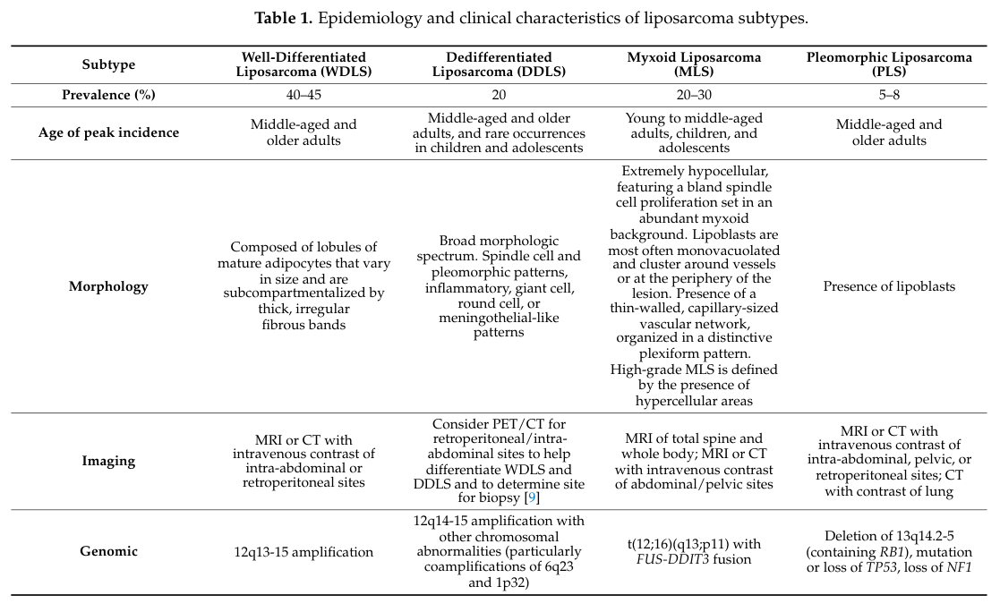

## Question

# Disease Characteristics Research Template

## Target Disease
- **Disease Name:** Liposarcoma
- **MONDO ID:**  (if available)
- **Category:** Cancer

## Research Objectives

Please provide a comprehensive research report on **Liposarcoma** covering all of the
disease characteristics listed below. This report will be used to populate a disease knowledge
base entry. Be thorough and cite primary literature (PMID preferred) for all claims.

For each section, **suggested databases/resources** are listed. These are the first places
you should search for information on each topic.

---

### 1. Disease Information
> **Search first:** OMIM, Orphanet, ICD-10/ICD-11, MeSH, PubMed

- What is the disease? Provide a concise overview.
- What are the key identifiers? (OMIM, Orphanet, ICD-10/ICD-11, MeSH, Mondo)
- What are the common synonyms and alternative names?
- Is the information derived from individual patients (e.g., EHR) or aggregated disease-level resources?

### 2. Etiology

- **Disease Causal Factors**: What are the primary causes? (genetic, environmental, infectious, mechanistic)
- **Risk Factors**:
  > **Search first:** PubMed, Cochrane Library, UpToDate, clinical guidelines, ClinVar, ClinGen, GWAS Catalog, PheGenI, CTD, CDC, WHO, epidemiological databases
  - Genetic risk factors (causal variants, susceptibility loci, modifier genes)
  - Environmental risk factors (toxins, lifestyle, occupational exposures, age, sex, family history)
- **Protective Factors**:
  > **Search first:** PubMed, Cochrane Library, clinical trial databases, GWAS Catalog, gnomAD, WHO, CDC, nutrition databases
  - Genetic protective factors (protective variants, modifier alleles)
  - Environmental protective factors (diet, lifestyle, exposures that reduce risk)
- **Gene-Environment Interactions**: How do genetic and environmental factors interact to influence disease?
  > **Search first:** CTD, PubMed, PheGenI, GxE databases

### 3. Phenotypes
> **Search first:** HPO (Human Phenotype Ontology), OMIM, Orphanet, PubMed, clinicaltrials.gov, MedDRA, SNOMED CT, DECIPHER, LOINC

For each phenotype, provide:
- **Phenotype type**: symptoms, clinical signs, physical manifestations, behavioral changes, or laboratory abnormalities
  > For symptoms/signs: HPO, OMIM, Orphanet, PubMed
  > For behavioral changes: HPO, DSM, RDoC (Research Domain Criteria), PubMed
  > For laboratory abnormalities: LOINC, SNOMED CT, LabTests Online, PubMed
- **Phenotype characteristics**:
  > **Search first:** OMIM, Orphanet, HPO, PubMed
  - Age of symptom onset (neonatal, childhood, adult-onset, late-onset)
  - Symptom severity (mild, moderate, severe, variable)
  - Symptom progression (stable, progressive, episodic, fluctuating)
  - Frequency among affected individuals (percentage or qualitative)
- **Quality of life impact**: Effects on daily functioning and well-being (per-phenotype when possible)
  > **Search first:** EQ-5D database, SF-36, WHO QOL databases, PubMed
- Suggest HPO (Human Phenotype Ontology) terms for each phenotype

### 4. Genetic/Molecular Information

- **Causal Genes**: Gene mutations or chromosomal abnormalities responsible for disease (gene symbols, OMIM IDs)
  > **Search first:** OMIM, ClinVar, HGMD, Ensembl, NCBI Gene
- **Pathogenic Variants**:
  - Affected genes (gene symbols, HGNC IDs)
    > **Search first:** OMIM, NCBI Gene, Ensembl, HGNC, UniProt, GeneCards
  - Variant classification (pathogenic, likely pathogenic, VUS per ACMG/AMP guidelines)
    > **Search first:** ClinVar, ClinGen, ACMG/AMP guidelines, VarSome
  - Variant type/class (missense, frameshift, nonsense, splice-site, structural)
  - Allele frequency in population databases
    > **Search first:** gnomAD, 1000 Genomes, ExAC, TOPMed, dbSNP
  - Somatic vs germline origin
    > **Search first:** COSMIC (somatic), ClinVar, ICGC, TCGA
  - Functional consequences (loss of function, gain of function, dominant negative)
- **Modifier Genes**: Genes that modify disease severity or expression
- **Epigenetic Information**: DNA methylation, histone modifications, chromatin changes affecting disease
  > **Search first:** ENCODE, Roadmap Epigenomics, MethBase, DiseaseMeth
- **Chromosomal Abnormalities**: Large-scale genetic changes (aneuploidy, translocations, inversions)
  > **Search first:** DECIPHER, ClinVar, ECARUCA, UCSC Genome Browser

### 5. Environmental Information

- **Environmental Factors**: Non-genetic contributing factors (toxins, radiation, pollution, occupational exposure)
  > **Search first:** CTD (Comparative Toxicogenomics Database), TOXNET, PubMed, EPA databases
- **Lifestyle Factors**: Behavioral factors (smoking, diet, exercise, alcohol consumption)
  > **Search first:** CDC databases, WHO, PubMed, NHANES
- **Infectious Agents**: If applicable, pathogens causing or triggering disease (bacteria, viruses, fungi, parasites)
  > **Search first:** NCBI Taxonomy, ViPR, BV-BRC, MicrobeDB, GIDEON

### 6. Mechanism / Pathophysiology

- **Molecular Pathways**: Specific signaling cascades or biochemical pathways involved (Wnt, MAPK, mTOR, PI3K-AKT, etc.)
  > **Search first:** KEGG, Reactome, WikiPathways, PathBank, BioCyc
- **Cellular Processes**: Cell-level mechanisms (apoptosis, autophagy, cell cycle dysregulation, inflammation, etc.)
  > **Search first:** Gene Ontology (GO), Reactome, KEGG, PubMed
- **Protein Dysfunction**: How protein structure or function is altered (misfolding, aggregation, loss of function, gain of function)
  > **Search first:** UniProt, PDB (Protein Data Bank), InterPro, Pfam, AlphaFold
- **Metabolic Changes**: Alterations in metabolic processes (energy metabolism, lipid metabolism, amino acid metabolism)
  > **Search first:** KEGG, BioCyc, HMDB (Human Metabolome Database), BRENDA
- **Immune System Involvement**: Role of immune response (autoimmunity, immunodeficiency, chronic inflammation)
  > **Search first:** ImmPort, Immunome Database, IEDB, Gene Ontology
- **Tissue Damage Mechanisms**: How tissues/ are injured (oxidative stress, ischemia, fibrosis, necrosis)
  > **Search first:** PubMed, Gene Ontology, Reactome
- **Biochemical Abnormalities**: Specific molecular defects (enzyme deficiencies, receptor dysfunction, ion channel defects)
  > **Search first:** BRENDA, UniProt, KEGG, OMIM, PubMed
- **Epigenetic Changes**: DNA methylation, histone modifications affecting gene expression in disease
  > **Search first:** ENCODE, Roadmap Epigenomics, MethBase, DiseaseMeth
- **Molecular Profiling** (if available):
  - Transcriptomics/gene expression changes
    > **Search first:** GEO (Gene Expression Omnibus), ArrayExpress, GTEx, Human Cell Atlas, SRA
  - Proteomics findings
    > **Search first:** PRIDE, ProteomeXchange, Human Protein Atlas, STRING, BioGRID
  - Metabolomics signatures
    > **Search first:** MetaboLights, Metabolomics Workbench, HMDB, METLIN
  - Lipidomics alterations
    > **Search first:** LIPID MAPS, SwissLipids, LipidHome, Metabolomics Workbench
  - Genomic structural features
    > **Search first:** UCSC Genome Browser, Ensembl, NCBI, dbVar, DGV
- **Advanced Technologies** (if applicable):
  - Single-cell analysis findings (cell-type specific mechanisms, cellular heterogeneity)
    > **Search first:** Human Cell Atlas, Single Cell Portal, GEO, CELLxGENE
  - Spatial transcriptomics findings
    > **Search first:** GEO, Spatial Research, Vizgen, 10x Genomics data
  - Multi-omics integration results
    > **Search first:** TCGA, ICGC, cBioPortal, LinkedOmics, PubMed
  - Functional genomics screens (CRISPR, RNAi)
    > **Search first:** DepMap, GenomeRNAi, PubMed, BioGRID ORCS

For each mechanism, describe:
- The causal chain from initial trigger to clinical manifestation
- Which mechanisms are upstream vs downstream
- What cell types and biological processes are involved
- Suggest GO terms for biological processes and CL terms for cell types

### 7. Anatomical Structures Affected

- **Organ Level**:
  - Primary organs directly affected
  - Secondary organ involvement (complications, secondary effects)
  - Body systems involved (cardiovascular, nervous, digestive, respiratory, endocrine, etc.)
  > **Search first:** Uberon, FMA (Foundational Model of Anatomy), OMIM, HPO, ICD-11, MeSH, SNOMED CT
- **Tissue and Cell Level**:
  - Specific tissue types affected (epithelial, connective, muscle, nervous)
  - Specific cell populations targeted (with Cell Ontology terms)
  > **Search first:** Uberon, Human Protein Atlas, Cell Ontology, Human Cell Atlas, CellMarker, PanglaoDB
- **Subcellular Level**:
  - Cellular compartments involved (mitochondria, nucleus, ER, lysosomes) (with GO Cellular Component terms)
  > **Search first:** Gene Ontology (Cellular Component), UniProt, Human Protein Atlas
- **Localization**:
  - Specific anatomical sites (with UBERON terms)
    > **Search first:** FMA, Uberon, NeuroNames (for brain), SNOMED CT
  - Lateralization (unilateral, bilateral, asymmetric)
    > **Search first:** HPO, clinical literature, imaging databases

### 8. Temporal Development

- **Onset**:
  - Typical age of onset (congenital, pediatric, adult, geriatric)
  - Onset pattern (acute, subacute, chronic, insidious)
  > **Search first:** OMIM, Orphanet, HPO, PubMed
- **Progression**:
  - Disease stages (early, intermediate, advanced, end-stage)
    > **Search first:** Cancer Staging Manual (AJCC), WHO classifications, PubMed
  - Progression rate (rapid, slow, variable)
  - Disease course pattern (episodic, relapsing-remitting, progressive, stable)
  - Disease duration (self-limited, chronic lifelong)
  > **Search first:** Disease registries, longitudinal cohort databases, natural history studies, PubMed, Orphanet, OMIM
- **Patterns**:
  - Remission patterns (spontaneous, treatment-induced)
    > **Search first:** Clinical trial databases, disease registries, PubMed
  - Critical periods (time windows of vulnerability or opportunity for intervention)
    > **Search first:** PubMed, developmental biology databases, clinical guidelines

### 9. Inheritance and Population

- **Epidemiology**:
  - Prevalence (cases per 100,000 at given time)
  - Incidence (new cases per 100,000 per year)
  > **Search first:** Orphanet, CDC, WHO, GBD (Global Burden of Disease), national registries, SEER, disease registries
- **For Genetic Etiology**:
  - Inheritance pattern (AD, AR, X-linked, mitochondrial, multifactorial, polygenic)
    > **Search first:** OMIM, Orphanet, ClinVar, GTR (Genetic Testing Registry)
  - Penetrance (complete, incomplete, age-dependent)
    > **Search first:** ClinVar, OMIM, PubMed, ClinGen
  - Expressivity (variable, consistent)
    > **Search first:** OMIM, ClinVar, PubMed
  - Genetic anticipation (increasing severity in successive generations)
    > **Search first:** OMIM, PubMed (especially for repeat expansion disorders)
  - Germline mosaicism
    > **Search first:** ClinVar, OMIM, genetic counseling literature, PubMed
  - Founder effects (population-specific mutations)
    > **Search first:** gnomAD, population genetics databases, PubMed
  - Consanguinity role
    > **Search first:** OMIM, population studies, genetic counseling resources
  - Carrier frequency
    > **Search first:** gnomAD, carrier screening databases, GeneReviews, GTR
- **Population Demographics**:
  - Affected populations (ethnic or demographic groups with higher prevalence)
    > **Search first:** gnomAD, 1000 Genomes, PAGE Study, PubMed, population registries
  - Geographic distribution (endemic areas, regional variation)
    > **Search first:** WHO, CDC, GBD, Orphanet, geographic epidemiology databases
  - Geographic distribution of specific variants
  - Sex ratio (male:female)
    > **Search first:** Disease registries, OMIM, PubMed, epidemiological databases
  - Age distribution of affected individuals
    > **Search first:** CDC, disease registries, SEER, Orphanet

### 10. Diagnostics

- **Clinical Tests**:
  - Laboratory tests (blood, urine, tissue chemistry, specific enzyme assays)
    > **Search first:** LOINC, LabTests Online, PubMed
  - Biomarkers (proteins, metabolites, genetic markers, circulating biomarkers)
    > **Search first:** FDA Biomarker List, BEST (Biomarkers, EndpointS, and other Tools), PubMed
  - Imaging studies (X-ray, CT, MRI, PET, ultrasound)
    > **Search first:** RadLex, DICOM, Radiopaedia, imaging databases
  - Functional tests (pulmonary function, cardiac stress tests)
    > **Search first:** LOINC, clinical guidelines, PubMed
  - Electrophysiology (EEG, EMG, ECG, nerve conduction studies)
    > **Search first:** LOINC, clinical neurophysiology databases, PubMed
  - Biopsy findings (histopathology, immunohistochemistry)
    > **Search first:** SNOMED CT, College of American Pathologists resources, PubMed
  - Pathology findings (microscopic examination)
    > **Search first:** SNOMED CT, Digital Pathology databases, PubMed
- **Genetic Testing**:
  > **Search first:** GTR (Genetic Testing Registry), GeneReviews, ClinGen
  - Overview of recommended genetic testing approach
  - Whole genome sequencing (WGS) utility
    > **Search first:** GTR, ClinVar, GEL (Genomics England), gnomAD
  - Whole exome sequencing (WES) utility
    > **Search first:** GTR, ClinVar, OMIM, GeneMatcher
  - Gene panels (which panels, which genes)
    > **Search first:** GTR, ClinVar, laboratory-specific databases
  - Single gene testing
    > **Search first:** GTR, ClinVar, OMIM, GeneReviews
  - Chromosomal microarray (CMA)
    > **Search first:** DECIPHER, ClinVar, dbVar, ECARUCA
  - Karyotyping
    > **Search first:** Chromosome Abnormality Database, ClinVar, cytogenetics resources
  - FISH
    > **Search first:** ClinVar, cytogenetics databases, PubMed
  - Mitochondrial DNA testing
    > **Search first:** MITOMAP, MSeqDR, ClinVar, GTR
  - Repeat expansion testing
    > **Search first:** GTR, ClinVar, repeat expansion databases, PubMed
- **Omics-Based Diagnostics** (if applicable):
  - RNA sequencing / transcriptomics
    > **Search first:** GEO, ArrayExpress, GTEx, RNA-seq databases
  - Proteomics
    > **Search first:** PRIDE, ProteomeXchange, FDA Biomarker database
  - Metabolomics
    > **Search first:** MetaboLights, Metabolomics Workbench, HMDB
  - Epigenomics
    > **Search first:** GEO, ENCODE, Roadmap Epigenomics, MethBase
  - Liquid biopsy
    > **Search first:** COSMIC, ClinVar, liquid biopsy databases, PubMed
- **Clinical Criteria**:
  - Standardized diagnostic criteria (DSM, ICD, society guidelines)
    > **Search first:** DSM-5, ICD-11, clinical society guidelines, UpToDate
  - Differential diagnosis (other conditions to rule out, with distinguishing features)
    > **Search first:** DynaMed, UpToDate, clinical decision support systems
- **Screening**:
  - Screening methods for asymptomatic individuals (newborn screening, carrier screening, cascade screening)
    > **Search first:** ACMG recommendations, CDC newborn screening, GTR

### 11. Outcome/Prognosis

- **Survival and Mortality**:
  - Survival rate (5-year, 10-year, overall)
    > **Search first:** SEER, cancer registries, disease-specific registries, PubMed
  - Life expectancy (with and without treatment if applicable)
    > **Search first:** Orphanet, disease registries, actuarial databases, PubMed
  - Mortality rate
    > **Search first:** CDC, WHO, GBD, national mortality databases
  - Disease-specific mortality (deaths directly attributable to disease)
    > **Search first:** Disease registries, CDC Wonder, GBD, PubMed
- **Morbidity and Function**:
  - Morbidity (disease-related disability and health impacts)
    > **Search first:** GBD, WHO, disability databases, PubMed
  - Disability outcomes (long-term functional impairments)
    > **Search first:** ICF (International Classification of Functioning), disability registries
  - Quality of life measures (EQ-5D, SF-36, PROMIS, disease-specific tools)
    > **Search first:** EQ-5D database, SF-36, PROMIS, PubMed
- **Disease Course**:
  - Complications (secondary problems: infections, organ failure, etc.)
    > **Search first:** ICD codes, disease registries, clinical databases, PubMed
  - Recovery potential (likelihood and extent of recovery, with vs without treatment)
    > **Search first:** Natural history studies, rehabilitation databases, PubMed
- **Prediction**:
  - Prognostic factors (age, disease severity, biomarkers, treatment response)
    > **Search first:** Prognostic models databases, clinical calculators, PubMed
  - Prognostic biomarkers (molecular markers predicting disease course)
    > **Search first:** FDA Biomarker database, PubMed, cancer prognostic databases

### 12. Treatment

- **Pharmacotherapy**:
  - Pharmacological treatments (drug names, drug classes, mechanisms of action)
    > **Search first:** DrugBank, RxNorm, ATC classification, DailyMed, FDA databases
  - Pharmacogenomics (how genetic variants affect drug metabolism, efficacy, toxicity)
    > **Search first:** PharmGKB, CPIC (Clinical Pharmacogenetics), FDA Table of PGx Biomarkers
- **Advanced Therapeutics**:
  - Gene therapy (viral vectors, CRISPR, gene replacement, gene editing)
    > **Search first:** ClinicalTrials.gov, FDA gene therapy database, ASGCT resources
  - Cell therapy (stem cell transplant, CAR-T, cellular therapeutics)
    > **Search first:** ClinicalTrials.gov, FDA cell therapy database, FACT standards
  - RNA-based therapies (ASOs, siRNA, mRNA therapies)
    > **Search first:** ClinicalTrials.gov, FDA approvals, PubMed
  - Targeted therapies (treatments directed at specific molecular targets)
    > **Search first:** My Cancer Genome, OncoKB, ClinicalTrials.gov, FDA approvals
  - Immunotherapies (checkpoint inhibitors, monoclonal antibodies)
    > **Search first:** Cancer Immunotherapy Database, FDA approvals, ClinicalTrials.gov
- **Surgical and Interventional**:
  - Surgical interventions (types of surgery, timing, outcomes)
    > **Search first:** CPT codes, surgical registries, clinical guidelines, PubMed
- **Supportive and Rehabilitative**:
  - Supportive care (symptom management, pain control, nutrition)
    > **Search first:** Clinical guidelines, Cochrane Library, PubMed
  - Rehabilitation (physical therapy, occupational therapy, speech therapy)
    > **Search first:** Rehabilitation medicine databases, clinical guidelines, PubMed
- **Experimental**:
  - Experimental treatments in clinical trials (with NCT identifiers if available)
    > **Search first:** ClinicalTrials.gov, EU Clinical Trials Register, WHO ICTRP
- **Treatment Outcomes**:
  - Treatment response rates
    > **Search first:** Clinical trial databases, FDA reviews, systematic reviews, PubMed
  - Side effects and adverse events
    > **Search first:** FDA Adverse Event Reporting System (FAERS), MedWatch, PubMed
- **Treatment Strategy**:
  - Treatment algorithms (clinical pathways, decision trees)
    > **Search first:** Clinical practice guidelines, NCCN Guidelines, UpToDate
  - Combination therapies
    > **Search first:** ClinicalTrials.gov, treatment guidelines, PubMed
  - Personalized medicine approaches (genotype-guided treatment)
    > **Search first:** My Cancer Genome, CIViC, PharmGKB, precision medicine databases

For each treatment, suggest MAXO (Medical Action Ontology) terms where applicable.

### 13. Prevention

- **Prevention Levels**:
  - Primary prevention (preventing disease occurrence: vaccination, risk factor modification)
    > **Search first:** CDC, WHO, USPSTF recommendations, Cochrane Library
  - Secondary prevention (early detection and treatment: screening programs, early intervention)
    > **Search first:** USPSTF, CDC screening guidelines, WHO
  - Tertiary prevention (preventing complications in those with disease)
    > **Search first:** Clinical guidelines, disease management protocols, PubMed
- **Immunization**: Vaccine strategies (if applicable)
  > **Search first:** CDC vaccine schedules, WHO immunization, FDA vaccine database
- **Screening and Early Detection**:
  - Screening programs (population-based: newborn screening, cancer screening)
    > **Search first:** CDC screening programs, USPSTF, cancer screening databases
  - Genetic screening (carrier screening, preimplantation genetic diagnosis, prenatal testing)
    > **Search first:** ACMG recommendations, ACOG guidelines, GTR
  - Risk stratification (identifying high-risk individuals for targeted prevention)
    > **Search first:** Risk prediction models, clinical calculators, PubMed
- **Behavioral Interventions**: Lifestyle modifications to reduce risk
  > **Search first:** CDC, WHO, behavioral intervention databases, Cochrane Library
- **Counseling**: Genetic counseling (risk assessment, family planning guidance)
  > **Search first:** NSGC resources, ACMG guidelines, GeneReviews
- **Public Health**:
  - Public health interventions (sanitation, vector control, health education)
    > **Search first:** CDC, WHO, public health databases, PubMed
  - Environmental interventions (reducing environmental risk factors)
    > **Search first:** EPA databases, WHO environmental health, PubMed
- **Prophylaxis**: Preventive medications or procedures
  > **Search first:** Clinical guidelines, FDA approvals, PubMed

### 14. Other Species / Natural Disease

- **Taxonomy**: Species affected (with NCBI Taxon identifiers)
  > **Search first:** NCBI Taxonomy
- **Breed**: Specific breeds affected (with VBO identifiers if applicable)
  > **Search first:** VBO (Vertebrate Breed Ontology)
- **Gene**: Orthologous genes in other species (with NCBI Gene IDs)
  > **Search first:** NCBI Gene
- **Natural Disease**:
  - Naturally occurring disease in other species (companion animals, wildlife)
    > **Search first:** OMIA (Online Mendelian Inheritance in Animals), VetCompass, PubMed
  - Veterinary relevance and importance in animal health
    > **Search first:** OMIA, veterinary databases, PubMed
- **Comparative Biology**:
  - Comparative pathology (similarities and differences across species)
    > **Search first:** OMIA, comparative pathology databases, PubMed
  - Evolutionary conservation of disease mechanisms
    > **Search first:** HomoloGene, OrthoMCL, Alliance of Genome Resources
- **Transmission** (if applicable):
  - Zoonotic potential
    > **Search first:** CDC zoonotic diseases, WHO zoonoses, GIDEON
  - Cross-species susceptibility
    > **Search first:** NCBI Taxonomy, veterinary databases, PubMed

### 15. Model Organisms

- **Model Types**:
  - Model organism type (mammalian, invertebrate, cellular, in vitro)
    > **Search first:** Alliance of Genome Resources, model organism databases
  - Specific model systems (mouse, rat, zebrafish, Drosophila, C. elegans, yeast, cell lines, organoids, iPSCs)
    > **Search first:** MGI, RGD, ZFIN, FlyBase, WormBase, SGD, ATCC, Cellosaurus
  - Induced models (drug treatment, surgical intervention, environmental manipulation)
    > **Search first:** MGI, model organism databases, PubMed
- **Genetic Models**:
  - Types available (knockout, knock-in, transgenic, conditional, humanized)
    > **Search first:** MGI, IMPC, KOMP, EuMMCR, IMSR
- **Model Characteristics**:
  - Phenotype recapitulation (how well model reproduces human disease features)
    > **Search first:** Model organism databases, comparative studies, PubMed
  - Model limitations (aspects of human disease not captured)
    > **Search first:** Model organism databases, PubMed, review articles
- **Applications**:
  - Research applications (what aspects of disease can be studied)
    > **Search first:** Model organism databases, PubMed
- **Resources**:
  - Model databases
    > **Search first:** MGI, RGD, ZFIN, FlyBase, WormBase, IMSR, EMMA, MMRRC

---

## Citation Requirements

- Cite primary literature (PMID preferred) for all mechanistic and clinical claims
- Prioritize recent reviews and landmark papers
- Include direct quotes from abstracts where possible to support key statements
- Distinguish evidence source types: human clinical, model organism, in vitro, computational

## Output Format

Structure your response as a comprehensive narrative organized by the sections above.
For each section, provide:
- Factual content with specific details (numbers, percentages, gene names, variant nomenclature)
- Ontology term suggestions (HPO, GO, CL, UBERON, CHEBI, MAXO, MONDO) where applicable
- Evidence citations with PMIDs
- Direct quotes from abstracts to support key claims
- Clear indication when information is not available or not applicable for this disease

This report will be used to populate a disease knowledge base entry with:
- Pathophysiology descriptions with causal chains
- Gene/protein annotations (HGNC, GO terms)
- Phenotype associations (HP terms) with frequencies
- Cell type involvement (CL terms)
- Anatomical locations (UBERON terms)
- Chemical entities (CHEBI terms)
- Treatment annotations (MAXO terms)
- Evidence items with PMIDs and exact abstract quotes
- Epidemiology, prognosis, diagnostic, and prevention information
- Animal model descriptions with phenotype recapitulation details

## Output

Question: You are an expert researcher providing comprehensive, well-cited information.

Provide detailed information focusing on:
1. Key concepts and definitions with current understanding
2. Recent developments and latest research (prioritize 2023-2024 sources)
3. Current applications and real-world implementations
4. Expert opinions and analysis from authoritative sources
5. Relevant statistics and data from recent studies

Format as a comprehensive research report with proper citations. Include URLs and publication dates where available.
Always prioritize recent, authoritative sources and provide specific citations for all major claims.

# Disease Characteristics Research Template

## Target Disease
- **Disease Name:** Liposarcoma
- **MONDO ID:**  (if available)
- **Category:** Cancer

## Research Objectives

Please provide a comprehensive research report on **Liposarcoma** covering all of the
disease characteristics listed below. This report will be used to populate a disease knowledge
base entry. Be thorough and cite primary literature (PMID preferred) for all claims.

For each section, **suggested databases/resources** are listed. These are the first places
you should search for information on each topic.

---

### 1. Disease Information
> **Search first:** OMIM, Orphanet, ICD-10/ICD-11, MeSH, PubMed

- What is the disease? Provide a concise overview.
- What are the key identifiers? (OMIM, Orphanet, ICD-10/ICD-11, MeSH, Mondo)
- What are the common synonyms and alternative names?
- Is the information derived from individual patients (e.g., EHR) or aggregated disease-level resources?

### 2. Etiology

- **Disease Causal Factors**: What are the primary causes? (genetic, environmental, infectious, mechanistic)
- **Risk Factors**:
  > **Search first:** PubMed, Cochrane Library, UpToDate, clinical guidelines, ClinVar, ClinGen, GWAS Catalog, PheGenI, CTD, CDC, WHO, epidemiological databases
  - Genetic risk factors (causal variants, susceptibility loci, modifier genes)
  - Environmental risk factors (toxins, lifestyle, occupational exposures, age, sex, family history)
- **Protective Factors**:
  > **Search first:** PubMed, Cochrane Library, clinical trial databases, GWAS Catalog, gnomAD, WHO, CDC, nutrition databases
  - Genetic protective factors (protective variants, modifier alleles)
  - Environmental protective factors (diet, lifestyle, exposures that reduce risk)
- **Gene-Environment Interactions**: How do genetic and environmental factors interact to influence disease?
  > **Search first:** CTD, PubMed, PheGenI, GxE databases

### 3. Phenotypes
> **Search first:** HPO (Human Phenotype Ontology), OMIM, Orphanet, PubMed, clinicaltrials.gov, MedDRA, SNOMED CT, DECIPHER, LOINC

For each phenotype, provide:
- **Phenotype type**: symptoms, clinical signs, physical manifestations, behavioral changes, or laboratory abnormalities
  > For symptoms/signs: HPO, OMIM, Orphanet, PubMed
  > For behavioral changes: HPO, DSM, RDoC (Research Domain Criteria), PubMed
  > For laboratory abnormalities: LOINC, SNOMED CT, LabTests Online, PubMed
- **Phenotype characteristics**:
  > **Search first:** OMIM, Orphanet, HPO, PubMed
  - Age of symptom onset (neonatal, childhood, adult-onset, late-onset)
  - Symptom severity (mild, moderate, severe, variable)
  - Symptom progression (stable, progressive, episodic, fluctuating)
  - Frequency among affected individuals (percentage or qualitative)
- **Quality of life impact**: Effects on daily functioning and well-being (per-phenotype when possible)
  > **Search first:** EQ-5D database, SF-36, WHO QOL databases, PubMed
- Suggest HPO (Human Phenotype Ontology) terms for each phenotype

### 4. Genetic/Molecular Information

- **Causal Genes**: Gene mutations or chromosomal abnormalities responsible for disease (gene symbols, OMIM IDs)
  > **Search first:** OMIM, ClinVar, HGMD, Ensembl, NCBI Gene
- **Pathogenic Variants**:
  - Affected genes (gene symbols, HGNC IDs)
    > **Search first:** OMIM, NCBI Gene, Ensembl, HGNC, UniProt, GeneCards
  - Variant classification (pathogenic, likely pathogenic, VUS per ACMG/AMP guidelines)
    > **Search first:** ClinVar, ClinGen, ACMG/AMP guidelines, VarSome
  - Variant type/class (missense, frameshift, nonsense, splice-site, structural)
  - Allele frequency in population databases
    > **Search first:** gnomAD, 1000 Genomes, ExAC, TOPMed, dbSNP
  - Somatic vs germline origin
    > **Search first:** COSMIC (somatic), ClinVar, ICGC, TCGA
  - Functional consequences (loss of function, gain of function, dominant negative)
- **Modifier Genes**: Genes that modify disease severity or expression
- **Epigenetic Information**: DNA methylation, histone modifications, chromatin changes affecting disease
  > **Search first:** ENCODE, Roadmap Epigenomics, MethBase, DiseaseMeth
- **Chromosomal Abnormalities**: Large-scale genetic changes (aneuploidy, translocations, inversions)
  > **Search first:** DECIPHER, ClinVar, ECARUCA, UCSC Genome Browser

### 5. Environmental Information

- **Environmental Factors**: Non-genetic contributing factors (toxins, radiation, pollution, occupational exposure)
  > **Search first:** CTD (Comparative Toxicogenomics Database), TOXNET, PubMed, EPA databases
- **Lifestyle Factors**: Behavioral factors (smoking, diet, exercise, alcohol consumption)
  > **Search first:** CDC databases, WHO, PubMed, NHANES
- **Infectious Agents**: If applicable, pathogens causing or triggering disease (bacteria, viruses, fungi, parasites)
  > **Search first:** NCBI Taxonomy, ViPR, BV-BRC, MicrobeDB, GIDEON

### 6. Mechanism / Pathophysiology

- **Molecular Pathways**: Specific signaling cascades or biochemical pathways involved (Wnt, MAPK, mTOR, PI3K-AKT, etc.)
  > **Search first:** KEGG, Reactome, WikiPathways, PathBank, BioCyc
- **Cellular Processes**: Cell-level mechanisms (apoptosis, autophagy, cell cycle dysregulation, inflammation, etc.)
  > **Search first:** Gene Ontology (GO), Reactome, KEGG, PubMed
- **Protein Dysfunction**: How protein structure or function is altered (misfolding, aggregation, loss of function, gain of function)
  > **Search first:** UniProt, PDB (Protein Data Bank), InterPro, Pfam, AlphaFold
- **Metabolic Changes**: Alterations in metabolic processes (energy metabolism, lipid metabolism, amino acid metabolism)
  > **Search first:** KEGG, BioCyc, HMDB (Human Metabolome Database), BRENDA
- **Immune System Involvement**: Role of immune response (autoimmunity, immunodeficiency, chronic inflammation)
  > **Search first:** ImmPort, Immunome Database, IEDB, Gene Ontology
- **Tissue Damage Mechanisms**: How tissues/ are injured (oxidative stress, ischemia, fibrosis, necrosis)
  > **Search first:** PubMed, Gene Ontology, Reactome
- **Biochemical Abnormalities**: Specific molecular defects (enzyme deficiencies, receptor dysfunction, ion channel defects)
  > **Search first:** BRENDA, UniProt, KEGG, OMIM, PubMed
- **Epigenetic Changes**: DNA methylation, histone modifications affecting gene expression in disease
  > **Search first:** ENCODE, Roadmap Epigenomics, MethBase, DiseaseMeth
- **Molecular Profiling** (if available):
  - Transcriptomics/gene expression changes
    > **Search first:** GEO (Gene Expression Omnibus), ArrayExpress, GTEx, Human Cell Atlas, SRA
  - Proteomics findings
    > **Search first:** PRIDE, ProteomeXchange, Human Protein Atlas, STRING, BioGRID
  - Metabolomics signatures
    > **Search first:** MetaboLights, Metabolomics Workbench, HMDB, METLIN
  - Lipidomics alterations
    > **Search first:** LIPID MAPS, SwissLipids, LipidHome, Metabolomics Workbench
  - Genomic structural features
    > **Search first:** UCSC Genome Browser, Ensembl, NCBI, dbVar, DGV
- **Advanced Technologies** (if applicable):
  - Single-cell analysis findings (cell-type specific mechanisms, cellular heterogeneity)
    > **Search first:** Human Cell Atlas, Single Cell Portal, GEO, CELLxGENE
  - Spatial transcriptomics findings
    > **Search first:** GEO, Spatial Research, Vizgen, 10x Genomics data
  - Multi-omics integration results
    > **Search first:** TCGA, ICGC, cBioPortal, LinkedOmics, PubMed
  - Functional genomics screens (CRISPR, RNAi)
    > **Search first:** DepMap, GenomeRNAi, PubMed, BioGRID ORCS

For each mechanism, describe:
- The causal chain from initial trigger to clinical manifestation
- Which mechanisms are upstream vs downstream
- What cell types and biological processes are involved
- Suggest GO terms for biological processes and CL terms for cell types

### 7. Anatomical Structures Affected

- **Organ Level**:
  - Primary organs directly affected
  - Secondary organ involvement (complications, secondary effects)
  - Body systems involved (cardiovascular, nervous, digestive, respiratory, endocrine, etc.)
  > **Search first:** Uberon, FMA (Foundational Model of Anatomy), OMIM, HPO, ICD-11, MeSH, SNOMED CT
- **Tissue and Cell Level**:
  - Specific tissue types affected (epithelial, connective, muscle, nervous)
  - Specific cell populations targeted (with Cell Ontology terms)
  > **Search first:** Uberon, Human Protein Atlas, Cell Ontology, Human Cell Atlas, CellMarker, PanglaoDB
- **Subcellular Level**:
  - Cellular compartments involved (mitochondria, nucleus, ER, lysosomes) (with GO Cellular Component terms)
  > **Search first:** Gene Ontology (Cellular Component), UniProt, Human Protein Atlas
- **Localization**:
  - Specific anatomical sites (with UBERON terms)
    > **Search first:** FMA, Uberon, NeuroNames (for brain), SNOMED CT
  - Lateralization (unilateral, bilateral, asymmetric)
    > **Search first:** HPO, clinical literature, imaging databases

### 8. Temporal Development

- **Onset**:
  - Typical age of onset (congenital, pediatric, adult, geriatric)
  - Onset pattern (acute, subacute, chronic, insidious)
  > **Search first:** OMIM, Orphanet, HPO, PubMed
- **Progression**:
  - Disease stages (early, intermediate, advanced, end-stage)
    > **Search first:** Cancer Staging Manual (AJCC), WHO classifications, PubMed
  - Progression rate (rapid, slow, variable)
  - Disease course pattern (episodic, relapsing-remitting, progressive, stable)
  - Disease duration (self-limited, chronic lifelong)
  > **Search first:** Disease registries, longitudinal cohort databases, natural history studies, PubMed, Orphanet, OMIM
- **Patterns**:
  - Remission patterns (spontaneous, treatment-induced)
    > **Search first:** Clinical trial databases, disease registries, PubMed
  - Critical periods (time windows of vulnerability or opportunity for intervention)
    > **Search first:** PubMed, developmental biology databases, clinical guidelines

### 9. Inheritance and Population

- **Epidemiology**:
  - Prevalence (cases per 100,000 at given time)
  - Incidence (new cases per 100,000 per year)
  > **Search first:** Orphanet, CDC, WHO, GBD (Global Burden of Disease), national registries, SEER, disease registries
- **For Genetic Etiology**:
  - Inheritance pattern (AD, AR, X-linked, mitochondrial, multifactorial, polygenic)
    > **Search first:** OMIM, Orphanet, ClinVar, GTR (Genetic Testing Registry)
  - Penetrance (complete, incomplete, age-dependent)
    > **Search first:** ClinVar, OMIM, PubMed, ClinGen
  - Expressivity (variable, consistent)
    > **Search first:** OMIM, ClinVar, PubMed
  - Genetic anticipation (increasing severity in successive generations)
    > **Search first:** OMIM, PubMed (especially for repeat expansion disorders)
  - Germline mosaicism
    > **Search first:** ClinVar, OMIM, genetic counseling literature, PubMed
  - Founder effects (population-specific mutations)
    > **Search first:** gnomAD, population genetics databases, PubMed
  - Consanguinity role
    > **Search first:** OMIM, population studies, genetic counseling resources
  - Carrier frequency
    > **Search first:** gnomAD, carrier screening databases, GeneReviews, GTR
- **Population Demographics**:
  - Affected populations (ethnic or demographic groups with higher prevalence)
    > **Search first:** gnomAD, 1000 Genomes, PAGE Study, PubMed, population registries
  - Geographic distribution (endemic areas, regional variation)
    > **Search first:** WHO, CDC, GBD, Orphanet, geographic epidemiology databases
  - Geographic distribution of specific variants
  - Sex ratio (male:female)
    > **Search first:** Disease registries, OMIM, PubMed, epidemiological databases
  - Age distribution of affected individuals
    > **Search first:** CDC, disease registries, SEER, Orphanet

### 10. Diagnostics

- **Clinical Tests**:
  - Laboratory tests (blood, urine, tissue chemistry, specific enzyme assays)
    > **Search first:** LOINC, LabTests Online, PubMed
  - Biomarkers (proteins, metabolites, genetic markers, circulating biomarkers)
    > **Search first:** FDA Biomarker List, BEST (Biomarkers, EndpointS, and other Tools), PubMed
  - Imaging studies (X-ray, CT, MRI, PET, ultrasound)
    > **Search first:** RadLex, DICOM, Radiopaedia, imaging databases
  - Functional tests (pulmonary function, cardiac stress tests)
    > **Search first:** LOINC, clinical guidelines, PubMed
  - Electrophysiology (EEG, EMG, ECG, nerve conduction studies)
    > **Search first:** LOINC, clinical neurophysiology databases, PubMed
  - Biopsy findings (histopathology, immunohistochemistry)
    > **Search first:** SNOMED CT, College of American Pathologists resources, PubMed
  - Pathology findings (microscopic examination)
    > **Search first:** SNOMED CT, Digital Pathology databases, PubMed
- **Genetic Testing**:
  > **Search first:** GTR (Genetic Testing Registry), GeneReviews, ClinGen
  - Overview of recommended genetic testing approach
  - Whole genome sequencing (WGS) utility
    > **Search first:** GTR, ClinVar, GEL (Genomics England), gnomAD
  - Whole exome sequencing (WES) utility
    > **Search first:** GTR, ClinVar, OMIM, GeneMatcher
  - Gene panels (which panels, which genes)
    > **Search first:** GTR, ClinVar, laboratory-specific databases
  - Single gene testing
    > **Search first:** GTR, ClinVar, OMIM, GeneReviews
  - Chromosomal microarray (CMA)
    > **Search first:** DECIPHER, ClinVar, dbVar, ECARUCA
  - Karyotyping
    > **Search first:** Chromosome Abnormality Database, ClinVar, cytogenetics resources
  - FISH
    > **Search first:** ClinVar, cytogenetics databases, PubMed
  - Mitochondrial DNA testing
    > **Search first:** MITOMAP, MSeqDR, ClinVar, GTR
  - Repeat expansion testing
    > **Search first:** GTR, ClinVar, repeat expansion databases, PubMed
- **Omics-Based Diagnostics** (if applicable):
  - RNA sequencing / transcriptomics
    > **Search first:** GEO, ArrayExpress, GTEx, RNA-seq databases
  - Proteomics
    > **Search first:** PRIDE, ProteomeXchange, FDA Biomarker database
  - Metabolomics
    > **Search first:** MetaboLights, Metabolomics Workbench, HMDB
  - Epigenomics
    > **Search first:** GEO, ENCODE, Roadmap Epigenomics, MethBase
  - Liquid biopsy
    > **Search first:** COSMIC, ClinVar, liquid biopsy databases, PubMed
- **Clinical Criteria**:
  - Standardized diagnostic criteria (DSM, ICD, society guidelines)
    > **Search first:** DSM-5, ICD-11, clinical society guidelines, UpToDate
  - Differential diagnosis (other conditions to rule out, with distinguishing features)
    > **Search first:** DynaMed, UpToDate, clinical decision support systems
- **Screening**:
  - Screening methods for asymptomatic individuals (newborn screening, carrier screening, cascade screening)
    > **Search first:** ACMG recommendations, CDC newborn screening, GTR

### 11. Outcome/Prognosis

- **Survival and Mortality**:
  - Survival rate (5-year, 10-year, overall)
    > **Search first:** SEER, cancer registries, disease-specific registries, PubMed
  - Life expectancy (with and without treatment if applicable)
    > **Search first:** Orphanet, disease registries, actuarial databases, PubMed
  - Mortality rate
    > **Search first:** CDC, WHO, GBD, national mortality databases
  - Disease-specific mortality (deaths directly attributable to disease)
    > **Search first:** Disease registries, CDC Wonder, GBD, PubMed
- **Morbidity and Function**:
  - Morbidity (disease-related disability and health impacts)
    > **Search first:** GBD, WHO, disability databases, PubMed
  - Disability outcomes (long-term functional impairments)
    > **Search first:** ICF (International Classification of Functioning), disability registries
  - Quality of life measures (EQ-5D, SF-36, PROMIS, disease-specific tools)
    > **Search first:** EQ-5D database, SF-36, PROMIS, PubMed
- **Disease Course**:
  - Complications (secondary problems: infections, organ failure, etc.)
    > **Search first:** ICD codes, disease registries, clinical databases, PubMed
  - Recovery potential (likelihood and extent of recovery, with vs without treatment)
    > **Search first:** Natural history studies, rehabilitation databases, PubMed
- **Prediction**:
  - Prognostic factors (age, disease severity, biomarkers, treatment response)
    > **Search first:** Prognostic models databases, clinical calculators, PubMed
  - Prognostic biomarkers (molecular markers predicting disease course)
    > **Search first:** FDA Biomarker database, PubMed, cancer prognostic databases

### 12. Treatment

- **Pharmacotherapy**:
  - Pharmacological treatments (drug names, drug classes, mechanisms of action)
    > **Search first:** DrugBank, RxNorm, ATC classification, DailyMed, FDA databases
  - Pharmacogenomics (how genetic variants affect drug metabolism, efficacy, toxicity)
    > **Search first:** PharmGKB, CPIC (Clinical Pharmacogenetics), FDA Table of PGx Biomarkers
- **Advanced Therapeutics**:
  - Gene therapy (viral vectors, CRISPR, gene replacement, gene editing)
    > **Search first:** ClinicalTrials.gov, FDA gene therapy database, ASGCT resources
  - Cell therapy (stem cell transplant, CAR-T, cellular therapeutics)
    > **Search first:** ClinicalTrials.gov, FDA cell therapy database, FACT standards
  - RNA-based therapies (ASOs, siRNA, mRNA therapies)
    > **Search first:** ClinicalTrials.gov, FDA approvals, PubMed
  - Targeted therapies (treatments directed at specific molecular targets)
    > **Search first:** My Cancer Genome, OncoKB, ClinicalTrials.gov, FDA approvals
  - Immunotherapies (checkpoint inhibitors, monoclonal antibodies)
    > **Search first:** Cancer Immunotherapy Database, FDA approvals, ClinicalTrials.gov
- **Surgical and Interventional**:
  - Surgical interventions (types of surgery, timing, outcomes)
    > **Search first:** CPT codes, surgical registries, clinical guidelines, PubMed
- **Supportive and Rehabilitative**:
  - Supportive care (symptom management, pain control, nutrition)
    > **Search first:** Clinical guidelines, Cochrane Library, PubMed
  - Rehabilitation (physical therapy, occupational therapy, speech therapy)
    > **Search first:** Rehabilitation medicine databases, clinical guidelines, PubMed
- **Experimental**:
  - Experimental treatments in clinical trials (with NCT identifiers if available)
    > **Search first:** ClinicalTrials.gov, EU Clinical Trials Register, WHO ICTRP
- **Treatment Outcomes**:
  - Treatment response rates
    > **Search first:** Clinical trial databases, FDA reviews, systematic reviews, PubMed
  - Side effects and adverse events
    > **Search first:** FDA Adverse Event Reporting System (FAERS), MedWatch, PubMed
- **Treatment Strategy**:
  - Treatment algorithms (clinical pathways, decision trees)
    > **Search first:** Clinical practice guidelines, NCCN Guidelines, UpToDate
  - Combination therapies
    > **Search first:** ClinicalTrials.gov, treatment guidelines, PubMed
  - Personalized medicine approaches (genotype-guided treatment)
    > **Search first:** My Cancer Genome, CIViC, PharmGKB, precision medicine databases

For each treatment, suggest MAXO (Medical Action Ontology) terms where applicable.

### 13. Prevention

- **Prevention Levels**:
  - Primary prevention (preventing disease occurrence: vaccination, risk factor modification)
    > **Search first:** CDC, WHO, USPSTF recommendations, Cochrane Library
  - Secondary prevention (early detection and treatment: screening programs, early intervention)
    > **Search first:** USPSTF, CDC screening guidelines, WHO
  - Tertiary prevention (preventing complications in those with disease)
    > **Search first:** Clinical guidelines, disease management protocols, PubMed
- **Immunization**: Vaccine strategies (if applicable)
  > **Search first:** CDC vaccine schedules, WHO immunization, FDA vaccine database
- **Screening and Early Detection**:
  - Screening programs (population-based: newborn screening, cancer screening)
    > **Search first:** CDC screening programs, USPSTF, cancer screening databases
  - Genetic screening (carrier screening, preimplantation genetic diagnosis, prenatal testing)
    > **Search first:** ACMG recommendations, ACOG guidelines, GTR
  - Risk stratification (identifying high-risk individuals for targeted prevention)
    > **Search first:** Risk prediction models, clinical calculators, PubMed
- **Behavioral Interventions**: Lifestyle modifications to reduce risk
  > **Search first:** CDC, WHO, behavioral intervention databases, Cochrane Library
- **Counseling**: Genetic counseling (risk assessment, family planning guidance)
  > **Search first:** NSGC resources, ACMG guidelines, GeneReviews
- **Public Health**:
  - Public health interventions (sanitation, vector control, health education)
    > **Search first:** CDC, WHO, public health databases, PubMed
  - Environmental interventions (reducing environmental risk factors)
    > **Search first:** EPA databases, WHO environmental health, PubMed
- **Prophylaxis**: Preventive medications or procedures
  > **Search first:** Clinical guidelines, FDA approvals, PubMed

### 14. Other Species / Natural Disease

- **Taxonomy**: Species affected (with NCBI Taxon identifiers)
  > **Search first:** NCBI Taxonomy
- **Breed**: Specific breeds affected (with VBO identifiers if applicable)
  > **Search first:** VBO (Vertebrate Breed Ontology)
- **Gene**: Orthologous genes in other species (with NCBI Gene IDs)
  > **Search first:** NCBI Gene
- **Natural Disease**:
  - Naturally occurring disease in other species (companion animals, wildlife)
    > **Search first:** OMIA (Online Mendelian Inheritance in Animals), VetCompass, PubMed
  - Veterinary relevance and importance in animal health
    > **Search first:** OMIA, veterinary databases, PubMed
- **Comparative Biology**:
  - Comparative pathology (similarities and differences across species)
    > **Search first:** OMIA, comparative pathology databases, PubMed
  - Evolutionary conservation of disease mechanisms
    > **Search first:** HomoloGene, OrthoMCL, Alliance of Genome Resources
- **Transmission** (if applicable):
  - Zoonotic potential
    > **Search first:** CDC zoonotic diseases, WHO zoonoses, GIDEON
  - Cross-species susceptibility
    > **Search first:** NCBI Taxonomy, veterinary databases, PubMed

### 15. Model Organisms

- **Model Types**:
  - Model organism type (mammalian, invertebrate, cellular, in vitro)
    > **Search first:** Alliance of Genome Resources, model organism databases
  - Specific model systems (mouse, rat, zebrafish, Drosophila, C. elegans, yeast, cell lines, organoids, iPSCs)
    > **Search first:** MGI, RGD, ZFIN, FlyBase, WormBase, SGD, ATCC, Cellosaurus
  - Induced models (drug treatment, surgical intervention, environmental manipulation)
    > **Search first:** MGI, model organism databases, PubMed
- **Genetic Models**:
  - Types available (knockout, knock-in, transgenic, conditional, humanized)
    > **Search first:** MGI, IMPC, KOMP, EuMMCR, IMSR
- **Model Characteristics**:
  - Phenotype recapitulation (how well model reproduces human disease features)
    > **Search first:** Model organism databases, comparative studies, PubMed
  - Model limitations (aspects of human disease not captured)
    > **Search first:** Model organism databases, PubMed, review articles
- **Applications**:
  - Research applications (what aspects of disease can be studied)
    > **Search first:** Model organism databases, PubMed
- **Resources**:
  - Model databases
    > **Search first:** MGI, RGD, ZFIN, FlyBase, WormBase, IMSR, EMMA, MMRRC

---

## Citation Requirements

- Cite primary literature (PMID preferred) for all mechanistic and clinical claims
- Prioritize recent reviews and landmark papers
- Include direct quotes from abstracts where possible to support key statements
- Distinguish evidence source types: human clinical, model organism, in vitro, computational

## Output Format

Structure your response as a comprehensive narrative organized by the sections above.
For each section, provide:
- Factual content with specific details (numbers, percentages, gene names, variant nomenclature)
- Ontology term suggestions (HPO, GO, CL, UBERON, CHEBI, MAXO, MONDO) where applicable
- Evidence citations with PMIDs
- Direct quotes from abstracts to support key claims
- Clear indication when information is not available or not applicable for this disease

This report will be used to populate a disease knowledge base entry with:
- Pathophysiology descriptions with causal chains
- Gene/protein annotations (HGNC, GO terms)
- Phenotype associations (HP terms) with frequencies
- Cell type involvement (CL terms)
- Anatomical locations (UBERON terms)
- Chemical entities (CHEBI terms)
- Treatment annotations (MAXO terms)
- Evidence items with PMIDs and exact abstract quotes
- Epidemiology, prognosis, diagnostic, and prevention information
- Animal model descriptions with phenotype recapitulation details

# Liposarcoma (Disease Characteristics Research Report)

## Target disease
- **Disease:** Liposarcoma (malignant adipocytic soft-tissue sarcoma) (jonczak2024liposarcomaajourney pages 1-2)
- **Category:** Cancer / Soft tissue sarcoma (STS) (jonczak2024liposarcomaajourney pages 1-2)
- **Ontology/IDs (available from retrieved sources):**
  - **OpenTargets disease ID:** EFO_0000569 (liposarcoma) (OpenTargets Search: liposarcoma)
  - **MONDO terms present in OpenTargets output:** adult liposarcoma (MONDO_0003585), pediatric liposarcoma (MONDO_0003587), mixed liposarcoma (MONDO_0003594) (OpenTargets Search: liposarcoma)
  - **Note:** A generic MONDO identifier for “liposarcoma” and ICD/MeSH codes were not retrieved in the current evidence corpus; they should be added from Mondo/MeSH/ICD lookups in a subsequent curation pass.

---

## 1. Disease information (overview, synonyms, classification)

### 1.1 Concise overview
Liposarcoma is a rare malignant mesenchymal neoplasm showing adipocytic differentiation and is among the most common adult soft-tissue sarcomas, representing ~13–20% of soft-tissue sarcomas in a recent review. (jonczak2024liposarcomaajourney pages 1-2)

### 1.2 Current classification (WHO-aligned)
Recent reviews describe liposarcoma as comprising four major WHO subtypes: **well-differentiated liposarcoma / atypical lipomatous tumor (WDLPS/ALT)**, **dedifferentiated liposarcoma (DDLPS)**, **myxoid liposarcoma (MLS; often grouped with round-cell as a spectrum)**, and **pleomorphic liposarcoma (PLS)**. (jonczak2024liposarcomaajourney pages 1-2, jonczak2024liposarcomaajourney pages 2-3)

A 2024 molecular/epigenetic review additionally includes **myxoid pleomorphic liposarcoma (MPLPS)** as a distinct entity. (lesovaya2024geneticepigeneticand pages 1-2)

**Abstract support (direct quote):** Jonczak et al. 2024 state: “Per the World Health Organization, liposarcoma can be broadly classified into four different subtypes… well-differentiated… dedifferentiated… myxoid… and pleomorphic.” (jonczak2024liposarcomaajourney pages 1-2)

### 1.3 Common synonyms/alternative names
- **Atypical lipomatous tumor (ALT)** is used synonymously with **well-differentiated liposarcoma (WDLPS)** (jonczak2024liposarcomaajourney pages 1-2, muhib2024useofradiologic pages 1-2)

### 1.4 Data provenance
The statements in this report are derived from **aggregated disease-level resources** (recent reviews, registry-like trial records) plus **primary translational/clinical studies** (e.g., single-cell profiling; clinical trials). (haddox2024phaseiistudy pages 1-2, gruel2024cellularoriginand pages 1-2, NCT06058793 chunk 1, NCT05218499 chunk 1, NCT04979442 chunk 1)

---

## 2. Etiology

### 2.1 Disease causal factors (mechanistic/genetic)
Liposarcoma is not typically framed as an inherited monogenic disorder; instead, it is driven by **somatic genomic alterations** that define subtypes, such as **12q13–15 amplification (MDM2/CDK4)** in WDLPS/DDLPS and **FUS::DDIT3 or EWSR1::DDIT3 fusions** in myxoid liposarcoma. (jonczak2024liposarcomaajourney pages 2-3, zhou2023treatmentofdedifferentiated pages 1-2)

### 2.2 Risk factors
A 2024 review emphasizes that there are **no widely accepted liposarcoma-specific risk factors**.
- **Direct quote:** “There are currently no widely accepted LS-specific risk factors,” while listing general STS-associated factors such as “prior radiation, familial cancer syndromes… and long-term exposure to certain toxic chemicals.” (jonczak2024liposarcomaajourney pages 1-2)

Demographic associations (epidemiologic risk correlates): average diagnosis age ~50, incidence rises with age, and ~60% of cases occur in men (from a 2024 review). (jonczak2024liposarcomaajourney pages 1-2)

### 2.3 Protective factors
No protective genetic or environmental factors were identified in the retrieved evidence.

### 2.4 Gene–environment interactions
No gene–environment interaction studies specific to liposarcoma were identified in the retrieved evidence.

---

## 3. Phenotypes (clinical presentation)

### 3.1 Core clinical phenotype (cross-subtype)
Liposarcoma typically presents as a **soft-tissue mass**; clinical manifestations vary with anatomic site (e.g., extremity masses vs retroperitoneal tumors with mass effect). Site distribution is discussed below. (jonczak2024liposarcomaajourney pages 2-3)

### 3.2 Subtype-linked clinical behavior and progression
- **WDLPS/ALT:** described as mainly loco-regional with substantial local recurrence; “local recurrence in 30–50%” and generally minimal metastatic potential (zhou2023treatmentofdedifferentiated pages 1-2)
- **Dedifferentiation:** ~10% of WDLPS can dedifferentiate to DDLPS with an “average interval of ~8 years” (zhou2023treatmentofdedifferentiated pages 1-2)
- **DDLPS:** “~40% risk of local relapse and ~30% risk of distant metastasis” in the cited review (zhou2023treatmentofdedifferentiated pages 1-2)
- **Pleomorphic LPS (PLS):** described as highly aggressive with local recurrence and metastasis rates “30 to 50%,” and metastases “predominantly impact the lungs and pleura” (dwianingsih2025histomorphologicalandmolecular pages 7-9)

### 3.3 Quality-of-life impact
Direct quality-of-life (QoL) instrument results (e.g., EQ-5D, PROMIS) were not present in the retrieved papers. However, clinical-trial endpoints in DDLPS include **health-related quality-of-life** assessments (EORTC QLQ-C30) in Brightline-1. (NCT05218499 chunk 1)

### 3.4 Suggested HPO terms (examples)
(ontology suggestions; not exhaustive)
- **Soft tissue mass** (HP:0001410)
- **Abdominal distension** (HP:0003270) (retroperitoneal disease)
- **Pain** (HP:0012531)
- **Unintentional weight loss** (HP:0001824) (for advanced disease)

---

## 4. Genetic / molecular information

### 4.1 Causal genes / hallmark alterations by subtype
A key modern understanding is that liposarcoma is **molecularly stratified**, with diagnostic and therapeutic consequences.

- **WDLPS/DDLPS (ALT/WDLPS and DDLPS):** Characteristic amplification of chromosome region **12q13–15** including **MDM2** and **CDK4** (zhou2023treatmentofdedifferentiated pages 1-2, jonczak2024liposarcomaajourney pages 2-3)
  - DDLPS often shows additional amplifications at **1p32** and **6q23** (zhou2023treatmentofdedifferentiated pages 1-2)
  - Additional amplified genes reported include **HMGA2** (jonczak2024liposarcomaajourney pages 2-3)

- **Myxoid LPS (MLS):** Typically harbors **FUS::DDIT3** (DDIT3-FUS / FUS-DDIT3) or less commonly **EWSR1::DDIT3** fusions/translocations (jonczak2024liposarcomaajourney pages 2-3)

- **Pleomorphic LPS:** described as lacking MDM2/CDK4 amplification, with high-grade alterations including **RB1 deletion (13q14.2-5)**, **TP53 alteration/loss**, and **NF1 loss** mentioned in recent review text (jonczak2024liposarcomaajourney pages 2-3, dwianingsih2025histomorphologicalandmolecular pages 7-9)

### 4.2 Variant types / origin
The retrieved evidence emphasizes **somatic** copy-number alterations (amplification) and structural rearrangements (fusions) as the dominant drivers. (zhou2023treatmentofdedifferentiated pages 1-2, jonczak2024liposarcomaajourney pages 2-3)

### 4.3 Epigenetic information
A 2024 review focuses on genetic/epigenetic/transcriptome alterations for therapy selection, but the current retrieved excerpt does not provide specific methylation or histone-mark examples. (lesovaya2024geneticepigeneticand pages 1-2)

### 4.4 Chromosomal abnormalities
- **Amplification:** 12q13–15 (MDM2/CDK4) in WDLPS/DDLPS (zhou2023treatmentofdedifferentiated pages 1-2)
- **Translocation:** t(12;16)(q13;p11) producing FUS::DDIT3 in >90% of myxoid liposarcoma (see Mechanism section for quote) (hou2024fusddit3fusionprotein pages 16-17)

### 4.5 Disease–target associations (OpenTargets)
OpenTargets links liposarcoma with DDIT3, FUS, and EWSR1 with literature evidence, consistent with subtype-defining fusions. (OpenTargets Search: liposarcoma)

---

## 5. Mechanism / pathophysiology

### 5.1 DDLPS: cellular origin, clonal evolution, and microenvironmental suppression of differentiation (2024)
A 2024 Nature Communications study integrated single-cell RNA-seq, DNA sequencing, multiplex immunofluorescence, and functional assays in paired WD and DD components from primary DDLPS.

**Key findings (with abstract-supported phrasing):**
- Identified tumor **adipocyte stem cells (ASC)** resembling white-adipose stromal progenitors; these ASCs harbor “ancestral genomic alterations” shared by WD and DD components, supporting clonal evolution from a common progenitor. (gruel2024cellularoriginand pages 1-2)
- DD tumor cells retain ASC-like properties (including “pluripotency”), but adipogenic properties are inhibited by a “TGF-β-high immunosuppressive tumor micro-environment.” (gruel2024cellularoriginand pages 1-2)

**Suggested ontology mappings:**
- **GO biological processes:** adipocyte differentiation; negative regulation of cell differentiation; TGF-β receptor signaling pathway; extracellular matrix organization; immune response.
- **Cell Ontology (CL) candidate cell types:** adipose stromal cell / adipose-derived stromal cell; mesenchymal stem cell; tumor-associated macrophage; T cell subsets.

### 5.2 Myxoid liposarcoma: FUS::DDIT3 fusion as aberrant transcription factor and differentiation block
A 2024 review summarizes that FUS::DDIT3 “is found in over 90% of myxoid liposarcoma (MLS) cases” and is viewed as a crucial driver that inhibits adipocyte differentiation while promoting growth and invasive migration via aberrant transcriptional regulation. (hou2024fusddit3fusionprotein pages 16-17)

### 5.3 Trabectedin mechanism in myxoid liposarcoma (2024 primary mechanistic study)
A 2024 mechanistic study provides a detailed causal chain linking drug action to reversal of the differentiation block in FUS-DDIT3–driven MLPS.

**Direct abstract-supported quotes:**
- “Trabectedin inhibits the binding of FUS-DDIT3 to its target genes, restoring adipocyte differentiation” (craparotta2024mechanismofefficacy pages 1-3)
- A “two-phase effect… an initial FUS-DDIT3-independent cytotoxicity, followed by a transcriptionally active pro-differentiation phase due to the long-lasting detachment of the chimera from the DNA” (craparotta2024mechanismofefficacy pages 1-3)

This supports a model where fusion-oncoprotein DNA binding maintains a differentiation block; trabectedin disrupts this interaction and enables adipogenic differentiation programs. (craparotta2024mechanismofefficacy pages 1-3)

---

## 6. Anatomical structures affected

### 6.1 Primary sites (organ-level)
A 2024 review reports that liposarcoma most commonly arises in:
- **Extremities:** 39–41%
- **Retroperitoneum:** 21–22% (jonczak2024liposarcomaajourney pages 2-3)

### 6.2 Metastatic patterns
Pleomorphic liposarcoma metastases are reported to “predominantly impact the lungs and pleura.” (dwianingsih2025histomorphologicalandmolecular pages 7-9)

### 6.3 Suggested UBERON terms (examples)
- **Retroperitoneum** (UBERON:0003699)
- **Lower limb** (UBERON:0002101)
- **Lung** (UBERON:0002048)
- **Pleura** (UBERON:0000977)

---

## 7. Temporal development (onset and progression)

- **Age of onset (broad):** average diagnosis age ~50, incidence rises with age (jonczak2024liposarcomaajourney pages 1-2)
- **Subtype-linked age patterns:** myxoid LPS more common in younger patients; pleomorphic LPS median age 55–65 in one review (lesovaya2024geneticepigeneticand pages 1-2)
- **Dedifferentiation timeline:** ~10% of WDLPS can dedifferentiate with average interval ~8 years (zhou2023treatmentofdedifferentiated pages 1-2)

---

## 8. Inheritance and population (epidemiology)

### 8.1 Epidemiology
- **Sarcoma incidence (contextual):** ~7 per 100,000 (all sarcomas) (jonczak2024liposarcomaajourney pages 1-2)
- **DDLPS incidence estimate:** ~0.2 per 100,000 (gruel2024cellularoriginand pages 1-2)
- **Contribution to STS:** liposarcoma accounts for ~13–20% of soft-tissue sarcomas (jonczak2024liposarcomaajourney pages 1-2)

### 8.2 Demographics
From a 2024 review: ~60% of cases occur in men; cases are reported predominantly in Caucasians. (jonczak2024liposarcomaajourney pages 1-2)

### 8.3 Inheritance
No Mendelian inheritance pattern was described in the retrieved evidence; disease is dominated by somatic tumor alterations. (jonczak2024liposarcomaajourney pages 2-3)

---

## 9. Diagnostics

### 9.1 Imaging
A 2024 review describes cross-sectional imaging as core to initial workup: MRI for extremities and CT (with IV contrast) for intra-abdominal/retroperitoneal disease, with PET/CT considered in retroperitoneal/intra-abdominal disease to help distinguish WDLS from DDLS. (jonczak2024liposarcomaajourney pages 2-3)

**Radiology differentiation of lipoma vs ALT/WDLPS (systematic review, 2024):**
- 13 retrospective cohort studies; N=1,390 total patients (muhib2024useofradiologic pages 1-2)
- Reported performance ranges across included studies: sensitivity **66–100%**, specificity **37–100%**, accuracy **76–95%** (muhib2024useofradiologic pages 1-2)
- Common imaging features associated with ALT/WDLPS: tumor size ≥110 mm, age >60, lower-extremity predominance, irregular shape, incomplete fat suppression, contrast enhancement, nodularity, septation >2 mm (muhib2024useofradiologic pages 1-2)

### 9.2 Tissue diagnosis: pathology and molecular tests
- **Core needle biopsy** is described as a preferred sampling approach in a 2024 review. (jonczak2024liposarcomaajourney pages 2-3)
- **MDM2/CDK4 amplification testing** is central for WDLPS/DDLPS diagnosis (IHC + molecular confirmation, often FISH), distinguishing these tumors from benign lipoma. (zhou2023treatmentofdedifferentiated pages 1-2)
- **Fusion testing for MLS** (DDIT3-FUS / EWSR1-DDIT3) supports diagnosis and subtyping. (jonczak2024liposarcomaajourney pages 2-3)

### 9.3 Diagnostic error / real-world implementation challenge
A 2024 review reports: “Sarcomas are misdiagnosed in approximately 30% of cases,” underscoring the role of specialized sarcoma pathology and molecular confirmation. (jonczak2024liposarcomaajourney pages 1-2)

### 9.4 Visual evidence: subtype summary table
Jonczak et al. 2024 provides a tabular subtype summary (prevalence, imaging, genomic features) useful for clinical knowledge-base fields. (jonczak2024liposarcomaajourney media ede23ac6, jonczak2024liposarcomaajourney media 9c834a3d)

---

## 10. Outcome / prognosis

### 10.1 Prognosis differs by subtype
- WDLPS: often local recurrence but low metastatic risk; dedifferentiation risk exists (zhou2023treatmentofdedifferentiated pages 1-2)
- DDLPS: ~40% local relapse and ~30% distant metastasis risk in one review (zhou2023treatmentofdedifferentiated pages 1-2)
- Pleomorphic LPS: recurrence/metastasis 30–50% with ~60% 5-year survival reported in a review (dwianingsih2025histomorphologicalandmolecular pages 7-9)

### 10.2 Prognostic biological factors (examples from mechanistic profiling)
The 2024 single-cell study links loss of adipogenic differentiation to a **TGF-β-high immunosuppressive microenvironment**, suggesting pathway activity and microenvironmental state may be prognostically relevant. (gruel2024cellularoriginand pages 1-2)

---

## 11. Treatment

### 11.1 Local therapy
Surgery is repeatedly described as the mainstay for localized disease across subtypes. (jonczak2024liposarcomaajourney pages 1-2, gruel2024cellularoriginand pages 1-2)

### 11.2 Systemic therapy (standard and evidence-based)
**Chemotherapy and approved agents**
- A 2023 DDLPS-focused review lists systemic agents used in DDLPS, including doxorubicin ± ifosfamide, gemcitabine ± docetaxel, trabectedin, eribulin, and pazopanib, while noting generally low response rates and short duration. (zhou2023treatmentofdedifferentiated pages 1-2)

**Eribulin (phase 3 evidence in advanced L-sarcoma including liposarcoma)**
A 2022 synthesis of the pivotal phase 3 trial reports:
- Median OS **13.5 months** with eribulin vs **11.5 months** with dacarbazine (HR **0.77**, 95% CI 0.62–0.95)
- Median PFS **2.6 months** in both arms (no significant difference)
- ORR **3.9%** vs **4.9%** (low in both arms) (phillips2022efficacyoferibulin pages 2-4)

**Immunotherapy combinations: eribulin + pembrolizumab (2024 phase II)**
In a non-randomized phase II trial including a liposarcoma cohort (n=20), the primary endpoint PFS-12 in liposarcoma was **69.6%** (90% CI 54.5–89.0). (haddox2024phaseiistudy pages 1-2)

**Correlative findings (expert/author analysis within trial):** higher serum IFNα and IL-4 associated with benefit; PD-1/PD-L1 immune aggregates were observed in a long-term treated patient. (haddox2024phaseiistudy pages 1-2)

**Real-world/retrospective multi-agent regimen in retroperitoneal LPS (2024): eribulin + anlotinib + camrelizumab**
A 2024 retrospective series (n=47) in advanced/metastatic retroperitoneal LPS reported:
- ORR **18.2%**, disease control rate **75%**
- mPFS **6.9 months** (95% CI 4.7–9.1)
- Grade ≥3 TRAEs **44.7%**, with neutropenia **53.2%** (any grade) (jia2024advancingtreatmentefficacy pages 1-2)

**Trabectedin (mechanism-focused evidence, 2024)**
Trabectedin has “unusual effectiveness” in MLPS and mechanistically detaches FUS-DDIT3 from DNA binding sites, restoring adipocyte differentiation. (craparotta2024mechanismofefficacy pages 1-3)

### 11.3 Targeted therapies and current clinical trials (real-world implementation)
**MDM2 inhibitors (brigimadlin / BI 907828)**
- **Brightline-1 (NCT05218499)**: Phase II/III randomized open-label brigimadlin vs doxorubicin in advanced/metastatic DDLPS; primary endpoint PFS by blinded central review (RECIST v1.1); results posted 2025-07-04; status completed. (NCT05218499 chunk 1)
- **Brightline-4 (NCT06058793)**: Phase 3 single-group study of brigimadlin in MDM2-positive DDLPS; includes ORR, PFS, OS endpoints; status completed. (NCT06058793 chunk 1)

**MDM2 inhibitor (milademetan / RAIN-32) vs trabectedin**
- **NCT04979442**: Phase 3 randomized milademetan vs trabectedin in unresectable/metastatic DDLPS (after prior therapy including anthracycline), primary endpoint PFS by blinded independent central review; status terminated (sponsor decision); results posted 2025-01-14. (NCT04979442 chunk 1)

**CDK4/6 inhibitor trial example (palbociclib)**
- **NCT01209598**: Phase II palbociclib in advanced/metastatic liposarcoma (excluding myxoid/round cell), with biomarker selection including Rb expression and CDK4 amplification by FISH; primary endpoint PFS at 12 weeks. (NCT01209598 chunk 1)

### 11.4 Suggested MAXO terms (examples)
(ontology suggestions)
- Surgical excision of tumor (MAXO: surgical resection)
- External beam radiotherapy
- Antineoplastic chemotherapy
- CDK4/6 inhibitor therapy
- MDM2 inhibitor therapy
- PD-1 inhibitor therapy

---

## 12. Prevention

### 12.1 Primary prevention
No liposarcoma-specific primary prevention strategies were described; the disease lacks “widely accepted LS-specific risk factors,” limiting targeted prevention. (jonczak2024liposarcomaajourney pages 1-2)

### 12.2 Secondary prevention (screening)
No population screening recommendations were identified in the retrieved evidence.

### 12.3 Tertiary prevention
Post-treatment surveillance and multidisciplinary management are implied in trial designs and retrospective series, but explicit survivorship protocols were not retrieved.

---

## 13. Other species / natural disease
No veterinary or cross-species naturally occurring liposarcoma evidence was retrieved in the current corpus.

---

## 14. Model organisms / model systems
Relevant preclinical model systems in the retrieved evidence include:
- **Patient-derived xenograft (PDX) models** of myxoid liposarcoma used to study trabectedin sensitivity and resistance, coupled to ChIP-seq/RNA-seq analysis. (craparotta2024mechanismofefficacy pages 1-3)
- The FUS::DDIT3 review references development of trabectedin-resistant cell lines and patient-derived models (bibliographic evidence). (hou2024fusddit3fusionprotein pages 16-17)

---

## 15. Recent developments and expert analysis (2023–2024 emphasis)

### 15.1 Key conceptual advances
- **Subtype biology is increasingly actionable:** recent reviews emphasize molecular diagnostics (MDM2/CDK4 amplification; DDIT3 fusion status) as foundational for accurate classification and for selecting targeted trials. (zhou2023treatmentofdedifferentiated pages 1-2, jonczak2024liposarcomaajourney pages 2-3, lesovaya2024geneticepigeneticand pages 1-2)
- **Microenvironment and lineage state:** 2024 single-cell work supports a lineage-origin model (adipocyte stem cell progenitors) and provides a mechanistic hypothesis for dedifferentiation/differentiation blockade mediated by a TGF-β–high immunosuppressive niche. (gruel2024cellularoriginand pages 1-2)
- **Fusion-oncoprotein-directed pharmacology:** 2024 mechanistic data show trabectedin disrupts FUS-DDIT3 chromatin binding, offering a precise molecular explanation for clinical sensitivity in MLPS and suggesting resistance mechanisms. (craparotta2024mechanismofefficacy pages 1-3)

### 15.2 Real-world implementation themes
- **Diagnostic error remains substantial:** misdiagnosis ~30% highlights the need for referral networks and molecular confirmation workflows (IHC/FISH/NGS) in suspected adipocytic sarcoma. (jonczak2024liposarcomaajourney pages 1-2)
- **Clinical development focuses on MDM2 and CDK4/6:** multiple phase 3 programs in DDLPS (brigimadlin; milademetan) operationalize the centrality of MDM2 pathway dysregulation in WDLPS/DDLPS. (NCT06058793 chunk 1, NCT05218499 chunk 1, NCT04979442 chunk 1)

---

# Subtype comparator (artifact)
The following table consolidates subtype-defining alterations, sites, diagnostics, behavior, and therapy signals drawn from the retrieved evidence.

| Subtype | Key defining molecular alteration(s) | Typical anatomic sites | Diagnostic tests used in practice | General clinical behavior | Notable systemic therapies with evidence |
|---|---|---|---|---|---|
| ALT/WDLPS | Amplification of 12q13-15, especially **MDM2** and **CDK4**; **HMGA2** amplification also reported (jonczak2024liposarcomaajourney pages 2-3, zhou2023treatmentofdedifferentiated pages 1-2) | Commonly extremities and retroperitoneum; deep trunk sites also occur (jonczak2024liposarcomaajourney pages 2-3, jonczak2024liposarcomaajourney pages 1-2) | MRI/CT for local assessment; core needle biopsy; histopathology with IHC and molecular confirmation of **MDM2/CDK4** amplification, commonly by FISH (jonczak2024liposarcomaajourney pages 2-3, zhou2023treatmentofdedifferentiated pages 1-2, muhib2024useofradiologic pages 1-2) | Usually locally aggressive/loco-regional; local recurrence reported in ~30-50%; generally lacks metastatic potential, but a subset dedifferentiates over time (zhou2023treatmentofdedifferentiated pages 1-2) | Primarily local therapy; systemic chemotherapy response is poor. Investigational/targeted approaches discussed for MDM2/CDK4-driven disease include CDK4/6 and MDM2 inhibitors (zhou2023treatmentofdedifferentiated pages 1-2, lesovaya2024geneticepigeneticand pages 1-2) |
| DDLPS | Shared **MDM2/CDK4** amplification at 12q13-15, often with additional amplifications at **1p32** and **6q23**; higher amplification burden than WDLPS (zhou2023treatmentofdedifferentiated pages 1-2, jonczak2024liposarcomaajourney pages 2-3) | Most commonly retroperitoneum; also deep soft tissues of trunk/extremities (zhou2023treatmentofdedifferentiated pages 1-2, jonczak2024liposarcomaajourney pages 2-3) | CT/MRI; PET/CT may help distinguish WD vs DD components in retroperitoneal/intra-abdominal disease; core needle biopsy; histopathology/IHC; **MDM2/CDK4** molecular testing, commonly FISH (jonczak2024liposarcomaajourney pages 2-3, zhou2023treatmentofdedifferentiated pages 1-2) | More aggressive than WDLPS; ~40% local relapse and ~30% distant metastasis reported; poor outcomes when unresectable (zhou2023treatmentofdedifferentiated pages 1-2) | Doxorubicin ± ifosfamide, gemcitabine ± docetaxel, trabectedin, eribulin, pazopanib; activity generally modest/short-lived. Ongoing targeted strategies include CDK4/6 inhibitors, MDM2 inhibitors, and checkpoint inhibitors (zhou2023treatmentofdedifferentiated pages 1-2, phillips2022efficacyoferibulin pages 2-4, haddox2024phaseiistudy pages 1-2) |
| Myxoid/round-cell LPS | Usually **FUS::DDIT3**; less commonly **EWSR1::DDIT3** (jonczak2024liposarcomaajourney pages 2-3, dwianingsih2025histomorphologicalandmolecular pages 7-9) | Often proximal lower extremities; may recur/metastasize to retroperitoneum, abdomen, chest, and trunk (lesovaya2024geneticepigeneticand pages 1-2) | MRI/CT; biopsy with histopathology; fusion testing by RT-PCR/FISH/NGS in practice for **DDIT3** rearrangement; molecular confirmation emphasized in subtype classification (jonczak2024liposarcomaajourney pages 2-3, dwianingsih2025histomorphologicalandmolecular pages 7-9) | Higher risk of local and systemic recurrence than WDLPS; can metastasize to extrapulmonary soft-tissue sites; generally more chemosensitive than WDLPS/DDLPS (lesovaya2024geneticepigeneticand pages 1-2, dwianingsih2025histomorphologicalandmolecular pages 7-9) | Anthracycline-based chemotherapy has activity; trabectedin is notable, with mechanistic evidence that it detaches FUS-DDIT3 from DNA and restores adipocytic differentiation; eribulin-containing and immunotherapy combinations have reported activity in advanced/retroperitoneal disease (craparotta2024mechanismofefficacy pages 1-3, jia2024advancingtreatmentefficacy pages 1-2, dwianingsih2025histomorphologicalandmolecular pages 7-9) |
| Pleomorphic LPS | Complex karyotype; typically lacks **MDM2/CDK4** amplification; **TP53**, **RB1**, and **NF1** alterations reported in high-grade disease (dwianingsih2025histomorphologicalandmolecular pages 7-9, jonczak2024liposarcomaajourney pages 2-3) | Extremities are common; can arise in deep soft tissues (jonczak2024liposarcomaajourney pages 2-3) | MRI/CT; biopsy and histopathology; IHC helps exclude MDM2/CDK4-amplified subtypes because these markers are generally negative in PLS (dwianingsih2025histomorphologicalandmolecular pages 7-9) | Most aggressive major subtype; local recurrence and metastasis rates reported around 30-50%; metastases often involve lung/pleura; poorer survival than other subtypes (dwianingsih2025histomorphologicalandmolecular pages 7-9) | Conventional systemic therapy options are limited and resistance is common; anthracycline-based regimens, eribulin/trabectedin, and investigational immunotherapy/targeted approaches are discussed broadly for advanced liposarcoma, but subtype-specific evidence is limited in the gathered sources (dwianingsih2025histomorphologicalandmolecular pages 7-9, phillips2022efficacyoferibulin pages 2-4) |
| Myxoid pleomorphic LPS | Distinct entity lacking **FUS/EWSR1::DDIT3** fusions and unlike WDLPS/DDLPS does not show the classic **MDM2/CDK4** amplification pattern; complex genomic changes are described (lesovaya2024geneticepigeneticand pages 1-2) | Not specifically detailed in the gathered evidence (lesovaya2024geneticepigeneticand pages 1-2) | Histopathology with molecular exclusion of DDIT3-rearranged myxoid LPS and MDM2-amplified WDLPS/DDLPS is implied; precise routine testing workflow not detailed in the gathered evidence (lesovaya2024geneticepigeneticand pages 1-2) | Recognized as a distinct aggressive subtype, but recurrence/metastasis rates were not quantified in the gathered evidence (lesovaya2024geneticepigeneticand pages 1-2) | No subtype-specific systemic standard was identified in the gathered evidence; management generally follows sarcoma multidisciplinary practice and clinical trial consideration (lesovaya2024geneticepigeneticand pages 1-2) |

*Table: This table summarizes the major liposarcoma subtypes by defining molecular alterations, typical sites, diagnostic workup, clinical behavior, and systemic therapy evidence. It is useful for quickly comparing how subtype-specific biology drives diagnosis and treatment selection.*

---

## Key sources (URLs; publication dates)
- Jonczak et al. **Cancers**. Published **Nov 2024**. https://doi.org/10.3390/cancers16223858 (jonczak2024liposarcomaajourney pages 1-2)
- Zhou et al. **Int J Mol Sci**. Published **May 2023**. https://doi.org/10.3390/ijms24119571 (zhou2023treatmentofdedifferentiated pages 1-2)
- Gruel et al. **Nature Communications**. Published **Sep 2024**. https://doi.org/10.1038/s41467-024-52067-1 (gruel2024cellularoriginand pages 1-2)
- Craparotta et al. **J Exp Clin Cancer Res**. Published **Nov 2024**. https://doi.org/10.1186/s13046-024-03228-z (craparotta2024mechanismofefficacy pages 1-3)
- Haddox et al. **Clinical Cancer Research**. Published **Jan 2024**. https://doi.org/10.1158/1078-0432.ccr-23-2250 (haddox2024phaseiistudy pages 1-2)
- Muhib et al. **SAGE Open Medicine**. Published **Jan 2024**. https://doi.org/10.1177/20503121241293496 (muhib2024useofradiologic pages 1-2)
- Brightline-1 (NCT05218499). Results posted **2025-07-04** (trial start **2022-03-31**). https://clinicaltrials.gov/study/NCT05218499 (NCT05218499 chunk 1)
- Milademetan vs trabectedin (NCT04979442). Results posted **2025-01-14** (trial start **2021-07-14**). https://clinicaltrials.gov/study/NCT04979442 (NCT04979442 chunk 1)
- Brightline-4 (NCT06058793). Start **2023-12-13**. https://clinicaltrials.gov/study/NCT06058793 (NCT06058793 chunk 1)

---

## Evidence gaps to address in next curation iteration
The current retrieved corpus did not include ICD-10/11 codes, MeSH IDs, OMIM/Orphanet identifiers, germline predisposition details, formal staging schemas (AJCC), and registry-derived survival estimates by subtype beyond those cited above. These should be curated using the suggested databases (Orphanet/MeSH/ICD/SEER/AJCC) and additional primary cohort studies.

References

1. (jonczak2024liposarcomaajourney pages 1-2): Emily Jonczak, Julie Grossman, Francesco Alessandrino, Crystal Seldon Taswell, Jaylou M. Velez-Torres, and Jonathan Trent. Liposarcoma: a journey into a rare tumor’s epidemiology, diagnosis, pathophysiology, and limitations of current therapies. Cancers, 16:3858, Nov 2024. URL: https://doi.org/10.3390/cancers16223858, doi:10.3390/cancers16223858. This article has 31 citations.

2. (OpenTargets Search: liposarcoma): Open Targets Query (liposarcoma, 21 results). Buniello, A. et al. (2025). Open Targets Platform: facilitating therapeutic hypotheses building in drug discovery. Nucleic Acids Research.

3. (jonczak2024liposarcomaajourney pages 2-3): Emily Jonczak, Julie Grossman, Francesco Alessandrino, Crystal Seldon Taswell, Jaylou M. Velez-Torres, and Jonathan Trent. Liposarcoma: a journey into a rare tumor’s epidemiology, diagnosis, pathophysiology, and limitations of current therapies. Cancers, 16:3858, Nov 2024. URL: https://doi.org/10.3390/cancers16223858, doi:10.3390/cancers16223858. This article has 31 citations.

4. (lesovaya2024geneticepigeneticand pages 1-2): Ekaterina A. Lesovaya, Timur I. Fetisov, Beniamin Yu. Bokhyan, Varvara P. Maksimova, Evgeny P. Kulikov, Gennady A. Belitsky, Kirill I. Kirsanov, and Marianna G. Yakubovskaya. Genetic, epigenetic and transcriptome alterations in liposarcoma for target therapy selection. Cancers, 16:271, Jan 2024. URL: https://doi.org/10.3390/cancers16020271, doi:10.3390/cancers16020271. This article has 12 citations.

5. (muhib2024useofradiologic pages 1-2): Muhammad Muhib, Syeda Labiba Fatima Abidi, Uzair Ahmed, Ahson Afzal, Anoosh Farooqui, Omer bin Khalid Jamil, Shayan Ahmed, and Hifza Agha. Use of radiologic imaging to differentiate lipoma from atypical lipomatous tumor/well-differentiated liposarcoma: systematic review. SAGE Open Medicine, Jan 2024. URL: https://doi.org/10.1177/20503121241293496, doi:10.1177/20503121241293496. This article has 8 citations.

6. (haddox2024phaseiistudy pages 1-2): Candace L. Haddox, Michael J. Nathenson, Emanuele Mazzola, Jia-Ren Lin, Joanna Baginska, Allison Nau, Jason L. Weirather, Edwin Choy, Adrian Marino-Enriquez, Jeffrey A. Morgan, Gregory M. Cote, Priscilla Merriam, Andrew J. Wagner, Peter K. Sorger, Sandro Santagata, and Suzanne George. Phase ii study of eribulin plus pembrolizumab in metastatic soft-tissue sarcomas: clinical outcomes and biological correlates. Clinical Cancer Research, 30:1281-1292, Jan 2024. URL: https://doi.org/10.1158/1078-0432.ccr-23-2250, doi:10.1158/1078-0432.ccr-23-2250. This article has 38 citations and is from a highest quality peer-reviewed journal.

7. (gruel2024cellularoriginand pages 1-2): Nadège Gruel, Chloé Quignot, Laëtitia Lesage, Sophie El Zein, Sylvie Bonvalot, Dimitri Tzanis, Khadija Ait Rais, Fabien Quinquis, Bastien Manciot, Julien Vibert, Nadine El Tannir, Ahmed Dahmani, Héloïse Derrien, Didier Decaudin, Ivan Bièche, Laura Courtois, Odette Mariani, Laëtitia K. Linares, Laurie Gayte, Sylvain Baulande, Joshua J. Waterfall, Olivier Delattre, Gaëlle Pierron, and Sarah Watson. Cellular origin and clonal evolution of human dedifferentiated liposarcoma. Nature Communications, Sep 2024. URL: https://doi.org/10.1038/s41467-024-52067-1, doi:10.1038/s41467-024-52067-1. This article has 29 citations and is from a highest quality peer-reviewed journal.

8. (NCT06058793 chunk 1):  Brightline-4: A Study to Test How Well Brigimadlin is Tolerated by People With a Type of Cancer Called Dedifferentiated Liposarcoma. Boehringer Ingelheim. 2023. ClinicalTrials.gov Identifier: NCT06058793

9. (NCT05218499 chunk 1):  Brightline-1: A Study to Compare Brigimadlin (BI 907828) With Doxorubicin in People With a Type of Cancer Called Dedifferentiated Liposarcoma. Boehringer Ingelheim. 2022. ClinicalTrials.gov Identifier: NCT05218499

10. (NCT04979442 chunk 1):  Treatment of Milademetan Versus Trabectedin in Patient With Dedifferentiated Liposarcoma. Rain Oncology Inc. 2021. ClinicalTrials.gov Identifier: NCT04979442

11. (zhou2023treatmentofdedifferentiated pages 1-2): Maggie Y. Zhou, Nam Q. Bui, Gregory W. Charville, Kristen N. Ganjoo, and Minggui Pan. Treatment of de-differentiated liposarcoma in the era of immunotherapy. International Journal of Molecular Sciences, 24:9571, May 2023. URL: https://doi.org/10.3390/ijms24119571, doi:10.3390/ijms24119571. This article has 32 citations.

12. (dwianingsih2025histomorphologicalandmolecular pages 7-9): Ery Dwianingsih, Rheza Bawono, Ade Saputri, Rusdy Malueka, Yuni Putro, Sumadi Anwar, and Irianiwati Widodo. Histomorphological and molecular characteristics of liposarcoma (review). Oncology Letters, 30:1-12, Jul 2025. URL: https://doi.org/10.3892/ol.2025.15200, doi:10.3892/ol.2025.15200. This article has 7 citations and is from a peer-reviewed journal.

13. (hou2024fusddit3fusionprotein pages 16-17): Xutong Hou, Wenjin Shi, Wenxin Luo, Yuwen Luo, Xuelin Huang, Jing Li, Ning Ji, and Qianming Chen. Fus::ddit3 fusion protein in the development of myxoid liposarcoma and possible implications for therapy. Biomolecules, 14:1297, Oct 2024. URL: https://doi.org/10.3390/biom14101297, doi:10.3390/biom14101297. This article has 12 citations.

14. (craparotta2024mechanismofefficacy pages 1-3): Ilaria Craparotta, Laura Mannarino, Riccardo Zadro, Sara Ballabio, Sergio Marchini, Giulio Pavesi, Marta Russo, Salvatore Lorenzo Renne, Marina Meroni, Marianna Ponzo, Ezia Bello, Roberta Sanfilippo, Paolo G. Casali, Maurizio D’Incalci, and Roberta Frapolli. Mechanism of efficacy of trabectedin against myxoid liposarcoma entails detachment of the fus-ddit3 transcription factor from its dna binding sites. Journal of Experimental & Clinical Cancer Research : CR, Nov 2024. URL: https://doi.org/10.1186/s13046-024-03228-z, doi:10.1186/s13046-024-03228-z. This article has 7 citations.

15. (jonczak2024liposarcomaajourney media ede23ac6): Emily Jonczak, Julie Grossman, Francesco Alessandrino, Crystal Seldon Taswell, Jaylou M. Velez-Torres, and Jonathan Trent. Liposarcoma: a journey into a rare tumor’s epidemiology, diagnosis, pathophysiology, and limitations of current therapies. Cancers, 16:3858, Nov 2024. URL: https://doi.org/10.3390/cancers16223858, doi:10.3390/cancers16223858. This article has 31 citations.

16. (jonczak2024liposarcomaajourney media 9c834a3d): Emily Jonczak, Julie Grossman, Francesco Alessandrino, Crystal Seldon Taswell, Jaylou M. Velez-Torres, and Jonathan Trent. Liposarcoma: a journey into a rare tumor’s epidemiology, diagnosis, pathophysiology, and limitations of current therapies. Cancers, 16:3858, Nov 2024. URL: https://doi.org/10.3390/cancers16223858, doi:10.3390/cancers16223858. This article has 31 citations.

17. (phillips2022efficacyoferibulin pages 2-4): Edward Phillips, Robin L. Jones, Paul Huang, and Antonia Digklia. Efficacy of eribulin in soft tissue sarcomas. Frontiers in Pharmacology, Mar 2022. URL: https://doi.org/10.3389/fphar.2022.869754, doi:10.3389/fphar.2022.869754. This article has 32 citations.

18. (jia2024advancingtreatmentefficacy pages 1-2): Weiwei Jia, Jianhui Wu, Hongtao Zhang, Yan Wu, Daoning Liu, Zhen Wang, Xiaopeng Wang, Cheng-Peng Li, and Chunyi Hao. Advancing treatment efficacy: combined therapy of eribulin, anlotinib, and camrelizumab in advanced or metastatic retroperitoneal liposarcoma. Therapeutic Advances in Medical Oncology, Jan 2024. URL: https://doi.org/10.1177/17588359241276968, doi:10.1177/17588359241276968. This article has 2 citations and is from a peer-reviewed journal.

19. (NCT01209598 chunk 1):  PD0332991 (Palbociclib) in Patients With Advanced or Metastatic Liposarcoma. Memorial Sloan Kettering Cancer Center. 2010. ClinicalTrials.gov Identifier: NCT01209598

## Artifacts

- [Edison artifact artifact-00](Liposarcoma-deep-research-falcon_artifacts/artifact-00.md)
