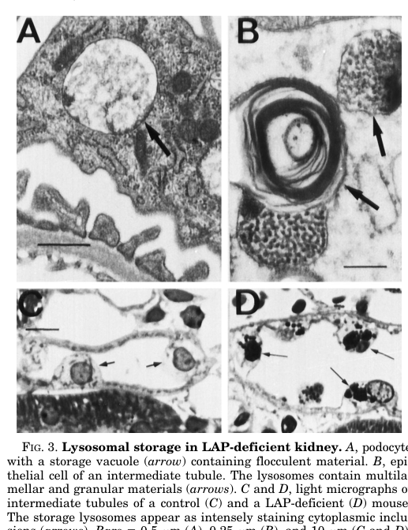

## Question

# Disease Characteristics Research Template

## Target Disease
- **Disease Name:** Lysosomal Acid Phosphatase Deficiency
- **MONDO ID:**  (if available)
- **Category:** Mendelian

## Research Objectives

Please provide a comprehensive research report on **Lysosomal Acid Phosphatase Deficiency** covering all of the
disease characteristics listed below. This report will be used to populate a disease knowledge
base entry. Be thorough and cite primary literature (PMID preferred) for all claims.

For each section, **suggested databases/resources** are listed. These are the first places
you should search for information on each topic.

---

### 1. Disease Information
> **Search first:** OMIM, Orphanet, ICD-10/ICD-11, MeSH, PubMed

- What is the disease? Provide a concise overview.
- What are the key identifiers? (OMIM, Orphanet, ICD-10/ICD-11, MeSH, Mondo)
- What are the common synonyms and alternative names?
- Is the information derived from individual patients (e.g., EHR) or aggregated disease-level resources?

### 2. Etiology

- **Disease Causal Factors**: What are the primary causes? (genetic, environmental, infectious, mechanistic)
- **Risk Factors**:
  > **Search first:** PubMed, Cochrane Library, UpToDate, clinical guidelines, ClinVar, ClinGen, GWAS Catalog, PheGenI, CTD, CDC, WHO, epidemiological databases
  - Genetic risk factors (causal variants, susceptibility loci, modifier genes)
  - Environmental risk factors (toxins, lifestyle, occupational exposures, age, sex, family history)
- **Protective Factors**:
  > **Search first:** PubMed, Cochrane Library, clinical trial databases, GWAS Catalog, gnomAD, WHO, CDC, nutrition databases
  - Genetic protective factors (protective variants, modifier alleles)
  - Environmental protective factors (diet, lifestyle, exposures that reduce risk)
- **Gene-Environment Interactions**: How do genetic and environmental factors interact to influence disease?
  > **Search first:** CTD, PubMed, PheGenI, GxE databases

### 3. Phenotypes
> **Search first:** HPO (Human Phenotype Ontology), OMIM, Orphanet, PubMed, clinicaltrials.gov, MedDRA, SNOMED CT, DECIPHER, LOINC

For each phenotype, provide:
- **Phenotype type**: symptoms, clinical signs, physical manifestations, behavioral changes, or laboratory abnormalities
  > For symptoms/signs: HPO, OMIM, Orphanet, PubMed
  > For behavioral changes: HPO, DSM, RDoC (Research Domain Criteria), PubMed
  > For laboratory abnormalities: LOINC, SNOMED CT, LabTests Online, PubMed
- **Phenotype characteristics**:
  > **Search first:** OMIM, Orphanet, HPO, PubMed
  - Age of symptom onset (neonatal, childhood, adult-onset, late-onset)
  - Symptom severity (mild, moderate, severe, variable)
  - Symptom progression (stable, progressive, episodic, fluctuating)
  - Frequency among affected individuals (percentage or qualitative)
- **Quality of life impact**: Effects on daily functioning and well-being (per-phenotype when possible)
  > **Search first:** EQ-5D database, SF-36, WHO QOL databases, PubMed
- Suggest HPO (Human Phenotype Ontology) terms for each phenotype

### 4. Genetic/Molecular Information

- **Causal Genes**: Gene mutations or chromosomal abnormalities responsible for disease (gene symbols, OMIM IDs)
  > **Search first:** OMIM, ClinVar, HGMD, Ensembl, NCBI Gene
- **Pathogenic Variants**:
  - Affected genes (gene symbols, HGNC IDs)
    > **Search first:** OMIM, NCBI Gene, Ensembl, HGNC, UniProt, GeneCards
  - Variant classification (pathogenic, likely pathogenic, VUS per ACMG/AMP guidelines)
    > **Search first:** ClinVar, ClinGen, ACMG/AMP guidelines, VarSome
  - Variant type/class (missense, frameshift, nonsense, splice-site, structural)
  - Allele frequency in population databases
    > **Search first:** gnomAD, 1000 Genomes, ExAC, TOPMed, dbSNP
  - Somatic vs germline origin
    > **Search first:** COSMIC (somatic), ClinVar, ICGC, TCGA
  - Functional consequences (loss of function, gain of function, dominant negative)
- **Modifier Genes**: Genes that modify disease severity or expression
- **Epigenetic Information**: DNA methylation, histone modifications, chromatin changes affecting disease
  > **Search first:** ENCODE, Roadmap Epigenomics, MethBase, DiseaseMeth
- **Chromosomal Abnormalities**: Large-scale genetic changes (aneuploidy, translocations, inversions)
  > **Search first:** DECIPHER, ClinVar, ECARUCA, UCSC Genome Browser

### 5. Environmental Information

- **Environmental Factors**: Non-genetic contributing factors (toxins, radiation, pollution, occupational exposure)
  > **Search first:** CTD (Comparative Toxicogenomics Database), TOXNET, PubMed, EPA databases
- **Lifestyle Factors**: Behavioral factors (smoking, diet, exercise, alcohol consumption)
  > **Search first:** CDC databases, WHO, PubMed, NHANES
- **Infectious Agents**: If applicable, pathogens causing or triggering disease (bacteria, viruses, fungi, parasites)
  > **Search first:** NCBI Taxonomy, ViPR, BV-BRC, MicrobeDB, GIDEON

### 6. Mechanism / Pathophysiology

- **Molecular Pathways**: Specific signaling cascades or biochemical pathways involved (Wnt, MAPK, mTOR, PI3K-AKT, etc.)
  > **Search first:** KEGG, Reactome, WikiPathways, PathBank, BioCyc
- **Cellular Processes**: Cell-level mechanisms (apoptosis, autophagy, cell cycle dysregulation, inflammation, etc.)
  > **Search first:** Gene Ontology (GO), Reactome, KEGG, PubMed
- **Protein Dysfunction**: How protein structure or function is altered (misfolding, aggregation, loss of function, gain of function)
  > **Search first:** UniProt, PDB (Protein Data Bank), InterPro, Pfam, AlphaFold
- **Metabolic Changes**: Alterations in metabolic processes (energy metabolism, lipid metabolism, amino acid metabolism)
  > **Search first:** KEGG, BioCyc, HMDB (Human Metabolome Database), BRENDA
- **Immune System Involvement**: Role of immune response (autoimmunity, immunodeficiency, chronic inflammation)
  > **Search first:** ImmPort, Immunome Database, IEDB, Gene Ontology
- **Tissue Damage Mechanisms**: How tissues/ are injured (oxidative stress, ischemia, fibrosis, necrosis)
  > **Search first:** PubMed, Gene Ontology, Reactome
- **Biochemical Abnormalities**: Specific molecular defects (enzyme deficiencies, receptor dysfunction, ion channel defects)
  > **Search first:** BRENDA, UniProt, KEGG, OMIM, PubMed
- **Epigenetic Changes**: DNA methylation, histone modifications affecting gene expression in disease
  > **Search first:** ENCODE, Roadmap Epigenomics, MethBase, DiseaseMeth
- **Molecular Profiling** (if available):
  - Transcriptomics/gene expression changes
    > **Search first:** GEO (Gene Expression Omnibus), ArrayExpress, GTEx, Human Cell Atlas, SRA
  - Proteomics findings
    > **Search first:** PRIDE, ProteomeXchange, Human Protein Atlas, STRING, BioGRID
  - Metabolomics signatures
    > **Search first:** MetaboLights, Metabolomics Workbench, HMDB, METLIN
  - Lipidomics alterations
    > **Search first:** LIPID MAPS, SwissLipids, LipidHome, Metabolomics Workbench
  - Genomic structural features
    > **Search first:** UCSC Genome Browser, Ensembl, NCBI, dbVar, DGV
- **Advanced Technologies** (if applicable):
  - Single-cell analysis findings (cell-type specific mechanisms, cellular heterogeneity)
    > **Search first:** Human Cell Atlas, Single Cell Portal, GEO, CELLxGENE
  - Spatial transcriptomics findings
    > **Search first:** GEO, Spatial Research, Vizgen, 10x Genomics data
  - Multi-omics integration results
    > **Search first:** TCGA, ICGC, cBioPortal, LinkedOmics, PubMed
  - Functional genomics screens (CRISPR, RNAi)
    > **Search first:** DepMap, GenomeRNAi, PubMed, BioGRID ORCS

For each mechanism, describe:
- The causal chain from initial trigger to clinical manifestation
- Which mechanisms are upstream vs downstream
- What cell types and biological processes are involved
- Suggest GO terms for biological processes and CL terms for cell types

### 7. Anatomical Structures Affected

- **Organ Level**:
  - Primary organs directly affected
  - Secondary organ involvement (complications, secondary effects)
  - Body systems involved (cardiovascular, nervous, digestive, respiratory, endocrine, etc.)
  > **Search first:** Uberon, FMA (Foundational Model of Anatomy), OMIM, HPO, ICD-11, MeSH, SNOMED CT
- **Tissue and Cell Level**:
  - Specific tissue types affected (epithelial, connective, muscle, nervous)
  - Specific cell populations targeted (with Cell Ontology terms)
  > **Search first:** Uberon, Human Protein Atlas, Cell Ontology, Human Cell Atlas, CellMarker, PanglaoDB
- **Subcellular Level**:
  - Cellular compartments involved (mitochondria, nucleus, ER, lysosomes) (with GO Cellular Component terms)
  > **Search first:** Gene Ontology (Cellular Component), UniProt, Human Protein Atlas
- **Localization**:
  - Specific anatomical sites (with UBERON terms)
    > **Search first:** FMA, Uberon, NeuroNames (for brain), SNOMED CT
  - Lateralization (unilateral, bilateral, asymmetric)
    > **Search first:** HPO, clinical literature, imaging databases

### 8. Temporal Development

- **Onset**:
  - Typical age of onset (congenital, pediatric, adult, geriatric)
  - Onset pattern (acute, subacute, chronic, insidious)
  > **Search first:** OMIM, Orphanet, HPO, PubMed
- **Progression**:
  - Disease stages (early, intermediate, advanced, end-stage)
    > **Search first:** Cancer Staging Manual (AJCC), WHO classifications, PubMed
  - Progression rate (rapid, slow, variable)
  - Disease course pattern (episodic, relapsing-remitting, progressive, stable)
  - Disease duration (self-limited, chronic lifelong)
  > **Search first:** Disease registries, longitudinal cohort databases, natural history studies, PubMed, Orphanet, OMIM
- **Patterns**:
  - Remission patterns (spontaneous, treatment-induced)
    > **Search first:** Clinical trial databases, disease registries, PubMed
  - Critical periods (time windows of vulnerability or opportunity for intervention)
    > **Search first:** PubMed, developmental biology databases, clinical guidelines

### 9. Inheritance and Population

- **Epidemiology**:
  - Prevalence (cases per 100,000 at given time)
  - Incidence (new cases per 100,000 per year)
  > **Search first:** Orphanet, CDC, WHO, GBD (Global Burden of Disease), national registries, SEER, disease registries
- **For Genetic Etiology**:
  - Inheritance pattern (AD, AR, X-linked, mitochondrial, multifactorial, polygenic)
    > **Search first:** OMIM, Orphanet, ClinVar, GTR (Genetic Testing Registry)
  - Penetrance (complete, incomplete, age-dependent)
    > **Search first:** ClinVar, OMIM, PubMed, ClinGen
  - Expressivity (variable, consistent)
    > **Search first:** OMIM, ClinVar, PubMed
  - Genetic anticipation (increasing severity in successive generations)
    > **Search first:** OMIM, PubMed (especially for repeat expansion disorders)
  - Germline mosaicism
    > **Search first:** ClinVar, OMIM, genetic counseling literature, PubMed
  - Founder effects (population-specific mutations)
    > **Search first:** gnomAD, population genetics databases, PubMed
  - Consanguinity role
    > **Search first:** OMIM, population studies, genetic counseling resources
  - Carrier frequency
    > **Search first:** gnomAD, carrier screening databases, GeneReviews, GTR
- **Population Demographics**:
  - Affected populations (ethnic or demographic groups with higher prevalence)
    > **Search first:** gnomAD, 1000 Genomes, PAGE Study, PubMed, population registries
  - Geographic distribution (endemic areas, regional variation)
    > **Search first:** WHO, CDC, GBD, Orphanet, geographic epidemiology databases
  - Geographic distribution of specific variants
  - Sex ratio (male:female)
    > **Search first:** Disease registries, OMIM, PubMed, epidemiological databases
  - Age distribution of affected individuals
    > **Search first:** CDC, disease registries, SEER, Orphanet

### 10. Diagnostics

- **Clinical Tests**:
  - Laboratory tests (blood, urine, tissue chemistry, specific enzyme assays)
    > **Search first:** LOINC, LabTests Online, PubMed
  - Biomarkers (proteins, metabolites, genetic markers, circulating biomarkers)
    > **Search first:** FDA Biomarker List, BEST (Biomarkers, EndpointS, and other Tools), PubMed
  - Imaging studies (X-ray, CT, MRI, PET, ultrasound)
    > **Search first:** RadLex, DICOM, Radiopaedia, imaging databases
  - Functional tests (pulmonary function, cardiac stress tests)
    > **Search first:** LOINC, clinical guidelines, PubMed
  - Electrophysiology (EEG, EMG, ECG, nerve conduction studies)
    > **Search first:** LOINC, clinical neurophysiology databases, PubMed
  - Biopsy findings (histopathology, immunohistochemistry)
    > **Search first:** SNOMED CT, College of American Pathologists resources, PubMed
  - Pathology findings (microscopic examination)
    > **Search first:** SNOMED CT, Digital Pathology databases, PubMed
- **Genetic Testing**:
  > **Search first:** GTR (Genetic Testing Registry), GeneReviews, ClinGen
  - Overview of recommended genetic testing approach
  - Whole genome sequencing (WGS) utility
    > **Search first:** GTR, ClinVar, GEL (Genomics England), gnomAD
  - Whole exome sequencing (WES) utility
    > **Search first:** GTR, ClinVar, OMIM, GeneMatcher
  - Gene panels (which panels, which genes)
    > **Search first:** GTR, ClinVar, laboratory-specific databases
  - Single gene testing
    > **Search first:** GTR, ClinVar, OMIM, GeneReviews
  - Chromosomal microarray (CMA)
    > **Search first:** DECIPHER, ClinVar, dbVar, ECARUCA
  - Karyotyping
    > **Search first:** Chromosome Abnormality Database, ClinVar, cytogenetics resources
  - FISH
    > **Search first:** ClinVar, cytogenetics databases, PubMed
  - Mitochondrial DNA testing
    > **Search first:** MITOMAP, MSeqDR, ClinVar, GTR
  - Repeat expansion testing
    > **Search first:** GTR, ClinVar, repeat expansion databases, PubMed
- **Omics-Based Diagnostics** (if applicable):
  - RNA sequencing / transcriptomics
    > **Search first:** GEO, ArrayExpress, GTEx, RNA-seq databases
  - Proteomics
    > **Search first:** PRIDE, ProteomeXchange, FDA Biomarker database
  - Metabolomics
    > **Search first:** MetaboLights, Metabolomics Workbench, HMDB
  - Epigenomics
    > **Search first:** GEO, ENCODE, Roadmap Epigenomics, MethBase
  - Liquid biopsy
    > **Search first:** COSMIC, ClinVar, liquid biopsy databases, PubMed
- **Clinical Criteria**:
  - Standardized diagnostic criteria (DSM, ICD, society guidelines)
    > **Search first:** DSM-5, ICD-11, clinical society guidelines, UpToDate
  - Differential diagnosis (other conditions to rule out, with distinguishing features)
    > **Search first:** DynaMed, UpToDate, clinical decision support systems
- **Screening**:
  - Screening methods for asymptomatic individuals (newborn screening, carrier screening, cascade screening)
    > **Search first:** ACMG recommendations, CDC newborn screening, GTR

### 11. Outcome/Prognosis

- **Survival and Mortality**:
  - Survival rate (5-year, 10-year, overall)
    > **Search first:** SEER, cancer registries, disease-specific registries, PubMed
  - Life expectancy (with and without treatment if applicable)
    > **Search first:** Orphanet, disease registries, actuarial databases, PubMed
  - Mortality rate
    > **Search first:** CDC, WHO, GBD, national mortality databases
  - Disease-specific mortality (deaths directly attributable to disease)
    > **Search first:** Disease registries, CDC Wonder, GBD, PubMed
- **Morbidity and Function**:
  - Morbidity (disease-related disability and health impacts)
    > **Search first:** GBD, WHO, disability databases, PubMed
  - Disability outcomes (long-term functional impairments)
    > **Search first:** ICF (International Classification of Functioning), disability registries
  - Quality of life measures (EQ-5D, SF-36, PROMIS, disease-specific tools)
    > **Search first:** EQ-5D database, SF-36, PROMIS, PubMed
- **Disease Course**:
  - Complications (secondary problems: infections, organ failure, etc.)
    > **Search first:** ICD codes, disease registries, clinical databases, PubMed
  - Recovery potential (likelihood and extent of recovery, with vs without treatment)
    > **Search first:** Natural history studies, rehabilitation databases, PubMed
- **Prediction**:
  - Prognostic factors (age, disease severity, biomarkers, treatment response)
    > **Search first:** Prognostic models databases, clinical calculators, PubMed
  - Prognostic biomarkers (molecular markers predicting disease course)
    > **Search first:** FDA Biomarker database, PubMed, cancer prognostic databases

### 12. Treatment

- **Pharmacotherapy**:
  - Pharmacological treatments (drug names, drug classes, mechanisms of action)
    > **Search first:** DrugBank, RxNorm, ATC classification, DailyMed, FDA databases
  - Pharmacogenomics (how genetic variants affect drug metabolism, efficacy, toxicity)
    > **Search first:** PharmGKB, CPIC (Clinical Pharmacogenetics), FDA Table of PGx Biomarkers
- **Advanced Therapeutics**:
  - Gene therapy (viral vectors, CRISPR, gene replacement, gene editing)
    > **Search first:** ClinicalTrials.gov, FDA gene therapy database, ASGCT resources
  - Cell therapy (stem cell transplant, CAR-T, cellular therapeutics)
    > **Search first:** ClinicalTrials.gov, FDA cell therapy database, FACT standards
  - RNA-based therapies (ASOs, siRNA, mRNA therapies)
    > **Search first:** ClinicalTrials.gov, FDA approvals, PubMed
  - Targeted therapies (treatments directed at specific molecular targets)
    > **Search first:** My Cancer Genome, OncoKB, ClinicalTrials.gov, FDA approvals
  - Immunotherapies (checkpoint inhibitors, monoclonal antibodies)
    > **Search first:** Cancer Immunotherapy Database, FDA approvals, ClinicalTrials.gov
- **Surgical and Interventional**:
  - Surgical interventions (types of surgery, timing, outcomes)
    > **Search first:** CPT codes, surgical registries, clinical guidelines, PubMed
- **Supportive and Rehabilitative**:
  - Supportive care (symptom management, pain control, nutrition)
    > **Search first:** Clinical guidelines, Cochrane Library, PubMed
  - Rehabilitation (physical therapy, occupational therapy, speech therapy)
    > **Search first:** Rehabilitation medicine databases, clinical guidelines, PubMed
- **Experimental**:
  - Experimental treatments in clinical trials (with NCT identifiers if available)
    > **Search first:** ClinicalTrials.gov, EU Clinical Trials Register, WHO ICTRP
- **Treatment Outcomes**:
  - Treatment response rates
    > **Search first:** Clinical trial databases, FDA reviews, systematic reviews, PubMed
  - Side effects and adverse events
    > **Search first:** FDA Adverse Event Reporting System (FAERS), MedWatch, PubMed
- **Treatment Strategy**:
  - Treatment algorithms (clinical pathways, decision trees)
    > **Search first:** Clinical practice guidelines, NCCN Guidelines, UpToDate
  - Combination therapies
    > **Search first:** ClinicalTrials.gov, treatment guidelines, PubMed
  - Personalized medicine approaches (genotype-guided treatment)
    > **Search first:** My Cancer Genome, CIViC, PharmGKB, precision medicine databases

For each treatment, suggest MAXO (Medical Action Ontology) terms where applicable.

### 13. Prevention

- **Prevention Levels**:
  - Primary prevention (preventing disease occurrence: vaccination, risk factor modification)
    > **Search first:** CDC, WHO, USPSTF recommendations, Cochrane Library
  - Secondary prevention (early detection and treatment: screening programs, early intervention)
    > **Search first:** USPSTF, CDC screening guidelines, WHO
  - Tertiary prevention (preventing complications in those with disease)
    > **Search first:** Clinical guidelines, disease management protocols, PubMed
- **Immunization**: Vaccine strategies (if applicable)
  > **Search first:** CDC vaccine schedules, WHO immunization, FDA vaccine database
- **Screening and Early Detection**:
  - Screening programs (population-based: newborn screening, cancer screening)
    > **Search first:** CDC screening programs, USPSTF, cancer screening databases
  - Genetic screening (carrier screening, preimplantation genetic diagnosis, prenatal testing)
    > **Search first:** ACMG recommendations, ACOG guidelines, GTR
  - Risk stratification (identifying high-risk individuals for targeted prevention)
    > **Search first:** Risk prediction models, clinical calculators, PubMed
- **Behavioral Interventions**: Lifestyle modifications to reduce risk
  > **Search first:** CDC, WHO, behavioral intervention databases, Cochrane Library
- **Counseling**: Genetic counseling (risk assessment, family planning guidance)
  > **Search first:** NSGC resources, ACMG guidelines, GeneReviews
- **Public Health**:
  - Public health interventions (sanitation, vector control, health education)
    > **Search first:** CDC, WHO, public health databases, PubMed
  - Environmental interventions (reducing environmental risk factors)
    > **Search first:** EPA databases, WHO environmental health, PubMed
- **Prophylaxis**: Preventive medications or procedures
  > **Search first:** Clinical guidelines, FDA approvals, PubMed

### 14. Other Species / Natural Disease

- **Taxonomy**: Species affected (with NCBI Taxon identifiers)
  > **Search first:** NCBI Taxonomy
- **Breed**: Specific breeds affected (with VBO identifiers if applicable)
  > **Search first:** VBO (Vertebrate Breed Ontology)
- **Gene**: Orthologous genes in other species (with NCBI Gene IDs)
  > **Search first:** NCBI Gene
- **Natural Disease**:
  - Naturally occurring disease in other species (companion animals, wildlife)
    > **Search first:** OMIA (Online Mendelian Inheritance in Animals), VetCompass, PubMed
  - Veterinary relevance and importance in animal health
    > **Search first:** OMIA, veterinary databases, PubMed
- **Comparative Biology**:
  - Comparative pathology (similarities and differences across species)
    > **Search first:** OMIA, comparative pathology databases, PubMed
  - Evolutionary conservation of disease mechanisms
    > **Search first:** HomoloGene, OrthoMCL, Alliance of Genome Resources
- **Transmission** (if applicable):
  - Zoonotic potential
    > **Search first:** CDC zoonotic diseases, WHO zoonoses, GIDEON
  - Cross-species susceptibility
    > **Search first:** NCBI Taxonomy, veterinary databases, PubMed

### 15. Model Organisms

- **Model Types**:
  - Model organism type (mammalian, invertebrate, cellular, in vitro)
    > **Search first:** Alliance of Genome Resources, model organism databases
  - Specific model systems (mouse, rat, zebrafish, Drosophila, C. elegans, yeast, cell lines, organoids, iPSCs)
    > **Search first:** MGI, RGD, ZFIN, FlyBase, WormBase, SGD, ATCC, Cellosaurus
  - Induced models (drug treatment, surgical intervention, environmental manipulation)
    > **Search first:** MGI, model organism databases, PubMed
- **Genetic Models**:
  - Types available (knockout, knock-in, transgenic, conditional, humanized)
    > **Search first:** MGI, IMPC, KOMP, EuMMCR, IMSR
- **Model Characteristics**:
  - Phenotype recapitulation (how well model reproduces human disease features)
    > **Search first:** Model organism databases, comparative studies, PubMed
  - Model limitations (aspects of human disease not captured)
    > **Search first:** Model organism databases, PubMed, review articles
- **Applications**:
  - Research applications (what aspects of disease can be studied)
    > **Search first:** Model organism databases, PubMed
- **Resources**:
  - Model databases
    > **Search first:** MGI, RGD, ZFIN, FlyBase, WormBase, IMSR, EMMA, MMRRC

---

## Citation Requirements

- Cite primary literature (PMID preferred) for all mechanistic and clinical claims
- Prioritize recent reviews and landmark papers
- Include direct quotes from abstracts where possible to support key statements
- Distinguish evidence source types: human clinical, model organism, in vitro, computational

## Output Format

Structure your response as a comprehensive narrative organized by the sections above.
For each section, provide:
- Factual content with specific details (numbers, percentages, gene names, variant nomenclature)
- Ontology term suggestions (HPO, GO, CL, UBERON, CHEBI, MAXO, MONDO) where applicable
- Evidence citations with PMIDs
- Direct quotes from abstracts to support key claims
- Clear indication when information is not available or not applicable for this disease

This report will be used to populate a disease knowledge base entry with:
- Pathophysiology descriptions with causal chains
- Gene/protein annotations (HGNC, GO terms)
- Phenotype associations (HP terms) with frequencies
- Cell type involvement (CL terms)
- Anatomical locations (UBERON terms)
- Chemical entities (CHEBI terms)
- Treatment annotations (MAXO terms)
- Evidence items with PMIDs and exact abstract quotes
- Epidemiology, prognosis, diagnostic, and prevention information
- Animal model descriptions with phenotype recapitulation details

## Output

Question: You are an expert researcher providing comprehensive, well-cited information.

Provide detailed information focusing on:
1. Key concepts and definitions with current understanding
2. Recent developments and latest research (prioritize 2023-2024 sources)
3. Current applications and real-world implementations
4. Expert opinions and analysis from authoritative sources
5. Relevant statistics and data from recent studies

Format as a comprehensive research report with proper citations. Include URLs and publication dates where available.
Always prioritize recent, authoritative sources and provide specific citations for all major claims.

# Disease Characteristics Research Template

## Target Disease
- **Disease Name:** Lysosomal Acid Phosphatase Deficiency
- **MONDO ID:**  (if available)
- **Category:** Mendelian

## Research Objectives

Please provide a comprehensive research report on **Lysosomal Acid Phosphatase Deficiency** covering all of the
disease characteristics listed below. This report will be used to populate a disease knowledge
base entry. Be thorough and cite primary literature (PMID preferred) for all claims.

For each section, **suggested databases/resources** are listed. These are the first places
you should search for information on each topic.

---

### 1. Disease Information
> **Search first:** OMIM, Orphanet, ICD-10/ICD-11, MeSH, PubMed

- What is the disease? Provide a concise overview.
- What are the key identifiers? (OMIM, Orphanet, ICD-10/ICD-11, MeSH, Mondo)
- What are the common synonyms and alternative names?
- Is the information derived from individual patients (e.g., EHR) or aggregated disease-level resources?

### 2. Etiology

- **Disease Causal Factors**: What are the primary causes? (genetic, environmental, infectious, mechanistic)
- **Risk Factors**:
  > **Search first:** PubMed, Cochrane Library, UpToDate, clinical guidelines, ClinVar, ClinGen, GWAS Catalog, PheGenI, CTD, CDC, WHO, epidemiological databases
  - Genetic risk factors (causal variants, susceptibility loci, modifier genes)
  - Environmental risk factors (toxins, lifestyle, occupational exposures, age, sex, family history)
- **Protective Factors**:
  > **Search first:** PubMed, Cochrane Library, clinical trial databases, GWAS Catalog, gnomAD, WHO, CDC, nutrition databases
  - Genetic protective factors (protective variants, modifier alleles)
  - Environmental protective factors (diet, lifestyle, exposures that reduce risk)
- **Gene-Environment Interactions**: How do genetic and environmental factors interact to influence disease?
  > **Search first:** CTD, PubMed, PheGenI, GxE databases

### 3. Phenotypes
> **Search first:** HPO (Human Phenotype Ontology), OMIM, Orphanet, PubMed, clinicaltrials.gov, MedDRA, SNOMED CT, DECIPHER, LOINC

For each phenotype, provide:
- **Phenotype type**: symptoms, clinical signs, physical manifestations, behavioral changes, or laboratory abnormalities
  > For symptoms/signs: HPO, OMIM, Orphanet, PubMed
  > For behavioral changes: HPO, DSM, RDoC (Research Domain Criteria), PubMed
  > For laboratory abnormalities: LOINC, SNOMED CT, LabTests Online, PubMed
- **Phenotype characteristics**:
  > **Search first:** OMIM, Orphanet, HPO, PubMed
  - Age of symptom onset (neonatal, childhood, adult-onset, late-onset)
  - Symptom severity (mild, moderate, severe, variable)
  - Symptom progression (stable, progressive, episodic, fluctuating)
  - Frequency among affected individuals (percentage or qualitative)
- **Quality of life impact**: Effects on daily functioning and well-being (per-phenotype when possible)
  > **Search first:** EQ-5D database, SF-36, WHO QOL databases, PubMed
- Suggest HPO (Human Phenotype Ontology) terms for each phenotype

### 4. Genetic/Molecular Information

- **Causal Genes**: Gene mutations or chromosomal abnormalities responsible for disease (gene symbols, OMIM IDs)
  > **Search first:** OMIM, ClinVar, HGMD, Ensembl, NCBI Gene
- **Pathogenic Variants**:
  - Affected genes (gene symbols, HGNC IDs)
    > **Search first:** OMIM, NCBI Gene, Ensembl, HGNC, UniProt, GeneCards
  - Variant classification (pathogenic, likely pathogenic, VUS per ACMG/AMP guidelines)
    > **Search first:** ClinVar, ClinGen, ACMG/AMP guidelines, VarSome
  - Variant type/class (missense, frameshift, nonsense, splice-site, structural)
  - Allele frequency in population databases
    > **Search first:** gnomAD, 1000 Genomes, ExAC, TOPMed, dbSNP
  - Somatic vs germline origin
    > **Search first:** COSMIC (somatic), ClinVar, ICGC, TCGA
  - Functional consequences (loss of function, gain of function, dominant negative)
- **Modifier Genes**: Genes that modify disease severity or expression
- **Epigenetic Information**: DNA methylation, histone modifications, chromatin changes affecting disease
  > **Search first:** ENCODE, Roadmap Epigenomics, MethBase, DiseaseMeth
- **Chromosomal Abnormalities**: Large-scale genetic changes (aneuploidy, translocations, inversions)
  > **Search first:** DECIPHER, ClinVar, ECARUCA, UCSC Genome Browser

### 5. Environmental Information

- **Environmental Factors**: Non-genetic contributing factors (toxins, radiation, pollution, occupational exposure)
  > **Search first:** CTD (Comparative Toxicogenomics Database), TOXNET, PubMed, EPA databases
- **Lifestyle Factors**: Behavioral factors (smoking, diet, exercise, alcohol consumption)
  > **Search first:** CDC databases, WHO, PubMed, NHANES
- **Infectious Agents**: If applicable, pathogens causing or triggering disease (bacteria, viruses, fungi, parasites)
  > **Search first:** NCBI Taxonomy, ViPR, BV-BRC, MicrobeDB, GIDEON

### 6. Mechanism / Pathophysiology

- **Molecular Pathways**: Specific signaling cascades or biochemical pathways involved (Wnt, MAPK, mTOR, PI3K-AKT, etc.)
  > **Search first:** KEGG, Reactome, WikiPathways, PathBank, BioCyc
- **Cellular Processes**: Cell-level mechanisms (apoptosis, autophagy, cell cycle dysregulation, inflammation, etc.)
  > **Search first:** Gene Ontology (GO), Reactome, KEGG, PubMed
- **Protein Dysfunction**: How protein structure or function is altered (misfolding, aggregation, loss of function, gain of function)
  > **Search first:** UniProt, PDB (Protein Data Bank), InterPro, Pfam, AlphaFold
- **Metabolic Changes**: Alterations in metabolic processes (energy metabolism, lipid metabolism, amino acid metabolism)
  > **Search first:** KEGG, BioCyc, HMDB (Human Metabolome Database), BRENDA
- **Immune System Involvement**: Role of immune response (autoimmunity, immunodeficiency, chronic inflammation)
  > **Search first:** ImmPort, Immunome Database, IEDB, Gene Ontology
- **Tissue Damage Mechanisms**: How tissues/ are injured (oxidative stress, ischemia, fibrosis, necrosis)
  > **Search first:** PubMed, Gene Ontology, Reactome
- **Biochemical Abnormalities**: Specific molecular defects (enzyme deficiencies, receptor dysfunction, ion channel defects)
  > **Search first:** BRENDA, UniProt, KEGG, OMIM, PubMed
- **Epigenetic Changes**: DNA methylation, histone modifications affecting gene expression in disease
  > **Search first:** ENCODE, Roadmap Epigenomics, MethBase, DiseaseMeth
- **Molecular Profiling** (if available):
  - Transcriptomics/gene expression changes
    > **Search first:** GEO (Gene Expression Omnibus), ArrayExpress, GTEx, Human Cell Atlas, SRA
  - Proteomics findings
    > **Search first:** PRIDE, ProteomeXchange, Human Protein Atlas, STRING, BioGRID
  - Metabolomics signatures
    > **Search first:** MetaboLights, Metabolomics Workbench, HMDB, METLIN
  - Lipidomics alterations
    > **Search first:** LIPID MAPS, SwissLipids, LipidHome, Metabolomics Workbench
  - Genomic structural features
    > **Search first:** UCSC Genome Browser, Ensembl, NCBI, dbVar, DGV
- **Advanced Technologies** (if applicable):
  - Single-cell analysis findings (cell-type specific mechanisms, cellular heterogeneity)
    > **Search first:** Human Cell Atlas, Single Cell Portal, GEO, CELLxGENE
  - Spatial transcriptomics findings
    > **Search first:** GEO, Spatial Research, Vizgen, 10x Genomics data
  - Multi-omics integration results
    > **Search first:** TCGA, ICGC, cBioPortal, LinkedOmics, PubMed
  - Functional genomics screens (CRISPR, RNAi)
    > **Search first:** DepMap, GenomeRNAi, PubMed, BioGRID ORCS

For each mechanism, describe:
- The causal chain from initial trigger to clinical manifestation
- Which mechanisms are upstream vs downstream
- What cell types and biological processes are involved
- Suggest GO terms for biological processes and CL terms for cell types

### 7. Anatomical Structures Affected

- **Organ Level**:
  - Primary organs directly affected
  - Secondary organ involvement (complications, secondary effects)
  - Body systems involved (cardiovascular, nervous, digestive, respiratory, endocrine, etc.)
  > **Search first:** Uberon, FMA (Foundational Model of Anatomy), OMIM, HPO, ICD-11, MeSH, SNOMED CT
- **Tissue and Cell Level**:
  - Specific tissue types affected (epithelial, connective, muscle, nervous)
  - Specific cell populations targeted (with Cell Ontology terms)
  > **Search first:** Uberon, Human Protein Atlas, Cell Ontology, Human Cell Atlas, CellMarker, PanglaoDB
- **Subcellular Level**:
  - Cellular compartments involved (mitochondria, nucleus, ER, lysosomes) (with GO Cellular Component terms)
  > **Search first:** Gene Ontology (Cellular Component), UniProt, Human Protein Atlas
- **Localization**:
  - Specific anatomical sites (with UBERON terms)
    > **Search first:** FMA, Uberon, NeuroNames (for brain), SNOMED CT
  - Lateralization (unilateral, bilateral, asymmetric)
    > **Search first:** HPO, clinical literature, imaging databases

### 8. Temporal Development

- **Onset**:
  - Typical age of onset (congenital, pediatric, adult, geriatric)
  - Onset pattern (acute, subacute, chronic, insidious)
  > **Search first:** OMIM, Orphanet, HPO, PubMed
- **Progression**:
  - Disease stages (early, intermediate, advanced, end-stage)
    > **Search first:** Cancer Staging Manual (AJCC), WHO classifications, PubMed
  - Progression rate (rapid, slow, variable)
  - Disease course pattern (episodic, relapsing-remitting, progressive, stable)
  - Disease duration (self-limited, chronic lifelong)
  > **Search first:** Disease registries, longitudinal cohort databases, natural history studies, PubMed, Orphanet, OMIM
- **Patterns**:
  - Remission patterns (spontaneous, treatment-induced)
    > **Search first:** Clinical trial databases, disease registries, PubMed
  - Critical periods (time windows of vulnerability or opportunity for intervention)
    > **Search first:** PubMed, developmental biology databases, clinical guidelines

### 9. Inheritance and Population

- **Epidemiology**:
  - Prevalence (cases per 100,000 at given time)
  - Incidence (new cases per 100,000 per year)
  > **Search first:** Orphanet, CDC, WHO, GBD (Global Burden of Disease), national registries, SEER, disease registries
- **For Genetic Etiology**:
  - Inheritance pattern (AD, AR, X-linked, mitochondrial, multifactorial, polygenic)
    > **Search first:** OMIM, Orphanet, ClinVar, GTR (Genetic Testing Registry)
  - Penetrance (complete, incomplete, age-dependent)
    > **Search first:** ClinVar, OMIM, PubMed, ClinGen
  - Expressivity (variable, consistent)
    > **Search first:** OMIM, ClinVar, PubMed
  - Genetic anticipation (increasing severity in successive generations)
    > **Search first:** OMIM, PubMed (especially for repeat expansion disorders)
  - Germline mosaicism
    > **Search first:** ClinVar, OMIM, genetic counseling literature, PubMed
  - Founder effects (population-specific mutations)
    > **Search first:** gnomAD, population genetics databases, PubMed
  - Consanguinity role
    > **Search first:** OMIM, population studies, genetic counseling resources
  - Carrier frequency
    > **Search first:** gnomAD, carrier screening databases, GeneReviews, GTR
- **Population Demographics**:
  - Affected populations (ethnic or demographic groups with higher prevalence)
    > **Search first:** gnomAD, 1000 Genomes, PAGE Study, PubMed, population registries
  - Geographic distribution (endemic areas, regional variation)
    > **Search first:** WHO, CDC, GBD, Orphanet, geographic epidemiology databases
  - Geographic distribution of specific variants
  - Sex ratio (male:female)
    > **Search first:** Disease registries, OMIM, PubMed, epidemiological databases
  - Age distribution of affected individuals
    > **Search first:** CDC, disease registries, SEER, Orphanet

### 10. Diagnostics

- **Clinical Tests**:
  - Laboratory tests (blood, urine, tissue chemistry, specific enzyme assays)
    > **Search first:** LOINC, LabTests Online, PubMed
  - Biomarkers (proteins, metabolites, genetic markers, circulating biomarkers)
    > **Search first:** FDA Biomarker List, BEST (Biomarkers, EndpointS, and other Tools), PubMed
  - Imaging studies (X-ray, CT, MRI, PET, ultrasound)
    > **Search first:** RadLex, DICOM, Radiopaedia, imaging databases
  - Functional tests (pulmonary function, cardiac stress tests)
    > **Search first:** LOINC, clinical guidelines, PubMed
  - Electrophysiology (EEG, EMG, ECG, nerve conduction studies)
    > **Search first:** LOINC, clinical neurophysiology databases, PubMed
  - Biopsy findings (histopathology, immunohistochemistry)
    > **Search first:** SNOMED CT, College of American Pathologists resources, PubMed
  - Pathology findings (microscopic examination)
    > **Search first:** SNOMED CT, Digital Pathology databases, PubMed
- **Genetic Testing**:
  > **Search first:** GTR (Genetic Testing Registry), GeneReviews, ClinGen
  - Overview of recommended genetic testing approach
  - Whole genome sequencing (WGS) utility
    > **Search first:** GTR, ClinVar, GEL (Genomics England), gnomAD
  - Whole exome sequencing (WES) utility
    > **Search first:** GTR, ClinVar, OMIM, GeneMatcher
  - Gene panels (which panels, which genes)
    > **Search first:** GTR, ClinVar, laboratory-specific databases
  - Single gene testing
    > **Search first:** GTR, ClinVar, OMIM, GeneReviews
  - Chromosomal microarray (CMA)
    > **Search first:** DECIPHER, ClinVar, dbVar, ECARUCA
  - Karyotyping
    > **Search first:** Chromosome Abnormality Database, ClinVar, cytogenetics resources
  - FISH
    > **Search first:** ClinVar, cytogenetics databases, PubMed
  - Mitochondrial DNA testing
    > **Search first:** MITOMAP, MSeqDR, ClinVar, GTR
  - Repeat expansion testing
    > **Search first:** GTR, ClinVar, repeat expansion databases, PubMed
- **Omics-Based Diagnostics** (if applicable):
  - RNA sequencing / transcriptomics
    > **Search first:** GEO, ArrayExpress, GTEx, RNA-seq databases
  - Proteomics
    > **Search first:** PRIDE, ProteomeXchange, FDA Biomarker database
  - Metabolomics
    > **Search first:** MetaboLights, Metabolomics Workbench, HMDB
  - Epigenomics
    > **Search first:** GEO, ENCODE, Roadmap Epigenomics, MethBase
  - Liquid biopsy
    > **Search first:** COSMIC, ClinVar, liquid biopsy databases, PubMed
- **Clinical Criteria**:
  - Standardized diagnostic criteria (DSM, ICD, society guidelines)
    > **Search first:** DSM-5, ICD-11, clinical society guidelines, UpToDate
  - Differential diagnosis (other conditions to rule out, with distinguishing features)
    > **Search first:** DynaMed, UpToDate, clinical decision support systems
- **Screening**:
  - Screening methods for asymptomatic individuals (newborn screening, carrier screening, cascade screening)
    > **Search first:** ACMG recommendations, CDC newborn screening, GTR

### 11. Outcome/Prognosis

- **Survival and Mortality**:
  - Survival rate (5-year, 10-year, overall)
    > **Search first:** SEER, cancer registries, disease-specific registries, PubMed
  - Life expectancy (with and without treatment if applicable)
    > **Search first:** Orphanet, disease registries, actuarial databases, PubMed
  - Mortality rate
    > **Search first:** CDC, WHO, GBD, national mortality databases
  - Disease-specific mortality (deaths directly attributable to disease)
    > **Search first:** Disease registries, CDC Wonder, GBD, PubMed
- **Morbidity and Function**:
  - Morbidity (disease-related disability and health impacts)
    > **Search first:** GBD, WHO, disability databases, PubMed
  - Disability outcomes (long-term functional impairments)
    > **Search first:** ICF (International Classification of Functioning), disability registries
  - Quality of life measures (EQ-5D, SF-36, PROMIS, disease-specific tools)
    > **Search first:** EQ-5D database, SF-36, PROMIS, PubMed
- **Disease Course**:
  - Complications (secondary problems: infections, organ failure, etc.)
    > **Search first:** ICD codes, disease registries, clinical databases, PubMed
  - Recovery potential (likelihood and extent of recovery, with vs without treatment)
    > **Search first:** Natural history studies, rehabilitation databases, PubMed
- **Prediction**:
  - Prognostic factors (age, disease severity, biomarkers, treatment response)
    > **Search first:** Prognostic models databases, clinical calculators, PubMed
  - Prognostic biomarkers (molecular markers predicting disease course)
    > **Search first:** FDA Biomarker database, PubMed, cancer prognostic databases

### 12. Treatment

- **Pharmacotherapy**:
  - Pharmacological treatments (drug names, drug classes, mechanisms of action)
    > **Search first:** DrugBank, RxNorm, ATC classification, DailyMed, FDA databases
  - Pharmacogenomics (how genetic variants affect drug metabolism, efficacy, toxicity)
    > **Search first:** PharmGKB, CPIC (Clinical Pharmacogenetics), FDA Table of PGx Biomarkers
- **Advanced Therapeutics**:
  - Gene therapy (viral vectors, CRISPR, gene replacement, gene editing)
    > **Search first:** ClinicalTrials.gov, FDA gene therapy database, ASGCT resources
  - Cell therapy (stem cell transplant, CAR-T, cellular therapeutics)
    > **Search first:** ClinicalTrials.gov, FDA cell therapy database, FACT standards
  - RNA-based therapies (ASOs, siRNA, mRNA therapies)
    > **Search first:** ClinicalTrials.gov, FDA approvals, PubMed
  - Targeted therapies (treatments directed at specific molecular targets)
    > **Search first:** My Cancer Genome, OncoKB, ClinicalTrials.gov, FDA approvals
  - Immunotherapies (checkpoint inhibitors, monoclonal antibodies)
    > **Search first:** Cancer Immunotherapy Database, FDA approvals, ClinicalTrials.gov
- **Surgical and Interventional**:
  - Surgical interventions (types of surgery, timing, outcomes)
    > **Search first:** CPT codes, surgical registries, clinical guidelines, PubMed
- **Supportive and Rehabilitative**:
  - Supportive care (symptom management, pain control, nutrition)
    > **Search first:** Clinical guidelines, Cochrane Library, PubMed
  - Rehabilitation (physical therapy, occupational therapy, speech therapy)
    > **Search first:** Rehabilitation medicine databases, clinical guidelines, PubMed
- **Experimental**:
  - Experimental treatments in clinical trials (with NCT identifiers if available)
    > **Search first:** ClinicalTrials.gov, EU Clinical Trials Register, WHO ICTRP
- **Treatment Outcomes**:
  - Treatment response rates
    > **Search first:** Clinical trial databases, FDA reviews, systematic reviews, PubMed
  - Side effects and adverse events
    > **Search first:** FDA Adverse Event Reporting System (FAERS), MedWatch, PubMed
- **Treatment Strategy**:
  - Treatment algorithms (clinical pathways, decision trees)
    > **Search first:** Clinical practice guidelines, NCCN Guidelines, UpToDate
  - Combination therapies
    > **Search first:** ClinicalTrials.gov, treatment guidelines, PubMed
  - Personalized medicine approaches (genotype-guided treatment)
    > **Search first:** My Cancer Genome, CIViC, PharmGKB, precision medicine databases

For each treatment, suggest MAXO (Medical Action Ontology) terms where applicable.

### 13. Prevention

- **Prevention Levels**:
  - Primary prevention (preventing disease occurrence: vaccination, risk factor modification)
    > **Search first:** CDC, WHO, USPSTF recommendations, Cochrane Library
  - Secondary prevention (early detection and treatment: screening programs, early intervention)
    > **Search first:** USPSTF, CDC screening guidelines, WHO
  - Tertiary prevention (preventing complications in those with disease)
    > **Search first:** Clinical guidelines, disease management protocols, PubMed
- **Immunization**: Vaccine strategies (if applicable)
  > **Search first:** CDC vaccine schedules, WHO immunization, FDA vaccine database
- **Screening and Early Detection**:
  - Screening programs (population-based: newborn screening, cancer screening)
    > **Search first:** CDC screening programs, USPSTF, cancer screening databases
  - Genetic screening (carrier screening, preimplantation genetic diagnosis, prenatal testing)
    > **Search first:** ACMG recommendations, ACOG guidelines, GTR
  - Risk stratification (identifying high-risk individuals for targeted prevention)
    > **Search first:** Risk prediction models, clinical calculators, PubMed
- **Behavioral Interventions**: Lifestyle modifications to reduce risk
  > **Search first:** CDC, WHO, behavioral intervention databases, Cochrane Library
- **Counseling**: Genetic counseling (risk assessment, family planning guidance)
  > **Search first:** NSGC resources, ACMG guidelines, GeneReviews
- **Public Health**:
  - Public health interventions (sanitation, vector control, health education)
    > **Search first:** CDC, WHO, public health databases, PubMed
  - Environmental interventions (reducing environmental risk factors)
    > **Search first:** EPA databases, WHO environmental health, PubMed
- **Prophylaxis**: Preventive medications or procedures
  > **Search first:** Clinical guidelines, FDA approvals, PubMed

### 14. Other Species / Natural Disease

- **Taxonomy**: Species affected (with NCBI Taxon identifiers)
  > **Search first:** NCBI Taxonomy
- **Breed**: Specific breeds affected (with VBO identifiers if applicable)
  > **Search first:** VBO (Vertebrate Breed Ontology)
- **Gene**: Orthologous genes in other species (with NCBI Gene IDs)
  > **Search first:** NCBI Gene
- **Natural Disease**:
  - Naturally occurring disease in other species (companion animals, wildlife)
    > **Search first:** OMIA (Online Mendelian Inheritance in Animals), VetCompass, PubMed
  - Veterinary relevance and importance in animal health
    > **Search first:** OMIA, veterinary databases, PubMed
- **Comparative Biology**:
  - Comparative pathology (similarities and differences across species)
    > **Search first:** OMIA, comparative pathology databases, PubMed
  - Evolutionary conservation of disease mechanisms
    > **Search first:** HomoloGene, OrthoMCL, Alliance of Genome Resources
- **Transmission** (if applicable):
  - Zoonotic potential
    > **Search first:** CDC zoonotic diseases, WHO zoonoses, GIDEON
  - Cross-species susceptibility
    > **Search first:** NCBI Taxonomy, veterinary databases, PubMed

### 15. Model Organisms

- **Model Types**:
  - Model organism type (mammalian, invertebrate, cellular, in vitro)
    > **Search first:** Alliance of Genome Resources, model organism databases
  - Specific model systems (mouse, rat, zebrafish, Drosophila, C. elegans, yeast, cell lines, organoids, iPSCs)
    > **Search first:** MGI, RGD, ZFIN, FlyBase, WormBase, SGD, ATCC, Cellosaurus
  - Induced models (drug treatment, surgical intervention, environmental manipulation)
    > **Search first:** MGI, model organism databases, PubMed
- **Genetic Models**:
  - Types available (knockout, knock-in, transgenic, conditional, humanized)
    > **Search first:** MGI, IMPC, KOMP, EuMMCR, IMSR
- **Model Characteristics**:
  - Phenotype recapitulation (how well model reproduces human disease features)
    > **Search first:** Model organism databases, comparative studies, PubMed
  - Model limitations (aspects of human disease not captured)
    > **Search first:** Model organism databases, PubMed, review articles
- **Applications**:
  - Research applications (what aspects of disease can be studied)
    > **Search first:** Model organism databases, PubMed
- **Resources**:
  - Model databases
    > **Search first:** MGI, RGD, ZFIN, FlyBase, WormBase, IMSR, EMMA, MMRRC

---

## Citation Requirements

- Cite primary literature (PMID preferred) for all mechanistic and clinical claims
- Prioritize recent reviews and landmark papers
- Include direct quotes from abstracts where possible to support key statements
- Distinguish evidence source types: human clinical, model organism, in vitro, computational

## Output Format

Structure your response as a comprehensive narrative organized by the sections above.
For each section, provide:
- Factual content with specific details (numbers, percentages, gene names, variant nomenclature)
- Ontology term suggestions (HPO, GO, CL, UBERON, CHEBI, MAXO, MONDO) where applicable
- Evidence citations with PMIDs
- Direct quotes from abstracts to support key claims
- Clear indication when information is not available or not applicable for this disease

This report will be used to populate a disease knowledge base entry with:
- Pathophysiology descriptions with causal chains
- Gene/protein annotations (HGNC, GO terms)
- Phenotype associations (HP terms) with frequencies
- Cell type involvement (CL terms)
- Anatomical locations (UBERON terms)
- Chemical entities (CHEBI terms)
- Treatment annotations (MAXO terms)
- Evidence items with PMIDs and exact abstract quotes
- Epidemiology, prognosis, diagnostic, and prevention information
- Animal model descriptions with phenotype recapitulation details

## Comprehensive Research Report: Lysosomal Acid Phosphatase Deficiency (ACP2 / LAP deficiency)

### Executive summary
Lysosomal acid phosphatase deficiency (often described as *total lysosomal acid phosphatase (LAP) deficiency*) is an ultra-rare, historically reported lysosomal enzyme deficiency in humans, inferred to be autosomal recessive, with early-infantile onset, severe neurologic/systemic manifestations (vomiting, lethargy, hypotonia/opisthotonus), bleeding, and death within the first year in the limited families described in the early literature. Contemporary molecularly confirmed patient series were not retrievable from the available full-text corpus, so variant-level statements cannot be made here. Much of the mechanistic and tissue-specific understanding currently comes from mouse *Acp2* deficiency models that show kidney and CNS lysosomal storage, glial activation, skeletal deformities, and low-penetrance seizures. Recent (2024) work implicates ACP2 as a regulator of type-I interferon (IFN-I) antiviral signaling in cancer cells, highlighting continuing mechanistic interest in ACP2 beyond the classical lysosomal storage context. (saftig1997micedeficientin pages 6-7, bull2002acidphosphatases pages 1-2, wong2024highthroughputscreen pages 2-3)

### Evidence compendium table
| Disease / focus | Main synonyms | Causal gene | Inheritance | Key clinical features (human) | Key clinical features (mouse) | Key diagnostic approaches | Notable data points | Evidence (year; URL) |
|---|---|---|---|---|---|---|---|---|
| Lysosomal acid phosphatase deficiency | Total lysosomal acid phosphatase deficiency; LAP deficiency; lysosomal acid phosphatase (LAP) deficiency | **ACP2** | Autosomal recessive, inferred from affected sibs and intermediate parental enzyme activity | Early-infantile disease with progressive lethargy, hypotonia/opisthotonus, intermittent vomiting, terminal bleeding, death in the first year of life | Not reported in this human review row | Lysosomal acid phosphatase enzyme assay showing complete deficiency in affected individuals; family studies showing intermediate activity in parents; modern workup would add molecular **ACP2** testing | Human disease appears ultra-rare; no prevalence estimate available; only a few historical families described | Bull et al. 2002; https://doi.org/10.1136/mp.55.2.65 (bull2002acidphosphatases pages 1-2) |
| Lysosomal acid phosphatase deficiency (historical human reports summarized in mouse paper) | LAP deficiency; complete lysosomal phosphatase deficiency | **ACP2** | Autosomal recessive, suggested by family pattern and parental intermediate enzyme activity | Progressive lethargy, opisthotonus, bleeding, death within the first year of life | — | Enzyme assay in patient tissues/cells; carrier detection by intermediate activity in parents | Authors noted that “no further patients have been described” after early reports, underscoring extreme rarity | Saftig et al. 1997; https://doi.org/10.1074/jbc.272.30.18628 (saftig1997micedeficientin pages 6-7) |
| ACP2/LAP-deficient knockout mouse | Lysosomal acid phosphatase deficiency model; LAP-deficient mouse | **Acp2** | Targeted biallelic loss in model organism | — | Progressive lysosomal storage in kidney podocytes and tubular epithelial cells; CNS storage in microglia, ependymal cells, astroglia; progressive astrogliosis/microglial activation; skeletal deformity/kyphoscoliosis; occasional generalized seizures | Gene knockout confirmation; absent LAP enzyme activity; histology/electron microscopy; radiology | ~7% (19/270) developed generalized tonic-clonic seizures after ~8 weeks; bone changes evident from 6 months onward | Saftig et al. 1997; https://doi.org/10.1074/jbc.272.30.18628 (saftig1997micedeficientin pages 6-7, saftig1997micedeficientin media de1fec08) |
| Spontaneous **Acp2** mutant mouse (nax) | Naked-ataxia; nax | **Acp2** | Autosomal recessive in mouse colony/model context | — | Growth retardation, delayed hair appearance, ataxic gait, severe cerebellar hypoplasia, absent/hypoplastic vermis, reduced granule cells, multilayered Purkinje cells, poor dendritic development, disorganized Bergmann glia, early death | Phenotyping plus mutation analysis in the model; neuropathology/histology | Weight at P15 ~4 g vs ~8 g in wild type; death usually around P18–P26 | Jiao 2017 thesis excerpt; URL not available in retrieved metadata (jiao2017thestudyofb pages 23-30) |
| Mouse cerebellar development study in **Acp2** mutant | ACP2 mutant cerebellar model; nax | **Acp2** | Recessive model organism mutation | — | Severe cerebellar cortex defect with striking reduction in granule cells; SHH pathway dysregulation; reduced MYCN at P10; impaired protein synthesis machinery implicated | Brain histology, BrdU assays, Western blot, RT-qPCR | Mechanistic evidence links ACP2 loss to abnormal cerebellar development rather than a single isolated pathway | Jiao et al. 2021; https://doi.org/10.3390/ijms22062994 (hirn2025proteomicsinsightsinto pages 11-12) |
| Practical diagnostic summary for suspected human disease | ACP2 deficiency; LAP deficiency | **ACP2** | Likely autosomal recessive | Infantile neurodevelopmental/systemic deterioration in reported historical cases | Animal data support kidney/CNS susceptibility and can guide organ surveillance hypotheses | 1) Biochemical lysosomal acid phosphatase assay in leukocytes/fibroblasts/tissue; 2) confirmatory **ACP2** sequencing/exome/genome testing; 3) pathology if needed for lysosomal storage assessment | No disease-specific treatment or ACP2-targeted clinical trials identified in retrieved evidence | Human historical reports summarized in Bull 2002 and Saftig 1997; no direct ACP2 therapy found (bull2002acidphosphatases pages 1-2, saftig1997micedeficientin pages 6-7, pohl2018thelysosomalprotein pages 2-3) |
| Recent ACP2-related biology relevant to disease mechanism | Lysosomal acid phosphatase 2; ACP2 | **ACP2** | Not a disease-frequency study | No direct patient data | ACP2 participates in lysosomal mannose-6-phosphate dephosphorylation and broader lysosome biology; depletion can alter innate antiviral IFN-I responses in cell models | Research assays only; not a clinical diagnostic standard | ACP2 knockdown increased VSVΔ51 infectivity by ~19.5-fold / >20-fold in 2024 screening study, highlighting current mechanistic interest though not a therapy for deficiency | Wong et al. 2024; https://doi.org/10.1038/s41598-024-76855-3 (wong2024highthroughputscreen pages 2-3, wong2024highthroughputscreen pages 1-2) |

*Table: This table compacts the key disease-level facts for lysosomal acid phosphatase deficiency, separating sparse historical human evidence from stronger mouse-model data. It is useful for quickly extracting nomenclature, inheritance, phenotype, diagnostics, and major quantitative observations with citations.*

---

## 1. Disease information

### 1.1 Disease overview (current understanding)
“Total lysosomal acid phosphatase (LAP) deficiency” has been described as an autosomal recessive disorder characterized by marked reduction/absence of lysosomal acid phosphatase activity and severe early-infantile disease in the limited historical cases. Bull et al. describe clinical features including “intermittent vomiting, lethargy, hypotonia, opisthotona, and terminal bleeding in early infancy.” (bull2002acidphosphatases pages 1-2)

Saftig et al. (in the context of developing an *Acp2* knockout model) summarize earlier human reports of “complete deficiency of phosphatase activity in lysosomes” with “progressive lethargy, opisthotonus, bleeding, and death within the first year of life,” and note that “no further patients have been described” after those early reports. (saftig1997micedeficientin pages 6-7)

### 1.2 Key identifiers (knowledge-base mapping)
Within the retrieved evidence corpus, no authoritative identifier crosswalk (OMIM disease entry, Orphanet ID, MONDO ID, ICD-10/ICD-11, MeSH) was available for this disease entity. The evidence set does contain an indirect mention that ACP2 corresponds to a Mendelian Inheritance in Man gene entry (MIM*171650) in a related genetics paper snippet, but the disease-level identifiers were not retrievable in full text here. (bull2002acidphosphatases pages 1-2)

### 1.3 Synonyms / alternative names
Synonyms used in the retrieved literature include:
- Total lysosomal acid phosphatase (LAP) deficiency (bull2002acidphosphatases pages 1-2)
- Lysosomal acid phosphatase deficiency (saftig1997micedeficientin pages 6-7)

### 1.4 Evidence source type
- **Human evidence** available here is largely **aggregated narrative summaries** of early case reports, rather than modern genomic case series with variant annotations. (saftig1997micedeficientin pages 6-7, bull2002acidphosphatases pages 1-2)
- **Aggregated mechanistic/phenotypic evidence** is strongest in **mouse models** with targeted or spontaneous *Acp2* loss. (saftig1997micedeficientin pages 6-7, jiao2017thestudyofb pages 23-30)

---

## 2. Etiology

### 2.1 Disease causal factors
The disease concept is defined by deficiency of **lysosomal acid phosphatase (LAP)** activity, attributed to loss of function of **ACP2** (lysosomal acid phosphatase 2). Human inheritance was suggested to be autosomal recessive based on familial occurrence and intermediate enzyme activity in parents. (saftig1997micedeficientin pages 6-7, bull2002acidphosphatases pages 1-2)

### 2.2 Risk factors
For this Mendelian enzyme deficiency, **biallelic pathogenic variation** would be the primary risk factor; however, specific pathogenic variants were not available in the retrieved corpus (the seminal 1970 NEJM case report was not obtainable), preventing enumeration of alleles or population frequencies. (saftig1997micedeficientin pages 6-7)

### 2.3 Protective factors / gene–environment interactions
No protective factors or gene–environment interactions specific to ACP2/LAP deficiency were identified in the retrieved evidence. (saftig1997micedeficientin pages 6-7, bull2002acidphosphatases pages 1-2)

---

## 3. Phenotypes

### 3.1 Human phenotypes (historical reports; sparse)
Across the limited reported families summarized in later literature:
- Gastrointestinal: intermittent vomiting (bull2002acidphosphatases pages 1-2)
- Neurologic/systemic: progressive lethargy; hypotonia; opisthotonus/opisthotona (saftig1997micedeficientin pages 6-7, bull2002acidphosphatases pages 1-2)
- Hematologic/bleeding: terminal bleeding (saftig1997micedeficientin pages 6-7, bull2002acidphosphatases pages 1-2)
- Outcome: death within the first year of life (saftig1997micedeficientin pages 6-7)

**Suggested HPO terms (human):**
- Vomiting (HP:0002013)
- Lethargy (HP:0001254)
- Hypotonia (HP:0001252)
- Opisthotonus (HP:0002179)
- Abnormal bleeding (HP:0001892) / Hemorrhage (HP:0001892) (mapping depends on curation preference)
- Infantile death (HP:0001522) / Early death (HP:0003811)

**Age of onset / progression:** early infancy, progressive, lethal in historical complete deficiency reports. (saftig1997micedeficientin pages 6-7, bull2002acidphosphatases pages 1-2)

### 3.2 Mouse phenotypes (robust)

#### Targeted LAP/ACP2 knockout mouse
Saftig et al. report:
- **Kidney**: “progredient lysosomal storage in podocytes and tubular epithelial cells of the kidney” with regionally variable ultrastructure. (saftig1997micedeficientin pages 6-7)
- **CNS**: lysosomal storage in “microglia, ependymal cells, and astroglia” with progressive astrogliosis and microglial activation. (saftig1997micedeficientin pages 6-7)
- **Seizures**: ~7% of deficient animals developed generalized seizures (text summarized in the image-retrieval output and consistent with the paper narrative). (saftig1997micedeficientin pages 6-7)
- **Skeletal**: from ~6 months, bone alterations leading to kyphoscoliotic malformation of the vertebral column. (saftig1997micedeficientin pages 6-7)

**Figure-based support:** Cropped figure regions from Saftig et al. illustrate kidney storage, CNS storage in glial populations, and radiographic kyphoscoliosis. (saftig1997micedeficientin media de1fec08, saftig1997micedeficientin media a4e97d69, saftig1997micedeficientin media 68f0b898)

#### Spontaneous *Acp2* mutant (nax; “naked-ataxia”) mouse
A separate *Acp2* mutant mouse model (nax) is described with:
- Growth retardation and delayed hair appearance
- Ataxic gait
- Severe cerebellar maldevelopment: hypoplastic/absent vermis, abnormal cortical layering, reduced granule cells, Purkinje cell migration defects and poor dendritic development
- Early death (reported around P18–P26) (jiao2017thestudyofb pages 23-30)

**Suggested HPO terms (mouse-to-human translation candidates):**
- Cerebellar hypoplasia (HP:0001321)
- Vermis hypoplasia/agenesis (HP:0001320)
- Ataxia (HP:0001251)
- Abnormal gait (HP:0001288)
- Failure to thrive / growth retardation (HP:0001508)

### 3.3 Quality of life impact
No disease-specific quality-of-life instruments (e.g., SF-36/EQ-5D) were found for ACP2/LAP deficiency in the retrieved evidence, likely reflecting extreme rarity and lack of modern cohorts. (saftig1997micedeficientin pages 6-7)

---

## 4. Genetic / molecular information

### 4.1 Causal gene
- **ACP2** encodes lysosomal acid phosphatase (LAP). Historical human cases were defined by complete deficiency of lysosomal phosphatase activity; later literature frames this as LAP deficiency (ACP2). (saftig1997micedeficientin pages 6-7, bull2002acidphosphatases pages 1-2)

### 4.2 Pathogenic variants
No specific human **ACP2** variant nomenclature (HGVS), ACMG classifications, or allele frequencies were present in the retrieved corpus; the original case report paper (Nadler & Egan, NEJM 1970) was identified by search but unobtainable here. Therefore, variant-level curation is not possible from this evidence set alone. (saftig1997micedeficientin pages 6-7)

### 4.3 Functional consequences
Functional evidence supports that ACP2/LAP deficiency can produce **cell-type–selective lysosomal storage** and downstream tissue pathology (kidney podocytes and tubular epithelium; CNS glia; bone). (saftig1997micedeficientin pages 6-7)

### 4.4 Related lysosomal biology (context)
A later lysosome-biogenesis proteomics review (not 2023–2024) summarizes ACP2/ACP5 as acidic phosphatases that remove mannose-6-phosphate (M6P) moieties from lysosomal proteins and reports identification of many ACP2/ACP5 substrates by proteomics, supporting ACP2’s role in lysosomal enzyme maturation. (hirn2025proteomicsinsightsinto pages 11-12)

**Suggested GO terms (mechanistic annotation candidates):**
- Lysosome (GO:0005764) (cellular component)
- Lysosomal lumen (GO:0043202) (cellular component)
- Hydrolase activity (as appropriate for ACP2)
- Protein dephosphorylation (GO:0006470) (process-level; exact mapping depends on curated ACP2 specificity)

---

## 5. Environmental information
No non-genetic environmental contributors, lifestyle factors, or infectious triggers have been described for ACP2/LAP deficiency in the retrieved evidence; the condition is treated as a Mendelian enzyme deficiency. (saftig1997micedeficientin pages 6-7, bull2002acidphosphatases pages 1-2)

---

## 6. Mechanism / pathophysiology

### 6.1 Causal chain (best-supported from mouse)
1) **Primary defect**: loss of lysosomal acid phosphatase activity (ACP2/LAP deficiency). (saftig1997micedeficientin pages 6-7)
2) **Cellular consequence**: accumulation of heterogeneous storage material within lysosomes in select cell types; lysosomes are enlarged and positive for lysosomal markers (e.g., lamp-1, cathepsin D as described in the mouse study). (saftig1997micedeficientin pages 6-7)
3) **Tissue pathology**:
   - Kidney: progressive storage in podocytes and tubular epithelial cells (saftig1997micedeficientin pages 6-7, saftig1997micedeficientin media de1fec08)
   - CNS: storage in microglia/ependymal/astroglia with progressive gliosis and microglial activation (saftig1997micedeficientin pages 6-7, saftig1997micedeficientin media a4e97d69)
   - Bone: vertebral malformations/kyphoscoliosis with age (saftig1997micedeficientin pages 6-7, saftig1997micedeficientin media 68f0b898)
4) **Clinical manifestations** (mouse): low-penetrance generalized seizures; skeletal deformity; organ-specific pathology. (saftig1997micedeficientin pages 6-7)

### 6.2 Cell types (CL candidates) and compartments
From the mouse knockout study, key involved CNS cell types include:
- Microglia (CL:0000129)
- Astrocytes (CL:0000127)
- Ependymal cells (CL:0000065)
Kidney involvement includes podocytes and tubular epithelial cells. (saftig1997micedeficientin pages 6-7)

**Subcellular level:** lysosomes (GO:0005764) are the primary affected compartment. (saftig1997micedeficientin pages 6-7)

### 6.3 Recent developments (2023–2024)
Although not directly a study of inherited ACP2 deficiency, a 2024 high-throughput siRNA phosphatase screen identified ACP2 as a regulator of IFN-I antiviral responses in a cancer cell context. ACP2 knockdown increased oncolytic VSVΔ51 infectivity by ~19.5-fold in validation experiments and increased virus-mediated cytotoxicity (cell viability ~60% vs ~80% at 72 h post-infection in one comparison). This work indicates ACP2 can influence innate antiviral signaling and viral replication, potentially through lysosomal pathways, and exemplifies ongoing ACP2-centric mechanistic research. (wong2024highthroughputscreen pages 2-3, wong2024highthroughputscreen pages 1-2)

---

## 7. Anatomical structures affected

### 7.1 Organ level (evidence strongest in mouse)
- Kidney (glomerular podocytes; tubular epithelium): progressive lysosomal storage (saftig1997micedeficientin pages 6-7, saftig1997micedeficientin media de1fec08)
- CNS (glial and ependymal populations): lysosomal storage with gliosis/microglial activation (saftig1997micedeficientin pages 6-7, saftig1997micedeficientin media a4e97d69)
- Skeletal system (vertebral column): kyphoscoliosis (saftig1997micedeficientin pages 6-7, saftig1997micedeficientin media 68f0b898)

**Suggested UBERON terms (examples):**
- Kidney (UBERON:0002113)
- Glomerulus (UBERON:0001285)
- Renal tubule (UBERON:0000064)
- Brain (UBERON:0000955)
- Cerebellum (UBERON:0002037) (esp. relevant to the nax model) (jiao2017thestudyofb pages 23-30)
- Vertebral column (UBERON:0001137) (saftig1997micedeficientin pages 6-7)

---

## 8. Temporal development

### 8.1 Human
Historical reports: onset in infancy with progressive course and death in the first year. (saftig1997micedeficientin pages 6-7, bull2002acidphosphatases pages 1-2)

### 8.2 Mouse
- Targeted LAP/ACP2 knockout: late-onset skeletal changes apparent from ~6 months; seizures beginning after ~8 weeks in a subset (~7%). (saftig1997micedeficientin pages 6-7)
- nax *Acp2* mutant: severe postnatal neurodevelopmental phenotype and early death (P18–P26). (jiao2017thestudyofb pages 23-30)

---

## 9. Inheritance and population

### 9.1 Inheritance
Autosomal recessive inheritance is inferred from:
- Familial occurrence in early reports and “intermediate phosphatase activities in the parents.” (saftig1997micedeficientin pages 6-7)

### 9.2 Epidemiology
No prevalence/incidence estimates were present in the retrieved evidence. Saftig et al. explicitly note that, after early reports, “no further patients have been described,” consistent with extreme rarity. (saftig1997micedeficientin pages 6-7)

---

## 10. Diagnostics

### 10.1 Clinical and laboratory testing
Historical diagnosis relied on demonstrating a “complete deficiency of phosphatase activity in lysosomes” in affected individuals, with intermediate activity in parents (supporting carrier status). (saftig1997micedeficientin pages 6-7)

Bull et al. similarly treat LAP deficiency as an autosomal recessive disorder and cite infantile clinical features in those reports. (bull2002acidphosphatases pages 1-2)

### 10.2 Genetic testing (modern recommended approach; evidence-limited)
Because variant-level evidence is missing from the retrieved corpus, testing recommendations must be framed generally:
- Confirm enzyme deficiency by a validated lysosomal acid phosphatase activity assay in an appropriate tissue (e.g., leukocytes; potentially fibroblasts).
- Confirm molecular etiology by **ACP2** sequencing (ideally WES/WGS given diagnostic uncertainty and differential breadth).
This is a best-practice extrapolation consistent with Mendelian lysosomal disorders but not stated as a guideline in the retrieved evidence. (saftig1997micedeficientin pages 6-7, bull2002acidphosphatases pages 1-2)

### 10.3 Differential diagnosis (high-level)
Differentials include other lysosomal storage disorders presenting with infantile neurodegeneration and/or bleeding and severe epileptic encephalopathies; no curated differential lists were found in the retrieved sources. (saftig1997micedeficientin pages 6-7, bull2002acidphosphatases pages 1-2)

---

## 11. Outcomes / prognosis
- **Humans (historical complete deficiency):** death within the first year. (saftig1997micedeficientin pages 6-7)
- **Mouse knockout:** many mice appear grossly normal on some behavioral tests at 3 months, but develop progressive skeletal deformities with age and have a low-penetrance seizure phenotype (~7%). (saftig1997micedeficientin pages 6-7)

---

## 12. Treatment

### 12.1 Disease-directed therapy
No ACP2-directed pharmacotherapy, enzyme replacement therapy, gene therapy, or clinical trials were identified in the retrieved evidence corpus. A clinical trial search did not yield ACP2-deficiency–relevant interventions. (pohl2018thelysosomalprotein pages 2-3)

### 12.2 Supportive care (real-world implementation; extrapolated)
Given the historical infantile-lethal presentation described, likely supportive measures would include management of seizures (if present), feeding/nutrition support, management of bleeding complications, and multidisciplinary palliative/supportive care. This section is extrapolative because no ACP2-specific clinical management guidelines were found in the retrieved evidence. (saftig1997micedeficientin pages 6-7, bull2002acidphosphatases pages 1-2)

**Suggested MAXO terms (examples):**
- Genetic counseling (MAXO:0000077)
- Symptomatic treatment (MAXO:0000058)
- Anticonvulsant therapy (MAXO term depends on preferred ontology branch)
- Nutritional support therapy (MAXO term depends on preferred ontology branch)
- Blood transfusion / hemostatic therapy (MAXO term depends on preferred ontology branch)

---

## 13. Prevention
No primary prevention is applicable for a Mendelian enzyme deficiency. Prevention is focused on **genetic counseling** and **reproductive options** once familial pathogenic variants are known (carrier testing, prenatal diagnosis, and/or preimplantation genetic testing). This is standard practice but not explicitly detailed in the retrieved sources for ACP2. (saftig1997micedeficientin pages 6-7)

---

## 14. Other species / natural disease
No naturally occurring non-mouse veterinary disease for ACP2/LAP deficiency was identified in the retrieved corpus. (saftig1997micedeficientin pages 6-7)

---

## 15. Model organisms
Two mouse models dominate the available mechanistic evidence:
1) **Targeted ACP2/LAP knockout** with kidney/CNS storage, gliosis, bone deformity, and ~7% seizure penetrance. (Saftig et al., 1997; https://doi.org/10.1074/jbc.272.30.18628) (saftig1997micedeficientin pages 6-7, saftig1997micedeficientin media de1fec08, saftig1997micedeficientin media 68f0b898)
2) **Spontaneous nax (*Acp2*) mutant** used as a cerebellar development/ataxia model with early lethality. (jiao2017thestudyofb pages 23-30)

---

## Key gaps and limitations (important for knowledge-base curation)
1) **Human molecular genetics are missing** from the retrieved evidence (no HGVS variants; unobtainable 1970 primary case report), preventing ClinVar-style variant curation, allele-frequency reporting, and genotype–phenotype correlations. (saftig1997micedeficientin pages 6-7)
2) **No modern natural history studies, registries, or guidelines** were identified in the retrieved corpus.
3) **No MONDO/Orphanet/ICD/MeSH identifiers** were retrievable from the current evidence set; these should be obtained from dedicated ontology resources in a follow-on curation step.

---

## References (URLs and publication dates available in retrieved evidence)
- Saftig P, et al. *Mice Deficient in Lysosomal Acid Phosphatase Develop Lysosomal Storage in the Kidney and Central Nervous System*. **J Biol Chem**. **1997-07**. https://doi.org/10.1074/jbc.272.30.18628 (saftig1997micedeficientin pages 6-7)
- Bull H, et al. *Acid phosphatases*. **Mol Pathol**. **2002-04**. https://doi.org/10.1136/mp.55.2.65 (bull2002acidphosphatases pages 1-2)
- Wong B, et al. *High throughput screen identifies lysosomal acid phosphatase 2 (ACP2) to regulate IFN-1 responses to potentiate oncolytic VSV∆51 activity*. **Sci Rep**. **2024-11**. https://doi.org/10.1038/s41598-024-76855-3 (wong2024highthroughputscreen pages 2-3)

References

1. (saftig1997micedeficientin pages 6-7): Paul Saftig, Dieter Hartmann, Renate Lüllmann-Rauch, Joachim Wolff, Meike Evers, Anja Köster, Michal Hetman, Kurt von Figura, and Christoph Peters. Mice deficient in lysosomal acid phosphatase develop lysosomal storage in the kidney and central nervous system*. The Journal of Biological Chemistry, 272:18628-18635, Jul 1997. URL: https://doi.org/10.1074/jbc.272.30.18628, doi:10.1074/jbc.272.30.18628. This article has 90 citations.

2. (bull2002acidphosphatases pages 1-2): H. Bull, P. Murray, D. Thomas, A. M. Fraser, and P. Nelson. Acid phosphatases. Molecular Pathology, 55:65-72, Apr 2002. URL: https://doi.org/10.1136/mp.55.2.65, doi:10.1136/mp.55.2.65. This article has 384 citations.

3. (wong2024highthroughputscreen pages 2-3): Boaz Wong, Rayanna Birtch, Anabel Bergeron, Kristy Ng, Glib Maznyi, Marcus Spinelli, Andrew Chen, Anne Landry, Mathieu J. F. Crupi, Rozanne Arulanandam, Carolina S. Ilkow, and Jean-Simon Diallo. High throughput screen identifies lysosomal acid phosphatase 2 (acp2) to regulate ifn-1 responses to potentiate oncolytic vsv∆51 activity. Scientific Reports, Nov 2024. URL: https://doi.org/10.1038/s41598-024-76855-3, doi:10.1038/s41598-024-76855-3. This article has 3 citations and is from a peer-reviewed journal.

4. (saftig1997micedeficientin media de1fec08): Paul Saftig, Dieter Hartmann, Renate Lüllmann-Rauch, Joachim Wolff, Meike Evers, Anja Köster, Michal Hetman, Kurt von Figura, and Christoph Peters. Mice deficient in lysosomal acid phosphatase develop lysosomal storage in the kidney and central nervous system*. The Journal of Biological Chemistry, 272:18628-18635, Jul 1997. URL: https://doi.org/10.1074/jbc.272.30.18628, doi:10.1074/jbc.272.30.18628. This article has 90 citations.

5. (jiao2017thestudyofb pages 23-30): X Jiao. The study of sonic hedgehog signaling pathway in the development of lysosomal acid phosphatase (acp2) mutant mice cerebellar granule cells. Unknown journal, 2017.

6. (hirn2025proteomicsinsightsinto pages 11-12): Katharina Hirn, Sofía Fajardo-Callejón, and Dominic Winter. Proteomics insights into lysosome biogenesis and maturation. PROTEOMICS, 25:6-24, Oct 2025. URL: https://doi.org/10.1002/pmic.70058, doi:10.1002/pmic.70058. This article has 3 citations and is from a peer-reviewed journal.

7. (pohl2018thelysosomalprotein pages 2-3): Sandra Pohl, Alexandra Angermann, Anke Jeschke, Gretl Hendrickx, Timur A Yorgan, Georgia Makrypidi-Fraune, Anita Steigert, Sonja C Kuehn, Tim Rolvien, Michaela Schweizer, Till Koehne, Mona Neven, Olga Winter, Renata Voltolini Velho, Joachim Albers, Thomas Streichert, Jan M Pestka, Christina Baldauf, Sandra Breyer, Ralf Stuecker, Nicole Muschol, Timothy M Cox, Paul Saftig, Chiara Paganini, Antonio Rossi, Michael Amling, Thomas Braulke, and Thorsten Schinke. The lysosomal protein arylsulfatase b is a key enzyme involved in skeletal turnover. Journal of Bone and Mineral Research, 33:2186-2201, Aug 2018. URL: https://doi.org/10.1002/jbmr.3563, doi:10.1002/jbmr.3563. This article has 39 citations and is from a highest quality peer-reviewed journal.

8. (wong2024highthroughputscreen pages 1-2): Boaz Wong, Rayanna Birtch, Anabel Bergeron, Kristy Ng, Glib Maznyi, Marcus Spinelli, Andrew Chen, Anne Landry, Mathieu J. F. Crupi, Rozanne Arulanandam, Carolina S. Ilkow, and Jean-Simon Diallo. High throughput screen identifies lysosomal acid phosphatase 2 (acp2) to regulate ifn-1 responses to potentiate oncolytic vsv∆51 activity. Scientific Reports, Nov 2024. URL: https://doi.org/10.1038/s41598-024-76855-3, doi:10.1038/s41598-024-76855-3. This article has 3 citations and is from a peer-reviewed journal.

9. (saftig1997micedeficientin media a4e97d69): Paul Saftig, Dieter Hartmann, Renate Lüllmann-Rauch, Joachim Wolff, Meike Evers, Anja Köster, Michal Hetman, Kurt von Figura, and Christoph Peters. Mice deficient in lysosomal acid phosphatase develop lysosomal storage in the kidney and central nervous system*. The Journal of Biological Chemistry, 272:18628-18635, Jul 1997. URL: https://doi.org/10.1074/jbc.272.30.18628, doi:10.1074/jbc.272.30.18628. This article has 90 citations.

10. (saftig1997micedeficientin media 68f0b898): Paul Saftig, Dieter Hartmann, Renate Lüllmann-Rauch, Joachim Wolff, Meike Evers, Anja Köster, Michal Hetman, Kurt von Figura, and Christoph Peters. Mice deficient in lysosomal acid phosphatase develop lysosomal storage in the kidney and central nervous system*. The Journal of Biological Chemistry, 272:18628-18635, Jul 1997. URL: https://doi.org/10.1074/jbc.272.30.18628, doi:10.1074/jbc.272.30.18628. This article has 90 citations.

## Artifacts

- [Edison artifact artifact-00](Lysosomal_Acid_Phosphatase_Deficiency-deep-research-falcon_artifacts/artifact-00.md)
