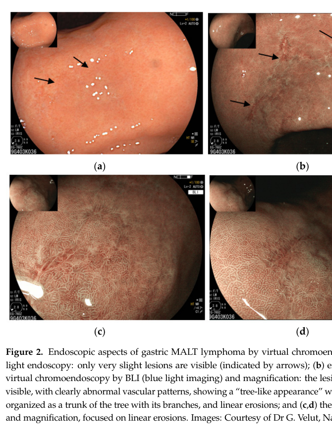

## Question

# Disease Characteristics Research Template

## Target Disease
- **Disease Name:** MALT Lymphoma
- **MONDO ID:**  (if available)
- **Category:** 

## Research Objectives

Please provide a comprehensive research report on **MALT Lymphoma** covering all of the
disease characteristics listed below. This report will be used to populate a disease knowledge
base entry. Be thorough and cite primary literature (PMID preferred) for all claims.

For each section, **suggested databases/resources** are listed. These are the first places
you should search for information on each topic.

---

### 1. Disease Information
> **Search first:** OMIM, Orphanet, ICD-10/ICD-11, MeSH, PubMed

- What is the disease? Provide a concise overview.
- What are the key identifiers? (OMIM, Orphanet, ICD-10/ICD-11, MeSH, Mondo)
- What are the common synonyms and alternative names?
- Is the information derived from individual patients (e.g., EHR) or aggregated disease-level resources?

### 2. Etiology

- **Disease Causal Factors**: What are the primary causes? (genetic, environmental, infectious, mechanistic)
- **Risk Factors**:
  > **Search first:** PubMed, Cochrane Library, UpToDate, clinical guidelines, ClinVar, ClinGen, GWAS Catalog, PheGenI, CTD, CDC, WHO, epidemiological databases
  - Genetic risk factors (causal variants, susceptibility loci, modifier genes)
  - Environmental risk factors (toxins, lifestyle, occupational exposures, age, sex, family history)
- **Protective Factors**:
  > **Search first:** PubMed, Cochrane Library, clinical trial databases, GWAS Catalog, gnomAD, WHO, CDC, nutrition databases
  - Genetic protective factors (protective variants, modifier alleles)
  - Environmental protective factors (diet, lifestyle, exposures that reduce risk)
- **Gene-Environment Interactions**: How do genetic and environmental factors interact to influence disease?
  > **Search first:** CTD, PubMed, PheGenI, GxE databases

### 3. Phenotypes
> **Search first:** HPO (Human Phenotype Ontology), OMIM, Orphanet, PubMed, clinicaltrials.gov, MedDRA, SNOMED CT, DECIPHER, LOINC

For each phenotype, provide:
- **Phenotype type**: symptoms, clinical signs, physical manifestations, behavioral changes, or laboratory abnormalities
  > For symptoms/signs: HPO, OMIM, Orphanet, PubMed
  > For behavioral changes: HPO, DSM, RDoC (Research Domain Criteria), PubMed
  > For laboratory abnormalities: LOINC, SNOMED CT, LabTests Online, PubMed
- **Phenotype characteristics**:
  > **Search first:** OMIM, Orphanet, HPO, PubMed
  - Age of symptom onset (neonatal, childhood, adult-onset, late-onset)
  - Symptom severity (mild, moderate, severe, variable)
  - Symptom progression (stable, progressive, episodic, fluctuating)
  - Frequency among affected individuals (percentage or qualitative)
- **Quality of life impact**: Effects on daily functioning and well-being (per-phenotype when possible)
  > **Search first:** EQ-5D database, SF-36, WHO QOL databases, PubMed
- Suggest HPO (Human Phenotype Ontology) terms for each phenotype

### 4. Genetic/Molecular Information

- **Causal Genes**: Gene mutations or chromosomal abnormalities responsible for disease (gene symbols, OMIM IDs)
  > **Search first:** OMIM, ClinVar, HGMD, Ensembl, NCBI Gene
- **Pathogenic Variants**:
  - Affected genes (gene symbols, HGNC IDs)
    > **Search first:** OMIM, NCBI Gene, Ensembl, HGNC, UniProt, GeneCards
  - Variant classification (pathogenic, likely pathogenic, VUS per ACMG/AMP guidelines)
    > **Search first:** ClinVar, ClinGen, ACMG/AMP guidelines, VarSome
  - Variant type/class (missense, frameshift, nonsense, splice-site, structural)
  - Allele frequency in population databases
    > **Search first:** gnomAD, 1000 Genomes, ExAC, TOPMed, dbSNP
  - Somatic vs germline origin
    > **Search first:** COSMIC (somatic), ClinVar, ICGC, TCGA
  - Functional consequences (loss of function, gain of function, dominant negative)
- **Modifier Genes**: Genes that modify disease severity or expression
- **Epigenetic Information**: DNA methylation, histone modifications, chromatin changes affecting disease
  > **Search first:** ENCODE, Roadmap Epigenomics, MethBase, DiseaseMeth
- **Chromosomal Abnormalities**: Large-scale genetic changes (aneuploidy, translocations, inversions)
  > **Search first:** DECIPHER, ClinVar, ECARUCA, UCSC Genome Browser

### 5. Environmental Information

- **Environmental Factors**: Non-genetic contributing factors (toxins, radiation, pollution, occupational exposure)
  > **Search first:** CTD (Comparative Toxicogenomics Database), TOXNET, PubMed, EPA databases
- **Lifestyle Factors**: Behavioral factors (smoking, diet, exercise, alcohol consumption)
  > **Search first:** CDC databases, WHO, PubMed, NHANES
- **Infectious Agents**: If applicable, pathogens causing or triggering disease (bacteria, viruses, fungi, parasites)
  > **Search first:** NCBI Taxonomy, ViPR, BV-BRC, MicrobeDB, GIDEON

### 6. Mechanism / Pathophysiology

- **Molecular Pathways**: Specific signaling cascades or biochemical pathways involved (Wnt, MAPK, mTOR, PI3K-AKT, etc.)
  > **Search first:** KEGG, Reactome, WikiPathways, PathBank, BioCyc
- **Cellular Processes**: Cell-level mechanisms (apoptosis, autophagy, cell cycle dysregulation, inflammation, etc.)
  > **Search first:** Gene Ontology (GO), Reactome, KEGG, PubMed
- **Protein Dysfunction**: How protein structure or function is altered (misfolding, aggregation, loss of function, gain of function)
  > **Search first:** UniProt, PDB (Protein Data Bank), InterPro, Pfam, AlphaFold
- **Metabolic Changes**: Alterations in metabolic processes (energy metabolism, lipid metabolism, amino acid metabolism)
  > **Search first:** KEGG, BioCyc, HMDB (Human Metabolome Database), BRENDA
- **Immune System Involvement**: Role of immune response (autoimmunity, immunodeficiency, chronic inflammation)
  > **Search first:** ImmPort, Immunome Database, IEDB, Gene Ontology
- **Tissue Damage Mechanisms**: How tissues/ are injured (oxidative stress, ischemia, fibrosis, necrosis)
  > **Search first:** PubMed, Gene Ontology, Reactome
- **Biochemical Abnormalities**: Specific molecular defects (enzyme deficiencies, receptor dysfunction, ion channel defects)
  > **Search first:** BRENDA, UniProt, KEGG, OMIM, PubMed
- **Epigenetic Changes**: DNA methylation, histone modifications affecting gene expression in disease
  > **Search first:** ENCODE, Roadmap Epigenomics, MethBase, DiseaseMeth
- **Molecular Profiling** (if available):
  - Transcriptomics/gene expression changes
    > **Search first:** GEO (Gene Expression Omnibus), ArrayExpress, GTEx, Human Cell Atlas, SRA
  - Proteomics findings
    > **Search first:** PRIDE, ProteomeXchange, Human Protein Atlas, STRING, BioGRID
  - Metabolomics signatures
    > **Search first:** MetaboLights, Metabolomics Workbench, HMDB, METLIN
  - Lipidomics alterations
    > **Search first:** LIPID MAPS, SwissLipids, LipidHome, Metabolomics Workbench
  - Genomic structural features
    > **Search first:** UCSC Genome Browser, Ensembl, NCBI, dbVar, DGV
- **Advanced Technologies** (if applicable):
  - Single-cell analysis findings (cell-type specific mechanisms, cellular heterogeneity)
    > **Search first:** Human Cell Atlas, Single Cell Portal, GEO, CELLxGENE
  - Spatial transcriptomics findings
    > **Search first:** GEO, Spatial Research, Vizgen, 10x Genomics data
  - Multi-omics integration results
    > **Search first:** TCGA, ICGC, cBioPortal, LinkedOmics, PubMed
  - Functional genomics screens (CRISPR, RNAi)
    > **Search first:** DepMap, GenomeRNAi, PubMed, BioGRID ORCS

For each mechanism, describe:
- The causal chain from initial trigger to clinical manifestation
- Which mechanisms are upstream vs downstream
- What cell types and biological processes are involved
- Suggest GO terms for biological processes and CL terms for cell types

### 7. Anatomical Structures Affected

- **Organ Level**:
  - Primary organs directly affected
  - Secondary organ involvement (complications, secondary effects)
  - Body systems involved (cardiovascular, nervous, digestive, respiratory, endocrine, etc.)
  > **Search first:** Uberon, FMA (Foundational Model of Anatomy), OMIM, HPO, ICD-11, MeSH, SNOMED CT
- **Tissue and Cell Level**:
  - Specific tissue types affected (epithelial, connective, muscle, nervous)
  - Specific cell populations targeted (with Cell Ontology terms)
  > **Search first:** Uberon, Human Protein Atlas, Cell Ontology, Human Cell Atlas, CellMarker, PanglaoDB
- **Subcellular Level**:
  - Cellular compartments involved (mitochondria, nucleus, ER, lysosomes) (with GO Cellular Component terms)
  > **Search first:** Gene Ontology (Cellular Component), UniProt, Human Protein Atlas
- **Localization**:
  - Specific anatomical sites (with UBERON terms)
    > **Search first:** FMA, Uberon, NeuroNames (for brain), SNOMED CT
  - Lateralization (unilateral, bilateral, asymmetric)
    > **Search first:** HPO, clinical literature, imaging databases

### 8. Temporal Development

- **Onset**:
  - Typical age of onset (congenital, pediatric, adult, geriatric)
  - Onset pattern (acute, subacute, chronic, insidious)
  > **Search first:** OMIM, Orphanet, HPO, PubMed
- **Progression**:
  - Disease stages (early, intermediate, advanced, end-stage)
    > **Search first:** Cancer Staging Manual (AJCC), WHO classifications, PubMed
  - Progression rate (rapid, slow, variable)
  - Disease course pattern (episodic, relapsing-remitting, progressive, stable)
  - Disease duration (self-limited, chronic lifelong)
  > **Search first:** Disease registries, longitudinal cohort databases, natural history studies, PubMed, Orphanet, OMIM
- **Patterns**:
  - Remission patterns (spontaneous, treatment-induced)
    > **Search first:** Clinical trial databases, disease registries, PubMed
  - Critical periods (time windows of vulnerability or opportunity for intervention)
    > **Search first:** PubMed, developmental biology databases, clinical guidelines

### 9. Inheritance and Population

- **Epidemiology**:
  - Prevalence (cases per 100,000 at given time)
  - Incidence (new cases per 100,000 per year)
  > **Search first:** Orphanet, CDC, WHO, GBD (Global Burden of Disease), national registries, SEER, disease registries
- **For Genetic Etiology**:
  - Inheritance pattern (AD, AR, X-linked, mitochondrial, multifactorial, polygenic)
    > **Search first:** OMIM, Orphanet, ClinVar, GTR (Genetic Testing Registry)
  - Penetrance (complete, incomplete, age-dependent)
    > **Search first:** ClinVar, OMIM, PubMed, ClinGen
  - Expressivity (variable, consistent)
    > **Search first:** OMIM, ClinVar, PubMed
  - Genetic anticipation (increasing severity in successive generations)
    > **Search first:** OMIM, PubMed (especially for repeat expansion disorders)
  - Germline mosaicism
    > **Search first:** ClinVar, OMIM, genetic counseling literature, PubMed
  - Founder effects (population-specific mutations)
    > **Search first:** gnomAD, population genetics databases, PubMed
  - Consanguinity role
    > **Search first:** OMIM, population studies, genetic counseling resources
  - Carrier frequency
    > **Search first:** gnomAD, carrier screening databases, GeneReviews, GTR
- **Population Demographics**:
  - Affected populations (ethnic or demographic groups with higher prevalence)
    > **Search first:** gnomAD, 1000 Genomes, PAGE Study, PubMed, population registries
  - Geographic distribution (endemic areas, regional variation)
    > **Search first:** WHO, CDC, GBD, Orphanet, geographic epidemiology databases
  - Geographic distribution of specific variants
  - Sex ratio (male:female)
    > **Search first:** Disease registries, OMIM, PubMed, epidemiological databases
  - Age distribution of affected individuals
    > **Search first:** CDC, disease registries, SEER, Orphanet

### 10. Diagnostics

- **Clinical Tests**:
  - Laboratory tests (blood, urine, tissue chemistry, specific enzyme assays)
    > **Search first:** LOINC, LabTests Online, PubMed
  - Biomarkers (proteins, metabolites, genetic markers, circulating biomarkers)
    > **Search first:** FDA Biomarker List, BEST (Biomarkers, EndpointS, and other Tools), PubMed
  - Imaging studies (X-ray, CT, MRI, PET, ultrasound)
    > **Search first:** RadLex, DICOM, Radiopaedia, imaging databases
  - Functional tests (pulmonary function, cardiac stress tests)
    > **Search first:** LOINC, clinical guidelines, PubMed
  - Electrophysiology (EEG, EMG, ECG, nerve conduction studies)
    > **Search first:** LOINC, clinical neurophysiology databases, PubMed
  - Biopsy findings (histopathology, immunohistochemistry)
    > **Search first:** SNOMED CT, College of American Pathologists resources, PubMed
  - Pathology findings (microscopic examination)
    > **Search first:** SNOMED CT, Digital Pathology databases, PubMed
- **Genetic Testing**:
  > **Search first:** GTR (Genetic Testing Registry), GeneReviews, ClinGen
  - Overview of recommended genetic testing approach
  - Whole genome sequencing (WGS) utility
    > **Search first:** GTR, ClinVar, GEL (Genomics England), gnomAD
  - Whole exome sequencing (WES) utility
    > **Search first:** GTR, ClinVar, OMIM, GeneMatcher
  - Gene panels (which panels, which genes)
    > **Search first:** GTR, ClinVar, laboratory-specific databases
  - Single gene testing
    > **Search first:** GTR, ClinVar, OMIM, GeneReviews
  - Chromosomal microarray (CMA)
    > **Search first:** DECIPHER, ClinVar, dbVar, ECARUCA
  - Karyotyping
    > **Search first:** Chromosome Abnormality Database, ClinVar, cytogenetics resources
  - FISH
    > **Search first:** ClinVar, cytogenetics databases, PubMed
  - Mitochondrial DNA testing
    > **Search first:** MITOMAP, MSeqDR, ClinVar, GTR
  - Repeat expansion testing
    > **Search first:** GTR, ClinVar, repeat expansion databases, PubMed
- **Omics-Based Diagnostics** (if applicable):
  - RNA sequencing / transcriptomics
    > **Search first:** GEO, ArrayExpress, GTEx, RNA-seq databases
  - Proteomics
    > **Search first:** PRIDE, ProteomeXchange, FDA Biomarker database
  - Metabolomics
    > **Search first:** MetaboLights, Metabolomics Workbench, HMDB
  - Epigenomics
    > **Search first:** GEO, ENCODE, Roadmap Epigenomics, MethBase
  - Liquid biopsy
    > **Search first:** COSMIC, ClinVar, liquid biopsy databases, PubMed
- **Clinical Criteria**:
  - Standardized diagnostic criteria (DSM, ICD, society guidelines)
    > **Search first:** DSM-5, ICD-11, clinical society guidelines, UpToDate
  - Differential diagnosis (other conditions to rule out, with distinguishing features)
    > **Search first:** DynaMed, UpToDate, clinical decision support systems
- **Screening**:
  - Screening methods for asymptomatic individuals (newborn screening, carrier screening, cascade screening)
    > **Search first:** ACMG recommendations, CDC newborn screening, GTR

### 11. Outcome/Prognosis

- **Survival and Mortality**:
  - Survival rate (5-year, 10-year, overall)
    > **Search first:** SEER, cancer registries, disease-specific registries, PubMed
  - Life expectancy (with and without treatment if applicable)
    > **Search first:** Orphanet, disease registries, actuarial databases, PubMed
  - Mortality rate
    > **Search first:** CDC, WHO, GBD, national mortality databases
  - Disease-specific mortality (deaths directly attributable to disease)
    > **Search first:** Disease registries, CDC Wonder, GBD, PubMed
- **Morbidity and Function**:
  - Morbidity (disease-related disability and health impacts)
    > **Search first:** GBD, WHO, disability databases, PubMed
  - Disability outcomes (long-term functional impairments)
    > **Search first:** ICF (International Classification of Functioning), disability registries
  - Quality of life measures (EQ-5D, SF-36, PROMIS, disease-specific tools)
    > **Search first:** EQ-5D database, SF-36, PROMIS, PubMed
- **Disease Course**:
  - Complications (secondary problems: infections, organ failure, etc.)
    > **Search first:** ICD codes, disease registries, clinical databases, PubMed
  - Recovery potential (likelihood and extent of recovery, with vs without treatment)
    > **Search first:** Natural history studies, rehabilitation databases, PubMed
- **Prediction**:
  - Prognostic factors (age, disease severity, biomarkers, treatment response)
    > **Search first:** Prognostic models databases, clinical calculators, PubMed
  - Prognostic biomarkers (molecular markers predicting disease course)
    > **Search first:** FDA Biomarker database, PubMed, cancer prognostic databases

### 12. Treatment

- **Pharmacotherapy**:
  - Pharmacological treatments (drug names, drug classes, mechanisms of action)
    > **Search first:** DrugBank, RxNorm, ATC classification, DailyMed, FDA databases
  - Pharmacogenomics (how genetic variants affect drug metabolism, efficacy, toxicity)
    > **Search first:** PharmGKB, CPIC (Clinical Pharmacogenetics), FDA Table of PGx Biomarkers
- **Advanced Therapeutics**:
  - Gene therapy (viral vectors, CRISPR, gene replacement, gene editing)
    > **Search first:** ClinicalTrials.gov, FDA gene therapy database, ASGCT resources
  - Cell therapy (stem cell transplant, CAR-T, cellular therapeutics)
    > **Search first:** ClinicalTrials.gov, FDA cell therapy database, FACT standards
  - RNA-based therapies (ASOs, siRNA, mRNA therapies)
    > **Search first:** ClinicalTrials.gov, FDA approvals, PubMed
  - Targeted therapies (treatments directed at specific molecular targets)
    > **Search first:** My Cancer Genome, OncoKB, ClinicalTrials.gov, FDA approvals
  - Immunotherapies (checkpoint inhibitors, monoclonal antibodies)
    > **Search first:** Cancer Immunotherapy Database, FDA approvals, ClinicalTrials.gov
- **Surgical and Interventional**:
  - Surgical interventions (types of surgery, timing, outcomes)
    > **Search first:** CPT codes, surgical registries, clinical guidelines, PubMed
- **Supportive and Rehabilitative**:
  - Supportive care (symptom management, pain control, nutrition)
    > **Search first:** Clinical guidelines, Cochrane Library, PubMed
  - Rehabilitation (physical therapy, occupational therapy, speech therapy)
    > **Search first:** Rehabilitation medicine databases, clinical guidelines, PubMed
- **Experimental**:
  - Experimental treatments in clinical trials (with NCT identifiers if available)
    > **Search first:** ClinicalTrials.gov, EU Clinical Trials Register, WHO ICTRP
- **Treatment Outcomes**:
  - Treatment response rates
    > **Search first:** Clinical trial databases, FDA reviews, systematic reviews, PubMed
  - Side effects and adverse events
    > **Search first:** FDA Adverse Event Reporting System (FAERS), MedWatch, PubMed
- **Treatment Strategy**:
  - Treatment algorithms (clinical pathways, decision trees)
    > **Search first:** Clinical practice guidelines, NCCN Guidelines, UpToDate
  - Combination therapies
    > **Search first:** ClinicalTrials.gov, treatment guidelines, PubMed
  - Personalized medicine approaches (genotype-guided treatment)
    > **Search first:** My Cancer Genome, CIViC, PharmGKB, precision medicine databases

For each treatment, suggest MAXO (Medical Action Ontology) terms where applicable.

### 13. Prevention

- **Prevention Levels**:
  - Primary prevention (preventing disease occurrence: vaccination, risk factor modification)
    > **Search first:** CDC, WHO, USPSTF recommendations, Cochrane Library
  - Secondary prevention (early detection and treatment: screening programs, early intervention)
    > **Search first:** USPSTF, CDC screening guidelines, WHO
  - Tertiary prevention (preventing complications in those with disease)
    > **Search first:** Clinical guidelines, disease management protocols, PubMed
- **Immunization**: Vaccine strategies (if applicable)
  > **Search first:** CDC vaccine schedules, WHO immunization, FDA vaccine database
- **Screening and Early Detection**:
  - Screening programs (population-based: newborn screening, cancer screening)
    > **Search first:** CDC screening programs, USPSTF, cancer screening databases
  - Genetic screening (carrier screening, preimplantation genetic diagnosis, prenatal testing)
    > **Search first:** ACMG recommendations, ACOG guidelines, GTR
  - Risk stratification (identifying high-risk individuals for targeted prevention)
    > **Search first:** Risk prediction models, clinical calculators, PubMed
- **Behavioral Interventions**: Lifestyle modifications to reduce risk
  > **Search first:** CDC, WHO, behavioral intervention databases, Cochrane Library
- **Counseling**: Genetic counseling (risk assessment, family planning guidance)
  > **Search first:** NSGC resources, ACMG guidelines, GeneReviews
- **Public Health**:
  - Public health interventions (sanitation, vector control, health education)
    > **Search first:** CDC, WHO, public health databases, PubMed
  - Environmental interventions (reducing environmental risk factors)
    > **Search first:** EPA databases, WHO environmental health, PubMed
- **Prophylaxis**: Preventive medications or procedures
  > **Search first:** Clinical guidelines, FDA approvals, PubMed

### 14. Other Species / Natural Disease

- **Taxonomy**: Species affected (with NCBI Taxon identifiers)
  > **Search first:** NCBI Taxonomy
- **Breed**: Specific breeds affected (with VBO identifiers if applicable)
  > **Search first:** VBO (Vertebrate Breed Ontology)
- **Gene**: Orthologous genes in other species (with NCBI Gene IDs)
  > **Search first:** NCBI Gene
- **Natural Disease**:
  - Naturally occurring disease in other species (companion animals, wildlife)
    > **Search first:** OMIA (Online Mendelian Inheritance in Animals), VetCompass, PubMed
  - Veterinary relevance and importance in animal health
    > **Search first:** OMIA, veterinary databases, PubMed
- **Comparative Biology**:
  - Comparative pathology (similarities and differences across species)
    > **Search first:** OMIA, comparative pathology databases, PubMed
  - Evolutionary conservation of disease mechanisms
    > **Search first:** HomoloGene, OrthoMCL, Alliance of Genome Resources
- **Transmission** (if applicable):
  - Zoonotic potential
    > **Search first:** CDC zoonotic diseases, WHO zoonoses, GIDEON
  - Cross-species susceptibility
    > **Search first:** NCBI Taxonomy, veterinary databases, PubMed

### 15. Model Organisms

- **Model Types**:
  - Model organism type (mammalian, invertebrate, cellular, in vitro)
    > **Search first:** Alliance of Genome Resources, model organism databases
  - Specific model systems (mouse, rat, zebrafish, Drosophila, C. elegans, yeast, cell lines, organoids, iPSCs)
    > **Search first:** MGI, RGD, ZFIN, FlyBase, WormBase, SGD, ATCC, Cellosaurus
  - Induced models (drug treatment, surgical intervention, environmental manipulation)
    > **Search first:** MGI, model organism databases, PubMed
- **Genetic Models**:
  - Types available (knockout, knock-in, transgenic, conditional, humanized)
    > **Search first:** MGI, IMPC, KOMP, EuMMCR, IMSR
- **Model Characteristics**:
  - Phenotype recapitulation (how well model reproduces human disease features)
    > **Search first:** Model organism databases, comparative studies, PubMed
  - Model limitations (aspects of human disease not captured)
    > **Search first:** Model organism databases, PubMed, review articles
- **Applications**:
  - Research applications (what aspects of disease can be studied)
    > **Search first:** Model organism databases, PubMed
- **Resources**:
  - Model databases
    > **Search first:** MGI, RGD, ZFIN, FlyBase, WormBase, IMSR, EMMA, MMRRC

---

## Citation Requirements

- Cite primary literature (PMID preferred) for all mechanistic and clinical claims
- Prioritize recent reviews and landmark papers
- Include direct quotes from abstracts where possible to support key statements
- Distinguish evidence source types: human clinical, model organism, in vitro, computational

## Output Format

Structure your response as a comprehensive narrative organized by the sections above.
For each section, provide:
- Factual content with specific details (numbers, percentages, gene names, variant nomenclature)
- Ontology term suggestions (HPO, GO, CL, UBERON, CHEBI, MAXO, MONDO) where applicable
- Evidence citations with PMIDs
- Direct quotes from abstracts to support key claims
- Clear indication when information is not available or not applicable for this disease

This report will be used to populate a disease knowledge base entry with:
- Pathophysiology descriptions with causal chains
- Gene/protein annotations (HGNC, GO terms)
- Phenotype associations (HP terms) with frequencies
- Cell type involvement (CL terms)
- Anatomical locations (UBERON terms)
- Chemical entities (CHEBI terms)
- Treatment annotations (MAXO terms)
- Evidence items with PMIDs and exact abstract quotes
- Epidemiology, prognosis, diagnostic, and prevention information
- Animal model descriptions with phenotype recapitulation details

## Output

Question: You are an expert researcher providing comprehensive, well-cited information.

Provide detailed information focusing on:
1. Key concepts and definitions with current understanding
2. Recent developments and latest research (prioritize 2023-2024 sources)
3. Current applications and real-world implementations
4. Expert opinions and analysis from authoritative sources
5. Relevant statistics and data from recent studies

Format as a comprehensive research report with proper citations. Include URLs and publication dates where available.
Always prioritize recent, authoritative sources and provide specific citations for all major claims.

# Disease Characteristics Research Template

## Target Disease
- **Disease Name:** MALT Lymphoma
- **MONDO ID:**  (if available)
- **Category:** 

## Research Objectives

Please provide a comprehensive research report on **MALT Lymphoma** covering all of the
disease characteristics listed below. This report will be used to populate a disease knowledge
base entry. Be thorough and cite primary literature (PMID preferred) for all claims.

For each section, **suggested databases/resources** are listed. These are the first places
you should search for information on each topic.

---

### 1. Disease Information
> **Search first:** OMIM, Orphanet, ICD-10/ICD-11, MeSH, PubMed

- What is the disease? Provide a concise overview.
- What are the key identifiers? (OMIM, Orphanet, ICD-10/ICD-11, MeSH, Mondo)
- What are the common synonyms and alternative names?
- Is the information derived from individual patients (e.g., EHR) or aggregated disease-level resources?

### 2. Etiology

- **Disease Causal Factors**: What are the primary causes? (genetic, environmental, infectious, mechanistic)
- **Risk Factors**:
  > **Search first:** PubMed, Cochrane Library, UpToDate, clinical guidelines, ClinVar, ClinGen, GWAS Catalog, PheGenI, CTD, CDC, WHO, epidemiological databases
  - Genetic risk factors (causal variants, susceptibility loci, modifier genes)
  - Environmental risk factors (toxins, lifestyle, occupational exposures, age, sex, family history)
- **Protective Factors**:
  > **Search first:** PubMed, Cochrane Library, clinical trial databases, GWAS Catalog, gnomAD, WHO, CDC, nutrition databases
  - Genetic protective factors (protective variants, modifier alleles)
  - Environmental protective factors (diet, lifestyle, exposures that reduce risk)
- **Gene-Environment Interactions**: How do genetic and environmental factors interact to influence disease?
  > **Search first:** CTD, PubMed, PheGenI, GxE databases

### 3. Phenotypes
> **Search first:** HPO (Human Phenotype Ontology), OMIM, Orphanet, PubMed, clinicaltrials.gov, MedDRA, SNOMED CT, DECIPHER, LOINC

For each phenotype, provide:
- **Phenotype type**: symptoms, clinical signs, physical manifestations, behavioral changes, or laboratory abnormalities
  > For symptoms/signs: HPO, OMIM, Orphanet, PubMed
  > For behavioral changes: HPO, DSM, RDoC (Research Domain Criteria), PubMed
  > For laboratory abnormalities: LOINC, SNOMED CT, LabTests Online, PubMed
- **Phenotype characteristics**:
  > **Search first:** OMIM, Orphanet, HPO, PubMed
  - Age of symptom onset (neonatal, childhood, adult-onset, late-onset)
  - Symptom severity (mild, moderate, severe, variable)
  - Symptom progression (stable, progressive, episodic, fluctuating)
  - Frequency among affected individuals (percentage or qualitative)
- **Quality of life impact**: Effects on daily functioning and well-being (per-phenotype when possible)
  > **Search first:** EQ-5D database, SF-36, WHO QOL databases, PubMed
- Suggest HPO (Human Phenotype Ontology) terms for each phenotype

### 4. Genetic/Molecular Information

- **Causal Genes**: Gene mutations or chromosomal abnormalities responsible for disease (gene symbols, OMIM IDs)
  > **Search first:** OMIM, ClinVar, HGMD, Ensembl, NCBI Gene
- **Pathogenic Variants**:
  - Affected genes (gene symbols, HGNC IDs)
    > **Search first:** OMIM, NCBI Gene, Ensembl, HGNC, UniProt, GeneCards
  - Variant classification (pathogenic, likely pathogenic, VUS per ACMG/AMP guidelines)
    > **Search first:** ClinVar, ClinGen, ACMG/AMP guidelines, VarSome
  - Variant type/class (missense, frameshift, nonsense, splice-site, structural)
  - Allele frequency in population databases
    > **Search first:** gnomAD, 1000 Genomes, ExAC, TOPMed, dbSNP
  - Somatic vs germline origin
    > **Search first:** COSMIC (somatic), ClinVar, ICGC, TCGA
  - Functional consequences (loss of function, gain of function, dominant negative)
- **Modifier Genes**: Genes that modify disease severity or expression
- **Epigenetic Information**: DNA methylation, histone modifications, chromatin changes affecting disease
  > **Search first:** ENCODE, Roadmap Epigenomics, MethBase, DiseaseMeth
- **Chromosomal Abnormalities**: Large-scale genetic changes (aneuploidy, translocations, inversions)
  > **Search first:** DECIPHER, ClinVar, ECARUCA, UCSC Genome Browser

### 5. Environmental Information

- **Environmental Factors**: Non-genetic contributing factors (toxins, radiation, pollution, occupational exposure)
  > **Search first:** CTD (Comparative Toxicogenomics Database), TOXNET, PubMed, EPA databases
- **Lifestyle Factors**: Behavioral factors (smoking, diet, exercise, alcohol consumption)
  > **Search first:** CDC databases, WHO, PubMed, NHANES
- **Infectious Agents**: If applicable, pathogens causing or triggering disease (bacteria, viruses, fungi, parasites)
  > **Search first:** NCBI Taxonomy, ViPR, BV-BRC, MicrobeDB, GIDEON

### 6. Mechanism / Pathophysiology

- **Molecular Pathways**: Specific signaling cascades or biochemical pathways involved (Wnt, MAPK, mTOR, PI3K-AKT, etc.)
  > **Search first:** KEGG, Reactome, WikiPathways, PathBank, BioCyc
- **Cellular Processes**: Cell-level mechanisms (apoptosis, autophagy, cell cycle dysregulation, inflammation, etc.)
  > **Search first:** Gene Ontology (GO), Reactome, KEGG, PubMed
- **Protein Dysfunction**: How protein structure or function is altered (misfolding, aggregation, loss of function, gain of function)
  > **Search first:** UniProt, PDB (Protein Data Bank), InterPro, Pfam, AlphaFold
- **Metabolic Changes**: Alterations in metabolic processes (energy metabolism, lipid metabolism, amino acid metabolism)
  > **Search first:** KEGG, BioCyc, HMDB (Human Metabolome Database), BRENDA
- **Immune System Involvement**: Role of immune response (autoimmunity, immunodeficiency, chronic inflammation)
  > **Search first:** ImmPort, Immunome Database, IEDB, Gene Ontology
- **Tissue Damage Mechanisms**: How tissues/ are injured (oxidative stress, ischemia, fibrosis, necrosis)
  > **Search first:** PubMed, Gene Ontology, Reactome
- **Biochemical Abnormalities**: Specific molecular defects (enzyme deficiencies, receptor dysfunction, ion channel defects)
  > **Search first:** BRENDA, UniProt, KEGG, OMIM, PubMed
- **Epigenetic Changes**: DNA methylation, histone modifications affecting gene expression in disease
  > **Search first:** ENCODE, Roadmap Epigenomics, MethBase, DiseaseMeth
- **Molecular Profiling** (if available):
  - Transcriptomics/gene expression changes
    > **Search first:** GEO (Gene Expression Omnibus), ArrayExpress, GTEx, Human Cell Atlas, SRA
  - Proteomics findings
    > **Search first:** PRIDE, ProteomeXchange, Human Protein Atlas, STRING, BioGRID
  - Metabolomics signatures
    > **Search first:** MetaboLights, Metabolomics Workbench, HMDB, METLIN
  - Lipidomics alterations
    > **Search first:** LIPID MAPS, SwissLipids, LipidHome, Metabolomics Workbench
  - Genomic structural features
    > **Search first:** UCSC Genome Browser, Ensembl, NCBI, dbVar, DGV
- **Advanced Technologies** (if applicable):
  - Single-cell analysis findings (cell-type specific mechanisms, cellular heterogeneity)
    > **Search first:** Human Cell Atlas, Single Cell Portal, GEO, CELLxGENE
  - Spatial transcriptomics findings
    > **Search first:** GEO, Spatial Research, Vizgen, 10x Genomics data
  - Multi-omics integration results
    > **Search first:** TCGA, ICGC, cBioPortal, LinkedOmics, PubMed
  - Functional genomics screens (CRISPR, RNAi)
    > **Search first:** DepMap, GenomeRNAi, PubMed, BioGRID ORCS

For each mechanism, describe:
- The causal chain from initial trigger to clinical manifestation
- Which mechanisms are upstream vs downstream
- What cell types and biological processes are involved
- Suggest GO terms for biological processes and CL terms for cell types

### 7. Anatomical Structures Affected

- **Organ Level**:
  - Primary organs directly affected
  - Secondary organ involvement (complications, secondary effects)
  - Body systems involved (cardiovascular, nervous, digestive, respiratory, endocrine, etc.)
  > **Search first:** Uberon, FMA (Foundational Model of Anatomy), OMIM, HPO, ICD-11, MeSH, SNOMED CT
- **Tissue and Cell Level**:
  - Specific tissue types affected (epithelial, connective, muscle, nervous)
  - Specific cell populations targeted (with Cell Ontology terms)
  > **Search first:** Uberon, Human Protein Atlas, Cell Ontology, Human Cell Atlas, CellMarker, PanglaoDB
- **Subcellular Level**:
  - Cellular compartments involved (mitochondria, nucleus, ER, lysosomes) (with GO Cellular Component terms)
  > **Search first:** Gene Ontology (Cellular Component), UniProt, Human Protein Atlas
- **Localization**:
  - Specific anatomical sites (with UBERON terms)
    > **Search first:** FMA, Uberon, NeuroNames (for brain), SNOMED CT
  - Lateralization (unilateral, bilateral, asymmetric)
    > **Search first:** HPO, clinical literature, imaging databases

### 8. Temporal Development

- **Onset**:
  - Typical age of onset (congenital, pediatric, adult, geriatric)
  - Onset pattern (acute, subacute, chronic, insidious)
  > **Search first:** OMIM, Orphanet, HPO, PubMed
- **Progression**:
  - Disease stages (early, intermediate, advanced, end-stage)
    > **Search first:** Cancer Staging Manual (AJCC), WHO classifications, PubMed
  - Progression rate (rapid, slow, variable)
  - Disease course pattern (episodic, relapsing-remitting, progressive, stable)
  - Disease duration (self-limited, chronic lifelong)
  > **Search first:** Disease registries, longitudinal cohort databases, natural history studies, PubMed, Orphanet, OMIM
- **Patterns**:
  - Remission patterns (spontaneous, treatment-induced)
    > **Search first:** Clinical trial databases, disease registries, PubMed
  - Critical periods (time windows of vulnerability or opportunity for intervention)
    > **Search first:** PubMed, developmental biology databases, clinical guidelines

### 9. Inheritance and Population

- **Epidemiology**:
  - Prevalence (cases per 100,000 at given time)
  - Incidence (new cases per 100,000 per year)
  > **Search first:** Orphanet, CDC, WHO, GBD (Global Burden of Disease), national registries, SEER, disease registries
- **For Genetic Etiology**:
  - Inheritance pattern (AD, AR, X-linked, mitochondrial, multifactorial, polygenic)
    > **Search first:** OMIM, Orphanet, ClinVar, GTR (Genetic Testing Registry)
  - Penetrance (complete, incomplete, age-dependent)
    > **Search first:** ClinVar, OMIM, PubMed, ClinGen
  - Expressivity (variable, consistent)
    > **Search first:** OMIM, ClinVar, PubMed
  - Genetic anticipation (increasing severity in successive generations)
    > **Search first:** OMIM, PubMed (especially for repeat expansion disorders)
  - Germline mosaicism
    > **Search first:** ClinVar, OMIM, genetic counseling literature, PubMed
  - Founder effects (population-specific mutations)
    > **Search first:** gnomAD, population genetics databases, PubMed
  - Consanguinity role
    > **Search first:** OMIM, population studies, genetic counseling resources
  - Carrier frequency
    > **Search first:** gnomAD, carrier screening databases, GeneReviews, GTR
- **Population Demographics**:
  - Affected populations (ethnic or demographic groups with higher prevalence)
    > **Search first:** gnomAD, 1000 Genomes, PAGE Study, PubMed, population registries
  - Geographic distribution (endemic areas, regional variation)
    > **Search first:** WHO, CDC, GBD, Orphanet, geographic epidemiology databases
  - Geographic distribution of specific variants
  - Sex ratio (male:female)
    > **Search first:** Disease registries, OMIM, PubMed, epidemiological databases
  - Age distribution of affected individuals
    > **Search first:** CDC, disease registries, SEER, Orphanet

### 10. Diagnostics

- **Clinical Tests**:
  - Laboratory tests (blood, urine, tissue chemistry, specific enzyme assays)
    > **Search first:** LOINC, LabTests Online, PubMed
  - Biomarkers (proteins, metabolites, genetic markers, circulating biomarkers)
    > **Search first:** FDA Biomarker List, BEST (Biomarkers, EndpointS, and other Tools), PubMed
  - Imaging studies (X-ray, CT, MRI, PET, ultrasound)
    > **Search first:** RadLex, DICOM, Radiopaedia, imaging databases
  - Functional tests (pulmonary function, cardiac stress tests)
    > **Search first:** LOINC, clinical guidelines, PubMed
  - Electrophysiology (EEG, EMG, ECG, nerve conduction studies)
    > **Search first:** LOINC, clinical neurophysiology databases, PubMed
  - Biopsy findings (histopathology, immunohistochemistry)
    > **Search first:** SNOMED CT, College of American Pathologists resources, PubMed
  - Pathology findings (microscopic examination)
    > **Search first:** SNOMED CT, Digital Pathology databases, PubMed
- **Genetic Testing**:
  > **Search first:** GTR (Genetic Testing Registry), GeneReviews, ClinGen
  - Overview of recommended genetic testing approach
  - Whole genome sequencing (WGS) utility
    > **Search first:** GTR, ClinVar, GEL (Genomics England), gnomAD
  - Whole exome sequencing (WES) utility
    > **Search first:** GTR, ClinVar, OMIM, GeneMatcher
  - Gene panels (which panels, which genes)
    > **Search first:** GTR, ClinVar, laboratory-specific databases
  - Single gene testing
    > **Search first:** GTR, ClinVar, OMIM, GeneReviews
  - Chromosomal microarray (CMA)
    > **Search first:** DECIPHER, ClinVar, dbVar, ECARUCA
  - Karyotyping
    > **Search first:** Chromosome Abnormality Database, ClinVar, cytogenetics resources
  - FISH
    > **Search first:** ClinVar, cytogenetics databases, PubMed
  - Mitochondrial DNA testing
    > **Search first:** MITOMAP, MSeqDR, ClinVar, GTR
  - Repeat expansion testing
    > **Search first:** GTR, ClinVar, repeat expansion databases, PubMed
- **Omics-Based Diagnostics** (if applicable):
  - RNA sequencing / transcriptomics
    > **Search first:** GEO, ArrayExpress, GTEx, RNA-seq databases
  - Proteomics
    > **Search first:** PRIDE, ProteomeXchange, FDA Biomarker database
  - Metabolomics
    > **Search first:** MetaboLights, Metabolomics Workbench, HMDB
  - Epigenomics
    > **Search first:** GEO, ENCODE, Roadmap Epigenomics, MethBase
  - Liquid biopsy
    > **Search first:** COSMIC, ClinVar, liquid biopsy databases, PubMed
- **Clinical Criteria**:
  - Standardized diagnostic criteria (DSM, ICD, society guidelines)
    > **Search first:** DSM-5, ICD-11, clinical society guidelines, UpToDate
  - Differential diagnosis (other conditions to rule out, with distinguishing features)
    > **Search first:** DynaMed, UpToDate, clinical decision support systems
- **Screening**:
  - Screening methods for asymptomatic individuals (newborn screening, carrier screening, cascade screening)
    > **Search first:** ACMG recommendations, CDC newborn screening, GTR

### 11. Outcome/Prognosis

- **Survival and Mortality**:
  - Survival rate (5-year, 10-year, overall)
    > **Search first:** SEER, cancer registries, disease-specific registries, PubMed
  - Life expectancy (with and without treatment if applicable)
    > **Search first:** Orphanet, disease registries, actuarial databases, PubMed
  - Mortality rate
    > **Search first:** CDC, WHO, GBD, national mortality databases
  - Disease-specific mortality (deaths directly attributable to disease)
    > **Search first:** Disease registries, CDC Wonder, GBD, PubMed
- **Morbidity and Function**:
  - Morbidity (disease-related disability and health impacts)
    > **Search first:** GBD, WHO, disability databases, PubMed
  - Disability outcomes (long-term functional impairments)
    > **Search first:** ICF (International Classification of Functioning), disability registries
  - Quality of life measures (EQ-5D, SF-36, PROMIS, disease-specific tools)
    > **Search first:** EQ-5D database, SF-36, PROMIS, PubMed
- **Disease Course**:
  - Complications (secondary problems: infections, organ failure, etc.)
    > **Search first:** ICD codes, disease registries, clinical databases, PubMed
  - Recovery potential (likelihood and extent of recovery, with vs without treatment)
    > **Search first:** Natural history studies, rehabilitation databases, PubMed
- **Prediction**:
  - Prognostic factors (age, disease severity, biomarkers, treatment response)
    > **Search first:** Prognostic models databases, clinical calculators, PubMed
  - Prognostic biomarkers (molecular markers predicting disease course)
    > **Search first:** FDA Biomarker database, PubMed, cancer prognostic databases

### 12. Treatment

- **Pharmacotherapy**:
  - Pharmacological treatments (drug names, drug classes, mechanisms of action)
    > **Search first:** DrugBank, RxNorm, ATC classification, DailyMed, FDA databases
  - Pharmacogenomics (how genetic variants affect drug metabolism, efficacy, toxicity)
    > **Search first:** PharmGKB, CPIC (Clinical Pharmacogenetics), FDA Table of PGx Biomarkers
- **Advanced Therapeutics**:
  - Gene therapy (viral vectors, CRISPR, gene replacement, gene editing)
    > **Search first:** ClinicalTrials.gov, FDA gene therapy database, ASGCT resources
  - Cell therapy (stem cell transplant, CAR-T, cellular therapeutics)
    > **Search first:** ClinicalTrials.gov, FDA cell therapy database, FACT standards
  - RNA-based therapies (ASOs, siRNA, mRNA therapies)
    > **Search first:** ClinicalTrials.gov, FDA approvals, PubMed
  - Targeted therapies (treatments directed at specific molecular targets)
    > **Search first:** My Cancer Genome, OncoKB, ClinicalTrials.gov, FDA approvals
  - Immunotherapies (checkpoint inhibitors, monoclonal antibodies)
    > **Search first:** Cancer Immunotherapy Database, FDA approvals, ClinicalTrials.gov
- **Surgical and Interventional**:
  - Surgical interventions (types of surgery, timing, outcomes)
    > **Search first:** CPT codes, surgical registries, clinical guidelines, PubMed
- **Supportive and Rehabilitative**:
  - Supportive care (symptom management, pain control, nutrition)
    > **Search first:** Clinical guidelines, Cochrane Library, PubMed
  - Rehabilitation (physical therapy, occupational therapy, speech therapy)
    > **Search first:** Rehabilitation medicine databases, clinical guidelines, PubMed
- **Experimental**:
  - Experimental treatments in clinical trials (with NCT identifiers if available)
    > **Search first:** ClinicalTrials.gov, EU Clinical Trials Register, WHO ICTRP
- **Treatment Outcomes**:
  - Treatment response rates
    > **Search first:** Clinical trial databases, FDA reviews, systematic reviews, PubMed
  - Side effects and adverse events
    > **Search first:** FDA Adverse Event Reporting System (FAERS), MedWatch, PubMed
- **Treatment Strategy**:
  - Treatment algorithms (clinical pathways, decision trees)
    > **Search first:** Clinical practice guidelines, NCCN Guidelines, UpToDate
  - Combination therapies
    > **Search first:** ClinicalTrials.gov, treatment guidelines, PubMed
  - Personalized medicine approaches (genotype-guided treatment)
    > **Search first:** My Cancer Genome, CIViC, PharmGKB, precision medicine databases

For each treatment, suggest MAXO (Medical Action Ontology) terms where applicable.

### 13. Prevention

- **Prevention Levels**:
  - Primary prevention (preventing disease occurrence: vaccination, risk factor modification)
    > **Search first:** CDC, WHO, USPSTF recommendations, Cochrane Library
  - Secondary prevention (early detection and treatment: screening programs, early intervention)
    > **Search first:** USPSTF, CDC screening guidelines, WHO
  - Tertiary prevention (preventing complications in those with disease)
    > **Search first:** Clinical guidelines, disease management protocols, PubMed
- **Immunization**: Vaccine strategies (if applicable)
  > **Search first:** CDC vaccine schedules, WHO immunization, FDA vaccine database
- **Screening and Early Detection**:
  - Screening programs (population-based: newborn screening, cancer screening)
    > **Search first:** CDC screening programs, USPSTF, cancer screening databases
  - Genetic screening (carrier screening, preimplantation genetic diagnosis, prenatal testing)
    > **Search first:** ACMG recommendations, ACOG guidelines, GTR
  - Risk stratification (identifying high-risk individuals for targeted prevention)
    > **Search first:** Risk prediction models, clinical calculators, PubMed
- **Behavioral Interventions**: Lifestyle modifications to reduce risk
  > **Search first:** CDC, WHO, behavioral intervention databases, Cochrane Library
- **Counseling**: Genetic counseling (risk assessment, family planning guidance)
  > **Search first:** NSGC resources, ACMG guidelines, GeneReviews
- **Public Health**:
  - Public health interventions (sanitation, vector control, health education)
    > **Search first:** CDC, WHO, public health databases, PubMed
  - Environmental interventions (reducing environmental risk factors)
    > **Search first:** EPA databases, WHO environmental health, PubMed
- **Prophylaxis**: Preventive medications or procedures
  > **Search first:** Clinical guidelines, FDA approvals, PubMed

### 14. Other Species / Natural Disease

- **Taxonomy**: Species affected (with NCBI Taxon identifiers)
  > **Search first:** NCBI Taxonomy
- **Breed**: Specific breeds affected (with VBO identifiers if applicable)
  > **Search first:** VBO (Vertebrate Breed Ontology)
- **Gene**: Orthologous genes in other species (with NCBI Gene IDs)
  > **Search first:** NCBI Gene
- **Natural Disease**:
  - Naturally occurring disease in other species (companion animals, wildlife)
    > **Search first:** OMIA (Online Mendelian Inheritance in Animals), VetCompass, PubMed
  - Veterinary relevance and importance in animal health
    > **Search first:** OMIA, veterinary databases, PubMed
- **Comparative Biology**:
  - Comparative pathology (similarities and differences across species)
    > **Search first:** OMIA, comparative pathology databases, PubMed
  - Evolutionary conservation of disease mechanisms
    > **Search first:** HomoloGene, OrthoMCL, Alliance of Genome Resources
- **Transmission** (if applicable):
  - Zoonotic potential
    > **Search first:** CDC zoonotic diseases, WHO zoonoses, GIDEON
  - Cross-species susceptibility
    > **Search first:** NCBI Taxonomy, veterinary databases, PubMed

### 15. Model Organisms

- **Model Types**:
  - Model organism type (mammalian, invertebrate, cellular, in vitro)
    > **Search first:** Alliance of Genome Resources, model organism databases
  - Specific model systems (mouse, rat, zebrafish, Drosophila, C. elegans, yeast, cell lines, organoids, iPSCs)
    > **Search first:** MGI, RGD, ZFIN, FlyBase, WormBase, SGD, ATCC, Cellosaurus
  - Induced models (drug treatment, surgical intervention, environmental manipulation)
    > **Search first:** MGI, model organism databases, PubMed
- **Genetic Models**:
  - Types available (knockout, knock-in, transgenic, conditional, humanized)
    > **Search first:** MGI, IMPC, KOMP, EuMMCR, IMSR
- **Model Characteristics**:
  - Phenotype recapitulation (how well model reproduces human disease features)
    > **Search first:** Model organism databases, comparative studies, PubMed
  - Model limitations (aspects of human disease not captured)
    > **Search first:** Model organism databases, PubMed, review articles
- **Applications**:
  - Research applications (what aspects of disease can be studied)
    > **Search first:** Model organism databases, PubMed
- **Resources**:
  - Model databases
    > **Search first:** MGI, RGD, ZFIN, FlyBase, WormBase, IMSR, EMMA, MMRRC

---

## Citation Requirements

- Cite primary literature (PMID preferred) for all mechanistic and clinical claims
- Prioritize recent reviews and landmark papers
- Include direct quotes from abstracts where possible to support key statements
- Distinguish evidence source types: human clinical, model organism, in vitro, computational

## Output Format

Structure your response as a comprehensive narrative organized by the sections above.
For each section, provide:
- Factual content with specific details (numbers, percentages, gene names, variant nomenclature)
- Ontology term suggestions (HPO, GO, CL, UBERON, CHEBI, MAXO, MONDO) where applicable
- Evidence citations with PMIDs
- Direct quotes from abstracts to support key claims
- Clear indication when information is not available or not applicable for this disease

This report will be used to populate a disease knowledge base entry with:
- Pathophysiology descriptions with causal chains
- Gene/protein annotations (HGNC, GO terms)
- Phenotype associations (HP terms) with frequencies
- Cell type involvement (CL terms)
- Anatomical locations (UBERON terms)
- Chemical entities (CHEBI terms)
- Treatment annotations (MAXO terms)
- Evidence items with PMIDs and exact abstract quotes
- Epidemiology, prognosis, diagnostic, and prevention information
- Animal model descriptions with phenotype recapitulation details

# Comprehensive Disease Characteristics Report: MALT Lymphoma (Extranodal Marginal Zone Lymphoma of Mucosa‑Associated Lymphoid Tissue)

## Target disease
- **Disease name:** MALT lymphoma (Extranodal marginal zone B‑cell lymphoma of mucosa‑associated lymphoid tissue; EMZL/MALT)
- **MONDO ID:** Not found in the retrieved full-text evidence (not inferred).
- **Category:** Indolent B‑cell non‑Hodgkin lymphoma (marginal zone lymphoma subtype) (walewska2023guidelineforthe pages 2-2).

---

## 1. Disease information

### Overview (current understanding)
MALT lymphoma is an indolent extranodal marginal zone B‑cell lymphoma that arises from marginal zone B cells in *acquired* mucosa-associated lymphoid tissue that develops under chronic antigenic stimulation (infection or autoimmunity) (raderer2023clinicalrelevanceof pages 1-2, alderuccio2023enhancingprognosticationand pages 1-3, walewska2023guidelineforthe pages 2-2).

- **Classification:** WHO 5th edition recognizes marginal zone lymphoma subtypes including EMZL/MALT (walewska2023guidelineforthe pages 2-2).
- **Relative frequency:** EMZL/MALT accounts for **>60% of marginal zone lymphomas** (walewska2023guidelineforthe pages 2-2). In broader lymphoma epidemiology, MALT lymphoma has been reported as **~5–8%** of adult lymphoma diagnoses (raderer2023clinicalrelevanceof pages 1-2).
- **Common primary sites (site distribution varies by region):** stomach (~30–40%), ocular adnexa (~12–24%), lung (~9–11%), salivary/parotid (~7–11%), and skin (~10%) (raderer2023clinicalrelevanceof pages 1-2, alderuccio2023enhancingprognosticationand pages 1-3).

### Synonyms / alternative names
- Extranodal marginal zone lymphoma (EMZL)
- Extranodal marginal zone B‑cell lymphoma of mucosa-associated lymphoid tissue
- MALT lymphoma
- Gastric MALT lymphoma (site-specific form) (matysiakbudnik2023clinicalmanagementof pages 1-2).

### Key identifiers (availability in current evidence)
The retrieved papers did not contain specific **ICD‑10/ICD‑11**, **MeSH**, **OMIM**, **Orphanet**, or **MONDO** codes in the accessible text excerpts; therefore, identifiers are **not reported here** to avoid incorrect mapping.

### Data provenance
The information summarized is derived from **aggregated disease-level resources** (guidelines, systematic reviews, multi-center/real-world cohorts, and mechanistic studies) rather than individual EHR extracts (walewska2023guidelineforthe pages 9-9, lemos2023effectivenessofhelicobacter pages 1-3, min2023longtermclinicaloutcomes pages 7-8, tsai2024cooperativeparticipationof pages 1-2).

**Representative abstract quote (definition):** A 2023 review describes EMZL/MALT as “**an indolent lymphoma originating from marginal zone B‑cells and associated with chronic inflammation**” (alderuccio2023enhancingprognosticationand pages 1-3).

---

## 2. Etiology

### Primary causal factors (infectious / inflammatory)
MALT lymphomagenesis is strongly linked to **chronic antigenic stimulation** at the involved mucosal site, with subsequent acquisition of genetic alterations that often converge on NF‑κB signaling (raderer2023clinicalrelevanceof pages 1-2, alderuccio2023enhancingprognosticationand pages 1-3).

#### Gastric MALT lymphoma (GML)
- **Helicobacter pylori** is a central etiologic driver; a British Society of Haematology (BSH) guideline reports **H. pylori implicated in ~38–85%** of gastric MALT cases (walewska2023guidelineforthe pages 3-3).
- **Non‑H. pylori Helicobacter species** and other microbial/autoimmune contexts contribute to “true” H. pylori-negative disease, which is reported in **~10–40%** of cases (matysiakbudnik2023clinicalmanagementof pages 7-8).

#### Site-specific infectious associations (examples from guideline synthesis)
- **Intestinal MALT:** association with **Campylobacter jejuni (up to 50%)** in some contexts (walewska2023guidelineforthe pages 3-3).
- **Ocular adnexal MALT:** geographic association with **Chlamydia psittaci** (variable by region) (alderuccio2023enhancingprognosticationand pages 17-19).
- **Hepatic MALT:** associations reported with **hepatitis C (23%)**, hepatitis B, and other viral hepatitis (walewska2023guidelineforthe pages 3-3).

### Autoimmune risk contexts
Autoimmune disorders create chronic inflammatory niches and are repeatedly cited as associated contexts for EMZL/MALT, including **Sjögren’s syndrome** and **Hashimoto thyroiditis** (alderuccio2023enhancingprognosticationand pages 1-3, alderuccio2023enhancingprognosticationand pages 17-19).

### Protective factors
The retrieved evidence did not provide validated protective genetic variants or environmental protective factors specific to MALT lymphoma.

### Gene–environment interaction (clinically important example)
A major gene–environment interaction in MALT lymphoma is the transition from **antigen-dependent** (infection-driven) growth to **antigen-independent** growth mediated by tumor genetics:
- **t(11;18)(q21;q21)/BIRC3::MALT1 (API2–MALT1)** is associated with **poor response to H. pylori eradication** and more disseminated gastric disease, suggesting reduced dependence on H. pylori-driven stimulation (raderer2023clinicalrelevanceof pages 1-2, matysiakbudnik2023clinicalmanagementof pages 8-9).

---

## 3. Phenotypes (clinical presentation) and HPO mapping

### General phenotype pattern
MALT lymphoma is typically **indolent**, often localized, and symptoms may reflect the involved organ rather than systemic B symptoms (alderuccio2023enhancingprognosticationand pages 1-3, matysiakbudnik2023clinicalmanagementof pages 8-9).

### Gastric MALT lymphoma
- **Symptoms/signs:** nonspecific upper GI symptoms such as dyspepsia/ulcer-like symptoms (matysiakbudnik2023clinicalmanagementof pages 1-2).
- **Endoscopic phenotype:** wide range from normal-appearing mucosa to erythema, nodularity, thickened folds, ulcers, or mass-like lesions; advanced imaging may show an abnormal vascular pattern described as “tree-like appearance” (matysiakbudnik2023clinicalmanagementof pages 2-4, matysiakbudnik2023clinicalmanagementof media 18e4f906).
- **Stage at diagnosis:** most cases are localized; one review notes **>90% are stage I–II** (matysiakbudnik2023clinicalmanagementof pages 8-9).

**Suggested HPO terms (examples):**
- Dyspepsia (HP:0100749)
- Epigastric pain (HP:0030819)
- Gastric ulcer (HP:0002592)
- Nausea (HP:0002018)
- Gastrointestinal hemorrhage (HP:0002239) (when present)

### Ocular adnexal / conjunctival MALT lymphoma (high-level)
Ocular adnexal MALT is a common extranodal site; site biology and prognosis vary, and infections/IgG4-related disease can be part of differential/associated context (walewska2023guidelineforthe pages 3-3, alderuccio2023enhancingprognosticationand pages 4-6).

**Suggested HPO terms (site-dependent; examples):**
- Conjunctival mass (HP:0100787)
- Proptosis (HP:0000520)
- Diplopia (HP:0000651)

### Quality-of-life impact
The retrieved evidence did not provide validated QoL instrument data (e.g., EQ‑5D/SF‑36) specific to MALT lymphoma; however, the BSH guideline emphasizes monitoring toxicity via patient-reported outcomes in trials and practice contexts (alderuccio2023enhancingprognosticationand pages 16-17).

---

## 4. Genetic / molecular information

### Key molecular concept
Across sites, many genetic changes dysregulate pathways leading to **NF‑κB activation**, consistent with a chronic inflammation/antigen stimulation model (raderer2023clinicalrelevanceof pages 1-2, alderuccio2023enhancingprognosticationand pages 1-3).

### Recurrent chromosomal abnormalities (examples)
- **t(11;18)(q21;q21)/BIRC3::MALT1 (API2–MALT1):** ~24% gastric and ~40% pulmonary in a 2023 critical appraisal; gastric guideline ranges ~6–26% (raderer2023clinicalrelevanceof pages 1-2, walewska2023guidelineforthe pages 3-3).
- **t(14;18)(q32;q21)/IGH::MALT1:** ~1–5% in gastric disease (walewska2023guidelineforthe pages 3-3).
- **Trisomy 3 (~11%) and trisomy 18 (~6%)** in gastric disease (walewska2023guidelineforthe pages 3-3).

### Somatic mutations and pathway alterations (site-dependent)
The 2023 expert review highlights recurrent alterations in ocular adnexal EMZL (e.g., CABIN1, RHOA, TBL1XR1, CREBBP) and TNFAIP3 inactivation, with frequent concurrent BCR and NF‑κB pathway lesions (alderuccio2023enhancingprognosticationand pages 4-6).

### Molecular predictors of therapy response (recent emphasis)
- **API2–MALT1 fusion predicts poor response to H. pylori eradication** and is an independent predictor in a 2024 cohort examining endoscopic morphology and eradication response (OR ~12.18) (yang2024endoscopicmorphologyof pages 1-2).
- A 2023 critical appraisal notes emerging data suggesting alterations in **TNFAIP3 (A20), KMT2D, CARD11** may relate to response to BTK inhibitors (raderer2023clinicalrelevanceof pages 1-2).

### Epigenetics
No comprehensive epigenomic profiling (methylation/histone) for MALT lymphoma was retrievable in the current evidence excerpts; Tsai et al. note that some lymphomas show epigenetic suppression of the NFATC1 promoter (contextual statement) (tsai2024cooperativeparticipationof pages 15-16).

### Ontology suggestions
- **GO biological process:** NF‑κB signaling (GO:0043122), B‑cell receptor signaling (GO:0050853), chronic inflammatory response (GO:0002544), lymphocyte proliferation (GO:0046651), regulation of apoptotic process (GO:0042981) (mechanistic convergence described in reviews) (raderer2023clinicalrelevanceof pages 1-2, alderuccio2023enhancingprognosticationand pages 1-3).
- **Cell Ontology (CL):** marginal zone B cell (CL:0000900), memory B cell (CL:0000787), plasma cell (CL:0000786) (plasma-cell differentiation noted in gastric MALT) (matysiakbudnik2023clinicalmanagementof pages 4-7).

---

## 5. Environmental information

### Environmental/lifestyle factors
No robust lifestyle/environmental exposure risk factors (e.g., smoking, diet) specific to MALT lymphoma were identified in the retrieved evidence.

### Infectious agents (key non-genetic environmental contributors)
Primary environmental drivers are infectious/inflammatory exposures:
- **Helicobacter pylori** (gastric)
- **Non‑H. pylori Helicobacter species** (subset of “true” H. pylori-negative gastric MALT)
- **Campylobacter jejuni** (intestinal)
- **Chlamydia psittaci** (ocular adnexal; geographic variation)
- **HCV/HBV** (hepatic/extranodal contexts) (walewska2023guidelineforthe pages 3-3, matysiakbudnik2023clinicalmanagementof pages 7-8).

---

## 6. Mechanism / pathophysiology

### Conceptual causal chain (current model)
1. **Chronic antigenic stimulation** (infection/autoimmunity) induces acquired MALT and sustained B‑cell activation via BCR/CD40 signaling.
2. **Genetic events** accumulate (translocations, trisomies, NF‑κB regulators), shifting from antigen-dependent to antigen-independent survival and proliferation.
3. **NF‑κB pathway dysregulation** and related survival programs maintain the malignant clone (raderer2023clinicalrelevanceof pages 1-2, alderuccio2023enhancingprognosticationand pages 1-3).

### 2024 mechanistic development: CagA–calcineurin–NFATc1 axis (antibiotic-responsive gastric MALT)
A 2024 mechanistic study (Tsai et al., *Cancer Cell International*, Nov 2024; https://doi.org/10.1186/s12935-024-03552-6) provides a model linking H. pylori virulence factor CagA to host signaling and clinical response:
- **In vitro co-culture model:** B-lymphoma cell lines (MA-1, OCI-Ly3, OCI-Ly7, etc.) exposed to patient-derived H. pylori strains; CagA becomes tyrosine-phosphorylated and translocates to the nucleus, coinciding with NFATc1 dephosphorylation and nuclear translocation; this was linked to signaling (p-SHP-2/p-ERK/Bcl-xL) and induction of p21/p27 with G1 cell-cycle retardation (tsai2024cooperativeparticipationof pages 1-2, tsai2024cooperativeparticipationof pages 4-6).
- **Drug perturbation:** NFATc1 nuclear translocation depended on calcineurin (blocked by cyclosporine A), and clarithromycin reduced CagA/p-CagA and reversed NFATc1 nuclear localization (tsai2024cooperativeparticipationof pages 4-6).
- **Clinical correlation (n=91):** nuclear NFATc1 associated with tumor CagA presence (80% vs 33%, p<0.001) and with H. pylori eradication responsiveness (73% vs 25%, p<0.001); CagA expression independently associated with response (OR ~11.9, p<0.001), with combined CagA+NFATc1 high PPV (~90.5%) and specificity (~87.5%) (tsai2024cooperativeparticipationof pages 1-2, tsai2024cooperativeparticipationof pages 11-13).

**Implication:** This provides a mechanistic explanation for a subset of “antibiotic-responsive” gastric MALT lymphoma, where bacterial factors directly modulate lymphoma cell signaling and cell-cycle programs, and suggests potential biomarkers (CagA, NFATc1 localization) for predicting eradication response (tsai2024cooperativeparticipationof pages 11-13).

---

## 7. Anatomical structures affected

### Organ-level sites (common primary sites)
Common primary sites include stomach, ocular adnexa, lung, salivary glands, and skin (raderer2023clinicalrelevanceof pages 1-2, alderuccio2023enhancingprognosticationand pages 1-3).

**Suggested UBERON terms (examples):**
- Stomach (UBERON:0000945)
- Conjunctiva (UBERON:0000970)
- Lacrimal gland (UBERON:0001817)
- Lung (UBERON:0002048)
- Major salivary gland (UBERON:0001830)
- Skin (UBERON:0002097)

### Tissue/cell-level localization
Tumors are composed of heterogeneous small B cells with marginal zone/centrocyte-like morphology (walewska2023guidelineforthe pages 2-2), infiltrating mucosa-associated lymphoid structures (acquired MALT).

### Dissemination patterns (available evidence)
- Gastric disease is commonly localized (often stage I/II), and bone marrow involvement is uncommon (~4.3%) (walewska2023guidelineforthe pages 7-7, matysiakbudnik2023clinicalmanagementof pages 8-9).
- t(11;18)/BIRC3::MALT1 is associated with more disseminated gastric disease (raderer2023clinicalrelevanceof pages 1-2).

---

## 8. Temporal development

### Onset and course
MALT lymphoma is typically indolent, with prolonged natural history and frequent presentation at localized stage (raderer2023clinicalrelevanceof pages 1-2, matysiakbudnik2023clinicalmanagementof pages 8-9).

### Staging systems (gastric)
- **Lugano (1994) classification** is widely used in UK practice (walewska2023guidelineforthe pages 7-7).
- **Modified Ann Arbor** may be used to incorporate depth of infiltration (walewska2023guidelineforthe pages 7-7).
- A gastroenterology-focused review recommends **Paris classification** (TNM-like with depth assessed by endoscopic ultrasound) because depth of invasion predicts H. pylori eradication response (matysiakbudnik2023clinicalmanagementof pages 8-9).

### Response kinetics after eradication
- Complete remission after eradication may be delayed; guideline notes **late responses up to one year** (walewska2023guidelineforthe pages 9-9).

---

## 9. Inheritance and population

### Inheritance
MALT lymphoma is not described as a Mendelian inherited disorder in the retrieved evidence; it is primarily a somatic malignancy driven by acquired genetic lesions in the context of chronic inflammation (raderer2023clinicalrelevanceof pages 1-2).

### Epidemiology (available data; limitations)
- **Relative frequency among lymphomas:** MALT lymphoma represents ~5–8% of adult lymphoma diagnoses (raderer2023clinicalrelevanceof pages 1-2).
- **Geography:** relatively more frequent in Asia (China/Korea noted) (raderer2023clinicalrelevanceof pages 1-2).

**Not available from current evidence:** incidence per 100,000/year, prevalence, sex ratio, and age distributions from registries (e.g., SEER/GBD). These are important for a knowledge base but were not extractable from retrieved full text here.

---

## 10. Diagnostics

### Core diagnostic approach
- **Upper endoscopy with biopsy** is central for gastric disease; one review recommends **≥10 biopsies** from lesions and surrounding mucosa (matysiakbudnik2023clinicalmanagementof pages 4-7).
- Endoscopic appearance is often nonspecific; advanced modalities (NBI/BLI) can show a “tree-like appearance” vascular pattern (matysiakbudnik2023clinicalmanagementof pages 2-4, matysiakbudnik2023clinicalmanagementof media 18e4f906).

### Histopathology
Typical gastric MALT histology includes marginal-zone pattern infiltration around B‑cell follicles with confluent sheets and **lymphoepithelial lesions**; plasma cell differentiation occurs in up to ~33% (matysiakbudnik2023clinicalmanagementof pages 4-7).

### Immunophenotype (key markers to include/exclude mimics)
Typical phenotype described for gastric MALT:
- **CD20+**, **BCL2+**, **CD10−**, **BCL6−**, **CD5−**, **cyclin D1−**, **SOX11−**, **CD23−**, **IgD−**, usually **IgM+**; low Ki‑67 (matysiakbudnik2023clinicalmanagementof pages 4-7).
Guideline emphasizes IHC is primarily used to **exclude** other small B‑cell lymphomas because “no widely specific diagnostic markers for MZL” exist (walewska2023guidelineforthe pages 2-2).

### Molecular testing
- **FISH for t(11;18)(q21;q21)/BIRC3::MALT1** is recommended in all gastric cases in the BSH guideline because it correlates with advanced disease and reduced response to eradication (walewska2023guidelineforthe pages 7-7).
- PCR for clonality can support diagnosis but must be interpreted carefully in chronic inflammation contexts (walewska2023guidelineforthe pages 2-3).

### Imaging/staging
- FDG-PET avidity in gastric MALT is variable (~50–60%) and PET is mainly used when transformation is suspected or when baseline FDG avidity is present (walewska2023guidelineforthe pages 7-7).

---

## 11. Outcomes / prognosis

### Survival
BSH guideline synthesis: overall gastric EMZL/MALT prognosis is excellent with **>90% 5‑year survival** and **~75–80% 10‑year survival** (walewska2023guidelineforthe pages 9-9).

### Response and relapse statistics (recent evidence)
- **H. pylori eradication (early-stage H. pylori-positive gastric MALT):** 2023 proportional meta-analysis (2,936 eradicated patients) reported pooled complete histopathologic remission **75.18% (95% CI 70.45–79.91)** (lemos2023effectivenessofhelicobacter pages 1-3).
- **Real-world cohort (2023, single-center):** complete remission after eradication in localized H. pylori-positive disease **77.8% (112/144)** (min2023longtermclinicaloutcomes pages 7-8).
- **Radiotherapy (H. pylori-negative or eradication-failure settings):** 2023 real-world series reports 100% CR in an H. pylori-negative first-line RT cohort and better long-term PFS than chemotherapy in that dataset (min2023longtermclinicaloutcomes pages 7-8).

### Transformation risk (2024 emphasis)
A 2024 prospective cohort and meta-analysis reported pooled histologic transformation cumulative incidence in MZL overall of **~5% at 5 years** and **~8% at 10 years**; for **EMZL/MALT** approximately **~3% at 5 years** and **~5% at 10 years** (bommier2024transformationinmarginal pages 1-2). Transformation was associated with an approximately **3.95-fold increased risk of death** (bommier2024transformationinmarginal pages 1-2).

---

## 12. Treatment (current practice and real-world implementation)

### First-line (localized gastric disease)
- **H. pylori eradication** is recommended as first-line therapy for localized gastric MALT lymphoma, including in many guidelines even when H. pylori-negative by testing (European guideline perspective described) (matysiakbudnik2023clinicalmanagementof pages 1-2, matysiakbudnik2023clinicalmanagementof pages 8-9).
- BSH guideline reports **~62% CR by 12 months** after eradication, with late responses up to one year (walewska2023guidelineforthe pages 9-9).

### Second-line / localized H. pylori-negative or eradication-resistant disease
- **Involved-site radiotherapy** is a key definitive option; guideline notes modern series support dose reduction (e.g., 24 Gy) with low toxicity (walewska2023guidelineforthe pages 9-9).

### Systemic therapy (advanced, symptomatic, or refractory)
- Systemic therapy is reserved for disseminated, symptomatic, deeply invasive, or transformed cases (walewska2023guidelineforthe pages 9-9, walewska2023guidelineforthe pages 10-10).
- A 2023 real-world gastric cohort reported first-line R‑CVP chemotherapy CR **81.5%**, but with substantial hematologic toxicity (e.g., neutropenia 70.4%) (min2023longtermclinicaloutcomes pages 8-9).

### Targeted agents / recent developments
- Recent molecular appraisal suggests TNFAIP3/KMT2D/CARD11 alterations may associate with response to **BTK inhibitors**, though evidence is not yet sufficient for routine biomarker-driven decisions (raderer2023clinicalrelevanceof pages 1-2).

### MAXO (Medical Action Ontology) suggestions
- Helicobacter pylori eradication therapy (antibiotic therapy) (MAXO:0000155; general)
- External beam radiotherapy (MAXO:0000014)
- Anti-CD20 monoclonal antibody therapy (rituximab) (MAXO:0000754; general immunotherapy category)
- Chemoimmunotherapy (MAXO:0000747; general)

---

## 13. Prevention

### Primary prevention
No population-level primary prevention trials specific to MALT lymphoma were found in the retrieved evidence; however, infection control (H. pylori diagnosis/treatment) is central to reducing chronic gastritis-associated lymphomagenesis in gastric disease contexts (matysiakbudnik2023clinicalmanagementof pages 1-2, matysiakbudnik2023clinicalmanagementof pages 8-9).

### Secondary/tertiary prevention (surveillance)
- Gastric MALT lymphoma requires **endoscopic and histologic surveillance** after therapy; response assessment is endoscopic/histologic (GELA scoring is referenced as surveillance tool after eradication) (matysiakbudnik2023clinicalmanagementof pages 7-8, matysiakbudnik2023clinicalmanagementof pages 8-9).
- BSH guideline recommends repeat OGD and biopsies (often at 3–6 months) to assess response post-eradication; serology can remain positive up to 2 years and is not useful to confirm eradication (walewska2023guidelineforthe pages 9-9).

---

## 14. Other species / natural disease
The retrieved evidence did not provide veterinary natural history of MALT lymphoma in other species.

---

## 15. Model organisms and experimental systems

### In vitro models (2024)
Tsai et al. used **B‑lymphoma cell lines** co-cultured with **patient-derived H. pylori strains** to define the CagA–NFATc1 signaling axis and its suppression by clarithromycin or calcineurin inhibition (tsai2024cooperativeparticipationof pages 4-6).

### Mouse model context
Tsai et al. note experimental evidence that **transgenic mouse expression of CagA** can drive gastrointestinal and hematopoietic neoplasms, supporting a causal role for bacterial virulence factors in lymphomagenesis (tsai2024cooperativeparticipationof pages 15-16).

---

## Key visual evidence (endoscopy)
Endoscopic phenotypes of gastric MALT lymphoma, including the “tree-like appearance” vascular pattern under enhanced imaging, are shown in the cited figures (matysiakbudnik2023clinicalmanagementof media 18e4f906).

---

## Structured summary table
| Domain | Key points | Key recent sources (URL; publication date) | Evidence citation IDs |
|---|---|---|---|
| Definition/Identifiers | MALT lymphoma is an indolent extranodal marginal zone B-cell lymphoma arising from marginal zone B cells in acquired mucosa-associated lymphoid tissue under chronic antigenic stimulation. It accounts for **>60% of marginal zone lymphomas** and up to **~8% of newly diagnosed lymphomas**. Common primary sites include **stomach (~30–40%)**, **ocular adnexa (~12–24%)**, **skin (~10%)**, **lung (~9–11%)**, and **salivary gland (~7–11%)**. | Raderer et al., *Ther Adv Med Oncol*; https://doi.org/10.1177/17588359231183565; **Jan 2023**. Alderuccio & Lossos, *Expert Rev Hematol*; https://doi.org/10.1080/17474086.2023.2206557; **Apr 2023**. Walewska et al., *Br J Haematol*; https://doi.org/10.1111/bjh.19064; **Nov 2023**. | (raderer2023clinicalrelevanceof pages 1-2, alderuccio2023enhancingprognosticationand pages 1-3, walewska2023guidelineforthe pages 2-2) |
| Etiology | Strongly linked to chronic inflammation/infection. Gastric disease is associated with **Helicobacter pylori in ~38–85%** of cases; **H. heilmannii <1%**. Other site-specific associations include **Campylobacter jejuni (up to 50%)** in intestinal disease, **Chlamydia psittaci** in ocular adnexal disease (geographically variable), and autoimmune disorders such as **Sjögren syndrome** and **Hashimoto thyroiditis**. HCV is reported in some hepatic/other extranodal cases. | Walewska et al.; https://doi.org/10.1111/bjh.19064; **Nov 2023**. Alderuccio & Lossos; https://doi.org/10.1080/17474086.2023.2206557; **Apr 2023**. Matysiak-Budnik et al.; https://doi.org/10.3390/cancers15153811; **Jul 2023**. | (walewska2023guidelineforthe pages 3-3, alderuccio2023enhancingprognosticationand pages 17-19, matysiakbudnik2023clinicalmanagementof pages 16-17, matysiakbudnik2023clinicalmanagementof pages 1-2) |
| Molecular genetics | Recurrent lesions converge on **NF-κB activation**. The translocation **t(11;18)(q21;q21)/BIRC3::MALT1 (API2-MALT1)** is relatively specific and occurs in **~24% of gastric** and **~40% of pulmonary** MALT lymphoma; in gastric disease guideline tables report **~6–26%**. It is associated with more disseminated disease and poor response to H. pylori eradication. Other recurrent abnormalities include **t(14;18)(IGH::MALT1) ~1–5%**, **trisomy 3 ~11%**, **trisomy 18 ~6%**, and **TNFAIP3/A20 inactivation ~5–18%** in gastric MALT. | Raderer et al.; https://doi.org/10.1177/17588359231183565; **Jan 2023**. Walewska et al.; https://doi.org/10.1111/bjh.19064; **Nov 2023**. Yang et al.; https://doi.org/10.1186/s43556-023-00141-3; **Sep 2023**. | (raderer2023clinicalrelevanceof pages 1-2, walewska2023guidelineforthe pages 3-3, yang2023extranodallymphomapathogenesis pages 28-29, matysiakbudnik2023clinicalmanagementof pages 4-7, walewska2023guidelineforthe pages 7-7) |
| Diagnostics | Diagnosis is biopsy-based. Recommended gastric workup includes **upper endoscopy with biopsies**; at least **10 biopsies** from lesions and surrounding mucosa are suggested. Histology shows marginal-zone pattern infiltration with **lymphoepithelial lesions**; plasma cell differentiation may be seen in **up to ~33%**. Typical immunophenotype: **CD20+, BCL2+, CD10−, BCL6−, CD5−, cyclin D1−, SOX11−, CD23−, IgD−, usually IgM+**. **FISH for t(11;18)** is recommended in all gastric cases in the BSH guideline. Bone marrow involvement is uncommon (**~4.3%**), so marrow biopsy is not routine unless cytopenias are present. FDG-PET avidity is variable (**~50–60%**). | Matysiak-Budnik et al.; https://doi.org/10.3390/cancers15153811; **Jul 2023**. Walewska et al.; https://doi.org/10.1111/bjh.19064; **Nov 2023**. Alderuccio & Lossos; https://doi.org/10.1080/17474086.2023.2206557; **Apr 2023**. | (matysiakbudnik2023clinicalmanagementof pages 4-7, walewska2023guidelineforthe pages 7-7, walewska2023guidelineforthe pages 2-3, alderuccio2023enhancingprognosticationand pages 1-3, matysiakbudnik2023clinicalmanagementof pages 2-4) |
| Treatment/outcomes | For early-stage H. pylori-positive gastric MALT, eradication is first-line. A 2023 meta-analysis of **2,936** successfully eradicated H. pylori-positive patients found pooled complete histopathologic remission **75.18% (95% CI 70.45–79.91)**. The 2023 BSH guideline notes **~62% CR by 12 months** after eradication, with late responses up to 1 year. In a 2023 real-world series, CR after eradication in localized H. pylori-positive disease was **77.8% (112/144)**. Radiotherapy for H. pylori-independent/localized disease achieved **100% CR** in H. pylori-negative first-line cohorts in that study; older referenced RT series reported **5- and 10-year OS 94% and 79%**, and the BSH guideline summarizes overall prognosis as **>90% 5-year survival** and **75–80% 10-year survival**. | Lemos et al., *World J Gastroenterol*; https://doi.org/10.3748/wjg.v29.i14.2202; **Apr 2023**. Min et al., *Ann Hematol*; https://doi.org/10.1007/s00277-023-05130-8; **Feb 2023**. Walewska et al.; https://doi.org/10.1111/bjh.19064; **Nov 2023**. | (walewska2023guidelineforthe pages 9-9, min2023longtermclinicaloutcomes pages 8-9, lemos2023effectivenessofhelicobacter pages 1-3, min2023longtermclinicaloutcomes pages 7-8) |
| Transformation | Histologic transformation is uncommon but clinically important. In the 2024 prospective cohort/meta-analysis of MZL, pooled cumulative incidence was **~5% at 5 years** and **~8% at 10 years** overall; for **EMZL/MALT**, pooled incidence was about **~3% at 5 years** and **~5% at 10 years**. Transformation was associated with a **3.95-fold increased risk of death**. Reported predictors included **≥2 extranodal sites**, **Ann Arbor stage III/IV**, **elevated LDH**, and **MALT-IPI ≥2**. | Bommier et al., *Blood Advances*; https://doi.org/10.1182/bloodadvances.2024013188; **Nov 2024**. Alderuccio & Lossos; https://doi.org/10.1080/17474086.2023.2206557; **Apr 2023**. | (bommier2024transformationinmarginal pages 8-9, bommier2024transformationinmarginal pages 5-6, bommier2024transformationinmarginal pages 1-2, alderuccio2023enhancingprognosticationand pages 20-21) |

*Table: This table summarizes high-yield, evidence-supported facts on MALT lymphoma across definition, etiology, molecular genetics, diagnosis, treatment, and transformation. It prioritizes 2023–2024 sources and includes quantitative findings and context IDs for traceability.*

---

## Expert opinion and analysis (synthesis of authoritative sources)
1. **Clinical heterogeneity is site-driven:** EMZL/MALT is best conceptualized as a family of related indolent lymphomas where infectious/autoimmune context, genomic lesions, and prognosis differ by organ site; therefore, “one-biomarker-fits-all” stratification remains challenging (raderer2023clinicalrelevanceof pages 1-2, alderuccio2023enhancingprognosticationand pages 1-3).
2. **Antigen dependence versus independence guides management:** eradication is first-line even though genetic testing is not mandatory upfront; however, translocations such as t(11;18) explain why a clinically important subset is eradication-refractory and may need RT/systemic therapy (raderer2023clinicalrelevanceof pages 1-2, walewska2023guidelineforthe pages 9-9).
3. **A 2024 mechanistic advance ties bacterial virulence to treatment response:** the CagA–NFATc1 pathway provides a plausible mechanistic basis for “antibiotic-responsive” tumors and suggests biomarker development for precision eradication strategies (tsai2024cooperativeparticipationof pages 11-13, tsai2024cooperativeparticipationof pages 4-6).

---

## Evidence gaps relative to the template (not found in current retrieved evidence)
- MONDO/MeSH/ICD identifiers.
- Population incidence/prevalence per 100,000, sex ratio, and robust age distribution.
- Validated protective factors and formal gene–environment interaction models beyond treatment-resistance genetics.
- Standardized QoL statistics and disease-specific PRO datasets.
- Comprehensive animal-model landscape and naturally occurring veterinary disease reports.

References

1. (walewska2023guidelineforthe pages 2-2): Renata Walewska, Toby A. Eyre, Sally Barrington, Jessica Brady, Paul Fields, Sunil Iyengar, Anurag Joshi, Tobias Menne, Nilima Parry‐Jones, Harriet Walter, Andrew Wotherspoon, and Kim Linton. Guideline for the diagnosis and management of marginal zone lymphomas: a british society of haematology guideline. British Journal of Haematology, 204:107-86, Nov 2023. URL: https://doi.org/10.1111/bjh.19064, doi:10.1111/bjh.19064. This article has 27 citations and is from a domain leading peer-reviewed journal.

2. (raderer2023clinicalrelevanceof pages 1-2): Markus Raderer, Barbara Kiesewetter, and Ming-Qing Du. Clinical relevance of molecular aspects in extranodal marginal zone lymphoma: a critical appraisal. Therapeutic Advances in Medical Oncology, Jan 2023. URL: https://doi.org/10.1177/17588359231183565, doi:10.1177/17588359231183565. This article has 11 citations and is from a peer-reviewed journal.

3. (alderuccio2023enhancingprognosticationand pages 1-3): Juan Pablo Alderuccio and Izidore S. Lossos. Enhancing prognostication and personalizing treatment of extranodal marginal zone lymphoma. Expert Review of Hematology, 16:333-348, Apr 2023. URL: https://doi.org/10.1080/17474086.2023.2206557, doi:10.1080/17474086.2023.2206557. This article has 2 citations and is from a peer-reviewed journal.

4. (matysiakbudnik2023clinicalmanagementof pages 1-2): Tamara Matysiak-Budnik, Kateryna Priadko, Céline Bossard, Nicolas Chapelle, and Agnès Ruskoné-Fourmestraux. Clinical management of patients with gastric malt lymphoma: a gastroenterologist’s point of view. Cancers, 15:3811, Jul 2023. URL: https://doi.org/10.3390/cancers15153811, doi:10.3390/cancers15153811. This article has 26 citations.

5. (walewska2023guidelineforthe pages 9-9): Renata Walewska, Toby A. Eyre, Sally Barrington, Jessica Brady, Paul Fields, Sunil Iyengar, Anurag Joshi, Tobias Menne, Nilima Parry‐Jones, Harriet Walter, Andrew Wotherspoon, and Kim Linton. Guideline for the diagnosis and management of marginal zone lymphomas: a british society of haematology guideline. British Journal of Haematology, 204:107-86, Nov 2023. URL: https://doi.org/10.1111/bjh.19064, doi:10.1111/bjh.19064. This article has 27 citations and is from a domain leading peer-reviewed journal.

6. (lemos2023effectivenessofhelicobacter pages 1-3): Fabian Fellipe Bueno Lemos, Caroline Tianeze de Castro, Mariana Santos Calmon, Marcel Silva Luz, Samuel Luca Rocha Pinheiro, Clara Faria Souza Mendes dos Santos, Gabriel Lima Correa Santos, Hanna Santos Marques, Henrique Affonso Delgado, Kádima Nayara Teixeira, Cláudio Lima Souza, Márcio Vasconcelos Oliveira, and Fabrício Freire de Melo. Effectiveness of helicobacter pylori eradication in the treatment of early-stage gastric mucosa-associated lymphoid tissue lymphoma: an up-to-date meta-analysis. World Journal of Gastroenterology, 29:2202-2221, Apr 2023. URL: https://doi.org/10.3748/wjg.v29.i14.2202, doi:10.3748/wjg.v29.i14.2202. This article has 39 citations.

7. (min2023longtermclinicaloutcomes pages 7-8): Gi-June Min, Donghoon Kang, Han Hee Lee, Seung-Jun Kim, Tong Yoon Kim, Young-Woo Jeon, Joo Hyun O, Byung-Ock Choi, Gyeongsin Park, and Seok-Goo Cho. Long-term clinical outcomes of gastric mucosa-associated lymphoid tissue lymphoma in real-world experience. Annals of Hematology, 102:877-888, Feb 2023. URL: https://doi.org/10.1007/s00277-023-05130-8, doi:10.1007/s00277-023-05130-8. This article has 16 citations and is from a peer-reviewed journal.

8. (tsai2024cooperativeparticipationof pages 1-2): Hui-Jen Tsai, Kun-Huei Yeh, Chung-Wu Lin, Ming-Shiang Wu, Jyh-Ming Liou, Ping-Ning Hsu, Yi-Shin Zeng, Ming-Feng Wei, Chia-Tung Shun, Hsiu-Po Wang, Li-Tzong Chen, Ann-Lii Cheng, and Sung-Hsin Kuo. Cooperative participation of caga and nfatc1 in the pathogenesis of antibiotics-responsive gastric malt lymphoma. Cancer Cell International, Nov 2024. URL: https://doi.org/10.1186/s12935-024-03552-6, doi:10.1186/s12935-024-03552-6. This article has 1 citations and is from a peer-reviewed journal.

9. (walewska2023guidelineforthe pages 3-3): Renata Walewska, Toby A. Eyre, Sally Barrington, Jessica Brady, Paul Fields, Sunil Iyengar, Anurag Joshi, Tobias Menne, Nilima Parry‐Jones, Harriet Walter, Andrew Wotherspoon, and Kim Linton. Guideline for the diagnosis and management of marginal zone lymphomas: a british society of haematology guideline. British Journal of Haematology, 204:107-86, Nov 2023. URL: https://doi.org/10.1111/bjh.19064, doi:10.1111/bjh.19064. This article has 27 citations and is from a domain leading peer-reviewed journal.

10. (matysiakbudnik2023clinicalmanagementof pages 7-8): Tamara Matysiak-Budnik, Kateryna Priadko, Céline Bossard, Nicolas Chapelle, and Agnès Ruskoné-Fourmestraux. Clinical management of patients with gastric malt lymphoma: a gastroenterologist’s point of view. Cancers, 15:3811, Jul 2023. URL: https://doi.org/10.3390/cancers15153811, doi:10.3390/cancers15153811. This article has 26 citations.

11. (alderuccio2023enhancingprognosticationand pages 17-19): Juan Pablo Alderuccio and Izidore S. Lossos. Enhancing prognostication and personalizing treatment of extranodal marginal zone lymphoma. Expert Review of Hematology, 16:333-348, Apr 2023. URL: https://doi.org/10.1080/17474086.2023.2206557, doi:10.1080/17474086.2023.2206557. This article has 2 citations and is from a peer-reviewed journal.

12. (matysiakbudnik2023clinicalmanagementof pages 8-9): Tamara Matysiak-Budnik, Kateryna Priadko, Céline Bossard, Nicolas Chapelle, and Agnès Ruskoné-Fourmestraux. Clinical management of patients with gastric malt lymphoma: a gastroenterologist’s point of view. Cancers, 15:3811, Jul 2023. URL: https://doi.org/10.3390/cancers15153811, doi:10.3390/cancers15153811. This article has 26 citations.

13. (matysiakbudnik2023clinicalmanagementof pages 2-4): Tamara Matysiak-Budnik, Kateryna Priadko, Céline Bossard, Nicolas Chapelle, and Agnès Ruskoné-Fourmestraux. Clinical management of patients with gastric malt lymphoma: a gastroenterologist’s point of view. Cancers, 15:3811, Jul 2023. URL: https://doi.org/10.3390/cancers15153811, doi:10.3390/cancers15153811. This article has 26 citations.

14. (matysiakbudnik2023clinicalmanagementof media 18e4f906): Tamara Matysiak-Budnik, Kateryna Priadko, Céline Bossard, Nicolas Chapelle, and Agnès Ruskoné-Fourmestraux. Clinical management of patients with gastric malt lymphoma: a gastroenterologist’s point of view. Cancers, 15:3811, Jul 2023. URL: https://doi.org/10.3390/cancers15153811, doi:10.3390/cancers15153811. This article has 26 citations.

15. (alderuccio2023enhancingprognosticationand pages 4-6): Juan Pablo Alderuccio and Izidore S. Lossos. Enhancing prognostication and personalizing treatment of extranodal marginal zone lymphoma. Expert Review of Hematology, 16:333-348, Apr 2023. URL: https://doi.org/10.1080/17474086.2023.2206557, doi:10.1080/17474086.2023.2206557. This article has 2 citations and is from a peer-reviewed journal.

16. (alderuccio2023enhancingprognosticationand pages 16-17): Juan Pablo Alderuccio and Izidore S. Lossos. Enhancing prognostication and personalizing treatment of extranodal marginal zone lymphoma. Expert Review of Hematology, 16:333-348, Apr 2023. URL: https://doi.org/10.1080/17474086.2023.2206557, doi:10.1080/17474086.2023.2206557. This article has 2 citations and is from a peer-reviewed journal.

17. (yang2024endoscopicmorphologyof pages 1-2): Bing-Can Yang, Hai-Lin Yan, Xin-Yue Luo, Yu-Qiang Liu, Jin-Lin Yang, and Zhu Wang. Endoscopic morphology of gastric malt lymphoma correlate with api2/malt1 fusion and predict treatment response after helicobacter pylori eradication. BMC Gastroenterology, Oct 2024. URL: https://doi.org/10.1186/s12876-024-03476-5, doi:10.1186/s12876-024-03476-5. This article has 5 citations and is from a peer-reviewed journal.

18. (tsai2024cooperativeparticipationof pages 15-16): Hui-Jen Tsai, Kun-Huei Yeh, Chung-Wu Lin, Ming-Shiang Wu, Jyh-Ming Liou, Ping-Ning Hsu, Yi-Shin Zeng, Ming-Feng Wei, Chia-Tung Shun, Hsiu-Po Wang, Li-Tzong Chen, Ann-Lii Cheng, and Sung-Hsin Kuo. Cooperative participation of caga and nfatc1 in the pathogenesis of antibiotics-responsive gastric malt lymphoma. Cancer Cell International, Nov 2024. URL: https://doi.org/10.1186/s12935-024-03552-6, doi:10.1186/s12935-024-03552-6. This article has 1 citations and is from a peer-reviewed journal.

19. (matysiakbudnik2023clinicalmanagementof pages 4-7): Tamara Matysiak-Budnik, Kateryna Priadko, Céline Bossard, Nicolas Chapelle, and Agnès Ruskoné-Fourmestraux. Clinical management of patients with gastric malt lymphoma: a gastroenterologist’s point of view. Cancers, 15:3811, Jul 2023. URL: https://doi.org/10.3390/cancers15153811, doi:10.3390/cancers15153811. This article has 26 citations.

20. (tsai2024cooperativeparticipationof pages 4-6): Hui-Jen Tsai, Kun-Huei Yeh, Chung-Wu Lin, Ming-Shiang Wu, Jyh-Ming Liou, Ping-Ning Hsu, Yi-Shin Zeng, Ming-Feng Wei, Chia-Tung Shun, Hsiu-Po Wang, Li-Tzong Chen, Ann-Lii Cheng, and Sung-Hsin Kuo. Cooperative participation of caga and nfatc1 in the pathogenesis of antibiotics-responsive gastric malt lymphoma. Cancer Cell International, Nov 2024. URL: https://doi.org/10.1186/s12935-024-03552-6, doi:10.1186/s12935-024-03552-6. This article has 1 citations and is from a peer-reviewed journal.

21. (tsai2024cooperativeparticipationof pages 11-13): Hui-Jen Tsai, Kun-Huei Yeh, Chung-Wu Lin, Ming-Shiang Wu, Jyh-Ming Liou, Ping-Ning Hsu, Yi-Shin Zeng, Ming-Feng Wei, Chia-Tung Shun, Hsiu-Po Wang, Li-Tzong Chen, Ann-Lii Cheng, and Sung-Hsin Kuo. Cooperative participation of caga and nfatc1 in the pathogenesis of antibiotics-responsive gastric malt lymphoma. Cancer Cell International, Nov 2024. URL: https://doi.org/10.1186/s12935-024-03552-6, doi:10.1186/s12935-024-03552-6. This article has 1 citations and is from a peer-reviewed journal.

22. (walewska2023guidelineforthe pages 7-7): Renata Walewska, Toby A. Eyre, Sally Barrington, Jessica Brady, Paul Fields, Sunil Iyengar, Anurag Joshi, Tobias Menne, Nilima Parry‐Jones, Harriet Walter, Andrew Wotherspoon, and Kim Linton. Guideline for the diagnosis and management of marginal zone lymphomas: a british society of haematology guideline. British Journal of Haematology, 204:107-86, Nov 2023. URL: https://doi.org/10.1111/bjh.19064, doi:10.1111/bjh.19064. This article has 27 citations and is from a domain leading peer-reviewed journal.

23. (walewska2023guidelineforthe pages 2-3): Renata Walewska, Toby A. Eyre, Sally Barrington, Jessica Brady, Paul Fields, Sunil Iyengar, Anurag Joshi, Tobias Menne, Nilima Parry‐Jones, Harriet Walter, Andrew Wotherspoon, and Kim Linton. Guideline for the diagnosis and management of marginal zone lymphomas: a british society of haematology guideline. British Journal of Haematology, 204:107-86, Nov 2023. URL: https://doi.org/10.1111/bjh.19064, doi:10.1111/bjh.19064. This article has 27 citations and is from a domain leading peer-reviewed journal.

24. (bommier2024transformationinmarginal pages 1-2): Côme Bommier, Brian K. Link, Brianna J. Gysbers, Matthew J. Maurer, Melissa C. Larson, Arushi Khurana, Yucai Wang, Carrie A. Thompson, Dai Chihara, Juan P. Alderuccio, Jean L. Koff, Narendranath Epperla, Annarita Conconi, Izidore S. Lossos, Grzegorz S. Nowakowski, Andrew L. Feldman, Thomas M. Habermann, Rebecca L. King, and James R. Cerhan. Transformation in marginal zone lymphoma: results from a prospective cohort and a meta-analysis of the literature. Blood Advances, 8:5939-5948, Nov 2024. URL: https://doi.org/10.1182/bloodadvances.2024013188, doi:10.1182/bloodadvances.2024013188. This article has 14 citations and is from a peer-reviewed journal.

25. (walewska2023guidelineforthe pages 10-10): Renata Walewska, Toby A. Eyre, Sally Barrington, Jessica Brady, Paul Fields, Sunil Iyengar, Anurag Joshi, Tobias Menne, Nilima Parry‐Jones, Harriet Walter, Andrew Wotherspoon, and Kim Linton. Guideline for the diagnosis and management of marginal zone lymphomas: a british society of haematology guideline. British Journal of Haematology, 204:107-86, Nov 2023. URL: https://doi.org/10.1111/bjh.19064, doi:10.1111/bjh.19064. This article has 27 citations and is from a domain leading peer-reviewed journal.

26. (min2023longtermclinicaloutcomes pages 8-9): Gi-June Min, Donghoon Kang, Han Hee Lee, Seung-Jun Kim, Tong Yoon Kim, Young-Woo Jeon, Joo Hyun O, Byung-Ock Choi, Gyeongsin Park, and Seok-Goo Cho. Long-term clinical outcomes of gastric mucosa-associated lymphoid tissue lymphoma in real-world experience. Annals of Hematology, 102:877-888, Feb 2023. URL: https://doi.org/10.1007/s00277-023-05130-8, doi:10.1007/s00277-023-05130-8. This article has 16 citations and is from a peer-reviewed journal.

27. (matysiakbudnik2023clinicalmanagementof pages 16-17): Tamara Matysiak-Budnik, Kateryna Priadko, Céline Bossard, Nicolas Chapelle, and Agnès Ruskoné-Fourmestraux. Clinical management of patients with gastric malt lymphoma: a gastroenterologist’s point of view. Cancers, 15:3811, Jul 2023. URL: https://doi.org/10.3390/cancers15153811, doi:10.3390/cancers15153811. This article has 26 citations.

28. (yang2023extranodallymphomapathogenesis pages 28-29): Hua Yang, Yang Xun, Chao Ke, K. Tateishi, and Hua You. Extranodal lymphoma: pathogenesis, diagnosis and treatment. Molecular Biomedicine, Sep 2023. URL: https://doi.org/10.1186/s43556-023-00141-3, doi:10.1186/s43556-023-00141-3. This article has 34 citations and is from a peer-reviewed journal.

29. (bommier2024transformationinmarginal pages 8-9): Côme Bommier, Brian K. Link, Brianna J. Gysbers, Matthew J. Maurer, Melissa C. Larson, Arushi Khurana, Yucai Wang, Carrie A. Thompson, Dai Chihara, Juan P. Alderuccio, Jean L. Koff, Narendranath Epperla, Annarita Conconi, Izidore S. Lossos, Grzegorz S. Nowakowski, Andrew L. Feldman, Thomas M. Habermann, Rebecca L. King, and James R. Cerhan. Transformation in marginal zone lymphoma: results from a prospective cohort and a meta-analysis of the literature. Blood Advances, 8:5939-5948, Nov 2024. URL: https://doi.org/10.1182/bloodadvances.2024013188, doi:10.1182/bloodadvances.2024013188. This article has 14 citations and is from a peer-reviewed journal.

30. (bommier2024transformationinmarginal pages 5-6): Côme Bommier, Brian K. Link, Brianna J. Gysbers, Matthew J. Maurer, Melissa C. Larson, Arushi Khurana, Yucai Wang, Carrie A. Thompson, Dai Chihara, Juan P. Alderuccio, Jean L. Koff, Narendranath Epperla, Annarita Conconi, Izidore S. Lossos, Grzegorz S. Nowakowski, Andrew L. Feldman, Thomas M. Habermann, Rebecca L. King, and James R. Cerhan. Transformation in marginal zone lymphoma: results from a prospective cohort and a meta-analysis of the literature. Blood Advances, 8:5939-5948, Nov 2024. URL: https://doi.org/10.1182/bloodadvances.2024013188, doi:10.1182/bloodadvances.2024013188. This article has 14 citations and is from a peer-reviewed journal.

31. (alderuccio2023enhancingprognosticationand pages 20-21): Juan Pablo Alderuccio and Izidore S. Lossos. Enhancing prognostication and personalizing treatment of extranodal marginal zone lymphoma. Expert Review of Hematology, 16:333-348, Apr 2023. URL: https://doi.org/10.1080/17474086.2023.2206557, doi:10.1080/17474086.2023.2206557. This article has 2 citations and is from a peer-reviewed journal.

## Artifacts

- [Edison artifact artifact-00](MALT_Lymphoma-deep-research-falcon_artifacts/artifact-00.md)
