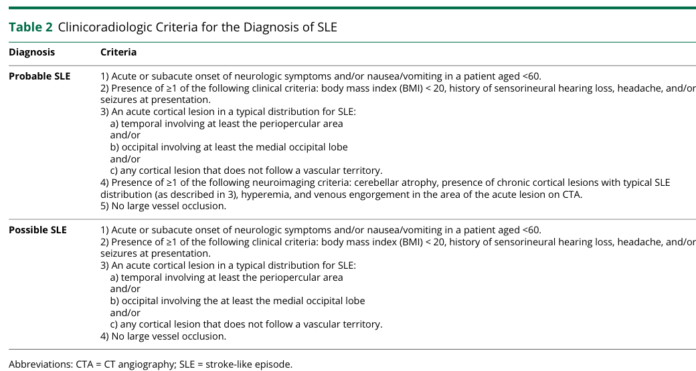

## Question

# Disease Characteristics Research Template

## Target Disease
- **Disease Name:** MELAS Syndrome
- **MONDO ID:**  (if available)
- **Category:** Mendelian

## Research Objectives

Please provide a comprehensive research report on **MELAS Syndrome** covering all of the
disease characteristics listed below. This report will be used to populate a disease knowledge
base entry. Be thorough and cite primary literature (PMID preferred) for all claims.

For each section, **suggested databases/resources** are listed. These are the first places
you should search for information on each topic.

---

### 1. Disease Information
> **Search first:** OMIM, Orphanet, ICD-10/ICD-11, MeSH, PubMed

- What is the disease? Provide a concise overview.
- What are the key identifiers? (OMIM, Orphanet, ICD-10/ICD-11, MeSH, Mondo)
- What are the common synonyms and alternative names?
- Is the information derived from individual patients (e.g., EHR) or aggregated disease-level resources?

### 2. Etiology

- **Disease Causal Factors**: What are the primary causes? (genetic, environmental, infectious, mechanistic)
- **Risk Factors**:
  > **Search first:** PubMed, Cochrane Library, UpToDate, clinical guidelines, ClinVar, ClinGen, GWAS Catalog, PheGenI, CTD, CDC, WHO, epidemiological databases
  - Genetic risk factors (causal variants, susceptibility loci, modifier genes)
  - Environmental risk factors (toxins, lifestyle, occupational exposures, age, sex, family history)
- **Protective Factors**:
  > **Search first:** PubMed, Cochrane Library, clinical trial databases, GWAS Catalog, gnomAD, WHO, CDC, nutrition databases
  - Genetic protective factors (protective variants, modifier alleles)
  - Environmental protective factors (diet, lifestyle, exposures that reduce risk)
- **Gene-Environment Interactions**: How do genetic and environmental factors interact to influence disease?
  > **Search first:** CTD, PubMed, PheGenI, GxE databases

### 3. Phenotypes
> **Search first:** HPO (Human Phenotype Ontology), OMIM, Orphanet, PubMed, clinicaltrials.gov, MedDRA, SNOMED CT, DECIPHER, LOINC

For each phenotype, provide:
- **Phenotype type**: symptoms, clinical signs, physical manifestations, behavioral changes, or laboratory abnormalities
  > For symptoms/signs: HPO, OMIM, Orphanet, PubMed
  > For behavioral changes: HPO, DSM, RDoC (Research Domain Criteria), PubMed
  > For laboratory abnormalities: LOINC, SNOMED CT, LabTests Online, PubMed
- **Phenotype characteristics**:
  > **Search first:** OMIM, Orphanet, HPO, PubMed
  - Age of symptom onset (neonatal, childhood, adult-onset, late-onset)
  - Symptom severity (mild, moderate, severe, variable)
  - Symptom progression (stable, progressive, episodic, fluctuating)
  - Frequency among affected individuals (percentage or qualitative)
- **Quality of life impact**: Effects on daily functioning and well-being (per-phenotype when possible)
  > **Search first:** EQ-5D database, SF-36, WHO QOL databases, PubMed
- Suggest HPO (Human Phenotype Ontology) terms for each phenotype

### 4. Genetic/Molecular Information

- **Causal Genes**: Gene mutations or chromosomal abnormalities responsible for disease (gene symbols, OMIM IDs)
  > **Search first:** OMIM, ClinVar, HGMD, Ensembl, NCBI Gene
- **Pathogenic Variants**:
  - Affected genes (gene symbols, HGNC IDs)
    > **Search first:** OMIM, NCBI Gene, Ensembl, HGNC, UniProt, GeneCards
  - Variant classification (pathogenic, likely pathogenic, VUS per ACMG/AMP guidelines)
    > **Search first:** ClinVar, ClinGen, ACMG/AMP guidelines, VarSome
  - Variant type/class (missense, frameshift, nonsense, splice-site, structural)
  - Allele frequency in population databases
    > **Search first:** gnomAD, 1000 Genomes, ExAC, TOPMed, dbSNP
  - Somatic vs germline origin
    > **Search first:** COSMIC (somatic), ClinVar, ICGC, TCGA
  - Functional consequences (loss of function, gain of function, dominant negative)
- **Modifier Genes**: Genes that modify disease severity or expression
- **Epigenetic Information**: DNA methylation, histone modifications, chromatin changes affecting disease
  > **Search first:** ENCODE, Roadmap Epigenomics, MethBase, DiseaseMeth
- **Chromosomal Abnormalities**: Large-scale genetic changes (aneuploidy, translocations, inversions)
  > **Search first:** DECIPHER, ClinVar, ECARUCA, UCSC Genome Browser

### 5. Environmental Information

- **Environmental Factors**: Non-genetic contributing factors (toxins, radiation, pollution, occupational exposure)
  > **Search first:** CTD (Comparative Toxicogenomics Database), TOXNET, PubMed, EPA databases
- **Lifestyle Factors**: Behavioral factors (smoking, diet, exercise, alcohol consumption)
  > **Search first:** CDC databases, WHO, PubMed, NHANES
- **Infectious Agents**: If applicable, pathogens causing or triggering disease (bacteria, viruses, fungi, parasites)
  > **Search first:** NCBI Taxonomy, ViPR, BV-BRC, MicrobeDB, GIDEON

### 6. Mechanism / Pathophysiology

- **Molecular Pathways**: Specific signaling cascades or biochemical pathways involved (Wnt, MAPK, mTOR, PI3K-AKT, etc.)
  > **Search first:** KEGG, Reactome, WikiPathways, PathBank, BioCyc
- **Cellular Processes**: Cell-level mechanisms (apoptosis, autophagy, cell cycle dysregulation, inflammation, etc.)
  > **Search first:** Gene Ontology (GO), Reactome, KEGG, PubMed
- **Protein Dysfunction**: How protein structure or function is altered (misfolding, aggregation, loss of function, gain of function)
  > **Search first:** UniProt, PDB (Protein Data Bank), InterPro, Pfam, AlphaFold
- **Metabolic Changes**: Alterations in metabolic processes (energy metabolism, lipid metabolism, amino acid metabolism)
  > **Search first:** KEGG, BioCyc, HMDB (Human Metabolome Database), BRENDA
- **Immune System Involvement**: Role of immune response (autoimmunity, immunodeficiency, chronic inflammation)
  > **Search first:** ImmPort, Immunome Database, IEDB, Gene Ontology
- **Tissue Damage Mechanisms**: How tissues/ are injured (oxidative stress, ischemia, fibrosis, necrosis)
  > **Search first:** PubMed, Gene Ontology, Reactome
- **Biochemical Abnormalities**: Specific molecular defects (enzyme deficiencies, receptor dysfunction, ion channel defects)
  > **Search first:** BRENDA, UniProt, KEGG, OMIM, PubMed
- **Epigenetic Changes**: DNA methylation, histone modifications affecting gene expression in disease
  > **Search first:** ENCODE, Roadmap Epigenomics, MethBase, DiseaseMeth
- **Molecular Profiling** (if available):
  - Transcriptomics/gene expression changes
    > **Search first:** GEO (Gene Expression Omnibus), ArrayExpress, GTEx, Human Cell Atlas, SRA
  - Proteomics findings
    > **Search first:** PRIDE, ProteomeXchange, Human Protein Atlas, STRING, BioGRID
  - Metabolomics signatures
    > **Search first:** MetaboLights, Metabolomics Workbench, HMDB, METLIN
  - Lipidomics alterations
    > **Search first:** LIPID MAPS, SwissLipids, LipidHome, Metabolomics Workbench
  - Genomic structural features
    > **Search first:** UCSC Genome Browser, Ensembl, NCBI, dbVar, DGV
- **Advanced Technologies** (if applicable):
  - Single-cell analysis findings (cell-type specific mechanisms, cellular heterogeneity)
    > **Search first:** Human Cell Atlas, Single Cell Portal, GEO, CELLxGENE
  - Spatial transcriptomics findings
    > **Search first:** GEO, Spatial Research, Vizgen, 10x Genomics data
  - Multi-omics integration results
    > **Search first:** TCGA, ICGC, cBioPortal, LinkedOmics, PubMed
  - Functional genomics screens (CRISPR, RNAi)
    > **Search first:** DepMap, GenomeRNAi, PubMed, BioGRID ORCS

For each mechanism, describe:
- The causal chain from initial trigger to clinical manifestation
- Which mechanisms are upstream vs downstream
- What cell types and biological processes are involved
- Suggest GO terms for biological processes and CL terms for cell types

### 7. Anatomical Structures Affected

- **Organ Level**:
  - Primary organs directly affected
  - Secondary organ involvement (complications, secondary effects)
  - Body systems involved (cardiovascular, nervous, digestive, respiratory, endocrine, etc.)
  > **Search first:** Uberon, FMA (Foundational Model of Anatomy), OMIM, HPO, ICD-11, MeSH, SNOMED CT
- **Tissue and Cell Level**:
  - Specific tissue types affected (epithelial, connective, muscle, nervous)
  - Specific cell populations targeted (with Cell Ontology terms)
  > **Search first:** Uberon, Human Protein Atlas, Cell Ontology, Human Cell Atlas, CellMarker, PanglaoDB
- **Subcellular Level**:
  - Cellular compartments involved (mitochondria, nucleus, ER, lysosomes) (with GO Cellular Component terms)
  > **Search first:** Gene Ontology (Cellular Component), UniProt, Human Protein Atlas
- **Localization**:
  - Specific anatomical sites (with UBERON terms)
    > **Search first:** FMA, Uberon, NeuroNames (for brain), SNOMED CT
  - Lateralization (unilateral, bilateral, asymmetric)
    > **Search first:** HPO, clinical literature, imaging databases

### 8. Temporal Development

- **Onset**:
  - Typical age of onset (congenital, pediatric, adult, geriatric)
  - Onset pattern (acute, subacute, chronic, insidious)
  > **Search first:** OMIM, Orphanet, HPO, PubMed
- **Progression**:
  - Disease stages (early, intermediate, advanced, end-stage)
    > **Search first:** Cancer Staging Manual (AJCC), WHO classifications, PubMed
  - Progression rate (rapid, slow, variable)
  - Disease course pattern (episodic, relapsing-remitting, progressive, stable)
  - Disease duration (self-limited, chronic lifelong)
  > **Search first:** Disease registries, longitudinal cohort databases, natural history studies, PubMed, Orphanet, OMIM
- **Patterns**:
  - Remission patterns (spontaneous, treatment-induced)
    > **Search first:** Clinical trial databases, disease registries, PubMed
  - Critical periods (time windows of vulnerability or opportunity for intervention)
    > **Search first:** PubMed, developmental biology databases, clinical guidelines

### 9. Inheritance and Population

- **Epidemiology**:
  - Prevalence (cases per 100,000 at given time)
  - Incidence (new cases per 100,000 per year)
  > **Search first:** Orphanet, CDC, WHO, GBD (Global Burden of Disease), national registries, SEER, disease registries
- **For Genetic Etiology**:
  - Inheritance pattern (AD, AR, X-linked, mitochondrial, multifactorial, polygenic)
    > **Search first:** OMIM, Orphanet, ClinVar, GTR (Genetic Testing Registry)
  - Penetrance (complete, incomplete, age-dependent)
    > **Search first:** ClinVar, OMIM, PubMed, ClinGen
  - Expressivity (variable, consistent)
    > **Search first:** OMIM, ClinVar, PubMed
  - Genetic anticipation (increasing severity in successive generations)
    > **Search first:** OMIM, PubMed (especially for repeat expansion disorders)
  - Germline mosaicism
    > **Search first:** ClinVar, OMIM, genetic counseling literature, PubMed
  - Founder effects (population-specific mutations)
    > **Search first:** gnomAD, population genetics databases, PubMed
  - Consanguinity role
    > **Search first:** OMIM, population studies, genetic counseling resources
  - Carrier frequency
    > **Search first:** gnomAD, carrier screening databases, GeneReviews, GTR
- **Population Demographics**:
  - Affected populations (ethnic or demographic groups with higher prevalence)
    > **Search first:** gnomAD, 1000 Genomes, PAGE Study, PubMed, population registries
  - Geographic distribution (endemic areas, regional variation)
    > **Search first:** WHO, CDC, GBD, Orphanet, geographic epidemiology databases
  - Geographic distribution of specific variants
  - Sex ratio (male:female)
    > **Search first:** Disease registries, OMIM, PubMed, epidemiological databases
  - Age distribution of affected individuals
    > **Search first:** CDC, disease registries, SEER, Orphanet

### 10. Diagnostics

- **Clinical Tests**:
  - Laboratory tests (blood, urine, tissue chemistry, specific enzyme assays)
    > **Search first:** LOINC, LabTests Online, PubMed
  - Biomarkers (proteins, metabolites, genetic markers, circulating biomarkers)
    > **Search first:** FDA Biomarker List, BEST (Biomarkers, EndpointS, and other Tools), PubMed
  - Imaging studies (X-ray, CT, MRI, PET, ultrasound)
    > **Search first:** RadLex, DICOM, Radiopaedia, imaging databases
  - Functional tests (pulmonary function, cardiac stress tests)
    > **Search first:** LOINC, clinical guidelines, PubMed
  - Electrophysiology (EEG, EMG, ECG, nerve conduction studies)
    > **Search first:** LOINC, clinical neurophysiology databases, PubMed
  - Biopsy findings (histopathology, immunohistochemistry)
    > **Search first:** SNOMED CT, College of American Pathologists resources, PubMed
  - Pathology findings (microscopic examination)
    > **Search first:** SNOMED CT, Digital Pathology databases, PubMed
- **Genetic Testing**:
  > **Search first:** GTR (Genetic Testing Registry), GeneReviews, ClinGen
  - Overview of recommended genetic testing approach
  - Whole genome sequencing (WGS) utility
    > **Search first:** GTR, ClinVar, GEL (Genomics England), gnomAD
  - Whole exome sequencing (WES) utility
    > **Search first:** GTR, ClinVar, OMIM, GeneMatcher
  - Gene panels (which panels, which genes)
    > **Search first:** GTR, ClinVar, laboratory-specific databases
  - Single gene testing
    > **Search first:** GTR, ClinVar, OMIM, GeneReviews
  - Chromosomal microarray (CMA)
    > **Search first:** DECIPHER, ClinVar, dbVar, ECARUCA
  - Karyotyping
    > **Search first:** Chromosome Abnormality Database, ClinVar, cytogenetics resources
  - FISH
    > **Search first:** ClinVar, cytogenetics databases, PubMed
  - Mitochondrial DNA testing
    > **Search first:** MITOMAP, MSeqDR, ClinVar, GTR
  - Repeat expansion testing
    > **Search first:** GTR, ClinVar, repeat expansion databases, PubMed
- **Omics-Based Diagnostics** (if applicable):
  - RNA sequencing / transcriptomics
    > **Search first:** GEO, ArrayExpress, GTEx, RNA-seq databases
  - Proteomics
    > **Search first:** PRIDE, ProteomeXchange, FDA Biomarker database
  - Metabolomics
    > **Search first:** MetaboLights, Metabolomics Workbench, HMDB
  - Epigenomics
    > **Search first:** GEO, ENCODE, Roadmap Epigenomics, MethBase
  - Liquid biopsy
    > **Search first:** COSMIC, ClinVar, liquid biopsy databases, PubMed
- **Clinical Criteria**:
  - Standardized diagnostic criteria (DSM, ICD, society guidelines)
    > **Search first:** DSM-5, ICD-11, clinical society guidelines, UpToDate
  - Differential diagnosis (other conditions to rule out, with distinguishing features)
    > **Search first:** DynaMed, UpToDate, clinical decision support systems
- **Screening**:
  - Screening methods for asymptomatic individuals (newborn screening, carrier screening, cascade screening)
    > **Search first:** ACMG recommendations, CDC newborn screening, GTR

### 11. Outcome/Prognosis

- **Survival and Mortality**:
  - Survival rate (5-year, 10-year, overall)
    > **Search first:** SEER, cancer registries, disease-specific registries, PubMed
  - Life expectancy (with and without treatment if applicable)
    > **Search first:** Orphanet, disease registries, actuarial databases, PubMed
  - Mortality rate
    > **Search first:** CDC, WHO, GBD, national mortality databases
  - Disease-specific mortality (deaths directly attributable to disease)
    > **Search first:** Disease registries, CDC Wonder, GBD, PubMed
- **Morbidity and Function**:
  - Morbidity (disease-related disability and health impacts)
    > **Search first:** GBD, WHO, disability databases, PubMed
  - Disability outcomes (long-term functional impairments)
    > **Search first:** ICF (International Classification of Functioning), disability registries
  - Quality of life measures (EQ-5D, SF-36, PROMIS, disease-specific tools)
    > **Search first:** EQ-5D database, SF-36, PROMIS, PubMed
- **Disease Course**:
  - Complications (secondary problems: infections, organ failure, etc.)
    > **Search first:** ICD codes, disease registries, clinical databases, PubMed
  - Recovery potential (likelihood and extent of recovery, with vs without treatment)
    > **Search first:** Natural history studies, rehabilitation databases, PubMed
- **Prediction**:
  - Prognostic factors (age, disease severity, biomarkers, treatment response)
    > **Search first:** Prognostic models databases, clinical calculators, PubMed
  - Prognostic biomarkers (molecular markers predicting disease course)
    > **Search first:** FDA Biomarker database, PubMed, cancer prognostic databases

### 12. Treatment

- **Pharmacotherapy**:
  - Pharmacological treatments (drug names, drug classes, mechanisms of action)
    > **Search first:** DrugBank, RxNorm, ATC classification, DailyMed, FDA databases
  - Pharmacogenomics (how genetic variants affect drug metabolism, efficacy, toxicity)
    > **Search first:** PharmGKB, CPIC (Clinical Pharmacogenetics), FDA Table of PGx Biomarkers
- **Advanced Therapeutics**:
  - Gene therapy (viral vectors, CRISPR, gene replacement, gene editing)
    > **Search first:** ClinicalTrials.gov, FDA gene therapy database, ASGCT resources
  - Cell therapy (stem cell transplant, CAR-T, cellular therapeutics)
    > **Search first:** ClinicalTrials.gov, FDA cell therapy database, FACT standards
  - RNA-based therapies (ASOs, siRNA, mRNA therapies)
    > **Search first:** ClinicalTrials.gov, FDA approvals, PubMed
  - Targeted therapies (treatments directed at specific molecular targets)
    > **Search first:** My Cancer Genome, OncoKB, ClinicalTrials.gov, FDA approvals
  - Immunotherapies (checkpoint inhibitors, monoclonal antibodies)
    > **Search first:** Cancer Immunotherapy Database, FDA approvals, ClinicalTrials.gov
- **Surgical and Interventional**:
  - Surgical interventions (types of surgery, timing, outcomes)
    > **Search first:** CPT codes, surgical registries, clinical guidelines, PubMed
- **Supportive and Rehabilitative**:
  - Supportive care (symptom management, pain control, nutrition)
    > **Search first:** Clinical guidelines, Cochrane Library, PubMed
  - Rehabilitation (physical therapy, occupational therapy, speech therapy)
    > **Search first:** Rehabilitation medicine databases, clinical guidelines, PubMed
- **Experimental**:
  - Experimental treatments in clinical trials (with NCT identifiers if available)
    > **Search first:** ClinicalTrials.gov, EU Clinical Trials Register, WHO ICTRP
- **Treatment Outcomes**:
  - Treatment response rates
    > **Search first:** Clinical trial databases, FDA reviews, systematic reviews, PubMed
  - Side effects and adverse events
    > **Search first:** FDA Adverse Event Reporting System (FAERS), MedWatch, PubMed
- **Treatment Strategy**:
  - Treatment algorithms (clinical pathways, decision trees)
    > **Search first:** Clinical practice guidelines, NCCN Guidelines, UpToDate
  - Combination therapies
    > **Search first:** ClinicalTrials.gov, treatment guidelines, PubMed
  - Personalized medicine approaches (genotype-guided treatment)
    > **Search first:** My Cancer Genome, CIViC, PharmGKB, precision medicine databases

For each treatment, suggest MAXO (Medical Action Ontology) terms where applicable.

### 13. Prevention

- **Prevention Levels**:
  - Primary prevention (preventing disease occurrence: vaccination, risk factor modification)
    > **Search first:** CDC, WHO, USPSTF recommendations, Cochrane Library
  - Secondary prevention (early detection and treatment: screening programs, early intervention)
    > **Search first:** USPSTF, CDC screening guidelines, WHO
  - Tertiary prevention (preventing complications in those with disease)
    > **Search first:** Clinical guidelines, disease management protocols, PubMed
- **Immunization**: Vaccine strategies (if applicable)
  > **Search first:** CDC vaccine schedules, WHO immunization, FDA vaccine database
- **Screening and Early Detection**:
  - Screening programs (population-based: newborn screening, cancer screening)
    > **Search first:** CDC screening programs, USPSTF, cancer screening databases
  - Genetic screening (carrier screening, preimplantation genetic diagnosis, prenatal testing)
    > **Search first:** ACMG recommendations, ACOG guidelines, GTR
  - Risk stratification (identifying high-risk individuals for targeted prevention)
    > **Search first:** Risk prediction models, clinical calculators, PubMed
- **Behavioral Interventions**: Lifestyle modifications to reduce risk
  > **Search first:** CDC, WHO, behavioral intervention databases, Cochrane Library
- **Counseling**: Genetic counseling (risk assessment, family planning guidance)
  > **Search first:** NSGC resources, ACMG guidelines, GeneReviews
- **Public Health**:
  - Public health interventions (sanitation, vector control, health education)
    > **Search first:** CDC, WHO, public health databases, PubMed
  - Environmental interventions (reducing environmental risk factors)
    > **Search first:** EPA databases, WHO environmental health, PubMed
- **Prophylaxis**: Preventive medications or procedures
  > **Search first:** Clinical guidelines, FDA approvals, PubMed

### 14. Other Species / Natural Disease

- **Taxonomy**: Species affected (with NCBI Taxon identifiers)
  > **Search first:** NCBI Taxonomy
- **Breed**: Specific breeds affected (with VBO identifiers if applicable)
  > **Search first:** VBO (Vertebrate Breed Ontology)
- **Gene**: Orthologous genes in other species (with NCBI Gene IDs)
  > **Search first:** NCBI Gene
- **Natural Disease**:
  - Naturally occurring disease in other species (companion animals, wildlife)
    > **Search first:** OMIA (Online Mendelian Inheritance in Animals), VetCompass, PubMed
  - Veterinary relevance and importance in animal health
    > **Search first:** OMIA, veterinary databases, PubMed
- **Comparative Biology**:
  - Comparative pathology (similarities and differences across species)
    > **Search first:** OMIA, comparative pathology databases, PubMed
  - Evolutionary conservation of disease mechanisms
    > **Search first:** HomoloGene, OrthoMCL, Alliance of Genome Resources
- **Transmission** (if applicable):
  - Zoonotic potential
    > **Search first:** CDC zoonotic diseases, WHO zoonoses, GIDEON
  - Cross-species susceptibility
    > **Search first:** NCBI Taxonomy, veterinary databases, PubMed

### 15. Model Organisms

- **Model Types**:
  - Model organism type (mammalian, invertebrate, cellular, in vitro)
    > **Search first:** Alliance of Genome Resources, model organism databases
  - Specific model systems (mouse, rat, zebrafish, Drosophila, C. elegans, yeast, cell lines, organoids, iPSCs)
    > **Search first:** MGI, RGD, ZFIN, FlyBase, WormBase, SGD, ATCC, Cellosaurus
  - Induced models (drug treatment, surgical intervention, environmental manipulation)
    > **Search first:** MGI, model organism databases, PubMed
- **Genetic Models**:
  - Types available (knockout, knock-in, transgenic, conditional, humanized)
    > **Search first:** MGI, IMPC, KOMP, EuMMCR, IMSR
- **Model Characteristics**:
  - Phenotype recapitulation (how well model reproduces human disease features)
    > **Search first:** Model organism databases, comparative studies, PubMed
  - Model limitations (aspects of human disease not captured)
    > **Search first:** Model organism databases, PubMed, review articles
- **Applications**:
  - Research applications (what aspects of disease can be studied)
    > **Search first:** Model organism databases, PubMed
- **Resources**:
  - Model databases
    > **Search first:** MGI, RGD, ZFIN, FlyBase, WormBase, IMSR, EMMA, MMRRC

---

## Citation Requirements

- Cite primary literature (PMID preferred) for all mechanistic and clinical claims
- Prioritize recent reviews and landmark papers
- Include direct quotes from abstracts where possible to support key statements
- Distinguish evidence source types: human clinical, model organism, in vitro, computational

## Output Format

Structure your response as a comprehensive narrative organized by the sections above.
For each section, provide:
- Factual content with specific details (numbers, percentages, gene names, variant nomenclature)
- Ontology term suggestions (HPO, GO, CL, UBERON, CHEBI, MAXO, MONDO) where applicable
- Evidence citations with PMIDs
- Direct quotes from abstracts to support key claims
- Clear indication when information is not available or not applicable for this disease

This report will be used to populate a disease knowledge base entry with:
- Pathophysiology descriptions with causal chains
- Gene/protein annotations (HGNC, GO terms)
- Phenotype associations (HP terms) with frequencies
- Cell type involvement (CL terms)
- Anatomical locations (UBERON terms)
- Chemical entities (CHEBI terms)
- Treatment annotations (MAXO terms)
- Evidence items with PMIDs and exact abstract quotes
- Epidemiology, prognosis, diagnostic, and prevention information
- Animal model descriptions with phenotype recapitulation details

## Output

Question: You are an expert researcher providing comprehensive, well-cited information.

Provide detailed information focusing on:
1. Key concepts and definitions with current understanding
2. Recent developments and latest research (prioritize 2023-2024 sources)
3. Current applications and real-world implementations
4. Expert opinions and analysis from authoritative sources
5. Relevant statistics and data from recent studies

Format as a comprehensive research report with proper citations. Include URLs and publication dates where available.
Always prioritize recent, authoritative sources and provide specific citations for all major claims.

# Disease Characteristics Research Template

## Target Disease
- **Disease Name:** MELAS Syndrome
- **MONDO ID:**  (if available)
- **Category:** Mendelian

## Research Objectives

Please provide a comprehensive research report on **MELAS Syndrome** covering all of the
disease characteristics listed below. This report will be used to populate a disease knowledge
base entry. Be thorough and cite primary literature (PMID preferred) for all claims.

For each section, **suggested databases/resources** are listed. These are the first places
you should search for information on each topic.

---

### 1. Disease Information
> **Search first:** OMIM, Orphanet, ICD-10/ICD-11, MeSH, PubMed

- What is the disease? Provide a concise overview.
- What are the key identifiers? (OMIM, Orphanet, ICD-10/ICD-11, MeSH, Mondo)
- What are the common synonyms and alternative names?
- Is the information derived from individual patients (e.g., EHR) or aggregated disease-level resources?

### 2. Etiology

- **Disease Causal Factors**: What are the primary causes? (genetic, environmental, infectious, mechanistic)
- **Risk Factors**:
  > **Search first:** PubMed, Cochrane Library, UpToDate, clinical guidelines, ClinVar, ClinGen, GWAS Catalog, PheGenI, CTD, CDC, WHO, epidemiological databases
  - Genetic risk factors (causal variants, susceptibility loci, modifier genes)
  - Environmental risk factors (toxins, lifestyle, occupational exposures, age, sex, family history)
- **Protective Factors**:
  > **Search first:** PubMed, Cochrane Library, clinical trial databases, GWAS Catalog, gnomAD, WHO, CDC, nutrition databases
  - Genetic protective factors (protective variants, modifier alleles)
  - Environmental protective factors (diet, lifestyle, exposures that reduce risk)
- **Gene-Environment Interactions**: How do genetic and environmental factors interact to influence disease?
  > **Search first:** CTD, PubMed, PheGenI, GxE databases

### 3. Phenotypes
> **Search first:** HPO (Human Phenotype Ontology), OMIM, Orphanet, PubMed, clinicaltrials.gov, MedDRA, SNOMED CT, DECIPHER, LOINC

For each phenotype, provide:
- **Phenotype type**: symptoms, clinical signs, physical manifestations, behavioral changes, or laboratory abnormalities
  > For symptoms/signs: HPO, OMIM, Orphanet, PubMed
  > For behavioral changes: HPO, DSM, RDoC (Research Domain Criteria), PubMed
  > For laboratory abnormalities: LOINC, SNOMED CT, LabTests Online, PubMed
- **Phenotype characteristics**:
  > **Search first:** OMIM, Orphanet, HPO, PubMed
  - Age of symptom onset (neonatal, childhood, adult-onset, late-onset)
  - Symptom severity (mild, moderate, severe, variable)
  - Symptom progression (stable, progressive, episodic, fluctuating)
  - Frequency among affected individuals (percentage or qualitative)
- **Quality of life impact**: Effects on daily functioning and well-being (per-phenotype when possible)
  > **Search first:** EQ-5D database, SF-36, WHO QOL databases, PubMed
- Suggest HPO (Human Phenotype Ontology) terms for each phenotype

### 4. Genetic/Molecular Information

- **Causal Genes**: Gene mutations or chromosomal abnormalities responsible for disease (gene symbols, OMIM IDs)
  > **Search first:** OMIM, ClinVar, HGMD, Ensembl, NCBI Gene
- **Pathogenic Variants**:
  - Affected genes (gene symbols, HGNC IDs)
    > **Search first:** OMIM, NCBI Gene, Ensembl, HGNC, UniProt, GeneCards
  - Variant classification (pathogenic, likely pathogenic, VUS per ACMG/AMP guidelines)
    > **Search first:** ClinVar, ClinGen, ACMG/AMP guidelines, VarSome
  - Variant type/class (missense, frameshift, nonsense, splice-site, structural)
  - Allele frequency in population databases
    > **Search first:** gnomAD, 1000 Genomes, ExAC, TOPMed, dbSNP
  - Somatic vs germline origin
    > **Search first:** COSMIC (somatic), ClinVar, ICGC, TCGA
  - Functional consequences (loss of function, gain of function, dominant negative)
- **Modifier Genes**: Genes that modify disease severity or expression
- **Epigenetic Information**: DNA methylation, histone modifications, chromatin changes affecting disease
  > **Search first:** ENCODE, Roadmap Epigenomics, MethBase, DiseaseMeth
- **Chromosomal Abnormalities**: Large-scale genetic changes (aneuploidy, translocations, inversions)
  > **Search first:** DECIPHER, ClinVar, ECARUCA, UCSC Genome Browser

### 5. Environmental Information

- **Environmental Factors**: Non-genetic contributing factors (toxins, radiation, pollution, occupational exposure)
  > **Search first:** CTD (Comparative Toxicogenomics Database), TOXNET, PubMed, EPA databases
- **Lifestyle Factors**: Behavioral factors (smoking, diet, exercise, alcohol consumption)
  > **Search first:** CDC databases, WHO, PubMed, NHANES
- **Infectious Agents**: If applicable, pathogens causing or triggering disease (bacteria, viruses, fungi, parasites)
  > **Search first:** NCBI Taxonomy, ViPR, BV-BRC, MicrobeDB, GIDEON

### 6. Mechanism / Pathophysiology

- **Molecular Pathways**: Specific signaling cascades or biochemical pathways involved (Wnt, MAPK, mTOR, PI3K-AKT, etc.)
  > **Search first:** KEGG, Reactome, WikiPathways, PathBank, BioCyc
- **Cellular Processes**: Cell-level mechanisms (apoptosis, autophagy, cell cycle dysregulation, inflammation, etc.)
  > **Search first:** Gene Ontology (GO), Reactome, KEGG, PubMed
- **Protein Dysfunction**: How protein structure or function is altered (misfolding, aggregation, loss of function, gain of function)
  > **Search first:** UniProt, PDB (Protein Data Bank), InterPro, Pfam, AlphaFold
- **Metabolic Changes**: Alterations in metabolic processes (energy metabolism, lipid metabolism, amino acid metabolism)
  > **Search first:** KEGG, BioCyc, HMDB (Human Metabolome Database), BRENDA
- **Immune System Involvement**: Role of immune response (autoimmunity, immunodeficiency, chronic inflammation)
  > **Search first:** ImmPort, Immunome Database, IEDB, Gene Ontology
- **Tissue Damage Mechanisms**: How tissues/ are injured (oxidative stress, ischemia, fibrosis, necrosis)
  > **Search first:** PubMed, Gene Ontology, Reactome
- **Biochemical Abnormalities**: Specific molecular defects (enzyme deficiencies, receptor dysfunction, ion channel defects)
  > **Search first:** BRENDA, UniProt, KEGG, OMIM, PubMed
- **Epigenetic Changes**: DNA methylation, histone modifications affecting gene expression in disease
  > **Search first:** ENCODE, Roadmap Epigenomics, MethBase, DiseaseMeth
- **Molecular Profiling** (if available):
  - Transcriptomics/gene expression changes
    > **Search first:** GEO (Gene Expression Omnibus), ArrayExpress, GTEx, Human Cell Atlas, SRA
  - Proteomics findings
    > **Search first:** PRIDE, ProteomeXchange, Human Protein Atlas, STRING, BioGRID
  - Metabolomics signatures
    > **Search first:** MetaboLights, Metabolomics Workbench, HMDB, METLIN
  - Lipidomics alterations
    > **Search first:** LIPID MAPS, SwissLipids, LipidHome, Metabolomics Workbench
  - Genomic structural features
    > **Search first:** UCSC Genome Browser, Ensembl, NCBI, dbVar, DGV
- **Advanced Technologies** (if applicable):
  - Single-cell analysis findings (cell-type specific mechanisms, cellular heterogeneity)
    > **Search first:** Human Cell Atlas, Single Cell Portal, GEO, CELLxGENE
  - Spatial transcriptomics findings
    > **Search first:** GEO, Spatial Research, Vizgen, 10x Genomics data
  - Multi-omics integration results
    > **Search first:** TCGA, ICGC, cBioPortal, LinkedOmics, PubMed
  - Functional genomics screens (CRISPR, RNAi)
    > **Search first:** DepMap, GenomeRNAi, PubMed, BioGRID ORCS

For each mechanism, describe:
- The causal chain from initial trigger to clinical manifestation
- Which mechanisms are upstream vs downstream
- What cell types and biological processes are involved
- Suggest GO terms for biological processes and CL terms for cell types

### 7. Anatomical Structures Affected

- **Organ Level**:
  - Primary organs directly affected
  - Secondary organ involvement (complications, secondary effects)
  - Body systems involved (cardiovascular, nervous, digestive, respiratory, endocrine, etc.)
  > **Search first:** Uberon, FMA (Foundational Model of Anatomy), OMIM, HPO, ICD-11, MeSH, SNOMED CT
- **Tissue and Cell Level**:
  - Specific tissue types affected (epithelial, connective, muscle, nervous)
  - Specific cell populations targeted (with Cell Ontology terms)
  > **Search first:** Uberon, Human Protein Atlas, Cell Ontology, Human Cell Atlas, CellMarker, PanglaoDB
- **Subcellular Level**:
  - Cellular compartments involved (mitochondria, nucleus, ER, lysosomes) (with GO Cellular Component terms)
  > **Search first:** Gene Ontology (Cellular Component), UniProt, Human Protein Atlas
- **Localization**:
  - Specific anatomical sites (with UBERON terms)
    > **Search first:** FMA, Uberon, NeuroNames (for brain), SNOMED CT
  - Lateralization (unilateral, bilateral, asymmetric)
    > **Search first:** HPO, clinical literature, imaging databases

### 8. Temporal Development

- **Onset**:
  - Typical age of onset (congenital, pediatric, adult, geriatric)
  - Onset pattern (acute, subacute, chronic, insidious)
  > **Search first:** OMIM, Orphanet, HPO, PubMed
- **Progression**:
  - Disease stages (early, intermediate, advanced, end-stage)
    > **Search first:** Cancer Staging Manual (AJCC), WHO classifications, PubMed
  - Progression rate (rapid, slow, variable)
  - Disease course pattern (episodic, relapsing-remitting, progressive, stable)
  - Disease duration (self-limited, chronic lifelong)
  > **Search first:** Disease registries, longitudinal cohort databases, natural history studies, PubMed, Orphanet, OMIM
- **Patterns**:
  - Remission patterns (spontaneous, treatment-induced)
    > **Search first:** Clinical trial databases, disease registries, PubMed
  - Critical periods (time windows of vulnerability or opportunity for intervention)
    > **Search first:** PubMed, developmental biology databases, clinical guidelines

### 9. Inheritance and Population

- **Epidemiology**:
  - Prevalence (cases per 100,000 at given time)
  - Incidence (new cases per 100,000 per year)
  > **Search first:** Orphanet, CDC, WHO, GBD (Global Burden of Disease), national registries, SEER, disease registries
- **For Genetic Etiology**:
  - Inheritance pattern (AD, AR, X-linked, mitochondrial, multifactorial, polygenic)
    > **Search first:** OMIM, Orphanet, ClinVar, GTR (Genetic Testing Registry)
  - Penetrance (complete, incomplete, age-dependent)
    > **Search first:** ClinVar, OMIM, PubMed, ClinGen
  - Expressivity (variable, consistent)
    > **Search first:** OMIM, ClinVar, PubMed
  - Genetic anticipation (increasing severity in successive generations)
    > **Search first:** OMIM, PubMed (especially for repeat expansion disorders)
  - Germline mosaicism
    > **Search first:** ClinVar, OMIM, genetic counseling literature, PubMed
  - Founder effects (population-specific mutations)
    > **Search first:** gnomAD, population genetics databases, PubMed
  - Consanguinity role
    > **Search first:** OMIM, population studies, genetic counseling resources
  - Carrier frequency
    > **Search first:** gnomAD, carrier screening databases, GeneReviews, GTR
- **Population Demographics**:
  - Affected populations (ethnic or demographic groups with higher prevalence)
    > **Search first:** gnomAD, 1000 Genomes, PAGE Study, PubMed, population registries
  - Geographic distribution (endemic areas, regional variation)
    > **Search first:** WHO, CDC, GBD, Orphanet, geographic epidemiology databases
  - Geographic distribution of specific variants
  - Sex ratio (male:female)
    > **Search first:** Disease registries, OMIM, PubMed, epidemiological databases
  - Age distribution of affected individuals
    > **Search first:** CDC, disease registries, SEER, Orphanet

### 10. Diagnostics

- **Clinical Tests**:
  - Laboratory tests (blood, urine, tissue chemistry, specific enzyme assays)
    > **Search first:** LOINC, LabTests Online, PubMed
  - Biomarkers (proteins, metabolites, genetic markers, circulating biomarkers)
    > **Search first:** FDA Biomarker List, BEST (Biomarkers, EndpointS, and other Tools), PubMed
  - Imaging studies (X-ray, CT, MRI, PET, ultrasound)
    > **Search first:** RadLex, DICOM, Radiopaedia, imaging databases
  - Functional tests (pulmonary function, cardiac stress tests)
    > **Search first:** LOINC, clinical guidelines, PubMed
  - Electrophysiology (EEG, EMG, ECG, nerve conduction studies)
    > **Search first:** LOINC, clinical neurophysiology databases, PubMed
  - Biopsy findings (histopathology, immunohistochemistry)
    > **Search first:** SNOMED CT, College of American Pathologists resources, PubMed
  - Pathology findings (microscopic examination)
    > **Search first:** SNOMED CT, Digital Pathology databases, PubMed
- **Genetic Testing**:
  > **Search first:** GTR (Genetic Testing Registry), GeneReviews, ClinGen
  - Overview of recommended genetic testing approach
  - Whole genome sequencing (WGS) utility
    > **Search first:** GTR, ClinVar, GEL (Genomics England), gnomAD
  - Whole exome sequencing (WES) utility
    > **Search first:** GTR, ClinVar, OMIM, GeneMatcher
  - Gene panels (which panels, which genes)
    > **Search first:** GTR, ClinVar, laboratory-specific databases
  - Single gene testing
    > **Search first:** GTR, ClinVar, OMIM, GeneReviews
  - Chromosomal microarray (CMA)
    > **Search first:** DECIPHER, ClinVar, dbVar, ECARUCA
  - Karyotyping
    > **Search first:** Chromosome Abnormality Database, ClinVar, cytogenetics resources
  - FISH
    > **Search first:** ClinVar, cytogenetics databases, PubMed
  - Mitochondrial DNA testing
    > **Search first:** MITOMAP, MSeqDR, ClinVar, GTR
  - Repeat expansion testing
    > **Search first:** GTR, ClinVar, repeat expansion databases, PubMed
- **Omics-Based Diagnostics** (if applicable):
  - RNA sequencing / transcriptomics
    > **Search first:** GEO, ArrayExpress, GTEx, RNA-seq databases
  - Proteomics
    > **Search first:** PRIDE, ProteomeXchange, FDA Biomarker database
  - Metabolomics
    > **Search first:** MetaboLights, Metabolomics Workbench, HMDB
  - Epigenomics
    > **Search first:** GEO, ENCODE, Roadmap Epigenomics, MethBase
  - Liquid biopsy
    > **Search first:** COSMIC, ClinVar, liquid biopsy databases, PubMed
- **Clinical Criteria**:
  - Standardized diagnostic criteria (DSM, ICD, society guidelines)
    > **Search first:** DSM-5, ICD-11, clinical society guidelines, UpToDate
  - Differential diagnosis (other conditions to rule out, with distinguishing features)
    > **Search first:** DynaMed, UpToDate, clinical decision support systems
- **Screening**:
  - Screening methods for asymptomatic individuals (newborn screening, carrier screening, cascade screening)
    > **Search first:** ACMG recommendations, CDC newborn screening, GTR

### 11. Outcome/Prognosis

- **Survival and Mortality**:
  - Survival rate (5-year, 10-year, overall)
    > **Search first:** SEER, cancer registries, disease-specific registries, PubMed
  - Life expectancy (with and without treatment if applicable)
    > **Search first:** Orphanet, disease registries, actuarial databases, PubMed
  - Mortality rate
    > **Search first:** CDC, WHO, GBD, national mortality databases
  - Disease-specific mortality (deaths directly attributable to disease)
    > **Search first:** Disease registries, CDC Wonder, GBD, PubMed
- **Morbidity and Function**:
  - Morbidity (disease-related disability and health impacts)
    > **Search first:** GBD, WHO, disability databases, PubMed
  - Disability outcomes (long-term functional impairments)
    > **Search first:** ICF (International Classification of Functioning), disability registries
  - Quality of life measures (EQ-5D, SF-36, PROMIS, disease-specific tools)
    > **Search first:** EQ-5D database, SF-36, PROMIS, PubMed
- **Disease Course**:
  - Complications (secondary problems: infections, organ failure, etc.)
    > **Search first:** ICD codes, disease registries, clinical databases, PubMed
  - Recovery potential (likelihood and extent of recovery, with vs without treatment)
    > **Search first:** Natural history studies, rehabilitation databases, PubMed
- **Prediction**:
  - Prognostic factors (age, disease severity, biomarkers, treatment response)
    > **Search first:** Prognostic models databases, clinical calculators, PubMed
  - Prognostic biomarkers (molecular markers predicting disease course)
    > **Search first:** FDA Biomarker database, PubMed, cancer prognostic databases

### 12. Treatment

- **Pharmacotherapy**:
  - Pharmacological treatments (drug names, drug classes, mechanisms of action)
    > **Search first:** DrugBank, RxNorm, ATC classification, DailyMed, FDA databases
  - Pharmacogenomics (how genetic variants affect drug metabolism, efficacy, toxicity)
    > **Search first:** PharmGKB, CPIC (Clinical Pharmacogenetics), FDA Table of PGx Biomarkers
- **Advanced Therapeutics**:
  - Gene therapy (viral vectors, CRISPR, gene replacement, gene editing)
    > **Search first:** ClinicalTrials.gov, FDA gene therapy database, ASGCT resources
  - Cell therapy (stem cell transplant, CAR-T, cellular therapeutics)
    > **Search first:** ClinicalTrials.gov, FDA cell therapy database, FACT standards
  - RNA-based therapies (ASOs, siRNA, mRNA therapies)
    > **Search first:** ClinicalTrials.gov, FDA approvals, PubMed
  - Targeted therapies (treatments directed at specific molecular targets)
    > **Search first:** My Cancer Genome, OncoKB, ClinicalTrials.gov, FDA approvals
  - Immunotherapies (checkpoint inhibitors, monoclonal antibodies)
    > **Search first:** Cancer Immunotherapy Database, FDA approvals, ClinicalTrials.gov
- **Surgical and Interventional**:
  - Surgical interventions (types of surgery, timing, outcomes)
    > **Search first:** CPT codes, surgical registries, clinical guidelines, PubMed
- **Supportive and Rehabilitative**:
  - Supportive care (symptom management, pain control, nutrition)
    > **Search first:** Clinical guidelines, Cochrane Library, PubMed
  - Rehabilitation (physical therapy, occupational therapy, speech therapy)
    > **Search first:** Rehabilitation medicine databases, clinical guidelines, PubMed
- **Experimental**:
  - Experimental treatments in clinical trials (with NCT identifiers if available)
    > **Search first:** ClinicalTrials.gov, EU Clinical Trials Register, WHO ICTRP
- **Treatment Outcomes**:
  - Treatment response rates
    > **Search first:** Clinical trial databases, FDA reviews, systematic reviews, PubMed
  - Side effects and adverse events
    > **Search first:** FDA Adverse Event Reporting System (FAERS), MedWatch, PubMed
- **Treatment Strategy**:
  - Treatment algorithms (clinical pathways, decision trees)
    > **Search first:** Clinical practice guidelines, NCCN Guidelines, UpToDate
  - Combination therapies
    > **Search first:** ClinicalTrials.gov, treatment guidelines, PubMed
  - Personalized medicine approaches (genotype-guided treatment)
    > **Search first:** My Cancer Genome, CIViC, PharmGKB, precision medicine databases

For each treatment, suggest MAXO (Medical Action Ontology) terms where applicable.

### 13. Prevention

- **Prevention Levels**:
  - Primary prevention (preventing disease occurrence: vaccination, risk factor modification)
    > **Search first:** CDC, WHO, USPSTF recommendations, Cochrane Library
  - Secondary prevention (early detection and treatment: screening programs, early intervention)
    > **Search first:** USPSTF, CDC screening guidelines, WHO
  - Tertiary prevention (preventing complications in those with disease)
    > **Search first:** Clinical guidelines, disease management protocols, PubMed
- **Immunization**: Vaccine strategies (if applicable)
  > **Search first:** CDC vaccine schedules, WHO immunization, FDA vaccine database
- **Screening and Early Detection**:
  - Screening programs (population-based: newborn screening, cancer screening)
    > **Search first:** CDC screening programs, USPSTF, cancer screening databases
  - Genetic screening (carrier screening, preimplantation genetic diagnosis, prenatal testing)
    > **Search first:** ACMG recommendations, ACOG guidelines, GTR
  - Risk stratification (identifying high-risk individuals for targeted prevention)
    > **Search first:** Risk prediction models, clinical calculators, PubMed
- **Behavioral Interventions**: Lifestyle modifications to reduce risk
  > **Search first:** CDC, WHO, behavioral intervention databases, Cochrane Library
- **Counseling**: Genetic counseling (risk assessment, family planning guidance)
  > **Search first:** NSGC resources, ACMG guidelines, GeneReviews
- **Public Health**:
  - Public health interventions (sanitation, vector control, health education)
    > **Search first:** CDC, WHO, public health databases, PubMed
  - Environmental interventions (reducing environmental risk factors)
    > **Search first:** EPA databases, WHO environmental health, PubMed
- **Prophylaxis**: Preventive medications or procedures
  > **Search first:** Clinical guidelines, FDA approvals, PubMed

### 14. Other Species / Natural Disease

- **Taxonomy**: Species affected (with NCBI Taxon identifiers)
  > **Search first:** NCBI Taxonomy
- **Breed**: Specific breeds affected (with VBO identifiers if applicable)
  > **Search first:** VBO (Vertebrate Breed Ontology)
- **Gene**: Orthologous genes in other species (with NCBI Gene IDs)
  > **Search first:** NCBI Gene
- **Natural Disease**:
  - Naturally occurring disease in other species (companion animals, wildlife)
    > **Search first:** OMIA (Online Mendelian Inheritance in Animals), VetCompass, PubMed
  - Veterinary relevance and importance in animal health
    > **Search first:** OMIA, veterinary databases, PubMed
- **Comparative Biology**:
  - Comparative pathology (similarities and differences across species)
    > **Search first:** OMIA, comparative pathology databases, PubMed
  - Evolutionary conservation of disease mechanisms
    > **Search first:** HomoloGene, OrthoMCL, Alliance of Genome Resources
- **Transmission** (if applicable):
  - Zoonotic potential
    > **Search first:** CDC zoonotic diseases, WHO zoonoses, GIDEON
  - Cross-species susceptibility
    > **Search first:** NCBI Taxonomy, veterinary databases, PubMed

### 15. Model Organisms

- **Model Types**:
  - Model organism type (mammalian, invertebrate, cellular, in vitro)
    > **Search first:** Alliance of Genome Resources, model organism databases
  - Specific model systems (mouse, rat, zebrafish, Drosophila, C. elegans, yeast, cell lines, organoids, iPSCs)
    > **Search first:** MGI, RGD, ZFIN, FlyBase, WormBase, SGD, ATCC, Cellosaurus
  - Induced models (drug treatment, surgical intervention, environmental manipulation)
    > **Search first:** MGI, model organism databases, PubMed
- **Genetic Models**:
  - Types available (knockout, knock-in, transgenic, conditional, humanized)
    > **Search first:** MGI, IMPC, KOMP, EuMMCR, IMSR
- **Model Characteristics**:
  - Phenotype recapitulation (how well model reproduces human disease features)
    > **Search first:** Model organism databases, comparative studies, PubMed
  - Model limitations (aspects of human disease not captured)
    > **Search first:** Model organism databases, PubMed, review articles
- **Applications**:
  - Research applications (what aspects of disease can be studied)
    > **Search first:** Model organism databases, PubMed
- **Resources**:
  - Model databases
    > **Search first:** MGI, RGD, ZFIN, FlyBase, WormBase, IMSR, EMMA, MMRRC

---

## Citation Requirements

- Cite primary literature (PMID preferred) for all mechanistic and clinical claims
- Prioritize recent reviews and landmark papers
- Include direct quotes from abstracts where possible to support key statements
- Distinguish evidence source types: human clinical, model organism, in vitro, computational

## Output Format

Structure your response as a comprehensive narrative organized by the sections above.
For each section, provide:
- Factual content with specific details (numbers, percentages, gene names, variant nomenclature)
- Ontology term suggestions (HPO, GO, CL, UBERON, CHEBI, MAXO, MONDO) where applicable
- Evidence citations with PMIDs
- Direct quotes from abstracts to support key claims
- Clear indication when information is not available or not applicable for this disease

This report will be used to populate a disease knowledge base entry with:
- Pathophysiology descriptions with causal chains
- Gene/protein annotations (HGNC, GO terms)
- Phenotype associations (HP terms) with frequencies
- Cell type involvement (CL terms)
- Anatomical locations (UBERON terms)
- Chemical entities (CHEBI terms)
- Treatment annotations (MAXO terms)
- Evidence items with PMIDs and exact abstract quotes
- Epidemiology, prognosis, diagnostic, and prevention information
- Animal model descriptions with phenotype recapitulation details

# MELAS Syndrome (Mitochondrial Encephalomyopathy, Lactic Acidosis, and Stroke-like Episodes): Disease Characteristics Research Report

## Executive summary
MELAS syndrome is a maternally inherited mitochondrial disorder, classically defined by mitochondrial encephalopathy, lactic acidosis, and recurrent stroke-like episodes (SLEs). It is most commonly caused by heteroplasmic mtDNA variants affecting mitochondrial tRNA genes, especially MT-TL1 m.3243A>G (~80% of cases in multiple contemporary reviews/cohorts). Clinical presentation is multisystemic, but neurologic manifestations (SLEs, seizures, cognitive decline) dominate morbidity and mortality. Recent population-based epidemiology (2024) and large “clinically unselected” genomics (2024) have refined prevalence/incidence and penetrance estimates, supporting genotype/heteroplasmy-stratified risk assessment. Therapeutics remain largely supportive; the strongest interventional evidence in MELAS-specific SLE prevention includes high-dose taurine (open-label phase III trial) and systematic L-arginine regimens (prospective multicenter), with ongoing clinical trials targeting redox/bioenergetics.

## 1. Disease information
### 1.1 What is the disease? (overview and definition)
MELAS is a rare mitochondrial syndrome characterized by encephalopathy, lactic acidosis, and stroke-like episodes (SLEs) with non-vascular-distribution brain lesions that may shift over time. Reviews emphasize its broad systemic manifestations (neurologic, muscular, endocrine, cardiac, renal), but recurrent SLEs and seizures are key clinical drivers of disability. (na2024diagnosisandmanagement pages 1-2, na2024diagnosisandmanagement pages 8-9)

**Abstract-quotable definition (recent cohort/review):**
- Xu et al. (Orphanet J Rare Dis, 2024-12, DOI: 10.1186/s13023-024-03511-4) describes MELAS as “Mitochondrial encephalomyopathy with lactic acidosis and stroke-like episodes,” a maternally inherited mitochondrial disorder affecting primarily the CNS and skeletal muscle. (xu2024multisystemclinicopathologicand pages 1-2)

### 1.2 Key identifiers
**Available in retrieved evidence**
- **OMIM:** **#540000** (explicitly stated in Xu et al. 2024). (xu2024multisystemclinicopathologicand pages 1-2)

**Not found in retrieved evidence (should be confirmed from external disease ontologies/databases):**
- Orphanet (ORPHA), ICD-10/ICD-11, MeSH, MONDO.

### 1.3 Synonyms and alternative names
- “Mitochondrial encephalomyopathy with lactic acidosis and stroke-like episodes” (expansion of MELAS) (na2024diagnosisandmanagement pages 1-2)
- “Mitochondrial myopathy, encephalopathy, lactic acidosis and stroke-like episodes” (common spelling variant) (ohsawa2019taurinesupplementationfor pages 1-2)

### 1.4 Evidence provenance (individual patients vs disease resources)
Evidence used here is derived from:
- Aggregated disease-level resources: narrative reviews (e.g., Na & Lee 2024). (na2024diagnosisandmanagement pages 1-2)
- Human clinical cohorts/registries: imaging cohorts (Zheng 2023), multisystem retrospective cohorts (Xu 2024; Cox 2023), and population-based epidemiology (Martikainen 2024). (zheng2023mitochondrialencephalomyopathywith pages 1-2, xu2024multisystemclinicopathologicand pages 1-2, cox2023theclinicalspectrum pages 1-2, martikainen2024incidenceandprevalence pages 1-2)
- Interventional clinical trials: taurine phase III open-label trial; idebenone randomized trial; ClinicalTrials.gov interventional studies. (ohsawa2019taurinesupplementationfor pages 1-2, NCT00887562 chunk 1)

## 2. Etiology
### 2.1 Disease causal factors
**Genetic (primary):**
MELAS is most commonly due to pathogenic mtDNA variants affecting mitochondrial translation, especially heteroplasmic MT-TL1 m.3243A>G, repeatedly cited as accounting for ~80% of MELAS cases. (na2024diagnosisandmanagement pages 7-8, xu2024multisystemclinicopathologicand pages 1-2)

Other mtDNA variants associated with MELAS include MT-ND5 (e.g., m.13513G>A, ~10–15% in one 2024 review) and other tRNA gene variants (e.g., MT-TH, MT-TK), plus rarer MT-TL1 variants (e.g., m.3271T>C). (na2024diagnosisandmanagement pages 7-8)

**Mechanistic causal chain (current understanding):**
- Pathogenic mtDNA variants impair mitochondrial protein synthesis → defective oxidative phosphorylation (OXPHOS) → cellular energy failure and lactate accumulation. (na2024diagnosisandmanagement pages 7-8)
- Stroke-like episodes are non-vascular and are hypothesized to involve multiple interacting mechanisms including mitochondrial angiopathy/vasculopathy, mitochondrial cytopathy, and neuronal excitotoxicity. (zheng2023mitochondrialencephalomyopathywith pages 1-2, xu2024multisystemclinicopathologicand pages 1-2)

### 2.2 Risk factors
**Genetic risk factors**
- Presence of heteroplasmic pathogenic mtDNA variants, especially m.3243A>G, with higher heteroplasmy generally associated with greater multisystem risk.
- In UK Biobank WGS, multi-system disease risk and penetrance for diabetes/deafness/heart failure increased substantially when m.3243A>G heteroplasmy reached ≥10% (see Section 9). (cannon2024penetranceandexpressivity pages 1-2)

**Environmental/physiologic risk factors (evidence-limited in retrieved texts):**
- Episodes may be precipitated by physiologic stressors (infections, metabolic decompensation), but specific quantified environmental triggers were not systematically captured in the retrieved evidence.

### 2.3 Protective factors
No validated genetic “protective variants” were identified in the retrieved evidence. Nonetheless, Cannon et al. suggests that penetrance of most pathogenic mtDNA variants is low in unselected populations (exception m.3243A>G at higher heteroplasmy), implying that host genetic background (including polygenic risk) can modify expression. (cannon2024penetranceandexpressivity pages 1-2)

### 2.4 Gene–environment / gene–gene interactions
Cannon et al. (Human Mol Genet, 2024-11, DOI: 10.1093/hmg/ddad194) reports that **diabetes risk with m.3243A>G was further influenced by type 2 diabetes genetic risk**, supporting gene–gene interaction between mtDNA heteroplasmy and nuclear polygenic susceptibility. (cannon2024penetranceandexpressivity pages 1-2)

## 3. Phenotypes
### 3.1 Core phenotype spectrum (with frequencies where available)
A concise frequency summary (from a phenotype-focused review letter) reports:
- SLEs: **>90%**
- Seizures: **76%**
- Headache: **50%**
- Vomiting: **55%**
- Visual loss: **52%**
- Muscle weakness: **48%**
- Short stature: **>25%**
- Diabetes: **10–24%**
These estimates should be interpreted cautiously because they are compiled narrative frequencies rather than from a single prospective cohort. (finsterer2020rarephenotypicmanifestations pages 1-2)

A 2023 large retrospective cohort spanning MELAS to asymptomatic carriers reported:
- Seizures in MELAS: **88.1%** (vs 16.7% in symptomatic non-MELAS). (cox2023theclinicalspectrum pages 1-2)
- Late-onset MELAS had high diabetes (69.2%) and nephropathy (53.8%), suggesting phenotype shifts with age at first SLE. (cox2023theclinicalspectrum pages 1-2)

### 3.2 Phenotype characteristics (onset, severity, progression)
- SLEs are typically before age 40 in classic MELAS definitions; location of lesions can shift over time and does not respect vascular territories. (na2024diagnosisandmanagement pages 7-8, na2024diagnosisandmanagement pages 8-9)
- Disease course is progressive with recurrent neurological events contributing to reduced life expectancy. (na2024diagnosisandmanagement pages 1-2)

### 3.3 Quality-of-life impact
Quantitative QoL instruments (e.g., SF-36, EQ-5D, PROMIS) were not reported in the retrieved evidence. Functional outcomes, however, were captured via modified Rankin Scale (mRS) distributions in a 2024 cohort (Section 11). (gao2024longtermprognosticfactors pages 1-2)

### 3.4 Suggested HPO terms
A phenotype-to-HPO mapping table is provided below.

| MELAS clinical feature | Suggested HPO term | HP ID | Frequency / onset notes | Evidence source |
|---|---|---|---|---|
| Stroke-like episodes | Stroke-like episode | HP:0002401 | >90% of patients in Finsterer 2020; typically a core feature of MELAS, often before age 40 in classic diagnostic criteria; all 39 patients in Gao 2024 initially presented with stroke-like episodes | (finsterer2020rarephenotypicmanifestations pages 1-2, gao2024longtermprognosticfactors pages 1-2) |
| Seizures | Seizure | HP:0001250 | 76% in Finsterer 2020; 88.1% in MELAS group in Cox 2023 | (finsterer2020rarephenotypicmanifestations pages 1-2, cox2023theclinicalspectrum pages 1-2) |
| Lactic acidosis | Lactic acidosis | HP:0003128 | Hallmark biochemical abnormality; elevated plasma/CSF lactate and lactate peak on MRS; not quantified in retrieved evidence for symptom frequency | (na2024diagnosisandmanagement pages 7-8, na2024diagnosisandmanagement pages 8-9) |
| Migraine / headache | Headache | HP:0002315 | Headache 50% in Finsterer 2020; recurrent headache is also part of classic diagnostic criteria; migraine-like headache reported in MELAS cohorts | (finsterer2020rarephenotypicmanifestations pages 1-2, elhattab2017arginineandcitrulline pages 1-2) |
| Vomiting | Vomiting | HP:0002013 | 55% in Finsterer 2020; recurrent vomiting is part of classic diagnostic criteria | (finsterer2020rarephenotypicmanifestations pages 1-2, elhattab2017arginineandcitrulline pages 1-2) |
| Muscle weakness / myopathy / exercise intolerance | Proximal muscle weakness / Mitochondrial myopathy / Exercise intolerance | HP:0003701 / HP:0003200 / HP:0003546 | Muscle weakness 48% in Finsterer 2020; proximal muscle weakness and exercise intolerance were predominant in Xu 2024 cohort; onset variable, often childhood to young adulthood | (finsterer2020rarephenotypicmanifestations pages 1-2, xu2024multisystemclinicopathologicand pages 1-2) |
| Sensorineural hearing loss | Sensorineural hearing impairment | HP:0000407 | Diabetes and deafness associated with intermediate heteroplasmy (about 50–70%) in Na 2024; hearing loss was the first symptom in 51.6% of symptomatic non-MELAS vs 24.4% of MELAS in Cox 2023; exact overall MELAS frequency not quantified in retrieved evidence | (na2024diagnosisandmanagement pages 7-8, cox2023theclinicalspectrum pages 1-2) |
| Diabetes mellitus | Diabetes mellitus | HP:0000819 | Reported in 10–24% in Finsterer 2020; late-onset MELAS had diabetes in 69.2% vs 13.8% standard-onset in Cox 2023 | (finsterer2020rarephenotypicmanifestations pages 1-2, cox2023theclinicalspectrum pages 1-2) |
| Short stature | Short stature | HP:0004322 | >25% of cases in Finsterer 2020 | (finsterer2020rarephenotypicmanifestations pages 1-2) |
| Cortical blindness / vision loss | Cortical visual impairment / Cortical blindness | HP:0100704 / HP:0007956 | Visual loss 52% in Finsterer 2020; cortical vision loss listed as a typical phenotype in Na 2024; vision loss in first stroke-like episode helped define atypical MELAS in Alves 2023 summary | (finsterer2020rarephenotypicmanifestations pages 1-2, na2024diagnosisandmanagement pages 8-9) |
| Cerebellar atrophy | Cerebellar atrophy | HP:0001272 | 68% (40/59 imaging studies) in Zheng 2023; also highly discriminatory for stroke-like episodes vs acute ischemic stroke in Khasminsky 2023 | (zheng2023mitochondrialencephalomyopathywith pages 1-2, khasminsky2023clinicoradiologiccriteriafor pages 1-2) |
| Basal ganglia calcification | Basal ganglia calcification | HP:0002135 | 67% (6/9 patients with CT) in Zheng 2023 | (zheng2023mitochondrialencephalomyopathywith pages 1-2) |

*Table: This table maps core MELAS manifestations to suggested Human Phenotype Ontology terms and summarizes frequency or onset information from the retrieved evidence. It is useful for structured phenotype curation in a disease knowledge base.*

## 4. Genetic / molecular information
### 4.1 Causal genes
**Primary causal locus (mtDNA):**
- **MT-TL1** (mitochondrially encoded tRNA leucine 1) with canonical **m.3243A>G** heteroplasmic variant. (na2024diagnosisandmanagement pages 7-8, xu2024multisystemclinicopathologicand pages 1-2)

**Other mtDNA genes/regions implicated (not exhaustive; examples from retrieved evidence):**
- MT-ND5 (including m.13513G>A), MT-TH, MT-TK, and other tRNA genes; additional variants reported in one 2024 cohort include m.5628T>C, m.6352-13952del, and 9-bp deletions combined with m.3243A>G. (na2024diagnosisandmanagement pages 7-8, xu2024multisystemclinicopathologicand pages 1-2)

### 4.2 Pathogenic variants and heteroplasmy
- m.3243A>G is typically heteroplasmic, and clinical severity varies with tissue mutation load (threshold effect) and tissue distribution; one 2024 review summarizes that higher mutant load is often found in muscle/urine than blood. (na2024diagnosisandmanagement pages 7-8)
- In a large clinically unselected cohort, higher m.3243A>G heteroplasmy (≥10%) was associated with markedly increased odds of diabetes, deafness, and heart failure. (cannon2024penetranceandexpressivity pages 1-2)

### 4.3 Modifier genes / nuclear factors
Direct nuclear “modifier genes” were not extracted from the retrieved texts. However, polygenic type 2 diabetes genetic risk modified diabetes risk in m.3243A>G carriers. (cannon2024penetranceandexpressivity pages 1-2)

### 4.4 Epigenetic and chromosomal abnormalities
No MELAS-specific epigenetic or chromosomal abnormality evidence was found in the retrieved texts.

## 5. Environmental information
Specific toxins, lifestyle exposures, or infectious triggers were not systematically quantified in the retrieved evidence. Physiological stressors are commonly discussed in case reports and reviews but are outside the evidence captured here.

## 6. Mechanism / pathophysiology
### 6.1 Molecular pathways and cellular processes
**Upstream driver:** impaired mitochondrial translation and OXPHOS defect → ATP deficit and lactate accumulation (systemic and cerebral). (na2024diagnosisandmanagement pages 7-8)

**Stroke-like episode mechanisms (multiple interacting hypotheses):**
- **Mitochondrial vasculopathy/angiopathy:** microvascular dysfunction and impaired perfusion; NO deficiency is a prominent mechanistic hypothesis supporting arginine/citrulline therapy. (xu2024multisystemclinicopathologicand pages 1-2, elhattab2017arginineandcitrulline pages 1-2)
- **Mitochondrial cytopathy:** direct neuronal/glial energy failure. (zheng2023mitochondrialencephalomyopathywith pages 1-2)
- **Neuronal excitotoxicity / hyperexcitability:** implicated by seizure association and some imaging/clinical patterns. (zheng2023mitochondrialencephalomyopathywith pages 1-2)

### 6.2 Metabolic changes and biochemical abnormalities
**Lactic acidosis and MRS lactate:**
- Proton MRS commonly shows elevated lactate peaks; e.g., in an m.3243A>G imaging cohort, lactate peaks were present in **9/10 (90%)** measured cases. (zheng2023mitochondrialencephalomyopathywith pages 1-2)

**31P-MRS (energetics signature):**
- A 2024 multisystem cohort reports abnormal Pi/PCr ratios on 31P-MRS, consistent with disturbed high-energy phosphate metabolism. (xu2024multisystemclinicopathologicand pages 1-2)

### 6.3 “Omics” and molecular profiling
No transcriptomic/proteomic/metabolomic multi-omics datasets specific to MELAS were retrieved here. Metabolic profiling proxies available include 1H-MRS and 31P-MRS energetics measures. (xu2024multisystemclinicopathologicand pages 1-2, zheng2023mitochondrialencephalomyopathywith pages 1-2)

### 6.4 Suggested ontology terms for mechanisms
**GO Biological Process (suggestions; ontology IDs should be confirmed against GO):**
- Mitochondrial translation; oxidative phosphorylation; ATP metabolic process; response to oxidative stress; regulation of cerebral blood flow; excitatory synaptic transmission.

**Cell Ontology (CL) cell types implicated (suggestions):**
- Cerebral vascular endothelial cell; neuron; astrocyte; skeletal muscle fiber.

## 7. Anatomical structures affected
### 7.1 Organ/system level
Commonly involved systems include:
- **Central nervous system** (stroke-like lesions, seizures, progressive decline). (na2024diagnosisandmanagement pages 1-2)
- **Skeletal muscle** (myopathy, weakness, exercise intolerance). (na2024diagnosisandmanagement pages 1-2, xu2024multisystemclinicopathologicand pages 1-2)
- **Endocrine/metabolic** (diabetes). (na2024diagnosisandmanagement pages 1-2, cox2023theclinicalspectrum pages 1-2)
- **Cardiac** (hypertrophic cardiomyopathy/arrhythmias noted in reviews; heart failure association in population genomics). (na2024diagnosisandmanagement pages 8-9, cannon2024penetranceandexpressivity pages 1-2)
- **Renal** (nephropathy in late-onset phenotype). (cox2023theclinicalspectrum pages 1-2)

### 7.2 Tissue/cell and subcellular level
- **Mitochondria** (subcellular compartment) are central; muscle biopsy may show ragged red fibers and COX-defective fibers indicating mitochondrial proliferation and respiratory chain dysfunction. (xu2024multisystemclinicopathologicand pages 1-2, na2024diagnosisandmanagement pages 8-9)

### 7.3 Neuroanatomical localization patterns (quantitative imaging)
A 2023 imaging analysis of m.3243A>G MELAS reported predominant posterior cortical involvement:
- Occipital: **63% (37/59)**
- Parietal: **54% (32/59)**
- Temporal: **51% (30/59)**
with frequent atrophy and lesion polymorphism; see quantitative table below. (zheng2023mitochondrialencephalomyopathywith pages 1-2)

## 8. Temporal development
### 8.1 Onset
- Classic MELAS definitions emphasize early-onset stroke-like episodes (often before age 40). (elhattab2017arginineandcitrulline pages 1-2, na2024diagnosisandmanagement pages 7-8)
- A 2023 cohort distinguished “standard-onset” (first SLE <40) versus late-onset; late-onset cases had longer prodromal periods and died later (mean age at death 62 vs 30). (cox2023theclinicalspectrum pages 1-2)

### 8.2 Progression and course
- Disease course is typically progressive with episodic neurologic decompensation (SLEs, status epilepticus) and accumulating deficits. (na2024diagnosisandmanagement pages 1-2, gao2024longtermprognosticfactors pages 1-2)

## 9. Inheritance and population
### 9.1 Inheritance
- **Mitochondrial (maternal) inheritance** is a defining property; heteroplasmy and tissue distribution create variable expressivity and incomplete penetrance. (na2024diagnosisandmanagement pages 7-8, xu2024multisystemclinicopathologicand pages 1-2)

### 9.2 Epidemiology (recent data prioritized)
A 2024 observational population-based study in Southwest Finland reported adult mtDNA disease epidemiology that can serve as a modern benchmark (not MELAS-specific only, but includes m.3243A>G-related disease):
- Adult mtDNA disease prevalence (2022): **9.2/100,000** (95% CI 6.5–12.7). (martikainen2024incidenceandprevalence pages 1-2)
- Adult m.3243A>G-related disease prevalence: **4.2/100,000** (95% CI 2.5–6.7). (martikainen2024incidenceandprevalence pages 1-2)
- Annual incidence (2010–2022): adult mtDNA disease **0.6/100,000**; adult m.3243A>G-related disease **0.3/100,000**. (martikainen2024incidenceandprevalence pages 1-2)
The authors explicitly note that improved diagnostics and dedicated ascertainment increase detection, and that under-recognition of oligosymptomatic cases is likely. (martikainen2024incidenceandprevalence pages 2-3, martikainen2024incidenceandprevalence pages 3-4)

### 9.3 Penetrance and expressivity (2024 large unselected cohort)
In UK Biobank WGS, Cannon et al. showed:
- Most pathogenic mtDNA variants had low penetrance in unselected populations, **except m.3243A>G**. (cannon2024penetranceandexpressivity pages 1-2)
- When **m.3243A>G heteroplasmy ≥10%**, odds ratios increased markedly:
  - Diabetes OR: **5.61 → 25.1**
  - Deafness OR: **12.3 → 55.0**
  - Heart failure OR: **10.1 → 39.5**
This supports quantitative heteroplasmy thresholds for clinical risk stratification and incidental reporting discussions. (cannon2024penetranceandexpressivity pages 1-2)

## 10. Diagnostics
### 10.1 Clinical and biochemical tests
Common diagnostic elements include:
- **Lactic acidosis** (plasma and/or CSF lactate/pyruvate) and lactate peaks on MRS. (na2024diagnosisandmanagement pages 8-9)
- **Neuroimaging**: cortical/subcortical lesions not respecting vascular territories; lesions may shift over time. (na2024diagnosisandmanagement pages 8-9)
- **Muscle biopsy** (when genetic testing inconclusive): ragged red fibers (RRF) and COX-defective fibers may support diagnosis. (xu2024multisystemclinicopathologicand pages 1-2)

### 10.2 Genetic testing
- Genetic diagnosis commonly relies on mtDNA testing to identify causative variants and measure heteroplasmy. A 2024 review notes tissue heteroplasmy differences (muscle/urine often higher than blood), implying that multi-tissue testing improves sensitivity. (na2024diagnosisandmanagement pages 7-8)

### 10.3 Clinicoradiologic criteria for stroke-like episodes (SLE) (real-world implementation)
Stroke-like episodes are frequently misdiagnosed as acute ischemic stroke. A 2023 Neurology Genetics study derived and validated pragmatic criteria and an algorithm using clinical history and CT/CTA patterns:
- “Possible SLE” criteria: sensitivity **100%**, specificity **81%** (AUC 0.905).
- “Probable SLE” criteria: sensitivity **88%**, specificity **95%** (AUC 0.917). (khasminsky2023clinicoradiologiccriteriafor pages 1-2)

**Visual evidence (Table and diagnostic algorithm):** (khasminsky2023clinicoradiologiccriteriafor media eef69170, khasminsky2023clinicoradiologiccriteriafor media 6adc2877)

## 11. Outcome / prognosis
### 11.1 Survival and mortality (cohort evidence)
- In one 2023 retrospective spectrum cohort, MELAS showed **50% mortality at 25 years** from onset (comparison group 10%). (cox2023theclinicalspectrum pages 1-2)

### 11.2 Functional outcomes and prognostic markers (2024 cohort)
A 2024 retrospective cohort (n=39; mean follow-up 7.3±4.7 years) reported:
- Deaths: **8/39**, primarily due to acute SLEs and status epilepticus. (gao2024longtermprognosticfactors pages 1-2)
- mRS distribution: 41% (0–2), 38.5% (3–5), 20.5% (6 or died). (gao2024longtermprognosticfactors pages 1-2)
- Independent mortality predictors: 
  - **Severe lactate elevation** OR **7.279** (95% CI 1.102–48.086)
  - **Anemia** associated with poor prognosis (reported OR 0.137 with CI 0.021–0.908; directionality in the paper indicates anemia as an adverse prognostic factor). (gao2024longtermprognosticfactors pages 1-2)

## 12. Treatment
### 12.1 Current standard of care (supportive)
A 2024 management review describes MELAS care as largely supportive, including anti-seizure medications, metabolic supplementation (arginine/citrulline, high-dose taurine), and dietary therapies. (na2024diagnosisandmanagement pages 1-2)

A practical dosing example from the same review for commonly used mitochondrial cofactors includes:
- CoQ10: “typically” **30 mg/kg/day**
- Riboflavin: **50–400 mg daily**
- L-carnitine: **50–100 mg/kg/day**
These are supportive and not disease-modifying for the mtDNA defect. (na2024diagnosisandmanagement pages 8-9)

**MAXO (treatment action) suggestions (confirm in MAXO):**
- Intravenous amino acid supplementation (L-arginine)
- Oral amino acid supplementation (L-arginine; L-citrulline)
- Taurine supplementation
- Antiseizure therapy
- Nutritional therapy / dietary intervention

### 12.2 Targeted symptomatic/preventive therapies for SLEs
#### Taurine (high-dose oral)
A multicenter open-label phase III trial in 10 patients with recurrent SLEs administered **9 g/day or 12 g/day** taurine for 52 weeks:
- Primary endpoint (complete prevention): **60%** (95% CI 26.2–87.8)
- ≥50% reduction responder rate: **80%** (95% CI 44.4–97.5)
- Annual relapse rate reduced **2.22 → 0.72** (P=0.001)
- No severe adverse events attributed to taurine. (ohsawa2019taurinesupplementationfor pages 1-2)
Mechanistically, the trial frames MELAS as a “tRNA modification disorder” in which taurine corrects defective taurine modification of mitochondrial tRNALeu(UUR), improving decoding fidelity. (ohsawa2019taurinesupplementationfor pages 1-2)

#### L-arginine (acute and prophylactic regimens)
A 9-year prospective multicenter Japanese clinical research program tested systematic oral and IV L-arginine:
- Oral: **0.3–0.5 g/kg/day** for 2 years
- IV: **0.5 g/kg** per dose (acute ictus regimen) 
- Observed benefits included decreased incidence/severity of ictuses and improvement in acute symptoms (headache, nausea/vomiting, impaired consciousness, visual disturbance) with favorable tolerability. (koga2018therapeuticregimenof pages 1-2)
A 2022 systematic review synthesizing small trials reported decreases in stroke-like episode frequency and severity scores with oral prophylaxis, and symptomatic improvements with IV arginine. (argudo2022arginineforthe pages 4-5)

#### Citrulline
Citrulline is discussed as a nitric oxide precursor potentially increasing NO production more robustly than arginine; however, clinical efficacy studies were noted as limited in older reviews. (elhattab2017arginineandcitrulline pages 1-2)

### 12.3 Experimental / emerging therapies (pipeline)
A 2024 review describes experimental directions such as gene therapy and mitochondrial replacement techniques, along with redox/mitochondrial-targeted candidates. (na2024diagnosisandmanagement pages 1-2, na2024diagnosisandmanagement pages 12-14)

## 13. Prevention
Primary prevention of MELAS itself is genetic (maternal transmission risk reduction). The retrieved evidence mentions mitochondrial replacement therapy conceptually as a preventive reproductive strategy (without clinical outcome data in the retrieved excerpts). (na2024diagnosisandmanagement pages 12-14)

Secondary/tertiary prevention focuses on preventing or mitigating SLEs and seizures:
- Taurine prophylaxis and arginine/citrulline strategies are used to reduce SLE frequency/severity. (ohsawa2019taurinesupplementationfor pages 1-2, koga2018therapeuticregimenof pages 1-2)

## 14. Other species / natural disease
No naturally occurring MELAS analogs in non-human species were identified in the retrieved evidence.

## 15. Model organisms
No animal or cellular model organism resources were identified in the retrieved evidence.

## Quantitative evidence summary table
| Domain | Finding (with numbers) | Study/source | Publication date | URL/DOI | Evidence type | Notes |
|---|---|---|---|---|---|---|
| Common causal variant | MT-TL1 m.3243A>G accounts for ~80% of MELAS cases | Na & Lee, *Biomolecules*; Xu et al., *Orphanet J Rare Dis* (na2024diagnosisandmanagement pages 7-8, xu2024multisystemclinicopathologicand pages 1-2) | 2024-11; 2024-12 | https://doi.org/10.3390/biom14121524; https://doi.org/10.1186/s13023-024-03511-4 | Review; retrospective cohort | Xu reports OMIM #540000; Xu cohort n=29 |
| Neuroimaging lesion distribution | Posterior brain predominance: occipital 37/59 (63%), parietal 32/59 (54%), temporal 30/59 (51%); lesion polymorphism 37/59 (63%); cerebral atrophy 38/59 (64%); cerebellar atrophy 40/59 (68%); basal ganglia calcification 6/9 (67%); MRS lactate peak 9/10 (90%); arterial dilation 4/6 (67%) | Zheng et al., *Front Neurosci* (zheng2023mitochondrialencephalomyopathywith pages 1-2) | 2023-01 | https://doi.org/10.3389/fnins.2022.1028762 | Retrospective imaging cohort | 59 imaging studies in 24 genetically confirmed m.3243A>G patients |
| Prognostic markers | Mean follow-up 7.3 ± 4.7 years; deaths 8/39; severe lactate elevation predicted mortality: OR 7.279 (95% CI 1.102–48.086, p=0.039); anemia associated with poor prognosis: OR 0.137 (95% CI 0.021–0.908, p=0.039); lactate vs mRS r=0.460 (p=0.003); hemoglobin vs mRS r=-0.375 (p=0.015) | Gao et al., *Front Neurol* (gao2024longtermprognosticfactors pages 1-2) | 2024-12 | https://doi.org/10.3389/fneur.2024.1491283 | Retrospective cohort | Single-center MELAS cohort n=39; all initially presented with stroke-like episodes |
| Phenotype frequencies and survival | Seizures in MELAS 88.1% vs 16.7% in symptomatic non-MELAS; sensorineural hearing loss as first symptom 51.6% in symptomatic non-MELAS vs 24.4% in MELAS; mean serum heteroplasmy 39.3% (MELAS) vs 29.3% (symptomatic non-MELAS) vs 21.8% (asymptomatic); 50% mortality at 25 years in MELAS vs 10% comparison group; late-onset MELAS: diabetes 69.2%, nephropathy 53.8% | Cox et al., *Front Neurol* (cox2023theclinicalspectrum pages 1-2) | 2023-12 | https://doi.org/10.3389/fneur.2023.1298569 | Retrospective cohort | Overall n=81: 42 MELAS, 30 symptomatic non-MELAS, 9 asymptomatic; 13 late-onset MELAS |
| Taurine trial outcomes | High-dose taurine 9 g/day or 12 g/day for 52 weeks; 100% responder rate 60% (95% CI 26.2–87.8); ≥50% responder rate 80% (95% CI 44.4–97.5); annual relapse rate reduced 2.22 to 0.72 (P=0.001); no severe adverse events | Ohsawa et al., *J Neurol Neurosurg Psychiatry* (khasminsky2023clinicoradiologiccriteriafor media eef69170, khasminsky2023clinicoradiologiccriteriafor media 6adc2877) | 2019-04 | https://doi.org/10.1136/jnnp-2018-317964 | Multicentre open-label phase III trial | n=10 with recurrent stroke-like episodes; trial registration UMIN000011908 |
| Population-based prevalence/incidence | Adult mtDNA-related mitochondrial disease prevalence 9.2/100,000 (95% CI 6.5–12.7) in 2022; adult m.3243A>G-related disease prevalence 4.2/100,000 (95% CI 2.5–6.7); annual incidence of adult mtDNA disease 0.6/100,000; annual incidence of adult m.3243A>G-related disease 0.3/100,000 | Martikainen & Majamaa, *BMJ Neurol Open* (cox2023theclinicalspectrum pages 1-2) | 2024-02 | https://doi.org/10.1136/bmjno-2023-000546 | Population-based observational study | Southwest Finland, 2009–2022; 42 new adult patients diagnosed; mean 3.2 new diagnoses/year |

*Table: This table compiles key quantitative findings on MELAS syndrome from recent and landmark studies, including genetics, imaging, prognosis, phenotype burden, treatment outcomes, and population epidemiology. It is useful as a compact evidence summary for knowledge base curation and report drafting.*

## Real-world implementations and clinical trials (selected)
Recent and active clinical research is visible in ClinicalTrials.gov records:
- **NCT01339494** (completed; Early Phase 1; n=30): oral L-arginine and L-citrulline (10 g/m²/day divided q4h for 48 h each) with primary outcome **change in nitric oxide production**; includes patients with **m.3243A>G**. (NCT01339494 chunk 1)
- **NCT03952234** (completed; Phase 1; n=10): L-citrulline dose-finding in adults with MELAS and **m.3243A>G**; primary outcome **maximum tolerable dose / DLTs** over 8 weeks. (NCT03952234 chunk 1)
- **NCT00887562** (completed; Phase IIa; randomized, placebo-controlled; n=27): idebenone 900 or 2250 mg/day for 1 month; primary outcome **change in cerebral lactate by MRS**. (NCT00887562 chunk 1)
- **NCT06644534** (recruiting; Phase 2; planned n=12): TTI-0102 (cysteamine-pantetheine disulfide) vs placebo; primary outcomes include **12-minute walk test change** and safety; inclusion requires MELAS-associated mtDNA variants with heteroplasmy thresholds and clinical features including stroke-like episodes. (NCT06644534 chunk 1)

## Limitations of this evidence package (important for knowledge base curation)
- **PMIDs** were not present in the retrieved excerpts for many sources; therefore, PMID-level citation could not be systematically provided despite the user preference. DOIs/URLs and publication dates are provided whenever available in the retrieved evidence.
- **Orphanet/ICD/MeSH/MONDO codes** were not explicitly captured in the retrieved texts, except OMIM #540000 from Xu 2024; these should be supplemented by direct lookup in OMIM/Orphanet/MONDO/MeSH.
- Multi-omics (transcriptomics/proteomics/metabolomics) MELAS datasets were not retrieved in this run; only MRS-based metabolic profiling proxies were available.

References

1. (na2024diagnosisandmanagement pages 1-2): Ji-Hoon Na and Young-Mock Lee. Diagnosis and management of mitochondrial encephalopathy, lactic acidosis, and stroke-like episodes syndrome. Biomolecules, 14:1524, Nov 2024. URL: https://doi.org/10.3390/biom14121524, doi:10.3390/biom14121524. This article has 29 citations.

2. (na2024diagnosisandmanagement pages 8-9): Ji-Hoon Na and Young-Mock Lee. Diagnosis and management of mitochondrial encephalopathy, lactic acidosis, and stroke-like episodes syndrome. Biomolecules, 14:1524, Nov 2024. URL: https://doi.org/10.3390/biom14121524, doi:10.3390/biom14121524. This article has 29 citations.

3. (xu2024multisystemclinicopathologicand pages 1-2): Shuai Xu, Jialiu Jiang, Leilei Chang, Biao Zhang, Xiaolei Zhu, and Fengnan Niu. Multisystem clinicopathologic and genetic analysis of melas. Orphanet Journal of Rare Diseases, Dec 2024. URL: https://doi.org/10.1186/s13023-024-03511-4, doi:10.1186/s13023-024-03511-4. This article has 8 citations and is from a peer-reviewed journal.

4. (ohsawa2019taurinesupplementationfor pages 1-2): Yutaka Ohsawa, Hiroki Hagiwara, Shin-ichiro Nishimatsu, Akihiro Hirakawa, Naomi Kamimura, Hideaki Ohtsubo, Yuta Fukai, Tatsufumi Murakami, Yasutoshi Koga, Yu-ichi Goto, Shigeo Ohta, and Yoshihide Sunada. Taurine supplementation for prevention of stroke-like episodes in melas: a multicentre, open-label, 52-week phase iii trial. Journal of Neurology, Neurosurgery, and Psychiatry, 90:529-536, Apr 2019. URL: https://doi.org/10.1136/jnnp-2018-317964, doi:10.1136/jnnp-2018-317964. This article has 171 citations.

5. (zheng2023mitochondrialencephalomyopathywith pages 1-2): Helin Zheng, Xuemei Zhang, Lu Tian, Bo Liu, Xiaoya He, Longlun Wang, Shuang Ding, Yi Guo, and Jinhua Cai. Mitochondrial encephalomyopathy with lactic acidosis and stroke-like episodes with an mt-tl1 m.3243a>g point mutation: neuroradiological features and their implications for underlying pathogenesis. Frontiers in Neuroscience, Jan 2023. URL: https://doi.org/10.3389/fnins.2022.1028762, doi:10.3389/fnins.2022.1028762. This article has 14 citations and is from a peer-reviewed journal.

6. (cox2023theclinicalspectrum pages 1-2): Benjamin C. Cox, Jennifer Y. Pearson, Jay Mandrekar, and Ralitza H. Gavrilova. The clinical spectrum of melas and associated disorders across ages: a retrospective cohort study. Frontiers in Neurology, Dec 2023. URL: https://doi.org/10.3389/fneur.2023.1298569, doi:10.3389/fneur.2023.1298569. This article has 17 citations and is from a peer-reviewed journal.

7. (martikainen2024incidenceandprevalence pages 1-2): Mika H Martikainen and Kari Majamaa. Incidence and prevalence of mtdna-related adult mitochondrial disease in southwest finland, 2009–2022: an observational, population-based study. BMJ Neurology Open, 6:e000546, Feb 2024. URL: https://doi.org/10.1136/bmjno-2023-000546, doi:10.1136/bmjno-2023-000546. This article has 9 citations and is from a peer-reviewed journal.

8. (NCT00887562 chunk 1): Michio Hirano. Study of Idebenone in the Treatment of Mitochondrial Encephalopathy Lactic Acidosis & Stroke-like Episodes. Michio Hirano. 2009. ClinicalTrials.gov Identifier: NCT00887562

9. (na2024diagnosisandmanagement pages 7-8): Ji-Hoon Na and Young-Mock Lee. Diagnosis and management of mitochondrial encephalopathy, lactic acidosis, and stroke-like episodes syndrome. Biomolecules, 14:1524, Nov 2024. URL: https://doi.org/10.3390/biom14121524, doi:10.3390/biom14121524. This article has 29 citations.

10. (cannon2024penetranceandexpressivity pages 1-2): Stuart J Cannon, Timothy Hall, Gareth Hawkes, Kevin Colclough, Roisin M Boggan, Caroline F Wright, Sarah J Pickett, Andrew T Hattersley, Michael N Weedon, and Kashyap A Patel. Penetrance and expressivity of mitochondrial variants in a large clinically unselected population. Human Molecular Genetics, 33:465-474, Nov 2024. URL: https://doi.org/10.1093/hmg/ddad194, doi:10.1093/hmg/ddad194. This article has 15 citations and is from a domain leading peer-reviewed journal.

11. (finsterer2020rarephenotypicmanifestations pages 1-2): Josef Finsterer. Rare phenotypic manifestations of melas. Yonsei Medical Journal, 61:904-906, Sep 2020. URL: https://doi.org/10.3349/ymj.2020.61.10.904, doi:10.3349/ymj.2020.61.10.904. This article has 5 citations and is from a peer-reviewed journal.

12. (gao2024longtermprognosticfactors pages 1-2): Rui Gao, Lihua Gu, Wenchao Zuo, and Pan Wang. Long-term prognostic factors and outcomes in mitochondrial encephalomyopathy with lactic acidosis and stroke-like episodes: a clinical and biochemical marker analysis. Frontiers in Neurology, Dec 2024. URL: https://doi.org/10.3389/fneur.2024.1491283, doi:10.3389/fneur.2024.1491283. This article has 7 citations and is from a peer-reviewed journal.

13. (elhattab2017arginineandcitrulline pages 1-2): Ayman W. El-Hattab, Mohammed Almannai, and Fernando Scaglia. Arginine and citrulline for the treatment of melas syndrome. Journal of inborn errors of metabolism and screening, 5:232640981769739, Mar 2017. URL: https://doi.org/10.1177/2326409817697399, doi:10.1177/2326409817697399. This article has 79 citations.

14. (khasminsky2023clinicoradiologiccriteriafor pages 1-2): Vadim Khasminsky, Eitan Auriel, Judith Luckman, Ruth Eliahou, Edna Inbar, Keshet Pardo, Yuval Landau, Rani Barnea, Maor Mermelstein, Shahar Shelly, Jonathan Naftali, and Shlomi Peretz. Clinicoradiologic criteria for the diagnosis of stroke-like episodes in melas. Aug 2023. URL: https://doi.org/10.1212/nxg.0000000000200082, doi:10.1212/nxg.0000000000200082. This article has 10 citations.

15. (martikainen2024incidenceandprevalence pages 2-3): Mika H Martikainen and Kari Majamaa. Incidence and prevalence of mtdna-related adult mitochondrial disease in southwest finland, 2009–2022: an observational, population-based study. BMJ Neurology Open, 6:e000546, Feb 2024. URL: https://doi.org/10.1136/bmjno-2023-000546, doi:10.1136/bmjno-2023-000546. This article has 9 citations and is from a peer-reviewed journal.

16. (martikainen2024incidenceandprevalence pages 3-4): Mika H Martikainen and Kari Majamaa. Incidence and prevalence of mtdna-related adult mitochondrial disease in southwest finland, 2009–2022: an observational, population-based study. BMJ Neurology Open, 6:e000546, Feb 2024. URL: https://doi.org/10.1136/bmjno-2023-000546, doi:10.1136/bmjno-2023-000546. This article has 9 citations and is from a peer-reviewed journal.

17. (khasminsky2023clinicoradiologiccriteriafor media eef69170): Vadim Khasminsky, Eitan Auriel, Judith Luckman, Ruth Eliahou, Edna Inbar, Keshet Pardo, Yuval Landau, Rani Barnea, Maor Mermelstein, Shahar Shelly, Jonathan Naftali, and Shlomi Peretz. Clinicoradiologic criteria for the diagnosis of stroke-like episodes in melas. Aug 2023. URL: https://doi.org/10.1212/nxg.0000000000200082, doi:10.1212/nxg.0000000000200082. This article has 10 citations.

18. (khasminsky2023clinicoradiologiccriteriafor media 6adc2877): Vadim Khasminsky, Eitan Auriel, Judith Luckman, Ruth Eliahou, Edna Inbar, Keshet Pardo, Yuval Landau, Rani Barnea, Maor Mermelstein, Shahar Shelly, Jonathan Naftali, and Shlomi Peretz. Clinicoradiologic criteria for the diagnosis of stroke-like episodes in melas. Aug 2023. URL: https://doi.org/10.1212/nxg.0000000000200082, doi:10.1212/nxg.0000000000200082. This article has 10 citations.

19. (koga2018therapeuticregimenof pages 1-2): Yasutoshi Koga, Nataliya Povalko, Eisuke Inoue, Hidefumi Nakamura, Akiko Ishii, Yasuhiro Suzuki, Makoto Yoneda, Fumio Kanda, Masaya Kubota, Hisashi Okada, and Katsunori Fujii. Therapeutic regimen of l-arginine for melas: 9-year, prospective, multicenter, clinical research. Journal of Neurology, 265:2861-2874, Sep 2018. URL: https://doi.org/10.1007/s00415-018-9057-7, doi:10.1007/s00415-018-9057-7. This article has 108 citations and is from a domain leading peer-reviewed journal.

20. (argudo2022arginineforthe pages 4-5): Jennifer M Argudo, Olga M Astudillo Moncayo, Walter Insuasti, Gabriela Garofalo, Alex S Aguirre, Sebastian Encalada, Jose Villamarin, Sebastian Oña, Maria Gabriela Tenemaza, Ahmed Eissa-Garcés, Sakina Matcheswalla, and Juan Fernando Ortiz. Arginine for the treatment of mitochondrial encephalopathy, lactic acidosis, and stroke-like episodes: a systematic review. Cureus, Dec 2022. URL: https://doi.org/10.7759/cureus.32709, doi:10.7759/cureus.32709. This article has 23 citations.

21. (na2024diagnosisandmanagement pages 12-14): Ji-Hoon Na and Young-Mock Lee. Diagnosis and management of mitochondrial encephalopathy, lactic acidosis, and stroke-like episodes syndrome. Biomolecules, 14:1524, Nov 2024. URL: https://doi.org/10.3390/biom14121524, doi:10.3390/biom14121524. This article has 29 citations.

22. (NCT01339494 chunk 1): Fernando Scaglia. Nitric Oxide Production in MELAS Syndrome. Baylor College of Medicine. 2009. ClinicalTrials.gov Identifier: NCT01339494

23. (NCT03952234 chunk 1): Fernando Scaglia. L-Citrulline Dose Finding Safety Study in MELAS. Baylor College of Medicine. 2021. ClinicalTrials.gov Identifier: NCT03952234

24. (NCT06644534 chunk 1):  A Study to Assess TTI-0102 vs Placebo in MELAS Patients. Thiogenesis Therapeutics, Inc.. 2025. ClinicalTrials.gov Identifier: NCT06644534

## Artifacts

- [Edison artifact artifact-00](MELAS_Syndrome-deep-research-falcon_artifacts/artifact-00.md)
- [Edison artifact artifact-01](MELAS_Syndrome-deep-research-falcon_artifacts/artifact-01.md)
