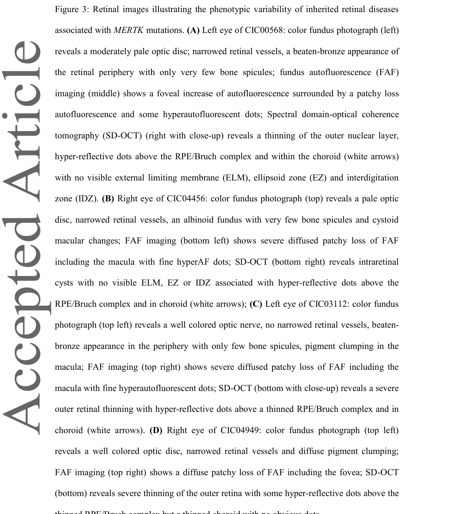

## Question

# Disease Characteristics Research Template

## Target Disease
- **Disease Name:** MERTK-Related Retinopathy
- **MONDO ID:**  (if available)
- **Category:** Mendelian

## Research Objectives

Please provide a comprehensive research report on **MERTK-Related Retinopathy** covering all of the
disease characteristics listed below. This report will be used to populate a disease knowledge
base entry. Be thorough and cite primary literature (PMID preferred) for all claims.

For each section, **suggested databases/resources** are listed. These are the first places
you should search for information on each topic.

---

### 1. Disease Information
> **Search first:** OMIM, Orphanet, ICD-10/ICD-11, MeSH, PubMed

- What is the disease? Provide a concise overview.
- What are the key identifiers? (OMIM, Orphanet, ICD-10/ICD-11, MeSH, Mondo)
- What are the common synonyms and alternative names?
- Is the information derived from individual patients (e.g., EHR) or aggregated disease-level resources?

### 2. Etiology

- **Disease Causal Factors**: What are the primary causes? (genetic, environmental, infectious, mechanistic)
- **Risk Factors**:
  > **Search first:** PubMed, Cochrane Library, UpToDate, clinical guidelines, ClinVar, ClinGen, GWAS Catalog, PheGenI, CTD, CDC, WHO, epidemiological databases
  - Genetic risk factors (causal variants, susceptibility loci, modifier genes)
  - Environmental risk factors (toxins, lifestyle, occupational exposures, age, sex, family history)
- **Protective Factors**:
  > **Search first:** PubMed, Cochrane Library, clinical trial databases, GWAS Catalog, gnomAD, WHO, CDC, nutrition databases
  - Genetic protective factors (protective variants, modifier alleles)
  - Environmental protective factors (diet, lifestyle, exposures that reduce risk)
- **Gene-Environment Interactions**: How do genetic and environmental factors interact to influence disease?
  > **Search first:** CTD, PubMed, PheGenI, GxE databases

### 3. Phenotypes
> **Search first:** HPO (Human Phenotype Ontology), OMIM, Orphanet, PubMed, clinicaltrials.gov, MedDRA, SNOMED CT, DECIPHER, LOINC

For each phenotype, provide:
- **Phenotype type**: symptoms, clinical signs, physical manifestations, behavioral changes, or laboratory abnormalities
  > For symptoms/signs: HPO, OMIM, Orphanet, PubMed
  > For behavioral changes: HPO, DSM, RDoC (Research Domain Criteria), PubMed
  > For laboratory abnormalities: LOINC, SNOMED CT, LabTests Online, PubMed
- **Phenotype characteristics**:
  > **Search first:** OMIM, Orphanet, HPO, PubMed
  - Age of symptom onset (neonatal, childhood, adult-onset, late-onset)
  - Symptom severity (mild, moderate, severe, variable)
  - Symptom progression (stable, progressive, episodic, fluctuating)
  - Frequency among affected individuals (percentage or qualitative)
- **Quality of life impact**: Effects on daily functioning and well-being (per-phenotype when possible)
  > **Search first:** EQ-5D database, SF-36, WHO QOL databases, PubMed
- Suggest HPO (Human Phenotype Ontology) terms for each phenotype

### 4. Genetic/Molecular Information

- **Causal Genes**: Gene mutations or chromosomal abnormalities responsible for disease (gene symbols, OMIM IDs)
  > **Search first:** OMIM, ClinVar, HGMD, Ensembl, NCBI Gene
- **Pathogenic Variants**:
  - Affected genes (gene symbols, HGNC IDs)
    > **Search first:** OMIM, NCBI Gene, Ensembl, HGNC, UniProt, GeneCards
  - Variant classification (pathogenic, likely pathogenic, VUS per ACMG/AMP guidelines)
    > **Search first:** ClinVar, ClinGen, ACMG/AMP guidelines, VarSome
  - Variant type/class (missense, frameshift, nonsense, splice-site, structural)
  - Allele frequency in population databases
    > **Search first:** gnomAD, 1000 Genomes, ExAC, TOPMed, dbSNP
  - Somatic vs germline origin
    > **Search first:** COSMIC (somatic), ClinVar, ICGC, TCGA
  - Functional consequences (loss of function, gain of function, dominant negative)
- **Modifier Genes**: Genes that modify disease severity or expression
- **Epigenetic Information**: DNA methylation, histone modifications, chromatin changes affecting disease
  > **Search first:** ENCODE, Roadmap Epigenomics, MethBase, DiseaseMeth
- **Chromosomal Abnormalities**: Large-scale genetic changes (aneuploidy, translocations, inversions)
  > **Search first:** DECIPHER, ClinVar, ECARUCA, UCSC Genome Browser

### 5. Environmental Information

- **Environmental Factors**: Non-genetic contributing factors (toxins, radiation, pollution, occupational exposure)
  > **Search first:** CTD (Comparative Toxicogenomics Database), TOXNET, PubMed, EPA databases
- **Lifestyle Factors**: Behavioral factors (smoking, diet, exercise, alcohol consumption)
  > **Search first:** CDC databases, WHO, PubMed, NHANES
- **Infectious Agents**: If applicable, pathogens causing or triggering disease (bacteria, viruses, fungi, parasites)
  > **Search first:** NCBI Taxonomy, ViPR, BV-BRC, MicrobeDB, GIDEON

### 6. Mechanism / Pathophysiology

- **Molecular Pathways**: Specific signaling cascades or biochemical pathways involved (Wnt, MAPK, mTOR, PI3K-AKT, etc.)
  > **Search first:** KEGG, Reactome, WikiPathways, PathBank, BioCyc
- **Cellular Processes**: Cell-level mechanisms (apoptosis, autophagy, cell cycle dysregulation, inflammation, etc.)
  > **Search first:** Gene Ontology (GO), Reactome, KEGG, PubMed
- **Protein Dysfunction**: How protein structure or function is altered (misfolding, aggregation, loss of function, gain of function)
  > **Search first:** UniProt, PDB (Protein Data Bank), InterPro, Pfam, AlphaFold
- **Metabolic Changes**: Alterations in metabolic processes (energy metabolism, lipid metabolism, amino acid metabolism)
  > **Search first:** KEGG, BioCyc, HMDB (Human Metabolome Database), BRENDA
- **Immune System Involvement**: Role of immune response (autoimmunity, immunodeficiency, chronic inflammation)
  > **Search first:** ImmPort, Immunome Database, IEDB, Gene Ontology
- **Tissue Damage Mechanisms**: How tissues/ are injured (oxidative stress, ischemia, fibrosis, necrosis)
  > **Search first:** PubMed, Gene Ontology, Reactome
- **Biochemical Abnormalities**: Specific molecular defects (enzyme deficiencies, receptor dysfunction, ion channel defects)
  > **Search first:** BRENDA, UniProt, KEGG, OMIM, PubMed
- **Epigenetic Changes**: DNA methylation, histone modifications affecting gene expression in disease
  > **Search first:** ENCODE, Roadmap Epigenomics, MethBase, DiseaseMeth
- **Molecular Profiling** (if available):
  - Transcriptomics/gene expression changes
    > **Search first:** GEO (Gene Expression Omnibus), ArrayExpress, GTEx, Human Cell Atlas, SRA
  - Proteomics findings
    > **Search first:** PRIDE, ProteomeXchange, Human Protein Atlas, STRING, BioGRID
  - Metabolomics signatures
    > **Search first:** MetaboLights, Metabolomics Workbench, HMDB, METLIN
  - Lipidomics alterations
    > **Search first:** LIPID MAPS, SwissLipids, LipidHome, Metabolomics Workbench
  - Genomic structural features
    > **Search first:** UCSC Genome Browser, Ensembl, NCBI, dbVar, DGV
- **Advanced Technologies** (if applicable):
  - Single-cell analysis findings (cell-type specific mechanisms, cellular heterogeneity)
    > **Search first:** Human Cell Atlas, Single Cell Portal, GEO, CELLxGENE
  - Spatial transcriptomics findings
    > **Search first:** GEO, Spatial Research, Vizgen, 10x Genomics data
  - Multi-omics integration results
    > **Search first:** TCGA, ICGC, cBioPortal, LinkedOmics, PubMed
  - Functional genomics screens (CRISPR, RNAi)
    > **Search first:** DepMap, GenomeRNAi, PubMed, BioGRID ORCS

For each mechanism, describe:
- The causal chain from initial trigger to clinical manifestation
- Which mechanisms are upstream vs downstream
- What cell types and biological processes are involved
- Suggest GO terms for biological processes and CL terms for cell types

### 7. Anatomical Structures Affected

- **Organ Level**:
  - Primary organs directly affected
  - Secondary organ involvement (complications, secondary effects)
  - Body systems involved (cardiovascular, nervous, digestive, respiratory, endocrine, etc.)
  > **Search first:** Uberon, FMA (Foundational Model of Anatomy), OMIM, HPO, ICD-11, MeSH, SNOMED CT
- **Tissue and Cell Level**:
  - Specific tissue types affected (epithelial, connective, muscle, nervous)
  - Specific cell populations targeted (with Cell Ontology terms)
  > **Search first:** Uberon, Human Protein Atlas, Cell Ontology, Human Cell Atlas, CellMarker, PanglaoDB
- **Subcellular Level**:
  - Cellular compartments involved (mitochondria, nucleus, ER, lysosomes) (with GO Cellular Component terms)
  > **Search first:** Gene Ontology (Cellular Component), UniProt, Human Protein Atlas
- **Localization**:
  - Specific anatomical sites (with UBERON terms)
    > **Search first:** FMA, Uberon, NeuroNames (for brain), SNOMED CT
  - Lateralization (unilateral, bilateral, asymmetric)
    > **Search first:** HPO, clinical literature, imaging databases

### 8. Temporal Development

- **Onset**:
  - Typical age of onset (congenital, pediatric, adult, geriatric)
  - Onset pattern (acute, subacute, chronic, insidious)
  > **Search first:** OMIM, Orphanet, HPO, PubMed
- **Progression**:
  - Disease stages (early, intermediate, advanced, end-stage)
    > **Search first:** Cancer Staging Manual (AJCC), WHO classifications, PubMed
  - Progression rate (rapid, slow, variable)
  - Disease course pattern (episodic, relapsing-remitting, progressive, stable)
  - Disease duration (self-limited, chronic lifelong)
  > **Search first:** Disease registries, longitudinal cohort databases, natural history studies, PubMed, Orphanet, OMIM
- **Patterns**:
  - Remission patterns (spontaneous, treatment-induced)
    > **Search first:** Clinical trial databases, disease registries, PubMed
  - Critical periods (time windows of vulnerability or opportunity for intervention)
    > **Search first:** PubMed, developmental biology databases, clinical guidelines

### 9. Inheritance and Population

- **Epidemiology**:
  - Prevalence (cases per 100,000 at given time)
  - Incidence (new cases per 100,000 per year)
  > **Search first:** Orphanet, CDC, WHO, GBD (Global Burden of Disease), national registries, SEER, disease registries
- **For Genetic Etiology**:
  - Inheritance pattern (AD, AR, X-linked, mitochondrial, multifactorial, polygenic)
    > **Search first:** OMIM, Orphanet, ClinVar, GTR (Genetic Testing Registry)
  - Penetrance (complete, incomplete, age-dependent)
    > **Search first:** ClinVar, OMIM, PubMed, ClinGen
  - Expressivity (variable, consistent)
    > **Search first:** OMIM, ClinVar, PubMed
  - Genetic anticipation (increasing severity in successive generations)
    > **Search first:** OMIM, PubMed (especially for repeat expansion disorders)
  - Germline mosaicism
    > **Search first:** ClinVar, OMIM, genetic counseling literature, PubMed
  - Founder effects (population-specific mutations)
    > **Search first:** gnomAD, population genetics databases, PubMed
  - Consanguinity role
    > **Search first:** OMIM, population studies, genetic counseling resources
  - Carrier frequency
    > **Search first:** gnomAD, carrier screening databases, GeneReviews, GTR
- **Population Demographics**:
  - Affected populations (ethnic or demographic groups with higher prevalence)
    > **Search first:** gnomAD, 1000 Genomes, PAGE Study, PubMed, population registries
  - Geographic distribution (endemic areas, regional variation)
    > **Search first:** WHO, CDC, GBD, Orphanet, geographic epidemiology databases
  - Geographic distribution of specific variants
  - Sex ratio (male:female)
    > **Search first:** Disease registries, OMIM, PubMed, epidemiological databases
  - Age distribution of affected individuals
    > **Search first:** CDC, disease registries, SEER, Orphanet

### 10. Diagnostics

- **Clinical Tests**:
  - Laboratory tests (blood, urine, tissue chemistry, specific enzyme assays)
    > **Search first:** LOINC, LabTests Online, PubMed
  - Biomarkers (proteins, metabolites, genetic markers, circulating biomarkers)
    > **Search first:** FDA Biomarker List, BEST (Biomarkers, EndpointS, and other Tools), PubMed
  - Imaging studies (X-ray, CT, MRI, PET, ultrasound)
    > **Search first:** RadLex, DICOM, Radiopaedia, imaging databases
  - Functional tests (pulmonary function, cardiac stress tests)
    > **Search first:** LOINC, clinical guidelines, PubMed
  - Electrophysiology (EEG, EMG, ECG, nerve conduction studies)
    > **Search first:** LOINC, clinical neurophysiology databases, PubMed
  - Biopsy findings (histopathology, immunohistochemistry)
    > **Search first:** SNOMED CT, College of American Pathologists resources, PubMed
  - Pathology findings (microscopic examination)
    > **Search first:** SNOMED CT, Digital Pathology databases, PubMed
- **Genetic Testing**:
  > **Search first:** GTR (Genetic Testing Registry), GeneReviews, ClinGen
  - Overview of recommended genetic testing approach
  - Whole genome sequencing (WGS) utility
    > **Search first:** GTR, ClinVar, GEL (Genomics England), gnomAD
  - Whole exome sequencing (WES) utility
    > **Search first:** GTR, ClinVar, OMIM, GeneMatcher
  - Gene panels (which panels, which genes)
    > **Search first:** GTR, ClinVar, laboratory-specific databases
  - Single gene testing
    > **Search first:** GTR, ClinVar, OMIM, GeneReviews
  - Chromosomal microarray (CMA)
    > **Search first:** DECIPHER, ClinVar, dbVar, ECARUCA
  - Karyotyping
    > **Search first:** Chromosome Abnormality Database, ClinVar, cytogenetics resources
  - FISH
    > **Search first:** ClinVar, cytogenetics databases, PubMed
  - Mitochondrial DNA testing
    > **Search first:** MITOMAP, MSeqDR, ClinVar, GTR
  - Repeat expansion testing
    > **Search first:** GTR, ClinVar, repeat expansion databases, PubMed
- **Omics-Based Diagnostics** (if applicable):
  - RNA sequencing / transcriptomics
    > **Search first:** GEO, ArrayExpress, GTEx, RNA-seq databases
  - Proteomics
    > **Search first:** PRIDE, ProteomeXchange, FDA Biomarker database
  - Metabolomics
    > **Search first:** MetaboLights, Metabolomics Workbench, HMDB
  - Epigenomics
    > **Search first:** GEO, ENCODE, Roadmap Epigenomics, MethBase
  - Liquid biopsy
    > **Search first:** COSMIC, ClinVar, liquid biopsy databases, PubMed
- **Clinical Criteria**:
  - Standardized diagnostic criteria (DSM, ICD, society guidelines)
    > **Search first:** DSM-5, ICD-11, clinical society guidelines, UpToDate
  - Differential diagnosis (other conditions to rule out, with distinguishing features)
    > **Search first:** DynaMed, UpToDate, clinical decision support systems
- **Screening**:
  - Screening methods for asymptomatic individuals (newborn screening, carrier screening, cascade screening)
    > **Search first:** ACMG recommendations, CDC newborn screening, GTR

### 11. Outcome/Prognosis

- **Survival and Mortality**:
  - Survival rate (5-year, 10-year, overall)
    > **Search first:** SEER, cancer registries, disease-specific registries, PubMed
  - Life expectancy (with and without treatment if applicable)
    > **Search first:** Orphanet, disease registries, actuarial databases, PubMed
  - Mortality rate
    > **Search first:** CDC, WHO, GBD, national mortality databases
  - Disease-specific mortality (deaths directly attributable to disease)
    > **Search first:** Disease registries, CDC Wonder, GBD, PubMed
- **Morbidity and Function**:
  - Morbidity (disease-related disability and health impacts)
    > **Search first:** GBD, WHO, disability databases, PubMed
  - Disability outcomes (long-term functional impairments)
    > **Search first:** ICF (International Classification of Functioning), disability registries
  - Quality of life measures (EQ-5D, SF-36, PROMIS, disease-specific tools)
    > **Search first:** EQ-5D database, SF-36, PROMIS, PubMed
- **Disease Course**:
  - Complications (secondary problems: infections, organ failure, etc.)
    > **Search first:** ICD codes, disease registries, clinical databases, PubMed
  - Recovery potential (likelihood and extent of recovery, with vs without treatment)
    > **Search first:** Natural history studies, rehabilitation databases, PubMed
- **Prediction**:
  - Prognostic factors (age, disease severity, biomarkers, treatment response)
    > **Search first:** Prognostic models databases, clinical calculators, PubMed
  - Prognostic biomarkers (molecular markers predicting disease course)
    > **Search first:** FDA Biomarker database, PubMed, cancer prognostic databases

### 12. Treatment

- **Pharmacotherapy**:
  - Pharmacological treatments (drug names, drug classes, mechanisms of action)
    > **Search first:** DrugBank, RxNorm, ATC classification, DailyMed, FDA databases
  - Pharmacogenomics (how genetic variants affect drug metabolism, efficacy, toxicity)
    > **Search first:** PharmGKB, CPIC (Clinical Pharmacogenetics), FDA Table of PGx Biomarkers
- **Advanced Therapeutics**:
  - Gene therapy (viral vectors, CRISPR, gene replacement, gene editing)
    > **Search first:** ClinicalTrials.gov, FDA gene therapy database, ASGCT resources
  - Cell therapy (stem cell transplant, CAR-T, cellular therapeutics)
    > **Search first:** ClinicalTrials.gov, FDA cell therapy database, FACT standards
  - RNA-based therapies (ASOs, siRNA, mRNA therapies)
    > **Search first:** ClinicalTrials.gov, FDA approvals, PubMed
  - Targeted therapies (treatments directed at specific molecular targets)
    > **Search first:** My Cancer Genome, OncoKB, ClinicalTrials.gov, FDA approvals
  - Immunotherapies (checkpoint inhibitors, monoclonal antibodies)
    > **Search first:** Cancer Immunotherapy Database, FDA approvals, ClinicalTrials.gov
- **Surgical and Interventional**:
  - Surgical interventions (types of surgery, timing, outcomes)
    > **Search first:** CPT codes, surgical registries, clinical guidelines, PubMed
- **Supportive and Rehabilitative**:
  - Supportive care (symptom management, pain control, nutrition)
    > **Search first:** Clinical guidelines, Cochrane Library, PubMed
  - Rehabilitation (physical therapy, occupational therapy, speech therapy)
    > **Search first:** Rehabilitation medicine databases, clinical guidelines, PubMed
- **Experimental**:
  - Experimental treatments in clinical trials (with NCT identifiers if available)
    > **Search first:** ClinicalTrials.gov, EU Clinical Trials Register, WHO ICTRP
- **Treatment Outcomes**:
  - Treatment response rates
    > **Search first:** Clinical trial databases, FDA reviews, systematic reviews, PubMed
  - Side effects and adverse events
    > **Search first:** FDA Adverse Event Reporting System (FAERS), MedWatch, PubMed
- **Treatment Strategy**:
  - Treatment algorithms (clinical pathways, decision trees)
    > **Search first:** Clinical practice guidelines, NCCN Guidelines, UpToDate
  - Combination therapies
    > **Search first:** ClinicalTrials.gov, treatment guidelines, PubMed
  - Personalized medicine approaches (genotype-guided treatment)
    > **Search first:** My Cancer Genome, CIViC, PharmGKB, precision medicine databases

For each treatment, suggest MAXO (Medical Action Ontology) terms where applicable.

### 13. Prevention

- **Prevention Levels**:
  - Primary prevention (preventing disease occurrence: vaccination, risk factor modification)
    > **Search first:** CDC, WHO, USPSTF recommendations, Cochrane Library
  - Secondary prevention (early detection and treatment: screening programs, early intervention)
    > **Search first:** USPSTF, CDC screening guidelines, WHO
  - Tertiary prevention (preventing complications in those with disease)
    > **Search first:** Clinical guidelines, disease management protocols, PubMed
- **Immunization**: Vaccine strategies (if applicable)
  > **Search first:** CDC vaccine schedules, WHO immunization, FDA vaccine database
- **Screening and Early Detection**:
  - Screening programs (population-based: newborn screening, cancer screening)
    > **Search first:** CDC screening programs, USPSTF, cancer screening databases
  - Genetic screening (carrier screening, preimplantation genetic diagnosis, prenatal testing)
    > **Search first:** ACMG recommendations, ACOG guidelines, GTR
  - Risk stratification (identifying high-risk individuals for targeted prevention)
    > **Search first:** Risk prediction models, clinical calculators, PubMed
- **Behavioral Interventions**: Lifestyle modifications to reduce risk
  > **Search first:** CDC, WHO, behavioral intervention databases, Cochrane Library
- **Counseling**: Genetic counseling (risk assessment, family planning guidance)
  > **Search first:** NSGC resources, ACMG guidelines, GeneReviews
- **Public Health**:
  - Public health interventions (sanitation, vector control, health education)
    > **Search first:** CDC, WHO, public health databases, PubMed
  - Environmental interventions (reducing environmental risk factors)
    > **Search first:** EPA databases, WHO environmental health, PubMed
- **Prophylaxis**: Preventive medications or procedures
  > **Search first:** Clinical guidelines, FDA approvals, PubMed

### 14. Other Species / Natural Disease

- **Taxonomy**: Species affected (with NCBI Taxon identifiers)
  > **Search first:** NCBI Taxonomy
- **Breed**: Specific breeds affected (with VBO identifiers if applicable)
  > **Search first:** VBO (Vertebrate Breed Ontology)
- **Gene**: Orthologous genes in other species (with NCBI Gene IDs)
  > **Search first:** NCBI Gene
- **Natural Disease**:
  - Naturally occurring disease in other species (companion animals, wildlife)
    > **Search first:** OMIA (Online Mendelian Inheritance in Animals), VetCompass, PubMed
  - Veterinary relevance and importance in animal health
    > **Search first:** OMIA, veterinary databases, PubMed
- **Comparative Biology**:
  - Comparative pathology (similarities and differences across species)
    > **Search first:** OMIA, comparative pathology databases, PubMed
  - Evolutionary conservation of disease mechanisms
    > **Search first:** HomoloGene, OrthoMCL, Alliance of Genome Resources
- **Transmission** (if applicable):
  - Zoonotic potential
    > **Search first:** CDC zoonotic diseases, WHO zoonoses, GIDEON
  - Cross-species susceptibility
    > **Search first:** NCBI Taxonomy, veterinary databases, PubMed

### 15. Model Organisms

- **Model Types**:
  - Model organism type (mammalian, invertebrate, cellular, in vitro)
    > **Search first:** Alliance of Genome Resources, model organism databases
  - Specific model systems (mouse, rat, zebrafish, Drosophila, C. elegans, yeast, cell lines, organoids, iPSCs)
    > **Search first:** MGI, RGD, ZFIN, FlyBase, WormBase, SGD, ATCC, Cellosaurus
  - Induced models (drug treatment, surgical intervention, environmental manipulation)
    > **Search first:** MGI, model organism databases, PubMed
- **Genetic Models**:
  - Types available (knockout, knock-in, transgenic, conditional, humanized)
    > **Search first:** MGI, IMPC, KOMP, EuMMCR, IMSR
- **Model Characteristics**:
  - Phenotype recapitulation (how well model reproduces human disease features)
    > **Search first:** Model organism databases, comparative studies, PubMed
  - Model limitations (aspects of human disease not captured)
    > **Search first:** Model organism databases, PubMed, review articles
- **Applications**:
  - Research applications (what aspects of disease can be studied)
    > **Search first:** Model organism databases, PubMed
- **Resources**:
  - Model databases
    > **Search first:** MGI, RGD, ZFIN, FlyBase, WormBase, IMSR, EMMA, MMRRC

---

## Citation Requirements

- Cite primary literature (PMID preferred) for all mechanistic and clinical claims
- Prioritize recent reviews and landmark papers
- Include direct quotes from abstracts where possible to support key statements
- Distinguish evidence source types: human clinical, model organism, in vitro, computational

## Output Format

Structure your response as a comprehensive narrative organized by the sections above.
For each section, provide:
- Factual content with specific details (numbers, percentages, gene names, variant nomenclature)
- Ontology term suggestions (HPO, GO, CL, UBERON, CHEBI, MAXO, MONDO) where applicable
- Evidence citations with PMIDs
- Direct quotes from abstracts to support key claims
- Clear indication when information is not available or not applicable for this disease

This report will be used to populate a disease knowledge base entry with:
- Pathophysiology descriptions with causal chains
- Gene/protein annotations (HGNC, GO terms)
- Phenotype associations (HP terms) with frequencies
- Cell type involvement (CL terms)
- Anatomical locations (UBERON terms)
- Chemical entities (CHEBI terms)
- Treatment annotations (MAXO terms)
- Evidence items with PMIDs and exact abstract quotes
- Epidemiology, prognosis, diagnostic, and prevention information
- Animal model descriptions with phenotype recapitulation details

## Output

Question: You are an expert researcher providing comprehensive, well-cited information.

Provide detailed information focusing on:
1. Key concepts and definitions with current understanding
2. Recent developments and latest research (prioritize 2023-2024 sources)
3. Current applications and real-world implementations
4. Expert opinions and analysis from authoritative sources
5. Relevant statistics and data from recent studies

Format as a comprehensive research report with proper citations. Include URLs and publication dates where available.
Always prioritize recent, authoritative sources and provide specific citations for all major claims.

# Disease Characteristics Research Template

## Target Disease
- **Disease Name:** MERTK-Related Retinopathy
- **MONDO ID:**  (if available)
- **Category:** Mendelian

## Research Objectives

Please provide a comprehensive research report on **MERTK-Related Retinopathy** covering all of the
disease characteristics listed below. This report will be used to populate a disease knowledge
base entry. Be thorough and cite primary literature (PMID preferred) for all claims.

For each section, **suggested databases/resources** are listed. These are the first places
you should search for information on each topic.

---

### 1. Disease Information
> **Search first:** OMIM, Orphanet, ICD-10/ICD-11, MeSH, PubMed

- What is the disease? Provide a concise overview.
- What are the key identifiers? (OMIM, Orphanet, ICD-10/ICD-11, MeSH, Mondo)
- What are the common synonyms and alternative names?
- Is the information derived from individual patients (e.g., EHR) or aggregated disease-level resources?

### 2. Etiology

- **Disease Causal Factors**: What are the primary causes? (genetic, environmental, infectious, mechanistic)
- **Risk Factors**:
  > **Search first:** PubMed, Cochrane Library, UpToDate, clinical guidelines, ClinVar, ClinGen, GWAS Catalog, PheGenI, CTD, CDC, WHO, epidemiological databases
  - Genetic risk factors (causal variants, susceptibility loci, modifier genes)
  - Environmental risk factors (toxins, lifestyle, occupational exposures, age, sex, family history)
- **Protective Factors**:
  > **Search first:** PubMed, Cochrane Library, clinical trial databases, GWAS Catalog, gnomAD, WHO, CDC, nutrition databases
  - Genetic protective factors (protective variants, modifier alleles)
  - Environmental protective factors (diet, lifestyle, exposures that reduce risk)
- **Gene-Environment Interactions**: How do genetic and environmental factors interact to influence disease?
  > **Search first:** CTD, PubMed, PheGenI, GxE databases

### 3. Phenotypes
> **Search first:** HPO (Human Phenotype Ontology), OMIM, Orphanet, PubMed, clinicaltrials.gov, MedDRA, SNOMED CT, DECIPHER, LOINC

For each phenotype, provide:
- **Phenotype type**: symptoms, clinical signs, physical manifestations, behavioral changes, or laboratory abnormalities
  > For symptoms/signs: HPO, OMIM, Orphanet, PubMed
  > For behavioral changes: HPO, DSM, RDoC (Research Domain Criteria), PubMed
  > For laboratory abnormalities: LOINC, SNOMED CT, LabTests Online, PubMed
- **Phenotype characteristics**:
  > **Search first:** OMIM, Orphanet, HPO, PubMed
  - Age of symptom onset (neonatal, childhood, adult-onset, late-onset)
  - Symptom severity (mild, moderate, severe, variable)
  - Symptom progression (stable, progressive, episodic, fluctuating)
  - Frequency among affected individuals (percentage or qualitative)
- **Quality of life impact**: Effects on daily functioning and well-being (per-phenotype when possible)
  > **Search first:** EQ-5D database, SF-36, WHO QOL databases, PubMed
- Suggest HPO (Human Phenotype Ontology) terms for each phenotype

### 4. Genetic/Molecular Information

- **Causal Genes**: Gene mutations or chromosomal abnormalities responsible for disease (gene symbols, OMIM IDs)
  > **Search first:** OMIM, ClinVar, HGMD, Ensembl, NCBI Gene
- **Pathogenic Variants**:
  - Affected genes (gene symbols, HGNC IDs)
    > **Search first:** OMIM, NCBI Gene, Ensembl, HGNC, UniProt, GeneCards
  - Variant classification (pathogenic, likely pathogenic, VUS per ACMG/AMP guidelines)
    > **Search first:** ClinVar, ClinGen, ACMG/AMP guidelines, VarSome
  - Variant type/class (missense, frameshift, nonsense, splice-site, structural)
  - Allele frequency in population databases
    > **Search first:** gnomAD, 1000 Genomes, ExAC, TOPMed, dbSNP
  - Somatic vs germline origin
    > **Search first:** COSMIC (somatic), ClinVar, ICGC, TCGA
  - Functional consequences (loss of function, gain of function, dominant negative)
- **Modifier Genes**: Genes that modify disease severity or expression
- **Epigenetic Information**: DNA methylation, histone modifications, chromatin changes affecting disease
  > **Search first:** ENCODE, Roadmap Epigenomics, MethBase, DiseaseMeth
- **Chromosomal Abnormalities**: Large-scale genetic changes (aneuploidy, translocations, inversions)
  > **Search first:** DECIPHER, ClinVar, ECARUCA, UCSC Genome Browser

### 5. Environmental Information

- **Environmental Factors**: Non-genetic contributing factors (toxins, radiation, pollution, occupational exposure)
  > **Search first:** CTD (Comparative Toxicogenomics Database), TOXNET, PubMed, EPA databases
- **Lifestyle Factors**: Behavioral factors (smoking, diet, exercise, alcohol consumption)
  > **Search first:** CDC databases, WHO, PubMed, NHANES
- **Infectious Agents**: If applicable, pathogens causing or triggering disease (bacteria, viruses, fungi, parasites)
  > **Search first:** NCBI Taxonomy, ViPR, BV-BRC, MicrobeDB, GIDEON

### 6. Mechanism / Pathophysiology

- **Molecular Pathways**: Specific signaling cascades or biochemical pathways involved (Wnt, MAPK, mTOR, PI3K-AKT, etc.)
  > **Search first:** KEGG, Reactome, WikiPathways, PathBank, BioCyc
- **Cellular Processes**: Cell-level mechanisms (apoptosis, autophagy, cell cycle dysregulation, inflammation, etc.)
  > **Search first:** Gene Ontology (GO), Reactome, KEGG, PubMed
- **Protein Dysfunction**: How protein structure or function is altered (misfolding, aggregation, loss of function, gain of function)
  > **Search first:** UniProt, PDB (Protein Data Bank), InterPro, Pfam, AlphaFold
- **Metabolic Changes**: Alterations in metabolic processes (energy metabolism, lipid metabolism, amino acid metabolism)
  > **Search first:** KEGG, BioCyc, HMDB (Human Metabolome Database), BRENDA
- **Immune System Involvement**: Role of immune response (autoimmunity, immunodeficiency, chronic inflammation)
  > **Search first:** ImmPort, Immunome Database, IEDB, Gene Ontology
- **Tissue Damage Mechanisms**: How tissues/ are injured (oxidative stress, ischemia, fibrosis, necrosis)
  > **Search first:** PubMed, Gene Ontology, Reactome
- **Biochemical Abnormalities**: Specific molecular defects (enzyme deficiencies, receptor dysfunction, ion channel defects)
  > **Search first:** BRENDA, UniProt, KEGG, OMIM, PubMed
- **Epigenetic Changes**: DNA methylation, histone modifications affecting gene expression in disease
  > **Search first:** ENCODE, Roadmap Epigenomics, MethBase, DiseaseMeth
- **Molecular Profiling** (if available):
  - Transcriptomics/gene expression changes
    > **Search first:** GEO (Gene Expression Omnibus), ArrayExpress, GTEx, Human Cell Atlas, SRA
  - Proteomics findings
    > **Search first:** PRIDE, ProteomeXchange, Human Protein Atlas, STRING, BioGRID
  - Metabolomics signatures
    > **Search first:** MetaboLights, Metabolomics Workbench, HMDB, METLIN
  - Lipidomics alterations
    > **Search first:** LIPID MAPS, SwissLipids, LipidHome, Metabolomics Workbench
  - Genomic structural features
    > **Search first:** UCSC Genome Browser, Ensembl, NCBI, dbVar, DGV
- **Advanced Technologies** (if applicable):
  - Single-cell analysis findings (cell-type specific mechanisms, cellular heterogeneity)
    > **Search first:** Human Cell Atlas, Single Cell Portal, GEO, CELLxGENE
  - Spatial transcriptomics findings
    > **Search first:** GEO, Spatial Research, Vizgen, 10x Genomics data
  - Multi-omics integration results
    > **Search first:** TCGA, ICGC, cBioPortal, LinkedOmics, PubMed
  - Functional genomics screens (CRISPR, RNAi)
    > **Search first:** DepMap, GenomeRNAi, PubMed, BioGRID ORCS

For each mechanism, describe:
- The causal chain from initial trigger to clinical manifestation
- Which mechanisms are upstream vs downstream
- What cell types and biological processes are involved
- Suggest GO terms for biological processes and CL terms for cell types

### 7. Anatomical Structures Affected

- **Organ Level**:
  - Primary organs directly affected
  - Secondary organ involvement (complications, secondary effects)
  - Body systems involved (cardiovascular, nervous, digestive, respiratory, endocrine, etc.)
  > **Search first:** Uberon, FMA (Foundational Model of Anatomy), OMIM, HPO, ICD-11, MeSH, SNOMED CT
- **Tissue and Cell Level**:
  - Specific tissue types affected (epithelial, connective, muscle, nervous)
  - Specific cell populations targeted (with Cell Ontology terms)
  > **Search first:** Uberon, Human Protein Atlas, Cell Ontology, Human Cell Atlas, CellMarker, PanglaoDB
- **Subcellular Level**:
  - Cellular compartments involved (mitochondria, nucleus, ER, lysosomes) (with GO Cellular Component terms)
  > **Search first:** Gene Ontology (Cellular Component), UniProt, Human Protein Atlas
- **Localization**:
  - Specific anatomical sites (with UBERON terms)
    > **Search first:** FMA, Uberon, NeuroNames (for brain), SNOMED CT
  - Lateralization (unilateral, bilateral, asymmetric)
    > **Search first:** HPO, clinical literature, imaging databases

### 8. Temporal Development

- **Onset**:
  - Typical age of onset (congenital, pediatric, adult, geriatric)
  - Onset pattern (acute, subacute, chronic, insidious)
  > **Search first:** OMIM, Orphanet, HPO, PubMed
- **Progression**:
  - Disease stages (early, intermediate, advanced, end-stage)
    > **Search first:** Cancer Staging Manual (AJCC), WHO classifications, PubMed
  - Progression rate (rapid, slow, variable)
  - Disease course pattern (episodic, relapsing-remitting, progressive, stable)
  - Disease duration (self-limited, chronic lifelong)
  > **Search first:** Disease registries, longitudinal cohort databases, natural history studies, PubMed, Orphanet, OMIM
- **Patterns**:
  - Remission patterns (spontaneous, treatment-induced)
    > **Search first:** Clinical trial databases, disease registries, PubMed
  - Critical periods (time windows of vulnerability or opportunity for intervention)
    > **Search first:** PubMed, developmental biology databases, clinical guidelines

### 9. Inheritance and Population

- **Epidemiology**:
  - Prevalence (cases per 100,000 at given time)
  - Incidence (new cases per 100,000 per year)
  > **Search first:** Orphanet, CDC, WHO, GBD (Global Burden of Disease), national registries, SEER, disease registries
- **For Genetic Etiology**:
  - Inheritance pattern (AD, AR, X-linked, mitochondrial, multifactorial, polygenic)
    > **Search first:** OMIM, Orphanet, ClinVar, GTR (Genetic Testing Registry)
  - Penetrance (complete, incomplete, age-dependent)
    > **Search first:** ClinVar, OMIM, PubMed, ClinGen
  - Expressivity (variable, consistent)
    > **Search first:** OMIM, ClinVar, PubMed
  - Genetic anticipation (increasing severity in successive generations)
    > **Search first:** OMIM, PubMed (especially for repeat expansion disorders)
  - Germline mosaicism
    > **Search first:** ClinVar, OMIM, genetic counseling literature, PubMed
  - Founder effects (population-specific mutations)
    > **Search first:** gnomAD, population genetics databases, PubMed
  - Consanguinity role
    > **Search first:** OMIM, population studies, genetic counseling resources
  - Carrier frequency
    > **Search first:** gnomAD, carrier screening databases, GeneReviews, GTR
- **Population Demographics**:
  - Affected populations (ethnic or demographic groups with higher prevalence)
    > **Search first:** gnomAD, 1000 Genomes, PAGE Study, PubMed, population registries
  - Geographic distribution (endemic areas, regional variation)
    > **Search first:** WHO, CDC, GBD, Orphanet, geographic epidemiology databases
  - Geographic distribution of specific variants
  - Sex ratio (male:female)
    > **Search first:** Disease registries, OMIM, PubMed, epidemiological databases
  - Age distribution of affected individuals
    > **Search first:** CDC, disease registries, SEER, Orphanet

### 10. Diagnostics

- **Clinical Tests**:
  - Laboratory tests (blood, urine, tissue chemistry, specific enzyme assays)
    > **Search first:** LOINC, LabTests Online, PubMed
  - Biomarkers (proteins, metabolites, genetic markers, circulating biomarkers)
    > **Search first:** FDA Biomarker List, BEST (Biomarkers, EndpointS, and other Tools), PubMed
  - Imaging studies (X-ray, CT, MRI, PET, ultrasound)
    > **Search first:** RadLex, DICOM, Radiopaedia, imaging databases
  - Functional tests (pulmonary function, cardiac stress tests)
    > **Search first:** LOINC, clinical guidelines, PubMed
  - Electrophysiology (EEG, EMG, ECG, nerve conduction studies)
    > **Search first:** LOINC, clinical neurophysiology databases, PubMed
  - Biopsy findings (histopathology, immunohistochemistry)
    > **Search first:** SNOMED CT, College of American Pathologists resources, PubMed
  - Pathology findings (microscopic examination)
    > **Search first:** SNOMED CT, Digital Pathology databases, PubMed
- **Genetic Testing**:
  > **Search first:** GTR (Genetic Testing Registry), GeneReviews, ClinGen
  - Overview of recommended genetic testing approach
  - Whole genome sequencing (WGS) utility
    > **Search first:** GTR, ClinVar, GEL (Genomics England), gnomAD
  - Whole exome sequencing (WES) utility
    > **Search first:** GTR, ClinVar, OMIM, GeneMatcher
  - Gene panels (which panels, which genes)
    > **Search first:** GTR, ClinVar, laboratory-specific databases
  - Single gene testing
    > **Search first:** GTR, ClinVar, OMIM, GeneReviews
  - Chromosomal microarray (CMA)
    > **Search first:** DECIPHER, ClinVar, dbVar, ECARUCA
  - Karyotyping
    > **Search first:** Chromosome Abnormality Database, ClinVar, cytogenetics resources
  - FISH
    > **Search first:** ClinVar, cytogenetics databases, PubMed
  - Mitochondrial DNA testing
    > **Search first:** MITOMAP, MSeqDR, ClinVar, GTR
  - Repeat expansion testing
    > **Search first:** GTR, ClinVar, repeat expansion databases, PubMed
- **Omics-Based Diagnostics** (if applicable):
  - RNA sequencing / transcriptomics
    > **Search first:** GEO, ArrayExpress, GTEx, RNA-seq databases
  - Proteomics
    > **Search first:** PRIDE, ProteomeXchange, FDA Biomarker database
  - Metabolomics
    > **Search first:** MetaboLights, Metabolomics Workbench, HMDB
  - Epigenomics
    > **Search first:** GEO, ENCODE, Roadmap Epigenomics, MethBase
  - Liquid biopsy
    > **Search first:** COSMIC, ClinVar, liquid biopsy databases, PubMed
- **Clinical Criteria**:
  - Standardized diagnostic criteria (DSM, ICD, society guidelines)
    > **Search first:** DSM-5, ICD-11, clinical society guidelines, UpToDate
  - Differential diagnosis (other conditions to rule out, with distinguishing features)
    > **Search first:** DynaMed, UpToDate, clinical decision support systems
- **Screening**:
  - Screening methods for asymptomatic individuals (newborn screening, carrier screening, cascade screening)
    > **Search first:** ACMG recommendations, CDC newborn screening, GTR

### 11. Outcome/Prognosis

- **Survival and Mortality**:
  - Survival rate (5-year, 10-year, overall)
    > **Search first:** SEER, cancer registries, disease-specific registries, PubMed
  - Life expectancy (with and without treatment if applicable)
    > **Search first:** Orphanet, disease registries, actuarial databases, PubMed
  - Mortality rate
    > **Search first:** CDC, WHO, GBD, national mortality databases
  - Disease-specific mortality (deaths directly attributable to disease)
    > **Search first:** Disease registries, CDC Wonder, GBD, PubMed
- **Morbidity and Function**:
  - Morbidity (disease-related disability and health impacts)
    > **Search first:** GBD, WHO, disability databases, PubMed
  - Disability outcomes (long-term functional impairments)
    > **Search first:** ICF (International Classification of Functioning), disability registries
  - Quality of life measures (EQ-5D, SF-36, PROMIS, disease-specific tools)
    > **Search first:** EQ-5D database, SF-36, PROMIS, PubMed
- **Disease Course**:
  - Complications (secondary problems: infections, organ failure, etc.)
    > **Search first:** ICD codes, disease registries, clinical databases, PubMed
  - Recovery potential (likelihood and extent of recovery, with vs without treatment)
    > **Search first:** Natural history studies, rehabilitation databases, PubMed
- **Prediction**:
  - Prognostic factors (age, disease severity, biomarkers, treatment response)
    > **Search first:** Prognostic models databases, clinical calculators, PubMed
  - Prognostic biomarkers (molecular markers predicting disease course)
    > **Search first:** FDA Biomarker database, PubMed, cancer prognostic databases

### 12. Treatment

- **Pharmacotherapy**:
  - Pharmacological treatments (drug names, drug classes, mechanisms of action)
    > **Search first:** DrugBank, RxNorm, ATC classification, DailyMed, FDA databases
  - Pharmacogenomics (how genetic variants affect drug metabolism, efficacy, toxicity)
    > **Search first:** PharmGKB, CPIC (Clinical Pharmacogenetics), FDA Table of PGx Biomarkers
- **Advanced Therapeutics**:
  - Gene therapy (viral vectors, CRISPR, gene replacement, gene editing)
    > **Search first:** ClinicalTrials.gov, FDA gene therapy database, ASGCT resources
  - Cell therapy (stem cell transplant, CAR-T, cellular therapeutics)
    > **Search first:** ClinicalTrials.gov, FDA cell therapy database, FACT standards
  - RNA-based therapies (ASOs, siRNA, mRNA therapies)
    > **Search first:** ClinicalTrials.gov, FDA approvals, PubMed
  - Targeted therapies (treatments directed at specific molecular targets)
    > **Search first:** My Cancer Genome, OncoKB, ClinicalTrials.gov, FDA approvals
  - Immunotherapies (checkpoint inhibitors, monoclonal antibodies)
    > **Search first:** Cancer Immunotherapy Database, FDA approvals, ClinicalTrials.gov
- **Surgical and Interventional**:
  - Surgical interventions (types of surgery, timing, outcomes)
    > **Search first:** CPT codes, surgical registries, clinical guidelines, PubMed
- **Supportive and Rehabilitative**:
  - Supportive care (symptom management, pain control, nutrition)
    > **Search first:** Clinical guidelines, Cochrane Library, PubMed
  - Rehabilitation (physical therapy, occupational therapy, speech therapy)
    > **Search first:** Rehabilitation medicine databases, clinical guidelines, PubMed
- **Experimental**:
  - Experimental treatments in clinical trials (with NCT identifiers if available)
    > **Search first:** ClinicalTrials.gov, EU Clinical Trials Register, WHO ICTRP
- **Treatment Outcomes**:
  - Treatment response rates
    > **Search first:** Clinical trial databases, FDA reviews, systematic reviews, PubMed
  - Side effects and adverse events
    > **Search first:** FDA Adverse Event Reporting System (FAERS), MedWatch, PubMed
- **Treatment Strategy**:
  - Treatment algorithms (clinical pathways, decision trees)
    > **Search first:** Clinical practice guidelines, NCCN Guidelines, UpToDate
  - Combination therapies
    > **Search first:** ClinicalTrials.gov, treatment guidelines, PubMed
  - Personalized medicine approaches (genotype-guided treatment)
    > **Search first:** My Cancer Genome, CIViC, PharmGKB, precision medicine databases

For each treatment, suggest MAXO (Medical Action Ontology) terms where applicable.

### 13. Prevention

- **Prevention Levels**:
  - Primary prevention (preventing disease occurrence: vaccination, risk factor modification)
    > **Search first:** CDC, WHO, USPSTF recommendations, Cochrane Library
  - Secondary prevention (early detection and treatment: screening programs, early intervention)
    > **Search first:** USPSTF, CDC screening guidelines, WHO
  - Tertiary prevention (preventing complications in those with disease)
    > **Search first:** Clinical guidelines, disease management protocols, PubMed
- **Immunization**: Vaccine strategies (if applicable)
  > **Search first:** CDC vaccine schedules, WHO immunization, FDA vaccine database
- **Screening and Early Detection**:
  - Screening programs (population-based: newborn screening, cancer screening)
    > **Search first:** CDC screening programs, USPSTF, cancer screening databases
  - Genetic screening (carrier screening, preimplantation genetic diagnosis, prenatal testing)
    > **Search first:** ACMG recommendations, ACOG guidelines, GTR
  - Risk stratification (identifying high-risk individuals for targeted prevention)
    > **Search first:** Risk prediction models, clinical calculators, PubMed
- **Behavioral Interventions**: Lifestyle modifications to reduce risk
  > **Search first:** CDC, WHO, behavioral intervention databases, Cochrane Library
- **Counseling**: Genetic counseling (risk assessment, family planning guidance)
  > **Search first:** NSGC resources, ACMG guidelines, GeneReviews
- **Public Health**:
  - Public health interventions (sanitation, vector control, health education)
    > **Search first:** CDC, WHO, public health databases, PubMed
  - Environmental interventions (reducing environmental risk factors)
    > **Search first:** EPA databases, WHO environmental health, PubMed
- **Prophylaxis**: Preventive medications or procedures
  > **Search first:** Clinical guidelines, FDA approvals, PubMed

### 14. Other Species / Natural Disease

- **Taxonomy**: Species affected (with NCBI Taxon identifiers)
  > **Search first:** NCBI Taxonomy
- **Breed**: Specific breeds affected (with VBO identifiers if applicable)
  > **Search first:** VBO (Vertebrate Breed Ontology)
- **Gene**: Orthologous genes in other species (with NCBI Gene IDs)
  > **Search first:** NCBI Gene
- **Natural Disease**:
  - Naturally occurring disease in other species (companion animals, wildlife)
    > **Search first:** OMIA (Online Mendelian Inheritance in Animals), VetCompass, PubMed
  - Veterinary relevance and importance in animal health
    > **Search first:** OMIA, veterinary databases, PubMed
- **Comparative Biology**:
  - Comparative pathology (similarities and differences across species)
    > **Search first:** OMIA, comparative pathology databases, PubMed
  - Evolutionary conservation of disease mechanisms
    > **Search first:** HomoloGene, OrthoMCL, Alliance of Genome Resources
- **Transmission** (if applicable):
  - Zoonotic potential
    > **Search first:** CDC zoonotic diseases, WHO zoonoses, GIDEON
  - Cross-species susceptibility
    > **Search first:** NCBI Taxonomy, veterinary databases, PubMed

### 15. Model Organisms

- **Model Types**:
  - Model organism type (mammalian, invertebrate, cellular, in vitro)
    > **Search first:** Alliance of Genome Resources, model organism databases
  - Specific model systems (mouse, rat, zebrafish, Drosophila, C. elegans, yeast, cell lines, organoids, iPSCs)
    > **Search first:** MGI, RGD, ZFIN, FlyBase, WormBase, SGD, ATCC, Cellosaurus
  - Induced models (drug treatment, surgical intervention, environmental manipulation)
    > **Search first:** MGI, model organism databases, PubMed
- **Genetic Models**:
  - Types available (knockout, knock-in, transgenic, conditional, humanized)
    > **Search first:** MGI, IMPC, KOMP, EuMMCR, IMSR
- **Model Characteristics**:
  - Phenotype recapitulation (how well model reproduces human disease features)
    > **Search first:** Model organism databases, comparative studies, PubMed
  - Model limitations (aspects of human disease not captured)
    > **Search first:** Model organism databases, PubMed, review articles
- **Applications**:
  - Research applications (what aspects of disease can be studied)
    > **Search first:** Model organism databases, PubMed
- **Resources**:
  - Model databases
    > **Search first:** MGI, RGD, ZFIN, FlyBase, WormBase, IMSR, EMMA, MMRRC

---

## Citation Requirements

- Cite primary literature (PMID preferred) for all mechanistic and clinical claims
- Prioritize recent reviews and landmark papers
- Include direct quotes from abstracts where possible to support key statements
- Distinguish evidence source types: human clinical, model organism, in vitro, computational

## Output Format

Structure your response as a comprehensive narrative organized by the sections above.
For each section, provide:
- Factual content with specific details (numbers, percentages, gene names, variant nomenclature)
- Ontology term suggestions (HPO, GO, CL, UBERON, CHEBI, MAXO, MONDO) where applicable
- Evidence citations with PMIDs
- Direct quotes from abstracts to support key claims
- Clear indication when information is not available or not applicable for this disease

This report will be used to populate a disease knowledge base entry with:
- Pathophysiology descriptions with causal chains
- Gene/protein annotations (HGNC, GO terms)
- Phenotype associations (HP terms) with frequencies
- Cell type involvement (CL terms)
- Anatomical locations (UBERON terms)
- Chemical entities (CHEBI terms)
- Treatment annotations (MAXO terms)
- Evidence items with PMIDs and exact abstract quotes
- Epidemiology, prognosis, diagnostic, and prevention information
- Animal model descriptions with phenotype recapitulation details

# Comprehensive Research Report: MERTK-Related Retinopathy (MERTK-Associated Retinitis Pigmentosa; “RP38”)

## Executive summary
MERTK-related retinopathy is a Mendelian, typically autosomal recessive inherited retinal degeneration in which biallelic loss-of-function variants in **MERTK** impair retinal pigment epithelium (RPE) phagocytosis of shed photoreceptor outer segments (POS), leading to POS debris accumulation and secondary photoreceptor degeneration with progressive vision loss. Mechanistic work in animal models (notably the RCS rat) and human iPSC-/stem cell–derived RPE consistently supports a primary RPE phagocytosis defect as the upstream driver. Clinical translation has included a completed Phase 1 subretinal gene-augmentation trial (rAAV2-VMD2-hMERTK; **NCT01482195**), which was generally well tolerated but showed variable and limited durability of efficacy signals. (lukovic2015humanipscderived pages 1-2, feng2002mertktriggersuptake pages 1-2, audo2018mertkmutationupdate pages 10-14, NCT01482195 chunk 1, malvasi2023genetherapyin pages 16-18)

---

## 1. Disease information
### 1.1 Concise overview
MERTK-associated retinopathy is commonly described as **MERTK-associated retinitis pigmentosa (RP38)** and presents clinically as a **rod–cone dystrophy** with progressive dysfunction and loss of photoreceptors, often accompanied by RPE abnormalities due to impaired phagocytosis of shed POS. (ramsden2017rescueofthe pages 1-2, lukovic2015humanipscderived pages 1-2)

### 1.2 Key identifiers
* **OMIM (disease group):** Retinitis pigmentosa (RP) is referenced as **OMIM 268000** in an iPSC disease-model paper; MERTK disease is referenced as “RP38”, but the specific RP38 OMIM entry number was not present in obtainable full text. (lukovic2015humanipscderived pages 1-2)
* **OMIM (gene-associated mention):** One text refers to “autosomal recessive RP (OMIM: 613,862)” in the context of IRD gene transcript annotation (not a curated disease entry in the retrieved content). (lukovic2015humanipscderived pages 1-2)
* **MONDO / Orphanet / MeSH / ICD-10/ICD-11:** Not directly retrievable from the obtained full-text corpus; should be populated from external disease-ontology resources in a downstream curation step.

### 1.3 Common synonyms and alternative names
* **MERTK-associated retinitis pigmentosa** (MERTK-RP) (lukovic2015humanipscderived pages 1-2)
* **RP38** (ramsden2017rescueofthe pages 1-2)
* **MERTK-related retinopathy / MERTK retinopathy** (implied across mechanistic and clinical cohort literature) (audo2018mertkmutationupdate pages 10-14)

### 1.4 Evidence source type
The available information here is derived from:
* **Aggregated disease-level resources** in the form of reviews and cohort series (e.g., Audo 2018; Malvasi 2023). (malvasi2023genetherapyin pages 16-18, audo2018mertkmutationupdate pages 10-14)
* **Individual-patient-derived experimental models**, including patient iPSC-RPE and stem-cell derived RPE experiments that recapitulate the disease mechanism. (almedawar2020mertkdependentensheathmentof pages 1-2, lukovic2015humanipscderived pages 1-2)

---

## 2. Etiology
### 2.1 Disease causal factors
**Primary cause:** biallelic pathogenic variants in **MERTK** (TAM-family receptor tyrosine kinase) causing loss of normal RPE phagocytosis of POS. (lukovic2015humanipscderived pages 1-2, ramsden2017rescueofthe pages 1-2)

**Mechanistic causal chain (high-level):**
1) MERTK deficiency in RPE → 2) failure of POS ensheathment/phagocytic cup formation/internalization → 3) POS debris accumulation in subretinal space → 4) secondary photoreceptor death → 5) progressive rod–cone dystrophy phenotype. (mao2021acuterhoarhokinase pages 1-2, almedawar2020mertkdependentensheathmentof pages 1-2, feng2002mertktriggersuptake pages 1-2)

### 2.2 Risk factors
* **Genetic:** causal biallelic variants in MERTK; founder effects can strongly influence population burden (e.g., Faroe Islands). (malvasi2023genetherapyin pages 16-18)
* **Environmental / lifestyle:** no MERTK-specific environmental risk factors were identified in the retrieved full text; general RP progression modifiers are discussed in broader RP literature but are not MERTK-specific in the current evidence set.

### 2.3 Protective factors
No MERTK-specific protective genetic or environmental factors were identified in the retrieved full text.

### 2.4 Gene–environment interactions
No specific gene–environment interactions were identified for MERTK-related retinopathy in the retrieved full text.

---

## 3. Phenotypes
### 3.1 Core phenotype pattern
MERTK-associated disease is described as a **rod–cone dystrophy (retinitis pigmentosa)** with progressive vision loss. (ramsden2017rescueofthe pages 1-2, audo2018mertkmutationupdate pages 10-14)

### 3.2 Phenotype details and suggested HPO terms
Evidence-supported clinical phenotypes (with HPO suggestions):

1) **Progressive visual field loss / constricted fields**
* Evidence: In a 25-patient series, visual fields were “constricted to 20 central degrees or below in 92%”. (audo2018mertkmutationupdate pages 10-14)
* Suggested HPO: **Visual field constriction (HP:0001131)**

2) **Electroretinography: severe generalized retinal dysfunction (rod+cone)**
* Evidence: In the same cohort, full-field and multifocal ERG responses were non-detectable. (audo2018mertkmutationupdate pages 10-14)
* Suggested HPO: **Abnormal electroretinogram (HP:0000548)**; **Reduced rod ERG response (HP:0030512)**; **Reduced cone ERG response (HP:0030513)**

3) **Fundus changes consistent with RP**
* Evidence: waxy optic disc pallor, narrowed vessels, peripheral pigmentary changes (described in the 25-patient cohort; and a detailed longitudinal case in a MD/CCRD cohort showed peripheral bone spicule pigmentations). (audo2018mertkmutationupdate pages 10-14, birtel2018clinicalandgenetic pages 4-6)
* Suggested HPO: **Bone spicule pigmentation of retina (HP:0007703)**; **Retinal vessel attenuation (HP:0007843)**; **Optic disc pallor (HP:0000587)**

4) **Fundus autofluorescence (FAF) abnormalities**
* Evidence: abnormal macular FAF patterns in the 25-patient cohort (14/25 foveal increase; 11/25 foveal loss). (audo2018mertkmutationupdate pages 10-14)
* Suggested HPO: **Abnormality of retinal pigment epithelium (HP:0001132)** (imaging surrogate)

5) **OCT structural abnormalities of outer retina**
* Evidence: SD-OCT documented absent preserved outer retinal hyper-reflective bands and other outer retinal/RPE changes in the cohort. (audo2018mertkmutationupdate pages 10-14)
* Suggested HPO: **Abnormality of the outer retina (HP:0008058)**

### 3.3 Age of onset, severity, progression
* **Early-onset and severe** forms are reported for MERTK-associated autosomal recessive RP, including patient-derived iPSC disease-model cases. (lukovic2015humanipscderived pages 1-2)
* Progression is typically progressive, consistent with RP natural history; detailed quantitative natural history rates (e.g., annual EZ loss) were not available in the retrieved texts.

### 3.4 Quality-of-life impact
Direct QoL instrument data (EQ-5D, SF-36, etc.) were not present in the retrieved full text; functional impact is inferred from severe field constriction and ERG extinction in advanced disease. (audo2018mertkmutationupdate pages 10-14)

---

## 4. Genetic / molecular information
### 4.1 Causal gene
* **MERTK** (Mer tyrosine kinase; TAM-family receptor tyrosine kinase) is causally implicated in recessive RP (“RP38”). (ramsden2017rescueofthe pages 1-2, lukovic2015humanipscderived pages 1-2)

Suggested ontology mappings:
* HGNC symbol: **MERTK** (not explicitly provided in the retrieved text)
* Suggested GO (biological process): **phagocytosis**; **regulation of actin cytoskeleton**; **circadian regulation of retinal phagocytosis** (supported mechanistically). (mao2021acuterhoarhokinase pages 1-2, parinot2024gas6andprotein pages 1-2)

### 4.2 Pathogenic variant types (examples in obtained evidence)
* **Nonsense variant** and **splice-site variant** described in an RP38 case (compound heterozygous). (ramsden2017rescueofthe pages 1-2)
* **Frameshift mutation** reported in a severe early-onset arRP patient-derived iPSC model. (lukovic2015humanipscderived pages 1-2)

Variant classification (ACMG/ClinVar), allele frequencies (gnomAD), and full variant lists were not extractable from the current full text set and should be curated from ClinVar/LOVD/gnomAD.

### 4.3 Modifier genes / epigenetics / chromosomal abnormalities
No MERTK-specific modifier genes or epigenetic alterations were identified in the retrieved full text.

---

## 5. Environmental information
No disease-specific environmental, lifestyle, or infectious contributors were identified for MERTK-related retinopathy in the retrieved full text.

---

## 6. Mechanism / pathophysiology
### 6.1 Current understanding (causal chain with upstream/downstream steps)
**Upstream trigger:** biallelic loss of MERTK function in RPE. (lukovic2015humanipscderived pages 1-2)

**Core cellular mechanism:** failure of RPE to internalize shed photoreceptor outer segments.
* In the RCS rat, the rdy mutation leads to failure of RPE to phagocytize shed outer segment membranes and rapid photoreceptor degeneration; functional Mertk delivery restores phagocytic competence in cultured RCS RPE. (feng2002mertktriggersuptake pages 1-2)
* In human stem cell-derived RPE, MERTK is required for **ensheathment**, fragmentation, and internalization/lysosomal trafficking of POS; these steps are abolished when MERTK is deficient. (almedawar2020mertkdependentensheathmentof pages 1-2, almedawar2020mertkdependentensheathmentof pages 13-16)

**Downstream consequences:** POS debris accumulation → secondary photoreceptor death → progressive rod–cone dystrophy phenotype (RP). (mao2021acuterhoarhokinase pages 1-2, feng2002mertktriggersuptake pages 1-2)

### 6.2 Specific pathways and processes implicated
1) **Circadian retinal phagocytosis and ligand regulation**
* MerTK is required for circadian POS phagocytosis; activity peaks ~2 hours after light onset, and ligand bioavailability varies across the cycle. (parinot2024gas6andprotein pages 1-2)

2) **Cytoskeletal control via RhoA/ROCK**
* In MerTK-deficient RPE, failure of phagocytic cup formation and internalization is linked to dysregulated RhoA/ROCK signaling; acute ROCK inhibition can rescue phagocytic capacity ex vivo. (mao2021acuterhoarhokinase pages 1-2)

3) **Engulfment/ensheathment and intracellular signaling**
* MERTK activation supports F-actin recruitment and the structural steps preceding POS internalization in human stem cell-derived RPE. (almedawar2020mertkdependentensheathmentof pages 1-2)

Suggested GO terms (biological process):
* **Phagocytosis**; **actin filament organization**; **regulation of small GTPase mediated signal transduction**; **circadian rhythm** (retina-specific phagocytosis peak). (mao2021acuterhoarhokinase pages 1-2, parinot2024gas6andprotein pages 1-2)

Suggested CL cell types:
* **Retinal pigment epithelial cell (CL:0002584)** (primary affected cell type)
* **Rod photoreceptor cell (CL:0000504)**; **Cone photoreceptor cell (CL:0000573)** (secondary degenerating targets)

---

## 7. Anatomical structures affected
### 7.1 Organ/system level
* **Primary organ:** eye—**retina**, especially outer retina and RPE. (audo2018mertkmutationupdate pages 10-14)

Suggested UBERON terms:
* **retina (UBERON:0000966)**
* **retinal pigment epithelium (UBERON:0001818)**

### 7.2 Tissue/cell level
* Primary dysfunction at **RPE**, with secondary photoreceptor degeneration. (mao2021acuterhoarhokinase pages 1-2, lukovic2015humanipscderived pages 1-2)

### 7.3 Subcellular level
Not explicitly characterized in retrieved evidence beyond membrane protrusions/ensheathment and phagolysosomal trafficking concepts in stem-cell models. (almedawar2020mertkdependentensheathmentof pages 13-16)

---

## 8. Temporal development
### 8.1 Onset
* Reported as **early onset** and often severe in autosomal recessive MERTK-associated RP. (lukovic2015humanipscderived pages 1-2)

### 8.2 Progression
* Progressive degeneration consistent with RP; a longitudinal case showed rapid acuity decline over 2 years in one eye, alongside progressive imaging changes. (birtel2018clinicalandgenetic pages 4-6)

Detailed staged natural history models specific to MERTK were not present in obtainable full text.

---

## 9. Inheritance and population
### 9.1 Inheritance
* **Autosomal recessive** inheritance is explicitly supported in MERTK-associated RP descriptions. (lukovic2015humanipscderived pages 1-2, ramsden2017rescueofthe pages 1-2)

### 9.2 Epidemiology / population distribution
Key quantitative data available in the retrieved corpus:
* **General RP prevalence**: ~1/3,500 (contextual RP epidemiology). (lukovic2015humanipscderived pages 1-2)
* **Relative frequency of MERTK among RP** varies by cohort/population: <1% in some consanguineous cohorts; ~2% in a French cohort; and a Faroe Islands founder deletion reportedly accounts for ~30% of RP there. (malvasi2023genetherapyin pages 16-18)

Carrier frequency, penetrance, and sex ratio were not available in the retrieved full text.

---

## 10. Diagnostics
### 10.1 Clinical tests and findings
A 25-patient cohort provides practical diagnostic features that can guide real-world confirmation and staging:
* **Visual field testing:** severe constriction (≤20°) in 92%. (audo2018mertkmutationupdate pages 10-14)
* **ERG:** non-detectable full-field and multifocal responses (advanced generalized dysfunction). (audo2018mertkmutationupdate pages 10-14)
* **FAF:** abnormal macular FAF patterns in many cases (foveal increase vs loss patterns). (audo2018mertkmutationupdate pages 10-14)
* **SD-OCT:** absence of preserved outer retinal hyper-reflective bands and other outer retinal/RPE-related features. (audo2018mertkmutationupdate pages 10-14)

An example of MERTK-associated disease with longitudinal multimodal imaging progression (FAF/OCT) and acuity decline was reported in a genetically solved MD/CCRD cohort. (birtel2018clinicalandgenetic pages 4-6)

**Visual example:** Audo et al. include multimodal imaging illustrating phenotypic variability (fundus/FAF/OCT) (audo2018mertkmutationupdate media 4f151ba2, audo2018mertkmutationupdate media 671089b0, audo2018mertkmutationupdate media 989e130f, audo2018mertkmutationupdate media d1ed07a3, audo2018mertkmutationupdate media 2a06f83d).

### 10.2 Genetic testing
* NGS-based approaches are widely used for IRDs; resolving a genetic diagnosis informs prognosis, inheritance counseling, and trial eligibility. (gliem2020quantitativefundusautofluorescence pages 1-2)
* MERTK is identified by targeted NGS in clinical cohorts and case series. (birtel2018clinicalandgenetic pages 4-6)

Formal society diagnostic criteria and a comprehensive differential diagnosis list were not included in the obtained full text; clinically, differential diagnosis overlaps with other rod–cone dystrophies and early-onset retinal dystrophies.

---

## 11. Outcome / prognosis
MERTK-associated RP is typically progressive and can be severe, with advanced cases exhibiting extreme field constriction and extinguished ERG responses in cohort data. (audo2018mertkmutationupdate pages 10-14)

Formal survival/mortality is not applicable (non-lethal ocular disease), and quantitative long-term visual prognosis metrics (e.g., median age to legal blindness) were not present in the retrieved full text.

---

## 12. Treatment
### 12.1 Gene therapy (clinical)
**Clinical trial:** Trial of subretinal rAAV2-VMD2-hMERTK (Phase 1, open-label dose escalation):
* **NCT01482195** (ClinicalTrials.gov; first posted 2011; completed). (NCT01482195 chunk 1)
* **Enrollment:** 6 participants, unilateral (one-eye) subretinal injection; safety monitoring included ophthalmic exams plus OCT and functional testing; follow-up out to 2 years with extended follow-up. (NCT01482195 chunk 1)

**Reported outcomes (secondary sources in retrieved corpus):**
* Good overall tolerability with no serious ocular/systemic AEs reported over 2 years in one review. (nuzbrokh2021genetherapyfor pages 5-7)
* Efficacy was variable/limited: one review reports BCVA improvement in 3/6 participants, while 2023–2024 reviews emphasize that only 1 patient maintained visual gain at 2 years. (nuzbrokh2021genetherapyfor pages 5-7, malvasi2023genetherapyin pages 16-18, vingolo2024retinitispigmentosafrom pages 6-7)

### 12.2 Pharmacologic / experimental (preclinical)
**Translational readthrough-inducing drugs (TRIDs):**
* In a human iPSC-RPE disease model, **PTC124** restored phagocytosis to ~12% of control (quantified as internalized POS/area) whereas **G418** restored detectable protein but did not restore function and could inhibit phagocytosis in controls. (ramsden2017rescueofthe pages 2-3)

### 12.3 Supportive/rehabilitative care
Low-vision rehabilitation and supportive measures are standard for RP in general, but disease-specific supportive-care trial evidence was not present in the retrieved full text.

Suggested MAXO terms (indicative):
* **Gene therapy** (MAXO:0001001; gene supplementation/augmentation—subretinal AAV)
* **Low vision rehabilitation** (MAXO term not retrieved in evidence; recommend mapping in downstream curation)

---

## 13. Prevention
No primary prevention exists for monogenic MERTK loss-of-function disease. Evidence-supported preventive actions are mainly **secondary/tertiary prevention** in the sense of early diagnosis and counseling:
* Confirmed genetic diagnosis supports counseling and potential trial access. (gliem2020quantitativefundusautofluorescence pages 1-2)

Carrier screening, cascade testing, prenatal testing, and preimplantation genetic testing are clinically relevant but were not described in detail in the obtained full text.

---

## 14. Other species / natural disease
A naturally occurring, recessively inherited retinal degeneration due to **Mertk** mutation is classically described in the **Royal College of Surgeons (RCS) rat** (rdy mutation). (feng2002mertktriggersuptake pages 1-2)

---

## 15. Model organisms
### 15.1 Key models and how they are used
1) **RCS rat (rdy; Mertk loss-of-function)**
* Mechanism: RPE fails to phagocytize shed POS membranes; POS debris accumulates and photoreceptors degenerate. (feng2002mertktriggersuptake pages 1-2)
* Translational use: ex vivo/cell culture gene delivery of wild-type Mertk to RCS RPE rescues phagocytosis; in vivo viral gene transfer studies show transient functional and structural improvements in reviews. (petrssilva2013advancesingene pages 2-3, feng2002mertktriggersuptake pages 1-2)

2) **Mer/Mertk knockout mice**
* Reported to exhibit an RCS-like retinal dystrophy phenotype (via citations in mechanistic literature). (almedawar2020mertkdependentensheathmentof pages 16-16)

3) **Human iPSC-RPE and stem cell–derived RPE models**
* Recapitulate defective POS phagocytosis and enable mechanistic dissection and therapeutic screening (TRIDs; pathway manipulation). (almedawar2020mertkdependentensheathmentof pages 1-2, lukovic2015humanipscderived pages 1-2, ramsden2017rescueofthe pages 2-3)

---

## Key quantitative evidence summary
| Domain | Finding (with numbers) | Evidence type | Source (first author year journal) | URL/DOI |
|---|---|---|---|---|
| Epidemiology | General RP prevalence ≈ 1 in 3,500; autosomal recessive RP accounts for >50% of RP cases; MERTK causes early-onset severe arRP (lukovic2015humanipscderived pages 1-2) | Human clinical / disease-model context | Lukovic 2015 *Scientific Reports* | https://doi.org/10.1038/srep12910 |
| Epidemiology | MERTK mutations reported in **<1%** of RP patients in some consanguineous Middle East/Saudi/Spain/Morocco cohorts; **~2%** in a French cohort; a Faroe Islands founder deletion accounts for **~30%** of RP cases there (malvasi2023genetherapyin pages 16-18) | Human cohort / review synthesis | Malvasi 2023 *Int J Mol Sci* | https://doi.org/10.3390/ijms241813756 |
| Diagnostics | In a **25-patient** MERTK cohort, visual fields were constricted to **20 central degrees or below in 92%**; color vision abnormal in **24/25**; full-field and multifocal ERG responses were non-detectable; FAF showed abnormal macular patterns (**14/25** foveal increase, **11/25** foveal loss) (audo2018mertkmutationupdate pages 10-14) | Human cohort | Audo 2018 *Human Mutation* | https://doi.org/10.1002/humu.23431 |
| Diagnostics | In a **230-patient** macular/cone-cone rod dystrophy cohort, **15** had reduced qAF8 and **3/15 (20%)** of that reduced-qAF subgroup had MERTK mutations (gliem2020quantitativefundusautofluorescence pages 1-2) | Human cohort | Gliem 2020 *Ophthalmology Retina* | https://doi.org/10.1016/j.oret.2020.02.009 |
| Diagnostics | A longitudinal MERTK case in a **251-patient** MD/CCRD series progressed from **20/20–20/25** vision to **20/2000** in one eye over **2 years**, with progressive FAF/OCT abnormalities (birtel2018clinicalandgenetic pages 4-6) | Human case within cohort | Birtel 2018 *Scientific Reports* | https://doi.org/10.1038/s41598-018-22096-0 |
| Treatment | Phase I subretinal gene therapy trial **NCT01482195** enrolled **6 participants**; one eye treated; follow-up to **2 years** with extension to **5 years**; endpoints included BCVA, FST, OCT thickness, safety labs/antibodies (NCT01482195 chunk 1) | Clinical trial | ClinicalTrials.gov 2011 NCT01482195 | https://clinicaltrials.gov/study/NCT01482195 |
| Treatment | Reviews of **NCT01482195** report good tolerability/no serious ocular or systemic AEs, **3/6** participants with BCVA improvement, but only **1/6** maintained visual gain at **2 years** (nuzbrokh2021genetherapyfor pages 5-7, malvasi2023genetherapyin pages 16-18, vingolo2024retinitispigmentosafrom pages 6-7) | Clinical trial / review synthesis | Nuzbrokh 2021 *Ann Transl Med*; Malvasi 2023 *Int J Mol Sci*; Vingolo 2024 *Medicina* | https://doi.org/10.21037/atm-20-4726 ; https://doi.org/10.3390/ijms241813756 ; https://doi.org/10.3390/medicina60010189 |
| Treatment | In MERTK-nonsense iPSC-RPE, PTC124 restored phagocytic activity to **~12% of control** (**0.22 to 3.22** internalized POS per **0.01 mm²**, **p=0.002**); G418 restored detectable protein but not function (ramsden2017rescueofthe pages 2-3, ramsden2017rescueofthe pages 1-2) | In vitro human iPSC model | Ramsden 2017 *Scientific Reports* | https://doi.org/10.1038/s41598-017-00142-7 |
| Mechanism | In human stem-cell RPE, wild-type cells ensheathed POS by **3 h** and fragmented them by **5 h**; functional RPE fragmented POS in **~52 min** with subsequent internalization in **~30 min**; these steps were abolished in MERTK-deficient cells (almedawar2020mertkdependentensheathmentof pages 13-16, almedawar2020mertkdependentensheathmentof pages 1-2) | In vitro human stem-cell model | Almedawar 2020 *Stem Cell Reports* | https://doi.org/10.1016/j.stemcr.2020.02.004 |
| Mechanism | Circadian regulation: MerTK function peaks about **2 h after light onset**; Gas6 and Protein S show time-varying bioavailability and cooperative control of the daily phagocytic burst (parinot2024gas6andprotein pages 1-2) | Mechanistic in vivo/in vitro | Parinot 2024 *Int J Mol Sci* | https://doi.org/10.3390/ijms25126630 |
| Models | RCS rat carries an rdy Mertk loss-of-function allele with translation termination at **codon 20**; adenoviral Mertk delivery restored phagocytic competence of cultured RCS RPE cells to wild-type levels (feng2002mertktriggersuptake pages 1-2) | Animal / ex vivo rescue | Feng 2002 *J Biol Chem* | https://doi.org/10.1074/jbc.m107876200 |
| Models | Preclinical rescue in RCS rat: adenoviral/AAV MERTK transfer improved histology/function, but photoreceptor survival extension was transient, reported for only **~12 weeks** despite ongoing transgene expression (petrssilva2013advancesingene pages 2-3) | Animal / preclinical gene therapy | Petrs-Silva 2013 *Clinical Ophthalmology* | https://doi.org/10.2147/OPTH.S38041 |

*Table: This table compiles the main quantitative data available for MERTK-related retinopathy across epidemiology, diagnostics, treatment, mechanism, and model systems. It is useful as a compact evidence summary for building a disease knowledge base entry.*

---

## Recent developments (2023–2024 focus) and expert synthesis
* **Circadian phagocytosis regulation:** A 2024 mechanistic study proposes that Gas6 and Protein S jointly tune the rhythmic activity of MerTK needed for the daily phagocytic peak, supporting time-dependent regulation as an important mechanistic layer beyond “static” receptor deficiency. (parinot2024gas6andprotein pages 1-2)
* **Translational status of gene therapy:** 2023–2024 reviews emphasize that early gene-augmentation clinical translation for MERTK has shown feasibility/safety but limited durable benefit, reinforcing the field’s consensus that timing (residual photoreceptor substrate) and vector/delivery optimization are central challenges for IRD gene therapies. (malvasi2023genetherapyin pages 16-18, vingolo2024retinitispigmentosafrom pages 6-7)

---

## Evidence gaps and curation notes (for knowledge base completeness)
The retrieved full text did not contain:
* MONDO/Orphanet/MeSH/ICD identifiers for MERTK-related retinopathy.
* ClinVar/gnomAD allele frequencies and ACMG classifications for specific MERTK variants.
* Detailed natural history metrics (e.g., annual EZ loss) and standardized QoL outcomes.
* Formal differential diagnosis lists or consensus diagnostic criteria specific to MERTK.

These elements should be populated using external databases (OMIM/Orphanet/MONDO/MeSH/ICD; ClinVar/gnomAD; GeneReviews) in a subsequent curation step.

References

1. (lukovic2015humanipscderived pages 1-2): Dunja Lukovic, Ana Artero Castro, Ana Belen Garcia Delgado, María de los Angeles Martín Bernal, Noelia Luna Pelaez, Andrea Díez Lloret, Rocío Perez Espejo, Kunka Kamenarova, Laura Fernández Sánchez, Nicolás Cuenca, Marta Cortón, Almudena Avila Fernandez, Anni Sorkio, Heli Skottman, Carmen Ayuso, Slaven Erceg, and Shomi S. Bhattacharya. Human ipsc derived disease model of mertk-associated retinitis pigmentosa. Scientific Reports, Aug 2015. URL: https://doi.org/10.1038/srep12910, doi:10.1038/srep12910. This article has 68 citations and is from a peer-reviewed journal.

2. (feng2002mertktriggersuptake pages 1-2): Wei Feng, Douglas Yasumura, Michael T. Matthes, Matthew M. LaVail, and Douglas Vollrath. Mertk triggers uptake of photoreceptor outer segments during phagocytosis by cultured retinal pigment epithelial cells*. The Journal of Biological Chemistry, 277:17016-17022, May 2002. URL: https://doi.org/10.1074/jbc.m107876200, doi:10.1074/jbc.m107876200. This article has 312 citations.

3. (audo2018mertkmutationupdate pages 10-14): Isabelle Audo, Saddek Mohand-Said, Elise Boulanger-Scemama, Xavier Zanlonghi, Christel Condroyer, Vanessa Démontant, Fiona Boyard, Aline Antonio, Cécile Méjécase, Said El Shamieh, José-Alain Sahel, and Christina Zeitz. Mertk mutation update in inherited retinal diseases. Human Mutation, 39:887-913, Jul 2018. URL: https://doi.org/10.1002/humu.23431, doi:10.1002/humu.23431. This article has 84 citations and is from a domain leading peer-reviewed journal.

4. (NCT01482195 chunk 1):  Trial of Subretinal Injection of (rAAV2-VMD2-hMERTK). King Khaled Eye Specialist Hospital. 2011. ClinicalTrials.gov Identifier: NCT01482195

5. (malvasi2023genetherapyin pages 16-18): Mariaelena Malvasi, Lorenzo Casillo, Filippo Avogaro, Alessandro Abbouda, and Enzo Maria Vingolo. Gene therapy in hereditary retinal dystrophies: the usefulness of diagnostic tools in candidate patient selections. International Journal of Molecular Sciences, 24:13756, Sep 2023. URL: https://doi.org/10.3390/ijms241813756, doi:10.3390/ijms241813756. This article has 27 citations.

6. (ramsden2017rescueofthe pages 1-2): Conor M. Ramsden, Britta Nommiste, Amelia R. Lane, Amanda-Jayne F. Carr, Michael B. Powner, Matthew J. K. Smart, Li Li Chen, Manickam N. Muthiah, Andrew R. Webster, Anthony T. Moore, Michael E. Cheetham, Lyndon da Cruz, and Peter J. Coffey. Rescue of the mertk phagocytic defect in a human ipsc disease model using translational read-through inducing drugs. Scientific Reports, Mar 2017. URL: https://doi.org/10.1038/s41598-017-00142-7, doi:10.1038/s41598-017-00142-7. This article has 53 citations and is from a peer-reviewed journal.

7. (almedawar2020mertkdependentensheathmentof pages 1-2): Seba Almedawar, Katerina Vafia, Sven Schreiter, Katrin Neumann, Shahryar Khattak, Thomas Kurth, Marius Ader, Mike O. Karl, Stephen H. Tsang, and Elly M. Tanaka. Mertk-dependent ensheathment of photoreceptor outer segments by human pluripotent stem cell-derived retinal pigment epithelium. Stem Cell Reports, 14:374-389, Mar 2020. URL: https://doi.org/10.1016/j.stemcr.2020.02.004, doi:10.1016/j.stemcr.2020.02.004. This article has 44 citations and is from a domain leading peer-reviewed journal.

8. (mao2021acuterhoarhokinase pages 1-2): Yingyu Mao and Silvia C. Finnemann. Acute rhoa/rho kinase inhibition is sufficient to restore phagocytic capacity to retinal pigment epithelium lacking the engulfment receptor mertk. Cells, 10:1927, Jul 2021. URL: https://doi.org/10.3390/cells10081927, doi:10.3390/cells10081927. This article has 14 citations.

9. (birtel2018clinicalandgenetic pages 4-6): Johannes Birtel, Tobias Eisenberger, Martin Gliem, Philipp L. Müller, Philipp Herrmann, Christian Betz, Diana Zahnleiter, Christine Neuhaus, Steffen Lenzner, Frank G. Holz, Elisabeth Mangold, Hanno J. Bolz, and Peter Charbel Issa. Clinical and genetic characteristics of 251 consecutive patients with macular and cone/cone-rod dystrophy. Scientific Reports, Mar 2018. URL: https://doi.org/10.1038/s41598-018-22096-0, doi:10.1038/s41598-018-22096-0. This article has 238 citations and is from a peer-reviewed journal.

10. (parinot2024gas6andprotein pages 1-2): Célia Parinot, Jonathan Chatagnon, Quentin Rieu, Solène Roux, Dorine Néel, Florian Hamieh, and Emeline F. Nandrot. Gas6 and protein s ligands cooperate to regulate mertk rhythmic activity required for circadian retinal phagocytosis. International Journal of Molecular Sciences, 25:6630, Jun 2024. URL: https://doi.org/10.3390/ijms25126630, doi:10.3390/ijms25126630. This article has 10 citations.

11. (almedawar2020mertkdependentensheathmentof pages 13-16): Seba Almedawar, Katerina Vafia, Sven Schreiter, Katrin Neumann, Shahryar Khattak, Thomas Kurth, Marius Ader, Mike O. Karl, Stephen H. Tsang, and Elly M. Tanaka. Mertk-dependent ensheathment of photoreceptor outer segments by human pluripotent stem cell-derived retinal pigment epithelium. Stem Cell Reports, 14:374-389, Mar 2020. URL: https://doi.org/10.1016/j.stemcr.2020.02.004, doi:10.1016/j.stemcr.2020.02.004. This article has 44 citations and is from a domain leading peer-reviewed journal.

12. (audo2018mertkmutationupdate media 4f151ba2): Isabelle Audo, Saddek Mohand-Said, Elise Boulanger-Scemama, Xavier Zanlonghi, Christel Condroyer, Vanessa Démontant, Fiona Boyard, Aline Antonio, Cécile Méjécase, Said El Shamieh, José-Alain Sahel, and Christina Zeitz. Mertk mutation update in inherited retinal diseases. Human Mutation, 39:887-913, Jul 2018. URL: https://doi.org/10.1002/humu.23431, doi:10.1002/humu.23431. This article has 84 citations and is from a domain leading peer-reviewed journal.

13. (audo2018mertkmutationupdate media 671089b0): Isabelle Audo, Saddek Mohand-Said, Elise Boulanger-Scemama, Xavier Zanlonghi, Christel Condroyer, Vanessa Démontant, Fiona Boyard, Aline Antonio, Cécile Méjécase, Said El Shamieh, José-Alain Sahel, and Christina Zeitz. Mertk mutation update in inherited retinal diseases. Human Mutation, 39:887-913, Jul 2018. URL: https://doi.org/10.1002/humu.23431, doi:10.1002/humu.23431. This article has 84 citations and is from a domain leading peer-reviewed journal.

14. (audo2018mertkmutationupdate media 989e130f): Isabelle Audo, Saddek Mohand-Said, Elise Boulanger-Scemama, Xavier Zanlonghi, Christel Condroyer, Vanessa Démontant, Fiona Boyard, Aline Antonio, Cécile Méjécase, Said El Shamieh, José-Alain Sahel, and Christina Zeitz. Mertk mutation update in inherited retinal diseases. Human Mutation, 39:887-913, Jul 2018. URL: https://doi.org/10.1002/humu.23431, doi:10.1002/humu.23431. This article has 84 citations and is from a domain leading peer-reviewed journal.

15. (audo2018mertkmutationupdate media d1ed07a3): Isabelle Audo, Saddek Mohand-Said, Elise Boulanger-Scemama, Xavier Zanlonghi, Christel Condroyer, Vanessa Démontant, Fiona Boyard, Aline Antonio, Cécile Méjécase, Said El Shamieh, José-Alain Sahel, and Christina Zeitz. Mertk mutation update in inherited retinal diseases. Human Mutation, 39:887-913, Jul 2018. URL: https://doi.org/10.1002/humu.23431, doi:10.1002/humu.23431. This article has 84 citations and is from a domain leading peer-reviewed journal.

16. (audo2018mertkmutationupdate media 2a06f83d): Isabelle Audo, Saddek Mohand-Said, Elise Boulanger-Scemama, Xavier Zanlonghi, Christel Condroyer, Vanessa Démontant, Fiona Boyard, Aline Antonio, Cécile Méjécase, Said El Shamieh, José-Alain Sahel, and Christina Zeitz. Mertk mutation update in inherited retinal diseases. Human Mutation, 39:887-913, Jul 2018. URL: https://doi.org/10.1002/humu.23431, doi:10.1002/humu.23431. This article has 84 citations and is from a domain leading peer-reviewed journal.

17. (gliem2020quantitativefundusautofluorescence pages 1-2): Martin Gliem, Philipp L. Müller, Johannes Birtel, Philipp Herrmann, Myra B. McGuinness, Frank G. Holz, and Peter Charbel Issa. Quantitative fundus autofluorescence and genetic associations in macular, cone, and cone–rod dystrophies. Jul 2020. URL: https://doi.org/10.1016/j.oret.2020.02.009, doi:10.1016/j.oret.2020.02.009. This article has 36 citations and is from a peer-reviewed journal.

18. (nuzbrokh2021genetherapyfor pages 5-7): Yan Nuzbrokh, Sara D. Ragi, and Stephen H. Tsang. Gene therapy for inherited retinal diseases. Annals of Translational Medicine, 9:1278-1278, Aug 2021. URL: https://doi.org/10.21037/atm-20-4726, doi:10.21037/atm-20-4726. This article has 119 citations.

19. (vingolo2024retinitispigmentosafrom pages 6-7): Enzo Maria Vingolo, Simona Mascolo, Filippo Miccichè, and Gregorio Manco. Retinitis pigmentosa: from pathomolecular mechanisms to therapeutic strategies. Medicina, 60:189, Jan 2024. URL: https://doi.org/10.3390/medicina60010189, doi:10.3390/medicina60010189. This article has 60 citations.

20. (ramsden2017rescueofthe pages 2-3): Conor M. Ramsden, Britta Nommiste, Amelia R. Lane, Amanda-Jayne F. Carr, Michael B. Powner, Matthew J. K. Smart, Li Li Chen, Manickam N. Muthiah, Andrew R. Webster, Anthony T. Moore, Michael E. Cheetham, Lyndon da Cruz, and Peter J. Coffey. Rescue of the mertk phagocytic defect in a human ipsc disease model using translational read-through inducing drugs. Scientific Reports, Mar 2017. URL: https://doi.org/10.1038/s41598-017-00142-7, doi:10.1038/s41598-017-00142-7. This article has 53 citations and is from a peer-reviewed journal.

21. (petrssilva2013advancesingene pages 2-3): Hilda Petrs-Silva and Rafael Linden. Advances in gene therapy technologies to treat retinitis pigmentosa. Clinical Ophthalmology (Auckland, N.Z.), 8:127-136, Dec 2013. URL: https://doi.org/10.2147/opth.s38041, doi:10.2147/opth.s38041. This article has 116 citations.

22. (almedawar2020mertkdependentensheathmentof pages 16-16): Seba Almedawar, Katerina Vafia, Sven Schreiter, Katrin Neumann, Shahryar Khattak, Thomas Kurth, Marius Ader, Mike O. Karl, Stephen H. Tsang, and Elly M. Tanaka. Mertk-dependent ensheathment of photoreceptor outer segments by human pluripotent stem cell-derived retinal pigment epithelium. Stem Cell Reports, 14:374-389, Mar 2020. URL: https://doi.org/10.1016/j.stemcr.2020.02.004, doi:10.1016/j.stemcr.2020.02.004. This article has 44 citations and is from a domain leading peer-reviewed journal.

## Artifacts

- [Edison artifact artifact-00](MERTK-Related_Retinopathy-deep-research-falcon_artifacts/artifact-00.md)
