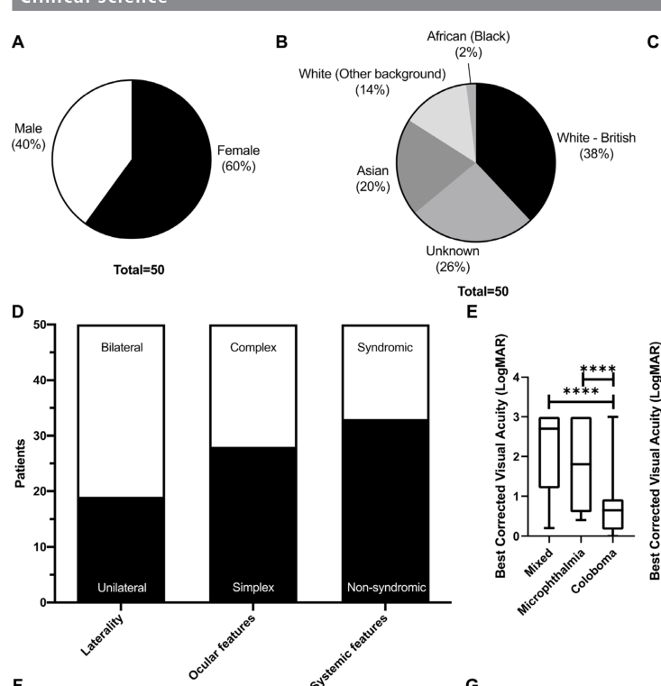

## Question

# Disease Characteristics Research Template

## Target Disease
- **Disease Name:** Microphthalmia with Coloboma
- **MONDO ID:**  (if available)
- **Category:** Mendelian

## Research Objectives

Please provide a comprehensive research report on **Microphthalmia with Coloboma** covering all of the
disease characteristics listed below. This report will be used to populate a disease knowledge
base entry. Be thorough and cite primary literature (PMID preferred) for all claims.

For each section, **suggested databases/resources** are listed. These are the first places
you should search for information on each topic.

---

### 1. Disease Information
> **Search first:** OMIM, Orphanet, ICD-10/ICD-11, MeSH, PubMed

- What is the disease? Provide a concise overview.
- What are the key identifiers? (OMIM, Orphanet, ICD-10/ICD-11, MeSH, Mondo)
- What are the common synonyms and alternative names?
- Is the information derived from individual patients (e.g., EHR) or aggregated disease-level resources?

### 2. Etiology

- **Disease Causal Factors**: What are the primary causes? (genetic, environmental, infectious, mechanistic)
- **Risk Factors**:
  > **Search first:** PubMed, Cochrane Library, UpToDate, clinical guidelines, ClinVar, ClinGen, GWAS Catalog, PheGenI, CTD, CDC, WHO, epidemiological databases
  - Genetic risk factors (causal variants, susceptibility loci, modifier genes)
  - Environmental risk factors (toxins, lifestyle, occupational exposures, age, sex, family history)
- **Protective Factors**:
  > **Search first:** PubMed, Cochrane Library, clinical trial databases, GWAS Catalog, gnomAD, WHO, CDC, nutrition databases
  - Genetic protective factors (protective variants, modifier alleles)
  - Environmental protective factors (diet, lifestyle, exposures that reduce risk)
- **Gene-Environment Interactions**: How do genetic and environmental factors interact to influence disease?
  > **Search first:** CTD, PubMed, PheGenI, GxE databases

### 3. Phenotypes
> **Search first:** HPO (Human Phenotype Ontology), OMIM, Orphanet, PubMed, clinicaltrials.gov, MedDRA, SNOMED CT, DECIPHER, LOINC

For each phenotype, provide:
- **Phenotype type**: symptoms, clinical signs, physical manifestations, behavioral changes, or laboratory abnormalities
  > For symptoms/signs: HPO, OMIM, Orphanet, PubMed
  > For behavioral changes: HPO, DSM, RDoC (Research Domain Criteria), PubMed
  > For laboratory abnormalities: LOINC, SNOMED CT, LabTests Online, PubMed
- **Phenotype characteristics**:
  > **Search first:** OMIM, Orphanet, HPO, PubMed
  - Age of symptom onset (neonatal, childhood, adult-onset, late-onset)
  - Symptom severity (mild, moderate, severe, variable)
  - Symptom progression (stable, progressive, episodic, fluctuating)
  - Frequency among affected individuals (percentage or qualitative)
- **Quality of life impact**: Effects on daily functioning and well-being (per-phenotype when possible)
  > **Search first:** EQ-5D database, SF-36, WHO QOL databases, PubMed
- Suggest HPO (Human Phenotype Ontology) terms for each phenotype

### 4. Genetic/Molecular Information

- **Causal Genes**: Gene mutations or chromosomal abnormalities responsible for disease (gene symbols, OMIM IDs)
  > **Search first:** OMIM, ClinVar, HGMD, Ensembl, NCBI Gene
- **Pathogenic Variants**:
  - Affected genes (gene symbols, HGNC IDs)
    > **Search first:** OMIM, NCBI Gene, Ensembl, HGNC, UniProt, GeneCards
  - Variant classification (pathogenic, likely pathogenic, VUS per ACMG/AMP guidelines)
    > **Search first:** ClinVar, ClinGen, ACMG/AMP guidelines, VarSome
  - Variant type/class (missense, frameshift, nonsense, splice-site, structural)
  - Allele frequency in population databases
    > **Search first:** gnomAD, 1000 Genomes, ExAC, TOPMed, dbSNP
  - Somatic vs germline origin
    > **Search first:** COSMIC (somatic), ClinVar, ICGC, TCGA
  - Functional consequences (loss of function, gain of function, dominant negative)
- **Modifier Genes**: Genes that modify disease severity or expression
- **Epigenetic Information**: DNA methylation, histone modifications, chromatin changes affecting disease
  > **Search first:** ENCODE, Roadmap Epigenomics, MethBase, DiseaseMeth
- **Chromosomal Abnormalities**: Large-scale genetic changes (aneuploidy, translocations, inversions)
  > **Search first:** DECIPHER, ClinVar, ECARUCA, UCSC Genome Browser

### 5. Environmental Information

- **Environmental Factors**: Non-genetic contributing factors (toxins, radiation, pollution, occupational exposure)
  > **Search first:** CTD (Comparative Toxicogenomics Database), TOXNET, PubMed, EPA databases
- **Lifestyle Factors**: Behavioral factors (smoking, diet, exercise, alcohol consumption)
  > **Search first:** CDC databases, WHO, PubMed, NHANES
- **Infectious Agents**: If applicable, pathogens causing or triggering disease (bacteria, viruses, fungi, parasites)
  > **Search first:** NCBI Taxonomy, ViPR, BV-BRC, MicrobeDB, GIDEON

### 6. Mechanism / Pathophysiology

- **Molecular Pathways**: Specific signaling cascades or biochemical pathways involved (Wnt, MAPK, mTOR, PI3K-AKT, etc.)
  > **Search first:** KEGG, Reactome, WikiPathways, PathBank, BioCyc
- **Cellular Processes**: Cell-level mechanisms (apoptosis, autophagy, cell cycle dysregulation, inflammation, etc.)
  > **Search first:** Gene Ontology (GO), Reactome, KEGG, PubMed
- **Protein Dysfunction**: How protein structure or function is altered (misfolding, aggregation, loss of function, gain of function)
  > **Search first:** UniProt, PDB (Protein Data Bank), InterPro, Pfam, AlphaFold
- **Metabolic Changes**: Alterations in metabolic processes (energy metabolism, lipid metabolism, amino acid metabolism)
  > **Search first:** KEGG, BioCyc, HMDB (Human Metabolome Database), BRENDA
- **Immune System Involvement**: Role of immune response (autoimmunity, immunodeficiency, chronic inflammation)
  > **Search first:** ImmPort, Immunome Database, IEDB, Gene Ontology
- **Tissue Damage Mechanisms**: How tissues/ are injured (oxidative stress, ischemia, fibrosis, necrosis)
  > **Search first:** PubMed, Gene Ontology, Reactome
- **Biochemical Abnormalities**: Specific molecular defects (enzyme deficiencies, receptor dysfunction, ion channel defects)
  > **Search first:** BRENDA, UniProt, KEGG, OMIM, PubMed
- **Epigenetic Changes**: DNA methylation, histone modifications affecting gene expression in disease
  > **Search first:** ENCODE, Roadmap Epigenomics, MethBase, DiseaseMeth
- **Molecular Profiling** (if available):
  - Transcriptomics/gene expression changes
    > **Search first:** GEO (Gene Expression Omnibus), ArrayExpress, GTEx, Human Cell Atlas, SRA
  - Proteomics findings
    > **Search first:** PRIDE, ProteomeXchange, Human Protein Atlas, STRING, BioGRID
  - Metabolomics signatures
    > **Search first:** MetaboLights, Metabolomics Workbench, HMDB, METLIN
  - Lipidomics alterations
    > **Search first:** LIPID MAPS, SwissLipids, LipidHome, Metabolomics Workbench
  - Genomic structural features
    > **Search first:** UCSC Genome Browser, Ensembl, NCBI, dbVar, DGV
- **Advanced Technologies** (if applicable):
  - Single-cell analysis findings (cell-type specific mechanisms, cellular heterogeneity)
    > **Search first:** Human Cell Atlas, Single Cell Portal, GEO, CELLxGENE
  - Spatial transcriptomics findings
    > **Search first:** GEO, Spatial Research, Vizgen, 10x Genomics data
  - Multi-omics integration results
    > **Search first:** TCGA, ICGC, cBioPortal, LinkedOmics, PubMed
  - Functional genomics screens (CRISPR, RNAi)
    > **Search first:** DepMap, GenomeRNAi, PubMed, BioGRID ORCS

For each mechanism, describe:
- The causal chain from initial trigger to clinical manifestation
- Which mechanisms are upstream vs downstream
- What cell types and biological processes are involved
- Suggest GO terms for biological processes and CL terms for cell types

### 7. Anatomical Structures Affected

- **Organ Level**:
  - Primary organs directly affected
  - Secondary organ involvement (complications, secondary effects)
  - Body systems involved (cardiovascular, nervous, digestive, respiratory, endocrine, etc.)
  > **Search first:** Uberon, FMA (Foundational Model of Anatomy), OMIM, HPO, ICD-11, MeSH, SNOMED CT
- **Tissue and Cell Level**:
  - Specific tissue types affected (epithelial, connective, muscle, nervous)
  - Specific cell populations targeted (with Cell Ontology terms)
  > **Search first:** Uberon, Human Protein Atlas, Cell Ontology, Human Cell Atlas, CellMarker, PanglaoDB
- **Subcellular Level**:
  - Cellular compartments involved (mitochondria, nucleus, ER, lysosomes) (with GO Cellular Component terms)
  > **Search first:** Gene Ontology (Cellular Component), UniProt, Human Protein Atlas
- **Localization**:
  - Specific anatomical sites (with UBERON terms)
    > **Search first:** FMA, Uberon, NeuroNames (for brain), SNOMED CT
  - Lateralization (unilateral, bilateral, asymmetric)
    > **Search first:** HPO, clinical literature, imaging databases

### 8. Temporal Development

- **Onset**:
  - Typical age of onset (congenital, pediatric, adult, geriatric)
  - Onset pattern (acute, subacute, chronic, insidious)
  > **Search first:** OMIM, Orphanet, HPO, PubMed
- **Progression**:
  - Disease stages (early, intermediate, advanced, end-stage)
    > **Search first:** Cancer Staging Manual (AJCC), WHO classifications, PubMed
  - Progression rate (rapid, slow, variable)
  - Disease course pattern (episodic, relapsing-remitting, progressive, stable)
  - Disease duration (self-limited, chronic lifelong)
  > **Search first:** Disease registries, longitudinal cohort databases, natural history studies, PubMed, Orphanet, OMIM
- **Patterns**:
  - Remission patterns (spontaneous, treatment-induced)
    > **Search first:** Clinical trial databases, disease registries, PubMed
  - Critical periods (time windows of vulnerability or opportunity for intervention)
    > **Search first:** PubMed, developmental biology databases, clinical guidelines

### 9. Inheritance and Population

- **Epidemiology**:
  - Prevalence (cases per 100,000 at given time)
  - Incidence (new cases per 100,000 per year)
  > **Search first:** Orphanet, CDC, WHO, GBD (Global Burden of Disease), national registries, SEER, disease registries
- **For Genetic Etiology**:
  - Inheritance pattern (AD, AR, X-linked, mitochondrial, multifactorial, polygenic)
    > **Search first:** OMIM, Orphanet, ClinVar, GTR (Genetic Testing Registry)
  - Penetrance (complete, incomplete, age-dependent)
    > **Search first:** ClinVar, OMIM, PubMed, ClinGen
  - Expressivity (variable, consistent)
    > **Search first:** OMIM, ClinVar, PubMed
  - Genetic anticipation (increasing severity in successive generations)
    > **Search first:** OMIM, PubMed (especially for repeat expansion disorders)
  - Germline mosaicism
    > **Search first:** ClinVar, OMIM, genetic counseling literature, PubMed
  - Founder effects (population-specific mutations)
    > **Search first:** gnomAD, population genetics databases, PubMed
  - Consanguinity role
    > **Search first:** OMIM, population studies, genetic counseling resources
  - Carrier frequency
    > **Search first:** gnomAD, carrier screening databases, GeneReviews, GTR
- **Population Demographics**:
  - Affected populations (ethnic or demographic groups with higher prevalence)
    > **Search first:** gnomAD, 1000 Genomes, PAGE Study, PubMed, population registries
  - Geographic distribution (endemic areas, regional variation)
    > **Search first:** WHO, CDC, GBD, Orphanet, geographic epidemiology databases
  - Geographic distribution of specific variants
  - Sex ratio (male:female)
    > **Search first:** Disease registries, OMIM, PubMed, epidemiological databases
  - Age distribution of affected individuals
    > **Search first:** CDC, disease registries, SEER, Orphanet

### 10. Diagnostics

- **Clinical Tests**:
  - Laboratory tests (blood, urine, tissue chemistry, specific enzyme assays)
    > **Search first:** LOINC, LabTests Online, PubMed
  - Biomarkers (proteins, metabolites, genetic markers, circulating biomarkers)
    > **Search first:** FDA Biomarker List, BEST (Biomarkers, EndpointS, and other Tools), PubMed
  - Imaging studies (X-ray, CT, MRI, PET, ultrasound)
    > **Search first:** RadLex, DICOM, Radiopaedia, imaging databases
  - Functional tests (pulmonary function, cardiac stress tests)
    > **Search first:** LOINC, clinical guidelines, PubMed
  - Electrophysiology (EEG, EMG, ECG, nerve conduction studies)
    > **Search first:** LOINC, clinical neurophysiology databases, PubMed
  - Biopsy findings (histopathology, immunohistochemistry)
    > **Search first:** SNOMED CT, College of American Pathologists resources, PubMed
  - Pathology findings (microscopic examination)
    > **Search first:** SNOMED CT, Digital Pathology databases, PubMed
- **Genetic Testing**:
  > **Search first:** GTR (Genetic Testing Registry), GeneReviews, ClinGen
  - Overview of recommended genetic testing approach
  - Whole genome sequencing (WGS) utility
    > **Search first:** GTR, ClinVar, GEL (Genomics England), gnomAD
  - Whole exome sequencing (WES) utility
    > **Search first:** GTR, ClinVar, OMIM, GeneMatcher
  - Gene panels (which panels, which genes)
    > **Search first:** GTR, ClinVar, laboratory-specific databases
  - Single gene testing
    > **Search first:** GTR, ClinVar, OMIM, GeneReviews
  - Chromosomal microarray (CMA)
    > **Search first:** DECIPHER, ClinVar, dbVar, ECARUCA
  - Karyotyping
    > **Search first:** Chromosome Abnormality Database, ClinVar, cytogenetics resources
  - FISH
    > **Search first:** ClinVar, cytogenetics databases, PubMed
  - Mitochondrial DNA testing
    > **Search first:** MITOMAP, MSeqDR, ClinVar, GTR
  - Repeat expansion testing
    > **Search first:** GTR, ClinVar, repeat expansion databases, PubMed
- **Omics-Based Diagnostics** (if applicable):
  - RNA sequencing / transcriptomics
    > **Search first:** GEO, ArrayExpress, GTEx, RNA-seq databases
  - Proteomics
    > **Search first:** PRIDE, ProteomeXchange, FDA Biomarker database
  - Metabolomics
    > **Search first:** MetaboLights, Metabolomics Workbench, HMDB
  - Epigenomics
    > **Search first:** GEO, ENCODE, Roadmap Epigenomics, MethBase
  - Liquid biopsy
    > **Search first:** COSMIC, ClinVar, liquid biopsy databases, PubMed
- **Clinical Criteria**:
  - Standardized diagnostic criteria (DSM, ICD, society guidelines)
    > **Search first:** DSM-5, ICD-11, clinical society guidelines, UpToDate
  - Differential diagnosis (other conditions to rule out, with distinguishing features)
    > **Search first:** DynaMed, UpToDate, clinical decision support systems
- **Screening**:
  - Screening methods for asymptomatic individuals (newborn screening, carrier screening, cascade screening)
    > **Search first:** ACMG recommendations, CDC newborn screening, GTR

### 11. Outcome/Prognosis

- **Survival and Mortality**:
  - Survival rate (5-year, 10-year, overall)
    > **Search first:** SEER, cancer registries, disease-specific registries, PubMed
  - Life expectancy (with and without treatment if applicable)
    > **Search first:** Orphanet, disease registries, actuarial databases, PubMed
  - Mortality rate
    > **Search first:** CDC, WHO, GBD, national mortality databases
  - Disease-specific mortality (deaths directly attributable to disease)
    > **Search first:** Disease registries, CDC Wonder, GBD, PubMed
- **Morbidity and Function**:
  - Morbidity (disease-related disability and health impacts)
    > **Search first:** GBD, WHO, disability databases, PubMed
  - Disability outcomes (long-term functional impairments)
    > **Search first:** ICF (International Classification of Functioning), disability registries
  - Quality of life measures (EQ-5D, SF-36, PROMIS, disease-specific tools)
    > **Search first:** EQ-5D database, SF-36, PROMIS, PubMed
- **Disease Course**:
  - Complications (secondary problems: infections, organ failure, etc.)
    > **Search first:** ICD codes, disease registries, clinical databases, PubMed
  - Recovery potential (likelihood and extent of recovery, with vs without treatment)
    > **Search first:** Natural history studies, rehabilitation databases, PubMed
- **Prediction**:
  - Prognostic factors (age, disease severity, biomarkers, treatment response)
    > **Search first:** Prognostic models databases, clinical calculators, PubMed
  - Prognostic biomarkers (molecular markers predicting disease course)
    > **Search first:** FDA Biomarker database, PubMed, cancer prognostic databases

### 12. Treatment

- **Pharmacotherapy**:
  - Pharmacological treatments (drug names, drug classes, mechanisms of action)
    > **Search first:** DrugBank, RxNorm, ATC classification, DailyMed, FDA databases
  - Pharmacogenomics (how genetic variants affect drug metabolism, efficacy, toxicity)
    > **Search first:** PharmGKB, CPIC (Clinical Pharmacogenetics), FDA Table of PGx Biomarkers
- **Advanced Therapeutics**:
  - Gene therapy (viral vectors, CRISPR, gene replacement, gene editing)
    > **Search first:** ClinicalTrials.gov, FDA gene therapy database, ASGCT resources
  - Cell therapy (stem cell transplant, CAR-T, cellular therapeutics)
    > **Search first:** ClinicalTrials.gov, FDA cell therapy database, FACT standards
  - RNA-based therapies (ASOs, siRNA, mRNA therapies)
    > **Search first:** ClinicalTrials.gov, FDA approvals, PubMed
  - Targeted therapies (treatments directed at specific molecular targets)
    > **Search first:** My Cancer Genome, OncoKB, ClinicalTrials.gov, FDA approvals
  - Immunotherapies (checkpoint inhibitors, monoclonal antibodies)
    > **Search first:** Cancer Immunotherapy Database, FDA approvals, ClinicalTrials.gov
- **Surgical and Interventional**:
  - Surgical interventions (types of surgery, timing, outcomes)
    > **Search first:** CPT codes, surgical registries, clinical guidelines, PubMed
- **Supportive and Rehabilitative**:
  - Supportive care (symptom management, pain control, nutrition)
    > **Search first:** Clinical guidelines, Cochrane Library, PubMed
  - Rehabilitation (physical therapy, occupational therapy, speech therapy)
    > **Search first:** Rehabilitation medicine databases, clinical guidelines, PubMed
- **Experimental**:
  - Experimental treatments in clinical trials (with NCT identifiers if available)
    > **Search first:** ClinicalTrials.gov, EU Clinical Trials Register, WHO ICTRP
- **Treatment Outcomes**:
  - Treatment response rates
    > **Search first:** Clinical trial databases, FDA reviews, systematic reviews, PubMed
  - Side effects and adverse events
    > **Search first:** FDA Adverse Event Reporting System (FAERS), MedWatch, PubMed
- **Treatment Strategy**:
  - Treatment algorithms (clinical pathways, decision trees)
    > **Search first:** Clinical practice guidelines, NCCN Guidelines, UpToDate
  - Combination therapies
    > **Search first:** ClinicalTrials.gov, treatment guidelines, PubMed
  - Personalized medicine approaches (genotype-guided treatment)
    > **Search first:** My Cancer Genome, CIViC, PharmGKB, precision medicine databases

For each treatment, suggest MAXO (Medical Action Ontology) terms where applicable.

### 13. Prevention

- **Prevention Levels**:
  - Primary prevention (preventing disease occurrence: vaccination, risk factor modification)
    > **Search first:** CDC, WHO, USPSTF recommendations, Cochrane Library
  - Secondary prevention (early detection and treatment: screening programs, early intervention)
    > **Search first:** USPSTF, CDC screening guidelines, WHO
  - Tertiary prevention (preventing complications in those with disease)
    > **Search first:** Clinical guidelines, disease management protocols, PubMed
- **Immunization**: Vaccine strategies (if applicable)
  > **Search first:** CDC vaccine schedules, WHO immunization, FDA vaccine database
- **Screening and Early Detection**:
  - Screening programs (population-based: newborn screening, cancer screening)
    > **Search first:** CDC screening programs, USPSTF, cancer screening databases
  - Genetic screening (carrier screening, preimplantation genetic diagnosis, prenatal testing)
    > **Search first:** ACMG recommendations, ACOG guidelines, GTR
  - Risk stratification (identifying high-risk individuals for targeted prevention)
    > **Search first:** Risk prediction models, clinical calculators, PubMed
- **Behavioral Interventions**: Lifestyle modifications to reduce risk
  > **Search first:** CDC, WHO, behavioral intervention databases, Cochrane Library
- **Counseling**: Genetic counseling (risk assessment, family planning guidance)
  > **Search first:** NSGC resources, ACMG guidelines, GeneReviews
- **Public Health**:
  - Public health interventions (sanitation, vector control, health education)
    > **Search first:** CDC, WHO, public health databases, PubMed
  - Environmental interventions (reducing environmental risk factors)
    > **Search first:** EPA databases, WHO environmental health, PubMed
- **Prophylaxis**: Preventive medications or procedures
  > **Search first:** Clinical guidelines, FDA approvals, PubMed

### 14. Other Species / Natural Disease

- **Taxonomy**: Species affected (with NCBI Taxon identifiers)
  > **Search first:** NCBI Taxonomy
- **Breed**: Specific breeds affected (with VBO identifiers if applicable)
  > **Search first:** VBO (Vertebrate Breed Ontology)
- **Gene**: Orthologous genes in other species (with NCBI Gene IDs)
  > **Search first:** NCBI Gene
- **Natural Disease**:
  - Naturally occurring disease in other species (companion animals, wildlife)
    > **Search first:** OMIA (Online Mendelian Inheritance in Animals), VetCompass, PubMed
  - Veterinary relevance and importance in animal health
    > **Search first:** OMIA, veterinary databases, PubMed
- **Comparative Biology**:
  - Comparative pathology (similarities and differences across species)
    > **Search first:** OMIA, comparative pathology databases, PubMed
  - Evolutionary conservation of disease mechanisms
    > **Search first:** HomoloGene, OrthoMCL, Alliance of Genome Resources
- **Transmission** (if applicable):
  - Zoonotic potential
    > **Search first:** CDC zoonotic diseases, WHO zoonoses, GIDEON
  - Cross-species susceptibility
    > **Search first:** NCBI Taxonomy, veterinary databases, PubMed

### 15. Model Organisms

- **Model Types**:
  - Model organism type (mammalian, invertebrate, cellular, in vitro)
    > **Search first:** Alliance of Genome Resources, model organism databases
  - Specific model systems (mouse, rat, zebrafish, Drosophila, C. elegans, yeast, cell lines, organoids, iPSCs)
    > **Search first:** MGI, RGD, ZFIN, FlyBase, WormBase, SGD, ATCC, Cellosaurus
  - Induced models (drug treatment, surgical intervention, environmental manipulation)
    > **Search first:** MGI, model organism databases, PubMed
- **Genetic Models**:
  - Types available (knockout, knock-in, transgenic, conditional, humanized)
    > **Search first:** MGI, IMPC, KOMP, EuMMCR, IMSR
- **Model Characteristics**:
  - Phenotype recapitulation (how well model reproduces human disease features)
    > **Search first:** Model organism databases, comparative studies, PubMed
  - Model limitations (aspects of human disease not captured)
    > **Search first:** Model organism databases, PubMed, review articles
- **Applications**:
  - Research applications (what aspects of disease can be studied)
    > **Search first:** Model organism databases, PubMed
- **Resources**:
  - Model databases
    > **Search first:** MGI, RGD, ZFIN, FlyBase, WormBase, IMSR, EMMA, MMRRC

---

## Citation Requirements

- Cite primary literature (PMID preferred) for all mechanistic and clinical claims
- Prioritize recent reviews and landmark papers
- Include direct quotes from abstracts where possible to support key statements
- Distinguish evidence source types: human clinical, model organism, in vitro, computational

## Output Format

Structure your response as a comprehensive narrative organized by the sections above.
For each section, provide:
- Factual content with specific details (numbers, percentages, gene names, variant nomenclature)
- Ontology term suggestions (HPO, GO, CL, UBERON, CHEBI, MAXO, MONDO) where applicable
- Evidence citations with PMIDs
- Direct quotes from abstracts to support key claims
- Clear indication when information is not available or not applicable for this disease

This report will be used to populate a disease knowledge base entry with:
- Pathophysiology descriptions with causal chains
- Gene/protein annotations (HGNC, GO terms)
- Phenotype associations (HP terms) with frequencies
- Cell type involvement (CL terms)
- Anatomical locations (UBERON terms)
- Chemical entities (CHEBI terms)
- Treatment annotations (MAXO terms)
- Evidence items with PMIDs and exact abstract quotes
- Epidemiology, prognosis, diagnostic, and prevention information
- Animal model descriptions with phenotype recapitulation details

## Output

Question: You are an expert researcher providing comprehensive, well-cited information.

Provide detailed information focusing on:
1. Key concepts and definitions with current understanding
2. Recent developments and latest research (prioritize 2023-2024 sources)
3. Current applications and real-world implementations
4. Expert opinions and analysis from authoritative sources
5. Relevant statistics and data from recent studies

Format as a comprehensive research report with proper citations. Include URLs and publication dates where available.
Always prioritize recent, authoritative sources and provide specific citations for all major claims.

# Disease Characteristics Research Template

## Target Disease
- **Disease Name:** Microphthalmia with Coloboma
- **MONDO ID:**  (if available)
- **Category:** Mendelian

## Research Objectives

Please provide a comprehensive research report on **Microphthalmia with Coloboma** covering all of the
disease characteristics listed below. This report will be used to populate a disease knowledge
base entry. Be thorough and cite primary literature (PMID preferred) for all claims.

For each section, **suggested databases/resources** are listed. These are the first places
you should search for information on each topic.

---

### 1. Disease Information
> **Search first:** OMIM, Orphanet, ICD-10/ICD-11, MeSH, PubMed

- What is the disease? Provide a concise overview.
- What are the key identifiers? (OMIM, Orphanet, ICD-10/ICD-11, MeSH, Mondo)
- What are the common synonyms and alternative names?
- Is the information derived from individual patients (e.g., EHR) or aggregated disease-level resources?

### 2. Etiology

- **Disease Causal Factors**: What are the primary causes? (genetic, environmental, infectious, mechanistic)
- **Risk Factors**:
  > **Search first:** PubMed, Cochrane Library, UpToDate, clinical guidelines, ClinVar, ClinGen, GWAS Catalog, PheGenI, CTD, CDC, WHO, epidemiological databases
  - Genetic risk factors (causal variants, susceptibility loci, modifier genes)
  - Environmental risk factors (toxins, lifestyle, occupational exposures, age, sex, family history)
- **Protective Factors**:
  > **Search first:** PubMed, Cochrane Library, clinical trial databases, GWAS Catalog, gnomAD, WHO, CDC, nutrition databases
  - Genetic protective factors (protective variants, modifier alleles)
  - Environmental protective factors (diet, lifestyle, exposures that reduce risk)
- **Gene-Environment Interactions**: How do genetic and environmental factors interact to influence disease?
  > **Search first:** CTD, PubMed, PheGenI, GxE databases

### 3. Phenotypes
> **Search first:** HPO (Human Phenotype Ontology), OMIM, Orphanet, PubMed, clinicaltrials.gov, MedDRA, SNOMED CT, DECIPHER, LOINC

For each phenotype, provide:
- **Phenotype type**: symptoms, clinical signs, physical manifestations, behavioral changes, or laboratory abnormalities
  > For symptoms/signs: HPO, OMIM, Orphanet, PubMed
  > For behavioral changes: HPO, DSM, RDoC (Research Domain Criteria), PubMed
  > For laboratory abnormalities: LOINC, SNOMED CT, LabTests Online, PubMed
- **Phenotype characteristics**:
  > **Search first:** OMIM, Orphanet, HPO, PubMed
  - Age of symptom onset (neonatal, childhood, adult-onset, late-onset)
  - Symptom severity (mild, moderate, severe, variable)
  - Symptom progression (stable, progressive, episodic, fluctuating)
  - Frequency among affected individuals (percentage or qualitative)
- **Quality of life impact**: Effects on daily functioning and well-being (per-phenotype when possible)
  > **Search first:** EQ-5D database, SF-36, WHO QOL databases, PubMed
- Suggest HPO (Human Phenotype Ontology) terms for each phenotype

### 4. Genetic/Molecular Information

- **Causal Genes**: Gene mutations or chromosomal abnormalities responsible for disease (gene symbols, OMIM IDs)
  > **Search first:** OMIM, ClinVar, HGMD, Ensembl, NCBI Gene
- **Pathogenic Variants**:
  - Affected genes (gene symbols, HGNC IDs)
    > **Search first:** OMIM, NCBI Gene, Ensembl, HGNC, UniProt, GeneCards
  - Variant classification (pathogenic, likely pathogenic, VUS per ACMG/AMP guidelines)
    > **Search first:** ClinVar, ClinGen, ACMG/AMP guidelines, VarSome
  - Variant type/class (missense, frameshift, nonsense, splice-site, structural)
  - Allele frequency in population databases
    > **Search first:** gnomAD, 1000 Genomes, ExAC, TOPMed, dbSNP
  - Somatic vs germline origin
    > **Search first:** COSMIC (somatic), ClinVar, ICGC, TCGA
  - Functional consequences (loss of function, gain of function, dominant negative)
- **Modifier Genes**: Genes that modify disease severity or expression
- **Epigenetic Information**: DNA methylation, histone modifications, chromatin changes affecting disease
  > **Search first:** ENCODE, Roadmap Epigenomics, MethBase, DiseaseMeth
- **Chromosomal Abnormalities**: Large-scale genetic changes (aneuploidy, translocations, inversions)
  > **Search first:** DECIPHER, ClinVar, ECARUCA, UCSC Genome Browser

### 5. Environmental Information

- **Environmental Factors**: Non-genetic contributing factors (toxins, radiation, pollution, occupational exposure)
  > **Search first:** CTD (Comparative Toxicogenomics Database), TOXNET, PubMed, EPA databases
- **Lifestyle Factors**: Behavioral factors (smoking, diet, exercise, alcohol consumption)
  > **Search first:** CDC databases, WHO, PubMed, NHANES
- **Infectious Agents**: If applicable, pathogens causing or triggering disease (bacteria, viruses, fungi, parasites)
  > **Search first:** NCBI Taxonomy, ViPR, BV-BRC, MicrobeDB, GIDEON

### 6. Mechanism / Pathophysiology

- **Molecular Pathways**: Specific signaling cascades or biochemical pathways involved (Wnt, MAPK, mTOR, PI3K-AKT, etc.)
  > **Search first:** KEGG, Reactome, WikiPathways, PathBank, BioCyc
- **Cellular Processes**: Cell-level mechanisms (apoptosis, autophagy, cell cycle dysregulation, inflammation, etc.)
  > **Search first:** Gene Ontology (GO), Reactome, KEGG, PubMed
- **Protein Dysfunction**: How protein structure or function is altered (misfolding, aggregation, loss of function, gain of function)
  > **Search first:** UniProt, PDB (Protein Data Bank), InterPro, Pfam, AlphaFold
- **Metabolic Changes**: Alterations in metabolic processes (energy metabolism, lipid metabolism, amino acid metabolism)
  > **Search first:** KEGG, BioCyc, HMDB (Human Metabolome Database), BRENDA
- **Immune System Involvement**: Role of immune response (autoimmunity, immunodeficiency, chronic inflammation)
  > **Search first:** ImmPort, Immunome Database, IEDB, Gene Ontology
- **Tissue Damage Mechanisms**: How tissues/ are injured (oxidative stress, ischemia, fibrosis, necrosis)
  > **Search first:** PubMed, Gene Ontology, Reactome
- **Biochemical Abnormalities**: Specific molecular defects (enzyme deficiencies, receptor dysfunction, ion channel defects)
  > **Search first:** BRENDA, UniProt, KEGG, OMIM, PubMed
- **Epigenetic Changes**: DNA methylation, histone modifications affecting gene expression in disease
  > **Search first:** ENCODE, Roadmap Epigenomics, MethBase, DiseaseMeth
- **Molecular Profiling** (if available):
  - Transcriptomics/gene expression changes
    > **Search first:** GEO (Gene Expression Omnibus), ArrayExpress, GTEx, Human Cell Atlas, SRA
  - Proteomics findings
    > **Search first:** PRIDE, ProteomeXchange, Human Protein Atlas, STRING, BioGRID
  - Metabolomics signatures
    > **Search first:** MetaboLights, Metabolomics Workbench, HMDB, METLIN
  - Lipidomics alterations
    > **Search first:** LIPID MAPS, SwissLipids, LipidHome, Metabolomics Workbench
  - Genomic structural features
    > **Search first:** UCSC Genome Browser, Ensembl, NCBI, dbVar, DGV
- **Advanced Technologies** (if applicable):
  - Single-cell analysis findings (cell-type specific mechanisms, cellular heterogeneity)
    > **Search first:** Human Cell Atlas, Single Cell Portal, GEO, CELLxGENE
  - Spatial transcriptomics findings
    > **Search first:** GEO, Spatial Research, Vizgen, 10x Genomics data
  - Multi-omics integration results
    > **Search first:** TCGA, ICGC, cBioPortal, LinkedOmics, PubMed
  - Functional genomics screens (CRISPR, RNAi)
    > **Search first:** DepMap, GenomeRNAi, PubMed, BioGRID ORCS

For each mechanism, describe:
- The causal chain from initial trigger to clinical manifestation
- Which mechanisms are upstream vs downstream
- What cell types and biological processes are involved
- Suggest GO terms for biological processes and CL terms for cell types

### 7. Anatomical Structures Affected

- **Organ Level**:
  - Primary organs directly affected
  - Secondary organ involvement (complications, secondary effects)
  - Body systems involved (cardiovascular, nervous, digestive, respiratory, endocrine, etc.)
  > **Search first:** Uberon, FMA (Foundational Model of Anatomy), OMIM, HPO, ICD-11, MeSH, SNOMED CT
- **Tissue and Cell Level**:
  - Specific tissue types affected (epithelial, connective, muscle, nervous)
  - Specific cell populations targeted (with Cell Ontology terms)
  > **Search first:** Uberon, Human Protein Atlas, Cell Ontology, Human Cell Atlas, CellMarker, PanglaoDB
- **Subcellular Level**:
  - Cellular compartments involved (mitochondria, nucleus, ER, lysosomes) (with GO Cellular Component terms)
  > **Search first:** Gene Ontology (Cellular Component), UniProt, Human Protein Atlas
- **Localization**:
  - Specific anatomical sites (with UBERON terms)
    > **Search first:** FMA, Uberon, NeuroNames (for brain), SNOMED CT
  - Lateralization (unilateral, bilateral, asymmetric)
    > **Search first:** HPO, clinical literature, imaging databases

### 8. Temporal Development

- **Onset**:
  - Typical age of onset (congenital, pediatric, adult, geriatric)
  - Onset pattern (acute, subacute, chronic, insidious)
  > **Search first:** OMIM, Orphanet, HPO, PubMed
- **Progression**:
  - Disease stages (early, intermediate, advanced, end-stage)
    > **Search first:** Cancer Staging Manual (AJCC), WHO classifications, PubMed
  - Progression rate (rapid, slow, variable)
  - Disease course pattern (episodic, relapsing-remitting, progressive, stable)
  - Disease duration (self-limited, chronic lifelong)
  > **Search first:** Disease registries, longitudinal cohort databases, natural history studies, PubMed, Orphanet, OMIM
- **Patterns**:
  - Remission patterns (spontaneous, treatment-induced)
    > **Search first:** Clinical trial databases, disease registries, PubMed
  - Critical periods (time windows of vulnerability or opportunity for intervention)
    > **Search first:** PubMed, developmental biology databases, clinical guidelines

### 9. Inheritance and Population

- **Epidemiology**:
  - Prevalence (cases per 100,000 at given time)
  - Incidence (new cases per 100,000 per year)
  > **Search first:** Orphanet, CDC, WHO, GBD (Global Burden of Disease), national registries, SEER, disease registries
- **For Genetic Etiology**:
  - Inheritance pattern (AD, AR, X-linked, mitochondrial, multifactorial, polygenic)
    > **Search first:** OMIM, Orphanet, ClinVar, GTR (Genetic Testing Registry)
  - Penetrance (complete, incomplete, age-dependent)
    > **Search first:** ClinVar, OMIM, PubMed, ClinGen
  - Expressivity (variable, consistent)
    > **Search first:** OMIM, ClinVar, PubMed
  - Genetic anticipation (increasing severity in successive generations)
    > **Search first:** OMIM, PubMed (especially for repeat expansion disorders)
  - Germline mosaicism
    > **Search first:** ClinVar, OMIM, genetic counseling literature, PubMed
  - Founder effects (population-specific mutations)
    > **Search first:** gnomAD, population genetics databases, PubMed
  - Consanguinity role
    > **Search first:** OMIM, population studies, genetic counseling resources
  - Carrier frequency
    > **Search first:** gnomAD, carrier screening databases, GeneReviews, GTR
- **Population Demographics**:
  - Affected populations (ethnic or demographic groups with higher prevalence)
    > **Search first:** gnomAD, 1000 Genomes, PAGE Study, PubMed, population registries
  - Geographic distribution (endemic areas, regional variation)
    > **Search first:** WHO, CDC, GBD, Orphanet, geographic epidemiology databases
  - Geographic distribution of specific variants
  - Sex ratio (male:female)
    > **Search first:** Disease registries, OMIM, PubMed, epidemiological databases
  - Age distribution of affected individuals
    > **Search first:** CDC, disease registries, SEER, Orphanet

### 10. Diagnostics

- **Clinical Tests**:
  - Laboratory tests (blood, urine, tissue chemistry, specific enzyme assays)
    > **Search first:** LOINC, LabTests Online, PubMed
  - Biomarkers (proteins, metabolites, genetic markers, circulating biomarkers)
    > **Search first:** FDA Biomarker List, BEST (Biomarkers, EndpointS, and other Tools), PubMed
  - Imaging studies (X-ray, CT, MRI, PET, ultrasound)
    > **Search first:** RadLex, DICOM, Radiopaedia, imaging databases
  - Functional tests (pulmonary function, cardiac stress tests)
    > **Search first:** LOINC, clinical guidelines, PubMed
  - Electrophysiology (EEG, EMG, ECG, nerve conduction studies)
    > **Search first:** LOINC, clinical neurophysiology databases, PubMed
  - Biopsy findings (histopathology, immunohistochemistry)
    > **Search first:** SNOMED CT, College of American Pathologists resources, PubMed
  - Pathology findings (microscopic examination)
    > **Search first:** SNOMED CT, Digital Pathology databases, PubMed
- **Genetic Testing**:
  > **Search first:** GTR (Genetic Testing Registry), GeneReviews, ClinGen
  - Overview of recommended genetic testing approach
  - Whole genome sequencing (WGS) utility
    > **Search first:** GTR, ClinVar, GEL (Genomics England), gnomAD
  - Whole exome sequencing (WES) utility
    > **Search first:** GTR, ClinVar, OMIM, GeneMatcher
  - Gene panels (which panels, which genes)
    > **Search first:** GTR, ClinVar, laboratory-specific databases
  - Single gene testing
    > **Search first:** GTR, ClinVar, OMIM, GeneReviews
  - Chromosomal microarray (CMA)
    > **Search first:** DECIPHER, ClinVar, dbVar, ECARUCA
  - Karyotyping
    > **Search first:** Chromosome Abnormality Database, ClinVar, cytogenetics resources
  - FISH
    > **Search first:** ClinVar, cytogenetics databases, PubMed
  - Mitochondrial DNA testing
    > **Search first:** MITOMAP, MSeqDR, ClinVar, GTR
  - Repeat expansion testing
    > **Search first:** GTR, ClinVar, repeat expansion databases, PubMed
- **Omics-Based Diagnostics** (if applicable):
  - RNA sequencing / transcriptomics
    > **Search first:** GEO, ArrayExpress, GTEx, RNA-seq databases
  - Proteomics
    > **Search first:** PRIDE, ProteomeXchange, FDA Biomarker database
  - Metabolomics
    > **Search first:** MetaboLights, Metabolomics Workbench, HMDB
  - Epigenomics
    > **Search first:** GEO, ENCODE, Roadmap Epigenomics, MethBase
  - Liquid biopsy
    > **Search first:** COSMIC, ClinVar, liquid biopsy databases, PubMed
- **Clinical Criteria**:
  - Standardized diagnostic criteria (DSM, ICD, society guidelines)
    > **Search first:** DSM-5, ICD-11, clinical society guidelines, UpToDate
  - Differential diagnosis (other conditions to rule out, with distinguishing features)
    > **Search first:** DynaMed, UpToDate, clinical decision support systems
- **Screening**:
  - Screening methods for asymptomatic individuals (newborn screening, carrier screening, cascade screening)
    > **Search first:** ACMG recommendations, CDC newborn screening, GTR

### 11. Outcome/Prognosis

- **Survival and Mortality**:
  - Survival rate (5-year, 10-year, overall)
    > **Search first:** SEER, cancer registries, disease-specific registries, PubMed
  - Life expectancy (with and without treatment if applicable)
    > **Search first:** Orphanet, disease registries, actuarial databases, PubMed
  - Mortality rate
    > **Search first:** CDC, WHO, GBD, national mortality databases
  - Disease-specific mortality (deaths directly attributable to disease)
    > **Search first:** Disease registries, CDC Wonder, GBD, PubMed
- **Morbidity and Function**:
  - Morbidity (disease-related disability and health impacts)
    > **Search first:** GBD, WHO, disability databases, PubMed
  - Disability outcomes (long-term functional impairments)
    > **Search first:** ICF (International Classification of Functioning), disability registries
  - Quality of life measures (EQ-5D, SF-36, PROMIS, disease-specific tools)
    > **Search first:** EQ-5D database, SF-36, PROMIS, PubMed
- **Disease Course**:
  - Complications (secondary problems: infections, organ failure, etc.)
    > **Search first:** ICD codes, disease registries, clinical databases, PubMed
  - Recovery potential (likelihood and extent of recovery, with vs without treatment)
    > **Search first:** Natural history studies, rehabilitation databases, PubMed
- **Prediction**:
  - Prognostic factors (age, disease severity, biomarkers, treatment response)
    > **Search first:** Prognostic models databases, clinical calculators, PubMed
  - Prognostic biomarkers (molecular markers predicting disease course)
    > **Search first:** FDA Biomarker database, PubMed, cancer prognostic databases

### 12. Treatment

- **Pharmacotherapy**:
  - Pharmacological treatments (drug names, drug classes, mechanisms of action)
    > **Search first:** DrugBank, RxNorm, ATC classification, DailyMed, FDA databases
  - Pharmacogenomics (how genetic variants affect drug metabolism, efficacy, toxicity)
    > **Search first:** PharmGKB, CPIC (Clinical Pharmacogenetics), FDA Table of PGx Biomarkers
- **Advanced Therapeutics**:
  - Gene therapy (viral vectors, CRISPR, gene replacement, gene editing)
    > **Search first:** ClinicalTrials.gov, FDA gene therapy database, ASGCT resources
  - Cell therapy (stem cell transplant, CAR-T, cellular therapeutics)
    > **Search first:** ClinicalTrials.gov, FDA cell therapy database, FACT standards
  - RNA-based therapies (ASOs, siRNA, mRNA therapies)
    > **Search first:** ClinicalTrials.gov, FDA approvals, PubMed
  - Targeted therapies (treatments directed at specific molecular targets)
    > **Search first:** My Cancer Genome, OncoKB, ClinicalTrials.gov, FDA approvals
  - Immunotherapies (checkpoint inhibitors, monoclonal antibodies)
    > **Search first:** Cancer Immunotherapy Database, FDA approvals, ClinicalTrials.gov
- **Surgical and Interventional**:
  - Surgical interventions (types of surgery, timing, outcomes)
    > **Search first:** CPT codes, surgical registries, clinical guidelines, PubMed
- **Supportive and Rehabilitative**:
  - Supportive care (symptom management, pain control, nutrition)
    > **Search first:** Clinical guidelines, Cochrane Library, PubMed
  - Rehabilitation (physical therapy, occupational therapy, speech therapy)
    > **Search first:** Rehabilitation medicine databases, clinical guidelines, PubMed
- **Experimental**:
  - Experimental treatments in clinical trials (with NCT identifiers if available)
    > **Search first:** ClinicalTrials.gov, EU Clinical Trials Register, WHO ICTRP
- **Treatment Outcomes**:
  - Treatment response rates
    > **Search first:** Clinical trial databases, FDA reviews, systematic reviews, PubMed
  - Side effects and adverse events
    > **Search first:** FDA Adverse Event Reporting System (FAERS), MedWatch, PubMed
- **Treatment Strategy**:
  - Treatment algorithms (clinical pathways, decision trees)
    > **Search first:** Clinical practice guidelines, NCCN Guidelines, UpToDate
  - Combination therapies
    > **Search first:** ClinicalTrials.gov, treatment guidelines, PubMed
  - Personalized medicine approaches (genotype-guided treatment)
    > **Search first:** My Cancer Genome, CIViC, PharmGKB, precision medicine databases

For each treatment, suggest MAXO (Medical Action Ontology) terms where applicable.

### 13. Prevention

- **Prevention Levels**:
  - Primary prevention (preventing disease occurrence: vaccination, risk factor modification)
    > **Search first:** CDC, WHO, USPSTF recommendations, Cochrane Library
  - Secondary prevention (early detection and treatment: screening programs, early intervention)
    > **Search first:** USPSTF, CDC screening guidelines, WHO
  - Tertiary prevention (preventing complications in those with disease)
    > **Search first:** Clinical guidelines, disease management protocols, PubMed
- **Immunization**: Vaccine strategies (if applicable)
  > **Search first:** CDC vaccine schedules, WHO immunization, FDA vaccine database
- **Screening and Early Detection**:
  - Screening programs (population-based: newborn screening, cancer screening)
    > **Search first:** CDC screening programs, USPSTF, cancer screening databases
  - Genetic screening (carrier screening, preimplantation genetic diagnosis, prenatal testing)
    > **Search first:** ACMG recommendations, ACOG guidelines, GTR
  - Risk stratification (identifying high-risk individuals for targeted prevention)
    > **Search first:** Risk prediction models, clinical calculators, PubMed
- **Behavioral Interventions**: Lifestyle modifications to reduce risk
  > **Search first:** CDC, WHO, behavioral intervention databases, Cochrane Library
- **Counseling**: Genetic counseling (risk assessment, family planning guidance)
  > **Search first:** NSGC resources, ACMG guidelines, GeneReviews
- **Public Health**:
  - Public health interventions (sanitation, vector control, health education)
    > **Search first:** CDC, WHO, public health databases, PubMed
  - Environmental interventions (reducing environmental risk factors)
    > **Search first:** EPA databases, WHO environmental health, PubMed
- **Prophylaxis**: Preventive medications or procedures
  > **Search first:** Clinical guidelines, FDA approvals, PubMed

### 14. Other Species / Natural Disease

- **Taxonomy**: Species affected (with NCBI Taxon identifiers)
  > **Search first:** NCBI Taxonomy
- **Breed**: Specific breeds affected (with VBO identifiers if applicable)
  > **Search first:** VBO (Vertebrate Breed Ontology)
- **Gene**: Orthologous genes in other species (with NCBI Gene IDs)
  > **Search first:** NCBI Gene
- **Natural Disease**:
  - Naturally occurring disease in other species (companion animals, wildlife)
    > **Search first:** OMIA (Online Mendelian Inheritance in Animals), VetCompass, PubMed
  - Veterinary relevance and importance in animal health
    > **Search first:** OMIA, veterinary databases, PubMed
- **Comparative Biology**:
  - Comparative pathology (similarities and differences across species)
    > **Search first:** OMIA, comparative pathology databases, PubMed
  - Evolutionary conservation of disease mechanisms
    > **Search first:** HomoloGene, OrthoMCL, Alliance of Genome Resources
- **Transmission** (if applicable):
  - Zoonotic potential
    > **Search first:** CDC zoonotic diseases, WHO zoonoses, GIDEON
  - Cross-species susceptibility
    > **Search first:** NCBI Taxonomy, veterinary databases, PubMed

### 15. Model Organisms

- **Model Types**:
  - Model organism type (mammalian, invertebrate, cellular, in vitro)
    > **Search first:** Alliance of Genome Resources, model organism databases
  - Specific model systems (mouse, rat, zebrafish, Drosophila, C. elegans, yeast, cell lines, organoids, iPSCs)
    > **Search first:** MGI, RGD, ZFIN, FlyBase, WormBase, SGD, ATCC, Cellosaurus
  - Induced models (drug treatment, surgical intervention, environmental manipulation)
    > **Search first:** MGI, model organism databases, PubMed
- **Genetic Models**:
  - Types available (knockout, knock-in, transgenic, conditional, humanized)
    > **Search first:** MGI, IMPC, KOMP, EuMMCR, IMSR
- **Model Characteristics**:
  - Phenotype recapitulation (how well model reproduces human disease features)
    > **Search first:** Model organism databases, comparative studies, PubMed
  - Model limitations (aspects of human disease not captured)
    > **Search first:** Model organism databases, PubMed, review articles
- **Applications**:
  - Research applications (what aspects of disease can be studied)
    > **Search first:** Model organism databases, PubMed
- **Resources**:
  - Model databases
    > **Search first:** MGI, RGD, ZFIN, FlyBase, WormBase, IMSR, EMMA, MMRRC

---

## Citation Requirements

- Cite primary literature (PMID preferred) for all mechanistic and clinical claims
- Prioritize recent reviews and landmark papers
- Include direct quotes from abstracts where possible to support key statements
- Distinguish evidence source types: human clinical, model organism, in vitro, computational

## Output Format

Structure your response as a comprehensive narrative organized by the sections above.
For each section, provide:
- Factual content with specific details (numbers, percentages, gene names, variant nomenclature)
- Ontology term suggestions (HPO, GO, CL, UBERON, CHEBI, MAXO, MONDO) where applicable
- Evidence citations with PMIDs
- Direct quotes from abstracts to support key claims
- Clear indication when information is not available or not applicable for this disease

This report will be used to populate a disease knowledge base entry with:
- Pathophysiology descriptions with causal chains
- Gene/protein annotations (HGNC, GO terms)
- Phenotype associations (HP terms) with frequencies
- Cell type involvement (CL terms)
- Anatomical locations (UBERON terms)
- Chemical entities (CHEBI terms)
- Treatment annotations (MAXO terms)
- Evidence items with PMIDs and exact abstract quotes
- Epidemiology, prognosis, diagnostic, and prevention information
- Animal model descriptions with phenotype recapitulation details

# Microphthalmia with Coloboma (MAC/AMC Spectrum) — Comprehensive Disease Characteristics Report (Mendelian)

## Executive summary
Microphthalmia with coloboma is typically curated as part of the **microphthalmia–anophthalmia–coloboma (MAC/AMC) spectrum**, a set of congenital structural eye malformations that are genetically heterogeneous and variably syndromic. Recent clinical cohorts (2023) and exome-based studies (2024) highlight: (i) frequent additional ocular findings and extraocular morbidity; (ii) modest molecular diagnostic yields with traditional targeted panels in unselected cohorts; and (iii) improved yields and new gene discoveries using **clinical exome sequencing** and **non-coding/regulatory variant detection**. (harding2023realworldclinicaland pages 1-1, kunisetty2024highclinicalexome pages 1-2, ceroni2024deletionupstreamof pages 1-2)

| Topic | Data | Source |
|---|---|---|
| Definition: Microphthalmia | Small eye; axial length/eye volume **<2 SD below age-adjusted mean** | (kunisetty2024highclinicalexome pages 1-2, harding2023realworldclinicaland pages 1-2) |
| Definition: Anophthalmia | **Clinical absence of ocular tissue / no visible globe** | (kunisetty2024highclinicalexome pages 1-2, harding2023realworldclinicaland pages 1-2) |
| Definition: Coloboma | **Missing ocular tissue**; typically inferonasal defects reflect **incomplete optic fissure closure**; may involve iris, ciliary body, retina/choroid/optic nerve and other ocular structures | (kunisetty2024highclinicalexome pages 1-2, harding2023realworldclinicaland pages 1-2) |
| Epidemiology: combined MAC/AMC | **~6–30 per 100,000 live births/children per year** for the MAC spectrum | (ceroni2024deletionupstreamof pages 1-2, holt2023theimpactof pages 1-3) |
| Epidemiology: microphthalmia | **2–17 per 100,000 births** | (kunisetty2024highclinicalexome pages 1-2, russo2025managementofanophthalmia pages 1-2) |
| Epidemiology: anophthalmia | **0.6–4.2 per 100,000 births** | (kunisetty2024highclinicalexome pages 1-2, russo2025managementofanophthalmia pages 1-2) |
| Epidemiology: coloboma | **2–14 per 100,000 births**; some reviews cite **2–19 per 100,000 live births** | (kunisetty2024highclinicalexome pages 1-2, russo2025managementofanophthalmia pages 1-2) |
| Contribution to childhood visual impairment | MAC/AMC account for **~15–20%**, sometimes stated as **up to 20%**, of severe childhood visual impairment/blindness | (kunisetty2024highclinicalexome pages 1-2, ceroni2024deletionupstreamof pages 1-2, holt2023theimpactof pages 1-3) |
| Harding et al. 2023 cohort | **50 patients / 44 unrelated families**; phenotype mix: 15 microphthalmia, 2 anophthalmia, 11 coloboma, 22 mixed | (harding2023realworldclinicaland pages 1-1) |
| Harding et al. 2023: complex ocular features | **22/50 (44%)** had additional ocular features | (harding2023realworldclinicaland pages 1-1) |
| Harding et al. 2023: systemic involvement | **17/50 (34%)** had systemic manifestations | (harding2023realworldclinicaland pages 1-1) |
| Harding et al. 2023: developmental delay | Most frequent systemic feature; **8/17 (47%)** of those with systemic involvement had intellectual/developmental delay | (harding2023realworldclinicaland pages 1-1) |
| Harding et al. 2023: retinal detachment | **7/80 affected eyes (9%)**, all associated with coloboma | (harding2023realworldclinicaland pages 7-8) |
| Harding et al. 2023: overall molecular diagnostic yield | Testing in **39 families** identified a genetic association in **11/39 (28%)**; paper also reports an overall molecular diagnostic rate of **~33%** in tested cohorts/patients | (harding2023realworldclinicaland pages 1-1, harding2023realworldclinicaland pages 10-11, harding2023realworldclinicaland pages 8-9) |
| Harding et al. 2023: by test modality | Family-level solve rates: **WGS 4/17 (24%)**; **targeted panel 3/18 (17%)**; **aCGH 3/3 (100%)**; **familial variant testing 1/1** | (harding2023realworldclinicaland pages 8-9) |
| Harding et al. 2023: genes solved | Pathogenic variants/CNVs in **SOX2, PAX6, KMT2D, EPHA2, MAB21L2, ALDH1A3, BCOR, FOXE3**, plus large deletions on **chr10, chr11, X** | (harding2023realworldclinicaland pages 8-9) |
| Recent discovery: MAB21L2 regulatory deletion | **2024**; Ceroni et al.; DOI: https://doi.org/10.1038/s41467-024-53553-2; found an **~113.5 kb homozygous deletion 19.38 kb upstream of MAB21L2**, removing conserved non-coding elements; zebrafish/Xenopus modeling caused **small lens, coloboma, microphthalmia**; supports **non-coding regulatory variants** as MAC causes | (ceroni2024deletionupstreamof pages 1-2) |
| Recent discovery: FZD5 hypomorphic recessive variant | **2024**; Cortés-González et al.; DOI: https://doi.org/10.1007/s00439-024-02712-y; reported **homozygous FZD5 missense** variant causing **syndromic bilateral ocular coloboma with microcornea**; functional assays showed **hypomorphic/partial loss-of-function** in **WNT signaling**, expanding FZD5 disease mechanisms beyond dominant-negative alleles | (cortesgonzalez2024homozygosityfora pages 1-2) |

*Table: This table condenses core disease definitions, epidemiology, major 2023 cohort statistics, and two high-impact 2024 genetic discoveries for microphthalmia with coloboma/MAC. It is useful as a quick reference for clinical, genetic, and knowledge-base curation work.*

---

## 1. Disease information
### 1.1 Disease overview (current understanding)
**Microphthalmia with coloboma** refers to a congenital combination of (a) a reduced-size eye and (b) a colobomatous defect, most often involving inferonasal ocular structures due to incomplete embryonic fissure closure. In practice and in the genetics literature it is frequently discussed within the **MAC/AMC spectrum** (microphthalmia, anophthalmia, and coloboma), because patients often have mixed phenotypes and overlapping etiologies. (kunisetty2024highclinicalexome pages 1-2, harding2023realworldclinicaland pages 1-2)

**Definitions (quoted/near-quoted from primary sources):**
- Microphthalmia: “reduced volume … axial length … less than two standard deviations below the … age-adjusted mean” (kunisetty2024highclinicalexome pages 1-2).
- Anophthalmia: “clinical absence of ocular tissue” / “no visible … globe” (kunisetty2024highclinicalexome pages 1-2, harding2023realworldclinicaland pages 1-2).
- Coloboma: “tissue is missing from … ocular structures” and typical inferonasal lesions are linked to incomplete fusion of the optic fissure (kunisetty2024highclinicalexome pages 1-2).

### 1.2 Key identifiers (ontology and clinical coding)
**Available from retrieved sources in this run:**
- **Genomics England PanelApp** structural eye disorders panel used clinically for gene selection: https://panelapp.genomicsengland.co.uk/panels/509/ (referenced in a 2024 Nature Communications paper discussing AMC diagnostic panels) (ceroni2024deletionupstreamof pages 1-2).

**Not retrievable with the current tool evidence:**
- MONDO ID, OMIM disease entry ID(s), Orphanet ID(s), ICD-10/ICD-11 code(s), and MeSH descriptor IDs were **not directly present in the retrieved full-text excerpts** and therefore cannot be asserted here without external database lookup beyond the current evidence set.

### 1.3 Synonyms / alternative names
Commonly used umbrella terms include:
- **MAC** (microphthalmia, anophthalmia, coloboma) (holt2023theimpactof pages 1-3, kunisetty2024highclinicalexome pages 1-2)
- **AMC/AMC spectrum** (anophthalmia, microphthalmia, coloboma) (ceroni2024deletionupstreamof pages 1-2)
- “structural developmental eye anomalies” (context of MAC) (harding2023realworldclinicaland pages 1-1)

### 1.4 Evidence provenance
This report is derived from **aggregated disease-level resources** (reviews, trials registries) and **cohort-based primary literature** (e.g., prospective clinical cohorts, sequencing cohorts), not EHR-only summaries. (harding2023realworldclinicaland pages 1-1, kunisetty2024highclinicalexome pages 1-2, NCT01778543 chunk 1)

---

## 2. Etiology
### 2.1 Disease causal factors
MAC/AMC etiology is **multifactorial**, dominated by genetic causes but with recognized environmental/teratogenic contributors and likely gene–environment interactions. Harding et al. explicitly state: “**The aetiology of MAC is complicated by a multitude of genetic and environmental factors**.” (harding2023realworldclinicaland pages 9-10)

### 2.2 Genetic risk factors (causal genes)
Genetic heterogeneity is substantial:
- A 2023 prospective MAC cohort identified pathogenic/likely pathogenic variants or CNVs in **SOX2, PAX6, KMT2D, EPHA2, MAB21L2, ALDH1A3, BCOR, FOXE3**, plus large deletions on chromosomes **10, 11 and X**. (harding2023realworldclinicaland pages 8-9)
- A 2024 clinical exome sequencing (cES) study in **189 individuals with nonisolated MAC** concluded cES is effective and suggested additional low-penetrance MAC expansions in **BRCA2, BRIP1, KAT6A, KAT6B, NSF, RAC1, SMARCA4, SMC1A, TUBA1A**. (kunisetty2024highclinicalexome pages 1-2)

**Abstract quote (cES yield):** “We found the efficacy of cES in nonisolated MAC to be between **32.3% (61/189) and 48.1% (91/189)**.” (kunisetty2024highclinicalexome pages 1-2)

### 2.3 Environmental risk factors (including drugs) and infectious contributors
A 2024 scoping review emphasized that “**prenatal medication exposure is recognized to be involved in fetal malformations**” and that “**several medications are specifically known to alter eye morphogenesis** … leading to congenital eye defects” (dubucs2024thefirstreview pages 1-2). This review and other clinical summaries highlight exposures with reported association to ocular malformations including microphthalmia/coloboma:
- **Retinoid pathway disruption** (vitamin A/retinoic acid dysregulation; isotretinoin/retinoic acid embryopathy) (dubucs2024thefirstreview pages 3-4, dubucs2024thefirstreview pages 11-12)
- **Thalidomide** (classic ocular teratogen; review notes coloboma frequently reported in historical series) (dubucs2024thefirstreview pages 2-3)
- **Antiepileptics** including valproate (coloboma associations in fetal valproate spectrum), carbamazepine, phenytoin/phenobarbital (dubucs2024thefirstreview pages 5-6)
- **Mycophenolate mofetil**, **methotrexate**, **warfarin/coumarins**, **methimazole** (dubucs2024thefirstreview pages 5-6, dubucs2024thefirstreview pages 3-4)
- **Ionizing radiation/X-rays**, **solvents** (e.g., trichloroethylene/toluene/xylene) and maternal hyperthermia/influenza in some reviews (goyal2025geneticandenvironmental pages 4-5, russo2025managementofanophthalmia pages 5-6)
- **TORCH and other congenital infections** cited as causes of congenital ocular anomalies in general, including rubella/CMV/toxoplasmosis/HSV (dubucs2024thefirstreview pages 2-3)

### 2.4 Protective factors
Protective factors were not quantified in the retrieved primary evidence for MAC specifically. Mechanistically, maintenance of normal retinoic-acid signaling and avoidance of known teratogens during early gestation are implied prevention strategies (Sections 13–14 in Dubucs et al. emphasize modifiable exposures), but specific protective effect sizes were not available in retrieved excerpts. (dubucs2024thefirstreview pages 1-2)

### 2.5 Gene–environment interactions
The 2024 prenatal drug exposure review highlights **genetic “phenocopies”**: distinct insults (genetic or environmental/drug) that converge on shared pathways (e.g., retinoid biology) can produce similar ocular malformations. This supports a gene–environment interaction framework at the pathway level. (dubucs2024thefirstreview pages 11-12)

---

## 3. Phenotypes (with HPO suggestions)
### 3.1 Core ocular phenotypes (congenital)
- **Microphthalmia** (HP:0000568)
- **Coloboma** (general; HP:0000589), with possible subtypes:
  - Iris coloboma (HP:0000612)
  - Chorioretinal coloboma (HP:0001137)
  - Optic disc coloboma (HP:0000588)
- **Anophthalmia** (HP:0000528) in severe spectrum cases

### 3.2 Additional ocular features and complications (frequency where available)
From a prospective 50-patient cohort (Moorfields Eye Hospital ocular genetics service; referrals 2017–2020):
- “Complex” additional ocular features: **22/50 (44%)** (harding2023realworldclinicaland pages 1-1)
- **Retinal detachment (RD)**: **7/80 affected eyes (9%)**, all associated with coloboma (harding2023realworldclinicaland pages 7-8)
- Cataract occurred and lensectomy was performed in multiple patients in the cohort (with complications including secondary glaucoma reported after lensectomy in some eyes) (harding2023realworldclinicaland pages 7-8)

Suggested HPO terms:
- Cataract (HP:0000518)
- Retinal detachment (HP:0000541)
- Glaucoma (HP:0000501)
- Aphakia (HP:0000458)

### 3.3 Extraocular/systemic phenotypes (frequency where available)
In the same prospective cohort:
- Systemic manifestations: **17/50 (34%)** (harding2023realworldclinicaland pages 1-1)
- Most frequent systemic feature: intellectual/developmental delay in **8/17 (47%)** of those with systemic involvement (harding2023realworldclinicaland pages 1-1)

Suggested HPO terms:
- Global developmental delay (HP:0001263)
- Intellectual disability (HP:0001249)
- Sensorineural hearing impairment (HP:0000407) (noted as a novel association for FOXE3 in the cohort) (harding2023realworldclinicaland pages 1-1)

### 3.4 Age of onset, severity, progression
- **Onset:** congenital/embryonic. Eye morphogenesis occurs early: the 2024 review notes “**the eye develops very early with all its structures in place before the 8th week of gestation**.” (dubucs2024thefirstreview pages 2-3)
- **Course/progression:** structural anomalies are typically stable, but complications (e.g., cataract, retinal detachment) can evolve and require monitoring/intervention. (harding2023realworldclinicaland pages 7-8)

### 3.5 Quality of life impact
Direct QoL statistics specific to microphthalmia with coloboma were not present in retrieved excerpts. However, MAC/AMC are consistently framed as contributing substantially to childhood severe visual impairment and blindness (15–20% / up to 20%), implying major functional and psychosocial impact. (kunisetty2024highclinicalexome pages 1-2, ceroni2024deletionupstreamof pages 1-2)

---

## 4. Genetic / molecular information
### 4.1 Causal genes (illustrative, not exhaustive)
High-confidence and/or cohort-supported genes in retrieved evidence include:
- Transcription factor and developmental regulators: **SOX2, OTX2, PAX6, FOXE3** (ceroni2024deletionupstreamof pages 1-2, harding2023realworldclinicaland pages 8-9)
- Retinoid biology: **ALDH1A3**, **STRA6** (harding2023realworldclinicaland pages 8-9, kunisetty2024highclinicalexome pages 1-2)
- Other ocular developmental genes/regulators: **MAB21L2**, **FZD5**, **BCOR**, **KMT2D**, **EPHA2** (harding2023realworldclinicaland pages 8-9, ceroni2024deletionupstreamof pages 1-2, cortesgonzalez2024homozygosityfora pages 1-2)

**Gene contribution estimates reported in a 2024 Nature Communications paper:** SOX2 and OTX2 are described as “the most common causes … explaining **10–15%** and **2–5%** of cases, respectively.” (ceroni2024deletionupstreamof pages 1-2)

### 4.2 Pathogenic variant classes and functional consequences
Observed variant classes in retrieved primary literature include:
- **Frameshift/nonsense/LoF** (e.g., SOX2 c.867del; KMT2D c.6354del; MAB21L2 nonsense; BCOR frameshift; FOXE3 frameshift) (harding2023realworldclinicaland pages 8-9)
- **Missense** (e.g., ALDH1A3 c.104T>C p.Phe35Ser reported as VUS in a compatible phenotype; MAB21L2 missense in 2024 report) (harding2023realworldclinicaland pages 8-9, ceroni2024deletionupstreamof pages 1-2)
- **Copy-number variants / structural variants** including large deletions (chromosomes 10/11/X in the cohort; upstream MAB21L2 deletion) (harding2023realworldclinicaland pages 8-9, ceroni2024deletionupstreamof pages 1-2)
- **Non-coding regulatory deletions**: ~113.5 kb homozygous deletion upstream of MAB21L2 deleting conserved regulatory elements bound by OTX2 (ceroni2024deletionupstreamof pages 1-2)

### 4.3 Inheritance patterns, penetrance/expressivity
Within the MAC spectrum, inheritance is variable (autosomal dominant, autosomal recessive, X-linked; often de novo in practice). In the 2024 FZD5 report, prior FZD5 coloboma mechanisms often involved dominant-negative effects, but the authors report a **recessive/homozygous hypomorphic** allele in a syndromic case, expanding inheritance/mechanism diversity. (cortesgonzalez2024homozygosityfora pages 1-2)

### 4.4 Diagnostic yield statistics (recent)
**Prospective “real-world” cohort (Harding et al., British Journal of Ophthalmology; published Oct 2023; DOI URL https://doi.org/10.1136/bjo-2022-321991):**
- Genetic testing used in 39 families: WGS 17/39, targeted panel 18/39, aCGH 3/39, familial variant testing 1/39 (harding2023realworldclinicaland pages 7-8)
- “Genetic association” identified in **11/39 (28%)** families (harding2023realworldclinicaland pages 8-9)
- Solve rates by test modality: **WGS 4/17 (24%)**, **targeted panel 3/18 (17%)**, **aCGH 3/3 (100%)** (harding2023realworldclinicaland pages 8-9)

**Clinical exome sequencing (Kunisetty et al., IOVS; published Mar 19, 2024; DOI URL https://doi.org/10.1167/iovs.65.3.25):**
- Diagnostic efficacy **32.3%–48.1%** in nonisolated MAC (kunisetty2024highclinicalexome pages 1-2)
- Key conclusion (quote): cES “**may identify putatively damaging variants that would be missed if only a clinically available ophthalmologic gene panel was obtained**.” (kunisetty2024highclinicalexome pages 1-2)

---

## 5. Mechanism / pathophysiology
### 5.1 Causal chain (high-level)
1) **Upstream trigger:** germline coding variants, structural variants (CNVs), or non-coding regulatory variants in eye-development genes; or teratogenic/infectious exposures in early gestation (weeks ~3–8 are emphasized for vulnerability). (ceroni2024deletionupstreamof pages 1-2, dubucs2024thefirstreview pages 2-3)
2) **Developmental disruption:** altered gene regulatory networks and signaling (retinoic acid signaling, transcription factor networks; WNT signaling via FZD5), causing impaired optic vesicle/optic cup morphogenesis and optic fissure closure. (cortesgonzalez2024homozygosityfora pages 1-2, ceroni2024deletionupstreamof pages 1-2)
3) **Anatomical malformations:** microphthalmia (reduced axial length), coloboma (missing tissue), sometimes anophthalmia. (kunisetty2024highclinicalexome pages 1-2)
4) **Downstream outcomes:** visual impairment, cataract, retinal detachment, secondary glaucoma, and syndromic features depending on gene/system involvement. (harding2023realworldclinicaland pages 7-8, harding2023realworldclinicaland pages 1-1)

### 5.2 Key pathways and mechanisms (with evidence)
**A. Non-coding regulatory mechanisms (2024 advance)
- Ceroni et al. report a **~113.5 kb homozygous deletion upstream of MAB21L2**; conservation analysis identified 15 conserved elements and ChIP-seq showed two bind Otx2; functional perturbation in zebrafish and Xenopus produced **small lens, coloboma, microphthalmia**. This supports enhancer loss / dysregulated developmental transcription as a disease mechanism. (ceroni2024deletionupstreamof pages 1-2)

**B. WNT signaling via FZD5 (2024 advance)
- Cortés-González et al. describe FZD5 mutations as disrupting WNT signaling (dominant-negative alleles may sequester WNT ligands), and report a **homozygous hypomorphic FZD5 missense** variant causing syndromic coloboma with microcornea, supported by zebrafish and TOPFlash functional assays. (cortesgonzalez2024homozygosityfora pages 1-2)

**C. Transcription factor networks and developmental regulators
- Cohort data show frequent involvement of developmental regulators and transcription factors (SOX2, PAX6, FOXE3) and chromatin/gene expression regulators (KMT2D, BCOR) in solved cases, consistent with early developmental disruption as the proximate mechanism. (harding2023realworldclinicaland pages 9-10, harding2023realworldclinicaland pages 8-9)

### 5.3 Suggested ontology terms
**GO Biological Process (suggestions):**
- eye development (GO:0001654)
- camera-type eye morphogenesis (GO:0048592)
- optic cup morphogenesis (GO:0003409)
- retina development (GO:0060041)
- Wnt signaling pathway (GO:0016055)

**Cell types (CL suggestions):**
- neuroepithelial cell / retinal progenitor cell (broadly consistent with early optic cup neuroepithelium; exact CL IDs not asserted from retrieved text)

**Anatomy (UBERON suggestions):**
- eye (UBERON:0000970)
- retina (UBERON:0000966)
- optic nerve (UBERON:0001130)
- lens (UBERON:0000969)

---

## 6. Anatomical structures affected
Primary affected structures include the globe and internal ocular tissues (iris, retina/choroid, optic nerve) consistent with the coloboma definition (“tissue is missing from … eyelid, cornea, iris, lens, … retina, choroid, and/or optic nerve”). (kunisetty2024highclinicalexome pages 1-2)

Complication-relevant structures include lens (cataract/aphakia after surgery) and retina (retinal detachment in coloboma-associated eyes). (harding2023realworldclinicaland pages 7-8)

---

## 7. Temporal development
- **Critical window:** early embryogenesis; ocular structures established before week 8, and optic fissure closure occurs by week 7 (as summarized in the 2024 prenatal exposure review). (dubucs2024thefirstreview pages 2-3)
- **Clinical course:** congenital malformation with later complications (RD, cataract) and variable need for surgical rehabilitation and developmental supports. (harding2023realworldclinicaland pages 7-8, harding2023realworldclinicaland pages 9-10)

---

## 8. Inheritance and population
### 8.1 Epidemiology (statistics)
Across recent sources, reported birth prevalence ranges are:
- Microphthalmia: **2–17 per 100,000 births** (kunisetty2024highclinicalexome pages 1-2)
- Anophthalmia: **0.6–4.2 per 100,000 births** (kunisetty2024highclinicalexome pages 1-2)
- Coloboma: **2–14 per 100,000 births** (kunisetty2024highclinicalexome pages 1-2)
- Combined MAC/AMC spectrum: approximately **6–30 per 100,000** (ceroni2024deletionupstreamof pages 1-2, holt2023theimpactof pages 1-3)

Contribution to visual impairment:
- MAC account for “**approximately 15% to 20% of severe visual impairment and blindness in children worldwide**.” (kunisetty2024highclinicalexome pages 1-2)
- Multiple sources state MAC/AMC can account for “**up to 20% of childhood visual impairment**.” (ceroni2024deletionupstreamof pages 1-2, holt2023theimpactof pages 1-3)

### 8.2 Population genetics notes
Founder variants, carrier frequencies, and variant geographic clustering were not extractable from the retrieved evidence set.

---

## 9. Diagnostics
### 9.1 Clinical and imaging evaluation
A 2023 “real-world” cohort recommends a multidisciplinary approach with “**full phenotyping** (with ophthalmic and systemic examination including parents, appropriate imaging and paediatric review for children)” and measurement of axial length by “**ultrasound B-scan or orbital MRI**.” (harding2023realworldclinicaland pages 9-10)

### 9.2 Genetic testing strategy (real-world implementation)
Evidence from 2023–2024 supports using a tiered strategy:
- **Chromosomal microarray (aCGH/CMA)** to capture CNVs (high solve rate in the 2023 cohort’s small aCGH-tested subset, and recognition of large deletions in solved cases). (harding2023realworldclinicaland pages 8-9)
- **Clinical exome sequencing** for nonisolated/syndromic MAC because many diagnoses may be missed by restricted ophthalmic panels; 2024 cES cohort emphasizes under-coverage of panel content. (kunisetty2024highclinicalexome pages 1-2)
- **Whole genome sequencing** when available to detect a broader spectrum including structural/non-coding variants (and practical use in the 2023 cohort). (harding2023realworldclinicaland pages 8-9)

### 9.3 Differential diagnosis (examples)
Not comprehensively extractable from the retrieved excerpts, but syndromic entities repeatedly implicated include STRA6-related syndromic microphthalmia (Matthew–Wood syndrome) and other multisystem disorders where MAC is part of the phenotype. (kunisetty2024highclinicalexome pages 1-2)

### 9.4 Screening / prenatal diagnosis
The early timing of eye development implies that prevention/screening must target early pregnancy exposures, and prenatal genetic testing is feasible when familial pathogenic variants are known, but specific guideline statements were not present in retrieved excerpts. (dubucs2024thefirstreview pages 2-3)

---

## 10. Outcomes / prognosis
Quantitative survival/mortality is not applicable for most isolated MAC. Functional outcomes are driven by visual impairment severity and complications:
- Retinal detachment occurred in 9% of affected eyes in a prospective cohort, with variable management and some eyes becoming phthisical when untreated/unsuitable for surgery. (harding2023realworldclinicaland pages 7-8)
- Systemic/neurodevelopmental involvement is common (34% in the cohort), influencing long-term developmental outcomes and service needs. (harding2023realworldclinicaland pages 1-1)

---

## 11. Treatment (current applications and real-world implementation)
### 11.1 Ophthalmic interventions and supportive care
In the 2023 cohort, real-world care included:
- Cataract management: lensectomy performed in several individuals; secondary glaucoma occurred in some eyes post-lensectomy. (harding2023realworldclinicaland pages 7-8)
- Retinal detachment: vitreoretinal surgery attempted selectively based on visual potential; others managed conservatively due to extent or poor prognosis, with some eyes progressing to painless phthisis. (harding2023realworldclinicaland pages 5-7, harding2023realworldclinicaland pages 7-8)
- Emphasis on multidisciplinary care and visual/aesthetic rehabilitation is stated as part of the recommended pathway. (harding2023realworldclinicaland pages 9-10)

**MAXO suggestions (treatment actions):**
- Cataract extraction / lensectomy (MAXO term suggestion: cataract extraction)
- Vitreoretinal surgery (MAXO suggestion: retinal detachment repair)
- Genetic counseling (MAXO suggestion: genetic counseling)
- Vision rehabilitation (MAXO suggestion: vision rehabilitation therapy)

### 11.2 Clinical trials / ongoing studies (real-world research implementations)
Key ClinicalTrials.gov studies directly relevant to MAC/AMC include:
- **NCT01778543** (NEI; recruiting; start 2013-01-08; enrollment 600): “Pathogenesis and Genetics of Microphthalmia, Anophthalmia and Uveal Coloboma (MAC)” — deep phenotyping + repository of DNA/cell lines to define ocular/systemic associations and risk factors. (NCT01778543 chunk 1)
- **NCT06293560** (Baylor; recruiting; start 2022-09-25; target enrollment 3,000): “Microphthalmia, Anophthalmia, and Coloboma Genetic Epidemiology in Children (MAGIC)” — staged phenotyping and genetic variant characterization, with optional deep phenotyping at NIH. (NCT06293560 chunk 1)
- **NCT04833361** (NEI; completed; enrollment 76): “Potential Environmental Causes of Uveal Coloboma” — maternal first-trimester exposures (e.g., hypothyroidism, alcohol) via phone survey + linkage to child clinical data to generate hypotheses. (NCT04833361 chunk 1)
- **NCT06408701** (Toulouse; recruiting; start 2024-11-05; target enrollment 20): “Modeling Ocular Developmental Diseases From 3D Cultures of Optic Vesicle Organoids …” — patient-derived hiPSC organoids for mechanistic studies and preclinical testing. (NCT06408701 chunk 1)

---

## 12. Prevention
The 2024 prenatal drug exposure review emphasizes modifiable exposures and calls for “high epidemiological vigilance,” noting that “**medication exposures are potentially modifiable risk factors**,” which creates prevention opportunities (avoid known teratogens; optimize pregnancy medication safety). (dubucs2024thefirstreview pages 1-2)

Practical prevention themes supported by recent reviews include:
- Avoidance of known ocular teratogens during the early gestational window (e.g., isotretinoin/retinoic acid; thalidomide; certain antiepileptics; mycophenolate) (dubucs2024thefirstreview pages 3-4)
- Management of maternal conditions and review of medications in pregnancy, given early eye development timing. (dubucs2024thefirstreview pages 2-3)

---

## 13. Other species / natural disease
Natural disease in non-human species was not captured in the retrieved evidence set.

---

## 14. Model organisms (key evidence)
- **Zebrafish and Xenopus tropicalis** were used to model non-coding regulatory deletion upstream of **MAB21L2**, recapitulating microphthalmia and coloboma phenotypes and supporting enhancer-level pathogenic mechanisms. (ceroni2024deletionupstreamof pages 1-2)
- **Zebrafish + in vitro TOPFlash assays** were used to characterize a recessive hypomorphic **FZD5** allele affecting WNT signaling, linking pathway function to syndromic coloboma phenotypes. (cortesgonzalez2024homozygosityfora pages 1-2)

---

## Visual evidence (figures/tables)
Harding et al. figure panels summarizing cohort demographics/ocular-systemic features and genetic testing yield by methodology were retrieved for visual support. (harding2023realworldclinicaland media 1f6eb4a9, harding2023realworldclinicaland media b580f419)

---

## Expert opinion and analysis (authoritative interpretations)
- A translational perspective emphasizes that MAC genetic testing has major clinical impact but requires “careful and thorough phenotyping” and that diagnostic yield is higher in severely affected bilateral cases than unilateral/mild cases. (holt2023theimpactof pages 1-3)
- Recent high-impact primary research argues that a substantial fraction of severe AMC remains undiagnosed because many analyses focus on coding SNVs/CNVs and miss intronic/regulatory variants, reinforcing the need for genome-scale and regulatory-aware diagnostics. (ceroni2024deletionupstreamof pages 1-2)

---

## Notes on citation format
Where available, the report provides DOI URLs and publication months/years (e.g., Oct 2023; Mar 2024; Oct/Nov 2024). PubMed IDs (PMIDs) were not present in the retrieved excerpts; therefore, PMID-specific citations could not be verified within the current evidence set.

References

1. (harding2023realworldclinicaland pages 1-1): Philippa Harding, Sri Gore, Samantha Malka, Jayashree Rajkumar, Ngozi Oluonye, and Mariya Moosajee. Real-world clinical and molecular management of 50 prospective patients with microphthalmia, anophthalmia and/or ocular coloboma. The British Journal of Ophthalmology, 107:1925-1935, Oct 2023. URL: https://doi.org/10.1136/bjo-2022-321991, doi:10.1136/bjo-2022-321991. This article has 26 citations.

2. (kunisetty2024highclinicalexome pages 1-2): Bhavana Kunisetty, Bailey A. Martin-Giacalone, Xiaonan Zhao, Pamela N. Luna, Brian P. Brooks, Robert B. Hufnagel, Chad A. Shaw, Jill A. Rosenfeld, A. J. Agopian, Philip J. Lupo, and Daryl A. Scott. High clinical exome sequencing diagnostic rates and novel phenotypic expansions for nonisolated microphthalmia, anophthalmia, and coloboma. Investigative Opthalmology &amp; Visual Science, 65:25, Mar 2024. URL: https://doi.org/10.1167/iovs.65.3.25, doi:10.1167/iovs.65.3.25. This article has 7 citations.

3. (ceroni2024deletionupstreamof pages 1-2): Fabiola Ceroni, Munevver B. Cicekdal, Richard Holt, Elena Sorokina, Nicolas Chassaing, Samuel Clokie, Thomas Naert, Lidiya V. Talbot, Sanaa Muheisen, Dorine A. Bax, Yesim Kesim, Emma C. Kivuva, Catherine Vincent-Delorme, Soeren S. Lienkamp, Julie Plaisancié, Elfride De Baere, Patrick Calvas, Kris Vleminckx, Elena V. Semina, and Nicola K. Ragge. Deletion upstream of mab21l2 highlights the importance of evolutionarily conserved non-coding sequences for eye development. Nature Communications, Oct 2024. URL: https://doi.org/10.1038/s41467-024-53553-2, doi:10.1038/s41467-024-53553-2. This article has 7 citations and is from a highest quality peer-reviewed journal.

4. (harding2023realworldclinicaland pages 1-2): Philippa Harding, Sri Gore, Samantha Malka, Jayashree Rajkumar, Ngozi Oluonye, and Mariya Moosajee. Real-world clinical and molecular management of 50 prospective patients with microphthalmia, anophthalmia and/or ocular coloboma. The British Journal of Ophthalmology, 107:1925-1935, Oct 2023. URL: https://doi.org/10.1136/bjo-2022-321991, doi:10.1136/bjo-2022-321991. This article has 26 citations.

5. (holt2023theimpactof pages 1-3): Richard Holt. The impact of genetic testing for microphthalmia, anophthalmia, and coloboma: experiences from a translational approach. Expert Review of Ophthalmology, 18:351-353, Nov 2023. URL: https://doi.org/10.1080/17469899.2023.2281441, doi:10.1080/17469899.2023.2281441. This article has 0 citations.

6. (russo2025managementofanophthalmia pages 1-2): Monica Russo, Serena Palmeri, Alice Zucconi, Aldo Vagge, and Cesare Arioni. Management of anophthalmia, microphthalmia and coloboma in the newborn, shared care between neonatologist and ophthalmologist: a literature review. Italian Journal of Pediatrics, Mar 2025. URL: https://doi.org/10.1186/s13052-025-01882-3, doi:10.1186/s13052-025-01882-3. This article has 6 citations and is from a peer-reviewed journal.

7. (harding2023realworldclinicaland pages 7-8): Philippa Harding, Sri Gore, Samantha Malka, Jayashree Rajkumar, Ngozi Oluonye, and Mariya Moosajee. Real-world clinical and molecular management of 50 prospective patients with microphthalmia, anophthalmia and/or ocular coloboma. The British Journal of Ophthalmology, 107:1925-1935, Oct 2023. URL: https://doi.org/10.1136/bjo-2022-321991, doi:10.1136/bjo-2022-321991. This article has 26 citations.

8. (harding2023realworldclinicaland pages 10-11): Philippa Harding, Sri Gore, Samantha Malka, Jayashree Rajkumar, Ngozi Oluonye, and Mariya Moosajee. Real-world clinical and molecular management of 50 prospective patients with microphthalmia, anophthalmia and/or ocular coloboma. The British Journal of Ophthalmology, 107:1925-1935, Oct 2023. URL: https://doi.org/10.1136/bjo-2022-321991, doi:10.1136/bjo-2022-321991. This article has 26 citations.

9. (harding2023realworldclinicaland pages 8-9): Philippa Harding, Sri Gore, Samantha Malka, Jayashree Rajkumar, Ngozi Oluonye, and Mariya Moosajee. Real-world clinical and molecular management of 50 prospective patients with microphthalmia, anophthalmia and/or ocular coloboma. The British Journal of Ophthalmology, 107:1925-1935, Oct 2023. URL: https://doi.org/10.1136/bjo-2022-321991, doi:10.1136/bjo-2022-321991. This article has 26 citations.

10. (cortesgonzalez2024homozygosityfora pages 1-2): Vianney Cortés-González, Miguel Rodriguez-Morales, Paris Ataliotis, Claudine Mayer, Julie Plaisancié, Nicolas Chassaing, Hane Lee, Jean-Michel Rozet, Florencia Cavodeassi, and Lucas Fares Taie. Homozygosity for a hypomorphic mutation in frizzled class receptor 5 causes syndromic ocular coloboma with microcornea in humans. Human Genetics, 143:1509-1521, Nov 2024. URL: https://doi.org/10.1007/s00439-024-02712-y, doi:10.1007/s00439-024-02712-y. This article has 4 citations and is from a peer-reviewed journal.

11. (NCT01778543 chunk 1):  Pathogenesis and Genetics of Microphthalmia, Anophthalmia and Uveal Coloboma (MAC). National Eye Institute (NEI). 2013. ClinicalTrials.gov Identifier: NCT01778543

12. (harding2023realworldclinicaland pages 9-10): Philippa Harding, Sri Gore, Samantha Malka, Jayashree Rajkumar, Ngozi Oluonye, and Mariya Moosajee. Real-world clinical and molecular management of 50 prospective patients with microphthalmia, anophthalmia and/or ocular coloboma. The British Journal of Ophthalmology, 107:1925-1935, Oct 2023. URL: https://doi.org/10.1136/bjo-2022-321991, doi:10.1136/bjo-2022-321991. This article has 26 citations.

13. (dubucs2024thefirstreview pages 1-2): Charlotte Dubucs, Julie Plaisancié, Monique Courtade-Saidi, and Christine Damase-Michel. The first review on prenatal drug exposure and ocular malformation occurrence. Frontiers in Pediatrics, Sep 2024. URL: https://doi.org/10.3389/fped.2024.1379875, doi:10.3389/fped.2024.1379875. This article has 6 citations.

14. (dubucs2024thefirstreview pages 3-4): Charlotte Dubucs, Julie Plaisancié, Monique Courtade-Saidi, and Christine Damase-Michel. The first review on prenatal drug exposure and ocular malformation occurrence. Frontiers in Pediatrics, Sep 2024. URL: https://doi.org/10.3389/fped.2024.1379875, doi:10.3389/fped.2024.1379875. This article has 6 citations.

15. (dubucs2024thefirstreview pages 11-12): Charlotte Dubucs, Julie Plaisancié, Monique Courtade-Saidi, and Christine Damase-Michel. The first review on prenatal drug exposure and ocular malformation occurrence. Frontiers in Pediatrics, Sep 2024. URL: https://doi.org/10.3389/fped.2024.1379875, doi:10.3389/fped.2024.1379875. This article has 6 citations.

16. (dubucs2024thefirstreview pages 2-3): Charlotte Dubucs, Julie Plaisancié, Monique Courtade-Saidi, and Christine Damase-Michel. The first review on prenatal drug exposure and ocular malformation occurrence. Frontiers in Pediatrics, Sep 2024. URL: https://doi.org/10.3389/fped.2024.1379875, doi:10.3389/fped.2024.1379875. This article has 6 citations.

17. (dubucs2024thefirstreview pages 5-6): Charlotte Dubucs, Julie Plaisancié, Monique Courtade-Saidi, and Christine Damase-Michel. The first review on prenatal drug exposure and ocular malformation occurrence. Frontiers in Pediatrics, Sep 2024. URL: https://doi.org/10.3389/fped.2024.1379875, doi:10.3389/fped.2024.1379875. This article has 6 citations.

18. (goyal2025geneticandenvironmental pages 4-5): Shiwali Goyal, Shailja Tibrewal, Ria Ratna, and Vanita Vanita. Genetic and environmental factors contributing to anophthalmia and microphthalmia: current understanding and future directions. World Journal of Clinical Pediatrics, Jun 2025. URL: https://doi.org/10.5409/wjcp.v14.i2.101982, doi:10.5409/wjcp.v14.i2.101982. This article has 10 citations.

19. (russo2025managementofanophthalmia pages 5-6): Monica Russo, Serena Palmeri, Alice Zucconi, Aldo Vagge, and Cesare Arioni. Management of anophthalmia, microphthalmia and coloboma in the newborn, shared care between neonatologist and ophthalmologist: a literature review. Italian Journal of Pediatrics, Mar 2025. URL: https://doi.org/10.1186/s13052-025-01882-3, doi:10.1186/s13052-025-01882-3. This article has 6 citations and is from a peer-reviewed journal.

20. (harding2023realworldclinicaland pages 5-7): Philippa Harding, Sri Gore, Samantha Malka, Jayashree Rajkumar, Ngozi Oluonye, and Mariya Moosajee. Real-world clinical and molecular management of 50 prospective patients with microphthalmia, anophthalmia and/or ocular coloboma. The British Journal of Ophthalmology, 107:1925-1935, Oct 2023. URL: https://doi.org/10.1136/bjo-2022-321991, doi:10.1136/bjo-2022-321991. This article has 26 citations.

21. (NCT06293560 chunk 1): Melissa Anne Richard. Microphthalmia, Anophthalmia, and Coloboma Genetic Epidemiology in Children. Baylor College of Medicine. 2022. ClinicalTrials.gov Identifier: NCT06293560

22. (NCT04833361 chunk 1):  Potential Environmental Causes of Uveal Coloboma. National Eye Institute (NEI). 2023. ClinicalTrials.gov Identifier: NCT04833361

23. (NCT06408701 chunk 1):  Modeling Ocular Developmental Diseases From 3D Cultures of Optic Vesicle Organoids Derived From hiPSCs of Patients With Ocular Malformations. University Hospital, Toulouse. 2024. ClinicalTrials.gov Identifier: NCT06408701

24. (harding2023realworldclinicaland media 1f6eb4a9): Philippa Harding, Sri Gore, Samantha Malka, Jayashree Rajkumar, Ngozi Oluonye, and Mariya Moosajee. Real-world clinical and molecular management of 50 prospective patients with microphthalmia, anophthalmia and/or ocular coloboma. The British Journal of Ophthalmology, 107:1925-1935, Oct 2023. URL: https://doi.org/10.1136/bjo-2022-321991, doi:10.1136/bjo-2022-321991. This article has 26 citations.

25. (harding2023realworldclinicaland media b580f419): Philippa Harding, Sri Gore, Samantha Malka, Jayashree Rajkumar, Ngozi Oluonye, and Mariya Moosajee. Real-world clinical and molecular management of 50 prospective patients with microphthalmia, anophthalmia and/or ocular coloboma. The British Journal of Ophthalmology, 107:1925-1935, Oct 2023. URL: https://doi.org/10.1136/bjo-2022-321991, doi:10.1136/bjo-2022-321991. This article has 26 citations.

## Artifacts

- [Edison artifact artifact-00](Microphthalmia_with_Coloboma-deep-research-falcon_artifacts/artifact-00.md)
