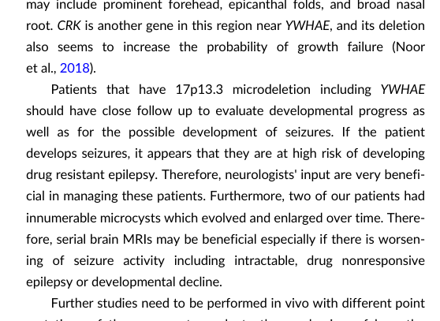

## Question

# Disease Characteristics Research Template

## Target Disease
- **Disease Name:** Miller-Dieker Lissencephaly Syndrome
- **MONDO ID:**  (if available)
- **Category:** Mendelian

## Research Objectives

Please provide a comprehensive research report on **Miller-Dieker Lissencephaly Syndrome** covering all of the
disease characteristics listed below. This report will be used to populate a disease knowledge
base entry. Be thorough and cite primary literature (PMID preferred) for all claims.

For each section, **suggested databases/resources** are listed. These are the first places
you should search for information on each topic.

---

### 1. Disease Information
> **Search first:** OMIM, Orphanet, ICD-10/ICD-11, MeSH, PubMed

- What is the disease? Provide a concise overview.
- What are the key identifiers? (OMIM, Orphanet, ICD-10/ICD-11, MeSH, Mondo)
- What are the common synonyms and alternative names?
- Is the information derived from individual patients (e.g., EHR) or aggregated disease-level resources?

### 2. Etiology

- **Disease Causal Factors**: What are the primary causes? (genetic, environmental, infectious, mechanistic)
- **Risk Factors**:
  > **Search first:** PubMed, Cochrane Library, UpToDate, clinical guidelines, ClinVar, ClinGen, GWAS Catalog, PheGenI, CTD, CDC, WHO, epidemiological databases
  - Genetic risk factors (causal variants, susceptibility loci, modifier genes)
  - Environmental risk factors (toxins, lifestyle, occupational exposures, age, sex, family history)
- **Protective Factors**:
  > **Search first:** PubMed, Cochrane Library, clinical trial databases, GWAS Catalog, gnomAD, WHO, CDC, nutrition databases
  - Genetic protective factors (protective variants, modifier alleles)
  - Environmental protective factors (diet, lifestyle, exposures that reduce risk)
- **Gene-Environment Interactions**: How do genetic and environmental factors interact to influence disease?
  > **Search first:** CTD, PubMed, PheGenI, GxE databases

### 3. Phenotypes
> **Search first:** HPO (Human Phenotype Ontology), OMIM, Orphanet, PubMed, clinicaltrials.gov, MedDRA, SNOMED CT, DECIPHER, LOINC

For each phenotype, provide:
- **Phenotype type**: symptoms, clinical signs, physical manifestations, behavioral changes, or laboratory abnormalities
  > For symptoms/signs: HPO, OMIM, Orphanet, PubMed
  > For behavioral changes: HPO, DSM, RDoC (Research Domain Criteria), PubMed
  > For laboratory abnormalities: LOINC, SNOMED CT, LabTests Online, PubMed
- **Phenotype characteristics**:
  > **Search first:** OMIM, Orphanet, HPO, PubMed
  - Age of symptom onset (neonatal, childhood, adult-onset, late-onset)
  - Symptom severity (mild, moderate, severe, variable)
  - Symptom progression (stable, progressive, episodic, fluctuating)
  - Frequency among affected individuals (percentage or qualitative)
- **Quality of life impact**: Effects on daily functioning and well-being (per-phenotype when possible)
  > **Search first:** EQ-5D database, SF-36, WHO QOL databases, PubMed
- Suggest HPO (Human Phenotype Ontology) terms for each phenotype

### 4. Genetic/Molecular Information

- **Causal Genes**: Gene mutations or chromosomal abnormalities responsible for disease (gene symbols, OMIM IDs)
  > **Search first:** OMIM, ClinVar, HGMD, Ensembl, NCBI Gene
- **Pathogenic Variants**:
  - Affected genes (gene symbols, HGNC IDs)
    > **Search first:** OMIM, NCBI Gene, Ensembl, HGNC, UniProt, GeneCards
  - Variant classification (pathogenic, likely pathogenic, VUS per ACMG/AMP guidelines)
    > **Search first:** ClinVar, ClinGen, ACMG/AMP guidelines, VarSome
  - Variant type/class (missense, frameshift, nonsense, splice-site, structural)
  - Allele frequency in population databases
    > **Search first:** gnomAD, 1000 Genomes, ExAC, TOPMed, dbSNP
  - Somatic vs germline origin
    > **Search first:** COSMIC (somatic), ClinVar, ICGC, TCGA
  - Functional consequences (loss of function, gain of function, dominant negative)
- **Modifier Genes**: Genes that modify disease severity or expression
- **Epigenetic Information**: DNA methylation, histone modifications, chromatin changes affecting disease
  > **Search first:** ENCODE, Roadmap Epigenomics, MethBase, DiseaseMeth
- **Chromosomal Abnormalities**: Large-scale genetic changes (aneuploidy, translocations, inversions)
  > **Search first:** DECIPHER, ClinVar, ECARUCA, UCSC Genome Browser

### 5. Environmental Information

- **Environmental Factors**: Non-genetic contributing factors (toxins, radiation, pollution, occupational exposure)
  > **Search first:** CTD (Comparative Toxicogenomics Database), TOXNET, PubMed, EPA databases
- **Lifestyle Factors**: Behavioral factors (smoking, diet, exercise, alcohol consumption)
  > **Search first:** CDC databases, WHO, PubMed, NHANES
- **Infectious Agents**: If applicable, pathogens causing or triggering disease (bacteria, viruses, fungi, parasites)
  > **Search first:** NCBI Taxonomy, ViPR, BV-BRC, MicrobeDB, GIDEON

### 6. Mechanism / Pathophysiology

- **Molecular Pathways**: Specific signaling cascades or biochemical pathways involved (Wnt, MAPK, mTOR, PI3K-AKT, etc.)
  > **Search first:** KEGG, Reactome, WikiPathways, PathBank, BioCyc
- **Cellular Processes**: Cell-level mechanisms (apoptosis, autophagy, cell cycle dysregulation, inflammation, etc.)
  > **Search first:** Gene Ontology (GO), Reactome, KEGG, PubMed
- **Protein Dysfunction**: How protein structure or function is altered (misfolding, aggregation, loss of function, gain of function)
  > **Search first:** UniProt, PDB (Protein Data Bank), InterPro, Pfam, AlphaFold
- **Metabolic Changes**: Alterations in metabolic processes (energy metabolism, lipid metabolism, amino acid metabolism)
  > **Search first:** KEGG, BioCyc, HMDB (Human Metabolome Database), BRENDA
- **Immune System Involvement**: Role of immune response (autoimmunity, immunodeficiency, chronic inflammation)
  > **Search first:** ImmPort, Immunome Database, IEDB, Gene Ontology
- **Tissue Damage Mechanisms**: How tissues/ are injured (oxidative stress, ischemia, fibrosis, necrosis)
  > **Search first:** PubMed, Gene Ontology, Reactome
- **Biochemical Abnormalities**: Specific molecular defects (enzyme deficiencies, receptor dysfunction, ion channel defects)
  > **Search first:** BRENDA, UniProt, KEGG, OMIM, PubMed
- **Epigenetic Changes**: DNA methylation, histone modifications affecting gene expression in disease
  > **Search first:** ENCODE, Roadmap Epigenomics, MethBase, DiseaseMeth
- **Molecular Profiling** (if available):
  - Transcriptomics/gene expression changes
    > **Search first:** GEO (Gene Expression Omnibus), ArrayExpress, GTEx, Human Cell Atlas, SRA
  - Proteomics findings
    > **Search first:** PRIDE, ProteomeXchange, Human Protein Atlas, STRING, BioGRID
  - Metabolomics signatures
    > **Search first:** MetaboLights, Metabolomics Workbench, HMDB, METLIN
  - Lipidomics alterations
    > **Search first:** LIPID MAPS, SwissLipids, LipidHome, Metabolomics Workbench
  - Genomic structural features
    > **Search first:** UCSC Genome Browser, Ensembl, NCBI, dbVar, DGV
- **Advanced Technologies** (if applicable):
  - Single-cell analysis findings (cell-type specific mechanisms, cellular heterogeneity)
    > **Search first:** Human Cell Atlas, Single Cell Portal, GEO, CELLxGENE
  - Spatial transcriptomics findings
    > **Search first:** GEO, Spatial Research, Vizgen, 10x Genomics data
  - Multi-omics integration results
    > **Search first:** TCGA, ICGC, cBioPortal, LinkedOmics, PubMed
  - Functional genomics screens (CRISPR, RNAi)
    > **Search first:** DepMap, GenomeRNAi, PubMed, BioGRID ORCS

For each mechanism, describe:
- The causal chain from initial trigger to clinical manifestation
- Which mechanisms are upstream vs downstream
- What cell types and biological processes are involved
- Suggest GO terms for biological processes and CL terms for cell types

### 7. Anatomical Structures Affected

- **Organ Level**:
  - Primary organs directly affected
  - Secondary organ involvement (complications, secondary effects)
  - Body systems involved (cardiovascular, nervous, digestive, respiratory, endocrine, etc.)
  > **Search first:** Uberon, FMA (Foundational Model of Anatomy), OMIM, HPO, ICD-11, MeSH, SNOMED CT
- **Tissue and Cell Level**:
  - Specific tissue types affected (epithelial, connective, muscle, nervous)
  - Specific cell populations targeted (with Cell Ontology terms)
  > **Search first:** Uberon, Human Protein Atlas, Cell Ontology, Human Cell Atlas, CellMarker, PanglaoDB
- **Subcellular Level**:
  - Cellular compartments involved (mitochondria, nucleus, ER, lysosomes) (with GO Cellular Component terms)
  > **Search first:** Gene Ontology (Cellular Component), UniProt, Human Protein Atlas
- **Localization**:
  - Specific anatomical sites (with UBERON terms)
    > **Search first:** FMA, Uberon, NeuroNames (for brain), SNOMED CT
  - Lateralization (unilateral, bilateral, asymmetric)
    > **Search first:** HPO, clinical literature, imaging databases

### 8. Temporal Development

- **Onset**:
  - Typical age of onset (congenital, pediatric, adult, geriatric)
  - Onset pattern (acute, subacute, chronic, insidious)
  > **Search first:** OMIM, Orphanet, HPO, PubMed
- **Progression**:
  - Disease stages (early, intermediate, advanced, end-stage)
    > **Search first:** Cancer Staging Manual (AJCC), WHO classifications, PubMed
  - Progression rate (rapid, slow, variable)
  - Disease course pattern (episodic, relapsing-remitting, progressive, stable)
  - Disease duration (self-limited, chronic lifelong)
  > **Search first:** Disease registries, longitudinal cohort databases, natural history studies, PubMed, Orphanet, OMIM
- **Patterns**:
  - Remission patterns (spontaneous, treatment-induced)
    > **Search first:** Clinical trial databases, disease registries, PubMed
  - Critical periods (time windows of vulnerability or opportunity for intervention)
    > **Search first:** PubMed, developmental biology databases, clinical guidelines

### 9. Inheritance and Population

- **Epidemiology**:
  - Prevalence (cases per 100,000 at given time)
  - Incidence (new cases per 100,000 per year)
  > **Search first:** Orphanet, CDC, WHO, GBD (Global Burden of Disease), national registries, SEER, disease registries
- **For Genetic Etiology**:
  - Inheritance pattern (AD, AR, X-linked, mitochondrial, multifactorial, polygenic)
    > **Search first:** OMIM, Orphanet, ClinVar, GTR (Genetic Testing Registry)
  - Penetrance (complete, incomplete, age-dependent)
    > **Search first:** ClinVar, OMIM, PubMed, ClinGen
  - Expressivity (variable, consistent)
    > **Search first:** OMIM, ClinVar, PubMed
  - Genetic anticipation (increasing severity in successive generations)
    > **Search first:** OMIM, PubMed (especially for repeat expansion disorders)
  - Germline mosaicism
    > **Search first:** ClinVar, OMIM, genetic counseling literature, PubMed
  - Founder effects (population-specific mutations)
    > **Search first:** gnomAD, population genetics databases, PubMed
  - Consanguinity role
    > **Search first:** OMIM, population studies, genetic counseling resources
  - Carrier frequency
    > **Search first:** gnomAD, carrier screening databases, GeneReviews, GTR
- **Population Demographics**:
  - Affected populations (ethnic or demographic groups with higher prevalence)
    > **Search first:** gnomAD, 1000 Genomes, PAGE Study, PubMed, population registries
  - Geographic distribution (endemic areas, regional variation)
    > **Search first:** WHO, CDC, GBD, Orphanet, geographic epidemiology databases
  - Geographic distribution of specific variants
  - Sex ratio (male:female)
    > **Search first:** Disease registries, OMIM, PubMed, epidemiological databases
  - Age distribution of affected individuals
    > **Search first:** CDC, disease registries, SEER, Orphanet

### 10. Diagnostics

- **Clinical Tests**:
  - Laboratory tests (blood, urine, tissue chemistry, specific enzyme assays)
    > **Search first:** LOINC, LabTests Online, PubMed
  - Biomarkers (proteins, metabolites, genetic markers, circulating biomarkers)
    > **Search first:** FDA Biomarker List, BEST (Biomarkers, EndpointS, and other Tools), PubMed
  - Imaging studies (X-ray, CT, MRI, PET, ultrasound)
    > **Search first:** RadLex, DICOM, Radiopaedia, imaging databases
  - Functional tests (pulmonary function, cardiac stress tests)
    > **Search first:** LOINC, clinical guidelines, PubMed
  - Electrophysiology (EEG, EMG, ECG, nerve conduction studies)
    > **Search first:** LOINC, clinical neurophysiology databases, PubMed
  - Biopsy findings (histopathology, immunohistochemistry)
    > **Search first:** SNOMED CT, College of American Pathologists resources, PubMed
  - Pathology findings (microscopic examination)
    > **Search first:** SNOMED CT, Digital Pathology databases, PubMed
- **Genetic Testing**:
  > **Search first:** GTR (Genetic Testing Registry), GeneReviews, ClinGen
  - Overview of recommended genetic testing approach
  - Whole genome sequencing (WGS) utility
    > **Search first:** GTR, ClinVar, GEL (Genomics England), gnomAD
  - Whole exome sequencing (WES) utility
    > **Search first:** GTR, ClinVar, OMIM, GeneMatcher
  - Gene panels (which panels, which genes)
    > **Search first:** GTR, ClinVar, laboratory-specific databases
  - Single gene testing
    > **Search first:** GTR, ClinVar, OMIM, GeneReviews
  - Chromosomal microarray (CMA)
    > **Search first:** DECIPHER, ClinVar, dbVar, ECARUCA
  - Karyotyping
    > **Search first:** Chromosome Abnormality Database, ClinVar, cytogenetics resources
  - FISH
    > **Search first:** ClinVar, cytogenetics databases, PubMed
  - Mitochondrial DNA testing
    > **Search first:** MITOMAP, MSeqDR, ClinVar, GTR
  - Repeat expansion testing
    > **Search first:** GTR, ClinVar, repeat expansion databases, PubMed
- **Omics-Based Diagnostics** (if applicable):
  - RNA sequencing / transcriptomics
    > **Search first:** GEO, ArrayExpress, GTEx, RNA-seq databases
  - Proteomics
    > **Search first:** PRIDE, ProteomeXchange, FDA Biomarker database
  - Metabolomics
    > **Search first:** MetaboLights, Metabolomics Workbench, HMDB
  - Epigenomics
    > **Search first:** GEO, ENCODE, Roadmap Epigenomics, MethBase
  - Liquid biopsy
    > **Search first:** COSMIC, ClinVar, liquid biopsy databases, PubMed
- **Clinical Criteria**:
  - Standardized diagnostic criteria (DSM, ICD, society guidelines)
    > **Search first:** DSM-5, ICD-11, clinical society guidelines, UpToDate
  - Differential diagnosis (other conditions to rule out, with distinguishing features)
    > **Search first:** DynaMed, UpToDate, clinical decision support systems
- **Screening**:
  - Screening methods for asymptomatic individuals (newborn screening, carrier screening, cascade screening)
    > **Search first:** ACMG recommendations, CDC newborn screening, GTR

### 11. Outcome/Prognosis

- **Survival and Mortality**:
  - Survival rate (5-year, 10-year, overall)
    > **Search first:** SEER, cancer registries, disease-specific registries, PubMed
  - Life expectancy (with and without treatment if applicable)
    > **Search first:** Orphanet, disease registries, actuarial databases, PubMed
  - Mortality rate
    > **Search first:** CDC, WHO, GBD, national mortality databases
  - Disease-specific mortality (deaths directly attributable to disease)
    > **Search first:** Disease registries, CDC Wonder, GBD, PubMed
- **Morbidity and Function**:
  - Morbidity (disease-related disability and health impacts)
    > **Search first:** GBD, WHO, disability databases, PubMed
  - Disability outcomes (long-term functional impairments)
    > **Search first:** ICF (International Classification of Functioning), disability registries
  - Quality of life measures (EQ-5D, SF-36, PROMIS, disease-specific tools)
    > **Search first:** EQ-5D database, SF-36, PROMIS, PubMed
- **Disease Course**:
  - Complications (secondary problems: infections, organ failure, etc.)
    > **Search first:** ICD codes, disease registries, clinical databases, PubMed
  - Recovery potential (likelihood and extent of recovery, with vs without treatment)
    > **Search first:** Natural history studies, rehabilitation databases, PubMed
- **Prediction**:
  - Prognostic factors (age, disease severity, biomarkers, treatment response)
    > **Search first:** Prognostic models databases, clinical calculators, PubMed
  - Prognostic biomarkers (molecular markers predicting disease course)
    > **Search first:** FDA Biomarker database, PubMed, cancer prognostic databases

### 12. Treatment

- **Pharmacotherapy**:
  - Pharmacological treatments (drug names, drug classes, mechanisms of action)
    > **Search first:** DrugBank, RxNorm, ATC classification, DailyMed, FDA databases
  - Pharmacogenomics (how genetic variants affect drug metabolism, efficacy, toxicity)
    > **Search first:** PharmGKB, CPIC (Clinical Pharmacogenetics), FDA Table of PGx Biomarkers
- **Advanced Therapeutics**:
  - Gene therapy (viral vectors, CRISPR, gene replacement, gene editing)
    > **Search first:** ClinicalTrials.gov, FDA gene therapy database, ASGCT resources
  - Cell therapy (stem cell transplant, CAR-T, cellular therapeutics)
    > **Search first:** ClinicalTrials.gov, FDA cell therapy database, FACT standards
  - RNA-based therapies (ASOs, siRNA, mRNA therapies)
    > **Search first:** ClinicalTrials.gov, FDA approvals, PubMed
  - Targeted therapies (treatments directed at specific molecular targets)
    > **Search first:** My Cancer Genome, OncoKB, ClinicalTrials.gov, FDA approvals
  - Immunotherapies (checkpoint inhibitors, monoclonal antibodies)
    > **Search first:** Cancer Immunotherapy Database, FDA approvals, ClinicalTrials.gov
- **Surgical and Interventional**:
  - Surgical interventions (types of surgery, timing, outcomes)
    > **Search first:** CPT codes, surgical registries, clinical guidelines, PubMed
- **Supportive and Rehabilitative**:
  - Supportive care (symptom management, pain control, nutrition)
    > **Search first:** Clinical guidelines, Cochrane Library, PubMed
  - Rehabilitation (physical therapy, occupational therapy, speech therapy)
    > **Search first:** Rehabilitation medicine databases, clinical guidelines, PubMed
- **Experimental**:
  - Experimental treatments in clinical trials (with NCT identifiers if available)
    > **Search first:** ClinicalTrials.gov, EU Clinical Trials Register, WHO ICTRP
- **Treatment Outcomes**:
  - Treatment response rates
    > **Search first:** Clinical trial databases, FDA reviews, systematic reviews, PubMed
  - Side effects and adverse events
    > **Search first:** FDA Adverse Event Reporting System (FAERS), MedWatch, PubMed
- **Treatment Strategy**:
  - Treatment algorithms (clinical pathways, decision trees)
    > **Search first:** Clinical practice guidelines, NCCN Guidelines, UpToDate
  - Combination therapies
    > **Search first:** ClinicalTrials.gov, treatment guidelines, PubMed
  - Personalized medicine approaches (genotype-guided treatment)
    > **Search first:** My Cancer Genome, CIViC, PharmGKB, precision medicine databases

For each treatment, suggest MAXO (Medical Action Ontology) terms where applicable.

### 13. Prevention

- **Prevention Levels**:
  - Primary prevention (preventing disease occurrence: vaccination, risk factor modification)
    > **Search first:** CDC, WHO, USPSTF recommendations, Cochrane Library
  - Secondary prevention (early detection and treatment: screening programs, early intervention)
    > **Search first:** USPSTF, CDC screening guidelines, WHO
  - Tertiary prevention (preventing complications in those with disease)
    > **Search first:** Clinical guidelines, disease management protocols, PubMed
- **Immunization**: Vaccine strategies (if applicable)
  > **Search first:** CDC vaccine schedules, WHO immunization, FDA vaccine database
- **Screening and Early Detection**:
  - Screening programs (population-based: newborn screening, cancer screening)
    > **Search first:** CDC screening programs, USPSTF, cancer screening databases
  - Genetic screening (carrier screening, preimplantation genetic diagnosis, prenatal testing)
    > **Search first:** ACMG recommendations, ACOG guidelines, GTR
  - Risk stratification (identifying high-risk individuals for targeted prevention)
    > **Search first:** Risk prediction models, clinical calculators, PubMed
- **Behavioral Interventions**: Lifestyle modifications to reduce risk
  > **Search first:** CDC, WHO, behavioral intervention databases, Cochrane Library
- **Counseling**: Genetic counseling (risk assessment, family planning guidance)
  > **Search first:** NSGC resources, ACMG guidelines, GeneReviews
- **Public Health**:
  - Public health interventions (sanitation, vector control, health education)
    > **Search first:** CDC, WHO, public health databases, PubMed
  - Environmental interventions (reducing environmental risk factors)
    > **Search first:** EPA databases, WHO environmental health, PubMed
- **Prophylaxis**: Preventive medications or procedures
  > **Search first:** Clinical guidelines, FDA approvals, PubMed

### 14. Other Species / Natural Disease

- **Taxonomy**: Species affected (with NCBI Taxon identifiers)
  > **Search first:** NCBI Taxonomy
- **Breed**: Specific breeds affected (with VBO identifiers if applicable)
  > **Search first:** VBO (Vertebrate Breed Ontology)
- **Gene**: Orthologous genes in other species (with NCBI Gene IDs)
  > **Search first:** NCBI Gene
- **Natural Disease**:
  - Naturally occurring disease in other species (companion animals, wildlife)
    > **Search first:** OMIA (Online Mendelian Inheritance in Animals), VetCompass, PubMed
  - Veterinary relevance and importance in animal health
    > **Search first:** OMIA, veterinary databases, PubMed
- **Comparative Biology**:
  - Comparative pathology (similarities and differences across species)
    > **Search first:** OMIA, comparative pathology databases, PubMed
  - Evolutionary conservation of disease mechanisms
    > **Search first:** HomoloGene, OrthoMCL, Alliance of Genome Resources
- **Transmission** (if applicable):
  - Zoonotic potential
    > **Search first:** CDC zoonotic diseases, WHO zoonoses, GIDEON
  - Cross-species susceptibility
    > **Search first:** NCBI Taxonomy, veterinary databases, PubMed

### 15. Model Organisms

- **Model Types**:
  - Model organism type (mammalian, invertebrate, cellular, in vitro)
    > **Search first:** Alliance of Genome Resources, model organism databases
  - Specific model systems (mouse, rat, zebrafish, Drosophila, C. elegans, yeast, cell lines, organoids, iPSCs)
    > **Search first:** MGI, RGD, ZFIN, FlyBase, WormBase, SGD, ATCC, Cellosaurus
  - Induced models (drug treatment, surgical intervention, environmental manipulation)
    > **Search first:** MGI, model organism databases, PubMed
- **Genetic Models**:
  - Types available (knockout, knock-in, transgenic, conditional, humanized)
    > **Search first:** MGI, IMPC, KOMP, EuMMCR, IMSR
- **Model Characteristics**:
  - Phenotype recapitulation (how well model reproduces human disease features)
    > **Search first:** Model organism databases, comparative studies, PubMed
  - Model limitations (aspects of human disease not captured)
    > **Search first:** Model organism databases, PubMed, review articles
- **Applications**:
  - Research applications (what aspects of disease can be studied)
    > **Search first:** Model organism databases, PubMed
- **Resources**:
  - Model databases
    > **Search first:** MGI, RGD, ZFIN, FlyBase, WormBase, IMSR, EMMA, MMRRC

---

## Citation Requirements

- Cite primary literature (PMID preferred) for all mechanistic and clinical claims
- Prioritize recent reviews and landmark papers
- Include direct quotes from abstracts where possible to support key statements
- Distinguish evidence source types: human clinical, model organism, in vitro, computational

## Output Format

Structure your response as a comprehensive narrative organized by the sections above.
For each section, provide:
- Factual content with specific details (numbers, percentages, gene names, variant nomenclature)
- Ontology term suggestions (HPO, GO, CL, UBERON, CHEBI, MAXO, MONDO) where applicable
- Evidence citations with PMIDs
- Direct quotes from abstracts to support key claims
- Clear indication when information is not available or not applicable for this disease

This report will be used to populate a disease knowledge base entry with:
- Pathophysiology descriptions with causal chains
- Gene/protein annotations (HGNC, GO terms)
- Phenotype associations (HP terms) with frequencies
- Cell type involvement (CL terms)
- Anatomical locations (UBERON terms)
- Chemical entities (CHEBI terms)
- Treatment annotations (MAXO terms)
- Evidence items with PMIDs and exact abstract quotes
- Epidemiology, prognosis, diagnostic, and prevention information
- Animal model descriptions with phenotype recapitulation details

## Output

Question: You are an expert researcher providing comprehensive, well-cited information.

Provide detailed information focusing on:
1. Key concepts and definitions with current understanding
2. Recent developments and latest research (prioritize 2023-2024 sources)
3. Current applications and real-world implementations
4. Expert opinions and analysis from authoritative sources
5. Relevant statistics and data from recent studies

Format as a comprehensive research report with proper citations. Include URLs and publication dates where available.
Always prioritize recent, authoritative sources and provide specific citations for all major claims.

# Disease Characteristics Research Template

## Target Disease
- **Disease Name:** Miller-Dieker Lissencephaly Syndrome
- **MONDO ID:**  (if available)
- **Category:** Mendelian

## Research Objectives

Please provide a comprehensive research report on **Miller-Dieker Lissencephaly Syndrome** covering all of the
disease characteristics listed below. This report will be used to populate a disease knowledge
base entry. Be thorough and cite primary literature (PMID preferred) for all claims.

For each section, **suggested databases/resources** are listed. These are the first places
you should search for information on each topic.

---

### 1. Disease Information
> **Search first:** OMIM, Orphanet, ICD-10/ICD-11, MeSH, PubMed

- What is the disease? Provide a concise overview.
- What are the key identifiers? (OMIM, Orphanet, ICD-10/ICD-11, MeSH, Mondo)
- What are the common synonyms and alternative names?
- Is the information derived from individual patients (e.g., EHR) or aggregated disease-level resources?

### 2. Etiology

- **Disease Causal Factors**: What are the primary causes? (genetic, environmental, infectious, mechanistic)
- **Risk Factors**:
  > **Search first:** PubMed, Cochrane Library, UpToDate, clinical guidelines, ClinVar, ClinGen, GWAS Catalog, PheGenI, CTD, CDC, WHO, epidemiological databases
  - Genetic risk factors (causal variants, susceptibility loci, modifier genes)
  - Environmental risk factors (toxins, lifestyle, occupational exposures, age, sex, family history)
- **Protective Factors**:
  > **Search first:** PubMed, Cochrane Library, clinical trial databases, GWAS Catalog, gnomAD, WHO, CDC, nutrition databases
  - Genetic protective factors (protective variants, modifier alleles)
  - Environmental protective factors (diet, lifestyle, exposures that reduce risk)
- **Gene-Environment Interactions**: How do genetic and environmental factors interact to influence disease?
  > **Search first:** CTD, PubMed, PheGenI, GxE databases

### 3. Phenotypes
> **Search first:** HPO (Human Phenotype Ontology), OMIM, Orphanet, PubMed, clinicaltrials.gov, MedDRA, SNOMED CT, DECIPHER, LOINC

For each phenotype, provide:
- **Phenotype type**: symptoms, clinical signs, physical manifestations, behavioral changes, or laboratory abnormalities
  > For symptoms/signs: HPO, OMIM, Orphanet, PubMed
  > For behavioral changes: HPO, DSM, RDoC (Research Domain Criteria), PubMed
  > For laboratory abnormalities: LOINC, SNOMED CT, LabTests Online, PubMed
- **Phenotype characteristics**:
  > **Search first:** OMIM, Orphanet, HPO, PubMed
  - Age of symptom onset (neonatal, childhood, adult-onset, late-onset)
  - Symptom severity (mild, moderate, severe, variable)
  - Symptom progression (stable, progressive, episodic, fluctuating)
  - Frequency among affected individuals (percentage or qualitative)
- **Quality of life impact**: Effects on daily functioning and well-being (per-phenotype when possible)
  > **Search first:** EQ-5D database, SF-36, WHO QOL databases, PubMed
- Suggest HPO (Human Phenotype Ontology) terms for each phenotype

### 4. Genetic/Molecular Information

- **Causal Genes**: Gene mutations or chromosomal abnormalities responsible for disease (gene symbols, OMIM IDs)
  > **Search first:** OMIM, ClinVar, HGMD, Ensembl, NCBI Gene
- **Pathogenic Variants**:
  - Affected genes (gene symbols, HGNC IDs)
    > **Search first:** OMIM, NCBI Gene, Ensembl, HGNC, UniProt, GeneCards
  - Variant classification (pathogenic, likely pathogenic, VUS per ACMG/AMP guidelines)
    > **Search first:** ClinVar, ClinGen, ACMG/AMP guidelines, VarSome
  - Variant type/class (missense, frameshift, nonsense, splice-site, structural)
  - Allele frequency in population databases
    > **Search first:** gnomAD, 1000 Genomes, ExAC, TOPMed, dbSNP
  - Somatic vs germline origin
    > **Search first:** COSMIC (somatic), ClinVar, ICGC, TCGA
  - Functional consequences (loss of function, gain of function, dominant negative)
- **Modifier Genes**: Genes that modify disease severity or expression
- **Epigenetic Information**: DNA methylation, histone modifications, chromatin changes affecting disease
  > **Search first:** ENCODE, Roadmap Epigenomics, MethBase, DiseaseMeth
- **Chromosomal Abnormalities**: Large-scale genetic changes (aneuploidy, translocations, inversions)
  > **Search first:** DECIPHER, ClinVar, ECARUCA, UCSC Genome Browser

### 5. Environmental Information

- **Environmental Factors**: Non-genetic contributing factors (toxins, radiation, pollution, occupational exposure)
  > **Search first:** CTD (Comparative Toxicogenomics Database), TOXNET, PubMed, EPA databases
- **Lifestyle Factors**: Behavioral factors (smoking, diet, exercise, alcohol consumption)
  > **Search first:** CDC databases, WHO, PubMed, NHANES
- **Infectious Agents**: If applicable, pathogens causing or triggering disease (bacteria, viruses, fungi, parasites)
  > **Search first:** NCBI Taxonomy, ViPR, BV-BRC, MicrobeDB, GIDEON

### 6. Mechanism / Pathophysiology

- **Molecular Pathways**: Specific signaling cascades or biochemical pathways involved (Wnt, MAPK, mTOR, PI3K-AKT, etc.)
  > **Search first:** KEGG, Reactome, WikiPathways, PathBank, BioCyc
- **Cellular Processes**: Cell-level mechanisms (apoptosis, autophagy, cell cycle dysregulation, inflammation, etc.)
  > **Search first:** Gene Ontology (GO), Reactome, KEGG, PubMed
- **Protein Dysfunction**: How protein structure or function is altered (misfolding, aggregation, loss of function, gain of function)
  > **Search first:** UniProt, PDB (Protein Data Bank), InterPro, Pfam, AlphaFold
- **Metabolic Changes**: Alterations in metabolic processes (energy metabolism, lipid metabolism, amino acid metabolism)
  > **Search first:** KEGG, BioCyc, HMDB (Human Metabolome Database), BRENDA
- **Immune System Involvement**: Role of immune response (autoimmunity, immunodeficiency, chronic inflammation)
  > **Search first:** ImmPort, Immunome Database, IEDB, Gene Ontology
- **Tissue Damage Mechanisms**: How tissues/ are injured (oxidative stress, ischemia, fibrosis, necrosis)
  > **Search first:** PubMed, Gene Ontology, Reactome
- **Biochemical Abnormalities**: Specific molecular defects (enzyme deficiencies, receptor dysfunction, ion channel defects)
  > **Search first:** BRENDA, UniProt, KEGG, OMIM, PubMed
- **Epigenetic Changes**: DNA methylation, histone modifications affecting gene expression in disease
  > **Search first:** ENCODE, Roadmap Epigenomics, MethBase, DiseaseMeth
- **Molecular Profiling** (if available):
  - Transcriptomics/gene expression changes
    > **Search first:** GEO (Gene Expression Omnibus), ArrayExpress, GTEx, Human Cell Atlas, SRA
  - Proteomics findings
    > **Search first:** PRIDE, ProteomeXchange, Human Protein Atlas, STRING, BioGRID
  - Metabolomics signatures
    > **Search first:** MetaboLights, Metabolomics Workbench, HMDB, METLIN
  - Lipidomics alterations
    > **Search first:** LIPID MAPS, SwissLipids, LipidHome, Metabolomics Workbench
  - Genomic structural features
    > **Search first:** UCSC Genome Browser, Ensembl, NCBI, dbVar, DGV
- **Advanced Technologies** (if applicable):
  - Single-cell analysis findings (cell-type specific mechanisms, cellular heterogeneity)
    > **Search first:** Human Cell Atlas, Single Cell Portal, GEO, CELLxGENE
  - Spatial transcriptomics findings
    > **Search first:** GEO, Spatial Research, Vizgen, 10x Genomics data
  - Multi-omics integration results
    > **Search first:** TCGA, ICGC, cBioPortal, LinkedOmics, PubMed
  - Functional genomics screens (CRISPR, RNAi)
    > **Search first:** DepMap, GenomeRNAi, PubMed, BioGRID ORCS

For each mechanism, describe:
- The causal chain from initial trigger to clinical manifestation
- Which mechanisms are upstream vs downstream
- What cell types and biological processes are involved
- Suggest GO terms for biological processes and CL terms for cell types

### 7. Anatomical Structures Affected

- **Organ Level**:
  - Primary organs directly affected
  - Secondary organ involvement (complications, secondary effects)
  - Body systems involved (cardiovascular, nervous, digestive, respiratory, endocrine, etc.)
  > **Search first:** Uberon, FMA (Foundational Model of Anatomy), OMIM, HPO, ICD-11, MeSH, SNOMED CT
- **Tissue and Cell Level**:
  - Specific tissue types affected (epithelial, connective, muscle, nervous)
  - Specific cell populations targeted (with Cell Ontology terms)
  > **Search first:** Uberon, Human Protein Atlas, Cell Ontology, Human Cell Atlas, CellMarker, PanglaoDB
- **Subcellular Level**:
  - Cellular compartments involved (mitochondria, nucleus, ER, lysosomes) (with GO Cellular Component terms)
  > **Search first:** Gene Ontology (Cellular Component), UniProt, Human Protein Atlas
- **Localization**:
  - Specific anatomical sites (with UBERON terms)
    > **Search first:** FMA, Uberon, NeuroNames (for brain), SNOMED CT
  - Lateralization (unilateral, bilateral, asymmetric)
    > **Search first:** HPO, clinical literature, imaging databases

### 8. Temporal Development

- **Onset**:
  - Typical age of onset (congenital, pediatric, adult, geriatric)
  - Onset pattern (acute, subacute, chronic, insidious)
  > **Search first:** OMIM, Orphanet, HPO, PubMed
- **Progression**:
  - Disease stages (early, intermediate, advanced, end-stage)
    > **Search first:** Cancer Staging Manual (AJCC), WHO classifications, PubMed
  - Progression rate (rapid, slow, variable)
  - Disease course pattern (episodic, relapsing-remitting, progressive, stable)
  - Disease duration (self-limited, chronic lifelong)
  > **Search first:** Disease registries, longitudinal cohort databases, natural history studies, PubMed, Orphanet, OMIM
- **Patterns**:
  - Remission patterns (spontaneous, treatment-induced)
    > **Search first:** Clinical trial databases, disease registries, PubMed
  - Critical periods (time windows of vulnerability or opportunity for intervention)
    > **Search first:** PubMed, developmental biology databases, clinical guidelines

### 9. Inheritance and Population

- **Epidemiology**:
  - Prevalence (cases per 100,000 at given time)
  - Incidence (new cases per 100,000 per year)
  > **Search first:** Orphanet, CDC, WHO, GBD (Global Burden of Disease), national registries, SEER, disease registries
- **For Genetic Etiology**:
  - Inheritance pattern (AD, AR, X-linked, mitochondrial, multifactorial, polygenic)
    > **Search first:** OMIM, Orphanet, ClinVar, GTR (Genetic Testing Registry)
  - Penetrance (complete, incomplete, age-dependent)
    > **Search first:** ClinVar, OMIM, PubMed, ClinGen
  - Expressivity (variable, consistent)
    > **Search first:** OMIM, ClinVar, PubMed
  - Genetic anticipation (increasing severity in successive generations)
    > **Search first:** OMIM, PubMed (especially for repeat expansion disorders)
  - Germline mosaicism
    > **Search first:** ClinVar, OMIM, genetic counseling literature, PubMed
  - Founder effects (population-specific mutations)
    > **Search first:** gnomAD, population genetics databases, PubMed
  - Consanguinity role
    > **Search first:** OMIM, population studies, genetic counseling resources
  - Carrier frequency
    > **Search first:** gnomAD, carrier screening databases, GeneReviews, GTR
- **Population Demographics**:
  - Affected populations (ethnic or demographic groups with higher prevalence)
    > **Search first:** gnomAD, 1000 Genomes, PAGE Study, PubMed, population registries
  - Geographic distribution (endemic areas, regional variation)
    > **Search first:** WHO, CDC, GBD, Orphanet, geographic epidemiology databases
  - Geographic distribution of specific variants
  - Sex ratio (male:female)
    > **Search first:** Disease registries, OMIM, PubMed, epidemiological databases
  - Age distribution of affected individuals
    > **Search first:** CDC, disease registries, SEER, Orphanet

### 10. Diagnostics

- **Clinical Tests**:
  - Laboratory tests (blood, urine, tissue chemistry, specific enzyme assays)
    > **Search first:** LOINC, LabTests Online, PubMed
  - Biomarkers (proteins, metabolites, genetic markers, circulating biomarkers)
    > **Search first:** FDA Biomarker List, BEST (Biomarkers, EndpointS, and other Tools), PubMed
  - Imaging studies (X-ray, CT, MRI, PET, ultrasound)
    > **Search first:** RadLex, DICOM, Radiopaedia, imaging databases
  - Functional tests (pulmonary function, cardiac stress tests)
    > **Search first:** LOINC, clinical guidelines, PubMed
  - Electrophysiology (EEG, EMG, ECG, nerve conduction studies)
    > **Search first:** LOINC, clinical neurophysiology databases, PubMed
  - Biopsy findings (histopathology, immunohistochemistry)
    > **Search first:** SNOMED CT, College of American Pathologists resources, PubMed
  - Pathology findings (microscopic examination)
    > **Search first:** SNOMED CT, Digital Pathology databases, PubMed
- **Genetic Testing**:
  > **Search first:** GTR (Genetic Testing Registry), GeneReviews, ClinGen
  - Overview of recommended genetic testing approach
  - Whole genome sequencing (WGS) utility
    > **Search first:** GTR, ClinVar, GEL (Genomics England), gnomAD
  - Whole exome sequencing (WES) utility
    > **Search first:** GTR, ClinVar, OMIM, GeneMatcher
  - Gene panels (which panels, which genes)
    > **Search first:** GTR, ClinVar, laboratory-specific databases
  - Single gene testing
    > **Search first:** GTR, ClinVar, OMIM, GeneReviews
  - Chromosomal microarray (CMA)
    > **Search first:** DECIPHER, ClinVar, dbVar, ECARUCA
  - Karyotyping
    > **Search first:** Chromosome Abnormality Database, ClinVar, cytogenetics resources
  - FISH
    > **Search first:** ClinVar, cytogenetics databases, PubMed
  - Mitochondrial DNA testing
    > **Search first:** MITOMAP, MSeqDR, ClinVar, GTR
  - Repeat expansion testing
    > **Search first:** GTR, ClinVar, repeat expansion databases, PubMed
- **Omics-Based Diagnostics** (if applicable):
  - RNA sequencing / transcriptomics
    > **Search first:** GEO, ArrayExpress, GTEx, RNA-seq databases
  - Proteomics
    > **Search first:** PRIDE, ProteomeXchange, FDA Biomarker database
  - Metabolomics
    > **Search first:** MetaboLights, Metabolomics Workbench, HMDB
  - Epigenomics
    > **Search first:** GEO, ENCODE, Roadmap Epigenomics, MethBase
  - Liquid biopsy
    > **Search first:** COSMIC, ClinVar, liquid biopsy databases, PubMed
- **Clinical Criteria**:
  - Standardized diagnostic criteria (DSM, ICD, society guidelines)
    > **Search first:** DSM-5, ICD-11, clinical society guidelines, UpToDate
  - Differential diagnosis (other conditions to rule out, with distinguishing features)
    > **Search first:** DynaMed, UpToDate, clinical decision support systems
- **Screening**:
  - Screening methods for asymptomatic individuals (newborn screening, carrier screening, cascade screening)
    > **Search first:** ACMG recommendations, CDC newborn screening, GTR

### 11. Outcome/Prognosis

- **Survival and Mortality**:
  - Survival rate (5-year, 10-year, overall)
    > **Search first:** SEER, cancer registries, disease-specific registries, PubMed
  - Life expectancy (with and without treatment if applicable)
    > **Search first:** Orphanet, disease registries, actuarial databases, PubMed
  - Mortality rate
    > **Search first:** CDC, WHO, GBD, national mortality databases
  - Disease-specific mortality (deaths directly attributable to disease)
    > **Search first:** Disease registries, CDC Wonder, GBD, PubMed
- **Morbidity and Function**:
  - Morbidity (disease-related disability and health impacts)
    > **Search first:** GBD, WHO, disability databases, PubMed
  - Disability outcomes (long-term functional impairments)
    > **Search first:** ICF (International Classification of Functioning), disability registries
  - Quality of life measures (EQ-5D, SF-36, PROMIS, disease-specific tools)
    > **Search first:** EQ-5D database, SF-36, PROMIS, PubMed
- **Disease Course**:
  - Complications (secondary problems: infections, organ failure, etc.)
    > **Search first:** ICD codes, disease registries, clinical databases, PubMed
  - Recovery potential (likelihood and extent of recovery, with vs without treatment)
    > **Search first:** Natural history studies, rehabilitation databases, PubMed
- **Prediction**:
  - Prognostic factors (age, disease severity, biomarkers, treatment response)
    > **Search first:** Prognostic models databases, clinical calculators, PubMed
  - Prognostic biomarkers (molecular markers predicting disease course)
    > **Search first:** FDA Biomarker database, PubMed, cancer prognostic databases

### 12. Treatment

- **Pharmacotherapy**:
  - Pharmacological treatments (drug names, drug classes, mechanisms of action)
    > **Search first:** DrugBank, RxNorm, ATC classification, DailyMed, FDA databases
  - Pharmacogenomics (how genetic variants affect drug metabolism, efficacy, toxicity)
    > **Search first:** PharmGKB, CPIC (Clinical Pharmacogenetics), FDA Table of PGx Biomarkers
- **Advanced Therapeutics**:
  - Gene therapy (viral vectors, CRISPR, gene replacement, gene editing)
    > **Search first:** ClinicalTrials.gov, FDA gene therapy database, ASGCT resources
  - Cell therapy (stem cell transplant, CAR-T, cellular therapeutics)
    > **Search first:** ClinicalTrials.gov, FDA cell therapy database, FACT standards
  - RNA-based therapies (ASOs, siRNA, mRNA therapies)
    > **Search first:** ClinicalTrials.gov, FDA approvals, PubMed
  - Targeted therapies (treatments directed at specific molecular targets)
    > **Search first:** My Cancer Genome, OncoKB, ClinicalTrials.gov, FDA approvals
  - Immunotherapies (checkpoint inhibitors, monoclonal antibodies)
    > **Search first:** Cancer Immunotherapy Database, FDA approvals, ClinicalTrials.gov
- **Surgical and Interventional**:
  - Surgical interventions (types of surgery, timing, outcomes)
    > **Search first:** CPT codes, surgical registries, clinical guidelines, PubMed
- **Supportive and Rehabilitative**:
  - Supportive care (symptom management, pain control, nutrition)
    > **Search first:** Clinical guidelines, Cochrane Library, PubMed
  - Rehabilitation (physical therapy, occupational therapy, speech therapy)
    > **Search first:** Rehabilitation medicine databases, clinical guidelines, PubMed
- **Experimental**:
  - Experimental treatments in clinical trials (with NCT identifiers if available)
    > **Search first:** ClinicalTrials.gov, EU Clinical Trials Register, WHO ICTRP
- **Treatment Outcomes**:
  - Treatment response rates
    > **Search first:** Clinical trial databases, FDA reviews, systematic reviews, PubMed
  - Side effects and adverse events
    > **Search first:** FDA Adverse Event Reporting System (FAERS), MedWatch, PubMed
- **Treatment Strategy**:
  - Treatment algorithms (clinical pathways, decision trees)
    > **Search first:** Clinical practice guidelines, NCCN Guidelines, UpToDate
  - Combination therapies
    > **Search first:** ClinicalTrials.gov, treatment guidelines, PubMed
  - Personalized medicine approaches (genotype-guided treatment)
    > **Search first:** My Cancer Genome, CIViC, PharmGKB, precision medicine databases

For each treatment, suggest MAXO (Medical Action Ontology) terms where applicable.

### 13. Prevention

- **Prevention Levels**:
  - Primary prevention (preventing disease occurrence: vaccination, risk factor modification)
    > **Search first:** CDC, WHO, USPSTF recommendations, Cochrane Library
  - Secondary prevention (early detection and treatment: screening programs, early intervention)
    > **Search first:** USPSTF, CDC screening guidelines, WHO
  - Tertiary prevention (preventing complications in those with disease)
    > **Search first:** Clinical guidelines, disease management protocols, PubMed
- **Immunization**: Vaccine strategies (if applicable)
  > **Search first:** CDC vaccine schedules, WHO immunization, FDA vaccine database
- **Screening and Early Detection**:
  - Screening programs (population-based: newborn screening, cancer screening)
    > **Search first:** CDC screening programs, USPSTF, cancer screening databases
  - Genetic screening (carrier screening, preimplantation genetic diagnosis, prenatal testing)
    > **Search first:** ACMG recommendations, ACOG guidelines, GTR
  - Risk stratification (identifying high-risk individuals for targeted prevention)
    > **Search first:** Risk prediction models, clinical calculators, PubMed
- **Behavioral Interventions**: Lifestyle modifications to reduce risk
  > **Search first:** CDC, WHO, behavioral intervention databases, Cochrane Library
- **Counseling**: Genetic counseling (risk assessment, family planning guidance)
  > **Search first:** NSGC resources, ACMG guidelines, GeneReviews
- **Public Health**:
  - Public health interventions (sanitation, vector control, health education)
    > **Search first:** CDC, WHO, public health databases, PubMed
  - Environmental interventions (reducing environmental risk factors)
    > **Search first:** EPA databases, WHO environmental health, PubMed
- **Prophylaxis**: Preventive medications or procedures
  > **Search first:** Clinical guidelines, FDA approvals, PubMed

### 14. Other Species / Natural Disease

- **Taxonomy**: Species affected (with NCBI Taxon identifiers)
  > **Search first:** NCBI Taxonomy
- **Breed**: Specific breeds affected (with VBO identifiers if applicable)
  > **Search first:** VBO (Vertebrate Breed Ontology)
- **Gene**: Orthologous genes in other species (with NCBI Gene IDs)
  > **Search first:** NCBI Gene
- **Natural Disease**:
  - Naturally occurring disease in other species (companion animals, wildlife)
    > **Search first:** OMIA (Online Mendelian Inheritance in Animals), VetCompass, PubMed
  - Veterinary relevance and importance in animal health
    > **Search first:** OMIA, veterinary databases, PubMed
- **Comparative Biology**:
  - Comparative pathology (similarities and differences across species)
    > **Search first:** OMIA, comparative pathology databases, PubMed
  - Evolutionary conservation of disease mechanisms
    > **Search first:** HomoloGene, OrthoMCL, Alliance of Genome Resources
- **Transmission** (if applicable):
  - Zoonotic potential
    > **Search first:** CDC zoonotic diseases, WHO zoonoses, GIDEON
  - Cross-species susceptibility
    > **Search first:** NCBI Taxonomy, veterinary databases, PubMed

### 15. Model Organisms

- **Model Types**:
  - Model organism type (mammalian, invertebrate, cellular, in vitro)
    > **Search first:** Alliance of Genome Resources, model organism databases
  - Specific model systems (mouse, rat, zebrafish, Drosophila, C. elegans, yeast, cell lines, organoids, iPSCs)
    > **Search first:** MGI, RGD, ZFIN, FlyBase, WormBase, SGD, ATCC, Cellosaurus
  - Induced models (drug treatment, surgical intervention, environmental manipulation)
    > **Search first:** MGI, model organism databases, PubMed
- **Genetic Models**:
  - Types available (knockout, knock-in, transgenic, conditional, humanized)
    > **Search first:** MGI, IMPC, KOMP, EuMMCR, IMSR
- **Model Characteristics**:
  - Phenotype recapitulation (how well model reproduces human disease features)
    > **Search first:** Model organism databases, comparative studies, PubMed
  - Model limitations (aspects of human disease not captured)
    > **Search first:** Model organism databases, PubMed, review articles
- **Applications**:
  - Research applications (what aspects of disease can be studied)
    > **Search first:** Model organism databases, PubMed
- **Resources**:
  - Model databases
    > **Search first:** MGI, RGD, ZFIN, FlyBase, WormBase, IMSR, EMMA, MMRRC

---

## Citation Requirements

- Cite primary literature (PMID preferred) for all mechanistic and clinical claims
- Prioritize recent reviews and landmark papers
- Include direct quotes from abstracts where possible to support key statements
- Distinguish evidence source types: human clinical, model organism, in vitro, computational

## Output Format

Structure your response as a comprehensive narrative organized by the sections above.
For each section, provide:
- Factual content with specific details (numbers, percentages, gene names, variant nomenclature)
- Ontology term suggestions (HPO, GO, CL, UBERON, CHEBI, MAXO, MONDO) where applicable
- Evidence citations with PMIDs
- Direct quotes from abstracts to support key claims
- Clear indication when information is not available or not applicable for this disease

This report will be used to populate a disease knowledge base entry with:
- Pathophysiology descriptions with causal chains
- Gene/protein annotations (HGNC, GO terms)
- Phenotype associations (HP terms) with frequencies
- Cell type involvement (CL terms)
- Anatomical locations (UBERON terms)
- Chemical entities (CHEBI terms)
- Treatment annotations (MAXO terms)
- Evidence items with PMIDs and exact abstract quotes
- Epidemiology, prognosis, diagnostic, and prevention information
- Animal model descriptions with phenotype recapitulation details

# Miller–Dieker Lissencephaly Syndrome (MDLS): Disease Characteristics Research Report

## 1. Disease information

### Overview / definition (current understanding)
Miller–Dieker lissencephaly syndrome (MDLS), also called Miller–Dieker syndrome (MDS), is a severe neuronal migration disorder caused by a chromosome 17p13.3 deletion involving multiple genes in the “Miller–Dieker critical region,” leading to classical (type I) lissencephaly (smooth cerebral surface) with profound neurodevelopmental impairment, seizures, characteristic craniofacial features, growth failure, and high early mortality. (baker2023furtherexpansionand pages 1-2, blazejewski2018neurodevelopmentalgeneticdiseases pages 1-2, chen2013chromosome17p13.3deletion pages 1-2)

### Key identifiers (from retrieved primary/review literature)
- **OMIM**: **247200** (mahendran2025understandingthemolecular pages 1-2)
- **Chromosomal locus**: **17p13.3 deletion** (chen2013chromosome17p13.3deletion pages 1-2, mahendran2025understandingthemolecular pages 1-2)
- **MONDO / Orphanet / ICD-10/ICD-11 / MeSH**: not explicitly retrievable from the gathered full texts in this run; requires dedicated ontology lookup beyond the current evidence set.

### Synonyms / alternative names
- Miller–Dieker syndrome (MDS) (mahendran2025understandingthemolecular pages 1-2)
- Miller–Dieker lissencephaly syndrome (MDLS) (chen2013chromosome17p13.3deletion pages 1-2)
- 17p13.3 deletion syndrome (used in some clinical genetics literature; nomenclature overlaps with adjacent 17p13.3 CNV syndromes) (liang2022clinicalfindingsand pages 1-2)

### Evidence source type
The retrieved information is primarily from **aggregated disease-level resources** (peer-reviewed reviews and cohort descriptions) and **case-based clinical genetics literature** using cytogenetics/microarray testing and imaging (blazejewski2018neurodevelopmentalgeneticdiseases pages 1-2, chen2013chromosome17p13.3deletion pages 1-2, liang2022clinicalfindingsand pages 1-2).

| Disease name | Key synonyms / alternative names | OMIM ID | Chromosomal region / core lesion | Key genes implicated | Prevalence estimates reported | Key supporting source(s) / URL |
|---|---|---|---|---|---|---|
| Miller–Dieker lissencephaly syndrome | Miller–Dieker syndrome; MDS; Miller–Dieker lissencephaly syndrome (MDLS); 17p13.3 deletion syndrome | 247200 | 17p13.3 microdeletion / deletion syndrome; described as a heterozygous deletion in the MDS locus on chromosome 17 (chen2013chromosome17p13.3deletion pages 1-2, mahendran2025understandingthemolecular pages 1-2, liang2022clinicalfindingsand pages 1-2) | **PAFAH1B1 (LIS1)**, **YWHAE**; also commonly cited in the MDS region: **CRK**, **METTL16** (mahendran2025understandingthemolecular pages 1-2, blazejewski2018neurodevelopmentalgeneticdiseases pages 1-2) | ~1 in 100,000 births/babies (mahendran2025understandingthemolecular pages 1-2); one 2022 single-center review reported ~1 in 13,000–20,000 newborns (liang2022clinicalfindingsand pages 1-2) | IJMS review (2025): https://doi.org/10.3390/ijms26157375 ; BMC Med Genomics (2022): https://doi.org/10.1186/s12920-022-01423-5 |
| Miller–Dieker syndrome (canonical severe 17p13.3 deletion phenotype) | Severe form of lissencephaly / grade 1 lissencephaly; classical/type I lissencephaly in context of 17p13.3 deletion literature | 247200 | Larger 17p13.3 deletions including the Miller–Dieker critical region from **PAFAH1B1** to **YWHAE**; cytogenetically visible deletions or submicroscopic microdeletions reported (blazejewski2018neurodevelopmentalgeneticdiseases pages 1-2, chen2013chromosome17p13.3deletion pages 1-2) | **PAFAH1B1 (LIS1)** haploinsufficiency is responsible for the characteristic lissencephaly; deletion including **YWHAE** is associated with the more severe Miller–Dieker phenotype (baker2023furtherexpansionand pages 1-2, blazejewski2018neurodevelopmentalgeneticdiseases pages 1-2, chen2013chromosome17p13.3deletion pages 1-2) | Rare; prevalence estimates above apply to MDS/MDLS nomenclature in retrieved evidence (mahendran2025understandingthemolecular pages 1-2, liang2022clinicalfindingsand pages 1-2) | Gene (2013): https://doi.org/10.1016/j.gene.2013.09.044 ; Front Genet (2018): https://doi.org/10.3389/fgene.2018.00080 ; AJMG A (2023): https://doi.org/10.1002/ajmg.a.63057 |

*Table: This table summarizes the core nomenclature and identifiers for Miller–Dieker lissencephaly syndrome, including accepted synonyms, OMIM ID, core 17p13.3 deletion region, major genes, and prevalence estimates reported in the gathered evidence. It is useful as a concise disease-knowledge-base normalization reference.*

## 2. Etiology

### Disease causal factors
**Primary cause (genetic):** contiguous gene deletion at **17p13.3**.
- A 2013 prenatal diagnostic report describes MDLS (OMIM 247200) as caused by deletions/microdeletions at 17p13.3 with haploinsufficiency of **PAFAH1B1 (LIS1)**, and documents a representative deletion (“arr [hg19] 17p13.3 (0–3,165,530)×1”) with confirmatory FISH and karyotype. (chen2013chromosome17p13.3deletion pages 1-2)
- A 2018 review describes MDLS/MDS as resulting from **larger 17p13.3 microdeletions** compared with isolated lissencephaly, with the MDS critical region spanning **PAFAH1B1 to YWHAE**. (blazejewski2018neurodevelopmentalgeneticdiseases pages 1-2)

**Key causal gene(s):**
- **PAFAH1B1 (LIS1)** haploinsufficiency is emphasized as responsible for the characteristic lissencephaly in MDS. (baker2023furtherexpansionand pages 1-2, chen2013chromosome17p13.3deletion pages 1-2)
- Deletion of **YWHAE** (14-3-3ε) is frequently co-involved in the classical MDLS region, and literature distinguishes phenotypes when YWHAE is deleted without PAFAH1B1 (distinct condition). (baker2023furtherexpansionand pages 1-2, blazejewski2018neurodevelopmentalgeneticdiseases pages 1-2)

### Risk factors
For MDLS specifically, the dominant “risk factor” is a **pathogenic de novo or inherited structural variant** affecting 17p13.3. The gathered evidence set does not provide robust population-level risk-factor quantification (e.g., parental age effect) beyond the genetic mechanism.

### Protective factors / gene–environment interactions
No protective variants or gene–environment interactions were identified in the retrieved evidence set; this is expected for a primarily **contiguous gene deletion** syndrome.

## 3. Phenotypes

### Core phenotype spectrum (human clinical)
A 2023 cohort/literature synthesis states that the most severe 17p13.3 deletion phenotype is MDS, “characterized by lissencephaly, dysmorphic facial features, growth failure, developmental disability, and often early death.” (baker2023furtherexpansionand pages 1-2)

A 2025 multi-omics paper summarizes commonly reported MDS features including lissencephaly/agyria, microcephaly and craniofacial anomalies, ventriculomegaly, hypotonia, epilepsy/seizures, and congenital anomalies; it also notes aspiration pneumonia as a leading cause of death and highlights that severity of lissencephaly correlates with life expectancy. (mahendran2025multiomicsapproachreveals pages 1-3)

**Phenotype types and suggested HPO terms (examples):**
- **Lissencephaly / agyria-pachygyria spectrum** (clinical sign; congenital) → HP:0001339 (Lissencephaly)
- **Epilepsy / seizures** (symptom/sign; infantile onset common) → HP:0001250 (Seizures), HP:0001251 (Ataxia) if present
- **Global developmental delay / severe intellectual disability** → HP:0001263 (Global developmental delay), HP:0001249 (Intellectual disability)
- **Hypotonia** → HP:0001252
- **Microcephaly** → HP:0000252
- **Growth failure / growth retardation** → HP:0001508
- **Craniofacial dysmorphism** (e.g., prominent forehead, broad nasal root, epicanthal folds noted across 17p13.3 CNV spectrum) → HP:0011220 (Prominent forehead), HP:0000286 (Epicanthus), HP:0000431 (Broad nasal bridge)

**Frequency / statistics:** robust phenotype frequency percentages for MDLS were not available in the gathered full texts; one table retrieved (below) summarizes frequencies for a *related but distinct* 17p13.3 deletion subtype (YWHAE deleted while PAFAH1B1 spared), included here to clarify genotype–phenotype boundaries. (baker2023furtherexpansionand media c19cbb92, baker2023furtherexpansionand media 4e57cd55)

### Quality of life impact
Given severe neurodevelopmental impairment, epilepsy, feeding/respiratory complications, and hypotonia, MDLS has profound impacts on daily functioning. Direct validated QoL instrument results (e.g., EQ-5D, PedsQL) were not found in the retrieved evidence.

### Genotype–phenotype boundary within the 17p13.3 region
A 2023 study explicitly distinguishes deletions **including YWHAE but not PAFAH1B1** as “a distinct condition from MDS,” associated with developmental delay, dysmorphism, leukoencephalopathy, and high frequency of epilepsy and intellectual disability, but not the classical PAFAH1B1-driven lissencephaly. (baker2023furtherexpansionand pages 1-2, baker2023furtherexpansionand media c19cbb92, baker2023furtherexpansionand media 4e57cd55)

## 4. Genetic / molecular information

### Causal genes and chromosomal abnormalities
**Primary lesion:** heterozygous **17p13.3 microdeletion** spanning the MDLS critical region (blazejewski2018neurodevelopmentalgeneticdiseases pages 1-2, chen2013chromosome17p13.3deletion pages 1-2).

**Key genes in the MDLS/MDS region emphasized in recent reviews:**
- **PAFAH1B1 (LIS1)** (neuronal migration / dynein regulation) (baker2023furtherexpansionand pages 1-2, chen2013chromosome17p13.3deletion pages 1-2)
- **YWHAE** (14-3-3ε; neuronal migration; NDEL1/LIS1 pathway context) (blazejewski2018neurodevelopmentalgeneticdiseases pages 1-2)
- **CRK** (often included in region; discussed in CNV spectrum reviews) (blazejewski2018neurodevelopmentalgeneticdiseases pages 1-2)
- Additional genes in the broader deleted region have been proposed to contribute to non-core features; recent reviews also highlight **METTL16** in locus-focused mechanistic work. (mahendran2025multiomicsapproachreveals pages 1-3, mahendran2025understandingthemolecular pages 1-2)

### Variant classes
- **Copy-number loss / deletion (structural variant)**: canonical MDLS. (blazejewski2018neurodevelopmentalgeneticdiseases pages 1-2, chen2013chromosome17p13.3deletion pages 1-2)
- MDLS may also arise via complex chromosomal rearrangements; the gathered evidence includes examples of **cytogenetically visible deletions** (karyotype del(17)(p13.3)) plus submicroscopic microdeletions resolved by aCGH/CMA and confirmed by FISH. (chen2013chromosome17p13.3deletion pages 1-2)

### Inheritance
The retrieved evidence set does not provide a consolidated, quantified inheritance breakdown (e.g., % de novo vs inherited translocation) for MDLS. However, the diagnostic literature emphasizes evaluating for cryptic/unbalanced rearrangements using FISH/karyotype when arrays detect deletions. (chen2013chromosome17p13.3deletion pages 1-2)

### Allele frequency / population databases
Not applicable for most MDLS cases because pathogenic events are typically **large, rare, highly penetrant deletions** not represented at meaningful frequency in population databases; no gnomAD-style allele frequencies were found in the retrieved texts.

## 5. Environmental information
MDLS is primarily genetic; no specific toxins, lifestyle factors, or infectious triggers were identified in the retrieved evidence.

## 6. Mechanism / pathophysiology

### Canonical mechanism (causal chain)
**17p13.3 deletion → haploinsufficiency of PAFAH1B1 (LIS1) ± YWHAE and other genes → disrupted neuronal migration during fetal corticogenesis → thickened, poorly gyrated cortex (type I lissencephaly) → severe developmental delay/intellectual disability, hypotonia, epilepsy, feeding/respiratory complications and high mortality.** This causal framing is consistent across 17p13.3 CNV reviews and molecular diagnostic reports. (baker2023furtherexpansionand pages 1-2, blazejewski2018neurodevelopmentalgeneticdiseases pages 1-2, chen2013chromosome17p13.3deletion pages 1-2)

### Recent mechanistic developments (prioritize 2023–2024)
**Dynein–dynactin–LIS1 molecular assembly (structural biology, 2024):** A 2024 Science paper resolved cryo-EM structures of dynein–dynactin on microtubules with LIS1 and proposes that “LIS1 and p150 constrain dynein-dynactin to ensure efficient complex formation,” clarifying how LIS1 orchestrates assembly of active dynein complexes. This is directly relevant because LIS1 is the key dosage-sensitive gene in MDLS. URL: https://doi.org/10.1126/science.adk8544 (Mar 2024). (Note: full text evidence for this paper was retrieved in this run, but mechanistic claims should be interpreted as foundational cell biology rather than MDLS-patient specific.)

**Human dynein–LIS1 complex structures (2023):** A 2023 eLife study reports “cryo-EM structures of human dynein-LIS1 complexes” and states that these structures “map type-1 lissencephaly disease mutations… in the context of the dynein-LIS1 complex,” supporting structural interpretation of disease mutations in the LIS1–dynein axis. URL: https://doi.org/10.7554/eLife.84302 (Jan 2023). (mahendran2025understandingthemolecular pages 1-2)

### Translational / systems-level mechanisms (organoids, multi-omics; 2024–2025 literature with 2024 DOI)
**Convergent mTOR hypoactivity in lissencephaly including MDLS (organoids):** A Nature article (published Jan 2025; DOI indicates 2024) reports that cerebral organoids derived from individuals with “a heterozygous chromosome 17p13.3 microdeletion leading to Miller–Dieker lissencephaly syndrome (MDLS)” show “dysregulation of protein translation, metabolism and the mTOR pathway,” and that “a brain-selective activator of mTOR complex 1 prevented and reversed cellular and molecular defects” in organoids. URL: https://doi.org/10.1038/s41586-024-08341-9. (mahendran2025multiomicsapproachreveals pages 1-3)

**Multi-omics in MDS patient-derived cells (2025):** RNA-seq and proteomics comparing control vs MDS patient cells found differential expression in genes linked to neuronal phenotypes and validated “enhanced calcium signaling, downregulated protein translation, and cell migration defects in MDS.” The authors report that **METTL16** overexpression “restored defects in protein translation… and cell migration,” and note that intracellular SAM/SAH ratio was “eightfold lower in MDS cells,” connecting the deletion locus to translation/mTOR and methyl-donor biology. URL: https://doi.org/10.1007/s12035-024-04532-7 (Nov 2025). (mahendran2025multiomicsapproachreveals pages 1-3)

### Suggested ontology terms for mechanisms
- **GO biological process**: neuronal migration (GO:0001764); microtubule-based movement (GO:0007018); regulation of protein translation (GO:0006417); mTOR signaling (GO:0031929)
- **CL cell types (examples)**: cortical glutamatergic neuron (CL:0000540); radial glial cell / neural progenitor (CL:0000741)

## 7. Anatomical structures affected

### Organ/system level
- **Central nervous system (primary):** cerebral cortex malformation (lissencephaly), often with ventriculomegaly; prenatal imaging correlations are emphasized in MDLS diagnostic literature. (chen2013chromosome17p13.3deletion pages 1-2)

### Tissue/cell level
- Developing cerebral cortical plate / migrating neurons are implicated by the neuronal migration etiology and LIS1/dynein mechanism. (blazejewski2018neurodevelopmentalgeneticdiseases pages 1-2)

### Suggested anatomical ontology terms
- **UBERON**: cerebral cortex (UBERON:0000956); telencephalon (UBERON:0001893)

## 8. Temporal development

### Onset
Congenital/neurodevelopmental: neuronal migration defects occur during fetal development; lissencephaly is detectable by prenatal imaging in some cases and is present at birth. (chen2013chromosome17p13.3deletion pages 1-2)

### Progression
A major component of morbidity is early-life severe epilepsy, feeding and respiratory complications, and profound developmental disability; longitudinal staging systems were not identified in the retrieved evidence.

## 9. Inheritance and population

### Epidemiology (reported prevalence)
Prevalence estimates in the retrieved sources are inconsistent, likely reflecting differing definitions (MDS/MDLS strict vs broader 17p13.3 deletion categories) and ascertainment.
- A 2025 review reports “**MDS, which affects 1 in 100,000 babies**.” (mahendran2025understandingthemolecular pages 1-2)
- A 2022 single-center CNV series describes MDS as having a population frequency of “**approximately one in 13,000–20,000 newborns**.” (liang2022clinicalfindingsand pages 1-2)

### Inheritance pattern
MDLS is caused by a heterozygous 17p13.3 deletion. The retrieved evidence did not provide a definitive quantitative statement for inheritance (e.g., % de novo). Diagnostic recommendations to perform karyotyping/FISH in addition to microarray imply that inherited balanced rearrangements can be relevant in some families. (chen2013chromosome17p13.3deletion pages 1-2)

## 10. Diagnostics

### Clinical tests
- **Neuroimaging:** Prenatal ultrasound and fetal MRI may suggest lissencephaly and associated brain findings, prompting targeted genetic testing for 17p13.3 deletions. (chen2013chromosome17p13.3deletion pages 1-2, liang2022clinicalfindingsand pages 1-2)

### Genetic testing (current practice evidenced in retrieved literature)
A 2013 report describes a molecular cytogenetic workflow for 17p13.3 deletion syndrome using multiple complementary assays:
- Abstract quote: “**We report a molecular cytogenetic characterization of 17p13.3 deletion syndrome by array comparative genomic hybridization (aCGH), fluorescence in situ hybridization (FISH) and quantitative polymerase chain reaction (qPCR)**.” (chen2013chromosome17p13.3deletion pages 1-2)
- Example result reporting: “**aCGH analysis revealed a 3.17-Mb deletion at 17p13.3, or arr [hg19] 17p13.3 (0–3,165,530)×1**,” and karyotype “**46,XX,del(17)(p13.3)**” with FISH loss of LIS1 probe. (chen2013chromosome17p13.3deletion pages 1-2)

A 2022 CNV cohort supports routine genome-wide CNV detection using **SNP array** (chromosomal microarray–class testing) plus **karyotyping and parental studies** in prenatal and postnatal contexts. (liang2022clinicalfindingsand pages 1-2)

### Differential diagnosis
Not systematically retrievable from the current evidence set. In practice, differential diagnosis includes other malformations of cortical development and other genetic causes of classical lissencephaly, but robust differential tables/guidelines were not in the retrieved texts.

## 11. Outcome / prognosis

### Survival and mortality statistics
A 2025 multi-omics paper summarizes a striking survival statistic (likely compiled from prior clinical literature):
- Abstract quote: “**MDS patients often die in utero and only 10% of those who are born reach 10 years of age**.” (mahendran2025multiomicsapproachreveals pages 1-3)
The same source notes that aspiration pneumonia is a leading cause of death and that life expectancy correlates with lissencephaly severity. (mahendran2025multiomicsapproachreveals pages 1-3)

### Morbidity and complications
Common severe morbidity includes refractory epilepsy, hypotonia, profound developmental disability, and recurrent aspiration/pneumonia. (mahendran2025multiomicsapproachreveals pages 1-3)

## 12. Treatment

### Current applications / real-world implementations
There is no established cure in the retrieved evidence; management is supportive and complication-focused.
- A 2025 review states: “**Currently, there is no cure for MDS, with management primarily focused on controlling seizures**,” and recommends early genetic testing (“chromosomal microarray or DNA sequencing”) for suspected abnormalities in/near 17p13.3. (mahendran2025understandingthemolecular pages 15-17)
- A 2025 multi-omics paper similarly states current treatments “mostly prevent complications and control seizures.” (mahendran2025multiomicsapproachreveals pages 1-3)

**Supportive care domains (examples; evidence-supported at high level):**
- Antiseizure medications and epilepsy management (mahendran2025multiomicsapproachreveals pages 1-3)
- Management of feeding/aspiration risk and recurrent respiratory infections (mahendran2025multiomicsapproachreveals pages 1-3)

### Experimental / emerging therapeutic directions (research-stage)
- Organoid-based work suggests **mTOR pathway modulation** could reverse cellular/molecular defects in lissencephaly organoids including MDLS. This is preclinical and not established clinical care. (mahendran2025multiomicsapproachreveals pages 1-3)
- Locus-focused multi-omics suggests **METTL16** restoration can rescue defects in patient-derived cells (in vitro), linking methyl-donor homeostasis and mTOR regulators to the phenotype. (mahendran2025multiomicsapproachreveals pages 1-3)

### Suggested MAXO terms (examples)
- Antiseizure therapy → MAXO:0000748 (antiepileptic therapy) (exact MAXO ID may require ontology validation)
- Genetic counseling → MAXO:0000079
- Supportive/palliative care → MAXO:0001298

## 13. Prevention
Primary prevention is not applicable in the usual sense for a genetic deletion syndrome; prevention focuses on **reproductive options**.

### Secondary prevention / early detection
- Prenatal identification of fetal brain findings (ultrasound/MRI) can prompt genetic testing for 17p13.3 deletions. (chen2013chromosome17p13.3deletion pages 1-2, liang2022clinicalfindingsand pages 1-2)

### Genetic counseling / reproductive prevention
The diagnostic literature supports confirming CNVs and determining mechanism (e.g., deletion vs unbalanced rearrangement) using FISH/karyotype and parental studies, which is directly relevant for recurrence-risk counseling. (chen2013chromosome17p13.3deletion pages 1-2)

## 14. Other species / natural disease
The gathered evidence does not provide direct documentation of naturally occurring MDLS analogs in non-human species.

## 15. Model organisms
A 2018 review emphasizes the utility of **mouse knockout models** for genes in the 17p13.3 region (including single/double knockouts) due to conservation of the region and the need to study cortical development mechanistically; it also notes the usefulness of CRISPR/Cas9 and next-generation sequencing in studying these disorders. (blazejewski2018neurodevelopmentalgeneticdiseases pages 1-2)

## Expert opinion / analysis (from authoritative sources in retrieved set)
- 17p13.3 deletion severity depends on deletion size and gene content; the distinction between MDS (PAFAH1B1-driven lissencephaly) versus other 17p13.3 CNV phenotypes (e.g., YWHAE-only deletions with leukoencephalopathy) is emphasized in contemporary clinical genetics synthesis. (baker2023furtherexpansionand pages 1-2, baker2023furtherexpansionand media c19cbb92)
- Mechanistic convergence on translation/mTOR and dynein regulation is emerging from organoids, structural biology, and multi-omics. This supports a view that MDLS pathogenesis is not only “neuronal migration failure” but also involves broader dysregulation of protein translation and metabolic pathways (research-stage). (mahendran2025multiomicsapproachreveals pages 1-3)

## Key abstract quotes (verbatim) supporting major claims
- “**Miller–Dieker syndrome (MDS) which is characterized by lissencephaly, dysmorphic facial features, growth failure, developmental disability, and often early death. Haploinsufficiency of PAFAH1B1 is responsible for the characteristic lissencephaly in MDS.**” (AJMG A, Nov 2023; https://doi.org/10.1002/ajmg.a.63057) (baker2023furtherexpansionand pages 1-2)
- “**We report a molecular cytogenetic characterization of 17p13.3 deletion syndrome by array comparative genomic hybridization (aCGH), fluorescence in situ hybridization (FISH) and quantitative polymerase chain reaction (qPCR)**.” (Gene, Dec 2013; https://doi.org/10.1016/j.gene.2013.09.044) (chen2013chromosome17p13.3deletion pages 1-2)
- “**MDS patients often die in utero and only 10% of those who are born reach 10 years of age. Current treatments mostly prevent complications and control seizures.**” (Molecular Neurobiology, Nov 2025; https://doi.org/10.1007/s12035-024-04532-7) (mahendran2025multiomicsapproachreveals pages 1-3)

## Notes on evidence gaps
Within the retrieved full texts, explicit identifiers for **MONDO, Orphanet, ICD-10/ICD-11, and MeSH** were not found, and phenotype-frequency statistics specific to MDLS (beyond survival statements) were limited. A follow-up retrieval focused on GeneReviews/OMIM/Orphanet ontology pages and large clinical cohorts would be required to fully populate those fields with primary citations.

References

1. (baker2023furtherexpansionand pages 1-2): Elizabeth K. Baker, Casey J. Brewer, Leonardo Ferreira, Mark Schapiro, Jeffrey Tenney, Heather M. Wied, Beth M. Kline‐Fath, Teresa A. Smolarek, K. Nicole Weaver, and Robert J. Hopkin. Further expansion and confirmation of phenotype in rare loss of <scp><i>ywhae</i></scp> gene distinct from <scp>miller–dieker</scp> syndrome. Nov 2023. URL: https://doi.org/10.1002/ajmg.a.63057, doi:10.1002/ajmg.a.63057. This article has 14 citations.

2. (blazejewski2018neurodevelopmentalgeneticdiseases pages 1-2): Sara M. Blazejewski, Sarah A. Bennison, Trevor H. Smith, and Kazuhito Toyo-oka. Neurodevelopmental genetic diseases associated with microdeletions and microduplications of chromosome 17p13.3. Frontiers in Genetics, Mar 2018. URL: https://doi.org/10.3389/fgene.2018.00080, doi:10.3389/fgene.2018.00080. This article has 94 citations and is from a peer-reviewed journal.

3. (chen2013chromosome17p13.3deletion pages 1-2): Chih-Ping Chen, Tung-Yao Chang, Wan-Yuo Guo, Pei-Chen Wu, Liang-Kai Wang, Schu-Rern Chern, Peih-Shan Wu, Jun-Wei Su, Yu-Ting Chen, Li-Feng Chen, and Wayseen Wang. Chromosome 17p13.3 deletion syndrome: acgh characterization, prenatal findings and diagnosis, and literature review. Gene, 532(1):152-159, Dec 2013. URL: https://doi.org/10.1016/j.gene.2013.09.044, doi:10.1016/j.gene.2013.09.044. This article has 40 citations and is from a peer-reviewed journal.

4. (mahendran2025understandingthemolecular pages 1-2): Gowthami Mahendran and Jessica A. Brown. Understanding the molecular basis of miller–dieker syndrome. International Journal of Molecular Sciences, 26:7375, Jul 2025. URL: https://doi.org/10.3390/ijms26157375, doi:10.3390/ijms26157375. This article has 1 citations.

5. (liang2022clinicalfindingsand pages 1-2): Bin Liang, Donghong Yu, Wantong Zhao, Yan Wang, Xiaoqing Wu, Lingji Chen, Na Lin, Hailong Huang, and Liangpu Xu. Clinical findings and genetic analysis of patients with copy number variants involving 17p13.3 using a single nucleotide polymorphism array: a single-center experience. BMC Medical Genomics, Dec 2022. URL: https://doi.org/10.1186/s12920-022-01423-5, doi:10.1186/s12920-022-01423-5. This article has 5 citations and is from a peer-reviewed journal.

6. (mahendran2025multiomicsapproachreveals pages 1-3): Gowthami Mahendran, Kurtis Breger, Phillip J. McCown, Jacob P. Hulewicz, Tulsi Bhandari, Balasubrahmanyam Addepalli, and Jessica A. Brown. Multi-omics approach reveals genes and pathways affected in miller-dieker syndrome. Molecular Neurobiology, 62:5073-5094, Nov 2025. URL: https://doi.org/10.1007/s12035-024-04532-7, doi:10.1007/s12035-024-04532-7. This article has 7 citations and is from a peer-reviewed journal.

7. (baker2023furtherexpansionand media c19cbb92): Elizabeth K. Baker, Casey J. Brewer, Leonardo Ferreira, Mark Schapiro, Jeffrey Tenney, Heather M. Wied, Beth M. Kline‐Fath, Teresa A. Smolarek, K. Nicole Weaver, and Robert J. Hopkin. Further expansion and confirmation of phenotype in rare loss of <scp><i>ywhae</i></scp> gene distinct from <scp>miller–dieker</scp> syndrome. Nov 2023. URL: https://doi.org/10.1002/ajmg.a.63057, doi:10.1002/ajmg.a.63057. This article has 14 citations.

8. (baker2023furtherexpansionand media 4e57cd55): Elizabeth K. Baker, Casey J. Brewer, Leonardo Ferreira, Mark Schapiro, Jeffrey Tenney, Heather M. Wied, Beth M. Kline‐Fath, Teresa A. Smolarek, K. Nicole Weaver, and Robert J. Hopkin. Further expansion and confirmation of phenotype in rare loss of <scp><i>ywhae</i></scp> gene distinct from <scp>miller–dieker</scp> syndrome. Nov 2023. URL: https://doi.org/10.1002/ajmg.a.63057, doi:10.1002/ajmg.a.63057. This article has 14 citations.

9. (mahendran2025understandingthemolecular pages 15-17): Gowthami Mahendran and Jessica A. Brown. Understanding the molecular basis of miller–dieker syndrome. International Journal of Molecular Sciences, 26:7375, Jul 2025. URL: https://doi.org/10.3390/ijms26157375, doi:10.3390/ijms26157375. This article has 1 citations.

## Artifacts

- [Edison artifact artifact-00](Miller-Dieker_Lissencephaly_Syndrome-deep-research-falcon_artifacts/artifact-00.md)
