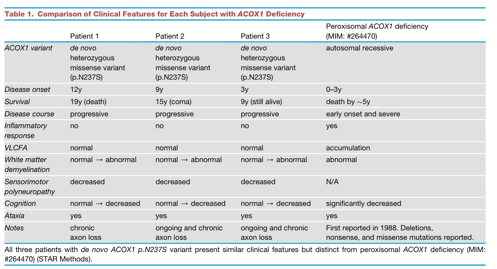

## Question

# Disease Characteristics Research Template

## Target Disease
- **Disease Name:** Mitchell Syndrome
- **MONDO ID:** MONDO:0030073 (if available)
- **Category:** Metabolic Disorder

## Research Objectives

Please provide a comprehensive research report on **Mitchell Syndrome** covering all of the
disease characteristics listed below. This report will be used to populate a disease knowledge
base entry. Be thorough and cite primary literature (PMID preferred) for all claims.

For each section, **suggested databases/resources** are listed. These are the first places
you should search for information on each topic.

---

### 1. Disease Information
> **Search first:** OMIM, Orphanet, ICD-10/ICD-11, MeSH, PubMed

- What is the disease? Provide a concise overview.
- What are the key identifiers? (OMIM, Orphanet, ICD-10/ICD-11, MeSH, Mondo)
- What are the common synonyms and alternative names?
- Is the information derived from individual patients (e.g., EHR) or aggregated disease-level resources?

### 2. Etiology

- **Disease Causal Factors**: What are the primary causes? (genetic, environmental, infectious, mechanistic)
- **Risk Factors**:
  > **Search first:** PubMed, Cochrane Library, UpToDate, clinical guidelines, ClinVar, ClinGen, GWAS Catalog, PheGenI, CTD, CDC, WHO, epidemiological databases
  - Genetic risk factors (causal variants, susceptibility loci, modifier genes)
  - Environmental risk factors (toxins, lifestyle, occupational exposures, age, sex, family history)
- **Protective Factors**:
  > **Search first:** PubMed, Cochrane Library, clinical trial databases, GWAS Catalog, gnomAD, WHO, CDC, nutrition databases
  - Genetic protective factors (protective variants, modifier alleles)
  - Environmental protective factors (diet, lifestyle, exposures that reduce risk)
- **Gene-Environment Interactions**: How do genetic and environmental factors interact to influence disease?
  > **Search first:** CTD, PubMed, PheGenI, GxE databases

### 3. Phenotypes
> **Search first:** HPO (Human Phenotype Ontology), OMIM, Orphanet, PubMed, clinicaltrials.gov, MedDRA, SNOMED CT, DECIPHER, LOINC

For each phenotype, provide:
- **Phenotype type**: symptoms, clinical signs, physical manifestations, behavioral changes, or laboratory abnormalities
  > For symptoms/signs: HPO, OMIM, Orphanet, PubMed
  > For behavioral changes: HPO, DSM, RDoC (Research Domain Criteria), PubMed
  > For laboratory abnormalities: LOINC, SNOMED CT, LabTests Online, PubMed
- **Phenotype characteristics**:
  > **Search first:** OMIM, Orphanet, HPO, PubMed
  - Age of symptom onset (neonatal, childhood, adult-onset, late-onset)
  - Symptom severity (mild, moderate, severe, variable)
  - Symptom progression (stable, progressive, episodic, fluctuating)
  - Frequency among affected individuals (percentage or qualitative)
- **Quality of life impact**: Effects on daily functioning and well-being (per-phenotype when possible)
  > **Search first:** EQ-5D database, SF-36, WHO QOL databases, PubMed
- Suggest HPO (Human Phenotype Ontology) terms for each phenotype

### 4. Genetic/Molecular Information

- **Causal Genes**: Gene mutations or chromosomal abnormalities responsible for disease (gene symbols, OMIM IDs)
  > **Search first:** OMIM, ClinVar, HGMD, Ensembl, NCBI Gene
- **Pathogenic Variants**:
  - Affected genes (gene symbols, HGNC IDs)
    > **Search first:** OMIM, NCBI Gene, Ensembl, HGNC, UniProt, GeneCards
  - Variant classification (pathogenic, likely pathogenic, VUS per ACMG/AMP guidelines)
    > **Search first:** ClinVar, ClinGen, ACMG/AMP guidelines, VarSome
  - Variant type/class (missense, frameshift, nonsense, splice-site, structural)
  - Allele frequency in population databases
    > **Search first:** gnomAD, 1000 Genomes, ExAC, TOPMed, dbSNP
  - Somatic vs germline origin
    > **Search first:** COSMIC (somatic), ClinVar, ICGC, TCGA
  - Functional consequences (loss of function, gain of function, dominant negative)
- **Modifier Genes**: Genes that modify disease severity or expression
- **Epigenetic Information**: DNA methylation, histone modifications, chromatin changes affecting disease
  > **Search first:** ENCODE, Roadmap Epigenomics, MethBase, DiseaseMeth
- **Chromosomal Abnormalities**: Large-scale genetic changes (aneuploidy, translocations, inversions)
  > **Search first:** DECIPHER, ClinVar, ECARUCA, UCSC Genome Browser

### 5. Environmental Information

- **Environmental Factors**: Non-genetic contributing factors (toxins, radiation, pollution, occupational exposure)
  > **Search first:** CTD (Comparative Toxicogenomics Database), TOXNET, PubMed, EPA databases
- **Lifestyle Factors**: Behavioral factors (smoking, diet, exercise, alcohol consumption)
  > **Search first:** CDC databases, WHO, PubMed, NHANES
- **Infectious Agents**: If applicable, pathogens causing or triggering disease (bacteria, viruses, fungi, parasites)
  > **Search first:** NCBI Taxonomy, ViPR, BV-BRC, MicrobeDB, GIDEON

### 6. Mechanism / Pathophysiology

**Present this section as an ordered causal chain first, then the detail below.**
Open with a numbered sequence of mechanistic steps running from the initiating
lesion (mutation, exposure, infection) to the clinical manifestation, one step per
line, each naming what it causes next. State the causal verb explicitly ("leads
to", "results in") and say where a step is inferred rather than demonstrated.
Where the mechanism branches, show the branch. The categories below are a
checklist of what to cover within those steps, not the organizing structure —
a step may draw on several of them, and a category may contribute to several
steps.

- **Molecular Pathways**: Specific signaling cascades or biochemical pathways involved (Wnt, MAPK, mTOR, PI3K-AKT, etc.)
  > **Search first:** KEGG, Reactome, WikiPathways, PathBank, BioCyc
- **Cellular Processes**: Cell-level mechanisms (apoptosis, autophagy, cell cycle dysregulation, inflammation, etc.)
  > **Search first:** Gene Ontology (GO), Reactome, KEGG, PubMed
- **Protein Dysfunction**: How protein structure or function is altered (misfolding, aggregation, loss of function, gain of function)
  > **Search first:** UniProt, PDB (Protein Data Bank), InterPro, Pfam, AlphaFold
- **Metabolic Changes**: Alterations in metabolic processes (energy metabolism, lipid metabolism, amino acid metabolism)
  > **Search first:** KEGG, BioCyc, HMDB (Human Metabolome Database), BRENDA
- **Immune System Involvement**: Role of immune response (autoimmunity, immunodeficiency, chronic inflammation)
  > **Search first:** ImmPort, Immunome Database, IEDB, Gene Ontology
- **Tissue Damage Mechanisms**: How tissues/ are injured (oxidative stress, ischemia, fibrosis, necrosis)
  > **Search first:** PubMed, Gene Ontology, Reactome
- **Biochemical Abnormalities**: Specific molecular defects (enzyme deficiencies, receptor dysfunction, ion channel defects)
  > **Search first:** BRENDA, UniProt, KEGG, OMIM, PubMed
- **Epigenetic Changes**: DNA methylation, histone modifications affecting gene expression in disease
  > **Search first:** ENCODE, Roadmap Epigenomics, MethBase, DiseaseMeth
- **Molecular Profiling** (if available):
  - Transcriptomics/gene expression changes
    > **Search first:** GEO (Gene Expression Omnibus), ArrayExpress, GTEx, Human Cell Atlas, SRA
  - Proteomics findings
    > **Search first:** PRIDE, ProteomeXchange, Human Protein Atlas, STRING, BioGRID
  - Metabolomics signatures
    > **Search first:** MetaboLights, Metabolomics Workbench, HMDB, METLIN
  - Lipidomics alterations
    > **Search first:** LIPID MAPS, SwissLipids, LipidHome, Metabolomics Workbench
  - Genomic structural features
    > **Search first:** UCSC Genome Browser, Ensembl, NCBI, dbVar, DGV
- **Advanced Technologies** (if applicable):
  - Single-cell analysis findings (cell-type specific mechanisms, cellular heterogeneity)
    > **Search first:** Human Cell Atlas, Single Cell Portal, GEO, CELLxGENE
  - Spatial transcriptomics findings
    > **Search first:** GEO, Spatial Research, Vizgen, 10x Genomics data
  - Multi-omics integration results
    > **Search first:** TCGA, ICGC, cBioPortal, LinkedOmics, PubMed
  - Functional genomics screens (CRISPR, RNAi)
    > **Search first:** DepMap, GenomeRNAi, PubMed, BioGRID ORCS

For each mechanism, describe:
- The causal chain from initial trigger to clinical manifestation
- Which mechanisms are upstream vs downstream
- What cell types and biological processes are involved
- Suggest GO terms for biological processes and CL terms for cell types

### 7. Anatomical Structures Affected

- **Organ Level**:
  - Primary organs directly affected
  - Secondary organ involvement (complications, secondary effects)
  - Body systems involved (cardiovascular, nervous, digestive, respiratory, endocrine, etc.)
  > **Search first:** Uberon, FMA (Foundational Model of Anatomy), OMIM, HPO, ICD-11, MeSH, SNOMED CT
- **Tissue and Cell Level**:
  - Specific tissue types affected (epithelial, connective, muscle, nervous)
  - Specific cell populations targeted (with Cell Ontology terms)
  > **Search first:** Uberon, Human Protein Atlas, Cell Ontology, Human Cell Atlas, CellMarker, PanglaoDB
- **Subcellular Level**:
  - Cellular compartments involved (mitochondria, nucleus, ER, lysosomes) (with GO Cellular Component terms)
  > **Search first:** Gene Ontology (Cellular Component), UniProt, Human Protein Atlas
- **Localization**:
  - Specific anatomical sites (with UBERON terms)
    > **Search first:** FMA, Uberon, NeuroNames (for brain), SNOMED CT
  - Lateralization (unilateral, bilateral, asymmetric)
    > **Search first:** HPO, clinical literature, imaging databases

### 8. Temporal Development

- **Onset**:
  - Typical age of onset (congenital, pediatric, adult, geriatric)
  - Onset pattern (acute, subacute, chronic, insidious)
  > **Search first:** OMIM, Orphanet, HPO, PubMed
- **Progression**:
  - Disease stages (early, intermediate, advanced, end-stage)
    > **Search first:** Cancer Staging Manual (AJCC), WHO classifications, PubMed
  - Progression rate (rapid, slow, variable)
  - Disease course pattern (episodic, relapsing-remitting, progressive, stable)
  - Disease duration (self-limited, chronic lifelong)
  > **Search first:** Disease registries, longitudinal cohort databases, natural history studies, PubMed, Orphanet, OMIM
- **Patterns**:
  - Remission patterns (spontaneous, treatment-induced)
    > **Search first:** Clinical trial databases, disease registries, PubMed
  - Critical periods (time windows of vulnerability or opportunity for intervention)
    > **Search first:** PubMed, developmental biology databases, clinical guidelines

### 9. Inheritance and Population

- **Epidemiology**:
  - Prevalence (cases per 100,000 at given time)
  - Incidence (new cases per 100,000 per year)
  > **Search first:** Orphanet, CDC, WHO, GBD (Global Burden of Disease), national registries, SEER, disease registries
- **For Genetic Etiology**:
  - Inheritance pattern (AD, AR, X-linked, mitochondrial, multifactorial, polygenic)
    > **Search first:** OMIM, Orphanet, ClinVar, GTR (Genetic Testing Registry)
  - Penetrance (complete, incomplete, age-dependent)
    > **Search first:** ClinVar, OMIM, PubMed, ClinGen
  - Expressivity (variable, consistent)
    > **Search first:** OMIM, ClinVar, PubMed
  - Genetic anticipation (increasing severity in successive generations)
    > **Search first:** OMIM, PubMed (especially for repeat expansion disorders)
  - Germline mosaicism
    > **Search first:** ClinVar, OMIM, genetic counseling literature, PubMed
  - Founder effects (population-specific mutations)
    > **Search first:** gnomAD, population genetics databases, PubMed
  - Consanguinity role
    > **Search first:** OMIM, population studies, genetic counseling resources
  - Carrier frequency
    > **Search first:** gnomAD, carrier screening databases, GeneReviews, GTR
- **Population Demographics**:
  - Affected populations (ethnic or demographic groups with higher prevalence)
    > **Search first:** gnomAD, 1000 Genomes, PAGE Study, PubMed, population registries
  - Geographic distribution (endemic areas, regional variation)
    > **Search first:** WHO, CDC, GBD, Orphanet, geographic epidemiology databases
  - Geographic distribution of specific variants
  - Sex ratio (male:female)
    > **Search first:** Disease registries, OMIM, PubMed, epidemiological databases
  - Age distribution of affected individuals
    > **Search first:** CDC, disease registries, SEER, Orphanet

### 10. Diagnostics

- **Clinical Tests**:
  - Laboratory tests (blood, urine, tissue chemistry, specific enzyme assays)
    > **Search first:** LOINC, LabTests Online, PubMed
  - Biomarkers (proteins, metabolites, genetic markers, circulating biomarkers)
    > **Search first:** FDA Biomarker List, BEST (Biomarkers, EndpointS, and other Tools), PubMed
  - Imaging studies (X-ray, CT, MRI, PET, ultrasound)
    > **Search first:** RadLex, DICOM, Radiopaedia, imaging databases
  - Functional tests (pulmonary function, cardiac stress tests)
    > **Search first:** LOINC, clinical guidelines, PubMed
  - Electrophysiology (EEG, EMG, ECG, nerve conduction studies)
    > **Search first:** LOINC, clinical neurophysiology databases, PubMed
  - Biopsy findings (histopathology, immunohistochemistry)
    > **Search first:** SNOMED CT, College of American Pathologists resources, PubMed
  - Pathology findings (microscopic examination)
    > **Search first:** SNOMED CT, Digital Pathology databases, PubMed
- **Genetic Testing**:
  > **Search first:** GTR (Genetic Testing Registry), GeneReviews, ClinGen
  - Overview of recommended genetic testing approach
  - Whole genome sequencing (WGS) utility
    > **Search first:** GTR, ClinVar, GEL (Genomics England), gnomAD
  - Whole exome sequencing (WES) utility
    > **Search first:** GTR, ClinVar, OMIM, GeneMatcher
  - Gene panels (which panels, which genes)
    > **Search first:** GTR, ClinVar, laboratory-specific databases
  - Single gene testing
    > **Search first:** GTR, ClinVar, OMIM, GeneReviews
  - Chromosomal microarray (CMA)
    > **Search first:** DECIPHER, ClinVar, dbVar, ECARUCA
  - Karyotyping
    > **Search first:** Chromosome Abnormality Database, ClinVar, cytogenetics resources
  - FISH
    > **Search first:** ClinVar, cytogenetics databases, PubMed
  - Mitochondrial DNA testing
    > **Search first:** MITOMAP, MSeqDR, ClinVar, GTR
  - Repeat expansion testing
    > **Search first:** GTR, ClinVar, repeat expansion databases, PubMed
- **Omics-Based Diagnostics** (if applicable):
  - RNA sequencing / transcriptomics
    > **Search first:** GEO, ArrayExpress, GTEx, RNA-seq databases
  - Proteomics
    > **Search first:** PRIDE, ProteomeXchange, FDA Biomarker database
  - Metabolomics
    > **Search first:** MetaboLights, Metabolomics Workbench, HMDB
  - Epigenomics
    > **Search first:** GEO, ENCODE, Roadmap Epigenomics, MethBase
  - Liquid biopsy
    > **Search first:** COSMIC, ClinVar, liquid biopsy databases, PubMed
- **Clinical Criteria**:
  - Standardized diagnostic criteria (DSM, ICD, society guidelines)
    > **Search first:** DSM-5, ICD-11, clinical society guidelines, UpToDate
  - Differential diagnosis (other conditions to rule out, with distinguishing features)
    > **Search first:** DynaMed, UpToDate, clinical decision support systems
- **Screening**:
  - Screening methods for asymptomatic individuals (newborn screening, carrier screening, cascade screening)
    > **Search first:** ACMG recommendations, CDC newborn screening, GTR

### 11. Outcome/Prognosis

- **Survival and Mortality**:
  - Survival rate (5-year, 10-year, overall)
    > **Search first:** SEER, cancer registries, disease-specific registries, PubMed
  - Life expectancy (with and without treatment if applicable)
    > **Search first:** Orphanet, disease registries, actuarial databases, PubMed
  - Mortality rate
    > **Search first:** CDC, WHO, GBD, national mortality databases
  - Disease-specific mortality (deaths directly attributable to disease)
    > **Search first:** Disease registries, CDC Wonder, GBD, PubMed
- **Morbidity and Function**:
  - Morbidity (disease-related disability and health impacts)
    > **Search first:** GBD, WHO, disability databases, PubMed
  - Disability outcomes (long-term functional impairments)
    > **Search first:** ICF (International Classification of Functioning), disability registries
  - Quality of life measures (EQ-5D, SF-36, PROMIS, disease-specific tools)
    > **Search first:** EQ-5D database, SF-36, PROMIS, PubMed
- **Disease Course**:
  - Complications (secondary problems: infections, organ failure, etc.)
    > **Search first:** ICD codes, disease registries, clinical databases, PubMed
  - Recovery potential (likelihood and extent of recovery, with vs without treatment)
    > **Search first:** Natural history studies, rehabilitation databases, PubMed
- **Prediction**:
  - Prognostic factors (age, disease severity, biomarkers, treatment response)
    > **Search first:** Prognostic models databases, clinical calculators, PubMed
  - Prognostic biomarkers (molecular markers predicting disease course)
    > **Search first:** FDA Biomarker database, PubMed, cancer prognostic databases

### 12. Treatment

- **Pharmacotherapy**:
  - Pharmacological treatments (drug names, drug classes, mechanisms of action)
    > **Search first:** DrugBank, RxNorm, ATC classification, DailyMed, FDA databases
  - Pharmacogenomics (how genetic variants affect drug metabolism, efficacy, toxicity)
    > **Search first:** PharmGKB, CPIC (Clinical Pharmacogenetics), FDA Table of PGx Biomarkers
- **Advanced Therapeutics**:
  - Gene therapy (viral vectors, CRISPR, gene replacement, gene editing)
    > **Search first:** ClinicalTrials.gov, FDA gene therapy database, ASGCT resources
  - Cell therapy (stem cell transplant, CAR-T, cellular therapeutics)
    > **Search first:** ClinicalTrials.gov, FDA cell therapy database, FACT standards
  - RNA-based therapies (ASOs, siRNA, mRNA therapies)
    > **Search first:** ClinicalTrials.gov, FDA approvals, PubMed
  - Targeted therapies (treatments directed at specific molecular targets)
    > **Search first:** My Cancer Genome, OncoKB, ClinicalTrials.gov, FDA approvals
  - Immunotherapies (checkpoint inhibitors, monoclonal antibodies)
    > **Search first:** Cancer Immunotherapy Database, FDA approvals, ClinicalTrials.gov
- **Surgical and Interventional**:
  - Surgical interventions (types of surgery, timing, outcomes)
    > **Search first:** CPT codes, surgical registries, clinical guidelines, PubMed
- **Supportive and Rehabilitative**:
  - Supportive care (symptom management, pain control, nutrition)
    > **Search first:** Clinical guidelines, Cochrane Library, PubMed
  - Rehabilitation (physical therapy, occupational therapy, speech therapy)
    > **Search first:** Rehabilitation medicine databases, clinical guidelines, PubMed
- **Experimental**:
  - Experimental treatments in clinical trials (with NCT identifiers if available)
    > **Search first:** ClinicalTrials.gov, EU Clinical Trials Register, WHO ICTRP
- **Treatment Outcomes**:
  - Treatment response rates
    > **Search first:** Clinical trial databases, FDA reviews, systematic reviews, PubMed
  - Side effects and adverse events
    > **Search first:** FDA Adverse Event Reporting System (FAERS), MedWatch, PubMed
- **Treatment Strategy**:
  - Treatment algorithms (clinical pathways, decision trees)
    > **Search first:** Clinical practice guidelines, NCCN Guidelines, UpToDate
  - Combination therapies
    > **Search first:** ClinicalTrials.gov, treatment guidelines, PubMed
  - Personalized medicine approaches (genotype-guided treatment)
    > **Search first:** My Cancer Genome, CIViC, PharmGKB, precision medicine databases

For each treatment, suggest NCIT (NCI Thesaurus) clinical-intervention terms where applicable.

### 13. Prevention

- **Prevention Levels**:
  - Primary prevention (preventing disease occurrence: vaccination, risk factor modification)
    > **Search first:** CDC, WHO, USPSTF recommendations, Cochrane Library
  - Secondary prevention (early detection and treatment: screening programs, early intervention)
    > **Search first:** USPSTF, CDC screening guidelines, WHO
  - Tertiary prevention (preventing complications in those with disease)
    > **Search first:** Clinical guidelines, disease management protocols, PubMed
- **Immunization**: Vaccine strategies (if applicable)
  > **Search first:** CDC vaccine schedules, WHO immunization, FDA vaccine database
- **Screening and Early Detection**:
  - Screening programs (population-based: newborn screening, cancer screening)
    > **Search first:** CDC screening programs, USPSTF, cancer screening databases
  - Genetic screening (carrier screening, preimplantation genetic diagnosis, prenatal testing)
    > **Search first:** ACMG recommendations, ACOG guidelines, GTR
  - Risk stratification (identifying high-risk individuals for targeted prevention)
    > **Search first:** Risk prediction models, clinical calculators, PubMed
- **Behavioral Interventions**: Lifestyle modifications to reduce risk
  > **Search first:** CDC, WHO, behavioral intervention databases, Cochrane Library
- **Counseling**: Genetic counseling (risk assessment, family planning guidance)
  > **Search first:** NSGC resources, ACMG guidelines, GeneReviews
- **Public Health**:
  - Public health interventions (sanitation, vector control, health education)
    > **Search first:** CDC, WHO, public health databases, PubMed
  - Environmental interventions (reducing environmental risk factors)
    > **Search first:** EPA databases, WHO environmental health, PubMed
- **Prophylaxis**: Preventive medications or procedures
  > **Search first:** Clinical guidelines, FDA approvals, PubMed

### 14. Other Species / Natural Disease

- **Taxonomy**: Species affected (with NCBI Taxon identifiers)
  > **Search first:** NCBI Taxonomy
- **Breed**: Specific breeds affected (with VBO identifiers if applicable)
  > **Search first:** VBO (Vertebrate Breed Ontology)
- **Gene**: Orthologous genes in other species (with NCBI Gene IDs)
  > **Search first:** NCBI Gene
- **Natural Disease**:
  - Naturally occurring disease in other species (companion animals, wildlife)
    > **Search first:** OMIA (Online Mendelian Inheritance in Animals), VetCompass, PubMed
  - Veterinary relevance and importance in animal health
    > **Search first:** OMIA, veterinary databases, PubMed
- **Comparative Biology**:
  - Comparative pathology (similarities and differences across species)
    > **Search first:** OMIA, comparative pathology databases, PubMed
  - Evolutionary conservation of disease mechanisms
    > **Search first:** HomoloGene, OrthoMCL, Alliance of Genome Resources
- **Transmission** (if applicable):
  - Zoonotic potential
    > **Search first:** CDC zoonotic diseases, WHO zoonoses, GIDEON
  - Cross-species susceptibility
    > **Search first:** NCBI Taxonomy, veterinary databases, PubMed

### 15. Model Organisms

- **Model Types**:
  - Model organism type (mammalian, invertebrate, cellular, in vitro)
    > **Search first:** Alliance of Genome Resources, model organism databases
  - Specific model systems (mouse, rat, zebrafish, Drosophila, C. elegans, yeast, cell lines, organoids, iPSCs)
    > **Search first:** MGI, RGD, ZFIN, FlyBase, WormBase, SGD, ATCC, Cellosaurus
  - Induced models (drug treatment, surgical intervention, environmental manipulation)
    > **Search first:** MGI, model organism databases, PubMed
- **Genetic Models**:
  - Types available (knockout, knock-in, transgenic, conditional, humanized)
    > **Search first:** MGI, IMPC, KOMP, EuMMCR, IMSR
- **Model Characteristics**:
  - Phenotype recapitulation (how well model reproduces human disease features)
    > **Search first:** Model organism databases, comparative studies, PubMed
  - Model limitations (aspects of human disease not captured)
    > **Search first:** Model organism databases, PubMed, review articles
- **Applications**:
  - Research applications (what aspects of disease can be studied)
    > **Search first:** Model organism databases, PubMed
- **Resources**:
  - Model databases
    > **Search first:** MGI, RGD, ZFIN, FlyBase, WormBase, IMSR, EMMA, MMRRC

---

## Citation Requirements

- Cite primary literature (PMID preferred) for all mechanistic and clinical claims
- Prioritize recent reviews and landmark papers
- Include direct quotes from abstracts where possible to support key statements
- Distinguish evidence source types: human clinical, model organism, in vitro, computational

## Output Format

Structure your response as a comprehensive narrative organized by the sections above.
For each section, provide:
- Factual content with specific details (numbers, percentages, gene names, variant nomenclature)
- Ontology term suggestions (HPO, GO, CL, UBERON, CHEBI, NCIT, MONDO) where applicable
- Evidence citations with PMIDs
- Direct quotes from abstracts to support key claims
- Clear indication when information is not available or not applicable for this disease

This report will be used to populate a disease knowledge base entry with:
- Pathophysiology descriptions with causal chains
- Gene/protein annotations (HGNC, GO terms)
- Phenotype associations (HP terms) with frequencies
- Cell type involvement (CL terms)
- Anatomical locations (UBERON terms)
- Chemical entities (CHEBI terms)
- Treatment annotations (NCIT terms)
- Evidence items with PMIDs and exact abstract quotes
- Epidemiology, prognosis, diagnostic, and prevention information
- Animal model descriptions with phenotype recapitulation details

## Output

Question: You are an expert researcher providing comprehensive, well-cited information.

Provide detailed information focusing on:
1. Key concepts and definitions with current understanding
2. Recent developments and latest research (prioritize 2023-2024 sources)
3. Current applications and real-world implementations
4. Expert opinions and analysis from authoritative sources
5. Relevant statistics and data from recent studies

Format as a comprehensive research report with proper citations. Include URLs and publication dates where available.
Always prioritize recent, authoritative sources and provide specific citations for all major claims.

# Disease Characteristics Research Template

## Target Disease
- **Disease Name:** Mitchell Syndrome
- **MONDO ID:** MONDO:0030073 (if available)
- **Category:** Metabolic Disorder

## Research Objectives

Please provide a comprehensive research report on **Mitchell Syndrome** covering all of the
disease characteristics listed below. This report will be used to populate a disease knowledge
base entry. Be thorough and cite primary literature (PMID preferred) for all claims.

For each section, **suggested databases/resources** are listed. These are the first places
you should search for information on each topic.

---

### 1. Disease Information
> **Search first:** OMIM, Orphanet, ICD-10/ICD-11, MeSH, PubMed

- What is the disease? Provide a concise overview.
- What are the key identifiers? (OMIM, Orphanet, ICD-10/ICD-11, MeSH, Mondo)
- What are the common synonyms and alternative names?
- Is the information derived from individual patients (e.g., EHR) or aggregated disease-level resources?

### 2. Etiology

- **Disease Causal Factors**: What are the primary causes? (genetic, environmental, infectious, mechanistic)
- **Risk Factors**:
  > **Search first:** PubMed, Cochrane Library, UpToDate, clinical guidelines, ClinVar, ClinGen, GWAS Catalog, PheGenI, CTD, CDC, WHO, epidemiological databases
  - Genetic risk factors (causal variants, susceptibility loci, modifier genes)
  - Environmental risk factors (toxins, lifestyle, occupational exposures, age, sex, family history)
- **Protective Factors**:
  > **Search first:** PubMed, Cochrane Library, clinical trial databases, GWAS Catalog, gnomAD, WHO, CDC, nutrition databases
  - Genetic protective factors (protective variants, modifier alleles)
  - Environmental protective factors (diet, lifestyle, exposures that reduce risk)
- **Gene-Environment Interactions**: How do genetic and environmental factors interact to influence disease?
  > **Search first:** CTD, PubMed, PheGenI, GxE databases

### 3. Phenotypes
> **Search first:** HPO (Human Phenotype Ontology), OMIM, Orphanet, PubMed, clinicaltrials.gov, MedDRA, SNOMED CT, DECIPHER, LOINC

For each phenotype, provide:
- **Phenotype type**: symptoms, clinical signs, physical manifestations, behavioral changes, or laboratory abnormalities
  > For symptoms/signs: HPO, OMIM, Orphanet, PubMed
  > For behavioral changes: HPO, DSM, RDoC (Research Domain Criteria), PubMed
  > For laboratory abnormalities: LOINC, SNOMED CT, LabTests Online, PubMed
- **Phenotype characteristics**:
  > **Search first:** OMIM, Orphanet, HPO, PubMed
  - Age of symptom onset (neonatal, childhood, adult-onset, late-onset)
  - Symptom severity (mild, moderate, severe, variable)
  - Symptom progression (stable, progressive, episodic, fluctuating)
  - Frequency among affected individuals (percentage or qualitative)
- **Quality of life impact**: Effects on daily functioning and well-being (per-phenotype when possible)
  > **Search first:** EQ-5D database, SF-36, WHO QOL databases, PubMed
- Suggest HPO (Human Phenotype Ontology) terms for each phenotype

### 4. Genetic/Molecular Information

- **Causal Genes**: Gene mutations or chromosomal abnormalities responsible for disease (gene symbols, OMIM IDs)
  > **Search first:** OMIM, ClinVar, HGMD, Ensembl, NCBI Gene
- **Pathogenic Variants**:
  - Affected genes (gene symbols, HGNC IDs)
    > **Search first:** OMIM, NCBI Gene, Ensembl, HGNC, UniProt, GeneCards
  - Variant classification (pathogenic, likely pathogenic, VUS per ACMG/AMP guidelines)
    > **Search first:** ClinVar, ClinGen, ACMG/AMP guidelines, VarSome
  - Variant type/class (missense, frameshift, nonsense, splice-site, structural)
  - Allele frequency in population databases
    > **Search first:** gnomAD, 1000 Genomes, ExAC, TOPMed, dbSNP
  - Somatic vs germline origin
    > **Search first:** COSMIC (somatic), ClinVar, ICGC, TCGA
  - Functional consequences (loss of function, gain of function, dominant negative)
- **Modifier Genes**: Genes that modify disease severity or expression
- **Epigenetic Information**: DNA methylation, histone modifications, chromatin changes affecting disease
  > **Search first:** ENCODE, Roadmap Epigenomics, MethBase, DiseaseMeth
- **Chromosomal Abnormalities**: Large-scale genetic changes (aneuploidy, translocations, inversions)
  > **Search first:** DECIPHER, ClinVar, ECARUCA, UCSC Genome Browser

### 5. Environmental Information

- **Environmental Factors**: Non-genetic contributing factors (toxins, radiation, pollution, occupational exposure)
  > **Search first:** CTD (Comparative Toxicogenomics Database), TOXNET, PubMed, EPA databases
- **Lifestyle Factors**: Behavioral factors (smoking, diet, exercise, alcohol consumption)
  > **Search first:** CDC databases, WHO, PubMed, NHANES
- **Infectious Agents**: If applicable, pathogens causing or triggering disease (bacteria, viruses, fungi, parasites)
  > **Search first:** NCBI Taxonomy, ViPR, BV-BRC, MicrobeDB, GIDEON

### 6. Mechanism / Pathophysiology

**Present this section as an ordered causal chain first, then the detail below.**
Open with a numbered sequence of mechanistic steps running from the initiating
lesion (mutation, exposure, infection) to the clinical manifestation, one step per
line, each naming what it causes next. State the causal verb explicitly ("leads
to", "results in") and say where a step is inferred rather than demonstrated.
Where the mechanism branches, show the branch. The categories below are a
checklist of what to cover within those steps, not the organizing structure —
a step may draw on several of them, and a category may contribute to several
steps.

- **Molecular Pathways**: Specific signaling cascades or biochemical pathways involved (Wnt, MAPK, mTOR, PI3K-AKT, etc.)
  > **Search first:** KEGG, Reactome, WikiPathways, PathBank, BioCyc
- **Cellular Processes**: Cell-level mechanisms (apoptosis, autophagy, cell cycle dysregulation, inflammation, etc.)
  > **Search first:** Gene Ontology (GO), Reactome, KEGG, PubMed
- **Protein Dysfunction**: How protein structure or function is altered (misfolding, aggregation, loss of function, gain of function)
  > **Search first:** UniProt, PDB (Protein Data Bank), InterPro, Pfam, AlphaFold
- **Metabolic Changes**: Alterations in metabolic processes (energy metabolism, lipid metabolism, amino acid metabolism)
  > **Search first:** KEGG, BioCyc, HMDB (Human Metabolome Database), BRENDA
- **Immune System Involvement**: Role of immune response (autoimmunity, immunodeficiency, chronic inflammation)
  > **Search first:** ImmPort, Immunome Database, IEDB, Gene Ontology
- **Tissue Damage Mechanisms**: How tissues/ are injured (oxidative stress, ischemia, fibrosis, necrosis)
  > **Search first:** PubMed, Gene Ontology, Reactome
- **Biochemical Abnormalities**: Specific molecular defects (enzyme deficiencies, receptor dysfunction, ion channel defects)
  > **Search first:** BRENDA, UniProt, KEGG, OMIM, PubMed
- **Epigenetic Changes**: DNA methylation, histone modifications affecting gene expression in disease
  > **Search first:** ENCODE, Roadmap Epigenomics, MethBase, DiseaseMeth
- **Molecular Profiling** (if available):
  - Transcriptomics/gene expression changes
    > **Search first:** GEO (Gene Expression Omnibus), ArrayExpress, GTEx, Human Cell Atlas, SRA
  - Proteomics findings
    > **Search first:** PRIDE, ProteomeXchange, Human Protein Atlas, STRING, BioGRID
  - Metabolomics signatures
    > **Search first:** MetaboLights, Metabolomics Workbench, HMDB, METLIN
  - Lipidomics alterations
    > **Search first:** LIPID MAPS, SwissLipids, LipidHome, Metabolomics Workbench
  - Genomic structural features
    > **Search first:** UCSC Genome Browser, Ensembl, NCBI, dbVar, DGV
- **Advanced Technologies** (if applicable):
  - Single-cell analysis findings (cell-type specific mechanisms, cellular heterogeneity)
    > **Search first:** Human Cell Atlas, Single Cell Portal, GEO, CELLxGENE
  - Spatial transcriptomics findings
    > **Search first:** GEO, Spatial Research, Vizgen, 10x Genomics data
  - Multi-omics integration results
    > **Search first:** TCGA, ICGC, cBioPortal, LinkedOmics, PubMed
  - Functional genomics screens (CRISPR, RNAi)
    > **Search first:** DepMap, GenomeRNAi, PubMed, BioGRID ORCS

For each mechanism, describe:
- The causal chain from initial trigger to clinical manifestation
- Which mechanisms are upstream vs downstream
- What cell types and biological processes are involved
- Suggest GO terms for biological processes and CL terms for cell types

### 7. Anatomical Structures Affected

- **Organ Level**:
  - Primary organs directly affected
  - Secondary organ involvement (complications, secondary effects)
  - Body systems involved (cardiovascular, nervous, digestive, respiratory, endocrine, etc.)
  > **Search first:** Uberon, FMA (Foundational Model of Anatomy), OMIM, HPO, ICD-11, MeSH, SNOMED CT
- **Tissue and Cell Level**:
  - Specific tissue types affected (epithelial, connective, muscle, nervous)
  - Specific cell populations targeted (with Cell Ontology terms)
  > **Search first:** Uberon, Human Protein Atlas, Cell Ontology, Human Cell Atlas, CellMarker, PanglaoDB
- **Subcellular Level**:
  - Cellular compartments involved (mitochondria, nucleus, ER, lysosomes) (with GO Cellular Component terms)
  > **Search first:** Gene Ontology (Cellular Component), UniProt, Human Protein Atlas
- **Localization**:
  - Specific anatomical sites (with UBERON terms)
    > **Search first:** FMA, Uberon, NeuroNames (for brain), SNOMED CT
  - Lateralization (unilateral, bilateral, asymmetric)
    > **Search first:** HPO, clinical literature, imaging databases

### 8. Temporal Development

- **Onset**:
  - Typical age of onset (congenital, pediatric, adult, geriatric)
  - Onset pattern (acute, subacute, chronic, insidious)
  > **Search first:** OMIM, Orphanet, HPO, PubMed
- **Progression**:
  - Disease stages (early, intermediate, advanced, end-stage)
    > **Search first:** Cancer Staging Manual (AJCC), WHO classifications, PubMed
  - Progression rate (rapid, slow, variable)
  - Disease course pattern (episodic, relapsing-remitting, progressive, stable)
  - Disease duration (self-limited, chronic lifelong)
  > **Search first:** Disease registries, longitudinal cohort databases, natural history studies, PubMed, Orphanet, OMIM
- **Patterns**:
  - Remission patterns (spontaneous, treatment-induced)
    > **Search first:** Clinical trial databases, disease registries, PubMed
  - Critical periods (time windows of vulnerability or opportunity for intervention)
    > **Search first:** PubMed, developmental biology databases, clinical guidelines

### 9. Inheritance and Population

- **Epidemiology**:
  - Prevalence (cases per 100,000 at given time)
  - Incidence (new cases per 100,000 per year)
  > **Search first:** Orphanet, CDC, WHO, GBD (Global Burden of Disease), national registries, SEER, disease registries
- **For Genetic Etiology**:
  - Inheritance pattern (AD, AR, X-linked, mitochondrial, multifactorial, polygenic)
    > **Search first:** OMIM, Orphanet, ClinVar, GTR (Genetic Testing Registry)
  - Penetrance (complete, incomplete, age-dependent)
    > **Search first:** ClinVar, OMIM, PubMed, ClinGen
  - Expressivity (variable, consistent)
    > **Search first:** OMIM, ClinVar, PubMed
  - Genetic anticipation (increasing severity in successive generations)
    > **Search first:** OMIM, PubMed (especially for repeat expansion disorders)
  - Germline mosaicism
    > **Search first:** ClinVar, OMIM, genetic counseling literature, PubMed
  - Founder effects (population-specific mutations)
    > **Search first:** gnomAD, population genetics databases, PubMed
  - Consanguinity role
    > **Search first:** OMIM, population studies, genetic counseling resources
  - Carrier frequency
    > **Search first:** gnomAD, carrier screening databases, GeneReviews, GTR
- **Population Demographics**:
  - Affected populations (ethnic or demographic groups with higher prevalence)
    > **Search first:** gnomAD, 1000 Genomes, PAGE Study, PubMed, population registries
  - Geographic distribution (endemic areas, regional variation)
    > **Search first:** WHO, CDC, GBD, Orphanet, geographic epidemiology databases
  - Geographic distribution of specific variants
  - Sex ratio (male:female)
    > **Search first:** Disease registries, OMIM, PubMed, epidemiological databases
  - Age distribution of affected individuals
    > **Search first:** CDC, disease registries, SEER, Orphanet

### 10. Diagnostics

- **Clinical Tests**:
  - Laboratory tests (blood, urine, tissue chemistry, specific enzyme assays)
    > **Search first:** LOINC, LabTests Online, PubMed
  - Biomarkers (proteins, metabolites, genetic markers, circulating biomarkers)
    > **Search first:** FDA Biomarker List, BEST (Biomarkers, EndpointS, and other Tools), PubMed
  - Imaging studies (X-ray, CT, MRI, PET, ultrasound)
    > **Search first:** RadLex, DICOM, Radiopaedia, imaging databases
  - Functional tests (pulmonary function, cardiac stress tests)
    > **Search first:** LOINC, clinical guidelines, PubMed
  - Electrophysiology (EEG, EMG, ECG, nerve conduction studies)
    > **Search first:** LOINC, clinical neurophysiology databases, PubMed
  - Biopsy findings (histopathology, immunohistochemistry)
    > **Search first:** SNOMED CT, College of American Pathologists resources, PubMed
  - Pathology findings (microscopic examination)
    > **Search first:** SNOMED CT, Digital Pathology databases, PubMed
- **Genetic Testing**:
  > **Search first:** GTR (Genetic Testing Registry), GeneReviews, ClinGen
  - Overview of recommended genetic testing approach
  - Whole genome sequencing (WGS) utility
    > **Search first:** GTR, ClinVar, GEL (Genomics England), gnomAD
  - Whole exome sequencing (WES) utility
    > **Search first:** GTR, ClinVar, OMIM, GeneMatcher
  - Gene panels (which panels, which genes)
    > **Search first:** GTR, ClinVar, laboratory-specific databases
  - Single gene testing
    > **Search first:** GTR, ClinVar, OMIM, GeneReviews
  - Chromosomal microarray (CMA)
    > **Search first:** DECIPHER, ClinVar, dbVar, ECARUCA
  - Karyotyping
    > **Search first:** Chromosome Abnormality Database, ClinVar, cytogenetics resources
  - FISH
    > **Search first:** ClinVar, cytogenetics databases, PubMed
  - Mitochondrial DNA testing
    > **Search first:** MITOMAP, MSeqDR, ClinVar, GTR
  - Repeat expansion testing
    > **Search first:** GTR, ClinVar, repeat expansion databases, PubMed
- **Omics-Based Diagnostics** (if applicable):
  - RNA sequencing / transcriptomics
    > **Search first:** GEO, ArrayExpress, GTEx, RNA-seq databases
  - Proteomics
    > **Search first:** PRIDE, ProteomeXchange, FDA Biomarker database
  - Metabolomics
    > **Search first:** MetaboLights, Metabolomics Workbench, HMDB
  - Epigenomics
    > **Search first:** GEO, ENCODE, Roadmap Epigenomics, MethBase
  - Liquid biopsy
    > **Search first:** COSMIC, ClinVar, liquid biopsy databases, PubMed
- **Clinical Criteria**:
  - Standardized diagnostic criteria (DSM, ICD, society guidelines)
    > **Search first:** DSM-5, ICD-11, clinical society guidelines, UpToDate
  - Differential diagnosis (other conditions to rule out, with distinguishing features)
    > **Search first:** DynaMed, UpToDate, clinical decision support systems
- **Screening**:
  - Screening methods for asymptomatic individuals (newborn screening, carrier screening, cascade screening)
    > **Search first:** ACMG recommendations, CDC newborn screening, GTR

### 11. Outcome/Prognosis

- **Survival and Mortality**:
  - Survival rate (5-year, 10-year, overall)
    > **Search first:** SEER, cancer registries, disease-specific registries, PubMed
  - Life expectancy (with and without treatment if applicable)
    > **Search first:** Orphanet, disease registries, actuarial databases, PubMed
  - Mortality rate
    > **Search first:** CDC, WHO, GBD, national mortality databases
  - Disease-specific mortality (deaths directly attributable to disease)
    > **Search first:** Disease registries, CDC Wonder, GBD, PubMed
- **Morbidity and Function**:
  - Morbidity (disease-related disability and health impacts)
    > **Search first:** GBD, WHO, disability databases, PubMed
  - Disability outcomes (long-term functional impairments)
    > **Search first:** ICF (International Classification of Functioning), disability registries
  - Quality of life measures (EQ-5D, SF-36, PROMIS, disease-specific tools)
    > **Search first:** EQ-5D database, SF-36, PROMIS, PubMed
- **Disease Course**:
  - Complications (secondary problems: infections, organ failure, etc.)
    > **Search first:** ICD codes, disease registries, clinical databases, PubMed
  - Recovery potential (likelihood and extent of recovery, with vs without treatment)
    > **Search first:** Natural history studies, rehabilitation databases, PubMed
- **Prediction**:
  - Prognostic factors (age, disease severity, biomarkers, treatment response)
    > **Search first:** Prognostic models databases, clinical calculators, PubMed
  - Prognostic biomarkers (molecular markers predicting disease course)
    > **Search first:** FDA Biomarker database, PubMed, cancer prognostic databases

### 12. Treatment

- **Pharmacotherapy**:
  - Pharmacological treatments (drug names, drug classes, mechanisms of action)
    > **Search first:** DrugBank, RxNorm, ATC classification, DailyMed, FDA databases
  - Pharmacogenomics (how genetic variants affect drug metabolism, efficacy, toxicity)
    > **Search first:** PharmGKB, CPIC (Clinical Pharmacogenetics), FDA Table of PGx Biomarkers
- **Advanced Therapeutics**:
  - Gene therapy (viral vectors, CRISPR, gene replacement, gene editing)
    > **Search first:** ClinicalTrials.gov, FDA gene therapy database, ASGCT resources
  - Cell therapy (stem cell transplant, CAR-T, cellular therapeutics)
    > **Search first:** ClinicalTrials.gov, FDA cell therapy database, FACT standards
  - RNA-based therapies (ASOs, siRNA, mRNA therapies)
    > **Search first:** ClinicalTrials.gov, FDA approvals, PubMed
  - Targeted therapies (treatments directed at specific molecular targets)
    > **Search first:** My Cancer Genome, OncoKB, ClinicalTrials.gov, FDA approvals
  - Immunotherapies (checkpoint inhibitors, monoclonal antibodies)
    > **Search first:** Cancer Immunotherapy Database, FDA approvals, ClinicalTrials.gov
- **Surgical and Interventional**:
  - Surgical interventions (types of surgery, timing, outcomes)
    > **Search first:** CPT codes, surgical registries, clinical guidelines, PubMed
- **Supportive and Rehabilitative**:
  - Supportive care (symptom management, pain control, nutrition)
    > **Search first:** Clinical guidelines, Cochrane Library, PubMed
  - Rehabilitation (physical therapy, occupational therapy, speech therapy)
    > **Search first:** Rehabilitation medicine databases, clinical guidelines, PubMed
- **Experimental**:
  - Experimental treatments in clinical trials (with NCT identifiers if available)
    > **Search first:** ClinicalTrials.gov, EU Clinical Trials Register, WHO ICTRP
- **Treatment Outcomes**:
  - Treatment response rates
    > **Search first:** Clinical trial databases, FDA reviews, systematic reviews, PubMed
  - Side effects and adverse events
    > **Search first:** FDA Adverse Event Reporting System (FAERS), MedWatch, PubMed
- **Treatment Strategy**:
  - Treatment algorithms (clinical pathways, decision trees)
    > **Search first:** Clinical practice guidelines, NCCN Guidelines, UpToDate
  - Combination therapies
    > **Search first:** ClinicalTrials.gov, treatment guidelines, PubMed
  - Personalized medicine approaches (genotype-guided treatment)
    > **Search first:** My Cancer Genome, CIViC, PharmGKB, precision medicine databases

For each treatment, suggest NCIT (NCI Thesaurus) clinical-intervention terms where applicable.

### 13. Prevention

- **Prevention Levels**:
  - Primary prevention (preventing disease occurrence: vaccination, risk factor modification)
    > **Search first:** CDC, WHO, USPSTF recommendations, Cochrane Library
  - Secondary prevention (early detection and treatment: screening programs, early intervention)
    > **Search first:** USPSTF, CDC screening guidelines, WHO
  - Tertiary prevention (preventing complications in those with disease)
    > **Search first:** Clinical guidelines, disease management protocols, PubMed
- **Immunization**: Vaccine strategies (if applicable)
  > **Search first:** CDC vaccine schedules, WHO immunization, FDA vaccine database
- **Screening and Early Detection**:
  - Screening programs (population-based: newborn screening, cancer screening)
    > **Search first:** CDC screening programs, USPSTF, cancer screening databases
  - Genetic screening (carrier screening, preimplantation genetic diagnosis, prenatal testing)
    > **Search first:** ACMG recommendations, ACOG guidelines, GTR
  - Risk stratification (identifying high-risk individuals for targeted prevention)
    > **Search first:** Risk prediction models, clinical calculators, PubMed
- **Behavioral Interventions**: Lifestyle modifications to reduce risk
  > **Search first:** CDC, WHO, behavioral intervention databases, Cochrane Library
- **Counseling**: Genetic counseling (risk assessment, family planning guidance)
  > **Search first:** NSGC resources, ACMG guidelines, GeneReviews
- **Public Health**:
  - Public health interventions (sanitation, vector control, health education)
    > **Search first:** CDC, WHO, public health databases, PubMed
  - Environmental interventions (reducing environmental risk factors)
    > **Search first:** EPA databases, WHO environmental health, PubMed
- **Prophylaxis**: Preventive medications or procedures
  > **Search first:** Clinical guidelines, FDA approvals, PubMed

### 14. Other Species / Natural Disease

- **Taxonomy**: Species affected (with NCBI Taxon identifiers)
  > **Search first:** NCBI Taxonomy
- **Breed**: Specific breeds affected (with VBO identifiers if applicable)
  > **Search first:** VBO (Vertebrate Breed Ontology)
- **Gene**: Orthologous genes in other species (with NCBI Gene IDs)
  > **Search first:** NCBI Gene
- **Natural Disease**:
  - Naturally occurring disease in other species (companion animals, wildlife)
    > **Search first:** OMIA (Online Mendelian Inheritance in Animals), VetCompass, PubMed
  - Veterinary relevance and importance in animal health
    > **Search first:** OMIA, veterinary databases, PubMed
- **Comparative Biology**:
  - Comparative pathology (similarities and differences across species)
    > **Search first:** OMIA, comparative pathology databases, PubMed
  - Evolutionary conservation of disease mechanisms
    > **Search first:** HomoloGene, OrthoMCL, Alliance of Genome Resources
- **Transmission** (if applicable):
  - Zoonotic potential
    > **Search first:** CDC zoonotic diseases, WHO zoonoses, GIDEON
  - Cross-species susceptibility
    > **Search first:** NCBI Taxonomy, veterinary databases, PubMed

### 15. Model Organisms

- **Model Types**:
  - Model organism type (mammalian, invertebrate, cellular, in vitro)
    > **Search first:** Alliance of Genome Resources, model organism databases
  - Specific model systems (mouse, rat, zebrafish, Drosophila, C. elegans, yeast, cell lines, organoids, iPSCs)
    > **Search first:** MGI, RGD, ZFIN, FlyBase, WormBase, SGD, ATCC, Cellosaurus
  - Induced models (drug treatment, surgical intervention, environmental manipulation)
    > **Search first:** MGI, model organism databases, PubMed
- **Genetic Models**:
  - Types available (knockout, knock-in, transgenic, conditional, humanized)
    > **Search first:** MGI, IMPC, KOMP, EuMMCR, IMSR
- **Model Characteristics**:
  - Phenotype recapitulation (how well model reproduces human disease features)
    > **Search first:** Model organism databases, comparative studies, PubMed
  - Model limitations (aspects of human disease not captured)
    > **Search first:** Model organism databases, PubMed, review articles
- **Applications**:
  - Research applications (what aspects of disease can be studied)
    > **Search first:** Model organism databases, PubMed
- **Resources**:
  - Model databases
    > **Search first:** MGI, RGD, ZFIN, FlyBase, WormBase, IMSR, EMMA, MMRRC

---

## Citation Requirements

- Cite primary literature (PMID preferred) for all mechanistic and clinical claims
- Prioritize recent reviews and landmark papers
- Include direct quotes from abstracts where possible to support key statements
- Distinguish evidence source types: human clinical, model organism, in vitro, computational

## Output Format

Structure your response as a comprehensive narrative organized by the sections above.
For each section, provide:
- Factual content with specific details (numbers, percentages, gene names, variant nomenclature)
- Ontology term suggestions (HPO, GO, CL, UBERON, CHEBI, NCIT, MONDO) where applicable
- Evidence citations with PMIDs
- Direct quotes from abstracts to support key claims
- Clear indication when information is not available or not applicable for this disease

This report will be used to populate a disease knowledge base entry with:
- Pathophysiology descriptions with causal chains
- Gene/protein annotations (HGNC, GO terms)
- Phenotype associations (HP terms) with frequencies
- Cell type involvement (CL terms)
- Anatomical locations (UBERON terms)
- Chemical entities (CHEBI terms)
- Treatment annotations (NCIT terms)
- Evidence items with PMIDs and exact abstract quotes
- Epidemiology, prognosis, diagnostic, and prevention information
- Animal model descriptions with phenotype recapitulation details

# Mitchell syndrome: disease-characteristics research report

**Scope and evidence standard.** Mitchell syndrome is an exceptionally rare, progressive neurologic disorder caused by **gain of function of the peroxisomal enzyme ACOX1**. The established recurrent disease-associated variant is heterozygous **NM_004035.6:c.710A>G, p.(Asn237Ser)**, also written N237S. It must not be conflated with **biallelic ACOX1 loss-of-function deficiency**, a different disorder with a different biochemical mechanism. Most clinical evidence consists of individual cases, not a population-based natural-history cohort. The strongest direct experimental evidence is the original human, fly, and Schwann-cell study, supplemented by a 2024 human-case/zebrafish study and a 2025 autopsy report. (chung2020lossorgainoffunction pages 1-4, raas2024generationandcharacterization pages 1-2, hubler2025acox1gainoffunctionpostmortem pages 1-3)

## 1. Disease information

Mitchell syndrome—also called **Mitchell disease** or **ACOX1 gain-of-function–associated neurodegeneration**—combines progressive myeloneuropathy, hearing impairment, and variably cerebral white-matter, ocular, skin, and seizure manifestations. It was named for the first patient described in the original mechanistic report. The requested **MONDO:0030073** is supplied as a candidate knowledge-base identifier, but its mapping could not be independently verified from the retrieved primary papers. Raas and colleagues give **OMIM phenotype 618960** and **ACOX1 variant 609751.0008**; notably, Jafarpour and colleagues print **“MIM: 619860”** for the syndrome. This discrepancy should be resolved against the live OMIM record before importing either number as an unqualified database cross-reference. No syndrome-specific Orphanet, ICD-10/11, or MeSH identifier was verified from these sources; a generic metabolic-disorder code would not be a demonstrated synonym. The evidence summarized here is **aggregated disease-level literature derived largely from individually described patients**, not an individual’s EHR extract. (chung2020lossorgainoffunction pages 12-14, raas2024generationandcharacterization pages 2-3, jafarpour2022childneurologyneurodegenerative pages 1-2)

**Principal source links and publication dates:** Chung et al., *Neuron*, **20 May 2020**, https://doi.org/10.1016/j.neuron.2020.02.021; Jafarpour et al., *Neurology*, **23 August 2022**, https://doi.org/10.1212/WNL.0000000000200935; Raas et al., *Frontiers in Pediatrics*, **31 January 2024**, https://doi.org/10.3389/fped.2024.1326886; Hubler et al., *Free Neuropathology*, **10 October 2025**, https://doi.org/10.17879/freeneuropathology-2025-8894. Verified PMIDs were not exposed in the retrieved records; these resolvable DOIs are supplied rather than guessed PMIDs. (chung2020lossorgainoffunction pages 1-4, jafarpour2022childneurologyneurodegenerative pages 1-2, raas2024generationandcharacterization pages 1-2, hubler2025acox1gainoffunctionpostmortem pages 1-3)

## 2. Etiology: causes, risks, protection, and gene–environment interactions

**Established cause:** a **germline, usually de novo, heterozygous ACOX1 missense gain-of-function variant**. The first three affected individuals had the same p.Asn237Ser change, absent from their parents and from more than **140,000** control genomes/exomes examined by the original authors. This is evidence for an exceptionally rare pathogenic allele, **not** an estimate of carrier frequency. The authors reported a damaging computational prediction and a CADD score of **32**, but functional and segregation evidence—not prediction alone—supports causality. No second validated causal allele, common susceptibility locus, modifier gene, protective allele, or founder variant was established by the reviewed studies. (chung2020lossorgainoffunction pages 7-8, chung2020lossorgainoffunction pages 8-10)

**Non-genetic factors:** no toxin, diet, lifestyle, occupation, radiation exposure, or infectious organism is established as a cause. Fever and streptococcal pharyngitis preceded one child’s major presentation, and infections accompanied subsequent deterioration in reported patients; these temporal associations **do not establish infection as a trigger**. The 2024 authors proposed a possible genetically susceptible plus secondary-**“2 hit”** course to explain variable onset and leukodystrophy, explicitly a hypothesis rather than a proven gene–environment interaction. No environmental or behavioral intervention has been shown to prevent disease onset. Antioxidant treatment is *experimental protection against injury in models*, not a proven genetic or environmental protective factor in humans. (raas2024generationandcharacterization pages 3-5, raas2024generationandcharacterization pages 7-9, hubler2025acox1gainoffunctionpostmortem pages 1-3, chung2020lossorgainoffunction pages 8-10)

## 3. Phenotypes and effects on function

The original **three-patient discovery series** reported onset at **3, 9, and 12 years**; all three had progressive disease, ataxia, impaired sensorimotor function, and normal plasma very-long-chain fatty acids (VLCFAs). The original authors described myeloneuropathy with sensorineural hearing loss in all three. These **3/3 observations are ascertainment-biased case-series counts, not prevalence estimates**. Subsequent cases demonstrate dorsal-column myelopathy, cerebral white-matter lesions, seizures, corneal disease, ichthyosiform rash, and sometimes alopecia. Severity and timing vary; reported courses may fluctuate or relapse despite overall progression. No validated per-phenotype population frequencies or standardized EQ-5D, SF-36, or PROMIS estimates were located. One patient used a wheelchair and required help with most activities of daily living during a clinically stable interval, illustrating substantial functional burden without implying a typical outcome. The following terms are **proposed HPO labels for curator validation**, not asserted database-verified disease–HPO mappings. (chung2020lossorgainoffunction pages 7-8, chung2020lossorgainoffunction media 19a08187, jafarpour2022childneurologyneurodegenerative pages 1-2, raas2024generationandcharacterization pages 3-5)

| Phenotype and type | Ages and course | Evidence frequency | Suggested HPO term label | Primary source |
|---|---|---|---|---|
| Progressive sensory ataxia/myeloneuropathy — neurologic sign | Onset at 3–12 years in the original cohort; progressive, sometimes waxing and waning | 3/3 in the 2020 discovery cohort; not a population estimate | Sensory ataxia; Myelopathy; Axonal sensorimotor polyneuropathy | Chung et al., 2020 (chung2020lossorgainoffunction pages 7-8, chung2020lossorgainoffunction pages 8-10, chung2020lossorgainoffunction pages 12-14) |
| Bilateral sensorineural hearing loss — sensory sign | Childhood onset; progressive in reported cases | 3/3 in the 2020 discovery cohort narrative; not a population estimate | Bilateral sensorineural hearing impairment | Chung et al., 2020 (chung2020lossorgainoffunction pages 8-10) |
| Spinal-cord and brain white-matter lesions — imaging abnormality | Dorsal-column-predominant longitudinal spinal lesions may precede cerebral white-matter involvement; progression varies | Reported; frequency unknown | Spinal cord white-matter abnormality; Cerebral white-matter abnormality; Leukodystrophy | Chung et al., 2020; Raas et al., 2024 (chung2020lossorgainoffunction pages 7-8, raas2024generationandcharacterization pages 5-7) |
| Seizures — neurologic symptom | Childhood or adolescent presentation/relapse in reported cases; longitudinal frequency is undefined | Reported; frequency unknown | Seizure | Jafarpour et al., 2022; Raas et al., 2024 (jafarpour2022childneurologyneurodegenerative pages 1-2, raas2024generationandcharacterization pages 3-5) |
| Keratitis, corneal scarring, or visual decline — ocular manifestation | Reported during childhood/adolescent progression; may accompany neurologic decline | Reported; frequency unknown | Keratitis; Corneal scarring; Visual impairment | Jafarpour et al., 2022; Raas et al., 2024 (jafarpour2022childneurologyneurodegenerative pages 1-2, raas2024generationandcharacterization pages 3-5) |
| Ichthyotic rash and/or alopecia — cutaneous manifestation | Rash may wax and wane and can precede or accompany neurologic manifestations; alopecia reported in one case | Reported; frequency unknown | Ichthyosis; Alopecia | Jafarpour et al., 2022; Raas et al., 2024 (jafarpour2022childneurologyneurodegenerative pages 1-2, raas2024generationandcharacterization pages 3-5, raas2024generationandcharacterization pages 7-9) |
| Normal plasma very-long-chain fatty acids — laboratory finding | Documented despite progressive disease; distinguishes gain-of-function Mitchell syndrome from recessive ACOX1 deficiency | 3/3 in the 2020 discovery cohort; not a population estimate | Normal very-long-chain fatty-acid concentration | Chung et al., 2020 (chung2020lossorgainoffunction pages 7-8, chung2020lossorgainoffunction pages 8-10) |

*Table: Compact phenotype summary grounded in the original human discovery cohort and subsequent primary case reports (chung2020lossorgainoffunction pages 7-8, jafarpour2022childneurologyneurodegenerative pages 1-2, raas2024generationandcharacterization pages 3-5). Fractions of 3/3 describe only the ascertainment-biased 2020 discovery cohort and must not be interpreted as population frequencies.*

Additional reported findings include weakness, sensory loss, hypo- or hyperreflexia, urinary retention/cauda-equina syndrome, cognitive decline in some cases, and late encephalopathy or paralysis. Hearing and gait abnormalities can precede extensive cerebral imaging changes. Seizures reported alongside posterior reversible encephalopathy in one patient should **not automatically be attributed exclusively to the primary disease**. Skin biopsy in another patient showed ichthyosiform dermatitis **without lipid inclusions**. Appropriate additional HPO-label candidates include **urinary retention, peripheral axonal neuropathy, hyperreflexia, hyporeflexia, cognitive decline**, and **corneal opacity**, subject to precise matching of each patient’s finding to the ontology. (raas2024generationandcharacterization pages 3-5, jafarpour2022childneurologyneurodegenerative pages 1-2, jafarpour2022childneurologyneurodegenerative pages 2-4, hubler2025acox1gainoffunctionpostmortem pages 1-3)

## 4. Genetic and molecular information

**Gene/protein:** **ACOX1**, acyl-CoA oxidase 1, encodes the FAD-dependent enzyme initiating peroxisomal straight-chain VLCFA β-oxidation; the pathogenic p.Asn237Ser residue lies near its FAD-binding region. The original authors give a historical-genome-build coordinate **chr17:73951722T>C (hg19)** alongside **NM_004035:c.710A>G**; do not transfer this coordinate to another assembly without remapping. This is a **germline missense** alteration, not a reported somatic cancer mutation, chromosome aneuploidy, translocation, or repeat expansion. The 2022 report explicitly calls the subsequently reinterpreted variant pathogenic; the first study provides recurrence, de novo status, rarity, and functional gain-of-function evidence. A contemporaneous ClinVar submission status, HGNC numeric ID, precise gnomAD allele frequency, and current ACMG/AMP assertion were **not independently verified** here. (chung2020lossorgainoffunction pages 7-8, chung2020lossorgainoffunction pages 8-10, jafarpour2022childneurologyneurodegenerative pages 1-2)

Functional assays found that mutant ACOX1 accumulated preferentially as an approximately **140-kDa active dimer** rather than the approximately 70-kDa monomer; purified mutant protein had approximately **40% higher enzymatic activity per unit protein** than wild type. Fly-expressed mutant protein was associated with increased **4-hydroxynonenal–modified proteins**, and primary Schwann-cell experiments found increased hydrogen peroxide and cell toxicity. **Plasma VLCFAs were normal in the original three patients**: gain of function must not be annotated as VLCFA-accumulating ACOX1 deficiency. No Mitchell-specific pathogenic copy-number change, validated epigenetic alteration, or disease-modifying second gene was established. (chung2020lossorgainoffunction pages 8-10, chung2020lossorgainoffunction pages 14-16, chung2020lossorgainoffunction pages 7-8)

## 5. Environmental information

No Mitchell-specific causal evidence supports assigning smoking, alcohol, exercise, dietary fat, pollution, pesticide, medication, radiation, or occupational exposure as a risk factor. Infection and systemic inflammation may coincide with individual deteriorations, but a reproducible pathogen, exposure–response relation, or pathogen-mediated mechanism has **not** been demonstrated. Consequently no NCBI Taxonomy identifier should be entered as a **causal infectious agent**. Nutritional or lifestyle advice may be individualized for disability and swallowing needs; it is not an established etiologic treatment. (raas2024generationandcharacterization pages 3-5, hubler2025acox1gainoffunctionpostmortem pages 1-3, raas2024generationandcharacterization pages 7-9)

## 6. Mechanism and pathophysiology

**Ordered causal chain—experimental observations distinguished from inference:**

1. **Heterozygous ACOX1 p.Asn237Ser leads to** accumulation of a relatively stable, active ACOX1 dimer within peroxisomes; human genetics and biochemical/model experiments support this step. (chung2020lossorgainoffunction pages 1-4, chung2020lossorgainoffunction pages 8-10)
2. **More active dimer results in** increased FAD-dependent peroxisomal fatty-acyl-CoA oxidation and hydrogen-peroxide/oxidative-stress production; enzymatic, 4-HNE, and Schwann-cell experiments support this step. Increased circulating VLCFAs are **not** the observed Mitchell syndrome mechanism. (raas2024generationandcharacterization pages 5-7, chung2020lossorgainoffunction pages 8-10, chung2020lossorgainoffunction pages 14-16)
3. **Oxidative injury leads to** injury and death of axon-supporting glia, particularly fly wrapping glia and cultured mammalian Schwann cells; antioxidant and catalase rescue support a causal contribution **in these models**. (chung2020lossorgainoffunction pages 10-12, chung2020lossorgainoffunction pages 12-14)
4. **Glial injury and potentially direct sensory-neuron vulnerability result in** peripheral axon loss, abnormal myelin, and preferential dorsal-column/spinal sensory-pathway destruction; patient nerve biopsy and autopsy demonstrate the lesions, but the exact human ordering of neuronal versus glial injury remains **unresolved**. (chung2020lossorgainoffunction pages 12-14, hubler2025acox1gainoffunctionpostmortem pages 3-6)
5. **Axonal and myelin damage leads to** sensory ataxia, hearing impairment, progressive myeloneuropathy, later motor disability, and, in some patients, cerebral white-matter injury and encephalopathy; this clinicopathologic link is strongly supported, while the precise mechanism of hearing loss remains **inferred**. (chung2020lossorgainoffunction pages 7-8, hubler2025acox1gainoffunctionpostmortem pages 1-3, raas2024generationandcharacterization pages 7-9)
6. **Parallel experimental branch:** mutant ACOX1 expression in zebrafish **results in** increased **atf4** expression, consistent with an integrated stress response, and reduced peroxisome density in neuromast hair cells. Whether these changes **cause** human hearing loss or result from altered peroxisome biogenesis versus pexophagy is **unproven**. (raas2024generationandcharacterization pages 5-7, raas2024generationandcharacterization pages 7-9)
7. **Downstream tissue-response branch:** injured white matter **leads to** reactive gliosis and macrophage/microglial accumulation in a human autopsy; primary versus secondary immune activation has not been established. (hubler2025acox1gainoffunctionpostmortem pages 1-3, hubler2025acox1gainoffunctionpostmortem pages 3-6)

**Molecular profiling and boundaries:** In 2024 zebrafish, mutant expression increased **atf4** but not tested **ddit3/CHOP, slc7a11, tnfa, gfap, nos2a, mbp, mpz, cat,** or **prdx5** transcripts; dendrimer–N-acetylcysteine rescued swimming **without normalizing atf4**. Peroxisome density fell in labeled neuromast hair cells, but the assayed peroxisome-regulatory transcripts showed no significant change. Therefore it would be inaccurate to annotate a proven universal NF-κB, MAPK, mTOR, or generalized inflammatory-transcript pathway for Mitchell syndrome. A separate **2023** VLCFA→sphingosine-1-phosphate→NF-κB study concerned elevated-VLCFA fly/multiple-sclerosis models, **not proof of that pathway in normal-VLCFA Mitchell syndrome**. No syndrome-specific patient single-cell atlas, spatial transcriptomics, validated multi-omics signature, epigenome, or CRISPR modifier screen was established in these sources. (raas2024generationandcharacterization pages 5-7, chung2023verylongchainfattyacids pages 1-3, raas2024generationandcharacterization pages 7-9)

**Provisional ontology annotations:** GO biological-process labels: *peroxisomal fatty acid β-oxidation; very-long-chain fatty acid catabolic process; hydrogen peroxide metabolic process; cellular response to oxidative stress; axon degeneration; myelination; integrated stress response*. Candidate CL labels: *Schwann cell; oligodendrocyte; oligodendrocyte precursor cell; microglial cell; macrophage; sensory neuron; inner-ear hair cell*. The last cell type is based on zebrafish-neuromast localization and hearing-loss plausibility, **not human-cell proof**. Assign formal GO/CL accession numbers only after checking ontology releases and whether the association is direct, inferred, or model-derived. (raas2024generationandcharacterization pages 5-7, chung2020lossorgainoffunction pages 12-14, hubler2025acox1gainoffunctionpostmortem pages 3-6)

## 7. Anatomical structures affected

**Primary clinical sites:** peripheral sensory nerves/Schwann cells, spinal cord—especially **dorsal columns**—and auditory pathways. Brain white matter and optic apparatus/eyes become involved in some patients; skin manifestations are reported. One 2025 human autopsy found severe dorsal-column axon and myelin loss, gliosis, corticospinal-tract abnormalities, dorsal-root-ganglion cell loss, and white-matter macrophages. It found less prominent cerebral than spinal pathology, despite eventual cerebral lesions. Lateralization is generally **bilateral** for reported hearing loss and later white-matter changes; a syndrome-wide rule excluding asymmetry has not been established. The **peroxisome**, not the mitochondrion, is the directly implicated enzyme compartment. (hubler2025acox1gainoffunctionpostmortem pages 1-3, hubler2025acox1gainoffunctionpostmortem pages 3-6, raas2024generationandcharacterization pages 5-7, jafarpour2022childneurologyneurodegenerative pages 1-2)

Suggested curator-validated **UBERON labels**: *spinal cord; dorsal funiculus of spinal cord; dorsal root ganglion; peripheral nerve; brain white matter; auditory system/inner ear; cornea; skin*. Suggested **GO cellular-component** labels: *peroxisome; peroxisomal matrix; myelin sheath*. These are anatomical/compartment mapping suggestions; neither the primary reports nor this review establish validated numeric accessions for every site. (hubler2025acox1gainoffunctionpostmortem pages 1-3, hubler2025acox1gainoffunctionpostmortem pages 3-6, chung2020lossorgainoffunction pages 1-4)

## 8. Temporal development

The discovery cohort began at **ages 3, 9, and 12 years**. A later reported woman first presented neurologically at **14** and experienced another major episode at **18**; the 2024 patient had approximately **two years of hearing loss** before a severe presentation at **11**. There is **no validated fixed stage system**. A useful descriptive—not formally validated—course is: **early sensory/hearing or gait symptoms → worsening spinal/peripheral injury, sometimes with skin or eye disease → variable cerebral involvement and substantial disability**. Overall progression can include months or years of relative stability and acute relapses. No established remission rate, critical therapeutic window, average untreated disease duration, or adult-onset incidence exists. (chung2020lossorgainoffunction pages 7-8, jafarpour2022childneurologyneurodegenerative pages 1-2, raas2024generationandcharacterization pages 3-5, hubler2025acox1gainoffunctionpostmortem pages 1-3)

## 9. Inheritance and population

The molecular inheritance pattern is **autosomal dominant**, although the original three instances were **independent de novo occurrences**, rather than an observed multigeneration pedigree. The disorder is not X-linked or mitochondrial and should not be treated as a recessive carrier state. **Penetrance, reproductive recurrence risk after an apparently de novo event, germline mosaicism rate, anticipation, founder effect, consanguinity contribution, carrier frequency, geographic pattern, ancestry distribution, and sex ratio are unquantified**. Variable ages and trajectories with the same variant indicate **variable expressivity**, not a demonstrated penetrance estimate. (chung2020lossorgainoffunction pages 7-8, chung2020lossorgainoffunction pages 8-10, raas2024generationandcharacterization pages 7-9)

Published counts are heterogeneous and **not population incidence or prevalence**: the 2024 paper describes **“fewer than 20 reported cases”** in its abstract but says a patient organization had identified **20 by May 2023**, with **four published case reports** at that time; a **2025** pathology article mentions **“an additional 30 cases”** without a defined denominator or ascertainment method. These figures cannot reliably be added or converted into cases per 100,000, and duplicate/overlapping ascertainment cannot be excluded. (raas2024generationandcharacterization pages 1-2, raas2024generationandcharacterization pages 2-3, hubler2025acox1gainoffunctionpostmortem pages 1-3)

## 10. Diagnostics

**When to suspect the condition:** progressive, often childhood-onset hearing loss with sensory ataxia, myeloneuropathy, dorsal-column–predominant longitudinal spinal MRI lesions, or unexplained cerebral white-matter change—particularly if corneal disease or ichthyosiform rash co-occurs. **Normal plasma VLCFAs do not exclude Mitchell syndrome**; conversely, elevated VLCFAs may favor a different peroxisomal condition, including **biallelic ACOX1 deficiency** or X-linked adrenoleukodystrophy. No validated disease-specific biochemical cutoff, stand-alone enzyme assay, standardized diagnostic score, or neonatal-screening assay was found. (chung2020lossorgainoffunction pages 7-8, jafarpour2022childneurologyneurodegenerative pages 1-2, raas2024generationandcharacterization pages 7-9)

**Practical clinical investigation:** neurologic and audiologic examination; **MRI brain and entire spine**; nerve-conduction/EMG testing for axonal neuropathy; ophthalmologic and skin assessment; and plasma VLCFA testing principally for differential diagnosis. Case reports describe spinal T2 lesions, nerve-conduction abnormalities, biopsy-proven axonal/Schwann-cell damage, and, in selected individuals, nondiagnostic or mildly protein-elevated CSF. Targeted exclusion of inflammatory myelitis, MOG/AQP4-associated disease, infection, other leukodystrophies, and nutritional or mitochondrial causes depends on presentation. These are **case-informed diagnostic suggestions**, not society-endorsed Mitchell-specific criteria. (raas2024generationandcharacterization pages 3-5, jafarpour2022childneurologyneurodegenerative pages 1-2, jafarpour2022childneurologyneurodegenerative pages 2-4, chung2020lossorgainoffunction pages 12-14)

**Confirmatory genetics:** inspect **ACOX1 c.710A>G, p.(Asn237Ser)** in a validated neurogenetic/leukodystrophy panel or exome/genome assay, interpret the allele together with phenotype and parental segregation, and **reanalyze prior nondiagnostic exomes/genomes** when an earlier laboratory pipeline categorized heterozygous ACOX1 only under recessive deficiency. Both exome reanalysis and genome reanalysis resolved published cases. Single-gene Sanger confirmation/parental testing can address a detected variant; chromosomal microarray was unrevealing in a reported patient. No published Mitchell-specific diagnostic role was established for routine karyotype, FISH, mtDNA analysis, repeat-expansion assays, clinical proteomics, liquid biopsy, or methylation profiling. (jafarpour2022childneurologyneurodegenerative pages 1-2, jafarpour2022childneurologyneurodegenerative pages 2-4, raas2024generationandcharacterization pages 3-5, chung2020lossorgainoffunction pages 7-8)

## 11. Outcome and prognosis

The original report documents **one death at 19**, one patient in **coma at 15**, and one **alive at 9**; these three outcomes cannot yield a meaningful survival curve. The 2024 reported child died approximately **two years after presentation** despite extensive treatment. The 2025 autopsy documents severe progressive neurologic injury and death at **19** in a previously reported patient; it should **not** be counted automatically as an independent new fatal case. Severe morbidity includes sensory and motor disability, visual and auditory impairment, possible swallowing/feeding difficulties, and late respiratory failure in an individual case. No defensible population mortality rate, five-/ten-year survival, life-expectancy estimate, validated prognostic biomarker, or formal quality-of-life score exists. Statements that *every* patient has a uniformly fatal course exceed the available ascertainment-limited evidence. (chung2020lossorgainoffunction pages 7-8, raas2024generationandcharacterization pages 1-2, hubler2025acox1gainoffunctionpostmortem pages 1-3, jafarpour2022childneurologyneurodegenerative pages 1-2)

## 12. Treatment and current implementation

**No established disease-modifying therapy or syndrome-specific treatment algorithm has been demonstrated.** Management in practice is individualized supportive neurology, audiology, ophthalmology, skin care, mobility/rehabilitation, nutrition/swallowing support where needed, seizure treatment when indicated, and management of infections or respiratory complications. Proposed **NCIT term labels**—for curator lookup, not validated accession claims—are *supportive care; physical therapy; occupational therapy; audiologic assessment/hearing aid; anticonvulsant therapy; intravenous immunoglobulin therapy; corticosteroid therapy; antioxidant therapy*. The patient reports establish use, **not efficacy**, of these interventions. (raas2024generationandcharacterization pages 7-9, jafarpour2022childneurologyneurodegenerative pages 1-2, hubler2025acox1gainoffunctionpostmortem pages 1-3)

* **Oral/enteral N-acetylcysteine (NAC; proposed ChEBI/NCIT lookup: N-acetyl-L-cysteine / N-acetylcysteine):** the original index patient experienced roughly **11 months of improvement** after high-dose NAC but later developed a fatal CNS flare. In the 2024 case, **1 g every six hours** produced **no clinical improvement**. Poor CNS penetration was proposed as a possible limitation. These uncontrolled observations neither establish a response rate nor justify a disease-specific prescribing standard. (chung2020lossorgainoffunction pages 12-14, raas2024generationandcharacterization pages 3-5)
* **IV immunoglobulin plus low-dose mycophenolate mofetil:** a 2022 single patient improved/stabilized over **six months** and remained stable for **more than one year**; the authors explicitly caution that natural quiescence could explain apparent benefit. High-dose steroids had not helped that patient. Another patient deteriorated despite several immunotherapies. Mechanism-guided immunosuppression is therefore a **hypothesis**, not established standard care. (jafarpour2022childneurologyneurodegenerative pages 1-2, jafarpour2022childneurologyneurodegenerative pages 2-4, jafarpour2022childneurologyneurodegenerative pages 5-6, hubler2025acox1gainoffunctionpostmortem pages 1-3)
* **N-acetylcysteine amide (NACA):** rescued mutant-fly survival and Schwann-cell toxicity experimentally; the 2022 clinicians stated it was **not approved for human use**. **Dendrimer-conjugated NAC (D-NAC):** restored mutant-zebrafish swimming but was **not shown to treat a person with Mitchell syndrome**. Clinical safety findings for a related dendrimer construct in another condition are **not Mitchell efficacy evidence**. Suggested intervention/chemical labels require ChEBI and NCIT accession validation. (chung2020lossorgainoffunction pages 8-10, chung2020lossorgainoffunction pages 12-14, raas2024generationandcharacterization pages 1-2, raas2024generationandcharacterization pages 7-9)
* **Critical contraindication to extrapolation:** bezafibrate improved **ACOX1 loss-of-function fly** phenotypes by addressing elevated VLCFAs. It is **not an evidenced Mitchell syndrome treatment**, because circulating VLCFAs in the gain-of-function cases were normal. No Mitchell-specific gene therapy, cell therapy, RNA therapy, surgery, genotype-guided pharmacogenomic regimen, or condition-specific registered interventional trial was substantiated by the searched literature/trial results. (chung2020lossorgainoffunction pages 7-8, chung2020lossorgainoffunction pages 8-10, raas2024generationandcharacterization pages 7-9)

## 13. Prevention

Because reported disease results from a predominantly **de novo dominant allele**, no proven vaccine, environmental modification, supplement, or primary pharmacologic prophylaxis prevents occurrence. **Secondary prevention** consists of prompt recognition of the clinical constellation, appropriate molecular diagnosis, and reanalysis of previously negative sequence data; potential benefit from presymptomatic treatment is **unknown**. **Tertiary prevention** is supportive monitoring for hearing, vision, mobility, seizures, swallowing, and complications; disease-specific complication-reduction rates have not been measured. Genetic counseling can explain demonstrated de novo status, discuss the limitations of recurrence-risk estimates when parental germline mosaicism has not been excluded, and offer family-specific reproductive testing when the pathogenic variant is known. No validated population newborn- or carrier-screening program for Mitchell syndrome was identified. (chung2020lossorgainoffunction pages 7-8, jafarpour2022childneurologyneurodegenerative pages 1-2, raas2024generationandcharacterization pages 1-2)

## 14. Other species and naturally occurring disease

The human disorder is reported in **Homo sapiens**; fly (**Drosophila melanogaster**), rat/mouse, and zebrafish (**Danio rerio**) appear here as **experimental systems**, not proven naturally affected animal populations. A naturally occurring veterinary Mitchell syndrome, affected breed or VBO identifier, cross-species transmission, and zoonotic risk have not been documented by the cited studies. Conservation is functionally meaningful: fly **dACOX1 p.Asn250Ser** corresponds to human **p.Asn237Ser**, and zebrafish Acox1 has approximately **70% amino-acid identity** with human ACOX1 and conserves the relevant Asn residue. Numeric NCBI Taxon and ortholog NCBI Gene identifiers, and veterinary OMIA/VBO mappings, should be independently verified before database entry. (chung2020lossorgainoffunction pages 8-10, raas2024generationandcharacterization pages 3-5)

## 15. Model organisms and research applications

**Fly, genetic gain-of-function model:** expression of homologous **dACOX1N250S** caused marked loss of viability, motor deficits, wrapping-glial injury, and axonal loss. Only about **20%** of ubiquitously expressing flies eclosed in one experiment and survivors died rapidly. Glia-restricted expression identified particular wrapping-glial vulnerability; **NACA** and increased peroxisomal **catalase** rescued selected phenotypes. This is strong mechanistic and drug-discovery evidence, but flies **lack mammalian myelin**, limiting direct modeling of leukodystrophy. **Fly ACOX1 knockout** is a *loss-of-function deficiency model*, not a Mitchell syndrome model. (chung2020lossorgainoffunction pages 10-12, chung2020lossorgainoffunction pages 8-10, chung2020lossorgainoffunction pages 12-14)

**Mammalian cell model:** transduction of primary rodent Schwann cells with human **ACOX1N237S** increased dimer abundance, oxidative stress, and cell death; **NACA** suppressed toxicity. Human sural-nerve biopsy and the later autopsy provide complementary **human tissue evidence**, not a stable animal lineage. Cultured-cell overexpression may exaggerate dosage relative to a heterozygous patient. (chung2020lossorgainoffunction pages 12-14, chung2020lossorgainoffunction pages 14-16, hubler2025acox1gainoffunctionpostmortem pages 3-6)

**Zebrafish, 2024 vertebrate model:** transient, broadly driven expression of human **ACOX1N237S** produced reduced larval swimming, increased **atf4**, and reduced peroxisome density in neuromast hair cells, while oligodendrocyte counts remained unchanged. **D-NAC** rescued the swimming phenotype, not the atf4 result. Transient overexpression and lack of a demonstrated stable endogenous heterozygous knock-in limit assessment of dose, lifespan, and complete human neuropathology. Appropriate model-resource targets for independent verification include **FlyBase**, **ZFIN**, and **MGI**; no disease-specific mouse knock-in, organoid, or patient-iPSC model was verified here. (raas2024generationandcharacterization pages 1-2, raas2024generationandcharacterization pages 3-5, raas2024generationandcharacterization pages 5-7)

**Bottom line for knowledge-base curation:** confidently enter the **ACOX1 p.(Asn237Ser) gain-of-function mechanism**, dominant/de novo human evidence, **normal plasma VLCFAs**, progressive sensory/auditory myeloneuropathy, direct fly/Schwann-cell oxidative-stress results, and qualified 2024 zebrafish/2025 autopsy findings. Keep unverified ontology accession numbers, the discrepant published OMIM phenotype numbers, population frequencies, infection causality, and treatment efficacy **explicitly unresolved**. (chung2020lossorgainoffunction pages 1-4, chung2020lossorgainoffunction pages 7-8, raas2024generationandcharacterization pages 1-2, hubler2025acox1gainoffunctionpostmortem pages 1-3)

References

1. (chung2020lossorgainoffunction pages 1-4): Hyung-lok Chung, Michael F. Wangler, Paul C. Marcogliese, Juyeon Jo, Thomas A. Ravenscroft, Zhongyuan Zuo, Lita Duraine, Sina Sadeghzadeh, David Li-Kroeger, Robert E. Schmidt, Alan Pestronk, Jill A. Rosenfeld, Lindsay Burrage, Mitchell J. Herndon, Shan Chen, Amelle Shillington, Marissa Vawter-Lee, Robert Hopkin, Jackeline Rodriguez-Smith, Michael Henrickson, Brendan Lee, Ann B. Moser, Richard O. Jones, Paul Watkins, Taekyeong Yoo, Soe Mar, Murim Choi, Robert C. Bucelli, Shinya Yamamoto, Hyun Kyoung Lee, Carlos E. Prada, Jong-Hee Chae, Tiphanie P. Vogel, and Hugo J. Bellen. Loss- or gain-of-function mutations in acox1 cause axonal loss via different mechanisms. Neuron, 106:589-606.e6, May 2020. URL: https://doi.org/10.1016/j.neuron.2020.02.021, doi:10.1016/j.neuron.2020.02.021. This article has 156 citations and is from a highest quality peer-reviewed journal.

2. (raas2024generationandcharacterization pages 1-2): Quentin Raas, Austin Wood, Tamara J. Stevenson, Shanna Swartwood, Suzanne Liu, Rangaramanujam M. Kannan, Sujatha Kannan, and Joshua L. Bonkowsky. Generation and characterization of a zebrafish gain-of-function acox1 mitchell disease model. Frontiers in Pediatrics, Jan 2024. URL: https://doi.org/10.3389/fped.2024.1326886, doi:10.3389/fped.2024.1326886. This article has 5 citations.

3. (hubler2025acox1gainoffunctionpostmortem pages 1-3): Z. Hubler, K. F. Roberts, N. Sharifai, Julia Sim, Sophia A. Hung, Grace E. Robvais, A. Pestronk, Robert E. Schmidt, S. Dahiya, and Robert C. Bucelli. Acox1 gain-of-function post-mortem neuropathology is distinct from acox1 loss-of-function: case report and literature review. Free Neuropathology, Oct 2025. URL: https://doi.org/10.17879/freeneuropathology-2025-8894, doi:10.17879/freeneuropathology-2025-8894. This article has 2 citations and is from a peer-reviewed journal.

4. (chung2020lossorgainoffunction pages 12-14): Hyung-lok Chung, Michael F. Wangler, Paul C. Marcogliese, Juyeon Jo, Thomas A. Ravenscroft, Zhongyuan Zuo, Lita Duraine, Sina Sadeghzadeh, David Li-Kroeger, Robert E. Schmidt, Alan Pestronk, Jill A. Rosenfeld, Lindsay Burrage, Mitchell J. Herndon, Shan Chen, Amelle Shillington, Marissa Vawter-Lee, Robert Hopkin, Jackeline Rodriguez-Smith, Michael Henrickson, Brendan Lee, Ann B. Moser, Richard O. Jones, Paul Watkins, Taekyeong Yoo, Soe Mar, Murim Choi, Robert C. Bucelli, Shinya Yamamoto, Hyun Kyoung Lee, Carlos E. Prada, Jong-Hee Chae, Tiphanie P. Vogel, and Hugo J. Bellen. Loss- or gain-of-function mutations in acox1 cause axonal loss via different mechanisms. Neuron, 106:589-606.e6, May 2020. URL: https://doi.org/10.1016/j.neuron.2020.02.021, doi:10.1016/j.neuron.2020.02.021. This article has 156 citations and is from a highest quality peer-reviewed journal.

5. (raas2024generationandcharacterization pages 2-3): Quentin Raas, Austin Wood, Tamara J. Stevenson, Shanna Swartwood, Suzanne Liu, Rangaramanujam M. Kannan, Sujatha Kannan, and Joshua L. Bonkowsky. Generation and characterization of a zebrafish gain-of-function acox1 mitchell disease model. Frontiers in Pediatrics, Jan 2024. URL: https://doi.org/10.3389/fped.2024.1326886, doi:10.3389/fped.2024.1326886. This article has 5 citations.

6. (jafarpour2022childneurologyneurodegenerative pages 1-2): S. Jafarpour, Mellad M. Khoshnood, and Jonathan D. Santoro. Child neurology: neurodegenerative encephalomyelopathy associated with <i>acox1</i> gain-of-function variation partially responsive to immunotherapy. Neurology, 99:341-346, Aug 2022. URL: https://doi.org/10.1212/wnl.0000000000200935, doi:10.1212/wnl.0000000000200935. This article has 13 citations and is from a highest quality peer-reviewed journal.

7. (chung2020lossorgainoffunction pages 7-8): Hyung-lok Chung, Michael F. Wangler, Paul C. Marcogliese, Juyeon Jo, Thomas A. Ravenscroft, Zhongyuan Zuo, Lita Duraine, Sina Sadeghzadeh, David Li-Kroeger, Robert E. Schmidt, Alan Pestronk, Jill A. Rosenfeld, Lindsay Burrage, Mitchell J. Herndon, Shan Chen, Amelle Shillington, Marissa Vawter-Lee, Robert Hopkin, Jackeline Rodriguez-Smith, Michael Henrickson, Brendan Lee, Ann B. Moser, Richard O. Jones, Paul Watkins, Taekyeong Yoo, Soe Mar, Murim Choi, Robert C. Bucelli, Shinya Yamamoto, Hyun Kyoung Lee, Carlos E. Prada, Jong-Hee Chae, Tiphanie P. Vogel, and Hugo J. Bellen. Loss- or gain-of-function mutations in acox1 cause axonal loss via different mechanisms. Neuron, 106:589-606.e6, May 2020. URL: https://doi.org/10.1016/j.neuron.2020.02.021, doi:10.1016/j.neuron.2020.02.021. This article has 156 citations and is from a highest quality peer-reviewed journal.

8. (chung2020lossorgainoffunction pages 8-10): Hyung-lok Chung, Michael F. Wangler, Paul C. Marcogliese, Juyeon Jo, Thomas A. Ravenscroft, Zhongyuan Zuo, Lita Duraine, Sina Sadeghzadeh, David Li-Kroeger, Robert E. Schmidt, Alan Pestronk, Jill A. Rosenfeld, Lindsay Burrage, Mitchell J. Herndon, Shan Chen, Amelle Shillington, Marissa Vawter-Lee, Robert Hopkin, Jackeline Rodriguez-Smith, Michael Henrickson, Brendan Lee, Ann B. Moser, Richard O. Jones, Paul Watkins, Taekyeong Yoo, Soe Mar, Murim Choi, Robert C. Bucelli, Shinya Yamamoto, Hyun Kyoung Lee, Carlos E. Prada, Jong-Hee Chae, Tiphanie P. Vogel, and Hugo J. Bellen. Loss- or gain-of-function mutations in acox1 cause axonal loss via different mechanisms. Neuron, 106:589-606.e6, May 2020. URL: https://doi.org/10.1016/j.neuron.2020.02.021, doi:10.1016/j.neuron.2020.02.021. This article has 156 citations and is from a highest quality peer-reviewed journal.

9. (raas2024generationandcharacterization pages 3-5): Quentin Raas, Austin Wood, Tamara J. Stevenson, Shanna Swartwood, Suzanne Liu, Rangaramanujam M. Kannan, Sujatha Kannan, and Joshua L. Bonkowsky. Generation and characterization of a zebrafish gain-of-function acox1 mitchell disease model. Frontiers in Pediatrics, Jan 2024. URL: https://doi.org/10.3389/fped.2024.1326886, doi:10.3389/fped.2024.1326886. This article has 5 citations.

10. (raas2024generationandcharacterization pages 7-9): Quentin Raas, Austin Wood, Tamara J. Stevenson, Shanna Swartwood, Suzanne Liu, Rangaramanujam M. Kannan, Sujatha Kannan, and Joshua L. Bonkowsky. Generation and characterization of a zebrafish gain-of-function acox1 mitchell disease model. Frontiers in Pediatrics, Jan 2024. URL: https://doi.org/10.3389/fped.2024.1326886, doi:10.3389/fped.2024.1326886. This article has 5 citations.

11. (chung2020lossorgainoffunction media 19a08187): Hyung-lok Chung, Michael F. Wangler, Paul C. Marcogliese, Juyeon Jo, Thomas A. Ravenscroft, Zhongyuan Zuo, Lita Duraine, Sina Sadeghzadeh, David Li-Kroeger, Robert E. Schmidt, Alan Pestronk, Jill A. Rosenfeld, Lindsay Burrage, Mitchell J. Herndon, Shan Chen, Amelle Shillington, Marissa Vawter-Lee, Robert Hopkin, Jackeline Rodriguez-Smith, Michael Henrickson, Brendan Lee, Ann B. Moser, Richard O. Jones, Paul Watkins, Taekyeong Yoo, Soe Mar, Murim Choi, Robert C. Bucelli, Shinya Yamamoto, Hyun Kyoung Lee, Carlos E. Prada, Jong-Hee Chae, Tiphanie P. Vogel, and Hugo J. Bellen. Loss- or gain-of-function mutations in acox1 cause axonal loss via different mechanisms. Neuron, 106:589-606.e6, May 2020. URL: https://doi.org/10.1016/j.neuron.2020.02.021, doi:10.1016/j.neuron.2020.02.021. This article has 156 citations and is from a highest quality peer-reviewed journal.

12. (raas2024generationandcharacterization pages 5-7): Quentin Raas, Austin Wood, Tamara J. Stevenson, Shanna Swartwood, Suzanne Liu, Rangaramanujam M. Kannan, Sujatha Kannan, and Joshua L. Bonkowsky. Generation and characterization of a zebrafish gain-of-function acox1 mitchell disease model. Frontiers in Pediatrics, Jan 2024. URL: https://doi.org/10.3389/fped.2024.1326886, doi:10.3389/fped.2024.1326886. This article has 5 citations.

13. (jafarpour2022childneurologyneurodegenerative pages 2-4): S. Jafarpour, Mellad M. Khoshnood, and Jonathan D. Santoro. Child neurology: neurodegenerative encephalomyelopathy associated with <i>acox1</i> gain-of-function variation partially responsive to immunotherapy. Neurology, 99:341-346, Aug 2022. URL: https://doi.org/10.1212/wnl.0000000000200935, doi:10.1212/wnl.0000000000200935. This article has 13 citations and is from a highest quality peer-reviewed journal.

14. (chung2020lossorgainoffunction pages 14-16): Hyung-lok Chung, Michael F. Wangler, Paul C. Marcogliese, Juyeon Jo, Thomas A. Ravenscroft, Zhongyuan Zuo, Lita Duraine, Sina Sadeghzadeh, David Li-Kroeger, Robert E. Schmidt, Alan Pestronk, Jill A. Rosenfeld, Lindsay Burrage, Mitchell J. Herndon, Shan Chen, Amelle Shillington, Marissa Vawter-Lee, Robert Hopkin, Jackeline Rodriguez-Smith, Michael Henrickson, Brendan Lee, Ann B. Moser, Richard O. Jones, Paul Watkins, Taekyeong Yoo, Soe Mar, Murim Choi, Robert C. Bucelli, Shinya Yamamoto, Hyun Kyoung Lee, Carlos E. Prada, Jong-Hee Chae, Tiphanie P. Vogel, and Hugo J. Bellen. Loss- or gain-of-function mutations in acox1 cause axonal loss via different mechanisms. Neuron, 106:589-606.e6, May 2020. URL: https://doi.org/10.1016/j.neuron.2020.02.021, doi:10.1016/j.neuron.2020.02.021. This article has 156 citations and is from a highest quality peer-reviewed journal.

15. (chung2020lossorgainoffunction pages 10-12): Hyung-lok Chung, Michael F. Wangler, Paul C. Marcogliese, Juyeon Jo, Thomas A. Ravenscroft, Zhongyuan Zuo, Lita Duraine, Sina Sadeghzadeh, David Li-Kroeger, Robert E. Schmidt, Alan Pestronk, Jill A. Rosenfeld, Lindsay Burrage, Mitchell J. Herndon, Shan Chen, Amelle Shillington, Marissa Vawter-Lee, Robert Hopkin, Jackeline Rodriguez-Smith, Michael Henrickson, Brendan Lee, Ann B. Moser, Richard O. Jones, Paul Watkins, Taekyeong Yoo, Soe Mar, Murim Choi, Robert C. Bucelli, Shinya Yamamoto, Hyun Kyoung Lee, Carlos E. Prada, Jong-Hee Chae, Tiphanie P. Vogel, and Hugo J. Bellen. Loss- or gain-of-function mutations in acox1 cause axonal loss via different mechanisms. Neuron, 106:589-606.e6, May 2020. URL: https://doi.org/10.1016/j.neuron.2020.02.021, doi:10.1016/j.neuron.2020.02.021. This article has 156 citations and is from a highest quality peer-reviewed journal.

16. (hubler2025acox1gainoffunctionpostmortem pages 3-6): Z. Hubler, K. F. Roberts, N. Sharifai, Julia Sim, Sophia A. Hung, Grace E. Robvais, A. Pestronk, Robert E. Schmidt, S. Dahiya, and Robert C. Bucelli. Acox1 gain-of-function post-mortem neuropathology is distinct from acox1 loss-of-function: case report and literature review. Free Neuropathology, Oct 2025. URL: https://doi.org/10.17879/freeneuropathology-2025-8894, doi:10.17879/freeneuropathology-2025-8894. This article has 2 citations and is from a peer-reviewed journal.

17. (chung2023verylongchainfattyacids pages 1-3): Hyung-lok Chung, Qi Ye, Ye-Jin Park, Zhongyuan Zuo, Jung-Wan Mok, Oguz Kanca, Sudhir Gopal Tattikota, Shenzhao Lu, Norbert Perrimon, Hyun Kyoung Lee, and Hugo J. Bellen. Very-long-chain fatty acids induce glial-derived sphingosine-1-phosphate synthesis, secretion, and neuroinflammation. Cell Metabolism, 35:855-874.e5, May 2023. URL: https://doi.org/10.1016/j.cmet.2023.03.022, doi:10.1016/j.cmet.2023.03.022. This article has 67 citations and is from a highest quality peer-reviewed journal.

18. (jafarpour2022childneurologyneurodegenerative pages 5-6): S. Jafarpour, Mellad M. Khoshnood, and Jonathan D. Santoro. Child neurology: neurodegenerative encephalomyelopathy associated with <i>acox1</i> gain-of-function variation partially responsive to immunotherapy. Neurology, 99:341-346, Aug 2022. URL: https://doi.org/10.1212/wnl.0000000000200935, doi:10.1212/wnl.0000000000200935. This article has 13 citations and is from a highest quality peer-reviewed journal.

## Artifacts

- [Edison artifact artifact-00](Mitchell_Syndrome-deep-research-falcon_artifacts/artifact-00.md)

## Reference Validation

Checked with `linkml-reference-validator` 0.3.0.

| Outcome | Count |
| --- | --- |
| References checked | 6 |
| Resolved | 6 |
| Unresolved (possible confabulation) | 0 |
| Unverifiable | 0 |
| References weighed for topical relevance | 6 |
| On topic | 1 |
| Off topic | 0 |

All extracted references resolved successfully.

## Term Validation

Checked with `linkml-term-validator` 0.4.5, through the `ols:` adapter.

| Outcome | Count |
| --- | --- |
| Terms checked | 1 |
| Resolved | 1 |
| Unresolved (possible confabulation) | 0 |
| Obsolete | 0 |
| Unverifiable | 0 |
| Terms whose name was checked | 1 |
| Terms named correctly | 0 |
| Terms named as a **different** term | 1 |

### Terms the report names something else

These identifiers resolve, so nothing about them looks wrong, and the ontology calls them something unrelated to what the report calls them. That usually means the identifier is not the one the sentence needs:

- `MONDO:0030073` (2 mentions) - the report calls it "if available"; MONDO calls it **Mitchell syndrome**