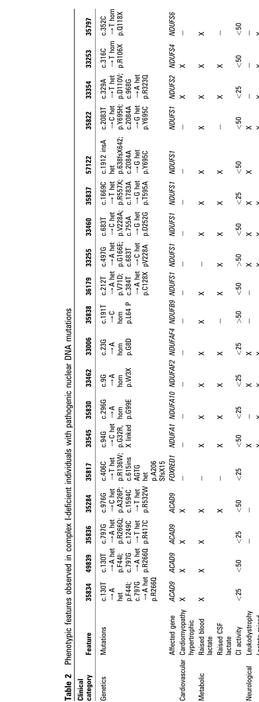

## Question

# Disease Characteristics Research Template

## Target Disease
- **Disease Name:** Mitochondrial Complex I Deficiency, Nuclear Type 24
- **MONDO ID:**  (if available)
- **Category:** Mendelian

## Research Objectives

Please provide a comprehensive research report on **Mitochondrial Complex I Deficiency, Nuclear Type 24** covering all of the
disease characteristics listed below. This report will be used to populate a disease knowledge
base entry. Be thorough and cite primary literature (PMID preferred) for all claims.

For each section, **suggested databases/resources** are listed. These are the first places
you should search for information on each topic.

---

### 1. Disease Information
> **Search first:** OMIM, Orphanet, ICD-10/ICD-11, MeSH, PubMed

- What is the disease? Provide a concise overview.
- What are the key identifiers? (OMIM, Orphanet, ICD-10/ICD-11, MeSH, Mondo)
- What are the common synonyms and alternative names?
- Is the information derived from individual patients (e.g., EHR) or aggregated disease-level resources?

### 2. Etiology

- **Disease Causal Factors**: What are the primary causes? (genetic, environmental, infectious, mechanistic)
- **Risk Factors**:
  > **Search first:** PubMed, Cochrane Library, UpToDate, clinical guidelines, ClinVar, ClinGen, GWAS Catalog, PheGenI, CTD, CDC, WHO, epidemiological databases
  - Genetic risk factors (causal variants, susceptibility loci, modifier genes)
  - Environmental risk factors (toxins, lifestyle, occupational exposures, age, sex, family history)
- **Protective Factors**:
  > **Search first:** PubMed, Cochrane Library, clinical trial databases, GWAS Catalog, gnomAD, WHO, CDC, nutrition databases
  - Genetic protective factors (protective variants, modifier alleles)
  - Environmental protective factors (diet, lifestyle, exposures that reduce risk)
- **Gene-Environment Interactions**: How do genetic and environmental factors interact to influence disease?
  > **Search first:** CTD, PubMed, PheGenI, GxE databases

### 3. Phenotypes
> **Search first:** HPO (Human Phenotype Ontology), OMIM, Orphanet, PubMed, clinicaltrials.gov, MedDRA, SNOMED CT, DECIPHER, LOINC

For each phenotype, provide:
- **Phenotype type**: symptoms, clinical signs, physical manifestations, behavioral changes, or laboratory abnormalities
  > For symptoms/signs: HPO, OMIM, Orphanet, PubMed
  > For behavioral changes: HPO, DSM, RDoC (Research Domain Criteria), PubMed
  > For laboratory abnormalities: LOINC, SNOMED CT, LabTests Online, PubMed
- **Phenotype characteristics**:
  > **Search first:** OMIM, Orphanet, HPO, PubMed
  - Age of symptom onset (neonatal, childhood, adult-onset, late-onset)
  - Symptom severity (mild, moderate, severe, variable)
  - Symptom progression (stable, progressive, episodic, fluctuating)
  - Frequency among affected individuals (percentage or qualitative)
- **Quality of life impact**: Effects on daily functioning and well-being (per-phenotype when possible)
  > **Search first:** EQ-5D database, SF-36, WHO QOL databases, PubMed
- Suggest HPO (Human Phenotype Ontology) terms for each phenotype

### 4. Genetic/Molecular Information

- **Causal Genes**: Gene mutations or chromosomal abnormalities responsible for disease (gene symbols, OMIM IDs)
  > **Search first:** OMIM, ClinVar, HGMD, Ensembl, NCBI Gene
- **Pathogenic Variants**:
  - Affected genes (gene symbols, HGNC IDs)
    > **Search first:** OMIM, NCBI Gene, Ensembl, HGNC, UniProt, GeneCards
  - Variant classification (pathogenic, likely pathogenic, VUS per ACMG/AMP guidelines)
    > **Search first:** ClinVar, ClinGen, ACMG/AMP guidelines, VarSome
  - Variant type/class (missense, frameshift, nonsense, splice-site, structural)
  - Allele frequency in population databases
    > **Search first:** gnomAD, 1000 Genomes, ExAC, TOPMed, dbSNP
  - Somatic vs germline origin
    > **Search first:** COSMIC (somatic), ClinVar, ICGC, TCGA
  - Functional consequences (loss of function, gain of function, dominant negative)
- **Modifier Genes**: Genes that modify disease severity or expression
- **Epigenetic Information**: DNA methylation, histone modifications, chromatin changes affecting disease
  > **Search first:** ENCODE, Roadmap Epigenomics, MethBase, DiseaseMeth
- **Chromosomal Abnormalities**: Large-scale genetic changes (aneuploidy, translocations, inversions)
  > **Search first:** DECIPHER, ClinVar, ECARUCA, UCSC Genome Browser

### 5. Environmental Information

- **Environmental Factors**: Non-genetic contributing factors (toxins, radiation, pollution, occupational exposure)
  > **Search first:** CTD (Comparative Toxicogenomics Database), TOXNET, PubMed, EPA databases
- **Lifestyle Factors**: Behavioral factors (smoking, diet, exercise, alcohol consumption)
  > **Search first:** CDC databases, WHO, PubMed, NHANES
- **Infectious Agents**: If applicable, pathogens causing or triggering disease (bacteria, viruses, fungi, parasites)
  > **Search first:** NCBI Taxonomy, ViPR, BV-BRC, MicrobeDB, GIDEON

### 6. Mechanism / Pathophysiology

- **Molecular Pathways**: Specific signaling cascades or biochemical pathways involved (Wnt, MAPK, mTOR, PI3K-AKT, etc.)
  > **Search first:** KEGG, Reactome, WikiPathways, PathBank, BioCyc
- **Cellular Processes**: Cell-level mechanisms (apoptosis, autophagy, cell cycle dysregulation, inflammation, etc.)
  > **Search first:** Gene Ontology (GO), Reactome, KEGG, PubMed
- **Protein Dysfunction**: How protein structure or function is altered (misfolding, aggregation, loss of function, gain of function)
  > **Search first:** UniProt, PDB (Protein Data Bank), InterPro, Pfam, AlphaFold
- **Metabolic Changes**: Alterations in metabolic processes (energy metabolism, lipid metabolism, amino acid metabolism)
  > **Search first:** KEGG, BioCyc, HMDB (Human Metabolome Database), BRENDA
- **Immune System Involvement**: Role of immune response (autoimmunity, immunodeficiency, chronic inflammation)
  > **Search first:** ImmPort, Immunome Database, IEDB, Gene Ontology
- **Tissue Damage Mechanisms**: How tissues/ are injured (oxidative stress, ischemia, fibrosis, necrosis)
  > **Search first:** PubMed, Gene Ontology, Reactome
- **Biochemical Abnormalities**: Specific molecular defects (enzyme deficiencies, receptor dysfunction, ion channel defects)
  > **Search first:** BRENDA, UniProt, KEGG, OMIM, PubMed
- **Epigenetic Changes**: DNA methylation, histone modifications affecting gene expression in disease
  > **Search first:** ENCODE, Roadmap Epigenomics, MethBase, DiseaseMeth
- **Molecular Profiling** (if available):
  - Transcriptomics/gene expression changes
    > **Search first:** GEO (Gene Expression Omnibus), ArrayExpress, GTEx, Human Cell Atlas, SRA
  - Proteomics findings
    > **Search first:** PRIDE, ProteomeXchange, Human Protein Atlas, STRING, BioGRID
  - Metabolomics signatures
    > **Search first:** MetaboLights, Metabolomics Workbench, HMDB, METLIN
  - Lipidomics alterations
    > **Search first:** LIPID MAPS, SwissLipids, LipidHome, Metabolomics Workbench
  - Genomic structural features
    > **Search first:** UCSC Genome Browser, Ensembl, NCBI, dbVar, DGV
- **Advanced Technologies** (if applicable):
  - Single-cell analysis findings (cell-type specific mechanisms, cellular heterogeneity)
    > **Search first:** Human Cell Atlas, Single Cell Portal, GEO, CELLxGENE
  - Spatial transcriptomics findings
    > **Search first:** GEO, Spatial Research, Vizgen, 10x Genomics data
  - Multi-omics integration results
    > **Search first:** TCGA, ICGC, cBioPortal, LinkedOmics, PubMed
  - Functional genomics screens (CRISPR, RNAi)
    > **Search first:** DepMap, GenomeRNAi, PubMed, BioGRID ORCS

For each mechanism, describe:
- The causal chain from initial trigger to clinical manifestation
- Which mechanisms are upstream vs downstream
- What cell types and biological processes are involved
- Suggest GO terms for biological processes and CL terms for cell types

### 7. Anatomical Structures Affected

- **Organ Level**:
  - Primary organs directly affected
  - Secondary organ involvement (complications, secondary effects)
  - Body systems involved (cardiovascular, nervous, digestive, respiratory, endocrine, etc.)
  > **Search first:** Uberon, FMA (Foundational Model of Anatomy), OMIM, HPO, ICD-11, MeSH, SNOMED CT
- **Tissue and Cell Level**:
  - Specific tissue types affected (epithelial, connective, muscle, nervous)
  - Specific cell populations targeted (with Cell Ontology terms)
  > **Search first:** Uberon, Human Protein Atlas, Cell Ontology, Human Cell Atlas, CellMarker, PanglaoDB
- **Subcellular Level**:
  - Cellular compartments involved (mitochondria, nucleus, ER, lysosomes) (with GO Cellular Component terms)
  > **Search first:** Gene Ontology (Cellular Component), UniProt, Human Protein Atlas
- **Localization**:
  - Specific anatomical sites (with UBERON terms)
    > **Search first:** FMA, Uberon, NeuroNames (for brain), SNOMED CT
  - Lateralization (unilateral, bilateral, asymmetric)
    > **Search first:** HPO, clinical literature, imaging databases

### 8. Temporal Development

- **Onset**:
  - Typical age of onset (congenital, pediatric, adult, geriatric)
  - Onset pattern (acute, subacute, chronic, insidious)
  > **Search first:** OMIM, Orphanet, HPO, PubMed
- **Progression**:
  - Disease stages (early, intermediate, advanced, end-stage)
    > **Search first:** Cancer Staging Manual (AJCC), WHO classifications, PubMed
  - Progression rate (rapid, slow, variable)
  - Disease course pattern (episodic, relapsing-remitting, progressive, stable)
  - Disease duration (self-limited, chronic lifelong)
  > **Search first:** Disease registries, longitudinal cohort databases, natural history studies, PubMed, Orphanet, OMIM
- **Patterns**:
  - Remission patterns (spontaneous, treatment-induced)
    > **Search first:** Clinical trial databases, disease registries, PubMed
  - Critical periods (time windows of vulnerability or opportunity for intervention)
    > **Search first:** PubMed, developmental biology databases, clinical guidelines

### 9. Inheritance and Population

- **Epidemiology**:
  - Prevalence (cases per 100,000 at given time)
  - Incidence (new cases per 100,000 per year)
  > **Search first:** Orphanet, CDC, WHO, GBD (Global Burden of Disease), national registries, SEER, disease registries
- **For Genetic Etiology**:
  - Inheritance pattern (AD, AR, X-linked, mitochondrial, multifactorial, polygenic)
    > **Search first:** OMIM, Orphanet, ClinVar, GTR (Genetic Testing Registry)
  - Penetrance (complete, incomplete, age-dependent)
    > **Search first:** ClinVar, OMIM, PubMed, ClinGen
  - Expressivity (variable, consistent)
    > **Search first:** OMIM, ClinVar, PubMed
  - Genetic anticipation (increasing severity in successive generations)
    > **Search first:** OMIM, PubMed (especially for repeat expansion disorders)
  - Germline mosaicism
    > **Search first:** ClinVar, OMIM, genetic counseling literature, PubMed
  - Founder effects (population-specific mutations)
    > **Search first:** gnomAD, population genetics databases, PubMed
  - Consanguinity role
    > **Search first:** OMIM, population studies, genetic counseling resources
  - Carrier frequency
    > **Search first:** gnomAD, carrier screening databases, GeneReviews, GTR
- **Population Demographics**:
  - Affected populations (ethnic or demographic groups with higher prevalence)
    > **Search first:** gnomAD, 1000 Genomes, PAGE Study, PubMed, population registries
  - Geographic distribution (endemic areas, regional variation)
    > **Search first:** WHO, CDC, GBD, Orphanet, geographic epidemiology databases
  - Geographic distribution of specific variants
  - Sex ratio (male:female)
    > **Search first:** Disease registries, OMIM, PubMed, epidemiological databases
  - Age distribution of affected individuals
    > **Search first:** CDC, disease registries, SEER, Orphanet

### 10. Diagnostics

- **Clinical Tests**:
  - Laboratory tests (blood, urine, tissue chemistry, specific enzyme assays)
    > **Search first:** LOINC, LabTests Online, PubMed
  - Biomarkers (proteins, metabolites, genetic markers, circulating biomarkers)
    > **Search first:** FDA Biomarker List, BEST (Biomarkers, EndpointS, and other Tools), PubMed
  - Imaging studies (X-ray, CT, MRI, PET, ultrasound)
    > **Search first:** RadLex, DICOM, Radiopaedia, imaging databases
  - Functional tests (pulmonary function, cardiac stress tests)
    > **Search first:** LOINC, clinical guidelines, PubMed
  - Electrophysiology (EEG, EMG, ECG, nerve conduction studies)
    > **Search first:** LOINC, clinical neurophysiology databases, PubMed
  - Biopsy findings (histopathology, immunohistochemistry)
    > **Search first:** SNOMED CT, College of American Pathologists resources, PubMed
  - Pathology findings (microscopic examination)
    > **Search first:** SNOMED CT, Digital Pathology databases, PubMed
- **Genetic Testing**:
  > **Search first:** GTR (Genetic Testing Registry), GeneReviews, ClinGen
  - Overview of recommended genetic testing approach
  - Whole genome sequencing (WGS) utility
    > **Search first:** GTR, ClinVar, GEL (Genomics England), gnomAD
  - Whole exome sequencing (WES) utility
    > **Search first:** GTR, ClinVar, OMIM, GeneMatcher
  - Gene panels (which panels, which genes)
    > **Search first:** GTR, ClinVar, laboratory-specific databases
  - Single gene testing
    > **Search first:** GTR, ClinVar, OMIM, GeneReviews
  - Chromosomal microarray (CMA)
    > **Search first:** DECIPHER, ClinVar, dbVar, ECARUCA
  - Karyotyping
    > **Search first:** Chromosome Abnormality Database, ClinVar, cytogenetics resources
  - FISH
    > **Search first:** ClinVar, cytogenetics databases, PubMed
  - Mitochondrial DNA testing
    > **Search first:** MITOMAP, MSeqDR, ClinVar, GTR
  - Repeat expansion testing
    > **Search first:** GTR, ClinVar, repeat expansion databases, PubMed
- **Omics-Based Diagnostics** (if applicable):
  - RNA sequencing / transcriptomics
    > **Search first:** GEO, ArrayExpress, GTEx, RNA-seq databases
  - Proteomics
    > **Search first:** PRIDE, ProteomeXchange, FDA Biomarker database
  - Metabolomics
    > **Search first:** MetaboLights, Metabolomics Workbench, HMDB
  - Epigenomics
    > **Search first:** GEO, ENCODE, Roadmap Epigenomics, MethBase
  - Liquid biopsy
    > **Search first:** COSMIC, ClinVar, liquid biopsy databases, PubMed
- **Clinical Criteria**:
  - Standardized diagnostic criteria (DSM, ICD, society guidelines)
    > **Search first:** DSM-5, ICD-11, clinical society guidelines, UpToDate
  - Differential diagnosis (other conditions to rule out, with distinguishing features)
    > **Search first:** DynaMed, UpToDate, clinical decision support systems
- **Screening**:
  - Screening methods for asymptomatic individuals (newborn screening, carrier screening, cascade screening)
    > **Search first:** ACMG recommendations, CDC newborn screening, GTR

### 11. Outcome/Prognosis

- **Survival and Mortality**:
  - Survival rate (5-year, 10-year, overall)
    > **Search first:** SEER, cancer registries, disease-specific registries, PubMed
  - Life expectancy (with and without treatment if applicable)
    > **Search first:** Orphanet, disease registries, actuarial databases, PubMed
  - Mortality rate
    > **Search first:** CDC, WHO, GBD, national mortality databases
  - Disease-specific mortality (deaths directly attributable to disease)
    > **Search first:** Disease registries, CDC Wonder, GBD, PubMed
- **Morbidity and Function**:
  - Morbidity (disease-related disability and health impacts)
    > **Search first:** GBD, WHO, disability databases, PubMed
  - Disability outcomes (long-term functional impairments)
    > **Search first:** ICF (International Classification of Functioning), disability registries
  - Quality of life measures (EQ-5D, SF-36, PROMIS, disease-specific tools)
    > **Search first:** EQ-5D database, SF-36, PROMIS, PubMed
- **Disease Course**:
  - Complications (secondary problems: infections, organ failure, etc.)
    > **Search first:** ICD codes, disease registries, clinical databases, PubMed
  - Recovery potential (likelihood and extent of recovery, with vs without treatment)
    > **Search first:** Natural history studies, rehabilitation databases, PubMed
- **Prediction**:
  - Prognostic factors (age, disease severity, biomarkers, treatment response)
    > **Search first:** Prognostic models databases, clinical calculators, PubMed
  - Prognostic biomarkers (molecular markers predicting disease course)
    > **Search first:** FDA Biomarker database, PubMed, cancer prognostic databases

### 12. Treatment

- **Pharmacotherapy**:
  - Pharmacological treatments (drug names, drug classes, mechanisms of action)
    > **Search first:** DrugBank, RxNorm, ATC classification, DailyMed, FDA databases
  - Pharmacogenomics (how genetic variants affect drug metabolism, efficacy, toxicity)
    > **Search first:** PharmGKB, CPIC (Clinical Pharmacogenetics), FDA Table of PGx Biomarkers
- **Advanced Therapeutics**:
  - Gene therapy (viral vectors, CRISPR, gene replacement, gene editing)
    > **Search first:** ClinicalTrials.gov, FDA gene therapy database, ASGCT resources
  - Cell therapy (stem cell transplant, CAR-T, cellular therapeutics)
    > **Search first:** ClinicalTrials.gov, FDA cell therapy database, FACT standards
  - RNA-based therapies (ASOs, siRNA, mRNA therapies)
    > **Search first:** ClinicalTrials.gov, FDA approvals, PubMed
  - Targeted therapies (treatments directed at specific molecular targets)
    > **Search first:** My Cancer Genome, OncoKB, ClinicalTrials.gov, FDA approvals
  - Immunotherapies (checkpoint inhibitors, monoclonal antibodies)
    > **Search first:** Cancer Immunotherapy Database, FDA approvals, ClinicalTrials.gov
- **Surgical and Interventional**:
  - Surgical interventions (types of surgery, timing, outcomes)
    > **Search first:** CPT codes, surgical registries, clinical guidelines, PubMed
- **Supportive and Rehabilitative**:
  - Supportive care (symptom management, pain control, nutrition)
    > **Search first:** Clinical guidelines, Cochrane Library, PubMed
  - Rehabilitation (physical therapy, occupational therapy, speech therapy)
    > **Search first:** Rehabilitation medicine databases, clinical guidelines, PubMed
- **Experimental**:
  - Experimental treatments in clinical trials (with NCT identifiers if available)
    > **Search first:** ClinicalTrials.gov, EU Clinical Trials Register, WHO ICTRP
- **Treatment Outcomes**:
  - Treatment response rates
    > **Search first:** Clinical trial databases, FDA reviews, systematic reviews, PubMed
  - Side effects and adverse events
    > **Search first:** FDA Adverse Event Reporting System (FAERS), MedWatch, PubMed
- **Treatment Strategy**:
  - Treatment algorithms (clinical pathways, decision trees)
    > **Search first:** Clinical practice guidelines, NCCN Guidelines, UpToDate
  - Combination therapies
    > **Search first:** ClinicalTrials.gov, treatment guidelines, PubMed
  - Personalized medicine approaches (genotype-guided treatment)
    > **Search first:** My Cancer Genome, CIViC, PharmGKB, precision medicine databases

For each treatment, suggest NCIT (NCI Thesaurus) clinical-intervention terms where applicable.

### 13. Prevention

- **Prevention Levels**:
  - Primary prevention (preventing disease occurrence: vaccination, risk factor modification)
    > **Search first:** CDC, WHO, USPSTF recommendations, Cochrane Library
  - Secondary prevention (early detection and treatment: screening programs, early intervention)
    > **Search first:** USPSTF, CDC screening guidelines, WHO
  - Tertiary prevention (preventing complications in those with disease)
    > **Search first:** Clinical guidelines, disease management protocols, PubMed
- **Immunization**: Vaccine strategies (if applicable)
  > **Search first:** CDC vaccine schedules, WHO immunization, FDA vaccine database
- **Screening and Early Detection**:
  - Screening programs (population-based: newborn screening, cancer screening)
    > **Search first:** CDC screening programs, USPSTF, cancer screening databases
  - Genetic screening (carrier screening, preimplantation genetic diagnosis, prenatal testing)
    > **Search first:** ACMG recommendations, ACOG guidelines, GTR
  - Risk stratification (identifying high-risk individuals for targeted prevention)
    > **Search first:** Risk prediction models, clinical calculators, PubMed
- **Behavioral Interventions**: Lifestyle modifications to reduce risk
  > **Search first:** CDC, WHO, behavioral intervention databases, Cochrane Library
- **Counseling**: Genetic counseling (risk assessment, family planning guidance)
  > **Search first:** NSGC resources, ACMG guidelines, GeneReviews
- **Public Health**:
  - Public health interventions (sanitation, vector control, health education)
    > **Search first:** CDC, WHO, public health databases, PubMed
  - Environmental interventions (reducing environmental risk factors)
    > **Search first:** EPA databases, WHO environmental health, PubMed
- **Prophylaxis**: Preventive medications or procedures
  > **Search first:** Clinical guidelines, FDA approvals, PubMed

### 14. Other Species / Natural Disease

- **Taxonomy**: Species affected (with NCBI Taxon identifiers)
  > **Search first:** NCBI Taxonomy
- **Breed**: Specific breeds affected (with VBO identifiers if applicable)
  > **Search first:** VBO (Vertebrate Breed Ontology)
- **Gene**: Orthologous genes in other species (with NCBI Gene IDs)
  > **Search first:** NCBI Gene
- **Natural Disease**:
  - Naturally occurring disease in other species (companion animals, wildlife)
    > **Search first:** OMIA (Online Mendelian Inheritance in Animals), VetCompass, PubMed
  - Veterinary relevance and importance in animal health
    > **Search first:** OMIA, veterinary databases, PubMed
- **Comparative Biology**:
  - Comparative pathology (similarities and differences across species)
    > **Search first:** OMIA, comparative pathology databases, PubMed
  - Evolutionary conservation of disease mechanisms
    > **Search first:** HomoloGene, OrthoMCL, Alliance of Genome Resources
- **Transmission** (if applicable):
  - Zoonotic potential
    > **Search first:** CDC zoonotic diseases, WHO zoonoses, GIDEON
  - Cross-species susceptibility
    > **Search first:** NCBI Taxonomy, veterinary databases, PubMed

### 15. Model Organisms

- **Model Types**:
  - Model organism type (mammalian, invertebrate, cellular, in vitro)
    > **Search first:** Alliance of Genome Resources, model organism databases
  - Specific model systems (mouse, rat, zebrafish, Drosophila, C. elegans, yeast, cell lines, organoids, iPSCs)
    > **Search first:** MGI, RGD, ZFIN, FlyBase, WormBase, SGD, ATCC, Cellosaurus
  - Induced models (drug treatment, surgical intervention, environmental manipulation)
    > **Search first:** MGI, model organism databases, PubMed
- **Genetic Models**:
  - Types available (knockout, knock-in, transgenic, conditional, humanized)
    > **Search first:** MGI, IMPC, KOMP, EuMMCR, IMSR
- **Model Characteristics**:
  - Phenotype recapitulation (how well model reproduces human disease features)
    > **Search first:** Model organism databases, comparative studies, PubMed
  - Model limitations (aspects of human disease not captured)
    > **Search first:** Model organism databases, PubMed, review articles
- **Applications**:
  - Research applications (what aspects of disease can be studied)
    > **Search first:** Model organism databases, PubMed
- **Resources**:
  - Model databases
    > **Search first:** MGI, RGD, ZFIN, FlyBase, WormBase, IMSR, EMMA, MMRRC

---

## Citation Requirements

- Cite primary literature (PMID preferred) for all mechanistic and clinical claims
- Prioritize recent reviews and landmark papers
- Include direct quotes from abstracts where possible to support key statements
- Distinguish evidence source types: human clinical, model organism, in vitro, computational

## Output Format

Structure your response as a comprehensive narrative organized by the sections above.
For each section, provide:
- Factual content with specific details (numbers, percentages, gene names, variant nomenclature)
- Ontology term suggestions (HPO, GO, CL, UBERON, CHEBI, NCIT, MONDO) where applicable
- Evidence citations with PMIDs
- Direct quotes from abstracts to support key claims
- Clear indication when information is not available or not applicable for this disease

This report will be used to populate a disease knowledge base entry with:
- Pathophysiology descriptions with causal chains
- Gene/protein annotations (HGNC, GO terms)
- Phenotype associations (HP terms) with frequencies
- Cell type involvement (CL terms)
- Anatomical locations (UBERON terms)
- Chemical entities (CHEBI terms)
- Treatment annotations (NCIT terms)
- Evidence items with PMIDs and exact abstract quotes
- Epidemiology, prognosis, diagnostic, and prevention information
- Animal model descriptions with phenotype recapitulation details

## Output

Question: You are an expert researcher providing comprehensive, well-cited information.

Provide detailed information focusing on:
1. Key concepts and definitions with current understanding
2. Recent developments and latest research (prioritize 2023-2024 sources)
3. Current applications and real-world implementations
4. Expert opinions and analysis from authoritative sources
5. Relevant statistics and data from recent studies

Format as a comprehensive research report with proper citations. Include URLs and publication dates where available.
Always prioritize recent, authoritative sources and provide specific citations for all major claims.

# Disease Characteristics Research Template

## Target Disease
- **Disease Name:** Mitochondrial Complex I Deficiency, Nuclear Type 24
- **MONDO ID:**  (if available)
- **Category:** Mendelian

## Research Objectives

Please provide a comprehensive research report on **Mitochondrial Complex I Deficiency, Nuclear Type 24** covering all of the
disease characteristics listed below. This report will be used to populate a disease knowledge
base entry. Be thorough and cite primary literature (PMID preferred) for all claims.

For each section, **suggested databases/resources** are listed. These are the first places
you should search for information on each topic.

---

### 1. Disease Information
> **Search first:** OMIM, Orphanet, ICD-10/ICD-11, MeSH, PubMed

- What is the disease? Provide a concise overview.
- What are the key identifiers? (OMIM, Orphanet, ICD-10/ICD-11, MeSH, Mondo)
- What are the common synonyms and alternative names?
- Is the information derived from individual patients (e.g., EHR) or aggregated disease-level resources?

### 2. Etiology

- **Disease Causal Factors**: What are the primary causes? (genetic, environmental, infectious, mechanistic)
- **Risk Factors**:
  > **Search first:** PubMed, Cochrane Library, UpToDate, clinical guidelines, ClinVar, ClinGen, GWAS Catalog, PheGenI, CTD, CDC, WHO, epidemiological databases
  - Genetic risk factors (causal variants, susceptibility loci, modifier genes)
  - Environmental risk factors (toxins, lifestyle, occupational exposures, age, sex, family history)
- **Protective Factors**:
  > **Search first:** PubMed, Cochrane Library, clinical trial databases, GWAS Catalog, gnomAD, WHO, CDC, nutrition databases
  - Genetic protective factors (protective variants, modifier alleles)
  - Environmental protective factors (diet, lifestyle, exposures that reduce risk)
- **Gene-Environment Interactions**: How do genetic and environmental factors interact to influence disease?
  > **Search first:** CTD, PubMed, PheGenI, GxE databases

### 3. Phenotypes
> **Search first:** HPO (Human Phenotype Ontology), OMIM, Orphanet, PubMed, clinicaltrials.gov, MedDRA, SNOMED CT, DECIPHER, LOINC

For each phenotype, provide:
- **Phenotype type**: symptoms, clinical signs, physical manifestations, behavioral changes, or laboratory abnormalities
  > For symptoms/signs: HPO, OMIM, Orphanet, PubMed
  > For behavioral changes: HPO, DSM, RDoC (Research Domain Criteria), PubMed
  > For laboratory abnormalities: LOINC, SNOMED CT, LabTests Online, PubMed
- **Phenotype characteristics**:
  > **Search first:** OMIM, Orphanet, HPO, PubMed
  - Age of symptom onset (neonatal, childhood, adult-onset, late-onset)
  - Symptom severity (mild, moderate, severe, variable)
  - Symptom progression (stable, progressive, episodic, fluctuating)
  - Frequency among affected individuals (percentage or qualitative)
- **Quality of life impact**: Effects on daily functioning and well-being (per-phenotype when possible)
  > **Search first:** EQ-5D database, SF-36, WHO QOL databases, PubMed
- Suggest HPO (Human Phenotype Ontology) terms for each phenotype

### 4. Genetic/Molecular Information

- **Causal Genes**: Gene mutations or chromosomal abnormalities responsible for disease (gene symbols, OMIM IDs)
  > **Search first:** OMIM, ClinVar, HGMD, Ensembl, NCBI Gene
- **Pathogenic Variants**:
  - Affected genes (gene symbols, HGNC IDs)
    > **Search first:** OMIM, NCBI Gene, Ensembl, HGNC, UniProt, GeneCards
  - Variant classification (pathogenic, likely pathogenic, VUS per ACMG/AMP guidelines)
    > **Search first:** ClinVar, ClinGen, ACMG/AMP guidelines, VarSome
  - Variant type/class (missense, frameshift, nonsense, splice-site, structural)
  - Allele frequency in population databases
    > **Search first:** gnomAD, 1000 Genomes, ExAC, TOPMed, dbSNP
  - Somatic vs germline origin
    > **Search first:** COSMIC (somatic), ClinVar, ICGC, TCGA
  - Functional consequences (loss of function, gain of function, dominant negative)
- **Modifier Genes**: Genes that modify disease severity or expression
- **Epigenetic Information**: DNA methylation, histone modifications, chromatin changes affecting disease
  > **Search first:** ENCODE, Roadmap Epigenomics, MethBase, DiseaseMeth
- **Chromosomal Abnormalities**: Large-scale genetic changes (aneuploidy, translocations, inversions)
  > **Search first:** DECIPHER, ClinVar, ECARUCA, UCSC Genome Browser

### 5. Environmental Information

- **Environmental Factors**: Non-genetic contributing factors (toxins, radiation, pollution, occupational exposure)
  > **Search first:** CTD (Comparative Toxicogenomics Database), TOXNET, PubMed, EPA databases
- **Lifestyle Factors**: Behavioral factors (smoking, diet, exercise, alcohol consumption)
  > **Search first:** CDC databases, WHO, PubMed, NHANES
- **Infectious Agents**: If applicable, pathogens causing or triggering disease (bacteria, viruses, fungi, parasites)
  > **Search first:** NCBI Taxonomy, ViPR, BV-BRC, MicrobeDB, GIDEON

### 6. Mechanism / Pathophysiology

- **Molecular Pathways**: Specific signaling cascades or biochemical pathways involved (Wnt, MAPK, mTOR, PI3K-AKT, etc.)
  > **Search first:** KEGG, Reactome, WikiPathways, PathBank, BioCyc
- **Cellular Processes**: Cell-level mechanisms (apoptosis, autophagy, cell cycle dysregulation, inflammation, etc.)
  > **Search first:** Gene Ontology (GO), Reactome, KEGG, PubMed
- **Protein Dysfunction**: How protein structure or function is altered (misfolding, aggregation, loss of function, gain of function)
  > **Search first:** UniProt, PDB (Protein Data Bank), InterPro, Pfam, AlphaFold
- **Metabolic Changes**: Alterations in metabolic processes (energy metabolism, lipid metabolism, amino acid metabolism)
  > **Search first:** KEGG, BioCyc, HMDB (Human Metabolome Database), BRENDA
- **Immune System Involvement**: Role of immune response (autoimmunity, immunodeficiency, chronic inflammation)
  > **Search first:** ImmPort, Immunome Database, IEDB, Gene Ontology
- **Tissue Damage Mechanisms**: How tissues/ are injured (oxidative stress, ischemia, fibrosis, necrosis)
  > **Search first:** PubMed, Gene Ontology, Reactome
- **Biochemical Abnormalities**: Specific molecular defects (enzyme deficiencies, receptor dysfunction, ion channel defects)
  > **Search first:** BRENDA, UniProt, KEGG, OMIM, PubMed
- **Epigenetic Changes**: DNA methylation, histone modifications affecting gene expression in disease
  > **Search first:** ENCODE, Roadmap Epigenomics, MethBase, DiseaseMeth
- **Molecular Profiling** (if available):
  - Transcriptomics/gene expression changes
    > **Search first:** GEO (Gene Expression Omnibus), ArrayExpress, GTEx, Human Cell Atlas, SRA
  - Proteomics findings
    > **Search first:** PRIDE, ProteomeXchange, Human Protein Atlas, STRING, BioGRID
  - Metabolomics signatures
    > **Search first:** MetaboLights, Metabolomics Workbench, HMDB, METLIN
  - Lipidomics alterations
    > **Search first:** LIPID MAPS, SwissLipids, LipidHome, Metabolomics Workbench
  - Genomic structural features
    > **Search first:** UCSC Genome Browser, Ensembl, NCBI, dbVar, DGV
- **Advanced Technologies** (if applicable):
  - Single-cell analysis findings (cell-type specific mechanisms, cellular heterogeneity)
    > **Search first:** Human Cell Atlas, Single Cell Portal, GEO, CELLxGENE
  - Spatial transcriptomics findings
    > **Search first:** GEO, Spatial Research, Vizgen, 10x Genomics data
  - Multi-omics integration results
    > **Search first:** TCGA, ICGC, cBioPortal, LinkedOmics, PubMed
  - Functional genomics screens (CRISPR, RNAi)
    > **Search first:** DepMap, GenomeRNAi, PubMed, BioGRID ORCS

For each mechanism, describe:
- The causal chain from initial trigger to clinical manifestation
- Which mechanisms are upstream vs downstream
- What cell types and biological processes are involved
- Suggest GO terms for biological processes and CL terms for cell types

### 7. Anatomical Structures Affected

- **Organ Level**:
  - Primary organs directly affected
  - Secondary organ involvement (complications, secondary effects)
  - Body systems involved (cardiovascular, nervous, digestive, respiratory, endocrine, etc.)
  > **Search first:** Uberon, FMA (Foundational Model of Anatomy), OMIM, HPO, ICD-11, MeSH, SNOMED CT
- **Tissue and Cell Level**:
  - Specific tissue types affected (epithelial, connective, muscle, nervous)
  - Specific cell populations targeted (with Cell Ontology terms)
  > **Search first:** Uberon, Human Protein Atlas, Cell Ontology, Human Cell Atlas, CellMarker, PanglaoDB
- **Subcellular Level**:
  - Cellular compartments involved (mitochondria, nucleus, ER, lysosomes) (with GO Cellular Component terms)
  > **Search first:** Gene Ontology (Cellular Component), UniProt, Human Protein Atlas
- **Localization**:
  - Specific anatomical sites (with UBERON terms)
    > **Search first:** FMA, Uberon, NeuroNames (for brain), SNOMED CT
  - Lateralization (unilateral, bilateral, asymmetric)
    > **Search first:** HPO, clinical literature, imaging databases

### 8. Temporal Development

- **Onset**:
  - Typical age of onset (congenital, pediatric, adult, geriatric)
  - Onset pattern (acute, subacute, chronic, insidious)
  > **Search first:** OMIM, Orphanet, HPO, PubMed
- **Progression**:
  - Disease stages (early, intermediate, advanced, end-stage)
    > **Search first:** Cancer Staging Manual (AJCC), WHO classifications, PubMed
  - Progression rate (rapid, slow, variable)
  - Disease course pattern (episodic, relapsing-remitting, progressive, stable)
  - Disease duration (self-limited, chronic lifelong)
  > **Search first:** Disease registries, longitudinal cohort databases, natural history studies, PubMed, Orphanet, OMIM
- **Patterns**:
  - Remission patterns (spontaneous, treatment-induced)
    > **Search first:** Clinical trial databases, disease registries, PubMed
  - Critical periods (time windows of vulnerability or opportunity for intervention)
    > **Search first:** PubMed, developmental biology databases, clinical guidelines

### 9. Inheritance and Population

- **Epidemiology**:
  - Prevalence (cases per 100,000 at given time)
  - Incidence (new cases per 100,000 per year)
  > **Search first:** Orphanet, CDC, WHO, GBD (Global Burden of Disease), national registries, SEER, disease registries
- **For Genetic Etiology**:
  - Inheritance pattern (AD, AR, X-linked, mitochondrial, multifactorial, polygenic)
    > **Search first:** OMIM, Orphanet, ClinVar, GTR (Genetic Testing Registry)
  - Penetrance (complete, incomplete, age-dependent)
    > **Search first:** ClinVar, OMIM, PubMed, ClinGen
  - Expressivity (variable, consistent)
    > **Search first:** OMIM, ClinVar, PubMed
  - Genetic anticipation (increasing severity in successive generations)
    > **Search first:** OMIM, PubMed (especially for repeat expansion disorders)
  - Germline mosaicism
    > **Search first:** ClinVar, OMIM, genetic counseling literature, PubMed
  - Founder effects (population-specific mutations)
    > **Search first:** gnomAD, population genetics databases, PubMed
  - Consanguinity role
    > **Search first:** OMIM, population studies, genetic counseling resources
  - Carrier frequency
    > **Search first:** gnomAD, carrier screening databases, GeneReviews, GTR
- **Population Demographics**:
  - Affected populations (ethnic or demographic groups with higher prevalence)
    > **Search first:** gnomAD, 1000 Genomes, PAGE Study, PubMed, population registries
  - Geographic distribution (endemic areas, regional variation)
    > **Search first:** WHO, CDC, GBD, Orphanet, geographic epidemiology databases
  - Geographic distribution of specific variants
  - Sex ratio (male:female)
    > **Search first:** Disease registries, OMIM, PubMed, epidemiological databases
  - Age distribution of affected individuals
    > **Search first:** CDC, disease registries, SEER, Orphanet

### 10. Diagnostics

- **Clinical Tests**:
  - Laboratory tests (blood, urine, tissue chemistry, specific enzyme assays)
    > **Search first:** LOINC, LabTests Online, PubMed
  - Biomarkers (proteins, metabolites, genetic markers, circulating biomarkers)
    > **Search first:** FDA Biomarker List, BEST (Biomarkers, EndpointS, and other Tools), PubMed
  - Imaging studies (X-ray, CT, MRI, PET, ultrasound)
    > **Search first:** RadLex, DICOM, Radiopaedia, imaging databases
  - Functional tests (pulmonary function, cardiac stress tests)
    > **Search first:** LOINC, clinical guidelines, PubMed
  - Electrophysiology (EEG, EMG, ECG, nerve conduction studies)
    > **Search first:** LOINC, clinical neurophysiology databases, PubMed
  - Biopsy findings (histopathology, immunohistochemistry)
    > **Search first:** SNOMED CT, College of American Pathologists resources, PubMed
  - Pathology findings (microscopic examination)
    > **Search first:** SNOMED CT, Digital Pathology databases, PubMed
- **Genetic Testing**:
  > **Search first:** GTR (Genetic Testing Registry), GeneReviews, ClinGen
  - Overview of recommended genetic testing approach
  - Whole genome sequencing (WGS) utility
    > **Search first:** GTR, ClinVar, GEL (Genomics England), gnomAD
  - Whole exome sequencing (WES) utility
    > **Search first:** GTR, ClinVar, OMIM, GeneMatcher
  - Gene panels (which panels, which genes)
    > **Search first:** GTR, ClinVar, laboratory-specific databases
  - Single gene testing
    > **Search first:** GTR, ClinVar, OMIM, GeneReviews
  - Chromosomal microarray (CMA)
    > **Search first:** DECIPHER, ClinVar, dbVar, ECARUCA
  - Karyotyping
    > **Search first:** Chromosome Abnormality Database, ClinVar, cytogenetics resources
  - FISH
    > **Search first:** ClinVar, cytogenetics databases, PubMed
  - Mitochondrial DNA testing
    > **Search first:** MITOMAP, MSeqDR, ClinVar, GTR
  - Repeat expansion testing
    > **Search first:** GTR, ClinVar, repeat expansion databases, PubMed
- **Omics-Based Diagnostics** (if applicable):
  - RNA sequencing / transcriptomics
    > **Search first:** GEO, ArrayExpress, GTEx, RNA-seq databases
  - Proteomics
    > **Search first:** PRIDE, ProteomeXchange, FDA Biomarker database
  - Metabolomics
    > **Search first:** MetaboLights, Metabolomics Workbench, HMDB
  - Epigenomics
    > **Search first:** GEO, ENCODE, Roadmap Epigenomics, MethBase
  - Liquid biopsy
    > **Search first:** COSMIC, ClinVar, liquid biopsy databases, PubMed
- **Clinical Criteria**:
  - Standardized diagnostic criteria (DSM, ICD, society guidelines)
    > **Search first:** DSM-5, ICD-11, clinical society guidelines, UpToDate
  - Differential diagnosis (other conditions to rule out, with distinguishing features)
    > **Search first:** DynaMed, UpToDate, clinical decision support systems
- **Screening**:
  - Screening methods for asymptomatic individuals (newborn screening, carrier screening, cascade screening)
    > **Search first:** ACMG recommendations, CDC newborn screening, GTR

### 11. Outcome/Prognosis

- **Survival and Mortality**:
  - Survival rate (5-year, 10-year, overall)
    > **Search first:** SEER, cancer registries, disease-specific registries, PubMed
  - Life expectancy (with and without treatment if applicable)
    > **Search first:** Orphanet, disease registries, actuarial databases, PubMed
  - Mortality rate
    > **Search first:** CDC, WHO, GBD, national mortality databases
  - Disease-specific mortality (deaths directly attributable to disease)
    > **Search first:** Disease registries, CDC Wonder, GBD, PubMed
- **Morbidity and Function**:
  - Morbidity (disease-related disability and health impacts)
    > **Search first:** GBD, WHO, disability databases, PubMed
  - Disability outcomes (long-term functional impairments)
    > **Search first:** ICF (International Classification of Functioning), disability registries
  - Quality of life measures (EQ-5D, SF-36, PROMIS, disease-specific tools)
    > **Search first:** EQ-5D database, SF-36, PROMIS, PubMed
- **Disease Course**:
  - Complications (secondary problems: infections, organ failure, etc.)
    > **Search first:** ICD codes, disease registries, clinical databases, PubMed
  - Recovery potential (likelihood and extent of recovery, with vs without treatment)
    > **Search first:** Natural history studies, rehabilitation databases, PubMed
- **Prediction**:
  - Prognostic factors (age, disease severity, biomarkers, treatment response)
    > **Search first:** Prognostic models databases, clinical calculators, PubMed
  - Prognostic biomarkers (molecular markers predicting disease course)
    > **Search first:** FDA Biomarker database, PubMed, cancer prognostic databases

### 12. Treatment

- **Pharmacotherapy**:
  - Pharmacological treatments (drug names, drug classes, mechanisms of action)
    > **Search first:** DrugBank, RxNorm, ATC classification, DailyMed, FDA databases
  - Pharmacogenomics (how genetic variants affect drug metabolism, efficacy, toxicity)
    > **Search first:** PharmGKB, CPIC (Clinical Pharmacogenetics), FDA Table of PGx Biomarkers
- **Advanced Therapeutics**:
  - Gene therapy (viral vectors, CRISPR, gene replacement, gene editing)
    > **Search first:** ClinicalTrials.gov, FDA gene therapy database, ASGCT resources
  - Cell therapy (stem cell transplant, CAR-T, cellular therapeutics)
    > **Search first:** ClinicalTrials.gov, FDA cell therapy database, FACT standards
  - RNA-based therapies (ASOs, siRNA, mRNA therapies)
    > **Search first:** ClinicalTrials.gov, FDA approvals, PubMed
  - Targeted therapies (treatments directed at specific molecular targets)
    > **Search first:** My Cancer Genome, OncoKB, ClinicalTrials.gov, FDA approvals
  - Immunotherapies (checkpoint inhibitors, monoclonal antibodies)
    > **Search first:** Cancer Immunotherapy Database, FDA approvals, ClinicalTrials.gov
- **Surgical and Interventional**:
  - Surgical interventions (types of surgery, timing, outcomes)
    > **Search first:** CPT codes, surgical registries, clinical guidelines, PubMed
- **Supportive and Rehabilitative**:
  - Supportive care (symptom management, pain control, nutrition)
    > **Search first:** Clinical guidelines, Cochrane Library, PubMed
  - Rehabilitation (physical therapy, occupational therapy, speech therapy)
    > **Search first:** Rehabilitation medicine databases, clinical guidelines, PubMed
- **Experimental**:
  - Experimental treatments in clinical trials (with NCT identifiers if available)
    > **Search first:** ClinicalTrials.gov, EU Clinical Trials Register, WHO ICTRP
- **Treatment Outcomes**:
  - Treatment response rates
    > **Search first:** Clinical trial databases, FDA reviews, systematic reviews, PubMed
  - Side effects and adverse events
    > **Search first:** FDA Adverse Event Reporting System (FAERS), MedWatch, PubMed
- **Treatment Strategy**:
  - Treatment algorithms (clinical pathways, decision trees)
    > **Search first:** Clinical practice guidelines, NCCN Guidelines, UpToDate
  - Combination therapies
    > **Search first:** ClinicalTrials.gov, treatment guidelines, PubMed
  - Personalized medicine approaches (genotype-guided treatment)
    > **Search first:** My Cancer Genome, CIViC, PharmGKB, precision medicine databases

For each treatment, suggest NCIT (NCI Thesaurus) clinical-intervention terms where applicable.

### 13. Prevention

- **Prevention Levels**:
  - Primary prevention (preventing disease occurrence: vaccination, risk factor modification)
    > **Search first:** CDC, WHO, USPSTF recommendations, Cochrane Library
  - Secondary prevention (early detection and treatment: screening programs, early intervention)
    > **Search first:** USPSTF, CDC screening guidelines, WHO
  - Tertiary prevention (preventing complications in those with disease)
    > **Search first:** Clinical guidelines, disease management protocols, PubMed
- **Immunization**: Vaccine strategies (if applicable)
  > **Search first:** CDC vaccine schedules, WHO immunization, FDA vaccine database
- **Screening and Early Detection**:
  - Screening programs (population-based: newborn screening, cancer screening)
    > **Search first:** CDC screening programs, USPSTF, cancer screening databases
  - Genetic screening (carrier screening, preimplantation genetic diagnosis, prenatal testing)
    > **Search first:** ACMG recommendations, ACOG guidelines, GTR
  - Risk stratification (identifying high-risk individuals for targeted prevention)
    > **Search first:** Risk prediction models, clinical calculators, PubMed
- **Behavioral Interventions**: Lifestyle modifications to reduce risk
  > **Search first:** CDC, WHO, behavioral intervention databases, Cochrane Library
- **Counseling**: Genetic counseling (risk assessment, family planning guidance)
  > **Search first:** NSGC resources, ACMG guidelines, GeneReviews
- **Public Health**:
  - Public health interventions (sanitation, vector control, health education)
    > **Search first:** CDC, WHO, public health databases, PubMed
  - Environmental interventions (reducing environmental risk factors)
    > **Search first:** EPA databases, WHO environmental health, PubMed
- **Prophylaxis**: Preventive medications or procedures
  > **Search first:** Clinical guidelines, FDA approvals, PubMed

### 14. Other Species / Natural Disease

- **Taxonomy**: Species affected (with NCBI Taxon identifiers)
  > **Search first:** NCBI Taxonomy
- **Breed**: Specific breeds affected (with VBO identifiers if applicable)
  > **Search first:** VBO (Vertebrate Breed Ontology)
- **Gene**: Orthologous genes in other species (with NCBI Gene IDs)
  > **Search first:** NCBI Gene
- **Natural Disease**:
  - Naturally occurring disease in other species (companion animals, wildlife)
    > **Search first:** OMIA (Online Mendelian Inheritance in Animals), VetCompass, PubMed
  - Veterinary relevance and importance in animal health
    > **Search first:** OMIA, veterinary databases, PubMed
- **Comparative Biology**:
  - Comparative pathology (similarities and differences across species)
    > **Search first:** OMIA, comparative pathology databases, PubMed
  - Evolutionary conservation of disease mechanisms
    > **Search first:** HomoloGene, OrthoMCL, Alliance of Genome Resources
- **Transmission** (if applicable):
  - Zoonotic potential
    > **Search first:** CDC zoonotic diseases, WHO zoonoses, GIDEON
  - Cross-species susceptibility
    > **Search first:** NCBI Taxonomy, veterinary databases, PubMed

### 15. Model Organisms

- **Model Types**:
  - Model organism type (mammalian, invertebrate, cellular, in vitro)
    > **Search first:** Alliance of Genome Resources, model organism databases
  - Specific model systems (mouse, rat, zebrafish, Drosophila, C. elegans, yeast, cell lines, organoids, iPSCs)
    > **Search first:** MGI, RGD, ZFIN, FlyBase, WormBase, SGD, ATCC, Cellosaurus
  - Induced models (drug treatment, surgical intervention, environmental manipulation)
    > **Search first:** MGI, model organism databases, PubMed
- **Genetic Models**:
  - Types available (knockout, knock-in, transgenic, conditional, humanized)
    > **Search first:** MGI, IMPC, KOMP, EuMMCR, IMSR
- **Model Characteristics**:
  - Phenotype recapitulation (how well model reproduces human disease features)
    > **Search first:** Model organism databases, comparative studies, PubMed
  - Model limitations (aspects of human disease not captured)
    > **Search first:** Model organism databases, PubMed, review articles
- **Applications**:
  - Research applications (what aspects of disease can be studied)
    > **Search first:** Model organism databases, PubMed
- **Resources**:
  - Model databases
    > **Search first:** MGI, RGD, ZFIN, FlyBase, WormBase, IMSR, EMMA, MMRRC

---

## Citation Requirements

- Cite primary literature (PMID preferred) for all mechanistic and clinical claims
- Prioritize recent reviews and landmark papers
- Include direct quotes from abstracts where possible to support key statements
- Distinguish evidence source types: human clinical, model organism, in vitro, computational

## Output Format

Structure your response as a comprehensive narrative organized by the sections above.
For each section, provide:
- Factual content with specific details (numbers, percentages, gene names, variant nomenclature)
- Ontology term suggestions (HPO, GO, CL, UBERON, CHEBI, NCIT, MONDO) where applicable
- Evidence citations with PMIDs
- Direct quotes from abstracts to support key claims
- Clear indication when information is not available or not applicable for this disease

This report will be used to populate a disease knowledge base entry with:
- Pathophysiology descriptions with causal chains
- Gene/protein annotations (HGNC, GO terms)
- Phenotype associations (HP terms) with frequencies
- Cell type involvement (CL terms)
- Anatomical locations (UBERON terms)
- Chemical entities (CHEBI terms)
- Treatment annotations (NCIT terms)
- Evidence items with PMIDs and exact abstract quotes
- Epidemiology, prognosis, diagnostic, and prevention information
- Animal model descriptions with phenotype recapitulation details

# Mitochondrial Complex I Deficiency, Nuclear Type 24

## Executive summary

Mitochondrial complex I deficiency, nuclear type 24 (MC1DN24) is an exceptionally rare, autosomal-recessive primary mitochondrial disorder caused by biallelic pathogenic variants in **NDUFB9**, which encodes an accessory subunit of respiratory-chain complex I. The disease–gene relationship rests principally on one family reported by Haack and colleagues: two affected brothers were homozygous for **NDUFB9 c.191T>C (p.Leu64Pro)**, while both parents were heterozygous carriers. Patient fibroblasts had reduced complex I activity and reduced abundance of several complex I subunits; lentiviral expression of wild-type NDUFB9 restored enzyme activity and protein abundance, providing strong functional evidence of causality. By contrast, a heterozygous **c.140G>T (p.Arg47Leu)** variant in another family did not segregate with disease and was not functionally rescued, and therefore should not be regarded as causal on the available evidence. (haack2012mutationscreeningof pages 3-4, haack2012mutationscreeningof pages 5-6)

The evidence base is extremely small. Disease-specific prevalence, phenotype frequencies, penetrance, survival, quality-of-life measurements, environmental modifiers, targeted treatments, and animal models have not been established. Most management recommendations must therefore be extrapolated cautiously from primary mitochondrial disease and mitochondrial complex I deficiency generally.

| field | corrected finding | evidence strength / limitation |
|---|---|---|
| Disease identifier | **Mitochondrial complex I deficiency, nuclear type 24**; **MONDO:0032628** (OpenTargets Search: Mitochondrial complex I deficiency, nuclear type 24) | Disease identity is supported by disease-target mapping; clinical detail comes from the primary case literature rather than MONDO alone. |
| Causal gene | **NDUFB9** (NADH:ubiquinone oxidoreductase subunit B9) (OpenTargets Search: Mitochondrial complex I deficiency, nuclear type 24, haack2012mutationscreeningof pages 3-4, haack2012mutationscreeningof pages 1-2) | Strong disease-gene evidence from the foundational report plus database linkage; overall case count remains very small. |
| Inheritance | **Autosomal recessive** (haack2012mutationscreeningof pages 3-4, haack2012mutationscreeningof pages 1-2) | Strong for the confirmed family: two affected brothers were homozygous and both parents were heterozygous carriers. Population-level penetrance is unknown. |
| Confirmed pathogenic family | Patient **35838** and affected brother **46986** carried **homozygous c.191T>C (p.Leu64Pro)**; both parents were **heterozygous carriers** (haack2012mutationscreeningof pages 3-4) | This is the key disease-defining family in the primary report. |
| Disease-specific biochemical defect | Fibroblasts from patient 35838 showed complex I activity **as low as 21% of the lowest control value** in complementation experiments (haack2012mutationscreeningof pages 3-4) | Strong direct functional evidence, but this value is from a specific fibroblast assay context and should not be conflated with the Table 2 activity category. |
| Table 2 CI activity category | For patient 35838, Table 2 marks **CI activity category >50** (haack2012mutationscreeningof media 79dabb4d) | Important ambiguity: this differs from the separate fibroblast experiment reporting 21% of lowest control, likely reflecting different assay normalization/tissue/context. Both should be preserved, not merged. |
| Functional rescue | Lentiviral expression of **wild-type NDUFB9** in patient fibroblasts **rescued complex I activity** (haack2012mutationscreeningof pages 5-6) | Very strong causality evidence because rescue was demonstrated in patient-derived cells. |
| Restored complex I subunits after rescue | Wild-type NDUFB9 expression increased **NDUFB9, NDUFS1, NDUFS3, NDUFB8, and NDUFA9** protein levels (haack2012mutationscreeningof pages 5-6) | Supports impaired complex I **assembly and/or stability** as the molecular consequence of the pathogenic variant. |
| Protein-level consequence before rescue | Patient 35838 fibroblasts showed reduced mutant **NDUFB9** and reduced levels of other investigated complex I subunits (haack2012mutationscreeningof pages 5-6) | Strong mechanistic evidence, but still limited to fibroblast/immunoblot data from the initial report. |
| Non-causal NDUFB9 variant in another family | Patient 33027 carried **heterozygous c.140G>T (p.Arg47Leu)**, but wild-type NDUFB9 did **not** rescue the defect, and the variant was **absent in an affected sibling**; therefore it was considered **unlikely causal** (haack2012mutationscreeningof pages 3-4) | Important negative evidence to avoid over-interpreting isolated heterozygous NDUFB9 variants. |
| Phenotype evidence for confirmed patient 35838 from directly inspected Table 2 | **Onset <6 months**, **raised blood lactate present**, **progressive course present** (haack2012mutationscreeningof media 79dabb4d) | These are the directly inspected table/image findings and should be prioritized over garbled OCR text. |
| Phenotype findings explicitly not marked in Table 2 for patient 35838 | **Hypertrophic cardiomyopathy: dash (absent/not reported)**; **leukodystrophy: dash (absent/not reported)** (haack2012mutationscreeningof media 79dabb4d) | Use caution: the table uses symbol coding, so these should be reported only as unmarked/absent in the table, not overinterpreted. |
| Phenotypes not claimed due to table ambiguity | **Basal ganglia lesions, brainstem lesions, and failure to thrive are not asserted here** (haack2012mutationscreeningof media 79dabb4d) | The table extraction is difficult; these features should not be claimed without unambiguous visual confirmation. |
| Rarity in discovery cohort | NDUFB9 mutations were found in **1/152** screened complex I deficiency index patients (haack2012mutationscreeningof pages 5-6, haack2012mutationscreeningof pages 1-2) | Strong cohort statistic for rarity within a referral cohort, but not a population prevalence estimate. |
| External rarity support | The report states NDUFB9 mutations were **not detected in an Australian cohort of 103 patients** with complex I deficiency (haack2012mutationscreeningof pages 5-6) | Corroborates rarity, though this statement is second-hand within the primary report in the retrieved materials. |
| Epidemiology | **No disease-specific prevalence or incidence** was identified for nuclear type 24 (haack2012mutationscreeningof pages 5-6) | Major evidence gap. Available numbers are discovery/screening cohort counts only. |
| Prognosis / natural history | **No disease-specific survival, life expectancy, or long-term natural history series** were identified beyond the sparse initial family data (haack2012mutationscreeningof pages 3-4, haack2012mutationscreeningof media 79dabb4d) | Major evidence gap due to extreme rarity. |
| Disease-specific treatment | **No NDUFB9-specific treatment study or trial** was identified (haack2012mutationscreeningof pages 5-6, NCT05162768 chunk 1) | General primary mitochondrial disease management/trials exist, but none retrieved were specific to NDUFB9 nuclear type 24. |
| Disease-specific model organisms | **No NDUFB9-specific animal model for this disorder** was identified in the retrieved evidence (haack2012mutationscreeningof pages 5-6) | Major evidence gap; available model literature was for other complex I genes or broader mitochondrial biology. |

*Table: This table supersedes the earlier artifact and aligns the patient 35838 phenotype rows with the directly inspected Table 2 image while preserving the separate fibroblast complementation findings. It is useful as a compact, evidence-qualified summary of what is firmly established for mitochondrial complex I deficiency, nuclear type 24 and what remains unknown.*

## 1. Disease information

### Definition and classification

MC1DN24 is a **Mendelian, nuclear-DNA–encoded oxidative-phosphorylation disorder** in which deficient NDUFB9 disrupts the abundance, assembly and/or stability of mitochondrial respiratory-chain complex I. Complex I normally transfers electrons from NADH to ubiquinone while contributing to the proton gradient that drives ATP synthesis. The foundational paper described complex I as an inner-mitochondrial-membrane, L-shaped enzyme and noted that electron transfer to ubiquinone is coupled to proton translocation. (haack2012mutationscreeningof pages 1-2)

The primary report’s exact abstract statement is: **“For the first time, a causal mutation is described in NDUFB9, coding for a complex I subunit, resulting in reduction in NDUFB9 protein and both amount and activity of complex I.”** It further states: **“These features were rescued by expression of wild-type NDUFB9 in patient-derived fibroblasts.”** (haack2012mutationscreeningof pages 1-2)

### Identifiers and synonyms

- **MONDO:** MONDO:0032628, *mitochondrial complex I deficiency, nuclear type 24*.
- **Causal target:** NDUFB9; Ensembl target **ENSG00000147684** in Open Targets.
- **OMIM disease:** commonly catalogued as **MC1DN24**; the exact OMIM accession should be revalidated against the live OMIM record before automated ingestion because the retrieved full text did not expose the disease accession.
- **Gene identifiers:** NDUFB9; HGNC-approved name *NADH:ubiquinone oxidoreductase subunit B9*. Commonly used gene-level records include NCBI Gene and HGNC, but live accession verification is advisable before database loading.
- **MeSH:** no disease-specific MeSH descriptor was identified; broader descriptors include *Mitochondrial Diseases* (D028361) and *Mitochondrial Complex I Deficiency*.
- **ICD-10/ICD-11:** no unique code for nuclear type 24 was identified. Coding generally falls under broader mitochondrial-metabolism/mitochondrial-disease categories and depends on the national modification.
- **Orphanet:** no uniquely verified disease-specific ORPHA number was recovered.
- **Synonyms:** *NDUFB9-related mitochondrial complex I deficiency*, *complex I deficiency due to NDUFB9 mutation*, and *MC1DN24*.

Open Targets links MONDO:0032628 specifically to NDUFB9 and traces the human genetic evidence to ClinVar records and PMID **22200994**. (OpenTargets Search: Mitochondrial complex I deficiency, nuclear type 24)

### Evidence granularity

The disease description is derived from **aggregated disease resources plus a very small number of directly studied patients**, not from EHR-scale evidence. The causal phenotype is based principally on one index patient and his affected brother; the biochemical rescue experiment was performed in fibroblasts from the index patient. (haack2012mutationscreeningof pages 3-4)

**Key primary source:** Haack TB et al., *Journal of Medical Genetics*, published online 26 December 2011; print volume 49, 2012, pp. 83–89. PMID: **22200994**. DOI: [10.1136/jmedgenet-2011-100577](https://doi.org/10.1136/jmedgenet-2011-100577). (haack2012mutationscreeningof pages 1-2)

## 2. Etiology

### Causal factor

The established cause is a **germline, biallelic NDUFB9 defect**. In the confirmed family, patient 35838 and brother 46986 carried homozygous **c.191T>C (p.Leu64Pro)**, and both parents were heterozygous carriers, establishing recessive segregation. (haack2012mutationscreeningof pages 3-4)

The causal evidence satisfies several strong gene–disease criteria:

1. **Rare, homozygous missense variant** affecting a conserved amino acid.
2. **Segregation** with disease in two brothers and carrier status in both parents.
3. **Biochemical phenotype** consisting of deficient complex I activity.
4. **Protein phenotype** showing reduced NDUFB9 and multiple additional complex I subunits.
5. **Functional rescue** after expression of wild-type NDUFB9. (haack2012mutationscreeningof pages 3-4, haack2012mutationscreeningof pages 5-6)

### Genetic risk factors

The major risk factor is having two pathogenic NDUFB9 alleles, usually inherited from carrier parents. Consanguinity was not documented in the retrieved evidence. No founder mutation, susceptibility locus, modifier gene, anticipation, or germline-mosaicism event has been demonstrated.

The heterozygous **c.140G>T (p.Arg47Leu)** finding must be treated as negative evidence: it was absent from an affected sibling, and wild-type NDUFB9 failed to rescue the fibroblast defect in the proband. The authors concluded that another genetic cause was likely in that family. (haack2012mutationscreeningof pages 3-4)

### Environmental, protective and gene–environment factors

No environmental exposure, infection, toxin, lifestyle factor, diet, age, or sex has been shown to cause MC1DN24. No protective NDUFB9 allele or validated environmental protective factor is known. Illness, fasting, anesthesia and other catabolic stresses can worsen many mitochondrial disorders, but this has **not been demonstrated specifically in NDUFB9 disease** and should be recorded only as a class-level clinical precaution.

## 3. Phenotypes

### Directly supported phenotype

Disease-specific phenotyping is sparse and largely confined to Table 2 of the foundational report. Direct inspection of that table supports:

- **Onset before 6 months** — suggested HPO: **HP:0003593, Infantile onset**.
- **Raised blood lactate** — **HP:0002151, Increased serum lactate**; laboratory abnormality.
- **Progressive course** — **HP:0003676, Progressive** or an appropriate HPO onset/course modifier.
- Hypertrophic cardiomyopathy and leukodystrophy were represented by dashes for patient 35838 and therefore should not be entered as positive findings from this source. (haack2012mutationscreeningof media 79dabb4d)

The table reports a complex I activity category of **>50** for patient 35838, whereas the separate fibroblast complementation experiment reports activity as low as **21% of the lowest control value**. These values likely reflect different tissues, normalization methods, or assay contexts and should remain as distinct data elements rather than being averaged or reconciled without the original supplementary metadata. (haack2012mutationscreeningof pages 3-4, haack2012mutationscreeningof media 79dabb4d)

### Frequency, severity and quality of life

Because only one molecularly and functionally confirmed family is described, percentages for individual phenotypes would be misleading. The onset appears neonatal/early infantile and the course progressive, but the full neurological, developmental, cardiac, muscular and sensory spectrum is not established. No EQ-5D, SF-36, PROMIS, caregiver-burden, or disease-specific quality-of-life data exist for MC1DN24.

Potential HPO terms such as hypotonia, psychomotor delay, basal-ganglia lesions or failure to thrive should **not** be assigned to this disease solely from the retrieved table because those cells were not unambiguously resolved.

## 4. Genetic and molecular information

### Gene and protein

**NDUFB9** encodes a nuclear-encoded accessory subunit of mitochondrial NADH:ubiquinone oxidoreductase. The disease mechanism is loss of normal subunit function with secondary destabilization or defective assembly of complex I, rather than a demonstrated gain-of-function or dominant-negative mechanism. Patient 35838 showed reduced NDUFB9, NDUFS1, NDUFS3, NDUFB8 and NDUFA9; wild-type complementation increased all of these proteins. (haack2012mutationscreeningof pages 5-6)

### Variant interpretation

- **c.191T>C (p.Leu64Pro), homozygous:** disease-causing in the reported family, supported by segregation, biochemical abnormality and complementation. The original paper predates current ACMG/AMP terminology, so any modern “pathogenic” label should cite these functional data and the current ClinVar record rather than imply that the authors used ACMG criteria. (haack2012mutationscreeningof pages 3-4, haack2012mutationscreeningof pages 5-6)
- **c.140G>T (p.Arg47Leu), heterozygous:** insufficient and contradictory evidence; unlikely to explain disease in the reported family. It should not be used as an established MC1DN24 allele. (haack2012mutationscreeningof pages 3-4)

Both are **germline missense** variants. No validated pathogenic nonsense, frameshift, splice, copy-number or structural variant was established in the retrieved primary evidence. Modern gnomAD allele frequencies were not available in the paper and should be queried against the current genomic build and canonical transcript before ingestion.

### Modifiers, epigenetics and chromosomal changes

No modifier genes, DNA-methylation signature, histone alteration, chromatin defect, somatic mutation, aneuploidy, translocation or inversion has been associated specifically with MC1DN24. NDUFB9 resides in nuclear DNA; mitochondrial heteroplasmy is not the inheritance mechanism for this disorder.

## 5. Environmental information

No disease-specific association has been demonstrated with smoking, alcohol, diet, exercise, occupational exposure, radiation, pollution, medication toxicity or infectious agents. Environmental factors are therefore **not etiologic** on present evidence. Avoidance of prolonged fasting and prompt treatment of intercurrent illness are reasonable mitochondrial-care principles, but constitute extrapolation rather than NDUFB9-specific evidence.

## 6. Mechanism and pathophysiology

### Causal chain

The most defensible disease-specific chain is:

**biallelic NDUFB9 dysfunction → reduced NDUFB9 abundance/function → impaired assembly or stability of complex I → secondary reduction of other complex I subunits → reduced NADH-linked respiratory activity and proton-gradient generation → impaired oxidative phosphorylation/ATP production, with possible redox imbalance and lactate accumulation → preferential dysfunction of energy-demanding tissues.**

The upstream steps—variant, protein loss and complex I destabilization—are directly supported in patient fibroblasts. ATP depletion, reactive-oxygen-species injury and tissue-specific vulnerability are biologically plausible downstream consequences of complex I deficiency but were not directly measured in the reported NDUFB9 patients. (haack2012mutationscreeningof pages 3-4, haack2012mutationscreeningof pages 5-6, haack2012mutationscreeningof pages 1-2)

### Suggested ontology annotations

- **GO:0005743** mitochondrial inner membrane.
- **GO:0005747** mitochondrial respiratory chain complex I.
- **GO:0008137** NADH dehydrogenase (ubiquinone) activity, at the complex level.
- **GO:0006120** mitochondrial electron transport, NADH to ubiquinone.
- **GO:0006119** oxidative phosphorylation.
- **GO:0042773** ATP synthesis coupled electron transport.
- **GO:0032981** mitochondrial respiratory-chain complex I assembly.
- **GO:0006096** glycolytic process, as a possible compensatory downstream process rather than a demonstrated NDUFB9-specific annotation.

High-energy cell types plausibly at risk include **neurons (CL:0000540), cardiomyocytes (CL:0000746), and skeletal-muscle cells/myocytes (CL:0000187)**, but patient-specific cellular injury in these lineages has not been established.

### Molecular profiling and advanced technologies

There are no NDUFB9-specific patient single-cell, spatial-transcriptomic, lipidomic, epigenomic or multi-omic datasets in the retrieved literature. The original study used enzyme assays and immunoblotting. A 2024 general mitochondrial-disease study showed that quantitative fibroblast proteomics could classify biochemical/genetic groups and identify diagnostic signatures; it analyzed 67 diagnosed or suspected patients and 17 controls, identified 5,888 proteins and found 178 significantly altered proteins. This supports proteomics as a possible future functional assay but is not specific to NDUFB9. DOI: [10.1172/jci.insight.178645](https://doi.org/10.1172/jci.insight.178645), October 2024. (correia2024quantitativeproteomicsof pages 5-9, correia2024quantitativeproteomicsof pages 1-5)

## 7. Anatomical structures affected

Directly established anatomical localization is limited. The molecular lesion is in mitochondria, particularly complex I of the **inner mitochondrial membrane**. Systemically, the early progressive metabolic phenotype implies vulnerability of energy-demanding organs, but organ-level attribution beyond the sparse reported findings remains uncertain.

Suggested anatomical mappings include:

- **UBERON:0000955 brain**, conditional on documented neurological involvement.
- **UBERON:0000948 heart**, only if cardiomyopathy is independently demonstrated in a patient.
- **UBERON:0001134 skeletal muscle organ**, conditional on myopathy or weakness.
- **GO:0005739 mitochondrion** and **GO:0005743 mitochondrial inner membrane** at the subcellular level.

No lateralization pattern is known. Mitochondrial biochemical dysfunction is expected to be systemic rather than unilateral.

## 8. Temporal development

The confirmed index case had onset recorded as **<6 months**, indicating neonatal or early-infantile vulnerability, and the course was marked progressive. No validated stage system exists. The available evidence cannot define median age at onset, progression rate, remission, life-long duration or a critical therapeutic window. (haack2012mutationscreeningof media 79dabb4d)

Because early development has high energy requirements, infancy is plausibly a period of particular vulnerability, but this is mechanistic interpretation rather than a measured natural-history result. No spontaneous or treatment-induced remission has been reported.

## 9. Inheritance and population

### Inheritance

The inheritance pattern is **autosomal recessive**. For two carrier parents, standard Mendelian counseling gives a 25% probability of an affected child, 50% probability of an unaffected carrier and 25% probability of a child inheriting neither familial allele per pregnancy, assuming full penetrance of the particular biallelic genotype. Disease-specific penetrance has not been quantified. (haack2012mutationscreeningof pages 3-4)

There is no evidence of anticipation, maternal mitochondrial inheritance, sex linkage or sex-specific penetrance. Both affected individuals in the foundational family were male, but this is inadequate to infer a male excess.

### Epidemiology

NDUFB9 disease was identified in **1 of 152** index cases screened for complex I deficiency, and the report noted no NDUFB9 mutations in a separate Australian cohort of 103 complex I-deficient patients. This demonstrates extreme rarity within referral cohorts but is not a population prevalence estimate. (haack2012mutationscreeningof pages 5-6)

The original article cited respiratory-chain diseases collectively at approximately **1 in 5,000 live births**, while recent broader PMD literature reports approximately 1 in 2,000–5,000; neither figure is specific to MC1DN24. (haack2012mutationscreeningof pages 1-2, correia2024quantitativeproteomicsof pages 1-5)

No disease-specific incidence, carrier frequency, geographic distribution, ancestry enrichment or founder effect is known. Population-frequency interpretation should use current gnomAD ancestry-stratified data for the exact transcript and genome build.

## 10. Diagnostics

### Recommended approach

1. **Clinical suspicion:** early-onset progressive multisystem disease, especially with biochemical evidence of impaired oxidative phosphorylation.
2. **Initial laboratory studies:** blood lactate and pyruvate interpreted with collection-quality controls; blood gas, glucose, CK, liver profile, amino acids, acylcarnitines and urine organic acids as clinically indicated. Increased lactate is supportive but neither sensitive nor specific.
3. **Organ evaluation:** neurological examination, developmental assessment, brain MRI/MRS, ECG/echocardiography, hearing and ophthalmologic assessment, and feeding/growth review according to presentation.
4. **First-line molecular testing:** simultaneous nuclear and mitochondrial analysis using a comprehensive mitochondrial panel, exome or genome plus full mtDNA sequencing. NDUFB9 must be included. Trio or family sequencing is preferred for phase and segregation.
5. **Variant confirmation:** Sanger confirmation where appropriate, parental testing and testing of affected siblings.
6. **Functional validation:** respiratory-chain enzyme assay, oxygen-consumption studies, blue-native PAGE/immunoblot or quantitative proteomics in fibroblasts or muscle when the molecular result is uncertain. Demonstrating rescue by wild-type NDUFB9 is research-level, high-strength evidence.

A 2023 multicenter study of 503 children found causative variants in 177 (**35.2%**) using dual-genome sequencing; 46 had mitochondria-related findings, including 25 nuclear, 15 mitochondrial and six dual-genome diagnoses. DOI: [10.1038/s41598-023-31134-5](https://doi.org/10.1038/s41598-023-31134-5), March 2023. This supports concurrent nDNA/mtDNA analysis but is not NDUFB9-specific. (wu2023useofdual pages 1-2)

Recent cohort data reinforce the diagnostic value of genomic testing. A 2024 Portuguese cohort found disease-related variants in 134/450 patients (**30%**) using a 213-nuclear-gene panel plus mtDNA analysis; 88 involved nDNA and 46 mtDNA. DOI: [10.3389/fcell.2024.1331351](https://doi.org/10.3389/fcell.2024.1331351), 23 February 2024. (nogueira2024thegeneticlandscape pages 1-2) Another 2024 cohort of 297 suspected cases reported an overall yield of **31.3%**, including 37% for clinical exome sequencing and 15.8% for mitochondrial-genome sequencing. DOI: [10.1186/s13023-024-03437-x](https://doi.org/10.1186/s13023-024-03437-x), November 2024. (ambrose2024geneticlandscapeof pages 1-2)

### Test-specific utility

- **WES/WGS:** high utility; WGS offers more complete noncoding, copy-number and structural-variant assessment.
- **Gene panel:** useful when rapid, deep coverage is needed, but negative results should progress to exome/genome and periodic reanalysis.
- **Single-gene NDUFB9 testing:** appropriate when a known familial variant is being tested; otherwise comprehensive testing is preferable.
- **mtDNA sequencing:** still required because the biochemical phenotype has many mitochondrial-genome differentials, although mtDNA variants do not cause “nuclear type 24.”
- **CMA/karyotype/FISH:** not primary tests unless syndromic features suggest a chromosomal disorder.
- **Repeat-expansion testing:** not routinely indicated.
- **RNA sequencing:** potentially useful for suspected splice or expression defects.
- **Proteomics:** emerging functional evidence, especially for VUS and complex-assembly defects. (correia2024quantitativeproteomicsof pages 5-9, correia2024quantitativeproteomicsof pages 1-5)

### Differential diagnosis

Differentials include other nuclear complex I deficiencies involving structural subunits or assembly factors; mtDNA-encoded complex I disease; pyruvate-dehydrogenase deficiency; other respiratory-chain defects; CoQ biosynthesis disorders; fatty-acid oxidation defects; organic acidemias; and nonmitochondrial causes of infantile encephalopathy, lactic acidosis or cardiomyopathy. The distinguishing diagnosis requires biallelic pathogenic NDUFB9 variants plus compatible biochemical/functional evidence.

No population newborn screen exists. Familial cascade testing, carrier testing and prenatal/preimplantation testing are feasible after molecular confirmation.

## 11. Outcome and prognosis

No disease-specific survival curve, mortality rate, life expectancy, five-year survival estimate or validated prognostic biomarker exists. The documented early onset and progressive course suggest potentially serious disease, but extrapolation from severe complex I disorders would overstate the limited NDUFB9 evidence. (haack2012mutationscreeningof media 79dabb4d)

Potential morbidity includes impaired energy-dependent neurological, muscular and cardiac function and episodes of metabolic decompensation, but the frequency of each complication is unknown. Functional disability and caregiver burden have not been formally measured. Genotype, residual complex I activity, organ involvement and response to catabolic stress are plausible prognostic variables but have not been validated for MC1DN24.

## 12. Treatment

### Current clinical care

There is **no approved, disease-modifying NDUFB9-specific treatment**. Management should occur in a specialist mitochondrial/metabolic center and is supportive:

- individualized nutrition and avoidance of prolonged fasting;
- prompt treatment of infection, dehydration and metabolic decompensation;
- physical, occupational, speech and feeding therapy;
- treatment of seizures using agents suitable for mitochondrial disease;
- standard cardiology treatment if cardiomyopathy or arrhythmia develops;
- respiratory, hearing, vision and endocrine surveillance guided by phenotype;
- perioperative planning to minimize fasting, hypoglycemia, hypothermia and metabolic stress.

Commonly used “mitochondrial cocktails” may include coenzyme Q10, riboflavin, thiamine or other cofactors, but no response data exist for NDUFB9 disease. These should not be represented as proven therapy.

A 2023 prospective nutrition study of 60 genetically confirmed PMD patients found malnutrition in **16/60 (26.7%)**; 50% of adults and 47.4% of children consumed no more than 75% of predicted caloric needs. Higher macronutrient intake correlated with better strength, fatigue or quality-of-life measures, supporting formal nutritional assessment in PMD generally. DOI: [10.1007/s13311-023-01418-9](https://doi.org/10.1007/s13311-023-01418-9), October 2023. These findings are not specific to NDUFB9. (divito2023optimizednutritionin pages 1-2, divito2023optimizednutritionin pages 2-4)

Suggested NCIt intervention concepts include **Genetic Counseling**, **Physical Therapy**, **Occupational Therapy**, **Speech Therapy**, **Nutritional Support**, **Anticonvulsant Therapy**, and **Cardiac Monitoring**; exact NCIt codes should be resolved against the current thesaurus release.

### Experimental therapy

The phase 3 **NuPower** trial, NCT05162768, studied once-daily subcutaneous **elamipretide 60 mg** for 48 weeks in adults with genetically confirmed nuclear-DNA primary mitochondrial myopathy. It was randomized, placebo-controlled and quadruple-masked, enrolled **102** participants, and was completed on 4 December 2024; the primary endpoint was six-minute walk distance. The retrieved record does not report NDUFB9-specific enrollment or efficacy results, and its eligibility emphasized adult myopathy, making direct applicability to infantile MC1DN24 uncertain. [ClinicalTrials.gov NCT05162768](https://clinicaltrials.gov/study/NCT05162768). (NCT05162768 chunk 1, NCT05162768 chunk 2)

No NDUFB9 gene replacement, CRISPR, RNA, cell or mitochondrial-transplant therapy has entered disease-specific clinical testing.

## 13. Prevention

Because MC1DN24 is inherited, prevention is reproductive rather than environmental:

- **Primary prevention:** genetic counseling; carrier testing of at-risk relatives; preimplantation genetic testing for monogenic disease; prenatal diagnosis by chorionic-villus sampling or amniocentesis after confirming familial variants.
- **Secondary prevention:** cascade testing and early evaluation of at-risk siblings; early surveillance for feeding, neurological, metabolic and cardiac complications.
- **Tertiary prevention:** minimize fasting and catabolic stress, maintain nutrition and hydration, vaccinate according to routine schedules, and use emergency illness plans.

For known carrier parents, recurrence risk is 25% per pregnancy. Maternal-spindle transfer or other mitochondrial-replacement procedures are not relevant because the causal defect is in nuclear DNA. No vaccine or medication prevents the underlying genetic disease.

## 14. Other species and natural disease

NDUFB9 is evolutionarily conserved, and the pathogenic residues examined in the primary study were conserved from humans to *Drosophila*. (haack2012mutationscreeningof pages 3-4) Nevertheless, no naturally occurring veterinary disorder confidently homologous to human MC1DN24 was identified.

Relevant orthologues are expected in mouse (*Mus musculus*, NCBI Taxon 10090), zebrafish (*Danio rerio*, 7955), fruit fly (*Drosophila melanogaster*, 7227), and other eukaryotes. Orthologue and NCBI Gene accessions should be retrieved directly from current NCBI/Alliance records before database ingestion. There is no zoonotic potential or cross-species transmission because this is a germline genetic disease.

## 15. Model organisms and experimental models

### Available model

The disease-defining experimental model is **patient-derived skin fibroblasts** carrying homozygous p.Leu64Pro. This model reproduces:

- reduced complex I activity;
- reduced NDUFB9 abundance;
- reduced abundance of several additional complex I subunits; and
- correction after wild-type NDUFB9 complementation. (haack2012mutationscreeningof pages 5-6)

This is a strong model for molecular causality and complex I assembly/stability, but it cannot reproduce organ development, neuronal circuitry, cardiac physiology, systemic metabolism or natural history.

### Animal and advanced cellular models

No NDUFB9-specific knockout/knock-in mouse, zebrafish, fly, worm, patient-derived iPSC, neuron, cardiomyocyte or organoid model of MC1DN24 was identified. General NDUFB9 knockdown studies in unrelated biological contexts should not be annotated as disease models unless they reproduce the human genotype and phenotype.

Priority models include CRISPR knock-in of p.Leu64Pro in human iPSCs followed by differentiation into neurons and cardiomyocytes, and a viable conditional mouse or zebrafish model. Useful endpoints would include complex I assembly, NADH-linked oxygen consumption, ATP production, NADH/NAD+ balance, lactate, ROS, membrane potential, neurodevelopment, cardiac function and rescue by wild-type NDUFB9.

## Evidence appraisal and current research gaps

The causal association is compelling because segregation and cell-based rescue converge on NDUFB9. However, clinical validity is constrained by the tiny patient count. Haack et al. explicitly cautioned that for many complex I genes “only a few patients are described,” preventing general genotype–phenotype conclusions. (haack2012mutationscreeningof pages 5-6)

The most important unmet needs are: additional independently confirmed families; standardized phenotype and longitudinal outcome collection; transcript-aware variant curation and population frequencies; disease-specific iPSC and animal models; identification of metabolic biomarkers; and inclusion of rare structural complex I disorders in genotype-stratified trials. No genuinely disease-specific 2023–2024 clinical expansion was identified; recent advances primarily concern broader mitochondrial diagnostics, proteomics, nutrition and trial infrastructure rather than NDUFB9 itself. (nogueira2024thegeneticlandscape pages 1-2, wu2023useofdual pages 1-2, correia2024quantitativeproteomicsof pages 5-9, divito2023optimizednutritionin pages 1-2, ambrose2024geneticlandscapeof pages 1-2, NCT05162768 chunk 1)

References

1. (haack2012mutationscreeningof pages 3-4): Tobias B Haack, Florence Madignier, Martina Herzer, Eleonora Lamantea, Katharina Danhauser, Federica Invernizzi, Johannes Koch, Martin Freitag, Rene Drost, Ingo Hillier, Birgit Haberberger, Johannes A Mayr, Uwe Ahting, Valeria Tiranti, Agnes Rötig, Arcangela Iuso, Rita Horvath, Marketa Tesarova, Ivo Baric, Graziella Uziel, Boris Rolinski, Wolfgang Sperl, Thomas Meitinger, Massimo Zeviani, Peter Freisinger, and Holger Prokisch. Mutation screening of 75 candidate genes in 152 complex i deficiency cases identifies pathogenic variants in 16 genes including ndufb9. Journal of Medical Genetics, 49:83-89, Dec 2012. URL: https://doi.org/10.1136/jmedgenet-2011-100577, doi:10.1136/jmedgenet-2011-100577. This article has 127 citations and is from a domain leading peer-reviewed journal.

2. (haack2012mutationscreeningof pages 5-6): Tobias B Haack, Florence Madignier, Martina Herzer, Eleonora Lamantea, Katharina Danhauser, Federica Invernizzi, Johannes Koch, Martin Freitag, Rene Drost, Ingo Hillier, Birgit Haberberger, Johannes A Mayr, Uwe Ahting, Valeria Tiranti, Agnes Rötig, Arcangela Iuso, Rita Horvath, Marketa Tesarova, Ivo Baric, Graziella Uziel, Boris Rolinski, Wolfgang Sperl, Thomas Meitinger, Massimo Zeviani, Peter Freisinger, and Holger Prokisch. Mutation screening of 75 candidate genes in 152 complex i deficiency cases identifies pathogenic variants in 16 genes including ndufb9. Journal of Medical Genetics, 49:83-89, Dec 2012. URL: https://doi.org/10.1136/jmedgenet-2011-100577, doi:10.1136/jmedgenet-2011-100577. This article has 127 citations and is from a domain leading peer-reviewed journal.

3. (OpenTargets Search: Mitochondrial complex I deficiency, nuclear type 24): Open Targets Query (Mitochondrial complex I deficiency, nuclear type 24, 1 results). Buniello, A. et al. (2025). Open Targets Platform: facilitating therapeutic hypotheses building in drug discovery. Nucleic Acids Research.

4. (haack2012mutationscreeningof pages 1-2): Tobias B Haack, Florence Madignier, Martina Herzer, Eleonora Lamantea, Katharina Danhauser, Federica Invernizzi, Johannes Koch, Martin Freitag, Rene Drost, Ingo Hillier, Birgit Haberberger, Johannes A Mayr, Uwe Ahting, Valeria Tiranti, Agnes Rötig, Arcangela Iuso, Rita Horvath, Marketa Tesarova, Ivo Baric, Graziella Uziel, Boris Rolinski, Wolfgang Sperl, Thomas Meitinger, Massimo Zeviani, Peter Freisinger, and Holger Prokisch. Mutation screening of 75 candidate genes in 152 complex i deficiency cases identifies pathogenic variants in 16 genes including ndufb9. Journal of Medical Genetics, 49:83-89, Dec 2012. URL: https://doi.org/10.1136/jmedgenet-2011-100577, doi:10.1136/jmedgenet-2011-100577. This article has 127 citations and is from a domain leading peer-reviewed journal.

5. (haack2012mutationscreeningof media 79dabb4d): Tobias B Haack, Florence Madignier, Martina Herzer, Eleonora Lamantea, Katharina Danhauser, Federica Invernizzi, Johannes Koch, Martin Freitag, Rene Drost, Ingo Hillier, Birgit Haberberger, Johannes A Mayr, Uwe Ahting, Valeria Tiranti, Agnes Rötig, Arcangela Iuso, Rita Horvath, Marketa Tesarova, Ivo Baric, Graziella Uziel, Boris Rolinski, Wolfgang Sperl, Thomas Meitinger, Massimo Zeviani, Peter Freisinger, and Holger Prokisch. Mutation screening of 75 candidate genes in 152 complex i deficiency cases identifies pathogenic variants in 16 genes including ndufb9. Journal of Medical Genetics, 49:83-89, Dec 2012. URL: https://doi.org/10.1136/jmedgenet-2011-100577, doi:10.1136/jmedgenet-2011-100577. This article has 127 citations and is from a domain leading peer-reviewed journal.

6. (NCT05162768 chunk 1):  Study to Evaluate Efficacy and Safety of Elamipretide in Subjects With Primary Mitochondrial Disease From Nuclear DNA Mutations (nPMD). Stealth BioTherapeutics Inc.. 2022. ClinicalTrials.gov Identifier: NCT05162768

7. (correia2024quantitativeproteomicsof pages 5-9): Sandrina P. Correia, Marco F. Moedas, Lucie S. Taylor, Karin Naess, Albert Z. Lim, Robert McFarland, Zuzanna Kazior, Anastasia Rumyantseva, Rolf Wibom, Martin Engvall, Helene Bruhn, Nicole Lesko, Ákos Végvári, Lukas Käll, Matthias Trost, Charlotte L. Alston, Christoph Freyer, Robert W. Taylor, Anna Wedell, and Anna Wredenberg. Quantitative proteomics of patient fibroblasts reveal biomarkers and diagnostic signatures of mitochondrial disease. Oct 2024. URL: https://doi.org/10.1172/jci.insight.178645, doi:10.1172/jci.insight.178645. This article has 14 citations and is from a domain leading peer-reviewed journal.

8. (correia2024quantitativeproteomicsof pages 1-5): Sandrina P. Correia, Marco F. Moedas, Lucie S. Taylor, Karin Naess, Albert Z. Lim, Robert McFarland, Zuzanna Kazior, Anastasia Rumyantseva, Rolf Wibom, Martin Engvall, Helene Bruhn, Nicole Lesko, Ákos Végvári, Lukas Käll, Matthias Trost, Charlotte L. Alston, Christoph Freyer, Robert W. Taylor, Anna Wedell, and Anna Wredenberg. Quantitative proteomics of patient fibroblasts reveal biomarkers and diagnostic signatures of mitochondrial disease. Oct 2024. URL: https://doi.org/10.1172/jci.insight.178645, doi:10.1172/jci.insight.178645. This article has 14 citations and is from a domain leading peer-reviewed journal.

9. (wu2023useofdual pages 1-2): Teng-Hui Wu, Jing Peng, Li Yang, Yan-Hui Chen, Xiu-Lan Lu, Jiao-Tian Huang, Jie-Yu You, Wen-Xian Ou-Yang, Yue-Yu Sun, Yi-Nan Xue, Xiao Mao, Hui-Ming Yan, Rong-Na Ren, Jing Xie, Zhi-Heng Chen, Victor-Wei Zhang, Gui-Zhen Lyu, and Fang He. Use of dual genomic sequencing to screen mitochondrial diseases in pediatrics: a retrospective analysis. Scientific Reports, Mar 2023. URL: https://doi.org/10.1038/s41598-023-31134-5, doi:10.1038/s41598-023-31134-5. This article has 10 citations and is from a peer-reviewed journal.

10. (nogueira2024thegeneticlandscape pages 1-2): C. Nogueira, C. Pereira, L. Silva, Mateus Laranjeira, A. Lopes, R. Neiva, E. Rodrigues, T. Campos, E. Martins, A. Bandeira, M. Coelho, M. Magalhães, J. Damásio, A. Gaspar, P. Janeiro, A. Gomes, A. Ferreira, S. Jacinto, J. Vieira, L. Diogo, H. Santos, C. Mendonça, L. Vilarinho, Elena Levantini, F. M. Santorelli, Francesco Pallotti, Gomes Janeiro P, A. Ferreira, and J. Vieira. The genetic landscape of mitochondrial diseases in the next-generation sequencing era: a portuguese cohort study. Frontiers in Cell and Developmental Biology, Feb 2024. URL: https://doi.org/10.3389/fcell.2024.1331351, doi:10.3389/fcell.2024.1331351. This article has 22 citations.

11. (ambrose2024geneticlandscapeof pages 1-2): Anastasia Ambrose, Shalini Bahl, Saloni Sharma, Dan Zhang, Clara Hung, Shailly Jain-Ghai, Alicia Chan, and Saadet Mercimek-Andrews. Genetic landscape of primary mitochondrial diseases in children and adults using molecular genetics and genomic investigations of mitochondrial and nuclear genome. Orphanet Journal of Rare Diseases, Nov 2024. URL: https://doi.org/10.1186/s13023-024-03437-x, doi:10.1186/s13023-024-03437-x. This article has 12 citations and is from a peer-reviewed journal.

12. (divito2023optimizednutritionin pages 1-2): Donna DiVito, Amanda Wellik, Jessica Burfield, James Peterson, Jean Flickinger, Alyssa Tindall, Kimberly Albanowski, Shailee Vishnubhatt, Laura MacMullen, Isaac Martin, Colleen Muraresku, Elizabeth McCormick, Ibrahim George-Sankoh, Shana McCormack, Amy Goldstein, Rebecca Ganetzky, Marc Yudkoff, Rui Xiao, Marni J. Falk, Maria R. Mascarenhas, and Zarazuela Zolkipli-Cunningham. Optimized nutrition in mitochondrial disease correlates to improved muscle fatigue, strength, and quality of life. Oct 2023. URL: https://doi.org/10.1007/s13311-023-01418-9, doi:10.1007/s13311-023-01418-9. This article has 11 citations and is from a peer-reviewed journal.

13. (divito2023optimizednutritionin pages 2-4): Donna DiVito, Amanda Wellik, Jessica Burfield, James Peterson, Jean Flickinger, Alyssa Tindall, Kimberly Albanowski, Shailee Vishnubhatt, Laura MacMullen, Isaac Martin, Colleen Muraresku, Elizabeth McCormick, Ibrahim George-Sankoh, Shana McCormack, Amy Goldstein, Rebecca Ganetzky, Marc Yudkoff, Rui Xiao, Marni J. Falk, Maria R. Mascarenhas, and Zarazuela Zolkipli-Cunningham. Optimized nutrition in mitochondrial disease correlates to improved muscle fatigue, strength, and quality of life. Oct 2023. URL: https://doi.org/10.1007/s13311-023-01418-9, doi:10.1007/s13311-023-01418-9. This article has 11 citations and is from a peer-reviewed journal.

14. (NCT05162768 chunk 2):  Study to Evaluate Efficacy and Safety of Elamipretide in Subjects With Primary Mitochondrial Disease From Nuclear DNA Mutations (nPMD). Stealth BioTherapeutics Inc.. 2022. ClinicalTrials.gov Identifier: NCT05162768

## Artifacts

- [Edison artifact artifact-00](Mitochondrial_Complex_I_Deficiency_Nuclear_Type_24-deep-research-falcon_artifacts/artifact-00.md)
- [Edison artifact artifact-01](Mitochondrial_Complex_I_Deficiency_Nuclear_Type_24-deep-research-falcon_artifacts/artifact-01.md)

## Reference Validation

Checked with `linkml-reference-validator` 0.2.1.

| Outcome | Count |
| --- | --- |
| References checked | 6 |
| Resolved | 6 |
| Unresolved (possible confabulation) | 0 |
| Unverifiable | 0 |
| References weighed for topical relevance | 6 |
| On topic | 5 |
| Off topic | 0 |

All extracted references resolved successfully.