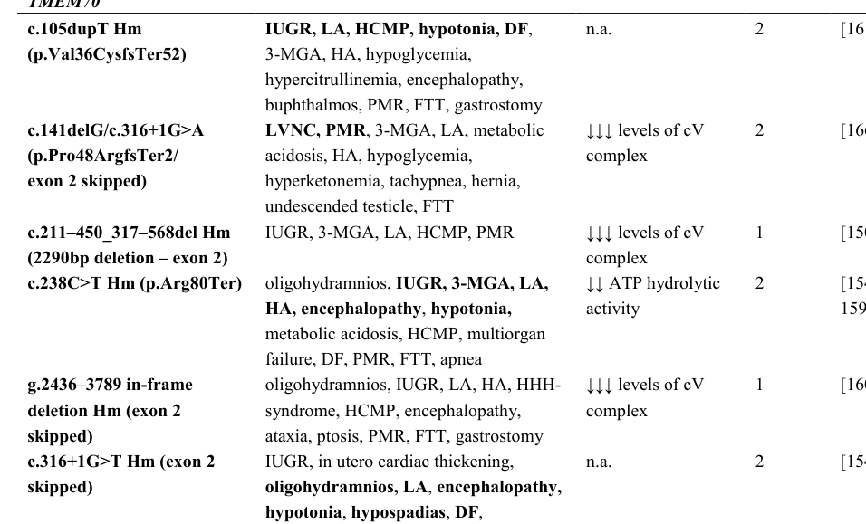

## Question

# Disease Characteristics Research Template

## Target Disease
- **Disease Name:** Mitochondrial Complex V (ATP Synthase) Deficiency, Nuclear Type 2
- **MONDO ID:** MONDO:0013546 (if available)
- **Category:** Mendelian

## Research Objectives

Please provide a comprehensive research report on **Mitochondrial Complex V (ATP Synthase) Deficiency, Nuclear Type 2** covering all of the
disease characteristics listed below. This report will be used to populate a disease knowledge
base entry. Be thorough and cite primary literature (PMID preferred) for all claims.

For each section, **suggested databases/resources** are listed. These are the first places
you should search for information on each topic.

---

### 1. Disease Information
> **Search first:** OMIM, Orphanet, ICD-10/ICD-11, MeSH, PubMed

- What is the disease? Provide a concise overview.
- What are the key identifiers? (OMIM, Orphanet, ICD-10/ICD-11, MeSH, Mondo)
- What are the common synonyms and alternative names?
- Is the information derived from individual patients (e.g., EHR) or aggregated disease-level resources?

### 2. Etiology

- **Disease Causal Factors**: What are the primary causes? (genetic, environmental, infectious, mechanistic)
- **Risk Factors**:
  > **Search first:** PubMed, Cochrane Library, UpToDate, clinical guidelines, ClinVar, ClinGen, GWAS Catalog, PheGenI, CTD, CDC, WHO, epidemiological databases
  - Genetic risk factors (causal variants, susceptibility loci, modifier genes)
  - Environmental risk factors (toxins, lifestyle, occupational exposures, age, sex, family history)
- **Protective Factors**:
  > **Search first:** PubMed, Cochrane Library, clinical trial databases, GWAS Catalog, gnomAD, WHO, CDC, nutrition databases
  - Genetic protective factors (protective variants, modifier alleles)
  - Environmental protective factors (diet, lifestyle, exposures that reduce risk)
- **Gene-Environment Interactions**: How do genetic and environmental factors interact to influence disease?
  > **Search first:** CTD, PubMed, PheGenI, GxE databases

### 3. Phenotypes
> **Search first:** HPO (Human Phenotype Ontology), OMIM, Orphanet, PubMed, clinicaltrials.gov, MedDRA, SNOMED CT, DECIPHER, LOINC

For each phenotype, provide:
- **Phenotype type**: symptoms, clinical signs, physical manifestations, behavioral changes, or laboratory abnormalities
  > For symptoms/signs: HPO, OMIM, Orphanet, PubMed
  > For behavioral changes: HPO, DSM, RDoC (Research Domain Criteria), PubMed
  > For laboratory abnormalities: LOINC, SNOMED CT, LabTests Online, PubMed
- **Phenotype characteristics**:
  > **Search first:** OMIM, Orphanet, HPO, PubMed
  - Age of symptom onset (neonatal, childhood, adult-onset, late-onset)
  - Symptom severity (mild, moderate, severe, variable)
  - Symptom progression (stable, progressive, episodic, fluctuating)
  - Frequency among affected individuals (percentage or qualitative)
- **Quality of life impact**: Effects on daily functioning and well-being (per-phenotype when possible)
  > **Search first:** EQ-5D database, SF-36, WHO QOL databases, PubMed
- Suggest HPO (Human Phenotype Ontology) terms for each phenotype

### 4. Genetic/Molecular Information

- **Causal Genes**: Gene mutations or chromosomal abnormalities responsible for disease (gene symbols, OMIM IDs)
  > **Search first:** OMIM, ClinVar, HGMD, Ensembl, NCBI Gene
- **Pathogenic Variants**:
  - Affected genes (gene symbols, HGNC IDs)
    > **Search first:** OMIM, NCBI Gene, Ensembl, HGNC, UniProt, GeneCards
  - Variant classification (pathogenic, likely pathogenic, VUS per ACMG/AMP guidelines)
    > **Search first:** ClinVar, ClinGen, ACMG/AMP guidelines, VarSome
  - Variant type/class (missense, frameshift, nonsense, splice-site, structural)
  - Allele frequency in population databases
    > **Search first:** gnomAD, 1000 Genomes, ExAC, TOPMed, dbSNP
  - Somatic vs germline origin
    > **Search first:** COSMIC (somatic), ClinVar, ICGC, TCGA
  - Functional consequences (loss of function, gain of function, dominant negative)
- **Modifier Genes**: Genes that modify disease severity or expression
- **Epigenetic Information**: DNA methylation, histone modifications, chromatin changes affecting disease
  > **Search first:** ENCODE, Roadmap Epigenomics, MethBase, DiseaseMeth
- **Chromosomal Abnormalities**: Large-scale genetic changes (aneuploidy, translocations, inversions)
  > **Search first:** DECIPHER, ClinVar, ECARUCA, UCSC Genome Browser

### 5. Environmental Information

- **Environmental Factors**: Non-genetic contributing factors (toxins, radiation, pollution, occupational exposure)
  > **Search first:** CTD (Comparative Toxicogenomics Database), TOXNET, PubMed, EPA databases
- **Lifestyle Factors**: Behavioral factors (smoking, diet, exercise, alcohol consumption)
  > **Search first:** CDC databases, WHO, PubMed, NHANES
- **Infectious Agents**: If applicable, pathogens causing or triggering disease (bacteria, viruses, fungi, parasites)
  > **Search first:** NCBI Taxonomy, ViPR, BV-BRC, MicrobeDB, GIDEON

### 6. Mechanism / Pathophysiology

**Present this section as an ordered causal chain first, then the detail below.**
Open with a numbered sequence of mechanistic steps running from the initiating
lesion (mutation, exposure, infection) to the clinical manifestation, one step per
line, each naming what it causes next. State the causal verb explicitly ("leads
to", "results in") and say where a step is inferred rather than demonstrated.
Where the mechanism branches, show the branch. The categories below are a
checklist of what to cover within those steps, not the organizing structure —
a step may draw on several of them, and a category may contribute to several
steps.

- **Molecular Pathways**: Specific signaling cascades or biochemical pathways involved (Wnt, MAPK, mTOR, PI3K-AKT, etc.)
  > **Search first:** KEGG, Reactome, WikiPathways, PathBank, BioCyc
- **Cellular Processes**: Cell-level mechanisms (apoptosis, autophagy, cell cycle dysregulation, inflammation, etc.)
  > **Search first:** Gene Ontology (GO), Reactome, KEGG, PubMed
- **Protein Dysfunction**: How protein structure or function is altered (misfolding, aggregation, loss of function, gain of function)
  > **Search first:** UniProt, PDB (Protein Data Bank), InterPro, Pfam, AlphaFold
- **Metabolic Changes**: Alterations in metabolic processes (energy metabolism, lipid metabolism, amino acid metabolism)
  > **Search first:** KEGG, BioCyc, HMDB (Human Metabolome Database), BRENDA
- **Immune System Involvement**: Role of immune response (autoimmunity, immunodeficiency, chronic inflammation)
  > **Search first:** ImmPort, Immunome Database, IEDB, Gene Ontology
- **Tissue Damage Mechanisms**: How tissues/ are injured (oxidative stress, ischemia, fibrosis, necrosis)
  > **Search first:** PubMed, Gene Ontology, Reactome
- **Biochemical Abnormalities**: Specific molecular defects (enzyme deficiencies, receptor dysfunction, ion channel defects)
  > **Search first:** BRENDA, UniProt, KEGG, OMIM, PubMed
- **Epigenetic Changes**: DNA methylation, histone modifications affecting gene expression in disease
  > **Search first:** ENCODE, Roadmap Epigenomics, MethBase, DiseaseMeth
- **Molecular Profiling** (if available):
  - Transcriptomics/gene expression changes
    > **Search first:** GEO (Gene Expression Omnibus), ArrayExpress, GTEx, Human Cell Atlas, SRA
  - Proteomics findings
    > **Search first:** PRIDE, ProteomeXchange, Human Protein Atlas, STRING, BioGRID
  - Metabolomics signatures
    > **Search first:** MetaboLights, Metabolomics Workbench, HMDB, METLIN
  - Lipidomics alterations
    > **Search first:** LIPID MAPS, SwissLipids, LipidHome, Metabolomics Workbench
  - Genomic structural features
    > **Search first:** UCSC Genome Browser, Ensembl, NCBI, dbVar, DGV
- **Advanced Technologies** (if applicable):
  - Single-cell analysis findings (cell-type specific mechanisms, cellular heterogeneity)
    > **Search first:** Human Cell Atlas, Single Cell Portal, GEO, CELLxGENE
  - Spatial transcriptomics findings
    > **Search first:** GEO, Spatial Research, Vizgen, 10x Genomics data
  - Multi-omics integration results
    > **Search first:** TCGA, ICGC, cBioPortal, LinkedOmics, PubMed
  - Functional genomics screens (CRISPR, RNAi)
    > **Search first:** DepMap, GenomeRNAi, PubMed, BioGRID ORCS

For each mechanism, describe:
- The causal chain from initial trigger to clinical manifestation
- Which mechanisms are upstream vs downstream
- What cell types and biological processes are involved
- Suggest GO terms for biological processes and CL terms for cell types

### 7. Anatomical Structures Affected

- **Organ Level**:
  - Primary organs directly affected
  - Secondary organ involvement (complications, secondary effects)
  - Body systems involved (cardiovascular, nervous, digestive, respiratory, endocrine, etc.)
  > **Search first:** Uberon, FMA (Foundational Model of Anatomy), OMIM, HPO, ICD-11, MeSH, SNOMED CT
- **Tissue and Cell Level**:
  - Specific tissue types affected (epithelial, connective, muscle, nervous)
  - Specific cell populations targeted (with Cell Ontology terms)
  > **Search first:** Uberon, Human Protein Atlas, Cell Ontology, Human Cell Atlas, CellMarker, PanglaoDB
- **Subcellular Level**:
  - Cellular compartments involved (mitochondria, nucleus, ER, lysosomes) (with GO Cellular Component terms)
  > **Search first:** Gene Ontology (Cellular Component), UniProt, Human Protein Atlas
- **Localization**:
  - Specific anatomical sites (with UBERON terms)
    > **Search first:** FMA, Uberon, NeuroNames (for brain), SNOMED CT
  - Lateralization (unilateral, bilateral, asymmetric)
    > **Search first:** HPO, clinical literature, imaging databases

### 8. Temporal Development

- **Onset**:
  - Typical age of onset (congenital, pediatric, adult, geriatric)
  - Onset pattern (acute, subacute, chronic, insidious)
  > **Search first:** OMIM, Orphanet, HPO, PubMed
- **Progression**:
  - Disease stages (early, intermediate, advanced, end-stage)
    > **Search first:** Cancer Staging Manual (AJCC), WHO classifications, PubMed
  - Progression rate (rapid, slow, variable)
  - Disease course pattern (episodic, relapsing-remitting, progressive, stable)
  - Disease duration (self-limited, chronic lifelong)
  > **Search first:** Disease registries, longitudinal cohort databases, natural history studies, PubMed, Orphanet, OMIM
- **Patterns**:
  - Remission patterns (spontaneous, treatment-induced)
    > **Search first:** Clinical trial databases, disease registries, PubMed
  - Critical periods (time windows of vulnerability or opportunity for intervention)
    > **Search first:** PubMed, developmental biology databases, clinical guidelines

### 9. Inheritance and Population

- **Epidemiology**:
  - Prevalence (cases per 100,000 at given time)
  - Incidence (new cases per 100,000 per year)
  > **Search first:** Orphanet, CDC, WHO, GBD (Global Burden of Disease), national registries, SEER, disease registries
- **For Genetic Etiology**:
  - Inheritance pattern (AD, AR, X-linked, mitochondrial, multifactorial, polygenic)
    > **Search first:** OMIM, Orphanet, ClinVar, GTR (Genetic Testing Registry)
  - Penetrance (complete, incomplete, age-dependent)
    > **Search first:** ClinVar, OMIM, PubMed, ClinGen
  - Expressivity (variable, consistent)
    > **Search first:** OMIM, ClinVar, PubMed
  - Genetic anticipation (increasing severity in successive generations)
    > **Search first:** OMIM, PubMed (especially for repeat expansion disorders)
  - Germline mosaicism
    > **Search first:** ClinVar, OMIM, genetic counseling literature, PubMed
  - Founder effects (population-specific mutations)
    > **Search first:** gnomAD, population genetics databases, PubMed
  - Consanguinity role
    > **Search first:** OMIM, population studies, genetic counseling resources
  - Carrier frequency
    > **Search first:** gnomAD, carrier screening databases, GeneReviews, GTR
- **Population Demographics**:
  - Affected populations (ethnic or demographic groups with higher prevalence)
    > **Search first:** gnomAD, 1000 Genomes, PAGE Study, PubMed, population registries
  - Geographic distribution (endemic areas, regional variation)
    > **Search first:** WHO, CDC, GBD, Orphanet, geographic epidemiology databases
  - Geographic distribution of specific variants
  - Sex ratio (male:female)
    > **Search first:** Disease registries, OMIM, PubMed, epidemiological databases
  - Age distribution of affected individuals
    > **Search first:** CDC, disease registries, SEER, Orphanet

### 10. Diagnostics

- **Clinical Tests**:
  - Laboratory tests (blood, urine, tissue chemistry, specific enzyme assays)
    > **Search first:** LOINC, LabTests Online, PubMed
  - Biomarkers (proteins, metabolites, genetic markers, circulating biomarkers)
    > **Search first:** FDA Biomarker List, BEST (Biomarkers, EndpointS, and other Tools), PubMed
  - Imaging studies (X-ray, CT, MRI, PET, ultrasound)
    > **Search first:** RadLex, DICOM, Radiopaedia, imaging databases
  - Functional tests (pulmonary function, cardiac stress tests)
    > **Search first:** LOINC, clinical guidelines, PubMed
  - Electrophysiology (EEG, EMG, ECG, nerve conduction studies)
    > **Search first:** LOINC, clinical neurophysiology databases, PubMed
  - Biopsy findings (histopathology, immunohistochemistry)
    > **Search first:** SNOMED CT, College of American Pathologists resources, PubMed
  - Pathology findings (microscopic examination)
    > **Search first:** SNOMED CT, Digital Pathology databases, PubMed
- **Genetic Testing**:
  > **Search first:** GTR (Genetic Testing Registry), GeneReviews, ClinGen
  - Overview of recommended genetic testing approach
  - Whole genome sequencing (WGS) utility
    > **Search first:** GTR, ClinVar, GEL (Genomics England), gnomAD
  - Whole exome sequencing (WES) utility
    > **Search first:** GTR, ClinVar, OMIM, GeneMatcher
  - Gene panels (which panels, which genes)
    > **Search first:** GTR, ClinVar, laboratory-specific databases
  - Single gene testing
    > **Search first:** GTR, ClinVar, OMIM, GeneReviews
  - Chromosomal microarray (CMA)
    > **Search first:** DECIPHER, ClinVar, dbVar, ECARUCA
  - Karyotyping
    > **Search first:** Chromosome Abnormality Database, ClinVar, cytogenetics resources
  - FISH
    > **Search first:** ClinVar, cytogenetics databases, PubMed
  - Mitochondrial DNA testing
    > **Search first:** MITOMAP, MSeqDR, ClinVar, GTR
  - Repeat expansion testing
    > **Search first:** GTR, ClinVar, repeat expansion databases, PubMed
- **Omics-Based Diagnostics** (if applicable):
  - RNA sequencing / transcriptomics
    > **Search first:** GEO, ArrayExpress, GTEx, RNA-seq databases
  - Proteomics
    > **Search first:** PRIDE, ProteomeXchange, FDA Biomarker database
  - Metabolomics
    > **Search first:** MetaboLights, Metabolomics Workbench, HMDB
  - Epigenomics
    > **Search first:** GEO, ENCODE, Roadmap Epigenomics, MethBase
  - Liquid biopsy
    > **Search first:** COSMIC, ClinVar, liquid biopsy databases, PubMed
- **Clinical Criteria**:
  - Standardized diagnostic criteria (DSM, ICD, society guidelines)
    > **Search first:** DSM-5, ICD-11, clinical society guidelines, UpToDate
  - Differential diagnosis (other conditions to rule out, with distinguishing features)
    > **Search first:** DynaMed, UpToDate, clinical decision support systems
- **Screening**:
  - Screening methods for asymptomatic individuals (newborn screening, carrier screening, cascade screening)
    > **Search first:** ACMG recommendations, CDC newborn screening, GTR

### 11. Outcome/Prognosis

- **Survival and Mortality**:
  - Survival rate (5-year, 10-year, overall)
    > **Search first:** SEER, cancer registries, disease-specific registries, PubMed
  - Life expectancy (with and without treatment if applicable)
    > **Search first:** Orphanet, disease registries, actuarial databases, PubMed
  - Mortality rate
    > **Search first:** CDC, WHO, GBD, national mortality databases
  - Disease-specific mortality (deaths directly attributable to disease)
    > **Search first:** Disease registries, CDC Wonder, GBD, PubMed
- **Morbidity and Function**:
  - Morbidity (disease-related disability and health impacts)
    > **Search first:** GBD, WHO, disability databases, PubMed
  - Disability outcomes (long-term functional impairments)
    > **Search first:** ICF (International Classification of Functioning), disability registries
  - Quality of life measures (EQ-5D, SF-36, PROMIS, disease-specific tools)
    > **Search first:** EQ-5D database, SF-36, PROMIS, PubMed
- **Disease Course**:
  - Complications (secondary problems: infections, organ failure, etc.)
    > **Search first:** ICD codes, disease registries, clinical databases, PubMed
  - Recovery potential (likelihood and extent of recovery, with vs without treatment)
    > **Search first:** Natural history studies, rehabilitation databases, PubMed
- **Prediction**:
  - Prognostic factors (age, disease severity, biomarkers, treatment response)
    > **Search first:** Prognostic models databases, clinical calculators, PubMed
  - Prognostic biomarkers (molecular markers predicting disease course)
    > **Search first:** FDA Biomarker database, PubMed, cancer prognostic databases

### 12. Treatment

- **Pharmacotherapy**:
  - Pharmacological treatments (drug names, drug classes, mechanisms of action)
    > **Search first:** DrugBank, RxNorm, ATC classification, DailyMed, FDA databases
  - Pharmacogenomics (how genetic variants affect drug metabolism, efficacy, toxicity)
    > **Search first:** PharmGKB, CPIC (Clinical Pharmacogenetics), FDA Table of PGx Biomarkers
- **Advanced Therapeutics**:
  - Gene therapy (viral vectors, CRISPR, gene replacement, gene editing)
    > **Search first:** ClinicalTrials.gov, FDA gene therapy database, ASGCT resources
  - Cell therapy (stem cell transplant, CAR-T, cellular therapeutics)
    > **Search first:** ClinicalTrials.gov, FDA cell therapy database, FACT standards
  - RNA-based therapies (ASOs, siRNA, mRNA therapies)
    > **Search first:** ClinicalTrials.gov, FDA approvals, PubMed
  - Targeted therapies (treatments directed at specific molecular targets)
    > **Search first:** My Cancer Genome, OncoKB, ClinicalTrials.gov, FDA approvals
  - Immunotherapies (checkpoint inhibitors, monoclonal antibodies)
    > **Search first:** Cancer Immunotherapy Database, FDA approvals, ClinicalTrials.gov
- **Surgical and Interventional**:
  - Surgical interventions (types of surgery, timing, outcomes)
    > **Search first:** CPT codes, surgical registries, clinical guidelines, PubMed
- **Supportive and Rehabilitative**:
  - Supportive care (symptom management, pain control, nutrition)
    > **Search first:** Clinical guidelines, Cochrane Library, PubMed
  - Rehabilitation (physical therapy, occupational therapy, speech therapy)
    > **Search first:** Rehabilitation medicine databases, clinical guidelines, PubMed
- **Experimental**:
  - Experimental treatments in clinical trials (with NCT identifiers if available)
    > **Search first:** ClinicalTrials.gov, EU Clinical Trials Register, WHO ICTRP
- **Treatment Outcomes**:
  - Treatment response rates
    > **Search first:** Clinical trial databases, FDA reviews, systematic reviews, PubMed
  - Side effects and adverse events
    > **Search first:** FDA Adverse Event Reporting System (FAERS), MedWatch, PubMed
- **Treatment Strategy**:
  - Treatment algorithms (clinical pathways, decision trees)
    > **Search first:** Clinical practice guidelines, NCCN Guidelines, UpToDate
  - Combination therapies
    > **Search first:** ClinicalTrials.gov, treatment guidelines, PubMed
  - Personalized medicine approaches (genotype-guided treatment)
    > **Search first:** My Cancer Genome, CIViC, PharmGKB, precision medicine databases

For each treatment, suggest NCIT (NCI Thesaurus) clinical-intervention terms where applicable.

### 13. Prevention

- **Prevention Levels**:
  - Primary prevention (preventing disease occurrence: vaccination, risk factor modification)
    > **Search first:** CDC, WHO, USPSTF recommendations, Cochrane Library
  - Secondary prevention (early detection and treatment: screening programs, early intervention)
    > **Search first:** USPSTF, CDC screening guidelines, WHO
  - Tertiary prevention (preventing complications in those with disease)
    > **Search first:** Clinical guidelines, disease management protocols, PubMed
- **Immunization**: Vaccine strategies (if applicable)
  > **Search first:** CDC vaccine schedules, WHO immunization, FDA vaccine database
- **Screening and Early Detection**:
  - Screening programs (population-based: newborn screening, cancer screening)
    > **Search first:** CDC screening programs, USPSTF, cancer screening databases
  - Genetic screening (carrier screening, preimplantation genetic diagnosis, prenatal testing)
    > **Search first:** ACMG recommendations, ACOG guidelines, GTR
  - Risk stratification (identifying high-risk individuals for targeted prevention)
    > **Search first:** Risk prediction models, clinical calculators, PubMed
- **Behavioral Interventions**: Lifestyle modifications to reduce risk
  > **Search first:** CDC, WHO, behavioral intervention databases, Cochrane Library
- **Counseling**: Genetic counseling (risk assessment, family planning guidance)
  > **Search first:** NSGC resources, ACMG guidelines, GeneReviews
- **Public Health**:
  - Public health interventions (sanitation, vector control, health education)
    > **Search first:** CDC, WHO, public health databases, PubMed
  - Environmental interventions (reducing environmental risk factors)
    > **Search first:** EPA databases, WHO environmental health, PubMed
- **Prophylaxis**: Preventive medications or procedures
  > **Search first:** Clinical guidelines, FDA approvals, PubMed

### 14. Other Species / Natural Disease

- **Taxonomy**: Species affected (with NCBI Taxon identifiers)
  > **Search first:** NCBI Taxonomy
- **Breed**: Specific breeds affected (with VBO identifiers if applicable)
  > **Search first:** VBO (Vertebrate Breed Ontology)
- **Gene**: Orthologous genes in other species (with NCBI Gene IDs)
  > **Search first:** NCBI Gene
- **Natural Disease**:
  - Naturally occurring disease in other species (companion animals, wildlife)
    > **Search first:** OMIA (Online Mendelian Inheritance in Animals), VetCompass, PubMed
  - Veterinary relevance and importance in animal health
    > **Search first:** OMIA, veterinary databases, PubMed
- **Comparative Biology**:
  - Comparative pathology (similarities and differences across species)
    > **Search first:** OMIA, comparative pathology databases, PubMed
  - Evolutionary conservation of disease mechanisms
    > **Search first:** HomoloGene, OrthoMCL, Alliance of Genome Resources
- **Transmission** (if applicable):
  - Zoonotic potential
    > **Search first:** CDC zoonotic diseases, WHO zoonoses, GIDEON
  - Cross-species susceptibility
    > **Search first:** NCBI Taxonomy, veterinary databases, PubMed

### 15. Model Organisms

- **Model Types**:
  - Model organism type (mammalian, invertebrate, cellular, in vitro)
    > **Search first:** Alliance of Genome Resources, model organism databases
  - Specific model systems (mouse, rat, zebrafish, Drosophila, C. elegans, yeast, cell lines, organoids, iPSCs)
    > **Search first:** MGI, RGD, ZFIN, FlyBase, WormBase, SGD, ATCC, Cellosaurus
  - Induced models (drug treatment, surgical intervention, environmental manipulation)
    > **Search first:** MGI, model organism databases, PubMed
- **Genetic Models**:
  - Types available (knockout, knock-in, transgenic, conditional, humanized)
    > **Search first:** MGI, IMPC, KOMP, EuMMCR, IMSR
- **Model Characteristics**:
  - Phenotype recapitulation (how well model reproduces human disease features)
    > **Search first:** Model organism databases, comparative studies, PubMed
  - Model limitations (aspects of human disease not captured)
    > **Search first:** Model organism databases, PubMed, review articles
- **Applications**:
  - Research applications (what aspects of disease can be studied)
    > **Search first:** Model organism databases, PubMed
- **Resources**:
  - Model databases
    > **Search first:** MGI, RGD, ZFIN, FlyBase, WormBase, IMSR, EMMA, MMRRC

---

## Citation Requirements

- Cite primary literature (PMID preferred) for all mechanistic and clinical claims
- Prioritize recent reviews and landmark papers
- Include direct quotes from abstracts where possible to support key statements
- Distinguish evidence source types: human clinical, model organism, in vitro, computational

## Output Format

Structure your response as a comprehensive narrative organized by the sections above.
For each section, provide:
- Factual content with specific details (numbers, percentages, gene names, variant nomenclature)
- Ontology term suggestions (HPO, GO, CL, UBERON, CHEBI, NCIT, MONDO) where applicable
- Evidence citations with PMIDs
- Direct quotes from abstracts to support key claims
- Clear indication when information is not available or not applicable for this disease

This report will be used to populate a disease knowledge base entry with:
- Pathophysiology descriptions with causal chains
- Gene/protein annotations (HGNC, GO terms)
- Phenotype associations (HP terms) with frequencies
- Cell type involvement (CL terms)
- Anatomical locations (UBERON terms)
- Chemical entities (CHEBI terms)
- Treatment annotations (NCIT terms)
- Evidence items with PMIDs and exact abstract quotes
- Epidemiology, prognosis, diagnostic, and prevention information
- Animal model descriptions with phenotype recapitulation details

## Output

Question: You are an expert researcher providing comprehensive, well-cited information.

Provide detailed information focusing on:
1. Key concepts and definitions with current understanding
2. Recent developments and latest research (prioritize 2023-2024 sources)
3. Current applications and real-world implementations
4. Expert opinions and analysis from authoritative sources
5. Relevant statistics and data from recent studies

Format as a comprehensive research report with proper citations. Include URLs and publication dates where available.
Always prioritize recent, authoritative sources and provide specific citations for all major claims.

# Disease Characteristics Research Template

## Target Disease
- **Disease Name:** Mitochondrial Complex V (ATP Synthase) Deficiency, Nuclear Type 2
- **MONDO ID:** MONDO:0013546 (if available)
- **Category:** Mendelian

## Research Objectives

Please provide a comprehensive research report on **Mitochondrial Complex V (ATP Synthase) Deficiency, Nuclear Type 2** covering all of the
disease characteristics listed below. This report will be used to populate a disease knowledge
base entry. Be thorough and cite primary literature (PMID preferred) for all claims.

For each section, **suggested databases/resources** are listed. These are the first places
you should search for information on each topic.

---

### 1. Disease Information
> **Search first:** OMIM, Orphanet, ICD-10/ICD-11, MeSH, PubMed

- What is the disease? Provide a concise overview.
- What are the key identifiers? (OMIM, Orphanet, ICD-10/ICD-11, MeSH, Mondo)
- What are the common synonyms and alternative names?
- Is the information derived from individual patients (e.g., EHR) or aggregated disease-level resources?

### 2. Etiology

- **Disease Causal Factors**: What are the primary causes? (genetic, environmental, infectious, mechanistic)
- **Risk Factors**:
  > **Search first:** PubMed, Cochrane Library, UpToDate, clinical guidelines, ClinVar, ClinGen, GWAS Catalog, PheGenI, CTD, CDC, WHO, epidemiological databases
  - Genetic risk factors (causal variants, susceptibility loci, modifier genes)
  - Environmental risk factors (toxins, lifestyle, occupational exposures, age, sex, family history)
- **Protective Factors**:
  > **Search first:** PubMed, Cochrane Library, clinical trial databases, GWAS Catalog, gnomAD, WHO, CDC, nutrition databases
  - Genetic protective factors (protective variants, modifier alleles)
  - Environmental protective factors (diet, lifestyle, exposures that reduce risk)
- **Gene-Environment Interactions**: How do genetic and environmental factors interact to influence disease?
  > **Search first:** CTD, PubMed, PheGenI, GxE databases

### 3. Phenotypes
> **Search first:** HPO (Human Phenotype Ontology), OMIM, Orphanet, PubMed, clinicaltrials.gov, MedDRA, SNOMED CT, DECIPHER, LOINC

For each phenotype, provide:
- **Phenotype type**: symptoms, clinical signs, physical manifestations, behavioral changes, or laboratory abnormalities
  > For symptoms/signs: HPO, OMIM, Orphanet, PubMed
  > For behavioral changes: HPO, DSM, RDoC (Research Domain Criteria), PubMed
  > For laboratory abnormalities: LOINC, SNOMED CT, LabTests Online, PubMed
- **Phenotype characteristics**:
  > **Search first:** OMIM, Orphanet, HPO, PubMed
  - Age of symptom onset (neonatal, childhood, adult-onset, late-onset)
  - Symptom severity (mild, moderate, severe, variable)
  - Symptom progression (stable, progressive, episodic, fluctuating)
  - Frequency among affected individuals (percentage or qualitative)
- **Quality of life impact**: Effects on daily functioning and well-being (per-phenotype when possible)
  > **Search first:** EQ-5D database, SF-36, WHO QOL databases, PubMed
- Suggest HPO (Human Phenotype Ontology) terms for each phenotype

### 4. Genetic/Molecular Information

- **Causal Genes**: Gene mutations or chromosomal abnormalities responsible for disease (gene symbols, OMIM IDs)
  > **Search first:** OMIM, ClinVar, HGMD, Ensembl, NCBI Gene
- **Pathogenic Variants**:
  - Affected genes (gene symbols, HGNC IDs)
    > **Search first:** OMIM, NCBI Gene, Ensembl, HGNC, UniProt, GeneCards
  - Variant classification (pathogenic, likely pathogenic, VUS per ACMG/AMP guidelines)
    > **Search first:** ClinVar, ClinGen, ACMG/AMP guidelines, VarSome
  - Variant type/class (missense, frameshift, nonsense, splice-site, structural)
  - Allele frequency in population databases
    > **Search first:** gnomAD, 1000 Genomes, ExAC, TOPMed, dbSNP
  - Somatic vs germline origin
    > **Search first:** COSMIC (somatic), ClinVar, ICGC, TCGA
  - Functional consequences (loss of function, gain of function, dominant negative)
- **Modifier Genes**: Genes that modify disease severity or expression
- **Epigenetic Information**: DNA methylation, histone modifications, chromatin changes affecting disease
  > **Search first:** ENCODE, Roadmap Epigenomics, MethBase, DiseaseMeth
- **Chromosomal Abnormalities**: Large-scale genetic changes (aneuploidy, translocations, inversions)
  > **Search first:** DECIPHER, ClinVar, ECARUCA, UCSC Genome Browser

### 5. Environmental Information

- **Environmental Factors**: Non-genetic contributing factors (toxins, radiation, pollution, occupational exposure)
  > **Search first:** CTD (Comparative Toxicogenomics Database), TOXNET, PubMed, EPA databases
- **Lifestyle Factors**: Behavioral factors (smoking, diet, exercise, alcohol consumption)
  > **Search first:** CDC databases, WHO, PubMed, NHANES
- **Infectious Agents**: If applicable, pathogens causing or triggering disease (bacteria, viruses, fungi, parasites)
  > **Search first:** NCBI Taxonomy, ViPR, BV-BRC, MicrobeDB, GIDEON

### 6. Mechanism / Pathophysiology

**Present this section as an ordered causal chain first, then the detail below.**
Open with a numbered sequence of mechanistic steps running from the initiating
lesion (mutation, exposure, infection) to the clinical manifestation, one step per
line, each naming what it causes next. State the causal verb explicitly ("leads
to", "results in") and say where a step is inferred rather than demonstrated.
Where the mechanism branches, show the branch. The categories below are a
checklist of what to cover within those steps, not the organizing structure —
a step may draw on several of them, and a category may contribute to several
steps.

- **Molecular Pathways**: Specific signaling cascades or biochemical pathways involved (Wnt, MAPK, mTOR, PI3K-AKT, etc.)
  > **Search first:** KEGG, Reactome, WikiPathways, PathBank, BioCyc
- **Cellular Processes**: Cell-level mechanisms (apoptosis, autophagy, cell cycle dysregulation, inflammation, etc.)
  > **Search first:** Gene Ontology (GO), Reactome, KEGG, PubMed
- **Protein Dysfunction**: How protein structure or function is altered (misfolding, aggregation, loss of function, gain of function)
  > **Search first:** UniProt, PDB (Protein Data Bank), InterPro, Pfam, AlphaFold
- **Metabolic Changes**: Alterations in metabolic processes (energy metabolism, lipid metabolism, amino acid metabolism)
  > **Search first:** KEGG, BioCyc, HMDB (Human Metabolome Database), BRENDA
- **Immune System Involvement**: Role of immune response (autoimmunity, immunodeficiency, chronic inflammation)
  > **Search first:** ImmPort, Immunome Database, IEDB, Gene Ontology
- **Tissue Damage Mechanisms**: How tissues/ are injured (oxidative stress, ischemia, fibrosis, necrosis)
  > **Search first:** PubMed, Gene Ontology, Reactome
- **Biochemical Abnormalities**: Specific molecular defects (enzyme deficiencies, receptor dysfunction, ion channel defects)
  > **Search first:** BRENDA, UniProt, KEGG, OMIM, PubMed
- **Epigenetic Changes**: DNA methylation, histone modifications affecting gene expression in disease
  > **Search first:** ENCODE, Roadmap Epigenomics, MethBase, DiseaseMeth
- **Molecular Profiling** (if available):
  - Transcriptomics/gene expression changes
    > **Search first:** GEO (Gene Expression Omnibus), ArrayExpress, GTEx, Human Cell Atlas, SRA
  - Proteomics findings
    > **Search first:** PRIDE, ProteomeXchange, Human Protein Atlas, STRING, BioGRID
  - Metabolomics signatures
    > **Search first:** MetaboLights, Metabolomics Workbench, HMDB, METLIN
  - Lipidomics alterations
    > **Search first:** LIPID MAPS, SwissLipids, LipidHome, Metabolomics Workbench
  - Genomic structural features
    > **Search first:** UCSC Genome Browser, Ensembl, NCBI, dbVar, DGV
- **Advanced Technologies** (if applicable):
  - Single-cell analysis findings (cell-type specific mechanisms, cellular heterogeneity)
    > **Search first:** Human Cell Atlas, Single Cell Portal, GEO, CELLxGENE
  - Spatial transcriptomics findings
    > **Search first:** GEO, Spatial Research, Vizgen, 10x Genomics data
  - Multi-omics integration results
    > **Search first:** TCGA, ICGC, cBioPortal, LinkedOmics, PubMed
  - Functional genomics screens (CRISPR, RNAi)
    > **Search first:** DepMap, GenomeRNAi, PubMed, BioGRID ORCS

For each mechanism, describe:
- The causal chain from initial trigger to clinical manifestation
- Which mechanisms are upstream vs downstream
- What cell types and biological processes are involved
- Suggest GO terms for biological processes and CL terms for cell types

### 7. Anatomical Structures Affected

- **Organ Level**:
  - Primary organs directly affected
  - Secondary organ involvement (complications, secondary effects)
  - Body systems involved (cardiovascular, nervous, digestive, respiratory, endocrine, etc.)
  > **Search first:** Uberon, FMA (Foundational Model of Anatomy), OMIM, HPO, ICD-11, MeSH, SNOMED CT
- **Tissue and Cell Level**:
  - Specific tissue types affected (epithelial, connective, muscle, nervous)
  - Specific cell populations targeted (with Cell Ontology terms)
  > **Search first:** Uberon, Human Protein Atlas, Cell Ontology, Human Cell Atlas, CellMarker, PanglaoDB
- **Subcellular Level**:
  - Cellular compartments involved (mitochondria, nucleus, ER, lysosomes) (with GO Cellular Component terms)
  > **Search first:** Gene Ontology (Cellular Component), UniProt, Human Protein Atlas
- **Localization**:
  - Specific anatomical sites (with UBERON terms)
    > **Search first:** FMA, Uberon, NeuroNames (for brain), SNOMED CT
  - Lateralization (unilateral, bilateral, asymmetric)
    > **Search first:** HPO, clinical literature, imaging databases

### 8. Temporal Development

- **Onset**:
  - Typical age of onset (congenital, pediatric, adult, geriatric)
  - Onset pattern (acute, subacute, chronic, insidious)
  > **Search first:** OMIM, Orphanet, HPO, PubMed
- **Progression**:
  - Disease stages (early, intermediate, advanced, end-stage)
    > **Search first:** Cancer Staging Manual (AJCC), WHO classifications, PubMed
  - Progression rate (rapid, slow, variable)
  - Disease course pattern (episodic, relapsing-remitting, progressive, stable)
  - Disease duration (self-limited, chronic lifelong)
  > **Search first:** Disease registries, longitudinal cohort databases, natural history studies, PubMed, Orphanet, OMIM
- **Patterns**:
  - Remission patterns (spontaneous, treatment-induced)
    > **Search first:** Clinical trial databases, disease registries, PubMed
  - Critical periods (time windows of vulnerability or opportunity for intervention)
    > **Search first:** PubMed, developmental biology databases, clinical guidelines

### 9. Inheritance and Population

- **Epidemiology**:
  - Prevalence (cases per 100,000 at given time)
  - Incidence (new cases per 100,000 per year)
  > **Search first:** Orphanet, CDC, WHO, GBD (Global Burden of Disease), national registries, SEER, disease registries
- **For Genetic Etiology**:
  - Inheritance pattern (AD, AR, X-linked, mitochondrial, multifactorial, polygenic)
    > **Search first:** OMIM, Orphanet, ClinVar, GTR (Genetic Testing Registry)
  - Penetrance (complete, incomplete, age-dependent)
    > **Search first:** ClinVar, OMIM, PubMed, ClinGen
  - Expressivity (variable, consistent)
    > **Search first:** OMIM, ClinVar, PubMed
  - Genetic anticipation (increasing severity in successive generations)
    > **Search first:** OMIM, PubMed (especially for repeat expansion disorders)
  - Germline mosaicism
    > **Search first:** ClinVar, OMIM, genetic counseling literature, PubMed
  - Founder effects (population-specific mutations)
    > **Search first:** gnomAD, population genetics databases, PubMed
  - Consanguinity role
    > **Search first:** OMIM, population studies, genetic counseling resources
  - Carrier frequency
    > **Search first:** gnomAD, carrier screening databases, GeneReviews, GTR
- **Population Demographics**:
  - Affected populations (ethnic or demographic groups with higher prevalence)
    > **Search first:** gnomAD, 1000 Genomes, PAGE Study, PubMed, population registries
  - Geographic distribution (endemic areas, regional variation)
    > **Search first:** WHO, CDC, GBD, Orphanet, geographic epidemiology databases
  - Geographic distribution of specific variants
  - Sex ratio (male:female)
    > **Search first:** Disease registries, OMIM, PubMed, epidemiological databases
  - Age distribution of affected individuals
    > **Search first:** CDC, disease registries, SEER, Orphanet

### 10. Diagnostics

- **Clinical Tests**:
  - Laboratory tests (blood, urine, tissue chemistry, specific enzyme assays)
    > **Search first:** LOINC, LabTests Online, PubMed
  - Biomarkers (proteins, metabolites, genetic markers, circulating biomarkers)
    > **Search first:** FDA Biomarker List, BEST (Biomarkers, EndpointS, and other Tools), PubMed
  - Imaging studies (X-ray, CT, MRI, PET, ultrasound)
    > **Search first:** RadLex, DICOM, Radiopaedia, imaging databases
  - Functional tests (pulmonary function, cardiac stress tests)
    > **Search first:** LOINC, clinical guidelines, PubMed
  - Electrophysiology (EEG, EMG, ECG, nerve conduction studies)
    > **Search first:** LOINC, clinical neurophysiology databases, PubMed
  - Biopsy findings (histopathology, immunohistochemistry)
    > **Search first:** SNOMED CT, College of American Pathologists resources, PubMed
  - Pathology findings (microscopic examination)
    > **Search first:** SNOMED CT, Digital Pathology databases, PubMed
- **Genetic Testing**:
  > **Search first:** GTR (Genetic Testing Registry), GeneReviews, ClinGen
  - Overview of recommended genetic testing approach
  - Whole genome sequencing (WGS) utility
    > **Search first:** GTR, ClinVar, GEL (Genomics England), gnomAD
  - Whole exome sequencing (WES) utility
    > **Search first:** GTR, ClinVar, OMIM, GeneMatcher
  - Gene panels (which panels, which genes)
    > **Search first:** GTR, ClinVar, laboratory-specific databases
  - Single gene testing
    > **Search first:** GTR, ClinVar, OMIM, GeneReviews
  - Chromosomal microarray (CMA)
    > **Search first:** DECIPHER, ClinVar, dbVar, ECARUCA
  - Karyotyping
    > **Search first:** Chromosome Abnormality Database, ClinVar, cytogenetics resources
  - FISH
    > **Search first:** ClinVar, cytogenetics databases, PubMed
  - Mitochondrial DNA testing
    > **Search first:** MITOMAP, MSeqDR, ClinVar, GTR
  - Repeat expansion testing
    > **Search first:** GTR, ClinVar, repeat expansion databases, PubMed
- **Omics-Based Diagnostics** (if applicable):
  - RNA sequencing / transcriptomics
    > **Search first:** GEO, ArrayExpress, GTEx, RNA-seq databases
  - Proteomics
    > **Search first:** PRIDE, ProteomeXchange, FDA Biomarker database
  - Metabolomics
    > **Search first:** MetaboLights, Metabolomics Workbench, HMDB
  - Epigenomics
    > **Search first:** GEO, ENCODE, Roadmap Epigenomics, MethBase
  - Liquid biopsy
    > **Search first:** COSMIC, ClinVar, liquid biopsy databases, PubMed
- **Clinical Criteria**:
  - Standardized diagnostic criteria (DSM, ICD, society guidelines)
    > **Search first:** DSM-5, ICD-11, clinical society guidelines, UpToDate
  - Differential diagnosis (other conditions to rule out, with distinguishing features)
    > **Search first:** DynaMed, UpToDate, clinical decision support systems
- **Screening**:
  - Screening methods for asymptomatic individuals (newborn screening, carrier screening, cascade screening)
    > **Search first:** ACMG recommendations, CDC newborn screening, GTR

### 11. Outcome/Prognosis

- **Survival and Mortality**:
  - Survival rate (5-year, 10-year, overall)
    > **Search first:** SEER, cancer registries, disease-specific registries, PubMed
  - Life expectancy (with and without treatment if applicable)
    > **Search first:** Orphanet, disease registries, actuarial databases, PubMed
  - Mortality rate
    > **Search first:** CDC, WHO, GBD, national mortality databases
  - Disease-specific mortality (deaths directly attributable to disease)
    > **Search first:** Disease registries, CDC Wonder, GBD, PubMed
- **Morbidity and Function**:
  - Morbidity (disease-related disability and health impacts)
    > **Search first:** GBD, WHO, disability databases, PubMed
  - Disability outcomes (long-term functional impairments)
    > **Search first:** ICF (International Classification of Functioning), disability registries
  - Quality of life measures (EQ-5D, SF-36, PROMIS, disease-specific tools)
    > **Search first:** EQ-5D database, SF-36, PROMIS, PubMed
- **Disease Course**:
  - Complications (secondary problems: infections, organ failure, etc.)
    > **Search first:** ICD codes, disease registries, clinical databases, PubMed
  - Recovery potential (likelihood and extent of recovery, with vs without treatment)
    > **Search first:** Natural history studies, rehabilitation databases, PubMed
- **Prediction**:
  - Prognostic factors (age, disease severity, biomarkers, treatment response)
    > **Search first:** Prognostic models databases, clinical calculators, PubMed
  - Prognostic biomarkers (molecular markers predicting disease course)
    > **Search first:** FDA Biomarker database, PubMed, cancer prognostic databases

### 12. Treatment

- **Pharmacotherapy**:
  - Pharmacological treatments (drug names, drug classes, mechanisms of action)
    > **Search first:** DrugBank, RxNorm, ATC classification, DailyMed, FDA databases
  - Pharmacogenomics (how genetic variants affect drug metabolism, efficacy, toxicity)
    > **Search first:** PharmGKB, CPIC (Clinical Pharmacogenetics), FDA Table of PGx Biomarkers
- **Advanced Therapeutics**:
  - Gene therapy (viral vectors, CRISPR, gene replacement, gene editing)
    > **Search first:** ClinicalTrials.gov, FDA gene therapy database, ASGCT resources
  - Cell therapy (stem cell transplant, CAR-T, cellular therapeutics)
    > **Search first:** ClinicalTrials.gov, FDA cell therapy database, FACT standards
  - RNA-based therapies (ASOs, siRNA, mRNA therapies)
    > **Search first:** ClinicalTrials.gov, FDA approvals, PubMed
  - Targeted therapies (treatments directed at specific molecular targets)
    > **Search first:** My Cancer Genome, OncoKB, ClinicalTrials.gov, FDA approvals
  - Immunotherapies (checkpoint inhibitors, monoclonal antibodies)
    > **Search first:** Cancer Immunotherapy Database, FDA approvals, ClinicalTrials.gov
- **Surgical and Interventional**:
  - Surgical interventions (types of surgery, timing, outcomes)
    > **Search first:** CPT codes, surgical registries, clinical guidelines, PubMed
- **Supportive and Rehabilitative**:
  - Supportive care (symptom management, pain control, nutrition)
    > **Search first:** Clinical guidelines, Cochrane Library, PubMed
  - Rehabilitation (physical therapy, occupational therapy, speech therapy)
    > **Search first:** Rehabilitation medicine databases, clinical guidelines, PubMed
- **Experimental**:
  - Experimental treatments in clinical trials (with NCT identifiers if available)
    > **Search first:** ClinicalTrials.gov, EU Clinical Trials Register, WHO ICTRP
- **Treatment Outcomes**:
  - Treatment response rates
    > **Search first:** Clinical trial databases, FDA reviews, systematic reviews, PubMed
  - Side effects and adverse events
    > **Search first:** FDA Adverse Event Reporting System (FAERS), MedWatch, PubMed
- **Treatment Strategy**:
  - Treatment algorithms (clinical pathways, decision trees)
    > **Search first:** Clinical practice guidelines, NCCN Guidelines, UpToDate
  - Combination therapies
    > **Search first:** ClinicalTrials.gov, treatment guidelines, PubMed
  - Personalized medicine approaches (genotype-guided treatment)
    > **Search first:** My Cancer Genome, CIViC, PharmGKB, precision medicine databases

For each treatment, suggest NCIT (NCI Thesaurus) clinical-intervention terms where applicable.

### 13. Prevention

- **Prevention Levels**:
  - Primary prevention (preventing disease occurrence: vaccination, risk factor modification)
    > **Search first:** CDC, WHO, USPSTF recommendations, Cochrane Library
  - Secondary prevention (early detection and treatment: screening programs, early intervention)
    > **Search first:** USPSTF, CDC screening guidelines, WHO
  - Tertiary prevention (preventing complications in those with disease)
    > **Search first:** Clinical guidelines, disease management protocols, PubMed
- **Immunization**: Vaccine strategies (if applicable)
  > **Search first:** CDC vaccine schedules, WHO immunization, FDA vaccine database
- **Screening and Early Detection**:
  - Screening programs (population-based: newborn screening, cancer screening)
    > **Search first:** CDC screening programs, USPSTF, cancer screening databases
  - Genetic screening (carrier screening, preimplantation genetic diagnosis, prenatal testing)
    > **Search first:** ACMG recommendations, ACOG guidelines, GTR
  - Risk stratification (identifying high-risk individuals for targeted prevention)
    > **Search first:** Risk prediction models, clinical calculators, PubMed
- **Behavioral Interventions**: Lifestyle modifications to reduce risk
  > **Search first:** CDC, WHO, behavioral intervention databases, Cochrane Library
- **Counseling**: Genetic counseling (risk assessment, family planning guidance)
  > **Search first:** NSGC resources, ACMG guidelines, GeneReviews
- **Public Health**:
  - Public health interventions (sanitation, vector control, health education)
    > **Search first:** CDC, WHO, public health databases, PubMed
  - Environmental interventions (reducing environmental risk factors)
    > **Search first:** EPA databases, WHO environmental health, PubMed
- **Prophylaxis**: Preventive medications or procedures
  > **Search first:** Clinical guidelines, FDA approvals, PubMed

### 14. Other Species / Natural Disease

- **Taxonomy**: Species affected (with NCBI Taxon identifiers)
  > **Search first:** NCBI Taxonomy
- **Breed**: Specific breeds affected (with VBO identifiers if applicable)
  > **Search first:** VBO (Vertebrate Breed Ontology)
- **Gene**: Orthologous genes in other species (with NCBI Gene IDs)
  > **Search first:** NCBI Gene
- **Natural Disease**:
  - Naturally occurring disease in other species (companion animals, wildlife)
    > **Search first:** OMIA (Online Mendelian Inheritance in Animals), VetCompass, PubMed
  - Veterinary relevance and importance in animal health
    > **Search first:** OMIA, veterinary databases, PubMed
- **Comparative Biology**:
  - Comparative pathology (similarities and differences across species)
    > **Search first:** OMIA, comparative pathology databases, PubMed
  - Evolutionary conservation of disease mechanisms
    > **Search first:** HomoloGene, OrthoMCL, Alliance of Genome Resources
- **Transmission** (if applicable):
  - Zoonotic potential
    > **Search first:** CDC zoonotic diseases, WHO zoonoses, GIDEON
  - Cross-species susceptibility
    > **Search first:** NCBI Taxonomy, veterinary databases, PubMed

### 15. Model Organisms

- **Model Types**:
  - Model organism type (mammalian, invertebrate, cellular, in vitro)
    > **Search first:** Alliance of Genome Resources, model organism databases
  - Specific model systems (mouse, rat, zebrafish, Drosophila, C. elegans, yeast, cell lines, organoids, iPSCs)
    > **Search first:** MGI, RGD, ZFIN, FlyBase, WormBase, SGD, ATCC, Cellosaurus
  - Induced models (drug treatment, surgical intervention, environmental manipulation)
    > **Search first:** MGI, model organism databases, PubMed
- **Genetic Models**:
  - Types available (knockout, knock-in, transgenic, conditional, humanized)
    > **Search first:** MGI, IMPC, KOMP, EuMMCR, IMSR
- **Model Characteristics**:
  - Phenotype recapitulation (how well model reproduces human disease features)
    > **Search first:** Model organism databases, comparative studies, PubMed
  - Model limitations (aspects of human disease not captured)
    > **Search first:** Model organism databases, PubMed, review articles
- **Applications**:
  - Research applications (what aspects of disease can be studied)
    > **Search first:** Model organism databases, PubMed
- **Resources**:
  - Model databases
    > **Search first:** MGI, RGD, ZFIN, FlyBase, WormBase, IMSR, EMMA, MMRRC

---

## Citation Requirements

- Cite primary literature (PMID preferred) for all mechanistic and clinical claims
- Prioritize recent reviews and landmark papers
- Include direct quotes from abstracts where possible to support key statements
- Distinguish evidence source types: human clinical, model organism, in vitro, computational

## Output Format

Structure your response as a comprehensive narrative organized by the sections above.
For each section, provide:
- Factual content with specific details (numbers, percentages, gene names, variant nomenclature)
- Ontology term suggestions (HPO, GO, CL, UBERON, CHEBI, NCIT, MONDO) where applicable
- Evidence citations with PMIDs
- Direct quotes from abstracts to support key claims
- Clear indication when information is not available or not applicable for this disease

This report will be used to populate a disease knowledge base entry with:
- Pathophysiology descriptions with causal chains
- Gene/protein annotations (HGNC, GO terms)
- Phenotype associations (HP terms) with frequencies
- Cell type involvement (CL terms)
- Anatomical locations (UBERON terms)
- Chemical entities (CHEBI terms)
- Treatment annotations (NCIT terms)
- Evidence items with PMIDs and exact abstract quotes
- Epidemiology, prognosis, diagnostic, and prevention information
- Animal model descriptions with phenotype recapitulation details

# Mitochondrial Complex V (ATP Synthase) Deficiency, Nuclear Type 2

## Executive summary

Mitochondrial complex V deficiency, nuclear type 2 is an autosomal-recessive mitochondrial encephalo-cardio-myopathy caused by biallelic germline variants in **TMEM70**, a nuclear gene encoding an inner-mitochondrial-membrane ATP-synthase assembly factor. The usual presentation is prenatal or neonatal and combines lactic acidosis, 3-methylglutaconic aciduria, hyperammonemia, hypertrophic or noncompaction cardiomyopathy, hypotonia, dysmorphism, feeding failure, and developmental impairment. Disease severity is greatest in early infancy, although later-onset and attenuated phenotypes occur. The recurrent splice variant **c.317-2A>G** accounts for many reported cases. There is no approved disease-modifying treatment; present implementation consists of molecular diagnosis, metabolic and cardiac surveillance, supportive multidisciplinary care, and reproductive testing. A 2022 rat study provides preclinical proof that partial restoration of TMEM70 can rescue ATP-synthase biogenesis, but this has not entered human trials. (markovic2023subunitcof pages 23-26, tauchmannova2024variabilityofclinical pages 17-19, markovic2022geneticcomplementationof pages 1-2)

The following table provides a compact knowledge-base summary.

| Domain | Established finding | Quantitative/key detail | Evidence type |
|---|---|---|---|
| Disease identity | Mitochondrial complex V (ATP synthase) deficiency, nuclear type 2; TMEM70-related neonatal encephalocardiomyopathy | MONDO:0013546; OMIM phenotype 614052; causal gene **TMEM70** (ENSG00000175606) (OpenTargets Search: Mitochondrial complex V (ATP synthase) deficiency, nuclear type 2-TMEM70, tauchmannova2015geneticandfunctional pages 51-55) | Aggregated disease resource and literature review |
| Etiology/inheritance | Biallelic germline **TMEM70** loss-of-function variants cause autosomal-recessive disease | Affected individuals are homozygous or compound heterozygous; parents are typically heterozygous carriers (tauchmannova2015geneticandfunctional pages 39-42, karbanova2013mitochondrialatpsynthase pages 79-82) | Primary human segregation and review |
| Recurrent variant | **NM_017866.6:c.317-2A>G** disrupts splicing, causes exon 2 skipping/labile transcript, and markedly reduces TMEM70 protein | Reported in homozygous or compound-heterozygous state; the 2024 review summarized 52 homozygous patients (markovic2023subunitcof pages 23-26, tauchmannova2024variabilityofclinical pages 17-19) | Human molecular studies and 2024 systematic review |
| Main phenotype | Usually prenatal or neonatal multisystem encephalo-cardio-myopathy | Commonly reported: oligohydramnios, intrauterine growth restriction, neonatal lactic acidosis, 3-methylglutaconic aciduria, hyperammonemia, hypertrophic or noncompaction cardiomyopathy, hypotonia, dysmorphism, feeding difficulty, failure to thrive, and psychomotor delay (tauchmannova2024variabilityofclinical pages 17-19) | Human case series and systematic review |
| Additional manifestations | Neurologic, pulmonary, hepatic, ocular, gastrointestinal, endocrine, and genitourinary involvement is variable | Epilepsy, microcephaly, brain atrophy, ataxia, persistent pulmonary hypertension, apnea, liver failure, cataract/ptosis, intestinal dysmotility, hypoglycemia, hypospadias, and cryptorchidism have been reported (tauchmannova2024variabilityofclinical pages 17-19) | Aggregated human case literature |
| Biochemical defect | TMEM70 deficiency impairs complex-V assembly, reducing ATP synthesis and causing accumulation of free F1 subcomplexes | Patient cells may have ATP-synthase content below 30%; c.317-2A>G cells showed an approximately 82–89% reduction in subunits/assembled complex, decreased ATP production, elevated membrane potential, and increased ROS (karbanova2013mitochondrialatpsynthase pages 79-82, tauchmannova2015geneticandfunctional pages 48-51) | Primary human-cell biochemical studies |
| Natural history/survival | Mortality is concentrated in the neonatal period and early childhood; survivors may show improving metabolic and cardiac abnormalities but persistent neurodevelopmental morbidity | Reported 10-year survival: **63%**; older survivors reached at least 12–17 years, and rare mild onset at age 3 years has occurred (kovalcikova2018functionalcharacterisationof pages 28-32, markovic2023subunitcof pages 23-26, tauchmannova2015geneticandfunctional pages 120-122) | Clinical-outcome synthesis/review |
| Epidemiology | Population prevalence, incidence, sex ratio, and overall carrier frequency are not established | Published evidence consists mainly of small cohorts and case reports; no reliable cases-per-100,000 estimate is available | Evidence gap |
| Diagnostics | Diagnosis integrates metabolic testing, cardiac/neurologic evaluation, molecular testing, and—when needed—functional confirmation | Blood/CSF lactate, ammonia, urinary organic acids including 3-methylglutaconate, echocardiography/ECG, brain MRI, and sequencing of **TMEM70** via a mitochondrial panel, WES, or WGS; fibroblast BN-PAGE, complex-V activity, respiration, immunoblotting, and complementation can resolve uncertain variants (karbanova2013mitochondrialatpsynthase pages 79-82, tauchmannova2015geneticandfunctional pages 120-122, tauchmannova2015geneticandfunctional pages 48-51) | Human clinical and functional diagnostics |
| Current treatment | No approved disease-modifying therapy; management is supportive and organ-directed | Acute metabolic stabilization, nutritional/feeding support, standard cardiomyopathy/arrhythmia care, respiratory support, seizure treatment, and rehabilitation are used; response rates have not been established | Clinical practice extrapolated from mitochondrial-disease care; disease-specific evidence limited |
| Clinical trials | No registered interventional trial specifically targeting TMEM70 deficiency was identified | No disease-specific NCT identifier or approved gene, RNA, cell, or targeted therapy was found | Trial-registry evidence gap |
| Mouse model | Constitutive **Tmem70−/−** causes isolated ATP-synthase assembly failure, cardiovascular developmental delay, abnormal mitochondrial cristae, and embryonic death | Death around embryonic day **E9.5**; assembled ATP synthase reduced about **80%**, free F1 increased **3.5–4-fold**, and F1/F1Fo ratio increased **20-fold**; ATP/ADP ratio and ADP-stimulated respiration decreased (vrbacky2016knockoutoftmem70 pages 7-7, vrbacky2016knockoutoftmem70 pages 2-2, vrbacky2016knockoutoftmem70 pages 1-2) | Primary mouse knockout study |
| Rat rescue | Ubiquitous wild-type **Tmem70** transgene rescues otherwise embryonic-lethal knockout, providing preclinical proof of genetic complementation | Restoration to **16–49%** of normal TMEM70 fully rescued liver ATP-synthase biogenesis and energetics; cardiac rescue was partial, with minor left-ventricular dysfunction (markovic2022geneticcomplementationof pages 1-2) | Primary transgenic rat study; preclinical, not human gene therapy |

*Table: Compact knowledge-base summary of TMEM70-related mitochondrial complex V deficiency, including identity, genetics, clinical course, diagnostics, treatment gaps, and experimental models. Quantitative details are labeled by evidence type and linked to the available sources.*

---

## 1. Disease information

### Definition and identifiers

* **Preferred name:** mitochondrial complex V (ATP synthase) deficiency, nuclear type 2.
* **MONDO:** **MONDO:0013546**.
* **Causal target:** **TMEM70**, transmembrane protein 70; Ensembl **ENSG00000175606**. Open Targets associates this MONDO disease with TMEM70 and cites human genetic evidence including PMIDs **21147908, 24740313, 26550569, and 27604308**. (OpenTargets Search: Mitochondrial complex V (ATP synthase) deficiency, nuclear type 2-TMEM70)
* **OMIM phenotype:** **614052**, commonly described as mitochondrial complex V deficiency, nuclear type 2. Some literature also places the disorder within the broader category of isolated ATP-synthase deficiency, **OMIM 604273**; these identifiers should not be treated as interchangeable without checking the current OMIM record. (karbanova2013mitochondrialatpsynthase pages 79-82, tauchmannova2015geneticandfunctional pages 51-55, vrbacky2016knockoutoftmem70 pages 1-2)
* **Common synonyms:** TMEM70 deficiency; TMEM70-related mitochondrial disease; TMEM70-related ATP-synthase deficiency; neonatal mitochondrial encephalocardiomyopathy; nuclear-encoded ATP-synthase assembly defect; isolated complex V deficiency.
* **Orphanet:** a specific ORPHA number was not verified in the retrieved evidence. The disorder may be indexed under broader mitochondrial ATP-synthase/oxidative-phosphorylation disorders.
* **ICD-10/ICD-11 and MeSH:** no disease-specific code was established. Practical coding generally uses a broader mitochondrial metabolism/mitochondrial disease category; a local terminology service should verify the jurisdiction-specific code rather than assigning a highly specific code unsupported by the source record.

The evidence is principally **aggregated disease-level information derived from published patients and families**, not routinely collected EHR data. The foundational evidence includes family mapping, segregation, patient fibroblasts, case reports, and retrospective cohorts; recent summaries aggregate these observations. (tauchmannova2024variabilityofclinical pages 17-19, karbanova2013mitochondrialatpsynthase pages 79-82)

### Current authoritative synthesis

A peer-reviewed review published in **August 2024**, “Variability of Clinical Phenotypes Caused by Isolated Defects of Mitochondrial ATP Synthase,” systematically tabulated nuclear ATP-synthase variants and summarized **52 patients homozygous for c.317-2A>G**, plus smaller groups carrying other TMEM70 genotypes. DOI: https://doi.org/10.33549/physiolres.935407. (tauchmannova2024variabilityofclinical pages 17-19)

---

## 2. Etiology

### Causal factors

The primary cause is **biallelic pathogenic germline variation in TMEM70**. Most established alleles are splice-disrupting, frameshift, nonsense, deletion, or damaging missense variants that reduce or abolish TMEM70 and consequently impair complex-V assembly. In the original mapping/screening work, 23 of 25 individuals with low ATP-synthase content were homozygous for c.317-2A>G; another was compound heterozygous for c.317-2A>G and c.118_119insGT (p.Ser40CysfsTer11). Affected individuals were biallelic, parents were heterozygous, and unaffected siblings were wild type or carriers, establishing autosomal-recessive causation. (karbanova2013mitochondrialatpsynthase pages 79-82)

### Risk factors

* **Genetic:** having two pathogenic TMEM70 alleles is the decisive risk factor. Parental consanguinity increases the probability of homozygosity for rare alleles but is not required. A prior affected pregnancy or known carrier couple confers a **25% recurrence probability per conception**, a 50% probability of an unaffected carrier child, and a 25% probability of a child inheriting neither familial allele under standard autosomal-recessive assumptions.
* **Family/population:** c.317-2A>G is a recurrent founder-enriched allele in reported European/Romani cohorts, although a reliable population-wide carrier frequency was not available in the retrieved evidence. More than 20 TMEM70 mutations across approximately 50 families had been reported by the 2023 mechanistic review. (markovic2023subunitcof pages 23-26)
* **Environmental, infectious, age, sex, or lifestyle causes:** none are established. Prenatal/neonatal onset reflects genetically determined bioenergetic failure rather than acquired exposure.

### Protective factors and gene–environment interaction

No validated protective allele, modifier gene, diet, medication, or exposure has been demonstrated specifically for TMEM70 deficiency. Physiological stresses—fasting, infection, surgery, or increased cardiac demand—may plausibly expose limited oxidative-phosphorylation reserve, but disease-specific gene–environment interaction studies are unavailable. Avoidance of catabolism is therefore a management principle extrapolated from mitochondrial medicine, not primary prevention of the genotype.

---

## 3. Phenotypes

The phenotype is highly variable, and published denominators are inconsistent. Except for heart involvement reported in **93% of examined patients** in one review synthesis, most precise percentages cannot be responsibly assigned. The 2024 table indicates which findings predominated within individual multi-patient genotype groups, but it does not supply pooled prevalence estimates. (markovic2023subunitcof pages 23-26, tauchmannova2024variabilityofclinical pages 17-19)

### Principal phenotype set

| Phenotype and type | Typical timing/course | Frequency and impact | Suggested HPO term |
|---|---|---|---|
| Lactic acidosis—laboratory abnormality/metabolic crisis | Usually neonatal; episodic worsening may occur; sometimes improves after infancy | Very common in classic disease; severe acidosis can require intensive care | **HP:0003128** Lactic acidosis |
| 3-methylglutaconic aciduria—urine biochemical abnormality | Neonatal/infantile; may persist variably | Characteristic but not necessarily universal; useful diagnostic clue | **HP:0003535** 3-methylglutaconic aciduria |
| Hyperammonemia—laboratory abnormality | Often neonatal or during metabolic decompensation | Commonly reported; contributes to encephalopathy | **HP:0001987** Hyperammonemia |
| Hypertrophic cardiomyopathy—clinical sign | Prenatal thickening or neonatal onset; may improve, persist, or progress to failure | A major determinant of early mortality and hospitalization | **HP:0001639** Hypertrophic cardiomyopathy |
| LV noncompaction/cardiomyopathy—clinical sign | Congenital or infantile | Less common than hypertrophy; arrhythmia and systolic-failure risk | **HP:0030682** Left ventricular noncompaction |
| Heart failure/arrhythmia | Neonatal or infantile; variable | Includes tachycardia and Wolff–Parkinson–White pattern | **HP:0001635**, **HP:0001716** |
| Hypotonia—neurologic sign | Neonatal/infantile; often chronic | Common; impairs feeding, mobility, and respiratory reserve | **HP:0001252** Hypotonia |
| Developmental delay/intellectual disability | Becomes evident in surviving infants and children | Persistent morbidity ranging from mild to severe | **HP:0001263**, **HP:0001249** |
| Feeding difficulty/failure to thrive | Infancy; often chronic | May require gastrostomy; major family and quality-of-life burden | **HP:0011968**, **HP:0001508** |
| Intrauterine growth restriction/oligohydramnios | Prenatal | Frequent in severe genotypes and may prompt prenatal evaluation | **HP:0001511**, **HP:0001562** |
| Dysmorphic facial features | Congenital | Common but nonspecific | **HP:0001999** Abnormal facial shape |
| Persistent pulmonary hypertension/apnea | Neonatal | Potentially life-threatening; may require ventilation | **HP:0002092**, **HP:0002104** |
| Epilepsy/epileptic spasms | Infancy to later childhood; occasionally later-onset presenting feature | Variable; may impair development and independence | **HP:0001250**, **HP:0012469** |
| Brain atrophy/leukoencephalopathy/ataxia | Variable childhood course | Less frequent; contributes to motor and cognitive disability | **HP:0012444**, **HP:0002352**, **HP:0001251** |
| Hepatomegaly or liver failure | Usually during severe neonatal/multiorgan disease | Variable; liver failure is prognostically adverse | **HP:0002240**, **HP:0001399** |
| Cataract, ptosis, strabismus, microphthalmia | Congenital or childhood | Variable; can impair vision | **HP:0000518**, **HP:0000508**, **HP:0000486**, **HP:0000568** |
| Hypospadias/cryptorchidism | Congenital, in males | Recurrently reported but not obligatory | **HP:0000047**, **HP:0000028** |
| Intestinal pseudo-obstruction/delayed gastric emptying | Infancy or childhood | Rare but severe feeding and nutritional burden | **HP:0004389**, **HP:0002578** |

This spectrum is directly visible in the 2024 variant table, including 52 c.317-2A>G homozygotes and rarer genotypes associated with LV noncompaction, epilepsy, aortic-root dilation, cataracts, pulmonary hypertension, and gastrointestinal dysmotility. (tauchmannova2024variabilityofclinical pages 17-19, tauchmannova2024variabilityofclinical media 698b9734, tauchmannova2024variabilityofclinical media 157f182c, tauchmannova2024variabilityofclinical media 549bd345, tauchmannova2024variabilityofclinical media 8099e90f)

No validated TMEM70-specific EQ-5D, SF-36, PROMIS, or disease-specific quality-of-life study was identified. Functional burden is inferred from intensive-care admissions, heart failure, tube feeding, seizures, developmental disability, and mobility limitations.

---

## 4. Genetic and molecular information

### Gene and protein

* **Gene:** TMEM70; approved name *transmembrane protein 70*; Ensembl ENSG00000175606. (OpenTargets Search: Mitochondrial complex V (ATP synthase) deficiency, nuclear type 2-TMEM70)
* **Protein:** approximately 21-kDa mature inner-mitochondrial-membrane protein, produced from a larger precursor after cleavage of an N-terminal targeting sequence. It contains two transmembrane segments in a hairpin arrangement; experimental topology studies place the C terminus, and probably both termini, toward the matrix. TMEM70 forms dimers/higher oligomers. Direct stable interaction with mature ATP synthase was not demonstrated, supporting its designation as an ancillary assembly factor rather than a structural ATP-synthase subunit. (tauchmannova2015geneticandfunctional pages 51-55, tauchmannova2015geneticandfunctional pages 48-51, tauchmannova2015geneticandfunctional pages 113-113)

Suggested annotations include **GO:0005743 mitochondrial inner membrane**, **GO:0000276 mitochondrial proton-transporting ATP synthase complex**, **GO:0033108 mitochondrial respiratory-chain complex assembly**, and **GO:0042776 mitochondrial ATP synthesis coupled proton transport**.

### Pathogenic variant spectrum

The best-established recurrent allele is **c.317-2A>G**, which causes exon-2 skipping/aberrant splicing and a labile or absent transcript. The 2024 review summarized 52 homozygous cases. Other reported alleles include c.105dupT (p.Val36CysfsTer52), c.141delG (p.Pro48ArgfsTer2), c.118_119insGT (p.Ser40CysfsTer11), c.238C>T (p.Arg80Ter), c.316+1G>T/A, c.336T>A (p.Tyr112Ter), c.349_352del (p.Ile117AlafsTer36), c.359delC, c.494G>A (p.Gly165Asp), c.535C>T (p.Tyr179His), c.563T>C (p.Leu188Pro), c.578_579delCA (p.Asn198Ter), c.628A>C (p.Tyr210Pro), c.701A>C (p.His234Pro), c.783A>G (stop-loss p.Ter261Trpext17), and exon-level deletions. (tauchmannova2015geneticandfunctional pages 39-42, tauchmannova2024variabilityofclinical pages 17-19)

Most truncating, canonical splice, and exon-deletion alleles are consistent with **loss of function**. Missense alleles require variant-specific segregation, population, computational, and functional evidence. Historical publications predate current ACMG/AMP terminology; therefore, the table above should not be interpreted as a current ClinVar classification for every allele. ClinVar and gnomAD should be queried using the exact transcript before assigning Pathogenic/Likely Pathogenic/VUS or allele frequencies.

All disease-causing alleles are presumed **germline**. No somatic etiology, recurrent chromosomal rearrangement, repeat expansion, mitochondrial-DNA mutation, or disease-specific epigenetic signature has been established. No validated modifier gene is known. The broad inter- and intragenotypic variability implies residual expression, tissue-specific assembly thresholds, background genetics, and metabolic stress may modify expression, but these remain incompletely resolved.

---

## 5. Environmental information

No toxin, radiation, pollution, occupational exposure, pathogen, smoking, alcohol, or dietary pattern causes this Mendelian disorder. Infection, fasting, dehydration, anesthesia, or surgery may precipitate decompensation in a person with limited ATP-generating reserve, but this is a clinically plausible stress interaction rather than evidence that these factors cause TMEM70 deficiency. There is no vaccine or antimicrobial prevention specific to the disease.

---

## 6. Mechanism and pathophysiology

### Ordered causal chain

1. **Biallelic loss-of-function or damaging TMEM70 variants lead to reduced or dysfunctional TMEM70 in the inner mitochondrial membrane.** (tauchmannova2015geneticandfunctional pages 39-42, tauchmannova2015geneticandfunctional pages 51-55)
2. **Loss of TMEM70 leads to defective biogenesis of the Fo c subunit/c8 rotor ring and inefficient joining of the F1 catalytic module to the membrane rotor.** This role is experimentally supported, although the transient molecular partners remain incompletely defined. (markovic2022geneticcomplementationof pages 1-2)
3. **Defective module joining results in markedly reduced fully assembled F1Fo ATP synthase and accumulation of free F1 subcomplexes.** Patient cells show severe complex-V depletion; Tmem70-null embryos show approximately 80% less assembled enzyme and 3.5–4-fold more free F1. (vrbacky2016knockoutoftmem70 pages 2-2, tauchmannova2015geneticandfunctional pages 48-51)
4. **Reduced functional complex V leads to impaired ADP phosphorylation, decreased ATP production/ATP:ADP ratio, and reduced ADP-stimulated respiration.** Free F1 may additionally hydrolyze matrix ATP; that contribution is mechanistically plausible and supported in the model analysis but is not quantified in patients. (vrbacky2016knockoutoftmem70 pages 7-7, vrbacky2016knockoutoftmem70 pages 1-2)
5. **Impaired proton use results in mitochondrial hyperpolarization and can increase reactive oxygen species.** These downstream abnormalities were demonstrated in deficient patient cells; their quantitative contribution to each human phenotype remains uncertain. (tauchmannova2015geneticandfunctional pages 48-51)
6. **Bioenergetic failure leads to greater reliance on glycolysis and lactate accumulation, while secondary mitochondrial membrane/metabolic disturbances lead to 3-methylglutaconic aciduria and episodic hyperammonemia.** The direct pathway from complex-V failure to 3-methylglutaconate and ammonia remains partly inferred.
7. **In high-demand tissues, ATP shortage and mitochondrial structural disruption lead to organ dysfunction. Branch A:** cardiomyocytes develop hypertrophy/noncompaction, arrhythmia, and heart failure. **Branch B:** neurons and glia develop hypotonia, seizures, developmental delay, and brain atrophy. **Branch C:** skeletal muscle, liver, respiratory muscle, and gastrointestinal neuromuscular tissues contribute to weakness, liver dysfunction, apnea, and dysmotility. (vrbacky2016knockoutoftmem70 pages 1-2, tauchmannova2024variabilityofclinical pages 17-19)
8. **During fetal and neonatal development, inadequate energy provision results in growth restriction, delayed cardiovascular development, metabolic crises, multiorgan failure, and early death.** Mouse lethality at E9.5 demonstrates developmental dependence on TMEM70 but is more severe than most surviving human hypomorphic genotypes. (vrbacky2016knockoutoftmem70 pages 1-1, vrbacky2016knockoutoftmem70 pages 1-2)

### Cellular and biochemical detail

TMEM70 deficiency is principally an **assembly disorder**, not failure of ATP-synthase structural-gene transcription: Atp5A1/SDHA expression in knockout embryos remained 96–100% of wild type despite profound loss of assembled complex V. Patient c.317-2A>G cells showed approximately 82–89% reductions in ATP-synthase subunits/assembled complex, decreased ATP production, elevated membrane potential, and increased ROS. Complexes III and IV increased in some cells, interpreted as post-transcriptional compensation. (vrbacky2016knockoutoftmem70 pages 2-2, tauchmannova2015geneticandfunctional pages 48-51)

Mouse embryos additionally displayed concentric or irregular mitochondrial cristae. Because ATP-synthase dimers contribute to crista curvature, this is biologically coherent; nevertheless, whether abnormal cristae are a primary driver or downstream consequence in human TMEM70 disease is unresolved. (vrbacky2016knockoutoftmem70 pages 1-2)

Suggested biological-process GO terms are **GO:0006123 mitochondrial electron transport, cytochrome c to oxygen**, **GO:0042775 mitochondrial ATP synthesis coupled electron transport**, **GO:0033108 mitochondrial respiratory-chain complex assembly**, **GO:0006979 response to oxidative stress**, and **GO:0006096 glycolytic process**. Relevant cell types include **cardiac muscle cell/cardiomyocyte (CL:0000746)**, **neuron (CL:0000540)**, **skeletal muscle cell (CL:0000188)**, **hepatocyte (CL:0000182)**, and **glial cell (CL:0000123)**.

### Molecular profiling and advanced technologies

No disease-specific single-cell atlas, spatial transcriptomic study, epigenomic signature, CRISPR screen, or human multi-omics cohort was identified through 2024. The strongest functional profiling remains BN-PAGE, immunoblotting, respiratory/ATP-production assays, and complementation in cultured cells. Accordingly, broad transcriptomic or inflammatory pathway claims would be speculative.

---

## 7. Anatomical structures affected

* **Primary organs/systems:** heart, central nervous system, skeletal muscle, and the fetal/neonatal metabolic system. Secondary involvement includes liver, lungs/respiratory muscles, gastrointestinal tract, eyes, and male genitourinary development. (tauchmannova2024variabilityofclinical pages 17-19)
* **Suggested UBERON terms:** heart **UBERON:0000948**; brain **UBERON:0000955**; skeletal muscle organ **UBERON:0001630**; liver **UBERON:0002107**; lung **UBERON:0002048**; eye **UBERON:0000970**; gastrointestinal tract **UBERON:0005409**.
* **Subcellular site:** mitochondrion **GO:0005739**, inner mitochondrial membrane **GO:0005743**, mitochondrial crista **GO:0030061**, and proton-transporting ATP-synthase complex **GO:0000276**.
* **Lateralization:** no intrinsic unilateral or asymmetric pattern. Cardiomyopathy is a whole-heart process, although ventricular morphology and severity can differ.

---

## 8. Temporal development

Classic disease begins **prenatally or in the neonatal period**, with oligohydramnios, poor fetal growth/movement, cardiac thickening, or immediate postnatal lactic acidosis and cardiorespiratory failure. The early neonatal months are the critical mortality period. Approximately half of the original severe cohort died in early childhood, usually in the first months; reported **10-year survival was 63%** in a later synthesis. (kovalcikova2018functionalcharacterisationof pages 28-32, karbanova2013mitochondrialatpsynthase pages 79-82, tauchmannova2015geneticandfunctional pages 120-122)

Among survivors, metabolic and cardiac abnormalities can improve after infancy, but hypotonia, feeding problems, developmental disability, epilepsy, or motor abnormalities may persist. Survivors to 12 and 17 years and a mild case beginning at age three years have been described. A compound-heterozygous c.317-2A>G/c.251delC individual presented with later-onset epilepsy and mild intellectual disability, underscoring that neonatal crisis is not obligatory. (tauchmannova2015geneticandfunctional pages 120-122, tauchmannova2024variabilityofclinical media 157f182c)

There is no validated stage system. A practical natural-history framework is: prenatal signs → neonatal metabolic/cardiac crisis → early-infant stabilization or death → chronic neurodevelopmental, nutritional, and cardiac morbidity in survivors. Spontaneous remission of the genotype does not occur; partial improvement reflects physiological adaptation and survival beyond the most vulnerable developmental period.

---

## 9. Inheritance and population

Inheritance is **autosomal recessive**. Penetrance is expected to be high for two clearly loss-of-function alleles, but age and severity vary, particularly with hypomorphic or missense combinations. Expressivity ranges from lethal neonatal multiorgan disease to later-onset epilepsy/mild intellectual disability. Anticipation is not expected, and germline mosaicism has not been a prominent reported mechanism. (tauchmannova2015geneticandfunctional pages 39-42, karbanova2013mitochondrialatpsynthase pages 79-82, tauchmannova2024variabilityofclinical media 157f182c)

No robust population prevalence, incidence, sex ratio, or overall carrier-frequency estimate is available. Published cases are geographically diverse but enriched by founder alleles and ascertainment in European/Romani and consanguineous families. Male and female individuals can both be affected; genitourinary anomalies naturally apply only to males. The 2024 literature table’s 52 c.317-2A>G homozygotes is a **published-case count, not prevalence**. (tauchmannova2024variabilityofclinical pages 17-19)

---

## 10. Diagnostics

### Recommended diagnostic approach

1. **Recognize the pattern:** prenatal growth restriction or neonatal encephalo-cardio-myopathy, especially with cardiomyopathy plus lactic acidosis, hyperammonemia, and 3-methylglutaconic aciduria.
2. **Acute biochemical studies:** blood gas, glucose, electrolytes, lactate/pyruvate, ammonia, liver tests, creatine kinase, plasma amino acids/acylcarnitines, and urine organic acids. Normal values outside crisis do not exclude disease.
3. **Organ assessment:** ECG, echocardiography, rhythm monitoring, brain MRI, EEG if seizures, ophthalmology, hearing, feeding/swallow assessment, and respiratory evaluation.
4. **First-line molecular testing:** a mitochondrial/encephalocardiomyopathy panel including TMEM70 or trio WES/WGS with copy-number and splice-region analysis. Test mtDNA concurrently or reflexively because **MT-ATP6** disease is an important complex-V differential.
5. **Confirm variants:** parental segregation and, where needed, RNA analysis to document exon skipping.
6. **Functional confirmation for VUS or unresolved cases:** cultured fibroblast BN-PAGE/in-gel activity, ATP-synthase hydrolytic and synthetic activity, oxygen-consumption/ADP-stimulated respiration, TMEM70 immunoblot, and rescue by wild-type TMEM70. Foundational studies used homozygosity mapping, linkage, sequencing, RT-PCR, PCR-RFLP, expression arrays, and cellular complementation. (karbanova2013mitochondrialatpsynthase pages 79-82, tauchmannova2015geneticandfunctional pages 48-51)

WES is effective for coding and canonical splice alleles; WGS improves detection of intronic, exon-level, structural, and difficult copy-number variants. Chromosomal microarray, karyotype, and FISH are not primary tests unless congenital anomalies suggest a separate chromosomal disorder. Repeat-expansion testing is not relevant. Isolated mtDNA testing cannot diagnose this nuclear disorder but remains important in the differential.

### Differential diagnosis

Key alternatives include MT-ATP6-related NARP/MILS, ATPAF2/ATP12 deficiency, ATP5F1A/ATP5F1D/ATP5PO and other structural complex-V defects, Barth syndrome (**TAZ**), MEGDEL syndrome (**SERAC1**), Sengers syndrome (**AGK**), combined respiratory-chain disease, pyruvate-dehydrogenase deficiency, organic acidemias, urea-cycle disorders, and primary cardiomyopathy genes. The combination of 3-methylglutaconic aciduria, neonatal lactic acidosis, cardiomyopathy, and isolated complex-V assembly loss strongly favors TMEM70 but is not pathognomonic.

There are no universally accepted TMEM70-specific diagnostic criteria or population newborn-screening program. Newborn screening by routine dried-blood-spot metabolites is neither sensitive nor specific. Targeted newborn or prenatal familial-variant testing is appropriate in known at-risk families.

---

## 11. Outcome and prognosis

Severe neonatal lactic acidosis, cardiorespiratory failure, pulmonary hypertension, liver/multiorgan failure, and profound complex-V deficiency indicate high early mortality. About half of the original severe group died in early childhood, whereas later synthesis estimated **63% survival at ten years**. These values are subject to small-cohort, referral, genotype, and survivor biases and should not be presented as contemporary population survival curves. (kovalcikova2018functionalcharacterisationof pages 28-32, karbanova2013mitochondrialatpsynthase pages 79-82)

A 48-patient outcome synthesis reported that no neonatal-onset survivor who reached age five and no later-onset patient had died at the reporting cutoff, suggesting a strong early-life hazard followed by improved conditional survival. Survivors may nonetheless have chronic developmental disability, epilepsy, hypotonia, feeding dependence, exercise intolerance, visual problems, and residual cardiomyopathy. (tauchmannova2015geneticandfunctional pages 45-48)

No validated prognostic biomarker exists. Clinically useful indicators include age at onset, severity and persistence of lactic acidosis/hyperammonemia, ventricular function, pulmonary hypertension, multiorgan failure, developmental trajectory, feeding/respiratory dependence, residual TMEM70 expression, and residual assembled complex V. There are no reliable five-year/ten-year treatment-stratified survival rates or standardized quality-of-life data.

---

## 12. Treatment and current applications

### Established care

There is **no approved TMEM70-specific pharmacotherapy, gene therapy, RNA therapy, cell therapy, or surgery that corrects the molecular defect**. Management is individualized and supportive:

* acute stabilization of hypoglycemia, dehydration, electrolyte disturbance, lactic acidosis, hyperammonemia, and respiratory failure while treating precipitating illness;
* avoidance of prolonged fasting and provision of adequate calories during illness;
* standard pediatric heart-failure, cardiomyopathy, arrhythmia, and pulmonary-hypertension care under specialist supervision;
* antiseizure medication selected with mitochondrial toxicity and organ function in mind;
* enteral feeding/gastrostomy when oral intake or swallowing is unsafe;
* physical, occupational, feeding, and speech therapy; vision and hearing support;
* anesthesia planning and perioperative glucose/temperature/acid-base monitoring.

No TMEM70-specific response rates or adverse-event series exist. Empirical mitochondrial “cocktails” such as coenzyme Q10, riboflavin, thiamine, or antioxidants lack demonstrated disease-specific efficacy and should not be represented as disease-modifying treatment.

Suggested NCIt intervention concepts include **Supportive Care (C15747)**, **Physical Therapy**, **Occupational Therapy**, **Speech Therapy**, **Gastrostomy**, **Mechanical Ventilation**, **Anticonvulsant Therapy**, and **Genetic Counseling**; terminology identifiers should be confirmed against the current NCIt release.

### Experimental therapy

The strongest proof of concept is transgenic rat complementation, published **26 January 2022**. Its abstract states: “The TMEM70 protein was restored to 16–49% of the controls in the liver and heart, which was sufficient for the full biochemical complementation of ATP synthase biogenesis as well as for mitochondrial energetic function in the liver.” Cardiac rescue was partial and minor left-ventricular dysfunction remained. DOI: https://doi.org/10.3390/biomedicines10020276. (markovic2022geneticcomplementationof pages 1-2)

This demonstrates a relatively low biochemical correction threshold in liver and supports gene replacement conceptually, but it used a germline transgene rather than a clinically deliverable postnatal vector. Tissue delivery, timing, dosage, cardiac rescue, and safety remain unresolved. No relevant TMEM70-specific interventional clinical trial or NCT identifier was found in the registry search.

---

## 13. Prevention

The genotype cannot be prevented through lifestyle or immunization. **Primary reproductive prevention** consists of carrier testing for relatives, preconception counseling, partner testing, IVF with preimplantation genetic testing for monogenic disease, donor gametes, or prenatal diagnosis by chorionic-villus sampling/amniocentesis for known familial variants. **Secondary prevention** consists of early familial testing and prompt cardiac/metabolic surveillance. **Tertiary prevention** includes avoiding fasting, rapid sick-day intervention, vaccination according to standard schedules to reduce infection-triggered catabolism, aspiration prevention, cardiac rhythm surveillance, nutritional support, and rehabilitation.

Cascade testing should begin with the familial variants. Carrier adults are generally asymptomatic; heterozygous mice had mild cardiac-function changes despite normal complex-V biochemistry, but this animal observation does not establish clinically important cardiomyopathy risk in human carriers. (vrbacky2016knockoutoftmem70 pages 2-2, vrbacky2016knockoutoftmem70 pages 1-2)

---

## 14. Other species and natural disease

No well-established naturally occurring veterinary counterpart attributable to orthologous TMEM70 variants was identified. There is no infectious transmission or zoonotic potential. TMEM70 function is evolutionarily conserved among higher eukaryotes, and experimental mouse and rat phenotypes demonstrate conservation of its essential role in mammalian ATP-synthase assembly.

Relevant taxa are **Homo sapiens—NCBI Taxon 9606**, **Mus musculus—10090**, and **Rattus norvegicus—10116**. Species-specific NCBI Gene identifiers and any VBO breed terms should be retrieved directly from current NCBI/VBO records before database loading.

---

## 15. Model organisms

### Mouse knockout

Constitutive **Tmem70−/−** mice show severe growth retardation and embryonic death at approximately **E9.5**. Fully assembled ATP synthase is reduced by about **80%**, free F1 increases **3.5–4-fold**, and the F1/F1Fo ratio rises approximately **20-fold**. ADP-stimulated respiration, respiratory control ratio, and ATP/ADP ratio decrease; cardiovascular development is delayed and heart mitochondria exhibit concentric or irregular cristae. Heterozygotes survive but show mild deterioration of cardiac function. Publication: November 2016, *Human Molecular Genetics*, DOI https://doi.org/10.1093/hmg/ddw295; PMID **27604308**. (vrbacky2016knockoutoftmem70 pages 7-7, vrbacky2016knockoutoftmem70 pages 2-2, vrbacky2016knockoutoftmem70 pages 1-2)

A direct abstract-supported conclusion is: “Tmem70 knockout in the mouse results in embryonic lethality due to the lack of ATP synthase and impairment of mitochondrial energy provision.” (vrbacky2016knockoutoftmem70 pages 1-2)

**Utility:** ATP-synthase assembly, developmental bioenergetics, cardiovascular dependence, crista morphology, and threshold effects. **Limitation:** complete knockout is embryonic lethal and therefore poorly models surviving patients, who usually retain residual complex V or carry hypomorphic alleles.

### Rat knockout and genetic rescue

Targeted **SHR-Tmem70ko/ko** is embryonic lethal. A ubiquitous wild-type Tmem70 transgene restored 16–49% of normal protein and produced viable animals. Liver ATP-synthase biogenesis and energetics were fully corrected, whereas heart correction was incomplete and minor left-ventricular impairment persisted. (markovic2022geneticcomplementationof pages 1-2)

**Utility:** organ-specific correction thresholds and gene-replacement proof of concept. **Limitations:** germline rescue precedes disease onset; the EF-1α transgene does not reproduce clinical vector delivery, immunogenicity, or dosing.

### Cellular systems

Patient fibroblasts and engineered cells reproduce low assembled complex V, free-F1 accumulation, impaired ATP generation, hyperpolarization, and increased ROS. Wild-type TMEM70 transfection rescues structural and metabolic defects, providing a useful assay for variant interpretation and therapeutic screening. (tauchmannova2015geneticandfunctional pages 51-55, tauchmannova2015geneticandfunctional pages 48-51)

No validated TMEM70 patient-derived iPSC-cardiomyocyte, organoid, zebrafish, Drosophila, or *C. elegans* disease model was identified in the retrieved evidence. Such models could address cell-type specificity and postnatal intervention but should currently be labeled proposed rather than established.

---

## Evidence assessment and key gaps

The causal gene–disease relationship and core complex-V assembly defect are strong, supported by recessive segregation, patient-cell biochemistry, rescue experiments, and concordant mammalian knockouts. The 2024 review is the most current comprehensive phenotype synthesis retrieved, but much of the clinical literature consists of small retrospective series and individual reports. Consequently, pooled phenotype frequencies, population prevalence, penetrance of individual missense alleles, standardized quality of life, prospective natural history, and treatment outcomes remain uncertain. (OpenTargets Search: Mitochondrial complex V (ATP synthase) deficiency, nuclear type 2-TMEM70, tauchmannova2024variabilityofclinical pages 17-19, karbanova2013mitochondrialatpsynthase pages 79-82)

Highest-priority research needs are an international genotype-confirmed registry, prospective neonatal-to-adult natural history, transcript-level characterization of splice variants, standardized complex-V functional assays, patient-derived cardiomyocyte/neural models, and postnatal vector-delivery studies. Rat rescue establishes biological plausibility, not clinical efficacy. No claim of an approved or trial-stage disease-modifying therapy is presently supported.

References

1. (markovic2023subunitcof pages 23-26): A Marković. Subunit c of mammalian f1fo atp synthase-from molecular mechanisms of assembly to potential therapies. Unknown journal, 2023.

2. (tauchmannova2024variabilityofclinical pages 17-19): K. Tauchmannová, A. Pecinová, J. Houštěk, and T. Mrázek. Variability of clinical phenotypes caused by isolated defects of mitochondrial atp synthase. Aug 2024. URL: https://doi.org/10.33549/physiolres.935407, doi:10.33549/physiolres.935407. This article has 19 citations and is from a peer-reviewed journal.

3. (markovic2022geneticcomplementationof pages 1-2): Aleksandra Marković, Kateřina Tauchmannová, Miroslava Šimáková, Petr Mlejnek, Vilma Kaplanová, Petr Pecina, Alena Pecinová, František Papoušek, František Liška, Jan Šilhavý, Jana Mikešová, Jan Neckář, Josef Houštěk, Michal Pravenec, and Tomáš Mráček. Genetic complementation of atp synthase deficiency due to dysfunction of tmem70 assembly factor in rat. Biomedicines, 10:276, Jan 2022. URL: https://doi.org/10.3390/biomedicines10020276, doi:10.3390/biomedicines10020276. This article has 7 citations.

4. (OpenTargets Search: Mitochondrial complex V (ATP synthase) deficiency, nuclear type 2-TMEM70): Open Targets Query (Mitochondrial complex V (ATP synthase) deficiency, nuclear type 2-TMEM70, 1 results). Buniello, A. et al. (2025). Open Targets Platform: facilitating therapeutic hypotheses building in drug discovery. Nucleic Acids Research.

5. (tauchmannova2015geneticandfunctional pages 51-55): K Tauchmannová. Genetic and functional characterisation of mitochondrial diseases caused by atp synthase defects. Unknown journal, 2015.

6. (tauchmannova2015geneticandfunctional pages 39-42): K Tauchmannová. Genetic and functional characterisation of mitochondrial diseases caused by atp synthase defects. Unknown journal, 2015.

7. (karbanova2013mitochondrialatpsynthase pages 79-82): V Karbanová. Mitochondrial atp synthase deficiencies of a nuclear genetic origin. Unknown journal, 2013.

8. (tauchmannova2015geneticandfunctional pages 48-51): K Tauchmannová. Genetic and functional characterisation of mitochondrial diseases caused by atp synthase defects. Unknown journal, 2015.

9. (kovalcikova2018functionalcharacterisationof pages 28-32): J Kovalčíková. Functional characterisation of new components of mitochondrial proteome. Unknown journal, 2018.

10. (tauchmannova2015geneticandfunctional pages 120-122): K Tauchmannová. Genetic and functional characterisation of mitochondrial diseases caused by atp synthase defects. Unknown journal, 2015.

11. (vrbacky2016knockoutoftmem70 pages 7-7): Marek Vrbacký, Jana Kovalčíková, Kallayanee Chawengsaksophak, Inken M. Beck, Tomáš Mráček, Hana Nůsková, David Sedmera, František Papoušek, František Kolář, Margarita Sobol, Pavel Hozák, Radislav Sedlacek, and Josef Houštěk. Knockout of tmem70 alters biogenesis of atp synthase and leads to embryonal lethality in mice. Human molecular genetics, 25 21:4674-4685, Nov 2016. URL: https://doi.org/10.1093/hmg/ddw295, doi:10.1093/hmg/ddw295. This article has 39 citations and is from a domain leading peer-reviewed journal.

12. (vrbacky2016knockoutoftmem70 pages 2-2): Marek Vrbacký, Jana Kovalčíková, Kallayanee Chawengsaksophak, Inken M. Beck, Tomáš Mráček, Hana Nůsková, David Sedmera, František Papoušek, František Kolář, Margarita Sobol, Pavel Hozák, Radislav Sedlacek, and Josef Houštěk. Knockout of tmem70 alters biogenesis of atp synthase and leads to embryonal lethality in mice. Human molecular genetics, 25 21:4674-4685, Nov 2016. URL: https://doi.org/10.1093/hmg/ddw295, doi:10.1093/hmg/ddw295. This article has 39 citations and is from a domain leading peer-reviewed journal.

13. (vrbacky2016knockoutoftmem70 pages 1-2): Marek Vrbacký, Jana Kovalčíková, Kallayanee Chawengsaksophak, Inken M. Beck, Tomáš Mráček, Hana Nůsková, David Sedmera, František Papoušek, František Kolář, Margarita Sobol, Pavel Hozák, Radislav Sedlacek, and Josef Houštěk. Knockout of tmem70 alters biogenesis of atp synthase and leads to embryonal lethality in mice. Human molecular genetics, 25 21:4674-4685, Nov 2016. URL: https://doi.org/10.1093/hmg/ddw295, doi:10.1093/hmg/ddw295. This article has 39 citations and is from a domain leading peer-reviewed journal.

14. (tauchmannova2024variabilityofclinical media 698b9734): K. Tauchmannová, A. Pecinová, J. Houštěk, and T. Mrázek. Variability of clinical phenotypes caused by isolated defects of mitochondrial atp synthase. Aug 2024. URL: https://doi.org/10.33549/physiolres.935407, doi:10.33549/physiolres.935407. This article has 19 citations and is from a peer-reviewed journal.

15. (tauchmannova2024variabilityofclinical media 157f182c): K. Tauchmannová, A. Pecinová, J. Houštěk, and T. Mrázek. Variability of clinical phenotypes caused by isolated defects of mitochondrial atp synthase. Aug 2024. URL: https://doi.org/10.33549/physiolres.935407, doi:10.33549/physiolres.935407. This article has 19 citations and is from a peer-reviewed journal.

16. (tauchmannova2024variabilityofclinical media 549bd345): K. Tauchmannová, A. Pecinová, J. Houštěk, and T. Mrázek. Variability of clinical phenotypes caused by isolated defects of mitochondrial atp synthase. Aug 2024. URL: https://doi.org/10.33549/physiolres.935407, doi:10.33549/physiolres.935407. This article has 19 citations and is from a peer-reviewed journal.

17. (tauchmannova2024variabilityofclinical media 8099e90f): K. Tauchmannová, A. Pecinová, J. Houštěk, and T. Mrázek. Variability of clinical phenotypes caused by isolated defects of mitochondrial atp synthase. Aug 2024. URL: https://doi.org/10.33549/physiolres.935407, doi:10.33549/physiolres.935407. This article has 19 citations and is from a peer-reviewed journal.

18. (tauchmannova2015geneticandfunctional pages 113-113): K Tauchmannová. Genetic and functional characterisation of mitochondrial diseases caused by atp synthase defects. Unknown journal, 2015.

19. (vrbacky2016knockoutoftmem70 pages 1-1): Marek Vrbacký, Jana Kovalčíková, Kallayanee Chawengsaksophak, Inken M. Beck, Tomáš Mráček, Hana Nůsková, David Sedmera, František Papoušek, František Kolář, Margarita Sobol, Pavel Hozák, Radislav Sedlacek, and Josef Houštěk. Knockout of tmem70 alters biogenesis of atp synthase and leads to embryonal lethality in mice. Human molecular genetics, 25 21:4674-4685, Nov 2016. URL: https://doi.org/10.1093/hmg/ddw295, doi:10.1093/hmg/ddw295. This article has 39 citations and is from a domain leading peer-reviewed journal.

20. (tauchmannova2015geneticandfunctional pages 45-48): K Tauchmannová. Genetic and functional characterisation of mitochondrial diseases caused by atp synthase defects. Unknown journal, 2015.

## Artifacts

- [Edison artifact artifact-00](Mitochondrial_Complex_V_ATP_Synthase_Deficiency_Nuclear_Type_2-deep-research-falcon_artifacts/artifact-00.md)

## Reference Validation

Checked with `linkml-reference-validator` 0.2.1.

| Outcome | Count |
| --- | --- |
| References checked | 3 |
| Resolved | 3 |
| Unresolved (possible confabulation) | 0 |
| Unverifiable | 0 |
| References weighed for topical relevance | 3 |
| On topic | 2 |
| Off topic | 0 |

All extracted references resolved successfully.

## Term Validation

Checked with `linkml-term-validator` 0.4.5, through the `ols:` adapter.

| Outcome | Count |
| --- | --- |
| Terms checked | 55 |
| Resolved | 54 |
| Unresolved (possible confabulation) | 0 |
| Obsolete | 1 |
| Unverifiable | 0 |
| Terms whose name was checked | 1 |
| Terms named correctly | 0 |
| Terms named as a **different** term | 1 |

### Terms the report names something else

These identifiers resolve, so nothing about them looks wrong, and the ontology calls them something unrelated to what the report calls them. That usually means the identifier is not the one the sentence needs:

- `MONDO:0013546` (3 mentions) - the report calls it "if available"; MONDO calls it **mitochondrial complex V (ATP synthase) deficiency, nuclear type 2**

### Obsolete terms

These terms are real but deprecated. Citing one is not a fabrication; it does mean the report is naming something the ontology has retired:

- `GO:0000276` (obsolete mitochondrial proton-transporting ATP synthase complex, coupling factor F(o)) (2 mentions) - replaced by `GO:0045259`