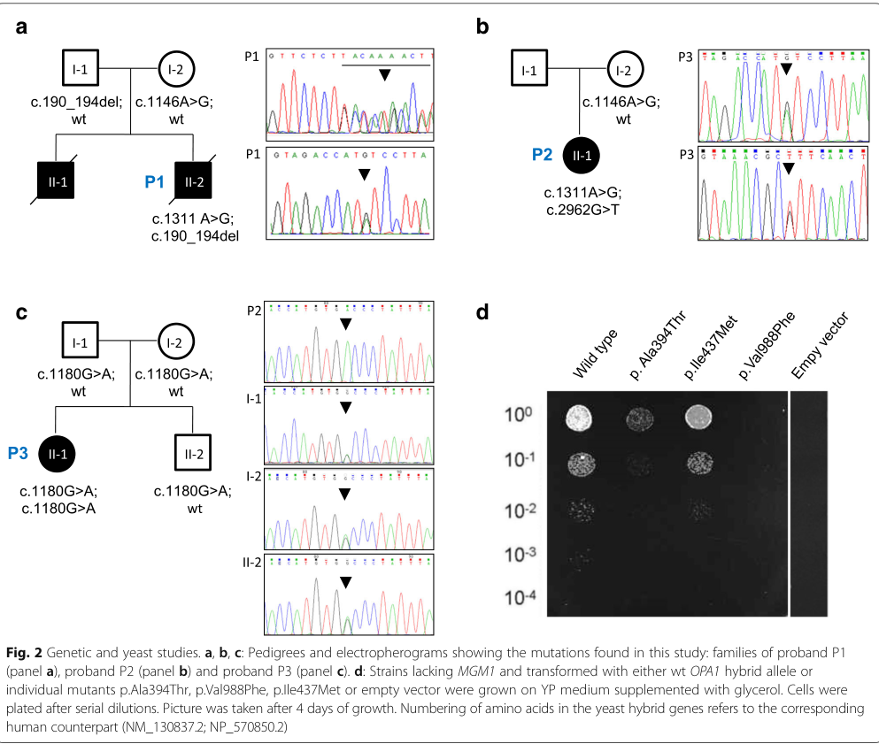

## Question

# Disease Characteristics Research Template

## Target Disease
- **Disease Name:** Mitochondrial DNA Depletion Syndrome 14B (Cardioencephalomyopathic Type)
- **MONDO ID:**  (if available)
- **Category:** Mendelian

## Research Objectives

Please provide a comprehensive research report on **Mitochondrial DNA Depletion Syndrome 14B (Cardioencephalomyopathic Type)** covering all of the
disease characteristics listed below. This report will be used to populate a disease knowledge
base entry. Be thorough and cite primary literature (PMID preferred) for all claims.

For each section, **suggested databases/resources** are listed. These are the first places
you should search for information on each topic.

---

### 1. Disease Information
> **Search first:** OMIM, Orphanet, ICD-10/ICD-11, MeSH, PubMed

- What is the disease? Provide a concise overview.
- What are the key identifiers? (OMIM, Orphanet, ICD-10/ICD-11, MeSH, Mondo)
- What are the common synonyms and alternative names?
- Is the information derived from individual patients (e.g., EHR) or aggregated disease-level resources?

### 2. Etiology

- **Disease Causal Factors**: What are the primary causes? (genetic, environmental, infectious, mechanistic)
- **Risk Factors**:
  > **Search first:** PubMed, Cochrane Library, UpToDate, clinical guidelines, ClinVar, ClinGen, GWAS Catalog, PheGenI, CTD, CDC, WHO, epidemiological databases
  - Genetic risk factors (causal variants, susceptibility loci, modifier genes)
  - Environmental risk factors (toxins, lifestyle, occupational exposures, age, sex, family history)
- **Protective Factors**:
  > **Search first:** PubMed, Cochrane Library, clinical trial databases, GWAS Catalog, gnomAD, WHO, CDC, nutrition databases
  - Genetic protective factors (protective variants, modifier alleles)
  - Environmental protective factors (diet, lifestyle, exposures that reduce risk)
- **Gene-Environment Interactions**: How do genetic and environmental factors interact to influence disease?
  > **Search first:** CTD, PubMed, PheGenI, GxE databases

### 3. Phenotypes
> **Search first:** HPO (Human Phenotype Ontology), OMIM, Orphanet, PubMed, clinicaltrials.gov, MedDRA, SNOMED CT, DECIPHER, LOINC

For each phenotype, provide:
- **Phenotype type**: symptoms, clinical signs, physical manifestations, behavioral changes, or laboratory abnormalities
  > For symptoms/signs: HPO, OMIM, Orphanet, PubMed
  > For behavioral changes: HPO, DSM, RDoC (Research Domain Criteria), PubMed
  > For laboratory abnormalities: LOINC, SNOMED CT, LabTests Online, PubMed
- **Phenotype characteristics**:
  > **Search first:** OMIM, Orphanet, HPO, PubMed
  - Age of symptom onset (neonatal, childhood, adult-onset, late-onset)
  - Symptom severity (mild, moderate, severe, variable)
  - Symptom progression (stable, progressive, episodic, fluctuating)
  - Frequency among affected individuals (percentage or qualitative)
- **Quality of life impact**: Effects on daily functioning and well-being (per-phenotype when possible)
  > **Search first:** EQ-5D database, SF-36, WHO QOL databases, PubMed
- Suggest HPO (Human Phenotype Ontology) terms for each phenotype

### 4. Genetic/Molecular Information

- **Causal Genes**: Gene mutations or chromosomal abnormalities responsible for disease (gene symbols, OMIM IDs)
  > **Search first:** OMIM, ClinVar, HGMD, Ensembl, NCBI Gene
- **Pathogenic Variants**:
  - Affected genes (gene symbols, HGNC IDs)
    > **Search first:** OMIM, NCBI Gene, Ensembl, HGNC, UniProt, GeneCards
  - Variant classification (pathogenic, likely pathogenic, VUS per ACMG/AMP guidelines)
    > **Search first:** ClinVar, ClinGen, ACMG/AMP guidelines, VarSome
  - Variant type/class (missense, frameshift, nonsense, splice-site, structural)
  - Allele frequency in population databases
    > **Search first:** gnomAD, 1000 Genomes, ExAC, TOPMed, dbSNP
  - Somatic vs germline origin
    > **Search first:** COSMIC (somatic), ClinVar, ICGC, TCGA
  - Functional consequences (loss of function, gain of function, dominant negative)
- **Modifier Genes**: Genes that modify disease severity or expression
- **Epigenetic Information**: DNA methylation, histone modifications, chromatin changes affecting disease
  > **Search first:** ENCODE, Roadmap Epigenomics, MethBase, DiseaseMeth
- **Chromosomal Abnormalities**: Large-scale genetic changes (aneuploidy, translocations, inversions)
  > **Search first:** DECIPHER, ClinVar, ECARUCA, UCSC Genome Browser

### 5. Environmental Information

- **Environmental Factors**: Non-genetic contributing factors (toxins, radiation, pollution, occupational exposure)
  > **Search first:** CTD (Comparative Toxicogenomics Database), TOXNET, PubMed, EPA databases
- **Lifestyle Factors**: Behavioral factors (smoking, diet, exercise, alcohol consumption)
  > **Search first:** CDC databases, WHO, PubMed, NHANES
- **Infectious Agents**: If applicable, pathogens causing or triggering disease (bacteria, viruses, fungi, parasites)
  > **Search first:** NCBI Taxonomy, ViPR, BV-BRC, MicrobeDB, GIDEON

### 6. Mechanism / Pathophysiology

- **Molecular Pathways**: Specific signaling cascades or biochemical pathways involved (Wnt, MAPK, mTOR, PI3K-AKT, etc.)
  > **Search first:** KEGG, Reactome, WikiPathways, PathBank, BioCyc
- **Cellular Processes**: Cell-level mechanisms (apoptosis, autophagy, cell cycle dysregulation, inflammation, etc.)
  > **Search first:** Gene Ontology (GO), Reactome, KEGG, PubMed
- **Protein Dysfunction**: How protein structure or function is altered (misfolding, aggregation, loss of function, gain of function)
  > **Search first:** UniProt, PDB (Protein Data Bank), InterPro, Pfam, AlphaFold
- **Metabolic Changes**: Alterations in metabolic processes (energy metabolism, lipid metabolism, amino acid metabolism)
  > **Search first:** KEGG, BioCyc, HMDB (Human Metabolome Database), BRENDA
- **Immune System Involvement**: Role of immune response (autoimmunity, immunodeficiency, chronic inflammation)
  > **Search first:** ImmPort, Immunome Database, IEDB, Gene Ontology
- **Tissue Damage Mechanisms**: How tissues/ are injured (oxidative stress, ischemia, fibrosis, necrosis)
  > **Search first:** PubMed, Gene Ontology, Reactome
- **Biochemical Abnormalities**: Specific molecular defects (enzyme deficiencies, receptor dysfunction, ion channel defects)
  > **Search first:** BRENDA, UniProt, KEGG, OMIM, PubMed
- **Epigenetic Changes**: DNA methylation, histone modifications affecting gene expression in disease
  > **Search first:** ENCODE, Roadmap Epigenomics, MethBase, DiseaseMeth
- **Molecular Profiling** (if available):
  - Transcriptomics/gene expression changes
    > **Search first:** GEO (Gene Expression Omnibus), ArrayExpress, GTEx, Human Cell Atlas, SRA
  - Proteomics findings
    > **Search first:** PRIDE, ProteomeXchange, Human Protein Atlas, STRING, BioGRID
  - Metabolomics signatures
    > **Search first:** MetaboLights, Metabolomics Workbench, HMDB, METLIN
  - Lipidomics alterations
    > **Search first:** LIPID MAPS, SwissLipids, LipidHome, Metabolomics Workbench
  - Genomic structural features
    > **Search first:** UCSC Genome Browser, Ensembl, NCBI, dbVar, DGV
- **Advanced Technologies** (if applicable):
  - Single-cell analysis findings (cell-type specific mechanisms, cellular heterogeneity)
    > **Search first:** Human Cell Atlas, Single Cell Portal, GEO, CELLxGENE
  - Spatial transcriptomics findings
    > **Search first:** GEO, Spatial Research, Vizgen, 10x Genomics data
  - Multi-omics integration results
    > **Search first:** TCGA, ICGC, cBioPortal, LinkedOmics, PubMed
  - Functional genomics screens (CRISPR, RNAi)
    > **Search first:** DepMap, GenomeRNAi, PubMed, BioGRID ORCS

For each mechanism, describe:
- The causal chain from initial trigger to clinical manifestation
- Which mechanisms are upstream vs downstream
- What cell types and biological processes are involved
- Suggest GO terms for biological processes and CL terms for cell types

### 7. Anatomical Structures Affected

- **Organ Level**:
  - Primary organs directly affected
  - Secondary organ involvement (complications, secondary effects)
  - Body systems involved (cardiovascular, nervous, digestive, respiratory, endocrine, etc.)
  > **Search first:** Uberon, FMA (Foundational Model of Anatomy), OMIM, HPO, ICD-11, MeSH, SNOMED CT
- **Tissue and Cell Level**:
  - Specific tissue types affected (epithelial, connective, muscle, nervous)
  - Specific cell populations targeted (with Cell Ontology terms)
  > **Search first:** Uberon, Human Protein Atlas, Cell Ontology, Human Cell Atlas, CellMarker, PanglaoDB
- **Subcellular Level**:
  - Cellular compartments involved (mitochondria, nucleus, ER, lysosomes) (with GO Cellular Component terms)
  > **Search first:** Gene Ontology (Cellular Component), UniProt, Human Protein Atlas
- **Localization**:
  - Specific anatomical sites (with UBERON terms)
    > **Search first:** FMA, Uberon, NeuroNames (for brain), SNOMED CT
  - Lateralization (unilateral, bilateral, asymmetric)
    > **Search first:** HPO, clinical literature, imaging databases

### 8. Temporal Development

- **Onset**:
  - Typical age of onset (congenital, pediatric, adult, geriatric)
  - Onset pattern (acute, subacute, chronic, insidious)
  > **Search first:** OMIM, Orphanet, HPO, PubMed
- **Progression**:
  - Disease stages (early, intermediate, advanced, end-stage)
    > **Search first:** Cancer Staging Manual (AJCC), WHO classifications, PubMed
  - Progression rate (rapid, slow, variable)
  - Disease course pattern (episodic, relapsing-remitting, progressive, stable)
  - Disease duration (self-limited, chronic lifelong)
  > **Search first:** Disease registries, longitudinal cohort databases, natural history studies, PubMed, Orphanet, OMIM
- **Patterns**:
  - Remission patterns (spontaneous, treatment-induced)
    > **Search first:** Clinical trial databases, disease registries, PubMed
  - Critical periods (time windows of vulnerability or opportunity for intervention)
    > **Search first:** PubMed, developmental biology databases, clinical guidelines

### 9. Inheritance and Population

- **Epidemiology**:
  - Prevalence (cases per 100,000 at given time)
  - Incidence (new cases per 100,000 per year)
  > **Search first:** Orphanet, CDC, WHO, GBD (Global Burden of Disease), national registries, SEER, disease registries
- **For Genetic Etiology**:
  - Inheritance pattern (AD, AR, X-linked, mitochondrial, multifactorial, polygenic)
    > **Search first:** OMIM, Orphanet, ClinVar, GTR (Genetic Testing Registry)
  - Penetrance (complete, incomplete, age-dependent)
    > **Search first:** ClinVar, OMIM, PubMed, ClinGen
  - Expressivity (variable, consistent)
    > **Search first:** OMIM, ClinVar, PubMed
  - Genetic anticipation (increasing severity in successive generations)
    > **Search first:** OMIM, PubMed (especially for repeat expansion disorders)
  - Germline mosaicism
    > **Search first:** ClinVar, OMIM, genetic counseling literature, PubMed
  - Founder effects (population-specific mutations)
    > **Search first:** gnomAD, population genetics databases, PubMed
  - Consanguinity role
    > **Search first:** OMIM, population studies, genetic counseling resources
  - Carrier frequency
    > **Search first:** gnomAD, carrier screening databases, GeneReviews, GTR
- **Population Demographics**:
  - Affected populations (ethnic or demographic groups with higher prevalence)
    > **Search first:** gnomAD, 1000 Genomes, PAGE Study, PubMed, population registries
  - Geographic distribution (endemic areas, regional variation)
    > **Search first:** WHO, CDC, GBD, Orphanet, geographic epidemiology databases
  - Geographic distribution of specific variants
  - Sex ratio (male:female)
    > **Search first:** Disease registries, OMIM, PubMed, epidemiological databases
  - Age distribution of affected individuals
    > **Search first:** CDC, disease registries, SEER, Orphanet

### 10. Diagnostics

- **Clinical Tests**:
  - Laboratory tests (blood, urine, tissue chemistry, specific enzyme assays)
    > **Search first:** LOINC, LabTests Online, PubMed
  - Biomarkers (proteins, metabolites, genetic markers, circulating biomarkers)
    > **Search first:** FDA Biomarker List, BEST (Biomarkers, EndpointS, and other Tools), PubMed
  - Imaging studies (X-ray, CT, MRI, PET, ultrasound)
    > **Search first:** RadLex, DICOM, Radiopaedia, imaging databases
  - Functional tests (pulmonary function, cardiac stress tests)
    > **Search first:** LOINC, clinical guidelines, PubMed
  - Electrophysiology (EEG, EMG, ECG, nerve conduction studies)
    > **Search first:** LOINC, clinical neurophysiology databases, PubMed
  - Biopsy findings (histopathology, immunohistochemistry)
    > **Search first:** SNOMED CT, College of American Pathologists resources, PubMed
  - Pathology findings (microscopic examination)
    > **Search first:** SNOMED CT, Digital Pathology databases, PubMed
- **Genetic Testing**:
  > **Search first:** GTR (Genetic Testing Registry), GeneReviews, ClinGen
  - Overview of recommended genetic testing approach
  - Whole genome sequencing (WGS) utility
    > **Search first:** GTR, ClinVar, GEL (Genomics England), gnomAD
  - Whole exome sequencing (WES) utility
    > **Search first:** GTR, ClinVar, OMIM, GeneMatcher
  - Gene panels (which panels, which genes)
    > **Search first:** GTR, ClinVar, laboratory-specific databases
  - Single gene testing
    > **Search first:** GTR, ClinVar, OMIM, GeneReviews
  - Chromosomal microarray (CMA)
    > **Search first:** DECIPHER, ClinVar, dbVar, ECARUCA
  - Karyotyping
    > **Search first:** Chromosome Abnormality Database, ClinVar, cytogenetics resources
  - FISH
    > **Search first:** ClinVar, cytogenetics databases, PubMed
  - Mitochondrial DNA testing
    > **Search first:** MITOMAP, MSeqDR, ClinVar, GTR
  - Repeat expansion testing
    > **Search first:** GTR, ClinVar, repeat expansion databases, PubMed
- **Omics-Based Diagnostics** (if applicable):
  - RNA sequencing / transcriptomics
    > **Search first:** GEO, ArrayExpress, GTEx, RNA-seq databases
  - Proteomics
    > **Search first:** PRIDE, ProteomeXchange, FDA Biomarker database
  - Metabolomics
    > **Search first:** MetaboLights, Metabolomics Workbench, HMDB
  - Epigenomics
    > **Search first:** GEO, ENCODE, Roadmap Epigenomics, MethBase
  - Liquid biopsy
    > **Search first:** COSMIC, ClinVar, liquid biopsy databases, PubMed
- **Clinical Criteria**:
  - Standardized diagnostic criteria (DSM, ICD, society guidelines)
    > **Search first:** DSM-5, ICD-11, clinical society guidelines, UpToDate
  - Differential diagnosis (other conditions to rule out, with distinguishing features)
    > **Search first:** DynaMed, UpToDate, clinical decision support systems
- **Screening**:
  - Screening methods for asymptomatic individuals (newborn screening, carrier screening, cascade screening)
    > **Search first:** ACMG recommendations, CDC newborn screening, GTR

### 11. Outcome/Prognosis

- **Survival and Mortality**:
  - Survival rate (5-year, 10-year, overall)
    > **Search first:** SEER, cancer registries, disease-specific registries, PubMed
  - Life expectancy (with and without treatment if applicable)
    > **Search first:** Orphanet, disease registries, actuarial databases, PubMed
  - Mortality rate
    > **Search first:** CDC, WHO, GBD, national mortality databases
  - Disease-specific mortality (deaths directly attributable to disease)
    > **Search first:** Disease registries, CDC Wonder, GBD, PubMed
- **Morbidity and Function**:
  - Morbidity (disease-related disability and health impacts)
    > **Search first:** GBD, WHO, disability databases, PubMed
  - Disability outcomes (long-term functional impairments)
    > **Search first:** ICF (International Classification of Functioning), disability registries
  - Quality of life measures (EQ-5D, SF-36, PROMIS, disease-specific tools)
    > **Search first:** EQ-5D database, SF-36, PROMIS, PubMed
- **Disease Course**:
  - Complications (secondary problems: infections, organ failure, etc.)
    > **Search first:** ICD codes, disease registries, clinical databases, PubMed
  - Recovery potential (likelihood and extent of recovery, with vs without treatment)
    > **Search first:** Natural history studies, rehabilitation databases, PubMed
- **Prediction**:
  - Prognostic factors (age, disease severity, biomarkers, treatment response)
    > **Search first:** Prognostic models databases, clinical calculators, PubMed
  - Prognostic biomarkers (molecular markers predicting disease course)
    > **Search first:** FDA Biomarker database, PubMed, cancer prognostic databases

### 12. Treatment

- **Pharmacotherapy**:
  - Pharmacological treatments (drug names, drug classes, mechanisms of action)
    > **Search first:** DrugBank, RxNorm, ATC classification, DailyMed, FDA databases
  - Pharmacogenomics (how genetic variants affect drug metabolism, efficacy, toxicity)
    > **Search first:** PharmGKB, CPIC (Clinical Pharmacogenetics), FDA Table of PGx Biomarkers
- **Advanced Therapeutics**:
  - Gene therapy (viral vectors, CRISPR, gene replacement, gene editing)
    > **Search first:** ClinicalTrials.gov, FDA gene therapy database, ASGCT resources
  - Cell therapy (stem cell transplant, CAR-T, cellular therapeutics)
    > **Search first:** ClinicalTrials.gov, FDA cell therapy database, FACT standards
  - RNA-based therapies (ASOs, siRNA, mRNA therapies)
    > **Search first:** ClinicalTrials.gov, FDA approvals, PubMed
  - Targeted therapies (treatments directed at specific molecular targets)
    > **Search first:** My Cancer Genome, OncoKB, ClinicalTrials.gov, FDA approvals
  - Immunotherapies (checkpoint inhibitors, monoclonal antibodies)
    > **Search first:** Cancer Immunotherapy Database, FDA approvals, ClinicalTrials.gov
- **Surgical and Interventional**:
  - Surgical interventions (types of surgery, timing, outcomes)
    > **Search first:** CPT codes, surgical registries, clinical guidelines, PubMed
- **Supportive and Rehabilitative**:
  - Supportive care (symptom management, pain control, nutrition)
    > **Search first:** Clinical guidelines, Cochrane Library, PubMed
  - Rehabilitation (physical therapy, occupational therapy, speech therapy)
    > **Search first:** Rehabilitation medicine databases, clinical guidelines, PubMed
- **Experimental**:
  - Experimental treatments in clinical trials (with NCT identifiers if available)
    > **Search first:** ClinicalTrials.gov, EU Clinical Trials Register, WHO ICTRP
- **Treatment Outcomes**:
  - Treatment response rates
    > **Search first:** Clinical trial databases, FDA reviews, systematic reviews, PubMed
  - Side effects and adverse events
    > **Search first:** FDA Adverse Event Reporting System (FAERS), MedWatch, PubMed
- **Treatment Strategy**:
  - Treatment algorithms (clinical pathways, decision trees)
    > **Search first:** Clinical practice guidelines, NCCN Guidelines, UpToDate
  - Combination therapies
    > **Search first:** ClinicalTrials.gov, treatment guidelines, PubMed
  - Personalized medicine approaches (genotype-guided treatment)
    > **Search first:** My Cancer Genome, CIViC, PharmGKB, precision medicine databases

For each treatment, suggest NCIT (NCI Thesaurus) clinical-intervention terms where applicable.

### 13. Prevention

- **Prevention Levels**:
  - Primary prevention (preventing disease occurrence: vaccination, risk factor modification)
    > **Search first:** CDC, WHO, USPSTF recommendations, Cochrane Library
  - Secondary prevention (early detection and treatment: screening programs, early intervention)
    > **Search first:** USPSTF, CDC screening guidelines, WHO
  - Tertiary prevention (preventing complications in those with disease)
    > **Search first:** Clinical guidelines, disease management protocols, PubMed
- **Immunization**: Vaccine strategies (if applicable)
  > **Search first:** CDC vaccine schedules, WHO immunization, FDA vaccine database
- **Screening and Early Detection**:
  - Screening programs (population-based: newborn screening, cancer screening)
    > **Search first:** CDC screening programs, USPSTF, cancer screening databases
  - Genetic screening (carrier screening, preimplantation genetic diagnosis, prenatal testing)
    > **Search first:** ACMG recommendations, ACOG guidelines, GTR
  - Risk stratification (identifying high-risk individuals for targeted prevention)
    > **Search first:** Risk prediction models, clinical calculators, PubMed
- **Behavioral Interventions**: Lifestyle modifications to reduce risk
  > **Search first:** CDC, WHO, behavioral intervention databases, Cochrane Library
- **Counseling**: Genetic counseling (risk assessment, family planning guidance)
  > **Search first:** NSGC resources, ACMG guidelines, GeneReviews
- **Public Health**:
  - Public health interventions (sanitation, vector control, health education)
    > **Search first:** CDC, WHO, public health databases, PubMed
  - Environmental interventions (reducing environmental risk factors)
    > **Search first:** EPA databases, WHO environmental health, PubMed
- **Prophylaxis**: Preventive medications or procedures
  > **Search first:** Clinical guidelines, FDA approvals, PubMed

### 14. Other Species / Natural Disease

- **Taxonomy**: Species affected (with NCBI Taxon identifiers)
  > **Search first:** NCBI Taxonomy
- **Breed**: Specific breeds affected (with VBO identifiers if applicable)
  > **Search first:** VBO (Vertebrate Breed Ontology)
- **Gene**: Orthologous genes in other species (with NCBI Gene IDs)
  > **Search first:** NCBI Gene
- **Natural Disease**:
  - Naturally occurring disease in other species (companion animals, wildlife)
    > **Search first:** OMIA (Online Mendelian Inheritance in Animals), VetCompass, PubMed
  - Veterinary relevance and importance in animal health
    > **Search first:** OMIA, veterinary databases, PubMed
- **Comparative Biology**:
  - Comparative pathology (similarities and differences across species)
    > **Search first:** OMIA, comparative pathology databases, PubMed
  - Evolutionary conservation of disease mechanisms
    > **Search first:** HomoloGene, OrthoMCL, Alliance of Genome Resources
- **Transmission** (if applicable):
  - Zoonotic potential
    > **Search first:** CDC zoonotic diseases, WHO zoonoses, GIDEON
  - Cross-species susceptibility
    > **Search first:** NCBI Taxonomy, veterinary databases, PubMed

### 15. Model Organisms

- **Model Types**:
  - Model organism type (mammalian, invertebrate, cellular, in vitro)
    > **Search first:** Alliance of Genome Resources, model organism databases
  - Specific model systems (mouse, rat, zebrafish, Drosophila, C. elegans, yeast, cell lines, organoids, iPSCs)
    > **Search first:** MGI, RGD, ZFIN, FlyBase, WormBase, SGD, ATCC, Cellosaurus
  - Induced models (drug treatment, surgical intervention, environmental manipulation)
    > **Search first:** MGI, model organism databases, PubMed
- **Genetic Models**:
  - Types available (knockout, knock-in, transgenic, conditional, humanized)
    > **Search first:** MGI, IMPC, KOMP, EuMMCR, IMSR
- **Model Characteristics**:
  - Phenotype recapitulation (how well model reproduces human disease features)
    > **Search first:** Model organism databases, comparative studies, PubMed
  - Model limitations (aspects of human disease not captured)
    > **Search first:** Model organism databases, PubMed, review articles
- **Applications**:
  - Research applications (what aspects of disease can be studied)
    > **Search first:** Model organism databases, PubMed
- **Resources**:
  - Model databases
    > **Search first:** MGI, RGD, ZFIN, FlyBase, WormBase, IMSR, EMMA, MMRRC

---

## Citation Requirements

- Cite primary literature (PMID preferred) for all mechanistic and clinical claims
- Prioritize recent reviews and landmark papers
- Include direct quotes from abstracts where possible to support key statements
- Distinguish evidence source types: human clinical, model organism, in vitro, computational

## Output Format

Structure your response as a comprehensive narrative organized by the sections above.
For each section, provide:
- Factual content with specific details (numbers, percentages, gene names, variant nomenclature)
- Ontology term suggestions (HPO, GO, CL, UBERON, CHEBI, NCIT, MONDO) where applicable
- Evidence citations with PMIDs
- Direct quotes from abstracts to support key claims
- Clear indication when information is not available or not applicable for this disease

This report will be used to populate a disease knowledge base entry with:
- Pathophysiology descriptions with causal chains
- Gene/protein annotations (HGNC, GO terms)
- Phenotype associations (HP terms) with frequencies
- Cell type involvement (CL terms)
- Anatomical locations (UBERON terms)
- Chemical entities (CHEBI terms)
- Treatment annotations (NCIT terms)
- Evidence items with PMIDs and exact abstract quotes
- Epidemiology, prognosis, diagnostic, and prevention information
- Animal model descriptions with phenotype recapitulation details

## Output

Question: You are an expert researcher providing comprehensive, well-cited information.

Provide detailed information focusing on:
1. Key concepts and definitions with current understanding
2. Recent developments and latest research (prioritize 2023-2024 sources)
3. Current applications and real-world implementations
4. Expert opinions and analysis from authoritative sources
5. Relevant statistics and data from recent studies

Format as a comprehensive research report with proper citations. Include URLs and publication dates where available.
Always prioritize recent, authoritative sources and provide specific citations for all major claims.

# Disease Characteristics Research Template

## Target Disease
- **Disease Name:** Mitochondrial DNA Depletion Syndrome 14B (Cardioencephalomyopathic Type)
- **MONDO ID:**  (if available)
- **Category:** Mendelian

## Research Objectives

Please provide a comprehensive research report on **Mitochondrial DNA Depletion Syndrome 14B (Cardioencephalomyopathic Type)** covering all of the
disease characteristics listed below. This report will be used to populate a disease knowledge
base entry. Be thorough and cite primary literature (PMID preferred) for all claims.

For each section, **suggested databases/resources** are listed. These are the first places
you should search for information on each topic.

---

### 1. Disease Information
> **Search first:** OMIM, Orphanet, ICD-10/ICD-11, MeSH, PubMed

- What is the disease? Provide a concise overview.
- What are the key identifiers? (OMIM, Orphanet, ICD-10/ICD-11, MeSH, Mondo)
- What are the common synonyms and alternative names?
- Is the information derived from individual patients (e.g., EHR) or aggregated disease-level resources?

### 2. Etiology

- **Disease Causal Factors**: What are the primary causes? (genetic, environmental, infectious, mechanistic)
- **Risk Factors**:
  > **Search first:** PubMed, Cochrane Library, UpToDate, clinical guidelines, ClinVar, ClinGen, GWAS Catalog, PheGenI, CTD, CDC, WHO, epidemiological databases
  - Genetic risk factors (causal variants, susceptibility loci, modifier genes)
  - Environmental risk factors (toxins, lifestyle, occupational exposures, age, sex, family history)
- **Protective Factors**:
  > **Search first:** PubMed, Cochrane Library, clinical trial databases, GWAS Catalog, gnomAD, WHO, CDC, nutrition databases
  - Genetic protective factors (protective variants, modifier alleles)
  - Environmental protective factors (diet, lifestyle, exposures that reduce risk)
- **Gene-Environment Interactions**: How do genetic and environmental factors interact to influence disease?
  > **Search first:** CTD, PubMed, PheGenI, GxE databases

### 3. Phenotypes
> **Search first:** HPO (Human Phenotype Ontology), OMIM, Orphanet, PubMed, clinicaltrials.gov, MedDRA, SNOMED CT, DECIPHER, LOINC

For each phenotype, provide:
- **Phenotype type**: symptoms, clinical signs, physical manifestations, behavioral changes, or laboratory abnormalities
  > For symptoms/signs: HPO, OMIM, Orphanet, PubMed
  > For behavioral changes: HPO, DSM, RDoC (Research Domain Criteria), PubMed
  > For laboratory abnormalities: LOINC, SNOMED CT, LabTests Online, PubMed
- **Phenotype characteristics**:
  > **Search first:** OMIM, Orphanet, HPO, PubMed
  - Age of symptom onset (neonatal, childhood, adult-onset, late-onset)
  - Symptom severity (mild, moderate, severe, variable)
  - Symptom progression (stable, progressive, episodic, fluctuating)
  - Frequency among affected individuals (percentage or qualitative)
- **Quality of life impact**: Effects on daily functioning and well-being (per-phenotype when possible)
  > **Search first:** EQ-5D database, SF-36, WHO QOL databases, PubMed
- Suggest HPO (Human Phenotype Ontology) terms for each phenotype

### 4. Genetic/Molecular Information

- **Causal Genes**: Gene mutations or chromosomal abnormalities responsible for disease (gene symbols, OMIM IDs)
  > **Search first:** OMIM, ClinVar, HGMD, Ensembl, NCBI Gene
- **Pathogenic Variants**:
  - Affected genes (gene symbols, HGNC IDs)
    > **Search first:** OMIM, NCBI Gene, Ensembl, HGNC, UniProt, GeneCards
  - Variant classification (pathogenic, likely pathogenic, VUS per ACMG/AMP guidelines)
    > **Search first:** ClinVar, ClinGen, ACMG/AMP guidelines, VarSome
  - Variant type/class (missense, frameshift, nonsense, splice-site, structural)
  - Allele frequency in population databases
    > **Search first:** gnomAD, 1000 Genomes, ExAC, TOPMed, dbSNP
  - Somatic vs germline origin
    > **Search first:** COSMIC (somatic), ClinVar, ICGC, TCGA
  - Functional consequences (loss of function, gain of function, dominant negative)
- **Modifier Genes**: Genes that modify disease severity or expression
- **Epigenetic Information**: DNA methylation, histone modifications, chromatin changes affecting disease
  > **Search first:** ENCODE, Roadmap Epigenomics, MethBase, DiseaseMeth
- **Chromosomal Abnormalities**: Large-scale genetic changes (aneuploidy, translocations, inversions)
  > **Search first:** DECIPHER, ClinVar, ECARUCA, UCSC Genome Browser

### 5. Environmental Information

- **Environmental Factors**: Non-genetic contributing factors (toxins, radiation, pollution, occupational exposure)
  > **Search first:** CTD (Comparative Toxicogenomics Database), TOXNET, PubMed, EPA databases
- **Lifestyle Factors**: Behavioral factors (smoking, diet, exercise, alcohol consumption)
  > **Search first:** CDC databases, WHO, PubMed, NHANES
- **Infectious Agents**: If applicable, pathogens causing or triggering disease (bacteria, viruses, fungi, parasites)
  > **Search first:** NCBI Taxonomy, ViPR, BV-BRC, MicrobeDB, GIDEON

### 6. Mechanism / Pathophysiology

- **Molecular Pathways**: Specific signaling cascades or biochemical pathways involved (Wnt, MAPK, mTOR, PI3K-AKT, etc.)
  > **Search first:** KEGG, Reactome, WikiPathways, PathBank, BioCyc
- **Cellular Processes**: Cell-level mechanisms (apoptosis, autophagy, cell cycle dysregulation, inflammation, etc.)
  > **Search first:** Gene Ontology (GO), Reactome, KEGG, PubMed
- **Protein Dysfunction**: How protein structure or function is altered (misfolding, aggregation, loss of function, gain of function)
  > **Search first:** UniProt, PDB (Protein Data Bank), InterPro, Pfam, AlphaFold
- **Metabolic Changes**: Alterations in metabolic processes (energy metabolism, lipid metabolism, amino acid metabolism)
  > **Search first:** KEGG, BioCyc, HMDB (Human Metabolome Database), BRENDA
- **Immune System Involvement**: Role of immune response (autoimmunity, immunodeficiency, chronic inflammation)
  > **Search first:** ImmPort, Immunome Database, IEDB, Gene Ontology
- **Tissue Damage Mechanisms**: How tissues/ are injured (oxidative stress, ischemia, fibrosis, necrosis)
  > **Search first:** PubMed, Gene Ontology, Reactome
- **Biochemical Abnormalities**: Specific molecular defects (enzyme deficiencies, receptor dysfunction, ion channel defects)
  > **Search first:** BRENDA, UniProt, KEGG, OMIM, PubMed
- **Epigenetic Changes**: DNA methylation, histone modifications affecting gene expression in disease
  > **Search first:** ENCODE, Roadmap Epigenomics, MethBase, DiseaseMeth
- **Molecular Profiling** (if available):
  - Transcriptomics/gene expression changes
    > **Search first:** GEO (Gene Expression Omnibus), ArrayExpress, GTEx, Human Cell Atlas, SRA
  - Proteomics findings
    > **Search first:** PRIDE, ProteomeXchange, Human Protein Atlas, STRING, BioGRID
  - Metabolomics signatures
    > **Search first:** MetaboLights, Metabolomics Workbench, HMDB, METLIN
  - Lipidomics alterations
    > **Search first:** LIPID MAPS, SwissLipids, LipidHome, Metabolomics Workbench
  - Genomic structural features
    > **Search first:** UCSC Genome Browser, Ensembl, NCBI, dbVar, DGV
- **Advanced Technologies** (if applicable):
  - Single-cell analysis findings (cell-type specific mechanisms, cellular heterogeneity)
    > **Search first:** Human Cell Atlas, Single Cell Portal, GEO, CELLxGENE
  - Spatial transcriptomics findings
    > **Search first:** GEO, Spatial Research, Vizgen, 10x Genomics data
  - Multi-omics integration results
    > **Search first:** TCGA, ICGC, cBioPortal, LinkedOmics, PubMed
  - Functional genomics screens (CRISPR, RNAi)
    > **Search first:** DepMap, GenomeRNAi, PubMed, BioGRID ORCS

For each mechanism, describe:
- The causal chain from initial trigger to clinical manifestation
- Which mechanisms are upstream vs downstream
- What cell types and biological processes are involved
- Suggest GO terms for biological processes and CL terms for cell types

### 7. Anatomical Structures Affected

- **Organ Level**:
  - Primary organs directly affected
  - Secondary organ involvement (complications, secondary effects)
  - Body systems involved (cardiovascular, nervous, digestive, respiratory, endocrine, etc.)
  > **Search first:** Uberon, FMA (Foundational Model of Anatomy), OMIM, HPO, ICD-11, MeSH, SNOMED CT
- **Tissue and Cell Level**:
  - Specific tissue types affected (epithelial, connective, muscle, nervous)
  - Specific cell populations targeted (with Cell Ontology terms)
  > **Search first:** Uberon, Human Protein Atlas, Cell Ontology, Human Cell Atlas, CellMarker, PanglaoDB
- **Subcellular Level**:
  - Cellular compartments involved (mitochondria, nucleus, ER, lysosomes) (with GO Cellular Component terms)
  > **Search first:** Gene Ontology (Cellular Component), UniProt, Human Protein Atlas
- **Localization**:
  - Specific anatomical sites (with UBERON terms)
    > **Search first:** FMA, Uberon, NeuroNames (for brain), SNOMED CT
  - Lateralization (unilateral, bilateral, asymmetric)
    > **Search first:** HPO, clinical literature, imaging databases

### 8. Temporal Development

- **Onset**:
  - Typical age of onset (congenital, pediatric, adult, geriatric)
  - Onset pattern (acute, subacute, chronic, insidious)
  > **Search first:** OMIM, Orphanet, HPO, PubMed
- **Progression**:
  - Disease stages (early, intermediate, advanced, end-stage)
    > **Search first:** Cancer Staging Manual (AJCC), WHO classifications, PubMed
  - Progression rate (rapid, slow, variable)
  - Disease course pattern (episodic, relapsing-remitting, progressive, stable)
  - Disease duration (self-limited, chronic lifelong)
  > **Search first:** Disease registries, longitudinal cohort databases, natural history studies, PubMed, Orphanet, OMIM
- **Patterns**:
  - Remission patterns (spontaneous, treatment-induced)
    > **Search first:** Clinical trial databases, disease registries, PubMed
  - Critical periods (time windows of vulnerability or opportunity for intervention)
    > **Search first:** PubMed, developmental biology databases, clinical guidelines

### 9. Inheritance and Population

- **Epidemiology**:
  - Prevalence (cases per 100,000 at given time)
  - Incidence (new cases per 100,000 per year)
  > **Search first:** Orphanet, CDC, WHO, GBD (Global Burden of Disease), national registries, SEER, disease registries
- **For Genetic Etiology**:
  - Inheritance pattern (AD, AR, X-linked, mitochondrial, multifactorial, polygenic)
    > **Search first:** OMIM, Orphanet, ClinVar, GTR (Genetic Testing Registry)
  - Penetrance (complete, incomplete, age-dependent)
    > **Search first:** ClinVar, OMIM, PubMed, ClinGen
  - Expressivity (variable, consistent)
    > **Search first:** OMIM, ClinVar, PubMed
  - Genetic anticipation (increasing severity in successive generations)
    > **Search first:** OMIM, PubMed (especially for repeat expansion disorders)
  - Germline mosaicism
    > **Search first:** ClinVar, OMIM, genetic counseling literature, PubMed
  - Founder effects (population-specific mutations)
    > **Search first:** gnomAD, population genetics databases, PubMed
  - Consanguinity role
    > **Search first:** OMIM, population studies, genetic counseling resources
  - Carrier frequency
    > **Search first:** gnomAD, carrier screening databases, GeneReviews, GTR
- **Population Demographics**:
  - Affected populations (ethnic or demographic groups with higher prevalence)
    > **Search first:** gnomAD, 1000 Genomes, PAGE Study, PubMed, population registries
  - Geographic distribution (endemic areas, regional variation)
    > **Search first:** WHO, CDC, GBD, Orphanet, geographic epidemiology databases
  - Geographic distribution of specific variants
  - Sex ratio (male:female)
    > **Search first:** Disease registries, OMIM, PubMed, epidemiological databases
  - Age distribution of affected individuals
    > **Search first:** CDC, disease registries, SEER, Orphanet

### 10. Diagnostics

- **Clinical Tests**:
  - Laboratory tests (blood, urine, tissue chemistry, specific enzyme assays)
    > **Search first:** LOINC, LabTests Online, PubMed
  - Biomarkers (proteins, metabolites, genetic markers, circulating biomarkers)
    > **Search first:** FDA Biomarker List, BEST (Biomarkers, EndpointS, and other Tools), PubMed
  - Imaging studies (X-ray, CT, MRI, PET, ultrasound)
    > **Search first:** RadLex, DICOM, Radiopaedia, imaging databases
  - Functional tests (pulmonary function, cardiac stress tests)
    > **Search first:** LOINC, clinical guidelines, PubMed
  - Electrophysiology (EEG, EMG, ECG, nerve conduction studies)
    > **Search first:** LOINC, clinical neurophysiology databases, PubMed
  - Biopsy findings (histopathology, immunohistochemistry)
    > **Search first:** SNOMED CT, College of American Pathologists resources, PubMed
  - Pathology findings (microscopic examination)
    > **Search first:** SNOMED CT, Digital Pathology databases, PubMed
- **Genetic Testing**:
  > **Search first:** GTR (Genetic Testing Registry), GeneReviews, ClinGen
  - Overview of recommended genetic testing approach
  - Whole genome sequencing (WGS) utility
    > **Search first:** GTR, ClinVar, GEL (Genomics England), gnomAD
  - Whole exome sequencing (WES) utility
    > **Search first:** GTR, ClinVar, OMIM, GeneMatcher
  - Gene panels (which panels, which genes)
    > **Search first:** GTR, ClinVar, laboratory-specific databases
  - Single gene testing
    > **Search first:** GTR, ClinVar, OMIM, GeneReviews
  - Chromosomal microarray (CMA)
    > **Search first:** DECIPHER, ClinVar, dbVar, ECARUCA
  - Karyotyping
    > **Search first:** Chromosome Abnormality Database, ClinVar, cytogenetics resources
  - FISH
    > **Search first:** ClinVar, cytogenetics databases, PubMed
  - Mitochondrial DNA testing
    > **Search first:** MITOMAP, MSeqDR, ClinVar, GTR
  - Repeat expansion testing
    > **Search first:** GTR, ClinVar, repeat expansion databases, PubMed
- **Omics-Based Diagnostics** (if applicable):
  - RNA sequencing / transcriptomics
    > **Search first:** GEO, ArrayExpress, GTEx, RNA-seq databases
  - Proteomics
    > **Search first:** PRIDE, ProteomeXchange, FDA Biomarker database
  - Metabolomics
    > **Search first:** MetaboLights, Metabolomics Workbench, HMDB
  - Epigenomics
    > **Search first:** GEO, ENCODE, Roadmap Epigenomics, MethBase
  - Liquid biopsy
    > **Search first:** COSMIC, ClinVar, liquid biopsy databases, PubMed
- **Clinical Criteria**:
  - Standardized diagnostic criteria (DSM, ICD, society guidelines)
    > **Search first:** DSM-5, ICD-11, clinical society guidelines, UpToDate
  - Differential diagnosis (other conditions to rule out, with distinguishing features)
    > **Search first:** DynaMed, UpToDate, clinical decision support systems
- **Screening**:
  - Screening methods for asymptomatic individuals (newborn screening, carrier screening, cascade screening)
    > **Search first:** ACMG recommendations, CDC newborn screening, GTR

### 11. Outcome/Prognosis

- **Survival and Mortality**:
  - Survival rate (5-year, 10-year, overall)
    > **Search first:** SEER, cancer registries, disease-specific registries, PubMed
  - Life expectancy (with and without treatment if applicable)
    > **Search first:** Orphanet, disease registries, actuarial databases, PubMed
  - Mortality rate
    > **Search first:** CDC, WHO, GBD, national mortality databases
  - Disease-specific mortality (deaths directly attributable to disease)
    > **Search first:** Disease registries, CDC Wonder, GBD, PubMed
- **Morbidity and Function**:
  - Morbidity (disease-related disability and health impacts)
    > **Search first:** GBD, WHO, disability databases, PubMed
  - Disability outcomes (long-term functional impairments)
    > **Search first:** ICF (International Classification of Functioning), disability registries
  - Quality of life measures (EQ-5D, SF-36, PROMIS, disease-specific tools)
    > **Search first:** EQ-5D database, SF-36, PROMIS, PubMed
- **Disease Course**:
  - Complications (secondary problems: infections, organ failure, etc.)
    > **Search first:** ICD codes, disease registries, clinical databases, PubMed
  - Recovery potential (likelihood and extent of recovery, with vs without treatment)
    > **Search first:** Natural history studies, rehabilitation databases, PubMed
- **Prediction**:
  - Prognostic factors (age, disease severity, biomarkers, treatment response)
    > **Search first:** Prognostic models databases, clinical calculators, PubMed
  - Prognostic biomarkers (molecular markers predicting disease course)
    > **Search first:** FDA Biomarker database, PubMed, cancer prognostic databases

### 12. Treatment

- **Pharmacotherapy**:
  - Pharmacological treatments (drug names, drug classes, mechanisms of action)
    > **Search first:** DrugBank, RxNorm, ATC classification, DailyMed, FDA databases
  - Pharmacogenomics (how genetic variants affect drug metabolism, efficacy, toxicity)
    > **Search first:** PharmGKB, CPIC (Clinical Pharmacogenetics), FDA Table of PGx Biomarkers
- **Advanced Therapeutics**:
  - Gene therapy (viral vectors, CRISPR, gene replacement, gene editing)
    > **Search first:** ClinicalTrials.gov, FDA gene therapy database, ASGCT resources
  - Cell therapy (stem cell transplant, CAR-T, cellular therapeutics)
    > **Search first:** ClinicalTrials.gov, FDA cell therapy database, FACT standards
  - RNA-based therapies (ASOs, siRNA, mRNA therapies)
    > **Search first:** ClinicalTrials.gov, FDA approvals, PubMed
  - Targeted therapies (treatments directed at specific molecular targets)
    > **Search first:** My Cancer Genome, OncoKB, ClinicalTrials.gov, FDA approvals
  - Immunotherapies (checkpoint inhibitors, monoclonal antibodies)
    > **Search first:** Cancer Immunotherapy Database, FDA approvals, ClinicalTrials.gov
- **Surgical and Interventional**:
  - Surgical interventions (types of surgery, timing, outcomes)
    > **Search first:** CPT codes, surgical registries, clinical guidelines, PubMed
- **Supportive and Rehabilitative**:
  - Supportive care (symptom management, pain control, nutrition)
    > **Search first:** Clinical guidelines, Cochrane Library, PubMed
  - Rehabilitation (physical therapy, occupational therapy, speech therapy)
    > **Search first:** Rehabilitation medicine databases, clinical guidelines, PubMed
- **Experimental**:
  - Experimental treatments in clinical trials (with NCT identifiers if available)
    > **Search first:** ClinicalTrials.gov, EU Clinical Trials Register, WHO ICTRP
- **Treatment Outcomes**:
  - Treatment response rates
    > **Search first:** Clinical trial databases, FDA reviews, systematic reviews, PubMed
  - Side effects and adverse events
    > **Search first:** FDA Adverse Event Reporting System (FAERS), MedWatch, PubMed
- **Treatment Strategy**:
  - Treatment algorithms (clinical pathways, decision trees)
    > **Search first:** Clinical practice guidelines, NCCN Guidelines, UpToDate
  - Combination therapies
    > **Search first:** ClinicalTrials.gov, treatment guidelines, PubMed
  - Personalized medicine approaches (genotype-guided treatment)
    > **Search first:** My Cancer Genome, CIViC, PharmGKB, precision medicine databases

For each treatment, suggest NCIT (NCI Thesaurus) clinical-intervention terms where applicable.

### 13. Prevention

- **Prevention Levels**:
  - Primary prevention (preventing disease occurrence: vaccination, risk factor modification)
    > **Search first:** CDC, WHO, USPSTF recommendations, Cochrane Library
  - Secondary prevention (early detection and treatment: screening programs, early intervention)
    > **Search first:** USPSTF, CDC screening guidelines, WHO
  - Tertiary prevention (preventing complications in those with disease)
    > **Search first:** Clinical guidelines, disease management protocols, PubMed
- **Immunization**: Vaccine strategies (if applicable)
  > **Search first:** CDC vaccine schedules, WHO immunization, FDA vaccine database
- **Screening and Early Detection**:
  - Screening programs (population-based: newborn screening, cancer screening)
    > **Search first:** CDC screening programs, USPSTF, cancer screening databases
  - Genetic screening (carrier screening, preimplantation genetic diagnosis, prenatal testing)
    > **Search first:** ACMG recommendations, ACOG guidelines, GTR
  - Risk stratification (identifying high-risk individuals for targeted prevention)
    > **Search first:** Risk prediction models, clinical calculators, PubMed
- **Behavioral Interventions**: Lifestyle modifications to reduce risk
  > **Search first:** CDC, WHO, behavioral intervention databases, Cochrane Library
- **Counseling**: Genetic counseling (risk assessment, family planning guidance)
  > **Search first:** NSGC resources, ACMG guidelines, GeneReviews
- **Public Health**:
  - Public health interventions (sanitation, vector control, health education)
    > **Search first:** CDC, WHO, public health databases, PubMed
  - Environmental interventions (reducing environmental risk factors)
    > **Search first:** EPA databases, WHO environmental health, PubMed
- **Prophylaxis**: Preventive medications or procedures
  > **Search first:** Clinical guidelines, FDA approvals, PubMed

### 14. Other Species / Natural Disease

- **Taxonomy**: Species affected (with NCBI Taxon identifiers)
  > **Search first:** NCBI Taxonomy
- **Breed**: Specific breeds affected (with VBO identifiers if applicable)
  > **Search first:** VBO (Vertebrate Breed Ontology)
- **Gene**: Orthologous genes in other species (with NCBI Gene IDs)
  > **Search first:** NCBI Gene
- **Natural Disease**:
  - Naturally occurring disease in other species (companion animals, wildlife)
    > **Search first:** OMIA (Online Mendelian Inheritance in Animals), VetCompass, PubMed
  - Veterinary relevance and importance in animal health
    > **Search first:** OMIA, veterinary databases, PubMed
- **Comparative Biology**:
  - Comparative pathology (similarities and differences across species)
    > **Search first:** OMIA, comparative pathology databases, PubMed
  - Evolutionary conservation of disease mechanisms
    > **Search first:** HomoloGene, OrthoMCL, Alliance of Genome Resources
- **Transmission** (if applicable):
  - Zoonotic potential
    > **Search first:** CDC zoonotic diseases, WHO zoonoses, GIDEON
  - Cross-species susceptibility
    > **Search first:** NCBI Taxonomy, veterinary databases, PubMed

### 15. Model Organisms

- **Model Types**:
  - Model organism type (mammalian, invertebrate, cellular, in vitro)
    > **Search first:** Alliance of Genome Resources, model organism databases
  - Specific model systems (mouse, rat, zebrafish, Drosophila, C. elegans, yeast, cell lines, organoids, iPSCs)
    > **Search first:** MGI, RGD, ZFIN, FlyBase, WormBase, SGD, ATCC, Cellosaurus
  - Induced models (drug treatment, surgical intervention, environmental manipulation)
    > **Search first:** MGI, model organism databases, PubMed
- **Genetic Models**:
  - Types available (knockout, knock-in, transgenic, conditional, humanized)
    > **Search first:** MGI, IMPC, KOMP, EuMMCR, IMSR
- **Model Characteristics**:
  - Phenotype recapitulation (how well model reproduces human disease features)
    > **Search first:** Model organism databases, comparative studies, PubMed
  - Model limitations (aspects of human disease not captured)
    > **Search first:** Model organism databases, PubMed, review articles
- **Applications**:
  - Research applications (what aspects of disease can be studied)
    > **Search first:** Model organism databases, PubMed
- **Resources**:
  - Model databases
    > **Search first:** MGI, RGD, ZFIN, FlyBase, WormBase, IMSR, EMMA, MMRRC

---

## Citation Requirements

- Cite primary literature (PMID preferred) for all mechanistic and clinical claims
- Prioritize recent reviews and landmark papers
- Include direct quotes from abstracts where possible to support key statements
- Distinguish evidence source types: human clinical, model organism, in vitro, computational

## Output Format

Structure your response as a comprehensive narrative organized by the sections above.
For each section, provide:
- Factual content with specific details (numbers, percentages, gene names, variant nomenclature)
- Ontology term suggestions (HPO, GO, CL, UBERON, CHEBI, NCIT, MONDO) where applicable
- Evidence citations with PMIDs
- Direct quotes from abstracts to support key claims
- Clear indication when information is not available or not applicable for this disease

This report will be used to populate a disease knowledge base entry with:
- Pathophysiology descriptions with causal chains
- Gene/protein annotations (HGNC, GO terms)
- Phenotype associations (HP terms) with frequencies
- Cell type involvement (CL terms)
- Anatomical locations (UBERON terms)
- Chemical entities (CHEBI terms)
- Treatment annotations (NCIT terms)
- Evidence items with PMIDs and exact abstract quotes
- Epidemiology, prognosis, diagnostic, and prevention information
- Animal model descriptions with phenotype recapitulation details

# Mitochondrial DNA Depletion Syndrome 14B, Cardioencephalomyopathic Type

## Executive summary and scope

Mitochondrial DNA depletion syndrome 14B (MTDPS14B), cardioencephalomyopathic type, is an exceptionally rare, severe **autosomal-recessive OPA1-related mitochondrial disorder**. The defining report described homozygous **OPA1 p.Leu589Arg** in siblings with fatal infantile mitochondrial encephalomyopathy, hypertrophic cardiomyopathy, and optic atrophy. It must be distinguished from much more common autosomal-dominant OPA1 optic atrophy and from the broader, clinically heterogeneous spectrum of biallelic OPA1 disease. The evidence base consists principally of individual families and small case series—not registries or population cohorts—so prevalence, penetrance, phenotype percentages, survival estimates, and treatment-response rates cannot presently be calculated reliably. The broader biallelic OPA1 literature nevertheless supplies strong human-cell and yeast evidence connecting defective inner-mitochondrial-membrane fusion to mtDNA instability/depletion and impaired oxidative phosphorylation (OXPHOS). (nasca2017notonlydominant pages 1-2, nasca2017notonlydominant pages 10-10)

The most current mechanistic synthesis retrieved was published **28 May 2024**. It emphasizes that mtDNA copy number and integrity depend on nuclear-encoded replication, repair, nucleotide-metabolism, and mitochondrial-dynamics machinery, and that loss of mtDNA function causes OXPHOS impairment with marked tissue specificity. https://doi.org/10.1042/BCJ20230262 (gomes2024mechanismsandpathologies pages 1-2)

| domain | best-supported finding | quantitative/variant detail | suggested ontology terms | evidence type/limitations |
|---|---|---|---|---|
| Disease identity | Defining entity is a recessive OPA1-related mitochondrial disease within the mtDNA maintenance/depletion spectrum, clinically anchored by fatal infantile mitochondrial encephalomyopathy with hypertrophic cardiomyopathy and optic atrophy; it is distinct from dominant OPA1 optic atrophy/ADOA-plus | Causal gene: **OPA1** (OMIM *605290). The 2017 series explicitly cites the earlier homozygous **p.Leu589Arg** case report as the first infantile lethal cardiomyopathic OPA1 phenotype; nomenclature overlap means database identifiers should be verified externally before KB entry finalization (nasca2017notonlydominant pages 1-2, nasca2017notonlydominant pages 9-10, nasca2017notonlydominant pages 10-10) | MONDO: mitochondrial DNA depletion syndrome; NCIT: Mitochondrial Disease; HP: Optic atrophy, Hypertrophic cardiomyopathy, Encephalopathy | Human clinical/genetic evidence; exact MONDO/Orphanet subtype identifier not confirmed in available contexts |
| Inheritance | The cardioencephalomyopathic form is best supported as **autosomal recessive / biallelic OPA1 disease** | Parents carrying single heterozygous variants in reported biallelic cases were unaffected or minimally affected; 2017 paper states this is “in accordance with a recessive mode of inheritance” (nasca2017notonlydominant pages 8-9, nasca2017notonlydominant pages 1-2) | HP: Autosomal recessive inheritance | Human pedigree evidence; penetrance for this ultra-rare subtype cannot be estimated |
| Defining cardioencephalomyopathic cases | The defining subtype should be kept separate from broader biallelic OPA1 disease because the hallmark includes **infantile lethal encephalomyopathy plus hypertrophic cardiomyopathy and optic atrophy** | Reported as “the first homozygous OPA1 mutation… associated with fatal infantile mitochondrial encephalomyopathy, hypertrophic cardiomyopathy and optic atrophy”; variant cited in 2017 review/discussion is **p.Leu589Arg** (nasca2017notonlydominant pages 1-2, nasca2017notonlydominant pages 9-10, nasca2017notonlydominant pages 10-10) | HP: Infantile onset, Hypertrophic cardiomyopathy, Optic atrophy, Lethal infantile disease; UBERON: heart, brain, retina/optic nerve | Indirectly supported here through discussion of prior primary case; full clinical granularity of the p.Leu589Arg family is not present in the retrieved text |
| Broader biallelic OPA1 spectrum | Broader recessive OPA1 disease includes severe multisystem mitochondrial phenotypes even without cardiomyopathy; optic atrophy may be late or absent early | 2017 series: **P1** c.190_194del (p.Ser64Asnfs*7) + c.1311A>G (p.Ile437Met); **P2** c.2962G>T (p.Val988Phe) + p.Ile437Met; **P3** homozygous c.1180G>A (p.Ala394Thr) (nasca2017notonlydominant pages 1-2, nasca2017notonlydominant pages 3-5, nasca2017notonlydominant pages 5-8) | HP: Ataxia, Peripheral neuropathy, Hypotonia, Developmental regression, Spasticity, Optic atrophy | Human case-series evidence; phenotype spectrum broader than the specific 14B/cardioencephalomyopathic designation |
| Core neurologic phenotype | Early-onset encephalopathic/neurodegenerative disease with hypotonia, ataxia, neuropathy, developmental delay/regression is strongly supported across biallelic OPA1 cases | P1: frequent vomiting from infancy, marked psychomotor delay, seizures, severe axonal sensory neuropathy, lactate peak on MRS, progressive multiorgan failure; P3: ataxic-spastic gait, nystagmus, dysarthria, axonal sensory-motor neuropathy; P2: ataxia and sensory neuropathy (nasca2017notonlydominant pages 3-5, nasca2017notonlydominant pages 2-3, nasca2017notonlydominant pages 9-10) | HP: Global developmental delay, Hypotonia, Ataxia, Seizures, Peripheral axonal neuropathy, Psychomotor regression | Human clinical evidence from 3 patients; no pooled frequency estimates beyond this tiny cohort |
| Ophthalmic phenotype | Optic atrophy is important but may not be the presenting or dominant feature in recessive OPA1 disease | P1 had optic atrophy by age 5; P2 had bilateral optic neuropathy/optic atrophy; P3 had no overt optic atrophy until at least age 10 despite neurologic disease (nasca2017notonlydominant pages 3-5, nasca2017notonlydominant pages 8-9, nasca2017notonlydominant pages 9-10) | HP: Optic atrophy, Ptosis, Ophthalmoparesis, Abnormal visual evoked potentials | Human ophthalmic phenotyping; variability is high, so absence of early optic atrophy does not exclude disease |
| Imaging and electrophysiology | Neuroimaging can show Leigh-like or leukodystrophy-like changes; neurophysiology often shows axonal neuropathy | P1 MRI: bilateral swollen mesencephalon/pons/subthalamic nuclei, putaminal necrosis, cerebellar atrophy; H-MRS: “very high lactate peak”; P3 MRI evolved from white-matter T2 hyperintensities to bilateral putaminal abnormalities; neuropathy shown on NCS (nasca2017notonlydominant pages 3-5, nasca2017notonlydominant pages 9-10) | HP: Abnormality of basal ganglia MRI, Cerebellar atrophy, Elevated brain lactate peak, Axonal neuropathy; UBERON: pons, putamen, cerebellum | Human clinical evidence; patterns are not pathognomonic |
| mtDNA depletion evidence | Recessive OPA1 disease can include bona fide mtDNA depletion/maintenance defect | In P1 fibroblasts mtDNA content was “≈40% of the mean control value”; in muscle “≈35% of the mean control value” by qPCR (nasca2017notonlydominant pages 5-8, nasca2017notonlydominant pages 8-9, nasca2017notonlydominant media 794660e0) | GO: mitochondrial DNA maintenance; HP: Decreased mitochondrial DNA copy number | Direct patient molecular evidence, but quantified in one proband rather than the cardiomyopathic p.Leu589Arg family |
| Protein dysfunction/mechanism | OPA1 dysfunction causes impaired mitochondrial inner-membrane fusion/cristae organization with downstream mtDNA instability and bioenergetic failure | OPA1 is a dynamin-related GTPase at the inner mitochondrial membrane involved in “mitochondrial dynamics and mtDNA maintenance”; patient fibroblasts showed reduced OPA1 and fragmented mitochondria (nasca2017notonlydominant pages 1-2, nasca2017notonlydominant pages 5-8) | GO: mitochondrial inner membrane fusion, cristae formation, mitochondrial DNA maintenance; GO CC: mitochondrial inner membrane | Human cellular evidence and disease-mechanism review evidence; exact step linking each variant to cardiomyopathy remains incompletely resolved |
| Causal chain | Best-supported pathogenic chain: biallelic OPA1 variant → reduced/abnormal OPA1 function → impaired fusion/cristae integrity → mtDNA maintenance defect/depletion → OXPHOS inefficiency → high-energy tissue failure in brain/optic nerve/heart | P3 fibroblasts had reduced ATP synthesis with malate and pyruvate+malate, and lower ATP in galactose stress conditions; broader review notes mtDNA maintenance disorders arise from defects in replication, nucleotide metabolism, and mitochondrial dynamics, including OPA1 (nasca2017notonlydominant pages 8-9, gomes2024mechanismsandpathologies pages 1-2) | GO: ATP synthesis coupled electron transport, oxidative phosphorylation, mitochondrial genome maintenance; CL: cardiomyocyte, neuron, retinal ganglion cell | Mixed evidence: direct fibroblast data plus broader mechanistic review; heart-specific downstream pathophysiology inferred partly from defining cardiomyopathic cases |
| Variant functional support | Missense alleles show differential residual function consistent with phenotype severity | Yeast MGM1/OPA1 assay: **p.Val988Phe** virtually abolished respiratory growth, **p.Ala394Thr** markedly reduced growth, **p.Ile437Met** milder defect; the paper states effect “seems to correlate with the clinical presentation” (nasca2017notonlydominant pages 5-8, nasca2017notonlydominant media 794660e0) | NCIT: Functional assay; GO: respiratory growth / mitochondrial function | Yeast model evidence, not direct human cardiac tissue validation |
| Diagnostic evidence | Recommended diagnosis is genomic testing supported by mitochondrial phenotyping, not single biomarker alone | 2017 cases were solved by targeted resequencing/WES after mitochondrial differential workup; supportive findings included abnormal VEP/OCT, NCS, MRI/MRS, qPCR mtDNA copy number, fibroblast OPA1 immunoblot and morphology (nasca2017notonlydominant pages 1-2, nasca2017notonlydominant pages 2-3, nasca2017notonlydominant pages 5-8) | NCIT: Whole Exome Sequencing, Targeted Next-Generation Sequencing; HP terms as above | Human clinical evidence; no disease-specific formal diagnostic criteria identified in available contexts |
| Differential diagnosis | Can mimic Leigh syndrome, Behr syndrome, leukodystrophy, hereditary ataxia/neuropathy, or isolated optic neuropathy | Authors note P1 course was “reminiscent of Leigh syndrome” and P3 MRI suggested leukodystrophy; P2/P3 resembled Behr syndrome (nasca2017notonlydominant pages 8-9, nasca2017notonlydominant pages 9-10) | HP: Leigh-like lesions, Behr syndrome-like phenotype | Expert interpretation from case series; no validated diagnostic algorithm specific to this subtype |
| Treatment/management | No disease-modifying therapy is established for recessive cardioencephalomyopathic OPA1 disease; care is supportive | In the 2017 biallelic series, P2 received **idebenone 135 mg/day** with stable short-term follow-up, but efficacy for recessive multisystem OPA1 disease is unproven (nasca2017notonlydominant pages 3-5) | NCIT: Idebenone therapy; Supportive care | Single-patient observational use only; no controlled trial evidence for this subtype |
| OPA1-related trials | Current interventional development targets **OPA1-associated dominant optic atrophy**, not the recessive cardioencephalomyopathic subtype | Trials retrieved: **PYC-001** intravitreal studies **NCT06461286** (Phase 1) and **NCT06970106** (Phase 1/2), plus natural-history studies **NCT07729982** and **NCT06140329**; these are for OPA1 mutation-associated ADOA (gomes2024mechanismsandpathologies pages 1-2) | NCIT: Gene/RNA-targeted therapy, Natural history study | Trial relevance is indirect; no subtype-specific trial for biallelic cardioencephalomyopathic disease identified |
| Prognosis | Prognosis can be severe, including infantile lethality with multiorgan failure; broader biallelic OPA1 disease shows variable severity | P1 died after progressive decline with respiratory failure, sepsis, and multiorgan failure; discussion cites the prior homozygous OPA1 cardiomyopathic sisters with fatal infantile course (nasca2017notonlydominant pages 3-5, nasca2017notonlydominant pages 8-9, nasca2017notonlydominant pages 9-10) | HP: Multiorgan failure, Respiratory failure, Early death | Human evidence is limited to very small numbers; no survival curves or median survival available |
| Anatomy/cell types affected | Highest-burden tissues are those with high energy demand: brain, optic nerve/retinal ganglion cells, peripheral nerve, skeletal muscle, and in the defining subtype the heart | OPA1 disease affects “not only the optic nerve but also several other tissues/organs”; reviews of mtDNA maintenance disorders emphasize high-energy tissues (nasca2017notonlydominant pages 9-10, gomes2024mechanismsandpathologies pages 1-2) | UBERON: brain, optic nerve, retina, peripheral nerve, skeletal muscle, heart; CL: retinal ganglion cell, neuron, cardiomyocyte, skeletal muscle cell | Combination of direct cases and broader mitochondrial-disease biology |
| Model systems | Useful models include patient fibroblasts and yeast MGM1/OPA1 complementation systems | Patient fibroblasts: reduced OPA1, fragmented mitochondrial network, mtDNA depletion; yeast hybrid assay functionally stratified missense alleles (nasca2017notonlydominant pages 5-8, nasca2017notonlydominant media 794660e0, nasca2017notonlydominant media 8cf8c715) | NCIT: Fibroblast model, Yeast model; GO: mitochondrial network organization | No dedicated mammalian cardiomyopathy model for the exact p.Leu589Arg subtype was available in retrieved contexts |
| Key evidence gaps | Major gaps remain in identifiers, prevalence, heart-specific mechanism, genotype-phenotype correlation, and therapy | No confirmed prevalence/incidence, no validated subtype-specific biomarkers, no curated frequency table for phenotypes, no formal treatment guideline, and limited direct data from the defining p.Leu589Arg cardiomyopathic family in the retrieved texts (nasca2017notonlydominant pages 1-2, gomes2024mechanismsandpathologies pages 1-2) | NCIT: Not Available / Evidence gap | Important for KB curation: avoid assigning unsupported IDs, frequencies, or treatment efficacy claims |

*Table: This table summarizes the best-supported disease knowledge for the biallelic OPA1-associated mtDNA depletion/cardioencephalomyopathic phenotype and clearly distinguishes the defining infantile cardiomyopathic cases from the broader recessive OPA1 spectrum. It is designed for direct use in knowledge-base curation with ontology suggestions and explicit evidence limitations.*

## 1. Disease information

### Definition and nomenclature

The disease is a nuclear-encoded mtDNA-maintenance disorder caused by biallelic pathogenic OPA1 variants. Its defining clinicopathologic combination is infantile encephalomyopathy, **hypertrophic cardiomyopathy**, optic atrophy, and early death. Relevant synonyms include:

- Mitochondrial DNA depletion syndrome 14B, cardioencephalomyopathic type
- MTDPS14B
- OPA1-related mitochondrial DNA depletion syndrome, cardioencephalomyopathic type
- Fatal infantile mitochondrial encephalomyopathy with hypertrophic cardiomyopathy and optic atrophy
- Recessive OPA1-related mitochondrial disorder, cardioencephalomyopathic phenotype

The broader category “biallelic/recessive OPA1 disorder” should not be treated as synonymous with 14B because many biallelic cases have Behr-like spastic ataxia, neuropathy, or severe encephalopathy without documented cardiomyopathy. Likewise, dominant optic atrophy—OMIM #165500—and dominant optic atrophy plus are allelic but distinct disorders. (nasca2017notonlydominant pages 1-2, nasca2017notonlydominant pages 9-10)

### Identifiers

- **Gene:** OPA1; OMIM gene ***605290**.
- **Defining disease OMIM:** commonly curated as **OMIM #616896** for MTDPS14B/cardioencephalomyopathic type; this identifier should be checked against the live OMIM record before production ingestion because the retrieved primary texts did not print the subtype number.
- **MONDO:** no subtype-specific MONDO identifier was confirmed in the retrieved evidence. A curator should map first to the current MONDO record for MTDPS14B rather than infer an identifier.
- **Orphanet:** no subtype-specific ORPHA number was confirmed.
- **ICD-10/ICD-11 and MeSH:** no unique disease-specific code was identified. Coding generally falls under mitochondrial metabolism/mitochondrial disease categories; a generic code loses genotype and subtype specificity.

The information here is **aggregated disease-level synthesis from published individual patients**, not EHR-derived patient-level data. The foundational papers are Spiegel et al., *Journal of Medical Genetics* 2016;53:127–131, “Fatal infantile mitochondrial encephalomyopathy, hypertrophic cardiomyopathy and optic atrophy associated with a homozygous OPA1 mutation,” and Nasca et al., *Orphanet Journal of Rare Diseases*, published May 2017, DOI 10.1186/s13023-017-0641-1. The retrieved bibliography did not expose the PMIDs; DOI links are supplied instead. (nasca2017notonlydominant pages 1-2, nasca2017notonlydominant pages 10-10)

## 2. Etiology

### Causal factor and genetic risk

The primary cause is **germline biallelic loss or severe impairment of OPA1 function**. The defining cardioencephalomyopathic family carried homozygous p.Leu589Arg. Broader recessive OPA1 disease has included:

- c.190_194del, p.Ser64Asnfs*7, in trans with c.1311A>G, p.Ile437Met;
- c.2962G>T, p.Val988Phe, in trans with p.Ile437Met;
- homozygous c.1180G>A, p.Ala394Thr. (nasca2017notonlydominant pages 5-8, nasca2017notonlydominant pages 1-2)

The p.Ser64Asnfs*7 allele is a frameshift/premature-stop allele; p.Val988Phe was functionally near-null in yeast; p.Ala394Thr had an intermediate severe effect; and p.Ile437Met behaved as a relatively mild or hypomorphic allele. The 2017 study reported p.Ile437Met at approximately **0.06% in ExAC**, whereas c.190_194del was absent from the public databases then queried. These historical frequencies must be rechecked in current gnomAD using transcript- and genome-build-matched HGVS nomenclature. (nasca2017notonlydominant pages 5-8)

### Environmental, infectious, and lifestyle risk

There is no evidence that toxins, diet, smoking, alcohol, occupation, radiation, or infectious agents cause the Mendelian disorder. Physiologic stress may precipitate decompensation: one broader-spectrum patient acutely regressed after head trauma, and affected children deteriorated during sepsis or gastrointestinal illness. These are likely **triggers of decompensation**, not causes. A sibling died during septic shock associated with paralytic ileus, and another patient progressed to respiratory failure, sepsis, and multiorgan failure. (nasca2017notonlydominant pages 3-5, nasca2017notonlydominant pages 2-3)

Potentially mitochondrial-toxic drugs may worsen mitochondrial disease in principle, but no MTDPS14B-specific gene–drug interaction has been demonstrated. No validated protective genetic variants, diets, supplements, or environmental exposures are known.

### Gene–environment interaction

A plausible interaction is reduced OXPHOS reserve caused by OPA1 dysfunction, followed by disproportionate failure during fever, infection, fasting, anesthesia, trauma, or other catabolic stress. In vitro, galactose medium—which forces greater reliance on OXPHOS—accentuated mitochondrial fragmentation and exposed reduced ATP production in patient fibroblasts. This supports a stress-threshold model but is not clinical proof that any specific intervention prevents deterioration. (nasca2017notonlydominant pages 8-9, nasca2017notonlydominant pages 5-8)

## 3. Phenotypes

The following terms reflect the defining phenotype plus closely related biallelic OPA1 cases. Frequencies cannot be generalized from these few patients.

- **Infantile encephalopathy/developmental delay or regression:** congenital or early infancy onset; severe and progressive in the defining phenotype. Suggested HPO: global developmental delay, **HP:0001263**; developmental regression, HP:0002376; encephalopathy, HP:0001298.
- **Hypertrophic cardiomyopathy:** defining cardiac manifestation in the p.Leu589Arg family; severe infantile disease. HPO: hypertrophic cardiomyopathy, **HP:0001639**.
- **Optic atrophy/optic neuropathy:** may be early in 14B but delayed or absent initially across broader biallelic disease. In the 2017 series, one child had optic atrophy by age five, one had bilateral optic neuropathy, and another lacked overt optic atrophy through at least age ten. HPO: optic atrophy, **HP:0000648**; decreased visual acuity, HP:0007663. (nasca2017notonlydominant pages 8-9, nasca2017notonlydominant pages 3-5)
- **Hypotonia and weakness:** early, severe, progressive. HPO: generalized hypotonia, HP:0001290; muscle weakness, HP:0001324.
- **Ataxia, spasticity, and abnormal gait:** early-childhood to progressive; may form a Behr-like syndrome. HPO: cerebellar ataxia, HP:0001251; spasticity, HP:0001257; ataxic gait, HP:0002066.
- **Peripheral axonal neuropathy:** sensory or sensorimotor, progressive; demonstrated by absent or reduced sensory action potentials and reduced CMAP amplitudes. HPO: axonal sensorimotor polyneuropathy, HP:0003477; areflexia, HP:0001284. (nasca2017notonlydominant pages 3-5, nasca2017notonlydominant pages 5-8)
- **Seizures:** myoclonic seizures occurred in a severe broader-spectrum child. HPO: seizure, HP:0001250; myoclonic seizure, HP:0002123.
- **Ptosis, ophthalmoparesis, nystagmus, strabismus:** variable. Suggested HPO: HP:0000508, HP:0000597, HP:0000639, and HP:0000486, respectively.
- **Growth failure and microcephaly:** reported in severe cases. HPO: failure to thrive, HP:0001508; postnatal microcephaly, HP:0005484.
- **Gastrointestinal dysmotility, vomiting, dysphagia, paralytic ileus:** severe and potentially life-threatening. HPO: gastrointestinal dysmotility, HP:0002579; recurrent vomiting, HP:0002013; dysphagia, HP:0002015; intestinal pseudo-obstruction, HP:0004389.
- **Respiratory failure, hepatic dysfunction, and multiorgan failure:** advanced manifestations. HPO: respiratory failure, HP:0002878; abnormal liver function, HP:0001410; multiple organ failure, HP:0002954. (nasca2017notonlydominant pages 3-5, nasca2017notonlydominant pages 9-10)
- **Laboratory/metabolic abnormalities:** lactate can be elevated in plasma/CSF or markedly elevated on brain MRS, but normal plasma lactate and normal respiratory-chain enzyme activities were also documented. Thus, normal lactate or muscle respiratory-chain assays do not exclude disease. HPO: lactic acidosis, HP:0003128; elevated CSF lactate, HP:0011968; decreased mtDNA content, HP:0012104. (nasca2017notonlydominant pages 3-5)
- **Neuroimaging:** bilateral basal-ganglia/brainstem lesions, putaminal necrosis, cerebellar atrophy, thin corpus callosum, ventricular enlargement, or transient leukodystrophy-like white-matter abnormalities. Suggested HPO: abnormal basal-ganglia MRI, HP:0002134; cerebellar atrophy, HP:0001272; thin corpus callosum, HP:0002079.

Quality-of-life instruments have not been reported. The likely effect is profound: loss or failure to acquire mobility, communication, feeding, vision, and respiratory independence; recurrent hospitalization; and substantial caregiver burden. This is inferred from clinical disability, not measured EQ-5D, SF-36, or PROMIS data.

## 4. Genetic and molecular information

**OPA1** encodes a dynamin-related GTPase localized principally to the mitochondrial inner membrane. It regulates inner-membrane fusion, cristae architecture, and mtDNA distribution/maintenance. OPA1 variants are germline, not somatic cancer mutations. (nasca2017notonlydominant pages 1-2)

The expected mechanism for the cardioencephalomyopathic form is severe loss of function or markedly reduced function. Frameshift/nonsense alleles may cause haploinsufficiency or reduced protein; missense alleles may disrupt GTPase activity, oligomerization, membrane remodeling, or protein processing. In patient fibroblasts, total OPA1 protein was reduced and the mitochondrial network was fragmented. (nasca2017notonlydominant pages 5-8, nasca2017notonlydominant media 8cf8c715)

ClinVar classifications must be assessed separately for each exact variant, transcript, and submission date. The primary functional evidence supports pathogenicity for the reported biallelic configurations but should not be substituted automatically for current ACMG/AMP classification. No established modifier gene exists. One severe patient also carried homoplasmic mtDNA m.11778G>A in MT-ND4 and m.3337G>C/p.Val11Leu in MT-ND1; the investigators judged these unlikely to be primary causes but could not exclude synergistic modification. (nasca2017notonlydominant pages 8-9)

No disease-defining epigenetic alteration, methylation signature, repeat expansion, aneuploidy, translocation, or recurrent large chromosomal abnormality is known. Copy-number variants involving OPA1 could theoretically cause disease if biallelic, but no defining structural variant was retrieved.

## 5. Environmental information

MTDPS14B is not an environmental, lifestyle, or infectious disease. Fever, infection, fasting, dehydration, surgery/anesthesia, and trauma should be treated as potential metabolic stressors because mitochondrial reserve is limited, although controlled subtype-specific evidence is absent. Avoidance of tobacco and excess alcohol is sensible general mitochondrial care but is not primary prevention. No pathogen is etiologic, and there is no transmissibility or zoonotic potential.

## 6. Mechanism and pathophysiology

### Causal chain

1. **Upstream trigger:** biallelic pathogenic OPA1 variants reduce or alter OPA1 function.
2. **Primary organelle defect:** impaired inner-mitochondrial-membrane fusion and cristae organization; mitochondria become fragmented.
3. **mtDNA-maintenance defect:** defective nucleoid distribution/segregation and genome maintenance cause reduced mtDNA copy number or instability.
4. **Bioenergetic defect:** insufficient mtDNA templates compromise synthesis of mtDNA-encoded subunits of complexes I, III, IV, and V, reducing OXPHOS efficiency and ATP reserve.
5. **Cellular injury:** high-energy cells fail under basal or metabolic stress; downstream consequences probably include membrane-potential loss, altered mitophagy, oxidative stress, calcium dysregulation, and apoptosis, although these downstream pathways have not all been demonstrated specifically in MTDPS14B.
6. **Clinical manifestations:** retinal ganglion-cell/optic-nerve degeneration produces optic atrophy; neuronal and glial energy failure produces encephalopathy, seizures, and Leigh-like lesions; peripheral axon dysfunction produces neuropathy; cardiomyocyte energy failure and cristae disruption produce hypertrophic cardiomyopathy; skeletal-muscle and visceral involvement produce weakness, dysmotility, respiratory failure, and multiorgan decompensation.

Direct human evidence includes mtDNA content at approximately **40% of control in fibroblasts and 35% in skeletal muscle** in one severe biallelic OPA1 patient. ATP synthesis was reduced under complex-I-linked substrates in another patient's fibroblasts, and ATP content became abnormal when cells were forced to depend on OXPHOS in galactose medium. (nasca2017notonlydominant pages 8-9, nasca2017notonlydominant pages 5-8, nasca2017notonlydominant media 8cf8c715)

The 2024 review states that mtDNA is a multicopy circular genome essential for energy metabolism and that inability to maintain adequate copy number impairs OXPHOS. It also stresses that clinical heterogeneity and tissue specificity complicate genotype–phenotype prediction. https://doi.org/10.1042/BCJ20230262, published 28 May 2024. (gomes2024mechanismsandpathologies pages 1-2)

### Suggested ontology annotations

- **GO biological process:** mitochondrial fusion, GO:0008053; mitochondrial genome maintenance, GO:0000002; cristae formation, GO:0042407; oxidative phosphorylation, GO:0006119; ATP synthesis coupled electron transport, GO:0042773; mitochondrial organization, GO:0007005; regulation of apoptotic process, GO:0042981.
- **GO cellular component:** mitochondrial inner membrane, GO:0005743; mitochondrial crista, GO:0030061; mitochondrial nucleoid, GO:0042645; respiratory-chain complex, GO:0098803.
- **Cell Ontology:** cardiomyocyte, CL:0000746; neuron, CL:0000540; retinal ganglion cell, CL:0000740; skeletal muscle cell, CL:0000188; Schwann cell, CL:0002573. These are biologically appropriate targets, although direct cell-type-resolved profiling is unavailable.

No disease-specific transcriptomic, proteomic, metabolomic, lipidomic, single-cell, spatial-transcriptomic, or integrated multi-omics signature was found. The published molecular profiling is targeted: OPA1 immunoblotting, mtDNA qPCR, mitochondrial morphology, ATP assays, and respiratory-chain studies.

## 7. Anatomical structures affected

Primary organs are the **heart, brain, optic nerve/retina, peripheral nerves, and skeletal muscle**. Secondary involvement may include liver, gastrointestinal tract, and respiratory muscles/system. Suggested UBERON mappings include heart (UBERON:0000948), brain (UBERON:0000955), optic nerve (UBERON:0000966), retina (UBERON:0000966 should not be reused without ontology verification; curate retina separately), peripheral nerve (UBERON:0001021), skeletal muscle organ (UBERON:0001134), liver (UBERON:0002107), and gastrointestinal tract (UBERON:0005409). Exact UBERON identifiers should be validated during ontology ingestion.

MRI abnormalities included bilateral mesencephalon, pons, subthalamic nuclei, putamina/caudate, cerebellum, corpus callosum, and cerebral white matter. Involvement is typically bilateral rather than lateralized, although asymmetric EEG or cortical abnormalities can occur. (nasca2017notonlydominant pages 3-5)

At the subcellular level, the primary compartment is the mitochondrial inner membrane, with secondary effects on cristae, nucleoids, mtDNA, and OXPHOS complexes.

## 8. Temporal development

The defining 14B phenotype is congenital or **infantile-onset**, rapidly progressive, and often lethal in infancy or early childhood. Early manifestations may include hypotonia, feeding/gastrointestinal problems, failure to thrive, delayed milestones, visual dysfunction, or cardiomyopathy. Neurologic regression, seizures, neuropathy, respiratory failure, and multiorgan failure mark advanced disease.

Broader biallelic OPA1 disease is more variable: onset may occur in infancy or childhood, followed by progressive spastic ataxia, neuropathy, and later optic atrophy. One child was relatively stable before acute regression after trauma; another worsened gradually over years. There are no validated stages, remission patterns, or median disease durations. Apparent short-term stabilization should not be interpreted as remission. (nasca2017notonlydominant pages 3-5, nasca2017notonlydominant pages 9-10)

The critical intervention window is probably before irreversible cardiomyocyte and neuronal loss, but no biomarker-defined window or presymptomatic treatment has been established.

## 9. Inheritance and population

Inheritance is **autosomal recessive**. If both parents are heterozygous carriers, each pregnancy has a 25% probability of an affected child, 50% probability of a carrier, and 25% probability of inheriting neither familial allele. Single heterozygous OPA1 variants can independently produce dominant optic atrophy with variable penetrance, making counseling more complex than for a conventional recessive-only gene. In the 2017 pedigrees, carrier parents were generally asymptomatic or minimally affected, consistent with recessive inheritance for the severe multisystem phenotype. (nasca2017notonlydominant pages 8-9)

Penetrance of a proven severe biallelic genotype appears high but cannot be quantified. Expressivity is markedly variable across biallelic genotypes. Anticipation is not expected. Germline mosaicism has not been established but cannot be excluded in apparently de novo cases. Consanguinity was present in some homozygous cases and increases the probability of homozygosity but is not required.

No prevalence, incidence, carrier frequency, sex ratio, founder mutation, ethnic enrichment, or geographic concentration has been established. Published patients include both sexes and multiple ancestries; the numbers are too small for demographic inference.

## 10. Diagnostics

### Clinical evaluation

Suspect the disorder in an infant or child with hypertrophic cardiomyopathy plus encephalopathy, hypotonia, developmental regression, optic atrophy, ataxia, neuropathy, or unexplained lactic abnormalities. Absence of early optic atrophy or normal plasma lactate does not exclude biallelic OPA1 disease. (nasca2017notonlydominant pages 3-5, nasca2017notonlydominant pages 9-10)

Recommended evaluation includes:

- ECG, echocardiography, Holter monitoring, and cardiology assessment;
- plasma/CSF lactate and pyruvate, glucose, CK, liver profile, amino acids, urine organic acids, acylcarnitines, and nutritional assessment;
- brain MRI with diffusion and MR spectroscopy;
- comprehensive ophthalmology: visual acuity, color vision, fundus examination, OCT, VEP, and ERG where indicated;
- EEG for seizures;
- nerve-conduction studies/EMG;
- hearing assessment and respiratory/sleep evaluation;
- tissue respiratory-chain enzyme assays and muscle histology when genomic testing is unrevealing or functional confirmation is necessary.

Normal respiratory-chain complex and PDH activities were reported in muscle and fibroblasts in severely affected patients, limiting their negative predictive value. (nasca2017notonlydominant pages 3-5)

### Genetic strategy

First-line testing should be a comprehensive mitochondrial/nuclear gene panel, clinical exome, or genome that includes **OPA1** with deletion/duplication analysis. Trio analysis is valuable for phasing and recessive interpretation. Sanger sequencing can confirm variants and familial segregation. The 2017 cases were solved by targeted resequencing of more than 100 mitochondrial genes or trio WES. (nasca2017notonlydominant pages 5-8, nasca2017notonlydominant pages 1-2)

WGS may detect noncoding, structural, or poorly captured variants missed by WES, but no MTDPS14B-specific yield study exists. CMA, karyotyping, and FISH are not primary tests unless syndromic findings suggest a chromosomal disorder. Repeat-expansion testing is not relevant. Full mtDNA sequencing/heteroplasmy analysis is appropriate to exclude dual diagnoses; however, the primary defect resides in nuclear OPA1.

Functional confirmation can include mtDNA:nDNA qPCR or digital PCR in fibroblasts/muscle, OPA1 immunoblotting, mitochondrial-network imaging, OXPHOS/ATP assays, RNA analysis for splice or nonsense-mediated-decay effects, and research complementation assays. Tissue choice matters because blood may fail to show depletion present in muscle.

### Differential diagnosis

Key alternatives include other mtDNA-depletion syndromes—FBXL4, TK2, DGUOK, MPV17, POLG, TWNK, SUCLG1/SUCLA2, C1QBP, AGK, SLC25A4, and MICOS13/QIL1 defects—plus Barth syndrome, respiratory-chain assembly disorders, Pompe disease, fatty-acid oxidation disorders, sarcomeric hypertrophic cardiomyopathy with coincidental neurologic disease, Leigh syndrome, Behr syndrome, hereditary spastic ataxias, leukodystrophies, LHON, and dominant OPA1 disease. OPA1 sequencing and demonstration of biallelic segregation distinguish the diagnosis.

No formal society diagnostic criteria, newborn screening assay, or population-screening program exists. Cascade testing of relatives is appropriate after a molecular diagnosis.

## 11. Outcome and prognosis

The defining phenotype has a poor prognosis, with rapid progression and **fatal infantile/early-childhood outcome**. Reported terminal events include severe cardiomyopathy, respiratory failure, sepsis, gastrointestinal dysmotility, hepatic dysfunction, and multiorgan failure. In the broader 2017 series, the most severe patient died after respiratory failure, sepsis, and multiorgan failure; the authors emphasized an “extremely severe presentation” and “infantile lethal outcome.” (nasca2017notonlydominant pages 8-9, nasca2017notonlydominant pages 3-5)

No 5- or 10-year survival rate, median life expectancy, mortality rate, validated prognostic score, or prognostic biomarker is available. Likely adverse factors include neonatal/infantile onset, cardiomyopathy, severe mtDNA depletion, early respiratory involvement, profound developmental impairment, and recurrent metabolic decompensation, but none has been statistically validated.

Long-term disability in survivors may involve vision loss, non-ambulation, communication impairment, neuropathy, dysphagia, and respiratory dependence. Standardized quality-of-life data and recovery rates are unavailable.

## 12. Treatment

No approved or proven disease-modifying treatment exists for MTDPS14B. Management should occur in a specialist mitochondrial center and is individualized:

- **Cardiac:** guideline-based management of hypertrophic cardiomyopathy, arrhythmia surveillance, heart-failure therapy, and transplant evaluation where appropriate.
- **Neurologic:** seizure treatment, avoiding valproate when POLG disease has not been excluded; management of spasticity, dystonia, pain, and sleep disturbance.
- **Nutrition/GI:** prevent prolonged fasting, provide adequate calories and hydration, manage reflux/dysmotility/constipation, assess swallowing, and use enteral feeding if needed.
- **Respiratory:** vaccination, prompt infection treatment, airway clearance, sleep studies, and noninvasive or invasive ventilation when required.
- **Vision/hearing:** low-vision services and serial neuro-ophthalmic/audiologic monitoring.
- **Rehabilitation:** physical, occupational, speech/feeding therapy, mobility aids, contracture prevention, and palliative care when disease is advanced.

Idebenone was given at **135 mg/day** to one patient with broader biallelic OPA1 disease, followed by six months of stability. This uncontrolled observation does not establish efficacy for MTDPS14B. (nasca2017notonlydominant pages 3-5)

No validated genotype-guided pharmacotherapy, pharmacogenomic rule, surgery specific to the molecular disorder, stem-cell therapy, gene therapy, RNA therapy, or mitochondrial transplantation is available. Current OPA1-development programs identified by trial search—PYC-001 intravitreal studies **NCT06461286** and **NCT06970106**—target OPA1-associated **autosomal-dominant optic atrophy**, not systemic recessive cardioencephalomyopathy; route, tissue target, and disease mechanism limit direct applicability.

Suggested NCIT intervention concepts include supportive care, genetic counseling, physical therapy, occupational therapy, speech therapy, enteral nutrition, mechanical ventilation, anticonvulsant therapy, heart-failure therapy, and palliative care. Exact NCIT codes should be resolved against the current thesaurus.

## 13. Prevention

The genetic defect cannot be prevented by lifestyle modification. Primary reproductive prevention consists of carrier detection and genetic counseling, followed—where desired and legally available—by preimplantation genetic testing for monogenic disease, prenatal diagnosis through chorionic-villus sampling or amniocentesis, or use of donor gametes. Because OPA1 is a nuclear gene, mitochondrial-replacement therapy does not address the causal mutation.

Secondary prevention means presymptomatic cascade testing of siblings and early cardiac, neurologic, ophthalmic, auditory, nutritional, and respiratory surveillance. There is no newborn-screening program. Tertiary prevention comprises avoidance of fasting/dehydration, prompt treatment of infection, perioperative metabolic planning, vaccination, aspiration prevention, arrhythmia surveillance, and rehabilitation. No vaccine or drug prophylaxis is disease-specific.

## 14. Other species and natural disease

OPA1 is evolutionarily conserved across vertebrates and has functional orthologues in common model organisms; yeast **MGM1** is the key functional orthologue used experimentally. No naturally occurring companion-animal or wildlife syndrome clearly equivalent to human MTDPS14B was identified. Consequently, breed associations and VBO mappings are unavailable. There is no zoonotic transmission or cross-species infectious susceptibility.

Comparative biology supports conservation of mitochondrial inner-membrane fusion and mtDNA maintenance, but differences in isoform processing, metabolism, lifespan, and cardiac physiology limit direct extrapolation.

## 15. Model organisms and experimental systems

### Patient fibroblasts

These currently provide the most direct model. Severe biallelic OPA1 cells showed reduced OPA1 protein, fragmented mitochondrial networks, and mtDNA depletion. In one patient, mtDNA was approximately 40% of control in fibroblasts; another showed impaired ATP synthesis and stress-dependent ATP deficiency. Strengths are patient genotype and human cellular context; limitations include lack of mature neurons/cardiomyocytes and tissue-specific metabolic demands. (nasca2017notonlydominant pages 8-9, nasca2017notonlydominant pages 5-8, nasca2017notonlydominant media 8cf8c715)

### Yeast MGM1/OPA1 complementation

A chimeric yeast MGM1–human OPA1 system assessed respiratory growth on glycerol. p.Val988Phe virtually abolished function, p.Ala394Thr markedly reduced it, and p.Ile437Met produced a milder defect. The authors stated that the effects “seem to correlate with the clinical presentation.” This is useful for allele stratification but cannot reproduce optic-nerve, brain, or cardiac disease. (nasca2017notonlydominant pages 5-8, nasca2017notonlydominant media 794660e0)

### Mammalian and advanced models

General Opa1 mouse, zebrafish, Drosophila, and cell models exist for mitochondrial dynamics, but no retrieved model was demonstrated to reproduce the exact homozygous p.Leu589Arg human cardioencephalomyopathic syndrome. Disease-specific knock-in mice, patient iPSC-derived cardiomyocytes/retinal ganglion cells/neurons, cardiac organoids, and CRISPR-corrected isogenic controls are major unmet needs. No subtype-specific single-cell atlas, spatial transcriptomic study, CRISPR screen, or in vivo therapeutic rescue study was found.

## Evidence appraisal and current research priorities

The strongest evidence is: (1) human cosegregation of biallelic OPA1 variants with severe multisystem disease; (2) the defining p.Leu589Arg infantile cardioencephalomyopathic family; (3) reduced OPA1, mitochondrial fragmentation, and quantitative mtDNA depletion in patient cells/tissue; and (4) allele-specific functional impairment in yeast. The central abstract-level conclusion of Nasca et al. is directly applicable to the broader spectrum: “bi-allelic OPA1 mutations may lead to complex and severe multi-system recessive mitochondrial disorders, where optic atrophy might not represent the main feature.” (nasca2017notonlydominant pages 1-2)

Major priorities are international case aggregation, standardized HPO phenotyping, longitudinal cardiac and neurologic natural history, current ClinVar/gnomAD curation, tissue-resolved mtDNA copy-number and multi-omics studies, p.Leu589Arg-specific iPSC and animal models, and systemic rather than eye-restricted OPA1-restoration strategies. As of the 2023–2024 literature retrieved, no clinical advance has displaced early molecular diagnosis, multidisciplinary supportive care, surveillance, and reproductive counseling as the real-world standard.

References

1. (nasca2017notonlydominant pages 1-2): Alessia Nasca, Teresa Rizza, Mara Doimo, Andrea Legati, Andrea Ciolfi, Daria Diodato, Cristina Calderan, Gianfranco Carrara, Eleonora Lamantea, Chiara Aiello, Michela Di Nottia, Marcello Niceta, Costanza Lamperti, Anna Ardissone, Stefania Bianchi-Marzoli, Giancarlo Iarossi, Enrico Bertini, Isabella Moroni, Marco Tartaglia, Leonardo Salviati, Rosalba Carrozzo, and Daniele Ghezzi. Not only dominant, not only optic atrophy: expanding the clinical spectrum associated with opa1 mutations. Orphanet Journal of Rare Diseases, May 2017. URL: https://doi.org/10.1186/s13023-017-0641-1, doi:10.1186/s13023-017-0641-1. This article has 66 citations and is from a peer-reviewed journal.

2. (nasca2017notonlydominant pages 10-10): Alessia Nasca, Teresa Rizza, Mara Doimo, Andrea Legati, Andrea Ciolfi, Daria Diodato, Cristina Calderan, Gianfranco Carrara, Eleonora Lamantea, Chiara Aiello, Michela Di Nottia, Marcello Niceta, Costanza Lamperti, Anna Ardissone, Stefania Bianchi-Marzoli, Giancarlo Iarossi, Enrico Bertini, Isabella Moroni, Marco Tartaglia, Leonardo Salviati, Rosalba Carrozzo, and Daniele Ghezzi. Not only dominant, not only optic atrophy: expanding the clinical spectrum associated with opa1 mutations. Orphanet Journal of Rare Diseases, May 2017. URL: https://doi.org/10.1186/s13023-017-0641-1, doi:10.1186/s13023-017-0641-1. This article has 66 citations and is from a peer-reviewed journal.

3. (gomes2024mechanismsandpathologies pages 1-2): Tiago M. Bernardino Gomes, Amy E. Vincent, Katja E. Menger, James B. Stewart, and Thomas J. Nicholls. Mechanisms and pathologies of human mitochondrial dna replication and deletion formation. Biochemical Journal, 481:683-715, May 2024. URL: https://doi.org/10.1042/bcj20230262, doi:10.1042/bcj20230262. This article has 28 citations and is from a domain leading peer-reviewed journal.

4. (nasca2017notonlydominant pages 9-10): Alessia Nasca, Teresa Rizza, Mara Doimo, Andrea Legati, Andrea Ciolfi, Daria Diodato, Cristina Calderan, Gianfranco Carrara, Eleonora Lamantea, Chiara Aiello, Michela Di Nottia, Marcello Niceta, Costanza Lamperti, Anna Ardissone, Stefania Bianchi-Marzoli, Giancarlo Iarossi, Enrico Bertini, Isabella Moroni, Marco Tartaglia, Leonardo Salviati, Rosalba Carrozzo, and Daniele Ghezzi. Not only dominant, not only optic atrophy: expanding the clinical spectrum associated with opa1 mutations. Orphanet Journal of Rare Diseases, May 2017. URL: https://doi.org/10.1186/s13023-017-0641-1, doi:10.1186/s13023-017-0641-1. This article has 66 citations and is from a peer-reviewed journal.

5. (nasca2017notonlydominant pages 8-9): Alessia Nasca, Teresa Rizza, Mara Doimo, Andrea Legati, Andrea Ciolfi, Daria Diodato, Cristina Calderan, Gianfranco Carrara, Eleonora Lamantea, Chiara Aiello, Michela Di Nottia, Marcello Niceta, Costanza Lamperti, Anna Ardissone, Stefania Bianchi-Marzoli, Giancarlo Iarossi, Enrico Bertini, Isabella Moroni, Marco Tartaglia, Leonardo Salviati, Rosalba Carrozzo, and Daniele Ghezzi. Not only dominant, not only optic atrophy: expanding the clinical spectrum associated with opa1 mutations. Orphanet Journal of Rare Diseases, May 2017. URL: https://doi.org/10.1186/s13023-017-0641-1, doi:10.1186/s13023-017-0641-1. This article has 66 citations and is from a peer-reviewed journal.

6. (nasca2017notonlydominant pages 3-5): Alessia Nasca, Teresa Rizza, Mara Doimo, Andrea Legati, Andrea Ciolfi, Daria Diodato, Cristina Calderan, Gianfranco Carrara, Eleonora Lamantea, Chiara Aiello, Michela Di Nottia, Marcello Niceta, Costanza Lamperti, Anna Ardissone, Stefania Bianchi-Marzoli, Giancarlo Iarossi, Enrico Bertini, Isabella Moroni, Marco Tartaglia, Leonardo Salviati, Rosalba Carrozzo, and Daniele Ghezzi. Not only dominant, not only optic atrophy: expanding the clinical spectrum associated with opa1 mutations. Orphanet Journal of Rare Diseases, May 2017. URL: https://doi.org/10.1186/s13023-017-0641-1, doi:10.1186/s13023-017-0641-1. This article has 66 citations and is from a peer-reviewed journal.

7. (nasca2017notonlydominant pages 5-8): Alessia Nasca, Teresa Rizza, Mara Doimo, Andrea Legati, Andrea Ciolfi, Daria Diodato, Cristina Calderan, Gianfranco Carrara, Eleonora Lamantea, Chiara Aiello, Michela Di Nottia, Marcello Niceta, Costanza Lamperti, Anna Ardissone, Stefania Bianchi-Marzoli, Giancarlo Iarossi, Enrico Bertini, Isabella Moroni, Marco Tartaglia, Leonardo Salviati, Rosalba Carrozzo, and Daniele Ghezzi. Not only dominant, not only optic atrophy: expanding the clinical spectrum associated with opa1 mutations. Orphanet Journal of Rare Diseases, May 2017. URL: https://doi.org/10.1186/s13023-017-0641-1, doi:10.1186/s13023-017-0641-1. This article has 66 citations and is from a peer-reviewed journal.

8. (nasca2017notonlydominant pages 2-3): Alessia Nasca, Teresa Rizza, Mara Doimo, Andrea Legati, Andrea Ciolfi, Daria Diodato, Cristina Calderan, Gianfranco Carrara, Eleonora Lamantea, Chiara Aiello, Michela Di Nottia, Marcello Niceta, Costanza Lamperti, Anna Ardissone, Stefania Bianchi-Marzoli, Giancarlo Iarossi, Enrico Bertini, Isabella Moroni, Marco Tartaglia, Leonardo Salviati, Rosalba Carrozzo, and Daniele Ghezzi. Not only dominant, not only optic atrophy: expanding the clinical spectrum associated with opa1 mutations. Orphanet Journal of Rare Diseases, May 2017. URL: https://doi.org/10.1186/s13023-017-0641-1, doi:10.1186/s13023-017-0641-1. This article has 66 citations and is from a peer-reviewed journal.

9. (nasca2017notonlydominant media 794660e0): Alessia Nasca, Teresa Rizza, Mara Doimo, Andrea Legati, Andrea Ciolfi, Daria Diodato, Cristina Calderan, Gianfranco Carrara, Eleonora Lamantea, Chiara Aiello, Michela Di Nottia, Marcello Niceta, Costanza Lamperti, Anna Ardissone, Stefania Bianchi-Marzoli, Giancarlo Iarossi, Enrico Bertini, Isabella Moroni, Marco Tartaglia, Leonardo Salviati, Rosalba Carrozzo, and Daniele Ghezzi. Not only dominant, not only optic atrophy: expanding the clinical spectrum associated with opa1 mutations. Orphanet Journal of Rare Diseases, May 2017. URL: https://doi.org/10.1186/s13023-017-0641-1, doi:10.1186/s13023-017-0641-1. This article has 66 citations and is from a peer-reviewed journal.

10. (nasca2017notonlydominant media 8cf8c715): Alessia Nasca, Teresa Rizza, Mara Doimo, Andrea Legati, Andrea Ciolfi, Daria Diodato, Cristina Calderan, Gianfranco Carrara, Eleonora Lamantea, Chiara Aiello, Michela Di Nottia, Marcello Niceta, Costanza Lamperti, Anna Ardissone, Stefania Bianchi-Marzoli, Giancarlo Iarossi, Enrico Bertini, Isabella Moroni, Marco Tartaglia, Leonardo Salviati, Rosalba Carrozzo, and Daniele Ghezzi. Not only dominant, not only optic atrophy: expanding the clinical spectrum associated with opa1 mutations. Orphanet Journal of Rare Diseases, May 2017. URL: https://doi.org/10.1186/s13023-017-0641-1, doi:10.1186/s13023-017-0641-1. This article has 66 citations and is from a peer-reviewed journal.

## Artifacts

- [Edison artifact artifact-00](Mitochondrial_DNA_Depletion_Syndrome_14B-deep-research-falcon_artifacts/artifact-00.md)

## Reference Validation

Checked with `linkml-reference-validator` 0.2.1.

| Outcome | Count |
| --- | --- |
| References checked | 3 |
| Resolved | 3 |
| Unresolved (possible confabulation) | 0 |
| Unverifiable | 0 |
| References weighed for topical relevance | 3 |
| On topic | 2 |
| Off topic | 0 |

All extracted references resolved successfully.