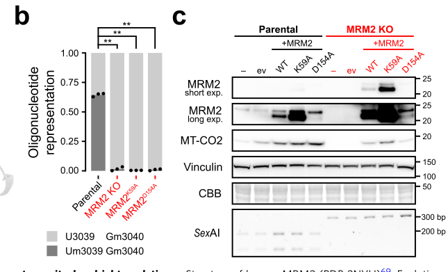
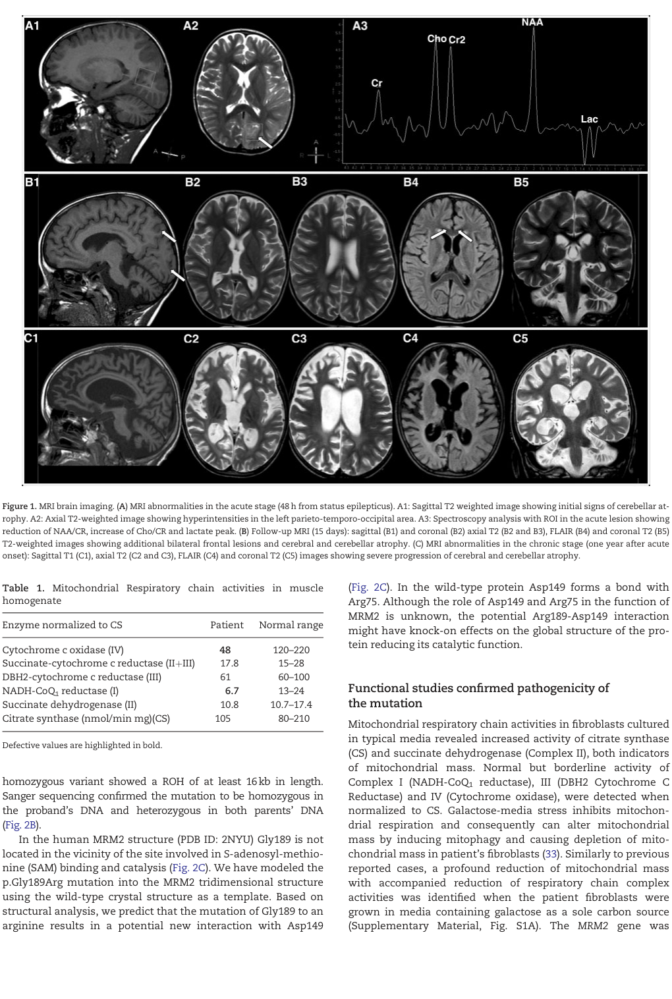

## Question

# Disease Characteristics Research Template

## Target Disease
- **Disease Name:** Mitochondrial DNA Depletion Syndrome 17
- **MONDO ID:** MONDO:0032815 (if available)
- **Category:** Mendelian

## Research Objectives

Please provide a comprehensive research report on **Mitochondrial DNA Depletion Syndrome 17** covering all of the
disease characteristics listed below. This report will be used to populate a disease knowledge
base entry. Be thorough and cite primary literature (PMID preferred) for all claims.

For each section, **suggested databases/resources** are listed. These are the first places
you should search for information on each topic.

---

### 1. Disease Information
> **Search first:** OMIM, Orphanet, ICD-10/ICD-11, MeSH, PubMed

- What is the disease? Provide a concise overview.
- What are the key identifiers? (OMIM, Orphanet, ICD-10/ICD-11, MeSH, Mondo)
- What are the common synonyms and alternative names?
- Is the information derived from individual patients (e.g., EHR) or aggregated disease-level resources?

### 2. Etiology

- **Disease Causal Factors**: What are the primary causes? (genetic, environmental, infectious, mechanistic)
- **Risk Factors**:
  > **Search first:** PubMed, Cochrane Library, UpToDate, clinical guidelines, ClinVar, ClinGen, GWAS Catalog, PheGenI, CTD, CDC, WHO, epidemiological databases
  - Genetic risk factors (causal variants, susceptibility loci, modifier genes)
  - Environmental risk factors (toxins, lifestyle, occupational exposures, age, sex, family history)
- **Protective Factors**:
  > **Search first:** PubMed, Cochrane Library, clinical trial databases, GWAS Catalog, gnomAD, WHO, CDC, nutrition databases
  - Genetic protective factors (protective variants, modifier alleles)
  - Environmental protective factors (diet, lifestyle, exposures that reduce risk)
- **Gene-Environment Interactions**: How do genetic and environmental factors interact to influence disease?
  > **Search first:** CTD, PubMed, PheGenI, GxE databases

### 3. Phenotypes
> **Search first:** HPO (Human Phenotype Ontology), OMIM, Orphanet, PubMed, clinicaltrials.gov, MedDRA, SNOMED CT, DECIPHER, LOINC

For each phenotype, provide:
- **Phenotype type**: symptoms, clinical signs, physical manifestations, behavioral changes, or laboratory abnormalities
  > For symptoms/signs: HPO, OMIM, Orphanet, PubMed
  > For behavioral changes: HPO, DSM, RDoC (Research Domain Criteria), PubMed
  > For laboratory abnormalities: LOINC, SNOMED CT, LabTests Online, PubMed
- **Phenotype characteristics**:
  > **Search first:** OMIM, Orphanet, HPO, PubMed
  - Age of symptom onset (neonatal, childhood, adult-onset, late-onset)
  - Symptom severity (mild, moderate, severe, variable)
  - Symptom progression (stable, progressive, episodic, fluctuating)
  - Frequency among affected individuals (percentage or qualitative)
- **Quality of life impact**: Effects on daily functioning and well-being (per-phenotype when possible)
  > **Search first:** EQ-5D database, SF-36, WHO QOL databases, PubMed
- Suggest HPO (Human Phenotype Ontology) terms for each phenotype

### 4. Genetic/Molecular Information

- **Causal Genes**: Gene mutations or chromosomal abnormalities responsible for disease (gene symbols, OMIM IDs)
  > **Search first:** OMIM, ClinVar, HGMD, Ensembl, NCBI Gene
- **Pathogenic Variants**:
  - Affected genes (gene symbols, HGNC IDs)
    > **Search first:** OMIM, NCBI Gene, Ensembl, HGNC, UniProt, GeneCards
  - Variant classification (pathogenic, likely pathogenic, VUS per ACMG/AMP guidelines)
    > **Search first:** ClinVar, ClinGen, ACMG/AMP guidelines, VarSome
  - Variant type/class (missense, frameshift, nonsense, splice-site, structural)
  - Allele frequency in population databases
    > **Search first:** gnomAD, 1000 Genomes, ExAC, TOPMed, dbSNP
  - Somatic vs germline origin
    > **Search first:** COSMIC (somatic), ClinVar, ICGC, TCGA
  - Functional consequences (loss of function, gain of function, dominant negative)
- **Modifier Genes**: Genes that modify disease severity or expression
- **Epigenetic Information**: DNA methylation, histone modifications, chromatin changes affecting disease
  > **Search first:** ENCODE, Roadmap Epigenomics, MethBase, DiseaseMeth
- **Chromosomal Abnormalities**: Large-scale genetic changes (aneuploidy, translocations, inversions)
  > **Search first:** DECIPHER, ClinVar, ECARUCA, UCSC Genome Browser

### 5. Environmental Information

- **Environmental Factors**: Non-genetic contributing factors (toxins, radiation, pollution, occupational exposure)
  > **Search first:** CTD (Comparative Toxicogenomics Database), TOXNET, PubMed, EPA databases
- **Lifestyle Factors**: Behavioral factors (smoking, diet, exercise, alcohol consumption)
  > **Search first:** CDC databases, WHO, PubMed, NHANES
- **Infectious Agents**: If applicable, pathogens causing or triggering disease (bacteria, viruses, fungi, parasites)
  > **Search first:** NCBI Taxonomy, ViPR, BV-BRC, MicrobeDB, GIDEON

### 6. Mechanism / Pathophysiology

**Present this section as an ordered causal chain first, then the detail below.**
Open with a numbered sequence of mechanistic steps running from the initiating
lesion (mutation, exposure, infection) to the clinical manifestation, one step per
line, each naming what it causes next. State the causal verb explicitly ("leads
to", "results in") and say where a step is inferred rather than demonstrated.
Where the mechanism branches, show the branch. The categories below are a
checklist of what to cover within those steps, not the organizing structure —
a step may draw on several of them, and a category may contribute to several
steps.

- **Molecular Pathways**: Specific signaling cascades or biochemical pathways involved (Wnt, MAPK, mTOR, PI3K-AKT, etc.)
  > **Search first:** KEGG, Reactome, WikiPathways, PathBank, BioCyc
- **Cellular Processes**: Cell-level mechanisms (apoptosis, autophagy, cell cycle dysregulation, inflammation, etc.)
  > **Search first:** Gene Ontology (GO), Reactome, KEGG, PubMed
- **Protein Dysfunction**: How protein structure or function is altered (misfolding, aggregation, loss of function, gain of function)
  > **Search first:** UniProt, PDB (Protein Data Bank), InterPro, Pfam, AlphaFold
- **Metabolic Changes**: Alterations in metabolic processes (energy metabolism, lipid metabolism, amino acid metabolism)
  > **Search first:** KEGG, BioCyc, HMDB (Human Metabolome Database), BRENDA
- **Immune System Involvement**: Role of immune response (autoimmunity, immunodeficiency, chronic inflammation)
  > **Search first:** ImmPort, Immunome Database, IEDB, Gene Ontology
- **Tissue Damage Mechanisms**: How tissues/ are injured (oxidative stress, ischemia, fibrosis, necrosis)
  > **Search first:** PubMed, Gene Ontology, Reactome
- **Biochemical Abnormalities**: Specific molecular defects (enzyme deficiencies, receptor dysfunction, ion channel defects)
  > **Search first:** BRENDA, UniProt, KEGG, OMIM, PubMed
- **Epigenetic Changes**: DNA methylation, histone modifications affecting gene expression in disease
  > **Search first:** ENCODE, Roadmap Epigenomics, MethBase, DiseaseMeth
- **Molecular Profiling** (if available):
  - Transcriptomics/gene expression changes
    > **Search first:** GEO (Gene Expression Omnibus), ArrayExpress, GTEx, Human Cell Atlas, SRA
  - Proteomics findings
    > **Search first:** PRIDE, ProteomeXchange, Human Protein Atlas, STRING, BioGRID
  - Metabolomics signatures
    > **Search first:** MetaboLights, Metabolomics Workbench, HMDB, METLIN
  - Lipidomics alterations
    > **Search first:** LIPID MAPS, SwissLipids, LipidHome, Metabolomics Workbench
  - Genomic structural features
    > **Search first:** UCSC Genome Browser, Ensembl, NCBI, dbVar, DGV
- **Advanced Technologies** (if applicable):
  - Single-cell analysis findings (cell-type specific mechanisms, cellular heterogeneity)
    > **Search first:** Human Cell Atlas, Single Cell Portal, GEO, CELLxGENE
  - Spatial transcriptomics findings
    > **Search first:** GEO, Spatial Research, Vizgen, 10x Genomics data
  - Multi-omics integration results
    > **Search first:** TCGA, ICGC, cBioPortal, LinkedOmics, PubMed
  - Functional genomics screens (CRISPR, RNAi)
    > **Search first:** DepMap, GenomeRNAi, PubMed, BioGRID ORCS

For each mechanism, describe:
- The causal chain from initial trigger to clinical manifestation
- Which mechanisms are upstream vs downstream
- What cell types and biological processes are involved
- Suggest GO terms for biological processes and CL terms for cell types

### 7. Anatomical Structures Affected

- **Organ Level**:
  - Primary organs directly affected
  - Secondary organ involvement (complications, secondary effects)
  - Body systems involved (cardiovascular, nervous, digestive, respiratory, endocrine, etc.)
  > **Search first:** Uberon, FMA (Foundational Model of Anatomy), OMIM, HPO, ICD-11, MeSH, SNOMED CT
- **Tissue and Cell Level**:
  - Specific tissue types affected (epithelial, connective, muscle, nervous)
  - Specific cell populations targeted (with Cell Ontology terms)
  > **Search first:** Uberon, Human Protein Atlas, Cell Ontology, Human Cell Atlas, CellMarker, PanglaoDB
- **Subcellular Level**:
  - Cellular compartments involved (mitochondria, nucleus, ER, lysosomes) (with GO Cellular Component terms)
  > **Search first:** Gene Ontology (Cellular Component), UniProt, Human Protein Atlas
- **Localization**:
  - Specific anatomical sites (with UBERON terms)
    > **Search first:** FMA, Uberon, NeuroNames (for brain), SNOMED CT
  - Lateralization (unilateral, bilateral, asymmetric)
    > **Search first:** HPO, clinical literature, imaging databases

### 8. Temporal Development

- **Onset**:
  - Typical age of onset (congenital, pediatric, adult, geriatric)
  - Onset pattern (acute, subacute, chronic, insidious)
  > **Search first:** OMIM, Orphanet, HPO, PubMed
- **Progression**:
  - Disease stages (early, intermediate, advanced, end-stage)
    > **Search first:** Cancer Staging Manual (AJCC), WHO classifications, PubMed
  - Progression rate (rapid, slow, variable)
  - Disease course pattern (episodic, relapsing-remitting, progressive, stable)
  - Disease duration (self-limited, chronic lifelong)
  > **Search first:** Disease registries, longitudinal cohort databases, natural history studies, PubMed, Orphanet, OMIM
- **Patterns**:
  - Remission patterns (spontaneous, treatment-induced)
    > **Search first:** Clinical trial databases, disease registries, PubMed
  - Critical periods (time windows of vulnerability or opportunity for intervention)
    > **Search first:** PubMed, developmental biology databases, clinical guidelines

### 9. Inheritance and Population

- **Epidemiology**:
  - Prevalence (cases per 100,000 at given time)
  - Incidence (new cases per 100,000 per year)
  > **Search first:** Orphanet, CDC, WHO, GBD (Global Burden of Disease), national registries, SEER, disease registries
- **For Genetic Etiology**:
  - Inheritance pattern (AD, AR, X-linked, mitochondrial, multifactorial, polygenic)
    > **Search first:** OMIM, Orphanet, ClinVar, GTR (Genetic Testing Registry)
  - Penetrance (complete, incomplete, age-dependent)
    > **Search first:** ClinVar, OMIM, PubMed, ClinGen
  - Expressivity (variable, consistent)
    > **Search first:** OMIM, ClinVar, PubMed
  - Genetic anticipation (increasing severity in successive generations)
    > **Search first:** OMIM, PubMed (especially for repeat expansion disorders)
  - Germline mosaicism
    > **Search first:** ClinVar, OMIM, genetic counseling literature, PubMed
  - Founder effects (population-specific mutations)
    > **Search first:** gnomAD, population genetics databases, PubMed
  - Consanguinity role
    > **Search first:** OMIM, population studies, genetic counseling resources
  - Carrier frequency
    > **Search first:** gnomAD, carrier screening databases, GeneReviews, GTR
- **Population Demographics**:
  - Affected populations (ethnic or demographic groups with higher prevalence)
    > **Search first:** gnomAD, 1000 Genomes, PAGE Study, PubMed, population registries
  - Geographic distribution (endemic areas, regional variation)
    > **Search first:** WHO, CDC, GBD, Orphanet, geographic epidemiology databases
  - Geographic distribution of specific variants
  - Sex ratio (male:female)
    > **Search first:** Disease registries, OMIM, PubMed, epidemiological databases
  - Age distribution of affected individuals
    > **Search first:** CDC, disease registries, SEER, Orphanet

### 10. Diagnostics

- **Clinical Tests**:
  - Laboratory tests (blood, urine, tissue chemistry, specific enzyme assays)
    > **Search first:** LOINC, LabTests Online, PubMed
  - Biomarkers (proteins, metabolites, genetic markers, circulating biomarkers)
    > **Search first:** FDA Biomarker List, BEST (Biomarkers, EndpointS, and other Tools), PubMed
  - Imaging studies (X-ray, CT, MRI, PET, ultrasound)
    > **Search first:** RadLex, DICOM, Radiopaedia, imaging databases
  - Functional tests (pulmonary function, cardiac stress tests)
    > **Search first:** LOINC, clinical guidelines, PubMed
  - Electrophysiology (EEG, EMG, ECG, nerve conduction studies)
    > **Search first:** LOINC, clinical neurophysiology databases, PubMed
  - Biopsy findings (histopathology, immunohistochemistry)
    > **Search first:** SNOMED CT, College of American Pathologists resources, PubMed
  - Pathology findings (microscopic examination)
    > **Search first:** SNOMED CT, Digital Pathology databases, PubMed
- **Genetic Testing**:
  > **Search first:** GTR (Genetic Testing Registry), GeneReviews, ClinGen
  - Overview of recommended genetic testing approach
  - Whole genome sequencing (WGS) utility
    > **Search first:** GTR, ClinVar, GEL (Genomics England), gnomAD
  - Whole exome sequencing (WES) utility
    > **Search first:** GTR, ClinVar, OMIM, GeneMatcher
  - Gene panels (which panels, which genes)
    > **Search first:** GTR, ClinVar, laboratory-specific databases
  - Single gene testing
    > **Search first:** GTR, ClinVar, OMIM, GeneReviews
  - Chromosomal microarray (CMA)
    > **Search first:** DECIPHER, ClinVar, dbVar, ECARUCA
  - Karyotyping
    > **Search first:** Chromosome Abnormality Database, ClinVar, cytogenetics resources
  - FISH
    > **Search first:** ClinVar, cytogenetics databases, PubMed
  - Mitochondrial DNA testing
    > **Search first:** MITOMAP, MSeqDR, ClinVar, GTR
  - Repeat expansion testing
    > **Search first:** GTR, ClinVar, repeat expansion databases, PubMed
- **Omics-Based Diagnostics** (if applicable):
  - RNA sequencing / transcriptomics
    > **Search first:** GEO, ArrayExpress, GTEx, RNA-seq databases
  - Proteomics
    > **Search first:** PRIDE, ProteomeXchange, FDA Biomarker database
  - Metabolomics
    > **Search first:** MetaboLights, Metabolomics Workbench, HMDB
  - Epigenomics
    > **Search first:** GEO, ENCODE, Roadmap Epigenomics, MethBase
  - Liquid biopsy
    > **Search first:** COSMIC, ClinVar, liquid biopsy databases, PubMed
- **Clinical Criteria**:
  - Standardized diagnostic criteria (DSM, ICD, society guidelines)
    > **Search first:** DSM-5, ICD-11, clinical society guidelines, UpToDate
  - Differential diagnosis (other conditions to rule out, with distinguishing features)
    > **Search first:** DynaMed, UpToDate, clinical decision support systems
- **Screening**:
  - Screening methods for asymptomatic individuals (newborn screening, carrier screening, cascade screening)
    > **Search first:** ACMG recommendations, CDC newborn screening, GTR

### 11. Outcome/Prognosis

- **Survival and Mortality**:
  - Survival rate (5-year, 10-year, overall)
    > **Search first:** SEER, cancer registries, disease-specific registries, PubMed
  - Life expectancy (with and without treatment if applicable)
    > **Search first:** Orphanet, disease registries, actuarial databases, PubMed
  - Mortality rate
    > **Search first:** CDC, WHO, GBD, national mortality databases
  - Disease-specific mortality (deaths directly attributable to disease)
    > **Search first:** Disease registries, CDC Wonder, GBD, PubMed
- **Morbidity and Function**:
  - Morbidity (disease-related disability and health impacts)
    > **Search first:** GBD, WHO, disability databases, PubMed
  - Disability outcomes (long-term functional impairments)
    > **Search first:** ICF (International Classification of Functioning), disability registries
  - Quality of life measures (EQ-5D, SF-36, PROMIS, disease-specific tools)
    > **Search first:** EQ-5D database, SF-36, PROMIS, PubMed
- **Disease Course**:
  - Complications (secondary problems: infections, organ failure, etc.)
    > **Search first:** ICD codes, disease registries, clinical databases, PubMed
  - Recovery potential (likelihood and extent of recovery, with vs without treatment)
    > **Search first:** Natural history studies, rehabilitation databases, PubMed
- **Prediction**:
  - Prognostic factors (age, disease severity, biomarkers, treatment response)
    > **Search first:** Prognostic models databases, clinical calculators, PubMed
  - Prognostic biomarkers (molecular markers predicting disease course)
    > **Search first:** FDA Biomarker database, PubMed, cancer prognostic databases

### 12. Treatment

- **Pharmacotherapy**:
  - Pharmacological treatments (drug names, drug classes, mechanisms of action)
    > **Search first:** DrugBank, RxNorm, ATC classification, DailyMed, FDA databases
  - Pharmacogenomics (how genetic variants affect drug metabolism, efficacy, toxicity)
    > **Search first:** PharmGKB, CPIC (Clinical Pharmacogenetics), FDA Table of PGx Biomarkers
- **Advanced Therapeutics**:
  - Gene therapy (viral vectors, CRISPR, gene replacement, gene editing)
    > **Search first:** ClinicalTrials.gov, FDA gene therapy database, ASGCT resources
  - Cell therapy (stem cell transplant, CAR-T, cellular therapeutics)
    > **Search first:** ClinicalTrials.gov, FDA cell therapy database, FACT standards
  - RNA-based therapies (ASOs, siRNA, mRNA therapies)
    > **Search first:** ClinicalTrials.gov, FDA approvals, PubMed
  - Targeted therapies (treatments directed at specific molecular targets)
    > **Search first:** My Cancer Genome, OncoKB, ClinicalTrials.gov, FDA approvals
  - Immunotherapies (checkpoint inhibitors, monoclonal antibodies)
    > **Search first:** Cancer Immunotherapy Database, FDA approvals, ClinicalTrials.gov
- **Surgical and Interventional**:
  - Surgical interventions (types of surgery, timing, outcomes)
    > **Search first:** CPT codes, surgical registries, clinical guidelines, PubMed
- **Supportive and Rehabilitative**:
  - Supportive care (symptom management, pain control, nutrition)
    > **Search first:** Clinical guidelines, Cochrane Library, PubMed
  - Rehabilitation (physical therapy, occupational therapy, speech therapy)
    > **Search first:** Rehabilitation medicine databases, clinical guidelines, PubMed
- **Experimental**:
  - Experimental treatments in clinical trials (with NCT identifiers if available)
    > **Search first:** ClinicalTrials.gov, EU Clinical Trials Register, WHO ICTRP
- **Treatment Outcomes**:
  - Treatment response rates
    > **Search first:** Clinical trial databases, FDA reviews, systematic reviews, PubMed
  - Side effects and adverse events
    > **Search first:** FDA Adverse Event Reporting System (FAERS), MedWatch, PubMed
- **Treatment Strategy**:
  - Treatment algorithms (clinical pathways, decision trees)
    > **Search first:** Clinical practice guidelines, NCCN Guidelines, UpToDate
  - Combination therapies
    > **Search first:** ClinicalTrials.gov, treatment guidelines, PubMed
  - Personalized medicine approaches (genotype-guided treatment)
    > **Search first:** My Cancer Genome, CIViC, PharmGKB, precision medicine databases

For each treatment, suggest NCIT (NCI Thesaurus) clinical-intervention terms where applicable.

### 13. Prevention

- **Prevention Levels**:
  - Primary prevention (preventing disease occurrence: vaccination, risk factor modification)
    > **Search first:** CDC, WHO, USPSTF recommendations, Cochrane Library
  - Secondary prevention (early detection and treatment: screening programs, early intervention)
    > **Search first:** USPSTF, CDC screening guidelines, WHO
  - Tertiary prevention (preventing complications in those with disease)
    > **Search first:** Clinical guidelines, disease management protocols, PubMed
- **Immunization**: Vaccine strategies (if applicable)
  > **Search first:** CDC vaccine schedules, WHO immunization, FDA vaccine database
- **Screening and Early Detection**:
  - Screening programs (population-based: newborn screening, cancer screening)
    > **Search first:** CDC screening programs, USPSTF, cancer screening databases
  - Genetic screening (carrier screening, preimplantation genetic diagnosis, prenatal testing)
    > **Search first:** ACMG recommendations, ACOG guidelines, GTR
  - Risk stratification (identifying high-risk individuals for targeted prevention)
    > **Search first:** Risk prediction models, clinical calculators, PubMed
- **Behavioral Interventions**: Lifestyle modifications to reduce risk
  > **Search first:** CDC, WHO, behavioral intervention databases, Cochrane Library
- **Counseling**: Genetic counseling (risk assessment, family planning guidance)
  > **Search first:** NSGC resources, ACMG guidelines, GeneReviews
- **Public Health**:
  - Public health interventions (sanitation, vector control, health education)
    > **Search first:** CDC, WHO, public health databases, PubMed
  - Environmental interventions (reducing environmental risk factors)
    > **Search first:** EPA databases, WHO environmental health, PubMed
- **Prophylaxis**: Preventive medications or procedures
  > **Search first:** Clinical guidelines, FDA approvals, PubMed

### 14. Other Species / Natural Disease

- **Taxonomy**: Species affected (with NCBI Taxon identifiers)
  > **Search first:** NCBI Taxonomy
- **Breed**: Specific breeds affected (with VBO identifiers if applicable)
  > **Search first:** VBO (Vertebrate Breed Ontology)
- **Gene**: Orthologous genes in other species (with NCBI Gene IDs)
  > **Search first:** NCBI Gene
- **Natural Disease**:
  - Naturally occurring disease in other species (companion animals, wildlife)
    > **Search first:** OMIA (Online Mendelian Inheritance in Animals), VetCompass, PubMed
  - Veterinary relevance and importance in animal health
    > **Search first:** OMIA, veterinary databases, PubMed
- **Comparative Biology**:
  - Comparative pathology (similarities and differences across species)
    > **Search first:** OMIA, comparative pathology databases, PubMed
  - Evolutionary conservation of disease mechanisms
    > **Search first:** HomoloGene, OrthoMCL, Alliance of Genome Resources
- **Transmission** (if applicable):
  - Zoonotic potential
    > **Search first:** CDC zoonotic diseases, WHO zoonoses, GIDEON
  - Cross-species susceptibility
    > **Search first:** NCBI Taxonomy, veterinary databases, PubMed

### 15. Model Organisms

- **Model Types**:
  - Model organism type (mammalian, invertebrate, cellular, in vitro)
    > **Search first:** Alliance of Genome Resources, model organism databases
  - Specific model systems (mouse, rat, zebrafish, Drosophila, C. elegans, yeast, cell lines, organoids, iPSCs)
    > **Search first:** MGI, RGD, ZFIN, FlyBase, WormBase, SGD, ATCC, Cellosaurus
  - Induced models (drug treatment, surgical intervention, environmental manipulation)
    > **Search first:** MGI, model organism databases, PubMed
- **Genetic Models**:
  - Types available (knockout, knock-in, transgenic, conditional, humanized)
    > **Search first:** MGI, IMPC, KOMP, EuMMCR, IMSR
- **Model Characteristics**:
  - Phenotype recapitulation (how well model reproduces human disease features)
    > **Search first:** Model organism databases, comparative studies, PubMed
  - Model limitations (aspects of human disease not captured)
    > **Search first:** Model organism databases, PubMed, review articles
- **Applications**:
  - Research applications (what aspects of disease can be studied)
    > **Search first:** Model organism databases, PubMed
- **Resources**:
  - Model databases
    > **Search first:** MGI, RGD, ZFIN, FlyBase, WormBase, IMSR, EMMA, MMRRC

---

## Citation Requirements

- Cite primary literature (PMID preferred) for all mechanistic and clinical claims
- Prioritize recent reviews and landmark papers
- Include direct quotes from abstracts where possible to support key statements
- Distinguish evidence source types: human clinical, model organism, in vitro, computational

## Output Format

Structure your response as a comprehensive narrative organized by the sections above.
For each section, provide:
- Factual content with specific details (numbers, percentages, gene names, variant nomenclature)
- Ontology term suggestions (HPO, GO, CL, UBERON, CHEBI, NCIT, MONDO) where applicable
- Evidence citations with PMIDs
- Direct quotes from abstracts to support key claims
- Clear indication when information is not available or not applicable for this disease

This report will be used to populate a disease knowledge base entry with:
- Pathophysiology descriptions with causal chains
- Gene/protein annotations (HGNC, GO terms)
- Phenotype associations (HP terms) with frequencies
- Cell type involvement (CL terms)
- Anatomical locations (UBERON terms)
- Chemical entities (CHEBI terms)
- Treatment annotations (NCIT terms)
- Evidence items with PMIDs and exact abstract quotes
- Epidemiology, prognosis, diagnostic, and prevention information
- Animal model descriptions with phenotype recapitulation details

## Output

Question: You are an expert researcher providing comprehensive, well-cited information.

Provide detailed information focusing on:
1. Key concepts and definitions with current understanding
2. Recent developments and latest research (prioritize 2023-2024 sources)
3. Current applications and real-world implementations
4. Expert opinions and analysis from authoritative sources
5. Relevant statistics and data from recent studies

Format as a comprehensive research report with proper citations. Include URLs and publication dates where available.
Always prioritize recent, authoritative sources and provide specific citations for all major claims.

# Disease Characteristics Research Template

## Target Disease
- **Disease Name:** Mitochondrial DNA Depletion Syndrome 17
- **MONDO ID:** MONDO:0032815 (if available)
- **Category:** Mendelian

## Research Objectives

Please provide a comprehensive research report on **Mitochondrial DNA Depletion Syndrome 17** covering all of the
disease characteristics listed below. This report will be used to populate a disease knowledge
base entry. Be thorough and cite primary literature (PMID preferred) for all claims.

For each section, **suggested databases/resources** are listed. These are the first places
you should search for information on each topic.

---

### 1. Disease Information
> **Search first:** OMIM, Orphanet, ICD-10/ICD-11, MeSH, PubMed

- What is the disease? Provide a concise overview.
- What are the key identifiers? (OMIM, Orphanet, ICD-10/ICD-11, MeSH, Mondo)
- What are the common synonyms and alternative names?
- Is the information derived from individual patients (e.g., EHR) or aggregated disease-level resources?

### 2. Etiology

- **Disease Causal Factors**: What are the primary causes? (genetic, environmental, infectious, mechanistic)
- **Risk Factors**:
  > **Search first:** PubMed, Cochrane Library, UpToDate, clinical guidelines, ClinVar, ClinGen, GWAS Catalog, PheGenI, CTD, CDC, WHO, epidemiological databases
  - Genetic risk factors (causal variants, susceptibility loci, modifier genes)
  - Environmental risk factors (toxins, lifestyle, occupational exposures, age, sex, family history)
- **Protective Factors**:
  > **Search first:** PubMed, Cochrane Library, clinical trial databases, GWAS Catalog, gnomAD, WHO, CDC, nutrition databases
  - Genetic protective factors (protective variants, modifier alleles)
  - Environmental protective factors (diet, lifestyle, exposures that reduce risk)
- **Gene-Environment Interactions**: How do genetic and environmental factors interact to influence disease?
  > **Search first:** CTD, PubMed, PheGenI, GxE databases

### 3. Phenotypes
> **Search first:** HPO (Human Phenotype Ontology), OMIM, Orphanet, PubMed, clinicaltrials.gov, MedDRA, SNOMED CT, DECIPHER, LOINC

For each phenotype, provide:
- **Phenotype type**: symptoms, clinical signs, physical manifestations, behavioral changes, or laboratory abnormalities
  > For symptoms/signs: HPO, OMIM, Orphanet, PubMed
  > For behavioral changes: HPO, DSM, RDoC (Research Domain Criteria), PubMed
  > For laboratory abnormalities: LOINC, SNOMED CT, LabTests Online, PubMed
- **Phenotype characteristics**:
  > **Search first:** OMIM, Orphanet, HPO, PubMed
  - Age of symptom onset (neonatal, childhood, adult-onset, late-onset)
  - Symptom severity (mild, moderate, severe, variable)
  - Symptom progression (stable, progressive, episodic, fluctuating)
  - Frequency among affected individuals (percentage or qualitative)
- **Quality of life impact**: Effects on daily functioning and well-being (per-phenotype when possible)
  > **Search first:** EQ-5D database, SF-36, WHO QOL databases, PubMed
- Suggest HPO (Human Phenotype Ontology) terms for each phenotype

### 4. Genetic/Molecular Information

- **Causal Genes**: Gene mutations or chromosomal abnormalities responsible for disease (gene symbols, OMIM IDs)
  > **Search first:** OMIM, ClinVar, HGMD, Ensembl, NCBI Gene
- **Pathogenic Variants**:
  - Affected genes (gene symbols, HGNC IDs)
    > **Search first:** OMIM, NCBI Gene, Ensembl, HGNC, UniProt, GeneCards
  - Variant classification (pathogenic, likely pathogenic, VUS per ACMG/AMP guidelines)
    > **Search first:** ClinVar, ClinGen, ACMG/AMP guidelines, VarSome
  - Variant type/class (missense, frameshift, nonsense, splice-site, structural)
  - Allele frequency in population databases
    > **Search first:** gnomAD, 1000 Genomes, ExAC, TOPMed, dbSNP
  - Somatic vs germline origin
    > **Search first:** COSMIC (somatic), ClinVar, ICGC, TCGA
  - Functional consequences (loss of function, gain of function, dominant negative)
- **Modifier Genes**: Genes that modify disease severity or expression
- **Epigenetic Information**: DNA methylation, histone modifications, chromatin changes affecting disease
  > **Search first:** ENCODE, Roadmap Epigenomics, MethBase, DiseaseMeth
- **Chromosomal Abnormalities**: Large-scale genetic changes (aneuploidy, translocations, inversions)
  > **Search first:** DECIPHER, ClinVar, ECARUCA, UCSC Genome Browser

### 5. Environmental Information

- **Environmental Factors**: Non-genetic contributing factors (toxins, radiation, pollution, occupational exposure)
  > **Search first:** CTD (Comparative Toxicogenomics Database), TOXNET, PubMed, EPA databases
- **Lifestyle Factors**: Behavioral factors (smoking, diet, exercise, alcohol consumption)
  > **Search first:** CDC databases, WHO, PubMed, NHANES
- **Infectious Agents**: If applicable, pathogens causing or triggering disease (bacteria, viruses, fungi, parasites)
  > **Search first:** NCBI Taxonomy, ViPR, BV-BRC, MicrobeDB, GIDEON

### 6. Mechanism / Pathophysiology

**Present this section as an ordered causal chain first, then the detail below.**
Open with a numbered sequence of mechanistic steps running from the initiating
lesion (mutation, exposure, infection) to the clinical manifestation, one step per
line, each naming what it causes next. State the causal verb explicitly ("leads
to", "results in") and say where a step is inferred rather than demonstrated.
Where the mechanism branches, show the branch. The categories below are a
checklist of what to cover within those steps, not the organizing structure —
a step may draw on several of them, and a category may contribute to several
steps.

- **Molecular Pathways**: Specific signaling cascades or biochemical pathways involved (Wnt, MAPK, mTOR, PI3K-AKT, etc.)
  > **Search first:** KEGG, Reactome, WikiPathways, PathBank, BioCyc
- **Cellular Processes**: Cell-level mechanisms (apoptosis, autophagy, cell cycle dysregulation, inflammation, etc.)
  > **Search first:** Gene Ontology (GO), Reactome, KEGG, PubMed
- **Protein Dysfunction**: How protein structure or function is altered (misfolding, aggregation, loss of function, gain of function)
  > **Search first:** UniProt, PDB (Protein Data Bank), InterPro, Pfam, AlphaFold
- **Metabolic Changes**: Alterations in metabolic processes (energy metabolism, lipid metabolism, amino acid metabolism)
  > **Search first:** KEGG, BioCyc, HMDB (Human Metabolome Database), BRENDA
- **Immune System Involvement**: Role of immune response (autoimmunity, immunodeficiency, chronic inflammation)
  > **Search first:** ImmPort, Immunome Database, IEDB, Gene Ontology
- **Tissue Damage Mechanisms**: How tissues/ are injured (oxidative stress, ischemia, fibrosis, necrosis)
  > **Search first:** PubMed, Gene Ontology, Reactome
- **Biochemical Abnormalities**: Specific molecular defects (enzyme deficiencies, receptor dysfunction, ion channel defects)
  > **Search first:** BRENDA, UniProt, KEGG, OMIM, PubMed
- **Epigenetic Changes**: DNA methylation, histone modifications affecting gene expression in disease
  > **Search first:** ENCODE, Roadmap Epigenomics, MethBase, DiseaseMeth
- **Molecular Profiling** (if available):
  - Transcriptomics/gene expression changes
    > **Search first:** GEO (Gene Expression Omnibus), ArrayExpress, GTEx, Human Cell Atlas, SRA
  - Proteomics findings
    > **Search first:** PRIDE, ProteomeXchange, Human Protein Atlas, STRING, BioGRID
  - Metabolomics signatures
    > **Search first:** MetaboLights, Metabolomics Workbench, HMDB, METLIN
  - Lipidomics alterations
    > **Search first:** LIPID MAPS, SwissLipids, LipidHome, Metabolomics Workbench
  - Genomic structural features
    > **Search first:** UCSC Genome Browser, Ensembl, NCBI, dbVar, DGV
- **Advanced Technologies** (if applicable):
  - Single-cell analysis findings (cell-type specific mechanisms, cellular heterogeneity)
    > **Search first:** Human Cell Atlas, Single Cell Portal, GEO, CELLxGENE
  - Spatial transcriptomics findings
    > **Search first:** GEO, Spatial Research, Vizgen, 10x Genomics data
  - Multi-omics integration results
    > **Search first:** TCGA, ICGC, cBioPortal, LinkedOmics, PubMed
  - Functional genomics screens (CRISPR, RNAi)
    > **Search first:** DepMap, GenomeRNAi, PubMed, BioGRID ORCS

For each mechanism, describe:
- The causal chain from initial trigger to clinical manifestation
- Which mechanisms are upstream vs downstream
- What cell types and biological processes are involved
- Suggest GO terms for biological processes and CL terms for cell types

### 7. Anatomical Structures Affected

- **Organ Level**:
  - Primary organs directly affected
  - Secondary organ involvement (complications, secondary effects)
  - Body systems involved (cardiovascular, nervous, digestive, respiratory, endocrine, etc.)
  > **Search first:** Uberon, FMA (Foundational Model of Anatomy), OMIM, HPO, ICD-11, MeSH, SNOMED CT
- **Tissue and Cell Level**:
  - Specific tissue types affected (epithelial, connective, muscle, nervous)
  - Specific cell populations targeted (with Cell Ontology terms)
  > **Search first:** Uberon, Human Protein Atlas, Cell Ontology, Human Cell Atlas, CellMarker, PanglaoDB
- **Subcellular Level**:
  - Cellular compartments involved (mitochondria, nucleus, ER, lysosomes) (with GO Cellular Component terms)
  > **Search first:** Gene Ontology (Cellular Component), UniProt, Human Protein Atlas
- **Localization**:
  - Specific anatomical sites (with UBERON terms)
    > **Search first:** FMA, Uberon, NeuroNames (for brain), SNOMED CT
  - Lateralization (unilateral, bilateral, asymmetric)
    > **Search first:** HPO, clinical literature, imaging databases

### 8. Temporal Development

- **Onset**:
  - Typical age of onset (congenital, pediatric, adult, geriatric)
  - Onset pattern (acute, subacute, chronic, insidious)
  > **Search first:** OMIM, Orphanet, HPO, PubMed
- **Progression**:
  - Disease stages (early, intermediate, advanced, end-stage)
    > **Search first:** Cancer Staging Manual (AJCC), WHO classifications, PubMed
  - Progression rate (rapid, slow, variable)
  - Disease course pattern (episodic, relapsing-remitting, progressive, stable)
  - Disease duration (self-limited, chronic lifelong)
  > **Search first:** Disease registries, longitudinal cohort databases, natural history studies, PubMed, Orphanet, OMIM
- **Patterns**:
  - Remission patterns (spontaneous, treatment-induced)
    > **Search first:** Clinical trial databases, disease registries, PubMed
  - Critical periods (time windows of vulnerability or opportunity for intervention)
    > **Search first:** PubMed, developmental biology databases, clinical guidelines

### 9. Inheritance and Population

- **Epidemiology**:
  - Prevalence (cases per 100,000 at given time)
  - Incidence (new cases per 100,000 per year)
  > **Search first:** Orphanet, CDC, WHO, GBD (Global Burden of Disease), national registries, SEER, disease registries
- **For Genetic Etiology**:
  - Inheritance pattern (AD, AR, X-linked, mitochondrial, multifactorial, polygenic)
    > **Search first:** OMIM, Orphanet, ClinVar, GTR (Genetic Testing Registry)
  - Penetrance (complete, incomplete, age-dependent)
    > **Search first:** ClinVar, OMIM, PubMed, ClinGen
  - Expressivity (variable, consistent)
    > **Search first:** OMIM, ClinVar, PubMed
  - Genetic anticipation (increasing severity in successive generations)
    > **Search first:** OMIM, PubMed (especially for repeat expansion disorders)
  - Germline mosaicism
    > **Search first:** ClinVar, OMIM, genetic counseling literature, PubMed
  - Founder effects (population-specific mutations)
    > **Search first:** gnomAD, population genetics databases, PubMed
  - Consanguinity role
    > **Search first:** OMIM, population studies, genetic counseling resources
  - Carrier frequency
    > **Search first:** gnomAD, carrier screening databases, GeneReviews, GTR
- **Population Demographics**:
  - Affected populations (ethnic or demographic groups with higher prevalence)
    > **Search first:** gnomAD, 1000 Genomes, PAGE Study, PubMed, population registries
  - Geographic distribution (endemic areas, regional variation)
    > **Search first:** WHO, CDC, GBD, Orphanet, geographic epidemiology databases
  - Geographic distribution of specific variants
  - Sex ratio (male:female)
    > **Search first:** Disease registries, OMIM, PubMed, epidemiological databases
  - Age distribution of affected individuals
    > **Search first:** CDC, disease registries, SEER, Orphanet

### 10. Diagnostics

- **Clinical Tests**:
  - Laboratory tests (blood, urine, tissue chemistry, specific enzyme assays)
    > **Search first:** LOINC, LabTests Online, PubMed
  - Biomarkers (proteins, metabolites, genetic markers, circulating biomarkers)
    > **Search first:** FDA Biomarker List, BEST (Biomarkers, EndpointS, and other Tools), PubMed
  - Imaging studies (X-ray, CT, MRI, PET, ultrasound)
    > **Search first:** RadLex, DICOM, Radiopaedia, imaging databases
  - Functional tests (pulmonary function, cardiac stress tests)
    > **Search first:** LOINC, clinical guidelines, PubMed
  - Electrophysiology (EEG, EMG, ECG, nerve conduction studies)
    > **Search first:** LOINC, clinical neurophysiology databases, PubMed
  - Biopsy findings (histopathology, immunohistochemistry)
    > **Search first:** SNOMED CT, College of American Pathologists resources, PubMed
  - Pathology findings (microscopic examination)
    > **Search first:** SNOMED CT, Digital Pathology databases, PubMed
- **Genetic Testing**:
  > **Search first:** GTR (Genetic Testing Registry), GeneReviews, ClinGen
  - Overview of recommended genetic testing approach
  - Whole genome sequencing (WGS) utility
    > **Search first:** GTR, ClinVar, GEL (Genomics England), gnomAD
  - Whole exome sequencing (WES) utility
    > **Search first:** GTR, ClinVar, OMIM, GeneMatcher
  - Gene panels (which panels, which genes)
    > **Search first:** GTR, ClinVar, laboratory-specific databases
  - Single gene testing
    > **Search first:** GTR, ClinVar, OMIM, GeneReviews
  - Chromosomal microarray (CMA)
    > **Search first:** DECIPHER, ClinVar, dbVar, ECARUCA
  - Karyotyping
    > **Search first:** Chromosome Abnormality Database, ClinVar, cytogenetics resources
  - FISH
    > **Search first:** ClinVar, cytogenetics databases, PubMed
  - Mitochondrial DNA testing
    > **Search first:** MITOMAP, MSeqDR, ClinVar, GTR
  - Repeat expansion testing
    > **Search first:** GTR, ClinVar, repeat expansion databases, PubMed
- **Omics-Based Diagnostics** (if applicable):
  - RNA sequencing / transcriptomics
    > **Search first:** GEO, ArrayExpress, GTEx, RNA-seq databases
  - Proteomics
    > **Search first:** PRIDE, ProteomeXchange, FDA Biomarker database
  - Metabolomics
    > **Search first:** MetaboLights, Metabolomics Workbench, HMDB
  - Epigenomics
    > **Search first:** GEO, ENCODE, Roadmap Epigenomics, MethBase
  - Liquid biopsy
    > **Search first:** COSMIC, ClinVar, liquid biopsy databases, PubMed
- **Clinical Criteria**:
  - Standardized diagnostic criteria (DSM, ICD, society guidelines)
    > **Search first:** DSM-5, ICD-11, clinical society guidelines, UpToDate
  - Differential diagnosis (other conditions to rule out, with distinguishing features)
    > **Search first:** DynaMed, UpToDate, clinical decision support systems
- **Screening**:
  - Screening methods for asymptomatic individuals (newborn screening, carrier screening, cascade screening)
    > **Search first:** ACMG recommendations, CDC newborn screening, GTR

### 11. Outcome/Prognosis

- **Survival and Mortality**:
  - Survival rate (5-year, 10-year, overall)
    > **Search first:** SEER, cancer registries, disease-specific registries, PubMed
  - Life expectancy (with and without treatment if applicable)
    > **Search first:** Orphanet, disease registries, actuarial databases, PubMed
  - Mortality rate
    > **Search first:** CDC, WHO, GBD, national mortality databases
  - Disease-specific mortality (deaths directly attributable to disease)
    > **Search first:** Disease registries, CDC Wonder, GBD, PubMed
- **Morbidity and Function**:
  - Morbidity (disease-related disability and health impacts)
    > **Search first:** GBD, WHO, disability databases, PubMed
  - Disability outcomes (long-term functional impairments)
    > **Search first:** ICF (International Classification of Functioning), disability registries
  - Quality of life measures (EQ-5D, SF-36, PROMIS, disease-specific tools)
    > **Search first:** EQ-5D database, SF-36, PROMIS, PubMed
- **Disease Course**:
  - Complications (secondary problems: infections, organ failure, etc.)
    > **Search first:** ICD codes, disease registries, clinical databases, PubMed
  - Recovery potential (likelihood and extent of recovery, with vs without treatment)
    > **Search first:** Natural history studies, rehabilitation databases, PubMed
- **Prediction**:
  - Prognostic factors (age, disease severity, biomarkers, treatment response)
    > **Search first:** Prognostic models databases, clinical calculators, PubMed
  - Prognostic biomarkers (molecular markers predicting disease course)
    > **Search first:** FDA Biomarker database, PubMed, cancer prognostic databases

### 12. Treatment

- **Pharmacotherapy**:
  - Pharmacological treatments (drug names, drug classes, mechanisms of action)
    > **Search first:** DrugBank, RxNorm, ATC classification, DailyMed, FDA databases
  - Pharmacogenomics (how genetic variants affect drug metabolism, efficacy, toxicity)
    > **Search first:** PharmGKB, CPIC (Clinical Pharmacogenetics), FDA Table of PGx Biomarkers
- **Advanced Therapeutics**:
  - Gene therapy (viral vectors, CRISPR, gene replacement, gene editing)
    > **Search first:** ClinicalTrials.gov, FDA gene therapy database, ASGCT resources
  - Cell therapy (stem cell transplant, CAR-T, cellular therapeutics)
    > **Search first:** ClinicalTrials.gov, FDA cell therapy database, FACT standards
  - RNA-based therapies (ASOs, siRNA, mRNA therapies)
    > **Search first:** ClinicalTrials.gov, FDA approvals, PubMed
  - Targeted therapies (treatments directed at specific molecular targets)
    > **Search first:** My Cancer Genome, OncoKB, ClinicalTrials.gov, FDA approvals
  - Immunotherapies (checkpoint inhibitors, monoclonal antibodies)
    > **Search first:** Cancer Immunotherapy Database, FDA approvals, ClinicalTrials.gov
- **Surgical and Interventional**:
  - Surgical interventions (types of surgery, timing, outcomes)
    > **Search first:** CPT codes, surgical registries, clinical guidelines, PubMed
- **Supportive and Rehabilitative**:
  - Supportive care (symptom management, pain control, nutrition)
    > **Search first:** Clinical guidelines, Cochrane Library, PubMed
  - Rehabilitation (physical therapy, occupational therapy, speech therapy)
    > **Search first:** Rehabilitation medicine databases, clinical guidelines, PubMed
- **Experimental**:
  - Experimental treatments in clinical trials (with NCT identifiers if available)
    > **Search first:** ClinicalTrials.gov, EU Clinical Trials Register, WHO ICTRP
- **Treatment Outcomes**:
  - Treatment response rates
    > **Search first:** Clinical trial databases, FDA reviews, systematic reviews, PubMed
  - Side effects and adverse events
    > **Search first:** FDA Adverse Event Reporting System (FAERS), MedWatch, PubMed
- **Treatment Strategy**:
  - Treatment algorithms (clinical pathways, decision trees)
    > **Search first:** Clinical practice guidelines, NCCN Guidelines, UpToDate
  - Combination therapies
    > **Search first:** ClinicalTrials.gov, treatment guidelines, PubMed
  - Personalized medicine approaches (genotype-guided treatment)
    > **Search first:** My Cancer Genome, CIViC, PharmGKB, precision medicine databases

For each treatment, suggest NCIT (NCI Thesaurus) clinical-intervention terms where applicable.

### 13. Prevention

- **Prevention Levels**:
  - Primary prevention (preventing disease occurrence: vaccination, risk factor modification)
    > **Search first:** CDC, WHO, USPSTF recommendations, Cochrane Library
  - Secondary prevention (early detection and treatment: screening programs, early intervention)
    > **Search first:** USPSTF, CDC screening guidelines, WHO
  - Tertiary prevention (preventing complications in those with disease)
    > **Search first:** Clinical guidelines, disease management protocols, PubMed
- **Immunization**: Vaccine strategies (if applicable)
  > **Search first:** CDC vaccine schedules, WHO immunization, FDA vaccine database
- **Screening and Early Detection**:
  - Screening programs (population-based: newborn screening, cancer screening)
    > **Search first:** CDC screening programs, USPSTF, cancer screening databases
  - Genetic screening (carrier screening, preimplantation genetic diagnosis, prenatal testing)
    > **Search first:** ACMG recommendations, ACOG guidelines, GTR
  - Risk stratification (identifying high-risk individuals for targeted prevention)
    > **Search first:** Risk prediction models, clinical calculators, PubMed
- **Behavioral Interventions**: Lifestyle modifications to reduce risk
  > **Search first:** CDC, WHO, behavioral intervention databases, Cochrane Library
- **Counseling**: Genetic counseling (risk assessment, family planning guidance)
  > **Search first:** NSGC resources, ACMG guidelines, GeneReviews
- **Public Health**:
  - Public health interventions (sanitation, vector control, health education)
    > **Search first:** CDC, WHO, public health databases, PubMed
  - Environmental interventions (reducing environmental risk factors)
    > **Search first:** EPA databases, WHO environmental health, PubMed
- **Prophylaxis**: Preventive medications or procedures
  > **Search first:** Clinical guidelines, FDA approvals, PubMed

### 14. Other Species / Natural Disease

- **Taxonomy**: Species affected (with NCBI Taxon identifiers)
  > **Search first:** NCBI Taxonomy
- **Breed**: Specific breeds affected (with VBO identifiers if applicable)
  > **Search first:** VBO (Vertebrate Breed Ontology)
- **Gene**: Orthologous genes in other species (with NCBI Gene IDs)
  > **Search first:** NCBI Gene
- **Natural Disease**:
  - Naturally occurring disease in other species (companion animals, wildlife)
    > **Search first:** OMIA (Online Mendelian Inheritance in Animals), VetCompass, PubMed
  - Veterinary relevance and importance in animal health
    > **Search first:** OMIA, veterinary databases, PubMed
- **Comparative Biology**:
  - Comparative pathology (similarities and differences across species)
    > **Search first:** OMIA, comparative pathology databases, PubMed
  - Evolutionary conservation of disease mechanisms
    > **Search first:** HomoloGene, OrthoMCL, Alliance of Genome Resources
- **Transmission** (if applicable):
  - Zoonotic potential
    > **Search first:** CDC zoonotic diseases, WHO zoonoses, GIDEON
  - Cross-species susceptibility
    > **Search first:** NCBI Taxonomy, veterinary databases, PubMed

### 15. Model Organisms

- **Model Types**:
  - Model organism type (mammalian, invertebrate, cellular, in vitro)
    > **Search first:** Alliance of Genome Resources, model organism databases
  - Specific model systems (mouse, rat, zebrafish, Drosophila, C. elegans, yeast, cell lines, organoids, iPSCs)
    > **Search first:** MGI, RGD, ZFIN, FlyBase, WormBase, SGD, ATCC, Cellosaurus
  - Induced models (drug treatment, surgical intervention, environmental manipulation)
    > **Search first:** MGI, model organism databases, PubMed
- **Genetic Models**:
  - Types available (knockout, knock-in, transgenic, conditional, humanized)
    > **Search first:** MGI, IMPC, KOMP, EuMMCR, IMSR
- **Model Characteristics**:
  - Phenotype recapitulation (how well model reproduces human disease features)
    > **Search first:** Model organism databases, comparative studies, PubMed
  - Model limitations (aspects of human disease not captured)
    > **Search first:** Model organism databases, PubMed, review articles
- **Applications**:
  - Research applications (what aspects of disease can be studied)
    > **Search first:** Model organism databases, PubMed
- **Resources**:
  - Model databases
    > **Search first:** MGI, RGD, ZFIN, FlyBase, WormBase, IMSR, EMMA, MMRRC

---

## Citation Requirements

- Cite primary literature (PMID preferred) for all mechanistic and clinical claims
- Prioritize recent reviews and landmark papers
- Include direct quotes from abstracts where possible to support key statements
- Distinguish evidence source types: human clinical, model organism, in vitro, computational

## Output Format

Structure your response as a comprehensive narrative organized by the sections above.
For each section, provide:
- Factual content with specific details (numbers, percentages, gene names, variant nomenclature)
- Ontology term suggestions (HPO, GO, CL, UBERON, CHEBI, NCIT, MONDO) where applicable
- Evidence citations with PMIDs
- Direct quotes from abstracts to support key claims
- Clear indication when information is not available or not applicable for this disease

This report will be used to populate a disease knowledge base entry with:
- Pathophysiology descriptions with causal chains
- Gene/protein annotations (HGNC, GO terms)
- Phenotype associations (HP terms) with frequencies
- Cell type involvement (CL terms)
- Anatomical locations (UBERON terms)
- Chemical entities (CHEBI terms)
- Treatment annotations (NCIT terms)
- Evidence items with PMIDs and exact abstract quotes
- Epidemiology, prognosis, diagnostic, and prevention information
- Animal model descriptions with phenotype recapitulation details

# Mitochondrial DNA depletion syndrome 17: disease-characteristics report

**Scope and evidence standard.** Mitochondrial DNA depletion syndrome 17 (MTDPS17; **MONDO:0032815**) is the disease label linked to biallelic **MRM2** dysfunction. The strongest accessible disease-specific clinical evidence is a detailed 2017 report of **one child**; later MRM2-associated complex-dystonia families have been reported, but their primary article was not available for patient-level extraction here. Consequently, observations in the original child are reported as *case observations*, not population frequencies. Human-cell, yeast and fly experiments are identified separately. Dates and links for principal sources appear in §15. (OpenTargets Search: mitochondrial DNA depletion syndrome 17-MRM2, garone2017defectivemitochondrialrrna pages 1-2)

The following matrix separates directly measured findings from interpretation.

| Claim | Evidence type and quantitative observation | Source PMID, year, and DOI | Interpretation or limitation |
|---|---|---|---|
| **MRM2 p.Gly189Arg is associated with infantile MELAS-like encephalomyopathy** | **Single human case:** homozygous **NM_013393:c.567G>A, p.Gly189Arg**; onset at **8 months** with developmental delay and generalized dyskinesia; febrile deterioration at age 4; death during febrile sepsis at **7 years**. Both parents were heterozygous. (garone2017defectivemitochondrialrrna pages 2-3, garone2017defectivemitochondrialrrna pages 1-2, garone2017defectivemitochondrialrrna pages 3-4) | **PMID 28973171**; Garone et al.; **2017**; [DOI 10.1093/hmg/ddx314](https://doi.org/10.1093/hmg/ddx314) | Strong segregation and functional evidence, but the original clinical association rests on **one patient**; phenotype frequencies, penetrance, and survival distributions cannot be estimated. |
| **Muscle mtDNA copy number was reduced, but strict depletion was not established** | **Human tissue:** muscle contained **40% residual mtDNA copy number**. The authors noted that this was above their cited **30% residual-level threshold** for clinically manifest depletion. (garone2017defectivemitochondrialrrna pages 2-3, garone2017defectivemitochondrialrrna pages 6-7, garone2017defectivemitochondrialrrna pages 1-1) | **PMID 28973171**; **2017**; [DOI 10.1093/hmg/ddx314](https://doi.org/10.1093/hmg/ddx314) | Supports reduced mtDNA abundance, possibly secondary to translation or OXPHOS dysfunction; it does **not conclusively demonstrate primary mtDNA-maintenance failure**. |
| **Affected muscle had combined respiratory-chain deficiency, especially complexes I and IV** | **Human muscle biochemistry:** complex I **6.7**, reference **13–24**; complex IV **48**, reference **120–220**, normalized to citrate synthase. Complexes II, III, and II+III were within or near the stated ranges. (garone2017defectivemitochondrialrrna pages 3-4) | **PMID 28973171**; **2017**; [DOI 10.1093/hmg/ddx314](https://doi.org/10.1093/hmg/ddx314) | Objective evidence of tissue-specific combined OXPHOS dysfunction; one biopsy cannot establish population-level biochemical sensitivity or specificity. |
| **Patient fibroblasts did not reproduce the molecular phenotype under routine conditions** | **Patient-derived cells:** MRM2 abundance was normal; no detectable reduction of **Um1369 methylation** or mitochondrial translation was found. Galactose stress reduced mitochondrial mass and respiratory-chain activities. (garone2017defectivemitochondrialrrna pages 3-4, garone2017defectivemitochondrialrrna pages 4-5, garone2017defectivemitochondrialrrna pages 5-6) | **PMID 28973171**; **2017**; [DOI 10.1093/hmg/ddx314](https://doi.org/10.1093/hmg/ddx314) | Demonstrates marked **tissue and metabolic-context dependence**; unstressed fibroblast methylation or translation is unsuitable as a stand-alone exclusion test. |
| **The patient-equivalent substitution impairs mitochondrial function in yeast** | **Yeast functional model:** corresponding **Mrm2 p.Gly259Arg** failed to fully restore oxygen consumption in an *mrm2*-null strain and failed substantially to restore U2791 2′-O-methylation. A later review reported approximately **30% less methylated 21S mt-rRNA** than with wild-type complementation. (magistrati2023modopathiescausedby pages 20-22, garone2017defectivemitochondrialrrna pages 6-7) | Garone et al.; **PMID 28973171**; **2017**; [DOI 10.1093/hmg/ddx314](https://doi.org/10.1093/hmg/ddx314). Magistrati et al.; **2023**; [DOI 10.3390/ijms24032178](https://doi.org/10.3390/ijms24032178) | Provides orthogonal pathogenicity evidence, but differences in residue numbering, ribosome biology, and temperature sensitivity limit direct extrapolation to humans. |
| **MRM2 is required for human mitoribosome assembly, translation, and respiration** | **Human-cell RNAi:** MRM2 depletion caused aberrant mitochondrial large-subunit assembly, diminished mitochondrial translation, and respiratory incompetence. (rorbach2014mrm2andmrm3 pages 1-2) | Rorbach et al.; **2014**; [DOI 10.1091/mbc.e14-01-0014](https://doi.org/10.1091/mbc.e14-01-0014) | Establishes a cellular loss-of-function mechanism, but acute knockdown may not reproduce residual activity or tissue specificity of patient alleles. |
| **MRM2 has a methyltransferase-independent assembly-factor function** | **Human knockout, complementation, and cryo-EM:** catalytically inactive **K59A** and **D154A** variants did not restore U3039 methylation but restored MT-CO2 and mitochondrial translation. MRM2-null particles retained immature rRNA conformations and the MALSU1:L0R8F8:mtACP anti-association module. (rebeloguiomar2022alatestageassembly pages 5-7, rebeloguiomar2022alatestageassembly media 012d0d8a, rebeloguiomar2022alatestageassembly pages 7-8, rebeloguiomar2022alatestageassembly pages 8-9) | Rebelo-Guiomar et al.; **2022**; [DOI 10.1038/s41467-022-28503-5](https://doi.org/10.1038/s41467-022-28503-5) | Indicates that defective late mtLSU remodeling, rather than absent methylation alone, is probably the key upstream lesion. K59A and D154A are experimental probes, not reported patient variants. |
| **MRM2 loss causes neuronal lethality and muscular dysfunction in flies** | **Drosophila RNAi:** ubiquitous depletion caused developmental delay and predominantly late-pupal death; **pan-neuronal knockdown was lethal**; pan-muscular knockdown impaired startle-induced climbing, **P < 0.00001**. (rebeloguiomar2022alatestageassembly pages 7-8) | Rebelo-Guiomar et al.; **2022**; [DOI 10.1038/s41467-022-28503-5](https://doi.org/10.1038/s41467-022-28503-5) | Supports nervous-system and muscle vulnerability. RNAi is not an exact knock-in model of human p.Gly189Arg or other alleles. |
| **Later literature suggests phenotypic expansion to complex dystonia** | **Human report identified, but patient-level data were unavailable in the retrieved corpus:** Shafique et al., *MRM2 variants in families with complex dystonic syndromes*. Open Targets links **PMID 36002240** and two ClinVar records to MTDPS17 and MRM2. (OpenTargets Search: mitochondrial DNA depletion syndrome 17-MRM2) | **PMID 36002240**; online **2022**, journal issue **2023**; [DOI 10.1136/jmg-2022-108521](https://doi.org/10.1136/jmg-2022-108521) | Supports broader phenotypic heterogeneity, but exact variants, patient count, frequencies, and outcomes should not be assigned without inspecting the primary full text. |
| **Recent sequencing yields contextualize diagnosis but are not MRM2-specific** | **Retrospective PMD cohort:** **297** individuals; overall molecular diagnostic yield **31.3%**, including **37%** for clinical exome sequencing and **15.8%** for mitochondrial-genome sequencing; 71 individuals had PMD. (ambrose2024geneticlandscapeof pages 1-2) | Ambrose et al.; **2024**; [DOI 10.1186/s13023-024-03437-x](https://doi.org/10.1186/s13023-024-03437-x) | Supports combined nuclear and mtDNA testing in suspected PMD, but provides **no MRM2-specific diagnostic yield, prevalence, or performance estimate**. |
| **The exact OMIM identifier requires independent verification** | A 2023 review labels MTDPS17 as **OMIM 606906**, but the retrieved evidence does not independently establish whether this number denotes the phenotype, the MRM2 gene entry, or a transcription error. (magistrati2023modopathiescausedby pages 20-22) | Magistrati et al.; **2023**; [DOI 10.3390/ijms24032178](https://doi.org/10.3390/ijms24032178) | Do not populate an OMIM field from this secondary citation alone. **MONDO:0032815–MRM2** mapping is independently supported by Open Targets. (OpenTargets Search: mitochondrial DNA depletion syndrome 17-MRM2) |

*Table: Disease-specific clinical and functional evidence is separated from broader mitochondrial-disease context, with quantitative findings and limitations. The matrix emphasizes the small human evidence base and avoids overinterpreting reduced mtDNA copy number or the ambiguous OMIM assignment.*

## 1. Disease information and identifiers

MTDPS17 is an **autosomal-recessive, nuclear-gene-associated mitochondrial disorder** with impaired mitochondrial ribosome function, combined respiratory-chain deficiency and a reported reduction in tissue mtDNA copy number. Its original presentation resembled mitochondrial encephalopathy, lactic acidosis and stroke-like episodes (**MELAS**), but it was **not** the usual maternally inherited *MT-TL1* m.3243A>G disorder. Useful names include *MRM2-related mitochondrial disorder*, *MRM2-related MELAS-like encephalomyopathy* and *mitochondrial DNA depletion syndrome 17*. “MRM2-related complex dystonic syndrome” describes a reported additional presentation rather than a demonstrated synonym for every case. (OpenTargets Search: mitochondrial DNA depletion syndrome 17-MRM2, garone2017defectivemitochondrialrrna pages 1-2, garone2017defectivemitochondrialrrna pages 6-7)

**Identifier policy for the knowledge base:** MONDO:0032815 is supported by the retrieved Open Targets association, which links **MRM2**, Ensembl **ENSG00000122687**, and ClinVar records **RCV000850108, RCV003888328 and RCV003890776**. A 2023 review prints “OMIM #606906” beside MTDPS17, but the retrieved materials do not independently resolve whether that accession represents the phenotype or gene entry; **verify both OMIM accessions directly before ingestion**. Likewise, no specific Orphanet, ICD-10, ICD-11 or MeSH accession, or HGNC numerical accession, was independently verified. A generic mitochondrial-disease billing code should not be treated as a disease-specific identifier. These data derive from **published individual cases and aggregated disease/gene resources**, not access to the patients’ EHRs. (OpenTargets Search: mitochondrial DNA depletion syndrome 17-MRM2, magistrati2023modopathiescausedby pages 20-22)

## 2. Etiology, risk, protection and gene–environment interaction

**Established cause:** germline biallelic pathogenic MRM2 dysfunction. The original patient carried homozygous **NM_013393:c.567G>A, p.(Gly189Arg)**; each parent carried one copy. MRM2 is a nuclear gene whose product participates in mitochondrial 16S rRNA modification and, importantly, large-mitoribosomal-subunit maturation. The published child’s parents were described as non-consanguineous; their carrier status establishes recessive transmission without establishing a population founder effect. (garone2017defectivemitochondrialrrna pages 2-3, garone2017defectivemitochondrialrrna pages 1-2, rorbach2014mrm2andmrm3 pages 1-2, rebeloguiomar2022alatestageassembly pages 7-8)

**Potential exacerbators, not causes:** in the original case, febrile respiratory infection preceded severe neurological decompensation; subsequent infections triggered episodes of hepatic failure, hyperammonemia and rhabdomyolysis, and febrile sepsis preceded death. Patient fibroblasts also became biochemically abnormal under experimentally imposed galactose metabolic stress. These observations support vulnerability to illness and increased respiratory demand, **not** a quantified environmental interaction or evidence that infection creates MTDPS17. No disease-specific association was established for sex, age as an exposure, occupation, pollution, alcohol, smoking, radiation, toxins or diet. No independently replicated protective allele, modifier gene, preventive dietary exposure or formal gene–environment interaction estimate was identified. (garone2017defectivemitochondrialrrna pages 2-3, garone2017defectivemitochondrialrrna pages 1-2, garone2017defectivemitochondrialrrna pages 3-4)

## 3. Phenotypes and proposed HPO annotations

All frequencies in the table refer **only to the original documented patient** (“observed in the reported case”); assigning **100% disease frequency** would be erroneous. HPO phrases are **term suggestions**, not assertions that a particular accession or frequency was checked against HPO. (garone2017defectivemitochondrialrrna pages 1-2, garone2017defectivemitochondrialrrna pages 6-7)

| Phenotype and type | Age, course, severity and functional effect in the original case | Suggested HPO term |
|---|---|---|
| Developmental delay; clinical sign | Present at **8 months**; motor and language milestones were not subsequently acquired; major loss of developmental function. | Global developmental delay; delayed speech and language development; delayed gross motor development |
| Generalized dyskinesia, chorea and ballismus affecting neck/oropharynx; movement signs | From **8 months**; persistent and severe; interfered with voluntary movement and ultimately contributed to feeding and care needs. | Dyskinesia; chorea; ballismus; oromandibular dyskinesia, if clinically confirmed |
| Convulsive status epilepticus, refractory epilepsy and later epilepsia partialis continua; neurological signs | Acute deterioration at **4 years** during febrile illness; recurrent and treatment-resistant, requiring intensive care and pharmacological coma. | Status epilepticus; seizures; epilepsia partialis continua |
| Stroke-like cortical lesions, encephalopathy and progressive cerebral/cerebellar atrophy; neurological/imaging signs | Acute lesions at **4 years**, followed by additional lesions and severe atrophy over approximately **one year**; major irreversible neurological disability. | Stroke-like episode; encephalopathy; cerebral atrophy; cerebellar atrophy |
| Spastic quadriparesis; neurological sign | Severe after the acute episode; markedly reduced mobility and independence. | Spastic tetraplegia / spastic quadriparesis |
| Hepatic-failure episodes, hyperammonemia, rhabdomyolysis; organ manifestations and laboratory abnormalities | Recurrent during infections later in childhood; potentially life-threatening. | Hepatic failure; hyperammonemia; rhabdomyolysis |
| Low plasma citrulline, mixed acidosis, lesion lactate peak; biochemical abnormalities | Citrulline **9 µmol/L** against the reported **17–53 µmol/L** range; mixed acidosis during crisis. Routine plasma lactate and other initial metabolic studies were otherwise unrevealing; do **not** equate an MR-spectroscopy lactate peak with uniformly raised circulating lactate. | Decreased circulating citrulline concentration; metabolic acidosis; increased brain lactate concentration, subject to HPO term verification |
| Reduced muscle mtDNA and combined OXPHOS deficiency; tissue laboratory abnormalities | Muscle mtDNA approximately **40% of reference**; complexes I and IV low; diagnostic tissue findings rather than patient-reported symptoms. | Decreased mitochondrial DNA content in tissue; combined oxidative phosphorylation deficiency |

The clinical course required tracheostomy and nasogastric feeding. No EQ-5D, SF-36, PROMIS or other validated MTDPS17-specific quality-of-life scores, and no reliable phenotype-by-phenotype frequencies, were found. A separately identified report of complex dystonia signals a potentially broader spectrum, but precise symptoms and denominators cannot responsibly be transcribed without its primary full text. (OpenTargets Search: mitochondrial DNA depletion syndrome 17-MRM2, garone2017defectivemitochondrialrrna pages 2-3, garone2017defectivemitochondrialrrna pages 1-2, garone2017defectivemitochondrialrrna pages 3-4)

**Visual corroboration:** cropped serial MR images in the original report show the acute left parieto-temporo-occipital lesion, subsequent frontal lesions, and advancing cerebral and cerebellar atrophy. (garone2017defectivemitochondrialrrna media 9b74a74b)

## 4. Genetic and molecular information

**Gene/protein:** **MRM2** (*mitochondrial rRNA methyltransferase 2*; historical names **FTSJ2/RRMJ2**), chromosome **7p22.3**, Ensembl **ENSG00000122687**, UniProt **Q9UI43**. The original substitution is a **germline missense** variant, homozygous in the affected child and heterozygous in both parents; it was absent from **ExAC** in the 2017 investigation. Absence from that historical dataset is **not** a present-day gnomAD allele frequency. Its damaging interpretation rests on segregation, evolutionary conservation and yeast complementation; an independently verified, current **ClinVar ACMG/AMP classification for this specific allele** was not extracted and must not be invented. Open Targets additionally points to two ClinVar records associated with the later dystonia publication, without supplying enough detail to assign those records to specific HGVS alleles or classifications. (OpenTargets Search: mitochondrial DNA depletion syndrome 17-MRM2, garone2017defectivemitochondrialrrna pages 2-3, garone2017defectivemitochondrialrrna pages 3-4, garone2017defectivemitochondrialrrna pages 7-8)

**Functional interpretation requires an update to the 2017 model.** The original structural model predicted a possible new Arg189–Asp149 interaction, **not** direct disruption of the SAM-binding site; this is a computational hypothesis. Yeast carrying the homologous **p.Gly259Arg** substitution had defective respiratory complementation and reduced rRNA modification. Subsequent human-cell experiments showed that MRM2’s indispensable contribution to translation can be **methyltransferase-independent**. Consequently, annotating human p.Gly189Arg as *proven pure catalytic loss of function* would overstate the evidence. Human catalytic-mutant constructs **K59A/D154A** are experimental probes, **not established patient alleles**. No validated human-disease modifier genes, disease-specific DNA methylation/histone abnormalities, chromosomal rearrangement mechanism, somatic origin, anticipation or pathogenic repeat expansion was demonstrated. MRM2-mediated **RNA ribose methylation is epitranscriptomic, not evidence of DNA epigenetic alteration**. (magistrati2023modopathiescausedby pages 20-22, rebeloguiomar2022alatestageassembly media 012d0d8a, rebeloguiomar2022alatestageassembly pages 7-8, garone2017defectivemitochondrialrrna pages 3-4)

## 5. Environmental, lifestyle and infectious information

No infectious organism causes the underlying Mendelian condition, and **there is no zoonotic transmission**. Intercurrent respiratory infections and sepsis were documented **precipitants or complications in one child**, without a pathogen identified as MTDPS17-specific. Avoiding prolonged fasting, hypoglycemia, hypothermia and acidosis during illness or anesthesia is **broader mitochondrial-disease expert advice**, not a demonstrated MRM2-specific protective effect. No causal environmental toxin, occupational exposure or proven disease-modifying exercise/diet regimen was identified. (garone2017defectivemitochondrialrrna pages 2-3, sue2022patientcarestandards pages 7-11, sue2022patientcarestandards pages 4-7)

## 6. Mechanism and pathophysiology

### Ordered causal chain

1. **Biallelic MRM2 impairment leads to** inadequate function of a nuclear-encoded protein acting on the mitochondrial large ribosomal subunit; the precise effects of individual human alleles on protein binding versus catalysis remain incompletely demonstrated. (garone2017defectivemitochondrialrrna pages 2-3, rebeloguiomar2022alatestageassembly pages 7-8)
2. **Reduced MRM2 assembly-factor function leads to** defective late remodeling of mitochondrial **16S rRNA** and maturation of the large subunit; human knockout/cryo-EM demonstrates accumulation of immature RNA conformations and persistent **MALSU1:L0R8F8:mtACP** anti-association machinery. **Parallel branch:** deficient MRM2 catalysis **leads to** reduced U1369 2′-O-methylation in yeast models, but methylation loss **alone does not demonstrably cause** human-cell translation failure. (rebeloguiomar2022alatestageassembly pages 1-2, garone2017defectivemitochondrialrrna pages 6-7, rebeloguiomar2022alatestageassembly media 012d0d8a, rebeloguiomar2022alatestageassembly pages 8-9)
3. **Failure to release mature, translation-competent mitoribosomes leads to** reduced mitochondrial synthesis of mtDNA-encoded respiratory-chain proteins; human-cell depletion demonstrates this link. (rorbach2014mrm2andmrm3 pages 1-2, rebeloguiomar2022alatestageassembly pages 7-8, rebeloguiomar2022alatestageassembly pages 8-9)
4. **Reduced respiratory-chain subunit synthesis leads to** deficient assembly/activity of OXPHOS complexes and respiration; the reported muscle had particularly low complexes **I and IV**. **Possible branch, inferred rather than demonstrated as causal:** mitochondrial dysfunction **may contribute to** reduced tissue mtDNA copy number; whether depletion is primary, secondary or variable between tissues remains unresolved. (garone2017defectivemitochondrialrrna pages 6-7, garone2017defectivemitochondrialrrna pages 3-4, rebeloguiomar2022alatestageassembly pages 8-9)
5. **Impaired oxidative ATP supply, especially under metabolic or infectious stress, plausibly leads to** neuronal/muscular injury and the observed developmental disability, movement disorder, seizures, stroke-like episodes and intermittent multisystem crises. This final tissue-to-symptom chain is **inferred** from the case and experimental models; MRM2-specific measurements of ATP deficit in the affected human neurons were not reported. (garone2017defectivemitochondrialrrna pages 2-3, rebeloguiomar2022alatestageassembly pages 7-8)

**Important calibration:** the 2017 muscle measurement was **40% residual mtDNA**, *above* the authors’ cited **30% residual threshold** for clinically manifest depletion. They explicitly called a secondary effect on replication a **hypothesis**. The syndrome name must not be used as proof of a primary mtDNA-replication defect. Moreover, the patient’s routinely cultured fibroblasts had **no detectable decline in Um1369 methylation or mitochondrial translation**, despite the affected muscle and pathogenic yeast results. (garone2017defectivemitochondrialrrna pages 6-7, garone2017defectivemitochondrialrrna pages 5-6)

**Pathways and cellular context:** applicable functional labels are **mitochondrial rRNA processing/modification → large-mitoribosomal-subunit biogenesis → mitochondrial translation → respiratory electron transport/oxidative phosphorylation**. SAM is the methyl donor for MRM2’s biochemical reaction; the essential human-cell assembly function is separable from methyl transfer. A role for Wnt, MAPK, PI3K–AKT, mTOR, immune activation, apoptosis, lipidomic remodeling or nuclear epigenetic programming has **not** been shown for this disease. Human knockdown/knockout, RNA modification assays, respiratory biochemistry, 2.6-Å cryo-EM and experimental mutant complementation constitute molecular profiling/functional-genomics evidence; these are **not** patient single-cell, spatial-transcriptomic or integrated clinical multi-omics results. A 2024 review places MRM2 among mitochondrial-translation disorders but does not establish new MTDPS17-specific clinical estimates. (rebeloguiomar2022alatestageassembly pages 1-2, rorbach2014mrm2andmrm3 pages 1-2, rebeloguiomar2022alatestageassembly pages 5-7, rebeloguiomar2022alatestageassembly pages 7-8)

**Suggested GO process labels:** mitochondrial ribosome biogenesis; mitochondrial translation; rRNA 2′-O-methylation; mitochondrial respiratory-chain complex assembly; oxidative phosphorylation. **Suggested GO cellular-component labels:** mitochondrion; mitochondrial matrix; mitochondrial large ribosomal subunit; mitochondrial nucleoid-associated RNA-processing region. **Suggested CL cell labels:** neuron and skeletal muscle cell/myofiber—clinical and fly evidence supports vulnerability, **not** proof that other cell types are unaffected. Exact GO/CL numerical accessions require ontology lookup before release. Figure 6 of the human-cell study directly shows that **K59A/D154A rescue mitochondrial translation without restoring U3039 methylation**. (rebeloguiomar2022alatestageassembly pages 1-2, rorbach2014mrm2andmrm3 pages 1-2, rebeloguiomar2022alatestageassembly media 012d0d8a, rebeloguiomar2022alatestageassembly pages 7-8)

## 7. Anatomical structures affected

**Directly observed:** central nervous system, especially cerebral cortex and cerebellum on imaging; skeletal muscle on biochemical testing; liver during infectious crises; and oropharyngeal musculature clinically. Bilateral cerebral/cerebellar atrophy developed, whereas the initial stroke-like cortical lesion was **left-sided** and later lesions also involved frontal regions. Do not classify the entire disease as unilaterally localized. Cardiomyopathy, renal disease and immunodeficiency are relevant to *mitochondrial disease generally*, but were **not established manifestations in this individual**. (garone2017defectivemitochondrialrrna pages 2-3, garone2017defectivemitochondrialrrna pages 1-2, garone2017defectivemitochondrialrrna media 9b74a74b)

**Ontology suggestions:** UBERON *brain*, *cerebral cortex*, *cerebellum*, *skeletal muscle tissue*, *liver* and *oropharynx*; CL *neuron*, *skeletal muscle cell* and, for hepatic crises, *hepatocyte* as a **proposed** cell type rather than biopsy-demonstrated target. At subcellular scale use GO *mitochondrion/mitochondrial matrix* and *mitochondrial large ribosomal subunit*. Precise UBERON and CL accessions, and particular neuronal subtypes, were not verified. (garone2017defectivemitochondrialrrna pages 1-2, rebeloguiomar2022alatestageassembly pages 1-2, rorbach2014mrm2andmrm3 pages 1-2)

## 8. Temporal development

The index case was born after an uncomplicated pregnancy, developed signs by **8 months**, showed profound developmental impairment with an initially comparatively stable course, and decompensated acutely at **4 years** during febrile illness. Refractory epilepsy, spastic quadriparesis and progressive cerebral/cerebellar atrophy followed; recurrent infection-associated hepatic and muscle crises occurred subsequently; death occurred at **7 years**. These are a **single-person chronology**, not validated stages or a median natural history. There is no demonstrated spontaneous remission, age-specific therapeutic window, or quantitative progression rate for MTDPS17. Infectious illness is a clinically important period for vigilance, as illustrated by the case. (garone2017defectivemitochondrialrrna pages 2-3, garone2017defectivemitochondrialrrna pages 1-2, garone2017defectivemitochondrialrrna media 9b74a74b)

## 9. Inheritance, epidemiology and population

The documented pedigree supports **autosomal recessive inheritance**: one affected homozygote with two heterozygous parents. Reproductive recurrence risk under the conventional two-carrier model is **25% per pregnancy**, conditional on correctly established parental genotypes; it is not an estimate of population penetrance. The later family report suggests broader phenotypic expressivity, but no robust MRM2-specific penetrance, carrier frequency, founder allele, sex ratio, geographic distribution, incidence or prevalence was identified. **Do not use** prevalence estimates for *all primary mitochondrial disorders* as MTDPS17 prevalence: a 2024 paper cites approximately **1 in 4,000 live births for the umbrella PMD group**, encompassing hundreds of genetic causes. There is no evidence for anticipation or germline mosaicism in the retrieved MRM2 pedigrees, but absence of evidence does not rule out a rare event. (OpenTargets Search: mitochondrial DNA depletion syndrome 17-MRM2, garone2017defectivemitochondrialrrna pages 2-3, ambrose2024geneticlandscapeof pages 1-2)

## 10. Diagnosis, differential diagnosis and screening

A useful **clinical-to-molecular workflow** is: recognize early developmental/movement abnormalities or unexplained epileptic stroke-like episodes; obtain urgent brain MRI with diffusion imaging and, when informative, MR spectroscopy; assess acid–base status, lactate, amino acids including citrulline, ammonia, liver enzymes and muscle injury during crises; perform EEG when seizures are suspected; then pursue **nuclear-gene sequencing covering MRM2**, alongside appropriate mtDNA testing for overlapping syndromes. Muscle respiratory-chain enzymology and **tissue mtDNA:nuclear-DNA copy-number quantification** may support a molecular diagnosis, but neither independently proves MRM2 disease. In the original patient, muscle citrate-synthase-normalized complex I activity was **6.7** against **13–24**, and complex IV **48** against **120–220**; the paper’s table does not supply transferable units for those normalized values. Plasma citrulline was **9 µmol/L**; routine plasma lactate was not consistently diagnostic. MRI showed evolving, non-static cortical lesions and spectroscopy showed a lesion lactate peak. (garone2017defectivemitochondrialrrna pages 3-4, garone2017defectivemitochondrialrrna pages 2-3, garone2017defectivemitochondrialrrna pages 1-2, garone2017defectivemitochondrialrrna media 9b74a74b)

**Genetic approach:** the original diagnosis used a mitochondria-focused **targeted exome** and Sanger segregation; clinical exome or genome sequencing can interrogate MRM2 and other nuclear differential diagnoses, including splice/copy-number changes when the assay is validated. A multigene mitochondrial-disease panel should be checked explicitly for **MRM2 coverage**. Sequence the mitochondrial genome when clinically appropriate to assess **MT-TL1 m.3243A>G** and other mtDNA etiologies; because MRM2 is *nuclear*, mtDNA sequencing alone cannot establish its genotype. Muscle mtDNA copy-number testing is a **quantitative depletion assessment**, not an MRM2 sequence test. CMA may be useful for independently suspected copy-number disorders; routine karyotype, FISH and repeat-expansion testing are not established first-line confirmatory tests for this point-variant-associated syndrome. Consider RNA studies or complementary functional assays for unresolved MRM2 variants rather than assuming a blood biomarker is definitive. No validated MRM2-specific newborn-screening assay, diagnostic sensitivity, genotype-specific metabolomic panel or liquid-biopsy test was identified. (garone2017defectivemitochondrialrrna pages 2-3, garone2017defectivemitochondrialrrna pages 6-7, garone2017defectivemitochondrialrrna pages 5-6, ambrose2024geneticlandscapeof pages 1-2)

**Differential:** classic m.3243A>G MELAS, *POLG*-related epileptic encephalopathy, and other nuclear mitochondrial-translation/respiratory-chain disorders; distinguish genetically and by the complete clinical/biochemical pattern, rather than by stroke-like imaging alone. In a **2024 mixed suspected-PMD cohort**, molecular testing yielded diagnoses in **31.3% of 297 individuals**, with reported clinical-exome yield **37%** and mitochondrial-genome-sequencing yield **15.8%**; **none of these are MRM2-specific test-performance estimates**. Screening relatives after identifying a family’s causal variants is appropriate; prenatal or preimplantation testing is technically conceivable for an established familial nuclear genotype with expert counseling. (garone2017defectivemitochondrialrrna pages 1-2, garone2017defectivemitochondrialrrna pages 6-7, sue2022patientcarestandards pages 7-11, ambrose2024geneticlandscapeof pages 1-2)

## 11. Outcome and prognosis

The original child experienced severe disability, refractory epilepsy, loss of independent developmental function, infection-associated organ crises and death during febrile sepsis at **7 years**. This is evidence that disease **can** be life-threatening, **not** a seven-year life expectancy, a mortality rate, or a five-/ten-year survival estimate. No MRM2-specific validated prognostic biomarker, severity model, quality-of-life instrument, treatment-response rate or recovery probability was identified. The title of the subsequent complex-dystonia family report raises the possibility of different courses but is insufficient to quantify prognosis without primary patient data. Reduced mtDNA copy number and low citrulline are **case observations**, not validated predictors. (OpenTargets Search: mitochondrial DNA depletion syndrome 17-MRM2, garone2017defectivemitochondrialrrna pages 2-3, garone2017defectivemitochondrialrrna pages 6-7)

## 12. Treatment and current clinical implementation

**No MRM2-specific disease-modifying treatment, approved gene/RNA/cell therapy or genotype-guided drug-response rule was established in the retrieved evidence; the MTDPS17-specific clinical-trial search returned no trial.** Clinical implementation therefore consists of **specialist-led, symptom-based mitochondrial-disease care**, explicitly extrapolated rather than demonstrated in an MRM2 trial. In the original child, **levodopa/carbidopa did not improve the movement disorder**, and epilepsy remained refractory despite combined antiseizure treatment; intensive care included pharmacological coma, tracheostomy and nasogastric feeding. These observations cannot be generalized into drug-specific response rates. (garone2017defectivemitochondrialrrna pages 2-3, garone2017defectivemitochondrialrrna pages 1-2, sue2022patientcarestandards pages 7-11)

A practical **extrapolated care pathway** is (1) promptly treat infections, dehydration and metabolic derangements and avoid prolonged fasting during illness/procedures; (2) investigate and treat seizures/status epilepticus urgently with specialist-selected antiseizure therapy and EEG monitoring; (3) address dyskinesia, swallowing/nutrition and ventilation needs, with physical, occupational and speech/swallow therapy; and (4) monitor neurologic, hepatic, cardiac and other organ involvement according to findings. Consensus standards recommend multidisciplinary, phenotype-guided management for **primary mitochondrial disease generally**. **L-arginine/L-citrulline** is discussed in MELAS stroke-like episode care, but clinical response shown in *m.3243A>G MELAS* must **not** be presented as proven MRM2 efficacy; the MRM2 case does not establish benefit. Likewise, evidence for supplements, ketogenic diet, transplant, CRISPR, viral gene replacement, ASOs or nucleoside replacement must not be imported from unrelated genetic subtypes. (garone2017defectivemitochondrialrrna pages 1-2, garone2017defectivemitochondrialrrna pages 6-7, sue2022patientcarestandards pages 7-11, sue2022patientcarestandards pages 4-7)

**Suggested NCIT intervention search labels, pending terminology verification:** *genetic counseling*, *antiepileptic therapy*, *intensive care*, *enteral nutritional support*, *physical therapy*, *occupational therapy* and *speech therapy*. L-arginine and L-citrulline can be annotated as **contextual, nonvalidated interventions for MRM2**, not confirmed treatments; associated candidate ChEBI search concepts are *L-arginine*, *L-citrulline*, *S-adenosyl-L-methionine*, *lactic acid/lactate* and *ammonia*. Exact NCIT and ChEBI accession numbers were not validated. (garone2017defectivemitochondrialrrna pages 1-2, sue2022patientcarestandards pages 7-11)

## 13. Prevention and counseling

**Primary prevention of the genotype:** no vaccine, lifestyle modification or toxin control prevents inheritance of biallelic MRM2 variants. For a molecularly confirmed family, offer genetic counseling, parental testing and discussion of reproductive options including prenatal and preimplantation testing subject to local practice. **Secondary prevention:** prompt recognition and genetic diagnosis of affected relatives and early management of symptomatic complications; no validated population newborn screen was found. **Tertiary prevention:** infection management, seizure plans, nutrition/swallow and mobility support, and individualized monitoring; broader mitochondrial guidelines advise vaccination according to usual clinical eligibility rather than withholding vaccines solely because of mitochondrial disease. The effect of these strategies specifically on MTDPS17 survival is unmeasured. (garone2017defectivemitochondrialrrna pages 2-3, sue2022patientcarestandards pages 7-11, sue2022patientcarestandards pages 4-7)

## 14. Other species and naturally occurring disease

**Taxonomy/model relevance:** human (*Homo sapiens*, NCBI Taxon **9606**), budding yeast (*Saccharomyces cerevisiae*, **4932**) and fruit fly (*Drosophila melanogaster*, **7227**) are relevant; these commonly used taxon numbers should be verified against the taxonomy registry when populating a controlled field. Orthologous systems include yeast **Mrm2** and fly **CG11447/DmMRM2**. No verified naturally occurring MTDPS17-equivalent disease in livestock, companion animals or wildlife, breed/VBO association, veterinary prevalence or cross-species infection was identified. Conservation supports mechanistic experiments, not inference that affected animal breeds exist. Ortholog-specific **NCBI Gene IDs** were not checked. (magistrati2023modopathiescausedby pages 20-22, rebeloguiomar2022alatestageassembly pages 7-8, garone2017defectivemitochondrialrrna pages 7-8)

## 15. Experimental models, recent developments and source register

**Yeast, variant-specific:** *S. cerevisiae* **mrm2Δ** has reduced respiration and defective mitochondrial 21S rRNA **U2791** modification; expression of wild-type yeast MRM2 rescues respiration whereas patient-equivalent **p.Gly259Arg** does not fully rescue it. Yeast offers a tractable allele-validation system but does not reproduce human cortical lesions or patient survival. **Human cells:** MRM2 RNAi disrupts large-subunit maturation and translation; MRM2 knockout plus cryo-EM and complementation establishes an assembly checkpoint. Conversely, *patient fibroblasts under routine conditions looked comparatively normal*, a critical limitation of using one cell type as a universal patient assay. **Fly:** ubiquitous or pan-neuronal DmMRM2 knockdown is developmentally lethal; pan-muscular knockdown impairs adult climbing. These are induced **RNAi models**, not naturally occurring disease or a human-allele knock-in. No disease-specific mouse, zebrafish, organoid or iPSC model was verified. (rorbach2014mrm2andmrm3 pages 1-2, garone2017defectivemitochondrialrrna pages 6-7, rebeloguiomar2022alatestageassembly pages 7-8, garone2017defectivemitochondrialrrna pages 5-6)

**Interpretive advances:** the 2022 knockout/cryo-EM experiments changed the mechanism from “missing rRNA methylation alone” to an indispensable **late mitoribosome assembly-factor role**. The 2023 review summarized the original case but should not be treated as a census after publication of newer families. A 2024 clinical sequencing study supplies useful *PMD-wide* implementation evidence, **not** new MRM2 patient frequencies. A later primary study of mitochondrial SAM and ribosome assembly was identified, but it is a broader mitochondrial-methylation model and does **not** demonstrate an MTDPS17-specific therapy or biomarker. (magistrati2023modopathiescausedby pages 20-22, rebeloguiomar2022alatestageassembly media 012d0d8a, rebeloguiomar2022alatestageassembly pages 7-8, ambrose2024geneticlandscapeof pages 1-2)

**Primary and authoritative sources, with abstract excerpts** (quotes are from the source abstracts unless specified):

1. **Garone et al.**, *Human Molecular Genetics*, advance publication **25 August 2017**, **PMID: 28973171**, https://doi.org/10.1093/hmg/ddx314. “**Multiple OXPHOS defects and decreased mtDNA copy number (40%) were detected in muscle homogenate.**” This is the foundational **single-human-case and yeast-variant** study. (garone2017defectivemitochondrialrrna pages 1-1)
2. **Rorbach et al.**, *Molecular Biology of the Cell*, **2014**, https://doi.org/10.1091/mbc.e14-01-0014. “**Inactivation of MRM2 or MRM3 in human cells by RNAi results in respiratory incompetence owing to diminished mitochondrial translation and the aberrant assembly of the large subunit of the mitochondrial ribosome.**” **Human-cell mechanistic evidence.** PMID was not independently verified. (rorbach2014mrm2andmrm3 pages 1-2)
3. **Rebelo-Guiomar et al.**, *Nature Communications* **13:929**, **2022**, https://doi.org/10.1038/s41467-022-28503-5. “**However, mitoribosome biogenesis does not depend on the methyltransferase activity of MRM2.**” **Human-cell cryo-EM/complementation and fly RNAi**; its Figure 6 provides the visual functional-rescue evidence. PMID was not independently verified. (rebeloguiomar2022alatestageassembly pages 1-2, rebeloguiomar2022alatestageassembly media 012d0d8a, rebeloguiomar2022alatestageassembly pages 7-8)
4. **Shafique et al.**, *Journal of Medical Genetics* **60:352–358**, **2023 issue** (online record associated with **PMID: 36002240**), https://doi.org/10.1136/jmg-2022-108521. *MRM2 variants in families with complex dystonic syndromes: evidence for phenotypic heterogeneity.* **Later human report identified via literature metadata and ClinVar linkage; abstract/full text not retrieved**, so no purported verbatim abstract excerpt, HGVS variant, case count or outcome is offered. (OpenTargets Search: mitochondrial DNA depletion syndrome 17-MRM2)
5. **Magistrati et al.**, *International Journal of Molecular Sciences* **24:2178**, **January 2023**, https://doi.org/10.3390/ijms24032178. A **review**, useful for yeast homology and disease-label history, not a new patient cohort; its OMIM designation needs independent checking. (magistrati2023modopathiescausedby pages 20-22)
6. **Antolínez-Fernández et al.**, *Frontiers in Cell and Developmental Biology* **12**, **May 2024**, https://doi.org/10.3389/fcell.2024.1410245. A **review** of mitochondrial protein-synthesis disorders; its general observations must not be coded as MTDPS17-specific phenotypes. (antolinezfernandez2024molecularpathwaysin pages 16-17)
7. **Ambrose et al.**, *Orphanet Journal of Rare Diseases* **19:424**, **November 2024**, https://doi.org/10.1186/s13023-024-03437-x. “**297 individuals fulfilled inclusion criteria. The diagnostic yield of molecular genetics and genomic investigations was 31.3%.**” A **retrospective suspected-PMD cohort**, not an MRM2 natural-history study. (ambrose2024geneticlandscapeof pages 1-2)
8. **Sue et al.**, *Internal Medicine Journal* **52:110–120**, **2022**, https://doi.org/10.1111/imj.15505. **Expert-consensus guidance** for primary mitochondrial disease generally; recommendations in §12–13 are explicitly extrapolated. (sue2022patientcarestandards pages 7-11, sue2022patientcarestandards pages 4-7)

**Priority data gaps for knowledge-base curation:** verify disease-versus-gene OMIM and HGNC accessions and all ontology accession numbers against their primary registries; obtain the Shafique et al. full text and per-family genotypes; check current variant assertions and gnomAD allele frequencies; and avoid entering disease-specific prevalence, phenotype frequencies, penetrance, treatment efficacy, mtDNA-depletion threshold status or survival curves without additional primary evidence. (OpenTargets Search: mitochondrial DNA depletion syndrome 17-MRM2, magistrati2023modopathiescausedby pages 20-22, garone2017defectivemitochondrialrrna pages 6-7)

References

1. (OpenTargets Search: mitochondrial DNA depletion syndrome 17-MRM2): Open Targets Query (mitochondrial DNA depletion syndrome 17-MRM2, 1 results). Buniello, A. et al. (2025). Open Targets Platform: facilitating therapeutic hypotheses building in drug discovery. Nucleic Acids Research.

2. (garone2017defectivemitochondrialrrna pages 1-2): Caterina Garone, Aaron R D’Souza, Cristina Dallabona, Tiziana Lodi, Pedro Rebelo-Guiomar, Joanna Rorbach, Maria Alice Donati, Elena Procopio, Martino Montomoli, Renzo Guerrini, Massimo Zeviani, Sarah E Calvo, Vamsi K Mootha, Salvatore DiMauro, Ileana Ferrero, and Michal Minczuk. Defective mitochondrial rrna methyltransferase mrm2 causes melas-like clinical syndrome. Human Molecular Genetics, 26:4257-4266, Aug 2017. URL: https://doi.org/10.1093/hmg/ddx314, doi:10.1093/hmg/ddx314. This article has 85 citations and is from a domain leading peer-reviewed journal.

3. (garone2017defectivemitochondrialrrna pages 2-3): Caterina Garone, Aaron R D’Souza, Cristina Dallabona, Tiziana Lodi, Pedro Rebelo-Guiomar, Joanna Rorbach, Maria Alice Donati, Elena Procopio, Martino Montomoli, Renzo Guerrini, Massimo Zeviani, Sarah E Calvo, Vamsi K Mootha, Salvatore DiMauro, Ileana Ferrero, and Michal Minczuk. Defective mitochondrial rrna methyltransferase mrm2 causes melas-like clinical syndrome. Human Molecular Genetics, 26:4257-4266, Aug 2017. URL: https://doi.org/10.1093/hmg/ddx314, doi:10.1093/hmg/ddx314. This article has 85 citations and is from a domain leading peer-reviewed journal.

4. (garone2017defectivemitochondrialrrna pages 3-4): Caterina Garone, Aaron R D’Souza, Cristina Dallabona, Tiziana Lodi, Pedro Rebelo-Guiomar, Joanna Rorbach, Maria Alice Donati, Elena Procopio, Martino Montomoli, Renzo Guerrini, Massimo Zeviani, Sarah E Calvo, Vamsi K Mootha, Salvatore DiMauro, Ileana Ferrero, and Michal Minczuk. Defective mitochondrial rrna methyltransferase mrm2 causes melas-like clinical syndrome. Human Molecular Genetics, 26:4257-4266, Aug 2017. URL: https://doi.org/10.1093/hmg/ddx314, doi:10.1093/hmg/ddx314. This article has 85 citations and is from a domain leading peer-reviewed journal.

5. (garone2017defectivemitochondrialrrna pages 6-7): Caterina Garone, Aaron R D’Souza, Cristina Dallabona, Tiziana Lodi, Pedro Rebelo-Guiomar, Joanna Rorbach, Maria Alice Donati, Elena Procopio, Martino Montomoli, Renzo Guerrini, Massimo Zeviani, Sarah E Calvo, Vamsi K Mootha, Salvatore DiMauro, Ileana Ferrero, and Michal Minczuk. Defective mitochondrial rrna methyltransferase mrm2 causes melas-like clinical syndrome. Human Molecular Genetics, 26:4257-4266, Aug 2017. URL: https://doi.org/10.1093/hmg/ddx314, doi:10.1093/hmg/ddx314. This article has 85 citations and is from a domain leading peer-reviewed journal.

6. (garone2017defectivemitochondrialrrna pages 1-1): Caterina Garone, Aaron R D’Souza, Cristina Dallabona, Tiziana Lodi, Pedro Rebelo-Guiomar, Joanna Rorbach, Maria Alice Donati, Elena Procopio, Martino Montomoli, Renzo Guerrini, Massimo Zeviani, Sarah E Calvo, Vamsi K Mootha, Salvatore DiMauro, Ileana Ferrero, and Michal Minczuk. Defective mitochondrial rrna methyltransferase mrm2 causes melas-like clinical syndrome. Human Molecular Genetics, 26:4257-4266, Aug 2017. URL: https://doi.org/10.1093/hmg/ddx314, doi:10.1093/hmg/ddx314. This article has 85 citations and is from a domain leading peer-reviewed journal.

7. (garone2017defectivemitochondrialrrna pages 4-5): Caterina Garone, Aaron R D’Souza, Cristina Dallabona, Tiziana Lodi, Pedro Rebelo-Guiomar, Joanna Rorbach, Maria Alice Donati, Elena Procopio, Martino Montomoli, Renzo Guerrini, Massimo Zeviani, Sarah E Calvo, Vamsi K Mootha, Salvatore DiMauro, Ileana Ferrero, and Michal Minczuk. Defective mitochondrial rrna methyltransferase mrm2 causes melas-like clinical syndrome. Human Molecular Genetics, 26:4257-4266, Aug 2017. URL: https://doi.org/10.1093/hmg/ddx314, doi:10.1093/hmg/ddx314. This article has 85 citations and is from a domain leading peer-reviewed journal.

8. (garone2017defectivemitochondrialrrna pages 5-6): Caterina Garone, Aaron R D’Souza, Cristina Dallabona, Tiziana Lodi, Pedro Rebelo-Guiomar, Joanna Rorbach, Maria Alice Donati, Elena Procopio, Martino Montomoli, Renzo Guerrini, Massimo Zeviani, Sarah E Calvo, Vamsi K Mootha, Salvatore DiMauro, Ileana Ferrero, and Michal Minczuk. Defective mitochondrial rrna methyltransferase mrm2 causes melas-like clinical syndrome. Human Molecular Genetics, 26:4257-4266, Aug 2017. URL: https://doi.org/10.1093/hmg/ddx314, doi:10.1093/hmg/ddx314. This article has 85 citations and is from a domain leading peer-reviewed journal.

9. (magistrati2023modopathiescausedby pages 20-22): Martina Magistrati, Alexandru Ionut Gilea, Camilla Ceccatelli Berti, Enrico Baruffini, and Cristina Dallabona. Modopathies caused by mutations in genes encoding for mitochondrial rna modifying enzymes: molecular mechanisms and yeast disease models. International Journal of Molecular Sciences, 24:2178, Jan 2023. URL: https://doi.org/10.3390/ijms24032178, doi:10.3390/ijms24032178. This article has 15 citations.

10. (rorbach2014mrm2andmrm3 pages 1-2): Joanna Rorbach, Pierre Boesch, Payam A. Gammage, Thomas J. J. Nicholls, Sarah F. Pearce, Dipali Patel, Andreas Hauser, Fabiana Perocchi, and Michal Minczuk. Mrm2 and mrm3 are involved in biogenesis of the large subunit of the mitochondrial ribosome. Molecular Biology of the Cell, 25:2542-2555, Sep 2014. URL: https://doi.org/10.1091/mbc.e14-01-0014, doi:10.1091/mbc.e14-01-0014. This article has 159 citations and is from a domain leading peer-reviewed journal.

11. (rebeloguiomar2022alatestageassembly pages 5-7): Pedro Rebelo-Guiomar, Simone Pellegrino, Kyle C Dent, Aldema Sas-Chen, Leonor Miller-Fleming, Caterina Garone, Lindsey Van Haute, Jack F Rogan, Adam Dinan, Andrew Firth, Byron Andrews, Alex Whitworth, Schraga Schwartz, Alan Warren, and Michal Minczuk. A late-stage assembly checkpoint of the human mitochondrial ribosome large subunit. Text, Feb 2022. URL: https://doi.org/10.17863/cam.81567, doi:10.17863/cam.81567. This article has 56 citations and is from a peer-reviewed journal.

12. (rebeloguiomar2022alatestageassembly media 012d0d8a): Pedro Rebelo-Guiomar, Simone Pellegrino, Kyle C Dent, Aldema Sas-Chen, Leonor Miller-Fleming, Caterina Garone, Lindsey Van Haute, Jack F Rogan, Adam Dinan, Andrew Firth, Byron Andrews, Alex Whitworth, Schraga Schwartz, Alan Warren, and Michal Minczuk. A late-stage assembly checkpoint of the human mitochondrial ribosome large subunit. Text, Feb 2022. URL: https://doi.org/10.17863/cam.81567, doi:10.17863/cam.81567. This article has 56 citations and is from a peer-reviewed journal.

13. (rebeloguiomar2022alatestageassembly pages 7-8): Pedro Rebelo-Guiomar, Simone Pellegrino, Kyle C Dent, Aldema Sas-Chen, Leonor Miller-Fleming, Caterina Garone, Lindsey Van Haute, Jack F Rogan, Adam Dinan, Andrew Firth, Byron Andrews, Alex Whitworth, Schraga Schwartz, Alan Warren, and Michal Minczuk. A late-stage assembly checkpoint of the human mitochondrial ribosome large subunit. Text, Feb 2022. URL: https://doi.org/10.17863/cam.81567, doi:10.17863/cam.81567. This article has 56 citations and is from a peer-reviewed journal.

14. (rebeloguiomar2022alatestageassembly pages 8-9): Pedro Rebelo-Guiomar, Simone Pellegrino, Kyle C Dent, Aldema Sas-Chen, Leonor Miller-Fleming, Caterina Garone, Lindsey Van Haute, Jack F Rogan, Adam Dinan, Andrew Firth, Byron Andrews, Alex Whitworth, Schraga Schwartz, Alan Warren, and Michal Minczuk. A late-stage assembly checkpoint of the human mitochondrial ribosome large subunit. Text, Feb 2022. URL: https://doi.org/10.17863/cam.81567, doi:10.17863/cam.81567. This article has 56 citations and is from a peer-reviewed journal.

15. (ambrose2024geneticlandscapeof pages 1-2): Anastasia Ambrose, Shalini Bahl, Saloni Sharma, Dan Zhang, Clara Hung, Shailly Jain-Ghai, Alicia Chan, and Saadet Mercimek-Andrews. Genetic landscape of primary mitochondrial diseases in children and adults using molecular genetics and genomic investigations of mitochondrial and nuclear genome. Orphanet Journal of Rare Diseases, Nov 2024. URL: https://doi.org/10.1186/s13023-024-03437-x, doi:10.1186/s13023-024-03437-x. This article has 14 citations and is from a peer-reviewed journal.

16. (garone2017defectivemitochondrialrrna media 9b74a74b): Caterina Garone, Aaron R D’Souza, Cristina Dallabona, Tiziana Lodi, Pedro Rebelo-Guiomar, Joanna Rorbach, Maria Alice Donati, Elena Procopio, Martino Montomoli, Renzo Guerrini, Massimo Zeviani, Sarah E Calvo, Vamsi K Mootha, Salvatore DiMauro, Ileana Ferrero, and Michal Minczuk. Defective mitochondrial rrna methyltransferase mrm2 causes melas-like clinical syndrome. Human Molecular Genetics, 26:4257-4266, Aug 2017. URL: https://doi.org/10.1093/hmg/ddx314, doi:10.1093/hmg/ddx314. This article has 85 citations and is from a domain leading peer-reviewed journal.

17. (garone2017defectivemitochondrialrrna pages 7-8): Caterina Garone, Aaron R D’Souza, Cristina Dallabona, Tiziana Lodi, Pedro Rebelo-Guiomar, Joanna Rorbach, Maria Alice Donati, Elena Procopio, Martino Montomoli, Renzo Guerrini, Massimo Zeviani, Sarah E Calvo, Vamsi K Mootha, Salvatore DiMauro, Ileana Ferrero, and Michal Minczuk. Defective mitochondrial rrna methyltransferase mrm2 causes melas-like clinical syndrome. Human Molecular Genetics, 26:4257-4266, Aug 2017. URL: https://doi.org/10.1093/hmg/ddx314, doi:10.1093/hmg/ddx314. This article has 85 citations and is from a domain leading peer-reviewed journal.

18. (sue2022patientcarestandards pages 7-11): Carolyn M. Sue, Shanti Balasubramaniam, Drago Bratkovic, Catherine Bonifant, John Christodoulou, David Coman, Karen Crawley, Fabienne Edema‐Hildebrand, Carolyn Ellaway, Roula Ghaoui, Maina Kava, Lisa S. Kearns, Joy Lee, Christina Liang, David A. Mackey, Sean Murray, Merrilee Needham, Rocio Rius, Jacqui Russell, Nicholas J.C. Smith, Dominic Thyagarajan, and Christine Wools. Patient care standards for primary mitochondrial disease in australia: an australian adaptation of the mitochondrial medicine society recommendations. Internal Medicine Journal, 52:110-120, Nov 2022. URL: https://doi.org/10.1111/imj.15505, doi:10.1111/imj.15505. This article has 18 citations and is from a peer-reviewed journal.

19. (sue2022patientcarestandards pages 4-7): Carolyn M. Sue, Shanti Balasubramaniam, Drago Bratkovic, Catherine Bonifant, John Christodoulou, David Coman, Karen Crawley, Fabienne Edema‐Hildebrand, Carolyn Ellaway, Roula Ghaoui, Maina Kava, Lisa S. Kearns, Joy Lee, Christina Liang, David A. Mackey, Sean Murray, Merrilee Needham, Rocio Rius, Jacqui Russell, Nicholas J.C. Smith, Dominic Thyagarajan, and Christine Wools. Patient care standards for primary mitochondrial disease in australia: an australian adaptation of the mitochondrial medicine society recommendations. Internal Medicine Journal, 52:110-120, Nov 2022. URL: https://doi.org/10.1111/imj.15505, doi:10.1111/imj.15505. This article has 18 citations and is from a peer-reviewed journal.

20. (rebeloguiomar2022alatestageassembly pages 1-2): Pedro Rebelo-Guiomar, Simone Pellegrino, Kyle C Dent, Aldema Sas-Chen, Leonor Miller-Fleming, Caterina Garone, Lindsey Van Haute, Jack F Rogan, Adam Dinan, Andrew Firth, Byron Andrews, Alex Whitworth, Schraga Schwartz, Alan Warren, and Michal Minczuk. A late-stage assembly checkpoint of the human mitochondrial ribosome large subunit. Text, Feb 2022. URL: https://doi.org/10.17863/cam.81567, doi:10.17863/cam.81567. This article has 56 citations and is from a peer-reviewed journal.

21. (antolinezfernandez2024molecularpathwaysin pages 16-17): Álvaro Antolínez-Fernández, Paula Esteban-Ramos, Miguel Ángel Fernández-Moreno, and Paula Clemente. Molecular pathways in mitochondrial disorders due to a defective mitochondrial protein synthesis. Frontiers in Cell and Developmental Biology, May 2024. URL: https://doi.org/10.3389/fcell.2024.1410245, doi:10.3389/fcell.2024.1410245. This article has 19 citations.

## Artifacts

- [Edison artifact artifact-00](Mitochondrial_DNA_Depletion_Syndrome_17-deep-research-falcon_artifacts/artifact-00.md)

## Reference Validation

Checked with `linkml-reference-validator` 0.3.0.

| Outcome | Count |
| --- | --- |
| References checked | 11 |
| Resolved | 11 |
| Unresolved (possible confabulation) | 0 |
| Unverifiable | 0 |
| References weighed for topical relevance | 11 |
| On topic | 7 |
| Off topic | 0 |

All extracted references resolved successfully.

## Term Validation

Checked with `linkml-term-validator` 0.4.5, through the `ols:` adapter.

| Outcome | Count |
| --- | --- |
| Terms checked | 1 |
| Resolved | 1 |
| Unresolved (possible confabulation) | 0 |
| Obsolete | 0 |
| Unverifiable | 0 |
| Terms whose name was checked | 1 |
| Terms named correctly | 0 |
| Terms named as a **different** term | 1 |

### Terms the report names something else

These identifiers resolve, so nothing about them looks wrong, and the ontology calls them something unrelated to what the report calls them. That usually means the identifier is not the one the sentence needs:

- `MONDO:0032815` (4 mentions) - the report calls it "if available"; MONDO calls it **mitochondrial DNA depletion syndrome 17**