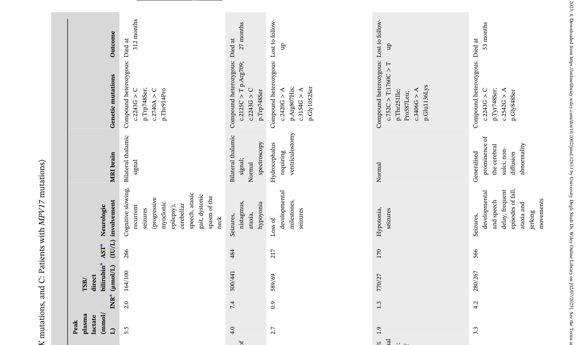

## Question

# Disease Characteristics Research Template

## Target Disease
- **Disease Name:** Mitochondrial DNA Depletion Syndrome 7
- **MONDO ID:**  (if available)
- **Category:** Mendelian

## Research Objectives

Please provide a comprehensive research report on **Mitochondrial DNA Depletion Syndrome 7** covering all of the
disease characteristics listed below. This report will be used to populate a disease knowledge
base entry. Be thorough and cite primary literature (PMID preferred) for all claims.

For each section, **suggested databases/resources** are listed. These are the first places
you should search for information on each topic.

---

### 1. Disease Information
> **Search first:** OMIM, Orphanet, ICD-10/ICD-11, MeSH, PubMed

- What is the disease? Provide a concise overview.
- What are the key identifiers? (OMIM, Orphanet, ICD-10/ICD-11, MeSH, Mondo)
- What are the common synonyms and alternative names?
- Is the information derived from individual patients (e.g., EHR) or aggregated disease-level resources?

### 2. Etiology

- **Disease Causal Factors**: What are the primary causes? (genetic, environmental, infectious, mechanistic)
- **Risk Factors**:
  > **Search first:** PubMed, Cochrane Library, UpToDate, clinical guidelines, ClinVar, ClinGen, GWAS Catalog, PheGenI, CTD, CDC, WHO, epidemiological databases
  - Genetic risk factors (causal variants, susceptibility loci, modifier genes)
  - Environmental risk factors (toxins, lifestyle, occupational exposures, age, sex, family history)
- **Protective Factors**:
  > **Search first:** PubMed, Cochrane Library, clinical trial databases, GWAS Catalog, gnomAD, WHO, CDC, nutrition databases
  - Genetic protective factors (protective variants, modifier alleles)
  - Environmental protective factors (diet, lifestyle, exposures that reduce risk)
- **Gene-Environment Interactions**: How do genetic and environmental factors interact to influence disease?
  > **Search first:** CTD, PubMed, PheGenI, GxE databases

### 3. Phenotypes
> **Search first:** HPO (Human Phenotype Ontology), OMIM, Orphanet, PubMed, clinicaltrials.gov, MedDRA, SNOMED CT, DECIPHER, LOINC

For each phenotype, provide:
- **Phenotype type**: symptoms, clinical signs, physical manifestations, behavioral changes, or laboratory abnormalities
  > For symptoms/signs: HPO, OMIM, Orphanet, PubMed
  > For behavioral changes: HPO, DSM, RDoC (Research Domain Criteria), PubMed
  > For laboratory abnormalities: LOINC, SNOMED CT, LabTests Online, PubMed
- **Phenotype characteristics**:
  > **Search first:** OMIM, Orphanet, HPO, PubMed
  - Age of symptom onset (neonatal, childhood, adult-onset, late-onset)
  - Symptom severity (mild, moderate, severe, variable)
  - Symptom progression (stable, progressive, episodic, fluctuating)
  - Frequency among affected individuals (percentage or qualitative)
- **Quality of life impact**: Effects on daily functioning and well-being (per-phenotype when possible)
  > **Search first:** EQ-5D database, SF-36, WHO QOL databases, PubMed
- Suggest HPO (Human Phenotype Ontology) terms for each phenotype

### 4. Genetic/Molecular Information

- **Causal Genes**: Gene mutations or chromosomal abnormalities responsible for disease (gene symbols, OMIM IDs)
  > **Search first:** OMIM, ClinVar, HGMD, Ensembl, NCBI Gene
- **Pathogenic Variants**:
  - Affected genes (gene symbols, HGNC IDs)
    > **Search first:** OMIM, NCBI Gene, Ensembl, HGNC, UniProt, GeneCards
  - Variant classification (pathogenic, likely pathogenic, VUS per ACMG/AMP guidelines)
    > **Search first:** ClinVar, ClinGen, ACMG/AMP guidelines, VarSome
  - Variant type/class (missense, frameshift, nonsense, splice-site, structural)
  - Allele frequency in population databases
    > **Search first:** gnomAD, 1000 Genomes, ExAC, TOPMed, dbSNP
  - Somatic vs germline origin
    > **Search first:** COSMIC (somatic), ClinVar, ICGC, TCGA
  - Functional consequences (loss of function, gain of function, dominant negative)
- **Modifier Genes**: Genes that modify disease severity or expression
- **Epigenetic Information**: DNA methylation, histone modifications, chromatin changes affecting disease
  > **Search first:** ENCODE, Roadmap Epigenomics, MethBase, DiseaseMeth
- **Chromosomal Abnormalities**: Large-scale genetic changes (aneuploidy, translocations, inversions)
  > **Search first:** DECIPHER, ClinVar, ECARUCA, UCSC Genome Browser

### 5. Environmental Information

- **Environmental Factors**: Non-genetic contributing factors (toxins, radiation, pollution, occupational exposure)
  > **Search first:** CTD (Comparative Toxicogenomics Database), TOXNET, PubMed, EPA databases
- **Lifestyle Factors**: Behavioral factors (smoking, diet, exercise, alcohol consumption)
  > **Search first:** CDC databases, WHO, PubMed, NHANES
- **Infectious Agents**: If applicable, pathogens causing or triggering disease (bacteria, viruses, fungi, parasites)
  > **Search first:** NCBI Taxonomy, ViPR, BV-BRC, MicrobeDB, GIDEON

### 6. Mechanism / Pathophysiology

- **Molecular Pathways**: Specific signaling cascades or biochemical pathways involved (Wnt, MAPK, mTOR, PI3K-AKT, etc.)
  > **Search first:** KEGG, Reactome, WikiPathways, PathBank, BioCyc
- **Cellular Processes**: Cell-level mechanisms (apoptosis, autophagy, cell cycle dysregulation, inflammation, etc.)
  > **Search first:** Gene Ontology (GO), Reactome, KEGG, PubMed
- **Protein Dysfunction**: How protein structure or function is altered (misfolding, aggregation, loss of function, gain of function)
  > **Search first:** UniProt, PDB (Protein Data Bank), InterPro, Pfam, AlphaFold
- **Metabolic Changes**: Alterations in metabolic processes (energy metabolism, lipid metabolism, amino acid metabolism)
  > **Search first:** KEGG, BioCyc, HMDB (Human Metabolome Database), BRENDA
- **Immune System Involvement**: Role of immune response (autoimmunity, immunodeficiency, chronic inflammation)
  > **Search first:** ImmPort, Immunome Database, IEDB, Gene Ontology
- **Tissue Damage Mechanisms**: How tissues/ are injured (oxidative stress, ischemia, fibrosis, necrosis)
  > **Search first:** PubMed, Gene Ontology, Reactome
- **Biochemical Abnormalities**: Specific molecular defects (enzyme deficiencies, receptor dysfunction, ion channel defects)
  > **Search first:** BRENDA, UniProt, KEGG, OMIM, PubMed
- **Epigenetic Changes**: DNA methylation, histone modifications affecting gene expression in disease
  > **Search first:** ENCODE, Roadmap Epigenomics, MethBase, DiseaseMeth
- **Molecular Profiling** (if available):
  - Transcriptomics/gene expression changes
    > **Search first:** GEO (Gene Expression Omnibus), ArrayExpress, GTEx, Human Cell Atlas, SRA
  - Proteomics findings
    > **Search first:** PRIDE, ProteomeXchange, Human Protein Atlas, STRING, BioGRID
  - Metabolomics signatures
    > **Search first:** MetaboLights, Metabolomics Workbench, HMDB, METLIN
  - Lipidomics alterations
    > **Search first:** LIPID MAPS, SwissLipids, LipidHome, Metabolomics Workbench
  - Genomic structural features
    > **Search first:** UCSC Genome Browser, Ensembl, NCBI, dbVar, DGV
- **Advanced Technologies** (if applicable):
  - Single-cell analysis findings (cell-type specific mechanisms, cellular heterogeneity)
    > **Search first:** Human Cell Atlas, Single Cell Portal, GEO, CELLxGENE
  - Spatial transcriptomics findings
    > **Search first:** GEO, Spatial Research, Vizgen, 10x Genomics data
  - Multi-omics integration results
    > **Search first:** TCGA, ICGC, cBioPortal, LinkedOmics, PubMed
  - Functional genomics screens (CRISPR, RNAi)
    > **Search first:** DepMap, GenomeRNAi, PubMed, BioGRID ORCS

For each mechanism, describe:
- The causal chain from initial trigger to clinical manifestation
- Which mechanisms are upstream vs downstream
- What cell types and biological processes are involved
- Suggest GO terms for biological processes and CL terms for cell types

### 7. Anatomical Structures Affected

- **Organ Level**:
  - Primary organs directly affected
  - Secondary organ involvement (complications, secondary effects)
  - Body systems involved (cardiovascular, nervous, digestive, respiratory, endocrine, etc.)
  > **Search first:** Uberon, FMA (Foundational Model of Anatomy), OMIM, HPO, ICD-11, MeSH, SNOMED CT
- **Tissue and Cell Level**:
  - Specific tissue types affected (epithelial, connective, muscle, nervous)
  - Specific cell populations targeted (with Cell Ontology terms)
  > **Search first:** Uberon, Human Protein Atlas, Cell Ontology, Human Cell Atlas, CellMarker, PanglaoDB
- **Subcellular Level**:
  - Cellular compartments involved (mitochondria, nucleus, ER, lysosomes) (with GO Cellular Component terms)
  > **Search first:** Gene Ontology (Cellular Component), UniProt, Human Protein Atlas
- **Localization**:
  - Specific anatomical sites (with UBERON terms)
    > **Search first:** FMA, Uberon, NeuroNames (for brain), SNOMED CT
  - Lateralization (unilateral, bilateral, asymmetric)
    > **Search first:** HPO, clinical literature, imaging databases

### 8. Temporal Development

- **Onset**:
  - Typical age of onset (congenital, pediatric, adult, geriatric)
  - Onset pattern (acute, subacute, chronic, insidious)
  > **Search first:** OMIM, Orphanet, HPO, PubMed
- **Progression**:
  - Disease stages (early, intermediate, advanced, end-stage)
    > **Search first:** Cancer Staging Manual (AJCC), WHO classifications, PubMed
  - Progression rate (rapid, slow, variable)
  - Disease course pattern (episodic, relapsing-remitting, progressive, stable)
  - Disease duration (self-limited, chronic lifelong)
  > **Search first:** Disease registries, longitudinal cohort databases, natural history studies, PubMed, Orphanet, OMIM
- **Patterns**:
  - Remission patterns (spontaneous, treatment-induced)
    > **Search first:** Clinical trial databases, disease registries, PubMed
  - Critical periods (time windows of vulnerability or opportunity for intervention)
    > **Search first:** PubMed, developmental biology databases, clinical guidelines

### 9. Inheritance and Population

- **Epidemiology**:
  - Prevalence (cases per 100,000 at given time)
  - Incidence (new cases per 100,000 per year)
  > **Search first:** Orphanet, CDC, WHO, GBD (Global Burden of Disease), national registries, SEER, disease registries
- **For Genetic Etiology**:
  - Inheritance pattern (AD, AR, X-linked, mitochondrial, multifactorial, polygenic)
    > **Search first:** OMIM, Orphanet, ClinVar, GTR (Genetic Testing Registry)
  - Penetrance (complete, incomplete, age-dependent)
    > **Search first:** ClinVar, OMIM, PubMed, ClinGen
  - Expressivity (variable, consistent)
    > **Search first:** OMIM, ClinVar, PubMed
  - Genetic anticipation (increasing severity in successive generations)
    > **Search first:** OMIM, PubMed (especially for repeat expansion disorders)
  - Germline mosaicism
    > **Search first:** ClinVar, OMIM, genetic counseling literature, PubMed
  - Founder effects (population-specific mutations)
    > **Search first:** gnomAD, population genetics databases, PubMed
  - Consanguinity role
    > **Search first:** OMIM, population studies, genetic counseling resources
  - Carrier frequency
    > **Search first:** gnomAD, carrier screening databases, GeneReviews, GTR
- **Population Demographics**:
  - Affected populations (ethnic or demographic groups with higher prevalence)
    > **Search first:** gnomAD, 1000 Genomes, PAGE Study, PubMed, population registries
  - Geographic distribution (endemic areas, regional variation)
    > **Search first:** WHO, CDC, GBD, Orphanet, geographic epidemiology databases
  - Geographic distribution of specific variants
  - Sex ratio (male:female)
    > **Search first:** Disease registries, OMIM, PubMed, epidemiological databases
  - Age distribution of affected individuals
    > **Search first:** CDC, disease registries, SEER, Orphanet

### 10. Diagnostics

- **Clinical Tests**:
  - Laboratory tests (blood, urine, tissue chemistry, specific enzyme assays)
    > **Search first:** LOINC, LabTests Online, PubMed
  - Biomarkers (proteins, metabolites, genetic markers, circulating biomarkers)
    > **Search first:** FDA Biomarker List, BEST (Biomarkers, EndpointS, and other Tools), PubMed
  - Imaging studies (X-ray, CT, MRI, PET, ultrasound)
    > **Search first:** RadLex, DICOM, Radiopaedia, imaging databases
  - Functional tests (pulmonary function, cardiac stress tests)
    > **Search first:** LOINC, clinical guidelines, PubMed
  - Electrophysiology (EEG, EMG, ECG, nerve conduction studies)
    > **Search first:** LOINC, clinical neurophysiology databases, PubMed
  - Biopsy findings (histopathology, immunohistochemistry)
    > **Search first:** SNOMED CT, College of American Pathologists resources, PubMed
  - Pathology findings (microscopic examination)
    > **Search first:** SNOMED CT, Digital Pathology databases, PubMed
- **Genetic Testing**:
  > **Search first:** GTR (Genetic Testing Registry), GeneReviews, ClinGen
  - Overview of recommended genetic testing approach
  - Whole genome sequencing (WGS) utility
    > **Search first:** GTR, ClinVar, GEL (Genomics England), gnomAD
  - Whole exome sequencing (WES) utility
    > **Search first:** GTR, ClinVar, OMIM, GeneMatcher
  - Gene panels (which panels, which genes)
    > **Search first:** GTR, ClinVar, laboratory-specific databases
  - Single gene testing
    > **Search first:** GTR, ClinVar, OMIM, GeneReviews
  - Chromosomal microarray (CMA)
    > **Search first:** DECIPHER, ClinVar, dbVar, ECARUCA
  - Karyotyping
    > **Search first:** Chromosome Abnormality Database, ClinVar, cytogenetics resources
  - FISH
    > **Search first:** ClinVar, cytogenetics databases, PubMed
  - Mitochondrial DNA testing
    > **Search first:** MITOMAP, MSeqDR, ClinVar, GTR
  - Repeat expansion testing
    > **Search first:** GTR, ClinVar, repeat expansion databases, PubMed
- **Omics-Based Diagnostics** (if applicable):
  - RNA sequencing / transcriptomics
    > **Search first:** GEO, ArrayExpress, GTEx, RNA-seq databases
  - Proteomics
    > **Search first:** PRIDE, ProteomeXchange, FDA Biomarker database
  - Metabolomics
    > **Search first:** MetaboLights, Metabolomics Workbench, HMDB
  - Epigenomics
    > **Search first:** GEO, ENCODE, Roadmap Epigenomics, MethBase
  - Liquid biopsy
    > **Search first:** COSMIC, ClinVar, liquid biopsy databases, PubMed
- **Clinical Criteria**:
  - Standardized diagnostic criteria (DSM, ICD, society guidelines)
    > **Search first:** DSM-5, ICD-11, clinical society guidelines, UpToDate
  - Differential diagnosis (other conditions to rule out, with distinguishing features)
    > **Search first:** DynaMed, UpToDate, clinical decision support systems
- **Screening**:
  - Screening methods for asymptomatic individuals (newborn screening, carrier screening, cascade screening)
    > **Search first:** ACMG recommendations, CDC newborn screening, GTR

### 11. Outcome/Prognosis

- **Survival and Mortality**:
  - Survival rate (5-year, 10-year, overall)
    > **Search first:** SEER, cancer registries, disease-specific registries, PubMed
  - Life expectancy (with and without treatment if applicable)
    > **Search first:** Orphanet, disease registries, actuarial databases, PubMed
  - Mortality rate
    > **Search first:** CDC, WHO, GBD, national mortality databases
  - Disease-specific mortality (deaths directly attributable to disease)
    > **Search first:** Disease registries, CDC Wonder, GBD, PubMed
- **Morbidity and Function**:
  - Morbidity (disease-related disability and health impacts)
    > **Search first:** GBD, WHO, disability databases, PubMed
  - Disability outcomes (long-term functional impairments)
    > **Search first:** ICF (International Classification of Functioning), disability registries
  - Quality of life measures (EQ-5D, SF-36, PROMIS, disease-specific tools)
    > **Search first:** EQ-5D database, SF-36, PROMIS, PubMed
- **Disease Course**:
  - Complications (secondary problems: infections, organ failure, etc.)
    > **Search first:** ICD codes, disease registries, clinical databases, PubMed
  - Recovery potential (likelihood and extent of recovery, with vs without treatment)
    > **Search first:** Natural history studies, rehabilitation databases, PubMed
- **Prediction**:
  - Prognostic factors (age, disease severity, biomarkers, treatment response)
    > **Search first:** Prognostic models databases, clinical calculators, PubMed
  - Prognostic biomarkers (molecular markers predicting disease course)
    > **Search first:** FDA Biomarker database, PubMed, cancer prognostic databases

### 12. Treatment

- **Pharmacotherapy**:
  - Pharmacological treatments (drug names, drug classes, mechanisms of action)
    > **Search first:** DrugBank, RxNorm, ATC classification, DailyMed, FDA databases
  - Pharmacogenomics (how genetic variants affect drug metabolism, efficacy, toxicity)
    > **Search first:** PharmGKB, CPIC (Clinical Pharmacogenetics), FDA Table of PGx Biomarkers
- **Advanced Therapeutics**:
  - Gene therapy (viral vectors, CRISPR, gene replacement, gene editing)
    > **Search first:** ClinicalTrials.gov, FDA gene therapy database, ASGCT resources
  - Cell therapy (stem cell transplant, CAR-T, cellular therapeutics)
    > **Search first:** ClinicalTrials.gov, FDA cell therapy database, FACT standards
  - RNA-based therapies (ASOs, siRNA, mRNA therapies)
    > **Search first:** ClinicalTrials.gov, FDA approvals, PubMed
  - Targeted therapies (treatments directed at specific molecular targets)
    > **Search first:** My Cancer Genome, OncoKB, ClinicalTrials.gov, FDA approvals
  - Immunotherapies (checkpoint inhibitors, monoclonal antibodies)
    > **Search first:** Cancer Immunotherapy Database, FDA approvals, ClinicalTrials.gov
- **Surgical and Interventional**:
  - Surgical interventions (types of surgery, timing, outcomes)
    > **Search first:** CPT codes, surgical registries, clinical guidelines, PubMed
- **Supportive and Rehabilitative**:
  - Supportive care (symptom management, pain control, nutrition)
    > **Search first:** Clinical guidelines, Cochrane Library, PubMed
  - Rehabilitation (physical therapy, occupational therapy, speech therapy)
    > **Search first:** Rehabilitation medicine databases, clinical guidelines, PubMed
- **Experimental**:
  - Experimental treatments in clinical trials (with NCT identifiers if available)
    > **Search first:** ClinicalTrials.gov, EU Clinical Trials Register, WHO ICTRP
- **Treatment Outcomes**:
  - Treatment response rates
    > **Search first:** Clinical trial databases, FDA reviews, systematic reviews, PubMed
  - Side effects and adverse events
    > **Search first:** FDA Adverse Event Reporting System (FAERS), MedWatch, PubMed
- **Treatment Strategy**:
  - Treatment algorithms (clinical pathways, decision trees)
    > **Search first:** Clinical practice guidelines, NCCN Guidelines, UpToDate
  - Combination therapies
    > **Search first:** ClinicalTrials.gov, treatment guidelines, PubMed
  - Personalized medicine approaches (genotype-guided treatment)
    > **Search first:** My Cancer Genome, CIViC, PharmGKB, precision medicine databases

For each treatment, suggest MAXO (Medical Action Ontology) terms where applicable.

### 13. Prevention

- **Prevention Levels**:
  - Primary prevention (preventing disease occurrence: vaccination, risk factor modification)
    > **Search first:** CDC, WHO, USPSTF recommendations, Cochrane Library
  - Secondary prevention (early detection and treatment: screening programs, early intervention)
    > **Search first:** USPSTF, CDC screening guidelines, WHO
  - Tertiary prevention (preventing complications in those with disease)
    > **Search first:** Clinical guidelines, disease management protocols, PubMed
- **Immunization**: Vaccine strategies (if applicable)
  > **Search first:** CDC vaccine schedules, WHO immunization, FDA vaccine database
- **Screening and Early Detection**:
  - Screening programs (population-based: newborn screening, cancer screening)
    > **Search first:** CDC screening programs, USPSTF, cancer screening databases
  - Genetic screening (carrier screening, preimplantation genetic diagnosis, prenatal testing)
    > **Search first:** ACMG recommendations, ACOG guidelines, GTR
  - Risk stratification (identifying high-risk individuals for targeted prevention)
    > **Search first:** Risk prediction models, clinical calculators, PubMed
- **Behavioral Interventions**: Lifestyle modifications to reduce risk
  > **Search first:** CDC, WHO, behavioral intervention databases, Cochrane Library
- **Counseling**: Genetic counseling (risk assessment, family planning guidance)
  > **Search first:** NSGC resources, ACMG guidelines, GeneReviews
- **Public Health**:
  - Public health interventions (sanitation, vector control, health education)
    > **Search first:** CDC, WHO, public health databases, PubMed
  - Environmental interventions (reducing environmental risk factors)
    > **Search first:** EPA databases, WHO environmental health, PubMed
- **Prophylaxis**: Preventive medications or procedures
  > **Search first:** Clinical guidelines, FDA approvals, PubMed

### 14. Other Species / Natural Disease

- **Taxonomy**: Species affected (with NCBI Taxon identifiers)
  > **Search first:** NCBI Taxonomy
- **Breed**: Specific breeds affected (with VBO identifiers if applicable)
  > **Search first:** VBO (Vertebrate Breed Ontology)
- **Gene**: Orthologous genes in other species (with NCBI Gene IDs)
  > **Search first:** NCBI Gene
- **Natural Disease**:
  - Naturally occurring disease in other species (companion animals, wildlife)
    > **Search first:** OMIA (Online Mendelian Inheritance in Animals), VetCompass, PubMed
  - Veterinary relevance and importance in animal health
    > **Search first:** OMIA, veterinary databases, PubMed
- **Comparative Biology**:
  - Comparative pathology (similarities and differences across species)
    > **Search first:** OMIA, comparative pathology databases, PubMed
  - Evolutionary conservation of disease mechanisms
    > **Search first:** HomoloGene, OrthoMCL, Alliance of Genome Resources
- **Transmission** (if applicable):
  - Zoonotic potential
    > **Search first:** CDC zoonotic diseases, WHO zoonoses, GIDEON
  - Cross-species susceptibility
    > **Search first:** NCBI Taxonomy, veterinary databases, PubMed

### 15. Model Organisms

- **Model Types**:
  - Model organism type (mammalian, invertebrate, cellular, in vitro)
    > **Search first:** Alliance of Genome Resources, model organism databases
  - Specific model systems (mouse, rat, zebrafish, Drosophila, C. elegans, yeast, cell lines, organoids, iPSCs)
    > **Search first:** MGI, RGD, ZFIN, FlyBase, WormBase, SGD, ATCC, Cellosaurus
  - Induced models (drug treatment, surgical intervention, environmental manipulation)
    > **Search first:** MGI, model organism databases, PubMed
- **Genetic Models**:
  - Types available (knockout, knock-in, transgenic, conditional, humanized)
    > **Search first:** MGI, IMPC, KOMP, EuMMCR, IMSR
- **Model Characteristics**:
  - Phenotype recapitulation (how well model reproduces human disease features)
    > **Search first:** Model organism databases, comparative studies, PubMed
  - Model limitations (aspects of human disease not captured)
    > **Search first:** Model organism databases, PubMed, review articles
- **Applications**:
  - Research applications (what aspects of disease can be studied)
    > **Search first:** Model organism databases, PubMed
- **Resources**:
  - Model databases
    > **Search first:** MGI, RGD, ZFIN, FlyBase, WormBase, IMSR, EMMA, MMRRC

---

## Citation Requirements

- Cite primary literature (PMID preferred) for all mechanistic and clinical claims
- Prioritize recent reviews and landmark papers
- Include direct quotes from abstracts where possible to support key statements
- Distinguish evidence source types: human clinical, model organism, in vitro, computational

## Output Format

Structure your response as a comprehensive narrative organized by the sections above.
For each section, provide:
- Factual content with specific details (numbers, percentages, gene names, variant nomenclature)
- Ontology term suggestions (HPO, GO, CL, UBERON, CHEBI, MAXO, MONDO) where applicable
- Evidence citations with PMIDs
- Direct quotes from abstracts to support key claims
- Clear indication when information is not available or not applicable for this disease

This report will be used to populate a disease knowledge base entry with:
- Pathophysiology descriptions with causal chains
- Gene/protein annotations (HGNC, GO terms)
- Phenotype associations (HP terms) with frequencies
- Cell type involvement (CL terms)
- Anatomical locations (UBERON terms)
- Chemical entities (CHEBI terms)
- Treatment annotations (MAXO terms)
- Evidence items with PMIDs and exact abstract quotes
- Epidemiology, prognosis, diagnostic, and prevention information
- Animal model descriptions with phenotype recapitulation details

## Output

Question: You are an expert researcher providing comprehensive, well-cited information.

Provide detailed information focusing on:
1. Key concepts and definitions with current understanding
2. Recent developments and latest research (prioritize 2023-2024 sources)
3. Current applications and real-world implementations
4. Expert opinions and analysis from authoritative sources
5. Relevant statistics and data from recent studies

Format as a comprehensive research report with proper citations. Include URLs and publication dates where available.
Always prioritize recent, authoritative sources and provide specific citations for all major claims.

# Disease Characteristics Research Template

## Target Disease
- **Disease Name:** Mitochondrial DNA Depletion Syndrome 7
- **MONDO ID:**  (if available)
- **Category:** Mendelian

## Research Objectives

Please provide a comprehensive research report on **Mitochondrial DNA Depletion Syndrome 7** covering all of the
disease characteristics listed below. This report will be used to populate a disease knowledge
base entry. Be thorough and cite primary literature (PMID preferred) for all claims.

For each section, **suggested databases/resources** are listed. These are the first places
you should search for information on each topic.

---

### 1. Disease Information
> **Search first:** OMIM, Orphanet, ICD-10/ICD-11, MeSH, PubMed

- What is the disease? Provide a concise overview.
- What are the key identifiers? (OMIM, Orphanet, ICD-10/ICD-11, MeSH, Mondo)
- What are the common synonyms and alternative names?
- Is the information derived from individual patients (e.g., EHR) or aggregated disease-level resources?

### 2. Etiology

- **Disease Causal Factors**: What are the primary causes? (genetic, environmental, infectious, mechanistic)
- **Risk Factors**:
  > **Search first:** PubMed, Cochrane Library, UpToDate, clinical guidelines, ClinVar, ClinGen, GWAS Catalog, PheGenI, CTD, CDC, WHO, epidemiological databases
  - Genetic risk factors (causal variants, susceptibility loci, modifier genes)
  - Environmental risk factors (toxins, lifestyle, occupational exposures, age, sex, family history)
- **Protective Factors**:
  > **Search first:** PubMed, Cochrane Library, clinical trial databases, GWAS Catalog, gnomAD, WHO, CDC, nutrition databases
  - Genetic protective factors (protective variants, modifier alleles)
  - Environmental protective factors (diet, lifestyle, exposures that reduce risk)
- **Gene-Environment Interactions**: How do genetic and environmental factors interact to influence disease?
  > **Search first:** CTD, PubMed, PheGenI, GxE databases

### 3. Phenotypes
> **Search first:** HPO (Human Phenotype Ontology), OMIM, Orphanet, PubMed, clinicaltrials.gov, MedDRA, SNOMED CT, DECIPHER, LOINC

For each phenotype, provide:
- **Phenotype type**: symptoms, clinical signs, physical manifestations, behavioral changes, or laboratory abnormalities
  > For symptoms/signs: HPO, OMIM, Orphanet, PubMed
  > For behavioral changes: HPO, DSM, RDoC (Research Domain Criteria), PubMed
  > For laboratory abnormalities: LOINC, SNOMED CT, LabTests Online, PubMed
- **Phenotype characteristics**:
  > **Search first:** OMIM, Orphanet, HPO, PubMed
  - Age of symptom onset (neonatal, childhood, adult-onset, late-onset)
  - Symptom severity (mild, moderate, severe, variable)
  - Symptom progression (stable, progressive, episodic, fluctuating)
  - Frequency among affected individuals (percentage or qualitative)
- **Quality of life impact**: Effects on daily functioning and well-being (per-phenotype when possible)
  > **Search first:** EQ-5D database, SF-36, WHO QOL databases, PubMed
- Suggest HPO (Human Phenotype Ontology) terms for each phenotype

### 4. Genetic/Molecular Information

- **Causal Genes**: Gene mutations or chromosomal abnormalities responsible for disease (gene symbols, OMIM IDs)
  > **Search first:** OMIM, ClinVar, HGMD, Ensembl, NCBI Gene
- **Pathogenic Variants**:
  - Affected genes (gene symbols, HGNC IDs)
    > **Search first:** OMIM, NCBI Gene, Ensembl, HGNC, UniProt, GeneCards
  - Variant classification (pathogenic, likely pathogenic, VUS per ACMG/AMP guidelines)
    > **Search first:** ClinVar, ClinGen, ACMG/AMP guidelines, VarSome
  - Variant type/class (missense, frameshift, nonsense, splice-site, structural)
  - Allele frequency in population databases
    > **Search first:** gnomAD, 1000 Genomes, ExAC, TOPMed, dbSNP
  - Somatic vs germline origin
    > **Search first:** COSMIC (somatic), ClinVar, ICGC, TCGA
  - Functional consequences (loss of function, gain of function, dominant negative)
- **Modifier Genes**: Genes that modify disease severity or expression
- **Epigenetic Information**: DNA methylation, histone modifications, chromatin changes affecting disease
  > **Search first:** ENCODE, Roadmap Epigenomics, MethBase, DiseaseMeth
- **Chromosomal Abnormalities**: Large-scale genetic changes (aneuploidy, translocations, inversions)
  > **Search first:** DECIPHER, ClinVar, ECARUCA, UCSC Genome Browser

### 5. Environmental Information

- **Environmental Factors**: Non-genetic contributing factors (toxins, radiation, pollution, occupational exposure)
  > **Search first:** CTD (Comparative Toxicogenomics Database), TOXNET, PubMed, EPA databases
- **Lifestyle Factors**: Behavioral factors (smoking, diet, exercise, alcohol consumption)
  > **Search first:** CDC databases, WHO, PubMed, NHANES
- **Infectious Agents**: If applicable, pathogens causing or triggering disease (bacteria, viruses, fungi, parasites)
  > **Search first:** NCBI Taxonomy, ViPR, BV-BRC, MicrobeDB, GIDEON

### 6. Mechanism / Pathophysiology

- **Molecular Pathways**: Specific signaling cascades or biochemical pathways involved (Wnt, MAPK, mTOR, PI3K-AKT, etc.)
  > **Search first:** KEGG, Reactome, WikiPathways, PathBank, BioCyc
- **Cellular Processes**: Cell-level mechanisms (apoptosis, autophagy, cell cycle dysregulation, inflammation, etc.)
  > **Search first:** Gene Ontology (GO), Reactome, KEGG, PubMed
- **Protein Dysfunction**: How protein structure or function is altered (misfolding, aggregation, loss of function, gain of function)
  > **Search first:** UniProt, PDB (Protein Data Bank), InterPro, Pfam, AlphaFold
- **Metabolic Changes**: Alterations in metabolic processes (energy metabolism, lipid metabolism, amino acid metabolism)
  > **Search first:** KEGG, BioCyc, HMDB (Human Metabolome Database), BRENDA
- **Immune System Involvement**: Role of immune response (autoimmunity, immunodeficiency, chronic inflammation)
  > **Search first:** ImmPort, Immunome Database, IEDB, Gene Ontology
- **Tissue Damage Mechanisms**: How tissues/ are injured (oxidative stress, ischemia, fibrosis, necrosis)
  > **Search first:** PubMed, Gene Ontology, Reactome
- **Biochemical Abnormalities**: Specific molecular defects (enzyme deficiencies, receptor dysfunction, ion channel defects)
  > **Search first:** BRENDA, UniProt, KEGG, OMIM, PubMed
- **Epigenetic Changes**: DNA methylation, histone modifications affecting gene expression in disease
  > **Search first:** ENCODE, Roadmap Epigenomics, MethBase, DiseaseMeth
- **Molecular Profiling** (if available):
  - Transcriptomics/gene expression changes
    > **Search first:** GEO (Gene Expression Omnibus), ArrayExpress, GTEx, Human Cell Atlas, SRA
  - Proteomics findings
    > **Search first:** PRIDE, ProteomeXchange, Human Protein Atlas, STRING, BioGRID
  - Metabolomics signatures
    > **Search first:** MetaboLights, Metabolomics Workbench, HMDB, METLIN
  - Lipidomics alterations
    > **Search first:** LIPID MAPS, SwissLipids, LipidHome, Metabolomics Workbench
  - Genomic structural features
    > **Search first:** UCSC Genome Browser, Ensembl, NCBI, dbVar, DGV
- **Advanced Technologies** (if applicable):
  - Single-cell analysis findings (cell-type specific mechanisms, cellular heterogeneity)
    > **Search first:** Human Cell Atlas, Single Cell Portal, GEO, CELLxGENE
  - Spatial transcriptomics findings
    > **Search first:** GEO, Spatial Research, Vizgen, 10x Genomics data
  - Multi-omics integration results
    > **Search first:** TCGA, ICGC, cBioPortal, LinkedOmics, PubMed
  - Functional genomics screens (CRISPR, RNAi)
    > **Search first:** DepMap, GenomeRNAi, PubMed, BioGRID ORCS

For each mechanism, describe:
- The causal chain from initial trigger to clinical manifestation
- Which mechanisms are upstream vs downstream
- What cell types and biological processes are involved
- Suggest GO terms for biological processes and CL terms for cell types

### 7. Anatomical Structures Affected

- **Organ Level**:
  - Primary organs directly affected
  - Secondary organ involvement (complications, secondary effects)
  - Body systems involved (cardiovascular, nervous, digestive, respiratory, endocrine, etc.)
  > **Search first:** Uberon, FMA (Foundational Model of Anatomy), OMIM, HPO, ICD-11, MeSH, SNOMED CT
- **Tissue and Cell Level**:
  - Specific tissue types affected (epithelial, connective, muscle, nervous)
  - Specific cell populations targeted (with Cell Ontology terms)
  > **Search first:** Uberon, Human Protein Atlas, Cell Ontology, Human Cell Atlas, CellMarker, PanglaoDB
- **Subcellular Level**:
  - Cellular compartments involved (mitochondria, nucleus, ER, lysosomes) (with GO Cellular Component terms)
  > **Search first:** Gene Ontology (Cellular Component), UniProt, Human Protein Atlas
- **Localization**:
  - Specific anatomical sites (with UBERON terms)
    > **Search first:** FMA, Uberon, NeuroNames (for brain), SNOMED CT
  - Lateralization (unilateral, bilateral, asymmetric)
    > **Search first:** HPO, clinical literature, imaging databases

### 8. Temporal Development

- **Onset**:
  - Typical age of onset (congenital, pediatric, adult, geriatric)
  - Onset pattern (acute, subacute, chronic, insidious)
  > **Search first:** OMIM, Orphanet, HPO, PubMed
- **Progression**:
  - Disease stages (early, intermediate, advanced, end-stage)
    > **Search first:** Cancer Staging Manual (AJCC), WHO classifications, PubMed
  - Progression rate (rapid, slow, variable)
  - Disease course pattern (episodic, relapsing-remitting, progressive, stable)
  - Disease duration (self-limited, chronic lifelong)
  > **Search first:** Disease registries, longitudinal cohort databases, natural history studies, PubMed, Orphanet, OMIM
- **Patterns**:
  - Remission patterns (spontaneous, treatment-induced)
    > **Search first:** Clinical trial databases, disease registries, PubMed
  - Critical periods (time windows of vulnerability or opportunity for intervention)
    > **Search first:** PubMed, developmental biology databases, clinical guidelines

### 9. Inheritance and Population

- **Epidemiology**:
  - Prevalence (cases per 100,000 at given time)
  - Incidence (new cases per 100,000 per year)
  > **Search first:** Orphanet, CDC, WHO, GBD (Global Burden of Disease), national registries, SEER, disease registries
- **For Genetic Etiology**:
  - Inheritance pattern (AD, AR, X-linked, mitochondrial, multifactorial, polygenic)
    > **Search first:** OMIM, Orphanet, ClinVar, GTR (Genetic Testing Registry)
  - Penetrance (complete, incomplete, age-dependent)
    > **Search first:** ClinVar, OMIM, PubMed, ClinGen
  - Expressivity (variable, consistent)
    > **Search first:** OMIM, ClinVar, PubMed
  - Genetic anticipation (increasing severity in successive generations)
    > **Search first:** OMIM, PubMed (especially for repeat expansion disorders)
  - Germline mosaicism
    > **Search first:** ClinVar, OMIM, genetic counseling literature, PubMed
  - Founder effects (population-specific mutations)
    > **Search first:** gnomAD, population genetics databases, PubMed
  - Consanguinity role
    > **Search first:** OMIM, population studies, genetic counseling resources
  - Carrier frequency
    > **Search first:** gnomAD, carrier screening databases, GeneReviews, GTR
- **Population Demographics**:
  - Affected populations (ethnic or demographic groups with higher prevalence)
    > **Search first:** gnomAD, 1000 Genomes, PAGE Study, PubMed, population registries
  - Geographic distribution (endemic areas, regional variation)
    > **Search first:** WHO, CDC, GBD, Orphanet, geographic epidemiology databases
  - Geographic distribution of specific variants
  - Sex ratio (male:female)
    > **Search first:** Disease registries, OMIM, PubMed, epidemiological databases
  - Age distribution of affected individuals
    > **Search first:** CDC, disease registries, SEER, Orphanet

### 10. Diagnostics

- **Clinical Tests**:
  - Laboratory tests (blood, urine, tissue chemistry, specific enzyme assays)
    > **Search first:** LOINC, LabTests Online, PubMed
  - Biomarkers (proteins, metabolites, genetic markers, circulating biomarkers)
    > **Search first:** FDA Biomarker List, BEST (Biomarkers, EndpointS, and other Tools), PubMed
  - Imaging studies (X-ray, CT, MRI, PET, ultrasound)
    > **Search first:** RadLex, DICOM, Radiopaedia, imaging databases
  - Functional tests (pulmonary function, cardiac stress tests)
    > **Search first:** LOINC, clinical guidelines, PubMed
  - Electrophysiology (EEG, EMG, ECG, nerve conduction studies)
    > **Search first:** LOINC, clinical neurophysiology databases, PubMed
  - Biopsy findings (histopathology, immunohistochemistry)
    > **Search first:** SNOMED CT, College of American Pathologists resources, PubMed
  - Pathology findings (microscopic examination)
    > **Search first:** SNOMED CT, Digital Pathology databases, PubMed
- **Genetic Testing**:
  > **Search first:** GTR (Genetic Testing Registry), GeneReviews, ClinGen
  - Overview of recommended genetic testing approach
  - Whole genome sequencing (WGS) utility
    > **Search first:** GTR, ClinVar, GEL (Genomics England), gnomAD
  - Whole exome sequencing (WES) utility
    > **Search first:** GTR, ClinVar, OMIM, GeneMatcher
  - Gene panels (which panels, which genes)
    > **Search first:** GTR, ClinVar, laboratory-specific databases
  - Single gene testing
    > **Search first:** GTR, ClinVar, OMIM, GeneReviews
  - Chromosomal microarray (CMA)
    > **Search first:** DECIPHER, ClinVar, dbVar, ECARUCA
  - Karyotyping
    > **Search first:** Chromosome Abnormality Database, ClinVar, cytogenetics resources
  - FISH
    > **Search first:** ClinVar, cytogenetics databases, PubMed
  - Mitochondrial DNA testing
    > **Search first:** MITOMAP, MSeqDR, ClinVar, GTR
  - Repeat expansion testing
    > **Search first:** GTR, ClinVar, repeat expansion databases, PubMed
- **Omics-Based Diagnostics** (if applicable):
  - RNA sequencing / transcriptomics
    > **Search first:** GEO, ArrayExpress, GTEx, RNA-seq databases
  - Proteomics
    > **Search first:** PRIDE, ProteomeXchange, FDA Biomarker database
  - Metabolomics
    > **Search first:** MetaboLights, Metabolomics Workbench, HMDB
  - Epigenomics
    > **Search first:** GEO, ENCODE, Roadmap Epigenomics, MethBase
  - Liquid biopsy
    > **Search first:** COSMIC, ClinVar, liquid biopsy databases, PubMed
- **Clinical Criteria**:
  - Standardized diagnostic criteria (DSM, ICD, society guidelines)
    > **Search first:** DSM-5, ICD-11, clinical society guidelines, UpToDate
  - Differential diagnosis (other conditions to rule out, with distinguishing features)
    > **Search first:** DynaMed, UpToDate, clinical decision support systems
- **Screening**:
  - Screening methods for asymptomatic individuals (newborn screening, carrier screening, cascade screening)
    > **Search first:** ACMG recommendations, CDC newborn screening, GTR

### 11. Outcome/Prognosis

- **Survival and Mortality**:
  - Survival rate (5-year, 10-year, overall)
    > **Search first:** SEER, cancer registries, disease-specific registries, PubMed
  - Life expectancy (with and without treatment if applicable)
    > **Search first:** Orphanet, disease registries, actuarial databases, PubMed
  - Mortality rate
    > **Search first:** CDC, WHO, GBD, national mortality databases
  - Disease-specific mortality (deaths directly attributable to disease)
    > **Search first:** Disease registries, CDC Wonder, GBD, PubMed
- **Morbidity and Function**:
  - Morbidity (disease-related disability and health impacts)
    > **Search first:** GBD, WHO, disability databases, PubMed
  - Disability outcomes (long-term functional impairments)
    > **Search first:** ICF (International Classification of Functioning), disability registries
  - Quality of life measures (EQ-5D, SF-36, PROMIS, disease-specific tools)
    > **Search first:** EQ-5D database, SF-36, PROMIS, PubMed
- **Disease Course**:
  - Complications (secondary problems: infections, organ failure, etc.)
    > **Search first:** ICD codes, disease registries, clinical databases, PubMed
  - Recovery potential (likelihood and extent of recovery, with vs without treatment)
    > **Search first:** Natural history studies, rehabilitation databases, PubMed
- **Prediction**:
  - Prognostic factors (age, disease severity, biomarkers, treatment response)
    > **Search first:** Prognostic models databases, clinical calculators, PubMed
  - Prognostic biomarkers (molecular markers predicting disease course)
    > **Search first:** FDA Biomarker database, PubMed, cancer prognostic databases

### 12. Treatment

- **Pharmacotherapy**:
  - Pharmacological treatments (drug names, drug classes, mechanisms of action)
    > **Search first:** DrugBank, RxNorm, ATC classification, DailyMed, FDA databases
  - Pharmacogenomics (how genetic variants affect drug metabolism, efficacy, toxicity)
    > **Search first:** PharmGKB, CPIC (Clinical Pharmacogenetics), FDA Table of PGx Biomarkers
- **Advanced Therapeutics**:
  - Gene therapy (viral vectors, CRISPR, gene replacement, gene editing)
    > **Search first:** ClinicalTrials.gov, FDA gene therapy database, ASGCT resources
  - Cell therapy (stem cell transplant, CAR-T, cellular therapeutics)
    > **Search first:** ClinicalTrials.gov, FDA cell therapy database, FACT standards
  - RNA-based therapies (ASOs, siRNA, mRNA therapies)
    > **Search first:** ClinicalTrials.gov, FDA approvals, PubMed
  - Targeted therapies (treatments directed at specific molecular targets)
    > **Search first:** My Cancer Genome, OncoKB, ClinicalTrials.gov, FDA approvals
  - Immunotherapies (checkpoint inhibitors, monoclonal antibodies)
    > **Search first:** Cancer Immunotherapy Database, FDA approvals, ClinicalTrials.gov
- **Surgical and Interventional**:
  - Surgical interventions (types of surgery, timing, outcomes)
    > **Search first:** CPT codes, surgical registries, clinical guidelines, PubMed
- **Supportive and Rehabilitative**:
  - Supportive care (symptom management, pain control, nutrition)
    > **Search first:** Clinical guidelines, Cochrane Library, PubMed
  - Rehabilitation (physical therapy, occupational therapy, speech therapy)
    > **Search first:** Rehabilitation medicine databases, clinical guidelines, PubMed
- **Experimental**:
  - Experimental treatments in clinical trials (with NCT identifiers if available)
    > **Search first:** ClinicalTrials.gov, EU Clinical Trials Register, WHO ICTRP
- **Treatment Outcomes**:
  - Treatment response rates
    > **Search first:** Clinical trial databases, FDA reviews, systematic reviews, PubMed
  - Side effects and adverse events
    > **Search first:** FDA Adverse Event Reporting System (FAERS), MedWatch, PubMed
- **Treatment Strategy**:
  - Treatment algorithms (clinical pathways, decision trees)
    > **Search first:** Clinical practice guidelines, NCCN Guidelines, UpToDate
  - Combination therapies
    > **Search first:** ClinicalTrials.gov, treatment guidelines, PubMed
  - Personalized medicine approaches (genotype-guided treatment)
    > **Search first:** My Cancer Genome, CIViC, PharmGKB, precision medicine databases

For each treatment, suggest MAXO (Medical Action Ontology) terms where applicable.

### 13. Prevention

- **Prevention Levels**:
  - Primary prevention (preventing disease occurrence: vaccination, risk factor modification)
    > **Search first:** CDC, WHO, USPSTF recommendations, Cochrane Library
  - Secondary prevention (early detection and treatment: screening programs, early intervention)
    > **Search first:** USPSTF, CDC screening guidelines, WHO
  - Tertiary prevention (preventing complications in those with disease)
    > **Search first:** Clinical guidelines, disease management protocols, PubMed
- **Immunization**: Vaccine strategies (if applicable)
  > **Search first:** CDC vaccine schedules, WHO immunization, FDA vaccine database
- **Screening and Early Detection**:
  - Screening programs (population-based: newborn screening, cancer screening)
    > **Search first:** CDC screening programs, USPSTF, cancer screening databases
  - Genetic screening (carrier screening, preimplantation genetic diagnosis, prenatal testing)
    > **Search first:** ACMG recommendations, ACOG guidelines, GTR
  - Risk stratification (identifying high-risk individuals for targeted prevention)
    > **Search first:** Risk prediction models, clinical calculators, PubMed
- **Behavioral Interventions**: Lifestyle modifications to reduce risk
  > **Search first:** CDC, WHO, behavioral intervention databases, Cochrane Library
- **Counseling**: Genetic counseling (risk assessment, family planning guidance)
  > **Search first:** NSGC resources, ACMG guidelines, GeneReviews
- **Public Health**:
  - Public health interventions (sanitation, vector control, health education)
    > **Search first:** CDC, WHO, public health databases, PubMed
  - Environmental interventions (reducing environmental risk factors)
    > **Search first:** EPA databases, WHO environmental health, PubMed
- **Prophylaxis**: Preventive medications or procedures
  > **Search first:** Clinical guidelines, FDA approvals, PubMed

### 14. Other Species / Natural Disease

- **Taxonomy**: Species affected (with NCBI Taxon identifiers)
  > **Search first:** NCBI Taxonomy
- **Breed**: Specific breeds affected (with VBO identifiers if applicable)
  > **Search first:** VBO (Vertebrate Breed Ontology)
- **Gene**: Orthologous genes in other species (with NCBI Gene IDs)
  > **Search first:** NCBI Gene
- **Natural Disease**:
  - Naturally occurring disease in other species (companion animals, wildlife)
    > **Search first:** OMIA (Online Mendelian Inheritance in Animals), VetCompass, PubMed
  - Veterinary relevance and importance in animal health
    > **Search first:** OMIA, veterinary databases, PubMed
- **Comparative Biology**:
  - Comparative pathology (similarities and differences across species)
    > **Search first:** OMIA, comparative pathology databases, PubMed
  - Evolutionary conservation of disease mechanisms
    > **Search first:** HomoloGene, OrthoMCL, Alliance of Genome Resources
- **Transmission** (if applicable):
  - Zoonotic potential
    > **Search first:** CDC zoonotic diseases, WHO zoonoses, GIDEON
  - Cross-species susceptibility
    > **Search first:** NCBI Taxonomy, veterinary databases, PubMed

### 15. Model Organisms

- **Model Types**:
  - Model organism type (mammalian, invertebrate, cellular, in vitro)
    > **Search first:** Alliance of Genome Resources, model organism databases
  - Specific model systems (mouse, rat, zebrafish, Drosophila, C. elegans, yeast, cell lines, organoids, iPSCs)
    > **Search first:** MGI, RGD, ZFIN, FlyBase, WormBase, SGD, ATCC, Cellosaurus
  - Induced models (drug treatment, surgical intervention, environmental manipulation)
    > **Search first:** MGI, model organism databases, PubMed
- **Genetic Models**:
  - Types available (knockout, knock-in, transgenic, conditional, humanized)
    > **Search first:** MGI, IMPC, KOMP, EuMMCR, IMSR
- **Model Characteristics**:
  - Phenotype recapitulation (how well model reproduces human disease features)
    > **Search first:** Model organism databases, comparative studies, PubMed
  - Model limitations (aspects of human disease not captured)
    > **Search first:** Model organism databases, PubMed, review articles
- **Applications**:
  - Research applications (what aspects of disease can be studied)
    > **Search first:** Model organism databases, PubMed
- **Resources**:
  - Model databases
    > **Search first:** MGI, RGD, ZFIN, FlyBase, WormBase, IMSR, EMMA, MMRRC

---

## Citation Requirements

- Cite primary literature (PMID preferred) for all mechanistic and clinical claims
- Prioritize recent reviews and landmark papers
- Include direct quotes from abstracts where possible to support key statements
- Distinguish evidence source types: human clinical, model organism, in vitro, computational

## Output Format

Structure your response as a comprehensive narrative organized by the sections above.
For each section, provide:
- Factual content with specific details (numbers, percentages, gene names, variant nomenclature)
- Ontology term suggestions (HPO, GO, CL, UBERON, CHEBI, MAXO, MONDO) where applicable
- Evidence citations with PMIDs
- Direct quotes from abstracts to support key claims
- Clear indication when information is not available or not applicable for this disease

This report will be used to populate a disease knowledge base entry with:
- Pathophysiology descriptions with causal chains
- Gene/protein annotations (HGNC, GO terms)
- Phenotype associations (HP terms) with frequencies
- Cell type involvement (CL terms)
- Anatomical locations (UBERON terms)
- Chemical entities (CHEBI terms)
- Treatment annotations (MAXO terms)
- Evidence items with PMIDs and exact abstract quotes
- Epidemiology, prognosis, diagnostic, and prevention information
- Animal model descriptions with phenotype recapitulation details

# Disease Characteristics Research Report: Mitochondrial DNA Depletion Syndrome 7 (MTDPS7; MPV17-related)

## Executive summary
Mitochondrial DNA depletion syndrome 7 (MTDPS7) is a nuclear-gene, autosomal recessive mitochondrial DNA (mtDNA) maintenance disorder caused by biallelic pathogenic variants in **MPV17**, encoding a mitochondrial inner membrane protein. The most common clinical presentation is an infantile **hepatocerebral** phenotype with cholestasis/acute liver failure, recurrent hypoglycemia, lactic acidosis, and later neurological involvement; mortality is frequently in infancy, though selected patients can survive long-term after liver transplantation. Recent (2023) real-world data from a tertiary liver center provide subgroup-specific mortality and transplant outcomes, and 2023 mechanistic model-organism work further supports an MPV17 ion-channel/nucleotide-homeostasis role in mtDNA stability. (vara2023hepaticpresentationsof pages 1-2, corra2023drosophilampv17forms pages 1-2, uusimaa2014clinicalbiochemicalcellular pages 1-2)

## 1. Disease information
### 1.1 Definition (current understanding)
MTDPS7 belongs to the broader mtDNA depletion syndromes, which are “**severe autosomal recessive disorders associated with decreased mtDNA copy number in clinically affected tissues**.” (Uusimaa 2014, *Eur J Hum Genet*, published online 2013; print 2014-02 issue; DOI https://doi.org/10.1038/ejhg.2013.112) (uusimaa2014clinicalbiochemicalcellular pages 1-2)

In MPV17-related disease, the characteristic phenotype is hepatocerebral: early liver disease/failure is typically the presenting system, with neurological features often evolving later. In one large MPV17 cohort, “**All patients manifested liver disease. Poor feeding, hypoglycaemia, raised serum lactate, hypotonia and faltering growth were common presenting features.**” (Uusimaa 2014) (uusimaa2014clinicalbiochemicalcellular pages 1-2)

### 1.2 Key identifiers
A complete identifier panel (OMIM/Orphanet/MeSH/ICD-10/ICD-11) was **not retrievable from the provided tool evidence** in this run; the report therefore supplies only identifiers available in the retrieved sources and flags others as unavailable.

- **MONDO:** Open Targets links **mitochondrial DNA depletion syndrome** to **MONDO_0018158** and associates this disease entity to **MPV17** (ENSG00000115204) with multiple literature items. (Open Targets platform: https://platform.opentargets.org) (OpenTargets Search: Mitochondrial DNA depletion syndrome,Mitochondrial DNA depletion syndrome 7,Navajo neurohepatopathy-MPV17)

### 1.3 Synonyms / alternative names
Commonly used synonyms in the retrieved literature include:
- **MPV17-related hepatocerebral mitochondrial DNA depletion syndrome** (uusimaa2014clinicalbiochemicalcellular pages 1-2)
- **MPV17-related mitochondrial DNA depletion syndrome** (abduljalil2023fulminantneonatalliver pages 1-2)
- **Navajo neurohepatopathy** (an MPV17 allelic presentation, classically associated with p.Arg50Gln). (uusimaa2014clinicalbiochemicalcellular pages 5-7)

### 1.4 Evidence source type
This entry integrates:
- **Aggregated disease-level resources:** MONDO/Open Targets mapping of disease–gene association. (OpenTargets Search: Mitochondrial DNA depletion syndrome,Mitochondrial DNA depletion syndrome 7,Navajo neurohepatopathy-MPV17)
- **Primary human clinical evidence:** cohort studies and case reports (e.g., Uusimaa 2014; Vara 2023; Abduljalil 2023). (uusimaa2014clinicalbiochemicalcellular pages 1-2, vara2023hepaticpresentationsof pages 1-2, abduljalil2023fulminantneonatalliver pages 1-2)
- **Mechanistic/model systems evidence:** mouse/in vitro channel studies and Drosophila mechanistic work. (antonenkov2015thehumanmitochondrial pages 1-2, corra2023drosophilampv17forms pages 1-2)

| Identifier system | ID | Label | Notes | Supporting citation IDs |
|---|---|---|---|---|
| Disease name | — | Mitochondrial DNA Depletion Syndrome 7 | Mendelian mtDNA maintenance disorder caused by MPV17 deficiency; hepatocerebral presentation with liver-predominant disease. | (uusimaa2014clinicalbiochemicalcellular pages 1-2, abduljalil2023fulminantneonatalliver pages 1-2) |
| Gene-disease association / MONDO | MONDO_0018158 | mitochondrial DNA depletion syndrome | Open Targets links MONDO_0018158 to **MPV17** (ENSG00000115204) with literature support; URL: https://platform.opentargets.org | (OpenTargets Search: Mitochondrial DNA depletion syndrome,Mitochondrial DNA depletion syndrome 7,Navajo neurohepatopathy-MPV17) |
| Gene | ENSG00000115204 | MPV17 | Approved symbol: **MPV17**; mitochondrial inner membrane protein MPV17; nuclear gene underlying the MPV17-related hepatocerebral MDDS phenotype. | (OpenTargets Search: Mitochondrial DNA depletion syndrome,Mitochondrial DNA depletion syndrome 7,Navajo neurohepatopathy-MPV17, uusimaa2014clinicalbiochemicalcellular pages 1-2, antonenkov2015thehumanmitochondrial pages 1-2) |
| Clinical subtype / descriptor | — | MPV17-related hepatocerebral mitochondrial DNA depletion syndrome | Uusimaa 2014 describes MPV17 mutations as an important cause of the hepatocerebral form of mtDNA depletion syndrome; URL: https://doi.org/10.1038/ejhg.2013.112 | (uusimaa2014clinicalbiochemicalcellular pages 1-2) |
| Synonym | — | MPV17-related mitochondrial DNA depletion syndrome | Common literature synonym for the same MPV17-associated disease spectrum. | (uusimaa2014clinicalbiochemicalcellular pages 1-2, abduljalil2023fulminantneonatalliver pages 1-2) |
| Synonym | — | MPV17-related hepatocerebral mitochondrial DNA maintenance disorder | Abduljalil 2023 places the condition within hepatocerebral mitochondrial DNA maintenance disorders; URL: https://doi.org/10.1155/2023/4514552 | (abduljalil2023fulminantneonatalliver pages 1-2) |
| Synonym | — | Navajo neurohepatopathy | Recognized MPV17-related presentation/allelic disorder name in the literature, especially associated with p.Arg50Gln in prior reports. | (uusimaa2014clinicalbiochemicalcellular pages 5-7, antonenkov2015thehumanmitochondrial pages 1-2) |
| Inheritance | — | Autosomal recessive | Both Uusimaa 2014 and Abduljalil 2023 describe mtDNA depletion/maintenance disorders due to MPV17 as autosomal recessive nuclear-gene disorders. | (uusimaa2014clinicalbiochemicalcellular pages 1-2, abduljalil2023fulminantneonatalliver pages 1-2) |
| Resource note | — | Aggregated disease-level resources + individual patient reports | Identifier mapping comes from aggregated knowledge resources (Open Targets/MONDO), while phenotype and synonym usage are supported by cohort studies and case reports. | (OpenTargets Search: Mitochondrial DNA depletion syndrome,Mitochondrial DNA depletion syndrome 7,Navajo neurohepatopathy-MPV17, uusimaa2014clinicalbiochemicalcellular pages 1-2, abduljalil2023fulminantneonatalliver pages 1-2) |

*Table: This table summarizes key identifiers, naming conventions, and inheritance information for MPV17-related mitochondrial DNA depletion syndrome 7. It combines ontology/resource mapping with primary clinical literature so the disease entry can be normalized across knowledge bases.*

## 2. Etiology
### 2.1 Disease causal factors
**Primary cause:** biallelic (homozygous or compound heterozygous) pathogenic variants in **MPV17** (nuclear gene), leading to reduced mtDNA copy number in affected tissues and downstream respiratory chain dysfunction. MPV17-related disease is described as “an inherited autosomal recessive disease caused by mutations in the inner mitochondrial membrane protein MPV17.” (Antonenkov 2015, *J Biol Chem*, 2015-05; DOI https://doi.org/10.1074/jbc.m114.608083) (antonenkov2015thehumanmitochondrial pages 1-2)

### 2.2 Risk factors
- **Genetic:** autosomal recessive inheritance; consanguinity and family history are frequently present in reported severe infantile cases. (abduljalil2023fulminantneonatalliver pages 1-2)
- **Environmental/other:** no specific environmental exposures were supported in the retrieved evidence as causal risk factors for MPV17-related MTDPS7.

### 2.3 Protective factors / gene–environment interactions
No protective variants or gene–environment interactions specific to MTDPS7 were identified in the retrieved evidence.

## 3. Phenotypes
### 3.1 Core phenotype spectrum (human)
**Hepatic (dominant early phenotype):**
- Infantile-onset cholestasis or acute liver failure with coagulopathy.
- In a tertiary liver-center cohort (2002–2019), MPV17 liver involvement developed at **median 2.5 months**. (Vara 2023, *J Inherit Metab Dis*, 2023-05; DOI https://doi.org/10.1002/jimd.12633) (vara2023hepaticpresentationsof pages 1-2)

**Metabolic/biochemical:**
- **Hypoglycemia:** common presenting feature. (uusimaa2014clinicalbiochemicalcellular pages 1-2)
- **Lactic acidosis / elevated lactate:** common but variable.
  - In Uusimaa 2014, initial/plasma lactate ranged **3–21.4 mmol/L**; importantly, **normal lactate** was observed in some patients at least once, emphasizing imperfect sensitivity of lactate as a screening biomarker. (uusimaa2014clinicalbiochemicalcellular pages 4-5, uusimaa2014clinicalbiochemicalcellular pages 3-4)

**Neurologic:**
- Hypotonia is commonly present early. (uusimaa2014clinicalbiochemicalcellular pages 1-2)
- Neurologic involvement can develop and may influence transplant candidacy/outcomes (see prognosis/treatment). In a 24-patient hepatic MDDS cohort, **18/24** had neurological involvement (not all MPV17). (vara2023hepaticpresentationsof pages 1-2)
- A neonatal case report described hypotonia and nystagmus, with later clinical deterioration and death at 2 weeks. (Abduljalil 2023, *Case Rep Hepatol*, 2023-06; https://doi.org/10.1155/2023/4514552) (abduljalil2023fulminantneonatalliver pages 1-2)

### 3.2 Suggested HPO terms (non-exhaustive; for knowledge-base annotation)
(ontology suggestions; not claims)
- Liver failure: **HP:0001399**
- Cholestasis: **HP:0001396**
- Hypoglycemia: **HP:0001943**
- Lactic acidosis: **HP:0003128**
- Elevated blood lactate: **HP:0002151**
- Failure to thrive: **HP:0001508**
- Hypotonia: **HP:0001252**
- Developmental delay: **HP:0001263**
- Nystagmus: **HP:0000639**
- Seizures: **HP:0001250**

### 3.3 Quality of life impact
Formal QoL instruments were not reported in the retrieved MTDPS7-specific primary evidence; however, the severe infantile course with liver failure, hypoglycemic crises, and neurodevelopmental impairment implies profound functional impact. (uusimaa2014clinicalbiochemicalcellular pages 1-2, vara2023hepaticpresentationsof pages 1-2)

## 4. Genetic / molecular information
### 4.1 Causal gene
- **MPV17** (mitochondrial inner membrane protein MPV17; nuclear gene; Ensembl **ENSG00000115204**). (OpenTargets Search: Mitochondrial DNA depletion syndrome,Mitochondrial DNA depletion syndrome 7,Navajo neurohepatopathy-MPV17)

### 4.2 Inheritance
- **Autosomal recessive**. Multiple sources explicitly describe MPV17-related mtDNA depletion as autosomal recessive. (uusimaa2014clinicalbiochemicalcellular pages 1-2, antonenkov2015thehumanmitochondrial pages 1-2)

### 4.3 Pathogenic variants (representative; not exhaustive)
In a 17-patient cohort, Uusimaa et al. identified **12 different MPV17 pathogenic mutations** (11 novel), spanning **missense and truncating** alleles and including recurrent/known alleles. (uusimaa2014clinicalbiochemicalcellular pages 5-7)

Representative variants reported in the retrieved evidence:
- **p.Arg50Gln (p.R50Q)** (classically reported in Navajo neurohepatopathy). (uusimaa2014clinicalbiochemicalcellular pages 5-7)
- **p.Arg41Trp**, **p.Pro64Arg**, **p.Gly94Arg**, **p.Pro98Leu**. (uusimaa2014clinicalbiochemicalcellular pages 5-7)

**Genotype–phenotype:** Uusimaa 2014 describes a “loose relationship” between genotype and clinical phenotype, but suggests severe hepatic mtDNA depletion and earlier presentation/death correlate more strongly than variant class alone; some missense genotypes may retain residual function. (uusimaa2014clinicalbiochemicalcellular pages 5-7, uusimaa2014clinicalbiochemicalcellular pages 4-5)

### 4.4 Functional consequences
Mechanistic data support MPV17 as an inner mitochondrial membrane factor involved in maintaining mtDNA integrity and mitochondrial homeostasis:
- **Channel activity & membrane potential:** recombinant MPV17 forms a regulated “non-selective channel” and modulates mitochondrial membrane potential and ROS. (Antonenkov 2015) (antonenkov2015thehumanmitochondrial pages 1-2)
- **Nucleotide homeostasis & mtDNA replication:** a 2023 Drosophila study summarizes and extends evidence that MPV17 deficiency can perturb mitochondrial nucleotide pools and contribute to mtDNA replication stress/arrest, consistent with mtDNA instability as the common downstream feature. (corra2023drosophilampv17forms pages 1-2)

### 4.5 Suggested GO / pathway annotations (for curation)
(ontology suggestions; not claims)
- GO Biological Process: **mtDNA maintenance**, **mitochondrial genome replication**, **oxidative phosphorylation**, **response to oxidative stress**
- GO Cellular Component: **mitochondrial inner membrane**

## 5. Environmental information
No disease-specific environmental toxins, lifestyle triggers, or infectious precipitants were supported by the retrieved evidence for MTDPS7. Clinical decompensation is typically driven by intrinsic metabolic vulnerability (e.g., fasting intolerance/hypoglycemia) and progressive organ failure. (bottani2014aavmediatedliverspecificmpv17 pages 1-2, uusimaa2014clinicalbiochemicalcellular pages 1-2)

## 6. Mechanism / pathophysiology
### 6.1 Causal chain (integrated model)
1. **Biallelic MPV17 loss of function** (nuclear gene) → impaired MPV17 function in mitochondrial inner membrane. (antonenkov2015thehumanmitochondrial pages 1-2)
2. Disruption of **mitochondrial homeostasis**, including altered membrane potential/ROS and (supported by model-organism literature) impaired mitochondrial nucleotide balance → compromised mtDNA replication/maintenance. (antonenkov2015thehumanmitochondrial pages 1-2, corra2023drosophilampv17forms pages 1-2)
3. **Tissue-specific mtDNA depletion**, particularly in liver (and variable in muscle/brain), leading to reduced respiratory-chain capacity and energy failure. Uusimaa reports liver mtDNA depletion in all available liver samples and correlation of profound depletion with severe early-onset disease. (uusimaa2014clinicalbiochemicalcellular pages 1-2, uusimaa2014clinicalbiochemicalcellular pages 5-7)
4. Clinical manifestations: liver failure/cholestasis, recurrent hypoglycemia, lactic acidosis, growth failure, then neurological disease (hypotonia, developmental delay, neuropathy, seizures). (uusimaa2014clinicalbiochemicalcellular pages 1-2, bottani2014aavmediatedliverspecificmpv17 pages 1-2, abduljalil2023fulminantneonatalliver pages 1-2)

### 6.2 Cell types and tissues implicated (suggested CL/UBERON terms)
(ontology suggestions; not claims)
- Primary anatomical sites: liver (**UBERON:0002107**), brain (**UBERON:0000955**), skeletal muscle (**UBERON:0001134**)
- Cell types: hepatocyte (**CL:0000182**), neurons (**CL:0000540**), skeletal muscle fiber (**CL:0000187**)

## 7. Anatomical structures affected
**Primary:** liver. In the Uusimaa cohort, all patients manifested liver disease, and liver mtDNA depletion was a consistent tissue finding where measured. (uusimaa2014clinicalbiochemicalcellular pages 1-2)

**Secondary / extrahepatic:** nervous system involvement is common and may progress over time (e.g., hypotonia early; neuropathy later), though detailed frequencies by feature were not fully extractable from the retrieved corpus. (bottani2014aavmediatedliverspecificmpv17 pages 1-2, abduljalil2023fulminantneonatalliver pages 1-2)

## 8. Temporal development
- **Typical onset:** neonatal/infancy, with median hepatic presentation in early months in a tertiary cohort. (vara2023hepaticpresentationsof pages 1-2)
- **Progression:** often rapidly progressive hepatic failure in infancy with high mortality, though survival into childhood/adulthood occurs in subsets, particularly when hepatic disease is stabilized (including in selected post-transplant cases). (vara2023hepaticpresentationsof pages 1-2, uusimaa2014clinicalbiochemicalcellular pages 5-7)

## 9. Inheritance and population
### 9.1 Epidemiology
No general-population prevalence/incidence estimates were retrieved in the provided evidence.

### 9.2 Navajo neurohepatopathy
The Navajo neurohepatopathy designation reflects a population-associated MPV17 presentation/allele (p.R50Q), but population-level frequency statistics were not available in the retrieved evidence set. (uusimaa2014clinicalbiochemicalcellular pages 5-7)

## 10. Diagnostics
### 10.1 Clinical suspicion and biochemical workup
Typical findings include liver dysfunction, hypoglycemia, and hyperlactatemia/lactic acidosis, but lactate can be variable and sometimes normal, especially in acute liver failure contexts. (uusimaa2014clinicalbiochemicalcellular pages 4-5, vara2023hepaticpresentationsof pages 10-10)

### 10.2 Tissue testing
- **mtDNA depletion testing:** Uusimaa 2014 demonstrated liver mtDNA depletion in all 7/7 tested livers and described mosaic depletion detection in fibroblasts using PicoGreen staining/nucleoid visualization. (uusimaa2014clinicalbiochemicalcellular pages 1-2, uusimaa2014clinicalbiochemicalcellular pages 5-7)

### 10.3 Genetic testing (recommended)
Case reports and cohort experiences emphasize the necessity of rapid genetic testing in infantile liver failure/mitochondrial hepatopathy.
- Abduljalil 2023: “**Genetic testing of mitochondrial DNA depletion syndromes should be a part of liver failure workup** …” (as summarized in their abstract context). (abduljalil2023fulminantneonatalliver pages 1-2)
- Vara 2023 recommends “rapid genetic testing” in infantile acute liver failure when considering liver transplantation. (vara2023hepaticpresentationsof pages 1-2)

### 10.4 Differential diagnosis
In infantile cholestasis/acute liver failure, the differential includes other hepatic mitochondrial DNA depletion syndromes (e.g., DGUOK, POLG) which can have overlapping presentations; in Vara 2023, sodium valproate exposure precipitated liver injury in POLG patients (important differential clue for POLG rather than MPV17). (vara2023hepaticpresentationsof pages 1-2)

## 11. Outcome / prognosis
### 11.1 Mortality statistics (recent cohort)
In Vara et al. (single tertiary liver center; 2002–2019):
- Overall cohort mortality: **17/24 died** at **median age 8 months**.
- MPV17 subgroup: **5/10 died** at **median age 8 months**. (vara2023hepaticpresentationsof pages 1-2)

The mortality/long-term survival distribution for MPV17 patients is illustrated in their Table 1 (image extraction from Table 1 available). (vara2023hepaticpresentationsof media 88fd76c6, vara2023hepaticpresentationsof media 95df983a)

### 11.2 Prognostic factors
Across the retrieved evidence, severe hepatic mtDNA depletion correlated with earlier presentation and death, whereas neurological evolution can also critically influence outcomes (including post-transplant outcomes). (uusimaa2014clinicalbiochemicalcellular pages 5-7, priyadarshini2025hepatocerebralmitochondrialdna pages 1-2)

## 12. Treatment
### 12.1 Current clinical management (real-world)
**Supportive care** remains central.
- Bottani 2014 states: “**Liver transplantation and frequent feeding using slow-release carbohydrates are the only available therapies** …” for MPV17-related hepatocerebral mtDNA depletion syndrome, noting that survivors may later develop progressive neuropathy. (Bottani 2014, *Mol Ther*, 2014-01; https://doi.org/10.1038/mt.2013.230) (bottani2014aavmediatedliverspecificmpv17 pages 1-2)

**Liver transplantation (LT):**
- Vara 2023 provides long-term post-LT survival in **3 MPV17 patients** (alive at 19, 18, 3 years post-LT). (vara2023hepaticpresentationsof pages 1-2)
- However, transplant outcomes are heterogeneous; Bottani 2014 notes that among 10 transplanted MPV17 patients in literature, **5 died early** post-LT (multiorgan failure/sepsis). (bottani2014aavmediatedliverspecificmpv17 pages 1-2)

### 12.2 Experimental / clinical trial landscape
**Nucleoside therapy trial explicitly including MPV17:**
- **NCT04802707** (ClinicalTrials.gov; first posted 2021; status **Recruiting**) is a **Phase 2**, single-arm, open-label study of oral **deoxycytidine + deoxythymidine** for mitochondrial DNA depletion syndromes; inclusion explicitly lists pathogenic variants including **MPV17**, making it directly relevant to MTDPS7. Dose escalates to **400 mg/kg/day** through a stepwise schedule (100→200→300→400 mg/kg) with long treatment duration. Primary/secondary outcomes include clinical responder measures (NPMDS/ANMDS), **GDF15**, and safety endpoints. (NCT04802707 chunk 1)

**Broader primary mitochondrial disease trials potentially relevant to MPV17 subsets:**
- **NCT05162768 (SPIMD-301 / NuPower)** elamipretide Phase 3 trial (start 2022-04-29; **completed 2024-12-04**) enrolled adults with nuclear DNA mutation–associated primary mitochondrial myopathy; gene lists include **MPV17** among eligible nuclear genes, though this trial targets myopathy phenotypes and excludes severe neurologic impairment and prior solid-organ transplant. (NCT05162768 chunk 1, NCT05162768 chunk 2)

### 12.3 Suggested MAXO terms (for curation)
(ontology suggestions; not claims)
- Liver transplantation: **MAXO:0001175** (or closest available MAXO transplant term)
- Dietary modification / frequent feeding / cornstarch therapy: dietary intervention MAXO term
- Genetic testing: diagnostic genomic sequencing MAXO term

## 13. Prevention
Primary prevention is not applicable in the traditional sense for an autosomal recessive Mendelian disorder; prevention focuses on **genetic counseling** and reproductive options.
- Given recessive inheritance and recurrent familial cases, counseling and carrier testing/cascade testing are relevant (supported by recessive inheritance and familial recurrence in reported cases). (uusimaa2014clinicalbiochemicalcellular pages 1-2, abduljalil2023fulminantneonatalliver pages 1-2)

## 14. Other species / natural disease
No naturally occurring veterinary disease analogs were identified in the retrieved evidence.

## 15. Model organisms
- **Mouse models:** Mpv17 knockout mice show liver mtDNA depletion and have been used for mechanistic and gene-replacement experiments; AAV-mediated liver-specific MPV17 expression restored mtDNA and prevented diet-induced liver failure in mice, providing proof-of-concept for gene replacement strategies (preclinical). (bottani2014aavmediatedliverspecificmpv17 pages 1-2)
- **Drosophila:** Corrà 2023 demonstrates Drosophila Mpv17 forms an ion channel and regulates energy metabolism, supporting conserved mechanistic roles relevant to mtDNA stability. (corra2023drosophilampv17forms pages 1-2)

## Recent developments & latest research emphasis (2023–2024)
1. **2023 clinical outcomes in hepatic MDDS:** Vara 2023 provides modern real-world mortality and long-term liver transplant survival for MPV17 patients in a single-center cohort, refining candidate selection considerations. (vara2023hepaticpresentationsof pages 1-2, vara2023hepaticpresentationsof media 88fd76c6)
2. **2023 neonatal fulminant liver failure case:** Abduljalil 2023 underscores that MPV17 disease may present as neonatal shock/sepsis-like illness with severe coagulopathy and rapid death, reinforcing the need for early genomic testing. (abduljalil2023fulminantneonatalliver pages 1-2)
3. **2023 mechanistic conservation:** Corrà 2023 strengthens MPV17’s functional interpretation as an ion channel tied to nucleotide homeostasis/energy metabolism, consistent with mtDNA instability being the shared downstream lesion. (corra2023drosophilampv17forms pages 1-2)
4. **2024–2025 translational landscape:** completion of a Phase 3 elamipretide nuclear-mutation primary mitochondrial disease trial (NCT05162768) provides a benchmark for drug development feasibility in nuclear gene mitochondrial disorders, though it is not disease-specific to MPV17 hepatocerebral MTDPS7. (NCT05162768 chunk 1)

| Category | Finding (with numbers where available) | Evidence type (cohort/case report/model) | Publication (year, journal) + URL | Supporting citation IDs |
|---|---|---|---|---|
| Phenotype / cohort overview | Single-center pediatric hepatic MDDS cohort: **n=24 total**, including **10 MPV17** cases; **median age at presentation 3 months** overall; liver involvement in MPV17 developed at **median 2.5 months**. | Human cohort | Vara et al., 2023, *Journal of Inherited Metabolic Disease* — https://doi.org/10.1002/jimd.12633 | (vara2023hepaticpresentationsof pages 1-2, vara2023hepaticpresentationsof pages 10-10) |
| Natural history / mortality | In the same cohort, **17/24 died** at **median age 8 months**; among MPV17 patients, **5/10 died** at **median 8 months**. Authors conclude MPV17 often causes **early-onset/neonatal acute liver failure or rapidly progressive cholestasis** with death before 12 months in many cases. | Human cohort | Vara et al., 2023, *Journal of Inherited Metabolic Disease* — https://doi.org/10.1002/jimd.12633 | (vara2023hepaticpresentationsof pages 1-2) |
| Liver transplantation outcomes | **3 MPV17 patients** underwent liver transplantation at **median age 24 months** (range **5–132 months**) and were alive at **19, 18, and 3 years** post-transplant, supporting that a subset may benefit from LT. | Human cohort | Vara et al., 2023, *Journal of Inherited Metabolic Disease* — https://doi.org/10.1002/jimd.12633 | (vara2023hepaticpresentationsof pages 1-2, vara2023hepaticpresentationsof pages 10-10, vara2023hepaticpresentationsof media 88fd76c6) |
| Core presenting features | In a 17-patient MPV17 cohort, **all patients had liver disease**; common features were **poor feeding, hypoglycaemia, raised serum lactate, hypotonia, and faltering growth**. | Human cohort | Uusimaa et al., 2014, *European Journal of Human Genetics* — https://doi.org/10.1038/ejhg.2013.112 | (uusimaa2014clinicalbiochemicalcellular pages 1-2) |
| Biochemical findings | Initial/plasma lactate ranged **3–21.4 mmol/L**; CSF lactate up to **5.1 mmol/L**; notably **five patients** had at least one **normal blood or CSF lactate**, so normal lactate does not exclude disease. | Human cohort | Uusimaa et al., 2014, *European Journal of Human Genetics* — https://doi.org/10.1038/ejhg.2013.112 | (uusimaa2014clinicalbiochemicalcellular pages 4-5, uusimaa2014clinicalbiochemicalcellular pages 3-4) |
| Tissue mtDNA depletion / severity correlation | **mtDNA depletion in liver was demonstrated in all 7/7 cases** with liver tissue available; severe liver mtDNA depletion (**<~20% of age-matched controls**) correlated with **earlier onset and more severe course/death**. Mosaic mtDNA depletion was also seen in fibroblasts. | Human cohort / cellular | Uusimaa et al., 2014, *European Journal of Human Genetics* — https://doi.org/10.1038/ejhg.2013.112 | (uusimaa2014clinicalbiochemicalcellular pages 1-2, uusimaa2014clinicalbiochemicalcellular pages 5-7, uusimaa2014clinicalbiochemicalcellular pages 4-5) |
| Histology / organ involvement | Liver histology showed variable **necrosis, steatosis, cholestasis, fibrosis**, with abnormal respiratory-chain enzymology in a subset. | Human cohort | Vara et al., 2023, *Journal of Inherited Metabolic Disease* — https://doi.org/10.1002/jimd.12633 | (vara2023hepaticpresentationsof pages 1-2) |
| Neonatal fulminant presentation | 2023 neonatal case: presented with **hypoglycemia, jaundice, hypotonia, rotatory nystagmus**, severe coagulopathy, hyperlactatemia, aminoaciduria; homozygous pathogenic MPV17 missense variant found; infant **died at 2 weeks** with refractory ascites. | Human case report | Abduljalil et al., 2023, *Case Reports in Hepatology* — https://doi.org/10.1155/2023/4514552 | (abduljalil2023fulminantneonatalliver pages 1-2) |
| Supportive management / transplant experience | Review of available therapy noted **frequent feeding using slow-release carbohydrates/cornstarch** to prevent fatal hypoglycemia; among **10 transplanted** MPV17 patients reported in literature, **5 died early** after LT from multiorgan failure or sepsis. | Human literature summary / translational | Bottani et al., 2014, *Molecular Therapy* — https://doi.org/10.1038/mt.2013.230 | (bottani2014aavmediatedliverspecificmpv17 pages 1-2) |
| Inheritance | Disease is **autosomal recessive**; cases arise in **homozygous or compound heterozygous** states, often in consanguineous families. | Human cohort / case report | Uusimaa et al., 2014, *European Journal of Human Genetics* — https://doi.org/10.1038/ejhg.2013.112; Abduljalil et al., 2023, *Case Reports in Hepatology* — https://doi.org/10.1155/2023/4514552 | (uusimaa2014clinicalbiochemicalcellular pages 1-2, abduljalil2023fulminantneonatalliver pages 1-2) |
| Key pathogenic variants | Uusimaa 2014 identified **12 MPV17 mutations** (11 novel) in 17 patients, including **p.Arg50Gln (p.R50Q)**, **p.Arg41Trp**, **p.Pro64Arg**, **p.Gly94Arg**, and **p.Pro98Leu**; mutation classes included **missense and truncating** alleles. | Human cohort | Uusimaa et al., 2014, *European Journal of Human Genetics* — https://doi.org/10.1038/ejhg.2013.112 | (uusimaa2014clinicalbiochemicalcellular pages 5-7, uusimaa2014clinicalbiochemicalcellular pages 3-4) |
| Genotype-phenotype note | **p.R50Q** is the classic Navajo neurohepatopathy-associated allele. Uusimaa 2014 suggested some **missense genotypes** (e.g., **p.Arg41Trp, p.Pro64Arg, p.Pro98Leu, p.R50Q**) may retain residual function and show relatively milder survival than severe truncating/other alleles, although genotype-phenotype correlation was described as **loose**. | Human cohort | Uusimaa et al., 2014, *European Journal of Human Genetics* — https://doi.org/10.1038/ejhg.2013.112 | (uusimaa2014clinicalbiochemicalcellular pages 5-7, uusimaa2014clinicalbiochemicalcellular pages 4-5) |
| Mechanistic function of MPV17 | MPV17 encodes an **inner mitochondrial membrane protein** that forms a **regulated non-selective channel** (~**1.8 nm** pore) and modulates **mitochondrial membrane potential** and **ROS**, linking loss of function to mtDNA instability. | In vitro / mouse model | Antonenkov et al., 2015, *Journal of Biological Chemistry* — https://doi.org/10.1074/jbc.m114.608083 | (antonenkov2015thehumanmitochondrial pages 1-2) |
| Mechanistic insight into depletion | Drosophila and prior mouse work support that MPV17 loss perturbs **mitochondrial nucleotide homeostasis** (including reduced **dGTP/dTTP**), increases aberrant **riboGTP incorporation**, and contributes to **mtDNA replication arrest/depletion**; Drosophila Mpv17 also formed a channel and affected energy metabolism. | Model organism / mechanistic | Corrà et al., 2023, *iScience* — https://doi.org/10.1016/j.isci.2023.107955 | (corra2023drosophilampv17forms pages 1-2) |

*Table: This table summarizes clinically important phenotype, natural history, outcomes, pathogenic variants, and mechanistic findings for MPV17-related mitochondrial DNA depletion syndrome. It is designed to support disease knowledge base curation with specific numbers and citation-backed genotype-phenotype notes.*

## Notes on missing elements (tooling limitation transparency)
- OMIM/Orphanet/MeSH/ICD identifiers, prevalence/incidence estimates, and formal QoL statistics were not present in the retrieved evidence and therefore could not be cited here.
- Variant allele frequencies (e.g., gnomAD), ClinVar classifications, and GTR testing-lab listings were not retrievable using the current tool set in this run; the variant list reflects only the variants explicitly present in the retrieved full-text evidence.

References

1. (vara2023hepaticpresentationsof pages 1-2): R. Vara, M. Pinon, C. Fratter, R. Hegarty, and N. Hadzic. Hepatic presentations of mitochondrial <scp>dna</scp> depletion syndrome in children: a single tertiary liver centre experience. May 2023. URL: https://doi.org/10.1002/jimd.12633, doi:10.1002/jimd.12633. This article has 12 citations and is from a peer-reviewed journal.

2. (corra2023drosophilampv17forms pages 1-2): Samantha Corrà, Vanessa Checchetto, Michele Brischigliaro, Chiara Rampazzo, Emanuela Bottani, Cristina Gagliani, Katia Cortese, Cristiano De Pittà, Marco Roverso, Diego De Stefani, Sara Bogialli, Massimo Zeviani, Carlo Viscomi, Ildiko Szabò, and Rodolfo Costa. Drosophila mpv17 forms an ion channel and regulates energy metabolism. iScience, 26:107955, Oct 2023. URL: https://doi.org/10.1016/j.isci.2023.107955, doi:10.1016/j.isci.2023.107955. This article has 11 citations and is from a peer-reviewed journal.

3. (uusimaa2014clinicalbiochemicalcellular pages 1-2): Johanna Uusimaa, Julie Evans, Conrad Smith, Anna Butterworth, Kate Craig, Neil Ashley, Chunyan Liao, Janet Carver, Alan Diot, Lorna Macleod, Iain Hargreaves, Abdulrahman Al-Hussaini, Eissa Faqeih, Ali Asery, Mohammed Al Balwi, Wafaa Eyaid, Areej Al-Sunaid, Deirdre Kelly, Indra van Mourik, Sarah Ball, Joanna Jarvis, Arundhati Mulay, Nedim Hadzic, Marianne Samyn, Alastair Baker, Shamima Rahman, Helen Stewart, Andrew AM Morris, Anneke Seller, Carl Fratter, Robert W Taylor, and Joanna Poulton. Clinical, biochemical, cellular and molecular characterization of mitochondrial dna depletion syndrome due to novel mutations in the mpv17 gene. European Journal of Human Genetics, 22:184-191, May 2014. URL: https://doi.org/10.1038/ejhg.2013.112, doi:10.1038/ejhg.2013.112. This article has 94 citations and is from a domain leading peer-reviewed journal.

4. (OpenTargets Search: Mitochondrial DNA depletion syndrome,Mitochondrial DNA depletion syndrome 7,Navajo neurohepatopathy-MPV17): Open Targets Query (Mitochondrial DNA depletion syndrome,Mitochondrial DNA depletion syndrome 7,Navajo neurohepatopathy-MPV17, 4 results). Buniello, A. et al. (2025). Open Targets Platform: facilitating therapeutic hypotheses building in drug discovery. Nucleic Acids Research.

5. (abduljalil2023fulminantneonatalliver pages 1-2): Razan Abduljalil, Hadhami Ben Turkia, Aysha Fakhroo, and Cristina Skrypnyk. Fulminant neonatal liver failure in mpv 17-related mitochondrial dna depletion syndrome. Case Reports in Hepatology, 2023:1-4, Jun 2023. URL: https://doi.org/10.1155/2023/4514552, doi:10.1155/2023/4514552. This article has 5 citations.

6. (uusimaa2014clinicalbiochemicalcellular pages 5-7): Johanna Uusimaa, Julie Evans, Conrad Smith, Anna Butterworth, Kate Craig, Neil Ashley, Chunyan Liao, Janet Carver, Alan Diot, Lorna Macleod, Iain Hargreaves, Abdulrahman Al-Hussaini, Eissa Faqeih, Ali Asery, Mohammed Al Balwi, Wafaa Eyaid, Areej Al-Sunaid, Deirdre Kelly, Indra van Mourik, Sarah Ball, Joanna Jarvis, Arundhati Mulay, Nedim Hadzic, Marianne Samyn, Alastair Baker, Shamima Rahman, Helen Stewart, Andrew AM Morris, Anneke Seller, Carl Fratter, Robert W Taylor, and Joanna Poulton. Clinical, biochemical, cellular and molecular characterization of mitochondrial dna depletion syndrome due to novel mutations in the mpv17 gene. European Journal of Human Genetics, 22:184-191, May 2014. URL: https://doi.org/10.1038/ejhg.2013.112, doi:10.1038/ejhg.2013.112. This article has 94 citations and is from a domain leading peer-reviewed journal.

7. (antonenkov2015thehumanmitochondrial pages 1-2): Vasily D. Antonenkov, Antti Isomursu, Daniela Mennerich, Miia H. Vapola, Hans Weiher, Thomas Kietzmann, and J. Kalervo Hiltunen. The human mitochondrial dna depletion syndrome gene mpv17 encodes a non-selective channel that modulates membrane potential. Journal of Biological Chemistry, 290:13840-13861, May 2015. URL: https://doi.org/10.1074/jbc.m114.608083, doi:10.1074/jbc.m114.608083. This article has 95 citations and is from a domain leading peer-reviewed journal.

8. (uusimaa2014clinicalbiochemicalcellular pages 4-5): Johanna Uusimaa, Julie Evans, Conrad Smith, Anna Butterworth, Kate Craig, Neil Ashley, Chunyan Liao, Janet Carver, Alan Diot, Lorna Macleod, Iain Hargreaves, Abdulrahman Al-Hussaini, Eissa Faqeih, Ali Asery, Mohammed Al Balwi, Wafaa Eyaid, Areej Al-Sunaid, Deirdre Kelly, Indra van Mourik, Sarah Ball, Joanna Jarvis, Arundhati Mulay, Nedim Hadzic, Marianne Samyn, Alastair Baker, Shamima Rahman, Helen Stewart, Andrew AM Morris, Anneke Seller, Carl Fratter, Robert W Taylor, and Joanna Poulton. Clinical, biochemical, cellular and molecular characterization of mitochondrial dna depletion syndrome due to novel mutations in the mpv17 gene. European Journal of Human Genetics, 22:184-191, May 2014. URL: https://doi.org/10.1038/ejhg.2013.112, doi:10.1038/ejhg.2013.112. This article has 94 citations and is from a domain leading peer-reviewed journal.

9. (uusimaa2014clinicalbiochemicalcellular pages 3-4): Johanna Uusimaa, Julie Evans, Conrad Smith, Anna Butterworth, Kate Craig, Neil Ashley, Chunyan Liao, Janet Carver, Alan Diot, Lorna Macleod, Iain Hargreaves, Abdulrahman Al-Hussaini, Eissa Faqeih, Ali Asery, Mohammed Al Balwi, Wafaa Eyaid, Areej Al-Sunaid, Deirdre Kelly, Indra van Mourik, Sarah Ball, Joanna Jarvis, Arundhati Mulay, Nedim Hadzic, Marianne Samyn, Alastair Baker, Shamima Rahman, Helen Stewart, Andrew AM Morris, Anneke Seller, Carl Fratter, Robert W Taylor, and Joanna Poulton. Clinical, biochemical, cellular and molecular characterization of mitochondrial dna depletion syndrome due to novel mutations in the mpv17 gene. European Journal of Human Genetics, 22:184-191, May 2014. URL: https://doi.org/10.1038/ejhg.2013.112, doi:10.1038/ejhg.2013.112. This article has 94 citations and is from a domain leading peer-reviewed journal.

10. (bottani2014aavmediatedliverspecificmpv17 pages 1-2): Emanuela Bottani, Carla Giordano, Gabriele Civiletto, Ivano Di Meo, Alberto Auricchio, Emilio Ciusani, Silvia Marchet, Costanza Lamperti, Giulia d'Amati, Carlo Viscomi, and Massimo Zeviani. Aav-mediated liver-specific mpv17 expression restores mtdna levels and prevents diet-induced liver failure. Molecular therapy : the journal of the American Society of Gene Therapy, 22 1:10-7, Jan 2014. URL: https://doi.org/10.1038/mt.2013.230, doi:10.1038/mt.2013.230. This article has 74 citations.

11. (vara2023hepaticpresentationsof pages 10-10): R. Vara, M. Pinon, C. Fratter, R. Hegarty, and N. Hadzic. Hepatic presentations of mitochondrial <scp>dna</scp> depletion syndrome in children: a single tertiary liver centre experience. May 2023. URL: https://doi.org/10.1002/jimd.12633, doi:10.1002/jimd.12633. This article has 12 citations and is from a peer-reviewed journal.

12. (vara2023hepaticpresentationsof media 88fd76c6): R. Vara, M. Pinon, C. Fratter, R. Hegarty, and N. Hadzic. Hepatic presentations of mitochondrial <scp>dna</scp> depletion syndrome in children: a single tertiary liver centre experience. May 2023. URL: https://doi.org/10.1002/jimd.12633, doi:10.1002/jimd.12633. This article has 12 citations and is from a peer-reviewed journal.

13. (vara2023hepaticpresentationsof media 95df983a): R. Vara, M. Pinon, C. Fratter, R. Hegarty, and N. Hadzic. Hepatic presentations of mitochondrial <scp>dna</scp> depletion syndrome in children: a single tertiary liver centre experience. May 2023. URL: https://doi.org/10.1002/jimd.12633, doi:10.1002/jimd.12633. This article has 12 citations and is from a peer-reviewed journal.

14. (priyadarshini2025hepatocerebralmitochondrialdna pages 1-2): Prerna Priyadarshini, Sanjeev Kumar Verma, Manisha Verma, and S. N. Singh. Hepatocerebral mitochondrial dna depletion syndrome due to mpv17 mutation presenting with cholestasis and progressive liver failure in an infant. Journal of Rare Diseases, Oct 2025. URL: https://doi.org/10.1007/s44162-025-00125-7, doi:10.1007/s44162-025-00125-7. This article has 0 citations.

15. (NCT04802707 chunk 1): Kenneth Myers, MD. Deoxynucleosides Pyrimidines as Treatment for Mitochondrial Depletion Syndrome. Kenneth Myers, MD. 2021. ClinicalTrials.gov Identifier: NCT04802707

16. (NCT05162768 chunk 1):  Study to Evaluate Efficacy and Safety of Elamipretide in Subjects With Primary Mitochondrial Disease From Nuclear DNA Mutations (nPMD). Stealth BioTherapeutics Inc.. 2022. ClinicalTrials.gov Identifier: NCT05162768

17. (NCT05162768 chunk 2):  Study to Evaluate Efficacy and Safety of Elamipretide in Subjects With Primary Mitochondrial Disease From Nuclear DNA Mutations (nPMD). Stealth BioTherapeutics Inc.. 2022. ClinicalTrials.gov Identifier: NCT05162768

## Artifacts

- [Edison artifact artifact-00](Mitochondrial_DNA_Depletion_Syndrome_7-deep-research-falcon_artifacts/artifact-00.md)
- [Edison artifact artifact-01](Mitochondrial_DNA_Depletion_Syndrome_7-deep-research-falcon_artifacts/artifact-01.md)
