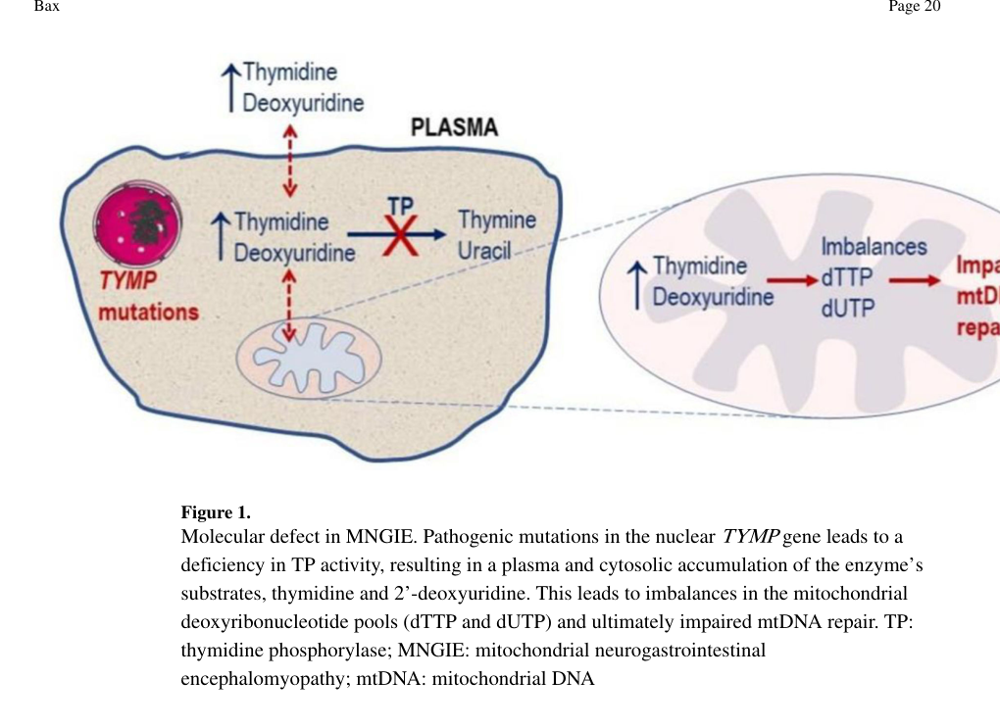

## Question

# Disease Characteristics Research Template

## Target Disease
- **Disease Name:** Mitochondrial Neurogastrointestinal Encephalomyopathy
- **MONDO ID:**  (if available)
- **Category:** Mendelian

## Research Objectives

Please provide a comprehensive research report on **Mitochondrial Neurogastrointestinal Encephalomyopathy** covering all of the
disease characteristics listed below. This report will be used to populate a disease knowledge
base entry. Be thorough and cite primary literature (PMID preferred) for all claims.

For each section, **suggested databases/resources** are listed. These are the first places
you should search for information on each topic.

---

### 1. Disease Information
> **Search first:** OMIM, Orphanet, ICD-10/ICD-11, MeSH, PubMed

- What is the disease? Provide a concise overview.
- What are the key identifiers? (OMIM, Orphanet, ICD-10/ICD-11, MeSH, Mondo)
- What are the common synonyms and alternative names?
- Is the information derived from individual patients (e.g., EHR) or aggregated disease-level resources?

### 2. Etiology

- **Disease Causal Factors**: What are the primary causes? (genetic, environmental, infectious, mechanistic)
- **Risk Factors**:
  > **Search first:** PubMed, Cochrane Library, UpToDate, clinical guidelines, ClinVar, ClinGen, GWAS Catalog, PheGenI, CTD, CDC, WHO, epidemiological databases
  - Genetic risk factors (causal variants, susceptibility loci, modifier genes)
  - Environmental risk factors (toxins, lifestyle, occupational exposures, age, sex, family history)
- **Protective Factors**:
  > **Search first:** PubMed, Cochrane Library, clinical trial databases, GWAS Catalog, gnomAD, WHO, CDC, nutrition databases
  - Genetic protective factors (protective variants, modifier alleles)
  - Environmental protective factors (diet, lifestyle, exposures that reduce risk)
- **Gene-Environment Interactions**: How do genetic and environmental factors interact to influence disease?
  > **Search first:** CTD, PubMed, PheGenI, GxE databases

### 3. Phenotypes
> **Search first:** HPO (Human Phenotype Ontology), OMIM, Orphanet, PubMed, clinicaltrials.gov, MedDRA, SNOMED CT, DECIPHER, LOINC

For each phenotype, provide:
- **Phenotype type**: symptoms, clinical signs, physical manifestations, behavioral changes, or laboratory abnormalities
  > For symptoms/signs: HPO, OMIM, Orphanet, PubMed
  > For behavioral changes: HPO, DSM, RDoC (Research Domain Criteria), PubMed
  > For laboratory abnormalities: LOINC, SNOMED CT, LabTests Online, PubMed
- **Phenotype characteristics**:
  > **Search first:** OMIM, Orphanet, HPO, PubMed
  - Age of symptom onset (neonatal, childhood, adult-onset, late-onset)
  - Symptom severity (mild, moderate, severe, variable)
  - Symptom progression (stable, progressive, episodic, fluctuating)
  - Frequency among affected individuals (percentage or qualitative)
- **Quality of life impact**: Effects on daily functioning and well-being (per-phenotype when possible)
  > **Search first:** EQ-5D database, SF-36, WHO QOL databases, PubMed
- Suggest HPO (Human Phenotype Ontology) terms for each phenotype

### 4. Genetic/Molecular Information

- **Causal Genes**: Gene mutations or chromosomal abnormalities responsible for disease (gene symbols, OMIM IDs)
  > **Search first:** OMIM, ClinVar, HGMD, Ensembl, NCBI Gene
- **Pathogenic Variants**:
  - Affected genes (gene symbols, HGNC IDs)
    > **Search first:** OMIM, NCBI Gene, Ensembl, HGNC, UniProt, GeneCards
  - Variant classification (pathogenic, likely pathogenic, VUS per ACMG/AMP guidelines)
    > **Search first:** ClinVar, ClinGen, ACMG/AMP guidelines, VarSome
  - Variant type/class (missense, frameshift, nonsense, splice-site, structural)
  - Allele frequency in population databases
    > **Search first:** gnomAD, 1000 Genomes, ExAC, TOPMed, dbSNP
  - Somatic vs germline origin
    > **Search first:** COSMIC (somatic), ClinVar, ICGC, TCGA
  - Functional consequences (loss of function, gain of function, dominant negative)
- **Modifier Genes**: Genes that modify disease severity or expression
- **Epigenetic Information**: DNA methylation, histone modifications, chromatin changes affecting disease
  > **Search first:** ENCODE, Roadmap Epigenomics, MethBase, DiseaseMeth
- **Chromosomal Abnormalities**: Large-scale genetic changes (aneuploidy, translocations, inversions)
  > **Search first:** DECIPHER, ClinVar, ECARUCA, UCSC Genome Browser

### 5. Environmental Information

- **Environmental Factors**: Non-genetic contributing factors (toxins, radiation, pollution, occupational exposure)
  > **Search first:** CTD (Comparative Toxicogenomics Database), TOXNET, PubMed, EPA databases
- **Lifestyle Factors**: Behavioral factors (smoking, diet, exercise, alcohol consumption)
  > **Search first:** CDC databases, WHO, PubMed, NHANES
- **Infectious Agents**: If applicable, pathogens causing or triggering disease (bacteria, viruses, fungi, parasites)
  > **Search first:** NCBI Taxonomy, ViPR, BV-BRC, MicrobeDB, GIDEON

### 6. Mechanism / Pathophysiology

- **Molecular Pathways**: Specific signaling cascades or biochemical pathways involved (Wnt, MAPK, mTOR, PI3K-AKT, etc.)
  > **Search first:** KEGG, Reactome, WikiPathways, PathBank, BioCyc
- **Cellular Processes**: Cell-level mechanisms (apoptosis, autophagy, cell cycle dysregulation, inflammation, etc.)
  > **Search first:** Gene Ontology (GO), Reactome, KEGG, PubMed
- **Protein Dysfunction**: How protein structure or function is altered (misfolding, aggregation, loss of function, gain of function)
  > **Search first:** UniProt, PDB (Protein Data Bank), InterPro, Pfam, AlphaFold
- **Metabolic Changes**: Alterations in metabolic processes (energy metabolism, lipid metabolism, amino acid metabolism)
  > **Search first:** KEGG, BioCyc, HMDB (Human Metabolome Database), BRENDA
- **Immune System Involvement**: Role of immune response (autoimmunity, immunodeficiency, chronic inflammation)
  > **Search first:** ImmPort, Immunome Database, IEDB, Gene Ontology
- **Tissue Damage Mechanisms**: How tissues/ are injured (oxidative stress, ischemia, fibrosis, necrosis)
  > **Search first:** PubMed, Gene Ontology, Reactome
- **Biochemical Abnormalities**: Specific molecular defects (enzyme deficiencies, receptor dysfunction, ion channel defects)
  > **Search first:** BRENDA, UniProt, KEGG, OMIM, PubMed
- **Epigenetic Changes**: DNA methylation, histone modifications affecting gene expression in disease
  > **Search first:** ENCODE, Roadmap Epigenomics, MethBase, DiseaseMeth
- **Molecular Profiling** (if available):
  - Transcriptomics/gene expression changes
    > **Search first:** GEO (Gene Expression Omnibus), ArrayExpress, GTEx, Human Cell Atlas, SRA
  - Proteomics findings
    > **Search first:** PRIDE, ProteomeXchange, Human Protein Atlas, STRING, BioGRID
  - Metabolomics signatures
    > **Search first:** MetaboLights, Metabolomics Workbench, HMDB, METLIN
  - Lipidomics alterations
    > **Search first:** LIPID MAPS, SwissLipids, LipidHome, Metabolomics Workbench
  - Genomic structural features
    > **Search first:** UCSC Genome Browser, Ensembl, NCBI, dbVar, DGV
- **Advanced Technologies** (if applicable):
  - Single-cell analysis findings (cell-type specific mechanisms, cellular heterogeneity)
    > **Search first:** Human Cell Atlas, Single Cell Portal, GEO, CELLxGENE
  - Spatial transcriptomics findings
    > **Search first:** GEO, Spatial Research, Vizgen, 10x Genomics data
  - Multi-omics integration results
    > **Search first:** TCGA, ICGC, cBioPortal, LinkedOmics, PubMed
  - Functional genomics screens (CRISPR, RNAi)
    > **Search first:** DepMap, GenomeRNAi, PubMed, BioGRID ORCS

For each mechanism, describe:
- The causal chain from initial trigger to clinical manifestation
- Which mechanisms are upstream vs downstream
- What cell types and biological processes are involved
- Suggest GO terms for biological processes and CL terms for cell types

### 7. Anatomical Structures Affected

- **Organ Level**:
  - Primary organs directly affected
  - Secondary organ involvement (complications, secondary effects)
  - Body systems involved (cardiovascular, nervous, digestive, respiratory, endocrine, etc.)
  > **Search first:** Uberon, FMA (Foundational Model of Anatomy), OMIM, HPO, ICD-11, MeSH, SNOMED CT
- **Tissue and Cell Level**:
  - Specific tissue types affected (epithelial, connective, muscle, nervous)
  - Specific cell populations targeted (with Cell Ontology terms)
  > **Search first:** Uberon, Human Protein Atlas, Cell Ontology, Human Cell Atlas, CellMarker, PanglaoDB
- **Subcellular Level**:
  - Cellular compartments involved (mitochondria, nucleus, ER, lysosomes) (with GO Cellular Component terms)
  > **Search first:** Gene Ontology (Cellular Component), UniProt, Human Protein Atlas
- **Localization**:
  - Specific anatomical sites (with UBERON terms)
    > **Search first:** FMA, Uberon, NeuroNames (for brain), SNOMED CT
  - Lateralization (unilateral, bilateral, asymmetric)
    > **Search first:** HPO, clinical literature, imaging databases

### 8. Temporal Development

- **Onset**:
  - Typical age of onset (congenital, pediatric, adult, geriatric)
  - Onset pattern (acute, subacute, chronic, insidious)
  > **Search first:** OMIM, Orphanet, HPO, PubMed
- **Progression**:
  - Disease stages (early, intermediate, advanced, end-stage)
    > **Search first:** Cancer Staging Manual (AJCC), WHO classifications, PubMed
  - Progression rate (rapid, slow, variable)
  - Disease course pattern (episodic, relapsing-remitting, progressive, stable)
  - Disease duration (self-limited, chronic lifelong)
  > **Search first:** Disease registries, longitudinal cohort databases, natural history studies, PubMed, Orphanet, OMIM
- **Patterns**:
  - Remission patterns (spontaneous, treatment-induced)
    > **Search first:** Clinical trial databases, disease registries, PubMed
  - Critical periods (time windows of vulnerability or opportunity for intervention)
    > **Search first:** PubMed, developmental biology databases, clinical guidelines

### 9. Inheritance and Population

- **Epidemiology**:
  - Prevalence (cases per 100,000 at given time)
  - Incidence (new cases per 100,000 per year)
  > **Search first:** Orphanet, CDC, WHO, GBD (Global Burden of Disease), national registries, SEER, disease registries
- **For Genetic Etiology**:
  - Inheritance pattern (AD, AR, X-linked, mitochondrial, multifactorial, polygenic)
    > **Search first:** OMIM, Orphanet, ClinVar, GTR (Genetic Testing Registry)
  - Penetrance (complete, incomplete, age-dependent)
    > **Search first:** ClinVar, OMIM, PubMed, ClinGen
  - Expressivity (variable, consistent)
    > **Search first:** OMIM, ClinVar, PubMed
  - Genetic anticipation (increasing severity in successive generations)
    > **Search first:** OMIM, PubMed (especially for repeat expansion disorders)
  - Germline mosaicism
    > **Search first:** ClinVar, OMIM, genetic counseling literature, PubMed
  - Founder effects (population-specific mutations)
    > **Search first:** gnomAD, population genetics databases, PubMed
  - Consanguinity role
    > **Search first:** OMIM, population studies, genetic counseling resources
  - Carrier frequency
    > **Search first:** gnomAD, carrier screening databases, GeneReviews, GTR
- **Population Demographics**:
  - Affected populations (ethnic or demographic groups with higher prevalence)
    > **Search first:** gnomAD, 1000 Genomes, PAGE Study, PubMed, population registries
  - Geographic distribution (endemic areas, regional variation)
    > **Search first:** WHO, CDC, GBD, Orphanet, geographic epidemiology databases
  - Geographic distribution of specific variants
  - Sex ratio (male:female)
    > **Search first:** Disease registries, OMIM, PubMed, epidemiological databases
  - Age distribution of affected individuals
    > **Search first:** CDC, disease registries, SEER, Orphanet

### 10. Diagnostics

- **Clinical Tests**:
  - Laboratory tests (blood, urine, tissue chemistry, specific enzyme assays)
    > **Search first:** LOINC, LabTests Online, PubMed
  - Biomarkers (proteins, metabolites, genetic markers, circulating biomarkers)
    > **Search first:** FDA Biomarker List, BEST (Biomarkers, EndpointS, and other Tools), PubMed
  - Imaging studies (X-ray, CT, MRI, PET, ultrasound)
    > **Search first:** RadLex, DICOM, Radiopaedia, imaging databases
  - Functional tests (pulmonary function, cardiac stress tests)
    > **Search first:** LOINC, clinical guidelines, PubMed
  - Electrophysiology (EEG, EMG, ECG, nerve conduction studies)
    > **Search first:** LOINC, clinical neurophysiology databases, PubMed
  - Biopsy findings (histopathology, immunohistochemistry)
    > **Search first:** SNOMED CT, College of American Pathologists resources, PubMed
  - Pathology findings (microscopic examination)
    > **Search first:** SNOMED CT, Digital Pathology databases, PubMed
- **Genetic Testing**:
  > **Search first:** GTR (Genetic Testing Registry), GeneReviews, ClinGen
  - Overview of recommended genetic testing approach
  - Whole genome sequencing (WGS) utility
    > **Search first:** GTR, ClinVar, GEL (Genomics England), gnomAD
  - Whole exome sequencing (WES) utility
    > **Search first:** GTR, ClinVar, OMIM, GeneMatcher
  - Gene panels (which panels, which genes)
    > **Search first:** GTR, ClinVar, laboratory-specific databases
  - Single gene testing
    > **Search first:** GTR, ClinVar, OMIM, GeneReviews
  - Chromosomal microarray (CMA)
    > **Search first:** DECIPHER, ClinVar, dbVar, ECARUCA
  - Karyotyping
    > **Search first:** Chromosome Abnormality Database, ClinVar, cytogenetics resources
  - FISH
    > **Search first:** ClinVar, cytogenetics databases, PubMed
  - Mitochondrial DNA testing
    > **Search first:** MITOMAP, MSeqDR, ClinVar, GTR
  - Repeat expansion testing
    > **Search first:** GTR, ClinVar, repeat expansion databases, PubMed
- **Omics-Based Diagnostics** (if applicable):
  - RNA sequencing / transcriptomics
    > **Search first:** GEO, ArrayExpress, GTEx, RNA-seq databases
  - Proteomics
    > **Search first:** PRIDE, ProteomeXchange, FDA Biomarker database
  - Metabolomics
    > **Search first:** MetaboLights, Metabolomics Workbench, HMDB
  - Epigenomics
    > **Search first:** GEO, ENCODE, Roadmap Epigenomics, MethBase
  - Liquid biopsy
    > **Search first:** COSMIC, ClinVar, liquid biopsy databases, PubMed
- **Clinical Criteria**:
  - Standardized diagnostic criteria (DSM, ICD, society guidelines)
    > **Search first:** DSM-5, ICD-11, clinical society guidelines, UpToDate
  - Differential diagnosis (other conditions to rule out, with distinguishing features)
    > **Search first:** DynaMed, UpToDate, clinical decision support systems
- **Screening**:
  - Screening methods for asymptomatic individuals (newborn screening, carrier screening, cascade screening)
    > **Search first:** ACMG recommendations, CDC newborn screening, GTR

### 11. Outcome/Prognosis

- **Survival and Mortality**:
  - Survival rate (5-year, 10-year, overall)
    > **Search first:** SEER, cancer registries, disease-specific registries, PubMed
  - Life expectancy (with and without treatment if applicable)
    > **Search first:** Orphanet, disease registries, actuarial databases, PubMed
  - Mortality rate
    > **Search first:** CDC, WHO, GBD, national mortality databases
  - Disease-specific mortality (deaths directly attributable to disease)
    > **Search first:** Disease registries, CDC Wonder, GBD, PubMed
- **Morbidity and Function**:
  - Morbidity (disease-related disability and health impacts)
    > **Search first:** GBD, WHO, disability databases, PubMed
  - Disability outcomes (long-term functional impairments)
    > **Search first:** ICF (International Classification of Functioning), disability registries
  - Quality of life measures (EQ-5D, SF-36, PROMIS, disease-specific tools)
    > **Search first:** EQ-5D database, SF-36, PROMIS, PubMed
- **Disease Course**:
  - Complications (secondary problems: infections, organ failure, etc.)
    > **Search first:** ICD codes, disease registries, clinical databases, PubMed
  - Recovery potential (likelihood and extent of recovery, with vs without treatment)
    > **Search first:** Natural history studies, rehabilitation databases, PubMed
- **Prediction**:
  - Prognostic factors (age, disease severity, biomarkers, treatment response)
    > **Search first:** Prognostic models databases, clinical calculators, PubMed
  - Prognostic biomarkers (molecular markers predicting disease course)
    > **Search first:** FDA Biomarker database, PubMed, cancer prognostic databases

### 12. Treatment

- **Pharmacotherapy**:
  - Pharmacological treatments (drug names, drug classes, mechanisms of action)
    > **Search first:** DrugBank, RxNorm, ATC classification, DailyMed, FDA databases
  - Pharmacogenomics (how genetic variants affect drug metabolism, efficacy, toxicity)
    > **Search first:** PharmGKB, CPIC (Clinical Pharmacogenetics), FDA Table of PGx Biomarkers
- **Advanced Therapeutics**:
  - Gene therapy (viral vectors, CRISPR, gene replacement, gene editing)
    > **Search first:** ClinicalTrials.gov, FDA gene therapy database, ASGCT resources
  - Cell therapy (stem cell transplant, CAR-T, cellular therapeutics)
    > **Search first:** ClinicalTrials.gov, FDA cell therapy database, FACT standards
  - RNA-based therapies (ASOs, siRNA, mRNA therapies)
    > **Search first:** ClinicalTrials.gov, FDA approvals, PubMed
  - Targeted therapies (treatments directed at specific molecular targets)
    > **Search first:** My Cancer Genome, OncoKB, ClinicalTrials.gov, FDA approvals
  - Immunotherapies (checkpoint inhibitors, monoclonal antibodies)
    > **Search first:** Cancer Immunotherapy Database, FDA approvals, ClinicalTrials.gov
- **Surgical and Interventional**:
  - Surgical interventions (types of surgery, timing, outcomes)
    > **Search first:** CPT codes, surgical registries, clinical guidelines, PubMed
- **Supportive and Rehabilitative**:
  - Supportive care (symptom management, pain control, nutrition)
    > **Search first:** Clinical guidelines, Cochrane Library, PubMed
  - Rehabilitation (physical therapy, occupational therapy, speech therapy)
    > **Search first:** Rehabilitation medicine databases, clinical guidelines, PubMed
- **Experimental**:
  - Experimental treatments in clinical trials (with NCT identifiers if available)
    > **Search first:** ClinicalTrials.gov, EU Clinical Trials Register, WHO ICTRP
- **Treatment Outcomes**:
  - Treatment response rates
    > **Search first:** Clinical trial databases, FDA reviews, systematic reviews, PubMed
  - Side effects and adverse events
    > **Search first:** FDA Adverse Event Reporting System (FAERS), MedWatch, PubMed
- **Treatment Strategy**:
  - Treatment algorithms (clinical pathways, decision trees)
    > **Search first:** Clinical practice guidelines, NCCN Guidelines, UpToDate
  - Combination therapies
    > **Search first:** ClinicalTrials.gov, treatment guidelines, PubMed
  - Personalized medicine approaches (genotype-guided treatment)
    > **Search first:** My Cancer Genome, CIViC, PharmGKB, precision medicine databases

For each treatment, suggest MAXO (Medical Action Ontology) terms where applicable.

### 13. Prevention

- **Prevention Levels**:
  - Primary prevention (preventing disease occurrence: vaccination, risk factor modification)
    > **Search first:** CDC, WHO, USPSTF recommendations, Cochrane Library
  - Secondary prevention (early detection and treatment: screening programs, early intervention)
    > **Search first:** USPSTF, CDC screening guidelines, WHO
  - Tertiary prevention (preventing complications in those with disease)
    > **Search first:** Clinical guidelines, disease management protocols, PubMed
- **Immunization**: Vaccine strategies (if applicable)
  > **Search first:** CDC vaccine schedules, WHO immunization, FDA vaccine database
- **Screening and Early Detection**:
  - Screening programs (population-based: newborn screening, cancer screening)
    > **Search first:** CDC screening programs, USPSTF, cancer screening databases
  - Genetic screening (carrier screening, preimplantation genetic diagnosis, prenatal testing)
    > **Search first:** ACMG recommendations, ACOG guidelines, GTR
  - Risk stratification (identifying high-risk individuals for targeted prevention)
    > **Search first:** Risk prediction models, clinical calculators, PubMed
- **Behavioral Interventions**: Lifestyle modifications to reduce risk
  > **Search first:** CDC, WHO, behavioral intervention databases, Cochrane Library
- **Counseling**: Genetic counseling (risk assessment, family planning guidance)
  > **Search first:** NSGC resources, ACMG guidelines, GeneReviews
- **Public Health**:
  - Public health interventions (sanitation, vector control, health education)
    > **Search first:** CDC, WHO, public health databases, PubMed
  - Environmental interventions (reducing environmental risk factors)
    > **Search first:** EPA databases, WHO environmental health, PubMed
- **Prophylaxis**: Preventive medications or procedures
  > **Search first:** Clinical guidelines, FDA approvals, PubMed

### 14. Other Species / Natural Disease

- **Taxonomy**: Species affected (with NCBI Taxon identifiers)
  > **Search first:** NCBI Taxonomy
- **Breed**: Specific breeds affected (with VBO identifiers if applicable)
  > **Search first:** VBO (Vertebrate Breed Ontology)
- **Gene**: Orthologous genes in other species (with NCBI Gene IDs)
  > **Search first:** NCBI Gene
- **Natural Disease**:
  - Naturally occurring disease in other species (companion animals, wildlife)
    > **Search first:** OMIA (Online Mendelian Inheritance in Animals), VetCompass, PubMed
  - Veterinary relevance and importance in animal health
    > **Search first:** OMIA, veterinary databases, PubMed
- **Comparative Biology**:
  - Comparative pathology (similarities and differences across species)
    > **Search first:** OMIA, comparative pathology databases, PubMed
  - Evolutionary conservation of disease mechanisms
    > **Search first:** HomoloGene, OrthoMCL, Alliance of Genome Resources
- **Transmission** (if applicable):
  - Zoonotic potential
    > **Search first:** CDC zoonotic diseases, WHO zoonoses, GIDEON
  - Cross-species susceptibility
    > **Search first:** NCBI Taxonomy, veterinary databases, PubMed

### 15. Model Organisms

- **Model Types**:
  - Model organism type (mammalian, invertebrate, cellular, in vitro)
    > **Search first:** Alliance of Genome Resources, model organism databases
  - Specific model systems (mouse, rat, zebrafish, Drosophila, C. elegans, yeast, cell lines, organoids, iPSCs)
    > **Search first:** MGI, RGD, ZFIN, FlyBase, WormBase, SGD, ATCC, Cellosaurus
  - Induced models (drug treatment, surgical intervention, environmental manipulation)
    > **Search first:** MGI, model organism databases, PubMed
- **Genetic Models**:
  - Types available (knockout, knock-in, transgenic, conditional, humanized)
    > **Search first:** MGI, IMPC, KOMP, EuMMCR, IMSR
- **Model Characteristics**:
  - Phenotype recapitulation (how well model reproduces human disease features)
    > **Search first:** Model organism databases, comparative studies, PubMed
  - Model limitations (aspects of human disease not captured)
    > **Search first:** Model organism databases, PubMed, review articles
- **Applications**:
  - Research applications (what aspects of disease can be studied)
    > **Search first:** Model organism databases, PubMed
- **Resources**:
  - Model databases
    > **Search first:** MGI, RGD, ZFIN, FlyBase, WormBase, IMSR, EMMA, MMRRC

---

## Citation Requirements

- Cite primary literature (PMID preferred) for all mechanistic and clinical claims
- Prioritize recent reviews and landmark papers
- Include direct quotes from abstracts where possible to support key statements
- Distinguish evidence source types: human clinical, model organism, in vitro, computational

## Output Format

Structure your response as a comprehensive narrative organized by the sections above.
For each section, provide:
- Factual content with specific details (numbers, percentages, gene names, variant nomenclature)
- Ontology term suggestions (HPO, GO, CL, UBERON, CHEBI, MAXO, MONDO) where applicable
- Evidence citations with PMIDs
- Direct quotes from abstracts to support key claims
- Clear indication when information is not available or not applicable for this disease

This report will be used to populate a disease knowledge base entry with:
- Pathophysiology descriptions with causal chains
- Gene/protein annotations (HGNC, GO terms)
- Phenotype associations (HP terms) with frequencies
- Cell type involvement (CL terms)
- Anatomical locations (UBERON terms)
- Chemical entities (CHEBI terms)
- Treatment annotations (MAXO terms)
- Evidence items with PMIDs and exact abstract quotes
- Epidemiology, prognosis, diagnostic, and prevention information
- Animal model descriptions with phenotype recapitulation details

## Output

Question: You are an expert researcher providing comprehensive, well-cited information.

Provide detailed information focusing on:
1. Key concepts and definitions with current understanding
2. Recent developments and latest research (prioritize 2023-2024 sources)
3. Current applications and real-world implementations
4. Expert opinions and analysis from authoritative sources
5. Relevant statistics and data from recent studies

Format as a comprehensive research report with proper citations. Include URLs and publication dates where available.
Always prioritize recent, authoritative sources and provide specific citations for all major claims.

# Disease Characteristics Research Template

## Target Disease
- **Disease Name:** Mitochondrial Neurogastrointestinal Encephalomyopathy
- **MONDO ID:**  (if available)
- **Category:** Mendelian

## Research Objectives

Please provide a comprehensive research report on **Mitochondrial Neurogastrointestinal Encephalomyopathy** covering all of the
disease characteristics listed below. This report will be used to populate a disease knowledge
base entry. Be thorough and cite primary literature (PMID preferred) for all claims.

For each section, **suggested databases/resources** are listed. These are the first places
you should search for information on each topic.

---

### 1. Disease Information
> **Search first:** OMIM, Orphanet, ICD-10/ICD-11, MeSH, PubMed

- What is the disease? Provide a concise overview.
- What are the key identifiers? (OMIM, Orphanet, ICD-10/ICD-11, MeSH, Mondo)
- What are the common synonyms and alternative names?
- Is the information derived from individual patients (e.g., EHR) or aggregated disease-level resources?

### 2. Etiology

- **Disease Causal Factors**: What are the primary causes? (genetic, environmental, infectious, mechanistic)
- **Risk Factors**:
  > **Search first:** PubMed, Cochrane Library, UpToDate, clinical guidelines, ClinVar, ClinGen, GWAS Catalog, PheGenI, CTD, CDC, WHO, epidemiological databases
  - Genetic risk factors (causal variants, susceptibility loci, modifier genes)
  - Environmental risk factors (toxins, lifestyle, occupational exposures, age, sex, family history)
- **Protective Factors**:
  > **Search first:** PubMed, Cochrane Library, clinical trial databases, GWAS Catalog, gnomAD, WHO, CDC, nutrition databases
  - Genetic protective factors (protective variants, modifier alleles)
  - Environmental protective factors (diet, lifestyle, exposures that reduce risk)
- **Gene-Environment Interactions**: How do genetic and environmental factors interact to influence disease?
  > **Search first:** CTD, PubMed, PheGenI, GxE databases

### 3. Phenotypes
> **Search first:** HPO (Human Phenotype Ontology), OMIM, Orphanet, PubMed, clinicaltrials.gov, MedDRA, SNOMED CT, DECIPHER, LOINC

For each phenotype, provide:
- **Phenotype type**: symptoms, clinical signs, physical manifestations, behavioral changes, or laboratory abnormalities
  > For symptoms/signs: HPO, OMIM, Orphanet, PubMed
  > For behavioral changes: HPO, DSM, RDoC (Research Domain Criteria), PubMed
  > For laboratory abnormalities: LOINC, SNOMED CT, LabTests Online, PubMed
- **Phenotype characteristics**:
  > **Search first:** OMIM, Orphanet, HPO, PubMed
  - Age of symptom onset (neonatal, childhood, adult-onset, late-onset)
  - Symptom severity (mild, moderate, severe, variable)
  - Symptom progression (stable, progressive, episodic, fluctuating)
  - Frequency among affected individuals (percentage or qualitative)
- **Quality of life impact**: Effects on daily functioning and well-being (per-phenotype when possible)
  > **Search first:** EQ-5D database, SF-36, WHO QOL databases, PubMed
- Suggest HPO (Human Phenotype Ontology) terms for each phenotype

### 4. Genetic/Molecular Information

- **Causal Genes**: Gene mutations or chromosomal abnormalities responsible for disease (gene symbols, OMIM IDs)
  > **Search first:** OMIM, ClinVar, HGMD, Ensembl, NCBI Gene
- **Pathogenic Variants**:
  - Affected genes (gene symbols, HGNC IDs)
    > **Search first:** OMIM, NCBI Gene, Ensembl, HGNC, UniProt, GeneCards
  - Variant classification (pathogenic, likely pathogenic, VUS per ACMG/AMP guidelines)
    > **Search first:** ClinVar, ClinGen, ACMG/AMP guidelines, VarSome
  - Variant type/class (missense, frameshift, nonsense, splice-site, structural)
  - Allele frequency in population databases
    > **Search first:** gnomAD, 1000 Genomes, ExAC, TOPMed, dbSNP
  - Somatic vs germline origin
    > **Search first:** COSMIC (somatic), ClinVar, ICGC, TCGA
  - Functional consequences (loss of function, gain of function, dominant negative)
- **Modifier Genes**: Genes that modify disease severity or expression
- **Epigenetic Information**: DNA methylation, histone modifications, chromatin changes affecting disease
  > **Search first:** ENCODE, Roadmap Epigenomics, MethBase, DiseaseMeth
- **Chromosomal Abnormalities**: Large-scale genetic changes (aneuploidy, translocations, inversions)
  > **Search first:** DECIPHER, ClinVar, ECARUCA, UCSC Genome Browser

### 5. Environmental Information

- **Environmental Factors**: Non-genetic contributing factors (toxins, radiation, pollution, occupational exposure)
  > **Search first:** CTD (Comparative Toxicogenomics Database), TOXNET, PubMed, EPA databases
- **Lifestyle Factors**: Behavioral factors (smoking, diet, exercise, alcohol consumption)
  > **Search first:** CDC databases, WHO, PubMed, NHANES
- **Infectious Agents**: If applicable, pathogens causing or triggering disease (bacteria, viruses, fungi, parasites)
  > **Search first:** NCBI Taxonomy, ViPR, BV-BRC, MicrobeDB, GIDEON

### 6. Mechanism / Pathophysiology

- **Molecular Pathways**: Specific signaling cascades or biochemical pathways involved (Wnt, MAPK, mTOR, PI3K-AKT, etc.)
  > **Search first:** KEGG, Reactome, WikiPathways, PathBank, BioCyc
- **Cellular Processes**: Cell-level mechanisms (apoptosis, autophagy, cell cycle dysregulation, inflammation, etc.)
  > **Search first:** Gene Ontology (GO), Reactome, KEGG, PubMed
- **Protein Dysfunction**: How protein structure or function is altered (misfolding, aggregation, loss of function, gain of function)
  > **Search first:** UniProt, PDB (Protein Data Bank), InterPro, Pfam, AlphaFold
- **Metabolic Changes**: Alterations in metabolic processes (energy metabolism, lipid metabolism, amino acid metabolism)
  > **Search first:** KEGG, BioCyc, HMDB (Human Metabolome Database), BRENDA
- **Immune System Involvement**: Role of immune response (autoimmunity, immunodeficiency, chronic inflammation)
  > **Search first:** ImmPort, Immunome Database, IEDB, Gene Ontology
- **Tissue Damage Mechanisms**: How tissues/ are injured (oxidative stress, ischemia, fibrosis, necrosis)
  > **Search first:** PubMed, Gene Ontology, Reactome
- **Biochemical Abnormalities**: Specific molecular defects (enzyme deficiencies, receptor dysfunction, ion channel defects)
  > **Search first:** BRENDA, UniProt, KEGG, OMIM, PubMed
- **Epigenetic Changes**: DNA methylation, histone modifications affecting gene expression in disease
  > **Search first:** ENCODE, Roadmap Epigenomics, MethBase, DiseaseMeth
- **Molecular Profiling** (if available):
  - Transcriptomics/gene expression changes
    > **Search first:** GEO (Gene Expression Omnibus), ArrayExpress, GTEx, Human Cell Atlas, SRA
  - Proteomics findings
    > **Search first:** PRIDE, ProteomeXchange, Human Protein Atlas, STRING, BioGRID
  - Metabolomics signatures
    > **Search first:** MetaboLights, Metabolomics Workbench, HMDB, METLIN
  - Lipidomics alterations
    > **Search first:** LIPID MAPS, SwissLipids, LipidHome, Metabolomics Workbench
  - Genomic structural features
    > **Search first:** UCSC Genome Browser, Ensembl, NCBI, dbVar, DGV
- **Advanced Technologies** (if applicable):
  - Single-cell analysis findings (cell-type specific mechanisms, cellular heterogeneity)
    > **Search first:** Human Cell Atlas, Single Cell Portal, GEO, CELLxGENE
  - Spatial transcriptomics findings
    > **Search first:** GEO, Spatial Research, Vizgen, 10x Genomics data
  - Multi-omics integration results
    > **Search first:** TCGA, ICGC, cBioPortal, LinkedOmics, PubMed
  - Functional genomics screens (CRISPR, RNAi)
    > **Search first:** DepMap, GenomeRNAi, PubMed, BioGRID ORCS

For each mechanism, describe:
- The causal chain from initial trigger to clinical manifestation
- Which mechanisms are upstream vs downstream
- What cell types and biological processes are involved
- Suggest GO terms for biological processes and CL terms for cell types

### 7. Anatomical Structures Affected

- **Organ Level**:
  - Primary organs directly affected
  - Secondary organ involvement (complications, secondary effects)
  - Body systems involved (cardiovascular, nervous, digestive, respiratory, endocrine, etc.)
  > **Search first:** Uberon, FMA (Foundational Model of Anatomy), OMIM, HPO, ICD-11, MeSH, SNOMED CT
- **Tissue and Cell Level**:
  - Specific tissue types affected (epithelial, connective, muscle, nervous)
  - Specific cell populations targeted (with Cell Ontology terms)
  > **Search first:** Uberon, Human Protein Atlas, Cell Ontology, Human Cell Atlas, CellMarker, PanglaoDB
- **Subcellular Level**:
  - Cellular compartments involved (mitochondria, nucleus, ER, lysosomes) (with GO Cellular Component terms)
  > **Search first:** Gene Ontology (Cellular Component), UniProt, Human Protein Atlas
- **Localization**:
  - Specific anatomical sites (with UBERON terms)
    > **Search first:** FMA, Uberon, NeuroNames (for brain), SNOMED CT
  - Lateralization (unilateral, bilateral, asymmetric)
    > **Search first:** HPO, clinical literature, imaging databases

### 8. Temporal Development

- **Onset**:
  - Typical age of onset (congenital, pediatric, adult, geriatric)
  - Onset pattern (acute, subacute, chronic, insidious)
  > **Search first:** OMIM, Orphanet, HPO, PubMed
- **Progression**:
  - Disease stages (early, intermediate, advanced, end-stage)
    > **Search first:** Cancer Staging Manual (AJCC), WHO classifications, PubMed
  - Progression rate (rapid, slow, variable)
  - Disease course pattern (episodic, relapsing-remitting, progressive, stable)
  - Disease duration (self-limited, chronic lifelong)
  > **Search first:** Disease registries, longitudinal cohort databases, natural history studies, PubMed, Orphanet, OMIM
- **Patterns**:
  - Remission patterns (spontaneous, treatment-induced)
    > **Search first:** Clinical trial databases, disease registries, PubMed
  - Critical periods (time windows of vulnerability or opportunity for intervention)
    > **Search first:** PubMed, developmental biology databases, clinical guidelines

### 9. Inheritance and Population

- **Epidemiology**:
  - Prevalence (cases per 100,000 at given time)
  - Incidence (new cases per 100,000 per year)
  > **Search first:** Orphanet, CDC, WHO, GBD (Global Burden of Disease), national registries, SEER, disease registries
- **For Genetic Etiology**:
  - Inheritance pattern (AD, AR, X-linked, mitochondrial, multifactorial, polygenic)
    > **Search first:** OMIM, Orphanet, ClinVar, GTR (Genetic Testing Registry)
  - Penetrance (complete, incomplete, age-dependent)
    > **Search first:** ClinVar, OMIM, PubMed, ClinGen
  - Expressivity (variable, consistent)
    > **Search first:** OMIM, ClinVar, PubMed
  - Genetic anticipation (increasing severity in successive generations)
    > **Search first:** OMIM, PubMed (especially for repeat expansion disorders)
  - Germline mosaicism
    > **Search first:** ClinVar, OMIM, genetic counseling literature, PubMed
  - Founder effects (population-specific mutations)
    > **Search first:** gnomAD, population genetics databases, PubMed
  - Consanguinity role
    > **Search first:** OMIM, population studies, genetic counseling resources
  - Carrier frequency
    > **Search first:** gnomAD, carrier screening databases, GeneReviews, GTR
- **Population Demographics**:
  - Affected populations (ethnic or demographic groups with higher prevalence)
    > **Search first:** gnomAD, 1000 Genomes, PAGE Study, PubMed, population registries
  - Geographic distribution (endemic areas, regional variation)
    > **Search first:** WHO, CDC, GBD, Orphanet, geographic epidemiology databases
  - Geographic distribution of specific variants
  - Sex ratio (male:female)
    > **Search first:** Disease registries, OMIM, PubMed, epidemiological databases
  - Age distribution of affected individuals
    > **Search first:** CDC, disease registries, SEER, Orphanet

### 10. Diagnostics

- **Clinical Tests**:
  - Laboratory tests (blood, urine, tissue chemistry, specific enzyme assays)
    > **Search first:** LOINC, LabTests Online, PubMed
  - Biomarkers (proteins, metabolites, genetic markers, circulating biomarkers)
    > **Search first:** FDA Biomarker List, BEST (Biomarkers, EndpointS, and other Tools), PubMed
  - Imaging studies (X-ray, CT, MRI, PET, ultrasound)
    > **Search first:** RadLex, DICOM, Radiopaedia, imaging databases
  - Functional tests (pulmonary function, cardiac stress tests)
    > **Search first:** LOINC, clinical guidelines, PubMed
  - Electrophysiology (EEG, EMG, ECG, nerve conduction studies)
    > **Search first:** LOINC, clinical neurophysiology databases, PubMed
  - Biopsy findings (histopathology, immunohistochemistry)
    > **Search first:** SNOMED CT, College of American Pathologists resources, PubMed
  - Pathology findings (microscopic examination)
    > **Search first:** SNOMED CT, Digital Pathology databases, PubMed
- **Genetic Testing**:
  > **Search first:** GTR (Genetic Testing Registry), GeneReviews, ClinGen
  - Overview of recommended genetic testing approach
  - Whole genome sequencing (WGS) utility
    > **Search first:** GTR, ClinVar, GEL (Genomics England), gnomAD
  - Whole exome sequencing (WES) utility
    > **Search first:** GTR, ClinVar, OMIM, GeneMatcher
  - Gene panels (which panels, which genes)
    > **Search first:** GTR, ClinVar, laboratory-specific databases
  - Single gene testing
    > **Search first:** GTR, ClinVar, OMIM, GeneReviews
  - Chromosomal microarray (CMA)
    > **Search first:** DECIPHER, ClinVar, dbVar, ECARUCA
  - Karyotyping
    > **Search first:** Chromosome Abnormality Database, ClinVar, cytogenetics resources
  - FISH
    > **Search first:** ClinVar, cytogenetics databases, PubMed
  - Mitochondrial DNA testing
    > **Search first:** MITOMAP, MSeqDR, ClinVar, GTR
  - Repeat expansion testing
    > **Search first:** GTR, ClinVar, repeat expansion databases, PubMed
- **Omics-Based Diagnostics** (if applicable):
  - RNA sequencing / transcriptomics
    > **Search first:** GEO, ArrayExpress, GTEx, RNA-seq databases
  - Proteomics
    > **Search first:** PRIDE, ProteomeXchange, FDA Biomarker database
  - Metabolomics
    > **Search first:** MetaboLights, Metabolomics Workbench, HMDB
  - Epigenomics
    > **Search first:** GEO, ENCODE, Roadmap Epigenomics, MethBase
  - Liquid biopsy
    > **Search first:** COSMIC, ClinVar, liquid biopsy databases, PubMed
- **Clinical Criteria**:
  - Standardized diagnostic criteria (DSM, ICD, society guidelines)
    > **Search first:** DSM-5, ICD-11, clinical society guidelines, UpToDate
  - Differential diagnosis (other conditions to rule out, with distinguishing features)
    > **Search first:** DynaMed, UpToDate, clinical decision support systems
- **Screening**:
  - Screening methods for asymptomatic individuals (newborn screening, carrier screening, cascade screening)
    > **Search first:** ACMG recommendations, CDC newborn screening, GTR

### 11. Outcome/Prognosis

- **Survival and Mortality**:
  - Survival rate (5-year, 10-year, overall)
    > **Search first:** SEER, cancer registries, disease-specific registries, PubMed
  - Life expectancy (with and without treatment if applicable)
    > **Search first:** Orphanet, disease registries, actuarial databases, PubMed
  - Mortality rate
    > **Search first:** CDC, WHO, GBD, national mortality databases
  - Disease-specific mortality (deaths directly attributable to disease)
    > **Search first:** Disease registries, CDC Wonder, GBD, PubMed
- **Morbidity and Function**:
  - Morbidity (disease-related disability and health impacts)
    > **Search first:** GBD, WHO, disability databases, PubMed
  - Disability outcomes (long-term functional impairments)
    > **Search first:** ICF (International Classification of Functioning), disability registries
  - Quality of life measures (EQ-5D, SF-36, PROMIS, disease-specific tools)
    > **Search first:** EQ-5D database, SF-36, PROMIS, PubMed
- **Disease Course**:
  - Complications (secondary problems: infections, organ failure, etc.)
    > **Search first:** ICD codes, disease registries, clinical databases, PubMed
  - Recovery potential (likelihood and extent of recovery, with vs without treatment)
    > **Search first:** Natural history studies, rehabilitation databases, PubMed
- **Prediction**:
  - Prognostic factors (age, disease severity, biomarkers, treatment response)
    > **Search first:** Prognostic models databases, clinical calculators, PubMed
  - Prognostic biomarkers (molecular markers predicting disease course)
    > **Search first:** FDA Biomarker database, PubMed, cancer prognostic databases

### 12. Treatment

- **Pharmacotherapy**:
  - Pharmacological treatments (drug names, drug classes, mechanisms of action)
    > **Search first:** DrugBank, RxNorm, ATC classification, DailyMed, FDA databases
  - Pharmacogenomics (how genetic variants affect drug metabolism, efficacy, toxicity)
    > **Search first:** PharmGKB, CPIC (Clinical Pharmacogenetics), FDA Table of PGx Biomarkers
- **Advanced Therapeutics**:
  - Gene therapy (viral vectors, CRISPR, gene replacement, gene editing)
    > **Search first:** ClinicalTrials.gov, FDA gene therapy database, ASGCT resources
  - Cell therapy (stem cell transplant, CAR-T, cellular therapeutics)
    > **Search first:** ClinicalTrials.gov, FDA cell therapy database, FACT standards
  - RNA-based therapies (ASOs, siRNA, mRNA therapies)
    > **Search first:** ClinicalTrials.gov, FDA approvals, PubMed
  - Targeted therapies (treatments directed at specific molecular targets)
    > **Search first:** My Cancer Genome, OncoKB, ClinicalTrials.gov, FDA approvals
  - Immunotherapies (checkpoint inhibitors, monoclonal antibodies)
    > **Search first:** Cancer Immunotherapy Database, FDA approvals, ClinicalTrials.gov
- **Surgical and Interventional**:
  - Surgical interventions (types of surgery, timing, outcomes)
    > **Search first:** CPT codes, surgical registries, clinical guidelines, PubMed
- **Supportive and Rehabilitative**:
  - Supportive care (symptom management, pain control, nutrition)
    > **Search first:** Clinical guidelines, Cochrane Library, PubMed
  - Rehabilitation (physical therapy, occupational therapy, speech therapy)
    > **Search first:** Rehabilitation medicine databases, clinical guidelines, PubMed
- **Experimental**:
  - Experimental treatments in clinical trials (with NCT identifiers if available)
    > **Search first:** ClinicalTrials.gov, EU Clinical Trials Register, WHO ICTRP
- **Treatment Outcomes**:
  - Treatment response rates
    > **Search first:** Clinical trial databases, FDA reviews, systematic reviews, PubMed
  - Side effects and adverse events
    > **Search first:** FDA Adverse Event Reporting System (FAERS), MedWatch, PubMed
- **Treatment Strategy**:
  - Treatment algorithms (clinical pathways, decision trees)
    > **Search first:** Clinical practice guidelines, NCCN Guidelines, UpToDate
  - Combination therapies
    > **Search first:** ClinicalTrials.gov, treatment guidelines, PubMed
  - Personalized medicine approaches (genotype-guided treatment)
    > **Search first:** My Cancer Genome, CIViC, PharmGKB, precision medicine databases

For each treatment, suggest MAXO (Medical Action Ontology) terms where applicable.

### 13. Prevention

- **Prevention Levels**:
  - Primary prevention (preventing disease occurrence: vaccination, risk factor modification)
    > **Search first:** CDC, WHO, USPSTF recommendations, Cochrane Library
  - Secondary prevention (early detection and treatment: screening programs, early intervention)
    > **Search first:** USPSTF, CDC screening guidelines, WHO
  - Tertiary prevention (preventing complications in those with disease)
    > **Search first:** Clinical guidelines, disease management protocols, PubMed
- **Immunization**: Vaccine strategies (if applicable)
  > **Search first:** CDC vaccine schedules, WHO immunization, FDA vaccine database
- **Screening and Early Detection**:
  - Screening programs (population-based: newborn screening, cancer screening)
    > **Search first:** CDC screening programs, USPSTF, cancer screening databases
  - Genetic screening (carrier screening, preimplantation genetic diagnosis, prenatal testing)
    > **Search first:** ACMG recommendations, ACOG guidelines, GTR
  - Risk stratification (identifying high-risk individuals for targeted prevention)
    > **Search first:** Risk prediction models, clinical calculators, PubMed
- **Behavioral Interventions**: Lifestyle modifications to reduce risk
  > **Search first:** CDC, WHO, behavioral intervention databases, Cochrane Library
- **Counseling**: Genetic counseling (risk assessment, family planning guidance)
  > **Search first:** NSGC resources, ACMG guidelines, GeneReviews
- **Public Health**:
  - Public health interventions (sanitation, vector control, health education)
    > **Search first:** CDC, WHO, public health databases, PubMed
  - Environmental interventions (reducing environmental risk factors)
    > **Search first:** EPA databases, WHO environmental health, PubMed
- **Prophylaxis**: Preventive medications or procedures
  > **Search first:** Clinical guidelines, FDA approvals, PubMed

### 14. Other Species / Natural Disease

- **Taxonomy**: Species affected (with NCBI Taxon identifiers)
  > **Search first:** NCBI Taxonomy
- **Breed**: Specific breeds affected (with VBO identifiers if applicable)
  > **Search first:** VBO (Vertebrate Breed Ontology)
- **Gene**: Orthologous genes in other species (with NCBI Gene IDs)
  > **Search first:** NCBI Gene
- **Natural Disease**:
  - Naturally occurring disease in other species (companion animals, wildlife)
    > **Search first:** OMIA (Online Mendelian Inheritance in Animals), VetCompass, PubMed
  - Veterinary relevance and importance in animal health
    > **Search first:** OMIA, veterinary databases, PubMed
- **Comparative Biology**:
  - Comparative pathology (similarities and differences across species)
    > **Search first:** OMIA, comparative pathology databases, PubMed
  - Evolutionary conservation of disease mechanisms
    > **Search first:** HomoloGene, OrthoMCL, Alliance of Genome Resources
- **Transmission** (if applicable):
  - Zoonotic potential
    > **Search first:** CDC zoonotic diseases, WHO zoonoses, GIDEON
  - Cross-species susceptibility
    > **Search first:** NCBI Taxonomy, veterinary databases, PubMed

### 15. Model Organisms

- **Model Types**:
  - Model organism type (mammalian, invertebrate, cellular, in vitro)
    > **Search first:** Alliance of Genome Resources, model organism databases
  - Specific model systems (mouse, rat, zebrafish, Drosophila, C. elegans, yeast, cell lines, organoids, iPSCs)
    > **Search first:** MGI, RGD, ZFIN, FlyBase, WormBase, SGD, ATCC, Cellosaurus
  - Induced models (drug treatment, surgical intervention, environmental manipulation)
    > **Search first:** MGI, model organism databases, PubMed
- **Genetic Models**:
  - Types available (knockout, knock-in, transgenic, conditional, humanized)
    > **Search first:** MGI, IMPC, KOMP, EuMMCR, IMSR
- **Model Characteristics**:
  - Phenotype recapitulation (how well model reproduces human disease features)
    > **Search first:** Model organism databases, comparative studies, PubMed
  - Model limitations (aspects of human disease not captured)
    > **Search first:** Model organism databases, PubMed, review articles
- **Applications**:
  - Research applications (what aspects of disease can be studied)
    > **Search first:** Model organism databases, PubMed
- **Resources**:
  - Model databases
    > **Search first:** MGI, RGD, ZFIN, FlyBase, WormBase, IMSR, EMMA, MMRRC

---

## Citation Requirements

- Cite primary literature (PMID preferred) for all mechanistic and clinical claims
- Prioritize recent reviews and landmark papers
- Include direct quotes from abstracts where possible to support key statements
- Distinguish evidence source types: human clinical, model organism, in vitro, computational

## Output Format

Structure your response as a comprehensive narrative organized by the sections above.
For each section, provide:
- Factual content with specific details (numbers, percentages, gene names, variant nomenclature)
- Ontology term suggestions (HPO, GO, CL, UBERON, CHEBI, MAXO, MONDO) where applicable
- Evidence citations with PMIDs
- Direct quotes from abstracts to support key claims
- Clear indication when information is not available or not applicable for this disease

This report will be used to populate a disease knowledge base entry with:
- Pathophysiology descriptions with causal chains
- Gene/protein annotations (HGNC, GO terms)
- Phenotype associations (HP terms) with frequencies
- Cell type involvement (CL terms)
- Anatomical locations (UBERON terms)
- Chemical entities (CHEBI terms)
- Treatment annotations (MAXO terms)
- Evidence items with PMIDs and exact abstract quotes
- Epidemiology, prognosis, diagnostic, and prevention information
- Animal model descriptions with phenotype recapitulation details

# Comprehensive Disease Characteristics Report: Mitochondrial Neurogastrointestinal Encephalomyopathy (MNGIE)

## Target Disease
- **Disease name:** Mitochondrial neurogastrointestinal encephalomyopathy (MNGIE)
- **MONDO ID:** **MONDO:0017575** (via OpenTargets disease mapping) (OpenTargets Search: Mitochondrial neurogastrointestinal encephalomyopathy)
- **Category:** Mendelian (autosomal recessive) (filosto2018mitochondrialneurogastrointestinalencephalomyopathy pages 1-3, halter2015allogeneichaematopoieticstem pages 2-3)

## Evidence base and curation note
This report is primarily derived from aggregated, disease-level resources (peer‑reviewed reviews, transplant series, and clinical trial registry records), supplemented with mechanistic primary research (2024) and selected case series/clinical cohorts. Specific claims are supported by cited sources. Where OMIM/Orphanet/ICD identifiers are requested, they could not be retrieved with the currently available tools and are flagged as gaps.

---

## 1. Disease Information

### 1.1 Concise overview (definition)
MNGIE is an ultra‑rare, **progressive autosomal recessive** metabolic mitochondrial disorder most commonly caused by **biallelic TYMP variants** leading to **thymidine phosphorylase (TP) deficiency**, **systemic accumulation of thymidine (dThd) and 2′‑deoxyuridine (dUrd)**, and downstream **secondary mitochondrial DNA (mtDNA) instability** (multiple deletions, depletion, point mutations) with multisystem gastrointestinal and neurologic disease. (filosto2018mitochondrialneurogastrointestinalencephalomyopathy pages 1-3, halter2015allogeneichaematopoieticstem pages 2-3, bax2020mitochondrialneurogastrointestinalencephalomyopathy pages 4-6)

A frequently cited disease description emphasizes the canonical clinical constellation: gastrointestinal dysmotility and cachexia together with peripheral neuropathy, ophthalmoplegia/ptosis, and leukoencephalopathy. (filosto2018mitochondrialneurogastrointestinalencephalomyopathy pages 1-3, bax2020mitochondrialneurogastrointestinalencephalomyopathy pages 4-6)

### 1.2 Key identifiers and controlled vocabulary
- **MONDO:** MONDO:0017575 (OpenTargets Search: Mitochondrial neurogastrointestinal encephalomyopathy)
- **MeSH / ICD-10 / ICD-11 / Orphanet / OMIM:** Not retrievable in this tool run (gap).

### 1.3 Synonyms and alternative names
Commonly used alternative names include:
- “MNGIE”
- “mitochondrial neurogastrointestinal encephalopathy” (abbreviated identically as MNGIE in some sources)
- “MNGIE‑MTDPS1” (MNGIE as a mitochondrial DNA depletion syndrome subtype terminology used in some clinical genetics literature) (filosto2018mitochondrialneurogastrointestinalencephalomyopathy pages 1-3, OpenTargets Search: Mitochondrial neurogastrointestinal encephalomyopathy)

### 1.4 Structured identifiers/nomenclature summary
| Disease name | Synonyms / alternative names | MONDO ID | Associated gene(s) | Inheritance | Key defining biomarker thresholds | Notes |
|---|---|---|---|---|---|---|
| Mitochondrial neurogastrointestinal encephalomyopathy | MNGIE; mitochondrial neurogastrointestinal encephalopathy; MNGIE-MTDPS1 | MONDO:0017575 | **TYMP** (primary causal gene); MNGIE-like phenotypes also reported with **POLG**, **RRM2B**, **LIG3** | Autosomal recessive | Plasma thymidine **>3 µmol/L**; plasma 2'-deoxyuridine **>5 µmol/L** | Canonical MNGIE is the TYMP-related form with thymidine phosphorylase deficiency and systemic thymidine/deoxyuridine accumulation; healthy individuals typically have plasma thymidine and deoxyuridine **<0.05 µmol/L** (OpenTargets Search: Mitochondrial neurogastrointestinal encephalomyopathy, bax2020mitochondrialneurogastrointestinalencephalomyopathy pages 4-6, filosto2018mitochondrialneurogastrointestinalencephalomyopathy pages 1-3, halter2015allogeneichaematopoieticstem pages 2-3, bax2020mitochondrialneurogastrointestinalencephalomyopathy media 7e94c311) |
| Mitochondrial neurogastrointestinal encephalomyopathy (TYMP-associated form) | TYMP-related MNGIE; thymidine phosphorylase deficiency MNGIE | MONDO:0017575 | **TYMP** | Autosomal recessive | Same defining plasma thresholds: thymidine **>3 µmol/L**, deoxyuridine **>5 µmol/L** | TYMP encodes thymidine phosphorylase; disease-defining biochemistry reflects loss of TP activity and nucleoside accumulation (bax2020mitochondrialneurogastrointestinalencephalomyopathy pages 4-6, filosto2018mitochondrialneurogastrointestinalencephalomyopathy pages 1-3, halter2015allogeneichaematopoieticstem pages 2-3) |
| MNGIE-like phenotype | MNGIE-like disease; mitochondrial DNA depletion syndrome, MNGIE type | MONDO:0030696* | **POLG**, **RRM2B**, **LIG3** reported in evidence context | Usually autosomal recessive in reported examples | No single TYMP-style biomarker threshold established in the provided evidence context | Distinct from classic TYMP-associated MNGIE; included because the evidence context explicitly notes genetically heterogeneous MNGIE-like phenotypes (OpenTargets Search: Mitochondrial neurogastrointestinal encephalomyopathy, filosto2018mitochondrialneurogastrointestinalencephalomyopathy pages 1-3) |

*Table: This table summarizes the core disease naming conventions, MONDO mapping, causal genes, inheritance, and hallmark plasma biomarker thresholds for classic TYMP-associated MNGIE and related MNGIE-like entities.*

---

## 2. Etiology

### 2.1 Disease causal factors (genetic and mechanistic)
**Primary cause (classic MNGIE):** biallelic loss‑of‑function variants in **TYMP** (thymidine phosphorylase), causing TP deficiency and systemic accumulation of dThd and dUrd. (filosto2018mitochondrialneurogastrointestinalencephalomyopathy pages 1-3, halter2015allogeneichaematopoieticstem pages 2-3)

**MNGIE-like phenotypes:** Similar neurogastrointestinal/encephalopathic presentations can also be caused by defects in other mtDNA maintenance genes (e.g., **POLG**, **RRM2B**), and OpenTargets also links **LIG3** to an “MNGIE type” mtDNA depletion syndrome concept (MONDO:0030696). (filosto2018mitochondrialneurogastrointestinalencephalomyopathy pages 1-3, OpenTargets Search: Mitochondrial neurogastrointestinal encephalomyopathy)

### 2.2 Risk factors
- **Genetic:** autosomal recessive inheritance implies risk is concentrated in individuals with **biallelic** pathogenic TYMP variants; heterozygous carriers have partial TP activity (reported ~35% in reviews) without detectable plasma deoxyribonucleoside accumulation. (filosto2018mitochondrialneurogastrointestinalencephalomyopathy pages 1-3, bax2020mitochondrialneurogastrointestinalencephalomyopathy pages 4-6)
- **Environmental/lifestyle:** No specific environmental risk factors or gene–environment interactions were identified in the retrieved evidence.

### 2.3 Protective factors
No validated protective genetic or environmental factors were identified in the retrieved evidence.

---

## 3. Phenotypes

### 3.1 Core phenotype spectrum (with HPO suggestions)
The canonical phenotype includes:
- **Gastrointestinal dysmotility** that can resemble chronic intestinal pseudo‑obstruction, and contributes to severe nutritional compromise. (filosto2018mitochondrialneurogastrointestinalencephalomyopathy pages 1-3, halter2015allogeneichaematopoieticstem pages 2-3)
- **Cachexia/weight loss** and progressive denutrition. (filosto2018mitochondrialneurogastrointestinalencephalomyopathy pages 1-3, halter2015allogeneichaematopoieticstem pages 2-3)
- **Peripheral neuropathy** (often sensorimotor). (filosto2018mitochondrialneurogastrointestinalencephalomyopathy pages 1-3, bax2020mitochondrialneurogastrointestinalencephalomyopathy pages 4-6)
- **Ophthalmoplegia/ophthalmoparesis and ptosis.** (filosto2018mitochondrialneurogastrointestinalencephalomyopathy pages 1-3, halter2015allogeneichaematopoieticstem pages 2-3)
- **Diffuse leukoencephalopathy** on brain MRI, often extensive while cognition may be relatively preserved. (halter2015allogeneichaematopoieticstem pages 2-3, bax2020mitochondrialneurogastrointestinalencephalomyopathy pages 4-6)
- **Hearing loss** is also reported in some syntheses (frequency reported as 61% in one source in this evidence set). (yadak2017lentiviralhematopoieticstem pages 21-25)

A structured phenotype-to-HPO scaffold is provided here:
| Clinical phenotype | Phenotype type | Suggested HPO term(s) | Typical onset/course | Brief notes | Supporting evidence snippet |
|---|---|---|---|---|---|
| Gastrointestinal dysmotility / chronic intestinal pseudo-obstruction (CIPO)-like disease | Symptom/sign | HP:0002579 Intestinal pseudo-obstruction; HP:0002014 Diarrhea; HP:0002017 Nausea; HP:0002015 Dysphagia; HP:0002027 Abdominal pain; HP:0002242 Vomiting | Usually begins in childhood, adolescence, or early adulthood; progressive and often severe | Hallmark feature of MNGIE; includes dysmotility, recurrent pseudo-obstruction, abdominal pain, vomiting, diarrhea, dysphagia, and severe nutritional compromise | “progressive gastrointestinal dysmotility”; “CIPO-like”; “gastrointestinal and ocular involvement are usually initial features” |
| Cachexia / severe weight loss | Symptom/sign | HP:0004326 Cachexia; HP:0001824 Weight loss; HP:0001510 Growth delay | Progressive over years; often worsens with GI disease | Major contributor to morbidity and mortality; may require enteral or parenteral nutritional support | “cachexia”; “severe denutrition”; “4 kg weight gain” after treatment indicates baseline wasting |
| Peripheral neuropathy | Clinical sign / electrophysiologic abnormality | HP:0009830 Peripheral neuropathy; HP:0003401 Sensory neuropathy; HP:0003323 Peripheral axonal neuropathy; HP:0001270 Motor delay/weakness-related terms as applicable | Typically develops by teens to early adulthood; progressive | Often sensorimotor, causing paresthesias, weakness, gait impairment; supported by NCS/EMG | “peripheral neuropathy”; “stocking-glove paresthesia and weakness”; “electrophysiologically confirmed peripheral neuropathy” |
| External ophthalmoplegia / ophthalmoparesis | Clinical sign | HP:0000602 Ophthalmoplegia; HP:0000601 Impaired ocular motility | Common early neurologic feature; slowly progressive | Part of the classic phenotype; may accompany ptosis and chronic progressive external ophthalmoplegia-like presentation | “ophthalmoplegia”; “external ophthalmoparesis”; “CPEO” |
| Ptosis | Clinical sign | HP:0000508 Ptosis | Often early; progressive | Frequently co-occurs with ophthalmoplegia and may be a presenting clue | “ptosis” |
| Diffuse leukoencephalopathy on brain MRI | Imaging abnormality | HP:0002352 Leukoencephalopathy; HP:0002500 Abnormal cerebral white matter morphology | Often present by time of diagnosis; usually progressive radiologically but may be clinically silent | Characteristic MRI pattern with white-matter T2/FLAIR hyperintensities; cognition often relatively spared | “diffuse leukoencephalopathy”; “MRI shows leukoencephalopathy while cognition is generally spared” |
| Hearing loss / sensorineural deafness | Symptom/sign | HP:0000407 Sensorineural hearing impairment; HP:0000365 Hearing impairment | Variable; can appear early or later in disease course | Not universal but repeatedly reported; may broaden suspicion beyond classic tetrad | “hearing loss”; “deafness”; “reported in 61% of patients” |
| Skeletal myopathy / exercise intolerance / weakness | Symptom/sign / pathology-supported feature | HP:0003323 Myopathy; HP:0001324 Muscle weakness; HP:0003546 Exercise intolerance | Progressive, often alongside neuropathy | Reflects secondary mitochondrial dysfunction; may show ragged-red or COX-deficient fibers on muscle biopsy | “skeletal myopathy”; “improved strength and mobility”; “ragged red fibers” |
| Elevated CSF protein | Laboratory abnormality | HP:0012116 Abnormal cerebrospinal fluid protein level; HP:0002922 Increased CSF protein | Can be detected during workup; not necessarily symptomatic | Helpful supportive biomarker in differential diagnosis | “CSF protein is often elevated (typically 60–100 mg/dL)” |
| Lactic acidosis / elevated lactate | Laboratory abnormality | HP:0003128 Lactic acidosis; HP:0011013 Abnormality of metabolic homeostasis | Variable; may fluctuate with disease burden | Supports mitochondrial dysfunction but is not specific to MNGIE | “lactic acidosis”; “elevated lactate” |
| Cognitive preservation despite MRI abnormalities | Clinical characteristic | HP:0000729 Autistic behavior not applicable; no precise HPO for preserved cognition; consider phenotype note only | Often persistent across course | Important distinguishing feature: marked white-matter disease may occur with limited overt encephalopathy | “cognition is generally spared” |
| Mitochondrial muscle pathology | Pathology finding | HP:0003200 Rigid spine not applicable; use pathology note with HP:0008322 Abnormal muscle biopsy | Appears in established disease | Muscle biopsy may show ragged-red fibers, COX-deficient fibers, and mtDNA deletions/depletion | “ragged red fibers, cytochrome c oxidase-deficient fibers”; “mtDNA deletions/depletions” |
| Gastrointestinal bacterial overgrowth / nutritional failure complications | Complication | HP:0011968 Malnutrition; HP:0004395 Small intestinal bacterial overgrowth | Usually later-stage or secondary to severe dysmotility | Contributes to poor quality of life and treatment complexity | “small intestinal bacterial overgrowth”; need for “TPN” / nutritional support |

*Table: This table summarizes the main clinical and laboratory phenotypes reported for MNGIE, with suggested HPO mappings and concise notes on onset and progression. It is useful as a phenotype-to-ontology scaffold for disease knowledge base curation.*

### 3.2 Temporal phenotype characteristics (onset, severity, progression)
- **Typical onset:** often in the **second or third decade**, although “first signs often appear in childhood/adolescence.” (halter2015allogeneichaematopoieticstem pages 2-3, filosto2018mitochondrialneurogastrointestinalencephalomyopathy pages 1-3)
- **Course:** relentlessly progressive over **2–4 decades**, with severe GI complications and cachexia prominent as causes of morbidity/mortality. (halter2015allogeneichaematopoieticstem pages 2-3)

### 3.3 Quality of life impact
The disease’s GI dysmotility, cachexia, neuropathy, and progressive multisystem disability commonly necessitate intensive supportive care (e.g., tube feeding or parenteral nutrition) and leads to substantial functional impairment; clinical trial endpoints explicitly include BMI, quality of life, and function (EQ‑5D, PROMIS GI) reflecting the major QoL burden. (NCT03866954 chunk 2, NCT06784453 chunk 2)

---

## 4. Genetic / Molecular Information

### 4.1 Causal genes and molecular defect
- **Causal gene (classic MNGIE):** **TYMP** (encodes thymidine phosphorylase, TP). (filosto2018mitochondrialneurogastrointestinalencephalomyopathy pages 1-3, halter2015allogeneichaematopoieticstem pages 2-3)
- **Mechanistic biochemical defect:** TP deficiency leads to systemic accumulation of **thymidine and 2′‑deoxyuridine**, which perturbs mitochondrial dNTP pools and drives mtDNA replication/repair defects with **mtDNA depletion and multiple deletions**. (halter2015allogeneichaematopoieticstem pages 2-3, filosto2018mitochondrialneurogastrointestinalencephalomyopathy pages 1-3)

A review summarizing TP’s role notes that TP “normally catabolizes dThd and dUrd” and that TP deficiency causes “dNTP pool imbalance with mtDNA depletion, multiple deletions, and point mutations.” (filosto2018mitochondrialneurogastrointestinalencephalomyopathy pages 1-3)

### 4.2 Pathogenic variants and variant spectrum
- A diagnostic review notes that HGMD listed **97 reported TYMP mutations** (at the time of that review). (bax2020mitochondrialneurogastrointestinalencephalomyopathy pages 4-6)
- A 2024 case series reported a **novel TYMP variant** c.877T>C (p.Cys293Arg) and additionally estimated “**550** number of cases of MNGIE … published … from **1983–2023**,” providing a literature-derived case-count statistic (not prevalence). (yadak2017lentiviralhematopoieticstem pages 25-27)

### 4.3 Modifier genes / epigenetics / chromosomal abnormalities
No robust modifier-gene, epigenetic, or chromosomal abnormality evidence specific to MNGIE was identified in the retrieved sources.

---

## 5. Environmental Information
No disease-specific infectious, toxin, or lifestyle etiologies were identified in the retrieved evidence; MNGIE is primarily a genetic metabolic disease driven by TYMP deficiency. (filosto2018mitochondrialneurogastrointestinalencephalomyopathy pages 1-3, halter2015allogeneichaematopoieticstem pages 2-3)

---

## 6. Mechanism / Pathophysiology

### 6.1 Canonical causal chain (upstream → downstream)
1. **Upstream trigger:** biallelic **TYMP** variants → **TP deficiency**. (filosto2018mitochondrialneurogastrointestinalencephalomyopathy pages 1-3, halter2015allogeneichaematopoieticstem pages 2-3)
2. **Metabolic consequence:** systemic accumulation of **dThd/dUrd** (circulating and tissue). (halter2015allogeneichaematopoieticstem pages 2-3, bax2020mitochondrialneurogastrointestinalencephalomyopathy pages 4-6)
3. **Mitochondrial genome consequence:** imbalance of intramitochondrial dNTP pools → **mtDNA replication defects** with site‑specific point mutations, multiple deletions, and depletion. (halter2015allogeneichaematopoieticstem pages 2-3)
4. **Cellular/tissue consequence:** progressive OXPHOS dysfunction and multisystem manifestations (GI dysmotility, neuropathy, ophthalmoplegia, leukoencephalopathy, cachexia). (halter2015allogeneichaematopoieticstem pages 2-3, filosto2018mitochondrialneurogastrointestinalencephalomyopathy pages 1-3)

A visual overview of the core biochemical defect and nucleoside accumulation is captured in Figure 1 of Bax 2020 (cropped). (bax2020mitochondrialneurogastrointestinalencephalomyopathy media 7e94c311)

**Suggested GO biological process terms (examples):** mitochondrial DNA replication; mitochondrial DNA metabolic process; pyrimidine nucleoside metabolic process; nucleoside catabolic process.

**Suggested GO cellular component term:** mitochondrion.

### 6.2 Recent developments (2024): lysosomal dysfunction as an additional mechanistic layer
A 2024 mechanistic study expanded the pathophysiology beyond mtDNA instability, proposing that TP deficiency also induces **lysosomal dysfunction and organelle cross‑talk disruption**:
- Patient muscle showed **reduced LAMP1** and **increased mitochondrial content**.
- Patient fibroblasts showed **decreased LAMP2**, **lowered lysosomal acidity**, reduced lysosomal enzyme activity, and impaired protein degradation.
- TYMP knockout or TP inhibition reproduced similar lysosomal defects.
- Lysosome immunoprecipitation (Lyso‑IP) indicated **accumulation of nucleosides within lysosomes** and changes in lysosomal proteome (e.g., decreased V‑ATPase components), suggesting impaired acidification and nucleoside overload as a driver of downstream mitochondrial homeostasis disruption. (du2024lysosomaldysfunctionand pages 1-3, du2024lysosomaldysfunctionand pages 4-6)

This constitutes a notable 2024 advance because it frames MNGIE as involving **widespread organelle disruption (lysosome–mitochondria axis)** rather than being solely explained by mtDNA replication stress. (du2024lysosomaldysfunctionand pages 1-3)

**Suggested GO terms (examples):** lysosome organization; lysosomal acidification; autophagy; mitophagy.

**Suggested CL cell types (examples):** enteric neuron; Schwann cell; skeletal muscle fiber cell; fibroblast.

---

## 7. Anatomical Structures Affected

### 7.1 Organ and system level
- **Digestive system:** small intestine and broader GI tract dysmotility is central (pseudo-obstruction–like) and drives malnutrition/cachexia. (filosto2018mitochondrialneurogastrointestinalencephalomyopathy pages 1-3, halter2015allogeneichaematopoieticstem pages 2-3)
- **Peripheral nervous system:** peripheral neuropathy. (filosto2018mitochondrialneurogastrointestinalencephalomyopathy pages 1-3, bax2020mitochondrialneurogastrointestinalencephalomyopathy pages 4-6)
- **Central nervous system:** diffuse cerebral white matter involvement (leukoencephalopathy) on MRI, often with relative cognitive sparing. (halter2015allogeneichaematopoieticstem pages 2-3)
- **Eye/extraocular muscles:** ptosis and ophthalmoparesis. (filosto2018mitochondrialneurogastrointestinalencephalomyopathy pages 1-3)

### 7.2 Tissue/cell level and pathology
- **Skeletal muscle biopsy** may show ragged-red fibers and cytochrome c oxidase‑deficient fibers, with mtDNA deletions/depletion as downstream consequences. (bax2020mitochondrialneurogastrointestinalencephalomyopathy pages 4-6, du2024lysosomaldysfunctionand pages 4-6)
- The 2024 mechanistic study implicates **lysosomal defects** in patient fibroblasts and muscle, suggesting broader cellular compartment involvement. (du2024lysosomaldysfunctionand pages 1-3)

**Suggested UBERON terms (examples):** small intestine; peripheral nerve; brain white matter; skeletal muscle.

**Suggested GO cellular component terms:** lysosome; mitochondrion.

---

## 8. Temporal Development

### 8.1 Onset and progression
- **Diagnosis is typically made in the 2nd–3rd decade**, but signs may begin earlier (childhood/adolescence). (halter2015allogeneichaematopoieticstem pages 2-3)
- Disease progresses over **decades** and is “relentlessly progressive,” with death commonly due to cachexia and infections. (halter2015allogeneichaematopoieticstem pages 2-3)

### 8.2 Disease course patterns
The disease generally follows a progressive rather than relapsing course; key complications (GI failure, infections) emerge with advancing malnutrition and disability. (halter2015allogeneichaematopoieticstem pages 2-3)

---

## 9. Inheritance and Population

### 9.1 Inheritance
Classic MNGIE is **autosomal recessive** due to biallelic **TYMP** variants. (filosto2018mitochondrialneurogastrointestinalencephalomyopathy pages 1-3, halter2015allogeneichaematopoieticstem pages 2-3)

### 9.2 Epidemiology
Robust prevalence/incidence estimates were not found in the retrieved sources. However, a 2024 report performed a literature search and estimated **~550 published cases from 1983–2023**, which is a useful statistic for rarity characterization but is not a population prevalence estimate. (yadak2017lentiviralhematopoieticstem pages 25-27)

### 9.3 Penetrance/expressivity
- Expressivity appears variable; biochemical severity correlates with TP activity in some sources (e.g., <10% typical MNGIE; 10–20% milder/late onset), though exceptions exist. (filosto2018mitochondrialneurogastrointestinalencephalomyopathy pages 7-9)

---

## 10. Diagnostics

### 10.1 Biochemical and enzymatic diagnostics (key statistics)
A key diagnostic review provides quantitative thresholds:
- Healthy plasma thymidine and deoxyuridine are typically **<0.05 µmol/L**; MNGIE patients often have **thymidine >3 µmol/L** and **2′‑deoxyuridine >5 µmol/L**. (bax2020mitochondrialneurogastrointestinalencephalomyopathy pages 4-6)
- Leukocyte TP activity is markedly reduced in patients (**0–46 nmol thymidine formed/hour/mg protein**) compared with controls (**253–1000**), supporting enzyme deficiency as an orthogonal diagnostic confirmation. (bax2020mitochondrialneurogastrointestinalencephalomyopathy pages 4-6)

### 10.2 Imaging and electrophysiology
- Brain MRI typically shows diffuse leukoencephalopathy (T2 hyperintensity, T1 hypointensity). (bax2020mitochondrialneurogastrointestinalencephalomyopathy pages 4-6)
- EMG/NCS supports peripheral neuropathy as part of the diagnostic workup. (bax2020mitochondrialneurogastrointestinalencephalomyopathy pages 4-6)

### 10.3 Consolidated diagnostics table
| Diagnostic modality | What to test / finding | Specimen / source | Typical MNGIE result / threshold | Comparator / notes | Suggested ontology terms | Citation |
|---|---|---|---|---|---|---|
| Genetic testing | **TYMP** sequencing (biallelic pathogenic variants) | Genomic DNA from blood or other clinical specimen | Diagnostic benchmark is identification of homozygous or compound heterozygous **TYMP** variants | Primary causal gene for classic MNGIE; MNGIE-like phenotypes also reported with **POLG** and **RRM2B** | Gene: **TYMP**; MONDO: **MONDO_0017575** | (bax2020mitochondrialneurogastrointestinalencephalomyopathy pages 4-6, filosto2018mitochondrialneurogastrointestinalencephalomyopathy pages 1-3, OpenTargets Search: Mitochondrial neurogastrointestinal encephalomyopathy) |
| Plasma nucleosides | Thymidine (dThd) and deoxyuridine (dUrd) quantification | Plasma | dThd **>3 µmol/L** and dUrd **>5 µmol/L** are characteristic; in some series patients have ~**10–20 µM** plasma nucleosides | Healthy individuals: both typically **<0.05 µmol/L** | CHEBI: thymidine, deoxyuridine | (bax2020mitochondrialneurogastrointestinalencephalomyopathy pages 4-6, filosto2018mitochondrialneurogastrointestinalencephalomyopathy pages 1-3, bax2020mitochondrialneurogastrointestinalencephalomyopathy media 7e94c311) |
| Urine nucleosides | Thymidine and deoxyuridine quantification | Urine / 24 h urine | Elevated urinary dThd/dUrd; reported diagnostic clues include urine dThd **>3 µmol/L** and dUrd **>5 µmol/L** | Can be followed longitudinally for treatment response | CHEBI: thymidine, deoxyuridine | (filosto2018mitochondrialneurogastrointestinalencephalomyopathy pages 7-9, yadak2017lentiviralhematopoieticstem pages 19-21) |
| Enzyme assay | Thymidine phosphorylase (TP) activity | Buffy coat leukocytes / leukocytes | Markedly reduced: reported **0–46 nmol thymidine formed/h/mg protein** or **<8–10% of controls** | Controls reported **253–1000 nmol/h/mg**; one source cites control mean ~**634 nmol thymine formed/h/mg protein**; heterozygotes may retain ~35% activity | GO: **thymidine phosphorylase activity**; Protein: TP | (bax2020mitochondrialneurogastrointestinalencephalomyopathy pages 4-6, filosto2018mitochondrialneurogastrointestinalencephalomyopathy pages 7-9, yadak2017lentiviralhematopoieticstem pages 19-21, yadak2017mitochondrialneurogastrointestinalencephalomyopathy pages 2-3) |
| Neuroimaging | Brain MRI | Brain white matter | Diffuse leukoencephalopathy; typically **T1 hypointense** and **T2 hyperintense** white-matter abnormalities | Often extensive and may be clinically asymptomatic | UBERON: brain white matter; SNOMED/term suggestion: leukoencephalopathy | (bax2020mitochondrialneurogastrointestinalencephalomyopathy pages 4-6, halter2015allogeneichaematopoieticstem pages 2-3, yadak2017lentiviralhematopoieticstem pages 21-25) |
| Electrodiagnostics | EMG / nerve conduction studies (NCS) | Peripheral nerves / muscle | Supports peripheral neuropathy; electrophysiologically confirmed neuropathy is a common diagnostic feature | Used as part of workup with clinical suspicion | UBERON: peripheral nerve, skeletal muscle | (bax2020mitochondrialneurogastrointestinalencephalomyopathy pages 4-6, filosto2018mitochondrialneurogastrointestinalencephalomyopathy pages 1-3, NCT01694953 chunk 1) |
| Muscle biopsy / histopathology | Ragged-red fibers, COX-deficient fibers, mtDNA abnormalities | Skeletal muscle biopsy | Mitochondrial pathology may show **ragged-red fibers**, **cytochrome c oxidase-deficient fibers**, and **mtDNA deletions/depletion** | Supportive rather than strictly required if biochemical/genetic diagnosis is established | UBERON: skeletal muscle; GO: mitochondrion; GO: mitochondrial DNA metabolic process | (bax2020mitochondrialneurogastrointestinalencephalomyopathy pages 4-6, yadak2017lentiviralhematopoieticstem pages 21-25, du2024lysosomaldysfunctionand pages 4-6) |
| mtDNA analysis in muscle | mtDNA deletions / depletion testing | Skeletal muscle DNA | Secondary mitochondrial genome defects including **multiple deletions**, **point mutations**, and **mtDNA depletion** | Reflect downstream consequence of nucleoside imbalance rather than primary inherited mtDNA mutation | GO: mitochondrial DNA replication; GO: mitochondrion | (halter2015allogeneichaematopoieticstem pages 2-3, yadak2017lentiviralhematopoieticstem pages 25-27, du2024lysosomaldysfunctionand pages 4-6) |
| CSF analysis | Cerebrospinal fluid protein | CSF | Often elevated; typically **60–100 mg/dL** | Supportive but nonspecific | UBERON: cerebrospinal fluid | (filosto2018mitochondrialneurogastrointestinalencephalomyopathy pages 7-9, yadak2017lentiviralhematopoieticstem pages 21-25) |
| Analytical platform notes | Nucleoside measurement methodology | Plasma / urine | Reported methods include **HPLC-UV** and **LC-MS/MS/UPLC** approaches for dThd/dUrd | Useful for reproducible biomarker monitoring in diagnosis and follow-up |  | (bax2020mitochondrialneurogastrointestinalencephalomyopathy pages 4-6, levene2020safetyandefficacy pages 9-14) |

*Table: This table summarizes the principal diagnostic modalities for MNGIE, including genetic confirmation, hallmark nucleoside biomarkers, enzyme deficiency testing, imaging, electrophysiology, biopsy findings, and supportive CSF abnormalities. It is useful as a concise disease-knowledge-base artifact linking each test to specimen type, expected results, and ontology suggestions.*

---

## 11. Outcome / Prognosis

### 11.1 Survival statistics
- Mean/median life expectancy is frequently cited around **~37 years** (“mean age of death ~37 years” in a review; “median life expectancy … 37 years” in an HSCT outcomes paper). (filosto2018mitochondrialneurogastrointestinalencephalomyopathy pages 1-3, halter2015allogeneichaematopoieticstem pages 2-3)

### 11.2 Complications and morbidity
- GI complications, severe malnutrition/cachexia, and infections are key contributors to mortality. (halter2015allogeneichaematopoieticstem pages 2-3)

### 11.3 Prognostic factors (evidence-limited)
Multiple sources emphasize that **earlier diagnosis and intervention before irreversible GI/neuromuscular damage** improves the plausibility of benefit from disease-modifying approaches. (filosto2018mitochondrialneurogastrointestinalencephalomyopathy pages 1-3, filosto2018mitochondrialneurogastrointestinalencephalomyopathy pages 7-9)

---

## 12. Treatment

### 12.1 Current applications and real-world implementations
The therapeutic landscape includes:

#### 12.1.1 Liver transplantation (LT)
A 2020 case series supports LT as a disease-modifying strategy based on the liver being a major source of TP:
- Pediatric case: pre‑LT plasma thymidine **25.61 µmol/L** and deoxyuridine **25.9 µmol/L**, with post‑LT levels “dropped to near normal levels,” alongside marked clinical improvement (diet tolerance, no evidence of GI dysmotility on follow‑up, stable MRI changes). (kripps2020successfullivertransplantation pages 2-3)
- Across patients: thymidine reductions reported as **>20×, 11×, 8×, and 24×**, and post‑LT nucleosides could normalize to **<0.7 µmol/L within 1–3 days** and remain near‑normal in follow‑up intervals (months). (kripps2020successfullivertransplantation pages 4-5, kripps2020successfullivertransplantation pages 5-6)
- Complications included infections (e.g., CMV viremia, pneumonia), thrombosis, metabolic issues (hypertriglyceridemia, diabetes), and immunosuppression-related events. (kripps2020successfullivertransplantation pages 4-5)

#### 12.1.2 Allogeneic hematopoietic stem cell transplantation (HSCT)
An international HSCT series (Brain, 2015) positions HSCT as an attempt to provide TP through donor leukocytes/platelets:
- 26 patients started conditioning; 24 evaluable transplants in the series excerpt. (halter2015allogeneichaematopoieticstem pages 2-3)
- Reported survival in a retrospective series summarized elsewhere in the evidence set: **9/24 (37.5%) alive at last follow‑up** (median follow‑up 1430 days), and **7/24 (29%)** survived >2 years with reported clinical improvements, but transplant-related mortality is high and clinical benefit is uncertain in advanced disease. (filosto2018mitochondrialneurogastrointestinalencephalomyopathy pages 7-9, halter2015allogeneichaematopoieticstem pages 2-3)

#### 12.1.3 Erythrocyte-encapsulated thymidine phosphorylase (EE‑TP)
A compassionate-use/open-label evaluation in three adults used ex vivo loading of recombinant TP into autologous erythrocytes, with quantitative dosing and biomarker response:
- Dose levels: **4, 9, 18, 29, 47, 108 U/kg** (typically every 4 weeks; later some dosing every 2 weeks). (levene2020safetyandefficacy pages 5-9, levene2020safetyandefficacy pages 14-18)
- Biomarker improvements: example Patient 1 plasma thymidine from **10 µmol/L** to **2–6 µmol/L** and deoxyuridine **20 → 3–13 µmol/L**; urinary nucleosides fell substantially (e.g., thymidine **73 → 0–41 µmol/24h**; deoxyuridine **118 → 0–49 µmol/24h**). (levene2020safetyandefficacy pages 14-18)
- Clinical improvements in some participants included weight gain and functional improvements (e.g., MRC motor score **56 → 74** by 23 months in one patient). (levene2020safetyandefficacy pages 18-25)
- Safety: infusion reactions occurred in 2/3; overall described as tolerable with manageable AEs, but the approach requires repeated infusions and manufacturing logistics. (levene2020safetyandefficacy pages 18-25, levene2020safetyandefficacy pages 5-9)

### 12.2 Temporizing metabolic removal / bridging therapies
- **Hemodialysis / CAPD:** transiently reduce nucleosides but metabolites rapidly reaccumulate and durable neurologic benefit is limited. (halter2015allogeneichaematopoieticstem pages 2-3, filosto2018mitochondrialneurogastrointestinalencephalomyopathy pages 7-9)
- **Platelet infusions:** transient TP restoration with short-lived biomarker reduction. (halter2015allogeneichaematopoieticstem pages 2-3)

### 12.3 Experimental/advanced therapeutics
- **Gene therapy (preclinical):** reviews describe AAV-based and hematopoietic stem cell gene therapy approaches tested in mouse models (Tymp−/−Upp1−/−), but no human efficacy data were present in the retrieved context. (yadak2017mitochondrialneurogastrointestinalencephalomyopathy pages 2-3, yadak2017lentiviralhematopoieticstem pages 19-21)

### 12.4 Consolidated treatment table
| Modality | Mechanism / rationale | Key evidence / outcomes with quantitative data | Risks / limitations | Real-world status | Suggested MAXO term(s) |
|---|---|---|---|---|---|
| Allogeneic hematopoietic stem cell transplantation (HSCT) | Replaces deficient thymidine phosphorylase (TP) via donor-derived hematopoietic cells/platelets/leukocytes, aiming to clear circulating thymidine and deoxyuridine and restore nucleoside homeostasis (halter2015allogeneichaematopoieticstem pages 2-3, filosto2018mitochondrialneurogastrointestinalencephalomyopathy pages 7-9) | International retrospective series: 26 patients started conditioning; 24 evaluable transplants; 9/24 (37.5%) alive at last follow-up (median follow-up 1430 days), and 7/24 (29%) survived >2 years with reported clinical improvements; biochemical correction can be achieved, but short-term intestinal pathology may not improve (halter2015allogeneichaematopoieticstem pages 2-3, filosto2018mitochondrialneurogastrointestinalencephalomyopathy pages 7-9) | High transplant-related mortality; one mismatch in unrelated donor noted to increase mortality risk by ~9%; benefit appears greatest before advanced irreversible GI damage; intestinal neuropathology/Cajal cell loss may persist (filosto2018mitochondrialneurogastrointestinalencephalomyopathy pages 7-9) | Clinical practice in selected centers for carefully chosen patients |  |
| Liver transplantation (orthotopic LT) | Liver is a major systemic source of TP; graft supplies TP and lowers toxic plasma nucleosides, potentially with lower procedure-related mortality than HSCT (kripps2020successfullivertransplantation pages 2-3, kripps2020successfullivertransplantation pages 1-2) | Case series of 4 additional patients: plasma thymidine nearly normalized in all and remained low on follow-up; example pediatric case had pre-LT thymidine 25.61 umol/L and deoxyuridine 25.9 umol/L, dropping to near-normal after LT; another case had TP 6 nmol/mg/h pre-LT with thymidine 6.63 umol/L and deoxyuridine 11.17 umol/L, falling post-LT to 1.01 and 0.59 umol/L; reported thymidine reductions >20x, 11x, 8x, and 24x across four patients; symptom stabilization in all, with some improvements in intestinal function, mobility, cardiac function, and weight gain; no patient died in this series (kripps2020successfullivertransplantation pages 2-3, kripps2020successfullivertransplantation pages 4-5, kripps2020successfullivertransplantation pages 5-6, kripps2020successfullivertransplantation pages 1-2, kripps2020successfullivertransplantation pages 3-4) | Surgical and immunosuppression risks; complications reported included CMV viremia, pneumonia, bacteremia, thrombosis, rejection/immunosuppression-related diarrhea, hypertension, diabetes, hypertriglyceridemia, GI bleeding; some neurologic deficits and GI dysmotility may stabilize rather than reverse (kripps2020successfullivertransplantation pages 4-5, kripps2020successfullivertransplantation pages 5-6) | Clinical practice in limited expert centers; increasingly considered for suitable patients |  |
| Erythrocyte-encapsulated thymidine phosphorylase (EE-TP) | Autologous erythrocytes are loaded ex vivo with TP; circulating loaded RBCs metabolize thymidine/deoxyuridine taken up via nucleoside transporters, extending enzyme exposure while reducing free-enzyme immunogenicity (levene2020safetyandefficacy pages 1-5, levene2020safetyandefficacy pages 9-14) | Open-label study in 3 adults: dose levels 4, 9, 18, 29, 47, and 108 U/kg every 4 weeks; Patient 1 received 31 cycles over 28 months, Patient 2 received 79 cycles over 76 months, Patient 3 escalated to 108 U/kg every 4 weeks; doses >=4 U/kg reduced urinary nucleosides in all patients; higher doses produced better plasma reductions, often below diagnostic thresholds within cycle; Patient 1 plasma thymidine fell from 10 to 2-6 umol/L and deoxyuridine from 20 to 3-13 umol/L; urinary thymidine/deoxyuridine fell from 73/118 umol/24h to 0-41/0-49 umol/24h; Patient 3 had plasma thymidine/deoxyuridine fall from 12/19 umol/L to <4/2 umol/L by ~60 days; clinical gains included weight gain, improved SF-36, improved gait/balance/fine finger function, and MRC score increase from 56 to 74 in one patient; 51Cr-labelled cells showed mean RBC life 108 days and half-life 32 days (levene2020safetyandefficacy pages 27-31, levene2020safetyandefficacy pages 14-18, levene2020safetyandefficacy pages 18-25, levene2020safetyandefficacy pages 5-9, levene2020safetyandefficacy pages 9-14) | Repeated lifelong infusions likely required; infusion reactions occurred in 2/3 patients; one patient developed progressive disease despite treatment and later died after cessation; biomarker rebound may occur; manufacturing/logistics are complex; phase 2 trial was withdrawn for commercial reasons before enrollment (levene2020safetyandefficacy pages 14-18, levene2020safetyandefficacy pages 18-25, NCT03866954 chunk 1) | Investigational / compassionate-use; no approved therapy identified in evidence |  |
| Hemodialysis / continuous ambulatory peritoneal dialysis (CAPD) | Physical removal of circulating toxic nucleosides from blood/peritoneal compartment to transiently reduce thymidine/deoxyuridine burden (halter2015allogeneichaematopoieticstem pages 2-3, filosto2018mitochondrialneurogastrointestinalencephalomyopathy pages 7-9) | Hemodialysis reported to transiently lower serum/urine nucleosides but without CSF or neurological benefit after 1 year; CAPD protocol reported for 22 months with 1000 mL exchanges, giving transient clinical benefit with relapse by ~15 months; reviews conclude nucleosides rapidly reaccumulate after dialysis (halter2015allogeneichaematopoieticstem pages 2-3, filosto2018mitochondrialneurogastrointestinalencephalomyopathy pages 7-9) | Transient effect only; poor durability because metabolites reaccumulate quickly; limited impact on neurologic disease or advanced tissue pathology (halter2015allogeneichaematopoieticstem pages 2-3, filosto2018mitochondrialneurogastrointestinalencephalomyopathy pages 7-9) | Supportive / temporizing measure, not definitive disease-modifying therapy |  |
| Platelet infusions | Platelets are TP-rich and can transiently restore circulating TP activity, lowering nucleosides short-term (halter2015allogeneichaematopoieticstem pages 2-3, filosto2018mitochondrialneurogastrointestinalencephalomyopathy pages 7-9) | Reported to produce transient TP restoration and short-lived reductions in nucleosides; considered proof-of-principle that enzyme replacement from blood components can work, but not durable enough as long-term standalone treatment (halter2015allogeneichaematopoieticstem pages 2-3, filosto2018mitochondrialneurogastrointestinalencephalomyopathy pages 7-9) | Very short-lived benefit; repeated transfusions would be needed; not a durable correction strategy (halter2015allogeneichaematopoieticstem pages 2-3, filosto2018mitochondrialneurogastrointestinalencephalomyopathy pages 7-9) | Experimental / occasional bridge strategy rather than standard long-term care |  |
| Gene therapy (preclinical: hematopoietic stem cell gene therapy / AAV approaches) | Restores TYMP/TP activity using genetically modified cells or viral vectors; intended to provide sustained endogenous TP and normalize nucleoside levels without allogeneic donor risks (yadak2017lentiviralhematopoieticstem pages 19-21, yadak2017lentiviralhematopoieticstem pages 25-27) | Preclinical studies in Tymp-/- Upp1-/- mouse models showed efficacy/safety for hematopoietic stem cell gene therapy, and reviews describe AAV-based and lentiviral approaches as promising emerging strategies; no human efficacy trial results in provided evidence; 2024-2025 literature also notes ongoing interest in liver-directed/AAV concepts (yadak2017lentiviralhematopoieticstem pages 19-21, yadak2017lentiviralhematopoieticstem pages 25-27, yadak2017mitochondrialneurogastrointestinalencephalomyopathy pages 2-3) | Preclinical only in provided evidence; translational hurdles include vector delivery, conditioning requirements, durability, and safety; no clinical outcome data yet in provided context (yadak2017lentiviralhematopoieticstem pages 19-21, yadak2017lentiviralhematopoieticstem pages 25-27, yadak2017mitochondrialneurogastrointestinalencephalomyopathy pages 2-3) | Preclinical / investigational |  |

*Table: This table summarizes disease-modifying and investigational treatment strategies for MNGIE, including mechanisms, quantitative outcomes, limitations, and current clinical status. It is useful for comparing which approaches have real-world clinical use versus those that remain experimental.*

### 12.5 MAXO (Medical Action Ontology) mapping
MAXO terms were not available in the retrieved evidence context; therefore, MAXO mappings are left blank in the treatment artifact and should be added during ontology-curation using a MAXO reference.

---

## 13. Prevention
No primary prevention (e.g., vaccine) exists because MNGIE is genetic. Prevention focuses on:
- **Secondary prevention:** early recognition and prompt genetic/biochemical diagnosis to enable early disease-modifying intervention consideration (LT/HSCT/EE‑TP) before irreversible damage. (filosto2018mitochondrialneurogastrointestinalencephalomyopathy pages 1-3, filosto2018mitochondrialneurogastrointestinalencephalomyopathy pages 7-9)
- **Genetic counseling/cascade screening:** implied by autosomal recessive inheritance and carrier state; not explicitly detailed in the retrieved evidence.

---

## 14. Other Species / Natural Disease
No naturally occurring non-human disease analogs were identified in the retrieved sources.

---

## 15. Model Organisms
Preclinical model systems include TYMP-deficient murine models (e.g., Tymp−/−Upp1−/−) used for gene therapy exploration, as noted in reviews; detailed phenotyping and model limitations were not extracted in the current evidence set. (yadak2017mitochondrialneurogastrointestinalencephalomyopathy pages 2-3, yadak2017lentiviralhematopoieticstem pages 19-21)

---

## Recent developments and current research infrastructure (2020–2026)

### Mechanistic advances (prioritized 2024)
- 2024 mechanistic primary research implicates lysosomal dysfunction and intralysosomal nucleoside overload as part of the disease process, supporting a broader organelle disruption framework (lysosome–mitochondria axis). (du2024lysosomaldysfunctionand pages 1-3)

### Active/recent trials and real-world studies (ClinicalTrials.gov)
A structured trial summary is provided here:
| NCT ID | Title | Study type | Status | Sponsor | Start date | Planned enrollment | Key endpoints | Notes |
|---|---|---|---|---|---|---:|---|---|
| NCT03866954 | Trial of Erythrocyte Encapsulated Thymidine Phosphorylase In Mitochondrial Neurogastrointestinal Encephalomyopathy | Interventional, Phase 2, open-label, multi-centre, sequential | Withdrawn | St George's, University of London; collaborator: Neovii Biotech | Estimated 2024-11 | 12 | Safety/tolerability; plasma and urine thymidine/deoxyuridine pharmacodynamics; efficacy measures including BMI; additional outcomes included anti-TP antibodies, TPN use, handgrip strength, RODS, 10 m walk, CGI-I, EQ-5D, PROMIS GI | EE-TP via autologous erythrocytes loaded with E. coli TP; dosing every 3 weeks until metabolic correction then every 2-4 weeks for planned 24 months plus 90-day follow-up; actual enrollment 0; withdrawn due to change of circumstances with commercial partner (NCT03866954 chunk 1, NCT03866954 chunk 2) |
| NCT07627217 | MNGIE Natural History Study | Observational, retrospective natural history study/registry | Recruiting | University of Cambridge; collaborator: University of Bologna | 2026-03-17 | 50 | Primary: survival time at enrollment; additional data capture for genotype-phenotype subgroups, biomarkers/outcome measures, demographics, HPO-coded history, investigations, and prior treatments | International retrospective REDCap-based study; estimated primary/completion 2027-07-31; records prior EE-TP, HSCT, transplant, and dialysis exposures (NCT07627217 chunk 1, NCT07627217 chunk 2) |
| NCT01694953 | The Natural History Study of Mitochondrial NeuroGastroIntestinal Encephalopathy (MNGIE) | Observational, multicenter, prospective cohort | Recruiting | Columbia University | 2013-02 | 20 | Primary: Timed Water Swallow; secondary: Degree of Neuropathy; other outcomes include MMSE, GI function, lean body mass, neuropsychological capability, quality of life, nutrition, motor function, biochemical parameters | Follow-up every 6 months for up to 5 years; includes patients age >=5 years with TYMP/TP defect and elevated plasma thymidine/deoxyuridine (NCT01694953 chunk 1) |
| NCT04245917 | Natural History Study of MNGIE | Observational, prospective, multicenter, non-interventional | Suspended | Entrada Therapeutics, Inc. | 2020-08-06 | 60 | Primary: “MNGIE Clinical Course” over 5 years | Suspended for business reason; primary completion estimated 2025-02 and study completion estimated 2026-02 (NCT04245917 chunk 1) |
| NCT06784453 | Evolution of Nutritional Status and Intestinal Function in Patients With MNGIE | Observational cohort | Completed | IRCCS Azienda Ospedaliero-Universitaria di Bologna | Not stated in extracted context | 8 | Primary nutritional-status measures: BMI, body composition, serum albumin; serial intestinal assessments including SIBO testing, fecal calprotectin, endoscopy, abdominal ultrasound, hepatic elastometry | Real-world natural history/supportive care study in genetically confirmed TYMP cases; records nutritional interventions and marrow/liver transplant exposures; follow-up every 4 months and at last follow-up/death (NCT06784453 chunk 2) |

*Table: This table summarizes active or recent ClinicalTrials.gov studies relevant to MNGIE, including the withdrawn EE-TP interventional trial and major natural history cohorts. It is useful for identifying current research infrastructure, planned endpoints, and practical notes such as enrollment targets, follow-up duration, and reasons for suspension or withdrawal.*

Key points:
- A Phase 2 EE‑TP trial (**NCT03866954**) was **withdrawn** with **0 enrollment** due to commercial circumstances, despite a detailed dosing plan and multi-domain outcomes (safety, PD nucleosides, BMI and function/QoL). (NCT03866954 chunk 1, NCT03866954 chunk 2)
- Natural history efforts exist across academic (Columbia **NCT01694953**; Cambridge **NCT07627217**) and industry-sponsored (Entrada **NCT04245917**, suspended) programs, emphasizing biomarker/outcome measure discovery and trial readiness. (NCT01694953 chunk 1, NCT07627217 chunk 1, NCT04245917 chunk 1)

---

## Expert opinions and analysis (authoritative synthesis)
Across authoritative reviews and clinical series, expert consensus themes include:
1. **MNGIE is one of the few mitochondrial disorders where the molecular abnormality is metabolically accessible** (circulating nucleosides), enabling monitoring and therapeutic manipulation. (bax2020mitochondrialneurogastrointestinalencephalomyopathy pages 4-6)
2. **Earlier intervention is critical**, because irreversible GI/neuromuscular pathology may limit clinical recovery even when biochemical correction is achieved (e.g., HSCT biochemical correction with persistent intestinal pathology noted in related pathology work summarized in a review). (filosto2018mitochondrialneurogastrointestinalencephalomyopathy pages 7-9)
3. **Transplant-based strategies (LT, HSCT)** and **enzyme replacement via EE‑TP** represent leading disease-modifying approaches, but each has significant limitations (procedure risks and access for transplant; logistics/repeat dosing for EE‑TP). (kripps2020successfullivertransplantation pages 1-2, halter2015allogeneichaematopoieticstem pages 2-3, levene2020safetyandefficacy pages 18-25)

---

## Key quantitative statistics (selected)
- **Diagnostic plasma thresholds:** thymidine **>3 µmol/L**, deoxyuridine **>5 µmol/L** (healthy typically **<0.05 µmol/L**). (bax2020mitochondrialneurogastrointestinalencephalomyopathy pages 4-6, filosto2018mitochondrialneurogastrointestinalencephalomyopathy pages 1-3)
- **Leukocyte TP activity:** patients **0–46 nmol/h/mg** vs controls **253–1000 nmol/h/mg**. (bax2020mitochondrialneurogastrointestinalencephalomyopathy pages 4-6)
- **Typical diagnosis window:** 2nd–3rd decade, with childhood/adolescent onset of first signs. (halter2015allogeneichaematopoieticstem pages 2-3)
- **Life expectancy:** ~**37 years** (mean/median reported). (filosto2018mitochondrialneurogastrointestinalencephalomyopathy pages 1-3, halter2015allogeneichaematopoieticstem pages 2-3)
- **HSCT outcomes (summarized):** **9/24 (37.5%)** alive at last follow-up; **7/24 (29%)** alive >2 years with reported clinical improvements. (filosto2018mitochondrialneurogastrointestinalencephalomyopathy pages 7-9)
- **LT biochemical response:** post-LT thymidine and deoxyuridine can fall to near normal; example post-LT values include thymidine **1.01 µmol/L** and deoxyuridine **0.59 µmol/L** in one case; thymidine reductions up to **>20×**. (kripps2020successfullivertransplantation pages 4-5, kripps2020successfullivertransplantation pages 5-6)
- **EE-TP dosing:** **4–108 U/kg** per 4-week cycles (with some later every-2-week dosing), producing measurable plasma/urine nucleoside reductions and functional improvements in some patients. (levene2020safetyandefficacy pages 5-9, levene2020safetyandefficacy pages 14-18)
- **Literature case-count estimate:** **~550 published cases** (1983–2023). (yadak2017lentiviralhematopoieticstem pages 25-27)

---

## Limitations and gaps
- OMIM/Orphanet/ICD and MeSH identifiers were not accessible with the current tool set.
- Robust prevalence/incidence estimates were not found in the retrieved evidence (case-count in literature is not a prevalence measure).
- MAXO term mapping and detailed LOINC/SNOMED mappings require dedicated ontology resources beyond the current evidence.

---

## URLs and publication dates (selected high-value sources in this evidence set)
- Bax BE. *Mitochondrial neurogastrointestinal encephalomyopathy: approaches to diagnosis and treatment.* **Mar 2020**. https://doi.org/10.20517/jtgg.2020.08 (bax2020mitochondrialneurogastrointestinalencephalomyopathy pages 4-6)
- Filosto M, et al. *MNGIE (MNGIE-MTDPS1).* **Oct 2018**. https://doi.org/10.3390/jcm7110389 (filosto2018mitochondrialneurogastrointestinalencephalomyopathy pages 1-3)
- Halter JP, et al. *Allogeneic haematopoietic stem cell transplantation for MNGIE.* **Oct 2015**. https://doi.org/10.1093/brain/awv226 (halter2015allogeneichaematopoieticstem pages 2-3)
- Kripps KA, et al. *Successful liver transplantation in MNGIE.* **May 2020**. https://doi.org/10.1016/j.ymgme.2020.03.001 (kripps2020successfullivertransplantation pages 2-3)
- Du J, et al. *Lysosomal dysfunction and overload of nucleosides in thymidine phosphorylase deficiency of MNGIE.* **May 2024**. https://doi.org/10.1186/s12967-024-05275-8 (du2024lysosomaldysfunctionand pages 1-3)
- ClinicalTrials.gov: **NCT03866954** (EE‑TP Phase 2; withdrawn). Posted 2019; record version referenced **2024**. (NCT03866954 chunk 1)
- ClinicalTrials.gov: **NCT01694953** (Columbia natural history; started **2013-02**; recruiting). (NCT01694953 chunk 1)
- ClinicalTrials.gov: **NCT07627217** (Cambridge retrospective registry; **start 2026-03-17**; recruiting). (NCT07627217 chunk 1)

References

1. (OpenTargets Search: Mitochondrial neurogastrointestinal encephalomyopathy): Open Targets Query (Mitochondrial neurogastrointestinal encephalomyopathy, 12 results). Buniello, A. et al. (2025). Open Targets Platform: facilitating therapeutic hypotheses building in drug discovery. Nucleic Acids Research.

2. (filosto2018mitochondrialneurogastrointestinalencephalomyopathy pages 1-3): Massimiliano Filosto, Stefano Cotti Piccinelli, Filomena Caria, Serena Gallo Cassarino, Enrico Baldelli, Anna Galvagni, Irene Volonghi, Mauro Scarpelli, and Alessandro Padovani. Mitochondrial neurogastrointestinal encephalomyopathy (mngie-mtdps1). Journal of Clinical Medicine, 7:389, Oct 2018. URL: https://doi.org/10.3390/jcm7110389, doi:10.3390/jcm7110389. This article has 66 citations.

3. (halter2015allogeneichaematopoieticstem pages 2-3): Joerg P. Halter, W. Michael, M. Schüpbach, Hanna Mandel, Carlo Casali, Kim Orchard, Matthew Collin, David Valcarcel, Attilio Rovelli, Massimiliano Filosto, Maria T. Dotti, Giuseppe Marotta, Guillem Pintos, Pere Barba, Anna Accarino, Christelle Ferra, Isabel Illa, Yves Beguin, Jaap A. Bakker, Jaap J. Boelens, Irenaeus F. M. de Coo, Keith Fay, Carolyn M. Sue, David Nachbaur, Heinz Zoller, Claudia Sobreira, Belinda Pinto Simoes, Simon R. Hammans, David Savage, Ramon Martí, Patrick F. Chinnery, Ronit Elhasid, Alois Gratwohl, and Michio Hirano. Allogeneic haematopoietic stem cell transplantation for mitochondrial neurogastrointestinal encephalomyopathy. Brain : a journal of neurology, 138 Pt 10:2847-58, Oct 2015. URL: https://doi.org/10.1093/brain/awv226, doi:10.1093/brain/awv226. This article has 168 citations.

4. (bax2020mitochondrialneurogastrointestinalencephalomyopathy pages 4-6): Bridget E. Bax. Mitochondrial neurogastrointestinal encephalomyopathy: approaches to diagnosis and treatment. Journal of translational genetics and genomics, 4:1-16, Mar 2020. URL: https://doi.org/10.20517/jtgg.2020.08, doi:10.20517/jtgg.2020.08. This article has 39 citations.

5. (bax2020mitochondrialneurogastrointestinalencephalomyopathy media 7e94c311): Bridget E. Bax. Mitochondrial neurogastrointestinal encephalomyopathy: approaches to diagnosis and treatment. Journal of translational genetics and genomics, 4:1-16, Mar 2020. URL: https://doi.org/10.20517/jtgg.2020.08, doi:10.20517/jtgg.2020.08. This article has 39 citations.

6. (yadak2017lentiviralhematopoieticstem pages 21-25): Rana Yadak. Lentiviral hematopoietic stem cell gene therapy for mngie. Text, Jan 2017. URL: https://doi.org/10.13140/rg.2.2.11110.52807, doi:10.13140/rg.2.2.11110.52807. This article has 0 citations and is from a peer-reviewed journal.

7. (NCT03866954 chunk 2):  Trial of Erythrocyte Encapsulated Thymidine Phosphorylase In Mitochondrial Neurogastrointestinal Encephalomyopathy. St George's, University of London. 2024. ClinicalTrials.gov Identifier: NCT03866954

8. (NCT06784453 chunk 2):  Evolution of Nutritional Status and Intestinal Function in Patients With MNGIE. IRCCS Azienda Ospedaliero-Universitaria di Bologna. 2020. ClinicalTrials.gov Identifier: NCT06784453

9. (yadak2017lentiviralhematopoieticstem pages 25-27): Rana Yadak. Lentiviral hematopoietic stem cell gene therapy for mngie. Text, Jan 2017. URL: https://doi.org/10.13140/rg.2.2.11110.52807, doi:10.13140/rg.2.2.11110.52807. This article has 0 citations and is from a peer-reviewed journal.

10. (du2024lysosomaldysfunctionand pages 1-3): Jixiang Du, Fuchen Liu, Xihan Liu, Dandan Zhao, Dongdong Wang, Hongsheng Sun, Chuanzhu Yan, and Yuying Zhao. Lysosomal dysfunction and overload of nucleosides in thymidine phosphorylase deficiency of mngie. Journal of Translational Medicine, May 2024. URL: https://doi.org/10.1186/s12967-024-05275-8, doi:10.1186/s12967-024-05275-8. This article has 6 citations and is from a peer-reviewed journal.

11. (du2024lysosomaldysfunctionand pages 4-6): Jixiang Du, Fuchen Liu, Xihan Liu, Dandan Zhao, Dongdong Wang, Hongsheng Sun, Chuanzhu Yan, and Yuying Zhao. Lysosomal dysfunction and overload of nucleosides in thymidine phosphorylase deficiency of mngie. Journal of Translational Medicine, May 2024. URL: https://doi.org/10.1186/s12967-024-05275-8, doi:10.1186/s12967-024-05275-8. This article has 6 citations and is from a peer-reviewed journal.

12. (filosto2018mitochondrialneurogastrointestinalencephalomyopathy pages 7-9): Massimiliano Filosto, Stefano Cotti Piccinelli, Filomena Caria, Serena Gallo Cassarino, Enrico Baldelli, Anna Galvagni, Irene Volonghi, Mauro Scarpelli, and Alessandro Padovani. Mitochondrial neurogastrointestinal encephalomyopathy (mngie-mtdps1). Journal of Clinical Medicine, 7:389, Oct 2018. URL: https://doi.org/10.3390/jcm7110389, doi:10.3390/jcm7110389. This article has 66 citations.

13. (yadak2017lentiviralhematopoieticstem pages 19-21): Rana Yadak. Lentiviral hematopoietic stem cell gene therapy for mngie. Text, Jan 2017. URL: https://doi.org/10.13140/rg.2.2.11110.52807, doi:10.13140/rg.2.2.11110.52807. This article has 0 citations and is from a peer-reviewed journal.

14. (yadak2017mitochondrialneurogastrointestinalencephalomyopathy pages 2-3): Rana Yadak, Peter Sillevis Smitt, Marike W. van Gisbergen, Niek P. van Til, and Irenaeus F. M. de Coo. Mitochondrial neurogastrointestinal encephalomyopathy caused by thymidine phosphorylase enzyme deficiency: from pathogenesis to emerging therapeutic options. Frontiers in Cellular Neuroscience, Feb 2017. URL: https://doi.org/10.3389/fncel.2017.00031, doi:10.3389/fncel.2017.00031. This article has 65 citations.

15. (NCT01694953 chunk 1):  The Natural History Study of Mitochondrial NeuroGastroIntestinal Encephalopathy (MNGIE). Columbia University. 2013. ClinicalTrials.gov Identifier: NCT01694953

16. (levene2020safetyandefficacy pages 9-14): Michelle Levene, Murray D Bain, Nicholas F Moran, Niran Nirmalananthan, Joanna Poulton, Mauro Scarpelli, Massimiliano Filosto, Hanna Mandel, Andrew D MacKinnon, Lynette Fairbanks, Dario Pacitti, and Bridget E Bax. Safety and efficacy of erythrocyte encapsulated thymidine phosphorylase in mitochondrial neurogastrointestinal encephalomyopathy. Prime Archives in Medicine, Jan 2020. URL: https://doi.org/10.37247/pamed.1.2020.2, doi:10.37247/pamed.1.2020.2. This article has 65 citations.

17. (kripps2020successfullivertransplantation pages 2-3): KimberlyA. Kripps, Warapan Nakayuenyongsuk, Brian J. Shayota, William Berquist, Natalia Gomez-Ospina, Carlos O. Esquivel, Waldo Concepcion, Jacinda B. Sampson, David J. Cristin, Whitney E. Jackson, Samuel Gilliland, Elizabeth A. Pomfret, Michael L. Kueht, Rowland W. Pettit, Youmna A. Sherif, Lisa T. Emrick, Sarah H. Elsea, Ryan Himes, Michio Hirano, Johan L.K. Van Hove, Fernando Scaglia, Gregory M. Enns, and Austin A. Larson. Successful liver transplantation in mitochondrial neurogastrointestinal encephalomyopathy (mngie). May 2020. URL: https://doi.org/10.1016/j.ymgme.2020.03.001, doi:10.1016/j.ymgme.2020.03.001. This article has 43 citations and is from a peer-reviewed journal.

18. (kripps2020successfullivertransplantation pages 4-5): KimberlyA. Kripps, Warapan Nakayuenyongsuk, Brian J. Shayota, William Berquist, Natalia Gomez-Ospina, Carlos O. Esquivel, Waldo Concepcion, Jacinda B. Sampson, David J. Cristin, Whitney E. Jackson, Samuel Gilliland, Elizabeth A. Pomfret, Michael L. Kueht, Rowland W. Pettit, Youmna A. Sherif, Lisa T. Emrick, Sarah H. Elsea, Ryan Himes, Michio Hirano, Johan L.K. Van Hove, Fernando Scaglia, Gregory M. Enns, and Austin A. Larson. Successful liver transplantation in mitochondrial neurogastrointestinal encephalomyopathy (mngie). May 2020. URL: https://doi.org/10.1016/j.ymgme.2020.03.001, doi:10.1016/j.ymgme.2020.03.001. This article has 43 citations and is from a peer-reviewed journal.

19. (kripps2020successfullivertransplantation pages 5-6): KimberlyA. Kripps, Warapan Nakayuenyongsuk, Brian J. Shayota, William Berquist, Natalia Gomez-Ospina, Carlos O. Esquivel, Waldo Concepcion, Jacinda B. Sampson, David J. Cristin, Whitney E. Jackson, Samuel Gilliland, Elizabeth A. Pomfret, Michael L. Kueht, Rowland W. Pettit, Youmna A. Sherif, Lisa T. Emrick, Sarah H. Elsea, Ryan Himes, Michio Hirano, Johan L.K. Van Hove, Fernando Scaglia, Gregory M. Enns, and Austin A. Larson. Successful liver transplantation in mitochondrial neurogastrointestinal encephalomyopathy (mngie). May 2020. URL: https://doi.org/10.1016/j.ymgme.2020.03.001, doi:10.1016/j.ymgme.2020.03.001. This article has 43 citations and is from a peer-reviewed journal.

20. (levene2020safetyandefficacy pages 5-9): Michelle Levene, Murray D Bain, Nicholas F Moran, Niran Nirmalananthan, Joanna Poulton, Mauro Scarpelli, Massimiliano Filosto, Hanna Mandel, Andrew D MacKinnon, Lynette Fairbanks, Dario Pacitti, and Bridget E Bax. Safety and efficacy of erythrocyte encapsulated thymidine phosphorylase in mitochondrial neurogastrointestinal encephalomyopathy. Prime Archives in Medicine, Jan 2020. URL: https://doi.org/10.37247/pamed.1.2020.2, doi:10.37247/pamed.1.2020.2. This article has 65 citations.

21. (levene2020safetyandefficacy pages 14-18): Michelle Levene, Murray D Bain, Nicholas F Moran, Niran Nirmalananthan, Joanna Poulton, Mauro Scarpelli, Massimiliano Filosto, Hanna Mandel, Andrew D MacKinnon, Lynette Fairbanks, Dario Pacitti, and Bridget E Bax. Safety and efficacy of erythrocyte encapsulated thymidine phosphorylase in mitochondrial neurogastrointestinal encephalomyopathy. Prime Archives in Medicine, Jan 2020. URL: https://doi.org/10.37247/pamed.1.2020.2, doi:10.37247/pamed.1.2020.2. This article has 65 citations.

22. (levene2020safetyandefficacy pages 18-25): Michelle Levene, Murray D Bain, Nicholas F Moran, Niran Nirmalananthan, Joanna Poulton, Mauro Scarpelli, Massimiliano Filosto, Hanna Mandel, Andrew D MacKinnon, Lynette Fairbanks, Dario Pacitti, and Bridget E Bax. Safety and efficacy of erythrocyte encapsulated thymidine phosphorylase in mitochondrial neurogastrointestinal encephalomyopathy. Prime Archives in Medicine, Jan 2020. URL: https://doi.org/10.37247/pamed.1.2020.2, doi:10.37247/pamed.1.2020.2. This article has 65 citations.

23. (kripps2020successfullivertransplantation pages 1-2): KimberlyA. Kripps, Warapan Nakayuenyongsuk, Brian J. Shayota, William Berquist, Natalia Gomez-Ospina, Carlos O. Esquivel, Waldo Concepcion, Jacinda B. Sampson, David J. Cristin, Whitney E. Jackson, Samuel Gilliland, Elizabeth A. Pomfret, Michael L. Kueht, Rowland W. Pettit, Youmna A. Sherif, Lisa T. Emrick, Sarah H. Elsea, Ryan Himes, Michio Hirano, Johan L.K. Van Hove, Fernando Scaglia, Gregory M. Enns, and Austin A. Larson. Successful liver transplantation in mitochondrial neurogastrointestinal encephalomyopathy (mngie). May 2020. URL: https://doi.org/10.1016/j.ymgme.2020.03.001, doi:10.1016/j.ymgme.2020.03.001. This article has 43 citations and is from a peer-reviewed journal.

24. (kripps2020successfullivertransplantation pages 3-4): KimberlyA. Kripps, Warapan Nakayuenyongsuk, Brian J. Shayota, William Berquist, Natalia Gomez-Ospina, Carlos O. Esquivel, Waldo Concepcion, Jacinda B. Sampson, David J. Cristin, Whitney E. Jackson, Samuel Gilliland, Elizabeth A. Pomfret, Michael L. Kueht, Rowland W. Pettit, Youmna A. Sherif, Lisa T. Emrick, Sarah H. Elsea, Ryan Himes, Michio Hirano, Johan L.K. Van Hove, Fernando Scaglia, Gregory M. Enns, and Austin A. Larson. Successful liver transplantation in mitochondrial neurogastrointestinal encephalomyopathy (mngie). May 2020. URL: https://doi.org/10.1016/j.ymgme.2020.03.001, doi:10.1016/j.ymgme.2020.03.001. This article has 43 citations and is from a peer-reviewed journal.

25. (levene2020safetyandefficacy pages 1-5): Michelle Levene, Murray D Bain, Nicholas F Moran, Niran Nirmalananthan, Joanna Poulton, Mauro Scarpelli, Massimiliano Filosto, Hanna Mandel, Andrew D MacKinnon, Lynette Fairbanks, Dario Pacitti, and Bridget E Bax. Safety and efficacy of erythrocyte encapsulated thymidine phosphorylase in mitochondrial neurogastrointestinal encephalomyopathy. Prime Archives in Medicine, Jan 2020. URL: https://doi.org/10.37247/pamed.1.2020.2, doi:10.37247/pamed.1.2020.2. This article has 65 citations.

26. (levene2020safetyandefficacy pages 27-31): Michelle Levene, Murray D Bain, Nicholas F Moran, Niran Nirmalananthan, Joanna Poulton, Mauro Scarpelli, Massimiliano Filosto, Hanna Mandel, Andrew D MacKinnon, Lynette Fairbanks, Dario Pacitti, and Bridget E Bax. Safety and efficacy of erythrocyte encapsulated thymidine phosphorylase in mitochondrial neurogastrointestinal encephalomyopathy. Prime Archives in Medicine, Jan 2020. URL: https://doi.org/10.37247/pamed.1.2020.2, doi:10.37247/pamed.1.2020.2. This article has 65 citations.

27. (NCT03866954 chunk 1):  Trial of Erythrocyte Encapsulated Thymidine Phosphorylase In Mitochondrial Neurogastrointestinal Encephalomyopathy. St George's, University of London. 2024. ClinicalTrials.gov Identifier: NCT03866954

28. (NCT07627217 chunk 1): Jelle van den Ameele. MNGIE Natural History Study. University of Cambridge. 2026. ClinicalTrials.gov Identifier: NCT07627217

29. (NCT07627217 chunk 2): Jelle van den Ameele. MNGIE Natural History Study. University of Cambridge. 2026. ClinicalTrials.gov Identifier: NCT07627217

30. (NCT04245917 chunk 1):  Natural History Study of MNGIE. Entrada Therapeutics, Inc.. 2020. ClinicalTrials.gov Identifier: NCT04245917

## Artifacts

- [Edison artifact artifact-00](Mitochondrial_Neurogastrointestinal_Encephalomyopathy-deep-research-falcon_artifacts/artifact-00.md)
- [Edison artifact artifact-01](Mitochondrial_Neurogastrointestinal_Encephalomyopathy-deep-research-falcon_artifacts/artifact-01.md)
- [Edison artifact artifact-02](Mitochondrial_Neurogastrointestinal_Encephalomyopathy-deep-research-falcon_artifacts/artifact-02.md)
- [Edison artifact artifact-03](Mitochondrial_Neurogastrointestinal_Encephalomyopathy-deep-research-falcon_artifacts/artifact-03.md)
- [Edison artifact artifact-04](Mitochondrial_Neurogastrointestinal_Encephalomyopathy-deep-research-falcon_artifacts/artifact-04.md)
