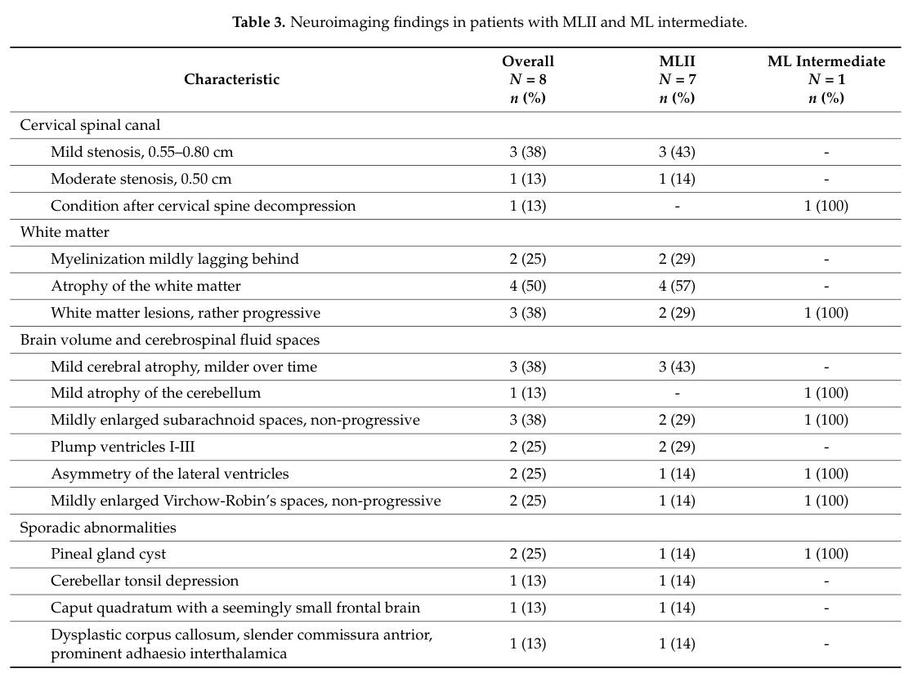

## Question

# Disease Characteristics Research Template

## Target Disease
- **Disease Name:** Mucolipidosis Type II
- **MONDO ID:**  (if available)
- **Category:** Mendelian

## Research Objectives

Please provide a comprehensive research report on **Mucolipidosis Type II** covering all of the
disease characteristics listed below. This report will be used to populate a disease knowledge
base entry. Be thorough and cite primary literature (PMID preferred) for all claims.

For each section, **suggested databases/resources** are listed. These are the first places
you should search for information on each topic.

---

### 1. Disease Information
> **Search first:** OMIM, Orphanet, ICD-10/ICD-11, MeSH, PubMed

- What is the disease? Provide a concise overview.
- What are the key identifiers? (OMIM, Orphanet, ICD-10/ICD-11, MeSH, Mondo)
- What are the common synonyms and alternative names?
- Is the information derived from individual patients (e.g., EHR) or aggregated disease-level resources?

### 2. Etiology

- **Disease Causal Factors**: What are the primary causes? (genetic, environmental, infectious, mechanistic)
- **Risk Factors**:
  > **Search first:** PubMed, Cochrane Library, UpToDate, clinical guidelines, ClinVar, ClinGen, GWAS Catalog, PheGenI, CTD, CDC, WHO, epidemiological databases
  - Genetic risk factors (causal variants, susceptibility loci, modifier genes)
  - Environmental risk factors (toxins, lifestyle, occupational exposures, age, sex, family history)
- **Protective Factors**:
  > **Search first:** PubMed, Cochrane Library, clinical trial databases, GWAS Catalog, gnomAD, WHO, CDC, nutrition databases
  - Genetic protective factors (protective variants, modifier alleles)
  - Environmental protective factors (diet, lifestyle, exposures that reduce risk)
- **Gene-Environment Interactions**: How do genetic and environmental factors interact to influence disease?
  > **Search first:** CTD, PubMed, PheGenI, GxE databases

### 3. Phenotypes
> **Search first:** HPO (Human Phenotype Ontology), OMIM, Orphanet, PubMed, clinicaltrials.gov, MedDRA, SNOMED CT, DECIPHER, LOINC

For each phenotype, provide:
- **Phenotype type**: symptoms, clinical signs, physical manifestations, behavioral changes, or laboratory abnormalities
  > For symptoms/signs: HPO, OMIM, Orphanet, PubMed
  > For behavioral changes: HPO, DSM, RDoC (Research Domain Criteria), PubMed
  > For laboratory abnormalities: LOINC, SNOMED CT, LabTests Online, PubMed
- **Phenotype characteristics**:
  > **Search first:** OMIM, Orphanet, HPO, PubMed
  - Age of symptom onset (neonatal, childhood, adult-onset, late-onset)
  - Symptom severity (mild, moderate, severe, variable)
  - Symptom progression (stable, progressive, episodic, fluctuating)
  - Frequency among affected individuals (percentage or qualitative)
- **Quality of life impact**: Effects on daily functioning and well-being (per-phenotype when possible)
  > **Search first:** EQ-5D database, SF-36, WHO QOL databases, PubMed
- Suggest HPO (Human Phenotype Ontology) terms for each phenotype

### 4. Genetic/Molecular Information

- **Causal Genes**: Gene mutations or chromosomal abnormalities responsible for disease (gene symbols, OMIM IDs)
  > **Search first:** OMIM, ClinVar, HGMD, Ensembl, NCBI Gene
- **Pathogenic Variants**:
  - Affected genes (gene symbols, HGNC IDs)
    > **Search first:** OMIM, NCBI Gene, Ensembl, HGNC, UniProt, GeneCards
  - Variant classification (pathogenic, likely pathogenic, VUS per ACMG/AMP guidelines)
    > **Search first:** ClinVar, ClinGen, ACMG/AMP guidelines, VarSome
  - Variant type/class (missense, frameshift, nonsense, splice-site, structural)
  - Allele frequency in population databases
    > **Search first:** gnomAD, 1000 Genomes, ExAC, TOPMed, dbSNP
  - Somatic vs germline origin
    > **Search first:** COSMIC (somatic), ClinVar, ICGC, TCGA
  - Functional consequences (loss of function, gain of function, dominant negative)
- **Modifier Genes**: Genes that modify disease severity or expression
- **Epigenetic Information**: DNA methylation, histone modifications, chromatin changes affecting disease
  > **Search first:** ENCODE, Roadmap Epigenomics, MethBase, DiseaseMeth
- **Chromosomal Abnormalities**: Large-scale genetic changes (aneuploidy, translocations, inversions)
  > **Search first:** DECIPHER, ClinVar, ECARUCA, UCSC Genome Browser

### 5. Environmental Information

- **Environmental Factors**: Non-genetic contributing factors (toxins, radiation, pollution, occupational exposure)
  > **Search first:** CTD (Comparative Toxicogenomics Database), TOXNET, PubMed, EPA databases
- **Lifestyle Factors**: Behavioral factors (smoking, diet, exercise, alcohol consumption)
  > **Search first:** CDC databases, WHO, PubMed, NHANES
- **Infectious Agents**: If applicable, pathogens causing or triggering disease (bacteria, viruses, fungi, parasites)
  > **Search first:** NCBI Taxonomy, ViPR, BV-BRC, MicrobeDB, GIDEON

### 6. Mechanism / Pathophysiology

- **Molecular Pathways**: Specific signaling cascades or biochemical pathways involved (Wnt, MAPK, mTOR, PI3K-AKT, etc.)
  > **Search first:** KEGG, Reactome, WikiPathways, PathBank, BioCyc
- **Cellular Processes**: Cell-level mechanisms (apoptosis, autophagy, cell cycle dysregulation, inflammation, etc.)
  > **Search first:** Gene Ontology (GO), Reactome, KEGG, PubMed
- **Protein Dysfunction**: How protein structure or function is altered (misfolding, aggregation, loss of function, gain of function)
  > **Search first:** UniProt, PDB (Protein Data Bank), InterPro, Pfam, AlphaFold
- **Metabolic Changes**: Alterations in metabolic processes (energy metabolism, lipid metabolism, amino acid metabolism)
  > **Search first:** KEGG, BioCyc, HMDB (Human Metabolome Database), BRENDA
- **Immune System Involvement**: Role of immune response (autoimmunity, immunodeficiency, chronic inflammation)
  > **Search first:** ImmPort, Immunome Database, IEDB, Gene Ontology
- **Tissue Damage Mechanisms**: How tissues/ are injured (oxidative stress, ischemia, fibrosis, necrosis)
  > **Search first:** PubMed, Gene Ontology, Reactome
- **Biochemical Abnormalities**: Specific molecular defects (enzyme deficiencies, receptor dysfunction, ion channel defects)
  > **Search first:** BRENDA, UniProt, KEGG, OMIM, PubMed
- **Epigenetic Changes**: DNA methylation, histone modifications affecting gene expression in disease
  > **Search first:** ENCODE, Roadmap Epigenomics, MethBase, DiseaseMeth
- **Molecular Profiling** (if available):
  - Transcriptomics/gene expression changes
    > **Search first:** GEO (Gene Expression Omnibus), ArrayExpress, GTEx, Human Cell Atlas, SRA
  - Proteomics findings
    > **Search first:** PRIDE, ProteomeXchange, Human Protein Atlas, STRING, BioGRID
  - Metabolomics signatures
    > **Search first:** MetaboLights, Metabolomics Workbench, HMDB, METLIN
  - Lipidomics alterations
    > **Search first:** LIPID MAPS, SwissLipids, LipidHome, Metabolomics Workbench
  - Genomic structural features
    > **Search first:** UCSC Genome Browser, Ensembl, NCBI, dbVar, DGV
- **Advanced Technologies** (if applicable):
  - Single-cell analysis findings (cell-type specific mechanisms, cellular heterogeneity)
    > **Search first:** Human Cell Atlas, Single Cell Portal, GEO, CELLxGENE
  - Spatial transcriptomics findings
    > **Search first:** GEO, Spatial Research, Vizgen, 10x Genomics data
  - Multi-omics integration results
    > **Search first:** TCGA, ICGC, cBioPortal, LinkedOmics, PubMed
  - Functional genomics screens (CRISPR, RNAi)
    > **Search first:** DepMap, GenomeRNAi, PubMed, BioGRID ORCS

For each mechanism, describe:
- The causal chain from initial trigger to clinical manifestation
- Which mechanisms are upstream vs downstream
- What cell types and biological processes are involved
- Suggest GO terms for biological processes and CL terms for cell types

### 7. Anatomical Structures Affected

- **Organ Level**:
  - Primary organs directly affected
  - Secondary organ involvement (complications, secondary effects)
  - Body systems involved (cardiovascular, nervous, digestive, respiratory, endocrine, etc.)
  > **Search first:** Uberon, FMA (Foundational Model of Anatomy), OMIM, HPO, ICD-11, MeSH, SNOMED CT
- **Tissue and Cell Level**:
  - Specific tissue types affected (epithelial, connective, muscle, nervous)
  - Specific cell populations targeted (with Cell Ontology terms)
  > **Search first:** Uberon, Human Protein Atlas, Cell Ontology, Human Cell Atlas, CellMarker, PanglaoDB
- **Subcellular Level**:
  - Cellular compartments involved (mitochondria, nucleus, ER, lysosomes) (with GO Cellular Component terms)
  > **Search first:** Gene Ontology (Cellular Component), UniProt, Human Protein Atlas
- **Localization**:
  - Specific anatomical sites (with UBERON terms)
    > **Search first:** FMA, Uberon, NeuroNames (for brain), SNOMED CT
  - Lateralization (unilateral, bilateral, asymmetric)
    > **Search first:** HPO, clinical literature, imaging databases

### 8. Temporal Development

- **Onset**:
  - Typical age of onset (congenital, pediatric, adult, geriatric)
  - Onset pattern (acute, subacute, chronic, insidious)
  > **Search first:** OMIM, Orphanet, HPO, PubMed
- **Progression**:
  - Disease stages (early, intermediate, advanced, end-stage)
    > **Search first:** Cancer Staging Manual (AJCC), WHO classifications, PubMed
  - Progression rate (rapid, slow, variable)
  - Disease course pattern (episodic, relapsing-remitting, progressive, stable)
  - Disease duration (self-limited, chronic lifelong)
  > **Search first:** Disease registries, longitudinal cohort databases, natural history studies, PubMed, Orphanet, OMIM
- **Patterns**:
  - Remission patterns (spontaneous, treatment-induced)
    > **Search first:** Clinical trial databases, disease registries, PubMed
  - Critical periods (time windows of vulnerability or opportunity for intervention)
    > **Search first:** PubMed, developmental biology databases, clinical guidelines

### 9. Inheritance and Population

- **Epidemiology**:
  - Prevalence (cases per 100,000 at given time)
  - Incidence (new cases per 100,000 per year)
  > **Search first:** Orphanet, CDC, WHO, GBD (Global Burden of Disease), national registries, SEER, disease registries
- **For Genetic Etiology**:
  - Inheritance pattern (AD, AR, X-linked, mitochondrial, multifactorial, polygenic)
    > **Search first:** OMIM, Orphanet, ClinVar, GTR (Genetic Testing Registry)
  - Penetrance (complete, incomplete, age-dependent)
    > **Search first:** ClinVar, OMIM, PubMed, ClinGen
  - Expressivity (variable, consistent)
    > **Search first:** OMIM, ClinVar, PubMed
  - Genetic anticipation (increasing severity in successive generations)
    > **Search first:** OMIM, PubMed (especially for repeat expansion disorders)
  - Germline mosaicism
    > **Search first:** ClinVar, OMIM, genetic counseling literature, PubMed
  - Founder effects (population-specific mutations)
    > **Search first:** gnomAD, population genetics databases, PubMed
  - Consanguinity role
    > **Search first:** OMIM, population studies, genetic counseling resources
  - Carrier frequency
    > **Search first:** gnomAD, carrier screening databases, GeneReviews, GTR
- **Population Demographics**:
  - Affected populations (ethnic or demographic groups with higher prevalence)
    > **Search first:** gnomAD, 1000 Genomes, PAGE Study, PubMed, population registries
  - Geographic distribution (endemic areas, regional variation)
    > **Search first:** WHO, CDC, GBD, Orphanet, geographic epidemiology databases
  - Geographic distribution of specific variants
  - Sex ratio (male:female)
    > **Search first:** Disease registries, OMIM, PubMed, epidemiological databases
  - Age distribution of affected individuals
    > **Search first:** CDC, disease registries, SEER, Orphanet

### 10. Diagnostics

- **Clinical Tests**:
  - Laboratory tests (blood, urine, tissue chemistry, specific enzyme assays)
    > **Search first:** LOINC, LabTests Online, PubMed
  - Biomarkers (proteins, metabolites, genetic markers, circulating biomarkers)
    > **Search first:** FDA Biomarker List, BEST (Biomarkers, EndpointS, and other Tools), PubMed
  - Imaging studies (X-ray, CT, MRI, PET, ultrasound)
    > **Search first:** RadLex, DICOM, Radiopaedia, imaging databases
  - Functional tests (pulmonary function, cardiac stress tests)
    > **Search first:** LOINC, clinical guidelines, PubMed
  - Electrophysiology (EEG, EMG, ECG, nerve conduction studies)
    > **Search first:** LOINC, clinical neurophysiology databases, PubMed
  - Biopsy findings (histopathology, immunohistochemistry)
    > **Search first:** SNOMED CT, College of American Pathologists resources, PubMed
  - Pathology findings (microscopic examination)
    > **Search first:** SNOMED CT, Digital Pathology databases, PubMed
- **Genetic Testing**:
  > **Search first:** GTR (Genetic Testing Registry), GeneReviews, ClinGen
  - Overview of recommended genetic testing approach
  - Whole genome sequencing (WGS) utility
    > **Search first:** GTR, ClinVar, GEL (Genomics England), gnomAD
  - Whole exome sequencing (WES) utility
    > **Search first:** GTR, ClinVar, OMIM, GeneMatcher
  - Gene panels (which panels, which genes)
    > **Search first:** GTR, ClinVar, laboratory-specific databases
  - Single gene testing
    > **Search first:** GTR, ClinVar, OMIM, GeneReviews
  - Chromosomal microarray (CMA)
    > **Search first:** DECIPHER, ClinVar, dbVar, ECARUCA
  - Karyotyping
    > **Search first:** Chromosome Abnormality Database, ClinVar, cytogenetics resources
  - FISH
    > **Search first:** ClinVar, cytogenetics databases, PubMed
  - Mitochondrial DNA testing
    > **Search first:** MITOMAP, MSeqDR, ClinVar, GTR
  - Repeat expansion testing
    > **Search first:** GTR, ClinVar, repeat expansion databases, PubMed
- **Omics-Based Diagnostics** (if applicable):
  - RNA sequencing / transcriptomics
    > **Search first:** GEO, ArrayExpress, GTEx, RNA-seq databases
  - Proteomics
    > **Search first:** PRIDE, ProteomeXchange, FDA Biomarker database
  - Metabolomics
    > **Search first:** MetaboLights, Metabolomics Workbench, HMDB
  - Epigenomics
    > **Search first:** GEO, ENCODE, Roadmap Epigenomics, MethBase
  - Liquid biopsy
    > **Search first:** COSMIC, ClinVar, liquid biopsy databases, PubMed
- **Clinical Criteria**:
  - Standardized diagnostic criteria (DSM, ICD, society guidelines)
    > **Search first:** DSM-5, ICD-11, clinical society guidelines, UpToDate
  - Differential diagnosis (other conditions to rule out, with distinguishing features)
    > **Search first:** DynaMed, UpToDate, clinical decision support systems
- **Screening**:
  - Screening methods for asymptomatic individuals (newborn screening, carrier screening, cascade screening)
    > **Search first:** ACMG recommendations, CDC newborn screening, GTR

### 11. Outcome/Prognosis

- **Survival and Mortality**:
  - Survival rate (5-year, 10-year, overall)
    > **Search first:** SEER, cancer registries, disease-specific registries, PubMed
  - Life expectancy (with and without treatment if applicable)
    > **Search first:** Orphanet, disease registries, actuarial databases, PubMed
  - Mortality rate
    > **Search first:** CDC, WHO, GBD, national mortality databases
  - Disease-specific mortality (deaths directly attributable to disease)
    > **Search first:** Disease registries, CDC Wonder, GBD, PubMed
- **Morbidity and Function**:
  - Morbidity (disease-related disability and health impacts)
    > **Search first:** GBD, WHO, disability databases, PubMed
  - Disability outcomes (long-term functional impairments)
    > **Search first:** ICF (International Classification of Functioning), disability registries
  - Quality of life measures (EQ-5D, SF-36, PROMIS, disease-specific tools)
    > **Search first:** EQ-5D database, SF-36, PROMIS, PubMed
- **Disease Course**:
  - Complications (secondary problems: infections, organ failure, etc.)
    > **Search first:** ICD codes, disease registries, clinical databases, PubMed
  - Recovery potential (likelihood and extent of recovery, with vs without treatment)
    > **Search first:** Natural history studies, rehabilitation databases, PubMed
- **Prediction**:
  - Prognostic factors (age, disease severity, biomarkers, treatment response)
    > **Search first:** Prognostic models databases, clinical calculators, PubMed
  - Prognostic biomarkers (molecular markers predicting disease course)
    > **Search first:** FDA Biomarker database, PubMed, cancer prognostic databases

### 12. Treatment

- **Pharmacotherapy**:
  - Pharmacological treatments (drug names, drug classes, mechanisms of action)
    > **Search first:** DrugBank, RxNorm, ATC classification, DailyMed, FDA databases
  - Pharmacogenomics (how genetic variants affect drug metabolism, efficacy, toxicity)
    > **Search first:** PharmGKB, CPIC (Clinical Pharmacogenetics), FDA Table of PGx Biomarkers
- **Advanced Therapeutics**:
  - Gene therapy (viral vectors, CRISPR, gene replacement, gene editing)
    > **Search first:** ClinicalTrials.gov, FDA gene therapy database, ASGCT resources
  - Cell therapy (stem cell transplant, CAR-T, cellular therapeutics)
    > **Search first:** ClinicalTrials.gov, FDA cell therapy database, FACT standards
  - RNA-based therapies (ASOs, siRNA, mRNA therapies)
    > **Search first:** ClinicalTrials.gov, FDA approvals, PubMed
  - Targeted therapies (treatments directed at specific molecular targets)
    > **Search first:** My Cancer Genome, OncoKB, ClinicalTrials.gov, FDA approvals
  - Immunotherapies (checkpoint inhibitors, monoclonal antibodies)
    > **Search first:** Cancer Immunotherapy Database, FDA approvals, ClinicalTrials.gov
- **Surgical and Interventional**:
  - Surgical interventions (types of surgery, timing, outcomes)
    > **Search first:** CPT codes, surgical registries, clinical guidelines, PubMed
- **Supportive and Rehabilitative**:
  - Supportive care (symptom management, pain control, nutrition)
    > **Search first:** Clinical guidelines, Cochrane Library, PubMed
  - Rehabilitation (physical therapy, occupational therapy, speech therapy)
    > **Search first:** Rehabilitation medicine databases, clinical guidelines, PubMed
- **Experimental**:
  - Experimental treatments in clinical trials (with NCT identifiers if available)
    > **Search first:** ClinicalTrials.gov, EU Clinical Trials Register, WHO ICTRP
- **Treatment Outcomes**:
  - Treatment response rates
    > **Search first:** Clinical trial databases, FDA reviews, systematic reviews, PubMed
  - Side effects and adverse events
    > **Search first:** FDA Adverse Event Reporting System (FAERS), MedWatch, PubMed
- **Treatment Strategy**:
  - Treatment algorithms (clinical pathways, decision trees)
    > **Search first:** Clinical practice guidelines, NCCN Guidelines, UpToDate
  - Combination therapies
    > **Search first:** ClinicalTrials.gov, treatment guidelines, PubMed
  - Personalized medicine approaches (genotype-guided treatment)
    > **Search first:** My Cancer Genome, CIViC, PharmGKB, precision medicine databases

For each treatment, suggest MAXO (Medical Action Ontology) terms where applicable.

### 13. Prevention

- **Prevention Levels**:
  - Primary prevention (preventing disease occurrence: vaccination, risk factor modification)
    > **Search first:** CDC, WHO, USPSTF recommendations, Cochrane Library
  - Secondary prevention (early detection and treatment: screening programs, early intervention)
    > **Search first:** USPSTF, CDC screening guidelines, WHO
  - Tertiary prevention (preventing complications in those with disease)
    > **Search first:** Clinical guidelines, disease management protocols, PubMed
- **Immunization**: Vaccine strategies (if applicable)
  > **Search first:** CDC vaccine schedules, WHO immunization, FDA vaccine database
- **Screening and Early Detection**:
  - Screening programs (population-based: newborn screening, cancer screening)
    > **Search first:** CDC screening programs, USPSTF, cancer screening databases
  - Genetic screening (carrier screening, preimplantation genetic diagnosis, prenatal testing)
    > **Search first:** ACMG recommendations, ACOG guidelines, GTR
  - Risk stratification (identifying high-risk individuals for targeted prevention)
    > **Search first:** Risk prediction models, clinical calculators, PubMed
- **Behavioral Interventions**: Lifestyle modifications to reduce risk
  > **Search first:** CDC, WHO, behavioral intervention databases, Cochrane Library
- **Counseling**: Genetic counseling (risk assessment, family planning guidance)
  > **Search first:** NSGC resources, ACMG guidelines, GeneReviews
- **Public Health**:
  - Public health interventions (sanitation, vector control, health education)
    > **Search first:** CDC, WHO, public health databases, PubMed
  - Environmental interventions (reducing environmental risk factors)
    > **Search first:** EPA databases, WHO environmental health, PubMed
- **Prophylaxis**: Preventive medications or procedures
  > **Search first:** Clinical guidelines, FDA approvals, PubMed

### 14. Other Species / Natural Disease

- **Taxonomy**: Species affected (with NCBI Taxon identifiers)
  > **Search first:** NCBI Taxonomy
- **Breed**: Specific breeds affected (with VBO identifiers if applicable)
  > **Search first:** VBO (Vertebrate Breed Ontology)
- **Gene**: Orthologous genes in other species (with NCBI Gene IDs)
  > **Search first:** NCBI Gene
- **Natural Disease**:
  - Naturally occurring disease in other species (companion animals, wildlife)
    > **Search first:** OMIA (Online Mendelian Inheritance in Animals), VetCompass, PubMed
  - Veterinary relevance and importance in animal health
    > **Search first:** OMIA, veterinary databases, PubMed
- **Comparative Biology**:
  - Comparative pathology (similarities and differences across species)
    > **Search first:** OMIA, comparative pathology databases, PubMed
  - Evolutionary conservation of disease mechanisms
    > **Search first:** HomoloGene, OrthoMCL, Alliance of Genome Resources
- **Transmission** (if applicable):
  - Zoonotic potential
    > **Search first:** CDC zoonotic diseases, WHO zoonoses, GIDEON
  - Cross-species susceptibility
    > **Search first:** NCBI Taxonomy, veterinary databases, PubMed

### 15. Model Organisms

- **Model Types**:
  - Model organism type (mammalian, invertebrate, cellular, in vitro)
    > **Search first:** Alliance of Genome Resources, model organism databases
  - Specific model systems (mouse, rat, zebrafish, Drosophila, C. elegans, yeast, cell lines, organoids, iPSCs)
    > **Search first:** MGI, RGD, ZFIN, FlyBase, WormBase, SGD, ATCC, Cellosaurus
  - Induced models (drug treatment, surgical intervention, environmental manipulation)
    > **Search first:** MGI, model organism databases, PubMed
- **Genetic Models**:
  - Types available (knockout, knock-in, transgenic, conditional, humanized)
    > **Search first:** MGI, IMPC, KOMP, EuMMCR, IMSR
- **Model Characteristics**:
  - Phenotype recapitulation (how well model reproduces human disease features)
    > **Search first:** Model organism databases, comparative studies, PubMed
  - Model limitations (aspects of human disease not captured)
    > **Search first:** Model organism databases, PubMed, review articles
- **Applications**:
  - Research applications (what aspects of disease can be studied)
    > **Search first:** Model organism databases, PubMed
- **Resources**:
  - Model databases
    > **Search first:** MGI, RGD, ZFIN, FlyBase, WormBase, IMSR, EMMA, MMRRC

---

## Citation Requirements

- Cite primary literature (PMID preferred) for all mechanistic and clinical claims
- Prioritize recent reviews and landmark papers
- Include direct quotes from abstracts where possible to support key statements
- Distinguish evidence source types: human clinical, model organism, in vitro, computational

## Output Format

Structure your response as a comprehensive narrative organized by the sections above.
For each section, provide:
- Factual content with specific details (numbers, percentages, gene names, variant nomenclature)
- Ontology term suggestions (HPO, GO, CL, UBERON, CHEBI, MAXO, MONDO) where applicable
- Evidence citations with PMIDs
- Direct quotes from abstracts to support key claims
- Clear indication when information is not available or not applicable for this disease

This report will be used to populate a disease knowledge base entry with:
- Pathophysiology descriptions with causal chains
- Gene/protein annotations (HGNC, GO terms)
- Phenotype associations (HP terms) with frequencies
- Cell type involvement (CL terms)
- Anatomical locations (UBERON terms)
- Chemical entities (CHEBI terms)
- Treatment annotations (MAXO terms)
- Evidence items with PMIDs and exact abstract quotes
- Epidemiology, prognosis, diagnostic, and prevention information
- Animal model descriptions with phenotype recapitulation details

## Output

Question: You are an expert researcher providing comprehensive, well-cited information.

Provide detailed information focusing on:
1. Key concepts and definitions with current understanding
2. Recent developments and latest research (prioritize 2023-2024 sources)
3. Current applications and real-world implementations
4. Expert opinions and analysis from authoritative sources
5. Relevant statistics and data from recent studies

Format as a comprehensive research report with proper citations. Include URLs and publication dates where available.
Always prioritize recent, authoritative sources and provide specific citations for all major claims.

# Disease Characteristics Research Template

## Target Disease
- **Disease Name:** Mucolipidosis Type II
- **MONDO ID:**  (if available)
- **Category:** Mendelian

## Research Objectives

Please provide a comprehensive research report on **Mucolipidosis Type II** covering all of the
disease characteristics listed below. This report will be used to populate a disease knowledge
base entry. Be thorough and cite primary literature (PMID preferred) for all claims.

For each section, **suggested databases/resources** are listed. These are the first places
you should search for information on each topic.

---

### 1. Disease Information
> **Search first:** OMIM, Orphanet, ICD-10/ICD-11, MeSH, PubMed

- What is the disease? Provide a concise overview.
- What are the key identifiers? (OMIM, Orphanet, ICD-10/ICD-11, MeSH, Mondo)
- What are the common synonyms and alternative names?
- Is the information derived from individual patients (e.g., EHR) or aggregated disease-level resources?

### 2. Etiology

- **Disease Causal Factors**: What are the primary causes? (genetic, environmental, infectious, mechanistic)
- **Risk Factors**:
  > **Search first:** PubMed, Cochrane Library, UpToDate, clinical guidelines, ClinVar, ClinGen, GWAS Catalog, PheGenI, CTD, CDC, WHO, epidemiological databases
  - Genetic risk factors (causal variants, susceptibility loci, modifier genes)
  - Environmental risk factors (toxins, lifestyle, occupational exposures, age, sex, family history)
- **Protective Factors**:
  > **Search first:** PubMed, Cochrane Library, clinical trial databases, GWAS Catalog, gnomAD, WHO, CDC, nutrition databases
  - Genetic protective factors (protective variants, modifier alleles)
  - Environmental protective factors (diet, lifestyle, exposures that reduce risk)
- **Gene-Environment Interactions**: How do genetic and environmental factors interact to influence disease?
  > **Search first:** CTD, PubMed, PheGenI, GxE databases

### 3. Phenotypes
> **Search first:** HPO (Human Phenotype Ontology), OMIM, Orphanet, PubMed, clinicaltrials.gov, MedDRA, SNOMED CT, DECIPHER, LOINC

For each phenotype, provide:
- **Phenotype type**: symptoms, clinical signs, physical manifestations, behavioral changes, or laboratory abnormalities
  > For symptoms/signs: HPO, OMIM, Orphanet, PubMed
  > For behavioral changes: HPO, DSM, RDoC (Research Domain Criteria), PubMed
  > For laboratory abnormalities: LOINC, SNOMED CT, LabTests Online, PubMed
- **Phenotype characteristics**:
  > **Search first:** OMIM, Orphanet, HPO, PubMed
  - Age of symptom onset (neonatal, childhood, adult-onset, late-onset)
  - Symptom severity (mild, moderate, severe, variable)
  - Symptom progression (stable, progressive, episodic, fluctuating)
  - Frequency among affected individuals (percentage or qualitative)
- **Quality of life impact**: Effects on daily functioning and well-being (per-phenotype when possible)
  > **Search first:** EQ-5D database, SF-36, WHO QOL databases, PubMed
- Suggest HPO (Human Phenotype Ontology) terms for each phenotype

### 4. Genetic/Molecular Information

- **Causal Genes**: Gene mutations or chromosomal abnormalities responsible for disease (gene symbols, OMIM IDs)
  > **Search first:** OMIM, ClinVar, HGMD, Ensembl, NCBI Gene
- **Pathogenic Variants**:
  - Affected genes (gene symbols, HGNC IDs)
    > **Search first:** OMIM, NCBI Gene, Ensembl, HGNC, UniProt, GeneCards
  - Variant classification (pathogenic, likely pathogenic, VUS per ACMG/AMP guidelines)
    > **Search first:** ClinVar, ClinGen, ACMG/AMP guidelines, VarSome
  - Variant type/class (missense, frameshift, nonsense, splice-site, structural)
  - Allele frequency in population databases
    > **Search first:** gnomAD, 1000 Genomes, ExAC, TOPMed, dbSNP
  - Somatic vs germline origin
    > **Search first:** COSMIC (somatic), ClinVar, ICGC, TCGA
  - Functional consequences (loss of function, gain of function, dominant negative)
- **Modifier Genes**: Genes that modify disease severity or expression
- **Epigenetic Information**: DNA methylation, histone modifications, chromatin changes affecting disease
  > **Search first:** ENCODE, Roadmap Epigenomics, MethBase, DiseaseMeth
- **Chromosomal Abnormalities**: Large-scale genetic changes (aneuploidy, translocations, inversions)
  > **Search first:** DECIPHER, ClinVar, ECARUCA, UCSC Genome Browser

### 5. Environmental Information

- **Environmental Factors**: Non-genetic contributing factors (toxins, radiation, pollution, occupational exposure)
  > **Search first:** CTD (Comparative Toxicogenomics Database), TOXNET, PubMed, EPA databases
- **Lifestyle Factors**: Behavioral factors (smoking, diet, exercise, alcohol consumption)
  > **Search first:** CDC databases, WHO, PubMed, NHANES
- **Infectious Agents**: If applicable, pathogens causing or triggering disease (bacteria, viruses, fungi, parasites)
  > **Search first:** NCBI Taxonomy, ViPR, BV-BRC, MicrobeDB, GIDEON

### 6. Mechanism / Pathophysiology

- **Molecular Pathways**: Specific signaling cascades or biochemical pathways involved (Wnt, MAPK, mTOR, PI3K-AKT, etc.)
  > **Search first:** KEGG, Reactome, WikiPathways, PathBank, BioCyc
- **Cellular Processes**: Cell-level mechanisms (apoptosis, autophagy, cell cycle dysregulation, inflammation, etc.)
  > **Search first:** Gene Ontology (GO), Reactome, KEGG, PubMed
- **Protein Dysfunction**: How protein structure or function is altered (misfolding, aggregation, loss of function, gain of function)
  > **Search first:** UniProt, PDB (Protein Data Bank), InterPro, Pfam, AlphaFold
- **Metabolic Changes**: Alterations in metabolic processes (energy metabolism, lipid metabolism, amino acid metabolism)
  > **Search first:** KEGG, BioCyc, HMDB (Human Metabolome Database), BRENDA
- **Immune System Involvement**: Role of immune response (autoimmunity, immunodeficiency, chronic inflammation)
  > **Search first:** ImmPort, Immunome Database, IEDB, Gene Ontology
- **Tissue Damage Mechanisms**: How tissues/ are injured (oxidative stress, ischemia, fibrosis, necrosis)
  > **Search first:** PubMed, Gene Ontology, Reactome
- **Biochemical Abnormalities**: Specific molecular defects (enzyme deficiencies, receptor dysfunction, ion channel defects)
  > **Search first:** BRENDA, UniProt, KEGG, OMIM, PubMed
- **Epigenetic Changes**: DNA methylation, histone modifications affecting gene expression in disease
  > **Search first:** ENCODE, Roadmap Epigenomics, MethBase, DiseaseMeth
- **Molecular Profiling** (if available):
  - Transcriptomics/gene expression changes
    > **Search first:** GEO (Gene Expression Omnibus), ArrayExpress, GTEx, Human Cell Atlas, SRA
  - Proteomics findings
    > **Search first:** PRIDE, ProteomeXchange, Human Protein Atlas, STRING, BioGRID
  - Metabolomics signatures
    > **Search first:** MetaboLights, Metabolomics Workbench, HMDB, METLIN
  - Lipidomics alterations
    > **Search first:** LIPID MAPS, SwissLipids, LipidHome, Metabolomics Workbench
  - Genomic structural features
    > **Search first:** UCSC Genome Browser, Ensembl, NCBI, dbVar, DGV
- **Advanced Technologies** (if applicable):
  - Single-cell analysis findings (cell-type specific mechanisms, cellular heterogeneity)
    > **Search first:** Human Cell Atlas, Single Cell Portal, GEO, CELLxGENE
  - Spatial transcriptomics findings
    > **Search first:** GEO, Spatial Research, Vizgen, 10x Genomics data
  - Multi-omics integration results
    > **Search first:** TCGA, ICGC, cBioPortal, LinkedOmics, PubMed
  - Functional genomics screens (CRISPR, RNAi)
    > **Search first:** DepMap, GenomeRNAi, PubMed, BioGRID ORCS

For each mechanism, describe:
- The causal chain from initial trigger to clinical manifestation
- Which mechanisms are upstream vs downstream
- What cell types and biological processes are involved
- Suggest GO terms for biological processes and CL terms for cell types

### 7. Anatomical Structures Affected

- **Organ Level**:
  - Primary organs directly affected
  - Secondary organ involvement (complications, secondary effects)
  - Body systems involved (cardiovascular, nervous, digestive, respiratory, endocrine, etc.)
  > **Search first:** Uberon, FMA (Foundational Model of Anatomy), OMIM, HPO, ICD-11, MeSH, SNOMED CT
- **Tissue and Cell Level**:
  - Specific tissue types affected (epithelial, connective, muscle, nervous)
  - Specific cell populations targeted (with Cell Ontology terms)
  > **Search first:** Uberon, Human Protein Atlas, Cell Ontology, Human Cell Atlas, CellMarker, PanglaoDB
- **Subcellular Level**:
  - Cellular compartments involved (mitochondria, nucleus, ER, lysosomes) (with GO Cellular Component terms)
  > **Search first:** Gene Ontology (Cellular Component), UniProt, Human Protein Atlas
- **Localization**:
  - Specific anatomical sites (with UBERON terms)
    > **Search first:** FMA, Uberon, NeuroNames (for brain), SNOMED CT
  - Lateralization (unilateral, bilateral, asymmetric)
    > **Search first:** HPO, clinical literature, imaging databases

### 8. Temporal Development

- **Onset**:
  - Typical age of onset (congenital, pediatric, adult, geriatric)
  - Onset pattern (acute, subacute, chronic, insidious)
  > **Search first:** OMIM, Orphanet, HPO, PubMed
- **Progression**:
  - Disease stages (early, intermediate, advanced, end-stage)
    > **Search first:** Cancer Staging Manual (AJCC), WHO classifications, PubMed
  - Progression rate (rapid, slow, variable)
  - Disease course pattern (episodic, relapsing-remitting, progressive, stable)
  - Disease duration (self-limited, chronic lifelong)
  > **Search first:** Disease registries, longitudinal cohort databases, natural history studies, PubMed, Orphanet, OMIM
- **Patterns**:
  - Remission patterns (spontaneous, treatment-induced)
    > **Search first:** Clinical trial databases, disease registries, PubMed
  - Critical periods (time windows of vulnerability or opportunity for intervention)
    > **Search first:** PubMed, developmental biology databases, clinical guidelines

### 9. Inheritance and Population

- **Epidemiology**:
  - Prevalence (cases per 100,000 at given time)
  - Incidence (new cases per 100,000 per year)
  > **Search first:** Orphanet, CDC, WHO, GBD (Global Burden of Disease), national registries, SEER, disease registries
- **For Genetic Etiology**:
  - Inheritance pattern (AD, AR, X-linked, mitochondrial, multifactorial, polygenic)
    > **Search first:** OMIM, Orphanet, ClinVar, GTR (Genetic Testing Registry)
  - Penetrance (complete, incomplete, age-dependent)
    > **Search first:** ClinVar, OMIM, PubMed, ClinGen
  - Expressivity (variable, consistent)
    > **Search first:** OMIM, ClinVar, PubMed
  - Genetic anticipation (increasing severity in successive generations)
    > **Search first:** OMIM, PubMed (especially for repeat expansion disorders)
  - Germline mosaicism
    > **Search first:** ClinVar, OMIM, genetic counseling literature, PubMed
  - Founder effects (population-specific mutations)
    > **Search first:** gnomAD, population genetics databases, PubMed
  - Consanguinity role
    > **Search first:** OMIM, population studies, genetic counseling resources
  - Carrier frequency
    > **Search first:** gnomAD, carrier screening databases, GeneReviews, GTR
- **Population Demographics**:
  - Affected populations (ethnic or demographic groups with higher prevalence)
    > **Search first:** gnomAD, 1000 Genomes, PAGE Study, PubMed, population registries
  - Geographic distribution (endemic areas, regional variation)
    > **Search first:** WHO, CDC, GBD, Orphanet, geographic epidemiology databases
  - Geographic distribution of specific variants
  - Sex ratio (male:female)
    > **Search first:** Disease registries, OMIM, PubMed, epidemiological databases
  - Age distribution of affected individuals
    > **Search first:** CDC, disease registries, SEER, Orphanet

### 10. Diagnostics

- **Clinical Tests**:
  - Laboratory tests (blood, urine, tissue chemistry, specific enzyme assays)
    > **Search first:** LOINC, LabTests Online, PubMed
  - Biomarkers (proteins, metabolites, genetic markers, circulating biomarkers)
    > **Search first:** FDA Biomarker List, BEST (Biomarkers, EndpointS, and other Tools), PubMed
  - Imaging studies (X-ray, CT, MRI, PET, ultrasound)
    > **Search first:** RadLex, DICOM, Radiopaedia, imaging databases
  - Functional tests (pulmonary function, cardiac stress tests)
    > **Search first:** LOINC, clinical guidelines, PubMed
  - Electrophysiology (EEG, EMG, ECG, nerve conduction studies)
    > **Search first:** LOINC, clinical neurophysiology databases, PubMed
  - Biopsy findings (histopathology, immunohistochemistry)
    > **Search first:** SNOMED CT, College of American Pathologists resources, PubMed
  - Pathology findings (microscopic examination)
    > **Search first:** SNOMED CT, Digital Pathology databases, PubMed
- **Genetic Testing**:
  > **Search first:** GTR (Genetic Testing Registry), GeneReviews, ClinGen
  - Overview of recommended genetic testing approach
  - Whole genome sequencing (WGS) utility
    > **Search first:** GTR, ClinVar, GEL (Genomics England), gnomAD
  - Whole exome sequencing (WES) utility
    > **Search first:** GTR, ClinVar, OMIM, GeneMatcher
  - Gene panels (which panels, which genes)
    > **Search first:** GTR, ClinVar, laboratory-specific databases
  - Single gene testing
    > **Search first:** GTR, ClinVar, OMIM, GeneReviews
  - Chromosomal microarray (CMA)
    > **Search first:** DECIPHER, ClinVar, dbVar, ECARUCA
  - Karyotyping
    > **Search first:** Chromosome Abnormality Database, ClinVar, cytogenetics resources
  - FISH
    > **Search first:** ClinVar, cytogenetics databases, PubMed
  - Mitochondrial DNA testing
    > **Search first:** MITOMAP, MSeqDR, ClinVar, GTR
  - Repeat expansion testing
    > **Search first:** GTR, ClinVar, repeat expansion databases, PubMed
- **Omics-Based Diagnostics** (if applicable):
  - RNA sequencing / transcriptomics
    > **Search first:** GEO, ArrayExpress, GTEx, RNA-seq databases
  - Proteomics
    > **Search first:** PRIDE, ProteomeXchange, FDA Biomarker database
  - Metabolomics
    > **Search first:** MetaboLights, Metabolomics Workbench, HMDB
  - Epigenomics
    > **Search first:** GEO, ENCODE, Roadmap Epigenomics, MethBase
  - Liquid biopsy
    > **Search first:** COSMIC, ClinVar, liquid biopsy databases, PubMed
- **Clinical Criteria**:
  - Standardized diagnostic criteria (DSM, ICD, society guidelines)
    > **Search first:** DSM-5, ICD-11, clinical society guidelines, UpToDate
  - Differential diagnosis (other conditions to rule out, with distinguishing features)
    > **Search first:** DynaMed, UpToDate, clinical decision support systems
- **Screening**:
  - Screening methods for asymptomatic individuals (newborn screening, carrier screening, cascade screening)
    > **Search first:** ACMG recommendations, CDC newborn screening, GTR

### 11. Outcome/Prognosis

- **Survival and Mortality**:
  - Survival rate (5-year, 10-year, overall)
    > **Search first:** SEER, cancer registries, disease-specific registries, PubMed
  - Life expectancy (with and without treatment if applicable)
    > **Search first:** Orphanet, disease registries, actuarial databases, PubMed
  - Mortality rate
    > **Search first:** CDC, WHO, GBD, national mortality databases
  - Disease-specific mortality (deaths directly attributable to disease)
    > **Search first:** Disease registries, CDC Wonder, GBD, PubMed
- **Morbidity and Function**:
  - Morbidity (disease-related disability and health impacts)
    > **Search first:** GBD, WHO, disability databases, PubMed
  - Disability outcomes (long-term functional impairments)
    > **Search first:** ICF (International Classification of Functioning), disability registries
  - Quality of life measures (EQ-5D, SF-36, PROMIS, disease-specific tools)
    > **Search first:** EQ-5D database, SF-36, PROMIS, PubMed
- **Disease Course**:
  - Complications (secondary problems: infections, organ failure, etc.)
    > **Search first:** ICD codes, disease registries, clinical databases, PubMed
  - Recovery potential (likelihood and extent of recovery, with vs without treatment)
    > **Search first:** Natural history studies, rehabilitation databases, PubMed
- **Prediction**:
  - Prognostic factors (age, disease severity, biomarkers, treatment response)
    > **Search first:** Prognostic models databases, clinical calculators, PubMed
  - Prognostic biomarkers (molecular markers predicting disease course)
    > **Search first:** FDA Biomarker database, PubMed, cancer prognostic databases

### 12. Treatment

- **Pharmacotherapy**:
  - Pharmacological treatments (drug names, drug classes, mechanisms of action)
    > **Search first:** DrugBank, RxNorm, ATC classification, DailyMed, FDA databases
  - Pharmacogenomics (how genetic variants affect drug metabolism, efficacy, toxicity)
    > **Search first:** PharmGKB, CPIC (Clinical Pharmacogenetics), FDA Table of PGx Biomarkers
- **Advanced Therapeutics**:
  - Gene therapy (viral vectors, CRISPR, gene replacement, gene editing)
    > **Search first:** ClinicalTrials.gov, FDA gene therapy database, ASGCT resources
  - Cell therapy (stem cell transplant, CAR-T, cellular therapeutics)
    > **Search first:** ClinicalTrials.gov, FDA cell therapy database, FACT standards
  - RNA-based therapies (ASOs, siRNA, mRNA therapies)
    > **Search first:** ClinicalTrials.gov, FDA approvals, PubMed
  - Targeted therapies (treatments directed at specific molecular targets)
    > **Search first:** My Cancer Genome, OncoKB, ClinicalTrials.gov, FDA approvals
  - Immunotherapies (checkpoint inhibitors, monoclonal antibodies)
    > **Search first:** Cancer Immunotherapy Database, FDA approvals, ClinicalTrials.gov
- **Surgical and Interventional**:
  - Surgical interventions (types of surgery, timing, outcomes)
    > **Search first:** CPT codes, surgical registries, clinical guidelines, PubMed
- **Supportive and Rehabilitative**:
  - Supportive care (symptom management, pain control, nutrition)
    > **Search first:** Clinical guidelines, Cochrane Library, PubMed
  - Rehabilitation (physical therapy, occupational therapy, speech therapy)
    > **Search first:** Rehabilitation medicine databases, clinical guidelines, PubMed
- **Experimental**:
  - Experimental treatments in clinical trials (with NCT identifiers if available)
    > **Search first:** ClinicalTrials.gov, EU Clinical Trials Register, WHO ICTRP
- **Treatment Outcomes**:
  - Treatment response rates
    > **Search first:** Clinical trial databases, FDA reviews, systematic reviews, PubMed
  - Side effects and adverse events
    > **Search first:** FDA Adverse Event Reporting System (FAERS), MedWatch, PubMed
- **Treatment Strategy**:
  - Treatment algorithms (clinical pathways, decision trees)
    > **Search first:** Clinical practice guidelines, NCCN Guidelines, UpToDate
  - Combination therapies
    > **Search first:** ClinicalTrials.gov, treatment guidelines, PubMed
  - Personalized medicine approaches (genotype-guided treatment)
    > **Search first:** My Cancer Genome, CIViC, PharmGKB, precision medicine databases

For each treatment, suggest MAXO (Medical Action Ontology) terms where applicable.

### 13. Prevention

- **Prevention Levels**:
  - Primary prevention (preventing disease occurrence: vaccination, risk factor modification)
    > **Search first:** CDC, WHO, USPSTF recommendations, Cochrane Library
  - Secondary prevention (early detection and treatment: screening programs, early intervention)
    > **Search first:** USPSTF, CDC screening guidelines, WHO
  - Tertiary prevention (preventing complications in those with disease)
    > **Search first:** Clinical guidelines, disease management protocols, PubMed
- **Immunization**: Vaccine strategies (if applicable)
  > **Search first:** CDC vaccine schedules, WHO immunization, FDA vaccine database
- **Screening and Early Detection**:
  - Screening programs (population-based: newborn screening, cancer screening)
    > **Search first:** CDC screening programs, USPSTF, cancer screening databases
  - Genetic screening (carrier screening, preimplantation genetic diagnosis, prenatal testing)
    > **Search first:** ACMG recommendations, ACOG guidelines, GTR
  - Risk stratification (identifying high-risk individuals for targeted prevention)
    > **Search first:** Risk prediction models, clinical calculators, PubMed
- **Behavioral Interventions**: Lifestyle modifications to reduce risk
  > **Search first:** CDC, WHO, behavioral intervention databases, Cochrane Library
- **Counseling**: Genetic counseling (risk assessment, family planning guidance)
  > **Search first:** NSGC resources, ACMG guidelines, GeneReviews
- **Public Health**:
  - Public health interventions (sanitation, vector control, health education)
    > **Search first:** CDC, WHO, public health databases, PubMed
  - Environmental interventions (reducing environmental risk factors)
    > **Search first:** EPA databases, WHO environmental health, PubMed
- **Prophylaxis**: Preventive medications or procedures
  > **Search first:** Clinical guidelines, FDA approvals, PubMed

### 14. Other Species / Natural Disease

- **Taxonomy**: Species affected (with NCBI Taxon identifiers)
  > **Search first:** NCBI Taxonomy
- **Breed**: Specific breeds affected (with VBO identifiers if applicable)
  > **Search first:** VBO (Vertebrate Breed Ontology)
- **Gene**: Orthologous genes in other species (with NCBI Gene IDs)
  > **Search first:** NCBI Gene
- **Natural Disease**:
  - Naturally occurring disease in other species (companion animals, wildlife)
    > **Search first:** OMIA (Online Mendelian Inheritance in Animals), VetCompass, PubMed
  - Veterinary relevance and importance in animal health
    > **Search first:** OMIA, veterinary databases, PubMed
- **Comparative Biology**:
  - Comparative pathology (similarities and differences across species)
    > **Search first:** OMIA, comparative pathology databases, PubMed
  - Evolutionary conservation of disease mechanisms
    > **Search first:** HomoloGene, OrthoMCL, Alliance of Genome Resources
- **Transmission** (if applicable):
  - Zoonotic potential
    > **Search first:** CDC zoonotic diseases, WHO zoonoses, GIDEON
  - Cross-species susceptibility
    > **Search first:** NCBI Taxonomy, veterinary databases, PubMed

### 15. Model Organisms

- **Model Types**:
  - Model organism type (mammalian, invertebrate, cellular, in vitro)
    > **Search first:** Alliance of Genome Resources, model organism databases
  - Specific model systems (mouse, rat, zebrafish, Drosophila, C. elegans, yeast, cell lines, organoids, iPSCs)
    > **Search first:** MGI, RGD, ZFIN, FlyBase, WormBase, SGD, ATCC, Cellosaurus
  - Induced models (drug treatment, surgical intervention, environmental manipulation)
    > **Search first:** MGI, model organism databases, PubMed
- **Genetic Models**:
  - Types available (knockout, knock-in, transgenic, conditional, humanized)
    > **Search first:** MGI, IMPC, KOMP, EuMMCR, IMSR
- **Model Characteristics**:
  - Phenotype recapitulation (how well model reproduces human disease features)
    > **Search first:** Model organism databases, comparative studies, PubMed
  - Model limitations (aspects of human disease not captured)
    > **Search first:** Model organism databases, PubMed, review articles
- **Applications**:
  - Research applications (what aspects of disease can be studied)
    > **Search first:** Model organism databases, PubMed
- **Resources**:
  - Model databases
    > **Search first:** MGI, RGD, ZFIN, FlyBase, WormBase, IMSR, EMMA, MMRRC

---

## Citation Requirements

- Cite primary literature (PMID preferred) for all mechanistic and clinical claims
- Prioritize recent reviews and landmark papers
- Include direct quotes from abstracts where possible to support key statements
- Distinguish evidence source types: human clinical, model organism, in vitro, computational

## Output Format

Structure your response as a comprehensive narrative organized by the sections above.
For each section, provide:
- Factual content with specific details (numbers, percentages, gene names, variant nomenclature)
- Ontology term suggestions (HPO, GO, CL, UBERON, CHEBI, MAXO, MONDO) where applicable
- Evidence citations with PMIDs
- Direct quotes from abstracts to support key claims
- Clear indication when information is not available or not applicable for this disease

This report will be used to populate a disease knowledge base entry with:
- Pathophysiology descriptions with causal chains
- Gene/protein annotations (HGNC, GO terms)
- Phenotype associations (HP terms) with frequencies
- Cell type involvement (CL terms)
- Anatomical locations (UBERON terms)
- Chemical entities (CHEBI terms)
- Treatment annotations (MAXO terms)
- Evidence items with PMIDs and exact abstract quotes
- Epidemiology, prognosis, diagnostic, and prevention information
- Animal model descriptions with phenotype recapitulation details

# Mucolipidosis Type II (MLII; I‑cell disease) — Disease Characteristics Research Report

## Executive summary (current understanding)
Mucolipidosis type II (MLII) is an ultra-rare, severe, autosomal recessive lysosomal storage disorder (LSD) caused by biallelic pathogenic variants in **GNPTAB**, resulting in deficiency of **N‑acetylglucosamine‑1‑phosphotransferase (GlcNAc‑1‑phosphotransferase)** and failure to generate **mannose‑6‑phosphate (M6P)** targeting signals on many lysosomal hydrolases. Consequently, lysosomal enzymes are missorted and hypersecreted, leading to multisystem storage pathology with prenatal/neonatal onset, progressive skeletal disease (dysostosis multiplex), growth failure, cardiorespiratory complications, and profound developmental impairment; survival is typically limited to childhood in classic MLII (dogterom2021mucolipidosistypeii pages 1-2, he2023outcomesafterhsct pages 1-2).

Recent 2023–2024 literature emphasizes (i) improved **quantitative longitudinal neurodevelopmental characterization** (suggesting sustained but very slow skill gain rather than clear progressive neurodegeneration in one cohort) and (ii) advances in **biochemical screening/diagnosis** using multiplex MS/MS enzyme activity patterns in dried blood spots (DBS) as a route to earlier detection (ammer2023cnsmanifestationsin pages 1-2, hong2023multiplextandemmass pages 1-2).

## 1. Disease information
### 1.1 Definition and overview
MLII (I‑cell disease) is a GNPTAB-related mucolipidosis in which loss of GlcNAc‑1‑phosphotransferase activity prevents M6P tagging of lysosomal enzymes in the Golgi, causing their secretion rather than lysosomal delivery, with secondary intracellular accumulation of undegraded macromolecules (he2023outcomesafterhsct pages 1-2, dogterom2021mucolipidosistypeii pages 1-2).

### 1.2 Key identifiers and synonyms
A normalization table for identifiers captured in the retrieved evidence is provided below.

| Field | Value | Evidence |
|---|---|---|
| Disease name | Mucolipidosis type II | (he2023outcomesafterhsct pages 1-2, dogterom2021mucolipidosistypeii pages 1-2) |
| Preferred synonym | I-cell disease | (he2023outcomesafterhsct pages 1-2, badenetti2024investigatingneuronalpathogenesisa pages 24-28) |
| Other synonyms in retrieved sources | Inclusion-cell disease; MLII | (badenetti2024investigatingneuronalpathogenesisa pages 24-28, khan2020mucolipidosesoverviewpast pages 1-3) |
| OMIM ID (MLII) | 252500 | (badenetti2024investigatingneuronalpathogenesisa pages 24-28) |
| OMIM ID (related MLIII alpha/beta) | 252600 | (dogterom2021mucolipidosistypeii pages 1-2) |
| OMIM ID (related MLIII gamma) | 252605 | (dogterom2021mucolipidosistypeii pages 1-2) |
| MONDO ID | not found in retrieved sources | (he2023outcomesafterhsct pages 1-2) |
| Orphanet ID | not found in retrieved sources | (he2023outcomesafterhsct pages 1-2) |
| ICD-10/ICD-11 | not found in retrieved sources | (he2023outcomesafterhsct pages 1-2) |
| MeSH | not found in retrieved sources | (he2023outcomesafterhsct pages 1-2) |
| Primary causal gene(s) | GNPTAB (encodes the alpha/beta precursor subunits of GlcNAc-1-phosphotransferase) | (he2023outcomesafterhsct pages 1-2, dogterom2021mucolipidosistypeii pages 1-2, khan2020mucolipidosesoverviewpast pages 1-3) |
| Related gene(s) in allelic/related mucolipidosis | GNPTG (MLIII gamma); GNPTAB also causes MLIII alpha/beta | (dogterom2021mucolipidosistypeii pages 1-2, feng2024clinicalandmolecular pages 1-2) |
| Core molecular defect | Deficiency of N-acetylglucosamine-1-phosphotransferase with failure of mannose-6-phosphate tagging and missorting/hypersecretion of lysosomal enzymes | (he2023outcomesafterhsct pages 1-2, dogterom2021mucolipidosistypeii pages 1-2, khan2020mucolipidosesoverviewpast pages 1-3) |
| Inheritance | Autosomal recessive | (badenetti2024investigatingneuronalpathogenesisa pages 24-28, dogterom2021mucolipidosistypeii pages 1-2, khan2020mucolipidosesoverviewpast pages 1-3) |
| Key nomenclature note | MLII is the severe end of the GNPTAB-related mucolipidosis spectrum; MLIII alpha/beta is the attenuated related form | (feng2024clinicalandmolecular pages 1-2, dogterom2021mucolipidosistypeii pages 1-2) |

*Table: This table summarizes the core disease nomenclature and identifiers for mucolipidosis type II (I-cell disease), including related OMIM entries and causal genes. It is useful as a normalization reference for a disease knowledge base when some ontology identifiers were not available in the retrieved evidence.*

**Note on missing ontology IDs:** In this tool run, **MONDO, Orphanet, ICD‑10/ICD‑11, and MeSH identifiers were not present** in the retrieved full texts and therefore cannot be asserted with citation-compliant evidence here (artifact-00).

### 1.3 Evidence source type
The evidence base here includes aggregated, disease-level systematic review data (historic literature through Aug 2019), recent retrospective and cohort studies, single-patient clinical reports, and observational clinicaltrials.gov protocols (dogterom2021mucolipidosistypeii pages 3-4, ammer2023cnsmanifestationsin pages 1-2, NCT01891422 chunk 1).

## 2. Etiology
### 2.1 Disease causal factors
- **Primary cause (genetic):** Biallelic pathogenic variants in **GNPTAB** (autosomal recessive) causing deficiency/absence of GlcNAc‑1‑phosphotransferase and failure of M6P-dependent lysosomal enzyme trafficking (dogterom2021mucolipidosistypeii pages 1-2, he2023outcomesafterhsct pages 1-2).
- **Related allelic disorders:** Reduced residual GlcNAc‑1‑phosphotransferase activity yields attenuated phenotypes classified as mucolipidosis type III α/β; GNPTG variants primarily cause MLIII γ (dogterom2021mucolipidosistypeii pages 1-2, feng2024clinicalandmolecular pages 1-2).

### 2.2 Risk factors / protective factors / GxE
For a Mendelian disease with early onset, **non-genetic risk factors and protective factors are not well established** in the retrieved evidence. Disease risk is driven by inheritance of pathogenic GNPTAB alleles (dogterom2021mucolipidosistypeii pages 1-2). Gene–environment interactions were not identified in the retrieved MLII-specific sources.

## 3. Phenotypes (clinical features; HPO suggestions)
A phenotype-to-HPO mapping table with frequencies (when available) is provided below.

| Phenotype | Phenotype type | Typical onset | Progression / severity | Frequency / quantitative data | Suggested HPO term(s) | Evidence |
|---|---|---|---|---|---|---|
| Coarse/dysmorphic facial features | Physical manifestation | Prenatal-neonatal or first months of life | Early, prominent, severe in classic MLII | Presenting feature in 47.4% of MLII cases in systematic review | Coarse facial features (HP:0000280); Dysmorphism | (dogterom2021mucolipidosistypeii pages 3-4, he2023outcomesafterhsct pages 1-2) |
| Developmental delay / global developmental impairment | Neurodevelopmental sign | Infancy | Progressive impairment in function, but longitudinal data suggest continued slow skill gain rather than true neurocognitive regression | Presenting feature in 24.2%; mean developmental quotient 36.7% (SD 20.4) at last assessment; gain of 0.28 age-equivalent score points/month (95% CI 0.17-0.38) | Global developmental delay (HP:0001263); Intellectual disability (HP:0001249) | (dogterom2021mucolipidosistypeii pages 3-4, ammer2023cnsmanifestationsin pages 1-2) |
| Skeletal abnormalities / dysostosis multiplex | Physical manifestation / radiographic abnormality | Prenatal-infancy | Progressive, severe multisystem skeletal disease | Presenting feature in 20.0%; severe orthopaedic disease and dysostosis multiplex reported in all patients in CNS cohort | Dysostosis multiplex; Abnormality of the skeletal system (HP:0000924) | (dogterom2021mucolipidosistypeii pages 3-4, ammer2023cnsmanifestationsin pages 4-6, he2023outcomesafterhsct pages 1-2) |
| Growth retardation / short stature | Physical manifestation | Infancy | Progressive growth failure | Presenting feature in 12.6%; severe growth abnormalities described | Growth delay (HP:0001510); Short stature (HP:0004322) | (dogterom2021mucolipidosistypeii pages 3-4, he2023outcomesafterhsct pages 1-2, feng2024clinicalandmolecular pages 1-2) |
| Restricted joint range of motion / joint stiffness | Clinical sign | Infancy to early childhood | Progressive; common musculoskeletal hallmark | Presenting feature in 10.7%; main manifestation in recent Chinese cohort | Joint stiffness (HP:0001387); Decreased range of motion of joint | (dogterom2021mucolipidosistypeii pages 3-4, feng2024clinicalandmolecular pages 1-2) |
| Abnormal skull shape / craniosynostosis-related skull changes | Physical manifestation | Infancy | May progress; part of dysostosis multiplex spectrum | Presenting feature in 10.7% | Abnormal skull morphology (HP:0000928); Craniosynostosis (HP:0001363) | (dogterom2021mucolipidosistypeii pages 3-4, khan2020mucolipidosesoverviewpast pages 1-3) |
| Cardiac involvement | Organ/system involvement | Prenatal-neonatal or infancy | Serious contributor to mortality | Frequently described clinically; cardiac failure accounted for 15/93 reported deaths and combined cardiopulmonary causes were common | Abnormality of the cardiovascular system (HP:0001626); Heart failure (HP:0001635) | (dogterom2021mucolipidosistypeii pages 3-4, he2023outcomesafterhsct pages 1-2) |
| Respiratory involvement / recurrent infections / respiratory failure | Organ/system involvement | Prenatal-neonatal or infancy | Progressive; major life-limiting complication | Respiratory failure 24/93 and pneumonia 32/93 among reported causes of death | Recurrent respiratory infections (HP:0002205); Respiratory insufficiency (HP:0002093) | (dogterom2021mucolipidosistypeii pages 3-4, he2023outcomesafterhsct pages 1-2, khan2020mucolipidosesoverviewpast pages 1-3) |
| Hip dysplasia | Musculoskeletal sign | Childhood (often evident early) | Progressive orthopedic burden | 9/11 patients (81%) in CNS cohort | Hip dysplasia (HP:0001385) | (ammer2023cnsmanifestationsin pages 4-6) |
| Sensorineural hearing impairment | Sensory abnormality | Childhood | Variable, often chronic | Confirmed in 6/11 patients (55%) | Sensorineural hearing impairment (HP:0000407) | (ammer2023cnsmanifestationsin pages 4-6) |
| Middle ear disease | ENT manifestation | Childhood | Recurrent/chronic | Present in 10/11 patients (91%) | Otitis media; Middle ear abnormality | (ammer2023cnsmanifestationsin pages 4-6) |
| Ophthalmologic abnormalities | Sensory/ocular manifestation | Childhood | Variable | Reported in 7/11 patients (63%) | Abnormality of the eye (HP:0000478) | (ammer2023cnsmanifestationsin pages 4-6) |
| Carpal tunnel syndrome | Neuromuscular / orthopedic sign | Childhood to later course | Can require intervention | 2/11 patients (18%) in CNS cohort | Carpal tunnel syndrome (HP:0100543) | (ammer2023cnsmanifestationsin pages 4-6) |
| Cervical spinal canal stenosis | Neuroimaging / structural abnormality | Childhood | Important complication; may require surveillance/intervention | 63% on neuroimaging | Cervical spinal canal stenosis; Spinal canal stenosis (HP:0003369) | (ammer2023cnsmanifestationsin pages 1-2, ammer2023cnsmanifestationsin media 4b113608) |
| Mild brain atrophy | Neuroimaging abnormality | Childhood | Reported as mild and non-progressive in cohort | 50% in figure/table summary from imaging context | Cerebral atrophy (HP:0002059) | (ammer2023cnsmanifestationsin media 4b113608) |
| White matter lesions / abnormalities | Neuroimaging abnormality | Childhood | Non-progressive / nonspecific in available cohort | Reported, frequency not numerically extracted in text summary | Abnormality of cerebral white matter (HP:0002500) | (ammer2023cnsmanifestationsin pages 1-2, ammer2023cnsmanifestationsin media 4b113608) |
| Hypotonia / reduced muscle tone | Neurologic sign | Infancy | Contributes to delayed motor development | Described in case-based clinical reports and HSCT follow-up | Hypotonia (HP:0001252) | (he2023outcomesafterhsct pages 1-2) |
| Gingival hyperplasia | Craniofacial/oral sign | Infancy | Characteristic, progressive | Frequently cited as characteristic feature of MLII | Gingival overgrowth (HP:0000212) | (ammer2021ishematopoieticstem pages 1-2, khan2020mucolipidosesoverviewpast pages 1-3) |

*Table: This table summarizes the major clinical and imaging phenotypes reported for mucolipidosis type II, including onset, progression, and approximate frequencies where available. It is useful for populating phenotype fields in a disease knowledge base and mapping features to HPO terms.*

### 3.1 Recent quantitative CNS phenotype characterization (2023)
A 2023 retrospective longitudinal analysis of **11 MLII patients** reported profound impairment but continued developmental gains: mean developmental quotient (DQ) at last assessment **36.7% (SD 20.4)** and an average gain of **0.28 age-equivalent score points/month (95% CI 0.17–0.38)** (ammer2023cnsmanifestationsin pages 1-2). The abstract concludes: **“MLII is associated with profound developmental impairment, but not with neurodegeneration and neurocognitive decline.”** (Journal of Clinical Medicine; published June 2023; URL in citation metadata) (ammer2023cnsmanifestationsin pages 1-2).

### 3.2 Visual evidence (neurodevelopment and MRI frequencies)
Figure/table crops from the 2023 CNS cohort summarize longitudinal neurocognitive trajectories and the frequencies of MRI abnormalities (including cervical spinal stenosis and mild brain atrophy) (ammer2023cnsmanifestationsin media 4b113608, ammer2023cnsmanifestationsin media 18508077).

## 4. Genetic / molecular information
### 4.1 Causal genes
- **GNPTAB** (major causal gene for MLII; encodes α/β subunits of GlcNAc‑1‑phosphotransferase) (he2023outcomesafterhsct pages 1-2, dogterom2021mucolipidosistypeii pages 1-2).
- **GNPTG** is relevant primarily to MLIII γ and for differential diagnosis within mucolipidosis subtypes (dogterom2021mucolipidosistypeii pages 1-2).

### 4.2 Variant classes and genotype–phenotype
Severe GNPTAB loss-of-function (e.g., frameshift/nonsense) correlates with MLII, while partial activity is associated with MLIII α/β (dogterom2021mucolipidosistypeii pages 1-2). Recent cohort work continues expanding variant spectra: a 2024 Chinese series reported detection of GNPTAB mutations in **87.5%** of alleles and identified several novel variants, noting plasma arylsulfatase A and hexosaminidase A were significantly elevated with **normal urinary GAGs** (BMC Pediatrics; 2024; https://doi.org/10.1186/s12887-024-05223-x) (feng2024clinicalandmolecular pages 1-2).

A 2023 HSCT case report described **novel compound heterozygous GNPTAB variants** (c.673C>T; c.1090C>T) in China (Frontiers in Pediatrics; July 2023; https://doi.org/10.3389/fped.2023.1199489) (he2023outcomesafterhsct pages 1-2).

### 4.3 Functional consequence
Loss of M6P tagging leads to **hypersecretion of lysosomal hydrolases** and **multi-substrate lysosomal accumulation** (e.g., GAGs and lipids), a hallmark reflected clinically by elevated circulating lysosomal enzyme activities (he2023outcomesafterhsct pages 1-2, feng2024clinicalandmolecular pages 1-2).

## 5. Environmental information
No MLII-specific environmental, lifestyle, or infectious causal factors were identified in the retrieved evidence; MLII is primarily explained by GNPTAB-mediated enzyme trafficking failure (dogterom2021mucolipidosistypeii pages 1-2).

## 6. Mechanism / pathophysiology
### 6.1 Core pathway (M6P-dependent lysosomal enzyme trafficking)
GlcNAc‑1‑phosphotransferase is required for the first step in M6P tagging of lysosomal enzymes; failure of this step leads to impaired lysosomal targeting and extracellular hypersecretion of hydrolases, with intracellular deficiency of many lysosomal enzymes (khan2020mucolipidosesoverviewpast pages 1-3, he2023outcomesafterhsct pages 1-2).

**Suggested pathways/ontologies:**
- GO Biological Process (suggested): lysosomal enzyme targeting; protein glycosylation; Golgi vesicle transport; lysosomal organization.
- GO Cellular Component (suggested): Golgi apparatus; lysosome.

### 6.2 Downstream cellular consequences (recent mechanistic synthesis; 2024)
Recent mechanistic synthesis in Gnptab-deficient models links defective M6P sorting to:
- **NPC2 missorting** and reduced lysosomal NPC2, contributing to **cholesterol trafficking defects and cholesterol accumulation** (badenetti2024investigatingneuronalpathogenesisa pages 24-28).
- **Autophagy impairment** with accumulation of p62 and LC3-II, increased lysosome number (LAMP1/2 elevation), and defective autolysosomes; mitochondrial dysfunction in MLII fibroblasts could be rescued by inhibiting autophagosome generation, implicating impaired autophagic flux in pathogenesis (badenetti2024investigatingneuronalpathogenesisa pages 24-28).

**Suggested GO terms (process):** autophagy; cholesterol transport; lysosome organization.

**Suggested CL terms (cell types):** fibroblast; cardiomyocyte; neuron (based on cited model systems) (badenetti2024investigatingneuronalpathogenesisa pages 24-28).

## 7. Anatomical structures affected
MLII is multisystemic; heavily affected systems include:
- **Skeletal system** (dysostosis multiplex, joint restriction, hip dysplasia) (ammer2023cnsmanifestationsin pages 4-6, dogterom2021mucolipidosistypeii pages 3-4).
- **Respiratory system** (recurrent infections/respiratory failure; major cause of death) (dogterom2021mucolipidosistypeii pages 3-4).
- **Cardiovascular system** (cardiac failure and combined cardiopulmonary causes of death) (dogterom2021mucolipidosistypeii pages 3-4).
- **Central nervous system** (severe developmental impairment; cervical spinal stenosis frequent on imaging) (ammer2023cnsmanifestationsin pages 1-2, ammer2023cnsmanifestationsin media 4b113608).

**UBERON suggestions (term names):** bone; cartilage; heart; lung; brain; cervical spinal cord.

## 8. Temporal development (onset and progression)
- **Onset:** Typically prenatal/neonatal/early infancy. Systematic review data reported median age at first symptoms **0.0 years** (IQR 0.0–0.3) for MLII (dogterom2021mucolipidosistypeii pages 3-4).
- **Diagnosis:** Median age at diagnosis **0.7 years** (IQR 0.2–1.4) in pooled literature (dogterom2021mucolipidosistypeii pages 3-4).
- **Progression/course:** Progressive multisystem disease; leading fatal complications are pulmonary and cardiac (dogterom2021mucolipidosistypeii pages 3-4).

## 9. Inheritance and population
### 9.1 Inheritance
Autosomal recessive inheritance is consistently reported for MLII (dogterom2021mucolipidosistypeii pages 1-2).

### 9.2 Epidemiology and survival statistics
A systematic review of **843 published MLII/MLIII cases** provides the most consolidated quantitative evidence in the retrieved corpus:
- Median survival (Kaplan–Meier) for MLII: **5.0 years** (95% CI 3.8–6.2) (dogterom2021mucolipidosistypeii pages 3-4).
- Median age of death: **1.8 years** (IQR 0.2–4.1) (dogterom2021mucolipidosistypeii pages 3-4).
- Reported causes of death among MLII cases included pneumonia (32/93), respiratory failure (24/93), and cardiac failure (15/93), consistent with cardiopulmonary dominance (dogterom2021mucolipidosistypeii pages 3-4).

The same review reported estimated combined incidence of mucolipidosis (MLII/III overall) of **0.22–2.70 per 100,000 live births** (dogterom2021mucolipidosistypeii pages 1-2).

## 10. Diagnostics
A structured diagnostic workflow summary is provided below.

| Diagnostic component | Specimen / modality | Key MLII finding | Practical notes / thresholds | Evidence |
|---|---|---|---|---|
| Core biochemical screen | Plasma / serum lysosomal enzyme assay | Markedly increased circulating lysosomal hydrolase activities due to missorting/hypersecretion; reported markers include arylsulfatase A, hexosaminidase A, and β-glucuronidase | Feng 2024 notes enzyme activities **10–20× above normal** support diagnosis; urinary glycosaminoglycans may be normal, so normal urine GAGs do **not** exclude MLII | (feng2024clinicalandmolecular pages 1-2, he2023outcomesafterhsct pages 1-2) |
| Example plasma enzyme references | Plasma enzyme panel | Arylsulfatase A and hexosaminidase A are highlighted as significantly elevated in MLII/III α/β cohorts | Reference ranges reported by Feng 2024: ASA **50–140 nmol/mg·17 h**; HexA **29.8–63.8 nmol/mg·h**; interpret against local laboratory standards | (feng2024clinicalandmolecular pages 1-2) |
| Dried blood spot (DBS) multiplex enzymology | DBS tandem MS/MS panel | MLII/III profile can show significantly elevated **acid sphingomyelinase (ASM), iduronate-2-sulfatase (IDS), and alpha-N-acetylglucosaminidase (NAGLU)**; some enzymes may appear reduced in the same panel | Hong 2023 studied **15 MLII/III patients** versus **>500 newborn DBS**; authors suggest adding an **elevated-activity cutoff** may enable MLII/III detection as a secondary newborn-screening finding | (hong2023multiplextandemmass pages 1-2, hong2023multiplextandemmass pages 4-5) |
| Emerging biomarker study | Plasma MS-based biomarker discovery | BioML trial seeks a new **mass-spectrometry plasma biomarker** for ML I/II/III/IV, explicitly including MLII | Secondary aims include robustness, specificity, and long-term stability over **12- and 24-month** time frames; observational study was withdrawn, so not clinical standard yet | (NCT02298673 chunk 1, NCT02298673 chunk 2) |
| Molecular confirmation | Germline DNA testing (single gene, panel, exome/genome) | **Biallelic pathogenic GNPTAB variants** confirm GNPTAB-related MLII / MLIII α/β | Targeted GNPTAB sequencing is confirmatory after biochemical suspicion; severe loss-of-function variants are strongly associated with MLII | (he2023outcomesafterhsct pages 1-2, dogterom2021mucolipidosistypeii pages 1-2) |
| Differential molecular context | Related gene testing when phenotype overlaps attenuated forms | **GNPTG** testing is relevant mainly for MLIII gamma rather than classic MLII | Helps separate MLII from related mucolipidosis subtypes in broader lysosomal/glycoproteinosis panels | (dogterom2021mucolipidosistypeii pages 1-2) |
| Skeletal imaging | Plain radiographs / bone survey | Characteristic **dysostosis multiplex** and progressive bone disease; presenting bone abnormalities are common | Useful early when coarse facies, growth failure, joint restriction, or abnormal skull shape raise suspicion; Dogterom reports bone abnormalities among common presenting findings | (dogterom2021mucolipidosistypeii pages 3-4, khan2020mucolipidosesoverviewpast pages 1-3) |
| Neuroimaging | Brain and cervical spine MRI | MRI abnormalities are often nonspecific; **cervical spinal stenosis 63%** in one 11-patient cohort, with mild brain atrophy and white-matter lesions reported | Ammer 2023 found profound developmental impairment but no clear progressive neurodegeneration; cervical imaging is especially relevant because stenosis may require surveillance/intervention | (ammer2023cnsmanifestationsin pages 1-2, ammer2023cnsmanifestationsin media 4b113608) |
| Neurodevelopmental assessment | Standardized developmental testing (e.g., BSID-III, VABS-II) | Severe developmental impairment is typical; mean developmental quotient at last assessment was **36.7% (SD 20.4)** in Ammer 2023 | Not diagnostic alone, but valuable for baseline characterization, prognosis, and longitudinal follow-up | (ammer2023cnsmanifestationsin pages 1-2) |
| Natural-history / registry-based evaluation | Blood, urine, fibroblasts, clinical records, serial exams | Longitudinal glycoproteinosis studies include MLII to define progression, genotype-phenotype relationships, and current supportive care patterns | NCT01891422 collects blood, urine, fibroblasts, neuropsychology, and skeletal imaging data; useful for research and future endpoint development rather than routine diagnosis | (NCT01891422 chunk 1, dogterom2021mucolipidosistypeii pages 1-2) |
| Diagnostic synthesis | Integrated clinicobiochemical-genetic workup | Diagnosis is strongest when **early severe phenotype + markedly elevated plasma lysosomal enzymes + biallelic GNPTAB variants** are present | MLII often presents prenatally/neonatally/infancy with coarse facial features, skeletal disease, growth failure, and developmental delay; biochemical plus genetic confirmation is recommended | (he2023outcomesafterhsct pages 1-2, feng2024clinicalandmolecular pages 1-2, dogterom2021mucolipidosistypeii pages 1-2) |

*Table: This table summarizes the main diagnostic modalities used for mucolipidosis type II, from plasma enzyme testing and DBS MS/MS screening to GNPTAB confirmation and imaging. It is useful as a concise, evidence-linked workflow for populating diagnostic fields in a disease knowledge base.*

### 10.1 Key diagnostic concepts and definitions
- **“Hypersecretion” signature:** In MLII, lysosomal enzyme activities in plasma can be markedly increased due to missorting; one recent cohort used **10–20× above normal** as a supportive diagnostic criterion, while urinary GAGs may remain normal (feng2024clinicalandmolecular pages 1-2).

### 10.2 Recent development: multiplex MS/MS enzyme activity assay (2023)
Hong et al. (Molecular Genetics and Metabolism Reports; June 2023; https://doi.org/10.1016/j.ymgmr.2023.100978) reported a **multiplex tandem MS** DBS assay measuring activities of **12 lysosomal enzymes** and found **acid sphingomyelinase (ASM), iduronate-2-sulfatase (IDS), and alpha-N-acetylglucosaminidase (NAGLU)** were significantly elevated in MLII/III compared with newborn DBS (hong2023multiplextandemmass pages 1-2, hong2023multiplextandemmass pages 4-5). They suggest incorporating an elevated-activity cutoff could permit MLII/III detection as a secondary newborn-screening finding (hong2023multiplextandemmass pages 4-5).

### 10.3 Emerging biomarker research programs (real-world implementation)
- **NCT01891422 (Completed; Greenwood Genetic Center; 2009 entry):** Longitudinal observational study including MLII, designed to define natural history, document supportive therapies, and collect biospecimens (blood, urine, fibroblasts) alongside neuropsychological and skeletal imaging endpoints (NCT01891422 chunk 1).
- **NCT02298673 (Withdrawn; CENTOGENE; 2018 entry):** Proposed development/validation of an MS-based plasma biomarker for ML I–IV, including MLII, with robustness/specificity/stability testing up to 24 months (NCT02298673 chunk 2).

## 11. Outcome / prognosis
MLII carries a poor prognosis with early childhood mortality in classic disease; systematic review-derived median survival is 5.0 years and cardiopulmonary complications dominate reported causes of death (dogterom2021mucolipidosistypeii pages 3-4, dogterom2021mucolipidosistypeii pages 1-2).

A 2023 longitudinal CNS cohort adds nuance: profound developmental impairment is typical, but the cohort-level pattern did not support progressive neurocognitive decline over the observed period, with non-progressive/nonspecific MRI findings except frequent cervical spinal stenosis (ammer2023cnsmanifestationsin pages 1-2, ammer2023cnsmanifestationsin media 4b113608).

## 12. Treatment
A structured treatment/management summary (including MAXO term suggestions) is provided below.

| Management domain | Intervention / implementation | Evidence and real-world notes | Limitations / caveats | Suggested MAXO term(s) | Citation |
|---|---|---|---|---|---|
| Supportive multidisciplinary care | Ongoing multispecialty management including cardiopulmonary monitoring, orthopedic care, developmental services, audiology/ophthalmology follow-up, nutrition, and symptom-directed procedures | MLII is a progressive multisystem disorder with pulmonary and cardiac complications as leading causes of death; published natural-history cohorts document frequent use of life-extending/supportive procedures such as tracheostomy, gastric tube placement, craniosynostosis surgery, cervical spine surgery, and cardiac interventions. Longitudinal natural-history study NCT01891422 was designed in part to document disease progression, supportive therapies, surgeries, and subspecialty needs in glycoproteinoses including MLII. | Supportive care improves safety and quality of life but is not disease-modifying; burden remains high and skeletal disease often progresses despite intervention. | supportive care; respiratory management; cardiac monitoring; physical therapy; occupational therapy; nutritional support; surgical management | (dogterom2021mucolipidosistypeii pages 1-2, dogterom2021mucolipidosistypeii pages 4-5, NCT01891422 chunk 1) |
| Hematopoietic stem cell transplantation (HSCT) | Allogeneic HSCT / umbilical cord blood transplantation in selected severe cases | He et al. 2023 reported HSCT at 12 months from a 9/10 HLA-matched unrelated donor with neutrophil and platelet engraftment on days 10 and 11 and short-term improvement in muscle tone, gross/fine motor skills, and developmental testing. Earlier MLII HSCT experience reviewed by Ammer et al. shows donor cells can provide M6P-tagged enzymes for cross-correction and may preserve some cardiac function and ambulation. | Evidence base is extremely small; no cure established. Benefits remain uncertain, neurodevelopmental impairment and skeletal progression may persist, and post-transplant mortality/serious complications occur. In one detailed follow-up case, disease markers improved but the child died at 6.6 years from pneumonia. | hematopoietic stem cell transplantation; allogeneic stem cell transplantation; cord blood transplantation | (he2023outcomesafterhsct pages 1-2, ammer2021ishematopoieticstem pages 1-2, dogterom2021mucolipidosistypeii pages 4-5) |
| HSCT expert interpretation | HSCT as a potential but unproven disease-modifying approach | Case-based and review evidence suggests HSCT may prolong life or improve quality of life in some patients, consistent with broader LSD transplant experience summarized in neurological LSD therapy reviews. | Current evidence is insufficient for routine recommendation as standard of care in MLII; exact benefit remains unclear and requires longer-term prospective study. | clinical monitoring after transplantation; multidisciplinary transplant evaluation | (he2023outcomesafterhsct pages 1-2, ammer2021ishematopoieticstem pages 1-2) |
| Natural history / care infrastructure | Longitudinal observational follow-up and registry-style characterization | NCT01891422 follows patients with glycoproteinoses including MLII using annual history, neuropsychology, growth data, skeletal imaging, surgery tracking, and biospecimen collection to define progression and current care patterns. This is a real-world implementation that supports clinical counseling and endpoint development. | Observational only; does not test efficacy of therapy directly. | disease progression monitoring; longitudinal phenotyping; care coordination | (NCT01891422 chunk 1) |
| Biomarker development | Plasma MS-based biomarker discovery for earlier/sensitive diagnosis | BioML (NCT02298673) explicitly included MLII and aimed to develop an MS-based plasma biomarker, with secondary goals of testing robustness, specificity, and long-term stability over 12–24 months. This represents a translational research direction that could support screening and treatment monitoring. | Trial status was withdrawn; no validated MLII-specific plasma biomarker established from this record. | biomarker testing; blood biomarker analysis; mass spectrometry assay | (NCT02298673 chunk 1, NCT02298673 chunk 2) |
| Biochemical diagnostic innovation with management relevance | DBS multiplex MS/MS enzyme activity profiling | Hong et al. 2023 showed DBS multiplex tandem MS can detect MLII/III-associated enzyme patterns, with significant elevation of ASM, IDS, and NAGLU in affected patients versus newborn controls; authors suggest screening algorithms could detect MLII/III as a secondary finding. Earlier diagnosis could enable earlier supportive planning and transplant consideration. | Not a treatment; assay performance is influenced by storage conditions and non-age-matched samples, and the authors caution against using their values as reference ranges. | newborn screening; enzyme activity testing; dried blood spot testing | (hong2023multiplextandemmass pages 1-2, hong2023multiplextandemmass pages 4-5) |
| Experimental / preclinical gene therapy | Gene replacement or CNS-directed gene therapy concepts for lysosomal disease | Reviews of neurological LSD therapeutics highlight rapid development of AAV and hematopoietic stem cell gene therapy approaches across LSDs, establishing a relevant platform for MLII even though no MLII clinical gene therapy trial was identified in the retrieved evidence. Disease-specific review material cited in MLII sources points to gene therapy as a likely future option. | No MLII human gene therapy trial or approved product identified in retrieved sources; evidence for MLII remains preclinical/prospective. | gene therapy; viral vector gene therapy; ex vivo gene therapy | (dogterom2021mucolipidosistypeii pages 1-2, khan2020mucolipidosesoverviewpast pages 18-20) |
| Experimental substrate reduction / small-molecule approaches | Candidate substrate reduction, chaperone, or immunomodulatory strategies in cell models | Retrieved ML-focused preclinical literature notes reduced heparan sulfate in patient fibroblasts with agents such as miglustat, genistein, and thalidomide, supporting exploratory non-transplant therapeutic directions for mucolipidoses. | Evidence is in vitro and mainly MLIII-focused in retrieved sources; no clinical efficacy data for MLII. | substrate reduction therapy; small molecule therapy | (khan2020mucolipidosesoverviewpast pages 18-20) |
| Overall current standard | No established curative therapy; management remains largely supportive with selective experimental use of HSCT | Systematic review and case reports consistently state that no curative or clearly disease-modifying therapy is established for MLII at present; treatment in practice is dominated by supportive multidisciplinary care, with HSCT attempted in rare cases and biomarker/gene-therapy research ongoing. | Prognosis remains poor in severe MLII despite advances in diagnosis and supportive care. | palliative care; supportive care; multidisciplinary care pathway | (he2023outcomesafterhsct pages 1-2, dogterom2021mucolipidosistypeii pages 1-2) |

*Table: This table summarizes current real-world management of mucolipidosis type II, emphasizing supportive multidisciplinary care, the limited but important HSCT experience, and active translational research directions such as biomarker development and preclinical gene therapy.*

### 12.1 Current standard of care and real-world management
There is no established curative or clearly disease-modifying therapy; management is largely supportive and multidisciplinary. In the systematic review, multiple “potential life-extending procedures” were reported in MLII, including HSCT/BMT/cord blood transplant, tracheostomy, gastrostomy, craniosynostosis surgery, cervical spine surgery, and cardiac interventions (dogterom2021mucolipidosistypeii pages 4-5).

### 12.2 HSCT (limited human evidence)
A 2023 case report explicitly states: **“No cure for MLII exists.”** and summarizes typical severity and outcomes; it reports an HSCT performed at 12 months with early engraftment and short-term motor improvements (Frontiers in Pediatrics; July 2023; https://doi.org/10.3389/fped.2023.1199489) (he2023outcomesafterhsct pages 1-2). The authors conclude: **“Our data show that HSCT is a potential way to prolong the life of patients and improve their quality of life… the exact benefit remains unclear in MLII patients.”** (he2023outcomesafterhsct pages 1-2).

### 12.3 Experimental / translational directions
No MLII-specific clinical gene therapy or ERT trials were identified in the retrieved evidence set; however, systematic review authors highlight gene therapy as a likely future direction for ML (dogterom2021mucolipidosistypeii pages 1-2). Translational efforts currently visible in retrieved sources include (i) biomarker discovery protocols and (ii) multiplex MS/MS approaches that could enable earlier detection and better endpoint definition (NCT02298673 chunk 2, hong2023multiplextandemmass pages 4-5).

## 13. Prevention
As a Mendelian disorder, primary prevention is primarily genetic:
- **Genetic counseling** for autosomal recessive inheritance and family planning (suggested MAXO: genetic counseling).
- **Prenatal diagnosis / carrier testing** are implied in the genetic-testing framework but not detailed in retrieved sources.

Newborn screening is not standard for MLII in the retrieved sources, but the DBS multiplex enzymology work provides a plausible route for secondary detection in LSD screening programs (hong2023multiplextandemmass pages 4-5).

## 14. Other species / natural disease
A naturally occurring MLII-like disease has been described in domestic cats with a **GNPTAB nonsense variant** and clinical/biochemical similarities to human MLII, positioning feline MLII as a large-animal model for pathophysiology and therapeutic exploration (BMC Veterinary Research; Dec 2018; https://doi.org/10.1186/s12917-018-1728-1) (wang2018agnptabnonsense pages 8-8).

## 15. Model organisms
Multiple model systems are used to study GNPTAB deficiency:
- **Mouse models:** gene-trap and knock-in Gnptab models recapitulating key aspects of MLII, including elevated circulating lysosomal enzymes, skeletal pathology, and neurodegeneration in severe models (khan2020mucolipidosesoverviewpast pages 7-9).
- **Zebrafish:** subunit-deficient zebrafish models are cited as informative for enzyme-specific mannose phosphorylation differences (wang2018agnptabnonsense pages 8-8).
- **Human cellular models:** patient-derived fibroblasts (and other cell types) show characteristic storage and trafficking defects and are widely used to study downstream consequences such as cholesterol accumulation and impaired autophagy (badenetti2024investigatingneuronalpathogenesisa pages 24-28).

## Key evidence statistics (quick reference)
- Median age at diagnosis: **0.7 years** (dogterom2021mucolipidosistypeii pages 3-4).
- Median survival: **5.0 years** (95% CI 3.8–6.2) (dogterom2021mucolipidosistypeii pages 3-4).
- Causes of death (examples): pneumonia **32/93**, respiratory failure **24/93**, cardiac failure **15/93** (dogterom2021mucolipidosistypeii pages 3-4).
- Developmental quotient (DQ) in one longitudinal cohort: mean **36.7% (SD 20.4)** (ammer2023cnsmanifestationsin pages 1-2).
- Cervical spinal stenosis on MRI in one cohort: **63%** (ammer2023cnsmanifestationsin pages 1-2, ammer2023cnsmanifestationsin media 4b113608).

## Evidence gaps and constraints (for knowledge base curation)
1. **Ontology identifiers (MONDO/Orphanet/ICD/MeSH)** were not present in retrieved full texts during this run; they should be added from dedicated ontology resources (artifact-00).
2. **Validated longitudinal biomarkers** for treatment monitoring remain limited; clinicaltrials.gov shows biomarker discovery intent but one biomarker study was withdrawn (NCT02298673 chunk 2).
3. **Clinical gene therapy/ERT trials** for MLII were not identified in the retrieved evidence set; statements here are limited to prospects and platform-level developments rather than MLII-specific trial outcomes (dogterom2021mucolipidosistypeii pages 1-2).

References

1. (dogterom2021mucolipidosistypeii pages 1-2): Emma J. Dogterom, Margreet A.E.M. Wagenmakers, Martina Wilke, Serwet Demirdas, Nicole M. Muschol, Sandra Pohl, Jan C. van der Meijden, Dimitris Rizopoulos, Ans T. van der Ploeg, and Esmée Oussoren. Mucolipidosis type ii and type iii: a systematic review of 843 published cases. Genetics in Medicine, 23:2047-2056, Nov 2021. URL: https://doi.org/10.1038/s41436-021-01244-4, doi:10.1038/s41436-021-01244-4. This article has 44 citations and is from a highest quality peer-reviewed journal.

2. (he2023outcomesafterhsct pages 1-2): Si-jia He, Dong-jun Li, Wen-qiong Lv, Wen-hao Tang, Shu-wen Sun, Yi-ping Zhu, Ying Liu, Jin Wu, and Xiao-xi Lu. Outcomes after hsct for mucolipidosis ii (i-cell disease) caused by novel compound heterozygous gnptab mutations. Frontiers in Pediatrics, Jul 2023. URL: https://doi.org/10.3389/fped.2023.1199489, doi:10.3389/fped.2023.1199489. This article has 4 citations.

3. (ammer2023cnsmanifestationsin pages 1-2): Luise Sophie Ammer, Karolin Täuber, Anna Perez, Thorsten Dohrmann, Jonas Denecke, René Santer, Ulrike Blümlein, Ann-Kathrin Ozga, Sandra Pohl, and Nicole Maria Muschol. Cns manifestations in mucolipidosis type ii—a retrospective analysis of longitudinal data on neurocognitive development and neuroimaging in eleven patients. Journal of Clinical Medicine, 12:4114, Jun 2023. URL: https://doi.org/10.3390/jcm12124114, doi:10.3390/jcm12124114. This article has 8 citations.

4. (hong2023multiplextandemmass pages 1-2): Xinying Hong, Laura Pollard, Miao He, Michael H. Gelb, and Timothy C. Wood. Multiplex tandem mass spectrometry enzymatic activity assay for the screening and diagnosis of mucolipidosis type ii and iii. Jun 2023. URL: https://doi.org/10.1016/j.ymgmr.2023.100978, doi:10.1016/j.ymgmr.2023.100978. This article has 6 citations.

5. (badenetti2024investigatingneuronalpathogenesisa pages 24-28): L Badenetti. Investigating neuronal pathogenesis in mucopolysaccharidosis type ii and mucolipidosis type ii disease models. Unknown journal, 2024.

6. (khan2020mucolipidosesoverviewpast pages 1-3): Shaukat A. Khan and Saori C. Tomatsu. Mucolipidoses overview: past, present, and future. International Journal of Molecular Sciences, 21:6812, Sep 2020. URL: https://doi.org/10.3390/ijms21186812, doi:10.3390/ijms21186812. This article has 78 citations.

7. (feng2024clinicalandmolecular pages 1-2): Yuyu Feng, Yonglan Huang, Xiaoyuan Zhao, Huiying Sheng, Xueying Su, Xi Yin, Liu Li, and Wen Zhang. Clinical and molecular characteristics of 20 chinese probands with mucolipidosis type ii and iii alpha/beta. BMC Pediatrics, Dec 2024. URL: https://doi.org/10.1186/s12887-024-05223-x, doi:10.1186/s12887-024-05223-x. This article has 2 citations and is from a peer-reviewed journal.

8. (dogterom2021mucolipidosistypeii pages 3-4): Emma J. Dogterom, Margreet A.E.M. Wagenmakers, Martina Wilke, Serwet Demirdas, Nicole M. Muschol, Sandra Pohl, Jan C. van der Meijden, Dimitris Rizopoulos, Ans T. van der Ploeg, and Esmée Oussoren. Mucolipidosis type ii and type iii: a systematic review of 843 published cases. Genetics in Medicine, 23:2047-2056, Nov 2021. URL: https://doi.org/10.1038/s41436-021-01244-4, doi:10.1038/s41436-021-01244-4. This article has 44 citations and is from a highest quality peer-reviewed journal.

9. (NCT01891422 chunk 1):  Longitudinal Studies of the Glycoproteinoses. Greenwood Genetic Center. 2009. ClinicalTrials.gov Identifier: NCT01891422

10. (ammer2023cnsmanifestationsin pages 4-6): Luise Sophie Ammer, Karolin Täuber, Anna Perez, Thorsten Dohrmann, Jonas Denecke, René Santer, Ulrike Blümlein, Ann-Kathrin Ozga, Sandra Pohl, and Nicole Maria Muschol. Cns manifestations in mucolipidosis type ii—a retrospective analysis of longitudinal data on neurocognitive development and neuroimaging in eleven patients. Journal of Clinical Medicine, 12:4114, Jun 2023. URL: https://doi.org/10.3390/jcm12124114, doi:10.3390/jcm12124114. This article has 8 citations.

11. (ammer2023cnsmanifestationsin media 4b113608): Luise Sophie Ammer, Karolin Täuber, Anna Perez, Thorsten Dohrmann, Jonas Denecke, René Santer, Ulrike Blümlein, Ann-Kathrin Ozga, Sandra Pohl, and Nicole Maria Muschol. Cns manifestations in mucolipidosis type ii—a retrospective analysis of longitudinal data on neurocognitive development and neuroimaging in eleven patients. Journal of Clinical Medicine, 12:4114, Jun 2023. URL: https://doi.org/10.3390/jcm12124114, doi:10.3390/jcm12124114. This article has 8 citations.

12. (ammer2021ishematopoieticstem pages 1-2): Luise Sophie Ammer, Sandra Pohl, Sandra Rafaela Breyer, Charlotte Aries, Jonas Denecke, Anna Perez, Martin Petzoldt, Johanna Schrum, Ingo Müller, and Nicole Maria Muschol. Is hematopoietic stem cell transplantation a therapeutic option for mucolipidosis type ii? Mar 2021. URL: https://doi.org/10.1016/j.ymgmr.2020.100704, doi:10.1016/j.ymgmr.2020.100704. This article has 9 citations.

13. (ammer2023cnsmanifestationsin media 18508077): Luise Sophie Ammer, Karolin Täuber, Anna Perez, Thorsten Dohrmann, Jonas Denecke, René Santer, Ulrike Blümlein, Ann-Kathrin Ozga, Sandra Pohl, and Nicole Maria Muschol. Cns manifestations in mucolipidosis type ii—a retrospective analysis of longitudinal data on neurocognitive development and neuroimaging in eleven patients. Journal of Clinical Medicine, 12:4114, Jun 2023. URL: https://doi.org/10.3390/jcm12124114, doi:10.3390/jcm12124114. This article has 8 citations.

14. (hong2023multiplextandemmass pages 4-5): Xinying Hong, Laura Pollard, Miao He, Michael H. Gelb, and Timothy C. Wood. Multiplex tandem mass spectrometry enzymatic activity assay for the screening and diagnosis of mucolipidosis type ii and iii. Jun 2023. URL: https://doi.org/10.1016/j.ymgmr.2023.100978, doi:10.1016/j.ymgmr.2023.100978. This article has 6 citations.

15. (NCT02298673 chunk 1):  Biomarker for Mucolipidosis Disorder Type I, II, III, IV (BioML). CENTOGENE GmbH Rostock. 2018. ClinicalTrials.gov Identifier: NCT02298673

16. (NCT02298673 chunk 2):  Biomarker for Mucolipidosis Disorder Type I, II, III, IV (BioML). CENTOGENE GmbH Rostock. 2018. ClinicalTrials.gov Identifier: NCT02298673

17. (dogterom2021mucolipidosistypeii pages 4-5): Emma J. Dogterom, Margreet A.E.M. Wagenmakers, Martina Wilke, Serwet Demirdas, Nicole M. Muschol, Sandra Pohl, Jan C. van der Meijden, Dimitris Rizopoulos, Ans T. van der Ploeg, and Esmée Oussoren. Mucolipidosis type ii and type iii: a systematic review of 843 published cases. Genetics in Medicine, 23:2047-2056, Nov 2021. URL: https://doi.org/10.1038/s41436-021-01244-4, doi:10.1038/s41436-021-01244-4. This article has 44 citations and is from a highest quality peer-reviewed journal.

18. (khan2020mucolipidosesoverviewpast pages 18-20): Shaukat A. Khan and Saori C. Tomatsu. Mucolipidoses overview: past, present, and future. International Journal of Molecular Sciences, 21:6812, Sep 2020. URL: https://doi.org/10.3390/ijms21186812, doi:10.3390/ijms21186812. This article has 78 citations.

19. (wang2018agnptabnonsense pages 8-8): Ping Wang, Hamutal Mazrier, Jessica Caverly Rae, Karthik Raj, and Urs Giger. A gnptab nonsense variant is associated with feline mucolipidosis ii (i-cell disease). BMC Veterinary Research, Dec 2018. URL: https://doi.org/10.1186/s12917-018-1728-1, doi:10.1186/s12917-018-1728-1. This article has 10 citations and is from a peer-reviewed journal.

20. (khan2020mucolipidosesoverviewpast pages 7-9): Shaukat A. Khan and Saori C. Tomatsu. Mucolipidoses overview: past, present, and future. International Journal of Molecular Sciences, 21:6812, Sep 2020. URL: https://doi.org/10.3390/ijms21186812, doi:10.3390/ijms21186812. This article has 78 citations.

## Artifacts

- [Edison artifact artifact-00](Mucolipidosis_Type_II-deep-research-falcon_artifacts/artifact-00.md)
- [Edison artifact artifact-01](Mucolipidosis_Type_II-deep-research-falcon_artifacts/artifact-01.md)
- [Edison artifact artifact-02](Mucolipidosis_Type_II-deep-research-falcon_artifacts/artifact-02.md)
- [Edison artifact artifact-03](Mucolipidosis_Type_II-deep-research-falcon_artifacts/artifact-03.md)
