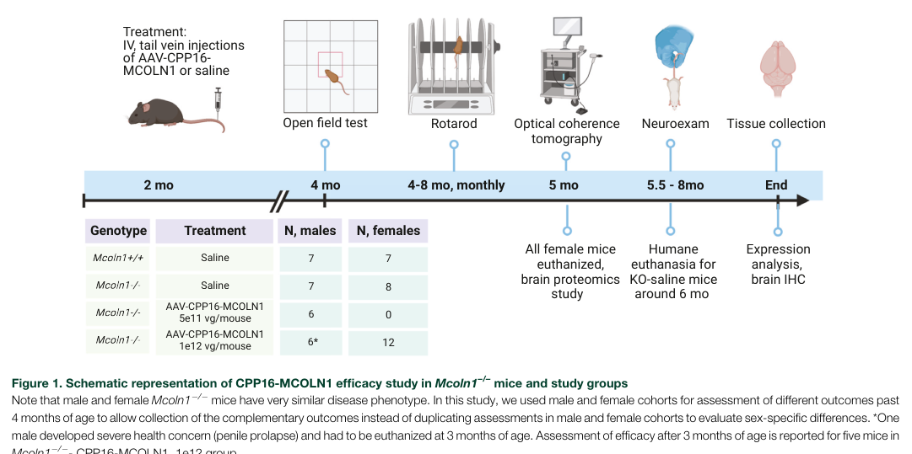

## Question

# Disease Characteristics Research Template

## Target Disease
- **Disease Name:** Mucolipidosis Type IV
- **MONDO ID:**  (if available)
- **Category:** Mendelian

## Research Objectives

Please provide a comprehensive research report on **Mucolipidosis Type IV** covering all of the
disease characteristics listed below. This report will be used to populate a disease knowledge
base entry. Be thorough and cite primary literature (PMID preferred) for all claims.

For each section, **suggested databases/resources** are listed. These are the first places
you should search for information on each topic.

---

### 1. Disease Information
> **Search first:** OMIM, Orphanet, ICD-10/ICD-11, MeSH, PubMed

- What is the disease? Provide a concise overview.
- What are the key identifiers? (OMIM, Orphanet, ICD-10/ICD-11, MeSH, Mondo)
- What are the common synonyms and alternative names?
- Is the information derived from individual patients (e.g., EHR) or aggregated disease-level resources?

### 2. Etiology

- **Disease Causal Factors**: What are the primary causes? (genetic, environmental, infectious, mechanistic)
- **Risk Factors**:
  > **Search first:** PubMed, Cochrane Library, UpToDate, clinical guidelines, ClinVar, ClinGen, GWAS Catalog, PheGenI, CTD, CDC, WHO, epidemiological databases
  - Genetic risk factors (causal variants, susceptibility loci, modifier genes)
  - Environmental risk factors (toxins, lifestyle, occupational exposures, age, sex, family history)
- **Protective Factors**:
  > **Search first:** PubMed, Cochrane Library, clinical trial databases, GWAS Catalog, gnomAD, WHO, CDC, nutrition databases
  - Genetic protective factors (protective variants, modifier alleles)
  - Environmental protective factors (diet, lifestyle, exposures that reduce risk)
- **Gene-Environment Interactions**: How do genetic and environmental factors interact to influence disease?
  > **Search first:** CTD, PubMed, PheGenI, GxE databases

### 3. Phenotypes
> **Search first:** HPO (Human Phenotype Ontology), OMIM, Orphanet, PubMed, clinicaltrials.gov, MedDRA, SNOMED CT, DECIPHER, LOINC

For each phenotype, provide:
- **Phenotype type**: symptoms, clinical signs, physical manifestations, behavioral changes, or laboratory abnormalities
  > For symptoms/signs: HPO, OMIM, Orphanet, PubMed
  > For behavioral changes: HPO, DSM, RDoC (Research Domain Criteria), PubMed
  > For laboratory abnormalities: LOINC, SNOMED CT, LabTests Online, PubMed
- **Phenotype characteristics**:
  > **Search first:** OMIM, Orphanet, HPO, PubMed
  - Age of symptom onset (neonatal, childhood, adult-onset, late-onset)
  - Symptom severity (mild, moderate, severe, variable)
  - Symptom progression (stable, progressive, episodic, fluctuating)
  - Frequency among affected individuals (percentage or qualitative)
- **Quality of life impact**: Effects on daily functioning and well-being (per-phenotype when possible)
  > **Search first:** EQ-5D database, SF-36, WHO QOL databases, PubMed
- Suggest HPO (Human Phenotype Ontology) terms for each phenotype

### 4. Genetic/Molecular Information

- **Causal Genes**: Gene mutations or chromosomal abnormalities responsible for disease (gene symbols, OMIM IDs)
  > **Search first:** OMIM, ClinVar, HGMD, Ensembl, NCBI Gene
- **Pathogenic Variants**:
  - Affected genes (gene symbols, HGNC IDs)
    > **Search first:** OMIM, NCBI Gene, Ensembl, HGNC, UniProt, GeneCards
  - Variant classification (pathogenic, likely pathogenic, VUS per ACMG/AMP guidelines)
    > **Search first:** ClinVar, ClinGen, ACMG/AMP guidelines, VarSome
  - Variant type/class (missense, frameshift, nonsense, splice-site, structural)
  - Allele frequency in population databases
    > **Search first:** gnomAD, 1000 Genomes, ExAC, TOPMed, dbSNP
  - Somatic vs germline origin
    > **Search first:** COSMIC (somatic), ClinVar, ICGC, TCGA
  - Functional consequences (loss of function, gain of function, dominant negative)
- **Modifier Genes**: Genes that modify disease severity or expression
- **Epigenetic Information**: DNA methylation, histone modifications, chromatin changes affecting disease
  > **Search first:** ENCODE, Roadmap Epigenomics, MethBase, DiseaseMeth
- **Chromosomal Abnormalities**: Large-scale genetic changes (aneuploidy, translocations, inversions)
  > **Search first:** DECIPHER, ClinVar, ECARUCA, UCSC Genome Browser

### 5. Environmental Information

- **Environmental Factors**: Non-genetic contributing factors (toxins, radiation, pollution, occupational exposure)
  > **Search first:** CTD (Comparative Toxicogenomics Database), TOXNET, PubMed, EPA databases
- **Lifestyle Factors**: Behavioral factors (smoking, diet, exercise, alcohol consumption)
  > **Search first:** CDC databases, WHO, PubMed, NHANES
- **Infectious Agents**: If applicable, pathogens causing or triggering disease (bacteria, viruses, fungi, parasites)
  > **Search first:** NCBI Taxonomy, ViPR, BV-BRC, MicrobeDB, GIDEON

### 6. Mechanism / Pathophysiology

- **Molecular Pathways**: Specific signaling cascades or biochemical pathways involved (Wnt, MAPK, mTOR, PI3K-AKT, etc.)
  > **Search first:** KEGG, Reactome, WikiPathways, PathBank, BioCyc
- **Cellular Processes**: Cell-level mechanisms (apoptosis, autophagy, cell cycle dysregulation, inflammation, etc.)
  > **Search first:** Gene Ontology (GO), Reactome, KEGG, PubMed
- **Protein Dysfunction**: How protein structure or function is altered (misfolding, aggregation, loss of function, gain of function)
  > **Search first:** UniProt, PDB (Protein Data Bank), InterPro, Pfam, AlphaFold
- **Metabolic Changes**: Alterations in metabolic processes (energy metabolism, lipid metabolism, amino acid metabolism)
  > **Search first:** KEGG, BioCyc, HMDB (Human Metabolome Database), BRENDA
- **Immune System Involvement**: Role of immune response (autoimmunity, immunodeficiency, chronic inflammation)
  > **Search first:** ImmPort, Immunome Database, IEDB, Gene Ontology
- **Tissue Damage Mechanisms**: How tissues/ are injured (oxidative stress, ischemia, fibrosis, necrosis)
  > **Search first:** PubMed, Gene Ontology, Reactome
- **Biochemical Abnormalities**: Specific molecular defects (enzyme deficiencies, receptor dysfunction, ion channel defects)
  > **Search first:** BRENDA, UniProt, KEGG, OMIM, PubMed
- **Epigenetic Changes**: DNA methylation, histone modifications affecting gene expression in disease
  > **Search first:** ENCODE, Roadmap Epigenomics, MethBase, DiseaseMeth
- **Molecular Profiling** (if available):
  - Transcriptomics/gene expression changes
    > **Search first:** GEO (Gene Expression Omnibus), ArrayExpress, GTEx, Human Cell Atlas, SRA
  - Proteomics findings
    > **Search first:** PRIDE, ProteomeXchange, Human Protein Atlas, STRING, BioGRID
  - Metabolomics signatures
    > **Search first:** MetaboLights, Metabolomics Workbench, HMDB, METLIN
  - Lipidomics alterations
    > **Search first:** LIPID MAPS, SwissLipids, LipidHome, Metabolomics Workbench
  - Genomic structural features
    > **Search first:** UCSC Genome Browser, Ensembl, NCBI, dbVar, DGV
- **Advanced Technologies** (if applicable):
  - Single-cell analysis findings (cell-type specific mechanisms, cellular heterogeneity)
    > **Search first:** Human Cell Atlas, Single Cell Portal, GEO, CELLxGENE
  - Spatial transcriptomics findings
    > **Search first:** GEO, Spatial Research, Vizgen, 10x Genomics data
  - Multi-omics integration results
    > **Search first:** TCGA, ICGC, cBioPortal, LinkedOmics, PubMed
  - Functional genomics screens (CRISPR, RNAi)
    > **Search first:** DepMap, GenomeRNAi, PubMed, BioGRID ORCS

For each mechanism, describe:
- The causal chain from initial trigger to clinical manifestation
- Which mechanisms are upstream vs downstream
- What cell types and biological processes are involved
- Suggest GO terms for biological processes and CL terms for cell types

### 7. Anatomical Structures Affected

- **Organ Level**:
  - Primary organs directly affected
  - Secondary organ involvement (complications, secondary effects)
  - Body systems involved (cardiovascular, nervous, digestive, respiratory, endocrine, etc.)
  > **Search first:** Uberon, FMA (Foundational Model of Anatomy), OMIM, HPO, ICD-11, MeSH, SNOMED CT
- **Tissue and Cell Level**:
  - Specific tissue types affected (epithelial, connective, muscle, nervous)
  - Specific cell populations targeted (with Cell Ontology terms)
  > **Search first:** Uberon, Human Protein Atlas, Cell Ontology, Human Cell Atlas, CellMarker, PanglaoDB
- **Subcellular Level**:
  - Cellular compartments involved (mitochondria, nucleus, ER, lysosomes) (with GO Cellular Component terms)
  > **Search first:** Gene Ontology (Cellular Component), UniProt, Human Protein Atlas
- **Localization**:
  - Specific anatomical sites (with UBERON terms)
    > **Search first:** FMA, Uberon, NeuroNames (for brain), SNOMED CT
  - Lateralization (unilateral, bilateral, asymmetric)
    > **Search first:** HPO, clinical literature, imaging databases

### 8. Temporal Development

- **Onset**:
  - Typical age of onset (congenital, pediatric, adult, geriatric)
  - Onset pattern (acute, subacute, chronic, insidious)
  > **Search first:** OMIM, Orphanet, HPO, PubMed
- **Progression**:
  - Disease stages (early, intermediate, advanced, end-stage)
    > **Search first:** Cancer Staging Manual (AJCC), WHO classifications, PubMed
  - Progression rate (rapid, slow, variable)
  - Disease course pattern (episodic, relapsing-remitting, progressive, stable)
  - Disease duration (self-limited, chronic lifelong)
  > **Search first:** Disease registries, longitudinal cohort databases, natural history studies, PubMed, Orphanet, OMIM
- **Patterns**:
  - Remission patterns (spontaneous, treatment-induced)
    > **Search first:** Clinical trial databases, disease registries, PubMed
  - Critical periods (time windows of vulnerability or opportunity for intervention)
    > **Search first:** PubMed, developmental biology databases, clinical guidelines

### 9. Inheritance and Population

- **Epidemiology**:
  - Prevalence (cases per 100,000 at given time)
  - Incidence (new cases per 100,000 per year)
  > **Search first:** Orphanet, CDC, WHO, GBD (Global Burden of Disease), national registries, SEER, disease registries
- **For Genetic Etiology**:
  - Inheritance pattern (AD, AR, X-linked, mitochondrial, multifactorial, polygenic)
    > **Search first:** OMIM, Orphanet, ClinVar, GTR (Genetic Testing Registry)
  - Penetrance (complete, incomplete, age-dependent)
    > **Search first:** ClinVar, OMIM, PubMed, ClinGen
  - Expressivity (variable, consistent)
    > **Search first:** OMIM, ClinVar, PubMed
  - Genetic anticipation (increasing severity in successive generations)
    > **Search first:** OMIM, PubMed (especially for repeat expansion disorders)
  - Germline mosaicism
    > **Search first:** ClinVar, OMIM, genetic counseling literature, PubMed
  - Founder effects (population-specific mutations)
    > **Search first:** gnomAD, population genetics databases, PubMed
  - Consanguinity role
    > **Search first:** OMIM, population studies, genetic counseling resources
  - Carrier frequency
    > **Search first:** gnomAD, carrier screening databases, GeneReviews, GTR
- **Population Demographics**:
  - Affected populations (ethnic or demographic groups with higher prevalence)
    > **Search first:** gnomAD, 1000 Genomes, PAGE Study, PubMed, population registries
  - Geographic distribution (endemic areas, regional variation)
    > **Search first:** WHO, CDC, GBD, Orphanet, geographic epidemiology databases
  - Geographic distribution of specific variants
  - Sex ratio (male:female)
    > **Search first:** Disease registries, OMIM, PubMed, epidemiological databases
  - Age distribution of affected individuals
    > **Search first:** CDC, disease registries, SEER, Orphanet

### 10. Diagnostics

- **Clinical Tests**:
  - Laboratory tests (blood, urine, tissue chemistry, specific enzyme assays)
    > **Search first:** LOINC, LabTests Online, PubMed
  - Biomarkers (proteins, metabolites, genetic markers, circulating biomarkers)
    > **Search first:** FDA Biomarker List, BEST (Biomarkers, EndpointS, and other Tools), PubMed
  - Imaging studies (X-ray, CT, MRI, PET, ultrasound)
    > **Search first:** RadLex, DICOM, Radiopaedia, imaging databases
  - Functional tests (pulmonary function, cardiac stress tests)
    > **Search first:** LOINC, clinical guidelines, PubMed
  - Electrophysiology (EEG, EMG, ECG, nerve conduction studies)
    > **Search first:** LOINC, clinical neurophysiology databases, PubMed
  - Biopsy findings (histopathology, immunohistochemistry)
    > **Search first:** SNOMED CT, College of American Pathologists resources, PubMed
  - Pathology findings (microscopic examination)
    > **Search first:** SNOMED CT, Digital Pathology databases, PubMed
- **Genetic Testing**:
  > **Search first:** GTR (Genetic Testing Registry), GeneReviews, ClinGen
  - Overview of recommended genetic testing approach
  - Whole genome sequencing (WGS) utility
    > **Search first:** GTR, ClinVar, GEL (Genomics England), gnomAD
  - Whole exome sequencing (WES) utility
    > **Search first:** GTR, ClinVar, OMIM, GeneMatcher
  - Gene panels (which panels, which genes)
    > **Search first:** GTR, ClinVar, laboratory-specific databases
  - Single gene testing
    > **Search first:** GTR, ClinVar, OMIM, GeneReviews
  - Chromosomal microarray (CMA)
    > **Search first:** DECIPHER, ClinVar, dbVar, ECARUCA
  - Karyotyping
    > **Search first:** Chromosome Abnormality Database, ClinVar, cytogenetics resources
  - FISH
    > **Search first:** ClinVar, cytogenetics databases, PubMed
  - Mitochondrial DNA testing
    > **Search first:** MITOMAP, MSeqDR, ClinVar, GTR
  - Repeat expansion testing
    > **Search first:** GTR, ClinVar, repeat expansion databases, PubMed
- **Omics-Based Diagnostics** (if applicable):
  - RNA sequencing / transcriptomics
    > **Search first:** GEO, ArrayExpress, GTEx, RNA-seq databases
  - Proteomics
    > **Search first:** PRIDE, ProteomeXchange, FDA Biomarker database
  - Metabolomics
    > **Search first:** MetaboLights, Metabolomics Workbench, HMDB
  - Epigenomics
    > **Search first:** GEO, ENCODE, Roadmap Epigenomics, MethBase
  - Liquid biopsy
    > **Search first:** COSMIC, ClinVar, liquid biopsy databases, PubMed
- **Clinical Criteria**:
  - Standardized diagnostic criteria (DSM, ICD, society guidelines)
    > **Search first:** DSM-5, ICD-11, clinical society guidelines, UpToDate
  - Differential diagnosis (other conditions to rule out, with distinguishing features)
    > **Search first:** DynaMed, UpToDate, clinical decision support systems
- **Screening**:
  - Screening methods for asymptomatic individuals (newborn screening, carrier screening, cascade screening)
    > **Search first:** ACMG recommendations, CDC newborn screening, GTR

### 11. Outcome/Prognosis

- **Survival and Mortality**:
  - Survival rate (5-year, 10-year, overall)
    > **Search first:** SEER, cancer registries, disease-specific registries, PubMed
  - Life expectancy (with and without treatment if applicable)
    > **Search first:** Orphanet, disease registries, actuarial databases, PubMed
  - Mortality rate
    > **Search first:** CDC, WHO, GBD, national mortality databases
  - Disease-specific mortality (deaths directly attributable to disease)
    > **Search first:** Disease registries, CDC Wonder, GBD, PubMed
- **Morbidity and Function**:
  - Morbidity (disease-related disability and health impacts)
    > **Search first:** GBD, WHO, disability databases, PubMed
  - Disability outcomes (long-term functional impairments)
    > **Search first:** ICF (International Classification of Functioning), disability registries
  - Quality of life measures (EQ-5D, SF-36, PROMIS, disease-specific tools)
    > **Search first:** EQ-5D database, SF-36, PROMIS, PubMed
- **Disease Course**:
  - Complications (secondary problems: infections, organ failure, etc.)
    > **Search first:** ICD codes, disease registries, clinical databases, PubMed
  - Recovery potential (likelihood and extent of recovery, with vs without treatment)
    > **Search first:** Natural history studies, rehabilitation databases, PubMed
- **Prediction**:
  - Prognostic factors (age, disease severity, biomarkers, treatment response)
    > **Search first:** Prognostic models databases, clinical calculators, PubMed
  - Prognostic biomarkers (molecular markers predicting disease course)
    > **Search first:** FDA Biomarker database, PubMed, cancer prognostic databases

### 12. Treatment

- **Pharmacotherapy**:
  - Pharmacological treatments (drug names, drug classes, mechanisms of action)
    > **Search first:** DrugBank, RxNorm, ATC classification, DailyMed, FDA databases
  - Pharmacogenomics (how genetic variants affect drug metabolism, efficacy, toxicity)
    > **Search first:** PharmGKB, CPIC (Clinical Pharmacogenetics), FDA Table of PGx Biomarkers
- **Advanced Therapeutics**:
  - Gene therapy (viral vectors, CRISPR, gene replacement, gene editing)
    > **Search first:** ClinicalTrials.gov, FDA gene therapy database, ASGCT resources
  - Cell therapy (stem cell transplant, CAR-T, cellular therapeutics)
    > **Search first:** ClinicalTrials.gov, FDA cell therapy database, FACT standards
  - RNA-based therapies (ASOs, siRNA, mRNA therapies)
    > **Search first:** ClinicalTrials.gov, FDA approvals, PubMed
  - Targeted therapies (treatments directed at specific molecular targets)
    > **Search first:** My Cancer Genome, OncoKB, ClinicalTrials.gov, FDA approvals
  - Immunotherapies (checkpoint inhibitors, monoclonal antibodies)
    > **Search first:** Cancer Immunotherapy Database, FDA approvals, ClinicalTrials.gov
- **Surgical and Interventional**:
  - Surgical interventions (types of surgery, timing, outcomes)
    > **Search first:** CPT codes, surgical registries, clinical guidelines, PubMed
- **Supportive and Rehabilitative**:
  - Supportive care (symptom management, pain control, nutrition)
    > **Search first:** Clinical guidelines, Cochrane Library, PubMed
  - Rehabilitation (physical therapy, occupational therapy, speech therapy)
    > **Search first:** Rehabilitation medicine databases, clinical guidelines, PubMed
- **Experimental**:
  - Experimental treatments in clinical trials (with NCT identifiers if available)
    > **Search first:** ClinicalTrials.gov, EU Clinical Trials Register, WHO ICTRP
- **Treatment Outcomes**:
  - Treatment response rates
    > **Search first:** Clinical trial databases, FDA reviews, systematic reviews, PubMed
  - Side effects and adverse events
    > **Search first:** FDA Adverse Event Reporting System (FAERS), MedWatch, PubMed
- **Treatment Strategy**:
  - Treatment algorithms (clinical pathways, decision trees)
    > **Search first:** Clinical practice guidelines, NCCN Guidelines, UpToDate
  - Combination therapies
    > **Search first:** ClinicalTrials.gov, treatment guidelines, PubMed
  - Personalized medicine approaches (genotype-guided treatment)
    > **Search first:** My Cancer Genome, CIViC, PharmGKB, precision medicine databases

For each treatment, suggest MAXO (Medical Action Ontology) terms where applicable.

### 13. Prevention

- **Prevention Levels**:
  - Primary prevention (preventing disease occurrence: vaccination, risk factor modification)
    > **Search first:** CDC, WHO, USPSTF recommendations, Cochrane Library
  - Secondary prevention (early detection and treatment: screening programs, early intervention)
    > **Search first:** USPSTF, CDC screening guidelines, WHO
  - Tertiary prevention (preventing complications in those with disease)
    > **Search first:** Clinical guidelines, disease management protocols, PubMed
- **Immunization**: Vaccine strategies (if applicable)
  > **Search first:** CDC vaccine schedules, WHO immunization, FDA vaccine database
- **Screening and Early Detection**:
  - Screening programs (population-based: newborn screening, cancer screening)
    > **Search first:** CDC screening programs, USPSTF, cancer screening databases
  - Genetic screening (carrier screening, preimplantation genetic diagnosis, prenatal testing)
    > **Search first:** ACMG recommendations, ACOG guidelines, GTR
  - Risk stratification (identifying high-risk individuals for targeted prevention)
    > **Search first:** Risk prediction models, clinical calculators, PubMed
- **Behavioral Interventions**: Lifestyle modifications to reduce risk
  > **Search first:** CDC, WHO, behavioral intervention databases, Cochrane Library
- **Counseling**: Genetic counseling (risk assessment, family planning guidance)
  > **Search first:** NSGC resources, ACMG guidelines, GeneReviews
- **Public Health**:
  - Public health interventions (sanitation, vector control, health education)
    > **Search first:** CDC, WHO, public health databases, PubMed
  - Environmental interventions (reducing environmental risk factors)
    > **Search first:** EPA databases, WHO environmental health, PubMed
- **Prophylaxis**: Preventive medications or procedures
  > **Search first:** Clinical guidelines, FDA approvals, PubMed

### 14. Other Species / Natural Disease

- **Taxonomy**: Species affected (with NCBI Taxon identifiers)
  > **Search first:** NCBI Taxonomy
- **Breed**: Specific breeds affected (with VBO identifiers if applicable)
  > **Search first:** VBO (Vertebrate Breed Ontology)
- **Gene**: Orthologous genes in other species (with NCBI Gene IDs)
  > **Search first:** NCBI Gene
- **Natural Disease**:
  - Naturally occurring disease in other species (companion animals, wildlife)
    > **Search first:** OMIA (Online Mendelian Inheritance in Animals), VetCompass, PubMed
  - Veterinary relevance and importance in animal health
    > **Search first:** OMIA, veterinary databases, PubMed
- **Comparative Biology**:
  - Comparative pathology (similarities and differences across species)
    > **Search first:** OMIA, comparative pathology databases, PubMed
  - Evolutionary conservation of disease mechanisms
    > **Search first:** HomoloGene, OrthoMCL, Alliance of Genome Resources
- **Transmission** (if applicable):
  - Zoonotic potential
    > **Search first:** CDC zoonotic diseases, WHO zoonoses, GIDEON
  - Cross-species susceptibility
    > **Search first:** NCBI Taxonomy, veterinary databases, PubMed

### 15. Model Organisms

- **Model Types**:
  - Model organism type (mammalian, invertebrate, cellular, in vitro)
    > **Search first:** Alliance of Genome Resources, model organism databases
  - Specific model systems (mouse, rat, zebrafish, Drosophila, C. elegans, yeast, cell lines, organoids, iPSCs)
    > **Search first:** MGI, RGD, ZFIN, FlyBase, WormBase, SGD, ATCC, Cellosaurus
  - Induced models (drug treatment, surgical intervention, environmental manipulation)
    > **Search first:** MGI, model organism databases, PubMed
- **Genetic Models**:
  - Types available (knockout, knock-in, transgenic, conditional, humanized)
    > **Search first:** MGI, IMPC, KOMP, EuMMCR, IMSR
- **Model Characteristics**:
  - Phenotype recapitulation (how well model reproduces human disease features)
    > **Search first:** Model organism databases, comparative studies, PubMed
  - Model limitations (aspects of human disease not captured)
    > **Search first:** Model organism databases, PubMed, review articles
- **Applications**:
  - Research applications (what aspects of disease can be studied)
    > **Search first:** Model organism databases, PubMed
- **Resources**:
  - Model databases
    > **Search first:** MGI, RGD, ZFIN, FlyBase, WormBase, IMSR, EMMA, MMRRC

---

## Citation Requirements

- Cite primary literature (PMID preferred) for all mechanistic and clinical claims
- Prioritize recent reviews and landmark papers
- Include direct quotes from abstracts where possible to support key statements
- Distinguish evidence source types: human clinical, model organism, in vitro, computational

## Output Format

Structure your response as a comprehensive narrative organized by the sections above.
For each section, provide:
- Factual content with specific details (numbers, percentages, gene names, variant nomenclature)
- Ontology term suggestions (HPO, GO, CL, UBERON, CHEBI, MAXO, MONDO) where applicable
- Evidence citations with PMIDs
- Direct quotes from abstracts to support key claims
- Clear indication when information is not available or not applicable for this disease

This report will be used to populate a disease knowledge base entry with:
- Pathophysiology descriptions with causal chains
- Gene/protein annotations (HGNC, GO terms)
- Phenotype associations (HP terms) with frequencies
- Cell type involvement (CL terms)
- Anatomical locations (UBERON terms)
- Chemical entities (CHEBI terms)
- Treatment annotations (MAXO terms)
- Evidence items with PMIDs and exact abstract quotes
- Epidemiology, prognosis, diagnostic, and prevention information
- Animal model descriptions with phenotype recapitulation details

## Output

Question: You are an expert researcher providing comprehensive, well-cited information.

Provide detailed information focusing on:
1. Key concepts and definitions with current understanding
2. Recent developments and latest research (prioritize 2023-2024 sources)
3. Current applications and real-world implementations
4. Expert opinions and analysis from authoritative sources
5. Relevant statistics and data from recent studies

Format as a comprehensive research report with proper citations. Include URLs and publication dates where available.
Always prioritize recent, authoritative sources and provide specific citations for all major claims.

# Disease Characteristics Research Template

## Target Disease
- **Disease Name:** Mucolipidosis Type IV
- **MONDO ID:**  (if available)
- **Category:** Mendelian

## Research Objectives

Please provide a comprehensive research report on **Mucolipidosis Type IV** covering all of the
disease characteristics listed below. This report will be used to populate a disease knowledge
base entry. Be thorough and cite primary literature (PMID preferred) for all claims.

For each section, **suggested databases/resources** are listed. These are the first places
you should search for information on each topic.

---

### 1. Disease Information
> **Search first:** OMIM, Orphanet, ICD-10/ICD-11, MeSH, PubMed

- What is the disease? Provide a concise overview.
- What are the key identifiers? (OMIM, Orphanet, ICD-10/ICD-11, MeSH, Mondo)
- What are the common synonyms and alternative names?
- Is the information derived from individual patients (e.g., EHR) or aggregated disease-level resources?

### 2. Etiology

- **Disease Causal Factors**: What are the primary causes? (genetic, environmental, infectious, mechanistic)
- **Risk Factors**:
  > **Search first:** PubMed, Cochrane Library, UpToDate, clinical guidelines, ClinVar, ClinGen, GWAS Catalog, PheGenI, CTD, CDC, WHO, epidemiological databases
  - Genetic risk factors (causal variants, susceptibility loci, modifier genes)
  - Environmental risk factors (toxins, lifestyle, occupational exposures, age, sex, family history)
- **Protective Factors**:
  > **Search first:** PubMed, Cochrane Library, clinical trial databases, GWAS Catalog, gnomAD, WHO, CDC, nutrition databases
  - Genetic protective factors (protective variants, modifier alleles)
  - Environmental protective factors (diet, lifestyle, exposures that reduce risk)
- **Gene-Environment Interactions**: How do genetic and environmental factors interact to influence disease?
  > **Search first:** CTD, PubMed, PheGenI, GxE databases

### 3. Phenotypes
> **Search first:** HPO (Human Phenotype Ontology), OMIM, Orphanet, PubMed, clinicaltrials.gov, MedDRA, SNOMED CT, DECIPHER, LOINC

For each phenotype, provide:
- **Phenotype type**: symptoms, clinical signs, physical manifestations, behavioral changes, or laboratory abnormalities
  > For symptoms/signs: HPO, OMIM, Orphanet, PubMed
  > For behavioral changes: HPO, DSM, RDoC (Research Domain Criteria), PubMed
  > For laboratory abnormalities: LOINC, SNOMED CT, LabTests Online, PubMed
- **Phenotype characteristics**:
  > **Search first:** OMIM, Orphanet, HPO, PubMed
  - Age of symptom onset (neonatal, childhood, adult-onset, late-onset)
  - Symptom severity (mild, moderate, severe, variable)
  - Symptom progression (stable, progressive, episodic, fluctuating)
  - Frequency among affected individuals (percentage or qualitative)
- **Quality of life impact**: Effects on daily functioning and well-being (per-phenotype when possible)
  > **Search first:** EQ-5D database, SF-36, WHO QOL databases, PubMed
- Suggest HPO (Human Phenotype Ontology) terms for each phenotype

### 4. Genetic/Molecular Information

- **Causal Genes**: Gene mutations or chromosomal abnormalities responsible for disease (gene symbols, OMIM IDs)
  > **Search first:** OMIM, ClinVar, HGMD, Ensembl, NCBI Gene
- **Pathogenic Variants**:
  - Affected genes (gene symbols, HGNC IDs)
    > **Search first:** OMIM, NCBI Gene, Ensembl, HGNC, UniProt, GeneCards
  - Variant classification (pathogenic, likely pathogenic, VUS per ACMG/AMP guidelines)
    > **Search first:** ClinVar, ClinGen, ACMG/AMP guidelines, VarSome
  - Variant type/class (missense, frameshift, nonsense, splice-site, structural)
  - Allele frequency in population databases
    > **Search first:** gnomAD, 1000 Genomes, ExAC, TOPMed, dbSNP
  - Somatic vs germline origin
    > **Search first:** COSMIC (somatic), ClinVar, ICGC, TCGA
  - Functional consequences (loss of function, gain of function, dominant negative)
- **Modifier Genes**: Genes that modify disease severity or expression
- **Epigenetic Information**: DNA methylation, histone modifications, chromatin changes affecting disease
  > **Search first:** ENCODE, Roadmap Epigenomics, MethBase, DiseaseMeth
- **Chromosomal Abnormalities**: Large-scale genetic changes (aneuploidy, translocations, inversions)
  > **Search first:** DECIPHER, ClinVar, ECARUCA, UCSC Genome Browser

### 5. Environmental Information

- **Environmental Factors**: Non-genetic contributing factors (toxins, radiation, pollution, occupational exposure)
  > **Search first:** CTD (Comparative Toxicogenomics Database), TOXNET, PubMed, EPA databases
- **Lifestyle Factors**: Behavioral factors (smoking, diet, exercise, alcohol consumption)
  > **Search first:** CDC databases, WHO, PubMed, NHANES
- **Infectious Agents**: If applicable, pathogens causing or triggering disease (bacteria, viruses, fungi, parasites)
  > **Search first:** NCBI Taxonomy, ViPR, BV-BRC, MicrobeDB, GIDEON

### 6. Mechanism / Pathophysiology

- **Molecular Pathways**: Specific signaling cascades or biochemical pathways involved (Wnt, MAPK, mTOR, PI3K-AKT, etc.)
  > **Search first:** KEGG, Reactome, WikiPathways, PathBank, BioCyc
- **Cellular Processes**: Cell-level mechanisms (apoptosis, autophagy, cell cycle dysregulation, inflammation, etc.)
  > **Search first:** Gene Ontology (GO), Reactome, KEGG, PubMed
- **Protein Dysfunction**: How protein structure or function is altered (misfolding, aggregation, loss of function, gain of function)
  > **Search first:** UniProt, PDB (Protein Data Bank), InterPro, Pfam, AlphaFold
- **Metabolic Changes**: Alterations in metabolic processes (energy metabolism, lipid metabolism, amino acid metabolism)
  > **Search first:** KEGG, BioCyc, HMDB (Human Metabolome Database), BRENDA
- **Immune System Involvement**: Role of immune response (autoimmunity, immunodeficiency, chronic inflammation)
  > **Search first:** ImmPort, Immunome Database, IEDB, Gene Ontology
- **Tissue Damage Mechanisms**: How tissues/ are injured (oxidative stress, ischemia, fibrosis, necrosis)
  > **Search first:** PubMed, Gene Ontology, Reactome
- **Biochemical Abnormalities**: Specific molecular defects (enzyme deficiencies, receptor dysfunction, ion channel defects)
  > **Search first:** BRENDA, UniProt, KEGG, OMIM, PubMed
- **Epigenetic Changes**: DNA methylation, histone modifications affecting gene expression in disease
  > **Search first:** ENCODE, Roadmap Epigenomics, MethBase, DiseaseMeth
- **Molecular Profiling** (if available):
  - Transcriptomics/gene expression changes
    > **Search first:** GEO (Gene Expression Omnibus), ArrayExpress, GTEx, Human Cell Atlas, SRA
  - Proteomics findings
    > **Search first:** PRIDE, ProteomeXchange, Human Protein Atlas, STRING, BioGRID
  - Metabolomics signatures
    > **Search first:** MetaboLights, Metabolomics Workbench, HMDB, METLIN
  - Lipidomics alterations
    > **Search first:** LIPID MAPS, SwissLipids, LipidHome, Metabolomics Workbench
  - Genomic structural features
    > **Search first:** UCSC Genome Browser, Ensembl, NCBI, dbVar, DGV
- **Advanced Technologies** (if applicable):
  - Single-cell analysis findings (cell-type specific mechanisms, cellular heterogeneity)
    > **Search first:** Human Cell Atlas, Single Cell Portal, GEO, CELLxGENE
  - Spatial transcriptomics findings
    > **Search first:** GEO, Spatial Research, Vizgen, 10x Genomics data
  - Multi-omics integration results
    > **Search first:** TCGA, ICGC, cBioPortal, LinkedOmics, PubMed
  - Functional genomics screens (CRISPR, RNAi)
    > **Search first:** DepMap, GenomeRNAi, PubMed, BioGRID ORCS

For each mechanism, describe:
- The causal chain from initial trigger to clinical manifestation
- Which mechanisms are upstream vs downstream
- What cell types and biological processes are involved
- Suggest GO terms for biological processes and CL terms for cell types

### 7. Anatomical Structures Affected

- **Organ Level**:
  - Primary organs directly affected
  - Secondary organ involvement (complications, secondary effects)
  - Body systems involved (cardiovascular, nervous, digestive, respiratory, endocrine, etc.)
  > **Search first:** Uberon, FMA (Foundational Model of Anatomy), OMIM, HPO, ICD-11, MeSH, SNOMED CT
- **Tissue and Cell Level**:
  - Specific tissue types affected (epithelial, connective, muscle, nervous)
  - Specific cell populations targeted (with Cell Ontology terms)
  > **Search first:** Uberon, Human Protein Atlas, Cell Ontology, Human Cell Atlas, CellMarker, PanglaoDB
- **Subcellular Level**:
  - Cellular compartments involved (mitochondria, nucleus, ER, lysosomes) (with GO Cellular Component terms)
  > **Search first:** Gene Ontology (Cellular Component), UniProt, Human Protein Atlas
- **Localization**:
  - Specific anatomical sites (with UBERON terms)
    > **Search first:** FMA, Uberon, NeuroNames (for brain), SNOMED CT
  - Lateralization (unilateral, bilateral, asymmetric)
    > **Search first:** HPO, clinical literature, imaging databases

### 8. Temporal Development

- **Onset**:
  - Typical age of onset (congenital, pediatric, adult, geriatric)
  - Onset pattern (acute, subacute, chronic, insidious)
  > **Search first:** OMIM, Orphanet, HPO, PubMed
- **Progression**:
  - Disease stages (early, intermediate, advanced, end-stage)
    > **Search first:** Cancer Staging Manual (AJCC), WHO classifications, PubMed
  - Progression rate (rapid, slow, variable)
  - Disease course pattern (episodic, relapsing-remitting, progressive, stable)
  - Disease duration (self-limited, chronic lifelong)
  > **Search first:** Disease registries, longitudinal cohort databases, natural history studies, PubMed, Orphanet, OMIM
- **Patterns**:
  - Remission patterns (spontaneous, treatment-induced)
    > **Search first:** Clinical trial databases, disease registries, PubMed
  - Critical periods (time windows of vulnerability or opportunity for intervention)
    > **Search first:** PubMed, developmental biology databases, clinical guidelines

### 9. Inheritance and Population

- **Epidemiology**:
  - Prevalence (cases per 100,000 at given time)
  - Incidence (new cases per 100,000 per year)
  > **Search first:** Orphanet, CDC, WHO, GBD (Global Burden of Disease), national registries, SEER, disease registries
- **For Genetic Etiology**:
  - Inheritance pattern (AD, AR, X-linked, mitochondrial, multifactorial, polygenic)
    > **Search first:** OMIM, Orphanet, ClinVar, GTR (Genetic Testing Registry)
  - Penetrance (complete, incomplete, age-dependent)
    > **Search first:** ClinVar, OMIM, PubMed, ClinGen
  - Expressivity (variable, consistent)
    > **Search first:** OMIM, ClinVar, PubMed
  - Genetic anticipation (increasing severity in successive generations)
    > **Search first:** OMIM, PubMed (especially for repeat expansion disorders)
  - Germline mosaicism
    > **Search first:** ClinVar, OMIM, genetic counseling literature, PubMed
  - Founder effects (population-specific mutations)
    > **Search first:** gnomAD, population genetics databases, PubMed
  - Consanguinity role
    > **Search first:** OMIM, population studies, genetic counseling resources
  - Carrier frequency
    > **Search first:** gnomAD, carrier screening databases, GeneReviews, GTR
- **Population Demographics**:
  - Affected populations (ethnic or demographic groups with higher prevalence)
    > **Search first:** gnomAD, 1000 Genomes, PAGE Study, PubMed, population registries
  - Geographic distribution (endemic areas, regional variation)
    > **Search first:** WHO, CDC, GBD, Orphanet, geographic epidemiology databases
  - Geographic distribution of specific variants
  - Sex ratio (male:female)
    > **Search first:** Disease registries, OMIM, PubMed, epidemiological databases
  - Age distribution of affected individuals
    > **Search first:** CDC, disease registries, SEER, Orphanet

### 10. Diagnostics

- **Clinical Tests**:
  - Laboratory tests (blood, urine, tissue chemistry, specific enzyme assays)
    > **Search first:** LOINC, LabTests Online, PubMed
  - Biomarkers (proteins, metabolites, genetic markers, circulating biomarkers)
    > **Search first:** FDA Biomarker List, BEST (Biomarkers, EndpointS, and other Tools), PubMed
  - Imaging studies (X-ray, CT, MRI, PET, ultrasound)
    > **Search first:** RadLex, DICOM, Radiopaedia, imaging databases
  - Functional tests (pulmonary function, cardiac stress tests)
    > **Search first:** LOINC, clinical guidelines, PubMed
  - Electrophysiology (EEG, EMG, ECG, nerve conduction studies)
    > **Search first:** LOINC, clinical neurophysiology databases, PubMed
  - Biopsy findings (histopathology, immunohistochemistry)
    > **Search first:** SNOMED CT, College of American Pathologists resources, PubMed
  - Pathology findings (microscopic examination)
    > **Search first:** SNOMED CT, Digital Pathology databases, PubMed
- **Genetic Testing**:
  > **Search first:** GTR (Genetic Testing Registry), GeneReviews, ClinGen
  - Overview of recommended genetic testing approach
  - Whole genome sequencing (WGS) utility
    > **Search first:** GTR, ClinVar, GEL (Genomics England), gnomAD
  - Whole exome sequencing (WES) utility
    > **Search first:** GTR, ClinVar, OMIM, GeneMatcher
  - Gene panels (which panels, which genes)
    > **Search first:** GTR, ClinVar, laboratory-specific databases
  - Single gene testing
    > **Search first:** GTR, ClinVar, OMIM, GeneReviews
  - Chromosomal microarray (CMA)
    > **Search first:** DECIPHER, ClinVar, dbVar, ECARUCA
  - Karyotyping
    > **Search first:** Chromosome Abnormality Database, ClinVar, cytogenetics resources
  - FISH
    > **Search first:** ClinVar, cytogenetics databases, PubMed
  - Mitochondrial DNA testing
    > **Search first:** MITOMAP, MSeqDR, ClinVar, GTR
  - Repeat expansion testing
    > **Search first:** GTR, ClinVar, repeat expansion databases, PubMed
- **Omics-Based Diagnostics** (if applicable):
  - RNA sequencing / transcriptomics
    > **Search first:** GEO, ArrayExpress, GTEx, RNA-seq databases
  - Proteomics
    > **Search first:** PRIDE, ProteomeXchange, FDA Biomarker database
  - Metabolomics
    > **Search first:** MetaboLights, Metabolomics Workbench, HMDB
  - Epigenomics
    > **Search first:** GEO, ENCODE, Roadmap Epigenomics, MethBase
  - Liquid biopsy
    > **Search first:** COSMIC, ClinVar, liquid biopsy databases, PubMed
- **Clinical Criteria**:
  - Standardized diagnostic criteria (DSM, ICD, society guidelines)
    > **Search first:** DSM-5, ICD-11, clinical society guidelines, UpToDate
  - Differential diagnosis (other conditions to rule out, with distinguishing features)
    > **Search first:** DynaMed, UpToDate, clinical decision support systems
- **Screening**:
  - Screening methods for asymptomatic individuals (newborn screening, carrier screening, cascade screening)
    > **Search first:** ACMG recommendations, CDC newborn screening, GTR

### 11. Outcome/Prognosis

- **Survival and Mortality**:
  - Survival rate (5-year, 10-year, overall)
    > **Search first:** SEER, cancer registries, disease-specific registries, PubMed
  - Life expectancy (with and without treatment if applicable)
    > **Search first:** Orphanet, disease registries, actuarial databases, PubMed
  - Mortality rate
    > **Search first:** CDC, WHO, GBD, national mortality databases
  - Disease-specific mortality (deaths directly attributable to disease)
    > **Search first:** Disease registries, CDC Wonder, GBD, PubMed
- **Morbidity and Function**:
  - Morbidity (disease-related disability and health impacts)
    > **Search first:** GBD, WHO, disability databases, PubMed
  - Disability outcomes (long-term functional impairments)
    > **Search first:** ICF (International Classification of Functioning), disability registries
  - Quality of life measures (EQ-5D, SF-36, PROMIS, disease-specific tools)
    > **Search first:** EQ-5D database, SF-36, PROMIS, PubMed
- **Disease Course**:
  - Complications (secondary problems: infections, organ failure, etc.)
    > **Search first:** ICD codes, disease registries, clinical databases, PubMed
  - Recovery potential (likelihood and extent of recovery, with vs without treatment)
    > **Search first:** Natural history studies, rehabilitation databases, PubMed
- **Prediction**:
  - Prognostic factors (age, disease severity, biomarkers, treatment response)
    > **Search first:** Prognostic models databases, clinical calculators, PubMed
  - Prognostic biomarkers (molecular markers predicting disease course)
    > **Search first:** FDA Biomarker database, PubMed, cancer prognostic databases

### 12. Treatment

- **Pharmacotherapy**:
  - Pharmacological treatments (drug names, drug classes, mechanisms of action)
    > **Search first:** DrugBank, RxNorm, ATC classification, DailyMed, FDA databases
  - Pharmacogenomics (how genetic variants affect drug metabolism, efficacy, toxicity)
    > **Search first:** PharmGKB, CPIC (Clinical Pharmacogenetics), FDA Table of PGx Biomarkers
- **Advanced Therapeutics**:
  - Gene therapy (viral vectors, CRISPR, gene replacement, gene editing)
    > **Search first:** ClinicalTrials.gov, FDA gene therapy database, ASGCT resources
  - Cell therapy (stem cell transplant, CAR-T, cellular therapeutics)
    > **Search first:** ClinicalTrials.gov, FDA cell therapy database, FACT standards
  - RNA-based therapies (ASOs, siRNA, mRNA therapies)
    > **Search first:** ClinicalTrials.gov, FDA approvals, PubMed
  - Targeted therapies (treatments directed at specific molecular targets)
    > **Search first:** My Cancer Genome, OncoKB, ClinicalTrials.gov, FDA approvals
  - Immunotherapies (checkpoint inhibitors, monoclonal antibodies)
    > **Search first:** Cancer Immunotherapy Database, FDA approvals, ClinicalTrials.gov
- **Surgical and Interventional**:
  - Surgical interventions (types of surgery, timing, outcomes)
    > **Search first:** CPT codes, surgical registries, clinical guidelines, PubMed
- **Supportive and Rehabilitative**:
  - Supportive care (symptom management, pain control, nutrition)
    > **Search first:** Clinical guidelines, Cochrane Library, PubMed
  - Rehabilitation (physical therapy, occupational therapy, speech therapy)
    > **Search first:** Rehabilitation medicine databases, clinical guidelines, PubMed
- **Experimental**:
  - Experimental treatments in clinical trials (with NCT identifiers if available)
    > **Search first:** ClinicalTrials.gov, EU Clinical Trials Register, WHO ICTRP
- **Treatment Outcomes**:
  - Treatment response rates
    > **Search first:** Clinical trial databases, FDA reviews, systematic reviews, PubMed
  - Side effects and adverse events
    > **Search first:** FDA Adverse Event Reporting System (FAERS), MedWatch, PubMed
- **Treatment Strategy**:
  - Treatment algorithms (clinical pathways, decision trees)
    > **Search first:** Clinical practice guidelines, NCCN Guidelines, UpToDate
  - Combination therapies
    > **Search first:** ClinicalTrials.gov, treatment guidelines, PubMed
  - Personalized medicine approaches (genotype-guided treatment)
    > **Search first:** My Cancer Genome, CIViC, PharmGKB, precision medicine databases

For each treatment, suggest MAXO (Medical Action Ontology) terms where applicable.

### 13. Prevention

- **Prevention Levels**:
  - Primary prevention (preventing disease occurrence: vaccination, risk factor modification)
    > **Search first:** CDC, WHO, USPSTF recommendations, Cochrane Library
  - Secondary prevention (early detection and treatment: screening programs, early intervention)
    > **Search first:** USPSTF, CDC screening guidelines, WHO
  - Tertiary prevention (preventing complications in those with disease)
    > **Search first:** Clinical guidelines, disease management protocols, PubMed
- **Immunization**: Vaccine strategies (if applicable)
  > **Search first:** CDC vaccine schedules, WHO immunization, FDA vaccine database
- **Screening and Early Detection**:
  - Screening programs (population-based: newborn screening, cancer screening)
    > **Search first:** CDC screening programs, USPSTF, cancer screening databases
  - Genetic screening (carrier screening, preimplantation genetic diagnosis, prenatal testing)
    > **Search first:** ACMG recommendations, ACOG guidelines, GTR
  - Risk stratification (identifying high-risk individuals for targeted prevention)
    > **Search first:** Risk prediction models, clinical calculators, PubMed
- **Behavioral Interventions**: Lifestyle modifications to reduce risk
  > **Search first:** CDC, WHO, behavioral intervention databases, Cochrane Library
- **Counseling**: Genetic counseling (risk assessment, family planning guidance)
  > **Search first:** NSGC resources, ACMG guidelines, GeneReviews
- **Public Health**:
  - Public health interventions (sanitation, vector control, health education)
    > **Search first:** CDC, WHO, public health databases, PubMed
  - Environmental interventions (reducing environmental risk factors)
    > **Search first:** EPA databases, WHO environmental health, PubMed
- **Prophylaxis**: Preventive medications or procedures
  > **Search first:** Clinical guidelines, FDA approvals, PubMed

### 14. Other Species / Natural Disease

- **Taxonomy**: Species affected (with NCBI Taxon identifiers)
  > **Search first:** NCBI Taxonomy
- **Breed**: Specific breeds affected (with VBO identifiers if applicable)
  > **Search first:** VBO (Vertebrate Breed Ontology)
- **Gene**: Orthologous genes in other species (with NCBI Gene IDs)
  > **Search first:** NCBI Gene
- **Natural Disease**:
  - Naturally occurring disease in other species (companion animals, wildlife)
    > **Search first:** OMIA (Online Mendelian Inheritance in Animals), VetCompass, PubMed
  - Veterinary relevance and importance in animal health
    > **Search first:** OMIA, veterinary databases, PubMed
- **Comparative Biology**:
  - Comparative pathology (similarities and differences across species)
    > **Search first:** OMIA, comparative pathology databases, PubMed
  - Evolutionary conservation of disease mechanisms
    > **Search first:** HomoloGene, OrthoMCL, Alliance of Genome Resources
- **Transmission** (if applicable):
  - Zoonotic potential
    > **Search first:** CDC zoonotic diseases, WHO zoonoses, GIDEON
  - Cross-species susceptibility
    > **Search first:** NCBI Taxonomy, veterinary databases, PubMed

### 15. Model Organisms

- **Model Types**:
  - Model organism type (mammalian, invertebrate, cellular, in vitro)
    > **Search first:** Alliance of Genome Resources, model organism databases
  - Specific model systems (mouse, rat, zebrafish, Drosophila, C. elegans, yeast, cell lines, organoids, iPSCs)
    > **Search first:** MGI, RGD, ZFIN, FlyBase, WormBase, SGD, ATCC, Cellosaurus
  - Induced models (drug treatment, surgical intervention, environmental manipulation)
    > **Search first:** MGI, model organism databases, PubMed
- **Genetic Models**:
  - Types available (knockout, knock-in, transgenic, conditional, humanized)
    > **Search first:** MGI, IMPC, KOMP, EuMMCR, IMSR
- **Model Characteristics**:
  - Phenotype recapitulation (how well model reproduces human disease features)
    > **Search first:** Model organism databases, comparative studies, PubMed
  - Model limitations (aspects of human disease not captured)
    > **Search first:** Model organism databases, PubMed, review articles
- **Applications**:
  - Research applications (what aspects of disease can be studied)
    > **Search first:** Model organism databases, PubMed
- **Resources**:
  - Model databases
    > **Search first:** MGI, RGD, ZFIN, FlyBase, WormBase, IMSR, EMMA, MMRRC

---

## Citation Requirements

- Cite primary literature (PMID preferred) for all mechanistic and clinical claims
- Prioritize recent reviews and landmark papers
- Include direct quotes from abstracts where possible to support key statements
- Distinguish evidence source types: human clinical, model organism, in vitro, computational

## Output Format

Structure your response as a comprehensive narrative organized by the sections above.
For each section, provide:
- Factual content with specific details (numbers, percentages, gene names, variant nomenclature)
- Ontology term suggestions (HPO, GO, CL, UBERON, CHEBI, MAXO, MONDO) where applicable
- Evidence citations with PMIDs
- Direct quotes from abstracts to support key claims
- Clear indication when information is not available or not applicable for this disease

This report will be used to populate a disease knowledge base entry with:
- Pathophysiology descriptions with causal chains
- Gene/protein annotations (HGNC, GO terms)
- Phenotype associations (HP terms) with frequencies
- Cell type involvement (CL terms)
- Anatomical locations (UBERON terms)
- Chemical entities (CHEBI terms)
- Treatment annotations (MAXO terms)
- Evidence items with PMIDs and exact abstract quotes
- Epidemiology, prognosis, diagnostic, and prevention information
- Animal model descriptions with phenotype recapitulation details

# Mucolipidosis Type IV (MLIV) — Disease Characteristics Research Report

## Executive summary
Mucolipidosis type IV (MLIV) is an ultra-rare, autosomal recessive lysosomal storage disorder caused by biallelic loss-of-function variants in **MCOLN1**, encoding the late endosome/lysosome cation channel **TRPML1 (mucolipin-1)**. The disorder presents in infancy with global developmental delay and evolves as a hypomyelinating leukodystrophy with progressive motor impairment, severe visual loss (retinal degeneration with corneal clouding), and systemic manifestations including achlorhydria with hypergastrinemia. No approved disease-modifying therapies exist, but 2023–2024 research has accelerated biomarker discovery (blood proteomics) and preclinical-to-early clinical translation of **AAV-mediated MCOLN1 gene replacement**. (tobin2024plasmaproteomicsignature pages 1-3, misko2021progressinelucidating pages 1-2, sangster2024abloodbrainbarrierpenetrant pages 1-2, NCT07398872 chunk 1)

---

## 1. Disease information
### 1.1 What is the disease?
MLIV is a pediatric-onset neurodevelopmental and neurodegenerative lysosomal storage disease. A typical clinical course includes early developmental delay in the first year of life, a psychomotor plateau around ~18–20 months, and later progressive motor decline with increased hypertonicity, progressive retinal degeneration/corneal clouding leading to blindness, and shortened lifespan into adulthood. (tobin2024plasmaproteomicsignature pages 1-3)

### 1.2 Key identifiers and synonyms
| Disease | MONDO ID | OMIM disease number | Causal gene | Inheritance | Common synonyms | Key supporting note |
|---|---|---|---|---|---|---|
| Mucolipidosis type IV | MONDO:0009653 | OMIM 252650 | MCOLN1 | Autosomal recessive (AR) | Mucolipidosis IV; MLIV | Open Targets lists the disease-target association for mucolipidosis type IV with MONDO_0009653 and MCOLN1; MLIV is described as an autosomal-recessive lysosomal disorder caused by MCOLN1/TRPML1 variants, and OMIM 252650 is explicitly referenced in MLIV literature (OpenTargets Search: Mucolipidosis type IV-MCOLN1, boudewyn2019currentconceptsin pages 3-5, tobin2024plasmaproteomicsignature pages 1-3) |

*Table: This table summarizes core standardized identifiers and naming conventions for mucolipidosis type IV, including its MONDO and OMIM identifiers, causal gene, inheritance pattern, and common synonyms. It is useful as a compact reference for disease knowledge base curation.*

**Additional notes:** Open Targets lists MLIV as **MONDO_0009653** and supports a strong MCOLN1–MLIV association (target score ~0.85 with supporting literature). (OpenTargets Search: Mucolipidosis type IV-MCOLN1)

**Common synonyms/alternative names:** mucolipidosis IV; MLIV. (boudewyn2019currentconceptsin pages 3-5)

### 1.3 Evidence source types
Most disease definition and identifier mapping come from aggregated disease resources (MONDO/Open Targets) and review synthesis; mechanistic and translational claims rely on primary animal-model and patient-derived cell/tissue studies, plus ClinicalTrials.gov protocols for human research design. (OpenTargets Search: Mucolipidosis type IV-MCOLN1, sangster2024abloodbrainbarrierpenetrant pages 1-2, NCT07398872 chunk 1)

**Not fully captured in retrieved evidence:** ICD-10/ICD-11 and MeSH identifiers, and Orphanet ORPHA code (not available in the retrieved/citeable corpus for this run).

---

## 2. Etiology
### 2.1 Disease causal factors
**Genetic cause (primary):** biallelic pathogenic variants in **MCOLN1** causing loss of TRPML1 function. (misko2021progressinelucidating pages 1-2, jezelastanek2020neuropathophysiologygeneticprofile pages 1-3)

**Mechanistic cause (cell biology):** TRPML1 is a lysosomal/endolysosomal nonselective cation channel that mediates lysosomal release of divalent cations (notably Ca2+; also Zn2+/Fe2+ in broader TRPML1 biology) and regulates lysosomal trafficking and cellular homeostasis processes including endocytosis/exocytosis, lysosomal membrane fusion, and autophagy-related pathways. (tobin2024plasmaproteomicsignature pages 1-3, jezelastanek2020neuropathophysiologygeneticprofile pages 1-3)

### 2.2 Risk factors
**Inheritance:** autosomal recessive; risk is driven by parental carrier status. (jezelastanek2020neuropathophysiologygeneticprofile pages 1-3)

**Founder effect / population risk:** In Ashkenazi Jewish populations, two founder alleles account for ~95% of cases, with an estimated carrier frequency around **~1/100** and a predicted incidence of **~1:42,000** (as reported in a review synthesis). (jezelastanek2020neuropathophysiologygeneticprofile pages 1-3)

### 2.3 Protective factors / gene–environment interactions
No disease-specific genetic protective alleles or robust gene–environment interactions were identified in the retrieved evidence set. MLIV is primarily a monogenic, high-penetrance lysosomal disorder. (misko2021progressinelucidating pages 1-2, jezelastanek2020neuropathophysiologygeneticprofile pages 1-3)

---

## 3. Phenotypes
### 3.1 Core phenotype spectrum (with suggested HPO terms)
Below are key clinical features repeatedly described across reviews and translational studies.

1) **Neurodevelopmental delay / intellectual disability** (symptom/sign)
- Typical onset: infancy (first year). (tobin2024plasmaproteomicsignature pages 1-3, NCT00015782 chunk 1)
- Suggested HPO: **Global developmental delay (HP:0001263)**; **Intellectual disability (HP:0001249)**; **Delayed speech and language development (HP:0000750)**.

2) **Motor impairment with progressive decline / spasticity-hypertonia**
- Course: plateau in toddler years and later progressive worsening with hypertonicity. (tobin2024plasmaproteomicsignature pages 1-3)
- Suggested HPO: **Motor delay (HP:0001270)**; **Spasticity (HP:0001257)**; **Hypertonia (HP:0001276)**.

3) **Hypomyelinating leukodystrophy / white-matter abnormalities**
- MLIV is characterized as a hypomyelinating leukodystrophy with brain iron accumulation in mechanistic reviews, and white-matter/corpus callosum abnormalities are repeatedly noted. (misko2021progressinelucidating pages 1-2)
- Suggested HPO: **Hypomyelination (HP:0011400)**; **Abnormality of cerebral white matter (HP:0002500)**; **Corpus callosum hypoplasia (HP:0002079)**.

4) **Progressive visual impairment leading to blindness**
- Features: retinal degeneration plus corneal clouding; progressive to blindness. (tobin2024plasmaproteomicsignature pages 1-3, misko2021progressinelucidating pages 1-2)
- Suggested HPO: **Visual impairment (HP:0000505)**; **Retinal dystrophy (HP:0000556)**; **Corneal opacity (HP:0007957)**; **Blindness (HP:0000618)**.

5) **Gastrointestinal/systemic hallmark: achlorhydria with hypergastrinemia**
- High gastrin is repeatedly cited as a non-CNS hallmark and used diagnostically. (tobin2024plasmaproteomicsignature pages 1-3, boudewyn2019currentconceptsin pages 3-5)
- Suggested HPO: **Increased circulating gastrin level (HP:0003075)**; **Achlorhydria (HP:0003088)**.

### 3.2 Frequency/severity and QoL impact
- Quantitative phenotype frequencies were not consistently available in the retrieved primary evidence. However, the literature consistently emphasizes severe neurodevelopmental disability and progressive visual loss as major determinants of lifelong dependency and reduced quality of life. (tobin2024plasmaproteomicsignature pages 1-3, misko2021progressinelucidating pages 1-2)

---

## 4. Genetic / molecular information
### 4.1 Causal gene
- **MCOLN1** (human), encoding **TRPML1/mucolipin-1**. (boudewyn2019currentconceptsin pages 3-5, misko2021progressinelucidating pages 1-2)

### 4.2 Pathogenic variant classes and founder variants
- Variant spectrum includes splice, deletion, and diverse additional alleles; one review reports ~35 pathogenic/likely pathogenic MLIV-related variants described at the time. (jezelastanek2020neuropathophysiologygeneticprofile pages 1-3)
- Founder alleles in Ashkenazi Jewish populations explain most cases; one review summarized two common founder variants explaining ~95% of cases, and provides carrier frequency and predicted incidence estimates. (jezelastanek2020neuropathophysiologygeneticprofile pages 1-3)

### 4.3 Functional consequences
- MLIV pathogenic variants are typically **loss-of-function** and reduce/ablate TRPML1 channel function, disrupting lysosomal ion homeostasis and downstream processes such as Ca2+-dependent trafficking and autophagy. (tobin2024plasmaproteomicsignature pages 1-3, jezelastanek2020neuropathophysiologygeneticprofile pages 1-3)

### 4.4 Modifier genes / epigenetics / chromosomal abnormalities
No MLIV-specific modifier-gene or epigenetic signatures were identified in the retrieved citeable evidence. Chromosomal abnormalities are not typical for this Mendelian disorder. (misko2021progressinelucidating pages 1-2, jezelastanek2020neuropathophysiologygeneticprofile pages 1-3)

---

## 5. Environmental information
MLIV is a monogenic lysosomal channelopathy; no specific environmental, lifestyle, toxic, or infectious causal contributors were identified in the retrieved evidence. (misko2021progressinelucidating pages 1-2)

---

## 6. Mechanism / pathophysiology
### 6.1 Causal chain (upstream → downstream)
1) **MCOLN1 loss-of-function** → 2) **TRPML1 channel dysfunction on lysosomes/endosomes** → 3) impaired lysosomal ionic homeostasis and Ca2+-dependent membrane fusion/trafficking plus dysregulated autophagy and lysosomal biogenesis programs → 4) storage-material accumulation and cell-type-specific stress responses (glial activation, hypomyelination) → 5) CNS dysfunction (developmental delay, progressive motor impairment), retinal degeneration/corneal disease, and systemic manifestations such as achlorhydria/hypergastrinemia. (tobin2024plasmaproteomicsignature pages 1-3, misko2021progressinelucidating pages 1-2, jezelastanek2020neuropathophysiologygeneticprofile pages 1-3)

### 6.2 Cellular processes and pathways implicated
- **Lysosomal trafficking and fusion/exocytosis** and **autophagy** are repeatedly emphasized as TRPML1-regulated processes. (tobin2024plasmaproteomicsignature pages 1-3, jezelastanek2020neuropathophysiologygeneticprofile pages 1-3)
- CNS disease is described as **hypomyelinating leukodystrophy**, suggesting oligodendrocyte/myelin biology is affected downstream of lysosomal dysfunction. (misko2021progressinelucidating pages 1-2)

**Suggested GO biological process terms (examples):**
- **Autophagy (GO:0006914)**
- **Lysosome organization (GO:0007040)**
- **Endosome to lysosome transport (GO:0008333)**
- **Calcium ion transport (GO:0006816)**
- **Myelination (GO:0042552)**

**Suggested GO cellular component terms (subcellular localization):**
- **Lysosome (GO:0005764)**; **Late endosome (GO:0005770)**

### 6.3 Cell types (CL) and tissue mechanisms
- The CNS predominance of MLIV implies involvement of neurons, oligodendrocytes, astrocytes, and microglia in disease pathways; MLIV animal model studies explicitly analyze neurologic outcomes and glial activation markers, consistent with neuroinflammatory/astroglial involvement downstream of lysosomal dysfunction. (sangster2023abloodbrainbarrierpenetrant pages 22-30, sangster2024abloodbrainbarrierpenetrant pages 3-4)

**Suggested CL terms (examples):**
- **Neuron (CL:0000540)**; **Oligodendrocyte (CL:0000128)**; **Astrocyte (CL:0000127)**; **Microglial cell (CL:0000129)**

### 6.4 Molecular profiling and biomarkers (2024 focus)
**Human plasma proteomics (biomarker discovery):** A 2024 preprint used SomaScan aptamer profiling (~7,322 proteins) in **18 MLIV patients vs 37 controls**, identifying **1,961 differentially expressed proteins** and **45 proteins** overlapping with MLIV mouse brain signatures (upregulated lysosomal proteins and downregulated myelination-associated proteins), proposing candidate blood biomarker panels for monitoring disease and therapy response. (tobin2024plasmaproteomicsignature pages 1-3)

A later section of the same preprint emphasizes overlap between human plasma and mouse brain changes and highlights candidate proteins/pathways linked to neuronal/lysosomal biology while noting discovery-stage limitations (small cohort, cross-sectional design). (tobin2024plasmaproteomicsignature pages 17-19)

---

## 7. Anatomical structures affected
### 7.1 Organ level (UBERON suggestions)
- **Brain / CNS** (primary): neurodevelopmental delay, leukodystrophy/hypomyelination. (tobin2024plasmaproteomicsignature pages 1-3, misko2021progressinelucidating pages 1-2)
  - UBERON: **brain (UBERON:0000955)**; **cerebral white matter (UBERON:0006102)**
- **Eye** (primary): retinal degeneration and corneal clouding. (tobin2024plasmaproteomicsignature pages 1-3, misko2021progressinelucidating pages 1-2)
  - UBERON: **retina (UBERON:0000966)**; **cornea (UBERON:0000964)**
- **Stomach** (systemic hallmark): achlorhydria/hypergastrinemia. (tobin2024plasmaproteomicsignature pages 1-3, boudewyn2019currentconceptsin pages 3-5)
  - UBERON: **stomach (UBERON:0000945)**

### 7.2 Subcellular level
- Primary compartment: **lysosome/endolysosome**. (tobin2024plasmaproteomicsignature pages 1-3, jezelastanek2020neuropathophysiologygeneticprofile pages 1-3)

---

## 8. Temporal development (natural history)
- **Onset:** typically in the **first year of life**, including delayed motor development and/or corneal clouding. (tobin2024plasmaproteomicsignature pages 1-3, NCT00015782 chunk 1)
- **Course:** psychomotor plateau in late infancy/toddler period (~18–20 months) followed by progressive motor decline and progressive visual loss. (tobin2024plasmaproteomicsignature pages 1-3)
- **Variability:** natural history protocols report some patients deteriorate while others remain stable, supporting heterogeneous progression (potentially genotype-related). (NCT00015782 chunk 1)

---

## 9. Inheritance and population
### 9.1 Inheritance
- **Autosomal recessive**. (misko2021progressinelucidating pages 1-2, jezelastanek2020neuropathophysiologygeneticprofile pages 1-3)

### 9.2 Population genetics / founder effects
- Ashkenazi Jewish founder alleles and carrier frequency/incidence estimates are reported in review synthesis (carrier frequency ~1/100; predicted incidence ~1:42,000). (jezelastanek2020neuropathophysiologygeneticprofile pages 1-3)

### 9.3 Prevalence/incidence (general)
Robust population-level prevalence outside founder populations was not identified in the retrieved citeable corpus. An older natural history protocol noted “more than 80 diagnosed patients” at that time (a historical count rather than a modern prevalence estimate). (NCT00015782 chunk 1)

---

## 10. Diagnostics
### 10.1 Clinical and laboratory clues
- A distinctive systemic clue is **achlorhydria with elevated plasma gastrin**, which is described as diagnostically helpful in MLIV. (boudewyn2019currentconceptsin pages 3-5, NCT05782387 chunk 1)
- Ophthalmologic findings (corneal clouding, retinal degeneration) are prominent and may aid recognition. (tobin2024plasmaproteomicsignature pages 1-3, misko2021progressinelucidating pages 1-2)

### 10.2 Genetic testing
- Diagnosis is confirmed by identifying **biallelic pathogenic variants in MCOLN1**; clinical studies and natural history protocols use genetic confirmation as an inclusion criterion. (NCT05782387 chunk 1, NCT07398872 chunk 1)

### 10.3 Imaging and neurophysiology
- Natural history study design includes longitudinal analysis of **brain MRI abnormalities** and **EEG** patterns as candidate progression biomarkers. (NCT05782387 chunk 1)

---

## 11. Outcome / prognosis
- MLIV is associated with progressive neurologic disability and shortened lifespan in general descriptions; specific survival curves or mortality rates were not available in the retrieved evidence set. (tobin2024plasmaproteomicsignature pages 1-3, boudewyn2019currentconceptsin pages 3-5)

---

## 12. Treatment
### 12.1 Standard of care (current real-world implementation)
- No disease-modifying therapy is established; management is primarily supportive (multidisciplinary care for neurodevelopmental disability, spasticity, feeding issues, and ophthalmologic complications). Supportive-only framing is explicitly stated in recent biomarker-focused work. (tobin2024plasmaproteomicsignature pages 1-3)

### 12.2 Advanced therapeutics and experimental treatments
#### 12.2.1 AAV gene therapy (preclinical 2023–2024)
A major 2024 advance is systemic, blood–brain barrier-penetrant AAV delivery of **MCOLN1** in symptomatic MLIV mice.

- **Vector/capsid:** self-complementary MCOLN1 packaged in engineered capsid **AAV.CPP.16 (CPP16)**; chosen for cross-species CNS transduction. (sangster2024abloodbrainbarrierpenetrant pages 2-3)
- **Route:** single **intravenous** (tail vein) administration in symptomatic adult/young-adult **Mcoln1−/−** mice. (sangster2024abloodbrainbarrierpenetrant pages 1-2, sangster2024abloodbrainbarrierpenetrant pages 3-4)
- **Dose dependence:** doses tested included **5×10^11 vg/mouse** and **1×10^12 vg/mouse**. (sangster2024abloodbrainbarrierpenetrant pages 2-3, sangster2024abloodbrainbarrierpenetrant pages 3-4)
- **Key outcomes:** dose-dependent restoration of neuromotor function, delayed paralysis, correction of brain pathology; high dose prevented paralysis through the study period and extended survival relative to controls; retinal transgene transcripts were detected but retinal thickness did not recover in treated mice with established degeneration. (sangster2024abloodbrainbarrierpenetrant pages 1-2, sangster2024abloodbrainbarrierpenetrant pages 3-4)
- **Translational interpretation:** authors conclude systemic CPP16-MCOLN1 “suggest[s] a new AAV-based systemic gene replacement therapy… that could be translated into clinical studies” and emphasize CPP16’s improved CNS transduction vs AAV9 as a translational advantage. (sangster2024abloodbrainbarrierpenetrant pages 1-2, sangster2024abloodbrainbarrierpenetrant pages 2-3)

**Visual evidence (study design + behavioral rescue):** key figures summarizing design and behavioral outcomes (vertical activity, rotarod, paralysis curves) were retrieved from the 2024 paper. (sangster2024abloodbrainbarrierpenetrant media 9c706bf6, sangster2024abloodbrainbarrierpenetrant media d7571dbf)

**MAXO suggestions:** gene replacement therapy (**MAXO:0001175**, “gene therapy”);
intrathecal/intracerebroventricular administration (**MAXO term may vary by ontology version; conceptually ‘intrathecal drug administration’**).

#### 12.2.2 Human interventional trial (2026 start; early clinical translation)
**NCT07398872 (Phase 1)** evaluates **AAV9.hMCOLN1co** in pediatric MLIV.
- Design: interventional, **single-group/open-label**, single-arm; estimated enrollment **1**. (NCT07398872 chunk 1)
- Route/dose: **single intrathecal infusion**, 10 mL at **2×10^13 vg/mL** (total **2×10^14 vg**). (NCT07398872 chunk 1)
- Key eligibility: ages **1.5–8 years**, confirmed MCOLN1-caused MLIV; exclusions include contraindications to intrathecal therapy, severe scoliosis (Cobb ≥50°), major comorbid disease, and anti-AAV9 antibody titer >1:50 (with possible retest). (NCT07398872 chunk 1)
- Primary endpoint: incidence/severity of AEs/SAEs (CTCAE v5.0), follow-up averaging ~5 years. (NCT07398872 chunk 1)
- Dates: start **2026-01-13**; primary completion estimated **2027-01-20**; study completion estimated **2031-01-20**. (NCT07398872 chunk 1)

#### 12.2.3 Natural history and endpoint development (2023–2028)
**NCT05782387 (MGH; 2023 start)** is a retrospective natural history study (planned n≈50) designed to define milestone attainment/loss ages, quantify gross motor function trajectories (GMFCS and MLIV-specific scale), quantify visual decline rate, and analyze EEG/MRI biomarkers; it also aims to provide baseline lab values relevant to monitoring gene therapy safety. (NCT05782387 chunk 1)

### 12.3 Biomarkers supporting treatment development (2024)
Plasma proteomics provides a route to objective, minimally invasive biomarkers for interventional trials, including gene therapy, by identifying disease-associated protein signatures and cross-species overlap with MLIV mouse brain. (tobin2024plasmaproteomicsignature pages 1-3, tobin2024plasmaproteomicsignature pages 17-19)

---

## 13. Prevention
Primary prevention is not applicable in the conventional sense for monogenic MLIV; prevention focuses on **genetic counseling** and **carrier testing** (particularly in higher-risk populations with founder variants) and reproductive planning options.

**Secondary/tertiary prevention:** early recognition and supportive interventions (feeding management, rehabilitation, ophthalmologic monitoring) and enrollment into natural history studies to optimize timing and endpoints for emerging gene therapies. (NCT05782387 chunk 1, NCT07398872 chunk 1)

---

## 14. Other species / natural disease
No naturally occurring veterinary MLIV analogs were identified in the retrieved citeable corpus.

---

## 15. Model organisms
### 15.1 Mouse model
The **Mcoln1−/−** mouse is repeatedly used as a preclinical MLIV model and is leveraged for mechanistic studies, biomarker alignment, and gene therapy testing, including systemic BBB-penetrant AAV delivery of MCOLN1 with neuromotor rescue and prevention of paralysis. (sangster2024abloodbrainbarrierpenetrant pages 1-2, sangster2024abloodbrainbarrierpenetrant pages 3-4)

### 15.2 Translational applications
- Mechanism dissection: assessing CNS pathology and downstream glial/lysosomal markers.
- Therapeutic development: vector selection, dose-ranging, biodistribution, behavioral endpoints (rotarod, open-field, paralysis), and correlation of brain expression with functional outcomes. (sangster2023abloodbrainbarrierpenetrant pages 22-30, sangster2024abloodbrainbarrierpenetrant pages 3-4)

---

## Expert opinion / analysis (authoritative perspectives in retrieved sources)
- Reviews and translational reports consistently frame MLIV as a high unmet-need disorder driven by lysosomal TRPML1 dysfunction and emphasize the importance of natural history and biomarkers to enable feasible interventional trials. (boudewyn2019currentconceptsin pages 3-5, misko2021progressinelucidating pages 1-2, NCT05782387 chunk 1)
- 2024 gene-therapy work argues that cross-species BBB-penetrant AAV capsids (e.g., CPP16) are critical for clinical translation because AAV platforms can differ substantially in CNS transduction across species; CPP16’s reported enhanced CNS transduction in mice and non-human primates underpins this rationale. (sangster2024abloodbrainbarrierpenetrant pages 2-3)

---

## Key URLs (access points)
- Open Targets MCOLN1–MLIV association (MONDO_0009653): https://platform.opentargets.org/ (OpenTargets Search: Mucolipidosis type IV-MCOLN1)
- Sangster et al., 2024 (Molecular Therapy – Methods & Clinical Development): https://doi.org/10.1016/j.omtm.2024.101269 (published 2024-06) (sangster2024abloodbrainbarrierpenetrant pages 1-2)
- Tobin et al., 2024 (medRxiv preprint; plasma proteomics): https://doi.org/10.1101/2024.07.29.24311030 (posted 2024-07) (tobin2024plasmaproteomicsignature pages 1-3)
- ClinicalTrials.gov NCT07398872: https://clinicaltrials.gov/study/NCT07398872 (start 2026-01-13) (NCT07398872 chunk 1)
- ClinicalTrials.gov NCT05782387: https://clinicaltrials.gov/study/NCT05782387 (start 2023-03-15) (NCT05782387 chunk 1)

---

## Data gaps (explicit)
- ICD-10/ICD-11, MeSH, and Orphanet ORPHA identifiers were not available in the retrieved citeable documents for this run.
- Robust global prevalence estimates, phenotype frequency tables, and survival statistics were not available in the retrieved evidence set.
- Modifier genes, epigenetic signatures, and gene–environment interactions specific to MLIV were not identified in the retrieved evidence set.

References

1. (tobin2024plasmaproteomicsignature pages 1-3): Brendan Tobin, Albert Misko, Victoria Miller-Browne, Madison Sangster, Yulia Grishchuk, and Levi B. Wood. Plasma proteomic signature of mucolipidosis type iv. MedRxiv, Jul 2024. URL: https://doi.org/10.1101/2024.07.29.24311030, doi:10.1101/2024.07.29.24311030. This article has 0 citations.

2. (misko2021progressinelucidating pages 1-2): Albert Misko, Levi Wood, Kirill Kiselyov, Susan Slaugenhaupt, and Yulia Grishchuk. Progress in elucidating pathophysiology of mucolipidosis iv. Jun 2021. URL: https://doi.org/10.1016/j.neulet.2021.135944, doi:10.1016/j.neulet.2021.135944. This article has 29 citations and is from a peer-reviewed journal.

3. (sangster2024abloodbrainbarrierpenetrant pages 1-2): Madison L. Sangster, Martha M. Bishop, Yizheng Yao, Jessica F. Feitor, Sanjid Shahriar, Maxwell E. Miller, Anil K. Chekuri, Bogdan Budnik, Fengfeng Bei, and Yulia Grishchuk. A blood-brain barrier-penetrant aav gene therapy improves neurological function in symptomatic mucolipidosis iv mice. Molecular Therapy - Methods &amp; Clinical Development, 32:101269, Jun 2024. URL: https://doi.org/10.1016/j.omtm.2024.101269, doi:10.1016/j.omtm.2024.101269. This article has 11 citations.

4. (NCT07398872 chunk 1):  Safety and Efficacy of AAV9. hMCOLN1co For Patients With Mucolipidosis Type IV. The Children's Hospital of Zhejiang University School of Medicine. 2026. ClinicalTrials.gov Identifier: NCT07398872

5. (OpenTargets Search: Mucolipidosis type IV-MCOLN1): Open Targets Query (Mucolipidosis type IV-MCOLN1, 4 results). Buniello, A. et al. (2025). Open Targets Platform: facilitating therapeutic hypotheses building in drug discovery. Nucleic Acids Research.

6. (boudewyn2019currentconceptsin pages 3-5): Lauren C. Boudewyn and Steven U. Walkley. Current concepts in the neuropathogenesis of mucolipidosis type iv. Journal of Neurochemistry, 148:669-689, Aug 2019. URL: https://doi.org/10.1111/jnc.14462, doi:10.1111/jnc.14462. This article has 57 citations and is from a domain leading peer-reviewed journal.

7. (jezelastanek2020neuropathophysiologygeneticprofile pages 1-3): Aleksandra Jezela-Stanek, Elżbieta Ciara, and Karolina M. Stepien. Neuropathophysiology, genetic profile, and clinical manifestation of mucolipidosis iv—a review and case series. International Journal of Molecular Sciences, 21:4564, Jun 2020. URL: https://doi.org/10.3390/ijms21124564, doi:10.3390/ijms21124564. This article has 23 citations.

8. (NCT00015782 chunk 1):  The Natural History and Pathogenesis of Mucolipidosis Type IV. National Institute of Neurological Disorders and Stroke (NINDS). 2001. ClinicalTrials.gov Identifier: NCT00015782

9. (sangster2023abloodbrainbarrierpenetrant pages 22-30): Madison Sangster, Martha Bishop, Yizheng Yao, Jessica Feitor, Sanjid Shahriar, Maxwell Miller, Anil K. Chekuri, Bogdan Budnik, Fengfeng Bei, and Yulia Grishchuk. A blood-brain-barrier penetrant aav gene therapy rescues neurological deficits in mucolipidosis iv mice. bioRxiv, Nov 2023. URL: https://doi.org/10.1101/2023.11.03.565568, doi:10.1101/2023.11.03.565568. This article has 1 citations.

10. (sangster2024abloodbrainbarrierpenetrant pages 3-4): Madison L. Sangster, Martha M. Bishop, Yizheng Yao, Jessica F. Feitor, Sanjid Shahriar, Maxwell E. Miller, Anil K. Chekuri, Bogdan Budnik, Fengfeng Bei, and Yulia Grishchuk. A blood-brain barrier-penetrant aav gene therapy improves neurological function in symptomatic mucolipidosis iv mice. Molecular Therapy - Methods &amp; Clinical Development, 32:101269, Jun 2024. URL: https://doi.org/10.1016/j.omtm.2024.101269, doi:10.1016/j.omtm.2024.101269. This article has 11 citations.

11. (tobin2024plasmaproteomicsignature pages 17-19): Brendan Tobin, Albert Misko, Victoria Miller-Browne, Madison Sangster, Yulia Grishchuk, and Levi B. Wood. Plasma proteomic signature of mucolipidosis type iv. MedRxiv, Jul 2024. URL: https://doi.org/10.1101/2024.07.29.24311030, doi:10.1101/2024.07.29.24311030. This article has 0 citations.

12. (NCT05782387 chunk 1): Patricia Musolino, MD PhD. Mucolipidosis Type IV Natural History Study. Massachusetts General Hospital. 2023. ClinicalTrials.gov Identifier: NCT05782387

13. (sangster2024abloodbrainbarrierpenetrant pages 2-3): Madison L. Sangster, Martha M. Bishop, Yizheng Yao, Jessica F. Feitor, Sanjid Shahriar, Maxwell E. Miller, Anil K. Chekuri, Bogdan Budnik, Fengfeng Bei, and Yulia Grishchuk. A blood-brain barrier-penetrant aav gene therapy improves neurological function in symptomatic mucolipidosis iv mice. Molecular Therapy - Methods &amp; Clinical Development, 32:101269, Jun 2024. URL: https://doi.org/10.1016/j.omtm.2024.101269, doi:10.1016/j.omtm.2024.101269. This article has 11 citations.

14. (sangster2024abloodbrainbarrierpenetrant media 9c706bf6): Madison L. Sangster, Martha M. Bishop, Yizheng Yao, Jessica F. Feitor, Sanjid Shahriar, Maxwell E. Miller, Anil K. Chekuri, Bogdan Budnik, Fengfeng Bei, and Yulia Grishchuk. A blood-brain barrier-penetrant aav gene therapy improves neurological function in symptomatic mucolipidosis iv mice. Molecular Therapy - Methods &amp; Clinical Development, 32:101269, Jun 2024. URL: https://doi.org/10.1016/j.omtm.2024.101269, doi:10.1016/j.omtm.2024.101269. This article has 11 citations.

15. (sangster2024abloodbrainbarrierpenetrant media d7571dbf): Madison L. Sangster, Martha M. Bishop, Yizheng Yao, Jessica F. Feitor, Sanjid Shahriar, Maxwell E. Miller, Anil K. Chekuri, Bogdan Budnik, Fengfeng Bei, and Yulia Grishchuk. A blood-brain barrier-penetrant aav gene therapy improves neurological function in symptomatic mucolipidosis iv mice. Molecular Therapy - Methods &amp; Clinical Development, 32:101269, Jun 2024. URL: https://doi.org/10.1016/j.omtm.2024.101269, doi:10.1016/j.omtm.2024.101269. This article has 11 citations.

## Artifacts

- [Edison artifact artifact-00](Mucolipidosis_Type_IV-deep-research-falcon_artifacts/artifact-00.md)
