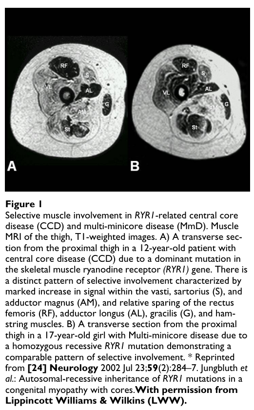

## Question

# Disease Characteristics Research Template

## Target Disease
- **Disease Name:** Multiminicore Disease
- **MONDO ID:**  (if available)
- **Category:** Mendelian

## Research Objectives

Please provide a comprehensive research report on **Multiminicore Disease** covering all of the
disease characteristics listed below. This report will be used to populate a disease knowledge
base entry. Be thorough and cite primary literature (PMID preferred) for all claims.

For each section, **suggested databases/resources** are listed. These are the first places
you should search for information on each topic.

---

### 1. Disease Information
> **Search first:** OMIM, Orphanet, ICD-10/ICD-11, MeSH, PubMed

- What is the disease? Provide a concise overview.
- What are the key identifiers? (OMIM, Orphanet, ICD-10/ICD-11, MeSH, Mondo)
- What are the common synonyms and alternative names?
- Is the information derived from individual patients (e.g., EHR) or aggregated disease-level resources?

### 2. Etiology

- **Disease Causal Factors**: What are the primary causes? (genetic, environmental, infectious, mechanistic)
- **Risk Factors**:
  > **Search first:** PubMed, Cochrane Library, UpToDate, clinical guidelines, ClinVar, ClinGen, GWAS Catalog, PheGenI, CTD, CDC, WHO, epidemiological databases
  - Genetic risk factors (causal variants, susceptibility loci, modifier genes)
  - Environmental risk factors (toxins, lifestyle, occupational exposures, age, sex, family history)
- **Protective Factors**:
  > **Search first:** PubMed, Cochrane Library, clinical trial databases, GWAS Catalog, gnomAD, WHO, CDC, nutrition databases
  - Genetic protective factors (protective variants, modifier alleles)
  - Environmental protective factors (diet, lifestyle, exposures that reduce risk)
- **Gene-Environment Interactions**: How do genetic and environmental factors interact to influence disease?
  > **Search first:** CTD, PubMed, PheGenI, GxE databases

### 3. Phenotypes
> **Search first:** HPO (Human Phenotype Ontology), OMIM, Orphanet, PubMed, clinicaltrials.gov, MedDRA, SNOMED CT, DECIPHER, LOINC

For each phenotype, provide:
- **Phenotype type**: symptoms, clinical signs, physical manifestations, behavioral changes, or laboratory abnormalities
  > For symptoms/signs: HPO, OMIM, Orphanet, PubMed
  > For behavioral changes: HPO, DSM, RDoC (Research Domain Criteria), PubMed
  > For laboratory abnormalities: LOINC, SNOMED CT, LabTests Online, PubMed
- **Phenotype characteristics**:
  > **Search first:** OMIM, Orphanet, HPO, PubMed
  - Age of symptom onset (neonatal, childhood, adult-onset, late-onset)
  - Symptom severity (mild, moderate, severe, variable)
  - Symptom progression (stable, progressive, episodic, fluctuating)
  - Frequency among affected individuals (percentage or qualitative)
- **Quality of life impact**: Effects on daily functioning and well-being (per-phenotype when possible)
  > **Search first:** EQ-5D database, SF-36, WHO QOL databases, PubMed
- Suggest HPO (Human Phenotype Ontology) terms for each phenotype

### 4. Genetic/Molecular Information

- **Causal Genes**: Gene mutations or chromosomal abnormalities responsible for disease (gene symbols, OMIM IDs)
  > **Search first:** OMIM, ClinVar, HGMD, Ensembl, NCBI Gene
- **Pathogenic Variants**:
  - Affected genes (gene symbols, HGNC IDs)
    > **Search first:** OMIM, NCBI Gene, Ensembl, HGNC, UniProt, GeneCards
  - Variant classification (pathogenic, likely pathogenic, VUS per ACMG/AMP guidelines)
    > **Search first:** ClinVar, ClinGen, ACMG/AMP guidelines, VarSome
  - Variant type/class (missense, frameshift, nonsense, splice-site, structural)
  - Allele frequency in population databases
    > **Search first:** gnomAD, 1000 Genomes, ExAC, TOPMed, dbSNP
  - Somatic vs germline origin
    > **Search first:** COSMIC (somatic), ClinVar, ICGC, TCGA
  - Functional consequences (loss of function, gain of function, dominant negative)
- **Modifier Genes**: Genes that modify disease severity or expression
- **Epigenetic Information**: DNA methylation, histone modifications, chromatin changes affecting disease
  > **Search first:** ENCODE, Roadmap Epigenomics, MethBase, DiseaseMeth
- **Chromosomal Abnormalities**: Large-scale genetic changes (aneuploidy, translocations, inversions)
  > **Search first:** DECIPHER, ClinVar, ECARUCA, UCSC Genome Browser

### 5. Environmental Information

- **Environmental Factors**: Non-genetic contributing factors (toxins, radiation, pollution, occupational exposure)
  > **Search first:** CTD (Comparative Toxicogenomics Database), TOXNET, PubMed, EPA databases
- **Lifestyle Factors**: Behavioral factors (smoking, diet, exercise, alcohol consumption)
  > **Search first:** CDC databases, WHO, PubMed, NHANES
- **Infectious Agents**: If applicable, pathogens causing or triggering disease (bacteria, viruses, fungi, parasites)
  > **Search first:** NCBI Taxonomy, ViPR, BV-BRC, MicrobeDB, GIDEON

### 6. Mechanism / Pathophysiology

- **Molecular Pathways**: Specific signaling cascades or biochemical pathways involved (Wnt, MAPK, mTOR, PI3K-AKT, etc.)
  > **Search first:** KEGG, Reactome, WikiPathways, PathBank, BioCyc
- **Cellular Processes**: Cell-level mechanisms (apoptosis, autophagy, cell cycle dysregulation, inflammation, etc.)
  > **Search first:** Gene Ontology (GO), Reactome, KEGG, PubMed
- **Protein Dysfunction**: How protein structure or function is altered (misfolding, aggregation, loss of function, gain of function)
  > **Search first:** UniProt, PDB (Protein Data Bank), InterPro, Pfam, AlphaFold
- **Metabolic Changes**: Alterations in metabolic processes (energy metabolism, lipid metabolism, amino acid metabolism)
  > **Search first:** KEGG, BioCyc, HMDB (Human Metabolome Database), BRENDA
- **Immune System Involvement**: Role of immune response (autoimmunity, immunodeficiency, chronic inflammation)
  > **Search first:** ImmPort, Immunome Database, IEDB, Gene Ontology
- **Tissue Damage Mechanisms**: How tissues/ are injured (oxidative stress, ischemia, fibrosis, necrosis)
  > **Search first:** PubMed, Gene Ontology, Reactome
- **Biochemical Abnormalities**: Specific molecular defects (enzyme deficiencies, receptor dysfunction, ion channel defects)
  > **Search first:** BRENDA, UniProt, KEGG, OMIM, PubMed
- **Epigenetic Changes**: DNA methylation, histone modifications affecting gene expression in disease
  > **Search first:** ENCODE, Roadmap Epigenomics, MethBase, DiseaseMeth
- **Molecular Profiling** (if available):
  - Transcriptomics/gene expression changes
    > **Search first:** GEO (Gene Expression Omnibus), ArrayExpress, GTEx, Human Cell Atlas, SRA
  - Proteomics findings
    > **Search first:** PRIDE, ProteomeXchange, Human Protein Atlas, STRING, BioGRID
  - Metabolomics signatures
    > **Search first:** MetaboLights, Metabolomics Workbench, HMDB, METLIN
  - Lipidomics alterations
    > **Search first:** LIPID MAPS, SwissLipids, LipidHome, Metabolomics Workbench
  - Genomic structural features
    > **Search first:** UCSC Genome Browser, Ensembl, NCBI, dbVar, DGV
- **Advanced Technologies** (if applicable):
  - Single-cell analysis findings (cell-type specific mechanisms, cellular heterogeneity)
    > **Search first:** Human Cell Atlas, Single Cell Portal, GEO, CELLxGENE
  - Spatial transcriptomics findings
    > **Search first:** GEO, Spatial Research, Vizgen, 10x Genomics data
  - Multi-omics integration results
    > **Search first:** TCGA, ICGC, cBioPortal, LinkedOmics, PubMed
  - Functional genomics screens (CRISPR, RNAi)
    > **Search first:** DepMap, GenomeRNAi, PubMed, BioGRID ORCS

For each mechanism, describe:
- The causal chain from initial trigger to clinical manifestation
- Which mechanisms are upstream vs downstream
- What cell types and biological processes are involved
- Suggest GO terms for biological processes and CL terms for cell types

### 7. Anatomical Structures Affected

- **Organ Level**:
  - Primary organs directly affected
  - Secondary organ involvement (complications, secondary effects)
  - Body systems involved (cardiovascular, nervous, digestive, respiratory, endocrine, etc.)
  > **Search first:** Uberon, FMA (Foundational Model of Anatomy), OMIM, HPO, ICD-11, MeSH, SNOMED CT
- **Tissue and Cell Level**:
  - Specific tissue types affected (epithelial, connective, muscle, nervous)
  - Specific cell populations targeted (with Cell Ontology terms)
  > **Search first:** Uberon, Human Protein Atlas, Cell Ontology, Human Cell Atlas, CellMarker, PanglaoDB
- **Subcellular Level**:
  - Cellular compartments involved (mitochondria, nucleus, ER, lysosomes) (with GO Cellular Component terms)
  > **Search first:** Gene Ontology (Cellular Component), UniProt, Human Protein Atlas
- **Localization**:
  - Specific anatomical sites (with UBERON terms)
    > **Search first:** FMA, Uberon, NeuroNames (for brain), SNOMED CT
  - Lateralization (unilateral, bilateral, asymmetric)
    > **Search first:** HPO, clinical literature, imaging databases

### 8. Temporal Development

- **Onset**:
  - Typical age of onset (congenital, pediatric, adult, geriatric)
  - Onset pattern (acute, subacute, chronic, insidious)
  > **Search first:** OMIM, Orphanet, HPO, PubMed
- **Progression**:
  - Disease stages (early, intermediate, advanced, end-stage)
    > **Search first:** Cancer Staging Manual (AJCC), WHO classifications, PubMed
  - Progression rate (rapid, slow, variable)
  - Disease course pattern (episodic, relapsing-remitting, progressive, stable)
  - Disease duration (self-limited, chronic lifelong)
  > **Search first:** Disease registries, longitudinal cohort databases, natural history studies, PubMed, Orphanet, OMIM
- **Patterns**:
  - Remission patterns (spontaneous, treatment-induced)
    > **Search first:** Clinical trial databases, disease registries, PubMed
  - Critical periods (time windows of vulnerability or opportunity for intervention)
    > **Search first:** PubMed, developmental biology databases, clinical guidelines

### 9. Inheritance and Population

- **Epidemiology**:
  - Prevalence (cases per 100,000 at given time)
  - Incidence (new cases per 100,000 per year)
  > **Search first:** Orphanet, CDC, WHO, GBD (Global Burden of Disease), national registries, SEER, disease registries
- **For Genetic Etiology**:
  - Inheritance pattern (AD, AR, X-linked, mitochondrial, multifactorial, polygenic)
    > **Search first:** OMIM, Orphanet, ClinVar, GTR (Genetic Testing Registry)
  - Penetrance (complete, incomplete, age-dependent)
    > **Search first:** ClinVar, OMIM, PubMed, ClinGen
  - Expressivity (variable, consistent)
    > **Search first:** OMIM, ClinVar, PubMed
  - Genetic anticipation (increasing severity in successive generations)
    > **Search first:** OMIM, PubMed (especially for repeat expansion disorders)
  - Germline mosaicism
    > **Search first:** ClinVar, OMIM, genetic counseling literature, PubMed
  - Founder effects (population-specific mutations)
    > **Search first:** gnomAD, population genetics databases, PubMed
  - Consanguinity role
    > **Search first:** OMIM, population studies, genetic counseling resources
  - Carrier frequency
    > **Search first:** gnomAD, carrier screening databases, GeneReviews, GTR
- **Population Demographics**:
  - Affected populations (ethnic or demographic groups with higher prevalence)
    > **Search first:** gnomAD, 1000 Genomes, PAGE Study, PubMed, population registries
  - Geographic distribution (endemic areas, regional variation)
    > **Search first:** WHO, CDC, GBD, Orphanet, geographic epidemiology databases
  - Geographic distribution of specific variants
  - Sex ratio (male:female)
    > **Search first:** Disease registries, OMIM, PubMed, epidemiological databases
  - Age distribution of affected individuals
    > **Search first:** CDC, disease registries, SEER, Orphanet

### 10. Diagnostics

- **Clinical Tests**:
  - Laboratory tests (blood, urine, tissue chemistry, specific enzyme assays)
    > **Search first:** LOINC, LabTests Online, PubMed
  - Biomarkers (proteins, metabolites, genetic markers, circulating biomarkers)
    > **Search first:** FDA Biomarker List, BEST (Biomarkers, EndpointS, and other Tools), PubMed
  - Imaging studies (X-ray, CT, MRI, PET, ultrasound)
    > **Search first:** RadLex, DICOM, Radiopaedia, imaging databases
  - Functional tests (pulmonary function, cardiac stress tests)
    > **Search first:** LOINC, clinical guidelines, PubMed
  - Electrophysiology (EEG, EMG, ECG, nerve conduction studies)
    > **Search first:** LOINC, clinical neurophysiology databases, PubMed
  - Biopsy findings (histopathology, immunohistochemistry)
    > **Search first:** SNOMED CT, College of American Pathologists resources, PubMed
  - Pathology findings (microscopic examination)
    > **Search first:** SNOMED CT, Digital Pathology databases, PubMed
- **Genetic Testing**:
  > **Search first:** GTR (Genetic Testing Registry), GeneReviews, ClinGen
  - Overview of recommended genetic testing approach
  - Whole genome sequencing (WGS) utility
    > **Search first:** GTR, ClinVar, GEL (Genomics England), gnomAD
  - Whole exome sequencing (WES) utility
    > **Search first:** GTR, ClinVar, OMIM, GeneMatcher
  - Gene panels (which panels, which genes)
    > **Search first:** GTR, ClinVar, laboratory-specific databases
  - Single gene testing
    > **Search first:** GTR, ClinVar, OMIM, GeneReviews
  - Chromosomal microarray (CMA)
    > **Search first:** DECIPHER, ClinVar, dbVar, ECARUCA
  - Karyotyping
    > **Search first:** Chromosome Abnormality Database, ClinVar, cytogenetics resources
  - FISH
    > **Search first:** ClinVar, cytogenetics databases, PubMed
  - Mitochondrial DNA testing
    > **Search first:** MITOMAP, MSeqDR, ClinVar, GTR
  - Repeat expansion testing
    > **Search first:** GTR, ClinVar, repeat expansion databases, PubMed
- **Omics-Based Diagnostics** (if applicable):
  - RNA sequencing / transcriptomics
    > **Search first:** GEO, ArrayExpress, GTEx, RNA-seq databases
  - Proteomics
    > **Search first:** PRIDE, ProteomeXchange, FDA Biomarker database
  - Metabolomics
    > **Search first:** MetaboLights, Metabolomics Workbench, HMDB
  - Epigenomics
    > **Search first:** GEO, ENCODE, Roadmap Epigenomics, MethBase
  - Liquid biopsy
    > **Search first:** COSMIC, ClinVar, liquid biopsy databases, PubMed
- **Clinical Criteria**:
  - Standardized diagnostic criteria (DSM, ICD, society guidelines)
    > **Search first:** DSM-5, ICD-11, clinical society guidelines, UpToDate
  - Differential diagnosis (other conditions to rule out, with distinguishing features)
    > **Search first:** DynaMed, UpToDate, clinical decision support systems
- **Screening**:
  - Screening methods for asymptomatic individuals (newborn screening, carrier screening, cascade screening)
    > **Search first:** ACMG recommendations, CDC newborn screening, GTR

### 11. Outcome/Prognosis

- **Survival and Mortality**:
  - Survival rate (5-year, 10-year, overall)
    > **Search first:** SEER, cancer registries, disease-specific registries, PubMed
  - Life expectancy (with and without treatment if applicable)
    > **Search first:** Orphanet, disease registries, actuarial databases, PubMed
  - Mortality rate
    > **Search first:** CDC, WHO, GBD, national mortality databases
  - Disease-specific mortality (deaths directly attributable to disease)
    > **Search first:** Disease registries, CDC Wonder, GBD, PubMed
- **Morbidity and Function**:
  - Morbidity (disease-related disability and health impacts)
    > **Search first:** GBD, WHO, disability databases, PubMed
  - Disability outcomes (long-term functional impairments)
    > **Search first:** ICF (International Classification of Functioning), disability registries
  - Quality of life measures (EQ-5D, SF-36, PROMIS, disease-specific tools)
    > **Search first:** EQ-5D database, SF-36, PROMIS, PubMed
- **Disease Course**:
  - Complications (secondary problems: infections, organ failure, etc.)
    > **Search first:** ICD codes, disease registries, clinical databases, PubMed
  - Recovery potential (likelihood and extent of recovery, with vs without treatment)
    > **Search first:** Natural history studies, rehabilitation databases, PubMed
- **Prediction**:
  - Prognostic factors (age, disease severity, biomarkers, treatment response)
    > **Search first:** Prognostic models databases, clinical calculators, PubMed
  - Prognostic biomarkers (molecular markers predicting disease course)
    > **Search first:** FDA Biomarker database, PubMed, cancer prognostic databases

### 12. Treatment

- **Pharmacotherapy**:
  - Pharmacological treatments (drug names, drug classes, mechanisms of action)
    > **Search first:** DrugBank, RxNorm, ATC classification, DailyMed, FDA databases
  - Pharmacogenomics (how genetic variants affect drug metabolism, efficacy, toxicity)
    > **Search first:** PharmGKB, CPIC (Clinical Pharmacogenetics), FDA Table of PGx Biomarkers
- **Advanced Therapeutics**:
  - Gene therapy (viral vectors, CRISPR, gene replacement, gene editing)
    > **Search first:** ClinicalTrials.gov, FDA gene therapy database, ASGCT resources
  - Cell therapy (stem cell transplant, CAR-T, cellular therapeutics)
    > **Search first:** ClinicalTrials.gov, FDA cell therapy database, FACT standards
  - RNA-based therapies (ASOs, siRNA, mRNA therapies)
    > **Search first:** ClinicalTrials.gov, FDA approvals, PubMed
  - Targeted therapies (treatments directed at specific molecular targets)
    > **Search first:** My Cancer Genome, OncoKB, ClinicalTrials.gov, FDA approvals
  - Immunotherapies (checkpoint inhibitors, monoclonal antibodies)
    > **Search first:** Cancer Immunotherapy Database, FDA approvals, ClinicalTrials.gov
- **Surgical and Interventional**:
  - Surgical interventions (types of surgery, timing, outcomes)
    > **Search first:** CPT codes, surgical registries, clinical guidelines, PubMed
- **Supportive and Rehabilitative**:
  - Supportive care (symptom management, pain control, nutrition)
    > **Search first:** Clinical guidelines, Cochrane Library, PubMed
  - Rehabilitation (physical therapy, occupational therapy, speech therapy)
    > **Search first:** Rehabilitation medicine databases, clinical guidelines, PubMed
- **Experimental**:
  - Experimental treatments in clinical trials (with NCT identifiers if available)
    > **Search first:** ClinicalTrials.gov, EU Clinical Trials Register, WHO ICTRP
- **Treatment Outcomes**:
  - Treatment response rates
    > **Search first:** Clinical trial databases, FDA reviews, systematic reviews, PubMed
  - Side effects and adverse events
    > **Search first:** FDA Adverse Event Reporting System (FAERS), MedWatch, PubMed
- **Treatment Strategy**:
  - Treatment algorithms (clinical pathways, decision trees)
    > **Search first:** Clinical practice guidelines, NCCN Guidelines, UpToDate
  - Combination therapies
    > **Search first:** ClinicalTrials.gov, treatment guidelines, PubMed
  - Personalized medicine approaches (genotype-guided treatment)
    > **Search first:** My Cancer Genome, CIViC, PharmGKB, precision medicine databases

For each treatment, suggest MAXO (Medical Action Ontology) terms where applicable.

### 13. Prevention

- **Prevention Levels**:
  - Primary prevention (preventing disease occurrence: vaccination, risk factor modification)
    > **Search first:** CDC, WHO, USPSTF recommendations, Cochrane Library
  - Secondary prevention (early detection and treatment: screening programs, early intervention)
    > **Search first:** USPSTF, CDC screening guidelines, WHO
  - Tertiary prevention (preventing complications in those with disease)
    > **Search first:** Clinical guidelines, disease management protocols, PubMed
- **Immunization**: Vaccine strategies (if applicable)
  > **Search first:** CDC vaccine schedules, WHO immunization, FDA vaccine database
- **Screening and Early Detection**:
  - Screening programs (population-based: newborn screening, cancer screening)
    > **Search first:** CDC screening programs, USPSTF, cancer screening databases
  - Genetic screening (carrier screening, preimplantation genetic diagnosis, prenatal testing)
    > **Search first:** ACMG recommendations, ACOG guidelines, GTR
  - Risk stratification (identifying high-risk individuals for targeted prevention)
    > **Search first:** Risk prediction models, clinical calculators, PubMed
- **Behavioral Interventions**: Lifestyle modifications to reduce risk
  > **Search first:** CDC, WHO, behavioral intervention databases, Cochrane Library
- **Counseling**: Genetic counseling (risk assessment, family planning guidance)
  > **Search first:** NSGC resources, ACMG guidelines, GeneReviews
- **Public Health**:
  - Public health interventions (sanitation, vector control, health education)
    > **Search first:** CDC, WHO, public health databases, PubMed
  - Environmental interventions (reducing environmental risk factors)
    > **Search first:** EPA databases, WHO environmental health, PubMed
- **Prophylaxis**: Preventive medications or procedures
  > **Search first:** Clinical guidelines, FDA approvals, PubMed

### 14. Other Species / Natural Disease

- **Taxonomy**: Species affected (with NCBI Taxon identifiers)
  > **Search first:** NCBI Taxonomy
- **Breed**: Specific breeds affected (with VBO identifiers if applicable)
  > **Search first:** VBO (Vertebrate Breed Ontology)
- **Gene**: Orthologous genes in other species (with NCBI Gene IDs)
  > **Search first:** NCBI Gene
- **Natural Disease**:
  - Naturally occurring disease in other species (companion animals, wildlife)
    > **Search first:** OMIA (Online Mendelian Inheritance in Animals), VetCompass, PubMed
  - Veterinary relevance and importance in animal health
    > **Search first:** OMIA, veterinary databases, PubMed
- **Comparative Biology**:
  - Comparative pathology (similarities and differences across species)
    > **Search first:** OMIA, comparative pathology databases, PubMed
  - Evolutionary conservation of disease mechanisms
    > **Search first:** HomoloGene, OrthoMCL, Alliance of Genome Resources
- **Transmission** (if applicable):
  - Zoonotic potential
    > **Search first:** CDC zoonotic diseases, WHO zoonoses, GIDEON
  - Cross-species susceptibility
    > **Search first:** NCBI Taxonomy, veterinary databases, PubMed

### 15. Model Organisms

- **Model Types**:
  - Model organism type (mammalian, invertebrate, cellular, in vitro)
    > **Search first:** Alliance of Genome Resources, model organism databases
  - Specific model systems (mouse, rat, zebrafish, Drosophila, C. elegans, yeast, cell lines, organoids, iPSCs)
    > **Search first:** MGI, RGD, ZFIN, FlyBase, WormBase, SGD, ATCC, Cellosaurus
  - Induced models (drug treatment, surgical intervention, environmental manipulation)
    > **Search first:** MGI, model organism databases, PubMed
- **Genetic Models**:
  - Types available (knockout, knock-in, transgenic, conditional, humanized)
    > **Search first:** MGI, IMPC, KOMP, EuMMCR, IMSR
- **Model Characteristics**:
  - Phenotype recapitulation (how well model reproduces human disease features)
    > **Search first:** Model organism databases, comparative studies, PubMed
  - Model limitations (aspects of human disease not captured)
    > **Search first:** Model organism databases, PubMed, review articles
- **Applications**:
  - Research applications (what aspects of disease can be studied)
    > **Search first:** Model organism databases, PubMed
- **Resources**:
  - Model databases
    > **Search first:** MGI, RGD, ZFIN, FlyBase, WormBase, IMSR, EMMA, MMRRC

---

## Citation Requirements

- Cite primary literature (PMID preferred) for all mechanistic and clinical claims
- Prioritize recent reviews and landmark papers
- Include direct quotes from abstracts where possible to support key statements
- Distinguish evidence source types: human clinical, model organism, in vitro, computational

## Output Format

Structure your response as a comprehensive narrative organized by the sections above.
For each section, provide:
- Factual content with specific details (numbers, percentages, gene names, variant nomenclature)
- Ontology term suggestions (HPO, GO, CL, UBERON, CHEBI, MAXO, MONDO) where applicable
- Evidence citations with PMIDs
- Direct quotes from abstracts to support key claims
- Clear indication when information is not available or not applicable for this disease

This report will be used to populate a disease knowledge base entry with:
- Pathophysiology descriptions with causal chains
- Gene/protein annotations (HGNC, GO terms)
- Phenotype associations (HP terms) with frequencies
- Cell type involvement (CL terms)
- Anatomical locations (UBERON terms)
- Chemical entities (CHEBI terms)
- Treatment annotations (MAXO terms)
- Evidence items with PMIDs and exact abstract quotes
- Epidemiology, prognosis, diagnostic, and prevention information
- Animal model descriptions with phenotype recapitulation details

## Output

Question: You are an expert researcher providing comprehensive, well-cited information.

Provide detailed information focusing on:
1. Key concepts and definitions with current understanding
2. Recent developments and latest research (prioritize 2023-2024 sources)
3. Current applications and real-world implementations
4. Expert opinions and analysis from authoritative sources
5. Relevant statistics and data from recent studies

Format as a comprehensive research report with proper citations. Include URLs and publication dates where available.
Always prioritize recent, authoritative sources and provide specific citations for all major claims.

# Disease Characteristics Research Template

## Target Disease
- **Disease Name:** Multiminicore Disease
- **MONDO ID:**  (if available)
- **Category:** Mendelian

## Research Objectives

Please provide a comprehensive research report on **Multiminicore Disease** covering all of the
disease characteristics listed below. This report will be used to populate a disease knowledge
base entry. Be thorough and cite primary literature (PMID preferred) for all claims.

For each section, **suggested databases/resources** are listed. These are the first places
you should search for information on each topic.

---

### 1. Disease Information
> **Search first:** OMIM, Orphanet, ICD-10/ICD-11, MeSH, PubMed

- What is the disease? Provide a concise overview.
- What are the key identifiers? (OMIM, Orphanet, ICD-10/ICD-11, MeSH, Mondo)
- What are the common synonyms and alternative names?
- Is the information derived from individual patients (e.g., EHR) or aggregated disease-level resources?

### 2. Etiology

- **Disease Causal Factors**: What are the primary causes? (genetic, environmental, infectious, mechanistic)
- **Risk Factors**:
  > **Search first:** PubMed, Cochrane Library, UpToDate, clinical guidelines, ClinVar, ClinGen, GWAS Catalog, PheGenI, CTD, CDC, WHO, epidemiological databases
  - Genetic risk factors (causal variants, susceptibility loci, modifier genes)
  - Environmental risk factors (toxins, lifestyle, occupational exposures, age, sex, family history)
- **Protective Factors**:
  > **Search first:** PubMed, Cochrane Library, clinical trial databases, GWAS Catalog, gnomAD, WHO, CDC, nutrition databases
  - Genetic protective factors (protective variants, modifier alleles)
  - Environmental protective factors (diet, lifestyle, exposures that reduce risk)
- **Gene-Environment Interactions**: How do genetic and environmental factors interact to influence disease?
  > **Search first:** CTD, PubMed, PheGenI, GxE databases

### 3. Phenotypes
> **Search first:** HPO (Human Phenotype Ontology), OMIM, Orphanet, PubMed, clinicaltrials.gov, MedDRA, SNOMED CT, DECIPHER, LOINC

For each phenotype, provide:
- **Phenotype type**: symptoms, clinical signs, physical manifestations, behavioral changes, or laboratory abnormalities
  > For symptoms/signs: HPO, OMIM, Orphanet, PubMed
  > For behavioral changes: HPO, DSM, RDoC (Research Domain Criteria), PubMed
  > For laboratory abnormalities: LOINC, SNOMED CT, LabTests Online, PubMed
- **Phenotype characteristics**:
  > **Search first:** OMIM, Orphanet, HPO, PubMed
  - Age of symptom onset (neonatal, childhood, adult-onset, late-onset)
  - Symptom severity (mild, moderate, severe, variable)
  - Symptom progression (stable, progressive, episodic, fluctuating)
  - Frequency among affected individuals (percentage or qualitative)
- **Quality of life impact**: Effects on daily functioning and well-being (per-phenotype when possible)
  > **Search first:** EQ-5D database, SF-36, WHO QOL databases, PubMed
- Suggest HPO (Human Phenotype Ontology) terms for each phenotype

### 4. Genetic/Molecular Information

- **Causal Genes**: Gene mutations or chromosomal abnormalities responsible for disease (gene symbols, OMIM IDs)
  > **Search first:** OMIM, ClinVar, HGMD, Ensembl, NCBI Gene
- **Pathogenic Variants**:
  - Affected genes (gene symbols, HGNC IDs)
    > **Search first:** OMIM, NCBI Gene, Ensembl, HGNC, UniProt, GeneCards
  - Variant classification (pathogenic, likely pathogenic, VUS per ACMG/AMP guidelines)
    > **Search first:** ClinVar, ClinGen, ACMG/AMP guidelines, VarSome
  - Variant type/class (missense, frameshift, nonsense, splice-site, structural)
  - Allele frequency in population databases
    > **Search first:** gnomAD, 1000 Genomes, ExAC, TOPMed, dbSNP
  - Somatic vs germline origin
    > **Search first:** COSMIC (somatic), ClinVar, ICGC, TCGA
  - Functional consequences (loss of function, gain of function, dominant negative)
- **Modifier Genes**: Genes that modify disease severity or expression
- **Epigenetic Information**: DNA methylation, histone modifications, chromatin changes affecting disease
  > **Search first:** ENCODE, Roadmap Epigenomics, MethBase, DiseaseMeth
- **Chromosomal Abnormalities**: Large-scale genetic changes (aneuploidy, translocations, inversions)
  > **Search first:** DECIPHER, ClinVar, ECARUCA, UCSC Genome Browser

### 5. Environmental Information

- **Environmental Factors**: Non-genetic contributing factors (toxins, radiation, pollution, occupational exposure)
  > **Search first:** CTD (Comparative Toxicogenomics Database), TOXNET, PubMed, EPA databases
- **Lifestyle Factors**: Behavioral factors (smoking, diet, exercise, alcohol consumption)
  > **Search first:** CDC databases, WHO, PubMed, NHANES
- **Infectious Agents**: If applicable, pathogens causing or triggering disease (bacteria, viruses, fungi, parasites)
  > **Search first:** NCBI Taxonomy, ViPR, BV-BRC, MicrobeDB, GIDEON

### 6. Mechanism / Pathophysiology

- **Molecular Pathways**: Specific signaling cascades or biochemical pathways involved (Wnt, MAPK, mTOR, PI3K-AKT, etc.)
  > **Search first:** KEGG, Reactome, WikiPathways, PathBank, BioCyc
- **Cellular Processes**: Cell-level mechanisms (apoptosis, autophagy, cell cycle dysregulation, inflammation, etc.)
  > **Search first:** Gene Ontology (GO), Reactome, KEGG, PubMed
- **Protein Dysfunction**: How protein structure or function is altered (misfolding, aggregation, loss of function, gain of function)
  > **Search first:** UniProt, PDB (Protein Data Bank), InterPro, Pfam, AlphaFold
- **Metabolic Changes**: Alterations in metabolic processes (energy metabolism, lipid metabolism, amino acid metabolism)
  > **Search first:** KEGG, BioCyc, HMDB (Human Metabolome Database), BRENDA
- **Immune System Involvement**: Role of immune response (autoimmunity, immunodeficiency, chronic inflammation)
  > **Search first:** ImmPort, Immunome Database, IEDB, Gene Ontology
- **Tissue Damage Mechanisms**: How tissues/ are injured (oxidative stress, ischemia, fibrosis, necrosis)
  > **Search first:** PubMed, Gene Ontology, Reactome
- **Biochemical Abnormalities**: Specific molecular defects (enzyme deficiencies, receptor dysfunction, ion channel defects)
  > **Search first:** BRENDA, UniProt, KEGG, OMIM, PubMed
- **Epigenetic Changes**: DNA methylation, histone modifications affecting gene expression in disease
  > **Search first:** ENCODE, Roadmap Epigenomics, MethBase, DiseaseMeth
- **Molecular Profiling** (if available):
  - Transcriptomics/gene expression changes
    > **Search first:** GEO (Gene Expression Omnibus), ArrayExpress, GTEx, Human Cell Atlas, SRA
  - Proteomics findings
    > **Search first:** PRIDE, ProteomeXchange, Human Protein Atlas, STRING, BioGRID
  - Metabolomics signatures
    > **Search first:** MetaboLights, Metabolomics Workbench, HMDB, METLIN
  - Lipidomics alterations
    > **Search first:** LIPID MAPS, SwissLipids, LipidHome, Metabolomics Workbench
  - Genomic structural features
    > **Search first:** UCSC Genome Browser, Ensembl, NCBI, dbVar, DGV
- **Advanced Technologies** (if applicable):
  - Single-cell analysis findings (cell-type specific mechanisms, cellular heterogeneity)
    > **Search first:** Human Cell Atlas, Single Cell Portal, GEO, CELLxGENE
  - Spatial transcriptomics findings
    > **Search first:** GEO, Spatial Research, Vizgen, 10x Genomics data
  - Multi-omics integration results
    > **Search first:** TCGA, ICGC, cBioPortal, LinkedOmics, PubMed
  - Functional genomics screens (CRISPR, RNAi)
    > **Search first:** DepMap, GenomeRNAi, PubMed, BioGRID ORCS

For each mechanism, describe:
- The causal chain from initial trigger to clinical manifestation
- Which mechanisms are upstream vs downstream
- What cell types and biological processes are involved
- Suggest GO terms for biological processes and CL terms for cell types

### 7. Anatomical Structures Affected

- **Organ Level**:
  - Primary organs directly affected
  - Secondary organ involvement (complications, secondary effects)
  - Body systems involved (cardiovascular, nervous, digestive, respiratory, endocrine, etc.)
  > **Search first:** Uberon, FMA (Foundational Model of Anatomy), OMIM, HPO, ICD-11, MeSH, SNOMED CT
- **Tissue and Cell Level**:
  - Specific tissue types affected (epithelial, connective, muscle, nervous)
  - Specific cell populations targeted (with Cell Ontology terms)
  > **Search first:** Uberon, Human Protein Atlas, Cell Ontology, Human Cell Atlas, CellMarker, PanglaoDB
- **Subcellular Level**:
  - Cellular compartments involved (mitochondria, nucleus, ER, lysosomes) (with GO Cellular Component terms)
  > **Search first:** Gene Ontology (Cellular Component), UniProt, Human Protein Atlas
- **Localization**:
  - Specific anatomical sites (with UBERON terms)
    > **Search first:** FMA, Uberon, NeuroNames (for brain), SNOMED CT
  - Lateralization (unilateral, bilateral, asymmetric)
    > **Search first:** HPO, clinical literature, imaging databases

### 8. Temporal Development

- **Onset**:
  - Typical age of onset (congenital, pediatric, adult, geriatric)
  - Onset pattern (acute, subacute, chronic, insidious)
  > **Search first:** OMIM, Orphanet, HPO, PubMed
- **Progression**:
  - Disease stages (early, intermediate, advanced, end-stage)
    > **Search first:** Cancer Staging Manual (AJCC), WHO classifications, PubMed
  - Progression rate (rapid, slow, variable)
  - Disease course pattern (episodic, relapsing-remitting, progressive, stable)
  - Disease duration (self-limited, chronic lifelong)
  > **Search first:** Disease registries, longitudinal cohort databases, natural history studies, PubMed, Orphanet, OMIM
- **Patterns**:
  - Remission patterns (spontaneous, treatment-induced)
    > **Search first:** Clinical trial databases, disease registries, PubMed
  - Critical periods (time windows of vulnerability or opportunity for intervention)
    > **Search first:** PubMed, developmental biology databases, clinical guidelines

### 9. Inheritance and Population

- **Epidemiology**:
  - Prevalence (cases per 100,000 at given time)
  - Incidence (new cases per 100,000 per year)
  > **Search first:** Orphanet, CDC, WHO, GBD (Global Burden of Disease), national registries, SEER, disease registries
- **For Genetic Etiology**:
  - Inheritance pattern (AD, AR, X-linked, mitochondrial, multifactorial, polygenic)
    > **Search first:** OMIM, Orphanet, ClinVar, GTR (Genetic Testing Registry)
  - Penetrance (complete, incomplete, age-dependent)
    > **Search first:** ClinVar, OMIM, PubMed, ClinGen
  - Expressivity (variable, consistent)
    > **Search first:** OMIM, ClinVar, PubMed
  - Genetic anticipation (increasing severity in successive generations)
    > **Search first:** OMIM, PubMed (especially for repeat expansion disorders)
  - Germline mosaicism
    > **Search first:** ClinVar, OMIM, genetic counseling literature, PubMed
  - Founder effects (population-specific mutations)
    > **Search first:** gnomAD, population genetics databases, PubMed
  - Consanguinity role
    > **Search first:** OMIM, population studies, genetic counseling resources
  - Carrier frequency
    > **Search first:** gnomAD, carrier screening databases, GeneReviews, GTR
- **Population Demographics**:
  - Affected populations (ethnic or demographic groups with higher prevalence)
    > **Search first:** gnomAD, 1000 Genomes, PAGE Study, PubMed, population registries
  - Geographic distribution (endemic areas, regional variation)
    > **Search first:** WHO, CDC, GBD, Orphanet, geographic epidemiology databases
  - Geographic distribution of specific variants
  - Sex ratio (male:female)
    > **Search first:** Disease registries, OMIM, PubMed, epidemiological databases
  - Age distribution of affected individuals
    > **Search first:** CDC, disease registries, SEER, Orphanet

### 10. Diagnostics

- **Clinical Tests**:
  - Laboratory tests (blood, urine, tissue chemistry, specific enzyme assays)
    > **Search first:** LOINC, LabTests Online, PubMed
  - Biomarkers (proteins, metabolites, genetic markers, circulating biomarkers)
    > **Search first:** FDA Biomarker List, BEST (Biomarkers, EndpointS, and other Tools), PubMed
  - Imaging studies (X-ray, CT, MRI, PET, ultrasound)
    > **Search first:** RadLex, DICOM, Radiopaedia, imaging databases
  - Functional tests (pulmonary function, cardiac stress tests)
    > **Search first:** LOINC, clinical guidelines, PubMed
  - Electrophysiology (EEG, EMG, ECG, nerve conduction studies)
    > **Search first:** LOINC, clinical neurophysiology databases, PubMed
  - Biopsy findings (histopathology, immunohistochemistry)
    > **Search first:** SNOMED CT, College of American Pathologists resources, PubMed
  - Pathology findings (microscopic examination)
    > **Search first:** SNOMED CT, Digital Pathology databases, PubMed
- **Genetic Testing**:
  > **Search first:** GTR (Genetic Testing Registry), GeneReviews, ClinGen
  - Overview of recommended genetic testing approach
  - Whole genome sequencing (WGS) utility
    > **Search first:** GTR, ClinVar, GEL (Genomics England), gnomAD
  - Whole exome sequencing (WES) utility
    > **Search first:** GTR, ClinVar, OMIM, GeneMatcher
  - Gene panels (which panels, which genes)
    > **Search first:** GTR, ClinVar, laboratory-specific databases
  - Single gene testing
    > **Search first:** GTR, ClinVar, OMIM, GeneReviews
  - Chromosomal microarray (CMA)
    > **Search first:** DECIPHER, ClinVar, dbVar, ECARUCA
  - Karyotyping
    > **Search first:** Chromosome Abnormality Database, ClinVar, cytogenetics resources
  - FISH
    > **Search first:** ClinVar, cytogenetics databases, PubMed
  - Mitochondrial DNA testing
    > **Search first:** MITOMAP, MSeqDR, ClinVar, GTR
  - Repeat expansion testing
    > **Search first:** GTR, ClinVar, repeat expansion databases, PubMed
- **Omics-Based Diagnostics** (if applicable):
  - RNA sequencing / transcriptomics
    > **Search first:** GEO, ArrayExpress, GTEx, RNA-seq databases
  - Proteomics
    > **Search first:** PRIDE, ProteomeXchange, FDA Biomarker database
  - Metabolomics
    > **Search first:** MetaboLights, Metabolomics Workbench, HMDB
  - Epigenomics
    > **Search first:** GEO, ENCODE, Roadmap Epigenomics, MethBase
  - Liquid biopsy
    > **Search first:** COSMIC, ClinVar, liquid biopsy databases, PubMed
- **Clinical Criteria**:
  - Standardized diagnostic criteria (DSM, ICD, society guidelines)
    > **Search first:** DSM-5, ICD-11, clinical society guidelines, UpToDate
  - Differential diagnosis (other conditions to rule out, with distinguishing features)
    > **Search first:** DynaMed, UpToDate, clinical decision support systems
- **Screening**:
  - Screening methods for asymptomatic individuals (newborn screening, carrier screening, cascade screening)
    > **Search first:** ACMG recommendations, CDC newborn screening, GTR

### 11. Outcome/Prognosis

- **Survival and Mortality**:
  - Survival rate (5-year, 10-year, overall)
    > **Search first:** SEER, cancer registries, disease-specific registries, PubMed
  - Life expectancy (with and without treatment if applicable)
    > **Search first:** Orphanet, disease registries, actuarial databases, PubMed
  - Mortality rate
    > **Search first:** CDC, WHO, GBD, national mortality databases
  - Disease-specific mortality (deaths directly attributable to disease)
    > **Search first:** Disease registries, CDC Wonder, GBD, PubMed
- **Morbidity and Function**:
  - Morbidity (disease-related disability and health impacts)
    > **Search first:** GBD, WHO, disability databases, PubMed
  - Disability outcomes (long-term functional impairments)
    > **Search first:** ICF (International Classification of Functioning), disability registries
  - Quality of life measures (EQ-5D, SF-36, PROMIS, disease-specific tools)
    > **Search first:** EQ-5D database, SF-36, PROMIS, PubMed
- **Disease Course**:
  - Complications (secondary problems: infections, organ failure, etc.)
    > **Search first:** ICD codes, disease registries, clinical databases, PubMed
  - Recovery potential (likelihood and extent of recovery, with vs without treatment)
    > **Search first:** Natural history studies, rehabilitation databases, PubMed
- **Prediction**:
  - Prognostic factors (age, disease severity, biomarkers, treatment response)
    > **Search first:** Prognostic models databases, clinical calculators, PubMed
  - Prognostic biomarkers (molecular markers predicting disease course)
    > **Search first:** FDA Biomarker database, PubMed, cancer prognostic databases

### 12. Treatment

- **Pharmacotherapy**:
  - Pharmacological treatments (drug names, drug classes, mechanisms of action)
    > **Search first:** DrugBank, RxNorm, ATC classification, DailyMed, FDA databases
  - Pharmacogenomics (how genetic variants affect drug metabolism, efficacy, toxicity)
    > **Search first:** PharmGKB, CPIC (Clinical Pharmacogenetics), FDA Table of PGx Biomarkers
- **Advanced Therapeutics**:
  - Gene therapy (viral vectors, CRISPR, gene replacement, gene editing)
    > **Search first:** ClinicalTrials.gov, FDA gene therapy database, ASGCT resources
  - Cell therapy (stem cell transplant, CAR-T, cellular therapeutics)
    > **Search first:** ClinicalTrials.gov, FDA cell therapy database, FACT standards
  - RNA-based therapies (ASOs, siRNA, mRNA therapies)
    > **Search first:** ClinicalTrials.gov, FDA approvals, PubMed
  - Targeted therapies (treatments directed at specific molecular targets)
    > **Search first:** My Cancer Genome, OncoKB, ClinicalTrials.gov, FDA approvals
  - Immunotherapies (checkpoint inhibitors, monoclonal antibodies)
    > **Search first:** Cancer Immunotherapy Database, FDA approvals, ClinicalTrials.gov
- **Surgical and Interventional**:
  - Surgical interventions (types of surgery, timing, outcomes)
    > **Search first:** CPT codes, surgical registries, clinical guidelines, PubMed
- **Supportive and Rehabilitative**:
  - Supportive care (symptom management, pain control, nutrition)
    > **Search first:** Clinical guidelines, Cochrane Library, PubMed
  - Rehabilitation (physical therapy, occupational therapy, speech therapy)
    > **Search first:** Rehabilitation medicine databases, clinical guidelines, PubMed
- **Experimental**:
  - Experimental treatments in clinical trials (with NCT identifiers if available)
    > **Search first:** ClinicalTrials.gov, EU Clinical Trials Register, WHO ICTRP
- **Treatment Outcomes**:
  - Treatment response rates
    > **Search first:** Clinical trial databases, FDA reviews, systematic reviews, PubMed
  - Side effects and adverse events
    > **Search first:** FDA Adverse Event Reporting System (FAERS), MedWatch, PubMed
- **Treatment Strategy**:
  - Treatment algorithms (clinical pathways, decision trees)
    > **Search first:** Clinical practice guidelines, NCCN Guidelines, UpToDate
  - Combination therapies
    > **Search first:** ClinicalTrials.gov, treatment guidelines, PubMed
  - Personalized medicine approaches (genotype-guided treatment)
    > **Search first:** My Cancer Genome, CIViC, PharmGKB, precision medicine databases

For each treatment, suggest MAXO (Medical Action Ontology) terms where applicable.

### 13. Prevention

- **Prevention Levels**:
  - Primary prevention (preventing disease occurrence: vaccination, risk factor modification)
    > **Search first:** CDC, WHO, USPSTF recommendations, Cochrane Library
  - Secondary prevention (early detection and treatment: screening programs, early intervention)
    > **Search first:** USPSTF, CDC screening guidelines, WHO
  - Tertiary prevention (preventing complications in those with disease)
    > **Search first:** Clinical guidelines, disease management protocols, PubMed
- **Immunization**: Vaccine strategies (if applicable)
  > **Search first:** CDC vaccine schedules, WHO immunization, FDA vaccine database
- **Screening and Early Detection**:
  - Screening programs (population-based: newborn screening, cancer screening)
    > **Search first:** CDC screening programs, USPSTF, cancer screening databases
  - Genetic screening (carrier screening, preimplantation genetic diagnosis, prenatal testing)
    > **Search first:** ACMG recommendations, ACOG guidelines, GTR
  - Risk stratification (identifying high-risk individuals for targeted prevention)
    > **Search first:** Risk prediction models, clinical calculators, PubMed
- **Behavioral Interventions**: Lifestyle modifications to reduce risk
  > **Search first:** CDC, WHO, behavioral intervention databases, Cochrane Library
- **Counseling**: Genetic counseling (risk assessment, family planning guidance)
  > **Search first:** NSGC resources, ACMG guidelines, GeneReviews
- **Public Health**:
  - Public health interventions (sanitation, vector control, health education)
    > **Search first:** CDC, WHO, public health databases, PubMed
  - Environmental interventions (reducing environmental risk factors)
    > **Search first:** EPA databases, WHO environmental health, PubMed
- **Prophylaxis**: Preventive medications or procedures
  > **Search first:** Clinical guidelines, FDA approvals, PubMed

### 14. Other Species / Natural Disease

- **Taxonomy**: Species affected (with NCBI Taxon identifiers)
  > **Search first:** NCBI Taxonomy
- **Breed**: Specific breeds affected (with VBO identifiers if applicable)
  > **Search first:** VBO (Vertebrate Breed Ontology)
- **Gene**: Orthologous genes in other species (with NCBI Gene IDs)
  > **Search first:** NCBI Gene
- **Natural Disease**:
  - Naturally occurring disease in other species (companion animals, wildlife)
    > **Search first:** OMIA (Online Mendelian Inheritance in Animals), VetCompass, PubMed
  - Veterinary relevance and importance in animal health
    > **Search first:** OMIA, veterinary databases, PubMed
- **Comparative Biology**:
  - Comparative pathology (similarities and differences across species)
    > **Search first:** OMIA, comparative pathology databases, PubMed
  - Evolutionary conservation of disease mechanisms
    > **Search first:** HomoloGene, OrthoMCL, Alliance of Genome Resources
- **Transmission** (if applicable):
  - Zoonotic potential
    > **Search first:** CDC zoonotic diseases, WHO zoonoses, GIDEON
  - Cross-species susceptibility
    > **Search first:** NCBI Taxonomy, veterinary databases, PubMed

### 15. Model Organisms

- **Model Types**:
  - Model organism type (mammalian, invertebrate, cellular, in vitro)
    > **Search first:** Alliance of Genome Resources, model organism databases
  - Specific model systems (mouse, rat, zebrafish, Drosophila, C. elegans, yeast, cell lines, organoids, iPSCs)
    > **Search first:** MGI, RGD, ZFIN, FlyBase, WormBase, SGD, ATCC, Cellosaurus
  - Induced models (drug treatment, surgical intervention, environmental manipulation)
    > **Search first:** MGI, model organism databases, PubMed
- **Genetic Models**:
  - Types available (knockout, knock-in, transgenic, conditional, humanized)
    > **Search first:** MGI, IMPC, KOMP, EuMMCR, IMSR
- **Model Characteristics**:
  - Phenotype recapitulation (how well model reproduces human disease features)
    > **Search first:** Model organism databases, comparative studies, PubMed
  - Model limitations (aspects of human disease not captured)
    > **Search first:** Model organism databases, PubMed, review articles
- **Applications**:
  - Research applications (what aspects of disease can be studied)
    > **Search first:** Model organism databases, PubMed
- **Resources**:
  - Model databases
    > **Search first:** MGI, RGD, ZFIN, FlyBase, WormBase, IMSR, EMMA, MMRRC

---

## Citation Requirements

- Cite primary literature (PMID preferred) for all mechanistic and clinical claims
- Prioritize recent reviews and landmark papers
- Include direct quotes from abstracts where possible to support key statements
- Distinguish evidence source types: human clinical, model organism, in vitro, computational

## Output Format

Structure your response as a comprehensive narrative organized by the sections above.
For each section, provide:
- Factual content with specific details (numbers, percentages, gene names, variant nomenclature)
- Ontology term suggestions (HPO, GO, CL, UBERON, CHEBI, MAXO, MONDO) where applicable
- Evidence citations with PMIDs
- Direct quotes from abstracts to support key claims
- Clear indication when information is not available or not applicable for this disease

This report will be used to populate a disease knowledge base entry with:
- Pathophysiology descriptions with causal chains
- Gene/protein annotations (HGNC, GO terms)
- Phenotype associations (HP terms) with frequencies
- Cell type involvement (CL terms)
- Anatomical locations (UBERON terms)
- Chemical entities (CHEBI terms)
- Treatment annotations (MAXO terms)
- Evidence items with PMIDs and exact abstract quotes
- Epidemiology, prognosis, diagnostic, and prevention information
- Animal model descriptions with phenotype recapitulation details

# Multiminicore Disease (MmD) — Comprehensive Disease Characteristics Report

**Scope note.** “Multiminicore disease” is a *muscle-biopsy-defined* congenital myopathy phenotype characterized by multiple “core-like” lesions (“minicores”) and is genetically heterogeneous; in practice, many modern sources treat classic MmD largely within the spectrum of **SELENON (SEPN1)-related myopathy** and **RYR1-related myopathies**. Evidence below therefore covers MmD as a clinicopathologic entity and highlights the two best-supported genetic subtypes. (lillis2012clinicalutilitygene pages 1-2, jungbluth2007multiminicoredisease pages 1-2)

---

## 1. Disease Information

### 1.1 Definition and current understanding
Multiminicore disease (MmD) is an inherited congenital myopathy defined by the presence of multiple “minicores” on skeletal muscle biopsy. Minicores are “multifocal, well-circumscribed areas” with reduced oxidative staining that “extend only for a short distance along the longitudinal axis of the muscle,” and on electron microscopy show “myofibrillar disruption and paucity of mitochondria.” (jungbluth2007multiminicoredisease pages 5-7)

The “classic” MmD phenotype is commonly described by the clinical triad of **axial weakness**, **spinal rigidity/early scoliosis**, and **respiratory impairment** (often disproportionate to limb weakness). (jungbluth2007multiminicoredisease pages 2-3, jungbluth2007multiminicoredisease pages 1-2)

### 1.2 Key identifiers (available from retrieved evidence)
- **OMIM / MIM disease IDs mentioned in retrieved evidence**: **MmD (MIM #255320)**; additional MmD-related OMIM numbers listed in a clinical utility gene card: **#117000** and **#607552**. (lillis2012clinicalutilitygene pages 1-2, zorzato2007functionaleffectsof pages 1-3)
- **Gene OMIM IDs mentioned in retrieved evidence**:
  - **RYR1** (*180901) (lillis2012clinicalutilitygene pages 1-2)
  - **SEPN1 / SELENON** (*606210) (lillis2012clinicalutilitygene pages 1-2, zorzato2007functionaleffectsof pages 1-3)

**Not found in the retrieved sources:** MONDO ID, ICD-10/ICD-11 codes, MeSH term IDs, and Orphanet ORPHA identifiers were not explicitly present in the accessible full text excerpts; therefore they cannot be cited here. (jungbluth2007multiminicoredisease pages 1-2, lillis2012clinicalutilitygene pages 1-2)

### 1.3 Synonyms / alternative names
Synonyms reported include **minicore myopathy**, **multicore myopathy**, and **minicore myopathy with external ophthalmoplegia** (a recognized clinical presentation particularly in RYR1-related disease). (jungbluth2007multiminicoredisease pages 1-2)

### 1.4 Evidence source type
The information summarized here is derived from **aggregated disease-level resources** (reviews/gene cards) and **aggregated cohorts** (international and national observational studies), rather than EHR-only single-center data. (jungbluth2007multiminicoredisease pages 1-2, villarquiles2020theclinicalhistologic pages 1-2, bouman2023selenonrelatedmyopathyacross pages 1-3)

---

## 2. Etiology

### 2.1 Primary causal factors
MmD is primarily a **genetic** disorder (Mendelian), with major subtypes:
- **SELENON (SEPN1)-related MmD / SELENON-related myopathy**: classically associated with a consistent phenotype including early spinal rigidity/scoliosis and prominent respiratory involvement. (lillis2012clinicalutilitygene pages 1-2, jungbluth2007multiminicoredisease pages 2-3)
- **RYR1-related MmD**: phenotypically broader; ophthalmoparesis/external ophthalmoplegia is common; malignant hyperthermia risk is an anesthetic consideration in RYR1-associated disease. (lillis2012clinicalutilitygene pages 1-2, jungbluth2007multiminicoredisease pages 2-3)

### 2.2 Risk factors
- **Genetic risk** is driven by **biallelic pathogenic variants** in causal genes (most often **SELENON/SEPN1** for the classic rigid-spine/respiratory phenotype, and **RYR1** for other multicore/minicore phenotypes). (jungbluth2007multiminicoredisease pages 2-3, zorzato2007functionaleffectsof pages 1-3)
- In the largest SEPN1/SELENON cohort (n=132), **bi-allelic null mutations** were associated with higher disease severity (p=0.017). (villarquiles2020theclinicalhistologic pages 1-2)

**Environmental risk factors:** no specific toxin/lifestyle exposures were identified as causes in the retrieved primary sources. However, clinical deterioration can be influenced by *management-related factors* (e.g., untreated nocturnal hypoventilation and scoliosis progression), which act as modifiable determinants of severity. (villarquiles2020theclinicalhistologic pages 1-2, villarquiles2020theclinicalhistologic pages 4-5)

### 2.3 Protective factors and gene–environment interactions
No specific protective variants or validated environmental protective factors were identified in the retrieved evidence for MmD itself. (villarquiles2020theclinicalhistologic pages 1-2)

---

## 3. Phenotypes

### 3.1 Core phenotype set (classic MmD)
Key phenotype domains (with HPO term suggestions):
- **Axial muscle weakness** (HP:0003323 *Axial muscle weakness*; also HP:0003798 *Neck flexor weakness*) (jungbluth2007multiminicoredisease pages 2-3, jungbluth2007multiminicoredisease pages 1-2)
- **Spinal rigidity / rigid spine** (HP:0003301 *Rigid spine*) (villarquiles2020theclinicalhistologic pages 4-5)
- **Scoliosis** (HP:0002650 *Scoliosis*) (villarquiles2020theclinicalhistologic pages 4-5)
- **Respiratory insufficiency / hypoventilation**, often nocturnal first (HP:0002093 *Respiratory insufficiency*; HP:0002872 *Sleep-related hypoventilation*) (villarquiles2020theclinicalhistologic pages 4-5)
- **Ophthalmoparesis/external ophthalmoplegia** in RYR1-related MmD subgroups (HP:0000602 *Ophthalmoplegia*) (lillis2012clinicalutilitygene pages 1-2, jungbluth2007multiminicoredisease pages 1-2)

### 3.2 Phenotype frequencies and timing (SELENON/SEPN1 cohort)
In a large international retrospective cohort of **132** individuals with **SEPN1/SELENON-related myopathy** (age 2–58 years) followed for decades:
- **Scoliosis** occurred in **86.1%** (mean onset **8.9 ± 4 years**). (villarquiles2020theclinicalhistologic pages 1-2)
- **Respiratory failure** developed in **100%** (mean onset **10.1 ± 6 years**). (villarquiles2020theclinicalhistologic pages 1-2)
- **Assisted ventilation** was required in **81.9%**, often while still ambulant. (villarquiles2020theclinicalhistologic pages 4-5)
- **Rigid spine** was common (**~87.8%** in one excerpted analysis). (villarquiles2020theclinicalhistologic pages 3-4)
- Muscle biopsy: **multi-minicores** were the most common lesion (**59.5%**), with variable additional features (mild dystrophic changes; Mallory-like eosinophilic inclusions in 6.3%). (villarquiles2020theclinicalhistologic pages 1-2, villarquiles2020theclinicalhistologic pages 5-7)

Disease severity in this cohort was classified as **severe 28.4%**, **moderate 53.1%**, and **mild 18.5%** (subset with detailed phenotyping). (villarquiles2020theclinicalhistologic pages 7-8)

### 3.3 Quality of life and symptom burden (recent quantitative data)
A Dutch cross-sectional “trial readiness” study of **11 genetically confirmed SELENON-RM patients** (mean age 20±13 years; range 3–42) reported:
- Mean **MFM-20/32** total score **71.2 ± 15.1%** (domain 1—standing/transfers—most affected). (bouman2023selenonrelatedmyopathyacross pages 1-3)
- **Problematic fatigue**, pain, and impaired quality of life were prominent in patient-reported outcomes. (bouman2023selenonrelatedmyopathyacross pages 1-3, bouman2023selenonrelatedmyopathyacross pages 14-16)
- **Respiratory impairment in all patients** with marked diaphragm dysfunction regardless of age. (bouman2023selenonrelatedmyopathyacross pages 1-3)

### 3.4 Suggested anatomical structures affected (UBERON) and cell types (CL)
- Primary tissue: **skeletal muscle** (UBERON:0001134). (jungbluth2007multiminicoredisease pages 5-7)
- Respiratory muscle involvement, especially **diaphragm** (UBERON:0001103), is a major determinant of morbidity. (bouman2023selenonrelatedmyopathyacross pages 10-13)
- Relevant cell type emphasis for mechanism mapping: **skeletal muscle fiber / myofiber** (CL:0000187) and **skeletal muscle satellite cell** (CL:0000516; supported indirectly by SelN roles in muscle biology and disease mechanisms). (castets2012selenoproteinnin pages 7-8)

---

## 4. Genetic / Molecular Information

### 4.1 Causal genes (best-supported)
- **SELENON (SEPN1)**: autosomal recessive; classically associated with the rigid spine–scoliosis–respiratory phenotype of MmD/SELENON-related myopathy. (lillis2012clinicalutilitygene pages 1-2, villarquiles2020theclinicalhistologic pages 1-2)
- **RYR1**: autosomal dominant or recessive across the RYR1-related myopathy spectrum; recessive forms commonly underlie MmD presentations and may overlap with central core disease. (jungbluth2007multiminicoredisease pages 2-3, todd2024rycals48168(arm210) pages 1-2)

### 4.2 Pathogenic variant spectrum and genotype–phenotype
In the SEPN1/SELENON international cohort (n=132), **65 SEPN1 mutations** were identified (32 novel), including the first pathogenic copy-number variant, with **exon 1** as a mutational hotspot; **bi-allelic null** variants correlated with greater severity. (villarquiles2020theclinicalhistologic pages 1-2)

### 4.3 Molecular functions (current mechanistic consensus)
- **SELENON/SelN** is an ER/SR-localized, redox-active selenoprotein implicated in regulating oxidative stress and calcium handling, including interaction with ryanodine receptors; SelN deficiency increases oxidative stress in patient cells and reduces RyR function in biochemical assays. (castets2012selenoproteinnin pages 7-8)
- SEPN1/SELENON is also described as an ER Ca2+-linked redox regulator that can activate SERCA in a redox-dependent manner (mechanistic model discussed in a 2024 thesis-derived excerpt). (germani2024chopero1apathwayof pages 17-21)

---

## 5. Environmental Information

No specific infectious triggers or environmental toxic exposures are implicated as primary causes in the retrieved literature. The clinically most relevant “environmental” aspects are **perioperative/anesthetic exposures** in RYR1-related disease because of malignant hyperthermia susceptibility; anesthetic precautions are recommended in RYR1-associated cases. (jungbluth2007multiminicoredisease pages 2-3)

---

## 6. Mechanism / Pathophysiology

### 6.1 Causal chain (SELENON/SEPN1-related)
A synthesis from mechanistic and translational studies supports this chain:
1. **SELENON loss-of-function** → dysregulated **ER/SR redox and stress responses** and impaired regulation of calcium-handling proteins (RyR and SERCA). (castets2012selenoproteinnin pages 7-8, germani2024chopero1apathwayof pages 17-21)
2. Increased ER stress and maladaptive UPR signaling can involve the **CHOP/ERO1A axis**, with **ERO1A upregulation** observed in SEPN1-RM models and patient biopsies. (germani2024sepn1relatedmyopathydepends pages 1-3, germani2024chopero1apathwayof pages 68-72)
3. Downstream consequences include impaired ER–mitochondria functional coupling and **mitochondrial bioenergetics defects**, contributing to muscle weakness and vulnerability of respiratory muscles (especially diaphragm). (germani2024sepn1relatedmyopathydepends pages 1-3, bouman2023selenonrelatedmyopathyacross pages 10-13)

### 6.2 Key 2024 development: ERO1A as a target and TUDCA as a candidate therapy
A 2024 Cell Reports Medicine study identified ERO1A as a disease-relevant factor in SEPN1-related myopathy and reported both genetic and pharmacologic rescue:
- ERO1A depletion/knockout in SEPN1-loss contexts reduced ER stress and rescued Ca2+ handling and mitochondrial bioenergetics, reversing diaphragmatic weakness in mice. (germani2024sepn1relatedmyopathydepends pages 1-3)
- Treatment with **TUDCA (tauroursodeoxycholic acid)**, described as an ER-stress inhibitor/chemical chaperone, mirrored aspects of ERO1A-loss rescue in SEPN1 KO mice and improved bioenergetics in patient-derived myoblasts. (germani2024sepn1relatedmyopathydepends pages 1-3)

**Ontology mapping suggestions (mechanism):**
- ER stress / unfolded protein response: GO:0030968 (*endoplasmic reticulum unfolded protein response*)
- Oxidation–reduction / oxidative stress: GO:0055114 (*oxidation-reduction process*), GO:0006979 (*response to oxidative stress*)
- Calcium ion homeostasis: GO:0055074 (*calcium ion homeostasis*)
- Mitochondrial bioenergetics: GO:0006119 (*oxidative phosphorylation*)

### 6.3 RYR1-related MmD mechanisms
RYR1-related myopathies involve dysfunction of the skeletal muscle SR Ca2+ release channel central to excitation–contraction coupling. Reported pathophysiologic contributors include SR Ca2+ leak and altered channel regulation (e.g., reduced calstabin1 association, oxidative stress, altered open probability), providing a rationale for RyR1-stabilizing compounds (Rycals). (todd2024rycals48168(arm210) pages 1-2)

---

## 7. Anatomical Structures Affected

- Primary organ/system: **skeletal muscle** (UBERON:0001134). (jungbluth2007multiminicoredisease pages 5-7)
- Clinically dominant functional vulnerability: **respiratory pump muscles**, particularly the **diaphragm** (UBERON:0001103), reflected by severe reductions in forced vital capacity and large sitting-to-supine VC drops in SELENON-RM patients. (bouman2023selenonrelatedmyopathyacross pages 10-13)
- Musculoskeletal system: **spine** with rigid spine phenotype and scoliosis; scoliosis frequently requires stabilization surgery in adolescence in SELENON-RM. (villarquiles2020theclinicalhistologic pages 5-7)

---

## 8. Temporal Development

### 8.1 Onset
In the SEPN1/SELENON cohort, first signs occurred **within the first 2 years in 84.7%** (mean ~18 months), though presentations can vary. (villarquiles2020theclinicalhistologic pages 3-4)

### 8.2 Progression
SEPN1/SELENON-related myopathy is often considered slowly progressive but the large cohort emphasized it can be “more severe and progressive than previously thought,” with **systematic functional decline from the end of the third decade**, **loss of ambulation in ~10%**, and **reduced lifespan even in mild cases**. (villarquiles2020theclinicalhistologic pages 1-2)

---

## 9. Inheritance and Population

### 9.1 Inheritance
- Classic MmD subtypes are commonly **autosomal recessive**, particularly SELENON/SEPN1-related disease; RYR1-related disease may be autosomal dominant or recessive depending on phenotype. (jungbluth2007multiminicoredisease pages 2-3, todd2024rycals48168(arm210) pages 1-2)

### 9.2 Epidemiology
- An incidence estimate reported in a 2024 thesis excerpt: **~1.03 per million in France** (country-specific; likely dependent on ascertainment and definitions). (germani2024chopero1apathwayof pages 17-21)

### 9.3 Prognostic factors and population modifiers
In the SEPN1/SELENON cohort, major determinants of severity/prognosis included **scoliosis/respiratory management**, **SEPN1 genotype** (including null variants), and **body mass abnormalities**. (villarquiles2020theclinicalhistologic pages 1-2)

---

## 10. Diagnostics

### 10.1 Clinical diagnostic concept
Clinical suspicion is raised by the classic triad (axial weakness + rigid spine/scoliosis + respiratory involvement) and confirmed by either:
- **Muscle biopsy** demonstrating predominant minicores; and/or
- **Genetic confirmation** of causal variants (increasingly the dominant approach). (jungbluth2007multiminicoredisease pages 5-7, lillis2012clinicalutilitygene pages 1-2)

### 10.2 Biopsy (histopathology)
- Minicores: reduced oxidative staining lesions short along the fiber axis, with mitochondrial paucity and sarcomeric disruption. (jungbluth2007multiminicoredisease pages 5-7)
- SELENON-related MmD: often numerous small, poorly defined minicores distributed throughout fibers. (lillis2012clinicalutilitygene pages 1-2)

### 10.3 Imaging and real-world implementation
Muscle MRI can support subtype discrimination and guide genetic testing; an Orphanet review provides MRI patterns and a subtype comparison table (images retrieved). (jungbluth2007multiminicoredisease media eac91681, jungbluth2007multiminicoredisease media f3b69ea4)

### 10.4 Respiratory testing
Because respiratory impairment can be disproportionate and may manifest first as nocturnal hypoventilation, polysomnography and upright/supine spirometry are clinically important; in the SEPN1/SELENON cohort, nocturnal hypoventilation was detected by polysomnography in 92.9%. (villarquiles2020theclinicalhistologic pages 4-5)

### 10.5 Differential diagnosis (evidence-supported highlights)
- Other congenital myopathies with cores/minicores, including broader **RYR1-related** phenotypes and other genetically distinct congenital myopathies where multicore pathology can occur. (jungbluth2007multiminicoredisease pages 2-3, butterfield2019congenitalmusculardystrophy pages 14-15)

---

## 11. Outcomes / Prognosis

From the international SEPN1/SELENON cohort (n=132):
- **Respiratory failure is universal** and a major determinant of prognosis; assisted ventilation was required in ~82% and often while ambulant. (villarquiles2020theclinicalhistologic pages 1-2, villarquiles2020theclinicalhistologic pages 4-5)
- Disease can be progressive with adulthood decline and reduced lifespan even in milder phenotypes. (villarquiles2020theclinicalhistologic pages 1-2)

From the Dutch cross-sectional study (n=11), additional clinically actionable morbidity signals include:
- High prevalence of **low bone mineral density (80%)** and **fragility long-bone fractures (55%)**. (bouman2023selenonrelatedmyopathyacross pages 1-3)
- Subclinical cardiac abnormalities (abnormal global longitudinal strain in 43% and QRS fragmentation in 80%), despite preserved LVEF. (bouman2023selenonrelatedmyopathyacross pages 1-3)

---

## 12. Treatment

### 12.1 Current standard of care (supportive)
Evidence from cohort studies supports multi-domain supportive management:
- **Respiratory care:** routine respiratory monitoring; many patients require nocturnal non-invasive ventilation; diaphragm dysfunction is common across ages in SELENON-RM. (villarquiles2020theclinicalhistologic pages 4-5, bouman2023selenonrelatedmyopathyacross pages 10-13)
- **Orthopedic/spine management:** scoliosis is frequent and often progressive; spinal arthrodesis is commonly performed in adolescence and stabilizes scoliosis. (villarquiles2020theclinicalhistologic pages 5-7)
- **Bone health:** vitamin D supplementation and calcium intake optimization recommended due to frequent low BMD and fractures. (bouman2023selenonrelatedmyopathyacross pages 1-3, bouman2023selenonrelatedmyopathyacross pages 13-14)
- **Symptom management:** interventions targeting fatigue and pain, including rehabilitation/physical therapy and self-management approaches, were recommended in the Dutch cohort study. (bouman2023selenonrelatedmyopathyacross pages 13-14, bouman2023selenonrelatedmyopathyacross pages 14-16)

**Suggested MAXO terms (treatment actions):**
- Noninvasive ventilation (MAXO:0000502 *noninvasive ventilation*)
- Respiratory function monitoring (MAXO:0000470 *respiratory function monitoring*)
- Physical therapy (MAXO:0000019 *physical therapy*)
- Vitamin D supplementation (MAXO:0000752 *vitamin D supplementation*)
- Calcium supplementation (MAXO:0000751 *calcium supplementation*)

### 12.2 Experimental / emerging therapeutics (2023–2024 priority)

**A. TUDCA targeting ER stress in SEPN1/SELENON-related myopathy (2024)**
A translational mouse + patient-cell study suggests TUDCA may mitigate downstream ER-stress/bioenergetic defects and improve diaphragm weakness in SEPN1 deficiency models, nominating an actionable pathway (ERO1A/ER stress) and candidate therapy. (germani2024sepn1relatedmyopathydepends pages 1-3)

**B. ARM210 (Rycal S48168) in RYR1-related myopathies (Phase 1, 2024)**
A phase 1, open-label, dose-escalation study (NCT04141670) reported ARM210 was well tolerated over 29 days and exploratory measures suggested improvements in fatigue and proximal strength in most participants at the 200 mg dose, supporting randomized proof-of-concept testing. (todd2024rycals48168(arm210) pages 1-2)

**C. Gene editing proof-of-concept for RYR1 (Prime editing; 2023)**
Prime editing was used to correct a recessive RYR1 point mutation (T4709M) in human myoblasts with a reported 59% correction rate, demonstrating feasibility of precise editing strategies for RYR1-related myopathies. (godbout2023successfulcorrectionby pages 1-3)

---

## 13. Prevention

Primary prevention is not currently feasible for genetically determined MmD. Prevention in practice focuses on:
- **Genetic counseling** and cascade testing after molecular diagnosis (implied by the strong autosomal recessive inheritance and genetic test-centric diagnosis). (villarquiles2020theclinicalhistologic pages 1-2)
- **Tertiary prevention** of complications through proactive management of respiratory insufficiency, scoliosis, and bone health. (villarquiles2020theclinicalhistologic pages 4-5, bouman2023selenonrelatedmyopathyacross pages 13-14)

---

## 14. Other Species / Natural Disease

Evidence in the retrieved sources supports cross-species relevance primarily through experimental modeling: SelN/SELENON deficiency phenotypes have been reproduced in zebrafish (muscle disorganization resembling human multiminicore disease), supporting evolutionary conservation of key muscle pathways. (bellinger2009regulationandfunction pages 2-4)

---

## 15. Model Organisms

- **Mouse (SEPN1 KO) models**: used to identify the ERO1A dependency and demonstrate pharmacologic rescue with TUDCA; diaphragm weakness was a key functional endpoint in vivo. (germani2024sepn1relatedmyopathydepends pages 1-3)
- **Mouse (RYR1 I4895T) models**: described as developing core/minicore pathology and used to study UPR/ER-stress pathway involvement and modifiers (in thesis-derived mechanistic summary). (germani2024chopero1apathwayof pages 17-21, germani2024chopero1apathwayof pages 68-72)
- **Zebrafish SELENON knockdown**: reported muscle fiber disorganization resembling human multiminicore disease. (bellinger2009regulationandfunction pages 2-4)

---

## Recent developments and real-world implementations (2023–2024 emphasis)

### Trial-readiness and outcome measures in clinical care
- **Quantitative endpoints and monitoring**: MFM-20/32, accelerometry, and muscle ultrasound were proposed as feasible measures for clinical trials and potentially for structured clinical follow-up in SELENON-RM. (bouman2023selenonrelatedmyopathyacross pages 1-3)
- **Cardiac and bone surveillance**: The Dutch cross-sectional cohort recommended routine cardiorespiratory follow-up and emphasized the burden of low BMD and subtle cardiac abnormalities (GLS/QRS fragmentation), informing real-world multidisciplinary care. (bouman2023selenonrelatedmyopathyacross pages 1-3, bouman2023selenonrelatedmyopathyacross pages 13-14)

### Key ongoing or recent studies (ClinicalTrials.gov)
- **NCT06157268 (READYCOM)** — *Natural history + fatigability study in congenital myopathies including MmD/CCD* (Radboud UMC). Observational; recruiting; start 2024-03-28; primary outcome: MFM change over 24 months; includes endurance shuttle test for fatigability. (NCT06157268 chunk 1)
- **NCT04478981 (LAST STRONG)** — *Natural history of SELENON(SEPN1) or LAMA2 disease* (Radboud UMC). Observational; completed; n=38; repeated assessments over 1.5 years; primary outcome: MFM change. (NCT04478981 chunk 1)
- **NCT00272883** — *Boston Children’s Hospital congenital myopathy genetics and phenotyping program*; observational; recruiting; target enrollment 4000; includes SELENON and RYR1 myopathy including MmD. (NCT00272883 chunk 1)
- **NCT06791369** — *Prevalence of RYR1-related disease*; observational; not yet recruiting; planned start 2025; aims to estimate prevalence and subgroup frequencies (including MmD) and establish genotype–phenotype correlations. (NCT06791369 chunk 1)

---

## Visual evidence (muscle MRI and subtype comparison)
The Orphanet review provides a figure illustrating genotype-associated thigh muscle MRI patterns and a table comparing SEPN1-related vs RYR1-related MmD clinical and histopathologic features. (jungbluth2007multiminicoredisease media eac91681, jungbluth2007multiminicoredisease media f3b69ea4)

---

## Summary tables

| Subtype | Disease names / synonyms | Key identifiers mentioned in evidence | Main causal genes / inheritance | Hallmark clinical features | Hallmark pathology / minicore definition | Key 2023–2024 advances |
|---|---|---|---|---|---|---|
| General MmD | Multi-minicore disease (MmD); multiminicore disease; minicore myopathy; multicore myopathy; minicore myopathy with external ophthalmoplegia | MmD / MIM #255320; additional MmD-related OMIM numbers listed in gene card: #117000, #607552 (lillis2012clinicalutilitygene pages 1-2, jungbluth2007multiminicoredisease pages 1-2, zorzato2007functionaleffectsof pages 1-3) | Genetically heterogeneous congenital myopathy; major established subtypes are SELENON/SEPN1-related and RYR1-related; usually autosomal recessive in classic MmD (lillis2012clinicalutilitygene pages 1-2, jungbluth2007multiminicoredisease pages 2-3, zorzato2007functionaleffectsof pages 1-3) | Classic triad: axial weakness, spinal rigidity/early scoliosis, respiratory impairment; early-onset but variable severity; some forms include feeding difficulty, facial weakness, high-arched palate, or ophthalmoplegia (jungbluth2007multiminicoredisease pages 2-3, jungbluth2007multiminicoredisease pages 1-2, zorzato2007functionaleffectsof pages 1-3) | Histologic diagnosis: multiple small areas with reduced oxidative activity that extend only a short distance along the fiber axis; EM shows sarcomeric disorganization and paucity of mitochondria; diagnosis requires minicores as predominant biopsy feature plus compatible phenotype (jungbluth2007multiminicoredisease pages 5-7, zorzato2007functionaleffectsof pages 1-3) | Field-level advances include better genotype-first diagnosis by exome/genome sequencing and trial-readiness studies in congenital myopathies (todd2024rycals48168(arm210) pages 1-2, bouman2023selenonrelatedmyopathyacross pages 1-3) |
| SELENON-related MmD | SEPN1-related myopathy; SELENON-related myopathy; SEPN1-related MmD; classic multiminicore myopathy; rigid spine muscular dystrophy spectrum | SEPN1 / SELENON MIM #606210; MmD MIM #255320 (lillis2012clinicalutilitygene pages 1-2, zorzato2007functionaleffectsof pages 1-3, villarquiles2020theclinicalhistologic pages 1-2) | SELENON/SEPN1; autosomal recessive; exon 1 hotspot reported in large cohort; bi-allelic null variants associated with greater severity (villarquiles2020theclinicalhistologic pages 1-2, villarquiles2020theclinicalhistologic pages 7-8) | Consistent triad with marked axial weakness, spinal rigidity/early scoliosis, severe respiratory insufficiency often out of proportion to limb weakness; relatively preserved limb strength; possible cachexia/low BMI, contractures, fatigue, pain, and subtle cardiac strain abnormalities (lillis2012clinicalutilitygene pages 1-2, villarquiles2020theclinicalhistologic pages 1-2, villarquiles2020theclinicalhistologic pages 5-7, bouman2023selenonrelatedmyopathyacross pages 1-3, bouman2023selenonrelatedmyopathyacross pages 10-13) | Numerous small, often poorly defined minicores scattered through fibers; in the 132-patient cohort, multiminicores were the most common lesion (59.5%), often with mild dystrophic features; pathology can be variable/nonspecific (lillis2012clinicalutilitygene pages 1-2, villarquiles2020theclinicalhistologic pages 1-2, villarquiles2020theclinicalhistologic pages 5-7) | 2024: ERO1A identified as a disease modifier/biomarker; genetic or pharmacologic targeting reduced ER stress and improved diaphragm/muscle bioenergetics in models; TUDCA showed rescue in mice and patient-derived cells (germani2024sepn1relatedmyopathydepends pages 1-3, germani2024chopero1apathwayof pages 68-72). 2023–2024 trial-readiness studies quantified respiratory, bone, fatigue, and cardiac surveillance needs (bouman2023selenonrelatedmyopathyacross pages 1-3, bouman2023selenonrelatedmyopathyacross pages 13-14, bouman2023selenonrelatedmyopathyacross pages 10-13) |
| RYR1-related MmD | RYR1-related multiminicore disease; RYR1-related core myopathy with minicores; recessive RYR1-related MmD | RYR1 *180901; MmD-related OMIMs listed in gene card include #117000 and #255320 (lillis2012clinicalutilitygene pages 1-2, jungbluth2007multiminicoredisease pages 2-3) | RYR1; both dominant and recessive inheritance across RYR1-related myopathies, with MmD typically associated with recessive variants; broad phenotypic heterogeneity (todd2024rycals48168(arm210) pages 1-2, lillis2012clinicalutilitygene pages 1-2, jungbluth2007multiminicoredisease pages 2-3) | More variable than SELENON-related disease; axial/proximal weakness plus common ophthalmoparesis/external ophthalmoplegia; bulbar involvement may occur; respiratory involvement often milder than in classic SELENON-related MmD; malignant hyperthermia risk is important in RYR1-associated disease (lillis2012clinicalutilitygene pages 1-2, jungbluth2007multiminicoredisease pages 2-3, jungbluth2007multiminicoredisease pages 1-2, jungbluth2007multiminicoredisease pages 3-5) | Cores are often multiple, eccentric, and may be larger (“multicores”); overlaps with central core disease; RYR1 dysfunction disrupts SR calcium release / causes leak or uncoupling, contributing to minicore/core pathology (lillis2012clinicalutilitygene pages 1-2, jungbluth2007multiminicoredisease pages 5-7, germani2024chopero1apathwayof pages 72-75, germani2024chopero1apathwayof pages 17-21) | 2024: Phase 1 trial of Rycal S48168/ARM210 in RYR1-related myopathies showed tolerability, dose-dependent PK, and exploratory improvements in fatigue/proximal strength at 200 mg, supporting further trials (todd2024rycals48168(arm210) pages 1-2). 2023: prime editing corrected a pathogenic RYR1 mutation in human myoblasts (59% correction for T4709M), and 2025 follow-on work proposed a protective universal edit strategy (2023 evidence available here) (godbout2023successfulcorrectionby pages 1-3) |

*Table: This table summarizes the main Multiminicore disease subtypes, identifiers, causal genes, hallmark clinical and pathologic features, and notable 2023–2024 therapeutic advances. It is designed as a compact reference for knowledge-base population and downstream annotation.*

---

## Key limitations of this tool-based report
- ICD-10/ICD-11, MeSH, ORPHA, and MONDO identifiers were not present in the retrieved full-text excerpts and therefore cannot be cited here. (lillis2012clinicalutilitygene pages 1-2, jungbluth2007multiminicoredisease pages 1-2)
- Phenotype and management statistics are best-supported for **SELENON/SEPN1-related myopathy** (large cohort and recent trial-readiness work); equivalent large, genotype-stratified cohorts specifically labeled “RYR1-related multiminicore disease” were not retrieved in accessible form within this run. (villarquiles2020theclinicalhistologic pages 1-2, bouman2023selenonrelatedmyopathyacross pages 1-3)

References

1. (lillis2012clinicalutilitygene pages 1-2): Suzanne Lillis, Steve Abbs, Ana Ferreiro, Francesco Muntoni, and Heinz Jungbluth. Clinical utility gene card for: multi-minicore disease. European Journal of Human Genetics, 20:-, Oct 2012. URL: https://doi.org/10.1038/ejhg.2011.180, doi:10.1038/ejhg.2011.180. This article has 9 citations and is from a domain leading peer-reviewed journal.

2. (jungbluth2007multiminicoredisease pages 1-2): Heinz Jungbluth. Multi-minicore disease. Orphanet Journal of Rare Diseases, Jul 2007. URL: https://doi.org/10.1186/1750-1172-2-31, doi:10.1186/1750-1172-2-31. This article has 165 citations and is from a peer-reviewed journal.

3. (jungbluth2007multiminicoredisease pages 5-7): Heinz Jungbluth. Multi-minicore disease. Orphanet Journal of Rare Diseases, Jul 2007. URL: https://doi.org/10.1186/1750-1172-2-31, doi:10.1186/1750-1172-2-31. This article has 165 citations and is from a peer-reviewed journal.

4. (jungbluth2007multiminicoredisease pages 2-3): Heinz Jungbluth. Multi-minicore disease. Orphanet Journal of Rare Diseases, Jul 2007. URL: https://doi.org/10.1186/1750-1172-2-31, doi:10.1186/1750-1172-2-31. This article has 165 citations and is from a peer-reviewed journal.

5. (zorzato2007functionaleffectsof pages 1-3): Francesco Zorzato, Heinz Jungbluth, Haiyan Zhou, Francesco Muntoni, and Susan Treves. Functional effects of mutations identified in patients with multiminicore disease. IUBMB Life, 59:14-20, Jan 2007. URL: https://doi.org/10.1080/15216540601187803, doi:10.1080/15216540601187803. This article has 43 citations and is from a peer-reviewed journal.

6. (villarquiles2020theclinicalhistologic pages 1-2): Rocio N. Villar-Quiles, Maja von der Hagen, Corinne Métay, Victoria Gonzalez, Sandra Donkervoort, Enrico Bertini, Claudia Castiglioni, Denys Chaigne, Jaume Colomer, Maria Luz Cuadrado, Marianne de Visser, Isabelle Desguerre, Bruno Eymard, Nathalie Goemans, Angela Kaindl, Emmanuelle Lagrue, Jürg Lütschg, Edoardo Malfatti, Michèle Mayer, Luciano Merlini, David Orlikowski, Ulrike Reuner, Mustafa A. Salih, Beate Schlotter-Weigel, Mechthild Stoetter, Volker Straub, Haluk Topaloglu, J. Andoni Urtizberea, Anneke van der Kooi, Ekkehard Wilichowski, Norma B. Romero, Michel Fardeau, Carsten G. Bönnemann, Brigitte Estournet, Pascale Richard, Susana Quijano-Roy, Ulrike Schara, and Ana Ferreiro. The clinical, histologic, and genotypic spectrum of <i>sepn1</i> -related myopathy. Sep 2020. URL: https://doi.org/10.1212/wnl.0000000000010327, doi:10.1212/wnl.0000000000010327. This article has 74 citations and is from a highest quality peer-reviewed journal.

7. (bouman2023selenonrelatedmyopathyacross pages 1-3): Karlijn Bouman, Jan T. Groothuis, Jonne Doorduin, Nens van Alfen, Floris E.A. Udink ten Cate, Frederik M.A. van den Heuvel, Robin Nijveldt, Erik-Jan Kamsteeg, Anne T.M. Dittrich, Jos M.T. Draaisma, Mirian C.H. Janssen, Baziel G.M. van Engelen, Corrie E. Erasmus, and Nicol C. Voermans. Selenon-related myopathy across the life span, a cross-sectional study for preparing trial readiness. Journal of Neuromuscular Diseases, 10:1055-1074, Sep 2023. URL: https://doi.org/10.3233/jnd-221673, doi:10.3233/jnd-221673. This article has 10 citations and is from a peer-reviewed journal.

8. (villarquiles2020theclinicalhistologic pages 4-5): Rocio N. Villar-Quiles, Maja von der Hagen, Corinne Métay, Victoria Gonzalez, Sandra Donkervoort, Enrico Bertini, Claudia Castiglioni, Denys Chaigne, Jaume Colomer, Maria Luz Cuadrado, Marianne de Visser, Isabelle Desguerre, Bruno Eymard, Nathalie Goemans, Angela Kaindl, Emmanuelle Lagrue, Jürg Lütschg, Edoardo Malfatti, Michèle Mayer, Luciano Merlini, David Orlikowski, Ulrike Reuner, Mustafa A. Salih, Beate Schlotter-Weigel, Mechthild Stoetter, Volker Straub, Haluk Topaloglu, J. Andoni Urtizberea, Anneke van der Kooi, Ekkehard Wilichowski, Norma B. Romero, Michel Fardeau, Carsten G. Bönnemann, Brigitte Estournet, Pascale Richard, Susana Quijano-Roy, Ulrike Schara, and Ana Ferreiro. The clinical, histologic, and genotypic spectrum of <i>sepn1</i> -related myopathy. Sep 2020. URL: https://doi.org/10.1212/wnl.0000000000010327, doi:10.1212/wnl.0000000000010327. This article has 74 citations and is from a highest quality peer-reviewed journal.

9. (villarquiles2020theclinicalhistologic pages 3-4): Rocio N. Villar-Quiles, Maja von der Hagen, Corinne Métay, Victoria Gonzalez, Sandra Donkervoort, Enrico Bertini, Claudia Castiglioni, Denys Chaigne, Jaume Colomer, Maria Luz Cuadrado, Marianne de Visser, Isabelle Desguerre, Bruno Eymard, Nathalie Goemans, Angela Kaindl, Emmanuelle Lagrue, Jürg Lütschg, Edoardo Malfatti, Michèle Mayer, Luciano Merlini, David Orlikowski, Ulrike Reuner, Mustafa A. Salih, Beate Schlotter-Weigel, Mechthild Stoetter, Volker Straub, Haluk Topaloglu, J. Andoni Urtizberea, Anneke van der Kooi, Ekkehard Wilichowski, Norma B. Romero, Michel Fardeau, Carsten G. Bönnemann, Brigitte Estournet, Pascale Richard, Susana Quijano-Roy, Ulrike Schara, and Ana Ferreiro. The clinical, histologic, and genotypic spectrum of <i>sepn1</i> -related myopathy. Sep 2020. URL: https://doi.org/10.1212/wnl.0000000000010327, doi:10.1212/wnl.0000000000010327. This article has 74 citations and is from a highest quality peer-reviewed journal.

10. (villarquiles2020theclinicalhistologic pages 5-7): Rocio N. Villar-Quiles, Maja von der Hagen, Corinne Métay, Victoria Gonzalez, Sandra Donkervoort, Enrico Bertini, Claudia Castiglioni, Denys Chaigne, Jaume Colomer, Maria Luz Cuadrado, Marianne de Visser, Isabelle Desguerre, Bruno Eymard, Nathalie Goemans, Angela Kaindl, Emmanuelle Lagrue, Jürg Lütschg, Edoardo Malfatti, Michèle Mayer, Luciano Merlini, David Orlikowski, Ulrike Reuner, Mustafa A. Salih, Beate Schlotter-Weigel, Mechthild Stoetter, Volker Straub, Haluk Topaloglu, J. Andoni Urtizberea, Anneke van der Kooi, Ekkehard Wilichowski, Norma B. Romero, Michel Fardeau, Carsten G. Bönnemann, Brigitte Estournet, Pascale Richard, Susana Quijano-Roy, Ulrike Schara, and Ana Ferreiro. The clinical, histologic, and genotypic spectrum of <i>sepn1</i> -related myopathy. Sep 2020. URL: https://doi.org/10.1212/wnl.0000000000010327, doi:10.1212/wnl.0000000000010327. This article has 74 citations and is from a highest quality peer-reviewed journal.

11. (villarquiles2020theclinicalhistologic pages 7-8): Rocio N. Villar-Quiles, Maja von der Hagen, Corinne Métay, Victoria Gonzalez, Sandra Donkervoort, Enrico Bertini, Claudia Castiglioni, Denys Chaigne, Jaume Colomer, Maria Luz Cuadrado, Marianne de Visser, Isabelle Desguerre, Bruno Eymard, Nathalie Goemans, Angela Kaindl, Emmanuelle Lagrue, Jürg Lütschg, Edoardo Malfatti, Michèle Mayer, Luciano Merlini, David Orlikowski, Ulrike Reuner, Mustafa A. Salih, Beate Schlotter-Weigel, Mechthild Stoetter, Volker Straub, Haluk Topaloglu, J. Andoni Urtizberea, Anneke van der Kooi, Ekkehard Wilichowski, Norma B. Romero, Michel Fardeau, Carsten G. Bönnemann, Brigitte Estournet, Pascale Richard, Susana Quijano-Roy, Ulrike Schara, and Ana Ferreiro. The clinical, histologic, and genotypic spectrum of <i>sepn1</i> -related myopathy. Sep 2020. URL: https://doi.org/10.1212/wnl.0000000000010327, doi:10.1212/wnl.0000000000010327. This article has 74 citations and is from a highest quality peer-reviewed journal.

12. (bouman2023selenonrelatedmyopathyacross pages 14-16): Karlijn Bouman, Jan T. Groothuis, Jonne Doorduin, Nens van Alfen, Floris E.A. Udink ten Cate, Frederik M.A. van den Heuvel, Robin Nijveldt, Erik-Jan Kamsteeg, Anne T.M. Dittrich, Jos M.T. Draaisma, Mirian C.H. Janssen, Baziel G.M. van Engelen, Corrie E. Erasmus, and Nicol C. Voermans. Selenon-related myopathy across the life span, a cross-sectional study for preparing trial readiness. Journal of Neuromuscular Diseases, 10:1055-1074, Sep 2023. URL: https://doi.org/10.3233/jnd-221673, doi:10.3233/jnd-221673. This article has 10 citations and is from a peer-reviewed journal.

13. (bouman2023selenonrelatedmyopathyacross pages 10-13): Karlijn Bouman, Jan T. Groothuis, Jonne Doorduin, Nens van Alfen, Floris E.A. Udink ten Cate, Frederik M.A. van den Heuvel, Robin Nijveldt, Erik-Jan Kamsteeg, Anne T.M. Dittrich, Jos M.T. Draaisma, Mirian C.H. Janssen, Baziel G.M. van Engelen, Corrie E. Erasmus, and Nicol C. Voermans. Selenon-related myopathy across the life span, a cross-sectional study for preparing trial readiness. Journal of Neuromuscular Diseases, 10:1055-1074, Sep 2023. URL: https://doi.org/10.3233/jnd-221673, doi:10.3233/jnd-221673. This article has 10 citations and is from a peer-reviewed journal.

14. (castets2012selenoproteinnin pages 7-8): Perrine Castets, Alain Lescure, Pascale Guicheney, and Valérie Allamand. Selenoprotein n in skeletal muscle: from diseases to function. Journal of Molecular Medicine, 90:1095-1107, Apr 2012. URL: https://doi.org/10.1007/s00109-012-0896-x, doi:10.1007/s00109-012-0896-x. This article has 109 citations.

15. (todd2024rycals48168(arm210) pages 1-2): Joshua J. Todd, Tokunbor A. Lawal, Irene C. Chrismer, Angela Kokkinis, Christopher Grunseich, Minal S. Jain, Melissa R. Waite, Victoria Biancavilla, Shavonne Pocock, Kia Brooks, Christopher J. Mendoza, Gina Norato, Ken Cheung, Willa Riekhof, Pooja Varma, Claudia Colina-Prisco, Magalie Emile-Backer, Katherine G. Meilleur, Andrew R. Marks, Yael Webb, Eugene E. Marcantonio, A. Reghan Foley, Carsten G. Bönnemann, and Payam Mohassel. Rycal s48168 (arm210) for ryr1-related myopathies: a phase one, open-label, dose-escalation trial. eClinicalMedicine, 68:102433, Feb 2024. URL: https://doi.org/10.1016/j.eclinm.2024.102433, doi:10.1016/j.eclinm.2024.102433. This article has 19 citations and is from a peer-reviewed journal.

16. (germani2024chopero1apathwayof pages 17-21): Serena GERMANI. Chop/ero1a pathway of unfolded protein response in ryr1 and sepn1-related myopathies. May 2024. URL: https://doi.org/10.25434/germani-serena\_phd2024-05-30, doi:10.25434/germani-serena\_phd2024-05-30. This article has 0 citations.

17. (germani2024sepn1relatedmyopathydepends pages 1-3): Serena Germani, Andrew Tri Van Ho, Alessandro Cherubini, Ersilia Varone, Alexander Chernorudskiy, Giorgia Maria Renna, Stefano Fumagalli, Marco Gobbi, Jacopo Lucchetti, Marco Bolis, Luca Guarrera, Ilaria Craparotta, Giorgia Rastelli, Giorgia Piccoli, Cosimo de Napoli, Leonardo Nogara, Elena Poggio, Marisa Brini, Angela Cattaneo, Angela Bachi, Thomas Simmen, Tito Calì, Susana Quijano-Roy, Simona Boncompagni, Bert Blaauw, Ana Ferreiro, and Ester Zito. Sepn1-related myopathy depends on the oxidoreductase ero1a and is druggable with the chemical chaperone tudca. Cell Reports Medicine, 5:101439, Mar 2024. URL: https://doi.org/10.1016/j.xcrm.2024.101439, doi:10.1016/j.xcrm.2024.101439. This article has 30 citations and is from a peer-reviewed journal.

18. (germani2024chopero1apathwayof pages 68-72): Serena GERMANI. Chop/ero1a pathway of unfolded protein response in ryr1 and sepn1-related myopathies. May 2024. URL: https://doi.org/10.25434/germani-serena\_phd2024-05-30, doi:10.25434/germani-serena\_phd2024-05-30. This article has 0 citations.

19. (jungbluth2007multiminicoredisease media eac91681): Heinz Jungbluth. Multi-minicore disease. Orphanet Journal of Rare Diseases, Jul 2007. URL: https://doi.org/10.1186/1750-1172-2-31, doi:10.1186/1750-1172-2-31. This article has 165 citations and is from a peer-reviewed journal.

20. (jungbluth2007multiminicoredisease media f3b69ea4): Heinz Jungbluth. Multi-minicore disease. Orphanet Journal of Rare Diseases, Jul 2007. URL: https://doi.org/10.1186/1750-1172-2-31, doi:10.1186/1750-1172-2-31. This article has 165 citations and is from a peer-reviewed journal.

21. (butterfield2019congenitalmusculardystrophy pages 14-15): Russell J. Butterfield. Congenital muscular dystrophy and congenital myopathy. CONTINUUM: Lifelong Learning in Neurology, 25:1640-1661, Dec 2019. URL: https://doi.org/10.1212/con.0000000000000792, doi:10.1212/con.0000000000000792. This article has 89 citations.

22. (bouman2023selenonrelatedmyopathyacross pages 13-14): Karlijn Bouman, Jan T. Groothuis, Jonne Doorduin, Nens van Alfen, Floris E.A. Udink ten Cate, Frederik M.A. van den Heuvel, Robin Nijveldt, Erik-Jan Kamsteeg, Anne T.M. Dittrich, Jos M.T. Draaisma, Mirian C.H. Janssen, Baziel G.M. van Engelen, Corrie E. Erasmus, and Nicol C. Voermans. Selenon-related myopathy across the life span, a cross-sectional study for preparing trial readiness. Journal of Neuromuscular Diseases, 10:1055-1074, Sep 2023. URL: https://doi.org/10.3233/jnd-221673, doi:10.3233/jnd-221673. This article has 10 citations and is from a peer-reviewed journal.

23. (godbout2023successfulcorrectionby pages 1-3): Kelly Godbout, Joël Rousseau, and Jacques P. Tremblay. Successful correction by prime editing of a mutation in the ryr1 gene responsible for a myopathy. Cells, 13:31, Dec 2023. URL: https://doi.org/10.3390/cells13010031, doi:10.3390/cells13010031. This article has 20 citations.

24. (bellinger2009regulationandfunction pages 2-4): Frederick P. Bellinger, Arjun V. Raman, Mariclair A. Reeves, and Marla J. Berry. Regulation and function of selenoproteins in human disease. The Biochemical journal, 422 1:11-22, Aug 2009. URL: https://doi.org/10.1042/bj20090219, doi:10.1042/bj20090219. This article has 536 citations.

25. (NCT06157268 chunk 1):  The Natural History and Muscle Fatigability of Patients With Congenital Myopathies.. Radboud University Medical Center. 2024. ClinicalTrials.gov Identifier: NCT06157268

26. (NCT04478981 chunk 1):  The Natural History of Patients With Mutations in SEPN1 (SELENON) or LAMA2. Radboud University Medical Center. 2020. ClinicalTrials.gov Identifier: NCT04478981

27. (NCT00272883 chunk 1): Alan H. Beggs. Molecular and Genetic Studies of Congenital Myopathies. Boston Children's Hospital. 2003. ClinicalTrials.gov Identifier: NCT00272883

28. (NCT06791369 chunk 1):  The Prevalence of RYR1-related Disease. King's College London. 2025. ClinicalTrials.gov Identifier: NCT06791369

29. (jungbluth2007multiminicoredisease pages 3-5): Heinz Jungbluth. Multi-minicore disease. Orphanet Journal of Rare Diseases, Jul 2007. URL: https://doi.org/10.1186/1750-1172-2-31, doi:10.1186/1750-1172-2-31. This article has 165 citations and is from a peer-reviewed journal.

30. (germani2024chopero1apathwayof pages 72-75): Serena GERMANI. Chop/ero1a pathway of unfolded protein response in ryr1 and sepn1-related myopathies. May 2024. URL: https://doi.org/10.25434/germani-serena\_phd2024-05-30, doi:10.25434/germani-serena\_phd2024-05-30. This article has 0 citations.

## Artifacts

- [Edison artifact artifact-00](Multiminicore_Disease-deep-research-falcon_artifacts/artifact-00.md)
